# ÁLLAMI   SZÁMVEVŐSZÉK 

## JELENTÉS

a polgári nemzetbiztonsági szolgálatok pénzügyi-gazdasági ellenőrzéséről

---

# 2. Államháztartás Központi Szintjét Ellenőrző Igazgatóság 

2. 3. Átfogó Ellenőrzési Főcsoport

Iktatószám: V-05-52/2007.
Témaszám: 859
Vizsgálat-azonosító szám: V-0317

## Az ellenőrzést felügyelte:

Bihary Zsigmond
föigazgató
Az ellenőrzés végrehajtásáért felelős:
Hegedüsné dr. Müllern Veronika
főcsoportfőnök
Az ellenőrzést vezette:
Hudik Zoltán
főcsoportfőnök-helyettes
Az ellenőrzést végezték:

| Balkay Attila számvevő tanácsos | Tóth Bálint számvevő tanácsos, főtanácsadó | Vásárhelyi Zoltán számvevő tanácsos |
| :--: | :--: | :--: |
| Dr. Jártas Ágnes számvevő tanácsos | Trenovszki István számvevő tanácsos, főtanácsadó |  |

## A témához kapcsolódó eddig készített számvevőszéki jelentések:

| címe | sorszáma |
| :-- | :--: |
| Jelentés a Polgári Nemzetbiztonsági Szolgálatok ellenőrzéséről | 9910 |
| Jelentés a polgári nemzetbiztonsági szolgálatok pénzügyi- | 0348 |
| gazdasági ellenőrzéséről |  |
| Vélemény a Magyar Köztársaság éves költségvetéséről (évente) | $[0034 ; 0241]$ |
|  | $[0338 ; 0449 ;$ |
|  | $0550 ; 0641]$ |
| Jelentés a központi költségvetés zárszámadásainak ellenőrzéséről | $[0024 ; 0126]$ |
| (évente) | $[0232 ; 0329 ;$ |
|  | $0443 ; 0540 ;$ |
|  | 0628] |

---

# TARTALOMJEGYZÉK 

BEVEZETÉS ..... 5
ÖSSZEGZŐ MEGÁLLAPÍTÁSOK, KÖVETKEZTETÉSEK, JAVASLATOK ..... 8
MELLÉKLETEK

1. sz. melléklet Észrevételek
2. sz. melléklet A polgári nemzetbiztonság szolgálatok irányítása és költségvetési felügye-lete 2004-ben
3. sz. melléklet A polgári nemzetbiztonság szolgálatok irányítása és költségvetési felügye-lete 2006-ban
4. sz. melléklet A polgári nemzetbiztonsági szolgálatok költségvetése és az NBI fejezeti kezelésű előirányzata 2003-2007 között
5. sz. melléklet A polgári nemzetbiztonsági szolgálatok 2003. évi költségvetése és megosz- lása
6. sz. melléklet A polgári nemzetbiztonsági szolgálatok és az NBI által kezelt fejezeti keze- lésű költségvetés és megoszlása 2007-ben
7. sz. melléklet A polgári nemzetbiztonsági szolgálatok költségvetési létszáma 2003-2007 években

FÜGGELÉK (Nyt. szám: TÜK 03/04/2007. MK/HU) Elosztó szerint

---

.

---

# RÖVIDÍTÉSEK JEGYZÉKE 

| Áht. | 1992. évi XXXVIII. törvény az államháztartásról |
| :-- | :-- |
| Ámr. | 217/1998. (XII. 30.) Korm. rendelet az államháztartás |
|  | működési rendjéről |
| Bizottság | OGY Nemzetbiztonsági bizottsága |
| FEUVE | folyamatba épített, előzetes és utólagos vezetői ellenőrzés |
| IH | Információs Hivatal |
| Iroda | Miniszterelnöki Hivatal Nemzetbiztonsági Iroda |
| MeH | Miniszterelnöki Hivatal |
| KVI | Kincstári Vagyoni Igazgatóság |
| MeH miniszter | Miniszterelnöki Hivatalt vezető miniszter |
| NBH | Nemzetbiztonsági Hivatal |
| NBI | Miniszterelnöki Hivatal Nemzetbiztonsági Iroda |
| NBSZ | Nemzetbiztonsági Szakszolgálat |
| Nbtv. | 1995. évi CXXV. törvény a nemzetbiztonsági szolgálatok- |
|  | ról |
| PNSZ | polgári nemzetbiztonsági szolgálatok |
| SzMSz | Szervezeti és Múködési Szabályzat |
| Szolgálatok | az Információs Hivatal, a Nemzetbiztonsági Hivatal és a |
|  | Nemzetbiztonsági Szakszolgálat |
| TNM | tárca nélküli miniszter |

---

.

---

# JELENTÉS 

## a polgári nemzetbiztonsági szolgálatok pénzügyi-gazdasági ellenőrzéséről

## BEVEZETÉS

A nemzetbiztonsági szolgálatok rendeltetése, hogy az 1995. évi CXXV. törvényben (Nbtv.) meghatározott és szabályozott feladatok elvégzésével - a nyílt és titkos információgyűjtés eszközrendszerének felhasználásával - elősegítsék a Magyar Köztársaság nemzetbiztonsági érdekeinek érvényesítését, közremúködjenek az ország szuverenitásának biztosításában és alkotmányos rendjének védelmében.

Az 1996 márciusától hatályos törvény a nemzetközi tapasztalatok alapján, a magyar viszonyokat is figyelembe véve átfogóan szabályozta a szolgálatok múködését, felsorolva az egyes nemzetbiztonsági szolgálatokat és feladataikat, meghatározva az irányítási rendszerüket, továbbá rögzítette a titkos információgyűjtés eszközeit, módszereit és az ezzel kapcsolatos sajátos gazdálkodási gyakorlatot. A törvény öt (három ún. polgári és két katonai) nemzetbiztonsági szolgálatot nevesített. A Kormány a polgári nemzetbiztonsági szolgálatokat a kijelölt miniszter, a katonai nemzetbiztonsági szolgálatokat a honvédelemért felelős miniszter útján irányítja. Az Országgyűlés a nemzetbiztonsági szolgálatok parlamenti ellenőrzését Nemzetbiztonsági bizottsága közreműködésével látja el.

A polgári nemzetbiztonsági szolgálatokat (továbbiakban: Szolgálatok) az Információs Hivatal (IH), a Nemzetbiztonsági Hivatal (NBH) és a Nemzetbiztonsági Szakszolgálat (NBSZ) alkotják. A Szolgálatok irányítását a Magyar Köztársaság minisztériumainak felsorolásáról szóló - 2006. június 8 -ig hatályos 2002. évi XI. törvény a Miniszterelnöki Hivatalt (MeH) vezető miniszter feladatkörébe sorolta. A Szolgálatok irányításával kapcsolatos kormányzati feladatokat a miniszter 1093/2002. (VI. 8.) Korm. határozat alapján - 2006. június 8 -ig - a MeH e feladatkörrel megbízott politikai államtitkára útján látta el. 2006. június 9 -től, 1059/2006. (VI. 9.) Korm. határozat alapján a MeH-et vezető miniszter (továbbiakban: miniszter) közvetlenül irányítja a Szolgálatokat. A minisztert - e jogkörének ellátásában - a MeH szervezeti rendjébe tartozó Nemzetbiztonsági Iroda (NBI) segíti. Az ez év júliusi szabályozás alapján a Szolgálatokat ismét tárca nélküli miniszter irányítja, akinek irányítási tevékenységében közreműködik a MeH - Kormány által e feladatra kijelölt - államtitkára.

A miniszter rendeletekkel és az állami irányítás egyéb jogi eszközeivel szabályozza a nemzetbiztonsági szolgálatok tevékenységét és múködését. Irányító jogkörében gyakorolja a költségvetési gazdálkodás tekintetében a fejezetért felelős szerv vezetőjének, valamint a költségvetési szerv felügyeletéért felelős szerv

---

vezetőjének jogszabályokban meghatározott tervezési, előirányzat-módosítási, beszámolási, információszolgáltatási, pénzügyi, valamint ellenőrzési kötelezettségeit és jogait.

A Szolgálatok a központi költségvetés X. - Miniszterelnökség - fejezetének egyik címét képezik, ezen belül a három szolgálat egy-egy önálló alcímet alkot. A cím eredeti kiadási előirányzatai a 2003. évi 28,5 Mrd Ft-ról 2007-re 34,8 Mrd Ft-ra emelkedtek. A Szolgálatok együttes költségvetési létszáma 2003-ban 3761 fő volt, amely 2007. évre 3973 főre nőtt.

Az Állami Számvevőszék a polgári nemzetbiztonsági szolgálatoknak juttatott államháztartási forrásokat és azok felhasználását, valamint a vagyonnal való gazdálkodást az államháztartásról szóló 1992. évi XXXVIII. törvény (Áht.) 104. § (3) és 120/A. § (1) bekezdése alapján ellenőrzi. Az előző, 2003-ban lezárult átfogó ellenőrzés óta végzett számvevőszéki ellenőrzések az éves költségvetések tervezését, beszámolását (zárszámadását), illetve ezeken belül a belső kontroll mechanizmusok működését érintették.

Jelen ellenőrzés célja annak értékelése volt, hogy a polgári nemzetbiztonsági szolgálatok:

- igazgatási, gazdálkodási tevékenységének irányítása és felügyelete, a múködés rendje és a szervezeti háttér biztosította-e a törvényekben meghatározott feladatok teljesítéséhez szükséges feltételeket; az irányítás és felügyelet kontroll tevékenységei, kockázatkezelő képessége eredményesen szolgálta-e a törvényes múködést;
- költségvetési gazdálkodási rendszere (a költségvetés tervezése és végrehajtása, a forráselosztás döntési rendszere) lehetővé tette-e a gazdálkodási feladatok előírásszerű, eredményes ellátását, az erőforrások és a vagyon megfelelő védelmét;
- a belső kontrollrendszerük fejlesztésében hasznosították-e a korábbi számvevőszéki ellenőrzések megállapításait, ajánlásait.

Az ellenőrzés a polgári nemzetbiztonsági szolgálatok 2003-2006. évekre jellemző irányítási, szervezeti és gazdálkodási folyamataira irányult. Rendszervizsgálat keretében tekintettük át a fejezeti és intézményi felügyelet fő funkcióit olyan tényezők, kontrollhiányosságok, hibák (együtt: kockázatok) feltárása érdekében, amelyek közvetlenül vagy hosszabb távon veszélyeztethetik a Szolgálatok számára meghatározott feladatok teljesítését. Az ellenőrzés során értékeltük a 2003. évi ellenőrzési javaslataink hasznosulását.

A rendszervizsgálat alapvetően a polgári nemzetbiztonsági szolgálatok irányítására, fejezeti felügyeletére, belső kontroll (szabályozási, irányítási, ellenőrzési) továbbá információs-informatikai, számviteli rendszerére irányult. Azt vizsgáltuk, hogy a kontroll rendszer kiépítése, múködése az előző átfogó számvevőszéki ellenőrzést követő időszakban megfelelő biztosítékot adott-e a nemzetbiztonsági feladatok eredményes és gazdaságos ellátásához, az erőforrások védelméhez, a megbízható pénzügyi információ-szolgáltatási, valamint beszámolási kötelezettségek teljesítéséhez. Ennek megítéléséhez az ellenőrzés a Szolgálatok-

---

nál áttekintette az irányítási, ellenőrzési funkciók érvényesülését az igazgatási, a pénzügyi-gazdasági és az informatikai területeken.

Ezen túlmenően - figyelemmel az államháztartás hatékony működését elősegítő szervezeti átalakításokra irányuló, a 2118/2006. (VI. 30.) Korm. határozatban és ennek nemzetbiztonsági szolgálatokat érintő feladatainak végrehajtási irányairól szóló 2010/2007. (I. 30.) Korm. határozatban megfogalmazott törekvésekre - áttekintettük a polgári és katonai nemzetbiztonsági szolgálatok tervezett átalakításának előkészítő dokumentumait, azzal a szándékkal, hogy egy külső ellenőrzés tapasztalatai segítsék a megalapozott döntéshozatalt. Ehhez kapcsolódóan a szükséges konzultációkat a honvédelmi tárca illetékeseivel is lefolytattuk. Az ellenőrzésnek nem képezte tárgyát az átalakítási elképzelések szakmai megfontolásainak mérlegelése, alapvetően a korszerűsítés előkészítettségének kockázataira, gazdasági összefüggéseire koncentrált.

A jelen ellenőrzés végrehajtására az Állami Számvevőszékről szóló 1989. évi XXXVIII. törvény 2. § (3), (5) és 17. § (3) bekezdéseiben foglaltak adtak jogszabályi alapot.

Az ellenőrzés összegző megállapításait, következtetéseit és javaslatait nyilvános jelentés, a részletes megállapításokat a Függelék tartalmazza. Az államtitokról és a szolgálati titokról szóló 1995. évi LXV. törvény 6. §-ának (5) bekezdésére figyelemmel, a polgári nemzetbiztonsági szolgálatok szolgálati titokkörének megállapításáról szóló 3/1995. (XII. 19.) TNM rendelet mellékletét képező szolgálati titokköri jegyzék 15. pontja alapján a Függeléket a MeH Nemzetbiztonsági Iroda vezetője az NBI/66-20-1/2007. számú határozatával korlátozott terjesztésű szolgálati titokká minősítette.

A végleges jelentést az Állami Számvevőszékről szóló 1989. évi XXXVIII. tv. III. fejezet 25. § (1) bekezdésének megfelelően észrevételezésre megküldtük a polgári nemzetbiztonsági szolgálatokat irányító dr. Szilvásy György miniszter úrnak, valamint a katonai nemzetbiztonsági szolgálatok érintettségére tekintettel dr. Szekeres Imre honvédelmi miniszter úrnak, akik megállapításainkat, javaslatainkat elfogadták, észrevételt nem tettek (lásd: 1/a-b mellékletek).

---

# ÖSSZEGZŐ MEGÁLLAPÍTÁSOK, KÖVETKEZTETÉSEK, JAVASLATOK 

Az Országgyűlés 1998. évben hozott határozata tette a Kormány feladatává a nemzeti biztonsági stratégia kidolgozását. A 2002. évi kormányhatározattal elfogadott stratégia - hazánk NATO tagságával, majd EU csatlakozásával, valamint biztonsági helyzetének alakulásával összefüggésben - módosításra szorult, ami 2004-ben az új Nemzeti Biztonsági Stratégia kiadásával valósult meg. Az új stratégia elfogadásával egyidejűleg rendelkezett a Kormány az ágazati - a nemzetbiztonsági és a terrorizmus elleni küzdelemmel foglalkozó - stratégia elkészítéséről.

A nemzetbiztonsági stratégia 2005-re elkészített, a Kormány számára elfogadásra ajánlott változata, majd az - időközben bekövetkezett változásokra, kormányzati átalakításokra és átszervezésekre tekintettel - ez évben aktualizált tervezete még nem került a Kormány napirendjére, mivel a megtárgyalását a nemzeti biztonsági stratégia alapján készülő más ágazati stratégiákkal együtt tervezik. A Szolgálatok - a Kormány által elfogadott nemzetbiztonsági stratégia hiányában is - a megszokott rendben, a hatályos törvényi szabályozás keretei között folytatták a tevékenységeiket, ugyanis a miniszteri feladatszabásokban megjelentek azok a konkrét tevékenységi irányok, amelyeket az aktuális biztonságpolitikai helyzetből fakadó kockázatok, vagy a kormányzati információs igény teljesítése indokolttá tettek.

A nemzetbiztonsági szolgálatokról szóló 1995. évi törvényi szabályozás (Nbtv.) nagyobb hányada időtállónak bizonyult, szerkezetét, alapvetőbb rendelkezéseit szakmai körökben nemzetközi összehasonlításban is korszerűnek minősítették. Az Nbtv. hatályba lépése óta felhalmozódott tapasztalatokra alapozva, az újonnan jelentkező kihívásokra tekintettel, évek óta időszakosan felmerült a nemzetbiztonsági szolgálatok tevékenységének és struktúrájának átgondolása. Ez jelent meg a nemzetbiztonsági stratégia aktualizált tervezetében és az államreformmal összefüggésben megfogalmazott kormányzati elvárásokban ${ }^{1}$ is, a jelenleginél ésszerűbb és hatékonyabb intézményrendszer kialakítására és a jogszabályi háttér felülvizsgálatára vonatkozó igények megfogalmazásával, utalva a nemzetbiztonsági szolgálatok centralizációjára vonatkozó törvényjavaslat előkészítésére.

A pozitív kormányzati törekvések - az államháztartás konvergencia követelményeknek is megfelelő egyensúlyi helyzetének megalapozása, a közfeladatellátás hatékony szervezeti kereteinek kialakítása, a nemzetbiztonsági szolgálatok tekintetében az ország megváltozott biztonsági helyzetéhez igazodás - szellemében a korszerűsítés konkrétabb szempontjait is meghatározták. Az indítékok - a nemzetbiztonsági szolgálatok túlméretezett, öt külön szervezetbe tagozódó szerkezete, a megosztott irányítási és vezetési rendje, a tevékenységeikben fellelhető, szükségtelen párhuzamosságok, az elkülönült múködésre visszave-

[^0]
[^0]:    ${ }^{1}$ 2118/2006. (VI. 30.) Korm. határozat, 2010/2007. (I. 30.) Korm. határozat

---

zethetően az emberi erőforrások és az anyagi eszközök gazdaságtalan kihasználása - figyelembevételével úgy a nemzetbiztonsági stratégia, mint az Nbtv. módosítására készített javaslat tervezete a polgári és katonai szolgálatok funkcionális összevonását szorgalmazta. (Annak ellenére, hogy a nemzetbiztonsági szolgálatokat érintő feladatainak végrehajtási irányáról szóló ez évi kormányhatározat más alternatívák - katonai szolgálatok összevonása, illetve hatékonyságot növelő szervezeti átalakítások a szolgálatok önállóságának megtartása mellett - párhuzamos vizsgálatáról is rendelkezett, ezek összehasonlító értékeléséről információt, dokumentumot az ellenőrzés nem kapott).

Az Nbtv. módosítása az előtt került napirendre, mielőtt az alternatívákról döntés született volna, amiből következtethető, hogy a logikailag alkalmasabbnak látszó, de a végrehajthatóságát tekintve - az érdemi szakmai egyeztetések hiányában - kockázatosabb funkcionális összevonás a preferáltabb. Ennek 2008. január 1-jei határidővel tervezett elrendelése különösen kockázatos az előkészítettségére (egyetértés hiányára) tekintettel. Úgy a feladatvégzés, mint a gazdasági vonzatai szempontjából túl sok még a tisztázásra, a nemzetbiztonsági szolgálatok közötti egyeztetésre váró terület, aminek a végrehajtás időszakára halasztása nem várt - akár a hatékony működés vagy éppen a gazdaságos működtetés ellen ható - tényezők későbbi felmerülését idézheti elő.

A törvénymódosító javaslat a funkcionális összevonást kiindulási pontnak tekintve az új struktúrában történő működéshez szükséges szabályozást tartalmazta. Érdemben a polgári és katonai szakmai területek tudják felbecsülni, hogy egy ilyen átalakítás miként befolyásolhatja a múködésük, kapcsolattartásuk folyamatosságát, nem utolsó sorban nemzetközi megítélésüket. Ezért fontos a korszerűsítésnél a szakmai konszenzuson alapuló döntéshozatal.

A tényleges párhuzamosságok kiküszöbölésének a megfelelő koordináció is eszköze lehet, legyen az a feladatmegosztás, a humán és anyagi erőforrásfelhasználás vagy a technikai fejlesztés területe. Ezzel is elérhető a gazdaságosabb funkcionálás. A szakmai képességek és lehetőségek feladatközpontú koncentrálását pedig éppen egy jól átgondolt stratégia alapozhatja meg. Kétségtelen, hogy a funkcionális összevonás segíthet az egységesebb nemzetbiztonsági szemlélet érvényesülésében, de önmagában nem teljes értékű megoldás a koordinációs hiányosságokra. Az bármilyen megoldás esetén tisztázandó, hogy milyen irányítás és koordináció mellett válhat a leghatékonyabbá a Szolgálatok tevékenysége, hogyan hasznosulhatnak legeredményesebben a megszerzett információk, miben célszerű meghagyni a közvetlen információközléseket a kormányzat (mint felhasználó) és a Szolgálatok (mint szolgáltatók) között stb.

Az elmúlt években a polgári nemzetbiztonsági szolgálatok kormányzati irányításában - a törvényi szabályozás keretei között - 2002-ig tárca nélküli miniszter (TNM), azt követően a Miniszterelnöki Hivatalt vezető miniszter (továbbiakban: MeH miniszter) volt az illetékes. A miniszteri irányítás feladatmegosztását segítő politikai államtitkári funkció 2006 júniusától - a kormányzati átalakítások és a kapcsolódó törvényi változások következtében - megszűnt, ezt követően a Szolgálatok a MeH miniszter közvetlen irányítása alá kerültek (2., 3. számú melléklet). A minisztert jogkörének ellátásában továbbra is - gyakorlatilag változatlan feladatkörű, de már alacsonyabb, főosztályi besorolású - a Nemzetbiztonsági Iroda (NBI, korábban TNM Hivatala) segítette.

---

A politikai államtitkári szint megszüntetése nem okozott nagyobb fennakadást a napi múködésben, de az NBI főosztályi besorolása szűkítette a nemzetbiztonsági érdekek érvényesíthetőségét a tárcaegyeztetésben és időlegesen (a törvényi szabályozás 2007. évi módosításáig) nem tette lehetővé az irodavezető államtitokkörre is kiterjedő minősítési jogkörének gyakorlását.

Jogszabályi szinten - a törvényben meghatározott szakmai feladatokat ellátó, önállóan gazdálkodó - Szolgálatok miniszteri irányítása rendezett. Az NBI és a Szolgálatok közötti kapcsolatot - a költségvetési felügyeleti és ellenőrzési területen kívül - nem határozták meg részletes szabályok (az NBI tevékenysége SzMSz-ben és Úgyrendben szabályozott, illetve a Szolgálatok feladatairól, kötelezettségeiről szóló miniszteri utasításból következtethető). Az érdemi szakmai irányítás természetesen miniszteri jogkör, amiben az NBI egyfajta közvetítő szerepet tölt be (döntés-előkészítéssel, véleményezéssel, koordinációval). Ugyanakkor az irodához telepített feladatok ügyrendi megfogalmazása szélesebb jogosítványokra utalt, mint ami a jogszabályokból vagy a szolgálatok szabályzataiból (kötelezettségeikre vonatkozóan) kiolvasható. (A helyzet megoldásában előrelépést jelent a Szolgálatokat irányító tárca nélküli miniszter feladat- és hatáskörének ez évi új szabályozása ${ }^{2}$.)

Az NBI és a Szolgálatok múködésében értelemszerűen meghatározó szerepe van a titokvédelmi követelményeknek, aminek következtében az Iroda egyes szakterületeinek együttműködése korlátozott, szervezetileg és funkcionálisan is elkülönült a szakmai, költségvetési és ellenőrzési feladatok ellátása. A Szolgálatok megosztott irányítási és vezetési rendje mellett az emberi erőforrások és az anyagi eszközök hatékonyabb és gazdaságosabb múködtetésének feltételeit még nem alakították ki, az erre irányuló törekvések az egyes szolgálatok keretein belül maradtak. (Nagyobb - a katonai szolgálatokat is érintő - kitekintéssel a probléma kezelése az egységesebb nemzetbiztonsági szemlélet biztosítása érdekében - a szolgálat-összevonások indítékaként - már felmerült, de a szervezeti átalakítás az érdemi koordináció, értékelő, elemző funkciók hozzárendelése hiányában nem ad teljes értékű megoldást.)

A Szolgálatok feladatait jogszabályok, kormányhatározatok és az irányító miniszter által írásban meghatározott időszerű feladatok, illetve utasítások, valamint a Kormány tagjaitól érkezett információs igények teljesítésére vonatkozó utasítások határozták meg. Tevékenységükről történő beszámolás/beszámoltatás szintén a jogszabályok és belső szabályzatok által megszabott keretek között történt, amelyet a miniszteri jogkörbe tartozó vezetői beszámoltatás egészített ki.

A gazdálkodási feladatok végrehajtásához - az általános érvényű gazdálkodási előírásoktól a Szolgálatok sajátosságaira alapozott eltéréseket megengedő jogszabályi felhatalmazás alapján kiadott szabályozások megfelelő szabályozási környezetet biztosítottak. A Szolgálatok speciális múködési kiadásaival kapcsolatban a felhasználást, bizonylatolást, elszámolást és ellenőrzést a szolgálatokat irányító miniszter 2000-ben, az akkori jogszabályi környezethez iga-

[^0]
[^0]:    ${ }^{2}$ 177/2007. (VII. 1.) Korm. rendelet a polgári nemzetbiztonsági szolgálatokat irányító tárca nélküli miniszter feladat- és hatásköréről

---

zodóan szabályozta. A jogszabályi környezet 2004. évi változását a miniszteri szintű szabályozás megújítása - mivel az akkor hatályos kormányrendelet arra felhatalmazást nem tartalmazott - nem követte, a részletes szabályokat a főigazgatók állapították meg. Ezen a téren a felhasználási folyamatokba épített kontrollok (engedélyezés, ellenjegyzés, ellenőrzés, dokumentálási kötelezettség) hozzájárultak a kockázat alacsony szinten tartásához.

A Szolgálatok a Kincstári Vagyoni Igazgatósággal (KVI) vagyonkezelési szerződést kötöttek, melyben az adatszolgáltatási kötelezettség a kormányrendelet ${ }^{3}$ szerinti szövegezéssel szerepel. A KVI részére küldendő adatszolgáltatással kapcsolatos szabályozást a felügyeleti szerv - mivel erre előírás, jogszabályi felhatalmazás nem volt - nem adott ki, erre vonatkozóan a Szolgálatok belső szabályzóiban (gazdálkodási szabályzat, számviteli politika, számlarend stb.) sem volt részletes rendelkezés, útmutatás. Ezek hiányában a kormányrendelettel előírt könyvviteli mérleg szerinti adatszolgáltatást a Szolgálatok nem egyformán értelmezték, eltérő tartalmú adatszolgáltatást teljesítettek a KVI felé, amit viszont a KVI nem észrevételezett.

Az adott feltételrendszerben az irányítás és felügyelet kontrolltevékenységei alapvetően a szabályszerű működésben érvényesültek. A felügyeleti belső ellenőrzés pénzügyi-gazdasági ellenőrzései rendszeressé váltak, 2004-től évente tervezett feladat a Szolgálatok költségvetési éves beszámolóinak megbízhatósági ellenőrzése. A költségvetési gazdálkodásban jogszabály ${ }^{4}$ alapján felügyeleti szervnek minősülő NBI - a Szolgálatok gazdálkodási önállóságára tekintettel nem tölt be olyan funkciókat, amelyek útján hozzájárulhatna fejezeti szintű prioritások felállításához, esetleg a források célszerűbb, gazdaságosabb elosztásához, vagy a létszámmal történő fejezeti szintű gazdálkodáshoz. Abból eredően, hogy jogszabály a felügyeleti szerv vezetőjeként a MeH minisztert nevesítette, a sajátos helyzetben a belső ellenőrző szervezeti egység a hatályos szabályozás értelmében formálisan nem a felügyeleti szerv vezetőjének közvetlen alárendeltségében, hanem az NBI szervezetében funkcionál, ami szabályozási korrekcióval rendezhető.

A miniszter részére az Nbtv.-ben meghatározott célszerűségi és eredményességi ellenőrzések szabályozási hátterét megteremtették ${ }^{5}$, ugyanakkor a Szolgálatok szakmai tevékenységének ilyen jellegű felügyeleti belső ellenőrzése nem vált általánossá. A szakmai ellenőrzések néhány esettől eltekintve alapvetően a gazdálkodási tevékenység ellenőrzése keretében érintették a kapcsolódó szakmai részterületeket. A konkrét szakmai ellenőrzések - megállapításai jelentésben történő rögzítésük hiányában - nem nyújthattak információt a szolgálatok tevékenységének megítéléséhez és beszámolóik értékeléséhez. (Az NBI a Szolgála-

[^0]
[^0]:    ${ }^{3}$ a polgári nemzetbiztonsági szolgálatok költségvetése tervezésének, pénzellátásának, előirányzat-felhasználásának, kincstári gazdálkodásának és nyilvántartásának egyes szabályairól szóló 32/2004. (III. 2.) Korm. rendelet 7. § (1) bekezdés
    ${ }^{4}$ az államháztartás múködési rendjéről szóló 217/1998. (XII. 30.) Korm. rendelet, 2007. áprilistól a 32/2004. (III. 2.) Korm. rendelet
    ${ }^{5}$ a felügyeleti és belső ellenőrzés szabályozásáról szóló 103/2003. (I. 30.) MeHVM utasítás

---

tok múködési hatékonyságának növelése érdekében szakmai ellenőrzések erősítését tervezi.)

A Szolgálatok önállóan alakították ki belső ellenőrzési szervezeteiket és - a sajátos működésüket szem előtt tartva - szabályozták az ellenőrzési tevékenységet, aminél megfelelő hangsúlyt kapott a folyamatba épített, előzetes és utólagos vezetői ellenőrzés (FEUVE). Az intézményi belső ellenőrzések megállapításainak hasznosulása összességében fokozatosan javuló tendenciát mutatott. Mintaértékű lehet az NBSZ gyakorlata, mivel az ellenőrzések előírásszerű realizálásán túl arról is gondoskodott a vezetés, hogy a feltárt általános vagy rendszerbeli hiányosság esetén a nem ellenőrzött területeket is bevonta a realizálás folyamatába. A másik két szolgálatnál (IH, NBH) azonban még egyes esetekben előfordult, hogy a belső ellenőrzés javaslataira, a feltárt hiányosság megszüntetésére intézkedési terv készítését nem követelték meg.

A költségvetés tervezési rendszere a Polgári Nemzetbiztonsági Szolgálatok költségvetési cím szintjén, valamint a Szolgálatoknál részletesen szabályozott keretek között múködött, az éves költségvetések tervezésében a súlyponti feladatok meghatározása a Szolgálatok vezetésére és gazdálkodó szervezeteire hárult. A vezetői ellenőrzés funkcionált, átfogta a tervezés fázisait a szükségleti tervek készítésétől az NBI összesítésű terv összeállításáig.

A felügyeleti szerv a létszám és a kapcsolódó személyi juttatással való gazdálkodás területén az állománytábla és a költségvetési létszám közötti - korábbi számvevőszéki ellenőrzésnél tapasztalt - eltérést 2004-től megszüntette. Az állománytábla és a költségvetési létszám azonosságának meghatározásakor azonban nem a rendelkezésre álló forrásból tartósan finanszírozható létszámot vették alapul, státusz korrekciót (csökkentés, besorolás módosítás) nem végeztek.

A Szolgálatok egyik évben sem töltötték fel a rendszeresített létszámkeretet, (7. számú melléklet) annak ellenére, hogy létszám személyi juttatás előirányzat nélkül nem tervezhető, illetve az átmenetileg be nem töltött álláshelyekre jutó előirányzatot az érintett álláshely tényleges személyi juttatásai alapján kell tervezni ${ }^{6}$. A felügyeleti szerv sem élt a létszám és a kapcsolódó előirányzat közötti összhang megteremtésének jogszabály adta lehetőségével. Ehelyett a Szolgálatok különböző mértékben zároltak státuszokat, a létszámhelyek feltöltését nem engedélyezték. A tartósan üres álláshelyek számáról a felügyeleti szervnek, illetve a Szolgálatoknak eltérő kimutatása volt.

A felügyeleti szerv (NBI) múködési költsége az állami költségvetésben több helyen szerepel, így az sem az éves költségvetési, sem a zárszámadási törvényekből közvetlenül nem olvasható ki. A szabályozások ${ }^{7}$ megengedték a felügyeleti szerv előirányzatainak elkülönített kezelését mindhárom szolgálat költségve-

[^0]
[^0]:    ${ }^{6}$ Ámr. 58. § (9) bekezdés
    ${ }^{7}$ A 32/2004. (III. 2.) Korm. rendelet 4. § (1) bekezdés szerint az NBI múködését szolgáló előirányzatokat a MeH , illetve a Szolgálatok költségvetésében elkülönítetten kell szerepeltetni, a 115/2003. (08. 14.) MeHVM utasítás kizárólag arról rendelkezett, hogy az NBSZ-nél tervezett előirányzatokat hogyan kell tervezni, nyilvántartani, elszámolni.

---

tésében, de ennek módját csak az egyik szolgálatra (NBSZ) vonatkozóan írták elő. A kincstári vagyon védelme megköveteli, hogy a felügyeleti szerv múködtetése teljes körűen szabályozott legyen, kizárva annak kockázatát, hogy megfelelő kontroll nélkül elszámoljanak a múködésével összefüggő kiadásokat.

A költségvetési tervezés során készített beruházási, felújítási tervekben megfogalmazott célok eléréséhez az éves költségvetések (4., 5., 6. számú melléklet) nem nyújtottak megfelelő fedezetet. A Szolgálatok részére célzott feladatok ellátására (pl. terrorfelderítéshez), technikai fejlesztésre, beruházásra adott póttámogatások a múködésben visszatérő nehézségek eseti mérséklésére volt elegendő, egyszeri alkalomra szóltak, nem növelték a kiszámítható gazdálkodás irányába való elmozdulást. A kiegyensúlyozott gazdálkodástól való eltérés kockázatát növelte a Szolgálatoknál, mint hasonlóan más költségvetési fejezeteknél a Kormány által utóbbi években elrendelt költségvetési támogatás zárolása is.

A központi beruházások, beszerzések területén a felügyeleti szerv hatáskörét, illetékességét miniszteri utasítás határozta meg. A Szolgálatok jellemzően a gazdálkodási szabályzataikban, de eltérő módon határozták meg a beszerzéseikkel kapcsolatos eljárásokat. 2003-2006 között a közbeszerzések összességében a választott eljárásra vonatkozó jogszabályoknak, illetve belső rendelkezéseknek megfelelően valósultak meg. Az időszakban legnagyobb beszerzőnek tekinthető szolgálat alakította ki a legkörültekintőbben az eljárásrendjét (a beruházások, beszerzések tervezésétől a műszaki átadás-átvételéig). A felügyeleti szervnek nem képezte feladatát, hogy az intézményi körben szorgalmazza a „legjobb gyakorlat" elterjesztését, erre az NBI munkaértekezletei adtak alkalmat.

A főbb intézményi informatikai célkitúzések, feladatok a Szolgálatok középtávú, illetve éves informatikai fejlesztési terveiben, stratégiáiban jelentek meg. A stratégiai tervek költségbecslést is tartalmaztak, azonban az intézmények informatikai fejlesztésre felhasználható keretei ettől jelentősen eltértek. A felügyeleti szerv - részben a Szolgálatok Nbtv.-ben meghatározott önálló irányítási, vezetési felelősségére tekintettel, részben az eltérő feladatokból adódó speciális fejlesztési igények különbözőségére hivatkozással - nem tartotta szükségesnek az informatikai fejlesztések felügyeleti koordinációját. Az NBI évente csak tájékoztatásra kérte be a Szolgálatok informatikai stratégiai terveit. Előrelépést jelentett, hogy 2006-tól a megelőző évi stratégiai tervekben foglaltak megvalósulásáról is tájékoztatást kértek.

A Szolgálatok a pénzügyi-gazdasági informatikai rendszereiket és eljárásaikat egyedileg, különböző tartalmú és megközelítésű intézményi szabályzókkal, eltérő szervezeti és informatikai megoldásokkal alakították ki. A felügyeleti és intézményi belső ellenőrzések pénzügyi-gazdasági informatikai rendszerek működtetésének szabályozási hátterében, valamint a Szolgálatok feladatellátásában a rendelkezésre állás és múködés biztonsági kockázatait csak korlátozottan tárták fel. Ez összefüggésbe hozható azzal is, hogy a rendszerek működtetésében és használatában teljes körű garanciát nyújtó biztonsági környezet, a szükséges és elégséges védelmi követelmények meghatározása elmaradt. A felügyeleti ellenőrzések az informatikai alkalmazások területén sem szolgálták a legjobb gyakorlat hasznosításának elvét, ami a szolgálatok önállóságának megtartása mellett is a múködés hatékonyságát növelő tényező lehet.

---

Az államreform keretében, általánosságban az államháztartás konvergencia követelményének is megfelelő egyensúlyi helyzet megalapozása, a közfeladatellátás hatékony szervezeti keretének kialakítása, konkrétan a nemzetbiztonsági feladatok (beleértve a katonai szolgálatok feladatait is) leghatékonyabb ellátásának igénye indokoltan jelent meg a Kormány intézkedéseiben.

A kormányhatározatok instrukciói alapján - az NBI gondozásában - készített előkészítő dokumentumok (Nbtv. módosító javaslata, funkcionális összevonás előterjesztése) várható szakmai, gazdasági hatásként tüntették fel, hogy a nemzetbiztonsági szolgálatok összevonása biztosítja a rendelkezésre álló hu-mán- és költségvetési források, eszközök és kapacitások leggazdaságosabb felhasználását, valamint a szakmai képességek és lehetőségek feladatközpontú koncentrálását. Előre vetítették továbbá, hogy az optimális létszámviszonyok kialakításával, az erők és eszközök felhasználásának közös szervezetbe integrálásával hosszú távon várhatóan költségmegtakarítás érhető el. Arra vonatkozóan, hogy a polgári nemzetbiztonsági szolgálatok önállóságának megtartása mellett ${ }^{8}$ milyen hatékonyságot növelő átalakítások hajthatók végre, külön dokumentum nem készült. A kormányhatározat ez irányú célkitűzései a Szolgálatok - működésük ésszerűsítésére, szervezeti átalakítására, a vezetői szintek számának csökkentésére, feladatátcsoportosításra vonatkozó - miniszteri jóváhagyással, illetve az NBI egyetértésével készített anyagaiban jelentek meg. (A honvédelmi tárca a katonai nemzetbiztonsági szolgálatok összevonási lehetőségére vonatkozó - alapvetően szakmai szempontokra épülő - előterjesztését elkészítette, amiben a gazdasági megfontolások az általánosságok szintjén maradtak.)

Az új szervezetrendszer kialakítására vonatkozó NBI előterjesztéshez készített hatáselemzés érthető módon becsléseken alapult. A feltételezett összevonás a számításaik szerint csak négy év után jelentene megtakarítást (évi mintegy 2 Mrd Ft), az addig jelentkező megtakarításokat viszont felemésztenék, sőt a központi költségvetésnek többletkiadást eredményeznének a személyi állomány leépítésével és elhelyezési feltételei kialakításával kapcsolatos költségek (ez utóbbit 3,1 Mrd Ft-ra becsülték). A hatáselemzés nem tért ki az infrastrukturális háttér működtetésének és a technikai fejlesztések - összevonások révén - gazdaságosabbá válásának bemutatására, ami különösen az ellenőrzés tapasztalatai alapján kívánatos lenne. Összességében ez a hatáselemzés nem tartalmazott az összevonás kizárólagossága mellett szóló gazdaságossági összefüggéseket, nem helyettesíti a célmeghatározásokat alátámasztani hivatott költség-haszon elemzéseket.

Végeredményben szakmai megfontolások a mérvadók abban, hogy hosszabb távon milyen struktúrában múködhetnek leghatékonyabban a nemzetbiztonsági szolgálatok. Ennek eldöntéséhez sem hagyhatók figyelmen kívül a gazdasági összefüggések, melyek a korszerűsítés előkészítettségének jelenlegi állapotában kevésbé megalapozottak. Ezen túlmenően a gazdasági szempontú mérlegelésnek nem volt alternatívája sem, mivel még nem került elemzésre, hogy a

[^0]
[^0]:    ${ }^{8}$ a 2010/2007. (I. 30.) Korm. határozat 2. b) pontjában foglaltak végrehajtására

---

más irányú korszerűsítések (pl. koordináció, értékelő-elemző funkciók erősítése) megoldást nyújthatnak-e az átalakítás indítékaira.

A helyszíni ellenőrzés megállapításainak hasznosítása mellett javasoljuk:

# a Kormánynak: 

Gondoskodjon
a) az államháztartás hatékony működését elősegítő szervezeti átalakítások nemzetbiztonsági szolgálatokat érintő feladatainak végrehajtási irányáról szóló 2010/2007. (I. 30.) Korm. határozatban elrendelt párhuzamos vizsgálatok tapasztalatainak figyelembevételével az alternatív megoldások gazdasági összefüggéseinek költség-haszon elemzésen alapuló kimunkálásáról, a szakmai prioritások mellett ezek következtetéseinek kellő figyelembevételéről az átalakítás irányára vonatkozó döntés meghozatalánál;
b) a szakmai és gazdasági megfontolások alapján egyaránt legcélszerűbbnek értékelt átalakítási koncepció megjelenítésével a nemzetbiztonsági stratégia tervezetének aktualizálásáról, szükség szerint az Nbtv. módosító javaslatának korrekciójáról.

## a polgári nemzetbiztonsági szolgálatokat irányító tárca nélküli miniszternek:

1. készítse elő az Nbtv.-ben meghatározott jogkörében eljárva - a szervezetkorszerűsítési alternatívák összehasonlító elemzésével - a szakmai és gazdasági szempontok együttes mérlegelésén alapuló kormányzati döntést (az Nbtv. 11. § (1) bekezdés a) pontjában és a (6) bekezdésben foglaltak alapján);
2. gondoskodjon
a) a működés (gazdálkodás) jogszabályi környezetének változásait követően a belső szabályozások aktualizálásáról (speciális működési kiadások), szükség szerint azok kiegészítéséről (KVI adatszolgáltatás, informatikai biztonsági követelmények), illetve a jogszabályi környezet pontosításának kezdeményezéséről (belső ellenőrzés közvetlen alárendeltsége);
b) a létszám- és személyi juttatás gazdálkodás terén az Ámr. előírásának betartásáról (Ámr. 58. §. (9) bekezdés);
3. vizsgáltassa felül a felügyeleti szerv mozgásterének bővítési lehetőségeit (a koordinációban, a költségvetési gazdálkodásban, az informatikai fejlesztéseknél, a legjobb gyakorlat elterjesztésében) a titokvédelmi előírások, valamint a szolgálatok indokolt mértékű önállóságának függvényében;

---

4. határozza meg az irányítás és felügyelet kontrolltevékenységeinek erősítése érdekében a szakmai ellenőrzések és a gazdálkodással kapcsolatosan hatáskörébe utalt célszerűségi és eredményességi ellenőrzések hatékonyságnövelő feltételrendszerét.

Budapest, 2007. október „24 ,

Melléklet: $\quad 7 \mathrm{db} \quad 7$ lap
Függelék: $\quad 1 \mathrm{db} \quad 43$ lap
TÜK 03/04/2007. MK/HU Elosztó szerint
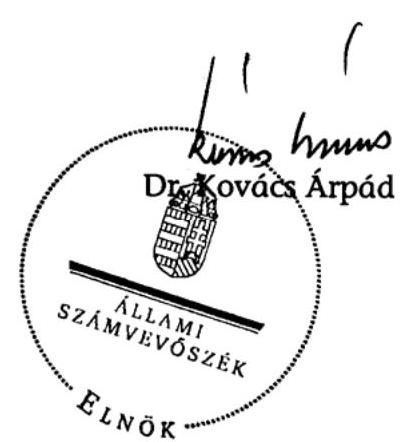

---

# MELLÉKLETEK 

a V-05-52/2007. sz. jelentéshez

---

1. sz. melléklet
2. sz. melléklet
3. sz. melléklet
4. sz. melléklet
5. sz. melléklet
6. sz. melléklet
7. sz. melléklet

Észrevételek
A polgári nemzetbiztonsági szolgálatok irányítása és költségvetési felügyelete 2004-ben
A polgári nemzetbiztonsági szolgálatok irányítása és költségvetési felügyelete 2006-ban
A polgári nemzetbiztonsági szolgálatok költségvetése és az NBI fejezeti kezelésú előirányzata 2003-2007 között
A polgári nemzetbiztonsági szolgálatok 2003. évi költségvetése és megoszlása
A polgári nemzetbiztonsági szolgálatok és az NBI által kezelt fejezeti kezelésú költségvetés és megoszlása 2007-ben
A polgári nemzetbiztonsági szolgálatok költségvetési létszáma 2003-2007 években

---

Polgári Nemzetbiztonsági Szolgálatokat Íránytító Tárca Nélküli Miniszter

$$
\begin{aligned}
& 3 . \text { lang } 21 \\
& 7 \times .17
\end{aligned}
$$

Dr. Kováes Árpád úrnak
elnök

Állami Számvevőszék

Tisztelt Elnök Úr!

Tájékoztatom, hogy a polgári nemzetbiztonsági szolgálatok pénzügyi-gazdasági ellenőrzéséről készített jelentésüket áttanulmányoztam, a jelentés megállapításaival, javaslataival egyetértek.

Ezúton szeretném megköszönni Önnek és munkatársainak alapos, tényszerü, alapvetően segítő szándékú ellenőrzési munkáját.

Budapest, 2007. október ${ }_{15} 15$,
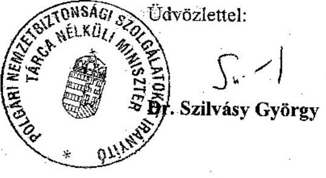

---

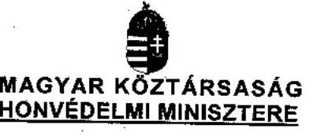
$V-05-56 / 2007$

1. számú példány

# Kezztis Vara 

## 27. 27.

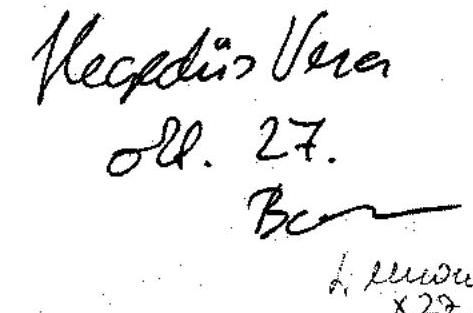

Dr. Kovács Árpád úr
Állami Számvevőszék
elnöke

## Budapest

## Tisztelt Elnök Úr!

A fenti hivatkozási számon részemre megküldött „Jelentés a polgári nemzetbiztonsági szolgálatok pénzügyi-gazdasági ellenőrzéséről" című tervezetet áttanulmányoztam, azzal egyetértek, észrevételt, kiegészítést nem teszek.

Köszönöm szíves tájékoztatását.
Budapest, 2007. október/17.-n
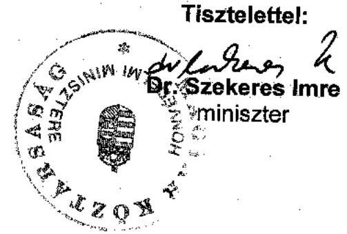

---

# A polgári nemzetbiztonsági szolgálatok irányítása és költségvetési felügyelete 2004-ben 

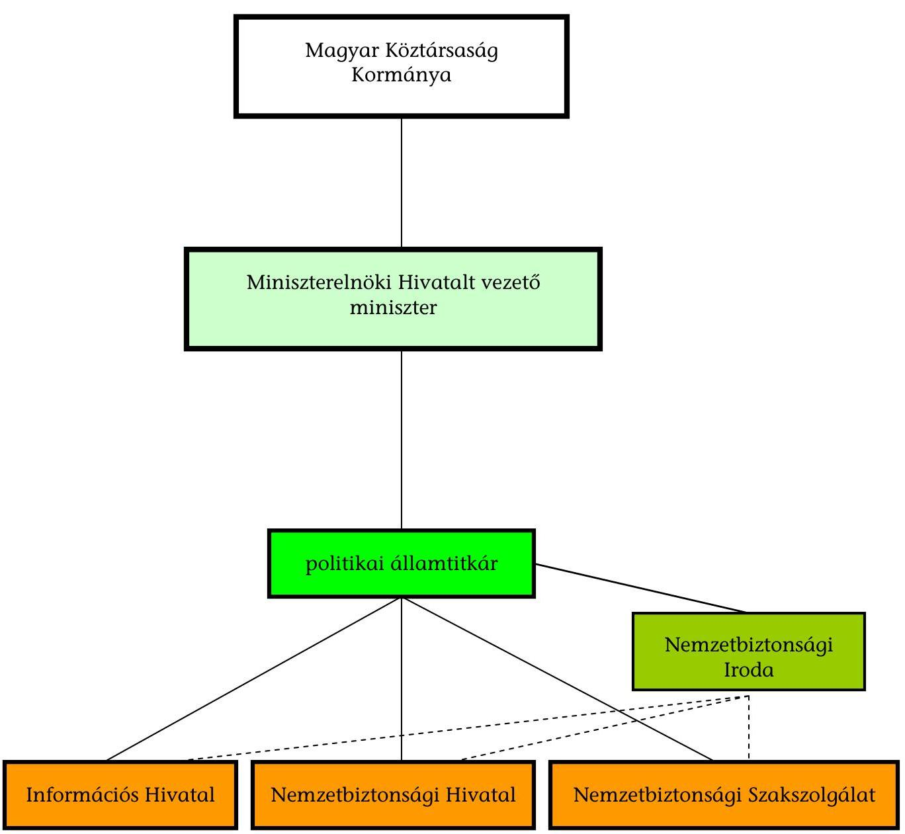
közvetlen irányítás
koordináció, ellenőrzés, részleges irányítás (miniszter által meghatározott, átruházott feladatok), közvetlen költségvetési felügyelet

---

# A polgári nemzetbiztonsági szolgálatok irányítása és költségvetési felügyelete* 2006-ban 

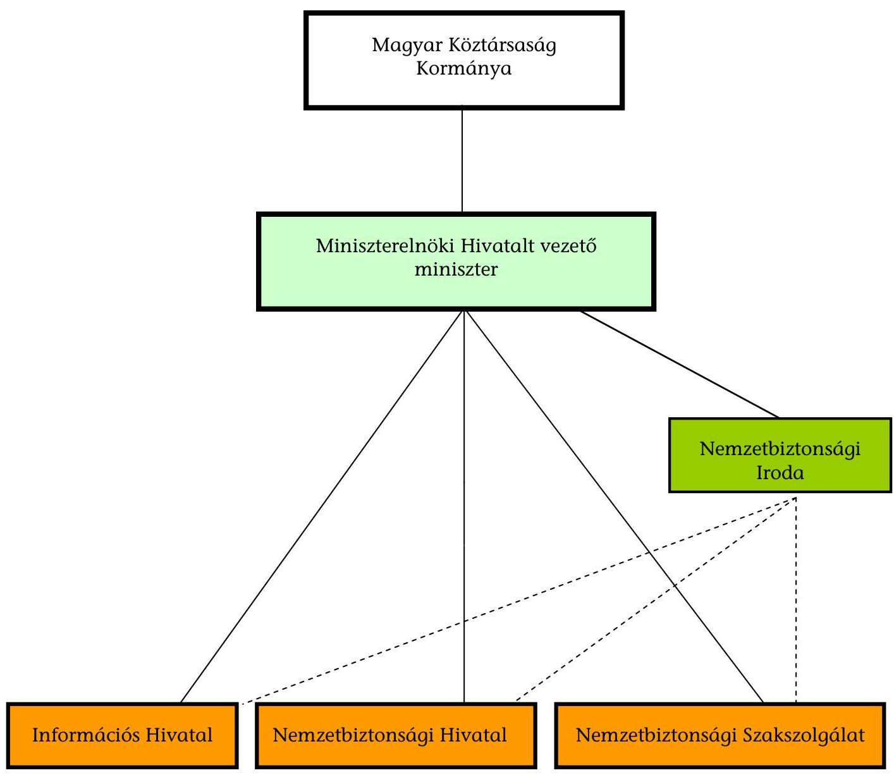
közvetlen irányítás
koordináció, ellenőrzés, részleges irányítás (miniszter által meghatározott, átruházott feladatok), közvetlen költségvetési felügyelet

[^0]
[^0]:    * a 2006. évi LVII. törvény, továbbá a 32/2004. (III. 2.) Korm. rendeletben alkalmazott fogalmaknak megfelelően

---

# A polgári nemzetbiztonsági szolgálatok költségvetése és az NBI fejezeti kezelésű előirányzata 2003-2007 között 

(érték: M Ft-ban)
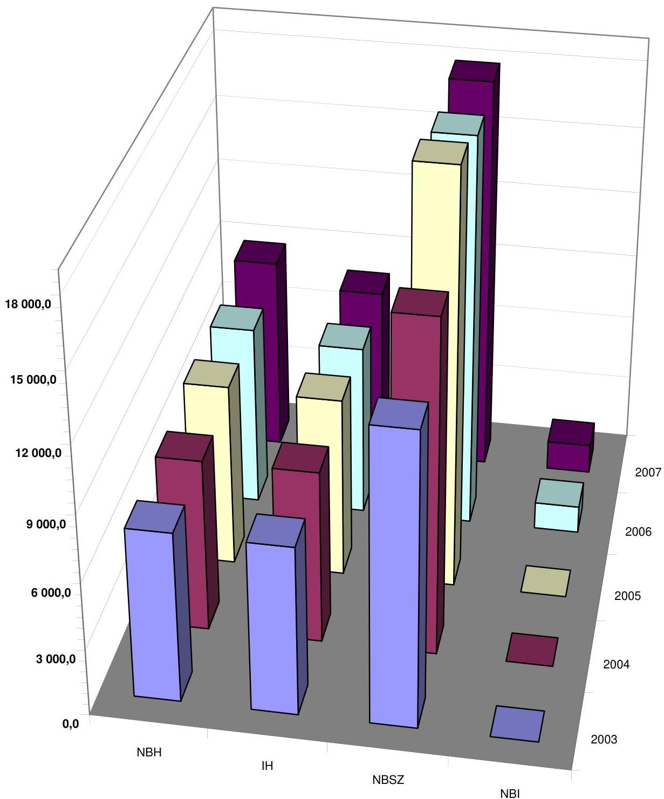

---

5. sz. melléklet a V-05-52/2007. sz. jelentéshez

A polgári nemzetbiztonsági szolgálatok
2003. évi költségvetése és megoszlása
(érték: M Ft-ban)

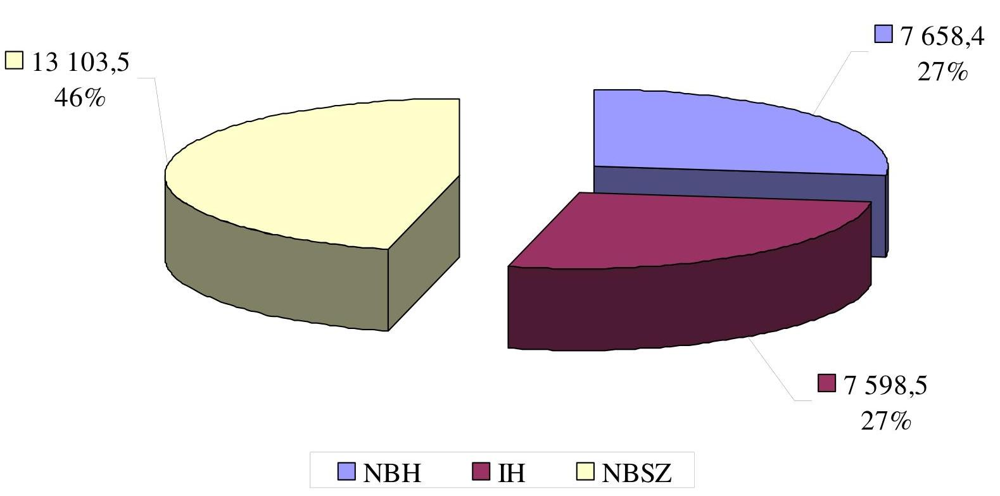

---

6. sz. melléklet a V-05-52/2007. sz. jelentéshez

**A polgári nemzetbiztonsági szolgálatok előirányzata és az NBI által kezelt fejezeti kezelésű költségvetés megoszlása 2007-ben**

(érték: M Ft-ban)

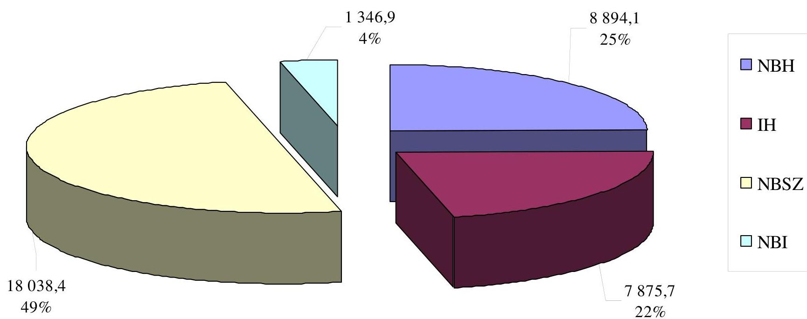

---

7. sz. melléklet a V-05-52/2007. sz. jelentéshez

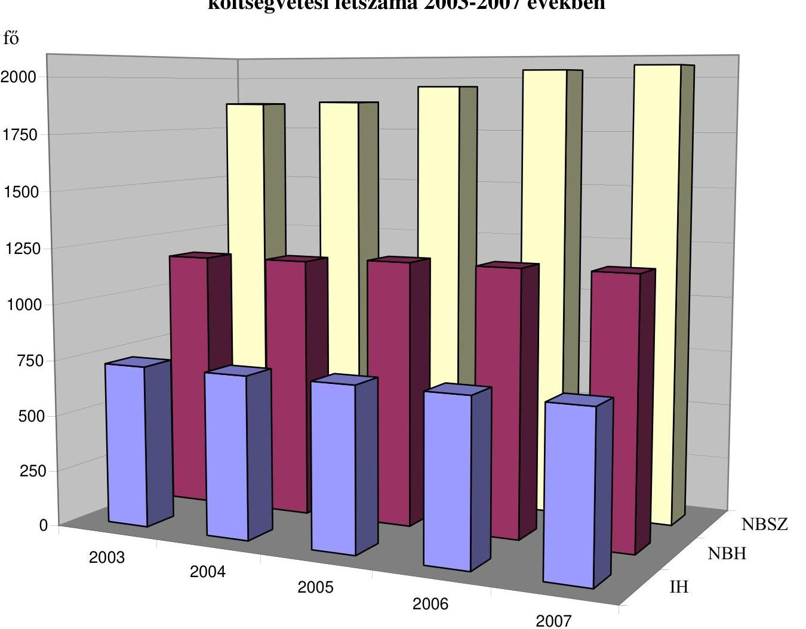

Budapest, 2007. október