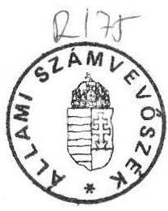
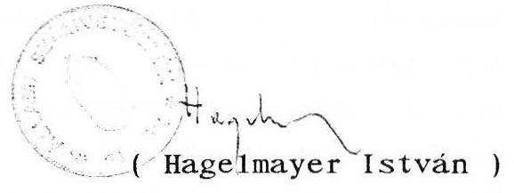

# Állami Számvevőszék

## ÖSSZEFOGLALÓ JELENTÉS

az 1991. november 20-ig végzett, a pártok gazdálkodása törvényességének ellenőrzési tapasztalatairól

---

Az összefoglaló jelentést

| Benti Gabriella | tanácsos |
| :-- | :-- |
| dr. Dotterweich Antal | tanácsos |
| dr. Elek János | tanácsos |
| dr. Szávai Tamás | tanácsos |
| Tóth István | számvevő |

készítette.

A vizsgálatot végzők nevét az elvégzett vizsgálatok sorrendjében a 2.sz. melléklet tartalmazza.

---

Állami Számvevőszék
V-26-29/1991.
Témaszám: 52

# ÖSSZEFOGLALÓ JELENTÉS

az 1991. november 20-ig végzett, a pártok gazdálkodása törvényességének ellenőrzés tapasztalatairól

I.

## A VIZSGÁLAT CÉLJA, IDŐSZAKA, REPREZENTÁCIÓ MÉRTÉKE, VIZSGÁLAT MÓDSZERE

1/ A pártok működéséről és gazdálkodásáról szóló törvény (továbbiakban: párttörvény) egyedüli szervezetként az Állami Számvevőszéket (továbbiakban: ÁSZ) jelölte ki a pártok gazdálkodása törvényességének ellenőrzésére. Az ÁSZ e törvény felhatalmazása alapján tervezte és végezte 1991. évi pártvizsgálatait.

A vizsgálat célja annak ellenőrzése volt, hogy a pártok gazdálkodása mennyiben felelt meg a párttörvény elvárásainak.

A vizsgálat alapvetően az 1990. évi gazdálkodásra terjedt ki, amelyet a vizsgálat végzésének időpontjáig terjedően az 1991. évi gazdálkodás ellenőrzése egészített ki.

Az ÁSZ 1991. évi vizsgálatainak középpontjában a lezárt 1990. évi gazdálkodásról készített pénzügyi zárómérleg állt, amelyet valamennyi pártnak 1991. március 31-ig a Magyar Közlönyben kellett megjelentetnie.

---

A reprezentáció mértékét, a pártok 1991. évi vizsgálatra kijelölését alapvetően a Pénzügyminisztériumtól kapott tájékoztatás határozta meg (1. sz. melléklet), hogy mely pártok részesültek 1989., illetve 1990-ben állami költségvetési támogatásban.

Az 1990-ben pártként működő szervezetek állami költségvetési támogatása - hasonlóan az 1989. évhez - a következőképpen alakult:

- Az Országgyűlés 1989. november 24-ei ülésén elfogadott döntése értelmében - a pártok előzetes megállapodása alapján az állami költségvetés támogatása az általános országgyűlési választásokig, az általuk bevallott taglétszám figyelembevételével normatív alapon történhetett. Így 1989-ben az újonnan alakuló pártok közül 15 részére több, mint 100 millió Ft, míg 1990-ben 42 szervezet részére több, mint 200 millió Ft költségvetési támogatás jutott az általános országgyűlési választásokig (1/a sz. melléklet).
- A pártok költségvetési támogatása az általános országgyűlési képviselői választások után már a párttörvény szabályai szerint alakult. Így a választásokon elért eredmények alapján 1990. májusától a 42 párt közül már csak 11 részesül - a párttörvényben előírt megosztás szerint - rendszeres állami költségvetési támogatásban a választási ciklus befejezéséig terjedő időszakra. 1990-ben a 11 párt közel 500 millió Ft állami támogatást kapott (1/b. sz. melléklet).

A helyszíni vizsgálatok megkezdése előtt 1991. áprilisában 36 további olyan párt is volt, amely egyáltalán semmiféle állami költségvetési támogatásban nem részesült, de a törvényi előírások szerint bizonyos beszámolási kötelezettsége van.

---

Tehát az ÁSZ-nak a rendelkezésére álló adatok szerint 1991-ben 78 párttal kellett foglalkoznia, ebből 42-vel részletesebben, 36-tal pedig meghatározott szempontok szerint.

2/ A vizsgálatok megkezdése előtt az ÁSZ 1990. évhez hasonlóan konzultációt tartott a finanszírozás kérdéseiről, az ellenőrzés módszereiről, a jogsértés feltárása esetén követendő eljárásról. Az eszmecsere segítette az egységesebb vizsgálati gyakorlat kialakítását, az érintett szervezetekkel való megfelelő együttműködést. A megbeszélésen mindazon szervezetek képviselői részt vettek (minisztériumok, bíróság, ügyészség, Országgyűlés Hivatala), akik ebben a kérdéskörben bármilyen formában érdekeltek voltak. A konzultáció eredményeként a Magyar Közlöny 1991. évi 28. számában - segítve a pártok felkészülését az ÁSZ hasonlóan a múlt évhez, megjelentette a vizsgálatok általános ellenőrzési programját.

A pártgazdálkodás törvényességének ellenőrzése a közzétett Általános Ellenőrzési Programban foglaltak szerint történt. Az ÁSZ ellenőrizte az 1990. évi gazdálkodásról közzétett pénzügyi zárómérleg teljességét, pontosságát, a könyvvezetés gyakorlatát, a pénzügyi zárómérleg bizonylati alátámasztottságát, a számvitel bizonylati rendjét. Ezt egészítette ki a párt által végzett gazdálkodó tevékenységnek, valamint az 1991. évi könyvvezetésnek szúrópróbaszerű ellenőrzése. Ennek alapján az ÁSZ ellenőrzése e körben elsősorban arra összpontosult, hogy a párt működéséhez szabályszerűen igénybevehető forrásokat használt-e fel, a párttörvényben előírt gazdálkodó tevékenységet folytatott-e, valamint betartotta-e a gazdálkodásukkal összefüggő pénzügyi-számviteli szabályokat. Az ellenőrzések alapján készült vizsgálati jelentések szerkezete is e tevékenység sorozatát követte. Ezek a pártonkénti, részletes vizsgálati alapjelentések az ÁSZ dokumentációs tárában megtalálhatóak. Külön-külön történő nyilvánosságra hozatalukat, csatolásukat - terjedelmi okokból - mellőzzük, a jelentéshez azonban rövid kivonatban utalunk a konkrét ellenőrzési megállapításokra is.

Törvényi felhatalmazás hiányában az ÁSZ nem vizsgálhatta a pénzfelhasználások célszerűségét. E tekintetben a párt csupán a tagság felé tartozik felelősséggel. Ezért a párttagok és a választott tisztségviselők közös érdeke és felelőssége, hogy a párt pénzfelhasználása és annak belső ellenőrzése racionálisan szabályozott módon valósuljon meg.

3/ A helyszíni vizsgálatokat az ÁSZ 1991. májusában kezdte meg.

Az I. félévben 8, míg a II. félévben, 1991. november 20-ig az ÁSZ 9 pártot ellenőrzött, tehát a jelen beszámoló 17 párt vizsgálati tapasztalatait foglalja össze. (A vizsgált pártok felsorolását a 2. sz. melléklet tartalmazza.)

Az I. félévben - egy párt kivételével - azoknak a pártoknak a vizsgálatára került sor, amelyek a taglétszám alapján normatív alapon megállapított, költségvetési támogatásban részesültek; a II. félévben többségében a párttörvény alapján költségvetési támogatásra jogosult párt vizsgálata történt meg.

Az eddig kialakított gyakorlatot követve - amely szerint az ÁSZ ősszel, illetve tavasszal teszi közzé a pártvizsgálatok eredményeit - az alábbiakban összegezhetők az 1991. november 20-ig befejezett ellenőrzések tapasztalatai.

---

# A VIZSGÁLATOK TAPASZTALATAI

A. / A párttörvény alapján állami költségvetési támogatásban részesülő pártok gazdálkodása ellenőrzése

A 42 állami költségvetési támogatásban részesült párt közül 11 párt az, amely 1990-ben taglétszám alapján is, illetve az általános választásokat követően a párttörvény szabályai szerint is részesült állami költségvetési támogatásban. E pártok közül az ÁSZ ebben az évben eddig 7 párt ellenőrzését végezte el (Agrárszövetség, Fiatal Demokraták Szövetsége, Független Kisgazda, Földmunkás és Polgári Párt, Kereszténydemokrata Néppárt, Liberális Polgári Szövetség /Vállalkozók Pártja/, Magyar Demokrata Fórum, Magyarországi Szociáldemokrata Párt).

Folyamatban van a Magyar Szocialista Munkáspárt és a Szabad Demokraták Szövetsége ellenőrzése, decemberben - az ún. Vagyonelemszámoltatási törvényben foglalt kötelezettségre is figyelemmel, azzal egyidejűleg - kerül sor a Magyar Szocialista Párt gazdálkodása vizsgálatára.

1/ A befejezett vizsgálatok tapasztalataiból általánosságban megállapítható - megerősítve az elmúlt évi tapasztalatokat -, hogy a vizsgált pártok egyikének sem volt megfelelő, teljeskörű és pontos pénzügyi zárómérlege.

Pártonként nézve változatos kép alakult ki. A kisebb pontatlanságtól a mérleg valamennyi sorának, adatának - kivéve az állami támogatás összegét - a tényleges állapottól való eltérésig minden - mint ezt a melléklet pártonkénti ismertetése tartalmazza - megtalálható volt.

---

Az alapvető gondot az okozta a pénzügyi zárómérleg elkészítésekor, hogy a közzétételre megadott határidőig nem állt valamennyi - a helyi szervezetek gazdálkodási adatait tartalmazó - információ a pártok rendelkezésére, így nem voltak képesek a mérleg teljeskörű elkészítésére.

Több zavart okozott az is, hogy nem egyértelmű és szakmailag vitatható a párttörvényben előírt pénzügyi zárómérleg tartalma. Ennek következtében a pártok a pénzügyi zárómérleget nem tudják valamennyi pártra nézve egységesen elkészíteni. Így a közzétett mérlegadatok egymással nem összehasonlíthatók.

Az ellentmondásokra és azok kiküszöbölésére az ÁSZ már több ízben - sikertelenül - felhívta az érintett állami szervek figyelmét. Kitöltési útmutató hiányában az ÁSZ csak az egyértelmű hibákat kifogásolta.

Ugyanakkor a vizsgálat egyes helyeken a szakértelem hiányából, a könyvvezetés rendezetlenségéből, a helyi szervezetek gazdálkodási adatait tartalmazó részjelentések nem megfelelő összegzéséből adódó, a tényleges állapottól eltérő adatok szerepeltetését is tapasztalta.

A közvélemény megfelelő tájékoztatását, a nyílt áttekinthetőséget szolgálja a párttörvény mérleg közzétételére vonatkozó garanciális szabálya. Az ÁSZ - az MDF kivételével - arra kényszerült, hogy a pártokat felszólítsa az 1990. évi gazdálkodásról készült pénzügyi zárómérleg ismételt elkészítésére, pontosítására és a Magyar Közlönyben való helyesbített közzétételére. Eddig ennek az Agrárszövetség és a Liberális Polgári Szövetség (Vállalkozók Pártja) tett eleget.

2/ A párttörvény külön is szabályozza, hogy a párt milyen gazdálkodó tevékenységet végezhet, abból milyen bevételre tehet

---

szert. A vizsgált 7 párt gazdálkodásában mindenütt tapasztalható volt, hogy a párttörvény előírásaitól kisebb-nagyobb mértékben eltérő gazdálkodási tevékenységet folytattak. Mivel a párttörvény a pártok gazdálkodását illetően többféle felfogás érvényesítésére ad lehetőséget, ezért az ÁSZ csak azokat a gazdasági eseményeket kifogásolta és tett törvényességi felhívást, amelyek vitathatatlan módon nem voltak összhangban a párttörvény szabályaival (pl. hitelek nyújtása; belkereskedelmi tevékenység folytatása; nem tulajdonában álló helyiségek bérbeadása stb).

Meg kell jegyezni azonban, hogy a párttörvény nem szankcionálja azokat az eseteket - eltérően a tiltott pénzforrások igénybevételétől -, amikor szabálytalan gazdálkodási tevékenységet végez a párt és ennek következtében jut bevételhez. E kérdés rendezését az ÁSZ a párttörvény módosításával szükségesnek tartja.

A párttörvény ismertetett, jelenlegi megfogalmazása következtében az ÁSZ által alkalmazható jogi eszköz, a törvényességi felhívás, csak a tiltott tevékenység felhagyására irányulhatott. Így azokban az esetekben, amikor a párt már felhagyott tiltott gazdálkodási tevékenységével, külön felhívás kiadását az ÁSZ már nem tartotta indokoltnak, de az eseményt a vizsgálati jelentésekben rögzítette. (Pl. Agrárszövetség könyvértékesítése, FIDESZ egyik alapszervezetének helyiségbérbeadása, Liberális Polgári Szövetség /Vállalkozók Pártja/ hitelnyújtása, stb. esetében.)

Az eddig vizsgált 4 parlamenti párt esetében gondot okozott, hogy a parlamenti frakciók részére biztosított szakértői díjakat - a Független Kisgazda, Földmunkás és Polgári Párt kivételével - a pártok bankszámlájára utalták. Ennek következtében az MDF és FIDESZ ezt az összeget az állami támogatások között szerepeltette, míg a Kereszténydemokrata Néppárt nem tüntette fel a közzétett pénzügyi zárómérlegben. A kialakult gyakorlatot a vizsgálat törvényellenesnek tartja, mivel az országgyűlési képviselők tiszteletdíjáról, költségtérítéséről és kedvezményeiről szóló törvény szerint az összeg a pártok képviselőcsoportjait illeti meg, és a pénz kezelésére az Országgyűlés Hivatala jogosult.

A jelenlegi helyzetben a pártokhoz utalt szakértői díj törvényellenes többlettámogatást biztosít, mivel a kamatok a párt vagyonát gyarapítják, továbbá lehetőséget ad átmeneti likviditási problémák megoldásához, amelyre egyébként hitelt kellene felvenni.

3/ Az ÁSZ - az Agrárszövetség és a Liberális Polgári Szövetség (Vállalkozók Pártja) kivételével - 5 vizsgált pártnál már másodízben végzett ellenőrzést. A Független Kisgazda, Földmunkás és Polgári Pártnál az általános vizsgálatot közvetlenül megelőzően célvizsgálatra is sor került, amelynek célja a párt által megküldött könyvszakértői jelentésnek egyes vonatkozásokban tett megállapításainak felülvizsgálata volt. A célvizsgálat gazdálkodásra vonatkozó megállapításait megerősítve, az ÁSZ részéről realizáló intézkedések megtételére az átfogó törvényességi vizsgálat befejezését követően, annak megállapításaira is figyelemmel került sor.

A vizsgálat azt tapasztalta, hogy az előző vizsgálati megállapításokra is figyelemmel a pártok törekedtek pénzügyi-gazdasági rendszerük szakszerű, rendezett kiépítésére, a megalakulás gazdálkodási gyermekbetegségeinek kiküszöbölésére.

Így pl. a FIDESZ külső szervezetet bízott meg könyvvezetéssel, amely korszerű számítógépes háttérrel rendelkezik; a Kereszténydemokrata Néppárt szakképzett és bővített létszámú gazdasági vezetést alkalmazva, áttérve az egyszerűsített kettős könyvvezetés számítógépes rendszerére, felszámolta a korábbi gazdasági év hiányosságait; a Magyar Demokrata Fórum, amelynek valamennyi helyi szervezete önálló jogi személy, az egységes gyakorlat kialakítása érdekében számos írásbeli tájékoztatót, segédanyagot, szakmai utasítást készített és küldött szervezeteinek.

Kedvezőtlen állapotokat talált a vizsgálat a Független Kisgazda, Földmunkás és Polgári
 Pártnál, valamint a Magyarországi Szociáldemokrata Pártnál. A Független Kisgazda, Földmunkás és Polgári Párt gazdálkodása szervezettségében visszaesést és - különösen az országos központban - rendezetlen könyvvezetést tapasztalt a vizsgálat. A Magyarországi Szociáldemokrata Párt az előző vizsgálati jelentésben feltárt hibákat, melyek megszüntetésére az ellenőrzés felhívta a párt vezetésének figyelmét, nem szüntette meg, sőt további szabálytalanságokat követett el.

A Kisgazda, Földmunkás és Polgári Pártnál a vizsgálati tapasztalatok alapján - a személyi felelősség megállapítására is irányuló - jogi lépések előkészítése folyamatban van, míg a Magyarországi Szociáldemokrata Párt esetében az ÁSZ elnöke a Legfőbb Ügyészhez fordult, hogy a párttörvény alapján indítson keresetet a párt ellen, illetve a felelőssé tett személyekkel szemben tegye meg a szükséges intézkedéseket.
B./ Az országgyűlési határozatnak megfelelően csak a bevallott taglétszám alapján normatív alapon állami költségvetési támogatást kapott pártok gazdálkodásának ellenőrzése

1/ 42 állami költségvetési támogatásban részesült párt közül 31 csak az általános képviselő választásokig, a bevallott taglétszám alapján kapott normatív támogatást. Itt a legváltozatosabb a kép az ellenőrzéseknél.

---

Nagyon sok gondot okozott az ellenőrzés tervezésénél, hogy a vizsgálandó pártokról nem állt elegendő információ az ÁSZ rendelkezésére. Ezért a vizsgálatok előkészítése érdekében az ÁSZ külön információt kérő levéllel kereste meg a párt bejegyzett képviselőjét.

Nehezítette a vizsgálatok előkészítését az is, hogy a társadalmi szervezetek nyilvántartására vonatkozó igazságügyi miniszteri rendelet nem rendelkezik az adatokban bekövetkezett változások bejelentési határidejéről. Ennek következtében a nyilvántartásban szereplő adatok nem minden esetben naprakészek. A jogszabály alapján a nyilvántartásban a pártok székhelyének megnevezéseként elég csak az adott helységnevet szerepeltetni, így a képviselőváltozás esetén a párt székhelyére való címzés nehézségekbe ütközött. Mindez a vizsgálatok előkészítését megnehezítette és nagy időveszteséget eredményezett.

Nem kedvezett az ellenőrzések tervezésénél az sem, hogy a 31 párt közül a párttörvényben előírt március 31-i határideig mindösszesen csak 9, az ÁSZ törvényességi felhívása eredményeként napjainkig újabb 8 párt jelentette meg utólag 1990. évi gazdálkodásáról készült pénzügyi zárómérlegét, a többi azóta sem reagált. (A közzétételnek azért is volt külön jelentősége, mivel az ÁSZ megfelelően dokumentált, lezárt gazdasági évet ellenőrzött.)

Az előkészítési munkák eredményeként 10 párt törvényességi vizsgálata fejeződött be, a vizsgált pártok felsorolását a 2. sz. melléklet tartalmazza.

---

2/ A befejezett vizsgálatok alapján általánosságban az alábbiak állapíthatók meg.

A vizsgált pártok - a Magyar Néppárt-Nemzeti Parasztpárt, a Május 1. Társaság (Münnich Ferenc Társaság) és a Szociáldemokrata Párt kivételével - csak 1990 I. negyedévben a bevallott taglétszám arányában, pártonként mindössze 2 millió Ft állami támogatást kaptak. Az ÁSZ-nak nem volt módja az igényléskori tényleges létszám ellenőrzésére, mivel az országgyűlési határozat nem írta elő kötelezettségként a pártok számára taglétszámuk utólagosan ellenőrizhető módon történő rögzítését.

E pártokra alapvetően a minimális taglétszám és kevés pénzforgalom a jellemző. Nagymértékben befolyásolta ezen pártok működését, hogy a választásokon nem értek el értékelhető eredményt, és így további állami költségvetési támogatásban nem részesültek. Mivel az állami támogatáson kívül számottevő bevétellel nem rendelkeztek, gazdálkodó tevékenységet egyáltalán nem végeztek, jellemzően felélték a kapott állami költségvetési támogatást. Így a Szabadságpárt, valamint a Természet és Társadalomvédők Szövetsége 1991-ben már semmilyen gazdasági eseményt nem rögzített, mivel sem kiadásuk, sem bevételük nem volt.

A Magyar Szabadságpárti Szövetség esetében arra is volt példa, hogy nem költötték el az állami költségvetési támogatást, hanem annak teljes összegét letéti jegyben tartották. Ez az oka annak, hogy ebben az évben a pártnak sem bevétele, sem kiadása nem volt.

Az első bekezdésben már említett három párt kivételével az ÁSZ a további 7 pártnál először tartott vizsgálatot. Az állami költségvetési támogatás nagyságrendjére tekintettel a pénzügyi

---

zárómérleg teljeskörűségének biztosítása általában nem okozott nehézséget, elkészítésénél alapvetően csak pontatlanságokat tapasztalt az ellenőrzés, amelyek részben a szakértelem, részben a kitöltési útmutató hiányából adódott. Így a vizsgálat pontatlanság miatt csak 3 párt esetében (Magyar Liberális Párt; Magyar Republikánus Szegények Pártja; Nyugdíjasok Pártja/Nemzedékek Pártja/) tartotta indokoltnak az 1990. évi gazdálkodásról készült pénzügyi zárómérleg ismételt pontosított elkészítését, illetve Magyar Közlönyben történő megjelentetését.

Az ellenőrzés a vizsgálati jelentésekben a legtöbb észrevételt, hiányosságot a könyvvezetéssel, a bizonylati fegyelemmel, nyilvántartások vezetésével kapcsolatban rögzítette. Az ellenőrzés különösen az alábbiakat kifogásolta, amelyek megszüntetésére külön törvényességi felhívással is élt:

- a Magyar Szabadságpárti Szövetség, a Szabadságpárt az előírt naplófőkönyv helyett időszaki pénztárjelentést, míg a Magyar Liberális Párt 1991. évben havi összesítő kimutatást vezetett;
- A Magyar Republikánus Szegények Pártja hiányosan kitöltött nem megfelelő bizonylatok alapján, valamint 1991. évben nem naprakészen könyvelt.

A tapasztalt hiányosságok alapvető oka az volt, hogy a pártok pénzügyeik intézését - helyzetükből következően - nem tudták megfelelő szakértelemmel végezni. Szakemberek hiányában több pártnál a vezetők intézték a pénzügyeket, esetenként önként vállalkozó, szívességből segítő aktivisták közreműködésével.

---

Az ÁSZ a Magyar Néppárt-Nemzeti Parasztpártnál, a Május 1. Társaságnál (Münnich Ferenc Társaság) és a Szociáldemokrata Pártnál másodízben végzett ellenőrzést. E három párt már 1989. évben - szintén a bevallott taglétszám alapján - részesült állami költségvetési támogatásban. Helyzetük sajátosabb a csoporton belül, amit az állami költségvetési támogatás nagysága is indokol. A vizsgálati jelentések alapján a pártonkénti összegezések a 4. sz. mellékletben találhatók.

3/ A nem vizsgált többi 20 állami költségvetési támogatásban részesült szervezettel kapcsolatban az alábbiak voltak megállapíthatók.

- Az állami költségvetési támogatást kapott pártok közül 5 társadalmi szervezetté alakult át, kikerülve ezzel az ÁSZ ilyen jellegű ellenőrzési hatásköréből. Erre a párttörvény - éppen a pártvagyon védelme miatt - nem ad lehetőséget, az átalakulás megakadályozására csak törvényességi óvás keretében bírói út igénybevételével van mód.

Az ÁSZ kezdeményezésére a Legfőbb Ügyészség törvényességi óvással élt a Magyar Liberális Néppárt esetében a törvénytelen átalakulás miatt. A Legfelsőbb Bíróság helyt adott a törvényességi óvásnak. Ezzel a döntéssel a bíróság megakadályozta, hogy a párt társadalmi szervezetként tovább működhessen.

A Magyar Liberális Néppárt esetében az a sajátos helyzet alakult ki, hogy a bírósági döntés eredményeként az eredeti kérelem lépett hatályba, amely szerint a bíróság a párt feloszlását tudomásul vette. Ebben az esetben viszont a gondot az okozza, hogy nem rendezhető a párttörvény jelenlegi szabályai szerint a párt vagyonának további sorsa.

---

Ugyanis ha a párt jogutód nélkül megszűnik, nincs aki a vagyonnal rendelkezzen, e kérdésben joghiány van. A konkrét ügyben az ÁSZ elnöke és a Legfőbb Ügyész a Kormány elnökénél együttesen kezdeményezte a jogszabályi rendezést, tekintettel arra, hogy a párt után több, mint 1 millió Ft készpénz maradt zárolva.

- Az ÁSZ nem végzett vizsgálatot a Magyar Nemzeti Kereszténydemokrata Munkáspártnál. A szervezet szintén részesült ugyan állami támogatásban, de nem tett eleget annak a kötelezettségének, hogy a megadott határidőre pártá alakuljon és bejegyeztesse magát az illetékes bíróságon. Ezért ellenük a Pénzügyminisztérium eljárást kezdeményezett csalás büntetése miatt az ügyészségnél, amely amnesztia miatt az eljárást megszüntette.
- A Szövetség a Faluért a Vidékért Párt elnevezésű szervezet szintén részesült a múlt évben költségvetési támogatásban. Az adatok egyeztetése során kiderült, hogy a szervezet társadalmi szervezetként van nyilvántartva a bíróságon, így nem tartozik az ÁSZ pártellenőrzési hatáskörébe. Tisztázásra vár, hogy milyen jogcímen, mi alapján kapott támogatást a szervezet.
- Magyar Radikális Pártnál még 1990. szeptemberében az együttműködés és a dokumentumok hiánya miatt nem volt lehetséges a teljeskörű ellenőrzés. Mivel a párt többszöri felszólítás ellenére sem teremtette meg a vizsgálat végleges lezárásának lehetőségét, a szükséges intézkedések megtétele érdekében az ÁSZ az ügyet áttette a Fővárosi Főügyészséghez. A Főügyészség keresetet indított a párt ellen, aki majd egy éves késéssel az 1991. szeptember 27-i bírósági tárgyalás előtt két nappal beküldte dokumentumait az ÁSZ-nak. További intézkedésre az ismételt ellenőrzés megállapításai alapján kerül sor.

---

- A Független Szociáldemokrata Párt, a Keletnépe Párt - Kereszténydemokraták, a Magyarországi Cigányok Szociáldemokrata Pártja, a Magyar Demokrata Keresztény Párt, Magyar Nemzeti Párt és a Magyar Oktober Párt nem tett eleget a párttörvény előírásainak és 1990. évi gazdálkodásuk pénzügyi mérlegét nem készítette el és nem jelentette meg a Magyar Közlönyben.

A Magyarországi Cigányok Szociáldemokrata Pártja azt jelezte, hogy valamennyi pénzügyi dokumentációját 1991. februárban a párt gépkocsijából ellopták. Jelezte továbbá, hogy a párt azóta megszűnt, nem folytat gazdálkodó tevékenységet, székházzal nem rendelkezik.

A Magyar Demokrata Keresztény Pártnál a bejegyzett képviselő személyében, valamint székhelyében változás van folyamatban, így nem lehet tudni, hogy jelenleg ki a párt képviselője és hol lehet a vizsgálatot lebonyolítani.

A Kelet Népe Párt-Kereszténydemokraták régi könyvelője per miatt - visszatartja a párttal kapcsolatos dokumentációkat, amely akadálya a vizsgálat lefolytatásának.

Az ÁSZ végsősoron mind a 6 esetben amennyiben az ellenőrzés feltételei nem biztosítottak, az ügyészség útján kezdeményezni fogja a bírósági eljárás megindítását a párt ellen.

Hat párt esetében adott minden lehetőség az ellenőrzés lefolytatására, amelyre valószínűleg 1992. I. félévében kerül sor, továbbá jelenleg egy párt a Független Köztársasági Párt vizsgálata folyamatban van.

---

# C. / Tapasztalatok az állami támogatásban nem részesült pártok gazdálkodásával kapcsolatban 

Az állami támogatásban nem részesülő 36 pártról az ÁSZ semmilyen információval nem rendelkezett, mivel a Baloldali Revízió Párt kivételével egyikük sem tette közzé - a párttörvény előírásaival ellentétben - elmúlt évi gazdálkodásuk pénzügyi zárómérlegét. Ezért valamennyi érintett párt bejegyzett képviselőjét írásban megkereste az ÁSZ, kérve a megfelelő információ, dokumentáció rendelkezésre bocsájtását, valamint felhívta figyelmüket az 1990. évi gazdálkodás pénzügyi zárómérlegének elkészítésére és a Magyar Közlönyben való megjelentetésére.

A megkeresett 36 párt képviselője közül eddig mindösszesen 17 válaszolt és ezek közül a felhívásra 6 párt tette közzé utólag pénzügyi zárómérlegét. A válaszával egyidejűleg 2 párt intézkedett pártjuk megszüntetéséről és erről adott tájékoztatást. Kiderült továbbá, hogy 3 párt időközben társadalmi szervezetté alakult át.

A beérkezett válaszokból, telefonokból egyértelműen kiderül, hogy az állami költségvetési támogatásban nem részesült pártok gyakorlatilag gazdálkodó tevékenységet nem végeznek, a pénzmozgásuk minimális, könyvelést többségében nem végeznek, és számos gonddal küzdenek. Mivel támogatást nem kapnak, így nem is igen érzik magukra nézve kötelezőnek a párttörvényből adódó szabályokat, illetve nem is ismerik a működésükre, pénzügyi gazdálkodásukra vonatkozó egyéb szabályokat.

---

# III. 

## ÖSSZEGZÉS, JOGI SZABÁLYOKKAL KAPCSOLATOS ÉSZREVÉTELEK

Az eddig lefolytatott valamennyi vizsgálatra megállapítható, hogy az előző évi vizsgálatok során készült jelentésben foglaltakhoz képest - egyes parlamenti pártok kivételével - nem változott kedvezően a helyzet. Továbbra is érvényesek az elmúlt évben tett ÁSZ megállapítások - különösen a normatív alapon állami költségvetési támogatásban részesülő pártoknál -, hogy a pártok nem rendelkeznek megfelelő pénzügyi apparátussal, hozzáértő szakemberekkel, a jelenleg érvényes pénzügyi, számviteli szabályok nem alkalmazhatók maradéktalanul a pártok gazdálkodására, valamint a párttörvény szövegezése nem minden esetben egyértelmű, az abban előírt pénzügyi zárómérleg tartalma nem megfelelő. Gondot okoz az is, hogy a párttörvény a pártok
 gazdálkodására vonatkozó előírásra a lehető legváltozatosabb felfogások érvényesítésére ad lehetőséget. Nem rendezett a parlamenti frakciók részére biztosított szakértői díjak kifizetése, átutalása, stb.

Az ÁSZ ez évben is, hasonlóan mint a múlt évben jelezte, hogy indokoltnak tartja a párttörvény és a kapcsolódó jogszabályok felülvizsgálatát és szükségszerű módosítását, amihez lehetőségei között - mint eddig is - minden segítséget, beleértve a közvetlen konzultációt is megad. Ezzel kapcsolatos - Kormány felé tett - figyelemfelhívó kezdeményezéseit és javaslatait fenn tartja.

---

Az Állami Számvevőszék tapasztalatai alapján ismételten felhívja a Pénzügyminisztérium figyelmét, hogy a pártok sajátosságaira figyelemmel a pártok beszámolási rendszerrel összhangban lévő könyvvezetését alakítsa ki, vagy a hatályos jogszabályok módosítását hajtsa végre. Így különösen a társadalmi szervezetek gazdálkodó tevékenységéről, a könyvvitel rendjéről, valamint a mérleg- és vagyonkímutatásról szóló jogszabályokat hozza összhangba a pártok gazdálkodásával.

Budapest, 1991. november

---

ÁLLAMI SZÁMVEVŐSZÉK

MELLÉKLETEK

---

# TARTALOMJEGYZÉK 

1. 1/a sz. melléklet

Kimutatás a pártok 1989. és 1990. évi állami támogatásáról
2. 1/b sz. melléklet

Kimutatás a pártok működéséről és gazdálkodásáról szóló törvény alapján támogatásra jogosult pártok 1990. évi támogatásának mértékéről.
3. 2.sz. melléklet

Az Állami Számvevőszék 1991. évi november 20-ig pártoknál végzett vizsgálatai
4. 3.sz. melléklet

A vizsgált pártok rövid tartalmi leírása
5. 4.sz. melléklet

A vizsgált pártok rövid tartalmi leírása
6. 5.sz. melléklet

Az 1991. márciusában készült ÁSZ szövegszerinti módosító javaslata a párttörvényhez

---

# KIMUTATÁS 

a pártok 1989. és 1990. évi állami támogatásáról

## Ft-ban

1989-ben kiutalt 1990-ben a tag- választásokra
Párt neve
támogatás
létszám alapján kiutalt támogatás

1. AGRÁRSZÖVETSÉG

- 10.000.000
6.550.000
2. Félegyházi Demokratikus Ifjúsági Szöv. - 12.500
3. Fiatal Demokraták Szövetsége
4.000.000
7.000.000
7.308.333
4. Független Kisgazda Földmunkás és Polgári Párt
15.000.000
15.000.000
9.325.000
5. Független Köztársasági Párt
6. Független Magyar Demokrata Párt
6.000.000
7.000.000
175.000
7. Független Szociáldemokrata Párt
8. Hazafias Választási Koalíció
9. Kelet Népe Párt-Kereszténydemokraták
10. Kereszténydemokrata - Néppárt
11. Kereszténydemokraták Szövetsége
12. Magyar Demokrata Fórum
15.000.000
15.000.000
13. Magyar Demokrata Ke- $15.000.000$
14. Magyar Dolgozók Demok- $4.000.000$
15. Magyar Függetlenségi Párt
16. Magyar Humanisták Pártja
17. Magyar Liberális Néppárt
18. Magyar Liberális Párt
19. Magyar Nemzeti Párt
20. Magyar Néppárt
2.000.000
2.000.000
25.000
25.000
200.000
25.000.000
200.000
2.000.000
2.000.000
2.000.000
200.000
2.000.000
2.000.000
2.000.000
2.000.000

---

|  Ft-ban |  |  |  |  |   |
| --- | --- | --- | --- | --- | --- |
|  Párt neve | 1989-ben kiutalt támogatás | 1990-ben a tag létszám alapján kiutalt támogatás | választásokra kiutalt támogatás |  |   |
|  21. Magyar Október Párt | - | 2.000.000 | - |  |   |
|  22. Magyar Politikai Foglyok Szövetsége | 8.000.000 | 15.000.000 | 75.000 |  |   |
|  23. Magyar Radikális Párt | 1.250.000 | 4.000.000 | - |  |   |
|  24. Magyar Republikánus Párt Győri Szervezete | - | 2.000.000 | - |  |   |
|  25. Magyar Szabadságpárti Szövetség | - | 2.000.000 | - |  |   |
|  26. Magyar Szocialista Munkáspárt | - | 15.000.000 | 7.600.000 |  |   |
|  27. Magyar Szocialista Párt | - | 15.000.000 | 9.500.000 |  |   |
|  28. Magyarországi Cigányok Szociáldemokrata Pártja | - | 10.000.000 | 25.000 |  |   |
|  29. Magyarországi Szociáldemokrata Párt | 15.000.000 | 10.000.000 | 6.737.500 |  |   |
|  30. Magyarországi Szövetkezeti és Agrárpárt | - | 2.000.000 | 250.000 |  |   |
|  31. Magyarországi Zöld Párt | 2.000.000 | 2.000.000 | 800.000 |  |   |
|  32. Nemzedékek Pártja | - | 2.000.000 | 25.000 |  |   |
|  33. Nemzeti Kisgazda és Polgári Párt | - | 4.000.000 | 650.000 |  |   |
|  34. Szabad Demokraták Szövetsége | 7.000.000 | 10.000.000 | 9.533.333 |  |   |
|  35. Szabadságpárt | - | 2.000.000 | 300.000 |  |   |
|  36. Szent Korona Társaság | - | - | 125.000 |  |   |
|  37. Szociáldemokrata Párt | - | 7.000.000 | - |  |   |
|  38. Szövetség a Faluért- a Vidékért | - | 2.000.000 | 100.000 |  |   |
|  39. Természet és Társadalomvédők Szövetsége | - | 2.000.000 | 50.000 |  |   |
|  40. Területi Demokratikus Ifjúsági Szervezet | - | - | 12.500 |  |   |
|  41. Újmagyarok Igazság Pártja | - | 7.000.000 | - |  |   |
|  42. Vállalkozók Pártja | - | 10.000.000 | 4.300.000 |  |   |
|  43. VOKS HUMANA Mozgalom | - | 2.000.000 | - |  |   |
|  44. Münnich Ferenc Társaság | 8.000.000 | - | - |  |   |
|  45. Magyar Nemzeti Keresztény-demokrata Munkáspárt | 200.000 | - | - |  |   |
|  46. Vidéki Magyarországért Párt |  | 2.000.000 | 25.000 |  |   |

---

# Kimutatás 

a pártok működéséről és gazdálkodásáról szóló törvény alapján támogatásra jogosult pártok 1990. évi támogatásának mértékéről

Felosztható támogatás
472.250 ezer Ft

- ennek 25%-a

118.062 ezer Ft
75%-a
354.188 ezer Ft

| 1 párt megnevezése | Felosztható támogatás |  |  | Pártot megillető támogatás éves |
| :--: | :--: | :--: | :--: | :--: |
|  | 25%-a egyen- 10 arányban | 75 % - a   részesedés részesedés %-ban Ft-ban |  |  |
| Magyar Demokrata Fórum | 16.866 | 25,41 | 89.999 | 106.865 |
| Szabad Demokraták Szövetsége | 16.866 | 23.09 | 81.782 | 98.648 |
| Független Kisgazda-, Földmunkás és Polgári Párt | 16.866 | 11.95 | 42.325 | 59.191 |
| Magyar Szocialista Párt | 16.866 | 11.24 | 39.811 | 56.677 |
| Fiatal Demokraták Szövetsége | 16.866 | 7.50 | 26.564 | 43.430 |
| Kereszténydemokrata Néppárt | 16.866 | 6.54 | 23.164 | 40.030 |
| Magyar Szocialista Munkáspárt | - | 3.40 | 12.042 | 12.042 |
| Agrárszövetség | 16.866 | 3.29 | 11.653 | 28.519 |
| Magyarországi Szociáldemokrata Párt | - | 3.00 | 10.626 | 10.626 |
| Hazafias Választási Koalíció | - | 2.72 | 9.634 | 9.634 |
| Vállalkozók Pártja | - | 1.86 | 6.588 | 6.588 |
| Összesen | 118.062 | 100.00 | 354.188 | 472.250 |

---

Az Állami Számvevőszék 1991. évi november 20-ig pártoknál végzett vizsgálatai

| A párt megnevezése | A vizsgálat időpontja | az ÁSZ részéről a vizsgálatot végezték | az ÁSZ kezdeményezett intézkedése |
| :--: | :--: | :--: | :--: |
| Magyarország Szövetkezeti- és Agrárpárt | 1991. május | dr. Szávai Tamás Szabó Béla | Pénzügyi Zárómérleg pontosított ismételt megjelentetése |
| Nemzedékek Pártja /Nyugdijasok Pártja | 1991. május | dr. Szávai Tamás Szabó Béla | Pénzügyi Zárómérleg pontosított ismételt megjelentetése |
| Magyar Republikánus Párt Győri szervezete | 1991. június | dr. Szávai Tamás Szabó Béla | Pénzügyi Zárómérleg pontosított ismételt megjelentetése |
| Magyar Szabadságpárti Szövetség | 1991. június | Rosy Lajosné Tóth István | A szabálytalan könyvvezetés helyett a jogsz.-ban előírt könyvvezetés teljesítésére felh. |
| Vállalkozók Pártjai /Liberális Polgári Szövetség/ | 1991. június | Benti Gabriella dr.Dotterweich Antal | Jogszabályba ütköző, tiltott gazdálkodási tevékenység megszüntetésére felhívás |
| Május I Társaság/ Münnich Ferenc Társaság/ | 1991. június | Benti Gabriella dr.Dotterweich Antal | Pénzügyi Zárómérleg pontosított ismételt megjelentetése |
| Magyar Liberális Párt | 1991. június | Benti Gabriella dr.Dotterweich Antal | 1989. évi gazd.-ról pü-i zárómérleg megjelentetésére, 1991.évre vonatkozó könyvvezetési kötelezettség teljes. felh. |
| Magyar NéppártNemzeti Parasztpárt | 1991. június | Benti Gabriella dr.Dotterweich Antal | Jogszabályellenesen nyújtott hitel szerződésének felmondására, jogsz.-ban tiltott gazd-ó tev. megszüntetésére felh. |
| Fiatal Demokraták Szövetsége | 1991. július | dr. Dotterweich Antal dr. Elek János | Pénzügyi Zárómérleg pontosított ismételt megjelentetése |
| Magyar Radikális Párt | 1990. szeptember | dr.Dotterweich Antal dr. Elek János | A vizsgálat meghiúsítása miatt ügyészi keresetindítás kezdeményezése |
| Magyar Demokrata Fórum | 1991. július | dr. Szávai Tamás Bárcsai Tibor | Intézkedés kezdeményezésére nem volt szükség |

---

|  |   |   |   |
| --- | --- | --- | --- |
|  Szociáldemokrata | 1991. augusztus | dr. Elek János Rosy Lajosné Tóth István | - Felhívás a tény, állapotnak megfelelően helyesbíteni a naplófőkönyvet, a pontosított Pü-i Zm. megjelentetésére felhívás - Felelősség felvetése 1 fővel szemben  |
|  Párt |  |  |   |
|  Magyarországi | 1991. szeptember | Benti Gabriella Rosy Lajosné | Három személyel szemben felelősség felvetése, bírósági eljárás indítványozása  |
|  Szociáldemokrata |  |  |   |
|  Párt |  |  |   |
|  Kereszténydemokrata | 1991. október | Benti Gabriella Rosy Lajosné | A pontosított Pü-i Zm. ismételt megjelentetésére és a pénztárhiányok és egyéb tartozások rendezésére felh.  |
|  Néppárt |  |  |   |
|  Szabadságpárt | 1991. október | Tóth István Bárcsai Tibor | A könyvvezetésben és a bizonylatrendben tapasztalt jogsz. sértő gyakorlat felszámolására felhívás  |
|  Természet- és Társadalomvédők Szövetsége Párt | 1991. október | Tóth István Bárcsai Tibor | - " -  |
|  Független Kisgazda Földmunkás- és Polgári Párt |  | dr. Szávai Tamás dr. Dotterweich Antal dr. Elek János Bárcsai Tibor | - Felelősség felvetése 4 fővel szemben - Felhívás zárt könyvelési rend kialakítására, Pü-i Zm. ismételt megjelentetésére jogszabálytól eltérő gazd. tev. megszüntetésére, névtelen adományok összegének ktg. vetésbe befizetésére  |

- A felsoroltak a gazdálkodás javítása érdekében tett operatív intézkedési javaslatokat, figyelemfelhívásokat nem tartalmazzák, ilyenre minden pártnál sor került

---

# 3. sz. melléklet a   V-26-29/1991.sz. jelentéshez 

## Agrárszövetség

Az Agrárszövetség esetében is megállapítható,
 hogy a közzétett pénzügyi zárómérleg mindösszegében, mind egyes sorait tekintve pontatlan, a tényleges állapottól eltérő adatot tartalmaz. A pénzügyi zárómérleg adatait több esetben nem a megfelelő sorokon szerepeltették, valamint egyes sorok - az előírástól eltérően - az adatokat összevontan tartalmazták. Így például az egyéb hozzájárulások sorában a jogi személytől kapott hozzájárulást mutatták ki. Mivel nem szűrték ki az egyéb bevételeket, így ez a sor kamatbevételt, tagdíjbefizetést, magánszemély-adományt is tartalmazott. Ugyanakkor a jogi személyek hozzájárulásait csak 1990. áprilisi állapotnak megfelelően tartalmazta, holott azt követően is kapott a párt jogi személytől adományt.

A kiadási oldalon a tényleges állapottól eltérően tévedésből mintegy 2 millió Ft-tal több kiadást mutattak ki. Mindezért az ÁSZ indokoltnak tartotta, hogy a párt ismételten készítse el és tegye közzé pénzügyi zárómérlegét. Ennek a párt eleget tett.

A párt (gazdasági eseményeinek rögzítése) egyszeres könyvvezetést alkalmazott. Hiányosságként állapította meg az ellenőrzés, hogy a központban vezetett naplófőkönyv a területi szervezetek pénzmozgását tételesen nem követte. Nem alakítottak ki megfelelő rendszert a területi szervek pénzügyi elszámolásaira. Helytelen gyakorlat volt, hogy egyes választások idején működött területi irodák pénzügyi dokumentációit a TESZÖV irattárában helyezték el. Az ellenőrzés felhívására az érintett iratokat az országos központba felkérték.

---

A párt egyik megyei szervezeténél a helyszíni ellenőrzés tapasztalta, hogy a párttörvény előírásától eltérően olyan könyvértékesítést folytattak, amelyet nem a párt jelentetett meg. Az ellenőrzés felhívására a könyvértékesítést megszüntették, így nem volt indokolt külön törvényességi felhívással élni. Egyéb gazdálkodási tevékenységet a párt nem végzett.

# Fiatal Demokraták Szövetsége 

A közzétett pénzügyi zárómérleg itt sem tekinthető teljeskörűnek és pontosnak, tekintettel arra, hogy elkészítésének időpontjában nem állt rendelkezésre az 1990. év gazdasági eseményeinek teljeskörű dokumentációja. A mérleg közzétételét követően - még ez év júniusában is - érkeztek be bizonylatok. Ennek következtében csak az állami költségvetési támogatás összege nem változott.

Mivel a számítógépi könyvelési program a mérleg közzétételét követően beérkezett bizonylatokat a rajtuk szereplő dátumok szerint könyvelte és sorolta be, a bizonylatokat ugyancsak idősorrendben rakták le, így nem volt lehetőség a változások okainak dokumentális ellenőrzésére. Emellett a kiadási oldalon a hozzájárulások juttatása a párt helyi szervei számára mérlegsoron is szerepeltetett összeget, ez azonban elszámolásra kiadott előleg volt, amelyből több elszámolt rész a megfelelő mérlegsorában is szerepelt. Így a mérleg kiadási oldalán halmozódást tartalmazott és ezt a körülményt külön nem jelölték. Mindezért az ellenőrzés indokoltnak tartotta, hogy az 1990. évi gazdálkodásukról közzétett pénzügyi zárómérleget ismételten készítsék el és jelentessék meg a Magyar Közlönyben.

A párt a lehetséges könyvvezetési módok közül 1990-ben az egyszeres könyvvitelt választotta. A könyvelés az előző évi vizsgálat során tapasztalttal azonos módon történt és azt ugyanaz a külső szervezet végezte, az előírt számviteli-pénzügyi szabályoknak

---

megfelelően. A központi könyvvezetés valamennyi szervezet adatait tartalmazta. Az ellenőrzés megállapította, hogy a bizonylati fegyelem az év első félévéhez képest javult.

A párt a párttörvény alapján a pártot szimbolizáló jelvényeket és más ilyen célú tárgyakat (matricák, törölközők, trikók, stb.) árusított, továbbá bevétele származott a párt tulajdonában volt Magyar Narancs c. lap értékesítéséből.

A párt élt a jogszabályban lehetővé tett gazdasági társaság alapítási jogával, egy Kft-t hozott létre. A korlátolt felelősségű társaság gazdálkodásából nyereség nem származott. Az átvizsgált dokumentumok és a párt nyilatkozata szerint tiltott gazdasági társaságot nem alapítottak, értékpapír vásárlás lehetőségével nem éltek.

# Liberális Polgári Szövetség - Vállalkozók Pártja 

A Liberális Polgári Szövetség - Vállalkozók Pártja 1990. évi gazdálkodásáról készített pénzügyi zárómérlege az ellenőrzés megállapítása szerint nem teljeskörű és nem pontos. Nem teljeskörű, mivel az 1990. december 31-én nyilvántartott 210 helyi csoport közül mindössze 59-től érkeztek be az adatok határidőre. Nem pontos, mivel az egyes mérlegsorokon nem mindig a megfelelő adatok szerepelnek, pl. a más társadalmi szervezet számára hozzájárulás juttatása soron temetési segély is szerepel, ezt helyesen a "szociális, üdülési stb. támogatások" soron kellett volna szerepeltetni. A helyesbítés kérésének a párt eleget is tett.

A könyvvizsgálati megállapítások lényeges hibákat nem tártak fel az év második felét illetően, az I. félévben azonban - amikor külső cég könyvelt az országos központ megbízásából - a könyvvezetés nem volt megfelelő.

---

Az 1990. évi gazdálkodási tevékenység során a párt több törvénysértést követett el, így a párt által alapított Magánerő Kft. kiadásait a párt finanszírozta, továbbá hitelt is nyújtott részére, a Kft. által kiadott lapot, tehát nem saját kiadványt a párt árusított. A Kft-t a vizsgálat időpontjáig megszüntették, így intézkedést nem kellett kezdeményezni. Ez évben is sor került hitel nyújtására, azonban a vizsgálat időpontjáig a hitel lejárt, így nem volt szükség intézkedésre.

A párt XI. kerületi helyi csoportja a Bp. VIII. Teleki tér 7.sz. alatt büfét és játéktermet üzemeltetett. A vizsgálat felhívására a párttörvénnyel ellentétes tevékenységet megszüntették, a helyiség bérletéről is lemondtak.

Mivel a pártot 1989-ben bejegyezték, de erről az évről nem tett közzé zárómérleget, így fel kellett szólítani a pártot pótlólagos megjelentetésre is, aminek eleget tettek.

# Magyar Demokrata Fórum 

A gazdálkodási tevékenységben 1990. évhez képest javulás tapasztalható. A múlt évi A gazdálkodás, a bizonylati rend, az analitikus nyilvántartások, okmányfegyelem egységességének és a törvényesség biztosítása érdekében az Országos Hivatal főkönyvelősége megfelelő útmutatással látta el a helyi szervezeteket.

A közzétett pénzügyi zárómérleg a nyilvántartott 820 önálló pénzkezelésre jogosított helyi szervezet közül a megadott határidőig információt szolgáltató 620 szervezet és az Országos Központ adatait tartalmazta. Többszöri sürgetés ellenére közel 100 szervezet még késedelmesen sem szolgáltatott adatot, köztük több olyan, mely időközben megszűnt s az információ beszerzése lehetetlenné vált. Ezért a pénzügyi zárómérleg utólagos pontosításának lehetősége nem áll fenn.

---

A pénzügyi zárómérleg nem tartalmazta a bel- és külföldről érkezett tárgyi adományok becsült forgalmi értékét. Az egyéb bevételek összetevők szerint tételes részletezése elmaradt. Az Országos Hivatal 1990. évi leltározásának értékelése és egyeztetése az analitikus nyilvántartásokkal nem történt meg.

A párt a párttörvényben engedélyezett gazdálkodó tevékenységet folytatott, a Nagykanizsai Szervezet kivételével, amely élelmiszer értékesítést végzett. Belső intézkedés hatására a szervezet a tevékenységét beszüntette, ezért az ÁSZ részéről nem volt indokolt törvényességi felhívással élni.

A Legfelsőbb Bíróságon vezetett társadalmi szervek országos nyilvántartásában az MDF Vas megyei Irodáját, az MDF Győri Szervezetét, valamint az MDF Eleki Szervezetét önálló pártként jegyezték be. Az Állami Számvevőszék és az MDF Országos Hivatala 1991. április hónapban e körülményre és annak rendezésére felhívta az érintett szervezetek figyelmét. Az ellenőrzés időpontjáig az egységesítés még nem történt meg.

Az ellenőrzés során feltárt hiányosságok megszüntetése érdekében a Párt tételes intézkedési tervet készített, melyet az Állami Számvevőszék alaposnak és végrehajthatónak talált.

# Magyarország1 Szociáldemokrata Párt 

Az előző évi vizsgálati tapasztalatokat nem hasznosították, a feltárt hibák és hiányosságok felszámolására készített intézkedési tervét a párt nem teljesítette.

A területi szervezetek gazdálkodási információi változatlanul hiányosan és késve, illetve több esetben be sem érkeznek az egyszerüsített kettős könyvvitelt alkalmazó központi könyvelésbe.

---

A könyvelés alapjául szolgáló bizonylatok számos esetben hiányoztak, a meglévő bizonylatok többsége pedig nem felelt meg a jogszabályban előírt alaki és tartalmi követelményeknek.

Pénzügyi szabálytalanságok is előfordultak, mint pl. az utólagos elszámolási kötelezettséggel felvett összegek visszafizetésének elmulasztása és egyéb szabálytalan pénzfelvételek.

A személygépkocsik üzemeltetése során a szabálytalan üzemanyagelszámolások jelentős anyagi kárt okoztak a pártnak és jogtalan előnyhöz juttatták a gépkocsivezetőket.

A párt megalakulása óta nem készült leltár. Az előző ÁSZ-vizsgálat óta két gazdasági vezető váltotta egymást, elődje/i/nek időszakában keletkezett hiányosságok rendezését nem tudta megoldani, újabbak keletkeztek.

A párt közzétett pénzügyi zárómérlege egyetlen sorát (az állami támogatás összegét) kivéve pontatlan, többségében a tényleges állapottól eltérő adatokat tartalmaz. A mérleg kijavítására, és pontosított közzétételére azonban a vizsgálat nem tudta felhívni a párt elnökét, mivel olyan mennyiségű bizonylat hiánya mutatkozott a vizsgálat zárásáig, hogy megoldhatatlan feladatnak minősült volna azok hiányában a pontosítás elrendelése.

Az ÁSZ 1991. évi törvényességi vizsgálata egyáltalán nem tudott javuló tendenciát kimutatni a párt gazdálkodásának rendjében, több vezetővel szemben (a párt elnöke, főtitkára, igazgatója) a vizsgálat felvetette a személyi felelősséget, és tőlük az ÁSZ törvény rendelkezése alapján írásban magyarázatot kért. Az előírt határidőn belül válaszukat megküldték az ÁSZ-nak, de azokat nem lehetett elfogadni, mert a felvetett hiányosságokra érdemben nem adtak választ. Ezért az ÁSZ elnöke - a párttörvényben rögzítetteknek megfelelően - bírósági eljárás indítványával, illetve az érintett személyek ügyében a szükséges intézkedések megtételével fordult a Legfőbb Ügyészhez.

A párttörvénybe ütköző gazdálkodó tevékenységnek minősült a vizsgált időszakra vonatkozóan a pártnak nem tulajdonában álló, hanem bérelt székházának dí ellenében történt hasznosítása. Erre talált példát a vizsgálat. Egyéb, propaganda tevékenységen kívüli, gazdálkodó tevékenységre utaló dokumentumot, könyvelési adatot nem talált a vizsgálat. A párt elnökének nyilatkozata szerint a MSZDP semmilyen - párttörvényben tiltott - gazdálkodó tevékenységet nem folytatott.

# Kereszténydemokrata Néppárt 

Az előző évi vizsgálati tapasztalatokat hasznosította a párt gazdasági vezetése. Megszüntették a könyvelésükben tapasztalt elmaradást, és a gazdasági eseményeket folyamatosan rögzítik könyvvitelükben. Valamennyi területi szervezetük gazdálkodási információit - az azokat alátámasztó bizonylatokkal - a párt budapesti központi nyilvántartásában számontartják. 1991-től áttértek a naplófőkönyv vezetéséről az egyszerűsített kettős könyvvitel alkalmazására. 1990. II. félévétől fokozatos létszámbővítéssel elérték, hogy öt fős gazdasági egység látja el a párt gazdálkodásának teendőit. Tagjai megfelelő képesítésű és gyakorlatú szakemberek.

Az előző ÁSZ vizsgálatban kifogásolt bizonylati fegyelem lényegében megszilárdult, a bizonylatok tartalmi és alaki követelményei előírás szerintiek.

A folyó évi ÁSZ vizsgálat a párt gazdálkodásának rendjében tapasztalt lényeges javulás ellenére talált néhány hibát, hiányosságot. Ezek egy része az előző időszakról áthúzódó mulasztások ezidáig rendezetlenségéből adódik (pl. pénztárhiány és propaganda tevékenységből befolyt összegek hiányának rendezetlensége), más része könyvelési mulasztásból következő (pl. hiányzó bankbizonylat miatt egy tétel könyvelésének elmulasztása, illetve későbbi időszakra átcsúszott könyvelése), továbbá a könyvelési adatoktól esetenkénti eltérés okozza. Mindezek miatt a párt közzétett pénzügyi zárómérlegének három sora pontatlan, és ennek következtében a mérleg záró része - a párt tényleges pénzügyi helyzete - is korrekcióra szorul. Ezért az ÁSZ felhívással élt a párt vezetője felé, intézkedésre felkérve a pénzügyi zárómérleg pontosítására és ismételt megjelentetésére, valamint a pártot megillető hiányok rendezésére.

A párttörvény alapján a párt megengedett propaganda tevékenységet folytat és egyszemélyes Kft. alapítási jogával élve egy Kft-t alapított. Azzal kapcsolatosan csak az alapítási költség merült fel, de nyereség a vizsgálat időpontjáig nem realizálódott. Tiltott gazdálkodási tevékenységet a párt nem folytatott.

Független Kisgazda, Földmunkás- és Polgári Párt

A párt 1990. évi gazdálkodásáról közzétett pénzügyi zárómérleg nem teljeskörű, mindösszegében, mind részleteiben pontatlan, a tényleges állapottól eltérő adatokat tartalmazott. A mérleg többségében csak a megyei szervezetek adatait tartalmazta, a helyi szervezetek nagy részének pénzforgalmát nem. Kimaradt az
 összesítésből a párt devizaszámláján lévő forgalom is, mivel azt nem könyvelték.

Az Országos Központban vezetett naplófőkönyv könyvelési hibái, átvezetési pontatlanságok, összevont adatszolgáltatások, halmozódások ki nem szűrése, tényleges állapottól való eltérő adatok közlése következtében a pénzügyi zárómérleg valamennyi számadata - az állami támogatások összegét tekintve - pontatlan volt.

---

A halmozódásokat és egyéb más hibákat nem a könyvelés korrigálásával, a halmozódások kiszűrésével rendezték, hanem a megyei adatszolgáltatások bevételi oldalát technikailag a különbségekkel megemelték. Így a mérleg bevételi főösszege 1,8 millió Ft-tal magasabb összeget tartalmazott a megyei szervezetek saját bevételként feltüntetett adataival szemben.

A párt alapokmánya a megyei és helyi szervezetek esetében a jogi személyiséget illetően rendelkezést nem tartalmazott, következésképpen az 1990. év valamennyi gazdasági eseményét központilag kellett volna valamely választott könyvvezetési módnak megfelelően egységesen rögzíteni. Az ÁSZ elmúlt évi vizsgálati jelentésében már kifogásolta, hogy "a helyi szervezetek gazdálkodási önállósága és könyvvezetési kötelezettsége nem rendezett, tekintettel arra, hogy a gazdálkodással összefüggő kérdéseket sem a párt alkotmány nem rögzíti, sem erre vonatkozó szabályzat nincs."

A jelenlegi ellenőrzés megállapította, hogy a hiányosság megszüntetésére intézkedés nem történt, továbbra sincs a jogszabályi előírásoknak megfelelő zárt könyvelési rendszer és egységes gyakorlat.

Az Országos Központ a lehetséges könyvvezetési módok közül az egyszeres könyvvitelt választotta. Az 1990. évre vonatkozóan a vizsgálat 3 naplófőkönyvet lelt fel. A 3 naplófőkönyv közül csak egy volt a jogszabályi előírásnak megfelelően az APEH által hitelesítve, azonban ebben gazdasági eseményeket nem rögzítettek.

Az Országos Központban az 1990. VIII. 1-jétől - 1990. XII. 30-ig az addigól eltérő könyvvezetési gyakorlatot alakítottak ki. Helytelenül a naplófőkönyvben nem idősorrendben, hiányosan rögzítették a gazdasági eseményeket, a jogszabályban előírt negyedéves zárásokat elmulasztották. Könyvelési hibák, kétszeres könyvelések, szabálytalan javítások voltak még tapasztalhatók. Alapbizonylattal alá nem támasztott könyvelési tételek voltak tapasztalhatók, pl. pénztártöbbletek, amelyek névtelen adománynak minősülnek. A gazdasági események e naplófőkönyv alapján nem voltak követhetők, analitikus nyilvántartások, szigorú számadás alá vont nyomtatványok nyilvántartása hiányában a teljesség nem volt megállapítható. Ezért ez év elején külön naplófőkönyvben újra könyvelték a fellelt bizonylatok alapján a teljes 1990. év gazdasági eseményeit, ami alapján a pénzügyi mérleg is készült.

Rendezetlen állapotokat talált az ellenőrzés az utazási devizakeret felhasználásánál. A párt rendelkezésére álló utazási devizakeret felhasználásának nyomonkövetésére analitikus nyilvántartások, alapbizonylatok hiányában nem volt lehetőség.

Az ellenőrzés 1990. II. félévében az alábbi párttörvény előírásától eltérő gazdálkodó tevékenységet tapasztalt:

- A párt 1990. decemberében 500.000 Ft összegű kölcsönt nyújtott a Polgári Állattenyésztő és Értékesítő Hangya Szövetkezet részére. A kölcsön nyújtása a párttörvény előírásába ütközik, figyelemmel arra, hogy a jogszabályi előírás szerint a párt pénzeszközeit - részvényvásárlás kivételével - értékpapírba fektetheti. A hitelnyújtás pénzintézeti tevékenység, erre a törvény hivatkozott előírása nem nyújt lehetőséget.
- A párt 1990. október 30-i kelettel összességében 10.000.000 Ft összegű kölcsönt nyújtott a kikörösi Kossuth Mg. Szakszövetkezetnek. A kölcsön nyújtása az előző pontban írott indoklással azonosan törvénysértő.
- A párt Országos Központja 1990. november 20-án megállapodást kötött a Veszprém városi szervezettel kölcsön nyújtásáról. A

---

kölcsön célja hozzájárulás Kisgazda piac és Kisgazda Húsbolt részben kialakításához. A kölcsön nyújtása a párttörvény előírásába ütközik, ugyanis a törvény nem teszi lehetővé pártok részére belkereskedelmi tevékenység folytatását, következésképpen ilyen célú tevékenység kialakítására kölcsön folyósítása törvénysértő volt. Ebben az esetben intézkedés kezdeményezését az ÁSZ nem tartotta indokoltnak, mert a piac és húsbolt nem jött létre.

Az ellenőrzés a tapasztalt jogszabálysértések miatt az 1990. júliásától december közepéig tisztségben lévő pártigazgató, könyvelő, pénztáros, valamint a pénzügyi zárómérleg összeállítását végző személy felelősségét megállapította és az ÁSZ-ról szóló törvény értelmében írásbeli magyarázatot kért tőlük.

A párttal szemben az ellenőrzés törvényességi felhívással élt, amelyben előírta, hogy a párt

- alakítsa ki a párt egészét illetően a jogszabályi előírásoknak megfelelő zárt könyvelési rendjét.
- az Országos Központ naplófőkönyvét a tényleges állapotnak megfelelően helyesbítse, fektesse fel a jogszabályi előírások szerinti nyilvántartásokat.
- a tényleges állapotnak megfelelően készítse el ismételten az 1990. évi pénzügyi zárómérlegét.
- a jogszabálytól eltérő gazdálkodási tevékenységet szüntesse meg, a még fennálló tiltott hiteleket követelje vissza.
- a névtelen adományok összegének elkülönített bankszámlán történő kezeléséről gondoskodjék a párttörvényben említett közérdekű alapítvány létrehozásáig.

---

# 4.sz. melléklet a   V-26-29/91.sz. jelentéshez 

## Magyar Néppárt - Nemzeti Parasztpárt

A párt közzétett pénzügyi zárómérlegének főösszegei és a párt tényleges pénzügyi helyzetét bemutató zárórész hitelesnek minősült. A párt értelmezési problémák miatt egyes tételek könyvelését /értékének kimutatását/ más mérlegsoron szerepeltette, mint a vizsgálat szerint indokolt lett volna. Ez viszont nem volt olyan mértékű, amely szükségessé tette volna a pénzügyi zárómérleg kijavíttatását és ismételt megjelentetését. A párt központi könyvvezetése továbbra is egyszerűsített kettős könyvvitel alkalmazásával történik, amelyet külső gazdasági munkaközösség végez a számviteli és pénzügyi jogszabályok betartásával.

A párttörvényben engedélyezett gazdálkodó tevékenységek gyakorlásában viszont kedvezőtlen változat tapasztalt az ellenőrzés. Az előző évi vizsgálat nem tett elmarasztaló észrevételt, a folyó évi vizsgálat pedig két jogszabálysértő magatartást is észrevételezett. Egyrészt - a jogszabályban engedélyezetten - megalapított egyszemélyes kft-nek megengedhetetlen hitelnyújtással éltek; másrészt a pártnak nem tulajdonát képező székházát több bérlőnek kiadták és díj ellenében hasznosították. Ezért törvényességi felhívással élt az ellenőrzés, amelyet a párt figyelembe vett és a jogszabálysértő tevékenységgel felhagyott.

## Május 1. Társaság (Münnich Ferenc Társaság)

A párt - hasonlóan az 1989. évi mérlegéhez - nem teljeskörűen és pontatlanul jelentette meg 1990. évi gazdálkodásáról készült pénzügyi zárómérlegét. A központban vezetett naplófőkönyv - helytelenül - nem tartalmazza a helyi szervezetek adatait, amelyek nem önálló jogi személyek. Így nem állapítható meg, hogy a helyi szervezetek tagdíj bevételen kívül milyen pénzforrásokkal és vagyoni értékekkel rendelkeztek, valamint milyen kiadásokat teljesítettek. Helytelenül tüntették fel az állami támogatás sorában szereplő összeget, mivel 1990. évben már a párt nem kapott állami költségvetési támogatást. Az ott feltüntetett adat az előző évi támogatás maradványa volt, amit a tényleges pénzügyi soron kellett volna hozni. Ezért a vizsgálat indokoltnak tartotta a zárómérleg ismételt elkészítését és megjelentetését a Magyar Közlönyben. A párt gazdálkodó tevékenységet nem folytatott, szabad pénzeszközeit OTP letéti jegybe fektette.

# Szociáldemokrata Párt 

Az előző évi vizsgálathoz képest az ellenőrzés visszaesést tapasztalt a párttól. A közzétett pénzügyi zárómérleg, a naplófőkönyv, valamint a tényleges dokumentumok között több eltérést talált az ellenőrzés. Így nem lehetett hitelesen elfogadni a párt által közölt mérleget. Nem volt például bizonylatokkal bizonyítható a mérleg tagdíjként feltüntetett adata. Nem támasztották alá minden esetben a naplófőkönyvben könyveltek a mérlegben szereplő adatokat. További gondot okozott, hogy a könyvelés nem a tényleges gazdasági eseményeknek megfelelően történt. Így fordulhatott elő, hogy mérlegben maradványként szerepeltetett, de valójában az 1989-ben állami költségvetési támogatásként - a Szociáldemokrata Párt szétválásakor kapott összeg - ezen a jogcímen a könyvelésben nem volt fellelhető.

Az előző vizsgálatkor tett kifogás ellenére a párt ténylegesen nem szüntette meg a párthelyiség bérleményként való hasznosítását. Mindezek alapján az ellenőrzés megállapította a párt elnökének felelősségét és az ÁSZ-ról szóló törvény értelmében írásbeli

---

magyarázatot kért a kifogásolt hiányosságokra. A tett írásbeli magyarázat eredményeként az ellenőrzés törvényességi felhívással élt a párt elnökével szemben, mely szerint a párt:

- a könyvvitel és a számvitel bizonylatrendjéről szóló jogszabályok alapján az 1990. évről vezetett naplófőkönyvét hozza összhangba az 1990. évi - tényleges állapotnak megfelelő - pénzügyi és gazdasági eseményekkel;
- az 1990. évi pénzügyi zárómérlegét a tényleges állapotnak megfelelően helyesbített naplófőkönyv alapján ismételten készítse el és azt jelentesse meg a Magyar Közlönyben.

---

# SZÖVEGSZERINTI MODOSÍTÓ JAVASLATOK 

a pártok működéséről és gazdálkodásáról szóló az 1990. évi LXII. törvénnyel módosított 1989. évi XXXIII. törvényhez (a továbbiakban Ptv.)

1. A Ptv. 3.par. a következő új bekezdéssel egészül ki:
"(5) Az (1) bekezdés c, pontja szerinti feloszlás bíróság részéről való tudomásulvételének feltétele, hogy a párt bejegyzett képviselője a következő tartalmú közleményt jelentesse meg a Magyar Közlönyben:

- a párt milyen közérdeket szolgáló alapítványt kíván létrehozni,
- a gazdálkodásra vonatkozó iratait, dokumentumait a bíróság részére átadta, a zárlati munkák elvégzését követően,
- annak megjelölését, hogy a hitelezők 90 napon belül hol jelenthetik be követeléseiket.

A feloszlás tudomásul vételét kimondó végzés akkor hozható meg, ha a párt hitelt érdemlően igazolja az alapítvány létrehozását, illetve azt, hogy a hitelezők kielégítése után vagyona nem maradt. A bíróság a párt által átadott iratokat az adókivetéshez való jog elévüléséig őrzi."

Indoklás:
Jelenleg a feloszlásal való megszünés szabályai nem biztosítják a megszűnő párt vagyoni helyzetének megnyugtató rendezését, továbbá a pártként való működés idejére vonatkozó ellenőrzés lehetősége nem biztosított a különböző ellenőrző szervezetek részére (APEH, Társadalombiztosítás, ÁSZ).

---

2. A Ptv. 4.par. (5) bekezdése helyébe a következő rendelkezés lép:
"(5) Ha a párt részére a vagyoni hozzájárulást nem pénzben nyújtották, köteles annak felértékelését biztosítani. Ha a párt a (2)-(3) bekezdésben foglalt szabályt megsértve tiltott nem pénzbeni hozzájárulást fogadott el, annak értékét az Állami Számvevőszék állapítja meg."

# Indoklás: 

A Ptv. jelenlegi szövegezése nem egyértelmű, rögzíteni kell, hogy a nem tiltott, nem pénzben nyújtott vagyoni hozzájárulás értékének megállapítása a párt feladata, hiszen ezekről az előző évi gazdálkodásról szóló pénzügyi zárómérlegben számot kell adnia. A tiltott nem pénzben nyújtott vagyoni hozzájárulás esetében célszerű csak az Állami Számvevőszék feladatává tenni az értékelést.
3. A Ptv. 6.par. (1) bekezdés b. pontja helyébe a következő rendelkezés lép:
"(b) a tulajdonában álló ingatlanokat és ingókat díj ellenében hasznosíthatja."

## Indoklás:

A jelenleg hatályos szövegben szereplő "rendeltetésszerű működéséhez szükséges" kitétel nehezen értelmezhető, a gyakorlatban nem megragadható, felesleges szűkítést jelent a rendelkezési jogosultságban, ezért törlése célszerű.
4. A Ptv. 6.par. (2) bekezdése helyébe a következő rendelkezés lép:
"(2) A pártnak az (1) bekezdésben említett gazdálkodó tevékenysége után vállalkozási nyereségadót nem kell fizetnie, a párt egyéb gazdálkodó tevékenységet kizárólag vállalat, illetve egyszemélyes korlátolt felelősségű társaság útján folytathat."

## Indoklás:

Szükséges lenne annak egyértelmű rögzítése, hogy csak a 6. par.(1) bekezdés a, és b, pontjában megjelölt gazdálkodó tevékenységek végezhetők a párt szervezeti keretei között, egyéb tevékenységekre önálló szervezetet kell létrehozni.

---

5. A Ptv. 6.par. a következő új bekezdéssel egészül ki:
"(5) A párt tiltott gazdálkodó tevékenysége esetére irányadók a 4. par. (4) bekezdésében meghatározott szankciók."

# Indoklás: 

A Ptv. jelenleg nem szankcionálja a tiltott gazdálkodó tevékenységeket, így a rendelkezések visszatartó, megelőző ereje csekély, szankciók kilátásba helyezése indokolt.
6. A Ptv. 10. par. (3) bekezdése helyébe a következő rendelkezés lép:
"(3) Az Állami Számvevőszék évente legalább egyszer ellenőrzi azoknak a pártoknak a gazdálkodását, amelyek állami költségvetési támogatásban részesültek."

## Indoklás:

A jelenlegi szövegezés szerint "az adott évben" költségvetési támogatásban részesült pártokat kellene ellenőrizni, azonban az ellenőrzés csak lezárt időszakra célszerű, így a szövegezés módosítása kívánatos.
7. A Ptv. 8.par. (2) bekezdésének második mondatából hatályát
 veszti a "vagy a párt feloszlását kimondta és vagyonáról nem hozott létre alapítványt" szövegrész.

## Indoklás:

A 3. par. (5) bekezdése szükségtelenné teszi a törölni javasolt mondatrészt.
8. A Ptv. 9. par. (1) bekezdésében előírt 1. sz. melléklet (pénzügyi zárómérleg) tartalmi felülvizsgálata indokolt. Ugyanis a hatályos pénzügyi, számviteli jogszabályok alapján a pénzügyi zárómérleg szakszerű, pontos kitöltése nem lehetséges.
