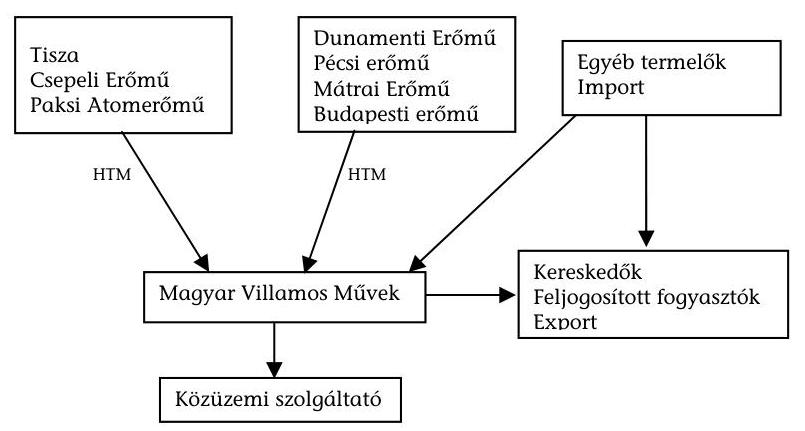
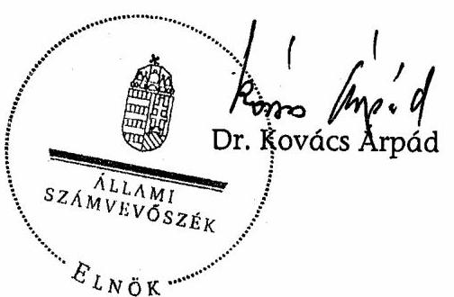
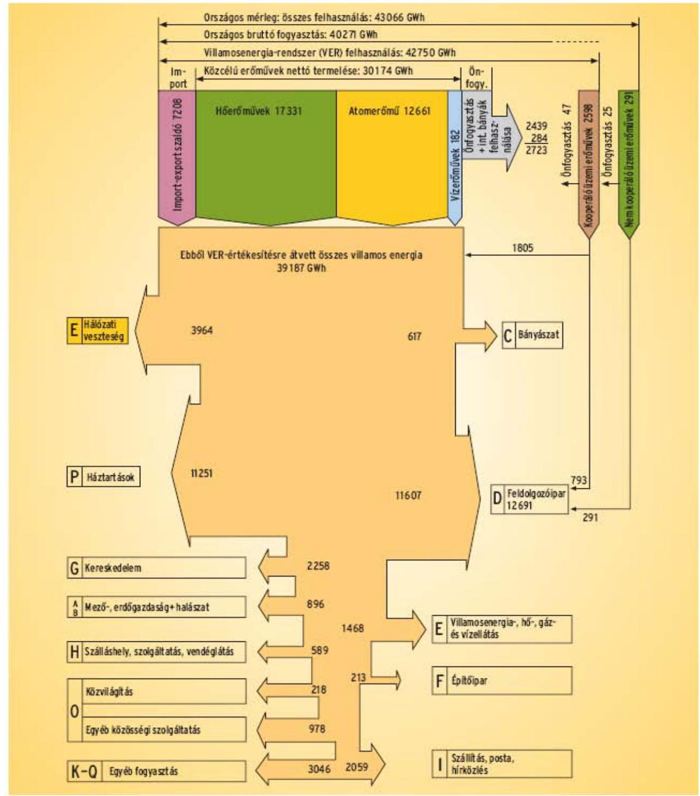

# ÁLLAMI   SZÁMVEVŐSZÉK 

## JELENTÉS

A villamosenergia-ellátás rendszerének
ellenőrzéséről

---

2. Államháztartás Központi Szintjét Ellenőrző Igazgatóság
2.3. Átfogó Ellenőrzési Főcsoport

Iktatószám: V-03-085/2007
Témaszám: 857
Vizsgálat-azonosító szám: V-0351

# Az ellenőrzést felügyelte: 

Bihary Zsigmond
főigazgató
Az ellenőrzés végrehajtásáért felelős:
Hegedűsné Dr. Müllern Veronika
főcsoportfőnök
Az ellenőrzést vezette:
Papp Sándor
számvevő főtanácsos

Az ellenőrzést végezték:

| Barta József számvevő | Beck Miklós számvevő tanácsos | Csóry Györgyné számvevő tanácsos, főtanácsadó |
| :--: | :--: | :--: |
| Dalmayné Szerző Ildikó számvevő | Dr. Horváth Erika számvevő | Kovácsy Tamás számvevő |
| Patthy Júlia számvevő gyakornok | Sinka Zoltán számvevő | Vitányi István számvevő |

A témához kapcsolódó eddig készített számvevőszéki jelentések:
Jelentés a Dunamenti Erőmű Rt. privatizációjának és működésének ellenőrzéséről (1996)

Jelentés a tartósan veszteségesen működő állami tulajdonú gazdasági társaságok gazdálkodásának ellenőrzéséről. (2006)

---

# TARTALOMJEGYZÉK 

BEVEZETÉS ..... 9
I. ÖSSZEGZŐ MEGÁLLAPÍTÁSOK, KÖVETKEZTETÉSEK, JAVASLATOK ..... 13
II. RÉSZLETES MEGÁLLAPÍTÁSOK ..... 25

1. A villamosenergia-rendszer működésének szervezete, jogi háttere ..... 25
1.1. A szervezeti háttér működése, kialakításának célszerűsége ..... 25
1.2. A villamosenergia-rendszer működésének jogi háttere ..... 29
2. A hosszú távú villamosenergia-stratégia megalapozottsága ..... 32
2.1. A villamos energiával kapcsolatos energiapolitikai, valamint az energiaforrás-szerkezetre vonatkozó koncepció ..... 32
2.2. A primer energiahordozók felhasználásának alakulása ..... 35
2.3. A megújuló energiaforrások hasznosítása ..... 37
3. A villamosenergia-rendszer működése ..... 43
3.1. A rendszerirányítási engedélyes tevékenysége, függetlensége ..... 43
3.2. A hosszú távú áramvásárlási szerződések és hatásuk ..... 45
3.3. A liberalizáció előkészítettsége, végrehajtása, hatásai ..... 50
3.4. A fejlesztések és a befektetői hajlandóság ..... 53
4. A villamosenergia-rendszer kapacitás igényének biztosítottsága, a termelést segítő támogatások, valamint a környezet- természetvédelmi szempontok érvényesítése ..... 55
4.1. A villamosenergia-rendszer kapacitás igényének biztosítottsága ..... 55
4.2. A villamosenergia-termelés fejlesztését és a környezetvédelmi szempontok érvényesítését segítő intézkedések, támogatási rendszerek ..... 60
5. A villamos energia árszabályozása és támogatása ..... 62
5.1. Az árszabályozás módszerei, döntési folyamata és a villamosenergia-árak alakulása ..... 62
5.2. A kompenzációs célú pénzeszköz (KÁP) felhasználása ..... 66
6. A korábbi ÁSZ vizsgálat során tett megállapítások utóellenőrzése ..... 67

---

# MELLÉKLETEK 

1. számú A Gazdasági és Közlekedési Minisztériumot felügyelő miniszter észrevétele
2. számú A termelés és fogyasztás folyamatábrája 2006.
3. számú HTM-ekben lekötött kapacitások, garantált átvétel
4. számú Közüzemi villamos energia átlagárak ( $\mathrm{Ft} / \mathrm{kWh}$ )
5. számú Adózott eredmény
6. számú Bevételek és befizetési kötelezettségek változása 2003-2007 években
7. számú Az egyes évek KÁP összegei és a fajlagos értékek
8. számú A korábbi ÁSZ vizsgálat során tett megállapítások utóellenőrzése

---

# RÖVIDÍTÉSEK JEGYZÉKE 

| Áht | Az államháztartásról szóló 1992. évi XXXVIII. törvény |
| :--: | :--: |
| Ámr | 217/1998. (XII. 30.) Korm. rendelet az államháztartás működési rendjéről |
| ÁPV Zrt. | Állami Privatizációs és Vagyonkezelő Zrt. |
| ÁSZ | Állami Számvevőszék |
| ESER | European System of Energy Regulation (Európai Energia Szabályozási Rendszer) |
| Evt | Az erdőről és az erdő védelméről szóló 1996. évi LIV. törvény és módosításai |
| FVM | Földművelésügyi és Vidékfejlesztési Minisztérium |
| GKI | Gazdaságkutató Intézet |
| GKM | Gazdasági és Közlekedési Minisztérium |
| GVH | Gazdasági Versenyhivatal |
| HTM | Hosszú Távú Megállapodás (hosszú távú áramvásárlási szerződés) |
| KÁP | Kompenzációs célú pénzeszköz |
| KEHI | Kormányzati Ellenőrzési Hivatal |
| KEOP | Környezetvédelmi és Energia Operatív Program |
| KIOP | Környezetvédelmi és Infrastruktúra Operatív Program |
| KM | Krízis Munkabizottság |
| KvVM | Környezetvédelmi és Vízügyi Minisztérium |
| MAVIR Zrt. | Magyar Villamosenergia-ipari Rendszerirányító Zrt. |
| Energia Hivatal | Magyar Energia Hivatal |
| MeH | Miniszterelnöki Hivatal |
| MNB | Magyar Nemzeti Bank (Zrt.) |
| MTA | Magyar Tudományos Akadémia |
| MVM Zrt. | Magyar Villamos Művek Zrt. |
| NEP | Nemzeti Energiatakarékossági Program |
| NFT | Nemzeti Fejlesztési Terv |
| NKP | Nemzeti Környezetvédelmi Program |
| OFK | Országos Fejlesztéspolitikai Koncepció |
| OKTVF | Országos Környezetvédelmi, Természetvédelmi és Vízügyi Főfelügyelőség |
| OTK | Országos Területfejlesztési Koncepció |
| OVIT Zrt. | Országos Villamostávvezeték Zrt. |
| PA Zrt. | Paksi Atomerőmű Zrt. |
| PM | Pénzügyminisztérium |
| RJGY | Részvényesi Jogok Gyakorlója |
| RKR | Rotációs Kikapcsolási Rend |

---

| SZMSZ | Szervezeti és Működési Szabályzat |
| :-- | :-- |
| SZT | Széchenyi Terv |
| TSO | Transmission System Operator (átviteli rendszerirányító) |
| UCTE | Union for the Co-ordination of Transmission of Electricity: Egyesített Villamos Energia Rendszerirányítók Szövetsége. Az európai   kontinensen üzemelő rendszer átviteli rendszerirányítóinak szer-   vezete. Legfontosabb feladata az összekapcsolt rendszerek biztonságát és megbízhatóságát szolgáló koordináció és együttműködés biztosítása. |
| Új VET | A villamos energiáról szóló 2007. évi LXXXVI. törvény |
| VEASZ | Villamos Energia Adásvételi Szerződés |
| VER | Villamosenergia-Rendszer |
| VET | A villamos energiáról szóló 2001. évi CX. törvény és módosításai |

---

# ÉRTELMEZŐ SZÓTÁR 

| Állami támogatás | Az Európai Közösséget létrehozó szerződés 87. cikkének 1. bekezdése szerinti támogatás |
| :--: | :--: |
| Áramszolgáltató | A fogyasztói igények közvetlen kiszolgálását biztosító szervezet. Az áramszolgáltatók a villamos energiát a nagykereskedőtől vásárolják, és a végfelhasználóknak értékesítik. |
| Ársapka | Az árszabályozásnak olyan módszere, amelynél a szabályozó az árak módosításának lehetőségeit határozza meg előre. |
| Átállási költség | A VET-ben foglalt rendelkezések hatálybalépése és végrehajtása miatt a közüzemi nagykereskedelmi engedélyesnél a hosszú távú szerződések külön jogszabályban meghatározott módon lefolytatott újratárgyalását követően fennmaradó, továbbá szén felhasználásával a hőszolgáltatási kötelezettség mértékéig kapcsoltan termelt villamos energia 2003. december 31.-ig történő átvételéből keletkező, a villamos energia árában nem érvényesíthető, jogszabályban elismert pénzügyi követelések. Összegét évente GKM rendelet határozta meg. |
| Átviteli hálózat | A villamos energia átvitelére szolgáló vezetékrendszer beleértve a tartószerkezeteket és a rendszerösszekötő vezetékeket is -, a hozzá tartozó átalakító és kapcsolóberendezésekkel együtt. |
| Betáplálási vagy kitáplálási díj | Az EU piacának külső határain keresztül folyó villamosenergia-kereskedelem szereplői által kölcsönösen megállapított hálózathasználati tarifa. |
| Biomassza | A mezőgazdaságból, erdőgazdálkodásból és az ehhez kapcsolódó iparágakból származó termékek, hulladékok és maradékanyagok (a növényi és állati eredetűeket is beleértve) biológiailag lebontható része, valamint az ipari és települési hulladék biológiailag lebontható része. |
| Black start | A hálózat teljes összeomlása utáni újraindítás. |
| Egyetemes szolgáltatás | A villamosenergia-kereskedelem körébe tartozó sajátos villamosenergia-értékesítési mód, amely az ország területén bárhol, meghatározott minőségben a jogosult felhasználó számára méltányos, összehasonlítható, átlátható ár ellenében igénybe vehető. |
| Elosztó hálózat | A villamos energia elosztására és a felhasználói csatlakozási pontra való eljuttatás céljára szolgáló vezetékrendszer - beleértve a tartószerkezeteket is -, a hozzá tartozó átalakító és kapcsoló berendezésekkel együtt. |
| Elsődleges (primer) energiaforrás | Azon rendelkezésre álló és az energia átalakítására felhasználható energiaforrások gyűjtőneve, amelyek kémiailag, fizikailag vagy nukleárisan kötött formában, megújuló vagy nem megújuló módon tartalmaznak energiát. |

---

Engedélyes

Erőmű

Erőművek üzemmódja

Feljogosított fogyasztó

Határkeresztező vezeték

Kapcsoltan termelt energia
Kiegyenlítő energia

Kiserőmű
Közcélú hálózat

Közüzemi fogyasztó

Maradó teljesítmény

Megújuló energiaforrás

A villamos energiáról szóló törvény szerint engedélyköteles tevékenység végzésére a Magyar Energia Hivatal által kiadott érvényes engedéllyel rendelkező társaság.
Egy telephelyen lévő olyan energia-átalakító létesítmény, amely elsődleges energiaforrás felhasználásával villamos energiát termel, engedélyezési szempontból ideértve az energia tározós erőművet is.
Az erőművek üzemeltetésének módja szerint megkülönböztetünk alaperőműveket, menetrendtartó erőműveket és csúcserőműveket. Az alaperőművek folyamatosan, nagy kihasználással üzemelnek, a villamosenergiarendszer terhelésének állandó részét fedezik. Jellegzetes példája az alacsony üzemeltetési költségű atomerőmű. A menetrendtartó erőművek teljesítményük változtatásával követik a fogyasztói igények változását. Ezt a feladatot a magyar energiarendszerben a hagyományos hőerőművek látják el. A csúcserőművek szolgálnak a legmagasabb terhelésű időszakokban a csúcsterhelések fedezésére, rendszerint csak rövid időszakokra lépnek üzembe. Erre a célra alkalmasak például a gyorsan indítható gázturbinák és tározós vízerőművek.
Az a fogyasztó, aki (amely) jogszabályban megállapított felhatalmazás szerint, saját döntése alapján nem közüzemi szerződés keretében vásárol villamos energiát.
A közcélú hálózat részét képező, az országhatárt keresztező vezeték, beleértve a hozzá tartozó átalakító és kapcsoló berendezést.
Azonos technológiai folyamatban egyidejűleg termelt hő és villamos energia, illetőleg mechanikai energia.
Az átviteli rendszerirányító által a pozitív, vagy negatív irányú menetrendi eltérést kiegyenlítő szabályozás során a mérlegkör felelősökkel elszámolt villamos energia.
50 MW-nál kisebb teljesítőképességű erőmű.
A villamosenergia-rendszer biztonságos és hatékony működéséhez szükséges átviteli vagy elosztó hálózat.
Az a fogyasztó, aki (amely) a közüzemi szolgáltatási engedélyestől, közüzemi szerződés alapján vételez villamos energiát.
A ténylegesen rendelkezésre álló teljesítmény, csökkentve a csúcsterheléssel, valamint a rendszerirányítói tartalékkal. Elvárt mértéke országonként változó, jellemzően a beépített teljesítőképesség 5 és $10 \%$-a között mozog.
Nem fosszilis és nem nukleáris energiaforrás (nap-, szél-, geotermikus energia, hullám-, árapály- vagy vízenergia, biomassza, biomasszából közvetve vagy közvetlenül előállított energiaforrás, továbbá hulladéklerakóból, illetve szennyvízkezelő létesítményből származó gáz, valamint biogáz).

---

| Menetrend | Egy adott naptári napra vonatkozó elszámolási mérési időegységenkénti villamos átlagteljesítmény adatsor. |
| :--: | :--: |
| Mérlegkör | A kiegyenlítő energia igénybevételének okozathelyes megállapítására és elszámolására és a kapcsolódó feladatok végrehajtására vonatkozó felelősségi viszonyok szabályozása érdekében létrehozott, egy vagy több tagból álló elszámolási szerveződés. (Egy virtuális kontó, amely egy szabályozási zónán belül tetszőleges számú betáplálási és elvételi pontból áll, amelyeket a hálózati csatlakozásért felelős hálózati üzemeltetőnek kell megneveznie, s ezáltal pontosan definiálttá válnak. Egy mérlegkörön belül a villamosenergia-beszerzésnek és leadásnak egyensúlyban kell lennie.) |
| Mérlegkör felelős | A mérlegkör felelős készíti el a villamosenergiafelhasználás tervét a mérlegkörében, és egyben képviseli a mérlegkört a rendszerirányító felé. |
| Órás (tercier) tartalék | Több (5-6) óra alatt aktiválható, álló blokk kiesésére szolgáló, az üzemzavari (perces) tartalék kiváltását biztosító tartalék. |
| Perces (tercier) tartalék | Az üzemzavari tartalékot kiegészítő tartalék. |
| Primer tartalék | Gyors, másodperceken belül, automatikus reagálású tartalék, a frekvencia stabilizálása a fő feladata. |
| Rendszerhasználó | A közcélú hálózathoz villamos energia betáplálása, illetve vételezése céljából közvetlenül, vagy közvetve kapcsolódó természetes vagy jogi személy, illetve jogi személyiséggel nem rendelkező gazdasági társaság. |
| Rendszerirányítás | A villamosenergia-rendszer üzemvitelét, karbantartását, fejlesztését - beleértve a hálózatok egységes kezelését -, a rendszerszintű szolgáltatások, nemzetközi összeköttetések rendelkezésre állását, az erőművek működtetésének biztonságát, szabályosságát, minőségét, környezetkímélő voltát szolgáló célirányos tevékenységek összessége. |
| Rendszerirányító | A villamosenergia-rendszer üzemének tervezését, irányítását ellátó, a termelőktől, kereskedőktől, fogyasztóktól független szakmai szervezet. Feladata pl. a rendszerszintű operatív üzemirányítás, hálózati üzem-előkészítés, villamosenergia-elszámolás, a rendszerszintű szolgáltatások, a hálózathoz való szabad hozzáférés biztosítása. |
| Szekunder tartalék | Gyors (másodpercektől 15 percig tartó időtartományban), automatikus reagálású tartalék, az igények (vagy termelés) gyors változása kezelésének, a tervezett export-import szaldó betartásának eszköze. |
| Szervezett   villamosenergia-piac | Speciális árutőzsde, ahol a villamosenergia-kereskedelem szabványosított ügyletek formájában működik. |
| Tartalékok | A fogyasztás előre nem becsülhető változásának követésére és üzemzavarok esetére állandó tartalékkal kell rendelkezni. Ezek lehetnek forgótartalékok vagy rövidebb-hosszabb idő
 alatt elindítható hidegtartalékok. A tartalék - felhasználásának célja szerint - lehet primer vagy sze- |

---

|  | kunder tartalék. |
| :--: | :--: |
| Üzemzavari tartalék | A legfeljebb 15 perc alatt teljesen aktiválható tartalék, a tartós igénynövekedés, illetve az egyes termelő egységek kiesését biztosítja. |
| Zöld bizonyítvány | A megújuló energiaforrásból vagy hulladékból nyert energiával előállított villamos energia mennyiségét igazoló, származási igazoláson alapuló forgalomképes okirat. |

---

# JELENTÉS   a villamosenergia-ellátás rendszerének ellenőrzéséről 

## BEVEZETÉS

Az elektromos energiával foglalkozó iparág 1992-ben részvénytársaságok kétszintű rendszerévé alakult át, melynek első szintjét a tulajdonosi és az irányítói szerepet is betöltő Magyar Villamos Művek Zrt. (MVM Zrt.), a második szintjét pedig az erőművi és az áramszolgáltató társaságok, valamint az alaphálózatot építő és üzemeltető társaság jelentette.

A villamosenergia-ipar privatizációja 1995. év végén kezdődött, melynek eredményeként a hazai villamosenergia-ellátásban a magántulajdon vált meghatározóvá az állami tulajdonnal szemben. Az 1995-1997. között lezajlott privatizáció során külföldi tulajdonba került valamennyi áramszolgáltató társaság és az erőművek többsége is. Az iparág meghatározó társasága, az MVM Zrt. állami és önkormányzati tulajdonban maradt. Ezzel párhuzamosan a szabályozási környezet is átalakult, mert a villamos energia termeléséről, szállításáról és szolgáltatásáról szóló 1994. évi XLVIII. törvény új működési rendet vezetett be, amely átalakította a kereskedelmi és a jogi kapcsolatok korábbi rendszerét.

A Magyar Energia Hivatal (Energia Hivatal) látja el az engedélyezés és az árszabályozással kapcsolatos döntés-előkészítés feladatait. A Hivatal saját bevételei az igazgatási és szolgáltatási díjakon felül a felügyeleti tevékenységéért kapott bevételekből származnak, ennek mértéke az engedélyes tevékenysége előző évi nettó árbevételének 0,05%-a.

A villamosenergia-kereskedelem liberalizációját az Európai Unió irányelvei írják elő, amelynek hazai megvalósítását Magyarország a csatlakozással, illetve az arra való felkészülés során vállalta. A részleges liberalizáció 2003. január 1-vel történt meg, a jogi feltételek alapjait a villamos energiáról szóló 2001. évi CX. törvény (VET) teremtette meg. A liberalizációs folyamat részeként, még a VET elfogadása előtt, 2000-ben, a rendszerirányítói feladatok ellátására az MVM Zrt. megalapította a Magyar Villamosenergia-ipari Rendszerirányító Zrt-t (MAVIR Zrt-t). A liberalizáció eredményeként Magyarországon kettős piac, az ún. közüzemi és a frissen megnyílt versenypiac működött. A közüzemi piacon vásárolhatták meg a villamos energiát azok a fogyasztók, akik nem jogosultak a szabadpiacon történő vásárlásra, vagy nem kívántak azon részt venni. A közüzemi áramot 2007. végéig a fogyasztók a gazdasági és közlekedési miniszter által - az Energia Hivatal javaslata alapján - rendeletben megállapított áron vásárolták. A szabadpiaci árak a vizsgált időszakban, 2003-2007. között jelentősen - időnként a közüzemi piac áraival ellentétes irányban - változtak. A piacnyitás kezdetén általában csökkentek, míg az elmúlt időszakban a középeurópai kereskedelmi feltételek romlása (kapacitáshiány a régió egyes atomerőműveinek bezárása miatt, időszakonként megjelenő fennakadások a gázszállításban, lassan előrehaladó regionális piaci integráció) és az árszabályozási beavatkozások hatására növekedtek.

Magyarország villamosenergia-felhasználása 2006-ban bruttó 40271 GWh volt, ennek 28%-át használták fel a háztartások. Közüzemi ellátásból a fogyasztás 72%-a (éves átlagban 63,4%-a), a fennmaradó hányad a versenypiacról származott. Nem jelentéktelen tényező volt a mintegy 10%-ot kitevő - leolvasási hibákból adódó, illetve technikai eredetű - hálózati veszteség. A magyar rendszer beépített teljesítménye jóval az általánosan elfogadott 18-25% feletti tartalékot biztosított. A szénhidrogének és a nukleáris energia mellett növekvő, de - szerény helyet foglal el a megújuló energiaforrások (víz, szél, biomassza) hazai hasznosítása.

A villamosenergia-rendszer működése sokszereplős, az állami és a magántulajdon egyaránt jelen van. Az energiaellátás hazai és külföldi tulajdonú erőművek termeléséből valamint importból biztosított, az áramátvitel az állami tulajdonban lévő MVM Zrt, mint monopolhelyzetű áram-nagykereskedő biztosított, az elosztói, illetve áramszolgáltatói tevékenységet külföldi tulajdonú társaságok látják el. A nagykereskedő MVM Zrt. részvényei 99,9%-ban az ÁPV Zrt. tulajdonában vannak.

Az Európai Unió célkitűzése egy olyan stabil, megfelelő harmonizációt és egy erős versenypiaci környezetet egyidejűleg megvalósító regulációs keret kialakítása, amelyben a villamosenergia-rendszer működése megfelel az ellátásbiztonsági, a befektetés-ösztönzési, a közellátási, valamint a fenntartható fejlődési és az ezekkel összefonódó környezetvédelmi céloknak.

A teljes körű piacnyitást - amellyel átalakul az energiaellátás teljes rendszere, megszűnik a közüzemi ellátás, és teljesen liberalizált lesz az árampiac - a 2003/54/EK EU irányelvnek megfelelően 2007. július 1-től kellett végrehajtani. Az új VET-et az Országgyűlés 2007. június 25-én fogadta el.

A villamosenergia-rendszer egészének működését az Állami Számvevőszék korábban nem ellenőrizte. Ugyanakkor az Állami Privatizációs és Vagyonkezelő Zrt. éves tevékenységének vizsgálata érintette a villamosenergia-rendszer állami vagy részben állami tulajdonú szereplőinek (pl. 2006-ban a Magyar Villamos Művek Zrt.-nek) tevékenységét. Az ÁPV Zrt. 2006. évi tevékenységének ellenőrzésünkkel egyidejűleg folyamatban levő vizsgálata érintette a Vértesi Erőmű Zrt. privatizációját.

Az ellenőrzés célja annak értékelése volt, hogy:

- a villamosenergia-rendszer működése, jogszabályi háttere, az állami irányítás módja, az állami feladatok megosztása, ezek változásai, a rendszerirányítás, a termelést, a szolgáltatást rögzítő hosszú távú szerződések, a termelői és a szolgáltató háttér tulajdonosi szerkezetének összetétele biztosítja-e a villamosenergia-szolgáltatás biztonságos működtetését;

---

- a kettős, ezen belül a szabályozott közüzemi, illetve a versenypiaci ármechanizmus, illetve a termelők részére biztosított stabil nyereség rendszere segítette-e a fogyasztói árak reális szintjének alakulását, illetve gazdaságossági szempontok szem előtt tartásával az áramveszteségek minimális szintre való csökkentését;
- a 2003-ban kialakított részbeni szabad piac, valamint a 2007-től bevezetni tervezett liberalizált piac milyen változásokat jelentett, illetve jelent majd a tulajdonosi szerkezetben és az árakban;
- az ÁSZ korábbi, a témához kapcsolódó ellenőrzéseiben megfogalmazott megállapítások alapján tett javaslatok hogyan hasznosultak.

Az ellenőrzés kiterjedt az egyes irányítási és felügyeleti feladatokat ellátó Gazdasági és Közlekedési Minisztériumra (GKM), a hatósági és engedélyezési feladatokat ellátó Energia Hivatalra, és a rendszerirányító MAVIR Zrt-re. A feladatban való érintettség miatt ellenőrzést végeztünk a Miniszterelnöki Hivatalban (MeH), a Pénzügyminisztériumban (PM), a környezetvédelmi szempontok teljesülésének elemzése érdekében a Környezetvédelmi és Vízügyi Minisztériumban, valamint az állam tulajdonosi érdekeit képviselő ÁPV Zrt-nél, továbbá adatokat kértünk be az MVM Zrt-től.

Az ellenőrzés átfogó jelleggel a 2003-2007. I. félév közötti időszakra terjedt ki, ugyanakkor rögzítettük a végleges jelentés elkészítéséig történt állami intézkedéseket és a villamosenergia-rendszert érintő eseményeket is. Vizsgálatunk rendszerszemléletben értékelte a villamosenergia-rendszer felügyeletét, irányítását, koordináltságát, az árszabályozást ellátó szervezetek működését, intézkedéseik hatásait, az állami tulajdonosi érdekek érvényesülését, valamint a villamosenergia-rendszeren belül a hazai természeti erőforrások (ezen belül a megújuló természeti erőforrások) és a földgázimport függőség, az állami részvétel és a szabad piac, valamint az állami árpolitika és a szabad piaci árak közötti kölcsönhatásokat.

Kiemelten értékeltük a 2003-as részleges piacnyitás hatásait, ezen belül a villamos energia árakat befolyásoló tényezőket. Gazdasági szempontból a termelői, a szolgáltatói árak alakulását, hatékonysági szempontból az árképzés mechanizmusát, annak előkészítettségét, valamint az állami irányítás összehangoltságát értékeltük. Eredményességi szempontból vizsgáltuk a kettős piac kialakításától elvárt kedvező hatások teljesülését, elsősorban a versenypiac működésére, a termelői és fogyasztói árakra gyakorolt hatás tekintetében.

Ellenőrzésünk, illetve a jelentéstervezet elkészítése során külső szakértő véleményére, továbbá - a forrás megjelölésével - hazai és nemzetközi szakértői dokumentumokra, elemzésekre is támaszkodtunk.

Az ellenőrzés végrehajtására az Állami Számvevőszékről szóló 1989. évi XXXVIII. törvény 2.§ (3); (5) (6) és (9) bekezdései adták a jogszabályi alapot.

A jelentés tervezetet megküldtük a Gazdasági és Közlekedési Minisztériumot felügyelő miniszternek, aki észrevételt nem tett. Levelét az 1. számú melléklet tartalmazza.

---

# BEVEZETÉS

---

# I. ÖSSZEGZŐ MEGÁLLAPÍTÁSOK, KÖVETKEZTETÉSEK, JAVASLATOK 

A rendszerváltást követően az energiarendszer tulajdonosi szerkezete és működési modellje alapvetően - jellemzően a versenypiaci struktúra irányába hatóan - megváltozott. A villamosenergia-szektor sokszereplőssé vált, az erőművi kapacitásoknak a Magyar Villamos Művek Zrt. (MVM Zrt.) tulajdonában lévő 33%-án felüli része külföldi befektetők birtokába került. Az elosztást, az áramszolgáltatást teljes egészében privatizálták, és tőkeerős külföldi (francia, német, belga, svájci) szakmai befektetők tulajdonába került, annak érdekében, hogy az infrastruktúra korszerűsítésére és a magánbefektetők bevonására vonatkozó deklarált kormányzati célok megvalósulhassanak.

Az így kialakult villamosenergia-rendszer a vizsgált időszak közepéig megbízhatóan teljesített. Az időszak végére azonban a követelmények, elvárások növekedésével egyre inkább nyilvánvalóvá vált, hogy a korszerű, megbízható, hosszú távon fenntartható és - mindemellett - elérhető árú villamosenergiarendszer legfőbb alappillérei, többek között a primer energiaforrások biztosítottsága, a termelés, az elosztás és ezek irányítása, szabályozási rendszere nem teljes körűen megbízhatóak, működésük nem kockázatmentes.

A kormányzati szinten összpontosuló irányítói, felügyeleti feladatot ellátó szervezetek - Kormány, GKM, PM, Energia Hivatal - feladatait a jogi szabályozás rögzítette, ugyanakkor a feladatok ellátásában, pl. stratégia készítés, a villamos energia kereskedelmet meghatározó hosszú távú szerződések kezelése, a nyitott piac előkészítése kapcsán - később kifejtésre kerülő - hiányosságok, késedelmek mutatkoztak.

Az állami szintű beszámoltatás mechanizmusa - a kötelezettségek rögzítettsége ellenére - hiányos volt. Az Energia Hivatal a villamosenergia-rendszer kettős piaci modelljét is értékelő beszámolókat minden évben elkészítette, azonban az Országgyűlés a 2001., 2002., 2003. évi beszámolókat csak 2005-ben tárgyalta és fogadta el, a 2004. és a 2005. évi beszámolókat még nem tárgyalta. Az Országgyűlésnek a magyar energiapolitikáról szóló határozata a Kormány számára tájékoztatási kötelezettséget írt elő, de ezt csak a 2002-2003 évekre szólóan teljesítette, 2004-2005-re nem. Nem teljesült egy kormányhatározatban az energia program teljesítésére vonatkozó, és a gazdasági miniszter részére előírt évenkénti beszámolási kötelezettség. ${ }^{1}$

A villamosenergia-rendszer jogi szabályozása többszintű, a villamos energiáról szóló, 2003. január 1-jén hatályba lépett törvény (VET), a Kormány nem

[^0]
[^0]:    ${ }^{1}$ A GKM vitatja a beszámolási kötelezettség gyakoriságának szükségességét, de erre vonatkozóan kezdeményező lépéseket nem tett.

---

élt a zöld bizonyítvány rendszer bevezetési időpontjának ${ }^{2}$, valamint a szervezett villamosenergia-piac működését célzó végrehajtási szabályok megállapítására vonatkozó felhatalmazással. A kiterjedt műszaki és gazdasági összefüggések miatt szükséges többszintű jogi szabályozás sajátossága, hogy a törvényi és rendeleti szinten meg nem oldott, technikai jellegűnek minősített kérdések kezelését az ellátási szabályzatok szintjére delegálta. Az egyes szinteken végrehajtott változtatások, az alsóbb szabályzati, illetve hatósági szinteken esetenként több hónappal később jelentek meg. A kapcsolt előállított és a megújuló energiaforrások felhasználásával történő villamosenergia-termelés ösztönzésének jogi szabályozása az új VET megjelenése ellenére sem került összhangba az EU követelményekkel.

A vizsgált időszakra hatályos hazai energiapolitika alapját két dokumentum, az 1993-ban elfogadott, a magyar energiapolitikáról szóló OGY határozat, illetve az 1999-ben kormányhatározattal elfogadott, a magyar energiapolitika alapjairól és az energetika üzleti modelljéről szóló dokumentum képezte. Ez utóbbi 2002-ig tartalmazta a részletes terveket, a továbbiakra nézve csak az elérni kívánt célokat jelölte meg. A dokumentum következő időszakra szóló aktualizálása azonban elmaradt, tehát 2002 és 2007 között nem volt elfogadott részletes, aktualizált energiapolitikai stratégia ill. koncepció. A vizsgált területet érintő célokat, pl. az EU konform szabályozást, két kormányzati ciklusra (2002-2006; 2006-2010) vonatkozó kormányprogramok
 tartalmazták. A biomassza lehetőségeinek kiaknázását megalapozó stratégia tervezet egy 2004-ben kiadott kormányhatározatnak megfelelően elkészült, a Gazdasági Kabinet 2006. elején megtárgyalta, de elfogadására nem került sor. ${ }^{3}$

A villamosenergia-rendszer több szintű volt (erőművek, nagykereskedő, áramszolgáltatók), a rendszer irányítását 2003. január 1.-től 2005. végéig független rendszerirányítóként a MAVIR Zrt. látta el. A társaság 2006-tól az MVM Zrt. leányvállalata lett, de megkapta az átviteli hálózati vagyont, és az átviteli és a rendszerirányítási tevékenységre vonatkozó engedélyt. ${ }^{4}$ A tulajdonosi függetlenségének biztosítása érdekében egy Megfelelési Szabályzatot készített, amely rögzítette a piaci szereplőkkel szembeni egyenlő bánásmód és a keresztfinanszírozás mentes működés elveit, szabályait. ${ }^{5}$ A függetlenség kapcsán ugyanakkor - állami szervek részéről is - aggályok fogalmazódtak meg. ${ }^{6}$

[^0]
[^0]:    ${ }^{2}$ A MeH észrevétele szerint jelenleg nincsenek meg a szükséges iparági-szakmai feltételei. A GKM szerint eddig nem volt szükség a jogszabály kidolgozására, mert nem álltak fenn a jogalkotásról szóló törvény 17§-ban foglalt feltételek.
    ${ }^{3}$ Folyamatban van a „Magyarország megújuló energiaforrás növelésének stratégiája 2007-2020" című dokumentum előkészítése, amelyet a GKM várhatóan 2007. ősz folyamán terjeszt a Kormány elé.
    ${ }^{4}$ Az 1070/2005. (VII. 8.) Korm. határozat a MAVIR Zrt.-t átviteli rendszerirányítóvá (Transmission System Operator, TSO) jelölte ki.
    ${ }^{5}$ A Szabályzatban foglaltak teljesítéséről készített megfelelési jelentést az Energia Hivatal 2007. júliusában jóváhagyta.
    ${ }^{6}$ Többek között az Energia Hivatal, a Magyar Atomenergia Hivatal, a KOPINT-TÁRKI Konjunktúrakutató Intézet és a Gazdasági Versenyhivatal (GVH) részéről.

---

A villamosenergia-rendszer műszaki-gazdasági hátterét meghatározza, mozgásterét szűkíti, hogy hazánk primer energiahordozókban szegény. A szén, illetve a számottevő mennyiségű lignit, valamint a megújuló energiaforrás (biomassza) biztosít hosszú távon rendelkezésre álló készletet, ezek az összes energiaforrás 22%-át teszik ki. A termelés mintegy 70%-át adó földgázból és nukleáris fűtőanyagból az ország folyamatosan importra szorul. Egy 1993-ban elfogadott OGY határozat - többek között - célként jelölte meg a kiegyensúlyozott forrásszerkezet elérését és az egyoldalú energia importfüggőség feloldását. Az állami intézkedések és a gazdasági reálfolyamatok ugyanakkor a földgáz felhasználásának növekedéséhez, és egyoldalú - földgáz orientált energiahordozó szerkezet kialakulásához vezetettek. ${ }^{7}$ A 2000. évet követően épült új termelőkapacitások is - a kis arányú biomassza kivételével - alapvetően földgáz alapúak voltak. Az energiapolitika 2003-at követően fő prioritásként az ellátásbiztonságot jelölte meg, ami elsősorban jogszabályalkotásban, irányelvek kitűzésében mutatkozott meg. A földgáz felhasználás mennyisége nőtt, bár aránya változatlan maradt (35%). A földgázimport döntően Oroszországból érkezik, egyetlen szállítási útvonalon. Ennek kockázatát jelzi a földgázszállítás két esetben történt leállása 2006-ban. Csak ezt követően tárgyalta és fogadta el az Országgyűlés - a Kormány által már 2005-ben benyújtott - a földgáz készlet minimális mértékét és a minimális kitárolási kapacitást előíró törvény. Jövőbeni megoldást jelenthet alternatív vezetékekhez történő kapcsolódás. A GKM által felkért Szakmai Bizottság 2006-2030. időszakra vonatkozó energiapolitikai tézisei alappillérként jelölték meg a megfelelő energiastruktúra kialakítását, különös tekintettel a megújuló energiaforrásokra.

A megújuló energiaforrások közül a legnagyobb reálisan hasznosítható potenciállal a biomassza rendelkezik, mértékére ugyanakkor eltérő becslések vannak. Hasznosítása egyre nagyobb figyelmet kapott, célkitűzésként több programban is szerepelt. ${ }^{8}$ Már a csatlakozást megelőzően több tanulmány felhívta a figyelmet, hogy a megújuló energiaforrásokból termelt villamos energia arányának növelése csak állami forrásból történő támogatással, vagy energiaár emelés révén valósítható meg. ${ }^{9}$ Hazánk az EU csatlakozási szerződésben csak egy alacsony, 3,6%-os arány elérését vállalta 2010-ig, amit a csatlakozásról szóló, 2004-ben megjelent törvény is megerősített. Ez a célkitűzés - elsősorban a biomassza körébe tartozó tűzifa égetés térnyerése miatt - már 2005-ben teljesült (5,9%). Kiemelt figyelmet érdemel, hogy az energiapolitika nem ösztönözhet a hazai erdőkből a fenntarthatósági szempontokat meghaladó mennyiségű faanyag erőművi felhasználását célzó kitermelésre, helyette a gyengébb minőségű mezőgazdasági területek energetikai célú hasznosítását kell előtérbe helyezni. Kiemelt szempont még a természetvédelmi szempontból értékes területek fennmaradása.

[^0]
[^0]:    ${ }^{7}$ Az importfüggőség a 2007-2013. évekre szóló Környezetvédelmi és Energia Operatív Program (KEOP) szerint is az ellátás bizonytalansági tényezője.
    ${ }^{8}$ Nemzeti Környezetvédelmi Program, (NKP) Környezetvédelmi és Infrastruktúra Program (KIOP), illetve Környezetvédelmi és Energia Operatív Program (KEOP).
    ${ }^{9}$ Például GKI Energiakutató és Tanácsadó Kft. (2003.) tanulmányában.

---

Az időjárásfüggő szélenergia hasznosítása 2005-ig nem kapott kiemelt figyelmet, mert a hatályban lévő GKM rendelet csak 2010-ig rendelkezett annak kötelező átvételéről, és ez nem ösztönözte a beruházásokat. A VET 2005. évi módosítása - figyelmen kívül hagyva a szakértői véleményeket - számszerűen, időbeli korlátozás nélkül és olyan magas értéken (23 Ft/kWwh) rögzítette a kötelező átvételi árat, ami a szélerőművek megtérülési idejét 7 (egyes szakértői vélemények szerint 3) évre csökkentette. Ennek eredményeként megnőtt a beruházási kedv, és 2006-ban közel 1800 MW kapacitású szélerőmű létesítésére kértek engedélyt. Alkalmazhatósága viszont - pl. változó intenzitása és a szélcsend miatt - a rendszer szabályozhatóságának, és tartalék kapacitás biztosításának problémáját veti fel. Ezért - ellátás-biztonsági szempontok miatt - az Energia Hivatal 330 MW-ban határozta meg az engedélyezhető teljesítményt és a kérelmek mintegy 2/3-át elutasította, arra hivatkozva, hogy engedélyezésük veszélyeztetné a villamosenergia-rendszer működését. ${ }^{10}$ A probléma megoldhatóságára, pl. egyes európai országokban alkalmazott módszerek, és hazai - a szélerőművek földrajzi elhelyezését, illetve pontosabb szél-előrejelzési eljárásokat elemző - tanulmányok utalnak.

A villamosenergia-rendszer (VER) beépített teljesítőképessége 2006. év végén közel 8700 MW volt, amit import egészített ki. A termelési kapacitás mintegy 60%-át (a hazai termelés háromnegyedét) négy erőmű, közte a hazai termelés 30%-át biztosító Paksi Atomerőmű adja. A hazai fogyasztást és a szükséges tartalékokat a termelés és az import biztonságosan fedezte, 2006-tól azonban már csak a korábbinál magasabb import részarány mellett volt kiegyensúlyozott a teljesítmény mérleg. ${ }^{11}$ A tartalékok mértékét a rendszerirányító (MAVIR Zrt.) az UCTE ${ }^{12}$ előírásai szerint tervez meg. A villamosenergiarendszer műszaki hátterét meghatározta, hogy az erőművek kihasználtsága csökkent, alaperőmű nem épült, tartalékot is adó nagyerőmű létesítését a tartalékok nagysága nem indokolta. A megújuló energia felhasználást célzó beruházások kivételével az állami szerepvállalás csökkent, ezt a VET 2001-től a befektetői döntések körébe sorolta. A befektetői hajlandóságot a szabályozási környezet (pl. a kötelező átvétel) és a támogatási rendszer elsősorban a gázmotorok, illetve a megújuló energiaforrást felhasználó (50 MW alatti kapacitású) kiserőművek létrehozása felé terelte. Ez utóbbiak építését pályázatos formában a költségvetési 2 milliárd Ft-tal támogatatta. Közvetett támogatásként a fejlesztésekhez a PM a mintegy 23 milliárd Ft adókedvezményt biztosított.

A felsorolt fejlesztési irányok miatt a váratlan terhelési változások vagy üzemzavarok szabályozhatósága 2005-től egyre kevésbé volt biztosított. A MAVIR Zrt. 2007. tavaszán készített elemzése szerint a rendszer az év mintegy 40%-ában, vagyis naponta átlagosan 9-10 órán keresztül nem felel meg a kötelező minőségi, ellátás-biztonsági követelményeknek. Napi problémát jelentett a

[^0]
[^0]:    ${ }^{10}$ A kérelmezők 36 bírósági keresetet nyújtottak be. Az egyik kérelmező 22 beadványából 21-et visszavont. Az első (2007-ben hozott) nem jogerős bírósági határozat az érintett keresetet elutasította.
    ${ }^{11}$ Az összes felhasználás folyamatosan nőtt, ugyanakkor a termelés 1,1%-kal csökkent. A különbséget az import-export szaldó 46%-os növekedése ellensúlyozta.
    ${ }^{12}$ Egyesített Villamos Energia Rendszerirányítók Szövetsége (Union for the Coordination of Transmission of Electricity).

---

kevésbé rugalmas erőművek, illetve a korlátozottan, vagy nem szabályozható pl. a kötelező átvételű és támogatott termelés - növekvő aránya miatt szükséges tartalékok hiánya. ${ }^{13}$ A 2005-2006-os időszak 14-26%-ában a fel- és leszabályozáshoz szükséges tartalék teljesítményt a rendszerirányító nem tudta lekötni. A rendszerirányítás működésének kockázatára utal a villamosenergiarendszerben 2007. májusában keletkezett és 40 perces fogyasztói korlátozást okozó jelentős zavar. ${ }^{14}$ Erre hívja fel a figyelmet a 2007. júliusában tapasztalt rendkívül meleg időjárás, amikor a hazai nettó erőművi kapacitás gyakorlatilag teljes egészében leterhelt (6320 MW) volt, a szükséges tartalékot gyakorlatilag az import biztosította. A szabályozhatóság érdekében egyes szakértői vélemények a szivattyús-tározós erőmű építését tartják szükségesnek, de ezzel szemben környezetvédelmi aggályok vetődtek fel. A villamosenergia-rendszerben előforduló jelentős zavar, vagy krízis nem volt. A MAVIR Zrt. az erre szolgáló krízistervet kidolgozta és elkészítette a rotációs kikapcsolási rendet.

A hálózati veszteség ${ }^{15}$ mértéke nemzetközi összehasonlításban kiugróan magas, gyakorlatilag 10% körüli volt. ${ }^{16}$ A veszteség tarifákban elismertethető költségelem, mértékére független szakértők és az Energia Hivatal tettek javaslatot. Az elosztói díjak egységesek, ezért az elismert költség engedélyesenként eltérő mértékben ösztönöz a hálózati veszteségek csökkentésére. Ez az ösztönzés azonban nem elég hatékony, mert a veszteség mérséklése érdekében végrehajtott beruházások megtérülése szempontjából nem vonzó az engedélyesek számára. A vizsgált időszakban a veszteség csökkent, de ez más célú hálózatfejlesztések „mellékterméke”. Ennek hatásaként viszont - az Energia Hivatal értékelése szerint - az elosztóhálózat műszaki állapota összességében javult.

A villamosenergia-rendszer gazdasági hátterét, működését, az árakat, a versenypiac lehetőségeit alapvetően meghatározta, hogy a megtermelt energia 70%-át a kizárólagos nagykereskedő MVM Zrt. ${ }^{17}$ (1995-1998 között megkötött (és az erőművek privatizációs szerződéseihez kapcsolódó) ${ }^{18}$ hosszú távú áramvásárlási szerződések (HTM) formájában lekötötte, és ő rendelkezett az import felével is. A megállapodások többsége 2010-2024. között jár le. A HTM-ek következtében az ágazat különböző szereplői eltérő kockázatú gazdálkodási környezetben működtek. Az MVM Zrt.-nek ellátási felelőssége van a

[^0]
[^0]:    ${ }^{13}$ Pl. a kiserőművek kapacitása a 2002. évi 4,1%-kal szemben 2006. végére már az összes kapacitás 12,7%-át tette ki.
    ${ }^{14}$ Az korlátozás okainak és felelőseinek kivizsgálására az Energia Hivatal eljárást indított, ami a jelentés készítés időpontjában még folyamatban volt.
    ${ }^{15}$ A veszteség két összetevője: a zömmel műszaki jellegű, számítható veszteség és a kereskedelmi jellegű (nem számítható) veszteség. Ez utóbbi lehet megtérülő, megtérülővé tehető, illetve meg nem térülő.
    ${ }^{16}$ A 2002. évi 11,7%-ról 2006-ra 9,8%-ra csökkent
    ${ }^{17}$ 2006-tól az MVM VK Zrt.
    ${ }^{18}$ A Dunamenti Erőmű Rt. működéséről és privatizációjáról szóló, 1996-ban megjelent ÁSZ jelentés az erőművek privatizációs szerződéseinek megalapozottsága kapcsán elmarasztaló megállapításokat fogalmazott meg.

---

közüzemi szolgáltatókkal szemben, továbbá több erőmű tulajdonosa. ${ }^{19}$ A HTM-mel bíró, valamint a kötelező átvétel alá eső energiaforrást hasznosító erőművek viselték a legkisebb kockázatot, mert gazdálkodásukat segítette az előre tervezhető termelés, a költségektől független garantált nyereség,
 illetve a kötelező átvétel. Ennek következtében e termelők és szolgáltatók pénzügyi helyzete stabil és döntően nyereséges volt. ${ }^{20}$ A HTM-ek rendszere az energiaellátás szempontjából - a lekötött energia révén - alapvetően biztonságos volt, ugyanakkor az árak, a beruházások, a tartalékok és a rendszer szabályozhatósága tekintetében a vizsgálat megállapítása szerint negatív hatással bírt. Korlátozta a versenypiac működését, mert a lekötött erőművi kapacitások után fennmaradó energiamennyiség a versenypiacon elérhető volt ugyan, de korlátozott mértéke miatt a piaci szegmens működéséhez szűk teret adott. Ez nem segítette elő az újonnan piacra lépő szolgáltatók lehetőségeit, és - a kötelező átvétel alá tartozó, pl. a biomasszát felhasználó termelés kivételével - fékezte az új erőművi befektetések iránti hajlandóságot. A HTM-ekben rögzített árképletek miatt nem alakulhatott ki a piaci viszonyokat tükröző nagykereskedelmi és kiegyenlítő energia ár. A közüzemi nagykereskedő a HTM-ek újratárgyalását - kormányrendelet előírásának megfelelően - évente kezdeményezte, de ezek eredménytelenül zárultak. ${ }^{21}$ Az MVM Zrt. alkupozícióját gyengítette a HTMekben meghatározott nyereség rögzítettsége, valamint az energia-átvételi kötelezettségekre vonatkozó jogszabályok. További hátránya a HTM-eknek, hogy a termelő-berendezések hatékonyságnövelésének eredményéből a fogyasztók nem részesültek, mert az - esetenként extraprofitot eredményezve - a befektetőknél maradt. A VET legutolsó (2006. februári) módosításának indoklása szerint a változtatás a szabályozási hibák korrigálását célozza és biztosítja a Kormány számára, hogy a hatósági ár eszközével éljen a hosszú távú áramvásárlási szerződésekben rögzített magas nyereséget biztosító értékesítési árakkal szemben.

A változó piaci viszonyok között kiemelt szerepet kapott az árképzés és az áralkalmazás módszere. A liberalizáció folyamatában az ármechanizmus átalakult, piacon a közüzemi és a piaci ár egymás mellett jelent meg, úgy, hogy a közüzemi villamos energia a hatósági árszabályozás körében maradt. Ezért az Energia Hivatal árelőkészítő tevékenysége a hatósági ármegállapítás körében maradó tevékenységekre (pl. rendszerirányítás), és a közüzemi árakra korlátozódott. A 2001-2004. évi időszakban ársapka típusú szabályozás ${ }^{22}$ érvényesült, ezt követően 2006. decemberéig a nem kötelező átvétel körében termelt, a villamosenergia-termelők által értékesített, közüzemi villamos energia

[^0]
[^0]:    ${ }^{19}$ A magyar villamosenergia-termelés mintegy 40\%-át adó Paksi Atomerőmú Zrt. 99,9\%-ban az MVM tulajdonában van.
    ${ }^{20}$ Az Energia Hivatal minden évben elvégezte az áramszolgáltató társaságok eredményének felülvizsgálatát, 2004-ben és 2005-ben az ELMÜ Rt-nek nyereség visszatérítési kötelezettséget írt elő a fogyasztók, illetve a hátrányos helyzetű fogyasztókat segítő alapítványok javára.
    ${ }^{21}$ Az Energia Hivatal többször és eredménytelenül szólította fel a feleket érdemi tárgyalások lefolytatására.
    ${ }^{22}$ A módszer lényege egy korrigált inflációs indexszel megvalósuló éves árkarbantartás.

---

termelői ára nem hatósági ár volt, majd ezt ismét ársapka ${ }^{23}$ típusú szabályozás követte. Az MVM Zrt. szerint a központi árszabályozás „torzította a villamosenergia-ellátásban képződött pénzügyi eredmény megoszlását a vertikális szereplők között, alapvetően az állami tulajdon hátrányára". Utal arra is, hogy az „ármeghatározás disszonanciái vezettek a piaci szereplőknél tapasztalt 'luxusprofit' kialakulásához".

A villamos energia árát rendkívül összetett tényezők - az energiahordozók, a termelői árak, az árképzési rendszer, valamint a díjak és adók - változásai összességében felfelé (2003 és 2007 között 45\%-kal) ${ }^{24}$ módosították. Bevezették az energiaadót, valamint a szennyező anyag kibocsátókra vonatkozó környezetterhelési díjat. 2006-ban változott az áfa kulcs, s ugyanekkor 127\%-kal nőtt az ár részét képező rendszerirányítási díj, ezen belül főként a kapcsolt termelés és a megújuló energiaforrások hasznosításának támogatása, valamint az ún. átállási költség növekedése miatt. A fogyasztói árak - közvetve - az állami költségvetést is támogatták. Az árakban megjelenő felügyeleti díj és az igazgatási szolgáltatási díj az Energia Hivatal bevételét képezte. Ezek összege a 2003. évi 1,4 milliárd Ft-ról 2006-ra 72\%-kal, 2,4 milliárd Ft-ra nőtt. ${ }^{25}$ A bevételt a központi költségvetés felé teljesítendő befizetési kötelezettség terhelte, amelynek mértéke 120 millió Ft-ról 2007-re 792 millió Ft-ra nőtt.

Az átállási költség címén az MVM a közüzem számára lekötött, de felesleges kapacitások - alacsonyabb áron történt - aukciós értékesítése során keletkező veszteség miatt ellentételezést kapott. A felesleges kapacitás oka a közüzemi fogyasztók versenypiacra történt kilépése volt, amit növelt a kötelező átvétel alá tartozó villamosenergia. A veszteség térítés forrása a rendszerirányítási díjból finanszírozott alap volt. Ez a veszteség az erőműveket nem érintette, mert az MVM a HTM-ek alapján lekötött, így a nála feleslegként jelentkező kapacitás után is kifizette a rendelkezésre állási díjat és a garantált átvétel után járó energiadíjat. Az aukciókon értékesített villamos energia mennyisége növekedett, így a kifizetett átállási költség 2005-ben a 2003. évi 3,85 milliárd Ft-ról 13,85 milliárd Ft-ra emelkedett. Az MVM az átállási keret 75-100\%-át minden évben lehívta.

A rendszerirányítási díj magában foglalt kompenzációs célú pénzeszközt (KÁP), ez biztosította a kiemelt átvételi árat élvező és kötelező átvétel alá eső villamos energia termelésének támogatását. Mértéke képviselői indítvány alapján került a törvénybe. ${ }^{26}$ A KÁP összege a 2003. évi 9,4 milliárd Ft-ról 2006. végére 47,4 milliárd Ft-ra emelkedett. A KÁP egyenlege minden évben negatív volt, amelyet az Energia Hivatal a következő évi díjak számításánál vett figyelembe.

[^0]
[^0]:    ${ }^{23}$ Statisztikai-módszertani problémaként merül fel, hogy milyen árindex, illetve hatékonyságjavító tényező használható. (Dr. Sugár András: Elméleti alapvetések az árszabályozásról és az árszabályozás menete a villamos energia szektorban, 2006.)
    ${ }^{24}$ A lakossági általános díjszabású „A" tarifa, ÁFÁ-val.
    ${ }^{25}$ A bevétel növekedés egy része a 2006. évi törvényi szabályozás egyszeri hatása volt.
    ${ }^{26}$ A 2005. évi induló átvételi árat a VET k*23 Ft/kWh-ban határozza meg, ahol „k" a KSH által közzétett fogyasztói árindex.

---

A kettős piaci modell 2003-tól történő bevezetése volt a liberalizáció folyamatában az erőmű és áramszolgáltató társaságok privatizációja után a következő lépés. Az ellenőrzés megállapítása szerint a részben nyitott piacon az árakat döntően az ármechanizmus változásai és a HTM-ek alapvetően befolyásolták, az árakra a versenypiac - korlátozott jellege miatt - lényeges hatást gyakorolni nem tudott. Erre utal, hogy amikor a versenypiaci árak a közüzemi árak fölé emelkedtek, a feljogosított fogyasztók egy része - a vizsgált időszakban kétszer - az importárak drágulása miatt visszatért a közüzemi árrendszerbe. ${ }^{27}$

A modell működésének megítélése nem egységes. Egy piaci szereplő véleménye szerint ${ }^{28}$ a piacnyitás sikeres volt, részben azért, mert mértéke elérte a legsikeresebb európai piacokét, részben azért, mert a közüzemi ellátási kötelezettség lehetővé tette a negatív piaci hatások kivédését. Ezt támasztja alá, hogy a közüzemi árszintet kedvezően befolyásolta a Paksi Atomerőmú által termelt - a hazai termelés 35\%-át adó - olcsó áram, ami a magasabb ár bizonyos keresztfinanszírozását is lehetővé tette, ez viszont biztosította a drágábban termelő erőművek versenyben maradását. Más elemzések szerint a várakozások csak részben teljesültek, mert a szabadpiac részaránya tendenciájában nőtt, és ezzel párhuzamosan a közüzemé csökkent. Azonban a szabadpiac arányának növekedése nem jelentette a verseny hasonló mértékű kiterjedését, ugyanis az oda belépő minden második fogyasztó korábbi közüzemi áramszolgáltatójával azonos tulajdonosi körbe tartozó kereskedővel kötött szerződést. ${ }^{29}$ A GVH 2006-ban közzétett jelentése szerint, a kettős vertikum modellje a versenypiac kialakulása szempontjából már rövidtávon is sikertelen volt.

Az Európai Bizottság a kettős piaci modell több elemével kapcsolatban három, egymástól független, de tartalmilag kapcsolódó - a HTM-ek állami támogatása, illetve a szerződések közösségi versenyjoggal összeegyeztethetősége, a Római Szerződés vélelmezett megsértése, illetve kötelezettségszegés ${ }^{30}$ címén eljárást indított. A Bizottság a HTM-ekkel kapcsolatban még nem ismertette kifogásait, de egyértelművé tette, hogy meg kell oldani a HTM-eken keresztül az erőműveknek nyújtott - vélelmezett - állami támogatás ${ }^{31}$ összhangba hozását az uniós jogszabályokkal.

Az érintett szaktárcák a HTM-ekhez kapcsolódó, 2005 óta folyó EU eljárása során késlekedtek, emiatt az eljárások vontatottan haladtak. A hosszú távú szerződések rendezésére és az Európai Unió illetékes szerveivel lefolytatandó

[^0]
[^0]:    ${ }^{27}$ A feljogosított fogyasztók a versenypiaci és a közüzemi (hatóságilag szabályozott) fogyasztási szegmens között a mindenkori árviszonyoknak megfelelően következmények nélkül mozoghattak.
    ${ }^{28}$ Az MVM Zrt. véleménye szerint.
    ${ }^{29}$ Az Energia Hivatal 2006. évi beszámolója szerint.
    ${ }^{30}$ Ebben a 2003/54/EK irányelv előírásainak a nemzeti jogrendbe történő helyes átültetésére szólított fel. A kifogásolt elemeket a 2007. évben megjelent VET korrigálta.
    ${ }^{31}$ Az érintett erőművek szerint a HTM-ek révén nem jutnak állami támogatáshoz.

---

tárgyalásokra ${ }^{32}$ kormányhatározattal csak 2007-ben jött létre egy munkabizottság. ${ }^{33}$ A munkabizottság vezetésével 2007. júniusában kezdődtek meg a szerződő felek (MVM, illetve az erőművek) közötti tárgyalások, ezek a jelentéskészítés időszakában szakértői szinten folytak. A tárgyalások során az erőművek a HTM-ek felmondását olyan mértékű kompenzáció fizetéséhez kötötték, ami nem egyezett meg az EU által elfogadott számítások alapján megállapított ellentételezéssel. A tárgyalások sikertelensége esetén a kompenzáció végleges számítási módszerét és HTM-ek jogszabályi úton történő felbontását törvénytervezet fektetné le, ez jelenleg a GKM koordinációjában kidolgozás alatt áll. ${ }^{34}$ Egy állami tulajdonú piaci résztvevő szerint a szerződések felmondása súlyos veszteséget jelentene az állami tulajdonban és a fogyasztói villamos energia ár stabilizálásában. ${ }^{35}$

A részben nyitott villamosenergia-piaci modell megváltoztatása külső és belső okok miatt szükségessé, illetve sürgetővé vált. Egyrészt a 2003/54/EK irányelv Magyarországra is kötelezően kimondja, és ezt írta elő a 2005. szeptember 1-től hatályos VET is, hogy 2007. július 1-től minden fogyasztónak biztosítani kell az áramszolgáltatók közti szabad választási lehetőséget. Belső, sürgető megoldást igényelt a HTM-ek által meghatározott villamos energiarendszer szerkezetéből adódó rendszerszabályozás esetleges ellehetetlenülése.

A teljes piacnyitást megalapozó modell elkészítésére a GKM már 2004-ben felkérte az Energia Hivatalt, amely EU jogszabályok, EU bizottsági állásfoglalások, és hazai elemzések alapján elkészítette, és a főbb piaci szereplőkkel egyeztette az új piaci modell tervezetét. Ennek alapján készült el az új VET tervezete, amit az Országgyúlés 2007. júniusában fogadott el. A teljes piacnyitás valamennyi elemének kialakítása az EU által előírt 2007. július 1-i határidőre nem történt meg, mert az új - 2007. okt. 15-én hatálybalépő - VET a fogyasztók szolgáltatók közötti szabad választási lehetőségét csak féléves késéssel, 2008. január 1-től biztosítja.

A nyitott energiapiac működőképességével kapcsolatban egy európai tanulmány ${ }^{36}$ kételyeket fogalmazott meg, mely szerint veszélyezteti az ellátás biztonságát, illetve a villamos infrastruktúra hosszú távú stabilitását. A GKM által felkért Szakmai Bizottság nem fogadta el egyértelműen a fenti kételyeket, de megállapította, hogy a liberalizáció
 megalapozásának hiánya miatt valóban kockázatokat hordoz a teljes piacnyitás. Az EU Versenypolitikai Főigazgatóságának 2007. január 10-én kiadott, az energiaszektorról szóló ágazati

[^0]
[^0]:    ${ }^{32}$ A tárgyalások célja a 2080/2007. (V.11.) szerint: a HTM-ek közösségi jognak és a nemzeti érdekeknek megfelelő, különösen az ellátásbiztonságot, a költségvetési terheket és a fogyasztói költségeket is figyelembe vevő rendezése, amely eleget tesz az EU - állami támogatásokra és a versenyjogra vonatkozó - előírásainak.
    ${ }^{33}$ Ezt megelőzően a GKM-ben államtitkári szintű irányítás alatt működött tárcaközi bizottság feladata volt a magyar álláspont előkészítése és az Európai Bizottsággal folytatott kommunikáció.
    ${ }^{34}$ A munkabizottságot vezető államtitkár észrevétele szerint.
    ${ }^{35}$ Az MVM Zrt. vezérigazgatójának észrevétele.
    ${ }^{36}$ EPSU (European Federation of Public Service Unions - Közszolgáltató Szervezetek Európai Szövetsége) szakértői elemzéseken alapuló tanulmánya.

---

vizsgálati jelentése ${ }^{37}$ a rendszerirányítás és a hálózatok piaci szereplőktől való elkülönítésének hiányát tartja a piacnyitási kudarcok egyik okának. ${ }^{38}$

Az áttanulmányozott elemzések jelentős része egy olyan tulajdonosi struktúrát tart elfogadhatónak, ahol a piacon külföldi tulajdonú társaságok mellett erős nemzeti társaságok is jelen vannak, úgy, hogy a piaci egyensúlyt tulajdonsemleges szabályozás és irányítás biztosítaná. Az ellenőrzés alapján a jövőbeni struktúra kifejezetten igényli - árak, rendszerirányítás szempontjából - a nemzeti tulajdonú társaságok részvételét. A piaci viszonyok kialakítása során ugyanakkor gondoskodni kell a szociálisan rászoruló, a negatív hatások ellen védekezni nem tudó fogyasztók támogatásáról.

A fejlesztések szükségességére utal, hogy a többletkapacitások várhatóan fokozatosan csökkennek, ugyanakkor az elöregedés, ill. a tartalékok biztosítása miatt 2030-ig minimálisan 6000 MW új (felújítások és új építések révén létrejövő) kapacitásnak kell rendelkezésre állnia. A fejlesztések állami szerepvállalásáról az állami szereplők között sem alakult ki egységes álláspont. Az ÁPV Zrt. véleménye szerint az erőművi kapacitások megépítésére a jelenlegi szabályozás mellett a magántőke egyedül nem vállalkozik, ezért ki kell dolgozni a beruházásokat célzó állami szerepvállalás lehetséges módozatait. A MeH munkabizottságának vezetője ezzel szemben úgy látja, hogy a jól működő, hatékony piaci verseny kialakulása ösztönzi a megfelelő megtérülést biztosító, magas hatásfokú, modern technológiájú erőművek piaci szereplők általi építését.

A piacnyitás fogyasztókra gyakorolt várható hatásainak tekintetében az európai tapasztalatok nem adnak okot optimizmusra. Az EU Bizottság e témában 2007-ben kiadott jelentése szerint az energiapiac liberalizálása inkább az árak emelkedését hozta, illetve ahol az árak csökkentek, ott a lakosság nem változtatott szolgáltatót. A kisfogyasztói (lakossági) piacon a fogyasztás csökkenése - a felmérések szerint - az árrugalmassági mutatók alapján nem függ össze szorosan az áremelkedés mértékével. ${ }^{39}$ A szakértői felmérések alapján a lakosság többsége várhatóan nem él a szolgáltató-választás lehetőségével. ${ }^{40}$

A részleges piacnyitás, a HTM-ek megítélése, a beruházások ösztönzése kapcsán megismert - az állami és piaci szereplők körében esetenként ellentétes - álláspontok arra utalnak, hogy egy hatékonyan működő piac elindításához nélkülözhetetlen szabályozás lefektetése előtt mindenképpen egy mélyreható elemzés szükséges. Kellő körültekintést igényel a HTM-ek felbontása, illetve módosítása, kiemelten a költségvetést terhelő kárigényre illetve a fogyasztói árak elszabadulására. Ehhez járul még az EU Bizottság által indított eljárások irányultsága.

[^0]
[^0]:    ${ }^{37}$ A jelentés szerint a tulajdonilag szétválasztott rendszerirányító jobb teljesítményt nyújtana a verseny elősegítése terén, mint egy vertikálisan integrált társaság részeként.
    ${ }^{38}$ A GVH 2006. évi beszámolója - az EU energiaszektorral kapcsolatos ágazati vizsgálatára hivatkozva - ajánlást fogalmazott meg a tulajdonosi szétválasztásra.
    ${ }^{39}$ Az árak 1\%-os emelkedése mintegy 0,15\%-kal csökkenti a fogyasztás mértékét, 5\%-os drágulás esetén az érintettek 40\%-ának fogyasztása nem csökken, 30\%-kal alacsonyabb ár esetén a többség fogyasztása nem nő.
    ${ }^{40}$ Más szolgáltatások igénybevételének - a magyar lakosság szolgáltató váltási szokásának - mutatója szerint 79\%-a még nem váltott szolgáltatót.

---

Az elemzés fontosságára utalnak európai példák. Így pl. egy EU elemzés szerint a német villamos energia iparban a piacnyitást követően 26\%-kal csökkentek a beruházások. ${ }^{41}$ Finnországban viszont magánbefektetők atomerőművet építenek. ${ }^{42}$ A GVH 2006-ban közzétett jelentése leszögezte, hogy az előrelépéshez modellváltásra van szükség, s javasolta a versenypiaci modellre való átállás kérdéseinek a teljes piacnyitást megelőző tisztázását. ${ }^{43}$ Az állami irányítás és felügyelet hiányosságára hívják fel a figyelmet, hogy a jelentésben felsorolt esetenként ellentétes vélemények és elemzések ismertek voltak, de ezek egyeztetésére, összehangolására nem történtek kellő lépések, és késve kezdődtek meg a teljes piacnyitás előkészületei ennek következtében fél évvel késtek. A villamos energia törvény megjelenésekor még nem volt rendezett a HTM-ek sorsa, és nem álltak rendelkezésre a törvény végrehajtását biztosító jogszabályok. Mindezek a nyitott piac 2008. január 1.-i hatállyal történő bevezetése, valamint a gazdaságra, illetve a társadalomra gyakorolt hatások tekintetében kockázati tényezőket jelentenek.

A tartósan veszteségesen működő állami tulajdonú gazdasági társaságok gazdálkodásának ellenőrzéséről készült jelentés MVM Zrt. működését érintő megállapításai részben hasznosultak.

A helyszíni ellenőrzés megállapításainak hasznosítása mellett javasoljuk:

# a Kormánynak 

1. gondoskodjon a villamos energiáról szóló 2007. évi LXXXVI. törvény végrehajtását biztosító kormányrendeletek kiadásáról, illetve módosításáról annak érdekében, hogy 2008. január 1-vel a villamosenergia-piac EU által előírt átalakítása megtörténjen, ennek során kiemelten kezelje a hosszú távú hatások optimális kezelése érdekében a hazai elemzéseket, illetve az EU országokban már végbement liberalizáció tapasztalatait;
2. tegyen eleget a 21/1993. (IV. 19.) OGY határozatban előírt beszámolási kötelezettségének;
3. tűzze napirendjére az ország hosszú távú energiapolitikájának és stratégiájának aktualizálását, és elfogadását, gondoskodjon arról, hogy a stratégiában komplexen jelenjenek meg a villamosenergia-termeléshez, elosztáshoz, felhasználáshoz kapcsolódó ellátási, üzleti, társadalmi, környezet- és természetvédelmi szempontok, valamint az állami tulajdon védelme; ${ }^{44}$
[^0]
[^0]:    ${ }^{41}$ EU elemzés.
    ${ }^{42}$ Az Energia Hivatal információja.
    ${ }^{43}$ A Gazdasági Versenyhivatal Jelentése a magyar villamosenergia-piacon lefolytatott ágazati vizsgálatról; Budapest, 2006. május 15.
    ${ }^{44}$ A GKM észrevétele szerint a stratégiák társadalmi egyeztetése folyamatban van; 2007. őszére a dokumentumok készen lesznek a Kormány általi megtárgyalásra.

---

4. kísérje fokozott figyelemmel a hosszú távú megállapodások rendezését azért, hogy a szerződések felbontását, illetve módosítását célzó tárgyalások során egy EU konform, ugyanakkor az állami költségvetést kímélő és a fogyasztók érdekeit is szem előtt tartó döntések szülessenek.

# a gazdasági és közlekedési miniszternek: 

1. gondoskodjon - kiemelten a hazai elemzésekre, és az EU liberalizáció tapasztalataira támaszkodva - a hatáskörébe tartozó a villamos energiáról szóló 2007. évi LXXXVI. törvény végrehajtását biztosító rendeletek kiadásáról, illetve módosításáról annak érdekében, hogy 2008. január 1.-vel a villamosenergia-piac EU által előírt átalakítása megtörténjen; a szabályok kialakítása során törekedjen az ellátás-biztonsági szempontok szem előtt tartására;
2. gondoskodjon arról, hogy a kapcsolt és a megújuló energiaforrások felhasználásával történő villamosenergia-termelés ösztönzésének jogi szabályozása összhangban legyen az európai uniós követelményekkel, valamint a környezet- és természetvédelmi szempontokkal.

---

# II. RÉSZLETES MEGÁLLAPÍTÁSOK 

## 1. A Villamosenergia-Rendszer működésének szervezete, jogi háttere

### 1.1. A szervezeti háttér működése, kialakításának célszerűsége

A magyar villamosenergia-szektor a szereplők mozgásterét meghatározó, államilag szabályozott keretek között működik. A piacnyitás és az ezzel párhuzamosan visszaszoruló közüzemi szolgáltatás a piac szabályozó szerepének növekedését eredményezi, ugyanakkor a villamosenergia-ipar stratégiai jelentőségére tekintettel az állami szerepvállalást is szükséges fenntartani.

A villamosenergia-szektorral kapcsolatos feladat- és hatásköröket a VET és más, pl. a központi államigazgatási szervekről, valamint a Kormány tagjai és az államtitkárok jogállásáról szóló 2006. évi LVII. törvény, továbbá a gazdasági és közlekedési miniszter feladat- és hatásköréről szóló 163/2006. (VII. 28.) Korm. rendelet rögzítette. A feladatok ellátásban ugyanakkor, pl. a stratégia készítésére vonatkozó feladatok, a hosszú távú szerződések rendezése, a nyitott piac bevezetése kapcsán, hiányosságok, késedelmek mutatkoztak. (részletesen a jelentés 2.; 3.3.; és 4.4. pontjaiban)

A villamos energia termelése, elosztása, kereskedelme, illetve felhasználása államilag szabályozott gazdasági kapcsolatok láncolata. A VET meghatározza a gazdasági tevékenységek folytatásának legfőbb elveit, szabályait, széleskörű felhatalmazást ad a Kormány, a szakminiszter (a gazdasági és közlekedési miniszter, illetve a 2006. évi hatásköri törvény szerint az energiapolitikáért felelős miniszter) és az Energia Hivatal részére, valamint esetenként más tárcák (Pénzügyminisztérium, Önkormányzati és Területfejlesztési Minisztérium, Környezetvédelmi és Vízgazdálkodási Minisztérium) vezetőjének.

A Kormány részletes szabályokat, kereteket szab meg a szektor működéséhez. Megállapítja többek között az erőművek létesítésének energiapolitikai követelményeit, a villamos energia határon keresztül történő szállítására vonatkozó szabályokat, az ország nemzetközi kötelezettségvállalásán alapuló, valamint az Európai Unió szervei felé teljesítendő jelentéstételi és adatszolgáltatási szabályokat. A Miniszterelnöki Hivatal írásbeli tájékoztatása értelmében a MeH-nek nincs a tárgykörbe tartozó, jogszabályban meghatározott feladat- vagy hatásköre, továbbá a Kormány irányítási szerepkörét sem tölti be vagy valósítja meg. A Kormánynak, mint testületnek az irányítás körébe vonható döntései a feladatkörrel rendelkező miniszterek - elsősorban a gazdasági és közlekedési miniszter - előterjesztései alapján születnek meg.

A gazdasági és közlekedési miniszter megállapítja a szektor mindennapi működéséhez szükséges részletes szabályokat, az árak megállapításáról szóló törvényben meghatározott, a villamosenergia-ellátásban alkalmazott hatósági árakat, valamint az áralkalmazási feltételeket. A villamosenergia-szektorral

---

kapcsolatos feladatokat a minisztériumon belül az Infrastruktúráért Felelős Szakállamtitkár felügyelete alatt működő Energetikai Főosztály látja el. A két osztályra tagozódó Főosztály feladatait az SzMSz és az Ügyrend általánosan határozza meg. A GKM SzMSz-e szerint a gazdasági társaságként működő erőművek és áramszolgáltatók szakmai felügyeletét az Infrastruktúráért Felelős Szakállamtitkár látja el. A gyakorlatban a miniszter (az államot megillető szavazatelsőbbségi részvény jogintézményének megszüntetéséről és egyes törvényeknek a megszüntetéssel összefüggő módosításáról szóló 2007. évi XXVI. törvény hatályba lépéséig, mint a szavazatelsőbbségi tulajdonosi részvény joggyakorlója) mandátum kiadásával képviselteti magát a társaságok közgyűlésén. A Tulajdonosi és Intézményfelügyeleti Bizottság (TIB) elé terjesztett mandátum tervezetben foglalt indoklások általában vázlatos rövidségűek.

Az Energia Hivatal önálló feladattal és hatáskörrel rendelkező országos közigazgatási szerv, amely működését saját bevételeiből - az engedélyesek által fizetett felügyeleti dijból és igazgatási szolgáltatási dijból - fedezi. A Hivatal - a 2006. évi LVII. törvény értelmében - kormányhivatalként működik, irányítását a Kormány, felügyeletét a gazdasági és közlekedési miniszter látja el. A Energia Hivatal hármas fő tevékenységét - az engedélyezést, a fogyasztóvédelmet, az árelőkészítést és az áralkalmazást - egymástól elkülönült szervezeti egységekkel oldja meg. A Hivatal feladatai a piacnyitással - technikai és monopol tevékenységek hatósági felügyelete - bővültek.

Az állami feladatvállalásban a Kormány és a GKM mellett más tárcák, ezen belül is elsősorban a Pénzügyminisztérium kapcsolódik a villamosenergiatémákhoz. Többek között az árszabályozás kereteiről, valamint a meghatározott termékek és szolgáltatások legmagasabb hatósági árairól szóló miniszteri rendeleteket a pénzügyminiszterrel egyetértésben kell kiadni. A PM közvetlen tulajdonosi jogokat nem
 gyakorolja az áramszolgáltató társaságok felett, az állami tulajdonban lévő társaságok felé a Kormány elvárásait, határozatait az ÁPV Zrt.-n keresztül RJGY (Részvényesi Jogok Gyakorlója) határozat kiadásával közvetíti. Az árszabályozás, a vagyongazdálkodás és az állami támogatások EU konformitásának (például a HTM-eknek az állami támogatási szabályokkal való összeegyeztethetőségének) szakmai szempontból történő figyelemmel kísérése, valamint a villamosenergia-ipar szabályozásával kapcsolatos törvények véleményezése a PM-en belül négy különböző szervezeti egység feladata.

Az energiapolitikáért felelős miniszter a helyi önkormányzatokért, a környezetvédelemért és a vízgazdálkodásért, valamint a területfejlesztésért és területrendezésért felelős miniszterrel egyetértésben határozza meg a VET által felsorolt témákkal kapcsolatos szabályokat.

A villamosenergia-szektorral kapcsolatos feladatok elosztása nem az állami feladatok komplex - hatástanulmányon alapuló - átvilágításán, azok egyértelmű meghatározásán alapul. Az egyes ágazatokat érintő, rögtönzésszerű feladatátcsoportosítások nem szolgálják a hatékony működést.

Az új VET értelmében a kulcsszereplő Energia Hivatal tevékenységi köréből a fogyasztóvédelmi tevékenység a Fogyasztóvédelmi Főfelügyelőséghez került. A hosszú távú, tudatos koncepció hiányát jelzi az a nem egészen félévvel korábbi elképzelés, amely a fogyasztóvédelmet az egységes élelmiszerbiztonsági szervezettel együtt az FVM felügyelete alatt kívánta működtetni. A jelenlegi megoldás

---

mellett sem látszik kidolgozottnak a jogi, intézményi szempontból megerősítésre szoruló fogyasztóvédelmi szervek felkészültsége a villamos energiával összefüggő sajátos feladatokra (évente ezernél több fogyasztóvédelmi panasz kivizsgálása, valamint az egyetemes és lakossági szolgáltatók, fogyasztókat ellátó kereskedők üzletszabályzatainak jóváhagyása).

A különböző céllal, alkalmilag létrehozott nagyszámú munkacsoport, bizottság működtetésének háttere, indokoltsága nem minden esetben követhető teljes körűen nyomon.

A HTM-ekkel kapcsolatos, korábban a PM által koordinált feladatokat a 2080/2007. (V. 11.) Korm. határozat alapján a Miniszterelnöki Hivatal kormányzati munka stratégiai irányításáért felelős államtitkárának vezetésével és a GKM, a PM, az Igazságügyi és Rendészeti Minisztérium, a Külügyminisztérium és az Energia Hivatal képviselőinek részvételével megalakított munkabizottság vette át.

Az MAVIR Zrt.-nek az MVM Zrt. leányvállalatává válását a PM által működtetett Irányító Bizottság készítette elő.

A Energia Hivatal által összehívott munkacsoportok, bizottságok - a résztvevők kompetenciájának hiányában - nem bizonyultak működőképesnek.

A villamosenergia-szektor hatásköreinek uniós összehasonlítása szerint a hazai villamosenergia-szektorral kapcsolatos feladatok között a kormányzati szintű feladatellátás túlsúlya figyelhető meg ${ }^{45}$. A régióba tartozó Németországon és Ausztrián kívül a velünk egyidejűleg csatlakozó országokkal (Lengyelország, Szlovákia, Csehország, Szlovénia) összehasonlítva is magasabb a kormányzati szintre tolódott feladatok aránya.

A piacműködtetés, a piac kialakítása, kiegyenlítés terén a piaci folyamatok és a modell meghatározása Magyarországon és Szlovéniában dől el tisztán kormányszinten, a piaci rendelkezések és szabályok jóváhagyásával együtt.

A kapacitás allokáción belül a határkeresztező kapacitáshoz való hozzáférés szabályainak megállapítása, jóváhagyása, az előzetes döntés a meglévő hosszú távú kapacitás tartalékolásáról, a régió országai között egyedül Magyarországon van kormányzati szinten.

Az összevetett többi feladat (kapacitás felmérése, becslése, vitarendezés, átláthatóság és információkezelés) alapján a hazai feladatellátás közel megegyezik a régió többi országában jellemző regulátori jogkörrel.

Az EU jogi szabályozása jelenleg kulcsfontosságú regulátori feladatokat (a hálózati hozzáférési tarifák és feltételek jóváhagyása) és egyéb feladatokat (például határkeresztező kapacitás kezelése és allokációja, megfelelő információk közzététele, új termelők csatlakozása) különböztet meg. A nemzeti regulátoroknak - a hangsúlyozott függetlenség és összehangolt hatáskör mellett - EU szintű feladataik is lesznek, például nemzeti szinten, hatásköri területükön felügyelni

[^0]
[^0]:    ${ }^{45}$ A Regulátori Hatáskörök témában 2006. júniusában, Bécsben megtartott konferencia anyagában az EU 1228/2003. rendeletében kijelölt, a közép-kelet-európai régióba tartozó országok, köztük Magyarország regulátorainak jogköréről készült összehasonlító adatok alapján.

---

az egységes villamos energia versenypiac közérdekű célként való megvalósulását.

A hazai energetikán belüli tulajdonosi szerkezetben egyaránt jelenlévő állami és magántulajdon feltételezi az állam és a multinacionális nagyvállalatok együttműködését.

A GKM által felkért Szakmai Bizottság összefoglaló tanulmánya értelmében az állami tulajdonú társaságok egyenlő, diszkriminációmentes működési feltételeinek biztosításával elérhető, hogy a jelenlegi hazai struktúra a következőkben ne tolódjon el még inkább a nagy multinacionális cégek irányába. ${ }^{46}$ A Pénzügyminisztérium álláspontja szerint a villamosenergia-piac jó működésének a feltétele a kellő kínálat (kapacitástartalék), valamint hogy a termelés, elosztás, kereskedelem piaci működését ne akadályozza (korlátozza) egy, vagy két tulajdonosi csoport dominanciája.

A sokszereplős villamosenergia-szektor meghatározó tényezője az MVM Zrt. A Társaság részvényeinek 99,9 %-a az ÁPV Zrt. tulajdonában van. Fő tevékenysége a villamosenergia-elosztás, kereskedelem, illetve 2006. évtől a vagyonkezelés. A társaság leányvállalata, az MVM Villamosenergia Kereskedelmi Zrt. 2006. január 1-től látja el a közüzemi nagykereskedelmi tevékenységet, ellátási felelőssége van a közüzemi szolgáltatókkal szemben. Az MVM Zrt. központi szerepét erősíti, hogy az áramszolgáltatók kizárólag a nagykereskedőtől vásárolhatnak áramot. Az MVM Zrt. több erőműben minősített többséggel rendelkezik, például a Paksi Atomerőműben, a Vértesi Erőműben, a Tatabányai Erőműben, valamint tulajdonosa a MAVIR Zrt.-nek.

A MAVIR Zrt. a rendszerirányításban, valamint az átviteli hálózat működtetésében meghatározó szerepet tölt be. 2003. január 1.-től független rendszerirányítóként végezte tevékenységét, a villamosenergia-rendszer üzemeltetésének tervezését, irányítását. Az 1070/2005. (VII. 8.) Korm. határozat a MAVIR Zrt.-t jelölte ki - az MVM Zrt. leányvállalataként - a magyar átviteli rendszerirányítónak. Az MVM Zrt. átruházta a MAVIR Zrt.-re az átviteli üzletágat, az átviteli tevékenységhez kapcsolódó eszközöket, kötelezettségeket és követelésállományt. A MAVIR Zrt. a belső villamosenergia-piacra vonatkozó közös szabályokról szóló 2003/54/EK irányelv vezette be az úgynevezett átviteli rendszerirányító (Transmission System Operator - TSO) feladatkörének, felelősségének, működésének szabályait. ${ }^{47}$ A Energia Hivatal az átszervezés után létrejövő új társaság részére az engedélyt 2005. december 29-én kiadta.

A hazai átviteli rendszerirányítás kialakításáról 2006. februárjában a PM, GKM által a Kormány részére készített jelentés szerint a „TSO megalakításával jelentős lépést tett az MVM Zrt. az integrált nemzeti villamos társaság csoport létrehozásának folyamatában". A TSO megalakítása az átviteli hálózati eszközök és feladatok

[^0]
[^0]:    ${ }^{46}$ „Magyarország energiapolitikai tézisei 2006-2030". Megjelent: MVM közleményei különszám.
    ${ }^{47}$ Az irányelv értelmében a TSO az a természetes, vagy jogi személy aki/amely felelős egy adott terület átviteli hálózatának üzemeltetéséért, karbantartásáért, valamint szükség esetén annak fejlesztéséért, felelős továbbá azért hogy a rendszer hosszú távon alkalmas legyen a villamosenergia-átvitelével kapcsolatos indokolt igények kielégítésére.

---

egységes kezelése és „a jelenlegi széttagolt működésből fakadó belső szabályozás jövőbeni egyszerűsödése révén növeli a villamosenergia-ellátás biztonságát. Továbbra is biztosított ugyanakkor a rendszerirányítás piaci szereplőktől független működése". A jelentés megállapítja, hogy „a magyarországi TSO-nak ... a MAVIR Zrt. bázisán történt kialakítása maradéktalanul megfelel az Európai Uniós és a hazai jogszabályi követelményeknek". A dokumentum ugyanakkor utalásszerűen megemlíti, hogy az előírt szintű függetlenség biztosítása érdekében további lépések is szükségessé válnak, mint például a kereskedelem kiszervezése.

Az integrált nemzeti társaság létrejötte és az MVM Zrt. folyamatban lévő holdingirányítású cégcsoporttá történő átszervezésének keretében a MAVIR Zrt. pénzügyi, informatikai tevékenységének kiszervezése (MVM KONTÓ Pénzügyi és Számviteli Szolgáltató Központ, MVMI Informatika Zrt.) ugyanakkor az Energia Hivatal, a GVH és az Atomenergia Hivatal szerint megkérdőjelezhetővé teszi az átviteli rendszerirányító függetlenségét.

A GVH által az OGY részére készített 2006. évi beszámoló kategorikusan fogalmazza meg az ajánlását, miszerint a rendszerirányítás függetlenségének biztosítása érdekében szükséges a MAVIR Zrt. és az MVM Zrt. tulajdonosi szétválasztása. A rendszerirányítás és a hálózatok piaci szereplőktől való tulajdonosi elkülönítését sürgeti az Európai Bizottság is, amely - a közelmúltban, az energiaszektorban folytatott ágazati vizsgálatának eredményei alapján - ennek hiányát tartja a piacnyitási kudarcok egyik fontos okának.

A KOPINT-TÁRKI Konjuktúrakutatási Intézet Zrt. „A villamosenergia-piac liberalizálásának néhány összefüggése" című, 2007. májusi műhelytanulmánya is foglalkozik a MAVIR Zrt. és az MVM Zrt. tulajdonosi szétválasztásával. A tanulmány megállapításai összecsengenek a GVH ajánlásával: "a Magyar Átviteli Rendszerirányítás (MAVIR) MVM leányvállalatként való működése súlyosan összeférhetetlen a rendszerirányítás, mint piaci szereplők fölött álló, hatósági feladatokat is betöltő független szervezet igényével".

A termelői oldalt képviselő 8 nagyerőmű többsége külföldi (francia, belga, német) tulajdonban, a hazai villamosenergia-termelés mintegy 40%-át adó Paksi Atomerőmű Zrt. 99 %-ban az MVM Zrt. tulajdonában van.

A fogyasztókkal kapcsolatban álló 6 regionálisan szerveződött áramszolgáltató mindegyike külföldi tulajdonban van, és területi monopóliumot élvez.

A piac további szereplői a kiserőművek és egyéb rendszerhasználók.

# 1.2. A villamosenergia-rendszer működésének jogi háttere 

Az Országgyűlés 2001. decemberben fogadta el a villamos energiáról szóló 2001. évi CX. Törvényt (VET), amely 2003. január 1-jén lépett hatályba. ${ }^{48}$ A VET, a villamos energia rendszer jogi szabályozásának alapja, keret-

[^0]
[^0]:    ${ }^{48}$ A törvény 115-116. §-a, 119. §-a és 122. §-a, valamint 121. § (1), 121. § (4), és 127. § (2) bekezdése 2002. február 1-jén; 3. § 37. pontja a Magyar Köztársaság Európai Unióhoz történő csatlakozásáról szóló nemzetközi szerződést kihirdető törvény hatálybalépésének napján lépett hatályba.

---

törvény, amely felhatalmazást adott számos alsóbb rendű jogszabály, kormányrendeletet és miniszteri rendeletet kidolgozására.

A VET - az Európai Unió jogi normáinak figyelembe vételével - utat nyitott a hazai villamosenergia-piac fokozatos megnyitása előtt. Magyarországon ennek első lépéseként két, egymás mellett működő piac, a hatósági árakkal működő közüzemi piac és a szabadáras piac alakult ki.

A VET alapján létrejött rendeletek közül a legfontosabb a 180/2002 (VIII.23.) Korm. rendelet (Vhr), amely általános végrehajtási rendeletként a VET tagolását követve egészíti ki a törvényt.

A VET hatályba lépése óta eltelt mintegy négy és fél év folyamán a Kormány nem állapította meg a zöld bizonyítvány rendszer bevezetési időpontját, valamint a szervezett villamosenergia-piac működésére vonatkozó szabályokat. Ez is közrejátszott abban, hogy bár a MAVIR Zrt. 2003. óta folyamatosan próbálkozott a hazai szervezett villamosenergia-piaci engedélyes társaság létrehozásával, próbálkozásai eddig nem hoztak eredményt.

A zöld bizonyítvány bevezetésének a MeH szerint, jelenleg nincsenek meg a szükséges iparági-szakmai feltételei. A GKM szerint eddig nem volt szükség a jogszabály kidolgozására, mert nem álltak fenn a jogalkotásról szóló törvény 17 §-ban foglalt feltételek.

A szervezett piac szabályozására vonatkozó GKM észrevétel szerint, a törvényi szabályozás elegendő, mert eddig jogszabály értelmezési vita nem merült fel, az engedélyes társaság létrehozása kizárólag befektetői érdeklődés hiánya miatt hiúsult meg.

A működési engedélyek kiadására, módosítására, az engedélyköteles tevékenységekre a VET 10. § ad felhatalmazást az Energia Hivatal részére.

A hazai villamos-energia szektor jogalkotási gyakorlatának jellemzője, hogy az első, második szinten meg nem oldott, technikai jellegűnek minősített kérdések megoldásának feladatát az ellátási szabályzatok szintjére delegálta tovább. A VET-ben meghatározott, az engedélyesek által kidolgozott, és a szakhatóságként működő Energia Hivatal által jóváhagyott ellátási szabályzatok a VET és végrehajtásának jogszabályai alapján alkotott, a villamos energia rendszer sajátosságaival összefüggő műszaki, technikai szabályokat tartalmazzák.

A Vet-ben meghatározott engedélyes körben köteles kidolgozni és folyamatosan, a változásokat követő módon aktualizálni, az általa alkalmazandó általános szerződési feltételeket tartalmazó üzletszabályzatát.

A VET 14. § (1) alapján a rendszerirányító köteles az engedélyesekkel egyeztetve kidolgozni az üzemi szabályzatot és a kereskedelmi szabályzatot. Az elosztók kötelesek a többi engedélyessel
 egyeztetve kidolgozni az elosztó hálózat működésére vonatkozó közös elosztói szabályzatot.

A VET végrehajtási rendeletének módosítása (246/2005. (XI.10.) Korm. rendelet) kötelezte az Energia Hivatalt, hogy ne hagyja jóvá azokat az elosztói vagy szolgáltatói üzletszabályzatokat, melyekben olyan részletszabályokra tesznek

---

javaslatot az engedélyesek, amelyek a fogyasztók lényeges jogos érdekeit sértik. A Hivatal a 2006. év elején kezdődött üzletszabályzat-módosítási eljárásban az engedélyesek által jóváhagyásra beküldött üzletszabályzatok egyeztetése során jelezte az elosztók, szolgáltatók képviselőinek azokat a területeket, amelyeken fogyasztóvédelmi szempontok miatt – nem kívánta elfogadni a szövegjavaslatukat. Ezt követően hosszadalmas egyeztetési eljárás kezdődött az engedélyesekkel, melynek során az álláspontok csak lassan közeledtek. Az elhúzódó egyeztetés-sorozat, ill. a több esetben „merev” befektetői (engedélyesi) álláspont miatt nem készült el olyan üzletszabályzat, amelyet a Hivatal jóvá tudott volna hagyni, így időközben lejárt a korábbi üzletszabályzatok érvényessége, melyet a Hivatal a fogyasztóvédelmi célkitűzéseinek megvalósíthatósága érdekében nem hosszabbított meg. Ennek következtében a VET-ben kötelezett engedélyesek 2006. május és december hónap között üzletszabályzat nélkül működtek.

A fenti üzletszabályzatok jóváhagyási eljárása során a fogyasztóvédelmi szempontoknak az Energia Hivatal általi nehéz érvényesíthetősége indokolttá teszi a jelenlegi szabályozás újragondolását. A Hivatal álláspontja szerint a monopol jellegű tevékenységet végző engedélyesek esetében az eltérő tulajdonosi csoportok ellenére sem indokolt az eltérő szerkezetű és szempontú üzletszabályzatok léte. Célszerűbb lenne, ha ezen üzletszabályzatok egységes követelményeket megfogalmazó közös része jogszabályban kerülne rögzítésre, vagy a Hivatalt hatalmazná fel a törvény ezen egységes üzletszabályzati részek meghatározására. Ilyen tartalmú szövegtervezetet készített elő a Hivatal a GKM felkérésére az új VET tervezetében, ami a törvény elfogadott szövegében megjelent.

Az Európai Unió szervei felé teljesítendő jelentéstétel és adatszolgáltatás rendjét a 180/2002. (VIII. 23.) Korm. rendelet 35. számú melléklete tartalmazza. A melléklet szerint az Energia Hivatal felelős többek között „Az Európai Parlament és a Tanács 2003. június 26-i 2003/54/EK irányelve a villamos energia belső piacára vonatkozó közös szabályokról és a 96/92/EK irányelv hatályon kívül helyezéséről” c. EU jogszabály 23. cikk (8) bekezdése alapján történő adatszolgáltatásért, illetve jelentéstételért. Az elmúlt évek gyakorlata az volt, hogy a Bizottság folyamatosan korszerűsítette az adatgyűjtési rendszereit, ennek során pontosította az adatigényét.

A villamosenergia-rendszer sokszintű jogi szabályozása több esetben azzal járt, hogy a felsőbb szinteken történt jogszabályi változások a hatósági engedélyek szabályozási szintjén több hónapos csúszással jelentek meg.

A VET 2005. szeptember 1.-én hatályba lépett módosítását követően például hosszú hónapokig a korábbi Vhr volt hatályban, ami ezáltal értelmezhetetlen volt; az új Vhr csak 2005. november végén lépett hatályba.

A tranzit rendeleteket két nap alatt eltörölték, így a tranzit fogalom kiüresedett. A szabályozás alacsonyabb szintjén azonban nem lehetett elkerülni azt az állapotot, hogy a tranzit fogalma egy-két hónapig „túlélje önmagát”, sőt, a 36/2002. (XII. 19.) GKM rendelet még mindig jóváhagyáshoz köti a tranzitot.

Az Energia Hivatal a hatósági árak előkészítéséért felelős szerv, az ármegállapítás pedig az energiapolitikáért felelős miniszter jogkörébe tartozó feladat. Az árak felülvizsgálata céljából az Energia Hivatalhoz lehet kérelem-

---

mel fordulni. A Hivatal a kérelmekkel kapcsolatban (nem ügydöntő) határozatokat hozott, amiket az érintett engedélyesek bíróságon megtámad(hat)tak. A Fővárosi Ítélőtábla 2007. április 5-i végzése kimondta, hogy az Energia Hivatal ilyen határozatának bírósági felülvizsgálata nem lehetséges, mivel az engedélyes ár-felülvizsgálati kérelme alapján az engedélyes és a Hivatal között nem jött létre közigazgatási jogviszony.

A miniszteri ármegállapítást követően a Hivatal által lefolytatott árfelülvizsgálat során az ár-felülvizsgálati kérelmet benyújtó számára (a miniszter által jogszabályban megállapított árhoz képest) kedvezőbb(en) vagy kedvezőtlenebbül kell(ene) értékelnie. Ez azonban nem jelenti (jelentheti) a miniszteri döntés felülbírálatát, mert a Hivatal nem jogosult jogszabályt módosítani.

# 2. A Hosszú Távú Villamosenergia-stratégia Megalapotottsága

### 2.1. A villamos energiával kapcsolatos energiapolitikai, valamint az energiaforrás-szerkezetre vonatkozó koncepció

A 2003-2007. éveket megelőző időszak energiapolitikáját a magyar energiapolitikáról szóló 21/1993. (IV. 9.) OGY határozat, illetve a magyar energiapolitika alapjairól és az energetika üzleti modelljéről szóló 2199/1999. (VIII. 6.) Korm. határozat rögzítette.

Az OGY határozat 7. pontjában az Országgyűlés felkéri a Kormányt, hogy legalább kétévenként készítsen tájékoztatót az energiapolitika megvalósulásáról. Az előírt tájékoztató a 2002-2003. évekre elkészült, a következő két évre (2004-2005) azonban nem, így a Kormány csak részlegesen teljesítette ezt a kötelezettségét.

Az OGY határozatban rögzített feladatok közül nem valósult meg az ország egyoldalú importfüggőségének fokozatos feloldása (az ország importfüggősége 1993-ban 52%, 2005-ben 66% volt), továbbá nem készült el az energia kerettörvény koncepciója.

A Kormány a vizsgált időszak alatt rendelkezett országos energiatakarékossági, illetve energiahatékonyság-növekedést elősegítő programmal. A 1107/1999. (X. 8.) Korm. határozat a 2010-ig terjedő energiatakarékossági és energiahaté-konyság-növelési stratégiáról 2010-ig összesen 75 PJ $^{49}$ energiahordozó megtakarítását tűzte ki célul. Az időarányos teljesítés 2006. év végén 24%, ami azt jelenti, hogy a Kormány csak részlegesen gondoskodott a program érvényre juttatásáról.

A magyar energiapolitika alapjairól és az energetika üzleti modelljéről szóló 2199/1999. (VIII. 6.) Korm. határozat 2. pontja kimondta, hogy [a Kormány] „felhívja a gazdasági minisztert, hogy 2000. július 31-től kezdődően a dokumentumban foglaltak végrehajtását szolgáló program teljesítéséről évente készítsen beszámol-

[^0]
[^0]:    ${ }^{49}$ A szabványos átszámítás szerint $10 \mathrm{PJ}=1 \mathrm{TWh}$.

---

ót a Kormány részére”. A vizsgált időszak lezárult éveire vonatkozó beszámolók nem készültek el.

A GKM vitatja a beszámolási kötelezettségének teljesítésére vonatkozó feladat szükségességét, de erre vonatkozóan kezdeményező lépéseket nem tett.

#### Abstract

A GKM Kabinetfőnökének a jelentéstervezetre tett észrevétele szerint: „A gazdasági és közlekedési miniszter számára megfogalmazott 2. pont teljesítése esetén a Gazdasági és Közlekedési Minisztérium minden második évben két jelentést kellene, hogy írjon, egyszer a 21/1993. (IV. 9.) OGY határozat, másodszor pedig a 2199/1999. (VIII. 6.) Korm. határozat szerint. Az energiapolitikában nem történik évente olyan jelentős mértékű változás, amely indokolná ennyi jelentés írását és különösen nem azt, hogy egy évben két jelentéstételi kötelezettség is előírásra kerüljön. Mint a korábbi véleményünkben is megfogalmaztuk, az 1999. évi Korm. határozattal előírt energetika üzleti modelljét megvalósította a villamos energiáról szóló 2001. évi CX. törvény, ezért nem tartjuk indokoltnak az ismételt előírást.”

A vizsgált időszakra érvényes energiapolitika kezelésével kapcsolatos feladatokat a jelen ÁSZ vizsgálatkor is hatályban levő magyar energiapolitikáról szóló 21/1993. (IV. 9.) OGY határozat, és a magyar energiapolitika alapjairól és az energetika üzleti modelljéről szóló 2199/1999. (VIII. 6.) Korm. határozat jelölte ki a Kormány részére. Az OGY határozat irányelveket rögzített és energiatakarékossági program készítését írta elő. A Korm. határozat utalt a magyar energiapolitika alapjairól és az energetika üzleti modelljéről szóló előterjesztés Kormány általi elfogadásáról.

Az OGY határozat szerint a Kormány az energiapolitika megvalósítása során gondoskodjon a gazdaság és a lakosság energiaigényeinek mindenkori biztonságos, gazdaságos, a környezetvédelmi szempontok figyelembevétele mellett történő kielégítéséről, és kihangsúlyozta a fejlesztéspolitika megvalósítása során az ország egyoldalú energiaimport-függőségének fokozatos feloldására való törekvést.

A Korm. határozat a magyar energiapolitika alapjairól és az energetika üzleti modelljéről szóló előterjesztés elfogadása kapcsán elrendelte annak nyilvánosságra hozatalát.

A magyar energiapolitika alapjairól és az energetika üzleti modelljéről szóló koncepció szerint a dokumentum azonban csak a csatlakozásig tartó időszakra szólt. A dokumentum szerint „az előterjesztés 2002-ig tartalmaz részletes terveket, a továbbiakra nézve pedig kijelöli az elérni kívánt célokat.” A dokumentumnak a 2002. évet követő időszakra szóló aktualizálása azonban elmaradt, tehát 2007-ig nem volt részletes energiapolitikai stratégia ill. koncepció.

Az ellenőrzött időszak által érintett két kormányzati ciklusra (2002-2006; 2006-2010) az energiapolitikára vonatkozóan két kormányprogram tartalmazott igen röviden – csupán néhány mondatban – megfogalmazott célokat. A két kormányprogram alapvető eltérést mutat abban, hogy a 2006-2010. évek közötti időszakra vonatkozó kormányprogram már nem deklarálja, amit az előző, azaz hogy „a szférában az állami tulajdonú társaságok hatékony és biztonságos működésére is szükség van”. A két kormányprogram mindegyike alapvető célként határozta meg az EU-konform szabályozást.

---

A 2002-2006. évek közti időszakra vonatkozó kormányprogram a környezetvédelem, illetve az energia fejezetekben, a következő négy évre vonatkozó kormányprogram energiapolitikával kapcsolatos része az energiabiztonság, a piacnyitás és a megújuló energiaforrások növelése kapcsán fogalmazott meg feladatokat.

A VET alapját képező kettős piaci modell az új VET elfogadásáig lényegét tekintve nem változott.

A villamosenergia-rendszer jövőbeni működését, struktúráját alapvetően meghatározza „a kis és közepes aktivitású radioaktív hulladékok tárolójának létesítését előkészítő tevékenység megkezdéséhez szükséges előzetes, elvi hozzájárulásról és a paksi atomerőmű üzemidejének meghosszabbításáról” szóló 85/2005. (XI. 23.) OGY határozat.

A hatályban levő 21/1993. (IV. 9.) OGY határozat a kiegyensúlyozott, hosszú távú ellátást biztosító energia szerkezethez kapcsolódóan az alábbiakat tartalmazza: az energiaellátás biztonságának megőrzése, fokozása, különös tekintettel az energiaimport-függés kezelésére, a környezetvédelmi szempontok kiemelt érvényesítése, az energiatakarékosság fontosságának hangsúlyozása, az energia hatékonyság növelése.

Elkészült, de még nem fogadták el a „Magyarország energiapolitikája 2007-2020” című dokumentumot, melynek kidolgozása már 2005 tavaszán elkezdődött. A dokumentum az ellátásbiztonsághoz kapcsolódóan a következőket tartalmazta: kiegyensúlyozott forrásszerkezet elérése és fenntartása; a behozatal biztonságának növelése, többoldalú betáplálás elérése, biztonsági földgáz készletek létrehozása, a földgáz részarány további jelentős növekedésének elkerülése, a folyamatos és biztonságos villamos energia ellátás biztosítása; az atomenergia szerepének és a távhőszolgáltatás meglevő rendszereinek gazdaságos módon történő fenntartása, az épületek energiahatékonyságának növelése.

A vizsgált időszakban nem volt a megújuló energia használatára vonatkozó elfogadott stratégia, annak ellenére, hogy azt a bioüzemanyagok és egyéb megújuló üzemanyagok közlekedési célú felhasználására vonatkozó nemzeti célkitűzésekről szóló 2233/2004. (IX. 22.) Korm. határozat 1. pontjában nevesítette.

A Kormány az Európai Unióhoz való csatlakozáskor aláírt szerződésben vállalta, hogy a megújuló energiával megtermelt villamos energia részarányát 2010-ig a bruttó villamosenergia-fogyasztás 3,6%-ára emeli. Ezt a vállalást az Országgyűlés a csatlakozásról szóló 2004. évi XXIX. törvényben megerősítette. A megújuló energia, mint konkrét programcél a Nemzeti Környezetvédelmi Programban (NKP), a Környezetvédelmi és Infrastruktúra Operatív Programban (KIOP), illetve a KEOP-ban jelent meg, hasznosítása szerepel az Országgyűlés 96/2005. (XII. 25.) OGY. határozatával elfogadott Országos Fejlesztéspolitikai Koncepcióban, illetve az Országgyűlés 97/2005. (XII. 25.) OGY. határozatával elfogadott Országos Területfejlesztési Koncepcióban. A vizsgált időszakban elkészült a biomassza-hasznosítás középtávú, 2010-ig ter-

---

jedő koncepciója és a geotermikus energiahasznosítás 2010-ig szóló hazai fejlesztési koncepciója.

A 2010-ig elérendő 3,6%-os arányt 2005. év végére sikerült elérni. A KEOP vonatkozó része azonban megállapítja, hogy a megújuló energiaforrás-felhasználás a kedvező természeti adottságok ellenére is alacsony, illetve hogy a megújuló energiaforráson alapuló villamosenergia-termelés 96%-át kitevő fatüzelés és biomassza együttégetés az erdőterületek csökkenésével, továbbá a faanyag árának a hagyományos felhasználók szempontjából kedvezőtlen emelkedésével járt.

# 2.2. A primer energiahordozók felhasználásának alakulása

Az ország villamos energia termelése 2003-2006-ban az alábbi primer energiahordozókra épült (GWh)$^{50}$:

| Energiahordozó | 2003. év | 2004. év | 2005. év | 2006. év |
| :--: | --: | --: | --: | --: |
| Szén | 9254 |  |  |  |

 | 8229 | 6977 | 7029 |
| Olaj | 1640 | 744 | 466 | 534 |
| Földgáz | 11987 | 11851 | 12337 | 12978 |
| Nukleáris | 11013 | 11915 | 13834 | 13461 |
| Víz | 171 | 206 | 203 | 186 |
| Hulladék és megújuló | 80 | 764 | 1939 | 1671 |
| ebből: szél | - | 5 | 10 | 43 |
| Biomassza és hulladék | 80 | 758 | 1929 | 1627 |
| Összesen | 34224 | 34471 | 37694 | 37530 |

Csökkenő tendenciát mutatott a szén és az olaj, növekvőt a földgáz, a megújulók és a hulladék felhasználásával termelt villamos energia mennyisége (a nukleáris energiaforráson alapuló termelés növekedése a Paks II. blokk üzemzavar elhárítását követő visszatérés eredménye).

A primer energiahordozók közül - a megújuló energiaforrásokon túl - Magyarországnak csak lignitből vannak számottevő, hosszú távon is rendelkezésre álló és gazdaságosan hasznosítható készletei ${ }^{51}$. A lignit jelentősége az ország primer energiahordozó függőségének lehetséges csökkentésén keresztül ellátásbiztonsági szempontból is kiemelkedő. Ugyanakkor a termelés 70%-át meghaladó hányadát biztosító energiaforrásokból (földgázból és nukleáris energiából) az ország folyamatosan importra szorul.

A megújuló energiaforrások közül az ország biomasszából rendelkezik a legnagyobb potenciállal.

Az energiapolitikai tézisek ezzel a területtel foglalkozó tanulmánya 2010-re évi 1,8 millió tonna energetikai célra felhasználható erdészeti fával számol, amit ki-

[^0]
[^0]:    ${ }^{50}$ Magyar Energia Hivatal adatai.
    ${ }^{51}$ A Magyar Geológiai Szolgálat jelentése szerint (2005) a készlet 2,9 milliárd tonna, amelynek hasznosítható hányada 100 évre elég abban az esetben is, ha a lignitalapú villamosenergia-termelő kapacitás 1000-1200 MW-ra nőne.

---

egészíthet mintegy 400 ezer tonna vágási apadék, amelynek begyűjtése még megoldandó feladat. Rendelkezésre áll ezeken felül 200 ezer tonna faipari hulladék.

Fás szárú energiaültetvényről hektáronként és évenként 16 tonna tüzelőanyag termelhető; mintegy 60 ezer hektár terület fokozatos betelepítésével az előbb idézett tanulmány szerint 2010-től évente 1 millió tonna ilyen faanyag állhat rendelkezésre.

A szántóföldi melléktermékek közül szalmabegyűjtésből évente 1,5 millió tonna, napraforgó melléktermékekből 1,7 millió tonna a potenciális tüzelőanyag mennyisége.

A lágyszárú energianövények termesztéséből nyerhető biomassza potenciál ma még meg sem becsülhető, mivel mind a termesztésnek, mind a hasznosításnak vannak nyitott kérdései.

2005-ben az Országos Meteorológiai Szolgálat irányításával elkészült az ország széltérképe (ennek alapján az energetikai célú potenciálra 40-szer nagyobb érték adódott a korábban hivatalosan elfogadottnál). Az új adatok szerint 10 méter magasságban az ország területének 72%-án az éves átlagos szélsebesség 3-4 m/s, meghaladja az 5,5 m/s-ot 75 m magasságban a terület 20%-án, 100 m magasságban 43%-án, 125 m magasságban 74%-án.

A vízenergia hasznosításának lehetőségei a természeti adottságok miatt korlátozottak. Szivattyús-tározós vízerőmű létesítésére - amelyre egyes vélemények szerint rendszerirányítási okokból, az időjárásfüggő megújuló források arányának növelhetősége miatt lenne szükség - a földrajzi lehetőség elvileg adott.

A geotermikus és a napenergia esetében adottságaink jók, de az előrejelzések szerint ezek elsősorban nem a villamosenergia-termelésben hasznosulnak.

A villamosenergia-termelés energiahordozói között csökkenő jelentőségű kőolajtermékek importból származnak, esetükben a források és a szállítás diverzifikálásának lehetősége is adott.

A villamosenergia-termelésben a földgáz-felhasználás arányát növelte, hogy a 2000. évet követően új termelő kapacitások szinte kizárólagosan erre az energiahordozóra épültek.

Ennek oka az alacsony fajlagos beruházási költség, a rövid beruházási idő és a rugalmas üzemeltethetőség volt, de a legalacsonyabb fajlagos széndioxid kibocsátás miatt környezeti szempontból is a földgáz energiahordozóként való alkalmazása volt a legkedvezőbb.

A Magyar Geológiai Szolgálat 2002. évi adata szerint a 30 MJ/m³-nél nagyobb fűtőértékű kitermelhető földgázkészlet január 1-én 50,3 milliárd m³ volt. Mivel a hazai készletből történt felhasználás a vizsgált időszakban az összes földgáz felhasználás csupán 20%-át fedezte, szükségszerűen energiaimport függőség alakult ki.

---

A gázellátási rendszer csúcsterhelése 2004-2005 telén már meghaladta a 90 Mm³/nap értéket, megközelítve a szállítórendszer teljesítőképességének határát, a 96,2 Mm³/nap-ot${ }^{52}$.

Földgázimport-igényünket jelenleg teljes egészében Oroszországból fedezzük, túlnyomó részét egyetlen szállítási útvonalon keresztül ${ }^{53}$, ami ellátásbiztonsági és üzleti szempontból egyaránt kockázatot jelent.

Az import szállítás esetleges leállásának vagy csökkenésének kockázata a vizsgált időszak elején még nem merült fel, 2006-ban a földgáz szállítás két esetben történt leállása nyomán azonban egyértelművé vált, hogy a helyzet megváltozott.

A vizsgált időszakban földgázimport csökkentését célzó kezdeményezések is történtek, ezek közé tartoztak a többek között az energia takarékossági programok, illetve a Környezeti és Energetikai Operatív Program. A GKM állítása szerint az erőfeszítéseket az OECD/IEA felülvizsgálata során egyértelműen pozitívan értékelték. ${ }^{54}$

Az Országgyűlés az eseményeket követően, a Kormány által korábban, 2005 júniusában benyújtott törvényjavaslat alapján a földgázellátás biztonságának növelése érdekében megalkotta a 2006. évi XXVI. törvényt, amely előírja a földgáz biztonsági készlet minimális mértékét és a minimális kitárolási kapacitást.

Rövidtávon a beszerzési források számának növelésére nincs reális lehetőség; hosszabb távon ennek magas költséggel megvalósítható technikai feltételei (új tranzitvezeték építése) vannak, amiket új szerződésekkel is meg kell alapozni.

A 2003-2007. évek közötti időszak és a megelőző évek energiapolitikai célokat meghatározó jogszabályaiban, az azokat előkészítő tervezetekben, szakértői állásfoglalásokban a földgázfüggőség enyhítése és a beszerzési források számának növelése az energiapolitika kinyilvánítottan legfontosabb ellátásbiztonsági kérdése.

A VET rendelkezett a megújuló energiaforrások (a geotermikus, a nap-, a szél-, a bio- és a vízenergia) felhasználásának elősegítéséről, meghatározta az ehhez nyújtandó támogatás elveit (VET 19-21. §, 125. §).

# 2.3. A megújuló energiaforrások hasznosítása 

Az Európai Unión belül az alapvető energiastratégia meghatározása, az energiahordozók megválasztása, az energiaellátás szerkezetének kialakítása a tag-

[^0]
[^0]:    ${ }^{52}$ J/16858. számú beszámoló Magyarország energiapolitikájának végrehajtásáról, valamint a piacnyitásról, 2005. július.
    ${ }^{53}$ Az alternatív HAG vezeték összeköttetést biztosít ugyan az osztrák tranzitvezetéki csomóponttal, de az is túlnyomórészt orosz eredetű gázt szállít, és a vezeték kapacitása is csak mindössze 25%-a a napi beszállítási kapacitásnak.
    ${ }^{54}$ A GKM-nek a jelentés-tervezetre tett észrevétele szerint.

---

államok hatásköre. Kivételt a megújuló energiaforrások jelentenek, amelyek energetikai, ezen belül villamosenergia-termelési célú felhasználására irányelv van érvényben. A 2001/77/EK Irányelv ${ }^{55}$ célja, hogy a belső villamos energia-piacon ösztönözze a megújuló energiaforrásoknak az energiatermeléshez való nagyobb mértékű hozzájárulását. Eszerint 2010-re a megújuló energiaforrásokból termelt villamos energia részarányának a tagállamok összességét tekintve el kell érnie a 22%-ot ${ }^{56}$.

Magyarországnak az Európai Unióhoz való csatlakozását megelőzően több szakértői tanulmány felhívta a figyelmet arra, hogy a megújuló energiaforrásoknak az energiafelhasználás egészében, illetve a villamosenergia-termelésben történő növelése az Unió vezető országai által diktált ütemben és mértékben hátrányos a szerényebb fejlesztési forrásokkal rendelkező és versenyhátránnyal küzdő újonnan csatlakozó államok szempontjából, ezért a csatlakozás előkészítése során a kormányzat egy, az Unió számára még elfogadható, de alacsony vállalás elfogadtatására törekedett.

A szakértői tanulmányok és a kormányzati koncepciók megegyeztek abban, hogy a megújuló energiaforrásokon belül a biomassza - ezen belül - az energetikai ültetvényekről származó tüzelőanyag - hasznosításában rejlik a legnagyobb lehetőség. A vizsgált időszakban a megújuló energiaforrások hasznosításával termelt villamos energiára vonatkozó célkitűzéseket ugyanakkor többször módosították, és az egy időben különböző szakértők által közzétett célszámok jelentős szóródást mutattak.

A 2006-2030 évek közötti időszakra vonatkozóan a GKM felkérésére egy 2005-ben készített szakértői tanulmány a 3,6%-os vállalás 2010-re történő teljesítésének ütemét (1760 GWh/év) rögzítette. A 2006-ban a megújuló energiahordozó bázisú villamos energia előállítás helyzetéről készült országjelentés 2010-re már 2632 GWh/év termeléssel számolt, ami az előző évi célkitűzésnél 50%-kal volt több.

A GKM 2007-ben készült energiapolitikai tervezete 2010-re már 6,5%-os célt tartalmazott, ugyanakkor hangsúlyozta a megújuló energiaforrások hasznosításának pénzügyi, rendszerirányítási korlátját, miszerint nem célszerű túllépni a támogatások még tolerálható mértékét és a rendszerirányítás által kezelhető szintet. ${ }^{57}$

A csatlakozás évében, 2004-ben a hazai támogatási rendszer mellett a KIOP keretében EU társfinanszírozással „Energiagazdálkodás környezetbarát fejlesztése” program indult. A 2004. évre rendelkezésre állt 1,2 milliárd Ft keretösszegből megújuló energiahordozó felhasználását növelő projektekre is lehetett pályázni.

[^0]
[^0]:    ${ }^{55}$ Belső villamos energia piacon a megújuló energiaforrásokból előállított villamos energia támogatásáról szóló, az Európai Parlament és a Tanács 2001/77/EK Irányelve.
    ${ }^{56}$ Az elérendő cél tagállamonként jelentős szóródást mutat: Ausztriában a villamosenergia-termeléséből például 78,1%-nak, Svédországban 60%-nak, Spanyolországban 29,4%-nak, Németországban 12,5%-nak, Luxemburgban 5,7%-nak megújuló forrásból kell származnia az évtized végére.
    ${ }^{57}$ Az Energia Klub fenntartható energia stratégiájában 2015-re 13%-os megújuló részaránnyal számol.

---

A 63/2005. (VI. 28.) OGY határozat felkérte a Kormányt az alternatív és megújuló energiahordozók elterjesztésének jogi szabályozására.

A határozatnak a villamos energia rendszer jogi szabályozásához kapcsolódó pontjai előírják a kötelező áram átvételnek és feltételeinek törvényben történő szabályozását (a befektetői biztonság növelése érdekében), egyszerűsített környezetvédelmi engedélyezési eljárás kialakítását, az energetikai célú növénytermesztés támogatási rendszerének kidolgozását, illetve az energiaültetvények területének növelése érdekében az erdőtörvény módosítását.

A Kormány az OGY határozatnak a megújuló energiahordozók felhasználásával termelt villamos energia átvételére vonatkozóan a VET 2005. szeptember 1-i módosításával tett eleget.

A vizsgált időszakban az így előállított villamos energia mennyisége 2002 év végéhez viszonyítva 2006. év végére 7,5-szörösére nőtt. Ezen belül a biomasszából termelt energia mennyiségének 2003-2006 közötti több mint 16-szoros növekedése elsősorban annak eredménye, hogy 2002 és 2006 között 8 erőmű együttesen 354 MW kapacitással részben (szénnel való együttégetéssel) vagy egészben átállt biomassza tüzelésre.

A megújuló energiaforrásokból előállított villamos energia termelésének alakulása 2002-2006 között (GWh-ban): ${ }^{58}$

|  | 2002. év | 2003. év | 2004. év | 2005. év | 2006. év |
| :-- | --: | --: | --: | --: | --: |
| Víz | 194,5 | 165 | 195 | 188 | 186 |
| Biogáz | - | 15,6 | 15 | 16 | 17 |
| Szél | 1,4 | 3,29 | 5,39 | 7,4 | 43 |
| Biomassza | 0,5 | 74,8 | 655 | 1565 | 1217 |
| Összesen | 196,4 | 259 | 870 | 1776 | 1463 |

A folyamathoz hozzájárult az ENSZ Éghajlatvédelmi Keretegyezmény Kiotói Jegyzőkönyvének hatályba lépése és hazai ratifikációja, amely megteremtette az erőművek által elhárított szén-dioxid kibocsátási kvóta értékesítésének elvi lehetőségét. A piacnyitás jogszabályi háttere a biomassza alapú termelésnek átvételi kötelezettséget biztosított. A megújuló energiaforrás alapú villamosenergiatermelés körében ennek a fajlagos beruházási igénye a legalacsonyabb.

A biomassza alapú villamosenergia-termelés mennyiségének 2004-ről 2005-re történt 910 GWh növekedését ösztönözte a kötelező átvétel árának a VET 2005. szeptember 1-i módosítása keretében megvalósult emelése. A 2006. évre az Energia Hivatal - tekintettel az ugrásszerűen megnőtt KÁP
 kifizetések ${ }^{59}$ pénzügyi korlátjára – az erőművekre átvételi kvótákat állapított meg, ami átlagosan 26%-kal volt alacsonyabb az előző évi értékesítésnél. Emiatt ebben az évben a támogatott áron átvett biomassza bázisú zöld áram mennyisége a 2005. évihez képest csökkent.

[^0]
[^0]:    ${ }^{58}$ Forrás: Magyar Energia Hivatal, Beszámoló; 2006.
    ${ }^{59}$ A 2006-ban már 42,7 milliárd Ft-ot elérő KÁP kifizetések nagyobb része a kapcsolt villamosenergia-termelést támogatta, a megújuló energiaforrást hasznosító termelésre alig 30% jutott.

---

A biomassza felhasználásának kedvező hatása, hogy 2004. végén, az Európai Unió által engedélyezett moratórium lejártakor már nem működött Magyarországon határérték feletti szennyezést okozó erőmű (ebben közrejátszottak más jelentős fejlesztések is, például a kénemisszió csökkentését célzó beruházások). Kedvezőtlen hatás volt ugyanakkor, pl. a lakosságot hátrányosan érintő, a tűzifa árának 2003-2006 közötti közel kétszeres megemelkedése, az együttégetéssel történő villamosenergia-termelés 30% alatti hatásfoka, továbbá, hogy korszerűtlen erőművi technológiák esetén a szabályozás nem biztosította a KÁP egyértelmű elszámolását.

A magyarországi Környezet- és Természetvédő Szervezetek az erdészeti biomassza energetikai célú hasznosítása és annak hosszú távú környezetvédelmi kockázatai miatt szükségesnek tartják a biomassza hasznosítás környezeti hatásainak vizsgálatát, és javaslatokat fogalmaztak meg (2006.). Ezek közül legfontosabb, hogy a villamosenergia-termelés kizárólag korszerű technológiájú erőművekben történjen, és hogy támogatott árat csak igazoltan a szigorú környezet- és természetvédelmi szempontok betartása mellett termelt biomassza esetén fizessenek.

A VET a Kormányt hatalmazta fel, hogy állapítsa meg a zöld bizonyítvány ${ }^{60}$ rendszer bevezetésének időpontját. A rendelkezés az Energia Hivatal álláspontja szerint nem kizárólag a bevezetés időpontjáról szól, a bevezetés előtt az új rendszer szükségességét és célszerűségét is mérlegelni kell. A Kormány e kötelezettségének még nem tett eleget, illetve amennyiben a rendszer bevezetését szükségtelennek ítélte, akkor az annak megfelelő jogszabály-módosítást nem kezdeményezte.

Az agrárgazdasági támogatási rendszer ugyanakkor segítette a sarjaztatásos fás szárú energiaültetvények telepítését, ezek ugyanis SAPS támogatásban részesíthetőek, illetve a feltételek fennállása esetén a 33/2007. (IV.26.) FVM rendeletben foglaltak szerint kiegészítő területalapú támogatás vehető igénybe. Az Új Magyarország Vidékfejlesztési Program keretében az FVM tervezi a fás szárú energiaültetvények telepítésének támogatását, a sarjaztatásos ültetvényekre vonatkozó rendelet tervezet jelenleg tárcaközi egyeztetés alatt áll.

A megújuló energiaforrások villamosenergia-termelés céljára történő hasznosításában 2005-ig a szélenergia szerepe volt a legkisebb: 2003-ban 1,3%, 2005-ben 0,4% volt az ily módon termelt villamos energia aránya. Ennek oka az volt, hogy a VET 2005. évi módosításáig érvényben volt szabályozás csak 2010. december 31-ig rendelkezett a kötelező átvételről, ami nem ösztönözte a befektetőket az ezen az időponton túlnyúló megtérülési idejű beruházásokra.

A szakértői tanulmányok elsősorban üzemviteli korlátai (csatlakozási teljesítmény, tartalék kapacitás, rendszerszabályozás) miatt eltérően értékelték az időjárásfüggő megújuló – elsősorban szél – energiaforrásokra épülő villamosenergia-termelés lehetséges szerepét. A szél sztochasztikus jellege és változó intenzitása miatt csupán kiegészítő energiaforrásként jöhet szóba.

[^0]
[^0]:    ${ }^{60}$ A megújuló energiaforrásból vagy hulladékból nyert energiával előállított villamos energia mennyiségét igazoló okirat.

---

A szélerőművek termelése teljes biztonsággal nem ütemezhető, ezért megfelelő nagyságú szabályozó és tartalék kapacitás rendelkezésre állását igényli. Egyes vélemények szerint a szélenergia nem villamosenergia-termelési célú hasznosítása például szélmotorok, illetve öntözési, szivattyúzási célú szélkerekek esetében kedvezőbb.

Más szakértői vélemények szerint a villamos energia rendszerirányításnak vannak Nyugat-Európában bevált, Magyarországon azonban még nem alkalmazott eszközei, amelyek lehetővé tennék az időjárásfüggő megújuló energiaforrások intenzívebb hasznosítását.

A Regionális Energiagazdasági Kutatóközpont elemzése szerint a szakaszos termelés mérsékelhető a szélturbinák megfelelő földrajzi, illetve hálózati csatlakozási pontjainak meghatározásával és a fejlesztések itt történő preferálásával, továbbá pontosabb szél-előrejelzési módszerek alkalmazásával. Az ezek után még fennmaradó szakaszosság a szélerőműveknek kötelező menetrend szerinti termelésével minimalizálható. A szabályozásnak fel kell készülnie arra, hogy szélcsend esetén – közelítőleg tervezhető, illetve előre jelezhető időben – forrásoldali kapacitások esnek ki a rendszerből.

A szabályozó és tartalék kapacitás nagysága a vizsgált időszakban nem volt tényleges korlátja a szélerőművek létesítésének, tekintettel arra, hogy a 2006. év folyamán beépített szélerőművi kapacitás mindössze 3 MW, ezzel együtt az év végén összesen 30,5 MW, 2007. május végén 61,7 MW volt. ${ }^{61}$

A 2005. szeptember 1-én hatályba lépett módosított VET-nek az a rendelkezése, amely számszerűen meghatározta az átvételi kötelezettség alá eső megújuló energiaforrásból előállított villamos energia átvételi árát, a szélerőmű létesítést garantáltan és rövid időn (mintegy 7 éven) belül megtérülő befektetéssé tette. Ugyanakkor a törvényben rögzített átvételi árat megalapozó háttérszámítások az Energia Hivatalnál nem találhatók, mert a javaslatot nem az Energia Hivatal készítette; a szövegrész egyéni képviselői indítvány alapján került a törvénybe.

Az új VET sem változtatott azon, hogy a törvény számszerűen meghatározza az induló átvételi árat (amely a törvény hatályba lépésekor k*24,71 Ft/kWh lett). A Energia Hivatal két szabályozási eszközt javasolt 2004. decemberben a megújuló energiaforrások növekvő felhasználásával várható rendszerirányítási probléma kezelésére. Egyrészt olyan kereskedelmi rendszer kialakítását javasolta, amelyben lehetőség van az éjszakai nem megújuló többlettermelés értékesítésére, másrészt csak azokat az erőmű létesítési projekteket engedélyezte volna, amelyek menetrendet adnak, és részt vesznek a kiegyenlítő energia elszámolásban.

A módosított törvény ugyanakkor – az előzetes szakértői véleményeket, illetve javaslatokat figyelmen kívül hagyva – nem szabályozta, hogy a szélerőmű kapacitás várható növekedését hogyan kell összhangba hozni a villamosenergia-rendszer szabályozhatóságának követelményével. A villamosenergia-rendszer adott szabályozhatósága mel-

[^0]
[^0]:    ${ }^{61}$ Magyar Energia Hivatal által közölt adatok.

---

lett a rendszer csak korlátozott mértékben ${ }^{62}$ tudta befogadni az időjárásfüggően termelt energiát.
2006. első negyedév végéig az Energia Hivatalhoz 1138,1 MW összteljesítményű szélerőmű létesítésére irányuló kérelmet nyújtottak be. Ezzel szemben a Hivatal 2006. januárban a kötelező villamos energia átvételnek a rendszer biztonságára, együttműködő képességének megőrzésére és szabályozhatóságára gyakorolt hatásából kiindulva – a MAVIR Zrt. egyetértésével – 330 MW-ban állapította meg az engedélyezhető összteljesítményt, s meghatározta azokat az elveket, amelyek alapján ezt a kérelmezők között elosztotta. 2006. I. negyedév végéig 14 beruházó 35 projektje, a kért teljesítmény 51,6%-ára kapott engedélyt. (2006-ban szélerőmű megvalósítására 132 kérelmet nyújtottak be összesen 1787 MW kapacitással, amelyből a Hivatal 49 kérelmet jóváhagyott.)

Az elutasított határozatokkal szemben 36 bírósági keresetet nyújtottak be. Ebből 22 az E.ON ÉDÅSZ-é volt, melyből a jelentés írásáig 21-et visszavont. A többi kérelmező által benyújtott 14 kereset előzményeként 12 kérelemnél az Energia Hivatal elutasító határozatot hozott, 1 esetben az igényeltnél kevesebb áram átvételét engedélyezte, 1 esetben pedig visszavonta korábban kiadott engedélyét. A vizsgálat lezárásáig egy esetben született bírói ítélet, ez az Energia Hivatal elutasító határozatát jóváhagyta.

Az engedélyezés kapcsán bejelentések érkeztek az Energia Hivatalhoz, amelyek szerint egyes kérelmezők a hálózati engedélyessel megkötött csatlakozási szerződéssel rendelkeztek úgy, hogy nem volt építési engedélyük. A befektetőknek csak nyilatkozniuk kellett az építési engedély meglétéről ennek bemutatását a jogszabály nem írta elő.

A Energia Hivatal a gazdasági és közlekedési miniszter kérésére felülvizsgálta a csatlakozási engedélyek jogszerűségét és megállapította a megújuló energiaforrásból villamos energiát termelő erőművek engedélyezési eljárásainak jogszabályi háttere ellentmondásos és hiányos, ezért jogalkotási folyamat elindítását kezdeményezte. Javasolta továbbá, hogy a korlátozott átvételi mennyiség hatékonyabb kihasználása érdekében a támogatások elosztása versenyeztetéssel történjen. Az új VET már rendelkezett arról, hogy a „szélerőművek, szélerőműparkok által termelt villamos energia kötelező átvételének szabályait elkülönítetten, a rendszerszintű szolgáltatások korlátozott technikai lehetőségeinek figyelembevételével" kell meghatározni. A törvény alapján a villamosenergiarendszer szabályozhatósága és biztonságos működése érdekében, valamint a műszakilag korlátozott lehetőségekre való tekintettel – a háztartási méretű kiserőművek és a villamosműhöz nem csatlakozó kiserőművek kivételével – a szélerőművek, illetve szélerőmű parkok engedélyezése az Energia Hivatal által (az átviteli rendszerirányító közreműködésével – külön jogszabályban meghatározott feltételek szerint meghirdetett pályázat alapján lehetséges.

[^0]
[^0]:    ${ }^{62}$ Egy MAVIR Zrt. – ERŐTERV vizsgálat számszerűsítette ezt, eszerint a maximális szélerőművi kapacitás nappali időszakban, illetve a téli csúcs napjaiban 2005-ben 200 MW, 2010-ben 300 MW, 2015-től 800 MW, a tavaszi-őszi időszakban 2010-ig 300 MW, majd ezt követően 500 MW lehetett.

---

Az új VET ugyanakkor nem oldotta meg a jogi szabályozásnak azt a problémáját, hogy a jelenlegi, alapvetően ártámogatáson alapuló rendszer nincs összhangban az uniós követelményekkel, ${ }^{63}$ ugyanis a befektetés megtérülésén túl extraprofitot is biztosíthat a beruházóknak, és indokolatlan többletköltséget okozhat a fogyasztóknak.

# 3. A Villamosenergia-Rendszer működése 

### 3.1. A rendszerirányítási engedélyes tevékenysége, függetlensége

A vizsgált időszak első részében, 2003. és 2005. között a MAVIR Zrt. az állam kincstári vagyonának része volt, a tulajdonosi jogokat a GKM gyakorolta. Mivel az átviteli hálózat az ÁPV Zrt. tulajdoni portfóliójában lévő MVM Zrt. tulajdonában állt, 2006. január 1.-ig a rendszerirányítás és az átvitel elkülönült jogi személyek elkülönült hatósági engedély alapján végzett tevékenysége volt.

Az 1070/2005 (VII. 8.) Korm. határozat alapján a (tartós állami tulajdonban lévő) MAVIR Zrt. 100% – 1 db szavazatelsöbbségi részvénye az MVM Zrt. tulajdonába került, ugyanakkor a Társaság apport formájában megkapta az átviteli hálózati vagyont. A változást követően az Energia Hivatal 2006. január 1-jei hatállyal az átviteli és a rendszerirányítási tevékenységre vonatkozó engedélyeket ugyanazon társaság, a MAVIR Zrt. részére adta meg.

A MAVIR Zrt. vertikálisan integrált villamosenergia-ipari vállalkozás részeként működő TSO engedélyesnek minősül, ezért elkészítette Megfelelési Szabályzatát. A Szabályzat meghatározza azokat a szabályokat, elveket, előírásokat és egyéb szükséges intézkedéseket, amelyek biztosítják az egyenlő bánásmód követelményének megfelelő működést, különös tekintettel a VET 102102/B. §-okban, a VET Vhr 90/A – 90/B §-ban, a VET Vhr 33. és 34. mellékletében, valamint az Európai Parlament és a Tanács 2003/54/EK irányelvében foglalt rendelkezések betartására.

A Szabályzatban foglaltak teljesítésének ellenőrzéséről a MAVIR Zrt-nek első ízben 2007. március 31.-re kellett elkészítenie Megfelelési Jelentését. A jelentés határidőre elkészült, benyújtották az Energia Hivatalhoz, amely azt 2007. júliusában jóváhagyta.

A villamos energia törvényelőkészítő tárcaközi szakmai munkabizottságának 2007. január 24-én tartott üléséről készített Emlékeztető a Gazdasági Versenyhivatal (GVH) véleményét a kialakult tulajdonosi szerkezettel kapcsolatban az alábbiak szerint rögzíti:
„Felvetette továbbá a GVH, hogy az előterjesztésben az MVM-MAVIR kapcsolatának kezeléséről nem jelenik meg semmi. (...) A GVH szerint a tulajdonosi szétválasztás az

[^0]
[^0]:    ${ }^{63}$ GKM: Magyarország energiapolitikája 2007-2020 (A biztonságos, versenyképes és fenntartható energiaellátás stratégiai keretei) Tervezet, 2007. június.

---

egyetlen megoldás a gyanú mentes semleges irányítói működésre. Javaslatunk alátámasztására felhozzuk, hogy a korábbi előterjesztésekhez képest új fejlemény, hogy az EU nyilvánosságra hozta az ágazati vizsgálatát lezáró jelentését és ebben határozott megnyilvánulást tett a tulajdonosi szétválasztás irányában. (...) A GVH az Energia Hivatal javaslatát támogatja, amely szerint a független MAVIR felügyeletét a piaci szereplőkből összeállított testület látná el."

Az EU Versenypolitikai Főigazgatóságának hivatkozott jelentése szerint:
„Az ágazati vizsgálat során
 alkalmazott kérdőívekre adott válaszokból kiderül, hogy a tulajdonilag szétválasztott rendszerirányítók jelentősen jobb teljesítményt nyújtanak a verseny elősegítése terén, mint azok a társaik, amelyek még mindig egy vertikálisan integrált társaság részei. A válaszadók jelentős része úgy vélte, hogy a tulajdoni szétválasztás hozzájárult ahhoz, hogy tisztábbá váljék a rendszerirányító társaság szerepe és céljai a piaci szereplőkkel szemben. A tulajdonosi szétválasztással a rendszerirányítók valóban sokkal érdekeltébbé váltak abban, hogy maximalizálják a saját hálózatuk hasznát, és befektessenek a további expanzió érdekében. Kevésbé érdekeltek abban, hogy egyes hálózathasználókat előnyben részesítsenek másokkal szemben. Számos rendszerirányító támogatja a teljes tulajdonosi szétválasztást.

A MAVIR Zrt. legfelsőbb irányító szerve a Közgyűlés, ahol a legfontosabb tulajdonosi döntések az MVM Zrt. meghatározó szavazati aránya alapján születnek, többek között a társaság Igazgatósága és Felügyelő Bizottsága személyi összetételére vonatkozóan is. Jogosan vetődhet fel az a kérdés, hogy a MAVIR Zrt. és a 2006. júliustól a villamosenergia-nagykereskedelmi funkciót ellátó MVM VK Zrt. közötti esetleges érdekellentét esetén szerencsés helyzetet teremt-e, hogy a rendszerirányító és az egyik piaci szereplő egyazon társaság, az MVM Zrt. leányvállalata.

# Az ellenőrzés megállapítása szerint a MAVIR Zrt. független feladatellátását közvetlenül egy piaci szereplő, illetve az egyik piaci szereplővel azonos társaság (mindkét esetben az MVM Zrt.) általi tulajdonlása nem szolgálja megfelelőképpen.

A rendszerirányító a piaci szereplőkkel az önkéntesen szerveződő mérlegkörök felelősein keresztül tartja a kapcsolatot a kereskedelmi ügyleteket megtestesítő menetrendek kezelése, valamint a tényleges villamosenergia-forgalom menetrendektől való eltéréseinek (kiegyenlítő energia) elszámolása tekintetében. A mérlegkör-felelősökkel kötött mérlegköri szerződések ily módon az összes piaci szereplőt reprezentálják.

Az átviteli rendszerirányító (TSO) másik alapfeladata az átviteli hálózathoz egyenlő feltételekkel való hozzáférés biztosítása minden piaci szereplő számára. Ebből a szempontból különösen fontosak azok az esetek, amikor a hozzáférés műszaki okok következtében korlátos, például a magyar villamosenergia-rendszer nemzetközi kapcsolatainál. A Kereskedelmi Szabályzat szerint meghirdetett éves, havi vagy napi kapacitás aukciókon minden, határon keresztüli kereskedelem folytatására engedéllyel rendelkező hazai piaci szereplő (kereskedő, termelő, fogyasztó), valamint Magyarországon át csak „tranzitáló" külföldi kereskedő is részt vehet. A nyertesekkel egységes feltételekkel köt szerződést a rendszerirányító.

---

Az EU belső piacának külső határain túli kereskedelem szereplői kölcsönösen megállapított hálózathasználati tarifát (betáplálási vagy kitáplálási díjat) kötelesek fizetni. A díj számlázását a rendszerirányító részéről a határon keresztül szállított villamos energia rendszerhasználati díja tárgyában kötött szerződések alapozzák meg. Ezek a szerződések is egységesek, minden szereplővel azonos formában és feltételekkel köttetnek meg.

# 3.2. A hosszú távú áramvásárlási szerződések és hatásuk

A HTM-ek egyik típusát a privatizációs folyamat keretében, - ahhoz szorosan kapcsolódva - az 1995-1996. évek folyamán, az MVM Zrt. és az adott erőművek között, nem versenytárgyalási eljárás keretén belül megkötött, a privatizációs szerződések részét képező szerződések, másik típusát az 1997-1998. évben versenytárgyalási eljárás keretében kötött szerződések képviselték. Az ÁSZ 1996-ban kiadott jelentése szerint az első időszakban kötött privatizációs szerződések elkapkodottak ill. nem megalapozottak voltak. A 2010 és 2024 között lejáró HTM-ek többek között a különböző teljesítőképesség adatokat, a rendelkezésre álló átlagos teljesítőképességet, a garantált villamos energia átvételt, az ármeghatározásra vonatkozó előírásokat rögzítik, továbbá teherelosztási irányelveket tartalmaznak.

Az energia ágazat privatizációja a villamosenergia-ipari társaságok privatizációjáról szóló 1114/1994. (XII. 7.) Korm. határozat alapján ment végbe. Az 1995-1998. év folyamán aláírt HTM-ek a villamos energia árszabályozásáról szóló 1074/1995. (VIII. 4.) Korm. határozatban szereplő képleteket és meghatározásokat a szerződéses értékesítési ár rögzítésekor teljes mértékben követték.

A Dunamenti Erőmű Rt. működéséről és privatizációjáról szóló (346. számú) jelentés szerint: „Az értékesítés ütemét nem az iparág fejlesztési érdeke, hanem a költségvetés bevételi igénye diktálta. A versenyeztetés kényszerű lerövidítése kedvezőtlenül hatott az adásvételi megállapodást megelőző tárgyalássorozatra. Az összesen több mint 2,8 Mrd USD értéket képviselő és 14 villamosenergia-ipari társaság jövő sorsát meghatározó pályázatokról négy nap alatt érdemi döntést hoztak úgy, hogy további két nap múlva a szerződéseket már alá is írták."

A vizsgált időszakban a magyar villamos energia piacának összességében mintegy $\mathbf{70 \%}$-át - évente átlagosan 4500 MW -ot - a HTM-ekben lekötött erőműi kapacitások által termelt energia mennyisége tette ki. Ez a termelő számára garantált átvételt jelentett. A beépített teljesítőképesség 6600 MW volt. (A HTM-ekben lekötött kapacitások, garantált átvételek arányát a 2. melléklet mutatja.)

---

A villamos energia értékesítés rendszere

A HTM-ek miatt a villamos energia szereplők számára a kockázatmegosztási arányok egyenlőtlenek voltak, az erőművek kockázata volt a legkisebb. A közüzemi piacon a HTM-eken keresztül történt a termelői kapacitás következtében a termelés túlnyomó hányadának értékesítése - a költségektől függetlenül - garantált áron történt, a szerződések emellett meghatározott mértékű előre rögzített nyereséget biztosítottak. A versenypiacon elérhető energia mennyisége korlátozott volt, ami a piaci szereplőknek szűk teret adott. A HTM-ek rendszerének ez, az árak szabad alakulását korlátozó jellege következtében, a kereslet-kínálat mechanizmusai korlátozottan működ(tek), az új belépőknek az árversenyt és a hatékonyságot fokozó hatása nem érvényesül(t).

A privatizáció idején az állam 8 százalékos saját tőke arányos, 2001-től a szerződések újratárgyalásakor 9,8 %-os eszközarányos nyereséget garantált.

A szolgáltatók is kedvező helyzetben voltak, mert a részben szabad piacon a mindenkori árviszonyoknak megfelelően mozoghattak.

A feljogosított fogyasztók a közüzemi és a szabadpiac között a mindenkori árviszonyoknak megfelelően mozogtak. Amikor a versenypiacon hozzáférhető források olcsóbbak voltak az alapvetően az MVM Zrt. által lekötött teljesítményekhez kapcsolódó és felkínált ellátások áránál, akkor a fogyasztók a versenypiacra kiléptek. Amikor a versenypiaci árak kiszámíthatóan a közüzemi árak fölé emelkedtek - például az importárak emelkedtek, vagy szociális szempontok alapján a közüzemi árak alacsony szinten kerültek kialakításra -, a fogyasztók következmények nélkül visszatér(het)tek a hatóságilag szabályozott ellátási láncba.

A feljogosított fogyasztók piaci aránya 2003-tól 2005. végéig tendenciájában nőtt, 2006-ban szinten maradt. 2007. január elején - a határkeresztező kapacitások aukciós díjtételének emelkedéséből következően az import áram növekedése miatt - a közüzemi piacra visszalépők aránya 8,84\% volt. 2006. decemberében a szabadpiaci arány elérte a $34,8 \%$-ot, ez 2007. januárban 25,96\%-ra csökkent.

Az ágazaton belül az érvényesülő árszabályozásból adódóan különösen az erőművek tekinthetők nyereségeseknek, részben a hosszú távú szerződé-

---

sekkel rendelkező nagyerőművek részére biztosított magas átvételi árnak, részben a kiserőműveknek nyújtott ártámogatásnak köszönhetően. A közüzemi szolgáltatók és elosztók eredményessége szintén magas, együttes adózott nyereségük 2005. évben meghaladta a 35 milliárd Ft-ot. (A villamosenergia-szektor vállalatai adózott eredményének áttekintése a 4. számú mellékletben.)

Ugyanakkor a fogyasztók kockázata nagyobb volt; a HTM-ek rendszere nem tartalmazott ugyanis olyan automatizmust, ami a termelő berendezések működtetésekor elért hatékonyság-javulás eredményének egy részét a fogyasztók számára továbbadta volna, így az eredmény a befektetőknél maradt.

Az MVM Zrt. észrevétele szerint a hatósági úton szabályozott nagykereskedelmi ár „lényegesen torzította a villamosenergia-ellátásban képződött pénzügyi eredmény megoszlását a vertikális szereplők között, alapvetően az állami tulajdon hátrányára. Diszkrimináció mentes, transzparens piaci szabályozás hiányában nincs esélye az állami vagyon érdemi védelmének és növelésének".

Az MVM Zrt. a HTM-ek szerinti rendelkezésre állási díjakat és a garantált átvételre jutó energiadíjakat köteles kifizetni. A közüzemi piacon túlkínálatként megjelenő energiát az MVM Zrt. aukciókon értékesíti, s az ezen elszenvedett veszteség után a 183/2002. (VIII. 23.) Korm. rendelet szerint kompenzációt - a rendszerirányítási díjból finanszírozott átállási költséget igényelt és kapott.

Az aukciókon évről-évre növekvő kapacitások értékesítése miatt a 2005. év végéig kifizetett átállási költség a 2003. évi költség több mint 3,6-szorosára - 3,85 milliárd Ft-ról 13,85 milliárd Ft-ra - emelkedett. Az átállási díjalapnak 2003-2005 között közel 75-100\%-át, 2006-ban 61\%-át az átállási díj kifizetésével az MVM Zrt. minden évben „lehívta".

Az integrált szerződésekben lekötött kapacitások adják a MAVIR Zrt. számára a rendszerszintű szolgáltatások biztosításához szükséges kapacitásokat is (a fennmaradó szükségleteket túlnyomó részt az import, továbbá a szabad, nem lekötött hazai erőműi kapacitások fedezik). Ezért a HTM-ek nem teszik lehetővé az erőművek számára a kiegyenlítő piacon történő közvetlen részvételt. A kiegyenlítő piacon csak az egyetlen közüzemi nagykereskedő, az MVM Zrt. van jelen.

Az átállási költségek meghatározásának és kezelésének részletes szabályairól szóló 183/2002. (VIII.23.) Korm. rendeletben rögzítettek szerint az erőművek és a közüzemi nagykereskedő MVM Zrt. között a HTM-ek újratárgyalására az Energia Hivatal meghívottként való részvételével minden évben sor került. Az éves újratárgyalási megbeszélések előkészítettségén, a javaslatok hiányán megmutatkozott, hogy a HTM-ekben rögzített garantált átvétel és ár az erőműveket, illetve az MVM Zrt.-t nem tette érdekeltté egy valós piaci viszonyoknak megfelelő ár és kiegyenlítő piac kialakulásában.

2003-2006. között az erőművek (eladók) minden évben elzárkóztak a HTM-ben lekötött teljesítőképesség csökkentésétől, az MVM Zrt. nem tett releváns ajánlatot az erőművek számára, így az újratárgyalások eredménytelenek voltak.

---

Kivételként a 2006. évi újratárgyalási sorozatban, a Pannon Hőerőművel - a régi HTM-ben lekötött teljesítmény, a garantált átvételi mennyiség teljes felszabadítása mellett a szerződés megszüntetésével - új szerződés megkötésére került sor a HTM megszüntetésének ellenértékeként fizetendő pénzösszeg meghatározásával. Az Energia Hivatal a kormányrendelet alapján a GKM felé javaslatát megtette, a PM Támogatásokat Vizsgáló Irodája azonban az erőmű számára fizetendő pénzösszeg kifizetését a "nem felel meg a közösségi állami támogatási szabályoknak" és az Európai Bizottság C-41/2005. számú eljárásának le nem zárulta miatt nem javasolta, így az új szerződés nem lépett életbe.

A HTM-ek a nemzetközi és hazai szabályozási környezet (EU irányelv változása), a befektetői kockázat (2004. májusától EU tagság) és a piaci viszonyok változását nem követték.

A HTM-ek fenntarthatóságára vonatkozóan - a teljes piacnyitást követően - az iparág szereplőinek a véleménye eltérő. A szakterület többsége egyetért azzal, hogy a HTM-eket az Európai Bizottság folyamatban lévő vizsgálatára való tekintettel, az uniós jogszabályokkal összhangban és a verseny elősegítése érdekében az iparági szereplők és a fogyasztók érdekeit figyelembe véve kell átalakítani, a szerződésekben rögzített feltéteket alapvetően a piaci és jogszabályi környezethez szükséges igazítani. A HTM-eknek az új piaci modellhez, illetve az új VET-hez való igazítására (módosítására, felbontására) különböző megvalósítási vizsgálatok készültek, az alkalmazandó változat vonatkozásában döntés azonban még nem született.

A HTM-ek átalakításának (felbontásának) a villamos energia nagykereskedelmi árára gyakorolt hatására vonatkozó különböző elemzések, tanulmányok eltérő eredményekre jutottak. Az Energia Hivatal kérésére készült tanulmány 2\% és 14\% közötti árcsökkenést valószínűsített, a GKM munkabizottsági elemzés a szerződéses portfólió felbontása eredményeként 90-120 milliárd Ft fogyasztói költségnövekedést prognosztizált.

Alapvető változást jelentett, hogy - az EU kritériumoknak megfelelve - az új VET (2007. évi LXXXVI. törvény) már kimondta, hogy a hatékony verseny kialakulásának elősegítése, az esélyegyenlőség biztosítása, valamint árképzés méltányossága érdekében a termelői engedélyesnek és a vele korábban hosszú távú megállapodást kötött villamosenergia-kereskedőnek pályázatot kell hirdetnie a beszerezni kívánt villamos energia mennyiségére.

Az Európai Bizottság a magyar villamosenergia-piaci rendszerrel kapcsolatban három, egymástól független,
 de tartalmilag kapcsolódó eljárást indított. Az egyik eljárás tárgya a HTM-ek állami támogatás tartalma, illetve a szerződések összeegyeztethetősége a közösségi versenyjoggal, egy másik a Római Szerződésben meghatározott versenyszabályok, ezen belül a piaci szereplők közötti piaci erőfölénnyel való visszaélést tiltó rendelkezés vélelmezett megsértése miatt indult. Ezek az eljárások folyamatban vannak, bizottsági határozat az ÁSZ helyszíni vizsgálatának lezárultáig nem született. A közösségi versenyjoggal való összhangra vonatkozóan a Bizottság a kifogásait a HTM-ekkel kapcsolatban még nem ismertette, ugyanakkor a Kormány számára egyértelművé tette, hogy meg kell oldani a HTM-eken keresztül az erőműveknek nyújtott állami támogatás összhangba hozását az uniós jogszabályokkal, valamint azt is, hogy a HTM-ek megoldásának kérdését és a 2003/54/EK irányelvben szabályozott piaci modell teljes megvalósítását közös ügyként ke-

---

zeli. Végül a harmadik, kötelezettségszegési eljárás keretében a Bizottság Közlekedési és Energetikai Főigazgatósága levélben szólította fel Magyarországot a 2003/54/EK irányelv előírásainak a nemzeti jogrendbe történő helyes átültetésére. A kifogásolt elemeket a villamos energiáról szóló 2007. évi LXXXVI. törvény korrigálta. (Az EU Bizottsága egyébként 16 ország ellen indított eljárást a gáz és árampiac megnyitásáról rendelkező uniós irányelvek be nem tartása miatt.)

A Bizottság az eljárások során dokumentációkat, információkat kért be a HTM-ek rendszerének kialakítása, működése, valamint azok pénzügyi hátterét illetően, de észrevételeket kért az érintett erőművektől is. A Bizottság szerint a HTM-ek a versenypiac korlátozása mellett extra nyereséget biztosítanak az erőműveknek, s többször és egyértelműen rögzítette, hogy a teljes piacnyitás bevezetését, a HTM-ek fennálló rendszerének megszüntetését várja el Magyarországtól. Jelezte továbbá, hogy minden informális segítséget megad Magyarországnak, a HTM-ek felszámolásához, illetve átalakításához.

Irányítási, koordinációs hiányosságokra utal, hogy az érintett szaktárcák a 2005 óta folyó eljárás során késlekedtek, ezért a tárgyalások vontatottan haladtak. Ezért kifogásolható, hogy a Kormány formálisan, kormányhatározattal csak 2007-ben hozott létre egy munkabizottságot az Európai Unió illetékes szerveivel és a szerződött felekkel lefolytatott tárgyalásokra és a villamosenergia-iparban kötött hosszú távú szerződések rendezésére. (Azt megelőzően a GKM államtitkári szintű irányításával működött tárcaközi bizottság feladata volt a magyar álláspont előkészítése és az Európai Bizottsággal folytatott kommunikáció. A bizottság által előkészített javaslatokat a Gazdasági Kabinet tárgyalta meg és értékelte.) A munkabizottság által kialakított metodika alapján 2007. júniusában került sor a szerződő felek (MVM, illetve az erőművek) közötti tárgyalásokra.

Az új piaci modell egyik sarokpontja az erőművek és az MVM Zrt. mint közüzemi nagykereskedő között meglévő HTM-ek, valamint a VEASZ-ok felülvizsgálata, azok szükség szerinti módosítása. A HTM-ek és a VEASZ-ok által meghatározott szerződéses rendszer tartós fennmaradásával szemben - az EU Bizottság kifogásain túlmenően - a legfőbb érv, hogy korlátozta a valódi versenypiac kialakulását.

Az MVM Zrt. véleménye szerint a „hosszú távú áramvásárlási szerződések nagy része minden problémájuk mellett jelentős vagyonértékű jogot képvisel, mely áttételesen az állami vagyon részét képezi. Felmondásuk, illetve lényegi értékeik felszámolása súlyos veszteséget jelent az állami tulajdonban és a fogyasztói villamosenergia-ár stabilizálásában. Ezek a hatások elsősorban a kisfogyasztókat, kiemelten a lakásfogyasztókat érintik. A HTM-ek egyoldalú megszüntetése ellenkezik a nemzetközi tulajdonvédelmi megállapodásokkal, melyek hatálya felülírja az Európai Unió jogrendjét."

Az Energia Hivatal szerint a HTM-eknek a tartalékpiac működésére gyakorolt hatását példázza, hogy a szabályozásra képes erőművi blokkok a HTM-ek adta keretek között közüzemi ellátásra, vagy esetleg közvetetten export értékesítésre termelnek azért, mert a közüzemi nagykereskedő rövidtávú bevételnövelésre irányuló érdekeltsége miatt (egyébként jogszerűen) a villamos energiát nem a tartalékpiacon ajánlja fel.

---

Az Energia Hivatal előzetes számításai alapján 2007. júniusában került sor a szerződő felek közötti tárgyalásokra. A tárgyalások célja a HTM-ek közösségi jognak és a nemzeti érdekeknek megfelelő, különösen az ellátásbiztonságot, a költségvetési terheket és a fogyasztói költségeket is figyelembe vevő rendezése, amely eleget tesz az EU - állami támogatásokra és a versenyjogra vonatkozó előírásainak.

A tárgyalásokat a munkabizottság vezette, más, az ügyben érintett állami szervek (GKM, PM, KM, Energia Hivatal) teljes jogú tagként vettek részt. A tárgyalások eddig nem jártak eredménnyel, ezért a feltételek és követelések szakértői szintű egyeztetése még az ÁSZ jelentés tervezet készítésekor is folyamatban volt. Az erőművek a HTM-ek mint magánjogi szerződések felbontását kompenzáció fizetéséhez kötötték, ellenkező esetben nemzetközi bírósági pert helyeztek kilátásba. ${ }^{64}$ Az eddig számszerűsített pénzügyi követelések azonban lényegesen meghaladták az EU Bizottsága által elfogadható számítási módszerrel meghatározott összeget.

# 3.3. A liberalizáció előkészítettsége, végrehajtása, hatásai 

A villamos energia rendszer liberalizációjának a privatizációt követő lépéseként 2003-tól kettős piaci modell alakult ki, amelynek jogi alapjait a VET teremtette meg. Ezzel egy olyan „piac" jött létre, amelyben a közüzem mellett szabad piac is működött. Bevezetését követően a szabadpiac részaránya tendenciájában nőtt, és ezzel párhuzamosan a közüzemé csökkent. Ennek értékelésénél figyelembe kell venni az Energia Hivatal 2006. évi beszámolójában leírt tényt, hogy a szabadpiac arányának növekedése nem jelentette a verseny hasonló mértékű kiterjedését, ugyanis az oda belépő minden második fogyasztó korábbi közüzemi áramszolgáltatójával azonos tulajdonosi körbe tartozó kereskedővel kötött szerződést.

A részlegesen nyitott piac azonban nem váltotta be az elvárásokat, vagyis a piaci verseny kibontakozását és az árakra gyakorolt kedvező hatást. Ennek oka a HTM-ek megléte, amelyek miatt a villamos energia rendszer működése gyakorlatilag az MVM Zrt-re épült. A versenypiac csak korlátozottan működhetett, szereplői döntően csak az MVM Zrt-től szerezhették be a szükséges energiát (ugyanis termelői kapacitásuk nagy része a HTM-ekkel lekötött volt). Lehetőségként rendelkezésre állt még - azokban az időszakokban, amikor a belföldi árak magasabbak voltak - az olcsóbb import, a villamos energia behozatalának azonban a vezetékrendszer kapacitása fizikai korlátot szabott. A feljogosított fogyasztók a versenypiaci és a közüzemi (hatóságilag szabályozott) fogyasztási szegmens között a mindenkori árviszonyoknak megfelelően mozoghattak, így amikor a versenypiaci árak a közüzemi árak fölé emelkedtek, az engedélyes fogyasztók visszatérhettek és vissza is tértek a közüzemi árrendszerbe. Erre a vizsgált időszakban kétszer volt példa, mindkét esetben az importárak drágulása miatt. A nagykereskedő esetleges veszteségét ellentételezés, az

[^0]
[^0]:    ${ }^{64}$ A Dunamenti Erőmű és az AES Tisza Erőmű a washingtoni székhelyű ICSID választott bíróságon keresetet adott be a HTM-ekben rögzített egyes pontok be nem tartása miatt.

---

ún. átállási költség fedezte. (Ennek részletes kifejtése a jelentés 3.2. és 5.1. pontjában található.)

Az MVM Zrt. észrevételében szakértői megítélésre hivatkozva sikeresnek értékeli a piacnyitási modellt. A Társaság ezt két tényre alapozza: egyrészt arra, hogy a piacnyitás mértéke elérte a legsikeresebb európai országokban kialakult szintet, másrészt arra, hogy a közüzemi ellátási kötelezettség fenntartása az ebbe az ellátási körbe történő visszatéréssel lehetővé tette a negatív piaci hatások kivédését.

A Gazdasági Kabinet részére 2006. novemberében készített, „az új villamosenergia-piaci működési modell kialakításának tartalmáról és a hosszú távú szerződések kezeléséről" című előterjesztés az alábbiakat írta:
„3. A változás szükségességének alátámasztása, a mai kettős piaci modell főbb feszültségpontjai

A jelenlegi villamosenergia-piaci modell megváltoztatását egyfelől a 2003/54/EK irányelv Magyarországra is kötelező alkalmazása teszi időszerűvé, amit az időközben elindított kötelezettségszegési eljárás keretében megszületett 2006/2287. sz. felszólítás is sürget, de azt - mint az alábbiakban bemutatásra kerül - a felhalmozódott belső problémák is egyértelműen indokolják. A közüzemi szolgáltatók és a versenypiaci kereskedők egymással versenyeznek a feljogosított fogyasztókért, azonban nem azonos megkülönböztetés-mentes feltételekkel.

A közüzemi nagykereskedővel kötött HTM-el rendelkező termelők - a belső és külső piaci viszonyoktól független - szerződésben rögzített bevételhez és eladási lehetőséghez jutnak, míg az új piacra lépő termelők a versenypiaci fogyasztók ellátása során piaci viszonyok között kellene, hogy üzemeljenek, így jelentősen eltérő kockázattal terheltek „közüzemi versenytársaikkal" szemben. Ez a megkülönböztetés jelentős piacra lépési korlátot jelent."

A kettős modell értékelését, mint a villamos energia piac adott évi működésének a bemutatását az Energia Hivatal a vizsgált időszak minden évében megtette, mind az Országgyűlésnek, mind - 2004-től - az EU-nak készített beszámolóiban. Az Országgyűlés a 23/2005. (IV. 14.) OGY határozattal, a 24/2005. (IV. 14.) OGY határozattal és a 25/2005. (IV. 14.) OGY határozattal fogadta el az Energia Hivatal elnökének 2001, 2002, valamint 2003. évi beszámolóit. Tekintettel a beszámolók által érintett időszakok, illetve a beszámoló elfogadásának dátuma közötti időre, az ellenőrzés álláspontja szerint a képviselők az abban foglalt információkat csak kismértékben tudták felhasználni. Az Energia Hivatal mind a 2004. mind a 2005. évre elkészítette beszámolóit, ezeket azonban a vizsgálat lezárultáig az Országgyűlés nem tárgyalta.

Az Európai Unió 2003/54/EK irányelve (továbbiakban: Irányelv) mondta ki többek között -, hogy 2007. július 1.-vel minden fogyasztónak biztosítani kell az áramszolgáltatók közti szabad áramválasztás lehetőségét. A GKM 2004-ben felkérte az Energia Hivatalt, hogy készítsen javaslatokat az új modellre. A feladat végrehajtásához az Energia Hivatal áttekintette és elemezte a piaci szereplők és fogyasztói szervezetek által készített és megkapott szakmai anyagokat, az EU jogszabályokat, az EU Bizottság vonatkozó állásfoglalásait, és külső szakértővel elemzést készíttetett.

---

Ezt követően készült el az új villamosenergia-piaci modell első változata, amelyre az MVM Zrt, a DÉMÁSZ, az AES Tisza Erőmű, az E.ON Hungária, a TITÁSZ és a Mátrai Erőmű adott észrevételt. Ezután készítette el az Energia Hivatal az új villamos energia piaci modell 2. változatát, amely alapján készült el a VET új törvénytervezete.

Az ellenőrzés során áttanulmányozott elemzések, szakértői vélemények jelentős része egy olyan tulajdonosi struktúrát tart elfogadhatónak, ahol a piacon már meglevő külföldi tulajdonú társaságok mellett erős nemzeti társaságok is jelen vannak. A piaci egyensúlyt tulajdonsemleges szabályozás és irányítás biztosítaná. A piaci viszonyok kialakításánál viszont gondoskodni kell arról, hogy a szociálisan rászoruló, a negatív hatások ellen védekezni nem tudó fogyasztói csoportok támogatása biztosított legyen.

Az új VET elfogadásakor nem volt elfogadott energiapolitika, és a törvény nem döntött a HTM-ek sorsáról sem. A teljes piacnyitás, ezen belül az áramszolgáltatók közötti szabad választás tényleges lehetőségét legkorábban, a 2005. október 15-én hatálybalépő VET 2008. január 1.-től biztosítja. Ez féléves késést jelent az Irányelvben előírt időponthoz képest, annak ellenére, hogy az Irányelv 2003. június 26-án jelent meg, azaz a benne foglalt határidő közel négy éve ismert.

A VET bevezetője a törvény 2001. évi elfogadása óta, annak többszöri módosítása után is tartalmazta a következőket: „Az Országgyűlés a fogyasztók biztonságos, megfelelő minőségű és alacsony költségű villamosenergia-ellátása céljából..." Az új törvényben ez a célmeghatározás nem szerepel, helyette a törvény indoklásában az egyetemes villamosenergia-szolgáltatáshoz kapcsolódóan az Irányelvben szereplő méltányos ár fogalma jelenik meg.

A kormányelőterjesztésben nem, annak vezetői összefoglalójában azonban szerepelt a „Várható gazdasági hatások (államháztartási hatás, egyéb gazdasági hatások" című fejezet, amelynek a „HTM-ek felbontásának hatásairól" szóló részében ismertették a kormányelőterjesztést megalapozó hatástanulmányokat. Ezek központi témája a várható árhatások
 elemzése volt. A kormányelőterjesztés vonatkozó része szerint „....az árhatásokra vonatkozó becslések (melyek az 5-10\%-os árcsökkenés és a hasonló mértékú árnövekedés között ingadoztak) relevanciája korlátozott."

Az új piaci modell bevezetése - a kormányelőterjesztés szerint - tehát nem szükségszerűen jár együtt az árak csökkenésével. Az előterjesztés nem tért ki a liberalizált piac esetleges negatívumaira. Erre vonatkozóan a gazdasági és közlekedési miniszter „Magyarország energiapolitikájának végrehajtásáról, valamint a piacnyitásról" szóló, 2005. júniusi, J/16858. számú beszámolója tartalmazott információt.
„A piac liberalizációjának alapvető célja verseny megteremtésével az árak mérséklése volt. A nyugat-európai példák mutatják, hogy a piacnyitás kezdetén ez a folyamat megindult, de mára negatív hatások is mutatkoznak. Az Európai Unió területén az átlagosan 70-80\%-os kapacitástartalékok tették lehetővé a versenyt. Az elmúlt másfél-két évben azonban az EU országokban általában jelentős ár-emelkedések következtek be, pl. a német piacon az ár csaknem a másfélszeresére emelkedett. Szakértők ezt annak tulajdonítják, hogy az EU országokban a csak veszteség árán fenntartható erőműveket be-

---

zárták és az igények növekedésére a piac nem kapacitásbővítéssel, hanem az árak emelésével reagál."

A várható hatások tekintetében az európai tapasztalatok nem adnak okot kellő optimizmusra. Az EU Bizottságnak e témában 2007-ben kiadott jelentése szerint az energia piac liberalizálása inkább az árak emelkedését hozta. Pl. a Cseh Köztársaságban 51%-kal, Nagy Britanniában 52%-kal. Franciaországban a lakosság inkább a hatósági áras szolgáltatást választja, mert a szabadpiaci árak esetenként 60%-kal magasabbak. Ausztriában az árak csökkentek, de a lakosság nagy része nem változtatott szolgáltatót.

A lakossági kisfogyasztói piacon a rövid távú változások - felmérések szerint - várhatóan elhanyagolhatóak lesznek, mert az árrugalmasság mindössze 0,15% körüli. ${ }^{65}$ A szakértői felmérések alapján a lakosság többségében várhatóan nem fog élni a szolgáltató választás lehetőségével, mert más szolgáltatások igénybevételére vonatkozó - a magyar lakosság szolgáltató váltási szokásának - mutatója igen alacsony értékeket mutatott, pl. 79%-a még soha nem váltott szolgáltatót. ${ }^{66}$

# 3.4. A fejlesztések és a befektetői hajlandóság 

A Energia Hivatalnak a hálózatfejlesztési tevékenységgel foglalkozó elemzése szerint a hálózati engedélyesek a 2003-2005 közötti években együttesen 174,8 milliárd Ft hálózatfejlesztési forrással (adott évben a fogyasztóktól átvett pénzzel és eszközzel, továbbá a tárgyévben elszámolt értékcsökkenéssel) rendelkeztek. A felhasználás (tárgyévben aktivált eszközérték) 199,3 milliárd Ft volt, tehát az engedélyesek a beruházáshoz minimálisan rendelkezésre álló forrásokon túl 24,5 milliárd Ft tőkét fordítottak a hálózat fejlesztésére.

Az engedélyesek adatai alapján összesített fajlagos eszközérték (a könyv szerinti érték és a kiadott villamos energia hányadosa) a 2002. év végi 7,99 Ft/kWhról 2005. végére 9,70 Ft/kWh-ra emelkedett, ennek alapján az Energia Hivatal úgy értékelte, hogy az elosztóhálózat műszaki állapota összességében javult.

Az átviteli hálózati fejlesztések felelőse 2006. január 1.-től a MAVIR Zrt. lett, mint az átviteli hálózat tulajdonosa.

A hálózatfejlesztés területén a befektetői hajlandóságot az állam a hálózatfejlesztési terv elkészítésével szabályozza, illetve befolyásolja. A rendszerirányító gördülő tervezéssel kétévente a saját rendszerszintű fejlesztési elképzelései és a hálózati engedélyesek tervei alapján elkészíti az átviteli és az elosztó hálózat

[^0]
[^0]:    ${ }^{65}$ Az árak 1\%-os emelkedése mintegy 0,15\%-kal csökkenti a fogyasztás mértékét, 5\%-os drágulás esetén az érintettek 40\%-ának fogyasztása nem csökken, 30\%-kal alacsonyabb ár esetén a többség fogyasztása nem nő.
    ${ }^{66}$ A vezetékes telefon esetében a változtatók aránya is mindössze 11\% volt.

---

fejlesztési tervét, amelynek egyeztetett végső változatát az Energia Hivatal jóváhagyja. Ennek a tervnek kötelező a végrehajtása.

A villamosenergia-rendszer a vizsgált időszakban az elemzők és a hatóságok egybehangzó megállapítása szerint 2010-ig megfelelő teljesítménytartalékokkal rendelkezett. Ezért a kormányzat a VET-ben meghatározott módon termelt villamos energia kötelező átvétel szabályainak, támogatási rendjének kialakításával, valamint az energiatakarékosságot és -hatékonyságot, illetve a megújuló energiahordozó felhasználás növelését támogató programokkal a befektetéseket az energiatakarékos, illetve megújuló energiaforrásokat hasznosító, kiserőművek kategóriájába tartozó kapacitások létrehozása irányába terelte, amivel egyúttal az érvényben lévő energiapolitikai irányelvek megvalósulásához is hozzájárult.

A vizsgált időszakban megfelelő erőművi kapacitás állt rendelkezésre, ezért nem volt indokolt alaperőmű és tartalék nagyerőmű létesítése, előbbieket a kedvezőtlen megtérülési paraméterek, utóbbiakat a teljes piacnyitás előre nem látható szabályozási következményei sem ösztönözték. A vizsgált időszak első éveinek erőművi fejlesztései arra irányultak, hogy az erőművek kibocsátási paraméterei megfeleljenek a levegőtisztaság-védelmi jogszabályban előírt határértékeknek. Ezek eredményekképpen a villamosenergia-iparban működő valamennyi tüzelőberendezés 2005. január 1.-től eleget tesz a 2001/80/EK irányelvben rögzített követelményeknek.

Élénk befektetői hajlandóság mutatkozott meg a kiserőművek kategóriában, elsősorban a gázmotoros beruházások, valamint a megújuló energiaforrást használók között a szélerőművek körében. A vizsgált időszakban csak olyan erőmű létesült, melynek terméke kötelező átvétel alá esett, vagyis megállapítható, hogy a befektetői hajlandóság meghatározó tényezője a kötelező átvételen keresztül érvényre jutó mindenkori támogatás volt. A fejlesztésekhez igénybe vehető támogatások futamidejéhez, illetve a hazai pénz- és tőkepiac sajátosságaihoz igazodva 10 éven belüli megtérülési idejű projektek megvalósítása iránt mutatkozott érdeklődés.

A már létező és a jövőben kialakuló közép- és hosszú távú fejlesztési elképzeléseket megvalósító befektetői magatartás jellemzői döntő mértékben attól függnek, hogy a teljes piacnyitást követően milyen villamos energia rendszer modell formálódik ki.

A GKM által felkért Szakmai Bizottság 3 lehetséges modellt körvonalazott.

- Az első erős állami szerepvállalásra épül, amelyben a magántulajdonú energetikai társaságok mellett a domináns szereplők a vertikálisan integrált nemzeti társaságok. Ezekben az állam befolyásolhatja, de adott esetben meg is határozhatja a beruházási döntéseket, amik így egy állami fejlesztési stratégiába illeszkednek.
- A második modell főszereplői a jelentős finanszírozási és politikai háttérrel rendelkező, vertikálisan integrált multinacionális vállalatok. Befektetési döntéseiket saját célfüggvényük szerint alakítják. Piaci erejük lehetővé teszi a fogyasztói áraknak egy valóságosan versenyen alapuló rendszerben kialakuló szintnél magasabban tartását, a tartalék kapacitások méretezésében

---

alacsonyabb ellátásbiztonsági szint figyelembe vételét. A „fogadó ország" szakmai kiszolgáltatottságához vezethet, ha a vállalat a kutatásban, fejlesztésben egyoldalúan anyaországára támaszkodik.

- A harmadik modell az előző kettő ötvözése: a piacon egy vagy több erős, vertikálisan integrált nemzeti vállalat és multinacionális vállalatok vannak jelen. A Bizottság ezt a modellt lényegében már megvalósultnak látja Magyarországon, s feltételezi, hogy rendelkezik az előzők előnyeivel azok hátrányai nélkül.

A fejlesztésekkel kapcsolatos állami szerepvállalás kérdésében a szektor irányításában részt vevő intézmények között sem alakult ki egységes álláspont. Az ÁPV Zrt. véleménye szerint „a helyzet reális megítéléséből adódóan látható, hogy az erőművi kapacitások megépítésére a jelenlegi szabályozási feltételek mellett a magántőke egyedül nem vállalkozik, tehát célszerű lenne kidolgozni a jövőre vonatkozóan ezen beruházások kapcsán az állami szerepvállalás lehetséges módozataira vonatkozó javaslatokat". A MeH ezzel szemben úgy látja, hogy a „jól működő, hatékony piaci verseny kialakulása (...) nem akadályozza, hanem ösztönzi a megfelelő megtérülést biztosító, magas hatásfokú, modern technológiájú erőművek piaci szereplők általi építését".

# 4. A VillamosEnergia-Rendszer KAPACITÁs IGÉNYÉNEK BIZTOSÍTOTTSÁGA, A TERMELÉST SEGÍTŐ TÁMOGATÁSOK, VALAMINT A KÖRNYEZET- TERMÉSZETVÉDELMI SZEMPONTOK ÉRVÉNYESÍTÉSE 

### 4.1. A villamosenergia-rendszer kapacitás igényének biztosítottsága

A VER teljesítmény és csúcsterhelés adatai az alábbiak szerint alakultak:

| Megnevezés | 2003. év | 2004. év | 2005. év | 2006. év |
| :-- | :--: | :--: | :--: | :--: |
| Beépített teljesítmény (MW) | 8466 | 8777 | 8596 | 8692 |
| Rendelkezésre álló teljesítmény (MW) | 7815 | 8117 | 8189 | 8097 |
| Hazai maximális csúcsterhelés (MW) | 6140 | 6357 | 6409 | 6432 |

A VER beépített teljesítőképessége a vizsgált időszakban a rendszer csúcsterhelését biztosította.

A vizsgált időszak első és utolsó évét összehasonlítva a csúcsterhelés százalékos aránya nőtt mind a beépített teljesítményhez (72,5-ről 74,0\%-ra), mind a rendelkezésre álló teljesítményhez (78,6-ról 79,4\%-ra) viszonyítva.

A VER összes felhasználása folyamatosan nőtt, amit a hazai termelő kapacitások és az import biztonságosan kielégítettek, miközben a tartalékok (az import szaldó beszámításával) biztosítottak voltak.

---

A VER termelés és felhasználás főbb adatai
(GWh)

| Megnevezés | 2002. év | 2003. év | 2004. év | 2005. év |
| :-- | --: | --: | --: | --: |
| VER erőművek termelése összesen | 36069 | 34091 | 33646 | 35649 |
| Import-export egyenleg (GWh) | 4256 | 6939 | 7472 | 6227 |
| VER összes felhasználás (GWh) | 40325 | 41030 | 41118 | 41876 |

(A termelés és fogyasztás 2006. évi folyamatábrája a 2. sz. mellékletben)
A csúcsidei tartalékok nagysága a vizsgált időszakban végig 25% felett biztosított volt, kivéve a 2006. évet, amikor a tartalék egyes nyári napokon az import szaldóval együtt is csak 15%, illetve több őszi napon 20% volt. Ezt az okozta, hogy ezekre a napokra a mérlegkör-felelősök a forrásaikkal nem az ellátásbiztonságnak megfelelően szerződtek, illetve gazdasági ösztönzés hiányában a szükséges tartalékot nem tartották, hanem azt a teljes rendszerből vették.

Az UCTE a tartalék szempontjából a maradó teljesítményt is fontosnak tekinti. Ennek biztosításához 2005-ben és 2006-ban is több hónapban szükség volt importra, ami a rendszerirányítás kockázatát növelte.

A VER-ben a hirtelen felmerülő terhelési változások vagy üzemzavarok szabályozhatósága a vizsgált időszakon belül 2005-évtől egyre kevésbé volt biztosított. 2005-től a MAVIR Zrt. rendszerszabályozási feladatellátásában napi problémát jelent a kevéssé rugalmas erőművek, illetve a korlátozott mértékben vagy egyáltalán nem szabályozható, kötelező átvételű és támogatott termelés növekvő részaránya következtében szükséges tartalékok hiánya. A rendszerirányító 2005-2006-ban az időszak 14-26%-ában a fel- és leszabályozáshoz szükséges szekunder tartalék teljesítményt igénybe vehető ajánlat hiányában teljes mértékben nem tudta lekötni.

A VER rendszerszintű szolgáltatásaihoz (irányításához) az UCTE előírásai szerint primer, szekunder szabályozási tartalékra és tercier (perces/üzemzavari) tartalékra van szükség, amelyet a hazai joggyakorlat szerint az órás tartalék és az úgynevezett egyéb tartalék egészít ki.

A rendszerirányító a villamosenergia-tartalékok mértékét a teljesítőképesség mérleg tervezése során az Energia Hivatal által jóváhagyott Üzemi Szabályzat 7.2.5. pontja, illetve a szabályzat 7. számú melléklete szerint megtervezi. A MAVIR Zrt. a tartalék tervezésekor a szabályzat előírásának megfelelően az UCTE előírásait követi (az erőműi tartalékokra vonatkozóan minimálisan az UCTE előírásokat kell betartani), köteles az elégtelen termelési kapacitásból adódó fogyasztáskorlátozás valószínűségét 1% alatt biztosítani.

A tartalékok mértékére vonatkozó előírások egyértelműen nem számszerűsíthetők, ezért a tartalékok értékei az UCTE előírásait betartva a MAVIR Zrt. és az Energia Hivatal közötti tárgyalások során alakul(tak)nak ki. A MAVIR Zrt. kapacitásterve a szükséges forrásoldali kapacitások meghatározásához a legalább 20%-os tartalékot tartja mértékadónak.

---

A primer tartalék mértékét a tagállamok részére az UCTE előírása meghatározza, ennek mértéke hazánkra vonatkozóan 2006. évtől 40 MW (2003-2005. években ez az érték 50 MW volt). A szekunder tartalék minimális mértéke az UCTE ajánlása alapján 150 MW, azonban a MAVIR Zrt. a hazai rendszer sajátosságai miatt ezen értéket az Energia Hivatal által
 jóváhagyottan 270 MW-on biztosítja. Az üzemzavari/perces tartalék mértéke az UCTE előírásai alapján összesen a legnagyobb erőműi blokk bruttó teljesítményével egyezik meg, ami 2006. évben 470 MW volt. Az órás tartalék mértéke szintén a legnagyobb blokk bruttó teljesítményével, azaz 470 MW-al egyezik meg.

A vizsgált időszak első két évében az összes lekötött tartalék mennyisége nőtt (3,4%-al), 2005. évben közel a 2003. évi értékre csökkent, majd ismét erőteljesebb növekedést mutat (2006-ban 4,3%, 2007-ben 4,7% várható). A MAVIR Zrt. az általa folyamatosan jelzett 1250 MW-nál minden évben kevesebb tartalékot kötött le, aminek oka elsősorban a megfelelő minőségű (szekunder, perces, üzemzavari) tartalékok hiánya.

Az UCTE együttes tartalékainak megítéléséhez az azonos időpontban mért, úgynevezett maradó teljesítményt is használják. A MAVIR Zrt. elemzése szerint a magyar VER a maradó teljesítmény követelményének az év túlnyomó részében nem felel meg.

A VER erőművek átlagos gépnagysága a kiserőművek (gázmotorok, egyéb kis egységek) gyarapodása miatt a korábbi évek arányához képest tovább csökkent, ami nehezítette a rendszerirányító frekvencia-csereteljesítmény szabályozási feladatait, illetve csökkentette a regionális teherelosztás rugalmasságát.

A MAVIR Zrt. GKM-nek 2007. tavaszán készített elemzése szerint a fenti okok miatt az év mintegy 40%-ában, vagyis naponta átlagosan 9-10 órán keresztül a VER nem tud megfelelni a kötelező minőségi, ellátásbiztonsági követelményeknek.

Szivattyús-tározós erőmű építését egyes szakértők a villamos energia rendszer szabályozhatóságának rugalmasabbá tétele - más szóval terhelésváltoztatási képességének, azaz gradiensének növelése - érdekében szükségesnek tartották és tartják, az elméletileg lehetséges megvalósítási helyszínekkel kapcsolatban azonban környezetvédelmi aggályok vetődnek fel.

Az Energia Klub tanulmánya szerint „Legfőképpen olyan helyeken ésszerű ilyeneket létesíteni, ahol a természeti adottságokat kihasználva „könnyedén" biztosítható a szükséges több száz méteres esésmagasság. Magyarország, domborzati adottságainál fogva nem alkalmas nagyméretű SZET létesítésére. Ezt csak jelentős környezetrombolás és tájátalakítás útján lehetne megvalósítani az eddigi elképzelések szerint. Továbbá a magas beruházási költségek, az alacsony hatékonyság és a nagy átalakítási veszteségek miatt gazdaságossági szempontból sem ésszerű az energiatárolás ezen módját választani."67

[^0]
[^0]:    ${ }^{67}$ Energia Klub: Magyarországi fenntartható energiastratégia; 2006. május

---

Ilyen erőmű építését a MAVIR Zrt. sem tartotta reálisnak: „A közeljövőben nem látszik reálisnak, hogy új szabályozós erőművi kapacitás épülne. A megoldást jelentő szivattyús-tározós erőmű létesítése egyelőre még kilátástalanabb."68

A törvény az üzemvitellel esetenként együtt járó, nem tartós zavarokkal kapcsolatban (nem a villamos energia krízisbe tartozó zavarok) elvégzendő feladatokat a rendszerirányító hatáskörébe utalja, amelynek ilyen esetekben az Üzemi szabályzat előírásai szerint kell eljárnia.

A villamosenergia-rendszer jelentős zavara és a válsághelyzet veszélye esetében a védekezés irányítása a 281/2002. (XII. 21.) Korm. rendelet értelmében a MAVIR Zrt., míg a válsághelyzet esetében a Kormány feladata. A MAVIR a kormányrendeletnek megfelelően a villamos energia krízis megelőzésére, hatásainak enyhítésére a krízistervet kidolgozta, a rotációs kikapcsolási rendet (RKR) elkészítette. A Energia Hivatal a krízistervet 2005. április 25-én (Energia Hivatal 90/2005. számú határozat), míg a RKR-et 2004. augusztus 30-án (Energia Hivatal 318/2004. számú határozat) jóváhagyta.

A MAVIR Zrt. a Krízis Munkabizottságot (KM) a kormányrendelet előírásaiban rögzítettek szerint működteti, ügyrendje meghatározásra került. A rendszerszintű tüzelőanyag és teljesítmény állapot követését biztosító információs rendszert a KM kialakította, működteti.

A vizsgált időszakban - vizsgálat lefolytatását eredményező - ellátási zavarok előfordultak, de a válsághelyzet veszélye I. és II. fokozatának minősülő jelentős zavar, illetve a VET 108. § (1) bekezdésében meghatározott válsághelyzet nem volt, a válsághelyzet idején alkalmazandó eljárásokat kidolgozták.

Jelentős zavarok alakultak ki például 2003-ban hiányos termelői kapacitások, majd a Paksi Atomerőmű blokkjának meghibásodása miatt. Az előző esetben 343 MW villamosenergia korlátozást rendeltek el, de a Krízis Munkabizottság felállítására nem volt szükség. A második esetben viszont erre már szükség volt, mert a hiba jelentős zavarnak minősült (de fogyasztói korlátozásra nem került sor). Jelentős zavar keletkezett 2007. májusában is ${ }^{69}$, ekkor mintegy 40 perces fogyasztói korlátozást kellett elrendelni. Az üzemzavar kapcsán az Energia Hivatal közigazgatási eljárást folytat, amely a helyszíni vizsgálat idején még nem zárult le. Az áramszolgáltatók körében a vizsgálat időszakban évente 40-50 üzemzavar keletkezett az átviteli hálózatban, de ezek villamosenergia-kiesést nem okoztak.

Jelentős zavar keletkezett 2007. májusában is ${ }^{70}$, ekkor mintegy 40 perces fogyasztói korlátozást kellett elrendelni. Az Energia Hivatal az átviteli rendszerirányító tevékenységével kapcsolatban lefolytatott közigazgatási eljárás keretében hozott határozatában megállapította, hogy az a jelentős zavar keletkezésével és elhárí-

[^0]
[^0]:    ${ }^{68}$ MAVIR ZRt. állásfoglalása az időjárási körülményektől függő, nem fosszilis, megújuló energiaforrásból villamos-energiát termelő erőművek villamosenergia-rendszerbe történő beillesztése kapcsán; 2006.
    ${ }^{69}$ Erőművi blokkok hibásodtak meg, ugyanakkor más erőművi blokkok álltak karbantartás miatt, a tartalék kapacitások beindítása késett, illetve elmaradt. Ehhez tartozik még, hogy az elrendelt korlátozást három szolgáltató nem hajtotta végre.
    ${ }^{70}$ Erőművi blokkok hibásodtak meg, ugyanakkor más erőművi blokkok álltak karbantartás miatt, a tartalék kapacitások beindítása késett, illetve elmaradt. Ehhez tartozik még, hogy az elrendelt korlátozást három szolgáltató nem hajtotta végre.

---

tásával kapcsolatban csak részlegesen felelt meg a jogszabályokban és az ellátási szabályzatokban foglaltaknak. A rendszerirányító az üzemzavar időpontjában nem rendelkezett megfelelő mennyiségű szekunder tartalékkal. A határozat szerint ez nem az üzemben lévő gépegységek elégtelen számára, illetve a megnőtt villamos energia és kapacitás igényekre volt visszavezethető, hanem arra, hogy a rendszerirányító nem élt a Kereskedelmi Szabályzat által lehetővé tett menetrendmódosítás eszközrendszerével, azaz tevékenysége a jelentős zavar keletkezésével és elhárításával kapcsolatban csak részlegesen felelt meg a jogszabályokban és az ellátási szabályzatokban foglaltaknak. Az Energia Hivatal ezért a MAVIR Zrt-t 50 millió Ft bírsággal sújtotta.

Az Energia Hivatal 1 millió Ft bírsággal sújtott három villamosenergia-elosztó társaságot, mivel csak részlegesen tettek eleget az Üzemi Szabályzatukban előírt szerződéskötési kötelezettségüknek, részben megsértve ezzel a Működési Engedélyüket. 2 elosztó társaság ezen felül nem tett eleget a Működési Engedélyében előírt tájékoztatási kötelezettségének, ezért a bírság összege esetükben 2 millió Ft. 2 erőmű esetében az Energia Hivatal megállapította, hogy alkalmazott intézkedéseik megfeleltek a jogszabályokban és az ellátási szabályzatokban foglaltaknak.

A hálózati veszteség a vizsgált időszakban az alábbiak szerint alakult ${ }^{71}$ :

| Év | Hálózati veszteség   (GWh) | Hálózati veszteség aránya a bruttó   fogyasztáshoz mérve (\%) |
| :-- | :--: | :--: |
| 2002. | 4399 | 11,7 |
| 2003. | 4240 | 11,1 |
| 2004. | 3980 | 10,4 |
| 2005. | 3941 | 10,1 |
| 2006. | 3964 | 9,8 |

Bár a veszteség mértéke a vizsgált időszakban 2006 kivételével valamennyi évben, aránya a bruttó fogyasztáshoz mérve minden évben csökkent, a hálózati veszteség mértéke nemzetközi összehasonlításban, s nemzetgazdasági szinten mérve is kiugróan magas.

Az Energia Hivatal a hálózati engedélyesek ellenőrzésének súlyponti kérdéseként kezelte a hálózati veszteségek alakulását, az ellenőrzések megállapításai szerint az engedélyesek a jogszabályokban és az engedélyekben foglaltak szerint működtek. ${ }^{72}$

A hálózati veszteségnek, mint költségelemnek a tarifákban elismertethető szintjére független szakértők és az Energia Hivatal tesznek - többek között a fenti módszer alkalmazásával - a négy éves ármegállapítási periódusok előtt javaslatot. Mivel az elosztói díjak egységesek, a költségelem engedélyesenként eltérő mértékben ösztönöz a hálózati veszteségek csökkentésére, attól függően, hogy az az adott engedélyesnél lefelé vagy felfelé tér el az átlagostól.

[^0]
[^0]:    ${ }^{71}$ MVM Zrt. - MAVIR Zrt.: A magyar villamos energia rendszer statisztikai adatai 2003-2006.
    ${ }^{72}$ Beszámoló a Magyar Energia Hivatal 2003. évi tevékenységéről; 2004. július

---

Az ármegállapításon keresztül történő fenti ösztönzés - mint az a veszteség lassú csökkenéséből is látható - nem elég hatásos: a csak a veszteség mérséklése érdekében végrehajtott beruházások megtérülése nem vonzó az engedélyesek számára. A veszteség csökkenése valójában az egyéb célokból történő hálózatfejlesztések „mellékterméke".

# 4.2. A villamosenergia-termelés fejlesztését és a környezetvédelmi szempontok érvényesítését segítő intézkedések, támogatási rendszerek 

A 21/1993. (IV. 9.) OGY határozat 4. pontja előírta a Kormány számára az esetlegesen szükségessé váló alaperőmű beruházás döntés-előkészítését, típusának és telepítésének a meghatározását. A jelenleg hatályos 2001. évi CX. törvény és azt módosító 2005. évi LXXIX. törvény az erőművi beruházásokat már az engedélyes befektetői döntéseként határozza meg, ezen a téren tehát csökkent az állami feladat- és szerepvállalás.
„Minisztériumi szinten nem készült fejlesztési terv - a MAVIR Zrt. a VET 27 § (2) bekezdése alapján mint rendszerirányító készít hálózatfejlesztési tervet -, tekintettel arra, hogy az energetikában a társaságok döntő hányada privatizált. Így az államnak nincs lehetősége előírni, hogy milyen beruházások valósuljanak meg."

A Energia Hivatal folyamatosan figyelemmel kíséri a hazai erőmű-kapacitások alakulását, szükség esetén az előre látható kapacitáshiány esetén tendert ír ki új erőmű létesítésére. A GKM tájékoztatása szerint ilyen eset még nem történt.

Pályázatos formában a hazai energia rendszer fejlesztésében nem jelennek meg állami források, csak az energiatermelés korszerűsítésében és a megújuló energiaforrások támogatásában.

Az állam a 2003-2007 évek között energetikához kapcsolódó fejlesztésekhez pályázati rendszerben - a Nemzeti Energiatakarékossági Program, a Széchenyi Terv és a Környezetvédelmi és Infrastruktúra Operatív Program (KIOP) nyújtott állami támogatásokat. A Nemzeti Energiatakarékossági Program keretében nyújtott támogatással valósult meg Magyarország első hat új szélerőműve.

A KIOP keretében 2004. évben a hazai támogatással működő pályázati rendszer mellett az Európai Unió társfinanszírozásával „Energiagazdálkodás környezetbarát fejlesztése" program indult el. A pályázatban 2004. évre 1200 millió Ft volt biztosítva, amiből 900 millió Ft az EU-tól származó forrás volt. A 2004-2006. közötti időszakban összesen 5900 millió Ft - 75%-a EU forrás - állt rendelkezésre.

A Széchenyi Terv keretében 8 db villamosenergia-termelést szolgáló beruházás nyert vissza nem térítendő támogatást, melynek összege 258,3 millió Ft, a projektek összköltsége 1085,3 millió Ft volt. A projektek kifizetése megtörtént.

Összességében a villamosenergia-termelést elősegítő támogatások mértéke 2061,6 millió Ft, a projektek összköltsége 10365 millió Ft volt.

---

A közvetlen támogatási módokon túl a Pénzügyminisztérium tájékoztatása alapján a villamosenergia-termelők a társasági adóról és az osztalékadóról szóló 1996. évi LXXXI. törvény alapján fejlesztési adókedvezményben is részesülhetnek. A feltételeket a fejlesztési adókedvezményekről szóló 275/2003. (XII. 24.) Korm. rendelet szabályozta ${ }^{73}$. Az adókedvezményre 2005. június 30-ig a PM határozata alapján lehetett jogot szerezni, 2005. július 1-től fő szabály szerint bejelentés alapján vehetik igénybe a fejlesztési adókedvezményt. A PM tájékoztatása szerint a villamosenergia-termelők és szolgáltatók a 2007-2018 időszakra jelenértéken 23 milliárd Ft fejlesztési adókedvezményben részesültek.

Az alternatív és megújuló energiahordozók terjesztésének hatékonyabbá tételéről szóló 63/2005. (VI. 28.) OGY határozat 1.2. pontja szerint az alternatív és megújuló energetikai beruházások elősegítése érdekében egyszerűsített környezetvédelmi engedélyezési eljárást kell létrehozni. A Kormány a 2164/2005. (VIII.2.) Korm. határozat 2. pontjában utasította a környezetvédelmi és vízügyi minisztert,
 hogy az igazságügy-miniszter bevonásával „biztosítsa az összhangot a 20/2001. (II. 14.) Korm. rendeletben szabályozott környezeti hatásvizsgálatról szóló eljárások és a vonatkozó EU irányelvek, illetve a 193/2001. (X. 19.) Korm. rendeletben szabályozott egységes környezethasználati engedélyezési eljárás között". A feladatot egy új egységes szabályozással végrehajtották. A Kormány az 1995. évi LIII. környezetvédelmi törvényben kapott felhatalmazás alapján megalkotta a környezeti hatásvizsgálati és az egységes környezethasználati engedélyezési eljárásról szóló 314/2005. (XII. 25.) Korm. rendeletet, amely 2006. január 1-vel lépett hatályba.

A kormányrendelet csökkenti az ügyintézési határidőket, az előzetes vizsgálati dokumentáció kevesebb, bevezeti a kötelező tárgyalás intézményét, lehetőséget ad a környezeti hatásvizsgálati és az egységes környezethasználati engedélyezési eljárások összevonására.

A környezetvédelmi engedélyek kiadását a regionálisan szervezett környezetvédelmi, természetvédelmi és vízügyi felügyelőségek végzik, felülvizsgálatuk 2005. január 1-től az Országos Környezetvédelmi, Természetvédelmi és Vízügyi Főfelügyelőség (OKTVF) feladata. A OKTVF és a területi hatásági szervek az erőművek és a megújuló energiaforrások engedélyezési eljárásai során a közigazgatási hatósági eljárás és szolgáltatás általános szabályairól szóló 2004. évi CXL. törvény és a 314/2005. (XII. 25.) Korm. rendelet alapján járnak el, figyelemmel a további környezetvédelmi szabályozásra. Az OKTVF és a felügyelőségek hatósági tevékenységükben az engedélyezés során első és másodfokú általános hatóságként és szakhatóságként működnek.

A felügyelőségek kiemelt hatósági feladata a jelentős környezethasználat engedélyezése. A környezetre jelentős hatást gyakorló tevékenységek, illetve létesítmények engedélyezésénél a 314/2005. (XII. 25.) Korm. rendelet alapján kell az eljárást lefolytatni. Ezen belül három fő eljárás különül el; az előzetes vizsgálat, a környezeti hatásvizsgálat és az egységes környezethasználati engedélyezés. A felügyelőségek feladata biztosítani a környezetvédelmi, természetvé-

[^0]
[^0]:    ${ }^{73}$ A kormányrendelet 2006. december 31-ig volt hatályban.

---

delmi, valamint a vízügyi szempontok érvényesülését az egységes környezethasználati engedély keretein belül, valamint az egyedi engedélyekbe foglalt előírásokkal.

Az ellenőrzés az egyedi engedélyben, illetve a környezethasználat jogszabályi előírásainak betartására terjed ki. Az előírások érvényesülését több módon ellenőrzik; a környezethasználók jogszabályokban előírt rendszeres és kötelező adatszolgáltatásával, a környezethasználat határozatban előírtak önellenőrzéssel történő vizsgálatával és a felügyelőségek által végzett helyszíni ellenőrzéssel. A hatóság rendszeres helyszíni ellenőrzéseire éves terv alapján kerül sor. Ezen túlmenően panaszbejelentés, illetve rendkívüli esemény kapcsán soron kívüli ellenőrzéseket bonyolít le.

A felügyelőségek tájékoztatása szerint a 2003-2007. május közötti időszakban összesen 44 db egységes környezethasználati engedélyt adtak ki, a visszavont engedélyek száma 5 db. A felügyelőségek közel öt év alatt 488 helyszíni ellenőrzést tartottak, ezekről jegyzőkönyvet készítenek. A felügyelőségek az éves beszámolóban és mellékleteiben szennyezés típusonként beszámolnak az elvégzett ellenőrzésekről. Az erőműveket 76 alkalommal bírságolták meg.

# 5. A VILLAMOS ENERGIA ÁRSZABÁLYOZÁSA ÉS TÁMOGATÁSA 

### 5.1. Az árszabályozás módszerei, döntési folyamata és a villamosenergia-árak alakulása

Az árképzés és az áralkalmazás részletes szabályainak kialakítása VET rendelkezése értelmében az Energia Hivatal feladata, a miniszter állapítja meg az árszabályozás kereteit és az árakat, és rendeletben kihirdeti ${ }^{74}$. Az árszabályozási év az adott naptári évnek megfelelő időszak. A rendszerhasználat - négy éves ciklusokra érvényes - középtávú árszabályozása, valamint a közüzemi villamos energia árszabályozási elvei miniszteri rendeletekben jelennek meg. (A 2001-2004. évi ciklust követő új árszabályozási időszak kezdete 2005. február 1. volt.)

A villamos energia hatósági áraira vonatkozó miniszteri vagy kormánydöntések előkészítése során az Energia Hivatal a GKM-mel folytatott levelezés keretében, valamint vezetői konzultációkon ismertette szakmai álláspontját. Az árak megállapításához, illetve az áremelés mértékének meghatározásához kapcsolódó előterjesztéseit részletes szakmai indoklással, számításokkal támasztotta alá.

Az árelőkészítés folyamatát, illetve a végső döntések tartalmát és időzítését egyes, jogszabályi környezetben bekövetkező változások (pl. 2006. évi gázárrendeletek megjelenése, az áfa kulcs 2004. évi és 2006. évi módosulása), valamint iparági és kormányzati észrevételek, javaslatok, szempontok befolyásolták.

[^0]
[^0]:    ${ }^{74}$ VET 5. § és 10. §.

---

A 2006. évi, a Kormány által évközben elrendelt módosításra például - többek között - a közüzemi nagykereskedő, az MVM Zrt. pénzügyi pozíciójának javítása céljából volt szükség.

A vizsgált időszakban a villamosenergia piacon történt változások miatt, pl. a VET 2001-től hatályos rendelkezéseinek változásai, a részleges piacnyitás következtében szükségessé vált a hatályos árrendeletekben szabályozott villamos energia ármechanizmusának, illetve a hatósági árak árképleteinek felülvizsgálata, átalakítása.

A részleges piacnyitást megelőzően alkalmazott árszabályozási módszer szerint az ún. induló árakat az indokolt költségek alapján állapították meg. Az értékesítési lánc több szintjén (erőművek, nagykereskedő, áramszolgáltatók) megfogalmazott átlagárak karbantartására több évre előre meghirdetett - részben statisztikailag közvetlenül mért, részben nyilvános adatok alapján számított, részben árhatósági döntés alapján megállapított paramétereket tartalmazó - árképletek szolgáltak.

Az árképletek alapját a KSH tényadatok alapján számított, háztartási energiaárak nélküli fogyasztói árindex, a Magyar Nemzeti Bank által közzétett legutolsó éves átlagos fogyasztói árindex előrejelzése képezték, az ún. inflációkorrekciós tényező értékére az Energia Hivatal tett javaslatot.

A részleges piacnyitás előtti ármechanizmus átalakítását 2002-ben, a liberalizáció első szakaszának bevezetésével egyidejűleg hajtották végre, azonban a hatósági erőművi árakra vonatkozó rendelkezései ideiglenesen (2003 végéig) hatályban maradtak. A közüzemi nagykereskedő által az áramszolgáltatók részére értékesített villamos energia a hatósági árszabályozás körében maradt, míg a kötelező átvételű villamos energia ármegállapítása külön - 56/2002. (XII. 29.) GKM - rendeletbe került.

A 61/2002. (XII. 29.) GKM rendeletben ${ }^{75}$ az árképletek köre a 2001-ben kiadott VET-ben foglalt tevékenységeknek megfelelően bővült. A nyereségkorlát alapképlete egyszerűsödött, de alkalmazásának szabályai összetettebbé váltak. Átalakították az elosztókra és közüzemi szolgáltatókra vonatkozó nyereségmegosztás formáját, amely a két engedélyköteles tevékenység nyereségét együtt is értékelte, ha a két tevékenység egy jogi személynél jelent meg. Az elosztási díra vonatkozó képletben elkülönítették az elosztóhálózati veszteséget (közüzemi nagykereskedelmi áron) és az egyéb elosztói költségeket.

A 2004. évi árak megállapítása tekintetében a Magyar Nemzeti Bank előrejelzésén alapuló, előretekintő indexálás váltotta fel a korábbi - visszatekintő jellegű indexálást.

A 60/2002. (XII. 29.) GKM rendelet ${ }^{76}$ több lényeges változást tartalmazott. Az erőművi árak közül csak a közüzemi célra lekötött villamos energia, valamint a közüzemi nagykereskedő által hatósági áron értékesített villamos energia (mint termék) hatósági árainak megállapításáról rendelkezett.

[^0]
[^0]:    ${ }^{75}$ Hatályban volt 2004. december 31.-ig.
    ${ }^{76}$ Hatályban volt 2005. január 31.-ig.

---

A nem kötelező átvétel keretében értékesített villamos energia termelői árának hatósági jellege 2004. január 1-jétől megszűnt. Az Energia Hivatal árelőkészítő tevékenysége a hatósági ármegállapítás körében maradó (természetes, illetve jogi) monopoltevékenységekre (rendszerirányítás, rendszerszintű szolgáltatások nyújtása, átvitel, elosztás), valamint a közüzemi ellátás körében alkalmazandó (közüzemi nagykereskedelmi, közüzemi végfelhasználói) árakra korlátozódott. A piacon a közüzemi (hatósági) és a piaci ár jelent meg.

A közüzemi villamosenergia-szolgáltatás hatósági maximált áras termék. A fizetendő díj a rendszerhasználati díjakból (rendszerirányítás díja, rendszerszintű szolgáltatások díja, átviteli hálózati díj, elosztási díj) és a villamosenergia-díjból épül fel. A közüzemi szolgáltatás magában foglalja az energia kiskereskedelmi értékesítését, az átvitel-elosztás hálózati tevékenységét, a rendszerirányítást és a rendszerszintű szolgáltatásokat, valamint a méréssel, számlázással összefüggő tevékenységet.

A 2001-2004. évi időszakban használt ársapka típusú szabályozás a későbbi (2005-2008) periódusban is érvényesült, ezt egy korrigált inflációs indexszel megvalósuló éves árkarbantartás jellemezte. A 2005. február 1-jétől érvényes árakba beépülő tőkeköltséget az Energia Hivatal a korábbiaktól eltérő, korszerűbb, nemzetközi tapasztalatokra is figyelemmel lévő módszertan segítségével számította ki. Az inflációkorrekciós tényező előretekintő beépítése a cégeket hatékonyságnövelésre ösztönzi.

Az ársapka-szabályozás egy indexálási formula, mely a meghatározott időközönkénti áremelés mértékét maximálja. Az indexálás képletében az MNB előretekintő éves fogyasztói árindexét, egy inflációkorrekciós tényezővel az egyéb szempontok (pl. hatékonyságjavítási elvárás) érvényesítésére korrigálni kell.

Az ársapka-szabályozás ugyanakkor több statisztikai-módszertani problémát is felvet, többek között: milyen árindex, illetve milyen hatékonyságjavítási tényező használható, valamint melyek a szabályozás várt és nem várt hatásai (például mennyire változtatja meg a szabályozás az értékesítés összetételét és a belső arányokat?). ${ }^{77}$

A villamos energia árát a termelői ár, az árképzési rendszer, valamint a rárakódott díjak és adók változásai határozták meg. A villamos energia fogyasztói árát ezek az intézkedések döntően felfelé módosították.

A fogyasztói árakban megjelenő rendszerirányítási díj 2006-ban 127 %-kal nőtt, főként a megújuló energiaforrások hasznosítása és a kapcsolt termelés támogatása és az MVM HTM-ekben lekötött energia szabadpiaci értékesítése során keletkező veszteség (az ún. átállási költség) ellentételezésének növekedése miatt. A hatósági közüzemi végfelhasználói villamosenergia-árak 2005. február 1-jével átlagosan 9,8 %-kal növekedtek.

[^0]
[^0]:    ${ }^{77}$ Dr. Sugár András: Elméleti alapvetések az árszabályozásról és az árszabályozás menete a villamos energia szektorban, 2006.

---

Az áfa nélküli lakossági árak 2006. január 1-jével nem változtak, a közüzemi árak átlagosan 2,3 %-kal (ezen belül a nem lakossági árak átlagosan 4,4 %-kal) emelkedtek. Az áfa csökkenése a lakossági ÁFÁ-s árak esetében 4 %-os csökkenést jelentett.

A törvény alapján a 183/2002. (VIII. 23.) Korm. rendelet szabályozza az átállási költségek megtérítésének eljárását, forrását, és az engedélyesek alapvető kötelezettségét. Az átállási költségeket - az adott évre megállapított árrendelet szerint a hatósági ármegállapítás körébe tartozó rendszerirányítási díjban (a díj külön meghatározott elemeként) térítik a fogyasztók.

A közüzemi villamosenergia-árak változását 2004. év folyamán a január 1-jétől bevezetett energiaadó, valamint az áfa 12 %-ról 25 %-ra emelése is befolyásolta (ez 2006-tól 20 %-ra csökkent). Bevezették a - lakossági fogyasztókra nem vonatkozó - energiaadót (186 Ft/MWh), ezenkívül a szennyezőanyagkibocsátókra környezetterhelési díjat vetettek ki.

A szabadpiaci villamosenergia-vételezésért fizetendő díjak két részre oszlanak: a rendszerhasználati díjakra (hozzáférés a közcélú hálózathoz) és a fogyasztott villamos energia díjára. Előbbit a területileg illetékes elosztó hálózati engedélyesnek, utóbbit a villamosenergia-kereskedőnek kell megfizetni. A részleges versenypiac szereplői részére bevezették a menetrendadási és kiegyenlítő energiafizetési rendszert, ezt 2004. júliustól kiterjesztették az áramszolgáltatókra (elosztókra, közüzemikre) is, ezzel együtt az elosztási díj új elemmel, az elosztói menetrend kiegyensúlyozási díjjal bővült.

A menetrendadásra kötelezett fogyasztónak előre meg kell határoznia, hogy adott jövőbeli időszakban mennyi villamos energiára lesz szüksége, melytől való (mindkét irányú) eltérés költséggel jár számára. Az elosztói menetrend kiegyensúlyozási díjat azok fizetik, akik nem adnak menetrendet.

A háztartási általános díjszabású („A" tarifás) villamos energia átlagára 2003. február és 2007. február között ÁFÁ-val együtt mintegy 45 %-kal (26,54 Ft/kWhról 38,53 Ft/kWh-ra) nőtt. (A közüzemi villamos energia árak vizsgált időszakbeli alakulását mutatja a 4. sz. melléklet.)

A 2003-2005. évek közötti villamosenergia-árak növekedésének a fogyasztói árak átlagos növekedését meghaladó mértéke nem a piacnyitás következménye, hanem az elmaradt áremelések utóhatása, illetve az import villamos energia 2003. évi drágulása volt.

Amennyiben 2007-ben az év elején kialakult árszint változatlan marad, akkor is jelentős, majdnem 14 %-os árszínvonal emelkedés következik be (ez a 2007-es várható inflációs ráta majdnem duplája).

A beszerzési piacokon megfigyelhető drágulás mellett a villamosenergia-piac 2003. évi folyamatait a forint árfolyamának változása, valamint a szűkös és viszonylag
 magas árú hazai kínálat miatt növekvő importkényszer is jelentősen befolyásolta.

A környezetterhelési díj bevezetése kedvező elmozdulást jelentett egyrészt a közvetlen költségvetési források szerkezetének javításában (pl. a személyi jövedelem vagy a nyereség adóztatása helyett a környezetszennyezés adóztatása), másrészt a gazdasági környezetszabályozás megjelenése szempontjából.

---

2007. februárjában a közüzemi nagykereskedelmi ár 9%-kal nőtt, az elosztási díjak átlagosan 8,2%-kal nőttek.

Az engedélyesek által fizetett felügyeleti, valamint igazgatási szolgáltatási díjak bevételei fedezték az Energia Hivatal működési költségeit. Ezek összege a 2003. évi 1,4 milliárd Ft-ról 2006-ra 72%-kal, 2,4 milliárd Ft-ra nőtt. 2006-ban a bevételnövekedés egy része egyszeri hatás eredménye, ami a törvényi változás kapcsán merült fel, pl. az engedélyesek körének kiterjesztése, és kb. 250 új engedély kiadása kis erőművekre. A bevételt a központi költségvetés felé teljesítendő befizetési kötelezettség terheli, ennek mértéke 120 millió Ft-ról 2007-re 792 millió Ft-ra nőtt. (6. sz. melléklet).

A Hivatal alapításakor a díjakat abból kiindulva állapították meg, hogy az intézmény működőképességét költségvetési támogatás nélkül biztosítsák. A későbbi díjrendelet-módosítások során is a feladatellátás önfinanszírozásának fenntartása volt az alapvető szempont, a befizetési kötelezettségeket – az éves költségvetési törvényben, kormányhatározatokban és GKM hatáskörben – írták elő.

A 2006. évi tényleges befizetés 520 millió Ft-tal (431,7%-kal) volt magasabb a 2003. évinél. A 2007. évi terv szerinti befizetési kötelezettség 792 millió Ft, a bevételnek több mint a 30%-a.

# 5.2. A kompenzációs célú pénzeszköz (KÁP) felhasználása 

A VET-ben meghatározott módon termelt villamos energia kötelező átvételéhez kapcsolódó, az átvételre kötelezettet megillető KÁP működtetési rendjét a többször módosított 56/2002. (XII. 29.) GKM rendelet – mint alaprendelet – szabályozza. A KÁP kassza bevételi oldalát szabályozó 57/2002. (XII. 29.) GKM rendelet kimondja, hogy „A rendszerirányítási díj hivatott fedezetet nyújtani:…a megújuló, a hulladékból és a kapcsoltán termelt villamos energia termelésének támogatása…érdekében felmerülő kifizetésekre,…”. Ennek alapján a KÁP a rendszerhasználati hatósági díjak díjeleme.

A kötelező átvételű, pénzügyileg kompenzált, támogatott villamosenergia-értékesítésre elszámolt KÁP összege jelentősen – a 2003. évi 9,4 milliárd Ft-ról 2006. év végére 47,4 milliárd Ft-ra – megemelkedett, a 2007. évi terv pedig csaknem 53 milliárd Ft (a részletes adatok a 7. sz. mellékletben).

## A KÁP bevételek és kifizetések egyenlege a vizsgált időszak minden

évében negatív volt: a hiány 2,6 milliárd Ft és 12,7 milliárd Ft között szóródott.

A kumulált hiány 2003-ban 2,6 milliárd Ft (az adott évben képezhető KÁP bevétel 38,2%-a), 2006-ban 7,5 milliárd Ft (a bevétel 14,3%-a) volt. A hiányt minden évben utólagosan rendezik és azt az évenkénti költségfelülvizsgálatot követően az Energia Hivatal a következő évi díjak módosításánál az 5/2005. (I. 21.) GKM rendelet szerint figyelembe veszi.

A KÁP kasszát a MAVIR Zrt. kezeli. A MAVIR Zrt. és az Energia Hivatal kimutatása között minden évben – a kifizetett KÁP összeg 0,2-1,1%-ának megfelelő – eltérés van a kifizetett éves szintű végösszeg tekintetében, amelynek oka az, hogy az Energia Hivatal a műszaki teljesítés szerint állítja

---

össze a kimutatásait, a MAVIR Zrt. pedig a számla benyújtásokat veszi alapul (amelyben az előző időszakra vonatkozó, utólagos igénylések is lehetnek).

# 6. A korábbi ÁSZ vizsgálat során tett megállapítások utóellenőrzése 

A korábbi években az ÁSZ a 2006. évi „A tartósan veszteségesen működő állami tulajdonú gazdasági társaságok gazdálkodásának ellenőrzéséről” című jelentése foglalkozott az MVM Zrt. működésével. A jelentés nem tartalmazott az MVM Zrt.-vel kapcsolatban konkrét javaslatokat, azonban a megállapítások nyomán intézkedések történtek, amelyeket az alábbiakban ismertetünk. Összefoglalóan megállapítható, hogy az ÁSZ ellenőrzés megállapításai részben hasznosultak.

A jelentés megállapította, hogy a középtávú stratégia (2005-2008) peremfeltételeinek rendszeres felülvizsgálata szükséges, amit az ÁPV Rt. által előírt gördülő tervezési rendszere szerint az MVM Rt. folyamatosan végrehajtott. Elmaradt azonban a kitűzött célok finanszírozhatóságának vizsgálata.

Teljesült a középtávú stratégiának a bekövetkező új piaci feltételekre alapozott, az éves tényadatokra épülő átdolgozásának szükségességére vonatkozó megállapítás. Az MVM Zrt. Közgyűlése a csoport szintű középtávú üzleti stratégiát évente aktualizálta, és határozatokban hagyta jóvá.

Az ÁSZ jelentésben megállapított veszteségek 2006-tól fordultak pozitív irányba. A villamosenergia-kereskedelem 2006. végére az augusztusi áremelések hatására gyakorlatilag önfinanszírozó lett, 2007-ben az MVM Zrt. tervei szerint már nyereséget fog termelni.

Az ÁSZ megállapította, hogy a fogyasztói árampiac megnyitásának felkészüléséhez az MVM Rt. áramkereskedelmének optimalizálására irányuló program szükséges, a hosszú távú megállapodásokba foglalt kötöttségek fokozatos, tervszerű, finanszírozható oldásával. Az MVM Zrt. a felkészülést már korábban megkezdte. A társaság szerint a villamosenergia-piac teljes felszabadítását követően közüzemi nagykereskedői engedélyesi státusza megszűnik. Ugyanakkor a hosszú távú szerződések sorsának rendezése egyelőre még bizonytalan, ezért a liberalizáció a társaság gazdálkodására gyakorolt hatása még nem állapítható meg. (részletes megállapítások a 8. számú mellékletben)

Budapest, 2007. október 21.

---

DR. KOKA JÁNOS

1. sz. melléklet a V-03-085/2007. sz. jelentéshez

DR. KOKA JÁNOS
MINISZTER

ATM-4222/2007
1945/07.
ARF. 755/07
10.25.
10.25.
4261
1025

dr. Kovács Árpád
Iktatószám: GKM/20226/3/2007.
Elnök Úr
Hiv. szám: V-03-082/2007.
Állami Számvevőszék

Budapest

Tisztelt Elnök Úr!

Tisztelt Elnök Úr!

Köszönettel vettem „a villamosenergia-ellátás rendszerének ellenőrzéséről” szóló
jelentést.

Tájékoztatom, hogy a jelentésre észrevételt nem teszek, egyben köszönöm, hogy
munkájukkal hozzájárultak a minisztérium hatékonyabb működéséhez.

Budapest, 2007. október 24.

Tisztelettel:

dr. Kóka János

1056 Budapest, Szomart u. 6. • e-mail: miniszter@gkm.gov.hu • telefon: +36 1 374 3880 • telefon: +36 1 269 3485

---

# A TERMELÉS ÉS A FOGYASZTÁS FOLYAMATÁBRÁJA, 2006 

A statisztikai folyamat nem tesz kitérőt a közüzemi és feljogosított fogyasztók között, csupán a gazdasági ágazatok fogyasztását adja meg. A fogyasztás megbontása megfelel a KSH egységes ágazati osztályozási rendszerének.
Az „E” ágazatban a közcélú villamosenergia-vállalatok saját felhasználása is szerepel.
Az országos primer energiamérleg az „E” kategória összes villamosenergia-fogyasztása mellett tartalmazza a hálózati veszteséget és az erősítők önfogyasztását is.

Forrás: A magyar villamosenergia-rendszer 2006. évi statisztikai adatai (MVM)

---

|   | 2003. |  |  | 2004. |  |  | 2005. |  |  | 2006. |  |  | 2007. |  |   |
|---|---|---|---|---|---|---|---|---|---|---|---|---|---|---|---|---|
| Erőmű neve | BT (MW) | HTM (MW) | Garantált átvétel [GWh] | BT (MW) | HTM (MW) | Garantált átvétel [GWh] | BT (MW) | HTM (MW) | Garantált átvétel [GWh] | BT (MW) | HTM (MW) | Garantált átvétel [GWh] | BT (MW) | HTM (MW) | Garantált átvétel [GWh]  |
| AES Tisza II | 860 | 654,3 | 1500 | 860 | 585,2 | 1500 | 860 | 760,7 | 1500 | 860 | 760,7 | 1500 | 860 | 760,7 | 1500  |
| Kelenföld | 191 | 90,6 | 754 | 191 | 88,7 | 740,2 | 191 | 89,8 | 747,3 | 186 | 89,4 | 744 | 186 | 71,9 | 598,4  |
| Újpest | 110 | 99,2 | 684 | 110 | 99 | 684 | 110 | 98,8 | 684 | 110 | 98,9 | 684 | 110 | 98,7 | 684  |
| Kispest | 0 | 0 | 0 | 110 | 43 | 208 | 110 | 102,5 | 500 | 114 | 102,6 | 500 | 114 | 102,6 | 500  |
| Csepel | 396 | 317,9 | 2000 | 396 | 323,2 | 2000 | 396 | 323 | 2000 | 396 | 307,3 | 2000 | 396 | 329,1 | 2000  |
| Dunamenti B | 17 | 0 |  |  |  |  |  |  |  |  |  |  |  |  |   |
| Dunamenti C | 450 | 0 |  |  |  |  |  |  |  |  |  |  |  |  |   |
| Dunamenti F | 1290 | 1010,4 | 1357 | 2143 |  | 928,2 | 1360 | 1843 | 923,1 | 1350 | 1736 | 923,1 | 1350 | 923,1 | 1350  |
| Dunamenti G1 |  |  |  |  |  |  |  |  |  |  |  |  |  |  |   |
| Dunamenti G2 | 241 | 213 | 1200 |  | 178,4 | 1200 |  | 212,4 | 1200 |  | 212,4 | 1200 |  | 213 | 1200  |
| DKCE | 95 | 91,6 | 660 | 95 | 91,6 | 660 | 95 | 91,6 | 660 | 95 | 91,6 | 660 | 95 | 91,6 | 660  |
| Mátrai | 836 | 642 | 3500 | 836 | 496 | 3000 | 836 | 460 | 3000 | 836 | 460 | 3000 | 889 | 460 | 3000  |
| Paks | 1866 | 1487 | 13002 | 1866 | 1486 | 13029 | 1866 | 1486 | 12994 | 1895 | 1485 | 12985 | 1910 | 1484 | 12976  |
| Pécs | 195 | 20,1 | 77 | 133 | 20,1 | 77 | 132 | 20,1 | 77 | 133 | 20,1 | 77 | 133 | 20,1 | 77  |
| Bánhida | 100 | 66,2 |  | 100 | 0 |  |  | 0 |  |  | 0 |  |  | 0 |   |
| Oroszlány | 240 | 171,61 |  | 240 | 0 |  | 240 | 0 |  | 240 | 0 |  | 240 | 0 |   |
| Összes átvétel [GWh] |  |  | 24734 |  |  | 24458,2 |  |  | 24712,3 |  |  | 24700 |  |  | 24545,4  |
| Összes BT (MW) | 6887 |  |  | 7080 |  |  | 6679 |  |  | 6601 |  |  | 6669 |  |   |
| Összes HTM (MW) |  |  |  |  |  |  |  |  |  |  |  |  |  |  |   |

 4863,91 |  |  | 4339,4 |  |  | 4568 |  |  | 4551,1 |  |  | 4554,8 |   |
|  HTM/BT arány |  | 71\% |  |  | 61\% |  |  | 68\% |  |  | 69\% |  |  | 68\% |   |

BT: beépített teljesítőképesség HTM: hosszú távú áramvásárlási szerződés

- 2007. évben várható garantált átvétel

---

# Hatósági (legmagasabb) villamos energia átlagárak közvetlen adók (ÁFA, energiaadó) nélkül a közüzemben (1)

|  Kategória | Árváltozások (\%) (6) |  |  |  |  |  |  |  |  |  |  |  |  |  |  |  |  |  |  |  |   |
| --- | --- | --- | --- | --- | --- | --- | --- | --- | --- | --- | --- | --- | --- | --- | --- | --- | --- | --- | --- | --- | --- |
|   | 2000. | 2001. | 2002. | 2003. | 2004. | 2005. | 2006. | 2007. | 2008. | 2009. | 2010. | 2005. | 2001. | 2002. | 2003. | 2004. | 2005. | 2006. | 2007. | 2008. | 2009.  |
|   | (2) | (2) | (4) | (4) | (4) | (5) | (5) | (5) | (5) | (5) | (2) | (2) | (2) | (2) | (2) | (2) | (2) | (2) | (2) | (2) | (2)  |
|  Nagykereskedelmi ár (2) | 9,03 | 10,23 | 10,47 | 10,03 | 11,22 | 10,92 | 10,89 | 12,10 | 12,13 | 11,28 | 13,02 | 14,20 | 5,9\% | 13,1\% | 2,3\% | -4,2\% | 11,8\% | -2,7\% | 11,1\% | -7,2\% | 13,4\%  |
|  Végfelhasználói ár (kiegészítő díjtételekkel) | 14,66 | 15,55 | 16,33 | 17,96 | 19,40 | 19,40 | 20,74 | 22,77 | 23,84 | 24,38 | 27,30 | 28,65 | 6,0\% | 6,0\% | 5,0\% | 10,0\% | 9,0\% | 0,0\% | 9,8\% | 2,3\% | 12,0\%  |
|  Lakossági | 16,49 | 17,48 | 18,32 | 19,90 | 21,70 | 21,70 | 22,09 | 23,60 | 23,60 | 23,60 | 27,00 | 28,37 | 5,9\% | 6,0\% | 4,8\% | 8,6\% | 9,0\% | 0,0\% | 6,8\% | 0,0\% | 14,4\%  |
|  általános ("A") | 19,80 | 21,00 | 22,00 | 23,70 | 25,70 | 25,70 | 25,70 | 27,31 | 27,31 | 27,31 | 30,71 | 32,11 | 5,9\% | 6,1\% | 4,8\% | 7,7\% | 8,4\% | 0,0\% | 6,3\% | 0,0\% | 12,4\%  |
|  I. tömb (1320 kWh/év fogyasztás) (7) |  |  |  |  |  |  | 25,70 | 26,80 | 26,80 | 26,80 | 30,20 | 31,60 |  |  |  |  |  |  | 4,3\% | 0,0\% | 12,7\%  |
|  II. tömb (1320 kWh/év fogyasztás fölött) (7) |  |  |  |  |  |  | 25,70 | 28,00 | 28,00 | 28,00 | 31,40 | 32,80 |  |  |  |  |  |  | 8,9\% | 0,0\% | 12,1\%  |
|  vezérelt ("B") | 9,20 | 9,70 | 10,20 | 11,60 | 13,00 | 13,00 | 13,00 | 14,30 | 14,30 | 14,30 | 17,70 | 19,10 | 5,7\% | 5,4\% | 5,2\% | 13,7\% | 12,1\% | 0,0\% | 10,0\% | 0,0\% | 23,8\%  |
|  alkalmazotti ("C") | 5,40 | 5,70 | 6,00 | 6,60 | 7,20 | 7,20 | 7,20 | 8,10 | 8,10 | 8,10 | 11,50 | 12,10 | 5,9\% | 5,6\% | 5,3\% | 10,0\% | 9,1\% | 0,0\% | 12,5\% | 0,0\% | 42,0\%  |
|  Nem lakossági | 13,77 | 14,61 | 15,35 | 17,01 | 18,55 | 18,55 | 19,81 | 22,20 | 24,08 | 25,14 | 27,60 | 28,91 | 6,1\% | 6,1\% | 5,1\% | 10,8\% | 9,0\% | 0,0\% | 12,1\% | 4,4\% | 9,8\%  |
|  Feszültségszintek szerint |  |  |  |  |  |  |  |  |  |  |  |  |  |  |  |  |  |  |  |  |   |
|  nagyfeszültség | 9,27 | 9,82 | 10,36 | 11,62 | 12,70 | 12,70 | 13,94 | 15,84 | 15,87 | 16,84 | 19,33 | 20,14 | 6,1\% | 6,0\% | 5,5\% | 12,2\% | 9,3\% | 0,0\% | 13,6\% | 6,1\% | 14,8\%  |
|  középfeszültség | 12,34 | 13,10 | 13,78 | 15,22 | 16,58 | 16,58 | 16,38 | 18,85 | 19,18 | 20,17 | 22,58 | 23,46 | 6,1\% | 6,2\% | 5,1\% | 10,5\% | 9,0\% | 0,0\% | 15,0\% | 5,2\% | 11,9\%  |
|  kisfeszültség (közvilágitással együtt) | 18,14 | 19,24 | 20,20 | 22,35 | 24,33 | 24,33 | 23,35 | 25,80 | 26,13 | 27,22 | 29,76 | 31,24 | 6,0\% | 6,1\% | 5,0\% | 10,6\% | 8,9\% | 0,0\% | 10,5\% | 4,2\% | 9,3\%  |
|  Árszabásfajták szerint |  |  |  |  |  |  |  |  |  |  |  |  |  |  |  |  |  |  |  |  |   |
|  teljesítménydíjas | 11,87 | 12,60 | 13,26 | 14,77 | 16,14 | 16,14 | 17,28 | 20,02 | 21,16 | 22,29 | 25,00 | 26,23 | 6,6\% | 6,2\% | 5,2\% | 11,4\% | 9,2\% | 0,0\% | 15,9\% | 5,3\% | 12,2\%  |
|  közvilágítás | 24,17 | 25,60 | 26,90 | 29,03 | 30,82 | 30,82 | 30,79 | 35,00 | 35,00 | 35,87 | 38,86 | 40,73 | 6,1\% | 5,9\% | 5,1\% | 7,9\% | 6,2\% | 0,0\% | 13,7\% | 2,5\% | 8,3\%  |
|  alapdíjas | 19,27 | 20,43 | 21,43 | 23,58 | 25,67 | 25,67 | 25,45 | 26,86 | 28,13 | 29,09 | 31,11 | 32,53 | 4,7\% | 6,1\% | 4,9\% | 10,0\% | 8,8\% | 0,0\% | 5,5\% | 3,4\% | 6,9\%  |

Lakossági villamosenergia árak és árváltozások ÁFA-val (8)

|  Kategória | Árváltozások (\%) |  |  |  |  |  |  |  |  |  |  |  |  |  |  |  |  |  |  |  |   |
| --- | --- | --- | --- | --- | --- | --- | --- | --- | --- | --- | --- | --- | --- | --- | --- | --- | --- | --- | --- | --- | --- |
|   | 2000. | 2001. | 2002. | 2003. | 2004. | 2005. | 2006. | 2007. | 2008. | 2009. | 2010. | 2005. | 2001. | 2002. | 2003. | 2004. | 2005. | 2006. | 2007. | 2008. | 2009.  |
|   | (2) | (2) | (4) | (4) | (4) | (5) | (5) | (5) | (5) | (5) | (5) | (2) | (2) | (2) | (2) | (2) | (2) | (2) | (2) | (2) | (2)  |
|  Lakossági átlag | 18,47 | 19,57 | 20,52 | 22,29 | 24,30 | 27,13 | 27,61 | 29,50 | 29,50 | 28,32 | 32,40 | 34,05 | 5,9\% | 6,0\% | 4,8\% | 8,6\% | 9,0\% | 11,6\% | 6,8\% | -4,0\% | 14,4\%  |
|  általános ("A") | 22,18 | 23,52 | 24,64 | 26,54 | 28,78 | 32,13 | 32,13 | 34,14 | 34,14 | 32,77 | 36,85 | 38,53 | 5,9\% | 6,1\% | 4,8\% | 7,7\% | 8,4\% | 11,6\% | 6,3\% | -4,0\% | 12,4\%  |
|  I. tömb (1320 kWh/év fogyasztás) (7) |  |  |  |  |  |  | 32,13 | 33,50 | 33,50 | 32,16 | 36,24 | 37,92 |  |  |  |  |  |  | 4,3\% | -4,0\% | 12,7\%  |
|  II. tömb (1320 kWh/év fogyasztás fölött) (7) |  |  |  |  |  |  | 32,13 | 33,00 | 33,00 | 33,60 | 37,68 | 39,36 |  |  |  |  |  |  | 8,9\% | -4,0\% | 12,1\%  |
|  vezérelt ("B") | 10,30 | 10,86 | 11,42 | 12,99 | 14,56 | 16,25 | 16,25 | 17,88 | 17,88 | 17,16 | 21,24 | 22,92 | 5,7\% | 5,4\% | 5,2\% | 13,7\% | 12,1\% | 11,6\% | 10,0\% | -4,0\% | 23,8\%  |

(1) A lakossági fogyasztók az energiaadóról szóló 2003. évi LXXXVIII. törvény 3. § (1) bekezdés a)-b) pontjaiban foglaltak értelmében nem fizetik a 0,186 Ft/kWh mértékű energiaadót. Az energiaadó fizetése alóli mentesség további szabályait (beleértve a visszaigénylés eseteit) is a fenti törvény tartalmazza. (2) 2003. februártól a nagykereskedelmi ár már nem tartalmazza a korábban ennek részeként figyelembe vett átviteli, rendszerirányítási és rendszerszintű szolgáltatási költségeket. (3) Az átlagárak számítása 2000. és 2004. január között állandó mennyiségi súlyokkal (és a nem lakossági körben is

 az összes fogyasztó figyelembevételével) történt. (4) A 2005. februári ármegállapítás előkészítése során alkalmazott mennyiségi súlyokkal (a nem lakossági körben a feljogosított fogyasztók figyelembe vett fogyasztásával csökkentett fogyasztási aránnyal) számítva. (5) A 2006. januári ármegállapítás előkészítése során figyelembe vett mennyiségi súlyokkal számítva. (6) Mindig az azonos súlyokkal számított átlagárak alapján számszerűsítve. (7) 2005. februártól van tömbök szerinti megkülönböztetés. (8) Az ÁFA mértéke 2003. december 31-ig 12 %, 2004. január 1-től 2005. december 31-ig 25 %, 2006. január 1-től 20 %.

---

| Adózott eredmény |  |  |  | (1000 Ft) |
| :--: | :--: | :--: | :--: | :--: |
|  | 2003 | 2004 | 2005 | 2006 |
| E.ON DÉDÁSZ Zrt. | 2996434 | 2899722 | 2554829 | 3261590 |
| DÉMÁSZ Nyrt. | 4954706 | 5292676 | 5381924 | 6192183 |
| E.ON ÉDÁSZ Zrt. | 6261871 | 8299830 | 6837681 | 5715486 |
| ELMÚ Nyrt. | 11908000 | 14575000 | 16513000 | 15474000 |
| ÉMÁSZ Nyrt. | 518799 | 2613180 | 2626459 | 4452562 |
| E.ON TITÁSZ Zrt. | 2868659 | 1271730 | 1748142 | $-2340528$ |
| KÖZÜZEMI SZOLGÁLTATÓK ÖSSZESEN | 29508469 | 34952138 | 35662035 | 32755293 |
| D-Energia Kereskedelmi Kft. | $-33887$ | $-55947$ | 312576 | 33656 |
| PANNONTRADING KFT. | 58486 | 75161 | 25623 | 0 |
| Budapesti Energiakereskedő Kft. | 0 | $-13366$ | 46658 | 0 |
| APT Hungária Energia-kereskedelmi Kft. | $-12044$ | 6598 | 33987 | 0 |
| EFT Budapest Villamosenergia-kereskedelmi Zrt. | $-9021$ | 4564 | 40650 | 266478 |
| E.ON Energia Kereskedelmi Kft. | 381543 | 1776786 | 707880 | 1047436 |
| Magyar Áramszolgáltató Kft. | $-261616$ | 429221 | 76646 | $-443790$ |
| MVM Partner Zrt. | 1591339 | 1544349 | 425329 | 1337097 |
| Entrade Hungary Kft. | 62 | 136 | 0 | 0 |
| ATEL Energia Tanácsadó Kft. |  | 0 | 392414 | 218907 |
| Első Magyar Infrastruktúra Befektetési Zrt. | 0 | 300759 | 2262 | 0 |
| Villamosenergia-kereskedők összesen | 1714862 | 4068261 | 2064025 | 2459784 |
| Villamosenergia-kiskereskedők összesen | 31223331 | 39020399 | 37726060 | 35215077 |
| AES Tisza Erőmú Kft. | 3923032 | 2225882 | 6413897 | 8964982 |
| AES-Borsodi Energetikai Kft. | $-762076$ | $-694415$ | $-1566654$ | 365201 |
| Bakonyi Erőmú Zrt. | 1069680 | $-119827$ | $-86815$ | 627188 |
| Budapesti Erőmú Zrt. | 4432055 | 4450445 | 1997252 | 2725467 |
| Csepeli Áramtermelő Kft. | 864305 | 6183216 | 2977161 | 3739214 |
| Debreceni Kombinált Ciklusú Erőmú Kft. | 818041 | 1531748 | $-1296426$ | 244502 |
| Dunamenti Erőmú Zrt. | 10019339 | 10847320 | 12179372 | 11052683 |
| EMA Power Kft. | 1201619 | 870058 | 927011 | 261949 |
| Mátrai Erőmú Zrt. | 7046078 | 7469327 | 8517252 | 9568337 |
| Paksi Atomerőmú Zrt. | $-6603000$ | $-4678000$ | 2573000 | 2795359 |
| Pannon Hőerőmú Zrt. | $-6893137$ | 410594 | 638001 | 472140 |
| Vértesi Erőmú Zrt. | $-127637$ | $-3093780$ | $-1979148$ | 110813 |
| Villamosenergia-termelők összesen | 14988299 | 25402568 | 31293903 | 40927835 |
| MVM Zrt. | $-1238000$ | 9762000 | 913000 | 100937000 |
| MVM VK Zrt. |  |  |  | $-2356448$ |

---

# Magyar Energia Hivatal

Gazdasági és Humánpolitikai Főosztály

Bevételek és befizetési kötelezettségek változása 2003-2007. években

|  Megnevezés | 2003. év tény | 2004. év tény | Változás \%
2003-2007. | 2005. év tény | Változás \%
2003-2007. | Változás \%
2004-2007. | 2006. év tény | Változás \%
2005-2007. | Változás \%
2005-2007. | 2007. év TERV | Változás \%
2005-2007. | Változás \%
2006-2007.  |
| --- | --- | --- | --- | --- | --- | --- | --- | --- | --- | --- | --- | --- |
|  BEVÉTELEK |  |  |  |  |  |  |  |  |  |  |  |   |
|  Felügyeleti díjak: | 994731 | 1152498 | 115,9 | 1443432 | 145,1 | 125,2 | 1734527 | 174,4 | 120,2 | 1885000 | 189,5 | 108,7  |
|  Gáz | 345662 | 407199 | 117,8 | 724972 | 209,7 | 178,0 | 895183 | 259,0 | 123,5 | 985000 | 285,0 | 110,0  |
|  Villamos | 631546 | 727261 | 115,2 | 700661 | 110,9 | 96,3 | 810035 | 128,3 | 115,6 | 870000 | 137,8 | 107,4  |
|  Távhó | 17523 | 18038 | 102,9 | 17799 | 101,6 | 98,7 | 29309 | 167,3 | 164,7 | 30000 | 171,2 | 102,4  |
|  Igazgatási szolgáltatási díjak: | 402250 | 430075 | 106,9 | 330825 | 82,2 | 76,9 | 588800 | 146,4 | 178,0 | 325000 | 80,8 | 55,2  |
|  Gáz | 205150 | 201250 | 98,1 | 125150 | 61,0 | 62,2 | 164300 | 80,1 | 131,3 | 65000 | 31,7 | 39,6  |
|  Villamos | 187100 | 201925 | 107,9 | 199075 | 106,4 | 98,6 | 392400 | 209,7 | 197,1 | 250000 | 133,6 | 63,7  |
|  Távhó | 10000 | 26900 | 269,0 | 6600 | 66,0 | 24,5 | 32100 | 321,0 | 486,4 | 10000 | 100,0 | 31,2  |
|  Bírságok * | 5000 | 52000 | 1040,0 | 24500 | 490,0 | 47,1 | 78000 | 1560,0 | 318,4 | 30000 | 600,0 | 38,5  |
|  Alaptevékenységek bevételei összesen: | 1401981 | 1634573 | 116,6 | 1798757 | 128,3 | 110,0 | 2401327 | 171,3 | 133,5 | 2240000 | 159,8 | 93,3  |
|  Törvény szerinti bevételek teljesítése | 1952808 | 1842146 | 94,3 | 1927976 | 98,7 | 104,7 | 2587049 | 132,5 | 134,2 | 2240000 | 114,7 | 86,6  |
|  Befizetési kötelezettségek |  |  |  |  |  |  |  |  |  |  |  |   |
|  előző évi maradvány visszafizetése | 2325 | 6829 | 293,7 | 17160 | 738,1 | 251,3 | 2760 | 118,7 | 16,1 | 93238 | 4010,2 | 3378,2  |
|  eredeti előírást meghaladó bev. utáni bef. | 58154 | 74941 | 128,9 | 88187 | 151,6 | 117,7 | 57529 | 98,9 | 65,2 | - | - | -  |
|  5\%-os befizetési kötelezettség | 10 | 18 | 180,0 | - | - | - | - | - | - | - | - | -  |
|  GKM befizetési kötelezettség | 60000 | 320000 | 533,3 | 265000 | 441,7 | 82,8 | 100000 | 166,7 | 37,7 | 100000 | 166,7 | 100,0  |
|  Költségvetési tv. által előírt befiztési köt. | - | - | - | - | - | - | 480300 | - | - | 598900 | - | 124,7  |
|  Befizetési kötelezettségek összesen: | 120489 | 401788 | 333,5 | 370347 | 307,4 | 92,2 | 640589 | 531,7 | 173,0 | 792138 | 657,4 | 123,7  |
|  Törvény szerinti kiadások teljesítése | 1798019 | 1724744 | 95,9 | 1748213 | 97,2 | 101,4 | 2198169 | 122,3 | 125,7 | 2240000 | 124,6 | 101,9  |

- A 2007. évi bírság (tényadat) még nem jogerős, bírósági per folyamatban van.

Budapest, 2007. április 24.

---

Az egyes évek KÁP összegei és a fajlagos értékek

|   | KÁP mennyiség |  |  | KÁP összege |  |  | KÁP fajlagos értéke |  |   |
| --- | --- | --- | --- | --- | --- | --- | --- | --- | --- |
|   | Megújuló | Kapcsolt | Összes | Megújuló | Kapcsolt | Összes | Megújuló | Kapcsolt | Összes  |
|   | KWh |  |  | Ft |  |  | Ft/KWh |  |   |
|  2003. | 146939758 | 1642463352 | 1789403110 | 983259508 | 8372823374 | 9356082882 | 6,69 | 5,10 | 5,23  |
|  2004. | 604201724 | 2390735771 | 2994937495 | 4741059603 | 12253136573 | 16994196176 | 7,85 | 5,13 | 5,67  |
|  2005. | 1591111764 | 2673845966 | 4264957730 | 14090092659 | 17768934819 | 31859027478 | 8,86 | 6,65 | 7,47  |
|  2006. | 1207996391 | 3090526619 | 4298523010 | 13981532333 | 33373262167 | 47354794500 | 11,57 | 10,80 | 11,02  |
|  2007. terv | 1504697000 | 3641484000 | 5146181000 | 16128037000 | 36835259000 | 52963296000 | 10,72 | 10,12 | 10,29  |
|  2007. I. név | 330313138 | 1025774002 | 1356087140 | 3461419457 | 10231173398 | 13692592855 | 10,48 | 9,97 | 10,10  |

Az egyes évek KÁP összegeihez tartozó összetétel

|   | KÁP mennyiség |  |  | KÁP összege |  |   |
| --- | --- | --- | --- | --- | --- | --- |
|   | Megújuló | Kapcsolt | Összes | Megújuló | Kapcsolt | Összes  |
|   | $\%$ |  |  | $\%$ |  |   |
|  2003. | 8,21 | 91,79 | 100,00 | 10,51 | 89,49 | 100,00  |
|  2004. | 20,17 | 79,83 | 100,00 | 27,90 | 72,10 | 100,00  |
|  2005. | 37,31 | 62,69 | 100,00 | 44,23 | 55,77 | 100,00  |
|  2006. | 28,10 | 71,90 | 100,00 | 29,53 | 70,47 | 100,00  |
|  2007.terv | 29,24 | 70,76 | 100,00 | 30,45 |

 69,55 | 100,00  |
|  2007. I. név | 24,36 | 75,64 | 100,00 | 25,28 | 74,72 | 100,00  |

---

# A korábbi ÁSZ vizsgálatok során tett megállapítások és javaslatok utóellenőrzése 

A korábbi években az ÁSZ a 2006. évi „a tartósan veszteségesen működő állami tulajdonú gazdasági társaságok gazdálkodásának ellenőrzéséről" című jelentése foglalkozott az MVM Zrt. működésével. A jelentés nem tartalmazott az MVM Zrt.-vel kapcsolatban konkrét javaslatokat, azonban a megállapítások nyomán intézkedések történtek, amelyeket az alábbiakban ismertetünk. Összefoglalóan megállapítható, hogy az ÁSZ ellenőrzés megállapításai részben hasznosultak. A jelentésben szereplő javaslatok címzettjei a Kormány, illetve a Pénzügyminiszter voltak.

Az ÁSZ megállapította, hogy: „Az elkészített középtávú stratégia (2005-2008) peremfeltételeinek rendszeres felülvizsgálata szükséges a működési környezet jelentős bizonytalansága, változékonysága miatt. Ezt az ÁPV Rt. által előírt gördülő tervezési rendszer szerint az MVM Rt. folyamatosan végrehajtja. Elmaradt azonban a kitűzött célok finanszírozhatóságának vizsgálata. Az MVM Rt. érvényben lévő stratégiai tervét a társaság 2005. július 29-ei rendkívüli közgyűlése fogadta el. A középtávú terv megalapozására hatástanulmányok nem készültek, a megfogalmazott működési feltételek is jelentős mértékben változtak."

Az MVM Zrt. az üzleti tervéhez készít a külső erőforrás-bevonás formáját, szerkezetét tartalmazó szerződésekig lebontott finanszírozási tervet. A középtávú terv megalapozására hatástanulmányok a vizsgált időszakban továbbra sem készültek, annak ellenére, hogy 2006-ban a társaság tevékenysége a korábbi évekhez képest jelentős mértékben megváltozott.

Az ÁSZ által készített jelentés szerint: „A stratégiai tervben meghatározott évekre előirányzott jövedelmezőségi elvárások, üzemi eredmények, adózás előtti eredmények és az ezeknek megfelelő évek üzleti tervei, valamint végrehajtásuk között nincs kapcsolat. A középtávú stratégiának a bekövetkező új piaci feltételekre alapozott, az éves tényadatokra épülő átdolgozása szükséges."

Az MVM Zrt. Közgyűlése a csoport szintű középtávú üzleti stratégiát évente aktualizálta, éves határozatokban jóváhagyta. A Társaság középtávú stratégiáját 2006-2009-re vonatkozóan a 39/2005.(VII.29.) sz. közgyűlési határozattal fogadták el, és amelyet 2006-ban aktualizáltak (29/2006. (X. 27.) számú közgyűlési határozat). A 2007. évi aktualizált stratégia október-november folyamán kerül a Közgyűlés elé. A tervezési folyamatban az éves üzleti tervekben szereplő adatok (árbevétel, eredmény, stb.) a középtávú üzleti stratégiában szereplő számokkal összevetésre kerültek, a stratégiai tervek és az éves üzleti tervek végrehajtása között a kapcsolat ily módon biztosított. (A társaságcsoport forgalomarányos nyeresége 2006. évben 4,3 % volt, ami az elmúlt évek eredményének javulása mellett az iparági átlagtól még jelentősen elmaradt, a konszolidált eredmény elérésében a társaságcsoport az elkövetkező években tervezi megközelíteni a stratégiában kitűzött szintet).

---

Az ÁSZ jelentésében rögzítette, hogy: „A társaság veszteségei alapvetően törvényi, rendeleti, hatósági szabályozásból eredően az áramkereskedelemből származtak, melyekhez piacvesztés, a szükséges fejlesztések tőkehiányból adódó elmaradása és lassítása társult. Ezeket az MVM Rt. megfelelő állami támogatások, tulajdonosi intézkedések nélkül, saját erőforrásaival ellensúlyozni nem tudta."

A vizsgált időszakban a Társaság eredményét döntően a hatóságilag megállapított villamosenergia-árak (közüzemi nagykereskedelmi ár) alakulása határozta meg. Az MVM Zrt. közüzemi nagykereskedelmi értékesítési árának változása nem követte a hosszú távú szerződéseken alapuló vásárlási árak emelkedését, ezért a közüzemi nagykereskedelmi tevékenység üzemi eredménye a 2004-ben -4,1 Milliárd Ft, 2005-ben -22,1 Milliárd Ft, 2006. I-VII. hónapjában -11,8 Milliárd Ft volt. Pozitív változásokra csak az év második felétől került sor. A villamosenergia-kereskedelem 2006. végére az augusztusi áremelések hatására gyakorlatilag önfinanszírozó lett, 2007-ben már a tevékenység az MVM Zrt. tervei szerint nyereséget termel."

Az ÁSZ megállapította, hogy: „A fogyasztói árampiac megnyitása a 2001. évi CX. törvény 46. § (8) bekezdésében meghatározottan 2007. július 1-jén teljes körűvé válik. A felkészüléshez olyan program szükséges, amelyik az MVM Rt. áramkereskedelmének optimalizálására irányul a hosszú távú megállapodásokba foglalt kötöttségek fokozatos, tervszerű, finanszírozható oldásával."

Az MVM Zrt. a teljes piacnyitásra történő felkészülést többek között az Európai Parlament és a Tanács által közösen kiadott 2003/54/EK irányelv elvárásai alapján már korábban megkezdte. A jelenlegi helyzet szerint a villamosenergia-piac teljes felszabadítására a Társaság által közöltek szerint várhatóan „2008. január 1-től kerül sor, ettől az időponttól az MVM Villamosenergia Kereskedelmi Zrt. közüzemi nagykereskedői engedélyesi státusza megszűnik. Mivel a hosszú távú szerződések sorsának rendezése egyelőre még bizonytalan, nem állapítható meg, hogy a liberalizáció milyen hatást fog gyakorolni a Társaság (és a Társaságcsoport) gazdálkodásának eredményére."

Budapest, 2007. október
