# ÁLLAMI   SZÁMVEVŐSZÉK 

## JELENTÉS

a felsőoktatás kollégium beruházási programjának ellenőrzéséről

---

# 2. Államháztartás Központi Szintjét Ellenőrző Igazgatóság 

2.1 Teljesítmény Ellenőrzési Főcsoport

Iktatószám: V-25-74/2006-2007.
Témaszám: 842 .
Vizsgálat-azonosító szám: V0338

## Az ellenőrzést felügyelte:

Bihary Zsigmond
föigazgató
Az ellenőrzés végrehajtásáért felelős:
Kemény Emil
főcsoportfőnök
Az ellenőrzést vezette:
Bittó Zoltán
számvevő igazgatóhelyettes
Az összefoglaló jelentést készítették:
Bittó Zoltán
számvevő igazgatóhelyettes
Deák Tamásné
számvevő tanácsos, főtanácsadó
Eötvös Magdolna
számvevő tanácsos
Horváthné Herbáth Mária
számvevő tanácsos
Az ellenőrzést végezték:

| Deák Tamásné | Eötvös Magdolna | Horváthné Herbáth |
| :-- | :-- | :-- |
| számvevő tanácsos, főta- | számvevő tanácsos | Mária |
| nácsadó |  | számvevő tanácsos |
| Iszakné Dóczé Katalin | Nagy Ákos | Dr. Novák Zsuzsanna |
| számvevő | számvevő | Csilla |
|  |  | számvevő tanácsos |
| Nyikon Zsigmondné | Samu István | Szihalminé Kovács |
| számvevő tanácsos | számvevő | Zsuzsanna |
|  |  | számvevő tanácsos |

## Ujvári Józsefné

számvevő

---

# A témához kapcsolódó eddig készített számvevőszéki jelentések: 

## címe

Jelentés a felsőoktatási intézményhálózat integrációjának ellenőrzéséről
Jelentés a felsőoktatási állami intézmények ingatlangazdálkodásának ellenőrzéséről
Jelentés a Művészetek Palotája megvalósításának és működésének ellenőrzéséről
sorszáma
0311
0615

---

# TARTALOMJEGYZÉK 

BEVEZETÉS ..... 9
I. ÖSSZEGZŐ MEGÁLLAPÍTÁSOK, KÖVETKEZTETÉSEK, JAVASLATOK ..... 12
II. RÉSZLETES MEGÁLLAPÍTÁSOK ..... 19

1. A felsőoktatási kollégium beruházási program megalapozottsága, összhangja a felsőoktatási célokkal ..... 19
1.1. A kollégium beruházási program összhangja a felsőoktatás- fejlesztési célokkal és a kollégiumi ellátás iránti igényekkel ..... 19
1.2. A diákotthoni férőhelybővítésre, kollégiumrekonstrukcióra irányuló intézményi igények megalapozottsága és időarányos teljesülése ..... 23
1.3. Az Oktatási Minisztérium felügyeleti szerepvállalása a beruházási program megalapozásában ..... 25
2. A projektek előkészítése ..... 27
2.1. A kollégium beruházási program előkészítésének és lebonyolításának szabályozási feltételei ..... 27
2.2. A programfolyamatok nyomon követésének eredményessége és hatékonysága ..... 32
2.3. A projektek lebonyolítását előkészítő intézményi eljárások ..... 34
2.4. A felsőoktatási intézmények és a magánbefektetők között létrejött szerződések megalapozottsága ..... 36
3. A diákotthon építési program kivitelezése és működtetése ..... 40
3.1. A tervezés és kivitelezés megfelelése az intézményi és hallgatói érdekeknek ..... 40
3.2. Az új diákotthonok üzemeltetésének eredményessége, gazdaságossága és hatékonysága ..... 41
3.3. A diákotthonok férőhely-kihasználtságának és a bérleti díj finanszírozását biztosító intézményi források alakulása ..... 43
4. A kollégium rekonstrukciós program kivitelezése és múködtetése ..... 45
4.1. A tervezés és kivitelezés megfelelése az intézményi és hallgatói érdekeknek ..... 45
4.2. A kollégiumi rekonstrukció megvalósításának és üzemeltetésének eredményessége, gazdaságossága és hatékonysága ..... 47
4.3. A felújított kollégiumok férőhely-kihasználtságának hozzájárulása a fenntartás gazdaságosságához és a bérleti díj fizetés biztosításához ..... 49

---

# MELLÉKLETEK 

1. sz. melléklet: Észrevételek
2. sz. melléklet: A felsőoktatási kollégium beruházási program folyamatábrája
3. sz. melléklet: Helyszínen ellenőrzött intézmények és projektek jegyzéke
4. sz. melléklet: A helyszíni ellenőrzésbe vont fejlesztések aránya a felsőoktatási kollégium beruházási program szerződéses fejlesztésein belül
5. sz. melléklet: A felsőoktatási kollégium beruházási program 2007. április 30-i helyzete az OKM nyilvántartása alapján
6. sz. melléklet: A felsőoktatási kollégium beruházási program teljesítésének számszerúsítése
7. sz. melléklet: A felsőoktatási diákotthon építés helyzete és területi elhelyezkedése
8. sz. melléklet: Összesítő táblázatok a felsőoktatási intézmények tanúsítványi adataiból
9. sz. melléklet: Összehasonlító elemzés a befejezett diákotthon építési projektek becsült nettó költségeiről állami hitelfelvétel (PSC), illetve a magánszféra közreműködésének feltételezésével (PPP)
10. sz. melléklet: Diagramok a felsőoktatási kollégium beruházási program megvalósításának ellenőrzéséről
11. sz. melléklet: Összesített kérdőíves vélemény a felsőoktatási kollégium beruházási programról a helyszínen ellenőrzött intézményektől
12. sz. melléklet: Összesített hallgatói vélemények a felsőoktatási kollégium beruházásokról, a helyszínen ellenőrzött intézmények hallgatói önkormányzataitól
13. sz. melléklet: Kérdések, kritériumok és adatforrások a felsőoktatás kollégium beruházási programjának ellenőrzéséhez

---

# RÖVIDÍTÉSEK JEGYZÉKE 

| Áht. | Az államháztartásról szóló 1992. évi XXXVIII. törvény |
| :-- | :-- |
| áfa | általános forgalmi adó |
| ÁSZ | Állami Számvevőszék |
| BCE | Budapesti Corvinus Egyetem |
| BDF | Berzsenyi Dániel Főiskola |
| BGF | Budapesti Gazdasági Főiskola |
| BMF | Budapesti Múszaki Főiskola |
| BME | Budapesti Múszaki és Gazdaságtudományi Egyetem |
| BUBOR | Budapesti bankközi referencia jellegú kamatláb (Budapest |
|  | Interbank Offered Rate) |
| DE | Debreceni Egyetem |
| DF | Dunaújvárosi Főiskola |
| EJF | Eötvös József Főiskola |
| EKF | Eszterházy Károly Főiskola |
| ELTE | Eötvös Loránd Tudományegyetem |
| EUR | Euró |
| Eurostat | Európai Unió Statisztikai Hivatala |
| HÖK | Hallgatói Önkormányzat |
| IBB | Intézményi Beruházási Bizottság |
| IFT | Intézményfejlesztési Terv |
| Kbt. | A közbeszerzésekről szóló 2003. évi CXXIX. törvény |
| KE | Kaposvári Egyetem |
| KF | Kecskeméti Főiskola |
| KRF | Károly Róbert Főiskola |
| KSH | Központi Statisztikai Hivatal |
| KVI | Kincstári Vagyon Igazgatóság |
| LFZE | Liszt Ferenc Zenemúvészeti Egyetem |
| ME | Miskolci Egyetem |
| MKE | Magyar Képzőmúvészeti Egyetem |
| MOME | Moholy-Nagy Múvészeti Egyetem |
| MTF | Magyar Táncmúvészeti Főiskola |
| NKÖM | Nemzeti Kulturális Örökség Minisztériuma |
| NYF | Nyíregyházi Főiskola |
| NYME | Nyugat-Magyarországi Egyetem |
| OKM | Oktatási és Kulturális Minisztérium |
| OM | Oktatási Minisztérium |
| PE | Pannon Egyetem |
| PPP | Köz- és magánszféra együttmúködése (Public Private |
|  | Partnership) |
| PSC | Közszféra összehasonlító érték (Public Sector Comparator) |
| PTE | Pécsi Tudományegyetem |
| Ptk. | Az 1959. évi IV. törvény a polgári törvénykönyvről |

---

| régi Ftv. | A felsőoktatásról szóló 1993. évi LXXX. törvény |
| :-- | :-- |
| SE | Semmelweis Egyetem |
| SZE | Széchenyi István Egyetem |
| SZF | Szolnoki Főiskola |
| SZFE | Színház- és Filmművészeti Egyetem |
| SZIE | Szent István Egyetem |
| SZTE | Szegedi Tudományegyetem |
| TB | Tárcaközi Bizottság |
| TSF | Tessedik Sámuel Főiskola |
| új Ftv. | A felsőoktatásról szóló 2005. évi CXXXIX. törvény |

---

# ÉRTELMEZŐ SZÓTÁR 

| Államháztartási hiány: | A központi költségvetés, az elkülönített állami alapok, a társadalombiztosítási alapok és a helyi önkormányzatok együttes hiánya. |
| :--: | :--: |
| BUBOR: | Budapesti, bankközi, referencia jellegű kamatláb (ehhez viszonyítják a bankok az egyes hiteleiket, például BUBOR +30 bázispont). Egy bázispont $=1 / 100 \%$. |
| Diákotthon: | A hallgatók lakhatási feltételeinek biztosítását szolgáló létesítmény, intézmény, mely szervezetileg nem tartozik a felsőoktatási intézményhez. |
| Diszkontálás: | Jövőbeli időpontra szóló, illetve fizetendő pénzösszegek jelenbeli értékének kiszámítása diszkontkamatláb segítségével. |
| Fogyasztói árindex: | Az árszínvonal emelkedését reprezentáló statisztikai mutató, amely meghatározott súllyal veszi figyelembe a legfontosabb fogyasztási cikkek árváltozását. Az infláció mérőszáma. |
| Hitel: | Bankhitelszerződéssel a pénzintézet arra vállal kötelezettséget, hogy jutalék ellenében meghatározott hitelkeretet tart a másik szerződő fél rendelkezésére, és a keret terhére - a szerződésben meghatározott feltételek megléte esetén kölcsönszerződést köt, vagy egyéb hitelmúveletet végez. |
| Infláció: | A pénz vásárlóértékének csökkenése. Mértékét a fogyasztói árindex fejezi ki, amelyet a fogyasztói kosár egyes elemei árnövekedésének súlyozott átlagával határoznak meg. |
| Integráció: | Összekapcsolódás, egybeolvadás. |
| Ipari termelői árindex: | Az árszínvonal változásának mérésére szolgáló indexek egyike. Számításához havonta mintegy 1000, az iparba (bányászat, feldolgozóipar, villamosenergia, gáz-, hő- és vízellátás gazdasági ágak) sorolt vállalkozásra és közel 6000 termékre gyüjtenek adatot. |
| Jelenérték: | Azt fejezi ki, hogy mennyi egy jövőben kapott pénz jelenlegi értéke, az időszakra vonatkozó kamatláb (elvárt hozam) figyelembevételével. |
| Kamatláb: | A kamat összege és a kölcsönzött pénzösszeg közötti százalékban kifejezett arány, amelyet a meghatározott időszakra - rendszerint egy évre - fizetendő kamat összegével fejeznek ki. A kamatláb tehát azt mutatja, hogy időszakonként a kölcsönösszeg hány százalékát kitevő kamat fizetendő. |
| Kamatkockázat: | A kamatláb változásából fakadó kockázat. A változó kamatlábú hitelek esetén merül fel. |
| Kockázati mátrix: | A kockázatfelmérés eredményének összegzése, melyben kimutatásra kerül a projekt egyes fázisaiban felmerülő kockázati elemek, valamint a kockázat viselője. |

---

Kollégium:

Kollégiumi normatíva:

Közbeszerzés:

Lakhatási támogatás:

Magyar Universitas Program:

A hallgatók lakhatási feltételeinek biztosítását, valamint nevelési funkciót is ellátó, szervezetileg a felsőoktatási intézményhez tartozó, általa múködtetett létesítmény, illetve intézmény, ahol a hallgatók érdekképviseletét a hallgatói önkormányzat látja el.
A diákotthonban, illetve kollégiumban elhelyezett, államilag támogatott képzésben részt vevő hallgatók után a mindenkori költségvetési törvényben meghatározott öszszegú támogatás. A felsőoktatási intézmények kollégiumi férőhelyeinek fenntartására szolgál, melyet PPP konstrukcióban épülő, diákotthonokban elhelyezett államilag támogatott hallgatók után is megkapnak a fenntartók.
A közbeszerzési törvény alanyi hatálya alá tartozó szervezetek árubeszerzése, építési beruházása, illetve szolgáltatás igénybe vétele.
A kollégiumi elhelyezésre jogosult, de oda helyhiány miatt fel nem vett hallgatók támogatásának fedezetét szolgáló normatív támogatás.
A magyar felsőoktatás és kutatás szerkezetének, finanszírozásának átalakítása abból a célból, hogy a magyar diplomások, kutatók, felsőoktatási intézmények versenyképességét növelje az Európai Unióban, hogy megteremtse a keretfeltételeit annak, hogy Magyarország csatlakozhasson az Európai Felsőoktatási Térhez, illetve az Európai Kutatási Térséghez.
Kutatási Térséghez.
Közbeszerzés:

Normatíva:
Operatív lízing:

Pénzügyi lízing:

PPP (Public Private
Partnership):

Egy adott fejlesztés pénzügyi és fizikai megvalósulásának nyomon követése, azt vizsgálva, hogy biztosított-e a célok elérése.
Alanyi jogon, valamilyen ismérv alapján járó támogatás. Az az ügylettípus, melyben a lízingbeadó a lízingbevevő igényeinek megfelelő, saját tulajdonában levő eszközeit, díjfizetés ellenében, meghatározott idejú használatra átengedi a lízingbevevőnek. Az eszközzel történő haszonszerzés a futamidő alatt a lízingbevevőt illeti meg. A futamidő lejártával az eszköz tulajdonjoga továbbra is a lízingbeadónál marad.
Olyan ügylettípus, melyben a lízingbe adó a lízingbe vevő igényei szerint beszerzett és a lízingbe adó tulajdonát képező eszközt lízingdíj ellenében, a szerződésben rögzített időtartamra a lízingbe vevő használatába, birtokába adja. Az eszköz a lízingbevevő könyveiben kerül kimutatásra. A szerződés időtartamának végén a lízingelt eszköz tulajdonjogát a lízingbe vevő vagy az általa megjelölt megszerzi (vagy megszerezheti).
A közszféra és a magánszféra mindazon együttmúködési formája, melyben a közfeladatok ellátásáért felelős állam - beruházási, szolgáltatási feladatainak szervezésekor komplex módon együttmúködik a magánszféra szereplőivel. Az együttmúködés tervezési, építési, múködtetési, fi-

---

## PSC (Public Sector Comparator):

PSC-érték:

Tárcaközi Bizottság: nanszírozási feladatokban egyaránt megvalósulhat.
A PPP modellek pénzügyi értékelésének módszere olyan összehasonlítás, mely a PPP projekt nettó jelenértékre diszkontált ráfordításait állítja szembe a hagyományos állami megvalósítás diszkontált ráfordításaival.
A PPP konstrukcióban megvalósuló projekt ráfordításainak nettó jelenértéke állami megvalósítás esetén.
Az állam és a magánszektor közötti fejlesztési, illetve szolgáltatási együttmúködés (PPP) újszerú formáinak szabályozott keretek közötti bevezetése érdekében létrehozott bizottság. A tárcaközi bizottság az érdekelt minisztériumokkal és országos hatáskörű szervekkel egyeztetve előkészíti a szükséges jogi szabályozási javaslatokat, véleményezi a PPP projekt terveket és figyelemmel kíséri, valamint értékeli azok megvalósítását.

# Felhasznált források: 

- Az 1959. évi IV. törvény - a Polgári Törvénykönyvről
- A számvitelről szóló 2000. évi C. törvény
- A felsőoktatásról szóló 2005. évi CXXXIX. törvény
- Az OKM felügyelete alá tartozó felsőoktatási intézmények infrastruktúrafejlesztési programjának aktuális feladatairól, a Kormány részére készített előterjesztés (2004. augusztus)
- A közbeszerzésről szóló 2003. évi CXVI. törvény
- A felsőoktatási hallgatók juttatásairól szóló 175/2006. (VIII. 14.) Korm. rendelet
- A 2098/2003. (V. 29.) Korm. határozat az állami és magánszemélyek közötti fejlesztési, illetve szolgáltatási együttmúködés újszerú formáinak alkalmazásáról
- A Gazdasági és Közlekedési Minisztérium PPP-kézikönyve.
- www. pénzportál.hu (Online lexikon)

---

# 8

---

# JELENTÉS   a felsőoktatás kollégium beruházási programjának ellenőrzéséről 

## BEVEZETÉS

A Kormány 2002. évben átfogó felsőoktatási modernizálási és fejlesztési program indítását tűzte ki célul. Ennek részeként az oktatási feltételek javítása érdekében a 2091/2003. (V. 15.) Korm. határozat 10000 diákotthoni férőhely vállalkozói alapon történő megvalósításáról döntött.

Ezt követően 2004. évben az Oktatási Minisztérium (OM) felügyelete alá tartozó felsőoktatási intézmények infrastruktúra fejlesztési programjának aktuális feladatairól szóló 2207/2004. (VIII. 27.) Korm. határozat 10455 új diákotthoni férőhely kialakítását (ebből 1000 férőhelybővítés), valamint 20000 kollégiumi férőhely korszerűsítését irányozta elő magántőke bevonásával. Az oktatási tárca a diákotthon építéseknél 30 Mrd Ft-os, a kollégiumi rekonstrukciónál 25 Mrd Ft-os bekerülési költséggel számolt, a tervezett 175 Mrd Ft-os oktatási infrastruktúra fejlesztési programon belül.

A felsőoktatási intézmények számára a Magyar Köztársaság 2004. évi költségvetéséről és az államháztartás hároméves kereteiről szóló 2003. évi CXVI. törvény 50. § (6) bekezdése biztosította, hogy intézményi költségvetésük kiadási főösszegének 10\%-os mértékéig hosszú távú (legfeljebb 20 éves) kötelezettséget vállaljanak. A kötelezettségvállalás - a felsőoktatásról szóló 2005. évi CXXXIX. törvény 122. § (4) bekezdés szerint - felhalmozási célokra vagy beruházást helyettesítő szolgáltatás vásárlására történhet.

Az állami és magánszektor közötti fejlesztési, illetve szolgáltatási együttműködés újszerű formáinak alkalmazását a 2098/2003. (V. 29.) Korm. határozat ${ }^{1}$ tette lehetővé. A kollégiumfejlesztési PPP (Public Privat Partnership) konstrukcióban a közbeszerzési pályázaton nyertes magánbefektetők, szolgáltatók saját forrásból és/vagy bankhitelből, állami földterületen valósítják meg a beruházásokat, majd üzemeltetik a létesítményeket. A felsőoktatási intézmény - a KVI hozzájárulásával - az új diákotthonok esetében az állami földterület használatát biztosítja a befektető számára. A felsőoktatási intézmények hosszú távú (20 éves) szerződés alapján bérleti-szolgáltatási díjat fizetnek a magánbefektetőknek. A bérleti-szolgáltatási díjak biztosítják a magánbefektető számára a beruházási és az üzemeltetési ráfordítások megtérülését, valamint a közüzemi díjak fedezetét. A szerződéses futamidő elteltével a felek megállapodásától függően a

[^0]
[^0]:    ${ }^{1}$ A 2028/2007. (II. 28.) Korm. határozat hatályon kívül helyezte.

---

beruházási ráfordítások megtérülése miatt alacsonyabb szolgáltatási dí ellenében folytatódik a szolgáltatás, vagy a létesítmény állami tulajdonba kerül.

A bérleti-szolgáltatási díjak fedezetét új diákotthonok esetében alapvetően a központi költségvetésből származó kollégiumi normatív támogatás, az OMjogutód Oktatási és Kulturális Minisztériumtól (OKM) - az új diákotthon átadásától függően - tanévenként igényelhető $5000 \mathrm{Ft} /$ hó/férőhely kiegészítő hozzájárulás, valamint a kollégiumi ellátottak által fizetett díj jelenti. A korszerűsített kollégiumok bérleti díjának fedezetéhez a kollégiumi normatív támogatáson felül az OKM a bérleti díj 50\%-os átvállalásával járul hozzá. A kollégiumi ellátottak a szolgáltatás minőségétől függően, differenciált kollégiumi díjat fizetnek.

A beruházási program előkészítésének időszakában érvényben lévő, felsőoktatásról szóló 1993. évi LXXX. törvény (régi Ftv.) 30. § d.) pont (1) bekezdése, továbbá az 51/2002. (III. 26.) 13. § (1) bekezdése az állami finanszírozású, a képzés közigazgatási határain kívüli lakóhellyel rendelkező nappali tagozatos hallgatók részére diákotthoni (kollégiumi) elhelyezési lehetőséget fogalmazott meg. A felsőoktatásról szóló 2005. évi CXXXIX. törvény (új Ftv.) 52. §-a a hallgatói jogviszonnyal rendelkezők részére terjeszti ki a kollégiumi elhelyezést igényelők körét.

A felsőoktatási intézmények számára az új Ftv. rögzíti az oktatási, kutatási, szervezeti és működési, valamint a gazdálkodási autonómiát. Az autonómia biztosítja az önálló gazdálkodás lehetőségét a fenntartó által rendelkezésre bocsátott és a saját tevékenység révén szerzett forrásokkal, eszközökkel, s teszi lehetővé a PPP-programokban való részvételt.

Az ellenőrzés célja annak értékelése volt, hogy:

- az állami és a vállalkozási szektor együttmúködésében 2005-2008 közötti tervidőszakban megvalósult és folyamatban lévő felsőoktatási kollégium beruházások összhangban voltak-e a felsőoktatás hosszú távú fejlesztési céljaival, a kollégiumi ellátás iránti igényekkel;
- a beruházási és rekonstrukciós programok előkészítése kellő megalapozottsággal, az állami, a felsőoktatási és a közérdek figyelembevételével, eredményesen történt-e;
- a projektek kivitelezése és múködtetése során a közpénzek felhasználása eredményesen, gazdaságosan és hatékonyan valósult-e meg.

Az ellenőrzés a fejlesztési program 2003. évi előkészítésétől a helyszíni ellenőrzés 2007. május végi zárásáig tartó időszakra irányult. A helyszíni ellenőrzés az intézmények ágazati felügyeletét ellátó Oktatási és Kulturális Minisztériumra, továbbá 9 felsőoktatási intézménynél 7 diákotthon építésére, és 18 kollégium rekonstrukciójára terjedt ki, elsősorban a projektek befejezettsége és készültségi foka alapján (3. sz. melléklet). A helyszínen ellenőrzött beruházások aránya (építés és rekonstrukció, befejezett és folyamatos együtt) a diákotthoni, illetve kollégiumi férőhelyek 70\%-át, a nettó bekerülési költség 63\%-át tette ki (4. sz. melléklet).

---

Az ellenőrzés a teljesítmény-ellenőrzés módszerével történt, amelynek során mindhárom teljesítménykategória - eredményesség, gazdaságosság, hatékonyság - vizsgálatára irányult. Az ellenőrzés szempontjainak megalapozását szolgáló kérdéseket, kritériumokat és adatforrásokat a 13. sz. melléklet rögzíti. A helyszíni ellenőrzés összegző megállapításainak kialakításához hozzájárult az ellenőrzésben érintett szervezetek vezető beosztású képviselőiből álló fókuszcsoport.

Az ellenőrzés végrehajtására az Állami Számvevőszékről szóló 1989. évi XXXVIII. törvény 2. § (3), (5), (9), a 17. § (3) bekezdéseiben, valamint a közpénzek felhasználásával, a köztulajdon használatának nyilvánosságával, átláthatóbbá tételével és ellenőrzésének bővítésével összefüggő egyes törvények módosításáról szóló 2003. évi XXIV. törvény („üvegzseb törvény") 1., 4. §-aiban foglaltak adtak jogszabályi alapot.

A jelentést megküldtük észrevételezésre az oktatási és kulturális miniszternek, aki levelében a jelentésre észrevételt nem tett. (Levele másolatát, valamint a felsőoktatási intézmények rektorai egyetértő leveleinek másolatát az 1. sz. melléklet tartalmazza.)

---

# I. ÖSSZEGZŐ MEGÁLLAPÍTÁSOK, KÖVETKEZTETÉSEK, JAVASLATOK 

Az állami felsőoktatásban az intézményi átalakítások 2000. évi zárását követően az oktatás feltételeit javító fejlesztések kerültek előtérbe. Ezek között az évtized elejére kialakult kollégiumi helyzetkép - férőhely-hiány, műszaki állag romlása, minőségi szolgáltatások hiánya, ellátatlan hallgatói létszám - motiválta a hallgatói szálláshelyek mennyiségi és minőségi fejlesztését.

A fejlesztések megalapozásaként - az Oktatási Minisztérium kimunkálásában - már 2001 decemberében kormányhatározati előkészítő anyag² foglalkozott egy nemzeti kollégiumfejlesztési stratégia és az arra épülő intézkedési terv kialakításának szükségességével. A felsőoktatási kollégiumi helyzet alapján a 2002-2006 közötti kormányprogram nevesítette a „Collegium 21" kollégiumfelújítási és építési program előirányzását. A kormányprogram alapján 2003. ${ }^{3}$ és 2004. évben tömören fogalmazott, mennyiségi célkitűzéseket tartalmazó kormányhatározatok születtek - 2004-2006 közötti megvalósítással - a diákotthon építési és a kollégium rekonstrukciós programokról ${ }^{4}$.

A célkitűzések kialakítását nem előzte meg kollégiumfejlesztési stratégia és felsőoktatási szintű, finanszírozási változatokat hordozó megvalósíthatósági tanulmány. A kormány-előterjesztés értelmében költségvetési források hiányában a fejlesztések megoldásának eszköze a PPP-konstrukció lett. A vonatkozó kormányhatározatok nem támasztottak olyan követelményt, hogy a vállalkozói alapú megvalósítás gazdaságosabb legyen az állami beruházásnál és múködtetésnél ${ }^{5}$.

[^0]
[^0]:    ${ }^{2}$ Kollégiumfejlesztés - kormányhatározati előterjesztés (OM, 2001. december)
    ${ }^{3}$ 2091/2003. (V. 15.) Korm. határozat a Kormányprogram alapján létesítendő 10000 diákotthoni férőhely vállalkozói alapon történő megvalósításáról.
    ${ }^{4}$ 2207/2004. (VIII. 27.) Korm. határozat az Oktatási Minisztérium felügyelete alá tartozó felsőoktatási intézmények infrastruktúra fejlesztési programjának aktuális feladatairól.
    ${ }^{5}$ Az Állami Számvevőszék PPP-konstrukciót érintő eddigi jelentéseiben - a Budapest Sportaréna beruházásának ellenőrzését magában foglaló 0341. sz. „Jelentés a Gyer-mek-, Ifjúsági és Sportminisztérium fejezet múködésének ellenőrzéséről" c., a magánszféra bevonásával épülő börtön-beruházásokról is szóló 0567 . sz. „Jelentés az Igazságügyi Minisztérium fejezet múködésének ellenőrzéséről" c., a 0645. sz. „Jelentés az autópálya beruházások finanszírozási megoldásainak összehasonlító ellenőrzéséről" c., a 0660. sz. „Jelentés a Művészetek Palotája megvalósításának és múködésének ellenőrzéséről" c., és a 0712. sz. „Jelentés a 2006-ban befejeződő autópálya beruházások ellenőrzéséről" c. ÁSZ-jelentésekben kiemelt helyet kaptak a megalapozott gazdasági számítások elvégzésére, a költségtakarékos közpénz felhasználására és a gazdaságossági követelmények érvényesülésére, illetve azok hiányára vonatkozó megállapítások és a Kormánynak tett ezirányú megoldási javaslatok. Mindezek mellett a legutóbbi 0712. sz., a 2006-ban befejeződő autópálya beruházások ellenőrzéséről szóló jelentésünkben az ál-

---

A két programot az OM pályázati felhívásokkal indította el a kormányhatározatokat követően, azokat azonban nem alapozta meg középtávú felsőoktatás fejlesztési stratégia és terv ${ }^{6}$. A kollégiumfejlesztési elképzelések utólagosan épültek be a kormányprogram alapján folyamatosan formálódó felsőoktatási átfogó versenyképességi programba, a 2004. évben elfogadott Magyar Universitas Programba ${ }^{7}$, majd később - főleg gazdálkodási összefüggéseiben - megjelentek a 2005. évben elfogadott új felsőoktatási törvényben.

A felsőoktatási szintű kollégiumfejlesztési stratégia hiányában az intézményfejlesztési terveken alapultak a kollégiumfejlesztési elképzelések. Ugyanakkor az 1999-2000-ben elfogadott intézményfejlesztési tervek nem tartalmaztak külön kollégiumfejlesztési fejezetet. A kollégiumfejlesztési elképzeléseket nem támasztották alá regionális oktatáspolitikai tervek, hosszabb távú képzési elképzelések, demográfiai előrejelzések. Az intézményi összesített adatok viszont egyértelműen alátámasztották a tervezett kollégiumfejlesztéseket. Megjegyezzük, hogy felmérésünk szerint az ellenőrzött időszakban a kollégiumi ellátást kérelmezők száma évente átlagosan 50 ezer hallgatóval volt kevesebb - a bejárók és az albérletet választók miatt - az ellátásra jogosultak létszámánál.

Intézményi összesített adatok a hallgatói létszámról és a kollégiumi ellátottak számáról
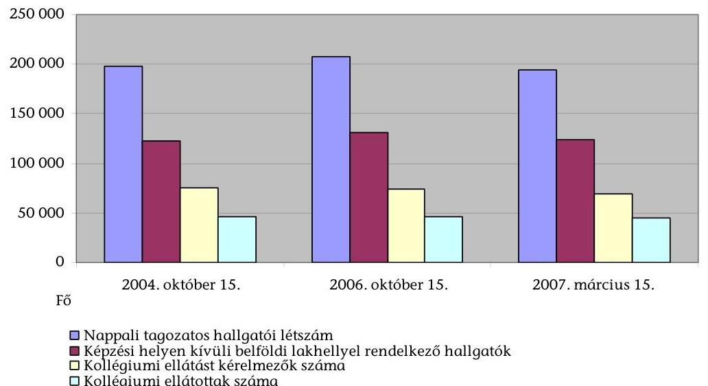

A felsőoktatás kollégium beruházási programjának előkészítésekor a köz- és magánszféra együttműködését elősegítő szabályozási környezet nem volt meg-
lami beruházások megvalósítása szabályozásának, irányításának és ellenőrzésének komplex módon történő áttekintését javasoltuk a Kormánynak.
${ }^{6}$ Az erre vonatkozó javaslatot a felsőoktatási intézményhálózat integrációjának ellenőrzéséről szóló ÁSZ-jelentés tartalmazta (0311. számú, 2003. március), melyet az oktatási miniszter elfogadott.
${ }^{7}$ 1068/2004. (VII. 9.) Korm. határozat a Magyar Universitas Programról, valamint az új felsőoktatási törvény koncepciójáról.

---

felelő. Az együttműködésben részt vevő állami intézmények részére ma is hiányzik az eljárási szabályokat rögzítő egységes állami eljárásrend, valamint a projektek gazdaságosságának megállapítását szolgáló PSC-számítás módszertana ${ }^{8}$, amely biztosíthatná a projektek összehasonlító elbírálását és értékelését.

A minisztérium nem rendelkezett az előkészítő tevékenységet segítő adatbázisokkal (kormányzati beruházások paraméterei, felsőoktatási ingatlanállományi adatok, ingatlanfejlesztési trendek). A megalapozó információk, az egységes állami eljárásrend és a PSC-számítás módszertanának hiánya ellenére is az OM alapos előkészítő tevékenységet végzett. A kormányhatározati előterjesztéseknek megfelelően részt vett a PPP-konstrukció szabályozási és garanciális elemeinek kialakításában, javaslatot tett a kockázatok ésszerű megosztására, közreadta a pályázati részvétel egységes feltételi és bírálati szempontjait, jóllehet ezek közül hiányoztak a gazdaságossági és hatékonysági követelmények.

Az intézmények által végzett előzetes összehasonlító PSC-számítások alapvetően becslésen alapultak. A számítások a diákotthon építésnél hasonló módszerrel, a kollégiumi rekonstrukciónál intézményenként eltérő számítási metodikával készültek. Az előzetes gazdaságossági számítások - még úgyis, hogy nem fejezik ki az „oktatáspolitikai hozzáadott értéket" - a PPP-konstrukció előnyeit igazolták két intézmény kivételével, de a projekteket ezirányú követelmény hiányában e két intézménynél is befogadták.

A minisztériumi és tárcaközi bizottsági értékelésre benyújtott PSC számításokat az intézmények nem korrigálták a közbeszerzési pályázaton nyertes vállalkozói szerződéses ajánlatoknak megfelelően. Így az a döntések megalapozását nem segítette. A 6 befejezett diákotthon építési projektre végzett összehasonlító elemzésünk szerint ${ }^{9}$ a szerződés szerinti bekerülési és szolgáltatásvásárlási költségek összességében kedvezőek és az előzetesen számított PSC- és PPP-értékek alatt maradtak. Négy intézménynél ténylegesen alacsonyabb a díjfizetés a tervezettnél, két intézménynél magasabb.

A programban részt vevő intézmények rendelkeztek és éltek a jogszabályban biztosított lehetőséggel a projektfolyamatok szervezésére, a magánpartnerekkel a szerződések megkötésére, valamint a szükséges garanciák vállalására. Az intézményi közbeszerzési versenyfeltételek biztosítottak voltak, de ahol már a részvételi szakaszban csak egy jelentkező volt, nem alakult ki versenyhelyzet. Az eljárások a tervezettnél hosszabb előkészítést igénylő feladatok miatt elhúzódtak, amelyek késedelmes megvalósuláshoz vezettek. Az intézmények és a magánpartnerek közötti szerződésekben a kockázatok megosztása megfelelt az Eurostat és az OM előírásainak, továbbá megfelelően rögzítették a szolgáltatók felújítási kötelezettségeit. A projekt-kockázatokat csökkentő garanciális elem, hogy a beruházó és az üzemeltető azonos.

[^0]
[^0]:    ${ }^{8}$ A fentiek kialakítására vonatkozóan - „folyamatos"-an határidőzött - javaslattételi kötelezettsége van az állami és magánszektor közötti fejlesztési, illetve szolgáltatási együttműködés (PPP) újszerű formáinak alkalmazásáról szóló, 2028/2007. (II. 28.) Korm. határozat alapján létrehozott Tárcaközi Bizottságnak.
    ${ }^{9}$ Részletezés a 9. sz. mellékletben.

---

A felsőoktatási intézmények és a szolgáltatók közötti szerződésekben és azok mellékleteiben pontosan rögzítették a létesítménnyel, valamint a nyújtandó szolgáltatásokkal szembeni követelményeket, a szerződésmódosítás, a teljesítés értékelés és a szankcionálás eljárási módozatait. A kockázatviselés meghatározása megfelelt a köz- és intézményi érdekeknek. A felsőoktatási intézmények viselik a keresleti kockázatot, azaz a férőhely feltöltöttség jellemzően 90\%-os biztosítását, az inflációs és a többségében EUR alapú szerződési díjak miatti árfolyamkockázatokat. A szolgáltató felelőssége az építési, finanszírozási, műszaki üzemeltetési és rendelkezésre állási kockázat, valamint - a vizsgált intézmények kétharmadánál - a nyári hónapokban a keresleti kockázat viselése.

A programok előkészítése az egységes gazdaságossági számítások és a teljesítménykövetelmények hiánya miatt nem volt kellően megalapozott, de az állami és felsőoktatási érdekeket egyaránt megfelelően tükrözte.

Az ellenőrzött 25 projekt többségénél a tervezés és a kivitelezés a szerződésekben meghatározott tartalommal és a határidő betartásával valósult meg, 4 projektnél volt - eltérő okok miatti - határidő módosítás. A projektek tényleges bekerülési költségéről a vállalkozók - kockázatviselésükre és üzleti titokra hivatkozással - nem szolgáltattak információt. Mind az új diákotthonok, mind a kollégiumi rekonstrukciók kivitelezése a műszaki szakértői dokumentumok alapján megfelelt a szerződéses műszaki- és tervelőírásoknak. Az egy főre jutó lakóterület férőhelyenként átlagosan $16,8 \mathrm{~m}^{2}$ az új diákotthon építésnél, a kormányrendeletben ${ }^{10}$ előírt minimális $7 \mathrm{~m}^{2}$-rel szemben.

A befejezett és átadott projekteknél a szerződésekben biztosított szolgáltatások kielégítik a megrendelői és részben a hallgatói igényeket. Az ellenőrzött intézmények hallgatói önkormányzatai körében végzett felmérésünk szerint 56\%-os mértékben vették figyelembe az igényeiket. A hallgatók a közösségi és sporthelyiségek létesítésére vonatkozó javaslataik mellőzését kifogásolták.

Az intézmény által vállalt és fizetendő bérleti-szolgáltatási díjat és annak elemeit - beruházási, üzemeltetési és közüzemi díjrészek - az ajánlattétel során, piaci alku keretében alakították ki a szerződő partnerek. A vállalt fejlesztést, a szolgáltatási díjak mértékét az intézmény teherbíró képessége határozza meg. A fő alkotóelem a beruházási díjrész - diákotthonoknál 58\%-os, a rekonstrukciónál 43\%-os átlagos részaránnyal -, amelyet a beruházás bekerülési költsége, a vállalkozó által felvett hitel adósságszolgálata és a vállalt árfolyamkockázat alapján számítottak. Az üzemeltetési díjrész a pótlással egybekötött folyamatos fenntartást, működtetést biztosítja, amelyet egy inflációs árindex évente emel. Az új diákotthonok és a korszerűsített kollégiumok fajlagos üzemeltetési költségei alacsonyabbak a hagyományos módon működtetett kollégiumok fajlagos üzemeltetési ráfordításainál, az energiatakarékos műszaki megoldások miatt. Az üzemeltetés eddigi tapasztalatai szerint az intézmények és a szolgáltatók között stratégiai partnerség alakult ki.

[^0]
[^0]:    ${ }^{10}$ A felsőoktatásról szóló 2005. évi CXXXIX. törvény egyes rendelkezéseinek végrehajtásáról, így a diákotthoni múködés feltételeiről is szóló 79/2006. (IV. 5.) Korm. rendelet 2. sz. melléklete.

---

A felsőoktatási intézmények a szerződéses férőhely feltöltési kötelezettségüket teljesítik, a kapacitáskihasználás közel 100\%-os. A jelenlegi kollégiumi hallgatói térítési díjak - a miniszteri rendelet szabályozásának megfelelően - versenyképesek az albérleti díjakkal. A havi intézményi bruttó bérleti díj átlagos összege (jelentős szórással) az új diákotthonokban 44669 Ft/fő/férőhely, a korszerűsített kollégiumokban $36651 \mathrm{Ft} /$ fő, melyek $18-27 \%$-át térítik a hallgatók. Az OKM/OM által vállalt 50\%-os mértékű rekonstrukciós térítés következtében a diákotthon építésnél 59\%-os, a rekonstrukciónál 77\%-os az állami támogatás aránya a bérleti díjon belül.

A bérleti-szolgáltatási díj forrásai
a helyszínen ellenőrzött intézményeknél 2006-2007. évben
Diákotthon építés
Kollégiumi rekonstrukció
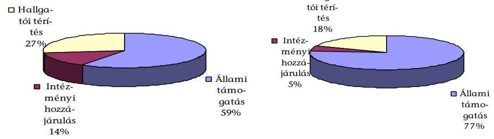

A projektfolyamatok követését az OKM végzi, de nyilvántartásuk nem pontosan rögzíti a programok, projektek megvalósulását ${ }^{11}$. Az intézményeknél 2007től múködtetett monitoring rendszer alkalmas lehet a szerződéses teljesítések nyomon követésére. A tárca - a 2006. évi feladattervében foglaltakkal szemben - nem végezte el eddig a PPP-fejlesztések értékelését.

A felsőoktatási kollégiumi beruházási program megvalósítása a tervezetthez képest késésben van. A kormányhatározatban szereplő 10455 férőhelyes diákotthon építési program várhatóan 58\%-osan teljesül, az intézményi fejlesztési elképzelések megalapozatlansága és a sikertelen eljárások miatt. A kollégium rekonstrukciós program 94\%-ban valósul meg, várhatóan 2009. év végéig. A helyszíni ellenőrzés zárásakor a program 2004. októberi induló helyzetéhez képest (44 183 férőhely) - alapvetően a folyamatban lévő rekonstrukciók miatt -1217-el kevesebb a kollégiumi férőhely. A program befejezésekor várhatóan nem áll fenn férőhelycsökkenés a minőségi színvonal emelkedése mellett.

A kormányhatározati célkitűzések közül a KSH előzetes véleménye szerint teljesül a programok államháztartáson kívüli elszámolhatósága. Megvalósult a kollégiumi normatíva előírt összegű emelése. Az OKM folyamatosan teljesíti a megállapodásban vállalt intézményfinanszírozási kötelezettségeit. A vizsgált

[^0]
[^0]:    ${ }^{11}$ Lásd az 5-6. sz. mellékletet a felsőoktatási kollégiumi beruházási program teljesítésének számszerúsítéséről.

---

felsőoktatási intézmények közül csak egy érte el a PPP-kötelezettségvállalás maximált $10 \%$-os költségvetési felső határát ${ }^{12}$.

A kollégiumi beruházási PPP-program a részt vevő intézményeknél minőségi férőhely-cserével járt. A minőségi kollégiumi szolgáltatásnyújtás az intézmények között versenyhelyzetet eredményez. Az intézmények ingatlangazdálkodási szemlélete erősödött ${ }^{13}$, az állami és magánszféra közeledett egymáshoz. A befejezett diákotthon építési projekteknél hosszú távon - a jellemzően 20 éves futamidő végén - a szolgáltatásvásárlás jelenértéke több mint kétszerese, nominálértéke közel három és félszerese a nettó bekerülési költségeknek (áfa nélkül) ${ }^{14}$.

Az intézmények díjfizetési kötelezettségének teljesítése rövid távon biztosított. Közép- és hosszú távon a vállalt intézményi saját rész növelése mellett a közszféra részére kockázati tényezőként jelentkezik az EUR/Ft árfolyam alakulása, a közüzemi díjak emelkedése, a kollégiumi és lakhatási normatíva, az intézményi képzési helyzet és a hallgatói létszám alakulása. A futamidő végén további kockázati tényezőként jelentkezhet állami tulajdonba vételnél a létesítmény maradványértékének meghatározása és kifizetése.

A projektek kivitelezése és múködtetése - az egyedi projektcélok teljesülése, a korábbinál alacsonyabb üzemeltetési ráfordítások, a minőségi színvonal növekedése és a teljes kapacitáskihasználtság alapján - rövid távon eredményes, gazdaságos és hatékony. Hosszú távon a bérleti-szolgáltatási díj nagysága és ennek alakulására ható kockázati tényezők alapján a kollégium beruházási program gazdaságossága és a projektek hasznosítási hatékonysága jelenleg egyértelmúen nem ítélhető meg.

A helyszíni ellenőrzés megállapításainak intézményi szintű hasznosítása mellett javasoljuk:

# a Kormánynak 

Intézkedjen a PPP Tárcaközi Bizottság koordinálásában előirányzott állami eljárásrend kialakításának gyorsításáról a PPP-konstrukció alkalmazásának egységes értelmezése, előkészítése és végrehajtása érdekében; az eljárásrend térjen ki a PSC-számítás egységes módszertani előírásaira, és követelményként jelenjen meg az, hogy a PPP-

[^0]
[^0]:    ${ }^{12}$ A Magyar Köztársaság 2004. évi költségvetéséről és az államháztartás három éves kereteiről szóló 2003. évi CXVI. törvény 50. § (6) bekezdése értelmében a felsőoktatási intézmények tárgyévi költségvetésük kiadási főösszegének 10\%-os mértékig vállalhatnak hosszú távú kötelezettséget.
    ${ }^{13}$ A felsőoktatási állami intézmények ingatlangazdálkodásának ellenőrzéséről szóló 0615. sz. ÁSZ-jelentés megállapításaihoz viszonyítva.
    ${ }^{14}$ Lásd a 9. sz. mellékletben a befejezett diákotthon építési projektek prognosztizált nettó bérleti szolgáltatási díjait. (A 6 befejezett új diákotthon végleges ajánlat szerinti nettó beruházási költsége: 11352 M Ft , a szolgáltatásvásárlás teljes projektköltsége nominálértéken a 20 éves futamidő végén: 38164 M Ft.)

---

konstrukció gazdaságilag előnyösebb legyen az állam számára a csak költségvetési forrásból megvalósuló beruházásnál.

# az oktatási és kulturális miniszternek 

1. Gondoskodjon - a felsőoktatás fejlesztési koncepcióval összhangban - a tárcaszintű programok, a fejezeti finanszírozással megvalósuló beruházások esetén a gazdaságossági és hatékonysági teljesítménykövetelmények megfogalmazásáról és azok érvényre juttatásáról.
2. Kísérje figyelemmel folyamatosan a felsőoktatási kollégium beruházási program teljesítését, ellenőrizze és értékelje a tárca területén folyó PPP-fejlesztéseket.

---

# II. RÉSZLETES MEGÁLLAPÍTÁSOK 

## 1. A FELSŐOKTATÁSI KOLLÉGIUM BERUHÁZÁSI PROGRAM MEGALAPOZOTTSÁGA, ÖSSZHANGJA A FELSŐOKTATÁSI CÉLOKKAL

### 1.1. A kollégium beruházási program összhangja a felsőokta-tás-fejlesztési célokkal és a kollégiumi ellátás iránti igényekkel

A felsőoktatásban az integrációs intézmény-átalakítási folyamatok 2000. évi zárását követően az oktatás feltételeit javító fejlesztések kerültek előtérbe. Ennek részeként fogalmazták meg kormányzati elképzelésekben a hallgatói szálláshelyek fejlesztését, mivel a felsőoktatási kollégiumok férőhelyszáma és állapota az oktatási feltételek között szűk keresztmetszetet jelentett. A kollégiumi helyzetet a hallgatói létszámnövekedésből adódó mennyiségi férőhelyhiány, az oktatási formák változásából adódó minőségi szolgáltatási hiány, a fenntartási költségek növekedése, a müszaki állapot romlása és a költségvetési források szükössége egyaránt jellemezte.

Az előző évtizedben a hallgatói létszám 2,5-szeresére nőtt, a kollégiumi férőhelyek száma 10-15\%-kal emelkedett. A hallgatók 65\%-a tanult távol az állandó lakhelyétől.

A nemzeti kollégiumfejlesztési stratégia, valamint a gazdaságosan finanszírozható kollégiumfejlesztéshez kapcsolódó intézkedési terv kidolgozásának szükségességével már 2001. decemberében foglalkozott egy - az OM által készített kormányhatározati előterjesztés. A stratégiai szempontok között szerepelt a kollégiumfejlesztési modell létrehozása, valamint az intézményfejlesztési tervek kiegészítése kollégiumfejlesztési fejezettel. A szálláshelybővítés és a korszerű, gazdaságos üzemeltetés célkitűzéseinek megvalósításához magántőke igénybevétele is megfogalmazódott. A minisztériumi elképzelések valóra váltásához tanulmányok, gazdaságossági számítások készítése kezdődött el, mindez a 2002. évi kormányváltással abbamaradt.

A 2002-2003. éveket megelőző 4-5 évben viszonylag kevés kollégiumi funkciót ellátó építés - összesen 2105 férőhely-bővülés és $1,5 \mathrm{Mrd}$ Ft összegű épületrekonstrukció - történt. A hallgatók elhelyezését szolgáló meglévő kollégiumok fele leromlott műszaki állapotban volt, és nem kínált minőségi életfeltételeket.

A felsőoktatás kollégiumi ellátottságának helyzete nyújtott alapot a 2002-2006 közötti időszakra vonatkozó Kormányprogramban nevesített „Collegium 21" kollégium-felújítási és -építési program indításához. A Kormány, illetve az OM a központi költségvetés terhére finanszírozható fejlesztési lehetőségek hiánya miatt a befektetői források bevonásával látta megoldhatónak a diákotthoni férőhelyek növelését.

A 2003. márciusi, Kormány részére készített OM tájékoztató előterjesztés három lehetséges változatot vázolt a férőhely bővítési program végrehajtására: külső be-

---

fektetők bevonását, 35-40 Mrd Ft-os állami forrás biztosítását, valamint szervezett módon, intézményhez köthető bérlemények igénybevételét.

Az ellenőrzött időszakban az OM költségvetéséből beruházásra - az egyházi és közoktatási feladatokkal, valamint az előző évi előirányzat-maradvánnyal együtt - 2003. évben 11,3 Mrd Ft-ot, 2006-ban 5,7 Mrd Ft-ot fordított. A 2007. évi költségvetésben rendelkezésre álló előirányzat összesen 6,3 Mrd Ft, amelyből - az idő közben végrehajtott OM és NKÖM fejezeti összevonás következtében - az oktatási és kulturális beruházások 1,6 Mrd Ft-ot képviselnek.

Költségvetési források hiányában a beruházások megvalósításának kiemelt eszköze a kormányzat, illetve az OM által is támogatott, magántőke bevonásán alapuló, úgynevezett PPP (Public Private Partnership) konstrukció lett. Ebben a szolgáltatásvásárlási konstrukcióban a létesítmény létrehozásának és üzemeltetésének bérleti-szolgáltatási díj formájában történő kifizetése hosszú távra elnyújtható. A kockázatok megosztása az Eurostat ajánlásainak megfelel. Ezáltal a program megvalósítása a központi költségvetési hiányt nem növeli.

A Kormány a 2091/2003. (V. 15.) Korm. határozattal döntést hozott 10000 új diákotthoni férőhely vállalkozói alapon történő megvalósításáról, valamint az éves szintű kollégiumi és lakhatási támogatás fokozatos, 2006-ra átlagosan $100000 \mathrm{Ft} /$ fő összegre történő emeléséről.

A kormányhatározat a Kormányprogramon alapult, de nem előzte meg kollégiumfejlesztési stratégia kidolgozása, mely a kollégiumi helyzetből kiindulva fejlesztési-döntési változatokkal alátámasztotta volna a diákotthon építési program indítását. A határozat az említett számszerúségek mellett további konkrét - a megvalósítás gazdaságosságára, a tervezett kihasználtságra, az ellátottságra vonatkozó - célokat nem tűzött ki. Az előterjesztés 20042006. közötti megvalósulással számolt.

Az OM a beruházási program előkészítésére irányuló kormány előterjesztés megalapozásához megfogalmazta a PPP program törvényi feltételeinek megteremtéséhez szükséges intézkedéseket, felmérte a programba bekapcsolódó intézményi igényeket, bemutatta a tervezett PPP konstrukciót.

A döntést megelőzően - kormányzati PPP-eljárásrend hiányában - a program megvalósításának lehetőségeiről gazdaságossági számításokkal alátámasztott hatástanulmányt nem készítettek, amely áttekinthetően, összehasonlíthatóan bemutatta volna a különböző megoldási változatok pénzügyi hatásait, finanszírozási költségeit, a hallgatói létszám - felsőoktatási reform függvényében várható - változásait is figyelembe véve.

A rendelkezésre álló kollégiumi férőhelyek és az új férőhelyek közötti színvonalkülönbség megakadályozására 2004. májusában a meglévő kollégiumi férő̉helyek korszerűsítésének programját is kezdeményezte az OM, a magánszféra közremüködésével.

A tervezett konstrukció szerint olyan befektetőket kerestek, akik elvégzik a rekonstrukciókat, majd 20 évig üzemeltetik a kollégiumokat. Az összetett szolgáltatásért az intézmények éves bérleti-szolgáltatási díjat fizetnek.

---

A Minisztérium a kezdeményezéssel a kollégiumi férőhelyek mintegy felének azaz 20000 férőhelynek - a rekonstrukcióját kívánta biztosítani, mivel a férőhelyek másik fele az előző 20 évben létesült, műszaki állapotukat elfogadhatónak ítélték.

A kollégiumi feladatellátás kétirányú javításáról - diákotthon építési program és kollégiumi rekonstrukciós program - az Oktatási Minisztérium felügyelete alá tartozó felsőoktatási intézmények infrastruktúra fejlesztési programjának aktuális feladatairól szóló 2207/2004. (VIII. 27.) Korm. határozat rendelkezett. Ez a határozat nevesítette azt a 18 felsőoktatási intézményt, melyek bővítéssel együtt összesen 10455 férőhely létesítését vállalták a diákotthon fejlesztés keretében, valamint - intézményi nevesítés nélkül - rendelkezett 20000 férőhely 2004-2006 közötti rekonstrukciójáról. A kormányhatározat előírásai csak mennyiségi programelemeket tartalmaztak, minőségi és gazdaságossági követelményeket nem rögzítettek.

A kormányhatározatot megelőző előterjesztés felvázolta - az intézmények, magánbefektetők, kereskedelmi bankok és más tárcák képviselőivel folytatott egyeztetések nyomán - az időközben kialakított PPP-konstrukció garanciális elemeit, szabályozási környezetét (a 2.1. pont szerinti részletezés szerint). Ezek mellett az előterjesztés röviden tartalmazta az előzményeket, a fejlesztés céljait, fő irányait, de nem tartalmazott hatásokat bemutató részletező elemzést, mely bemutatta volna az egyes programok előnyeit, a közérdeket képviselő OM, a hallgatók, a felsőoktatási intézmények, valamint a befektetők szempontjából.

A minisztériumnál nem álltak rendelkezésre olyan adatbázisok, amelyek segítették volna a program előkészítését (elvégzett kormányzati beruházások paramétererei, felsőoktatási ingatlanállományra vonatkozó adatok, amelyből az épület élettartama teljes egészében követhető, az intézményi fejlesztési trendre rálátást biztosító információk).

A hosszú távú kötelezettségek vállalásának egyes szabályairól szóló, 24/2007. (II. 28.) Korm. rendelet 4. §-a már előírja, hogy a projektgazda által elkészített előterjesztésnek - többek között - kötelezően tartalmaznia kell: a projekt költséghaszon elemzését, a megvalósítás lehetséges finanszírozási alternatíváit és azok nettó jelenértéken történő összehasonlítását.

# A kollégiumi férőhelyhiány indokolta a beruházási elképzeléseket. 

Az OM a férőhely növelési célok indokoltságának alátámasztására a 2002. évi hallgatói létszámadatok alapján 126000 fő - a képzési székhelyen kívüli lakóhellyel rendelkező - állami finanszírozású, nappali tagozatos, elhelyezési jogosultsággal rendelkező hallgatói létszámmal számolt. Közülük - a bérelt férőhelyeket is figyelembe véve - 46000 fő ( $36,5 \%$ ) részére volt biztosított a kollégiumi ellátás, 80000 fő hallgató maradt ki az ellátásból.

A kollégiumi ellátottság bemutatása során ugyanakkor az OM nem vette figyelembe azt a tényezőt, hogy a képzés helyén kívüli lakóhellyel rendelkező, lakhatási támogatásra jogosultak nem teljes létszámban igényeltek kollégiumi ellátást.

---

Az állami felsőoktatási intézményektől kért tanúsítványi adatok alapján megállapítottuk, hogy 2004. évben a kollégiumi ellátást 74886 fő kérelmezett, ebből 48394 fő igénye ( $64,6 \%$ ) volt kielégíthető a bérelt férőhelyekkel együtt. Ténylegesen férőhely hiány miatt 26492 fő volt ellátatlan.

Az ellenőrzési időszak végén, 2007. évben a kollégiumi ellátást kérelmezők száma 69489 fő volt, a kollégiumi ellátásban részesülők száma pedig 47699 föt (68,6\%) tett ki. A kollégiumi ellátásból 21790 fő maradt ki (1., 2. sz. táblázat, 1-2. diagram).

Az ellenőrzött intézmények rendelkezésére álló összes kollégiumi férőhely 2006. október 15 -én 20247 volt, melynek $48 \%$-a saját fenntartású, $33 \%$-a PPPkonstrukcióban és $19 \%$-a hagyományos konstrukcióban bérelt férőhely volt (5. sz. táblázat).

A diákotthon fejlesztési program indítását megelőzően teljes körú elemzés a regionálisan felmerülő kollégiumi elhelyezési igényekről nem készült.

Az egyes intézmények által vállalt új férőhelyek létesítése kapcsán elkészített programban, projekttervben előírt kötelezettség volt bemutatni a hallgatói létszámnak megfelelő kollégiumi férőhely szükségletet.

A diákotthon építés megalapozásához nem készült olyan elemzés, amely bemutatta volna a munkaerő-piac igényekhez igazodó hallgatói létszámváltozás hatását a kollégiumi férőhelyek iránti igényekre. Az OM ilyen irányú információ-bázissal nem rendelkezett. Az erre vonatkozó adatgyűjtést az intézmények is eltérő módon végezték.

A beruházási programot megelőzően, a képzési szerkezet megváltozásából eredő hallgatói létszám alakulása - felsőoktatási képzési stratégia hiányában - nem képezte külön vizsgálat tárgyát. A kollégiumfejlesztéshez kötődő létszámfeltöltés biztosítottságát illetően az OM rendelkezett különböző előrejelzésekkel.

A felsőoktatási reform keretében 2005. évben megalkotott új felsőoktatási törvény a többciklusú képzési szerkezet elveinek megfelelően határozta meg a felsőoktatási intézmények alaptevékenységébe tartozó képzések rendszerét. Az új, több ciklusú képzési szerkezet, annak 2006. évi bevezetésével lett általános.

A demográfiai változással foglalkozó adatbázisok egymástól eltérő előrejelzéseket mutatnak.

Az OM - demográfiai tanulmányok előrejelzése alapján ${ }^{15}$ - hosszabb távon 70000 fő körül stagnáló érettségiző létszámmal és 80000 fő körüli várható felvételiző diákkal számolt.

A KSH előreszámítási kimutatása szerint a 15-19 éves népesség csoport létszáma 65 000-70 000 fő körül alakult 2002-2003. években, amely a prognózis szerint to-

[^0]
[^0]:    ${ }^{15}$ Polónyi István: A hazai felsőoktatás demográfiai összefüggései a 21. század elején.

---

vább csökken és 2017-2020 között az évi 50000 fő körüli létszámot közelíti majd, az érettségizettek aránya pedig ezen belüli létszámot képvisel ${ }^{16}$.

A Minisztérium - az intézmények jelzése alapján - a külföldi hallgatói létszám növekedésével is számolt, amely tovább növeli a diákotthonok igénybevételét.

A 2003-2006. években felvételt nyert alapképzésben résztvevő, állami finanszírozású nappali hallgatói létszám - a 2005. év kivételével - még növekedést mutatott 50504 fő és 53079 fő közötti létszámmal. 2007. évtől azonban a központilag redukált (41 900 fő) felvételi létszámmal már csökkenés kezdődik.

Az ellenőrzés megállapította, hogy a felsőoktatási kollégium beruházási program formálódása időben megelőzte a felsőoktatás átfogó reformját célként kitűző Magyar Universitas Programot, melyet a felsőoktatási törvény koncepciójával együtt a Kormány 2004. évi 1068/2004. (VII. 9.) határozatával fogadott el. A reform törvényi alátámasztását biztosító új felsőoktatási törvényt 2005. évben fogadta el az Országgyűlés. A diákotthon építési program és a kollégium rekonstrukciós program utólagosan épült be az Universitas Programba.

Az utólagos beépítés ellenére a kollégium beruházási program célkitűzései megfelelően szolgálják a felsőoktatás fejlesztési céljait, a felsőoktatás kollégiumi feladatellátásból eredő infrastrukturális igényeinek kielégítését. A kollégiumi beruházási program utólagosan összhangba került a felsőoktatás folyamatosan formálódó középtávú fejlesztési céljaival. A férőhelybővítés tervezett nagyságrendje a kollégiumi ellátásból kimaradó 2004. évi 26492 fő hallgatói létszám függvényében elfogadható mértékű. A férőhelyek feltöltéséhez hosszú távon kedvezően járul hozzá - a szakképzés, a felnőttképzés, a levelező és a távoktatás fejlődéséből is adódóan - a kollégiumok iránti igény folyamatossága.

# 1.2. A diákotthoni férőhelybővítésre, kollégiumrekonstrukcióra irányuló intézményi igények megalapozottsága és időarányos teljesülése 

A felsőoktatási integrációval összefüggésben készített 1999-2000. évi intézményfejlesztési tervekben megfogalmazódott, hogy a meglévő kollégiumi színvonal akadályozza a XXI. században elvárható magas szintű, versenyképes szakemberképzést. Építési és korszerűsítési célokat egyaránt kifejezésre juttattak az intézményfejlesztési tervekben annak a szándéknak a valóra váltása érdekében, hogy egyetlen tehetséges fiatal se szoruljon ki a felsőoktatásból anyagi okok, az albérlet-piaci áraknál olcsóbb kollégiumi férőhelyek hiánya miatt.

Az intézményfejlesztési tervekben (IFT) rögzítettek alapján az intézmények átlagosan az igényjogosultak 30-40\%-ának tudtak kollégiumi elhelyezést biztosítani (NYME, SZTE, SZIE, EKF, ME, EJF), ezért a fejlesztési célkitűzések lényeges eleme a megfelelő számú és színvonalú férőhely kialakítása volt. Az intézményfejlesztési tervek külön részletező kollégiumfejlesztési fejezetet nem tar-

[^0]
[^0]:    ${ }^{16}$ KSH Népességtudományi Kutató Intézet, Előreszámítási adatbázis 2003.

---

talmaztak ${ }^{17}$, ilyen fejlesztési fejezet a programokat előkészítő 2003-2004. években sem készült.

A 2207/2004. (VIII. 27.) Korm. határozatban tervezett és végrehajtott, illetve folyamatban lévő diákotthon építés, illetve kollégiumi rekonstrukció kevés kivétellel - pl. BMF - azon felsőoktatási intézményeknél fordult elő, amelyek már az integrációval összefüggően készített IFT-ben is kifejezésre juttatták a kollégiumi elhelyezés javításának szükségességét. A felsőoktatási intézmények vonzerejét ugyanis nagymértékben befolyásolja a kollégiumi ellátás biztosítása és annak színvonala.

Az OKM folyamatosan nyilvántartja, és havonta összesíti a 2004. évben megkezdett diákotthon építés és kollégium rekonstrukció információs adatait (4. sz. melléklet). Ennek alapján megállapítható, hogy a tervezettől eltérő menynyiségben és - a tervezett 2006. év végi befejezéshez képest - késéssel valósultak meg a diákotthon építés keretében létrehozott férőhelyek. Az elmaradás oka - a tájékoztatás és az ellenőrzési dokumentációk szerint - a jelentkezés nem megfelelő megalapozottsága, a magánpartnerekkel folytatott alku eredménytelensége volt.
2007. májusáig az ellenőrzött 9 intézménynél összesen 3996 az új építésű, illetve bővítés útján megvalósított férőhely átadása történt meg nettó $13,8 \mathrm{Mrd} \mathrm{Ft}$ bekerülési költséggel. Jelenleg 1099 férőhely ( $4,8 \mathrm{Mrd}$ Ft) létrehozása van folyamatban. Az előkészítés alatt lévő fejlesztések 830 férőhelyet, a felfüggesztett, illetve a meg nem valósuló beruházások 3508 férőhelyet érintenek 10,4 Mrd Ft bekerülési összeggel. A hivatkozott korm. határozatban - bővítéssel együtt - rögzített 10455 férőhellyel szemben a megvalósítás aránya az ellenőrzés befejezéséig - a tanúsítványok alapján -48,7\%-os mértékú. (Az adatokat részletesen a 3-6. sz. mellékletek tartalmazzák, a diákotthon építés helyzetét és területi elhelyezkedését a 7. sz. melléklet mutatja be.)

A program jelenlegi fázisában - az ellenőrzés befejezésének időpontjában - az új és a bővítés eredményeként létrejött diákotthoni férőhelyek a kollégiumi ellátottságban ténylegesen nem eredményeztek javulást. Ennek oka, hogy a folyamatban lévő rekonstrukciók miatti kiköltöztetések, a korszerűsítéssel együtt járó átalakítások átmenetileg csökkentették az elhelyezhető hallgatók számát. Két véglegesen bezárt és egy eladott kollégium a korábbi időszakhoz viszonyítva további férőhelycsökkenést jelentett. A tanúsítványi adatok szerint a kollégiumi ellátási lehetőség a 2004. évi 44183 férőhelyről 2007-re 42966 férőhelyre csökkent, 1217 férőhellyel lett kevesebb (3. sz. táblázat).

Az új építésű, átadott diákotthonok bérlése - az ellenőrzés befejezéséig - 3996 férőhely növekedést eredményeztek. Egy esetben (ELTE) a kollégium átköltöztetése 160 férőhely növekedésével járt. Ezzel szemben a rendelkezésre álló férőhelyeket összesen 1036 hellyel csökkentette a kollégium eladása (DE 402 férőhely), egyes kollégiumok bezárása (NYF, KRF összesen 574 férőhely), illetve belső átalakítása

[^0]
[^0]:    ${ }^{17}$ Erre vonatkozó javaslat a 2001. decemberében az OM által készített kormányhatározati előterjesztésben szerepelt.

---

(SZE konyha, SZTE vendégszoba kialakítása). A 2007. évben kimutatott kollégiumi férőhelyek számát további 4337 férőhellyel csökkentették a folyamatban lévő rekonstrukciók miatt átmenetileg nem üzemelő kollégiumok.

A helyszíni ellenőrzés befejezéséig a rekonstrukciós programban öt intézménynél 5025 férőhely átadását hajtották végre 10,0 Mrd Ft nettó bekerülési összeggel. A folyamatban lévő korszerűsítések 4840 férőhelyet érintenek, a szerződésekben rögzített 11,0 Mrd Ft-tal, míg 7249 kollégiumi férőhely 14,2 Mrd Ft bekerülési költséggel előkészítési fázisban van. A felfüggesztett vagy elmaradt korszerűsítés 2580 férőhelyet érint (tervezett bekerülési költségük 3,8 Mrd Ft) (4., 5. sz. melléklet).

A tervezett 20000 férőhelyre irányuló kollégiumi korszerűsítésből a teljesítés aránya - a tanúsítványok alapján - 49,3\% (6. sz. melléklet).

# 1.3. Az Oktatási Minisztérium felügyeleti szerepvállalása a beruházási program megalapozásában 

A kormányhatározatok előkészítését követően, azok végrehajtásában szakmai, koordinációs és felügyeleti szerepet töltött be az OM. Az intézmények részére egységesen közzétette a Minisztérium a PPP programban való részvétel feltételeit. A programban azok az intézmények vehettek részt, amelyek férőhely igénye megalapozott volt, reális programjavaslatot nyújtottak be, a megvalósításhoz megfelelő ingatlannal rendelkeztek, amelyeknek az intézményfejlesztési tervét az OM elfogadta, illetve akik a férőhely feltöltési és üzemeltetési garancia vállalásához az intézményi döntéseket meghozták.

Az OM 2003. évben felmérte a felsőoktatási intézmények diákotthon építés fejlesztési igényeit. Az év során, augusztusban konzultációt szervezett a PPP programokban érintett felsőoktatási intézmények vezetői és érintett munkatársai részére a várható feltételekről és a határidőkről. Az oktatási miniszter sürgetése következtében a PPP pályázatok komplex anyagát 2003. szeptember 15-ig kellett benyújtani a Tárcaközi Bizottsághoz. Erre a határidőre a már megfelelő készültségi fázisban lévő projektek voltak beterjeszthetőek első, a továbbiakban a második, illetve a harmadik körben. Az OM 2004. szeptemberében hirdette meg a kollégium rekonstrukciós programban való részvétel és a Minisztériummal kötendő megállapodás feltételeit.

A program indításakor sem az irányító, sem a résztvevő funkcióban nem rendelkeztek a közszféra szakemberei a PPP konstrukció által igényelt speciális felkészültséggel. Ennek pótlásaként mind az OM, mind az intézmények külső szakértőket alkalmaztak. Az OM a közbeszerzési eljáráshoz bírálati szempontokat, kockázatelemzést tett közzé a PPP konstrukcióban végrehajtott fejlesztési, korszerűsítési feladatok résztvevői számára.

Az OM az intézmények részére meghatározta a PPP projekttervek elkészítéséhez szükséges szempontokat és feltételeket. A becslésen alapuló feltételekre építő összehasonlító gazdaságossági számítások elvégzését előírta, de egyéb gazdasági követelményeket nem támasztott a projektekkel szemben a szakmai felügyelet.

---

Az intézmények a programhoz való csatlakozásról szóló dokumentumokban bemutatták a kollégiumi ellátottságot (a férőhely igény megalapozottságát alátámasztó adatokat) és a színvonalat tükröző helyzetüket, a fejlesztést megelőző időszak üzemeltetési költségeit, az intézményfejlesztéssel összefüggő bevételi forrásokat és a fejlesztéshez szükséges ingatlan megnevezését.

Az OM szükségesnek tartotta az intézkedéseket és felhatalmazásokat tartalmazó intézményi tanács határozatainak benyújtását, az építési és korszerűsítési programok leírását, a feladatokra vonatkozó műszaki paraméterek, valamint a Közszféra Összehasonlító Index bemutatását, a pályázati dokumentumokkal, intézkedésekkel, határidőkkel, valamint ezek felelőseinek megnevezésével ellátott tájékoztató anyag becsatolását.

# Értékelési és bírálati szempontrendszert a beruházási tervekkel öszszefüggően az OM nem dolgozott ki. A dokumentáció értékelését az elfogadás függvényében, három kategóriába történő besorolással - "befogadható dokumentáció, hiánypótlásra javasolt, illetve teljes körű átdolgozásra javasolt dokumentáció" - határozták meg. 

Vizsgálták, hogy az általuk meghatározott elvárásnak a beadott fejlesztési tervek megfelelnek-e, teljes körűen tartalmazzák-e azokat az adatokat, információkat, dokumentumokat, amelyeket meghatároztak. Ez folyamatos munkakapcsolatban zajlott. Nem készítettek arról elemzést, hogy hány intézményfejlesztési tervet adtak vissza kiegészítésre, illetve átdolgozásra. A cél az volt, hogy az előírások teljesítésével az intézményfejlesztés megvalósuljon.

A bemutatott fejlesztési programok mindegyikénél (új építés, illetve korszerűsítés) a Minisztérium követelményeket határozott meg a magánpartner és az intézmény közötti kockázatok megosztását, valamint a férőhely feltöltöttség mértékét - 60-90\% - illetően.

Az intézményeknek a Minisztérium által megadott szempontok szerint kellett elkészíteni pályázataikat, amely az intézmény és az OM között létrejött megállapodás feltételét és mellékletét képezte.

A Minisztérium a kormány-előterjesztésen alapuló, részletes kockázatmegosztási mátrix elkészítésével segítette elő az intézmény és a magánpartner (ajánlattevő) közötti szerződés feltételeinek kialakítását. Az új diákotthonok fejlesztési projektjeit a TB felülvizsgálta és véleményezte.

A TB az első programmal jelentkező Debreceni Egyetem (DE) diákotthon építésével összefüggő előterjesztést tárgyalta meg és véleményezte, amelyet a Gazdasági Kabinet is elfogadott. Ezt követően a Gazdasági Kabinet 2003. november 11-én hozott döntése értelmében a későbbi diákotthon fejlesztésekről szóló előterjesztéseket a Minisztériumnak már nem kellett a Gazdasági Kabinet, illetve a Kormány elé terjesztenie, amennyiben a már elfogadott DE előterjesztésével megegyező részletezettséggel és szerkezetben készültek.

A bírálatok és konzultációk eredményeként, a felmerült hiányosságok kiküszöbölését követően a TB elfogadta a kollégiumfejlesztési projekttervezeteket.

A minisztérium az elfogadott projektekhez kapcsolódóan megállapodást kötött az intézményekkel a kötelezettségvállalás megosztására. A megállapodások a felsőoktatási infrastruktúra-fejlesztési célokat szolgálták, de rész-

---

letes hatékonysági, gazdaságossági követelményeket nem tartalmaztak. A megállapodás megfelelően rögzítette kötelezettségként az intézményi finanszírozási önrész vállalását.

A PPP beruházások megvalósításához indokolt jogszabályi változások érdekében az OM/OKM a szükséges intézkedéseket (a 2.1. pont szerinti részletezés szerint) megtette.

Az OM a programok indításakor a normatív kollégiumi hozzájáruláson és a lakhatási támogatáson túli központi költségvetési támogatás szükséglettel nem számolt. Az időközben a kollégiumi rekonstrukciós program megvalósíthatósága érdekében - a fejezet éves beruházási forrásai terhére, annak 33\%-áig, a 2003. évi CXVI. törvény 50. § (b) bekezdése alapján - a minisztérium vállalta a bérleti díj 50\%-ának, az új építésű diákotthonok esetében pedig évi 10 hónapos időtartamra férőhelyenként 5 E Ft/hó/bérleti díj hozzájárulás kifizetését. A vállalt finanszírozási kötelezettségeit az OM/OKM rendben és pontosan teljesíti.

Az ellenőrzött időszakban, az OKM felügyelete alá tartozó felsőoktatási intézményeknél múködtetett kollégiumok kiadásai az intézményi múködési kiadásokon belül 2004. évben 2,49\%-ot, 2006-ban 2,61\%-ot tettek ki. A működtetés forrásának összetételében a kollégiumi normatív támogatás $45 \%$-ról $49 \%$-ra, a hallgatói térítés $27 \%$-ról $30 \%$-ra emelkedett, míg az intézményi saját forrás aránya $28 \%$-ról $18 \%$-ra csökkent. A minisztériumi hozzájárulás a PPP bérleti díjához az összes intézményre 2006. évben 3\%-ot tett ki (5-7. sz. táblázat).

# 2. A PROJEKTEK ELŐKÉszíTÉSE 

### 2.1. A kollégium beruházási program előkészítésének és lebonyolításának szabályozási feltételei

A felsőoktatás kollégium beruházási programjának indításakor a köz-és magánszféra együttmúködését elősegitő szabályozási környezet nem volt megfelelő. A köz- és magánszféra együttműködésére vonatkozó szabályokat a közbeszerzési törvény, a felsőoktatásról szóló törvény és a költségvetési törvények egyaránt tartalmaznak, de nincs speciális PPP törvényi szabályozás. A köz- és magánszféra együttműködésének jogi szabályozottsága nem teljes körű. A PPP konstrukció lebonyolítására hiányzik az egységes állami eljárásrend, valamint a projektek gazdaságosságának megállapítását szolgáló Közszféra Összehasonlító Index azaz a Public Sector Comparator (PSC) számításának módszertana, ami biztosíthatná a projektek azonos elbírálását és értékelését.

A Kormányprogram alapján a 2091/2003. (V. 15.) Korm. határozat feltételül szabta, hogy a külső befektetőkkel olyan szerződést kell megkötni, ami nem növeli a Maastrichti kritériumok alapján mért államháztartási hiányt.

A fenti kormányhatározat ugyanakkor nem kötötte ki feltételként, hogy a vállalkozói alapon történő megvalósítás legyen gazdaságosabb a hagyományos állami beruházásnál és múködtetésnél. A kormányzati

---

döntést megelőzően az állami és magánszféra által történő megvalósítás költségeinek összehasonlítása nem történt meg.

Az állami és magán szektor közötti fejlesztési, illetve szolgáltatási együttmúködés PPP alkalmazásának jogi alapját a 2098/2003.(V. 29.) Korm. határozat adta, melyben döntés született a konstrukció alkalmazásáról és a PPP TB létrehozásáról. A jogszabályt felváltó 2028/2007.(II. 28). Korm. határozat az előzőnél részletesebben tér ki a TB feladataira. Ezek közül azonban az együttmúködési programok állami eljárásrendjének jogi szabályozása még nem történt meg.

Előrelépést jelentett a 161/2005. (VIII. 16.) Korm. rendelet megalkotása, a több éves fizetési kötelezettséggel járó projektek jövőbeli pénzáramlásainak számításához.

A PPP-konstrukcióban megvalósuló fejlesztések fontos kritériuma, hogy előzetesen sor kerüljön a PSC-számítás elvégzésére. A számítás, a program állami megvalósítása esetén várható összköltségek jelenértékének meghatározásával összehasonlítási alapként szolgál a PPP konstrukciók gazdaságosságának megítéléséhez.

A projektek előkészítése során az intézmények elkészítették az állami, illetve a magántőke bevonásával történő megvalósítás összehasonlítását tartalmazó PSC számítást.

Az új diákotthonok létrehozására, múködtetésére irányuló programok PSC számításai hasonló módszerrel készültek. A számítások a nettó értékekre vonatkoztak (a várható hosszú futamidő alatt az áfa mértékének változása megnehezítette volna az összehasonlíthatóságot). A jelenérték számításához a beruházási, üzemeltetési és karbantartási költségek diszkontálására a magyarországi ipari árindexet, a kamat diszkontálására a felártól mentes BUBOR előre jelzett értékét vették figyelembe.

A kollégiumi rekonstrukciós programokra is készültek gazdaságossági számítások, intézményenként eltérő számítási metodikával.

A PSC értékét nem jelenértékként, hanem a teljes futamidő nominális kiadásainak átlagértékeként határozta meg a BCE. Ez a metodika nem felel meg a nemzetközi gyakorlatnak, de a befektetők ajánlatainak mérlegeléséhez alkalmazható. Az állami megvalósítás és a PPP konstrukció jelenértékét bruttó összegben határozta meg az EKF, nem téve különbséget az állami és a magánszféra üzemeltetési költségeire vonatkozóan. A 2005. év második felében induló rekonstrukciós program PSC számításainál a jelenérték meghatározásához már a 161/2005. (VIII. 16.) Korm. rendelet szerinti diszkontrátákat alkalmazták (BMF).

A számítások elvégzéséhez sem minisztériumi, sem intézményi szinten nem álltak rendelkezésre a szükséges adatbázisok (kormányzati beruházási adatok, összehasonlítható beruházási, szolgáltatás-piaci információk, részletes műszaki felmérések). A becslésekhez az intézmények korábbi műszaki adatai, üzemeltetési gyakorlata szolgáltatott alapot (BCE, BMF, KRF), ennek következtében a felújítások forrásigényét, valamint az üzemeltetési költségeket (BCE, BMF) alulbecsülték.

Az előzetes gazdaságossági számítások az intézmények döntő részénél a PPP konstrukció előnyeit igazolták. Kivételt képez ez alól az EKF,

---

valamint az NYF, ahol a PSC számítások az intézményi (állami) megvalósítás gazdaságosságát támasztotta alá. A projektek ennek ellenére PPP konstrukcióban valósultak meg.

A PSC számítás támpontot adhat a tárgyalásos eljárás, illetve a végső ajánlatok hozzáadott érték szempontú kiértékeléséhez. Amennyiben a számítás feltételei és az ajánlatok - megrendelő számára elfogadható - feltételei (kamatláb, inflációs ráta, felvett hitel összege) nem egyeztek, a gazdaságossági számítást módosítani kellett volna.

A PSC számítást az intézmények csak a program előkészítés szakaszában, az előterjesztések részeként szerepeltették. Később, az ajánlatok értékelésekor - mivel ezt nem határozta meg az OM a szerződéskötés támogatásának feltételéül - a számítás folyamatos finomítására nem került sor. Mivel a kapott ajánlatokat nem vetették össze az azonos feltételekkel számított PSC értékkel, az a döntések megalapozását nem segítette.

Az ellenőrzés keretében 6 befejezett diákotthon becsült és szerződés szerinti projektköltségeit hasonlítottuk össze (9. sz. melléklet). A becsült PPP érték, azaz a projektköltségek jelenértéke a magánszféra megvalósításában - az NYF kivételével - az állami megvalósításnál (PSC érték) alacsonyabb volt.

A gazdaságossági számításokban feltételezett projektköltség jelenértékének a szerződés szerinti összeg - összehasonlítható áron - egybevetésével a diákotthonok egy részénél (DE, NYF) a tervezettnél magasabb a szerződés szerinti díjfizetés, nagyobb részüknél (BMF, KRF, PE, ME) azonban alacsonyabb (9. sz. melléklet, 3-5. sz. diagram).

A kollégium rekonstrukciók szerződés szerinti bérleti-szolgáltatási díjának éves összegét a PSC érték számítások értéke megalapozta a ME-n, a NYF-n, ahol a kialkudott díj megfelel az előzetes számításoknak. Az éves bérleti díj magasabb a PSC értékeknél a BCE-n, a BME-n a DE-n.

Az előzetes számítások nem kellő megalapozottsága, a műszaki, szolgáltatási tartalom eltérése a projektek gazdaságosságának reális összehasonlítását nem teszi lehetővé. A PSC számítással ezzel együtt sem mutatható ki az oktatáspolitikai, nem „forintosítható" jövőbeni hozzáadott érték.

# A programban részt vevő intézmények rendelkeztek jogszabályban biztosított lehetőséggel a folyamatok szervezésére, a szerződések megkötésére, valamint a szükséges garanciák vállalására. A szerződések megkötésére azonban csak az OKM és KVI ellenjegyzése birtokában voltak jogosultak. 

Az Áht. 12/B. § (1) bekezdés rendelkezése lehetővé tette a költségvetési szervek részére a hosszú távú kötelezettségek vállalását. A Magyar Köztársaság 2004. évi költségvetéséről és az államháztartás hároméves kereteiről szóló 2003. évi CXVI. törvény 50. §. (6) bekezdésében foglaltak alapján a felsőoktatási intézmények a tárgyévi költségvetésük kiadási főösszegének 10\%-os mértékéig hoszszú távú (legfeljebb 20 éves) kötelezettséget vállalhatnak. A jogszabály az intézmények számára lehetőséget biztosított a 20 éves futamidejú bérletiszolgáltatási szerződés megkötésére.

---

A 2005. évi költségvetési törvény az intézményi költségvetés dologi és felhalmozási célú előirányzatának 10\%-áig korlátozta a hosszú távú kötelezettségvállalás éves fizetési kötelezettségeinek összegét, ez azonban nem érinti a Kormány által 2004-ben elfogadott infrastruktúra-fejlesztési programokat.

A tanúsítványi adatok alapján az ellenőrzött időszakban a hosszú távú kötelezettségvállalások éves összegei a törvényben meghatározott értékhatár alatt maradtak (9. sz. táblázat).

2006-ban a kötelezettségvállalással érintett ellenőrzött intézményeknél átlagosan 1,51\% volt a PPP konstrukciókhoz kötődő kötelezettségvállalás aránya. A maximális $10 \%$ a KRF-n, legalacsonyabb 0,58\% az EKF-n.

A PPP konstrukcióban igénybe vett diákotthoni szolgáltatások finanszírozhatóságának biztonságát több jogszabály is támogatta.

A 2091/2003. (V. 15.) Korm. határozat döntött a kollégiumi, diákotthoni és a lakhatási támogatás költségvetési törvényben meghatározott mértékének fokozatos emeléséről. A normatívák összegének emelése hozzájárult a bérletiszolgáltatási díjak biztonságosabb finanszírozásához.

A 2004. évi költségvetési törvény 50. §-a (6) bekezdése lehetőséget biztosított arra, hogy a felsőoktatási intézmények kötelezettségvállalásának 50\%-át a szakmai felügyeletet ellátó szerv - éves beruházási kerete 33\%-áig - átvállalja.

Az új Ftv. 122. §. (2) bekezdése lehetővé teszi, hogy a kincstári vagyonba tartozó ingatlanok értékesítéséből származó bevételek kötelezettségekkel nem terhelt részét az intézmények a PPP program keretében megvalósuló fejlesztések törlesztő részleteire fordíthassák.

A magántőke bevonásával tervezett felsőoktatás kollégium-beruházási program állami tulajdonú telkeken valósul meg. A 2091/2003. (V. 15.) Korm. határozat szerint a Kormány egyetértett azzal, hogy a program végrehajtásához a Magyar Állam tulajdonában és a felsőoktatási intézmények vagyonkezelésében levő ingatlanokon tartós földhasználati jogot biztosítsanak a magánbefektetők számára. Ezt a lehetőséget a jelenlegi szabályozás szerint az új Ftv. 122. §. (3) bekezdése rögzíti. Az új diákotthonoknál a Ptk. 155. § biztosítja a befektetők földhasználati, a kollégiumi rekonstrukcióknál a Ptk. 157-164. §-ok rendelkezései biztosítják a haszonélvezeti jogának megszerzését az állami tulajdonú ingatlanra, a futamidő tartamára.

Az OM az intézmények által előzetesen benyújtott szakmai anyagokból állapította meg, hogy teljesülnek-e a szerződés megkötéséhez szükséges követelmények, feltételek, a feltöltési kötelezettség, a bérleti díjak vállalása arányban van-e az intézmények teherbíró képességével.

# A PPP konstrukcióban megvalósuló program finanszírozásának forrásai új diákotthon létesítése esetén: 

- a diákotthonban elhelyezett, államilag támogatott képzésben részt vevő hallgatók után a költségvetési törvényekben meghatározott összegű kollégiumi normatíva, melynek összege 2006. szeptember 1-jétől $116500 \mathrm{Ft} /$ fő/év;

---

- a felsőoktatásban részt vevő hallgatók juttatásairól és az általuk fizetendő térítésekről szóló, az ellenőrzött időszakban hatályos 51/2002. (III. 26.) Korm. rendeletben és a 175/2006. (VIII. 14.) Korm. rendeletben, valamint az intézményi szabályzatban is rögzített, a hallgató által fizetendő hozzájárulás;
- az intézményt megillető lakhatási támogatás összegének intézményi hatáskörben - a hallgatói önkormányzat egyetértésével - meghatározott összege, de legfeljebb a támogatási keret $70 \%-\mathbf{a}$;
- az OM és az intézmények között létrejött megállapodás alapján a minisztérium által átvállalt férőhelyenkénti havi 5 E Ft-os bérleti díjtámogatás, az év 10 hónapjára;
- valamint egyéb intézményi bevételekből történő kiegészítés, beleértve az esetleges ingatlanértékesítésből származó bevételeket is.

A kollégium rekonstrukciós program finanszírozási forrásai az előzőekkel azonosak, azzal az eltéréssel, hogy az érintett intézményekkel kötött megállapodásban a férőhelyenkénti havi 5 E Ft-os támogatás helyett a bérleti díj $50 \%$-ának megtérítését vállalta az OM.

Az új diákotthonoknál a férőhelyek feltöltése hosszú távon - a demográfiai folyamatokkal, valamint az államilag finanszírozott férőhelyek csökkenésével is számolva - valószínúleg csak a lakhatási támogatás jogszabályban meghatározott maximális összegú felhasználása (BMF, NYF, PE), esetenként az olcsóbb bérlemények egyidejú felmondása mellett biztosítható.

A 175/2006 (VIII. 14) Korm. rendelet szerint az intézmények lakhatási támogatásra jogosultak azon hallgatók után, akik nem rendelkeznek lakóhellyel a képzés helyén, és nem részesültek kollégiumi elhelyezésben. Az intézményeket megillető lakhatási támogatás összege azonban magasabb, mint a lakhatási támogatásban részesültek részére történt kifizetések. A kormányrendelet értelmében a támogatás (a hallgatói önkormányzat egyetértésével, legfeljebb a támogatási keret $70 \%$-a erejéig) felújításra és kollégiumi (akár PPP konstrukciójú) férőhelyek bérlésére is felhasználható.

Az előbbi jogszabályi felhatalmazás megduplázza a költségvetési forrás igénybevételének lehetőségét a PPP konstrukcióban bérelt férőhelyeknél. (A hagyományos kollégiumok fenntartásához az intézmény a kollégiumi normatívát veheti igénybe, a PPP konstrukcióban bérelt férőhelyeknél a normatíván kívül a lakhatási támogatást is felhasználhatja.) Ez megfelel ugyan az intézményi érdekeknek, de a közérdeknek, valamint az igazságos teherviselés kritériumának nem felel meg. A lakhatási támogatás bérleti díj kiegészítésként való felhasználhatósága az intézmény számára hozzájárul ahhoz, hogy a fizetendő hallgatói hozzájárulás az albérleti díjakkal versenyképes legyen, biztosítva a diákotthon megfelelő kihasználtságát. Ugyanakkor a jelenlegi támogatási rendszerben a magasabb kollégiumi hozzájárulás fizetését vállalni tudó, - PPP konstrukcióban üzemelő diákotthonba jelentkező - diákok közvetett módon az intézményi saját fenntartású és hagyományos bérlésű kollégiumok hallgatóinál magasabb állami támogatást élvezhetnek.

---

Az állami kötelezettségek hosszú távú teljesítése a kollégiumrekonstrukciókat megvalósító projektek esetén - a bérleti díj OM (OKM) általi 50\%-os átvállalása mellett - a helyszíni tapasztalatok és tanúsítványi adatok szerint megoldott.

A hosszú távú finanszírozás bizonytalansága elsősorban az új diákotthonokhoz kapcsolódóan merült fel. A díjfizetéshez kapcsolódó kockázati tényezőt jelent ez EUR/Ft árfolyam alakulása, az infláció mértéke, a kollégiumi és lakhatási normatíva, valamint a hallgatói létszám változása.

A NYF ifjúsági szállója esetében felmerült, hogy a bérleti díj fizetéséhez kapcsolódó árfolyamkockázat a későbbiekben finanszírozási problémát eredményezhet. A 2006. évi költségvetésről szóló 2005. évi CLII. törvény 10. § (4) bekezdése alapján a BMF tervezi, hogy szükség esetén, használaton kívüli ingatlanok értékesítéséből teremti meg a bérleti díjak fedezetét.

A kollégiumok és diákotthonok jelenlegi térítési díjai alapvetően biztosítják az intézmények által vállalt feltöltési kötelezettség teljesítését. Az intézmények véleménye szerint az ingatlanértékesítés nem veszélyezteti a múködési feltételek biztosítását.

Az ellenőrzött intézmények közül 2004-2006 között csak két intézménynél volt jelentősebb összegű ingatlanértékesítés (DE és ME), ezek bevételét beruházási, felújítási feladatok finanszírozására, de nem a PPP konstrukcióban megvalósult kollégiumok bérleti-szolgáltatási díjainak kiegészítésére fordították.

# 2.2. A programfolyamatok nyomon követésének eredményessége és hatékonysága 

A diákotthon építési és kollégiumi rekonstrukció fejlesztési program minisztériumi felügyelete - a kivitelezés kivételével - kezdettől fogva, valamennyi folyamat során biztosított volt ${ }^{18}$.

Az OM a program előkészítését, lebonyolítását, a csatlakozás feltételeit ismertető segédletekkel, a jól előkészített projektek dokumentációinak közreadásával, dokumentum mintákkal, a közbeszerzési eljárás előminősítési szempontjainak, bírálati javaslatainak, a tervezési program ajánlott műszaki paramétereinek kidolgozásával, valamint szakértők ajánlásával segítette.

Az Intézményi Beruházási Bizottságokon (IBB) keresztül a közbeszerzési eljárásokban a Minisztérium kijelölt vezetői, illetve munkatársai rendszeresen részt vettek.

A közbeszerzési folyamat eredményének, a szerződések megvalósulásával kapcsolatos tapasztalatokat az OM összegyűjtötte. Az eredménytelen közbeszerzési eljárásból leszúrhető következtetéseket az OM nem dokumentálta, de a tapasztalatok intézményeknek való továbbadása hozzájárult a további eljárások eredményességéhez.

[^0]
[^0]:    ${ }^{18}$ A felsőoktatás kollégium beruházási program folyamatábrája, 2. sz. melléklet.

---

A közbeszerzési eljárás során tapasztalt eredménytelenség okait áttekintették. Jellemzően a Kbt. 92. § a.) és c.) pontja szerinti okok - több ajánlat egyidejú megjelentése esetén a jelentkezők hiánya, a magas ajánlati ár, valamint kizárásra jogosító okok (pl. az ajánlattevő alkalmatlansága banki nyilatkozat hiányában) előfordulása vezetett az eredménytelen eljáráshoz.

Az OM valamennyi fejlesztési projekt előkészítésének folyamatát nyomon követte. Részt vett a különböző érintett szervezetekkel (Kincstári Vagyoni Igazgatóság, Központi Statisztikai Hivatal) történő egyeztetési, illetve a szükséges engedélyek beszerzési folyamatában. A szerződések megkötésének feltétele az OM ellenjegyzése volt.

A beruházások megvalósítási folyamatának ellenőrzésében (tervezés, kivitelezés) a Minisztérium nem vett részt. A feladat végrehajtásának felügyeletét az intézmények által megbízott, illetve kiválasztott projekt ellenőr végezte.

A PPP konstrukcióban megvalósult létesítmények üzemeltetése során a szolgáltatás minőségének értékeléséhez monitoring rendszer alkalmazását írta elő az OM. A monitoring rendszer (szoftver) tartalmának meghatározása, kialakítása a Minisztérium munkatársainak részvételével történt.

A múködtetése kezdeti stádiumban van, a tapasztalatokról összegzés, elemzés még nem készült, esetleges korrekciós igények nem merültek fel. A monitoring rendszer bevezetése előtt álló intézményeknek a már múködő szoftverről bemutatókat szerveztek az alkalmazás elősegítésére.

A monitoring rendszer technikai feltételét biztosító szoftver finanszírozásához a Minisztérium összesen 115 M Ft-ot biztosított az intézmények számára.

A projektfolyamatok követését az OM végzi, bár nyilvántartásuk nem rögzíti pontosan a programok megvalósulását. Az ellenőrzés során a minisztériumi nyilvántartás és az intézmények tanúsítványi adatai között eltérést állapítottunk meg (5-6. sz. melléklet).

A működő létesítményekről készült beszámolók értékelése a helyszíni ellenőrzés lezárásáig nem történt meg. A fejlesztések eredményeként a diákotthonok átadása folyamatos, - kevés kivétellel - tört évekkel múködtek. Két kivétellel (DE, NYF, ahol a diákotthon átadása 2005-ben történt) 2007-ben lesz az első teljes évi üzemelés, amely az értékelés alapját képezheti. A minisztérium a 2006. évi feladattervében előirányzott PPP konstrukcióban megvalósult fejlesztésekre vonatkozó értékelést a vizsgálat lezárásáig nem végezte el. A magántőke bevonásával megvalósult kollégium fejlesztések értékelése az OM 2007. évi ellenőrzési tervében szerepel.

---

# 2.3. A projektek lebonyolítását előkészítő intézményi eljárások 

A közbeszerzési eljárások lebonyolítása a programban résztvevő intézményeknél szabályszerűen és a Minisztérium jóváhagyásával történt.

A lebonyolított közbeszerzési eljárások típusa valamennyi esetben hirdetmény közzétételével induló tárgyalásos közbeszerzési eljárás volt. A választott közbeszerzési eljárás indokolt volt, mivel a beszerzések több szerződéstípus elemeit vegyítik, ezért a feltételek pontos, egyértelmú meghatározásához, a legelőnyösebb konstrukció kialakításához tárgyalási folyamat szükséges.

## A versenyfeltételek az ellenőrzött intézményeknél biztosítottak voltak, de ahol csak egy jelentkező volt (BCE, ME, NYF rekonstrukció) nem alakulhatott ki versenyhelyzet.

A BCE-n - az eredeti tervektől eltérően - két kollégiumrekonstrukció közbeszerzési folyamata összevont eljárással bonyolódott, ami rontotta az intézmény alku pozícióját. A kisebb befektetők kiestek, már a részvételi szakaszban egy jelentkező volt, igazi versenyhelyzet nem alakulhatott ki. A minisztérium álláspontja szerint, ugyanakkor az összevont eljárás a „nagyszolgáltatói" előnyök kiaknázására irányult.

Az ME-n a kollégiumrekonstrukcióra ötfordulós tárgyalást követően egy vállalkozó nyújtott be ajánlatot.

Az ellenőrzött intézmények meghatározták a közbeszerzési kiírásokban a létesítménnyel szembeni igényeket, és - a BMF kivételével - az üzemeltetési szolgáltatásokkal szembeni követelményeket is.

A BMF az új diákotthon létesítésére vonatkozó közbeszerzési kiírásában az üzemeltetési szolgáltatások tartalmát nagyvonalúan, nem megfelelő részletességgel határozta meg, ami a későbbiek során - egyéb tényezőkkel együtt - a szerződés módosítását is maga után vonta. Az intézmény kollégiumrekonstrukciós programjának szolgáltatási követelményei - a korábbi tapasztalatok alapján - már jóval részletezettebbek.

A létesítményre és a szolgáltatásokra vonatkozó követelmények meghatározásakor minden intézménynél figyelembe vették a hallgatói igényeket, a fogyatékkal élő hallgatók esélyegyenlőségének elő́segítését. Az új diákotthonok létesítése során - költségtakarékossági szempontból - több esetben a közösségi élet színteréül szolgáló helyiségek megvalósítását mellőzték (12. sz. melléklet).

Az intézményi Hallgatói Önkormányzatok számára küldött kérdőívek szerint a HÖK minden intézménynél tájékoztatást kapott a kollégiumi beruházási programról, megismerték és támogatták annak megvalósulását, megfogalmazták a hallgatók által igényelt szolgáltatásokat.

Az ellenőrzött intézmények 56\%-ánál teljes mértékben figyelembe vették a hallgatói igényeket, $44 \%$-nál csak részben. A meg nem valósult igények alapvetően közösségi és sporthelyiségek létrehozására, felújítására vonatkoztak.

---

A DE-n a követelmények meghatározásánál a hallgatók igényeit - gazdasági okok miatt - teljes mértékben nem tudták figyelembe venni, mivel a közös programokhoz szükséges terület növelése a férőhelyek csökkentésével lett volna elérhető. A lakóegységeken kívül, az épület különböző szolgáltató egységeket tartalmaz.

A BMF-n a hallgatói igényeket szintén figyelembe vették, de az új diákotthon megvalósítása során a hagyományos közösségi funkciók háttérbe szorultak.

A megkérdezettek 77,8\%-a a térítési díjakat a nyújtott szolgáltatásokkal összhangban lévőnek tartja, és versenyképesnek az albérleti díjakkal összevetve.

Az ellenőrzésbe vont intézmények a közbeszerzési eljárás során a beérkezett ajánlatokat az ajánlati dokumentációban előre megismerhető szempontok szerint értékelték. Az eljárás dokumentációi alapján az intézmények a legkedvezőbb ajánlatot választották.

A BME-n a közbeszerzési eljárás során a végleges ajánlatok meghaladták az előzetes költségkalkulációkat.

BME Kármán Tódor Kollégiumára vonatkozóan az összességében a legkedvezőbb, a Schönherz Zoltán kollégiumnál legkedvezőbb bérleti dí alapján döntöttek. A végső ajánlatok mindkét esetben jelentősen meghaladták az OM-BME megállapodásban rögzített éves díj összegeket. A BME Operatív Bizottság és az IBB - az Egyetem indokaira és lehetőségeire, a magas szintű jól kidolgozott ajánlatokra figyelemmel - a pályázatok eredményessé nyilvánítását javasolta. Az OM-BME megállapodás mind ezekre tekintettel módosult.

Az ajánlatok értékelése során - az ajánlat feltételeinek megfelelően finomított PSC számítást az intézmények nem alkalmaztak.

# A közbeszerzési eljárások 80\%-a (8 eljárás) már az első eljárás során eredményesen zárult, egy esetben ismételt eljárás hozott eredményt, egy eljárás eredménytelen volt. A sikertelen közbeszerzés okainak feltárása megtörtént. 

A BCE-n a közbeszerzés minisztériumi jóváhagyással, két külön eljárásként indult. Később felügyeleti kezdeményezésre a részvételi szakaszban tartó eljárást visszavonták. Új, összevont közbeszerzési eljárást indítottak, ami sikeresen zárult.

A BME-n a kollégiumrekonstrukciókra kiírt három közbeszerzési eljárásból kettő (Kármán Tódor és Schönherz Zoltán kollégium) sikeresen zárult. Négy másik kollégiumra együttesen kiírt eljárást az IBB eredménytelennek nyilvánította, mivel a beérkezett ajánlatok meghaladták az OM-BME költségmegosztási megállapodásban meghatározott keretösszeget és mindkét teherviselő finanszírozási lehetőségét. A BME-n a sikertelen eljárások oka az épületek előzetesen becsültnél rosszabb műszaki állapota, valamint a túlzott befektetői elvárások együttesen eredményeztek az előzetesen meghatározott, illetve a lehetőségeiken belül maradó pénzügyi keret túllépését.

---

# 2.4. A felsőoktatási intézmények és a magánbefektetők között létrejött szerződések megalapozottsága 

Összességében a felsőoktatási intézmények és a szolgáltatók közötti szerződések megalapozták a projektek intézményi és hallgatói igényeknek megfelelő, eredményes és hatékony megvalósítását. A szerződésekben, illetve azok mellékleteiben pontosan rögzítették a létesítménnyel, valamint a nyújtandó szolgáltatásokkal szembeni követelményeket.

Az OM a magánszférával szembeni azonos érdekérvényesítés érdekében szerződés tervezet (minta) elkészítésével segítette az intézményeket. Ennek ellenére a szerződések és azok feltételei nem egységesek, mert a szolgáltatási szerződés az adott közbeszerzési eljárás eredményeként jött létre az intézmény és szolgáltató között.

A szerződések szerint a szolgáltató az intézmény részére komplex szolgáltatást nyújt, mely a létesítmények bérbeadásából, valamint a karbantartási és üzemeltetési feladatok ellátásából áll, az ajánlatban rögzített szolgáltatási színvonal mindenkori biztosítása mellett.

A Magyar Állam tulajdonában, az intézmények vagyonkezelésében álló földterületekre a diákotthon tulajdonosának javára a bérleti-szolgáltatási jogviszony fennállásáig törvényes földhasználati jog, a felújított kollégiumokat üzemeltető befektetők javára haszonélvezeti jog került bejegyzésre. Az OM és a KVI ellenjegyzése mellett a felek külön szerződésben rögzítették a földhasználati vagy haszonélvezeti jog átadását a magánbefektető javára.

A felek közötti kockázatok megosztását a szerződések külön fejezetben, vagy kockázati mátrix formájában - a NYF kivételével - nem tartalmazták. Az ajánlatkérési dokumentációban vagy a szerződés egyéb mellékleteiben azonban meghatározták a kockázatmegosztást, amit a szerződésekben érvényesítettek. A kockázatviselés meghatározása megfelelt az intézményi- és közérdekeknek.

A szerződések alapján a kockázatok többségét, az építés és annak finanszírozási, múszaki üzemeltetési és rendelkezésre állási kockázatait a bérbeadó-szolgáltató viseli.

A rendelkezésre állási időszakhoz kapcsolódó finanszírozási kockázatok egy részét (infláció, árfolyam) a szerződés szerint a költségvetési szerv viseli.

A beruházási hitel kamatváltozásának kockázatát a szolgáltató viseli, kivétel ez alól a ME és az EKF. Az intézményt terheli minden esetben a projekt teljes futamideje alatt felmerülő pénzügyi (általános adózási feltételek) és jogi folyamatok kockázata, a közüzemi díjak növekedésének kockázata. A létesítés költségének túllépési kockázatát a szolgáltató viseli minden esetben. A rekonstrukciós projekteket a szolgáltatók Európa alapú hitel felvételével valósították meg, az árfolyamváltozást az Európa magyarországi bevezetéséig, a legtöbb esetben áthárították a megrendelőre. Kivétel ez alól a BCE, ahol a bérleti díjat Ft alapon állapították meg, az egyetem árfolyam kockázatot nem visel.

---

A szerződésekben előírták a szolgáltatók felújítási kötelezettségeit. Az intézmények számára biztosítékot jelentett a beruházó és az üzemeltető azonossága.

A keresleti kockázat - attól függően, hogy az intézmény milyen mértékű férőhely visszabérlést rögzített a szerződésben - megosztott az intézmény és a magánpartner között.

Az új diákotthonoknál a keresleti kockázat teljes évben viseli 100\%-os igénybevétel mellett a KRF, 90\%-os igénybevétellel a BMF. A többi intézményt (DE, ME, PE, EKF, NYF) a keresleti kockázat 10 hónapra terheli.

A korszerűsített kollégiumoknál a keresleti kockázatot teljes évben viseli az intézmény a BMF-n, BME-n és a NYF-n. A nyári hasznosítás idején a szolgáltatót terheli az igénybevételi kockázat a BCE-n a DE-n a ME-n és az EKF-n.

A szerződések (a BMF kivételével) pontosan meghatározták a nem megfelelő színvonalú szolgáltatás teljesítése esetén a szankciókat. A teljesítés értékelésére vonatkozó eljárást monitoring szabályzatban rögzítették, amely a szerződések mellékletét képezi. Ennek alapján állapítják meg az üzemeltetés hibamentességének mértékét. Amennyiben az nem éri el a 100\%-ot, az időszakra jutó bérleti-szolgáltatási díj arányosan csökken. A csökkentés mértékét a szerződés mellékletében részletezték.

A monitoring rendszert a közösen kialakított és elfogadott szoftver által múködtetik, mely lehetővé teszi a nyújtott szolgáltatások színvonalának folyamatos követését.

Az intézményeknél kijelölték a nyújtott szolgáltatások folyamatos ellenőrzéséért, értékeléséért felelős személyeket, szervezeteket.

A szerződéskötés utáni változások nyomon követéséről, a feltételek esetleges újratárgyalásáról a hosszú távú szerződésekben - a BME kivételével - nem rendelkeztek. A BCE-n lehetőség van az üzemeltetési feltételek pontosítására.

A BME-n a szerződéses feltételek újratárgyalására a Kbt. előírásainak figyelembevételével sor kerülhet. A BCE által megkötött szolgáltatási szerződés értelmében a felek a működtetési, üzemeltetési szakasz első negyedévében közös megegyezéssel szükség esetén aktualizálják és véglegesítik az üzemeltetési feltételeket.

# A beruházások megvalósításához felvett hitelek feltételei az állami hitelfelvételhez viszonyítva nem voltak kedvezőtlenek. 

Az Államadósság Kezelő Központ adatai szerint a vizsgált időszakban a Magyar Állam közvetlenül fix kamatozásra maximum 16 éves futamidejú Európa hitelt vehet fel, amelynek kamatai 4-7\% között változtak. A szolgáltatók által felvett hitel kamatlába 4-6\% között mozgott. Kivételt képez a KRF, amelynél a szolgáltató által felvett hitel kamatlába a Bérleti Díj fizetésének kezdő időpontjában 1,4-1,7\%kal volt ennél magasabb.

A hitelfelvételt megelőzően a pénzintézetek közötti versenyeztetés a magánpartner részéről adott nyilatkozatok szerint megtörtént.

A bérleti-szolgáltatási díj három elemből tevődött össze: beruházásra, az üzemeltetésre, valamint közüzemre eső díjrészből. Az éves díj összetétele projekten-

---

ként eltérő. Ugyanis az alkutárgyalások során az elfogadható mértékű átalánydíj elérése, s nem annak összetétele volt a szempont. Az árfolyam kockázat intézmény általi viselése az alkutárgyalásoknál csökkentette a szolgáltatási díj mértékét.

A beruházási díjelem nagyságára hatással volt a beruházás bekerülési költsége, a vállalt árfolyam kockázat, a felvett hitel általi adósságszolgálat alakulása.

A BME-n a beruházásra (rekonstrukcióra) jutó nettó díjrész a futamidő során az árfolyam kockázatok miatt változik. A BCE-n a rekonstrukcióhoz kapcsolódó befektetés megtérülését fedező tétel a teljes futamidő alatt állandó.

Az üzemeltetési díjrész biztosítja a korszerűsített kollégium múködtetését, fenntartását. A kollégium tervezett üzemeltetési költségeinek részletezését az elfogadott ajánlatok tartalmazták. Az üzemeltetési díjrész - szerződésenként eltérően - az előző évi termelői, szolgáltatási illetve fogyasztói árindexszel emelkedik.

A működtetés és üzemeltetés (közüzemi díjak nélküli) fedezetét biztosító díjtétel nagyságrendjét az előzetes számítások, a szolgáltató végleges ajánlatában foglaltak alapján alakították ki. Az alkutárgyalások során jellemzően díjcsökkentést értek el, ennek ellenére a tervezettnél magasabbak (az eltérő műszaki tartalommal, színvonallal összefüggésben) a szerződés szerinti üzemeltetési díjak a BCE-n és BME-n.

Az üzemeltetési díjrész magába foglalja a felújítási díjtételt, amely a teljes futamidő alatt a folyamatos állagmegóvást, az elért műszaki színvonal fenntartását segíti elő.

A szolgáltató felújítási kötelezettségét előírták a szerződésekben. A bérleti díjban elkülönítetten jelenik meg az éves eszközpótlási és felújítási keretösszeg, melyből képződik a felújítási alap. Az alapot a felújítási tervben foglaltak szerint kell felhasználni.

A közüzemi díjrész összege és a szerződésmódosításban rögzített számítási módja is megfelelt az intézményi érdeknek, az átalány fizetését a tényleges fogyasztásnak és díjváltozásnak megfelelő korrekció követi.

Az új diákotthon létesítésére irányuló szerződésekben - ahol teljes évre bérlik a létesítményt - rögzítették a piaci hasznosításból származó bevételek megosztását.

A NYF-n a szabad kapacitás értékesítési bevételének megosztását 50-50\%-ban határozták meg. A KRF-nél és a BMF-nél a hasznosításból származó teljes bevétel az intézményt illeti meg, mivel a keresleti kockázat teljes egészét viseli.

A kollégiumi rekonstrukciónál a szerződésekben az egyéb piaci hasznosításból származó bevételekről nem rendelkeztek, mert az intézmények többségénél (BCE, DE, ME, EKF) a kollégiumi szolgáltatást 10 hónapra bérlik, a nyári időszak alatt a bérbeadó szolgáltató hasznosítja a létesítményt. A bérleti díjat ennek figyelembevételével alakították ki. A BME-n és a NYF-n megosztották a piaci hasznosítás bevételeit.

---

A BME szerződése tételesen felsorolja a piaci hasznosítás eseteit, az ebből származó bevétel megosztását, tartalmazza a hasznosítás korlátait.

A NYF jogosult a kollégiumi férőhelyeket - alapfunkcióját meghaladóan rendeltetésszerűen - egyéb szállásnyújtás céljára használni. A létesítményben található kereskedelmi egységek nem képezik részét a szerződésnek. A kereskedelmi egységeket az Intézmény és a Hallgatói Centrum Kht. együttműködése alapján a Kht. hasznosítja. A külső felhasználók által fizetett bérleti díjak a Főiskolát illetik, ebből a Kht. 10\% jutalékra jogosult.

# A bérlemény tulajdonjogáról, jogi sorsáról a futamidő lejártát köve- 

tően a szerződések többségében nem rendelkeztek egyértelmúen. A Felek abban állapodtak meg, hogy a szerződés szerint meghatározott bérleti időtartam lejártakor több lehetőségek közül (új bérleti- szolgáltatási szerződés, a szolgáltató értékesíti a felépítményt új tulajdonos részére, a Magyar Állam megvásárolja a felépítményt) választhatnak. Az utóbbi lehetőségre vonatkozóan nem rögzítették, hogy a vásárlás maradványértéken, vagy piaci értéken tör-ténne-e. A vásárlási feltételekre vonatkozó rendelkezés hiánya nem teszi lehetővé a projekt gazdaságosságának előzetes értékelését.

Az új diákotthonoknál:
A ME és a PE szerződésében a bérleti jogviszony (20 év) lejártával a bérbeadó feltétlen és visszavonhatatlan kötelezettséget vállalt arra, hogy amennyiben a bérlő az ingatlan vagyonkezelői jogát meg kívánja szerezni, az ingatlant $1 \mathrm{Ft}+$ áfa ellenérték fejében a Magyar Állam részére értékesíti.

A korszerűsített kollégiumoknál:
A BCE-n a szerződésben gondoskodtak a futamidő lejártát követően az üzemeltetés visszavételéről, továbbá arról, hogy megfelelő műszaki állapotban kerüljön vissza az intézményhez.

A BME-n, ME-n, EKF-n és a NYF-n a szerződés rendelkezik arról, hogy a futamidőt követően a felek a közöttük lévő jogviszonyt meghosszabbíthatják. Amennyiben ez nem történik meg az intézmény lejárati ellenértéket (beruházás maradványértékének és a felújítási értékek) fizet. Ezt követően a létesítmény az igénybevevő rendelkezésébe kerül.

A DE-n a haszonélvezeti jogon túl, a szolgáltató az ingatlan bővítésével (ráépítéssel) arányos tulajdoni hányadot szerzett. A 20 évre szóló komplex együttműködési szerződés értelmében, ha a felek eltérően nem állapodnak meg az állam tulajdonába és az igénybevevő vagyonkezelésébe kerülhet a kollégium.

Az Eurostat irányelveit ${ }^{19}$ 2005. februártól kell kötelezően figyelembe venni a PPP szerződések vonatkozásában.

A KSH a szerződéstervezetek alapján állást foglalt arról, hogy a beruházások - az Eurostat PPP projektekre vonatkozó szabályai szerint - költ-

[^0]
[^0]:    ${ }^{19}$ Eurostat (18/2004) Irányelv a PPP projektek elszámolásáról (2004. február 11.). Fő elv a kockázatok vállalásának megosztása a kormányzat és a magánpartner között. (ESA 95 kézikönyv a kormányzati hiányról és adósságról)

---

ségvetési szektoron kívüliek, a magánszektor beruházásaként elszámolhatóak.

A NYF az ifjúsági szálló (diákotthon) létesítésére, üzemeltetésére szóló szolgáltatási szerződés megkötéséhez nem rendelkezett a Központi Statisztikai Hivatal állásfoglalásával.

# 3. A DIÁKOTTHON ÉPÍTÉSI PROGRAM KIVITELEZÉSE ÉS MÜKÖDTETÉSE 

### 3.1. A tervezés és kivitelezés megfelelése az intézményi és hallgatói érdekeknek

A beruházások tervezése és kivitelezése - az építési, egyéb hatósági és használatba vételi engedélyek és a műszaki ellenőrzési dokumentumok alapján - megfelelt a múszaki-építészeti előírásoknak.

A diákotthonok tervezése és megvalósítása megfelelt az intézményi és a hallgatói igényeknek. Az ellenőrzött létesítmények a beruházásról szóló szerződésekben meghatározott tartalommal és 4 intézménynél az eredeti határidő betartásával valósultak meg (DE, ME, EKF, NYF).

3 intézménynél a diákotthon megépítésére vállalt határidőt - különböző okok miatt - a felek módosították. A módosított határidőre a befektető a beruházást megvalósította.

A projektek kivitelezési késedelmét az építési engedély kéthavi késése (BMF), illetve a földhasználati szerződés érvényességi kellékét jelentő KVI és OKM ellenjegyzések késedelme (PE), valamint a rövid építési határidő és a kollégiumi rész iránti, tanévközi bizonytalan kereslet (KRF) okozta.

A diákotthonnal szembeni követelmények részét képezte a 79/2006. (IV. 5.) Korm. rendelet 2. sz. mellékletében meghatározott diákotthonok múködése minimális feltételeinek ( $7 \mathrm{~m}^{2}$ nettó lakóterület férőhelyenként) biztosítása. Az egy fő́re jutó lakóterület - a közösségi és egyéb beépített területekkel együtt átlagosan $16,87 \mathrm{~m}^{2}$ volt, a szélső értékek $12,6-19,2 \mathrm{~m}^{2}$ között alakultak (11. sz. táblázat).

A helyszíni ellenőrzésre kijelölt intézmények többségében a diákotthonok átadási határideje igazodott a tanévkezdéshez. Ez az igény három intézménynél (PE, BMF, KRF) nem érvényesült.

A létesítmények az átadást követően beköltözhetőek voltak, rendelkeztek a szükséges hatósági engedélyekkel. Az átadást követően - valamennyi diákotthonban - a hallgatók számára biztosították a zavartalan lakhatási, tanulási feltételeket.

Az új diákotthon építésben érintett valamennyi intézmény részéről kijelölt szakemberek közremúködésével biztosított volt a tervezés és a kivitelezés múszaki szakértői felügyelete, ezt a jogot a szolgáltatási szerződé-

---

sekben is rögzítették. A szolgáltatásnyújtás folyamatos ellenőrzéséért, értékeléséért felelős személyt is kijelölték. Az értékelés monitoring rendszer alapján történik.

A beruházás költségeinek tervezetthez viszonyított alakulása vizsgálatának a megrendelő (intézmény) szempontjából nincs jelentősége, mivel a szerződés feltételei szerint a kivitelezési költségek esetleges túllépésének kockázatát a bérbe-adó-szolgáltató viseli.

A beruházási díj elem (bekerülési költség) meghatározása, illetve annak aránya az üzemeltetési díj elemhez, a szolgáltatás vásárlási szerződésekben az intézmény és a szolgáltató közötti megállapodás és a helyi sajátosságok alapján (a földrajzi elhelyezkedés, a szabad kapacitás értékesítésének lehetősége stb.) különböző mértékben történt.

A tanúsítványi adatok szerint a szerződés szerinti beruházás költsége a beépített területre vetítve az ellenőrzött intézményeknél átlagosan 192,92 E Ft/m², amely hasonló funkciójú létesítményekhez képest közepes árfekvésűnek minősíthető. Az ellenőrzésre kijelölt intézményeknél az egy $\mathrm{m}^{2}$-re jutó szerződés szerinti bekerülési költség 156,42-238,87 E Ft/m² között alakult (11. sz. táblázat).

Az egy férőhelyre jutó szerződés szerinti bekerülési érték átlagosan 3,24 M Ft. Az intézményeknél ez az összeg 2,63 M Ft és 3,77 M Ft között mozgott. A különbségek a férőhelyek eltérő kialakításából (1-3 ágyas szobák aránya, vizesblokkok száma stb.), valamint a különböző műszaki-technikai megoldásokból adódtak.

# 3.2. Az új diákotthonok üzemeltetésének eredményessége, gazdaságossága és hatékonysága 

A felsőoktatási intézmények vezetése és a HÖK véleménye szerint - a kérdőívekre adott válaszok alapján - az új diákotthonok üzemeltetése és múködtetése eredményesen valósult meg ${ }^{20}$.

Az üzemeltetők által nyújtott szolgáltatás magas színvonalú (DE, ME, PE, EKF, KRF, NYF). A kérdőíves felmérés során a bentlakók képviselői egy intézménynél (BMF) a magánpartner által nyújtott szolgáltatásokat közepes színvonalúnak értékelték.

A kialakított múszaki-technikai megoldások következtében - az épületek homlokzatának korszerű hő- és hangszigetelő anyagokkal történő kialakítása, fűtési rendszerek alkalmazása - a korábbi kollégiumi üzemeltetéshez viszonyítva takarékos energiafelhasználással gazdaságosabb, hatékonyabb üzemeltetés valósult meg.

[^0]
[^0]:    ${ }^{20}$ Az összesített kérdőíves válaszokat a 10-11. sz. melléklet tartalmazza.

---

A tanúsítványi adatok alapján az egy férőhelyre jutó üzemeltetési kiadás 2006. évben az új diákotthonok esetében átlagosan 131,5 E Ft évente (12. sz. táblázat).

A hagyományos konstrukcióban múködtetett saját kollégiumok üzemeltetési díja átlagosan - az intézmények által nyújtott adatok alapján - évente 191,0 E Ft, amely meghaladja az új diákotthonok üzemeltetési költségeit (10. sz. táblázat).

A 2006. évi intézményi beszámolókban a kollégiumi szakfeladaton kimutatott működési költségekből - PPP és nem PPP bérleti és közüzemi díjak nélkül számított üzemeltetési kiadások tartalmaznak arányosított központi igazgatási költségeket is, amelyek az új építésű diákotthonoknál - a konstrukcióból következően - már nem merülnek fel.

A BMF-nél a diákotthon átadása és az ellenőrzés megkezdése között eltelt rövid (alig másfél hónapos) időszak miatt az üzemeltetés gazdaságosságára vonatkozó megállapítások nem tehetők. A közüzemi díjtételek reális összehasonlítása csak hosszabb időszak múködése után, a díjkorrekciók érvényesítését követően végezhető el.

A nyújtott szolgáltatások színvonalának ellenőrzése folyamatos. A nem megfelelő teljesítés esetén alkalmazandó szankciókat az intézmények meghatározták. A kiértékelés havonta történik. Az üzemeltetés óta szerződéstől eltérő teljesítés, illetve hibahatár túllépés nem volt, így szolgáltatás díjcsökkentésre nem került sor. A szolgáltatások színvonala igazodik a hallgatói igényekhez.

A diákotthonok üzemeltetői és a felsőoktatási intézmények évente rendszeresen a bérlemény területén bejárást tartanak, és az elvégzendő karbantartási, felújítási munkákról jegyzőkönyvet vesznek fel.

A PE-nél karbantartási, felújítási munkák költségeire évente a diákotthon nettó bekerülési költségének 1\%-ával azonos mértékű keretösszeget biztosít a bérbeadó. A keretösszeg felhasználása külön megállapodás szerint, a szerződés irányelveinek megfelelően történhet.

A BMF-nél a szolgáltatás minőségének értékelését segítő monitoring rendszer szoftvere az intézmény rendelkezésére áll, azonban a szolgáltatások ellenőrzésének jelenlegi rendszere még kialakulatlan, nehézkes. A rendszer mindkét fél által elfogadott paraméterezése azonban a helyszíni ellenőrzés befejezéséig nem történt még.

A műszaki követelmények, a megrendelői igények változása esetén a szerződések közös megegyezéssel történő módosítására lehetőség van.

---

# 3.3. A diákotthonok férőhely-kihasználtságának és a bérleti díj finanszírozását biztosító intézményi források alakulása 

A bérleti-szolgáltatási szerződésben az intézmények többsége 90\%-os feltöltést vállalt a hallgatók kollégiumi ellátásának biztosítására, a szorgalmi időszak 10 hónapjára.

A KRF, NYF szolgáltatásvásárlási szerződése a diákotthoni férőhelyek teljes (100\%) mértékű feltöltését tartalmazza. A BMF-n, KRF-n fordult elő a teljes évre (12 hónap) történő szolgáltatás igénybevétel.

Az új létesítmények kihasználtsága az ellenőrzött intézmények felénél közel 100\%-os (PE, KRF, NYF), illetve 100\%-os (DE, BMF, EKF). A feltöltöttségi szint az ellenőrzött időszakban biztosította a bérleti díj fizetési kötelezettség teljesítését.

A diákotthonoknál a bérleti-szolgáltatási díjak átlagosan 58\%-át a beruházási, 28\%-át az üzemeltetési és 14\%-át közüzemi díjrész képezi (6. sz. diagram).

A diákotthon építés bruttó bérleti díjai egy új férőhelyre vetítve havonta átlagosan $44,67 \mathrm{E} \mathrm{Ft} /$ hó az ellenőrzött intézmények körében, amely a többségnél évi 10 hónapos időtartamra vonatkozik. A szélső értékek 41,11 E Ft és 52,59 E Ft/hó bérleti díjakat tesznek ki (12. sz. táblázat).

Az átlagtól magasabb bérleti dí kialakulásában BMF-nél a földhasználat ellenértékének a bérleti-szolgáltatási díjban történő érvényesítése játszott szerepet. A NYF esetében a rendelkezésre álló két ajánlatból kedvezőbb bérleti díjat nem tudtak érvényre juttatni, illetve az alkalmazott műszaki-technikai megoldások növelték a bérleti díj részét képező beruházási díjat.

A diákotthon szolgáltatást igénybevevő intézmények a szerződésben meghatározott bérleti díjat több forrásból finanszírozzák. Rendelkezésre áll a diákotthoni elhelyezés normatív támogatása ${ }^{21}$, az OM által biztosított kiegészítő hozzájárulás, a lakhatási támogatás ${ }^{22}$, a hallgatók befizetései és az intézményi saját bevételek.

A DE-nél problémát jelent, hogy az intézmény tapasztalatok hiányában, óvatosságból alacsony, 55\%-os „töltési" kötelezettséget vállalt. Az OM így a bérleti díjhoz történő férőhelyenkénti 5000 Ft kiegészítő támogatást csak a férőhelyek 55\%ára biztosítja, annak ellenére, hogy egy későbbi bérbeadó-szolgáltatóval történt szerződésmódosításban az intézmény már 90\%-os feltöltöttséget vállalt.

[^0]
[^0]:    ${ }^{21}$ A kollégiumi férőhelyek fenntartását biztosító normatív támogatását a felsőoktatási intézmények finanszírozásáról szóló 80/2004. (IV. 19.), a 8/2005. (I. 19.), valamint az azt kiváltó 100/2007. (V. 8.) Korm. rendeletek szabályozzák. A támogatás normatív összegét a mindenkor költségvetési törvények határozzák meg.
    ${ }^{22}$ A felsőoktatási hallgatók juttatásairól szóló 175/2006. (VIII. 14.) Korm. rendelet szabályozza 2006. szeptember 1-jétől (korábban az 51/2002. (III. 26.) Korm. rendelet tartalmazta).

---

A helyszínen ellenőrzött intézményeknél az új diákotthonok bérleti dijának 59\%-át költségvetési forrásból fedezik, a hallgatói térítések 27\%-ot, az egyéb intézményi saját forrás 14\%-ot tesz ki (13. sz. táblázat, 9. sz. diagram).

Az intézmények törekedtek arra, hogy azonos színvonalú szolgáltatás mellett azonos mértékű hallgatói térítési dijakat állapítsanak meg. Ehhez - azok az intézmények, ahol új diákotthon építés és kollégium rekonstrukció egyaránt előfordult - a bérleti díj támogatásként kapott forrásaikat átcsoportosították. A felújított kollégiumok bérleti dí támogatása (50\%) ugyanis jóval magasabb, mint az új építésű diákotthonoké.

Átcsoportosítás nélkül a kisebb mértékű költségvetési támogatás magasabb hallgatói térítési díjat vonna maga után. Ez esetben az igények elsősorban az alacsonyabb térítési dí ellenében igénybe vehető férőhelyekre irányulnának, ami kedvezőtlen hatást gyakorolna az új építésű diákotthonok kihasználtságára.

A szolgáltatási díj finanszírozását biztosító források a létesítmények átadása óta rendelkezésre álltak. Az átadás óta eltelt idő nem tesz lehetővé hosszú távra szóló következtetéseket. Az intézmények nem dolgoztak ki hoszszú távra terveket a szolgáltatásvásárlás fedezetének biztosításáról. A 20072011 közötti időszakra kidolgozott intézményfejlesztési tervben foglaltak alapján nem tehető megalapozott megállapítás arra vonatkozóan, hogy hosszú távra biztosított-e a szolgáltatásvásárlás fedezete (BMF, EKF, NYF).

Az államilag finanszírozott létszám csökkenése, és egyidejúleg az állami támogatások (normatívák) mértékének várható stagnálása mellett az indexált bérleti díjak fizetése hosszú távon kockázati tényezőt jelent. A díjfizetés forrásainak biztosítása a kollégiumi bérlemények felmondásával, saját bevételek (pl. ingatlanértékesítés) felhasználásával, vagy a hallgatói hozzájárulás összegének emelésével lehetséges.

Ingatlanértékesítésből, piaci hasznosításból, egyéb saját bevételből származó pénzeszközöket az intézmények - a helyszíni ellenőrzés befejezéséig - nem használtak fel eddig a bérleti-szolgáltatási díj kiegyenlítésére (PE, BMF, EKF).

A diákotthonok hallgatói által fizetendő térítési díjak, a 2006/2007. tanévben megfeleltek az 175/2006. (VIII. 14) Korm. rendelet 22. §-a szerinti - kategóriától függően a kollégiumi normatíva 8-15\%-ában rögzített - értékeknek.

A diákotthoni férőhelyek igénybevételéért egységesen 9 E Ft/hó/fő a térítési díj a hallgatók számára (ME).

A Diákhotel igénybevételi díja 10 E Ft/fő/hó (három ágyas szoba) összegtől 20 E Ft/hó/fő (egyágyas szoba) összegig terjed (DE).

A külön vizes blokkal rendelkező 2 ágyas szoba 18 E Ft/hó/fő, 3 ágyas 15 E Ft/hó/fő, a közös vizes blokkal ellátott 2 ágyas szoba 15 E Ft/hó/fő, 3 ágyas szoba 13 E Ft/fő/hó (KRF).

---

A diákotthonban a hallgatók által fizetendő térítési díjak a $2 \times 2$ ágyas lakóegységek esetén $12 \mathrm{E} \mathrm{Ft} /$ hó/fő, míg a 2 ágyas lakóegységek esetén $14 \mathrm{E} \mathrm{Ft} /$ hó/fő a térítési díj (PE).

A kollégiumi szabályzatban foglaltaknak megfelelően az ifjúsági szállót igénybe vevők 15 E Ft/hó/fő térítési díjat fizetnek a hallgatók (NYF).

A 2007. évben átadott diákotthonban 2007-2008. tanévre tervezett térítési díj 18$19 \mathrm{E} \mathrm{Ft} /$ hó/fő a BMF esetében.

A HÖK véleménye szerint az albérleti árakkal összevetve - még a várható 2007. őszi áremeléssel együtt is - a diákotthonokban fizetendő díjak alacsonyabbak. A térítési díjak összhangban vannak a nyújtott szolgáltatások színvonalával (DE, ME, PE, BMF, EKF, KRF, NYF).

A hallgatók körében végzett kérdőíves felmérés szerint a külön térítés ellenében nyújtott szolgáltatások is igazodtak a hallgatói igényekhez. Két intézménynél (PE, NYF) mindez csak részben teljesült. A hallgatók a szolgáltatások árait - a PE kivételével - megfizethetőnek és a színvonalát magasnak ítélték.

# A diákotthonok térítési díjai versenyképesek a helyi albérleti díjakkal összevetve. 

A diákotthonokhoz hasonló komfortfokozatú 40-50 m²-es lakásért havi 40-50 E Ft + rezsi összegű albérleti díjat kérnek, mely két-három főre elosztva lényegesen magasabb a kollégiumi elhelyezés térítési díjától (NYF).

A diákotthonban egy hallgató által fizetett díj összegért egy vagy kétszobás lakás, rezsivel, Internet-használattal nem bérelhető. A Felsőoktatási Információs Központ által közzétett hirdetések adatai szerint a fővárosban a legalacsonyabb albérleti árak rezsivel 25-28 E Ft/fő körül mozognak (BMF).

A hallgatói térítési díj alapvetően az államilag támogatott, teljes idejű képzésben részt vevők számára versenyképes. Utánuk jelenleg a férőhely fedezetére az intézmény a kollégiumi normatívát vehet igénybe, a díj fedezetére a lakhatási normatíva egy részét is felhasználhatja, így a hallgatók térítési díját alacsonyabb szinten tudja megállapítani.

## 4. A KOLLÉGIUM REKONSTRUKCIÓs PROGRAM KIVITELEZÉSE ÉS MŰKÖDTETÉSE

### 4.1. A tervezés és kivitelezés megfelelése az intézményi és hallgatói érdekeknek

A helyszíni ellenőrzésben résztvevő intézményeknél öt helyen fejezték be a rekonstrukciós projektek kivitelezését. A rekonstrukció a kivitelezés folyamatában van a BCE-n, a BME-n a Schönherz Zoltán Kollégiumnál és a DE-n a Kossuth Lajos Kollégium egyik épületénél.

---

Az átadási határidők az egyes intézmények kollégiumainál (DE, ME, NYF) igazodtak a tanévkezdéshez. Tanév közben került sor a korszerűsített kollégium átadására a BME-n, a DE-n, az EKF-n.

A felújított kollégiumokat az EKF-n 2006. május 15-én, a DE-n, a ME-n és a NYFn 2006. szeptember 1-jén, a DE második épületét 2007. február 1-jén, a BME-n 2007. március 31-én adták át.

Az átadott korszerűsített kollégiumoknál (BME, DE I. üteme, ME, EKF, NYF) a rekonstrukciós beruházások kivitelezése a tervezett határidő betartásával valósult meg. A DE-n a kollégiumi rekonstrukció II. üteme nem a tervezett határidőre valósult meg.

A DE-n a Kossuth Lajos Kollégium épületeinek rekonstrukciója három ütemben történt az. A II. ütemben a komplex együttműködési szerződés hatályba lépéséhez szükséges záradékok beszerzése a tervezettnél több időt vett igénybe, ezért a kivitelezési munkák később kezdődtek, így a szolgáltatás igénybevétele a félévkezdéshez igazodva 2007. február 1-jén kezdődött. A hallgatók más helyen történő elszállásolása miatt az intézménynek 2006. évben 19,14 M Ft, a 2007. januárban 9,55 M Ft összegben többletköltsége merült fel. A III. ütem befejezési határideje 2007. szeptember 1.

A műszaki kivitelezés fázisában lévő rekonstrukciók (BCE, DE) az ütemterv szerint haladnak.

A korszerűsített kollégiumoknál, az átadást követően biztosították a beköltöző hallgatók számára a zavartalan lakhatási, tanulási feltételek.

A tervezés és kivitelezés során figyelembe vették a megrendelő igényeit. Az intézmények képviselői folyamatosan részt vettek a tervezés, kivitelezés felügyeletében, benyújtották és megtárgyalták módosítási igényeiket.

# Az intézményeknél megvalósult a megrendelő részéről a tervezés és a 

kivitelezés múszaki szakértői felügyelete, ezt a jogot a szolgáltatási szerződésekben rögzítették. A DE és ME kivételével, (ahol egyetemi szervezeti egység működött közre) külső szakértőt bíztak meg a feladat ellátásával. A projektellenőr felügyelte az ajánlatban szereplő műszaki tartalom megvalósítását, képviselte az intézmény érdekeit.

A rekonstrukciós beruházások a szerződés szerinti műszaki tartalommal valósultak meg. A kivitelezés megfelelt a műszaki terveknek, a használatbavételi engedély feltételeinek. Az elkészült létesítmény eleget tett az intézményi és hallgatói elvárásoknak.

Az intézmények képviselőinek az ÁSZ kérdőívre adott válaszaiban, az üzemeltető által nyújtott szolgáltatás színvonalát az EKF-n kiemelkedően magasnak, a többi intézménynél magas színvonalúnak ítélték.

A hallgatói vélemények szerint a korszerűsítés a kollégiumi infrastruktúra jelentős javulását eredményezte. A HÖK képviselői úgy nyilatkoztak, hogy a korszerűsítések által kulturált lakhatási körülményeket értek el az intézmények, a férőhelyek komfortfokozata jelentősen javult, ezáltal a hallgatók színvonalasabb, a mai kor követelményeinek megfelelő kollégiumokban élhetnek.

---

# 4.2. A kollégiumi rekonstrukció megvalósításának és üzemeltetésének eredményessége, gazdaságossága és hatékonysága 

A korszerüsítések tényleges bekerülési költségéről az ellenőrzésnek nincs hiteles információja, mivel erről a vállalkozók üzleti titokra hivatkozva nem szolgáltattak információt. Ugyanakkor a beruházás költségeinek tervezetthez viszonyított alakulása nem érinti a kifizetett szolgáltatási díjak mértékét, mert a költségek esetleges túllépésének kockázatát a szolgáltató viseli.

A helyszínen ellenőrzött intézményeknél a szerződés szerinti nettó bekerülési költség egy férőhelyre átlagosan $1,87 \mathrm{M}$ Ft volt, az egyes felújításoknál 1,62-2,47 M Ft között mozgott. Az $1 \mathrm{~m}^{2}$ alapterületre jutó fajlagos szerződés szerinti bekerülési költség átlagosan 117,13 E Ft, az egyes projekteknél 103,15-176,06 E Ft között mozgott (14. sz. táblázat).

A fajlagos üzemeltetési költségek alakulását több tényező együttesen befolyásolta. A kialakított műszaki-technikai megoldások a gazdaságos üzemeltetést segítették elő, ugyanakkor a magasabb komfortfokozat és egyéb színvonalasabb szolgáltatások (Internet hozzáférés, mosoda, helyiségek légkondicionálása, nívósabb mobilia) az üzemeltetési (közüzemi) költségek növekedése irányába hatottak.

A helyszínen ellenőrzött intézményeknél az egy férőhelyre jutó tényleges kollégiumi múködtetési kiadás (a kollégiumi ellátás szakfeladatra elszámolt kiadások figyelembevételével, a PPP és egyéb férőhelybérlés nélkül) az intézmények által hagyományos konstrukcióban (saját fenntartásban) működtetett férőhelyeinél a tanúsítványi adatok alapján 2006 évben átlagosan 271,82 E Ft volt, 183,68-426,80 E Ft között mozgott (10. sz. táblázat).

A kollégium működtetésének (hagyományos bérlés és PPP szolgáltatás nélkül) 2006. évi egy férőhelyre jutó múködési (üzemeltetési) kiadásai a tanúsítványi adatok alapján az egyes intézményeknél jelentős szóródást mutatnak, a ráfordítások mértéke függött az intézmény pénzügyi helyzetétől, saját bevételszerzési lehetőségektől. A mutatót befolyásolta a férőhelyek nagyságrendje. Alacsonyabb a mutató értéke azoknál az intézményeknél, ahol nagyobb a bérelt (nem PPP konstrukciós) férőhelyek száma. Nem utolsó sorban az intézménynél kialakított szakfeladati elszámolási rend sajátossága is okozhat eltérést.

A szerződések szerint a korszerűsített férőhelyek fajlagos üzemeltetési díjtételek éves szinten átlagosan 140,67 E Ft, ami alatta marad a hagyományosan múködő kollégiumok fajlagos üzemeltetési költségének (191 E Ft/év/férőhely) (15. sz. táblázat). A felújított kollégiumi férőhelyek üzemeltetési díjtételei a nyújtott szolgáltatási színvonalat is figyelembe véve - alacsonyabbak, mint a kollégiumok átlagának fajlagos üzemeltetési (müködtetési) ráfordításai.

---

A mutatók (korábbi működtetés, üzemeltetés ráfordításai és szerződés szerinti üzemeltetési díjak) közötti különbség több tényező együttes hatásaként alakult ki. A kollégiumi ellátás szakfeladatán elszámolt kiadás tartalmazta az általános költségfelosztásból a központi irányítás és egyéb nem közvetlen ráfordítások kollégiumokra eső részét is. A rekonstrukciót követően az üzemeltetési díjtétel a közvetlenül felmerült költséget tartalmazza. A rekonstrukció utáni üzemeltetési költség alakulására kedvezően hatott az energiatakarékos műszakitechnikai megoldások alkalmazása, továbbá a férőhelybővítés.

A NYF-n a rekonstrukció utáni napi üzemeltetési költség ( $276 \mathrm{Ft}+$ áfa) kedvezőbb a kollégium rekonstrukció előtti üzemeltetési napi költségnél ( $340 \mathrm{Ft}+$ áfa). A Főiskolánál az új műszaki-technikai megoldások, automatikus rendszerek kiépítésével segítették a takarékos energiafelhasználást, a gazdaságosabb üzemeltetést. A kollégium épületében STP beléptető rendszer múködik. A kollégium lakószintjein minden helyiség ajtaja ezzel a rendszerrel - proximity kártyával - nyitható, valamint zárható. A lakószobák jelenléti érzékelővel vannak ellátva, mely a helyiség elektromos és fűtési rendszerét szabályozza. A jelenlét érzékelő kártya használatával a szoba elektromos és fűtő berendezései működőképesek lesznek. A szoba elhagyása után a rendszer áramtalanít - a hűtőgép áramkörét kivéve - a fűtési rendszer ez esetben 14 C fokos hőmérsékletet biztosít.

A BCE-n a közüzemi díjak nélküli üzemeltetési költségek magasabbak a korábbi üzemeltetési költségek indexált értékeinél.

# Az üzemeltető által nyújtott szolgáltatások színvonala megfelel a megrendelői és hallgatói igényeknek, valamint a bérleti szolgáltatási szerződésben foglaltaknak. A nyújtott szolgáltatások színvonalának ellenőrzése folyamatos. 

A szerződés szerinti szankciók kellően ösztönzők a szolgáltatók számára a szolgáltatás megfelelő színvonalú teljesítésére. A beüzemeléstől eltelt aránylag rövid időszak alatt, szerződéstől eltérő teljesítés miatt díjcsökkentés nem volt egy intézménynél sem.

A DE-n és a NYF-n az alkalmazott monitoring szoftver folyamatosan nyomon követi a rendszer által felügyelt épületek helyzetét és a nyújtott szolgáltatások színvonalát. A rendszer megbízható, alkalmas ügyviteli és adminisztratív feladatok (hibabejelentés és kezelése, kollégiumi felvétel, szobabeosztás, díjkezelés, elszámolások) ellátására, a díjszámítási korrekció elvégzésére. A kiértékelést, minősítést havonta végzik.

A BME-n az átadást követően még rövid idő telt el a szolgáltatások színvonalának értékeléséhez. A monitoring rendszer végleges üzembe helyezése az intézménynél még folyamatban volt.

A ME-n a bejelentett hibákat elhárították, a hiányosságokat kiküszöbölték, az üzemeltetés kezdetétől eltelt időszakban a szolgáltatás színvonala megfelelő volt.

Az EKF-n az ellenőrzés folyamatosságát biztosítják. A díjkorrekciós számítás szerinti szankciós pontrendszer azonban reális díjcsökkentést nem eredményez.

Az EKF-n a felmerült üzemeltetési hiányosságok és karbantartási problémák súlya, jellege és kijavításuk időtartama folyamatosan naplózásra kerül. Ezzel párhuzamosan a nyújtott többletszolgáltatásokat is naplózzák. A szerződés szerinti

---

funkciók összes pontszámát összevetve a ténylegessel, továbbá a havi óraszámmal és az összlétszámmal számítható ki a rendelkezésre állás \%-ban kifejezett színvonala. Az ellenőrzés részére bemutatott számításból kiderül, hogy a szolgáltatási díj tényleges csökkentésének mértéke alig érzékelhető. Ezzel a módszerrel történő szankcionálás nem hatásos.

# A szerződéses feltételek az üzemeltető számára a szolgáltatásvásár- 

lás teljes futamidejére kötelező teszik a létesítmény állagának, az üzemeltetés színvonalának fenntartását.

A szolgáltatás színvonalának megőrzését szolgálja az éves karbantartási kötelezettség, a felújítási alap képzése, az ütemterv szerinti felújítások elvégzése.

A létesítmény állagmegtartásához kapcsolódóan, a bérlőnek éves bejárási kötelezettsége van minden tanév végén, amikor jegyzőkönyvben rögzítik a hiányosságokat, dokumentálják az esetleges átlagon felüli elhasználódást. A tanév megkezdése előtt a hibák kijavítását ismét közösen ellenőrzik.

Összességében a bérleti-szolgáltatási díj szerződés szerinti korrekciója megfelel az intézményi érdekeknek, a díjfizetést a szolgáltatás minőségéhez köti, a tényleges ráfordítás megtérítése irányába hat, biztosítja a szolgáltatási díj tervezhetőségét.

A bérleti díj csökkenhet a szolgáltatás színvonalának romlásával összefüggésben a korábban részletezett monitoring rendszer szabályozása szerint. A bérleti díj üzemeltetési része a fogyasztói árindex értékének megfelelően évenként emelkedik. A szolgáltatási díj változhat azoknál az intézményeknél, ahol a bérlő viseli az árfolyamkockázatot, továbbá a felvett hitelek kamatváltozásának kockázatát. A közüzemi díjak kifizetése a tényleges fogyasztásnak megfelelően alakul.

### 4.3. A felújított kollégiumok férőhely-kihasználtságának hozzájárulása a fenntartás gazdaságosságához és a bérleti díj fizetés biztosításához

Az ellenőrzött időszakban a kollégiumi férőhelyek kihasználtsága teljes körű volt, az egy férőhelyre jutó ellátottak száma közel azonos a férőhelyek számával.

A helyszíni vizsgálatban résztvevő intézményeknél a mutató átlagos értéke 2004. október 15 -én $99 \%$-os, 2006. október 15 -én $97 \%$-os volt (4. sz. táblázat).

Az átadott, korszerúsített kollégiumok kihasználtsága 2006. évben optimális, a terveknek megfelelően biztosítja az intézmények részére a bérleti díj fizetési kötelezettség teljesítését. Jellemző a túljelentkezés, a kollégiumi felvételről a választott testület dönt.

Az EKF, DE, NYF korszerűsített kollégiumainak férőhely kihasználtsága ez eltelt időszakban közel 100\%-os. A ME-n a kihasználtság 96,6\%-os. A 2007/2008-as tanévre a felvételi keretszám és a jelentkezők számából ítélve a kollégiumok kihasználtsága és ez által a bérleti díj fizetésének feltétele biztosított lesz.

---

Az NYF-n a kulturált környezet, a kényelmes tanulási feltételek hatására 2007ben nőtt a felvételre jelentkezők száma.

A helyszínen ellenőrzött, kollégiumi rekonstrukcióban részt vevő intézményeknél átlagosan az éves bérleti-szolgáltatási díj $44 \%$-át a beruházási dijrész, 38\%-át az üzemeltetési dijrész, 19\%-át a közüzemi dijrész tette ki (7. sz. diagram).

Az ellenőrzésbe vont intézményeknél a korszerűsített kollégiumok szerződés szerinti fajlagos bruttó bérleti díjai éves szinten átlagosan 366,61 E Ft-ot tesznek ki, 260,15-551,84 E Ft értékek között mozognak. Az egy korszerűsített férőhelyre jutó havi bérleti díj átlagosan 36651 Ft-ot tesz ki, 21 679-55 184 Ft között mozog. Az $1 \mathrm{~m}^{2}$ alapterületre jutó éves bérleti díj átlagosan $22,98 \mathrm{E} \mathrm{Ft}, 17,26-35,43 \mathrm{E} \mathrm{Ft}$ értékek közötti (15. sz. táblázat, 8. sz. diagram).

# Az ellenőrzött időszakban a szolgáltatási díj finanszírozását biztosító források az intézményeknél rendelkezésre álltak, a tervek szerint 

alakultak. A felsőoktatási intézmények felhasználtak saját bevételből képződő pénzeszközöket a bérleti-szolgáltatási díj kiegyenlítésére, azonban a saját résznek nem volt meghatározó szerepe. Ingatlanértékesítésből származó bevételt egy intézmény sem használt fel a szolgáltatási díj fedezetére.

A tanúsítványi adatok alapján (16. sz. táblázat) az ellenőrzött intézményeknél a korszerűsített férőhelyek bérleti díjának finanszírozására átlagosan 77\%-ban az OM által biztosított költségvetési támogatás nyújt fedezetet. A minisztériumi $50 \%$-os támogatáson túl az intézmények rendelkezésére áll a kollégiumi normatív támogatás, továbbá az intézményi lakhatási támogatás keretmaradványa. A fedezeti forrásokból a hallgatói térítések 18\%-ot, az intézményi saját bevételek $5 \%$-ot tesznek ki (9. sz. diagram).

A felújított kollégiumokban a hallgatók által fizetendő térítési díjak összhangban vannak a nyújtott szolgáltatások színvonalával. A korszerűsített létesítmények kollégiumi térítési díjai - az albérleti árakkal összevetve - versenyképesek. A díjak mértéke intézményenként, valamint kollégiumonként eltérő. Összefüggésben áll a nyújtott szolgáltatásokkal, az intézmény finanszírozási helyzetével, a HÖK-el folytatott tárgyalások eredményével. A díj mértékét a 2006/2007. tanévben a 175/2006. (VIII. 14) Korm. rendelet 22. §-a maximálta az éves normatív támogatáshoz kötve, a férőhely komfortfokozatától függően.

A DE-n a korszerűsített kollégiumokban a 2006/2007. tanévben az egy ágyas szoba 20 E Ft , a két ágyas szoba 13 E Ft/hó, a három ágyas szoba bérleti díja 10 E Ft volt.

A ME-n a szolgáltatások árai megfizethetőek, igazodnak a hallgatók fizetőképességéhez. A kollégiumi díjak (6-9 E Ft/fő/hó) versenyképesek az albérleti díjakhoz viszonyítva.

A NYF-n a kollégiumi szabályzatban foglaltaknak megfelelően az ifjúsági szállót igénybe vevők 12 E Ft/hó, a kollégium egy épületében 12 E Ft/hó, további három épületében 9 E Ft/hó térítési díjat fizetnek a hallgatók, az ellátás színvonalától függően.

---

A HÖK képviselőinek véleménye szerint a térítési díjak összhangban vannak a szolgáltatások színvonalával. A térítési díjak versenyképesek az albérleti árakkal. A külön térítés ellenében nyújtott szolgáltatások igazodnak a hallgatói igényekhez, a szolgáltatások árai megfizethetőek. A hallgatók az üzemeltető által nyújtott szolgáltatást magas színvonalúként értékelték.

Budapest, 2007. október 28 .

Melléklet: 13 db 39 lap
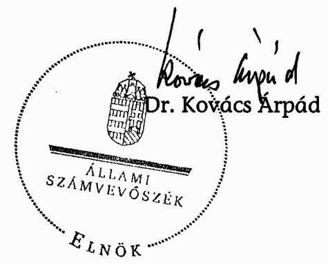

---

# MELLÉKLETEK

---

1. sz. melléklet

a V-25-74/2006-2007. számú jelentéshez

# ÉSZREVÉTELEK

---

#  

## Oktatási és Kulturális Minisztérium Miniszter

## Dr. Kovács Árpád úr elnök   Állami Számvevőszék

## Budapest

## Tisztelt Elnök Úr!

Köszönettel megkaptam a felsőoktatási kollégium beruházási programjának (PPP) ellenőrzéséről készített jelentésüket. Az érintett szakállamtitkárok jelzései alapján a jelentést elfogadjuk, észrevételt nem teszünk. Az ellenőrzés folyamatának egészét a kritikus, elfogulatlanul racionális megközelítés jellemezte, amelyért - kollegáim nevében is köszönetet mondok.

Előremutató felvetéseiket és javaslataikat figyelembe vesszük a napi munka során, a javaslatukkal kapcsolatos intézkedésekről november 7-ig tájékoztatni fogom Elnők Urat.

Budapest, 2007. október 26.
Tisztelettel:
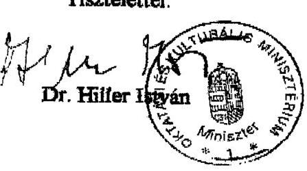

---

# BUDAPESTI CORVINUS

## EGYETEM

Tel: 217-6268 v. 5124, 5460
Fax: 217-8883
E-mail:tamas.meszaros@uni-corvinus.hu
www.uni-corvinus.hu

R-1087/1/2007. 1293/07

Állami Számvevőszék
Kemény Emil
főcsoportfőnök úr
részére

1364. Budapest, Pf. 54.

*Bitto v.h.*

*of. 25.*

Tisztelt Főcsoportfőnök Úr!

Mellékelten küldöm a felsőoktatási kollégiumi beruházási programjának ellenőrzéséről készült jelentés-tervezettel kapcsolatos aláírt záradékot, és egyben tájékoztatom, hogy a jelentéssel kapcsolatos észrevételt nem teszek.

Budapest, 2007. július 23.

Üdvözlettel:

*Dr. Mészáros Tamás*

*rektor*

*C. Redl.*

*2007.07.27.*

1093. Budapest, Fővám tér 8.

---

# PANNON EGYETEM REKTOR 

Állami Számvevőszék 2.1. Föcsoport Kemény Émil főcsoportfőnök úr részére Budapest Apáczai Csere J. u. 10 1052

Tisztelt Főcsoportfönök Úr!

Ikt. sz.: 33-5/2007.
Tárgy: Kollégium beruházási programjának ellenőrzése
Hiv. sz.: V-25-40/2006-2007
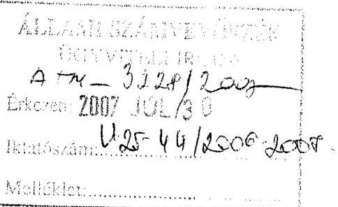

A felsőoktatás kollégium - beruházási programjának ellenőrzéséről készített jelentéstervezetet köszönettel megkaptuk.
A jelentés-tervezetet áttanulmányoztuk és tájékoztatom, hogy észrevételt nem kívánunk tenni, az abban foglaltakkal egyetértünk.

Veszprém, 2007, július 26.

Tisztelettel:
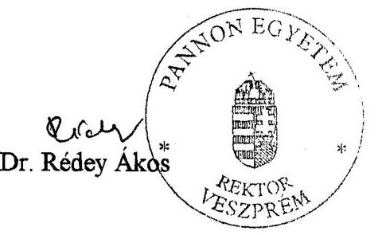

H-8200 Veszprém, Egyetem u. 10. $\cdot$ H-8201 Veszprém, Pf. 158
Telefon: $(+3688) 624-130 \cdot$ Fax: $(+3688) 624-529 \cdot$ Intemet: www.uni-pannon.hu

- e-mail: rektor@uni-pannon.hu

---

# DEBRECENIEGYETEM 

## REKTOR

Rector Universitatis Debreceniensis

Rector of University of Debrecen
Iktatószám: 599-1-11.262....../2007. etsz.
Hiv.szám: V-25-40/2006-2007.

Állami Számvevőszék
2.1. Föcsoport

Kemény Emil fócsoportfönök úr részére
1364 Budapest 4. Pf. 54.

Tisztelt Föcsoportfönök Úr!

Köszönettel megkaptuk az Állami Számvevőszék Jelentés-tervezetétét munkaanyag formájában a felsőoktatás kollégium beruházási programjának ellenőrzéséről.

A dokumentumot tanulmányoztuk, az abban foglaltakat megismertük. A Jelentés-tervezettel egyetértünk, arra észrevételt nem teszünk.

Debrecen, 2007. július 27.
Üdvözlettel:
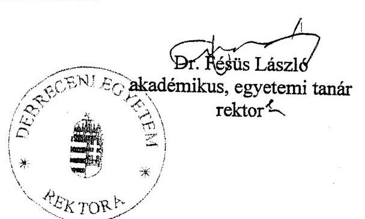

---

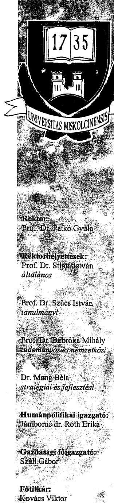

# REKTOR 

2137-R/2007.LM.

## Kemény Emil

föcsoportfönök úrnak

Állami Számvevöszék

## Budapest

Apáczai Csere János utca 10.
1052
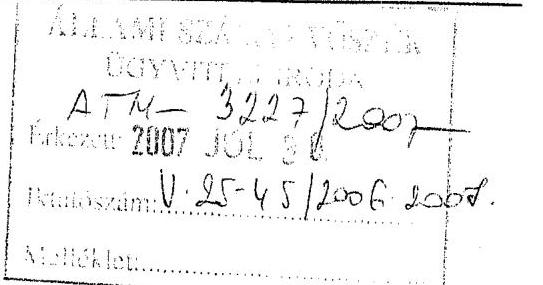

Tisztelt Föcsoportfönök Úr!

Föcsoportfönök úr V-25-40/2006-2007. számú levelére hivatkozva tisztelettel tájékoztatom, hogy a levél mellékleteként megküldött jelentés-tervezetben foglaltakkal egyetértek, kiegészítő észrevételeket nem kívánok tenni.

Egyúttal engedje meg, hogy mind az Ön, mind pedig Szihalminé Kovács Zsuzsanna számvevő tanácsos munkáját ezúton is megköszönjem.

Miskolc, 2007. július 26.

Kiváló tisztelettel:
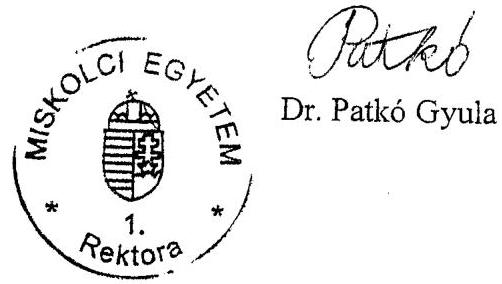

## MISKOLCI EGYETEM

3515 Miskolc - Egyetemváros, Pf.: 1.
Tel.: (46) 565-010 Fax: (46) 565-014
E-mail: patko@uni-miskolc.hu, http://www.uni-miskolc.hu

---

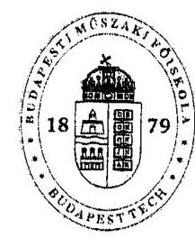

# BUDAPESTI MŰSZAKI FŐISKOLA

Kancellár

Billé 2007
07.21
Kilock
07.21.

Kemény Emil
főcsoportfőnök úr részére

BMF-RH-1827-1/07.
Budapest, 2007. július 24.

Állami Számvevőszék
1052 Budapest, Apáczai Cs. J. u. 10.

Tisztelt Főcsoportfőnök Úr!

Köszönettel: Kézhez kaptuk az Állami Számvevőszék jelentését a felsőoktatási kollégium beruházási programjának ellenőrzéséről.

A jelentéstervezetet áttanulmányoztuk, az abban megfogalmazottak tényszerűek és tárgyilagosak, a dokumentumhoz észrevételt nem kívánunk fűzni, azzal egyetértünk.

Tisztelettel,

Dr. Gáti József

Cím: H-1034 Budapest, Bécsi út 96/b. Honlap: www.bmf.hu
Tel.: (+361) 666-5603 Fax: (+361) 666-5621 E-mail: kancellar@bmf.hu

---

# Eszterházy Károly Főiskola Rektori Hivatal 

23300 Eger, Eszterházy tér 1.
36/520-420, Fax: 36/520440

## ÁLLAMI SZÁMVEVŐSZÉK

Kemény Emil fôcsoportfônök részére

Budapest
Apáczai Csere János út 10. 1052

Tárgy: Jelentés
Ikt.sz.: . 4. 5. 6. 7. 1......./07.Rh.

| ÁLLAMI SZÁMVEVŐSZÉK |
| :--: |
| ÜGYVITELI IRODA |
| ATY 3383/2009 |
| Érkezo: 2007 AUG 09. |
| Iktatószám: 45-51/4008-4009 |
| Melléklet: |

## Tisztelt Kemény Úr!

Az Eszterházy Károly Főiskola a felsőoktatás kollégium beruházási programjának ellenőrzéséről készült jelentésével egyetért, észrevételt nem kíván tenni.

Eger, 2007. 08. 03.
Tisztelettel:
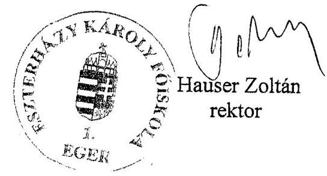

---

KAROLY RÖBERT FÔISKOLA
Gazdasági föigazgató

3200 Gyöngyös
Mátrai út 36.
telefon
37/518-300
web
www.
karolyrobert.hu

Dudás Lászlóné
telefon: 37/518-390
fax: 37/518-341
e-mail: dudasne@karolyrobert.hu

Állami Számvevőszék

Főcsoportfőnök

Budapest
Apáczai Csere János u. 10.

1052

Tisztelt Cím!

Iktatószám: GJ-724/1/2007
hivatkozási szám: V-25-40/2006-2007.
tárgy: jelentés.tervezet
ügyintéző: Túry Jánosné p.ü. koordinátor
telefon: 37/518-311

ÁLLAMI SZÁMVE VÖSZÉK
ÜGYVITELI IR.
Át 3302 D00
Érkezzct: 2007 AUG 03.
Iktatószám: V-25-49/2006-2007.
Melléklet:

Bith 2. 2
08.07.2007

A Károly Róbert Főiskola (3200 Gyöngyös, Mátrai u. 36.) a felsőoktatás kollégium/
beruházási programjának ellenőrzéséről készített jelentés-tervezettel egyetért.

Gyöngyös, 2007. július 27.

Dr. Magda Sándor
rektor

---

# 134507. 

## Kemeny Emil

föcsoportfönök úrnak
Állami Számvevőszék

## Budapest

Tisztelt Föcsoportvezető Úr!

Tisztelettel tájékoztatom, hogy a megküldött felsőoktatási kollégium beruházási program ellenőrzéséről készült jelentés-tervezetükkel kapcsolatban észrevételünk nincs, az abban foglaltakkal egyetértünk.

Nyíregyháza, 2007. július 26.
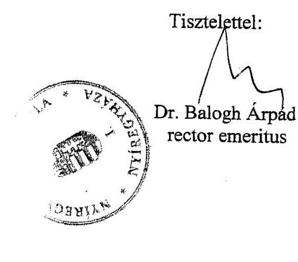

---

# A felsőoktatási kollégium beruházási program folyamatábrája 

## I. Előkészítési és közbeszerzési fázis

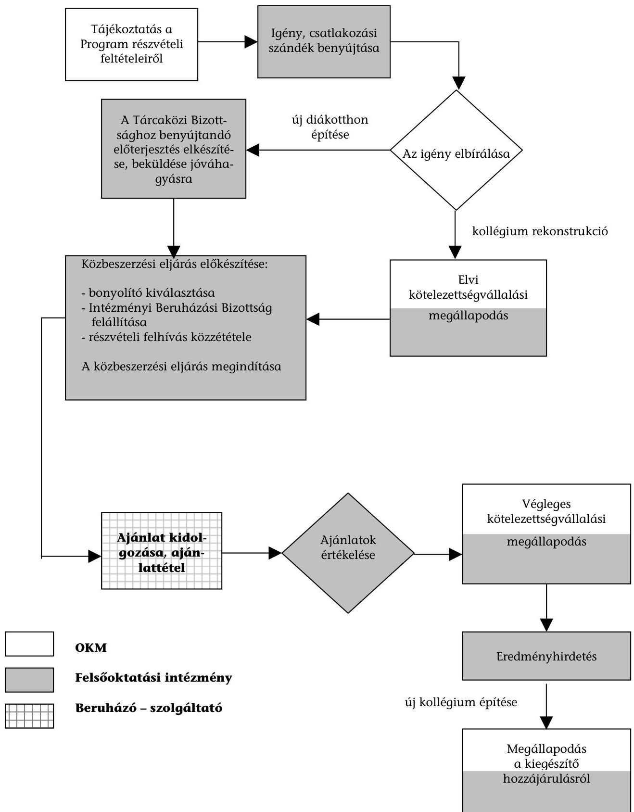

---

# II. Szerződéskötési, tervezési és kivitelezési fázis 

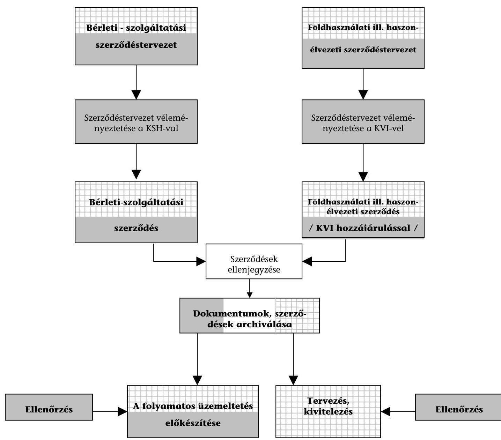
$\square$ OKM
$\square$ Felsőoktatási intézmény
$\square$ Beruházó - szolgáltató

---

# HELYSZÍNEN ELLENŐRZÖTT INTÉZMÉNYEK ÉS PROJEKTEK JEGYZÉKE 

Az Oktatási és Kulturális Minisztérium ágazati felügyelete alá tartozó 29 állami felsőoktatási intézmény közül 21 egyetem, főiskola vesz részt a kollégiumi beruházási programban. A felsőoktatás kollégium beruházási programjának ellenőrzésében érintett 21 felsőoktatási intézmény közül a helyszíni ellenőrzés - a projektek befejezettsége, illetve készültségi foka alapján - 9 felsőoktatási intézménynél összesen 7 diákotthon építésre és 18 kollégiumi rekonstrukcióra, a projektek létrehozásában és múködtetésében résztvevő gazdasági társaságokra, valamint az Oktatási és Kulturális Minisztériumra terjedt ki.

| Felsőoktatási intézmény megnevezése | Ellenőrzött PPP-projektek száma (db) |  |  |  |
| :--: | :--: | :--: | :--: | :--: |
|  | Diákotthon építés |  | Kollégiumi rekonstrukció |  |
|  | Befejezett | Folyamatban | Befejezett | Folyamatban |
| Budapesti Műszaki Főiskola (BMF) | 1 |  |  | 1 |
| Budapesti Műszaki és Gazdaságtudományi Egyetem (BME) |  |  | 1 | 1 |
| Budapesti Corvinus Egyetem (BCE) |  |  |  | 2 |
| Debreceni Egyetem (DE) | 1 |  | 2 | 1 |
| Eszterházy Károly Főiskola (EKF), Eger |  | 1 | 1 |  |
| Károly Róbert Főiskola (KRF), Gyöngyös | 1 |  |  |  |
| Miskolci Egyetem (ME) | 1 |  | 5 |  |
| Nyíregyházi Főiskola (NYF) | 1 |  | 4 |  |
| Pannon Egyetem (PE), Veszprém | 1 |  |  |  |
| Összesen: | 6 | 1 | 13 | 5 |

---

# A helyszíni ellenőrzésbe vont fejlesztések aránya a felsőoktatási kollégium beruházási program szerződéses fejlesztésein belül

(tanúsítványi adatok alapján)

|  Sorszám | Intézmény neve | Beruházás |  | Diákotthon építés |  |  |  | Kollégium rekonstrukció |  |  |   |
| --- | --- | --- | --- | --- | --- | --- | --- | --- | --- | --- | --- |
|   |  | (építés + rekonstrukció) |  | Befejezett |  | Folyamatban |  | Befejezett |  | Folyamatban |   |
|   |  | férőhely | nettó
bekerülési ktg. | férőhely | nettó
bekerülési ktg. | férőhely | nettó
bekerülési ktg. | férőhely | nettó
bekerülési ktg. | férőhely | nettó
bekerülési ktg.  |
|   |  | db | M Ft | db | M Ft | db | M Ft | db | M Ft | db | M Ft  |
|  1 | Budapesti Corvinus Egyetem | 609 | 1033 |  |  |  |  |  |  | 609 | 1033  |
|  2 | Budapesti Múszaki és Gazdaságtudományi Egyetem | 1976 | 3979 |  |  |  |  | 976 | 1980 | 1000 | 1999  |
|  3 | Debreceni Egyetem | 2188 | 5341 | 930 | 3200 |  |  | 651 | 1311 | 487 | 830  |
|   |  |  |  |  |  |  |  | 120 |  |  |   |
|  4 | Miskolci Egyetem | 1880 | 4474 | 603 | 2027 |  |  | 1277 | 2447 |  |   |
|  5 | Pannon Egyetem | 800 | 2183 | 800 | 2183 |  |  |  |  |  |   |
|  6 | Budapesti Múszaki Főiskola | 400 | 1508 | 400 | 1508 |  |  |  |  |  |   |
|  7 | Eszterházy Károly Főiskola | 545 | 1715 |  |  | 144 | 725 | 401 | 990 |  |   |
|  8 | Károly Róbert Főiskola | 436 | 1361 | 436 | 1361 |  |  |  |  |  |   |
|  9 | Nyíregyházi Főiskola | 1627 | 3168 | 427 | 1124 |  |  | 1200 | 2044 |  |   |
|  10 | Helyszínen ellenőrzött intézmények összesen | 10461 | 24762 | 3596 | 11403 | 144 | 725 | 4625 | 8772 | 2096 | 3862  |
|  11 | Kaposvári Egyetem | 304 | 501 |  |  |  |  |  |  | 304 | 501  |
|  12 | Nyugat-Magyarországi Egyetem | 1197 | 5877 | 400 | 2400 | 33 | 272 |  |  | 252 | 773  |
|   |  |  |  |  |  | 320 | 1949 |  |  | 192 | 483  |
|  13 | Szent István Egyetem | 1344 | 2949 |  |  | 464 | 1420 |  |  | 880 | 1529  |
|  14 | Dunaújvárosi Főiskola | 400 | 1251 |  |  |  |  | 400 | 1251 |  |   |
|  15 | Eötvös József Főiskola | 240 | 697 |  |  | 138 | 400 |  |  | 102 | 297  |
|  16 | Szolnoki Főiskola | 264 | 541 |  |  |  |  |  |  | 264 | 541  |
|  17 | Tessedik Sámuel Főiskola | 750 | 2973 |  |  |  |  |  |  | 750 | 2973  |
|  18 | Helyszínen nem ellenőrzött intézmények összesen | 4499 | 14789 | 400 | 2400 | 955 | 4041 | 400 | 1251 | 2744 | 7097  |
|  19 | Mindösszesen | 14960 | 39551 | 3996 | 13803 | 1099 | 4766 | 5025 | 10023 | 4840 | 10959  |
|  20 | Helyszínen ellenőrzöttek aránya (10/19) \% | 69,93\% | 62,61\% | 89,99\% | 82,61\% | 13,10\% | 15,21\% | 92,04\% | 87,52\% | 43,31\% | 35,24\%  |

---

5. sz. melléklet a V-25-74/2006-2007. sz. jelentőshez

A felsőoktatási kollégium beruházási program 2007. április 30-i helyzete az OKM nyilvántartása alapján

|  Sorszám | Intézmény |  |  |  |  |  |  |  |  |  |  |  |  |  |  |  |  |  |  |  |   |
| --- | --- | --- | --- | --- | --- | --- | --- | --- | --- | --- | --- | --- | --- | --- | --- | --- | --- | --- | --- | --- | --- |
|   |  |  |  |  |  |  |  |  |  |  |  | Kollégiumi rekonstrukció |  |  |  |  |  |  |  |  |   |
|   |  |  | Befejezett, működő |  |  |  |  |  |  |  |  |  |  |  |  |  |  |  |  |  |   |
|   |  |  | Felsíthely (díts) |  |  |  |  |  |  |  |  |  |  |  |  |  |  |  |  |  |   |
|   |  |  |  |  |  |  |  |  |  |  |  |  |  |  |  |  |  |  |  |  |   |
|   |  |  |  |  |  |  |  |  |  |  |  |  |  |  |  |  |  |  |  |  |   |
|  1 | Debreceni Egyetem |  | 930 | 3,200 | 120 | (koll.rek) |  |  |  |  | 1 238 | 2,140 |  |  | 268 |  |  |  |  | 1 | 4  |
|  2 | Miskolcí Egyetem |  | 603 | 2,027 |  |  |  | 88 | (koll.rek) | 1 277 | 2,447 |  |  |  |  |  | 350 | 0,780 | 1 | 5 | 1  |
|  3 | Nyugat-Mugyaroszági Egyetem (Sopron) |  | 400 | 2,000 | 520 | 1,950 | 30 | (okt.PPP) |  |  |  |  | 468 | 1,046 |  |  |  |  | 2 | 2 |   |
|  4 | Pannon Egyetem (Feszprém) |  | 800 | 2,729 |  |  |  |  |  |  |  |  |  |  | 600 | 0,603 | 63 | 0,057 | 1 | 1 | 1  |
|  5 | Károly Köbert Főiskola (Gyöngyös) |  | 436 | 1,890 |  |  |  |  |  |  |  |  |  |  |  |  |  |  | 1 |  |   |
|  6 | Nyöregelsázi Főiskola |  | 426 | 1,124 |  |  |  |  |  | 1 240 | 0,982 ¹ |  |  |  |  |  |  |  | 1 | 4 |   |
|  7 | Szent István Egyetem (Gödöllő) |  | 464 | 1,495 |  |  |  |  |  |  |  |  | 967 | 1,531 |  |  | 135 | 0,203 | 1 | 3 | 1  |
|  8 | Budapesti Műszaki Főiskola |  | 400 | 1,508 |  |  |  |  |  |  |  |  |  |  | 400 | 1,613 |  |  | 1 | 1 |   |
|  9 | Iztévis Loránd Tudományegyetem (Budapest) |  |  |  |  |  |  | 610 | 2,116 |  |  |  |  |  | 2 212 | 3,900 |  |  |  | 4 | 1  |
|  10 | Eszterházy Károly Főiskola (Eger) |  | 144 | (okt.PPP) |  |  |  |  |  |  | 300 | 0,660 |  |  |  |  |  |  | 1 | 3 |   |
|  11 | Temedik Sárnati Főiskola (Szarvas) |  |  |  | 90 | (koll.rek) |  |  |  |  |  |  | 750 | 2,240 |  |  |  |  |  | 2 |   |
|  12 | Budapesti Műszaki és Gazdaságtudományi Egyetem |  |  |  |  |  |  | 610 | 2,116 | 913 | 1,999 | 1 000 | 1,988 | 380 | 0,496 | 1 228 | 1,527 | 1 | 3 | 3 |   |
|  13 | Pécsi Tudományegyetem |  |  |  |  |  |  | 1 000 | 4,930 |  |  |  | 800 | 2,500 | 2 789 | 4,924 |  |  |  | 7 | 1  |
|  14 | Semmelweis Egyetem (Budapest) |  |  |  |  |  | 300 | (koll.rek) |  |  |  |  |  |  | 600 | 2,700 |  |  | 1 |  |   |
|  15 | Szegedi Tudományegyetem |  |  |  |  |  |  |  |  |  |  |  | 972 | 1,335 |  |  | 247 | 0,400 |  | 1 | 1  |
|  16 | Berzsenyi Dániel Főiskola (Szombathely) |  |  |  |  |  |  | 300 | 1,300 |  |  |  |  |  |  |  |  |  |  |  | 1  |
|  17 | Iztévis József Főiskola (Baja) |  |  |  | 138 | 0,275 |  |  |  |  |  |  | 102 | 0,204 |  |  |  |  |  | 1 |   |
|  18 | Budapesti Corvinus Egyetem |  |  |  |  |  |  |  |  |  |  |  | 604 | 1,135 |  |  | 320 | 0,469 |  | 2 |   |
|  19 | Kaposvázi Egyetem |  |  |  |  |  |  |  |  |  |  |  | 304 | 0,499 |  |  | 237 | 0,520 |  | 1 | 1  |
|  20 | Dunaújvárosi Főiskola |  |  |  |  |  |  |  |  |  |  |  | 400 | 1,120 |  |  |  |  |  | 2 | 1  |
|  21 | Szolnoki Főiskola |  |  |  |  |  |  |  |  |  |  |  | 252 | 0,450 |  |  |  |  |  | 1 |   |
|  Több budapesti intézmény |  |  |  |  |  |  |  | 900 |  |  |  |  |  |  |  |  |  |  |  |  | 1  |
|  Nemzeti Kiválóságeként Közalapítvány ¹ |  |  |  |  |  |  | 500 |  |  |  |  |  |  |  |  |  |  |  | 1 |  |   |
|  Összesen |  |  | 4 603 | 15,973 | 668 | 2,225 | 830 | 3 508 | 10,462 | 4 988 | 8,228 | 6 619 | 14,048 | 7 249 | 14,236 | 2 580 | 3,756 | 13 | 47 | 13 |   |

¹ Közbeszerzés előtt vagy közbeszerzés folyamathas, előzetes adatokkal.

² A felfüggesztett, az elmaradó programoknál tervezett (becsült) adatok szerepének.

³ A 2062/2006. (III. 27.) Kormányhatározattal létrehozott közülapítvány, mely nem a felalkoktatási intézményhálózat része.

Budapest, 2007. május

---

# A felsőoktatási kollégium beruházási program teljesítésének számszerúsítése

## I. DIÁKOTTHON ÉPÍTÉS

|  Sor-
szám | Megnevezés | Férőhelyek
száma (db) | Nettó bekerülési
költségek (Mrd Ft) | Tanúsítványi adatok alapján *
Férőhelyek száma
(db) | Nettó bekerülési
költség (Mrd Ft)  |
| --- | --- | --- | --- | --- | --- |
|  1 | A 2207/2004. (VIII.27.) Kormányhatározat alapján tervezett | 10455 | 30,000 |  |   |
|   | Az OKM nyilvántartása alapján (2007. április 30-i állapot) |  |  |  |   |
|  2. | Befejezett építés | 4603 | 15,973 | 3996 | 13,803  |
|  3. | Folyamatban lévő diákotthon építés | 668 | 2,225 | 1099 | 4,766  |
|  4. | Előkészítés alatti építés | 830 | 2,000 |  |   |
|  5. | Felfüggesztett / elmaradt beruházás | 3508 | 8,454 |  |   |
|  6. | Összesen | 9609 | 28,652 | 5095 | 18,569  |
|  7. | A megvalósítás aránya a tervezetthez (kormányhatározathoz) viszonyítva (2+3+4)/1 | 58,4\% | 67,3\% | 48,7\% | 61,9\%  |
|  8. | A megvalósítás aránya az OKM nyilvántartáshoz viszonyítva (2+3+4)/6 | 63,5\% | 70,5\% | 53,0\% | 64,8\%  |

## II. KOLLÉGIUMI REKONSTRUKCIÓ

|  Sor-
szám | Megnevezés | Férőhelyek
száma (db) | Nettó bekerülési
költségek (Mrd Ft) | Tanúsítványi adatok alapján *
Férőhelyek száma
(db) | Nettó bekerülési
költség (Mrd Ft)  |
| --- | --- | --- | --- | --- | --- |
|  1 | A 2207/2004. (VIII.27.) Kormányhatározat alapján tervezett | 20000 | 25,000 |  |   |
|   | Az OKM nyilvántartása alapján (2007. április 30-i állapot) |  |  |  |   |
|  2. | Befejezett rekonstrukció | 4988 | 8,228 | 5025 | 10,023  |
|  3. | Folyamatban lévő rekonstrukció | 6619 | 14,048 | 4840 | 10,959  |
|  4. | Előkészítés alatti rekonstrukció | 7249 | 14,236 |  |   |
|  5. | Felfüggesztett / elmaradt rekonstrukció | 2580 | 3,756 |  |   |
|  6. | Összesen | 21436 | 40,268 | 9865 | 20,982  |
|  7. | A megvalósítás aránya a tervezetthez (kormányhatározathoz) viszonyítva (2+3+4)/1 | 94,3\% | 146,0\% | 49,3\% | 83,9\%  |
|  8. | A megvalósítás aránya az OKM nyilvántartáshoz viszonyítva (2+3+4)/6 | 88,0\% | 90,7\% | 46,0\% | 52,1\%  |

- Az előkészítés alatt lévő fejlesztésekről a tanúsítványok hiteles adatokat még nem tartalmaztak.

---

A felsőoktatási diákotthon építés helyzete és területi elhelyezkedése
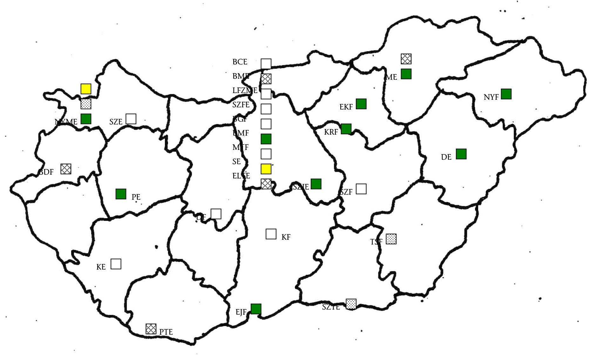

---

# ÖSSZESÍTŐ TÁBLÁZATOK a felsőoktatási intézmények tanúsítványi adataiból

---

# Táblázatok jegyzéke 

| 1. sz. táblázat: | Intézményi összesített adatok a hallgatói létszámról és a kollégiumi ellátásról |
| :--: | :--: |
| 2. sz. táblázat: | Intézményi adatok a kollégiumi ellátottak számának alakulásáról |
| 3. sz. táblázat: | A kollégiumok, diákotthonok számának, lakóterületének és férőhelyeinek alakulásáról |
| 4. sz. táblázat: | A kollégiumi ellátottság és kihasználtság alakulása 2004. október 15. 2007. március 15. között |
| 5. sz. táblázat: | A rendelkezésre álló kollégiumi férőhelyek összetétele a helyszínen ellenőrzött intézményeknél 2006. október 15-én |
| 6. sz. táblázat: | A felsőoktatási intézmények költségvetési kiadásai és a kollégiumok múködtetésének teljesítési adatai |
| 7. sz. táblázat: | A kollégiumok múködtetésének kiadásai |
| 8. sz. táblázat: | A kollégiumi múködtetés fedezetének összetétele |
| 9. sz. táblázat: | A 2006. évi PPP kötelezettségvállalások aránya a helyszínen ellenőrzött intézményeknél |
| 10. sz. táblázat: | A helyszíni ellenőrzésben résztvevő saját fenntartású kollégiumok működtetésének és üzemeltetésének kiadásai (2006. év) |
| 11. sz. táblázat: | A diákotthon építés szerződés szerinti nettó bekerülési költségei a helyszínen ellenőrzött intézményeknél |
| 12. sz. táblázat: | A diákotthon építés szerződés szerinti bruttó bérleti dijának alakulása a helyszínen ellenőrzött intézményeknél |
| 13. sz. táblázat: | A diákotthon építés bérleti díj forrásának összetétele a helyszínen ellenőrzött intézményeknél |
| 14. sz. táblázat: | A kollégiumi rekonstrukció szerződés szerinti nettó bekerülési költségei a helyszínen ellenőrzött intézményeknél |
| 15. sz. táblázat: | A kollégiumi rekonstrukció szerződés szerinti bruttó bérleti dijának alakulása a helyszínen ellenőrzött intézményeknél |
| 16. sz. táblázat: | A kollégiumi rekonstrukció bérleti díj forrásának összetétele a helyszínen ellenőrzött intézményeknél |

---

# Intézményi összesített adatok a hallgatói létszámról és a kollégiumi ellátásról

|  Sorszám | Megnevezés | Mérték-
egység | 2004. október
15. | 2006. október
15. | 2007.
március 15.  |
| --- | --- | --- | --- | --- | --- |
|   |  |  | 1 | 2 | 3  |
|  1 | Hallgatói összlétszám | fő | 359353 | 353839 | 323336  |
|  2 | Nappali tagozatos hallgatói létszám | fő | 198096 | 207614 | 194487  |
|  2.1 | Képzési helyen kívüli belföldi lakhellyel rendelkező hallgatók | fő | 122645 | 130708 | 123389  |
|  3 | Kollégiumi ellátást kérelmezők száma | fő | 74886 | 73681 | 69489  |
|  4 | Kollégiumi ellátottak száma | fő | 46069 | 45541 | 44604  |
|  5 | Kollégiumok és diákotthonok száma | db | 159 | 155 | 157  |
|  5.1 | Kollégiumok | db | 155 | 143 | 142  |
|  5.2 | Diákotthonok | db | 4 | 12 | 15  |
|  6 | Kollégiumi hasznos lakóterület | $\mathrm{m}^{2}$ | 453704 | 456490 | 464160  |
|  7 | Férőhelyek száma összesen | db | 44183 | 42666 | 42966  |
|  8 | Hagyományosan bérelt férőhelyek* | db | 4211 | 5639 | 4733  |
|  9 | Rendelkezésre álló összes férőhely (7+8 sor) | db | 48394 | 48305 | 47699  |
|  10 | Ellátottsági mutatók |  |  |  |   |
|  10.1 | Ellátottak száma / ellátást kérelmezők száma (4 sor/3 sor x 100) | $\%$ | $62 \%$ | $62 \%$ | $64 \%$  |
|  10.2 | Egy férőhelyre jutó lakóterület (6 sor/7 sor) | $\mathrm{m}^{2}$ | 10,3 | 10,7 | 10,8  |
|  11 | Kihasználtsági mutató |  |  |  |   |
|  11.1 | Ellátottak száma / kollégiumi férőhely (4 sor/7+8 sor x 100) | $\%$ | $95 \%$ | $94 \%$ | $94 \%$  |

- Hagyományos bérleti konstrukcióban bérbe vett kollégiumi férőhelyek.

Megj.: A Magyar Táncművészeti Főiskola nem rendelkezik felsőoktatási kollégiummal, ezért csak a hallgatói létszámadatokban szerepel.

---

# Intézményi adatok a kollégiumi ellátottak számának alakulásáról

|  Sze-
száma | Intézmény neve | 2004. október 15. |  |  | 2006. október 15. |  |  | 2007. március 15. |  |   |
| --- | --- | --- | --- | --- | --- | --- | --- | --- | --- | --- |
|   |  | Képzési helyen kívüli
beföldi lakbelfyel
rendelkező hallgatók | Kollégiumi
ellátást
kérelmezők | Kollégiumi
ellátottak | Képzési helyen kívüli
beföldi lakbelfyel
rendelkező hallgatók | Kollégiumi
ellátást
kérelmezők | Kollégiumi
ellátottak | Képzési helyen kívüli
beföldi lakbelfyel
rendelkező hallgatók | Kollégiumi
ellátást
kérelmezők | Kollégiumi
ellátottak  |
|   |  | 1 | 2 | 3 | 4 | 5 | 6 | 7 | 8 | 9  |
|  1 | Budapesti Corvinus Egyetem | 6012 | 2886 | 2215 | 6478 | 2394 | 1848 | 6428 | 2394 | 1599  |
|  2 | Budapesti Mánuski és Gazdunágtudományi Egyetem | 9307 | 9307 | 4446 | 8970 | 8970 | 4292 | 8829 | 8829 | 3927  |
|  3 | Ödenvezi Egyetem | 12236 | 4853 | 4214 | 13962 | 5799 | 4539 | 12919 | 5799 | 4464  |
|  4 | Miskolcí Egyetem | 5332 | 3171 | 1771 | 3780 | 2742 | 2195 | 6017 | 2712 | 2294  |
|  5 | Pannon Egyetem | 6173 | 2947 | 2077 | 3539 | 3206 | 2213 | 5120 | 3206 | 2213  |
|  6 | Budapesti Mánuski Főiskola | 4372 | 2333 | 1724 | 4847 | 2210 | 1715 | 3619 | 1779 | 1707  |
|  7 | Eszterházy Károly Főiskola | 3260 | 2154 | 818 | 3305 | 2026 | 877 | 3353 | 2026 | 877  |
|  8 | Károly Róbert Főiskola | 467 | 680 | 210 | 1791 | 968 | 417 | 1791 | 0 | 408  |
|  9 | Nyínegtházi Főiskola | 1922 | 2051 | 1472 | 2566 | 2082 | 1444 | 2504 | 2082 | 1561  |
|  Helyszámen ellenőrzött intézmények összesen |  | 49281 | 30382 | 18947 | 53438 | 30397 | 19540 | 50580 | 28827 | 19052  |
|  10 | Eötvös Loránd Tudományegyetem | 11359 | 5815 | 3933 | 12553 | 5263 | 4093 | 11721 | 5263 | 4093  |
|  11 | Kaposvázi Egyetem | 1663 | 874 | 640 | 2009 | 1053 | 691 | 1934 | 1053 | 688  |
|  12 | Nyugat-Magyurenszági Egyetem | 4204 | 3700 | 1666 | 4470 | 3754 | 1586 | 4906 | 3692 | 1616  |
|  13 | Pécsi Tudományegyetem | 11257 | 7344 | 4511 | 12224 | 7812 | 3936 | 12012 | 7812 | 3936  |
|  14 | Semmelweis Egyetem | 1563 | 969 | 969 | 1789 | 966 | 966 | 1789 | 874 | 874  |
|  15 | Szegedi Tudományegyetem | 13510 | 4829 | 3850 | 14482 | 5199 | 3638 | 13957 | 5199 | 3529  |
|  16 | Szent István Egyetem | 6074 | 3978 | 1946 | 6752 | 4325 | 1979 | 5336 | 4006 | 2117  |
|  17 | Bezszersi Tóthút Főiskola | 1649 | 2175 | 646 | 1572 | 2218 | 646 | 1589 | 2210 | 646  |
|  18 | Önnszárvárosi Főiskola | 2707 | 1478 | 1360 | 2916 | 1457 | 1371 | 2465 | 1281 | 1219  |
|  19 | Eötvös Jóasel Főiskola | 483 | 542 | 404 | 476 | 563 | 386 | 508 | 628 | 304  |
|  20 | Szolnoki Főiskola | 2121 | 1830 | 1088 | 2138 | 1647 | 1008 | 1889 | 1461 | 877  |
|  21 | Tenedik Sárnuel Főiskola | 2417 | 2650 | 1297 | 1953 | 2200 | 879 | 1800 | 1950 | 886  |
|  22 | Liszt Ferenc Zonemévisszti Egyetem | 436 | 133 | 86 | 406 | 152 | 86 | 402 | 128 | 86  |
|  23 | Moholy-Nagy Művészeti Egyetem | 299 | 118 | 118 | 312 | 118 | 118 | 309 | 118 | 118  |
|  24 | Magyar Képzelmúvészeti Egyetem | 298 | 160 | 153 | 303 | 158 | 153 | 305 | 155 | 153  |
|  25 | Széchenyi István Egyetem | 4141 | 2516 | 1565 | 4890 | 2419 | 1566 | 4607 | 2524 | 1600  |
|  26 | Szinhás- és Főmmúvészeti Egyetem | 119 | 98 | 70 | 80 | 93 | 63 | 89 | 93 | 62  |
|  27 | Budapesti Gazdasági Főiskola | 6257 | 3529 | 1632 | 5793 | 2319 | 1619 | 4972 | 1902 | 1612  |
|  28 | Kezdeméti Főiskola | 2805 | 1566 | 1186 | 2342 | 1388 | 1217 | 2219 | 288 | 1136  |
|  29 | Magyar Táncmúvészeti Főiskola | 0 | 0 | 0 | 0 | 0 | 0 | 0 | 0 | 0  |
|  Nem ellenőrzött intézmények összesen |  | 73364 | 44304 | 27122 | 77270 | 43204 | 26001 | 72809 | 40662 | 25552  |
|  Mindösszesen |  | 122645 | 74886 | 46069 | 130708 | 73681 | 45541 | 123389 | 69489 | 44604  |

---

# A kollégiumok, diákotthonok*

## számának, laköterületének és férőhelyeinek alakulása

|  Sze-
szám | Intézmény neve | Kollégiumok és diákotthonok száma és laköterülete |  |  |  |  |  | Kollégiumi férőhelyek száma |  |  | Arány
(2007/2004.év) |   |
| --- | --- | --- | --- | --- | --- | --- | --- | --- | --- | --- | --- | --- |
|   |  | 2004. október 11. |  | 2006. október 11. |  | 2007. március 11. |  | 2004. október 11. | 2006. október 11. | 2007. március 11. |  |   |
|   |  | db | $\mathrm{m}^{2}$ | db | $\mathrm{m}^{2}$ | db | $\mathrm{m}^{2}$ | db | db | db | $\%$ | $\%$  |
|   |  | 1 | 2 | 3 | 4 | 5 | 6 | 7 | 8 | 9 | 10 | 11  |
|  1 | Budapesti Covinsas Egyetem | 8 | 13600 | 2 | 8900 | 2 | 8900 | 2098 | 1378 | 1378 | 65 | 65  |
|  2 | Budapesti Mészoki és Gazdaságiadományi Egyetem | 7 | 25307 | 6 | 18773 | 6 | 18913 | 3876 | 2935 | 2964 | 73 | 76  |
|  3 | Debreceni Egyetem | 11 | 33087 | 11 | 62796 | 11 | 63370 | 4111 | 4574 | 4570 | 113 | 111  |
|  4 | Miskolcí Egyetem | 7 | 23059 | 8 | 31063 | 8 | 31387 | 1834 | 2327 | 2386 | 124 | 120  |
|  5 | Pannos Egyetem | 5 | 17211 | 5 | 19065 | 5 | 19065 | 1165 | 1265 | 1265 | 111 | 109  |
|  6 | Budapesti Mészoki Filokola | 4 | 13800 | 4 | 13800 | 5 | 18903 | 930 | 922 | 1274 | 137 | 137  |
|  7 | Eszterházy Károly Filokola | 4 | 3613 | 4 | 6113 | 4 | 6113 | 818 | 877 | 877 | 109 | 107  |
|  8 | Károly Köheri Filokola | 1 | 2883 | 1 | 3470 | 1 | 3470 | 210 | 436 | 436 | 190 | 208  |
|  9 | Dajougshairi Filokola | 2 | 28171 | 2 | 20876 | 2 | 20876 | 1576 | 1627 | 1627 | 111 | 109  |
|  Helyszínon ellenőrzött intézmények összesen |  | 49 | 182735 | 46 | 192856 | 47 | 198799 | 16638 | 16361 | 16777 | 109 | 105  |
|  10 | Eötvös Loránd Tudományegyetem | 9 | 27117 | 9 | 27117 | 9 | 27117 | 3933 | 4093 | 4093 | 100 | 104  |
|  11 | Kaposvázi Egyetem | 3 | 9018 | 3 | 9184 | 3 | 9184 | 669 | 744 | 744 | 102 | 111  |
|  12 | Nyugati Magyarországí Egyetem | 7 | 20720 | 7 | 20250 | 7 | 22823 | 1664 | 1387 | 1633 | 110 | 98  |
|  13 | Pécsi Tudományegyetem | 17 | 71356 | 18 | 59756 | 18 | 59756 | 4771 | 3994 | 3994 | 83 | 84  |
|  14 | Isolattelmézi Egyetem | 3 | 6664 | 3 | 6664 | 3 | 6664 | 1034 | 1034 | 1034 | 100 | 100  |
|  15 | Szegedi Tudományegyetem | 13 | 20407 | 13 | 20407 | 13 | 20407 | 3925 | 3896 | 3896 | 100 | 99  |
|  16 | Iizmi István Egyetem | 7 | 27443 | 10 | 36047 | 10 | 36047 | 1906 | 1922 | 2225 | 131 | 117  |
|  17 | Betzanyi Ostrati Filokola | 4 | 5078 | 4 | 5078 | 4 | 5078 | 646 | 646 | 646 | 100 | 100  |
|  18 | Dunaújvárosi Filokola | 7 | 13988 | 6 | 13870 | 7 | 16390 | 1360 | 1371 | 1219 | 104 | 90  |
|  19 | Eötvös Jónad Filokola | 3 | 4329 | 3 | 4329 | 3 | 2672 | 372 | 372 | 271 | 62 | 73  |
|  20 | Szoboski Filokola | 3 | 9950 | 3 | 9950 | 3 | 9950 | 909 | 881 | 671 | 100 | 74  |
|  21 | Gessedik Samuel Filokola | 9 | 8760 | 3 | 5316 | 3 | 5316 | 1460 | 886 | 886 | 61 | 61  |
|  22 | Lászt Ferenc Zsinóművészeti Egyetem | 1 | 732 | 1 | 732 | 1 | 732 | 84 | 86 | 86 | 400 | 100  |
|  23 | Moholy-Nagy Művészeti Egyetem | 2 | 1200 | 2 | 1200 | 2 | 1200 | 118 | 118 | 118 | 400 | 100  |
|  24 | Magyar Köpülművészeti Egyetem | 1 | 1967 | 1 | 1967 | 1 | 1967 | 153 | 153 | 153 | 400 | 100  |
|  25 | Széchenyi István Egyetem | 3 | 9677 | 3 | 9654 | 3 | 9543 | 1777 | 1747 | 1746 | 99 | 98  |
|  26 | Szécháa- és Filmművészeti Egyetem | 2 | 372 | 2 | 372 | 2 | 372 | 70 | 63 | 62 | 100 | 89  |
|  27 | Budapesti Gazdasági Filokola | 7 | 10584 | 7 | 10584 | 7 | 10584 | 1651 | 1651 | 1651 | 100 | 100  |
|  28 | Kezakeméti Filokola | 3 | 19407 | 3 | 19407 | 3 | 19407 | 1061 | 1061 | 1061 | 100 | 100  |
|  29 | Magyar Tancművészeti Filokola | 0 | 0 | 0 | 0 | 0 | 0 | 0 | 0 | 0 | 0 | 0  |
|  Nem ellenőrzött intézmények összesen |  | 110 | 270969 | 109 | 263634 | 110 | 265361 | 27565 | 26305 | 26189 | 98 | 95  |
|  Mindösszesen |  | 159 | 453704 | 155 | 456490 | 157 | 464160 | 44183 | 42666 | 42966 | 102 | 97  |

- Saját fenntartási és PPP konstrukcióban működő kollégiumok, diákotthonok.

---

### **A kollégiumi ellátottság és kihasználtság alakulása**

**2004. október 15. - 2007. március 15. között**

|  Sze
száma | Intézmény neve | Ellátottak száma / ellátást kérelmezők száma
(Ellátottak a kérelmezők %-áltató) | Egy férőhelyre* jutó lakóterület
(Lakóterület / Férőhelyek száma) | Kihasználtsági mutatói
(Ellátottak száma / óriási férőhely**)  |
| --- | --- | --- | --- | --- |
|   |  | 2004. október
15. | 2006. október
15. | 2007. március
15.  |
|   |  | 1 | 2 | 3  |
|  1 | Budapesti Corvinus Egyetem | 77% | 77% | 67%  |
|  2 | Budapesti Műszaki és Gazdasághalományt Egyetem | 47% | 48% | 44%  |
|  3 | Debreceni Egyetem | 87% | 78% | 77%  |
|  4 | Miskolci Egyetem | 50% | 80% | 83%  |
|  5 | Pannon Egyetem | 70% | 69% | 69%  |
|  6 | Budapesti Műszaki Főiskola | 74% | 78% | 96%  |
|  7 | Györebány Károly Főiskola | 38% | 43% | 43%  |
|  8 | Késety Robert Főiskola | 31% | 43% | 43%  |
|  9 | Nyöngyházi Főiskola | 72% | 69% | 75%  |
|   | Helyezesen ellenőrzött intézmények összesen | 62% | 64% | 66%  |
|  10 | Istvita Leszárd Tudományegyetem | 68% | 78% | 78%  |
|  11 | Kapoavári Egyetem | 73% | 66% | 65%  |
|  12 | Nyugár-Meggyavonuligi Egyetem | 45% | 42% | 44%  |
|  13 | Pécsi Tudományegyetem | 60% | 30% | 50%  |
|  14 | Semmelvezi Egyetem | 100% | 100% | 100%  |
|  15 | Szeged Tudományegyetem | 80% | 70% | 68%  |
|  16 | Ianni István Egyetem | 49% | 44% | 53%  |
|  17 | Berzsenyi Dániel Főiskola | 30% | 29% | 29%  |
|  18 | Dunaújvárosi Főiskola | 92% | 94% | 95%  |
|  19 | Istvita Izssef Főiskola | 73% | 69% | 48%  |
|  20 | Szelocki Főiskola | 59% | 61% | 60%  |
|  21 | Tossodik Sárnasi Főiskola | 49% | 40% | 45%  |
|  22 | Újait Ferenc Zsinómiővézaeti Egyetem | 65% | 65% | 67%  |
|  23 | Molyás Hogy Művészeti Egyetem | 100% | 100% | 100%  |
|  24 | Magyar Képzőművészeti Egyetem | 96% | 97% | 99%  |
|  25 | Szelennyi István Egyetem | 62% | 65% | 63%  |
|  26 | Szokás és Filmművészeti Egyetem | 71% | 68% | 67%  |
|  27 | Budapest Gazdasági Főiskola | 49% | 70% | 83%  |
|  28 | Kezkeméti Főiskola | 76% | 88% | 88%  |
|  29 | Magyar Táncművészeti Főiskola | 0% | 0% | 0%  |
|   | Nem ellenőrzött intézmények összesen | 61% | 60% | 63%  |
|   | Mindösszesen | 62% | 62% | 64%  |

- Saját fenntartású és PPP konstrukcióban működő kollégiumok adatai.

* Saját fenntartású és PPP konstrukcióban működő kollégiumok adatai = bérelt férőhelyek.

---

# A rendelkezésre álló kollégiumi férőhelyek összetétele a helyszínen ellenőrzött intézményeknél 2006. október 15-én

|  Sorszám | Intézmény neve | Kollégiumi férőhelyek száma | Ebből |  | Hagyományosan bérelt férőhelyek | Mindösszesen rendelkezésre álló kollégiumi férőhely  |
| --- | --- | --- | --- | --- | --- | --- |
|   |  |  | Saját fenntartású kollégiumokban | PPP konstrukciós férőhelyek |  |   |
|   |  | $1=2+3$ | 2 | 3 | 4 | $5=1+4$  |
|  1 | Budapesti Corvinus Egyetem | 1378 | 1378 | 0 | 561 | 1939  |
|  2 | Budapesti Műszaki és Gazdaságtudományi Egyetem | 2955 | 2955 | 0 | 1490 | 4445  |
|  3 | Debreceni Egyetem | 4574 | 2997 | 1577 | 94 | 4668  |
|  4 | Miskolci Egyetem | 2327 | 507 | 1820 | 0 | 2327  |
|  5 | Pannon Egyetem | 1265 | 545 | 720 | 948 | 2213  |
|  6 | Budapesti Műszaki Főiskola | 922 | 922 | 0 | 793 | 1715  |
|  7 | Eszterházy Károly Főiskola | 877 | 476 | 401 | 0 | 877  |
|  8 | Károly Róbert Főiskola | 436 | 0 | 436 | 0 | 436  |
|  9 | Nyíregyházi Főiskola | 1627 | 0 | 1627 | 0 | 1627  |
|  Helyszínen ellenőrzött intézmények összesen |  | 16361 | 9780 | 6581 | 3886 | 20247  |

---

# A felsőoktatási intézmények költségvetési kiadásai és a kollégiumok múködtetésének teljesítési adatai

|  Sorszám | Megnevezés | Mértékegység | 2004. év | 2006. év  |
| --- | --- | --- | --- | --- |
|   |  |  | 1 | 2  |
|  1 | Intézményi kiadások összesen | M Ft | 333413 | 398792  |
|  2 | Ingatlan értékesítés bevétele 2004-2006 összesen | M Ft | 3396 |   |
|  3 | PPP éves kötelezettségvállalás összege * | M Ft | 0 | 2024  |
|  4 | PPP-arány az intézmény éves költségvetésén belül (\%) (3 sor / 1 sor) | M Ft | 0,00\% | 0,51\%  |
|  5 | Kollégiumok múködtetésének kiadásai | M Ft | 8287 | 10414  |
|  5.1 | Kollégiumok PPP bérleti díja | M Ft | 0 | 1711  |
|  5.2 | Kollégiumok bérleti díja (nem PPP konstrukció) | M Ft | 708 | 1014  |
|  5.3 | Közüzemi díjak | M Ft | 1995 | 2462  |
|  6 | Üzemeltetési kiadások (közüzemi díj és bérleti díjak nélkül) | M Ft | 5584 | 4892  |
|  7 | A múködtetés fedezetének összetétele \%-os megoszlásban |  |  |   |
|  7.1 | Kollégiumi támogatás | $\%$ | 45 | 49  |
|  7.2 | Hallgatói hozzájárulás | $\%$ | 27 | 30  |
|  7.3 | Egyéb saját forrás | $\%$ | 28 | 18  |
|  7.4 | Minisztériumi hozzájárulás a PPP bérleti díjához | $\%$ | 0 | 3  |

- A Magyar Universitas Program (oktatási infrastruktúra és kollégium fejlesztés együtt) hosszú távú kötelezettségvállalása.

---

7. sz. táblázat

# A kollégiumok működtetésének kiadásai

|  Sorszám | Intézmény neve | Intézményi kiadások összesen | Kollégiumok működtetésének kiadásai összesen | Intézményi kiadások összesen | Kollégiumok működtetésének kiadásai összesen | A kollégiumok működtetésének kiadásai az intézményi kiadások %-ában  |
| --- | --- | --- | --- | --- | --- | --- |
|   |  | 2004. év |  | 2006. év |  | 2004. év  |
|   |  | 1 | 2 | 3 | 4 | 5 = 2 / 1  |
|  1 | Budapesti Corvinus Egyetem | 11 749 | 347 | 12 893 | 500 | 2,95%  |
|  2 | Budapesti Milazaki és Gazdasúgtudományi Egyetem | 24 559 | 734 | 29 419 | 979 | 2,99%  |
|  3 | Debreceni Egyetem | 47 610 | 363 | 67 370 | 1 285 | 0,76%  |
|  4 | Miskolci Egyetem | 9 907 | 320 | 11 778 | 489 | 3,23%  |
|  5 | Pannon Egyetem | 8 128 | 308 | 10 173 | 555 | 5,79%  |
|  6 | Budapesti Milazaki Filiskola | 6 216 | 439 | 7 146 | 473 | 7,06%  |
|  7 | Eszterházy Károly Filiskola | 4 284 | 255 | 5 201 | 172 | 5,95%  |
|  8 | Károly Róbert Filiskola | 2 833 | 0 | 3 414 | 237 | 0,00%  |
|  9 | Nyíregchúzi Filiskola | 7 438 | 171 | 6 723 | 270 | 2,30%  |
|   | Helyszínen ellenőrzött intézmények összesen | 122 724 | 2 937 | 154 117 | 4 960 | 2,39%  |
|  10 | Eötvös Loránd Tudományegyetem | 23 291 | 930 | 27 415 | 781 | 4,08%  |
|  11 | Kujecsvári Egyetem | 7 363 | 179 | 7 089 | 195 | 2,43%  |
|  12 | Nyugat-Magyarozsági Egyetem | 7 802 | 207 | 9 500 | 271 | 2,65%  |
|  13 | Pécsi Tudományegyetem | 37 248 | 646 | 44 788 | 782 | 1,73%  |
|  14 | Semmelweis Egyetem | 47 201 | 279 | 54 934 | 514 | 0,59%  |
|  15 | Sárgodi Tudományegyetem | 41 147 | 529 | 47 826 | 551 | 1,29%  |
|  16 | Iázsit István Egyetem | 11 176 | 381 | 13 154 | 616 | 3,41%  |
|  17 | Berzsenyi Dániel Filiskola | 3 631 | 119 | 3 775 | 0 | 3,28%  |
|  18 | Dunaújvárosi Filiskola | 2 412 | 437 | 3 063 | 537 | 18,12%  |
|  19 | Eötvös József Filiskola | 1 560 | 65 | 1 724 | 70 | 4,04%  |
|  20 | Szolnoki Filiskola | 1 984 | 151 | 2 783 | 205 | 7,61%  |
|  21 | Dvandik Samuel Filiskola | 3 465 | 220 | 2 862 | 186 | 6,35%  |
|  22 | Liszt Ferenc Zsineművészeti Egyetem | 2 212 | 32 | 2 531 | 38 | 1,45%  |
|  23 | Moholy-Nagy Művészeti Egyetem | 1 179 | 34 | 1 264 | 34 | 2,88%  |
|  24 | Magyar Képzőművészeti Egyetem | 1 372 | 38 | 1 548 | 43 | 2,77%  |
|  25 | Széchényi István Egyetem | 5 184 | 373 | 6 882 | 255 | 7,19%  |
|  26 | Színház- és Filmművészeti Egyetem | 1 004 | 0 | 1 012 | 7 | 0,60%  |
|  27 | Budapesti Gazdasági Filiskola | 8 171 | 421 | 8 703 | 445 | 5,15%  |
|  28 | Kecskeméti Filiskola | 3 286 | 285 | 3 823 | 324 | 8,67%  |
|  29 | Magyar Táncművészeti Filiskola |  |  |  |  |   |
|   | Nem ellenőrzött intézmények összesen | 210 689 | 5 350 | 244 676 | 5 454 | 2,54%  |
|   | Mindösszesen | 333 413 | 8 287 | 398 792 | 10 414 | 2,49%  |

---

## **A kollégiumi működtetés fedezetének összetétele**

8. sz. táblázat

|  Sor-
szám | Intézmény neve | 2004. évi működés |  |  |  |  | 2006. évi működés |  |   |
| --- | --- | --- | --- | --- | --- | --- | --- | --- | --- |
|   |  | Kollégiumi
támogatás | Hallgatói
hozzájárulás | Egyéb saját
forrás | Minisztériumi hozzájárulás a
PPP bérleti díjához | Kollégiumi
támogatás | Hallgatói
hozzájárulás | Egyéb saját
forrás | Minisztériumi hozzájárulás a
PPP bérleti díjához  |
|   |  | 1 | 2 | 3 | 4 | 5 | 6 | 7 | 8  |
|  1 | Budapesti Corvinus Egyetem | 34% | 28% | 38% | 0% | 49% | 36% | 15% | 0%  |
|  2 | Budapesti Műszaki és Gazdaságiudományi Egyetem | 32% | 32% | 36% | 0% | 63% | 27% | 10% | 0%  |
|  3 | Debreceni Egyetem | 37% | 26% | 17% | 0% | 41% | 29% | 28% | 2%  |
|  4 | Miskolcí Egyetem | 28% | 21% | 51% | 0% | 37% | 21% | 28% | 14%  |
|  5 | Pannon Egyetem | 63% | 26% | 11% | 0% | 54% | 30% | 10% | 6%  |
|  6 | Budapesti Műszaki Főiskola | 58% | 29% | 13% | 0% | 60% | 28% | 12% | 0%  |
|  7 | Eszterházy Károly Főiskola | 72% | 15% | 13% | 0% | 54% | 27% | 7% | 12%  |
|  8 | Károly Róbert Főiskola | 80% | 17% | 3% | 0% | 42% | 19% | 31% | 8%  |
|  9 | Nyíregeházi Főiskola | 49% | 51% | 0% | 0% | 41% | 23% | 0% | 36%  |
|   | Helyszínen ellenőrzött intézmények összesen | 49% | 27% | 24% | 0% | 49% | 27% | 17% | 7%  |
|  10 | Eötvös Loránd Tudományegyetem | 66% | 26% | 8% | 0% | 57% | 33% | 10% | 0%  |
|  11 | Kegesergit Egyetem | 21% | 20% | 59% | 0% | 42% | 31% | 27% | 0%  |
|  12 | Nyugat-Magyarországí Egyetem | 43% | 36% | 21% | 0% | 54% | 42% | 4% | 0%  |
|  13 | Pécsi Tudományegyetem | 38% | 35% | 27% | 0% | 51% | 31% | 18% | 0%  |
|  14 | Semmelweis Egyetem | 0% | 58% | 42% | 0% | 32% | 40% | 28% | 0%  |
|  15 | Szegedi Tudományegyetem | 34% | 28% | 38% | 0% | 49% | 34% | 17% | 0%  |
|  16 | Levet István Egyetem | 56% | 29% | 15% | 0% | 53% | 28% | 18% | 3%  |
|  17 | Berzsenyi Dániel Főiskola | 28% | 27% | 45% | 0% | 48% | 32% | 20% | 0%  |
|  18 | Dunaújvárosi Főiskola | 4% | 26% | 70% | 0% | 33% | 36% | 14% | 17%  |
|  19 | Eötvös József Főiskola | 29% | 27% | 44% | 0% | 43% | 31% | 26% | 0%  |
|  20 | Szobocki Főiskola | 25% | 18% | 57% | 0% | 44% | 37% | 19% | 0%  |
|  21 | Tronellik Juhnari Főiskola | 33% | 24% | 43% | 0% | 47% | 32% | 21% | 0%  |
|  22 | Liszt Ferenc Zeneművészeti Egyetem | 79% | 19% | 2% | 0% | 83% | 17% | 0% | 0%  |
|  23 | Moholy-Nagy Művészeti Egyetem | 35% | 61% | 4% | 0% | 56% | 44% | 0% | 0%  |
|  24 | Magyar Képzilművészeti Egyetem | 91% | 4% | 5% | 0% | 31% | 17% | 52% | 0%  |
|  25 | Széchenyi István Egyetem | 63% | 22% | 15% | 0% | 50% | 39% | 11% | 0%  |
|  26 | Szinház- és Filmművészeti Egyetem | 60% | 40% | 0% | 0% | 67% | 33% | 0% | 0%  |
|  27 | Budapesti Gazdasági Főiskola | 33% | 27% | 40% | 0% | 42% | 30% | 28% | 0%  |
|  28 | Kerakeméti Főiskola | 23% | 27% | 50% | 0% | 34% | 31% | 35% | 0%  |
|  29 | Magyar Táncművészeti Főiskola | 0% | 0% | 0% | 0% | 0% | 0% | 0% | 0%  |
|   | Nem ellenőrzött intézmények összesen | 42% | 27% | 31% | 0% | 48% | 33% | 18% | 1%  |
|  Mindösszesen |  | 45% | 27% | 28% | 0% | 49% | 31% | 18% | 2%  |

---

# A 2006. évi PPP kötelezettségvállalások aránya a helyszínen ellenőrzött intézményeknél

|  Sorszám | Intézmény neve | Intézményi kiadások | 2006. évi PPP kötelezettségvállalás |   |
| --- | --- | --- | --- | --- |
|   |  |  | összege | aránya  |
|   |  | M Ft | (M Ft) | (\%)  |
|   |  | 1 | 2 | $3=2 / 1 \times 100$  |
|  1 | Budapesti Corvinus Egyetem * |  |  |   |
|  2 | Budapesti Műszaki és Gazdaságtudományi Egyetem * |  |  |   |
|  3 | Debreceni Egyetem | 67370 | 499 | 0,74  |
|  4 | Miskolci Egyetem | 11778 | 272 | 2,31  |
|  5 | Pannon Egyetem | 10173 | 258 | 2,53  |
|  6 | Budapesti Műszaki Főiskola | 7146 | 100 | 1,40  |
|  7 | Eszterházy Károly Főiskola | 5201 | 30 | 0,58  |
|  8 | Károly Róbert Főiskola | 3414 | 341 | 10,00  |
|  9 | Nyíregyházi Főiskola | 6723 | 187 | 2,78  |
|  Helyszínen ellenőrzött intézmények összesen |  | 111805 | 1687 | 1,51  |

- 2006. évben még nem volt PPP kötelezettségvállalása

---

# A helyszíni ellenőrzésben résztvevő saját fenntartású kollégiumok müködtetésének és üzemeltetésének kiadásai (2006. év)

|  Sorszám | Intézmény neve | Kollégiumok kiadásai összesen | Kollégiumok PPP bérleti díja | Kollégiumok bérleti díja (nem PPP konstrukció) | Közüzemi díjak | Üzemeltetés összesen ${ }^{2}$ | Fenntartás összesen ${ }^{3}$ | Saját fenntartású férőhely | Egy férőhelyre jutó éves fajlagos fenntartási kiadás ${ }^{3}$ | Egy férőhelyre jutó éves üzemeltetési kiadás ${ }^{3}$  |
| --- | --- | --- | --- | --- | --- | --- | --- | --- | --- | --- |
|   |  | MFt | MFt | MFt | MFt | MFt | MFt | db | eFt | eFt  |
|   |  | $1=(2+3+4+5)$ | 2 | 3 | 4 | 5 | $6=4+5$ | 7 | $8=6 / 7$ | $9=5 / 7$  |
|  1 | Budapesti Corvinus Egyetem | 500,12 | 0,00 | 181,85 | 84,56 | 233,71 | 318,27 | 1378 | 230,97 | 169,60  |
|  2 | Budapesti Múszaki és Gazdaságtudományi Egyetem | 979,37 | 0,00 | 436,59 | 326,73 | 216,05 | 542,78 | 2955 | 183,68 | 73,11  |
|  3 | Debreceni Egyetem | 1284,95 | 235,32 | 55,20 | 129,31 | 865,12 | 994,43 | 2997 | 331,81 | 288,66  |
|  4 | Miskolcí Egyetem | 488,57 | 272,18 | 0,00 | 49,65 | 166,74 | 216,39 | 507 | 426,80 | 328,88  |
|  5 | Pannon Egyetem | 555,08 | 257,62 | 134,45 | 65,61 | 97,40 | 163,01 | 545 | 299,10 | 178,72  |
|  6 | Budapesti Múszaki Főiskola | 473,33 | 0,00 | 206,58 | 86,97 | 179,78 | 266,75 | 922 | 289,32 | 194,99  |
|  7 | Eszterházy Károly Főiskola | 171,89 | 15,15 | 0,00 | 47,52 | 109,22 | 156,74 | 476 | 329,29 | 229,45  |
|  8 | Károly Róbert Főiskola * | 200,65 | 178,25 | 0,00 | 22,40 |  |  | 0 |  |   |
|  9 | Nyíregyházi Főiskola * | 187,21 | 187,21 | 0,00 |  |  |  | 0 |  |   |
|  Helyszínen ellenőrzött intézmények összesen |  | 4841,17 | 1145,73 | 1014,67 | 812,75 | 1868,02 | 2658,37 | 9780 | 271,82 | 191,00  |

${ }^{1}$ A saját fenntartású kollégiumokra (közüzemi díjjal) PPP és egyéb férőhelyek bérlése nélkül ${ }^{2}$ A saját fenntartású kollégiumi férőhelyekre vetített mutató (közüzemi díjak nélkül)

- A 7. sz. és a 10. sz. táblázat kiadási adatai közötti 118,83 M Ft összegű eltérés tört évre jutó müködési kiadás, amely a KRF és a NYF saját fenntartású kollégium üzemeltetésének évközbeni megszűnéséből adódik.

---

# A diákotthon építés szerződés szerinti nettó bekerülési költségei a helyszínen ellenőrzött intézményeknél

|  Sorszám | Intézmény neve | Szerződés szerinti projekt nettó bekerülési költsége | Új férőhelyek száma | Diákotthon alapterülete | Fajlagos nettó bekerülési költség |  | Egy férőhelyre jutó alapterület  |
| --- | --- | --- | --- | --- | --- | --- | --- |
|   |  |  |  |  | Egy férőhelyre | Egy négyzetméter alapterületre |   |
|   |  | MFt | db | $\mathbf{m}^{2}$ | MFt | eFt | $\mathbf{m}^{2}$  |
|   |  | 1 | 2 | 3 | $4=1 / 2$ | $5=1 / 3$ | $6=3 / 2$  |
|  1 | Budapesti Corvinus Egyetem * |  |  |  |  |  |   |
|  2 | Budapesti Múszaki és Gazdaságtudományi Egyetem * |  |  |  |  |  |   |
|  3 | Debreceni Egyetem | 3200,00 | 930 | 17770,14 | 3,44 | 180,08 | 19,1  |
|  4 | Miskolci Egyetem | 2027,10 | 603 | 10377,00 | 3,36 | 195,35 | 17,2  |
|  5 | Pannon Egyetem | 2183,20 | 800 | 11030,00 | 2,73 | 197,93 | 13,8  |
|  6 | Budapesti Múszaki Főiskola | 1508,00 | 400 | 6313,00 | 3,77 | 238,87 | 15,8  |
|  7 | Eszterházy Károly Főiskola ** | 724,80 | 144 | 1818,00 |  |  | 12,6  |
|  8 | Károly Róbert Főiskola | 1360,50 | 436 | 8368,48 | 3,12 | 162,57 | 19,2  |
|  9 | Nyíregyházi Főiskola | 1124,00 | 427 | 7186,00 | 2,63 | 156,42 | 16,8  |
|  Helyszínen ellenőrzött intézmények összesen |  | 12127,60 | 3740 | 62862,62 | 3,24 | 192,92 | 16,8  |

- Kollégiumi rekonstrukciós programban résztvevő intézmények. ** Az Eszterházy Károly Főiskolánál a bekerülési költség a diákotthon mellett tartalmazza a sportszakmai infrastruktúra bekerülési költségét is. A fajlagos mutató nem összehasonlítható.

---

# A diákotthon építés szerződés szerinti bruttó bérleti díjának alakulása a helyszínen ellenőrzött intézményeknél

|  Sze-
szám | Intézmény neve | Éves bruttó bérleti díj |  | Éves bruttó bérleti díjból |  |  |  |  |  | Intézményi bérelt férőhely | Bérelt hónapok száma | Diákotthon alapterülete | Fajlagos bruttó bérleti díj |  |  | Fajlagos üzemeltetési díj  |
| --- | --- | --- | --- | --- | --- | --- | --- | --- | --- | --- | --- | --- | --- | --- | --- | --- |
|   |  |  |  | Beruházásra eső díjrést |  | Üzemeltetésre eső díjrést |  | Közüzemi díjra eső rést |  |  |  |  | Egy új férőhelyre/év | Egy új férőhelyre/hó | Egy négyzetméter alapterületre | Egy új férőhelyre/év  |
|   |  | MFt | \% | MFt | \% | MFt | \% | MFt | \% | $\mathrm{m}^{2}$ | hó | $\mathrm{m}^{2}$ | eft | eft | eft | eft  |
|   |  | $1+(3+5+7)$ | 2 | 3 | $4+3 / 1$ | 5 | $6+5 / 1$ | 7 | $8+7 / 1$ | 9 | 10 | 11 | $12+1 / 9$ | $13+12 / 10$ | $14+1 / 11$ | $15+5 / 9$  |
|  1 | Budapesti Corvinus Egyetem |  |  |  |  |  |  |  |  |  |  |  |  |  |  |   |
|  2 | Budapesti Műszaki és Gazdaságtudományi Egyetem |  |  |  |  |  |  |  |  |  |  |  |  |  |  |   |
|  3 | Debreceni Egyetem | 411,80 | 100 | 243,98 | 59 | 114,80 | 28 | 53,02 | 13 | 926,00 | 10 | 17770,14 | 444,71 | 44471 | 23,17 | 124,0  |
|  4 | Miskolci Egyetem * | 224,93 | 100 | 0,00 | 0 | 0,00 | 0 | 0,00 | 0 | 543,00 | 10 | 10377,00 | 414,24 | 41424 | 21,68 | 0,0  |
|  5 | Pannon Egyetem | 285,73 | 100 | 162,62 | 57 | 86,39 | 30 | 36,72 | 13 | 720,00 | 10 | 11030,00 | 396,85 | 39685 | 25,90 | 120,0  |
|  6 | Budapesti Műszaki Főiskola | 209,56 | 100 | 121,06 | 58 | 48,80 | 23 | 39,70 | 19 | 360,00 | 12 | 6313,00 | 582,11 | 48509 | 33,19 | 135,6  |
|  7 | Eszterházy Károly Főiskola | 64,56 | 100 | 36,24 | 56 | 19,32 | 30 | 9,00 | 14 | 144,00 | 10 | 1818,00 | 448,33 | 44833 | 35,51 | 134,2  |
|  8 | Károly Róbert Főiskola | 215,10 | 100 | 100,80 | 47 | 62,80 | 29 | 51,50 | 24 | 436,00 | 12 | 8368,48 | 493,35 | 41112 | 25,70 | 144,0  |
|  9 | Nyíregyházi Főiskola | 224,56 | 100 | 160,51 | 71 | 64,05 | 29 | 0,00 | 0 | 427,00 | 10 | 7186,00 | 525,90 | 52590 | 31,25 | 150,0  |
|  Összesen Miskolci Egyetem nélkül |  | 1411,31 | 100 | 825,21 | 58 | 396,16 | 28 | 189,94 | 14 | 3556,00 | 74 | 62862,62 | 460,13 | *** 44669 | 26,03 | ** 131,3  |
|  Helyszínen ellenőrzött intézmények összesen |  | 1636,24 |  |  |  |  |  |  |  |  |  |  |  |  |  |   |

- Nincs a bérleti díj megbontva. ${ }^{ }$ A fajlagos üzemeltetési díj nem tartalmazza a Miskolci Egyetem bérelt férőhely számát *** Súlyozott számítani átlaggal számolt mutató

---

# A diákotthon építés bérleti díjforrásának alakulása a helyszínen ellenőrzött intézményeknél

|  bor-
szám | Intézmény neve | Bruttó éves bérleti díj összege |  | Bruttó éves bérleti díj forrása |  |  |  |  |  |  |  |  |  |  |  | Forrás \% |  |  |  |  |   |
| --- | --- | --- | --- | --- | --- | --- | --- | --- | --- | --- | --- | --- | --- | --- | --- | --- | --- | --- | --- | --- | --- |
|   |  |  |  | Kellegiumi normatív támogatás |  |  |  |  |  |  |  |  |  |  |  |  |  |  |  |  |   |
|   |  |  |  |  |  |  |  |  |  |  |  |  |  |  |  |  |  |  |  |  |   |
|   |  |  |  |  |  |  |  |  |  |  |  |  |  |  |  |  |  |  |  |  |   |
|   |  |  |  |  |  |  |  |  |  |  |  |  |  |  |  |  |  |  |  |  |   |
|   |  |  |  |  |  |  |  |  |  |  |  |  |  |  |  |  |  |  |  |  |   |
|   |  |  |  |  |  |  |  |  |  |  |  |  |  |  |  |  |  |  |  |  |   |
|   |  |  |  |  |  |  |  |  |  |  |  |  |  |  |  |  |  |  |  |  |   |
|   |  |  |  |  |  |  |  |  |  |  |  |  |  |  |  |  |  |  |  |  |   |
|  1 | Budapesti Corvinus Egyetem |  |  |  |  |  |  |  |  |  |  |  |  |  |  |  |  |  |  |  |   |
|  2 | Budapesti Múszaki és Gazdaségtudományi Egyetem |  |  |  |  |  |  |  |  |  |  |  |  |  |  |  |  |  |  |  |   |
|  3 | Debreceni Egyetem |  | 411,80 | 100 | 213,06 | 52 | 51,29 | 12 | 30,80 | 8 | 114,63 | 28 |  | 0 | 297,15 | 72 | 0,00 | 0 | 114,63 | 28 |   |
|  4 | Miskolci Egyetem |  | 224,93 | 100 | 63,26 | 28 | 27,13 | 12 |  | 0 | 32,97 | 13 | 101,53 | 43 | 90,41 | 40 | 101,53 | 43 | 32,97 | 13 |   |
|  5 | Pannon Egyetem |  | 285,73 | 100 | 161,73 | 57 |  | 0 | 36,00 | 13 | 88,00 | 30 |  | 0 | 197,73 | 69 | 0,00 | 0 | 88,00 | 31 |   |
|  6 | Budapesti Múszaki Főiskola |  | 209,56 | 100 | 41,94 | 20 | 72,00 | 34 | 18,00 | 9 | 64,80 | 31 | 12,82 | 6 | 131,94 | 63 | 12,82 | 6 | 64,80 | 31 |   |
|  7 | Eszterházy Károly Főiskola |  | 64,56 | 100 | 15,00 | 23 |  | 0 | 32,28 | 30 | 17,28 | 27 |  | 0 | 47,28 | 73 | 0,00 | 0 | 17,28 | 27 |   |
|  8 | Károly Róbert Főiskola |  | 215,10 | 100 | 34,90 | 16 | 65,00 | 30 | 21,80 | 10 | 65,40 | 30 | 28,00 | 14 | 121,70 | 57 | 28,00 | 13 | 65,40 | 30 |   |
|  9 | Nyínegékúzi Főiskola |  | 224,56 | 100 | 49,73 | 22 | 21,30 | 9 |  | 0 | 64,03 | 28 | 89,46 | 40 | 71,03 | 32 | 89,46 | 40 | 64,03 | 28 |   |
|  Helyszínen ellenőrzött intézmények összesen |  |  | 1636,24 | 100 | 581,64 | 36 | 236,74 | 14 | 138,88 | 9 | 447,15 | 27 | 231,83 | 14 | 957,26 | 59 | 231,83 | 14 | 447,15 | 27 |   |

- Egyéb állami támogatás: átcsoportonítás a koszerlásitett kollégiumok bérleti díj hozzájárulásából

---

# A kollégiumi rekonstrukció szerződés szerinti nettó bekerülési költségei a helyszínen ellenőrzött intézményeknél

|  Sorszám | Intézmény neve | Szerződés szerint a rekonstrukció nettó bekerülési költsége | Kollégiumok száma | Korszerúsített férőhelyek száma | Korszerúsített kollégium alapterülete | Fejlagos nettó bekerülési költség |  | Egy férőhelyre jutó alapterület  |
| --- | --- | --- | --- | --- | --- | --- | --- | --- |
|   |  |  |  |  |  | Egy férőhelyre | Egy négyzetméter alapterülete |   |
|   |  | MFt | db | db | $\mathbf{m}^{2}$ | MFt | eFt | $\mathbf{m}^{2}$  |
|   |  | 1 | 2 | 3 | 4 | $5=1 / 3$ | $6=1 / 4$ | $7=4 / 3$  |
|  1 | Budapesti Corvinus Egyetem | 530,29 | 1 | 299 | 4657,00 | 1,77 | 113,87 | 15,58  |
|   |  | 502,71 | 1 | 310 | 4360,00 | 1,62 | 115,30 | 14,06  |
|  2 | Budapesti Múszaki és Gazdaságtudományi Egyetem | 1999,42 | 1 | 1000 | 14700,00 | 2,00 | 136,01 | 14,70  |
|   |  | 1979,86 | 1 | 976 | 16000,00 | 2,03 | 123,74 | 16,39  |
|  3 | Debreceni Egyetem | 2140,85 | 3 | 1258 | 20755,00 | 1,70 | 103,15 | 16,50  |
|  4 | Miskolci Egyetem | 2446,53 | 5 | 1277 | 23076,00 | 1,92 | 106,02 | 18,07  |
|  5 | Pannon Egyetem * |  |  |  |  |  |  |   |
|  6 | Budapesti Múszaki Főiskola * |  |  |  |  |  |  |   |
|  7 | Eszterházy Károly Főiskola | 990,00 | 1 | 401 | 5623,00 | 2,47 | 176,06 | 14,02  |
|  8 | Károly Róbert Főiskola * |  |  |  |  |  |  |   |
|  9 | Nyíregyházi Főiskola | 2044,00 | 4 | 1240 | 18690,00 | 1,65 | 109,36 | 15,07  |
|  Helyszínen ellenőrzött intézmények összesen |  | 12633,66 | 17 | 6761 | 107861,00 | 1,87 | 117,13 | 15,95  |

[^0] [^0]: * Megjegyzés: A táblázat a befejezett és folyamatban lévő rekonstrukciók adatait tartalmazza.

---

15. sz. táblázat

### **A kollégiumi rekonstrukció szerződés szerinti bruttó bérleti díjának alakulása a helyszínen ellenőrzött intézményeknél**

|  Sorszám | Intézmény neve | Éves bruttó bérleti díj * |  |  |  |  |  |  |  |  |  |  |  |  |  |  |  |  |  |  |  |  |  |  |  |  |  |  |  |  |   |
| --- | --- | --- | --- | --- | --- | --- | --- | --- | --- | --- | --- | --- | --- | --- | --- | --- | --- | --- | --- | --- | --- | --- | --- | --- | --- | --- | --- | --- | --- | --- | --- |
|   |  |  |  |  |  |  |  |  |  |  |  |  |  |  |  |  |  |  |  |  |  |  |  |  |  |  |  |  |  |  |   |
|   |  |  |  |  |  |  |  |  |  |  |  |  |  |  |  |  |  |  |  |  |  |  |  |  |  |  |  |  |  |  |   |
|   |  |  |  |  |  |  |  |  |  |  |  |  |  |  |  |  |  |  |  |  |  |  |  |  |  |  |  |  |  |  |   |
|   |  |  |  |  |  |  |  |  |  |  |  |  |  |  |  |  |  |  |  |  |  |  |  |  |  |  |  |  |  |  |   |
|   |  |  |  |  |  |  |  |  |  |  |  |  |  |  |  |  |  |  |  |  |  |  |  |  |  |  |  |  |  |  |   |
|   |  |  |  |  |  |  |  |  |  |  |  |  |  |  |  |  |  |  |  |  |  |  |  |  |  |  |  |  |  |  |   |
|   |  |  |  |  |  |  |  |  |  |  |  |  |  |  |  |  |  |  |  |  |  |  |  |  |  |  |  |  |  |  |   |
|   |  |  |  |  |  |  |  |  |  |  |  |  |  |  |  |  |  |  |  |  |  |  |  |  |  |  |  |  |  |  |   |
|   |  |  |  |  |  |  |  |  |  |  |  |  |  |  |  |  |  |  |  |  |  |  |  |  |  |  |  |  |  |  |   |
|   |  |  |  |  |  |  |  |  |  |  |  |  |  |  |  |  |  |  |  |  |  |  |  |  |  |  |  |  |  |  |   |
|   |  |  |  |  |  |  |  |  |  |  |  |  |  |  |  |  |  |  |  |  |  |  |  |  |  |  |  |  |  |  |   |
|   |  |  |  |  |  |  |  |  |  |  |  |  |  |  |  |  |  |  |  |  |  |  |  |  |  |  |  |  |  |  |   |
|   |  |  |  |  |  |  |  |  |  |  |  |  |  |  |  |  |  |  |  |  |  |  |  |  |  |  |  |  |  |  |   |
|   |  |  |  |  |  |  |  |  |  |  |  |  |  |  |  |  |  |  |  |  |  |  |  |  |  |  |  |  |  |  |   |
|   |  |  |  |  |  |  |  |  |  |  |  |  |  |  |  |  |  |  |  |  |  |  |  |  |  |  |  |  |  |  |   |
|   |  |  |  |  |  |  |  |  |  |  |  |  |  |  |  |  |  |  |  |  |  |  |  |  |  |  |  |  |  |  |   |
|   |  |  |  |  |  |  |  |  |  |  |  |  |  |  |  |  |  |  |  |  |  |  |  |  |  |  |  |  |  |  |   |
|   |  |  |  |  |  |  |  |  |  |  |  |  |  |  |  |  |  |  |  |  |  |  |  |  |  |  |  |  |  |  |   |
|   |  |  |  |  |  |  |  |  |  |  |  |  |  |  |  |  |  |  |  |  |  |  |  |  |  |  |  |  |  |  |   |
|   |  |  |  |  |  |  |  |  |  |  |  |  |  |  |  |  |  |  |  |  |  |  |  |  |  |  |  |  |  |  |   |
|   |  |  |  |  |  |  |  |  |  |  |  |  |  |  |  |  |  |  |  |  |  |  |  |  |  |  |  |  |  |  |   |
|   |  |  |  |  |  |  |  |  |  |  |  |  |  |  |  |  |  |  |  |  |  |  |  |  |  |  |  |  |  |  |   |
|   |  |  |  |  |  |  |  |  |  |  |  |  |  |  |  |  |  |  |  |  |  |  |  |  |  |  |  |  |  |  |   |
|   |  |  |  |  |  |  |  |  |  |  |  |  |  |  |  |  |  |  |  |  |  |  |  |  |  |  |  |  |  |  |   |
|   |  |  |  |  |  |  |  |  |  |  |  |  |  |  |  |  |  |  |  |  |  |  |  |  |  |  |  |  |  |  |   |
|   |  |  |  |  |  |  |  |  |  |  |  |  |  |  |  |  |  |  |  |  |  |  |  |  |  |  |  |  |  |  |   |
|   |  |  |  |  |  |  |  |  |  |  |  |  |  |  |  |  |  |  |  |  |  |  |  |  |  |  |  |  |  |  |   |
|   |  |  |  |  |  |  |  |  |  |  |  |  |  |  |  |  |  |  |  |  |  |  |  |  |  |  |  |  |  |  |   |
|   |  |  |  |  |  |  |  |  |  |  |  |  |  |  |  |  |  |  |  |  |  |  |  |  |  |  |  |  |  |  |   |
|   |  |  |  |  |  |  |  |  |  |  |  |  |  |  |  |  |  |  |  |  |  |  |  |  |  |  |  |  |  |  |   |
|   |  |  |  |  |  |  |  |  |  |  |  |  |  |  |  |  |  |  |  |  |  |  |  |  |  |  |  |  |  |  |   |

---

# A kollégiumi rekonstrukció bérleti díj forrásának alakulása a helyszínen ellenőrzött intézményeknél

|  Sor-
szám | Intézmény neve | Bruttó éves bérleti díj összege |  | Bruttó éves bérleti díj forrása |  |  |  |  |  |  |  |  | Forrás \% |  |  |  |  |   |
| --- | --- | --- | --- | --- | --- | --- | --- | --- | --- | --- | --- | --- | --- | --- | --- | --- | --- | --- |
|   |  |  |  | Kollégiumi normatív támogatás |  | Minisztériumi 50\%-os hozzájárulás |  | Hallgatói térítések |  | Egyéb saját forrás |  | Állami |  | Intézményi |  | Hallgatói |  |   |
|   |  | MÍt | \% | MÍt | \% | MÍt | \% | MÍt | \% | MÍt | \% | MÍt | \% | MÍt | \% | MÍt | \% |   |
|   |  | $1=(3+5+7+9)$ | 2 | 3 | $4=3 / 1$ | 5 | $6=5 / 1$ | 7 | $8=7 / 1$ | 9 | $10=91 /$ | $11=3+5$ | $12=11 / 1$ | $13=9$ | $14=13 / 1$ | $15=7$ | $16=15 / 1$ |   |
|  1 | Budapesti Corvinus Egyetem | 165,00 | 100 | 34,48 | 21 | 82,49 | 50 | 40,88 | 25 | 7,15 | 4 | 116,97 | 71 | 7,15 | 4 | 40,88 | 25 |   |
|   |  | 139,02 | 100 | 36,70 | 26 | 69,50 | 50 | 31,52 | 23 | 1,30 | 1 | 106,20 | 76 | 1,30 | 1 | 31,52 | 23 |   |
|  2 | Budapesti Műszaki és Gazdasúgtaidományi Egyetem | 502,29 | 100 | 116,49 | 23 | 251,15 | 50 | 103,50 | 21 | 31,15 | 6 | 367,64 | 73 | 31,15 | 6 | 103,50 | 21 |   |
|   |  | 334,50 | 100 | 113,70 | 34 | 167,25 | 50 | 53,55 | 16 |  | 0 | 280,95 | 84 | 0,00 | 0 | 53,55 | 16 |   |
|  3 | Debreceni Egyetem | 472,53 | 100 | 146,67 | 31 | 236,26 | 50 | 89,60 | 19 |  | 0 | 382,93 | 81 | 0,00 | 0 | 89,60 | 19 |   |
|  4 | Miskolcí Egyetem | 399,00 | 100 | 64,68 | 16 | 199,50 | 50 | 47,37 | 12 | 87,45 | 22 | 264,18 | 66 | 87,45 | 22 | 47,37 | 12 |   |
|  5 | Pannon Egyetem |  |  |  |  |  |  |  |  |  |  |  |  |  |  |  |  |   |
|  6 | Budapesti Műszaki Főiskola |  |  |  |  |  |  |  |  |  |  |  |  |  |  |  |  |   |
|  7 | Eszterházy Károly Főiskola | 143,76 | 100 | 46,60 | 32 | 71,88 | 50 | 25,28 | 18 |  | 0 | 118,48 | 82 | 0,00 | 0 | 25,28 | 18 |   |
|  8 | Károly Róbert Főiskola |  |  |  |  |  |  |  |  |  |  |  |  |  |  |  |  |   |
|  9 | Nyírogyházi Főiskola | 322,58 | 100 | 100,94 | 32 | 159,59 | 49 | 62,05 | 19 |  | 0 | 260,53 | 83 | 0,00 | 0 | 62,05 | 17 |   |
|  Helyszínen ellenőrzött intézmények összesen |  | 2478,68 | 100 | 660,26 | 27 | 1237,62 | 50 | 453,75 | 18 | 127,05 | 5 | 1897,88 | 77 | 127,05 | 5 | 453,75 | 18 |   |

---

# Összehasonlító elemzés a befejezett diákotthon építési projektek becsült nettó költségeiről állami hitelfelvétel (PSC), illetve a magánszféra közreműködésének feltételezésével (PPP)

|  I. |  |  |  |  |  |  | adatok: M Ft-ban |   |
| --- | --- | --- | --- | --- | --- | --- | --- | --- |
|  Sorsz. | Intézmény megnevezése | BMF | KRF | PE | DE | ME | NYF | összesen  |
|   | Előzetes PSC érték (nettó) |  |  |  |  |  |  |   |
|  1. | Teljes projektköltség jelenértéke | 4286,60 | 4129,30 | 6518,20 | 5358,70 | 4313,70 | 2486,20 | 27092,70  |
|  2. | Jelenérték éves átlaga | 214,33 | 206,46 | 325,91 | 223,28 | 191,72 | 103,59 | 210,88  |
|  3. | Teljes projektköltség (nominális érték) | 6380,10 | 6504,22 | 10974,40 | 9678,52 | 7025,54 | 4906,59 | 45469,37  |
|  4. | Projektköltség éves átlag ( nominális érték) | 319,00 | 271,00 | 457,27 | 403,27 | 312,25 | 245,33 | 334,69  |
|  5. | Szolgáltatás- igénybevétel futamideje (év) | 20 | 20 | 23 | 24 | 23 | 20 |   |
|  6. | Díszkontráta FM *költség | PPI | PPI | PPI | PPI | PPI |  |   |
|  7. | Díszkontráta kamat | BUBOB | BUBOB | BUBOB | BUBOB | BUBOB | BUBOB |   |
|  8. | Beruházás becsült költsége (OM előterj.) | 1200 | 1800 | 2600 | 2700 | 1900 | 1300 | 11500  |
|  9. | Beruházás becslés PSC számítás szerint** | 2130 | 2210 | 3570 | 2790 | 2300 | 1350 | 14350  |

II.

|  Sorsz. | Előzetes PPP érték (nettó) |  |  |  |  |  |  |   |
| --- | --- | --- | --- | --- | --- | --- | --- | --- |
|  1. | Teljes projektköltség jelenértéke | 4196,80 | 4086,40 | 6243,90 | 5266,60 | 4170,17 | 2500,50 | 26464,37  |
|  2. | Jelenérték éves átlaga | 209,84 | 204,32 | 312,20 | 219,44 | 185,34 | 125,03 | 209,36  |
|  3. | Teljes projektköltség (nominális érték) | 6420,20 | 6400,76 | 10950,92 | 9699,26 | 6930,68 | 4951,70 | 45353,52  |
|  4. | Projektköltség éves átlag ( nominális érték) | 321,01 | 266,70 | 456,29 | 404,14 | 308,03 | 247,58 | 333,96  |
|  5. | Szolgáltatás- igénybevétel futamideje (év) | 20 | 20 | 23 | 24 | 23 | 20 |   |
|  6. | Díszkontráta FM *költség | PPI | PPI | PPI | PPI | PPI |  |   |
|  7. | Díszkontráta kamat | BUBOB+1,85\% | BUBOB+1,85\% | BUBOB+1,85\% | BUBOB+1,85\% | BUBOB+1,85\% | BUBOB+1,85\% |   |
|  8. | Beruházás becslés PPP számítás szerint** | 2450 | 2540 | 4100 | 3170 | 2900 | 1262 | 16422  |

*FM költség ( üzemeltetés, karbantartás) PPI :ipari árindex OM előterj.összesen 30 Mrd ** Beruházás bekerülése a jelenértékszámítás bázisán

---

# A diákotthon építési projektek prognosztizált nettó bérleti-szolgáltatási díjai, a szerződéses összeg alapján

III.

|  Sorsz. | Intézmény megnevezése | BMF | KRF | PE | DE | ME | NYF | összesen  |
| --- | --- | --- | --- | --- | --- | --- | --- | --- |
|   | Szerződés szerinti nettó díj ( prognosztizált) |  |  |  |  |  |  |   |
|  1. | Teljes projektköltség PSC számítás árain | 3492,60 | 3458,00 | 4375,40 | 6165,00 | 3288,45 | 3276,20 | 24055,65  |
|  2. | Éves projektktg. PSC számítás árain | 174,63 | 172,90 | 218,77 | 256,87 | 146,15 | 163,81 | 188,86  |
|  3. | Éves nettó díj tanúsítvány szerint | 174,60 | 179,20 | 238,10 | 343,20 | 187,40 | 187,10 | 218,27  |
|  4. | Teljes projektköltség (PPI-vel indexált) | 5008,67 | 4948,40 | 5924,50 | 8937,54 | 5951,40 | 4536,90 | 35307,41  |
|  5. | Projektköltség éves útlag (PPI-vel indexált) | 250,40 | 247,40 | 296,20 | 372,40 | 297,60 | 226,85 | 281,80  |
|  6. | Teljes projektköltség( PM árindexszel ) | 4968,60 | 5119,20 | 6729,88 | 11218,52 | 5139,33 | 4988,51 | 38164,04  |
|  7. | Projektköltség éves útlag ( PM árindexszel) | 248,43 | 255,96 | 280,41 | 467,44 | 256,97 | 249,40 | 293,10  |
|  8. | Szerződéses futumidő( év) | 20 | 20 | 20 | 24 | 20 | 20 |   |
|  9. | Feltöltési kötelezettség\% | 90 | 100 | 90 | 90 | 90 | 100 |   |
|  10. | Beruházásra eső díjhányad \% | 58 | 47 | 57 | 59 | nincs adat | 71 |   |
|  11. | Végleges ajánlat szerinti nettó beruházási ktg. | 1458 | 1360 | 2183 | 3200 | 2027 | 1124 | 11352  |

Átlagos beruházási díjhányad 58\% Bekerülési költség a beruházási díjrészböl 60\%

Beruházás bekerülési költség: Teljes projektköltség* átlagos beruházási díjhányad*bekerülési költség arány

Bekerülési költség PPI-vel indexszált projektköltségből: 35307,41*05,58*0,6= 12 286,9 M Ft Bekerülési költség PM áridexszel számított projektköltségből: 38164,04*05,58*0,6= 13 281,1 M Ft M Ft

---

# A diákotthon építési projektek becsült értékeinek számítási módszere 

1. Előzetes PSC érték (nettó) - állami hitelfelvétellel történő megvalósítást feltételezve

- Teljes projektköltség (nominális érték)

Adósságszolgálat a teljes futamidőre (beruházás + tőkésedő kamat + kamatköltség).

Üzemeltetési költségek prognosztizált nominális nettó összege a teljes futamidőre.

- Projektköltség éves átlaga

A futamidő teljes projektköltségének nominális nettó összege / tervezett futamidő.

- Teljes projektköltség jelenértéke

A PSC számításban meghatározott jelenérték: az alábbiak szerint alkalmazott diszkontrátákkal:

- Kamat: az állami hitelfelvétel esetén várható BUBOR (bankközi referenciakamat prognosztizált értéke)
- FM költség (üzemeltetés, karbantartás)
- Jelenérték éves átlaga

A teljes projektköltség jelenértéke / tervezett futamidő.
2. Előzetes PPP érték (nettó) - magánpartner által történő megvalósítást és hitelfelvételt feltételezve

- Teljes projektköltség (nominális érték)

Adósságszolgálat a teljes futamidőre (beruházás + tőkésedő kamat + kamatköltség).

---

# - Projektköltség éves átlaga 

A futamidő teljes projektköltségének nominális összege / tervezett futamidő.

- Teljes projektköltség jelenértéke

Az előzetes gazdasági számításban meghatározott PPP jelenérték: az alábbiak szerint alkalmazott diszkontrátákkal:

- Kamat: a magánpartner hitelfelvételét feltételezve BUBOR (bankközi referenciakamat prognosztizált értéke) $+1,85 \%$ kamatfelár
- FM költség (üzemeltetés, karbantartás)
- Jelenérték éves átlaga

A teljes projektköltség jelenértéke / tervezett futamidő.
3. A szerződés szerinti nettó bérleti díjból a teljes futamidőre prognosztizált költségösszeg

- Teljes projektköltség nominális értéke - az előzetes PSC számításokban alkalmazott ipari árindexszel (PPI) számítva
- I. Metodika: kiindulás a szerződés szerinti árból, ipari árindexszel indexálva

Szerződés szerinti éves díj Ft-ban (férőhely havi díjtétele x férőhely x igénybevétel hónapjai)

EUR-ban meghatározott díj esetén $255 \mathrm{Ft} / \mathrm{EUR}$ átlagárfolyam feltételezésével átszámítva

A kiinduló adat indexálása a szolgáltatás igénybevételének évére (a szerződés és igénybevétel közötti időszakra)
(Figyelmen kívül hagyva a kamatváltozást, illetve ezt a részt is PPI-vel indexálni, mivel a kamat összeg a beruházási díjrész összegéből nem választható le elkülönítve.)

## - Teljes projektköltség éves átlaga

A futamidő teljes projektköltségének nominális összege / szerződés szerint futamidő.

- II. Metodika: kiindulás a tanúsítványi adatok szerinti éves díjból, PM átlagos árindex alkalmazásával

A 161/2005. (VIII. 16.) Korm. rendelet (A több éves fizetési kötelezettséggel járó projektek jövőbeli pénzáramlásainak számításához) szerint a PM honlapján megjelent inflációs indexáláshoz alkalmazott átlagos

---

árindex alkalmazása 2006-tól, a korábbi értékek a szerződés, illetve a tanúsítványokban megadott adatok. Az indexált értékek összesítve a teljes futamidőre.

EUR-ban meghatározott díj esetén $255 \mathrm{Ft} /$ EUR átlagárfolyam feltételezésével átszámítva.
(Figyelmen kívül hagyva a kamatváltozást, illetve ezt a részt is a PM által közölt átlagos árindexszel indexálva, mivel a kamat összeg a beruházási díjrész összegéből nem választható le elkülönítve.)

# - Teljes projektköltség éves átlaga 

A futamidő teljes projektköltségének nominális összege / szerződés szerint futamidő.

## Teljes projektköltség a PSC számítás árain - (PPP jelenértékkel hasonlítható feltételesen) Módszer:

Szerződés szerinti éves díj $/ 1,2=$ nettó díj
A szerződés és PSC számítás árváltozásával (PPP)

## Beruházás becsült bekerülési költsége:

- OM előterjesztésben szereplő összeg az ellenőrzött intézményekre vonatkozóan I. táblázat 8 . sora
- A PSC számítás szerint a beruházás bekerülési értékének jelenértéke állami megvalósítás esetén I. táblázat 9. sora
- A PPP számítás szerint a beruházás bekerülési értékének jelenértéke a magánszféra megvalósításában II. táblázat 8. sora
- A végleges ajánlatok statisztikai lapjain szereplő nettó beruházási költség III. táblázat 11. sora
- A szerződéses díjak prognosztizált nominális összegeiből számított beruházási költség, az átlagos beruházási díjhányad, azon belül a kamatot leválasztva a tényleges bekerülési hányadnak megfelelően III. táblázat alatt levezetett számítással.

---

# DIAGRAMOK   a felsőoktatási kollégium beruházási program megvalósításának ellenőrzéséről

---

# Diagramok jegyzéke 

1. sz. diagram: Intézményi összesített adatok a hallgatói létszámról és a kollégiumi ellátottak számáról
2. sz. diagram: A kollégiumi kihasználtság alakulása (2004-2007 között)
3. sz. diagram: A befejezett diákotthon építési projektek költségeinek jelenértéke a helyszínen ellenőrzött intézményeknél
4. sz. diagram: A befejezett diákotthon építési projektek költsége nominális értéken a helyszínen ellenőrzött intézményeknél
5. sz. diagram: A befejezett diákotthon építési projektek költsége nominális értéken az ellenőrzött intézményeknél
6. sz. diagram: A diákotthon építés szerződés szerinti bruttó bérleti dijának megoszlása
7. sz. diagram: A kollégiumi rekonstrukció szerződés szerinti bruttó bérleti dijának megoszlása
8. sz. diagram: Egy férőhelyre jutó üzemeltetési díj a helyszínen ellenőrzött intézményeknél
9. sz. diagram: A bérleti-szolgáltatási díj forrásai a helyszínen ellenőrzött intézményeknél, 2006-2007. évben

---

# Intézményi összesített adatok a hallgatói létszámról és a kollégiumi ellátottak számáról 

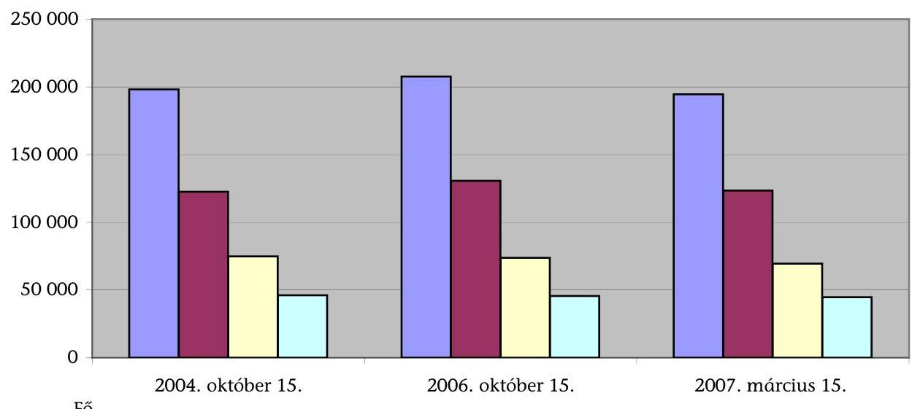

Fő
■ Nappali tagozatos hallgatói létszám
■ Képzési helyen kívüli belföldi lakhellyel rendelkező hallgatók
■ Kollégiumi ellátást kérelmezők száma
■ Kollégiumi ellátottak száma
2. sz. diagram
a V-25-74/2006-2007. sz. jelentéshez

## A kollégiumi kihasználtság alakulása (2004-2007 között)

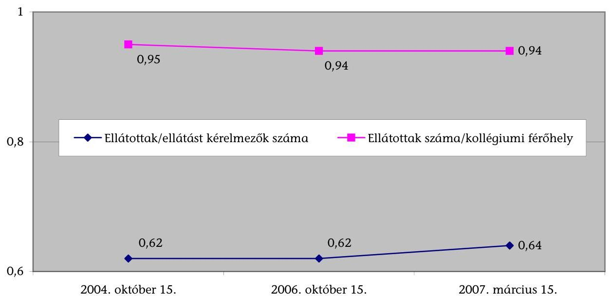

---

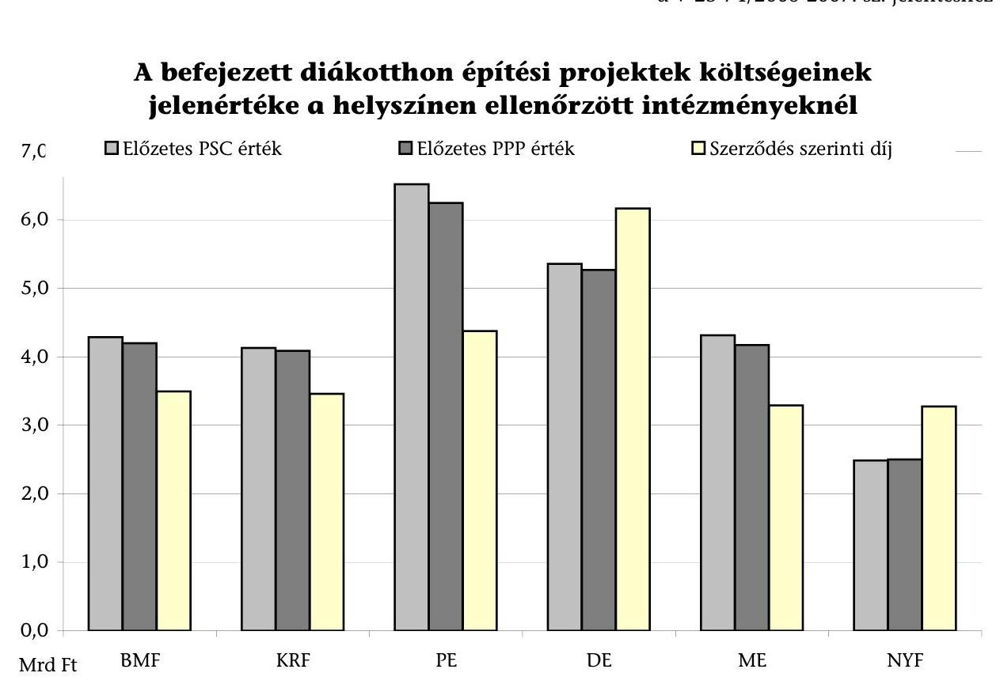

# A befejezett diákotthon építési projektek költsége 

nominális értéken a helyszínen ellenőrzött intézménveknél
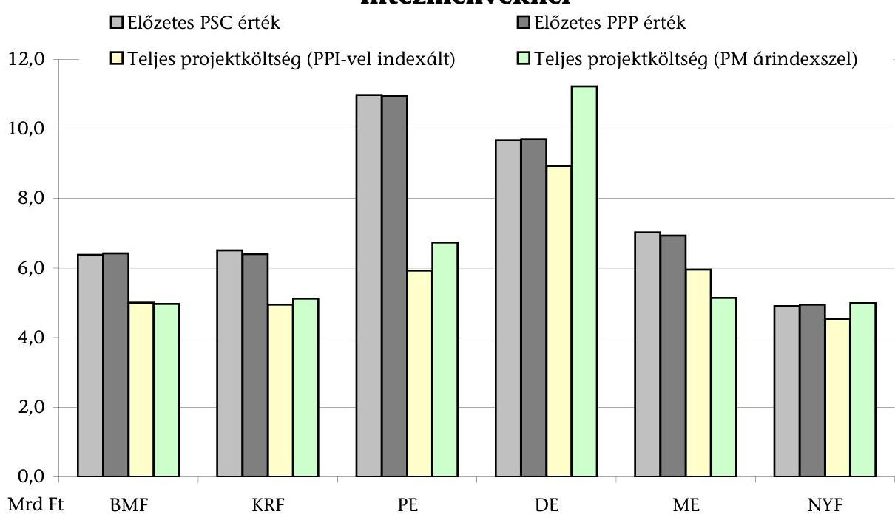

---

# A befejezett diákotthon építési projektek költsége nominális értéken az ellenőrzött intézményeknél 

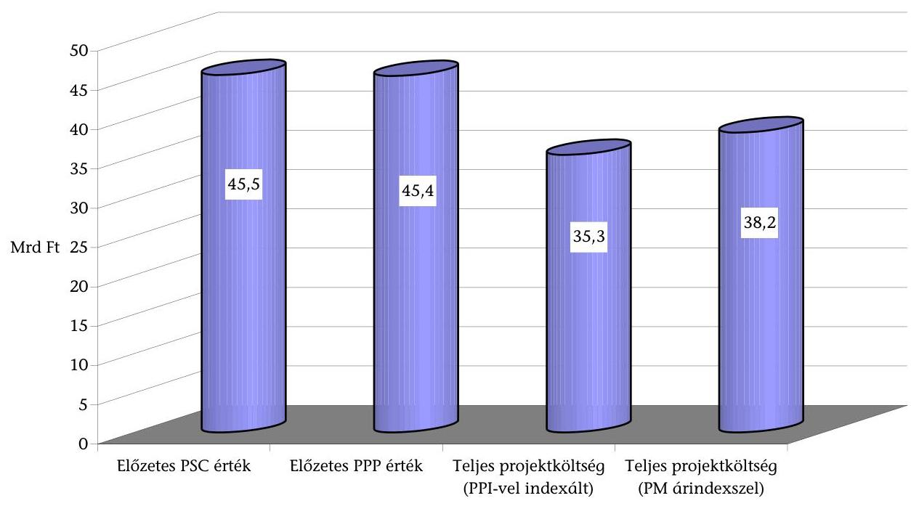
6. sz. diagram
a V-25-74/2006-2007. sz. jelentéshez

## A diákotthon építés szerződés szerinti bruttó bérleti díjának megoszlása

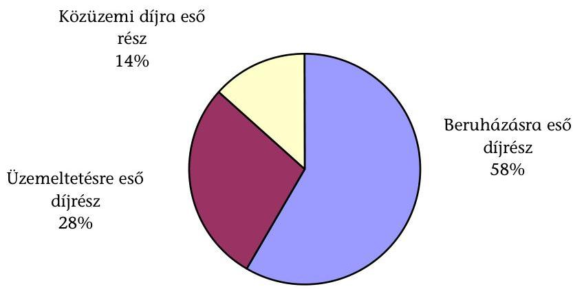

---

# A kollégiumi rekonstrukció szerződés szerinti bruttó bérleti díjának megoszlása 

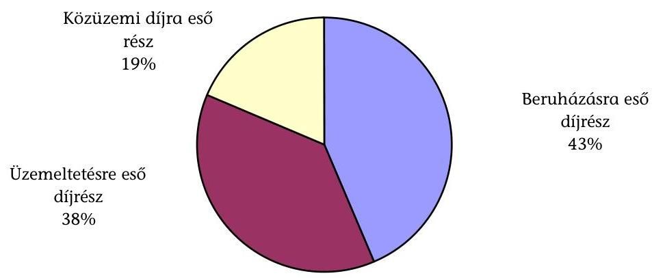
8. sz. diagram
a V-25-74/2006-2007. sz. jelentéshez

## Egy férőhelyre jutó üzemeltetési díj a helyszínen ellenőrzött intézményeknél*

Diákotthon építés
Kollégiumi rekonstrukció
Saját fenntartású kollégium
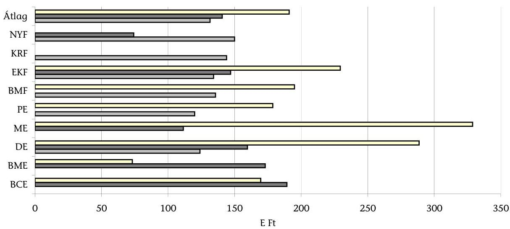

---

# A bérleti-szolgáltatási dí forrásai a helyszínen ellenőrzött intézményeknél 2006-2007. évben 

## Diákotthon építés

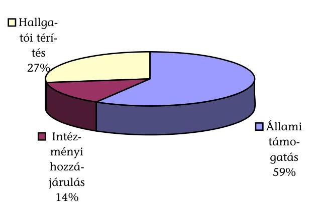

## Kollégiumi rekonstrukció

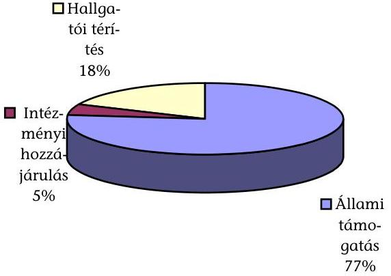

---

# ÖSSZESÍTETT KÉRDŐÍVES VÉLEMÉNY a felsőoktatási kollégium beruházási programról a helyszínen ellenőrzött intézményektől

---

# ÖSSZESÍTETT VÉLEMÉNY a felsőoktatási kollégium beruházási programról a helyszínen ellenőrzött intézményektől

1. Az intézmények kollégiumi/diákotthoni épületeinek száma összesen:

|  2004. | 2005. | 2006.  |
| --- | --- | --- |
|  54 | 56 | 57  |

ebből mennyi a kollégium fejlesztési program keretében:

|   | 2004. | 2005. | 2006.  |
| --- | --- | --- | --- |
|  - épített új diákotthonok száma: | 0 | 3 | 2  |
|  - felújított kollégiumok száma: | 0 | 1 | 8  |

1. Az intézmény számára biztosított volt-e a programhoz történő csatlakozás feltételeinek megismerése?

- igen, a Minisztérium tájékoztatásul megküldte
- a Minisztérium nem küldte meg, de az Interneten hozzáférhető volt

|  9 | |
| --- | --- |
|  0 | |

1. Az OM/OKM egyértelműen meghatározta-e a PPP programban való intézményi részvétel feltételeit?

- igen, egyértelműen meghatározta
- nem volt egyértelműen meghatározva, de intézményi észrevételek alapján pontosította
- nem volt egyértelműen meghatározva és nem is pontosította

|  9 | |
| --- | --- |
|  0 | |
|  0 | |

1. Az intézmény a közbeszerzési kiírásban pontosan, mindenre kiterjedően meghatározta-e a) létesítménnyel szembeni követelményeket

- igen
- nem
- részben

|  9 | |
| --- | --- |
|  0 | |
|  0 | |

b) az igényelt szolgáltatás tartalmát?

- igen
- nem
- részben

|  9 | |
| --- | --- |
|  0 | |
|  0 | |

---

# 5. A követelmények meghatározásánál figyelembe vették-e a hallgatók által igényelt szolgáltatásokat? 

- igen
- nem
- részben

| 9 |
| :-- |
| 0 |
| 0 |

## 6. Az 5. pontban adott válaszok jellemző indoklásai:

Mindkét kollégium rekonstrukciós beruházást jelentett már meglévő szolgáltatásokkal, de a műszaki felújítási tartalom meghatározásánál figyelembe vettük a hallgatói igényeket a lakóegységek és közösségi helyiségek funkcionális összetétele és kialakítása tekintetében is, $s$ ahol erre lehetőség nyílt, a szolgáltatási kör is bővítésre került.
A műszaki, illetve pénzügyi, valamint a PPP konstrukció jellegéből adódó keretek között a hallgatói képviseletek bevonásával került a program felépítésre.
A HÖK aktívan részt vett a programok összeállításában. Az elvi, illetve építési engedélyezési tervek egyeztetésében a közbeszerzési eljárás Bíráló Bizottságának tagja volt a DE HÖK elnöke. A kivitelezés időszakában a kooperációs egyeztetésekre, bútorbemutatókra, műszaki átadás-átvételi eljárásokra meghívást kaptak és azokon részt vettek. Észrevételeikkel, javaslataikkal segítették a beruházás sikeres megvalósítását.
Mind az előkészítésben, mind a tárgyalásokon a HÖK képviselői részt vettek, jelen voltak.

A hallgatók által igényelt szolgáltatások: lakóegységek takarítása, férőhelyenkénti Internet csatlakozás, szintenkénti dohányzó helyiségek, büfé, kondícionáli terem, legalább egy db nagy méretű közösségi helyiség, zárt-fedett kerékpártároló.

BMF A HÖK-kel egyeztetve határoztuk meg a követelményeket.
A férőhelyek apartman rendszerben kerültek biztosításra, jelentős komfortfokozat javulásával egyidejűleg. Mindhárom épületben $3 \times 2$ ágyas apartmanok jöttek létre, a hozzá kapcsolódó közös előtérrel és vizesblokkal. A szobák és közösségi helyiségek gyengeáramú végpontokkal rendelkeznek. A kollégiumban közösségi és tanulási terek kerültek kialakításra. Korszerű fotocellás Chip-kártyás diákigazolvány felhasználásával működő beléptető rendszer múködik.
KRF Külön kérdőíves felmérés volt.
Folyamatosan egyeztettünk a HÖT képviselőivel, az általuk
NYF javasolt észrevételeket folyamatosan építettük be a dokumentációba.

---

# 7. A közbeszerzési eljárás eredményesen zárult-e? 

- igen, már az első eljárás során
- igen, de megismételt eljárással
- nem

| 8 |
| :-- |
| 1 |
| 1 |

8. Sikertelen eljárás esetén feltárták-e az okokat?

- igen
- nem
- részben

| 1 |
| :-- |
| 1 |
| 0 |

9. A sikertelenség okai:

A közbeszerzés - minisztériumi jóváhagyással - két külön eljárásként indult, mely álláspont később megváltozott, s a két részvételi szakaszban tartó eljárást visszavonva új közbeszerzési eljárást indított az egyetem, egyben a két kollégiumra, mely sikeresen is zárult.

Az épületek előzetesen becsültnél rosszabb műszaki állapota, valamint a - megítélésünk szerint - túlzott befektetői elvásárok együttesen eredményezték az előzetesen meghatározott, illetve a lehetőségeinken belül maradó pénzügyi keret túllépését.
10. A szerződéskötési folyamatban részt vett-e a Minisztérium?

- a szerződéskötési folyamatban végig részt vett

9

- a szerződéskötési folyamat egy részében vett részt
- a szerződéskötési folyamatban nem vett részt

| 0 |
| :-- |
| 0 |

11. Segítette-e a Minisztérium az intézményi érdekek érvényesülését típusszerződéssel?

- igen
- nem

| 9 |
| :-- |
| 0 |

12. A szerződéskötést megelőzően kikérték-e a KSH véleményét a projekt államháztartási vagy magánszerktorba tartozásával kapcsolatban?

- igen, kikértük

| 9 |
| :-- |
| 0 |

---

# 13. A szerződésben pontosan határozták-e meg 

a) a létesítménnyel szembeni követelményeket?

- igen, részletes meghatározás történt

9

- nem történt részletes meghatározás

0

- a követelmények csak részben lettek pontosan meghatározva
b) a szolgáltatásokkal szembeni elvárásokat?
- igen, pontos meghatározás történt

9

- nem történt pontos meghatározás

0

- az elvárások csak részben lettek pontosan meghatározva
c) a nem megfelelő teljesítés esetén alkalmazandó szankciókat?
- igen, részletes meghatározás történt

7

- nem történt részletes meghatározás

14. A beruházás a szerződésben meghatározott
a) tartalommal valósult meg?

- igen

8

- nem

0

- részben
b) határidő bertartásával készült el?
- igen

7

- nem

15. Az átadási határidő igazodott-e a tanévkezdéshez?

- igen

5

- nem

3
16. Kérjük, hogy értékeljék az üzemeltető által nyújtott szolgáltatás színvonalát!

- kiemelkedően magas színvonalú

2

- magas színvonalú

4

- jó színvonalú

0
- közepes színvonalú

0
- még nem értékelhető

2

---

# ÖSSZESÍTETT HALLGATÓI VÉLEMÉNYEK a felsőoktatási kollégium beruházásokról, a helyszínen ellenőrzött intézmények hallgatói önkormányzataitól

---

# ÖSSZESÍTETT HALLGATÓI VÉLEMÉNYEK a felsőoktatási kollégium beruházásokról, a helyszínen ellenőrzött intézmények hallgatói önkormányzataitól 

1. A Hallgatói Önkormányzat hogyan szerzett tudomást a kollégiumi beruházási programról?

- Egyetemi Tanács ülés témája volt

8

- sajtóból

1

- más felsőoktatási intézmény hallgatói önkormányzatától

0

- HÖOK

1
2. A HÖK számára biztosított volt-e a programhoz történő csatlakozás feltételeinek megismerése?

- igen

9

- nem

0
3. A HÖK támogatta-e az intézményi kollégium beruházást?

- igen

9

- nem

1
4. A 3. pontban adott válaszok jellemző indoklásai:

A HÖK támogatta az Egyetem kollégiumainak PPP konstrukcióban történő fejlesztését. Így a hallgatók az államilag szabályozott keretek közötti díjfizetés ellenében magasabb színvonalú szolgáltatásokat kaphatnak.
A kollégiumok felújítása elkerülhetetlen volt az állapotuk miatt, valamint az intézmény anyagi helyzete indokolta az extra állami támogatás igénybevételét az ingatlan-park
BME felújításához. A Szenátus elé terjesztett konstrukciókból egyértelmúen a PPP felújítás látszott jobbnak, ugyanakkor az üzemeltetése nehézkesebbnek látszik.
A kollégiumi beuházások eredményeként jelentős számban létesültek új férőhelyek, amelyek nagy segítséget jelentettek a hallgatók kollégiumi elhelyezési gondjainak megoldásában. A
DE felújítások eredményeként a férőhelyek komfortfokozata jelentősen javult, ezáltal a hallgatók sokkal színvonalasabb, a mai kor követelményeinek megfelelő kollégiumokban lakhatnak (pl. Internet hozzáférés minden kollégiumban lakó hallgató számára).

---

|  | Két kérdésben kellett állást foglalni az Egyetemi Tanács ülésén. Az egyik programot támogatta a HÖK, azonban a |
| :--: | :--: |
| ME | finanszírozás és a hallgatók által fizetendő kollégiumi díj összege kidolgozatlan és előre nem egyeztetett formában került az Egyetemi Tanács elé, ezért felelős döntésnek nem volt meg a feltétele. |
| PE | Szükséges volt a kollégiumi férőhelyek bővítése és ez a konstrukció ezt magas színvonalon biztosította. |
| BMF | A főiskola több hallgatót képes kollégiumban elhelyezni. |
| EKF | A HÖK célja is, hogy a hallgatóink kulturált és fejlett keretek között tudjanak tanulni, melynek fontos eleme a lakhatás feltételeinek megteremtése. |
| NYF | A kollégiumi épületek felújításra szorulnak, hogy megfelelő lakhatást biztosítsanak a hallgatók számára. |

5. A HÖK megfogalmazta-e az intézményvezetés számára a létesítménnyel szembeni hallgatók által igényelt szolgáltatásokat?

- igen

9

- nem

0
6. Az igényelt szolgáltatásokról hogyan tájékoztatták az intézményvezetést?

- írásban benyújtották 3
- Egyetemi Tanács ülésen szóbeli tájékoztatást adtak 2
- mindkettő 4

7. A létesítménnyel szembeni követelmények meghatározásánál figyelembe vet-ték-e a hallgatók által igényelt szolgáltatásokat?

- igen

5

- nem
- részben
- 4

8. Jellemzően azok a szolgáltatások, amiket
a) figyelembe vettek:

Kollégiumi szobákhoz tartozó vizesblokkok felújítása, sűrűbb elhelyezése. Teljes körű Internet hozzáférés. Nyílászárók felújítása.

| DE | Internet csatlakozás minden hallgató számára, saját szobai |
| :-- | :-- |
| telefonmellék, saját vizesblokk, fitness terem, étterem, kávézó. |  |
| ME | Közösségi helyiségek kialakításának szempontjai, szobák |
|  | ágyszámai. |

---

| PE | Büfé, parkoló, Internet használati lehetőség, televízió   használati lehetőség. |
| :-- | :-- |
| BMF | Hallgatónként Internet csatlakozás, ingyenes mosási lehetőség. |
| EKF | Internet, szobaelosztás, kialakítás, felszereltség.   Berendezés, az épületekben múködő szolgáltatók, boltok, stb.   Buszjáratok, kisvasút, de a buszjárat megoldása nem valósult   meg különböző okokból (Volán megállóhely építés nem   megvalósítható). |
| NYF | Internet és kábel TV lehetőség, szobánkénti külön   hűtőszekrény, légkondicionáló. |

# b) egyáltalán nem vettek figyelembe: 

| BME | Hallgatói iroda felújítása, ami a kollégiumhoz tartozik, a   hallgatói klubok használatának meghatározása, ezek   felszerelése az előzetes kérelmeknek megfelelően. A 9. Emeleti   hallgatói klub megbeszélt konstrukciójának megvalósítása. |
| :-- | :-- |
| ME | Több esetben kész tények voltak, melyeket már módosítani   nem lehetett - egységes bútorzat - ez épületenként eltérő   problémát okoz. |
| PE | Konditerem, sportolási lehetőségek. |
| NYF | Nem volt ilyen. |

9. A térítési díjak összhangban vannak-e a nyújtott szolgáltatások színvonalával?

- igen

7

- nem
- részben
10. Az új építésű diákotthonok, a felújított kollégiumok térítési díjai az albérleti árakkal összevetve versenyképesek-e?

- igen, mert alacsonyabbak

9

- nem, mert magasabbak

11. A külön térítés ellenében nyújtott szolgáltatások igazodnak-e a hallgatói igényekhez?

- igen
- nem
- részben

| 6 |
| :-- |
| 0 |
| 2 |

---

# 12. A szolgáltatások árai igazodnak-e a hallgatók fizetőképességéhez? 

- a szolgáltatások árai megfizethetők 7
- a szolgáltatások árait nem diákzsebhez mérték 1

## 13. Kérjük, hogy értékeljék az üzemeltető által nyújtott szolgáltatás színvonalát!

- kiemelkedően magas színvonalú 1
- magas színvonalú 6
- jó színvonalú 0
- közepes színvonalú 1

## Megjegyzések:

A 8., 9., 11., 12., 13. kérdésekre nem vagy részben tudtak válaszolni, mivel a hallgatók leghamarabb csak március 31-én láthatják először a szobájukat. A szolgáltatások minőségére, színvonalára, a fizetőképességhez való igazodásukra leghamarabb szeptemberben tudunk válaszolni, annak függvényében, hogy a hallgatók mennyire szeretnének a Kármán Kollégiumba költözni, illetve mennyire szeretnének egy másik nem felújított kollégiumban lakni.

---

# Kérdések, kritériumok és adatforrások a felsőoktatás kollégium beruházási programjának ellenőrzéséhez

Fő kérdés: A felsőoktatás kollégiumi beruházási programjának megvalósítása a felsőoktatás fejlesztési céljaival összhangban, az állami és intézményi érdekek figyelembevételével, a közpénzek gazdaságos és hatékony felhasználásával történt-e?

|  Kérdések |  | Teljesítménykövetelmények (kritériumok) | Adatforrások  |
| --- | --- | --- | --- |
|  A projekt célkitűzéseinek megalapozottsága |  |  |   |
|  1. | A felsőoktatás kollégiumi beruházási programja összhangban van-e a felsőoktatás fejlesztési célokkal és a projekt időtartama alatt a kollégiumok iránti igényekkel? |  |   |
|  1.1 | A kollégium beruházási program megfelelően szolgáljae az infrastruktúra iránti igényeket és a hosszú távú felsőoktatás fejlesztési célokat? | Eredményesség:
A kollégiumi beruházási program összhangja a felsőoktatás fejlesztési célokkal.
Az új diákotthoni férőhelyeknek a fejlesztendő képzési területekhez történő kapcsolódása.
A ténylegesen megvalósított férőhelybővítés/korszerűsítés időarányos alakulása a tervezett férőhelybővítés/korszerűsítéshez képest (2207/2004. Korm. határozat alapján).
Hatékonyság:
A férőhelybővítés nagyságrendjének, megalapozottsága, a meglévő kapacitás, a kihasználtság, valamint a várható hallgatói létszám függvényében. | Államreform tervek; Kormányprogramok; Felsőoktatás fejlesztési terv, oktatáspolitikai koncepció; A felsőoktatásról szóló törvény.
2091/2003. (V. 15.) Korm. határozat a Kormányprogram alapján létesítendő 10000 diákotthoni férőhely vállalkozói alapon történő megvalósításáról.
2207/2004. (VIII. 27.) Korm. határozat az Oktatási Minisztérium felügyelete alá tartozó felsőoktatási intézmények infrastruktúra fejlesztési programjának aktuális feladatairól.
KSH demográfiai adatai, prognózisai, tanulmányai.
OM (OKM) felsőoktatási statisztikái, tanulmányai; Regionális fejlesztési tervek; A programban részlevő intézmények intézményfejlesztési tervei, beruházási tervei, azok értékelésének dokumentumai.
Hatástanulmányok, PSC számítás.  |

---

|  Kérdések |  | Teljesítménykövetelmények (kritériumok) | Adatforrások  |
| --- | --- | --- | --- |
|  1.2 | Megalapozottak-e a programban résztvevő felsőoktatási intézmények diákotthoni férőhely-bővítésre, kollégiumrekonstrukcióra irányuló igényei? |  |   |
|  1.2.1 | A programban résztvevő felsőoktatási intézmények intézményfejlesztési tervei igazodtak-e a felsőoktatás fejlesztési koncepciójához? A tervezett kollégiumfejlesztések összhangban vannak-e az intézményfejlesztési tervekkel? | Eredményesség:
A programban résztvevő felsőoktatási intézmények fejlesztési terveinek összhangja a munkaerő piaci igényekkel, a regionális fejlesztési tervekkel.
A kollégiumfejlesztések összhangja az intézményfejlesztési tervekkel. | A programban résztvevő intézmények kollégiumi kapacitásának kihasználtságáról, állagáról, hallgatói létszámáról, a kollégiumi ellátásra jogosultak és ellátásban részesülők számáról bekért tanúsítványi adatok.
Felmérések a programban résztevő intézmények hallgatóinak munkaerő piaci keresletéről.
Felmérés a meglévő kollégiumok állagáról, korszerűségéről.
A Minisztérium által megjelentetett (kiküldött) tájékoztatás a PPP programban való részvétel feltételeiről.
A programban résztvevők pályázatai (tervei), valamint a Minisztérium elbírálási szempontrendszere.  |
|  1.2.2 | A felsőoktatási intézmények új diákotthoni férőhelyek létesítésére irányuló igényei megalapozottak voltak-e, igazodtak-e képzés iránti munkaerő piaci igényekhez és az adott régióban várható hallgatói létszámváltozáshoz? |  |   |
|  1.2.3 | A meglevő kollégiumok állaga, korszerűsége és várható kihasználtsága figyelembevételével megalapozottak voltak-e a kollégium rekonstrukcióra irányuló intézményi tervek? |  |   |

---

|  Kérdések |  | Teljesítménykövetelmények (kritériumok) | Adatforrások  |
| --- | --- | --- | --- |
|  1.3 | A Minisztérium a hosszú távú felsőoktatási célok, hatékonysági, kihasználtsági és gazdaságossági szempontok figyelembevételével kötött-e megállapodást a programban résztvevő intézményekkel? | Eredményesség:
Az intézményfejlesztési, azon belül a beruházási tervek összehasonlíthatósága.
Az intézményi igények elbírálási szempontjainak kialakítása az oktatáspolitikai célok és a hosszú távú kapacitáskihasználtság szem előtt tartásával. | Az intézményfejlesztési és beruházási tervek készítésének szempontrendszere, készítésükhöz kiadott útmutatók.
A saját bevételek felhasználhatóságára vonatkozó szabályozás.
A projektek minisztériumi véleményezése, kockázatelemzése a kötelezettségvállalási megállapodásokat megelőzően.
A PPP Tárcaközi Bizottság üléseinek jegyzőkönyvei, a projekt-tervezetek értékelésének dokumentációi.  |
|  1.3.1 | A Minisztérium egyértelműen meghatározta-e a felsőoktatási intézmények számára a PPP programban való részvétel feltételeit? Minden intézmény számára biztosított volt-e a programhoz történő csatlakozás feltételeinek megismerése? | A PPP Tárcaközi Bizottság véleményének figyelembevétele a projekttervezetek elbírálásánál
Gazdaságosság:
A támogatandó fejlesztésekhez gazdaságossági követelmények meghatározása a Minisztérium részéről.
Hatástanulmánnyal, összehasonlító PSC számítással megalapozott kötelezettségvállalásra vonatkozó megállapodások.
Hatékonyság:
A támogatandó fejlesztésekhez kihasználtsági, hatékonysági követelmények meghatározása a Minisztérium részéről. |   |

---

|  Kérdések |  | Teljesítménykövetelmények (kritériumok) | Adatforrások  |
| --- | --- | --- | --- |
|  A projekt-előkészítés megfelelése az állami, az intézményi és a közérdekeknek |  |  |   |
|  2. | A projekt(ek) előkészítése megfelel-e az állami, az intézményi és a közérdekeknek? |  |   |
|  2.1 | A szabályozási feltételek megalapozták-e a kollégium beruházási program állami, intézményi és közérdekeknek megfelelő előkészítését és lebonyolítását? |  |   |
|  2.1.1 | Kialakítottak-e jogszabályban rögzített eljárásrendet a programok lebonyolításához? Meghatároztak-e számítási módszereket a projektek gazdaságosságának megállapításához, összehasonlíthatóságának biztosításához? |  |   |
|  2.1.2 | A programban résztvevő intézmények rendelkeznek-e jogszabályban biztosított lehetőséggel a folyamatok szervezésére, a szerződések megkötésére, valamint a szükséges garanciák vállalására? A jogszabályok biztositják-e a befektetők földhasználati (haszonélvezeti) jogának megszerzését az állami tulajdonú ingatlanra, a futamidő tartamára? |  |   |
|  2.1.3 | A szolgáltatásvásárlás finanszírozásához kapcsolódó (kollégiumi normatív támogatásra, a bérleti díj 50\%-os átvállalására, a kiegészítő hozzájárulásra, az ingatlanértékesítés bevételének felhasználhatóságára vonatkozó) jogszabályok a közérdekeknek megfelelően járulnak-e hozzá a fizetőképes kereslet biztosításához? A kollégiumi támogatás és az OKM kollégiumi bérleti díjhoz történő hozzájárulása mellett biztosítható-e az intézmények által vállalt feltöltési kötelezettség? Hosszú távra biztosí-tott-e az intézményekkel kötött megállapodásban vállalt állami kötelezettségek teljesítése? A diákotthonfejlesztési program finanszírozására fordítható ingatlanértékesítés lehetővé tétele nem veszélyezteti-e hosszabb távon a felsőoktatási intézmények működési feltételeinek biztosítását? |  |   |

## Eredményesség:

Az állami tulajdonú telken a befektetők részére földhasználati/haszonélvezeti jog biztosítása. A szolgáltatási díjfizetési kötelezettség évenkénti összegének alakulása az intézményi költségvetés dologi és felhalmozási célú előirányzatának $10 \%$-án belül. A kollégiumi rekonstrukciónál - kötelezettségvállalási megállapodással a bérleti díj fizetési kötelezettség 50\%-os átvállalása az OKM részéről. Az ingatlanértékesítés bevételének jogszabályban meghatározott felhasználása beruházásra, szolgáltatásvásárlásra. A hosszú távú kötelezettségvállalás forrásainak biztosítása.

## Gazdaságosság:

A projektek gazdaságosságát, összehasonlíthatóságát biztosító PSC számítási módszerek kidolgozása. A PPP konstrukcióban megvalósuló beruházás és üzemeltetés nettó jelenértékének viszonya az állami hitelfelvételből megvalósuló beruházás és üzemeltetés nettó jelenértékéhez. A szolgáltatásvásárlás finanszírozásához kapcsolódó jogszabályok megfelelése a közérdekeknek. A szerződés szerint fizetendő szolgáltatási díjak

A felsőoktatás kollégium beruházási programjához kapcsolódó jogszabályok. A köz- és magánszféra együttműködésére vonatkozó jogszabályok, eljárásrend. A felsőoktatás kollégium beruházási programjához kapcsolódó jogszabályok. A hosszú távú kötelezettségvállalásra vonatkozó jogszabályok Államháztartási törvény. Polgári törvénykönyv. Közbeszerzési törvény. Az ellenőrzés időszakának költségvetési törvényei. A felsőoktatásról szóló törvény, a felsőoktatási hallgatók juttatásait szabályozó kormányrendelet. A 2007-2011. időszakra kidolgozott intézményfejlesztési tervek. Az intézmények által szolgáltatott tanúsítványi adatok a saját bevételek, kiemelten az ingatlanértékesítésből származó bevételek felhasználásáról. Az intézmények előzetes számításai a szolgáltatási díj fedezetét biztosító bevételekről, valamint a diákotthonok, kollégiumok várható feltöltöttségéről.

---

|  Kérdések |  | Teljesítménykövetelmények (kritériumok) | Adatforrások  |
| --- | --- | --- | --- |
|   |  | évenkénti összegének alakulása a kollégiumok (diákotthonok) müködtetését szolgáló tervezett éves forrásokhoz képest. A felsőoktatási intézmények által kizárólag gazdaságosan nem hasznosítható ingatlanok értékesítése, bevételnek felhasználása a szolgáltatásvásárlásra. A közbeszerzési eljárások során a versenyfeltételek biztosítása, a legelőnyösebb ajánlat kiválasztása.
Hatékonyság:
A megfelelő kihasználtságot, valamint az igazságos teherviselést biztosító támogatási rendszer kialakítása. | Közbeszerzési kiírások, ajánlatok, a közbeszerzési eljárások dokumentációi.
A sikertelen közbeszerzésre, okainak elemzésére vonatkozó dokumentáció.  |
|  2.2 | Eredményes és hatékony módszereket alakított-e ki a Minisztérium a programfolyamatok nyomon követésére? | Eredményesség:
A beruházási program felügyeletének, ellenőrzésének megvalósulása.
A sikertelen közbeszerzési eljárások tapasztalatainak értékelése, hasznosítása.
A kedvezőtlen folyamatok befolyásolásához megfelelő hatáskör, eszközrendszer biztosítása. | Közbeszerzési kiírások, ajánlatok, a közbeszerzési eljárások dokumentációi.
A sikertelen közbeszerzésre, okainak elemzésére vonatkozó dokumentáció.  |
|  2.2.1 | Gondoskodott-e az OKM a program minisztériumi felügyeletéről, ellenőrzéséről? Megtörtént-e a felügyeleti szerv részéről a közbeszerzési eljárások ellenőrzése? Értékelte, összegezte-e a Minisztérium a sikertelen közbeszerzési eljárások okait, a tapasztalatokat megosztotta-e a programban részt vevő intézményekkel? Segítette-e a Minisztérium az állami és intézményi érdekek érvényesülését típusszerződések rendelkezésre bocsátásával? A szerződéskötési folyamat során biztosított volt-e az OKM képviselete? |  |   |
|  2.2.2 | A projektek megvalósítása során biztosított volt-e a folyamatok felügyelete? A felügyeleti szerv rendelkezett-e megfelelő eszközökkel és hatáskörrel a kedvezőtlen projektfolyamatok befolyásolásához? A projektfolyamatok ellenőrzéséhez eredményes és hatékony módszereket alakítottak-e ki? |  |   |

---

|  Kérdések |  | Teljesítménykövetelmények (kritériumok) | Adatforrások  |
| --- | --- | --- | --- |
|  2.2.3 | Megvalósult-e a PPP konstrukcióban épített vagy korszerűsített létesítmények működtetésének folyamatos nyomon követése? A tapasztalatok alapján tettek-e javaslatot szerződéskötés előtt álló intézmények részére a szolgáltatás értékelési módszereinek meghatározására? |  | OKM tájékoztatói, útmutatói a programban résztvevő intézmények számára.  |
|  2.3 | A projekt megvalósítását előkészítő eljárások, folyamatok elősegítették-e a program eredményes, gazdaságos, hatékony lebonyolítását? | Eredményesség:
A szolgáltatással szembeni követelmények pontos, a hallgatói és az intézményi érdekeknek megfelelő meghatározása. | A közbeszerzési eljárások dokumentumai.
Közbeszerzési eljárások lebonyolításáról készült jegyzőkönyvek.  |
|  2.3.1 | A programban résztvevő intézményeknél a közbeszerzési eljárások lebonyolítása szabályszerűen, a Minisztérium jóváhagyásával történt-e? A közbeszerzési eljárás során a versenyfeltételek biztosítottak voltak-e? |  |   |
|  2.3.2 | Pontosan, mindenre kiterjedően meghatározták-e az intézmények a közbeszerzési kiírásokban a létesítménynyel szembeni követelményeket és az igényelt szolgáltatás tartalmát? A követelmények meghatározásakor figyelembe vették-e a hallgatók által igényelt szolgáltatásokat (közösségi, kulturális és sportélet feltételeinek megteremtése, tehetséggondozás, hallgatói centrum működése, hátrányos helyzetű és fogyatékkal élő hallgatók esélyegyenlőségének segítése stb.)? | Gazdaságosság:
A közbeszerzési eljárások során a versenyfeltételek megléte. A legelőnyösebb ajánlat kiválasztása. |   |
|  2.3.3 | A közbeszerzési eljárások során a legelőnyösebb ajánlatot választották-e? Megtörtént-e az intézmények részéről a sikertelen közbeszerzések okainak feltárása? |  |   |

---

|  Kérdések |  | Teljesítménykövetelmények (kritériumok) | Adatforrások  |
| --- | --- | --- | --- |
|  2.4 | A felsőoktatási intézmények és a magánbefektetők között létrejött szerződések megalapozták-e a projektek intézményi és hallgatói igényeknek megfelelő, eredményes, gazdaságos és hatékony megvalósítását? | Eredményesség:
A fejlesztés államháztartáson kívüli elszámolhatósága.
A szerződés utáni változások kezelésére vonatkozó rendelkezések rögzítése. A hatáskörök és a felelősség egyértelmű meghatározása.
A közérdekeknek megfelelő rendelkezés - a futamidő lejárta után - a létesítmény tulajdonjogáról.
A diákotthonok működésének - 79/2006. (IV. 5.) Korm. rendeletben meghatározott - minimális feltételeinek, így 7 m 2 nettó lakóterület férőhelyenkénti biztosítása a bérleti-szolgáltatási szerződés szerint. | A felsőoktatási intézmény és a magánpartner között létrejött bérleti és szolgáltatási szerződések és mellékleteik.
A magánpartner által a közbeszerzési felhívásra benyújtott ajánlat.
A KSH véleménye a projektekről.
Megállapodások, rendelkezések a teljesítménymérés és értékelés módszereiről. Munkaköri leírások, megbízások.
Pénzpiaci információk.
Kockázati mátrix.
A szolgáltatási díjelemeket megalapozó háttérszámítások.
Üzleti tervek.
Kollégiumok fajlagos müködési költségeiről szerzett információk.
Árfolyamok alakulására vonatkozó információk  |
|  2.4.1 | Pontosan rögzítették-e a szerződésekben a létesítménynyel, valamint a nyújtandó szolgáltatásokkal szembeni követelményeket? Meghatározták-e a nem megfelelő teljesítés esetén alkalmazandó szankciókat? A szerződések tartalmazták-e a szerződő felek közötti kockázatok megosztását, ez megfelelt-e az intézményi és a közérdekeknek? Meghatározták-e a szerződéskötés utáni változások nyomon követésére, valamint a teljesítés értékelésére vonatkozó eljárásokat, módszereket, szervezetet? Kijelölték-e a nyújtott szolgáltatások folyamatos ellenőrzéséért, értékeléséért felelős személyeket? |  |   |
|  2.4.2 | A szolgáltatási díj, valamint annak egyes elemei (beruházásra, üzemeltetésre, közüzemi díjakra jutó díjrész) megalapozottak, az intézményi érdekeknek megfelelőek-
e? A beruházások megvalósításához felvett vállalkozói hitel feltételei az állami hitelfelvételnél kedvezőbbek voltak-e? A hitelfelvételt megelőzően megtörtént-e a pénzintézetek versenyeztetése? A szolgáltatási díj fizetése során a felsőoktatási intézmények viselnek-e árfolyamkockázatot, ennek viselése esetén a szolgáltatási díj arányosan csökken-e? |  |   |
|  2.4.3 | Rendelkeztek-e a szerződések a piaci hasznosításból származó bevételek és a refinanszírozási nyereség megosztásáról, ez megfelelt-e a felsőoktatási intézmény érdekeinek? A közérdekeknek megfelelően, az állam hoszszú távú tulajdonosi szerepére vonatkozó elképzelésekkel összhangban történt-e rendelkezés a futamidő lejártát követően a létesítmény(ek) tulajdonjogáról? |  |   |

---

|  Kérdések |  | Teljesítménykövetelmények (kritériumok) | Adatforrások  |
| --- | --- | --- | --- |
|  2.4.4 | A szerződéskötést megelőzően kikérte-e a felsőoktatási intézmény a KSH véleményét arra vonatkozóan, hogy a projekt államháztartási vagy magánszektorba tartozónak minősül-e? | Rendelkezés a refinanszírozási nyereség megosztásáról.
Hatékonyság:
A teljesítés értékelési módszereinek kidolgozása.
A nem megfelelő teljesítés szankcionálásának szerződésben történő meghatározása. |   |
|  A projekt-kivitelezés és müködtetés eredményessége, gazdaságossága és hatékonysága |  |  |   |
|  3. | A projekt(ek) kivitelezése és müködtetése eredményesen, gazdaságosan és hatékonyan valósult-e meg? |  |   |
|  3.1 | A beruházások tervezése és kivitelezése megfelel-e az intézményi és hallgatói érdekeknek? | Eredményesség:
A beruházás megfelelése a terveknek, a műszaki-építészeti előírásoknak, a megrendelői igényeknek és a hallgatói elvárásoknak.
A létesítmény intézményi és hallgatói érdekeknek megfelelő, határidőben történő átadása. | Átadás-átvételi jegyzőkönyvek.
Használatbavételi engedély.
Műszaki szakértői vélemények.
Üzleti tervek és azok teljesülése.
Összehasonlító elemzések a fajlagos beruházási költségek megítéléséhez.  |
|  3.1.1 | A beruházások tervezése és kivitelezése a szerződésben meghatározott tartalommal és határidő betartásával valósult-e meg? Az átadási határidők igazodtak-e a tanévkezdéshez? A kollégium rekonstrukciónál felmerült-e a hallgatók elhelyezésével kapcsolatos többletköltség határidőcsúszás miatt? Az átadást követően biztosítottak voltak-e beköltöző hallgatók számára a zavartalan lakhatási, tanulási feltételek? |  |   |

---

|  Kérdések |  | Teljesítménykövetelmények (kritériumok) | Adatforrások  |
| --- | --- | --- | --- |
|  3.1.2 | A kivitelezés megfelelt-e a műszaki terveknek? A tervezés és kivitelezés során figyelembe vették-e a megrendelői igényeket? Az elkészült létesítmény megfelelt-e az intézményi és hallgatói elvárásoknak? Megvalósult-e a megrendelő részéről a tervezés kivitelezés műszaki szakértői felügyelete? | Gazdaságosság:
A beruházás tervezett költségkereten belüli megvalósulása.
A beruházás fajlagos bekerülési költségének megfelelősége a hasonló célú és színvonalú létesítményekhez viszonyítva. | A szolgáltatást igénybe vevő intézmény illetékeseinek és a kollégiumokban lakó hallgatóinak kérdőíves megkérdezése.  |
|  3.1.3 | A beruházások gazdaságossági szempontok figyelembevételével a tervezett költségkereten belül valósultak-e meg? A megvalósult fejlesztések fajlagos bekerülési költsége nem magasabb-e, mint a hasonló funkciójú és színvonalú létesítményeké? |  |   |
|  3.2 | Az új diákotthonok és a felújított kollégiumok üzemeltetése, működtetése eredményesen, gazdaságosan, hatékonyan történik-e? |  |   |
|  3.2.1 | A kialakított műszaki-technikai megoldások gazdaságos üzemeltetést biztosítanak-e? Az új diákotthonok fajlagos üzemeltetési díjtétele - a nyújtott szolgáltatási színvonalat is figyelembe véve - kedvezőbb-e, mint a kollégiumok átlagának fajlagos üzemeltetési költsége? A felújított kollégiumok üzemeltetési, közüzemi kiadásai - a szolgáltatási színvonal javulását is figyelembe véve kedvezőbbek-e, mint a rekonstrukció előtti időszakban a kollégium működtetéséhez kapcsolódó összes ráfordítás? | Eredményesség:
A bérbeadó-szolgáltató által nyújtott szolgáltatások megfelelése a megrendelői és a hallgatói igényeknek, valamint a szerződésben foglaltaknak.
A létesítmény megfelelő állagának, üzemeltetési színvonalának fenntartását garantáló szerződés (karbantartási, felújítási kötelezettség).
A kollégiumi térítési díjak versenyképessége.
A szolgáltatási színvonal folyamatos ellenőrzésének biztosítása.
A szerződéses feltételek újratárgyalásának lehetősége a műszaki követelmények, a megrendelői igények változása esetén.
Gazdaságosság:
Gazdaságos üzemeltetést biztosító műszakitechnikai megoldások. | Kérdőívek.
Megrendelői és hallgatói vélemények.
Bérleti-szolgáltatási szerződések.
Tanúsítványi adatszolgáltatás.
Bérleti, albérleti díjakról szerzendő statisztikai adatok.
Ingatlanpiaci információk.
Tanúsítványok, intézményi beszámolók, főkönyvi kimutatások.
Szakértői vélemények.
Műszaki átvétel dokumentumai, műszaki ellenőrzési jegyzőkönyvek.
Intézményi statisztika, tanúsítványi adatszolgáltatás.
Kérdőívek feldolgozása.  |

---

|  Kérdések |  | Teljesítménykövetelmények (kritériumok) | Adatforrások  |
| --- | --- | --- | --- |
|  3.2.3 | Biztosítják-e a szerződéses feltételek a szolgáltatásvásárlás teljes futamidejére a létesítmény állagának, az üzemeltetés színvonalának fenntartását? Lehetőség van-e a műszaki követelmények, megrendelői igények változása esetén a szerződéses feltételek újratárgyalására? Az üzemeltetési díj összegének szerződés szerinti korrekciója megfelel-e a megrendelő érdekeinek? | A fajlagos üzemeltetési, közüzemi ráfordítások kedvező alakulása a korábbi kollégiumi működéshez képest.
A szerződéstől eltérő teljesítés esetén a szolgáltatási díj csökkentése.
Az üzemeltetést érintő díjkorrekciók megalapozottsága.
Intézményi saját bevételek felhasználása a bér-leti-szolgáltatási díj fedezetére.
Hatékonyság:
Hatékony energiafelhasználást biztosító technikai feltételek.
Magas színvonalú szolgáltatásnyújtásra ösztönző szerződéses feltételek, szankciók.
A térítési díj ellenében nyújtott szolgáltatások árainak versenyképessége. |   |
|  3.3 | A használatba vett létesítményekben a férőhelyek kihasználtsága biztosítja-e a fenntartás gazdaságosságát, a bérleti díj fizetési kötelezettség teljesítését? | Eredményesség:
A bérleti díj fizetési kötelezettség teljesítését biztosító hallgatói létszám. | A kollégiumi díjakról, valamint a térítés ellenében igénybe vehető szolgáltatások díjairól szerzett információk, adatok, feldolgozott kérdőívek.  |
|  3.3.1 | Az új diákotthonokat, a felújított kollégiumokat igénybe vevő hallgatók létszáma biztosította-e a felsőoktatási intézmény által a bérleti szerződésben vállalt telítettséget? A létesítmények kihasználtsága a terveknek megfelelően biztosítja-e a bérlő intézmény számára a bérleti díj fizetési kötelezettség teljesítését? |  |   |

---

|  Kérdések |  | Teljesítménykövetelmények (kritériumok) | Adatforrások  |
| --- | --- | --- | --- |
|  3.3.2 | A szolgáltatási dí finanszírozását biztosító források az eltelt időszakban az intézményekben a tervek szerint alakultak-e? Biztosított-e hosszú távon a szolgáltatásvásárlás fedezete, figyelembe véve a 2007-2011. közötti időszakra kidolgozott intézményfejlesztési tervben foglaltakat? Felhasznált-e a felsőoktatási intézmény saját bevételből képződő pénzeszközöket a bérleti-szolgáltatási díj kiegyenlítésére? Ingatlanértékesítésből vagy a létesítmény piaci hasznosításából származó bevételt felhasználtak-e a szolgáltatási díj fedezetére? | Gazdaságosság:
A tényleges telítettség alakulása a szerződés szerinti telítettséghez viszonyítottan.
Az intézmény által az év tíz hónapjára szerződésileg vállalt 50-90\%-os férőhely feltöltöttség biztosítása.
Hatékonyság:
A férőhelyek megfelelő kihasználtsága
A térítési díjak és a nyújtott szolgáltatások összhanga. |   |
|  3.3.3 | A hallgatók által fizetendő térítési díjak összhangban vannak-e a nyújtott szolgáltatások színvonalával? A beruházási program keretében megvalósult létesítmények kollégiumi térítési díjai - az albérleti árakkal összevetve - versenyképesek-e? |  |   |

Budapest, 2007. október