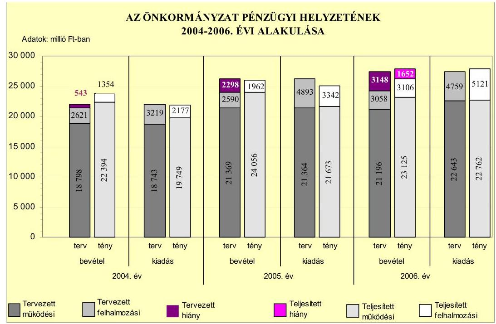
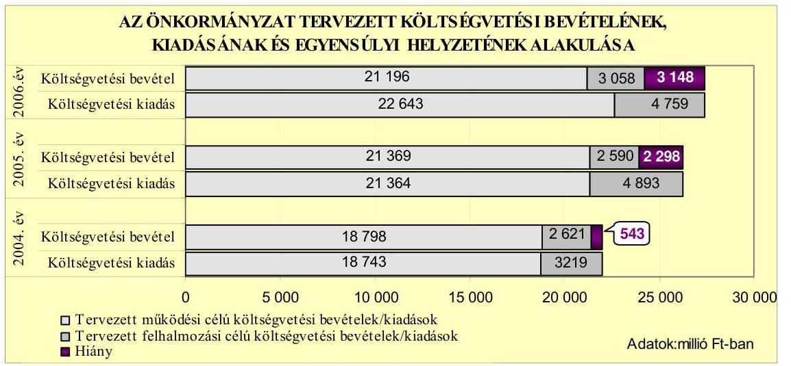
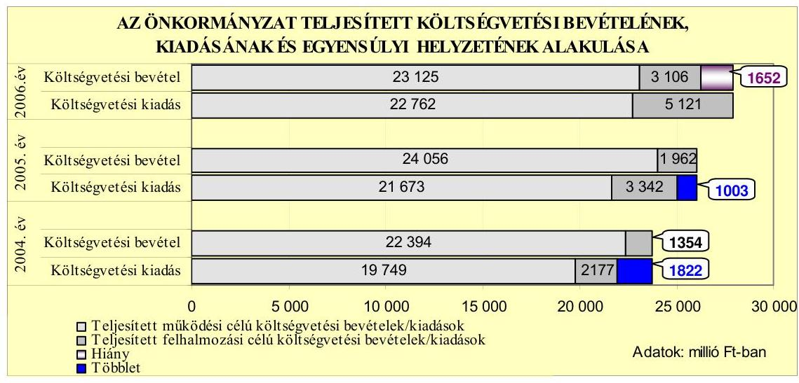
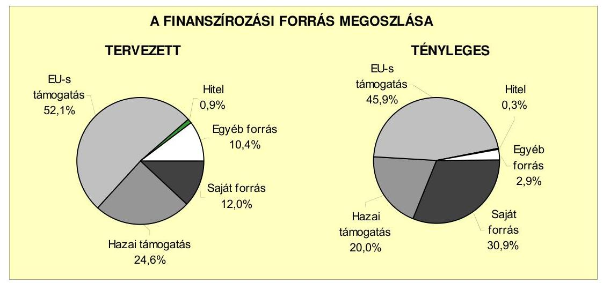
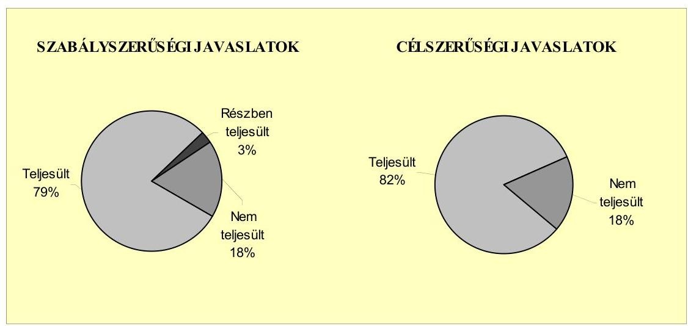
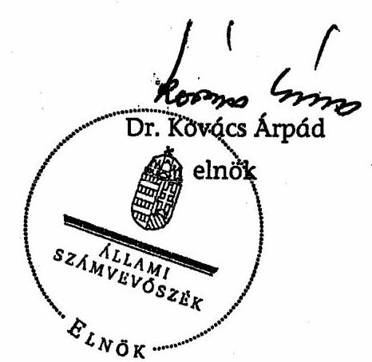
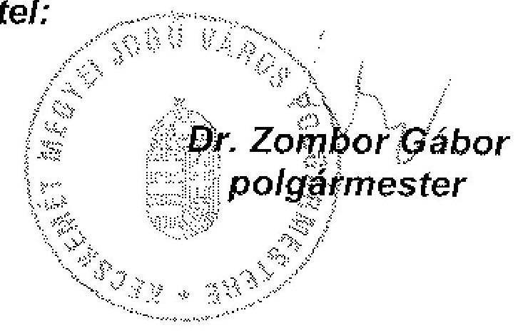

# JELENTÉS 

Kecskemét Megyei Jogú Város Önkormányzata gazdálkodási rendszerének 2007. évi átfogó ellenőrzéséről

---

# 3. Önkormányzati és Területi Ellenőrzési Igazgatóság 

## Átfogó Ellenőrzések Főcsoport

Iktatószám: V-1001-9/24/17/2007.
Témaszám: 845
Vizsgálat-azonosító szám: V0327

## Az ellenőrzést felügyelte:

Dr. Lóránt Zoltán
főigazgató
Az ellenőrzés végrehajtásáért felelős:
Dr. Sepsey Tamás
főigazgató-helyettes
Az ellenőrzést vezette:
Csecserits Imréné
főcsoportfőnök-helyettes
Az ellenőrzést végezték:
Dr. Botta Tibor
dr. Csikai Zsolt
Szenténé Tubak Klára
számvevő tanácsos
irodavezető, főtanácsadó számvevő tanácsos

## A témához kapcsolódó eddig készített számvevőszéki jelentések:

## címe

Jelentés a Magyar Köztársaság 2004. évi költségvetése végrehajtásának ellenőrzéséről
Függelék:

- a helyi önkormányzatokat a 2004. évben megillető normatív állami hozzájárulás elszámolásának ellenőrzése
- kötött felhasználású támogatások 2004. évi felhasználásának ellenőrzése
Jelentés a helyi és a helyi kisebbségi önkormányzatok gazdálkodá- 0544
sának átfogó ellenőrzéséről
Jelentés a középiskolai kollégiumok fenntartásának és fejlesztésé- 0614
nek ellenőrzéséről
Jelentés a Magyar Köztársaság 2005. évi költségvetése végrehajtásának ellenőrzéséről
Függelék:
- a helyi önkormányzatokat a 2005. évben megillető normatív hozzájárulás elszámolásának ellenőrzése
- kötött felhasználású támogatások 2005. évi felhasználásának ellenőrzése

---

# TARTALOMJEGYZÉK 

BEVEZETÉS ..... 11
I. ÖSSZEGZŐ MEGÁLLAPÍTÁSOK, KÖVETKEZTETÉSEK, JAVASLATOK ..... 15
II. RÉSZLETES MEGÁLLAPÍTÁSOK ..... 25

1. Az Önkormányzat költségvetési és pénzügyi helyzete ..... 25
1.1. A tervezett költségvetési bevételi és kiadási előirányzatok, valamint a költségvetési egyensúly alakulása ..... 27
1.2. A költségvetési bevételek és kiadások teljesítése, a pénzügyi egyensúlyi helyzet alakulása ..... 28
2. Az Önkormányzat felkészültsége az Európai Uniós források igénylésére és felhasználására, valamint az e-közigazgatási feladatok ellátására ..... 30
2.1. Az európai uniós források igénybevételére és a várható támogatás felhasználásának szervezettségére történt felkészülés és a belső szabályozottság értékelése ..... 30
2.1.1. A fejlesztési célkitűzések meghatározása ..... 30
2.1.2. Az európai uniós forrásokhoz kapcsolódóan a pályázatfigyelés, a pályázatkészítés, valamint az európai uniós támogatással megvalósuló fejlesztés lebonyolítási belső rendjének szabályozottsága, a végrehajtás személyi, szervezeti feltételei ..... 37
2.1.3. Az európai uniós forrással támogatott fejlesztés megvalósítása ..... 40
2.2. Az e-közigazgatási feladatok előkészítése, bevezetése ..... 44
3. A költségvetési gazdálkodás belső kontrollrendszere ..... 47
3.1. A szabályozottság kockázata a költségvetés tervezési, gazdálkodási, beszámolási és a folyamatba épített ellenőrzési feladatainál ..... 47
3.2. A belső kontrollok érvényesülése az önkormányzati források szabályszerű felhasználásában, a költségvetési tervezés, gazdálkodás, beszámolás folyamataiban ..... 48
3.3. Az ellenőrzési kötelezettség teljesítése, javaslatainak hasz-nosulása ..... 51
4. Az ÁSZ korábbi ellenőrzési javaslatai alapján készített intézkedési terv végrehajtása, eredményessége ..... 55
4.1. Az Önkormányzat gazdálkodási rendszerének átfogó ellenőrzése során tett javaslatok végrehajtására tervezett intézkedések megvalósulása ..... 55

---

4.2. A zárszámadáshoz kapcsolódó (állami hozzájárulások, támogatások igénylésének és felhasználásának ellenőrzése), valamint a további vizsgálatok esetében a megállapítások, javaslatok alapján tett intézkedések

# MELLÉKLETEK 

1. számú Az Önkormányzat gazdálkodását meghatározó adatok, mutatószámok (1 oldal)
2. számú Az önkormányzati vagyon alakulása (1 oldal)
3. számú Az Önkormányzat 2004-2006. évi költségvetési előirányzatainak és azok pénzügyi teljesítéseinek alakulása ( 1 oldal)
4. számú 1. számú Nyilatkozat a tervezett és teljesített költségvetési adatoknak a megelőző évhez viszonyított jelentős, $\pm 10 \%$-ot meghaladó változásának indokolásáról, amennyiben azt az Önkormányzat által ellátott feladatok változása indokolta ( 2 oldal)
5. számú 1. számú Tanúsítvány az európai uniós forrásokkal támogatott célok és programok tervezett és teljesített adatairól 2004-2007. évekre (4 oldal)
6. számú Dr. Zombor Gábor úr, Kecskemét Megyei Jogú Város Önkormányzata polgármesterének észrevétele (1 oldal)

---

# RÖVIDÍTÉSEK JEGYZÉKE 

## Törvények

Áht.
Eisztv.

Htv.

Kbt.
közoktatási törvény
Ötv.
Számv. tv.
szociális törvény
Tkt. tv.

## Rendeletek

Ámr.
Ber.
2004. évi költségvetési rendelet

2004. évi zárszámadási rendelet

2005. évi költségvetési rendelet

2006. évi költségvetési rendelet

2006. évi zárszámadási rendelet

2007. évi költségvetési rendelet
az államháztartásról szóló 1992. évi XXXVIII. törvény
az elektronikus információszabadságról szóló 2005. évi XC. törvény
a helyi önkormányzatok és szerveik, a köztársasági megbízottak, valamint egyes centrális alárendeltségű szervek feladat- és hatásköreiről szóló 1991. évi XX. törvény
a közbeszerzésekről szóló 1995. évi XL. törvény
a közoktatásról szóló1993. évi LXXIX törvény
a helyi önkormányzatokról szóló 1990. évi LXV. törvény
a számvitelről szóló 2000. évi C. törvény
A szociális igazgatásról és a szociális ellátásokról szóló 1993. évi III. törvény
a települési önkormányzatok többcélú kistérségi társulásairól szóló 2004. évi CVII. törvény
az államháztartás múködési rendjéről szóló 217/1998. (XII. 30.) Korm. rendelet
a költségvetési szervek belső ellenőrzéséről szóló 193/2003. (XI. 26.) Korm. rendelet
Kecskemét Megyei Jogú Város Önkormányzatának 5/2004. (II. 16.) számú rendelete Kecskemét Megyei Jogú Város Önkormányzatának 2004. évi költségvetéséről
Kecskemét Megyei Jogú Város Önkormányzatának 14/2005. (IV. 25.) számú rendelete az Önkormányzat 2004. évi zárszámadásáról és a pénzmaradvány jóváhagyásáról
Kecskemét Megyei Jogú Város Önkormányzatának 7/2005. (II. 21.) számú rendelete Kecskemét Megyei Jogú Város Önkormányzatának 2005. évi költségvetéséről
Kecskemét Megyei Jogú Város Önkormányzatának 21/2006. (IV. 28.) számú rendelete az Önkormányzat 2005. évi zárszámadásáról és a pénzmaradvány jóváhagyásáról
Kecskemét Megyei Jogú Város Önkormányzatának 13/2006. (II. 20.) számú rendelete Kecskemét Megyei Jogú Város Önkormányzatának 2006. évi költségvetéséről
Kecskemét Megyei Jogú Város Önkormányzatának 21/2007. (IV. 23.) számú rendelete az Önkormányzat 2006. évi zárszámadásáról és a pénzmaradvány jóváhagyásáról
Kecskemét Megyei Jogú Város Önkormányzatának 7/2007. (II. 19.) számú rendelete Kecskemét Megyei Jogú Város Önkormányzatának 2007. évi költségvetéséről

---

SzMSz
vagyongazdálkodási rendelet

Vhr.

## Szórövidítések

áfa
ÁSZ
BM Önerő Alap támogatás

Ellenőrzési csoport
e-közigazgatás
Európai uniós pályázati csoport

FEUVE
gazdasági program

GVOP
GVOP elektronikus szolgáltatások fejlesztési feladat

GVOP szélessávú hálózat építési feladat

HEFOP
ISPA

Kecskemét Megyei Jogú Város Önkormányzatának 47/1998. (XII. 21.) számú rendelete a Közgyűlés Szervezeti és Múködési Szabályzatáról
Kecskemét Megyei Jogú Város Önkormányzatának 21/1993. (X. 28.) számú rendelete a vagyonának meghatározásáról, a vagyon feletti tulajdonjog gyakorlásának szabályozásáról
az államháztartás szervezetei beszámolási és könyvvezetési kötelezettségének sajátosságairól szóló 249/2000. (XII. 24.) Korm. rendelet
általános forgalmi adó
Állami Számvevőszék
A Magyar Köztársaság 2007. évi költségvetéséről szóló 2006. évi CXXXVII. tv. - 5. számú mellékletének 12. pontja alapján - központi költségvetési hozzájárulást biztosít a helyi önkormányzatok és jogi személyiségű társulásaik számára, azok Európai uniós fejlesztési célú pályázataihoz szükséges saját forrás kiegészítésére
Kecskemét Megyei Jogú Város Polgármesteri Hivatala Jegyezői Osztályának Ellenőrzési Csoportja
elektronikus közigazgatás
Kecskemét Megyei Jogú Város Polgármesteri hivatala Képviselő-testületi Osztályának Európai uniós pályázati csoportja
folyamatba épített, előzetes és utólagos vezetői ellenőrzés az Önkormányzat 2003-2006. évekre vonatkozó gazdasági programja, amelyet a Közgyűlés 153/2004. (III. 24.) számú határozatával fogadott el
Gazdasági Versenyképesség Operatív Program
a GVOP 4.3.1. Az önkormányzatok információszolgáltató tevékenységének fejlesztésére vonatkozó pályázat keretében elnyert „Elektronikus közigazgatási szolgáltatások megvalósitása Kecskeméten és környékén" fejlesztési feladat
A GVOP 4.4.2. Szélessávú hálózat önkormányzatok általi kiépítésének támogatása Magyarország üzletileg kevésbé vonzó településein témájú pályázat keretében elnyert „Szélessávú Internet bevezetése Kecskemét és külső területein" fejlesztési feladat
Humánerőforrás-fejlesztési Operatív Program
a Strukturális Politikák Csatlakozás Előtti Eszköze (Instrument for Struktural Policies for Pre-Accession), amelynek fő célja a csatlakozásra váró országok felkészítése a Kohéziós Alap támogatásának fogadására, valamint a közlekedési és környezetvédelmi infrastruktúra területén a csatlakozást hátráltató konkrét problémák megoldása

---

| IT | informatikai technológia |
| :--: | :--: |
| jegyző | Kecskemét Megyei Jogú Város Önkormányzatának Jegyzője |
| Jegyzői osztály | Kecskemét Megyei Jogú Város Önkormányzata Polgármesteri Hivatalának Jegyzői Osztálya |
| KEHI | Kormányzati Ellenőrzési Hivatal |
| Képviselőtestületi osztály | Kecskemét Megyei Jogú Város Önkormányzata Polgármesteri Hivatalának Képviselőtestületi Osztálya |
| Kincstár | Magyar Államkincstár |
| KIOP | Környezetvédelmi és Infrastruktúrafejlesztés Operatív Program |
| KIOP hulladékgazdál-   kodási feladat | A KIOP 1.3.0. Egészségügyi és építési bontási hulladékkezelése intézkedés keretében elnyert Komplex építési-és bontási hulladékgazdálkodási rendszer Kecskemét és térségében fejlesztési feladat |
| Közgyűlés | Kecskemét Megyei Jogú Város Önkormányzatának Közgyűlése |
| közreműködő szervezet | A GVOP-nál az IT Információs Társadalom Informatikai és Távközlési Szolgáltató Közhasznú Társaság, a 2007. évben Vállalkozói Támogatásközvetítő Zrt., a KIOP-nál a Környezetvédelmi és Vízügyi Minisztérium |
| KvVM | Környezetvédelmi és Vízügyi Minisztérium |
| NFH | Nemzeti Fejlesztési Hivatal |
| NFT | Nemzeti Fejlesztési Terv |
| ÖNHIKI | önhibáján kívül hátrányos helyzetben lévő önkormányzatok támogatása |
| Önkormányzat pályázati szabályzat | Kecskemét Megyei Jogú Város Önkormányzata a Közgyűlés 56/2004.(II. 11.) számú határozatával jóváhagyott Pályázati szabályzat Kecskemét Megyei Jogú Város Önkormányzatának és önálló intézményeinek pályázati rendjéről |
| PEA | Pályázat Előkészítő Alap |

---

.

---

# ÉRTELMEZŐ SZÓTÁR 

1. elektronikus szolgáltatási szint
2. elektronikus szolgáltatási szint
3. elektronikus szolgáltatási szint
4. elektronikus szolgáltatási szint
európai uniós források felhasználása
fejlesztési feladat (projekt)
fejlesztési célkitúzés

Az 1044/2005. (V. 11.) Korm. határozat alapján olyan elektronikus szolgáltatási szint, információs, tájékoztató szolgáltatás, amely csak általános információkat közöl az adott üggyel kapcsolatos teendőkről és a szükséges dokumentumokról.
Az 1044/2005. (V. 11.) Korm. határozat alapján olyan elektronikus szolgáltatási szint, egyirányú kapcsolatot biztosító szolgáltatás, amely az 1. szinten túl biztosítja az adott ügy intézéséhez szükséges dokumentumok, nyomtatványok letöltését, és azok ellenőrzéssel vagy ellenőrzés nélküli elektronikus kitöltését, amely esetben a dokumentumok benyújtása hagyományos úton történik.
Az 1044/2005. (V. 11.) Korm. határozat alapján olyan elektronikus szolgáltatási szint, kétirányú kapcsolatot biztosító szolgáltatás, amely közvetlen vagy ellenőrzött kitöltésű dokumentum segítségével biztosítja az elektronikus adatbevitelt és a bevitt adatok ellenőrzését. Az ügy indításához, intézéséhez személyes megjelenés nem szükséges, de az ügyhöz kapcsolódó közigazgatási döntés (határozat, egyéb aktus) közlése, valamint a kapcsolódó illeték- vagy díffizetés hagyományos úton történik.
Az 1044/2005. (V. 11.) Korm. határozat alapján olyan elektronikus szolgáltatási szint, amely teljes közvetlen kétirányú ügyintézési folyamatot biztosító szolgáltatás, az ügyhöz kapcsolódó közigazgatási döntések elektronikus úton való közlésével, a kapcsolódó illeték- vagy díffizetés elektronikus úton történő intézésével.
Az elnyert európai uniós források lehívása a támogatott projekt megvalósítása érdekében, a fejlesztés lebonyolítása során a felmerült kiadások finanszírozására.
Az a fejlesztési feladat, amely illeszkedik az Európai Unió, illetve a Nemzeti Fejlesztési Terv által támogatott programokhoz. Az Európai Unió, illetve a Nemzeti Fejlesztési Terv által meghirdetett programokhoz kapcsolódó, támogatott projektek megvalósításához használhatók fel az európai uniós források. A fejlesztési feladat (projekt) tartalmilag és formailag részletesen kidolgozott, megfelelő pénzügyi háttérrel és végrehajtási ütemezéssel rendelkező fejlesztési terv.
Az Önkormányzat által ellátott kötelező vagy önként vállalt feladatok mennyiségi (minőségi) fejlesztésére vonatkozó terv. A mennyiségi fejlesztés megvalósulhat beszerzéssel, létesítéssel, bővítéssel, átalakítással.

---

fejlesztés lebonyolítás (projekt menedzseri tevékenység)
közösségi programok
közreműködő szervezet

Norvég Alap

Az európai uniós források felhasználásával megvalósuló fejlesztésre irányuló műszaki, gazdasági (pénzügyi) tevékenységet magában foglaló szervezési, irányítási szolgáltatás. A szervezési szolgáltatás kiterjedhet a pályázatkészítésre, a közbeszerzési eljárás lebonyolításán keresztül a folyamatos műszaki ellenőrzésre, a pénzügyi elszámolásra, a műszaki átadás-átvételre, az üzembe helyezésre, illetve a fejlesztési folyamat egyes elemeire.
Az Európai Unió a tagállamok közötti együttműködés ösztönzését, az oktatásban és szakképzésben részt vevő intézmények fejlesztésének támogatását, a minőségi oktatás és szakképzés elősegítését az úgynevezett közösségi programokon keresztül valósítja meg. Közösségi programoknak a gazdasági és társadalmi élet szinte minden területét átfogó közösségi politikák végrehajtását szolgáló programokat nevezzük. (Ezek a területek pl. az ipar, az oktatás, a környezetvédelem, az egészség, a kultúra stb.)
A közreműködő szervezetek az európai uniós támogatást elnyert kedvezményezettekkel a kapcsolattartó szervek. Az operatív programok közreműködő szervezetei befogadják, nyilvántartják, döntésre előkészítik a pályázatokat, rögzítik a támogatással kapcsolatos adatokat az Egységes monitoring informatikai rendszerben, elvégzik a támogatások előzetes (szerződéskötést megelőző), közbenső (a pénzügyi elszámolás, finanszírozás folyamatában végzett) és utólagos (a támogatott projekt pénzügyi lezárását megelőző) ellenőrzését. Az önkormányzatoknál a leggyakrabban előforduló operatív program a Regionális Fejlesztési Operatív Program végrehajtásában közreműködő szervezetek a VÁTI Kht. És a regionális fejlesztési ügynökségek. A Kohéziós alap két közreműködő szervezete (Gazdasági és Közlekedési Minisztérium, Környezetvédelmi és Vízügyi Minisztérium) a támogatott projektek végrehajtásához kapcsolódó operatív feladatokat látják el. Ennek keretében megkötik a szerződéseket a projekt kedvezményezettjével, folyamatosan nyomon követik a teljesítéseket, lebonyolítják a támogatások kifizetését, vezetik az Egységes monitoring informatikai rendszert.
Az Európai Unió tíz újonnan csatlakozott országa részére Norvégia kétoldalú szerződésekkel létre hozta a Norvég Finanszírozási Mechanizmust (Norvég Alap). Az intézkedés célja, hogy támogassa azokat a beruházásokat, fejlesztéseket, kutatásokat, melyek az alábbi kiemelt területekhez kapcsolódnak: - Környezetvédelem - Fenntartható fejlődés - Az európai örökség megőrzése - Humánerőfor-rás-fejlesztés és oktatás - Egészségügy - Gyermek és ifjúság - Regionális fejlesztés és határon átnyúló együttmúködés - Bel- és igazságügyi együttmúködés - Tudomány, kutatás, közös kutatási tevékenység. A támogatás eszközbe-

---

operatív program

Pályázat Előkészítő Alap
projekt előrehaladási jelentés (PEJ)
támogatási szerződés
szerzésre, ingatlanfejlesztésre, szakmai programok megvalósítására fordítható.
Az Európai Bizottság által jóváhagyott, a Közösségi Támogatási Keret végrehajtására vonatkozó, több évre szóló intézkedésekhez kapcsolódó prioritások egységes rendszerét tartalmazó dokumentum. A strukturális alapok operatív programjai: Agrár és Vidékfejlesztési Operatív Program (AVOP); Gazdasági Versenyképesség Operatív Program (GVOP); Humánerőforrás-fejlesztési Operatív Program (HEFOP); Környezetvédelmi és Infrastruktúra-fejlesztési Operatív Program (KIOP); Regionális Fejlesztési Operatív Program (ROP).
A Pályázat Előkészítő Alap (PEA) célja olyan színvonalas projektek teljes körű előkészítése, amelyek megvalósítása az Európai Regionális Fejlesztési Alap (ERFA), illetve az Európai Szociális Alap (ESZA) támogatásának elnyerése esetén a 2004-2006 közötti időszakban megkezdődhet. A PEA nem közvetlen anyagi támogatást nyújt a projekt ötletek megvalósításához, hanem olyan szakmai hátteret, adminisztratív, valamint szervezést, stb. segítséget, melynek eredményeként a kiválasztott projekt ötletekből az EU-csatlakozás után akár azonnal beadható, tökéletesen előkészített, kész pályázatok születhetnek.
A Strukturális Alapok által társfinanszírozott projektek megvalósítása során a kedvezményezetteknek a támogatási szerződésben meghatározott időközönként, általában negyedévente, a támogatás kifizetési kérelmekhez kapcsolódóan pár oldalas projekt előrehaladási jelentéseket kell benyújtaniuk. A projekt előrehaladási jelentés jóváhagyása a további támogatások kifizetésének előfeltétele.
A közreműködő szervezeteknek a kedvezményezett önkormányzattal kötött szerződése, amely a támogatás felhasználásának részletes feltételeit tartalmazza.

---

.

---

# JELENTÉS 

## Kecskemét Megyei Jogú Város Önkormányzata gazdálkodási rendszerének 2007. évi átfogó ellenőrzéséről

## BEVEZETÉS

Az Ötv. 92. § (1) bekezdése, az Állami Számvevőszékről szóló 1989. XXXVIII. törvény 2. § (3) bekezdése, valamint az Áht. 120/A. § (1) bekezdése alapján az önkormányzatok gazdálkodását az Állami Számvevőszék ellenőrzi. Az ellenőrzésre az Országgyúlés illetékes bizottságai részére is átadott, országosan egységes ellenőrzési program szerint került sor.

Az Állami Számvevőszék a stratégiájában foglalt célkitűzéseknek megfelelően a helyi önkormányzatok költségvetési gazdálkodási rendszere átfogó ellenőrzésének programját a 2007. évtől megújította, azt kiegészítette további - teljesít-mény-ellenőrzési - elemekkel.

## Az ellenőrzés célja annak értékelése volt, hogy az Önkormányzat:

- a pénzügyi egyensúlyt a költségvetésében és annak teljesítése során milyen módon biztosította, a teljesített bevételek és kiadások egyes évek közötti jelentős eltérése feladatváltozáshoz kapcsolódott-e;
- felkészült-e a szabályozottság és a szervezettség terén az Európai uniós források igénylésére és felhasználására, továbbá az e-közigazgatás bevezetése miatti szervezet-korszerúsítési feladatokra;
- kialakította-e a külső és a belső feltételeknek megfelelően a gazdálkodás belső kontrollrendszerét ${ }^{1}$, továbbá a költségvetés tervezési, végrehajtási és zárszámadási feladatok szabályszerű ellátásához hozzájárult-e a FEUVE, valamint a belső ellenőrzés;
- megfelelően hasznosították-e a korábbi számvevőszéki ellenőrzések megállapításait, szabályszerűségi ${ }^{2}$ és célszerűségi javaslatait.

[^0]
[^0]:    ${ }^{1}$ A gazdálkodás szabályszerűségét biztosító kontrollrendszer alatt értjük a kiépített és múködő belső irányítási és szabályozási rendszert, valamint a belső ellenőrzési funkciók ellátásának rendszerét.
    ${ }^{2}$ A törvényi előírások betartásának elmulasztásakor a részletes megállapítások fejezetben egységesen a törvénysértés megjelölést alkalmazzuk, mivel az ÁSZ nem tehet különbséget a törvényi előírások között.

---

Az ellenőrzött időszak: az 1., 2. és 4. programpontok tekintetében a 20042007. I. n. év, a 3. ellenőrzési programpontnál a 2006. év és a 2007. I. negyedév.

Kecskemét megyei jogú város lakosainak száma 2007. január 1-jén 110091 fő volt. A 2006. évi önkormányzati választást követően az Önkormányzat 33 tagú Közgyűlésének munkáját 9 állandó bizottság segítette. A helyi önkormányzat mellett a 2006. évi önkormányzati választásokig két ${ }^{3}$, azt követően három ${ }^{4}$ kisebbségi önkormányzat múködött. A polgármester a 2006. évi önkormányzati választás óta tölti be tisztségét, a jegyző közszolgálati jogviszonyának közös megegyezéssel történő megszüntetéséhez a Közgyűlés 2007. február 1-jével járult hozzá. Az új jegyző 2007. május 1-jétől kezdte meg tevékenységét.

Az Önkormányzat feladatainak végrehajtása érdekében a 2006. évben 68 költségvetési intézményt múködtetett, amelyekből 31 önállóan gazdálkodott. A feladatok ellátásában részt vett kilenc gazdasági társasága, továbbá kilenc alapítványa. Az Önkormányzat a 2006. évi költségvetési beszámolója szerint 26231 millió Ft költségvetési bevételt ért el és 27883 millió Ft költségvetési kiadást teljesített, 2006. december 31-én a könyvviteli mérleg szerint 87494 millió Ft értékű vagyonnal rendelkezett. A 2007. évi költségvetési rendeletben 30425 millió Ft költségvetési bevételt és 31785 millió Ft költségvetési kiadást irányoztak elő. A Polgármesteri hivatalban dolgozó köztisztviselők száma 2006. december 31-én 437 fő, a költségvetési intézményekben foglalkoztatott közalkalmazottak száma 3786 fő volt. Az Önkormányzat gazdálkodását meghatározó adatokat, mutatószámokat az 1-3. számú mellékletek tartalmazzák.

Az Önkormányzat költségvetési és pénzügyi helyzetét az összehasonlító elemzés módszerével vizsgáltuk. E körben elemeztük a költségvetés egyensúlyi helyzetének alakulását, a tervezett és tényleges költségvetési hiány okait, a mérséklésére tett intézkedéseket, finanszírozásának módját, az Önkormányzat adósságállományának alakulását, összetevőit.

A teljesítmény-ellenőrzés módszerével vizsgáltuk, hogy a belső szabályozottság, szervezettség terén felkészültek-e az európai uniós források figyelésére, igénylésére és felhasználására, valamint az igényelt európai uniós támogatások az Önkormányzat által meghatározott fejlesztési célkitűzésekhez kapcsolódtak-e. Az ellenőrzés során felmértük, hogy az e-közigazgatási feladat ellátása, illetve bevezetése, múködtetése érdekében milyen intézkedéseket tettek, valamint biz-tosították-e a közérdekú adatok elektronikus közzétételét.

A költségvetési gazdálkodás belső kontrolljainak ellenőrzése során értékeltük, hogy a Polgármesteri hivatalnál a költségvetés tervezési, gazdálkodási, zárszámadás készítési feladatok belső kontrolljainak kiépítettsége és múködése megfelelő biztosítékot ad-e a gazdálkodási feladatok megfelelő, szabályszerű ellátására. Felmértük és minősítettük a költségvetés tervezési, a gazdálkodási, a zárszámadás készítési feladatokkal, továbbá a pénzügyi-számviteli területen az informatikával kapcsolatosan kialakított kontrollok megfelelőségét, valamint

[^0]
[^0]:    ${ }^{3}$ Cigány, német kisebbségi önkormányzatok.
    ${ }^{4}$ Cigány, német, horvát kisebbségi önkormányzatok.

---

azok múködésének eredményességét, megbízhatóságát. Értékeltük a belső ellenőrzés szervezeti és szabályozási keretét, továbbá működését.

A Polgármesteri hivatalnál értékeltük a gazdálkodás folyamatában a kontrollok múködésének megbízhatóságát, ennek keretében ellenőriztük a szakmai teljesítés igazolására és az utalvány ellenjegyzésére kialakított kontrollok végrehajtását. Az ellenőrzést a következő, kiemelt kockázatuk alapján kiválasztott ${ }^{5}$, az általánostól jellemzően eltérő, egyedi eljárást igénylő gazdasági eseményekkel kapcsolatos kifizetésekre folytattuk le ${ }^{6}$ :

- a személyi juttatások közül az állományba nem tartozók megbízási díjai ${ }^{7}$,
- a külső szolgáltató által végzett karbantartási, kisjavítási szolgáltatások, valamint
- a gépek, berendezések, felszerelések beszerzése.

Az ellenőrzés hatékony elvégzése céljából a vizsgálandó területek kiválasztása során a kockázatokon alapuló megközelítés érvényesült, ezáltal az ellenőrzési erőforrásokat azokra a területekre fókuszáltuk, amelyeken legnagyobb a hibák előfordulási valószínűsége. Az ellenőrzési erőforrások ilyen típusú összpontosításával minimálisra csökkenthető a kívánt ellenőrzési bizonyosság eléréséhez szükséges időráfordítás.

A pénzügyi-számviteli folyamatokban alkalmazott belső kontrollok létezésének és múködésének ellenőrzésére a vizsgált három terület 2006. évi könyvviteli tételeiből területenként egyszerű véletlen mintát vettünk. A kijelölt gazdasági eseményre elvégzett megfelelőségi tesztek alapján értékeltük a kontrollok múködésének eredményességét, megbízhatóságát a vizsgált három területre különkülön, majd összefoglalóan ${ }^{8}$ a Polgármesteri hivatal egyedi eljárást igénylő gazdasági eseményeire. A helyszíni ellenőrzés megállapításainak részletes dokumentálását három megfelelőségi tesztlapon, öt elővizsgálati és kilenc hely-

[^0]
[^0]:    ${ }^{5}$ Az önkormányzatok kiemelt előirányzataira vonatkozóan, a vertikális folyamatokra elvégeztük a kockázatok becslését, amelynek eredményeként az állományba nem tartozók megbízási díjai, a külső szolgáltató által végzett karbantartási, kisjavítási szolgáltatások, valamint a gépek, berendezések, felszerelések beszerzése kiemelkedően kockázatos területnek bizonyultak.
    ${ }^{6}$ A korábbi ellenőrzési tapasztalataink szerint ezeken a területeken a jegyzők nem, vagy hiányosan szabályozták a megbízás, megrendelés, illetve beszerzés indokoltságának, szükségességének elbírálására, igazolására, valamint a teljesítések dokumentálására, a kifizetések jogosságának megítélésére szolgáló kontrollokat. További kockázatot jelentett a külső szolgáltató által végzett karbantartási, kisjavítási munkák esetében, hogy az 50 ezer Ft alatti megrendelésekre vonatkozóan az ellenőrzési tapasztalataink szerint a jegyzők nem alakították ki a kötelezettségvállalások rendjét és nyilvántartási formáját, valamint a szabályozás elmulasztása esetén nem történt meg az írásbeli kötelezettségvállalás és annak az ellenjegyzése sem.
    ${ }^{7}$ Az állományba tartozók rendszeres személyi juttatásainak számfejtését, valamint folyósítását nem a polgármesteri hivatalok, hanem a nettó finanszírozás keretében a beküldött dokumentumok alapján a MÁK végzi.
    ${ }^{8}$ A vizsgált három terület egyedi értékelési pontszámait a területek relatív költségvetési súlyával arányosan összegeztük.

---

színi ellenőrzési munkalapon biztosítottuk. Ezeken a teszt- és munkalapokon a minősítés alapjául szolgáló kérdések és a vonatkozó konkrét jogszabályhelyek megjelölése mellett értékeltük a kialakított belső kontrollokban rejlő kockázatokat ${ }^{9}$ és a kialakított kontrollok múködésének megbízhatóságát ${ }^{10}$.

Az ÁSZ korábbi ellenőrzési javaslatai alapján tett intézkedéseket, illetve azok megvalósítását utóellenőrzés keretében vizsgáltuk. A gazdálkodási rendszer átfogó ellenőrzése során megfogalmazott javaslatok végrehajtására tett intézkedések megvalósítását ellenőriztük, az egyéb számvevőszéki ellenőrzések során tett javaslatok esetében pedig a kiadott intézkedéseket tekintettük át.

A helyszíni ellenőrzés során kitöltött - az ellenőrzést végző számvevő és a Polgármesteri hivatal felelős köztisztviselője által aláírt - elővizsgálati és helyszíni ellenőrzési munkalapokat, azok kitöltési útmutatóit, továbbá a megfelelőségi tesztek dokumentumait a polgármester részére a számvevői jelentéssel egyidejűleg átadtuk.

A jelentés megállapításainak, javaslatainak egyeztetése során a polgármester arról adott tájékoztatást, hogy az időközben megtett intézkedésekkel a javaslatok egy részét megvalósították. Ezekben az esetekben a jelentés II. Részletes megállapítások fejezetében az adott témához kapcsolt lábjegyzetben a megtett intézkedést feltüntettük és a kapcsolódó javaslatot elhagytuk.

A jelentést az ÁSZ-ról szóló 1989. évi XXXVIII. tv. 25. § (1) bekezdése alapján észrevétel közlése céljából megküldtük Kecskemét Megyei Jogú Város Önkormányzata polgármesterének. A kapott észrevételt a jelentés 6 . számú melléklete tartalmazza.

[^0]
[^0]:    ${ }^{9}$ A kialakított belső kontrollokban rejlő kockázatot alacsonynak minősítettük, ha a kontrollok - végrehajtásuk esetén - megfelelő védelmet nyújtanak a hibák bekövetkezése ellen. Közepesnek minősítettük a belső kontrollokban rejlő kockázatot, amennyiben a kontrollok - végrehajtásuk esetén - a lehetséges hibák többsége ellen védelmet nyújtanak. Magasnak értékeltük a kockázatot, ha a kontrollok - kialakításuk hiányában, vagy hiányos kialakításuk miatt - nem nyújtanak elegendő védelmet a lehetséges hibákkal szemben.
    ${ }^{10}$ A kontrollok múködésének eredményességét, megbízhatóságát kiválónak értékeltük abban az esetben, ha azok múködése - esetleges apróbb hiányosságoktól eltekintve megfelelt a hibák megelőzésére és kijavítására meghatározott szabályozásnak és a legmagasabb szintű elvárásoknak. Jónak minősítettük a kontrollok múködését, ha a hiányosságok száma ugyan jelentős volt, de nem veszélyeztette az ellenőrzött terület hibáinak megelőzését és kijavítását. Amennyiben a hiányosságok mértéke nem biztosította a hibák megelőzését, feltárását, kijavítását és ezáltal veszélyeztette az eredményes, megbízható múködést, a kontroll múködésének megbízhatósága gyenge minősítést kapott.

---

# I. ÖSSZEGZŐ MEGÁLLAPÍTÁSOK, KÖVETKEZTETÉSEK, JAVASLATOK 

Az Önkormányzatnál a 2004-2006. évek között a tervezett költségvetési bevételek nem nyújtottak fedezetet a tervezett költségvetési kiadásokra. A tervezett költségvetési hiány a 2004. évi 543 millió Ft-ról a 2006. évre 3148 millió Ft-ra nőtt. A költségvetés hiányát az Önkormányzat hitelfelvétellel tervezte fedezni. A tervezett múködési célú költségvetési bevételek a 2004-2005. évben fedezték a tervezett múködési célú költségvetési kiadásokat, a 2006. évben 1447 millió Ft tervezett forráshiány volt a múködési célú költségvetési kiadásoknál. A tervezett felhalmozási célú költségvetési kiadásokra a 2004-2006. években a tervezett felhalmozási célú költségvetési bevételek nem nyújtottak fedezetet.

Az Önkormányzat teljesített költségvetési bevételei 2004-2006. között 2483 millió Ft-tal, a teljesített költségvetési kiadásai a bevételeket meghaladó mértékben, 5957 millió Ft-tal növekedtek. A teljesített múködési célú költségvetési bevételek a 2004-2006. évek között fedezetet biztosítottak a múködési célú költségvetési kiadásokra, azonban a teljesített felhalmozási célú költségvetési kiadásokra mindhárom évben a teljesített felhalmozási célú költségvetési bevételeknél többet fordítottak.

Az Önkormányzat az évközi pénzügyi egyensúlyi helyzet biztosításához a 2004-2006. években folyószámlahiteleket vett igénybe, melynek átlagos állománya évente emelkedett, a 2006. évben a napi átlagos folyószámlahitel állománya 552 millió Ft volt. Az Önkormányzatnál a költségvetési hiány finanszírozását szolgáló hitelek állománya 2006. december 31-én 4831 millió Ft volt, amely a 2004. év végi hitelállománynak több mint kétszerese volt. A felvett múködési és felhalmozási célú hiteleket az Önkormányzat fejlesztési célokra használta.

Az Önkormányzat az éves költségvetési rendeleteiben tervezett eredeti költségvetési bevételi előirányzatait a 2004-2006. években 8-10\%-kal túlteljesítette. A tervezett költségvetési kiadásait a 2004. és a 2006. években közel az eredeti tervszinten, a 2005. évben attól 5\%-kal alacsonyabb összegben teljesítette. A múködési célú költségvetési bevételek túlteljesítését elsődlegesen a nem tervezett pénzmaradvány igénybe vétele, valamint az intézmények múködési bevételeinek, és az adóbevételeknek az alultervezése okozta. A felhalmozási célú költségvetési bevételek és kiadások teljesített összege elmaradt a tervezett eredeti előirányzattól, amelyet a tervezett beruházások, felújítások elmaradása, illetve a következő évre történő áthúzódása okozott.

Az Önkormányzat középtávú fejlesztési célkitúzéseit a 2004-2006. években a gazdasági program és a szolgáltatástervezési koncepció tartalmazta. A gazdasági program célkitűzéseinek több mint a felét az NFT-ben foglalt célokkal összhangban és az európai uniós forráslehetőség figyelembevételével határozták meg.

---

Az Önkormányzat a 2004-2007. évek között 33 európai uniós forrásokkal támogatott fejlesztési feladat megvalósításának kezdeményezéséről döntött, melyből 22 esetben a benyújtott pályázata eredményes volt. Az európai uniós forrással támogatott fejlesztési feladatok bevételi és kiadási előirányzatait a 2004-2005. évek költségvetésébe beépítették, de az Ámr. előírása ellenére nem elkülönítetten tartalmazták a költségvetési rendeletek az európai uniós forrásokkal támogatott fejlesztési feladatok kiadási előirányzatait és azok forrásait. Az Áht. előírását megsértve a 2006. évi költségvetés nem tartalmazta az Önkormányzat által kijelölt felhalmozások közül a KIOP hulladékgazdálkodási és a GVOP szélessávú hálózat építési feladatok előirányzatait a hatályos támogatási szerződésekben foglalt éves támogatási és felhasználási ütemeknek megfelelően, mivel a projekt költségvetés 2006. évi ütemétől eltérően tervezték a kiadási előirányzatokat, valamint európai uniós forrást - a támogatási szerződésekben foglalt támogatás-igénylési ütem ellenére - bevételként nem terveztek.

Az európai uniós források igénybevételével és felhasználásával kapcsolatos önkormányzati feladatokat a 2006. évben meghatározták, a hatásköröket szabályozták. Az európai uniós forrásokra irányuló pályázatokkal összefüggésben kijelölték az önkormányzati szintű pályázatkoordinálás feladatait és felelősét, valamint az önkormányzati szintű nyilvántartás vezetésének felelősét, meghatározták az európai uniós forrásokkal kapcsolatos információk áramlásának rendjét. A pályázati szabályzat tartalmazta a pályázatfigyelést végzők és a pályázatok benyújtásáról döntési jogkörrel rendelkezők közötti információszolgáltatási kötelezettség előírását. A 2004-2007. január 31-e között időszakban a Polgármesteri hivatal SzMSz-ében, a pályázati szabályzatban, valamint a munkavállalók munkaköri leírásaiban szabályozták az európai uniós források igénybevételére, felhasználására, és az ezzel összefüggő felelősségükre vonatkozó feladatokat, de a szabályozások egyike sem tartalmazta az európai uniós pályázatfigyelés, pályázatkészítés, valamint a támogatott fejlesztési feladatok lebonyolításával kapcsolatos belső ellenőrzési és folyamatba épített ellenőrzési kötelezettség meghatározását. Az Európai uniós pályázati csoport megszüntetésével 2007. február 1-jétől sem a Polgármesteri hivatal SzMSz-e, sem a munkaköri leírások nem tartalmazták az európai uniós forrásokra irányuló önkormányzati szintű pályázatkoordinálás feladatait, felelősét, az önkormányzati szintű nyilvántartás vezetésének felelősét, és az információk áramlásának rendjét, amely közrejátszott abban, hogy az európai uniós források igénybevételével kapcsolatos önkormányzati nyilvántartást nem vezették, az intézmények európai uniós források igénybevételével kapcsolatos adatait nem terjesztették a Közgyűlés elé.

A Polgármesteri hivatalban a 2004-2007. január 31-e közötti időszakban az európai uniós források pályázat figyelésével, pályázat készítésével összefüggő feladatok ellátásának személyi feltételeit kialakították, a megbízott köztisztviselők munkájukat a Polgármesteri hivatal SzMSz-ében és a munkaköri leírásokban rögzített feladatok és felelősség meghatározása mellett végezték. A Polgármesteri hivatal SzMSz-ének 2007. február 1-jei módosítását, illetve az Európai uniós pályázati csoport megszüntetését követően indokoltsága ellenére nem történt meg a pályázatfigyelési és pályázatkészítési feladatokat ellátók kijelölése, a feladatellátás rendjének, a köztisztviselők feladatainak és felelősségének a meghatározása. Két esetben a pályázat elkészítésével külső szervezeteket bíztak meg, melynek szerződései tartalmazták a feladatellátás rendjének szabályozá-

---

sát és a megbízott munkájának ellenőrzési feltételeit, az információátadás módját. Az európai uniós támogatásokkal megvalósuló fejlesztési feladatok lebonyolításának projektenkénti személyi feltételeiről a 2006. évben a Projektmenedzseri és közbeszerzési csoport szervezeti keretei között gondoskodtak. Két európai uniós forrással megvalósuló fejlesztési feladat lebonyolítását külső szervezettel kötött szerződés keretében végezték, a szerződések tartalmazták a feladatellátás rendjének szabályozását, a feladatellátás kötelezettségeit, a kifizetés átláthatóságát és ellenőrizhetőségét, a megbízott munkájának követhetőségét, de nem határozták névre szólóan a felelősségi szabályokat.

Az Önkormányzat felkészülése az európai uniós források igénybevételére és felhasználására a belső szabályozottság, a belső munkamegosztás, az információáramlás szervezettsége terén összességében nem volt eredményes. A gazdasági programban meghatározták a valós szükségleteken alapuló, több évre vonatkozó fejlesztési célkitűzéseiket, azok költségigényét és lehetséges pénzügyi forrásait, amelyekhez kapcsolódtak az európai uniós támogatások. Az SzMSzben, a Polgármesteri hivatal SzMSz-ében és a pályázati szabályzatban szabályozták az európai uniós forrásokhoz kapcsolódóan a pályázatfigyelés, pályázatkészítés és a lebonyolítás önkormányzati szintű feladatait, a feladatok ellátásának rendjét, gondoskodtak a szervezeti, személyi feltételek kialakításáról. Nem terjedt ki azonban a szabályozás az európai uniós forrásokra irányuló pályázatfigyelés, pályázatkészítés és az európai uniós forrással támogatott fejlesztés lebonyolításának ellenőrzési kötelezettségére, feladataira, a felelősök meghatározására.

A Polgármesteri hivatal SzMSz-ét a Közgyűlés 2007. február 1-jei hatállyal módosította, az új szabályozás szerint megszűnt a pályázatok koordinálását, pályázatfigyelés és pályázatkészítés feladatait ellátó Európai uniós pályázati csoport. A feladatokat más szervezeti egységhez nem telepítették, nem szervezték meg és nem szabályozták a feladatellátás rendjét és felelőseit, így 2007. február 1-jétől nem biztosították az eredményes felkészülés feltételeit a szabályozottság és szervezettség terén.

Az Önkormányzat három európai uniós forrással megvalósuló fejlesztési feladatra (GVOP elektronikus szolgáltatás, GVOP szélessávú hálózat-építés, KIOP hulladékgazdálkodási feladat a 2004-2007. évek között benyújtott pályázataival összesen 1017,9 millió Ft támogatást nyert el az összesen 1314,4 millió Ft összegű fejlesztések megvalósítására. A fejlesztési feladatok megvalósítása és a tervezett források igénybevétele a GVOP elektronikus szolgáltatások fejlesztési feladatnál a hatályos támogatási szerződésben meghatározott időbeli ütemezés szerint haladt. A GVOP szélessávú hálózat-építés és a KIOP hulladékgazdálkodási feladatoknál a megvalósítás és a tervezett források igénybevétele a közbeszerzési eljárás elhúzódása és műszaki problémák felmerülése miatt a hatályos támogatási szerződésekben rögzített ütemezésnél lassabban történt. Az Önkormányzat által a projekt előrehaladási jelentésekben kezdeményezett támogatási szerződések módosítására a GVOP szélessávú hálózat-építés és a KIOP hulladékgazdálkodási feladatok esetében nem került sor, mivel a közreműködő szervezetek a támogatási szerződések módosítására nem tettek intézkedést, amelynek okai az Önkormányzat számára nem voltak ismertek. Az Önkormányzatnak pénzügyi zavarokat nem okozott a támogatás utólagos finanszírozási rendszere, a GVOP elektronikus szolgáltatások és a KIOP hulla-

---

dékgazdálkodási feladatoknál a kivitelező vállalkozások számláit késedelem nélkül kifizették. A Polgármesteri hivatalban a GVOP elektronikus szolgáltatások és a KIOP hulladékgazdálkodás fejlesztési feladatoknál a folyamatba épített ellenőrzés nem működött, az Ámr. előírása ellenére a bevételek és kiadások teljesítéséhez kapcsolódó bizonylatokon, utalványrendeleteken aláírásával nem igazolta ellenőrzési feladata elvégzését a szakmai teljesítés igazolója, az érvényesítő és az utalvány ellenjegyzője. A belső ellenőrzés az európai uniós forrással megvalósuló fejlesztési feladatok folyamatát és az ezzel kapcsolatos kötelezettség teljesítését nem ellenőrizte.

A Polgármesteri hivatalban a 2006. évben az e-közigazgatási feladatokat ellátó informatikai rendszert a 2. elektronikus szolgáltatási szinten múködtették a lakosság, illetve a vállalkozók részére, kivételt képeztek a hatósági igazolások és a lakcím-változás bejelentése, amelyeknél már a 3. szint valósult meg. Az informatikai stratégiában a 2007. évtől az e-közigazgatási feladatok 3. elektronikus szolgáltatási szintjét tűzték ki célul.

Az Önkormányzat a közérdekű adatok közzétételére vonatkozó Eisztv. mellékletében rögzített kötelezettségeket hiányosan teljesítette, mivel az Ámr. előírásai ellenére a 2005. évi beszámoló szöveges indokolását nem tette közzé, a 2006. évi költségvetési beszámoló indokolását pedig hiányosan jelentette meg a honlapján. Az Áht. előírásait betartva az Önkormányzat a honlapján közzétette a 2006. évben nyújtott céljellegú fejlesztési támogatások, a 2007. I. negyedévében nyújtott múködési és fejlesztési támogatások, továbbá a pénzeszközök felhasználásával, a vagyonnal történő gazdálkodással összefüggő, az árubeszerzésre, a beruházásra, a szolgáltatás megrendelésre vonatkozó, nettó 5 millió Ft-ot elérő, vagy azt meghaladó szerződések adatait.

A Polgármesteri hivatalban a költségvetés tervezési és a zárszámadás készítési folyamatok szabályozottsága a 2006. évben összességében alacsony kockázatot jelentett a feladatok szabályszerű végrehajtásában, mivel szabályozták a költségvetési tervezés és a zárszámadás elkészítés rendjét, kijelölték a költségvetés tervezési és zárszámadás készítési feladatok koordinálásáért felelős személyeket. Annak ellenére összességében alacsony volt a kockázat, hogy a Közgyűlés - előterjesztés hiányában - nem határozta meg az önkormányzati költségvetési szervek elemi beszámolója felülvizsgálatának rendjét, tartalmát és felelőseit. A Polgármesteri hivatalnál a költségvetési tervezés és a zárszámadáskészítés folyamatában a kialakított belső kontrollok működésének megbízhatósága gyenge volt, mivel a jegyző dokumentáltan nem ellenőriztette, hogy a költségvetési intézmények teljesítették-e a költségvetési javaslat összeállításával kapcsolatban a részükre meghatározott követelményeket, valamint a költségvetési tervezéshez készített intézményi mutatószámok adatai megalapozottake, az intézmények és a Polgármesteri hivatali szervezetek költségvetési igényei megalapozottak, indokoltak és teljesíthetőek-e, továbbá a saját bevételek tervezett előirányzatai és az azok megalapozását szolgáló önkormányzati rendeletek összhangja biztosított-e.

A Polgármesteri hivatalban a gazdálkodási, a pénzügyi-számviteli tevékenységek és a folyamatba épített ellenőrzési feladatok szabályszerű végrehajtásában a feladatok szabályozottsága összességében alacsony kockázatot jelentett az elvégzendő feladatok szabályszerű végrehajtásában, mivel a Polgár-

---

mesteri hivatal a 2006. évben rendelkezett ügyrenddel, számviteli politikával és az ahhoz tartozó - aktualizált - szabályzatokkal, számlarenddel, valamint pénzgazdálkodási és pénzkezelési szabályzattal. Annak ellenére összességében alacsony volt a kockázat az elvégzendő feladatok szabályszerű végrehajtásában, hogy a 2006. évben a gazdasági szervezet ügyrendjében nem szabályozták a vezetők és a beosztottak feladat-, hatás- és jogkörét, a jegyző belső szabályzatban nem írta elő a szakmai teljesítés igazolásának elvégzésére kijelölt személyek részére az ellenőrzési feladatok elvégzésének dokumentálási módját, nem tartalmazta az értékelési szabályzat az értékvesztés elszámolása és annak visszaírása részletes rendjét, az eszközök hasznosítási és selejtezési szabályzata az üzemeltetésre átadott eszközök esetében a selejtezésre vonatkozóan a döntéshozatalra jogosultak körét.

Az állományba nem tartozók megbízási díjainak kifizetése során a kontrollok múködésének megbízhatósága gyenge volt, mivel a Környezetvédelmi Programcentrum Társulás működésének biztosítására, valamint a kötelező ebollásban való közreműködésre vonatkozó szerződésben foglalt feladatok szakmai teljesítését nem a szakmai teljesítés igazolására kijelölt személyek igazolták, valamint a szakmai teljesítés igazolási módjának szabályozási hiánya miatt az ellenőrzési feladat elvégzését nem a belső szabályzatban előírt módon igazolták. Az utalvány ellenjegyzése során elmaradt a gazdálkodásra vonatkozó szabályok betartásának, a szakmai teljesítés igazolásának és az érvényesítés megtörténtének ellenőrzése.

A külső szolgáltató által végzett karbantartási, kisjavítási szolgáltatásokkal kapcsolatos kifizetések során a múködésbeli hibák megelőzésére, feltárására, kijavítására kialakított kontrollok múködésének megbízhatósága gyenge volt, mivel a szakmai teljesítésigazolást a jegyző kijelölésével nem rendelkező személy végezte a Polgármesteri hivatal íróasztal-, ablak-javítási feladatainak teljesítésénél. A megrendelésekben, szerződésekben meghatározott többi feladat teljesítését a jegyző által szakmai teljesítés igazolására kijelölt személyek ellenőrizték, és az ellenőrzés elvégzését aláírásukkal igazolták, azonban ellenőrzési feladataik elvégzését - a szabályozás hiánya miatt - nem belső szabályzatban előírt módon igazolták. Az utalvány ellenjegyzése során elmaradt a gazdálkodásra vonatkozó szabályok betartásának, a szakmai teljesítés igazolásának és az érvényesítés megtörténtének ellenőrzése.

Az ügyvitel és számítástechnikai eszközök, valamint az egyéb gépek, berendezések és felszerelések vásárlásával, létesítésével kapcsolatos kifizetések során a kontrollok múködésének megbízhatósága gyenge volt, mert a kötelezettségvállalásban meghatározott cél teljesítésének, a kiadás jogosultságának, összegszerűségének az ellenőrzését a szakmai teljesítés igazolására kijelölt személy a szoftver lízingdíjak esetében nem végezte el, illetve a GVOP elektronikus közigazgatási szolgáltatás fejlesztési feladathoz kapcsolódó tanácsadói tevékenység elvégzésének igazolását szakmai teljesítés igazolására nem kijelölt személy végezte. Az utalvány ellenjegyzése során elmaradt a gazdálkodásra vonatkozó szabályok betartásának, a szakmai teljesítés igazolásának, valamint az érvényesítés megtörténtének az ellenőrzése.

A Polgármesteri hivatalnál az állományba nem tartozók megbízási díjaival, a karbantartási, kisjavítási szolgáltatásokkal, továbbá az ügyvitel és számítás-

---

technikai eszközök, valamint egyéb gépek, berendezések, felszerelések beszerzésével, létesítésével kapcsolatos kifizetések során összességében a kontrollok a gazdálkodás folyamatában nem múködtek megbízhatóan. A szakmai teljesítésigazolás és az utalvány ellenjegyzés nem adott megfelelő biztosítékot a gazdálkodási feladatok megfelelő, szabályszerű ellátására. A múködésbeli hibák megelőzésére, feltárására, kijavítására kialakított kontrollok múködésének megbízhatósága gyenge volt.

A Polgármesteri hivatalban az informatikai rendszer szabályozottságának hiányosságai közepes kockázatot jelentettek az informatikai feladatok biztonságos végrehajtásában, mivel nem írták elő a Polgármesteri hivatal szabályzataiban, belső utasításaiban vagy egyéb dokumentumokban a hozzáférések ellenőrzésének dokumentálási feladatait, valamint a pénzügyi-számviteli dolgozói esetében az informatikával kapcsolatos szabályzatok megismertetéséről dokumentáltan nem gondoskodtak. Az informatikai rendszer 2006. évi múködtetésénél a múködésbeli hibák megelőzésére, feltárására, kijavítására kialakított kontrollok múködésének megbízhatósága összességében kiváló volt, mivel számítógépes program informatikai hálózati rendszer útján biztosította a főkönyv és a költségvetési beszámoló adatainak egyezőségét, megoldott volt a szolgáltatott adatok rendszeres ellenőrzése. Annak ellenére összességében kiváló volt a kontrollok múködésének megbízhatósága, hogy az informatikai rendszer nem segítette a folyamatba épített ellenőrzést, az analitikus nyilvántartások és a főkönyvi könyvelés kapcsolata nem volt automatikus a számítógépen vezetett nyilvántartásoknál, ezáltal nem biztosították a könyvviteli feladatok esetében az adatok egyszeri bevitelének lehetőségét, az analitikus nyilvántartásból készített összesítések (feladások) készítése manuálisan történt, az adatkapcsolatokat nem dokumentálták.

A belső ellenőrzés szervezeti kereteinek kialakítása és szabályozása a belső ellenőrzés végrehajtásában összességében alacsony kockázatot jelentett, mivel az Önkormányzat az SzMSz-ben ${ }^{11}$ a belső ellenőrzés szervezeti kereteit kialakította és szabályozta annak múködési feltételeit. Annak ellenére összességében alacsony volt a kockázat, hogy a Polgármesteri hivatal ügyrendjében és a belső ellenőrök munkaköri leírásában a belső ellenőrök funkcionális függetlenségét nem az SzMSz-ben előírtaknak megfelelően határozták meg. A belső ellenőrök funkcionális függetlenségét az Áht. és a Ber. előírásai ellenére nem biztosították, mivel a belső ellenőrzés a Polgármesteri hivatal SzMSz-ében előírtak szerinti szervezeti struktúrában nem közvetlenül a jegyzőhöz, hanem a Jegyzői osztályhoz tartozott. A Közgyűlés az SzMSz-ben biztosította a belső ellenőrzési vezető feladatköri függetlenségét.

A Polgármesteri hivatalnál a 2006. évben a belső ellenőrzés keretében indokoltsága ellenére nem vizsgálták és nem értékelték a FEUVE rendszer kiépítésének és múködésének a központi és a helyi szabályoknak való megfelelését, valamint a költségvetési előirányzatok teljesítését és az Áht. előírása ellenére az önkormányzati költségvetésből céljelleggel nyújtott támogatások rendeltetés

[^0]
[^0]:    ${ }^{11}$ Az Önkormányzatnak a Közgyűlés és szervei Szervezeti és Működési Szabályzatáról szóló 47/1998. (XII. 21.) számú rendelet módosításáról szóló 10/2004. (III. 29.) számú rendeletében.

---

szerinti felhasználását. Nem vizsgálták az Önkormányzat többségi irányítást biztosító befolyása alatt múködő gazdasági társaságoknál a rendelkezésre álló erőforrásokkal való gazdálkodást, a vagyon megóvását, gyarapítását, az elszámolások, beszámolók megbízhatóságát. A 2006. évben a belső ellenőrzésekről készített 31 ellenőrzési jelentésre az ellenőrzöttek 24 esetben készítettek intézkedési tervet. A 2005. évben feltárt hiányosságok megszüntetését a 2006. évben kockázatelemzéssel kiválasztott kilenc intézménynél utóvizsgálat keretében ellenőrizték. A jegyző a 2005. és a 2006. évi költségvetési beszámoló keretében az Áht. előírása ellenére nem számolt be a FEUVE, valamint a belső ellenőrzés múködéséről. A polgármester a 2005. és a 2006. évi zárszámadási rendelettervezettel egyidejúleg a Közgyűlés elé terjesztette az éves összefoglaló ellenőrzési jelentést, amelyet az elfogadott.

Az ÁSZ az Önkormányzat gazdálkodását átfogó jelleggel a 2004. évben ellenőrizte, ennek során 20 szabályszerűségi és hét célszerűségi javaslatot tett. A javaslatok realizálása érdekében a jegyző - a felelősöket és határidőket tartalmazó - intézkedési tervet készített, amit a Közgyűlés elfogadott. Az ÁSZ javaslatainak 70\%-át realizálták, 4\%-át részben hasznosították és 26\%-ánál a hasznosítás elmaradt. Az ÁSZ ellenőrzés során megfogalmazott javaslatok figyelembevételével gondoskodtak a vagyongazdálkodási rendelet módosításáról; a költségvetés előterjesztésekor és a zárszámadáskor bemutatandó mérlegek tartalmának meghatározásáról; meghatározták, hogy az Önkormányzat mely feladatokat, milyen mértékben és módon lát el; kiegészítették és módosították a Polgármesteri hivatal SzMSz-ét és különböző szabályzatait, betartották a Kbt. előírásait, azonban egy aszfaltburkolat felújítására vonatkozó vállalkozói szerződésben szereplő kötbér fizetési kötelezettségét a Vhr. előírása ellenére követelésként nem írták elő, ezen követelés teljesítését nem kezdeményezték. Részben valósult meg a költségvetési szervek előirányzatokon belüli gazdálkodására vonatkozó javaslat.

Az Ámr. előírása ellenére nem gondoskodtak a bizottsági vélemények és a helyi kisebbségi önkormányzatok véleményének költségvetési koncepció-tervezethez és a költségvetési rendelettervezethez csatolásáról. A jegyző nem gondoskodott a Vhr-ben előírtak ellenére az analitikus nyilvántartások adataiból készült öszszesítő bizonylatok elkészítési határidejének a számlarendben történő rögzítéséről; valamint az Ámr-ben előírtak ellenére a szakmai teljesítésigazolás módjának a belső szabályzatban történő meghatározásáról. Az Áht. előírása ellenére a jegyző nem gondoskodott a céljellegú támogatások rendeltetésszerú felhasználásának ellenőrzéséről. Az Áht-ban és a Ber-ben előírtak ellenére a belső ellenőrzést végző személyek és a belső ellenőrzési szervezet funkcionális függetlenségét nem biztosították. A Polgármesteri hivatal számviteli politikáját és számlarendjét a helyi kisebbségi önkormányzatok gazdálkodásával összefüggő sajátos feladatokkal nem egészítették ki.

Az ÁSZ a zárszámadáshoz kapcsolódóan a normatív és a normatív kötött felhasználású támogatások 2004. és a 2005. évi felhasználásának ellenőrzéséről készített jelentésekben 13 szabályszerűségi és hat célszerűségi javaslatot tett, melyek megvalósítása érdekében 84\%-nál a jegyző intézkedéseket tett, 16\%-nál azonban nem történt intézkedés. A jegyző az ÁSZ ellenőrzések által feltárt hiányosságok és hibák megszüntetése és a jogszabályi előírások betartása érdekében a 2006. évben intézkedési tervet készített, amit a Közgyűlés határozattal

---

fogadott el. Az ellenőrzések javaslatai alapján a jegyző intézkedett annak érdekében, hogy a magánszemélyek a közmúfejlesztési támogatást a megfizetett közmúfejlesztési hozzájárulás igazolása után igényeljék; a kötött felhasználású támogatásokkal kapcsolatos adategyeztetés és az ellenőrzés megtörténjen; a központosított előirányzatokból igényelhető támogatások esetében a támogatásra jogosultak részére a támogatás a jogszabályban előírt határidőben átutalásra kerüljön és a kapott támogatások elszámolását a belső ellenőrzés keretében ellenőrizzék.

A megtett intézkedések ellenére nem hasznosult az a szabályszerűségi javaslat, hogy a Közgyűlés teremtse meg a közoktatási törvényben foglaltak teljesítésének feltételeit, hogy a sajátos nevelési igényű gyermekek, tanulók különleges gondozás keretében állapotuknak megfelelő ellátásban részesüljenek attól kezdődően, hogy igényjogosultságukat megállapították. A célszerűségi javaslatok közül korábbi javaslatunk ellenére ismételten nem történt intézkedés az Önkormányzat által szervezett közcélú foglalkoztatás szabályozására és az elvégzett munka dokumentálására vonatkozóan.

A helyszíni ellenőrzés megállapításainak hasznosítása mellett javasoljuk:

# a polgármesternek 

a munka színvonalának javítása érdekében:

1. kezdeményezze a jegyző által előkészített előterjesztés alapján, hogy a Közgyűlés határozza meg a Polgármesteri hivatal SzMSz-ében és a pályázati szabályzatban az európai uniós források igénybevételének és felhasználásának önkormányzati szintű feladatait, ennek keretében rögzítsék
a) a pályázatkoordinálás feladatait és felelősét, az európai uniós pályázatokról önkormányzati szintű nyilvántartás vezetésének felelősét, az információk áramlásának rendjét;
b) a pályázatfigyelést végzők és a döntési jogkörrel rendelkezők közötti információszolgáltatási kötelezettség előírását;
c) az európai uniós pályázatfigyelés, pályázatkészítés, valamint a támogatott fejlesztési feladatok lebonyolításával kapcsolatos belső ellenőrzés és folyamatba épített ellenőrzés kötelezettségét, rendjét;
2. kezdeményezze, hogy a jelentésben foglaltakat a Közgyűlés tárgyalja meg és a feltárt hiányosságok megszüntetése érdekében készíttessen intézkedési tervet a határidők és felelősök megjelölésével;

## a jegyzőnek

a jogszabályi előírások maradéktalan betartása érdekében:

1. gondoskodjon arról, hogy a költségvetési rendeletek az Áht. 69. § (1) bekezdésében foglalt előírás alapján az európai uniós források igénybevételével megvalósuló

---

fejlesztések támogatási szerződéseiben foglalt éves támogatási és felhasználási ütemnek megfelelő összeggel tartalmazzák a felhalmozási célú kiadások előirányzatait;
2. biztosítsa, hogy az Ámr. 29. § (1) bekezdés k) pontja alapján a költségvetési és zárszámadási rendeletek előterjesztései elkülönítetten tartalmazzák az Önkormányzat európai uniós támogatással megvalósuló célok és programok kiadásait és bevételeit;
3. gondoskodjon az Ámr. 17. § (5) bekezdésében előírtak alapján a gazdasági szervezet ügyrendjében a pénzügyi-gazdasági feladatok ellátásáért felelős személyek feladatainak, továbbá a vezetők és más dolgozók feladat-, hatás- és jogkörének részletes szabályozásáról;
4. gondoskodjon a folyamatba épített ellenőrzési feladatok elvégzésével, hogy az utalvány ellenjegyzői az Ámr. 137. § (3) bekezdésének előírásai alapján győződjenek meg arról, hogy az utalványozás nem sérti-e a gazdálkodásra - a kötelezettségvállalás ellenjegyzésére - vonatkozó szabályokat, továbbá, hogy a szakmai teljesítés igazolása az Ámr. 135. § (1) bekezdésében előírtak alapján és az érvényesítés az Ámr. 135. § (3) és (4) bekezdéseiben foglaltak szerint az arra jogosultak által megtörtént-e;
5. a belső ellenőrzés megfelelő múködése érdekében
a) biztosítsa a belső ellenőrök funkcionális (feladatköri és szervezeti) függetlenségét az Áht. 121/A. § (4) bekezdése, a Ber. 6. § (1) bekezdése alapján;
b) gondoskodjon arról, hogy az éves ellenőrzési tervben biztosítsanak kapacitást a soron kívüli ellenőrzési feladatokra a Ber. 21. § (4) bekezdése alapján;
c) biztosítsa, hogy a belső ellenőrzés a Polgármesteri hivatalban is vizsgálja a Ber. 8. § a) pontjában foglaltak alapján a FEUVE rendszer kiépítésének és müködésének központi és helyi szabályoknak való megfelelését, valamint a költségvetési előirányzatok teljesítését;
d) készítsen beszámolót a költségvetési beszámoló keretében az Áht. 97. § (2) bekezdésében foglalt kötelezettség teljesítése érdekében a FEUVE, valamint a belső ellenőrzés müködtetéséről;
6. gondoskodjon az Áht. 13/A. § (2) bekezdésében foglaltak teljesülése érdekében arról, hogy az Önkormányzat költségvetéséből céljelleggel nyújtott támogatások rendeltetés szerinti felhasználását ellenőrizzék;
7. gondoskodjon az Önkormányzat gazdálkodásának 2004. évi átfogó ellenőrzése, a középiskolai kollégiumok fenntartásának és fejlesztésének feltételei, a normatív és a normatív kötött felhasználású támogatások 2004. és a 2005. évi felhasználásának ellenőrzése során az ÁSZ által tett és nem teljesült szabályszerűségi és célszerűségi javaslatok végrehajtásáról;

---

a munka színvonalának javítása érdekében:
8. gondoskodjon a költségvetés készítése során az intézményi bevételek, és az adóbevételek megalapozott tervezéséről, valamint az előző évi pénzmaradvány tervezett igénybevételének költségvetési rendelettervezetbe történő beállításáról;
9. intézkedjen, hogy az európai uniós forrásokkal megvalósuló fejlesztési feladatok lebonyolítására kötött szerződések tartalmazzák névre szólóan a felelősségi szabályokat;
10. biztosítsa, hogy a belső ellenőrzés az európai uniós forrásokkal megvalósuló fejlesztési feladatok teljesítését ellenőrizze;
11. biztosítsa az e-közigazgatás 3. elektronikus szolgáltatási szintje valamennyi elemének müködtetését, figyelemmel a GVOP elektronikus szolgáltatásokra vonatkozó támogatási szerződésben foglalt kötelezettségre;
12. kezdeményezze, hogy határozzák meg az informatikai rendszerhez történő hozzáférések ellenőrzésének dokumentálási feladatait, valamint gondoskodjon az informatikával kapcsolatos szabályzatok pénzügyi-számviteli dolgozók által történő megismertetésének dokumentálásáról;
13. biztosítsa, hogy a belső ellenőrzés kockázatelemzés alapján vizsgálja az Önkormányzat többségi irányítást biztosító befolyása alatt müködő gazdasági társaságoknál a rendelkezésre álló erőforrásokkal való gazdálkodást, a vagyon megóvását, gyarapítását, az elszámolások, beszámolók megbízhatóságát;
14. intézkedjen az eszközök hasznosítási és selejtezési szabályzatának kiegészítéséről az üzemeltetésre átadott eszközök selejtezésére vonatkozóan a döntéshozatalra jogosultak körének meghatározásával.

---

# II. RÉSZLETES MEGÁLLAPÍTÁSOK 

## 1. Az ÖNKORMÁNYZAT KÖLTSÉGVEtési és PÉNZÜGYi HELYZETE

Az Önkormányzatnál 2004-2006 között a tervezett és a teljesített költségvetési bevétel és kiadás folyamatosan emelkedett. Az Önkormányzat költségvetésének egyensúlya azonban nem volt biztosított, mivel a tervezett költségvetési bevételek nem nyújtottak fedezetet a tervezett költségvetési kiadásokra. A tervezett költségvetési hiány 2004-2006 között folyamatosan emelkedett ( $2,5 \%$-ról $11,5 \%$-ra). A 2007. évi tervezett költségvetési hiány 6,3\%. A teljesítési adatok alapján az Önkormányzat 2004-2005 között költségvetési bevételi többlettel, a 2006. évben költségvetési hiánnyal zárta az évet.

A 2004-2007. évi költségvetési rendeletekben a költségvetés bevételi és kiadási főösszegének megállapításakor az Áht. 8/A. § (7) bekezdésében foglaltaknak megfelelően a finanszírozási célú pénzügyi műveleteket nem vették figyelembe a költségvetési hiányt módosító bevételként, illetve kiadásként.

A tervezett és a teljesített összes költségvetési bevétel és kiadás a 2004-2006. években az alábbiak szerint alakult:

A 2004-2006 között az Önkormányzat tervezett és teljesített költségvetési kiadásainak növekedése a költségvetési bevételek növekedését mintegy kétszeresével meghaladták, a tervezett költségvetési bevételnél nagyobb mértékű költségvetési kiadást terveztek mindegyik évben. Az Önkormányzat a költségvetés tervezett hiányának biztosítását a 2004-2007. évi költségvetési rendeleteiben hitelfelvétellel tervezte fedezni.

---

Az Önkormányzatnál a 2004-2006. években tervezett és teljesített valamint a 2007. évi tervezett költségvetési kiadásokra - azok múködési és felhalmozási cél szerint megosztott kiadásaira - a következő arányban biztosítottak fedezetet a költségvetési bevételek.

|  |  |  |  |  | Adatok: \%-ban |  |
| :--: | :--: | :--: | :--: | :--: | :--: | :--: |
| Megnevezés | 2004.   év |  | 2005.   év |  | 2006.   év |  | 2007.   év |
|  |  |  |  |  |  |  |  |
|  |  |  |  |  |  |  |  |
| Múködési célú költségvetési kiadások fedezettsége múködési célú költségvetési bevételekből | 100,3 | 113,4 | 100,0 | 111,0 | 93,6 | 101,6 | 103,9 |
| Felhalmozási célú költségvetési kiadások fedezettsége felhalmozási célú költségvetési bevételekből | 81,4 | 62,2 | 52,9 | 58,7 | 64,3 | 60,7 | 78,9 |
| Költségvetési kiadások fedezettsége költségvetési bevételekből | 97,5 | 108,3 | 91,2 | 104,0 | 88,5 | 94,1 | 95,7 |

A tervezett és a teljesített múködési célú költségvetési bevételek a 2004-2006. években - a 2006. évi tervet kivéve - fedezetet biztosítottak a múködési célú költségvetési kiadásokra. A tervezett és a teljesített felhalmozási célú költségvetési bevételeknél a 2004-2006. években nagyobb összeget fordítottak felhalmozási célú költségvetési kiadásokra, amelyekre a múködési célú költségvetési bevételek többletei és a hitelfelvételek nyújtottak fedezetet.

A 2005-2006. években tervezett és teljesített költségvetési - azon belül múködési és felhalmozási célú - bevételek és kiadások megelőző évhez viszonyított alakulását a következő táblázat szemlélteti:

| Megnevezés | Változás az előző évhez (\%) |  |  |  |
| :--: | :--: | :--: | :--: | :--: |
|  | 2005. évben |  | 2006. évben |  |
|  | terv | Tény | terv | Tény |
| Múködési célú költségvetési bevételek változása | 13,7 | 7,4 | $-0,8$ | $-3,9$ |
| Múködési célú költségvetési kiadások változása | 14,0 | 9,7 | 6,0 | 5,0 |
| Felhalmozási célú költségvetési bevételek változása | $-1,2$ | 44,9 | 18,1 | 58,4 |
| Felhalmozási célú költségvetési kiadások változása | 52,0 | 53,5 | $-2,7$ | 53,2 |
| Összes költségvetési bevétel változása | 11,9 | 9,6 | 1,2 | 0,8 |
| Összes költségvetési kiadás változása | 19,6 | 14,1 | 4,4 | 11,5 |

A tervezett és a teljesített költségvetési kiadások, és azon belül mind a múködési célú, mind a felhalmozási célú költségvetési kiadások növekedése a 2005-2006. években a költségvetési bevételek növekedésénél nagyobb mértékű volt. A felhalmozási célú költségvetési bevételek és kiadások tervezett és teljesített emelkedését az Önkormányzatnál a Homokbányai lakások felújításának, a szenny-vízelvezetés- és csatornázás beruházásának, az információszolgáltatási tevékenység fejlesztésének, a lakossági víziközmú-építés és a szilárdhulladék-telep beruházásainak, az iparosított technológiával épült lakótelepek energiatakarékos felújításának elhúzódása okozta. Az Önkormányzat költségvetési előirány-

---

zatainak és azok teljesítési adatainak a megelőző évhez viszonyított változásait, a feladatok bővülésével, illetve csökkenésével összefüggésben a 4. számú melléklet tartalmazza.

# 1.1. A tervezett költségvetési bevételi és kiadási előirányzatok, valamint a költségvetési egyensúly alakulása 

A tervezett múködési célú költségvetési bevételek 2005. évi átmeneti emelkedését elsősorban a beruházások áfa-visszaigénylése, valamint az eredményesebb adó-behajtás eredményezte.

A múködési célú költségvetési kiadások 2005. évi 14\%-os, 2006. évi 10\%-os tervezett növelését elsősorban a központi bérintézkedések és a 2004. évi 13. havi fizetés 2005. január hóban történő kifizetése, valamint a korábban tervezett maradvány növelése, és az államháztartási tartalék kötelező képezése okozta.

Az Önkormányzat tervezett felhalmozási célú költségvetési bevétele az előző évhez viszonyítva összességében a 2005. évben 1,2 \%-kal csökkent. Ezen belül a szennyvízcsatorna beruházás és az ivóvízközmű építésének elhúzódása miatt csökkenés, az elektronikus közigazgatás fejlesztése (GVOP) miatt növekedés volt tervezve. A 2006. évben az iparosított technológiával épült lakótelepek energiatakarékos felújítása, a szennyvízcsatorna építés beruházása miatt növekedtek a tervezett felhalmozási célú költségvetési bevételek.

A tervezett felhalmozási célú költségvetési kiadásoknál a 2005. évben összesen 52 \%-os növekedés volt. Ezen belül a beruházásoknál az előző évi beruházások áthúzódása miatt 114,5\%-os növekedés volt. A beruházásoknál a tervezett 1850 millió Ft növekedés $60 \%$-át a szennyvízcsatorna-hálózat, $30 \%$-át az e-közigazgatás fejlesztése, $10 \%$-át a hulladékgazdálkodás tervezett kiadásainak növekedése okozta.

A tervezett költségvetési bevételek és kiadások előirányzatainak 2004-2006. közötti alakulását a következő ábra szemlélteti:

---

Az Önkormányzatnál 2004-2006 között a tervezett költségvetési bevételek és kiadások egyensúlya nem volt biztosított, a költségvetési hiány 2004. évről 2006. évre több mint ötszörösére nőtt. A tervezett költségvetési kiadások fedezettsége a tervezett költségvetési bevételekből fokozatosan csökkent, 2004. évben $98 \%$, a 2005. évben $91 \%$, a 2006. évben 89 volt. A 2004-2006. években a költségvetés tervezésénél a költségvetési rendeletekben az egyensúlyt az Önkormányzat hitel felvételével tervezte biztosítani.

A tervezett múködési célú költségvetési bevételek 2004-2005. években fedezték a működési kiadásokat, a 2006. évben az Önkormányzat az 1447 millió Ft múködési hiány fedezetét rövid lejáratú likvidhitel felvételével tervezte biztosítani.

Az Önkormányzat a 2004. évben az 598 millió Ft felhalmozási célú költségvetési hiány fedezetét $9 \%$-ban a múködési kiadások és bevételek többletéből, 91\%ban hitelfelvétellel, valamint a 2005. évben a 2303 millió Ft felhalmozási célú költségvetési hiány fedezetét, és a 2006. évi 1700 millió Ft felhalmozási célú költségvetési hiány fedezetét hitel felvételével tervezte biztosítani. Az Önkormányzat a pénzmaradvány igénybevételét az eredeti költségvetésekben nem tervezte.

# 1.2. A költségvetési bevételek és kiadások teljesítése, a pénzügyi egyensúlyi helyzet alakulása 

A teljesített múködési célú költségvetési bevételek 2004-2006 között fedezetet biztosítottak a múködési célú költségvetési kiadásokra. Felhalmozási célú költségvetési kiadásra mindhárom évben a felhalmozási célú költségvetési bevételeknél többet fordítottak, amely többletet a nem tervezett pénzmaradvány-igénybevétel miatt elért múködési célú költségvetési bevételi többletből, valamint a 2006. évben ezen túlmenően a felvett hosszú lejáratú hitelből finanszíroztak.

A felhalmozási célú költségvetési bevételeket a 2004. évben 38\%-kal, a 2005. évben $41 \%$-kal, a 2006. évben $39 \%$-kal haladta meg a felhalmozási célú költségvetési kiadás.

Az összes költségvetési kiadásra a költségvetési bevételek a 2004. és a 2005. évben fedezetet nyújtottak, a 2006. évben azonban a felhalmozási célú kiadások teljesítését hitel igénybevételével biztosították.

A teljesített költségvetési bevételek és kiadások 2004-2006 közötti alakulását a következő ábra mutatja:

---

A teljesített múködési célú költségvetési bevételek 2004-2006 között fedezték a múködési célú költségvetési kiadásokat, de a 2004. évi bevételi többlet 13,4\%ról a 2006 évre 1,6\%-ra csökkent.

Az Önkormányzat a pénzügyi egyensúlyi helyzet biztosításához a 20042006. években folyószámla-hitelt vett igénybe. A folyószámla hitelkeret mértéke 2003. július 3-tól 2006. március 21-ig 400 millió Ft, 2006. március 22től 2006. július 10-ig 800 millió Ft, 2006. július 11-től 2007. március 5-ig 1200 millió Ft, 2007. március 6-tól 2008. február 28-ig 2500 millió Ft volt.

Tényleges folyószámla-hitel igénybevétel a 2004. évben nem volt, a 2005. évben a Polgármesteri hivatal 26 napon keresztül vett igénybe folyószámla-hitelt, 168 millió Ft/nap átlagos állománnyal. A 2006. évben 300 napon keresztül történt folyószámla-hitel igénybevétel, a napi átlagos folyószámlahitel-állomány 552 millió Ft volt.

Év közben 2006. I. negyedévben 193 millió Ft/nap, II. negyedévben 344 millió Ft/nap, III. negyedévben 903 millió Ft/nap, IV. negyedévben 552 millió Ft/nap volt.

Az igénybevett napi folyószámlahitel maximális összege a 2006. évben 1189 millió Ft volt. A felvett folyószámla-hitelt mindegyik év végén a költségvetési bevételből visszafizették.

Az Önkormányzat hosszú lejáratú hitelállománya a 2004. évi 2067 millió Ft-ról a teljesített tőketörlesztéseket figyelembe véve - a 2006. év végére 4831 millió Ft-ra, több mint kétszeresére nőtt. A hosszú lejáratú hitelfelvétel a 2004. évben 270 millió Ft, a 2005. évben 431 millió Ft, a 2006. évben 2832 millió Ft volt. Az Önkormányzat 2006. december 31-i 4831 millió Ft összegű hitelállományából 1550 millió Ft múködési célú ${ }^{12}$, 334 millió Ft munkabér-hitel ${ }^{13}$, 2947 millió Ft

[^0]
[^0]:    ${ }^{12}$ 2006. szeptember 12-i kölcsönszerződés alapján kettő év türelmi és 20 év futamidővel 2026. július 5-én jár le.
    ${ }^{13}$ 2007. január hónapban visszafizetésre került.

---

hosszú lejáratú fejlesztési célú ${ }^{14}$ hitel volt. A múködési célú hitel felhasználását a hitelszerződésben konkrét célokhoz nem kötötték, az 1550 millió Ft-ot a felhalmozási célú költségvetési kiadások felhalmozási célú költségvetési bevételeket meghaladó részének finanszírozására használták fel, egyrészt az európai uniós támogatások megelőlegezésére, másrészt a korábbi években felvett hitelek és azok kamatainak törlesztésére. A 2006. december 31-éig lehívott 870 millió Ft fejlesztési célú hitelből 720 millió Ft-ot a Városi Sportcsarnok bővítésének finanszírozására fordítottak, a további 150 millió Ft épület felújítások, valamint játszóterek, járdák építésének finanszírozását szolgálta.

Az Önkormányzat az éves költségvetési rendeleteiben tervezett eredeti költségvetési bevételi előirányzatát 2004-2006. években 8-10\%-kal túlteljesítette, a tervezett költségvetési kiadását ugyanakkor a 2004. és a 2006. évben közel tervszinten, a2005. évben attól mintegy 5\%-kal alacsonyabb összegben teljesítette. A múködési célú költségvetési bevételi előirányzatok túlteljesítését elsősorban a nem tervezett pénzmaradvány-igénybevétel eredményezte, valamint a túlteljesítéshez 2004-2006 között az adó- bevételek, továbbá a 2005. évben az intézményi múködési célú költségvetési bevételek alultervezése is hozzájárult.

A felhalmozási célú költségvetési bevételeket a 2004. és 2005. évben túltervezték. A tervezett ingatlan értékesítési bevételek valamint a 2004. évben az államháztartáson kívüli támogatások a tervezettnél 70-80\%-kal alacsonyabb összegben teljesültek. A felhalmozási célú költségvetési kiadások a 2004. és a 2005. évben a tervezettnél 32-32\%-kal alacsonyabb mértékben teljesültek, melyet a tervezett beruházások, felújítások elmaradása, illetve a következő évre történő áthúzódása okozott. A beruházások eredeti tervhez viszonyított teljesítésének elmaradását 2004. évben a lakossági ivóvízközmű-építés 702 millió Ft és a szilárdhulladék telep beruházás 27 millió Ft, 2005. évben a szennyvízcsa-torna-hálózat építés 1300 millió Ft és az e-közigazgatás fejlesztés 636 millió Ft teljesítésének elmaradása okozta.

# 2. Az ÖNKORMÁNYZAT FELKÉSZÜLTSÉGE AZ EURÓPAI UNIÓs FORRÁSOK IGÉNYLÉSÉRE ÉS FELHASZNÁLÁSÁRA, VALAMINT AZ E-KÖZIGAZGATÁSI FELADATOK ELLÁTÁSÁRA 

### 2.1. Az európai uniós források igénybevételére és a várható támogatás felhasználásának szervezettségére történt felkészülés és a belső szabályozottság értékelése

### 2.1.1. A fejlesztési célkitűzések meghatározása

Az Önkormányzat 2003-2006. évekre vonatkozó gazdasági programja tartalmazta az egyes fejlesztendő területek helyzetelemzését, valamint elkészítésénél figyelembe vették az Európai Unió területfejlesztési stratégiáját, a nemzeti gazdaságpolitika speciális elemeit, a terület- és településfejlesztési, illetve regionális

[^0]
[^0]:    ${ }^{14}$ 2006. évben 870 millió Ft került lehívásra az 1242 millió Ft „Önkormányzati infrastruktúra fejlesztési hitelkeretből"

---

politikával kapcsolatos hatásokat. A gazdasági programban prioritásként jelölték meg az infrastrukturális fejlesztéseket, intézményi programokat, a turisztika és a nemzetközi kapcsolatok fejlesztését, a vagyongazdálkodást, valamint a lakásgazdálkodást. A kitűzött fejlesztési célok közel 80\%-a az Önkormányzat kötelező feladataihoz kapcsolódott. A prioritások között is kiemelt fontosságot kapott a gazdasági program készítésekor már folyamatban lévő két jelentős infrastruktúra-fejlesztési projekt ${ }^{15}$ folytatása.

A gazdasági programban kötelező feladathoz illesztett fejlesztési célként határozták meg az úthálózat kiépítését párhuzamosan a szennyvíz- és csapadékcsatornázással, az oktatás területén az ellátási kötelezettségek körébe tartozó intézmények korszerűsítését, a taneszköz-ellátási kötelezettség teljesítését, a közművelődési intézmények épületeinek felújítását, a sportcsarnok építését, a középületekben és a közterületeken az akadálymentes közlekedés biztosítását. A szociális feladatoknál a fejlesztendő célok között határozták meg az átmeneti szállás, az éjjeli menedékhely, a nappali melegedő, a bentlakásos szociális otthoni ellátás bővítését, valamint az előírt szakmai létszámok és lakóterület biztosítását, amely feladatokat a szolgáltatástervezési koncepció is tartalmazta.

A gazdasági programban meghatározott fejlesztési feladatok költségigényét, a megvalósítás lehetséges pénzügyi forrásait számba vették, tervezték külső források (európai uniós és hazai pályázatok) igénybevételét. Rögzítették, hogy a tervezett fejlesztési feladatok megvalósítása a város anyagi helyzetétől és a külső források nagyságától függ. Rendelkeztek arról is, hogy az egyes fejlesztési célkitűzések megvalósítása abban az esetben lehetséges, amennyiben ahhoz európai uniós, vagy nemzeti pályázati forráshoz jut az Önkormányzat.

A gazdasági programban megfogalmazott fejlesztési célkitúzéseket valós szükségletek alapján határozták meg. A tervezett fejlesztéseket szakmai törvényekben előírt kötelezettségek ${ }^{16}$ teljesítésével kapcsolatos felmérésekkel, az intézményi épületek, építmények, utak és közvilágítás állagára vonatkozó műszaki felmérésekkel, kerékpárutak építésére vonatkozó tervekkel, közlekedésszabályozási tervekkel, valamint a benyújtott lakossági igények ${ }^{17}$ értékelésével alapozták meg.

Az Önkormányzat a gazdasági programot felülvizsgálta a 2004. évben. A 2007-2013. évek fejlesztési célkitűzéseit, azok költségigényét és a lehetséges pénzügyi forrásokat az Önkormányzat a 2007-2013. évekre vonatkozó gazda-

[^0]
[^0]:    ${ }^{15}$ A Kecskeméti agglomeráció szennyvízelvezetési és kezelési programja és a DunaTisza közi Regionális Települési Szilárd hulladékgazdálkodási rendszer. Mindkét projekt megvalósításához strukturális előcsatlakozási forrás (ISPA) kapcsolódott.
    ${ }^{16}$ A közoktatási törvényben előírt taneszköz ellátottsági követelmények, a szociális törvény szerinti szakmai létszám és lakóterület, a közérdekű adatszolgáltatás biztosításához elkészített felmérések, költségkimutatások, a fogyatékos személyek jogairól és esélyegyenlőségük biztosításáról szóló 1998. évi XXVI. törvény szerinti akadálymentesítésre vonatkozó önkormányzati kötelezettség végrehajtásának tervezett feladatai, költségei és ütemezése.
    ${ }^{17}$ Az átmeneti szállás, az éjjeli menedékhely, a nappali melegedő, bentlakásos szociális otthoni ellátás igénybevételére benyújtott kérelmek.

---

sági programjában meghatározta, amelyet a Közgyűlés a 462/2006. (VI. 28.) számú határozatával elfogadott.

Az Önkormányzat a gazdasági programot nem módosította, a tervezett fejlesztési célkitűzések több mint fele - az Önkormányzat teherbíró képességét figyelembe véve - az NFT-ben szereplő programokkal összhangban volt.

Az Önkormányzat a Polgármesteri hivatalnál tizenegy, az intézményeknél 22, összesen 33 európai uniós források megszerzésére irányuló pályázat benyújtásáról döntött a 2004-2007. években.

A Polgármesteri hivatal által elkészített és benyújtott pályázatok a következők:

- az Önkormányzat a 2004. évben pályázatot nyújtott be a ROP 1.1. intézkedésre - „Turisztikai vonzerők fejlesztése" - a Kecskemét Városháza homlokzat felújítása és a Főtér rekonstrukciójának IV. üteme fejlesztési célok megvalósítása érdekében európai uniós forrás megszerzésére. A pályázatot elutasították azzal, hogy a beruházás új munkahelyet nem teremt, nem a leghátrányosabb, vagy hátrányos helyzetú kistérségben kerül megvalósításra és nem széleskörű partnerségben valósul meg;
- a ROP 1.1. intézkedés keretében elnyerhető európai uniós támogatásra pályázott az Önkormányzat a 2004. évben a Kecskemét, Rákóczi út 15. szám alatt lévő korábban Városi Moziként funkcionáló épület regionális múzeumi kiállítóhellyé történő átalakítása céljából. A pályázatot elutasították, mivel a pályázat célkitúzéséhez való illeszkedés értékelése nem érte el a minimális ponthatárt;
- a Kecskemét, Rákóczi út 15. szám alatt lévő épület (Városi Mozi) regionális múzeumi kiállítóhellyé történő átalakításának megvalósítására a 2005. évben is nyújtott be az Önkormányzat pályázatot a ROP 1.2. intézkedés - „Turisztikai fogadóképesség javitása" - keretében. A pályázatot elutasították formai ${ }^{18}$ hiányosság és jogosultság ${ }^{19}$ hiánya miatt;
- az Önkormányzat a 2004. évben pályázatot nyújtott be a HEFOP 4.2. intézkedés - „A társadalmi befogadást támogató szolgáltatások fejlesztése" - keretében kiírt pályázatra. A támogatás célja volt a szociális és gyermekvédelmi területen múködő egyes napközbeni ellátások fejlesztése (bölcsődei ellátás fejlesztése, sószoba és napközbeni foglalkoztatók kialakításával) konzorciumban ${ }^{20}$. A pályázatot a 2004. évben forráshiány miatt elutasították. A pályázat fenntartásának Önkormányzat részéről történő megerősítése után, 2006. december 27én értesítették az Önkormányzatot a megpályázott támogatás elnyeréséről;
- az Önkormányzat a HEFOP 3.1 - „A szakképzés tartalmi, módszertani és szerkezeti fejlesztése" intézkedés alatt megjelent pályázati kiírásra a 2004. évben nyújtott be pályázatot. A pályázati forrás megszerzésének célja Térségi Integrált

[^0]
[^0]:    ${ }^{18}$ A pályázó aláírási címpéldánya szerinti aláírása nem szerepelt a pályázati formanyomtatványon (a hiányosság nem volt pótolható)
    ${ }^{19}$ A tevékenység nem illeszkedett a kiíráshoz, így nem támogatható.
    ${ }^{20}$ A konzorcium tagjai: az Önkormányzat, Ballószög, Kerekegyháza, Helvécia és Városföld önkormányzatai voltak.

---

Szakképző Központ létrehozása volt konzorciumi ${ }^{21}$ együttmúködési megállapodás keretében. A pályázat eredményes volt, az erről szóló értesítést 2005. március 3-án kapták meg. A támogatási szerződést az időközben a fejlesztés lebonyolítására és a projekt üzemeltetésére az Önkormányzat által létrehozott 100\%-os önkormányzati tulajdonú Kht-val, mint főkedvezményezettel kötötték meg;

- a Térségi Integrált Szakképző Központ infrastrukturális feltételeinek javítására a HEFOP 4.2. - „Az oktatás és képzés infrastruktúrájának fejlesztése" - intézkedés keretében pályázott az Önkormányzat a 2004. évben. A pályázat pozitív elbírálásáról szóló értesítést 2005. március 3-án kapták meg. A támogatási szerződést ennél a feladatnál is a lebonyolításra és üzemeltetésre létrehozott 100\%-os önkormányzati tulajdonú Kht-val kötötte meg a közremúködő szervezet;
- a GVOP elektronikus szolgáltatás fejlesztési feladat megvalósítására a 2004. évben nyújtott be az Önkormányzat pályázatot. A pályázat eredményes volt, a pályázatban igényelt támogatási összeg elnyeréséről 2004. augusztus 27-én értesítették az Önkormányzatot;
- az Önkormányzat pályázott a GVOP szélessávú hálózat építési feladat megvalósításához európai uniós forrás megszerzésére. A pályázatot 2005. augusztus 31-én nyújtották be. A pályázat elbírálásáról szóló pozitív döntésről 2005. december 21-én értesítették az Önkormányzatot;
- az Önkormányzat a 2003. évben részt vett a PEA/493 számú „Építési, bontási hulladék-hasznosítás mobil berendezéssel, veszélyes hulladékgyüjtés, kezelés, hasznosítás Kecskeméten és régiójában" című projektötletével az NFH által a 2003. évben meghirdetett pályázaton és a projektötlet kidolgozásához a PEA szakértői segítségnyújtást elnyerte. A PEA szakértői az Önkormányzattal kötött együttműködési megállapodás keretében a 2005. évben elkészítették a KIOP hulladékgazdálkodási feladat megvalósításához az európai uniós forrás megszerzésére irányuló pályázatot. A pályázatot az Önkormányzat 2005. július 28-án benyújtotta, a pozitív elbírálásáról szóló értesítést 2005. december 28-án kapta meg;
- a Norvég Alapból támogatás elnyerésére 2006. március 30-án pályázatot nyújtott be az Önkormányzat az „Akadályok nélkül - általános iskolák akadálymentesítése - Kecskemét városban" címmel. A pályázatot elutasították formai hiányosságok ${ }^{22}$ miatt. A formanyomtatvány nem minden kötelezően kitöltendő része került kitöltésre (elmaradt a projekt adatlap 10. pont kitöltése), ezért a pályázat hiánypótlás nélkül elutasításra került;
- az Önkormányzat szintén a Norvég Alap által meghirdetett pályázat keretében nyújtott be pályázatot támogatás elnyerésére „Kecskeméti Zenei Központ kialakítása a korábbi Város Mozi épületében" fejlesztési feladat megvalósítására 2006. szeptember 4-én. A pályázat elbírálásáról az Önkormányzat még nem kapott tájékoztatást.

Az Önkormányzat intézményei a 2004-2007. években 22 pályázatot nyújtottak be közösségi programokra, a PHARE által meghirdetett különböző pályázatok-

[^0]
[^0]:    ${ }^{21}$ A konzorcium tagjai voltak: az Önkormányzat, Pest megye Önkormányzata, Kiskunfélegyháza Város Önkormányzata, Tiszakécske Város Önkormányzata és a Kecskeméti Főiskola.
    ${ }^{22}$ A formanyomtatvány nem minden kötelezően kitöltendő része került kitöltésre (projekt adatlap 10. pont), ezért a pályázat hiánypótlás nélkül elutasításra került.

---

ra és a Norvég Alapra. A benyújtott 22 pályázatból 16 volt eredményes (a költségek tervezett és teljesített adatainak részletezését a jelentés 5 . számú melléklete tartalmazza), négy pályázatot elutasítottak formai okok és forráshiány miatt, két pályázat elbírálása még nem történt meg.

Az Önkormányzat 2004-2007. évek közötti európai uniós forrásokkal támogatott fejlesztési feladatainál a finanszírozási források tervezett és teljesített megoszlását a következő ábrák mutatják.

Egyéb források: az egyéb források tartalmazták az Európai uniós forrással megvalósuló programok és célok kiadásainál felszámított és levonható áfá-t (áfavisszatérülés), a BM Önerő Alap támogatást, valamint az ISPA szennyvízelvezetési és kezelési programjánál a konzorciumi tagok hozzájárulását.

A ténylegesen teljesített bevételek saját forrás aránya 30,9\% volt, amely a tervezetthez (12,0\%) képest 18,9 százalékponttal nőtt. A saját forrás arányának növekedését elsősorban az okozta, hogy az utólagos finanszírozás miatt az európai uniós forrás és a hazai támogatás megelőlegezését saját forrásból biztosította az Önkormányzat. Növelte a saját forrás felhasználást az is, hogy a saját forrást kiváltó hitelt és a BM Önerő Alap támogatást az Önkormányzat nem vette igénybe a kifizetésekkel arányosan, ezen tervezett összegek kifizetését saját forrásból biztosította.

Az Önkormányzat 2004., 2005. valamint 2007. évi költségvetési és zárszámadási rendeletei tartalmazták az európai uniós forrásokkal megvalósuló fejlesztések kiadásait és bevételeit. A 2004. év előtt benyújtott pályázatok közül három ${ }^{23}$ támogatott projekt volt folyamatban a vizsgált időszakban, amelyek bevételeit és kiadásait tartalmazták a 2004-2007. évek költségvetési és zárszámadási rendeletei. Az Önkormányzat 2006. évi költségvetése az Áht. 69. § (1) bekezdését megsértve nem tartalmazta az Önkormányzat által kijelölt felhalmozások közül a KIOP hulladékgazdálkodás és a GVOP szélessávú hálózat építési

[^0]
[^0]:    ${ }^{23}$ Két ISPA projekt a Duna-Tisza-közi Hulladékgazdálkodási rendszer megvalósítása, a Kecskeméti agglomeráció szennyvízelvezetési és kezelési programja, valamint a PHARE támogatással megvalósuló a Kecskeméti Fedett Uszoda akadálymentesítése.

---

feladatok előirányzatait a hatályos támogatási szerződésekben foglalt éves támogatási és felhasználási ütemeknek megfelelően.

A 2006. évben a GVOP szélessávú hálózat építési feladatra 109,3 millió Ft kiadási, annak forrásául 49,2 millió Ft BM Ónerő Alap támogatás előirányzatából származó és 60,1 millió Ft saját bevételi előirányzatot terveztek. A hatályos támogatási szerződés szerint az európai uniós támogatás igénybevétel 2006. évi üteme 52,3 millió volt, a kiadás 69,7 millió Ft, ennek ellenére európai uniós támogatásból származó bevételt nem terveztek a 2006. évi költségvetésben.

A KIOP hulladékgazdálkodási feladatra kötött hatályos támogatási szerződés szerint a támogatás igénybevétel és felhasználás 2006. évi üteme 269,8 millió Ft, amelyből az európai uniós támogatás 254,4 millió Ft volt. A 2006. évi költségvetésben 105,6 millió Ft kiadási előirányzatot terveztek, amelynek fedezete saját forrás volt, a bevételek között európai uniós támogatást, így a támogatási szerződés szerinti 254,4 millió Ft európai uniós támogatást nem tervezték.

A benyújtott pályázatokhoz kapcsolódó saját forrás fedezetét a költségvetési rendeletekben tervezett céltartalék terhére biztosították. Az Ámr. 29. § (1) bekezdés k) pontjában foglalt előírás ellenére a 2004 - 2007. évek költségvetési és zárszámadási rendeletei a következők miatt elkülönítetten nem, illetve nem megfelelő összeggel tartalmazták az európai uniós forrással megvalósuló fejlesztések kiadási és bevételi előirányzatait:

- a 2004. évi költségvetési és zárszámadási rendeletek elkülönítetten nem tartalmazták a folyamatban lévő ISPA és PHARE projektek és az intézményeknél megvalósult programok bevételi és kiadási előirányzatait;
- a 2005. évi költségvetési rendeletben elkülönítetten a Polgármesteri hivatalnál európai uniós forrással megvalósuló projektek kiadási és bevételi előirányzatait mutatták be, az intézményeknél európai uniós forrással megvalósuló célok, programok elkülönített kimutatását nem tartalmazta a költségvetési rendelet. A 2005. évi zárszámadási rendeletben nem mutatták be elkülönítetten az európai uniós támogatással megvalósuló célok, programok kiadási és bevételi előirányzatait;
- a 2006. évi költségvetési rendeletben elkülönítetten szerepeltették a Polgármesteri hivatalnál európai uniós forrással megvalósuló célok, programok bevételeit és kiadásait. Ebben az elkülönített kimutatásban szereplő kiadási és bevételi előirányzatok eltértek a fejlesztési feladatonkénti kimutatásban szereplő előirányzatoktól (a fejlesztési feladatonkénti kimutatásban az Önkormányzatnak a HEFOP Térségi Integrált Szakképző Központ létrehozására és infrastrukturális feltételeinek javítására tervezett hozzájárulásának összegét szerepeltették, az elkülönített kimutatásban pedig a projekt összes kiadási és bevételi előirányzatát mutatták ki). A 2006. évi költségvetési rendelet elkülönítetten nem tartalmazta az intézményeknél megvalósuló célok, programok kiadásait, azok forrásait. A 2006. évi zárszámadási rendeletben az elkülönített nyilvántartás az intézményeknél európai uniós támogatással megvalósuló célkitűzések bevételeit és kiadásait nem, hanem csak a Polgármesteri hivatalnál megvalósuló projektek bevételeit és kiadásait mutatták be, ennek során a teljesítési adatok 16,3 millió Ft-tal eltértek a pénzforgalmi kimutatásokban szereplő teljesítési adatoktól. (Az elkülönített nyilvántartásban összesen 2614,7 millió Ft teljesített kiadást szerepeltettek,

---

azonban a pénzforgalmi kimutatásban az összes európai uniós támogatással megvalósuló fejlesztés teljesített kiadása 2631,0 millió Ft volt.)

- a 2007. évi költségvetési rendeletben sem mutatták be elkülönítetten az intézményeknél európai uniós forrásokkal megvalósuló célok, programok kiadásait és az azt finanszírozó forrásokat. A Polgármesteri hivatalnál európai uniós forrásból a 2007. évben megvalósuló fejlesztések közül a HEFOP keretében megvalósuló Térségi Integrált Szakképző Központ létrehozása, valamint infrastrukturális feltételeinek javítása fejlesztési feladatokhoz való önkormányzati hozzájárulást elkülönítetten nem tartalmazta a 2007. évi költségvetési rendelet.

Az Önkormányzat gondoskodott az elnyert európai uniós támogatásokkal megvalósult és megvalósuló fejlesztések saját forrásának biztosításáról a 2004-2007. évi költségvetésekben. Saját forrás hiánya miatt a fejlesztések megvalósulási ütemében késedelem nem volt.

Az Önkormányzatnál a 2004-2006. években benyújtott és európai uniós forrással megvalósított fejlesztések tekintetében a KIOP hulladékgazdálkodás (31,0 millió Ft), a GVOP szélessávú hálózatépítés ( 12,0 millió Ft) és a GVOP elektronikus szolgáltatások ( 7,8 millió Ft) fejlesztési feladatok megvalósításához terveztek a pályázatban meghatározott saját forráson túl további saját forrás szükségletet. A saját forrástöbblet a tervezettnél magasabb eszközbeszerzési költség és szakértők bevonása miatt vált szükségessé. A fejlesztésekhez kapcsolódóan a projektek utófinanszírozása miatti többletforrás igényt a 2004-2006. évi költségvetési rendeletekhez kapcsolódó likviditási terv készítésénél figyelembe vették.

Az Önkormányzat a 2005. évben döntött pályázat benyújtásáról a BM Önerő Alap támogatás megszerzésére a GVOP szélessávú hálózat-építés (41,8 millió Ft) és a HEFOP 4.1.1. Térségi Integrált Szakképző központ létrehozása ( 36,0 millió Ft) fejlesztési feladatok saját forrásának kiegészítésére. Mindkét pályázat sikeres volt, az Önkormányzat összesen 77,8 millió Ft támogatást nyert a fejlesztések saját forrásainak kiegészítésére.

Az Önkormányzatnál a 2006. évben tervezték saját forrást kiváltó hitel ${ }^{24}$ felvételét a GVOP elektronikus szolgáltatások fejlesztési feladat megvalósítása érdekében. A tervezett 99,0 millió Ft saját forrást kiváltó hitelkeretből 9,2 millió Ftot vettek igénybe 2006. december 31-éig, melyhez a bank nem kért garanciavállalást.

[^0]
[^0]:    ${ }^{24}$ A projekt saját forrásának hitelből történő biztosítása a Közgyűlés a 2006. évi költségvetési rendeletének. 4. §-ában kapott felhatalmazás alapján történt.

---

# 2.1.2. Az európai uniós forrásokhoz kapcsolódóan a pályázatfigyelés, a pályázatkészítés, valamint az európai uniós támogatással megvalósuló fejlesztés lebonyolítási belső rendjének szabályozottsága, a végrehajtás személyi, szervezeti feltételei 

Az Önkormányzatnál szabályozták az SzMSz-ben, a pályázati szabályzatban és a Polgármesteri hivatal SzMSz-ében az európai uniós források igénybevételének és felhasználásának önkormányzati szintű feladatait.

Az SzMSz-ben és a pályázati szabályzatban meghatározták az európai uniós források igénybevételével és felhasználásával kapcsolatos döntési jogköröket. A szabályozás szerint a 0,5 millió Ft-ot meghaladó összegű támogatás elnyerésére irányuló pályázatok benyújtásáról a Közgyűlés, a 0,5 millió Ft-ot el nem érő támogatás elnyerésére irányuló pályázatok esetében az állandó szakmailag illetékes bizottságok véleményét kikérve a polgármester dönt, mind a Polgármesteri hivatal, mind az intézmények által benyújtandó pályázatok vonatkozásában.

Az Önkormányzatnál meghatározták a pályázati szabályzatban és a Polgármesteri hivatal SzMSz-ében az önkormányzati szintű pályázatkoordinálás feladatait és felelőseit, az önkormányzati szintű nyilvántartás vezetésének felelősét, az információk áramlásának rendjét, az informá-ció-szolgáltatási kötelezettséget a pályázatfigyeléssel megbízottak és a döntési jogkörrel rendelkezők közötti, a polgármester és a fejlesztés lebonyolítója közötti kapcsolattartás rendjét.

A pályázati szabályzatban meghatározták, hogy az európai uniós pályázatok figyelése és a célokkal összhangban lévő benyújtásra kerülő pályázatok nyilvántartása, a pályázatok előkészítése, a pályázati dokumentáció összeállítása és a pályázat benyújtása a Polgármesteri hivatal szakmailag illetékes osztályainak bevonásával a pályázatokért felelős munkacsoport ${ }^{25}$ feladatkörébe tartozik. A pályázati munkacsoport összesítést készít a Polgármesteri hivatal és az intézmények által benyújtott pályázatokról, azok eredményéről. Az összesített adatok alapján a polgármester negyedéves beszámolóban tájékoztatja a Közgyűlést a pályázatok eredményéről.

A szabályozások egyike sem tartalmazta az európai uniós forrásokra irányuló pályázatfigyelés, pályázatkészítés, és a támogatott fejlesztés lebonyolításának ellenőrzési kötelezettségét, feladatait és felelőseit.

A Polgármesteri hivatal SzMSz-ében és a pályázati szabályzatban meghatározták a pályázatfigyelés, pályázatkészítés rendjét, a fejlesztési feladatok lebonyolításával kapcsolatos eljárási rendet. A feladattal megbízott köztisztviselők munkaköri leírása tartalmazta az ellátandó feladatokat, felelősségükre vonatkozó szabályokat. A szabályozás nem terjedt ki az európai uniós

[^0]
[^0]:    ${ }^{25}$ A pályázati munkacsoportot „Európai uniós pályázati csoport" megnevezéssel rögzítették a Polgármesteri hivatal SzMSz-ében. A Polgármesteri hivatal SzMSz-e tartalmazta, hogy az Európai uniós pályázati csoport felelős a pályázatok koordinálásáért, az önkormányzati szintű nyilvántartás vezetéséért. Meghatározták az információk áramlásának rendjét, az információ-szolgáltatási kötelezettséget, a kapcsolattartás rendjét.

---

forrásokkal támogatott fejlesztési feladatok lebonyolításával kapcsolatos folyamatba épített ellenőrzés és belső ellenőrzés rendjének meghatározására.

A Polgármesteri hivatal SzMSz-e 2007. február 1-jei hatállyal történt módosításával a pályázatok koordinálását ellátó szervezetet (Európai uniós pályázati csoport) megszüntették, a feladatokat nem telepítették más szervezeti egységhez. A pályázati szabályzatban a feladatok ellátására, a nyilvántartások vezetésére, a pályázatok koordinálására, előkészítésére, a dokumentáció összeállítására kijelölt felelős köztisztviselők közül a szervezeti változást követően egy főnek megszűnt a köztisztviselői jogviszonya, egy fő fizetés nélküli szabadságon (gyermekgondozás miatt) volt, egy főt pedig más feladattal bíztak meg egy másik szervezeti egységnél. Az Önkormányzatnál 2007. február 1-jétől a pályázatfigyelés és pályázatkészítés feladatait, felelőseit, a feladatellátás rendjét a Polgármesteri hivatal SzMSz-ében, munkaköri leírásokban nem szabályozták, amely közrejátszott abban, hogy az európai uniós források igénybevételével kapcsolatos önkormányzati nyilvántartást nem vezették, a pályázati szabályzat szerinti negyedéves tájékoztató - amelyet 2007. május 31én terjesztettek a Közgyűlés elé - nem tartalmazta az intézmények európai uniós források igénybevételére vonatkozó adatait ${ }^{26}$.

A Polgármesteri hivatalban 2004-2007. január 31. között az európai uniós pályázati csoport végezte a szakmailag illetékes osztályok bevonásával az európai uniós forrásokra irányuló pályázatfigyelés és a pályázatkészítés feladatait. Az európai uniós pályázati csoport feladatait a Polgármesteri hivatal SzMSz-e tartalmazta 2007. január 31-ig. A csoportban három köztisztviselő a munkaköri leírásaiban foglalt feladat és felelősség meghatározása figyelembevételével végezte a pályázatfigyeléssel és pályázatkészítéssel kapcsolatos feladatokat. A köztisztviselők rendelkeztek nyelvismerettel és a feladat ellátásához szükséges megfelelő végzettséggel. A feladatellátáshoz rendelkezésre álltak a tárgyi feltételek, mindhárom köztisztviselő részére biztosított volt munkahelyi számítógép, az Internet elérhetőség, valamint a Pályázati figyelő c. havi lap. Az intézmények a pályázat benyújtásáról szóló közgyűlési vagy polgármesteri döntés meghozatalát követően a pályázatokat saját maguk készítették. A pályázatok figyelésére külső szervezettel nem kötöttek szerződést. A Polgármesteri hivatalban 2004-2007. I. negyedév között benyújtott pályázatok készítésére a következő két esetben kötöttek szerződést külső szervezettel:

- az Önkormányzatnál a KIOP hulladékgazdálkodási feladatra a pályázatot az elnyert szakértői segítségnyújtás alapján PEA szakértők készítették együttműködési megállapodás keretében. A pályázatkészítési feladatok ellátására kötött együttműködési megállapodásban előírták a feladatellátás kötelezettségét, rendjét, a felelősség, a kapcsolattartás szabályait, az információk átadásának formáját, tartalmát, határidejét;
- a GVOP szélessávú hálózat építési feladat pályázatának készítőjével megkötött szerződésben a felek meghatározták, mely pályázati kiírásra (GVOP4.4.2.) kell elkészíteni a pályázatot. A szerződésben nyilatkoztak a feladat

[^0]
[^0]:    ${ }^{26}$ A közbenső egyeztetés során a polgármester által adott tájékoztatás szerint a Közgyűlés 2007. május 31-i ülésére beterjesztették az intézmények európai uniós források igénybevételére vonatkozó 2005-2006. évi adatait is.

---

teljesítéséhez szükséges szakmai és pénzügyi háttérrel való rendelkezésről, biztosították az anyagi és szakmai feltételeket, meghatározták a fizetési feltételeket, a kapcsolattartó személyek megbízó és megbízott általi kijelölését. Részletesen meghatározták továbbá az információk átadásának formáját, tartalmát (a pályázati dokumentáció elkészítéséhez szükséges adatok és dokumentumok konkrét megnevezésével).

Az európai uniós támogatásokkal megvalósuló fejlesztések lebonyolításával összefüggő feladatok ellátását a Jegyzői osztály szervezetében működtetett Pro-jekt-menedzseri és közbeszerzési csoport négy köztisztviselője végezte a Polgármesteri hivatal SzMSz-ében és a munkaköri leírásaikban előírt feladat és felelősség meghatározása alapján. A Polgármesteri hivatalban kialakították az európai uniós támogatással megvalósuló fejlesztési feladatok lebonyolításának projektenkénti személyi és szervezeti feltételeit egyrészt a Polgármesteri hivatal köztisztviselői által ellátott feladatként, másrészt külső szervezet igénybevételével. A KIOP hulladékgazdálkodási feladatok lebonyolításával összefüggő feladatokat a Projektmenedzseri és közbeszerzési csoport egy köztisztviselője végezte a munkaköri leírásában meghatározott feladat és felelősség meghatározása alapján. A GVOP elektronikus szolgáltatások és a GVOP szélessávú hálózat építési feladatok lebonyolítását külső vállalkozással megkötött szerződések alapján biztosították. A szerződések tartalmazták a feladatellátás rendjének szabályozását, a feladatellátás kötelezettségeit, a kifizetés átláthatóságát és ellenőrizhetőségét, a megbízott munkájának követhetőségét, de névre szólóan nem határozták meg a felelősségi szabályokat.

Az Önkormányzat és a GVOP elektronikus szolgáltatások fejlesztési feladat kivitelezésének nyertes vállalkozása a 2005. évben projektszervezetet hozott létre a projekt lebonyolítására a Polgármesteri hivatalban. Kijelölték a projektvezetői feladatokat ellátó projektmenedzsereket, valamint mindkét fél részvételével projekt irodát, projekt irányító bizottságot és projekt felügyelő bizottságot alakítottak. Rögzítették a projekt szervezet felépítését és a funkciókat, ebben meghatározták a projektvezetők (projekt-menedzserek) feladatai között a szakmai és múködési szempontok érvényesítésének felelősségét és az ellenőrzés kötelezettségét is. Munkacsoportokat alakítottak ki, melyek részére ellenőrzési feladatot is meghatároztak (a szakalkalmazásokkal szemben felállított követelmények érvényesülésének ellenőrzése), azonban a munkacsoporton belül az egyéni felelősségi szabályokat nem rögzítették.

A GVOP szélessávú hálózat építési feladat lebonyolítási feladatait a vállalkozási szerződésben rögzítették, meghatározták, hogy a projektmenedzseri feladatok keretében a vállalkozó a maga választotta projektirányítási módszer alapján kialakítja a projekt múködési környezetét, felügyeli a projekt múködést, ezen belül a támogatási szerződésben foglaltakkal összhangban lévő ellenőrzési tervet készít, meghatározza az ellenőrzési pontokat, lefolytatja az ellenőrzéseket, és elkészíti a projekt előrehaladási jelentéseket. A vállalkozási szerződésben névre szóló felelősségi szabályokat nem rögzítették.

Az Önkormányzat felkészülése az európai uniós források igénybevételére és felhasználására a belső szabályozottság, a belső munkamegosztás, az információáramlás szervezettsége terén nem volt eredményes. A gazdasági programban meghatározták a valós szükségleteken alapuló, több évre vonatkozó fejlesztési célkitűzéseiket, azok költségigényét és lehetséges pénzügyi forrásait, amelyekhez kapcsolódtak az európai uniós támogatások.

---

Az SzMSz-ben, a Polgármesteri hivatal SzMSz-ében és a pályázati szabályzatban szabályozták az európai uniós forrásokhoz kapcsolódóan a pályázatfigyelés, pályázatkészítés és a lebonyolítás önkormányzati szintű feladatait, a feladatok ellátásának rendjét, gondoskodtak a szervezeti, személyi feltételek kialakításáról. Nem terjedt ki azonban a szabályozás az európai uniós forrásokra irányuló pályázatfigyelés, pályázatkészítés és az európai uniós forrással támogatott fejlesztés lebonyolításának ellenőrzési kötelezettségére, feladataira, a felelősök meghatározására. A Polgármesteri hivatal SzMSz-ét a Közgyűlés 2007. február 1-jei hatállyal módosította, az új szabályozás szerint megszűnt a pályázatok koordinálását, pályázatfigyelés és pályázatkészítés feladatait ellátó Európai uniós pályázati csoport. A feladatokat más szervezeti egységhez nem telepítették, nem szervezték meg és nem szabályozták a feladatellátás rendjét és felelőseit, így 2007. február 1-jétől nem biztosították az eredményes felkészülés feltételeit a szabályozottság és szervezettség terén.

# 2.1.3. Az európai uniós forrással támogatott fejlesztés megvalósítása 

A Polgármesteri hivatalban a 2004-2007. I. negyedév között négy európai uniós forrás megszerzésére benyújtott pályázat volt eredményes. A négyből három projekt (GVOP szélessávú hálózat-építés, GVOP elektronikus szolgáltatások tervezése, KIOP hulladékgazdálkodási feladatok) esetében a támogatási szerződést megkötötték, azonban ezek közül csak a GVOP elektronikus szolgáltatások fejlesztési feladat fejeződött be 2007. február 9-ig, amelyhez a támogatási szerződésben meghatározott támogatás teljes összegét igénybe vették. Egy eredményes pályázat (HEFOP Tündérház bölcsődék kialakítása) támogatási szerződését 2007. május 15 -én kötötték meg.

Az Önkormányzat

- a GVOP szélessávú hálózat építési feladatnál 209,1 millió Ft támogatáshoz (európai uniós és hazai) jutott a bruttó 334,5 millió Ft értékű fejlesztés megvalósításához (a fejlesztés megvalósítása 2007. március 31-éig nem fejeződött be);
- a GVOP elektronikus szolgáltatások fejlesztési feladat megvalósításának 639,0 millió Ft tervezett bruttó költségéhez összesen 540,0 millió Ft európai uniós és hazai támogatást nyert el (a fejlesztést 2007. február 9-én befejezték);
- a KIOP hulladékgazdálkodási feladathoz 269,8 millió Ft támogatáshoz (európai uniós és hazai) jutott, a feladat bekerülési költsége bruttó 340,8 millió Ft volt (a beruházás 2007. március 31 -én folyamatban volt).

A fejlesztési feladatok megvalósításának költsége és a nyert támogatás közötti különbözetet, valamint a projekt költségvetésekben nem szereplő, nem támogatott kiadásokat az Önkormányzat saját forrásból, saját forrást kiváltó hitel felvételével, illetve saját forrást kiegészítő BM Önerő Alapból nyert támogatásból biztosította.

A 2006. évben a GVOP szélessávú hálózat építés és a KIOP hulladékgazdálkodási feladatok megvalósítása során a hatályos támogatási szerződésekben meghatározott ütemezéstől eltérően haladt a kivitelezés,

---

a kiadások teljesítése, valamint a tervezett források igénybevétele, mivel az Önkormányzat által kezdeményezett változtatásokkal (projekt kezdési és befejezési napjának megváltozása, a támogatás felhasználás és a kiadások felmerülésének évek közötti megváltozása) a közreműködő szervezet a támogatási szerződéseket nem módosította. A GVOP elektronikus szolgáltatások fejlesztési feladat megvalósítása, a kiadások teljesítése és a tervezett források igénybevétele a hatályos támogatási szerződésben meghatározott ütemezésben történt.

A GVOP szélessávú hálózat építési feladat megvalósításának kezdő napját a hatályos (2006. október 30-án aláírt) támogatási szerződésben 2006. január 1. napjában határozták meg, a megvalósítást a 2006. év végére tervezték. A közbeszerzési eljárás elhúzódása következtében a kivitelezővel a vállalkozási szerződést 2007. január 26-án írták alá. A projekt-költségvetésben szerepeltetett 2006. évi 69,7 millió Ft forrásfelhasználás nem történt meg, kifizetést nem teljesítettek a 2006. évben. A támogatást a projekt-költségvetésben foglaltaknak megfelelően, előleg formájában (52,3 millió Ft) utalta a Kincstár 2006. november 13-án az Önkormányzat számlájára az igényléstől számított 14 nap múlva. A 2006. évi költségvetésben a bevételek között szerepeltették az elnyert 41,8 millió Ft BM Önerő Alap támogatásból 8,7 millió Ft-ot, azonban a BM Önerő Alap támogatásra a támogatási szerződést 2007. március 31-éig nem kötötték meg. A 2007. május 4-én számlázott 49,5 millió Ft összegű vállalkozói számla kifizetésére az európai uniós támogatás előlege fedezetet nyújtott. A feladat megvalósítása során egy projekt előrehaladási jelentést készítettek, amelynek zárónapja 2007. február 28a volt. A projekt előrehaladási jelentésben a hatályos támogatási szerződés mellékletét képező projekt-költségvetésben szereplő költségek évek közötti megosztásának és a támogatás igénybevétele ütemezésének módosítását kezdeményezte az Önkormányzat. A megvalósítás ütemének és a források felhasználási ütemének megváltozása miatti támogatási szerződés módosítására nem került sor.

A KIOP hulladékgazdálkodási feladat megvalósításának kezdő időpontja a hatályos támogatási szerződés szerint 2006. április 30-a, a kivitelezői és eszközbeszerzési szerződések megkötésének időpontja 2006. szeptember 11-e volt. Az építési beruházás kivitelezőjével a szerződést 2006. október 19-én, az eszközbeszerzésre a szállítói szerződést 2007. január 30-án írták alá. A kivitelezői szerződést műszaki probléma (a hulladékhasznosító mű és a mellette azonos helyrajzi számon lévő szelektív hulladékválogató mű közúti kapcsolatát biztosító szervíz út tervezett magassága eltérő a két létesítmény önálló terveiben, ezért a szervíz út csapadékelvezetése nem megoldott) felmerülése miatt módosították, a vállalt véghatáridőt az eredeti szerződésben szereplő 2007. január 21-éről 2007. május 15-ére módosították. A szállítási szerződés megkötésének késését a közbeszerzési eljárás elhúzódása okozta. A hatályos támogatási szerződés szerint a támogatás-igénybevétel és a felhasználás 2006. évi üteme 269,8 millió Ft volt. Az Önkormányzat 2007. március 31-ig 94,0 millió Ft kiadást teljesített, amelyhez 73,6 millió Ft támogatás igénybevétel kapcsolódott. Az Önkormányzat a projekt előrehaladási jelentésekben és külön is írásban kezdeményezte a támogatási szerződés módosítását a közreműködő szervezetnél a fejlesztés megvalósítása és a támogatás lehívása támogatási szerződés szerinti ütemének eltéréséről, ennek ellenére a módosítás még nem történt meg.

Az Önkormányzat az európai uniós forrással megvalósuló három fejlesztési feladat megvalósítása során biztosította a szerződésekben vállalt (20042007. évi költségvetési rendeletekben az éves ütemezésnek megfelelően szereplő összegű) saját forrást.

---

Az Önkormányzatnak pénzügyi zavarokat nem okozott a támogatás utólagos finanszírozási rendszere a GVOP szélessávú hálózat építés és a GVOP elektronikus közigazgatás tervezése fejlesztési feladatok esetében. A kifizetések megelőlegezését saját forrásból és a saját forrást kiváltó hitel felvételével biztosították. A KIOP hulladékgazdálkodási feladatnál a támogatás folyósítása közvetlenül a számlát kibocsátó részére történő kifizetéssel valósult meg, az Önkormányzatra jutó saját forrás kifizetésének igazolása mellett.

# A 2006. évben a három fejlesztési feladat megvalósítása nem a kiadások tervezett teljesítési ütemezése szerint haladt a következők mi- 

att:

- a GVOP szélessávú hálózat építési feladat hatályos támogatási szerződésben rögzített 2006. évi pénzügyi üteme 69,7 millió Ft, a 2006. évi költségvetésben tervezett kiadási előirányzata 109,3 millió Ft volt. A közbeszerzési eljárás elhúzódása miatt a kivitelezővel a vállalkozási szerződést 2007. január 26-án kötötték meg, ezáltal a 2006. évben a feladatra nem teljesített kifizetést a Polgármesteri hivatal;
- a GVOP elektronikus szolgáltatások fejlesztési feladatra a 2006. évi költségvetési rendeletben tervezett kiadási előirányzat 537, 3 millió Ft volt, amely megegyezett a hatályos támogatási szerződésben rögzített 2006. évi ütemezéssel. A vállalkozók által benyújtott számlák alapján a Polgármesteri hivatal a 2006. évben az ütemezéstől eltérően 527,4 millió Ft kifizetést teljesített;
- a KIOP hulladékgazdálkodási feladat megvalósításának 2006. évi ütemére 269,8 millió Ft-ot tartalmazott a hatályos támogatási szerződés, ettől eltérve a 2006. évi költségvetésben a feladat kiadási előirányzata 105,6 millió Ft, a teljesített kiadás 2,9 millió Ft volt.

A 2005-2006. évben aláírt három európai uniós forrással megvalósuló fejlesztésre vonatkozó támogatási szerződések közül csak a GVOP elektronikus szolgáltatások fejlesztési feladat esetében került sor a támogatási szerződés módosítására 2007. március 31-éig.

A GVOP elektronikus szolgáltatások fejlesztési feladat megvalósítása során az Önkormányzat és a közremúködő szervezet egy alkalommal módosította a 2005. március 24 -én kötött támogatási szerződést. A 2006. június 14. napján módosított szerződés tartalmazta egyrészt az Önkormányzat kezdeményezésére - a közbeszerzési eljárás időbeli elhúzódása miatt - a GVOP elektronikus szolgáltatások fejlesztési feladat kiadási és támogatási összegek évek közötti tervezett ütemezésének megváltoztatását. Ennek során a fejlesztési feladat összes kiadásának és a támogatás értékének változatlanul hagyása mellett módosították a támogatási összeg és a felhasználás évenkénti ütemezését. A módosítás szerint a 2005. évre ütemezett 412,4 millió Ft-ot a 2005. évben nem használják fel, a 2006. évre ütemezett 185,9 millió Ft helyett 537, 3 millió Ft, a 2007. évre ütemezett 40,7 millió Ft helyett 101, 7 millió Ft kerül majd felhasználásra. Másrészt a közremúködő szervezet kezdeményezte a megvalósítás megkezdési (2005. június 24. helyett 2005. február 9.) és befejezési (legkésőbb 2007. május 1. helyett legkésőbb 2007. február 9.) idejének módosítását, mert az Önkormányzat a projektmenedzseri és minőségbiztosítási feladatok ellátására az eredeti szerződésben szereplő kezdési időpont előtt 2005. február 9-i dátummal kötött szerződést.

---

Az Önkormányzatnál 2005-2006-ban európai uniós forrással támogatott három fejlesztési feladat közül kettő (GVOP szélessávú hálózat építés és a KIOP hulladékgazdálkodási feladat megvalósítása még nem zárult le, az eddig felmerült többletkiadást saját forrásból biztosították.

A GVOP szélessávú hálózat építési feladat befejezésének határidejét 2008. február 15-ére, a KIOP hulladékgazdálkodási feladat határidejét 2007. június 21-ére tervezték az Önkormányzatnál a projekt előrehaladási jelentések tanúsága szerint (a befejezés dátumát hatályos támogatási szerződések nem támasztották alá).

A GVOP elektronikus szolgáltatások fejlesztési feladat projektzárása 2007. február 9-én volt a támogatási szerződésben meghatározott zárónapnak megfelelően, a költségvetést 7,8 millió Ft-tal meghaladó összeggel. Az utolsó kifizetést 112,9 millió Ft-ot 2007. március 21-én teljesítette az Önkormányzat a vállalkozóknak. A kifizetésekhez kapcsolódó támogatásigénylést 2007. március 23-án nyújtották be. A többletkiadást saját forrásból biztosították.

A Polgármesteri hivatalban a folyamatba épített ellenőrzés nem múködött 2005-2006-ban az európai uniós forrással megvalósuló GVOP elektronikus szolgáltatások és a KIOP hulladékgazdálkodási fejlesztési feladatokkal kapcsolatos bevételek beszedésénél és kiadások teljesítésénél. Az Ámr. 135. § (1) bekezdése előírása ellenére a szakmai teljesítés igazolására kijelölt személy nem látta el feladatát, mivel nem igazolta a bevételek teljesítéséhez kapcsolódó bizonylatokon (a GVOP elektronikus szolgáltatások fejlesztési feladattal összefüggésben négy bizonylaton, a KIOP hulladékgazdálkodási feladatnál négy bizonylaton) a teljesítés és a bevétel jogosultságának, összegszerűségének ellenőrzését. A kiadási bizonylatokon (a GVOP elektronikus szolgáltatások fejlesztési feladatnál 16 bizonylatból hat esetében, a KIOP hulladékgazdálkodási feladatnál négy bizonylatból négy esetében) a teljesítés szakmai igazolását nem az arra kijelölt személy végezte. Az Ámr. 135. § (5) bekezdésében foglaltak ellenére (a GVOP elektronikus szolgáltatások tervezése fejlesztési feladat esetében 16 kiadási bizonylatból nyolc esetében, a KIOP hulladékgazdálkodási feladatnál négy bevételi bizonylatból négy esetében) az utalványrendeletek nem tartalmazták az érvényesítési feladattal megbízott igazolását az ellenőrzési feladat elvégzéséről. Az Ámr. 137. § (3) bekezdése előírása ellenére az utalvány ellenjegyzésére kijelölt személyek nem igazolták az ellenőrzési feladatuk elvégzését a bevételek beszedéséhez kapcsolódó utalványrendeleteken, elmaradt annak ellenőrzése, hogy az érvényesítés és a szakmai teljesítés igazolása megtörtént-e, illetve, hogy a szakmai teljesítés igazolását az arra kijelölt személy végezte-e.

A folyamatba épített ellenőrzés műszaki, szakmai feladatait mindhárom 20052006. évi fejlesztési feladat megvalósítása során a projektszervezetek folyamatos működésével biztosították. A projektszervezet üléseiről készített emlékeztetőben rögzítették a megvalósítás egyes szakaszaira, a követelményektől való eltérésre vonatkozó megállapításokat. A GVOP szélessávú hálózat építési feladat lebonyolítására a projektszervezet szervezeti sémájának tervezetét készítették el 2007. május 5-i dátummal. A műszaki folyamatok egyeztetéséről emlékeztetők készültek, amelyekben megfogalmazták a következő időszak feladatait és felelőseit, beszámolási kötelezettség előírásával. A KIOP hulladékgazdálkodási feladat megvalósítása során a kijelölt projekt menedzser a műszaki folyamatok

---

közben felmerülő problémákról és azok megoldási javaslatairól emlékeztetőket készített, a problémák megoldásának visszaigazolása megtörtént.

Külső ellenőrzést a közremúködő szervezetek végeztek mindhárom 2005-2006. évi fejlesztési feladat megvalósításának folyamatában. A GVOP elektronikus szolgáltatások fejlesztési feladatnál külső ellenőrzést a közreműködő szervezet mellett a KEHI is végzett.

A GVOP szélessávú hálózat építési feladat külső ellenőrzését 2006. január 25-én a közreműködő szervezet végezte. A vizsgálat típusa előzetes ellenőrzés volt. A helyszíni ellenőrzés eredményeként összességében megállapították, hogy a projekt előkészítő fázisban van, munkavégzés, számlázás nem történt. A helyszíni vizsgálat hibát, szabálytalanságot nem állapított meg, de felhívta az Önkormányzat figyelmét az áfa-változások miatt szükséges módosítások vizsgálatára a támogatási szerződés aláírását megelőzően.

A GVOP elektronikus szolgáltatások fejlesztési feladatnál a közreműködő szervezet helyszíni, közbenső ellenőrzést tartott 2006. június 1-jén. Az ellenőrzés a kifizetési feltételeknek való megfelelést értékelte, a benyújtott számlák kifizetését akadályozó szabálytalanságot nem tárt fel. A KEHI 2007. április 5-én végzett helyszíni ellenőrzést, melynek során megállapította, hogy a projekthez tartozó eszközöket az előírások szerint elkülönítetten nyilvántartják. A helyszíni ellenőrzési jegyzőkönyv tartalmazta, hogy a több száz elektronikus kapcsolatot bonyolító kapcsolótábla nyitottan, védelem nélkül helyezkedik el, az adatmentéseket és az archív anyagokat tűzbiztonságot nem garantáló lemezszekrényben tárolják, a helyiségben tűz-és füstérzékelő sem található, továbbá, hogy a fejlesztési-, a teszt-, és éles rendszerek fizikailag különálló rendszerek, ugyanakkor a hozzáférési jogosultságok elhatárolása nem valósult meg (a fejlesztőknek hozzáférésük van az éles rendszerhez). A helyszíni ellenőrzést megelőzően a projekttel kapcsolatban a közreműködő szervezetnél is végzett ellenőrzést a KEHI. Az Önkormányzatnál és a közreműködő szervezetnél végzett ellenőrzésről összefoglaló jelentés készítenek, a jelentést az Önkormányzat nem kapta meg.

A KIOP hulladékgazdálkodási feladat megvalósításának külső ellenőrzését a KvVM végezte 2007. február 7-én. Az ellenőrzés típusa projekt előrehaladási jelentéshez kapcsolódó ellenőrzés volt, melynek során vizsgálták az ütemtervet, a jelentést, a kivitelezés előrehaladását, a műszaki megvalósulást. Az ellenőrzés során szabálytalanságot, hibát nem tártak fel.

A Polgármesteri hivatal belső ellenőrzése 2005-2006-ban az európai uniós forrással támogatott három fejlesztési feladat és az ezzel kapcsolatos kötelezettségek teljesítését nem ellenőrizte, a 2004-2007. években az ellenőrzési tervek nem tartalmaztak erre vonatkozó feladatokat.

# 2.2. Az e-közigazgatási feladatok előkészítése, bevezetése 

Az Önkormányzat rendelkezett helyzetelemzést, valamint rövid- és középtávú célkitűzéseket tartalmazó informatikai stratégiával. Az Önkormányzat informatikai célkitűzéseit a Közgyűlés a 277/2004. (V. 5.) számú határozatával fogadta el.

---

A 2004. évben az Önkormányzat a 2. elektronikus szolgáltatási szintet érte el és középtávú tervében a 3. elektronikus szolgáltatási szint elérését tervezte a 2007. évre.

Az Önkormányzat stratégiai célkitűzéseiként meghatározták a szolgáltató jellegű működés erősítését, a megbízható ügyfél-orientált interneten keresztül történő szolgáltatást a lakosság, a vállalkozók, a képviselők, a hivatal és az intézmények dolgozói részére. Meghatározták a megvalósítandó célok elérése érdekében szükséges feladatokat.

Az Önkormányzat által a 2004. évben megpályázott és elnyert európai uniós forrásokhoz kapcsolódó GVOP elektronikus szolgáltatás-fejlesztési feladat, az ügyfél-centrikus közigazgatás feltételeinek megteremtését, a közösségi feladatok hatékonyabb ellátását, a közigazgatás modernizálását a 3. szint elérését tartalmazta.

Az Önkormányzat 2004. június 4-én pályázatot nyújtott be a NFT keretében a GVOP 2004-4.3.1. jelű elektronikus fejlesztési feladatra, amelyen 540 millió Ft támogatást nyert. A 2005. október 25-én benyújtott GVOP 2005-4.4.2. jelű „Szélessávú hálózat önkormányzatok általi kiépítésének támogatása Magyarország üzletileg kevésbé vonzó településein" c. pályázaton az Önkormányzat 209,1 millió Ft támogatást nyert.

Az e-közigazgatási feladatok ellátásának személyi feltételeit az Önkormányzat a Polgármesteri hivatalon belül biztosította, a feladat megoldásához a szoftvert megvásárolta.

Az e-közigazgatási feladatokat ellátó informatikai rendszer keretében 2001. évtől az Önkormányzat honlapot múködtetett, amelyen információ-szolgáltatási feladatokat végeztek. A honlapon közzétették az önkormányzati rendeleteket, közgyűlési határozatokat, előterjesztéseket, jegyzőkönyveket, az Önkormányzat szervezetére és a Polgármesteri hivatal szervezeti egységeire vonatkozó információkat, aktuális híreket, programokat.

Az Önkormányzat az állampolgárok részére az önkormányzati szolgáltatások e-közigazgatás keretén belül történő ügyintézését a személyi okmányoknál, a gépjármú regisztrációnál, a súlyadónál, az építési engedélyezésnél, a szociális juttatások, támogatások fizetésénél, a helyi adózásnál, az egészségüggyel kapcsolatos szolgáltatásoknál a 2. elektronikus szolgáltatási szinten, a hatósági igazolások, lakcímváltozás bejelentésénél a 3. elektronikus szolgáltatási szinten valósította meg a 2006. évben. Az üzleti vállalkozások részére az iparúzési adó, a gépjármú-súlyadó, az engedélyek ügykörökben az e-közigazgatás a 2. elektronikus szolgáltatási szinten volt biztosított a 2006. évben.

A GVOP elektronikus szolgáltatások fejlesztési feladat megvalósításával a 2007. évre a 3. elektronikus szolgáltatási szint elérését tervezték, amely 2007. március 31-ig nem valósult meg. A 4. elektronikus szolgáltatási szint megvalósítását a jogszabályi feltételek, a kötelezően csatolandó mellékletek, az aláírások, a hitelesítések, az illetékek fizetése és egyéb szolgáltatások hiányában a szerződés nem írta elő, azonban egyes esetekben megvalósítási lehetőségét biztosították. Az e-közigazgatási ügyintézés 3. szolgáltató szintre történő fejlesztése 2007. feb-

---

ruár 9-én befejeződött, de az Önkormányzat belső szabályzatában ennek működését még nem szabályozta és ennek hiányában csak belső szolgáltatásokkal működik, az ügyfelek számára még nem hozzáférhető.

Az Önkormányzat 2007. január 1-jétől az Eisztv. 21. § (3) bekezdése alapján kötelezett volt a közérdekú adatok honlapon történő közzétételére, amely kötelezettségének hiányosan tett eleget.

Az Önkormányzat közzétette a honlapján a közérdekű adatok menüpontban a szervezeti és személyzeti adatokat, a tevékenységre, működésre vonatkozó adatokat, a gazdálkodási adatok közül az Áht. 15/A. § (1) bekezdésében foglaltak alapján a 2006. évben nyújtott céljellegú fejlesztési támogatások adatait, a 2007. I. negyedévében nyújtott múködési és fejlesztési támogatások adatait (támogatottak neve, a támogatás célja, összege, a támogatási program megvalósítási helye) és az Áht. 15/B. § (1) bekezdés alapján a pénzeszközök felhasználásával, a vagyonnal történő gazdálkodással összefüggő, az árubeszerzésre, a beruházásra, a szolgáltatásra vonatkozó, nettó 5 millió Ft-ot elérő vagy azt meghaladó szerződések adatait, a számszaki költségvetések és beszámolók adatait.

A jegyző az Eisztv. 6. § (1) bekezdésében és mellékletében előírtakat megsértve nem tette közzé az Ámr. 157/D. § (1) bekezdésében foglalt és a 22. melléklete 1.2.5. pontjában előírt 2005. évi költségvetési beszámolók szöveges indoklását. A 2006. évi beszámoló szöveges indokolása hiányosan került közzétételre ${ }^{27}$, mivel nem tartalmazta a Vhr. 40. §-ában a szöveges indokolás tartalmi előírása közül a kötelezettségállomány alakulását befolyásoló tényezők indokolását, az alapítványok által ellátott feladatokra teljesített kifizetéseket, a könyvviteli mérlegben kimutatott részesedések tovább bontását, azon társaságok nevét és székhelyét, amelyekben az Önkormányzat 100\%-os, 75\%-on felüli, 50\%-on felüli, illetve $25 \%$-on felüli részesedéssel rendelkezik, továbbá a könyvvizsgálati kötelezettségre való egyértelmú utalást.

Az Önkormányzat a 2006. évben az e-közigazgatási feladatot ellátó informatikai rendszer ügyfelek általi igénybevételét nem vizsgálta, látogatottságát figyelemmel kísérte, az információk értékelése és elemzése nem történt meg.

[^0]
[^0]:    ${ }^{27}$ Az Önkormányzat 2007. szeptember 7-én a honlapján a 2007. május 31-éig közzétett 2006. évi beszámolójának szöveges indokolását kiegészítette a kötelezettségállomány alakulását befolyásoló tényezők indokolásával, az alapítványok által ellátott feladatokra teljesített kifizetések kimutatásával, a könyvviteli mérlegben kimutatott részesedések tovább bontásával, továbbá a könyvvizsgálati kötelezettségre való egyértelmú utalással.

---

# 3. A KÖLTSÉGVETÉSI GAZDÁLKODÁS BELSŐ KONTROLLRENDSZERE 

### 3.1. A szabályozottság kockázata a költségvetés tervezési, gazdálkodási, beszámolási és a folyamatba épített ellenőrzési feladatainál

A Polgármesteri hivatalban a költségvetés tervezési és a zárszámadás készítési folyamatok szabályozottsága a 2006. évben összességében alacsony kockázatot jelentett a feladatok szabályszerű végrehajtásában, mivel szabályozták a költségvetési tervezés és a zárszámadás elkészítés rendjét, kijelölték a költségvetés tervezési és zárszámadás készítési feladatok koordinálásáért felelős személyeket. A zárszámadás készítési folyamatban annak ellenére összességében alacsony volt a kockázat, hogy a nem határozták meg az önkormányzati költségvetési szervek elemi beszámolója felülvizsgálatának rendjét, tartalmát és felelőseit ${ }^{28}$.

A költségvetési tervezési és a zárszámadási folyamatok szabályozottságát a 2004-ben megállapítottakhoz viszonyítva javították, mivel az ÁSZ által - az Önkormányzat gazdálkodásának 2004. évi átfogó ellenőrzése keretében - megfogalmazott javaslatot figyelembe véve rendeletben meghatározták az Áht-ban előírt mérlegek, kimutatások tartalmi követelményeit.

A Polgármesteri hivatalban a gazdálkodási, a pénzügyi-számviteli és a folyamatba épített ellenőrzési feladatok szabályszerú végrehajtásában a feladatok szabályozottsága összességében alacsony kockázatot jelentett az elvégzendő feladatok szabályszerű végrehajtásában, mivel a Polgármesteri hivatal a 2006. évben rendelkezett ügyrenddel, számviteli politikával és az ahhoz tartozó - aktualizált - szabályzatokkal, számlarenddel, valamint pénzgazdálkodási és pénzkezelési szabályzattal. Annak ellenére összességében alacsony volt a kockázat, hogy:

- a gazdasági szervezet (Pénzügyi osztály) ügyrendjében nem szabályozták a vezetők és a beosztottak feladat-, hatás- és jogkörét;
- a jegyző belső szabályzatban nem írta elő a szakmai teljesítésigazolás elvégzésére kijelölt személyek részére a kiadások teljesítésének és a bevételek beszedésének elrendelése előtt elvégzendő ellenőrzési feladatok végrehajtásának és dokumentálásának módját ${ }^{29}$;
- nem tartalmazta az értékelési szabályzat az értékvesztés elszámolása és annak visszaírása részletes rendjét ${ }^{30}$, az eszközök hasznosítási és selejtezési sza-

[^0]
[^0]:    ${ }^{28}$ A közbenső egyeztetés során a polgármester által adott tájékoztatás szerint az Ámr. 149. § (2) bekezdés a) és b) pontjának teljesítése megtörtént.
    ${ }^{29}$ A polgármester és a jegyző a pénzgazdálkodási szabályzatot a szakmai teljesítésigazolás módjának meghatározásával - az erre a célra rendszeresített „A beszerzés, az elvégzett munka, a teljesített szolgáltatás szükségességét és elvégzését igazolom" szövegű bélyegző használatával 2007. május 1. hatállyal kiegészítette.
    ${ }^{30}$ A közbenső egyeztetés során a polgármester által adott tájékoztatás szerint a Polgármesteri hivatal 2007. május 2-től hatályos számviteli politikája III. fejezetének 1.7.,

---

bályzata az üzemeltetésre átadott eszközök esetében a selejtezésre vonatkozóan a döntéshozatalra jogosultak körét;

A Polgármesteri hivatalban az informatikai rendszer szabályozottságának hiányosságai közepes kockázatot jelentettek az informatikai feladatok biztonságos végrehajtásában, amelyet a következő szabályzatok hiánya, illetve egyes szabályzatok hiányos rendelkezései okoztak:

- nem írták elő a Polgármesteri hivatal szabályzataiban, belső utasításaiban vagy egyéb dokumentumokban a hozzáférések ellenőrzésének dokumentálási feladatait;
- a Polgármesteri hivatal pénzügyi-számviteli dolgozói esetében az informatikával kapcsolatos szabályzatok megismertetéséről dokumentáltan nem gondoskodtak.

# 3.2. A belső kontrollok érvényesülése az önkormányzati források szabályszerű felhasználásában, a költségvetési tervezés, gazdálkodás, beszámolás folyamataiban 

A Polgármesteri hivatalnál a költségvetési tervezés és a zárszámadáskészítés folyamatában a kialakított belső kontrollok múködésének megbízhatósága gyenge ${ }^{31}$ volt, mivel a jegyző dokumentáltan nem ellenőriztette, hogy a költségvetési intézmények teljesítették-e a költségvetési javaslat összeállításával kapcsolatban a részükre meghatározott ${ }^{32}$ követelményeket, valamint azt, hogy a költségvetési tervezéshez készített intézményi mutatószámok adatai megalapozottak-e, az intézmények és a Polgármesteri hivatal szervezeti egységeinek költségvetési igényei megalapozottak, indokoltak és teljesíthetőek-e, továbbá a saját bevételek tervezett előirányzatai és az azok megalapozását szolgáló önkormányzati rendeletek összhangja biztosított-e;

A Polgármesteri hivatal az állományba nem tartozók megbízási díjaival kapcsolatos kiadások fedezetére a 2006. évi elemi költségvetésben 135,3 millió Ft
valamint 4.1., 4.2. pontjaiban meghatározták az értékvesztés elszámolásának és visszaírásának részletes rendjét.
${ }^{31}$ A kontrollok múködésének eredményességét, megbízhatóságát kiválónak értékeltük abban az esetben, ha azok múködése - esetleges apróbb hiányosságoktól eltekintve megfelelt a hibák megelőzésére és kijavítására meghatározott szabályozásnak és a legmagasabb szintű elvárásoknak. Jónak minősítettük a kontrollok múködését, ha a hiányosságok száma ugyan jelentős volt, de nem veszélyeztette az ellenőrzött terület hibáinak megelőzését és kijavítását. Amennyiben a hiányosságok mértéke nem biztosította a hibák megelőzését, feltárását, kijavítását és ezáltal veszélyeztette az eredményes, megbízható múködést, a kontroll gyenge minősítést kapott.
${ }^{32}$ A költségvetési intézmények részére a 2006. évi költségvetési javaslat összeállításával kapcsolatos követelményeket a Közgyűlés a 830/2005. (XI. 30.) számú határozatával jóváhagyott 2006. évi költségvetési koncepcióban, továbbá a jegyző a 102.307/2005. számú és a 10.819/2006. számú 2006. évi költségvetés tárgyú körlevelekben írta elő.

---

eredeti előirányzatot tervezett, amely előirányzatot év közben 62,7 millió Ft-ra csökkentettek. A 2007. évi elemi költségvetésben 135,3 millió Ft eredeti előirányzat szerepelt. A 2006. évi eredeti előirányzat 7,1\%-ot, a módosított 3,3\%-ot, a 2007. évi eredeti előirányzat $8 \%$-ot képviselt a személyi juttatások tervezett kiadásaiból. A 2006. évi költségvetési előirányzatok felhasználása során a megbízási szerződések tárgya ${ }^{33}$ összhangban volt a Polgármesteri hivatal által ellátott feladatokkal. Az állományba nem tartozók megbízási díjainak kifizetése során a kontrollok múködésének megbízhatósága gyenge volt, mert:

- a szakmai teljesítés igazolása a gazdálkodás folyamatában nem megfelelően működött, mivel a Környezetvédelmi Programcentrum Társulás működésének biztosítására, valamint a kötelező eb-oltásban való közreműködésre vonatkozó szerződésben foglalt feladatok szakmai teljesítését a szakmai teljesítés igazolására nem kijelölt személyek (polgármester, jegyző) igazolták, valamint a szakmai teljesítés igazolási módjának szabályozási hiánya miatt az ellenőrzési feladat elvégzését nem a belső szabályzatban előírt módon igazolták ${ }^{34}$;
- az utalvány ellenjegyzése során elmaradt a gazdálkodásra vonatkozó szabályok betartásának, a szakmai teljesítés igazolásának és az érvényesítés megtörténtének az ellenőrzése.

A Polgármesteri hivatal a 2006. évi elemi költségvetésében 496 millió Ft, a 2007. évi elemi költségvetésben 477 millió Ft költségvetési előirányzatot tervezett a külső szolgáltató által végzett karbantartási, kisjavítási szolgáltatásokkal kapcsolatos kiadások fedezetére, amely a dologi kiadások előirányzatának 18,9\%-a, illetve 15,0\%-a volt. A 2006. évi eredeti előirányzatot 500 millió Ftra módosították. Az előirányzatok felhasználására vonatkozó kötelezettségvállalások (szerződések, megrendelések) tárgya kapcsolódott a Polgármesteri hivatal által ellátott feladatokhoz ${ }^{35}$. A külső szolgáltató által végzett karbantartási, kisjavítási szolgáltatásokkal kapcsolatos kifizetések során a működésbeli hibák megelőzésére, feltárására, kijavítására kialakított kontrollok müködésének megbízhatósága gyenge volt, mivel:

- a szakmai teljesítésigazolást a jegyző kijelölésével nem rendelkező személy (beszerzési csoportvezető) végezte a Polgármesteri hivatal íróasztal-, ablak-

[^0]
[^0]:    ${ }^{33}$ A megbízási szerződések a 2006. április 9-én tartott országgyűlési képviselőválasztás és a 2006. október 1-jén tartott önkormányzati képviselőválasztás feladatainak ellátására, Környezetvédelmi Programcentrum Társulás múködésének biztosítására, városi gyámhivatal hivatásos gondnoki feladatainak ellátására, családi rendezvények lebonyolítására, kötelező eb-oltásban való közreműködésre irányultak.
    ${ }^{34}$ A közbenső egyeztetés során a polgármester által adott tájékoztatás szerint: „A Pénzgazdálkodási Szabályzat módosítása 2007. május 3-án megtörtént, s abban foglaltaknak megfelelően az Ámr. 135. § (1) bekezdésében előírt módon ellenőrzik, és szakmailag igazolják a kiadások elrendelése előtt azok jogosultságát, összegszerűségét, a szerződés, megrendelés, megállapodás teljesítését."
    ${ }^{35}$ A külső szolgáltató által végzett karbantartási, kisjavítási munkák a temető fenntartására, útjavításokra, gépjárművek és irodai gépek és klímaberendezések karbantartására, javítására, üvegezésekre irányultak.

---

javítási feladatok teljesítésénél. A megrendelésekben, szerződésekben meghatározott többi feladat teljesítését a jegyző által szakmai teljesítés igazolására kijelölt személyek ellenőrizték, és az ellenőrzés elvégzését aláírásukkal igazolták, azonban ellenőrzési feladataik elvégzését - a szabályozás hiánya miatt - nem belső szabályzatban előírt módon igazolták;

- az utalvány ellenjegyzése során elmaradt a gazdálkodásra vonatkozó szabályok betartásának, a szakmai teljesítés igazolásának és az érvényesítés megtörténtének ellenőrzése.

A Polgármesteri hivatal a 2006. évi elemi költségvetésében 396 millió Ft, a 2007. évi elemi költségvetésében 250 millió Ft költségvetési előirányzatot tervezett ügyvitel- és számítástechnikai eszközök, valamint gépek, berendezések és felszerelések vásárlására, amely a felhalmozási kiadások előirányzatából 13,8\%-ot, illetve 3,0 \%-ot képviselt. A 2006. évi eredeti előirányzatot 554 millió Ft-ra módosították. Az előirányzatok felhasználására vonatkozó kötelezettségvállalások (szerződések, megrendelések) tárgya kapcsolódott a Polgármesteri hivatal által ellátott feladatokhoz.

Az ügyvitel és számítástechnikai eszközök, valamint egyéb gépek, berendezések és felszerelések vásárlása, létesítésével kapcsolatos e kifizetések során a kontrollok múködésének megbízhatósága gyenge volt, mert:

- a kötelezettségvállalásban (szerződésben, megrendelésben) meghatározott cél teljesítésének, a kiadás jogosultságának, összegszerűségének ellenőrzését a szakmai teljesítés igazolására kijelölt személy a szoftver lízingdíjak esetében nem végezte el, illetve a GVOP elektronikus közigazgatási szolgáltatás fejlesztési feladathoz kapcsolódó tanácsadói tevékenység elvégzésének ellenőrzését a szakmai teljesítés igazolására nem kijelölt személy (projekt felelős) igazolta;
- az utalvány ellenjegyzése során elmaradt a gazdálkodásra vonatkozó szabályok betartásának, a szakmai teljesítés igazolásának, valamint az érvényesítés megtörténtének az ellenőrzése.

A Polgármesteri hivatalnál az állományba nem tartozók megbízási díjaival, a karbantartási, kisjavítási szolgáltatásokkal, továbbá az ügyvitel és számítástechnikai eszközök, valamint egyéb gépek, berendezések, felszerelések beszerzésével, létesítésével kapcsolatos kifizetések során a belső kontrollok a gazdálkodás folyamatában nem múködtek megbízhatóan. A szakmai teljesítésigazolás és az utalvány ellenjegyzés nem adott megfelelő biztosítékot a gazdálkodási feladatok megfelelő, szabályszerű ellátására. A múködésbeli hibák megelőzésére, feltárására, kijavítására kialakított kontrollok múködésének megbízhatósága gyenge volt.

Az informatikai rendszer 2006. évi múködtetésénél a múködésbeli hibák megelőzésére, feltárására, kijavítására kialakított kontrollok múködésének megbízhatósága összességében kiváló volt, mivel számítógépes program informatikai hálózati rendszer útján biztosította a főkönyv és a költségvetési beszámoló adatainak egyezőségét, megoldott volt a szolgáltatott

---

adatok rendszeres ellenőrzése. Annak ellenére összességében kiváló volt a kontrollok múködésének megbízhatósága, hogy

- az informatikai rendszer nem segítette a folyamatba épített ellenőrzést;
- az analitikus nyilvántartások és a főkönyvi könyvelés kapcsolata nem volt automatikus a számítógépen vezetett nyilvántartásoknál, ezáltal nem biztosították a könyvviteli feladatok esetében az adatok egyszeri bevitelének lehetőségét;
- az analitikus nyilvántartásból készített összesítések (feladások) készítése manuálisan történt, a rendező- és zárótételek átvezetése nem volt automatikus, az adatkapcsolatokat nem dokumentálták.

A Polgármesteri hivatal ügyviteli-gazdasági folyamatainak ellátására 2007. január 1-jétől az eddigi nyilvántartásokkal párhuzamosan bevezették a pénz-ügyi-számviteli integrált számítógépes feldolgozási rendszert. Az analitikus nyilvántartás és a főkönyvi könyvelés kapcsolata az új rendszerben automatikus, ezáltal az adatok egyszeri bevitele is biztosított. A bizonylatok adatainak rögzítésénél a számszaki pontosságot automatikusan ellenőrzik, az adatkapcsolatokat dokumentálják.

# 3.3. Az ellenőrzési kötelezettség teljesítése, javaslatainak hasznosulása 

A belső ellenőrzés szervezeti kereteinek kialakítása és szabályozása a belső ellenőrzés végrehajtásában összességében alacsony kockázatot jelentett, mivel az Önkormányzat az SzMSz-ben ${ }^{36}$ a belső ellenőrzés szervezeti kereteit kialakította és szabályozta annak múködési feltételeit. Annak ellenére összességében alacsony volt a kockázat, hogy a Polgármesteri hivatal ügyrendjében és a belső ellenőrök munkaköri leírásában a belső ellenőrök szervezeti függetlenségét nem az SzMSz-ben előírtaknak megfelelően határozták meg.

A belső ellenőrök funkcionális (feladatköri és szervezeti) függetlenségét - megsértve az Áht. 121/A. § (4) bekezdésében előírtakat - ,valamint a Ber. 6. § (2) bekezdésében foglaltak ellenére nem biztosították, mivel a belső ellenőrzés a Polgármesteri hivatal SzMSz-ében előírtak szerinti szervezeti struktúrában nem közvetlenül a jegyzőhöz, hanem a Jegyzői osztályhoz tartozott.

A Közgyűlés az SzMSz-ben biztosította belső ellenőrzési vezető feladatköri függetlenségét. A belső ellenőrök munkaköri leírása azonban nincs összhangban az SzMSz-ben foglaltakkal, ezért funkcionális függetlenségük nem biztosított.

Az SzMSz-ben előírták, hogy „A Polgármesteri Hivatal a költségvetési szervek belső ellenőrzési rendjéről szóló 193/2003. (XI.26.) Kormányrendeletben (továbbiakban: kormányrendelet) elöirt belső ellenőrzési kötelezettségét a kormányrendelet 12.-14.§-aiban írt feladatok ellátásával az Ellenőrzési Csoport vezetője - mint belső ellenőrzési vezető -

[^0]
[^0]:    ${ }^{36}$ Az Önkormányzatnak a Közgyűlés és szervei Szervezeti és Működési Szabályzatáról szóló 47/1998. (XII. 21.) számú rendelet módosításáról szóló 10/2004. (III. 29.) számú rendeletében.

---

az Ellenőrzési Csoport útján látja el. A belső ellenőrzési vezető ellenőrzési feladatkörében független, nem utasítható és csak a jegyzőnek van alárendelve. A Polgármesteri hivatal belső ellenőrzésének rendjét részletesen az ügyrend tartalmazza." A Közgyűlés, 572/2003. (X. 22.) számú határozatával jóváhagyott - többször módosított -a Polgármesteri hivatal SzMSz-e szerint azonban az Ellenőrzési csoport a Jegyzői osztályhoz tartozik. A belső ellenőrök - a Jegyzői osztály vezetője által aláírt munkaköri leírás szerint - feladatukat a jegyző, az osztályvezető utasításainak megfelelően, az ellenőrzési csoportvezető közvetlen irányítása alatt látják el.

A Polgármesteri hivatal SzMSz-ében előírták a belső ellenőrzési kötelezettséget, az ellenőrzést végző személyek, az Ellenőrzési csoport jogállását és feladatait. A foglalkoztatott belső ellenőrök iskolai és szakmai képesítése megfelelt az előírt követelményeknek.

A belső ellenőrzés - a 2005-2009. évekre vonatkozóan - rendelkezett kockázatelemzéssel alátámasztott stratégiai tervvel, valamint azzal összhangban lévő - a 2006. és a 2007. évre vonatkozó - éves ellenőrzési tervvel. A 2006. évi ellenőrzési tervben szükséges ellenőri kapacitást hét fős létszámkeretre tervezték, azonban 2006. szeptemberében egy fő belső ellenőrt a Pénzügyi osztályra helyeztek át. A kockázatelemzésben magas kockázatúnak minősítették a költségvetési gazdálkodást, a működés szabályozottságát, a gazdálkodási szabályok változását. A magas kockázatúnak minősített területek vizsgálatának ellenőrzését mindkét évben tervezték. Soron kívüli ellenőrzési feladatokra az éves ellenőrzési tervekben kapacitást nem határoztak meg.

A belső ellenőrzési kézikönyv tartalma megfelelt az előírásoknak.
A belső ellenőrzés múködésénél a kialakított kontrollok megbízhatósága jó volt, mivel a magas kockázatúnak ítélt területeken tervezett ellenőrzéseket megvalósították, ezáltal a hibák feltárásával és a célirányos intézkedések kezdeményezésével, a javaslatok realizálásának ellenőrzésével hozzájárultak a hiányosságok csökkentéséhez. A 2006. évben tervezett 24 ellenőrzésből 22 teljesült, valamint kilenc soron kívüli ellenőrzést végeztek.

A Polgármesteri hivatalban - az éves ellenőrzési terv alapján - vizsgálták a különböző (gyermekvédelmi-, albérleti-, lakbér) támogatások előkészítését és a döntés utáni végrehajtását, a hivatalban használt szoftverek jogtisztaságát, a különböző rendezvények pénzügyi lebonyolításának szabályszerűségét, az építési bírság kiszabásával kapcsolatos tevékenységeket, az előirányzatok felhasználását. Soron kívüli ellenőrzésként vizsgálták a 2006. évi országgyűlési és helyi önkormányzati képviselők választásának pénzügyi lebonyolítását, a parkfenntartás és köztisztaság, valamint a városi sportcsarnok bővítés kiadási előirányzatainak túllépését.

Intézményi témaellenőrzés keretében - az éves ellenőrzési terv alapján - kockázatelemzéssel kiválasztott 32 intézménynél vizsgálták a normatív hozzájárulás alapjául szolgáló intézményi mutatószámok megfelelőségét, 10 intézménynél végeztek átfogó pénzügyi szabályszerűségi ellenőrzést. Az átfogó ellenőrzések keretében vizsgálták a szabályzatok meglétét, aktualizálását, az előirányzatok betartását, a pénzgazdálkodást, a leltározás és a selejtezés szabályszerűségét, valamint a FEUVE rendszer kiépítettségét és múködését. Soron kívüli célellenőrzés keretében vizsgálták egy szociális otthon temetkezési szolgáltatásra kötött szerződésének jogszerüségét, a Kecskeméti TV pótfinanszírozásának indokoltságát és a

---

Kecskemét, Katona József Színház gazdálkodásának szabályszerűségét és a színház kapacitás-kihasználtságát.

A 2006. évi ellenőrzési tervben tervezett 14 intézményi ellenőrzésekből egy pénzügyi- szabályszerűségi és egy célellenőrzés maradt el. A tervtől történő elmaradást az okozta, hogy egy általános iskola április-május hónapra tervezett ellenőrzését október hónapra átütemezték, de azt az ellenőrzést a soron kívüli ellenőrzések miatt nem tudták megvalósítani. A másik - normatív hozzájárulás igénylésének és elszámolásának ellenőrzése a Kistérségi Irodánál - ellenőrzés az „Éves összefoglaló ellenőrzési jelentés 2006. évről" című jelentés szerint azért maradt el, mert az ÁSZ 2006. I-II. negyedévben ezt a vizsgálatot elvégezte.

# A 2007. évi ellenőrzési terv a Polgármesteri hivatalt érintően 10 célellenőrzést (határidők betartása, közérdekű adatok nyilvánosságának biztosítása, kisebbségi feladatellátás pénzügyi lebonyolítása, lakossági panaszok kivizsgálása, gyermekvédelmi támogatások, előirányzat nyilvántartások, közbeszerzési eljárások, vendégház igénybevétele, kiskincstári finanszírozás, pénzkezelés) és kilenc utóellenőrzést tartalmaz, továbbá 18 intézményi ellenőrzést - ebből 10 utóellenőrzést - terveztek. A belső ellenőrzések lefolytatásához szükséges ellenőrzési programot a 2006. évben elvégzett 31 (22 terv szerinti és kilenc soron kívüli) ellenőrzéshez megfelelő tartalommal elkészítették. 

Az intézményi ellenőrzések a normatív állami hozzájárulások igénybevételére és elszámolására, valamint hét intézménynél a múködés szabályozottságára, az előirányzatok betartására, az eszközgazdálkodásra, a tervezés megalapozottságára, a számviteli nyilvántartások vezetésére és az intézményen belüli belső ellenőrzés múködésére irányulnak. A 2006. évben az intézményeknél végrehajtott ellenőrzéseket ellenőrzési program alapján hajtották végre, azonban az ellenőrzések lefolytatásához szükséges ellenőrzési programot 18 esetben - a Ber. 23. § (3) bekezdésében előírtak ellenére - a jegyző, és nem a belső ellenőrzési vezető hagyta jóvá ${ }^{37}$.

A 2006. évben a belső ellenőrzés keretében a Polgármesteri hivatalnál indokoltsága ellenére nem vizsgálták és nem értékelték a FEUVE rendszer kiépítésének és múködésének a központi és a helyi szabályoknak való megfelelését, valamint a költségvetési előirányzatok teljesítését, a közbeszerzéseket és az Áht. 13/A. § (2) bekezdésben előírtakat megsértve az önkormányzati költségvetésből céljelleggel nyújtott támogatások rendeltetés szerinti felhasználását.

Az Önkormányzat költségvetési intézményeinél a pénzügyi-szabályszerúségi ellenőrzések keretében vizsgálták a FEUVE rendszer kiépítésének és múködésének központi és helyi szabályoknak való megfelelését, a költségvetési előirányzatok teljesítését, a közbeszerzéseket, de célszerűsége ellenére nem vizsgálták az Önkormányzat többségi irányítást biztosító befolyása alatt múködő gazdasági társaságoknál a rendelkezésre álló erőforrásokkal való gazdálkodást, a vagyon

[^0]
[^0]:    ${ }^{37}$ A közbenső egyeztetés során a polgármester által adott tájékoztatás szerint: „A számvevői ellenőrzés folyamán intézkedés történt arra vonatkozóan, hogy az ellenőrzési programokat, megbízóleveleket, és az intézkedési tervek elfogadására vonatkozó nyilatkozatokat a belső ellenőrzési vezető írja alá."

---

megóvását, gyarapítását, illetve az elszámolások, beszámolók megbízhatóságát.

A belső ellenőrzésekről készített jelentések értékelték a rendelkezésre álló információkat, tartalmaztak eredményekre és hiányosságokra vonatkozó megállapításokat, összefoglaló értékelést, következtetéseket és javaslatokat.

A belső ellenőrzést végzők az ellenőrzések során nem tártak fel büntető-, vagy kártérítési eljárás megindítására okot adó cselekményt, egy intézménynél - a feltárt hiányosságok alapján - az intézményvezető fegyelmi felelősségre vonását kezdeményezték ${ }^{38}$. A belső ellenőrök a 2006. évben összesen 189 javaslatot tettek, melyek 68\%-a a szabályozerú múködésre, 18\%-a a szabályozottságra és 13\%-a az Önkormányzat rendelkezésére álló források hatékony és eredményes felhasználására irányult. Az ellenőrzöttek a jelentésekben megfogalmazottakra észrevételt nem tettek.

A 2006. évben a belső ellenőrzésekről készített, a Polgármesteri hivatalt érintő 13 és a 18 intézményi ellenőrzési jelentésre az ellenőrzöttek - a belső ellenőrök által megfogalmazott javaslatok realizálása érdekében - a Polgármesteri hivatalban 10, az intézmények 14 esetben készítettek intézkedési tervet. A Polgármesteri hivatal és az intézmények gazdálkodásában a 2006. évben feltárt hiányosságok megszüntetéséről utóellenőrzéssel a Polgármesteri hivatalban kilenc osztálynál és 12 intézménynél a 2007. évben győződnek meg a 719/2006. (XI. 9.) számú határozattal jóváhagyott éves belső ellenőrzési terv szerint.

A 2005. évben feltárt hiányosságok megszüntetéséről utóellenőrzéssel a 2006. évben kockázatelemzéssel kiválasztott kilenc intézménynél győződtek meg. Az utóellenőrzés során megállapították, hogy 80 belső ellenőri javaslatból 68, a javaslatok $85 \%$-a realizálódott.

A jegyző a 2005. és a 2006. évi költségvetési beszámoló keretében az Áht. 97. § (2) bekezdésében előírtakat megsértve nem számolt be a FEUVE, valamint a belső ellenőrzés múködtetéséről. A polgármester a 2005. és a 2006. évi zárszámadási rendelettel egyidejúleg az Ötv. 92. § (10) bekezdésében előírtak alapján a Közgyülés elé terjesztette az Önkormányzat által alapított és fenntartott költségvetési szervek éves ellenőri jelentései alapján készített éves összefoglaló ellenőrzési jelentést, amit a Közgyűlés a 290/2006. (IV. 26.) számú és a 180/2007. (IV. 19.) számú határozatával - további követelmények és elvárások megfogalmazása nélkül - fogadott el.

[^0]
[^0]:    ${ }^{38}$ Az ellenőrzési jelentés alapján a Közgyűlés az intézmény vezetőjét a 798/2006. (XI. 30.) számú határozatával szigorú figyelmeztetésben részesítette.

---

# 4. Az ÁSZ KORÁBBI ELLENŐRZÉSI JAVASLATAI ALAPJÁN KÉSZÍTETT INTÉZKEDÉSI TERV VÉGREHAJTÁSA, EREDMÉNYESSÉGE 

### 4.1. Az Önkormányzat gazdálkodási rendszerének átfogó ellenőrzése során tett javaslatok végrehajtására tervezett intézkedések megvalósulása

Az ÁSZ az Önkormányzat gazdálkodását a 2004. évben ellenőrizte átfogó jelleggel, ennek során szabályszerűségi és célszerűségi javaslatokat tett. A javaslatok realizálása érdekében a jegyző - a felelősöket és határidőket tartalmazó intézkedési tervet készített. Az intézkedési tervet - és az Önkormányzat gazdálkodásának ellenőrzéséről készült tájékoztatót - a Közgyűlés megtárgyalta és 2005. március 9-én elfogadta. Az ÁSZ ellenőrzés 27 javaslatot tett, melynek $70 \%$-át realizálták, $26 \%$-át nem és $4 \%$-át részben teljesítették. A 20 szabályszerűségi javaslat $65 \%$-a valósult meg, $30 \%$-a nem és $5 \%$-a részben teljesült. A hét célszerűségi javaslat közül hat teljesült, illetve egy nem realizálódott.

## A következő szabályszerűségi javaslatok valósultak meg:

- a polgármester az Áht. 108. § (1) bekezdésében foglaltak teljesülése érdekében a Közgyűlés elé terjesztette a vagyongazdálkodási rendelet módosítását, és a Közgyűlés az előterjesztés alapján 20 millió Ft-ban határozta meg azt az értékhatárt, amely felett önkormányzati tulajdonban lévő vagyont értékesíteni, használatát vagy a hasznosítás jogát átengedni csak nyilvános (indokolt esetben zártkörű) versenytárgyalás útján a legjobb ajánlatot tevő részére lehet;
- a polgármester az Áht. 118. §-ában előírt mérlegek, kimutatások tartalmának meghatározásáról szóló rendelettervezetet a Közgyűlés elé terjesztette, amit a Közgyűlés 2005. április 4-én elfogadott;
- az Önkormányzat az Ötv. 8. § (2) bekezdésében foglaltak alapján a 2006. évben elfogadott gazdasági programjában meghatározta, hogy - a lakosság igényei alapján, anyagi lehetőségeitől függően - mely feladatokat, milyen mértékben és módon lát el;
- a Polgármesteri hivatal SzMSz-ét az Ámr. 10. § (4) bekezdés a)-d), és g)-h) pontjaiban foglalt előírás alapján az alapító okirat keltével, számával, az állami feladatként ellátott alaptevékenységgel (benne elhatároltan a kisegítő, kiegészítő tevékenységek, valamint az azokat meghatározó jogszabályok), a vállalkozási feladatoknak a felsorolásával, a tevékenységek és feladatok forrásainak megjelölésével, a költségvetés végrehajtására szolgáló számlaszámmal, valamint a költségvetési szervhez rendelt részben önálló költségvetési szervek felsorolásával kiegészítették;
- a jegyző a Htv. 140. § (1) bekezdés c) pontjában foglaltak teljesítése érdekében kialakította a költségvetési szervek számviteli rendjét;
- a jegyző az ÁSZ javaslata alapján gondoskodott arról, hogy a leltározási szabályzat a Vhr. 37. §-ában előírtak betartása érdekében tartalmazza a

---

mennyiségi leltározás elvégzésének gyakoriságát, valamint az üzemeltetésre, kezelésre átadott eszközök leltározásának szabályait;

- a bizonylatokon az Ámr. 135. § (4) bekezdésében előírtaknak megfelelően a banki és pénztári bevételek érvényesítésekor az „érvényesítve" megjelölésen kívül szerepeltetik a megállapított összeget és a könyvviteli elszámolásra utaló főkönyvi számlaszámot is, valamint a Számv. tv. 167. § (1) bekezdés i) pontjában foglaltaknak megfelelően a könyvviteli rögzítés időpontját és igazolását;
- az Önkormányzat tulajdonában lévő, üzembe helyezett, de az Önkormányzat többségi tulajdonát képező gazdasági társaság által üzemeltetett víziközműveket a Vhr. 20. § (1) bekezdésében előírtaknak megfelelően üzemeltetésre átadott eszközként mutatták ki;
- az adókövetelések értékvesztésének elszámolásánál az értékvesztés összegét a Vhr. 31/A. § (1) bekezdésében előírtak alapján az adósok együttes minősítése alapján egyszerűsített értékelési eljárással, a kisösszegű értékhatár feletti követelések értékvesztésének összegét egyedi értékeléssel, negyedévenként meghatározták;
- a közbeszerzési eljárás lefolytatására vonatkozó ÁSZ javaslat alapján betartották a közbeszerzési eljárás fajtájának kiválasztásánál a Kbt. 41. § (1)-(5) bekezdésében, az ajánlattevő alkalmatlanságának megállapításánál a Kbt. 93. § (1)-(2) bekezdésében foglaltakat, valamint gondoskodtak arról, hogy a hirdetmény nélküli tárgyalásos eljárás alkalmazására csak a Kbt. 125. §ában lehetővé tett esetben kerüljön sor:

Az Önkormányzat Kecskemét, „Liszt F., Vitéz J., Kandó K. utcák burkolatának felújitása" tárgyában - a Kbt. 41. § (1)-(5) bekezdésében előírtaknak megfelelve - hirdetmény közzététele nélküli, egyszerű közbeszerzési eljárásban 2006. június 7 -én ajánlattételi felhívást küldött három ajánlattevőnek $12740 \mathrm{~m}^{2}$ aszfaltburkolat felújítására, melynek becsült nettó értéke 40,6 millió Ft volt. Az ajánlattételi határidőre három érvényes ajánlat érkezett, melyet a Kbt. 8. § (3) bekezdésének megfelelően létrehozott öttagú bíráló bizottság értékelt és döntési javaslatot készített az eljárást lezáró döntést hozó polgármester részére. A polgármester - a bíráló bizottság javaslatával egyezően - a legalacsonyabb összegű ellenszolgáltatást megjelölő ajánlattevőt jelölte meg a közbeszerzési eljárást lezáró határozatában nyertesként. A nyertessel a vállalkozási szerződést az Önkormányzat 2006. július 5-én nettó 40,6 millió Ft + áfa vállalkozói díjjal és 2006. augusztus 25 -i befejezési határidővel megkötötte. A szerződés 7.5. pontja szerint: „A Megrendelőt kötbér illeti meg akkor, ha a Vállalkozó szerződéses kötelezettségeinek bármelyikét késedelmesen teljesíti. A kötbér akkor is jár, ha a Megrendelőnek kára nem merült fel. A Vállalkozó köteles az ajánlatában vállalt kivitelezési véghatáridő betartására. A véghatáridő elmulasztása kötbérterhes. Megrendelőt a késedelem napjaira bruttó szerződéses végösszeg 1\%/nap késedelmi kötbér illeti meg, melynek öszszege legfeljebb a bruttó vállalkozó díj 20\%-a. A kötbért a Megrendelő jogosult a benyújtott végszámla összegéből levonni." A kivitelező - késedelmesen - 2006. szeptember 20-án a burkolat felújítási munkák elvégzését készre jelentette, a műszaki ellenőr az átadás-átvételi eljárást 2006. október 3-ra tűzte ki, és ezen a napon az átadás-átvételi eljárás megkezdődött. A műszaki átadás-átvételi eljárás a kivitelező hiánypótlását követően - 2006. október 9-én zárult le. A kivitelező a számláját 40,6 millió Ft + áfa összeggel 2006. október 10-én benyújtotta. Az Önkormányzat a szerződés alapján részére járó kötbér érvényesítése érdekében nem

---

intézkedett ${ }^{39}$, annak összegét a számviteli nyilvántartásában a Vhr. 22. § (1) bekezdés a) pontjában foglaltak ellenére követelésként nem mutatta ki.

- a Kbt. 16. § (1) bekezdésében előírtaknak megfelelve az éves beszerzésekről a statisztikai összegzést elkészítették és azt a Közbeszerzések Tanácsának megküldték;
- a 2005. évi zárszámadási rendelettervezetben költségvetési szervenként is bemutatták a költségvetési létszámkeretet az Áht. 69. § (1) bekezdésében előírtak alapján, valamint a felújítási előirányzatok teljesítését célonként az Ámr. 29. § (1) bekezdés c) pontjában előírtaknak megfelelően;
- gondoskodtak arról, hogy az önkormányzati támogatás a számviteli nyilvántartásokban a helyi kisebbségi önkormányzatok bevételei között átvett pénzeszközként, az Önkormányzat kiadásai között átadott pénzeszközként kerüljön kimutatásra a Számv. tv. 15. § (3) bekezdésének megfelelően.

Az ÁSZ javaslata alapján a polgármester intézkedett, hogy a költségvetési szervek az Áht. 93. § (1) bekezdésében előírtaknak megfelelően a Közgyűlés által jóváhagyott előirányzatokon belül gazdálkodjanak. A 2005. és a 2006. évben a Polgármesteri hivatal - a kiemelt előirányzatai tekintetében - a jóváhagyott előirányzatokon belül gazdálkodott, azonban az Önkormányzat 31 intézménye közül a 2005. évben három önállóan gazdálkodó intézmény a dologi kiadások előirányzatát 5,7-8,4\%-kal túllépte; a 2006. évben a személyi kiadások előirányzatát az önállóan gazdálkodó intézmények közül két intézmény 0,7\% és $1 \%$-kal, a dologi kiadások előirányzatát kilenc intézmény 0,9-5,6\% közötti arányban túllépte. Az Ellenőrzési csoport a 2005. évi előirányzat-túllépések okait vizsgálta. Az ellenőrzési jelentés alapján a Közgyűlés egy intézmény vezetőjét az előirányzatok túllépése miatt szigorú figyelmeztetésben részesítette.

# Nem teljesültek az alábbi szabályszerűségi javaslatok: 

- a 2006. és a 2007. évi költségvetési koncepció-tervezethez az Ámr. 28. § (3) bekezdésében előírtak ellenére nem csatolták a Pénzügyi bizottság és a helyi kisebbségi önkormányzatok koncepció-tervezetről alkotott véleményét, valamint az Ámr. 29. § (9) bekezdésében előírtak ellenére a költségvetési rende-let-tervezetekhez nem csatolták a Pénzügyi bizottság és a könyvvizsgáló véleményét;
- a jegyző nem gondoskodott arról, hogy a számlarendben a Vhr. 49. § (4) bekezdésében előírtak alapján a főkönyvi számla és az analitikus nyilvántartás kapcsolatának szabályozása keretében rögzítsék az analitikus nyilvántartások adataiból készült összesítő bizonylatok elkészítésének határidejét ${ }^{40}$;

[^0]
[^0]:    ${ }^{39}$ A közbenső egyeztetés során a polgármester által adott tájékoztatás és a becsatolt 105335-2/2007. számú kötbérigény érvényesítése tárgyú levélben foglaltak szerint az Önkormányzat 2007. szeptember 12-én 9,7 millió Ft összegű kötbér megfizetésére hívta fel a vállalkozót.
    ${ }^{40}$ A közbenső egyeztetés során a polgármester által adott tájékoztatás szerint az összesítő bizonylat elkészítési határideje meghatározásra került.

---

- a jegyző az Ámr. 17. § (5) bekezdésében előírtak ellenére nem gondoskodott arról, hogy a Pénzügyi osztály ügyrendje részletesen tartalmazza a vezetők és más dolgozók feladat-, hatás- és jogkörét;
- a jegyző nem gondoskodott arról, hogy a bevételek beszedésének elrendelése előtt megtörténjen az Ámr. 135. § (1) és (3) bekezdésében előírtaknak megfelelően a szakmai teljesítés igazolása, valamint nem belső szabályzatban határozta meg a szakmai teljesítés igazolásának módját;
- céljelleggel - nem szociális ellátásként - a 2006. évben 1163 millió Ft-ot fizetett ki az Önkormányzat támogatási szerződések alapján, azonban az Áht. 13/A. § (2) bekezdésében előírtakat megsértve a támogatások rendeltetésszerű felhasználását nem ellenőrizték ${ }^{41}$;
- az Áht. 121/A. § (3) bekezdésében és a Ber. 6. § (2) bekezdésében előírtakat megsértve a belső ellenőrzést végző személyek és a belső ellenőrzési szervezet szervezeti függetlenségét nem biztosították, mert a belső ellenőrök szervezetileg nem közvetlenül a jegyzőhöz, hanem a Jegyzői osztályhoz tartoznak. A Közgyűlés az SzMSz-ben biztosította a belső ellenőrzési vezető funkcionális függetlenségét, azonban az ellenőrök munkaköri leírása nincs összhangban az SzMSz-ben foglaltakkal.

A hét célszerűségi javaslat közül hat teljesült, egy nem realizálódott.
Az alábbi célszerúségi javaslatok valósultak meg.

- a középületek akadálymentessé tétele érdekében a fogyatékos személyek jogairól és esélyegyenlőségük biztosításáról szóló 1998. évi XXVI. törvényben foglaltak alapján tett intézkedések következtében az Önkormányzat 22 középületre rendelkezik az akadálymentesítésre vonatkozó jogerős építési engedéllyel. A fedett uszoda, az okmányiroda, a művelődési központ akadálymentesítése a 2005. és a 2006. évben megtörtént. A közlekedési felületek akadálymentesítése folyamatosan az utak-, járdák felújítása, fenntartása során történik. Minden főközlekedési gyűjtőút esetében elkészült a járda és a közút közötti döntött szegély.
- a polgármester negyedévenként írásban beszámoltatta a kötelezettségvállalásra és az utalványozásra felhatalmazottakat (a főjegyzőt, az aljegyzőt és az alpolgármestereket) a feladat gyakorlásáról;
- az Önkormányzat gazdálkodásának átfogó ellenőrzéséről készült ÁSZ jelentésben feltárt hiányosságok megszüntetése érdekében készített intézkedési tervet a Közgyűlés a 123/2005. (III. 9.) számú határozattal elfogadta;
- a Polgármesteri hivatalban lévő gépeket, berendezéseket, felszereléseket a leltározás és a személyes felelősség érvényesítésének elősegítése érdekében vonalkódos azonosító címkékkel ellátták;

[^0]
[^0]:    ${ }^{41}$ Az ÁSZ az Áht. 13/A. § (2) bekezdésében előírt, céljelleggel juttatott támogatások rendeltetésszerű felhasználása ellenőrzésének elmulasztásáért a jegyző felelősségének érvényesítését, megállapítását azért nem kezdeményezte, mivel a jegyző közszolgálati jogviszonya az Önkormányzatnál 2007. február 1-jével megszűnt.

---

- a jegyző az ellenjegyzéssel felhatalmazottakat negyedévente írásban beszámoltatta a feladat gyakorlásáról;
- az önköltségszámítás rendjére vonatkozó belső szabályzatot kiegészítették az önköltségszámítás során figyelembe vett adatok dokumentálásának rendjével.

A munka színvonalának javítása érdekében tett javaslat ellenére a Polgármesteri hivatal számviteli politikáját és számlarendjét nem egészítették ki a helyi kisebbségi önkormányzatok gazdálkodásával összefüggő sajátos feladatokkal.

# 4.2. A zárszámadáshoz kapcsolódó (állami hozzájárulások, támogatások igénylésének és felhasználásának ellenőrzése ${ }^{42}$ ), valamint a további vizsgálatok esetében a megállapítások, javaslatok alapján tett intézkedések 

Az Önkormányzatnál 2004-2006 között - az Önkormányzat gazdálkodási rendszerének átfogó ellenőrzésén kívül - három ÁSZ vizsgálat volt.
„A középiskolai kollégiumok fenntartásának és fejlesztésének feltételei"-ről készített számvevői jelentésben az ÁSZ egy szabályszerűségi és négy célszerúségi javaslatot tett.

## Az ÁSZ javaslata alapján intézkedés született arra, hogy:

- az érintett középiskolai kollégium a Hátrányos Helyzetű Tanulók Arany János Tehetséggondozó Programjában résztvevő diákok után biztosított normatív támogatást a kiutalást követő 5. napon megkapja;
- a kollégiumi felújítási igényét a Polgármesteri hivatal felmérje;
- a folyamatos állagmegóváshoz szükséges pénzeszközt az Önkormányzat a költségvetésben biztosítsa;
- a hiányzó eszközöket, felszereléseket az anyagi lehetőségek figyelembevételével - ütemezés szerint - pótolják;
- a kollégiumi tevékenység szakmai felmérés-rendszerét kiépítsék.

A Magyar Köztársaság 2004. évi költségvetése végrehajtásának ellenőrzése keretében a normatív és a normatív kötött felhasználású támogatások 2004. évi felhasználásának ellenőrzéséről készített jelentésben az ÁSZ hat szabályszerűségi és két célszerűségi javaslatot tett a jegyzőnek, melyekből egy célszerűségi javaslat végrehajtására nem történt intézkedés.

[^0]
[^0]:    ${ }^{42}$ A normatív, a normatív kötött és a központosított állami hozzájárulás, támogatás igénylésének és elszámolásának, a helyi önkormányzatok beruházásaihoz nyújtott támogatások felhasználása, jogszerűségének ellenőrzése.

---

# A jegyzö intézkedett arra, hogy: 

- a magánszemélyek a közműfejlesztési támogatást a megfizetett közműfejlesztési hozzájárulás igazolása után igényeljék;
- a szakmai fejlesztési feladatok teljesített mutatószámát és a szociális továbbképzés és szakvizsga támogatás mutatószámát a mindenkori költségvetési törvény 8. számú melléklete alapján vegyék figyelembe;
- az ápolási dí alapösszege a vonatkozó kormányrendelet előírásának megfelelően kerüljön megállapításra és az igénylési adatlapon a folyósított ápolási dí alapösszege kerüljön feltüntetésre;
- a közcélú foglalkoztatással kapcsolatos nyilvántartásban a kifizetéssel terhelt napok jogcímenkénti megosztásban kerüljenek feltüntetésre;
- a kapott támogatásokkal való elszámolást a belső ellenőrzés keretében ellenőrizzék.

Nem történt intézkedés az Önkormányzat által szervezett közcélú foglalkoztatás szabályozására és az elvégzett munka dokumentálására vonatkozóan.

A Magyar Köztársaság 2005. évi költségvetése végrehajtásának ellenőrzése keretében a normatív és a normatív kötött felhasználású támogatások 2005. évi felhasználásának ellenőrzéséről készített jelentésben az ÁSZ hét szabályszerűségi és négy célszerűségi javaslatot tett. A jegyző az ellenőrzés által feltárt hiányosságok és hibák megszüntetése és a jogszabályi előírások betartása érdekében - felelősöket és határidőket tartalmazó - intézkedési tervet készített, amit a Közgyűlés a 658/2006. (IX. 13.) számú határozatával elfogadott. Az intézkedési tervben foglaltak alapján a jegyző intézkedett arra, hogy:

- a lakossági közműfejlesztési támogatás a megérkezéstől számított 15 napon belül az érintettek részére kifizetésre kerüljön;
- a kötött felhasználású támogatások felhasználása tekintetében a főkönyvi könyvelés, az analitikus nyilvántartások és a bizonylatok közötti egyeztetés és ellenőrzés megtörténjen;
- az ápolási díjhoz kapcsolódó támogatás igénylésének alapjául a jogszabályban foglalt összeg szolgáljon;
- a központosított előirányzatokból igényelhető támogatások esetében a támogatásra jogosultak részére a támogatás a jogszabályban határidőben kerüljön átutalásra és a kapott támogatások elszámolását a belső ellenőrzés keretében ellenőrizzék;
- a sajátos nevelési igényű tanulók különleges gondozás keretében állapotuknak megfelelő ellátásban részesüljenek az igényjogosultságuk megállapításától kezdődően a közoktatásról szóló 1993. évi XXIX. tv. 30. § (1) bekezdésében foglaltak alapján.

A sajátos nevelési igényű tanulók megfelelő ellátásával kapcsolatban szakértői vizsgálat, közgyűlési határozat, az anyagi és tárgyi feltételek felmérése, intézményi intézkedési tervek készültek. A 2007. április 16-i keltű az oktatási ügyekért fe-

---

lelős alpolgármester által aláírt tanúsítvány szerint azonban a sajátos nevelési igényű tanulók $26,7 \%-a, 335$ tanuló nem kap állapotának megfelelő ellátást, így az ÁSZ ezzel kapcsolatos javaslata nem hasznosult.

Ismételten nem történt intézkedés a közcélú foglalkoztatás helyi szabályozására és az elvégzett munka dokumentálására vonatkozó célszerűségi javaslatra.

Az ÁSZ által a 2004-2006. években végzett ellenőrzések során tett javaslatok összességében $80 \%$-ban hasznosultak, $2 \%$-ban részben teljesültek. Az átfogó és a zárszámadáshoz kapcsolódó ellenőrzések javaslatai eredményeként javult a költségvetés készítés rendje, a gazdálkodási és a pénzügyi-számviteli feladatok ellátásának szabályozottsága.

Az Önkormányzatnál végzett ÁSZ ellenőrzések során tett javaslatok hasznosulásának megoszlását a következő ábra mutatja be:

Budapest, 2007. november " 12 "

Melléklet: $\quad 6 \mathrm{db} \quad 9$ lap

---

1. számú melléklet

a V-1001-9/24/2007. számú jelentéshez

Kecskemét Megyei Jogú Város Önkormányzata

# Az Önkormányzat gazdálkodását meghatározó adatok, mutatószámok

| Megnevezés |  |
| :--: | :--: |
| A település állandó lakosainak száma (fő) 2007. január 1-jén | 110091 |
| A Közgyűlés tagjainak a száma (fő) (2006. december 31-én) | 33 |
| A Közgyűlés munkáját segítő állandó bizottságok száma (2006. december 31-én) | 9 |
| A Polgármesteri hivatalban foglalkoztatott köztisztviselők száma (fő) (2006. december 31-én) | 437 |
| Az összes vagyon értéke a 2006. december 31-i könyvviteli mérleg szerint (millió Ft) | 87495 |
| Az adósságállomány értéke 2006. december 31-én (millió Ft) | 6005 |
| Az egy lakosra jutó adósságállomány (Ft) (2006. december 31-én) | 54546 |
| Az összes költségvetési bevétel (millió Ft) (2006. évben) | 26231 |
| Ebből: saját bevétel (millió Ft), melyből | 18745 |
| helyi adóbevétel (millió Ft) | 5215 |
| Az egy lakosra jutó összes költségvetési bevétel (Ft) (2006. évben) | 238267 |
| Az egy lakosra jutó saját bevétel (Ft) (2006. évben) | 170268 |
| Az egy lakosra jutó helyi adóbevétel (Ft) (2006. évben) | 47370 |
| Saját bevétel/Összes költségvetési bevétel (\%) (2006. évben) | 71,5 |
| Helyi adó bevétel/Összes költségvetési bevétel (\%) (2006. évben) | 20 |
| Az összes teljesített költségvetési kiadás (millió Ft) (2006. évben) | 27883 |
| Ebből: felhalmozási célú kiadás (millió Ft) | 5121 |
| Az összes költségvetési kiadásból a felhalmozási kiadás részaránya (\%) (2006. évben) | 18,4 |
| Az egy lakosra jutó költségvetési kiadás (Ft) (2006. évben) | 253272 |
| Az egy lakosra jutó felhalmozási kiadás (Ft) (2006. évben) | 44790 |
| A költségvetési intézmények száma (db) (2006. december 31-én) | 68 |
| Ebből: részben önállóan gazdálkodó (db) | 37 |
| A költségvetési intézményekben foglalkoztatott közalkalmazottak száma (fő) (2006. december 31-én) | 3786 |

---

Kecskemét Megyei Jogú Város Önkormányzata

# Az önkormányzati vagyon alakulása

|  Mérlegsor
megnevezése | 2004.év
(ezer Ft) | 2005. év
(ezer Ft) | 2006. év
(ezer Ft) | Változás \%-a |  |   |
| --- | --- | --- | --- | --- | --- | --- |
|   |  |  |  | 2005/2004. | 2006/2005. | 2006/2004.  |
|  Immateriális javak | 112381 | 126082 | 440814 | 112,2 | 349,6 | 392,2  |
|  Tárgyi eszközök | 74551805 | 75019704 | 78000635 | 100,6 | 104,0 | 104,6  |
|  ebből: ingatlanok | 72432373 | 72948832 | 73302662 | 100,7 | 100,5 | 101,2  |
|  beruházások | 1011375 | 887538 | 2453276 | 87,8 | 276,4 | 242,6  |
|  Befektetett pénzügyi eszközök | 5380155 | 5382857 | 5067539 | 100,1 | 94,1 | 94,2  |
|  Üzemeltetésre átadott eszközök | 934831 | 1007558 | 1905418 | 107,8 | 189,1 | 203,8  |
|  Befektetett eszközök összesen | 80979172 | 81536201 | 85414406 | 100,7 | 104,8 | 105,5  |
|  Forgóeszközök összesen | 2824873 | 1963009 | 2080392 | 69,5 | 106,0 | 73,6  |
|  ebből: követelések | 582098 | 482450 | 516162 | 82,9 | 107,0 | 88,7  |
|  pénzeszközök | 1520693 | 699925 | 748286 | 46,0 | 106,9 | 49,2  |
|  Eszközök összesen | 83804045 | 83499210 | 87494798 | 99,6 | 104,8 | 104,4  |
|  Saját tőke összesen | 79459628 | 79750060 | 80976826 | 100,4 | 101,5 | 101,9  |
|  Tartalék összesen | 1263398 | 568949 | 513163 | 45,0 | 90,2 | 40,6  |
|  Kötelezettségek összesen | 3081019 | 3180201 | 6004809 | 103,2 | 188,8 | 194,9  |
|  ebből: rövid lejáratú kötelezettségek | 387203 | 417157 | 879002 | 107,7 | 210,7 | 227,0  |
|  hosszú lejáratú kötelezettségek | 1836077 | 1989397 | 4164399 | 108,4 | 209,3 | 226,8  |
|  Források összesen: | 83804045 | 83499210 | 87494798 | 99,6 | 104,8 | 104,4  |

Forrás: Magyar Államkincstár Fejlesztési Igazgatóság éves költségvetési beszámoló "01" számú űrlap adatai, illetve a 2006. évi adatok esetében az Önkormányzat 2006. évi költségvetési beszámolója

---

Kecskemét Megyei Jogú Város Önkormányzata

Az Önkormányzat 2004-2006. évi költségvetési előirányzatainak és azok pénzügyi teljesítéseinek alakulása

|  Adatok: ezer Ft-ban |  |  |  |  |  |  |  |  |   |
| --- | --- | --- | --- | --- | --- | --- | --- | --- | --- |
|  Megnevezés | 2004. év |  |  | 2005. év |  |  | 2006. év |  |   |
|   | Eredeti | Módosított | Teljesítés | Eredeti | Módosított | Teljesítés | Eredeti | Módosított | Teljesítés  |
|   | előirányzat |  |  | előirányzat |  |  | előirányzat |  |   |
|  Müködési célú költségvetési kiadások összesen | 18743320 | 21122181 | 19749194 | 21363576 | 23391257 | 21673182 | 22643118 | 24192828 | 22761828  |
|  Felhalmozási célú költségvetési kiadások összesen | 3219080 | 4363352 | 2177155 | 4893181 | 6217586 | 3342016 | 4759196 | 7570353 | 5120905  |
|  Költségvetési kiadások összesen | 21962400 | 25485533 | 21926349 | 26256757 | 29608843 | 25015198 | 27402314 | 31763181 | 27882733  |
|  Müködési célú költségvetési bevételek összesen | 18798525 | 21473004 | 22394317 | 21369533 | 24782323 | 24056460 | 21195999 | 23562660 | 23124569  |
|  Felhalmozási célú költségvetési bevételek összesen | 2621222 | 2705778 | 1353960 | 2589547 | 2751689 | 1961459 | 3058582 | 4993428 | 3106541  |
|  Költségvetési bevételek összesen | 21419747 | 24178782 | 23748277 | 23959080 | 27534012 | 26017919 | 24254581 | 28556088 | 26231110  |
|  Költségvetési bevételek és kiadások egyenlege: hiány-, többlet+ | $-542653$ | $-1306751$ | 1821928 | $-2297677$ | $-2074831$ | 1002721 | $-3147733$ | $-3207093$ | $-1651623$  |
|  Finanszírozási célú pénzügyi kiadások | 385318 | 344529 | 252322 | 269883 | 269883 | 269883 | 265443 | 269883 | 246383  |
|  Finanszírozási célú pénzügyi bevételek | 927971 | 1651280 | 269866 | 2567560 | 2344714 | 431240 | 3413176 | 3476976 | 2831839  |
|  Finanszírozási célú pénzügyi műveletek egyenlege | 542653 | 1306751 | 17544 | 2297677 | 2074831 | 161357 | 3147733 | 3207093 | 2585456  |

Forrás: Magyar Államkincstár Fejlesztési Igazgatóság éves költségvetési beszámoló "80" számú űrlap adatai, illetve a 2006. évi adatok esetében az Önkormányzat 2006. évi költségvetési beszámolója, a költségvetési bevétel-kiadás müködési-felhalmozási célra történt megosztásának forrása az analitikus nyilvántartás

---

# 1. számú NYILATKOZAT

a tervezett és teljesített költségvetési adatoknak a megelőző évhez viszonyított jelentős, $\pm 10 \%$-ot meghaladó változásának indokolásáról, amennyiben azt a feladatok változása indokolta

|  Sorszám | Feladatváltozás megnevezése, kiadási és bevételi jogcímek neve müködési, illetve felhalmozási célú csoportosításban | 2005. év |  | 2006. év |   |
| --- | --- | --- | --- | --- | --- |
|   |  | Eredeti előirányzat | Teljesítés | Eredeti előirányzat | Teljesítés  |
|   |  | változás ezer Ft-ban |  | változás ezer Ft-ban |   |
|  1. | Homokbányai lakások felújítása (2002-2003. évben valósult meg) |  |  |  |   |
|   | Támogatásértékủ felhalmozási bevétel (Gazdasági Minisztériumtól) | $-529534$ | $-529534$ | 0 | 0  |
|  2. | Kecskeméti Agglomeráció szennyvizeivezetési és tisztítási rendszerének fejlesztése |  |  |  |   |
|   | Támogatásértékủ felhalmozási bevétel (központi költségvetésből saját forrás kiegészítésl) | 50000 | 0 | $-50000$ | 0  |
|   | Támogatásértékủ felhalm. bevétel (konzorciumban részivevő önkorm. által fizetendő tagdij | 251634 | 0 | $-58982$ | 38060  |
|   | Támogatásértékủ felhalmozási bevétel (Európai Uniós - ISPA - támogatás) | 0 | 0 | 0 | 1093065  |
|   | Támogatásértékủ felhalmozási bevétel (központi költségvetésből kapott támogatás) | 0 | 0 | 0 | 546533  |
|   | ÁFA visszaigénylés | 0 | 0 | 0 | 6431  |
|   | Beruházások ÁFA-val | 1110205 | $-160840$ | $-689205$ | 2038553  |
|  3. | Iparasitott technológiával épült lakóépületek energiatakarékos felújítása |  |  |  |   |
|   | Támogatásértékủ felhalmozási bevétel (Gazdasági Minisztériumi pályázat) | $-43024$ | $-25238$ | 127851 | 64350  |
|   | Felhalmozási célú pénzeszköz-átvétel társasházaktól | $-43851$ | $-5856$ | 93298 | 55302  |
|   | Felújítás | $-90752$ | $-2144$ | 242263 | $-107084$  |
|   | Felhalmozási célú pénzeszköz-átadás | 0 | 827 | 8175 | 242087  |
|  4. | Önkormányzati információszolgáltató tevékenység fejlesztése (e-közigazgatás bevezetése) |  |  |  |   |
|   | Felhalmozási célú pénzeszköz-átvétel az EU költségvetéséből (GVOP) | 540000 | 54000 | $-162593$ | 265335  |
|   | Beruházások ÁFA-val | 639000 | 2750 | $-345850$ | 523569  |
|   | Dologi jellegü kiadások | 0 | 0 | 244757 | 0  |
|  5. | Szélessávú hálózatok kiépítése |  |  |  |   |
|   | Támogatásértékủ felhalmozási bevétel (EU Önerő Alap) | 0 | 0 | 49200 | 0  |
|   | Támogatásértékủ felhalmozási bevétel (EU támogatás) | 0 | 0 | 0 | 30895  |
|   | Támogatásértékủ felhalmozási bevétel (hazai társfinanszírozás) | 0 | 0 | 0 | 21380  |

---

|  Sor-
szám | Feladatváltozás megnevezése, kiadási és bevételi jogcímek neve működési, illetve felhalmozási célú csoportosításban | 2005. év |  | 2006. év |   |
| --- | --- | --- | --- | --- | --- |
|   |  | Eredeti előirányzat | Teljesítés | Eredeti előirányzat | Teljesítés  |
|   |  | változás ezer Ft-ban |  | változás ezer Ft-ban |   |
|   | Beruházások ÁFA-val | 0 | 0 | 98400 | 0  |
|  6. | Lakossági ivóvíz közmű-építés |  |  |  |   |
|   | Felhalmozási célú pénzeszközátvétel: Víziközmű Társulattól a lakossági befizetések | 131033 | 699750 | $-203913$ | $-699750$  |
|   | Felhalmozási célú pénzeszköz-átvétel: BÁCSVÍZ Részvénytársaságrtól | $-140000$ | 0 | 0 | 0  |
|   | Beruházások ÁFA-val | $-12817$ | 694996 | $-203913$ | $-702063$  |
|  7. | Lakossági gázközmű-építés |  |  |  |   |
|   | Beruházások ÁFA-val | 0 | $-100552$ | 0 | 841  |
|   | Felújítás | 0 | 0 | 0 | 4209  |
|   | Felhalmozási célú pénzeszköz-átadás | 0 | 183849 | $-4534$ | $-183849$  |
|  8. | Regionális hulladékkezelő központ, szelektív gyűjtőszigetek kialakítása |  |  |  |   |
|   | Beruházások ÁFA-val | 100253 | $-11831$ | $-62003$ | $-26930$  |
|   | Támogatásértékủ felhalmozási kiadás | 0 | 0 | 0 | 24174  |
|  9. | Városi Sportcsarnok bővítése |  |  |  |   |
|   | Beruházások ÁFA-val | 0 | 0 | 514625 | 812550  |

A nyilatkozatban szereplő adatok valódiságát igazolom. Kiállítás időpontja: Kecskemét, 2007. május 21. P. H.

---

5. számú melléklet a V-1001-9/24/2007. számú jelentéshez

## Kecskemét Megyei Jogú Város Önkormányzata

### 1/4. oldal

|  Sorszám | Az európai utolsó forrásokkal támogatott célok és programok tervezett és tényleges adatairól 2004-2007. évekre |  |  |  |  |  |  |  |  |  |  |  |  |  |  |   |
| --- | --- | --- | --- | --- | --- | --- | --- | --- | --- | --- | --- | --- | --- | --- | --- | --- |
|  |   |   |   |   |   |   |   |   |   |   |   |   |   |   |   |   |
|  |   |   |   |   |   |   |   |   |   |   |   |   |   |   |   |   |
|  |   |   |   |   |   |   |   |   |   |   |   |   |   |   |   |   |
|  |   |   |   |   |   |   |   |   |   |   |   |   |   |   |   |   |
|  |   |   |   |   |   |   |   |   |   |   |   |   |   |   |   |   |
|  |   |   |   |   |   |   |   |   |   |   |   |   |   |   |   |   |
|  |   |   |   |   |   |   |   |   |   |   |   |   |   |   |   |   |
|  |   |   |   |   |   |   |   |   |   |   |   |   |   |   |   |   |
|  |   |   |   |   |   |   |   |   |   |   |   |   |   |   |   |   |
|  |   |   |   |   |   |   |   |   |   |   |   |   |   |   |   |   |
|  |   |   |   |   |   |   |   |   |   |   |   |   |   |   |   |   |
|  |   |   |   |   |   |   |   |   |   |   |   |   |   |   |   |   |
|  |   |   |   |   |   |   |   |   |   |   |   |   |   |   |   |   |
|  |   |   |   |   |   |   |   |   |   |   |   |   |   |   |   |   |
|  |   |   |   |   |   |   |   |   |   |   |   |   |   |   |   |   |
|  |   |   |   |   |   |   |   |   |   |   |   |   |   |   |   |   |
|  |   |   |   |   |   |   |   |   |   |   |   |   |   |   |   |   |
|  |   |   |   |   |   |   |   |   |   |   |   |   |   |   |   |   |
|  |   |   |   |   |   |   |   |   |   |   |   |   |   |   |   |   |
|  |   |   |   |   |   |   |   |   |   |   |   |   |   |   |   |   |
|  |   |   |   |   |   |   |   |   |   |   |   |   |   |   |   |   |
|  |   |   |   |   |   |   |   |   |   |   |   |   |   |   |   |   |
|  |   |   |   |   |   |   |   |   |   |   |   |   |   |   |   |   |
|  |   |   |   |   |   |   |   |   |   |   |   |   |   |   |   |   |
|  |   |   |   |   |   |   |   |   |   |   |   |   |   |   |   |   |
|  |   |   |   |   |   |   |   |   |   |   |   |   |   |   |   |   |
|  |   |   |   |   |   |   |   |   |   |   |   |   |   |   |   |   |
|  |   |   |   |   |   |   |   |   |   |   |   |   |   |   |   |   |
|  |   |   |   |   |   |   |   |   |   |   |   |   |   |   |   |   |
|  |   |   |   |   |   |   |   |   |   |   |   |   |   |   |   |   |
|  |   |   |   |   |   |   |   |   |   |   |   |   |   |   |   |   |

---

|  2/4. oldal |  |  |  |  |  |  |  |  |  |  |  |  |  |   |
| --- | --- | --- | --- | --- | --- | --- | --- | --- | --- | --- | --- | --- | --- | --- |
|  |   |   |   |   |   |   |   |   |   |   |   |   |   |   |
|  |   |   |   |   |   |   |   |   |   |   |   |   |   |   |
|  |   |   |   |   |   |   |   |   |   |   |   |   |   |   |
|  |   |   |   |   |   |   |   |   |   |   |   |   |   |   |
|  |   |   |   |   |   |   |   |   |   |   |   |   |   |   |
|  |   |   |   |   |   |   |   |   |   |   |   |   |   |   |
|  |   |   |   |   |   |   |   |   |   |   |   |   |   |   |
|  |   |   |   |   |   |   |   |   |   |   |   |   |   |   |
|  |   |   |   |   |   |   |   |   |   |   |   |   |   |   |
|  |   |   |   |   |   |   |   |   |   |   |   |   |   |   |
|  |   |   |   |   |   |   |   |   |   |   |   |   |   |   |
|  |   |   |   |   |   |   |   |   |   |   |   |   |   |   |
|  |   |   |   |   |   |   |   |   |   |   |   |   |   |   |
|  |   |   |   |   |   |   |   |   |   |   |   |   |   |   |
|  |   |   |   |   |   |   |   |   |   |   |   |   |   |   |
|  |   |   |   |   |   |   |   |   |   |   |   |   |   |   |
|  |   |   |   |   |   |   |   |   |   |   |   |   |   |   |
|  |   |   |   |   |   |   |   |   |   |   |   |   |   |   |
|  |   |   |   |   |   |   |   |   |   |   |   |   |   |   |
|  |   |   |   |   |   |   |   |   |   |   |   |   |   |   |
|  |   |   |   |   |   |   |   |   |   |   |   |   |   |   |
|  |   |   |   |   |   |   |   |   |   |   |   |   |   |   |
|  |   |   |   |   |   |   |   |   |   |   |   |   |   |   |
|  |   |   |   |   |   |   |   |   |   |   |   |   |   |   |
|  |   |   |   |   |   |   |   |   |   |   |   |   |   |   |
|  |   |   |   |   |   |   |   |   |   |   |   |   |   |   |
|  |   |   |   |   |   |   |   |   |   |   |   |   |   |   |
|  |   |   |   |   |   |   |   |   |   |   |   |   |   |   |
|  |   |   |   |   |   |   |   |   |   |   |   |   |   |   |
|  |   |   |   |   |   |   |   |   |   |   |   |   |   |   |
|  |   |   |   |   |   |   |   |   |   |   |   |   |   |   |

---

3/4. oldal

|  |   |   |   |   |   |   |   |   |   |   |   |   |   |   |
| --- | --- | --- | --- | --- | --- | --- | --- | --- | --- | --- | --- | --- | --- | --- |
|  Sor-
szám | Az európai utolsó
tondorokat támogatott
bípesztés megnevezése |  |  |  |  |  |  |  |  |  |  |  |  |   |
|   |  |  |  |  |  |  |  |  |  |  |  |  |  |   |
|   |  |  |  |  |  |  |  |  |  |  |  |  |  |   |
|  11. |  |  |  |  |  |  |  |  |  |  |  |  |  |   |
|   |  |  |  |  |  |  |  |  |  |  |  |  |  |   |
|   |  |  |  |  |  |  |  |  |  |  |  |  |  |   |
|   |  |  |  |  |  |  |  |  |  |  |  |  |  |   |
|   |  |  |  |  |  |  |  |  |  |  |  |  |  |   |
|   |  |  |  |  |  |  |  |  |  |  |  |  |  |   |
|   |  |  |  |  |  |  |  |  |  |  |  |  |  |   |
|  12. |  |  |  |  |  |  |  |  |  |  |  |  |  |   |
|   |  |  |  |  |  |  |  |  |  |  |  |  |  |   |
|   |  |  |  |  |  |  |  |  |  |  |  |  |  |   |
|   |  |  |  |  |  |  |  |  |  |  |  |  |  |   |
|   |  |  |  |  |  |  |  |  |  |  |  |  |  |   |
|   |  |  |  |  |  |  |  |  |  |  |  |  |  |   |
|   |  |  |  |  |  |  |  |  |  |  |  |  |  |   |
|   |  |  |  |  |  |  |  |  |  |  |  |  |  |   |
|   |  |  |  |  |  |  |  |  |  |  |  |  |  |   |
|  13. |  |  |  |  |  |  |  |  |  |  |  |  |  |   |
|   |  |  |  |  |  |  |  |  |  |  |  |  |  |   |
|   |  |  |  |  |  |  |  |  |  |  |  |  |  |   |
|   |  |  |  |  |  |  |  |  |  |  |  |  |  |   |
|   |  |  |  |  |  |  |  |  |  |  |  |  |  |   |
|   |  |  |  |  |  |  |  |  |  |  |  |  |  |   |
|   |  |  |  |  |  |  |  |  |  |  |  |  |  |   |
|   |  |  |  |  |  |  |  |  |  |  |  |  |  |   |
|   |  |  |  |  |  |  |  |  |  |  |  |  |  |   |
|  14. |  |  |  |  |  |  |  |  |  |  |  |  |  |   |
|   |  |  |  |  |  |  |  |  |  |  |  |  |  |   |
|   |  |  |  |  |  |  |  |  |  |  |  |  |  |   |
|   |  |  |  |  |  |  |  |  |  |  |  |  |  |   |
|   |  |  |  |  |  |  |  |  |  |  |  |  |  |   |
|   |  |  |  |  |  |  |  |  |  |  |  |  |  |   |
|   |  |  |  |  |  |  |  |  |  |  |  |  |  |   |
|   |  |  |  |  |  |  |  |  |  |  |  |  |  |   |
|   |  |  |  |  |  |  |  |  |  |  |  |  |  |   |
|   |  |  |  |  |  |  |  |  |  |  |  |  |  |   |
|   |  |  |  |  |  |  |  |  |  |  |  |  |  |   |
|   |  |  |  |  |  |  |  |  |  |  |  |  |  |   |
|   |  |  |  |  |  |  |  |  |  |  |  |  |  |   |
|   |  |  |  |  |  |  |  |  |  |  |  |  |  |   |
|   |  |  |  |  |  |  |  |  |  |  |  |  |  |   |
|   |  |  |  |  |  |  |  |  |  |  |  |  |  |   |
|   |  |  |  |  |  |  |  |  |  |  |  |  |  |   |
|   |  |  |  |  |  |  |  |  |  |  |  |  |  |   |
|   |  |  |  |  |  |  |  |  |  |  |  |  |  |   |
|   |  |  |  |  |  |  |  |  |  |  |  |  |  |   |
|   |  |  |  |  |  |  |  |  |  |  |  |  |  |   |
|   |  |  |  |  |  |  |  |  |  |  |  |  |  |   |
|   |  |  |  |  |  |  |  |  |  |  |  |  |  |   |
|   |  |  |  |  |  |  |  |  |  |  |  |  |  |   |
|   |  |  |  |  |  |  |  |  |  |  |  |  |  |   |
|   |  |  |  |  |  |  |  |  |  |  |  |  |  |   |
|   |  |  |  |  |  |  |  |  |  |  |  |  |  |   |
|   |  |  |  |  |  |  |  |  |  |  |  |  |  |   |
|   |  |  |  |  |  |  |  |  |  |  |  |  |  |   |
|   |  |  |  |  |  |  |  |  |  |  |  |  |  |   |
|   |  |  |  |  |  |  |  |  |  |  |  |  |  |   |
|   |  |  |  |  |  |  |  |  |  |  |  |  |  |   |
|   |

---

4/4. oldal

|  Sor. | Az európai uniós forrásokkal támogatási távogadási bekezdési megnevezése | Tár曆 | Tár曆 | Tár曆 | Tár曆 | Tár曆 | Tár曆 | Tár曆 | Tár曆 | Tár曆 | Tár曆 | Tár曆 | Tár曆  |
| --- | --- | --- | --- | --- | --- | --- | --- | --- | --- | --- | --- | --- | --- |
|  23. |  |  |  |  |  |  |  |  |  |  |  |  |   |
|  Sor. |  |  |  |  |  |  |  |  |  |  |  |  |   |
|  23. |  |  |  |  |  |  |  |  |  |  |  |  |   |
|  23. |  |  |  |  |  |  |  |  |  |  |  |  |   |
|  24. |  |  |  |  |  |  |  |  |  |  |  |  |   |
|  Sor. |  |  |  |  |  |  |  |  |  |  |  |  |   |
|  Az európai uniós | Tár曆 | Tár曆 | Tár曆 | Tár曆 | Tár曆 | Tár曆 | Tár曆 | Tár曆 | Tár曆 | Tár曆 | Tár曆 | Tár曆 | Tár曆  |
|  források (tárogatait) |  |  |  |  |  |  |  |  |  |  |  |  |   |
|  bekezdési megnevezése |  |  |  |  |  |  |  |  |  |  |  |  |   |
|  23. |  |  |  |  |  |  |  |  |  |  |  |  |   |
|  Sor. |  |  |  |  |  |  |  |  |  |  |  |  |   |
|  23. |  |  |  |  |  |  |  |  |  |  |  |  |   |
|  24. |  |  |  |  |  |  |  |  |  |  |  |  |   |
|  24. |  |  |  |  |  |  |  |  |  |  |  |  |   |
|  25. |  |  |  |  |  |  |  |  |  |  |  |  |   |
|  25. |  |  |  |  |  |  |  |  |  |  |  |  |   |
|  25. |  |  |  |  |  |  |  |  |  |  |  |  |   |
|  25. |  |  |  |  |  |  |  |  |  |  |  |  |   |
|  25. |  |  |  |  |  |  |  |  |  |  |  |  |   |
|  25. |  |  |  |  |  |  |  |  |  |  |  |  |   |
|  26. |  |  |  |  |  |  |  |  |  |  |  |  |   |
|  27. |  |  |  |  |  |  |  |  |  |  |  |  |   |
|  27. |  |  |  |  |  |  |  |  |  |  |  |  |   |
|  28. |  |  |  |  |  |  |  |  |  |  |  |  |   |
|  28. |  |  |  |  |  |  |  |  |  |  |  |  |   |
|  28. |  |  |  |  |  |  |  |  |  |  |  |  |   |
|  28. |  |  |  |  |  |  |  |  |  |  |  |  |   |
|  29. |  |  |  |  |  |  |  |  |  |  |  |  |   |
|  29. |  |  |  |  |  |  |  |  |  |  |  |  |   |
|  29. |  |  |  |  |  |  |  |  |  |  |  |  |   |
|  29. |  |  |  |  |  |  |  |  |  |  |  |  |   |
|  30. |  |  |  |  |  |  |  |  |  |  |  |  |   |
|  30. |  |  |  |  |  |  |  |  |  |  |  |  |   |
|  31. |  |  |  |  |  |  |  |  |  |  |  |  |   |
|  31. |  |  |  |  |  |  |  |  |  |  |  |  |   |
|  31. |  |  |  |  |  |  |  |  |  |  |  |  |   |
|  31. |  |  |  |  |  |  |  |  |  |  |  |  |   |
|  31. |  |  |  |  |  |  |  |  |  |  |  |  |   |
|  32. |  |  |  |  |  |  |  |  |  |  |  |  |   |
|  32. |  |  |  |  |  |  |  |  |  |  |  |  |   |
|  32. |  |  |  |  |  |  |  |  |  |  |  |  |   |
|  32. |  |  |  |  |  |  |  |  |  |  |  |  |   |
|  32. |  |  |  |  |  |  |  |  |  |  |  |  |   |
|  32. |  |  |  |  |  |  |  |  |  |  |  |  |   |
|  32. |  |  |  |  |  |  |  |  |  |  |  |  |   |
|  32. |  |  |  |  |  |  |  |  |  |  |  |  |   |
|  32. |  |  |  |  |  |  |  |  |  |  |  |  |   |
|  32. |  |  |  |  |  |  |  |  |  |  |  |  |   |
|  32. |  |  |  |  |  |  |  |  |  |  |  |  |   |
|  32. |  |  |  |  |  |  |  |  |  |  |  |  |   |
|  32. |  |  |  |  |  |  |  |  |  |  |  |  |   |
|  32. |  |  |  |  |  |  |  |  |  |  |  |  |   |
|  32. |  |  |  |  |  |  |  |  |  |  |  |  |   |
|  32. |  |  |  |  |  |  |  |  |  |  |  |  |   |
|  32. |  |  |  |  |  |  |  |  |  |  |  |  |   |
|  32. |  |  |  |  |  |  |  |  |  |  |  |  |   |
|  32. |  |  |  |  |  |  |  |  |  |  |  |  |   |
|  32. |  |  |  |  |  |  |  |  |  |  |  |  |   |
|  32. |  |  |  |  |  |  |  |  |  |  |  |  |   |
|  32. |  |  |  |  |  |  |  |  |  |  |  |  |   |
|  32. |  |  |  |  |  |  |  |  |  |  |  |  |   |
|  32. |  |  |  |  |  |  |  |  |  |  |  |  |   |
|  32. |  |  |  |  |  |  |  |  |  |  |  |  |   |
|  32. |  |  |  |  |  |  |  |  |  |  |  |  |   |
|  32. |  |  |  |  |  |  |  |  |  |  |  |  |   |
|  32. |  |  |  |  |  |  |  |  |  |  |  |  |   |
|  32. |  |  |  |  |  |  |  |  |  |  |  |  |   |
|  32. |  |  |  |  |  |  |  |  |  |  |  |  |   |
|  32. |  |  |  |  |  |  |  |  |  |  |  |  |   |
| 

---

6. számú melléklet
a V-1001-9/24/2007. számú jelentéshez

# Kecskemét Megyei Jogú Város Polgármestere 

Ügyiratszám : 115.122-2/2007.
Ügyintéző : Király Margit

## ÁLLAMI SZÁMVEVÖSZÉK   Dr. Kovács Árpád elnök részére

## BUDAPEST

## Tisztelt Elnök Úr!

Az Állami Számvevőszékről szóló 1989. évi XXXVIII. sz. tv. 25. § (1) bekezdése alapján a 2007. október 15 -én átvett „Kecskemét Megyei Jogú Város Önkormányzata gazdálkodási rendszerének 2007. évi átfogó ellenőrzésről készült V-10019/24/14/2007. számú jelentés megállapításaira nem kívánok további észrevételt tenni.

Kérem, hogy az általam korábban tett és az Állami Számvevőszék által el nem fogadott észrevételeket a végleges jelentésben ne tüntessék fel.

Kecskemét, 2007. október 19.

Tisztelettel:

Ügyintézés : Kecskemét Megyei Jogú Város Polgármesteri Hivatala
Városstratégiai Iroda
Gazdálkodási Osztály
6000 Kecskemét, Kossuth tér 1.
Tel.: 76/513-513, fax : 513-538, E-mail cím : penzugy@kecskemet.hu
Ügyfélfogadás : kcdd $8-12^{0}$ és $13-16^{0}$, csütőrtök : $13-18^{0}$