# JELENTÉS 

a nemzeti hírügynökségről szóló törvényben, valamint a rádiózásról és televíziózásról szóló törvényben meghatározott közszolgálati feladatellátás rendszerének ellenőrzéséről

---

# 2. Államháztartás Központi Szintjét Ellenőrző Igazgatóság 

23. Átfogó Ellenőrzési Főcsoport

Iktatószám: V-02-164/2007.
Témaszám: 854
Vizsgálat-azonosító szám: V-0316

## Az ellenőrzést felügyelte:

Bihary Zsigmond
föigazgató
Az ellenőrzés végrehajtásáért felelős:
Hegedüsné dr. Müllern Veronika
főcsoportfőnök

## Az ellenőrzést vezette:

## Belovai Sándorné

osztályvezető főtanácsos

## Az ellenőrzést végezték:

## Dobos András

számvevő tanácsos, tanácsadó

Koós Lászlóné
számvevő tanácsos, főtanácsadó

## Maklári Ferencné

számvevő tanácsos, főtanácsadó

## Zagyi Judit

számvevő

## Dr. Fónyad Erzsébet

számvevő tanácsos

## Körmendi Gábor

számvevő

## Dr. Mihály Sándor

számvevő tanácsos, főtanácsadó

## Záhonyiné Horváth

Ildikó
számvevő tanácsos

## A témához kapcsolódó eddig készített számvevőszéki jelentések:

## címe

Jelentés a Magyar Rádió Közalapítvány és a Magyar Rádió Rt. múködésének ellenőrzéséről
Jelentés a Hungária TV Közalapítvány és a Duna TV Rt. múködésének ellenőrzéséről
Jelentés az ORTT és a Músorszolgáltatási Alap múködésének ellenőrzéséről
Jelentés a Magyar Távirati Iroda Rt. 2005. évi gazdálkodásának ellenőrzéséről
Jelentés a Magyar Távirati Iroda Rt. 2006. évi gazdálkodásának ellenőrzéséről

## sorszáma

0335
0408
0539
0610
0709

---

# TARTALOMJEGYZÉK 

BEVEZETÉS ..... 9
I. ÖSSZEGZŐ MEGÁLLAPÍTÁSOK, KÖVETKEZTETÉSEK, JAVASLATOK ..... 12
II. RÉSZLETES MEGÁLLAPÍTÁSOK ..... 23

1. A médiaszektor, a közszolgálati feladatellátás szabályozása, múködése ..... 23
1.1. A médiaszabályozás, a közszolgálati feladatellátás meghatározása ..... 23
1.2. A feladatellátás szervezeti rendszerének kialakítása, múködése ..... 26
1.3. A finanszírozási rendszer kialakítása, múködése ..... 29
1.4. A digitális átállás stratégiája, törvényi előkészítése ..... 31
1.5. A hatósági és szakmai felügyelet ..... 32
1.6. Az európai közszolgálati műsorszolgáltatók múködése, támogatásának tapasztalata ..... 32
2. Az ellenőrzött szervezetek irányító, döntéshozó, ellenőrző szerepe, a feladatellátás és a források összhangja, a gazdálkodás monitoringja és belső kontrollrendszere ..... 35
2.1. Az Országos Rádió és Televízió Testület szakmai feladatellátása, gazdálkodása ..... 35
2.1.1. Az ORTT szervezeti felépítése, költségvetési előirányzatai ..... 35
2.1.2. A hatósági jogkör szankciórendszere, alkalmazása, szervezete ..... 37
2.1.3. A nemzeti hírügynökséggel és a közmédia szervezetekkel kapcsolatos sajátos feladatok ellátása ..... 40
2.1.4. A MA gazdálkodása, támogatási és belső kontrollrendszere ..... 42
2.2. A közalapítványok múködése, gazdálkodása ..... 44
2.2.1. A közalapítványok feladata, szervezeti struktúrája ..... 44
2.2.2. A közalapítványok gazdálkodása, belső kontrollrendszere ..... 47
2.2.3. Az Zrt.-k múködésével kapcsolatos feladatok végrehajtása ..... 51
2.2.4. A közalapítványoknál a közszolgálati műsorszolgáltatásra vonatkozó követelmények betartásának ellenőrzése ..... 53
2.3. A részvénytársaságok múködése, gazdálkodása ..... 54
2.3.1. A részvénytársaságoknál a közszolgálati műsorszolgáltatásra vonatkozó követelmények szabályozása ..... 54
2.3.2. A kialakított szervezeti struktúra, belső kontrollrendszer, a stratégia és az elnöki pályázatok összhangja ..... 55
2.3.3. A struktúraváltozások megalapozottsága ..... 57
2.3.4. A vagyoni helyzet alakulása ..... 60
2.3.5. A bevételek, a ráfordítások és a műsorgyártás költségeinek alakulása ..... 62
3. A korábbi ÁSZ megállapítások hasznosulása ..... 66

---

# MELLÉKLETEK 

1. sz. melléklet Észrevételek és válaszok
2. sz. melléklet A közmédia és a nemzeti hírügynökség tulajdonosi struktúrája, ellenőrzése és felügyelete
3. sz. melléklet A közmédia és a nemzeti hírügynökség finanszírozási rendszere
4. sz. melléklet A közmédia szereplőinek nyújtott költségvetési támogatások (19972006)
5. sz. melléklet A társaságok (MTI Zrt., MTV Zrt., Duna TV Zrt. és MR Zrt.) tényleges költségvetési támogatásának alakulása az 1997-2006. években
6. sz. melléklet A közmédia és a nemzeti hírügynökség Zrt.-k bevételeinek, ráfordításainak és eredményének alakulása (1997-2006)
7. sz. melléklet A közmédia és a nemzeti hírügynökség Zrt.- vagyonának alakulása (1997-2006)
8. sz. melléklet A közalapítványok, ORTT és a Músorszolgáltatási Alap kiadásainak alakulása
9. sz. melléklet Kérdőívek kiértékelése

## FÜGGELÉKEK

1. sz. függelék A Magyar Televízió székház projekt

---

# RÖVIDÍTÉSEK JEGYZÉKE 

| Áht. | 1992. évi XXXVIII. törvény az államháztartásról |
| :--: | :--: |
| AKTI | Alkalmazott Kommunikációtudományi Intézet |
| AO | Alapító Okirat |
| ÁSZ | Állami Számvevőszék |
| DTV Zrt. | Duna Televízió Zrt. |
| EBU | European Broadcasting Union |
| ET | Ellenőrző Testület |
| EUROSTAT | Európai Unió Statisztikai Hivatala |
| FB | Felügyelő Bizottság |
| Gt."régi" | 1997. évi CXLIV. törvény a gazdasági társaságokról |
| Gt. „új" | 2006. évi IV. törvény a gazdasági társaságokról |
| HTVKA | Hungária Televízió Közalapítvány |
| Kbt."régi" | 1995. évi törvény a közbeszerzésekről |
| Kbt. „új" | 2003. évi CXXIX törvény a közbeszerzésekről |
| KMSZ | Közszolgálati Músorszolgáltatási Szabályzat |
| Ksztv. | 1997. évi CLVI. törvény a közhasznú szervezetekről |
| MA | Músorszolgáltatási Alap |
| Médiatv. | 1996. évi I. törvény a rádiózásról és televíziózásról |
| MeH | Miniszterelnöki Hivatal |
| Monitoring | ORTT Músorfigyelő-és elemző Igazgatóság |
| MR Zrt. | Magyar Rádió Zrt. |
| MRKA | Magyar Rádió Közalapítvány |
| MTI Zrt. | Magyar Távirati Iroda Zrt. |
| MTV Zrt. | Magyar Televízió Zrt. |
| MTVKA | Magyar Televízió Közalapítvány |
| NAMS | Nemzeti Audiovizuális Média Stratégia |
| Nhtv. | 1996. évi CXXVII. törvény a nemzeti hírügynökségről |
| NKÖM | Nemzeti Kulturális Örökség Minisztériuma |
| OGY | Országgyúlés |
| ORTT | Országos Rádió és Televízió Testület |
| Ptk. | 1959. évi IV. törvény Polgári Törvénykönyvről |
| SZjt. | 1999. évi LXXVI. törvény a szerzői jogról |
| SZMSZ | Szervezeti és Múködési Szabályzat |
| Sztv. | 2000. évi C. törvény a számvitelről |
| TTT | Tulajdonosi Tanácsadó Testület |
| Testület | Országos Rádió és Televízió Testület |

---

.

---

# ÉRTELMEZŐ SZÓTÁR 

Adásidő

Belső kontrollrendszer

Burkolt reklám

Helyi műsorszolgáltatás

Közmédia

Közmédia rendszere

Közérdekú közlemény

Közműsorszolgáltató

A műsoridő és a műsorszolgáltatás során közzétett egyéb, műsorszámnak nem minősülő információk együttes időtartama. Músorszámnak nem minősülő információ a mérőjel, a monoszkóp, a műsorszignál, a szünetjel, a pontos idő közlése, a bemondónak műsorszámhoz nem kapcsolódó közlése, továbbá a műszaki hibából eredő műsorszünet. (Médiatv. 2. § 1.pont)
A szervezetirányítás eszköze, amely segítséget nyújt a vezetésnek, hogy a tevékenységét a céljai elérése érdekében szervezze meg, szabályos és hatékony módon folytassa, biztosítsa a vezetés politikájának érvényesülését, a vagyon védelmét.
Az a műsorszám, vagy a műsorszámon belüli tájékoztatás, amely semleges információ látszatát keltve ösztönöz áru vásárlására, vagy szolgáltatás igénybevételére, vagy bármely más üzleti magatartásra. (Médiatv. 2. § 4. pont)
Az a műsorszolgáltatás, amelynek vételkörzetében éves átlagban legfeljebb százezer lakos vagy egy városon belül legfeljebb ötszázezer lakos él. (Médiatv. 2. § 10. pont)
A közszolgálati műsorszolgáltatók feladatait ellátó szervezetek a Magyar Televízió Zrt. (MTV Zrt.), a Magyar Rádió Zrt. (MR Zrt.), a Duna Televízió Zrt. (DTV Zrt.) közös megnevezése.
A közszolgálati műsorszolgáltatással kapcsolatos feladatokat ellátó szervezetek az Országos Rádió és Televízió Testület ${ }^{1}$ (ORTT), a Magyar Televízió Közalapítvány (MTVKA), Magyar Rádió Közalapítvány (MRKA), Hungária Televízió Közalapítvány (HTVKA), Magyar Televízió Zrt. (MTV Zrt.), a Magyar Rádió Zrt. (MR Zrt.), a Duna Televízió Zrt. (DTV Zrt.), Magyar Távirati Iroda Zrt. (MTI Zrt.) közös megnevezése.
a) Az állami vagy helyi, területi önkormányzati feladatot ellátó szervezet, illetve természetes személy kérésére és általa meghatározott tartalommal közzétett műsorszám, amely a lakosság figyelmének felkeltését szolgálja,
b) nem politikai cél előmozdítására közzétett olyan műsorszám, mely közérdekú cél támogatására szólít fel, ilyen eseményt vagy célt népszerúsít, továbbá az ilyen cél megvalósulását veszélyeztető körülményre hívja fel a figyelmet. (Médiatv. 2. § 16. pont)
Olyan műsorszolgáltató, amely az Országos Rádió és Televízió Testület által elfogadott saját műsorszolgáltatási

[^0]
[^0]:    ${ }^{1}$ Az ORTT felügyeli és ellenőrzi a közszolgálati műsorszolgáltatást és tevékenysége során egyéb, törvényben előírt feladatokat is ellát, ezért jelentésünk témájára való tekintettel a közmédia részeként jelenítettük meg.

---

Közszolgálati műsor

Közszolgálati műsorszám

Közszolgálati műsorszolgáltató

Multiplex

Músor
Műsoridő

Műsorszám
szabályzat alapján műsorában többségében közszolgálati műsorszámokat szolgáltat. (Médiatv. 2. § 17. pont)
Az a műsor, melyben a közszolgálati műsorszámok meghatározó szerepet játszanak, és amely a műsorszolgáltató vételkörzetében élő hallgatókat, nézőket rendszeresen tájékoztatja közérdeklődésre számot tartó kérdésekről. (Médiatv. 2. § 18. pont)
A műsorszolgáltató vételkörzetében (országos, körzeti, helyi) élő hallgatók, nézők tájékozódási, kulturális, állampolgári, életviteli szükségleteit, igényeit szolgáló műsorszám, így különösen (Médiatv. 2. § 19. pont):
a) a művészeti alkotás, az egyetemes, a magyar és a magyarországi nemzeti és etnikai kisebbségek kultúráját, valamint a magyarországi nemzeti és etnikai kisebbségek életét, a kisebbségi álláspontokat bemutató közlés,
b) oktatási, képzési célú ismeretek közzététele,
c) tudományos tevékenység és eredmények ismertetése,
d) a vallásszabadság megvalósulását szolgáló, valamint az egyházi és a hitéleti tevékenységet bemutató műsorok,
e) a gyermek- és ifjúsági műsorok, valamint a gyermekvédelem céljait szolgáló ismeretterjesztő, felvilágosító műsorok,
f) a mindennapi életvitelt segítő, az állampolgárok jogi és közéleti tájékozódását szolgáló, az egészséges életmódot, a környezetvédelmet, a természet- és tájvédelmet, a közbiztonságot, a közlekedésbiztonságot elősegítő ismeretek terjesztése,
g) az életkoruk, testi, szellemi vagy lelki állapotuk, társadalmi körülményeik következtében súlyosan hátrányos helyzetben lévő csoportok számára készített műsorszám, h) a hírszolgáltatás.

Olyan műsorszolgáltató, amelynek működését közszolgálati műsorszolgáltatási szabályzat határozza meg, feladata többségében közszolgálati műsor szolgáltatása, fenntartása alapvetően közpénzekből történik, társadalmi felügyelet alatt áll, alapvető jogait és kötelességeit e törvény állapítja meg. (Médiatv. 2. § 20. pont)
a digitális műsorterjesztés céljára szolgáló, televíziós és rádiós műsorszolgáltatásokat, kiegészítő digitális szolgáltatásokat, elektronikus hírközlési szolgáltatásokat, valamint ehhez kapcsolódó más azonosító jeleket és adatokat tartalmazó szabványosított jelfolyam.
Rádió, illetve televízió műsorszámok megszerkesztett és nyilvánosan közzétett sorozata. (Médiatv. 2. § 25. pont)
A műsorban - valamely meghatározott időszak folyamán - közzétett műsorszámok együttes időtartama. (Médiatv. 2. § 27. pont)

Hang vagy kép, illetve ezek összekapcsolódó - zárt egységet alkotó, vagy önálló részekből zárt egységbe szerkesz-

---

Műsorszolgáltatás ${ }^{2}$

Műsorszolgáltató

Műsorszórás

Műsorterjesztés

Nemzeti hírügynökség

Országos műsorszolgáltatás

Reklám

Saját gyártású műsorszám
tett - együttese, amelyet az együttes egészét egyedileg megjelölő főcím, szükség szerint további megkülönböztető jelzés, illetőleg a befejeződést jelző közlés határol. (Médiatv. 2. § 28. pont)
A nyilvánosság számára vételre szánt rádió-, illetve televi-zió-műsornak a műsorszolgáltató általi előállítása, elektronikus jelek formájában történő megjelenítése és a felhasználó vevőkészülékéhez történő továbbítása bármely műsorszétosztó és műsorterjesztő rendszeren. (Médiatv. 2. § 30. pont)

Az a természetes személy, jogi személy vagy jogi személyiséggel nem rendelkező gazdasági társaság, aki (amely) műsorszámok sorozatát megszerkeszti, dönt arról, hogy a műsorban mely műsorszámok szerepeljenek, és a műsort a nyilvánosság felé továbbítja, vagy más vállalkozással továbbíttatja. (Médiatv. 2. § 31. pont)
Földfelszíni vagy műholdas rendszerrel végzett egyirányú - megfelelő vevőkészülékkel rendelkező, elvileg korlátlan számú felhasználónak szánt - rádió-távközlési eljárás hangok, képek vagy egyéb természetű jelek továbbítására. (Médiatv. 2. § 32. pont)
Műsorszolgáltató által előállított műsorszolgáltatási jelek elektronikus úton (műsorszórással vagy műsorelosztás útján) egyidejűleg, változatlanul történő eljuttatása a felhasználó vevőkészülékéhez. (Médiatv. 2. § 33. pont)
A nemzeti hírügynökségi tevékenység ellátására az OGY által létrehozott Magyar Távirati Iroda Zrt. (MTI Zrt.) (Nhtv. 3. § (1) bek.)
Az a műsorszolgáltatás, amelynek vételkörzetében az ország lakosságának legalább ötven százaléka él. (Médiatv. 2. § 36. pont)

Ellenérték vagy ellenszolgáltatás fejében közzétett műsorszám, amely megnevezett vagy ábrázolt áru (beleértve az ingatlant is), szolgáltatás, jog és kötelezettség értékesítését vagy más módon történő igénybevételét, illetve a reklámozó vállalkozás vagy a műsorszolgáltató által kívánt más hatás elérését segíti elő. Reklám az önreklámozás céljára felhasznált műsoridő a műsor-előzetes kivételével. (Médiatv. 2. § 41. pont)
Olyan műsorszám, amelyet többségében:
a) műsorszolgáltatóval munkavégzésre irányuló jogviszonyban álló természetes személy, illetőleg
b) műsorszolgáltató által viselt költségek terhére magyarországi lakóhelyű természetes személy, magyarországi székhelyű jogi személy vagy jogi személyiséggel nem ren-

[^0]
[^0]:    ${ }^{2}$ fogalmát a digitális átállás általános szabályairól szóló 2007. évi LXXIV. törvény 2007. július 26 -tól módosította

---

Támogatás

Vezetékes műsorelosztó

Vételkörzet
delkező gazdasági társaság készített, és az így létrejött műsorszámhoz fűződő - törvényben meghatározott - vagyoni jogok a műsorszolgáltatót illetik meg. (Médiatv. 2. § 42. pont)

Műsorszolgáltatással, illetve audiovizuális mű előállításával nem foglalkozó természetes személy, jogi személy vagy jogi személyiséggel nem rendelkező gazdasági társaság által műsorszám finanszírozásához a műsorszolgáltatónak nyújtott pénzbeli vagy egyéb, gazdasági természetű hozzájárulás annak érdekében, hogy a műsorszolgáltató a támogató vagy a támogató által meghatározott más személy nevét, védjegyét vagy egyéb megkülönböztető jelzését, a róla alkotott képet, tevékenységét, illetőleg termékeit népszerúsítse. (Médiatv. 2. § 44. pont)
Az a műsorelosztó, amely a műsorelosztást zártláncú távközlő hálózattal végzi. (Médiatv. 2. § 46. pont)
a) Műsorszóró rendszer révén végzett műsorszolgáltatás esetében az a földrajzilag meghatározható terület, amelyen a műsor közzétételét megvalósító műsorszóró szolgáltatás hasznos jeleinek szintje és az interferenciavédelem számított mértéke eléri a Nemzetközi Távközlési Egyesület érvényes ajánlásaiban meghatározott minimális értéket,
b) vezetékes műsorelosztó rendszer (kábelhálózat) révén végzett műsorszolgáltatás esetében az a lakott terület, amelyen a kábelhálózat kiépült és a terület lakosságának lehetősége van a hálózat gerincvezetékéhez az adott lakott területen szokásos dí ellenében csatlakozást létesíteni,
c) rádió-távközlő műsorelosztó rendszer révén végzett műsorszolgáltatás esetében az a földrajzilag meghatározható terület, amelyen a műsor közzétételét megvalósító műsorelosztó szolgáltatás hasznos jeleinek szintje és az interferenciavédelem mértéke eléri a műsorsugárzási szerződés szerint az elfogadható minőségű vételhez szükségesnek nyilvánított legkisebb értéket,
d) hálózatos műsorterjesztő rendszerek esetében az egyes rendszerek vételkörzeteinek összessége. (Médiatv. 2. § 47. pont)

---

# JELENTÉS 

## a nemzeti hírügynökségről szóló törvényben, valamint a rádiózásról és televíziózásról szóló törvényben meghatározott közszolgálati feladatellátás rendszerének ellenőrzéséről

## BEVEZETÉS

A Magyar Köztársaság Alkotmányának 61. §-a biztosítja a jogot a szabad véleménynyilvánításhoz, a közérdekú adatok megismeréséhez, terjesztéséhez. A nemzeti hírügynökségről szóló 1996. évi CXXVII. törvény (Nhtv.), valamint a rádiózásról és televíziózásról szóló 1996. évi I. törvény (Médiatv.) alapvető célja, hogy garantálja az Alkotmány sajtószabadságról szóló rendelkezéseinek érvényesülését, a közszolgálati feladatellátás, a véleménynyilvánítás, a tájékozódás szabadságát, a tájékoztatás függetlenségét, kiegyensúlyozottságát és tárgyilagosságát. A közszolgálati feladatellátás elsősorban a közszolgálati műsorszolgáltatók (közmédia), illetve a nemzeti hírügynökség múködésével valósul meg. A közszolgálati műsorszolgáltatók feladatait a Magyar Televízió Zrt. (MTV Zrt.), a Magyar Rádió Zrt. (MR Zrt.), a Duna Televízió Zrt. (DTV Zrt.), a nemzeti hírügynökség feladatait a Magyar Távirati Iroda Zrt. (MTI Zrt.) ${ }^{3}$ látja el. A sajátos feladatokra és a szervezeti struktúrára tekintettel az MTI Zrt. múködése eltérő a közmédiáétól.

A Médiatv. és az Nhtv. határozta meg azt a sajátos tulajdonosi struktúrát és finanszírozási rendszert, amely az Alkotmányban rögzített rendelkezések érvényesülését hivatott biztosítani. Ennek megfelelően a közszolgálati műsorszolgáltatás megvalósítására az Országgyúlés (OGY) létrehozta a Magyar Televízió Közalapítványt (MTVKA), a Magyar Rádió Közalapítványt (MRKA) és a Hungária Televízió Közalapítványt (HTVKA), amelyek a tulajdonosi jogokat, és a köz-feladat-ellátás megvalósulásának felügyeletét gyakorolják az általuk alapított zártkörű részvénytársaságok (Zrt.) felett. Tevékenységükről évente beszámolnak az OGY-nek. A nemzeti hírügynökségi feladatot ellátó MTI Zrt. tulajdonosi jogait a közmédiától eltérően az OGY, mint Alapító közvetlenül gyakorolja. Létrehozta a Tulajdonosi Tanácsadó Testületet (TTT), amely a jogszabályban meghatározott esetekben döntéshozó szervezetként múködik.

A kialakított rendszer szakmai felügyeletét és ellenőrzését a jogszabályban meghatározott körben, szintén az OGY által létrehozott Országos Rádió és Televízió Testület (ORTT) látja el, amely évente ugyancsak beszámol az OGY-nek,

[^0]
[^0]:    ${ }^{3}$ Az MTI Rt. 2006. február 1-jétől használja a Zrt. jelölést, amelyet viszont a társaság tulajdonosi jogait gyakorló OGY 2007. III. 26-i jóváhagyása után a cégbíróság még nem jegyzett be.

---

és egyes sajátos feladatok (európai és magyar nyelven készített művek) előírt arányainak teljesítéséről az Európai Bizottságnak. A közmédia és a nemzeti hírügynökség tulajdonosi struktúráját és a szakmai felügyeletet az 1. számú melléklet mutatja be.

Az Alkotmányban meghatározott függetlenség biztosítását, a finanszírozás sajátos rendszerét a közmédiára vonatkozó jogszabályok határozták meg. A rendszer múködtetésére szánt forrásokat részben az éves központi költségvetésekben, részben az ORTT és az általa kezelt Műsorszolgáltatási Alap (MA) éves költségvetési törvényeiben hagyták jóvá. A finanszírozási rendszer múködését a 2. számú melléklet mutatja be.

A jogszabályok hatályba lépése óta bekövetkezett változások, a gyakorlati tapasztalatok, valamint a műszaki fejlődés és az európai uniós követelményekhez történő igazodás a felügyeletet gyakorlók és a szereplők számára is szükségessé tették a közszolgálati feladatellátás rendszerének átfogó áttekintését. A közmédia - társadalomra gyakorolt hatása, músorainak változó minősége, a költségvetéssel szemben megnyilvánuló rendszeres igénye, a versenyszabályok alapján múködő médiapiacon betöltött szerepe miatt - a közvélemény érdeklődésének középpontjában áll.

Az ellenőrzés során felmerült további sajátos kérdésekre tekintettel a közszolgálati feladatellátás témakörét nem kívánjuk lezárni ezzel a jelentéssel, ezért terveink szerint 2008. évben e téma vizsgálatát - a beérkezett észrevételeket is figyelembe véve - tovább folytatjuk. A téma fontossága miatt az ÁSZ Fejlesztési és Módszertani Intézet jövő évi kutatási tervében is szerepel.

Az ÁSZ az Nhtv. 9. és 29. §-ai értelmében évente ellenőrzi az MTI Zrt. gazdálkodását. Az MR Rt.-nél, az MTV Rt.-nél és a tulajdonosi jogokat gyakorló közalapítványoknál 2003-ban, a DTV Rt.-nél és a HTVKA-nál 2004-ben, az ORTTnél és a MA-nál 2005-ben végeztünk ellenőrzést.

A korábbi ÁSZ ellenőrzések megállapították, hogy a közszolgálati feladatellátás meghatározása, az elvárások megfogalmazása nem megfelelően részletezett, a támogatás mértéke nem igazodott a tényleges tevékenységhez, egyes esetekben a veszteséges múködés miatt folyamatos vagyonvesztés következett be.

A közmédia és az MTI összes bevétele 1997-2006 között 513,2 Mrd Ft-ot tett ki. Ebből a költségvetési támogatás a tőkeemelésként elszámolt támogatással együtt pedig 403,9 Mrd Ft volt. A támogatások 53,5\%-át az MTV Zrt. kapta. Az összes ráfordítás a média szervezeteknél 550,7 Mrd Ft-ot ért el a 37,5 Mrd Ft veszteség mellett (4-5. számú melléklet).

A közalapítványok saját múködésükre összesen 3,7 Mrd Ft-ot fordítottak az 1997-2006 közötti időszakban. Az ORTT múködési költségeinek fedezetére a Médiatv. szerint az üzembenntartási díj 1\%-át, illetve az MA egyéb bevételei terhére az üzembenntartási díj 4\%-áig terjedő összegét használhatta fel, azonban az egyes években ezt meghaladó volt a felhasználás mértéke (2005-ben 4,8\%, 2006-ban 5,7\%). Az ORTT összes bevétele 1997-2006 között az átvett pénzeszközökkel és egyéb bevételekkel együtt 14,4 Mrd Ft-ot tett ki.

---

A jelenlegi ellenőrzés célja annak értékelése volt, hogy

- a közszolgálati feladatellátás megvalósításához a szabályozás, a kialakított szervezeti, finanszírozási keretek és a szakmai felügyelet megfelelő feltételeket biztosítottak-e;
- az ORTT, a közalapítványok és kuratóriumaik, valamint a részvénytársaságok irányító, döntéshozó és ellenőrző szerepe megfelelően, célszerűen segí-tette-e a közszolgálati feladatellátás, valamint a belső kontrollrendszer eredményes múködését;
- az ÁSZ a közmédiát és a nemzeti hírügynökséget érintő korábbi vizsgálatainak javaslatai megfelelően hasznosultak-e ${ }^{4}$.

Az ellenőrzés a kitöltött tanúsítványok alapján áttekintette és elemezte az 1997-2006. évek közötti időszak legfontosabb mutatóinak (vagyon, árbevétel, eredmény, támogatások) alakulását. Átfogó ellenőrzés keretében, rendszerszemléletben áttekintettük a közmédia múködésének jogi szabályozását, közszolgálati feladatellátását, értékeltük a rendszerbe tartozók 2004-2006. évek közötti gazdálkodását, a felügyeleti rendszer múködését és a feladatellátás és gazdálkodás kontrollrendszerét. Ellenőrzésünk során tanúsítványokból, a kérdőíves felmérésből, az interjúkból származó információkra, valamint a helyszíni ellenőrzés tapasztalataira támaszkodtunk. Az ellenőrzött intézmények választott tisztségviselői (testületek tagjai, kurátorai, felső vezetői és könyvvizsgálói) által kitöltött kérdőívek kiértékelését a 8. sz. melléklet tartalmazza.

A helyszíni ellenőrzés az MTI TTT, az MTI Zrt., az ORTT, az MA, az MRKA, az MR Zrt., az MTV KA, az MTV Zrt., a HTVKA és a DTV Zrt. tevékenységére terjedt ki.

Az ellenőrzés végrehajtására az Állami Számvevőszékről szóló 1989. évi XXXVIII. tv. 2. § (5), (6), 16. § (1), 17. §(1), (3) és (5), valamint a 21. § (3), a Médiatv. 32.§ (1), az Nhtv. 29.§-ban foglaltak adtak jogszabályi alapot.

A jelentést egyeztettük az illetékes szervezetek vezetőivel, az észrevételeket és az azokra adott válaszokat az 1. sz. melléklet tartalmazza.

[^0]
[^0]:    ${ }^{4}$ Jelentés az MTV Közalapítvány és az MTV Rt. múködésének ellenőrzéséről (0315).Jelentés a Hungária TV Közalapítvány és a Duna TV Rt. múködésének ellenőrzéséről (0408).Jelentés a Magyar Rádió Közalapítvány és a Magyar Rádió Rt. múködésének ellenőrzéséről (0335).Jelentés az ORTT és a MA múködésének ellenőrzéséről (0539).Jelentés a Magyar Távirati Iroda Rt. 2005. évi gazdálkodásának ellenőrzéséről (0610) Jelentés a Magyar Távirati Iroda Rt 2006. évi gazdálkodásának ellenőrzéséről (0709.)

---

# I. ÖSSZEGZŐ MEGÁLLAPÍTÁSOK, KÖVETKEZTETÉSEK, JAVASLATOK 

A Médiatv. és a Nhtv. megalkotásának alapvető célja az volt, hogy átfogóan és kizárólagosan garantálja az Alkotmány sajtószabadságról szóló rendelkezéseinek, illetve a szólásszabadság és a tájékozódási jog érvényesülését a rádió- és televízió műsorszolgáltatásában és a hírszolgáltatásban. További célja volt a sajtószabadság érvényesítéséhez az államtól független közszolgálati intézményrendszer megteremtése. Mindezen kérdések törvényi szabályozása lényeges előrelépést jelentett, ugyanakkor a hatályba lépéstől kezdve - a törvénymódosítások ellenére - mindkét jogszabályt ellentmondások és hiányosságok terhelik.

A közszolgálati média rendszerének múködését alapvetően érinti, hogy hiányos a közszolgálatiság és az abból adódó feladatok, továbbá a feladatokhoz kötött források összehangolt meghatározása. Ellentmondásos a kialakított szervezeti struktúra szereplőinek egymás közti viszonya, a kuratóriumok és az ellenőrző testületek (ET) tulajdonosi ellenőrzés keretében gyakorolt feladat és jogköre, a Tulajdonosi Tanácsadó Testület (TTT) jogállása. Rendezetlen a tulajdonosi jogokat gyakorló szervezetek és az igazgatóság nélkül múködő média részvénytársaságok együttműködésének számos kérdése, valamint az ORTT ellenőrző szerepének érvényesítése.

A közmédia rendszerének múködését szabályozó törvények előkészítése során nem mérték fel megfelelően, hogy a kereskedelmi műsorszolgáltatók létrejöttével a közmédia szereplőinek múködési feltételei megváltoznak. Ennek következtében pozícióik a reklámbevételek, valamint a hallgatói és nézői érdeklődés visszaesésével meggyengültek, szerepük háttérbe szorult a megváltozott helyzet és az új kihívások miatt.

A kétharmados törvények módosításához szükséges politikai konszenzus hiányában a költségvetési, ún. „feles" (a legalább 50\%+ 1 szavazattal jóváhagyott) törvényekkel teremtette meg az OGY a múködés pénzügyi feltételeit.

A Médiatv. és a Nhtv. módosítása hazánk európai uniós tagságából adódó jogharmonizációs kötelezettség miatt is szükségessé vált. Az Európai Bizottság állásfoglalásában a nemzeti tagállamokra bízza, hogy sajátos helyzetükre figyelemmel határozzák meg a közfeladat ellátását, amelyhez az átláthatóság és az ellenőrizhetőség követelményének megfelelő módon kell hozzárendelni a szükséges forrásokat. A verseny-semleges múködés érdekében az általános célú forrás-juttatás helyett a közszolgálati műsorok saját bevételekből nem fedezhető költségeinek megtérítését szorgalmazza az EU.

A Médiatv. és az Nhtv. azonban nem határozza meg konkrétan a közszolgálatiságot és az ahhoz kapcsolódó feladatokat, valamint a végrehajtá-

---

sukhoz szükséges forrásokat ${ }^{5}$. A jogharmonizációs kötelezettség kiterjedt a Médiatv. hatályára, a vételkörzet-korlátozásra és a tulajdonosi követelményekre is. Az Európai Bizottság 2005. október 19-én megindított kötelezettségszegési eljárását ${ }^{6}$ követően közel két éves késéssel, 2007. június 18 -án került sor a Médiatv. 115. § vonatkozó szakaszának módosítására.

A Médiatv. és az Nhtv. alapján a részvénytársaságok műsorszolgáltatásának felügyelete, ellenőrzése az ORTT kötelezettsége. A közszolgálati műsorszolgáltatók irányítása, ellenőrzése a közalapítványoknál a kuratóriumok (elnökség, nagykuratórium) és ellenőrző testületek (ET), a Zrt.-knél a felügyelő bizottságok (FB) kötelezettsége. A nemzeti hírügynökségnél egyes jogok tekintetében a TTT jár el. A feladatok összehangolása nem pontosan szabályozott, emiatt végrehajtásuk, ellenőrzésük sem kellően hatékony.

A közalapítványi forma, amely az eredeti szándék szerint a politikától függetlenül a tulajdonos nevében felügyel és irányítja a közmédia múködését, a gyakorlatban nehézkessé tette a kuratóriumok feladatellátását. A közalapítványoknak jogalkalmazóként szabályzataikban (SZMSZ, KMSZ) csak kevésbé sikerült tartalommal kitölteniük a törvényi szabályozás biztosította keretet. A kuratóriumok és a közmédia között nem volt egyértelmú a viszony, beleértve a felügyeleti és az ellenőrzési jogköröket is. Rendkívül nehézkes a hatályos szabályozás alapján a részvénytársaság elnökének megválasztása, ellenőrzése, szankcionálása és esetleges visszahívása (csonka kuratóriumi elnökség múködése, a pályáztatás és a beszámoltatás szempontjainak hiánya, a határozottabb szankcionálástól való tartózkodás).

A közalapítványok kezelő szervezetei a kuratóriumok, amelyek az OGY által választott és a Médiatv.-ben meghatározott szervezetek által delegált tagokból állnak. A kuratóriumok nagy, összesen közel 100 fős létszámmal múködtek, amelynek $2 / 3$-át az évente választott társadalmi kurátorok, a további létszámot a parlamenti pártok jelöltjei alkották.

A nagy létszámú kuratóriumok tevékenysége - elsősorban a döntések elhúzódása miatt - alacsony hatékonyságúnak minősíthető. Az intézkedések számon kérése, ellenőrzése formális volt, vagy elmaradt, feladatukat érdemben nem látták el. A vagyonvesztés, a vagyonfelélés, a hátrányos szerződések, a költségvetési külön támogatások céltól eltérő felhasználásának következményeiért felelősségre vonás ritkán fordult elő.

A civil kurátorokat az ORTT által kisorsolt társadalmi szervezetek jelölték, ahol nem a szakmai hozzáértés volt az elsődleges szempont. Megbízásuk 1 évre szólt, ami túl rövid idő ahhoz, hogy érdemben hozzájáruljanak a döntések meghozatalához. Ebből adódóan formálissá vált a közalapítványok munkatervének, költségvetésének, beszámolójának, a részvénytársaságok üzleti tervének és mérlegbeszámolójának megtárgyalása és elfogadása, s mindez a társadalmi kontroll megvalósulása ellen hatott.

[^0]
[^0]:    ${ }^{5}$ A korábbi időszakban az ORTT, az MTVKA, az MTV Zrt., az MRKA, az MR Zrt., a HTVKA, a DTV Zrt., az MTI Zrt.-nél készült ÁSZ jelentések javaslatai szerint.
    ${ }^{6}$ Médiatv. 115.§ (4) vételkörzet-korlátozás.

---

A közmédia részvénytársaságai speciális gazdasági társaságok, döntően nem a gazdasági társaságokról szóló törvény (Gt.) ${ }^{7}$ szigorúbb, versenyszellemen alapuló előírásai szerint működtek (pl. csőd- és felszámolási eljárás alá nem vonhatóak, likviditási gondok esetén külön támogatásban részesültek, a felelősségre vonásnak a Gt. szerinti lehetősége nehezen, hosszadalmasan, jelentős konfliktus árán érvényesíthető, az igazgatóság feladatát az elnökök látják el).

A kuratóriumok múködésének ellenőrzése az ET-k feladata volt, amely a Médiatv. hiányosságai miatt rendezetlen, nem biztosít hatásos ellenőrzési lehetőséget. Ennek következtében több esetben ütköztek a vélemények, viták keletkeztek a kuratórium és az ET között, főként az ET szerepét, ellenőrzési jogosultságát illetően.

Az MTI Zrt. múködésének szabályozása a sajátos feladatok, a tulajdonosi, szervezeti struktúra, a szakmai felügyelet miatt eltér a közmédiáétól. ${ }^{8}$ A kialakított múködési struktúra nem biztosítja a hatékony múködést. Az ÁSZ több évi ellenőrzési tapasztalatai azt támasztották alá, hogy időszerű az Nhtv. és a társaság alapító okiratának (AO) a felülvizsgálata és további összehangolt módosítása.

A közmédia rendszerének finanszírozása az éves költségvetési törvényekben jóváhagyott forrásokból és az OGY által létrehozott elkülönített pénzalapból, az ORTT által kezelt és nem a központi költségvetés részét képező MA-ból történt. (A megalakulástól kezdve a közmédia szereplőinek nyújtott támogatások összegét a 3. számú melléklet tartalmazza).

A közmédia finanszírozását 2002. július 1-től hátrányosan befolyásolta a Kormánynak az a döntése, hogy átvállalta az üzemben tartási díjat, amelynek mértéke az előző évben beszedett díj 50\%-ának felelt meg. A finanszírozási problémát tovább növelte, hogy az üzemben tartási díj növekedése 1996-tól lényegesen elmaradt az infláció növekedési ütemétől. Az ebből is származó finanszírozási hiányt az elmúlt években az OGY eseti támogatásokkal pótolta, ezáltal a közszolgálati műsorszolgáltatók függetlenségének anyagi feltételei nem voltak adottak. A bevételek beérkezése és összege nem volt pontosan kiszámítható, mert az éves költségvetésekből juttatott céltámogatásokon kívül nem tudtak külső pótlólagos bevételi forrásokra szert tenni (pl. reklámbevétel).

A különböző jogcímeken és egyenlőtlen elosztásban juttatott támogatásokba általában nem a célszerűen és eredményesen gazdálkodók részesültek, így a politikai függőség nem volt kizárható. A támogatók kényszerhelyzetbe kerültek, mivel a közmédia nem válhatott múködésképtelenné. A támogatás felhasználásának módját, célját csak általánosságban határozták meg, nem követelték meg annak megfelelő hasznosulását. A kuratóriumok nem, vagy csak

[^0]
[^0]:    ${ }^{7}$ A gazdasági társaságokról szóló 2006. évi IV. törvény (új Gt:); 1997 évi CXLIV számú törvény (régi Gt.)
    ${ }^{8}$ Az MTI Zrt. esetében az Állami Számvevőszék ellenőrzési jogosultságának szabályozása is különbözik a közmédiától, az MTI Zrt. gazdálkodását Nhtv. 29. §-a értelmében az ÁSZ évente ellenőrzi.

---

formálisan kísérték figyelemmel a külön támogatások felhasználását, így nem alkothattak képet a minőségi, gazdaságossági, hatékonysági követelmények teljesüléséről.

A közmédia a rendelkezésre álló forrásokhoz nem normatív alapokon jutott hozzá, holott ennek kidolgozására és megvalósítására kormányhatározat is született. A „közszolgálati műsorszolgáltatók músorperc alapú finanszírozási rendszerét" ${ }^{9}$ - a Kormány adta határidő lejárta után - 2 évvel később sem dolgozta ki az oktatási és kulturális, illetve a pénzügyminiszter. Az Nhtv.-ben, és az AO-ban sincsenek meghatározva a közszolgálati feladatok és az ellátásukhoz szükséges mértékű költségvetési céltámogatások. Ez változatlanul fenntartotta a közmédia és a nemzeti hírügynökség finanszírozásának felső szintű döntésektől függő helyzetét. A támogatás folyósítása, felhasználása átláthatósága, ellenőrizhetősége uniós követelményének sem az MTI Zrt., sem a közmédia a szabályozás hiányosságai miatt nem tudott eleget tenni.

A digitális technika bevezetése új helyzet elé állítja a műsorszolgáltatókat. Az Európai Bizottság döntése alapján 2012-ig meg kell szüntetni a földi frekvenciák analóg sugárzását, és át kell térni a digitális sugárzásra. Ennek hazai megvalósítására az OGY elfogadta a műsorterjesztés és a digitális átállás szabályairól szóló 2007. évi LXXIV. törvényt, amelynek értelmében a digitális műsorszórás bevezetésével megvalósul a készülékhasználók esélyegyenlősége. Az analóg sugárzással jelenleg megvalósuló műsorszórás 70\%-os lefedettségének mértéke 100\%-os lesz, és a közszolgálati műsorszolgáltatás alapszolgáltatásként ingyenessé válik. A digitális átállás stratégiájához szorosan kapcsolódik a készülő Nemzeti Audiovizuális Média Stratégia (NAMS), amely a hazai média szabályozását és múködését meghatározó átfogó koncepciót tartalmazza. A koncepció kiemeli, hogy a közszolgálati műsorszolgáltatásra, műsorszolgáltatókra vonatkozó szabályozást önálló törvényben indokolt megalkotni.

A közmédia rendszerének hatósági és szakmai felügyelete a Médiatv.-ben és az Nhtv.-ben foglaltak alapján az ORTT, a közalapítványok kuratóriumai, elnökségei, ET-i, a TTT, illetve az alapító OGY hatás- és feladatkörében múködött. Az ORTT a véleményszabadság, a tájékoztatás kiegyensúlyozottságának biztosítása érdekében vizsgálta többek között a közmédia szereplőinek tevékenységét, a kiemelkedő belpolitikai eseményekről szóló tájékoztatás törvénynek való megfelelését.

Az ORTT nem készítette el támogatási stratégiáját, így nem ítélhető meg, milyen célokat preferál hosszabb távon. Az ORTT az elektronikus műsorszolgáltatási törvény tervezetének kidolgozására létrehozott törvényelőkészítő és szerkesztőbizottság irányításával, médiaszakértők megbízásával 2006. év végére átfogó törvénymódosítási javaslatot készített, kidolgozása azonban nem felelt meg a közbeszerzésekről szóló törvény előírásainak. A törvényjavaslat tervezetet az ORTT megküldte az OGY illetékes bizottságának, valamint a terület jogalkotásáért felelős MeH-nek. A MeH-ben új koncepció alapján, új médiatörvény előkészítése kezdődött meg még 2006-ban.

[^0]
[^0]:    ${ }^{9}$ A Magyar Televízió Rt. részére építendő székház beruházásáról és normatív finanszírozásának megteremtéséről - 2179/2004. (VII. 19.) Korm. hat. 4-5. pont

---

A közszolgálati mûsorszolgáltatók és a nemzeti hírügynökség kontrollrendszere sokszereplős (az OGY, a kuratóriumok, az elnökségek, az ET-k, a TTT, a részvénytársaságok, elnökei, FB-i), a múködési folyamatok egyes belső kontrolljai azonban a jogszabályi és belső szabályozási hiányosságok miatt nem funkcionáltak megfelelően. A beszámoltatási, ellenőrzési jogosítványok és kötelezettségek nincsenek pontosan meghatározva, és az intézkedések számonkérése sem volt következetes.

A közszolgálati műsorszolgáltatásra vonatkozó uniós szabályozás alapvetően tág teret enged a tagországok számára, hogy sajátosságaiknak megfelelően alakítsák ki a közszolgálati média tulajdonosi struktúráját, finanszírozási rendszerét (üzemben tartási díj, támogatás mértéke, reklám stb.). Eltérő az országok gyakorlata a közszolgálati műsorszolgáltatók számában és szervezeti formájában, az üzemben tartási díj alkalmazásában, a finanszírozáson belüli részarányában. A 2004-2005. évi European Broadcasting Union (EBU) statisztikák alapján Magyarország az egy főre jutó közmédia költségek tekintetében az alsó harmadban, az egy főre jutó GDP arányához viszonyítva a középmezőnyben helyezkedik el. Az egy főre jutó GDP tekintetében Magyarország 2005-ben 8800 euro/fővel az összehasonlításban szereplő EU országokkal - szintén az alsó harmadban található.

Az ORTT ${ }^{10}$ a feladatát a hivatali szervezetével, az Irodával, valamint az elkülönített pénzalap, az MA ${ }^{11}$ Igazgatóságával látja el. A két hivatal gazdálkodása eltér egymástól, mivel az Iroda a költségvetési rend, az MA pedig a számviteli törvény szerinti egyes egyéb szervezetek beszámoló készítési és könyvvezetési kötelezettségének sajátosságairól szóló szabályok alapján számol el. Az ORTT az MA bevételeit nem a Médiatv. rendelkezéseinek megfelelően jóváhagyott összegben és arányban használta fel az egyes támogatási célokra, amely ellentétes a Médiatv.-nyel Ugyanakkor a rendszer a jogi szabályozásból adódóan a többféle vetítési alap alkalmazásával túlosztja a rendelkezésre álló felhasználható forrásokat, amelynek következtében a számított támogatási összegek meghaladják az MA bevételeit.

Az ORTT múködési költségeinek fedezetét az üzemben tartási díj maximum 4\%-áig terjedő összegre - az MA egyéb bevételei terhére - kiegészítheti az OGY a Médiatv. 84. §-a alapján. A költségek a Médiatv.-ben elöírt felső határértéket - az illetékes országgyúlési bizottságok egyetértésével - mindhárom évben meghaladták.

[^0]
[^0]:    ${ }^{10}$ A Médiatv. 31. § (1) bekezdése szerint az Országos Rádió és Televízió Testület védi és előmozdítja a szólásszabadságot a műsorszolgáltatók piacra lépésének elősegítésével, a tájékoztatási monopóliumok lebontásával és újak létrejöttének megakadályozásával, a műsorszolgáltatók függetlenségének védelmével; figyelemmel kíséri a sajtószabadság alkotmányos elveinek érvényesülését, erről tájékoztatást ad az Országgyúlésnek.
    ${ }^{11}$ A Médiatv. 77. § (1) bekezdése szerint a MA olyan elkülönített pénzalap, amelynek feladata a közszolgálati műsorszolgáltatás, a közműsor-szolgáltatók, a nem nyereségérdekelt műsorszolgáltatók, a közszolgálati műsorok és műsorszámok támogatása, a kultúra megőrzése és továbbfejlesztése, a műsorok sokszínűségének biztosítása, valamint az e törvényben meghatározott egyéb feladatok támogatása.

---

Az ORTT szankciói ellenére a jogsértések rendszeresen visszatértek. A bírósági úton megtámadott szankciók esetében a pernyertesség aránya $80 \%$ körüli volt.

Az Alkotmánybíróság 46/2007. (VI. 27.) számú határozata megállapította, hogy az ORTT 2008. január 1-től nem léphet fel hatóságként. Ez korlátozza az ORTT Médiatv.-ben meghatározott ellenőrző szerepét, meghozott döntéseit polgári jogi úton érvényesítheti. Megteremti az alapját annak, hogy csökken a jogkövető magatartás, a médiapiac ellenőrizhetetlenné válik, amely még inkább sürgetővé teszi a megfelelő szabályozást.

A Panaszbizottság az állampolgárok egyetlen közvetlen panasztételi fórumaként az ORTT keretein belül múködő, eljárásában és döntéseiben független szervezet. A döntésekkel kapcsolatban - kizárólag jogorvoslati eljárás keretében - a Testület jár el. A Panaszbizottság 2007. június 30-ig nemcsak a kiegyensúlyozott tájékoztatás megsértésével kapcsolatos panaszokat bírálta el, hanem törvényi felhatalmazás alapján - az un. egyéb panaszokat is, amelyek a Panaszbizottság 2007. június 30-ig hatályos Úgyrendje szerint a törvényi alapelvek, illetve a törvényben nem rögzített, de a műsorszolgáltatók tevékenységét érintő kifogások voltak .

A kereskedelmi TV-k és rádiók által fizetett, egyes műsorszolgáltatási díjak öszszegét kedvezőtlenül befolyásolta a Testület által megkötött azon szerződések, amelyek a lejárati idő előtti szerződés-hosszabbítással, a számításokkal alátámasztottaknál alacsonyabb koncessziós díj megállapításával kötöttek meg. A műsorszolgáltatási díjnak mértéke a közszolgálati műsorszolgáltatók szempontjából azért is lényeges, mert a TV2 által befizetett összeg felosztásra kerül az MTV Zrt. és a DTV Zrt. között, az RTL Klub díja pedig teljes egészében a műsorterjesztés fejlesztését szolgálja.

A műsorszolgáltatási díj az üzemben tartási díjjal együtt az MA legnagyobb bevételét képezte. A Médiatv.-ben meghatározott támogatási kötelmeket az ORTT nem tartotta be teljes körűen. A Testület szabályzatba foglalt normák helyett egyedi határozatokban döntött a támogatásokról.

Az ORTT nem élt azzal a lehetőséggel, hogy saját bevételeit, és a fejlesztések forrásait bővítse, mert indoklás nélkül a lejárat előtt két évvel, változatlan szerződéses feltételekkel hosszabbította meg az RTL Klub és a TV2 csatornák műsorszolgáltatási jogosultságát. ${ }^{12}$

A közalapítványok szervezeti múködési rendjét változatlanul az 1996-ban elfogadott AO-k határozzák meg. A közhasznú szervezetekről szóló 1997. évi törvényben foglaltakkal ellentétben nem valósult meg a közalapítványok közhasznú szervezetté minősítése és bírósági nyilvántartásba vétele, amelynek következtében tevékenységüket átláthatóbbá, nyilvánosabbá kellett volna tenniük.

[^0]
[^0]:    ${ }^{12}$ Az ORTT és az MRKA véleménye szerint ennek oka az analóg sugárzás 2012. évi leállása, aminek következtében a frekvenciák jelentősen leértékelődhetnek.

---

Mindhárom közalapítvány gazdálkodása kiegyensúlyozottnak mondható a vizsgált időszakban. (A közalapítványok működési kiadásainak alakulását a 7. számú melléklet tartalmazza). Hiányosságként jelentkezett, hogy az MTVKA könyveiben elszámolt működési költségek nem tartalmazták a működés összes költségét, mert a költségtérítések egy része a Zrt költségei között jelentek meg. Az MTV Zrt. által az MTVKA részére ellenérték nélkül nyújtott szolgáltatások elszámolásának módja (pl. gépkocsi használat) nem felelt meg a hatályos jogszabályi előírásoknak.

A kuratóriumok és a TTT az elnöki pályázatok teljesítését rendszeresen értékelték, de ehhez kritériumrendszert nem dolgoztak ki, ezért objektív elszámoltatást nem tudtak végezni.

A közszolgálati feladatokat ellátó társaságok múködését, gazdálkodását egyaránt nehezítették a Médiatv. és az Nhtv. előzőekben vázolt ellentmondásai, hiányos szabályozásai, valamint az ezen törvények által létrehozott intézményrendszer múködési zavarai.

A szervezeti struktúra az ellenőrzött időszakban az MTV Zrt.-nél gyakran változott (2005-ben 14 alkalommal, 2007-ben 3 alkalommal), ami összefüggött a közép és hosszú távú stratégia hiányával, és gátolta a szervezet és a múködés hatékonyságát. A 2006. évben az új szervezeti felépítés áttekinthetőbbé tette a szervezetet és az egyes funkciókhoz tartozó feladatok elhatárolását, amely azonban csak részben valósult meg.

A 2004-ben elkezdett reorganizációs folyamat részeként az MTV Zrt. vezetése 2006-ban a szervezeti egységekre lebontott jelentős létszámcsökkentéssel járó racionalizálási folyamatot tervezett megvalósítani. Azonban az MTV Zrt. létszáma növekedett, amelyben közrejátszott a 2006. évi színlelt szerződések megszüntetése miatti ( 396 fő) létszám kényszerű felvétele, és a minőségi cserék egyszeri költségeinek hatása is.

A DTV Zrt. szervezeti struktúra változását nem lehetett megítélni, mert az SZMSZ-ét a 2007. július 1-jei hatályba léptetés előtt utoljára 2001-ben módosították. A kialakított új struktúra jobban megfelel a tényleges feladatellátásnak.

Az MR Zrt. létszáma 2006-ig szinte változatlan volt. A 2007-ben végrehajtott, az egész szervezetet érintő átalakítás létszámleépítéssel párosult. A digitalizáció és az informatikai rendszerek összekapcsolásának beindításával 30 fővel csökkentették az Archívum létszámát is, ami 7,1 \%-a a 2007. év végéig tervezett mintegy 420 fős létszámleépítésnek.

Az MTI Zrt. tulajdonosi jogai gyakorlóinak egymás és a társaság közötti, a múködés során alkalmazandó eljárási rendről a nemzeti hírügynökségi törvény és a társaság alapító okirata, a testületek ügyrendje, és az SZMSZ-e sem rendelkezett. Ez akadályozta a Zrt. díjmegállapítására, szervezeti rendjének véleményezésére, az elnök munkájának értékelésére vonatkozó döntést.

A Kormány összesen 10 határozatában nevesítetten, meghatározott összeggel támogatta 5 évben az MTV Zrt., 3 évben az MR Zrt., 2 évben az MTI Zrt., és 1 évben a Duna TV létszámcsökkentéseit, amelyhez összesen 6,7 Mrd Ft (ebből MTV Zrt. 5,6 Mrd Ft) támogatást biztosított. A Kormány 2005-2007 között a

---

közszolgálati műsorszolgáltatók létszámcsökkentésének további támogatásáról döntött.

2006-ban a zrt.-k (kivéve az MR Zrt.) állományi létszáma 11,4\%-kal emelkedett, a megbízással és vállalkozói szerződéssel alkalmazott, de valójában munkaviszony keretében dolgozók kötelező ${ }^{13}$ állományba vétele miatt.

Az egyes zrt.-k által ellátandó közszolgálati feladatok mennyiségi és minőségi paramétereinek meghatározása nélkül a szükséges létszám sem határozható meg. A létszámleépítés nem járt együtt a teljes ráfordítások (és nem csak a személyi juttatások) megfelelő csökkentésével.

A zrt.-k vagyonának (saját tőkéjének) összértéke a többszöri tőkejuttatás ellenére nominálisan az 1997. évi 30,4 Mrd Ft-ról, 2006. évre 29,7 Mrd Ft-ra csökkent. (A közmédia és a nemzeti hírügynökség zrt.-k vagyonának alakulását a 6. számú melléklet tartalmazza). Az 1997-2006. években a DTV Zrt., az MR Zrt. és MTI Zrt. szinte teljes egészében megtartotta az átalakuláskor kapott ingatlanokat, ezzel szemben az 1999-2002 évek között az MTV Zrt. csaknem teljes mértékben felélte ingatlanvagyonát, az eladásból származó bevételt múködésre fordította. Az MTV Zrt. saját tőkéje az 1997-2006. évek között a 29,5 Mrd Ft tőkejuttatás ellenére 18,5 Mrd Ft-ról 4,8 Mrd Ft-ra csökkent. A köztelevíziók eszközeinek értéke és azok használhatósága is folyamatosan csökkent, mert a beruházásra fordított összeg az MTV Zrt.-ben az elmúlt 10 év egyikében sem, DTV Zrt.-nél 10 évből 6 évben nem érte el az adott év eszközei értékcsökkenésének mértékét. A mérleg szerinti eredmény 2005. évtől (a többlet állami támogatások hatására is) pozitívra változott, ennek eredményeként sikerült a tőkevesztést megállítani.

A zrt.-k archívumai a kulturális örökség nemzetstratégiai szempontból is fontos elemei, ezért állagmegőrzésük és finanszírozásuk kiemelten fontos feladat lenne. Az archívumokban őrzött dokumentumok biztonságos őrzése és felújítása jelentős költség, amire az MTV Zrt. és az MR Zrt. többlettámogatást kapott. A DTV Zrt. archívumát tartalmazó raktárak vagyonvédelem szempontjából nem megfelelőek (zárhatóság, hőmérséklet stb.), gyakorlatilag megteltek, ennek megoldására támogatásban nem részesültek.

A számviteli nyilvántartásuk társaságonként eltérő, mert az Sztv. keretszabályai alapján többféle megoldás is lehetséges. Az MTV Zrt. előre meghatározott rendszer alapján számított értéken, az MR Zrt. önköltségi áron, az Sztv. előírása szerint piaci értéken tartja nyilván az archívum eszközeit. Az MTI Zrt. változatlan jelképes értékkel, a DTV Zrt. pedig az Sztv. előírásaival ellentétesen nem szerepelteti azokat a mérlegében.

A közszolgálati műsorszolgáltatók az 1997-2006. évek közötti bevételeiknek átlagosan $74,4 \%$-a, az MTI-ének $45,2 \%$-a támogatás volt. (A közmédia és a nemzeti hírügynökség Zrt.-k bevételeinek, ráfordításainak és eredményeinek alakulását az 5. számú melléklet tartalmazza). A törvények és az alapító okiratok

[^0]
[^0]:    ${ }^{13}$ Az adókról, járulékokról és egyéb költségvetési befizetésekről szóló törvények módosításáról szóló 2003. évi XCI. tv 223. § (1).

---

nem határozzák meg termék vagy szolgáltatás szinten a közszolgálati feladatokat, ezért az állam nem a feladatokat finanszírozza, hanem a részvénytársaságok múködését. A közszolgálati feladatok pontos meghatározásának hiányában nem lehet megállapítani az elégséges és szükséges állami támogatás összegét, így a felhasználás hatékonyságát és eredményességét sem.

A négy Zrt. ráfordításai az 1997. évi 47,8 Mrd Ft-ról tíz év alatt 62,9 Mrd Ft-ra 31,6\%-kal emelkedtek, amely jóval alacsonyabb az azonos időszakra számított $91 \%$-os fogyasztói árindex növekedés mértékénél.

Az MTV Zrt. többször jelentős mértékű köztartozást halmozott fel (TB járulék), amelyből 2001-ben 10,5 Mrd Ft-ot elengedtek, illetve beváltásra került 4 Mrd Ft tőkéjű hitelhez nyújtott állami kezességvállalás. A DTV Zrt. és az MTI Zrt. valamennyi adó- és járulékfizetési kötelezettségének határidőben eleget tett, hoszszú lejáratú kötelezettségük nincsen. Az MR Zrt. az SAP alapú integrált irányítási és ügyviteli információs rendszer beszerzéséhez $0,72 \mathrm{Mrd}$ Ft hitelt vett fel 2003-2005-ben, ezért ilyen összegű hosszú lejáratú kötelezettsége keletkezett.

Az Mtv Zrt. 2007. március 2-án az MTVKA felhatalmazása alapján hosszú lejáratú kötelezettséget vállalt új székháza és gyártóbázisa kialakításának megoldására. A hirdetmény közzététele nélküli tárgyalásos közbeszerzési eljárást követően, bruttó $60923 \mathrm{~m}^{2}$ alapterületű ingatlan 40 évre szóló határozott idejű bérletére és üzemeltetésére $460,3 \mathrm{M}$ euro ( $250 \mathrm{Ft} /$ euro árfolyamot feltételezve 115,1 Mrd Ft) összegű szerződést kötött. Önmagában pozitív fejleményként kell értékelni, hogy a megkötött szerződés évtizedes elhúzódás után megteremtette a lehetőséget a részvénytársaság megfelelő elhelyezésére. Az MTV Zrt. formai szempontból a Kbt. előírásainak megfelelően folytatta le a közbeszerzési eljárást. A döntés előkészítése azonban hiányosságokat (előterjesztések, elemzések, szakértői vélemények, számítások hiánya, nem megfelelő szakmai megalapozottsága), az MTV Zrt. által lefolytatott közbeszerzési eljárás aggályos elemeket (az összegzésben és a szerződésben eltérő adat szerepeltetése a bérelt terület méretére, a szerződés futamidejére, nem megfelelő jogszabályi hivatkozás, a bérelendő terület helyének nem pontos meghatározása) tartalmazott. A megkötött szerződések az MTV Zrt.-re nézve hátrányos feltételeket tartalmaznak (a bérleti díj mértékére, az árfolyamra, a bérelt terület meghatározására, a bérbevevő érdekeinek biztosítására, a bérbeadó által kikötött biztosítékokra), és továbbra is fennmarad az elhelyezés korábbi ÁSZ vizsgálat során kifogásolt függősége ${ }^{14}$.

Az MTV Zrt. konkrét véleményeltérését a Függelékben megjelenítettük.
A személyi jellegű ráfordítások a többszöri létszámcsökkentés ellenére is, mindegyik Zrt.-nél folyamatosan nőttek. A Zrt.-k összes személyi jellegű ráfordításai az 1997. évi 13,7 Mrd Ft-ról 2006. évre elérték a 22,5 Mrd Ft-ot, az év végi záró létszám 14\%-os csökkenése mellett. A közmédiáknál az összes ráfordítás mintegy harmada, az MTI-nél 56\%-a személyi jellegű. A négy zrt. egy főre jutó átlagos személyi ráfordítása 1997-ről 2006-ra 91\%-kal, az infláció mértékével egyezően növekedtek. Ezen belül az MTI Zrt.-nél és az MTV Zrt.-nél a növekedés az átlagot meghaladó mértékű volt.

[^0]
[^0]:    ${ }^{14} 0315$ Jelentés az MTVKA és az MTV Rt. gazdálkodásának ellenőrzéséről.

---

A műsorgyártás teljes költségét a DTV Zrt. és az MR Zrt. tudta kimutatni, az MTV Zrt. azonban nem, mert az a közvetett költségeket nem tartalmazza. Emiatt az egyes beszerzési források szerinti (saját belső gyártás, saját megrendelt, beszerzett hazai és külföldi stb.) műsorok percköltsége nem hasonlítható össze a két közszolgálati televíziónál. Az éves ráfordításokból levezetett, egy műsorórára jutó ráfordítások az MTV Zrt.-nél a két csatorna teljes műsoridejére vetítve a 2004. évi 1,82 M Ft/óráról 2006. évre 1,96 M Ft/órára emelkedtek, a DTV Zrt.-nél ugyanez 1,01 M Ft/óráról 1,05 M Ft/órára történő növekedést jelentett, az ismétlések közel azonos aránya mellett.

A helyszíni ellenőrzés megállapításainak hasznosítása mellett javasoljuk:

# a Kormánynak: 

1. Intézkedjen a közmédia rendszer szabályozásának előkészítése során:
a) a jelenlegi szervezeti rendszer működése célszerűségének, eredményességének áttekintéséről és tegyen javaslatokat egy hatékonyabb működésre;
b) az európai uniós elvárásoknak, a nemzeti sajátosságoknak megfelelően a közfeladatellátás fogalmának, tartalmának, a hozzá rendelhető szükséges normatív finanszírozási forrásoknak meghatározásáról, a felhasználás átláthatóságát, és ellenőrizhetőségét biztosító rendszer kialakításáról.
c) a médiaszabályozás döntési rendszerében a kétharmados és az ún. „feles" szavazati arányhoz tartozó területek rendezéséről.
2. Fordítson fokozott figyelmet az új médiatörvény előkészítése során a széles körű társadalmi nyilvánosság bevonására és a tapasztalatok hasznosítására.
3. Fordítson fokozott figyelmet arra, hogy a digitális átállás végrehajtásához szükséges intézkedések megtörténjenek, a 2012-es határidő teljesüljön.
4. Készítse elő az OGY számára a közalapítványok közhasznú szervezetként történő bejegyzését.

## az Országos Rádió és Televízió Testületnek:

1. Készítse el a hosszabb távra szóló támogatási stratégiáját.
2. Biztosítsa a támogatási összegek a Médiatv.-ben meghatározott céloknak megfelelő felhasználását, és egyedi határozatok helyett az előírt normák betartásával.
3. A műsorszolgáltatási szerződések megkötésénél, meghosszabbításánál ellenőrizhető és számon kérhető, számításokkal megalapozott belső szabályok alapján járjon el.

## a közalapítványok kuratóriumainak:

1. Dolgoztassák ki a Zrt.-kel a KMSZ-ek részben mérhető mutatószámokon is alapuló összehasonlíthatóságot biztosító értékelő rendszerét.

---

2. Alakítsák ki a Zrt. elnökök pályáztatásának és beszámoltatásának értékelési rendszerét.
3. Biztosítsák a közpénzek felhasználásának és a közfeladatok ellátásának társadalmi kontrollját a gazdálkodásra, szerződésekre, szakmai feladatellátásra (KMSZ) és azok betartására vonatkozóan, a gazdálkodási múködési adatok teljes körének nyilvánossá tételével.
4. Dolgoztassák ki a Zrt.-k felső vezetése díjazásának, a feladatellátás mértékével és minőségével összhangba hozott érdekeltségi rendszerét.
5. Alakíttassák ki a Zrt.-k költségeinek olyan belső nyilvántartási rendszerét, amely lehetővé teszi a közfeladat normatív finanszírozásának bevezetését, illetve a közfeladat ellátás támogatásánál az európai uniós követelmények betartását.
6. Dolgoztassák ki a Zrt.-k közép és hosszú távú múködés stratégiáját, összhangban az elfogadott elnöki pályázatok tartalmával és végrehajtásával.

---

# II. RÉSZLETES MEGÁLLAPÍTÁSOK 

## 1. A MÉDIASZEKTOR, A KÖZSZOLGÁLATI FELADATELLÁTÁS SZABÁLYOZÁSA, MŰKÖDÉSE

### 1.1. A médiaszabályozás, a közszolgálati feladatellátás meghatározása

A Magyar Köztársaság Alkotmánya csak részben határozza meg a közfeladat fogalmát. A XXI. század modern társadalmának, uniós tagságunknak megfelelő közfeladat, ezen belül az állami feladat meghatározására azonban eddig még nem került sor.

A Ptk. rendelkezései értelmében közfeladatnak minősül az állami feladat, amelynek ellátásáról az OGY-nek, a Kormánynak, az önkormányzatoknak kell jogszabály alapján gondoskodnia. A Legfelsőbb Bíróság KK. 38. számú állásfoglalása értelmében a közalapítvány alapítója a közfeladat ellátása alól a közalapítvány létesítésével nem mentesülhet, a közalapítvány az alapító feladat- és hatáskörét nem veheti át, a közfeladat ellátásában csak közremúködik.

Az Európai Bizottság állásfoglalásában a nemzet államokra bízza, hogy sajátos helyzetükre figyelemmel határozzák meg a közfeladat ellátást (a jelentős különbségek miatt csak közvetett utalásokat tesz a definíció körülírására, a fogalom konkrét meghatározásától tartózkodik), rendeljék hozzá a szükséges forrásokat, biztosítva az átláthatóságot, és az ellenőrizhetőséget. A magyar állam nem határozta meg konkrétan a közszolgálatiság miben létét és az ahhoz kapcsolódó feladatokat, sem a megvalósításukhoz szükséges forrásokat. A Médiatv. 22-27. §-ai a közszolgálati műsorok szabályait a közszolgálati műsorszolgáltatókra és a közműsor-szolgáltatókra egységesen alkalmazta, a közfeladat ellátás definícióját nem határozta meg.

A rádiózásról és televíziózásról szóló 1996. évi I. törvény (Médiatv.) hatályba helyezése előrelépést jelentett, mert szabályozta a frekvenciaelosztást, a tartalmi kérdéseket, a közszolgálati műsorszolgáltatók intézményét, felügyeletét, finanszírozását. Ugyanakkor a hatályba lépésétől kezdve - a törvényi módosítások ellenére - számos, a helyszíni ellenőrzésünk ideje alatt is fennálló ellentmondás és hiányosság terhelte.

Nem történt meg a közmédia kialakított sajátos tulajdonosi és irányítási struktúrájának (közalapítványok, részvénytársaságok) felülvizsgálata, a közszolgálati feladatellátás törvényi szabályozásba foglalt meghatározása. A reklámszabályozás körében a műsorelosztók felelősségének szabályozása hiányzik, a burkolt reklám kérdésköre szűkebb meghatározású, nem tartalmazza a közérdekű közlemény és a reklám közötti határvonal pontos megjelölését. Nem szabályozza a MA működési költségeinek, szervezeti formájának, a támogatási keretek átcsoportosításának, a veszteséges gazdálkodás szankcionálásának meghatározását sem.

---

A Médiatv. módosítása kétharmados szavazattöbbséget igényel, amely politikai konszenzust feltételez. Az utóbbi években ilyen egyetértés nem volt, ezért a ezért a Kormány, illetve a parlamenti kormánytöbbség azt a megoldást alkalmazta, hogy a költségvetési ún. „feles" (a legalább 50\%+1 szavazattal jóváhagyott) törvényekkel a 2/3-os Médiatv.-t kizárólag a finanszírozás tekintetében felülírta. Ez az eljárás nem felelt meg a jogi szabályozás kívánalmainak, azonban a múködtetés, a feltételek biztosítása szempontjából praktikus és szükségszerű volt.

A Médiatv. hatályba lépésével megvalósult a duális médiarendszer ${ }^{15}$ kialakulása. A kereskedelmi médiumok létrejöttével a versenyhelyzet kialakulásával a reklám és a médiapiac újra felosztásra került, amelynek során a közmédiumok pozíciói, a reklámbevételek, valamint a hallgatói és nézői érdeklődés visszaesésével meggyengültek, addigi szerepük háttérbe szorult a megváltozott helyzet és az új kihívások miatt.

A közmédia múködésére zavarólag hatott, hogy a Médiatv. nem tartalmaz előírást, eljárást arra az esetre, ha a közalapítvány kuratóriumi elnökségének létszáma - azáltal, hogy egyes parlamenti képviselőcsoportok nem élnek a jelölés jogával - jelentősen lecsökken (csonka kuratórium).

A meglévő szabályozás nem küszöbölte ki azt a lehetőséget sem, hogy a közmédium elnöke megválasztásának hiányában akár hosszabb ideig múködjék úgy, hogy a kuratóriumok jogosítványait nem terjesztették ki az átmeneti időszak (interregnum) alatt követendő eljárás alkalmazására.

Az említett hiányosságokon kívül a Médiatv. módosítását - 2004. május 1. óta - az Európai Uniós tagságából fakadó jogharmonizációs célú kötelezettség is indokolta a törvény hatályára ${ }^{16}$, a vételkörzet-korlátozásra ${ }^{17}$, a tulajdonosi követelményekre ${ }^{18}$ vonatkozóan. A Médiatv. 115. §-a módosításának elmulasztása miatt az Európai Bizottság 2005. október 19-én hivatalos felszólítás megküldésével kötelezettségszegés címén eljárást indított Magyarország ellen.

A Médiatv. 115.§ (4) bekezdése szerint a músorelosztó vállalkozás vételkörzete nem haladhatja meg a körzeti músorszolgáltatás e törvényben megszabott legmagasabb mértékének kétharmadát. A Kormány a módosításra irányuló javaslatot 2005. november 11-én az OGY-hez benyújtotta, azonban a tervezet nem kapta meg a képviselők 2/3-ának támogatását. Az Európai Bizottság 2006. április 10-én küldött véleményében kifogásolta, hogy a Médiatv. ellentétes a közösségi joggal.

[^0]
[^0]:    ${ }^{15}$ A magántulajdonú músorszolgáltatók megjelenése a közszolgálati televíziók és rádió mellett
    ${ }^{16}$ A Médiatv. 1/A. §-nak módosítása az Európai Gazdasági Térségről szóló megállapodásnak megfelelően.
    ${ }^{17}$ Médiatv. 115. § (4) bekezdésében foglalt vételkörzet-korlátozás jogharmonizációs céllal történő hatályon kívül helyezése.
    ${ }^{18}$ A Médiatv. 122. § (1) bekezdésében foglalt tulajdonosi követelmények módosítása a közösségi jog négy szabadságelvének megfelelően.

---

A kötelezettségszegési eljárás megszűntetésének feltétele teljesült azáltal, hogy az OGY 2007. június 18 -án elfogadta a Médiatv. módosítását.

Az ORTT 2005-ben megkezdte a Médiatv. felülvizsgálatát és a jogalkotói vákuumra, illetőleg a többszöri felkérésre tekintettel - a felgyülemlett szakmai tudás és tapasztalat hasznosítása érdekében - átfogó törvénymódosítási javaslatot készített, melynek tervezetét az ORTT megküldte az OGY illetékes bizottságának, valamint a terület jogalkotásáért felelős MeH-nek.

A törvénytervezet végső változata 2006. év végére - egy külön erre a célra létrehozott törvényelőkészítő és szerkesztőbizottság irányításával, médiaszakértők megbízásával - elkészült. A normaszöveg tervezetet a MeH médiapolitikai főtanácsadója értékesnek és a NAMS-ban hasznosíthatónak ítélte.

Az új Médiatv. előkészítése új, merőben más koncepció alapján 2006-ban a MeH hatáskörében megkezdődött, kidolgozásának munkálatai az ellenőrzésünk időszakában is folytatódtak.

A közszolgálati műsorszolgáltatás biztosítására, függetlenségének védelmére az OGY a Médiatv. 53. § (1) bekezdése alapján közalapítványokat hozott létre. A közalapítványok célja az OGY által elfogadott AO-kban - az Alkotmány 61. §ával és a médiatörvénnyel összhangban - a médiumok függetlenségének, társadalmi felügyeletének biztosítása.

A közszolgálatiság szakmai követelményeit, a műsorok színvonalát, megvalósulását a kuratóriumok a közszolgálati mû́sorszolgáltatási szabályzat (KMSZ) jóváhagyása és betartásának beszámoltatása, ellenőrzése révén kísérték figyelemmel. A Médiatv. hatálybalépése óta a kuratóriumok erre vonatkozó tevékenysége azonban kevésbé volt eredményes.

Pl. közmédiumoknál a műsorstruktúra korszerűsítése a tervezettől eltérően valósult meg; az elemzések, értékelések visszatérő, ismétlődő jelenségekre utaltak (nézői, hallgatói felvetések a műsorok kiegyensúlyozottságával, tárgyilagosságával kapcsolatban).

A vizsgálatok, az elemzések megállapításait a szakmai követelmények betartására vonatkozóan nem követték hatékony intézkedések. Az SZMSZ-ek és a KMSZ-ek a szakmai követelmények betartásához a felelősség határozottabb felvetésének lehetőségét nem tartalmazták, jogi szabályozása nehézkes, számos konfliktus megoldását nehezíti (pl. az elnök vagy az alelnökök visszahívhatóságának rendezetlensége).

A nemzeti hírügynökség közszolgálati feladatait a Magyar Távirati Iroda Zrt. (MTI Zrt.) látja el. A nemzeti hírügynökségről szóló 1996. évi CXXVII. törvény (Nhtv.) az MTI Zrt.-t, mint szervezetet tekintette a szabályozás tárgyának, ezért a társaság múködtetése a sajátos feladatok, a tulajdonosi, szervezeti struktúra, a szakmai felügyelet miatt eltér a közmédiától. Az Állami Számvevőszék (ÁSZ) számára az Nhtv. 29. §-a az MTI Zrt. gazdálkodására éves ellenőrzési kötelezettséget ír elő. Ellenőrzési tapasztalataink, megállapításaink azt támasztották alá, hogy az MTI Zrt. esetében kialakított tulajdonosi konstrukció nem biztosítja a hatékony múködést.

---

Az Országgyúlés, mint tulajdonos és az MTI Zrt. között a kapcsolattartás nem volt folyamatos. Az irányító és ellenőrző testületek, szervezetek feladat- és hatásköri, továbbá felelősségi szabályozása pontatlan. Nincsenek meghatározva a közszolgálati feladatok és az ellátásukhoz szükséges állami támogatás mértéke, igénylésének eljárási rendje, ezért felhasználása nem átlátható, ellenőrzése pedig csak korlátozott módon végezhető el. A rendszer nem ösztönzi a nyereséges gazdálkodásra való törekvést, illetve a veszteséges gazdálkodásnak sincs tulajdonosi döntéssel meghozott következménye.

# 1.2. A feladatellátás szervezeti rendszerének kialakítása, múködése 

A Médiatv. és a Nhtv. alapján a közmédia részvénytársaságai műsorszolgáltatásának felügyelete és ellenőrzése az ORTT, a közszolgálati műsorszolgáltatók irányítása, ellenőrzése a közalapítványoknál a kuratóriumok (elnökség, nagykuratórium), ellenőrző testületek (ET), az MTI Zrt.-nél a TTT, a Zrt-knél a felügyelő bizottságok (FB) kötelezettsége. A közalapítványok és az MTI Zrt. évente beszámol tevékenységéről az OGY-nek. A feladatok összehangolása törvényi szempontból nem pontosan szabályozott, emiatt a szervezetek és testületek (kuratóriumok, TTT, ET-k, FB-k, Zrt.-k) tevékenységében diszfunkcionális zavarok is mutatkoztak (pl. a kuratóriumok feladata a műsorok pártatlanságának, kiegyensúlyozottságának számonkérése, ugyanakkor a műsorkészítésbe nem avatkozhatnak bele; ET feladat és hatáskörének eltérő értelmezése), és a feladatok végrehajtása, ellenőrzése nem volt következetes (pl. a testületi döntések végrehajtásának és számonkérésének elmaradása). A szabályozás hiányosságai mellett alapvető problémák a végrehajtás területén jelentkeztek, mert a politikai szándékok, törekvések befolyásolták a döntéseket a végrehajtás területén az érdekérvényesítésre.

A Médiatv. 31. §. (1) bekezdése alapján az ORTT felelős az Alkotmányban rögzített elvek érvényesüléséért.

Ennek érdekében védi és előmozdítja a szólásszabadságot a műsorszolgáltatók piacra kerülésével, a tájékoztatási monopóliumok lebontásával, újak létrejöttének megakadályozásával, a műsorszolgáltató függetlenségének védelmével; figyelemmel kíséri a sajtószabadság alkotmányos elveinek érvényesülését és erről tájékoztatást ad az OGY-nek.

Feladata a 41. § (1)-(4) bekezdései alapján a felügyelete alá tartozó valamennyi közszolgálati és kereskedelmi (földfelszíni terjesztésű, vezetékes és műholdas) műsorszolgáltatókhoz egyaránt kapcsolódik, ennek érdekében panaszbizottságot, műsorfigyelő és elemző szolgálatot működtet.

A közalapítványi forma, amely politikától függetlenül a tulajdonos nevében felügyeli és irányítja a közmédia működését, alapvetően jó elképzelés volt. A gyakorlatban azonban a szabályozás megnehezítette a kuratóriumok múködését. A tulajdonosi jogokat gyakorló közalapítványok szabályzataikban (SZMSZ, KMSZ) kevésbé sikerült az egyes közmédium tekintetében a tevékenység sajátosságaira is tekintettel, tartalommal kitölteni a törvényi szabályozás biztosította keretet (pl. a szabályzatokban a konkrét feladatok és elvárások nem kerültek megfogalmazásra, és ezért a végrehajtás mérhető értékelésére sem nyílt lehetőség).

---

A kuratóriumok és a közmédia között nem egyértelmú a viszony, beleértve a felügyeleti és az ellenőrzési jogköröket. Rendkívül nehézkes a hatályos szabályozás alapján a részvénytársaság elnökének megválasztása, ellenőrzése, mulasztásainak szankcionálása (anyagi érdekeltségének csökkentése) és esetleges visszahívása.

Az MR Zrt. elnöke megválasztásának többszöri elhúzódása jelentős, 13 hónapig tartó exlex állapotot idézett elő. Az MTV Zrt. és a Duna TV Zrt. elnökét szintén több hónapos procedúra után sikerült megválasztani. Az elnök személyének megválasztása minősített szavazatarányhoz kötött.

Az 1996-óta eltelt időszakban a kuratóriumok tevékenysége nem volt mentes a közvetlen politikai befolyás megnyilvánulásaitól. A két politikai oldal jelöltjeinek, választott tagjainak elkötelezettsége, hosszadalmas és sokszor nem a tárgyhoz kapcsolódó vitái miatt a döntések lassúak és alacsony hatékonyságúak voltak, az intézkedések számon kérése, ellenőrzése formális volt, vagy elmaradt. A vagyonvesztés, a vagyonfelélés, a hátrányos szerződések, a költségvetési külön támogatások nem cél szerinti felhasználásának következményeiért felelősségre vonás ritkán fordult elő (pl. az MTV Zrt. elnök leváltása).

A civil kurátorokat az ORTT által kisorsolt társadalmi szervezetek jelölik és tagjaik között a megfelelő szakmai hozzáértéssel rendelkezők kevesen vannak. Ezt alátámasztják a kuratóriumi ülések jegyzőkönyvei, amelyekből kitűnik, hogy a tagok döntésekben való aktivitása igen eltérően érvényesült. A civil kurátorok megbízása miután 1 évre szólt, érdemben nem igazán tudtak hozzájárulni a döntések meghozatalához. Ezáltal a hatékony társadalmi kontroll csak részben érvényesülhetett.

Az elmúlt 6-8 évben a pártok szervező-toborzó munkájának eredményeként nem a civil társadalom jelenik meg a testületekben, hanem a politika a civil szférában - áttételesen pedig a kuratóriumokban is. Formálisnak tekinthető a közalapítványok költségvetésének és beszámolójának megtárgyalása és elfogadása, mert a költségvetést a megszűnő kuratórium, a beszámolót az újonnan megválasztott kuratórium tárgyalja meg és hagyja jóvá.

A nagy létszámú kuratórium feladatait érdemben nem tudja ellátni, ezért múködése nem hatékony, szervezete, tevékenysége nem átlátható, a forrásfelhasználása nem gazdaságos.

A kuratóriumi jegyzőkönyvek alapján megállapítható volt, az ülések vitái gyakran nem az előterjesztésekhez kapcsolódtak, az ülések időben elhúzódtak, határozatok meghozatala elmaradt, napirendi pontok ismételten előterjesztésre kerültek.

A közmédia részvénytársaságai olyan gazdasági társaságok, amelyekre speciális törvényi rendelkezések hiányában a gazdasági társaságokról szóló 1997. évi CXLIV (régi Gt), 2006. évi IV. törvény (új Gt.) előírásai csak részben alkalmazhatóak. A felelősségek meghatározása és ezek számonkérésének érvényesítése nehézkes és ellentmondásos volt. A Gt. zrt.-re vonatkozó jogosítványai és kötelezettségei nem épültek be a Médiatv. szabályozásába. A közmédia társaságai csőd és felszámolási eljárás alá nem vonhatóak, likviditási gondok esetén számíthattak az alapító OGY és a Kormány külön támogatására. A Zrt. elnöke megbízási szerződés alapján látja el vezetői feladatát, felelősségre vonásának a

---

Gt. szerinti lehetősége nehezen, hosszadalmasan, jelentős konfliktus árán érvényesíthető.

Előnytelen, szabálytalan szerződések, visszafoglalkoztatás, pazarló gazdálkodás stb. esetén sem került sor a felelősségre vonásra. A társaságoknál nem múködik igazgatóság, ennek jogait az elnök gyakorolja.

A kuratóriumok működésének ellenőrzése az ET-k feladata, amely nem pontosan szabályozott, ellenőrzési jogosultsága korlátozott, ezért nem biztosít hatásos ellenőrzési lehetőséget. Ennek következtében több esetben ütköztek a vélemények, viták keletkeztek a kuratórium és az ET között, főként az ET szerepét, ellenőrzési jogosultságát illetően.

A Médiatv. 73. §-a alapján a Zrt. ügyvezetését az FB ellenőrzi. Ennek keretében köteles megvizsgálni a kuratórium, illetve az elnökség elé terjesztendő minden olyan jelentést, amely a kuratórium, illetve elnökségének a Zrt.-k közgyűlési hatáskörébe tartozó vagyoni jellegű ügyeire vonatkozik. Az FB folyamatokra gyakorolt hatása, szerepe, funkciója behatárolt. A kuratórium, illetve az elnökség felkérésére az FB konkrét ellenőrzéseket is végez, illetve beszámol az ellenőrzés tapasztalatairól (pl. DTV Zrt.-nél).

A jelentések elfogadásánál, a döntések meghozatalánál a szakmai szempontok, érvek nem relevánsak. A jelentős gazdasági kihatású, súlyos és kényes kérdések esetében sem születtek hatékony megoldást eredményező intézkedések (pl. beruházások, támogatások felhasználása, kontrolling rendszerek bevezetése, stb.).

A Zrt.-k belső ellenőrzési szervezetei az FB irányítása alatt működnek, ebből következően a Zrt. elnöke felkérésére a belső ellenőrzés csak az FB hozzájárulásával végezhet ellenőrzési feladatot.

Az MTI Zrt. alapítója és közgyűlési jogainak gyakorlója az OGY. Az OGY, mint tulajdonos és a társasága közötti kapcsolattartás nem folyamatos. A részvénytársaságnak nincs igazgatósága, ezt a feladatot az MTI Zrt. elnöke látja el. A Tulajdonosi Tanácsadó Testületnek (TTT) javaslattevő, véleményező, tanácsadó, a törvényben meghatározott esetekben (pl. elnöki jelölés, az elnök pályázatában foglaltak betartatása, díjszabás jóváhagyása, könyvvizsgáló megbízása, stb.) döntési joga van. A részvénytársaság irányító és ellenőrző szervezetének felelősségi szabályai is eltérnek Gt. szabályaitól, ugyanis míg az FB tagjai és a Zrt. elnöke a részvénytársaságnak okozott kárért a polgári jog szabályai szerint felelnek, addig a TTT tagjai nem.

Az Országgyúlés az elmúlt tíz évben nem döntött a társaság stratégiai és éves terveinek elfogadásáról. Az előbbit az Nhtv. és az AO nem is szabályozza, az utóbbit a társaság az AO-nak megfelelően az éves beszámolóval együtt az OGY elé terjeszti, de az elfogadásról határozat nem született. Részvényesi és közgyűlési jogait az OGY 2002 és 2005 között, illetve 2007-ben gyakorolta. Az ezen kívül eső időszakban a társaság éves beszámolóinak elfogadásáról, a mérleg- és eredménykimutatásainak jóváhagyásáról, a nyereség felosztásáról utólag, eleinte évekkel később döntött. Az Nhtv. a törvény és az MTI Zrt. alapító okirata módosítására kétharmados többséget ír elő, az éves beszámoló elfogadása és az állami támogatás meghatározása (éves költségvetési törvények) feles törvényekkel biztosítható.

---

# 1.3. A finanszírozási rendszer kialakítása, múködése 

A közmédia rendszerének finanszírozása az éves költségvetési törvényekben jóváhagyott forrásokból és az OGY által létrehozott Músorszolgáltatási Alapból (MA) történik, ez utóbbi kezelése az ORTT feladata. A Médiatv. 77.§ (1) bekezdése szerint a MA olyan elkülönített pénzalap, amely jogi személy, nem része a központi költségvetésnek, és a közmúsor szolgáltatás támogatása rajta keresztül valósul meg. Bevételi forrásai: a műsorszolgáltatási díj, a műsorszolgáltatási szerződésszegési kötbér és kártérítés, a bírság, a pályázati díj, az üzemben tartási díj, kiegészítés formájában folyósított költségvetési hozzájárulás, továbbá az önkéntes befizetések.

A közmédia részvénytársaságainak likviditására, gazdálkodására érzékenyen hatott, hogy sem a megalapításkor sem később nem szanálták veszteségeiket. A közmédia bevételei az áfa szabályozás változásának hatására is csökkentek. Hátrányosan érintette a közmédiát a sugárzási díj szerződések megkötése, mivel a monopolhelyzetben lévő, külföldi tulajdonú Antenna Hungária Zrt. diktálta a perc/ár díjtételt, azt a PM elfogadta és átutalták a megállapított összeget (a legutóbbi szerződés szerint 4 Mrd Ft-ot).

Az OGY döntése alapján ingatlanvagyonuk számított felértékelésével jutottak ahhoz a forráshoz, amely helyettesítette a szanáláshoz szükséges támogatást. Ez különösen érzékenyen érintette az MTV-t, ahol több milliárdos összegű volt a veszteség. A közmédia Zrt.-i nem felelnek meg teljes körűen a Gt. követelményeinek, bevételi forrásaikat döntően a támogatások tették ki, ezért áfa visszaigénylésre csak részben voltak jogosultak.

A 2001. és 2002. évi központi költségvetés módosításáról szóló 2002. évi XXIII. törvény alapjaiban megváltoztatta a közmédia eredeti finanszírozási rendszerét. A 2002-ben megállapított üzemben tartási díjat 2002. július 1-től nem kellett beszedni, a Kormány átvállalta, de az eredetileg beszedhetőnél jóval alacsonyabb mértékben.

Az átvállalt összeg megállapításának alapja az utolsó üzemben tartási díj fizetésére kötelezett 2001. évi ténylegesen beszedett díj (50\%) volt.

A díj növekedése 1996. évtől lényegesen elmaradt az infláció növekedési ütemétől, így az összeg nagysága a Médiatv.-ben rögzített finanszírozási céloktól. A tényleges finanszírozási hiányt az elmúlt években az OGY rendre a költségvetési „feles" törvényekkel, eseti többlettámogatásokkal pótolta a közszolgálati média további múködése ezáltal vált lehetővé. A finanszírozási rendszer múködésének csak egyik része az üzemben tartási díj kompenzációjával kapcsolatos probléma. Az MA támogatásra fordítható pénzeszközei csökkentek azáltal, hogy a Médiatv. 1999. évi módosítását követően az MA fizeti a műsorelosztó, illetve az üzemeltetésre feljogosított vállalkozás helyett a kötelezően elosztott közszolgálati műsorok utáni szerzői jogdíjakat. (Médiatv.78.§ (7). Az MA gazdálkodását befolyásolták a műsorszolgáltatási díj megfizetését megtagadó médiumok kieső befizetései, valamint a műsorszolgáltatóknak nyújtott részletfizetési kedvezmények, fizetési haladékok.

A közszolgálati mûsorszolgáltatók függetlenségének anyagi feltételei nem voltak adottak. A bevételek beérkezése és összege nem volt ponto-

---

san kiszámítható, és nem állt rendelkezésre olyan külső bevételi lehetőség (reklámbevétel), ahonnan pótlólagos forrásokra tehettek volna szert (kivéve az éves költségvetésekből juttatott céltámogatások).

A különböző jogcímeken és egyenlőtlen elosztásban juttatott támogatásokkal a közmédia politikai függősége nem zárható ki, mert a működőképesség fenntarthatóságát ez biztosította. Ezekkel általában nem a célszerűen és eredményesen gazdálkodókat honorálták (pl. MTV Zrt. több esetben különböző csatornákon kapott jelentős összegű többlettámogatást, de 2005-től a társaság intézkedéseket hozott gazdálkodásának javítására). A támogatás felhasználásának módját, célját csak általánosságban határozták meg, nem követelték meg annak megfelelő hasznosulását. A kuratóriumok nem, vagy csak formálisan kísérték figyelemmel a külön támogatások felhasználását. A források felhasználásánál nem érvényesültek a gazdaságossági, hatékonysági követelmények.

Az MTV Zrt.-nél a korábbi elképzelés szerint a jelentős ingatlaneladásból származó bevételeket részben az új székház felépítésére fordították volna. A kritikus helyzetben lévő társaság a székház eladásából származó bevételt „felélte", működési kiadásokra fordította, a volt székházat visszabérelte, ezáltal gazdasági függőségbe került.

A közmédia a rendelkezésre álló forrásokhoz nem normatív alapokon jutott hozzá, a felhasználás és ellenőrzés sem meghatározott követelmények számon kérésével valósult meg.

Számítások történtek a normativitás előkészítésére, kimunkálására (az MTVKA és az ORTT részéről) az alulfinanszírozásból adódó, esetlegesen megjelenő politikai befolyás kiküszöbölésére, azonban első esetben a PM nem fogadta el, második esetben az OGY Sajtó- és kulturális bizottsága megtárgyalta ugyan az előterjesztést, azonban megfelelő számú támogató szavazat hiányában nem javasolta azt általános vitára bocsátani plenáris ülésen.

Az Nhtv.-ban, az MTI Zrt. AO-ban nincsenek meghatározva a közszolgálati feladatok és a közszolgálati feladatok ellátásához szükséges mértékű országgyűlési céltámogatások. Nincs szabályozva, hogy mit kell a támogatás szükséges mértékének tekinteni, illetve, hogy az igényt milyen számítással kell alátámasztani. Ennek hiányában az MTI Zrt. a költségvetésben meghatározott támogatást közszolgálati feladataihoz mérten minden évben elégtelennek tartotta, állami támogatási igénye évről évre nőtt. A támogatás folyósításának és felhasználásának átláthatósága uniós követelmény is, amelynek az MTI Zrt. a szabályozás hiányosságai miatt nem tudott eleget tenni.

Az EU a közszolgálat/közfeladat máshonnan meg nem térülő költségeit engedi állami támogatásból finanszírozni. Ehhez azonban a finanszírozási, támogatási és monitoring rendszer kialakítása hiányzik. A közszolgálati feladatellátás és források összhangjának megteremtése, a múködési támogatás EU-előírásoknak megfelelő szabályozása előkészítése céljából az MTI Zrt. szakértő céget bízott meg. A szakértő az állam és az MTI Zrt. között - a nemzeti hírügynökségi tevékenység ellátására vonatkozó - közszolgáltatási szerződés megkötésével javasolja az EU szabályoknak való megfelelést megvalósítani.

---

# 1.4. A digitális átállás stratégiája, törvényi előkészítése 

Az Európai Bizottság döntése alapján 2012-ig meg kell szüntetni a földi frekvenciák analóg sugárzását, és át kell térni a digitális sugárzásra. A MeH-ben elkészült és négy parlamenti párt támogatásával az OGY elfogadta a műsorterjesztés és a digitális átállás szabályairól szóló 2007. évi LXXIV. törvényt.

A digitális műsorszórás bevezetésével megvalósul a készülékhasználók esélyegyenlősége, mert a földfelszíni analóg sugárzással jelenleg a műsorszórás vételkörzete a mintegy 70\%-ról, a digitális rendszerrel 100\%-os lesz, és a közszolgálati műsorszolgáltatás alapszolgáltatásként, külön előfizetés nélkül igénybe vehetővé válik. További előny, hogy a Magyarország rendelkezésére álló 8 televíziós multiplex összesen mintegy 60-80 digitális földfelszíni csatorna bővítésére ad lehetőséget. A vételhez szükséges műszaki feltételek kialakítása többlet költséget jelent a készülékhasználók részéről is (pl. új készülék vagy vételhez szükséges adapter beszerzése). A finanszírozás feltételei eddig még nem kerültek kidolgozásra.

A korszerűbb technika bevezetésével, alkalmazásával a műsorszolgáltatás hangés képminősége jelentősen javul. A néző interaktív szereplővé válik - a megújult technika segítségével nincs kötve a műsorszórás folyamatához - leállíthatja, „visszatekerheti" a műsort, hasonlóan a videóhoz, illetve letöltheti, mint bármely tartalomszolgáltató kínálatát. Az új rendszerú műsorszolgáltatás feltételeinek ütemes és folyamatos kialakítása azért nem halasztható a megadott határidőn túl, mert a digitális műsorszolgáltatás bővítésére kapott (2006-ban a genfi nemzetközi frekvencia értekezleten) 8 televíziós és 3 rádiós multiplex igénybevételére csak akkor van mód, ha a múködéshez szükséges törvényi, műszaki, gazdasági feltételeket megteremtjük. Ellenkező esetben a frekvencia sávokat elveszíthetjük, ami lemaradást eredményezne a környező országokhoz képest.

A digitális átállás stratégiájához szorosan kapcsolódik a Nemzeti Audiovizuális Média Stratégia (NAMS), amely a hazai média szabályozását és múködését meghatározó átfogó koncepciót tartalmazza. A NAMS-nak feladata és felelőssége, hogy az európai médiaszabályozással összhangban lévő olyan nemzeti program legyen, amely mind tartalmában, mind pedig infrastrukturálisan egyenlő eséllyel biztosítja minden állampolgár számára a médiaszolgáltatásokhoz való hozzáférést. A koncepció kiemeli, hogy a közszolgálati műsorszolgáltatásra, műsorszolgáltatókra vonatkozó szabályozást önálló törvényben indokolt megoldani.

Szabályozni és rendezni kívánja, hogy az Alkotmány 61. §-a szerint mely kérdéskörök tartozzanak a 2/3-os szavazatarányú körbe, és melyek kerüljenek alacsonyabb szintű jogi szabályozás hatálya alá. Indokoltnak tartja a közszolgálatiság eszményének megújítását és a közszolgálati média megerősítését külön törvény megalkotásával. Szükségesnek tartja a közszolgálatiság fogalmának és kritériumainak kidolgozását. Ezt indokolja, az un. Transzparencia Irányelv is, amely szerint az Unió tagállamai - az Irányelvben meghatározott kivételektől eltekintve gazdasági társaságokat nem támogathatnak. A hazai közszolgálati médiumok állami támogatása a közszolgálati feladatok egyértelmű és jogharmonizált meghatározása hiányában jelenleg az uniós előírásokba ütközik. A NAMS szakmai vitája, a politikai pártokkal, a parlamenti frakciókkal való egyeztetése folyamatban van és ennek 2/3-os szavazatarányú elfogadásával lehetőség nyílhat egy új Médiatv. konszenzusos megalkotására is.

---

# 1.5. A hatósági és szakmai felügyelet 

A közmédia rendszere hatósági és szakmai felügyelete a Médiatv.-ben és a Nhtv.-ben foglaltak alapján múködött az ORTT a közalapítványok kuratóriumai, és a TTT hatás- és feladatkörében.

A 90-es évek közepétől a médiaszektor bővülésével a músorok száma és a músoridő jelentősen növekedett. A kereskedelmi csatornák által felerősödött a nagy tömegeknek szóló kulturális, szórakoztató músorok súlya. A músorfolyamatban növekedett a külföldi gyártású músorok, főként az USA-ból érkezettek mennyisége. A kereskedelmi csatornák programjai mellett a közszolgálati csatornákon is esetenként megjelentek erőszakos cselekményeket bemutató músorok.

Az ORTT a véleményszabadság, a tájékoztatás kiegyensúlyozottságának érdekében vizsgálta a kiemelkedő események tájékoztatási gyakorlatát. A benyújtott panaszok alapján olyan ügyeket tárgyaltak, amelyek a Panaszbizottság állásfoglalása után, amennyiben jogorvoslattal éltek másodfokra az ORTT elé, majd bírósági szakaszba kerültek. Az ORTT részben hivatalból, részben állampolgári bejelentésre vizsgálódott az emberi jogok tiszteletben tartásával, a kiskorúak védelmével kapcsolatos ügyekben. Külön ellenőrzési tárgykört képeztek a hír és politikai magazinmúsorok tájékoztatási gyakorlatának elemzései.

Az ORTT nem készítette el támogatási stratégiáját, így nem ítélhető meg milyen célokat preferál hosszabb távon. Az ORTT az elektronikus műsorszolgáltatási törvény tervezetének kidolgozására a jogszabályokkal ellentétben közbeszerzési eljárást nem folytatott le, a költségeket az MA terhére finanszírozták.

A kuratóriumok felügyelete alá tartoznak a Zrt.-ként működő közmédia társaságok. Ezen belül a szakmai felügyeletet a KMSZ jóváhagyásával, az abban foglaltak teljesítésének beszámoltatásával, értékelésével hajtották végre. A kuratóriumok a közmédia músorainak tartalmi kérdéseibe, műsorszerkezetébe nem szólhatnak bele, ez megnehezíti, hogy a kuratóriumok érdemben értékeljék a közmédia músorainak minőségét. Hatáskörükbe az éves adásidő és módosításának engedélyezése tartozik. A kuratóriumok gyakran nem rendelkeznek olyan szakmai grémiummal, amely a músorok megalapozott szakmai, tartalmi értékelésével segítséget nyújtana a döntés-előkészítéshez, a feladatok meghatározásához, ezért az ezzel kapcsolatos döntések szakmailag nem megalapozottak és formálisak.

A KMSZ-t a közmédia készítette el, hatályba lépése az ORTT egyetértésével és a kuratóriumok jóváhagyásával történt. A szabályzatban előírt feladatok teljesítéséről a közmédia elnökei írásban számoltak be és azt a kuratórium elnöksége, majd a kuratórium testülete elé terjesztették. A beszámolók esetenként negyedéves, rendszeresen éves szinten készültek.

### 1.6. Az európai közszolgálati mú́sorszolgáltatók múködése, támogatásának tapasztalata

A közszolgálati műsorszolgáltatásra vonatkozó uniós szabályozás alapvetően tág teret enged a tagországok számára, hogy sajátosságaiknak megfelelően alakítsák ki a közszolgálati média tulajdonosi struktúráját, finanszírozási rend-

---

szerét (üzemben tartási díj, támogatás mértéke, reklám stb.). Az egyes tagállamok lakosainak száma, sajátos történelmi fejlődése, társadalmi berendezkedése és politikai kultúrája, gazdasági helyzete, stb. mind erőteljes hatást gyakorolt és gyakorol ma is a közszolgálati műsorszolgáltatás rendszerének kialakítására és szervezetére. Nincsenek olyan minták, amelyeket minden ország változtatás nélkül alkalmazhatna. Eltérő az országok gyakorlata abban is, hogy a közszolgálati műsorszolgáltatók milyen társasági formában működnek. E tekintetben a lényeges kérdés elsősorban az, hogy az intézmények vezetése, irányítása, apparátusa hogyan múködik, milyen közszolgálati kötelezettségei vannak, hogyan választják az irányító testületeket és a felső vezetést, ezeknek milyen az egymáshoz való viszonya, milyen jogkörrel rendelkeznek, és nem az, hogy milyen gazdálkodási formát választanak a működéshez (kft., rt., zrt., alapítvány, stb.).

Norvégiában, Portugáliában, Svédországban és Finnországban Kft-ként, Hollandiában és Ausztriában Alapítványként múködnek a közszolgálati műsorszolgáltatók, Angliában a BBC, Németországban a ZDF és a WDR vállalkozásként múködik.

Az állami támogatásokra és a versenyre vonatkozó uniós szabályozást a Római Szerződés 86. és 87. cikke határozza meg. A Római Szerződést módosító, 1997ben aláírt Amszterdami Szerződés azonban részben mentesíti a közszolgálati médiumokat a szigorú versenyszabályok alól. Ez a jogi rendelkezés nem terjed ki a konkrét közszolgálati feladat-meghatározásra, a finanszírozható közszolgálati feladatok körére, illetve a közszolgálati műsorszolgáltatók kötelezettségeire. Országonként eltérő, hogy mennyire konkrét a szabályozás és a fel-adat-meghatározás. A dokumentum, amelyben ezt meghatározzák, lehet törvényi szabályozás, megállapodás, szerződés, engedély.

Angliában a BBC közszolgálati kötelezettségeit a Királyi Megbízólevél tartalmazza. Ehhez kapcsolódik a Kormány és a BBC között létrejött megállapodás, amely részletezi a szolgáltatásokat és a minőségi követelményeket. Svédországban a rádiózásról és televíziózásról szóló törvény szabályozza a közszolgálati műsorszolgáltatók múködését, a részletesebb, programokra is vonatkozó szabályokat és minőségi követelményeket pedig, a műsorszórási engedély tartalmazza. Németországban első szinten az ARD és a ZDF közszolgálati megbízatását a tartományok közötti műsorszórásról szóló szerződés tartalmazza. A második szintet az ARD és a ZDF belső monitoring testülete által hozott szabályok jelentik, a harmadik szinten pedig az ARD és a ZDF saját maga részletezi a közszolgálati megbízatásból eredő feladatokat.

A közszolgálat finanszírozásával kapcsolatban egyre nagyobb nyomást gyakorolnak a kereskedelmi szereplők a közpénzekből finanszírozott műsorszolgáltatókra, európai szintre emelve a tagállamok támogatási és finanszírozási rendszereinek a közszolgálati médiumok által nyújtott szolgáltatások kérdését. Ezért különösen fontos a közmédia átlátható, ellenőrizhető támogatási és finanszírozási rendszerének kialakítása az Amszterdami Szerződésben foglaltaknak megfelelően.

Erre vonatkozóan iránymutatást jelent az Európai Unió tagországai számára az állami támogatás szabályainak a közszolgálati műsorszolgáltatásra történő alkalmazásáról szóló 2001-ben kiadott Európai Bizottsági közlemény.

---

Az üzemben tartási díj alkalmazása, a finanszírozáson belüli részaránya országonként eltérő. A nagyobb és/vagy „gazdagabb" országokban, amelyekben az adófizetési morál is megfelelő, jobban és hatékonyabban alkalmazható az adótípusú forrásra alapozott finanszírozási rendszer.

Az üzemben tartási díjak képezik a közszolgálati rádiók és televíziók bevételeinek 73-97\%-át Svédországban, Finnországban, Angliában és Németországban. Hollandiában, Spanyolországban és Belgiumban azonban nem szednek díjat.

A támogatás gyakorlata is különböző, mértéke 0-95\% között váltakozik. A támogatás mértékét meghatározza, hogy alkalmaznak-e üzemben tartási díjat, illetve, az adott műsorszolgáltató sugározhat-e és milyen mértékben reklámot. Azokban az országokban, ahol a közszolgálati műsorszolgáltató sugározhat reklámot, ennek mértéke a teljes napi músoridő 1-20\%-a (percben kifejezve naponta maximum 14-288 perc) között váltakozik, és a reklámból származó bevételek az összes bevétel 2-82\%-át teszik ki.

Csehországban naponta maximum 14 perc reklámot sugározhat a közszolgálati televízió, Ausztriában 42 percet, Franciaországban és Portugáliában 144 percet, Máltán és Görögországban 288 percet. Magyarországon a teljes músoridő maximum $15 \%$-a lehet reklám, illetve legfeljebb 6 perc óránként. Spanyolországban a bevételek $82 \%$-a származik reklámból, azonban az összes kiadáshoz képest az összes bevétel kb. 60\%-át teszi ki, a múködéshez szükséges maradék mintegy $40 \%$-ot állami garanciavállalással felvett piaci kölcsönökből fedezik.

A 2004-2005. évi EBU statisztikák alapján Magyarország az egy főre jutó közmédia költségek tekintetében az alsó harmadban, az egy főre jutó GDP arányához viszonyítva a középmezőnyben helyezkedik el. Az Európai Unió egyes országaiban a közmédia (rádió és TV) egy főre jutó költségei abszolút értékben, valamint GDP arányosan a következőképpen alakultak.

Egy főre eső közmédia (rádió, tv) költségek (Euro)
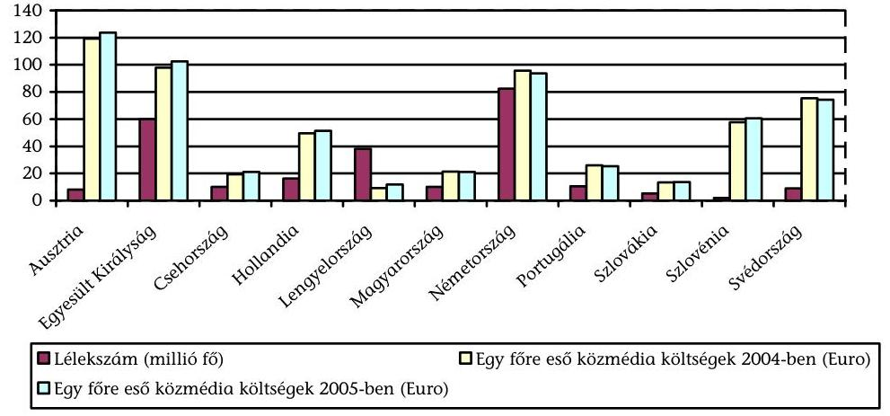

---

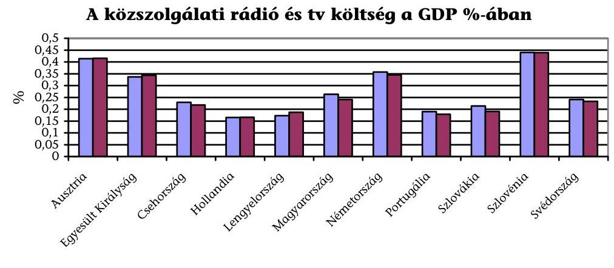

# 2. Az ellenőrzótt SZERVEZETEK IRÁNYítÓ, DÖNTÉSHozó, ELLENÖRZŐ SZEREPE, A FELADATELLÁTÁs ÉS A FORRÁSOK ÖSSZHANGJA, A GAZDÁLKODÁS MONITORINGJA ÉS BELSŐ KONTROLLRENDSZERE 

### 2.1. Az Országos Rádió és Televízió Testület szakmai feladatellátása, gazdálkodása

### 2.1.1. Az ORTT szervezeti felépítése, költségvetési előirányzatai

Az ORTT ${ }^{19}$ (jogi személy) feladatát egyrészt hivatali szervezetével, az Irodával, valamint az elkülönített pénzalappal, az MA-val ${ }^{20}$ (jogi személy), illetve annak Igazgatóságával látja el.

Az Iroda és az MA Igazgatósága az ORTT-nek alárendelve, egymással mellérendelt viszonyban múködik. Az Iroda közremúködik a Testület - Médiatv. 41. § (1) bekezdésében felsorolt - felügyeleti, hatósági jellegú szakmai és az ahhoz kapcsolódó funkcionális feladatainak ellátásában (döntés-előkészítés). Az MA Igazgatósága a műsorszolgáltatás támogatásának rendszere körében megfogalmazott kötelezettségek teljesítéséhez előterjesztéseket, döntési javaslatokat készít az ORTT részére. Az Iroda és az MA Igazgatósága - a saját szervezeti és múködési szabályzatukban foglaltak szerint - gondoskodnak a testületi döntések végrehajtásáról.

[^0]
[^0]:    ${ }^{19}$ A Médiatörv., 31. § (1) bekezdése szerint az Országos Rádió és Televízió Testület védi és előmozdítja a szólásszabadságot a műsorszolgáltatók piacra lépésének elősegítésével, a tájékoztatási monopóliumok lebontásával és újak létrejöttének megakadályozásával, a műsorszolgáltatók függetlenségének védelmével; figyelemmel kíséri a sajtószabadság alkotmányos elveinek érvényesülését, erről tájékoztatást ad az Országgyűlésnek.
    ${ }^{20}$ A Médiatv. 77. § (1) bekezdése szerint a MA olyan elkülönített pénzalap, amelynek feladata a közszolgálati műsorszolgáltatás, a közműsor-szolgáltatók, a nem nyereségérdekelt műsorszolgáltatók, a közszolgálati műsorok és műsorszámok támogatása, a kultúra megőrzése és továbbfejlesztése, a műsorok sokszínűségének biztosítása, valamint az e törvényben meghatározott egyéb feladatok támogatása.

---

A két hivatal gazdálkodása eltérő, mivel az Iroda a költségvetési rend szerint gazdálkodik, a kezelő ORTT az MA-t ${ }^{21}$. pedig a számviteli törvény szerinti egyes egyéb szervezetek beszámoló készítési és könyvvezetési kötelezettségének sajátosságairól szóló 224/2000. (XII.19.) Korm. rendelet szerinti szabályok alapján múködteti. Ez a kettősség a zárszámadás elkészítése során többletfeladatot jelent.

A 0539/2005. számú ÁSZ jelentés az ORTT és az MA múködésének ellenőrzése nyomán elfogadott Intézkedési tervnek megfelelően az ORTT megvizsgálta a szervezeti párhuzamosságok (ORTT Iroda, MA Igazgatóság) megszüntetésének lehetőségeit, létszámát 57 föről 42 főre csökkentette, a további párhuzamosságok megszüntetéséhez a Médiatv. további módosítása szükséges.

A múködési kiadások 2004. évről 2006. évre 1990 M Ft-ról 2283 M Ft-ra, 14,7\%kal emelkedtek. Ezen belül az MA költségei a Testület által elrendelt létszámcsökkentés és feladatkiszervezés következtében a három év alatt 3,2\%-kal csökkentek, míg az Irodáé a köztisztviselői illetménylap növekedése, a Testület létszámának emelkedése és a végrehajtott informatikai fejlesztések miatt 28,4\%-kal nőttek. Az Iroda engedélyezett létszámát a Testület 128 főben maximálta. A Testület összetételében 2002-ben és 2006-ban bekövetkezett változások, valamint az időközbeni feladatbővülések miatt az Iroda 116-128 fő közötti munkajogi létszámmal végezte tevékenységét. A Testület az MA létszámát 42 főben határozta meg.

A Testület a 713/2005.(IV. 21.) számú határozatával a MA-n belül önálló szervezeti egységként, megalapította az Alkalmazott Kommunikációtudományi Intézetet (AKTI), amelyet - a korábbi ÁSZ ellenőrzés által jogállását és múködését kifogásoló - Stratégiai Kutatások és Elemzések (SKEP) utódszervezeteként hozott létre. Végül nem szüntette meg a korábbi ÁSZ jelentésben kifogásoltakat, hanem egy újabb szervezetet alapított.

Az AKTI feladata 2005-2006-ban a hazai és az európai média-szabályozással és médiapiaccal kapcsolatos kutatások végzése, azok eredményeinek publikálása, továbbá a Testület által létrehozott különböző bizottságok és szervezetek munkájának támogatása volt.

Az AKTI költségeit továbbra is az MA költségvetéséből fedezték, hasonlóan az ORTT feladatkörét érintő egyéb szakértői munkákhoz.

Az AKTI múködési kiadásai 2005-ben 113,8 M Ft-ot (SKEP-pel együtt 204,3 M Ft), 2006-ban 198,9 M Ft-ot tettek ki. 2007-ben az AKTI költségvetési előirányzatát 183 M Ft-ban hagyták jóvá.

Az ORTT múködési költségeinek fedezete az üzemben tartási díj 1\%-a, amelyet az üzemben tartási díj maximum $4 \%$-áig terjedő összegre az MA egyéb bevételei terhére kiegészíthet az OGY a Médiatv. 84. § (3) alapján. 2000-től kezdődően az önálló költségvetési törvények az üzemben tartási díj 4\%-át állították be az ORTT bevételi előirányzataként, amelyet átcsoportosítással növeltek az illetékes országgyűlési bizottságok egyetértésével. A Médiatv.-ben előírt felső határértéket mindhárom évben meghaladták.

[^0]
[^0]:    ${ }^{21}$ A számviteli törvény szerinti egyes egyéb szervezetek beszámolókészítési és könyvvezetési kötelezettségének sajátosságairól szóló 224/2000. (XII. 19.) Korm. Rendelet.

---

2005-ben az ORTT (MA Igazgatóság nélküli) finanszírozása a tényleges befolyt üzemben tartási díj 4,8\%-át kitevő összegben történt, míg 2006-ban ugyanezen arány $5,7 \%$-ot, 2007-ben $5,6 \%$-ot tesz ki.

Az MA nem része a központi költségvetésnek, kiadási és bevételi előirányzatait az ORTT költségvetését megállapító törvény mellékleteként hagyja jóvá az OGY, az MA-t az ORTT kezeli.

Ennek keretében állapítja meg az ORTT az MA éves működési költségvetését, fogadja el az éves beszámolót, állapítja meg a szervezeti és múködési szabályzatot, a gazdálkodásra vonatkozó általános szabályokat, valamint a számviteli politika alapelveit.

Az ORTT az MA bevételeit nem a Médiatv. rendelkezéseinek megfelelően jóváhagyott összegben és arányában használta fel az egyes támogatási célokra. Ugyanakkor a rendszer a jogi szabályozásból adódóan a többféle vetítési alap alkalmazásával túlosztja a rendelkezésre álló felhasználható forrásokat, amelynek következtében a számított támogatási összegek meghaladják az MA bevételeit.

A 2005-2007 években összesen 4134 M Ft egyes keretek közötti átcsoportosítását hagyták jóvá.

# 2.1.2. A hatósági jogkör szankciórendszere, alkalmazása, szervezete 

A jogalkotó a Médiatv. 112. § (1) bekezdés a)-f) pontjában, valamint a 135. §ában foglalt szankcionálási eszközök meghatározása során nagy önállóságot biztosított az ORTT-nek az alkalmazandó szankciók megválasztására. A 112. § (1) bekezdésében felsorolt eszközök vonatkozásában nem írta elő a fokozatos szankcióalkalmazási kötelezettséget, az egyes szankciók alkalmazásának sorrendiségét, így- a törvénysértés súlyára figyelemmel - dönthet akár első alkalommal a legsúlyosabb szankció alkalmazása mellett is. Az ORTT a kötelezettségek ismételt és súlyos megszegése esetén törölheti a nyilvántartásból, a jogosulatlanul elért bevétel kétszeresének megfelelő összegű, vagy ha az nem állapítható meg tízezer forinttól egymillió forintig terjedő bírsággal sújthatja az érintettet. A szankciók nem minden esetben érték el céljukat, és mivel ugyanazok a jogsértések 2004-2007. között rendszeresen visszatértek, visszatartó hatásuk nem érvényesült.

Az RTL Klub műsorszolgáltatási jogosultságát 2006 II. 22-VIII. 29. között 4 alkalommal, összesen 4 órára felfüggesztették a kiskorúak védelmének megsértése miatt, amelyet Mónika Show című músorban követtek el.

A műsorszolgáltatók a közigazgatási határozatok bírósági felülvizsgálata során legtöbb alkalommal az ORTT szigorú szankcióalkalmazási gyakorlatát is vitatják, és csaknem minden határozatot peresítettek. Az ORTT szankcióalkalmazási gyakorlatának minőségét, hatékonyságát az ORTT pernyertességi adatai tükrözik. Az adatok $80 \%$ körüli pernyertessége eredményesnek minősíthető.
2002. és 2004. között 180 ügy zárult le jogerősen, ebből 134 végződött az ORTT pernyertességével; 2005-ben 128 ügy zárult le jogerősen, amelyből 102-ben az ORTT nyert, 2006-ban 58 ügy zárult le jogerősen. Az ORTT által kiszabott pénzügyi szankcióinak összege 2004 évben 1574 M Ft (amely két országos kereske-

---

delmi műsorszolgáltatóra kiszabott különösen jelentős kötbér kiszabásából adódott), 2005 évben 613 M Ft, 2006 évben 314 M Ft, 2007. év első 3 hónapjában 131 M Ft volt, ami erősen csökkenő tendenciát mutat.

2004-2007. között összességében 935 törvénysértési esetet tártak fel. Ebből a közszolgálati televízió 241, a kereskedelemi televíziók 404, a közszolgálati rádió 92, az országos kereskedelmi rádiók 198 törvénysértést követtek el, tehát a kereskedelmi csatornáknál gyakrabban történt törvénysértés. Ezek jelentős hányadát a kiskorúak védelme és a reklámkorlátok- és tilalmak megsértése jelentette. A hatósági jogkörnek bár van bizonyos visszatartó ereje, de valós hatása nehezen értékelhető, mert a műsorszolgáltatók saját anyagi érdekeltsége ezt befolyásolta (pl. értékesített reklám percek, nézettség, szankciók mértéke).

Az ellenőrzési tapasztalatok szerint esetenként a Testület az Iroda előterjesztéséhez képest eltérő döntést hozott.

A TV2 2005. március 26-án a Megasztár című műsorszámában (burkolt reklám formájában) megsértette a Médiatv. 10. § (5) bekezdését. Az Iroda előterjesztésében kötbért javasolt, amely nem haladhatja meg a kötbér alapjának 2\%-át. Az egyik testületi tag módosító indítványt nyújtott be, amely felhívást javasolt. Az ORTT 880/2005. (V. 18.) számú határozatában a TV2 felhívásban részesült.

A TV2 2006. január 9-én sugárzott Aktív című műsorában a riport központi témája az erőszak volt, melynek verbális és vizuális előfordulása halmozottan jelentkezett. Az Iroda azt javasolta, hogy a Testület hívja fel a műsorszolgáltatót a sérelmezett magatartás megszüntetésére és $4,7 \mathrm{M}$ Ft kötbért érvényesítsen. A javasolt szankció helyett az egyik testületi tag módosító indítványára alapozva a Testület a 871/2006. (IV. 26.) számú határozatában a TV2-t kötbér helyett csak felhívással szankcionálta.

A Viasat Hungária műsorszolgáltató 2006. októberi műsorában öt esetben lépte túl a reklámidőt. Az Iroda javasolta, hogy a Testület a közel 2 perc reklámidőtúllépés miatt 500 E Ft-ban állapítsa meg a bírság mértékét, miután legutóbb 4 perc reklámidő-túllépés miatt 1 M Ft bírságot szabott ki a műsorszolgáltatóra. A Testület elnöke módosító indítványt nyújtott be, melyben a bírságot 1 M Ft-ra javasolta emelni, mivel a csatorna visszatérően követte el jogsértéseit. A Testület az elnök indítványát elfogadta és a 176/2007 (I. 24.) számú határozatában a bírság összegét 1 M Ft-ban szabta ki.

Az Alkotmánybíróság 46/2007. (VI. 27.) számú határozata megállapította, hogy az ORTT 2008. január 1-től nem léphet fel hatóságként. Ez korlátozza az ORTT Médiatv.-ben meghatározott ellenőrző szerepét, meghozott döntéseit polgári jogi úton érvényesítheti. Megteremti az alapját annak, hogy csökken a jogkövető magatartás, a médiapiac ellenőrizhetetlenné válik, amely még inkább sürgetővé teszi a megfelelő szabályozást.

Az ORTT Müsorfigyelő- és elemző Igazgatósága (Monitoring) a Médiatv. alapján 1996-ban, mint a média hatósági ellenőrzési és felügyeleti feladatellátás alapjaként müködő szervezeti egysége jött létre. A Monitoring feladatait a Testület éves munkatervben határozta meg.

Az ORTT rendszeresen vizsgálta a Médiatv. és más idevonatkozó törvények előírásainak betartását az országos, körzeti és helyi műsorszolgáltatók programjaiban.

---

A vizsgálat szisztémája alapján az országos sugárzású műsorszolgáltatók közül naponta többet véletlenszerúen választottak ki, melyeket a Testület által elfogadott szempontrendszer alapján ellenőriztek.

Az Igazgatóságon belül két osztály létesült elkülönült feladatkörökkel. A Músorfigyelő Osztály profiljába az országos, körzeti és helyi műsorszolgáltatók programjainak hatósági ellenőrzése tartozik. A Műsorelemző Osztály a hír és magazinműsorok, a kiskorúak védelmével kapcsolatos szabályok, az országos kereskedelmi műsorszolgáltatók szerződéses vállalásaival, az EU-kvóták ellenőrzésével foglalkozik, vizsgálatai a magyarországi médiumok műsorstruktúrájának megismerésére irányultak.

A műsor-előzetesek és a filmalkotások megfelelő időpontban történő sugárzását folyamatosan kontrollálták, és az eredményeket havonta vizsgálati jelentésekben foglalták össze a Testület számára. Bizonyos projektek esetében a konform, normakövető módon viselkedő műsorszolgáltatókat kisebb, a normaszegőket pedig nagyobb gyakorisággal vizsgálják. 2004. évben 12 093, 2005. évben 11 586, 2006. évben 11832 órányi műsort vizsgáltak, azonban a jogsértések aránya nem csökkent.

Az ún. „különleges" státusszal rendelkező (rendszeresen törvényt sértő) médiumokat havonta kontrollálták. Az ellenőrzés sűrűségének indokoltságát támasztotta alá, hogy 2005-ről 2006-ra 35\%-kal emelkedett a vélelmezett törvénysértések száma, közel azonos vizsgált műsoróra mellett.

A Panaszbizottság az ORTT keretein belül múködő, eljárásában és döntéseiben független szervezet, a kiegyensúlyozott tájékoztatás megsértésével kapcsolatos panaszokat bírálta el.

A Médiatv. a Testület és a Panaszbizottság közötti viszonyt nem tisztázta, a Panaszbizottság eljárási rendjének kialakítását az ORTT-re bízta. A Testület a Panaszbizottság Úgyrendjében eltérően szabályozta az ún. klasszikus panaszokat és az egyéb panaszokkal kapcsolatos eljárást, ami ellentmondásos helyzetet idézett elő a panaszok kezelésében.

Az Alkotmánybíróság az 1/2007. AB határozata a Médiatv. egyéb panaszokra vonatkozó rendelkezéseit 2007. június 30 -ával megsemmisítette, valamint rögzítette, hogy a kiegyensúlyozott tájékoztatás körében műsorszámokat és műsorfolyamot is vizsgálhat. Ennek megfelelően a Panaszbizottság ügyrendjét a Testület módosította.

A Panaszbizottság döntései számos esetben egymásnak ellentmondóak voltak, az eljáró tanácsok hasonló, sőt azonos tényállás mellett ellentétes döntést hoztak. Ennek feloldására a Testület az 1430/2004. (X. 21.) számú határozatával bevezette a panaszbizottsági tanácselnökök ülésének fórumát, amelynek feladata, hogy közös álláspontot alakítson ki a tárgyalt ügyekben.

A Testület a Médiatv. 48. § (5) bekezdésében előírtaknak eleget téve 2004. II. félévtől kezdődően félévi rendszerességgel - írásban és szóban is - beszámoltatta a Panaszbizottság soros elnökeit a Panaszbizottság tevékenységéről.

---

A Panaszbizottság a Testület által (kizárólag) jogorvoslati eljárás keretében kontrolláltan működött, bár sok kritikát kapott, ennek ellenére az állampolgárok egyetlen közvetlen panasztételi fóruma.

# 2.1.3. A nemzeti hírügynökséggel és a közmédia szervezetekkel kapcsolatos sajátos feladatok ellátása 

Az ORTT és az MTI Zrt. kapcsolata az Nhtv. 25. §-a szerint a kiegyensúlyozott tájékoztatásra vonatkozó panaszokkal kapcsolatos bírálatokra terjedt ki. A vizsgált időszak alatt összesen két alkalommal nyújtottak be panaszt a Panaszbizottsághoz. Az ORTT minden év március 1-jéig benyújtott országgyűlési beszámolójában a Médiatv. 43. § (1) bekezdés a) pontja által meghatározott a véleményszabadság helyzetét elemző - részében beszámolt az MTI tevékenységéről.

A Testület a Médiatv. 57. §-a szerint a közalapítványi kuratóriumokba jelentkező szervezetek nyilvántartásba vételével és a sorsolás lebonyolításával formális szerepet tölt be a társadalmi szervezeteket tömörítő ún. „nagykuratórium" létrehozásában.

A Testület az MA-ba befolyó, és a közszolgálati műsorszolgáltatók számára továbbutalandó összegeket automatikusan továbbítja a törvényben rögzített megosztás szerint. A rendelkezésre álló keretösszegekből egyedi vagy pályázati támogatás keretében támogatta a közszolgálati műsorszámok gyártását.

Az ORTT a közmédiáknál a KMSZ tekintetében egyetértési jogot gyakorol, amelyre a MR Zrt.-nél és a DTV Zrt.-nél 1998-ban, az MTV Zrt.-nél 2002-ben került sor.

A Médiatv. 27. § (2) bekezdése alapján a kuratórium a Testülettel egyetértésben külön szabályzatban állapítja meg az archiválás szabályait és feltételeit, valamint a hasznosítás módját. A Testület döntése a közszolgálati műsorszolgáltatók archiválási szabályzatával való egyetértéséről előkészítés alatt van. A vizsgált időszak alatt kizárólag az MTI Zrt. rendelkezett jóváhagyott archiválási szabályzattal.

Kiemelten ellenőriztük a Sláger Rádió és a Danubius Rádió műsorszolgáltatási jogosultságának megújítását, műsorszolgáltatási díjuk leszállítását, valamint a két országos kereskedelmi televízió (RTL Klub, TV 2) műsorszolgáltatási szerződésének meghosszabbítását.

A két kereskedelmi rádió (Sláger- és Danubius Rádió) műsorszolgáltatási jogosultsága 2002. év végén - 2 évvel az eredetileg megkötött, 7 évre szóló szerződés lejárta előtt - került módosításra és meghosszabbításra. A kereskedelmi műsorszolgáltatók befizetendő díja az eredeti jogosultságra fizetett díjhoz képest a meghoszszabbitott 2009. év végéig - folyóáron számítva - a Sláger Rádió esetében 3,6 Mrd Ft + áfa, a Danubius Rádiónál 3,7 Mrd Ft+áfa bevételkiesést jelent.

Ezáltal a Testület az ORTT bevételeit, közvetlenül a Magyar Rádió finanszírozási forrását csökkentette. A Testület 464/I/2002. (III. 7.) számú döntése meghatározta a műsorszolgáltatási díjak minimális mértékét, ennek érvényesítését tartotta indokoltnak. Ez a határozat nem kellően vette figyelembe, hogy a besze-

---

dett díjak alkalmazkodjanak a megváltozott körülményekhez, az egyes társaságok üzleti, piacszerzési lehetőségeihez.

2005 júniusában a két országos kereskedelmi televízió (RTL, TV2) műsorszolgáltatási jogosultságának meghosszabbítására szintén a szerződés lejárta előtt két évvel került sor, amelyekben a Testület változatlanul hagyta a fizetendő műsorszolgáltatási díj mértékét.

Az RTL-Klub eredeti szerződése 1997-2007-ig 8030 M Ft-ban határozta meg a fizetendő koncessziós díjat. A TV2 részére szintén erre a tíz évre szóló szerződésében 8840 M Ft koncessziós díjat határoztak meg.

A testületi döntés megalapozására hét tanulmány készült (összegében 9,6 M Ft + $25 \%$ áfa), amelyből csak egy volt ( 800 E Ft + áfa), amelyet közvetlen konkrét számításokkal alátámasztottak és a döntés-előkészítőnek iránymutatást adott a két kereskedelmi csatorna díjának meghatározására. A további hat tanulmány különböző okokra hivatkozva a szinten tartás mellett foglalt állást.

A Testület által felkért külső szakértők számításokkal alátámasztott tanulmánya a régi feltételek szerinti koncessziós díj négyszeresét tartotta indokoltnak a szerződött ötéves időszakra. A Testület egyik tagja beadványában szintén a díj emelése mellett foglalt állást, a Testület úgy döntött, hogy változatlan szerződéses feltételekkel hosszabbítja meg a két kereskedelmi televíziós csatorna mûsorszolgáltatási jogosultságát, amelynek nem volt indoklása. Ezt a döntést az illetékes parlamenti bizottság több tagja is kifogásolta.

A szerződéskötés tárgyában az állampolgári jogok országgyúlési biztosa vizsgálatot indított, illetőleg a Legfőbb Ügyészségen eljárást kezdeményezett. Az ORTT vitatta egyrészt a Legfőbb Ügyészség illetékességét, másrészt pedig nem értett egyet a kifejtett jogi állásponttal sem. A Legfőbb Ügyészség az ORTT válaszát követően további intézkedést nem tett.

# Az ORTT nem élt azzal a lehetőséggel, hogy saját bevételeit, ezáltal a közszolgálati televíziók, és a fejlesztések forrásait bővítse ${ }^{22}$. 

A TV2 műsorszolgáltatási díjának mértéke a közszolgálati műsorszolgáltatók szempontjából azért is lényeges, mert ez az összeg felosztásra kerül a Médiatv. 131. § (2)-(3) bekezdései szerint az MTV Zrt. és a DTV Zrt. között. Az RTL Klub csatorna díját pedig teljes egészében a műsorterjesztés fejlesztésére kell fordítani.

A Testület a Médiatv. 41. § (1) bekezdésének, illetve a 90. § alapján hozza meg döntéseit a műsorszolgáltatási jogosultságokra és díjakra vonatkozóan. Az ORTT a vizsgált időszak alatt több frekvenciapályázatot értékelt ki. A megpályáztatott frekvenciák nyerteseivel minden esetben műsorszolgáltatási szerző-

[^0]
[^0]:    22 Két, a vizsgálatban résztvevő szervezet véleménye szerint ennek oka az analóg sugárzás 2012. évi leállása, aminek következtében a frekvenciák jelentősen leértékelődhetnek.

---

dést kötött. A vizsgált frekvenciapályázatok közül nem volt átlátható és teljes körűen dokumentált a Budapest $100,3 \mathrm{MHz}$ helyi műsorszolgáltatási jogosultság (Lánchíd Rádió Kft. Konzorcium) frekvencia pályázatának elbírálása és szerződéskötése.

Az Iroda a Budapest 100,3 MHz helyi műsorszolgáltatási jogosultságra beadott pályázatokat korrekt előterjesztésben értékelte a Testület által korábban meghatározott szempontok alapján.

Az értékelés szempontjai: vállalt műsoridő max. 20pont, speciális karakterisztika max. 20 pont, műsorterv max. 5 pont, üzleti-pénzügyi terv max. 2 pont, tapasztalatok max. 2 pont, kegészítő értékelés max. 2 pont, ami összességében 51 elérhető pontszámot jelent.

Más pályázók mellett a Jazz Rádió és a Lánchíd Rádió is beadta pályázatát a $90,9 \mathrm{MHz}$ és a $100,3 \mathrm{MHz}$ frenkvencia elnyerésére, amely két frekvenciának ugyanazon pályázati feltételei voltak. A már több éve jól működő Jazz Rádió az elérhető maximum 51 ponttal elnyerte a $90,9 \mathrm{MHz}$ frekvenciát (2040/2006.(IX. 13.) ORTT határozat).

100,3 MHz frekvencia pályázaton ugyanazon feltételek mellett az értékeléskor már csak 46 pontot kapott a Jazz Rádió, azonban a csökkentés oka nem volt dokumentálva. Ugyanakkor a speciális karakterisztikát nem vállaló és korábbi múködési tapasztalattal sem rendelkező Lánchíd Rádió a max. 51 ponttal került nyertesként kihirdetésre (2048/2006. (IX.13.) ORTT határozat). Az egyik testületi tag utólag különvéleményt fogalmazott meg a pontok manipulációja miatt. A pályázat megnyerését követően e Lánchíd Rádió Kft. Konzorcium tulajdonosai a céget eladták, a rádió azonban tovább múködik. Az ORTT döntése ebben az esetben sajátos, mert egyedi megfontolások során született meg, amely nem támasztotta alá a döntés objektivitását. A Lánchíd Rádió Kft.-vel kapcsolatos döntést az illetékes parlamenti bizottság elnöke is erősen kifogásolta, de a döntést nem változtatták meg.

# 2.1.4. A MA gazdálkodása, támogatási és belső kontrollrendszere 

Az MA legnagyobb bevételét az üzemben tartási díj, illetve 2002 közepétől az üzemben tartási díj központi költségvetés által történő pótlása képezte.

2005-ben az MA ebből származó bevétele 25095 M Ft volt, ami a teljes bevétel $81,9 \%-a$. 2006-ban a teljes bevétel $80,9 \%-t$ kitevő 25597 M Ft folyt be az MA-hoz ezen a jogcímen. E két évben az átvállalt üzemben tartási díj mindössze $2 \%$-kal növekedett. Az ORTT 2007. évi költségvetését tartalmazó 2006. évi CXXIV. törvény szerint 2007-ben a központi költségvetés az üzemben tartási díj összegét a 2006. évi összeggel azonos mértékben állapította meg.

A másik jelentős bevételi forrás az országos és nem országos műsorszolgáltatók által befizetett műsorszolgáltatási díj.

2005-ben az ezen a jogcímen realizált bevétel 4398 M Ft volt, ami a teljes bevétel $14,4 \%$-át tette ki. A 2004. évi bevételhez ( 5336 M Ft ) képest, főként az országos kereskedelmi rádiók díjának csökkenése miatt, az összeg jelentősen, 17,6\%-kal csökkent. 2006-ban 4626 M Ft összegű műsorszolgáltatási díj folyt be, a teljes bevétel $14,6 \%$-a. A 2007 . évi előirányzat 4552 M Ft .

---

A Médiatv. 78. § (1), a 78. § (2), a 84. § (2), a 131. § (3) bekezdéseiben meghatározott támogatási kötelmeket az ORTT nem tartotta be teljes körúen, ezzel megsértette a törvényben foglaltakat.

A MA-nál, a törvény által meghatározott arányokat és bevételeket figyelembe véve, négyféle támogatási keretet kellett volna képezni, de a gyakorlatban csak hármat képeztek. A keretképzés szabályait sem minden esetben tartották be, és a felhasználás során is sérültek a törvényi előírások. A 78. § (1) bekezdés előírásának megfelelő támogatási forrást nem alapszerúen kezelte az MA, a 78. § (2) bekezdés szerinti támogatási célra a törvény előírásánál kevesebb forrást képzett. Az átcsoportosításokkal pedig a már megképzett adott támogatási céltól eltérően a megképzett kereteket csökkentették.

Az MA bevételeinek elszámolásában, a támogatási keretek képzésében és felhasználásában a független könyvvizsgáló évről évre kifogásolt gazdasági eseményeket, amelyek nehezítették az alapkezelés átláthatóságát és ellenőrizhetőségét. A fenti hiányosságokat a 0539/2005 számú ÁSZ jelentés is kifogásolta de előrelépés nem következett be.

Az MA-nak 2006-ig nem volt az ORTT által jóváhagyott egységes a lebonyolítást is tartalmazó pályáztatási szabályzata, 2007-re elkészült a támogatási terv és a pályázati naptár.

Nem készült támogatási stratégia, nem határozták meg a támogatási prioritásokat, célokat, illetve nem alkották meg a Testület támogatási tevékenysége szabályozásának elveit sem. Támogatási célokként a pályázati kiírásokban a törvényi helyeket tüntették fel. A Testület szabályzatba foglalt normák helyett egyedi határozatokkal irányította a támogatás döntési folyamatát és gyakorlatát.

A Testület egyedi határozatokban intézkedett továbbá az MA éves támogatási terveiről, a pályáztatási naptárról. A szabályzatok hiányában az egyedi döntések nagy szabadságot biztosítottak a testületi döntések meghozatalában, lehetőséget adtak szubjektív, vagy utólag annak ítélhető döntésekre.

Az ORTT pályáztatási, támogatási tevékenysége szakmai megalapozottsága, hitelességének megerősítését szolgálta a 2004. december elsejei hatállyal létrehozott, a Testület mellett múködő Szakértői Tanács ${ }^{23}$. A Szakértői Tanács támogatási stratégia kialakítására, a rendszer szabályozására vonatkozó javaslatait az ORTT nem hasznosította.

A pályáztatási és szerződéskötési folyamatban a Testület esetenként nem tartotta be saját határozatait.

MA-JOGISMERET2006-1/2006. iktatószámú pályázat esetében a megkötött szerződés a pályázati kiírástól eltért. A szerződéskötés határideje megnövekedett és a támogatott időszak is megváltozott, ami nem zárja ki annak lehetőségét, hogy más pályázók a megváltoztatott, kedvezőbb feltételeknek nem felelt volna meg.

[^0]
[^0]:    ${ }^{23} 1707 / 2004$ (XI. 24.) ORTT Határozat

---

A pályázati források felhasználásának eredményessége az MA-nál nem állapítható meg, mert erre vonatkozóan objektív mérőszámokat nem alakítottak ki. Mind az MA, mind a Testület a korábbi évek tapasztalatai alapján töltötte meg tartalommal a Médiatv.-ben meghatározott támogatási feladatokat. Egy pályáztatást akkor tartanak eredményesnek, ha arra megfelelő mennyiségű, a feltételeket teljesítő pályázat érkezett, azonban a megfelelő mennyiséget nem határozták meg.

Az ORTT éves beszámolóiban az MA bemutatta a pályázatokkal kapcsolatos általa fontosnak tartott adatokat a pályázati eljárások számát, a felhasznált/odaítélt összeget, stb., ami önmagában nem igazolja a pályáztatás eredményességét, amit maga az MA sem értékelt.

Az ORTT 2005-2006. évi beszámolója szerint az MA a Testület döntése alapján 2005-ben 23 pályázati felhívást bocsátott ki, 4,24 Mrd Ft keretösszegben, amelyből 2005. végéig 2,94 Mrd Ft támogatást ítélt meg és vállalt szerződéses kötelezettséget. 2006-ban 14 pályázati felhívás volt 1,6 Mrd Ft keretösszegben, ebből 2006. végéig 672,9 M Ft támogatást ítélt meg és vállalt szerződéses kötelezettséget.

A támogatások rendeltetésszerű felhasználásának ellenőrzése az MA, illetve az Ellenőrzési referatúra feladata. Az ellenőrzés pénzügyi, műszaki és tartalmi szempontokra terjedt ki. A tartalmi ellenőrzéshez (pl. filmtámogatás esetén került erre sor) külsős ellenőrt is alkalmaztak. Az ellenőrzések a szerződésnyilvántartó adatbázisból készített havi, illetve heti ütemtervek alapján zajlottak. Minden támogatás felhasználását ellenőrizték a kötelezően benyújtott elszámolási dokumentumok alapján.

A 2004-ben kialakított nyilvántartási és információs célokat szolgáló vezetői információs program adatbázisa még nem segíti teljes körűen az MA-nál a dön-tés-előkészítést. Az ügyviteli adatok már feltöltésre kerültek, de a vezetői információs adatok feltöltése késedelmes, a pályázati eljárások adatainak 1997-ig visszamenőleg történő feltöltése a helyszíni ellenőrzés befejezésekor folyamatban volt.

A belső ellenőrzés 2004-et megelőzően nem működött, azóta önálló szervezetként része a MA belső kontrollrendszerének, 2005. óta éves munkaterv alapján múködik.

A belső ellenőrzés minden szervezeti egység feladatait folyamatosan áttekintette, figyelemmel az ORTT határozataira, a jogszabályok betartására. A javaslatokra intézkedési tervek készültek, a végrehajtásukat utóellenőrzés keretében értékelték.

# 2.2. A közalapítványok múködése, gazdálkodása 

### 2.2.1. A közalapítványok feladata, szervezeti struktúrája

A közszolgálati műsorszolgáltatás biztosítására, függetlenségének védelmére az OGY az 1996. február 1-jétől hatályos Médiatv. alapján a 17/1996. (III. 8.) határozatával létrehozta a Magyar Rádió Közalapítványt (MRKA), a 18/1996. (III. 8.) számú határozatával a Magyar Televízió Közalapítványt (MTVKA) és ezzel egy időben a 19/1996. (III. 8.) OGY határozattal döntött a Hungária Tele-

---

vízió Közalapítvány átalakításáról. A közalapítványok induló vagyonát a HTVKA kivételével 15 M Ft-ban határozták meg, ezzel egy időben állami tulajdonból a közalapítványok tulajdonába kerültek a Magyar Rádió, illetve a Magyar Televízió költségvetési szervek ingó és ingatlan vagyona és vagyoni értékű jogai. A vagyonból a közalapítványok, mint tulajdonosok megalapították a média részvénytársaságokat.

A közalapítványok szervezeti múködési rendjét szabályozó anyagi-, jogi és eljárási szabályok a létrehozástól folyamatos átalakuláson mentek keresztül, azonban - az ezzel kapcsolatos változások - az AO-kon nem kerültek átvezetésre, jelenleg is az 1996-ban elfogadott AO-k hatályosak. Így a közhasznú szervezetekről szóló 1997. évi CLVI. törvény (Ksztv.) 3. § és 27. § (3) bekezdésében foglaltakkal ellentétben nem valósult meg a közalapítványok közhasznú szervezetté minősítése és bírósági nyilvántartásba vétele. A nyilvántartásba vétel hiányában az OGY a támogatás folyósítását felfüggeszthette volna, és kérhette volna a szervezet - a vonatkozó szabályok szerinti - megszüntetését, ami nem történt meg.

Az ÁSZ az MR. Zrt. és MRKA múködésének ellenőrzéséről készült 0335 számú jelentésében erre a hiányosságra már felhívta a figyelmet, azonban az OGY mint Alapító a szükséges módosításokat nem hajtotta végre. A Ksztv. alapján múködő szervezetek szabályozása szigorúbb, adataikat nyilvánossá kell tenniük, a társadalmi kontrolljuk ezáltal jobban érvényesül. Az elektronikus információszabadságról szóló 2005. évi XC. törvény 21.§-a szerint a közfeladatot ellátó szervezeteknek legkésőbb 2008. július 1-jével törvényben meghatározott közérdekú adataikat nyilvánosságra kell hozniuk, amelynek az ellenőrzött szervezetek eddig csak részben tettek eleget.

A közalapítványok SZMSZ-e tartalmazza a célok megvalósításához szükséges struktúrát, amelyet a Médiatv. IV. fejezetében előírtak alapján alakítottak ki. Ennek megfelelően a közalapítványok szervezetei: a Kuratórium, az Elnökség, az Ellenőrző Testület, a Kuratórium hivatali szervezete (Titkárság).

A közalapítványi vagyon kezelő szervezete a Kuratórium, amely az OGY által választott és a Médiatv.-ben meghatározott szervezetek által delegált tagokból áll. A három kuratórium nagy, közel 100 fős létszámmal múködött, amelynek 2/3-át az évente választott társadalmi kurátorok, a további létszámot a parlamenti pártok jelöltjei alkották.

Az OGY által választott legalább 8 fő alkotja az Elnökséget, tagjainak megbízása négy évre szól. A Kuratóriumba további 21 tagot (HTVKA 23 tagot) delegálnak a Médiatv.-ben meghatározott szervezetek, illetve azok a szervezetek, amelyeket az ORTT éves felhívása alapján nyilvántartásba vett.

A vizsgált időszakban a kuratóriumok aktívan múködtek, a részvételi arány mind a három szervezetnél $80 \%$ feletti volt. A döntéseket a kuratóriumi, illetve az elnökségi ülések keretében hozták meg.

A kuratóriumi jegyzőkönyvek tanúsítják az MRKA-nál, hogy, a kuratóriumi tagok több mint a fele csak szavazatával vett részt a kuratóriumi munkában. A kurátorok kisebbik hányada azonban aktív volt és a hozzászólásaik alapján megállapítható, hogy feladataikra felkészültek, törekedtek minél több információt megszerezni az éppen aktuális témával kapcsolatban.

---

Ellenőrzésünk során mindhárom kuratóriumnál megállapítottuk, hogy a kuratóriumi tagság magas létszáma ellenére a tagok aktivitása a döntések meghozatalában egyenetlen volt, az egy évre szóló mandátum rövid volt az érdemi közremúködésre. A jegyzőkönyvek szerint az ülések elhúzódtak, a társadalom túlpolitizált légköre a testületek működésében is megjelent.

Egyes civil szervezetek ugyanazt a személyt delegálták ismételten ugyanabba, vagy egy időben ugyanazt a személyt másik közmédia kuratóriumába is. A Médiatv. erre vonatkozóan szabályozást nem tartalmaz.

A kuratóriumok elnökségének kizárólagos feladat- és jogköre a Zrt.-k elnöki tisztségére a nyilvános pályázati felhívás kiírása, elbírálása és javaslattétel az elnök személyére vonatkozóan. A javaslattétel alapján az elnököt a kuratórium választja meg titkos szavazással négy évre. 2004-ben az MTV Zrt.-nél és a DTV Zrt.-nél, 2005-ben az MR Zrt.-nél került sor elnökválasztásra.

Az MTVKA Elnöksége egy sikertelen MTV Zrt. elnökválasztási pályázati kiírást követően 2004. január 12-én tette közzé újabb pályázati felhívását, a lebonyolításra a jóváhagyott elnökválasztási szabályzat alapján került sor. Nem került meghatározásra az elnökválasztás szakmai kritérium és bírálati szempontrendszere.

A DTV Zrt.-nél 2004. szeptember és 2005. február között nem volt elnök, mert a kuratórium elnöksége a korábbi elnök megbízatását nem hosszabbította meg. Jogellenesen a gazdasági alelnök, majd a 3 alelnök együttes irányítási jogköréről döntött a leköszönő elnök, végül 16 jelölt meghallgatása után hoztak végleges döntést az elnök személyéről.

Az MRKA-nál gyakorlatilag az elnöki mandátum lejártát követő egy év - 2005. július. -2006. augusztus közötti időszak - a többfordulós elnökválasztással telt el. Az „interregnum" időszakában először tulajdonosi megbízottként múködött a gazdasági igazgató, aki a kuratórium elnöke felé jelezte megbízatása jogszerűségével kapcsolatos aggályait. A megbízás visszavonása után a két alelnököt együttesen bízták meg az ügyvezetéssel. Az eltérő jogértelmezésből fakadóan előfordult, hogy a meghozott döntéseket visszavonták és egymásnak ellentmondó intézkedések születtek, amelyek az MR Zrt. múködését mind gazdasági, mind szakmai szempontból hátrányosan érintették.

Az részvénytársaságoknál kialakult ellentmondásos helyzet arra vezethető viszsza, hogy a Médiatv. nem tartalmaz szabályozást arra az esetre vonatkozóan, amikor a részvénytársaságnak hosszabb ideig nincs elnöke. A Gt. és a Médiatv. szerint a Zrt. elnöke számos olyan jogkörrel rendelkezik, amelyeket még átmenetileg sem ruházhat át más személyre, vagy testületre, így a kuratóriumra sem. Ez arra kell, hogy ösztönözze a döntéshozókat, hogy a társaság múködőképességét veszélyeztető helyzet kialakulását mielőbb elhárítsák, vagyis a legrövidebb úton gondoskodjanak részvénytársaság elnökének megválasztásáról, ennek elhúzódása felveti a kuratóriumok felelősségét.

A kuratórium múködésének ügykezelő és ügyviteli teendőit, valamint az ET üléseivel kapcsolatos feladatokat a Titkárságok látták el. Az AO-k szerint a Titkárságok legfeljebb öt teljes munkaidejű munkatárs és egy vezető alkalmazhattak, amit betartottak. A többletfeladatok elvégzését megbízásos vagy vállalkozói szerződéssel oldották meg.

---

A vizsgált időszakban az MTVKA Titkárságán a munkavállalók és az állandó megbízással rendelkező szakértők, száma 12 fő volt. 1 fő vezető, 3 fő teljes munkaidejű munkatárs, 2 fő megbízási szerződéses munkatárs és 4 órában 1 fő, az ET munkáját segítő a Magyar Televíziótól delegált munkatárs dolgozott.

A HTVKA Titkárság létszáma a titkárságvezető kivételével 2004-ben átlagosan 4 fő, 2005-2007 között a megengedett 5 fővel szemben 3 fő teljes munkaidős dolgozó volt. A titkársági dolgozók munkaköri leírással nem rendelkeztek, feladataikat részlegesen az SZMSZ-re hivatkozva munkaszerződésük tartalmazta.

Az MRKA Titkárságán főállású munkaviszonyban 3 fő, szerződéses munkaviszonyban 2 fő dolgozott. Főállású munkaszerződéssel a hivatalvezetőt, a könyvelőt és a titkárnőt foglalkoztatták, a gazdasági vezető és a jogtanácsos megbízásos jogviszonyban tevékenykedett. A Titkárság munkavállalóinak feladatait munkaszerződésükben rögzítették, külön munkaköri leírással nem rendelkeztek.

Az MRKA és az MTVKA SZMSZ-e szerint a kuratórium állásfoglalásának és határozatai szakmai megalapozottságának elősegítésére kuratóriumi döntés alapján munkacsoportokat hoztak létre, melyek aktivitása igen eltérő volt, észrevételeiket, javaslataikat részben hasznosították.

Az MRKA a vizsgált időszakban egy alkalommal, 2006-ban hozott létre munkacsoportokat. A helyszíni vizsgálat végéig a Fejlesztési munkacsoport jelentése készült el, amely az MR archívum digitalizálásának jelenlegi helyzetét és a jövőbeni terveit elemezte. A munkacsoport az archívummal kapcsolatban több kifogást fogalmazott meg.

Az MTVKA munkájának segítésére az MTVKA szervezeténél öt munkacsoport került kialakításra. Az egyes munkacsoportok aktivitása, véleményalkotásának markáns megjelenítése változó, a legaktívabb a Műsorszolgáltatási Elemző munkacsoport volt.

A közalapítványok testületei munkájukat az általuk megfogalmazott munkatervek, feladattervek alapján végezték, amelyet az éves beszámolójukban értékeltek.

# 2.2.2. A közalapítványok gazdálkodása, belső kontrollrendszere 

A kuratóriumi elnökség a közalapítvány kezelőjének jogkörében eljárva gazdálkodik a közalapítvány vagyonával. A közalapítványok az ellenőrzés tapasztalata alapján célszerinti tevékenységet végeztek, gazdálkodásuk a kuratóriumok által elfogadott éves költségtervek alapján történt.

A közalapítványok bevételét az üzemben tartási díjnak a Médiatv.-ben meghatározott százaléka biztosította, amelyet az ORTT a MA-ból folyósított. A három közalapítvány 1997-2006. között összesen 257,5 Mrd Ft támogatásban részesült, amelyből 3,6 Mrd Ft-ot saját működésükre fordítottak.

---

# A közmédia közalapítványokon keresztül kapott állami támogatásai 1997-2006. években (Mrd Ft) 

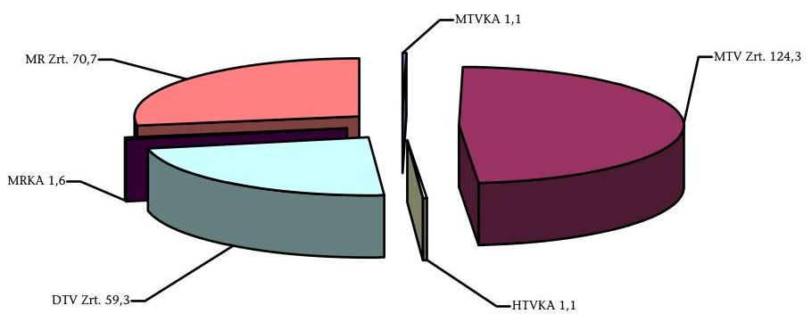

A közalapítványok gazdálkodását az ET-ek ellenőrizték, az éves beszámolókat könyvvizsgálók auditálták. Az éves költségtervek a közalapítványok működési költségeinek felosztására korlátozódtak, nem terjedtek ki a Zrt.-knek nyújtott támogatásokra.

A közalapítvány céljainak megvalósításához kapott költségvetési támogatások összege nyolcvanszorosa a közalapítványok múködési költségének. Az éves beszámolók, könyvvizsgálói jelentések, ET jelentések az éves tervekhez hasonlóan nem tértek ki az Zrt.-knek a közalapítványok közbeiktatásával nyújtott állami támogatások felhasználásának támogatóra és támogatottra vonatkozó kötelezettségei teljesítésének értékelésére.

A közalapítványok múködési költségeinek döntő hányadát a személyi jellegű kiadások képezték. A közalapítványok elnökségének és ET-inek tiszteletdíját a Médiatv. 63. §-a az országgyűlési képviselők alapdíjának százalékában jelöli meg. A költségtérítés mértékére vonatkozóan azonban nem ad támpontot a jogszabály, ezért a közalapítványoknál jelentősen eltért a kifizetett költségtérítések összetétele és összege, mert arra vonatkozóan az Alapító egységesen nem rendelkezett.

A HTVKA-nál 2004-ben a Budapesten lakó elnökségi tagok költségtérítése129000 Ft/hó/fő, Budapesttől 50 km távolságra lakóé 153000 Ft/hó/fő és a Budapesttől 100 km távolságra lakóé 177000 Ft/hó/fő volt. 2006-tól a térítés összege 187.000 -254 000-320 000 Ft/hó/ főre módosult.

Az MRKA-nál a költségtérítés összege évek óta változatlan. A kuratóriumi elnök 132.000 -Ft, az elnökség tagjai 92.400 Ft . az ET elnöke 92.400 Ft , tagjai 64.680 Ftköltségtérítésben részesültek.

Az MTVKA-nál a költségtérítések mértéke az Elnökség tagjai és az ET Elnöke részére egységesen 150000 Ft , az ET tagjai részére 100000 Ft . A három vidéki illetőségű elnökségi tag részére évente 5 alkalommal távolságtól függően további 19000 Ft ; 26000 Ft ; 27000 Ft összeget juttattak. Az Elnökség vagy ET azon tagja, aki nem használt cégautót, a belső szabályozás alapján az MTVKA által fizetett cégautó adóval megegyező mértékű költségtérítésre tarthatott igényt.

A társadalmi kurátorok az MTVKA-nál ülésenként a budapesti kurátorok 25000 Ft, a vidékiek 30000 Ft , a külföldiek 50000 Ft költségtérítésben részesültek. A

---

HTVKA Magyarországon élő kurátorai 71400 Ft -ot, a határon túl élők 142800 Ft-ot kaptak esetenként. Az MRKA kurátorai egységesen 35000 Ft költségtérítésben részesültek ülésenként.

Az MTVKA könyveiben elszámolt múködési költségek nem tartalmazzák a múködés összes költségét. AZ MTVKA és az MTV Zrt. - hivatkozással az MTV Zrt. AO-nak a XII/14.2 pontjára. - megállapodást kötött, amelyben rögzítésre kerültek azok az MTVKA múködéséhez kapcsolódó költségek, amelyek az MTV Zrt.-t terhelik. Az MTV Zrt. által ellenérték nélkül nyújtott szolgáltatások összegéről, a felek által kölcsönösen elfogadott kimutatás az MTVKA részére nem készült. Az MTV Zrt. által az MTVKA részére ellenérték nélkül nyújtott szolgáltatások elszámolásának módja nem felelt meg a hatályos jogszabályi előírásoknak, amit az ÁSZ korábbi jelentése is kifogásolt.

Az MTV Zrt. térítésmentesen biztosította az MTVKA elhelyezését, a helyiségek karbantartását, a múködéshez szükséges üzemgazdasági szolgáltatásokat (fűtés, víz, elektromos áram, takarítás, biztonsági őrzés, vezetékes telefon, számítástechnikai eszközök, hangosítási eszközök, fénymásolók, telefax, bútorok stb.).

A HTVKA térítésmentesen használja a DTV Zrt. helyiségeit.
A megállapodás VI. pontja értelmében az MTV Zrt. a MTVKA Elnöksége és az ET tagjai részére igény esetén gépjármú használatot biztosított, amelynek cégautó adóját áthárította az MTVKA-ra. A megállapodásban és az MTVKA szabályzatában, Elnökségi határozataiban rögzített módon történő gépkocsi használat nem felelt meg a Média tv. 58. § (4) foglaltaknak, amelynek alapján az elnökség tagjai a felügyelt közszolgálati műsorszolgáltatótól semmilyen jogcímen díjazásban nem részesülhettek.

Az MTV Zrt. Elnöke 2007. március 12-én a szerződést 2007. március 31-i hatálylyal, a Médiatv. 60. § (4) és 84. § (2), valamint az ÁSZ 1998. évi 9812 számú jelentésére hivatkozva felmondta. Az új megállapodás feltételeiről az egyeztetések a helyszíni vizsgálat ideje alatt folytak.

A kuratórium feladata a közalapítvány gazdálkodási tervének elfogadása és mérlegének megállapítása. A Médiatv. rendelkezése következtében a civil kurátorok évente cserélődnek. Minden évben más civil kuratóriumi tagok fogadják el a gazdálkodási tervet, a mérleget, eredmény kimutatást, beszámolót, azaz mások ítélik meg a tevékenység végrehajtásának minőségét.

Hátráltatta a közmédia rendeltetésszerű múködését, hogy közhasznú szervezetté minősítésük, illetve az archiválási szabályzataik jóváhagyása, hatályba léptetése eddig nem történt meg. A szabályzatok testületi döntésre való előkészítése folyamatban volt az ORTT Irodáján.

A helyszíni ellenőrzés befejezését követően az ORTT a 1702/2007. (VII. 18.) sz. határozatával átdolgozásra, kiegészítésre ismételten visszaadta a közszolgálati műsorszolgáltatók számára a korábban benyújtott szabályzatokat.

A közmédia AO-nak módosítása, továbbá a belső szabályzatok kidolgozása, módosítása, hatályba léptetése, lassan, több éves késéssel és csak részben valósult meg.

---

A közmédia felügyeleti rendszerének a kuratóriumok, az elnökségek, a TTT jelentős szereplői. Törvényben előírt rendszerességgel megtartott üléseiken beszámoltatások alapján döntéseket hoztak a felügyeletük alá tartozó közmédia múködésével kapcsolatban. A kuratóriumok, az elnökségek és a TTT azonban felügyeleti tevékenységüket nem tudták teljes körűen ellátni, irányítási, beszámoltatási, ellenőrzési tevékenységük elmaradt a törvényben előírt kötelezettségeiktől.

Az elmaradás okai a gazdálkodás anomáliái, likviditási gondok, bevételekkiadások egyensúlytalansága, felelősségre vonások, a felelősség érvényesítésének nehézkessége, illetve elmaradása.

A Közalapítványok felügyeleti tevékenységét kedvezőtlenül befolyásolták a jogszabályi és múködési hiányosságok.

A kuratóriumok tevékenységének ellenőrzését az OGY által négy évre választott háromtagú Ellenőrző Testületek (ET) végzik. A Médiatv. 62. §-a szerint az ET elnökét és egyik tagját az ellenzéki, a másik tagot a kormánypárti képviselőcsoportok jelölik. Az ET a kuratóriumtól tájékoztatást kérhet, az iratokba betekinthet, de a kuratóriumra vonatkozóan kötelező döntést nem hozhat. A kuratórium jogellenes döntései esetén az OGY elnökét, illetve az ÁSZ-t értesíti.

A döntések meghozatalát, végrehajtását lassították, esetenként ellehetetlenítették a kuratóriumok és az elnökség tagjai közötti ellentétek, a vélemények közötti alapvető eltérések. Az FB-k segítően múködött közre a kuratórium döntéseinek előkészítésében, ügyrend szerint látták el a munkatervben meghatározott feladataikat. Irányították, kontrollálták a belső ellenőrzés tevékenységét. Néhány kivételtől eltekintve az FB-k vizsgálatai azonban nem hasznosultak kielégítő mértékben.

Az MRKA ET a közalapítvány megalakulásakor elkészítette ügyrendjét, amely jelenleg is érvényben van. Az ET az ügyrendjétől eltérően éves munkatervet nem készített és nem végzett kifejezetten ellenőrzési tevékenységet, amelyet már a 2003. évi ÁSZ jelentés is kifogásolt. Az ET álláspontja szerint az ellenőrzést a kuratóriumi és elnökségi üléseken való részvétellel valósítják meg, ahol tanácskozási joggal vesznek részt és adott esetben véleményük kifejtésével támogatják a szervezet munkáját. Az ET jogosítványainak megfelelően kifejtette véleményét az álláspontja szerint jogszerűtlen eljárásokkal kapcsolatban, ezért a vizsgált időszak alatt több alkalommal fordult az alapító OGY-hez. Az ET határozatában kifogással élt az Zrt. elnök átmeneti helyettesítésével kapcsolatban, valamint a kuratóriumi elnök kuratóriumi felhatalmazás nélkül megindított, a leköszönt MR Zrt. elnök munkaszerződésével kapcsolatos bírósági eljárás ügyében.

A HTVKA ellenőrzési koncepciója és az FB ellenőrzési tevékenysége, együttműködése nem volt összehangolva, az FB belső ellenőrzési szervezet irányító tevékenysége nem érvényesült folyamatosan. Az ellenőrzött időszakban zökkenő mentesebbé vált az együttműködés. Továbbra sem megoldott azonban a gyakorlatban az ET és az FB ellenőrző jogosítványainak, hatáskörének értelmezése.

A HTVKA ET az elnökségi, de nagyrészt a kuratóriumi döntésekhez előzetes álláspontot alakított ki, de ezek döntő többségükben nem kerültek meghallgatás-

---

ra, megtárgyalásra, illetve elfogadásra. Különösen segíteni kívánta előzetes véleményével a civil kurátorok tevékenységét a döntéshez szükséges információkkal.

Az MTVKA ET éves munkatervei szerint ismétlődően évente ellenőrizte a társadalmi kurátorok mandátumát, a Kuratórium, az Elnökség, az ET tagjainak díjazását, költségtérítését és egyéb juttatásait. Vizsgálta a Kuratórium, Elnökség munkaterveit, az ülések jegyzőkönyveit, az Elnökségi határozatokat a gazdasági célszerűség és a jogszabályi megfelelés szempontjából. Áttekintette a MTVKA SZMSZ-ét, és egyéb szabályzatait. Ellenőrizte a MTVKA szakértőinek szerződéseit, tevékenységüket, díjazásukat. Az MTV ET és az FB képviselői rendszeresen részt vettek a kuratóriumi és az elnökségi üléseken.

Az MTVKA elnöksége és az ET ez utóbbi ellenőrzési jogosultságára vonatkozó törvényi szabályozást, és annak gyakorlati érvényesítését eltérően értelmezte (pl. a Zrt. által kiírt közbeszerzést az FB feladata ellenőrizni és nem az ET-é). Ennek feloldására levélben mindketten az OGY Elnökéhez fordultak. Ennek megnyugtató rendezése a felek közötti egyezségre törekvő magatartással, jogszabály módosítással, illetve alapítói határozattal rendeződhet.

A MTVKA Kuratórium és elnöksége nem támasztott számon kérhető követelményeket a Zrt. elnöki pályázat végrehajtásával kapcsolatban, a beszámoltatás és értékelés objektív kritériumait nem sikerült meghatározni. A Kuratórium nem mutatott határozottságot az intézkedési tervek végrehajtására vonatkozóan, nem követelte meg, hogy a Zrt. aktuális SZMSZ-szel rendelkezzen. Az FB az ellenőrzési feladatokon túl - a Kuratórium Elnökségének felkérésére - tanácsadási, döntés-előkészítéshez kapcsolódó javaslattételi feladatokat is ellátott. Kontrolltevékenysége a szerződéskötések felülvizsgálatánál, nyilvántartási rendszerének kialakításánál, a kifizetések elbírálási szempontjainak kidolgozásánál személyi felelősség érvényesítésénél működött. Ennek révén került sor a Zrt. elnökének visszahívására, illetve leváltására.

# 2.2.3. Az Zrt.-k múködésével kapcsolatos feladatok végrehajtása 

A kuratórium és az elnökség feladatainak és jogkörének két csoportja különböztethető meg, az általános működéssel, illetve közvetlenül a gazdálkodás ellenőrzésével kapcsolatos feladatok.

A Zrt.-k elnökeinek megválasztásához és beszámoltatásához nem került kidolgozásra a kuratóriumok Elnökségei által elfogadott értékelési és ellenőrzési módszertan, eljárási rend, szempontrendszer. A kuratóriumok elnöksége az ellenőrzés tekintetében a feladatokat jelentős részben ellátta, de nem alakította ki a beszámoltatás egységes szempontrendszerét. A beszámoltatás során elmaradt a tapasztalt hiányosságok, a megszüntetésre vonatkozó feladat meghatározása és számonkérése.

A kuratórium hatáskörébe tartozik a Felügyelő Bizottság (FB) tagjainak megválasztása. Az FB feladata a részvénytársaság ügyvezetésének ellenőrzése. A kuratórium elé terjesztett valamennyi vagyoni jellegű ügyet az FB köteles megvizsgálni és véleményezni, amely a vizsgált időszakban megvalósult.

---

Három esetben a DTV Zrt. FB-t bízták meg konkrét témák kivizsgálásával. 2006ban a részvénytársaság a 2005-ben kötött szerződésenként 300 M Ft összegű, illetve a DTV Zrt. éves árbevételének 10\%-át meghaladó szerződések megkötéséhez kikérték és megkapták-e a HTVKA egyetértését.

Az MRKA elnökségi és kuratóriumi ülésein az FB tagjai rendszeresen részt vettek, véleményükkel, információikkal segítették a testület munkáját.

Az MTVKA Elnöksége elfogadta az FB éves munkaterveit (2004-ben nem készült), de nem rendelkezett a feladatok végrehajtásának beszámoltatásáról, a beszámoló tartalmáról, az ellenőrzés által tett javaslatok, intézkedések, a felelősségre vonások végrehajtására és eredményeire vonatkozó tájékoztatásról. A munkaterv teljesítése értékelésére határozatot az elnökség nem hozott, intézkedésre javaslatot nem tett.

Az MRKA befektetett eszközeinek értékét megőrizte a vizsgált időszak alatt, ami kis mértékben 6503,7 M Ft-ról 6506,1 M Ft-ra növekedett. Az MRKA gazdálkodása rendezett volt annak ellenére, hogy 2004-ben 0 Ft , 2005-ben 3,8 M Ft , 2006-ban 1,0 M Ft veszteséggel zárta a gazdasági évet. A veszteséget az MR elnökválasztással kapcsolatban felmerült többletköltségek - pályáztatás, kuratóriumi ülések számának növekedése - idézte elő.

A HTVKA pénzügyi helyzete kiegyensúlyozott volt a vizsgált időszakban. 19962006 között befektetett eszközeinek értéke 24\%-kal, 1110 M Ft-ról 1374 M Ft-ra nőtt. A pénzügyi befektetésekből származó bevételből 2007-ben 42 M Ft-ot adott át a DTV Zrt.-nek.

Az MTVKA gazdálkodása (tervezés és végrehajtás) rendezett kiegyensúlyozott volt, az éves beszámolókat a könyvvizsgáló elfogadó záradékkal látta el. A befektetett eszközeinek értéke az MTV Zrt. 1997-2002 között bekövetkezett vagyonvesztése következtében az 1997. évi 16056 M Ft-ról 2006-ra 1200 M Ft-ra csökkent. A megalakulástól 160,5 M Ft-ot adott át az eredményből az MTV Zrt.nek.

Az MTVKA a Médiatv. előírásainak megfelelően elkészítette és benyújtotta az OGY-hoz éves beszámolóit. A beszámolók megfelelő tartalommal és részletezettséggel biztosították az Alapító tájékoztatását az MTVKA, és a felügyelt MTV Zrt. tevékenységéről. A 2004. és 2005. évi beszámolókat az OGY a helyszíni ellenőrzés lezárásáig nem vitatta meg, így elfogadásáról határozat nem született.

Az MRKA 2004. évi tevékenységről szóló OGY részére készített beszámolót a kuratórium nem fogadta el, így nem kerülhetett sor az adott időszak munkájának megítélésére. Ennek oka, hogy a kuratórium tagjainak többsége kifogásolta, hogy a beszámoló első sorban a MR Zrt. tevékenységének egyoldalú kritikáját tartalmazta, és nem tükrözte a kuratórium tagjainak konszenzuson alapuló véleményét az elvégzett munkáról. A 2005. és a 2006. évi beszámoló kuratóriumi vitájára a helyszíni ellenőrzést követően került sor, a beszámolókat a kuratórium az ET egyetértésével elfogadta.

A HTVKA 2004. és 2005. évi beszámolóját az OGY elfogadta. A beszámolóban a kuratórium mindkét évben felvetette, hogy a Médiatv. nem határozza meg pontosan az országgyűlési beszámoló tartalmi és formai kereteit. Nincsenek rögzítve az egyes közmédiumok tulajdonosi jogait gyakorló közalapítványok

---

beszámolójával kapcsolatos tartalmi és formai elvárások, amelyek lehetővé tennék az évenkénti változások azonos szempontok szerinti nyomon követését.

Az ET kifogásolta, hogy a beszámoló nem tért ki az elnöki pályázatokban leírtak időarányos teljesítésére, finanszírozási kérdésekre, a vagyonnal való gazdálkodás hatékony és eredményes ellenőrzésére. Felvetette továbbá, hogy a televízió részvénytársaságok közötti ingyenes archívum használatát 10 éve nem rendezték annak ellenére, hogy ezt a Médiatv. előírja.

# 2.2.4. A közalapítványoknál a közszolgálati műsorszolgáltatásra vonatkozó követelmények betartásának ellenőrzése 

A KMSZ alapvető célja a Médiatv. szerint az volt, hogy a közszolgálati műsorszolgáltatókat a belső szabályzat (KMSZ) megalkotásával, a szakmai szabályok értelmezésével kereteket határozzon meg, hogy a műsorkészítési tevékenység mérhetően, ellenőrizhetően, számon-kérhetően orientálja a műsorkészítőket tevékenységük során.

#### Abstract

A Médiatv. 29.§-a meghatározta azokat a területeket, amelyeket a műsorszolgáltatóknak sajátosságaiknak megfelelően szabályozni kellett: a pártoktól politikai mozgalmaktól való függetlenség biztosítékai; hírek, időszerű politikai műsorok sokoldalúsága, tárgyilagossága és kiegyensúlyozottsága; kulturális tudományos, világnézeti és vallási sokféleség tárgyilagos bemutatása; kiskorúakkal kapcsolatos rendelkezések; műsorkészítők önállóságának, felelőségének mértékei és biztosítékai; műsorkészítési tevékenység szakmai szabályai, anyanyelvi kultúra ápolását szolgáló szakmai követelmények; stb.

A közalapítványoknak évente értékelniük kellett, hogy az általuk felügyelt részvénytársaságok betartották-e a Médiatv.-ben és a KMSZ-ben meghatározott szabályokat.

A HTVKA minden évben értékelte az egyes műsortípusok teljesítési arányát. A műsorszolgáltatás alapelveit a következőkben határozták meg: sokoldalúság, hitelesség, a vélemények, nézetek sokféleségének és a véleményszabadság érvényesülésének biztosítása; a személyiségi jogok tiszteletben tartása; a pártatlan tájékoztatás és az anyanyelv ápolása. A DTV Zrt. kezdetektől fogva nagy hangsúlyt fektetett a fenti alapelvek betartására, illetve az ezek figyelembevételével történő műsorgyártásra, műsorszerkesztésre. A HTVKA részére egyre nagyobb feladatot jelent a Médiatv.-ben, valamint a KMSZ-ben előírt feladatok teljesítésének értékelése. A közalapítvány a 2004-2005. évi értékeléseket elnökségi és kuratóriumi határozatokkal elfogadta, a 2006. év esetében az álláspontok a teljes év lezárását követően kerültek egyeztetésre.

Az MRKA kuratóriuma évente értékelte a MR Zrt. közszolgálati tevékenységét, ezen kívül az MRKA elnöksége negyedévente számoltatta be az MR Zrt. elnökét a KMSZ érvényesüléséről. A KMSZ vizsgálata mind az elnökségi, mind a kuratóriumi üléseken többnyire heves vitát váltott ki az ellentétes politikai álláspontok miatt, ami tükröződött a szavazati eredményekben is. A beszámolókat rendre nem fogadták el, illetve elfogadás esetén külön véleményt fogalmaztak meg. Nem szakmai szempontokra való hivatkozással bírálták el a közszolgálati tevékenységet. Általánosságban megfogalmazott kritikától eltekintve kevés volt az elemző észrevétel, konkrét javaslat. A kritika gyakorlásán túl azonban a ku-

---

ratórium nem határozott meg szempontrendszert a KMSZ érvényesülésével kapcsolatban. Nem dolgozott ki a beszámoló szerkezetére, tartalmi súlypontjaira, statisztikák elemzésére, a tendenciák értékelésére vonatkozó módszert. Megállapítható továbbá, hogy az ORTT által működtetett műsorfigyelő és elemző szolgálat részére az MRKA nem fogalmazott meg vizsgálati szempontokat, ami a pártatlan véleményalkotás megalapozottságát segíthette volna.

Az MTVKA 2004. és 2005. évi beszámolójában, számos aggályt fogalmazott meg a jelenlegi szabályozással szemben. Megállapította, hogy időszerűvé vált a szabályzat átdolgozása, különösen az összeférhetetlenségre vonatkozó részek esetében. Az MTVKA megosztott volt a közszolgálatiság megítélésében, ezért az erre vonatkozó kritikai megjegyzések hangsúlyosabban kerültek megjelenítésre. A KMSZ módosítására megkezdődött az előkészítő munka, de érdemi koncepciót még nem sikerült kialakítani. Az MTVKA a közszolgálati feladatellátás ellenőrzött, megfelelő minőségű biztosításának tevékenységét korlátozottan látta el, részben a KMSZ szabályozásának, részben a végrehajtás, beszámoltatás ellenőrzésének hiányosságai miatt.

# 2.3. A részvénytársaságok múködése, gazdálkodása 

### 2.3.1. A részvénytársaságoknál a közszolgálati műsorszolgáltatásra vonatkozó követelmények szabályozása

Az MTV Zrt. 2002. évi, a DTV Zrt. és az MR Zrt. 1998. évi közszolgálati műsorszolgáltatási szabályzatát a törvényben meghatározottak alapján a sajátosságok, a mérhetőség és a számon kérhetőség figyelmen kívül hagyásával alkotta meg, azok túl általánosak.

A KMSZ-ekből hiányzik a műsorkészítéssel és a műsorokkal kapcsolatos kritériumrendszer, ami számon kérhetővé tenné azok teljesítését. Pl. egyik közszolgálati műsorszolgáltató sem határozta meg, mennyi a Médiatv. ${ }^{24}$ alapján évente országos és körzeti összesítésben minimálisan közzé teendő nemzetiségi műsorok időtartamát, ezért ezt nem kérték számon.

Az ORTT által megállapított az országos televíziók által elkövetett Médiatv. sértések száma csökkent az utóbbi években. A törvénysértések megoszlása az egyes televíziók közt közel változatlan, az MTV Zrt. törvénysértéseinek aránya növekedett. A 2006 áprilisában indított Duna II. Autonómia csatornánál Médiatv. sértést az ORTT a helyszíni ellenőrzés lezárásáig nem állapított meg.

A közszolgálati műsorszolgáltatók feladatellátásának szakmai követelményeit a Médiatv. nem határozta meg, hanem azokat a helyzeteket emeli ki, amelyeket kötelező a közszolgálati műsorszolgáltatási szabályzatban szabályozni ${ }^{25}$. Az Nhtv., és az MTI AO nem írja elő a szakmai szabályzat elkészítését

[^0]
[^0]:    ${ }^{24}$ Médiatv. 26 §. (1)
    ${ }^{25}$ Médiatv. 29 §.

---

A kuratóriumok a közszolgálati műsorszolgáltatási szabályzat érvényesülését értékelték, azonban ezek az objektív kritériumrendszer hiányában leíróak, a szabályzatnak való megfelelőséget megalapozottan nem tudták bemutatni.

A nemzeti hírügynökség az Nhtv. keretei között önállóan határozza meg a hírügynökségi tevékenység tartalmát, amiért felelősséggel tartozik. Ezért a társaság megalkotta az MTI Zrt. közszolgálati munkájának gyorsasága, pontossága, közérthetősége és elfogulatlansága biztosítása érdekében a Szakmai és Közszolgálati Tájékoztatási Szabályzatát (SZKTSZ). Az elmúlt 10 évben három ilyen szabályzat készült. A jelenleg érvényben lévő 2007. május 15 -étől hatályos. Az SZKTSZ mellett 2005-től hatályban van a szakmai munka színvonalát biztosító központi szerkesztőségi kézikönyv.

A társaság napi 550-600 szöveges hírt és 220-250 fotót készít. A társasági kimutatások szerint a hibák száma elenyésző. (Pl. 2006-ban 45 ezer belpolitikai hírt adtak ki, és 90 volt a hibák száma.) Szakmai hiba miatt rendkívüli felmondás nem volt, az írásbeli figyelmeztetések száma 0-5 volt évenként.

Az MTI Zrt. múködése során a kiegyensúlyozott tájékoztatás követelményeinek megsértése esetén az eljárás az Nhtv. szerint az ORTT, illetve annak Panaszbizottsága hatáskörébe tartozik. 2004-2006. között 2 panaszbizottsági beadvány volt, ebből egyet elutasítottak, a másodikban az ORTT a panaszbizottsági döntést részben megváltoztatta, és közlemény közzétételére kötelezte a Zrt.-t. A társaság közzétételi kötelezettségének eleget tett.

# 2.3.2. A kialakított szervezeti struktúra, belső kontrollrendszer, a stratégia és az elnöki pályázatok összhangja 

A közmédia és az MTI Zrt. jogszabályi környezete, irányítása, vezetése is eltér a szokásostól. A Médiatv. és az Nhtv. az MTI-t és a közszolgálati műsorszolgáltatókat nonprofit részvénytársaságként határozzák meg, amelyeknek egy-egy forgalomképtelen részvénye van. A közszolgálati tömegkommunikációs Zrt.-k a hatályos jogszabályok alapján mentesülnek az illetékek a helyi adók és a társasági adó fizetése alól, ennek összegét nem lehet meghatározni. A Médiatv. és az Nhtv. a Gt.-étől eltérő megnevezést használ, mert az igazgatóság jogkörét ellátó vezető tisztségviselőt elnöknek és nem vezérigazgatónak nevezi, a közszolgálati tömegkommunikációs Zrt.-knél nem múködik igazgatóság.

A tulajdonosi testületek még nem tárgyalták a nonprofit gazdasági társasággá ${ }^{26}$ alakulás kérdését, amelyre 2007. július 1-jétől van lehetőség.

A belső kontrollrendszer múködését jelentősen befolyásolt, a vezetők gyakori változása. Felelős vezetők hiányában a szükséges döntések időben nem születtek meg, a folyamatos és törvényes múködés feltételei nem álltak rendelkezésre.

Az egyszemélyes Zrt.-kben a tulajdonosi képviseletet testületek látták el. A jelentősebb döntéseket a testületek kétharmados többséggel hozhatják meg, emiatt gyakran nem születtek döntések, ami növelte a múködési zavarok kockázatát. Az üzleti tervtől eltérő gazdálkodás esetén, amely többször veszteséghez ve-

[^0]
[^0]:    ${ }^{26}$ „új"Gt. 4. §

---

zetett, a tulajdonosi testület nem tárta fel a hibákat, és felelősségre vonást nem alkalmazott.

Az FB-k feladata a részvénytársaságok ügyvezetésének ellenőrzése. Az FB-k felügyelete alá tartoznak a Zrt-k belső ellenőrzési szervezetei. A belső ellenőrzés munkavállalói felett a munkáltatói jogokat az Zrt.-k elnökei gyakorolták, ugyanakkor vizsgálatok elvégzésére a belső ellenőrzést csak az FB-n keresztül kérhették fel.

A DTV Zrt. belső ellenőrzése hosszabb idő után szervezetileg kialakult, főként a tényleges kifizetések szabályosságát, a folyamatba épített ellenőrzés működését vizsgálta.

Az MTV Zrt.-nél huzamosabb ideig első számú vezető nélkül, korlátozott jogosítványokkal megbízott alelnök működött. A belső ellenőrzés szervezete az FB irányítása alatt tevékenykedett, a saját munkatervi feladatán túl részt vett az FB egyes ellenőrzési témáinak végrehajtásában is.

Az állam és az MTI Zrt. között - a nemzeti hírügynökségi tevékenység ellátására vonatkozó - közszolgáltatási szerződés hiányában nem valósult meg az EU szabályoknak való megfelelés, az állami támogatások igénylése és felhasználásának átláthatósága, ellenőrzése, a belső kontrollrendszer kialakítása.

A DTV Zrt. kivételével a közmédiumok és a hírügynökség készített stratégiai tervet.

Az MR Zrt. megalkotta a 2002-2005-re szóló stratégiáját, de a teljesülésének értékelésére, korrigálására nem került sor. Az általános stratégiát a jelenleg folyamatban lévő új jogszabályok (NAMS, új médiatörvény) hatályba lépése után tervezik elkészíteni.

Az MTI Zrt. 2004-2007-re szóló stratégiáját készített, de ebben nem dolgozták ki a pénzügyi és ingatlangazdálkodási tervet. Az éves üzleti tervekben rögzített feladatokat általában a középtávú stratégiai tervvel összhangban határozták meg.

Mindhárom közmédiánál a vizsgálati időszak alatt került sor az ellenőrzés időszakában tisztségüket betöltő elnökök megválasztására. Többfordulós pályáztatás után a kuratóriumok által legjobbnak megítélt pályázatok alapján választották meg az új elnököket. A pályázatok kiírója egyik esetben sem dolgozta ki egy világos célmeghatározás és stratégia mentén kialakított megvalósítási irányokat, hanem a pályázókra bízták a végrehajtandó közfeladat meghatározását és a megvalósítás alternatívájának kidolgozását stratégiai kérdésekben is.

Nincsenek a pályázatok elbírálásának, értékelésének, szempontrendszerének írásos dokumentumai. A pályázati felhívás nem tért ki arra, milyen feladatokat mely prioritásokkal kell elvégezni, hány csatornával, mekkora létszámmal, és költségvetéssel, milyen ehhez szükséges forrásokkal, stb. kell a pályázónak megvalósítania.

A DTV Zrt. jelenlegi elnöki pályázatában szereplő szakmai tervekhez határidőt és költségtervet később sem készítettek, emiatt nem lehet egyértelmú kapcsolat az éves üzleti tervek és az elnöki pályázatban foglaltak között.

---

Mindhárom médiaelnök pályázatában prioritásként jelent meg a megújuló műsorpolitika megvalósítása, az ehhez szükséges szervezeti struktúra kialakítása, a gazdálkodás stabilitásnak megvalósítása.

A kuratóriumok és a TTT az elnöki pályázat teljesítését rendszeresen értékelték. Az elnöki beszámolókat a testületek elfogadták, kivéve az MTI Zrt. elnökének 2003. évi beszámolóját. Az ellenőrzött időszakban érdemi elmarasztalásra, illetve szankcionálásra nem került sor, bár erre a Gt. adott esetben lehetőséget biztosított.

A szankciókra vonatkozóan az elnökök megbízási szerződései különböző feltételeket határoztak meg, mert míg az MR Zrt. és az MTV Zrt. elnöke szerződésében nem-teljesítés esetén jövedelem-elvonási lehetőség is szerepel, addig a DTV Zrt. elnökének megbízási szerződésében konkrétan rögzítették, hogy jövedelem elvonásra „semmilyen körülmények között nem kerülhet sor".

A műsorszolgáltatók tulajdonosai, a közalapítványok egy év kivételével elfogadták az Zrt.-k éves beszámolóját. Az MTV Zrt.-nek és az MR Zrt.-nek a 2004. évi beszámolóját a kuratóriumok nem fogadták el.

# 2.3.3. A struktúraváltozások megalapozottsága 

A szervezeti struktúra az ellenőrzött időszakban az MTV Zrt.-nél gyakran változott (2005-ben 14 alkalommal, 2007-ben 3 alkalommal), ami összefüggött a közép és hosszú távú stratégia hiányával, gátolta a szervezet és a múködés hatékonyságát. Az MTV Zrt. szervezeti rendszerében a 2006. év alapvető változást hozott. Az új szervezeti felépítés a munkaszervezet korszerűsítése, a vezetési szintek csökkentése, a hatékony szakmai kontroll jegyében jött létre, áttekinthetőbbé téve a szervezetet és az egyes funkciókhoz tartozó feladatok elhatárolását, amely azonban csak részben valósult meg.

Az MTV Zrt.-nél a felsővezetői szint egyszemélyes, az elnök 11 fő szakterületi vezetőt (az alelnöki poszt betöltetlensége miatt 14-et) irányít közvetlenül. A többi részvénytársaságnál ezt a feladatot az elnök 2-3 alelnökön keresztül látja el.

A 2004-ben elkezdett reorganizációs folyamat részeként, a szervezet átalakításával összhangban az MTV Zrt. vezetése 2006-ban a szervezeti egységekre lebontott jelentős létszámcsökkentéssel járó racionalizálási folyamatot tervezett megvalósítani, azonban az MTV Zrt. létszáma a 2004. évi nyitó létszámhoz (1587 fő) képest 2006. év végére elérte az 1906 főt, átlagos állományi létszáma pedig 1595 fơről 1645 főre növekedett. A személyi jellegű ráfordítások összege 2001. óta folyamatosan növekedett. A változásban szerepet játszott 2006. évben a színlelt szerződések megszüntetése miatti kényszerű (396 fő) létszám felvétele, és a minőségi cserék egyszeri költségeinek hatása is.

Erre a célra 2006-ban a reorganizációs keretből 518 M Ft-ot fordítottak, azonban ennek hatékonysága, illetve gazdaságossága a szerződési feltételek hiánya miatt nem értékelhető.

A DTV Zrt. szervezeti struktúra változásának folyamatát az ellenőrzés nem tudta rekonstruálni, mert SZMSZ-ét a 2007. július 1-i hatálybaléptetés előtt utoljára 2001-ben módosították, így a változásokat nem vezették át. A DTV Zrt. 2007. évi szervezeti felépítése a 2001. évihez képest javult, mert két új alelnöki pozíci-

---

óval a felső vezetés munkamegosztása egyenletesebb, a szervezet áttekinthetőbb lett. A kialakított struktúra összhangban van a tényleges feladatellátással.

Új szervezeti egység az Új Média Szerkesztőség - amelynek feladata a teletext és a honlap fejlesztése és karbantartása, valamint az Autonómia csatorna szerkesztősége.

Az MR Zrt. létszáma 2006-ig szinte változatlan volt. A 2007-ben végrehajtott, az egész szervezetet érintő átalakítás létszámleépítéssel párosult. A digitalizáció és az informatikai rendszerek összekapcsolásának beindításával 30 fővel csökkentették az Archívum létszámát is, ami 7,1 \%-a a 2007. év végéig tervezett mintegy 420 fős létszámleépítésnek.

Az MTI Zrt. tulajdonosi jogait gyakorlóinak egymás és a társaság között, a múködés során alkalmazandó eljárási rendről a nemzeti hírügynökségi törvény és a társaság alapító okirata, a testületek ügyrendje, és az SZMSZ sem rendelkezett. Ez akadályozta az Zrt. díjmegállapítására, szervezeti rendjének véleményezésére, az elnök munkájának értékelésére vonatkozó döntést. Mindez viszszavezethető volt a TTT múködésének jelenlegi, a társasági törvénytől idegen, a testület múködésében a politikai konszenzust feltételező, de nem minden esetben megvalósuló szabályozására is.

Az MTVKA Kuratórium Elnöksége 2005. október 19-én 2005-2007 évekre szóló reorganizációs tervet fogadott el, amely a szervezeti struktúra, a músorpolitika, az üzleti és múködési modell átalakítását is jelentette, de ehhez feladatszintű költség kalkuláció és az eredményességet tükröző kritériumrendszert nem készítettek.

A reorganizáció keretében kidolgozták az új SZMSZ-t, bevezették az új munka-folyamat-rendszert és az MTV valamennyi erőforrását és a felhasználási igényeket nyilvántartó informatikai rendszert, valamint a gyártási területeken megkezdték a költségek elemzését. A több évre szóló reorganizációs folyamat megvalósítása, a reorganizációs célú támogatás felhasználása a napi költségektől nem különíthető el. Ezért összehasonlító adatok hiányában nem lehet kimutatni, hogy a reorganizáció eredményeként elért megtakarítás a kormány határozatában ${ }^{27}$ előírtnak megfelelően legalább a székház bérleti díját biztosítja.

A Kormány összesen 10 határozatban nevesítetten, meghatározott összeggel támogatta 5 évben az MTV (1997, 1999, 2000, 2001, 2005), 3 évben az MR (1997, 1999, 2001), 2 évben az MTI (1997, 2004), és 1 évben a Duna TV (2005) létszámcsökkentéseit, amelyhez 6,7 Mrd Ft (ebből MTV Zrt. 5,6 Mrd Ft) támogatást biztosított. A Kormány 2005-2007 között a közszolgálati músorszolgáltatók létszámcsökkentésének további támogatásáról döntött, annak ellenére, hogy az MTV Zrt. és az MR Zrt. részvénytársasággá alakulásából származó létszámgondok megoldását 2001. december 31-ével befejezettnek tekintette ${ }^{28}$. 2006-ban

[^0]
[^0]:    ${ }^{27}$ A Magyar Televízió Rt. részére építendő székház beruházásáról és normatív finanszírozásának megteremtéséről szóló - 2179/2004. (VII. 19.) Korm. határozat.
    ${ }^{28}$ Magyar Televízió Rt. 2001. évi létszámcsökkentésének első ütemével kapcsolatos egyszeri személyi kifizetések támogatásáról szóló - 2131/2001. (VI. 1.) Korm. határozat.

---

Zrt.-k (kivéve az MR Zrt.) állományi létszáma emelkedett, a megbízással és vállalkozói szerződéssel alkalmazott, de valójában munkaviszony keretében dolgozók kötelező ${ }^{29}$ állományba vétele miatt.

Az egyes Zrt.-k által ellátandó közszolgálati feladatok mennyiségi és minőségi paramétereinek meghatározása nélkül a szükséges létszám sem határozható meg. Általában megkérdőjelezhető a létszámleépítés eredményessége, ha ez nem jár együtt a teljes ráfordítások (és nem csak a személyi juttatások) megfelelő csökkenésével. E cél megoldásánál nem számoltak likviditási hitel felvételével.

A tulajdonosi testületek nem dolgozták ki az Zrt.-k vezetőinek érdekeltségi rendszerét, az elnök megbízási díjának meghatározásakor nem vették figyelembe az éves beszámolóban bemutatott eredményeket, a KMSZ érvényesülésének és az elnöki pályázat teljesítésének értékelését.

# A Zrt.-k évenkénti zárólétszáma 

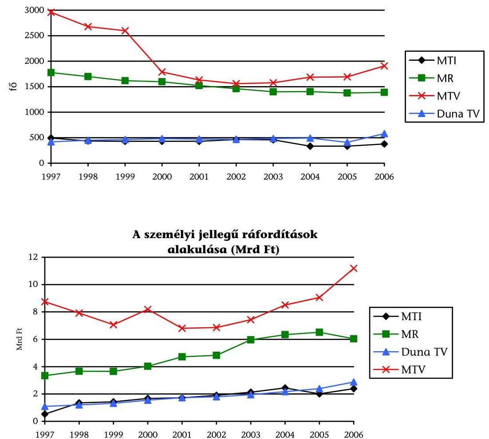

[^0]
[^0]:    ${ }^{29}$ Az adókról, járulékokról és egyéb költségvetési befizetésekről szóló törvények módosításáról szóló 2003. évi XCI. tv. 223. § (1)

---

# 2.3.4. A vagyoni helyzet alakulása 

A Zrt.-k vagyonának (saját tőkéjének) összértéke a többszöri tőkejuttatás ellenére nominálisan az 1997. évi 30,3 Mrd Ft-ról, 2006-ban 29,7 Mrd Ft-ra csökkent.

1997-2006. években a DTV Zrt. és az MR Zrt. és MTI Zrt. szinte teljes egészében megtartotta az átalakuláskor kapott ingatlanokat, ezzel szemben 1999-2002 évek között az MTV Zrt. csaknem teljes mértékben felélte ingatlan vagyonát.

Az MTI ingatlanállománya a tevékenységéhez szükséges mértéknél nagyobb, területének $21 \%$-a használaton kívül van, $22 \%$-át tartósan bérbe adják.

Az MTV Zrt. saját tőkéje 1997-2006. évek között a 29,5 Mrd Ft. tőkejuttatás ellenére 18,5 Mrd Ft-ról 4,8 Mrd Ft-ra csökkent. A legalacsonyabb értékű saját tőke 2003-ban volt -9,1 Mrd Ft-tal. A mérleg szerinti eredmény 2005. évtől (részben a társaság erőfeszítése, de meghatározóan a többlet állami támogatások, hitelek elengedése hatására) pozitívra változott, eredményeként sikerült a tőkevesztést megállítani.

A fenti eredményben nem szerepel, pl. az Archívum korlátozott felhasználási jogának ellenértékeként kapott összeg, vagy az ÁPV Rt.-vel szemben székházbérlettel kapcsolatban felmerült kötelezettség, és egyéb köztartozások elengedése.

A DTV Zrt. saját tőkéje 1997-2006. években 2,2 Mrd Ft-ról 1,4 Mrd Ft-ra csökkent.

A DTV Zrt. jegyzett tőkéje a 2007. évi várható veszteséggel a saját tőke 66\%-a alá esik, a Gt. alapján kötelező lesz a tőkepótlás vagy a jegyzett tőke leszállítása.

Az MR Zrt. saját tőkéje 1997-2006. évek között 6,8 Mrd Ft-ról 20,5 Mrd Ft-ra növekedett.

Az MR - az értékhelyesbítést, archívum könyvekben történő felértékelése leszámítva is - növelte nominálisan a saját tőkéjét.

Az MTI Zrt. saját tőkéje végig stabilnak tekinthető volt, az 1997. évi 2,8 Mrd Ftról 2006. évre 3,0 Mrd Ft-ra emelkedett.

A köztelevíziók eszközeinek értéke és azok használhatósága is folyamatosan csökkent, mert a beruházásra és szinten tartásra fordított összeg az MTV Zrt.ben az elmúlt 10 év egyikében sem, DTV Zrt.-nél 10 évből 6 évben nem érte el az adott év eszközei értékcsökkenésének mértékét.

Az MTV Zrt. tárgyi eszközeinek átlagos használhatósági foka 2006. végére 17\%ra csökkent. A DTV Zrt.-nél csak a nullára leírt eszközök 2006. évi könyvekből történő kivezetése miatt javult a műszaki géppark és az ügyviteli eszközök 20-25\%-os használhatósági foka látszólag 40-45\%-ra.

Az MR Zrt. tárgyi eszközeinek értéke 84\%-kal nőtt, mert 2000-2002-ben a stúdiók közel felét felújították és ezekben korszerűsítették az eszközpark 80\%-át is.

---

Az MTI Zrt. beruházásait hátráltatta, hogy 1998-2001. között és 2005-ben nem tudta felhasználni az előző évi nyereségét, mert azt -tulajdonosi döntés hiányában - eredménytartalékba kellett helyeznie.

A tömegkommunikációs szervezetek archívumai a kulturális örökség nemzetstratégiai szempontból is fontos elemei, ezért állagmegőrzésük és finanszírozásuk kiemelten fontos feladat. A számviteli nyilvántartásuk társaságonként eltérő, mert a Sztv. keretszabályai alapján többféle megoldás is lehetséges. Az MTV Zrt. és az MR Zrt. előre meghatározott rendszer alapján számított értéken tartja nyilván az archívum eszközeit, az Sztv. 15.§-ban foglaltakkal ellentétesen az MTI Zrt. változatlan jelképes értékkel, a DTV Zrt. pedig egyáltalán nem szerepelteti azokat a mérlegében.

Az archívumokat az Sztv. 15.§ (3) bekezdésében foglalt valódiság elve alapján kötelező - reális, de legfeljebb a piaci értékükön - a mérlegben megjeleníteni, és utánuk nem kötelező értékcsökkenést elszámolni.

Az Sztv. 2001. január 1-jétől (2006. december 31-ig konkrétan a kép- és hangarchívumokat is említve) lehetővé teszi, hogy ne számoljanak el terv szerinti értékcsökkenést az olyan eszköznél, amely a használat során sem veszít az értékéből.

Az Archívumok értékének meghatározása és mérlegben szerepeltetése cashflow nélkül növeli az eredményt, de a további időszakokban kedvezően hat az átláthatóság biztosítására.

Az MTV Zrt.-nél az immateriális javak értéke minden évben 3-400 M Ft-tal az adásba került archivált műsorok értékével nő. Az MTV Zrt. alapításakor az immateriális javak között nyilvántartott több mint 160 ezer órányi archív mű-sor-állományát közel 4,0 Mrd Ft-tal mutatták ki a mérlegben. Az archívum aktuális számviteli nyilvántartás szerinti értékéről és annak változásáról nem rendelkezett pontos adatokkal a televízió, amelyet a korábbi ÁSZ jelentések is megállapítottak és javasolták a helyzet megoldását.

2005-ben egyszerű közbeszerzési eljárás keretében auditáltatta az archívumát. Az archívum auditált forgalmi értéke 26,2 Mrd Ft, szellemi értéke 35,4 Mrd Ft. Az archívum auditált értéken történő nyilvántartása a Társaság mérlegében jelentős javulást eredményez a tőke- és vagyoni helyzet szempontjából.

Az MR Zrt. 1997-ben 1 Ft-tal állományba vette az archívumát. 2000-től piaci értékelés alapján az addig elkészített műsorait az értékelési tartalékkal szemben készletre vette, ez évtől készülő műsorait évente aktiválta. Az értékelés módszertanának megváltoztatása miatt 2005-től a hír és krónika típusú műsorok leírásra kerültek, ami 2,3 Mrd Ft-tal (10,1\%) csökkentette az eszközök értékét és a mérleg szerinti eredményt.

Az MTI Zrt. archívumát (mikrofilmtár, fotóarchívum, sajtó adatbank) 1997-ben a vagyonértékelő könyvvizsgáló javaslata alapján összesen 3 E Ft-tal vették nyilvántartásba, és értékcsökkenést nem számoltak el, a bővülést 0-Ft-tal aktiválták. Az 1998. évi ÁSZ-jelentés szerint az Zrt. nyitómérlegének elkészítésekor a műszaki szakértő vagyonértékelése alapján az Zrt. archívumainak értékét összesen 2,95 Mrd Ft-ban állapította meg. A pénzügyminiszternek tett javaslatában az ÁSZ indítványozta a hatályos Szt. 37. § (4) bekezdésének módosítását annak érdekében,

---

hogy a különlegesnek tekintett tárgyi eszközök és szellemi termékek után ne kelljen értékcsökkenést elszámolni. Emiatt az Országgyűlésnek javasolta a tömegkommunikációs szervezetek archívumainak szakmai és számviteli szempontok szerinti készletértékelési rendjének szabályozását. Az eltelt időszakban érdemi változás nem történt.

Az archívumokban őrzött dokumentumok biztonságos őrzése és felújítása jelentős költség, amire az MTV Zrt. és az MR Zrt. is többlettámogatást kapott. A DTV Zrt. archívumát tartalmazó raktárak vagyonvédelem szempontjából nem megfelelőek (zárhatóság, hőmérséklet stb.), gyakorlatilag megteltek. A bővítés és fejlesztés többletfejlesztést igényelne, ennek hiányában nem biztosított az értékek megfelelő védelme.

A közszolgálati műsorszolgáltatók archívumait az oktatási és kulturális miniszter nem minősítette közgyűjteménnyé, ezért a bennük levő dokumentumok nem tartoznak a kulturális örökség védett elemei közé. Ez alól kivétel az MTI Zrt. fotóarchívuma, amelyet a művelődési és közoktatási miniszter 1993. május 24-én határozatban védetté nyilvánított.

Az archívumokkal kapcsolatos további probléma, hogy a közmédia a Médiatv. ${ }^{30}$ hatályba lépése óta nem rendelkezik az ORTT egyetértését is bíró Archiválási Szabályzattal. Sem az ORTT, sem a kuratóriumok nem hatottak oda, hogy ezek a szabályzatok véglegesítésre és elfogadásra kerüljenek. Az MTV Zrt. és a DTV Zrt. Médiatv. előírása ${ }^{31}$ ellenére az eltelt időszakban nem tudott megállapodni a kölcsönös archívum használat feltételeiről.

# 2.3.5. A bevételek, a ráfordítások és a músorgyártás költségeinek alakulása 

A közszolgálati műsorszolgáltatók árbevétele folyamatosan csökkent, az MTI-é gyakorlatilag változatlan, ezért kiadásaikat egyre nagyobb arányban a költségvetési támogatásból fedezik. A közszolgálati műsorszolgáltatók bevételeinek 85-90\%-a az MTI-ének 50\%-a költségvetési törvényben meghatározott támogatás.

A törvények és az alapító okiratok nem határozták meg termék, vagy szolgáltatás szinten a közszolgálati feladatokat, ezért az állam nem a feladatokat finanszírozta, hanem a részvénytársaságok múködését.

A közmédia és a nemzeti hírügynökség a rájuk vonatkozó törvények hatálybalépése óta bevételként, valamint tőkeemelésként elszámolt jogcímen összesen 388,9 Mrd Ft támogatást kaptak (4. számú melléklet). Ennek 70,9\%-a volt az éves rendszeres üzemben tartási díjból, koncessziós díjból, műsorterjesztési költségből származó támogatás. A fennmaradó rész a rendkívüli és a kisebb összegű pályázati támogatásokat tartalmazza.

[^0]
[^0]:    ${ }^{30}$ Médiatv. 27. §
    ${ }^{31}$ Médiatv. 75. § (7)

---

Ezek az összegek nem tartalmazták az egyedi megállapodások alapján juttatott egyéb támogatásokat (ÁPV Zrt. bérleti díj elengedés az MTV Zrt. javára, a NKÖM költségvetésében fejezeti kezelésű előirányzatból megtervezett NAVA támogatás az MTV Zrt.-nél és az MR Zrt.-nél, állami kezesség beváltás az MTV Zrt.-nél, stb.).

Az OGY nem rögzítette, hogy milyen módszerrel határozza meg közmédia rendszeres éves támogatásának értékét. Az MTI Zrt. támogatását pedig minden évben egyedileg határozta meg.

Az üzemben tartási díjnak a közszolgálati műsorszolgáltatók közötti felosztása (MTV: 40\%, MR: 28\%, DTV: 24\%) 1996. óta változatlan, független a bemutatott músorok minőségétől és mennyiségétől, ezért nem serkenti a műsorszolgáltatókat a műsorkészítés hatékonyságának és a műsorok minőségének javítására.

A „közszolgálati műsorszolgáltatók műsorperc alapú finanszírozási rendszerét" a Kormány a hatályos jogszabályban ${ }^{32}$ rögzített határidő lejárta után 2 évvel sem dolgozta ki az oktatási és kulturális miniszter a pénzügyminiszterrel együttműködésben. Ez a helyzet változatlanul fenntartja a közmédia és a nemzeti hírügynökség finanszírozásának kormányzattól függő helyzetét.

A négy zrt. ráfordításai az 1997. évi 47,8 Mrd Ft-ról 2006. évre 62,9 Mrd Ft-ra 31,6\%-kal emelkedtek, amely jóval alacsonyabb az azonos időszakra számított 91\%-os fogyasztói árindex növekedés mértékénél. Az MTV Zrt. ráfordításai alig változtak, 2006-ban mindössze 1\%-kal haladták meg az 1997-es szintet, míg a többi Zrt-é az átlagot meghaladó mértékű volt.

Az MTV Zrt. többször jelentős mértékű köztartozást halmozott fel( TB járulék), amelyből 2001-ben 10,5 Mrd Ft-ot elengedtek, illetve beváltásra került 4 Mrd Ft tőkéjű hitelhez nyújtott állami kezességvállalás. A DTV Zrt. és az MTI Zrt. valamennyi adó- és járulékfizetési kötelezettségének határidőben eleget tett, hoszszú lejáratú kötelezettségük nincsen. Az MR Zrt. az SAP alapú integrált irányítási, ügyviteli információs rendszer beszerzéséhez vett fel 0,72 Mrd Ft hitelt 2003-2005. között, ami hosszú lejáratú visszafizetési kötelezettséget jelent.

Az Mtv Zrt. 2007. március 2-án az MTVKA felhatalmazása alapján hosszúlejáratú kötelezettséget vállalt új székház- és gyártóbázisa kialakításának megoldására. Hirdetmény közzététele nélküli tárgyalásos közbeszerzési eljárást követően, bruttó $60923 \mathrm{~m}^{2}$ alapterületű ingatlan 40 évre szóló határozott idejű bérletére és üzemeltetésére 460,3 M Euro ( $250 \mathrm{Ft} /$ Euro árfolyamot feltételezve 115, 1 Mrd Ft) összegű szerződést kötött. Az MTV Zrt. a döntés meghozatalakor nem rendelkezett a jövőre vonatkozó megalapozott, a Kuratórium által is jóváhagyott feladatszintű, költségkalkulációt is tartalmazó, a várható technikai feltételekre, a finanszírozásra, a közszolgálati feladatellátás feltételeire, a foglalkoztatottak létszámára vonatkozó közép és hosszú távú stratégiával. A megkötött szerződések feltételeire és díjtételeire vonatkozóan a sajátos, elsősorban a hoszszú távú együttműködést ( 40 év) is figyelembe vevő elemzések, számítások az MTV Zrt. gazdasági érdekeinek képviseletére nem készültek. Önmagában pozi-

[^0]
[^0]:    ${ }^{32}$ A Magyar Televízió Rt. részére építendő székház beruházásáról és normatív finanszírozásának megteremtéséről - 2179/2004. (VII. 19.) Korm. hat. 4-5. pont

---

tív fejleményként kell értékelni, hogy a megkötött szerződés évtizedes eredménytelenség után megteremtette a feltételeket a részvénytársaság megfelelő elhelyezésére. A dokumentumok áttekintése során megállapítható volt, hogy az MTV Zrt. formai szempontból a Kbt. előírásainak megfelelően folytatta le a közbeszerzési eljárást. Azonban a döntés előkészítése hiányosságokat (előterjesztések, elemzések, szakértői vélemények, számítások hiánya, nem megfelelő szakmai megalapozottsága), a közbeszerzési eljárás aggályos elemeket (a különböző dokumentumokban különböző adatok szerepeltetése a bérelt terület méretére, a szerződés futamidejére, nem megfelelő jogszabályi hivatkozások, a bérelendő terület helyének nem pontos meghatározása) tartalmazott. A megkötött szerződések pedig az MTV Zrt.-re nézve hátrányos feltételeket tartalmaznak (a bérleti díj mértékére, az árfolyamra, a bérelt terület meghatározására, a bérbevevő érdekeinek biztosítására, a bérbeadó által kikötött biztosítékokra), és továbbra is fennmarad az elhelyezés korábbi ÁSZ vizsgálat során kifogásolt függősége ${ }^{33}$. Az elővásárlási jogot biztosító szerződés vételár tekintetében a mindenkori piaci árat veszi figyelembe, nem biztosít kedvezményt az MTV Zrt. számára. Az új székház- és gyártóbázisa kialakítására vonatkozó részletes megállapításainkat az 1 sz. függelék tartalmazza, ahol megjelenítettük az MTV Zrt. által jelzett nézetkülönbségeket.

A személyi jellegű ráfordítások mindegyik Zrt.-nél folyamatosan nőttek, a többszöri létszámcsökkentés ellenére is. A Zrt.-k összes személyi jellegű ráfordításai az 1997. évi 13,7 Mrd Ft-ról 2006. évre elérték a 22,5 Mrd Ft-ot az év végi záró létszám 14\%-os csökkenése mellett. A közmédiáknál az összes ráfordítás 32-36\%-a, az MTI-nél 56\%-a személyi jellegű. Az egy főre jutó személyi ráfordítások átlagosan a Zrt.-k-nél 1997-ről 2006-ra 91\%-kal, az infláció mértékével egyezően növekedtek. Ezen belül az MTI Zrt.-nél és az MTV Zrt.-nél a növekedés a négy zrt. átlagát meghaladó volt.

# Az egy főre jutó személyi jellegű ráfordítások alakulása (M Ft) 

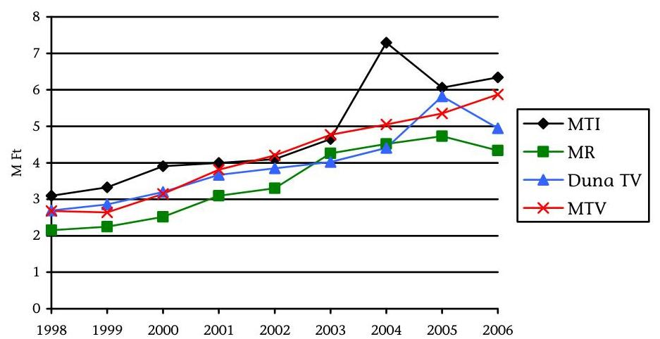

[^0]
[^0]:    ${ }^{33} 0315$ Jelentés az MTVKA és az MTV Rt. gazdálkodásának ellenőrzéséről.

---

A műsorgyártás teljes költségét a DTV Zrt. és az MR Zrt. tudta kimutatni, az MTV Zrt. azonban nem, mert a műsorgyártás közvetett költségeit nem különítette el. Emiatt az egyes beszerzési források szerinti (saját belső gyártás, saját megrendelt, beszerzett hazai és külföldi stb.) műsorok percköltsége nem hasonlítható össze a két közszolgálati televíziónál. Helyette az éves ráfordításokból levezetett egy műsorórára jutó ráfordítások az MTV Zrt. két csatornájának teljes műsoridejére vetítve a 2004. évi 1,82 M Ft/óráról 2006. évre 1,96 M Ft/órára emelkedett, a DTV Zrt.-nél ugyanez 1,01 M Ft/óráról 1,05 M Ft/órára történő növekedést jelentett, az ismétlések közel azonos aránya mellett.

Az MTV Zrt.-nél az egy műsorpercre jutó közvetlen költség terv és tény adatai 2004-2006. években jelentősen változtak.

Az egy percre eső reklám nélküli új műsoridő közvetlen költsége saját belső gyártás esetén a 2004. évi 21,2 E Ft-ról 2006. évre 61,2 E Ft-ra növekedett. A saját megrendelt műsorok esetében 23,6 E Ft-ról 16,7 E Ft-ra csökkent. A beszerzett hazai műsorok percköltsége 5,4 E Ft-ról 8,2 E Ft-ra növekedett, a beszerzett külföldi műsorok percköltsége 11,8 E Ft-ról 9,9 E Ft-ra csökkent.

Az ellenőrzött időszakban az MR Zrt.-nél és a DTV Zrt.-nél a könyvelési rendszer lehetővé tette a műsorszámok percköltségének kimutatását, de ezt csak a DTV Zrt. alkalmazta a gazdálkodásában. Az MTV Zrt.-nél 2005-től használnak olyan könyvelési rendszert, amely lehetővé teszi a műsorok percköltségeinek kimutatását, azonban a törvényi ${ }^{34}$ kötelezés ellenére - a közvetett költségek műsorgyártásra való ráterhelése hiányában - nem mutatta ki a műsorok teljes percköltségét, ami akadálya a finanszírozási normatívák megállapításának.

Az új műsorok (premier percek) aránya 2006-ban az MTV Zrt.-nél a korábbi évekhez képest $81,5 \%$-ról $76,4 \%$-ra csökkent az m1-es csatornán, az m2 csatornán $29,2 \%$, a DTV Zrt. csatornán változatlan 57,0\% volt. Az MR Kossuth és Petőfi adóján 94,2\%, a Bartók-on 92,7\% volt 2006-ban az új műsorok aránya.

Ezen belül a külső gyártásban készülő új műsorok aránya 2006-ban az MTV Zrt.-nél az m1 csatornán 19,3\%, az m2 csatornán 0,7\%, a DTV Zrt.-nél 2,2\%. Az MR Zrt. Kossuth és Petőfi adó kizárólag saját gyártásban készített, a Bartókon $24,8 \%$-ban vásárolt műsort sugárzott.

Az MTI Zrt. alaptevékenysége hírek gyártása, fotók készítése. Ezeken kívül több ún. „közszolgálati terméket" készít. A társaságnak külső gyártású termékei nincsenek. A közszolgálati feladatok pontos - termék vagy szolgáltatás szerinti - meghatározása, a támogatás igénylésének, felhasználásának ellenőrizhetőségén túl az MTI Zrt.-nek - a tervezés megalapozottsága céljából - érdeke, ezért 2005-2006-ban szakértőket bízott meg e feladatok elvégzésével.

A szakértők meghatározták a közszolgálati és nem közszolgálati tevékenységeket, kialakították az egyes termékekre vetített költségallokációs modellt, aminek segítségével nyomon követhető az egyes termékekre jutó költségek és bevételek összehasonlítása, számviteli szétválasztása. 2006 végéig ez a rendszer ki-

[^0]
[^0]:    ${ }^{34}$ Magyar Köztársaság 2003. évi költségvetéséről szóló 2002. évi LXII. tv. 128. §. (1) e)

---

sérleti formában múködött. A társaság kontrolling szervezete eddig a terveket és a tényleges adatokat szervezeti egységekre bontva hasonlította össze.

# 3. A KORÁBBI ÁSZ MEGÁLLAPÍTÁSOK HASZNOSULÁSA 

A korábbi ÁSZ jelentések megállapításai alapján megfogalmazott javaslatok négy területre: a törvénymódosításra, az AO módosításra, továbbá a tulajdonosi jogok következetes gyakorlására és a belső szabályzatok módosítására vonatkoztak.

Az ORTT-t érintő̉ korábbi ÁSZ jelentések javaslatainak hasznosítására, a Médiatv. módosításának előkészítésére az ORTT 2005-ben bizottságot hozott létre. 2006. év végére elkészítette javaslatát, amelyet a MeH fog hasznosítani az új törvény koncepciójának kidolgozásánál.

Az ORTT Irodájánál és az MA-nál 2005. évben történt ellenőrzésekről készült ÁSZ jelentésekben szereplő javaslatokat megvalósították. A Testület a helyszíni ellenőrzés befejezéséig továbbra sem készítette el támogatási stratégiáját.

Az ORTT zárszámadási előterjesztése tartalmazza az OGY-nek az MA-ra vonatkozó egyes kötött felhasználású támogatási keretei, valamint a szabad rendelkezésű eredménytartalékai felhasználását. Kiegészítették, aktualizálták a belső részszabályzatokat.

Az MA-nál elfogadták a Kötelezettségvállalás, utalványozás, és ellenjegyzés hatásköri rendjéről szóló szabályzatot, a Kamatpolitikai szabályzatot, a Belső ellenőrzési szabályzatot és a Személygépkocsik magáncélú használatának szabályzatát.

Lényeges javulás történt a támogatásban érdekeltek tájékoztatásában az elmúlt két év során azáltal, hogy az MA 2007. évi Pályáztatási terve, valamint az egyes pályázatokkal kapcsolatos információk és a pályázókat közvetlenül érintő MA szabályzatok az Alap honlapján (www.alap.ortt.hu) elérhetőkké váltak. 2006. január 1-jétől új, egységes ügyviteli rendszer (MAVIR) került bevezetésre, ennek segítségével a támogatási folyamat egészének adatai és történései nyomon követhetőek. A szigorú számadású szerződés-nyilvántartási rendszer ellenőrzési szempontból biztosítja a kötelezettségek nyomon követését.

A kuratóriumokat, gazdasági társaságokat érintő ÁSZ jelentések javaslatai részben hasznosultak. A 2003. évi ellenőrzések során az ÁSZ javasolta az MTVKA, a HTVKA és az MRKA 1996-ban jóváhagyott AO-inak módosítását a közhasznúság követelményeinek, és a költségtérítések szabályos elszámolásának érdekében. A közalapítványok szorgalmazása ellenére az AO-kat az OGY nem módosította.

A tulajdonosi jogok következetesebb gyakorlása, a hatékonyabb ellenőrzés érdekében az OGY a Kormányt, illetve a közalapítványokat kérte fel az MTV Zrt. és a DTV Zrt. kiszámítható bevételekre épülő, független, veszteségmentes gazdálkodását elősegítő javaslatok megtételére. Ezek teljesítéséhez szükségesnek tartotta a költségvetésből a médiának juttatott támogatások szabá-

---

lyozását, tevékenységük összehangolását és ezzel együtt a párhuzamos fejlesztések kiszűrését.

Az OGY 77/2003. (VI. 24.) határozatában felkérte a közszolgálati média közalapítványok kuratóriumait, hogy mielőbb hozzák meg döntéseiket a támogatások célszerű felhasználásáról; e-célból a Költségvetési bizottság közmédiumok gazdálkodását ellenőrző albizottsága 2003. októberében meghallgatta az MTVKA Kuratórium elnökét, az MTV Zrt. elnökét, valamint az MTV Zrt. FB elnökét.

Az Országgyűlés elnöke felkérte az MTVKA Kuratóriumának elnökét, hogy legkésőbb 2003. 08. 21-ig készíttesse el, majd hagyja jóvá az MTV Zrt. aktualizált üzleti tervét. Készíttessenek továbbá megvalósítási ütemtervet egy olyan elszámolási rendszer kimunkálására és bevezetésére, amely megteremti a pénzügyi folyamatok átláthatóságát.

Az előzőekben foglalt intézkedések eredményeképpen az MTV Zrt.-nél új alapokra helyezték az üzleti tervek készítését, a műsorokhoz kapcsolódó ráfordítások kalkulációjának, jóváhagyásának és utólagos elszámolásának rendjét.

Nem dolgozta ki az MTVKA az MTV Zrt. elnöki pályázati rendszerére és a pályázatban foglaltak számonkérésre vonatkozó eljárási rendet.

Az MRKA tagjai az MR Zrt. feletti tulajdonosi jogok következetesebb, hatékonyabb gyakorlását, az MR Zrt. elnökének és a szakterületi vezetőknek szükség szerinti beszámoltatását, továbbá a kontrolling tevékenység részletes kidolgozását a Gt. és a Média tv. szabta keretek között végezték. Az MR Zrt. elnöke által 2003. november 3-án kiadott Intézkedési tervben rendelte el egy középtávú - a gazdaságos múködés figyelembevételével kialakított üzletpolitikai célokat tartalmazó - megvalósítási ütemterv elkészítését, továbbá az MR Zrt. ingatlanhasznosítási koncepciójának felülvizsgálatát. Az Intézkedési tervben előírtak realizálódtak.

A belső szabályzatok közül módosította az SZMSZ-t az MTV Zrt. és a HTVKA, nem módosította az MTI Zrt. HTVKA szabályzata a módosítás után sem tartalmazza az ÁSZ jelentésében hiányolt elszámolható költségtérítések és juttatások körét, mértékét, illetve a költségek igazolásának, elszámolásának rendjét.

A költségek igazolásának, elszámolásának rendjét a HTVKA-nál az évenkénti elnökségi és kuratóriumi üléseken tárgyalták meg és fogadták el. Ugyanezt az MTVKA-nál külön szabályzatba foglalták.

A gazdálkodást érintő szabályzatok módosítására részben került sor a HTVKAnál, elmaradt pl. az Iratkezelési, valamint a Személygépkocsik üzemeltetésére vonatkozó szabályzatok módosítása - a „kulcsos" kocsik rendszerét megváltoztatták, az elnökségi tagok költségtérítésben részesülnek - ezért mindenképpen indokolt egy új üzemeltetési szabályzat készítése.

Az MRKA kuratórium elnöksége az összes érvényben lévő belső szabályzatát áttekintette, és a Kuratórium 18/2004. (06. 21.) számú határozatával jóváhagyta. 2005. évben a kuratórium elnöksége megtárgyalta és ET 2/2005. (01. 17.) számú határozatával elfogadta a gazdálkodási terv készítésének és évközi módosításának tartalmi és formai feltételeiről szóló előterjesztést.

---

Ennek értelmében a terv módosítása kötelező, amennyiben az éves gazdálkodási terv bevételei vagy költségei meghaladják az elfogadott terv 10\%-át. 2006-ban a Számviteli politika, és a Munkavállalók béréről és juttatásairól szóló szabályzatokat módosították, ill. aktualizálták. 2007. január 1-jén lépett hatályba a hivatali dolgozók bérének és juttatásainak módosított szabályzata - amely a természetbeli juttatások közterheinek emelkedése miatt - csökkentette a természetbeni juttatások mértékét.

MR Zrt. a szerződés ellenesen vissza-foglalkoztatottakkal kapcsolatban felmerült, 2001. évi létszámcsökkentéshez jogosulatlanul igénybe vett 8,9 millió Ft-ot visszafizette. Elkészítette a SAP rendszer belső szabályozását, az Informatikai szabályzatot és módosította a Közbeszerzési szabályzatot.

Felülvizsgálta a bel- és külföldi hírügynökségekkel kötött szerződéseket az MR Zrt., valamint a teljes szerződés nyilvántartási rendszerét az MTV Zrt. Ezt követően mindkét szervezet elkezdte az igényeknek jobban megfelelő adatbázisok kialakítását, és a szerződés-teljesítések folyamatos nyomon-követését.

Az MTI Zrt. elnöke részére 2006-ban - ismételten - megfogalmazott ÁSZ javaslatok hasznosítására, nevezetesen a humánerőforrás- és ingatlangazdálkodás tervezésével, illetve a terv hiányával összefüggő intézkedések a vállalt határidőre nem történtek meg.

Az archívumokra vonatkozóan külön megállapodása van az MTV Zrt.-nek a DTV Zrt.-vel, amelynek értelmében az MTV Zrt. Archívumából a Média tv. előtti alkotásokat jogdíj mentesen kapja a DTV Zrt., (Média tv. 75. §) az 1996. után készült alkotásokat pedig kedvezményes áron. Az 1996. évtől folyamatosan megjelent számos jogszabályi és egyéb változások miatt időszerű a 12-13 éves megállapodás aktualizálása. Az MTV Zrt. archiválás rendjéről szóló szabályzata 2004-ben, a DTV Zrt.-é 2005. júniusban készül el, a két televízió archívuma közötti együttműködésről azonban egyik szabályzat sem tartalmaz információkat. Helyszíni ellenőrzésünk befejezéséig az ORTT által is jóváhagyott archiválási szabályzattal csak az MTI Zrt. rendelkezik, annak ellenére, hogy a közszolgálati műsorszolgáltatók korábban több alkalommal benyújtották jóváhagyásra szabályzat-tervezetüket.

Az OGY-nek, a Kormánynak és a közmédiának tett javaslatok jelentős részét vagy az intézkedési tervekben vállalt határidőkön túl, vagy nem teljes körűen hajtották végre. A Médiatv. és az AO-k tekintetében eredményesnek minősíthető intézkedés nem történt. A tulajdonosi jogok következetes gyakorlása kereté-

---

ben az elnöki pályáztatásra és beszámoltatásra vonatkozó eljárás kidolgozása úgyszintén nem történt meg, a belső szabályzatok módosítása - az előzőekben részletezettek szerint - többségében elkészült.

Budapest, 2007. december " 40 "

| Melléklet: | 9 db | 20 lap |
| :-- | :-- | :-- |
| Függelék: | 1 db | 5 lap |

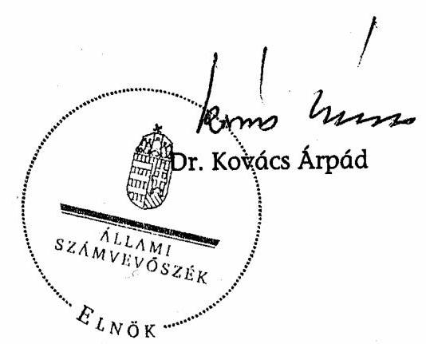

---

# MELLÉKLETEK

---

.

---

# (II(ORTI)) 

## 1001/07   155 782/07

Állami Számvevőszék
Dr. Kovács Árpád úr részére elnök

1052 Budapest, Apáczai Csere János u. 10

Tisztelt Elnök Úr!
A nemzeti hírügynökségről szóló törvényben, valamint a rádiózásról és televíziózásról szóló törvényben meghatározott közszolgálati feladatellátás rendszere ellenőrzése tárgyában készített, az Országos Rádió és Televízió Testület tagjai részére 2007. október 31. napján kézbesített jelentést érintően a Testület 2470/2007. (XI. 7.) sz. határozata alapján az alábbiakról tájékoztatom:

A Testület köszönetét fejezi ki azért, hogy az ORTT Irodája és a Músorszolgáltatási Alap által tett kiegészítések, pontositások túlnyomó részt átvezetésre kerültek. A szakapparátus által korábban megfogalmazott szakmai észrevételek fenntartása mellett - jelentőségére tekintettel - három kérdéskörben további egyeztetést tartunk szükségesnek:
1./ A jelentés kitér a 46/2007. (VI. 27.) AB határozat következményeinek vizsgálatára, azonban megítélésünk szerint nem elemzi megfelelő pontossággal és teljeskörűen az alkotmánybírósági döntés következtésben elóállt jogi helyzetet.
Lényeges körülmény, hogy a Testület jogalkalmazói tevékenysége nem lehetetlenül el, hanem a jelen helyzethez képest nehezebbé válik. Az ORTT által meghozott szankciók - a műsorszolgáltatási szerződés alapján müködő műsorszolgáltatók tekintetében - polgári jogi úton kikényszeríthetőek lesznek (a Testület bíróság előtt érvényesítheti követeléseit). Mindez azonban a jelenlegi eljárási rendhez viszonyítva idő- és költségigényesebb, amely a szankcióalkalmazás rendeltetését tekintve (gyors és hatékony fellépés) nem minősíthető optimális megoldásnak.
A közszolgálati és a bejelentés alapján működő (műholdas és vezetékes) műsorszolgáltatókat érintően teremtett az Alkotmánybíróság döntése kedvezőtlen helyzetet azzal, hogy az ORTT közigazgatási szervi jogállását a szankcióalkalmazás tekintetében „megvonta". Az Alkotmánybíróság döntésével az ORTT, mint a közigazgatási jogviszony egyik alanya, nem rendelkezik a kikényszerítés eszközével az elkövetett jogsértés szankcionálására, a jogkövető magatartás ösztönzésére.

A Testület a jogi helyzet rendezése érdekében - tekintettel arra, hogy a NAMS-ban rögzített audiovizuális alaptörvény elkészítésének időpontja ma még nehezen prognosztizálható - az átmeneti időszakra törvénymódosítási javaslatot juttatott el az Országgyűlés elnöke, a Kulturális és sajtóbizottság elnöke, valamint a kancelláriaminiszter részére. A normaszöveg-tervezet az Alkotmánybíróság által megfogalmazott alkotmányossági aggályt (miszerint a Testület polgári jogi út és közigazgatási jogi út közötti tetszőleges választásának lehetősége veszélyezteti a jogbiztonságot) feloldotta. A javaslat valamennyi műsorszolgáltatóval szemben alkalmazott

---

szankciók tekintetében a közigazgatási jogi eljárást javasolta kötelezővé tenni a polgári jogi út alkalmazásának kizárásával. E megoldással a szerződéses müsorszolgáltatók nem kerülnek hátrányos helyzetbe, hiszen a müsorszolgáltatási szerződések atipikus szerződések, abban a jogok (melyek kizárólag az ORTT-t illetik) és a kötelezettségek (melyek kizárólag a müsorszolgáltatót terhelik) lényegében véve egyoldalúan kerültek meghatározásra.
A kérdés jogrendi megleleltetésével is megállapítható, hogy az elektronikus médiaszektorban tevékenykedő társhatóságok (NHH, GVH, NFI) valamennyien - a szaktörvényben foglalt eltérésekkel - a Ket. szabályai szerint alkalmazzák a joghátrányokat.

A Testület által kidolgozott, az alkotmányos követelményeknek megfelelő jogi megoldás mellett számos, a gyakorlati tapasztalatokat is rögzítő érv szól:

- A polgári jogi szakban érvényesített követelés idő- és költségigényesebb, a közigazgatási jogorvoslati eljárásokban az évek alatt megszerzett tapasztalat (melyet a pernyertesség 80-90\%-os aránya is igazol) elértéktelenedik. Kifejezetten hátrányos a médiafelügyelet perbeli jogállásának megváltozása (alperesből felperesi pozícióba). Az országos kereskedelmi müsorszolgáltatókkal kötött szerződésben rögzített választott bírósági eljárás előnytelen és költségigényes.
- A Testület müködésében az elmúlt években kikristályosodott gyakorlat túlhaladt az ORTT által 10 éve megfogalmazott és az AB-hoz benyújtott jogi dilemmán. A 46/2007. (VI. 27.) AB határozatban rögzített jogbiztonsági követelményeknek a Testület törvénymódosítási javaslata szerinti garanciális szabály mindenben megfelel, azt teljeskörűen kielégíti.
- A NAMS szakértői anyaga a müsorszolgáltatási jogosultságok keletkezését jelenlegi ismereteink szerint nyilvántartásba vételhez köti, vagyis a jövő médiavilágában a közigazgatási jogviszony lesz domináns. Ezért ebbe az irányba mutató megoldásban célszerủ gondolkodni.

A Testület által kimunkált törvénymódosítási javaslattal az új audiovizuális törvény megalkotásáig terjedő átmeneti időszakra a jogbiztonság elvének megfelelő, átlátható, egységes hatósági jogkörgyakorlás keretei teremtődnek meg. A törvénymódosítási javaslatot szíves tájékoztatásul megküldjük.
2./ A szakértői egyeztetések során az Iroda több alkalommal kifejtette, hogy a Testület döntései körében felhozott példák (38. oldal 1-3. albekezdések, illetőleg az azt követő konklúzió) téves következtetés levonására adhatnak okot.
Az előterjesztőnek döntés-előkészítő funkciója van. Az Iroda feladatkörében eljárva megkísérli feltárni az ügy összes körülményét, és javaslatot tesz a szankció típusára, illetőleg mértékérc. Előfordul azonban, hogy - a leggondosabb előkészítés ellenére - valamely körülmény, tény az Iroda látókörén kívül marad, illetőleg nem megfelelő súllyal kerül értékelésre. A Testület döntéshozó szervként, mérlegelési jogkörében eljárva az előterjesztők által javasolt joghátránytól természetszerüen eltér, eltérhet, amely a döntés szakmaiságát nem érinti.
A szankcióalkalmazás körében - az Iroda által a szakértői egyeztetés során képviselt állásponttal összhangban - szükségesnek tartjuk megjegyezni, hogy a szankcióalkalmazás hatékonysága nem mérhető kizárólag mennyiségi mutatók mentén. A kiszabott kötbér éves összegének csökkenése nem áll egyenes arányban a szankcióalkalmazás hatékonyságával. A Testület döntését mérlegelési jogkörben az elkövetett jogsértés súlya, gyakorisága, a jogsértés elkövetésekor, valamint az eljárás során tanúsított magatartás, a médiapiaci helyzet, valamint más, az esetre jellemző releváns körülmény figyelembe vételével hozza meg.
3./ Az elektronikus müsorszolgáltatási törvény tervezetének kidolgozásával kapcsolatban a közbeszerzési törvény megsértésére vonatkozó megállapítással nem értünk egyet, a Testület jogszerüen járt el.

---

A Testület álláspontja szerint a kérdéses esetre nem a Kbt. 40.§ (2) bekezdése, hanem a 296.§ h) pontja vonatkozik, mely a közbeszerzési eljárás lefolytatásának kötelezettsége alól kiveszi azt az esetet, amikor olyan szolgáltatás megrendeléséről van szó, amely az ajánlatkérő - jelen esetben az ORTT - alaptevékenységének (Rttv. 43.§ (1) bek. d) pont) ellátásához szükséges szakirodalmi, tudományos mű létrehozására vagy tanácsadói tevékenység végzésére irányul. (A központi közigazgatás gyakorlatában is teljesen általános, hogy egy jelentős törvény előkészítésére közbeszerzési eljárás lefolytatása nélkül szakmai kodifikációs bizottságot hoznak létre.)

Végezetül, az ORTT számára a jelentés 21. oldalán megfogalmazott feladatkijelöléseket illetően a Testület álláspontját az alábbiakban rögzítjük:

# 1. Hosszabb távú támogatási stratégia elkészítése: 

A Testület tudomásul veszi, hogy az ÁSZ megállapítása szerint a tervezhetőség, átláthatóság és hatékonyság érvényesülése érdekében hosszú távra szükséges megfogalmazni a támogatás céljait, azonban ennek kidolgozása - tekintettel arra, hogy a Testület mandátuma 2008. március 29. napján lejár - a következő Testület számára jelent feladatot.
2. A támogatási összegek Médiatv.-ben meghatározott célokra történő felhasználásának biztosítása egyedi határozatok helyett az elöirt normák betartásával:

A Testület egyetért a megállapítással, miszerint a támogatási összegek felhasználása rögzített normák szerint történjen. 2005. évben némely esetben valóban eseti határozattal kerültek kiírásra a pályázatok, azonban 2006. és 2007. évben ismét támogatási terv, illetőleg támogatási naptár alapján történt a pályáztatás. A Testület eljárása tehát az ÁSZ által igényelt eljárási rendnek megfelel.
3. A müsorszolgáltatási szerződések megkötésénél, meghosszabbításánál ellenőrizhető és számon kérhető, számításokkal megalapozott belső szabályok alapján történő eljárás:

A Testület egyetért a megállapítással, amelyet a gyakorlatban eddig is alkalmazott és a továbbiakban is alkalmazni kíván.
A Testület a szerződéses partnerekkel egységes elvek mentén, szakmailag konzekvens szerződéses formulákat alkalmaz, a tartalmi elemek meghatározásánál mindenkor figyelemmel volt - és lesz a jövőben is - a jogszabályi követelményekre, a médiapiac helyzetére és a müsorszolgáltatási jogosultságok gyakorlása kapcsán szerzett tapasztalatokra.
A müsorszolgáltatási szerződések meghosszabbításának feltételeit a Testület az Rttv. 107.§ (1) bekezdés alapján két konkrét követelményben határozta meg (a müsorszolgáltatási díjtartozás, valamint a $112 . \S$ (1) bek. b) pontja szerinti szankció tilalma), amelyet minden müsorszolgáltató esetében egységesen érvényesít.

Kérem a Testület észrevételeinek figyelembe vételét.

Budapest, 2007. november 7.
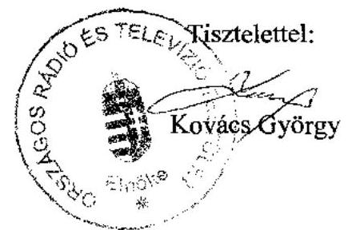

---

# Dr. Kovács Árpád úrnak az Állami Számvevőszék Elnöke 

1052 Budapest
Apáczai Csere János u. 10.
1364 Budapest 4.
Pf. 54

## Tisztelt Elnök Úr!

Köszönettel megkaptam a 2007. október 30 -án keltezett levelét, amelynek mellékleteként megküldte számomra az Állami Számvevőszéknek a nemzeti hírügynökségről szóló törvényben, valamint a rádiózásról és televíziózásról szóló törvényben meghatározott közszolgálati feladatellátás rendszerének ellenőrzéséről szóló jelentéstervezetét azzal, hogy az ellenőrzés megállapításaira 8 napon belül észrevételeket tehetek.

E jogi lehetőséggel élve a jelentés székház-projekttel kapcsolatos megállapításaira az alábbi észrevételeket teszem:

1. A jelentés függeléke (7. oldal utolsó bekezdés és az ahhoz füzött megjegyzés, amely a 8. oldal elején fejeződik be) a közbeszerzés tekintetében megállapított aggályos tartalmi elemek közé sorolja azt, hogy a bérleti időt a közbeszerzési eljárás különböző szakaszaiban, különböző módon, összességében azonban valamennyi esetben 40 éves időtartamban határozták meg.

Ennek a kérdéskörnek az előzménye a 2007. szeptember 21-én Bihary Zsigmond föigazgató úr által küldött tervezetben szerepel, az akkori megállapítás lényege az volt, hogy a bérleti időt a felek $\qquad$ nem egyértelmüen határozták meg.

A tervezetre tett észrevételeinket elfogadva a "nem megfelelően határozták meg", mint hibára vagy aggályra utaló megállapítás a szövegből elmaradt és mindössze annyi maradt kifogásként, hogy a 40 éves időtartam a különböző közbeszerzési szakaszokban különböző módon került leírásra.

Álláspontom szerint a leírási (szövegezési) eltérések, amelyek minden esetben 40 éves időtartamot jelentenek, nem adnak okot a közbeszerzési eljárás lefolytatásával kapcsolatban aggályokra, ezért javasolom a jelentésből az említett rész elhagyását.

---

2. A jelentés függeléke (8. oldal első nagy bekezdés) ugyancsak az aggályos elemek körében hivatkozik arra, hogy a 2179/2004(VII.19.) Korm.határozatra történő hivatkozás a 2005. évi XXVI. törvény 79. §-a ismeretében nem megfelelő.

Ezt a megállapítást kérem felülvizsgálni a következők miatt:
a) A jelentés függeléke (3. oldal első bekezdés) részletesen taglalja a 2005. évi XXVI. törvény 79. §-ának tartalmát, az azt követő fejleményeket, majd zárómondatként megiegyzi, hogy a kormány az MTV KA-val, az MTV Zrt.-vel és az MM Kft.-vel a szerződést nem kötötte meg. Ez a tárgyszerű megállapítás egyben kifejezésre juttatja, hogy az adott törvényi rendelkezés végrehajtására nem került sor, az az MTV Zrt. döntési körén kívül eső okból nem következett be. Így az adott törvény szerinti eljárás mellőzése az MTV Zrt. müködésével kapcsolatban hibaként nem állapítható meg.
b) A 2179/2004(VII.19.) Korm. határozatra való hivatkozás tárgyszerű és jogszerű volt, hiszen ez a határozat az adott időszakban hatályban volt.

Az előbbiekben vázolt érvek alapulvételével, tisztelettel kérem a kifogásolt szöveg elhagyását, vagy az anyagnak az érveimmel való kiegészítését. Megjegyzem azt is, hogy a kifogásolt szövegrész elhagyása egyúttal összhangban lenne a jelentés függeléke 3. oldala első bekezdésében található megállapításokkal.
3. A jelentés függeléke (8. oldal harmadik nagy bekezdés) aggályként állapítja meg az üzemeltető, mint alvállalkozó megjelenítésének hiányát az eljárások során. A kifogáshoz tartozó magyarázat harmadik és negyedik mondatában javasolom az alábbi szövegpontosítás végrehajtását, amely a közbeszerzési szabályokkal teljes mértékben összhangban van. Az alábbi szöveget kérem feltüntetni:
"Az MTV Zrt. magatartásának jogi alapját a Kbt. 28. §-ának (1) bekezdése képezte, amely szerint, ha a szerződés több - egymással szükségszerűen összefüggő - közbeszerzési tárgyat foglal magában, a meghatározó értékủ közbeszerzési tárgy szerint kell a szerződést minősíteni. Figyelemmel arra, hogy a bérleti jogviszonyok jellemző eleme a bérelt terület üzemeltetése, illetve az MTV Zrt. beszerzési igénye a többi közbeszerzési tárgy mellett meghatározóan a bérletre irányul, az MTV Zrt. álláspontja jogszerü."

Kérem Elnök Urat, hogy a jelentés véglegesítése során az észrevételeimet szíveskedjék figyelembe venni.

Budapest, 2007. november 8.
Tisztelettel:
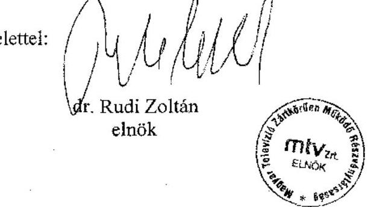

---

# 1/c. sz. melléklet   a V-2-164/2007. sz. jelentéshez 

## 202107

Országos Rádió és telkvízio Testület

## Szalai Annamária

testületi tag

## Dr. Kovács Árpád Úr részére

Elnök
Állami Számvevőszék

Budapest
4. Pf. 54.

1364
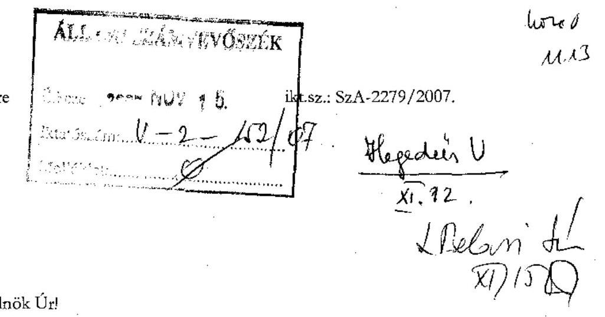

Tisztelt Dr. Kovács Árpád Elnök Úr!
A nemzeti hírügynökségről szóló törvényben, valamint a rádiózásról és televíziózásról szóló törvényben meghatározott közszolgálati feladatellátás rendszere ellenőrzéséről szóló (V-02119/2007) vizsgálati jelentéstervezetüket áttanulmányozva sajnálattal azt tapasztaltam, hogy észrevételeimet csekély mértékben találták figyelembe veendőnek.

Korábbi észrevételeimet fenntartom, ezt megerősítendő az alábbiak figyelembevételét javaslom: Szerződések hosszabbítása:

- A tervezet nem foglalkozik kellő pontossággal és részletességgel az országos kereskedelmi rádiók és televiziók meghosszabbításának történésével, a döntések meghozatalának körülményeivel, következményeivel, a Legfőbb Ugyész helyettese és az ombudsman megállapításaival.
- Számos további esetben hozott vitatható, saját előzetesen megállapított határozatával ellentétes jogosultság hosszabbítására vonatkozó döntést a Testület. Például több esetben a szolgáltató nem kérte, elkésve kérte, egy testületi tagnak elküldve, utólag az iratokhoz csatolva kérte a hosszabbítást. Más szolgáltató esetén a jogosultságot az Rttv. $112 \S 1$. (b) szankció megállapítása ellenére is meghosszabbította a Testület.

Jogosultságok pályáztatása:

- A Budapest 100,3 MHz pályáztatásáról leírtak pontatlanok (pl. „a már több éve jól múködő Jazz Rádió" versus „korábbi múködési tapasztalattal sem rendelkező Lánchíd Rádió"), illetve a pályázati kiírást félreérthető módon értelmezi (,speciális karakterisztikát nem vállaló"). A leírt megállapítások feltehetően az egyik tag különvéleményére, illetve az országgyưlés illetékes bizottsága elnökének véleményére alapoznak. Ez utóbbi vélelem, illetve az ORTT irodai előterjesztés kiragadott részének ismertetése félreértésre adhat okot.
- Félreértésre adhat okot továbbá az a tény, hogy a többszáz frekvencia döntésből kizárólag ebben az esetben tesz megállapításokat az ÁSZ. Az AB 46/2007 (VI.27.) határozatban rögzítette, hogy „az Országgyúlés mulasztásban megnyilvánuló alkotmányellenességet idézett elő, mert ...nem szabályozta törvényben az Alkotmány 57. § (1) bekezdésének

---

megfelelő, a műsorszolgáltatási jogosultság elnyeréséről szóló jogalkalmazói döntések teljes körű, érdemi bírósági felülvizsgálatának lehetőségét." Több esetben fordultak bírósághoz sćrtettek a Testület döntésével szemben, jelenleg is folyik hasonló eljárás, amiről nem tesz említést a jelentéstervezet.

Dícsökkentés:

- A tervezet nem foglalkozik kellő súllyal azzal, milyen kárt okozott a médiatunanszírozás rendszerében a műsorszolgáltatási díjak csökkentése, változatlan hagyása, azaz a pénz kivonása.
- Nemcsak országos szolgáltatók esetében fordult elő díjcsökkentés (Roxy, Klub).

Panaszbizottság:

- A Testület vélekedésem szerint a médiatörvénnyel ellentétes módon szűkítette a Panaszbizottság hatáskörét.

Műsorszolgáltatási Alap:

- Megállapításaikkal lényegében egyetértek azzal, hogy az ismertetett (MA-JOGISMERET 2006-1/2006) eseten túl számos pályázat értékelésekor nem tartotta be határozatait a Testület, avagy az eljárás során megváltoztatta azokat. Kirívó - a jelentésben nem taglalt eset például, az IRODALOM 2005 pályázat, a köznyelvben Nagy könyv pályázatként elhíresült pályáztatás.

Kérem fenti észrevételeim, javaslataim figyelembe vételét.

Budapest, 2007. november 08.
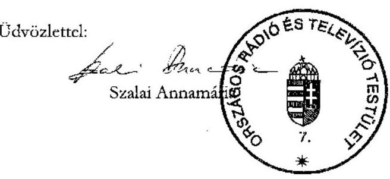

---

# Dr. Kovács Árpád elnök 

Állami Számvevőszék Budapest

## 1/d. sz. melléklet

a V-2-164/2007. sz. jelentéshez

## ÁLLAMI SZÁMVEVÓSZÉK

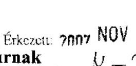

Erkeztl: 7nn7 NOV 15
$\mathrm{U}-2-153$
Iktatószám:
Melléklet:
$\frac{1}{x_{1} 14}$
E-mail: elnok@dunatv.hu - Honlap: www.dunatv.hu
2027 (1)ELNOK

## 21.14.

Iktatószám: 100/3810/2/2007

Tisztelt Elnök úr!

Köszönöm, hogy elküldte számomra a nemzeti hírügynökségről szóló törvényben, valamint a rádiózásról és televíziózásról szóló törvényben meghatározott közszolgálati feladatellátás rendszerének ellenőrzéséről szóló jelentést, amelyhez az alábbi észrevételeket teszem:

1. Javaslom, hogy a végleges jelentésből maradjon ki Gál András Levente, a Hungária Televízió Közalapítvány Ellenőrző Testület elnökének észrevétele, mert olyan feladat, amelyet jogszabály nem ír elő, nem kérhető számon.
2. A Jelentés megállapítja, hogy a Duna Televízió Zrt.-nél nem készült stratégiai terv. Az általam készített elnöki pályázatban azonban olyan stratégiai célkitűzések kerültek megfogalmazásra, amelyek megfelelnek a hosszú távú tervezés elvárásainak.

Végül engedje meg, hogy megköszönjem szakszerű és következetes munkájukat.

Budapest, 2007. november 9.

Tisztelettel:
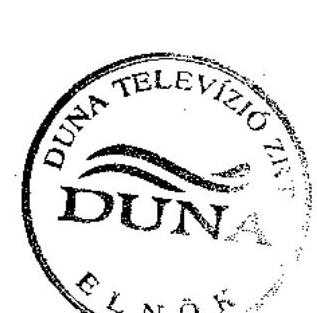

Cselényi László

---

# Állami Számvevőszék Dr. Kovács Árpád úr elnök részére 

Tisztelt Elnök Úr!

A V-02-145/2007-es számú, a nemzetközi hírügynökségről szóló törvényben, valamint a rádiózásról és televíziózásról szóló törvényben meghatározott közszolgálati feladatellátás rendszerének ellenőrzéséről szóló számvevői jelentést köszönettel megkaptam.

A jelentés tartalmát megismerve az abban foglaltakhoz további észrevételeket nem teszünk.

Budapest, 2007. november 12.

Tisztelettel:
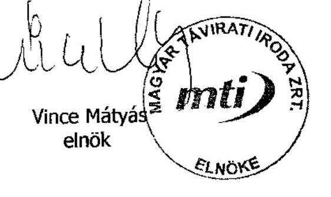
mti)

---

# 1/f. sz. melléklet a V-2-164/2007. sz. jelentéshez 

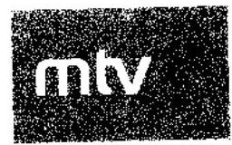

## Állami Számvevőszék

Dr. Kovács Árpád elnök

1052 Budapest.
Apáczai Csere János u. 10.
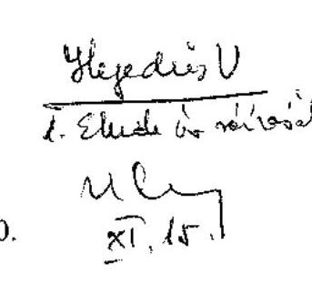

Budapest, 2007. november 14.
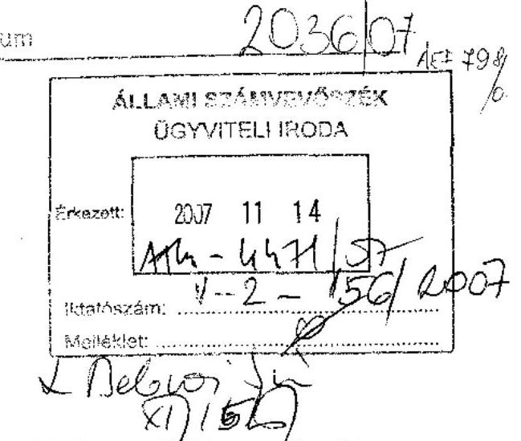

Tisztelt Elnök Úr!
Köszönettel vettem kézhez az Elnök Úr által küldött, az Állami Számvevőszék által a nemzeti hírügynökségi törvényben, valamint a rádiózásról és a televíziózásról szóló törvényben meghatározott közszolgálati feladatellátás rendszerének ellenőrzéséről készített jelentéstervezetét. Kérem engedje meg, hogy ezúton is köszönetemet fejezzem ki a magam és az Ellenőrző Testület nevében az Elnök Úr és munkatársai által végzett, a közszolgálati feladatellátás teljes keresztmetszetét felölelő ellenőrzési tevékenységért, amely meggyőződésem szerint jelentős mértékben járul majd hozzá ahhoz, hogy a magyar közszolgálati médiumok képesek legyenek megfelelni a modern kor és az egységesülő európai piac által a közszolgálati médiumokkal szemben támasztott követelményeknek.

A jelentés készítésének folyamatában munkatársai többször is lehetővé tették, hogy a vizsgálatok tárgyát képező ügyekkel kapcsolatosan a Magyar Televízió Közalapítvány Ellenőrző Testületének álláspontját tolmácsoljam a jelentés készítői felé. Ennek ellenére, mivel észrevételeink legfontosabb elemei végül nem kerültek bele a jelentés utolsó előtti változatába, engedje meg, hogy - szíves felkérésének eleget téve - ezúton tegyem meg az általam képviselt testület észrevételeit. Egyúttal tájékoztatom, hogy a jelentést 2007. november 9 -én kaptam kézhez.

## I. A Magyar Televízió Közalapítvány mellett müködő Ellenőrző Testület hatásköréről

A jelentéstervezet helytálló megállapítása szerint (51. o.) az MTV Közalapítvány elnöksége és az Ellenőrző Testület (ET) ez utóbbi ellenőrzési jogosultságára vonatkozó törvényi szabályozást eltérően értelmezte. Ahogy a jelentéstervezet is leszögezi (50. o.), az ET a Médiatörvény alapján jogosult a Közalapítvány Kuratóriumának jogellenes döntése esetén az Országgyülés elnökéhez, illetve az ÁSZ-hoz fordulni. Az ET müködése során - a jelentés által érintett időszakban is - kizárólag a Közalapítvány döntéseit vizsgálta, vitathatatlanul minden meghozott döntésre kiterjedően, a teljeskörüség szándékával. Az ET törvény által meghatározott feladata a Közalapítvány működésének ellenőrzése, így álláspontunk szerint az ellenőrzést végző testület és az ellenőrzött közötti vita más módon, mint a jogszabályok adta

---

keretek között, a törvény szövegének értelmezésével, illetve annak gyakorlati alkalmazásával, nem oldható fel. Az Ellenőrző Testület feladatkörébe nem tartozhat a jelentés által felvetett javaslat kivitelezése, azaz, hogy az általa ellenőrzött másik testülettel a konszenzus megtalálására törekedjen a törvény - egyébként e helyütt történetesen egyértelmủ rendelkezésének alkalmazási köre kapcsán. A jelentés által a konfliktus feloldásának módjával kapcsolatban felvetett egyéb javaslatok - jogszabály-módosítás, alapítói határozat kivétel nélkül lehetségesen járható utakat vázolnak fel, de a törvény szövege alapján egyik megoldási javaslat megvalósítása sem elengedhetetlenül szükséges. Elegendő lenne a hatályos jogszabályi előírások betartása, azonban a törvény által kötelezett szerv - jelen esetben a Közalapítvány Kuratóriumának Elnöksége -, az ÁSZ által is tapasztalt módon nem minden esetben tartja azokat tiszteletben, és ily módon akadályozza az ellenőrzési tevékenységet.

# II. A Magyar Televízió Zrt. új székház- és gyártóbázis-beruházásra irányuló közbeszerzési eljárás jogszerüségéről 

Az Ellenőrző Testület egyetért a jelentésben megfogalmazott aggályokkal, az MTV Zrt. székházberuházásra irányuló közbeszerzési eljárásával kapcsolatban (1. Függelék, 6-9. o.), amelyek a jelentés megállapításai szerint a kiíróra kedvezőtlen és hátrányos elemeket tartalmaznak. A jelentés egyéb megállapításai is mindenben alátámaszthatók, amennyiben a tervezett beruházást bérleti szerződés megkötésére irányulónak tekintjük.

Álláspontunk szerint a közbeszerzési eljárással kapcsolatban felmerülő legfőbb kérdés azonban éppen az, hogy az eljárás megindítására vonatkozó bejelentés kizárólag bérleti jogviszonyról szólt, miközben az MTV Zrt. elhallgatta azt a körülményt, hogy az annak majdan tárgyául szolgáló ingatlan még nem is létezik. A valóságban megkötött szerződésekből mind az Ellenőrző Testület, mind az Állami Számvevőszék számára csak a későbbi ellenőrzés folyamán derült ki, hogy a jogviszony elsősorban új székház felépítésére irányul. Utólag egyértelműen megállapítható, hogy a Közbeszerzési Döntőbizottság jóváhagyása a szükséges információk hiányában született meg. Ha el is fogadjuk, hogy az építtető Millenniumi Média Kft. magánberuházásként építi fel a szóban forgó épületet - így természetesen nem lenne kötelező a közbeszerzési eljárás kiírása -, míg az MTV Zrt. a felépítést követően bérelni fogja azt, elkerülhetetlenül meg kell állapítanunk, hogy a „bérleti dij"-nak nevezett összeg, a választott konstrukció alapján magában foglalja a felépítés és az üzemeltetés költségeit is. Nem is kezdődne el az építkezés akkor, ha a szerződések összességéből nem lenne nyilvánvaló, hogy az állam valamennyi költség megfizetését vállalja. A Millenniumi Média Kft. és az MTV Zrt. között köttetett szerződések tehát csak együtt, egymás mellett értelmezhetőek helyesen. Ezért elutasítjuk azt az álláspontot, hogy ebből a bonyolult, szövevényes jogviszonyból a puszta bérleti jogviszony kiemelhető lenne, mint a közbeszerzési eljárás szempontjából egyedüliként releváns szerződés.

Az ÁSZ a Közbeszerzési Döntőbizottság előtti eljárás kezdeményezésére nyitva álló határidőt tekintve privilegizált helyzetben van, így a jogszabály vonatkozó rendelkezése alapján, a Kbt. 327. § (2) bekezdésének első mondata értelmében a jogsértés megtörténtétől számított egy éven belül élhet a jogorvoslati eljárás kezdeményezésének lehetőségével. A jelentés szerint a lefolytatott közbeszerzési eljárás alapján megkötött szerződés és a közbeszerzési eljárás összegzésében ráadásul eltérő méretű bérleti terület szerepel. Ebben az esetben - azaz a bejelentésben még nem szereplő, de a megkötött szerződésbe már bekerült újabb kb. 10.000 $\mathrm{m}^{2}$-nyi területre nézve a közbeszerzési eljárás mellőzésekor - a Kbt. 327. § (2) bekezdése alapján a jogsértés megtörténtétől számított három év jelenti a jogvesztő határidőt. Tekintettel arra, hogy az eljárás megindításáról szóló tájékoztató 2007. január 12-én kelt, az eljárás

---

eredményhirdetésére pedig 2007. február 21-én került sor, a jogorvoslati eljárás megindítására a határidő az ÁSZ részére még nyitva áll.

Kérem Elnök Úrtól, hogy a fentiekben kifejtésre került jogsértésről való tudomásszerzéstől számított 15 napon belül segédkezzen abban, hogy a Közbeszerzési Döntöbizottság valamennyi releváns információ birtokában hozhasson döntést.

Egyúttal újfent köszönetemet fejezem ki az Elnök Úr és munkatársai által elvégzett lelkiismeretes és áldozatos munkáért.

Tisztelettel,

Dr. Jaczkovics László Gábor
Magyar Telefizió Kőzalapítvány Kuratórium
EJenőrző Testület
elnök

---

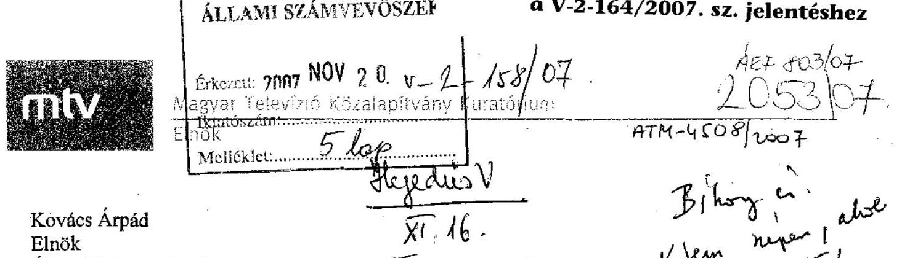

Kovács Árpád
Elnök
Állami Számvevőszék

Tisztelt Elnök Úr!
A megküldött nemzeti hírügynökségről szóló törvényben, valamint a rádiózásról és televíziózásról szóló törvényben meghatározott közszolgálati feladatellátás rendszerének ellenőrzéséről készített jelentésüket megkaptuk.
Legutóbb, a november 14-i elnökségi ülésen ajánlottam fel az Elnökség tagjainak, hogy akinek észrevétele van a Jelentéssel kapcsolatban, azt írásban tegye meg.
A magam részéről változatlanul fenntartom korábbi írásbeli észrevételeimet és öszintén szeretném, ha a végleges anyagban nem a véleményem, hanem a Jelentés tényekkel ellentétes állításai már nem szerepelnének.
A felismert közös érdek által vezérelve örömmel ajánlom fel mind az Elnökség, mind a magam segítségét a közszolgálati feladatellátás témakörének további vizsgálatához.
A Jelentés alapján intézkedési tervet dolgozunk ki, melyről T. Elnök urat külön fogom tájékoztatni. Mellékelem Gombár József szakértő úr írásbeli véleményét a Jelentéssel kapcsolatban.

Budapest, 2007. november 15.
Tisztelettel
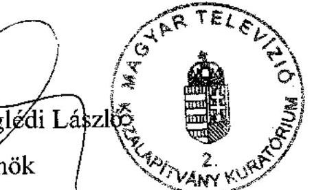

---

# I/h. sz. melléklet a V-2-164/2007. sz. jelentéshez 

Dr. Weiszenbergerné Dr. Dobos Márta Föigazgató

ÁLLAMI SZÁMVEVÖSZÉK
Dr. Kovács Árpád úr
elnök részére

Budapest,
Apáczai Csere János u. 10. 1052

Tisztelt Elnök Úr!
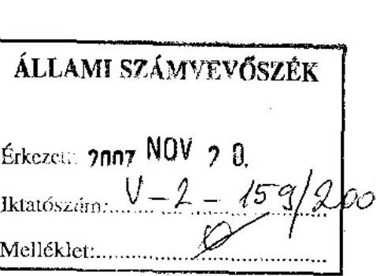

Iktatószám: 03-112/13/07
Tárgy: ÁSZ jelentés

A nemzeti hírügynökségről szóló törvényben, valamint a rádiózásról és televíziózásról szóló törvényben meghatározott közszolgálati feladatellátás rendszere ellenőrzése tárgyában készített, az Országos Rádió és Televízió Testület tagjai, valamint az ORTT Irodája részére 2007. október 31. napján kézbesített jelentést érintően az alábbiakról tájékoztatom:

Az Országos Rádió és Televízió Testület a 2470/2007. (XI.7.) sz. határozatában foglalta össze észrevételeit, melyet 2007. november 7-ei keltezéssel t. Elnök úr részére megküldtünk.
Az ORTT testületi müködésének rendje szerint a Testület döntéseit feladatkörükben eljárva az Iroda, valamint a Músorszolgáltatási Alap készíti elő. Az abban foglalt szakmai tartalom - amennyiben a Testület annak megváltoztatását, illetve kiegészítését nem tartja szükségesnek megegyezik a szakapparátus szakmai álláspontjával.
A hivatkozott ügymenetre tekintettel nem fogalmazott meg saját hatáskörben véleményt az Iroda.
A mai napon munkatársával folytatott telefonbeszélgetésre hivatkozással ezúton megerősítem, hogy az ORTT Irodája az ÁSZ jelentésre észrevételt nem tesz.

Budapest, 2007. november 14.
Tisztelettel:
Dr. Weisżenbergerné dr. Dobos Márta

---

# 1/1. sz. melléklet a V-2-164/2007. sz. jelentéshez 

Dr. Kovács Árpád
elnök

## Állami Számvevőszék

## Budapest

Apáczai Csere János u. 10.
1052

Tisztelt Elnök Úr!

Köszönettel megkaptam a nemzeti hírügynökségekről szóló törvényben, valamint a rádiózásról és a televiziózásról szóló törvényben meghatározott közszolgálati feladatellátás rendszerének ellenőrzéséről készített jelentésüket.

Az ellenőrzés megállapításaival kapcsolatban nincs észrevételünk.

Budapest, 2007. november 8.

Magyar Rádió zrt.
Elnök
1800 Budapest
Bródy Sándor u. 5-7.
Telefon: 328-8377, 328-7623
Fax: 328-7355

Tisztelettel:
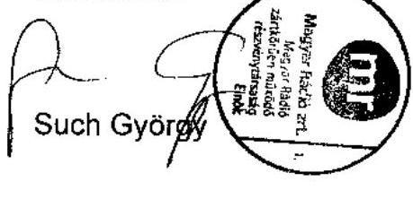

---

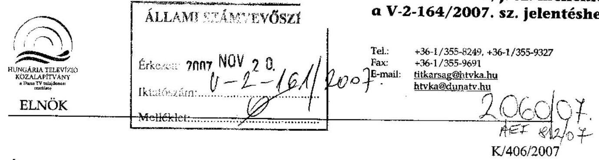

Állami Számvevőszék
Dr. Kovács Árpád úr részére, elnök

1364 Bp., 4. Pf. 54.
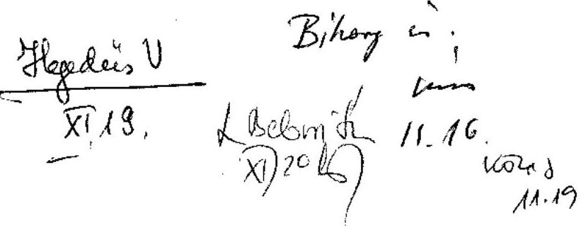

Tisztelt Föigazgató Úr!

A számomra megküldött jelentéshez, amely a nemzeti hírügynökségről szóló törvényben, valamint a rádiózásról és televíziózásról szóló törvényben meghatározott közszolgálati feladatellátás rendszerének ellenőrzéséről szól az alábbiakban teszem meg észrevételeimet:

1. Elismerem és köszönetemet fejezem ki a korrekt, ugyanakkor alapos, minden lényeges kérdést középpontba helyező vizsgálatért.
2. A vizsgálat során megállapított hiányosságokat igyekszünk a legrövidebb időn belül kiküszöbölni, illetve részben ki is küszöböltük.
3. Minden elismerő véleményem mellett azonban szóvá kell tennem annak a végkövetkeztetésnek a kritikáját, amelynek lényege, hogy a közalapítványok munkavégzése nem elég hatékony. Megjegyezni kívánom, hogy a Hungária Televízió Közalapítvány minden tekintetben teljesíti az 1996. I. Tv.-ben foglalt feladatait. Sajnálatosnak tartom, hogy az Állami Számvevőszék vizsgálata nem különíti el megfelelőképpen a közszolgálati tulajdonosi struktúra bírálatát a konkrét közalapítványi müködés elemzésétől.

Budapest, 2007. november 15.

Tisztelettel
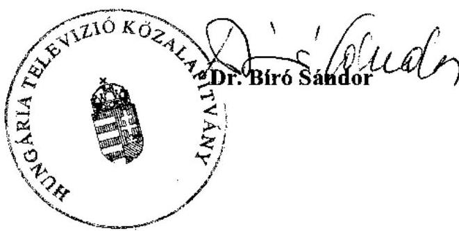

---

# Dr. Kovács Árpád 

elnök
Állami Számvevőszék
1052 Budapest, Apáczai Csere János u

Tárgy: 2007. 10. 30-án megküldött ÁS!
Budapest

## Tisztelt Elnök Úr!

Az Ön által részemre 2007. október 30-án véleményezésre megküldött, a nemzeti hírügynökségről szóló törvényben, valamint a rádiózásról és televíziózásról szóló törvényben meghatározott közszolgálati feladatellátás rendszerének ellenőrzéséről szóló jelentés tervezetét köszönettel megkaptam.

A jelentéssel kapcsolatos észrevételeit az Országos Rádió és Televízió Testület a 2470/2007. (XI.7.) számú határozatában foglalta össze, melyet 2007. november 7-ei keltezéssel Elnök úr részére megküldött.

Az ORTT testületi müködésének rendje szerint a Testület döntéseit feladatkörükben eljárva az ORTT Irodája, valamint a Músorszolgáltatási Alap készíti elő. Igy az abban foglalt szakmai tartalom amennyiben a Testület annak megváltoztatását, illetve kiegészítését nem tartja szükségesnek megegyezik a szakapparátus szakmai álláspontjával.

Tekintettel a fentiekre, a Músorszolgáltatási Alap saját hatáskörben a jelentéssel kapcsolatosan további észrevételt nem kíván tenni.

Budapest, 2007. november 14.
Tisztelettel:
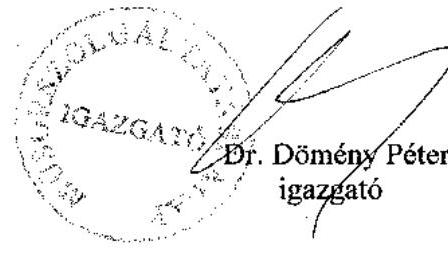

---

Dr. Kovács Árpád elnök Úr részére Állami Számvevőszék
Budapest
Pf.: 54
1364

1/1. sz. melléklet
a V-2-164/2007. sz. jelentéshez

| Érkerct: 7nn7 NOV 7.0. |  |
| :--: | :--: |
| Iktarószám: |  |
| Melléklet: |  |
| Megcélén V |  |
| $\mathrm{Xr}, 19$ |  |

Tisztelt Elnök Úr!

A nemzeti hírügynökségről szóló törvényben, valamint a rádiózásról és televíziózásról szóló törvényben meghatározott közszolgálati feladatellátás rendszerének ellenőrzéséről készült anyagot megkaptam.
Tájékoztatom arról, hogy az anyaggal kapcsolatosan a Duna Televízió Zrt. Felügyelő Bizottsága nevében nem kívánok észrevételt tenni.

Budapest, 2007. november 14.

Dr. Herbst Árpád
Duna Televízió Zrt.
FB elnöke

---

# $2067107$.   REF $315 / 2007$. 

## MAGYAR TÁVIRATI IRODA ZRT. - FELÜGYELÓ BIZOTTSÁG

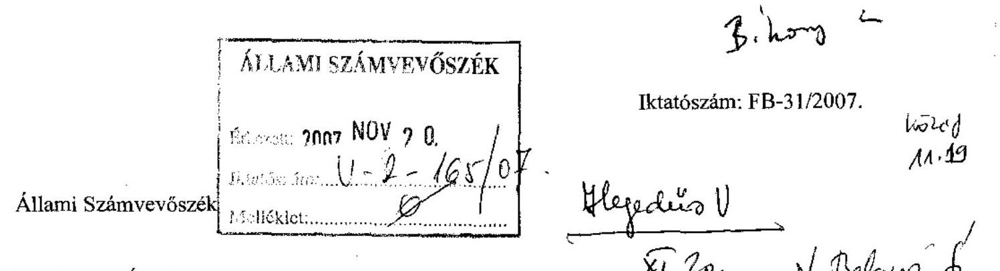

Tisztelt Elnök Úr!

A nemzeti hírügynökségről, valamint a rádiózásról és televíziózásról szóló törvényben meghatározott közszolgálati feladatellátás rendszerének ellenőrzéséről készült - V-02145/2007. számú - jelentést köszönettel megkaptuk, melyet a testület tagjai megismertek. Tájékoztatom Elnök Urat, hogy a jelentés korábbi munkaanyagát a Felügyelő Bizottság testületi ülésen napirendként tárgyalta, és kialakította álláspontját. Ezt az Állami Számvevőszéknek 2007. június 19-én - az FB-22/2007. iktatószámú levélben - megküldtük, jeleztük azt is, hogy a jelentéshez további érdemi észrevételt nem kívánunk tenni.

Budapest, 2007. november 15 .
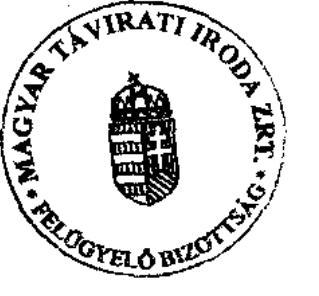

Tisztelettel:
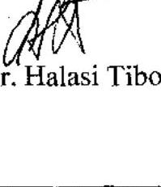

Magyar Távirati Iroda Zrt. - Felügyelő Bizottság Elnöke
1016 Budapest, Naphegy tér 8.
Tel.: 441-9036, tel./fax: 356-9538,
mobiltelefon: 06-30-211-3111, 06-30-515-4007
E-mail: fb@mti.hu

---

# 1/n. sz. melléklet a V-2-164/2007. sz. jelentéshez 

## ÁLLAMI SZÁM:EVŐSZÉK

## Érkeceit: 7007 NOV 23.

Iktatószám: $11-2-174 / 67$
Melléklet: 22

Budapest, 2007. november 14.
Ikt. szám: $\mathrm{FB} / / 2007$.

Állami Számvevőszék
Dr. Kovács Árpád úr
Elnök

Budapest
Tisztelt Elnök úr!
Köszönettel megkaptuk a V-02-145/2007. ikt. számon küldött „Jelentés a nemzeti hírügynökségről szóló törvényben, valamint a rádiózásról és televíziózásról szóló törvényben meghatározott közszolgálati feladatellátás rendszerének ellenőrzéséről" szóló munkaanyagot.

A Felügyelő Bizottság kompetenciájába tartozó észrevételt nem teszünk.
Az anyagban egyébként az MTV Zrt. FB tevékenységével kapcsolatban kifejezett értékelés az 52. oldal 3. bekezdésében van, amely az MTV KA Elnöksége hatáskörébe tartozó észrevételeket tartalmaz.

Tisztelettel

Gábor József
a Felügyelő Bizottság
elnöke

---

# Állami Számvevőszék 

Dr. Kovács Árpád úr elnök részére

Tisztelt Elnök Úr!
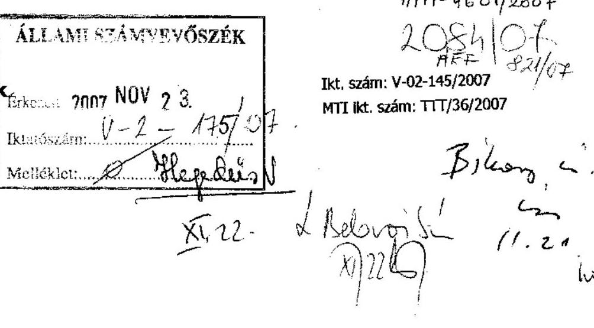

A V-02-145/2007-es számú, a nemzetközi hírügynökségről szóló törvényben, valamint a rádiózásról és televízlózásról szóló törvényben meghatározott közszolgálati feladatellátás rendszerének ellenőrzéséről szóló számvevöl jelentést köszönettel megkaptam.

A jelentés tartalmát megismerve az abban foglaltakhoz további észrevételeket nem teszünk.

Budapest, 2007. november 16.

Tisztelettel:
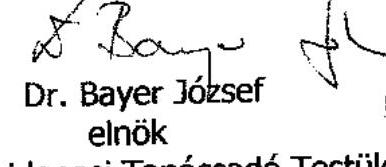

Tulajdonosi Tanácsadó Testület

---

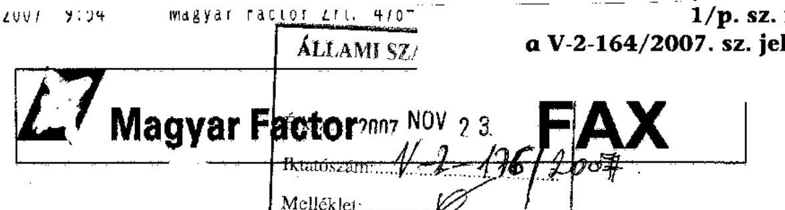

# Cég: Állami Számvevöszék Telefonszám: 

## Feladó:

Név: Csáki Ferenc vezérigazgató
Telefonszám: 1/478-2600
Faxszám: 1/478-2615
e-mail: f.csaki@magyarfactor.hu
Dátum: 2007.11 .20 .
Lapok száma (fedölappal): 1

Tisztelt Asszonyom!

Ezúton tájékoztatom, hogy a 8 napos egyeztetésre kiküldött számvevőszéki jelentéshez észrevételt nem kivánok füzni.

Ödvözlettel:
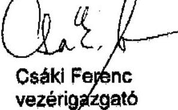

Magyar Factor Rt.
1074 Budapest, Dohány u. 14
Postacim: 1384 Budapest, Pf.: 793
info@magyarfactor.hu

---

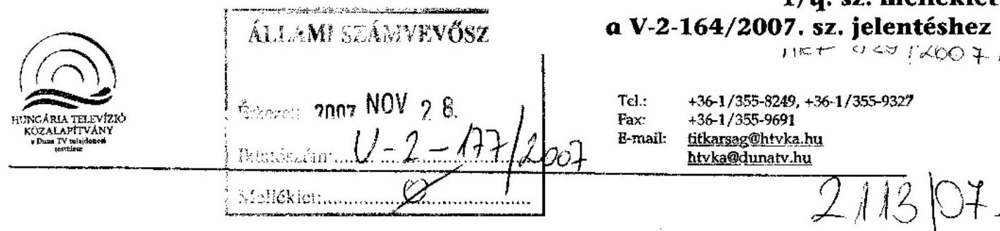

Állami Számvevőszék
Dr. Kovács Árpád úr részére, elnök

1364 Bp., 4. Pf. 54.

Tisztelt Elnök Úr!
A Hungária Televízió Közalapítvány kuratóriumának elnöksége 2007. november 22-i ülésén újra tárgyalt az Állami Számvevőszék jelentésének (Jelentés a nemzeti hírügynökségről szóló törvényben, valamint a rádiózásról és televíziózásról szóló törvényben meghatározott közszolgálati feladatellátás rendszerének ellenőrzéséről) végső változatáról. A Közalapítvány kuratóriumi elnökének, dr. Bíró Sándornak válaszlevele már megfogalmazta álláspontunk lényegét. Ezt szeretnénk tovább erősíteni az alábbiakkal is.

Köszönettel nyugtázzuk az ÁSZ szakembereinek lelkiismeretes vizsgálati munkáját. Érzékeljük, hogy a közmédiarendszer egészén belül meglátták a Hungária Televízió Közalapítvány és a Duna Televízió ZRT. megkülönböztető minőségét.

Ugyanakkor az Állami Számvevőszéknek is hangsúlyozottan kívánjuk a tudomására hozni, hogy a közmédiumok számára az alapító okiratokban meghatározott feladatok ellátásához már az 1996-os I. sz. törvény (Médiatörvény) is aránytalan költségvetési feltételeket szabott, és ezek az aránytalanságok az utólagos költségvetési támogatások egyenlőtlen felosztásával, sőt egyirányúsításával az utóbbi években tarthatatlan mértéket értek el. Felelősséggel állapítjuk meg, hogy a Duna Televízió össznemzeti szolgálatához nincsenek meg a megfelelő keretek. Mivel ez a szolgálat olyan történelmi feladat, amelyet se megszakítani, se más, nem erre a feladatra alapított szervezetre áthárítani nem lehet, az Országgyűlésnek kell a feltételek megteremtéséről gondoskodnia.

Arra kérjük az Állami Számvevőszéket, hogy a Jelentés útjára bocsátásakor ezt a szempontot is hangsúlyozza.

Budapest, 2007. november 22.
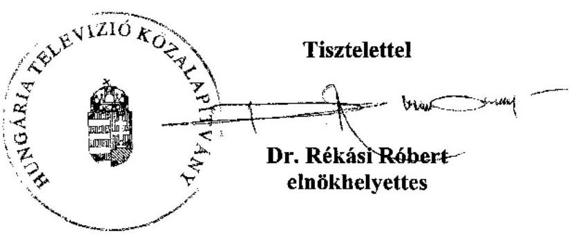

---

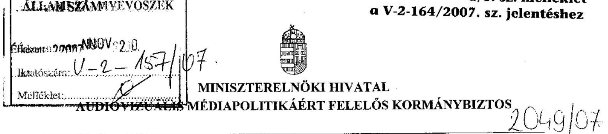

Dr. Kovács Árpád Úr részére
elnök

Állami Számvevőszék

Budapest
Apáczai Csere János utca 10.
1052

Ikt.: XXXIII/6/2/2007.

Bihory -

C.

11.17.

Lebus

Tárgy: Jelentés a nemzeti hírügynökségről szóló törvényben, valamint a rádiózásról és
televíziózásról szóló törvényben meghatározott közszolgálati feladatellátás
rendszerének ellenőrzéséről szóló jelentés

Tisztelt Elnök Úr!

Ezúton tájékoztatom, hogy a fenti tárgyú jelentés végleges változatát megkaptam, a jelentéssel kapcsolatosan további megállapítást és észrevételt nem teszünk.

Budapest, 2007. november 12.

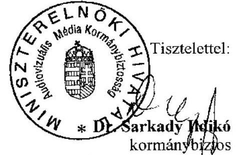

Audiovizuális Média Kormánybiztósság

1055 Budapest, Kossuth tér 2-4
Tel: +36 1 441 3306
Fax: +36 1 441 3315

---

# 1/s-1. sz. melléklet 

## Hungária Televizió Közalapitvány Ellenor. a V-2-164/2007. sz. jelentéshez

## Elnök

## Állami Számvevőszék

1052 Budapest
Apáczai Csere János u. 10.

## Bihary Zsigmond Föigazgató Úr részére

Másolatban kapja: Belovai Sándorné, kijelölt vizsgálóbiztos
Tárgy: Észrevétel az Állami Számvevőszék jelentésének tervezetéhez.-UAL-12/10/2007

Tisztelt Föigazgató Úr!
A Hungária Televizió Közalapítvány Ellenőrző Testülete (a továbbiakban: HTVKA ET) elnökeként telefonon történt egyeztetésünkre hivatkozással tájékoztatom, hogy az ET következő ülését 2007. október 30. napján tartja. A számomra megküldött számvevői jelentéstervezethez az alábbi észrevételeket kívánom füzni, illetve a következő megjegyzéseket teszem:

1. A számvevői jelentéstervezetről (a továbbiakban: Jelentés) mindenek előtt fontos megállapítani, hogy a fejezetek túlnyomó része a korábbi évek gyakorlatát folytatva színvonalas, jól érthető, értékes szakszerű munka. Ugyanakkor ahhoz képest, hogy magam az elmúlt több mint három évben mit tapasztaltam a rádiózásról és televíziózásról szóló 1996. évi I. törvény (a továbbiakban: Médiatv.) hatályosulása kapcsán, különösen a közszolgálati televiziózás területén, azt kell mondanom, hogy a jelentés több jelentős kérdéssel csak érintőlegesen foglalkozik, és egyes jelenségeket indokolatlanul gyengén minősít. Éppen a jogszabályi keretek ernyedtsége, továbbá az alapelvekkel és a józanésszel szemben sokszor megnyilvánuló cinizmus miatt kellene az ÁSZ-nak részletesebben felhívnia a teendőkre a figyelmet, illetve a feltárt problémákkal összefüggésben javaslatokat megfogalmaznia, illetve nagy jelentőségű egyedi problémákat felszínre hoznia, és ezekben érdemben állást foglalnia. (pld DTV Zrt. 2 hónapos jogszerütlen vezetése, a kereskedelmi televiziók szerződéseinek aggályos meghosszabbítása az ORTT által). A fentiek alapján a Jelentést nem tartom sem a feltárandó témák, sem pedig az Állami Számvevőszékről szóló 1989. évi XXXVII törvény (a továbbiakban: Asztv.) 16.§ (1) bekezdés szerint elvárt hármas megközelítés szerint teljesnek.
2. A Jelentés 46. oldalán tévesen és elnagyoltan került rögzítésre az ET által ú.n. Szekeres interregnumnak nevezett állapottal kapcsolatos ténymegállapításokat, illetve a jogellenesség megállapítását követően nem tartalmaz intézkedési javaslatot a Jelentés, holott az Asztv. 25. § (2) bekezdése szerint: „Ha az Állami Számvevőszék az ellenőrzése során bűncselekmény gyanúját

---

# Hungária Televizió Közalapítvány Ellenörzö Testület Elnök 

állapítja meg, megállapításait az illetékes hatósággal haladéktalanul közölni köteles. Egyéb mulasztás esetén a felelősség tisztázását, illetve érvényesítését kezdeményezheti."
3. Álláspontom szerint hasonló problémákat vet fel a Jelentés 41. oldalán a kereskedelmi televíziókra vonatkozó müsorszolgáltatási szerzödések meghosszabbításának tárgyalása - hiszen az ORTT, az általa felkért külső szakértők számítást hagyta figyelmen kívül, mely a koncessziós díj négyszeresét tartotta indokoltnak a szerződött ötéves időszakra-, mert a szerződések változatlan tartalommal kerültek aláírásra. Az ORTT eljárása felett már csak azért sem lehet figyelmen kívül hagyni, mert az állami finanszírozás, illetve a reklámpiac helyzete alapvetően meghatározza a közszolgálati feladatellátás rendszerét. Sőt álláspontom szerint az ORTT ezen döntése adott esetben büntető jogi felelősséget is felvethet, amennyiben jogszerủ eljárás során egy pályázat elmaradása - mint ahogy arra az ORTT által megrendelt szakvélemény; mint quasi értékbecslés rámutat - jelentős többlet bevételtől fosztotta meg áttételesen az összes közszolgálati médiumot (is).
4. A Jelentés 14., 28. illetve 51 . oldalán is megállapítást nyer, hogy az ET(k) hatásköre sem a HTVKA esetében, sem pedig a többi közalapítvány esetében nem tisztázott. Azt gondolom, hogy indokolt lenne, ha a Jelentés foglalkozna azzal a kérdéssel, ami a HTVKA esetében számtalanszor éles viták tárgyát képezte, nevezetesen, hogy a DTV Zrt. menedzsmentje megtagadta az érdemi tájékoztatást az ET-től és azt az Elnökség útján sem lehetett elérni, lévén, hogy adott esetben a vizsgálat alá vont Elnökség és/vagy Kuratórium ellenérdekelt lehet az ET ilyen vizsgálataiban. Nem kevesebbről van szó, mint, hogy el kell dönteni, hogy a három fös, javadalmazásban részesülő és Országgyűlés által választott ET-nek pusztán a cca 150 Mft -os költségvetésű Közalapítvány belső müködését kell ellenőrizni-e, vagy ami a közalapítvány létének egyetlen és kizárólagos értelme: hogy a müködése miként hat a Dtv Zrt-re, vagy adott esetben mit nem tesz meg, pedig meg kellene tennie. Számomra a kérdés inkább költői természetesen, de sokaknak nem az, és ezzel az egész ET müködését teszik lehetetlenné. A Jelentés a 17. oldalon ismerteti, hogy a jelenlegi állapot szerint az ET ellenőrzési jogosultságát illetően, a Médiatv. hiányos rendelkezéseire figyelemmel az egyes közalapítványokban nincs egységes gyakorlat, illetve az ET-k jogkörének terjedelem vissza-visszatérő viták tárgyát képezi. Kérem, hogy a megállapításon túlmenően legyen szíves állást foglalni a fentiekre is figyelemmel az ET-k jogkörét illetően.
5. A számvevői vizsgálat idején az ET problémalistát állított össze. Amint azt a részjelentés tervezethez füzött észrevételeimben is jeleztem a vizsgálat a HTVKA müködésével összefüggésben felmerült problémák tekintetében nem tért ki:
> a HTVKA Alapitó okiratában rögzített célnak való megfelelésnek,

---

> a HTVKA esetében az előző évi költségvetési beszámoló és a tárgyévi költségvetés elfogadása nem egyidőben történik,
$>$ az átláthatóság kérdéskörére (kérdezési jog, a kuratóriumi tagok és a nyilvánosság tájékoztatása az Internet segítségével), mely a HTVKA esetében alapvető hiányosságokat mutat,
$>$ szakértők bevonására,
$>$ a kuratóriumi ülés szabályszerűtlen összehívása,
$>$ illetve nem ad érdemi javaslatot a tulajdonosi státuszból fakadó jogok érvényesítése terén sem
$>$ az országgyűlési beszámolót, mikor, milyen összetételű kuratórium fogadja el, holott ez a korábbi jelentés tervezetben szerepelt.
6. Ugyanakkor örömömet szeretném kifejezni a tekintetben, hogy javaslataink részben visszatükröződni látszanak, így a Jelentés tárgyalja a KMSZ érvényesülését (Jelentés 19. oldal), az ingyenes archívumhasználatot (Jelentés 68. oldal), illetve az archívumok felértékelésnek, illetve a számviteli jogszabályok szerint összeállított mérlegben való szerepeltetést (Jelentés 19. oldal). Ismertetésre került az a probléma is, hogy az elnöki pályázatban szereplő szakmai tervekhez sem határidőket, sem pedig költségeket nem rendeltek hozzá, így nem teremthető egyértelmű kapcsolat az éves üzleti terv és az elnöki pályázat között.

Összefoglalva a fentieket tisztelettel javasolom, hogy a Jelentést pontosítani, illetve az ET által felvetett, de még nem tárgyalt kérdéskörökkel, illetve konkrét javaslatokkal kiegészíteni szíveskedjék, különös figyelemmel arra, hogy jól láthatóan nyitott kérdésekkel kapcsolatosan a szakmai álláspont kialakítása és nyilvánosságra hozatal, valamit a további eljárások kezdeményezése az Önök vizsgálatának egyik fő célja és produktuma.

Természetesen kérem, hogy amennyiben a felvetett kérdéseket nem érzik a vizsgálat tárgyába tartozónak, vagy bármilyen kérdésben eltér az álláspontjuk, tiszteljenek meg azzal, hogy ezen döntésüket megindokolják, és ezt eljutatják hozzám.

Budapest, 2007. október 12.

# Üdvözlettel: 

Dr. Gál András Levente
ET elnök s.k.

---

# Dr. Gál András Levente 

elnök
Hungária Televízió Közalapítvány Ellenőrző Testület

Budapest

## Tisztelt Elnök Úr!

A nemzeti hírügynökségről szóló törvényben, valamint a rádiózásról és televíziózásról szóló törvényben meghatározott közszolgálati feladatellátás rendszere ellenőrzéséről készített jelentéstervezetre adott észrevételeit köszönöm, azokkal kapcsolatban a következőkről tájékoztatom:
ad.1) Sajnálattal nyugtázom Elnök úr azon véleményét, hogy a jelentéstervezet nem felel meg az ÁSZ törvény szerinti követelményeknek. Ugyanakkor nem osztom Elnök úr véleményét, hiszen határozott törekvésünk volt, hogy a szóban forgó két törvény által szabályozott rendszer müködését a jóváhagyott ellenőrzési programunk szempontrendszere alapján értékeljük. Természetesen az ellenőrzés által érintett kérdéskörökön kívül további számos összefüggést és konkrét esetet is vizsgálni lehetett volna, látni kell azonban, hogy egy ellenőrzésnek vannak ésszerủ idő és kapacitás korlátai.

A „jogszerűtlen vezetés" problémáját a tervezet érinti, miután mindhárom közszolgálati médiumnál hosszabb-rövidebb ideig jelentkeztek a szabályozás hiányosságaiból adódóan az elnökválasztással kapcsolatos problémák (tervezet 27. oldal). Megítélésem szerint a tervezet megfelelően kezeli ezt a kérdést, hiszen a szabályozás módosításának szorgalmazása az ilyen és hasonló anomáliákon nyugszik.

Elnök úr hiányolja, hogy a tervezet nem foglalkozik „a kereskedelmi televíziók szerződéseinek aggályos meghosszabbítása az ORTT által" kérdéssel. Ezzel szemben az ellenőrzésünk vizsgálta ezt a kérdéskört és javaslatot fogalmazott meg az ORTT számára.
ad.2) Helyszíni ellenőrzésünk egyetlen vizsgált kérdéskörben sem állapította meg bűncselekmény alapos gyanúját. A személyi felelősség kérdése pedig az ellenőrzéssel érintett területeken (a szereplők testületek, illetve Rt. vezetők) a szabályozás alapvető

---

ellentmondásai és hiányosságai miatt csak nagyon konkrét esetekben értelmezhető. A testületeknek megvan a lehetősége arra, hogy amennyiben indokoltnak tartják - a törvényi előírások keretei között - napirendre tűzzék a jelentésben foglaltak (vagy saját megállapításaik) alapján a személyi felelősség kérdését.
ad.3) Jelentéstervezetünk elmarasztalja az ORTT-t az árbevétel kiesést okozó, a kereskedelmi médiumokkal megkötött szerződések miatt (ld.40-41. o.). Megállapításaink lényegében egybecsengnek az Elnök úr levelében leírtakkal.
ad.4.) Az ET-k hatáskörével kapcsolatos problémák alapvetően a jogi szabályozásra vezethetők vissza. Megítélésem szerint azzal, hogy a tapasztalt anomáliákat - amint arra Elnök úr is utal levelében - a jelentéstervezet tartalmazza, egyértelmủ jelzést adunk úgy a jogszabály előkészítéséért felelősöknek, mint a törvényalkotóknak. Az Állami Számvevőszék törvényben biztosított lehetőségei eddig terjednek.
ad.5) Elnök úr több kérdést említ levelének ebben a pontjában, amelyet álláspontja szerint a jelentéstervezetünk nem tárgyal. Ezeket a felvetéseket részben a HTVKA vonatkozásában, részben általánosan érvényesülő jelenségként tartalmazza a jelentéstervezet
Az előző évi költségvetési beszámoló és a tárgyévi költségvetés elfogadása egyik kuratóriumnál sem történt egyidőben. A jelentéstervezet két helyen (13. oldal, 27 oldal) is kitért arra a problémára, amely formálisnak minősíti az eltérő kuratóriumi összetétel miatt a beszámolók és a költségvetések megtárgyalását és elfogadását. A tervezet 45. oldalán jeleztük azt a hiányosságot, hogy elmaradt a közalapítványok közhasznú szervezetté történő minősítése, amely az Ön által is kifogásolt nyilvánosságot (pl. Interneten történő nyilvánosabb megjelenést) biztosítaná. Jelzem, hogy kizárólag a HTVKA országgyűlési beszámolójával kapcsolatosan az ET által felvetett, a beszámoló tartalmi és formai szabályozási hiányosságait jelenítettük meg a jelentéstervezetünk 53. oldalán.

Végezetül megköszönöm Elnök úrnak munkánkhoz nyújtott értékes segítségét és kérem, hogy a levelemben foglaltakat mérlegelni, ill. elfogadni szíveskedjék.

Budapest, 2007. október " ".

Tisztelettel:

Bihary Zsigmond

---

# 1/s-3. sz. melléklet a V-2-164/2007. sz. jelentéshez 

Hungária Televizió Közalapitvány Ellenörzö Testüllet
Énök

Állami Számvevőszék
1052 Budapest
Apáczai Csere János u. 10.
Postacim: 1364 Budapest 4
Dr. Kovács Árpád elnök részére
Tárgy: értesítés

Tisztelt Elnök Úr!
Köszönettel megkaptam a nemzeti hírügynökségről szóló törvényben, valamint a rádiózásról és a televíziózásról szóló törvényben meghatározott közszolgálati feladatellátás rendszerének ellenőrzéséről készített 2007. október 30. napján lezárt jelentésüket.

Örömmel fogadtam, hogy a jelentés mellékletét képezi az előzetes jelentésekhez készített észrevételeimet ismertető levelem, különös figyelemmel arra, hogy az észrevételek csak részben kerültek végleges jelentésben átvezetésre.

Erre figyelemmel az átvezetés tényét ezúton nyugtázom, az átvezetésre nem került megállapításokat pedig változatlan formában fenntartom.

Budapest, 2007. november 28.

Tisztelettel:
Dr. Gál András Levente
ET elnök

1016 Budapest, Mészáros utca 48.

---

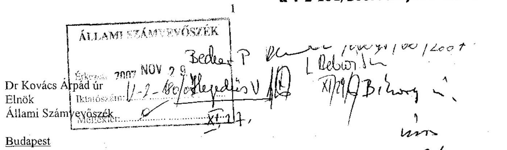

Budapest

Tisztelt Elnök úr!
2007. október 30 -án kelt, V-02-145/2007. iktatószámú megkeresésére tájékoztatom, hogy a Magyar Rádió Kózalapítvány ellenőrző testülete a rádiózásról és televíziózásról szóló 1996. évi I. tv. 62. § (4) bekezdése értelmében a kuratóriumra kötelező döntést nem hozhat, így az ÁSZ 2007. évi, a nemzeti hírügynökségről szóló törvényben, valamint a rádiózásról és televiziózásról szóló törvényben meghatározott közszolgálati feladatellátás rendszerének ellenőrzéséről szóló jelentésében a közalapítványok részére megfogalmazott javaslatokhoz érdemben intézkedést nem áll módomban elrendelni.

Tájékoztatom, hogy ugyanakkor - egyetértve a javaslatok tartalmával - az MRKA ET a 2007. november 22 -én megtartott ellenőrző testületi ülésén - egyhangúlag - meghozta a 6/2007.(XI.22) sz . MRKA ET ügydöntő határozatát, amely - az új összetételű MRKA ET Ellenőrzési tervét határozza meg, s amelynek 1/b. pontja az alábbiakat tartalmazza:
$1 / \mathrm{b}$. Az ÁSZ 2007. évi, „A nemzeti hírügynökségről szóló törvényben, valamint a rádiózásról és televiziózásról szóló törvényben meghatározott közszolgálati feladatellátás rendszerének ellenőrzéséről szóló jelentés"-ben az MRKA kuratóriuma számára megfogalmazott javaslatok végrehajtásának ellenőrzése.

Határidő: az MRKA kuratóriuma elnökségének a Testület számára a javaslatok végrehajtásával kapcsolatban meghatározott időrendjéhez igazodóan, de legkésőbb 2008. február 20.

Az MRKA ET javasolja az MRKA kuratóriuma elnöksége számára, hogy készíttessen munkatervet az Ász javaslatok teljes körű és rövidtávon belül történő megvalósítására az MR Zrt. vezetőségével oly módon, hogy a feladatokat olyan időponttal tűzzék ki, hogy figyelemmel a kuratórium tagjai megbízatásának 2008. februári megszűnésére, az MR Zrt. vezetősége még a jelenlegi összetételű kuratóriumnak be tudjon számolni a rájuk meghatározott feladatok végrehajtásáról. Az MRKA ET javasolja továbbá, hogy az MRKA kuratóriuma jelenlegi megbízatásának ideje alatt hajtsa végre az ÁSZ jelentés alapján közvetlenül rá háruló, javaslatként meghatározott feladatot. Az MRKA ET kéri, hogy az MRKA kuratóriumának elnöksége záros határidőn belül tájékoztassa a Testületet az ÁSZ jelentésben foglalt javaslatok megvalósítására meghatározott időpontokról.

A határozatot természetesen haladéktalanul továbbítottuk az MRKA kuratórium elnökének.

---

Tájékoztatom egyben Elnök urat, hogy Mészáros László úr helyett az Országgyưlés a 85/2007 (X.5.) sz. határozatával engem választott meg a Magyar Rádió Kózalapitvány ellenőrző testülete elnökének, a testület megbízatásának hátralévő idejére.

Kérem tájékoztatásom szíves tudomásul vételét.

Budapest, 2007. november 22.

Tisztelettel:
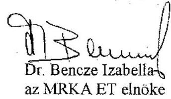

---

# Dr. Jaczkovics László Gábor úr 

elnök
Magyar Televizió Közalapítvány Ellenőrző Testület

## Budapest

## Tisztelt Elnök Úr!

Köszönettel megkaptam az Állami Számvevőszék által a nemzeti hírügynökségi törvényben, valamint a rádiózásról és televíziózásról szóló törvényben meghatározott közszolgálati feladatellátás rendszerének ellenőrzéséről készített jelentéstervezetre tett észrevételeit, és ezekkel kapcsolatban a következőkről tájékoztatom.

1. Egyetértek Elnök úrral abban, hogy az Ellenőrző Testület tevékenysége a Kuratórium müködésére irányul, és ebből következően minden olyan dokumentumba betekinthet, amely a Kuratórium, illetve Elnöksége döntéseit megalapozzák. Ebben az összefüggésben valóban nincs szükség konszenzus keresésre. Ugyanakkor ellenőrzésünk olyan vitás kérdésekkel is szembesült, amelyek eldöntéséhez a Médiatv. nem ad egyértelmű eligazítást. Ilyen esetben viszont a Médiatv. politikai megegyezésen alapuló céljainak eredményesebb megvalósítása megítélésem szerint a közös gondolkodást, a konszenzusos megoldások keresését igényli, mindaddig, amíg a kétharmados törvényt az Országgyülés nem módosítja.
2. Továbbra is eltérően ítéljük meg a Magyar Televízió Zrt. (MTV Zrt.) székházának és gyártóbázisának elhelyezését célzó ingatlan bérleti szerződésének megkötése érdekében lefolytatott közbeszerzési eljárást.

A szóban forgó ingatlan - amint ezt már a korábbi egyeztetések során jeleztük - a Millenniumi Média Kft. beruházásaként valósul meg. Az MTV Zrt-nek tulajdonosi jogai a beruházással kapcsolatban nincsenek. A beruházó magáncég, így beruházásának megvalósításánál nem kell alkalmazni a Kbt. előírásait. Az MTV Zrt-t a Magyar Televízió Közalapítvány (MTVKA) elnöksége hatalmazta fel a megépülő ingatlan bérlésére, amelyre

---

viszont kiterjed a Kbt. hatálya. A Kbt. 257. § (2) bekezdés a) pontja szerint hirdetmény nélküli tárgyalásos eljárást lehet alkalmazni, ha „ingatlan tulajdonjogának vagy használatára, illetőleg hasznosítására vonatkozó jognak a megszerzésére irányul a közbeszerzés".
Kétségtelen tény, hogy a beruházó az MTV Zrt. specifikus igényeit igyekszik érvényesiteni, ettől azonban az MTV Zrt. és a Kbt. hatálya szempontjából a megkötött szerződés bérleti jogviszony, így arra a Kbt. előbb idézett kitétele vonatkozik.
A közbeszerzési eljárással kapcsolatban az ellenőrzés nem állapított meg olyan szabálytalanságot, ami miatt az Állami Számvevőszéknek jogorvoslati eljárást kellett volna kezdeményeznie. Ugyanakkor az ellenőrzés feltárt hibákat, hiányosságokat, mint például téves jogszabályi hivatkozás, a bérleti időtartam változó meghatározása, az alvállalkozók megnevezésének hiánya. Az Elnök úr által említett eltérést a bérelt terület méretét illetően a Kbt. 127.§ (2) bekezdése lehetővé tette. Az ellenőrzés azért minősítette mégis aggályosnak az eltérést, mivel a tárgyalások során felvett jegyzőkönyvekben $60.923 \mathrm{~m}^{3}$, a Tájékoztatás az eljárás eredményéről címủ, a Közbeszerzési Értesítőben megjelent dokumentumban viszont $50.000 \mathrm{~m}^{2}$ szerepelt. Az érintettek egybehangzóan ezt az eltérést elírási hibának minősítették, amit írásban is megerősítettek.
Megjegyzem, hogy az ellenőrzés szempontjából - a közbeszerzés lefolytatatásának jogszerűségén túlmenően - az is fontos kérdés volt, hogy a bérleti jogviszony kialakításának szerződéses feltételeit a túlnyomó részt közpénzből finanszírozott MTV Zrt. számára mennyire célszerűen és gazdaságosan sikerült kialakítani. Jelentésünkben ezekre a szempontokra is kitértünk.

Tájékoztatom Elnök urat, hogy a kialakult gyakorlatnak megfelelően levélváltásunk másolatai a végleges jelentés mellékletét képezik. Jelentésünket a Közbeszerzések Tanácsa és a Közbeszerzési Döntőbizottság elnökeinek is tájékoztatásul megküldöm.

Végezetül megköszönöm Elnök úr munkánkhoz nyújtott segítségét.
Budapest, 2007. december " 4 ".
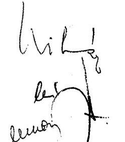

Tisztelettel:
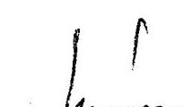

Dr. Kovács Árpád

---

# Dr. Rudi Zoltán úr 

elnök
Magyar Televízió Zrt.

## Budapest

## Tisztelt Elnök Úr!

Köszönettel megkaptam az Állami Számvevőszék által a nemzeti hírügynökségi törvényben, valamint a rádiózásról és televíziózásról szóló törvényben meghatározott közszolgálati feladatellátás rendszerének ellenőrzéséről készített jelentéstervezetre tett észrevételeit, ezekkel kapcsolatban a következőkről tájékoztatom.

1. A jelentés függeléke 7. oldal utolsó bekezdésében a szerződés aggályos elemei között került megjelölésre, hogy: „A bérleti időt a közbeszerzési eljárás különböző szakaszaiban különböző módon, összességében azonban valamennyi esetben 40 éves időtartamra határozták meg". Megállapításunk helytállóságát Ön sem vitatja. Észrevétele szerint azonban ez nem tartozik a szerződés aggályos elemei közé. Álláspontunk szerint a közbeszerzési eljárás átláthatósága, kívülálló számára is értelmezhetősége miatt fontos a közbeszerzés egyes fázisaihoz (ajánlati felhívás, Tájékoztatás az eljárás eredményéről) és a jövőben a szerződés végrehajtásához kapcsolódó időpontok pontos megjelölése. Ennek következményeként a 40 évre megkötött szerződésekben a szerződések egyes elemeinek végrehajtásához rendelt időpontok meghatározása szintén nem egyértelmű (birtokba adás, elő́vásárlási jog gyakorlása). Ennek alapján soroltuk az említett hiányosságokat az aggályos elemek közé, különös tekintettel a szerződés lejáratának hosszú időtartamára.
2. A jelentés függeléke 8. oldalán a közbeszerzési eljárás 2007. január 18-i hiánypótlásában a hivatkozási alapként megjelölt 2179/2004. (VII. 19.) Korm. határozatot nem tartjuk megfelelőnek, mert helyette a 2005. május 10 -től hatályos az adókról, járulékokról szóló törvények módosításáról szóló 2005. évi XXVI. számú törvény - mint magasabb szintű jogforrás - előírásaira kellett volna hivatkozni. Az említett kormányhatározat végrehajtási határideje 2005. december 31 -én lejárt.

Megjegyzem továbbá, hogy a fentiekben hivatkozott törvény és kormányhatározat nem teljesen azonos feltételeket határoz meg a székház megvalósítására, illetve mindkettő a Bojtár u. 41-47. számú ingatlant jelöli meg a székház megépítésének helyszínéül. Ettől eltérően a közbeszerzési eljárás kiírására, lefolytatására és a szerződések megkötésére a

---

Bojtár u. 41-47. és 49-59. számú ingatlanok vonatkozásában került sor. A szerződés végrehajtásának későbbi szakaszában (2009. évtől) a Bojtár u. 49-59. számú ingatlan már nem képezi a hosszú távú bérleti szerződés részét.
3. Tájékoztatom Elnök urat, hogy álláspontját az észrevételezésre megküldött jelentés már tartalmazta.

A kialakult gyakorlatnak megfelelően levélváltásunk másolatai a végleges jelentés mellékletét képezik. Jelentésünket a Közbeszerzések Tanácsa és a Közbeszerzési Döntőbizottság elnökeinek is tájékoztatásul megküldöm.

Tekintettel arra, hogy a bérleti szerződés közpénzek felhasználásával valósul meg, az átláthatóság biztosítása érdekében - amennyiben ez nem történt meg - kérem Elnök úr intézkedését a szerződések nyilvánosságra hozatalára.

Végezetül megköszönöm Elnök úr munkánkhoz nyújtott segítségét.
Budapest, 2007. december " $4{ }^{\text {". }}$
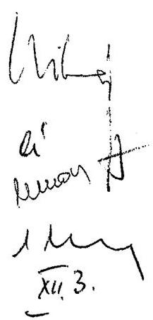

Tisztelettel:
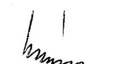

---

# 1/3. sz. melléklet   a V-2-164/2007. sz. jelentéshez 

## Kóvács György úr

elnök
Országos Rádió és Televízió Testület

## Budapest

## Tisztelt Elnök Úr!

Köszönettel vettem a nemzeti hírügynökségről szóló törvényben, valamint a rádiózásról és televíziózásról szóló törvényben meghatározott közszolgálati feladatellátás rendszerének ellenőrzéséről szóló jelentéstervezetünkre tett észrevételeit, ezekkel kapcsolatban a következőkről tájékoztatom.

1. A magam részéről nem látok ellentmondást a jelentés 17. oldal 2. és 38. oldal 3. széles bekezdésében leírtak és az Elnök úr levelében foglaltak között. A várhatóan kialakuló jogi helyzet mélyebb elemzése megítélésem szerint nem lehet az ellenőrzés célja. Ismereteim szerint ezzel a kérdéssel az új médiatörvény előkészítését végzők mélyrehatóan foglalkoznak.
2. A Testület döntésére felhozott példák tényszerủek, így megítélésem szerint hozzájárulhatnak az ORTT döntéshozatali gyakorlatáról való teljesebb kép kialakításához.
3. A Kbt. levelében említett $296 . \S$ h, pontja a nemzeti értékhatárok alatti értékủ közbeszerzésekre vonatkozik. A szóban forgó szerződés értéke meghaladta a 100 millió forintot, így arra a Kbt. III. része vonatkozik, amely viszont ilyen kitételt nem tartalmaz.
4. Örömmel nyugtázom, hogy Elnök úr javaslatainkat tudomásul veszi, illetve egyetért azokkal.

---

A kialakult gyakorlatunk szerint a végleges jelentés mellékletét képezik a kapott észrevételek és az azokra adott válaszaink másolatai. Ennek megfelelően Elnök úrral való levelezésünk is a jelentés mellékletét képezi.

Egyidejűleg megköszönöm Elnök úr munkánkhoz nyújtott segítségét.
Budapest, 2007. december " $4^{\text {" }}$.
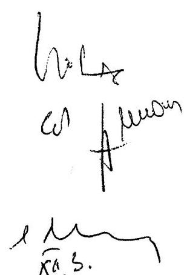

Tisztelettel:
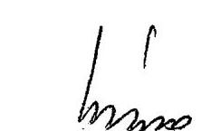

---

# 1/4. sz. melléklet   a V-2-164/2007. sz. jelentéshez 

## ELKÖK

ÁLLAMI
SZÁMVEVÓSZÉK

V-02-170/2007.

## Szalai Annamária úrhölgy

ORTT tag
Országos Rádió és Televízió Testület

## Budapest

## Tisztelt Szalai Annamária Úrhölgy!

Köszönettel vettem a nemzeti hírügynökségről szóló törvényben, valamint a rádiózásról és televíziózásról szóló törvényben meghatározott közszolgálati feladatellátás rendszerének ellenőrzéséről szóló jelentéstervezetünkre tett észrevételeit, és azokkal kapcsolatban a következőkről tájékoztatom.

Sajnálattal veszem tudomásul, hogy hiányolja néhány kérdés részletesebb kifejtését. Természetesen nem vitatom, hogy további részletekkel is szolgálhatott volna az ellenőrzés, de a jelentés 2.1.3. és 2.1.4 pontjaiban leírtak megítélésem szerint megfelelően képet adnak az ORTT ez irányú tevékenységéről.

Az ellenőrzés nem szembesült azzal, hogy a Testület törvénytelenül szűkítette volna a Panaszbizottság hatáskörét.

A kialakult gyakorlatunk szerint a végleges jelentés mellékletét képezik a kapott észrevételek és az azokra adott válaszaink másolatai. Ennek megfelelően az Önnel történt levelezésünk is a jelentés mellékletét képezi.

Egyidejűleg megköszönöm munkánkhoz nyújtott segítségét.
Budapest, 2007. december " 4 ".
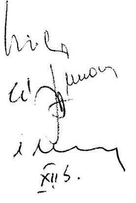

Tisztelettel:
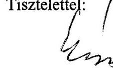

Dr. Kovács Árpád

---

# 1/5. sz. melléklet   a V-2-164/2007. sz. jelentéshez 

## ELNÖK

ÁLLAMI
SZÁMVEVÔSZÉK

V-02-171/2007.

## Cselényi László úr

elnök
Duna Televízió Zrt.
Budapest

## Tisztelt Elnök Úr!

Köszönettel vettem a nemzeti hírügynökségről szóló törvényben, valamint a rádiózásról és televíziózásról szóló törvényben meghatározott közszolgálati feladatellátás rendszerének ellenőrzéséről szóló jelentéstervezetünkre tett észrevételeit, és azokkal kapcsolatban az következőkről tájékoztatom.

A stratégiai terv fontos kelléke a megvalósítási határidőkhöz kötött ütemezés, és a költségtervek elkészítését sem mellőzheti. Ennek hiányában az elnöki pályázat nem tekinthető a Duna Televízió Zrt. stratégiai tervének.

A kialakult gyakorlatunk szerint a végleges jelentés mellékletét képezik a kapott észrevételek és az azokra adott válaszaink másolatai. Ennek megfelelően Elnök úrral való levelezésünk is bekerül a jelentésbe.

Egyidejűleg megköszönöm Elnök úr munkánkhoz nyújtott segítségét.
Budapest, 2007. december " 4 ".
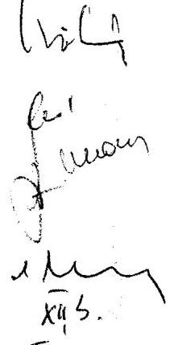

Tisztelettel:
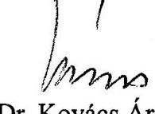

Dr. Kovács Árpád

---

# Dr. Czeglédi László úr 

elnök
Magyar Televízió Közalapítvány Kuratórium

## Budapest

## Tisztelt Elnök Úr!

Köszönettel megkaptam 2007. november 15 -én kelt az Állami Számvevőszék által a nemzeti hírügynökségi törvényben, valamint a rádiózásról és televíziózásról szóló törvényben meghatározott közszolgálati feladatellátás rendszerének ellenőrzéséről készített jelentéstervezetre küldött válaszlevelét, amellyel kapcsolatban a következőkről tájékoztatom.

Áttekintettem munkatársaim Elnök úrral folytatott levelezéseit, amiből az derült ki számomra, hogy a mostani levelében jelzett korábbi észrevételei a jelentés 1. számú függelékét érintik. A függelék tényszerűen, az MTV Zrt. elnökének álláspontját is feltüntetve tárgyalja „A Magyar Televízió székház projekt" kérdéskörét.

A leveléhez csatolt szakértői véleményt köszönöm, az azt készítő Gombár József úrral munkatársaim közvetlenül felveszik a kapcsolatot.

A kialakult gyakorlatunk szerint a végleges jelentés mellékletét képezik a kapott észrevételek és az azokra adott válaszaink másolatai. Ennek megfelelően Elnök úrral való levelezésünk is a jelentés mellékletét képezi.

Végezetül megköszönöm Elnök úrnak a közszolgálati feladatellátás témakörének további vizsgálatához felajánlott segítségüket.

Budapest, 2007. december " 4 ".
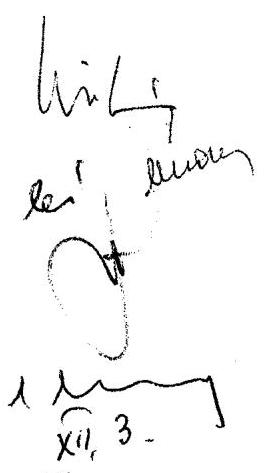

Tisztelettel:
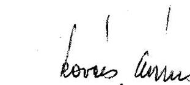

Dr. Kovács Árpád

---

# A közmédia és a nemzeti hírügynökség tulajdonosi struktúrája, ellenőrzése és felügyelete. 

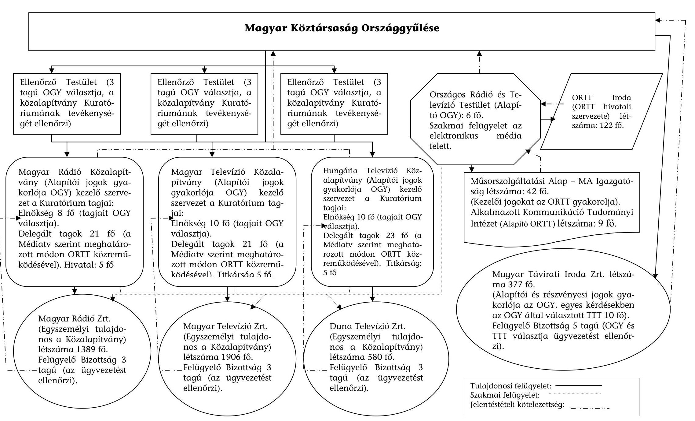

---

# A közmédia és a nemzeti hírügynökség finanszírozási rendszere 

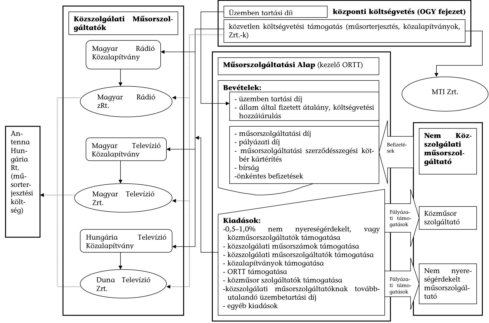

---

# A Közmédia szereplőinek nyújtott költségvetési támogatások (1997-2006)

|  Intézmény/
Év | 1997 | 1998 | 1999 | 2000 | 2001 | 2002 | 2003 | 2004 | 2005 | 2006 | Összesen  |
| --- | --- | --- | --- | --- | --- | --- | --- | --- | --- | --- | --- |
|  MTI Zrt. | 598 | 1296 | 1277 | 1352 | 1340 | 1424 | 1758 | 2297 | 2168 | 2317 | 15827  |
|  MR Zrt. | 7853 | 7576 | 8395 | 10036 | 10642 | 10810 | 11696 | 14549 | 12736 | 13163 | 107456  |
|  DTV Zrt. | 4577 | 5160 | 5800 | 6094 | 6129 | 6208 | 7569 | 7046 | 8150 | 8287 | 65020  |
|  MTV Zrt. | 10241 | 9467 | 12424 | 17036 | 38836 | 20397 | 16398 | 34076 | 24724 | 32011 | 215610  |
|  ORTT | 681 | 760 | 834 | 1235 | 1422 | 1528 | 1615 | 1989 | 2100 | 2283 | 14447  |
|  MRKA | 113 | 124 | 163 | 117 | 99 | 144 | 193 | 191 | 232 | 217 | 1593  |
|  HTVKA | 63 | 73 | 111 | 77 | 82 | 105 | 134 | 139 | 143 | 169 | 1096  |
|  MTVKA | 77 | 46 | 63 | 81 | 79 | 115 | 119 | 128 | 148 | 158 | 1014  |
|  Összesen | 24203 | 24502 | 29067 | 36028 | 58629 | 40731 | 39482 | 60415 | 50401 | 58605 | 422063  |

Megjegyzés: a táblázatban szereplő adatok nem tartalmazzák a több csatornán nyújtott támogatások halmozódásait

---

5. sz. melléklet a V-2-164/2007. sz. jelentéshez

A társaságok (MTI Zrt., MTV Zrt., Duna TV Zrt. és MR Zrt.) tényleges költségvetési támogatásának alakulása az 1997-2006. években

|  Megnevezés/Év | MTI | MTV | Duna TV | MR | Millió Ft  |
| --- | --- | --- | --- | --- | --- |
|  Üzembentartási díj |  | 68468 | 40964 | 47849 | 157281  |
|  Músorterjesztés |  | 52741 | 11797 | 35794 | 100332  |
|  Músorszolgáltatási díjbevétel (Koncessziós díj) |  | 9386 | 3764 | 6219 | 19369  |
|  EU csatlakozás támogatása |  | 349 | 180 | 120 | 649  |
|  ORTT-től kapott |  | 173 | 729 | 1161 | 2063  |
|  HTKA megtakarítás |  |  | 139 |  | 139  |
|  MTV Közalapítvány megtakarítás |  | 160 |  |  | 160  |
|  Mentesítettek miatti támogatás |  | 10338 | 6203 | 7238 | 23779  |
|  Létszámleépítésre kapott támogatás | 606 | 4739 | 33 | 360 | 5738  |
|  Minisztériumoktól kapott támogatás |  | 133 |  |  | 133  |
|  Köztartozás törlése 2000. évi CXXXIII. tv |  | 13262 |  |  | 13262  |
|  Késedelmi pótlék törlése 2000. évi CXXXIII. tv. |  | 977 |  | 1200 | 2177  |
|  A közszolgálati média Rt-k struktúra átalakítására kaptt támgoatás 2003. évi CXVI. Tv. |  | 7753 | 519 |  | 8272  |
|  NAVA Támogatás |  | 5711 |  |  |   |
|  MTI működési (cél)támogatás | 14452 |  |  |  | 14452  |
|  Egyéb támogatások összesen | 769 | 11960 |  |  | 12729  |
|  Művészeti együttesek támogatása |  |  |  | 5515 | 5515  |
|  Bevételként elszámolt támogatások összesen | 15827 | 186150 | 64328 | 105456 | 371761  |
|  Tőkeemelés tőketartalékba 2001. évi LXXV. tv. |  | 12500 |  |  | 12500  |
|  Saját tőke rendezése 2002. évi LXII. tv. |  | 4960 |  | 2000 | 6960  |
|  Tőkeemelés a 2003. évi LXII. tv. |  | 6000 | 692 |  | 6692  |
|  Tőkeemelés a 2003. évi XCV. tv. |  | 6000 |  |  | 6000  |
|  Tőkeemelésként elszámolt támogatások összesen |  | 29460 | 692 | 2000 | 32152  |
|  Összes költségvetési támogatás | 15827 | 215610 | 65020 | 107456 | 403913  |

---

6. számú melléklet a V-2-164/2007. sz. jelentéshez

A közmédia és a nemzeti hírügynökség Zrt.-k bevételeinek, ráfordításainak és eredményének alakulása (1997-2006)

|  Összes bevétel | 1997 | 1998 | 1999 | 2000 | 2001 | 2002 | 2003 | 2004 | 2005 | 2006 | Összesen  |
| --- | --- | --- | --- | --- | --- | --- | --- | --- | --- | --- | --- |
|  MTI Zrt. | 1138 | 2904 | 3078 | 3389 | 3649 | 3660 | 3968 | 4770 | 4093 | 4301 | 34950  |
|  MR Zrt. | 11003 | 10855 | 11342 | 12492 | 13993 | 14341 | 15010 | 16325 | 16109 | 15681 | 137151  |
|  Duna Zrt. | 5162 | 5676 | 6169 | 6575 | 6732 | 6865 | 7593 | 7843 | 8748 | 8865 | 70228  |
|  MTV Zrt. | 31956 | 19454 | 26508 | 22682 | 35708 | 19031 | 21598 | 26800 | 29555 | 37606 | 270898  |
|  Összesen: | 49259 | 38889 | 47097 | 45138 | 60082 | 43897 | 48169 | 55738 | 58505 | 66453 | 513227  |
|  Ebből költségvetési támogatás | 1997 | 1998 | 1999 | 2000 | 2001 | 2002 | 2003 | 2004 | 2005 | 2006 | Összesen  |
|  MTI Zrt. | 598 | 1296 | 1277 | 1352 | 1340 | 1424 | 1758 | 2297 | 2168 | 2317 | 15827  |
|  MR Zrt. | 7853 | 7576 | 8395 | 10036 | 10642 | 10810 | 11696 | 12549 | 12736 | 13163 | 105456  |
|  Duna TV Zrt. | 4577 | 5160 | 5800 | 6094 | 6129 | 6208 | 6877 | 7046 | 8150 | 8287 | 64328  |
|  MTV Zrt. | 10241 | 9467 | 12424 | 17036 | 26336 | 15437 | 16398 | 22076 | 24724 | 32011 | 186150  |
|  Összesen: | 23269 | 23499 | 27896 | 34518 | 44447 | 33879 | 36729 | 43968 | 47778 | 55778 | 371761  |
|  Összes ráfordítás | 1997 | 1998 | 1999 | 2000 | 2001 | 2002 | 2003 | 2004 | 2005 | 2006 | Összesen  |
|  MTI Zrt. | 969 | 2659 | 2973 | 3293 | 3509 | 3802 | 4106 | 4862 | 4086 | 4293 | 34552  |
|  MR Zrt. | 9227 | 8792 | 8949 | 10010 | 13226 | 13630 | 15153 | 15891 | 18515 | 16565 | 129958  |
|  Duna TV Zrt. | 4740 | 6022 | 6389 | 6697 | 7326 | 6667 | 7620 | 8361 | 8732 | 8835 | 71389  |
|  MTV Zrt. | 32915 | 27571 | 31116 | 34068 | 33929 | 30787 | 32420 | 30920 | 27919 | 33201 | 314846  |
|  Összesen: | 47851 | 45044 | 49427 | 54068 | 57990 | 54886 | 59299 | 60034 | 59252 | 62894 | 550745  |
|  Eredmény | 1997 | 1998 | 1999 | 2000 | 2001 | 2002 | 2003 | 2004 | 2005 | 2006 | Összesen:  |
|  MTI Zrt. | 169 | 245 | 105 | 96 | 140 | $-142$ | $-138$ | $-92$ | 7 | 8 | 398  |
|  MR Zrt. | 1776 | 2063 | 2393 | 2482 | 767 | 711 | $-143$ | 434 | $-2406$ | $-884$ | 7193  |
|  Duna TV Zrt. | 422 | $-346$ | $-220$ | $-122$ | $-594$ | 198 | $-27$ | $-518$ | 16 | 30 | $-1161$  |
|  MTV Zrt. | $-959$ | $-8117$ | $-4607$ | $-11386$ | 1779 | $-11756$ | $-10822$ | $-4120$ | 1636 | 4405 | $-43947$  |
|  Összesen: | 1408 | $-6155$ | $-2329$ | $-8930$ | 2092 | $-10989$ | $-11130$ | $-4296$ | $-747$ | 3559 | $-37517$  |

---

# A közmédia és a nemzeti hírügynökség Zrt.-k vagyonának alakulása (1997-2006)

|  |   |   |   |   |   |   |   |   |   |   |
| --- | --- | --- | --- | --- | --- | --- | --- | --- | --- | --- |
|  Saját tőke | 1997 | 1998 | 1999 | 2000 | 2001 | 2002 | 2003 | 2004 | 2005 | 2006  |
|  MTI Zrt. | 2810 | 3054 | 3159 | 3255 | 3395 | 3252 | 3114 | 3022 | 3029 | 3037  |
|  MR Zrt. | 6842 | 6899 | 7275 | 18410 | 19176 | 22062 | 21193 | 23175 | 21377 | 20503  |
|  Duna Zrt. | 2257 | 1911 | 1691 | 1569 | 976 | 1173 | 1838 | 1320 | 1336 | 1365  |
|  MTV Zrt. | 18489 | 10186 | 5578 | $-5808$ | 8471 | 1675 | $-9147$ | $-1267$ | 369 | 4775  |
|  Összesen: | 30398 | 22050 | 17703 | 17426 | 32018 | 28162 | 16998 | 26250 | 26111 | 29680  |
|  |   |   |   |   |   |   |   |   |   |   |
|  Jegyzett tőke | 1997 | 1998 | 1999 | 2000 | 2001 | 2002 | 2003 | 2004 | 2005 | 2006  |
|  MTI Zrt. | 1750 | 1750 | 1750 | 1750 | 1750 | 1750 | 1750 | 1750 | 1750 | 1750  |
|  MR Zrt. | 4500 | 4500 | 4500 | 4500 | 4500 | 6000 | 6000 | 6500 | 6500 | 6500  |
|  Duna TV Zrt. | 1104 | 1104 | 1104 | 1104 | 1104 | 1104 | 1796 | 1796 | 1796 | 1796  |
|  MTV Zrt. | 16056 | 16056 | 8000 | 1200 | 1200 | 1200 | 1200 | 7200 | 1200 | 1200  |
|  Összesen: | 23410 | 23410 | 15354 | 8554 | 8554 | 10054 | 10746 | 17246 | 11246 | 11246  |

|  |   |   |   |   |   |   |   |   |   |   |
| --- | --- | --- | --- | --- | --- | --- | --- | --- | --- | --- |
|  Saját tőke/
jegyzett tőke | 1997 | 1998 | 1999 | 2000 | 2001 | 2002 | 2003 | 2004 | 2005 | 2006  |
|  MTI Zrt. | 160,6\% | 174,5\% | 180,5\% | 186,0\% | 194,0\% | 185,8\% | 177,9\% | 172,7\% | 173,1\% | 173,5\%  |
|  MR Zrt. | 152,0\% | 153,3\% | 161,7\% | 409,1\% | 426,1\% | 367,7\% | 353,2\% | 356,5\% | 328,9\% | 315,4\%  |
|  Duna TV Zrt. | 204,4\% | 173,1\% | 153,2\% | 142,1\% | 88,4\% | 106,3\% | 102,3\% | 73,5\% | 74,4\% | 76,0\%  |
|  MTV Zrt. | 115,2\% | 63,4\% | 69,7\% | $-484,0 \%$ | 705,9\% | 139,6\% | $-762,3 \%$ | $-17,6 \%$ | 30,8\% | 397,9\%  |
|  Összesen: | 129,9\% | 94,2\% | 115,3\% | 203,7\% | 374,3\% | 280,1\% | 158,2\% | 152,2\% | 232,2\% | 263,9\%  |

---

A közalapítványok, ORTT és a Műsorszolgálatási Alap müködési kiadásainak alakulása

|  HTVKA | 1997 | 1998 | 1999 | 2000 | 2001 | 2002 | 2003 | 2004 | 2005 | 2006  |
| --- | --- | --- | --- | --- | --- | --- | --- | --- | --- | --- |
|  Tiszteletdíjak és járulékai | 31,0 | 31,0 | 53,0 | 21,0 | 17,0 | 32,0 | 49,0 | 45,0 | 48,0 | 54,0  |
|  Megbízási díjak és járulékai | 4,0 | 3,0 | 4,0 | 9,0 | 8,0 | 6,0 | 5,0 | 5,0 | 4,0 | 4,0  |
|  Költségtérítések és járulékai | 15,0 | 18,0 | 31,0 | 19,0 | 17,0 | 26,0 | 31,0 | 36,0 | 43,0 | 51,0  |
|  Iroda müködtetési költségei | 13,0 | 21,0 | 23,0 | 28,0 | 40,0 | 41,0 | 49,0 | 53,0 | 48,0 | 60,0  |
|  Kiadás összesen: | 63,0 | 73,0 | 111,0 | 77,0 | 82,0 | 105,0 | 134,0 | 139,0 | 143,0 | 169,0  |
|  MTVKA |  |  |  |  |  |  |  |  |  |   |
|  Tiszteletdíjak és járulékai | 32,9 | 15,7 | 17,1 | 16,6 | 15,3 | 29,0 | 39,3 | 42,0 | 44,4 | 54,0  |
|  Költségtérítések és járulékai | 16,8 | 8,4 | 10,4 | 11,6 | 14,6 | 20,9 | 23,1 | 6,4 | 25,9 | 35,1  |
|  Iroda müködtetési költségei | 27,6 | 22,3 | 35,2 | 52,8 | 49,4 | 65,6 | 56,4 | 79,4 | 77,6 | 68,5  |
|  Kiadás összesen: | 77,3 | 46,4 | 62,7 | 81,0 | 79,3 | 115,5 | 118,8 | 127,8 | 147,9 | 157,6  |
|  MRKA |  |  |  |  |  |  |  |  |  |   |
|  Tiszteletdíjak és járulékai | 23,9 | 32,3 | 38,8 | 16,4 | 12,7 | 24,6 | 38,0 | 35,3 | 36,4 | 41,0  |
|  Költségtérítések és járulékai | 14,1 | 16,7 | 17,5 | 12,5 | 11,2 | 15,9 | 19,8 | 17,4 | 21,4 | 19,0  |
|  Iroda müködtetési költségei | 75,2 | 74,5 | 106,3 | 88,0 | 74,8 | 104,0 | 134,9 | 138,1 | 174,0 | 157,2  |
|  Kiadás összesen: | 113,2 | 123,5 | 162,7 | 116,8 | 98,7 | 144,5 | 192,8 | 190,8 | 231,8 | 217,2  |
|  ORTT |  |  |  |  |  |  |  |  |  |   |
|  Személyi juttatások és járulékai | 248,6 | 346,8 | 398,6 | 510,1 | 614,6 | 732,4 | 730,6 | 774,4 | 930,5 | 1103,5  |
|  Dologi kiadások | 187,9 | 152,3 | 149,1 | 181,8 | 222,3 | 241,3 | 231,3 | 246,3 | 278,8 | 282,0  |
|  Felhalmozási kiadások | 39,6 | 13,2 | 8,6 | 64,9 | 97,8 | 53,6 | 10,4 | 103,6 | 48,1 | 59,3  |
|  Kiadás összesen: | 476,1 | 512,2 | 556,3 | 756,8 | 934,7 | 1027,2 | 972,3 | 1124,3 | 1257,5 | 1444,8  |
|  Müsorszolgátlatási Alap |  |  |  |  |  |  |  |  |  |   |
|  Személyi juttatások és járulékai | 7,0 | 44,0 | 124,0 | 251,0 | 266,0 | 276,0 | 312,0 | 401,0 | 471,0 | 571,0  |
|  Dologi kiadások | 192,0 | 62,0 | 118,0 | 140,0 | 188,0 | 197,0 | 287,0 | 311,0 | 345,0 | 247,0  |
|  Felhalmozási kiadások | 6,0 | 142,0 | 36,0 | 87,0 | 33,0 | 28,0 | 44,0 | 153,0 | 26,0 | 20,0  |
|  Kiadás összesen: | 205,0 | 248,0 | 278,0 | 478,0 | 487,0 | 501,0 | 643,0 | 865,0 | 842,0 | 838,0  |

---

# 9. sz. melléklet   a V-2-164/2007. sz. jelentéshez 

## KÉRDŐÍVEK KIÉRTÉKELÉSE

Az ellenőrzési program jóváhagyott mellékleteként a vizsgált szervezetek összesen 153 fő tisztségviselőjének - így az ORTT tagjainak, a kuratórium elnökségi tagjainak, a társadalmi szervezetek által delegált tagoknak az ellenőrzési testületek vezetőinek és tagjainak, a rész-vénytársaságok felső vezetőinek, a felügyelő bizottságok vezetőinek és tagjainak, és a könyvvizsgálóknak kiküldött kérdőívekből csak 46 db érkezett vissza részben, vagy egészen kitöltve.

Arra a kérdésre, hogy a Médiatv. Illetve az Nht. megfelelően szabályozta-e a közszolgálati feladatok ellátását, a válaszadók nagyobb része, $74 \%$-a válaszolt nemlegesen. A válaszadók többsége $-89 \%$-a - a vonatkozó törvények által biztosított finanszírozási kereteket nem találta megfelelőnek.

A két törvényben a közfeladatellátás függetlenségének és a társadalmi kontroll biztosítását fele-fele arányban ítélték meg kedvezőnek, illetve kedvezőtlennek. Megkérdeztük a közmédiák tényleges tájékoztatása kiegyensúlyozottságáról alkotott véleményt is, amelyet 1-5-ig terjedő pontszámmal értékelhettek a megkérdezettek. A súlyozott számtani átlag alapján történt kiértékelés szerint az MTI Zrt. tájékoztatását tartották a legkiegyensúlyozottabbnak, 3,7 pontos átlaggal. Legkevésbé kiegyensúlyozottnak értékelték az MTV Zrt, 2,6 pontos átlag mellett. Kedvezőtlenebbül ítélték meg a kérdőívet kitöltöttek a közmédiák függetlenségét, az MTV Zrt. 2,4 pont, a DTV Zrt. 3,2 pont, a MR 2,8 pont és az MTI 3,2 pont átlagos értékelést kapott a lehetséges maximum 5-ös skálán.

A szolgáltatások minőségét 2004-2007. évek között 57\%-os arányban minősítették javulónak, az osztályzás során az MTV Zrt.-t értékelték kedvezőtlenül, a pontszámok súlyozott átlaga 2,7 lett. Jóval kedvezőbb megítélés alá esett a DTV Zrt. és az MTI Zrt. A 3,6 pontos átlagával.

A gazdálkodással, finanszírozással összefüggő kérdésekre az előre várható negatív minősítés érkezett, a megfelelőségre adott $89 \%$ nemleges válasz döntően meghatározta a válaszadók véleményét. Ugyanakkor 67\%-uk látott javuló tendenciát a gazdálkodás 2004-2007. évek közötti tevékenységének értékelése során. Az 1-5 pontos osztályozásnál a közepes dominált, de 12-en 5-ös „osztályzatot" is adtak.

A célkitűzések megvalósításánál mind a gazdálkodás, mind a közszolgálati feladatellátás, mind a kiegyensúlyozott tájékoztatás területén 7 válaszadó minősítette mindhárom területet $80 \%$ felett, és mindössze 3 fő $40 \%$ alatt, tehát a többség a teljesítést 40-80 \% közötti mértékűnek minősítette.

A kiküldött kérdőívek 30\%-os visszaküldése az érdeklődés hiányára utalt. A válaszokból - különösen az egyéb észrevételek között szereplő megjegyzésekből arra lehetett következtetni, hogy a válaszolók a saját intézményükön túl nem

---

ismerik a többi közmédia munkáját, ezért az arra adott válaszokat nem minden esetben adták meg.

Budapest, 2007. augusztus 9.

---

# FÜGGELÉK 

A Magyar Televízió székház-projekt

---

.

---

# A Magyar Televízió székház projekt 

#### Abstract

Az MTV Zrt. megfelelő technikai feltételeket biztosító elhelyezésének kérdése közel egy évtizedes múltra tekint vissza. Az eredeti elképzelés szerint az ingatlanok értékesítéséből befolyó bevételeket részben az MTV Zrt. új székházának építésére fordították volna, a kialakult gazdasági helyzetben azonban a társaság a befolyt ellenértéket köztartozások kifizetésére, szállítói tartozások kiegyenlítésére, illetve egyéb folyó kiadásaira fordította.

Az MTV Zrt. a Kormány döntései és tulajdonosi döntések alapján 1999-2001. években értékesítette ingatlanvagyonát. Az ingatlanok vevője - egy ingatlant kivéve - a Magyar Állam nevében eljáró ÁPV Rt. és az akkor még 100\%-os tulajdonában álló Millenniumi Média Kft. (MM Kft) volt, amelyektől a múködéshez szükséges ingatlanokat az MTV Zrt. visszabérelte. A bérleti szerződések feltételeinek elfogadásánál - egyéb alkalmas elhelyezkedési lehetőség híján, illetve a visszavásárlási megállapodásban rögzített, az új székház megépítésére vonatkozó ÁPV Rt. kötelezettségvállalás miatt - a társaságnak nem volt szabad választása. Az ingatlanok közvetett állami tulajdonba vétele - az elhelyezkedést is érintő függő helyzet, a bérleti feltételek - nem tartalmazott garanciákat az Alkotmány 61. §-ban és a Médiatv. 53. §-ban kinyilvánított közszolgálati műsorszolgáltatás függetlenségi elvének betartásához. Az, hogy a társaság a bérleti díjait tudja-e fizetni vagy sem, a költségvetési juttatások függvénye.

Az ingatlan értékesítési - visszabérlési szerződések megkötését követően az ÁPV Rt. és az MTV Zrt. megállapodásban rögzítették, hogy a Magyar Állam - az ÁPV Rt. egyszemélyes részvényeseként, a közszolgálati műsorszolgáltatás, mint közfeladat ellátásához - gondoskodik az MTV Zrt. korszerű, komplex, megfelelő technikai feltételekkel rendelkező székházban történő elhelyezéséről. Ennek érdekében az ÁPV Rt. létrehozta az MM Kft-t azzal az elsődleges céllal, hogy beruházóként lebonyolítsa az új székház megépítését és felszerelését a tulajdonába került Budapest III. ker. Bojtár u. 41-47 (hrsz. 18848/14, ingatlan alapterülete $81767 \mathrm{~m}^{2}$, felépítmények együttes alapterülete $29826 \mathrm{~m}^{2}$ ) és Bojtár u.49-59 (hrsz. 19722, ingatlan alapterülete $96324 \mathrm{~m}^{2}$, felépítmények együttes alapterülete $27572 \mathrm{~m}^{2}$ ) ingatlanokon. Az ÁPV Rt. vállalta, hogy az MTV Zrt. 2003. június 30 -tól megkezdheti a beköltözést az új székházba, ahol legkésőbb 2003. december 31-ig az üzembiztos múködést meg tudja valósítani.

Az MTV Zrt. 2000. augusztusában tervezési szerződést kötött a Finta és társai építész stúdióval a - versenykiírásban meghatározott műszaki tartalommal rendelkező - székház és televíziós gyártóbázis tervezésére, összesen 255 millió Ft + ÁFA összegben. A telephelyet megvásárló MM Kft. a tervezési szerződést háromoldalú megállapodás keretében átvette. A tervezés már a Kft. - mint megrendelő - bonyolításában fejeződött be. A székház építésére a Budapest III kerület Bojtár u 41-47. (hrsz. 18848/14) kiadott I/3477/8/2000 számú építési engedély kétszer meghosszabbításra került, végső érvényességi határidejeként 2004.

---

11. 30-át határozták meg. A Budapest Főváros Közigazgatási Hivatala az I/1389/2/2005 határozatában megállapította, hogy a Budapest Bojtár u. 41-47. szám alatti (hrsz. 18848/14) ingatlanra az MM Kft. részére kiadott építési engedély az építési munkálatok megkezdésének elmaradása miatt érvényét veszítette. A határozatot megfellebbezték, a másodfokú hatóság az első fokú hatósági döntést megsemmisítette és felhívja az építési hatóságot, hogy hatósági ellenőrzés keretében vizsgálja meg az építésügyi szabályok megtartottságát, amire azonban nem került sor.

A Magyar Televízió részére építendő székház beruházásról és normatív finanszírozásának megteremtéséről szóló 2179/2004. (VII. 19.) Korm. határozat a következő kiegészítő feltételekkel fogadta el a korábbi 2296/2000 (XII. 7.) Korm. határozatban foglalt döntést:

- a székház megépítésére az MM Kft. Tulajdonában lévő és az MTV Zrt. által használt III. kerület Bojtár u. 41-47. szám alatti ingatlanán,
- 2005. december 31-i határidővel,
- költségvetési forrás bevonása nélkül, magánbefektető és a kormányzat együttműködésében - ú.n. PPP konstrukcióban
kell megvalósítani.
A Korm. határozat felkérte a pénzügyminisztert, hogy a kormány nevében kössön megállapodást az MTVKA és az MTV Zrt. elnökeivel, amelyben az MTV Zrt. vállalja, hogy a székház bérleti díját kigazdálkodja, megfizetésére többlet költségvetési támogatást nem igényel. Az együttműködési megállapodást 2004. december 3-án a pénzügyminiszter az MTVKA és MTV Zrt. elnöke írták alá. Aláírásával az MTVKA és az MTV Zrt. tudomásul vette, hogy a korábbi megállapodással ellentétben az új székház megépítését nem az állam finanszírozza.

A Korm. határozat felkérte a Miniszterelnöki Hivatalt vezető minisztert, hogy az MTV Zrt. reorganizációs terve szerint - az esetlegesen megváltozott funkciókat is figyelembe véve - a pénzügyminiszterrel közösen tegyen javaslatot az építészeti és műszaki beruházás, illetve a versenyeztetési eljárás során a felhívás pontos tartalmára, és adja ki a megfelelő felhívást. Felelősként a Miniszterelnöki Hivatalt vezető minisztert jelölte meg, folyamatos határidő mellett. A pályázati felhívás kiadása nem valósult meg.

A Magyar Köztársaság 2005. évi költségvetéséről szóló 2004. évi CXXXV. törvény 124 . § (4) bekezdés felhatalmazza a Kormányt, hogy amennyiben a Budapest III. kerület, Bojtár u. 49-51. szám alatti ingatlan a Magyar Állam tulajdonába kerül, úgy az ingatlan tulajdonjogának ingyenes átruházásáról rendelkezzen az MTV Zrt. részére. A törvény indoklása a vonatkozó részre ingyenes ingatlanjuttatást az MTV Zrt. új székháza számára hivatkozást tartalmazza. Az ingatlan átruházása nem történt meg, mert az ingatlan nem került a Magyar Állam tulajdonába.

Az adókról és járulékokról szóló törvények módosításáról szóló 2005. évi XXVI. törvény záró rendelkezések fejezete 79. § (1) bekezdés rendelkezett arról, hogy a köz-és magánszféra együttműködésében (PPP), szolgáltatásvásárlás formájá-

---

ban az MM Kft tulajdonában álló, MTV Zrt. által használt, Budapest 18848/14 hrsz. III. kerület Bojtár u. 41 - 47. szám alatti ingatlanon az MTV Zrt. számára székház és gyártóbázis épüljön. A törvény indoklása szerint azért, hogy a közbeszerzési pályázat minél előbb kiírható legyen és az évek óta húzódó projekt végre elindulhasson. Az OGY felkérte a Kormányt, hogy az MTVKA-val, MTV Zrt.-vel és az ingatlan tulajdonosával kötött megállapodás alapján a közbeszerzési eljárás kiírása és lebonyolítása iránt intézkedjen. Előírta továbbá - tekintettel arra, hogy a projekt részletes feltételei és finanszírozási szükséglete csak a közbeszerzési eljárást követően lesz ismert - hogy a szerződést az OGYhez jóváhagyásra be kell mutatni. A Kormány az MTVKA-val, MTV Zrt.-vel és az MM Kft-vel a szerződést nem kötötte meg.

Az MM Kft. és az MTV Zrt. között a Budapest III. kerület Bojtár u. 41 - 47 (hrsz. 18848/14) ingatlanra 2001. 02. 19-én kötött bérleti szerződést ${ }^{1}$ 2005. 06. 15-én módosították.

A módosítás rögzítette, hogy a Kft. tulajdonában álló tervekre, és építési engedélyre hivatkozva az építési munkák 2004. 11. 26-án megkezdődtek. Az építési munkák ideje alatt hivatkozással az ingatlan korlátozott használhatóságára, a bérleti díj mértéke jelentősen 42,1 M Ft+ÁFA/hó-ról 8,4 M Ft. +ÁFA/hó-ra csökkent.

Az MM Kft., és az MTV Zrt. között 2006. 06. 08-án a Budapest III. kerület Bojtár u. 41-47. (hrsz 18848/14) és 49-59 (hrsz 19772) szám alatti ingatlanok bérleti szerződései perbéli egyezség keretében módosításra kerültek az MTVKA jóváhagyásával, az MM Kft. tulajdonosának, a KVI-nek az egyetértésével. Az egyezség keretében az MM Kft. 804290603 Ft értékben elfogadta az MTV Zrt. viszontkövetelését. A módosítás rögzíti, hogy az új székház felépítésére a szerződésmódosítással érintett ingatlanokon kerül sor.

Az ÁPV Rt. és az MTV Zrt. perbéli egyezség keretében megállapodást kötött, aminek keretében az ÁPV Rt. lemondott az MTV Zrt.-vel szembeni bérleti díj és járulékai, ingatlan értékesítéshez kapcsolódó elszámolásból származó követeléseiről (1,9 Mrd Ft). Cserébe az MTV Zrt. elfogadta a Szabadságtéri ingatlan vevőjével (magánbefektető) kötött kedvezőtlenebb új bérleti szerződéses feltételeket, és kiengedte az ÁPV Rt-t az új székház finanszírozásának kötelméből.

A KVI 2006. november 22-én értesítette az MTVKA-t, hogy az MM Kft. 100\%-os üzletrészének értékesítésére kiírt nyilvános pályázat érvényes és eredményes volt. Az MTVKA elnöksége 83/2006. 11. 22-i határozatában felhatalmazta az MTV Zrt. elnökét, kezdjen tárgyalást az MM Kft.-vel és annak új tulajdonosával, hogy a meglévő és aktualizált kiviteli tervek alapján a Kft. és új tulajdonosa, vállaljon kötelezettséget az MTV Zrt. székházának és gyártóbázisának felépítésére, legalább 15 éves bérleti jogviszony kialakítására, és elővásárlási jog biztosítására. Az MTVKA elnöksége részére a döntéshozatal jogi gazdasági megalapozásához írásos előterjesztés nem készült.

---

Az MTVKA elnöksége 97/2006. 12. 19-i határozatában felhatalmazta az MTV Zrt. elnökét, hogy az új székház és gyártóbázis bérlésére hirdetmény nélküli tárgyalásos közbeszerzési eljárást folytasson le az MM Kft-vel és annak új tulajdonosával. A bérlemény a Budapest III. kerület Bojtár utcai ingatlanokon található. Az MTVKA elnöksége döntésének jogi gazdasági megalapozásához írásos előterjesztés nem készült.

Az MTV Zrt. 2007. 01. 12-én a Közbeszerzések Tanácsa Közbeszerzési Döntőbizottság részére - ügyvédi iroda útján - bejelentette a Hirdetmény közzététele nélküli tárgyalásos közbeszerzési eljárás megindítását, hivatkozásként az „új" Kbt 257. § (2) bekezdésének a) pontját jelölte meg. Ennek alapjául pedig a 2179/2004. (VII. 19.) Korm. határozatot és az ennek alapján meghozott 2006. 12. 19-én hozott MTVKA Elnökségi határozatot jelölte meg, valamint azt a tényt, hogy a közbeszerzési eljárás tárgyaiként megjelölt ingatlanok kizárólagos tulajdonosa az ajánlattételre felhívott MM Kft.

A Közbeszerzések Tanácsa Közbeszerzési Döntőbizottság elnöke DT./2/2007. 01. 18-i levelében hiánypótlásra szólította fel a benyújtó ügyvédi irodát, hogy a Bojtár u. 49-59 sz. ingatlanra vonatkozóan igazolja, hogy a megvalósításra kizárólag a meghívott társaság alkalmas (Kbt. 257. § (3) bekezdés). Az ügyvédi iroda az indoklást azzal egészíti ki, hogy az MTVKA 2006. 12. 19.-i döntésében figyelemmel volt a 2179/2004. (VII. 19.) Korm. határozatra amely kimondja, hogy a székház megépítésére az MM Kft. tulajdonában álló és MTV Zrt. által már használt ingatlanon kell megvalósítani. Figyelemmel volt továbbá arra, hogy a Bojtár u. 49-59. szám alatt található ingatlanra főként a raktárhelyiség kapacitás miatt lesz szükség, és műszakilag indokolt, hogy egymással határos ingatlanon helyezkedjenek el a bérlemények, a megvalósításra pedig kizárólag a Bojtár u. 49-59 számú ingatlan alkalmas.

Az MTVKA 2007. 02. 13.-i és 15.-i elnökségi ülésein a 21/2007. számú határozatával jóváhagyta, hogy az MTV Zrt. elfogadja az MM Kft. ajánlatát és megkösse a bérleti szerződést, az azt kiegészítő elővásárlási jogot alapító szerződést, a feltételes engedményezési szerződést, és a felújítási és székház építési munkák kivitelezése során a feleket megillető jogokat és kötelezettségeket rögzítő együttműködési megállapodást. Az Előterjesztés a szerződéses feltételek tekintetében nem kellően kimunkált, nem volt számításokkal alátámasztva, és számos kérdésre nem tartalmazott megnyugtató választ (szükséges bérelendő alapterület, bérleti díj mértéke, fizetési feltételek stb.). Az MTV Zrt. álláspontja szerint az előterjesztés és mellékletei átfogóan mutatták be a szerződéses feltételeket, amely alapján az MTVKA Elnöksége jóváhagyta a szerződés megkötését. Az MTV Zrt. Alapító Okirata 11.6. pontja alapján az FB-nek véleményezni kellett volna az Elnökség elé beterjesztett javaslatot, ami nem történt meg. Az MTV Zrt. és az MTVKA a közbeszerzési eljáráshoz kapcsolódó dokumentumokat titkosan kezelte, amely ellentétes a közpénzek felhasználásával, a köztulajdon használatának nyilvánosságával, átláthatóbbá tételével és ellenőrzésének bővítésével összefüggő egyes törvények módosításáról szóló 2003. évi XXIV. törvény (Üvegzseb törvény) előírásaival.

Az eljárás eredményhirdetésére 2007. 02. 21-én került sor, amikor megállapították, hogy az MM Kft. a tárgyalások során kialakított ajánlatát az MTV Zrt. mindenben megfelelőnek találta és elfogadta.

---

Az eredményhirdetést követően MM Kft. és az MTV Zrt. 2007. 03. 02-án aláírta a megvalósításra kidolgozott 5 szerződésből álló szerződéses rendszert (Bérleti szerződés, Elővásárlási jogot alapító szerződés, Támogatás engedményezési szerződés (ezt az MTVKA is aláírta), Feltételes engedményezési szerződés, Együttmúködési megállapodás).

A megkötött szerződés szerint a bérelendő terület összesen nettó $55100 \mathrm{~m}^{2}$ (bruttó $60923 \mathrm{~m}^{2}$ ) ebből: nettó $32129 \mathrm{~m}^{2}$ (bruttó $36221 \mathrm{~m}^{2}$ ) irodaterület, nettó $7427 \mathrm{~m}^{2}$ (bruttó $8386 \mathrm{~m}^{2}$ ) stúdió terület, nettó $13056 \mathrm{~m}^{2}$ (bruttó $13743 \mathrm{~m}^{2}$ ) raktárhelyiség, nettó $2488 \mathrm{~m}^{2}$ (bruttó $2573 \mathrm{~m}^{2}$ ) archívum terület valamint 566 parkolóhely. A bérelendő terület $15,1 \%$-a felújított terület lesz. A m²-re fizetendő bérleti és üzemeltetési díj diferenciáltan került megállapításra az egyes területek funkciója, valamint a felújítandó és új építésű területek átadásának időpontja szerint. A bérleti időtartam alatt fizetendő bérleti és üzemeltetési díj öszszesen 460,3 M Euro ( $250 \mathrm{Ft} /$ Euro árfolyamot feltételezve 115,1 Mrd Ft) ebből: bérleti díj 376,1 M Euro, üzemeltetési díj 84,2 M Euro. A bérelendő területek átadásának időpontjától az éves bérleti díj 9,7 M Euro, az üzemeltetési díj 2,2 M Euro, ami évenként indexálásra kerül az EUROSTAT Európai Monetáris Unióra közzé tett éves inflációs rátájával. Az indexálás nélküli 11,9 M Eurós ( 250 Ft/Euro árfolyamon számolt 3 Mrd Ft-os) várható éves bérleti és üzemeltetési költségek jelentősen meghaladják a jelenlegieket. Az elővásárlási jogot biztosító szerződés vételár tekintetében a mindenkori piaci árat veszi figyelembe, nem biztosít kedvezményt az MTV Zrt. számára.

Az MTVKA Ellenőrző Testülete 2007. 06. 14-i ülésén hozott 112/2007. határozatában jogsértőnek minősítette az MTVKA Elnökségének 2006. 12. 19-i határozatát, amelyben felhatalmazta az MTV Zrt. elnökét, hogy az MTV Zrt. székház-és gyártóbázis bérletére hirdetmény nélküli tárgyalásos közbeszerzési eljárást folytasson le. Hasonlóan jogszerútlennek ítélte az MTVKA 2007. 02. 15-i határozatát, amelyben felhatalmazza az MTV Zrt. elnökét a közbeszerzési eljárást lezáró szerződések megkötésére. Az általa a közbeszerzési eljárás tekintetében tapasztalt jogsértésekről írásban tájékoztatta az OGY és az ÁSZ Elnökét.

Hatályos törvényi szabályozás ${ }^{2}$ ellenére az új székház-és gyártóbázist nem ennek előírásai szerint valósítják meg. A korábbi kormányhatározatok és megállapodások egy 100\%-os állami tulajdonban lévő, a Bojtár utcai ingatlanokat tulajdonoló Kft.-re vonatkoztak. Az MM Kft. 100\%-os üzletrészének magántulajdonba kerülésével teljesen új helyzet keletkezett. Ebben a helyzetben megkérdőjelezhető, hogy a bérelendő ingatlan kiválasztására alkalmazott egyszereplős tárgyalásos közbeszerzési eljárás a legkedvezőbb feltételeket biztosította-e az MTV Zrt. számára.

Az új székház- és gyártóbázis kialakítása tekintetében pozitívan értékelhető, hogy évtizedes elhúzódás után végre a tényleges megvalósítás fázisába lépett. A tervezett beruházást követően a bérelt felület a korábbi $66022 \mathrm{~m}^{2}$ helyett $60923 \mathrm{~m}^{2}$ lesz.

[^0]
[^0]:    ${ }^{2}$ Az adókról és járulékokról szóló törvények módosításáról szóló 2005. évi XXVI. törvény 79.§.

---

Az MTV Zrt. formai szempontból a Kbt. előírásainak megfelelően folytatta le a közbeszerzési eljárást. A Közbeszerzési Döntőbizottság a hiánypótlás teljesítését követően nem élt a Kbt. 329. § (2) bekezdése szerinti jogorvoslati eljárás hivatalból történő megindításával, így az MTV Zrt. tájékoztatásában foglaltakat, illetve a tájékoztatás kötelező mellékleteként benyújtott ajánlati felhívást a Kbt. előírásainak megfelelőnek tartotta.

A döntés előkészítés folyamatában kedvezőtlennek tekinthető, hogy:

- A döntésre, a digitális televíziózásra történő átállás stratégiájának megfogalmazását követően, de a törvényi szabályozás megalkotását és elfogadását megelőzően került sor, ami befolyásolhatja az MTV Zrt. múködését, a feladatellátáshoz szükséges ingatlan paramétereit.
- Az MTV Zrt-nek a döntés meghozatalakor 2004-2007. évekre vonatkozó reorganizációs terve volt, ugyanakkor nem rendelkezett a jövőre vonatkozó megalapozott, a Kuratórium által jóváhagyott feladatszintű költségkalkulációt is tartalmazó közép és hosszú távú stratégiával, a múködés volumenére (csatornák száma), a várható technikai feltételekre, a finanszírozásra, a közszolgálati feladatellátás feltételeire (saját belső műsorgyártás, külső műsorgyártás, vásárlás arányai és nagyságrendje), foglalkoztatottak létszámára vonatkozóan. Ezek a paraméterek azonban jelentősen befolyásolják a bérelendő szükséges és elégséges - ingatlan alapterületét, technikai paramétereit.
„Az MTV álláspontja szerint az MTV függetlenségét biztosító és a hosszú távú stratégiai tervezést megalapozó finanszírozási helyzet jelenlegi megoldatlansága, illetve az MTVre irányadó jövőbeli - jelenleg azonban még csak körvonalazódó, részleteiben és időbeliségében nem kalkulálható - szabályozási környezet kialakulásának elhúzódása nem adhatott alapot az MTV hosszú távú elhelyezése körül állandósult bizonytalan helyzet további kitolódásához."
- A külön megállapodások alapján a Magyar Állam, valamint az ÁPV Rt. korábbi székházépítésre vonatkozó kötelezettségének megszüntetése, az MM Kft. értékesítése és ennek feltételei kedvezőtlenül hatottak a finanszírozási szükségletre és az MTV Zrt. gazdálkodására egyaránt.
- A teljes folyamat során a döntéshozók egyetlen alternatívaként a Bojtár utcai telephelyen történő fejlesztés lehetőségét vizsgálták, ezen az MM Kft. 100\%-os üzletrészének értékesítését követően sem változtattak, amit részben indokol, hogy az MTV Zrt. folyamatosan bérel az ingatlanokon bérleményeket.
- Nem vizsgáltak alternatív megvalósítási és finanszírozási lehetőségeket, saját beruházás bankhitel felvételével, vagy ingatlan lízing, ezekre vonatkozó öszszehasonlító elemzések nem készültek.
„Az MTV álláspontja szerint a projekt megvalósitása körében felmerült lehetőségek közül a leggazdaságosabb megoldásnak a Bojtár utcai ingatlanok bérletére irányuló konstrukció kidolgozása bizonyult, mivel ezen a helyszínen az MTV hosszú ideje - korábban, mint tulajdonos, 2001 óta pedig mint bérlő - üzemszerüen müködik, speciális kiépített televíziós technika és infrastruktúra áll rendelkezésre, amelynek más helyszínre telepítése indokolatlan és jelentős többletköltséget okozott volna. Mivel a Bojtár utcai ingatlanok kizárólagos tulajdonosa a Millennium Média Kft., ezért a székház és gyártóbázis Bojtár utcai ingatlanokon történő megvalósitásának legoptimálisabb módja a Mil-

---

lennium Média Kft-vel a megfelelő tárgyalásos közbeszerzési eljárás keretében történt szerzödéskötés volt."

- A bevételi források és a bérleti díj devizaneme közti különbségből eredő kockázat mértékét, mérséklésének lehetőségeit és költségeit nem vizsgálták.
- A tárgyalások során kialakított műszaki feltételek, határidők, árak, költség, finanszírozás, illetve kockázatainak felmérésére, a felsoroltak negatív hatásainak elkerülési lehetőségeit, illetve a biztosítéki rendszereit nem vizsgálták, szakértői véleményeket nem készítettek. Hiányában minden összehasonlítás a korábbi projektekkel vagy a kialakuló beruházással csak becslési eljárással végezhető.
- A korábbi beruházási koncepciókhoz képest jelentős mértékű ingatlanfelület növekedést valósítanak meg.
- A megkötött szerződések feltételeire és díjtételeire vonatkozóan a sajátos, elsősorban a hosszú távú együttműködést ( 40 év) is figyelembe vevő elemzések, számítások az MTV Zrt. gazdasági érdekeinek képviseletére nem készültek.

Megítélésünk szerint a közbeszerzés tekintetében az eljárás az alábbi aggályos tartalmi elemeket tartalmazza:

- A Kbt. 99. §-ának (1) bekezdése előírja, hogy eredményes közbeszerzési eljárás alapján a szerződést az ajánlati felhívás, a dokumentáció és az ajánlat alapján kell megkötni.

Az ajánlati felhívásban és az utolsó tárgyalást követően készített, összegzés az ajánlatok elbírálásáról címú dokumentumban is egyaránt $50191 \mathrm{~m}^{2}$ bérelendő terület szerepel, ezzel szemben a szerződést $60923 \mathrm{~m}^{2}$ bérelendő területre kötötték meg.
„Az MTV álláspontja szerint a bérlemény területének nagysága tekintetében - az alkalmazott tárgyalásos közbeszerzési eljárásra irányadó jogszabályok szerint a tárgyalások befejezésével létrejövő ajánlati kötöttség alapján - a végső ajánlatkérési feltételeknek és a végső ajánlatnak megfelelően a törvény kógens rendelkezéseivel összhangban került rögzítésre a bérleti szerződésben a bérelt területek teljes mennyisége ( $60923 \mathrm{~m}^{2}$ )".

- A bérleti időt a közbeszerzési eljárás különböző szakaszaiban különböző módon, összességében azonban valamennyi esetben 40 éves időtartamra határozták meg.

Az ajánlati felhívás f) pontjában a szerződés időtartamát úgy határozták meg, hogy az a teljes bérelt terület birtokbavételének napjától számított 20. évre a bérlő jogosult a bérleti jogviszonyt egyoldalú nyilatkozattal felmondani. A dokumentáció mellékleteként kiadott szerződés-minta 5.2. pontjában ettől eltérő, a szerződés aláírásától számított 40 éves időtartam került megjelölésre. Az MTV Zrt. által a Közbeszerzési Értesítőben közzétett, 2007. február 28-án feladott „Tájékoztatás az eljárás eredményéről" című dokumentum V.4.) pontjában a szerződés időtartamát 480 hónapban határozták meg. A 2007. március 2-án kötött bérleti szerződés 5.2. pontja szerint a bérlet kezdő napjának a birtokbaadási eljárás lezárulását kell tekinteni. A szerződés hivatkozott pontja alapján - figyelemmel a szerződés „D" mellékletében foglalt ütemezésre - a bérlemény számos része vonatkozásában a bérlet a szerződés aláírását követő 22. hónapban veszi kezdetét. Az ezzel kapcsolatban az MTV Zrt. által az ellenőrzés kérdéssorára adott válasz 29. pontjában leírtak szerint a bérlet időtartama 2007. március 2-tól 2047. március 2-ig tart.

---

- Az MTV Zrt. hiánypótlásában nem a hatályos jogszabályra történő hivatkozással tájékoztatta a Közbeszerzési Döntőbizottságot. A közbeszerzési eljárás 2007. január 12-i megindításának időpontjában a 2179/2004. (VII.19.) kormányhatározatra történő hivatkozás a 2005. május 10-től hatályos, az adókról, járulékokról szóló törvények módosításáról szóló 2005. évi XXVI. törvény 79.§ ismeretében nem megfelelő.

A hivatkozott Korm. határozat csak a Bojtár u. 41-47. ingatlanra vonatkozik, illetve a Bojtár u. 49-59. ingatlan nem képezi a hosszú távú bérleti szerződés részét.

- A Közbeszerzési eljárás eredményeként a beruházás nem az adókról, járulékokról szóló törvények módosításáról szóló 2005. évi XXVI. törvény 79. § előírásai szerint valósul meg. Az eljárás lefolytatásában nem tartották be maradéktalanul az Államháztartásról szóló 1992. évi XXXVIII. törvény 22. § (1) bekezdésben foglaltakat (nem mutatták be a szerződést az OGY-nek).
- Az MTV Zrt. a „Tájékoztatás az eljárás eredményéről" című dokumentum V.5.) pontjában a „nem ismert" kijelentéssel az alvállalkozók tekintetében, nem jelölte meg az igénybe vételre kerülő alvállalkozó szolgáltatásának mértékét, holott ez a végső ajánlat alapján meghatározható lett volna.

Az üzemeltetés kérdéskörénél nem hagyható figyelmen kívül az a tény sem, hogy az MTV Zrt. közbeszerzési szabályzata a szolgáltatások igénybe vétele esetén - a vonatkozó értékhatárt elérő beszerzéseknél - közbeszerzési eljárás lefolytatását írja elő. Ezek alapján az üzemeltetési költségek nagyságrendjét is szem előtt tartva az MTV Zrt.-nek lehetősége lett volna a bérlet és az üzemeltetés két külön eljárásban történő beszerzésére. A Kbt. 28.§-ának (1) szerint, ha a szerződés több - egymással szükségszerűen összefüggő - közbeszerzési tárgyat foglal magában, a meghatározó értékű közbeszerzési tárgy szerint kell a szerződést minősíteni. Figyelemmel arra, hogy a bérleti jogviszonyok jellemző eleme a bérelt terület üzemeltetése, illetve az MTV Zrt. beszerzési igénye a többi közbeszerzési tárgy mellett meghatározóan a bérletre irányul, ami az MTV Zrt. álláspontja szerint jogszerú.

A megkötött szerződések összehasonlító értékeléseink alapján az MTV Zrt.re nézve hátrányos elemeket tartalmaznak:

- A bérelt alapterület tartalmazza az energia központ alapterületét is, ami eltér az ingatlan piacon jellemző bérleti konstrukcióktól, mert az ingatlan szerves részének tekintették.
- A bérleti díjat a bruttó alapterületre vetítve határozták meg a bérbeadó végső ajánlatában megadott abszolút bérleti díjösszegnek megfelelően.
- A fizetendő bérleti és üzemeltetési díj mértékének meghatározásánál nem került figyelembe vételre a hosszú távú 40 éves időtartamra kötött a teljes időtartamra, teljes kihasználtságot biztosító szerződésből eredő előny. A fizetendő bérleti és üzemeltetési díj tekintetében nettó jelenérték számítás nem készült, ami összevethetővé tette volna a korábbi projektek tervezett költségeivel.
- A szokásos bérleti szerződéseknél is kedvezőtlenebb a bérleti és üzemeltetési díj kialakított biztosíték rendszere, különös tekintettel a kaució mértékére és

---

időtartamára. A szokásos piaci 3 hónapos bérleti díj helyett 12 hónapos bérleti díj kaució és/vagy első osztályú bankgarancia formájában került meghatározásra. Mindkettő kedvezőtlen az MTV Zrt. likviditására és költségeire is.

- A fizetendő bérleti díj forint/euro árfolyamának meghatározása nem a szokványos MNB deviza középárfolyamot határozza meg, hanem az ennél minden esetben kedvezőtlenebb első osztályú adósoknak felszámított kereskedelmi banki vételi árfolyamon történik. Az euro övezethez való csatlakozást követően az árfolyam átváltási probléma megszűnik.
- Az MTV Zrt. részéről a projekt megvalósítására (határidőben, minőségben stb.) az esetleges szavatossági igények érvényesítésének biztosítására, kockázatainak mérséklésére a szokványos biztosíték rendszer nem került előírásra (bankgarancia, óvadék).
„Az MTV álláspontja szerint a szerződéses feltételek kialakítása során az MTV a bérleti jogviszonnyal összefüggő bérbeadói kötelezettségeket a szerződésben megfelelő módon kikötötte. Mivel az MTV a beruházásnak nem megrendelője és nem is beruházója, ezért a bérleti szerződés feltételeinek meghatározására irányuló tárgyalások során a beruházás megvalósításához kötődő szavatossági és biztosítékrendszer kikötése ebben a körben nem merülhet fel. A televiziózás speciális igényeihez igazodó bérleményre létrejött bérleti jogviszony nem összehasonlítható a szokásos, jellemzően irodabérletekkel, ugyanakkor a tárgyalásokon kialakított részletes szerződéses feltételek megfelelnek a piaci gyakorlatban elterjedő - built to suit - bérleti konstrukciók jellemző paramétereinek."

Továbbra is fennmarad az MTV Zrt. elhelyezésének függősége, amelyet a korábbi 0315 Jelentés az MTVKA és az MTV Rt. gazdálkodásának ellenőrzéséről szóló ÁSZ vizsgálat is kifogásolt.

#### Abstract

„Az MTV álláspontja szerint hangsúlyozandó, hogy a székház és gyártóbázis kialakítására irányuló korábbi eredménytelen kezdeményezések sora után került végre - a tényleges megvalósulás reális esélyével - rendezésre az MTV elhelyezésének évtizedes problémája. Az MTV határozott álláspontja, hogy a közszolgálati műsorszolgáltató múködése sajátosságaihoz igazodóan kialakításra kerülő bérleményre vonatkozó tartós bérleti szerződés megnyugtató módon biztosítsa mind az MTV cégszerü müködésének, mind a közszolgálati müsorszolgáltatási tevékenység magas színvonalú ellátásának infrastrukturális alapjait, ugyanakkor semmiféle függőséget nem jelent az MZV számára az elhelyezését illetően. Függőség legfeljebb a bérbeadó oldalán merülhet fel, hiszen a sajátosan televiziózáshoz alkalmazkodó épületkomplexum bérletére irányuló kereslet rendkívül szük, a bérleményt ezért más célokra használni csak jelentős többletköltséggel járó alapvető átalakítások elvégzését követően lehet.

Az MTV álláspontja szerint az MTV a jövőbeli müködését biztositó új székház és gyártóbázis megvalósítására irányuló projektjének előkészitése és bonyolítása során mindenben a rá irányadó hatályos jogszabályok által meghatározott előirásoknak megfelelően, az általa a tárgyban kötött korábbi megállapodások rendelkezéseivel összhangban, az elhúzódó többéves folyamatban a 2006. évre kialakult körülmények alapján a tényleges megvalósulást biztositó, leghatékonyabb jogszerü lehetőséget választva járt el."

Budapest, 2007. december 20.