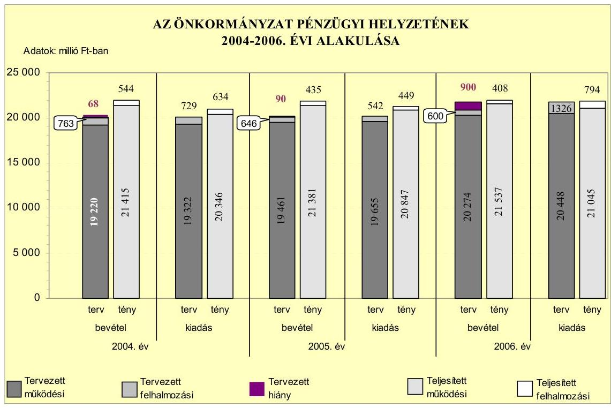
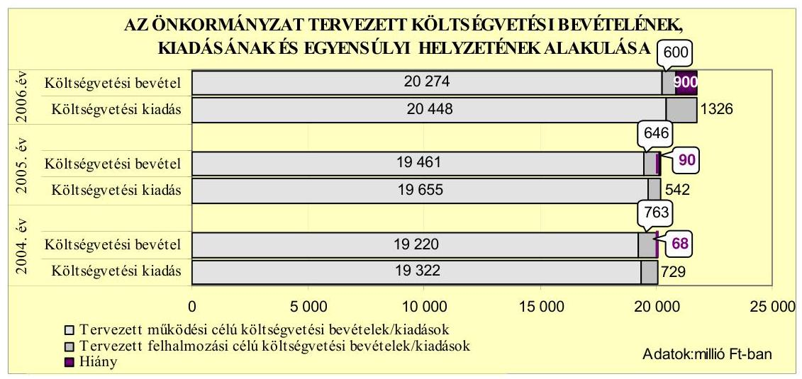
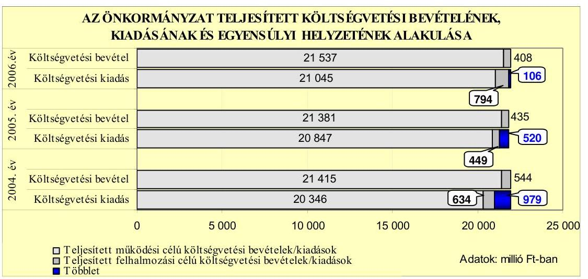
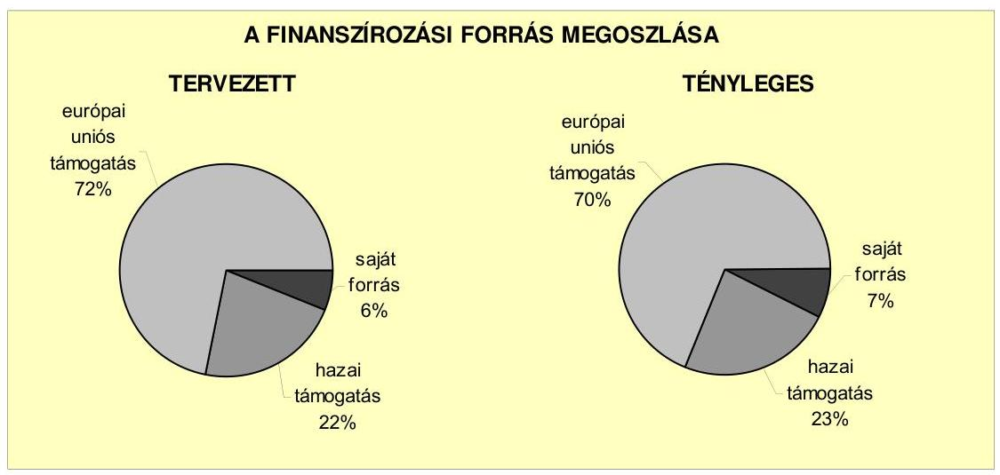
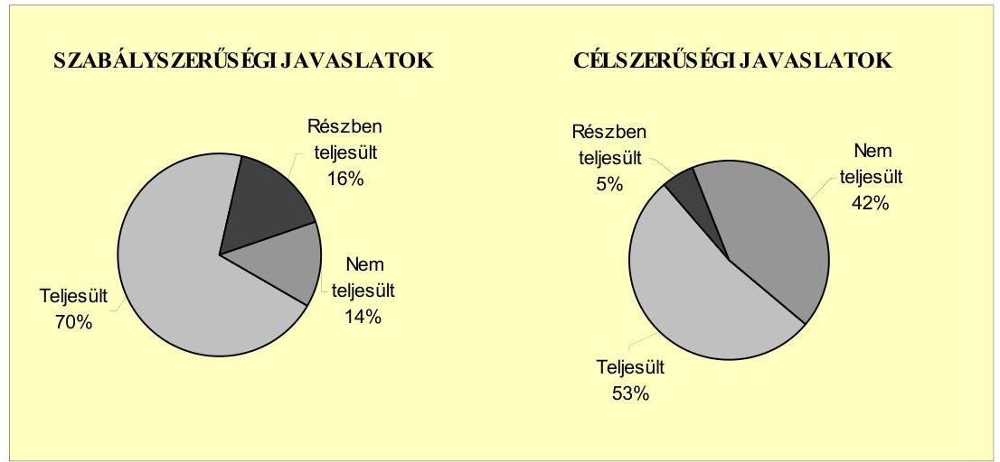
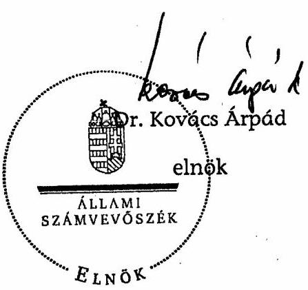
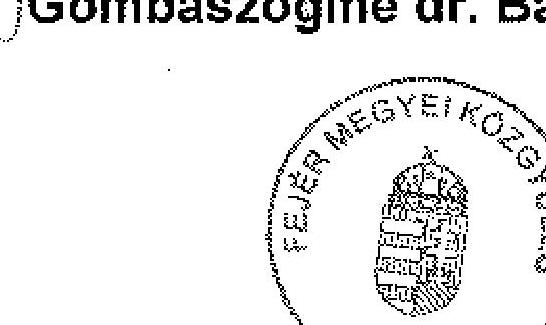

# ÁLLAMI   SZÁMVEVŐSZÉK 

## JELENTÉS

a Fejér Megyei Önkormányzat gazdálkodási rendszerének 2007. évi átfogó ellenőrzéséről

---

# 3. Önkormányzati és Területi Ellenőrzési Igazgatóság 

## Átfogó Ellenőrzések Főcsoport

Iktatószám: V-1001-9/25/18/2007.
Témaszám: 845
Vizsgálat-azonosító szám: V0319

## Az ellenőrzést felügyelte:

Dr. Lóránt Zoltán
főigazgató
Az ellenőrzés végrehajtásáért felelős:
Dr. Sepsey Tamás
főigazgató-helyettes
Az ellenőrzést vezette:
Csecserits Imréné
főcsoportfőnök-helyettes
Az ellenőrzést végezték:
Ébner Vilmosné Czifra Erzsébet Mohl Anna
főtanácsadó tanácsadó számvevő

## A témához kapcsolódó eddig készített számvevőszéki jelentések:

| címe | sorszáma |
| :-- | :--: |
| A helyi önkormányzatok gyermekvédelmi szakellátási tevékenysé- | 0430 |
| gének ellenőrzéséről |  |
| A helyi és a helyi kisebbségi önkormányzatok gazdálkodásának | 0436 |
| átfogó ellenőrzéséről |  |
| Jelentés a Fejér Megyei Önkormányzat gazdálkodásának átfogó | 0464 |
| ellenőrzéséről |  |
| Jelentés a Magyar Köztársaság 2004. évi költségvetése végrehajtá- | 0540 |
| sának ellenőrzéséről |  |

Függelék:

- a helyi önkormányzatokat a 2004. évben megillető normatív állami hozzájárulás elszámolásáról
- kötött felhasználású támogatások 2004. évi felhasználásának ellenőrzéséről

---

# TARTALOMJEGYZÉK 

BEVEZETÉS ..... 9
I. ÖSSZEGZŐ MEGÁLLAPÍTÁSOK, KÖVETKEZTETÉSEK, JAVASLATOK ..... 13
II. RÉSZLETES MEGÁLLAPÍTÁSOK ..... 23

1. Az Önkormányzat költségvetési és pénzügyi helyzete ..... 23
1.1. A tervezett költségvetési bevételi és kiadási előirányzatok, valamint a költségvetési egyensúly alakulása ..... 25
1.2. A költségvetési bevételek és kiadások teljesítése, a pénzügyi egyensúlyi helyzet alakulása ..... 27
2. Az Önkormányzat felkészültsége az európai uniós források igénylésére és felhasználására, valamint az e-közigazgatási feladatok ellátására ..... 31
2.1. Az európai uniós források igénybevételére és a várható támogatás felhasználásának szervezettségére történt felkészülés és a belső szabályozottság értékelése ..... 31
2.1.1. A fejlesztési célkitűzések meghatározása ..... 31
2.1.2. Az európai uniós forrásokhoz kapcsolódóan a pályázatfigyelés, a pályázatkészítés, valamint az európai uniós támogatással megvalósuló fejlesztés lebonyolítása belső rendjének szabályozottsága, a végrehajtás személyi, szervezeti feltételei ..... 34
2.1.3. Az európai uniós forrással támogatott fejlesztés megvalósítása ..... 37
2.2. Az e-közigazgatási feladatok előkészítése, bevezetése ..... 39
3. A költségvetési gazdálkodás kontrolljai ..... 40
3.1. A szabályozottság kockázata a költségvetés tervezési, gazdálkodási, beszámolási és a folyamatba épített ellenőrzési feladatainál ..... 40
3.2. A belső kontrollok érvényesülése az önkormányzati források szabályszerű felhasználásában, a költségvetési tervezés, gazdálkodás, beszámolás folyamataiban ..... 42
3.3. A belső ellenőrzési kötelezettség teljesítése, javaslatainak hasznosulása ..... 46
4. Az ÁSZ korábbi ellenőrzési javaslatai alapján készített intézkedési terv végrehajtása, eredményessége ..... 50
4.1. Az Önkormányzat gazdálkodási rendszerének átfogó ellenőrzése során tett javaslatok végrehajtására tervezett intézkedések megvalósulása ..... 50

---

4.2. A zárszámadáshoz kapcsolódó (állami hozzájárulások, támogatások igénylésének és felhasználásának ellenőrzése), valamint a további vizsgálatok esetében a megállapítások, javaslatok alapján tett intézkedések

# MELLÉKLETEK 

1. számú Az Önkormányzat gazdálkodását meghatározó adatok, mutatószámok (1 oldal)
2. számú Az önkormányzati vagyon alakulása (1 oldal)
3. számú Az Önkormányzat 2004-2006. évi költségvetési előirányzatainak és azok pénzügyi teljesítéseinek alakulása (1 oldal)
4. számú Nyilatkozat a tervezett és teljesített költségvetési adatoknak a megelőző évhez viszonyított jelentős, $\pm 10 \%$-ot meghaladó változásának indokolásáról, amennyiben azt az Önkormányzat által ellátott feladatok változása indokolta (1 oldal)
5. számú Tanúsítvány az európai uniós forrásokkal támogatott fejlesztések tervezett és tényleges adatairól 2004-2007. évekre (1 oldal)
6. számú Gombaszöginé dr. Balogh Ibolya úrhölgy, a Fejér Megyei Közgyűlés elnökének észrevétele (1 oldal)

---

# RÖVIDÍTÉSEK JEGYZÉKE 

## Törvények

Áht.
Eisztv.
Htv.

Kbt.
Ötv.

Számv. tv.

## Rendeletek

Ámr.
Ber.
$\mathrm{SzMSz}_{1}$

SzMSz $_{2}$
ügyrend $_{1}$
ügyrend $_{2}$
vagyongazdálkodási rendelet

Vhr.

## Szórövidítések

ÁSZ
belső ellenőrzési vezető
e-közigazgatás
Ellátó szervezet
az államháztartásról szóló 1992. évi XXXVIII. törvény az elektronikus információszabadságról szóló 2005. évi XC. törvény
a helyi önkormányzatok és szerveik, a köztársasági megbízottak, valamint egyes centrális alárendeltségú szervek feladat- és hatásköreiről szóló 1991. évi XX. törvény
a közbeszerzésekről szóló 2003. évi CXXIX. törvény
a helyi önkormányzatokról szóló 1990. évi LXV. törvény
a számvitelről szóló 2000. évi C. törvény
az államháztartás múködési rendjéről szóló 217/1998. (XII. 30.) Korm. rendelet
a költségvetési szervek belső ellenőrzéséről szóló 193/2003. (XI. 26.) Korm. rendelet
Fejér Megye Önkormányzatának 6/2003. (IV. 24.) számú rendelete a Fejér Megyei Önkormányzat és Szervei Szervezeti és Múködési Szabályzatáról
Fejér Megye Önkormányzatának 7/2007. (III. 21.) számú rendelete a Fejér Megyei Önkormányzat és Szervei Szervezeti és Múködési Szabályzatáról
az SzMSz 1 6. sz. melléklete a Fejér Megyei Önkormányzati Hivatal ügyrendjéről
Fejér Megye Közgyűlése 6/2007.(IV. 26.) számú határozata a Fejér megyei Önkormányzat Hivatalának ügyrendjéről
Fejér Megye Önkormányzatának 25/2004. (VII. 9.) számú rendelete az Önkormányzat vagyonáról és a vagyongazdálkodás szabályairól, valamint a lakások és helyiségek bérletéről és elidegenítéséről
az államháztartás szervezetei beszámolási és könyvvezetési kötelezettségének sajátosságairól szóló 249/2000. (XII. 24.) Korm. rendelet

Állami Számvevőszék
az Önkormányzat Hivatala Ellenőrzési Irodájának vezetője
elektronikus közigazgatás
Fejér Megyei Önkormányzat önállóan gazdálkodó Ellátó Szervezete

---

| Ellenőrzési szervezet | Fejér Megyei Önkormányzat Hivatalának Költségvetési és Belső Ellenőrzési Szervezete |
| :--: | :--: |
| ESZA | Európai Unió Szociális Alap |
| ETE | Európai Fejlesztési és Tájékoztatási Egyesület |
| Fejér Paktum | „Fejér Paktum Partnerség a Fejéri foglalkoztatási helyzet javításáért" című projekt |
| Fejlesztési iroda | Fejér Megyei Önkormányzat Hivatalának Fejlesztési és Területi Irodája |
| FEUVE | folyamatba épített, előzetes és utólagos vezetői ellenőrzés |
| főjegyző | Fejér Megyei Önkormányzat főjegyzője |
| Gazdálkodási főosztály | Fejér Megyei Önkormányzat Hivatalának Gazdálkodási Főosztálya |
| GVOP | NFT Gazdasági Versenyképesség Operatív Program |
| HEFOP | NFT Humánerőforrás-fejlesztés Operatív Program |
| Humán főosztály | Fejér Megyei Önkormányzat Hivatalának Humán Főosztálya |
| Illetékhivatal | Fejér Megyei Önkormányzat Illetékhivatala |
| Jogi főosztály | Fejér Megyei Önkormányzat Hivatalának Jogi- és Testületi Főosztálya |
| Kórház | Fejér Megyei Szent György Kórház |
| Közbeszerzési Döntőbizottság | Közbeszerzések Tanácsa Közbeszerzési Döntőbizottsága |
| Közgyűlés | Fejér Megyei Önkormányzat Közgyűlése |
| Közgyűlés elnöke | Fejér Megyei Önkormányzat Közgyűlésének elnöke |
| MSZOSZ | Magyar Szakszervezetek Országos Szövetsége |
| NFT | Nemzeti Fejlesztési Terv |
| Önkormányzat | Fejér Megyei Önkormányzat |
| Önkormányzat hivatala | Fejér Megyei Önkormányzat Hivatala |
| PHARE | Lengyelország és Magyarország piacgazdasági átmenetét segíteni hívatott program |
| Pénzügyi bizottság | Fejér Megyei Közgyűlés Pénzügyi és Gazdálkodási Bizottsága |
| Pénzügyi iroda | Fejér Megyei Önkormányzat Hivatalának Költségvetési és Pénzügyi Irodája |
| VÁTI Kht. | VÁTI Magyar Regionális Fejlesztési és Urbanisztikai Közhasznú Társaság |

---

# ÉRTELMEZŐ SZÓTÁR 

1. elektronikus szolgáltatási szint
2. elektronikus szolgáltatási szint
3. elektronikus szolgáltatási szint
4. elektronikus szolgáltatási szint
európai uniós források
fejlesztési feladat (projekt)
fejlesztési célkitúzés
irányító hatóság

Az 1044/2005. (V. 11.) Korm. határozat alapján olyan információs, tájékoztató szolgáltatás, amely csak általános információkat közöl az adott üggyel kapcsolatos teendőkről és a szükséges dokumentumokról.
Az 1044/2005. (V. 11.) Korm. határozat alapján olyan egyirányú kapcsolatot biztosító szolgáltatás, amely az 1. szinten túl biztosítja az adott ügy intézéséhez szükséges dokumentumok, nyomtatványok letöltését, és azok ellenőrzéssel, vagy ellenőrzés nélküli elektronikus kitöltését, amely esetben a dokumentumok benyújtása hagyományos úton történik.
Az 1044/2005. (V. 11.) Korm. határozat alapján olyan kétirányú kapcsolatot biztosító szolgáltatás, amely közvetlen, vagy ellenőrzött kitöltésű dokumentum segítségével biztosítja az elektronikus adatbevitelt és a bevitt adatok ellenőrzését. Az ügy indításához, intézéséhez személyes megjelenés nem szükséges, de az ügyhöz kapcsolódó közigazgatási döntés (határozat, egyéb aktus) közlése, valamint a kapcsolódó illeték-, vagy díjfizetés hagyományos úton történik.
Az 1044/2005. (V. 11.) Korm. határozat alapján olyan teljes közvetlen kétirányú ügyintézési folyamatot biztosító szolgáltatás, amikor az ügyhöz kapcsolódó közigazgatási döntés is elektronikus úton kerül közlésre, illetve a kapcsolódó illeték-, vagy díjfizetés elektronikus úton is intézhető.
Az elnyert európai uniós források lehívása a támogatott projekt megvalósítása érdekében, a fejlesztés lebonyolítása során felmerült kiadások finanszírozására.
A fejlesztési feladat (projekt) tartalmilag és formailag részletesen kidolgozott, megfelelő pénzügyi háttérrel és végrehajtási ütemezéssel rendelkező fejlesztési terv, amely illeszkedik az Európai Unió, illetve a Nemzeti Fejlesztési Terv által támogatott programokhoz.
Az önkormányzat által ellátott kötelező, vagy önként vállalt feladatok ellátásának mennyiségi, vagy minőségi fejlesztésére vonatkozó terv. A mennyiségi fejlesztés megvalósulhat beszerzéssel, létesítéssel, bővítéssel, átalakítással.
A strukturális alapok és a Kohéziós alap forrásainak szabályszerű, hatékony és eredményes felhasználásához szükséges intézményrendszer felső eleme. Az irányító hatóság általános és átfogó felelősséget visel a programok, projektek hatékony és szabályszerű végrehajtásáért. Felelősségi köréből eredően ellenőrzi a közösségi, valamint a hazai jogszabályok betartását, koordinálja az európai uniós források szétosztásának folyamatát, irányítja az intézményrendszer, a statisztikai és a pénzügyi nyilvántartási rendszer múködését.

---

kedvezményezett
központi program
közremúködő szervezet
lebonyolítás
operatív program

Az a helyi önkormányzat, amely a támogatási szerződést kedvezményezettként aláíra, a projektet, illetve a központi programhoz kapcsolódó támogatott önkormányzati programot végrehajtja.
Az ország egészére, több régióra, egy régióra vonatkozó, de mindenképpen az önkormányzat közigazgatási területén túlmutató program, amelynél a támogatott programok kiválasztása pályáztatás nélkül, előre meghatározott feltételrendszer szerint történik, a kedvezményezettek közvetlen megkeresésével. Az Európai Unió pénzügyi alapja a Kohéziós alap, a környezetvédelem és a közlekedés terén nyújt lehetőséget az egyes tagországoknak központi programok megvalósítására.
A közremúködő szervezet az európai uniós támogatást elnyert kedvezményezettekkel kapcsolatot tartó szerv. Az operatív programok közremúködő szervezetei befogadják, nyilvántartják, döntésre előkészítik a pályázatokat, rögzítik a támogatással kapcsolatos adatokat az egységes monitoring informatikai rendszerben, elvégzik a támogatások előzetes (szerződéskötést megelőző), közbenső (a pénzügyi elszámolás, finanszírozás folyamatában végzett) és utólagos (a támogatott projekt pénzügyi lezárását megelőző) ellenőrzését. Az önkormányzatoknál a leggyakrabban előforduló operatív program a Regionális Fejlesztési Operatív Program végrehajtásában közremúködő szervezetek a VÂTI Kht. és a regionális fejlesztési ügynökségek.
A Kohéziós alap két közremúködő szervezete (Gazdasági és Közlekedési Minisztérium, Környezetvédelmi és Vízügyi Minisztérium) a támogatott projektek végrehajtásához kapcsolódó operatív feladatokat látják el. Ennek keretében megkötik a szerződéseket a projekt kedvezményezettjével, folyamatosan nyomon követik a teljesítéseket, lebonyolítják a támogatások kifizetését, vezetik az egységes monitoring informatikai rendszert.
Az európai uniós források felhasználásával megvalósuló fejlesztésre irányuló múszaki, gazdasági (pénzügyi) tevékenységet magában foglaló szervezési, irányítási szolgáltatás. A szervezési szolgáltatás kiterjedhet a pályázatkészítésre, a közbeszerzési eljárás lebonyolításán keresztül a folyamatos műszaki ellenőrzésre, a pénzügyi elszámolásra, a műszaki átadás-átvételre, az üzembe helyezésre, illetve a fejlesztési folyamat egyes elemeire.
Az Európai Bizottság által jóváhagyott, a Közösségi Támogatási Keret végrehajtására vonatkozó 2004-2006 közötti, több évre szóló intézkedésekhez kapcsolódó prioritások egységes rendszerét tartalmazó dokumentum. A strukturális alapok operatív programjai: Agrár és Vidékfejlesztési Operatív Program (AVOP); Gazdasági Versenyképesség Operatív Program (GVOP); Humánerőforrás-fejlesztési

---

támogatási szerződés

Operatív Program (HEFOP); Környezetvédelmi és Infras-t-ruk-túra-fejlesztési Operatív Program (KIOP); Regionális Fejlesztési Operatív Program (ROP).
A strukturális alapok esetében az irányító hatóságnak, illetve a Kohéziós alap esetében a közremúködő szervezeteknek a kedvezményezett önkormányzattal kötött szerződése, amely a támogatás felhasználásának részletes feltételeit tartalmazza.

---

.

---

# JELENTÉS 

## a Fejér Megyei Önkormányzat gazdálkodási rendszerének 2007. évi átfogó ellenőrzéséről

## BEVEZETÉS

Az Ötv. 92. § (1) bekezdése, az Állami Számvevőszékről szóló 1989. évi XXXVIII. törvény 2. § (3) bekezdése, valamint az Áht. 120/A. § (1) bekezdése alapján az önkormányzatok gazdálkodását az Állami Számvevőszék ellenőrzi. Az ellenőrzésre az Országgyúlés illetékes bizottságai részére is átadott, országosan egységes ellenőrzési program szerint került sor.

Az Állami Számvevőszék a stratégiájában foglalt célkitűzéseknek megfelelően a helyi önkormányzatok költségvetési gazdálkodási rendszere átfogó ellenőrzésének programját a 2007. évtől megújította, azt kiegészítette további - teljesít-mény-ellenőrzési - elemekkel.

## Az ellenőrzés célja annak értékelése volt, hogy az Önkormányzat:

- a pénzügyi egyensúlyt a költségvetésében és annak teljesítése során milyen módon biztosította, a teljesített bevételek és kiadások egyes évek közötti jelentős eltérése feladatváltozáshoz kapcsolódott-e;
- felkészült-e a szabályozottság és a szervezettség terén az európai uniós források igénylésére és felhasználására, továbbá az e-közigazgatás bevezetése miatti szervezet-korszerúsítési feladatokra;
- kialakította-e a külső és a belső feltételeknek megfelelően a gazdálkodás belső kontrollrendszerét ${ }^{1}$, továbbá a költségvetés tervezési, végrehajtási és zárszámadási feladatok szabályszerű ellátásához hozzájárult-e a folyamatba épített, előzetes és utólagos vezetői ellenőrzés, valamint a belső ellenőrzés;
- megfelelően hasznosították-e a korábbi számvevőszéki ellenőrzések megállapításait, szabályszerűségi ${ }^{2}$ és célszerűségi javaslatait.

[^0]
[^0]:    ${ }^{1}$ A gazdálkodás szabályszerűségét biztosító kontrollrendszer alatt értjük a kiépített és múködő belső irányítási és szabályozási rendszert, valamint a belső ellenőrzési funkciók ellátásának rendszerét.
    ${ }^{2}$ A törvényi előírások betartásának elmulasztásakor a részletes megállapítások fejezetben egységesen a törvénysértés megjelölést alkalmazzuk, mivel az ÁSZ nem tehet különbséget a törvényi előírások között.

---

Az ellenőrzött időszak: az 1., 2., és 4. programpontok tekintetében a 20042007. I. negyed év, a 3. ellenőrzési programpontnál a 2006. év és a 2007. I. negyedév.

Fejér megye lakosainak száma 2007. január 1-jén 279498 fő volt, Székesfehérvár és Dunaújváros megyei jogú városok lakossága nélkül. A 2006. évi önkormányzati választást követően az Önkormányzat 40 tagú Közgyűlésének munkáját 10 állandó bizottság segítette. A Közgyűlés elnöke a 2006. évi önkormányzati választás óta tölti be tisztségét, a főjegyző az Önkormányzat megalakulásától 2007. február 22-ig látta el feladatait. A Közgyűlés 2007. február 22-én a főjegyző közszolgálati jogviszonyát megszüntette és új főjegyzőt nevezetett ki.

Az Önkormányzat feladatainak végrehajtása érdekében a 2006. évben 32 költségvetési szervet múködtetett, amelyekből 27 önállóan gazdálkodott. Az Önkormányzat költségvetési szerveinél a 2006. év végén foglalkoztatott közalkalmazottak száma 4329 fő, a köztisztviselők száma 125 fő volt. Az Önkormányzat a 2006. évi költségvetési beszámolója szerint 21945 millió Ft költségvetési bevételt ért el és 21839 millió Ft költségvetési kiadást teljesített, a 2006. év végén a könyvviteli mérleg szerint 20361 millió Ft értékű vagyonnal rendelkezett. A 2007. évi költségvetési rendeletben 20872 millió Ft költségvetési bevételt és 21172 millió Ft költségvetési kiadást irányoztak elő. Az Önkormányzat gazdálkodását meghatározó adatokat, mutatószámokat az 1-3. számú mellékletek tartalmazzák.

Az Önkormányzat költségvetési és pénzügyi helyzetét az összehasonlító elemzés módszerével vizsgáltuk. E körben elemeztük a költségvetés egyensúlyi helyzetének alakulását, a tervezett és tényleges költségvetési hiány okait, a mérséklésére tett intézkedéseket, finanszírozásának módját, az Önkormányzat adósságállományának alakulását, összetevőit.

A teljesítmény-ellenőrzés módszerével vizsgáltuk, hogy a belső szabályozottság, szervezettség terén felkészültek-e az európai uniós források figyelésére, igénylésére és felhasználására, valamint az igényelt európai uniós támogatások az Önkormányzat által meghatározott fejlesztési célkitűzésekhez kapcsolódtak-e. Az ellenőrzés során felmértük, hogy az e-közigazgatási feladat ellátása, illetve bevezetése, múködtetése érdekében milyen intézkedéseket tettek, valamint biz-tosították-e a közérdekú adatok elektronikus közzétételét.

A költségvetési gazdálkodás belső kontrolljainak ellenőrzése során értékeltük, hogy az Önkormányzat hivatalánál a költségvetés tervezési, gazdálkodási, zárszámadás készítési feladatok belső kontrolljainak kiépítettsége és múködése megfelelő biztosítékot ad-e a gazdálkodási feladatok megfelelő, szabályszerű ellátására. Felmértük és minősítettük a költségvetés tervezési, a gazdálkodási, a zárszámadás készítési feladatokkal, továbbá a pénzügyi- számviteli területen az informatikával kapcsolatosan kialakított kontrollok megfelelősségét, valamint azok múködésének eredményességét, megbízhatóságát. Értékeltük a belső ellenőrzés szervezeti és szabályozási keretét, továbbá múködését.

Az Önkormányzat hivatalánál értékeltük a gazdálkodás folyamatában a kontrollok múködésének megbízhatóságát, ennek keretében ellenőriztük a szakmai

---

teljesítés igazolására és az utalvány ellenjegyzésére kialakított kontrollok végrehajtását. Az ellenőrzést a következő, kiemelt kockázatuk alapján kiválasztott ${ }^{3}$ az általánostól jellemzően eltérő, egyedi eljárást igénylő gazdasági eseményekkel kapcsolatos kifizetésekre folytattuk le ${ }^{4}$ :

- a személyi juttatások közül az állományba nem tartozók megbízási díjai ${ }^{5}$,
- a külső szolgáltató által végzett karbantartási, kisjavítási szolgáltatások, valamint
- a gépek, berendezések, felszerelések beszerzése.

Az ellenőrzés hatékony elvégzése céljából a vizsgálandó területek kiválasztása során a kockázatokon alapuló megközelítés érvényesült, ezáltal az ellenőrzési erőforrásokat azokra a területekre fókuszáltuk, amelyeken legnagyobb a hibák előfordulási valószínűsége. Az ellenőrzési erőforrások ilyen típusú összpontosításával minimálisra csökkenthető a kívánt ellenőrzési bizonyosság eléréséhez szükséges időráfordítás.

A pénzügyi-számviteli folyamatokban alkalmazott belső kontrollok létezésének és működésének ellenőrzésére a vizsgált három terület 2006. évi könyvviteli tételeiből területenként egyszerű véletlen mintát vettünk. A kijelölt gazdasági eseményre elvégzett megfelelőségi tesztek alapján értékeltük a kontrollok múködésének eredményességét, megbízhatóságát a vizsgált három területre különkülön, majd összefoglalóan ${ }^{6}$ az Önkormányzat hivatala egyedi eljárást igénylő gazdasági eseményeire. A helyszíni ellenőrzés megállapításainak részletes dokumentálását három megfelelőségi tesztlapon, öt elővizsgálati és kilenc helyszíni ellenőrzési munkalapon biztosítottuk. Ezeken a teszt- és munkalapokon a minősítés alapjául szolgáló kérdések és a vonatkozó konkrét jogszabályhelyek

[^0]
[^0]:    ${ }^{3}$ Az önkormányzatok kiemelt előirányzataira vonatkozóan, a vertikális folyamatokra elvégeztük a kockázatok becslését, amelynek eredményeként az állományba nem tartozók megbízási díjai, a külső szolgáltató által végzett karbantartási, kisjavítási szolgáltatások, valamint a gépek, berendezések, felszerelések beszerzése kiemelkedően kockázatos területnek bizonyultak.
    ${ }^{4}$ A korábbi ellenőrzési tapasztalataink szerint ezeken a területeken a jegyzők nem, vagy hiányosan szabályozták a megbízás, megrendelés, illetve beszerzés indokoltságának, szükségességének elbírálására, igazolására, valamint a teljesítések dokumentálására, a kifizetések jogosságának megítélésére szolgáló kontrollokat. További kockázatot jelentett a külső szolgáltató által végzett karbantartási, kisjavítási munkák esetében, hogy az 50 ezer Ft alatti megrendelésekre vonatkozóan az ellenőrzési tapasztalataink szerint a jegyzők nem alakították ki a kötelezettségvállalások rendjét és nyilvántartási formáját, valamint a szabályozás elmulasztása esetén nem történt meg az írásbeli kötelezettségvállalás és annak az ellenjegyzése sem.
    ${ }^{5}$ Az állományba tartozók rendszeres személyi juttatásainak számfejtését, valamint folyósítását nem a polgármesteri hivatalok, hanem a nettó finanszírozás keretében a beküldött dokumentumok alapján a MÁK végzi.
    ${ }^{6}$ A vizsgált három terület egyedi értékelési pontszámait a területek relatív költségvetési súlyával arányosan összegeztük.

---

megjelölése mellett értékeltük a kialakított belső kontrollokban rejlő kockázatokat ${ }^{7}$ és a kialakított kontrollok múködésének megbízhatóságát ${ }^{8}$.

Az ÁSZ korábbi ellenőrzési javaslatai alapján tett intézkedéseket, illetve azok megvalósítását utóellenőrzés keretében vizsgáltuk. A gazdálkodási rendszer átfogó ellenőrzése során megfogalmazott javaslatok végrehajtására tett intézkedések megvalósítását ellenőriztük, az egyéb számvevőszéki ellenőrzések során tett javaslatok esetében pedig a kiadott intézkedéseket tekintettük át.

A helyszíni ellenőrzés során kitöltött - az ellenőrzést végző számvevő és az Önkormányzat hivatala felelős köztisztviselője által aláírt - elővizsgálati és helyszíni ellenőrzési munkalapokat, azok kitöltési útmutatóit, továbbá a megfelelőségi tesztek dokumentumait a Közgyűlés elnöke részére a számvevői jelentéssel egyidejúleg átadtuk.

A jelentést az ÁSZ-ról szóló 1989. évi XXXVIII. tv. 25. § (1) bekezdése alapján észrevétel közlése céljából megküldtük a Fejér Megyei Önkormányzat Közgyűlése elnökének. A kapott észrevételt a jelentés 6 . számú melléklete tartalmazza.

[^0]
[^0]:    ${ }^{7}$ A kialakított belső kontrollokban rejlő kockázatot alacsonynak minősítettük, ha a kontrollok - végrehajtásuk esetén - megfelelő védelmet nyújtanak a hibák bekövetkezése ellen. Közepesnek minősítettük a belső kontrollokban rejlő kockázatot, amennyiben a kontrollok - végrehajtásuk esetén - a lehetséges hibák többsége ellen védelmet nyújtanak. Magasnak értékeltük a kockázatot, ha a kontrollok - kialakításuk hiányában, vagy hiányos kialakításuk miatt - nem nyújtanak elegendő védelmet a lehetséges hibákkal szemben.
    ${ }^{8}$ A kontrollok múködésének eredményességét, megbízhatóságát kiválónak értékeltük abban az esetben, ha azok múködése - esetleges apróbb hiányosságoktól eltekintve megfelelt a hibák megelőzésére és kijavítására meghatározott szabályozásnak és a legmagasabb szintű elvárásoknak. Jónak minősítettük a kontrollok múködését, ha a hiányosságok száma ugyan jelentős volt, de nem veszélyeztette az ellenőrzött terület hibáinak megelőzését és kijavítását. Amennyiben a hiányosságok mértéke nem biztosította a hibák megelőzését, feltárását, kijavítását és ezáltal veszélyeztette az eredményes, megbízható múködést, a kontroll múködésének megbízhatósága gyenge minősítést kapott.

---

# I. ÖSSZEGZŐ MEGÁLLAPÍTÁSOK, KÖVETKEZTETÉSEK, JAVASLATOK 

Az Önkormányzat tervezett költségvetési bevételei és kiadásai a 2004-2007. évek között folyamatosan növekedtek, de a tervezett költségvetési bevételek és kiadások egyensúlya nem volt biztosított, a tervezett költségvetési bevételek nem nyújtottak fedezetet a tervezett költségvetési kiadásokra. A tervezett költségvetési forráshiány az előző évhez képest a 2005. évben egyharmadával, a 2006. évben 9,9-szeresére nőtt, a 2007. évben 67\%-kal csökkent, így annak öszszege a 2007. évben 300 millió Ft. A költségvetési forráshiányt a múködési célú költségvetési bevételeket meghaladó összegű működési célú költségvetési kiadás eredményezte. A költségvetési és pénzügyi egyensúlyt a költségvetési rendeletekben évről-évre növekvő összegű folyószámla hitelkeret rendelkezésre tartásával, a 2004. évben értékpapírok értékesítésével, a 2006. évben hosszú lejáratú kötvény kibocsátásával tervezte biztosítani az Önkormányzat. A 2004-2006. évek között a költségvetések végrehajtásakor a tervezettől eltérően a teljesített összes költségvetési bevétel fedezte a teljesített összes költségvetési kiadást. A költségvetés végrehajtása során a 2004-2006. években a múködési célú költségvetési bevételeknél többlet keletkezett, míg a teljesített felhalmozási célú költségvetési kiadásokat a felhalmozási célú költségvetési bevételeken túlmenően múködési célú költségvetési bevételekből és hitelből fedezték.

Az Önkormányzat hivatala év közben a pénzügyi egyensúly biztosításához a 2004-2006. évek között, és a 2007. évben is évről-évre növekvő összegű hitel igénybevételével gondoskodott. Év végén a kiadások finanszírozásához szükséges folyószámla hitelen túlmenően a Közgyűlés által jóváhagyott előirányzat mértékéig rövid lejáratú hitelt vettek fel, és annak összegét a számlavezető pénzintézetnél betétként helyezték el. A következő év első munkanapján e betételhelyezést megszüntették és a felvett rövid lejáratú hitelt visszafizették, ezért az éves könyvviteli mérlegben kimutatott év végi rövid lejáratú hitelállomány nem a múködési kiadások finanszírozásához szükséges hitel mértékét jelzi.

A múködési célú költségvetési kiadások csökkentése céljából 2004-2006 között az intézményeknél végrehajtott mintegy 10\%-os létszámleépítés, valamint a felhalmozási célú költségvetési bevételek növelésére hozott ingatlan eladási törekvések nem voltak hatással a költségvetési és pénzügyi egyensúly alakulására. Az Önkormányzatnál a költségvetés végrehajtása során teljesített felhalmozási célú költségvetési kiadások 2005. évi előző évhez viszonyított csökkenését, valamint 2006. évi növekedését - 45\%-ban, illetve 99\%-ban - a korábbi években elhatározott felhalmozási feladatok 2006. évi végrehajtása idézte elő.

A költségvetés végrehajtása során az Önkormányzatnál a 2004-2006. évek között mind a teljesített költségvetési bevételek, mind a teljesített költségvetési kiadások meghaladták az eredeti előirányzatot. A költségvetési bevételi eredeti előirányzatok túlteljesítéséhez a múködési célú költségvetési bevételeknél az eredeti előirányzatként nem tervezett pénzmaradvány igénybevétel, és az intézményi múködési célú költségvetési bevételek alultervezése járult hozzá. A múködési célú költségvetési kiadások túlteljesítése főként az intézményi dolo-

---

gi és egyéb folyó kiadások alultervezésére vezethető vissza. A teljesített felhalmozási célú költségvetési bevételek és kiadások mindhárom évben elmaradtak az eredeti előirányzattól. Az intézmények közül a 2005. évben 11, a 2006. évben 22 túllépte a számára megállapított módosított kiadási előirányzatot. Az előirányzat-túllépésekről a Közgyűlést tájékoztatták, azonban felelősségre vonást nem kezdeményeztek."

Az Önkormányzat fejlesztési célkitűzéseit a 2002-2006. évek közötti időszakban „ciklusprogramban" rögzítette, a 2007-2010. évekre gazdasági programot fogadott el. A „ciklusprogramban" és a gazdasági programban szereplő fejlesztések az Önkormányzat kötelező és önként vállalt feladataihoz kapcsolódtak, azonban megalapozásukhoz számításokkal alátámasztott helyzetelemzés nem készült, nem végeztek felmérést a feladatok megoldásánál jelentkező feszültségekről. Az Önkormányzat a 2004-2006. évek között összesen kilenc fejlesztési feladatban történő részvételről döntött. Az európai uniós forrással támogatott projektek alapján az Önkormányzat 164,8 millió Ft európai uniós, illetve 50,7 millió Ft hazai támogatást nyert, amelyből 113,4 millió Ft európai uniós támogatás, és 38,2 millió Ft hazai támogatás átutalása történt meg. A nyolc támogatott pályázat közül négy az intézményeknél valósult meg, négy program megvalósítása folyamatban van.

Az Önkormányzat felkészülése az európai uniós források igénybevételére és felhasználására a belső szabályozottság, a szervezettsége terén nem volt eredményes. A ciklusprogramban, gazdasági programban megfogalmazott fejlesztési célkitűzésekhez kapcsolódtak az európai uniós támogatások, azonban az Önkormányzat szabályozása nem tartalmazta az európai uniós forrásokkal összefüggésben a pályázatfigyelés, a pályázatkészítés, és a támogatott fejlesztések lebonyolítási feladatainak rendjét, döntési hatásköröket. Nem határozták meg az önkormányzati szintű pályázat-koordinálás feladatait, felelőseit. Az Önkormányzat hivatalában egyedi megbízásokkal, feladatra történő kijelölésekkel, valamint külső szervezet bevonásával megszervezték a pályázatfigyelési, a fejlesztés-lebonyolítási feladatok ellátását, azonban nem szabályozták a pályázatfigyeléssel kapcsolatos információ-szolgáltatási és továbbadási kötelezettséget, felelősséget, a pályázatok nyilvántartásával összefüggő feladatokat. Nem határozták meg a folyamatba épített és belső ellenőrzési feladatokat, kötelezettségeket.

A Közgyűlés az NFT keretében a Strukturális Alapok pénzeszközei terhére a Fejér megyei munkaerő-foglalkoztatási helyzet javításával összefüggő fejlesztési feladatra a 2005. évben a hazai társfinanszírozással együtt 25,2 millió Ft európai uniós támogatás nyert el. A projekt megvalósítás során az Önkormányzat a partnerség vezetőjeként vállalta a megvalósításban részt vevő 11 szervezet munkájának összehangolását, fórumok, konferenciák szervezését, szakértői feladatok ellátását. A projekt befejezési határidejét a támogatási szerződésben 2007. július 31 -ében rögzítették. Az Önkormányzat az elnyert európai uniós támogatás mintegy felét használta fel, a projekt befejezési határidejét tekintve jelentős a lemaradás. A projekt megvalósítása munkaszervezési okok miatt nem haladt a támogatási szerződésben meghatározott ütemezésnek megfelelően. A támogatott fejlesztési feladatot a közreműködő szervezet a 2006. évben két alkalommal, az Önkormányzat hivatalának belső ellenőre 2005-2006 között nem, a 2007. évben célvizsgálat keretében vizsgálta. A közreműködő szer-

---

vezet az ellenőrzések alapján az elszámolásra benyújtott bizonylatok alaki követelményeinek betartására hívta fel a figyelmet, valamint rögzítette, hogy a projekt ütemezett megvalósítását hátráltatják, fenntarthatóságát akadályozzák a partnerek közötti együttműködési hiányosságok. Az ellenőrzés során észrevételezték a fizetési kérelmek, a projekt előrehaladási jelentések késedelmes benyújtását. A belső ellenőrzést végzők a végrehajtás ütemezéshez viszonyított jelentős lemaradásán túlmenően az iratanyagok hiányos irattározását állapították meg, valamint intézkedési javaslatokat fogalmaztak meg.

Az Önkormányzat hivatala nem rendelkezett informatikai, valamint eközigazgatási stratégiával. Nem határozták meg, hogy az e-közigazgatás melyik szolgáltatási szintjére kíván eljutni az Önkormányzat. A 2006. évben eközigazgatási feladatok keretében a közoktatási intézmények működési engedélyének kiadásához és a Fejér Megyei Területfejlesztési Tanács által meghirdetett pályázat benyújtásához szükséges információkat, iratmintákat, adatlapokat tette közzé, amely az 1. elektronikus szolgáltatási szintnek felel meg. Az e-közigazgatás fejlesztésének pénzügyi, hardver, szoftver és személyi akadályai vannak. Az Önkormányzat a közérdekú adatok honlapon történő közzétételére kötelezett volt, azonban az Eisztv-ben foglaltak ellenére a közfeladat ellátásához kapcsolódó tevékenységére vonatkozó általános közzétételi lista szerinti adatokat hiányosan tette közzé, valamint az Áht. előírása ellenére a 2006. évben nyújtott fejlesztési célú támogatások adatait, illetve a 2007. I. negyedévében nyújtott múködési és fejlesztési támogatások adatait (támogatottak neve, a támogatás célja, összege, a támogatási program megvalósítási helye), valamint a vagyonnal való gazdálkodással összefüggő, nettó ötmillió Ft-ot elérő vagy azt meghaladó értékú szerződések adatait nem tette közzé.

Az Önkormányzat hivatalában a feladatok szabályszerű végrehajtási feltételeinek kialakításában a költségvetés tervezési és a zárszámadás készítési folyamatok szabályozottsága a 2006. évben összességében alacsony kockázatot jelentett az elvégzendő feladatok szabályszerű végrehajtásában, mivel a pénzügyi irányítási és ellenőrzési rendszer keretében az ügyrend,-ben meghatározták a költségvetés tervezési és zárszámadás készítési folyamatokat és azok ellenőrzési feladatait, és ezeket az érintett dolgozók munkaköri leírásaiban szerepeltették. A költségvetési tervezés és a zárszámadás készítés folyamatára kialakított kontrollok múködésének megbízhatósága annak ellenére összességében kiváló volt, hogy a 2006. évben a normatív állami hozzájárulás alapját képező mutatószámokat a közoktatási, és a szociális intézményekben dokumentáltan nem ellenőrizték.

A gazdálkodási, a pénzügyi-számviteli és a folyamatba épített ellenőrzési feladatok szabályszerű végrehajtásában a feladatok szabályozottságának hiányosságai közepes kockázatot jelentettek, mivel a főjegyző nem írta elő a szakmai teljesítés igazolás során elvégzendő ellenőrzési feladatokat, és az igazolás tartalmát, a terven felüli értékcsökkenés elszámolásának szempontjait, valamint rendjét. Az érintett dolgozók munkaköri leírásai nem tartalmazták az eszközök és források értékelési feladatait. Nem határozták meg a belső összesítő bizonylatok (feladások) tartalmi, formai követelményeit, nem készítették el az önköltségszámítás rendjére vonatkozó szabályzatot, valamint nem rendelkeztek az eszközök hasznosítására és selejtezésére vonatkozó szabályozással. A főjegyző a 2006. évben nem gondoskodott a FEUVE rendszerének megszerve-

---

zéséről és működtetéséről, nem készítette el az Önkormányzat ellenőrzési nyomvonalát, nem szabályozta a kockázatkezelés és szabálytalanságok kezelésének rendjét. A 2006. év végén jóváhagyott ellenőrzési nyomvonal nem tartalmazta a belső ellenőrzési és informatikai tevékenységet, valamint elmaradt a gazdasági program, a költségvetési koncepció, és a költségvetés összeállításának, a költségvetés módosításának folyamatában, továbbá a létszám- és bérgazdálkodás, a beruházás, felújítás, beszerzés és szolgáltatás, valamint a beszámolás és költségvetés végrehajtásának folyamatai esetében az ellenőrzési tevékenység meghatározása, és a tevékenység elvégzését igazoló dokumentum nyilvántartási helyének rögzítése. A kockázatkezelési szabályzatban a főjegyző nem határozta meg az elfogadható kockázati szintet.

Az Önkormányzat hivatalában a gazdasági eseményekkel kapcsolatos kifizetések során a működésbeli hibák megelőzésére, feltárására, kijavítására kialakított kontrollok múködésének megbízhatósága az állományba nem tartozók megbízási díjai esetében a 2006. évben összességében kiváló volt, mert a megbízási szerződésekben meghatározott cél teljesítésének, a kiadás jogosultságának, összegszerűségének ellenőrzését a szakmai teljesítés igazolására kijelölt személyek elvégezték és az ellenőrzés elvégzését igazolták. Az utalványok ellenjegyzői a gazdálkodásra vonatkozó szabályok érvényesüléséről, a szakmai teljesítés igazolásának és az érvényesítésnek a megtörténtéről meggyőződtek.

A külső szolgáltatók által végzett karbantartási, kisjavítási szolgáltatásokkal kapcsolatos kiadások esetében a kialakított kontrollok múködésének megbízhatósága a 2006. évben gyenge volt, mivel az általános karbantartási szolgáltatás és a klíma rendszer javítása kivételével nem történt meg a szakmai teljesítésigazolás során a szolgáltatások teljesítésének, jogosultságának ellenőrzése, valamint azok összegszerűségének vizsgálata. A termosztát cserére, a klíma fertőtlenítésére, javítására, az Önkormányzat hivatala gépkocsijának műszaki vizsgáztatására és tisztítására vonatkozó kötelezettségvállalásokat nem foglalták írásba, ezáltal a szakmai teljesítés igazolására jogosult nem rendelkezett a kiadások jogosultságának és összegszerűségének ellenőrzéséhez szükséges bizonylatokkal. Az utalvány ellenjegyzése nem megfelelően múködött, mivel az ellenjegyzések során elmaradt a gazdálkodásra vonatkozó jogszabályok betartásának, a fedezet meglétének, a szakmai teljesítés igazolás, valamint az érvényesítés megtörténtének az ellenőrzése. A szakmai teljesítés igazolására kijelölt személyek nem végezték el ellenőrzési feladataikat azon karbantartási, kisjavítási szolgáltatások számláinak teljesítését megelőzően, amely munkákról az Ámr. és a helyi szabályozás előírása ellenére nem készült a kötelezettségvállalásról bizonylat. Az utalvány ellenjegyzője nem győződött meg arról, hogy az érvényesítés megtörtént-e, mivel az érvényesítő folyamatba épített ellenőrzési feladatait nem végezte el, nem észrevételezte a szakmai teljesítés igazolás szabályozási és múködési hiányosságait.

Az ügyviteli és számítástechnikai eszközök, az egyéb gépek, berendezések, felszerelések beszerzésével és létesítésével kapcsolatos kiadások esetében a kialakított kontrollok múködésének megbízhatósága a 2006. évben gyenge volt, mivel az Illetékhivatal tevékenységéhez kapcsolódó számítástechnikai- és irodai eszközök, bútorok beszerzése esetében a teljesítések szakmai igazolása nem történt meg, az önkormányzati igazgatási tevékenységhez kapcsolódóan elma-

---

radt egy eszköz beszerzés jogosultságának, összegszerűségének, a szerződésben meghatározott cél szakmai teljesítésének igazolása. Az utalvány ellenjegyzése során elmaradt a gazdálkodásra vonatkozó szabályok betartásának, a fedezet meglétének, a szakmai teljesítés igazolás, valamint az érvényesítés megtörténtének ellenőrzése. A szakmai teljesítés igazolására kijelölt személyek nem végezték el ellenőrzési feladataikat, nem igazolták aláírásukkal az ügyviteli- és számítástechnikai eszközök, az egyéb berendezések beszerzésére kötött szerződésekben meghatározott cél teljesítését, a kiadások jogosultságát, valamint öszszegszerúségét. Az utalvány ellenjegyzője nem győződött meg arról, hogy az érvényesítés megtörtént-e, az érvényesítő nem észrevételezte a szakmai teljesítés igazolásának elmaradását.

Az Önkormányzat hivatalában összességében a belső kontrollok a gazdálkodás folyamatában - az állományba nem tartozók megbízási díjaival, a karbantartási, kisjavítási szolgáltatásokkal, továbbá az ügyvitel- és számítástechnikai eszközök, valamint egyéb gépek, berendezések, felszerelések beszerzésével kapcsolatos kifizetések során - nem múködtek megbízhatóan, mivel a szakmai teljesítésigazolás és az utalvány ellenjegyzés nem adott megfelelő biztosítékot a gazdálkodási feladatok megfelelő, szabályszerű ellátására. A szakmai teljesítés igazolás és az utalvány ellenjegyzés múködésének megbízhatósága gyenge volt, amelynek következtében a gazdálkodás során előirányzat nélküli kötelezettségvállalások alapján teljesített karbantartási, kisjavítási szolgáltatásokkal, továbbá az ügyvitel- és számítástechnikai eszközök, valamint az egyéb gépek, berendezések és felszerelések beszerzésével, létesítésével kapcsolatos kifizetéseket az Önkormányzat hivatala.

Az Önkormányzat hivatalában az informatikai rendszer szabályozottságának hiányosságai magas kockázatot jelentettek az informatikai feladatok biztonságos végrehajtásában, mivel az Önkormányzat hivatala nem rendelkezett informatikai stratégiával, biztonságtechnikai szabályzattal, és katasztrófa elhárítási tervvel. Nem volt szabályozott a pénzügyi-számviteli számítógépes programrendszerek adat-karbantartási folyamata. Nem gondoskodtak a közszolgálati adatvédelmi szabályzat Önkormányzat hivatalának dolgozóival történő megismertetéséről.

Az informatikai rendszer 2006. évi múködtetésénél a múködésbeli hibák megelőzésére, feltárására, kijavítására kialakított kontrollok múködésének megbízhatósága gyenge volt, mert nem volt megoldott a költségvetési beszámoló informatikai eszközökkel való feldolgozása az állami hozzájárulások, a követelé-sek-kötelezettségek esetében, nem alakították ki a számítógépeken vezetett pénzügyi-számviteli nyilvántartások automatikus kapcsolatát, valamint a főkönyvi könyvelés és a költségvetési beszámoló adatai egyezőségének ellenőrzését. Nem biztosította az Önkormányzat hivatala által alkalmazott program az adatok egyszeri bevitelét és a számszaki pontosság automatikus ellenőrzését, a könyvelési tételek visszamenőleges azonosítását, valamint a rögzített, de hibás, törölt bizonylatok kezelését. Nem naprakészek a rendszerdokumentációk, az esetleges szoftver hibákat és azok kezelését nem rögzítették. Az Önkormányzat hivatalában az informatikai fejlesztéseket eseti megbízásokkal valósították meg.

---

A belső ellenőrzés szervezeti kereteinek kialakítása és szabályozási szintje a belső ellenőrzés végrehajtásában összességében alacsony kockázatot jelentett a belső ellenőrzés szabályszerű végrehajtásában, mivel az Önkormányzat kialakította a belső ellenőrzési követelmények teljesítéséhez szükséges szervezetet, gondoskodott a belső ellenőrzési feladatok megszervezéséről, végrehajtásáról, szabályozta a belső ellenőrzés múködési feltételeit. Az Önkormányzat az SzMSz -ben a belső ellenőrzési kötelezettséget előírta, az Ellenőrzési szervezet jogállását és feladatait meghatározták, a négy fő belső ellenőr funkcionális függetlenségét biztosították.

Az Önkormányzat rendelkezik ellenőrzési stratégiai tervvel. Az Önkormányzatnál a belső ellenőrzés elvégzésénél a kialakított kontrollok múködésének megbízhatósága jó volt, mert az előfordult hiányosságok nem veszélyeztették az ellenőrzés múködésének megbízhatóságát. Nem tervezték és nem ellenőrizték azonban az Önkormányzat hivatalában FEUVE rendszer kiépítését és múködését, a költségvetési előirányzatok teljesítését, a közbeszerzések rendjét, a közbeszerzési eljárásokat, valamint az Önkormányzat által alapított közhasznú társaságnál az erőforrásokkal való gazdálkodást, a vagyon megóvását, gyarapítását illetve az elszámolások és beszámolók megbízhatóságát, továbbá a céljelleggel juttatott támogatások rendeltetés szerinti felhasználását. Az Ellenőrzési szervezet a 2006. évben 93\%-ban valósította meg az éves tervekben szereplő magas kockázatúnak minősített gazdálkodási területek ellenőrzését az intézményeknél. A belső ellenőrzési jelentésekben rögzítették a megállapított hiányosságokat, és az intézkedési javaslatokat.

A főjegyző a 2006. évi költségvetési beszámolóban az intézményeknél múködő FEUVE rendszer kialakításának és múködtetésének ellenőrzési tapasztalatairól tájékoztatást adott, azonban az Áht. előírása ellenére nem számolt be a FEUVE rendszer, valamint a belső ellenőrzés Önkormányzat hivatalon belüli múködtetéséről. A Közgyűlés elnöke a 2006. évi a zárszámadási rendelettervezettel egyidejúleg az ellenőrzések tapasztalatairól éves összefoglaló jelentést terjesztett a Közgyűlés elé, amelyet az elfogadott.

Az ÁSZ az Önkormányzat gazdálkodását átfogó jelleggel a 2004. évben ellenőrizte. A számvevői jelentés javaslatainak realizálása érdekében a Közgyűlés intézkedési tervet fogadott el. Az ÁSZ által megfogalmazott javaslatok 51\%-a hasznosult, 12\%-a részben, és 37\%-a nem teljesült. Az ÁSZ ellenőrzés során megfogalmazott javaslatok figyelembevételével gondoskodtak az éves költségvetési és zárszámadási előterjesztések keretében bemutatandó mérlegek és kimutatások tartalmi követelményeinek meghatározásáról, a költségvetési hiány kimutatásáról, a vagyongazdálkodási rendelet előírásainak betartásáról befektetések esetében. Biztosították a kötelezettségvállalások ellenjegyzését, az utalványrendeletek tartalmi követelményeinek betartását. A céljelleggel juttatott támogatások esetében szabályozták a számadási kötelezettség előírását, az alelnöki kereteket megszüntették. A költségvetési és zárszámadási rendeletekben bemutatták a közvetett támogatásokat és a többéves kötelezettségeket. Jóváhagyták a belső ellenőrzési kézikönyvet, valamint megszervezték a költségvetési intézmények ellenőrzését.

Részben hajtották végre az Áht-ban előírtak ellenére a jóváhagyott költségvetési előirányzatok betartását, mivel a 2005. és a 2006. évben megtett intézkedé-

---

sek ellenére 11, illetve 22 intézménynél a kiadási előirányzatot túllépték. A szakmai teljesítésigazolás módjának főjegyzői szabályozásakor nem határozták meg az előírt záradék tartalmát, illetve a szakmai teljesítés igazolás Ámrben rögzített követelményeinek teljesítését igazoló dokumentum tartalmát. A kötelezettségvállalások nyilvántartását szabályozták, azonban a nyilvántartott kötelezettségeket nem összegezték. Az év végi értékelési feladatokat elvégezték, ugyanakkor szabályozás nélkül alkalmazták az illeték bevételeknél az egyszerűsített értékelési eljárást.

A főjegyző nem alakította ki a költségvetési szervek egységes számviteli rendjét és nem módosította a leltározási szabályzatot a Htv. és a Vhr. előírásai ellenére. Nem tartották be a külföldi kiküldetés esetén felvett előleg elszámolására vonatkozó szabályozást, valamint az Áht. előírása ellenére a nem szociális célra nyújtott támogatásokra vonatkozó számadási kötelezettséget nem teljesítők esetében nem kezdeményezték a támogatás visszafizettetését, valamint a támogatás célszerinti felhasználásának ellenőrzését. A pártok részére a korábbi javaslat ellenére továbbra is biztosítottak közvetett támogatást.

A célszerűségi javaslatok eredményeként felülvizsgálták a Gazdálkodási főosztály dolgozóinak munkaköri leírásait, kialakították a céljelleggel nyújtott támogatások nyilvántartási rendjét és ellenőrzését, az ÁSZ ellenőrzési tapasztalatairól tájékoztatták a Közgyűlést, és gondoskodtak az Ellátó szervezet pénzügyigazdálkodási ellenőrzéséről. Három középületnél megoldották az akadálymentesítést. Nem készítettek informatikai stratégiát és katasztrófa elhárítási tervet. Nem nyitottak elkülönített alszámlát a költségvetésen kívüli pénzeszközök kezelésére és nem módosították az elkülönítetten kezelt „alap"-ok elnevezését.

Az ÁSZ a 2004. évben ellenőrizte a gyermekvédelmi szakellátási feladatokat az Önkormányzatnál. A 2005. évben a zárszámadási vizsgálat keretében került ellenőrzésre a normatív állami hozzájárulások, illetve a kötött felhasználású normatív állami hozzájárulások igénylésének és elszámolásának szabályszerűsége. A gyermekvédelmi szakellátás feladatainak ellenőrzése során hét, a zárszámadás vizsgálatainak kapcsán 14, összességében 21 javaslat született, melyből 13 szabályszerűségi, nyolc a munka színvonalának javítását célzó javaslat volt. A javaslatok hasznosítására intézkedési terveket készítettek. Realizálódott valamennyi szabályszerűségi javaslat, és hat célszerűségi javaslat. A gyermekvédelemmel kapcsolatos személyes gondoskodást nyújtó ellátások ellenőrzése során tett javaslatokat hasznosítva az Önkormányzat által fenntartott gyermekotthonok szerkezetét átalakították, azok alapító okiratait módosították, a szakellátó intézmények személyi és tárgyi feltételeinek javítására a mindenkori éves költségvetésekben elkülönített pénzösszeget biztosítottak, fejlesztették a nevelőszülői hálózatot. A zárszámadáshoz kapcsolódó vizsgálat esetében módosították az intézmények alapító okiratait, jogcímenkénti szakmai útmutatás készült az intézmények számára a kötött felhasználású támogatások igénylésének, felhasználásának és elszámolásának jogszabályi előírásairól, és visszafizetésre kerültek az ÁSZ vizsgálat által megállapított jogtalan támogatások. Nem hasznosult kettő célszerűségi javaslat, nem történt intézkedés a normatív állami hozzájárulások igénybevételét megalapozó mutatószámok intézményeknél történő dokumentált helyszíni ellenőrzésére, valamint a kötött felhasználású normatív állami hozzájárulások Ellenőrzési szervezet általi ellenőrzésével kapcsolatosan.

---

A helyszíni ellenőrzés megállapításainak hasznosítása mellett javasoljuk:

# a Közgyülés elnökének 

a jogszabályi előírások maradéktalan betartása érdekében

1. intézkedjen annak érdekében, hogy az Önkormányzat intézményei az Áht. 93. § (1) bekezdése szerint a jóváhagyott előirányzatokon belül gazdálkodjanak, valamint tartsák be az Áht. 12/A. § (1) bekezdésében foglaltakat, amely szerint tárgyévi fizetési kötelezettség a jóváhagyott előirányzat mértékéig, a saját bevételek teljesülési ütemére figyelemmel vállalható. Az előirányzatok túllépései esetében, amennyiben indokolt, kezdeményezzen személyes felelősségre vonást;
a munka színvonalának javítása érdekében
2. kezdeményezze, hogy a fejlesztési célkitűzések megalapozásához készüljön a kötelező feladatok megoldásánál jelentkező feszültségekről felmérésekkel, számításokkal alátámasztott helyzetelemzés;
3. kezdeményezze, hogy a jelentésben foglaltakat a Közgyűlés tárgyalja meg és a feltárt hiányosságok megszüntetése érdekében készíttessen intézkedési tervet a határidők és felelősök megjelölésével;

## a föjegyzönek

a jogszabályi előírások maradéktalan betartása érdekében

1. biztosítsa az Eisztv. 6. § (1) bekezdésében hivatkozott általános közzétételi lista szerinti adatok teljes körű, valamint az Áht. 15/A. § (1) bekezdése alapján a céljellegú támogatások, és a 15/B. § (1) bekezdése alapján a nettó 5 millió Ft-ot elérő, vagy azt meghaladó értékű szerződések adatainak közzétételét;
2. gondoskodjon az Önkormányzat hivatala számviteli tevékenységének szabályozottsága érdekében a számviteli politika és a kapcsolódó szabályzatok, valamint a számlarend helyi sajátosságok figyelembevételével történő kiegészítéséről:
a) rögzítse az Ámr. 135. § (1) bekezdésében előírtaknak megfelelően a szakmai teljesítés igazolás során elvégzendő ellenőrzési feladatokat, az igazolás tartalmi követelményeit;
b) határozza meg a Vhr. 8. § (5) bekezdés g) pontja alapján a számviteli politikában a terven felüli értékcsökkenés elszámolásának szempontjait, és a Számv. tv. 53. § (1)-(2) bekezdései valamint a Vhr. 30. § (12) bekezdése alapján a terven felüli értékcsökkenés elszámolási rendjét;
c) gondoskodjon a Vhr. 8. § (4) bekezdésének c) pontjában, illetve a (16) bekezdésében foglaltak alapján, és az Ámr. 157/C. § (1)-(2) bekezdésekben szereplő előírások alapján az önköltségszámítás rendjének szabályozásáról;

---

d) készítse el a Vhr. 37. § (5) bekezdése alapján az eszközök hasznosítási, selejtezési szabályzatát;
3. intézkedjen az Önkormányzat hivatala FEUVE rendszerének kiegészítéséről:
a) biztosítsa az Ámr. 145/B. § (1) bekezdésében előírtak alapján, hogy az ellenőrzési nyomvonalaz Ámr. 145/A. § (3) bekezdésében hivatkozott „Útmutató az ellenőrzési nyomvonal kialakításához" módszertanban foglaltak figyelembevételével tartalmazza a belső ellenőrzési és informatikai tevékenységet, valamint a gazdasági program, a költségvetési koncepció, és a költségvetés összeállításának, a költségvetés módosításának folyamatában, továbbá a létszám- és bérgazdálkodás, a beruházás, felújítás, beszerzés és szolgáltatás, valamint a beszámolás és költségvetés végrehajtásának folyamatai esetében az ellenőrzési tevékenység meghatározását, és a tevékenység elvégzését igazoló dokumentum nyilvántartási fellelési helyének megjelölését;
b) a kockázatkezelési rendben az elfogadható kockázati szint meghatározásáról az Ámr. 145/C. § (1)-(4) bekezdéseiben foglaltak és az Ámr. 145/A. § (3) bekezdésében hivatkozott Pénzügyminisztériumi „Útmutató a kockázatkezelés kialakításához" módszertan alapján;
4. az operatív gazdálkodás során a működésbeli hibák megelőzésére, feltárására, illetve kijavítására kialakított kontrollok megbízható működése, kockázatainak csökkentése érdekében gondoskodjon arról:
a) hogy az Ámr. 135. § (1)-(2) bekezdésében előírtaknak megfelelően a kiadások teljesítésének elrendelése előtt a szakmai teljesítés igazolására jogosultak okmányok alapján, a belső szabályzatban előírt módon ellenőrizzék, szakmailag igazolják a kifizetés jogosultságát, összegszerűségét, a szerződés, megrendelés, megállapodás teljesítését;
b) az utalvány ellenjegyző̉e az Ámr. 134. § (9) bekezdés a) pontja alapján győződjön meg arról, hogy a kiadási előirányzat rendelkezésre áll-e, továbbá, hogy a szakmai teljesítés igazolása az Ámr. 135. § (1) bekezdésében, az érvényesítés az Ámr. 135. § (3) bekezdésében előírtak figyelembe vételével történt-e;
5. a belső ellenőrzés megfelelő működése érdekében:
a) gondoskodjon az Áht. 13/A. § (2) bekezdésében foglaltak teljesítése érdekében arról, hogy az Önkormányzat költségvetéséből céljelleggel nyújtott támogatások rendeltetés szerinti felhasználását ellenőrizzék;
b) biztosítsa, hogy az Áht. 97. § (2) bekezdésében foglaltak alapján az éves költségvetési beszámoló keretében a FEUVE, valamint a belső ellenőrzés működtetéséről történő beszámolás megtörténjen;
6. gondoskodjon az Önkormányzat gazdálkodásának 2004. évi átfogó ellenőrzése, a normatív, illetve a kötött felhasználású állami hozzájárulás 2004. évi igénylésének és elszámolásának, valamint a gyermekvédelmi szakellátás feladatai ellátásának vizsgálata során tett és nem teljesült szabályszerűségi és célszerűségi javaslatok végrehajtásáról;

---

a munka színvonalának javítása érdekében
7. gondoskodjon arról, hogy szabályzatban határozzák meg az európai uniós pályázatok figyelésének, készítésének és felhasználásának feladatait, rendjét, döntési hatásköreit. Ennek keretében rögzítsék az önkormányzati szintű pályázat-koordinálás feladatait és felelőseit, az európai uniós pályázatokról önkormányzati szintű nyilvántartás vezetésének feladatait, felelősét, az információk áramlásának rendjét, valamint a pályázatfigyeléssel kapcsolatos információ-szolgáltatási és továbbadási kötelezettséget, felelősséget, valamint ezen feladatokkal kapcsolatos folyamatba épített és belső ellenőrzési követelményeket;
8. gondoskodjon a számlarendben a belső összesítő bizonylatok (feladások) tartalmi, formai követelményeinek meghatározásáról;
9. intézkedjen a pénzügyi dolgozók munkaköri leírásainak kiegészítéséről, hogy azok tartalmazzák a leltározási és leltárellenőrzési, az értékelési és azok ellenőrzési, valamint a pénztár ellenőrzési feladatokat;
10. kezdeményezze az informatikai, e-közigazgatási stratégia kialakítását, melyben határozzák meg, hogy az e-közigazgatás mely szintjét kívánja elérni az Önkormányzat, valamint intézkedjen - a váratlan események bekövetkezésekor teendő intézkedéseket meghatározó - informatikai katasztrófa elhárítási terv és a biztonságtechnikai szabályzat elkészítéséről;
11. intézkedjen a pénzügyi-számviteli számítógépes programrendszerek adatkarbantartási folyamatainak szabályozásáról, a közszolgálati adatvédelmi szabályzat tartalmának az Önkormányzat hivatalában dolgozókkal történő megismertetéséről;
12. biztosítsa, a költségvetési beszámoló informatikai eszközökkel történő összeállítását, valamint a könyvviteli feladatok elvégzése során a számítógépen vezetett pénzügyiszámviteli nyilvántartások automatikus kapcsolatát, a főkönyvi könyvelés és a költségvetési beszámoló adatai egyezőségének számítástechnikai ellenőrzését, az adatok egyszeri bevitelét, és a számszaki pontosság automatikus ellenőrzését, a könyvelési tételek visszamenőleges azonosítását, a rögzített, de hibás, törölt bizonylatok kezelését, a rendszerdokumentációk naprakészségét, az esetleges szoftver hibák dokumentálását és azok kezelését;
13. gondoskodjon arról, hogy a Közgyűlés által jóváhagyott éves ellenőrzési tervben foglalt ellenőrzéseket elvégezzék;
14. intézkedjen, hogy az Ellenőrzési szervezet kockázatelemzés alapján az Önkormányzat hivatalánál és az intézményeknél ellenőrizze a közbeszerzéseket, illetve a közbeszerzési eljárásokat;
15. gondoskodjon arról, hogy az Önkormányzat többségi irányítást biztosító befolyása alatt működő közhasznú társaságnál kockázatelemzés alapján ellenőrzésre kerüljön az erőforrásokkal való gazdálkodás, az elszámolások és beszámolók megbízhatósága;
16. biztosítsa, hogy az Ellenőrzési szervezet az Önkormányzat hivatalánál is ellenőrizze a FEUVE rendszer kiépítését és működtetését.

---

# II. RÉSZLETES MEGÁLLAPÍTÁSOK 

## 1. AZ ÖNKORMÁNYZAT KÖLTSÉGVETÉSI ÉS PÉNZÜGYI HELYZETE

Az Önkormányzatnál a 2004-2006 közötti időszakban a folyamatosan növekvő összegű, a 2007. évben az előző évivel azonos nagyságrendű tervezett költségvetési bevételek nem nyújtottak fedezetet a tervezett költségvetési kiadásokra, az Önkormányzat költségvetésének egyensúlya nem volt biztosított. A tervezett költségvetési hiány a 2004. évinek a 2006. évre 13-szorosára, a 2007. évre négyszeresére nőtt. A tervezettől eltérően a teljesítési adatok alapján éves szinten az egyensúly biztosított volt, az Önkormányzat teljesített költségvetési bevételei mindhárom évben meghaladták a költségvetési kiadásokat. A 2004-2006. években tervezett és teljesített költségvetési - azon belül múködési és felhalmozási célú - bevételeket és kiadásokat, azok egyenlegeként kialakult hiány, illetve többlet összegét, valamint a finanszírozási célú pénzügyi műveletek bevételeit és kiadásait a jelentés 3. számú melléklete részletezi.

A tervezett és teljesített összes költségvetési bevétel és kiadás alakulását a 20042006. években az alábbi ábra szemlélteti:

A 2004-2006. években a tervezett összes költségvetési bevétel és kiadás folyamatosan emelkedett. A 2004. évről a 2005. évre közel azonos mértékben emelkedtek, azonban a 2005. évről a 2006. évre a költségvetési bevételek tervezett növekedését kétszeresen meghaladta a tervezett költségvetési kiadások növekedésének mértéke.

---

Az Önkormányzat és intézményei számára a költségvetési koncepciókban mindhárom évben a biztonságos múködés mellett a megtakarítás és a pályázati lehetőségek kihasználása volt a cél. A 2007. évi koncepcióban és a költségvetés tervezésekor kiemelten foglalkoztak a több év óta változatlan szervezeti formában múködő intézményi struktúra múködtetésére fordított kiadások növekedésével, melyet a központi költségvetési források folyamatos csökkenése, és az intézményi múködési költségeken belül 75-80\%-os részarányt képviselő bér- és járulékainak növekedése okozott.

A 2004. évi költségvetési rendeletben a költségvetés bevételi és kiadási főösszegének megállapításakor ${ }^{9}$ finanszírozási célú pénzügyi műveleteket (értékpapír értékesítés bevételét, hitelbevételeket, és hiteltörlesztéssel kapcsolatos kiadásokat) vettek figyelembe költségvetési bevételként, illetve költségvetési kiadásként. Az Önkormányzat gazdálkodásának 2004. évi átfogó ellenőrzéséről szóló ÁSZ jelentés javaslata alapján a 2005. évi, a 2006. évi és a 2007. évi költségvetési rendeletekben a költségvetés bevételi és kiadási főösszegeinek megállapítása a finanszírozási célú pénzügyi műveletek nélkül történt, figyelembe véve az Áht. 8/A. § (7) bekezdésének előírását. A teljesített költségvetési kiadások nagyobb ütemben nőttek 2004-2005 között a költségvetési bevételeknél, melyek ugyanezen időszak alatt $1 \%$ alatti mértékben még csökkentek is. Az Önkormányzat költségvetési teljesítési adatai csökkenő összegben, de évről-évre költségvetési bevételi többletet mutattak, a tervezettnél nagyobb költségvetési bevételt a pénzmaradvány nem tervezett igénybevétele biztosította.

Az Önkormányzatnál a 2004-2006. években tervezett és teljesített, valamint a 2007. évben tervezett múködési és felhalmozási célú költségvetési kiadásokra a következő arányban biztosítottak fedezetet a költségvetési bevételek:

Adatok \%-ban

| Megnevezés | 2004. év |  | 2005. év |  | 2006. év |  | 2007.   év |
| :--: | :--: | :--: | :--: | :--: | :--: | :--: | :--: |
|  | terv | tény | terv | tény | terv | tény | terv |
| Múködési célú költségvetési kiadások fedezettsége múködési célú költségvetési bevételekből | 99,5 | 105,3 | 99,0 | 102,6 | 99,1 | 102,3 | 99,0 |
| Felhalmozási célú költségvetési kiadások fedezettsége felhalmozási célú költségvetési bevételekből | 104,8 | 85,7 | 119,2 | 96,9 | 45,3 | 51,4 | 89,4 |
| Költségvetési kiadások fedezettsége költségvetési bevételekből | 99,7 | 104,7 | 99,6 | 102,4 | 95,9 | 100,5 | 98,6 |

[^0]
[^0]:    ${ }^{9}$ A 2004. évi költségvetési rendeletben a Közgyűlés a tervezett hiány nélküli bevétel öszszegét 20680,6 millió Ft-ban állapította meg, melyben múködési hitel és értékpapír eladásból származó bevételek is szerepeltek.

---

A tervezett költségvetési kiadások fedezetét a tervezett költségvetési bevételek nem biztosították a 2004-2007. években. A tervezett múködési célú költségvetési bevételek 2004-2007 között, a tervezett felhalmozási célú költségvetési bevételek pedig a 2006. és 2007. évben nem biztosítottak fedezetet az azonos célú költségvetési kiadásokra. A költségvetési bevételi hiány miatt a tervezett költségvetési kiadásokhoz hitel felvételét tervezték. A tervezett felhalmozási célú költségvetési kiadásokra a tervezett felhalmozási célú költségvetési bevételek a 2004., és a 2005. évben fedezetet biztosítottak.

A tervezettől eltérően a teljesített múködési célú költségvetési bevételek évrőlévre csökkenő mértékben, de meghaladták a múködési célú költségvetési kiadásokat. A teljesített felhalmozási célú költségvetési kiadások mindegyik évben meghaladták a teljesített felhalmozási célú költségvetési bevételeket. A felhalmozási célú költségvetési bevételt meghaladó felhalmozási célú kiadásra 2004-2005-ben a múködési célú költségvetési bevételek részbeni átcsoportosítása, illetve a 2006. évben a kötvénykibocsátásból származó bevétel nyújtott fedezetet.

A 2005-2006. években tervezett és teljesített költségvetési - azon belül múködési és felhalmozási célú - bevételek és kiadások megelőző évhez viszonyított alakulását az alábbi táblázat tartalmazza:

| Megnevezés | Változás az előző évhez (\%) |  |  |  |  |
| :--: | :--: | :--: | :--: | :--: | :--: |
|  | 2005. évben |  | 2006. évben |  | $\begin{gathered} 2007 . \\ \text { évben } \end{gathered}$ |
|  | terv | tény | terv | tény | terv |
| Múködési célú költségvetési bevételek változása | 1,3 | $-0,2$ | 4,2 | 0,7 | $-1,1$ |
| Múködési célú költségvetési kiadások változása | 1,7 | 2,5 | 4,0 | 1,0 | $-0,9$ |
| Felhalmozási célú költségvetési bevételek változása | $-15,3$ | $-20,0$ | $-7,1$ | $-6,2$ | 34,8 |
| Felhalmozási célú költségvetési kiadások változása | $-25,6$ | $-29,2$ | 144,8 | 76,8 | $-31,7$ |
| Összes költségvetési bevétel változása | 0,6 | $-0,7$ | 3,8 | 0,6 | $-0,1$ |
| Összes költségvetési kiadás változása | 0,7 | 1,5 | 7,8 | 2,5 | $-2,8$ |

Az Önkormányzatnál a felhalmozási célú költségvetési bevételeknél az ingatlanpiaci kereslet csökkenése miatt visszaesést terveztek, és teljesítettek. A felhalmozási célú költségvetési kiadásoknál ennek ellenére kötvénykibocsátás segítségével növekvő összegű intézményi felújítást, számítógép és gépjármú beszerzést, valamint a megyei levéltár beruházását tervezték, mely célkitúzések megvalósítása összességében mintegy 50\%-ban teljesült.

# 1.1. A tervezett költségvetési bevételi és kiadási elöirányzatok, valamint a költségvetési egyensúly alakulása 

Az Önkormányzat tervezett múködési célú költségvetési bevételi és kiadási előirányzatai az előző évhez viszonyítva a 2005. évben és a 2006. évben közel azonos arányban emelkedtek. A tervezett múködési célú költségvetési kiadások kö-

---

zel 1\%-ára nem nyújtott fedezetet 2004-2006 között a tervezett múködési célú költségvetési bevételi előirányzat.

A tervezett múködési célú költségvetési kiadások előirányzatainak a 2005. és a 2006. évi növekedéséhez a személyi juttatások és a munkaadókat terhelő járulékok központi bérintézkedésekkel kapcsolatos növekedése, és az államháztartási tartalék tervezésének kötelezettségéből adódó növekedés járult hozzá. Ezen túlmenően a 2005. évi költségvetési kiadásokon belül a múködési célú kiadások 333,1 millió Ft-os tervezett növekedésének 11\%-át az Európai Információs Pont és a Turisztikai Kht. ${ }^{10}$ részére átadott múködési célú pénzeszköz, míg 1\%-át intézményi ${ }^{11}$ feladat átadását követően, jogutód részére történő múködési célú pénzeszköz átadás okozta. A 2006. évi tervezett múködési célú kiadások 2005. évhez viszonyított előirányzatának 4\%-os növekedését 76\%-ban a dologi és egyéb folyó kiadások növekedése okozta, amelyben a 20\%-os ÁFA kulcsok 25\%-ra történő központi emelése miatt az intézmények számára biztosított kompenzáció, valamint a vegyszerek és az energia árának emelkedése miatt a Kórház dologi kiadásainak tervezett növekedése játszott szerepet.

# A tervezett múködési célú költségvetési bevételi hiány miatt a költségvetésben hitel felvételét tervezték. 

A felhalmozási célú költségvetési bevételek 2005. évi tervezett előirányzatának előző évhez viszonyított 117,1 millió Ft-os csökkenését 95\%-ban az ingatlan- és földterület értékesítés várható bevételének csökkenése okozta, amely az ingatlanpiaci kereslet csökkenésével függött össze. Ennek figyelembe vételével a 2005. évben a beruházási és felújítási kiadások mérséklésével az előző évhez viszonyítva 186,8 millió Ft-tal csökkentették a felhalmozási célú költségvetési kiadások tervezett előirányzatát. A tervezett felhalmozási célú költségvetési bevételek a 2006. évben 45,9 millió Ft-tal tovább csökkentek, ennek ellenére az Önkormányzat az éveken keresztül elhalasztott intézményi gépjármú és számítástechnikai eszköz beszerzéseit, helyiségek átalakítását, felújítását és beruházások indítását tervezte. A felhalmozási célú költségvetési kiadások 2006. évi előirányzata az előző évihez viszonyítva 784,4 millió Ft-tal emelkedett, amelyet 24\%-ban a tervezett beruházási és felújítási feladatok, 69\%-ban pedig a felhalmozási célú tartalékok tervezett összegének emelkedése okozott.

A felhalmozási célú költségvetési bevételeket meghaladó mértékű felhalmozási célú költségvetési kiadásokra kötvénykibocsátás útján hitel felvételét tervezték. Az Önkormányzat költségvetési előirányzatainak és teljesítési adatainak megelőző évhez viszonyított változását a feladatok bővülésével, illetve csökkenésével összefüggésben a 4. számú melléklet tartalmazza.

[^0]
[^0]:    ${ }^{10}$ A 2004. évben az Önkormányzat a tulajdonában lévő Turisztikai Irodát Európai Információs Pont és Turisztikai Kht-vé alakította át.
    ${ }^{11}$ A 2005. évben az Önkormányzat a felügyelete alá tartozó Sárbogárdi Alapfokú Művészetoktatási Intézményt feladat átadásával a 100\%-ban magántulajdonban levő Violin Kht. rendelkezésére bocsátotta a 202-16/2005. számú átadás-átvételi megállapodással. Az ingatlanon a Violin Kht. számára 5 évi időtartamra térítés mentesen kizárólagos használati jogot biztosított.

---

Az Önkormányzatnál kialakított tervezési gyakorlat szerint a bevételek között az előző évi pénzmaradvány igénybevételét nem tervezték a költségvetés készítésekor, így az a költségvetési hiány finanszírozásához a költségvetésben nem szereplő tartalékot biztosított.

A tervezett költségvetési bevételi és kiadási előirányzatok, valamint a költségvetési egyensúly alakulását a következő ábra szemlélteti:

# 1.2. A költségvetési bevételek és kiadások teljesítése, a pénzügyi egyensúlyi helyzet alakulása 

Az Önkormányzat teljesített költségvetési bevétele 2004-2006 között mindegyik évben meghaladta a teljesített költségvetési kiadásokat, az előző évhez viszonyítva azonban a 2005. évben közel 1\%-kal csökkentek, a 2006. évben mintegy fél százalékkal nőttek. A teljesített költségvetési kiadások ugyanakkor az előző évhez viszonyítva mindkét évben 1-2\%-kal nőttek. A teljesített költségvetési bevételekben a 2004-2006. évek között mindegyik évben 98\%-ot képviseltek a múködési célú költségvetési bevételek, és 2\%-ot a felhalmozási célú költségvetési bevételek. A teljesített költségvetési kiadásokban a múködési célú költségvetési kiadások aránya 96-98\% közötti volt.

A teljesített múködési célú költségvetési bevételeknél - a teljesített múködési célú költségvetési kiadásokhoz képest mindhárom évben többlet keletkezett (a 2004. évben 1069,3 millió Ft, a 2005. évben 533,6 millió Ft, és a 2006. évben 491,9 millió Ft). A teljesített felhalmozási célú költségvetési bevételek azonban egyik évben sem biztosították a felhalmozási célú költségvetési kiadások fedezetét, annak ellenére sem, hogy a 2004-ről a 2005. évre a felhalmozási célú költségvetési kiadások a bevételeknél nagyobb mértékben csökkentek. A teljesített felhalmozási célú költségvetési kiadások hiánya a 2004. évben 90,4 millió Ft a 2005. évben 13,9 millió Ft, a 2006. évben pedig 385,7 millió Ft volt.

A teljesített költségvetési bevételek és kiadások, valamint a pénzügyi egyensúlyi helyzet alakulását a következő ábra mutatja:

---

Az Önkormányzat múködési célú költségvetési bevételi többletét felhalmozási célú költségvetési kiadásaira fordította, valamint igénybe vett ehhez a 2004. évben 739,9 millió Ft, a 2005. évben 1139,6 millió Ft, 2006. évben 702,1 millió Ft előző évi pénzmaradványt. A költségvetési egyensúlyt a bevételi többlet folyamatos csökkenése mellett, a kiadások egyre csökkenő mértékű növelésével, a központi bérintézkedéseknek eleget téve, az intézmények dologi kiadásainak - a kórház kivételével - visszaszorításával, az intézmények kiskincstári rendszerben történő múködtetésével biztosították.

A pénzügyi egyensúlyi helyzet biztosításához az Önkormányzat 2004-2006 között folyószámla hitelt, és rövid lejáratú rulírozó hitelt vett igénybe, valamint a tervezett fejlesztések megvalósítása érdekében kötvényt bocsátott ki. A 2004. év végén 800 millió Ft-os, a 2005. év végén 1200 millió Ft-os, 2006. év végén 1500 millió Ft-os, és 2007. április 1-től 1600 millió Ft-os folyószámla hitelkerettel rendelkeztek.

A folyószámla hitelkeret összege a 2004. március 2-án kötött szerződésben 600 millió Ft volt, melyet 2004. április 28-án 750 millió Ft-ra, 2004. december 22én 800 millió Ft-ra, 2005. február 1-én 900 millió Ft-ra, 2005. augusztus 3-án 1200 millió Ft-ra, 2006. augusztus 3-án 1500 millió Ft-ra, 2007. április 1-én 1600 millió Ft-ra emeltek.. Ezen túlmenően a 2004. és a 2005. évben 150 millió Ft éven belül visszafizetendő rulírozó hitel felvételére kötöttek szerződést, melyet mindkét évben év végén visszafizettek.

Ténylegesen folyószámla hitelt a 2004. évben 362 napon, a 2005. évben 365 napon és a 2006. évben 365 napon át vettek igénybe, melynek átlagos napi állománya a 2004. évben 413 millió Ft, a 2005. évben 672 millió Ft, a 2006. évben 615 millió Ft volt. (A 2005. évben a rövid lejáratú rulírozó hitel egyidejú igénybe vételével a napi átlagos hitel állomány 365 nap figyelembe vételével 805 millió Ft volt.) Az igénybe vett napi folyószámla hitel minimális összege évente 0,1 millió Ft, 99 millió Ft, és 142 millió Ft, maximális összege 597 millió Ft, 890 millió Ft és 1196 millió Ft volt. Az Önkormányzat a számlavezető pénzintézettel kötött folyószámla hitelszerződésében meghatározott éves

---

keretet a 2004. évben 69\%-ban, a 2005. évben 66\%-ban, a 2006. évben 46\%ban ${ }^{12}$ vette igénybe.

A kialakult gyakorlat szerint év végén az Önkormányzat hivatala a folyószámla hitel összege, és a jóváhagyott folyószámla hitelkeret közötti különbözetet hitelként felvette, és rövidlejáratú betétként lekötötte. A 2004. év végén 695073 ezer Ft, a 2005. év végén 487124 ezer Ft, a 2006. év végén 833956 ezer Ft betét került ilyen módon elhelyezésre. A betét elhelyezést a következő év első munkanapján megszüntették, a felvett hitelt visszafizették. A nettó - a betételhelyezésre fordított folyószámla hitel nélkül számított - folyószámla hitel összege 2004. december 31én 104,9 millió Ft, 2005. december 31-én 412,9 millió Ft, 2006. december 31-én 66,0 millió Ft volt.

A Közgyűlés a 65/2006. (II. 23.) számú határozatában 2006. május 10-én 900 millió Ft névértékű, 14 év futamidejű, változó kamatozású, zártkörű kötvény forgalomba hozataláról döntött úgy, hogy a tőke törlesztése hat év türelmi idő után évenként 100 millió Ft-os összegben történik. A kötvénykibocsátás céljaként a Közgyűlés a legfontosabb beruházási és felújítási feladatok megvalósítását jelölte meg.

A Közgyűlés a 25/2002. (II. 21.) számú határozatában 700 millió Ft összegű kötvény kibocsátásáról döntött, amelyből a 2000. évben felvett beruházási hitelt fizette vissza. A 2002-ben kibocsátott kötvény tőketörlesztése 2008. január 1-től volt esedékes. A Közgyűlés 119/2007. (III. 21.) számú határozatával az adósságállomány terheinek csökkentéséről és a kötelezettségek átütemezéséről döntött „az államháztartás megszoritások okozta feszültségek csökkentésére", a meglevő 2002. évben keletkezett 700 millió Ft-os, valamint a 2006. évben keletkezett 900 millió Ft-os adósságállomány átalakításáról, a kibocsátott két kötvény összegének viszszafizetéséről. Ezt követően a Közgyűlés a kötvények kiváltása érdekében a 178/2007. (IV. 26.) számú határozatában döntött maximum 1600 millió Ft-nak megfelelő svájci frank - az adott időpontban 10000 svájci frank - összegű, 13 éves futamidejű, változó kamatozású, zártkörben forgalmazott kötvény kibocsátásáról. A tőke törlesztése 2013-tól kezdődik, nyolc évre évenként egyenletesen elosztva. A kötvény kibocsátási tranzakció lebonyolítása 2007. május 10-én megtörtént.

A 2004. évben 150-150 millió Ft összegű rövid lejáratú, illetve rulírozó hitel igénybevétele történt, melyet éven belül visszafizettek, majd a 2005. évben ismét felvettek, az év közben jelentkező finanszírozási problémák megoldásához, a likviditás, a pénzügyi egyensúly biztosításához. A bevételek növelése, a tervezett költségvetési hiány csökkentése érdekében 2004. január 30-án a meglévő befektetési jegy értékesítésére került sor, összesen 90, 5 millió Ft-ért.

A befektetési jegyet 2002. május 9-én vásárolták - 39644045 db-ot 2,522424 Ft/db árfolyamon -, melynek állományában a 2003. év során hétszer következett be növekedés és csökkenés. A 2004. január 30-án meglévő állományt 33656562 db-ot, 2,690 908 Ft/db árfolyamon - összesen 90567112 Ft-ért értékesítették.

[^0]
[^0]:    ${ }^{12}$ A naptári évre átszámított átlagos folyószámla hitelkeret összegéhez viszonyítva.

---

Az Önkormányzat racionalizálási intézkedései - 2004-2006 között mintegy 10\%-os létszámleépítés - a múködési célú költségvetési kiadások csökkentésére és a felhalmozási célú költségvetési bevételek növelésére irányultak.

Az Önkormányzat a 2004-2006. évek között mind a költségvetési bevételeket, mind a költségvetési kiadásokat a tervezetthez képest túlteljesítette, amely mindegyik évben a múködési célú költségvetési bevételek és kiadások túlteljesítésével függött össze.

A múködési célú költségvetési bevételeken belül a 6-11\%-os túlteljesítés az intézményi múködési célú költségvetési bevételek alultervezésével függött össze, továbbá az eredeti előirányzatokhoz viszonyítva túlteljesítést okozott a pénzmaradvány 73-89-93\%-ának nem tervezett múködési célú igénybevétele.

A múködési célú költségvetési kiadások 3-6\%-kal haladták meg az egyes években a tervezett kiadásokat. Az eredeti előirányzathoz képest túlteljesítés a kiadásokon belül második legnagyobb súlyarányt (37-38-39\%-ot) képviselő dologi és egyéb folyó kiadásoknál történt, amely valamennyi intézmény esetében alultervezésre vezethető vissza. Az intézmények múködőképességét biztosító kiadásokhoz év közben szükség volt az eredeti előirányzatok emelésére, ennek ellenére az intézmények közül a 2005. évben 11, a 2006. évben 22 intézmény túllépte a számára megállapított módosított kiadási előirányzatot. Az előirányzattúllépésekről a Közgyűlést tájékoztatták, azonban felelősségre vonást nem kezdeményeztek.

A felhalmozási célú költségvetési bevételek teljesítése 2004-2006 között 28-33-32\%-kal maradt el az eredeti előirányzattól, melyet az értékesítésre kijelölt ingatlanok eladásából származó bevételek, valamint az államháztartáson belülről átvett felhalmozási célú pénzeszközök túltervezése eredményezett.

A 2004-2006. években az Önkormányzat a költségvetési rendeleteiben ingatlanértékesítésből tervezett bevételeiből - 413,8 millió Ft-ot - 270,5 millió Ft-ot 317,6 millió Ft-ot - nem tudott realizálni. A 2007. évi költségvetésben az Önkormányzat ingatlanértékesítésből nem tervezett bevételt.

A felhalmozási célú költségvetési kiadásokat a 2004., a 2005. és a 2006. évben 13-17-40\%-kal túltervezték, mind a felújításoknál, mind a beruházásoknál a 2004. és a 2005. évben a tervezettnél kevesebbet valósítottak meg. A 2006. évben a túltervezést a felhalmozási célú összes költségvetési kiadás eredeti előirányzatának 44\%-át kitevő felhalmozási tartalék tervezése idézte elő, - a céltartalék 62\%-át irányozták elő e célra - melyet azonban az év során nem használtak fel.

---

# 2. Az ÖNKORMÁNYZAT FELKÉSZÜLTSÉGE AZ EURÓPAI UNIÓs FORRÁSOK IGÉNYLÉSÉRE ÉS FELHASZNÁLÁSÁRA, VALAMINT AZ E-KÖZIGAZGATÁSI FELADATOK ELLÁTÁSÁRA 

2.1. Az európai uniós források igénybevételére és a várható támogatás felhasználásának szervezettségére történt felkészülés és a belső szabályozottság értékelése

### 2.1.1. A fejlesztési célkitűzések meghatározása

Az Önkormányzat fejlesztési célkitűzéseit a 2002-2006. évek közötti időszakban „ciklusprogram" rögzítette ${ }^{13}$.

A ciklusprogramban a Közgyűlés az általános megyepolitikai célokon túl 14 területen határozott meg feladatokat. Ezek közül a program kiemelte az Önkormányzat fenntartásában lévő szakképzési és szociális intézmények működésének és ellátásuknak a fejlesztését, a megye egészét érintő turisztikai célok megvalósítását, és a kistérségi tevékenység koordinálását. A fejlesztések kötelező és önként vállalt feladatokhoz kapcsolódtak. A ciklusprogram tartalmazta, hogy a Középdunántúli régió fejlődési folyamataiban a megye szerepe legyen meghatározó és vállaljon kezdeményező szerepet az európai uniós csatlakozásra való felkészülés és a régiószervezés feladataiban.

A ciklusprogramban a fejlesztési célkitűzések megvalósításának pénzügyi kihatását, a finanszírozás tervezett forrásösszetételét nem mutatták be, arról a Közgyűlés az éves költségvetésekben döntött.

A Közgyűlés a 2007-2010. évekre szóló gazdasági programban 10 fejlesztési célt határozott meg ${ }^{14}$, amelyek közül első helyen szerepelt az európai uniós forrásokból megvalósítható fejlesztések programja, azonban az egyes fejlesztési célokat részletesen nem határozták meg. A Közgyűlés állandó bizottságai, az Önkormányzat hivatala és az intézmények 2007. december 31-ig kaptak határidőt az ágazati programok elkészítésére.

Az Önkormányzat 2004-2006. évekre vonatkozó ciklusprogramja a fejlesztések végrehajtásához európai uniós forrás igénybevételének szükségességét nem tartalmazta, és nem írták elő feltételként európai uniós pályázati források elnyerését. A prioritások, célkitűzések megalapozásához felmérésekkel, számításokkal alátámasztott helyzetelemzés nem készült, nem végeztek felmérést a feladatok megoldásánál jelentkező feszültségekről. A ciklusprogramban rögzített célkitűzéseket a Közgyűlés nem módosította, és nem igazította az NFT-ben megjelenő pályázati lehetőségekhez.

[^0]
[^0]:    ${ }^{13}$ A Közgyűlés 63/2003. (IV. 24.) számú határozata a ciklusprogram elfogadásáról.
    ${ }^{14}$ A Közgyűlés a 81/2007. (III. 21.) számú határozattal fogadta el a gazdasági programot, egyidejűleg döntött „Fejér megye integrált ágazati programjának" az összeállításáról.

---

A Közgyűlés 2004-2006 között európai uniós forrásokkal összefüggő kilenc fejlesztési feladatról döntött. ${ }^{15}$ A fejlesztési feladatokra felhasznált európai uniós támogatás összege, a hazai társfinanszírozással együtt, 151,6 millió Ft volt (részletezését az 5. számú melléklet tartalmazza) a következők szerint:

- a 2004. évben a HEFOP keretében benyújtott „ÉLETERŐ Társadalmi befogadás elősegítése a szociális területen dolgozó szakemberek képzésével" című feladatra, a pályázatot az Önkormányzat fenntartásában múködő Fejér Megyei Területi és Gyermekvédelmi Szakszolgálat nyerte el. A pályázat célja a gyermekvédelmi szakterületen dolgozó szakemberek és önkéntesek szakmai képzése, továbbképzése volt. A 2006. évben elnyert 0,9 millió Ft összegű európai uniós forrásból, saját forrás bevonása nélkül 31 fő képzését tervezik biztosítani 2007. december 21-ig;
- az Európai Unió Socrates programjából az Önkormányzat móri Táncsics Mihály Gimnáziuma két pályázat keretében 1,6-1,7 millió Ft összegű európai uniós forrást nyert el a 2006. és a 2007. években a „Comenius 1 Iskolai együttmüködés I-II." projektre. Az Európai Bizottság és a Tempus Közalapítvány között létrejött együttmúködési megállapodások alapján támogatták a programban részt vevő országok közoktatási intézményei között a pedagógiai partnerkapcsolatok kiépítését, a pedagógusok és a tanulók nyelvi és kommunikációs képességeinek javítását. A projekt befejeződött, saját forrás igénybevételére nem került sor;
- az Önkormányzat pusztaszabolcsi Szabolcs Vezér Gimnázium, Szakközépiskola és Kollégiumának két sikeres pályázata volt a 2006-2007. években. Az Európai Unió Socrates programja keretében 2,7 millió Ft összegű támogatást nyert el „A ma fiatalja a holnap környezettudományos európa polgára" című projektre. Az intézmény a támogatásból 1,3 millió Ft-ot használt fel, a projektet a 2007. év végéig tervezik befejezni. A Comenius Iskolai Együttmüködések akció az „Egész életen át tartó tanulás" programban részt vevő államok közoktatási intézményei közötti partnerkapcsolatot támogatja. Az intézmény az ESZA-ból a „Lépj egyet előre" címmel meghirdetett projektre 7,5 millió Ft összegű európai uniós támogatáshoz jutott a felnőtt lakosság szakmai ismereteinek, képzettségi színvonalának növelésére. A projekt befejeződött, a teljesített kiadást finanszírozó források $72,8 \%$-át kapta meg az Önkormányzat 2007. I. negyedév végéig;
- a Fejér Megyei Pedagógiai Szakmai Szolgálat a 2004. évben konzorciumi vezetőként 10 partnerrel együtt nyújtott be pályázatot a HEFOP és az ESZA által támogatott „Térségi Iskola és Óvodafejlesztő Központok megalapítása és a kompetencia tanítási-tanulási programok elterjesztése" projektre. Az elnyert támogatás 150,0 millió Ft, ebből európai uniós forrás 112,5 millió, hazai

[^0]
[^0]:    ${ }^{15}$ A Közgyűlés a 179/2006. (IX 29.) számú határozatával döntött a középületek akadálymentesítésére kiírt Norvég Alapból finanszírozott pályázatra a „Velencei-tó - Vértes Térségi Fejlesztési Tanács" által történő benyújtásban konzorciumi partnerként történő részvételről, és a szükséges 48,5 millió Ft összegű önrész biztosításáról. A pályázat elbírálása még nem történt meg.

---

támogatás 37,5 millió Ft. Az intézmény konzorcium-vezetőként koordinálja a program megvalósítása érdekében a partnerek nevelési és oktatási munkáját. A projekt befejezési határideje 2007. szeptember 30. A teljesített kiadás 66,5\%-a került 2007. I. negyedév végéig;

- az Önkormányzat fenntartásában múködő „Velencei-tavi Vízi Sportiskola és Szabadidőközpont akadálymentesítésére" a 2003. évben benyújtott pályázat alapján a 37,4 millió Ft-os beruházási összköltségre az intézmény 17,7 millió Ft európai uniós PHARE támogatásban és 5,7 millió Ft hazai társfinanszírozásban részesült. A beruházás megvalósításához 10,9 millió Ft saját forrást biztosított az Önkormányzat. A beruházás a 2006. évben megvalósult;
- a Közgyűlés az NFT keretében a Strukturális alapok pénzeszközei terhére meghirdetett felhívásra „A foglalkoztatást elősegitő tevékenységek helyi koordinációjának elősegitése" című komponensre benyújtott pályázat eredményes elbírálásáról a Közgyűlés elnöke 2005. január hónapban kapott értesítést. Az elfogadott pályázat címe: „Fejér Paktum Partnerség a Fejéri foglalkoztatási helyzet javításáért". A Fejér Paktum „Partnerségi megállapodást" 2006. február 3án írták alá a projekt megvalósításában feladatot vállaló szervezetek ${ }^{16}$. A „Partnerségi megállapodás" tartalmazza a 11 szervezet partneri státuszát és a megvalósítás során partnerenként megállapított és vállalt - konzorciumi szerződésben rögzített - feladatokat. Az Önkormányzat a projekt megvalósításában főkedvezményezett státuszt tölt be, ennek keretében feladata a partnerségben részt vevő szervezetek munkájának összehangolása, fórumok, konferenciák szervezése, a Fejér Paktum működéséhez a személyi feltételek (3 fő alkalmazott) és az infrastruktúra biztosítása, a projekt végrehajtása során dokumentumok készítése, szakértői feladatok ellátása. A Fejér Paktum a projekt megvalósításához 47 millió Ft európai uniós támogatást nyert. Az Önkormányzat a 2005. évben elnyert és támogatott fejlesztési feladatokhoz 20,2 millió Ft európai uniós, és 5,0 millió Ft hazai támogatásban részesült, a partnerségben részt vevő, támogatott szervezetek - önálló felhasználási felelősség és elszámolási kötelezettség mellett - együttesen 21,8 millió Ft európai uniós és hazai támogatáshoz jutottak.

Az Önkormányzat európai uniós forrással támogatott fejlesztési feladatainak megvalósításához a finanszírozási források tervezett és a részteljesítéseket is figyelembe véve már teljesített előirányzatai a következő megoszlási arányt mutatják.

[^0]
[^0]:    ${ }^{16}$ A partnerség vezetőjeként az Önkormányzat, további támogatott partnerként Dunaújváros és Székesfehérvár megyei jogú városok önkormányzatai, Aba Nagyközségi Önkormányzat, a Mezőföldi és a Sárbogárdi Többcélú Kistérségi Társulás, a Fejér Megyei Kereskedelmi és Iparkamara, az MSZOSZ, az ETE, valamint nem támogatott partnerként ${ }^{16}$ a Fejér Megyei Munkaügyi Központ és a Fejér Megyei Agrárkamara.

---

Az európai uniós forrással megvalósított fejlesztési feladatok pénzügyi forrásait a 2006. évtől az Ámr. 29. § (1) bekezdés k) pontjában előírtak alapján elkülönítetten szerepeltették az éves költségvetési rendeletekben. A 2004-2005. években az évközben jelentkező többletfeladatokra, valamint a pályázat útján elnyert külső források igénybevételéhez szükséges önrészre a tartalék előirányzatban biztosítottak fedezetet, figyelembe véve a projekt utófinanszírozása miatti többletforrás igényt. A pályázati saját forrás és a tartalék előirányzaton túlmenően további saját forrást nem terveztek. Az Önkormányzat a benyújtott pályázatokhoz nem tervezte saját forrást kiváltó pénzintézeti hitel felvételét, illetve a Hitelgarancia Zrt. garanciavállalását. Az Önkormányzat a Belügyminisztérium Európai Unió Önerő Alapból a Velence-tavi Vízi Sportiskola és Szabadidőközpont akadálymentesítésének megvalósításához kapott központosított előirányzatot ( 3,1 millió Ft összegben), a saját forrás kiegészítéseként.

# 2.1.2. Az európai uniós forrásokhoz kapcsolódóan a pályázatfigyelés, a pályázatkészítés, valamint az európai uniós támogatással megvalósuló fejlesztés lebonyolítása belső rendjének szabályozottsága, a végrehajtás személyi, szervezeti feltételei 

Az Önkormányzat az európai uniós támogatások igénybevételéhez, elszámolásához szükséges szervezeti kereteket kialakította, azonban a feladatokat önkormányzati szintü (az Önkormányzat hivatalára és az intézményekre is kiterjedő) belső szabályzatban nem rögzítették:

- nem szabályozták a pályázati lehetőségek figyelésével, a pályázatok készítésével és benyújtásával kapcsolatos feladatokat, az elnyert támogatások igénybevételével és felhasználásával kapcsolatos döntési jogköröket;
- nem határozták meg az önkormányzati szintű pályázat-koordinálás feladatait és felelősét;
- nem határozták meg az európai uniós forrásokkal kapcsolatos információk áramlásának rendjét, a pályázatfigyelést végző és a döntési jogkört gyakorlók közötti információ-szolgáltatási kötelezettségre vonatkozó előírást;

---

- nem alakították ki a pályázott európai uniós források nyilvántartásának rendjét, önkormányzati szintű nyilvántartás vezetésének felelősét;
- nem szabályozták a Közgyűlés elnöke és a fejlesztési feladat lebonyolítója közötti kapcsolattartás rendjét;
- nem határozták meg az európai uniós forrással megvalósított fejlesztések folyamatba épített, valamint a belső ellenőrzés keretében végzendő feladatait.

Az Önkormányzat a 41/2004. (XII. 17.) számú rendeletével - 2005. január 1-i hatállyal - az ügyrend ${ }_{1}$-ben rögzítette és az Önkormányzat hivatala két főosztályának feladatkörébe utalta a pályázatfigyelés és előkészítés feladatait. A Jogi főosztályon „pályázati referens"-i munkakört létesítettek. A pályázati referens munkaköri leírása az európai uniós pályázatok figyelemmel kisérését, pályázatkészítést, pályázati dokumentumtár kialakítását, a kiírt pályázatok alapján megvalósíthatósági tanulmányok készítését tartalmazta. A Humán főosztályon a „közoktatási és sportreferens"-i munkakört ellátó köztisztviselő feladatkörébe sorolták az ügyrend ${ }_{1}$ alapján az Önkormányzat fenntartásában levő szociális, oktatási és közművelődési intézményeket érintő pályázatfigyelést, koordinálást, intézményi pályázatok összesítését és nyilvántartását. Az ügy-rend ${ }_{1}$-ben valamint a pályázatfigyelési feladatra kijelölt köztisztviselők munkaköri leírásaiban nem szabályozták a pályázatfigyelés önkormányzati rendjét, az ezzel kapcsolatos információ-szolgáltatási és továbbadási kötelezettséget, felelősséget. A pályázati referens az Önkormányzat hivatalát érintő európai uniós pályázati lehetőségekről írásos tájékoztatót nem készített a Közgyűlés elnökének.

Nem határozták meg az ügyrend ${ }_{1}$-ben a pályázatkészítés rendjét, az európai uniós forrással támogatott fejlesztés lebonyolításával kapcsolatos eljárási szabályokat, a lebonyolításban részt vevők feladatait, felelőseit, a folyamatba épített, és belső ellenőrzési kötelezettséget.

A Közgyűlés a 200/2007. (IV. 26.) számú határozatával fogadta el az Önkormányzat hivatala ügyrend ${ }_{2}$-jét, a korábbi hatályon kívül helyezésével. Az európai uniós támogatással megvalósuló feladatokat a pályázatfigyelés és előkészítés tekintetében a Fejlesztési iroda, a pénzügyi lebonyolítás vonatkozásában pedig a Pénzügyi iroda tevékenységébe sorolták. A Pénzügyi irodán belül projekt és partnerfinanszírozási feladatokra önálló munkakört alakítottak ki. A szervezeti változtatást követően a helyszíni ellenőrzés ideje alatt még nem készült el az európai uniós források igénybevételére és felhasználására vonatkozó belső szabályozás (a pályázatfigyelés, - készítés rendjének valamint a projektek lebonyolításával kapcsolatos eljárási rend meghatározása), továbbá nem készültek el az új munkaköri leírások és nem döntöttek a projektek előkészítésének, megvalósításának folyamatba épített és belső ellenőrzési feladatainak rendjéről.

Az európai uniós forrásokkal összefüggő pályázatfigyelésre kijelölt köztisztviselők felsőfokú végzettséggel, számítástechnikai- és nyelvismerettel valamint európai uniós programokkal kapcsolatos szakmai jártassággal rendelkeznek. A pályázatfigyelés tárgyi feltételeit korlátlan internet-hozzáféréssel, szakirodalom rendelkezésre bocsátásával és továbbképzésekkel biztosították.

---

A Közgyűlés elnöke az európai uniós pályázati tevékenység javítása és segítése érdekében - a 2007. évtől - külső tanácsadó céggel kötött megbízási szerződést pályázat előkészítésben való tanácsadói közremúködésre, továbbá az Önkormányzat köztisztviselői és az intézményvezetők európai uniós pályázati rendszerrel kapcsolatos képzésére, oktatására. A szerződés tartalmazza a feladatellátás kötelezettségét (pályázat figyelés, elemzés, információ-szolgáltatás, tanácsadás, képzés) a kapcsolattartás és információ-átadás formáját, tartalmát, módját.

Az európai uniós forrásokkal összefüggő pályázatkészítés személyi, szervezeti feltételeit az Önkormányzat hivatalánál nem alakították ki, az Önkormányzat hivatalának köztisztviselői esetenként sem vettek részt pályázati dokumentáció elkészítésében. A Strukturális Alapokból elnyert Fejér Paktumra vonatkozó pályázatot 2004. április hónapban az ETE, a Fejér Paktum partner szervezete készítette el. A pályázatkészítési feladatra szerződés, megbízás - a főjegyző nyilatkozata alapján - az Önkormányzat irattári dokumentumai között nem található.

Az Önkormányzat hivatalában az európai uniós támogatással megvalósuló fejlesztések lebonyolítási feladatait, szervezeti feltételeit szabályzatban, nem határozták meg. A 2004-2006. években munkaköri leírásban rögzített feladatként - az Önkormányzat intézménye által elnyert akadálymentesítési projekt esetében - az Önkormányzat hivatalának köztisztviselője végezte a folyamatos műszaki ellenőrzést. A Fejér Paktum esetében szintén az Önkormányzat hivatalának köztisztviselője készítette el a projekt megvalósítása során előírt szakmai dokumentációkat, további egy fő köztisztviselő az Önkormányzat által elnyert pályázati összeg pénzügyi elszámolásait készítette el, más munkaköri feladatainak ellátása mellett. A Fejér Paktum végrehajtása során az ETE alkalmazta a pénzügyi menedzsert, aki a teljes projektre vonatkozóan kezelte a pénzügyi elszámolásokat.

A Fejér Paktum menedzseri feladataira a Közgyűlés elnöke - a főjegyző ellenjegyzésével - 2006. január 15-én - kötött megbízási szerződést (külső személylyel) ${ }^{17}$, a projekt befejezési határidejéig.

Az Önkormányzat felkészülése az európai uniós források igénybevételére és felhasználására a belső szabályozottság, a szervezettsége terén nem volt eredményes. A ciklusprogramban, gazdasági programban megfogalmazott fejlesztési célkitűzésekhez kapcsolódtak az európai uniós támogatások, azonban az Önkormányzat szabályozása nem tartalmazta az európai uniós forrásokkal összefüggésben a pályázatfigyelés, a pályázatkészítés, és a támogatott fejlesztések lebonyolítási feladatainak rendjét, döntési hatásköröket. Nem határozták meg az önkormányzati szintű pályázat-koordinálás feladatait, felelőseit. Az Önkormányzat hivatalában egyedi megbízásokkal, feladatra történő kijelölésekkel, valamint külső szervezet bevonásával megszervezték a pályázatfigyelési, a fejlesztés-lebonyolítási feladatok ellátását, azonban nem szabályozták a pályázatfigyeléssel kapcsolatos információ-szolgáltatási és továbbadási

[^0]
[^0]:    ${ }^{17}$ A külső személy részt vett a pályázat előkészítésében.

---

kötelezettséget, felelősséget, a pályázatok nyilvántartásával összefüggő feladatokat. Nem határozták meg a folyamatba épített és belső ellenőrzési feladatokat, kötelezettségeket.

# 2.1.3. Az európai uniós forrással támogatott fejlesztés megvalósítása 

A Strukturális Alapokból támogatott Fejér Paktum támogatási szerződését 2005. július 29-én írta alá a Közgyűlés elnöke és a főjegyző, az Önkormányzat nevében, a támogatásban részesülő nyolc partner-szervezet vezetője és a közreműködő szervezet ${ }^{18}$. Az Önkormányzat három alkalommal nyújtott be szer-ződés-módosítási kérelmet a közreműködő szervezethez, amelyben a projekt költségvetésben nem szereplő többletköltségek elszámolási lehetőségét kezdeményezték és kérelmezték, bejelentették továbbá a projekt menedzser személyének változtatását ${ }^{19}$. A támogatási szerződés módosítása a helyszíni ellenőrzés ideje alatt megtörtént.

A projekt megvalósításának kezdő napját a támogatási szerződésben 2005. július 30 -ában, befejező időpontját 2007. július 31 -ében állapították meg.

A projekt befejezésekor zárójelentési kötelezettsége áll fenn az Önkormányzatnak, ezt követően pedig az utánkövetési időszakban (2010. június 3-ig) a partnerek kötelezettek a projekt céljainak - vállalt kötelezettségek szerinti - betartására. Az ellenőrzési és monitoring időszak 2013. december 31-ig tart.

Az Önkormányzat, mint főkedvezményezett volt jogosult előlegfizetési kérelem benyújtására, amely lehetőséggel az Önkormányzat élt, a 2005. évben 6,3 millió Ft előleget kapott. Az Önkormányzat a támogatási szerződésben és a partnerségi megállapodásban vállalt feladataira az elnyert 25,2 millió Ft terhére vállalta a múködés feltételeinek megteremtését: iroda kialakítását, a múködés nyilvánosságához szükséges feltételek kialakítását, humán és monitoring menedzserek foglalkoztatását, három kistérségben felkészítők és workshopok tartását, tanulmányút szervezését egy európai uniós országba, valamint a Fejér Paktum dokumentumainak elkészítését és őrzését.

Az Önkormányzat az elnyert európai uniós támogatást a benyújtott és többszöri hiánypótlás után elfogadott 1-5. fizetési kérelem alapján 51,7\%-ban használta fel, a projekt befejezési határidejét tekintve jelentős a lemaradás. A projekt megvalósítása nem haladt a támogatási szerződésben meghatározott ütemezésnek megfelelően, ennek munkaszervezési okai voltak (a tanulmányút megszervezése, stratégiák kidolgozása, megjelentetése a médiákban elhúzódott).

[^0]
[^0]:    ${ }^{18}$ VÁTI Kht.
    ${ }^{19}$ A Közgyűlés elnöke 2007. február 27-én a projekt menedzserrel kötött megbízási szerződést - a Ptk. 483. § (1) bekezdésében foglaltak alapján - azonnali hatállyal felmondta, az új projekt menedzserrel 2007. március 1-től a projekt befejezési határidőig kötöttek szerződést.

---

A partnerségben érdekelteket a projekt menedzser nem informálta, részükre nem küldte meg a rendezvényekre szóló meghívókat, tájékoztató anyagokat, nem készítette el az előírt összegzéseket, beszámolókat, és a kérdőíves állapotfelmérést a projekt megvalósításának helyzetéről. A projekt menedzser a pénzeszközök felhasználása során olyan eszközbeszerzést valósított meg, amelynek 1,1 millió Ft összegét a közremüködő szervezet a finanszírozás során nem ismerte el, mivel azok pályázattól eltérő funkcióját állapította meg.

Az Önkormányzat hivatalában a Gazdálkodási főosztályon kijelölt pénzügyi munkatárs a projekt indításától folyamatosan dolgozta fel a projekt megvalósítása során felmerült kifizetések bizonylatait, és szolgáltatott adatokat a fizetési kérelmek benyújtásához. A folyamatba épített ellenőrzés múködött, a kifizetési kérelmekhez csatolt bizonylatokat - egy tétel kivételével ${ }^{20}$ - a kötelezettségvállalás ellenjegyzője, az érvényesítő, a szakmai teljesítés igazolója, az utalvány ellenjegyzője ellenőrizte, és az ellenőrzés elvégzését igazolta. Az Önkormányzat saját forrásból biztosította a többletköltségek, illetve az el nem ismert költségek fedezetét.

A támogatott fejlesztési feladatot a közremüködő szervezet a helyszínen két alkalommal - 2006. április 24-én és 2006. december 13-án - ellenőrizte, a vizsgálat a projekt teljes költségvetésére és a végrehajtás folyamatára kiterjedő volt. Az első vizsgálat a projekt megvalósításában nem állapított meg akadályozó tényezőket, az ellenőrzés az elszámolásra benyújtott bizonylatok alaki követelményeinek betartására hívta fel a figyelmet. A közremüködő szervezet a második vizsgálat során rögzítette, hogy „a projekt fenntarthatóságát akadályozza az, hogy a partnerek közötti együttmüködés nem minden esetben problémamentes" és ez hátráltatja a projekt ütemezett megvalósítását. Az ellenőrzés során észrevételezték a fizetési kérelmek, a projekt előrehaladási jelentések késedelmes benyújtását, felhívták a figyelmet arra, hogy a „Fejér Paktum iroda" helyiségében az ügyfélfogadási időben egy fő munkatárs állandó jelenlétét biztosítsák.

Az Önkormányzatnál belső ellenőrzés keretében a projekt végrehajtásának helyzetével kapcsolatban 2005-2006 között ellenőrzést nem végeztek, a Közgyűlés elnöke és a főjegyző 2007. március 2-án rendeltek el célvizsgálatot. Az ellenőrzést végzők a projekt végrehajtásának ütemezéshez viszonyított jelentős lemaradását, az iratanyagok hiányos irattári elhelyezését állapították meg, intézkedésre alkalmas javaslatokat fogalmaztak meg. A javaslatok alapján az Önkormányzat az ütemezett határidőhöz képest elmaradt programokat előkészítette és megszervezte, a fizetési kérelmeket benyújtotta. Az Önkormányzat hivatalára vonatkozó program határidőre történő megvalósítása érdekében projekt menedzsert bízott meg határozott időre szólóan. Rendezték a projekt megvalósításával kapcsolatos irattári anyagokat.

A projekt befejezése és a pénzügyi elszámolások lezárása a támogatási szerződésben rögzített 2007. július 31-ig nem történt meg.

[^0]
[^0]:    ${ }^{20}$ Igazgatási tevékenységhez kapcsolódó (a 2005. december 28-án 74000 Ft összegben vásárolt fax készülék) beszerzésnél a szakmai teljesítés igazolást nem végezték el.

---

# 2.2. Az e-közigazgatási feladatok előkészítése, bevezetése 

Az e-közigazgatási feladatok megvalósításához az Önkormányzat nem rendelkezett informatikai, valamint e-közigazgatási stratégiával, nem készült helyzetelemzés, és az e-közigazgatási feladatok közép- és hosszú távú célkitűzéseit tartalmazó előterjesztés a Közgyűlés részére. Nem határozták meg, hogy az e-közigazgatás melyik szolgáltatási szintjére kíván eljutni az Önkormányzat.

Az Önkormányzat az NFT GVOP által meghirdetett e-közigazgatási feladatok támogatását szolgáló pályázatot nem nyújtott be.

Az Önkormányzat a 2006. évben az állampolgárok és a vállalkozások részére e-közigazgatás keretében a közoktatási intézmények nyilvántartásba vétele és múködési engedélyének kiadásához, valamint a Fejér Megyei Területfejlesztési Tanács által meghirdetett pályázatokhoz kapcsolódóan biztosított az ügyinté zásekhez szükséges információkat. Az Önkormányzat honlapján közzé tették az engedélyeztetés és a pályázatok benyújtásához kapcsolódó információkat, iratmintákat és adatlapokat. Ezen szolgáltatások esetében az 1-es elektronikus szolgáltatási szinten biztosítottak információkat az igénybe vevők részére. Az Önkormányzatnál az e-közigazgatás fejlesztésének pénzügyi, hardver, szoftver és személyi akadályai vannak.

Az e-közigazgatási feladatokat ellátó informatikai rendszer keretében honlapot múködtettek, melynek kialakítására a 2000. évben került sor. A honlap készítése külső szolgáltató által történt, a honlap tartalommal való feltöltéséről az Önkormányzat hivatalának alkalmazottai gondoskodtak. A honlap fejlesztésére a 2005. évben került sor.

Ennek eredményeként, a honlapon közzé tették az önkormányzati rendeletek, közgyűlési határozatok, bizottsági ülések jegyzőkönyveit. Tájékoztató jellegű információként az Önkormányzat szervezeteinek elérhetőségét, az aktuális híreket, programokat, az Önkormányzat feladatellátásához kapcsolódóan a területfejlesztésre, környezetvédelemre, idegenforgalomra, a közoktatásra, és a bűnmegelőzésre vonatkozóan meghatározott feladatokat, és koncepciókat jelentették meg.

A Közgyűlés elnöke és a főjegyző a 2/2006. (III. 1.) számú közös utasításban rendelkeztek a honlap múködtetéséről, melyben meghatározták a honlap szerkezeti felépítését, tartalmát, illetve az egyes modulok feltöltéséért, a rendszer múködtetéséért és az archiválásért felelős munkaköröket.

Az Önkormányzat 2007. január 1-től az Eisztv. 21. § (3) bekezdése alapján kötelezett volt a közérdekű adatok honlapon történő közzétételére. A közérdekű adatok közzétételére vonatkozó kötelezettség elektronikus teljesítése során az Önkormányzat megsértette az Eisztv. 6. § (1) bekezdésében előírtakat, mivel a közfeladat ellátásához kapcsolódó tevékenységére vonatkozó, általános közzétételi lista szerinti adatokat hiányosan tette közzé.

Az Önkormányzat honlapján nem mutatták be a szervezeti, személyzeti adatokat érintően a Közgyűlés tagjainak elérhetőségét, az Önkormányzat többségi tu-

---

lajdonában álló, illetve részvételével működő gazdálkodó szervezetek, az általa alapított alapítványok, valamint lapok, és a törvényességi ellenőrzést gyakorló szerv adatait. A honlap nem tartalmazta az Önkormányzat tevékenységére és múködésére vonatkozó adatokat. Az Önkormányzat honlapján nem jelenítették meg a gazdálkodási adatokat, azok közül bemutatásra került költségvetési szervenként összesítve a 2004. évi költségvetési beszámolóból a könyvviteli mérleg, a teljes- és részmunkaidőben foglalkoztatottak létszáma és személyi juttatásai, a költségvetési jelentés és a 2005. évi költségvetésből a foglalkoztatottak létszáma és személyi juttatásai, valamint a költségvetési jelentés.

Az internetes honlapon az Önkormányzat főjegyzője megsértve az Eisztv. 6. § (1) bekezdésében előírtakat, valamint az Áht. 15/A. § (1) bekezdésében foglaltakat a 2006. évben nem tette közzé a nem normatív, céljellegú fejlesztési, illetve 2007. január 1-től a fejlesztési és múködési célú támogatások kedvezményezettjeinek nevére, a támogatás céljára, összegére, továbbá az Áht. 15/B. § (1) bekezdés előírásai alapján a vagyonnal történő gazdálkodással összefüggő - a nettó ötmillió forintot elérő vagy azt meghaladó értékű - árubeszerzésre, építési beruházásra, szolgáltatás megrendelésre, vagyonértékesítésre, vagyonhasznosításra vonatkozó szerződések megnevezését (típusát), tárgyát, a szerződést kötő felek nevét, a szerződés értékét. Az Önkormányzat a 2005-2006. évi költségvetési beszámoló szöveges indoklását nem tette közzé az Ámr. 157/D. § (1) bekezdésében előírt 22. számú mellékletben meghatározottak ellenére. ${ }^{21}$

A 2005. évben megújult önkormányzati portál látogatottságát grafikonokkal kimutatva figyelemmel kísérték. Az e-közigazgatási feladatokat ellátó informatikai rendszer ügyfelek általi igénybevételét nem vizsgálták.

# 3. A KÖLTSÉGVETÉSI GAZDÁLKODÁS KONTROLLJAI 

### 3.1. A szabályozottság kockázata a költségvetés tervezési, gazdálkodási, beszámolási és a folyamatba épített ellenőrzési feladatainál

A 2006. évben az Önkormányzat hivatalában a költségvetés tervezési és a zárszámadás készítési folyamatok szabályozottsága összességében alacsony kockázatot jelentett az elvégzendő feladatok szabályszerű végrehajtásában, mivel a pénzügyi irányítási és ellenőrzési rendszer létrehozása keretében a Közgyűlés az ügyrend ${ }_{1}$-ben meghatározta a költségvetés tervezési és zárszámadási feladatokat és az előírt folyamatok ellenőrzési feladatait, melyeket a Gazdálkodási- és Humán főosztály dolgozóinak munkaköri leírásaiban szerepeltettek.

A gazdálkodási, a pénzügyi-számviteli és a folyamatba épített ellenőrzési feladatok szabályszerű végrehajtásában a feladatok szabályozottságának hiányosságai közepes kockázatot jelentettek, mivel:

[^0]
[^0]:    ${ }^{21}$ A helyszíni ellenőrzés ideje alatt közzé tették a 2005. és 2006. évek költségvetési beszámolóinak szöveges indoklását.

---

- a főjegyző nem írta elő a szakmai teljesítés igazolására kijelölt személyek részére, a kiadások teljesítésének és a bevételek beszedésének elrendelése előtt elvégzendő ellenőrzési feladatokat, valamint nem határozta meg a szakmai teljesítés igazolás tartalmi követelményeit (a kiadás-bevétel jogosultságának, összegszerűségének, a szerződés, megrendelés, megállapodás teljesítésének ellenőrzését);

A Közgyűlés elnökének és a főjegyzőnek a 7/2005. (V. 20.) számú, és a 6/2006. (X. 30.) számú közös utasításában a szakmai teljesítés igazolásának célját rögzítették, az ellenőrzés elvégzésének dokumentálási módja a „beérkezett számlán záradékolással, vagy külön dokumentumban foglaltan" került meghatározásra. A záradékolás tartalmát azonban nem rögzítették, így a szakmai teljesítést igazoló személyek által, a számlákon való „kifizetés engedélyezése" nem felelt meg az Ámr. 135. § (1) bekezdésében meghatározott ellenőrzési kötelezettség elvégzésének.

- a számviteli politikában nem határozták meg a terven felüli értékcsökkenés elszámolásánál figyelembe veendő szempontokat és elszámolásának rendjét;
- az érintett dolgozók munkaköri leírásai nem tartalmazták az eszközök és források értékelési, feladatait, szempontjait, nem határozták meg a belső bizonylatok (feladások) tartalmi, formai követelményeit;
- a számviteli politika keretében nem készítették el az önköltség-számítási szabályzatot annak ellenére, hogy az Önkormányzat közérdekú adatok szolgáltatására kötelezett, valamint nem rendelkeztek az eszközök hasznosítására és selejtezésére vonatkozó szabályozással;
- a főjegyző nem gondoskodott a 2006. évben a FEUVE rendszerének megszervezéséről és múködéséről, nem készíttette el az Önkormányzat ellenőrzési nyomvonalát, nem szabályozta a kockázatkezelés és a szabálytalanságok kezelésének rendjét. A FEUVE rendszerének jóváhagyására 2006. december 29-én került sor. Az ellenőrzési nyomvonal a tervezés, a végrehajtás és a beszámolás folyamatainak szabályozására terjedt ki, nem határozták meg az ezekhez kapcsolódó belső ellenőrzési és informatikai tevékenységet. Elmaradt a gazdasági program, a költségvetési koncepció, és a költségvetés összeállításának, a költségvetés módosításának folyamatában, továbbá a lét-szám- és bérgazdálkodás, a beruházás, felújítás, beszerzés és szolgáltatás, valamint a beszámolás és költségvetés végrehajtásának folyamatai esetében az ellenőrzési tevékenység meghatározása, és a tevékenység elvégzését igazoló dokumentum nyilvántartási helyének rögzítése. A kockázatkezelési szabályzatban a főjegyző nem határozta meg az elfogadható kockázati szintet.

Az Önkormányzat hivatalában az informatikai rendszer szabályozottságának hiányosságai magas kockázatot jelentettek az informatikai feladatok biztonságos végrehajtásában, amelyet a következő szabályzatok hiánya, illetve hiányos rendelkezései okoztak:

- az Önkormányzat hivatala nem rendelkezett a közép és hosszú távú célkitűzéseket és a cél eléréséhez szükséges intézkedéseket tartalmazó informatikai stratégiával;

---

- nem készült az informatikai rendszer tervezésével, kivitelezésével, ellenőrzésével és az üzemeltetésével kapcsolatos biztonságtechnikai szabályzat, belső utasítás vagy egyéb dokumentum;
- az Önkormányzat hivatala nem rendelkezett a váratlan események bekövetkezésekor teendő intézkedéseket meghatározó informatikai katasztrófa elhárítási tervvel;
- az Önkormányzat hivatala által használt pénzügyi-számviteli számítógépes programrendszerek adatkarbantartási folyamata nem szabályozott belső utasításban, vagy egyéb dokumentumban - egy program kivételével ${ }^{22}$;
- a Közgyűlés elnökének és a főjegyzőnek a közszolgálati adatvédelmi szabályzatáról és a munkavállalói személyi adatok védelméről szóló 9/2001. számú közös utasításának dokumentált megismertetéséről az Önkormányzat hivatalában nem gondoskodtak.

# 3.2. A belső kontrollok érvényesülése az önkormányzati források szabályszerű felhasználásában, a költségvetési tervezés, gazdálkodás, beszámolás folyamataiban 

Az Önkormányzat hivatalánál a 2006. évben a költségvetés tervezés és a zárszámadás készítés folyamatában a belső kontrollok múködésének megbízhatósága összességében kiváló volt, mivel az előírt ellenőrzési, egyeztetési feladatokat elvégezték. Annak ellenére összességében kiváló volt a belső kontrollok múködésének megbízhatósága ${ }^{23}$, hogy a zárszámadás készítés folyamatában az intézményi mutatószámok megalapozottságát biztosító ellenőrzés a közoktatási intézményekben, és a szociális intézményekben a normatív állami hozzájárulás alapját képező mutatószámok tekintetében a 2006. évben elmaradt.

Az Önkormányzat hivatala az állományba nem tartozók megbízási díjaival kapcsolatos kiadások fedezetére a 2006. évi elemi költségvetésben 13,2 millió Ft eredeti előirányzatot tervezett, amely előirányzatot az állományba nem tartozók megbízási díjainak kiadási előirányzata főkönyvi számlán 15,5 millió Ft-ra növeltek. A módosított előirányzat 1,9\%-ot képviselt a személyi juttatások ter-

[^0]
[^0]:    ${ }^{22}$ Az Önkormányzat költségvetési tervezési, kimutatási, és elemzési folyamatait segítő program karbantartási folyamatát, a hozzáférések jogosultságát, valamint az Önkormányzat és a szolgáltató kötelezettségeit megbízási szerződésben rögzítették 2002. december 20-án.
    ${ }^{23}$ A kontrollok múködésének eredményességét, megbízhatóságát kiválónak értékeltük abban az esetben, ha azok múködése - esetleges apróbb hiányosságoktól eltekintve megfelelit a hibák megelőzésére és kijavítására meghatározott szabályozásnak és a legmagasabb szintű elvárásoknak. Jónak minősítettük a kontrollok múködését, ha a hiányosságok száma ugyan jelentős volt, de nem veszélyeztette az ellenőrzött terület hibáinak megelőzését és kijavítását. Amennyiben a hiányosságok mértéke nem biztosította a hibák megelőzését, feltárását, kijavítását és ezáltal veszélyeztette az eredményes, megbízható múködést, a kontroll múködésének megbízhatósága gyenge minősítést kapott.

---

vezett kiadásaiból. A feladatok ellátására ténylegesen 6,8 millió Ft-ot fordítottak, amely az összes személyi juttatás $0,9 \%$-a volt. A költségvetési előirányzatok felhasználása során a megbízási szerződések tárgya ${ }^{24}$ összhangban volt az Önkormányzat hivatala által ellátott feladatokkal.

Az állományba nem tartozók megbízási díjainak kifizetései során a múködésbeli hibák megelőzésére, feltárására, kijavítására kialakított kontrollok múködésének megbízhatósága összességében kiváló volt, mert a megbízási szerződésekben meghatározott cél teljesítésének, a kiadás jogosultságának, összegszerűségének ellenőrzését a szakmai teljesítés igazolására kijelölt személyek elvégezték, és a kifizetés jogosultságát, teljesítését és összegszerűségét igazolták. Az utalványok ellenjegyzői a gazdálkodásra vonatkozó szabályok érvényesüléséről, a szakmai teljesítés igazolásának és az érvényesítésnek a megtörténtéről meggyőződtek. A kialakított kontrollok múködése megfelelit a szabályozásnak és a legmagasabb szintű elvárásoknak a múködésbeli hibák megelőzésénél és feltárásánál, illetve kijavításánál.

Az Önkormányzat hivatala a külső szolgáltatók által végzett karbantartási, kisjavítási szolgáltatásokkal kapcsolatos kiadások fedezetére a 2006. évi elemi költségvetésben 1,7 millió Ft eredeti előirányzatot tervezett, amely összeget az év közbeni módosítások következtében 3,2 millió Ft-ra növeltek. Az eredeti előirányzat $1,7 \%$-os, a módosított évi $2,3 \%$-os részarányt képviselt a tervezett dologi kiadásokból. A ténylegesen kifizetett összeg 4,8 millió Ft volt, amely az összes dologi kiadás $4,1 \%$-a. Az előirányzatok felhasználása, illetve a karbantartásra, kisjavítási szolgáltatásra történt kifizetések tárgya ${ }^{25}$ összhangban volt az Önkormányzat hivatala által ellátott feladatokkal.

A külső szolgáltató által végzett karbantartási, kisjavítási feladatokkal kapcsolatos kifizetések során a múködésbeli hibák megelőzésére, feltárására, kijavítására kialakított kontrollok múködésének megbízhatósága gyenge volt, mert:

- az általános karbantartási szolgáltatás és a klíma rendszer javítása kivételével nem történt meg a szakmai teljesítésigazolás során a szolgáltatások teljesítésének, jogosultságának ellenőrzése, valamint azok összegszerűségének vizsgálata. A termosztát cserére, a klíma fertőtlenítésére, javítására, az Önkormányzat hivatala gépkocsijának műszaki vizsgáztatására és mosatásá-

[^0]
[^0]:    ${ }^{24}$ A megbízási szerződések a 2006. április 9-én tartott országgyűlési képviselőválasztás és a 2006. október 1-jén tartott önkormányzati képviselőválasztás feladatainak ellátására, projekt megvalósításához kapcsolódó feladatok ellátására, a Közgyűlés elnöke programjainak szervezésére, szaktanácsadásra, tolmácsolási, valamint az Illetékhivatalnál telefonközpont kezelői és postázási feladatok elvégzésére irányultak.
    ${ }^{25}$ A megfelelőségi teszt elvégzése során tételesen ellenőrzött külső szolgáltatók által végzett karbantartások, kisjavítások termosztát cserére, klíma berendezés karbantartásra és fertőtlenítésre, folyamatos karbantartási feladatok ellátására, illetve hivatali gépkocsi műszaki vizsgáztatására, mosatására irányultak az Illetékhivatalban.

---

ra ${ }^{26}$ vonatkozó kötelezettségvállalásokat nem foglalták írásba, ezáltal a szakmai teljesítés igazolására jogosult nem rendelkezett a kiadások jogosultságának és összegszerűségének ellenőrzéséhez szükséges bizonylatokkal, illetve ezek hiányában nem ellenőrizte, hogy a kifizetések a jogosultak részére, a megrendelések szerinti összegben történnek-e;

- az utalvány ellenjegyzése a gazdálkodás folyamatában nem megfelelően működött, mivel az ellenjegyzések során elmaradt a gazdálkodásra vonatkozó jogszabályok betartásának, a fedezet meglétének, a szakmai teljesítés igazolás, valamint az érvényesítés megtörténtének ellenőrzése. A szakmai teljesítés igazolására kijelölt személyek nem végezték el ellenőrzési feladataikat azon karbantartási, kisjavítási szolgáltatások számláinak teljesítését megelőzően, amely munkákról az Ámr. 134. § (8) bekezdésében előírtak ellenére nem készült a kötelezettségvállalásra vonatkozó írásos szerződés, megrendelő, vagy belső „értesités", mivel ezek hiánya miatt - nem tudták ellenőrizni a szerződésben, megrendelésekben, „értesités"-ekben előírt feladatok teljesítését, a kiadások jogosultságát, valamint összegszerűségét. Az utalvány ellenjegyzője nem győződött meg arról, hogy az érvényesítés megtör-tént-e, mivel az érvényesítő folyamatba épített ellenőrzési feladatait nem végezte el, nem észrevételezte a szakmai teljesítés igazolás szabályozási és múködési hiányosságait.

A Közgyűlés elnöke valamint a főjegyzője a 7/2005. (V. 20.) számú, és a 6/2006. (X. 30.) számú közös utasításban előírt az 50 ezer Ft alatti kötelezettségvállalásokról „értesítés"elkészítését írta elő.

Az Önkormányzat hivatala az ügyviteli- és számítástechnikai eszközök, valamint az egyéb gépek, berendezések, felszerelések beszerzésével és létesítésével kapcsolatos kiadások fedezetére a 2006. évi elemi költségvetésben 30,8 millió Ft eredeti előirányzatot tervezett, amely összeg az év közbeni módosítások következtében 32,2 millió Ft-ra növekedett. Az eredeti előirányzat 9,5\%-ot, a módosított $8,2 \%$-ot képviselt a tervezett felhalmozási kiadásokból. A tényleges ráfordítás 37,4 millió Ft volt, amely az összes felhalmozási célú kiadás $14,2 \%$-át képezte.

# Az ügyvitel- és számítástechnikai eszközök, valamint az egyéb gépek, berendezések és felszerelések beszerzésével, létesítésével kapcsolatos kifizetések során a működésbeli hibák megelőzésére, feltárására, kijavítására kialakított kontrollok múködésének megbízhatósága gyenge volt, mert: 

- a szakmai teljesítésigazolás a gazdálkodás folyamatában nem megfelelően működött, mivel az Illetékhivatal tevékenységéhez kapcsolódó számítás-technikai- és irodai eszközök, bútorok beszerzése esetében a teljesítések szakmai igazolása nem történt meg, az önkormányzati igazgatási tevékenységhez kapcsolódóan elmaradt egy fax és telefon beszerzés jogosultságának,

[^0]
[^0]:    ${ }^{26}$ Az Illetékhivatal gépjámúveinek mosatására 2005. január 1-jén szerződést kötöttek egy vállalkozóval, melyben a szolgáltatás díját nem határozták meg. A mosatás ezen bizonylat esetében más szolgáltatónál történt.

---

összegszerűségének, a szerződésben meghatározott cél szakmai teljesítésének igazolása;

- az utalvány ellenjegyzése a gazdálkodás folyamatában nem megfelelően működött, mivel az ellenjegyzések során elmaradt a gazdálkodásra vonatkozó szabályok betartásának, a fedezet meglétének, a szakmai teljesítésigazolás, valamint az érvényesítés megtörténtének ellenőrzése. A szakmai teljesítés igazolására kijelölt személyek nem végezték el ellenőrzési feladataikat, nem igazolták aláírásukkal az ügyviteli- és számítástechnikai eszközök az egyéb berendezések beszerzésére kötött szerződésekben meghatározott cél teljesítését, nem igazolták a kiadások jogosultságát, valamint összegszerűségét. Az utalvány ellenjegyzője nem győződött meg arról, hogy az érvényesítés megtörtént-e, mivel az érvényesítő folyamatba épített ellenőrzési feladatait nem végezte el. Az érvényesítő nem észrevételezte a szakmai teljesítés igazolás elmaradását.

Az Önkormányzat hivatalában összességében ${ }^{27}$ a belső kontrollrendszer a gazdálkodás folyamatában - az állományba nem tartozók megbízási díjaival, a karbantartási, kisjavítási szolgáltatásokkal, továbbá az ügyvitel- és számítástechnikai eszközök, valamint egyéb gépek, berendezések, felszerelések beszerzésével kapcsolatos kifizetések során - nem megbízhatóan múködött, mivel a szakmai teljesítésigazolás és az utalvány ellenjegyzés nem adott megfelelő biztosítékot a gazdálkodási feladatok megfelelő, szabályszerű ellátására. A szakmai teljesítés igazolás és az utalvány ellenjegyzés múködésének megbízhatósága gyenge volt ${ }^{28}$, amelynek következtében a gazdálkodás során előirányzat nélküli kötelezettségvállalások alapján teljesített karbantartási, kisjavítási szolgáltatásokkal, továbbá az ügyvitel- és számítástechnikai eszközök, valamint az egyéb gépek, berendezések és felszerelések beszerzésével, létesítésével kapcsolatos kifizetéseket az Önkormányzat hivatala. A kiadási előirányzatok hiányában teljesített kötelezettségvállalások és kifizetések miatt a 2006. évben karbantartási, kisjavítási szolgáltatásokkal kapcsolatos módosított előirányzatot 1,6 millió Ft-tal ( $51,8 \%$-kal), az ügyviteli- és számítástechnikai eszközök, valamint az egyéb gépek, berendezések, felszerelések beszerzésével és létesítésével kapcsolatos módosított előirányzatot 5,2 millió Ft-tal ( $16,2 \%$-kal) túllépték. Ezzel megsértették az Áht. 93. § (1) bekezdésében foglalt, a jóváhagyott előirányzatokon belüli gazdálkodásra vonatkozó kötelezettséget, valamint az Áht. 12/A. § (1) bekezdésének azon előírását, amely szerint tárgyévi fizetési kötelezettség a

[^0]
[^0]:    ${ }^{27}$ A vizsgált három terület egyedi értékelési pontszámait az ellenőrzött területek országos szinten számított relatív költségvetési súlyával arányosan összegeztük.
    ${ }^{28}$ A kontrollok múködésének eredményességét, megbízhatóságát kiválónak értékeltük abban az esetben, ha azok múködése - esetleges apróbb hiányosságoktól eltekintve megfelelte a hibák megelőzésére és kijavítására meghatározott szabályozásnak és a legmagasabb szintú elvárásoknak. Jónak minősítettük a kontrollok múködését, ha a hiányosságok száma ugyan jelentős volt, de nem veszélyeztette az ellenőrzött terület hibáinak megelőzését és kijavítását. Amennyiben a hiányosságok mértéke nem biztosította a hibák megelőzését, feltárását, kijavítását és ezáltal veszélyeztette az eredményes, megbízható múködést, a kontroll múködésének megbízhatósága gyenge minősítést kapott.

---

jóváhagyott kiadási előirányzatok mértékéig vállalható, és kifizetés is ezen öszszeghatárig rendelhető el.

Az informatikai rendszer 2006. évi múködtetésénél a múködésbeli hibák megelőzésére, feltárására, kijavítására a kialakított kontrollok múködésének megbízhatósága gyenge volt, mert:

- nem megoldott a költségvetési beszámoló informatikai eszközökkel való feldolgozása a mutatószámok és feladatmutatók alakulásának bemutatása, és az állami hozzájárulások elszámolása tekintetében, valamint a követelések és kötelezettségek, illetve a kötelezettségvállalások mértékének kimutatása során;
- a számítógépeken vezetett pénzügyi-számviteli nyilvántartások kapcsolata nem automatikus, a főkönyvi könyvelésben a rendező és a záró tételek átvezetése nem számítógépen, hanem egyedileg, manuálisan történt;
- az alkalmazott számítógépes program nem biztosította a könyvviteli mérleg és a főkönyv, illetve a főkönyv és a költségvetési beszámoló adatai egyezőségének ellenőrzését;
- a pénzügyi-számviteli adatok főkönyvi könyvelése során nem megoldott a rögzített tranzakciók engedélyeztetése, az adatok egyszeri bevitele, az adatok rögzítésénél a számszaki pontosság automatikus ellenőrzése, valamint a tranzakciók eltérő személyek által történő engedélyezése és rögzítése. A könyvelési tételek visszamenőleges azonosítása a rögzítési idő, a rögzítő és az elvégzett művelet jellege szerint, valamint a rögzített, de hibás, törölt bizonylatok kezelése nem biztosított az Önkormányzat hivatalában alkalmazott szoftver által;
- az informatikai rendszerdokumentációk nem naprakészek, nem dokumentáltak a pénzügyi-számviteli területen használt adatkapcsolatok;
- az alkalmazott szoftverek esetleges hibáiról, illetve azok kezeléséről dokumentáció nem készült, nem készült nyilvántartás a programhibák észleléséről, a hiba leírásáról és azok megoldásáról.
- az Önkormányzat hivatalában az informatikai fejlesztéseket - belső erőforrás hiányában - eseti megbízásokkal valósították meg.

# 3.3. A belső ellenőrzési kötelezettség teljesítése, javaslatainak hasznosulása 

A belső ellenőrzés szervezeti kereteinek kialakítása és szabályozási szintje a belső ellenőrzés végrehajtásában összességében alacsony kockázatot jelentett a belső ellenőrzés szabályszerű végrehajtásában, mivel az Önkormányzat kialakította a belső ellenőrzési követelmények teljesítéséhez szükséges szervezetet, az $\mathrm{SzMSz}_{1}$-ben gondoskodott a belső ellenőrzési feladatok megszervezéséről, végrehajtásáról, szabályozta a belső ellenőrzés működési feltételeit biztosította annak funkcionális függetlenségét.

---

Az Önkormányzat az SzMSz,-ben a belső ellenőrzési kötelezettséget előírta, az Ellenőrzési szervezet jogállását, feladatait meghatározta. A belső ellenőrzési feladatok elvégzésére az Önkormányzat hivatalában belső ellenőröket foglalkoztattak, a vizsgált időszakban négy betöltött ellenőri álláshely volt, közülük egy fő kapott megbízást a belső ellenőrzési vezetői feladatok ellátására.

Az Önkormányzat által foglalkoztatott belső ellenőrök iskolai végzettsége és szakmai képesítése megfelelt a követelményeknek, továbbképzésük rendszeresen biztosított volt.

Az Önkormányzatnál a belső ellenőrzési vezető készítette el a belső ellenőrzési kézikönyvet, amelyet a Közgyűlés elnökének és főjegyzőjének 9/2005. (XI. 4.) számú együttes utasításával helyeztek hatályba. A 2006. év végén elkészült a „belső ellenőrzési kézikönyv 2. változata"29. A 2007-ben is hatályos belső ellenőrzési kézikönyvben az előző szabályokhoz képest fogalmi meghatározásokat pontosítottak. Jelentős módosítás volt, hogy az éves ellenőrzésekről készített összefoglaló elfogadását Pénzügyi bizottsági hatáskör helyett a Közgyűlés hatáskörében határozták meg.

Az Önkormányzat rendelkezik belső ellenőrzési stratégiai tervvel ${ }^{30}$, amely tartalmazza az Ellenőrzési szervezet hosszú távú ellenőrzési célkitűzéseit, a kockázatelemzéssel alátámasztott stratégiai célokat, a belső ellenőrzés fejlesztésének elemeit és a belső ellenőrök továbbképzési tervét. A főjegyző a belső ellenőrzési vezető által összeállított stratégiai tervet jóváhagyta. ${ }^{31}$

A stratégiai tervekhez elkészítették a kockázati tényezők rangsorát, évente hat vizsgálati területet választottak ki, mint legkockázatosabb területet. A kockázatelemzés alapján mindkét évben magas kockázatúnak minősítették a vagyonvédelem és vagyonnyilvántartás területét, a pénzkezelő helyek magas számára tekintettel az intézmények pénzgazdálkodási és pénzkezelési tevékenységét, a költségvetési beszámoló valódiságának, a könyvviteli mérleg leltárral történő alátámasztásának meglétét, szerepét, a FEUVE rendszerének kiépítettségét és múködését.

A 2006. és a 2007. évi belső ellenőrzési terveket a kockázatelemzés és a stratégiai tervben szereplő célkitűzések alapján készítették el, amit átruházott hatáskörben a Pénzügyi bizottság fogadott el ${ }^{32}$. Az éves ellenőrzési tervek tartalmazták a belső ellenőrzési kapacitás számítását, melynek alapján - négy fős ellenőri kapacitással számolva - a rendelkezésre álló munkaidőalapnak a 2006. évben $80 \%$-át, a 2007. évben $90 \%$-át tervezték az Önkormányzat fenn-

[^0]
[^0]:    ${ }^{29}$ A hatályos belső ellenőrzési kézikönyvet a Közgyűlés elnökének és főjegyzőjének 5/2006. (X. 2.) számú együttes utasításával léptették életbe.
    ${ }^{30}$ A 2006. évi őszi önkormányzati választást követően a belső ellenőrzési vezető új stratégiai tervet készített, ami azonban lényegi változást nem rögzít az előzőhöz képest.
    ${ }^{31}$ Az 52-6/2005. szám alatt 2005. november 4-én, a 4-46/2006. szám alatt 2006. november 2-án.
    ${ }^{32}$ A 2006. évi ellenőrzési terv jóváhagyása a Pénzügyi bizottság 2/2005. (XI. 17.) számú, a 2007. évi ellenőrzési terv esetében pedig az 1/2006. (XI. 16.) számú határozata alapján történt.

---

tartásában lévő intézmények felügyeleti jellegű pénzügyi-gazdasági ellenőrzésére. Az Önkormányzat hivatalában belső ellenőrzésre a 2006. évben 20\%-ot, a 2007. évre 10\%-ot terveztek. A 2006. évben soron kívüli ellenőrzésére kapacitást tartalékoltak ( 30 napot), a 2007. évi ellenőrzési tervben nem szerepel tartalékidő.

A Közgyűlés a 2007. évi költségvetési koncepció elfogadásakor döntést hozott az Önkormányzat fenntartásában lévő Kórház 2006. évi múködésének, gazdálkodásának és likviditási helyzetének célvizsgálat keretében történő ellenőrzéséről, amelynek elvégzésére könyvvizsgáló és adószakértő vállalkozással kötöttek szerződést.

Az Önkormányzatnál a belső ellenőrzés múködésénél kialakított kontrollok megbízhatósága jó volt, mert az előfordult hiányosságok nem veszélyeztették az ellenőrzés múködésének megbízhatóságát. Azonban a 2006. évi belső ellenőrzési tervben az Önkormányzat hivatalában nem tervezték és nem vizsgálták:

- a FEUVE rendszer kiépítésének és múködésének központi és helyi szabályoknak való megfelelését;
- a költségvetési előirányzatok teljesítését;
- a közbeszerzések rendjét, valamint a közbeszerzési eljárásokat;
- az Önkormányzat által alapított közhasznú társaságnál az erőforrásokkal való gazdálkodást, a vagyon megóvását, gyarapítását illetve az elszámolások és beszámolók megbízhatóságát;
- az Önkormányzat költségvetéséből céljelleggel juttatott támogatások rendeltetés szerinti felhasználását dokumentumok vagy helyszíni ellenőrzés alapján nem ellenőrizték a kedvezményezett szervezeteknél.

Az Ellenőrzési szervezet a 2006. évben 93\%-ban megvalósította az éves tervben szereplő magas kockázatúnak minősített gazdálkodási területek ellenőrzését a tervben meghatározott önkormányzati intézményeknél. Az intézményi ellenőrzés működése a hibák feltárásával, célirányos intézkedések kezdeményezésével, a tett intézkedésekről történő beszámoltatással megfelelt az elvárásoknak. Az Ellenőrzési szervezet a 2007. I. negyedévben a 2006. évről elmaradt vizsgálatokat végezte el.

Az Önkormányzat 2006. évi ellenőrzési terve az intézményeknél 40 pénzügyi ellenőrzést tartalmazott ${ }^{33}$, amelyből 36 vizsgálatot teljesítettek, az elmaradt négy ellenőrzést kapacitás-hiány, hosszabb betegség miatti kiesés, az ellenőrzési kézikönyv 2. változatának előkészítésére fordított nem

[^0]
[^0]:    ${ }^{33}$ A FEUVE rendszer kiépítésének és működésének az ellenőrzését, az év végi beszámoló könyvviteli mérleg adatainak tételes vizsgálatát, a vagyonnyilvántartások megfelelősségét és a leltározási tevékenységet 14-14 intézménynél tartalmazta az ellenőrzési terv, 12 intézménynél pedig a pénzgazdálkodás vizsgálatát rögzítették az ellenőrzési célok között.

---

tervezett idő, valamint az Illetékhivatal tevékenységének átadásában való közreműködés, időráfordítása okozta.

Az Önkormányzat hivatalánál 2006. évben a Területfejlesztési főosztály szakmai tevékenységét, annak munkaköri leírásokban való megjelenítését, a munkafeltételek helyzetét ellenőrizték. Az Önkormányzat belső ellenőrzési tervében május hónapra ütemezték az Illetékhivatal - illetékügyi hatósági ellenőrzését is magába foglaló - belső ellenőrzését. ${ }^{34}$ Az éves tervben ütemezetthez képest késedelmesen elrendelt vizsgálat 2007. január hónapban került lezárásra.

A Közgyűlés az ellenőrzés megállapításai, javaslatai alapján intézkedést nem fogalmazott meg, mivel az illetékügyekkel kapcsolatos hatósági jogkör 2007. január 1-től átkerült az APEH-hez.

A Pénzügyi bizottság az Önkormányzat 2007. évi ellenőrzési tervét a 2006. november 16-i ülésén fogadta el, ami 15-15 intézményre vonatkozóan tartalmazta a FEUVE múködésének ellenerőzését, illetve az intézményi éves beszámolók valódiságának vizsgálatát, további 12 intézménynél tervezték a pénzgazdálkodás ellenőrzését. A 2007. évi belső ellenőrzési terv alapján a Humán főosztály szakmai tevékenységét, a feladatok munkaköri leírásokban való rögzítettségét, a folyamatba épített ellenőrzés működését vizsgálja az Ellenőrzési szervezet.

Az éves ellenőrzési tervekben szereplő vizsgálatok lefolytatásához az előírt követelményeknek megfelelő ellenőrzési programokat készítettek, az ellenőrzési programok tartalmazták a Ber-ben és az ellenőrzési kézikönyvben meghatározott információkat, az ellenőrzés végrehajtásának eljárási rendjét. Az ellenőrzési programot a belső ellenőrzési vezető hagyta jóvá.

A belső ellenőrzésekről készített jelentések értékelték a rendelkezésre álló információk alapján az eredményeket és hiányosságokat, tartalmaztak ajánlásokat, következtetéseket, javaslatokat. A belső ellenőrzést végzők a vizsgálatok során nem tártak fel büntető, kártérítési illetve fegyelmi eljárás megindítására okot adó cselekményt.

A belső ellenőrök a 2006. évben elvégzett ellenőrzések során 22\%-ban az intézmények működésére, gazdálkodásának szabályozottságára, 78\%ban pedig a jogszabályi előírások betartásának szabályszerűségére vonatkozóan tettek megállapításokat. Az ellenőrzési jelentésekben a vizsgált területen megállapított hiányosságokhoz kapcsolódva, a kijavításra vonatkozó intézkedési javaslatokat a belső ellenőrök megtették. Az ellenőrzött időszakban egy vizsgálat esetében tett észrevételt az ellenőrzött szerv vezetője ${ }^{35}$.

Az ellenőrzött intézmények a vizsgálatot követően intézkedési tervet készítettek, amelyeknek a megvalósításáról a tárgyévet követő február 28-ig ad-

[^0]
[^0]:    ${ }^{34}$ A vizsgálatba az Ellenőrzési szervezeten kívül bevonták a Jogi főosztály, valamint a Gazdálkodási főosztály munkatársait is.
    ${ }^{35}$ Az Illetékhivatalnak a 4-46/2006. számú belső ellenőrzési jelentésével kapcsolatban.

---

tak számot az Ellenőrzési szervezet vezetőjének. A feltárt hiányosságok megszüntetéséről adott jelentések adatait összegezték, tapasztalatait beépítették a Közgyűlés elé terjesztett éves ellenőrzési összefoglaló jelentésbe. Az intézmények gazdálkodásában az előző vizsgálat által feltárt hiányosságok megszüntetéséről a 2006. évben utóellenőrzéssel győződtek meg.

A főjegyzö a 2005. évi költségvetési beszámoló keretében az Áht. 97. § (2) bekezdésében előírtakat megsértve nem számolt be a FEUVE, valamint a belső ellenőrzés múködtetéséről. A 2006. évi költségvetési beszámoló keretében a főjegyző az intézményeknél a FEUVE működésének felügyeleti és belső ellenőrzése során megállapított, illetve összegzett tapasztalatairól beszámolt a Közgyűlésnek, azonban az Áht. 97. § (2) bekezdésében előírtakat megsértve nem számolt be az Önkormányzati hivatalban a FEUVE és a belső ellenőrzés múködtetéséről. A 2006. évre vonatkozó éves ellenőrzési jelentés tartalmazta az éves tervtől való elmaradás indoklását.

A Közgyűlés elnöke az Ötv. előírása alapján a Közgyűlés elé terjesztette az Önkormányzat által alapított és fenntartott költségvetési szervek éves ellenőrzési jelentései alapján készített éves összefoglaló jelentést ${ }^{36}$, melyet a Közgyűlés elfogadott.

# 4. Az ÁSZ KORÁBBI ELLENŐRZÉSI JAVASLATAI ALAPJÁN KÉSZÍTETT INTÉZKEDÉSI TERV VÉGREHAJTÁSA, EREDMÉNYESSÉGE 

### 4.1. Az Önkormányzat gazdálkodási rendszerének átfogó ellenőrzése során tett javaslatok végrehajtására tervezett intézkedések megvalósulása

Az ÁSZ az Önkormányzat gazdálkodását a 2004. évben ellenőrizte átfogó jelleggel, melynek során szabályszerűségi és célszerűségi javaslatokat tett. A Közgyűlés elnöke és a főjegyző az ÁSZ ellenőrzés javaslatainak realizálása érdekében intézkedési tervet készített, melyet a Közgyűlés megtárgyalt, és a 19/2005. (II. 24.) számú határozatával hagyott jóvá. Az intézkedési terv nem tartalmazta az ÁSZ által a munka színvonalának javítása érdekében tett intézkedések megvalósítását, ezért az intézkedési terv kiegészítését kezdeményeztük. A terv végrehajtásáért a Közgyűlés elnökét és a főjegyzőt jelölte ki felelősként a Közgyűlés. Az ÁSZ ellenőrzés 35 javaslatot tett, melynek 51\%-a hasznosult, 12\%-a részben teljesült és $37 \%$-a nem teljesült. A 24 szabályszerűségi javaslat $50 \%$-a valósult meg, $17 \%$-a részben és $33 \%$-a nem teljesült. A 11 célszerűségi javaslat közül $55 \%$ teljesült, és $45 \%$ nem realizálódott, melyet befolyásolt az intézkedési terv hiányossága.

[^0]
[^0]:    ${ }^{36}$ Az éves ellenőrzési összefoglaló jelentések elfogadása a 2005. évről a Közgyűlés 97/2006. (IV. 27.) számú, a 2006. évről pedig a 177/2007. (IV. 26.) számú határozatokkal történt.

---

# A következő szabályszerűségi javaslatok valósultak meg: 

- a Közgyűlés a 10/2005. (IV. 29.) számú rendeletében döntött az éves költségvetés és zárszámadás előterjesztésekor tájékoztatásul bemutatandó mérlegek és kimutatások tartalmi követelményeiről az Áht. 118. §-ának figyelembe vételével;
- a 2005-2007. évi költségvetési rendelettervezetek összeállítása során gondoskodtak arról, hogy az Áht. 8. § (1) bekezdésében foglaltaknak megfelelően bemutatásra kerüljön a költségvetési bevételek és kiadások különbségeként tervezett hiány;
- a vagyongazdálkodási rendelet 22. § (1)-(2) bekezdését betartva, államilag nem garantált értékpapírok vásárlására nem került sor a 2005-2006. években;
- az Ámr. 134. § (2) bekezdése alapján a kötelezettségvállalások ellenjegyzése megtörtént szolgáltatások megrendelésekor és támogatási szerződések megkötésekor;
- az Ámr. 136. § (1) és (6) bekezdése alapján gondoskodtak a nem termékértékesítésből és szolgáltatásnyújtásból származó banki bevételek utalványozásáról, az utalványok ellenjegyzéséről;
- az utalványozásra szolgáló írásbeli rendelkezéseken az Ámr. 136. § (4) bekezdés h) pontjának előírása alapján feltüntették a kötelezettségvállalás nyilvántartásba vételének sorszámát;
- a pénzeszközöket érintő műveletek, események bizonylatainak adatait késedelem nélkül rögzítették a Számv. tv. 165. § (3) bekezdés a) pontjában foglaltaknak megfelelően, készpénzforgalom esetében a pénzmozgással egyidejűleg, a bankszámlaforgalomnál a hitelintézeti értesítés megérkezésekor;
- az Áht. 13/A. § (2) bekezdése alapján a közpénzek felhasználásával, a köztulajdon használatának nyilvánosságával, átláthatóbbá tételével és ellenőrzésének bővítésével kapcsolatos szabályokról szóló 18/2004. (IV. 23.) számú rendeletben szabályozták a támogatottak számadási kötelezettségét. A támogatások igénylésére, illetve biztosítására egységes adatlapot és megállapodás típust alakítottak ki, a megállapodásban rögzítésre került, hogy a támogatottak a támogatás felhasználását követő 30 napon belül, legkésőbb a következő év január 31-ig kötelesek szöveges beszámolóval, az „Elszámolás támogatásról" című adatlappal és a felhasználást igazoló dokumentumok hiteles másolatával elszámolni;
- az Ötv. 9. § (3) bekezdésében előírtak figyelembe vételével a 2005. évtől megszüntették a Közgyűlés által biztosított, az alelnökök döntési hatáskörébe tartozó céljelleggel juttatott támogatási kereteket;
- a Kbt. 8. § (1) bekezdésében előírtaknak megfelelően az Önkormányzat nevében eljáró, illetőleg az eljárásba bevont személyek a közbeszerzések tárgya szerinti, közbeszerzési és pénzügyi szakértelemmel rendelkezek. A Kbt.

---

16. § (1) bekezdése alapján a Közbeszerzési Döntőbizottság részére az évente készített összegző jelentést megküldték;

- a 2005-2007. évi költségvetési, valamint a 2005-2006. évi zárszámadási rendeletek előterjesztésekor az Áht. 118. §-a alapján tájékoztatásként bemutatták a Közgyűlés részére a közvetett támogatásokat szöveges indoklással, illetve a zárszámadások előterjesztésekor a többéves kötelezettségek alakulásáról szóló kimutatásokat és azok szöveges indoklását;
- az Önkormányzatnál a Közgyűlés elnökének és főjegyzőjének 9/2005. (XI. 4.) számú együttes utasításával léptették életbe a belső ellenőrzési kézikönyvet. A kézikönyvben az ellenőrzési tervre, valamint a program készítésére vonatkozó követelményeket a Ber. előírásaival összhangban határozták meg;
- az éves ellenőrzési tervek összeállításakor az ellenőrzendő intézmények kiválasztása során figyelemmel voltak az önállóan és részben önállóan gazdálkodó költségvetési szervek ellenőrzési feladatainak a közös lebonyolítására.

# A következő szabályszerűségi javaslatok részben hasznosultak: 

- az Áht. 12/A. § (1) bekezdésében és 93. § (1) bekezdésében foglaltak betartása érdekében a Közgyűlés elnöke évente felhívta a költségvetési intézmények vezetőinek figyelmét a jóváhagyott költségvetési előirányzatok betartására. Ennek ellenére a 2005. évben 11, a 2006. évben 22 intézménynél jelentkezett előirányzat túllépés, melyet a zárszámadás keretében külön mellékletben mutattak be a Közgyűlésnek. Az előirányzat túllépés okait dokumentáltan nem vizsgálták, személyi felelősségrevonást nem kezdeményeztek;
- az Ámr. 135. § (2) bekezdésének előírásait figyelembe véve a Közgyűlés elnöke és a főjegyző utasításokban ${ }^{37}$ szabályozta a szakmai teljesítésigazolás módját és kijelölték az igazolást végzőket, azonban az igazolás módjának meghatározásakor nem rögzítették, hogy a záradékolásnak vagy a teljesítést igazoló külön dokumentumnak tartalmaznia kell a szakmai igazolás jogosultságát, az összegszerűséget, a szerződés, megrendelés, megállapodás teljesítésének ellenőrzését;
- az Ámr. 134. § (13) bekezdése alapján kialakították a kötelezettségvállalások nyilvántartását, azonban a különféle jogcímeken nyilvántartott kötelezettségvállalásokat nem összegezték, így nem állapítható meg az évenkénti kötelezettségvállalás összege;
- az év végi értékelési feladatokat elvégezték a követelések és a részesedések esetében a Számv. tv. 54. § (1) bekezdés és a (2) bekezdés c) pontjában előírtaknak megfelelően, azonban az illetékek esetében alkalmazták az egyszerűsített értékelési eljárást, melynek elveit és dokumentálásának módját a Vhr. 8. § (18) bekezdése és a 31/A. §-a ellenére nem szabályozták az eszközök

[^0]
[^0]:    ${ }^{37}$ A közgyűlés elnökének és a főjegyzőnek a 7/2005. (V. 20). számú, a 6/2006. (X. 30.) számú és a 2/2007. (I. 5.) számú együttes utasításai.

---

és források értékelési szabályzatában. Az értékelés alapján 840,6 millió Ft illetékkövetelést számoltak el értékvesztésként.

# Az alábbi szabályszerűségi javaslatok nem teljesültek: 

- a Közgyűlés részére nem készült előterjesztés az Önkormányzat 2004-2006. évekre szóló gazdasági programjának meghatározására, az Ötv. 91. § (1) bekezdésében előírtakat megsértve;
- az ÁSZ javaslata ellenére a főjegyző nem alakította ki a Htv. 140. § (1) bekezdés c) pontja alapján a költségvetési szervek egységes számviteli rendjét;
- a leltározási szabályzatot nem módosították a Vhr. 32/A. § (1) bekezdésében előírtak ellenére a piaci értékelésbe bevont, illetve a visszaírással érintett ingatlanok esetében, valamint a mérleg alátámasztását szolgáló leltár tartalmi követelményeivel;
- az Önkormányzatnak az ideiglenes külföldi kiküldetés rendjéről szóló 11/2002. (VI. 20.) rendeletének 7. § (1) bekezdésében előírtakat nem tartották be, mivel a kiküldetésre felvett előlegekkel a 2005. évben 50\%-ban, a 2006. évben 56,2\%-ban a kiküldetés befejezésétől számított 15 napon belül nem számoltak el az előleget felvevők;
- a nem szociális célra nyújtott céljellegű támogatások esetében a 2004. évben 20 szervezet, a 2005. évben négy, és a 2006. évben 21 szervezet nem tett eleget számadási kötelezettségének, melyre a számadási kötelezettséget nem teljesítők esetében a kedvezményezett szervezetek figyelmét nem hívták fel, és az Áht. 13/A. § (2) bekezdésében előírtakat megsértve nem intézkedtek a támogatások visszafizettetéséről;
- nem ellenőrizték a támogatások célszerinti felhasználását. A 2005. és a 2006. évben számadást nem teljesítők felszólítására 2007. április 16-án került sor. Számadás elmulasztása miatt egy esetben történt támogatás visszafizetése;
- az Önkormányzat működésével, valamint államigazgatási ügyek döntésre való előkészítésével és végrehajtásával kapcsolatos feladatok ellátását végző, az Ellátó szervezetnél közalkalmazottként foglalkoztatott dolgozók változatlanul nem az Önkormányzat hivatalában voltak alkalmazva az ÁSZ javaslata ellenére, az eljárás sérti az Ötv. 38. § (1) bekezdésének és a köztisztviselők jogállásáról szóló 1992. évi XXIII. törvény 1. § (7) bekezdésének előírásait;
- a pártok részére biztosított helyiségeket, az éves költségvetési rendeletekben megállapított díjaknál kedvezőbb feltételekkel adták bérbe. A díjkedvezménnyel számukra közvetett támogatást biztosítottak, amely nem önkormányzati feladatellátással kapcsolatos célokat szolgált. Az Alkotmány 70/A. §-ába, illetve az Ötv. 1. § (2) bekezdésébe és a 78. § (1) bekezdésébe ütközött az Önkormányzat részéről nyújtott támogatás;
- a közbeszerzési eljárás lefolytatására vonatkozó ÁSZ javaslat ellenére az Önkormányzat a 2005-2006. években összesen 15 esetben a Kbt. 2. § (1) bekezdésének előírását megsértve közbeszerzési eljárás mellőzésével végzett be-

---

szerzést ${ }^{38}$, ezekben az esetekben nem biztosított azonos feltételeket az esetleges ajánlattevőknek:

Az Önkormányzat a 2005. évben a Kbt. 27. §-a alapján szolgáltatásnak minősülő engedélyezési, kiviteli és tervdokumentációk készítésére vonatkozóan öt szerződést kötött - általános forgalmi adó nélkül - 2,9 millió Ft értékben. A szolgáltatások a Kbt. 40. § (2) bekezdése alapján megállapított becsült értéke - általános forgalmi adó nélkül - meghaladta a Kbt. 402. § (4) bekezdés c) pontja alapján az egyszerű közbeszerzési eljárás értékhatárát, amely szolgáltatás megrendelésekor 2 millió Ft volt. Az Önkormányzat megsértette a Kbt.2. § (1) bekezdésében foglalt előírást, tekintettel a Kbt. 299. § (1) bekezdés b) pontjára.

Az Önkormányzat a 2006. évben a Kbt. 25. § (1) bekezdés a) pontja alapján építési beruházásnak minősülő 11 felújítási és beruházási szerződést kötött - általános forgalmi adó nélkül - 61,9 millió Ft értékben. A felújítási és beruházási szerződések külső férőhelyek kialakítására, vizesblokk felújítására, belső átalakításra, homlokzati hőszigetelésre, tetőszerkezet megerősítésére, héjazat cseréjére, gyengeáramú tűzjelző-rendszer kiépítésére, vízvezetékrendszer korszerűsítésére, gázkazán cseréjére, műhely- és raktárépület kialakítására vonatkoztak. A beszerzések becsült értéke a Kbt. 40. § (2) bekezdése figyelembe vételével - általános forgalmi adó nélkül - meghaladta a Magyar Köztársaság 2006. évi költségvetéséről szóló 2005. évi CLIII. törvény 117. § (3) bekezdés c) pontja alapján az egyszerű közbeszerzési eljárás értékhatárát, amely építési beruházás megrendelésekor 15 millió Ft volt. Az Önkormányzat megsértette a Kbt. 2. § (1) bekezdésében foglalt előírást, tekintettel a Kbt. 299. § (1) bekezdés a) pontjára.

A közbenső egyeztetés során a Közgyűlés elnöke által adott észrevétel szerint: „a jelentésben említett építési beruházások, illetve szolgáltatás-megrendelések esetén nem álltak fenn a Kbt. 40. § (2) bekezdésében megállapított együttes egybeszámítási feltételek. A Kbt. ugyanis három feltétel együttes teljesüléséhez köti az egybeszámítást, akár egyik, akár másik feltétel nem teljesül, az egybeszámítási kötelezettség nem áll fenn. Az ÁSZ által hivatkozott építési beruházások esetében nem állt fenn a Kbt. 40. § (2) bekezdés c) pontjának sem az első, sem második fordulat, tekintve, hogy ezen munkák egymástól függetlenül múködő, egymástól eltérő feladatot megvalósító intézményekben valósultak meg, így felhasználásuk egymással közvetlenül nem függött össze, de ezen túlmenően rendeltetésük azonossága vagy hasonlósága sem állt fenn, mivel az elvégzett munkák rendeltetése funkciója egymástól eltérő volt. Több építési munka esetén egyébként a Kbt. 40. § (2) bekezdés b) pontja szerinti egybeszámítási feltétel sem állt fenn, mivel nem lehetséges a mélyépítéstől a speciális szaképitésen át a tetőépitésig valamenynyi épitési munkára egy ajánlattevővel szerzödést kötni."

Az észrevétel nem magalapozott, mivel a jelentésben már leírt indoklásban foglaltakon túlmenően az építési beruházások, szolgáltatás megrendelések esetében a különböző szakterülethez tartozás, az elkészülő építmény rendeltetése, valamint a megvalósítás eltérő helyszíne nem alapozza meg azt, hogy azok megvalósítására egy ajánlattevővel ne lehetne szerződést kötni.

[^0]
[^0]:    ${ }^{38}$ Az ÁSZ az ellenőrzési tevékenysége során tudomására jutott mulasztás miatt a Kbt. 327. § (1) bekezdés b) pontja alapján a KDB hivatalból való eljárását kezdeményezte, melyet az észrevételezési határidő túllépése miatt visszavont, így az eljárást a KDB végzéssel megszüntette.

---

# A következő célszerúségi javaslatok valósultak meg: 

- a Gazdálkodási főosztály dolgozóinak munkaköri leírását 2006. január 5-én felülvizsgálták az ellátott feladatokkal összhangban, valamint kiegészítették az ellátott munkakörhöz kapcsolódó felelősséggel. Rögzítésre került az egyes munkakörökhöz kapcsolódó ellenőrzési kötelezettség;
- a céljelleggel nyújtott támogatások egységes nyilvántartási rendjét, a számadások ellenőrzésének módját, feltételeit, feladatait hatásköri és felelősségi rendjét a közpénzek felhasználásával, a köztulajdon használatának nyilvánosságával, átláthatóbbá tételével és ellenőrzésének bővítésével kapcsolatos szabályokról szóló 18/2004. (IV. 23.) számú rendeletben szabályozták;
- az ÁSZ ellenőrzési tapasztalatairól a Közgyűlés elnöke és a főjegyző tájékoztatta a Közgyűlést, a hiányosságok megszüntetése érdekében készített intézkedési tervet a Közgyűlés elfogadta;
- az Önkormányzat főjegyzője 2005. október 12-én elrendelte az Ellátó szervezet pénzügyi-gazdasági ellenőrzését, egyidejűleg feladatul határozta meg, hogy az intézménynél végezzen az Ellenőri szervezet utóellenőrzést annak érdekében, hogy az ÁSZ által feltárt hibák és hiányosságok megszüntetésre kerültek-e. A vizsgálatot a belső ellenőrök lefolytatták, a megállapításokat, valamint az ellenőrzés során észlelt hiányosságokra vonatkozó intézkedési javaslat megtételét a 2005. december hónapban elkészült jelentésben rögzítették. Az intézmény vezetője az intézkedések megtételéről és annak eredményéről az Önkormányzat főjegyzőjét írásban tájékoztatta;
- a Közgyűlés a 73/2006. (II. 23.) számú határozatával módosította az Ellátó szervezet alapító okiratát annak érdekében, hogy az általa végzett tevékenység összhangba kerüljön az alapító okiratában meghatározott feladatokkal. A Közgyűlés a 2007. évben döntött az Ellátó szervezet jogutód nélküli megszüntetéséről a 193/2007. (IV. 26.) számú határozatával 2007. április 30-i hatállyal. A megszüntetett szerv feladatait az Európai Információs Pont és Turisztikai Kht. látja el;
- A középületek akadálymentessé tételére vonatkozó javaslatot figyelembe véve a 2005-2006 években további három középületnél megtörtént az akadálymentesítés 39 millió Ft értékben.

## Az alábbi célszerúségi javaslatok nem teljesültek:

- az Önkormányzat hivatala informatikai rendszerével történő biztonságos munkavégzés érdekében, a váratlan események esetére katasztrófa elhárítási terv, továbbá az informatikai fejlesztésekhez kapcsolódó informatikai stratégia nem készült;
- nem készült előterjesztés a Közgyűlés részére az Önkormányzat hivatala és az Ellátó szervezet közötti feladatellátás megosztására, az Áht. és az Ámr. operatív gazdálkodásra vonatkozó előírások ellenére. Az Ellátó szervezet és az Önkormányzat hivatala közötti feladatellátás megosztását, az együttmúködés módját nem szabályozták;

---

- nem határozták meg a Közgyűlés által átruházott hatáskörök gyakorlására felhatalmazottak beszámoltatási rendjét;
- az Önkormányzat hivatala nem nyitott a költségvetési elszámolási számlához kapcsolódó alszámlát a települési önkormányzatokkal rendkívüli kárelhárítási céllal közösen létrehozott, költségvetésen kívüli, nem saját rendelkezésű Pénzügyi és Katasztrófa Elhárítási Alap pénzeszközeinek elkülönítésére;
- az ÁSZ javaslata ellenére a költségvetésen belül elkülönített keretösszegek „alap"-ként történő elnevezését nem szüntették meg ${ }^{39}$, amely nincs összhangban az Áht-ban foglaltakkal. Az államháztartás rendszerében a meghatározott feltételekhez kötött fogalomnak eltérő tartalmú alkalmazása változatlanul bizonytalanságot okoz.

Az ÁSZ jelentésekben foglalt javaslatok realizálásának elmaradásáért, az operatív gazdálkodást érintő szabályozásbeli és végrehajtási hiányosságokért, valamint a közbeszerzések mellőzéséért, a FEUVE kialakításának és múködtetésének elmaradásáért, ennek következtében a belső kontrollrendszer múködésének hiányosságaiért, hibáiért a főjegyzö felelős, mivel az alapító okiratban előírt tevékenységek jogszabályban meghatározott követelményeknek megfelelő ellátása az Áht. 97. § (1) bekezdésében foglaltak alapján, a pénzügyi irányítási és ellenőrzési rendszer létrehozása, működtetése és fejlesztése az Áht. 121. § (1) és (3) bekezdéseiben foglaltak szerint a főjegyző kötelessége. Az Ötv. 36. § (2) bekezdése alapján a főjegyző vezeti az Önkormányzat hivatalát, és ebből következően a konkrét munkaszervezési utasításokat, feladatokat a főjegyző adja ki az Önkormányzat hivatala dolgozói részére. Az ÁSZ a főjegyző felelősségének érvényesítését, megállapítását azért nem kezdeményezte, mivel a főjegyző közszolgálati jogviszonya az Önkormányzatnál 2007. február 22ével megszűnt.

# 4.2. A zárszámadáshoz kapcsolódó (állami hozzájárulások, támogatások igénylésének és felhasználásának ellenőrzése), valamint a további vizsgálatok esetében a megállapítások, javaslatok alapján tett intézkedések 

Az Önkormányzatnál az ÁSZ 2004-2006 között a gazdálkodás átfogó ellenőrzésén túl két vizsgálatot végzett. A 2005. évben a zárszámadáshoz kapcsolódóan a normatív, valamint a kötött felhasználású normatív állami hozzájárulások, támogatások igénylésének és elszámolásának szabályszerűségét, a 2004. évben az Önkormányzat fenntartásában múködő gyermekvédelmi szakellátó intézmények feladatainak ellátását ellenőrizte.

A zárszámadáshoz kapcsolódó vizsgálat 14, a gyermekvédelmi szakellátó intézmények feladatainak ellátásáról készített jelentés hét javaslatot tartalmazott.

[^0]
[^0]:    ${ }^{39}$ A 2006. évben az Önkormányzat beszámolójában Megyei Lakásalap, Megyei Pénzügyi Alap és Megyei Katasztrófa Elhárítási Alap szerepelt.

---

A zárszámadáshoz kapcsolódó javaslatok hasznosítására az elnök és a főjegyző jóváhagyásával intézkedési terv készült.

A zárszámadáshoz kapcsolódó vizsgálat esetében a 10 szabályszerűségi javaslat alapján intézkedtek, hogy:

- a normatív állami hozzájárulás igényjogosultságát megalapozó tevékenységek közül az addig hiányzóak - iskolaotthonos ellátás, napközi-, tanulószo-bai-, valamint a különleges ellátás - bekerüljenek az intézmények alapító okirataiba az alaptevékenységbe tartozó feladatok közé;
- a kötött felhasználású támogatások igénylésének, felhasználásának és elszámolásának jogszabályi előírásai alkalmazásáról jogcímenkénti szakmai útmutatás készüljön az intézmények számára;
- az ECDL számítógép-kezelői vizsga és a nyelvvizsga díjának visszatérítése igénylésénél és elszámolásánál vegyék figyelembe a jogszabályi előírásokat;
- a nyelvvizsga és az ECDL vizsgadíjak visszaigénylésénél megállapított jogtalan támogatás visszafizetésre kerüljön;
- a szociális továbbképzésben résztvevőkre a szociális, és gyermekvédelmi intézmények számára a jogszabályban előírt tartalommal továbbképzési terv készüljön;
- a szociális és a gyermekvédelmi intézményekben a szociális és a pedagógus munkakörben foglalkoztatott dolgozók továbbképzési támogatás igénybevételéről elkülönített analitikus nyilvántartások készüljenek a felhasználás nyomon követhető ellenőrzése érdekében;
- az éves beszámolók elkészítése során az Önkormányzat fenntartásában múködő intézmények a támogatások elszámolásánál a vonatkozó jogszabályi előírások szerint járjanak el;
- a cél szerinti felhasználás tényszerű dokumentálásával, valamint a szociális szakvizsga és a továbbképzések támogatásánál megállapított jogtalan támogatás igénybevétele miatt keletkezett befizetési kötelezettség teljesítésre kerüljön;
- az intézmények a pedagógus szakkönyvvásárlási támogatásról szóló jogszabályi előírásokat betartsák;
- az alapító okiratok módosítása a kötött felhasználású normatív hozzájárulások igényjogosultságát megalapozó tevékenységek teljes körű szerepeltetésével megtörténjen.

A zárszámadáshoz kapcsolódó vizsgálatnál tett négy célszerűségi javaslat közül az alábbi javaslatok hasznosítására történtek intézkedések:

- önkormányzati szinten egységesen szabályozzák az oktatást nem végző gyermekvédelmi szakellátó intézmények szociális támogatási kereteinek felhasználási rendjét;

---

- az önkormányzati beszámolók mellékleteiben szerepeltessék a támogatási jogcímek intézményenként felhasznált összegeit.

Az alábbi javaslatok megvalósítására nem történtek intézkedések:

- a 2006. évben történjen meg a normatív állami támogatások alapját képező intézményi mutatószámok dokumentált helyszíni ellenőrzése;
- a belső ellenőrzés számára legyen munkatervi előírás a központosított, és a normatív kötött támogatások teljes körű ellenőrzése.

A gyermekvédelmi szakellátási feladatok ellenőrzése című témavizsgálat során az ÁSZ által tett javaslatok teljesítésére a Közgyűlés intézkedési tervet hagyott jóvá, továbbá elfogadta az Önkormányzat fenntartásában működő gyermekvédelmi szakellátó rendszer racionalizálásáról szóló 201/2004. (XI. 25.) számú határozatot, amely ugyancsak hozzájárult az ÁSZ által tett javaslatok realizálásához.

A három szabályszerűségi és négy célszerűségi javaslat hasznosítására intézkedéseket tettek az alábbiak szerint:

- előterjesztést készítettek a gyermekvédelmi szakellátó intézmények SzMSzeinek jogszabályi előírások szerinti kiegészítésére;
- a szakellátó intézmények személyi, tárgyi feltételeinek javítására a 2005. évi költségvetés előterjesztésekor kezdeményezték a szakmai minimumfeltételek megteremtéséhez a költségvetés adta lehetőségen belül forrás biztosítását;
- kezdeményezték, hogy a martonvásári gyermekotthont jelöljék ki módszertani feladatok ellátására a gyermekek védelméről és a gyámügyi igazgatásról szóló 2005. évi XXXI. törvény 96. § (7) bekezdésének előírása alapján;
- a 2006. évi költségvetés előterjesztésekor kezdeményezték a Fejér Megyei La-kásotthon-hálózat előszállási és dégi lakásainak felújítására szolgáló 30 millió Ft-os forrás biztosítását;
- a Közgyűlés utasításba adta a Fejér Megyei Területi Gyermekvédelmi Szakszolgálat igazgatójának 25 férőhelyes nevelőszülői és 15 férőhelyes hivatásos nevelőszülői kapacitásfejlesztés megvalósítását;
- tárgyalásokat kezdeményeztek speciális gyermekotthon kialakítására a Kö-zép-dunántúli régió megyei önkormányzatainak képviselőivel. (A gyermekvédelmi szakemberek tanácskozásáról 2006. december 18-án emlékeztető készült);
- a fenntartói ellenőrzések biztosítására az Önkormányzat gyermekvédelemmel foglalkozó munkatársa közreműködött a Közép-dunántúli Regionális Közigazgatási Hivatal Gyámhivatala jogszabályban előírt éves ellenőrzéseinél.

Az ÁSZ által a 2004-2006. években végzett ellenőrzések során tett javaslatok összességében 66\%-ban hasznosultak, 14\%-ban részben teljesültek. Az átfogó és a zárszámadáshoz kapcsolódó ellenőrzések javaslatai eredményeként javult a

---

költségvetés készítés rendje, a gazdálkodási és a pénzügyi-számviteli feladatok ellátásának szabályozottsága, a belső kontrollrendszer múködése.

Az Önkormányzatnál végzett ÁSZ ellenőrzések során tett javaslatok hasznosulását az alábbi diagram szemlélteti:

Budapest, 2007. november " 22 "

---

Fejér Megyei Önkormányzat

# Az Önkormányzat gazdálkodását meghatározó adatok, mutatószámok 

| Megnevezés |  |
| :--: | :--: |
| A megye állandó lakosainak száma (fő) 2007. január 1-jén* | 279498 |
| A Közgyűlés tagjainak a száma (fő) (2006. december 31-én) | 40 |
| A Közgyűlés munkáját segítő állandó bizottságok száma (2006. december 31-én) | 10 |
| Az Önkormányzati hivatalban foglalkoztatott köztisztviselők száma (fő) (2006. december 31-én) | 125 |
| Az összes vagyon értéke a 2006. december 31-i könyvviteli mérleg szerint (millió Ft) | 20361 |
| Az adósságállomány (hosszú és rövid lejáratú kötelezettség) 2006. december 31-én (millió Ft) | 4259 |
| Az egy lakosra jutó adósságállomány (Ft) (2006. december 31-én) | 15238 |
| Az összes költségvetési bevétel (millió Ft) (2006. évben) | 21945 |
| Ebből: saját bevétel (millió Ft), melyből | 2484 |
| helyi adóbevétel (millió Ft) | 0 |
| Az egy lakosra jutó összes költségvetési bevétel (Ft) (2006. évben) | 78516 |
| Az egy lakosra jutó saját bevétel (Ft) (2006. évben) | 8887 |
| Az egy lakosra jutó helyi adóbevétel (Ft) (2006. évben) | 0 |
| Saját bevétel/Összes költségvetési bevétel (\%) (2006. évben) | 11,3 |
| Helyi adó bevétel/Összes költségvetési bevétel (\%) (2006. évben) | 0 |
| Az összes teljesített költségvetési kiadás (millió Ft) (2006. évben) | 21839 |
| Ebből: felhalmozási célú kiadás (millió Ft) | 794 |
| Az összes költségvetési kiadásból a felhalmozási kiadás részaránya (\%) (2006. évben) | 3,6 |
| Az egy lakosra jutó költségvetési kiadás (Ft) (2006. évben) | 78136 |
| Az egy lakosra jutó felhalmozási kiadás (Ft) (2006. évben) | 2841 |
| A költségvetési intézmények száma (db) (2006. december 31-én) | 32 |
| Ebből: részben önállóan gazdálkodó (db) | 5 |
| A költségvetési intézményekben foglalkoztatott közalkalmazottak száma (fő) (2006. december 31-én) | 4329 |

[^0]
[^0]:    * Megjegyzés: A megyék esetében a lakosságszám a megyei jogú város lakosságszáma nélkül értendő!

---

Fejér Megyei Önkormányzat

Az önkormányzati vagyon alakulása

|  Mérlegsor megnevezése | 2004.év (ezer Ft) | 2005. év (ezer Ft) | 2006. év (ezer Ft) | Változás \%-a |  |   |
| --- | --- | --- | --- | --- | --- | --- |
|   |  |  |  | 2005/2004. | 2006/2005. | 2006/2004.  |
|  Immateriális javak | 43618 | 36342 | 111672 | 83,3 | 307,3 | 256,0  |
|  Tárgyi eszközök | 13648109 | 14676298 | 15159139 | 107,5 | 103,3 | 111,1  |
|  ebből: ingatlanok | 10558067 | 11593277 | 11756859 | 109,8 | 101,4 | 111,4  |
|  beruházások | 89977 | 150999 | 220340 | 167,8 | 145,9 | 244,9  |
|  Befektetett pénzügyi eszközök | 35117 | 32771 | 31310 | 93,3 | 95,5 | 89,2  |
|  Üzemeltetésre átadott eszközök | 374441 | 321375 | 329551 | 85,8 | 102,5 | 88,0  |
|  Befektetett eszközök összesen | 14101285 | 15066786 | 15631672 | 106,8 | 103,7 | 110,9  |
|  Forgóeszközök összesen | 4415067 | 5354216 | 4729638 | 121,3 | 88,3 | 107,1  |
|  ebből: követelések | 2006502 | 3438279 | 2496222 | 171,4 | 72,6 | 124,4  |
|  pénzeszközök | 1342691 | 911478 | 1221366 | 67,9 | 134,0 | 91,0  |
|  Eszközök összesen | 18516352 | 20421002 | 20361310 | 110,3 | 99,7 | 110,0  |
|  Saját tőke összesen | 13770686 | 16062231 | 14158697 | 116,6 | 88,1 | 102,8  |
|  Tartalék összesen | 998508 | 479504 | 820833 | 48,0 | 171,2 | 82,2  |
|  Kötelezettségek összesen | 3747158 | 3879267 | 5381780 | 103,5 | 138,7 | 143,6  |
|  ebből: rövid lejáratú kötelezettségek | 1904086 | 2004422 | 2256671 | 105,3 | 112,6 | 118,5  |
|  hosszú lejáratú kötelezettségek | 705844 | 724316 | 2002026 | 102,6 | 276,4 | 283,6  |
|  Források összesen: | 18516352 | 20421002 | 20361310 | 110,3 | 99,7 | 110,0  |

Forrás: Magyar Államkincstár éves költségvetési beszámoló "01" számú űrlap adatai, illetve a 2006. évi adatok esetében az Önkormányzat 2006. évi költségvetési beszámolója

---

# Az Önkormányzat 2004-2006. évi költségvetési előirányzatainak és azok pénzügyi teljesítéseinek alakulása

|  Adatok: ezer Ft-ban |  |  |  |  |  |  |  |  |   |
| --- | --- | --- | --- | --- | --- | --- | --- | --- | --- |
|  Megnevezés | 2004. év |  |  | 2005. év |  |  | 2006. év |  |   |
|   | Eredeti | Módosított | Teljesítés | Eredeti | Módosított | Teljesítés | Eredeti | Módosított | Teljesítés  |
|   | előirányzat |  |  | előirányzat |  |  | előirányzat |  |   |
|  Müködési célú költségvetési kiadások összesen | 19322346 | 21576296 | 20345593 | 19655423 | 21574881 | 20846674 | 20447446 | 21824210 | 21044815  |
|  Felhalmozási célú költségvetési kiadások összesen | 728625 | 927858 | 634359 | 541822 | 843198 | 449147 | 1326227 | 1388920 | 793985  |
|  Költségvetési kiadások összesen | 20050971 | 22504154 | 20979952 | 20197245 | 22418079 | 21295821 | 21773673 | 23213130 | 21838800  |
|  Müködési célú költségvetési bevételek összesen | 19219302 | 21550864 | 21414924 | 19460639 | 21417063 | 21380290 | 20273454 | 21426613 | 21536693  |
|  Felhalmozási célú költségvetési bevételek összesen | 763267 | 684888 | 543927 | 646106 | 610516 | 435266 | 600219 | 886517 | 408326  |
|  Költségvetési bevételek összesen | 19982569 | 22235752 | 21958851 | 20106745 | 22027579 | 21815556 | 20873673 | 22313130 | 21945019  |
|  Költségvetési bevételek és kiadások egyenlege: hiány-, többlet+ | $-68402$ | $-268402$ | 978899 | $-90500$ | $-390500$ | 519735 | $-900000$ | $-900000$ | 106219  |
|  Finanszírozási célú pénzügyi kiadások | 621598 | 621598 | 621598 | 809500 | 809500 | 809500 | 900000 | 900000 | 900000  |
|  Finanszírozási célú pénzügyi bevételek | 690000 | 890000 | 890567 | 900000 | 1200000 | 900000 | 1800000 | 1800000 | 1800000  |
|  Finanszírozási célú pénzügyi műveletek egyenlege | 68402 | 268402 | 268969 | 90500 | 390500 | 90500 | 900000 | 900000 | 900000  |

Forrás: Magyar Államkincstár éves költségvetési beszámoló "80" számú űrlap adatai, illetve a 2006. évi adatok esetében az Önkormányzat 2006. évi költségvetési beszámolója, a költségvetési bevétel-kiadás müködési-felhalmozási célra történt megosztásának forrása az analitikus nyilvántartás

---

# 4. számú melléklet a V-1001-9/25/2007. számú jelentéshez

Fejér Magyar Önkormányzat

## 1. számú NYILATKOZAT

a tervezett és teljesített költségvetési adatoknak a megelőző évhez viszonyított jelentőz. =10%-ot meghaladó változásának indokolásáról, amennyiben azt a feladatok változása indokolta

|  Sor-
szám | Feladatváltozás megnevezése, kiadási és beveteli jogcímek neve működési, illetve felhalmozási célú csoportosításban | 2005. év |  | 2006. év |   |
| --- | --- | --- | --- | --- | --- |
|   |  | Eredeti előirányza t | Teljesítés | Eredeti előirányza t | Teljesítés  |
|   |  | változás ezer Ft-ban |  | változás ezer Ft-ban |   |
|   | Működési célú költségvetési kiadások előző évhez viszonyított alakulásához feladatváltozásokkal összefüggésben hozzájárul |  |  |  |   |
|   | Összesen: | 0 | 0 | 0 | 0  |
|   | Felhalmozási célú költségvetési kiadások előző évhez viszonyított alakulásához feladatváltoztatásokkal összefüggésben hozzájárul |  |  |  |   |
|  1. | Helyiségek átalakítása, ingatlanhoz kapcsolódó beruházások | -15375 | -11382 | 11900 | 65544  |
|  2. | Közmű beruházások, közműhálózatok fejlesztései | 15300 | -26736 | 9868 | 7366  |
|  3. | Gépel, berendezések beszerzése | -108768 | 676 | 17202 | 6489  |
|  4. | Számítástesítnikai és egyéb oszkóz beszerzések (Hivatal) | -13000 | 12946 | 0 | -12808  |
|  5. | Intézmények számítástesítnikai fejlesztései | 2567 | -4681 | 61900 | 64166  |
|  6. | Intézmények szakmai készlet besz. (nagyértékű eszközök) | 88992 | 13479 | -77742 | -14050  |
|  7. | Illetékhivatali fejlesztések | -30000 | -28124 | 26875 | 3705  |
|  8. | Gépjármű beszerzés | -9000 | -7808 | 32000 | 39165  |
|  9. | Levéltár beruházás előkészítés, tervezés és kivitelezés | 13000 | 4606 | 59400 | 29797  |
|  10. | Címzett támog, pályázatok előkészítése és mrósz vállalásai | -46650 | -8718 | -8000 | 438  |
|  11. | VVSI Szállóépület akadálymentesítése és ép. korszerűsítése | 20100 | 11771 | 24104 | 35403  |
|  12. | Kórház, Hidroterapiás medence | 0 | 0 | 34286 | 33437  |
|  13. | Fejlesztési tervek | 0 | 0 | 22000 | 2186  |
|  14. | Fejér Paktum projeki | 0 | 0 | 11986 | 971  |
|  15. | Felújítási kiadások | -93930 | -38869 | 66000 | 82219  |
|   | Felhalmozási kiadás változás összesen | -176764 | -82840 | 291779 | 343938  |
|   | Működési célú költségvetési bevételek előző évhez viszonyított alakulásához feladatváltozásokkal összefüggésben hozzájárul |  |  |  |   |
|   | Összesen: | 0 | 0 | 0 | 0  |
|   | Felhalmozási célú költségvetési bevételek előző évhez viszonyított alakulásához feladatváltoztatásokkal összefüggésben hozzájárul |  |  |  |   |
|  16. | Tárgyi eszközök, immateriális javak értékesítése | -111276 | 31980 | -91793 | -138890  |
|   | Felhalmozási bevetel változás összesen | -111276 | 31980 | -91793 | -138890  |

A nyilatkozatban szereplő adatok valódizását igazolom.

Kiállítás időpontja: 2007. szeptember 4.

P. H.

---

# 1. számú TANÚSÍTVÁNY

az európai uniós forrásokkal támogatott programok, célok tervezett és tényleges adatairól 2004-2007. évekre

|  Sor-
szám | Az európai uniós
forrásokkal támogatott
programok, célok
megnevezése | Tervezett költségvetési adatok (millió Ft) |  |  |  |  |  | Tényadatok (millió Ft) |  |  |  |  |   |
| --- | --- | --- | --- | --- | --- | --- | --- | --- | --- | --- | --- | --- | --- |
|   |  | összes
költségve-
tési | az összes kiadást finanszírozó források |  |  |  |  | állapot* | teljesített
összes
kiadás | a teljesített összes kiadást finanszírozó források |  |  |   |
|   |  |  | saját forrás | hazai
támogatás | EU-s
támogatás | hitel | egyéb
forrás |  |  | saját forrás | hazai
támogatás | EU-s
támogatás | hitel  |
|  1. | "ÉLETERŐ" Társadalmi
befogadás elősegítése a
szociális területén dolgozó
szakemberek képzésével
HEFOP2.2.-1-2004-11-
0041/40. ESZA NFT1-
HEFOP
(Ter.Gyermekvéd.Szakszo
ig.) 2006-2007. év | 0,9 | 0,0 | 0,0 | 0,9 | 0,0 | 0,0 | folyamatban | 0,3 | 0,0 | 0,0 | 0,3 | 0,0  |
|   | Finanszírozási források megosztása | 100\% | 0,0\% | 0,0\% | 100,0\% | 0,0\% | 0,0\% |  | 100\% | 0,0\% | 0,0\% | 100,0\% | 0,0\%  |
|  2. | Comenius 1 iskolai
együtimüködések-I. SC-
1188/2005. Socrates pr.
(Táncsics M.Gimnázium Mór)
2006. év | 1,6 | 0,0 | 0,0 | 1,6 | 0,0 | 0,0 | befejezett | 1,6 | 0,0 | 0,0 | 1,6 | 0,0  |
|   | Finanszírozási források megosztása | 100\% | 0,0\% | 0,0\% | 100,0\% | 0,0\% | 0,0\% |  | 100\% | 0,0\% | 0,0\% | 100,0\% | 0,0\%  |
|  3. | Comenius 1 iskolai
együtimüködések-II. SC-
1046/05 Socrates pr.
(Táncsics M.Gimnázium Mór)
2006-2007. év | 1,7 | 0,0 | 0,0 | 1,7 | 0,0 | 0,0 | befejezett | 1,7 | 0,0 | 0,0 | 1,7 | 0,0  |
|   | Finanszírozási források megosztása | 100\% | 0,0\% | 0,0\% | 100,0\% | 0,0\% | 0,0\% |  | 100\% | 0,0\% | 0,0\% | 100,0\% | 0,0\%  |
|  4. | Comenius 1iskolai projektek
SC-1204/08. Socrates pr.
(Szabolcs Vezér
Gimn.Puszteszabolcs) 2006-
2007. év | 2,7 | 0,0 | 0,0 | 2,7 | 0,0 | 0,0 | folyamatban | 1,4 | 0,0 | 0,0 | 1,4 | 0,0  |
|   | Finanszírozási források megosztása | 100\% | 0,0\% | 0,0\% | 100,0\% | 0,0\% | 0,0\% |  | 100\% | 0,0\% | 0,0\% | 100,0\% | 0,0\%  |

---

|  Sorszám | Az aurópai uniós forrásokkal támogatott programok, célok megnevezése | Tervezett költségvetési adatok (millió Ft) az összes kiadást finanszírozó források |  |  |  |  |  | Tervezdatok (millió Ft) a teljesített összes kiadást finanszírozó források |  |  |  |   |
| --- | --- | --- | --- | --- | --- | --- | --- | --- | --- | --- | --- | --- |
|   |  |  |  | az összes kiadást finanszírozó források |  |  |  |  |  |  |  |   |
|   |  |  |  | saját forrás |  |  |  |  |  |  |  |   |
|  5. | "Lépi egyet előre" program FOP 3.4.3. ESZA (Szabolcs V.Gimn.Puszlaszabolcs) 2008-2007. év | 10,0 | 0,0 | 2,5 | 7,5 | 0,0 | 0,0 | befejezett | 7,3 | 0,0 | 1,8 | 5,5  |
|   | Finanszírozási források megoszlása | 100% | 0,0% | 25,0% | 75,0% | 0,0% | 0,0% |  | 100% | 0,0% | 25,0% | 75,0%  |
|  6. | Társégi lakója- és Óvodotéjesztő Központ HEFOP-3.1.2.-P-2004-06-0006/1.0 ESZA HEFOP NFT1 (Fm-i Pedagógiai Intézet) 2008-2007. év | 150,0 | 0,0 | 37,5 | 112,5 | 0,0 | 0,0 | folyamatban | 99,8 | 0,0 | 25,0 | 74,8  |
|   | Finanszírozási források megoszlása | 100% | 0,0% | 25,0% | 75,0% | 0,0% | 0,0% |  | 100% | 0,0% | 25,0% | 75,0%  |
|  7. | Fejér Pakkum projekt ROP-3.2.1.-2004-12-0002/35 ESZA, kormányzati finanszírozás 2005-2007. év | 25,2 | 0,0 | 5,0 | 20,2 | 0,0 | 0,0 | folyamatban | 14,2 | 1,2 | 2,0 | 10,4  |
|   | Finanszírozási források megoszlása | 100% | 0,0% | 19,8% | 80,0% | 0,0% | 0,0% |  | 100% | 5,1% | 18,4% | 73,5%  |
|  8. | Veletmódi Váci Vízió Sportfizikai Szálláspólati Akadálymentesítési HU 2003 004-347-02-01/2/3/021 PHARE-2005-2006. év | 37,4 | 14,0 | 5,7 | 0,0 | 0,0 | 0,0 | befejezett | 37,4 | 10,9 | 8,8 | 17,7  |
|   | Finanszírozási források megoszlása | 100% | 37,4% | 15,2% | 47,4% | 0,0% | 0,0% |  | 100% | 29,1% | 23,4% | 47,5%  |
|  Összesen: |  | 229,5 | 14,0 | 50,7 | 164,6 | 0,0% | 0,0% |  | 163,7 | 12,1 | 38,2 | 113,4  |
|   |  | 100% | 5,1% | 22,1% | 71,8% | 0,0% | 0,0% |  | 100% | 7,4% | 23,3% | 69,3%  |

Nyilatkozat: A tanúsítványban szereplő adatok valódiságát igazolom.

Klállítás időpontja: 2007.09.04.

2. oldal

---

Ikt.szám: 153-7/2007.
Ügyintéző: Galler Nándorné

6. számú melléklet
a V-1001-9/25/2007. számú jelentéshez

# Dr. Kovács Árpád 

Állami Számvevőszék
Elnöke
Budapest

## Tisztelt Elnök Úr!

A Fejér Megyei Önkormányzat gazdálkodási rendszerének 2006. évi átfogó ellenőrzéséről készült számvevőszéki jelentést, illetve a számvevői jelentéshez korábban tett észrevételeinkre adott tájékoztatást megkaptuk, azzal kapcsolatban további megjegyzést, észrevételt nem kívánunk tenni.

Ugyanakkor kérjük, hogy a közbeszerzések kapcsán az építési beruházások, illetve szolgáltatás-megrendelések értékének egybeszámításával kapcsolatban tett megjegyzésünk a végleges jelentésben is kerüljön feltüntetésre.

Javaslataikat a jövőbeni munkánk hatékonysága, illetve magasabb szinten történő ellátása érdekében köszönettel vettük, a jelentés alapján összeállított intézkedési terv egy példányát annak elkészülte után haladéktalanul rendelkezésre bocsátjuk.

További munkájukhoz sok sikert kívánunk.

Székesfehérvár, 2007. október 24.

Tisztelettel:
