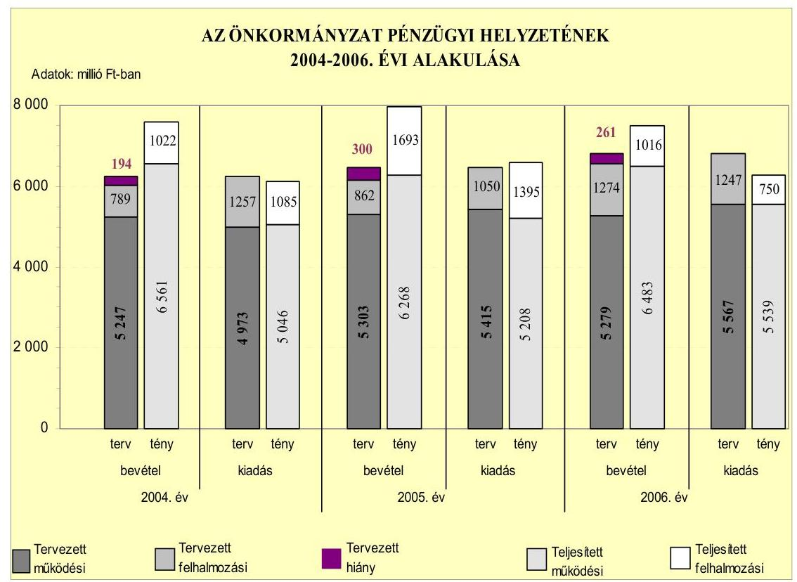
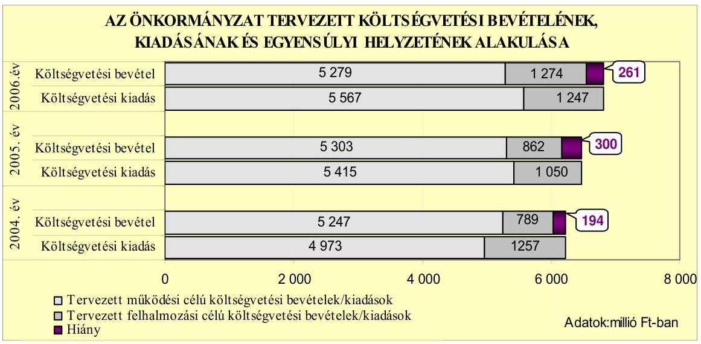
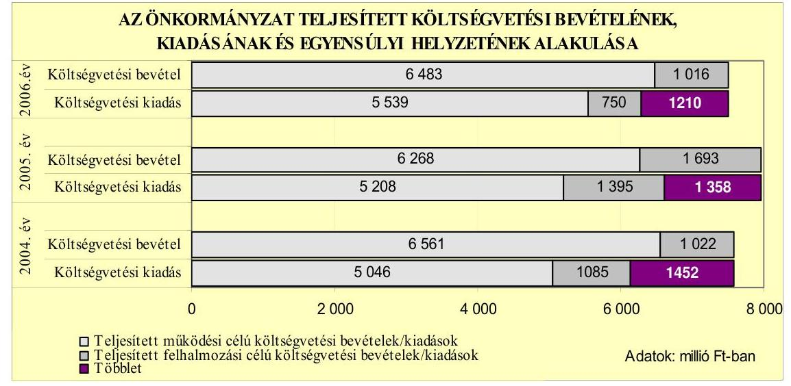
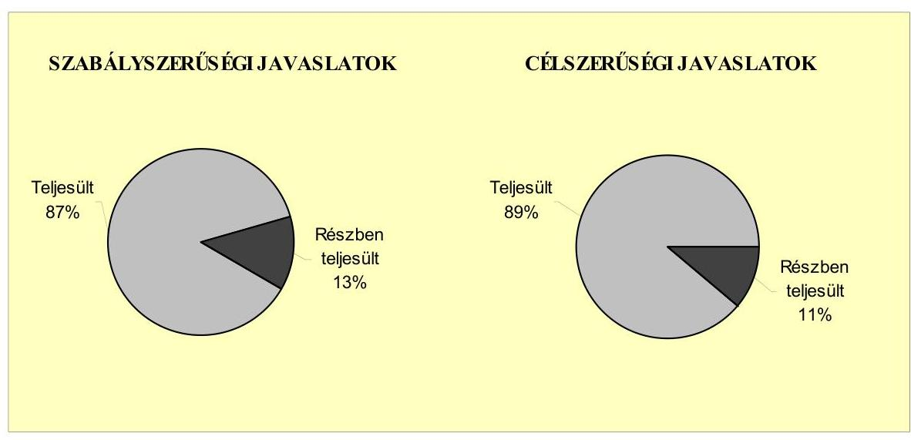
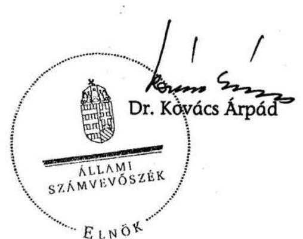
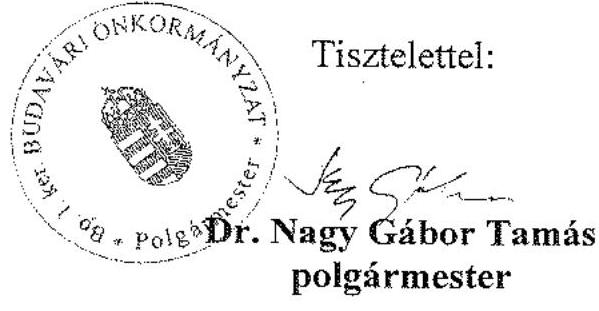

# JELENTÉS 

a Budapest Főváros I. kerület Budavári Önkormányzata gazdálkodási rendszerének 2007. évi átfogó ellenőrzéséről

---

# 3. Önkormányzati és Területi Ellenőrzési Igazgatóság 

3.3. Átfogó Ellenőrzések Főcsoport

Iktatószám: V-1001-9/31/17/2007.
Témaszám: 845
Vizsgálat-azonosító szám: V0329

## Az ellenőrzést felügyelte:

Dr. Lóránt Zoltán
főigazgató
Az ellenőrzés végrehajtásáért felelős:
Dr. Sepsey Tamás
főigazgató-helyettes
Az ellenőrzést vezette:
Molnár Gyula Mihály
igazgató-helyettes
Az ellenőrzést végezték:
Benczik Lászlóné Schósz Attiláné
számvevő tanácsos
Dr. Telkes Imre
számvevő tanácsos

## A témához kapcsolódó eddig készített számvevőszéki jelentések:

## címe

Jelentés Budapest Főváros I. kerület Budavári Önkormányzata gazdálkodásának átfogó ellenőrzéséről
Jelentés a Magyar Köztársaság 2004. évi költségvetése végrehajtásának ellenőrzéséről
Függelék:

- a helyi önkormányzatok beruházásaihoz és rekonstrukcióihoz nyújtott 2004. évi felhalmozási célú támogatások
- a helyi önkormányzatokat a 2004. évben megillető normatív állami hozzájárulás elszámolása
Jelentés a helyi és a helyi kisebbségi önkormányzatok gazdálkodásának átfogó ellenőrzéséről

---

# TARTALOMJEGYZÉK 

BEVEZETÉS ..... 9
I. ÖSSZEGZŐ MEGÁLLAPÍTÁSOK, KÖVETKEZTETÉSEK, JAVASLATOK ..... 13
II. RÉSZLETES MEGÁLLAPÍTÁSOK ..... 18

1. Az Önkormányzat költségvetési és pénzügyi helyzete ..... 18
1.1. A tervezett költségvetési bevételi és kiadási előirányzatok, valamint a költségvetési egyensúly alakulása ..... 20
1.2. A költségvetési bevételek és kiadások teljesítése, a pénzügyi egyensúlyi helyzet alakulása ..... 22
2. Az Önkormányzat felkészültsége az európai uniós források igénylésére és felhasználására, valamint az e-közigazgatási feladatok ellátására ..... 26
2.1. Az európai uniós források igénybevételére és a várható támogatás felhasználásának szervezettségére történt felkészülés és a belső szabályozottság értékelése ..... 26
2.1.1. A fejlesztési célkitűzések meghatározása ..... 26
2.1.2. Az európai uniós forrásokhoz kapcsolódóan a pályázatfigyelés, a pályázat-készítés, valamint az európai uniós támogatással megvalósuló fejlesztés lebonyolítása belső rendjének szabályozottsága, a végrehajtás személyi, szervezeti feltételei ..... 27
2.2. Az e-közigazgatási feladatok előkészítése, bevezetése ..... 29
3. A költségvetési gazdálkodás kontrolljai ..... 31
3.1. A szabályozottság kockázata a költségvetés tervezési, gazdálkodási, beszámolási és a folyamatba épített ellenőrzési feladatainál ..... 31
3.2. A belső kontrollok érvényesülése az önkormányzati források szabályszerű felhasználásában, a költségvetési tervezés, gazdálkodás, beszámolás folyamataiban ..... 34
3.3. A belső ellenőrzési kötelezettség teljesítése, javaslatainak hasznosulása ..... 36
4. Az ÁSZ korábbi ellenőrzési javaslatai alapján készített intézkedési terv végrehajtása, eredményessége ..... 39
4.1. Az Önkormányzat gazdálkodási rendszerének átfogó ellenőrzése során tett javaslatok végrehajtására tervezett intézkedések megvalósulása ..... 39

---

4.2. A zárszámadáshoz kapcsolódó (állami hozzájárulások, támogatások igénylésének és felhasználásának ellenőrzése), valamint a további vizsgálatok esetében a megállapítások, javaslatok alapján tett intézkedések

# MELLÉKLETEK 

1. számú Az Önkormányzat gazdálkodását meghatározó adatok, mutatószámok (1 oldal)
2. számú Az önkormányzati vagyon alakulása (1 oldal)
3. számú Az Önkormányzat 2004-2006. évi költségvetési előirányzatainak és azok pénzügyi teljesítéseinek alakulása (1 oldal)
4. számú 1. számú Nyilatkozat a tervezett és teljesített költségvetési adatoknak a megelőző évhez viszonyított jelentős, ±10%-ot meghaladó változásának indokolásáról, amennyiben azt a feladatok változása indokolta (1 oldal)
5. számú Dr. Nagy Gábor Tamás úr, a Budapest Főváros I. kerület Budavári Önkormányzata polgármestere által adott észrevétel (1 oldal)

---

# RÖVIDÍTÉSEK JEGYZÉKE 

## Törvények

Áht.
Eisztv.
Htv.

Kbt.
Ket.

Ötv.
Számv. tv.

## Rendeletek

2004. évi költségvetési rendelet
2005. évi költségvetési rendelet
2006. évi költségvetési rendelet
2007. évi költségvetési rendelet

Ámr.
Ber.
SzMSz
vagyongazdálkodási rendelet

Vhr.
az államháztartásról szóló 1992. évi XXXVIII. törvény
az elektronikus információszabadságról szóló 2005. évi XC. törvény
a helyi önkormányzatok és szerveik, a köztársasági megbízottak, valamint egyes centrális alárendeltségű szervek feladat- és hatásköreiről szóló 1991. évi XX. törvény
a közbeszerzésekről szóló 2003. évi CXXIX. törvény
a közigazgatási hatósági eljárás és szolgáltatás általános szabályairól szóló 2004. évi CXL. törvény
a helyi önkormányzatokról szóló 1990. évi LXV. törvény
a számvitelről szóló 2000. évi C. törvény

Budapest Főváros I. kerület Budavári Önkormányzatának 2/2004. (III. 1.) számú rendelete a 2004. évi költségvetésről
Budapest Főváros I. kerület Budavári Önkormányzatának 3/2005. (III. 4.) számú rendelete a 2005. évi költségvetésről
Budapest Főváros I. kerület Budavári Önkormányzatának 4/2006. (III. 3.) számú rendelete a 2006. évi költségvetésről
Budapest Főváros I. kerület Budavári Önkormányzatának 4/2007. (III. 2.) számú rendelete a 2007. évi költségvetésről
az államháztartás működési rendjéről szóló 217/1998. (XII. 30.) Korm. rendelet
a költségvetési szervek belső ellenőrzéséről szóló 193/2003. (XI. 26.) Korm. rendelet
Budapest Főváros I. kerület Budavári Önkormányzatának 14/1995. (VII. 10.) számú rendelete az Önkormányzat Szervezeti és Működési Szabályzatáról
Budapest Főváros I. kerület Budavári Önkormányzatának a 15/1995. (XI. 30.) számú rendelete az Önkormányzat vagyonáról, a vagyontárgyak feletti tulajdonosi jogok gyakorlásáról
az államháztartás szervezetei beszámolási és könyvvezetési kötelezettségének sajátosságairól szóló 249/2000. (XII. 24.) Korm. rendelet

---

## Szórövidítések

2004. évi költségvetési koncepció

2005. évi költségvetési koncepció

2006. évi költségvetési koncepció
áfa
ÁSZ
e-közigazgatás
e-ügyintézés
Ellenőrzési csoport

FEUVE
Fővárosi Önkormányzat
GAMESZ
gazdálkodási jogkörök szabályzata
gazdasági program ${ }_{1}$
gazdasági program ${ }_{2}$

GVOP
GVOP információszolgáltatás fejlesztési feladat
Házgondnokság Kft.
informatikai stratégia
jegyzö
Jegyzői titkárság

Budapest Főváros I. kerület Budavári Önkormányzata Képviselő-testületének 276/2003. (XI. 27.) számú határozatával elfogadott költségvetési koncepciója
Budapest Főváros I. kerület Budavári Önkormányzata Képviselő-testületének 284/2004. (XI. 24.) számú határozatával elfogadott költségvetési koncepciója
Budapest Főváros I. kerület Budavári Önkormányzata Képviselő-testületének 231/2005. (XI. 18.) számú határozatával elfogadott költségvetési koncepciója
Általános forgalmi adó
Állami Számvevőszék
elektronikus közigazgatás
elektronikus ügyintézés
Budapest Főváros I. kerület Budavári Önkormányzata Polgármesteri Hivatal Jegyzői Titkárságának Belső Ellenőrzési Referatúrája
folyamatba épített, előzetes és utólagos vezetői ellenőrzés
Budapest Főváros Önkormányzata
Budapest Főváros I. kerület Budavári Önkormányzatának Gazdasági Műszaki Ellátó Szolgálata
a kötelezettségvállalás, ellenjegyzés, érvényesítés és utalványozás rendjéről szóló 2/2005. (VIII. 17.) számú polgármesteri és jegyzői együttes utasítás
Budapest Főváros I. kerület Budavári Önkormányzata Képviselő-testületének 65/2003. (III. 27.) számú határozatával elfogadott gazdasági programja a 2003-2006. évre
Budapest Főváros I. kerület Budavári Önkormányzata Képviselő-testületének 30/2007. (III. 27.) számú határozatával elfogadott gazdasági programja a 2007-2010. évre
Nemzeti Fejlesztési Terv
Gazdasági Versenyképesség Operatív Program
a GVOP-4.3.1. az önkormányzatok információszolgáltató tevékenységének Budapest egységes térinformatikai rendszerének kiépítése fejlesztési feladat
I. kerületi Házgondnoksági Korlátolt Felelősségű Társaság
Budapest Főváros I. kerület Budavári Önkormányzat Képviselő-testületének 10/2002. (I. 31.) számú határozatával elfogadott informatikai stratégia a 2002-2007. évekre
Budapest Főváros I. kerület Budavári Önkormányzatának Jegyzője
Budapest Főváros I. kerület Budavári Önkormányzata Polgármesteri Hivatalának Jegyzői Titkársága

---

| Képviselő-testület | Budapest Főváros I. kerület Budavári Önkormányzatának Képviselő-testülete |
| :--: | :--: |
| MÁK | Magyar Államkincstár |
| NFT | Nemzeti Fejlesztési Terv |
| Norvég alap | az Európai Gazdasági Térség és a Norvég Finanszírozási Mechanizmusok Közösségi Kezdeményezés |
| Okmányiroda | Budapest Főváros I. kerület Budavári Önkormányzata Polgármesteri Hivatala Hatósági Igazgatóságának Okmányirodája |
| Önkormányzat | Budapest Főváros I. kerület Budavári Önkormányzata |
| Pénzügyi bizottság | Budapest Főváros I. kerület Budavári Önkormányzata Képviselő-testületének Pénzügyi Bizottsága |
| Pénzügyi igazgatóság | Budapest Főváros I. kerület Budavári Önkormányzata Polgármesteri Hivatalának Pénzügyi Igazgatósága |
| polgármester | Budapest Főváros I. kerület Budavári Önkormányzatának Polgármestere |
| Polgármesteri hivatal | Budapest Főváros I. kerület Budavári Önkormányzatának Polgármesteri Hivatala |
| Polgármesteri hivatal SzMSz-e | Budapest Főváros I. kerület Budavári Önkormányzata Polgármesteri Hivatalának Szervezeti és Működési Szabályzata, melyet a Képviselő-testület a 21/2005. (III. 3.) számú határozattal fogadott el |
| Polgármesteri kabinet | Budapest Főváros I. kerület Budavári Önkormányzata Polgármesteri Hivatalának Polgármesteri Kabinetje |
| Úgyfélszolgálat | Budapest Főváros I. kerület Budavári Önkormányzata Polgármesteri Hivatal Hatósági Igazgatóságának Úgyfélszolgálata |
| ügyrend | Budapest Főváros I. kerület Budavári Önkormányzata gazdasági szervezetének a gazdálkodással összefüggő feladatairól szóló ügyrendje, mely a Polgármesteri hivatal SzMSz-ének 1. számú melléklete |

---

# ÉRTELMEZŐ SZÓTÁR 

1. elektronikus szolgáltatási szint
2. elektronikus szolgáltatási szint
3. elektronikus szolgáltatási szint
4. elektronikus szolgáltatási szint
európai uniós források
fejlesztési feladat (projekt)
fejlesztési célkitűzés

Az 1044/2005. (V. 11.) Korm. határozat alapján olyan információs, tájékoztató szolgáltatás, amely csak általános információkat közöl az adott üggyel kapcsolatos teendőkről és a szükséges dokumentumokról.
Az 1044/2005. (V. 11.) Korm. határozat alapján olyan egyirányú kapcsolatot biztosító szolgáltatás, amely az 1. szinten túl biztosítja az adott ügy intézéséhez szükséges dokumentumok, nyomtatványok letöltését, és azok ellenőrzéssel, vagy ellenőrzés nélküli elektronikus kitöltését, amely esetben a dokumentumok benyújtása hagyományos úton történik.
Az 1044/2005. (V. 11.) Korm. határozat alapján olyan kétirányú kapcsolatot biztosító szolgáltatás, amely közvetlen, vagy ellenőrzött kitöltésű dokumentum segítségével biztosítja az elektronikus adatbevitelt és a bevitt adatok ellenőrzését. Az ügy indításához, intézéséhez személyes megjelenés nem szükséges, de az ügyhöz kapcsolódó közigazgatási döntés (határozat, egyéb aktus) közlése, valamint a kapcsolódó illeték-, vagy díjfizetés hagyományos úton történik.
Az 1044/2005. (V. 11.) Korm. határozat alapján olyan teljes közvetlen kétirányú ügyintézési folyamatot biztosító szolgáltatás, amikor az ügyhöz kapcsolódó közigazgatási döntés is elektronikus úton kerül közlésre, illetve a kapcsolódó illeték-, vagy díjfizetés elektronikus úton is intézhető.
Az elnyert európai uniós források lehívása a támogatott projekt megvalósítása érdekében, a fejlesztés lebonyolítása során felmerült kiadások finanszírozására.
A fejlesztési feladat (projekt) tartalmilag és formailag részletesen kidolgozott, megfelelő pénzügyi háttérrel és végrehajtási ütemezéssel rendelkező fejlesztési terv, amely illeszkedik az Európai Unió, illetve a Nemzeti Fejlesztési Terv által támogatott programokhoz.
Az önkormányzat által ellátott kötelező, vagy önként vállalt feladatok ellátásának mennyiségi, vagy minőségi fejlesztésére vonatkozó terv. A mennyiségi fejlesztés megvalósulhat beszerzéssel, létesítéssel, bővítéssel, átalakítással.

---

operatív program
Az Európai Bizottság által jóváhagyott, a Közösségi Támogatási Keret végrehajtására vonatkozó 2004-2006 közötti, több évre szóló intézkedésekhez kapcsolódó prioritások egységes rendszerét tartalmazó dokumentum. A strukturális alapok operatív programjai: Agrár és Vidékfejlesztési Operatív Program (AVOP); Gazdasági Versenyképesség Operatív Program (GVOP); Humánerőforrás-fejlesztési Operatív Program (HEFOP); Környezetvédelmi és Infrastruktúra-fejlesztési Operatív Program (KIOP); Regionális Fejlesztési Operatív Program (ROP).

---

.

---

# JELENTÉS 

## Budapest Főváros I. kerület Budavári Önkormányzata gazdálkodási rendszerének 2007. évi átfogó ellenőrzéséről

## BEVEZETÉS

Az Ötv. 92. § (1) bekezdése, az Állami Számvevőszékről szóló 1989. évi XXXVIII. törvény 2. § (3) bekezdése, valamint az Áht. 120/A. § (1) bekezdése alapján az önkormányzatok gazdálkodását az Állami Számvevőszék ellenőrzi. Az ellenőrzésre az Országgyűlés illetékes bizottságai részére is átadott, országosan egységes ellenőrzési program szerint került sor.

Az Állami Számvevőszék a stratégiájában foglalt célkitűzéseknek megfelelően a helyi önkormányzatok költségvetési gazdálkodási rendszere átfogó ellenőrzésének programját a 2007. évtől megújította, azt kiegészítette további - teljesítmény-ellenőrzési - elemekkel.

## Az ellenőrzés célja annak értékelése volt, hogy az Önkormányzat:

- a pénzügyi egyensúlyt a költségvetésében és annak teljesítése során milyen módon biztosította, a teljesített bevételek és kiadások egyes évek közötti jelentős eltérése feladatváltozáshoz kapcsolódott-e;
- felkészült-e a szabályozottság és a szervezettség terén az európai uniós források igénylésére és felhasználására, továbbá az e-közigazgatás bevezetése miatti szervezet-korszerűsítési feladatokra;
- kialakította-e a külső és a belső feltételeknek megfelelően a gazdálkodás belső kontrollrendszerét ${ }^{1}$, továbbá a költségvetés tervezési, végrehajtási és zárszámadási feladatok szabályszerű ellátásához hozzájárult-e a folyamatba épített, előzetes és utólagos vezetői ellenőrzés, valamint a belső ellenőrzés;
- megfelelően hasznosították-e a korábbi számvevőszéki ellenőrzések megállapításait, szabályszerűségi ${ }^{2}$ és célszerűségi javaslatait.

[^0]
[^0]:    ${ }^{1}$ A gazdálkodás szabályszerűségét biztosító kontrollrendszer alatt értjük a kiépített és működő belső irányítási és szabályozási rendszert, valamint a belső ellenőrzési funkciók ellátásának rendszerét.
    ${ }^{2}$ A törvényi előírások betartásának elmulasztásakor a részletes megállapítások fejezetben egységesen a törvénysértés megjelölést alkalmazzuk, mivel az ÁSZ nem tehet különbséget a törvényi előírások között.

---

Az ellenőrzött időszak: az 1., 2. és 4. programpontok tekintetében a 2004-2006. évek és a 2007. év I. negyedév, a 3. ellenőrzési programpontnál a 2006.
 év és a 2007. év I. negyedév.

Budapest Főváros I. kerület lakosainak száma 2007. január 1-én 26482 fő volt. A 2006. évi önkormányzati választást követően az Önkormányzat 24 tagú Képviselő-testületének munkáját hat állandó bizottság segítette. A helyi önkormányzat mellett a 2006. évi önkormányzati választásokig kilenc ${ }^{3}$, azt követően hat ${ }^{4}$ kisebbségi önkormányzat működött. A polgármester az 1998. évi önkormányzati választás óta tölti be tisztségét, a jegyző személye 2007. április 1. napján változott.

Az Önkormányzat feladatainak végrehajtása érdekében a 2006. évben 18 költségvetési intézményt működtetett, amelyekből hat önállóan gazdálkodott. A feladatok ellátásában részt vett egy gazdasági társasága. Az Önkormányzat költségvetési szerveinél 2006. december 31-én foglalkoztatott közalkalmazottak száma 705 fő, a köztisztviselők száma 124 fő volt. Az Önkormányzat a 2006. évi költségvetési beszámolója szerint 7499 millió Ft költségvetési bevételt ért el és 6289 millió Ft költségvetési kiadást teljesített, 2006. december 31-én a könyvviteli mérleg szerint 15451 millió Ft értékű vagyonnal rendelkezett. A 2007. évi költségvetési rendeletben 7068 millió Ft költségvetési bevételt és 7067 millió Ft költségvetési kiadást irányoztak elő. Az Önkormányzat gazdálkodását meghatározó adatokat, mutatószámokat az 1-3. számú mellékletek tartalmazzák.

Az Önkormányzat költségvetési és pénzügyi helyzetét az összehasonlító elemzés módszerével vizsgáltuk. E körben elemeztük a költségvetés egyensúlyi helyzetének alakulását, a tervezett és tényleges költségvetési hiány okait, a mérséklésére tett intézkedéseket, finanszírozásának módját, az Önkormányzat adósságállományának alakulását, összetevőit.

A teljesítmény-ellenőrzés módszerével vizsgáltuk, hogy a belső szabályozottság, szervezettség terén felkészültek-e az európai uniós források figyelésére, igénylésére és felhasználására, valamint az igényelt európai uniós támogatások az Önkormányzat által meghatározott fejlesztési célkitűzésekhez kapcsolódtak-e. Az ellenőrzés során felmértük, hogy az e-közigazgatási feladat ellátása, illetve bevezetése, működtetése érdekében milyen intézkedéseket tettek, valamint biztosították-e a közérdekű adatok elektronikus közzétételét.

A költségvetési gazdálkodás belső kontrolljainak ellenőrzése során értékeltük, hogy a Polgármesteri hivatalnál a költségvetés tervezési, gazdálkodási, zárszámadás készítési feladatok belső kontrolljainak kiépítettsége és működése megfelelő biztosítékot ad-e a gazdálkodási feladatok megfelelő, szabályszerű ellátására. Felmértük és minősítettük a költségvetés tervezési, a gazdálkodási, a zárszámadás készítési feladatokkal, továbbá a pénzügyi-számviteli területen az informatikával kapcsolatosan kialakított kontrollok megfelelőségét, vala-

[^0]
[^0]:    ${ }^{3}$ Bolgár, görög, lengyel, német, örmény, roma, román, szerb, szlovák kisebbségi önkormányzatok.
    ${ }^{4}$ Görög, lengyel, német, örmény, szerb, szlovák kisebbségi önkormányzatok.

---

mint azok működésének eredményességét, megbízhatóságát. Értékeltük a belső ellenőrzés szervezeti és szabályozási keretét, továbbá működését.

A Polgármesteri hivatalnál értékeltük a gazdálkodás folyamatában a kontrollok működésének megbízhatóságát, ennek keretében ellenőriztük a szakmai teljesítés igazolására és az utalvány ellenjegyzésére kialakított kontrollok végrehajtását. Az ellenőrzést a következő, kiemelt kockázatuk alapján kiválasztott ${ }^{5}$, az általánostól jellemzően eltérő, egyedi eljárást igénylő gazdasági eseményekkel kapcsolatos kifizetésekre folytattuk le ${ }^{6}$ :

- a személyi juttatások közül az állományba nem tartozók megbízási díjai ${ }^{7}$,
- a külső szolgáltató által végzett karbantartási, kisjavítási szolgáltatások, valamint
- a gépek, berendezések, felszerelések beszerzése.

Az ellenőrzés hatékony elvégzése céljából a vizsgálandó területek kiválasztása során a kockázatokon alapuló megközelítés érvényesült, ezáltal az ellenőrzési erőforrásokat azokra a területekre fókuszáltuk, amelyeken legnagyobb a hibák előfordulási valószínűsége. Az ellenőrzési erőforrások ilyen típusú összpontosításával minimálisra csökkenthető a kívánt ellenőrzési bizonyosság eléréséhez szükséges időráfordítás.

A pénzügyi-számviteli folyamatokban alkalmazott belső kontrollok létezésének és működésének ellenőrzésére a vizsgált három terület 2006. évi könyvviteli tételeiből területenként egyszerű véletlen mintát vettünk. A kijelölt gazdasági eseményre elvégzett megfelelőségi tesztek alapján értékeltük a kontrollok működésének eredményességét, megbízhatóságát a vizsgált három területre külön-külön, majd összefoglalóan ${ }^{8}$ a Polgármesteri hivatal egyedi eljárást igénylő gazdasági eseményeire. A helyszíni ellenőrzés megállapításainak részletes do-

[^0]
[^0]:    ${ }^{5}$ Az önkormányzatok kiemelt előirányzataira vonatkozóan, a vertikális folyamatokra elvégeztük a kockázatok becslését, amelynek eredményeként az állományba nem tartozók megbízási díjai, a külső szolgáltató által végzett karbantartási, kisjavítási szolgáltatások, valamint a gépek, berendezések, felszerelések beszerzése kiemelkedően kockázatos területnek bizonyultak.
    ${ }^{6}$ A korábbi ellenőrzési tapasztalataink szerint ezeken a területeken a jegyzők nem, vagy hiányosan szabályozták a megbízás, megrendelés, illetve beszerzés indokoltságának, szükségességének elbírálására, igazolására, valamint a teljesítések dokumentálására, a kifizetések jogosságának megítélésére szolgáló kontrollokat. További kockázatot jelentett a külső szolgáltató által végzett karbantartási, kisjavítási munkák esetében, hogy az 50 ezer Ft alatti megrendelésekre vonatkozóan az ellenőrzési tapasztalataink szerint a jegyzők nem alakították ki a kötelezettségvállalások rendjét és nyilvántartási formáját, valamint a szabályozás elmulasztása esetén nem történt meg az írásbeli kötelezettségvállalás és annak az ellenjegyzése sem.
    ${ }^{7}$ Az állományba tartozók rendszeres személyi juttatásainak számfejtését, valamint folyósítását nem a polgármesteri hivatalok, hanem a nettó finanszírozás keretében a beküldött dokumentumok alapján a MÁK végzi.
    ${ }^{8}$ A vizsgált három terület egyedi értékelési pontszámait a területek relatív költségvetési súlyával arányosan összegeztük.

---

kumentálását három megfelelőségi tesztlapon, öt elővizsgálati és kilenc helyszíni ellenőrzési munkalapon biztosítottuk. Ezeken a teszt- és munkalapokon a minősítés alapjául szolgáló kérdések és a vonatkozó konkrét jogszabályhelyek megjelölése mellett értékeltük a kialakított belső kontrollokban rejlő kockázatokat ${ }^{9}$ és a kialakított kontrollok működésének megbízhatóságát ${ }^{10}$.

Az ÁSZ korábbi ellenőrzési javaslatai alapján tett intézkedéseket, illetve azok megvalósítását utóellenőrzés keretében vizsgáltuk. A gazdálkodási rendszer átfogó ellenőrzése során megfogalmazott javaslatok végrehajtására tett intézkedések megvalósítását ellenőriztük, az egyéb számvevőszéki ellenőrzések során tett javaslatok esetében pedig a kiadott intézkedéseket tekintettük át.

A helyszíni ellenőrzés során kitöltött - az ellenőrzést végző számvevő és a Polgármesteri hivatal felelős köztisztviselője által aláírt - elővizsgálati és helyszíni ellenőrzési munkalapokat, azok kitöltési útmutatóit, továbbá a megfelelőségi tesztek dokumentumait a polgármester részére a számvevői jelentéssel egyidejűleg átadtuk.

A jelentést az ÁSZ-ról szóló 1989. évi XXXVIII. tv. 25. § (1) bekezdése alapján észrevétel közlése céljából megküldtük a Budapest Főváros I. kerület Budavári Önkormányzata polgármesterének. A kapott észrevételt a jelentés 5. számú melléklete tartalmazza.

[^0]
[^0]:    ${ }^{9}$ A kialakított belső kontrollokban rejlő kockázatot alacsonynak minősítettük, ha a kontrollok - végrehajtásuk esetén - megfelelő védelmet nyújtanak a hibák bekövetkezése ellen. Közepesnek minősítettük a belső kontrollokban rejlő kockázatot, amennyiben a kontrollok - végrehajtásuk esetén - a lehetséges hibák többsége ellen védelmet nyújtanak. Magasnak értékeltük a kockázatot, ha a kontrollok - kialakításuk hiányában, vagy hiányos kialakításuk miatt - nem nyújtanak elegendő védelmet a lehetséges hibákkal szemben.
    ${ }^{10}$ A kontrollok működésének eredményességét, megbízhatóságát kiválónak értékeltük abban az esetben, ha azok működése - esetleges apróbb hiányosságoktól eltekintve - megfelelt a hibák megelőzésére és kijavítására meghatározott szabályozásnak és a legmagasabb szintű elvárásoknak. Jónak minősítettük a kontrollok működését, ha a hiányosságok száma ugyan jelentős volt, de nem veszélyeztette az ellenőrzött terület hibáinak megelőzését és kijavítását. Amennyiben a hiányosságok mértéke nem biztosította a hibák megelőzését, feltárását, kijavítását és ezáltal veszélyeztette az eredményes, megbízható működést, a kontroll gyenge minősítést kapott.

---

# I. ÖSSZEGZŐ MEGÁLLAPÍTÁSOK, KÖVETKEZTETÉSEK, JAVASLATOK 

Az Önkormányzatnál a 2004-2006. évek között tervezett költségvetési bevétel és kiadás évről-évre nőtt, a tervezett költségvetési bevételek és kiadások egyensúlya nem volt biztosított. A 2004. évben a tervezett felhalmozási célú költségvetési bevételek nem nyújtottak fedezetet a felhalmozási célú kiadásokra, a 2005. évben sem a működési, sem a felhalmozási célú források nem biztosítottak fedezetet az azonos célú kiadásokra, a 2006. évben a működési célú költségvetési kiadásoknál terveztek forráshiányt. A költségvetési egyensúlyt a költségvetési rendeletekben mindhárom évben működési célú hitel felvételével tervezte biztosítani az Önkormányzat. A 2004. és a 2006. évi költségvetési rendeletekben a költségvetés bevételi és kiadási főösszegének megállapításakor az Áht. előírásai ellenére finanszírozási célú pénzügyi műveletet vettek figyelembe költségvetési kiadásként. A 2007. évi költségvetési rendeletben már nem szerepeltettek forráshiányt, a költségvetés egyensúlyban volt.

Az Önkormányzat a gazdálkodását - a tervezettel szemben - mindhárom évben hitel igénybevétele nélkül teljesítette. A teljesített működési célú költségvetési bevételek a működési célú költségvetési kiadásokat a 2004-2006. években fedezték, azonban a bevételi többlet összege folyamatosan csökkent. A felhalmozási célú költségvetési kiadások hiánya a 2004. évben 63 millió Ft volt, melynek megszüntetése érdekében működési célú költségvetési bevételt használtak fel. A 2005. és a 2006. évben a felhalmozási célú költségvetési bevételeknél 298 millió Ft, illetve 266 millió Ft többlet képződött.

A teljesített működési célú költségvetési bevételek a 2004. évről a 2005. évre nem a kiadásokkal összhangban változtak, a változás iránya egymással ellentétes volt, a bevételek 5%-kal csökkentek, a kiadások 3%-kal növekedtek, a 2006. évben azonban a teljesített működési célú költségvetési bevételek és kiadások változásának iránya azonos volt. A teljesített felhalmozási célú költségvetési bevételek és kiadások változásának iránya mindhárom évben - az előző évhez képest - azonos volt, azonban a 2005. évben nem egymással összhangban változtak. A 2005. évi növekedésből a tárgyi eszközök, immateriális javak értékesítéséből származó bevétel 91%-a függött össze az Önkormányzat által ellátott feladat változásával, a Budapest I. kerület Lovas úti mélygarázs 25 év időtartamra szóló haszonélvezeti jogának értékesítésével. A 2006. évi felhalmozási célú költségvetési bevételek csökkenéséhez hozzájárult a tárgyi eszközök, immateriális javak, támogatás értékű felhalmozási bevételek és az önkormányzati lakások, helyiségek értékesítéséből származó bevételek csökkenése, valamint a részesedések értékesítéséből elért bevétel növekedése. A teljesített felhalmozási célú költségvetési kiadások az előző évhez viszonyítva a 2005. évre 29%-kal növekedtek, a 2006. évre 46%-kal csökkentek. A 2005. évi növekedésből a beruházási kiadások 71%-a függött össze feladat változással, a Budapest I. kerület Lovas úti mélygarázs önkormányzati tulajdonba kerülésével. A 2006. évi csökkenést a beruházási kiadások, a támogatás értékű felhalmozási kiadások és a felhalmozási célú pénzeszköz átadások csökkenése okozta. Mindezeket mérsékelte a felújítások növekedése.

---

Az Önkormányzat 2004-2006. évi költségvetéseiben tervezett költségvetési bevételek eredeti előirányzatai (26-29-14%-kal) túlteljesültek, ugyanakkor a költségvetési kiadások tervszámai 98%-ra, 102%-ra és 92%-ra teljesültek. A bevételek túlteljesítéséhez hozzájárult, hogy az előző évi pénzmaradvány igénybevételének lehetőségét a 2004. évben figyelmen kívül hagyták, valamint a kamatbevételeket mindhárom évben alultervezték.

Az Önkormányzat a valós szükségleteken alapuló több évre vonatkozó - kötelező feladataihoz kapcsolódó - fejlesztési célkitűzéseit gazdasági programban${ }_{1,2}$ költségvetési koncepciókban és szolgáltatás-tervezési koncepcióban meghatározta. A Képviselő-testület a 2004-2006. évek között kettő európai uniós forrással támogatott fejlesztési feladat megvalósításának kezdeményezéséről döntött, azonban az Önkormányzat az NFT keretében a strukturális alapok pénzeszközeinek terhére meghirdetett, valamint a kohéziós alap keretstratégiájában megfogalmazott célrendszerrel összefüggő európai uniós pályázatot nem adott be. Az Önkormányzat felkészülése az európai uniós források igénybevételére és felhasználására a belső szabályozottság terén összességében nem volt eredményes. Önkormányzati szinten nem szabályozták a pályázatfigyelés, a pályázat-készítés és
 a támogatott fejlesztések lebonyolítási feladatainak rendjét, az ellenőrzés, valamint a pályázatok nyilvántartásával kapcsolatos feladatokat. A szabályzatok nem tartalmazták a pályázatkészítés személyi és szervezeti feltételeit. A Polgármesteri hivatali szintű feladatait belső szabályzatokban meghatározták, a döntési jogkörök szabályozása azonban elmaradt. A pályázatfigyelési feladatokat előírták, annak személyi és szervezeti feltételeiről köztisztviselők alkalmazásával, valamint gazdasági társaság megbízásával gondoskodtak, ennek feltételeit a Polgármesteri hivatalban biztosították. A szabályozás hiányosságait polgármesteri-jegyzői közös utasításban, valamint a Polgármesteri hivatal SzMSz-ének módosításában 2007. június hónapban megszüntették.

Az Önkormányzat az e-közigazgatási feladatok előkészítésére és bevezetésére felkészült. Rendelkeztek informatikai stratégiával, amelynek célkitűzései között konkrét előírásokat határoztak meg az e-közigazgatási feladatok folyamatos bevezetésére. Az Önkormányzat a GVOP információszolgáltatás fejlesztési feladat végrehajtásához a 2004-2006. években nem pályázott támogatásért. Az Önkormányzat honlapján a 2006. évben az e-közigazgatási feladatokat ellátó informatikai rendszert működtették. Az Önkormányzat az önkormányzati szolgáltatások e-közigazgatás keretében történő ügyintézését az állampolgárok részére a személyi okmányokkal, lakcímváltozás bejelentésével, gépjármű regisztrációval, súlyadó fizetéssel, szociális juttatások, támogatások fizetésével, egészségüggyel kapcsolatos szolgáltatások ügykörökben 2. elektronikus szolgáltatási szinten, a hatósági igazolások, építési engedélyezések, helyi adózás (építményadó, telekadó) ügykörökben 3. elektronikus szolgáltatási szinten valósította meg. Az Önkormányzat az Eisztv-ben előírt közérdekű adatok közzétételére nem volt kötelezett. A gazdálkodási adatokra vonatkozó közzétételi kötelezettségnek az Önkormányzat honlapján az Áht. és az Ámr. előírása szerint eleget tettek. A közigazgatási feladatokat ellátó informatikai rendszer ügyfelek általi igénybevételének tapasztalatait nem értékelték.

A Polgármesteri hivatalban a költségvetés tervezési és a zárszámadás készítési folyamatok szabályozottsága összességében alacsony kockázatot jelentett a fel-

---

adatok szabályszerű végrehajtásában, mivel a pénzügyi irányítási és ellenőrzési rendszer meghatározása keretében a jegyző kialakította a költségvetés tervezési és a zárszámadás készítési folyamatok ellenőrzési feladatait. A költségvetés tervezés és a zárszámadás készítés folyamatában a kontrollok működésének megbízhatósága kiváló volt, mivel a vonatkozó jogszabályokban és a kialakított belső szabályozásban foglaltaknak megfelelően végezték el az ellenőrzési és egyeztetési feladatokat.

A gazdálkodási és a folyamatba épített ellenőrzési feladatok szabályozottsága összességében alacsony kockázatot jelentett a gazdálkodási feladatok megfelelő és szabályszerű végrehajtásában, mivel a Polgármesteri hivatal rendelkezett a helyi sajátosságoknak megfelelő szervezeti és működési szabályzattal, pénzügyi-számviteli és ellenőrzési szabályzatokkal. Az összességében alacsony kockázat mellett feltárt gazdálkodási, pénzügyi-számviteli folyamatok szabályozottságának hiányosságait 2007. II. negyedévében megszüntették.

A Polgármesteri hivatalnál a gazdasági eseményekkel kapcsolatos kifizetések során a működésbeli hibák megelőzésére, feltárására, kijavítására kialakított kontrollok működésének megbízhatósága összességében kiváló volt. A szakmai teljesítésigazolás és az utalvány ellenjegyzés működése megfelelő biztosítékot adott a gazdálkodási feladatok szabályszerű ellátására. A karbantartási, kisjavítási munkák kifizetéseinél egy esetben elmaradt a kötelezettségvállalás írásba foglalása, valamint kettő esetben a szakmai teljesítés igazolását nem a jegyző által kijelölt személyek végezték el. Az utalvány ellenjegyzője ezáltal nem győződött meg a gazdálkodásra vonatkozó szabályok érvényesüléséről, valamint arról, hogy a szakmai teljesítés igazolás - az arra kijelölt személy által - megtörtént-e, azonban a kontrollok megbízhatósága a feltárt eseti hibák ellenére összességében kiváló volt. A költségvetési pénzforgalmat érintő gazdasági események könyvviteli elszámolása során a karbantartási, kisjavítási szolgáltatások főkönyvi számlán számoltak el társasházaknak nyújtott működési célú pénzeszközátadást a Vhr-ben foglalt előírásokkal szemben, mivel a főkönyvi számlaszámot az Ámr. előírása ellenére nem a gazdasági esemény tartalmának megfelelően jelölte ki az érvényesítő.

A Polgármesteri hivatalban az informatikai rendszer szabályozottsága alacsony kockázatot jelentett az informatikai feladatok biztonságos végrehajtásában, mivel rendelkeztek informatikai stratégiával, biztonsági és biztonságtechnikai szabályzattal, továbbá katasztrófa elhárítási tervvel. Az informatikai rendszer 2006. évi működtetésénél a működésbeli hibák megelőzésére, feltárására, kijavítására kialakított kontrollok működésének megbízhatósága kiváló volt, mivel biztosította a pénzügyi-számviteli feladatok biztonságos, dokumentált és ellenőrzött működési feltételeit.

A belső ellenőrzés szervezeti kereteinek kialakítása és szabályozási szintje a belső ellenőrzés végrehajtásában összességében alacsony kockázatot jelentett, mivel a Polgármesteri hivatalon belül Ellenőrzési csoportot hoztak létre, a belső ellenőrzés funkcionális függetlenségét biztosították. Az éves ellenőrzési tervek kockázatelemzéssel alátámasztott stratégiai terven alapultak. Annak ellenére összességében alacsony volt a kockázat, hogy az ellenőrzési programok kettő esetben nem tartalmazták az ellenőrzés módszereit, öt ellenőrzési programban nem határozták meg az ellenőrök feladatmegosztását. A belső ellenőrzés mű-

---

ködésének megbízhatósága összességében kiváló volt, mivel a hibák feltárásával, célirányos intézkedések kezdeményezésével, a realizálás ellenőrzésével hozzájárult a kontroll kockázatok csökkentéséhez. Annak ellenére összességében kiváló volt az ellenőrzési rendszer megbízhatósága, hogy a közbeszerzéseket és a közbeszerzési eljárásokat nem ellenőrizték. Az intézményi felújítások ellenőrzéséről készült jelentésben az ellenőrzési program célkitűzése nem teljesült, továbbá az átadott pénzeszközökkel történő elszámolások szabályszerűségéhez kapcsolódó intézkedési tervet az előírt 15 napos határidőn túl, kettő hét késedelemmel készítették el, valamint a jegyző a Ber. előírása ellenére öt esetben nem hagyta jóvá az intézkedési tervet. A 2006. évben a Polgármesteri hivatalban és egy intézménynél vizsgálták a FEUVE rendszer kiépítésének és működésének megfelelőségét, az Önkormányzat saját tulajdonú vagyonkezelő szervezeténél ellenőrizték a tulajdonvédelmet, vizsgálták a céljelleggel adott támogatások rendeltetés szerinti felhasználását. A tervezett ellenőrzéseket megvalósították. Az ellenőrzési jelentések értékelték a rendelkezésre álló információkat, tartalmaztak ajánlásokat, következtetéseket, javaslatokat. Az ellenőrzöttek észrevételt nem tettek, az intézkedési tervet elkészítették. A végrehajtásról készített külön beszámolóban adtak számot az ellenőrzöttek a javaslatok teljesítéséről, illetve a belső ellenőrök utóellenőrzés keretében győződtek meg azok hasznosulásáról. A jegyző az Áht. előírásának megfelelően beszámolt a FEUVE, valamint a belső ellenőrzés működtetéséről. A polgármester az Ötv. előírását betartva a zárszámadási rendelettervezettel egyidejűleg a Képviselő-testület elé terjesztette a költségvetési szervek éves jelentései alapján készített éves összefoglaló ellenőrzési jelentést.

Az ÁSZ a 2004-2006. években végzett ellenőrzései során tett javaslatai összességében 87%-ban hasznosultak, 13%-ban részben teljesültek. Az ÁSZ az Önkormányzat gazdálkodását átfogó jelleggel a 2004. évben ellenőrizte. A Képviselő-testület határozatával tudomásul vette a jelentésben foglaltakat és az ellenőrzés javaslatainak realizálása érdekében a polgármester és a jegyző intézkedési tervet hagyott jóvá a felelősök, valamint a határidők megjelölésével. A szabályszerűségi javaslatok 78%-ban hasznosultak, 22%-ban részben valósultak meg. Részben teljesültek a költségvetési hiány bemutatására, a gazdálkodással kapcsolatos szabályzatok kiegészítésére, az érvényesítési feladatok elvégzésére vonatkozó javaslatok. A hat célszerűségi javaslatból öt teljesült, egy mely a házipénztáron kívüli pénzkezelésre vonatkozott - részben valósult meg. A zárszámadáshoz kapcsolódóan az ÁSZ a 2005. évben ellenőrizte a normatív állami hozzájárulások elszámolását, valamint a felhalmozási célú támogatások igénylését és felhasználását. A számvevői jelentésekben megfogalmazott öt szabályszerűségi és három célszerűségi javaslatot az Önkormányzat hasznosította.

Az átfogó és a zárszámadáshoz kapcsolódó ellenőrzések javaslatai megvalósításának eredményeként javult a költségvetés készítésének rendje, a gazdálkodási és a pénzügyi-számviteli feladatok ellátásának szabályozottsága, a belső kontrollrendszer, valamint a belső ellenőrzés működése.

---

A helyszíni ellenőrzés megállapításainak hasznosítása mellett javasoljuk:

# a polgármesternek 

a munka színvonalának javítása érdekében
kezdeményezze, hogy a jelentésben foglaltakat a Képviselő-testület tárgyalja meg és a feltárt hiányosságok megszüntetése érdekében készíttessen intézkedési tervet a határidők és felelősök megjelölésével;

## a jegyzőnek

a jogszabályi előírások maradéktalan betartása érdekében

1. gondoskodjon a kiadások teljesítésének elrendelése előtt, hogy a kijelölt személyek végezzék el az Ámr. 135. § (2) bekezdésében előírtaknak megfelelően a szakmai teljesítés igazolását, és az Ámr. 137. § (3) bekezdése alapján az utalvány ellenjegyzője győződjön meg a gazdálkodásra vonatkozó szabályok betartásáról, valamint arról, hogy a szakmai teljesítés igazolás az arra kijelölt személy által megtörtént-e;
a munka színvonalának javítása érdekében
2. elemezze és értékelje az e-közigazgatási feladatot ellátó informatikai rendszer adatait, az ügyfelek általi igénybevétel tapasztalatait;
3. gondoskodjon arról, hogy az ellenőrzési program célkitűzéseit az ellenőrzési jelentésekben minden esetben teljesítsék;
4. intézkedjen, hogy kockázatelemzés alapján a Polgármesteri hivatalban és az intézményeknél a belső ellenőrzés keretében ellenőrizzék a közbeszerzéseket, illetve a közbeszerzési eljárásokat.

---

# II. RÉSZLETES MEGÁLLAPÍTÁSOK 

## 1. Az ÖNKORMÁNYZAT KÖLTSÉGVETÉSI ÉS PÉNZÜGYI HELYZETE

Az Önkormányzatnál a 2004-2006. évek között tervezett költségvetési bevétel és kiadás évről évre nőtt, míg a teljesített költségvetési bevétel és kiadás a 2004. évről a 2005. évre emelkedett, majd a 2006. évre csökkent. Az Önkormányzat költségvetésének egyensúlya a 2004-2006. években nem volt biztosított, mivel a költségvetési bevételek előirányzata egyik évben sem fedezte a tervezett költségvetési kiadásokat. A teljesítési adatok alapján ugyanakkor nem alakult ki költségvetési hiány, a költségvetési bevételek mindhárom évben fedezetet nyújtottak a költségvetési kiadásokra.

A tervezett és a teljesített összes költségvetési bevétel és kiadás alakulását a 2004-2006. években az alábbi ábra szemlélteti:

A 2005. évi költségvetési rendeletben a költségvetési bevételek és költségvetési kiadások különbségeként az Áht. 8. § (1) bekezdésében ${ }^{11}$ foglaltak alapján a tervezett hiányt bemutatták. A 2004. és a 2006. évben a költségvetési rendeletekben nem a költségvetési bevételek és költségvetési kiadások, hanem az összes bevétel és összes kiadás különbségeként mutatták be a hiányt, melynek

[^0]
[^0]:    ${ }^{11}$ Az Áht. 8. § (1) bekezdése 2007. január 1-től hatályát vesztette.

---

következtében - megsértve az Áht. 8/A. § (7) bekezdésében előírtakat - finanszírozási célú pénzügyi műveletet (hiteltörlesztéssel kapcsolatos kiadást) vettek figyelembe költségvetési hiányt módosító költségvetési kiadásként ${ }^{12}$. A hiteltörlesztéssel kapcsolatos kiadás pénzügyi lízing törlesztés volt ${ }^{13}$. A pénzügyi lízing és a hitel jogviszonyok a következő tartalmi elemeiknek a vonatkozásában megegyeznek: célja beruházás megvalósításához pénzügyi forrás biztosítása, melynek törlesztése határozott időtartam alatt, részletekben történik. A pénzügyi lízing törlesztését az Önkormányzat éves költségvetési beszámolóiban a finanszírozási célú pénzügyi műveletek között szerepeltették.

Az Önkormányzatnál a 2004-2006. években tervezett és teljesített működési és felhalmozási célú költségvetési kiadásokra a következő arányban biztosítottak fedezetet a költségvetési bevételek:

Adatok: %-ban

| Megnevezés | 2004. év |  | 2005. év |  | 2006. év |  |
| :--: | :--: | :--: | :--: | :--: | :--: | :--: |
|  | terv | tény | terv | tény | terv | tény |
| Működési célú költségvetési kiadások fedezettsége működési célú költségvetési bevételekből | 105,5 | 130,0 | 97,9 | 120,4 | 94,8 | 117,0 |
| Felhalmozási célú költségvetési kiadások fedezettsége felhalmozási célú költségvetési bevételekből | 62,8 | 94,2 | 82,1 | 121,4 | 102,2 | 135,5 |
| Költségvetési kiadások fedezettsége költségvetési bevételekből | 96,9 | 123,7 | 95,4 | 120,6 | 96,2 | 119,2 |

A tervezett működési célú költségvetési bevételek a 2005-2006. években, a tervezett felhalmozási célú költségvetési bevételek a 2004-2005. években nem biztosítottak fedezetet az azonos célú költségvetési kiadásokra. A teljesített működési célú költségvetési bevételek a működési célú kiadásokra mindhárom évben fedezetet nyújtottak, a teljesített felhalmozási célú költségvetési bevételek az azonos célú kiadásokra a 2004. évben nem biztosítottak fedezetet, míg a 2005-2006. években fedezték azokat.

A 2004-2006. években tervezett és teljesített költségvetési - azon belül a működési és a felhalmozási célú - bevételeket és kiadásokat, azok egyenlegeként kialakult hiány, illetve többlet összegét,
 valamint a finanszírozási célú pénzügyi bevételeket és kiadásokat a 3. számú melléklet ismerteti.

[^0]
[^0]:    ${ }^{12}$ A közbenső egyeztetés során a polgármester által adott tájékoztatás szerint a 2007. évi költségvetési rendeletben már nem szerepeltettek forráshiányt. A költségvetés egyensúlyban van.
    ${ }^{13}$ Az Önkormányzat a 2003., a 2005. és a 2006. években kötött pénzügyi lízingszerződéseket.

---

A 2005-2006. években a tervezett és a teljesített költségvetési - azon belül működési és felhalmozási célú - bevételek és kiadások megelőző évhez viszonyított alakulását a következő táblázat szemlélteti:

| Megnevezés | Változás az előző évhez (\%) |  |  |  |
| :-- | :--: | :--: | :--: | :--: |
|  | 2005. évben |  | 2006. évben |  |
|  | terv | tény | terv | tény |
| Működési célú költségvetési bevételek változása | 1,1 | $-4,5$ | $-0,4$ | 3,4 |
| Működési célú költségvetési kiadások változása | 8,9 | 3,2 | 2,8 | 6,4 |
| Felhalmozási célú költségvetési bevételek változása | 9,2 | 65,6 | 47,8 | $-40,0$ |
| Felhalmozási célú költségvetési kiadások változása | $-16,5$ | 28,5 | 18,7 | $-46,2$ |
| Összes költségvetési bevétel változása | $\mathbf{2 , 1}$ | $\mathbf{5 , 0}$ | $\mathbf{6 , 3}$ | $\mathbf{- 5 , 8}$ |
| Összes költségvetési kiadás változása | $\mathbf{3 , 8}$ | $\mathbf{7 , 7}$ | $\mathbf{5 , 4}$ | $\mathbf{- 4 , 7}$ |

A tervezett költségvetési bevételek és kiadások előirányzatai az előző évhez viszonyítva a 2005. és a 2006. évben emelkedtek, a tervezett költségvetési kiadási előirányzatok növekedése a költségvetési bevételek növekedésének mértékét a 2005. évben 1,7 százalékponttal haladta meg, míg a 2006. évben 0,9 százalékponttal elmaradt attól. A teljesített költségvetési bevételek és kiadások az előző évhez viszonyítva a 2005. évben emelkedtek, míg a 2006. évben csökkentek. A realizált költségvetési bevételek előző évhez viszonyított növekedési mértéke a 2005. évben 2,7 százalékponttal maradt el a költségvetési kiadásokétól. A realizált költségvetési bevételek csökkenése a 2006. évben az előző évhez képest 1,1 százalékponttal haladta meg a költségvetési kiadások csökkenését.

# 1.1. A tervezett költségvetési bevételi és kiadási előirányzatok, valamint a költségvetési egyensúly alakulása 

A 2005. és a 2006. évben a tervezett működési célú költségvetési bevételek és kiadások nem egymással összhangban változtak, mivel a 2005. évben a működési célú költségvetési bevételeket a 2004. évhez képest 1%-kal (55,4 millió Ft-tal), az azonos célú kiadásokat azonban 9%-kal (441,5 millió Ft-tal) tervezték magasabban. A 2006. évben a tervezett költségvetési bevételek és kiadások változásának iránya egymással ellentétes volt, a működési célú költségvetési bevételi előirányzatok közel fél %-kal (23,5 millió Ft-tal) csökkentek, míg a működési célú költségvetési kiadási előirányzatok 3%-kal (152,6 millió Ft-tal) emelkedtek. A működési célú költségvetési kiadási előirányzatok 2005. évi tervezett növekedését a dologi és egyéb folyó kiadások 16%-os, valamint a maradvány és a tartalék működési célú részének 38%-os előirányzat változásai okozták. A 2005. évre tervezett működési célú költségvetési kiadási igényt mérsékelte a működési célú pénzeszköz átadások előirányzatainak 34%-os csökkenése, valamint a gimnázium és az óvoda átadásához ${ }^{14}$ kapcsolódó kiadáscsökkenés. A kiadáscsökkentő intézkedések és a 2005. évi központi bérin-

[^0]
[^0]:    ${ }^{14}$ A Fővárosi Önkormányzat részére a Petőfi Sándor Gimnáziumot, a Magyar Kolping Szövetség részére a Dísz téri óvodát adta át az Önkormányzat a 2004. évben.

---

tézkedésekhez kapcsolódó kiadás növekedés együttes hatására a 2005. évben az előző évhez viszonyítva 22,6 millió Ft-tal csökkent az oktatási intézmények működtetéséhez tervezett kiadási előirányzat.

A felhalmozási célú bevételi előirányzatok a 2004. évről a 2005. évre 9%-kal (72,9 millió Ft-tal) növekedtek, míg az azonos célú kiadások 17%-kal (206,9 millió Ft-tal) csökkentek. A 2006. évre a felhalmozási célú bevételi előirányzatok 48%-kal (412,1 millió Ft-tal), a kiadási előirányzatok ezzel szemben 19%-kal (196,4 millió Ft-tal) növekedtek.

A felhalmozási célú bevételi előirányzatok 2005. évi növekedését a tárgyi eszközök, immateriális javak értékesítésének 139%-os, valamint az önkormányzati lakások és helyiségek értékesítésének 19%-os tervezett növekedése okozta. A bevételek növekedését mérsékelte a támogatás értékű felhalmozási bevételek 71%-os, valamint a kölcsönök visszatérülésének 56%-os tervezett csökkenése. A 2006. évi tervezett növekedést a tárgyi eszközök, immateriális javak értékesítési bevételeinek 22%-os, a támogatás értékű felhalmozási bevétel 69%-os és a kölcsönök visszatérülésének 63%-os növekedése okozta, amit mérsékelt az Önkormányzat költségvetési támogatásának 58%-os csökkenése ${ }^{15}$.

A felhalmozási célú kiadási előirányzatok 2005. évi csökkenését a tervezett beruházási kiadások 39%-os, a támogatás értékű felhalmozási kiadások 100%-os, a pénzeszköz átadások 40%-os csökkentése okozta, mely csökkentést azonban a felújítások előirányzatának 11%-os, a tervezett maradvány és a tartalék felhalmozási célú részének 14%-os növekedése mérsékelt. A 2006. évben a növekedést a tervezett felújítási kiadások 60%-os emelkedése, valamint a felhalmozási célú pénzeszköz átadások 90%-os, a tervezett maradvány és a tartalék 14%-os csökkenése okozta.

A 2005. évi beruházási kiadások előirányzatát az előző évhez képest csökkentette, hogy a 2004. évben megvalósuló beruházásként terveztek tornaterem építést, továbbá lakás- és helyiség gazdálkodásra a 2005. évben kiadást nem terveztek. A felhalmozási célú pénzeszköz átadások előirányzatának csökkenését mindkét évben - az előző évhez képest - a vállalkozások részére tervezett pénzeszköz átadások csökkenései okozták. A 2006. évben a tervezett felújítások előirányzatának növekedését az utakra, valamint az intézményekre tervezett kiadások növekedése eredményezte.

[^0]
[^0]:    ${ }^{15}$ A költségvetési támogatás - a 2005. évről a 2006. évre történő - csökkenését az informatikai fejlesztési feladatokra tervezett támogatás csökkenése okozta.

---

Az Önkormányzatnál 2004-2006 között a tervezett költségvetési bevételek és kiadások egyensúlya nem volt biztosított, mivel az egyes években a költségvetési bevételek előirányzatai a költségvetési kiadási előirányzatokra az évek sorrendjében - 97%-ban, 95%-ban, illetve 96%-ban nyújtottak fedezetet. A tervezett költségvetési forráshiány összege a 2004. évi 194 millió Ft-ról a 2005. évre 300 millió Ft-ra nőtt, majd a 2006. évre 261 millió Ft-ra csökkent. A 2004. évben a tervezett felhalmozási célú költségvetési bevételek nem nyújtottak fedezetet a felhalmozási célú kiadásokra, a 2005. évben a működési és a felhalmozási célú források sem biztosítottak fedezetet az azonos célú kiadásokra, a 2006. évben a működési célú költségvetési kiadásoknál terveztek forráshiányt. A költségvetési egyensúlyi helyzetet a költségvetési rendeletekben mindhárom évben működési célú hitel felvételével tervezte biztosítani az Önkormányzat.

Az Önkormányzat költségvetési előirányzatainak és teljesítési adatainak a megelőző évhez viszonyított változásait a feladatok bővülésével, illetve csökkenésével összefüggésben a 4. számú melléklet tartalmazza.

# 1.2. A költségvetési bevételek és kiadások teljesítése, a pénzügyi egyensúlyi helyzet alakulása 

A teljesített működési célú költségvetési bevételek a 2004. évről a 2005. évre nem a kiadásokkal összhangban változtak, a változás iránya egymással ellentétes volt, a bevételek 5%-kal (293,5 millió Ft-tal) csökkentek, a kiadások 3%-kal (161,8 millió Ft-tal) növekedtek. A 2006. évben azonban a teljesített működési célú költségvetési bevételek és kiadások változásának iránya azonos volt, a bevételek 3%-kal (215,1 millió Ft-tal), a kiadások 6%-kal (331,0 millió Ft-tal) növekedtek. A gimnázium és óvoda átadás miatti kiadás csökkenés és a 2005. évi központi bérintézkedésekhez kapcsolódó kiadás növekedés együttes hatására a 2005. évben az előző évhez képest 80,6 millió Ft-tal növekedett az oktatási intézmények működtetéséhez teljesített kiadás.

---

A teljesített felhalmozási célú költségvetési bevételek és kiadások változásának iránya mindhárom évben - az előző évhez képest - azonos volt, azonban a 2005. évben nem egymással összhangban változtak, mivel a bevételek 66%-kal (670,7 millió Ft-tal), a kiadások 29%-kal (309,1 millió Ft-tal) növekedtek. A 2006. évben a teljesített felhalmozási célú költségvetési bevételek 40%-kal (676,6 millió Ft-tal), a kiadások 46%-kal (644,6 millió Ft-tal) csökkentek.

A teljesített felhalmozási célú költségvetési bevételek 2005. évi növekedését a tárgyi eszközök, immateriális javak értékesítéséből származó bevétel 470%-os, az önkormányzati lakások és helyiségek értékesítéséből elért bevétel, valamint az előző évi pénzmaradvány igénybevételének 70-70%-os növekedése okozta. A bevételek 2005. évi növekedését mérsékelte - az egyházi ingatlanok tulajdonrendezéséből adódóan - a támogatás értékű felhalmozási bevétel 67%-os csökkenése. A tárgyi eszközök, immateriális javak értékesítéséből származó bevétel a 2004. évről a 2005. évre 513,6 millió Ft-tal növekedett. A 2005. évben az e jogcímen realizált bevétel 91%-a függött össze az Önkormányzat által ellátott feladatok változásával, a Budapest I. kerület Lovas úti mélygarázs 25 éves időtartamra szóló haszonélvezeti jogának 567,0 millió Ft-ért (+áfa) történő értékesítésével ${ }^{16}$. A 2006. évi felhalmozási célú költségvetési bevételek csökkenéséhez hozzájárult a tárgyi eszközök, immateriális javak 62%-os, a támogatásértékű felhalmozási bevétel 87%-os és az önkormányzati lakások, helyiségek értékesítéséből származó bevétel 13%-os csökkenése, valamint a részesedések értékesítéséből elért bevétel 5189%-os ${ }^{17}$ növekedése.

A teljesített felhalmozási célú költségvetési kiadások 2005. évi növekedését a beruházási kiadások 70%-os növekedése, valamint a felújítási kiadások 28%-os és a támogatás értékű felhalmozási kiadások 38%-os csökkenése okozta. A beruházási kiadások a 2004. évről a 2005. évre 408 millió Ft-tal növekedtek. A 2005. évben e jogcímen teljesített kiadás 71%-a feladatok változásával, a Budapest I. kerület Lovas úti mélygarázs - 567,0 millió Ft (+áfa) - önkormányzati tulajdonba kerülésével függött össze. A 2006. évi csökkenéshez hozzájárult a beruházási kiadások 81%-os, a támogatás értékű felhalmozási kiadások 43%-os és a felhalmozási célú pénzeszköz átadások 22%-os csökkenése. Mindezeket mérsékelte a felújítási kiadások 88%-os növekedése.

A beruházási kiadások 2005. évi növekedéséhez - a feladat változaton túl - a Dísz tér átépítése, az önkormányzati tulajdonú lakásokon és helyiségeken végzett beruházási kiadások, a várban lévő orvosi rendelőnek és fogászati rendelőnek másik épületben való elhelyezése járultak hozzá. A beruházások 2005. évi befejezése okozta a beruházási kiadások 2006. évi csökkenését. A felújítási kiadások

[^0]
[^0]:    ${ }^{16}$ Az Önkormányzat nevében a polgármester 2000. május 31-én megállapodást kötött a Lovas úti mélygarázs kivitelezőjével. A megállapodás szerint a beruházást a kivitelező saját költségén valósítja meg és a mélygarázs az Önkormányzat tulajdonába kerül. Az Önkormányzat ennek ellentételezéseként a kivitelező javára 25 éves időtartamra haszonélvezeti jogot biztosít. A szerződő felek a megállapodásban rögzítették, hogy az egymásnak nyújtott szolgáltatást egyenértékűnek tekintik.
    ${ }^{17}$ A Képviselő-testület 35/2006. (III. 2.) számú határozata alapján értékesítették az ELMÜ részvényeket 81,9 millió Ft-ért.

---

2005. évi csökkenését az utakra és az önkormányzati tulajdonú társasházakra fordított kiadások csökkenése okozta, míg a 2006. évi növekedést az utakra, a parkokra és az intézményekre fordított
 kiadások növekedése eredményezte. A támogatás értékű felhalmozási kiadások csökkenését mindkét évben a költségvetési szerveknek juttatott pénzeszköz-átadások csökkenése okozta. A felhalmozási célú pénzeszközátadások csökkenéséhez hozzájárult, hogy a 2006. évben a 2005. évvel szemben nem teljesítettek kiadást az árvizkárosultak támogatására, valamint a közvilágítási célra történő pénzeszköz-átadás egynegyedére csökkent.

Önkormányzati szinten a teljesített összes költségvetési bevételből a működési célú bevételek változó részarányt - 87%-ot, 79%-ot, illetve 86%-ot - képviseltek, míg a működési célú költségvetési kiadások aránya 82%, 79%, illetve 88% volt. A teljesített működési célú költségvetési bevételek mindhárom évben fedezték az azonos célú kiadásokat, a bevételi többlet összege azonban folyamatosan csökkent. A felhalmozási célú költségvetési kiadások hiánya a 2004. évben 63 millió Ft volt, melynek megszüntetése érdekében működési célú költségvetési bevételt használtak fel. A 2005. és a 2006. évben a felhalmozási célú költségvetési bevételeknél 298 millió Ft, illetve 266 millió Ft többlet képződött. A többlet keletkezésének oka a 2005. évben a tárgyi eszközök, immateriális javak, valamint az önkormányzati lakások és helyiségek értékesítéséből származó bevételeknek az előző évhez viszonyított növekedése, míg a 2006. évben a teljesített felhalmozási célú költségvetési kiadások csökkenése volt.

Az Önkormányzat a gazdálkodását mindhárom évben - a tervezettel szemben - hitel igénybevétele nélkül teljesítette ${ }^{18}$, azonban a 2005. évben egy fénymásoló gép beszerzésére 24 hónapos futamidővel, a 2006. évben egy személygépkocsi beszerzésére 36 hónapos futamidővel kötöttek pénzügyi lízingszerződést. A megkötött szerződések szerint a fénymásoló gép esetében a lízingtárgy átvételekor fizetendő áfa 184750 Ft, a havi lízingdíj 33673 Ft, a személygépkocsi első lízingdíja 1330000 Ft, havi lízingdíja 60106 Ft volt. A pénzügyi egyensúly biztosításához a 2004. évben kettő intézményt adtak át a

[^0]
[^0]:    ${ }^{18}$ Az Önkormányzatnak a 2004-2006. években likvid hitel kerete nem volt.

---

Fővárosi Önkormányzat, illetve egy szövetség részére, továbbá a 2006. évben részvényeket értékesítettek. Kötvényt nem bocsátottak ki, kölcsönt nem vettek igénybe.

Az Önkormányzat a 2004-2006. évi költségvetési rendeleteiben tervezett eredeti költségvetési bevételi előirányzatokat (26-29-14%-kal) túlteljesítette, amit a 2004-2005. években a működési és a felhalmozási célú költségvetési bevételek, a 2006. évben a működési célú költségvetési bevételek túlteljesítése okozott. A teljesített működési célú költségvetési bevételek az eredeti előirányzatokat a 2004. évben 25%-kal, a 2005. évben 18%-kal és a 2006. évben 23%-kal haladták meg, amit mindhárom évben a kamatbevételek alultervezése, a 2004. évben az előző évi pénzmaradvány igénybevételének tervezésnél történt figyelmen kívül hagyása eredményezett. A helyi adóbevételek az eredeti előirányzathoz képest a 2004. évben 11%-kal (180,8 millió Ft-tal), a 2006. évben 7%-kal (118,0 millió Ft-tal) túlteljesültek, míg a 2005. évben 12%-kal (189,4 millió Ft-tal) elmaradtak attól. A tervtől történő eltérést mindhárom évben a fővárosi forrásmegosztás keretében tervezett iparűzési adóbevétel okozta. A teljesített felhalmozási célú költségvetési bevételek az eredeti előirányzatokat a 2004. évben 30%-kal, a 2005. évben 96%-kal haladták meg, a 2006. évben a teljesítés a tervezetthez képest 20%-os elmaradást mutatott. A túlteljesítés a 2004. évben az eredeti előirányzatként nem tervezhető támogatás értékű felhalmozási bevételek realizálására, a 2005. évben a tárgyi eszközök, immateriális javak, önkormányzati lakások, helyiségek értékesítéséből származó bevételek alultervezésére vezethető vissza. A 2006. évi elmaradást a tárgyi eszközök, immateriális javak értékesítésének és a támogatás értékű felhalmozási bevételeknek a túltervezése okozta.

A 2004-2005. évi költségvetési kiadások tervhez közel - 98%-ra, illetve 102%-ra - teljesültek. A 2004. évi elmaradást a működési célú költségvetési kiadások 2%-os túlteljesítése és a felhalmozási célú költségvetési kiadások 13%-os elmaradásának együttes hatása okozta. A felhalmozási célú költségvetési kiadások tervtől való elmaradása a felújítási feladatok 77%-os teljesítésére vezethető vissza, melynek oka a nevelési tanácsadó és a gyermekfogászat másik épületben való elhelyezésének, valamint a Tóth Árpád sétány parkfelújításának következő évre történő áthúzódása volt. A 2006. évi költségvetési kiadás 92%-ra teljesült, ami a felhalmozási célú költségvetési kiadások 40%-os tervtől való elmaradására vezethető vissza.

A beruházási előirányzatok 69%-ra teljesültek, amit a megvalósult informatikai fejlesztések, valamint egy obeliszk állítás kiadásának 2007. évben történő pénzügyi teljesítése eredményezett. A tervezett felújítási kiadások teljesítése az eredeti előirányzathoz képest 60% volt, amit a lakóház felújítások kivitelezésének, illetve pénzügyi teljesítésének következő évre történő áthúzódása okozta.

---

# 2. Az ÖNKORMÁNYZAT FELKÉSZÜLTSÉGE AZ EURÓPAI UNIÓS FORRÁSOK IGÉNYLÉSÉRE ÉS FELHASZNÁLÁSÁRA, VALAMINT AZ ÖNKÖZIGAZGATÁSI FELADATOK ELLÁTÁSÁRA 

2.1. Az európai uniós források igénybevételére és a várható támogatás felhasználásának szervezettségére történt felkészülés és a belső szabályozottság értékelése

### 2.1.1. A fejlesztési célkitűzések meghatározása

Az Önkormányzat fejlesztési célkitűzéseit a Képviselő-testület által elfogadott gazdasági programok ${ }_{1,2}$-ban, költségvetési koncepciókban, szakmai szolgáltatás-tervezési koncepcióban ${ }^{19}$ és informatikai, stratégiai fejlesztési tervben rögzítette.

A kötelező feladatokhoz kapcsolódó fejlesztési célokat az éves költségvetési koncepciókban az alábbiak szerint fogalmazták meg:

- a településrendezés és környezetvédelem körében az utak felújítása, fejlesztése, kamerás térfigyelő rendszer bővítése, akadálymentes közlekedés kiépítése, játszóterek fejlesztése, társasházak felújítása;
- az oktatás területén tornaterem építése, nevelési tanácsadó átalakítása;
- a szociális ellátás körében idősek napközi otthonának kialakítása;
- az egészségügyi ellátás körében orvosi rendelő korszerűsítése.

A költségvetési koncepciókban a fejlesztési célkitűzések megvalósításának lehetséges pénzügyi forrásait fejlesztési feladatonként vették számba. Külső pénzügyi forrás bevonását tervezték a 2004-2007. években a fejlesztési célkitűzések 2-38%-ának megvalósításához, melyek között európai uniós forrást nem vettek számba. Az Önkormányzat a fejlesztési célkitűzéseit a költségvetési koncepciókban a valós szükségletek felmérésével támasztotta alá, amelyek összeállítása előtt az igények felmérését a Polgármesteri hivatal szervezeti egységei, valamint a GAMESZ munkatársai véleményezték.

A szolgáltatás-tervezési koncepció fejlesztési célkitűzéseit szociológiai elemzésekkel támasztották alá, amely keretében felmérték és elemezték a lakosság korösszetételét, a háztartások és a foglalkoztatottság helyzetét, ütemtervet készítettek a szolgáltatások működtetési, finanszírozási, fejlesztési feladatairól. A szolgáltatás-tervezési koncepció előzetes véleményezése céljából a Polgármesteri hivatal önkormányzati fenntartású népjóléti ágazati intézményeket, kerületi szociális civil és érdekvédelmi szervezeteket, kisebbségi önkormányzatokat és a Fővárosi Önkormányzat illetékes szakbizottságát kereste

[^0]
[^0]:    ${ }^{19}$ A Képviselő-testület az 56/2005. (IV. 28.) számú határozatában elfogadta az Önkormányzat szolgáltatás-tervezési koncepcióját.

---

meg. A helyi szociálpolitikai kerekasztal a szolgáltatás-tervezési koncepciót megtárgyalta és a Képviselő-testületnek elfogadásra javasolta.

A Képviselő-testület a 2004-2006. évekre vonatkozó gazdasági program ${ }_{1}$ fejlesztési célkitűzéseit felülvizsgálta, azokat kibővítette a szolgáltatás-tervezési koncepcióban meghatározott célkitűzéseivel. A 2007-2010. közötti időszakra elkészített gazdasági program ${ }_{2}$-ban a fejlesztési elképzelések nem kapcsolódtak az NFT-ben megjelenő pályázati lehetőségekhez.

A Képviselő-testület ennek ellenére a 2004-2007. évekre vonatkozóan kettő európai uniós forrásokkal támogatott fejlesztési feladatról döntött ${ }^{20}$ :

- a 2004. évben a GVOP információszolgáltatás-fejlesztési feladatról. A projekt a tervek szerint a főváros 23 kerületének részvételével, illetve a fővárosi közmű társaságok információszolgáltató tevékenységével valósult volna meg a Fővárosi Önkormányzat, mint projektért felelős szervezet koordinációjával. A pályázatot - a kalkulált költségek jelentős növekedése következtében - nem nyújtotta be a Fővárosi Önkormányzat, illetve a projektben partnerként résztvevő Önkormányzat;
- a Norvég alap által támogatott „Regionális fejlesztés különböző szintjeinek kompetencia-növelése hét kiemelt területen" megnevezésű szoftver-fejlesztési feladat lebonyolítására vonatkozó pályázatról a 2006. évben. Az Önkormányzat a pályázatot nem nyújtotta be, mivel a pályázati feltételeket a munkacsoport teljesíthetetlennek minősítette.

A 2004-2007. évek költségvetési rendeletei nem tartalmaztak európai uniós forrást igénylő fejlesztési feladatokat, így azok költségvetési bevételi és kiadási előirányzatait sem.

# 2.1.2. Az európai uniós forrásokhoz kapcsolódóan a pályázatfigyelés, a pályázat-készítés, valamint az európai uniós támogatással megvalósuló fejlesztés lebonyolításának belső rendjének szabályozottsága, a végrehajtás személyi, szervezeti feltételei 

Az európai uniós források igénybevételének és felhasználásának önkormányzati szintű és Polgármesteri hivatalt érintő feladatait belső szabályzatokban ${ }^{21}$ határozták meg, azonban a szabályozás nem terjedt ki az európai uniós források igénybevételével és felhasználásával kapcsolatos döntési jogkörök meghatározására.

[^0]
[^0]:    ${ }^{20}$ A Képviselő-testület 162/2004. (VI. 24.) számú határozata szerint az Önkormányzat NFT GVOP keretében informatikai fejlesztési pályázat és a 76/2006. (IV. 27.) számú határozatában a Norvég alap által támogatott Polgármesteri hivatal szoftver-fejlesztési pályázat benyújtásához hozzájárult.
    ${ }^{21}$ A 17/2003. (XII. 1.) számú jegyzői utasítás rendelkezik az Önkormányzatot, illetve a Polgármesteri hivatalt érintő pályázatokkal kapcsolatos feladatokról. Az EU-hoz való csatlakozásból eredő feladatokra a 7/2004. (VI. 20.) számú polgármesteri utasítás vonatkozik, melyet a 3/2007. (III. 28.) számú polgármesteri utasítással módosítottak.

---

Az önkormányzati szintű pályázatkoordinálás az EU-s referens feladata a munkaköri leírásában foglaltak szerint.

Az európai uniós pályázatokkal kapcsolatos információk áramlásának rendjét a jegyző utasításban rögzítette, annak előírásait azonban nem építették be a Polgármesteri hivatal SzMSz-ébe. Az európai uniós pályázatokkal kapcsolatos önkormányzati szintű nyilvántartás készítésének és vezetésének felelősét nem jelölték ki. Nem szabályozták az európai uniós forrásokra irányuló pályázatfigyelés, pályázat-készítés, valamint a támogatott fejlesztések lebonyolításának ellenőrzési kötelezettségét, feladatait, felelőseit, ennek előírásait a Polgármesteri hivatal SzMSz-e sem tartalmazta.

A polgármester és a fejlesztés lebonyolítója közötti kapcsolattartás rendjét jegyzői utasítás szabályozta. Az európai uniós pályázatfigyeléssel összefüggő feladatokat a Polgármesteri hivatal valamennyi szervezeti egysége részére belső szabályzatban előírták, valamint kettő köztisztviselő feladataként munkaköri leírásokban is megjelölték. A pályázatfigyelés rendjét, az ezzel kapcsolatos információ-szolgáltatási, továbbadási kötelezettség előírását a Polgármesteri hivatal SzMSz-e azonban nem tartalmazta.

Az európai uniós forrásokra irányuló pályázat-készítés és az európai uniós forrásokkal támogatott fejlesztési feladatok lebonyolításával kapcsolatos eljárási rendet szabályzati szinten nem határozták meg, azonban egy esetben jegyzői utasításban ${ }^{22}$ rendelkeztek a Norvég alap által támogatott fejlesztési pályázat előkészítésével, lebonyolításával kapcsolatos feladatok meghatározásáról. A pályázat lebonyolítási feladattal kapcsolatos folyamatba épített és belső ellenőrzés rendjének szabályait nem tartalmazta a Polgármesteri hivatal SzMSZ-e, illetve más belső szabályzata sem.

Az európai uniós források pályázatfigyelésével összefüggő feladatok ellátásának személyi, szervezeti feltételeit a 2004-2007. években kialakították.

A 2004. évtől alkalmaztak a Jegyzői titkárság keretében jogi és EU-s referenst, 2007. január 2-től a Polgármesteri kabinet szervezetében EU-s és nemzetközi kapcsolatok referenst. A referensek munkaköri leírásai tartalmazták az európai uniós pályázati lehetőségek figyelemmel kísérését, az önkormányzati pályázatkoordinálás feladatait, valamint a Polgármesteri hivatal irodáival együttműködve a pályázatok előkészítésében való részvételt.

A pályázatfigyelésre kijelöltek a feladat ellátásához megfelelő képzettséggel és a szükséges nyelvismerettel rendelkeztek. A pályázatfigyelés tárgyi feltételeit korlátlan internet-hozzáféréssel, továbbképzéseken való részvétellel biztosították.

[^0]
[^0]:    ${ }^{22}$ A 17/2006. (VI. 26) számú jegyzői utasítás a Norvég alap által támogatott szoftver-fejlesztési pályázat elkészítésével kapcsolatos feladatok meghatározásáról rendelkezett.

---

A polgármester a pályázatfigyelési feladatok ellátásával egy gazdasági társaságot is megbízott ${ }^{23}$. A megbízási szerződés a feladatellátás kötelezettségén kívül tartalmazta a kapcsolattartás és információ-átadás előírásait.

Az európai uniós forrásokkal összefüggő pályázat-készítés személyi, szervezeti feltételeit a Polgármesteri hivatalon belül szabályzatokban nem alakították ki, azonban egy esetben a 2006.
 évben a Norvég alap keretében a szoftverfejlesztés támogatására vonatkozó pályázat előkészítésével kapcsolatos feladatok végrehajtására munkacsoportot hoztak létre. A fejlesztés lebonyolítására kijelölték a vezetői feladatokat ellátó projektmenedzsert, valamint a munkacsoport tagjait, feladatait, határidőit. A jegyző részére a munkacsoport 2006. június 28-i megbeszéléséről készített emlékeztetőjében és az informatikus 2006. augusztus 11-i feljegyzése szerint a meghirdetett pályázat elnyerésére az Önkormányzat önállóan - társpályázók nélkül - nem esélyes. A pályázat kapcsán megkeresett kerületi önkormányzatok részéről érdeklődést nem tapasztaltak, így a 2006. szeptember 30-i határidőre benyújtandó pályázat előkészítésére, lebonyolítására létrehozott munkacsoportot - a pályázati feltételek „nem teljesíthetősége" miatt - jegyzői utasítással megszüntették.

Az európai uniós forrásokhoz kapcsolódóan a pályázatfigyelés, a pályázatkészítés, valamint az európai uniós támogatással megvalósuló fejlesztés lebonyolítása belső rendjének szabályozottságában feltárt hiányosságokat - 2007. június 26-án kiadott polgármesteri és jegyzői együttes utasításban, valamint a 2007. június 28-i képviselő-testületi ülésen a Polgármesteri hivatal SzMSz-ének módosításával - megszüntették.

Az Önkormányzat és intézményei a 2004-2006. évek közötti időszakban az NFT keretében a strukturális alapok operatív programjaiban meghirdetett, valamint a Kohéziós alap keretstratégiájában megfogalmazott célrendszerrel összefüggő európai uniós pályázatot nem adtak be.

Az Önkormányzat felkészülése az európai uniós források igénybevételére és felhasználására a belső szabályozottság terén összességében nem volt eredményes. A belső szabályozás nem terjedt ki a döntési jogkörök meghatározására, a Polgármesteri hivatal SzMSz-ében nem rendelkeztek az információáramlás rendjéről. Önkormányzati szinten nem szabályozták a pályázatfigyelés, a pályázat-készítés és a támogatott fejlesztések lebonyolítási feladatainak rendjét, az ellenőrzés, valamint a pályázatok nyilvántartásával kapcsolatos feladatokat. A szabályzatok nem tartalmazták a pályázatkészítés személyi és szervezeti feltételeit.

# 2.2. Az e-közigazgatási feladatok előkészítése, bevezetése 

Az Önkormányzat középtávú informatikai stratégiája - a 2002-2007. évekre vonatkozóan - meghatározta az Önkormányzat informatikai fejlesztési célkitűzéseit.

[^0]
[^0]:    ${ }^{23}$ A gazdasági társasággal kötött megbízási szerződést 2007. március 23-án írták alá a szerződő felek.

---

Az informatikai stratégiában elvégezték a helyzetelemzést és megállapították, hogy az informatikai infrastruktúra fejlesztésre szorul, az ügyviteli programok karbantartása nem megoldott, a központilag tárolt elektronikus adatok felhasználása alacsony szintű, továbbá a felhasználók informatikai képzettsége nem megfelelő. Meghatározták a jövőbeni feladatokat - évekre bontott feladatütemezés szerint - az önkormányzati informatikai infrastruktúra (szerverek, hálózat) bővítését, a szoftverek felhasználásának növelését és a személyi számítógépek pótlását. A pénzügyi és számviteli feladatellátás területén célként határozták meg az integrált pénzügyi rendszer bevezetését. A fejlesztés a 2005. évben megvalósult.

Az informatikai stratégia céljai között az „e-Önkormányzat" névvel jelöltek meg feladatokat:

- a lakosság, a képviselők és a Polgármesteri hivatal közvetlen korszerű elektronikus kommunikációjának kialakítását,
- az elektronikus úton is intézhető közigazgatási, hatósági ügyek körének bővítését,
melyeket folyamatosan és kiemelten megvalósítandó célként határoztak meg.
Az Önkormányzat a 25/2005. (X. 28.) számú rendeletében szabályozta az elektronikus információs rendszer kialakítása érdekében a - Ket. és az Eisztv. előírásai figyelembevételével - az elektronikus ügyintézést és az elektronikus úton nem intézhető hatósági ügyek körének meghatározását. Ennek végrehajtásához kapcsolódó feladatokról a 29/2005. (X. 28.) számú jegyzői utasítás rendelkezett. A feladatok ütemezése szerint a 2007. év végére tervezték biztosítani az e-közigazgatás 3. elektronikus szolgáltatási szintjét.

Az Önkormányzat a 2004-2006. években nem pályázott és nem vett igénybe NFT GVOP által kiírt támogatási forrást.

Az e-közigazgatási feladat ellátásának személyi feltételeit a Polgármesteri hivatalon belül kialakították. A feladatellátást külső szervezet megbízásával és a Polgármesteri hivatal informatikusai közreműködésével biztosították. Az e-közigazgatási feladatok megvalósítása vásárolt szoftverrel, - az Okmányiroda ügyeiben - a Belügyminisztérium által biztosított szoftverrel, továbbá vállalkozások bevonásával, vásárolt szolgáltatások igénybevételével történt.

Az Önkormányzatnál az e-közigazgatási szolgáltatásokat biztosító informatikai rendszer 2005. november 1-től működik az elektronikusan nyújtandó közszolgáltatások interneten történő igénybevételére. Az e-közigazgatási feladatokat ellátó informatikai rendszer keretében honlapot működtettek, amelyen információs szolgáltatási feladatokat láttak el. Az Önkormányzat által működtetett elektronikus tájékoztató rendszer a 2. elektronikus szolgáltatási szint követelményeinek felelt meg.

Az önkormányzati honlapon létrehozták az elektronikus interaktív szolgáltatás rovatot, ezen belül az e-ügyintézés lépcsőzetes bevezetéséről szóló tájékoztatást. Közzétették az ügyfelek számára a letölthető hatósági formanyomtatványokat, adatlapokat, melyek segítséget jelenthetnek az ügyintézés menetének felgyorsításá-

---

ban. A honlapon az ügyfelek tájékozódhatnak az Önkormányzat szervezeti egységeiről, működéséről és a gazdálkodására vonatkozó adatokról. Az Önkormányzat által fenntartott intézményekkel való elektronikus kapcsolat kihasználása érdekében a honlap felületén került fejlesztésre az „e-intézmények" rovata, ahol az intézményeket érintő közérdekű információk közlése történik.

Az Önkormányzat az önkormányzati szolgáltatások e-közigazgatás keretében történő ügyintézését az állampolgárok részére a személyi okmányokkal, lakcímváltozás bejelentésével, gépjármű regisztrációval, súlyadó fizetéssel, szociális juttatások, támogatások fizetésével, egészségüggyel kapcsolatos szolgáltatások ügykörökben 2. elektronikus szolgáltatási szinten, a hatósági igazolások, építési engedélyezések, helyi adózás (építményadó, telekadó) ügykörökben 3. elektronikus szolgáltatási szinten valósította meg. Az üzleti vállalkozások részére gépjármű-súlyadó ügykörben a szolgáltatást 2. elektronikus szolgáltatási szinten, a telephely és működési engedélyek ügykörökben a 3. elektronikus szolgáltatási szinten biztosították.

Az Önkormányzat 2007. január 1-től az Eisztv. 21. § (3) bekezdés alapján nem volt kötelezett a közérdekű adatok közzétételére, mivel lakosainak száma nem érte el az 50 ezer főt.

Az Önkormányzat teljesítette az Áht. 15/A. § (1) és a 15/B. § (1) bekezdésében foglaltakat, mivel a céljellegű támogatások adatait és a pénzeszközei felhasználásával, a vagyonnal történő gazdálkodással összefüggő, a nettó öt millió Ft-ot elérő, vagy azt meghaladó összegű szerződések adatait a honlapján közzétette. Az Önkormányzat az éves költségvetési beszámoló szöveges indoklását az Ámr. 22. számú mellékletében előírtak szerint bemutatta.

Az Önkormányzatnál az e-közigazgatási feladatokat ellátó informatikai rendszer ügyfelek általi igénybevételét figyelemmel kísérték ${ }^{24}$, annak tapasztalatait azonban nem értékelték. A honlapot látogatók számát rendszeresen figyelemmel kísérik. A honlapon a 2005-2006. években a látogatók lehetőséget kaptak az Önkormányzat informatikai tevékenységének minősítésére.

# 3. A KÖLTSÉGVETÉSI GAZDÁLKODÁS KONTROLLJAI 

### 3.1. A szabályozottság kockázata a költségvetés tervezési, gazdálkodási, beszámolási és a folyamatba épített ellenőrzési feladatainál

A 2006. évben a Polgármesteri hivatalban a költségvetés tervezési és a zárszámadás készítési folyamatok szabályozottsága összességében alacsony kockázatot jelentett a feladatok szabályszerű végrehajtásában, mivel az ellenőrzési nyomvonalban, a költségvetés tervezésével és végrehajtásával

[^0]
[^0]:    ${ }^{24}$ Az Önkormányzat e-közigazgatás keretében történő ügyintézését az ügyfelek a 2006. évben 143 esetben vették igénybe.

---

kapcsolatos előírások szabályzatában ${ }^{25}$, valamint jegyzői rendelkezésekben és körlevelekben - a vonatkozó jogszabályok előírásainak és a helyi sajátosságoknak megfelelően - rögzítették a költségvetés tervezési és a zárszámadás készítési folyamatok ellenőrzési feladatait, kijelölve a felelősöket.

Az ÁSZ által - az Önkormányzat gazdálkodásának 2004. évi átfogó ellenőrzése keretében - megfogalmazott szabályszerűségi javaslatra az Önkormányzat a 2/2005. (III. 4.) számú rendeletében meghatározta az Áht. 118. §-ában előírt ${ }^{26}$ mérlegek, kimutatások tartalmi követelményeit, melynek eredményeként ezen a területen is javult a költségvetés tervezési és a zárszámadás készítési folyamatok szabályozottsága.

A gazdálkodási, a pénzügyi-számviteli és a folyamatba épített ellenőrzési feladatok szabályszerű végrehajtásában a feladatok szabályozottsága összességében alacsony kockázatot jelentett, mivel a Polgármesteri hivatal rendelkezett a helyi sajátosságoknak megfelelő és aktualizált - az alapító okiratban foglaltakat részletező - szervezeti és működési szabályzattal, gazdálkodási jogkörök szabályzatával, pénzügyi-számviteli szabályzatokkal, ellenőrzési nyomvonallal, a kockázatkezelésre és a szabálytalanságok kezelésére vonatkozó szabályozással, valamint a gazdasági szervezet ügyrendjével.

A gazdálkodási, a pénzügyi-számviteli folyamatok szabályozottságánál annak ellenére összességében alacsony volt a kockázat ${ }^{27}$, hogy:

- a jegyző az érvényesítést végző személy megbízása során nem biztosította az összeférhetetlenségi követelményt a bevételek érvényesítése esetében. A munkaköri leírások nem tartalmazták konkrétan az értékelési, selejtezési és ellenőrzési feladatokat;
- a pénzügyi-számviteli szabályzatokban nem szabályozták az üzemeltetésre, kezelésre átadott eszközök leltározásának módját, valamint a selejtezéshez kapcsolódóan a döntéshozatalra jogosultak körét ${ }^{28}$. A leltározás végrehajtására kétévenkénti gyakoriságot írtak elő, azonban 2006. március 15. napjától azt önkormányzati rendelet szabályozása nem támasztotta alá. Nem

[^0]
[^0]:    ${ }^{25}$ Az ellenőrzési nyomvonal a Polgármesteri hivatal SzMSz-ének 2. számú melléklete, a költségvetés tervezésével és végrehajtásával kapcsolatos előírások szabályzata a Polgármesteri hivatal SzMSz-ének 4. számú melléklete volt.
    ${ }^{26}$ 2007. január 1-től az Áht. 118. § (1) bekezdés 2. pontja.
    ${ }^{27}$ A kialakított belső kontrollokban rejlő kockázatot alacsonynak minősítettük, ha a kontrollok - végrehajtásuk esetén - megfelelő védelmet nyújtanak a hibák bekövetkezése ellen. Közepesnek minősítettük a belső kontrollokban rejlő kockázatot, amennyiben a kontrollok - végrehajtásuk esetén - a lehetséges hibák többsége ellen védelmet nyújtanak. Magasnak értékeltük a kockázatot, ha a kontrollok - kialakításuk hiányában, vagy hiányos kialakításuk miatt - nem nyújtanak elegendő védelmet a lehetséges hibákkal szemben.
    ${ }^{28}$ A Képviselő-testület 231/2006. (XI. 30.) számú és 87/2007. (V. 31.) számú határozatai alapján 2007. július 1. napjától az önkormányzati tulajdonú lakás- és helyiség üzemeltetési feladatokat az Önkormányzat önálló gazdálkodási jogkörű költségvetési szerve végzi.

---

rögzítették az értékelések ellenőrzéséért felelős munkaköröket, a házipénztáron kívüli pénzkezelést és annak elszámolási szabályait ${ }^{29}$, valamint az utólagos vezetői ellenőrzés gyakoriságát. Nem szabályozták a belső bizonylatok (feladások) tartalmi, formai követelményeit, valamint a főkönyv és az analitikus nyilvántartások egyeztetését, dokumentálásának módját;

- az ellenőrzési nyomvonal nem tartalmazott utalást arra vonatkozóan, hogy a tevékenységeket, feladatokat részletesen mely belső szabályzatok rögzítik, továbbá nem tartalmazta az egyes tevékenység, feladat elvégzését igazoló dokumentum nyilvántartási helyét a rendszerben.

A jegyző a munkaköri leírásokat 2007. június 12-én és 14-én kiegészítette az értékelési, selejtezési és ellenőrzési feladatokkal, a pénzügyi-számviteli szabályzatokat 2007. április 26-án módosította és kiegészítette az üzemeltetésre, kezelésre átadott eszközök selejtezése esetében a döntéshozatalra jogosultak körével, az értékelések ellenőrzéséért felelős munkakörökkel, az utólagos vezetői ellenőrzés gyakoriságával, a főkönyv és az analitikus nyilvántartások egyeztetésével, dokumentálásának módjával. A Képviselő-testület a vagyongazdálkodási rendeletet kiegészítette a leltározás kétévenkénti gyakoriságával és a Polgármesteri hivatal SzMSz-ét a belső szabályzatokra való utalással, illetve a feladat elvégzését igazoló dokumentum nyilvántartási helyével 2007. június 28-ai ülésén módosította. A gazdálkodási, valamint a pénzügyi-számviteli folyamatok szabályozottságában feltárt hiányosságok ezáltal megszűntek.

A gazdálkodási, a pénzügyi-számviteli és a folyamatba épített ellenőrzési feladatok szabályozottsága az ÁSZ - 2004. évi átfogó ellenőrzése keretében tett - javaslatok hasznosítása következtében összességében javult, mivel a Polgármesteri hivatal SzMSz-ében a belső ellenőrzés megszervezésének és működésének felelőseként a jegyzőt nevezték meg, a számviteli politikában rögzítették, hogy mit tekintenek lényegesnek, jelentős összegű hibának, a megbízható és valós képet lényegesen befolyásoló hibának. Az eszközök és források értékelési szabályzatában rendelkeztek az értékvesztés visszaírásának eszközcsoportonkénti rendjéről, az eszközök és források értékelési szabályzatában az értékelés esetében az ellenőrzési pontokat, az elvégzendő műveleteket, az eltérés megállapítási és dokumentálási módját, valamint a jelzési kötelezettséget szabályozták. Az ÁSZ javaslata ellenére elmaradt az összesítő bizonylatok elkészítési határidejének meghatározása, melyet 2007. április 26-án pótoltak.

A Polgármesteri hivatalban az informatikai
 rendszer szabályozottsága alacsony kockázatot jelentett az informatikai feladatok biztonságos végrehajtásában, mivel a Polgármesteri hivatal rendelkezett informatikai stratégiával, informatikai biztonsági és biztonságtechnikai szabályzattal, katasztrófa-elhárítási tervvel, továbbá szabályozták az informatikai eszközökhöz történő hozzáférést, valamint biztosították a pénzügyi-számviteli információs rendszer összhangját a Polgármesteri hivatal SzMSz-ével, a gazdasági szervezet ügyrendjével.

[^0]
[^0]:    ${ }^{29}$ A jegyző az 5/2007. (I. 31.) számú utasításban elkészítette a házipénztáron kívüli pénzkezelésre és annak elszámolására vonatkozó szabályozást az Okmányirodára vonatkozóan.

---

# 3.2. A belső kontrollok érvényesülése az önkormányzati források szabályszerű felhasználásában, a költségvetési tervezés, gazdálkodás, beszámolás folyamataiban 

A Polgármesteri hivatalnál a költségvetés tervezés és a zárszámadás készítés folyamatában a belső kontrollok működésének megbízhatósága kiváló volt, mivel a vonatkozó jogszabályokban és az előírásoknak megfelelően kialakított belső szabályozásban foglaltak szerint végezték el - a költségvetési javaslat összeállítására, az intézményi pénzmaradványok megállapításának szabályszerűségére, a teljesítési adatok eltérésének indokoltságára vonatkozó - ellenőrzési, egyeztetési feladatokat.

A Polgármesteri hivatal az állományba nem tartozók megbízási díjaival kapcsolatos kiadások fedezetére a 2006. évi elemi költségvetésben 13,8 millió Ft eredeti előirányzatot tervezett, amely előirányzatot 15,4 millió Ft-ra növelték. Az eredeti előirányzat 2,5%-ot, a módosított előirányzat 2,6%-ot képviselt a személyi juttatások tervezett kiadásaiból. A 2006. évi költségvetési előirányzatok felhasználása során a megbízási szerződések tárgya ${ }^{30}$ összhangban volt a Polgármesteri hivatal által ellátott feladatokkal. Az állományba nem tartozók megbízási díjainak kifizetései során a működésbeli hibák megelőzésére, feltárására, kijavítására kialakított kontrollok működésének megbízhatósága a 2006. évben összességében kiváló volt, mivel a megbízási szerződésekben meghatározott cél teljesítésének, a kiadás jogosultságának, összegszerűségének ellenőrzését a szakmai teljesítés igazolására kijelölt személyek a gazdálkodási jogkörök szabályzatában előírt módon igazolták. Az utalvány ellenjegyzője a gazdálkodásra vonatkozó szabályok érvényesüléséről, a szakmai teljesítésigazolás és az érvényesítés elvégzéséről minden esetben meggyőződött.

A Polgármesteri hivatal a külső szolgáltatók által végzett karbantartási, kisjavítási szolgáltatásokkal kapcsolatos kiadások fedezetére a 2006. évi elemi költségvetésben 273,9 millió Ft eredeti előirányzatot tervezett, amely összeget az év közbeni módosításokkal 376,1 millió Ft-ra növelték. Az eredeti előirányzat 17,6%-os, a módosított előirányzat 21,2%-os részarányt képviselt a tervezett dologi kiadásokból. Az előirányzat felhasználása során a kötelezettségvállalások tárgya ${ }^{31}$ összhangban volt a Polgármesteri hivatal által ellátott feladatokkal. A külső szolgáltató által végzett karbantartási, kisjavítási feladatokkal kapcsolatos kifizetések során a működésbeli hibák megelőzésére, feltárására, kijavítására kialakított kontrollok működésének megbízhatósága a 2006. évben összességében kiváló volt, mivel a megrendelésekben, szerződésekben meghatározott karbantartási, kisjavítási szolgáltatások teljesítésének, a

[^0]
[^0]:    ${ }^{30}$ A megbízási szerződések a Halászbástya üzemeltetés ellenőrzésére, ünnepségek szervezésére, hivatásos gondnoki feladatok végzésére, újságírási feladatok elvégzésére irányultak.
    ${ }^{31}$ A megfelelőségi teszt elvégzése során tételesen ellenőrzött külső szolgáltató által végzett karbantartások, kisjavítások lépcső csúszásmentesítésére, zár, tető, út, illetve járda javítására, felvonó karbantartására, valamint irodatechnikai berendezések szervizszolgáltatására irányultak.

---

kiadások jogosultságának, összegszerűségének ellenőrzését a szakmai teljesítés igazolására kijelölt személyek - a gazdálkodási jogkörök szabályzatában előírt módon - elvégezték. Az utalvány ellenjegyzője a gazdálkodásra vonatkozó szabályok érvényesüléséről, a szakmai teljesítésigazolás és az érvényesítés megtörténtéről kettő eset kivételével megfelelően meggyőződött. Annak ellenére összességében kiváló volt a kontrollok működésének megbízhatósága, hogy egy esetben elmaradt a kötelezettségvállalás írásba foglalása ${ }^{32}$, valamint kettő esetben a szakmai teljesítés igazolását nem a jegyző által kijelölt személyek végezték el:

A Renault Laguna gépkocsi karbantartására vonatkozó kötelezettségvállalásra utólagosan, a számla kifizetését megelőzően került sor. A 2006. január 24-én, valamint a 2006. július 25-én könyvelt gazdasági eseményeknél a szakmai teljesítés igazolását a jegyző kijelölésével nem rendelkező személyek végezték a Kapisztrán tér 1. szám alatti épület karbantartására, illetve a Renault Laguna gépkocsi karbantartására vonatkozó feladatok teljesítését. Az utalvány ellenjegyzője ezáltal nem győződött meg a gazdálkodásra vonatkozó szabályok érvényesüléséről, ennek keretében arról, hogy a szakmai teljesítés igazolás - az arra kijelölt személy által - megtörtént-e.

A karbantartási, kisjavítási szolgáltatások főkönyvi számlán számoltak el társasházaknak nyújtott működési célú pénzeszközátadást ${ }^{33}$ (69450 Ft összegben) a Vhr. 9. számú melléklet 3. f) pontjában foglaltakkal szemben, mely esetekben a könyvviteli elszámolásra utaló főkönyvi számlaszámot az Ámr. 135. § (4) bekezdésében ${ }^{34}$ foglalt előírás ellenére nem a gazdasági esemény tartalmának megfelelően jelölte ki az érvényesítő, azokat javító napló útján nem helyesbítették.

A Polgármesteri hivatal az ügyvitel- és számítástechnikai eszközök, valamint az egyéb gépek, berendezések és felszerelések beszerzésével, létesítésével kapcsolatos kiadások fedezetére a 2006. évi elemi költségvetésben 14,2 millió Ft eredeti előirányzatot tervezett, amely összeg az év közbeni módosítások következtében 20,4 millió Ft-ra növekedett. Az eredeti előirányzat 5,1%-ot, a módosított 5,8%-ot képviselt a tervezett felhalmozási kiadásokból. A 2006. évi költségvetési előirányzatok felhasználása során a kötelezettségvál-

[^0]
[^0]:    ${ }^{32}$ A közbenső egyeztetés során a polgármester által adott tájékoztatás szerint a kötelezettségvállalás írásba foglalásának elmaradása miatt nem készítenek intézkedési tervet, mivel az alpolgármester a szabályozás és a felszólítás ellenére javíttatta meg az általa használt személygépkocsit. A kötelezettségvállalás írásba foglalása csak ebben az egy esetben maradt el, továbbá a polgármester az alpolgármester felszólításával megtette a szükséges intézkedést.
    ${ }^{33}$ A közbenső egyeztetés során a polgármester által adott tájékoztatás szerint az Önkormányzat a 15/2007. (VI. 29.) számú rendeletével módosította a társasházak felújítási hitelfelvételének támogatásáról szóló 12/2005. (VI. 1.) számú rendeletét, mely alapján a társasházaknak - a gesztenyefák védelmében - támogatást biztosítanak és azt 2007. július 8-tól működési célú pénzeszközátadás főkönyvi számlán számolják el.
    ${ }^{34}$ A bekezdés számozása 2007. január 1-től (5) bekezdésre változott.

---

lások tárgya ${ }^{35}$ összhangban volt a Polgármesteri hivatal által ellátott feladatokkal. Az ügyvitel- és számítástechnikai eszközök, valamint az egyéb gépek, berendezések és felszerelések beszerzésével, létesítésével kapcsolatos kifizetések esetében a működésbeli hibák megelőzésére, feltárására, kijavítására kialakított kontrollok működésének megbízhatósága a 2006. évben összességében kiváló volt, mivel a szerződésekben meghatározott cél teljesítésének, a kiadás jogosultságának, összegszerűségének ellenőrzését a szakmai teljesítés igazolására kijelölt személyek - a gazdálkodási jogkörök szabályzatában előírt módon - végezték el. Az utalvány ellenjegyzője a gazdálkodásra vonatkozó szabályok érvényesüléséről, a szakmai teljesítésigazolás és az érvényesítés elvégzéséről minden esetben meggyőződött.

A Polgármesteri hivatalnál az állományba nem tartozók megbízási díjaival, a karbantartási, kisjavítási szolgáltatásokkal, továbbá a gépek, berendezések, felszerelések beszerzésével kapcsolatos kifizetések során a belső kontrollok a gazdálkodás folyamatában megbízhatóan működtek. A működésbeli hibák megelőzésére, feltárására, kijavítására kialakított kontrollok működésének megbízhatósága összességében kiváló volt, a szakmai teljesítésigazolások és az utalványok ellenjegyzése megfelelő biztosítékot adott a gazdálkodási feladatok szabályszerű ellátására.

Az informatikai rendszer 2006. évi működtetésénél a működésbeli hibák megelőzésére, feltárására, kijavítására kialakított kontrollok működésének megbízhatósága kiváló volt, mivel a 2006. január 1. napjától bevezetett integrált pénzügyi rendszer biztosította a pénzügyi és számviteli feladatok informatikai eszközökkel való megoldását, azok biztonságos, dokumentált működési feltételeit.

# 3.3. A belső ellenőrzési kötelezettség teljesítése, javaslatainak hasznosulása 

A belső ellenőrzés szervezeti kereteinek kialakítása és szabályozása a belső ellenőrzés végrehajtásában összességében alacsony kockázatot jelentett, mivel az Önkormányzat a belső ellenőrzési feladatok elvégzése érdekében Ellenőrzési csoportot hozott létre. A belső ellenőrzés funkcionális függetlenségét biztosították, a belső ellenőrök a tevékenységüket közvetlenül a jegyzőnek alárendelten végezték. Az ellenőrzési kötelezettséget a Polgármesteri hivatal SzMSz-e IV. fejezetében, az Ellenőrzési csoport jogállását és feladatait a belső ellenőrzési kézikönyvben határozták meg. Annak ellenére összességében alacsony volt a kockázat, hogy az ellenőrzési programok kettő esetben nem tartalmazták az ellenőrzés módszereit, öt vizsgálat kettő ellenőr együttes munká-

[^0]
[^0]:    ${ }^{35}$ A megfelelőségi teszt elvégzése során tételesen ellenőrzött kifizetésekhez kapcsolódó kötelezettségvállalások számítástechnikai berendezések, mobiltelefonok, térfigyelő rendszer, valamint falvíztelenítő készülék beszerzésére irányultak.

---

jával készült, de az ellenőrzési programban nem szerepelt az ellenőrök feladatmegosztása ${ }^{36}$.

A foglalkoztatott belső ellenőrök iskolai végzettsége és szakmai képesítése megfelelte a követelményeknek. A belső ellenőrzés - a 2006-2010. évekre vonatkozóan - rendelkezett kockázatelemzéssel alátámasztott stratégiai tervvel, melynek alapján elkészítették a 2006. és a 2007. évre vonatkozóan az éves ellenőrzési tervet ${ }^{37}$.

A belső ellenőrzés szempontjából a kockázatelemzésben magas kockázatúnak minősítették a jogszabályváltozások nem megfelelő és naprakész követéséből adódóan a belső szabályozottság hiányosságait, valamint a vagyongazdálkodás biztonságát. A magas kockázatúnak minősített területek ellenőrzését a 2006. és a 2007. évi ellenőrzési tervben szerepeltették. A 2006. évi és a 2007. évi ellenőrzési tervben 19, illetve 24 nap munkaidő kapacitást határoztak meg soron kívüli feladatokra.

Az ellenőrzések lefolytatásához szükséges ellenőrzési programot a 2006. évben elvégzett 15 (nyolc tervezett és hét soron kívüli) vizsgálat esetében minden alkalommal készítettek. A belső ellenőrzési kézikönyv tartalma megfelelt az előírásoknak.

A belső ellenőrzés működésénél kialakított kontrollok megbízhatósága összességében kiváló volt, mivel a hibák feltárásával, célirányos intézkedések kezdeményezésével, a realizálás ellenőrzésével hozzájárult a kontroll kockázatok csökkentéséhez. Annak ellenére összességében kiváló volt, hogy a közbeszerzési értékhatárokat elérő, illetve az azt meghaladó közbeszerzéseket, továbbá a közbeszerzési eljárásokat nem vizsgálták. Az intézményi felújítások ellenőrzése esetében az ellenőrzési programban célként szereplő, pénzeszközökkel való ellátottság és a szakmai feladatellátás összhangját nem ellenőrizték. Az átadott pénzeszközökkel történő elszámolások szabályszerűségéhez kapcsolódó intézkedési terv az előírt 15 napos határidőn túl, kettő hét késedelemmel készült el, valamint a Ber. 29. § (4) bekezdésében foglalt előírás ellenére öt ellenőrzésnél nem volt dokumentált az intézkedési terv elfogadása ${ }^{38}$.

A 2006. évben az Önkormányzatnál vizsgálták:
a Polgármesteri hivatalban a kötelezettségvállalás működési rendjét, az átadott pénzeszközökkel történt elszámolások szabályszerűségét, az integrált pénzügyi rendszer működését, a 2006. évi országgyűlési választások, a helyi önkormányza-

[^0]
[^0]:    ${ }^{36}$ A közbenső egyeztetés során a polgármester által adott tájékoztatás szerint 2007. június 1-től a belső ellenőrzéshez készült ellenőrzési programok tartalmazzák az ellenőrzés módszereit és az ellenőrök feladatmegosztását.
    ${ }^{37}$ A Képviselő-testület az éves ellenőrzési tervet a 210/2005. (X. 27.), illetve a 236/2006. (XI. 30.) számú határozatával fogadta el.
    ${ }^{38}$ A közbenső egyeztetés során a polgármester által adott tájékoztatás szerint 2007. június 29-én a jogszabályi előírásoknak megfelelően módosították az ellenőrzési jelentés záradékában az intézkedési terv készítésének határidejét, továbbá a jegyző az elkészült intézkedési tervet 2007. augusztus 15-én elfogadta.

---

ti választások pénzügyi elszámolását, a Polgármesteri hivatal 2005. évi beszámolójának megbízhatóságát, az akadálymentesítésre vonatkozó közbeszerzési eljárás késedelmének okát, a Polgármesteri hivatal taxi igénybevételének rendjét, egy kerületi lakos ingatlanvásárlásának elszámolását. Az intézményeknél ellenőrizték a 2005. évi normatív állami hozzájárulás elszámolását, a 2006. év októberi közoktatási statisztikán alapuló mutatószámokat, a felújításokat, az áfa elszámolás gyakorlatát. Egy önállóan gazdálkodó költségvetési intézménynél pénzügyi, gazdasági ellenőrzést tartottak. Az Önkormányzat saját tulajdonú vagyonkezelő szervezeténél, a Házgondnokság Kft-nél a
 tulajdonvédelmet vizsgálták. Ennek keretében kiemelten foglalkoztak a vagyontárgyak őrzésével, a selejtezéssel, az értékesítéssel és annak szabályozottságával, valamint a belső ellenőrzés működésével.

A belső ellenőrzés keretében a Polgármesteri hivatalnál és egy önállóan gazdálkodó intézménynél vizsgálták és értékelték a FEUVE rendszer kiépítését, és a működését megfelelőnek minősítették. Az Önkormányzat költségvetéséből céljelleggel nyújtott támogatások rendeltetés szerinti felhasználását „Az átadott pénzeszközökkel történő elszámolások szabályszerűsége" vizsgálat keretében minden támogatott esetében ellenőrizték. Az ellenőrzés a Polgármesteri hivatalban meglévő dokumentumokon alapult, helyszíni ellenőrzést nem végeztek.

A belső ellenőrzésekről készített jelentések értékelték a rendelkezésre álló információkat, tartalmaztak ajánlásokat, következtetéseket, javaslatokat. Az intézményi felújításokat hat önálló intézménynél vizsgálták. A belső ellenőrzést végzők az ellenőrzések során nem tártak fel büntető, kártérítési, illetve fegyelmi eljárás megindítására okot adó cselekményt.

A belső ellenőrök a 2006. évben 29 javaslatot tettek, melynek 19%-a a szabályozottságra, 65%-a a szabályszerű működésre és 16%-a az Önkormányzat rendelkezésére álló források hatékony és eredményes felhasználására irányult. A Képviselő-testület által jóváhagyott 2007. évi munkaterv az I. félévre vonatkozóan négy ellenőrzést hagyott jóvá ${ }^{39}$. Ebből megvalósult kettő (a 2006. évi normatív állami hozzájárulás igénylésének és elszámolásának ellenőrzése és a Brunszvik Teréz Napköziotthonos Óvoda felügyeleti ellenőrzése). Soron kívüli ellenőrzésként a belső ellenőrök öt ellenőrzést végeztek ${ }^{40}$.

A 2007. I. félévi ellenőrzések során a belső ellenőrök 16 javaslatot tettek, melynek 31%-a a szabályozottságra, 50%-a a szabályszerű működésre és 19%-a az Önkormányzat rendelkezésére álló források hatékony és eredményes felhasználására irányult.

[^0]
[^0]:    ${ }^{39}$ A Polgármesteri hivatal leltározásának ellenőrzése, a 2006. évi normatív állami hozzájárulás igénylésének és elszámolásának ellenőrzése, a Vízivárosi és a Brunszvik Teréz Napköziotthonos Óvoda felügyeleti ellenőrzése.
    ${ }^{40}$ A Donáth utca 24. szám alatti ingatlan területén a Polgármesteri hivatal megbízásában bonyolított életveszélyes állapot megszüntetéséről, a Halászbástya területén a Polgármesteri hivatal megbízásában végzett kivitelezési munkákról, a területi és országos kisebbségi önkormányzati választás pénzügyi elszámolásáról, a Budavári Művelődési Ház kötelezettségvállalás ellenjegyzésének ellenőrzéséről és az önkormányzati üres telkek 2006-2007. évi takarítási szerződéseinek vizsgálatáról.

---

Az ellenőrzések megállapításaira az ellenőrzöttek hét esetben tettek azonnali intézkedést a vizsgálatot követően, ezért ezeknél intézkedési terv készítését nem írták elő. Egy kerületi lakos által vásárolt ingatlan elszámolásának ellenőrzése nem indokolta intézkedési terv készítését. Hét esetben az ellenőrzöttek intézkedési tervet készítettek. Az ellenőrzöttek észrevételt nem tettek, a megállapításokat és javaslatokat elfogadták és a szükséges intézkedéseket megtették. A Polgármesteri hivatal és az intézmények gazdálkodásában feltárt hiányosságok megszüntetéséről az ellenőrzöttek külön beszámoló készítésével adtak számot, illetve a belső ellenőrök három utóellenőrzést végeztek. A belső ellenőrök által tett javaslatokat realizálták.

A jegyző a 2006. évi költségvetési beszámoló keretében eleget tett az Áht. 97. § (2) bekezdésében foglalt előírásoknak és beszámolt a folyamatba épített előzetes és utólagos vezetői ellenőrzés, valamint a belső ellenőrzés működtetéséről. A polgármester teljesítette az Ötv. 92. § (10) bekezdésében foglaltakat, a zárszámadási rendelettervezettel egyidejűleg előterjesztette az Önkormányzat által alapított és fenntartott költségvetési szervek éves jelentései alapján készített éves összefoglaló ellenőrzési jelentést. A Képviselő-testület az ellenőrzések tapasztalatait áttekintette, ezáltal eleget tett a Htv. 138. § (1) bekezdés g) pontjában foglaltaknak. Az ellenőrzési jelentést a Képviselő-testület elfogadta, további követelményeket, elvárásokat nem fogalmazott meg.

# 4. Az ÁSZ Korábbi Ellenőrzési Javaslatai alapján Készített Intézkedési Terv Végrehajtása, Eredményessége 

### 4.1. Az Önkormányzat gazdálkodási rendszerének átfogó ellenőrzése során tett javaslatok végrehajtására tervezett intézkedések megvalósulása

Az Önkormányzat gazdálkodási rendszerének 2004. évi átfogó ellenőrzéséről készített számvevőszéki jelentés 23 szabályszerűségi és hat célszerűségi javaslatot tartalmazott. A javaslatok megvalósulása céljából részletes intézkedési terv készült határidő és felelősök megjelölésével. A számvevőszéki jelentést és az intézkedési tervet a Képviselő-testület megtárgyalta és annak tudomásul vételéről a 312/2004. (XII. 16.) számú határozatával döntött.

A szabályszerűségi javaslatok 78%-a megvalósult, 22%-a részben hasznosult. A megtett intézkedések alapján a következő javaslatok hasznosultak:

- a 2005., a 2006. és a 2007. évi költségvetési koncepció tervezetekhez az Ámr. 28. § (3) bekezdés előírásának megfelelően, valamint az éves költségvetési rendelettervezetekhez az Ámr. 29. § (9) bekezdés előírását teljesítve a polgármester csatolta a Pénzügyi bizottság véleményét. Az Önkormányzat a 2/2005. (III. 4.) számú rendeletében meghatározta a költségvetés előterjesztésekor, illetve a zárszámadáskor a Képviselő-testület részére tájékoztatásul bemutatandó - az Áht. 118. §-ában ${ }^{41}$ előírt - mérlegek, kimutatások tartalmi követelményeit. Az éves költségvetési rendelettervezetekben az Ámr. 29. § (1) bekezdés d) pontjában előírtaknak megfelelően a felhalmozási kiadásokat feladatonként mutatták be;

- a jóváhagyott költségvetési előirányzatok módosítására vonatkozóan az Ámr. 53. § (2) bekezdésében foglalt előírás alapján a polgármester tájékoztatta a Képviselő-testületet az Országgyűlés, a Kormány, illetve költségvetési fejezet, vagy elkülönített állami pénzalap által biztosított pótelőirányzatról, és ennek megfelelően a Képviselő-testület gondoskodott a költségvetési rendelet módosításáról;
- a gazdálkodási és pénzügyi-számviteli feladatok ellátásának szabályozottsága érdekében a polgármester kezdeményezésére az Önkormányzat módosította SzMSz-ét és abban az Áht. 97. § (1) bekezdésében foglalt előírásnak megfelelően a belső ellenőrzés megszervezéséért és működtetéséért a jegyzőt tette felelőssé. A jegyző az Ámr. 10. § (4) bekezdése alapján elkészítette a Polgármesteri hivatal SzMSz-ét és abban az Ámr. 17. § (4) bekezdésében foglaltaknak megfelelően meghatározta a Pénzügyi igazgatóság felépítését és feladatait. A jegyző a számviteli politikában rögzítette a Vhr. 8. § (5) bekezdése alapján, hogy mit tekint lényegesnek, a Vhr. 5. § 8. pontjának megfelelően jelentős összegű hibának, valamint a Vhr. 5. § 10. pontja alapján megbízható és valós képet lényegesen befolyásoló hibának;
- a jegyző a gazdálkodási jogkörök szabályzatában az Ámr. 135. § (3) bekezdésében foglaltakat betartva a bevételek beszedéséhez kapcsolódóan meghatározta a szakmai teljesítésigazolás módját, kijelölte a tevékenységet végző személyeket. Intézkedett továbbá, hogy a kijelölt személyek elvégezzék az Ámr. 135. § (1) bekezdésében foglaltak betartása érdekében a kiadások teljesítése és a bevételek beszedésének elrendelése előtt az ellenőrzést, szakmailag igazolják azok jogosultságát, összegszerűségét, a szerződés, a megrendelés, a megállapodás teljesítését. A jegyző intézkedése alapján a banki kiadási bizonylatok esetében a kötelezettségvállalás ellenjegyzője az Ámr. 134. § (9) bekezdése alapján eleget tett ellenjegyzési feladatának. A jegyző az integrált pénzügyi rendszer keretében gondoskodott az Áht. 103. § (1) és (2) bekezdésében foglaltak szerint az előirányzatok és évközi módosítások nyilvántartásának vezetéséről, mely kiterjedt a kötelezettségvállalások nyilvántartására is. Az utalványokon az Ámr. 136. § (4) bekezdés b) pontja alapján feltüntették az „utalvány" megjelölést és az utalványozás ellenjegyzője az Ámr. 137. § (3) bekezdésében foglaltak alapján meggyőződött a szakmai teljesítésigazolás és az érvényesítés megtörténtéről;
- a Számv. tv. 54. § (1) és (2) bekezdéseiben előírtak alapján az éves könyvviteli mérlegek elkészítésekor vizsgálták az értékvesztés és annak visszaírásának indokoltságát, mely alapján a 2004. évben értékvesztést számoltak el a részesedéseknél. A 2005. és 2006. években nem volt indokolt értékvesztés elszámolása és annak visszaírása;
- az alapítványoknak nyújtott támogatásokról az Ötv. 10. § (1) bekezdés d) pontjában foglalt előírás alapján a Képviselő-testület döntött. A társasházaknak nyújtott támogatások odaítélésének hatáskörét a Képviselő-testület nem ruházta át és ennek megfelelően történt a döntéshozatal;

- a polgármester a Kbt. 2. § (1) és (2) bekezdéseiben előírtak szerint gondoskodott a közbeszerzési eljárások kiírásáról és lefolytatásáról a közbeszerzési értékhatárt elérő, illetve meghaladó beszerzések esetében;
- a 2005., a 2006. és a 2007. évi költségvetési rendeletek módosításakor a kisebbségi önkormányzatok előirányzatait saját határozatuk alapján módosították és az Önkormányzat költségvetési rendeletén az Áht. 74. § (3) bekezdésében előírtak szerint vezették át. Az Áht. 103. § (1) bekezdésben foglalt előírásoknak megfelelően vezették a Polgármesteri hivatalban a kisebbségi önkormányzatok határozatai alapján jóváhagyott előirányzatait és azok teljesülésének alakulását;
- a 2006. és a 2007. évi ellenőrzési tervet az Ötv. 92. § (6) bekezdésének megfelelően a polgármester előterjesztése alapján a Képviselő-testület hagyta jóvá. Az éves ellenőrzési tervek a Ber. 21. § (3) bekezdés d) pontja alapján tartalmazták az ellenőrizendő időszakot, a g) pontja alapján az ellenőrzések ütemezését. Az ellenőrzési programban a Ber. 23. § (4) bekezdés c) pontja szerint meghatározták az ellenőrzés tárgyát, e) pontja alapján az ellenőrzés célját, g) pontjának megfelelően az ellenőrzésre vonatkozó jogszabályi hivatkozásokat, valamint k) pontja alapján a jelentés elkészítésének határidejét;
- a Polgármesteri hivatal által elkészített és a polgármester által 2006. októberében aláírt együttműködési megállapodásokat a hat kisebbségi önkormányzat közül öt csak az Ámr. 29. § (11) bekezdésében előírt január 15-i határidőn túl írta alá.

Részben valósultak meg az alábbi szabályszerűségi javaslatok, mivel:

- a 2005. évi költségvetési rendeletben a költségvetési bevételek és költségvetési kiadások különbségeként az Áht. 8. § (1) bekezdésében foglaltak alapján a tervezett hiányt bemutatták. A 2006. évi költségvetési rendeletben nem a költségvetési bevételek és kiadások, hanem az összes bevétel és az összes kiadás különbségeként mutatták be a hiányt, melynek következtében - megsértve az Áht. 8/A. § (2) bekezdésében előírtakat - finanszírozási célú pénzügyi műveletet (hiteltörlesztéssel kapcsolatos kiadást) vettek figyelembe költségvetési hiányt módosító költségvetési kiadásként ${ }^{42}$;
- a Vhr. 32. § (2) bekezdésében foglaltak alapján a jegyző rögzítette az eszközök és források értékelési szabályzatában az értékvesztés visszaírásának eszközcsoportonkénti rendjére vonatkozó előírásokat, de a számlarendben nem határozta meg a Vhr. 49. § (4) bekezdése előírásának ellenére az összesítő bizonylatok elkészítésének határidejét, mely hiányosságot 2007. április 26-án pótolt. A jegyző a Vhr. 37. § (7) bekezdésének előírása alapján a leltározási és leltárkészítési szabályzatban az eszközök és források két évenkénti leltározását írta elő, mely a 20/2005. (IX. 30.) számú rendelettel módosított vagyongazdálkodási rendelet előírásán alapult. A vagyongazdálkodási

[^0]
[^0]:    ${ }^{42}$ A közbenső egyeztetés során a polgármester által adott tájékoztatás szerint a 2007. évi költségvetési rendeletben már nem szerepeltettek forráshiányt. A költségvetés egyensúlyban van.

---

rendelet 5/2006. (III. 9.) számú módosítását követően a két évenkénti leltározásra vonatkozó előírást a szabályozás már nem tartalmazta, mely hiányosságot a Képviselő-testület 2007. június 28-i ülésén a vagyongazdálkodási rendelet módosításával pótolt;

- az érvényesítő eleget tett az Ámr. 135. § (1) bekezdésében foglalt feladatoknak, mivel ellenőrizte a gazdasági esemény összegszerűségét, a fedezet meglétét és az alaki követelmények betartását. Az Ámr. 135. § (4) bekezdésében foglaltak ellenére azonban az érvényesítő a működési célú pénzeszköz átadást tévesen a karbantartási, kisjavítási szolgáltatások főkönyvi számlán jelölte ki ${ }^{43}$.

A hat célszerűségi javaslatból öt javaslat teljesült, egy részben hasznosult.

# Az alábbi célszerűségi javaslatok valósultak meg: 

- az Önkormányzat 14 intézményében megoldotta az akadálymentes megközelítés biztosítását és a belső vizesblokkok átalakítását, melyekre a
 2006. és a 2007. években 37,7 millió Ft-ot fordítottak;
- az egységes integrált pénzügyi rendszer segítségével a 2006. évben a Polgármesteri hivatalban kialakítottak olyan nyilvántartást, melyből megállapítható egy-egy támogatottnak az önkormányzati szinten juttatott céljellegű támogatás összege;
- a gazdálkodási jogkörök szabályzatában a jegyző meghatározta azokat az ellenőrzési pontokat és ellenőrzéskor elvégzendő műveleteket, melyeket az érvényesítés esetében alkalmazni kell;
- a Polgármesteri hivatalban az egységes integrált pénzügyi rendszer segítségével biztosították a költségvetési előirányzatok és azok teljesítése, valamint a költségvetési előirányzatokat terhelő kötelezettségvállalások nyilvántartásának vezetését, továbbá a költségvetési előirányzatok analitikus nyilvántartásának módját a számlarendben kialakították;

[^0]
[^0]:    ${ }^{43}$ A közbenső egyeztetés során a polgármester által adott tájékoztatás szerint az Önkormányzat a 15/2007. (VI. 29.) számú rendeletével módosította a társasházak felújítási hitelfelvételének támogatásáról szóló 12/2005. (VI. 1.) számú rendeletét, mely alapján a társasházaknak - a gesztenyefák védelmében - támogatást biztosítanak és azt 2007. július 8-tól működési célú pénzeszközátadás főkönyvi számlán számolják el.
    ${ }^{44}$ A fogyatékos személyek jogairól és esélyegyenlőségük biztosításáról szóló 1998. évi XXVI. törvény módosításáról szóló, 2007. május 1-től hatályos, 2007. évi XXIII. törvény a már meglévő középületek akadálymentesítésére a törvényben meghatározott 2005. január 1-i határidőt módosította és azt a közszolgáltatások típusától függően 2008. december 31. és 2013. december 31. között differenciáltan állapította meg.

---

- rögzítették a felesleges vagyontárgyak hasznosításának és selejtezésének szabályzatában a tevékenység ellenőrzésével megbízott személy jogait.

Szabályozták az eszközök és források értékelési szabályzatában az eltérés megállapításának és dokumentálásának módját, valamint a jelzési kötelezettséget, azonban nem határozták meg a pénzkezelési szabályzatban a házipénztáron kívüli pénzkezelés, valamint az értékcikk kezelés szabályait, mely hiányosságokat 2007. január 31-én, illetve 2007. április 26-án pótoltak.

# 4.2. A zárszámadáshoz kapcsolódó (állami hozzájárulások, támogatások igénylésének és felhasználásának ellenőrzése), valamint a további vizsgálatok esetében a megállapítások, javaslatok alapján tett intézkedések 

Az ÁSZ az Önkormányzatnál a zárszámadáshoz kapcsolódóan egy számvevőszéki jelentéssel lezárt vizsgálatot végzett.

A 2004. évi normatív állami hozzájárulás igénylésének és elszámolásának ellenőrzéséről szóló 2005. évi számvevői jelentés három szabályszerűségi és kettő célszerűségi javaslatot tartalmazott, melyek megvalósulása érdekében - felelősöket és határidőket tartalmazó - intézkedési terv ${ }^{45}$ készült. Az ÁSZ által tett javaslatokat hasznosították, ezzel hozzájárultak az állami támogatások szabályszerű felhasználásához.

A szabályszerűségre vonatkozó javaslatok hasznosulása érdekében a következő intézkedések történtek:

- a belső ellenőrzési tervben - szabályszerűségi ellenőrzés keretében - a normatív állami hozzájárulások igénylésénél és elszámolásánál a dokumentált és teljes körű intézményi adatokat felülvizsgálták;
- a belső ellenőrzési vezető irányításával - a szakosztályok bevonásával - ellenőrizték a költségvetési és ágazati törvények előírásainak betartását, a tanügyi és étkezési nyilvántartások vezetését;
- a Családsegítő Szolgálat és a Gyermekjóléti Szolgálat külön-külön működési engedélyének beszerzésére intézkedtek ${ }^{46}$.

[^0]
[^0]:    ${ }^{45}$ A normatív állami hozzájárulások igényléséről és elszámolásáról szóló vizsgálathoz kapcsolódóan 2005. május 17-én adtak ki intézkedési tervet.
    ${ }^{46}$ A működési engedélyt kiállító hatóság a jelenlegi működési engedélyt megfelelőnek tartotta.

---

A polgármesternek tett célszerűségi javaslatok közül:

- felülvizsgálták a Roham utcai idősek klubja kihasználtságát, ezzel összefüggésben a működési engedély módosításának szükségességét. A felülvizsgálat nem indokolta a működési engedély módosítását, mivel a telephelynél jelentkező engedélyezett létszámot meghaladó, felvételre jelentkezők átirányításra, illetve felvételre kerültek az alacsonyabb kihasználtsággal működő Hattyú utcai idősek klubjába;
- ellenőrizték a 2005. évi óvodai beíratások során az óvodákba jelentkezettek névsorát, melynek alapján megállapították, hogy három év alatti gyermekek felvételére nem került sor. A korai fejlesztéssel, gondozással kapcsolatosan szülői igény nem volt, így az óvodák alapító okiratát a feladat ellátással nem módosították.

A helyi önkormányzatok beruházásaihoz és rekonstrukcióihoz nyújtott 2001-2004. évi felhalmozási célú támogatások felhasználásáról és elszámolásáról a 2005. évben készített számvevő jelentés kettő szabályszerűségi és egy célszerűségi javaslatot tartalmazott.

A szabályszerűségre vonatkozó javaslatok hasznosulása érdekében intézkedtek, a kiválasztott beruházásokra benyújtott és befogadott számlák szakmai teljesítés igazolása megfelelt az Ámr. 135. § (1) bekezdésében foglaltaknak. A jegyző intézkedett a Polgármesteri hivatal gazdasági szervezete ügyrendjének kiegészítéséről, annak 7.5. pontjában a cél- és címzett támogatás igénybevételével összefüggő feladatok meghatározásával.

A javaslatok közül a célszerűségi javaslat is realizálódott, mivel a számvevői jelentésben foglaltakat a képviselők megismerték ${ }^{47}$ és az azzal összefüggésben hozott intézkedéseket tudomásul vették.

[^0]
[^0]:    ${ }^{47}$ A Képviselő-testület 123/2005. (VI. 30.) számú határozata szerint az ÁSZ jelentésében foglaltakat megismerte, az intézkedésekkel egyetértett.

---

Az Önkormányzatnál végzett ÁSZ ellenőrzések javaslatai hasznosulásának megoszlását a következő ábra mutatja be:

Az ÁSZ által a 2004-2005. években végzett ellenőrzések során tett javaslatok összességében 87%-ban hasznosultak, 13%-ban részben teljesültek. Az ellenőrzések javaslatai eredményeként javult a költségvetés készítés rendje, a gazdálkodási és a pénzügyi-számviteli feladatok ellátásának szabályozottsága, a belső kontrollrendszer, a céljelleggel nyújtott támogatások szabályszerűsége, a közbeszerzési eljárások lefolytatása, a kisebbségi önkormányzatokkal való együttműködés, valamint a belső ellenőrzés működése.

Budapest, 2008. január "J"

Melléklet: $\quad 5 \mathrm{db} \quad 5$ lap

---

Budapest Főváros I. kerület Budavári Önkormányzat

# Az Önkormányzat gazdálkodását meghatározó adatok, mutatószámok 

| Megnevezés |  |
| :--: | :--: |
| A település állandó lakosainak száma (fő) 2007. január 1-jén | 26482 |
| A Képviselő-testület tagjainak a száma (fő) (2006. december 31-én) | 24 |
| A Képviselő-testület munkáját segítő állandó bizottságok száma (2006. december 31-én) | 6 |
| A Polgármesteri hivatalban foglalkoztatott köztisztviselők száma (fő) (2006. december 31-én) | 124 |
| Az összes vagyon értéke a 2006. december 31-i könyvviteli mérleg szerint (millió Ft) | 15451 |
| Az adósságállomány (hosszú és rövid lejáratú kötelezettség) 2006. december 31-én (millió Ft) | 124 |
| Az egy lakosra jutó adósságállomány (Ft) (2006. december 31-én) | 4666 |
| Az összes költségvetési bevétel (millió Ft) (2006. évben) | 7499 |
| Ebből: saját bevétel (millió Ft), melyből | 5676 |
| helyi adóbevétel (millió Ft) | 1791 |
| Az egy lakosra jutó összes költségvetési bevétel (Ft) (2006. évben) | 283182 |
| Az egy lakosra jutó saját bevétel (Ft) (2006. évben) | 214334 |
| Az egy lakosra jutó helyi adóbevétel (Ft) (2006. évben) | 67863 |
| Saját bevétel/Összes költségvetési bevétel (%) (2006. évben) | 76 |
| Helyi adó bevétel/Összes költségvetési bevétel (%) (2006. évben) | 24 |
| Az összes teljesített költségvetési kiadás (millió Ft) (2006. évben) | 6289 |
| Ebből: felhalmozási célú kiadás (millió Ft) | 750 |
| Az összes költségvetési kiadásból a felhalmozási kiadás részaránya (%) (2006. évben) | 12 |
| Az egy lakosra jutó költségvetési kiadás (Ft) (2006. évben) | 237473 |
| Az egy lakosra jutó felhalmozási kiadás (Ft) (2006. évben) | 28322 |
| A költségvetési intézmények száma (db) (2006. december 31-én) | 18 |
| Ebből: részben önállóan gazdálkodó (db) | 12 |
| A költségvetési intézményekben foglalkoztatott közalkalmazottak száma (fő) (2006. december 31-én) | 705 |

---

Budapest Főváros I. kerület Budavári Önkormányzat

# Az önkormányzati vagyon alakulása

|  Mérlegsor
megnevezése | 2004. év
(ezer Ft) | 2005. év
(ezer Ft) | 2006. év
(ezer Ft) | Változás %-a |  |   |
| --- | --- | --- | --- | --- | --- | --- |
|   |  |  |  | 2005/2004. | 2006/2005. | 2006/2004.  |
|  Immateriális javak | 44944 | 39215 | 38847 | 87,3 | 99,1 | 86,4  |
|  Tárgyi eszközök | 9419502 | 9186163 | 9282245 | 97,5 | 101,0 | 98,5  |
|  ebből: ingatlanok | 7839178 | 8399642 | 8469536 | 107,1 | 100,8 | 108,0  |
|  beruházások | 1291122 | 475276 | 530366 | 36,8 | 111,6 | 41,1  |
|  Befektetett pénzügyi eszközök | 739323 | 768475 | 586241 | 103,9 | 76,3 | 79,3  |
|  Üzemeltetésre átadott eszközök | 2360686 | 3420956 | 3330393 | 144,9 | 97,4 | 141,1  |
|  Befektetett eszközök összesen | 12564455 | 13414809 | 13237726 | 106,8 | 98,7 | 105,4  |
|  Forgóeszközök összesen | 1708719 | 1919506 | 2213040 | 112,3 | 115,3 | 129,5  |
|  ebből: követelések | 255267 | 304728 | 324890 | 119,4 | 106,6 | 127,3  |
|  pénzeszközök | 1318740 | 1490828 | 1745199 | 113,0 | 117,1 | 132,3  |
|  Eszközök összesen | 14273174 | 15334315 | 15450766 | 107,4 | 100,8 | 108,3  |
|  Saját tőke összesen | 12649275 | 13599428 | 13439295 | 107,5 | 98,8 | 106,2  |
|  Tartalék összesen | 1303973 | 1462783 | 1709099 | 112,2 | 116,8 | 131,1  |
|  Kötelezettségek összesen | 319926 | 272104 | 302372 | 85,1 | 111,1 | 94,5  |
|  ebből: rövid lejáratú kötelezettségek | 163646 | 114954 | 122572 | 70,2 | 106,6 | 74,9  |
|  hosszú lejáratú kötelezettségek | 2051 | 350 | 1023 | 17,1 | 292,3 | 49,9  |
|  Források összesen: | 14273174 | 15334315 | 15450766 | 107,4 | 100,8 | 108,3  |

Forrás: Magyar Államkincstár Fejlesztési Igazgatóság éves költségvetési beszámoló "01" számú űrlap adatai

---

Budapest Főváros I. kerület Budavári Önkormányzat

Az Önkormányzat 2004-2006. évi költségvetési előirányzatainak és azok pénzügyi teljesítéseinek alakulása

|  Adatok: ezer Ft-ban |  |  |  |  |  |  |  |  |   |
| --- | --- | --- | --- | --- | --- | --- | --- | --- | --- |
|  Megnevezés | 2004. év |  |  | 2005. év |  |  | 2006. év |  |   |
|   | Eredeti | Módosított | Teljesítés | Eredeti | Módosított | Teljesítés | Eredeti | Módosított | Teljesítés  |
|   | előirányzat |  |  | előirányzat |  |  | előirányzat |  |   |
|  Működési célú költségvetési kiadások összesen | 4973045 | 5417022 | 5045938 | 5414559 | 5859385 | 5207739 | 5567201 | 6031417 | 5538741  |
|  Felhalmozási célú költségvetési kiadások összesen | 1257022 | 1827722 | 1085478 | 1050119 | 2312030 | 1394603 | 1246500 | 1929624 | 750015  |
|  Költségvetési kiadások összesen | 6230067 | 7244744 | 6131416 | 6464678 | 8171415 | 6602342 | 6813701 | 7961041 |
 6288756  |
|  Működési célú költségvetési bevételek összesen | 5247359 | 6120770 | 6561477 | 5302807 | 6108099 | 6267980 | 5279275 | 6184726 | 6483063  |
|  Felhalmozási célú költségvetési bevételek összesen | 789008 | 1130274 | 1022061 | 861871 | 2063316 | 1692792 | 1273926 | 1778876 | 1016174  |
|  Költségvetési bevételek összesen | 6036367 | 7251044 | 7583538 | 6164678 | 8171415 | 7960772 | 6553201 | 7963602 | 7499237  |
|  Költségvetési bevételek és kiadások egyenlege: hiány-, többlet+ | $-193700$ | 6300 | 1452122 | $-300000$ | 0 | 1358430 | $-260500$ | 2561 | 1210481  |
|  Finanszírozási célú pénzügyi kiadások | 6300 | 6300 | 6263 | 8000 | 8000 | 6038 | 4500 | 4500 | 3221  |
|  Finanszírozási célú pénzügyi bevételek | 200000 | 0 | 0 | 308000 | 8000 | 0 | 265000 | 1939 | 0  |
|  Finanszírozási célú pénzügyi műveletek egyenlege | 193700 | $-6300$ | $-6263$ | 300000 | 0 | $-6038$ | 260500 | $-2561$ | $-3221$  |

Forrás: Magyar Államkincstár Fejlesztési Igazgatóság éves költségvetési beszámoló "80" számú űrlap adatai, illetve a 2006. évi adatok esetében az Önkormányzat 2006. évi költségvetési beszámolója, a költségvetési bevétel-kiadás működési-felhalmozási célra történt megosztásának forrása az analitikus nyilvántartás

---

Budapest Főváros I. kerület Budavári Önkormányzat

1. számú NYILATKOZAT a tervezett és teljesített költségvetési adatoknak a megelőző évhez viszonyított jelentős, ±10%-ot meghaladó változásairól, amennyiben azt a feladatok változása indokolta

|  Sorszám | Feladatváltozás megnevezése, kiadási és bevételi jogcímek neve működési, illetve felhalmozási célú csoportosításban | 2005. év | 2006. év  |
| --- | --- | --- | --- |
|   |  | Eredeti előirányzat | Teljesítés  |
|   |  | Változás ezer Ft-ban |   |
|   | Működési célú költségvetési kiadások előző évhez viszonyított alakulásához feladatváltozásokkal összefüggésben hozzájárult: |  |   |
|   | Összesen | 0 | 0  |
|   | Felhalmozási célú költségvetési kiadások előző évhez viszonyított alakulásához feladatváltozásokkal összefüggésben hozzájárult: |  |   |
|   | Lovas úti Mélygarázs képzése |  | 708 763  |
|   | Összesen |  | 708 763  |
|   | Működési célú költségvetési bevételek előző évhez viszonyított alakulásához feladatváltozásokkal összefüggésben hozzájárult: |  |   |
|   | Összesen | 0 | 0  |
|   | Felhalmozási célú költségvetési bevételek előző évhez viszonyított alakulásához feladatváltozásokkal összefüggésben hozzájárult: |  |   |
|   | Lovas úti Mélygarázshoz haszonélvezet értékesítése |  | 708 763  |
|   | Összesen |  | 708 763  |

A működési célú költségvetési kiadási előirányzatok a 2004. évről a 2005. évre összesen 8,9%-kal növekedtek, a teljesített működési célú költségvetési kiadások növekedése 3,2% volt annak ellenére, hogy 2004. július 1. napjával átadták a Fővárosi Önkormányzat részére a Petőfi Sándor Gimnáziumot, továbbá 2004. július 31. napjával a Magyar Kolping Szövetség részére a Dísz tér, fordát, mint feladatot.

A nyilatkozatban szereplő adatok valódiságát igazolom.

Budapest, 2007. június 12.

---

# BUDAPEST I. KERÜLET BUDAVÁRI ÖNKORMÁNYZAT POLGÁRMESTER 

Szám: 43214-6/2007.
Tárgy: 2007. évi átfogó ellenőrzés
Ügyintéző: dr. Lukácsné Gulai Anna

## Állami Számvevőszék

Dr. Kovács Árpád
Elnök úr részére

## Tisztelt Elnök Úr!

Az ÁSZ 845. témaszámú V1001/9/31/15/2007. iktatószámú jelentésében foglaltakkal egyetértünk, észrevételt nem kívánunk tenni.

A Képviselő-testület 2007. december 13-án tárgyalja meg a jelentést, ezt követően tájékoztatni fogom a testület döntéséről és a tett intézkedésekről.

Ezúton is szeretném megköszönni az ellenőrzésben résztvevők munkáját, észrevételeikkel segítenek, hogy javuljon a munkánk színvonala és a Budavári Önkormányzat gazdálkodása.

Budapest, 2007. december 10.

