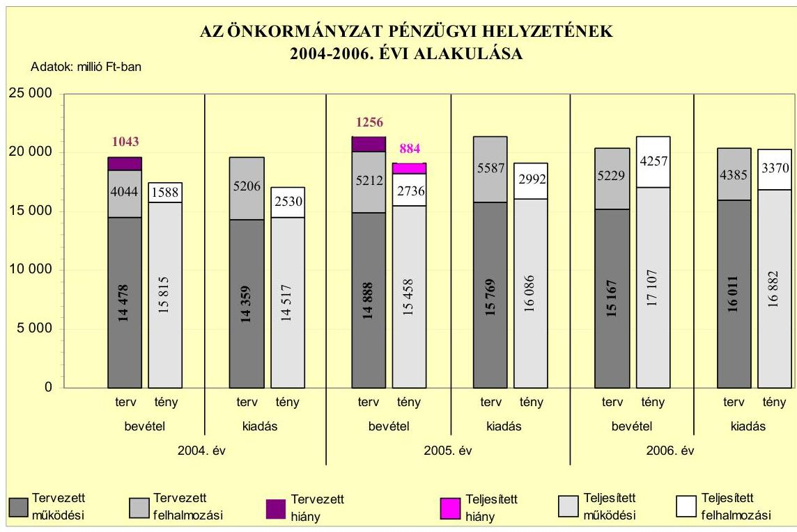
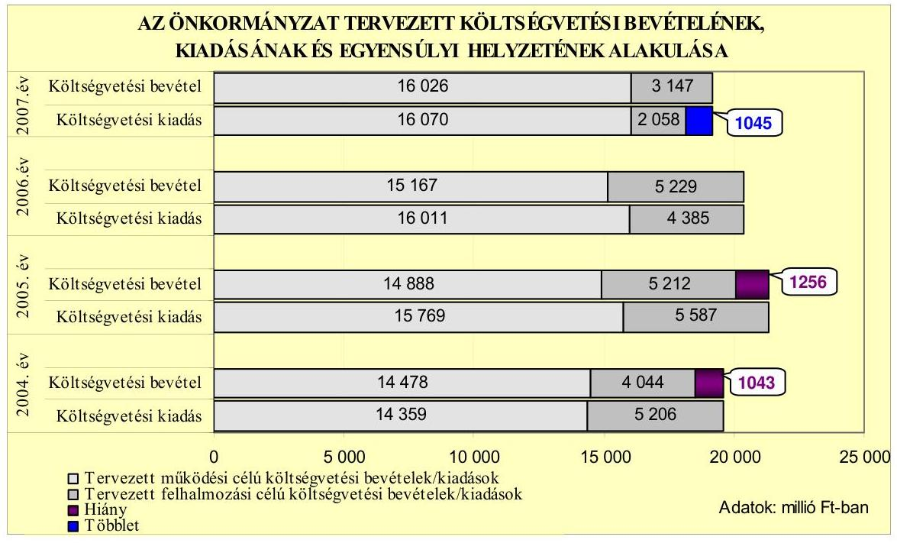
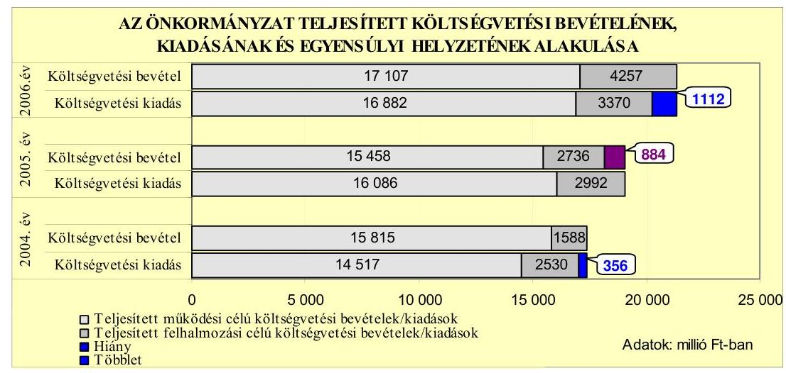
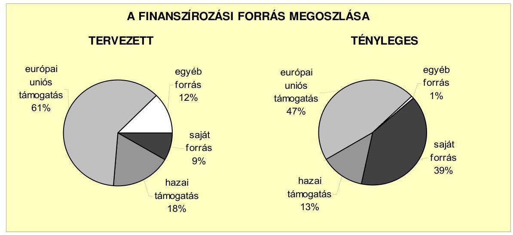
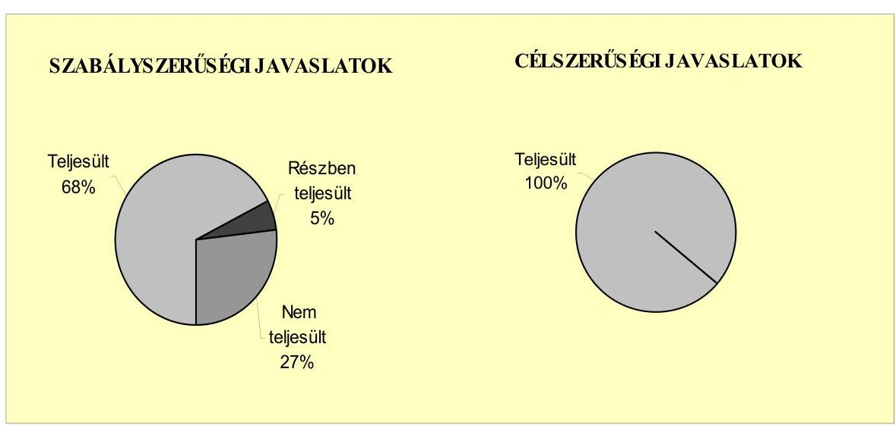
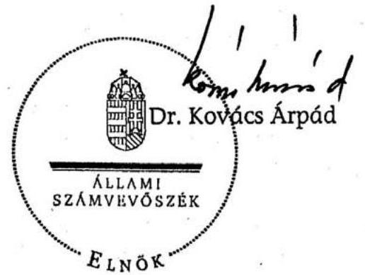
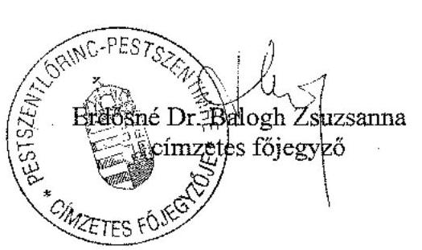
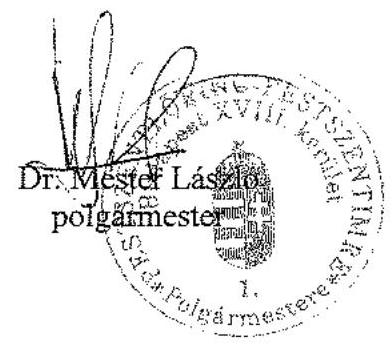

# JELENTÉS 

a Budapest Főváros XVIII. kerület Pestszentlőrinc-Pestszentimre Önkormányzata gazdálkodási rendszerének 2007. évi átfogó ellenőrzéséről

---

# 3. Önkormányzati és Területi Ellenőrzési Igazgatóság 

3.3. Átfogó Ellenőrzések Főcsoport

Iktatószám: V-1001-9/36/19/2007.
Témaszám: 845
Vizsgálat-azonosító szám: V0334

## Az ellenőrzést felügyelte:

Dr. Lóránt Zoltán
főigazgató
Az ellenőrzés végrehajtásáért felelős:
Dr. Sepsey Tamás
főigazgató-helyettes
Az ellenőrzést vezette:
Molnár Gyula Mihály
igazgató-helyettes
Az ellenőrzést végezték:
Dr. Csermák Judit Dr. Fónagy Diána
számvevő
számvevő
Kisgergely István
számvevő

## A témához kapcsolódó eddig készített számvevőszéki jelentések:

## címe

Jelentés Budapest Főváros XVIII. kerület PestszentlőrincPestszentimre Önkormányzata gazdálkodásának átfogó ellenőrzéséről

Jelentés a Magyar Köztársaság 2004. évi költségvetése végrehajtásának ellenőrzéséről

Függelék: A helyi önkormányzatok beruházásaihoz és rekonstrukcióihoz nyújtott 2004. évi felhalmozási célú támogatások ellenőrzése

Jelentés a helyi és a helyi kisebbségi önkormányzatok gazdálkodásának átfogó ellenőrzéséről

---

# TARTALOMJEGYZÉK 

BEVEZETÉS ..... 9
I. ÖSSZEGZŐ MEGÁLLAPÍTÁSOK, KÖVETKEZTETÉSEK, JAVASLATOK ..... 13
II. RÉSZLETES MEGÁLLAPÍTÁSOK ..... 23

1. Az Önkormányzat költségvetési és pénzügyi helyzete ..... 23
1.1. A tervezett költségvetési bevételi és kiadási előirányzatok, valamint a költségvetési egyensúly alakulása ..... 25
1.2. A költségvetési bevételek és kiadások teljesítése, a pénzügyi egyensúlyi helyzet alakulása ..... 28
2. Az Önkormányzat felkészültsége az európai uniós források igénylésére és felhasználására, valamint az e-közigazgatási feladatok ellátására ..... 33
2.1. Az európai uniós források igénybevételére és a várható támogatás felhasználásának szervezettségére történt felkészülés és a belső szabályozottság értékelése ..... 33
2.1.1. A fejlesztési célkitűzések meghatározása ..... 33
2.1.2. Az európai uniós forrásokhoz kapcsolódóan a pályázatfigyelés, a pályázatkészítés, valamint az európai uniós támogatással megvalósuló fejlesztés lebonyolítása belső rendjének szabályozottsága, a végrehajtás személyi, szervezeti feltételei ..... 37
2.1.3. Az európai uniós forrással támogatott fejlesztés megvalósítása ..... 39
2.2. Az e-közigazgatási feladatok előkészítése, bevezetése ..... 43
3. A költségvetési gazdálkodás kontrolljai ..... 45
3.1. A szabályozottság kockázata a költségvetés tervezési, gazdálkodási, beszámolási és a folyamatba épített ellenőrzési feladatainál ..... 45
3.2. A belső kontrollok érvényesülése az önkormányzati források szabályszerű felhasználásában, a költségvetési tervezés, gazdálkodás, beszámolás folyamataiban ..... 49
3.3. A belső ellenőrzési kötelezettség teljesítése, javaslatainak hasznosulása ..... 52
4. Az ÁSZ korábbi ellenőrzési javaslatai alapján készített intézkedési terv végrehajtása, eredményessége ..... 55
4.1. Az Önkormányzat gazdálkodási rendszerének átfogó ellenőrzése során tett javaslatok végrehajtására tervezett intézkedések megvalósulása ..... 55

---

4.2. A zárszámadáshoz kapcsolódó (állami hozzájárulások, támogatások igénylésének és felhasználásának ellenőrzése), valamint a további vizsgálatok esetében a megállapítások, javaslatok alapján tett intézkedések

# MELLÉKLETEK 

1. számú Az Önkormányzat gazdálkodását meghatározó adatok, mutatószámok (1 oldal)
2. számú Az önkormányzati vagyon alakulása (1 oldal)
3. számú Az Önkormányzat 2004-2006. évi költségvetési előirányzatainak és azok pénzügyi teljesítéseinek alakulása ( 1 oldal)
4. számú 1. számú Nyilatkozat a tervezett és teljesített költségvetési adatoknak a megelőző évhez viszonyított jelentős, $\pm 10 \%$-ot meghaladó változásának indokolásáról, amennyiben azt a feladatok változása indokolta (1 oldal)
5. számú 1. számú Tanúsítvány az európai uniós forrásokkal támogatott programok, célok tervezett és tényleges 2004-2007. évi adatairól (1 oldal)
6. számú Dr. Mester László úr, a Budapest Főváros XVIII. kerület PestszentlőrincPestszentimre Önkormányzata polgármestere által adott észrevétel (1 oldal)

---

# RÖVIDÍTÉSEK JEGYZÉKE 

## Törvények

2006. évi költségvetési törvény
Áht.
Eisztv.
Gyvt.
Htv.

Kbt.
Ksztv.
Ötv.
Számv. tv.
Szoc. tv.

## Rendeletek

2004. évi költségvetési rendelet
2005. évi költségvetési rendelet
2006. évi költségvetési rendelet
2007. évi költségvetési rendelet
2006. évi zárszámadási rendelet

Ámr.
Ber.
SzMSz
vagyongazdálkodási rendelet
a Magyar Köztársaság 2006. évi költségvetéséről szóló 2005. évi CLIII. törvény
az államháztartásról szóló 1992. évi XXXVIII. törvény az elektronikus információszabadságról szóló 2005. évi XC. törvény
a gyermekek védelméről és a gyámügyi igazgatásról szóló 1997. évi XXXI. törvény
a helyi önkormányzatok és szerveik, a köztársasági megbízottak, valamint egyes centrális alárendeltségű szervek feladat- és hatásköreiről szóló 1991. évi XX. törvény a közbeszerzésekről szóló 2003. évi CXXIX. törvény a közhasznú szervezetekről szóló 1997. évi CLVI. törvény a helyi önkormányzatokról szóló 1990. évi LXV. törvény a számvitelről szóló 2000. évi C. törvény a szociális igazgatásról és szociális ellátásokról szóló 1993. évi III. törvény

Budapest Főváros XVIII. kerület PestszentlőrincPestszentimre Önkormányzatának 11/2004. (III. 2.) számú rendelete a 2004. évi költségvetésről
Budapest Főváros XVIII. kerület PestszentlőrincPestszentimre Önkormányzatának 9/2005. (III. 1.) számú rendelete a 2005. évi költségvetésről
Budapest Főváros XVIII. kerület PestszentlőrincPestszentimre Önkormányzatának 18/2006. (II. 28.) számú rendelete a 2006. évi költségvetésről
Budapest Főváros XVIII. kerület PestszentlőrincPestszentimre Önkormányzatának 6/2007. (III. 5.) számú rendelete a 2007. évi költségvetésről
Budapest Főváros XVIII. kerület PestszentlőrincPestszentimre Önkormányzatának 14/2007. (V. 2.) számú rendelete a 2006. évi zárszámadásról
az államháztartás múködési rendjéről szóló 217/1998. (XII. 30.) Korm. rendelet
a költségvetési szervek belső ellenőrzéséről szóló 193/2003. (XI. 26.) Korm. rendelet

Budapest Főváros XVIII. kerület PestszentlőrincPestszentimre Önkormányzatának 25/1995. (VIII. 31.) számú rendelete az Önkormányzat Szervezeti és Múködési Szabályzatáról
Budapest Főváros XVIII. kerület PestszentlőrincPestszentimre Önkormányzatának 29/1997. (X. 21.) számú rendelete az Önkormányzat vagyonáról, a vagyontárgyak feletti tulajdonosi jogok gyakorlásáról

---

Vhr.

## Szórövidítések

ÁSZ
Bababirodalom
EU referens
e-közigazgatás
FEUVE
gazdálkodási jogkörök szabályzata

GVOP
GVOP adatvagyon fejlesztési feladat

GVOP közremúködő szervezet

GVOP támogatási szerződés

HEFOP
HEFOP infrastrukturális fejlesztési feladat

HEFOP közremúködő szervezet
HEFOP támogatási szerződés
hosszú távú fejlesztési terv
informatikai stratégia ${ }_{1}$
informatikai stratégia ${ }_{2}$
jegyzó
az államháztartás szervezetei beszámolási és könyvvezetési kötelezettségének sajátosságairól szóló 249/2000. (XII. 24.) Korm. rendelet

Állami Számvevőszék
Bababirodalom- Modellértékű Integrált Bölcsőde és Szolgáltató Központ
európai uniós pályázati referens
elektronikus közigazgatás
folyamatba épített, előzetes és utólagos vezetői ellenőrzés az utalványozási, kötelezettségvállalási, és az ellenjegyzési jog gyakorlásának engedélyezéséről, az érvényesítés rendjéről, valamint a megbízási szerződések létrejöttének szabályairól szóló 6/2004. (VII. 1.) számú polgármesteri és jegyzői együttes utasítás
NFT Gazdasági Versenyképesség Operatív Program
a GVOP-4.3.2. - „e-essentia" - Az önkormányzati adatvagyon másodlagos felhasználásának modellértékű keretrendszerének fejlesztése
a IT Információs Társadalom Informatikai és Távközlési szolgáltató Közhasznú Társaság, 2007. január 1-től MAG (Magyar Gazdaságfejlesztési Központ) Zártkörűen Múködő Részvénytársaság
az Önkormányzat és a közremúködő szervezet között a GVOP-4.3.2. az önkormányzati adatvagyon másodlagos felhasználásának tevékenységének keretében elnyert „eessentia" fejlesztési feladatra megkötött támogatási szerződés
Humánerőforrás-fejlesztési Operatív Program
HEFOP társadalmi befogadást támogató szolgáltatások infrastrukturális fejlesztése Bababirodalom-Modellértékű Integrált Bölcsőde és Szolgáltató Központ létrehozása
Egészségügyi Stratégiai Kutatóintézet Strukturális Alapok Programiroda
HEFOP-4.3.2 társadalmi befogadást támogató szolgáltatások infrastrukturális fejlesztése Bababirodalom-
Modellértékű Integrált Bölcsőde és Szolgáltató Központ létrehozására kötött támogatási szerződés
a Képviselő-testület 677/2004. (VI. 24.) számú határozata a „Jövőkép" 2005-2014. évekre vonatkozó hosszú távú fejlesztési tervről
a Képviselő-testület 445/2004. (V. 20.) számú határozata az Önkormányzat 2004-2006. évekre szóló Informatikai Fejlesztési Stratégiájáról
a Képviselő-testület 302/2007. (IV. 25.) számú határozata Budapest XVIII. kerület Pestszentlőrinc-Pestszentimre Önkormányzatának informatikai stratégiájáról
Budapest Főváros XVIII. kerület Pestszentlőrinc-
Pestszentimre Önkormányzatának Jegyzője

---

| Kabinet iroda | Budapest Főváros XVIII. kerület Pestszentlőrinc-   Pestszentimre Önkormányzata Polgármesteri Hivatalának   Polgármesteri Kabinet Irodája |
| :--: | :--: |
| Képviselő-testület | Budapest Főváros XVIII. kerület Pestszentlőrinc-   Pestszentimre Önkormányzatának Képviselő-testülete |
| KIOP | NFT Környezetvédelmi és Infrastruktúrafejlesztés Operatív   Program |
| Koordinációs titkárság | Budapest Főváros XVIII. kerület Pestszentlőrinc-   Pestszentimre Önkormányzata Polgármesteri Hivatalának   Koordinációs és Integrációs Titkársága |
| Közbeszerzési döntőbi-   zottság   lakáskoncepció | Közbeszerzések Tanácsa Közbeszerzési Döntőbizottsága   a Képviselő-testület 936/2003. (X. 30.) számú határozata   Budapest Főváros XVIII. kerület Pestszentlőrinc-   Pestszentimre Önkormányzata lakáskoncepciójáról |
| MÁK | Magyar Államkincstár |
| NFT | Nemzeti Fejlesztési Terv |
| Okmányiroda | Budapest Főváros XVIII. kerület Pestszentlőrinc-   Pestszentimre Önkormányzata Polgármesteri Hivatalának   Okmányirodája |
| Önkormányzat | Budapest Főváros XVIII. kerület Pestszentlőrinc-   Pestszentimre Önkormányzata |
| pályázati szabályzat | az Önkormányzatot érintő pályázati eljárások menetéről   szóló 10/2004. (IX. 1.) számú polgármesteri-jegyzői együti-   tes utasítás |
| PEJ | projekt előrehaladási jelentés |
| Pénzügyi bizottság | Budapest Főváros XVIII. kerület Pestszentlőrinc-   Pestszentimre Önkormányzat Képviselő-testületének   Pénzügyi, Költségvetési és Közbeszerzési Bizottsága |
| Pénzügyi iroda | Budapest Főváros XVIII. kerület Pestszentlőrinc-   Pestszentimre Önkormányzata Polgármesteri Hivatalának   Pénzügyi Irodája |
| PM | Pénzügyminisztérium |
| polgármester | Budapest Főváros XVIII. kerület Pestszentlőrinc-   Pestszentimre Önkormányzatának Polgármestere |
| Polgármesteri hivatal | Budapest Főváros XVIII. kerület Pestszentlőrinc-   Pestszentimre Önkormányzatának Polgármesteri Hivatala |
| Polgármesteri hivatal   SzMSz-e | a jegyző 98/2004. (II. 26.) számú utasítása Budapest Fővá-   ros XVIII. kerület Pestszentlőrinc-Pestszentimre Önko   mányzata Polgármesteri Hivatalának Szervezeti és Műkö   dési Szabályzatáról |
| ROP | NFT Regionális Operatív Program |
| ROP foglalkoztatás fej-   lesztési feladat | ROP a foglalkoztatást elősegítő tevékenységek helyi koor-   dinációjának fejlesztése „Az öt muskétás- egy mindenkiért,   mindenki egyért" fejlesztési feladat |
| ROP közremúködő szer- | VÁTI Magyar Regionális Fejlesztési és Urbanisztikai Köz-   vezet használ Társaság |

---

ROP támogatási szerződés
rulírozó hitel
sportkoncepció
szolgáltatástervezési
koncepció
Szociális iroda

ÚMFT
Tulajdonosi bizottság

Vagyongazdálkodási bizottság

Vagyonkezelő Zrt.
választások
Városgazdálkodási iroda
városfejlesztési koncepció
városfejlesztési koncepció
Városüzemeltető Kht.

ROP-3.2.1. a foglalkoztatást elősegítő tevékenységek helyi koordinációjának fejlesztése „Az öt muskétás- egy mindenkiért, mindenki egyért" fejlesztési feladatra megkötött támogatási szerződés
törlesztés után a bank által meghatározott keretig újra igénybe vehető hitel
a Képviselő-testület 902/2004. (IX. 23.) számú határozata a középtávú sportkoncepcióról
a Képviselő-testület 1081/2004. (XI. 25.) számú határozata Pestszentlőrinc-Pestszentimre Önkormányzat Szolgáltatástervezési koncepciójáról
Budapest Főváros XVIII. kerület Pestszentlőrinc-
Pestszentimre Önkormányzata Polgármesteri Hivatalának Szociális Egészségügyi és Gyermekvédelmi Irodája Új Magyarország Fejlesztési Terv
Budapest Főváros XVIII. kerület PestszentlőrincPestszentimre Önkormányzat Képviselő-testületének Tulajdonosi Bizottsága
Budapest Főváros XVIII. kerület PestszentlőrincPestszentimre Önkormányzat Képviselő-testületének Vagyongazdálkodási Bizottsága
Budapest Főváros XVIII. kerület Vagyonkezelő Zártkörűen Múködő Részvénytársaság
a választási eljárásról szóló 1997. évi C. törvény 2. § a), c) és d) pontjai hatálya alá tartozó választások
Budapest Főváros XVIII. kerület PestszentlőrincPestszentimre Önkormányzata Polgármesteri Hivatalának Városgazdálkodási és Koordinációs Irodája
a Képviselő-testület 1388/1997. (XI. 27.) számú határozata Budapest XVIII. kerület Városfejlesztési koncepciójáról Budapest XVIII. kerület Városüzemeltető Közhasznú Társaság

---

# ÉRTELMEZŐ SZÓTÁR 

1. elektronikus szolgáltatási szint
2. elektronikus szolgáltatási szint
3. elektronikus szolgáltatási szint
4. elektronikus szolgáltatási szint
fejlesztési feladat

GVOP-4.3. intézkedés
HEFOP-2.2. intézkedés
HEFOP-3.1. intézkedés
HEFOP-4.2. intézkedés
KIOP-1.3. intézkedés

Az 1044/2005. (V. 11.) Korm. határozat alapján olyan információs, tájékoztató szolgáltatás, amely csak általános információkat közöl az adott üggyel kapcsolatos teendőkről és a szükséges dokumentumokról.
Az 1044/2005. (V. 11.) Korm. határozat alapján olyan egyirányú kapcsolatot biztosító szolgáltatás, amely az 1. szinten túl az adott ügy intézéséhez szükséges dokumentumok, nyomtatványok letöltése, és azok ellenőrzéssel vagy ellenőrzés nélküli elektronikus kitöltése, amely esetben a dokumentum benyújtása hagyományos úton történik.
Az 1044/2005. (V. 11.) Korm. határozat alapján olyan kétirányú kapcsolatot biztosító szolgáltatás, amely közvetlen vagy ellenőrzött kitöltésű dokumentum segítségével történő elektronikus adatbevitel és a bevitt adatok ellenőrzése. Az ügy indításához, intézéséhez személyes megjelenés nem szükséges, de az ügyhöz kapcsolódó közigazgatási döntés (határozat, egyéb aktus) közlése, valamint a kapcsolódó illeték- vagy díffizetés hagyományos úton történik.
Az 1044/2005. (V. 11.) Korm. határozat alapján olyan teljes közvetlen kétirányú kapcsolatot (ügyintézési folyamatot) biztosító szolgáltatás, amikor az ügyhöz kapcsolódó közigazgatási döntés is elektronikus úton kerül közlésre, illetve a kapcsolódó illeték- vagy díffizetés elektronikus úton is intézhető.
Az a fejlesztési feladat, amely illeszkedik az Európai Unió, illetve a Nemzeti Fejlesztési Terv által támogatott programokhoz. Az Európai Unió, illetve a Nemzeti Fejlesztési Terv által meghirdetett programokhoz kapcsolódó, támogatott projektek megvalósításához használhatók fel az európai uniós források. A fejlesztési feladat (projekt) tartalmilag és formailag részletesen kidolgozott, megfelelő pénzügyi háttérrel és végrehajtási ütemezéssel rendelkező fejlesztési terv.
Az e-közigazgatás fejlesztése, az NFT prioritása.
A társadalmi kirekesztés keretében a szociális területen dolgozó szakemberek képzése, az NFT prioritása.
Felkészítés a kompetencia alapú oktatásra, az NFT prioritása.
A társadalmi befogadást támogató szolgáltatások infrastruktúrájának fejlesztése, az NFT prioritása.
Egészségügyi és építési-bontási hulladék kezelése, az NFT prioritása.

---

közreműködő szervezet

lebonyolítás

ROP-2.2. intézkedés
ROP-3.2. intézkedés
támogatási szerződés

A közreműködő szervezetek az európai uniós támogatást elnyert kedvezményezettekkel a kapcsolattartó szervek.
Az operatív programok közreműködő szervezetei befogadják, nyilvántartják, döntésre előkészítik a pályázatokat, rögzítik a támogatással kapcsolatos adatokat az Egységes monitoring informatikai rendszerben, elvégzik a támogatások előzetes (szerződéskötést megelőző), közbenső (a pénzügyi elszámolás, finanszírozás folyamatában végzett) és utólagos (a támogatott projekt pénzügyi lezárását megelőző) ellenőrzését. Az önkormányzatoknál a leggyakrabban előforduló operatív program a Regionális Fejlesztési Operatív Program végrehajtásában közreműködő szervezetek a VÁTI Kht. és a regionális fejlesztési ügynökségek.
A Kohéziós alap két közreműködő szervezete (Gazdasági és Közlekedési Minisztérium, Környezetvédelmi és Vízügyi Minisztérium) a támogatott projektek végrehajtásához kapcsolódó operatív feladatokat látják el. Ennek keretében megkötik a szerződéseket a projekt kedvezményezettjével, folyamatosan nyomon követik a teljesítéseket, lebonyolítják a támogatások kifizetését, vezetik az Egységes monitoring informatikai rendszert.
Az európai uniós források felhasználásával megvalósuló fejlesztésre irányuló műszaki, gazdasági (pénzügyi) tevékenységet magában foglaló szervezési, irányítási szolgáltatás. A szervezési szolgáltatás kiterjedhet a pályázatkészítésre, a közbeszerzési eljárás lebonyolításán keresztül a folyamatos műszaki ellenőrzésre, a pénzügyi elszámolásra, a műszaki átadás-átvételre, az üzembe helyezésre, illetve a fejlesztési folyamat egyes elemeire.
A városi területek rehabilitációja, az NFT prioritása.
A helyi foglalkoztatási kezdeményezések támogatása, az NFT prioritása.
A strukturális alapok esetében az irányító hatóságnak, illetve a Kohéziós alap esetében a közreműködő szervezeteknek a kedvezményezett önkormányzattal kötött szerződése, amely a támogatás felhasználásának részletes feltételeit tartalmazza.

---

# JELENTÉS 

## Budapest XVIII. kerület PestszentlőrincPestszentimre Önkormányzata gazdálkodási rendszerének 2007. évi átfogó ellenőrzéséről

## BEVEZETÉS

Az Ötv. 92. § (1) bekezdése, az Állami Számvevőszékről szóló 1989. évi XXXVIII. törvény 2. § (3) bekezdése, valamint az Áht. 120/A. § (1) bekezdése alapján az önkormányzatok gazdálkodását az Állami Számvevőszék ellenőrzi. Az ellenőrzésre az Országgyűlés illetékes bizottságai részére is átadott, országosan egységes ellenőrzési program szerint került sor.

Az Állami Számvevőszék a stratégiájában foglalt célkitűzéseknek megfelelően a helyi önkormányzatok költségvetési gazdálkodási rendszere átfogó ellenőrzésének programját a 2007. évtől megújította, azt kiegészítette további - teljesít-mény-ellenőrzési - elemekkel.

## Az ellenőrzés célja annak értékelése volt, hogy az Önkormányzat:

- a pénzügyi egyensúlyt a költségvetésében és annak teljesítése során milyen módon biztosította, a teljesített bevételek és kiadások egyes évek közötti jelentős eltérése feladatváltozáshoz kapcsolódott-e;
- felkészült-e a szabályozottság és a szervezettség terén az európai uniós források igénylésére és felhasználására, továbbá az e-közigazgatás bevezetése miatti szervezet-korszerűsítési feladatokra;
- kialakította-e a külső és a belső feltételeknek megfelelően a gazdálkodás belső kontrollrendszerét ${ }^{1}$ : továbbá a költségvetés tervezési, végrehajtási és zárszámadási feladatok szabályszerű ellátásához hozzájárult-e a folyamatba épített, előzetes és utólagos vezetői ellenőrzés, valamint a belső ellenőrzés;
- megfelelően hasznosították-e a korábbi számvevőszéki ellenőrzések megállapításait, szabályszerűségi ${ }^{2}$ és célszerűségi javaslatait.

[^0]
[^0]:    ${ }^{1}$ A gazdálkodás szabályszerűségét biztosító kontrollrendszer alatt értjük a kiépített és múködő belső irányítási és szabályozási rendszert, valamint a belső ellenőrzési funkciók ellátásának rendszerét.
    ${ }^{2}$ A törvényi előírások betartásának elmulasztásakor a részletes megállapítások fejezetben egységesen a törvénysértés megjelölést alkalmazzuk, mivel az ÁSZ nem tehet különbséget a törvényi előírások között.

---

Az ellenőrzött időszak: az 1., 2. és 4. programpontok tekintetében a 20042006. évek és 2007. I. negyedév, a 3. ellenőrzési programpontnál a 2006. év és 2007. év I. negyedév.

A kerület lakosainak száma 2007. január 1-én 96890 fő volt. A 2006. évi önkormányzati választást követően az Önkormányzat 30 tagú Képviselőtestületének munkáját hét állandó bizottság segítette. Az Önkormányzat mellett 11 kisebbségi önkormányzat ${ }^{3}$ működött. A polgármester az 1994. évi önkormányzati választás óta tölti be tisztségét, a jegyző személye 1991. óta nem változott.

Az Önkormányzat feladatainak végrehajtása érdekében a 2006. évben 56 költségvetési szervet múködtetett, amelyekből nyolc önállóan gazdálkodott. A feladatok ellátásában részt vett három gazdasági társasága ${ }^{4}$, három közhasznú társasága ${ }^{5}$, továbbá öt közalapítványa ${ }^{6}$. Az Önkormányzat a 2006. évi költségvetési beszámolója szerint 21364 millió Ft költségvetési bevételt ért el és 20252 millió Ft költségvetési kiadást teljesített, 2006. december 31-én a könyvviteli mérleg szerint 110343 millió Ft értékű vagyonnal rendelkezett. A 2007. évi költségvetési rendeletben 19173 millió Ft költségvetési bevételt és 18128 millió Ft költségvetési kiadást irányoztak elő. A Polgármesteri hivatalban dolgozó köztisztviselők száma 2006. december 31-én 270 fő, a költségvetési intézményekben foglalkoztatott közalkalmazottak száma 2798 fő volt. Az Önkormányzat gazdálkodását meghatározó adatokat, mutatószámokat az 1-3. számú mellékletek tartalmazzák.

Az Önkormányzat költségvetési és pénzügyi helyzetét az összehasonlító elemzés módszerével vizsgáltuk. E körben elemeztük a költségvetés egyensúlyi helyzetének alakulását, a tervezett és tényleges költségvetési hiány okait, a mérséklésére tett intézkedéseket, finanszírozásának módját, az Önkormányzat adósságállományának alakulását, összetevőit.

A teljesítmény-ellenőrzés módszerével vizsgáltuk, hogy a belső szabályozottság, szervezettség terén felkészültek-e az európai uniós források figyelésére, igénylésére és felhasználására, valamint az igényelt európai uniós támogatások az Önkormányzat által meghatározott fejlesztési célkitűzésekhez kapcsolódtak-e. Az ellenőrzés során felmértük, hogy az e-közigazgatási feladat ellátása, illetve bevezetése, múködtetése érdekében milyen intézkedéseket tettek, valamint biz-tosították-e a közérdekú adatok elektronikus közzétételét.

[^0]
[^0]:    ${ }^{3}$ Bolgár, cigány, görög, horvát, lengyel, német, örmény, román, ruszin, szerb és szlovén kisebbségi önkormányzatok múködtek.
    ${ }^{4}$ A Vagyonkezelő Zrt., Sportszerű Korlátolt Felelősségű Társaság, Poliklinik Korlátolt Felelősségű Társaság.
    ${ }^{5}$ A Városüzemeltető Kht., Szociális Foglalkoztató- és Rehabilitációs Közhasznú Társaság, Bókay Kert Szabadidő és Közművelődési Közhasznú Társaság.
    ${ }^{6}$ Idősekért Fiatalokért Közalapítvány, Ifjúságért Közalapítvány, Közbiztonságért Közalapítvány, Közművelődési- és Sport Közalapítvány, Pestszentlőrinc-Pestszentimre Közoktatási Közalapítvány.

---

A költségvetési gazdálkodás belső kontrolljainak ellenőrzése során értékeltük, hogy a Polgármesteri hivatalnál a költségvetés tervezési, gazdálkodási, zárszámadás készítési feladatok belső kontrolljainak kiépítettsége és múködése megfelelő biztosítékot ad-e a gazdálkodási feladatok megfelelő, szabályszerű ellátására. Felmértük és minősítettük a költségvetés tervezési, a gazdálkodási, a zárszámadás készítési feladatokkal, továbbá a pénzügyi- számviteli területen az informatikával kapcsolatosan kialakított kontrollok megfelelőségét, valamint azok múködésének eredményességét, megbízhatóságát. Értékeltük a belső ellenőrzés szervezeti és szabályozási keretét, továbbá múködését.

A Polgármesteri hivatalnál értékeltük a gazdálkodás folyamatában a kontrollok múködésének megbízhatóságát, ennek keretében ellenőriztük a szakmai teljesítés igazolására és az utalvány ellenjegyzésére kialakított kontrollok végrehajtását. Az ellenőrzést a következő, kiemelt kockázatuk alapján kiválasztott ${ }^{7}$ az általánostól jellemzően eltérő, egyedi eljárást igénylő gazdasági eseményekkel kapcsolatos kifizetésekre folytattuk le ${ }^{8}$ :

- a személyi juttatások közül az állományba nem tartozók megbízási díjai ${ }^{9}$,
- a külső szolgáltató által végzett karbantartási, kisjavítási szolgáltatások, valamint
- a gépek, berendezések, felszerelések beszerzése.

Az ellenőrzés hatékony elvégzése céljából a vizsgálandó területek kiválasztása során a kockázatokon alapuló megközelítés érvényesült, ezáltal az ellenőrzési erőforrásokat azokra a területekre fókuszáltuk, amelyeken legnagyobb a hibák előfordulási valószínűsége. Az ellenőrzési erőforrások ilyen típusú összpontosításával minimálisra csökkenthető a kívánt ellenőrzési bizonyosság eléréséhez szükséges időráfordítás.

A pénzügyi-számviteli folyamatokban alkalmazott belső kontrollok létezésének és múködésének ellenőrzésére a vizsgált három terület 2006. évi könyvviteli té-

[^0]
[^0]:    ${ }^{7}$ Az önkormányzatok kiemelt előirányzataira vonatkozóan, a vertikális folyamatokra elvégeztük a kockázatok becslését, amelynek eredményeként az állományba nem tartozók megbízási díjai, a külső szolgáltató által végzett karbantartási, kisjavítási szolgáltatások, valamint a gépek, berendezések, felszerelések beszerzése kiemelkedően kockázatos területnek bizonyultak.
    ${ }^{8}$ A korábbi ellenőrzési tapasztalataink szerint ezeken a területeken a jegyzők nem, vagy hiányosan szabályozták a megbízás, megrendelés, illetve beszerzés indokoltságának, szükségességének elbírálására, igazolására, valamint a teljesítések dokumentálására, a kifizetések jogosságának megítélésére szolgáló kontrollokat. További kockázatot jelentett a külső szolgáltató által végzett karbantartási, kisjavítási munkák esetében, hogy az 50 ezer Ft alatti megrendelésekre vonatkozóan az ellenőrzési tapasztalataink szerint a jegyzők nem alakították ki a kötelezettségvállalások rendjét és nyilvántartási formáját, valamint a szabályozás elmulasztása esetén nem történt meg az írásbeli kötelezettségvállalás és annak az ellenjegyzése sem.
    ${ }^{9}$ Az állományba tartozók rendszeres személyi juttatásainak számfejtését, valamint folyósítását nem a polgármesteri hivatalok, hanem a nettó finanszírozás keretében a beküldött dokumentumok alapján a MÁK végzi.

---

teleiből területenként egyszerű véletlen mintát vettünk. A kijelölt gazdasági eseményre elvégzett megfelelőségi tesztek alapján értékeltük a kontrollok múködésének eredményességét, megbízhatóságát a vizsgált három területre különkülön, majd összefoglalóan ${ }^{10}$ a Polgármesteri hivatal egyedi eljárást igénylő gazdasági eseményeire. A helyszíni ellenőrzés megállapításainak részletes dokumentálását három megfelelőségi tesztlapon, öt elővizsgálati és kilenc helyszíni ellenőrzési munkalapon biztosítottuk. Ezeken a teszt- és munkalapokon a minősítés alapjául szolgáló kérdések és a vonatkozó konkrét jogszabályhelyek megjelölése mellett értékeltük a kialakított belső kontrollokban rejlő kockázatokat ${ }^{11}$ és a kialakított kontrollok múködésének megbízhatóságát ${ }^{12}$.

Az ÁSZ korábbi ellenőrzési javaslatai alapján tett intézkedéseket, illetve azok megvalósítását utóellenőrzés keretében vizsgáltuk. A gazdálkodási rendszer átfogó ellenőrzése során megfogalmazott javaslatok végrehajtására tett intézkedések megvalósítását ellenőrizzük, az egyéb számvevőszéki ellenőrzések során tett javaslatok esetében pedig a kiadott intézkedéseket tekintjük át.

A helyszíni ellenőrzés során kitöltött - az ellenőrzést végző számvevő és a Polgármesteri hivatal felelős köztisztviselője által aláírt - elővizsgálati és helyszíni ellenőrzési munkalapokat, azok kitöltési útmutatóit, továbbá a megfelelőségi tesztek dokumentumait a polgármester részére a számvevői jelentéssel egyidejűleg átadtuk.

A jelentést az ÁSZ-ról szóló 1989. évi XXXVIII. tv. 25. § (1) bekezdése alapján észrevétel közlése céljából megküldtük a Budapest Főváros XVIII. Kerület Pestszentlőrinc-Pestszentimre Önkormányzata polgármesterének. A kapott észrevételt a jelentés 6 . számú melléklete tartalmazza.

[^0]
[^0]:    ${ }^{10}$ A vizsgált három terület egyedi értékelési pontszámait a területek relatív költségvetési súlyával arányosan összegeztük.
    ${ }^{11}$ A kialakított belső kontrollokban rejlő kockázatot alacsonynak minősítettük, ha a kontrollok - végrehajtásuk esetén - megfelelő védelmet nyújtanak a hibák bekövetkezése ellen. Közepesnek minősítettük a belső kontrollokban rejlő kockázatot, amennyiben a kontrollok - végrehajtásuk esetén - a lehetséges hibák többsége ellen védelmet nyújtanak. Magasnak értékeltük a kockázatot, ha a kontrollok - kialakításuk hiányában, vagy hiányos kialakításuk miatt - nem nyújtanak elegendő védelmet a lehetséges hibákkal szemben.
    ${ }^{12}$ A kontrollok múködésének eredményességét, megbízhatóságát kiválónak értékeltük abban az esetben, ha azok múködése - esetleges apróbb hiányosságoktól eltekintve megfelelte a hibák megelőzésére és kijavítására meghatározott szabályozásnak és a legmagasabb szintű elvárásoknak. Jónak minősítettük a kontrollok múködését, ha a hiányosságok száma ugyan jelentős volt, de nem veszélyeztette az ellenőrzött terület hibáinak megelőzését és kijavítását. Amennyiben a hiányosságok mértéke nem biztosította a hibák megelőzését, feltárását, kijavítását és ezáltal veszélyeztette az eredményes, megbízható múködést, a kontroll múködésének megbízhatósága gyenge minősítést kapott.

---

# I. ÖSSZEGZŐ MEGÁLLAPÍTÁSOK, KÖVETKEZTETÉSEK, JAVASLATOK 

Az Önkormányzatnál a 2006. évben a tervezett költségvetési bevételek és kiadások egyensúlya biztosított volt, azonban a 2004. és a 2005. évben a tervezett költségvetési bevételeket meghaladták a költségvetési kiadások. A tervezett költségvetési kiadásokhoz 1043 millió Ft, illetve 1256 millió Ft forrás hiányzott, melynek az éves költségvetési kiadásokhoz viszonyított aránya a 2004. évben 5\% volt, a 2005. évben megközelítette a 6\%-ot. A 2007. évben a Képviselőtestület 1045 millió Ft-tal nagyobb összegben irányozta elő a költségvetési kiadásoknál a költségvetési bevételeket. A felhalmozási célú költségvetési kiadásoknál a 2004. és a 2005. évben terveztek költségvetési forráshiányt, amely mellett a 2005. évben a múködési célú kiadások forráshiánya is jelentkezett. A 2006. évben a felhalmozási célú bevételek többlete fedezetet nyújtott a múködési célú költségvetési kiadások forráshiányára. A költségvetési egyensúlyt, valamint a megelőző években felvett hitelek visszafizetését rövid lejáratú, illetve rulírozó hitelek felvételéből és hosszú lejáratú hitel igénybevételével tervezte biztosítani az Önkormányzat. A 2006. évben a tervezett költségvetési bevétel 12\%-ának megfelelő összegű rövid lejáratú, illetve rulírozó hitel felvételét és éven belüli visszafizetését irányozták elő.

A 2004. és a 2006. években a teljesített költségvetési bevételek fedezték a teljesített költségvetési kiadásokat. A 2005. évben a költségvetési kiadások 884 millió Ft-tal meghaladták a költségvetési bevételeket, ezen belül a múködési célú költségvetési kiadásoknál 628 millió Ft forráshiány alakult ki. A pénzügyi egyensúlyi helyzet biztosítására az Önkormányzat a 2004. évben 1500 millió Ft rövidlejáratú forgóeszközkölcsönt vett fel, amelyből 700 millió Ft visszafizetése áthúzódott a következő évre, a 2005. évben felvett 2400 millió Ft rövidlejáratú forgóeszközkölcsönből 2000 millió Ft volt a következő évre áthúzódó, a 2006. évben felvett 1300 millió Ft rövidlejáratú hitel visszafizetése teljes egészében a következő évre húzódott. A pénzügyi egyensúlyi helyzet biztosításához egyre növekvő mértékben bevont hitelek állománya a 2004. évi nyitó 510 millió Ft-ról a 2006. év végére hatszorosára, 3067 millió Ft-ra nőtt. Az Önkormányzat a rövidlejáratú forgóeszközkölcsönön kívül folyószámlahitelt is igénybe vett, amelynek átlagos napi összege a 2004. évben 85 millió Ft, a 2005. évben 531 millió Ft, a 2006. évben 887 millió Ft volt, amelyekből az Önkormányzatnak a következő évre áthúzódó fizetési kötelezettsége nem volt. A 2005. és a 2006. évben a bevételek és kiadások változásának összhangja nem volt biztosított.

A teljesített felhalmozási célú költségvetési bevételek a 2005. évben 5\%-kal növekedtek, a 2006. évi $17 \%$-os növekedés kétharmad részben kapcsolódott az Önkormányzat által ellátott feladatok változásához. A teljesített felhalmozási célú költségvetési kiadások 2005. évi 12\%-os - 462 millió Ft összegű - növekedése egyharmad részben új feladatok ellátásával függött össze. A teljesített felhalmozási kiadások a 2005. évről a 2006. évre 378 millió Ft-tal nőttek, azonban a feladatváltozással összefüggésben a felhalmozási kiadások 643 millió Fttal növekedtek, a feladatváltozással összefüggésben nem álló felhalmozási ki-

---

adásokat a megelőző évhez képest alacsonyabb összegben teljesítette az Önkormányzat. A múködési célú költségvetési kiadások és bevételek összegének változása egyik évben sem függött össze feladatváltozással.

Az Önkormányzatnál a 2004. és a 2005. évi eredeti költségvetési bevételi előirányzatok teljesítése 6\%, illetve 10\%-kal elmaradt a tervezettől. A 2006. évben tervezett eredeti költségvetési bevételi előirányzatnál 5\%-kal több költségvetési bevételt realizáltak. A teljesített költségvetési kiadások mindhárom évben elmaradtak a tervezettől. A teljesített felhalmozási célú költségvetési bevételek és kiadások változása egymással nem volt összhangban, a bevételek előző évhez viszonyított növekedése a 2005. évben és a 2006. évben is meghaladta a kiadások előző évhez viszonyított növekedését.

Az Önkormányzat hosszú távú fejlesztési célkitüzéseit a 2004-2006. években a hosszú távú fejlesztési tervben, a városfejlesztési koncepcióban, valamint az Önkormányzat által ellátott feladatokra vonatkozó szakmai fejlesztési tervekben rögzítette. A fejlesztések lehetséges pénzügyi forrásait a fejlesztési célkitűzések tartalmazták. A hosszú távú fejlesztési tervben, a városfejlesztési koncepcióban meghatározott fejlesztési célkitűzéseket a valós szükségletek felmérésével nem támasztották alá. A szakmai fejlesztési terveket a 2004-2006. években nem módosították, a benyújtott pályázatok az Önkormányzat fejlesztési célkitűzéseihez igazodtak. Az Önkormányzatnál 2004-2007. év első féléve között 17 európai uniós forrással támogatott fejlesztési feladat megvalósításának kezdeményezéséről döntöttek, melyből nyolc esetben a benyújtott pályázat eredményes volt, hat esetben a pályázatot elutasították, három esetben a pályázat elbírálása folyamatban volt. Az európai uniós forrással támogatott fejlesztési feladatok közül az Európai Bizottság által adott támogatás bevételi és kiadási előirányzatát, továbbá a többéves kihatással járó döntések számszerúsítését éves bontásban az Áht. előírása ellenére költségvetési rendeletben nem mutatták be. A 2006. évben a GVOP adatvagyon fejlesztési feladat esetében nem mutatták be elkülönítve az Ámr. előírása ellenére az európai uniós forrással támogatott fejlesztési feladatok bevételi előirányzatait.

Az európai uniós források igénybevételével és felhasználásával kapcsolatos önkormányzati feladatokat az Önkormányzatot érintő pályázati szabályzatban határozták meg. Az európai uniós forrásokra irányuló pályázatokkal öszszefüggésben kijelölték az önkormányzati szintű pályázatkoordinálás feladatait és felelősét, valamint a nyilvántartás vezetésének felelősét. Az európai uniós forrásokkal kapcsolatos információk áramlásának rendjét, valamint a polgármester és a projektmenedzser közötti kapcsolattartás rendjét nem határozták meg. A Polgármesteri hivatal európai uniós forrásokkal összefüggő feladatait a pályázati szabályzat írta elő. A szabályozás a pályázatfigyelésre terjedt ki, azonban nem tartalmazta az európai uniós pályázatkészítés, valamint az európai uniós forrással támogatott fejlesztési feladatok lebonyolításával kapcsolatos eljárási rendet, illetve a belső ellenőrzés és folyamatba épített ellenőrzés kötelezettségének, rendjének meghatározását. A 2007. évben a pályázati szabályzat módosításával előírták a pályázatfigyelés, -készítés, valamint az európai uniós forrással támogatott fejlesztések ellenőrzési kötelezettségét. Az európai uniós források pályázatfigyelésével összefüggő feladatok ellátásának személyi feltételeit a Polgármesteri hivatalon belül kialakították, azonban a feladattal megbízott köztisztviselő jogviszonya 2006. márciusban megszűnt, a pályázatfi-

---

gyelést a továbbiakban a Városgazdálkodási iroda látta el. A pályázatfigyeléssel 2007. februártól külső szervezetet bíztak meg. Az európai uniós támogatásokkal megvalósuló fejlesztési feladatok lebonyolításának projektenkénti személyi feltételeiről az Önkormányzat köztisztviselői, közalkalmazottai és külső munkatársak segítségével gondoskodott. Az Önkormányzat az európai uniós támogatások igénybevételére és felhasználására a szabályozottság és szervezettség terén összességében nem készült fel eredményesen. Az Önkormányzat gazdasági programjában, szakmai fejlesztési terveiben megfogalmazott fejlesztési célkitűzésekhez kapcsolódtak az európai uniós támogatások, amelyekre vonatkozóan azonban az Önkormányzat szabályozása nem tartalmazta az európai uniós forrásokkal összefüggésben a pályázatkészítés, valamint a fejlesztési feladatok lebonyolításának rendjét a 2004-2006. években. A Polgármesteri hivatalon belül gondoskodtak a pályázatfigyelési feladatok ellátásáról köztisztviselő, illetve külső szervezet munkájának igénybevételével, valamint a pályázat készítési feladat ellátásáról külső szervezet megbízásával. Az Önkormányzat gondoskodott az európai uniós forrással támogatott fejlesztési feladatok lebonyolításáról, mivel azt köztisztviselők, közalkalmazottak és külső munkatársak megbízásával szervezte meg.

Az Önkormányzat a GVOP adatvagyon fejlesztési feladatra 80 millió Ft-ot, a ROP foglalkoztatás fejlesztési feladatra 49 millió Ft-ot, valamint a HEFOP infrastrukturális fejlesztési feladatra 240 millió Ft-ot nyert el. A 2004-2007. év első félévében a fejlesztési feladatok megvalósitása a hatályos támogatási szerződésben rögzített időbeli és kiadási ütemezés szerint haladt. A támogatás kifizetésének igénylését hátráltatta a közremúködő szervezet ellenőrzésének elhúzódása. Az Önkormányzatnál nem okozott pénzügyi zavarokat a támogatás utólagos finanszírozási rendszere. A Polgármesteri hivatalban a folyamatba épített ellenőrzés a strukturális alapokból nyújtott támogatással megvalósuló fejlesztések esetében a bevételek beszedésénél és a felhalmozási kiadások teljesítésénél megfelelően múködött. Külső ellenőrzés nyolc alkalommal vizsgálta a támogatott fejlesztési feladatokat, amely ellenőrzések során szabálytalanságra, mulasztásra vonatkozó megállapítást nem tettek. Belső ellenőrzés keretében az európai uniós forrással megvalósuló fejlesztési feladatok folyamatát és az ezzel kapcsolatos kötelezettségek teljesítését nem ellenőrizték.

A Polgármesteri hivatalban a 2006. évben e-közigazgatási feladatokat ellátó informatikai rendszer múködött, amellyel a 2. elektronikus szolgáltatási szinten biztosították az e-közigazgatási szolgáltatásokat. Az állampolgárok részére az egészségügyi szolgáltatásokkal kapcsolatosan az 1. elektronikus szolgáltatási szinten, a gépjármú regisztráció, a helyi adózás, az építési engedélyezési ügyekben a 2. elektronikus szolgáltatási szinten, a személyi okmányokkal, lakcímváltozás bejelentésével kapcsolatos ügyekben 3. elektronikus szolgáltatási szinten történt az ügyintézés. Az informatikai stratégiában ${ }_{2}$ az eközigazgatási feladatok 3. elektronikus szolgáltatási szintjének megvalósítását tűzték ki célul. Az e-közigazgatási feladatok ellátásának személyi feltételeit biztosították. Az Önkormányzat a közérdekú adatok közzétételére kötelezett volt, azonban az Eisztv-ben foglaltak ellenére honlapján nem tette közzé az önként vállalt feladatait, a foglalkoztatottak létszámára és személyi juttatásaira vonatkozó adatokat, a céljellegú fejlesztési támogatások adatait, a pénzeszközök felhasználásával kapcsolatos szerződések adatait. Az Önkormányzat nem tar-

---

totta be az Áht. előírását, mivel nem tette közzé a vagyonnal történő gazdálkodással összefüggő, a nettó öt millió Ft-ot elérő, vagy azt meghaladó értékű szerződések adatait (szerződés megnevezését, tárgyát, értékét, időtartamát és a szerződő felek nevét), valamint az Ámr-ben előírtak ellenére a 2005-2006. évi beszámolók szöveges indoklását .

A Polgármesteri hivatalban a költségvetés tervezési és a zárszámadás készítési folyamatok szabályozottságának hiányosságai a 2006. évben magas kockázatot jelentettek a feladatok megfelelő és szabályszerű végrehajtásában, mivel a pénzügyi irányítási és ellenőrzési rendszer létrehozása keretében a jegyző nem alakította ki a költségvetés tervezési és a zárszámadás készítési folyamatok ellenőrzési feladatait, nem írta elő az intézmények és a Polgármesteri hivatal szervezeti egységei által benyújtott költségvetési igények indokoltságának, teljesíthetőségének ellenőrzését. A jegyző nem szabályozta a tervezett saját bevételek előirányzatainak, az azok megalapozását szolgáló önkormányzati rendeletek összhangjának ellenőrzését és a költségvetési szervek elemi beszámolója felülvizsgálatának rendjét, tartalmát, felelőseit. Elmaradt az intézmények által az állami támogatásokkal, hozzájárulásokkal történő elszámoláshoz közölt adatok megbízhatósága ellenőrzésének előírása, az intézményi pénzmaradványok kimunkálása felülvizsgálati kötelezettségének és a zárszámadási feladatok koordinálásáért felelős személyeknek a meghatározása. A költségvetési tervezési és a zárszámadás készítési folyamatok szabályozottságának 2006. évben meglévő hiányosságait a jegyző belső szabályzatban megszüntette a 2007. évben.

A Polgármesteri hivatalban a költségvetés tervezés és a zárszámadás készítés folyamatában a belső kontrollok múködésének megbízhatósága összességében kiváló volt, mivel a 2006. és 2007. évi költségvetési javaslatokat és a 2006. évi zárszámadás tervezetét a polgármester a Pénzügyi bizottság elé terjesztette véleményezésre, továbbá a jegyző ellenőriztette az intézmények költségvetési igényeit. Összességében kiváló volt a múködés megbízhatósága, annak ellenére, hogy a Polgármesteri hivatal szervezeti egységei által benyújtott költségvetési igények teljesíthetőségét nem ellenőrizték.

A gazdálkodási, a pénzügyi-számviteli és a folyamatba épített ellenőrzési feladatok szabályozottságának hiányosságai közepes kockázatot jelentettek a gazdálkodási feladatok megfelelő és szabályszerű végrehajtásában, mivel a jegyző meghatározta a kötelezettségvállalás, utalványozás, ellenjegyzés és érvényesítés rendjét, a számviteli politikában az értékelési feladatokat, azonban elmaradt a szakmai teljesítés igazolás módjának meghatározása a nem számla alapján teljesített kiadásoknál és a bevételeknél. A jegyző nem szabályozta a leltár és a könyvviteli adatok egyeztetésének módját, az eszközök és források értékeléséért felelős munkaköröket. A kockázatkezelés rendjének 2006. novemberben kiadott - szabályzata nem tükrözte a Polgármesteri hivatal feladatellátásának sajátosságait, ezáltal a kockázatkezelés rendjének kialakítása során a jegyző nem gondoskodott a kockázatok azonosításáról. A jegyző a 2007. évben meghatározta a szakmai teljesítés igazolás módját a nem számla alapján teljesített kiadásokra és a bevételekre, valamint élve az Ámr-ben biztosított lehetőséggel, meghatározta az 50 ezer Ft-ot el nem érő kifizetések kötelezettségvállalásának rendjét és nyilvántartási formáját. A jegyző a 2007. évben

---

a számviteli feladatok szabályozottságának hiányosságait megszüntette, ezáltal csökkent a feladatok megfelelő és szabályszerű végrehajtásának kockázata. A jegyző 2006. november hónapban adta ki az ellenőrzési nyomvonalat és szabályozta a szabálytalanságok kezelésének rendjét.

A Polgármesteri hivatalban a 2006. évben a gazdasági eseményekkel kapcsolatos kifizetések során a múködésbeli hibák megelőzésére, feltárására, kijavítására kialakított kontrollok múködésének megbízhatósága összességében gyenge (az állományba nem tartozók megbízási díjainál és a karbantartási, kisjavítási szolgáltatásoknál gyenge, az ügyviteli- és számítástechnikai eszközöknél, valamint az egyéb gépek, berendezések és felszereléseknél kiváló) volt, mert a szakmai teljesítésigazolás és az utalvány ellenjegyzés múködése nem adott megfelelő biztosítékot a gazdálkodási feladatok megfelelő, szabályszerű ellátására. Az operatív gazdálkodás során a szakmai teljesítés igazolására a jegyző által kijelölt személyek feladatukat nem látták el, mivel a kiadások teljesítésének elrendelése előtt az állományba nem tartozók megbízási díjainál okmányok alapján nem ellenőrizték, szakmailag nem igazolták azok jogosultságát, összegszerűségét, a szerződés teljesítését. Az 50 ezer Ft-ot el nem érő karbantartási kiadásokra vonatkozóan - a belső szabályozás hiánya miatt - a kötelezettségvállalásokat nem foglalták írásba, azokról nyilvántartást nem vezettek, ezáltal az utalvány ellenjegyzői nem győződtek meg arról, hogy az utalványozás nem sérti-e a gazdálkodásra vonatkozó szabályokat, továbbá, hogy a szakmai teljesítés igazolása és az érvényesítés az arra jogosultak által megtör-tént-e.

A 2006. évben a költségvetési pénzforgalmat érintő gazdasági események könyvviteli elszámolása során az állományba nem tartozók megbízási díjai kifizetésének bérfeladásánál az érvényesítő - a főkönyvi számla kijelölésére vonatkozó, az Ámr-ben előírt - feladatát nem megfelelően látta el, ennek következtében nem biztosították az egyezőséget az analitikus nyilvántartás és a kapcsolódó főkönyvi számla értékadatai között a Számv. tv-ben előírtak ellenére. Az ügyviteli- és számítástechnikai eszközök, valamint az egyéb gépek, berendezések, felszerelések beszerzéséhez kapcsolódó kiadásoknál sem látta el megfelelően az érvényesítő a főkönyvi számla kijelölésére vonatkozó feladatát, azonban a helytelen főkönyvi számlaszámokat helyesbítették, a gazdasági eseményeket tartalmuknak megfelelően rögzítették.

A Polgármesteri hivatalban az informatikai rendszer szabályozottságának hiányosságai közepes mértékű kockázatot jelentettek az informatikai feladatok biztonságos végrehajtásában, mivel a 2006. évben hatályos informatikai stratégia ${ }_{1}$ nem tartalmazta az Önkormányzat közép- és hosszú távú célkitűzéseit és az azok megvalósításához szükséges intézkedéseket, a Képviselőtestület a 2007. évben fogadta el az informatikai stratégia ${ }_{2}$-t. A hozzáférések ellenőrzésének dokumentálását nem írták elő, és nem biztosították az informatikával kapcsolatos szabályzatok megismertetését, amiről dokumentáltan a 2007. évben gondoskodtak.

Az informatikai rendszerek múködtetésénél a múködésbeli hibák megelőzésére, feltárására, kijavítására kialakított kontrollok múködésének megbízhatósága összességében kiváló volt, mivel a pénzügyi-számviteli feladatok végrehajtására informatikai rendszert múködtettek, annak fejlesztéséről gondos-

---

kodtak és biztosították az adatok visszamenőleges elérhetőségét. A múködés megbízhatósága összességében kiváló volt annak ellenére, hogy az adatkapcsolatokat nem dokumentálták.

Az Önkormányzatnál a belső ellenőrzés kereteinek kialakítása és szabályozása a belső ellenőrzés végrehajtásában közepes kockázatot jelentett, mivel a belső ellenőrzés funkcionális függetlenségét biztosították a Polgármesteri hivatalban, azonban nem rendelkeztek kockázatelemzéssel alátámasztott stratégiai tervvel és a 2006. és 2007. évi ellenőrzési terveket kockázatelemzéssel nem támasztották alá. A 2006. és 2007. évben elkészített ellenőrzési programok nem tartalmazták az ellenőrzést végző szerv megnevezését, illetve az ellenőrizendő időszakot, az ellenőrzésre vonatkozó jogszabályi hivatkozást, az ellenőrzési módszereket, az ellenőrök megnevezését, a megbízólevél számát, az ellenőrzés tervezett időtartamát, a megbízólevél kiállításának keltét, a jóváhagyásra jogosult aláírását és bélyegzőlenyomatát, a belső ellenőrzési vezető általi jóváhagyást. A belső ellenőrzési kézikönyvben nem határozták meg a kockázatelemzés módszertanát, az ellenőrzés során büntető-, szabálysértési, kártérítési, illetve fegyelmi eljárás megindítására okot adó cselekmény, mulasztás vagy hiányosság feltárása esetén alkalmazandó eljárást, a belső ellenőrök folyamatos továbbképzésére vonatkozó alapelveket és a külső szakértők bevonására vonatkozó előírásokat, mely területeket a jegyző a 2007. évben szabályozta. A jegyző a 2007. évben - a belső ellenőrzés kereteinek kialakítására és szabályozásának kiegészítésére - kiadta a belső ellenőrzés kockázatelemzéssel alátámasztott stratégiai tervét.

A belső ellenőrzés elvégzésénél a kialakított kontrollok múködésének megbízhatósága összességében jó volt, mivel ellenőrizték a FEUVE rendszer kiépítését és múködését, valamint az Önkormányzat költségvetéséből céljelleggel nyújtott támogatások rendeltetésszerű felhasználását. Annak ellenére öszszességében jó volt, hogy a 2006. évben a tervezett ellenőrzések 4\%-át, a 2007. év első félévében $63 \%$-át nem végezték el. A belső ellenőrzés nem terjedt ki az Önkormányzat közbeszerzéseinek, illetőleg közbeszerzési eljárásainak, valamint az Önkormányzat többségi irányítást biztosító gazdasági társaságainál, közhasznú társaságainál, illetve a vagyonkezelőnél a rendelkezésre álló erőforrásokkal való gazdálkodás, vagyonmegóvás-gyarapítás, valamint a Ber. előírása ellenére az elszámolások, beszámolók megbízhatóságának vizsgálatára. Az ellenőrzéseket követően 15 intézménynél nem ellenőrizték a javaslatok és az ajánlások realizálását. A polgármester a Képviselő-testület elé terjesztette az Önkormányzat által alapított és fenntartott költségvetési szervek éves ellenőrzési jelentései alapján készített éves összefoglaló jelentést. A jegyző - az Áht. előírása ellenére - a 2006. évi költségvetési beszámoló keretében nem számolt be a FEUVE rendszer, valamint a belső ellenőrzés múködtetéséről.

Az ÁSZ a 2004-2006. években végzett ellenőrzései során tett javaslatai öszszességében 75\%-ban hasznosultak. Az ÁSZ az Önkormányzat gazdálkodását átfogó jelleggel a 2005. évben ellenőrizte. A Képviselő-testület határozatával tudomásul vette az ÁSZ javaslatokat és határidőket, felelősöket tartalmazó intézkedési tervet fogadott el. Az átfogó vizsgálat szabályszerűségi és célszerűségi javaslatainak 70\%-a teljesült, 5\%-a részben valósult meg. Az átfogó ellenőrzés javaslatai eredményeként javult a gazdálkodás és pénzügyi-számviteli tevéken-

---

kenység, valamint az önkormányzati vagyonnal való gazdálkodás és a közbeszerzési eljárások szabályozottsága. A javaslatok 25\%-a nem hasznosult. A polgármester nem gondoskodott az önkormányzati ingatlanok pártszervezetek részére történő bérbeadásakor a kedvezmények megszüntetéséről és arról, hogy közhasznú szervezet részére céljellegú támogatás folyósítása kizárólag írásbeli szerződés alapján történjen. A polgármester nem kezdeményezte a Képviselőtestületnél, hogy határozza meg a lakosság igényei és az Önkormányzat anyagi lehetőségei figyelembevételével mely feladatokat, milyen mértékben és módon lát el. A jegyző a költségvetési rendelet módosításakor nem biztosította, hogy az előirányzatok módosítása megtörténjen. A kötelezettségvállalás ellenjegyzését nem végezték el az állományba nem tartozók megbízási díjainál. A jegyző nem gondoskodott a tartalom elsődlegessége a formával szemben és a bruttó elszámolás számviteli alapelvek érvényesítéséről, továbbá arról, hogy a felújításokat és beruházásokat minden esetben felhalmozási kiadásként mutassák be. A jegyző nem intézkedett arról, hogy az intézményvezetők írásban értesítést kapjanak az éves számszaki beszámolójuk felülvizsgálatáról és múködésük elbírálásáról. A vagyongazdálkodási rendelet előírása ellenére nem a Kép-viselő-testület döntött az egy millió Ft-ot meghaladó követelésekről való lemondásról, három esetben erről a polgármester döntött. A Polgármesteri hivatalban a követelések, pénzügyi befektetések értékelését részben végezték el, ugyancsak egy része teljesült a belső ellenőrzés körében tett javaslatoknak, mivel az ellenőrzési tervek tartalmazták az ellenőrzések célját és az ellenőrizendő feladatot, azonban az ellenőrzési programok és az ellenőrzési jelentések továbbra sem feleltek meg a Ber-nek.

Az Önkormányzatnál a 2005. évben a helyi önkormányzatok beruházásaihoz és rekonstrukcióihoz nyújtott 2004. évi felhalmozási célú támogatás vizsgálatáról készített jelentést az ÁSZ, amelyben a polgármester részére hét, a jegyző számára egy célszerúségi javaslatot tett. Az ÁSZ jelentésben megfogalmazott javaslatokra intézkedési tervet készítettek, a javaslatokat teljes mértékben megvalósították.

A helyszíni ellenőrzés megállapításainak hasznosítása mellett javasoljuk:

# a polgármesternek 

a munka színvonalának javítása érdekében

1. gondoskodjon arról, hogy a hosszú távú fejlesztési tervben és a szakmai koncepciókban, tervekben meghatározott fejlesztési célkitűzéseket és azok pénzügyi forrásait valós szükségletek felmérésével, megalapozó számításokkal támasszák alá;
2. kezdeményezze, hogy a jelentésben foglaltakat a Képviselő-testület tárgyalja meg és a feltárt hiányosságok megszűntetése érdekében készíttessen intézkedési tervet a határidők és felelősök megjelölésével;
3. gondoskodjon az Önkormányzat gazdálkodásának 2005. évi átfogó ellenőrzése során az ÁSZ által tett és nem hasznosult szabályszerűségi javaslatok végrehajtásáról;

---

# a jegyzőnek 

a jogszabályi előírások maradéktalan betartása érdekében

1. gondoskodjon a költségvetési rendelettervezet elkészítésénél arról, hogy az európai uniós forrásokkal kapcsolatos fejlesztések
a) bevételi és kiadási előirányzatait tervezzék meg az Áht. 69. § (1) bekezdése alapján;
b) a bevételi és kiadási előirányzatait az Ámr. 29. § (1) bekezdés k) pontja alapján elkülönítetten tartalmazza a költségvetési rendelettervezet;
2. mutassák be az Áht. 118. § (1) bekezdés 2. b) pontjában előírt több éves kihatással járó döntések számszerúsítését évenkénti bontásban;
3. gondoskodjon a közérdekú adatok közzétételéről
a) az Eisztv. 6. § (1) bekezdésében előírtak betartása érdekében az Önkormányzat honlapján a foglalkoztatottak létszámára és személyi juttatásaira, a céljellegú fejlesztési támogatásokra, a pénzeszközök felhasználásával kapcsolatos szerződések adataira;
b) az Áht. 15/A. § (1) bekezdés alapján a múködési és fejlesztési célú támogatások, 15/B. § (1) bekezdés szerint az államháztartás pénzeszközei felhasználására és a vagyonnal való gazdálkodással összefüggő szerződésekre, továbbá az Ámr. 157/D. § (1) bekezdésében szabályozott 22. számú mellékletében előírt éves költségvetési beszámoló szöveges indokolására vonatkozóan;
4. intézkedjen a Polgármesteri hivatal FEUVE rendszerének kiegészítéséről, ennek keretében a kockázatkezelési rendben a kockázatok azonosításáról, a kockázatok folyamatgazdáinak kijelöléséről, a kockázatok értékeléséről és kategóriákba sorolásáról, az elfogadható kockázati keret meghatározásáról a kockázatokra adható válaszok (válaszintézkedések) megvalósíthatóságának mérlegeléséről, kockázat nyilvántartásról, a válaszintézkedés beépítéséről a folyamatba, a kockázati környezet rendszeres felülvizsgálatáról az Ámr. 145/C. § (1)-(4) bekezdéseiben foglaltak és az Ámr. 145/A. § (3) bekezdésében hivatkozott PM „Útmutató a kockázatkezelés kialakításához" módszertani útmutató alapján a Polgármesteri hivatal sajátos feladataira vonatkozóan;
5. gondoskodjon az operatív gazdálkodás során a múködésbeli hibák megelőzése, feltárása, illetve kijavítása érdekében
a) az Ámr. 135. § (1) bekezdésében előírtak betartásáról, hogy az állományba nem tartozók megbízási díjainál a kiadások teljesítésének elrendelése előtt az általa kijelölt személyek okmányok alapján, a belső szabályzatban előírt módon ellenőrizzék, szakmailag igazolják azok jogosultságát, összegszerűségét, a szerződés, megrendelés, megállapodás teljesítését;
b) a folyamatba épített ellenőrzési feladatok elvégzésével, hogy az utalvány ellenjegyzői az Ámr. 137. § (3) bekezdésének előírása alapján győződjenek meg arról,

---

hogy a kötelezettségvállalás ellenjegyzése megtörtént-e az Ámr. 134. § (8) bekezdésében foglaltak alapján, továbbá, hogy a szakmai teljesítés igazolása az Ámr. 135. § (1) bekezdésében előírtak alapján és az érvényesítés az Ámr. 135. § (3) bekezdésében foglaltak alapján megtörtént-e és az érvényesítő az Ámr. 135. § (5) bekezdése alapján a megfelelő könyvviteli elszámolásra utaló főkönyvi számlaszámot jelölje ki;
6. biztosítsa a pénzforgalmat érintő gazdasági események analitikus nyilvántartásának, valamint főkönyvi számlájának értékadatai közötti számszerű egyezőséget az állományba nem tartozók megbízási díjainál a Számv. tv. 161. § (3) bekezdése előírásának megfelelően;
7. a belső ellenőrzés megfelelő működése érdekében
a) biztosítsa, hogy az ellenőrzési programok tartalmazzák a Ber. 23. § (4) bekezdés a) pontjában előírtaknak megfelelően az ellenőrzést végző szerv megnevezését, az f) pontjában rögzített ellenőrizendő időszakot, a g) pontjában foglaltaknak megfelelően az ellenőrzésre vonatkozó jogszabályi vagy egyéb felhatalmazásra vonatkozó hivatkozást, a h) pontjában előírtak szerint az ellenőrzés módszereit, a j) pontjában meghatározottak alapján az ellenőr nevét és a megbízólevél számát, a k) pontjában foglaltaknak megfelelően az ellenőrzés tervezett időtartamát, az I) pontjában szabályozottaknak megfelelően a kiállítás keltét és az m) pontjában előírtak alapján a jóváhagyásra jogosult aláírását és bélyegző lenyomatát;
b) gondoskodjon arról, hogy a belső ellenőrzési vezető az ellenőrzési programokat hagyja jóvá a Ber. 23. § (3) bekezdésében foglaltaknak megfelelően;
c) számoljon be az éves költségvetési beszámolás keretében a FEUVE, valamint a belső ellenőrzés működtetéséről az Áht. 97. § (2) bekezdése előírásában foglaltaknak megfelelően;
d) biztosítsa az ellenőrzési jelentések alapján megtett intézkedések nyomon követését a Ber. 8. § f) pontjában foglaltaknak megfelelően;
8. gondoskodjon az Önkormányzat gazdálkodásának 2005. évi átfogó ellenőrzése során az ÁSZ által tett és nem hasznosult szabályszerűségi javaslatok végrehajtásáról;
a munka színvonalának javítása érdekében
9. biztosítsa, hogy a belső ellenőrzés az európai uniós forrásokkal megvalósuló fejlesztési feladatok teljesítését ellenőrizze;
10. írja elő az informatikai rendszer szabályozottsága hiányainak megszüntetése érdekében a hozzáférések ellenőrzésének dokumentálását;
11. biztosítsa az informatikai rendszer működtetése során az adatkapcsolatok dokumentálását;
12. gondoskodjon az Önkormányzat többségi irányítást biztosító gazdasági társaságainál, közhasznú társaságainál, illetve a vagyonkezelőnél a rendelkezésre álló erőfor-

---

rásokkal való gazdálkodás, a vagyon megóvásának, gyarapításának, illetve az elszámolások, beszámolók megbízhatóságának belső ellenőrzéséről;
13. intézkedjen, hogy kockázatelemzés alapján a Polgármesteri hivatalban és az intézményeknél a belső ellenőrzés keretében ellenőrizzék a közbeszerzéseket, illetve a közbeszerzési eljárásokat.

---

# II. RÉSZLETES MEGÁLLAPÍTÁSOK 

## 1. AZ ÖNKORMÁNYZAT KÖLTSÉGVEtÉSI ÉS PÉNZÜGYI HELYZETE

A 2004-2006 évek között a tervezett és a teljesített összes költségvetési bevétel folyamatosan növekedett. A tervezett kiadások a 2004. évről a 2005. évre nőttek, a 2006. évre azonban a kiadások 5\%-os csökkentését irányozta elő a Képviselő-testület ( 960 millió Ft-tal). A költségvetés tervezett egyensúlya a vizsgált évek közül kettő évben nem volt biztosított, mivel a tervezett költségvetési bevételek a 2004. és a 2005. években nem nyújtottak fedezetet a költségvetési kiadásokra. A 2006. évben tervezett kiadások és bevételek egyensúlyt mutattak.

Az Önkormányzatnál a 2004-2006. években tervezett és teljesített költségvetési - azon belül a múködési és felhalmozási célú - bevételeket és kiadásokat, azok egyenlegeként kialakult hiány, illetve többlet összegét, valamint a finanszírozási célú pénzügyi bevételeket és kiadásokat a 3. számú melléklet ismerteti.

A tervezett és a teljesített összes költségvetési bevétel és kiadás alakulását a 2004-2006. években a következő ábra szemlélteti:

A 2004. és a 2005. évi költségvetési rendeletekben a Képviselő-testület a költségvetési hiány finanszírozásának módját meghatározta, azonban a költségvetési rendeletekben - megsértve az Áht. 8/A. § (7) bekezdésében előírtakat - finanszírozási célú pénzügyi múveleteket (hitelbevételeket és hiteltörlesztéssel kapcsolatos kiadásokat) vettek figyelembe költségvetési hiányt módosító költ-

---

ségvetési bevételként, illetve költségvetési kiadásként. A 2006. évi költségvetési rendeletben a kiadásokat és a bevételeket az Áht. 8/A. § (3)-(6) bekezdéseiben foglaltaknak megfelelően mutatták be, a finanszírozási célú pénzügyi műveletek a költségvetési bevételt, illetve hiányt nem befolyásolták.

A teljesítési adatok a 2005. évben mutattak költségvetési hiányt (884,3 millió Ft , a 2004. és a 2006. években a költségvetési bevételek meghaladták a kiadásokat (356,2 millió Ft-tal, illetve 1111,7 millió Ft-tal).

Az Önkormányzatnál a 2004-2006. években tervezett és teljesített múködési és felhalmozási célú költségvetési kiadásokra a következő arányban biztosítottak fedezetet a múködési, illetve felhalmozási költségvetési bevételek:

Adatok: \%-ban

| Megnevezés | 2004. év |  | 2005. év |  | 2006. év |  |
| :--: | :--: | :--: | :--: | :--: | :--: | :--: |
|  | terv | tény | terv | tény | terv | tény |
| Múködési célú költségvetési kiadások fedezettsége múködési célú költségvetési bevételekből | 100,8 | 108,9 | 94,4 | 96,1 | 94,7 | 101,3 |
| Felhalmozási célú költségvetési kiadások fedezettsége felhalmozási célú költségvetési bevételekből | 77,7 | 62,8 | 93,3 | 91,4 | 119,2 | 126,3 |
| Költségvetési kiadások fedezettsége költségvetési bevételekből | 94,7 | 102,1 | 94,1 | 95,4 | 100,0 | 105,5 |

A tervezett múködési bevételek a 2005. és a 2006. években, a tervezett felhalmozási bevételek a 2004. és a 2005. években nem biztosítottak fedezetet az azonos célú költségvetési kiadásokra. A teljesített múködési célú bevételek a 2005. évben, a felhalmozási bevételek a 2004. és a 2005. években nem fedezték az azonos célú kiadásokat.

A 2004-2006. években tervezett és teljesített - azon belül múködési és felhalmozási célú - bevételek és kiadások előző évhez viszonyított alakulását szemlélteti a következő táblázat:

| Megnevezés | Változás az előző évhez (\%) |  |  |  |
| :-- | :--: | :--: | :--: | :--: |
|  | 2005. évben |  | 2006. évben |  |
|  | terv | tény | terv | tény |
| Múködési célú költségvetési bevételek változása | 2,8 | $-2,3$ | 1,9 | 10,7 |
| Múködési célú költségvetési kiadások változása | 9,8 | 10,8 | 1,5 | 5,0 |
| Felhalmozási célú költségvetési bevételek változása | 28,9 | 72,2 | 0,3 | 55,6 |
| Felhalmozási célú költségvetési kiadások változása | 7,3 | 18,2 | $-21,5$ | 12,6 |
| Összes költségvetési bevétel változása | 8,5 | 4,5 | 1,5 | 17,4 |
| Összes költségvetési kiadás változása | 9,2 | 11,9 | $-4,5$ | 6,2 |

---

A megelőző évhez viszonyítva a tervezett és teljesített költségvetési bevételek és kiadások a 2005. évre növekedtek, a tervezett kiadások egy százalékponttal nagyobb mértékben, mint a tervezett költségvetési bevételek. A 2006. évben a bevételek növekedése mellett a kiadások csökkentését tervezte az Önkormányzat. A teljesített költségvetési bevételek és kiadások a 2005. és a 2006. évben az előző évekhez viszonyítva emelkedtek. A realizált költségvetési bevételek előző évhez viszonyított növekedési mértéke hét százalékponttal maradt el a költségvetési kiadásokétól a 2005. évben, míg a 2006. évben 11 százalékponttal haladta meg azt.

Az Önkormányzat költségvetési előirányzatainak és teljesítési adatainak a megelőző évhez viszonyított változásait a feladatok bővülésével, illetve csökkenésével összefüggésben a 4 . számú melléklet tartalmazza.

# 1.1. A tervezett költségvetési bevételi és kiadási előirányzatok, valamint a költségvetési egyensúly alakulása 

A 2005. és a 2006. években a tervezett költségvetési bevételek és kiadások változása nem mutatott összhangot, mert a változás mértéke a 2005. évben 0,7 százalékpont volt, a 2006. évben a tervezett költségvetési bevételek és kiadások változásának iránya egymással ellentétes volt, mértéke egymástól hét százalékponttal eltért. A tervezett költségvetési bevételek az előző évhez viszonyítva a 2005. és a 2006. évben is növekedtek, az évek sorrendjében 1578,4 millió Ft-tal, illetve 295,7 millió Ft-tal, ami 9\%-os, illetve 2\%-os emelkedést jelentett. A költségvetési kiadásokat a 2005. évben 1791,7 millió Ft-tal nagyobb összegben tervezték, mint a 2004. évben, a 2006. évben azonban a 2005. évi tervezett költségvetési kiadástól 960,5 millió Ft-tal kisebb értékben, ami 9\%os növekedést, illetve 5\%-os csökkenést jelentett.

A tervezett múködési célú költségvetési bevételek és kiadások változása egymással nem volt összhangban a 2005. évben, mivel a múködési bevételeket a 2004. évihez képest 3\%-kal tervezték nagyobb összegben, az azonos célú kiadásokat azonban 10\%-kal. A 2006. évben a tervezett múködési célú bevételek és kiadások változásának összhangja biztosított volt. A tervezett felhalmozási célú költségvetési bevételek és kiadások változásának összhangja nem volt biztosított egyik évben sem, mivel az előző évhez képest a 2005. évre a bevételek 29\%os emelkedése mellett a felhalmozási kiadások 7\%-os emelkedését tervezték, a 2006. évre a bevételek előző évi szinten tartásával, a felhalmozási kiadások $22 \%$-os csökkenésével számoltak.

A tervezett múködési célú költségvetési kiadások 2005. évi 1410,2 millió Ft összegű emelkedésének 65\%-át a személyi juttatások és a munkaadói járulékok növekedése okozta, további 19\%-át az államháztartáson kívüli múködési célú pénzeszközátadások előző évihez viszonyított 27\%-os növekedése indokolta. A társadalom- és szociálpolitikai juttatásokat az előző évihez képest a 2005. évben 126,9 millió Ft-tal tervezték nagyobb összegben.

---

A 2004. évben a 13. havi illetményt a tárgyév január 15-ig kifizette az Önkormányzat, így az a megelőző évi költségvetést terhelte. A 2005. évben a 13. havi juttatás kifizetésére január 15-ét követően került sor, így a 2005. évi költségvetés tervezésekor egy havi bérrel és járulékaival többet terveztek, mint a 2004. évben. A Képviselő-testület 1243/2004. (XII. 16.) számú határozatával döntött arról, hogy a Városüzemeltető Kht-hoz telepíti a helyi közutak játszóterek, parkok és zöldfelületek fejlesztési, fenntartási, üzemeltetési és műszaki tervezési feladatait. A határozat, valamint a módosított támogatási keretszerződés alapján a 2005. évi költségvetés tervezésekor 199,0 millió Ft-tal magasabb összegben szerepeltették a Városüzemeltető Kht. támogatását. A társadalom- és szociálpolitikai kiadások eredeti előirányzatának előző évihez képest magasabb összegű tervezését a pénzbeli és természetbeni szociális ellátásokról szóló 3/2004. (II. 3.) számú önkormányzati rendelet 2004. szeptember 28-i módosítása indokolta, amelyben a kerületi segélyre jogosultak körét kibővítette az Önkormányzat. A szociálpolitikai juttatások előző évihez képest magasabb összegű tervezéséhez hozzájárult továbbá a rendszeres gyermekvédelmi támogatás előirányzatának emelése az ellátást igénylők számának növekedése miatt.

A 2005. évben a felhalmozási célú költségvetési bevételeket az előző évihez képest 29\%-kal nagyobb összegben tervezte az Önkormányzat. Ebben közrejátszott az önkormányzati lakások és helyiségek eladásából származó bevétel előző évinél 634,0 millió Ft-tal, a földterületek értékesítéséből származó bevétel 252,0 millió Ft-tal nagyobb összegben való tervezése, továbbá, hogy a támogatásértékű felhalmozási bevételt a 2004. évhez képest 633,9 millió Ft-os növekedéssel tervezték. A felhalmozási bevételek előirányzatának növekedését a 2005. évben 47\%-ban az Önkormányzat által ellátott feladatok változása okozta, tekintettel a földút, a tornaterem, a csatorna és parképítéssel összefüggő támogatásokra.

A 2005. évről a 2006. évre a tervezett működési célú kiadásoknál 242,2 millió Ft-tal megemelt előirányzatot terveztek, azok 8,3 százalékponttal kisebb mértékben nőttek, mint a 2004. évről a 2005. évre. A működési célú költségvetési kiadások növekedését mérsékelni tervezték, a társadalom- és szociálpolitikai juttatások 181,9 millió Ft-os és a tervezett pénzmaradvány, tartalék 134,6 millió Ft-os csökkentésével.

A rendszeres gyermekvédelmi támogatást a Gyvt. 2006. január 1-én hatályba lépett módosítása megszüntette, ezért - figyelemmel a helyébe lépett rendszeres gyermekvédelmi kedvezmény körében a Gyvt. 20/A. §-ában biztosított egyszeri támogatásra - az előirányzat összegét az előző évihez viszonyítva 90\%-kal alacsonyabb szinten tervezte az Önkormányzat. A 2006. évi költségvetési törvény 52. § (1) bekezdésében foglaltak alapján az Önkormányzat 66,0 millió Ft államháztartási tartalék képzésére volt köteles, amely 128,0 millió Ft-tal volt kevesebb a 2005. évinél.

A felhalmozási célú költségvetési kiadások 2005. évi előirányzata 7\%-kal (381,5 millió Ft-tal) volt több az előző évinél. A 2006. évben a felhalmozási célú kiadások előirányzatát az előző évhez képest 1202,7 millió Ft-tal csökkentette az Önkormányzat. A felhalmozási célú kiadás előirányzatának csökkentését 45\%-ban a tervezett feladatváltozások költségvetési kihatásai okozták.

---

A 2006. évben a felhalmozási célú kiadások előirányzatát növelte a Csemete Nevelde Óvoda tornaszoba építésére tervezett 18,6 millió Ft, a Bercsényi és Attila utcai gyermekorvosi rendelők és az Attila utcai óvoda építésére tervezett 226,0 millió Ft, a Kassa utcai Iskola tornaterem építésére tervezett 15,0 millió Ft, a Bababirodalom létrehozására tervezett 300,0 millió Ft és a GVOP adatvagyon fejlesztési feladatot szolgáló 92,9 millió Ft. A felhalmozási célú kiadások előirányzatát az előző évhez képest csökkentették, mivel a 2005. évben befejezett beruházásként tervezték a Pestszentlőrinci Német Nemzetiségi Általános Iskola tornatermének építését, ami 350,0 millió Ft-tal csökkentette az előirányzatot, továbbá mérsékelte az, hogy a Gulner Iskola tornaterem építésére tervezett előirányzat 70,0 millió Fttal, a Városrehabilitáció II. ütemére tervezett eredeti előirányzat 90,0 millió Ft-tal volt kevesebb az előző évinél. A pestszentlőrinci orvosi rendelő finanszírozásának módja az előző évben tervezetthez képest megváltozott, ami a beruházási kiadások előirányzatában 254,0 millió Ft-os csökkenést eredményezett. Csatornaépítésre 428,2 millió Ft-tal kevesebb összeget irányoztak elő, mint a 2005. évben.

Az Önkormányzatnál a tervezett költségvetési bevételek és kiadások egyensúlya a 2004. és a 2005. években nem volt biztosított, mivel a bevételek előirányzatai a 2004. évben 95\%-ban, a 2005. évben 94\%-ban nyújtottak fedezetet a költségvetési kiadási előirányzatokra. A tervezett költségvetési forráshiány összege a 2004. évről a 2005. évre 213,0 millió Ft-tal nőtt. A múködési bevételek a múködési kiadásokra a 2004. évben 101\%-ban, a 2005. és a 2006. években csak 94\%-ban, illetve 95\%-ban nyújtottak fedezetet. A felhalmozási kiadások felhalmozási bevétellel való fedezettsége a 2004-2006. években 78 -93-119\% volt.

A költségvetési egyensúlyi helyzetet a költségvetési rendeletekben a rövid lejáratú és rulírozó hitelek, illetve az intézményi beruházásokhoz kapcsolódó hoszszú lejáratú hitel felvételével tervezte biztosítani az Önkormányzat. A tervezett finanszírozási célú pénzügyi bevételek három év alatt 948,0 millió Ft-tal nőttek, a finanszírozási célú pénzügyi múveletek egyenlegét a 2005. évi 1256,0 millió Ft-ról a 2006. évre tervezte kiegyenlíteni az Önkormányzat. A tervezett költség-

---

vetési bevételek a 2006. évben fedezetet biztosítottak a tervezett költségvetési kiadásokra. A 2007. évben a Képviselő-testület 1044,7 millió Ft-tal nagyobb összegben irányozta elő a költségvetési kiadásokat a költségvetési bevételeknél.

A 2004. évi tervezett költségvetési hiány finanszírozására 1300,0 millió Ft rövid lejáratú és 253,0 millió Ft hosszú lejáratú hitel felvételét, valamint 510,0 millió Ft hiteltörlesztést irányoztak elő. A 2005. évben 1800,0 millió Ft rövid lejáratú, illetve rulírozó és 156,0 millió Ft hosszú lejáratú hitellel tervezték finanszírozni a hiányt és 700,0 millió Ft rövidlejáratú hitel visszafizetését tervezték. A 2006. évre 2500,0 millió Ft rövid lejáratú, illetve rulírozó hitel felvételével és éven belüli visszafizetésével tervezett az Önkormányzat, amely visszafizetni tervezett összeg a 2006. évre előirányzott költségvetési bevétel 12\%-át tette ki.

# 1.2. A költségvetési bevételek és kiadások teljesítése, a pénzügyi egyensúlyi helyzet alakulása 

A teljesített költségvetési bevételek és kiadások a 2005. és a 2006. évben az előző évhez viszonyítva emelkedtek. A teljesített költségvetési bevételek és kiadások változása egymáshoz és a megelőző év adataihoz képest nem volt összhangban, sem a 2005. évben, sem a 2006. évben, mert a 2005. évben a kiadások növekedése hét százalékponttal magasabb volt a bevételek növekedésénél, míg a 2006. évben a költségvetési bevételek növekedése haladta meg 11 százalékponttal a költségvetési kiadásokét.

A teljesített felhalmozási célú költségvetési bevételek 2005. évi 1147,3 millió Ft összegű növekedését az előző évhez képest nem feladatváltozás okozta. Az Önkormányzat a 2005. évben értékesített egy ingatlant ${ }^{13}$, amelyből két vételárrészletben származó bevétele a 2005. évben az összes felhalmozási célú költségvetési bevétel $26 \%$-át, a 2006. évben $16 \%$-át tette ki. A felhalmozási célú költségvetési bevételek 2006. évi - 1521,2 millió Ft összegű - növekedésének 63\%-a összefüggött az Önkormányzat által ellátott feladatok bővülésével.

A GVOP adatvagyon fejlesztési feladatra 4,4 millió Ft, a Bababirodalom létrehozására 104,5 millió Ft, a foglalkoztatáspolitikai stratégia kialakítására 9 millió Ft európai uniós támogatáshoz, csatornaépítésre 848,7 millió Ft fővárosi és központi támogatáshoz jutott az Önkormányzat.

A teljesített felhalmozási célú költségvetési bevételek és kiadások változása egymással nem volt összhangban, a bevételek előző évhez viszonyított növekedése a 2005. évben és a 2006. évben is meghaladta a kiadások előző évhez viszonyított növekedését (54, illetve 43 százalékponttal).

[^0]
[^0]:    ${ }^{13}$ Az Üllői úti laktanya adásvételi szerződését 2005. december 12-én írta alá a polgármester.

---

A teljesített múködési célú költségvetési bevételek előző évhez viszonyított 2005. évi $2 \%$-os csökkenését és 2006. évi $11 \%$-os emelkedését nem feladatváltozás okozta. A 2006. évben a forrásmegosztás keretében ${ }^{14}$ az iparúzési adó bevétel 1176,8 millió Ft-tal emelkedett meg a 2005. évihez képest, az intézményi múködési bevételek 181 millió Ft-tal növekedtek.

A teljesített múködési célú költségvetési kiadások a 2004. évről a 2005. évre 1568,5 millió Ft-tal növekedtek, az előző évhez viszonyított $11 \%$-os növekedés, továbbá a 2006. évi 5\%-os növekedés nem függött össze az Önkormányzat által ellátott feladatok változásával. A múködési célú kiadások 2005. évi emelkedését az okozta, hogy személyi juttatásokra és járulékaikra 670,5 millió Ft-tal, dologi és egyéb folyó kiadásokra 437,0 millió Ft-tal, társada-lom- és szociálpolitikai juttatásokra 153,0 millió Ft összeggel többet fizetett ki az Önkormányzat, mint a megelőző évben, továbbá 261,6 millió Ft-tal nőtt az államháztartáson kívülre átadott múködési pénzeszközök összege.

A teljesített múködési célú kiadások 2005. évi növekedéséhez hozzájárult az ingatlanértékesítések továbbutalt általános forgalmi adójának 144,4 millió Ft-os emelkedése. A Városüzemeltető Kht. támogatása 140 millió Ft-tal, a Közmunka Egyesület támogatása 85,8 millió Ft-tal emelkedett az előző évhez képest, mindkettő esetben a Polgármesteri hivatalból való feladat átcsoportosítással összefüggésben.

A teljesített múködési célú költségvetési bevételek és kiadások változása nem mutatott összhangot, a 2004. évről a 2005. évre a múködési bevételek változásának iránya eltért egymástól, a 2005. évről a 2006. évre a múködési bevételek növekedési üteme eltérő volt.

A teljesített felhalmozási célú költségvetési kiadások 2005. évi 461,5 millió Ft összegű növekedése az előző évhez képest 36\%-ban (általános iskolai tornaterem ${ }^{15}$ építése és az új városközpont kialakításához szükséges ingatlanok vásárlása) feladatváltozással függött össze. A feladatváltozással összefüggő felhalmozási kiadásokat a 2004. évhez képest csökkentette, hogy a városrehabilitáció keretében 126,6 millió Ft-tal, tornaterem építéssel kapcsolatosan 31,4 millió Ft-tal kevesebb kiadást teljesített az Önkormányzat, mint a megelőző évben.

A teljesített felhalmozási kiadások a 2005. évről a 2006. évre 378,0 millió Ft-tal nőttek. A feladatváltozással összefüggésben a felhalmozási kiadások 643,3 millió Ft-tal növekedtek, amely növekedést ellensúlyozott a feladatváltozáshoz nem kapcsolódó felhalmozási kiadások csökkenése. A 2006. évben zajlott a Csemete Nevelde Óvoda tornaszoba építése ( 43 millió Ft), a Thököly utcai szakrendelő gyógyszertárának átalakítása (17,5 millió Ft), az Attila utcai óvo-da-gyermekorvosi rendelő építése (194,4 millió Ft), a Kassai utcai Általános Iskola tornacsarnok építése ( 15,1 millió Ft), a Bababirodalom létrehozása (227,6

[^0]
[^0]:    ${ }^{14}$ A fóvárosi önkormányzatot és a kerületi önkormányzatokat osztottan megillető bevételek.
    ${ }^{15}$ Pestszentlőrinci Német Nemzetiségi Általános Iskola tornatermének építése.

---

millió Ft). A csatornaépítésre 660,6 millió Ft-ot, a GVOP adatvagyon fejlesztési feladatra 67,0 millió Ft-ot fordított az Önkormányzat a 2006. évben. A 2005. évben befejeződött iskolai tornaterem-építés és az, hogy az új városközpont építéséhez szükséges ingatlanvásárlást az Önkormányzat nem folytatta, a feladatváltozáshoz kapcsolódó felhalmozási kiadásokat az előző évhez képest csökkentette. A feladatváltozással összefüggésben nem álló felhalmozási kiadásokat a megelőző évhez képest alacsonyabb összegben teljesítette az Önkormányzat, mivel a Lőrinci Sportcsarnok rekonstrukciója és a Pestszentlőrinci Német Nemzetiségi Általános Iskola udvari vízelvezetése a 2005. évben befejeződött, továbbá az önkormányzati üdülő felújítása a 2006. évben nem folytatódott.

A múködési célú költségvetési bevételek múködési célú költségvetési kiadásokhoz viszonyított 2004. évi 1298,2 millió Ft összegű többletét követően a 2005. évben a költségvetés teljesítése során a múködési célú költségvetési kiadásoknál 628 millió Ft hiány alakult ki. A költségvetési hiányt rövidlejáratú forgóeszközkölcsönből és folyószámlahitelből fedezték. A 2006. évben a múködési bevételek 224,8 millió Ft-tal haladták meg a múködési célú kiadásokat, tekintettel arra, hogy a múködési kiadások az előző évhez képest 796,4 millió Ft-tal, a bevételek viszont ezt meghaladó mértékben, 1649,2 millió Ft-tal nőttek. A 2006. évben a múködési bevételek növekedésének 73\%-át a helyi adóbevételek, $11 \%$-át az intézményi múködési bevételek, $10 \%$-át a támogatásértékű múködési bevételek, $7 \%$ az átengedett adókból származó bevételek emelkedése okozta. A 2004. és a 2005. évben a felhalmozási célú költségvetési kiadásoknál hiány alakult ki ( 942,0 millió Ft, illetve 256,3 millió Ft). A felhalmozási célú költségvetési bevételek a 2006. évben meghaladták az azonos célú kiadásokat 886,9 millió Ft-tal. A felhalmozási bevételek 168\%-kal nőttek a három év alatt, míg a felhalmozási kiadások 33\%-kal. Önkormányzati szinten a teljesített összes költségvetési bevételből a múködési célú bevételek egyre csökkenő részarányt - 91\%-ot, 85\%-ot, illetve 80\%-ot - képviseltek, míg az azonos célú kiadások aránya alig változott, $85 \%, 84 \%$, illetve $83 \%$ volt.

---

Az Önkormányzat a pénzügyi egyensúlyi helyzet biztosítására a számláját vezető pénzintézettel többcélú hitelkeret szerződést kötött, amely folyószámlahitel és rövidlejáratú forgóeszközkölcsön igénybevételét biztosította. A hitelkeret öszszege a 2004. évben június 30-ig 1300,0 millió Ft, október 30-ig 2100,0 millió Ft, ezt követően ismét 1300,0 millió Ft volt. A 2005. évben a pénzintézet az Önkormányzatnak augusztus 24-ig 2500,0 millió Ft, október 30-ig 3500,0 millió Ft, november 1-től ismét 2500,0 millió Ft hitelkeretet biztosított. A 2006. évben 3600,0 millió Ft volt a hitelkeret.

A 2004. évben 1500,0 millió Ft rövidlejáratú forgóeszközkölcsönt vett fel az Önkormányzat, amelyből 700,0 millió Ft visszafizetése áthúzódott a következő évekre (510,0 millió Ft-ot a megelőző évek tartozásaiból fizetett vissza az Önkormányzat). A 2005. évben felvett 2400,0 millió Ft rövidlejáratú forgóeszközkölcsönből 2000,0 millió Ft volt a következő évekre áthúzódó (200,0 millió Ft-ot fizetett vissza az Önkormányzat a 2004. évi hitelállományából). A 2006. évben felvett 1300,0 millió Ft rövidlejáratú hitelt az Önkormányzat abban az évben nem fizette vissza, így az teljes egészében áthúzódott a következő évre (a korábbi évek hiteleiből 900,0 millió Ft-ot törlesztettek). Az Önkormányzat rövidlejáratú hitelállománya folyamatosan emelkedett, a 2004. évről a 2006. évre $314 \%$-kal növekedett. Az Önkormányzat a rövidlejáratú forgóeszközkölcsönön kívül folyószámlahitelt is igénybe vett, amelynek átlagos napi összege a 2004. évben 84,9 millió Ft, a 2005. évben 530,9 millió Ft, a 2006. évben 886,7 millió Ft volt. A folyószámlahitel igénybevételére a 2004-2006. években 105-250-280 naptári napon került sor, amelynek legkisebb összege a 2004. évben 6,5 millió Ft, a 2005. évben 28,1 millió Ft, a 2006. évben 4,6 millió Ft volt, a legnagyobb összege pedig 597,5-1719,0-3648,1 millió Ft volt. A folyószámla hitelből az Önkormányzatnak a következő évre áthúzódó fizetési kötelezettsége nem volt. A rövidlejáratú forgóeszközkölcsön és a folyószámlahitel együttes átlagos napi összege a 2004. évben 529,7 millió Ft, a 2005. évben 1705,8 millió Ft, a 2006. évben 2640,0 millió Ft volt. A 2004. évben 297 naptári napon volt az Önkormányzatnak rövidlejáratú hiteltartozása, a legnagyobb napi hitelállomány 1435,7 millió Ft-ot tett ki. A rövidlejáratú hitel legkisebb napi összege a 2005. évben 700 millió Ft, a 2006. évben 1600,0 millió Ft, míg a legnagyobb napi rövidlejáratú hitelállomány a 2005. évben 3008,0 millió Ft, a 2006. évben 3994,0 millió Ft volt. A 2004. évben 40,0 millió Ft, a 2005. évben 147,8 millió Ft hosszúlejáratú hitelt vett fel az Önkormányzat, amelyből a 2005. évben három millió Ft-ot, a 2006. évben 17,9 millió Ft-ot fizettek vissza.

A 2004. évi hitelfelvétel általános iskolai tornaterem építés, a 2005. évi hitelfelvétel $94 \%$-ban általános iskolai tornaterem építés és épület felújítás, $6 \%$-a személygépkocsi vásárlás célját szolgálta.

A pénzügyi egyensúlyi helyzet biztosításához egyre növekvő mértékben bevont hitelek állománya a 2004. évi nyitó 510,0 millió Ft-ról a 2006. év végére több mint hatszorosára, 3066,9 millió Ft-ra nőtt. Az Önkormányzat a 2004. évben 1,7 millió Ft, a 2005. évben 11,7 millió Ft részvényt, a 2006. évben 49,6 millió Ft üzletrészt értékesített. A pénzügyi egyensúlyi helyzet biztosításához és más célból sem bocsátott ki kötvényt az Önkormányzat, és egyéb intézkedés nem történt.

---

Az Önkormányzat a 2004. és a 2005. évi költségvetési rendeleteiben tervezett eredeti költségvetési bevételi előirányzatokat nem teljesítette, azoktól hat, illetve 10\%-kal elmaradt, a 2006. évben tervezett eredeti költségvetési bevételt 5\%-kal túlteljesítette. A költségvetési kiadások mindhárom évben elmaradtak (13-11-1 \%-kal) a tervezettől. A 2004. évi és a 2005. évi költségvetési bevételek felül tervezését a felhalmozási célú bevételek tervezettől való 2455,7 millió Ft, illetve 2476,3 millió Ft összegű elmaradásának és a tervezett múködési bevételek 1337,7 millió Ft, illetve 569,6 millió Ft értékű túlteljesítésének együttes hatása okozta.

A tervezett múködési célú költségvetési kiadásokat (1-2-5\%-kal) túlteljesítette az Önkormányzat. A felhalmozási célú költségvetési kiadások teljesítése a 2004. évben $51 \%$-kal, a 2005. évben $47 \%$-kal, a 2006. évben $23 \%$-kal elmaradt az eredeti előirányzatoktól.

A tárgyi eszközök és immateriális javak értékesítéséből befolyó bevételek teljesítése 30-50-68\%-os volt az eredeti előirányzathoz viszonyítva, a 2004. évben 1234,9 millió Ft-tal, a 2005. évben 1023,9 millió Ft-tal, a 2006. évben 793,9 millió Ft-tal kevesebb folyt be a tervezettől. A tervtől való elmaradásnak a 2004. évben 5 \%-át, a 2005. évben 16 \%-át, a 2006. évben 39 \%-át megalapozatlan tervezés okozta.

A tervezés megalapozatlansága abból adódott, hogy olyan ingatlanok étékesítésével is számoltak, amelyeknek a birtokviszonyai a tervezés időszakában nem voltak rendezettek, illetve azokat használójuk nem kívánta megvásárolni, amelyre szabályozási terv nem volt, illetve telekalakítási eljárásuk még nem fejeződött be.

A helyi adók eredeti előirányzatához képest a 2004. évben 568,1 millió Ft-tal több bevétel folyt be, a túlteljesítést egyszeri, jogi személy adóalany által bírósági eljárásban vitatott adóbevétel okozta. A 2006. évben 687,6 millió Ft-tal folyt be több adóbevétel a tervezetthez képest, amelyet egyrészt - a forrásmegosztás keretében tervezett - adóbevételnek az eredeti előirányzatnál 15\%-kal magasabb teljesülése, másrészt a 2003. január 1-ével megszűntetett kommunális adóhátralék eredményes behajtási eljárásából adódó bevétel okozott.

A felhalmozási célú költségvetési kiadások teljesítésének tervezettől való elmaradását mindhárom évben a beruházásokra fordított kifizetések eredeti előirányzattól való elmaradása okozta, ennek a 2004. évben 12 \%-a, a 2005. évben $23 \%$-a volt tervezési hiányosságra visszavezethető.

A közlekedésbiztonság körében a Budapest Főváros Önkormányzatával szükséges megegyezés hiányában terveztek beruházásokat, az iskolai beruházásoknál a tervezés az időbeli ütemezés vonatkozásában nem volt megfelelő, a parképítések esetében kapacitáshiány ellenére terveztek megvalósítást. A városrehabilitáció körében építésre irányoztak elő kiadást, miközben az ingatlanok szükséges kiürítését még nem realizálták, a pestszentimrei orvosi rendelő kialakításának finanszírozási módja változott meg a tervezetthez képest alapvetően, az új okmányiroda kialakítása pedig a bevételek tervezésének hiányosságaival összefüggésben jött létre.

---

# 2. Az ÖNKORMÁNYZAT FELKÉSZÜLTSÉGE AZ EURÓPAI UNIÓs FORRÁSOK IGÉNYLÉSÉRE ÉS FELHASZNÁLÁSÁRA, VALAMINT AZ EKÖZIGAZGATÁSI FELADATOK ELLÁTÁSÁRA 

2.1. Az európai uniós források igénybevételére és a várható támogatás felhasználásának szervezettségére történt felkészülés és a belső szabályozottság értékelése

### 2.1.1. A fejlesztési célkitúzések meghatározása

Az Önkormányzat 2004-2006. évekre vonatkozóan rendelkezett gazdasági programmal ${ }^{16}$, azonban a gazdasági program nem tartalmazott fejlesztési célkitűzéseket. A Képviselő-testület 2007. évben elfogadta az Önkormányzat 2007-2010-es évekre vonatkozó új gazdasági programját ${ }^{17}$, amelyben meghatározták a fejlesztési prioritásokat. Az Önkormányzat fejlesztési célkitúzéseit hoszszú távú fejlesztési tervben, városfejlesztési koncepcióban, valamint az Önkormányzat által ellátott feladatokra vonatkozó szakmai fejlesztési tervekben rögzítette. A fejlesztési célkitűzések az Önkormányzat kötelező feladataihoz kapcsolódtak.

A hosszú távú fejlesztési tervben a gazdasági, közösségi, kulturális, ökológiai jólét terveinek keretében stratégiai célként került meghatározásra a szociális ellátórendszer, az oktatás-képzés, a foglalkoztatottság fejlesztése, a környezet védelme. A városfejlesztési koncepció végrehajtásához 2004-2007. években a következő évre vonatkozóan cselekvési ütemtervet fogadtak el felelősök és határidők megjelölésével. A városfejlesztési koncepció a 2004-2006. évekre vonatkozóan lakásépítést, a terület, az intézményi, a közmú és a zöldfelület fejlesztését tűzte ki célul. Az Önkormányzat által ellátott feladatokhoz kapcsolódóan elkészült a 2003-2006. évekre vonatkozó lakáskoncepció. A 2004. évben kidolgozott középtávú (6 éves) sportkoncepció az óvodai-iskolai testnevelési és sport feladatokat, a fogyatékkal élők sportját és a tömegsport fejlesztésének, támogatását tartalmazta. A szolgáltatástervezési koncepcióban a Szoc. tv-ben megfogalmazott feladatok kerültek rögzítésre.

A fejlesztési célkitűzések megvalósításának lehetséges pénzügyi forrásait a hosszú távú fejlesztési terv, a városfejlesztési koncepció, valamint a szakmai koncepciók tartalmazták. Külső pénzügyi források keretében a célok eléréséhez szükséges források biztosítására a pályázati lehetőséget is számba vették. A fejlesztési feladatok megvalósításához az európai uniós pályázati forrásokat lehetőségként vették figyelembe, sikeres pályázat esetén bővítve az Önkormányzat külső pénzügyi forrásait.

[^0]
[^0]:    ${ }^{16}$ A Képviselő-testület 1034/2003. (XI. 20.) számú határozatával elfogadott, az Önkormányzat 2004-2006. évekre vonatkozó gazdasági programja.
    ${ }^{17}$ A Képviselő-testület 527/2007. (V. 17.) számú határozatával elfogadott, az Önkormányzat 2007-2010. évekre vonatkozó gazdasági programja.

---

A hosszú távú fejlesztési tervben, a városfejlesztési koncepcióban, meghatározott fejlesztési célkitűzések megalapozásához helyzetelemzés nem készült, nem végeztek felmérést a feladatok megoldásánál jelentkező feszültségekről, nem készítettek számításokat az ellátottsági mutatókról. A szakmai fejlesztési tervekben figyelembe vették az Önkormányzat területén élő lakosok igényeit, mivel a szolgáltatástervezési koncepció fejlesztési célkitűzéseit a Szociális iroda által készített nyilvántartásokkal és kimutatásokkal igazolták. A lakáskoncepcióban megfogalmazott fejlesztéseket a lakáshelyzet elemzése támasztotta alá, a szolgáltatástervezési és a lakáskoncepcióban felhasználták az Önkormányzatra vonatkozó központi adatokat ${ }^{18}$.

A 2004-2006. években a Képviselő-testület november 30-ig elkészítette - a városfejlesztési koncepció részeként - a következő évre vonatkozó cselekvési ütemtervet határidők és felelősök megjelölésével. A fejlesztési elképzeléseket a 20042007. év első félévében nem módosították az NFT keretében megjelenő pályázati lehetőségekhez kapcsolódóan, azonban a benyújtott pályázatok az Önkormányzat fejlesztési célkitűzéseihez igazodtak.

A 2004-2007. év első féléve között európai uniós forrásokkal összefüggően 17 fejlesztési feladat megvalósításának kezdeményezéséről döntött:

- a Képviselő-testület a 123/2004. (II. 26.) számú határozatával a 2004. évben az Európai Bizottság által meghirdetett testvérvárosi konferencia megrendezéséről, támogatást 1,9 millió Ft összegben nyertek el;
- a Képviselő-testület az 529/2004. (V. 20.) számú határozatával a 2004. évben a GVOP-4.3. intézkedés keretében meghirdetett az „e-essentia - Az önkormányzati adatvagyon másodlagos felhasználásának modellértékű keretrendszerének fejlesztése" című pályázat benyújtásáról. A pályázatra 79,9 millió Ft értékű támogatást nyertek el;
- a polgármester a HEFOP-2.2. intézkedésre pályázat benyújtásáról a 2004. évben, „A társadalmi befogadás elősegítése a szociális területen dolgozó szakemberek képzésével". A pályázatot elutasították, nem tartották kellően kidolgozottnak;
- a Képviselő-testület a 448/2004. (V. 20.) számú határozatával a 2004. évben a HEFOP-4.2. intézkedés keretében „Bababirodalom modellértékü integrált bölcsőde és szolgáltató központ létrehozása" című pályázat benyújtásáról, támogatást 239,7 millió Ft összegben nyertek el;
- a Képviselő-testület a 449/2004. (V. 20.) számú határozatával a 2004. évben a HEFOP-4.2. intézkedés keretében a bölcsődék fejlesztéséhez kapcsolódó pályázat benyújtásáról „A társadalmi befogadást támogató szolgáltatások infrastrukturális fejlesztése bölcsődék akadálymentesítése" címen, azonban forráshiány miatt elutasításra kerültek;

[^0]
[^0]:    ${ }^{18}$ A Központi Statisztikai Hivatal és Budapest Statisztikai Évkönyvének Önkormányzatra vonatkozó adatai.

---

- a Képviselő-testület az 537/2004. (VI. 24.) számú határozatával a 2004. évben a HEFOP-4.2. intézkedés keretében pályázat benyújtásáról „A társadalmi befogadást támogató szolgáltatások infrastrukturális fejlesztése pszichiátriai betegek ellátása, Alexander Klubház létesítése" néven, támogatást forráshiány miatt nem kaptak;
- a Pedagógiai Intézet és Helytörténeti Gyűjtemény a HEFOP-3.1. intézkedés keretében a „Térségi Iskola és Óvodafejlesztő Központok megalapítása a kompe-tencia-alapú tanítási-tanulási programok elterjesztésért" pályázat beadásáról és elnyert 149,6 millió Ft támogatást;
- a polgármester a ROP-3.2. intézkedéshez kapcsolódó „A ROP foglalkoztatás fejlesztési feladat" pályázat benyújtásáról a 2005. évben, amelyre 49,3 millió Ft támogatást nyert el az Önkormányzat;
- a Képviselő-testület a 6/2005. (I. 27.) számú határozatával a 2005. évben a KIOP-1.3. prioritás keretében az „Építési és bontási hulladékok újrahasznosítása" című pályázat benyújtásáról, azonban támogatást nem kaptak a pályázat hiányossága miatt;
- a polgármester a 2006. évben az Ifjúság Program keretében Európai Bizottsághoz benyújtott pályázatról nemzetközi ifjúsági tábor szervezésére, támogatáshoz nem jutottak, az elutasítást nem indokolták meg;
- a polgármester a 2006. évben pályázat benyújtásáról testvérvárosi konferencia keretében „In Vino Veritas" címen három napos szüreti felvonulásra, támogatást 4,5 millió Ft összegben nyert el;
- a polgármester pályázat benyújtásáról a HEFOP-2.2. intézkedés keretében a 2006. évben a társadalmi befogadás elősegítése érdekében, az elbírálás folyamatban van;
- a Bókay Árpád Általános Iskola a 2006. évben a HEFOP-3.1. intézkedés keretében pályázat benyújtásáról az „Együtt a tudásért kompetencia-alapú oktatási modell a Bókay-ban",amelyre 18,0 millió Ft támogatást nyertek el;
- a Pitypang Óvoda a 2006. évben a HEFOP-3.1. intézkedés keretében „Kompetencia alapú fejlesztés, lépésről-lépésre" című pályázatról, amellyel 3,0 millió Ft támogatást nyertek el;
- a polgármester a 2007. évben az „International Visegrad Fund" program keretében pályázat benyújtásáról, amelynek keretében óvodapedagógiai konferenciára kért támogatást, azonban nem kapott, az elutasítást nem indokolták;
- a polgármester a 2007. évben a Cselekvő ifjúság program keretében nemzetközi ifjúsági csereprogram pályázat benyújtásáról, a pályázat elbírálás alatt van;
- a polgármester a 2007. évben is támogatási kérelem benyújtásáról a testvérvárosi konferencia program keretében a szüreti fesztiválra vonatkozóan, az elbírálás még nem történt meg.

---

Az Önkormányzat 2004-2007. évek közötti európai uniós forrásokkal támogatott fejlesztési feladatainál a finanszírozási források tervezett és tényleges megoszlását a következő ábrák mutatják:

Az Önkormányzat a 2004. évi költségvetési rendeletben a tartalékok között pályázati önrészre 80 millió Ft-ot, az európai uniós pályázatok kidolgozására 25 millió Ft-ot tervezett. A 2005. évre a GVOP adatvagyon fejlesztési feladatra a költségvetés módosítása során 7,9 millió Ft-ot terveztek be a céltartalékok között, a 2006. évre 71,9 millió Ft bevételt és 92,9 millió Ft kiadást, a HEFOP infrastrukturális fejlesztési feladatra 191,8 millió Ft bevételt és 304,7 millió Ft kiadást terveztek. A 2007. évre a ROP foglalkoztatás fejlesztési feladatra 19,9 millió Ft bevételt és 18,4 millió Ft kiadást, a GVOP adatvagyon fejlesztési feladatra 67,5 millió Ft bevételt és 34,5 millió Ft kiadást, a HEFOP infrastrukturális fejlesztési feladatra 207,5 millió Ft bevételt és 121,2 millió Ft kiadást terveztek. A 2006. évben a GVOP adatvagyon fejlesztési feladat esetében az európai uniós támogatás bevételét az Ámr. 29. § (1) bekezdés k) pontjának előírása ellenére nem mutatták be elkülönítve. Az Áht. 69. § (1) bekezdésének előírását megsértve a testvérvárosi konferencia keretében „In Vino Veritas" címen elnyert három napos szüreti felvonulás bevételi és kiadási előirányzatát nem tervezték be, valamint nem mutatták be a 2006-2007. évi költségvetési rendeletekben az Áht. 118. §-ában ${ }^{19}$ előírt több éves kihatással járó döntések számszerúsítését évenkénti bontásban.

A pályázati saját forrás előirányzatán túl további saját forrás szükségletet és a projektek utófinanszírozása miatt többletforrás igényt nem vett számba az Önkormányzat a 2004-2006. évek költségvetési rendeleteiben, valamint a saját forrást kiváltó pénzintézeti hitel felvételét sem tervezték. A 20042007. évi költségvetési rendeletekben - a projektek utófinanszírozása miatt - az európai uniós pályázatok önerejének és előfinanszírozásának biztosításához külön forrást nem terveztek. Az Önkormányzat a központosított előirányzatokból (a Belügyminisztérium Európai Uniós Önerő Alap támogatásból) a HEFOP

[^0]
[^0]:    ${ }^{19}$ A jogszabályhely számozása 2007. január 1-től 118. § (1) bekezdés 2. b) pontra változott.

---

infrastrukturális fejlesztési feladatra 72,3 millió Ft, a GVOP adatvagyon fejlesztési feladatra 11,9 millió Ft támogatást nyert el saját forrás kiegészítésére a 2005. évben. Az 5. számú melléklet tartalmazza az európai uniós forrásokkal megvalósuló fejlesztési feladatok előirányzatainak és teljesítési adatainak értékét a támogatási szerződések, megállapodások alapján.

# 2.1.2. Az európai uniós forrásokhoz kapcsolódóan a pályázatfigyelés, a pályázatkészítés, valamint az európai uniós támogatással megvalósuló fejlesztés lebonyolítása belső rendjének szabályozottsága, a végrehajtás személyi, szervezeti feltételei 

Az európai uniós források igénybevételének és felhasználásának önkormányzati szintű feladatait, a polgármester és a jegyző a pályázati szabályzatban határozta meg. A pályázatokkal kapcsolatos feladatokra a Koordinációs titkárságot jelölték ki, melynek feladata kiterjedt az európai uniós források igénybevételére, a pályázatkoordinálásra, valamint a pályázatok nyilvántartására. A pályázatfigyelést végző a pályázati lehetőségekről feljegyzést készített a Koordinációs titkárság vezetőjének, aki a további lépésekről döntött.

A Képviselő-testület döntését írták elő azokban az esetekben, amikor a pályázat benyújtásához fenntartói támogatásra volt szükség. Az önrészt igénylő pályázatok esetében egy millió Ft-ig a polgármester döntését, egy millió Ft önrész felett a Képviselő-testület hozzájárulását írták elő.

A pályázati szabályzatban nem határozták meg az európai uniós forrásokkal kapcsolatos információk áramlásának, valamint a polgármester és a projektmenedzser közötti kapcsolattartás rendjét. A szabályozás nem terjedt ki a pályázatfigyelés, pályázatkészítés, valamint az európai uniós forrással támogatott fejlesztések lebonyolításának ellenőrzési feladataira és felelőseire. A Koordinációs titkárságot 2005. december 15-én beolvasztották a Városgazdálkodási iroda szervezeti egységébe. A pályázati szabályzatot nem módosították, így 2005. december 15-től az európai uniós források igénybevételének és felhasználásának önkormányzati szintű feladatait a Városgazdálkodási iroda látta el, annak ellenére, hogy a feladatokat a pályázati szabályzat továbbra is a Koordinációs titkársághoz rendelte.

A Polgármesteri hivatalban az európai uniós források igénybevételével és felhasználásával összefüggő feladatokat is a pályázati szabályzat határozta meg. A Polgármesteri hivatal SzMSz-e szerint az európai uniós pályázatokkal kapcsolatos pályázatfigyelési feladatokat végző EU referens a Kabinet iroda keretében látta el a feladatát, a Polgármesteri hivatal SzMSz-ének mellékletét képező - a Polgármesteri hivatal szervezeti felépítését bemutató - szervezeti ábra szerint azonban az EU referens a Városgazdálkodási iroda keretében végezte tevékenységét. A Polgármesteri hivatal SzMSz-ét 2007. júniusában módosították, az EU referens a feladatát a Városgazdálkodási iroda szervezetében látta el. Az EU referens munkaköri leírása tartalmazta az európai uniós pályázatok figyelésével kapcsolatos feladatait, azonban a köztisztviselő jogviszonya 2006. március 15-én megszűnt, az európai uniós pályázatok figyelésére új munkatársat nem jelöltek ki.

---

A pályázati szabályozás nem terjedt ki a pályázatkészítés rendjére, valamint az európai uniós forrásokkal támogatott fejlesztési feladatok lebonyolításával kapcsolatos eljárási rend meghatározására. Az európai uniós forrásokkal támogatott fejlesztési feladatok lebonyolításával kapcsolatos belső ellenőrzési és a folyamatba épített ellenőrzési feladatokat nem határozták meg.

A pályázati szabályzatot 2007. június 15 -én módosították. A pályázati szabályozásban meghatározták az európai uniós forrásokkal kapcsolatos információk áramlásának, valamint a polgármester és a projektmenedzser közötti kapcsolattartás rendjét. Kiegészítették a szabályozást a pályázatfigyelés, pályázatkészítés, valamint az európai uniós forrással támogatott fejlesztések lebonyolításának ellenőrzési feladataival és felelőseivel. A pályázati szabályzat kiegészítése kiterjedt a pályázatkészítés, valamint az európai uniós forrásokkal támogatott fejlesztési feladatok lebonyolításával kapcsolatos eljárási rend meghatározására.

Az európai uniós források pályázatfigyelésével összefüggő feladatokat 2006. március 15 -ig a Kabinet iroda EU referense végezte. A feladatot ellátó köztisztviselő rendelkezett a megfelelő végzettséggel és a szükséges nyelvismerettel. Az európai uniós forrásokra irányuló pályázatfigyelés tárgyi feltételeit (internet) a Polgármesteri hivatalban biztosították. Az európai uniós pályázatok figyelésére 2006. március 15. és 2007. február 19. között az Önkormányzatnál munkatársat nem jelöltek ki, külső személyt, szervezetet nem bíztak meg a feladat ellátásával, azonban a Városgazdálkodási iroda pályázati referense a pályázatfigyelési feladatokat ellátta ${ }^{20}$. Az Önkormányzat 2007. február 19-én megbízási szerződést kötött egy gazdasági társasággal az Európai Unió, valamint a hazai minisztériumok és egyéb szervek által kiírt pályázatok tematikus figyelésére. A megbízási szerződésben a gazdasági társaság vállalta, hogy havonta kettő alkalommal az Európai Unió által kiírt pályázatokról tájékoztatót küld az Önkormányzat részére.

Az európai uniós forrásokkal, összefüggő pályázatkészítéssel külső szervezeteket bíztak meg ${ }^{21}$. A pályázat készítő szervezetekkel kötött szerződésekben előírták a feladatellátás kötelezettségeit, a felelősség, a kapcsolattartás szabályait, az információk átadásának formáját, határidejét, tartalmát és módját.

A ROP foglalkoztatás és a HEFOP infrastrukturális fejlesztési feladatokra kötött megbízási szerződésekben a megbízási díjak kifizetésére a pályázat átadását követően kerülhetett sor, sikerdíjat nem állapítottak meg. A GVOP adatvagyon fejlesztési feladatra kötött megbízási szerződésben a pályázat elkészítésén túl külön sikerdíjat határoztak meg.

[^0]
[^0]:    ${ }^{20}$ A pályázati referens munkaköri leírásában nem szerepelt az európai uniós pályázatok figyelése, azonban a pályázati referens által készített feljegyzésekben tájékoztatta a pályázati lehetőségekről a Városgazdálkodási iroda vezetőjét.
    ${ }^{21}$ A ROP foglalkoztatás fejlesztési feladat esetében a XVIII. kerület PestszentlőrincPestszentimre Közmunka Egyesületet, a HEFOP infrastrukturális fejlesztési feladat esetében a PRO EXCELLENTIA Alapítványt, a GVOP adatvagyon fejlesztési feladat esetében a Közig-Inform Közigazgatási, Informatikai és Szervezési Korlátolt Felelősségű Társaságot bízták meg a pályázatok elkészítésével.

---

A Polgármesteri hivatalban kialakították az európai uniós támogatással megvalósuló fejlesztési feladatok lebonyolításának projektenkénti személyi feltételeit. A Polgármesteri hivatal köztisztviselőivel, az Önkormányzat közalkalmazottaival, valamint kettő külső munkatárssal a feladatellátásra megbízási szerződéseket kötöttek. A megbízási szerződésekben előírták a feladatellátás kötelezettségét és a megbízott által betartandó felelősségi szabályokat is.

A GVOP adatvagyon fejlesztési feladat projektmenedzsere az Önkormányzat alpolgármestere volt, akinek alpolgármesteri megbízatása 2006. október 1-én megszűnt. A volt alpolgármesterrel a projektmenedzseri teendők további ellátására megbízási szerződést kötöttek. A HEFOP infrastruktúra fejlesztési feladat projektmenedzseri munkájának végzésével az Önkormányzat közalkalmazottját, a ROP foglalkoztatás fejlesztési feladat projektigazgatói feladatok ellátásával a Városgazdálkodási iroda vezetőjét bízták meg.

Az Önkormányzat az európai uniós támogatások igénybevételére és felhasználására a szabályozottság, illetve szervezettség terén nem készült fel eredményesen. Az Önkormányzat a gazdasági programban, szakmai fejlesztési tervekben megfogalmazott fejlesztési célkitűzéseihez kapcsolódtak az európai uniós támogatások, amelyekre vonatkozóan azonban az Önkormányzat szabályozása nem tartalmazta az európai uniós forrásokkal összefüggésben a pályázatkészítés, valamint a fejlesztési feladatok lebonyolításának a rendjét a 2004-2006. években.

A Polgármesteri hivatalon belül gondoskodtak a pályázatfigyelési feladatok ellátásáról köztisztviselő, illetve külső szervezet munkájának igénybevételével, valamint a pályázat készítési feladat ellátásáról külső szervezet megbízásával. Az Önkormányzat gondoskodott az európai uniós forrással támogatott fejlesztési feladatok lebonyolításáról, mivel azt köztisztviselők, közalkalmazottak és külső munkatársak megbízásával szervezte meg.

# 2.1.3. Az európai uniós forrással támogatott fejlesztés megvalósítása 

Az Önkormányzat a GVOP adatvagyon fejlesztési feladatra 79,9 millió Ft (amelyből 68,7 millió Ft európai uniós, 11,2 millió Ft hazai támogatás volt), a ROP foglalkoztatás fejlesztési feladatra 49,3 millió Ft, (amelyből 39,4 millió Ft európai uniós, 9,9 millió Ft hazai támogatás volt) támogatást nyert el. Az ÁSZ helyszíni ellenőrzése során a GVOP adatvagyon és a ROP foglalkoztatás fejlesztési feladatok nem fejeződtek be, ezért még nem vették igénybe az elnyert támogatás teljes összegét. A HEFOP infrastrukturális fejlesztési feladatra 239,7 millió Ft-ot - amelyből 179,8 millió Ft európai uniós, 59,9 millió Ft hazai támogatás - nyert el az Önkormányzat. A HEFOP infrastrukturális fejlesztési feladat megvalósítását az Önkormányzat 2007. május 31-én befejezte. Az elnyert támogatásra a kifizetési kérelmeket az Önkormányzat 2007. május 31-ig benyújtotta a HEFOP közreműködő szervezet felé, azonban a teljes európai uniós támogatás kifizetése még nem történt meg.

Az európai uniós forrással támogatott fejlesztési feladatok megvalósítása a hatályos támogatási szerződésekben rögzített időbeli és kiadási ütemezés szerint haladt.

---

Az európai uniós támogatás igénybevétele nem a tervezett támogatási ütemezés szerint alakult. A támogatás kifizetésének igénylésénél a tervezett ütemezés tartását hátráltatta a PEJ-ek, valamint a támogatás kifizetés igénylését alátámasztó számlák, bizonylatok közremúködő szervezet általi ellenőrzésének elhúzódása.

A ROP foglalkoztatás fejlesztési feladat megvalósítása a támogatási szerződés mellékletében megfogalmazott cselekvési és ütemtervben rögzítettek szerint haladt. A ROP támogatási szerződés mellékletét képező költségvetési ütemterv nem volt összhangban a cselekvési és ütemtervvel. A költségvetési ütemtervben a 2005. évben 13,9 millió Ft, a 2006. évben 21,5 millió Ft forrás igénybevételét irányozták elő. A támogatási szerződés aláírására 2006. február 7-én került sor, azonban a költségvetési ütemtervet nem módosították. Kifizetésre, illetve forrás igénybevételére a 2005. évben nem került sor.

Az európai uniós támogatással megvalósuló fejlesztések esetében a kifizetés feltétele volt a PEJ-ek közreműködő szervezetek általi elfogadása. A PEJ-ek vizsgálata a közreműködő szervezetek részéről több hónapot, esetenként félháromnegyed évet vett igénybe. Az Önkormányzat a támogatási szerződésekben meghatározott időpontokban benyújtotta a PEJ-eket, valamint az ezek részét képező kifizetési kérelmeket, azonban a támogatás-utalások késve érkeztek. A támogatási szerződésekben nem rögzítették, hogy a közreműködő szervezet a PEJ-ek és a kifizetési kérelmek elfogadásáról, illetve azok hiánypótlásáról milyen határidőig köteles az Önkormányzatot értesíteni

A GVOP adatvagyon fejlesztési feladat esetében 2007. január 9-én és 2007. április 5-én nyújtottak be kifizetési kérelmeket a GVOP közreműködő szervezethez, azonban 2007. június 9 -ig nem érkezett meg a támogatás és hiánypótlásra sem szólították fel az Önkormányzatot.

A HEFOP infrastrukturális fejlesztési feladat esetében hét PEJ-t és ezzel együtt hét kifizetési kérelmet nyújtott be az Önkormányzat. A kifizetési kérelmekből a HEFOP közreműködő szervezet öt kifizetést teljesített. A 2007. január 29-én és április 27-én benyújtott kifizetési kérelmekre támogatás nem érkezett, hiánypótlást nem kértek.

A ROP foglalkoztatás fejlesztési feladatra készített PEJ-ek leadása az Önkormányzat részéről megfelelő időben megtörtént. A 2006. augusztus 16-án benyújtott PEJ és kifizetési kérelem elfogadását követően az első kifizetésre 2007. június 1-én került sor. A következő PEJ és kifizetési kérelem benyújtása 2006. november 16-án történt. A PEJ-re 2007. február 22-én, a kifizetési kérelemre 2007. április 20-án küldött hiánypótlási felhívást a ROP közreműködő szervezet. A hiánypótlásban olyan feladat elvégzésére kértek dokumentumot, amelynek elvégzési határideje (2007. július) még nem járt le. A ROP közreműködő szervezet tájékoztatása szerint a második kifizetésre az első kifizetés teljesítése után kerülhet sor, mivel az első kifizetést 2007. június 1-én teljesítették, ezért a második kifizetés 2007. június 30 -ig nem érkezett meg.

---

A fejlesztési feladatok megvalósításához az Önkormányzat a szükséges saját forrással rendelkezett. Az Önkormányzat a GVOP adatvagyon fejlesztési, a ROP foglalkoztatás fejlesztési, valamint a HEFOP infrastrukturális fejlesztési feladatok megvalósítása során biztosította 2005-2007. első félévében a saját forrást. A GVOP adatvagyon fejlesztési és HEFOP infrastrukturális fejlesztési feladatok saját forrás kiegészítésére kapott Európai Uniós Önerő Alap támogatás részben állt az Önkormányzat rendelkezésére.

A GVOP adatvagyon fejlesztési feladatnál az elnyert 12 millió Ft támogatásból 7,8 millió Ft támogatás érkezett meg az Önkormányzathoz 2007. június 1-ig. A HEFOP infrastrukturális fejlesztési feladatra a MÁK az elnyert 72,3 millió Ft-ból 2006. december 31-ig 1,8 millió Ft-ot folyósított. A folyósítás feltétele a közreműködő szervezet által az Önkormányzat kifizetési kérelmének elfogadásáról kiadott igazolás. A kifizetési kérelmeket az Önkormányzat benyújtotta, a hiányzó összegekről információval nem rendelkezett.

A strukturális alapok által támogatott fejlesztések esetében a számlák kifizetésénél eleget tettek a megelőlegezésnek. A strukturális alapokból finanszírozott fejlesztések utólagos finanszírozási rendszere nem okozott pénzügyi zavarokat az Önkormányzatnak.

A GVOP adatvagyon fejlesztési és a HEFOP infrastrukturális fejlesztési feladatok támogatási szerződéseit két-két alkalommal ${ }^{22}$, a ROP foglalkoztatás fejlesztési feladat támogatási szerződését egy alkalommal módosították ${ }^{23}$.

A ROP támogatási szerződés módosítását a ROP közreműködő szervezet kezdeményezte, megváltoztatva a PEJ-ek benyújtásának gyakoriságát három hónapról hat hónapra.

A HEFOP támogatási szerződés első módosítása a HEFOP infrastrukturális fejlesztési feladat költségvetésének átcsoportosítását érintette, a költségvetés főószszegét nem befolyásolta. A második módosításban a költségvetés átcsoportosítása mellett az Önkormányzat kezdeményezte a projekt befejezési határidejének megváltoztatását 2007. február 28-ról 2007. május 31-re. A határidő meghosszabbítását a tartalék keret felhasználása indokolta.

A költségvetés átcsoportosítás négy területet érintett. A tájékoztatással és nyilvánossággal, az eszközbeszerzéssel, az emberi erőforrással kapcsolatos költségeket, valamint a tartalék felhasználását.

A GVOP támogatási szerződés első módosítása alkalmával a projekt megvalósításának kezdő időpontját 60 nappal elhalasztották, mert az aláírt GVOP támogatási szerződést a GVOP közreműködő szervezet késve küldte meg az Önkormányzat részére. A második módosítás során a projekt várható befejezési idő-

[^0]
[^0]:    ${ }^{22}$ A GVOP támogatási szerződés első módosítása 2005. szeptember 27-én, a második módosítása 2006. november 28-án, a HEFOP támogatási szerződés első módosítása 2006. október 30-án, a második módosítása 2007. március 7-én történt.
    ${ }^{23}$ A ROP támogatási szerződést 2007. május 4-én módosították.

---

pontját módosították 2006. június 30-ról (legkésőbb 2006. augusztus 31-ről) 2006. június 30-ra (legkésőbb 2007. február 28-ra). A befejezési határidő módosítását a későbbi kezdéssel, valamint a közbeszerzési eljárás elhúzódásával indokolták.

Az európai uniós forrásokkal támogatott fejlesztési feladatok megvalósítását a támogatási szerződésben rögzített kiadásokkal tervezték, többletkiadást nem vettek figyelembe. A Polgármesteri hivatalban a műszaki, szakmai ellenőrzési feladatokat az európai uniós forrással támogatott fejlesztési feladatok esetében a Városgazdálkodási iroda végezte. A folyamatba épített ellenőrzés a strukturális alapokból nyújtott támogatással megvalósuló fejlesztési feladatok esetében a bevételek beszedésénél (a támogatások beérkezésénél) és a felhalmozási kiadások teljesítésénél megfelelően múködött.

Külső ellenőrzés nyolc alkalommal vizsgálta az európai uniós forrással támogatott fejlesztési feladatokat. A külső ellenőrzések szabálytalanságra, mulasztásra vonatkozó megállapítást nem tettek. Az Önkormányzat az ellenőrzésekre észrevételt nem tett.

A ROP foglalkoztatás fejlesztési feladatot a ROP közremúködő szervezet, a GVOP adatvagyon fejlesztési feladatát a GVOP közreműködő szervezet három alkalommal ellenőrizte. A HEFOP infrastrukturális fejlesztési feladatot a HEFOP közreműködő szervezet és a MÁK ellenőrizte.

A ROP közreműködő szervezet első helyszíni ellenőrzésére 2006. március 21-én került sor, amely a projekt indulását ellenőrizte. A második ellenőrzésre 2006. június 29-én, a harmadik ellenőrzésre 2007. április 24-én került sor, amelyeken a projekt megvalósulását értékelték.

A GVOP adatvagyon fejlesztési feladat első ellenőrzésére a projekt megkezdését követően került sor 2005. május 6-án. Az előzetes ellenőrzés hibát, szabálytalanságot nem állapított meg, az Önkormányzat felkészültségét megfelelőnek ítélte. A következő két ellenőrzést - a helyszíni ellenőrzési jegyzőkönyv szerint - ugyanazon a napon - 2006. október 19-én folytatta le a GVOP közreműködő szervezet. Az „1. számú" közbenső ellenőrzés megállapította, hogy az első elszámolás hiánypótlása megfelelő volt, annak elfogadása után a kért támogatás kifizethető. A „2. számú" közbenső ellenőrzés megállapította, hogy a második elszámolás hiánypótlása megfelelő volt, annak elfogadása után a kért támogatás kifizethető. Az ellenőrzés megállapította továbbá, hogy a „szállitói oldal minőségbiztosítása" nem elszámolható költség, amelynek mértékét a benyújtott dokumentumok alapján dönti el a GVOP közreműködő szervezet. Az „1-2. számú" közbenső ellenőrzés a projekt haladását megfelelőnek ítélte, azonban a helyszíni ellenőrzési jegyzőkönyvben kiegészítéseket kért. A kért kiegészítések ${ }^{24}$ mindkét ellenőrzési jegyzőkönyvben ugyanazok voltak.

[^0]
[^0]:    ${ }^{24}$ A benyújtott elszámolásokra, a projektigazgató státuszára, valamint a közbeszerzési dokumentációk kiegészítésére vonatkoztak a kért információk.

---

A HEFOP infrastrukturális fejlesztési feladat első ellenőrzését 2006. július 31-én a MÁK a közreműködő szervezettel közösen bonyolította le. Az ellenőrzés a közbeszerzést vizsgálta és azt rendben lévőnek találta, megállapította, hogy a támogatás összegeit elkülönített bankszámlán vezették, a kifizetések megfelelően történtek. A második ellenőrzésre 2007. április 2-án került sor. Az ellenőrzés megállapította, hogy a projekt eredményeképpen a bölcsőde elkészült és megkezdte működését. A PEJ-ek eredeti formában fellelhetőek voltak, a pénzügyi elszámolásokat tartalmazták.

Az Önkormányzatnál belső ellenőrzés keretében az európai uniós forrásokkal megvalósuló fejlesztéseket és az ezzel kapcsolatos kötelezettségek teljesítését nem ellenőrizték.

# 2.2. Az e-közigazgatási feladatok előkészítése, bevezetése 

A Képviselő-testület elfogadta az Önkormányzat informatikai stratégia ${ }_{1}$-jét, azonban abban nem határozták meg a közép és hosszú távú célkitűzéseket és az ezek megvalósításához szükséges forrásokat. A 2004-2006. évekre szóló informatikai stratégia ${ }_{1}$ nem tartalmazott helyzetelemzést, valamint a stratégia egyes részei, mellékletei nem az Önkormányzatra vonatkoztak, hanem az NFT informatikai fejlesztéseit, valamint a Magyar Információs Társadalom Stratégia e-önkormányzati részstratégiáját mutatták be. A Képviselő-testület 2007. április 25-én elfogadta az Önkormányzat 2007-2010. évekre vonatkozó informatikai fejlesztését tartalmazó informatikai stratégia ${ }_{2}$-jét. Az informatikai stratégia ${ }_{2}$ az e-közigazgatási feladatok 3. szintjének megvalósításához szükséges középtávú célokat, valamint a célok eléréséhez szükséges források megjelölését tartalmazta.

A GVOP adatvagyon fejlesztési feladatra 79,9 millió Ft értékű támogatást nyertek el a 2004. évben. Az Önkormányzatnál az e-közigazgatási szolgáltatásokat biztosító informatikai rendszer az elektronikus szolgáltatások 2. szintjén állt. A teljes közvetlen kétirányú kapcsolat további fejlesztésének akadálya az elektronikus hivatali iktatási rendszer hiánya volt, amelynek kialakítása folyamatban volt. Az e-közigazgatási feladat ellátásának személyi feltételeit a Polgármesteri hivatal öt köztisztviselője biztosította. Az e-közigazgatási feladatok megvalósítása vásárolt szoftverrel történt.

A „www.bp18.hu" önkormányzati portált szolgáltatásként egy informatikai gazdasági társaságtól vette igénybe az Önkormányzat. A modulok megváltoztatása a szolgáltatóval történt egyeztetés, illetve megrendelés útján volt lehetséges.

Az Önkormányzatnál e-közigazgatási feladatokat ellátó informatikai rendszer múködött az elektronikusan nyújtandó közszolgáltatások interneten keresztül történő igénybevételére. Az e-közigazgatási feladatokat ellátó informatikai rendszer keretében honlapot múködtettek, amelyen információszolgáltatási feladatokat láttak el. A honlapon közzétették az önkormányzati rendeleteket, képviselő-testületi határozatokat, előterjesztéseket, képviselő-testületi ülések jegyzőkönyveinek adatait, az Önkormányzat szervezetére, a Polgármesteri hivatal szervezeti egységeire vonatkozó adatokat. Az önkormányzati honlapon keresztül lehetőség volt a kormányzati ügyfélkapu elérésére, ahol a személyi okmányok elektronikus ügyintézése biztosított volt.

---

Az e-közigazgatási szolgáltatásokat az informatikai rendszer a 2. elektronikus szolgáltatási szinten biztosította. Az Önkormányzat az e-közigazgatás keretében történő ügyintézést az állampolgárok részére az egészségüggyel kapcsolatos ügykörben az 1. elektronikus szolgáltatási szinten, a gépjármú regisztráció, a helyi adózás, az építési engedélyezési ügyekben a 2. elektronikus szolgáltatási szinten, a személyi okmányokkal, lakcímváltozás bejelentésével kapcsolatos ügykörökben a 3. elektronikus szolgáltatási szinten biztosította. Az üzleti vállalkozások részére kiadandó engedélyek körében a szolgáltatást a 2. elektronikus szolgáltatási szinten oldották meg. Az állampolgárok vonatkozásában a szociális juttatások és támogatások kifizetése iránti kérelmeknél, valamint a hatósági igazolásoknál elektronikus ügyintézés nem valósult meg.

A GVOP adatvagyon fejlesztési feladat keretében az Önkormányzat közérdekú adatállományát - amelyeket különböző szakrendszerekben lehet megtalálni - egy egységes adattárházban tervezik létre hozni. Ennek következtében a lakosság és vállalkozások adatkeresése leegyszerúsödik. Terveznek továbbá egy térkép felületet, amely az adattárházzal együttmúködve egy grafikus felület megjelenítését teszi lehetővé. A projekt harmadik része egy dokumentumkezelő rendszer lesz, ami az önkormányzati adatoknak azon részeit fogja tárolni, amelyek az adattárházban és a térképen sem helyezhetők el.

Az Önkormányzat 2007. január 1-től az Eisztv. 21. § (3) bekezdése alapján kötelezett volt a közérdekú adatok közzétételére, mivel lakosainak száma meghaladta az 50 ezer főt. A közérdekú adatok közzétételére vonatkozó kötelezettség elektronikus teljesítése során az Önkormányzat a szervezeti, személyi adatokat teljes körűen közzétette. A gazdálkodási adatok közül a költségvetés és a beszámolók adatai voltak megtalálhatók az Önkormányzat honlapján. A jegyző megsértette az Eisztv. 6. § (1) bekezdésében előírtakat, mivel a tevékenységre, múködésre vonatkozó adatokból nem tette közzé az Önkormányzat által önként vállalt feladatokat. Az Önkormányzat honlapján nem tették közzé a foglalkoztatottak létszámára és személyi juttatásaira vonatkozó adatokat, a céljellegú fejlesztési támogatásokat, a pénzeszközök felhasználásával kapcsolatos szerződések adatait, a társadalmi szervezetek, alapítványok részére az öt millió Ft-ot meghaladó támogatások adatait.

Az Önkormányzat megsértette az Áht. 15/A. § (1) bekezdésében foglaltakat, mivel a 2006. évben a céljellegú fejlesztési támogatások adatait, illetve a 2007. évben a céljellegú múködési és fejlesztési támogatások adatait nem tette közzé, továbbá az Áht. 15/B. § (1) bekezdés előírását, mivel a pénzeszközei felhasználásával, a vagyonnal történő gazdálkodással összefüggő, a nettó öt millió Ft-ot elérő, vagy azt meghaladó értékú szerződések adatait (szerződés megnevezését, tárgyát, értékét, időtartamát és a szerződő felek nevét) sem a honlapon, sem a helyben szokásos módon nem tette közzé. Az Önkormányzat a 2005-2006. évi beszámolók szöveges indoklását nem tette közzé az Ámr. 157/D. § (1) bekezdésében előírt 22. számú mellékletben meghatározottak ellenére.

---

Az Önkormányzatnál a 2006. évben az e-közigazgatási feladatot ellátó informatikai rendszer ügyfelek általi igénybevételét és az ügyfél-elégedettséget rendszeresen mérték, eredményeit feldolgozták és kiértékelték ${ }^{25}$.

# 3. A KÖLTSÉGVEtÉsi GAZDÁlKODÁs KONTROLLJAI 

### 3.1. A szabályozottság kockázata a költségvetés tervezési, gazdálkodási, beszámolási és a folyamatba épített ellenőrzési feladatainál

A 2006. évben a Polgármesteri hivatalban a költségvetés tervezési és a zárszámadás készítési folyamatok szabályozottságának hiányosságai magas kockázatot ${ }^{26}$ jelentettek a feladatok szabályszerű végrehajtásában, mert a pénzügyi irányítási és ellenőrzési rendszer létrehozása keretében a jegyző́ nem alakította ki a költségvetés tervezési és a zárszámadás készítési folyamatok ellenőrzési feladatait, mivel:

- nem írta elő az intézmények és a Polgármesteri hivatal szervezeti egységei által benyújtott költségvetési igények indokoltságának, teljesíthetőségének, továbbá a tervezett saját bevételek előirányzatainak (helyi adók, intézményi térítési díjak, egyéb saját bevételek) és az azok megalapozását szolgáló önkormányzati rendeletek összhangjának ellenőrzését;
- nem szabályozta az intézmények által az állami támogatásokkal, hozzájárulásokkal történő elszámolásokhoz közölt mutatószámok megbízhatóságának ellenőrzését, az intézményi pénzmaradványok kimunkálásának felülvizsgálati kötelezettségét, nem határozta meg a költségvetési szervek elemi beszámolója felülvizsgálatának rendjét, tartalmát, felelőseit, továbbá nem jelölte ki a zárszámadási feladatok koordinálásáért felelős személyeket.

A közbenső egyeztetés során a polgármester által tett észrevétel szerint: a számvevői jelentés-tervezetben „...a költségvetés tervezési és zárszámadás készitési folyamatok szabályozottságának hiányosságai magas kockázatot jelentenek..., azon alapulnak, hogy az ellenőrzés véleménye szerint részletesebben kell a szabályzatainkban az egyes munkafolyamatokat taglalni. Természetesen a gyakorlatban minden a jogszabályi előirásoknak megfelelően történt az előzetes és utólagos dokumentáltságra nem fektettünk akkora hangsúlyt, mint amennyire a jelen ellenőrzés azt megkívánta."

Az észrevétel nem megalapozott, mivel a megállapításaink nem az ellenőrzés véleményén és elvárásain alapulnak, hanem az Áht. 121. § (1), (3) bekezdéseiben és az Ámr. 145/A. § (1)-(2), 145/B. § (1) bekezdéseiben 149. § (2) bekezdés a)-c) pontjában és 66. §-ában előírtakon, melyek részletesen és konkrétan tartalmazzák a költségvetés tervezési és zárszámadás készitési folyamatok szabályozásának kötelezettségét.

[^0]
[^0]:    ${ }^{25}$ Ügyfélelégedettség-mérés volt a 2005-2006. években évente kétszer.
    ${ }^{26}$ Magasnak értékeltük a kockázatot, ha a kontrollok - kialakításuk hiányában, vagy hiányos kialakításuk miatt - nem nyújtanak elegendő védelmet a lehetséges hibákkal szemben.

---

A 2007. évben a költségvetés tervezési és a zárszámadás készítési folyamatok végrehajtása szabályozottságának hiányosságait a jegyző megszüntette ${ }^{27}$.

A Polgármesteri hivatalban a gazdálkodási, a pénzügyi-számviteli és a folyamatba épített ellenőrzési feladatok szabályszerú végrehajtásában a feladatok szabályozottságának hiányosságai közepes kockázatot ${ }^{28}$ jelentettek a 2006. évben, mivel meghatározták a gazdasági szervezet felépítését és feladatait, a kötelezettségvállalás, utalványozás, ellenjegyzés és érvényesítés rendjét, a számviteli politikában az értékelési feladatokat, azonban a jegyző nem szabályozta:

- a szakmai teljesítésigazolás kontroll feladatait, mivel annak módjáról a nem számla alapján teljesített kiadásoknál és a bevételeknél nem rendelkezett, ezáltal nem írta elő a feladatra kijelölt személyek részére a kiadások teljesítésének és a bevételek beszedésének elrendelése előtt elvégzendő feladatuk végrehajtásának és dokumentálásának módját;

A közbenső egyeztetés során a polgármester által tett észrevétel szerint: „...szabályzatainkban nem tértünk ki minden munkafolyamatra teljes részletezettséggel, továbbá, hogy bizonyos formulákat nem használtunk szó szerint: pl. „szakmai teljesités igazolás" kifejezés helyett az „igazolom" formulát használtuk."

Az észrevétel nem megalapozott, mivel a vizsgálat során a szakmai teljesítésigazolás módja szabályozásának elmaradását kifogásoltuk a nem számla alapján teljesített kifizetéseknél és a bevételeknél az Ámr. 135. § (2) bekezdése előírása alapján és nem az alkalmazott szóhasználatot.

- a számviteli szabályzatokban ${ }^{29}$ a leltár és a könyvviteli adatok egyeztetésének módját, az eszközök és források értékeléséért felelős munkaköröket és a döntéshozatalra jogosultak körét az üzemeltetésre, kezelésre átadott eszközök hasznosítására, selejtezésére. A leltározási utasításban leltárkészítési feladatot jelölt ki egyes munkavállalók részére, annak ellenére, hogy külön írásbeli megbízásaikban leltárellenőrzési feladatot rögzített. A munkavállalók munkaköri leírásai nem tartalmazták az eszközök és források értékelési és ellenőrzési feladatait (követelések év végi értékelése, adók egyszerúsített értékelése, terven felüli értékcsökkenés és értékvesztés elszámolása), valamint a felesleges vagyontárgyak hasznosításához, selejtezéséhez kapcsolódó feladatokat;
- a FEUVE rendszer meghatározása a Polgármesteri hivatalban 2006. november 1-én történt meg, ezáltal nem szabályozták a 2006. évre az ellenőrzési nyomvonal kialakításánál a folyamatok és a folyamatgazdák azonosítását, az egyes tevékenység csoportok meghatározását. Az ellenőrzési nyomvonal elemeit, az elvégzendő tevékenységeket, feladatokat, az azok végrehajtásá-

[^0]
[^0]:    ${ }^{27}$ A jegyző 15/2007. (VI. 25.) számú utasítása a Pénzügyi iroda ügyrendjéről.
    ${ }^{28}$ Közepesnek minősítettük a belső kontrollokban rejlő kockázatot, amennyiben a kontrollok - végrehajtásuk esetén - a lehetséges hibák többsége ellen védelmet nyújtanak.
    ${ }^{29}$ Az eszközök és források leltározási és leltárkészítési szabályzatában, az eszközök és források értékelési szabályzatában és a felesleges vagyontárgyak selejtezési és hasznosítási szabályzatában.

---

ért felelős szervezeti egységeket (személyeket), utalást arra, hogy a tevékenységeket (feladatokat) részletesen mely belső szabályzatok tartalmazzák, az adott tevékenység (feladat) és a végrehajtásáért felelős szervezeti egység (személy) egyértelmú megfeleltetését, az ellenőrzési pontokat, az egyes tevékenység (feladat) elvégzését igazoló dokumentum megnevezését és annak fellelhetési helyét a rendszerben. A jegyző nem alakította ki a kockázatkezelés rendjét, ennek keretében a kockázat azonosítását, a kockázatok folyamatgazdáit, a kockázatok értékelését és kategóriákba sorolását, az elfogadható kockázati keret meghatározását, a kockázatokra adható válaszok (válaszintézkedések) megvalósíthatóságának mérlegelését, a kockázatok nyilvántartását, a válaszintézkedés beépítését a folyamatba és a kockázati környezet rendszeres felülvizsgálatát. A szabálytalanságok kezelése rendjének kialakítása nem történt meg ennek keretében a jegyző nem határozta meg a szabálytalanság fogalmát, a szabálytalanságok észlelési kötelezettségét, az intézkedések (eljárások) meghatározását, nyomon követését, a szabálytalanság, intézkedés nyilvántartását.

A közbenső egyeztetés során a polgármester által tett észrevétel szerint: „Az ellenőrzés során kifogásolták, hogy a FEUVE rendszer bevezetése a Polgármesteri Hivatalban 2006. november 1-én történt meg, ezáltal nem volt szabályozva a 2006. évre az ellenőrzési nyomvonal kialakításában a folyamatok, és a folyamatgazdák azonosítása, az egyes tevékenységek, csoportok meghatározása. Könyvvizsgálónkkal történt konzultációra alapozva állítjuk, hogy a külső jogszabályi feltételek nem tették lehetővé, hogy 2006. január 1-el hatályba léphessen nálunk a FEUVE rendszer. A PM honlapján 2006. januárban megjelenő erre vonatkozó Útmutatót a visszajelzések alapján februárban visszavonták, és csak a nyár folyamán jelent meg a használható anyag. Ennek alapján dolgoztuk ki a FEUVE rendszerünket. Ennél előbb csak egy előzetes anyag összeállítására lehetett volna lehetőségünk."

Az észrevétel nem megalapozott, mivel az Ámr. 145/A. §, 145/B. §, és 145/C. §okban foglaltak előírják a FEUVE szabályzatok elkészítését, az elkészítés határidejét az Ámr. módosításáról szóló 382/2004. (XII. 29.) Korm. rendelet a pénzügyminiszter által kiadott módszertani útmutató közzétételétől számított 90 napban határozta meg. A módszertani útmutatókat a Pénzügyminisztérium honlapján 2005. január 20-án tették közzé.

A 2007. évben a jegyző a folyamatba épített ellenőrzési feladatokat belső szabályzatban ${ }^{30}$ előírta, a kötelezettségvállalásra, utalványozásra adott felhatalmazásoknál az összeghatár kereteket meghatározta. A szakmai teljesítés igazolásának módját szabályozta a nem számla alapján teljesített kifizetéseknél és a bevételeknél (az alkalmazandó utalványlapon, illetve a bizonylaton egységes szöveg előírásával), valamint meghatározta az 50 ezer Ft-ot el nem érő kifizetések esetére a kötelezettségvállalás nyilvántartásának formáját (külön nyilvántartás vezetésének előírásával). A 2007. évben a Polgármesteri hivatalban kiegészítették a számviteli szabályzatokat a leltár és a könyvviteli adatok egyeztetésének módjával, az eszközök és források értékeléséért felelős munkakörök és az üzemeltetésre, kezelésre átadott eszközök hasznosításánál és selejtezésénél a

[^0]
[^0]:    ${ }^{30}$ A polgármester és jegyző 14/2007. (VII. 1.) számú együttes utasítása a kötelezettségvállalás, ellenjegyzés, szakmai teljesítés igazolás, érvényesítés és utalványozás szabályairól.

---

döntéshozatalra jogosultak körének meghatározásával. Továbbá kiegészítették a munkaköri leírásokat az eszközök és források értékelési, ellenőrzési, valamint selejtezési feladataival. A jegyző 2006. november 1-től meghatározta az ellenőrzési nyomvonalat és a szabálytalanságok kezelésének rendjét. A 2006. november 1-én kiadott kockázatkezelés rendjének szabályzatába nem építették be a Polgármesteri hivatal tevékenységében, gazdálkodásában rejlő kockázatokat, feladatellátásának sajátosságait, a kockázatot csökkentő, illetve megszüntető intézkedéseket és annak módját, abban a PM által kiadott „Útmutató a kockázatkezelés kialakításához" módszertani útmutató szövegét rögzítették.

A gazdálkodási, a pénzügyi-számviteli és a folyamatba épített ellenőrzési feladatok szabályozottsága az ÁSZ által - az Önkormányzat gazdálkodásának 2005. évi átfogó ellenőrzése keretében - tett javaslatok hasznosulásával javult, mivel a jegyző meghatározta a gazdasági szervezet (Pénzügyi iroda) ügyrendjét, előírta a kötelezettségvállalás ellenjegyzésének feladatát az azt végzők munkaköri leírásaiban és biztosította az érvényesítési feladatokat ellátó köztisztviselők írásbeli megbízását. A jegyző szabályozta a költségvetési szervek egységes számviteli rendjének kialakítását, valamint kiegészítette a számviteli szabályzatokat az analitikus nyilvántartások formájának, tartalmának és vezetése módjának meghatározásával, az analitikus nyilvántartások kapcsolódó főkönyvi nyilvántartásokkal való egyeztetésének és ennek dokumentálásának módjával, az analitikus nyilvántartások adataiból készített öszszesítő bizonylatok (feladások) elkészítési határidejének és a leltározási körzet fogalmának meghatározásával.

A Polgármesteri hivatalban az informatikai rendszer szabályozottságának hiányosságai közepes mértékú kockázatot jelentettek az informatikai feladatok végrehajtásában, mivel:

- a 2006. évben hatályos informatikai stratégia ${ }_{1}$ nem tartalmazta az Önkormányzat közép- és hosszú távú célkitűzéseit és a célok eléréséhez szükséges intézkedéseket;
- nem írták elő Polgármesteri hivatali szabályzatban a hozzáférések ellenőrzésének dokumentálását;
- nem gondoskodtak az informatikával kapcsolatos szabályzatok megismertetéséről a 2006. évben, mivel azt csak az újonnan belépő munkavállalók esetében biztosították.

A Polgármesteri hivatalban rendelkeztek informatikai biztonsági szabályzattal, katasztrófa elhárítási tervvel és szabályozták az informatikai eszközökhöz történő hozzáférést és annak ellenőrzését.

---

A 2007. évben a Képviselő-testület elfogadta az Önkormányzat informatikai stratégia ${ }_{2}$-jét, továbbá dokumentáltan ${ }^{31}$ megtörtént az informatikával kapcsolatos szabályzatok munkavállalókkal való megismertetése.

# 3.2. A belső kontrollok érvényesülése az önkormányzati források szabályszerű felhasználásában, a költségvetési tervezés, gazdálkodás, beszámolás folyamataiban 

A Polgármesteri hivatalban a költségvetés tervezés és a zárszámadás készítés folyamatában a kontrollok múködésének megbízhatósága öszszességében kiváló ${ }^{32}$ volt, mivel az ellenőrzési feladat szabályozásának hiánya ellenére ellenőrizték az intézmények részére - a költségvetési javaslat öszszeállításával kapcsolatban - meghatározott követelményeket, a 2006. és 2007. évi költségvetési javaslatokat és a 2006. évi zárszámadás tervezetet a polgármester a Pénzügyi bizottság elé terjesztette véleményezésre. A költségvetés tervezés folyamatában a jegyző a pénzügyi irányítási és ellenőrzési rendszer múködtetése keretében a költségvetés előkészítése során ellenőriztette a saját bevételek előirányzatai és az azok megalapozását szolgáló önkormányzati rendeletek összhangját. Annak ellenére összességében kiváló volt a kontrollok múködésének megbízhatósága, hogy a Polgármesteri hivatal szervezeti egységei által benyújtott költségvetési igények megalapozottságát, teljesíthetőségét nem ellenőrizték ${ }^{33}$.

A 2006. évben a költségvetési pénzforgalmat érintő gazdasági események közül az állományba nem tartozók megbízási díjaival kapcsolatos kifizetések alapján a bérfeladások érvényesítése során az érvényesítő az Ámr. 135. § (4) bekezdésében ${ }^{34}$ meghatározott feladatát a főkönyvi számlák kijelölésére nem megfelelően látta el, mivel az állományba nem tartozók főkönyvi számláján jelölte ki a választások lebonyolításában résztvevő szavazatszámláló bizottsági tagoknak kifizetett tiszteletdíjakat. A nem megfelelő főkönyvi számla kijelölését - ennek következtében - az analitikus nyilvántartások ${ }^{35}$, valamint a fökönyvi számla értékadatai közötti számszerú eltérést a Számv. tv. 161. § (3) be-

[^0]
[^0]:    ${ }^{31}$ A jegyző 10/2007. (VI. 25.) számú utasításával módosította az informatikai szabályzatot, melynek így mellékletét képezte a munkavállalók nyilatkozata az informatikai szabályzatok megismertetéséről. A munkavállalók nyilatkozatukat megtették.
    ${ }^{32}$ A kontrollok múködésének eredményességét, megbízhatóságát kiválónak értékeltük abban az esetben, ha azok múködése - estleges apróbb hiányosságoktól eltekintve megfelelt a hibák megelőzésére és kijavítására meghatározott szabályozásnak és a legmagasabb szintű elvárásoknak.
    ${ }^{33}$ A közbenső egyeztetés során a polgármester által adott tájékoztatás szerint :"...a költségvetés összeállításakor a gyakorlatban többszörösen, több fórumon keresztül is megvalósult a benyújtott költségvetési igények indokoltságának, illetve teljesíthetőségének ellenőrzése".
    ${ }^{34}$ A bekezdés számozása 2007. január 1-től (5) bekezdésre változott.
    ${ }^{35}$ Az adatok nyilvántartása az Intézményi Munkaügyi Információs rendszer (IMI) 45326 jogcímén történt.

---

kezdésében foglaltakat megsértve az egyeztetés során nem jelezték, az egyezőséget nem biztosították.

A Polgármesteri hivatal az állományba nem tartozók megbízási díjaival kapcsolatos kiadások fedezetére a 2006. évi elemi költségvetésében 159,8 millió Ft eredeti előirányzatot tervezett, amely előirányzatot 176,3 millió Ft-ra növeltek. Az eredeti és a módosított előirányzat 13\%-os részarányt képviselt a személyi juttatások kiadási előirányzataiból. A 2006. évi költségvetési előirányzatok felhasználása során a megbízási szerződések tárgya ${ }^{36}$ összhangban volt a Polgármesteri hivatal által ellátott feladatokkal. Az állományba nem tartozók megbízási díjainak kifizetései során a múködésbeli hibák megelőzésére, feltárására, kijavítására kialakított kontrollok múködésének megbízhatósága gyenge ${ }^{37}$ volt, mert:

- a tanácsnoki, önkormányzati portálkészítési, hivatásos gondnoki, rehabilitációs tanácsadási feladatokhoz kapcsolódó megbízási szerződésekben előírt feladatok teljesítésének, a kiadások jogosultságának, összegszerűségének szakmai teljesítés igazolását a kijelölt személyek nem végezték el. Az európai uniós forrásokkal támogatott fejlesztés szakmai tanácsadási feladatára teljesített kifizetésnél a jegyző által kijelölt személy aláírásával igazolta a kifizetés jogosságát és összegszerűségét, azonban a szakmai teljesítésigazolás - a szabályozás hiánya miatt - nem belső szabályzatban előírt módon történt;
- az utalvány ellenjegyzése a gazdálkodás során nem működött megfelelően, mivel annak feladatait az arra felhatalmazottak nem végezték el. Elmaradt a gazdálkodásra vonatkozó szabályok betartásának, a szakmai teljesítésigazolás és az érvényesítés megtörténtének ellenőrzése. Az utalvány ellenjegyzője nem győződött meg arról, hogy az érvényesítés megtörtént-e, mivel a megbízási díjak kifizetését megelőzően elmaradt a szakmai teljesítés igazolása és az érvényesítés nem szakmai teljesítésigazoláson alapult, továbbá a hivatásos gondnoki, tanácsadási feladatok megbízási szerződéseiben nem történt meg a gazdálkodásra vonatkozó szabályok, a kötelezettségvállalás ellenjegyzés meglétének ellenőrzése.

A Polgármesteri hivatal a 2006. évi elemi költségvetésben a külső szolgáltatók által végzett karbantartási, kisjavítási szolgáltatásokkal kapcsolatos kiadások fedezetére 132,9 millió Ft eredeti előirányzatot tervezett, amely összeget 43,2 millió Ft-ra csökkentettek. Az eredeti előirányzat 7\%-os, a módosított előirányzat 2\%-os részarányt képviselt a tervezett dologi kiadásokból. Az előirányzatok

[^0]
[^0]:    ${ }^{36}$ A megbízási szerződésekben tanácsnoki, önkormányzati portálkészítési, európai uniós forrással támogatott fejlesztési feladat szakmai tanácsadási, és hivatásos gondnoki, tanácsadási feladatok ellátását rögzítették.
    ${ }^{37}$ Amennyiben a hiányosságok mértéke nem biztosította a hibák megelőzését, feltárását, kijavítását és ezáltal veszélyeztette az eredményes, megbízható múködést, a kontroll múködésének megbízhatósága gyenge minősítést kapott.

---

felhasználása során a kötelezettségvállalások tárgya ${ }^{38}$ összhangban volt a Polgármesteri hivatal által ellátott feladatokkal. A külső szolgáltató által végzett karbantartási, kisjavítási feladatokkal kapcsolatos kifizetések során a működésbeli hibák megelőzésére, feltárására, kijavítására kialakított kontrollok múködésének megbízhatósága gyenge volt, mert:

- az 50 ezer Ft-ot el nem érő kötelezettségvállalásokról - a kötelezettségvállalás rendjének szabályozatlansága miatt ${ }^{39}$ - nem készítettek írásbeli dokumentumot. Ennek következtében nem végezték el a szakmai teljesítés igazolását, a kiadások jogosultságának, összegszerűségének ellenőrzését;
- az utalvány ellenjegyzés a gazdálkodás folyamatában nem megfelelően múködött, mivel az ellenjegyzések során elmaradt a szakmai teljesítésigazolás, valamint az érvényesítés megtörténtének ellenőrzése.

A 2007. évben meghatározták az 50 ezer Ft-ot el nem érő kifizetések esetében a kötelezettségvállalások rendjének nyilvántartási formáját ${ }^{40}$.

A Polgármesteri hivatal az ügyviteli- és számítástechnikai eszközök, valamint az egyéb gépek, berendezések és felszerelések beszerzésével, létesítésével kapcsolatos kiadások fedezetére a 2006. évi elemi költségvetésben 97,7 millió Ft eredeti előirányzatot határozott meg, amely összeg az évközbeni módosítások következtében 86,5 millió Ft-ra csökkent. Az eredeti és a módosított előirányzat 3\%-ot képviselt a felhalmozási kiadásokból. Az ügyviteli- és számítástechnikai eszközök, valamint az egyéb gépek, berendezések és felszerelések beszerzésével, létesítésével kapcsolatos kiadások teljesítése során a múködésbeli hibák megelőzésére, feltárására, kijavítására kialakított kontrollok müködésének megbízhatósága összességében kiváló ${ }^{41}$ volt, mert a gépbeszerzésekre vonatkozó szerződésekben meghatározott cél teljesítésének, a kiadás jogosultságának ellenőrzését a szakmai teljesítés igazolására kijelölt személy elvégezte és azt az előírt módon igazolta. Az utalvány ellenjegyzője meggyőződött a gazdálkodásra vonatkozó szabályok betartásáról, a szakmai teljesítés igazolásának és az érvényesítés megtörténtéről. Az érvényesítő az Ámr. 135. § (4) bekezdésében meghatározott feladatát a főkönyvi számlák kijelölésére nem megfelelően látta el, mivel a könyvviteli elszámolásra utaló fő-

[^0]
[^0]:    ${ }^{38}$ A külső szolgáltató által végzett karbantartások, kisjavítások a Polgármesteri hivatal fénymásolóinak, számítógépeinek, biztonsági rendszerének, világításának karbantartására, kisjavítására irányultak.
    ${ }^{39}$ A Polgármesteri hivatalban éltek a számlakezelés rendjének szabályzatában az Ámrben biztosított lehetőséggel, amely szerint nem szükséges előzetes írásbeli kötelezettségvállalás az 50 ezer Ft-ot el nem érő kötelezettségvállalások esetében, azonban annak rendjét és nyilvántartási formáját belső szabályzatban nem rögzítették a 2006. évben.
    ${ }^{40}$ A polgármester és a jegyző 14/2007. (VII. 1.) számú együttes utasítása a kötelezettségvállalás, ellenjegyzés, szakmai teljesítés-igazolás, érvényesítés és utalványozás szabályairól.
    ${ }^{41}$ A kontrollok múködésének eredményességét, megbízhatóságát kiválónak értékeltük abban az esetben, ha azok múködése - esetleges apróbb hiányosságoktól eltekintve megfelelt a hibák megelőzésére és kijavítására meghatározott szabályozásnak és a legmagasabb szintű elvárásoknak.

---

könyvi számla számoknál a kisértékű tárgyi eszközök és immateriális javak beszerzéseihez kapcsolódó főkönyvi számla számokat jelölte meg. A helytelen főkönyvi számla jelölések javítását végrehajtották, a gazdasági eseményeket közgazdasági tartalmuknak megfelelően könyvelték.

A Polgármesteri hivatalnál az állományba nem tartozók megbízási díjaival, a karbantartási, kisjavítási szolgáltatásokkal, továbbá a gépek, berendezések, felszerelések beszerzésével kapcsolatos kifizetések során a belső kontrollok a gazdálkodás folyamatában nem múködtek megbízhatóan. A szakmai teljesítésigazolás és az utalvány ellenjegyzés nem adott megfelelő biztosítékot a gazdálkodási feladatok megfelelő, szabályszerű ellátására. A megfelelőségi tesztek elvégzése útján elegendő és megfelelő bizonyítékot szereztünk arról, hogy a működésbeli hibák megelőzésére, feltárására, kijavítására kialakított kontrollok múködésének megbízhatósága gyenge, mert az állományba nem tartozók megbízási díjainak, valamint a karbantartások, kisjavítások 50 ezer Ft-ot el nem érő kifizetéseinek esetében szakmai teljesítés igazolása nélkül teljesítettek kiadásokat, illetve az utalvány ellenjegyzői feladataikat nem látták el.

Az informatikai rendszer 2006. évi múködtetésénél a múködésbeli hibák megelőzésére, feltárására, kijavítására a kontrollok múködésének megbízhatósága összességében kiváló volt, mivel a pénzügyi-számviteli feladatok informatikai eszközökkel megoldottak voltak, az alkalmazott pénzügyiszámviteli programok frissítését, az adatok visszamenőleges elérhetőségét, a számítógépes rendszer védelmét és fejlesztését biztosították. A kontrollok múködésének megbízhatósága annak ellenére összességében kiváló volt, hogy az adatkapcsolatokat nem dokumentálták.

# 3.3. A belső ellenőrzési kötelezettség teljesítése, javaslatainak hasznosulása 

A belső ellenőrzés szervezeti kereteinek kialakítása és szabályozása a belső ellenőrzés végrehajtásában közepes kockázatot jelentett, mert a belső ellenőri feladatok ellátása érdekében a 2006. és 2007. években a Polgármesteri hivatalban belső ellenőrzési csoport keretében kettő fő belső ellenőrt foglalkoztattak, továbbá megbízási szerződést kötöttek egy gazdasági társasággal. Biztosították a belső ellenőrzés funkcionális függetlenségét, mivel a belső ellenőrök munkájukat közvetlenül a jegyzőnek alárendelve végezték, a Polgármesteri hivatal SzMSz-ében meghatározták a belső ellenőrzési kötelezettséget, az ellenőrzést végző személyek jogállását és feladatait. A foglalkoztatott belső ellenőrök részére a jegyző halasztást adott a szakirányú felsőfokú végzettség megszerzésére 2008. december 31-ig. A gazdasági szervezettel belső ellenőrzési feladat ellátására kötött szerződésben rögzítették a szakmai képesítésre vonatkozó követelményt. A 2006. és 2007. évi ellenőrzési tervekben kapacitást határoztak meg a soron kívüli feladatokra.

A belső ellenőrzés szabályozása hiányos volt, mivel:

- nem rendelkeztek stratégiai tervvel és az éves ellenőrzési tervek nem kockázatelemzésen alapultak;

---

- a 2006. évben lefolytatott 25 ellenőrzésnél hét ellenőrzési program nem tartalmazta az ellenőrzést végző szerv megnevezését, öt az ellenőrizendő időszakot, 13 az ellenőrzésre vonatkozó jogszabályi hivatkozást, három az ellenőrzés módszereit, kettő az ellenőrök megnevezését, öt a megbízólevél számát, 14 az ellenőrzés tervezett időtartamát, hét a kiállítás keltét, a jóváhagyásra jogosult aláírását és bélyegzőlenyomatát, valamint 25 ellenőrzési programot nem hagyott jóvá a belső ellenőrzési vezető. A 2007. évben lefolytatott hét ellenőrzésnél három ellenőrzési program nem tartalmazta az ellenőrzést végző szerv megnevezését, kettő az ellenőrizendő időszakot, három az ellenőrzésre vonatkozó jogszabályi hivatkozást, kettő az ellenőrzés módszereit, három a megbízólevél számát, négy az ellenőrzés tervezett időtartamát, három a kiállítás keltét, a jóváhagyásra jogosult aláírását és bélyegző lenyomatát, valamint hét ellenőrzési programot nem hagyott jóvá a belső ellenőrzési vezető;
- a belső ellenőrzési kézikönyv a 2006. évben nem tartalmazta a kockázatelemzés módszertanát, az ellenőrzés során büntető-, szabálysértési, kártérítési, illetve fegyelmi eljárás megindítására okot adó cselekmény, mulasztás vagy hiányosság feltárása esetén alkalmazandó eljárást, a belső ellenőrök folyamatos továbbképzésére vonatkozó alapelveket és a külső szakértők bevonására vonatkozó előírásokat.

A jegyző a 2007. évben kiadta a Polgármesteri hivatali belső ellenőrzés kockázatelemzéssel alátámasztott stratégiai tervét és utasításával ${ }^{42}$ a belső ellenőrzési kézikönyv tartalmát - a belső ellenőrzés végrehajtása kockázatának csökkentése érdekében a hiányzó szabályozási elemekkel - kiegészítette.

A belső ellenőrzés múködésénél a kontrollok megbízhatósága összességében jó volt, mivel a 2006. évben a Polgármesteri hivatalban és az intézményeknél is vizsgálták a FEUVE rendszer kiépítése és múködése központi és helyi szabályoknak való megfelelését, valamint a kedvezményezett szervezeteknek az Önkormányzat költségvetéséből céljelleggel nyújtott támogatások rendeltetés szerinti felhasználását, egy esetben a Polgármesteri hivatalban, két esetben a helyszínen. A belső ellenőrzés múködése összességében jó volt, annak ellenére, hogy az Önkormányzat közbeszerzéseit, illetőleg a közbeszerzési eljárásokat, valamint az Önkormányzat többségi irányítását biztosító gazdasági társaságainál, közhasznú társaságainál, illetve a vagyonkezelőnél a rendelkezésre álló erőforrásokkal való gazdálkodást, a vagyon megóvását, gyarapítását, továbbá az elszámolások, beszámolók megbízhatóságát nem vizsgálták. A 2006. évi ellenőrzési tervben meghatározott 26 ellenőrzésből egy ellenőrzést, a 2007. évi ellenőrzési tervben az első félévre tervezett 19 ellenőrzésből 12 ellenőrzést (az egyik belső ellenőr betegsége miatt) nem végeztek el.

[^0]
[^0]:    ${ }^{42}$ A jegyző 6/2007. (IV. 12.) számú utasítása a Polgármesteri hivatal belső ellenőrzési könyvéről.

---

A 2006. évben az intézményekben 18 ellenőrzést terveztek, amelyek pénzügyigazdasági ellenőrzések, témaellenőrzések (jubileumi jutalmak kifizetésének jogossága, a 2005. évi mérlegbeszámoló megbízhatósága) és utóvizsgálatok voltak. A 2006. évre az intézményekben tervezett vizsgálatok közül a Hunyadi Mátyás Gimnázium ellenőrzése betegség miatt nem valósult meg. A Polgármesteri hivatalban a 2006. évre tervezett nyolc ellenőrzést (amelyek a számviteli szabályzatokra, a 2006. évi választásokra, a céljelleggel nyújtott támogatásokra, a pénzeszközök és üzemeltetésre, kezelésre átadott eszközök leltárára vonatkoztak) elvégezték. A 2007. évre az intézményeknél 20, a Polgármesteri hivatalban hét vizsgálatot terveztek. Az első félévre tervezett 19 vizsgálatból, amelyből 16 intézményi és három Polgármesteri hivatali volt, négy, illetve három valósult meg.

A belső ellenőrzésekről készített 2006. és 2007. évi ellenőrzési jelentések értékelték a rendelkezésre álló információkat, tartalmaztak ajánlásokat, következtetéseket, javaslatokat. A belső ellenőrzést végzők az ellenőrzések során nem tártak fel büntető, kártérítési, illetve fegyelmi eljárás megindítására okot adó cselekményeket. A 2006. évben a belső ellenőrök 75 javaslatot fogalmaztak meg, amelyek $31 \%$-a a szabályozottságra, $69 \%$-a a szabályozerú múködésre irányult. A 2007. évben tett 10 belső ellenőri javaslat $20 \%$-a a szabályozottságot, $80 \%$-a a szabályszerű működést érintette. Az ellenőrzöttek nem tettek észrevételt az ellenőrzési jelentésekben foglaltakra és a belső ellenőrök által megfogalmazott javaslatok realizálására minden esetben intézkedési tervet készítettek. A belső ellenőrzés a végrehajtott ellenőrzéseket követően a realizálásról, a hiányosságok felszámolásáról, az intézmények gazdálkodásában feltárt hibák megszüntetéséről kettő intézménynél utóellenőrzéssel győződött meg, a 2006. évben az éves ellenőrzési tervben foglaltaknak megfelelően, továbbá egy intézmény beszámolt az intézkedési tervben foglaltak megvalósításáról, azonban 15 intézménynél elmaradt a realizálás ellenőrzése. Az ÁSZ által - az Önkormányzat gazdálkodásának 2005. évi átfogó ellenőrzése keretében megfogalmazott szabályszerűségi javaslat ellenére az ellenőrzési jelentésekben nem biztosították maradéktalanul, hogy azok tartalmazzák az ellenőrzés célját és feladatait. (A 2006. évben hét ellenőrzési jelentés nem tartalmazta az ellenőrzés célját és feladatait, a 2007. évben három az ellenőrzés célját, egy az ellenőrzés feladatait.)

A Polgármesteri hivatalban készítettek éves ellenőrzési jelentést, amelyben - az egyik belső ellenőr betegségével - indokolták a 2006. évi ellenőrzési tervtől való eltérést. A jegyző a 2006. évi költségvetési beszámolás keretében az Áht. 97. § (2) bekezdésében foglaltak megsértésével nem számolt be a FEUVE, valamint a belső ellenőrzés múködéséről. A polgármester a 2006. évi zárszámadási rendelettervezettel egyidejúleg az Ötv. 92. § (10) bekezdésében előírtak teljesítésére a Képviselő-testület elé terjesztette az Önkormányzat által alapított és fenntartott költségvetési szervek éves ellenőrzési jelentései alapján készített éves összefoglaló ellenőrzési jelentést. Az éves összefoglaló jelentés elfogadásáról a Pénzügyi bizottság - átruházott hatáskörben - határozatot hozott ${ }^{43}$.

[^0]
[^0]:    ${ }^{43}$ A Pénzügyi bizottság 83/2007. (IV. 23.) számú határozata a 2006. évi éves összefoglaló jelentés elfogadásáról.

---

A közbenső egyeztetés során a polgármester által tett észrevétel szerint: „A Számvevői jelentés-tervezet 57. oldalán az utolsó bekezdésben az áll, hogy a „jegyzö a 2006. évi költségvetési beszámolás keretében az Áht. 97. § (2) bekezdésben foglaltak megsértésével nem számolt be a FEUVE, valamint a belső ellenőrzés müködéséről." A 2006. évi zárszámadásban a szöveges magyarázat az alábbiakat tartalmazza: „A Pénzügyi, Költségvetési és Közbeszerzési Bizottság a Képviselő-testület által átruházott jogköre alapján rendszeres tájékoztatást kapott az intézményeknél végzett belső ellenőrzésekről, illetve a Polgármesteri Hivatal ellenőrzési tervének megvalósitásáról". A belső ellenőrzési munkaterv előírásainak és a jelentési kötelezettségeinknek a többször módositott 44/1998. (XII. 22.) sz., a Képviselő-testület bizottságaira, a részönkormányzat testületére és a polgármesterre történő feladat és hatáskörök átruházásáról szóló önkormányzati rendeletre hivatkozva eleget tettünk."

Az észrevétel nem megalapozott, mivel az Áht. 97. § (2) bekezdésében foglaltak az éves költségvetési beszámolás keretében - és nem a zárszámadási rendeletben - írják elő a jegyző számára a beszámolást a FEUVE, valamint a belső ellenőrzés működéséről. Továbbá a belső ellenőrzésről és a Polgármesteri hivatal ellenőrzési tervének megvalósításáról szóló tájékoztatás tartalmában nem minősül a FEUVEről történő beszámolásnak.

# 4. Az ÁSZ KORÁBBI ELLENŐRZÉSI JAVASLATAI ALAPJÁN KÉSZÍTETT INTÉZKEDÉSI TERV VÉGREHAJTÁSA, EREDMÉNYESSÉGE 

### 4.1. Az Önkormányzat gazdálkodási rendszerének átfogó ellenőrzése során tett javaslatok végrehajtására tervezett intézkedések megvalósulása

Az ÁSZ az Önkormányzat gazdálkodását a 2005. évben ellenőrizte átfogó jelleggel, melynek során szabályszerűségi és célszerűségi javaslatokat tett ${ }^{44}$. A Képviselő-testület a jelentésben foglaltak megismerésével egyidejűleg a 491/2005. (V. 26.) számú határozatával a javaslatok megvalósítására - határidőket és felelősöket tartalmazó - intézkedési tervet fogadott el. Az ÁSZ ellenőrzés 40 javaslatot tett, amelynek $70 \%$-a teljesült, $25 \%$-a nem realizálódott, $5 \%$-a részben valósult meg. A 37 szabályszerűségi javaslatból $68 \%$ hasznosult, $27 \%$ nem teljesült, $5 \%$ részben teljesült. A három célszerűségi javaslat hasznosult.

## A következő szabályszerűségi javaslatok megvalósultak:

- a polgármester gondoskodott arról, hogy kiegészítsék a helyi kisebbségi önkormányzatokkal kötött együttmúködési megállapodásokat, ezekben meghatározták az Ámr. 29. § (10) bekezdés alapján az előirányzatok évközi módosításának a rendjét és az erről szóló határozatok átadásának határidejét, valamint szabályozták a szakmai teljesítés igazolásának módját;

[^0]
[^0]:    ${ }^{44}$ A vállalkozási tevékenységgel kapcsolatos kiadások elszámolásával kapcsolatos javaslat aktualitását vesztette, mert a Képviselő-testület 119/2005. (II. 24.) számú határozatában döntött a vállalkozási tevékenység megszüntetéséről és ennek megfelelően az alapító okirat módosításáról.

---

- a polgármester az Ámr. 28. § (3) bekezdésében foglaltak teljesülése érdekében kikérte a helyi kisebbségi önkormányzatok véleményét a 2006. és 2007. évi költségvetési koncepció tervezetekről és az arról alkotott véleményeket a költségvetési koncepciókhoz csatolta;
- a polgármester gondoskodott a vagyongazdálkodási rendelet módosításáról, annak érdekében, hogy az ne tartalmazzon az Áht. 108. § (1) bekezdésében foglalt előírást sértő helyi szabályozást. A Képviselő-testület a vagyongazdálkodási rendeletet a 39/2005. (IX. 29.) számú rendeletével módosította, a többségi önkormányzati tulajdonrésszel rendelkező gazdasági társaságok és közhasznú társaságok részére történő ingatlan-értékesítés esetén - az Áht. 108. § (1) bekezdésének rendelkezésével összhangban - 20 millió Ft értékhatár alatt tette lehetővé a versenyeztetési eljárás nélküli elidegenítést. A Képviselő-testület továbbá az Áht. 108. § (2) bekezdésében foglaltak alapján 15/2005. (III. 24.) számú rendeletével módosította a vagyongazdálkodási rendeletet, rendelkezett arról, hogy értékpapírok vásárlásáról és eladásáról a polgármester 10 millió Ft értékhatárig önállóan dönt, ezen értékhatár felett - az állampapírok kivételével - a Képviselő-testület minősített többséggel határoz. Állampapírok vásárlása és eladása esetén a polgármester értékhatártól függetlenül jogosult dönteni. A vagyongazdálkodási rendelet módosítása során meghatározták a követelésről való lemondás módját és eseteit;
- a jegyző a költségvetési rendelettervezet előkészítésekor az Ámr. 29. § (4) bekezdésében előírtak betartása érdekében gondoskodott arról, hogy a költségvetési rendelettervezet egyeztetése az önkormányzati intézményvezetőkkel megtörténjen, ennek eredményét írásban rögzítették;
- a jegyző biztosította, hogy az Áht. 118. § (1) bekezdés, illetve az Áht. 118. § (1) bekezdés 2. c) és (2) bekezdés e) pontjában ${ }^{45}$ foglaltaknak megfelelően a költségvetési és a zárszámadási rendelettervezetek előterjesztésekor tájékoztatásul bemutatásra kerüljön a közvetett támogatásokról szóló kimutatás a szöveges indokolással együtt;
- a jegyző biztosította, hogy az intézmények saját hatáskörben végrehajtott előirányzat változtatásairól a Képviselő-testület 30 napon belül tájékoztatást kapjon az Ámr. 53. § (6) bekezdésében foglaltaknak megfelelően azáltal, hogy a Pénzügyi irodán keresztül gondoskodott a módosítások intézményenkénti bekéréséről. Az intézmények részéről három esetben került sor a saját hatáskörben való előirányzat módosításra, az erről szóló tájékoztatást a Képviselő-testület határidőn belül megkapta ${ }^{46}$;
- a jegyző a 2005. évben szabályozta a Pénzügyi irodának, mint gazdasági szervezetnek az ügyrendjét, amely tartalmazta a pénzügyi-gazdasági feladatok ellátásáért felelős személyek feladatait, vezetőinek és más dolgozói-

[^0]
[^0]:    ${ }^{45}$ Törvénymódosítás miatt az ÁSZ javaslatban hivatkozott jogszabályhely 2007. január 1-től 118. §-ról 118. § 2. e) pontra változott.
    ${ }^{46}$ Egy esetben a tájékoztató kiosztásra került a Képviselő-testület ülésén, kettő esetben a harminc napos határidőn belül a 2006. évi költségvetés módosítása keretében kapott a Képviselő-testület tájékoztatást.

---

nak feladat-, hatás- és jogkörét, ezáltal teljesültek az Ámr. 17. § (5) bekezdésében előírtak;

- a költségvetési szervek egységes számviteli rendjének kialakítására a polgármester és a jegyző együttes utasítást ${ }^{47}$ adott ki a Htv. 140. § (1) bekezdés c) pontjában előírtak alapján;
- a számlarendben 2005. június 1-től a jegyző meghatározta az analitikus nyilvántartások formáját, tartalmát, vezetésének módját és az analitikus nyilvántartásokhoz kapcsolódó főkönyvi nyilvántartásokkal való egyeztetését és annak dokumentálását, a Vhr. 49. § (2) bekezdése előírásának megfelelően, továbbá szabályozta az analitikus nyilvántartások adataiból készült összesítő bizonylatok (feladások) elkészítésének határidejét a Vhr. 49. § (4) bekezdésében foglaltaknak megfelelően;
- a jegyző gondoskodott az érvényesítési feladatokat ellátó köztisztviselők írásbeli megbízásáról az Ámr. 135. § (2) bekezdése előírásának megfelelően, mely feladatokat az érvényesítési feladatokkal megbízottak munkaköri leírásai is tartalmazták;
- a jegyző gondoskodott a Vhr. 37. § (3) bekezdésének alapján az ingatlanok, és az üzemeltetésre, kezelésre átadott eszközök mennyiségi leltározásának elvégzéséről a 2005-2006. években;
- a Polgármesteri hivatalban a Számv. tv. 54. § (1) bekezdésében foglaltaknak megfelelően a 2005-2006. években a tulajdoni részesedést jelentő értékpapírok esetében az értékvesztés elszámolását elvégezték;
- az értékesítésre kijelölt ingatlanok esetében az Áht. 108. § (1) bekezdésében foglaltaknak megfelelően az Önkormányzat a nyilvános pályáztatási kötelezettségének eleget tett;
- a jegyző a Kbt. 16. § (1) bekezdésében foglalt előírásnak eleget téve a 20042006. évek közbeszerzéseiről a statisztikai összegzést elkészítette, és azt határidőben elküldte a Közbeszerzési Tanács részére;
- a jegyző a 2005. és a 2006. években lebonyolított közbeszerzések során a Kbt. 10. §-ában megfogalmazott előírás betartása érdekében vizsgálta, az Önkormányzat és a Polgármesteri hivatal nevében eljáró, az eljárásba bevont személyek, szervezetek összeférhetetlenségét, melyről írásban nyilatkoztatta őket;
- a jegyző gondoskodott az Önkormányzat által céljelleggel nyújtott támogatások folyósítása esetében a számadási kötelezettség Áht. 13/A. § (2) bekezdésének megfelelő előírásáról, továbbá arról, hogy a céljellegú támogatások felhasználásáról benyújtott számadások és támogatások rendeltetésszerú felhasználásának ellenőrzése megtörténjen;

[^0]
[^0]:    ${ }^{47}$ A polgármester és a jegyző 9/2005. (XII. 12.) számú közös utasítása az Önkormányzat önállóan gazdálkodó költségvetési szervei egységes számviteli rendjének kialakításáról szóló iránymutatásról.

---

- a jegyző a könyvvizsgálói szerződés 2005. július 14-ei módosításával gondoskodott arról, hogy a szerződésben az Ötv. 92/B. § (3) bekezdésében foglalt előírás betartása érdekében a könyvvizsgálatot végző természetes személy megnevezésre kerüljön;
- 97 közintézményből 2006. december 31-én 15 volt teljes körűen akadálymentesítve ${ }^{48}$.

# A következő szabályszerűségi javaslatok részben hasznosultak: 

- a követelések értékelésének szabályszerűsége érdekében tett ÁSZ javaslat ellenére a követelések minősítését részben végezték el. A 2006. évi 144 millió Ft vevő követelés állományból 44 millió Ft követelés állományt értékeltek;
- a belső ellenőrzéssel kapcsolatosan tett javaslatok, mivel a 2006. és 2007. évi ellenőrzési tervek tartalmazták az ellenőrzések célját és az ellenőrizendő időszakot a Ber. 21. § (3) bekezdés c) és d) pontjaiban foglaltaknak megfelelően, a 2006. és 2007. évi ellenőrzési programokban rögzítették az ellenőrzés tárgyát, részletes feladatait, célját a Ber. 23. § (4) bekezdés c), d) és e) pontjaiban előírtak alapján, azonban nem teljesítették a j) pontban foglaltakat, mivel a 2006. évi ellenőrzési programok nem tartalmazták egy esetben az ellenőr megnevezését, nyolc esetben a megbízólevél számát. A 2006. évben hét a 2007. évben négy ellenőrzési jelentésben nem rögzítették az ellenőrzés célját és feladatait a Ber. 27. § (2) bekezdés g) pontjában előírtak ellenére.

## A következő szabályszerűségi javaslatok nem teljesültek:

- a polgármester nem gondoskodott az önkormányzati ingatlanok pártszervezetek részére történő bérbeadásánál a kedvezmények megszüntetéséről az Ötv. 78. § (1) bekezdése előírásának betartása érdekében, mivel az Önkormányzat hat pártszervezet részére a 2007. évben is a 2003. évinek megfelelő összegű $2000 \mathrm{Ft} / \mathrm{m}^{2} /$ év összegben adott bérbe helyiségeket ${ }^{49}$;
- a polgármester a Ksztv. 14. § (2) bekezdésében foglalt előírás ellenére nem gondoskodott arról, hogy közhasznú szervezet részére céljellegú támogatás folyósítása kizárólag írásbeli szerződés alapján történjen, mert a Bókay Kert Közhasznú Társaság esetében a 2006. évi költségvetésben elfogadott támogatásról szóló szerződést csak visszamenőleg, 2007. február 16-án írta alá;

[^0]
[^0]:    ${ }^{48}$ A fogyatékos személyek jogairól és esélyegyenlőségük biztosításáról szóló 1998. évi XXVI. törvény 7/B. §-ában foglaltak szerint a már meglévő középületek akadálymentesítésére a közhatalmi szolgáltatásoknál 2010. december 31., a közszolgáltatást nyújtó épület nyilvánosság számára nyitva álló részei tekintetében 2013. december 31. lett a megvalósítás határideje.
    ${ }^{49}$ A pártok által használt helyiségek közelében található, üzleti célra bérbeadott helyiségek bérleti díja $8600 \mathrm{Ft} / \mathrm{m}^{2} /$ évtől $28750 \mathrm{Ft} / \mathrm{m}^{2} /$ évig terjedt, $4750 \mathrm{Ft} / \mathrm{m}^{2} /$ év bérleti díj fejében pedig garázst adott bérbe az Önkormányzat.

---

- a kötelező és az önként vállalt feladatok meghatározására vonatkozó ÁSZ javaslat előterjesztés hiányában nem teljesült. Az Önkormányzat - az Ötv. 8. § (2) bekezdésének előírását megsértve - nem határozta meg, hogy a lakosság igényei és az Önkormányzat anyagi lehetőségei figyelembevételével mely feladatokat, milyen mértékben és módon lát el;
- a jegyző nem készítette elő a költségvetési rendelet módosítását annak érdekében, hogy az Ámr. 53. § (2) bekezdése előírásának megfelelően az előirányzat módosítása negyedévenként megtörténjen, annak ellenére, hogy az államháztartási alrendszerekből pótelőirányzatot biztosítottak az Önkormányzat számára. A 2005. évi költségvetési rendeletet a Képviselő-testület négy alkalommal ${ }^{50}$, a 2006. évi költségvetési rendeletet három alkalommal ${ }^{51}$ módosította;
- a kötelezettségvállalás ellenjegyzésének elvégzéséről és a kötelezettségvállalások írásba foglalásáról szóló javaslat nem teljesült, mivel az állományba nem tartozók megbízási szerződései nem tartalmazták a kötelezettségvállalás ellenjegyzőjének aláírását annak igazolására, hogy az Ámr. 134. § (9) bekezdésében előírt feladatát ellátta. A karbantartáshoz, kisjavításhoz kapcsolódó kifizetések esetében nem tartották be az Ámr. 134. § (3) bekezdésében foglaltakat az 50 ezer Ft-ot el nem érő kifizetések esetében, mivel azokhoz kapcsolódóan a kötelezettségvállalás rendjét és nyilvántartási formáját nem szabályozta a jegyző, azokról nem rendelkeztek dokumentummal;
- a szolgáltatásvásárlásoknál nem gondoskodtak a tartalom elsődlegessége a formával szemben számviteli alapelv érvényesüléséről a Számv. tv. 16. § (3) bekezdésében előírtak ellenére, mivel múködési célra nyújtott támogatásként számoltak el a 2006. évben - támogatási szerződéssel alá nem támasztott - szolgáltatásvásárlás értéket. A 2006. évben a Képviselő-testület 83 millió Ft múködési célra nyújtott támogatás emeléséről döntött a Városüzemeltető Kht. többletkiadásainak fedezetére, amely összeget a Városüzemeltető Kht-val kötött támogatási szerződés nem tartalmazta;
- a jegyző nem biztosította, hogy a felújításokat és beruházásokat a számlarendben foglaltaknak megfelelően, a Számv. tv. 3. § (4) bekezdés 7. és 8. pontjában előírtak betartása érdekében felhalmozási kiadásként mutassák ki a számviteli nyilvántartásokban, mivel 165 millió Ft útfelújítás értékét a 2005. évben múködési célra nyújtott támogatásként számoltak el, továbbá a 2006. évben 57 ezer Ft beruházás (fatelepítés) értékét múködési kiadásként (karbantartásként) vettek számba;
- a jegyző nem gondoskodott a Számv. tv. 55. § (1) bekezdésében és az Áht. 13. §-ában foglaltak betartásáról a Vagyonkezelő Zrt. - a lakbérhátralék beszedéséért járó - jutaléka elszámolásával kapcsolatban. A 2005. május 5-én kelt megállapodás 5. pontjában foglaltak szerint a Vagyonkezelő Zrt. a lak-

[^0]
[^0]:    ${ }^{50}$ A 2005. évi költségvetést a Képviselő-testület 22/2005. (V. 3.) számú, 33/2005. (VII. 4.) számú, 55/2005. (XII. 6.) számú és 14/2006. (II. 28.) számú rendeleteivel módosította.
    ${ }^{51}$ A 2006. évi költségvetési rendeletet a Képviselő-testület 41/2006. (VI. 27.) számú, a 66/2006. (XI. 28.) számú és az 5/2007. (III. 5.) számú rendeletei módosították.

---

bérhátralékokból befolyt összeg 90\%-át számolta el az Önkormányzat felé, így a jutalékként jelentkező 10\% figyelembevételével az elszámolás módja nem felelt meg a bruttó elszámolás számviteli alapelvnek;

- az ÁSZ javaslata és a vagyongazdálkodási rendelet ellenére nem a Képvise-lő-testület döntött az egy millió Ft-ot meghaladó összegű követelésekről történő lemondás eseteiben, három követelés elengedéséről a vagyongazdálkodási rendelet előírása ellenére a polgármester döntött;

A közbenső egyeztetés során a polgármester által tett észrevétel szerint: „A Számvevői jelentés-tervezet 57. oldalán az 5. bekezdésben foglaltakhoz, mely szerint a polgármester döntött három, egymillió Ft-ot meghaladó összegű követelés elengedéséről a Képviselő-testület helyett, az alábbi magyarázat szükséges. A három esetből a Varkol Elektroszolgáltató Kft. 1554169 Ft-os tartozásának leírása az államháztartás szervezetei beszámolási és könyvvezetési kötelezettségeinek sajátosságairól szóló 249/2000. (XII. 24.) Kormány rendelet 3. pont elöírása szerint behajthatatlannak minősült. A behajthatatlan követelés leírás nem minősül az Áht. 108. § (2) bekezdés szerinti követelés elengedésnek. A másik két esetben követelésről való lemondás azért történt meg, mert a Pénzügyi Iroda az Önkormányzat 100\%-os tulajdonú gazdasági társasága által az Önkormányzat helyett beszedett lakbérhátralékokat nettó módon utalta ugyan (a szerződés szerinti jutalékot levonva) a Polgármesteri Hivatal részére, de a követelést a Pénzügyi Iroda a bruttó elszámolás elve alapján teljes összegben tartotta nyilván a könyveiben. Tekintettel arra, hogy az így keletkezett követelés jutalék formájában egyébként is az önkormányzati tulajdonú gazdasági társasághoz került volna, a polgármester engedélyezte a követelés leírását a jutalék pénzforgalmi „utaztatása" helyett."

Az észrevétel nem megalapozott, mivel az 1554469 Ft összegű követelés elengedésénél nem vették figyelembe, hogy 1 millió Ft-os összeghatár felett - a vagyongazdálkodási rendeletben szabályozottak alapján - a Képviselő-testület jogosult dönteni, és a Vhr. 5. § 3. pontjának megfelelő behajthatatlanság tényének igazolására nem bocsátottak dokumentumot az ÁSZ rendelkezésére. Továbbá a másik két követelésről való lemondásra tett észrevétel - amelyek az Önkormányzat kizárólagos tulajdonában lévő gazdasági társasága által nettó módon, a jutalékkal csökkentett összegben átutalt lakbérhátralékokra vonatkoztak - nem megalapozott, mivel a Számv. tv. 15. § (9) bekezdésében előírtak alapján azok összegét bruttó módon, a követelés és a jutalék-kötelezettség elkülönítésével kellett kimutatni. Az Önkormányzat jutalék-kötelezettsége nem minősül követelésnek, ezért annak elengedéséről való lemondás nem szabályszerű.

- a jegyző nem intézkedett arról, hogy az intézményvezetők írásban értesítést kapjanak éves számszaki beszámolójuk és múködésük elbírásáról, jóváhagyásáról az Ámr. 149. § (5) bekezdésében foglaltak ellenére.

# A célszerúségi javaslatok hasznosultak, mivel: 

- a Polgármester kezdeményezte a számvevőszéki ellenőrzés tapasztalatainak Képviselő-testület általi megtárgyalását és készült intézkedési terv;
- a jegyző az eszközök és források leltározási és leltárkészítési szabályzatát kiegészítette a leltározási körzetek meghatározásával 2005. július 1-én ${ }^{52}$;

[^0]
[^0]:    ${ }^{52}$ Az eszközök és források leltározási és leltárkészítési szabályzatának 2.6. pontjában foglalt rendelkezés szerint.

---

- a kötelezettségvállalás ellenjegyzési feladatokra felhatalmazott aljegyző, a Pénzügyi iroda vezetője, helyettese és a számviteli csoportvezető munkaköri leírásaiban rögzítették a kötelezettségvállalás ellenjegyzésének feladatát.

# 4.2. A zárszámadáshoz kapcsolódó (állami hozzájárulások, támogatások igénylésének és felhasználásának ellenőrzése), valamint a további vizsgálatok esetében a megállapítások, javaslatok alapján tett intézkedések 

Az Önkormányzatnál a 2005. évben a helyi önkormányzatok beruházásaihoz és rekonstrukcióihoz nyújtott 2004. évi felhalmozási célú támogatás vizsgálatáról készített jelentést az ÁSZ, a polgármester részére hét, a jegyző számára egy célszerűségi javaslatot tett. A Képviselő-testület felelősöket, határidőket is tartalmazó intézkedési tervet fogadott el ${ }^{53}$. A jegyző a Kbt. előírásait figyelembe véve átdolgozta az Önkormányzat közbeszerzési szabályzatát, amelyben a bíráló bizottsági tagok feladatkörét és felelősségi rendjét meghatározta. A vizsgálat megállapítása alapján a kötbér mértékét a beruházási szerződésekben a beruházási érték százalékos arányában határozták meg. A beruházási szerződésekben rögzítették az építési napló vezetésének kötelezettségét. Az Önkormányzat munkatársát beiskolázták a szükséges műszaki ellenőri tanfolyami végzettség megszerzése érdekében, amelyet a 2005. év során megszerzett. Szabályozták a műszaki ellenőrök helyettesítési rendjét. A beruházásokat az Önkormányzati Közlönyben megjelent közlöny évszámával és sorszámával tették beazonosíthatóvá. A műszaki ellenőrök által készített jegyzőkönyvek oldalait sorszámozták a könnyebb azonosíthatóság érdekében. A beruházások lebonyolítását folyamatosan ellenőrizte a Polgármesteri hivatal.

Az Önkormányzatnál végzett ÁSZ ellenőrzések javaslatai hasznosulásának megoszlását a következő ábra mutatja be:

[^0]
[^0]:    ${ }^{53}$ A Képviselő-testület 599/2005. (VI. 30.) számú határozatával.

---

Az ÁSZ 2004-2006. években végzett ellenőrzései során tett javaslatai összességükben 75\%-ban hasznosultak. Az átfogó ellenőrzés javaslatainak eredményeként az Önkormányzatnál javult a gazdálkodás és pénzügyi-számviteli tevékenység, valamint a vagyonnal való gazdálkodás és a közbeszerzési eljárások szabályozottsága.

Budapest, 2008. január" 2 "

---

Budapest XVIII. kerület Pestszentlőrinc-Pestszentimre Önkormányzata

# Az Önkormányzat gazdálkodását meghatározó adatok, mutatószámok 

| Megnevezés |  |
| :--: | :--: |
| A település állandó lakosainak száma (fő) 2007. január 1-jén | 96890 |
| A Képviselő-testület tagjainak a száma (fő) (2006. december 31-én) | 30 |
| A Képviselő-testület munkáját segítő állandó bizottságok száma (2006. december 31-én) | 7 |
| A Polgármesteri hivatalban foglalkoztatott köztisztviselők száma (fő) (2006. december 31-én) | 270 |
| Az összes vagyon értéke a 2006. december 31-i könyvviteli mérleg szerint (millió Ft) | 110343 |
| Az adósságállomány (hosszú és rövid lejáratú kötelezettség) 2006. december 31-én (millió Ft) | 4169 |
| Az egy lakosra jutó adósságállomány (Ft) (2006. december 31-én) | 43028 |
| Az összes költségvetési bevétel (millió Ft) (2006. évben) | 21364 |
| Ebből: saját bevétel (millió Ft), melyből | 15447 |
| helyi adóbevétel (millió Ft) | 6826 |
| Az egy lakosra jutó összes költségvetési bevétel (Ft) (2006. évben) | 220497 |
| Az egy lakosra jutó saját bevétel (Ft) (2006. évben) | 159428 |
| Az egy lakosra jutó helyi adóbevétel (Ft) (2006. évben) | 70451 |
| Saját bevétel/Összes költségvetési bevétel (\%) (2006. évben) | 72 |
| Helyi adó bevétel/Összes költségvetési bevétel (\%) (2006. évben) | 32 |
| Az összes teljesített költségvetési kiadás (millió Ft) (2006. évben) | 20252 |
| Ebből: felhalmozási célú kiadás (millió Ft) | 3370 |
| Az összes költségvetési kiadásból a felhalmozási kiadás részaránya (\%) (2006. évben) | 17 |
| Az egy lakosra jutó költségvetési kiadás (Ft) (2006. évben) | 209021 |
| Az egy lakosra jutó felhalmozási kiadás (Ft) (2006. évben) | 34782 |
| A költségvetési intézmények száma (db) (2006. december 31-én) | 56 |
| Ebből: részben önállóan gazdálkodó (db) | 48 |
| A költségvetési intézményekben foglalkoztatott közalkalmazottak száma (fő) (2006. december 31-én) | 2798 |

---

Budapest XVIII. kerület Pestszentlőrinc-Pestszentimre Önkormányzata

Az önkormányzati vagyon alakulása

|  Mérlegsor
megnevezése | 2004.év
(ezer Ft) | 2005. év
(ezer Ft) | 2006. év
(ezer Ft) | Változás \%-a |  |   |
| --- | --- | --- | --- | --- | --- | --- |
|   |  |  |  | 2005/2004. | 2006/2005. | 2006/2004.  |
|  Immateriális javak | 72908 | 61758 | 128486 | 84,7 | 208,0 | 176,2  |
|  Tárgyi eszközök | 89269154 | 88966276 | 89290605 | 99,7 | 100,4 | 100,0  |
|  ebből: ingatlanok | 87572737 | 86696195 | 87206486 | 99,0 | 100,6 | 99,6  |
|  beruházások | 689201 | 1231694 | 1155907 | 178,7 | 93,8 | 167,7  |
|  Befektetett pénzügyi eszközök | 916755 | 1109846 | 1102105 | 121,1 | 99,3 | 120,2  |
|  Üzemeltetésre átadott eszközök | 14205633 | 15350289 | 17022935 | 108,1 | 110,9 | 119,8  |
|  Befektetett eszközök összesen | 104464450 | 105488169 | 107544131 | 101,0 | 101,9 | 102,9  |
|  Forgóeszközök összesen | 2087263 | 2661154 | 2798828 | 127,5 | 105,2 | 134,1  |
|  ebből: követelések | 897036 | 1120732 | 911522 | 124,9 | 81,3 | 101,6  |
|  pénzeszközök | 638516 | 1027862 | 1302909 | 161,0 | 126,8 | 204,1  |
|  Eszközök összesen | 106551713 | 108149323 | 110342959 | 101,5 | 102,0 | 103,6  |
|  Saját tőke összesen | 103751389 | 102801045 | 104303097 | 99,1 | 101,5 | 100,5  |
|  Tartalék összesen | 587660 | 1052341 | 1381480 | 179,1 | 131,3 | 235,1  |
|  Kötelezettségek összesen | 2212664 | 4295937 | 4658382 | 194,2 | 108,4 | 210,5  |
|  ebből: rövid lejáratú kötelezettségek | 1585574 | 3656887 | 4020337 | 230,6 | 109,9 | 253,6  |
|  hosszú lejáratú kötelezettségek | 45996 | 168158 | 148323 | 365,6 | 88,2 | 322,5  |
|  Források összesen: | 106551713 | 108149323 | 110342959 | 101,5 | 102,0 | 103,6  |

Forrás: Magyar Államkincstár Fejlesztési Igazgatóság éves költségvetési beszámoló "01" számú űrlap adatai, illetve 2006. évi adatok esetében az Önkormányzat 2006. évi költségvetési beszámolója

---

Budapest XVIII. kerület Pestszentlőrinc-Pestszentimre Önkormányzata

Az Önkormányzat 2004-2006. évi költségvetési előirányzatainak és azok pénzügyi teljesítéseinek alakulása

|  Adatok: ezer Ft-ban |  |  |  |  |  |  |  |  |   |
| --- | --- | --- | --- | --- | --- | --- | --- | --- | --- |
|  Megnevezés | 2004. év |  |  | 2005. év |  |  | 2006. év |  |   |
|   | Eredeti | Módosított | Teljesítés | Eredeti | Módosított | Teljesítés | Eredeti | Módosított | Teljesítés  |
|   | előirányzat |  |  | előirányzat |  |  | előirányzat |  |   |
|  Müködési célú költségvetési kiadások összesen | 14358456 | 15846439 | 14517139 | 15768630 | 17966878 | 16085648 | 16010784 | 18418554 | 16882048  |
|  Felhalmozási célú költségvetési kiadások összesen | 5206100 | 3853528 | 2530368 | 5587616 | 5967632 | 2991911 | 4384919 | 4129103 | 3369898  |
|  Költségvetési kiadások összesen | 19564556 | 19699967 | 17047507 | 21356246 | 23934510 | 19077559 | 20395703 | 22547657 | 20251946  |
|  Müködési célú költségvetési bevételek összesen | 14477576 | 16330043 | 15815319 | 14888033 | 16026366 | 15457592 | 15166722 | 17451887 | 17106875  |
|  Felhalmozási célú költségvetési bevételek összesen | 4044040 | 3139924 | 1588346 | 5211939 | 5951870 | 2735641 | 5228981 | 4713677 | 4256789  |
|  Költségvetési bevételek összesen | 18521616 | 19469967 | 17403665 | 20099972 | 21978236 | 18193233 | 20395703 | 22165564 | 21363664  |
|  Költségvetési bevételek és kiadások egyenlege: hiány-, többlet+ | $-1042940$ | $-230000$ | 356158 | $-1256274$ | $-1956274$ | $-884326$ | 0 | $-382093$ | 1111718  |
|  Finanszírozási célú pénzügyi kiadások | 510000 | 510000 | 1310000 | 700000 | 700000 | 603000 | 2500000 | 2517907 | 917907  |
|  Finanszírozási célú pénzügyi bevételek | 1552940 | 740000 | 1540000 | 1956274 | 2656274 | 2547769 | 2500000 | 2900000 | 1300000  |
|  Finanszírozási célú pénzügyi műveletek egyenlege | 1042940 | 230000 | 230000 | 1256274 | 1956274 | 1944769 | 0 | 382093 | 382093  |

Forrás: Magyar Államkincstár Fejlesztési Igazgatóság éves költségvetési beszámoló "80" számú űrlap adatai, illetve a 2006. évi adatok esetében az Önkormányzat 2006. évi költségvetési beszámolója, a költségvetési bevétel-kiadás működési-felhalmozási célra történt megosztásának forrása az analitikus nyilvántartás

---

Budapest XVIII. kerület Pestazentlőrinc-Pestazentimre Önkormányzata

1. számú NYILATKOZAT a tervezett és teljesített költségvetési adatoknak a megelőző évhez viszonyított jelentős, a 10%-ot meghaladó változásának indokolásáról, amennyiben azt a feladatok változása indokolta

|  Sze- | Feladatváltozás megnevezése, kindári és beveteli jogcímek neve működési, illetve |  |  | 2005. év |   |
| --- | --- | --- | --- | --- | --- |
|  szám | feladatváltozás megnevezése, kindári és beveteli jogcímek neve működési, illetve |  | Eredeti előirányzat | Teljesítés | Eredeti előirányzat  |
|   | felhánnozási célú csoportosításban |  |  |  |   |
|   |  |  |  |  | változás ezer Ft-ban  |
|   | Felhánnozási célú kiadások előirízése és feladatváltozásokkal összefüggésben hozzájárult: |  |  |  |   |
|   | 1. Új városkönyveti kiadatokban ingatlan felvissírása |  | 122 000 | -72 000 | -93 893  |
|   | 2. Városzababékkolo, Útlik a. 330-341. szám alatti városbár építés (Városababékkolo II.) |  | -126 601 | -90 000 | -152 195  |
|   | 3. Ozkor Jakola tornaterven építése |  | -31 450 | -70 000 | -56 130  |
|   | 4. Pestazentlőrinci Német Nemzetiségi Általános Jakola tornaterven építése |  | 280 485 | -550 000 | -280 485  |
|   | 5. Cseresz Nevalaki Óvoda tornaszoba építés |  | 1 375 | 18 600 | 43 023  |
|   | 6. Pestazentimres orvosi rendelő építése |  | 5 275 | -254 000 | -2 275  |
|   | 7. Túlköly utca 3.st. alatti szakrendelő I. amضا volt gyógyszertárának átalakítása |  |  | -2 000 | 17 500  |
|   | 8. Borosnyi utca 73. rendelő |  |  | 26 000 |   |
|   | 9. Attila a. 9. Óvoda-gyerexikorvosi rendelő építése |  |  | 200 000 | 194 400  |
|   | 10. Keres Ótoni Jakola tornacsamok építés |  |  | 15 000 | 13 100  |
|   | 11. Adatvagyon fejlesztési feladat |  |  | 92 950 | 67 040  |
|   | 12. Rehabilitádat |  |  | 300 008 | 227 630  |
|   | 13. Sportsterő Kft. alapitás távistőka Kastálydomb Szabadoló és Sportcentrum távszolttítése |  |  |  | 3 000  |
|   | 14. Castormaípítés |  | -64 390 | -428 150 | 660 500  |
|   | Összesen: |  | 166 686 | 613 621 | 643 325  |
|   | Felhánnozási célú bevetelék előirízése és feladatváltozásokkal összefüggésben hozzájárult: |  |  |  |   |
|   | 15. Adatvagyon fejlesztési feladat - Följézteti bevétel |  |  |  | 4 297  |
|   | 16. Rehabilitádat - Följézteti bevétel |  |  |  | 104 499  |
|   | 17. ROP - "Öt munkálás" pályázati bevétel - Foglalkottsításpolékai stratégia kialakítása |  |  |  | 9 040  |
|   | 18. Castormaípítés fővárosi és központi célfizategatása |  |  |  |   |
|   | 19. Fővárosi Önkormányzat támogatása Főfőinték építésére |  |  |  |   |
|   | 20. Pestazentlőrinci Német Nemzetiségi Általános Jakola tornaterven építésének pályázati bevétel |  |  |  |   |
|   | 21. Pichépítésre Struttógiai Alapítól kapott összeg |  |  |  |   |
|   | Összesen: |  |  |  |   |
|   |  |  |  |  | 966 692  |
|   | A nyilatkozatban szereplő adatok valódiságát igazolom. |  |  |  |   |
|   | Külfítés időpontja: 2007.07.04. |  |  |  |   |
|  |   |   |   |   |   |
|  |   |   |   |   |   |
|  |   |   |   |   |   |
|  |   |   |   |   |   |
|  |   |   |   |   |   |
|  |   |   |   |   |   |
|  |   |   |   |   |   |
|  |   |   |   |   |   |
|  |   |   |   |   |   |
|  |   |   |   |   |   |
|  |   |   |   |   |   |
|  |   |   |   |   |   |
|  |   |   |   |   |   |
|  |   |   |   |   |   |
|  |   |   |   |   |   |
|  |   |   |   |   |   |
|  |   |   |   |   |   |
|  |   |   |   |   |   |
|  |   |   |   |   |   |
|  |   |   |   |   |   |
|  |   |   |   |   |   |
|  |   |   |   |   |   |
|  |   |   |   |   |   |
|  |   |   |   |   |   |
|  |   |   |   |   |   |
|  |   |   |   |   |   |
|  |   |   |   |   |   |
|  |   |   |   |   |   |
|  |   |   |   |   |   |
|  |   |   |   |   |   |
|  |   |   |   |   |   |

---

1. számú melléklet a V-1001-9/36/2007. számú jelentéshez

Budapest XVIII. kertület Pestazonfőrinc-Pestazonfőrinc Önkormányzata

I. számú TANÚSÍTVÁNY az európai csúfa forrásokkal támogatott programok, célok tervezett és tényleges adatairól 2004-2007. évekre

|  Sorszám | Az európai csúfa forrásokkal támogatott programok, célok megnevezése | Tervezett költségvetése adatok (milliá Ft) az összes kiadást finanszírozó források |  |  |  |  |  |  |  |  |  |  |  |  |  |  |  |  |  |  |  |  |  |  |  |  |  |  |  |  |  |   |
| --- | --- | --- | --- | --- | --- | --- | --- | --- | --- | --- | --- | --- | --- | --- | --- | --- | --- | --- | --- | --- | --- | --- | --- | --- | --- | --- | --- | --- | --- | --- | --- | --- |
|   |  |  |  |  |  |  |  |  |  |  |  |  |  |  |  |  |  |  |  |  |  |  |  |  |  |  |  |  |  |  |  |   |
|   |  |  |  |  |  |  |  |  |  |  |  |  |  |  |  |  |  |  |  |  |  |  |  |  |  |  |  |  |  |  |  |   |
|  1. |  |  |  |  |  |  |  |  |  |  |  |  |  |  |  |  |  |  |  |  |  |  |  |  |  |  |  |  |  |  |  |   |
|   |  |  |  |  |  |  |  |  |  |  |  |  |  |  |  |  |  |  |  |  |  |  |  |  |  |  |  |  |  |  |  |   |
|   |  |  |  |  |  |  |  |  |  |  |  |  |  |  |  |  |  |  |  |  |  |  |  |  |  |  |  |  |  |  |  |   |
|   |  |  |  |  |  |  |  |  |  |  |  |  |  |  |  |  |  |  |  |  |  |  |  |  |  |  |  |  |  |  |  |   |
|   |  |  |  |  |  |  |  |  |  |  |  |  |  |  |  |  |  |  |  |  |  |  |  |  |  |  |  |  |  |  |  |   |
|   |  |  |  |  |  |  |  |  |  |  |  |  |  |  |  |  |  |  |  |  |  |  |  |  |  |  |  |  |  |  |  |   |
|   |  |  |  |  |  |  |  |  |  |  |  |  |  |  |  |  |  |  |  |  |  |  |  |  |  |  |  |  |  |  |  |   |
|   |  |  |  |  |  |  |  |  |  |  |  |  |  |  |  |  |  |  |  |  |  |  |  |  |  |  |  |  |  |  |  |   |
|   |  |  |  |  |  |  |  |  |  |  |  |  |  |  |  |  |  |  |  |  |  |  |  |  |  |  |  |  |  |  |  |   |
|   |  |  |  |  |  |  |  |  |  |  |  |  |  |  |  |  |  |  |  |  |  |  |  |  |  |  |  |  |  |  |  |   |
|   |  |  |  |  |  |  |  |  |  |  |  |  |  |  |  |  |  |  |  |  |  |  |  |  |  |  |  |  |  |  |  |   |
|   |  |  |  |  |  |  |  |  |  |  |  |  |  |  |  |  |  |  |  |  |  |  |  |  |  |  |  |  |  |  |  |   |
|   |  |  |  |  |  |  |  |  |  |  |  |  |  |  |  |  |  |  |  |  |  |  |  |  |  |  |  |  |  |  |  |   |
|   |  |  |  |  |  |  |  |  |  |  |  |  |  |  |  |  |  |  |  |  |  |  |  |  |  |  |  |  |  |  |  |   |
|   |  |  |  |  |  |  |  |  |  |  |  |  |  |  |  |  |  |  |  |  |  |  |  |  |  |  |  |  |  |  |  |   |
|   |  |  |  |  |  |  |  |  |  |  |  |  |  |  |  |  |  |  |  |  |  |  |  |  |  |  |  |  |  |  |  |   |
|   |  |  |  |  |  |  |  |  |  |  |  |  |  |  |  |  |  |  |  |  |  |  |  |  |  |  |  |  |  |  |  |   |
|   |  |  |  |  |  |  |  |  |  |  |  |  |  |  |  |  |  |  |  |  |  |  |  |  |  |  |  |  |  |  |  |   |
|   |  |  |  |  |  |  |  |  |  |  |  |  |  |  |  |  |  |  |  |  |  |  |  |  |  |  |  |  |  |  |  |   |
|   |  |  |  |  |  |  |  |  |  |  |  |  |  |  |  |  |  |  |  |  |  |  |  |  |  |  |  |  |  |  |  |   |
|   |  |  |  |  |  |  |  |  |  |  |  |  |  |  |  |  |  |  |  |  |  |  |  |  |  |  |  |  |  |  |  |   |
|   |  |  |  |  |  |  |  |  |  |  |  |  |  |  |  |  |  |  |  |  |  |  |  |  |  |  |  |  |  |  |  |   |
|   |  |  |  |  |  |  |  |  |  |  |  |  |  |  |  |  |  |  |  |  |  |  |  |  |  |  |  |  |  |  |  |   |
|   |  |  |  |  |  |  |  |  |  |  |  |  |  |  |  |  |  |  |  |  |  |  |  |  |  |  |  |  |  |  |  |   |
|   |  |  |  |  |  |  |  |  |  |  |  |  |  |  |  |  |  |  |  |  |  |  |  |  |  |  |  |  |  |  |  |   |
|   |  |  |  |  |  |  |  |  |  |  |  |  |  |  |  |  |  |  |  |  |  |  |  |  |  |  |  |  |  |  |  |   |
|   |  |  |  |  |  |  |  |  |  |  |  |  |  |  |  |  |  |  |  |  |  |  |  |  |  |  |  |  |  |  |  |   |
|   |  |  |  |  |  |  |  |  |  |  |  |  |  |  |  |  |  |  |  |  |  |  |  |  |  |  |  |  |  |  |  |   |
|   |  |  |  |  |  |  |  |  |  |  |  |  |  |  |  |  |  |  |  |  |  |  |  |  |  |  |  |  |  |  |  |   |
|   |  |  |  |  |  |  |  |  |  |  |  |  |  |  |  |  |  |  |  |  |  |  |  |  |  |  |  |  |  |  |  |   |
|   |  |  |  |  |  |  |  |  |  |  |  |  |  |  |  |  |  |  |  |  |  |  |  |  |  |  |  |  |  |  |  |   |
|   |  |  |  |  |  |  |  |  |  |  |  |  |  |  |  |  |  |  |  |  |  |  |  |  |  |  |  |  |  |  |  |   |
|   |

---

# 6. számú melléklet a 

## BUDAPEST XVIII. KERÜLET PESTSZENTLÓRINC-PESTSZENTIMRE POLGÁRMESTERE   1184 Budapest, Üllői út 400.

## Állami Számvevőszék

## dr. Kovács Árpád   elnök úr részére

Ikt.szám: 3-9/2007/7.

## Budapest 4.

Pf. 54.
1364

## Tisztelt Elnök Úr!

Köszönettel megkaptuk Önkormányzatunk 2007. évi átfogó ellenőrzéséről szóló Számvevői jelentés-tervezet megállapításaira tett észrevételeinkre a választ, valamint a 2007. november 22 -én aláirt jelentés anyagát.

Az Állami Számvevőszékről szóló 1989. évi XXXVIII. sz. tv. 25. § (1) bekezdése szerint az ellenőrzés megállapításaira ismételten észrevételt tehetünk.

Fentiek alapján továbbra is fenntartjuk észrevételeink jogosságát, amelyeket az Állami Számvevőszék részére 2007. szeptember 07-én továbbítottunk (16-163/2007. ikt.szám).

Kérjük, hogy az általunk korábban tett és az ÁSZ által el nem fogadott észrevételeket továbbra is szíveskedjenek feltüntetni a végleges jelentésben.

Budapest, 2007. december 11.

Tisztelettel:

