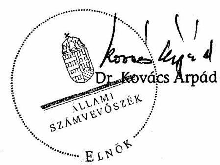

# ÁLLAMI   SZÁMVEVŐSZÉK 

## JELENTÉS

a Magyar Szocialista Párt 2005-2006. évi gazdálkodása törvényességének ellenőrzéséről

---

3. Önkormányzati és Területi Ellenőrzési Igazgatóság
3.1. Szabályszerüségi Ellenőrzési Főcsoport
Iktatószám: V-1015-025/2007.
Témaszám: 867
Vizsgálat-azonosító szám: V-349
Az ellenőrzést felügyelte:
Dr. Lóránt Zoltán
főigazgató
Az ellenőrzés végrehajtásáért felelős:
Dr. Elek János
általános főigazgató-helyettes
Az ellenőrzést vezette:
Horváth Balázs
főcsoportfőnök-helyettes
Az összefoglaló jelentést készítette:
Dr. Faragóné Tóth Mária
tanácsos
Az ellenőrzést végezték:
Dr. Faragóné Tóth Mária Benesné Baracsi Szilvia Dr. Veress Tiborné tanácsos számvevő számvevő

# A témához kapcsolódó eddig készített számvevőszéki jelentések: 

## címe

sorszáma
Jelentés a Magyar Szocialista Párt (mint a Magyar Szocialista Munkáspárt jogutódja) bejegyzési kérelmével egyidejűleg a bírósághoz benyújtott vagyonmérlege vizsgálata
Jelentés a Magyar Szocialista Párt 1991. évi gazdálkodása törvénysességének ellenőrzéséről
Jelentés a Magyar Szocialista Párt 1992-1993-1994. évi gazdálko- 278 dása törvényességének ellenőrzéséről
Jelentés a Magyar Szocialista Párt 1995-1996. évi gazdálkodása 352 törvényességének ellenőrzéséről
Jelentés a Magyar Szocialista Párt 1997-1998. évi gazdálkodása 004 törvényességének ellenőrzéséről
Jelentés a Magyar Szocialista Párt 1999-2000. évi gazdálkodása 0134 törvényességének ellenőrzéséről
Jelentés a Magyar Szocialista Párt 2001-2002. évi gazdálkodása 0353 törvényességének ellenőrzéséről
Jelentés a Magyar Szocialista Párt 2003-2004. évi gazdálkodása 0561 törvényességének ellenőrzéséről

---

## Eierlikör (1)

Menge: 1 Drink

2 Zentiliter Zitronensaft
2 Zentiliter Zuckersirup
1 Zentiliter Zuckersirup
1 Zentiliter Zuckersirup
etwas Zuckersirup
etwas Zuckersirup
etwas Zuckersirup
etwas Zuckersirup
etwas Zuckersirup
etwas Zuckersirup
etwas Zuckersirup
etwas Zuckersirup
etwas Zuckersirup
etwas Zuckersirup
etwas Zuckersirup
etwas Zuckersirup
etwas Zuckersirup
etwas Zuckersirup
etwas Zuckersirup
etwas Zuckersirup
etwas Zuckersirup
etwas Zuckersirup
etwas Zuckersirup
etwas Zuckersirup
etwas Zuckersirup
etwas Zuckersirup
etwas Zuckersirup
etwas Zuckersirup
etwas Zuckersirup
etwas Zuckersirup
etwas Zuckersirup
etwas Zuckersirup
etwas Zuckersirup
etwas Zuckersirup
etwas Zuckersirup
et

---

# TARTALOMJEGYZÉK 

BEVEZETÉS ..... 5
I. ÖSSZEGZŐ MEGÁLLAPÍTÁSOK, KÖVETKEZTETÉSEK, JAVASLATOK ..... 7
II. RÉSZLETES MEGÁLLAPÍTÁSOK ..... 10

1. A Párt gazdálkodásáról szóló 2005-2006. évi beszámolók ..... 10
1.1. A teljes vizsgálati időszakra érvényes megállapítások ..... 10
1.2. A 2005. és 2006. évi beszámolók ..... 10
1.2.1. Bevételek ..... 10
1.2.2. Kiadások ..... 11
2. A Pártnak a beszámoló összeállítására és az azt alátámasztó könyvvezetésre vonatkozó belső szabályozása és gyakorlata ..... 12
2.1. A belső szabályozás rendszere ..... 12
2.2. A könyvvezetés gyakorlata, összhangja a törvényi és a belső előírásokkal ..... 12
2.3. Analitikus nyilvántartások ..... 13
2.4. A bizonylati rend és fegyelem érvényesülése ..... 14
3. A Párt bevételszerző gazdálkodó tevékenysége ..... 14
4. A gazdálkodással összefüggő egyéb jogszabályokban foglalt előírások betartása ..... 16
4.1. Személyi jellegű kifizetések ..... 16
4.2. Az adózási, társadalombiztosítási és egyéb jogszabályok rendelkezéseinek érvényesítése ..... 16
5. A Párt belső ellenőrzésének rendszere ..... 17
5.1. A belső ellenőrzés rendszerének szabályozottsága ..... 17
5.2. A belső ellenőrzés múködése ..... 17
6. Az előző ellenőrzés megállapítására tett intézkedések ..... 17
MELLÉKLETEK
7. számú A Magyar Szocialista Párt 2005. évi pénzügyi zárómérlege
8. számú A Magyar Szocialista Párt 2006. évi pénzügyi zárómérlege
9. számú A Magyar Szocialista Párt 2005. évi pénzügyi zárómérlege (módosított)

---

.

---

# RÖVIDÍTÉSEK JEGYZÉKE 

| Törvények: |  |
| :--: | :--: |
| Art. | Az adózás rendjéről szóló - többször módosított - 2003. évi XCII. törvény |
| ÁSZ tv. | Az Állami Számvevőszékről szóló - többször módosított 1989. évi XXXVIII. törvény |
| Párttörvény | A pártok múködéséről és gazdálkodásáról szóló - többször módosított - 1989. évi XXXIII. törvény |
| Számv. tv. | A számvitelről szóló - többször módosított - 2000. évi C. törvény |
| Szja tv. | A személyi jövedelemadóról szóló - többször módosított 1995. évi CXVII. törvény |
| Tbj. tv. | A társadalombiztosítás ellátásaira és a magánnyugdíjra jogosultakról, valamint e szolgáltatások fedezetéről szóló - többször módosított - 1997. évi LXXX. törvény, egységes szerkezetben a végrehajtásról kiadott 195/1997. (XI. 5.) Korm. rendelet |
| Szórövidítések: |  |
| ÁSZ | Állami Számvevőszék |
| KPEB | Központi Pénzügyi Ellenőrző Bizottság |
| OK | Országos Központ |
| Párt | Magyar Szocialista Párt |
| PEB | Pénzügyi Ellenőrző Bizottság |
| SZMSZ | Szervezeti és Múködési Szabályzat |
| Területi szövetségek | Megyei Területi Szövetség, Budapesti Tanács |

---

.

---

# JELENTÉS 

## a Magyar Szocialista Párt 2005-2006. évi gazdálkodása törvényességének ellenőrzéséről

## BEVEZETÉS

A pártok gazdálkodása törvényességének ellenőrzésére az Állami Számvevőszékről szóló 1989. évi XXXVIII. törvény (a továbbiakban: ÁSZ tv.) 5. §-a, valamint a pártok múködéséről és gazdálkodásáról szóló 1989. évi XXXIII. törvény (a továbbiakban: párttörvény) 10. §-ának (1) bekezdése alapján - figyelemmel az ÁSZ tv. 16. § (2) bekezdésében foglaltakra - az Állami Számvevőszék (a továbbiakban: ÁSZ) jogosult. E törvényi felhatalmazás alapján - az ÁSZ 2007. évi ellenőrzési terve szerint vizsgálta a Magyar Szocialista Párt (a továbbiakban: Párt) 2005-2006. évi gazdálkodása törvényességét.

Az ellenőrzés célja annak megállapítása volt, hogy:

- a Párt által készített, a Magyar Közlönyben és a Párt internetes honlapján közzétett éves beszámolók a törvényi előírásoknak megfelelnek-e, a könyvvezetéssel és a valósággal megegyező adatokat tartalmaznak-e;
- a könyvvezetés és a gazdálkodás során betartották-e a számvitelről szóló többször módosított - 2000. évi C. törvény (a továbbiakban: Számv. tv.) és az egyéb jogszabályok rendelkezéseit, valamint a belső előírásokat;
- a Párt a múködéséhez szabályszerűen igénybe vehető forrásokat használt-e fel, nem folytatott-e a párttörvény által tiltott gazdálkodó tevékenységet, nem fogadott-e el tiltott vagyoni hozzájárulást, illetőleg adományt.

Az ellenőrzés körülményeit illetően rögzíteni szükséges ${ }^{1}$, hogy

- a párttörvény 1. sz. melléklete szerinti beszámoló-mintához magyarázatot, útmutatót nem készítettek a jogalkotók, így ennek kitöltése pártonként - kialakított számviteli politikájuknak megfelelően - eltérő lehet;
- a beszámoló-minta a Számv. tv. rendelkezéseivel nem harmonizál, nem felel meg sem a mérleg, sem az eredmény-kimutatás követelményeinek;

[^0]
[^0]:    ${ }^{1}$ Az ÁSZ évek óta javasolja a Kormánynak a pártellenőrzésekről készített jelentéseiben a párttörvény módosítását. A pártfinanszírozás átláthatóvá tételéről szóló T/4190. számú törvényjavaslat beterjesztésével ismételten napirendre került a párttörvény módosítása is.

---

Az ÁSZ a párttörvény napirenden lévő módosítási javaslatának elfogadásáig a jelenleg hatályos rendelkezéseknek megfelelő - egységes módszertani alapokra helyezett - gyakorlattal folytatja a pártok gazdálkodása törvényességének ellenőrzését.

Az ellenőrzést a 13/2003. számú Elnöki utasítással kiadott „Módszertan a pártok gazdálkodása törvényességének ellenőrzéséhez" c. kiadvány és a 14/2003. számú Elnöki határozattal elfogadott segédletben foglaltak alapján végeztük.

A pénzügyi-szabályszerúségi ellenőrzés 2007. augusztus 31. - október 30. között a Párt székhelyén történt, az Országos Központ (OK) által rendelkezésre bocsátott dokumentumok alapján.

---

# I. ÖSSZEGZŐ MEGÁLLAPÍTÁSOK, KÖVETKEZTETÉSEK, JAVASLATOK 

A Párt a vizsgált időszak éves gazdálkodási beszámolóit a párttörvényben előírt határidőn belül, meghatározott formában és tartalommal közzétette. A 2005. évi beszámoló 2006. április 25-én a Magyar Közlöny 49. számában, a 2006. évi beszámoló 2007. április 24-én a Magyar Közlöny 51. számában jelent meg. A 2005. évi beszámolót a helyszíni ellenőrzés észrevételére 2007. szeptember 26-án a Magyar Közlöny 127. számában ismételten megjelentette, mivel egy belföldi magánszemély 3418 ezer Ft hozzájárulását nem nevesítette, amely összeg a beszámolósorban szerepelt. A beszámolókat a Párt internetes honlapján is nyilvánosságra hozta. A 2005. évi módosított, és 2006. évi beszámolók a szabályozásnak megfelelően és a főkönyvi kivonattal egyezően, megbízható és valós képet adtak a gazdálkodásról.

A Párt könyvvezetési és beszámolási szabályozásának rendszere 2005. január 1-jével megújított számviteli szabályozásokon alapult. A számviteli politika érvényesítette a Számv. tv. hatályos előírásait, tükrözte a szervezet gazdálkodási sajátosságait. A szabályozást az előző ÁSZ ellenőrzés felhívására kiegészítették az önkormányzati tulajdonú ingatlanok kedvezményes használatának értékelési szabályaival. A számviteli politikához kapcsolódó leltározási és selejtezési szabályzat előírásait indokoltan, változatlanul hatályban tartották, a pénzkezelési szabályzatot aktualizálták. A gazdálkodási változásokra figyelemmel kiadott számlarendjében összehangoltan szabályozta a párttörvény szerinti beszámolósorok és a főkönyvi számlák kapcsolati megfeleltetését. A számlarendet a Számv. tv-ben foglalt tartalmi követelményekre figyelemmel módosította, gondoskodott a változások könyvelési programban való átvezetéséről. A számlarendhez tartozó hatályos bizonylati szabályzattal rendelkeztek. A Számv. tvvel előírt szabályzatokat a Párt alapszabályával összhangban a pénztárnok léptette hatályba.

A könyvvezetés a kettős könyvvitel rendszerében központilag, az alapbizonylatok számítógépes feldolgozásával, mindkét vizsgált évben azonos számítógépes program alapján történt. A könyvelési feladatokat szervezetten, szakmai kontrollal a központi főkönyvelőség végezte. A kialakított könyvelési rendszer az ellenőrzéshez szükséges adatokat biztosította. A könyvvezetés idősorosan, a zárlati munkálatok végrehajtása szabályszerűen, határidőben teljesült. A kontírozási feladatokat a számlarendnek megfelelően végezték. A főkönyvi számlákhoz kapcsolódó analitikus nyilvántartások körét, tartalmát és vezetési rendjét meghatározták, a részletező nyilvántartásokat teljes körűen, a főkönyvvel egyezően vezették.

A Párt a leltározási kötelezettségnek mindkét vizsgált évben, a jogszabályoknak és belső szabályzatának megfelelően eleget tett. Az ötévenként esedékes tárgyi eszközök mennyiségi felvétellel történő leltározását 2005. évben elvégezték. A könyvviteli zárlathoz előírt leltározást a leltározási és selejtezési szabályzatnak megfelelően szervezték, dokumentálták és értékelték. A leltározás eredményeként leltárkülönbözetet nem tártak fel.

---

A bizonylatolás Számv. tv-ben meghatározott követelményei érvényesítéséhez bizonylati szabályzattal és bizonylati albummal rendelkeztek, amelyhez a hatályos szervezeti és számviteli szabályzatok meghatározták a gazdálkodással kapcsolatos hatás- és jogköröket, előírták a számlavezetés és készpénzkezelés, a bizonylatok kiállításának és feldolgozásának eljárásait, valamint a kötelezettségvállalás és utalványozás rendjét. A könyvelt gazdasági műveleteket, eseményeket számviteli bizonylatokkal alátámasztották. A bizonylatolás alaki és tartalmi előírásaihoz kapcsolódóan a pénzkezelés szabályait betartották, a könyvelést és pénztári ellenőrzést rendszeresen dokumentálták. Az utalványozásnál a tranzakciók $2,3 \%-2,4 \%$-ában nem, vagy nem a jogosult utalványozott, a bizonylatolás alaki és tartalmi előírásait $98 \%$-ban betartották. Az esetileg előfordult hibák az éves beszámolók valódiságát nem befolyásolták.

A gazdálkodó és bevételszerző tevékenységet a párttörvény alapján kialakított, hatályos gazdálkodási szabályzatban rögzítették. A Párt bevételei a költségvetési törvényben megállapított állami támogatáson felül tagdíjakból, magán- és jogi személyektől kapott hozzájárulásokból, a párttörvényben engedélyezett egyéb bevételekből származtak. Az egyéb bevételek a 2005. évi 66696 ezer Ft-ról 2006. évben 305658 ezer Ft-ra emelkedtek. Az ugrásszerű növekedés a Párt székház eladására külföldi gazdasági társasággal kötött opciós megállapodás 251231 ezer Ft vételi opciós dijából eredt, amely a Pártot illette meg és szabályszerűen megjelent a 2006. évi beszámolóban.

A 2006-ban meghiúsult szerződés miatt intézkedtek a székház nyilvános pályázattal történő eladásáról, amelynek alapján a kiírásban meghatározott 10000 ezer Ft pályázati biztosíték befizetését 2007-ben egy pályázó teljesítette. A Párt vevőként a biztosítékot befizető - a szerződésben jogelődként jelzett társaság - helyett az újonnan alakult ingatlanfejlesztő társasággal kötött szerződést. Az adás-vételi szerződés nemcsak a Párt tulajdonát képező székház eladását tartalmazta, hanem a Köztársaság tér 27. szám alatti, részvénytársasági tulajdonú ingatlan értékesítését is. Az együttes szerződéskötésre - a Párt nyilatkozata szerint - a közös közmű rendszerre figyelemmel került sor. A vevő a Pártnak az épületállag, illetve hasznos terület alapján meghatározott 950000 ezer Ft-ot határidőre teljesítette.

A Párt a könyvviteli nyilvántartásai szerint betartotta a párttörvényben előírt gazdálkodási tilalmakat és forrásszerzési korlátokat. A tulajdonában álló egyszemélyes kft-k nyereségéből bevétele nem származott.

A személyi jellegú kifizetések rendjét hatályos belső szabályzatban rögzítették. A Párt munkáltatói, kifizetői jogkörében szabályszerű szerződéseket kötött, szabályozott költségtérítéseket folyósított. A személyi jellegű kifizetések a jogszabályokban és szabályzatokban előírtaknak megfelelően, szabályszerűen, adómentesen teljesültek. A külföldi kiküldetések elszámolását és a hivatali gépjárművek használatát megfelelően szabályozták és a kifizetések is szabályosan történtek. A Párt, mint munkáltató költségvetési befizetési kötelezettségeit határidőben teljesítette. Mindkét évben eleget tett a társadalombiztosításról és az egészségügyi ellátásról szóló, valamint a személyi jövedelemadóról és az adózás rendjéről szóló törvények rendelkezéseinek. A kötelező nyilvántartásokat vezették, a kifizetett munkabérekből és bérjellegű jövedelmekből az adóelőlegeket és járulékokat levonták, bevallották.

---

A belső ellenőrzést a hatályos belső szabályzatok összehangoltan szabályozták. A Párt alapszabálya értelmében a KPEB és a PEB-ek éves munkatervek alapján végezték ellenőrzési tevékenységüket. A 2005-2006. évi testületi ellenőrzések eredményéről 2007-ben számoltak be a Kongresszusnak, illetve a megyei küldöttgyűléseknek. A testületek ellenőrző tevékenységükkel a gazdálkodás szabályszerűségét, a törvényes működést segítették. A vizsgált időszakban szabálytalanságot, mulasztást nem tártak fel.

A folyamatba épített, előzetes és utólagos vezetői ellenőrzés szabályait a gazdálkodási-számviteli szabályzatok határozták meg. A belső ellenőrzés a pénztárnok irányításával, a kötelezettségvállalási és utalványozási jogkör szabályozott gyakorlásával, a központi főkönyvelőség felülvizsgálatával és egyeztetésével eredményesen működött. A belső ellenőrzési rendszer összehangolt működésével biztosították a szabályszerű gazdálkodást.

---

# II. RÉSZLETES MEGÁLLAPÍTÁSOK 

## 1. A PÁrt GAZDÁlKODÁSÁról SZÓLÓ 2005-2006. ÉVI BESZÁMOLÓK

### 1.1. A teljes vizsgálati időszakra érvényes megállapítások

A Párt a vizsgált évek gazdálkodási beszámolóit a törvényben előírt határidőn belül, az előírt formában és tartalommal tette közzé. Az alapszabály rendelkezése szerint a beszámolókat az Országos Választmány elfogadta. A 2005. évi beszámolót 2006. április 25-én, a Magyar Közlöny 49. számában, a 2006. évi beszámolót 2007. április 24-én, a Magyar Közlöny 51. számában és saját internetes honlapján is nyilvánosságra hozta (1-2. számú melléklet).

A 2005. évi beszámolóban a Párt egy belföldi magánszemély 500 ezer Ft-ot meghaladó hozzájárulását nem nevesítette 3418 ezer Ft értékben, amely a beszámolósorban szerepelt, annak végösszegét nem érintette. A 2005. évi beszámolót a számvevőszéki ellenőrzés észrevételére ismételten megjelentették 2007. szeptember 26-án a Magyar Közlöny 127. számában (3. számú melléklet).

Mindkét év beszámolóiban szereplő adatok a rendelkezésre álló dokumentumokból levezethetők voltak, megbízható és valós képet nyújtottak a Párt gazdálkodásáról. A beszámolók elkészítése során érvényt szereztek a számviteli alapelveknek, betartották a belső szabályzatokban foglalt előírásokat, biztosították a beszámolósorok főkönyvi adatokkal való egyezőségét.

### 1.2. A 2005. és 2006. évi beszámolók

### 1.2.1. Bevételek

A tagdíjak befizetései a hatályos alapszabály előírásai szerint teljesültek. A beszámolósoron mindkét ellenőrzött évben csak jogcímhez tartozó összegek szerepeltek. A könyvelt tételekhez minden esetben előírásszerűen kitöltött alapbizonylat kapcsolódott.

Az állami költségvetésből származó támogatás beszámoló sor adatai egyeztek a vonatkozó főkönyvi számlára banki bizonylatok alapján könyvelt, illetve a Magyar Államkincstár által megadott összeggel. A 2006. évről közölt összeg tartalmazta az országgyűlési képviselőválasztásra kapott támogatást.

Az egyéb hozzájárulások, adományok beszámolósoron a hatályos számlarendben meghatározott egyéb támogatások fogalomkörébe tartozó bevételeket közölték.

A párttörvény 9. § (2) bekezdésére figyelemmel, a beszámoló sort az 1. számú melléklet szerinti minta előírásainak megfelelően tovább részletezték. Az egy adományozótól származó befizetéseket összesítették, azokat számítógépes, terü-

---

leti szervezetenként és egyénenként listázható kimutatás támasztotta alá. A nem pénzbeli vagyoni hozzájárulások értékét mindkét évben megállapították, a megfelelő beszámolósor tartalmazta ennek összegét.

Az egyéb bevételekhez kapcsolódó főkönyvi számlákat a Párt hatályos számlarendjében meghatározta, a jogcímek összhangban voltak a számlarenddel.

A beszámolósoron teljesült bevételeket az alábbi táblázat részletezi:
Adatok ezer Ft-ban

| Számla   száma | Megnevezése | 2005. | 2006. |
| :--: | :-- | --: | --: |
| 961 | Propaganda tárgy, kiadvány értékesítés | 7914 | 4093 |
| 962 | Immateriális javak, tárgyi eszközök értékesítése | 14984 | 1278 |
| 963 | Bérleti díj bevétel | 16023 | 19076 |
| 964 | Káresemény miatti bevétel | 639 | 2752 |
| 965 | Költségtérítési díjbevétel | 19410 | 22521 |
| 966 | Behajthatatlannak min. és leírt követelésekre   kapott összegek | 141 | 32 |
| 969 | Egyéb bevételek | 943 | 251883 |
| 97 | Pénzügyi műveletek bevételei | 6642 | 4023 |
|  | Összesen: | $\mathbf{6 6} \mathbf{6 9 6}$ | $\mathbf{3 0 5 6 5 8}$ |

# 1.2.2. Kiadások 

A támogatás egyéb szervezeteknek beszámolósoron csak szervezeteknek nyújtott támogatás szerepelt.

Az eszközbeszerzés kiadásai a számlarendben meghatározott főkönyvi számlák adataiból levezethetők voltak.

A „Múködési kiadások" és a „Politikai tevékenység kiadásai" beszámolósorok adatainál mindkét évben következetesen érvényesítették a számlarendben előírt jogcímek azonosságát.

Az egyéb kiadások beszámolósoron a szabályozásnak megfelelő kiadásokat könyveltek.

---

# 2. A PÁrtnak a beszámoló ÖsszeÁllítására És az azt alátáMASZTÓ KÖNYVVEZETÉSRE VONATKOZÓ BELSŐ SZABÁLYOZÁSA ÉS GYAKORLATA 

### 2.1. A belsó szabályozás rendszere

A Párt a beszámoló összeállítását és az ezt alátámasztó könyvvezetést a 2005. január 1-jével megújított számviteli politikájában szabályozta, amely megfelelően rögzítette a számv. tv-i előírásokat, tükrözte a szervezet gazdálkodási sajátosságait. A számviteli politikát az előző ÁSZ ellenőrzés felhívására kiegészítették az önkormányzati tulajdonú ingatlanok kedvezményes használatának értékelési szabályaival, egyidejúleg aktualizálták az eszközök és források értékelési szabályzatát. A számviteli politikához kapcsolódó leltározási és selejtezési szabályzat előírásai indokoltan, változatlan módon hatályban maradtak. A pénzkezelési szabályzat módosításával egyes bankszámlák megszüntetését vezették át.

A számviteli politika új szabályaival összhangban módosították a számlarendet, pontosították a múködési és politikai kiadásokhoz rendelt főkönyvi számlák körét. Gondoskodtak a számlatükör aktualizálásáról, a változások könyvelési programban való átvezetéséről, a számlarend szöveges magyarázatát a helyszíni ellenőrzés észrevétele alapján pontosították. A számlarend a Számv. tv. 161. § (2) bekezdésben foglalt tartalmi követelményekkel összhangban állt. Meghatározta az évközi és év végi zárlattal kapcsolatos feladatokat, főkönyvi kivonat készítését. A bizonylati rendet külön bizonylati szabályzat és bizonylati album tartalmazta.

A törvényes és egységes gazdálkodás érdekében a jogszabályváltozásokhoz igazodóan módosították a kiküldetési normatívákat, valamint csökkentették a mobil távközlési szolgáltatást igénybe vehetők körét. A Párt 2005. január 1jével alakította ki pályázati szabályzatát, 2006. szeptember 1-jével a telefonszolgáltatás használati rendjét.

A Párt alapszabályával összhangban a belső szabályzatokat minden esetben a pénztárnok léptette hatályba.

### 2.2. A könyvvezetés gyakorlata, összhangja a törvényi és a belső előírásokkal

A könyvvezetés a számviteli politikában szabályozottaknak megfelelően a kettős könyvvitel rendszerében központilag, az alapbizonylatok számítógépes feldolgozásával történt. Mindkét vizsgált évben azonos számítógépes programot alkalmaztak, amelyen a számlarendi változásokat átvezették. A főkönyvi számlák és az analitikus nyilvántartások kapcsolata megfelelő, ellenőrizhető volt. A vizsgált dokumentumok alapján a könyvvezetés idősorosan, a zárlati munkálatok végrehajtása határidőben megtörtént.

A Pártnál kialakították a helyi szervezetek és a területi szövetségek gazdasági kapcsolatának, könyvvezetésének rendjét, amelynek során a Számv. tv. és belső előírások határidőit betartották. A számviteli politikával összhangban a területi

---

szövetségek negyedévente küldték meg az OK fökönyvelősége részére a helyi szervezetek tartalmilag és formailag ellenőrzött pénztárbizonylatait. A könyvvezetés szabályszerűsége érdekében a főkönyvelőség rendszeresen tartalmilag és formailag ellenőrizte a beküldött bank- és pénztárbizonylatokat, a kapcsolódó alapbizonylatokat. A hibák javítására a főkönyvelőség munkatársai a területi szövetségek felé intézkedtek. A könyvelést követően a területi szövetségeknek visszajuttatták a beküldött bizonylatokat, valamint a feldolgozásról csatolták a számviteli kimutatásokat.

A számlakijelölés (kontírozás) gyakorlata összhangban volt a Számv. tv. és belső számlarendi előírásokkal. A vizsgált tranzakcióknál 2005. évben 2,7\%, 2006. évben $2,2 \%$ mértékben fordult elő téves, hiányos kontírozás, mely a beszámoló valódiságát nem érintette.

# 2.3. Analitikus nyilvántartások 

A Párt a Számv. tv. előírása alapján számlarendjében szabályozta a főkönyvi számlákhoz kapcsolódó analitikus nyilvántartások körét, tartalmát és vezetési rendjét.

Az immateriális javak és tárgyi eszköz beszerzésekről - mennyiségben és értékben - egyedi analitikus nyilvántartást vezettek.

A szállítói és vevői analitikus nyilvántartásokat a számlarendnek megfelelően, a Párt számítógépes könyvelési programban vezette. A Párt a vevő tartozások és szállítói követelések év végi állományát az analitikus nyilvántartásokban és a beszámoló mérlegében helyesen szerepeltette.

Az értékpapírokat a számviteli politikában és számlarendben előírt módon nyilvántartották, egyeztették.

Előleget a pénzkezelési szabályzat előírásaival összhangban utólagos elszámolással beszerzésre, kiküldetésre, üzemanyag-vásárlásra csak az OK-nál engedélyeztek, amelyek kifizetése, elszámolása, nyilvántartása az előírásoknak megfelelően történt.

A Párt pénzkezelési szabályzatában a szigorú számadású nyomtatványok körét meghatározta. Szigorú számadású nyomtatványként határozták meg a bankszámla terhére kibocsátható készpénzcsekket, a bevételi és kiadási pénztárbizonylatot, és a pénztárjelentést. A nyilvántartásokat a Számv. tv. 168. § alapján a belső előírásoknak megfelelően, teljes körűen vezették.

A Párt a házipénztár kezeléséről országos hatályú pénzkezelési szabályzatában rendelkezett. A területi szövetségek a helyi sajátosságok figyelembevételével alakították ki szabályzatukat. A vizsgálatba bevont szervezetek saját, hatályos pénzkezelési szabályzattal rendelkeztek. A házipénztár kezelése a belső szabályzatoknak megfelelően történt. A Párt által vezetett analitikus nyilvántartások tartalma megfelelt a törvényi követelményeknek és belső előírásoknak. Az éves záráskor az előírt egyeztetések megtörténtek, az analitikus nyilvántartások a főkönyvi számlákkal egyezőséget mutattak.

---

A Párt a leltározási kötelezettségnek mindkét vizsgált évben, a jogszabályoknak és belső szabályzatának megfelelően eleget tett. A leltározási és selejtezési szabályzat alapján az ötévenként esedékes tárgyi eszközök mennyiségi felvétellel történő leltározását 2005. évben elvégezték. A leltár tételeinek értékelése a számviteli politika részét képező értékelési előírásoknak megfelelően történt. A leltározás során leltárkülönbözetet nem tártak fel.

# 2.4. A bizonylati rend és fegyelem érvényesülése 

A Párt a jogszabályi előírásoknak és belső sajátosságainak megfelelően rögzítette a bizonylati elvvel és fegyelemmel kapcsolatos követelményeket. A szabályzatokban meghatározták a gazdálkodással kapcsolatos hatás- és jogköröket, előírták a számlavezetés és készpénzkezelés, a bizonylatok kiállításának, feldolgozásának eljárásait, valamint a kötelezettségvállalás és utalványozás rendjét. A gazdasági események számviteli nyilvántartásokban történő rögzítése során a Számv. tv. 167. § (1) bekezdés b), c), d), f) pontjai alapján esetileg sérült az utalványozás és bizonylatolás rendje. Mértéke a vizsgált években a gazdasági tranzakciókra vetítve $2 \%$ körül mozgott, ez az éves beszámolók valódiságát nem befolyásolta. Az utalványozásnál 2005. évben 2,3\%-ban, 2006. évben $2,4 \%$-ban nem vagy nem a jogosult utalványozott.

A könyvelt gazdasági múveleteket, eseményeket számviteli bizonylatokkal alátámasztották. A vizsgált szervezeteknél a pénzkezelés szabályait betartották. A pénztári ellenőrzést a bizonylatokon és a pénztárnaplóban dokumentálták. Az egyes gazdasági múveletek, események bizonylatainak adatait a törvényi és a számviteli politikában meghatározott időpontig rögzítették.

## 3. A PÁRT BEVÉTELSZERZŐ GAZDÁLKODÓ TEVÉKENYSÉGE

A Párt bevételszerző gazdálkodó tevékenységével kapcsolatos előírásokat hatályos gazdálkodási szabályzat tartalmazta. A bevételek meghatározó része: 2005. évben $70 \%$-a, 2006. évben $56 \%$-a állami támogatásból származott, a tagdíjak és egyéb hozzájárulások, adományok 25 , illetve $27 \%$-ot és az egyéb bevételek 5 , illetve $17 \%$-ot tettek ki.

A Párt gazdálkodásával kapcsolatos egyéb bevételek propaganda tevékenységből, kiadványok, könyvek értékesítéséből, saját tulajdonát képező ingók és ingatlanok - a párttörvénynek megfelelő - értékesítéséből és hasznosításából, költség- és kártérítésekből és 2006. évben opciós díj bevételből tevődtek össze. Az egyéb bevételek 2005. évi 66696 ezer Ft-ról 2006. évben 305658 ezer Ft-ra emelkedtek. Az egyéb bevételek 2006. évi közel ötszörös emelkedése, mely döntő részt a Párt székház eladására kötött adás-vételi szerződés 251231 ezer Ft opciós díjából származott. A Párt a Köztársaság tér 26. szám alatti székháza 2006. február 28-ig teljesítendő, 5000 ezer Európa vételáron történő megvásárlására külföldi gazdasági társaságnak vételi opciós jogot biztosított. A szerződés tartalmazta, hogy a vételi opciós jog díja 1000 ezer Euró, amely a teljes vételárba az opció gyakorlása esetén beszámít. A vevő a vételi opciós jogával a kijelölt határidőig nem élt, így az opciós díj a Pártot illette meg. A Párt az összeget a 2006. évi megjelentetett beszámolójában, az előírásoknak megfelelően, az egyéb bevételek között szerepeltette.

---

A 2006-ban meghiúsult szerződés miatt a Párt Országos Elnökségének döntése alapján intézkedtek a székház nyilvános pályázattal történő eladására. A pályázati felhívás az eladási ár közlése nélkül jelent meg. A kiírásban meghatározott 10000 ezer Ft pályázati biztosítékot a Párt bankszámlájára 2007 nyarán egy társaság befizette. A Párt 2007-ben vevőként a biztosítékot befizető - a szerződésben jogelődként jelzett társaság - helyett az újonnan alakult ingatlanfejlesztő társasággal kötött szerződést. Az adás-vételi szerződés nemcsak a Párt tulajdonát képező székház eladását tartalmazta, hanem a Köztársaság tér 27. szám alatti, részvénytársasági tulajdonú ingatlan értékesítését is ${ }^{2}$.

Az együttes szerződéskötésre - a Párt nyilatkozata szerint - a közös közmú rendszerre figyelemmel került sor. Az együttes eladási árat 1625000 ezer Ft + ÁFA összegben állapították meg, amelynek megosztását a tulajdonolt ingatlan állaga, hasznos területe határozta meg, így a Pártot 950000 ezer Ft ÁFA mentes bevétel illette meg. A vételár 10\%-os, első részletének megfizetését a vevő határidőre teljesítette. A Párt a székházat a szerződésben rögzített határidőig - 2007. október 30-áig - birtokba adási jegyzőkönyvvel átadta. A vevő a 2007. november 28 -ig vállalt fizetési kötelezettségét teljesítette. Tekintettel arra, hogy a pénzügyi teljesítésre 2007-ben került sor, így az a Párt 2007. évi beszámolójában fog szerepelni, amelyet 2008-ban kell közzétennie.

A Párt vagyonának elemei a párttörvény 4. § (1), (5) bekezdése szerinti bevételekből és a 6. § (1), (3)-(4) bekezdése szerinti szabályos gazdálkodó tevékenységből származtak. A bevételek a megfelelő főkönyvi számlákkal egyezőek voltak, azokat a főkönyvi könyvelés alapbizonylatai, analitikus nyilvántartások alátámasztották. A gazdálkodó tevékenységre vonatkozó, annak jogszerűségét igazoló szerződések, egyéb dokumentumok rendelkezésre álltak.

A Párt a vizsgált dokumentumok alapján a párttörvény 4. § (2-3) bekezdés szerinti tiltott bevételt, névtelen adományt nem fogadott el, a 6. §-ban nem engedélyezett gazdálkodó tevékenységet nem folytatott, többszemélyes gazdasági társaságban részesedést nem szerzett; a részére támogatást nyújtó alapítványokat nyilatkoztatta arról, hogy közvetlen költségvetési/költségvetési szervi támogatásban nem részesültek.

A Párt és az általa létrehozott kft-k kapcsolata az alapszabályban került meghatározásra. A Pártnak a vizsgált időszakban két egyszemélyes kft-je volt, ezek eredményéből bevétele nem származott. A szabad pénzeszközei szabályszerű befektetése nyomán a vizsgált időszakban a következő hitelviszonyt megtestesítő értékpapírokkal rendelkezett: diszkont kincstárjegy, kamatozó kincstárjegy, takarék szelvény, befektetési jegy. A Párt a nem pénzben kapott hozzájárulások értékét a párttörvény 4. § (5) bekezdésében előírtak szerint meghatározta és a számviteli politikának megfelelően az éves beszámolókban szerepeltette.

[^0]
[^0]:    ${ }^{2}$ A Köztársaság tér 27. szám alatti, korábban kincstári vagyon részét képező épület értékesítésének számvevőszéki vizsgálatára a H/4539. számú országgyűlési határozat, illetve ÁSZ elnöki döntéssel a 2007. évi zárszámadási ellenőrzés (KVI) alapján kerül sor.

---

# 4. A GAZDÁLKODÁSSAL ÖSSZEFÜGGŐ EGYÉB JOGSZABÁLYOKBAN FOGLALT ELŐÍRÁSOK BETARTÁSA 

### 4.1. Személyi jellegú kifizetések

A Párt munkáltatói jogkörében munka- és megbízási szerződéseket kötött. A különféle jövedelmek számfejtését és utalását, az adójogszabályokban előírt levonási, bevallási, befizetési és adatszolgáltatási kötelezettségek teljesítését -a Párt egészére vonatkozóan - a központi főkönyvelőség szabályszerűen végezte. A Párt a külföldi kiküldetésről hatályos szabályzattal rendelkezett, az elszámolás és nyilvántartás szabályos volt. A saját gépjármú hivatalos célú használatát a Párt tisztségviselő tagjainak és vele munkaviszonyban állóknak engedélyezte. A Párt a gépkocsik tulajdonosával a hivatalos használatra a megállapodást kötött, melyben rögzítette az elszámolás feltételeit. A fizetett költségtérítésekről az érintettek részére adóbevallásokhoz az igazolást kiállították. A saját gépkocsi használatnál a költségtérítések a 60/1992. (IV. 1.) Korm. rendeletben szabályozott normatív mértékkel és az Szja tv. előírásának betartásával adómentesen teljesültek.

A Párt tulajdonában lévő hivatali gépjármúveket a szabályozásnak megfelelően, csak hivatalos célú utazásaikhoz használták, a szabályzatban megjelölt személy engedélyével, menetlevél és útnyilvántartás vezetési kötelezettség mellett. A Párt tulajdonában álló gépkocsik futásteljesítményéről vezetett nyilvántartások, a gépkocsi tárolási helyét is figyelembe véve megfelelttek a kizárólagos hivatali használat dokumentálását biztosító, az Szja tv. 70. §-ában és 5. számú mellékletének II/7. pontjában meghatározott adatkövetelményeknek. A kizárólagos hivatalos célú használat miatt a Pártnak cégautóadó fizetési kötelezettsége nem keletkezett. A Párt természetbeni juttatásként az étkezési költségek megtérítéséhez hozzájárulást fizetett, melynek mértéke nem haladta meg az Szja tv. 1. számú melléklet 8.17 pontjában szabályozott adómentes értékhatárt.

### 4.2. Az adózási, társadalombiztosítási és egyéb jogszabályok rendelkezéseinek érvényesítése

A Párt a vizsgált időszakban a személyi jövedelemadó, a munkáltatót és munkavállalókat terhelő járulékok, valamint a magánnyugdíj-pénztári befizetési és bevallási kötelezettségének a jogszabályokban előírt határidőben eleget tett. A kötelező nyilvántartásokat vezették, melyek megegyeztek a főkönyvi könyveléssel és bevallásokkal. A Párt nyilvántartásai szerint és folyószámla kivonattal igazoltan egyik vizsgált évben sem volt hátraléka. A Párt az előírt adatszolgáltatásokat és igazolásokat az adóhatóság és a magánszemélyek részére határidőben megküldte. A reprezentációs kiadások értéke 2005. évben három, 2006. évben négy területi szövetségnél meghaladta az Szja tv. 69. § (7) bekezdés b) pontja szerinti mértéket. A Párt a befizetési kötelezettségét határidőre teljesítette. A Párt az egyes pénzügyi tárgyú törvények módosításáról szóló 2006. évi LXI. törvényhez igazodóan elkészítette a 2006. szeptember 1-jétől hatályos telefon szolgáltatás használati rendjét. Az új szabályozás szerint a telefonszámlák kiegyenlítése központilag az OK-nál történt. A Pártnál a telefonszolgáltatással összefüggésben a használókkal a $20 \%$ vélelmezett magánhasználat összegét befizettették, így a Pártnak adófizetési kötelezettsége nem keletkezett.

---

# 5. A PÁRT BELSŐ ELLENŐRZÉSÉNEK RENDSZERE 

### 5.1. A belső ellenőrzés rendszerének szabályozottsága

A Párt belső ellenőrzési rendszerét a hatályos alapdokumentumok számviteli szabályzatok összehangoltan rögzítették. A Párt alapszabálya szabályozta a gazdálkodást ellenőrző választott testületek múködését. A KPEB feladatkörébe tartozott a pártvagyon kezelésének, a Párt szervezetei és vállalkozásai gazdálkodásának szabályszerűségi ellenőrzése. Hatáskörébe tartozott a Párt költségvetésének és beszámolójának, valamint a gazdálkodás rendjére vonatkozó szabályzatok véleményezése. Az önálló jogi személyiséggel rendelkező területi szövetségeknél a gazdálkodás ellenőrzése a PEB-ek feladata volt. A folyamatba épített, előzetes és utólagos vezetői ellenőrzést a gazdálkodási szabályzat a pénztárnok irányítási jogkörébe utalta. Az ellenőrzési feladatokat a hatályos Számv. tv. előírásaihoz és a belső szabályzatokhoz igazodva határozták meg.

### 5.2. A belső ellenőrzés múködése

A KPEB és a PEB-ek az alapszabályban rögzített ellenőrzési feladatokat az éves munkatervekben foglaltak szerint teljesítették. A KPEB a 2007. évi Kongresszuson, a PEB-ek a megyei küldöttgyűléseken számoltak be a 2005/2006. évben végzett munkájukról. Ellenőrző tevékenységükkel a gazdálkodás szabályszerűségét, a törvényes múködést segítették. A vizsgált időszakban szabálytalanságot, mulasztást nem tártak fel. A folyamatba épített, előzetes és utólagos vezetői ellenőrzés a pénztárnok irányításával, a meghatározott kötelezettségvállalási és utalványozási jogkör gyakorlásával, továbbá a központi főkönyvelőség felülvizsgálati és egyeztetési tevékenységén keresztül eredményesen múködött. A vezetői ellenőrzés részeként gondoskodtak az előző ÁSZ ellenőrzés felhívásának végrehajtásáról. Mindezek eredményeként biztosították a szabályszerű gazdálkodás és számviteli tevékenység feltételeit.

## 6. AZ ELŐZŐ ELLENŐRZÉS MEGÁLLAPÍTÁSÁRA TETT INTÉZKEDÉSEK

A Párt az ÁSZ 0561 számú jelentésének felhívására 2005. január 1-jével a jogszabályokkal összhangba hozta számviteli szabályozásait, körlevélben intézkedett a bizonylatok alaki és tartalmi előírásainak betartására.

Budapest, 2008. január" 14 "

Melléklet: $\quad 3 \mathrm{db}$

---

A Magyar Szocialista Párt 2005. évi pénzügyi zárómérlege

# Bevételek 

1. Tagdijak ..... 54489
2. Állami költségvetésbôl származó támogatás ..... 969200
3. Képviselöcsoportnak nyújtott állami támogatás
4. Egyéb hozzájárulások, adományok ..... 294292
4.1. Jogi személyektól ..... 13049
4.1.1. Belföldiektól ( 500000 Ft feletti hozzájárulás nevesitve) ..... 13049

- Szegfü-Szeg Alapítvány ..... 1000
- Budapest IX. ker. Önkormányzat ..... 697
- Budapest VI. ker. Önkormányzat ..... 2662
- Budapest XVIII. ker. Önkormányzat ..... 1354
- Budapest XIX. ker. Önkormányzat ..... 3850
- Miskolc Városi Önkormányzat ..... 1312
- Szeged Városi Önkormányzat ..... 858
4.1.2. Külföldiektől ( 100000 Ft feletti hozzájárulás nevesitve)
4.2. Jogi személynek nem minősülö gazdasági társaságtól ..... 0
4.2.1. Belföldiektől ( 500000 Ft feletti hozzájárulás nevesitve)
4.2.2. Külföldiektől ( 100000 Ft feletti hozzájárulás nevesitve)
4.3. Magánszemélyektól ..... 281243
4.3.1. Belföldiektől ( 500000 Ft feletti hozzájárulás nevesitve) ..... 281243
- Avarkeszi Dezső ..... 807
- Boldvai László ..... 761
- Dr. Botka László ..... 797
- Dr. Csákabonyi Balázs ..... 554
- Csontos János ..... 733
- Dobolyi Alexandra ..... 1468
- Dr. Fazakas Szabolcs ..... 1693
- Gulyásné dr. Gurmai Zita ..... 1314
- Gur Nándor ..... 727
- Harangozó Gábor István ..... 1244
- Dr. Havas Szófia ..... 520
- Hegyi Gyula ..... 1254
- Herczog Edit ..... 1519
- Horváth Gyula ..... 832
- Dr. Juhászné Lévai Katalin ..... 995
- Kocsi László ..... 572
- Kósáné dr. Kovács M. ..... 1439
- Kovács István ..... 526
- Kovács László ..... 3500
- Kovács Tibor ..... 786
- Dr. Kozma József ..... 730
- Dr. Lévai Katalin ..... 1468
- Dr. Szili Katalin ..... 1068
- Szonda Richárd ..... 1000
- Dr. Tabajdi Csaba ..... 1468
- Tóbiás József ..... 575

---

- Varga András ..... 2110
- Várhalmi Miklós ..... 1000
- Vári Gyula ..... 557
4.3.2. Külföldiektől ( 100000 Ft feletti hozzájárulás nevesítve) A párt által alapított vállalatok és kft.-k nyereségéből származó bevétel Egyéb bevételek
Összes bevétel a gazdasági évben:
$66696$
1384677

Kiadások

1. Támogatás a párt országgyűlési csoportja számára
2. Támogatás egyéb szervezetnek
3. Vállalkozások alapítására fordított összegek
4. Eszközbeszerzés
5. Müködési kiadások
6. Politikai tevékenység kiadása
7. Egyéb kiadások

Összes kiadás a gazdasági évben:

Puch László s. k., pénztámok

Helyesbítés: A Magyar Közlöny 2006. évi 31. számának II. kötetében kihirdetett, a frekventiasávok nemzeti felosztásának megállapításáról szóló 346/2004. (XII. 22.) Korm. rendelet módosításáról szóló 59/2006. (III. 21.) Korm. rendelet 3. mellékletének 2. pontjában az 5.556A nemzetközi látjegyzet szövegének vége helyesen:
sem haladhatja meg a $-147 \mathrm{~dB}\left(\mathrm{~W} / \mathrm{m}^{2} \cdot 100 \mathrm{MHz}\right)$ ) értéket. (WCR-97)"

---

# A Magyar Szocialista Párt 2006. évi pénzügyi zárómérlege 

## BEVETELEK

1. Tagdijak ..... 58130
2. Állami költségvetésből származó támogatás ..... 974892
3. Képviselöcsoportnak nyújtott állami támogatás
4. Egyéb hozzájárulások, adományok ..... 411716
4.1. Jogi személyektól ..... 24243
4.1.1. Belföldiektől ( 500000 Ft feletti hozzájárulás nevesítve) Északi-Szegfú Alapítvány ..... 1900
Szegfü-Szeg Alapítvány ..... 870
Budapest VI. Ker. Önkormányzat ..... 2820
Budapest XVIII. Ker. Önkormányzat ..... 1724
Budapest XIX. Ker. Önkormányzat ..... 3868
Miskolc Városi Önkormányzat ..... 1315
Szeged Városi Önkormányzat ..... 921
Eger Városi Önkormányzat ..... 7226
Nagykanizsa Városi Önkormányzat ..... 1696
4.1.2. Külföldiektől ( 100000 Ft feletti hozzájárulás nevesítve)
4.2. Jogi személynek nem minősülő gazdasági társaságtól
4.2.1. Belföldiektől ( 500000 Ft feletti hozzájárulás nevesitve)
4.2.2. Külföldiektől ( 100000 Ft feletti hozzájárulás nevesitve)
4.3. Magánszemélyektől ..... 387473
4.3.1. Belföldiektől ( 500000 Ft feletti hozzájárulás nevesitve) ..... 387473
Bókay Endre ..... 991
Boldvai László ..... 697
Botka Lajosné ..... 704
dr. Botka László ..... 818
Burány Sándor ..... 675
dr. Csákabonyi Balázs ..... 539
Cseh László ..... 598
Devosa Gábor ..... 614
Dobolyi Alexandra ..... 3819
Élô Norbert ..... 668
dr. Fazakas Szabolcs ..... 4086
Filló Pál ..... 744
Gábor József ..... 621
Gergely József ..... 541
Gonda Tibor ..... 600
Göndör István ..... 508
Gulyásné dr. Gurmai Zita ..... 3852
Gur Nándor ..... 591
Hagyó Miklós ..... 641
Harangozó Gábor István ..... 3951
Hartmann Ferenc ..... 580
Hárs Gábor ..... 672
Hegyi Gyula ..... 884
Herbály Imre ..... 678
Herczog Edit ..... 3885
dr. Hiller István ..... 1175
Horváth Gyula ..... 598
Hunvald György ..... 1173
dr. Ipkovich György ..... 567

---

| Ivancsik Imre | 1133 |
| :--: | :--: |
| Juhász István | 920 |
| dr. Juhászné Lévai Katalin | 1215 |
| Kardos Péter | 503 |
| dr. Kapolyi László | 1286 |
| Kárpáti Zsuzsanna | 946 |
| dr. Kékes Ferenc | 610 |
| Kékesi Tibor | 511 |
| Kocsi László | 683 |
| Kósáné dr. Kovács Magda | 1064 |
| Kovács László | 832 |
| Kovács Tibor | 781 |
| dr. Kozma József | 656 |
| dr. Lávai Katalin | 1119 |
| Mandúr László | 564 |
| Mitus Zsuzsa | 748 |
| dr. Nagy Imre | 540 |
| dr. Németh András | 550 |
| Nyakó István | 953 |
| dr. Oláh Lajos | 650 |
| Podolák György | 779 |
| Puch László | 952 |
| Suchmann Tamás | 655 |
| dr. Szili Katalin | 1477 |
| Szücs Erika | 601 |
| dr. Tabajdi Csaba | 3823 |
| Tompa Sándor | 630 |
| Törőcsik Miklós | 704 |
| Török Zsolt | 551 |
| Vadai Ágnes | 596 |
| Varga András | 1000 |
| dr. Varga László | 750 |
| dr. Vas Rezső | 615 |
| Vári Gyula | 563 |
| 4.3.2. Külföldiektől ( 100000 Ft feletti hozzájárulás nevesítve) |  |
| 5. A párt által alapított vállalatok és kft.-k nyereségéből származó bevétel |  |
| 6. Egyéb bevételek | 305658 |
| Összes bevétel a gazdasági évben: | 1750396 |

# KIADÁSOK 

1. Támogatás a párt országgyülési csoportja számára
2. Támogatás egyéb szerveknek 5857
3. Vállalkozások alapítására fordított összegek
4. Eszközbeszerzés 79924
5. Müködési kiadások 514854
6. Politikai tevékenység kiadása 1223411
7. Egyéb kiadások 41060
Összes kiadás a gazdasági évben: 1865106

---

A Magyar Szocialista Párt 2005. évi pénzügyi zárómérlege

# Bevételek 

1. Tagdijak ..... 54489
2. Állami költségvetésböl származó támogatás ..... 969200
3. Képviselöcsoportnak nyújtott állami támogatás
4. Egyéb hozzájárulások, adományok ..... 294292
4.1. Jogi személyektól ..... 13049
4.1.1. Belföldiektöl ( 500000 Ft feletti hozzájárulás nevesitve) ..... 13049

- Szegfü-Szeg Alapítvány ..... 1000
- Budapest IX. Ker. Önkormányzat ..... 697
- Budapest VI. Ker. Önkormányzat ..... 2662
- Budapest XVIII. Ker. Önkormányzat ..... 1354
- Budapest XIX. Ker. Önkormányzat ..... 3850
- Miskolc Városi Önkormányzat ..... 1312
- Szeged Városi Önkormányzat ..... 858
4.1.2. Külföldiektöl ( 100000 Ft feletti hozzájárulás nevesitve)
4.2. Jogi személynek nem minősülő gazdasági társaságtól ..... 0
4.2.1. Belföldiektöl ( 500000 Ft feletti hozzájárulás nevesitve)
4.2.2. Külföldiektöl ( 100000 Ft feletti hozzájárulás nevesitve)
4.3. Magánszemélyektól ..... 281243
4.3.1. Belföldiektöl ( 500000 Ft feletti hozzájárulás nevesitve) ..... 281243
- Avarkeszi Dezső ..... 807
- Boldvai László ..... 761
- Dr. Botka László ..... 797
- Dr. Csákabonyi Balázs ..... 554
- Csontos János ..... 733
- Dobolyi Alexandra ..... 1468
- Dr. Fazakas Szabolcs ..... 1693
- Gulyásné dr. Gurmai Zita ..... 1314
- Gur Nándor ..... 727
- Harangozó Gábor István ..... 1244
- Dr. Havas Szófia ..... 520
- Hegyi Gyula ..... 1254
- Herczog Edit ..... 1519
- Horváth Gyula ..... 832
- Dr. Juhászné Lévai Katalin ..... 995
- Kocsi László ..... 572
- Kósáné dr. Kovács M. ..... 1439
- Kovács István ..... 526
- Kovács László ..... 3500
- Kovács Tibor ..... 786
- Dr. Kozma József ..... 730
- Dr. Lévai Katalin ..... 1468
- Podolák György ..... 3418
- Dr. Szili Katalin ..... 1068
- Szonda Richárd ..... 1000

---

- Dr. Tabajdi Csaba ..... 1468
- Tóbiás József ..... 575
- Varga András ..... 2110
- Várhalmi Miklós ..... 1000
- Vári Gyula ..... 557
4.3.2. Külföldiektól ( 100000 Ft feletti hozzájárulás nevesitve)
5. A párt által alapitott vállalatok és kft.-k nyereségéből származó bevétel
6. Egyéb bevételek ..... 66696
Összes bevétel a gazdasági évben: ..... 1384677
Kiadások
1 Támogatás a párt országgyülési csoportja számára
2. Támogatás egyéb szervezetnek ..... 2457
3. Vállalkozások alapitására forditott összegek
4 Eszközbeszerzés ..... 162988
5 Müködési kiadások ..... 496324
6 Politikai tevékenység kiadása ..... 911538
7. Egyéb kiadások ..... 27540
Összes kiadás a gazdasági évben: ..... 1600847