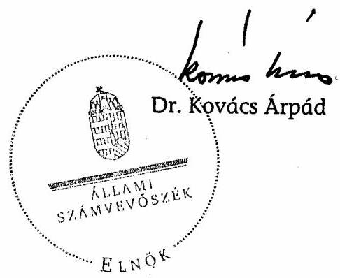

# ÁLLAMI   SZÁMVEVŐSZÉK 

## JELENTÉS

a Szabad Demokraták Szövetsége - a Magyar Liberális Párt 2005-2006. évi gazdálkodása törvényességének ellenőrzéséről

---

3. Önkormányzati és Területi Ellenőrzési Igazgatóság
3.1. Szabályszerüségi Ellenőrzési Főcsoport
Iktatószám: V-1016-023/2007.
Témaszám: 868
Vizsgálat-azonosító szám: V-350
Az ellenőrzést felügyelte:
Dr. Lóránt Zoltán
főigazgató
Az ellenőrzés végrehajtásáért felelős:
Dr. Elek János
általános főigazgató-helyettes
Az ellenőrzést vezette:
Horváth Balázs
főcsoportfőnök-helyettes
Az összefoglaló jelentést készítette:
Tóth István
tanácsadó
Az ellenőrzést végezték:
Tóth István Szakmányné Bilik Mária Szendrey Lajos
tanácsadó számvevő számvevő

# A témához kapcsolódó eddig készített számvevőszéki jelentések: 

## címe

sorszáma
A Szabad Demokraták Szövetsége 1991. évi gazdálkodása törvé- 161 nyességének ellenőrzése
A Szabad Demokraták Szövetsége 1992-1993-1994. évi gazdálko- 279 dása törvényességének ellenőrzése
A Szabad Demokraták Szövetsége 1995-1996. évi gazdálkodása 407 törvényességének ellenőrzése
A Szabad Demokraták Szövetsége 1997-1998. évi gazdálkodása 9936 törvényességének ellenőrzése
A Szabad Demokraták Szövetsége 1999-2000. évi gazdálkodása 0131 törvényességének ellenőrzése
A Szabad Demokraták Szövetsége 2001-2002. évi gazdálkodása 0352 törvényességének ellenőrzése
A Szabad Demokraták Szövetsége 2003-2004. évi gazdálkodása 0558 törvényességének ellenőrzése

---

# TARTALOMJEGYZÉK 

BEVEZETÉS ..... 7
I. ÖSSZEGZŐ MEGÁLLAPÍTÁSOK, KÖVETKEZTETÉSEK, JAVASLATOK ..... 9
II. RÉSZLETES MEGÁLLAPÍTÁSOK ..... 12

1. A Párt gazdálkodásáról szóló 2005-2006. évi beszámolók ..... 12
1.1. A teljes vizsgálati időszakra érvényes megállapítások ..... 12
1.2. A 2005. és 2006. évi beszámoló ..... 13
1.2.1. Bevételek ..... 13
1.2.2. Kiadások ..... 14
2. A Pártnak a beszámoló összeállítására és az azt alátámasztó könyvvezetésre vonatkozó belső szabályozása és gyakorlata ..... 15
2.1. A belső szabályozás rendszere ..... 15
2.2. A könyvvezetés gyakorlata, összhangja a törvényi és a belső előírásokkal ..... 16
2.3. Analitikus nyilvántartások ..... 17
2.4. A bizonylati elv és fegyelem érvényesülése ..... 17
3. A Párt bevételszerző, gazdálkodó tevékenysége ..... 18
4. A gazdálkodással összefüggő, egyéb jogszabályok betartása ..... 19
4.1. Személyi jellegű kifizetések ..... 19
4.2. Az adózási, társadalombiztosítási és egyéb jogszabályok rendelkezéseinek érvényesítése ..... 19
5. A Párt belső ellenőrzésének rendszere ..... 19
5.1. A belső ellenőrzés rendszerének szabályozottsága ..... 20
5.2. A belső ellenőrzés múködése ..... 20
6. Az előző ellenőrzés megállapításaira tett intézkedések ..... 21

---

.

---

# MELLÉKLETEK 

1. számú Szabad Demokraták Szövetsége - a Magyar Liberális Párt 2005. évi pénzügyi beszámolója.
2. számú Szabad Demokraták Szövetsége - a Magyar Liberális Párt 2006. évi pénzügyi beszámolója.
3. számú Szabad Demokraták Szövetsége - a Magyar Liberális Párt 2005. évi módosított pénzügyi beszámolója.
4. számú Szabad Demokraták Szövetsége - a Magyar Liberális Párt 2006. évi módosított pénzügyi beszámolója.

---

.

---

# RÖVIDÍTÉSEK JEGYZÉKE 

ÁSZ
Párt
Párttörvény
Szja törvény
Számv. tv.

Állami Számvevőszék
Szabad Demokraták Szövetsége - a Magyar Liberális Párt
A pártok múködéséről és gazdálkodásáról szóló - többször módosított - 1989. évi XXXIII. törvény
A személyi jövedelemadóról szóló - többször módosított 1995. évi CXVII. törvény

A számvitelről szóló - többször módosított - 2000. évi C. törvény

---

.

---

# JELENTÉS 

## a Szabad Demokraták Szövetsége - a Magyar Liberális Párt 2005-2006. évi gazdálkodása törvényességének ellenőrzéséről

## BEVEZETÉS

A pártok gazdálkodása törvényességének ellenőrzésére az Állami Számvevőszékről szóló 1989. évi XXXVIII. törvény 5. §-a, valamint a pártok múködéséről és gazdálkodásáról szóló 1989. évi XXXIII. törvény (a továbbiakban: párttörvény) 10. §-ának (1) bekezdése alapján - figyelemmel az ÁSZ tv. 16. §-ának (2) bekezdésében foglaltakra - az Állami Számvevőszék (a továbbiakban: ÁSZ) jogosult. E törvényi felhatalmazás alapján - az ÁSZ 2007. évi ellenőrzési terve szerint vizsgálta a Szabad Demokraták Szövetsége - a Magyar Liberális Párt (a továbbiakban: Párt) 2005-2006. évi gazdálkodása törvényességét.

Az ellenőrzés célja annak megállapítása volt, hogy:

- a Párt által készített, a Magyar Közlönyben és a Párt internetes honlapján közzétett éves beszámolók a törvényi előírásoknak megfelelnek-e, a könyvvezetéssel és a valósággal megegyező adatokat tartalmaznak-e;
- a könyvvezetés és a gazdálkodás során betartották-e a számvitelről szóló többször módosított - 2000. évi C. törvény (a továbbiakban: Számv. tv.) és az egyéb jogszabályok rendelkezéseit, valamint a belső előírásokat;
- a Párt a múködéséhez szabályszerűen igénybe vehető forrásokat használt-e fel, nem folytatott-e a párttörvény által tiltott gazdálkodó tevékenységet, nem fogadott-e el tiltott vagyoni hozzájárulást, illetőleg adományt.

Az ellenőrzés körülményeit illetően rögzíteni szükséges ${ }^{1}$, hogy:

- a párttörvény 1. sz. melléklete szerinti beszámoló-mintához magyarázatot, útmutatót nem készítettek a jogalkotók, így ennek kitöltése pártonként - kialakított számviteli politikájuknak megfelelően - eltérő lehet;
- a beszámoló-minta a Számv. tv. rendelkezéseivel nem harmonizál, nem felel meg sem a mérleg, sem az eredmény-kimutatás követelményeinek.

[^0]
[^0]:    ${ }^{1}$ Az ÁSZ évek óta javasolja a Kormánynak a pártellenőrzésekről készített jelentéseiben a párttörvény módosítását. A pártfinanszírozás átláthatóvá tételéről szóló T/4190. számú törvényjavaslat beterjesztésével ismételten napirendre került a párttörvény módosítása is.

---

Az ÁSZ a párttörvény napirenden lévő módosítási javaslatának elfogadásáig a jelenleg hatályos rendelkezéseknek megfelelő - egységes módszertani alapokra helyezett - gyakorlattal folytatja a pártok gazdálkodása törvényességének ellenőrzését.

Az ellenőrzést a 13/2003. számú Elnöki utasítással kiadott „Módszertan a pártok gazdálkodása törvényességének ellenőrzéséhez" c. kiadvány és a 14/2003. számú Elnöki határozattal elfogadott segédletben foglaltak alapján végeztük.

A pénzügyi-szabályszerúségi ellenőrzés 2007. szeptember 9 - október 20-a között, a Párt székhelyén történt.

---

# I. ÖSSZEGZŐ MEGÁLLAPÍTÁSOK, KÖVETKEZTETÉSEK, JAVASLATOK 

A Párt a vizsgált évek gazdálkodási beszámolóit a párttörvényben előírt határidőn belül és formában, a Magyar Közlönyben és internetes honlapján nyilvánosságra hozta. A közzétett beszámolók lényeges hibák miatt nem adtak megbízható és valós képet a Párt 2005-2006. évi gazdálkodásáról. A beszámolókban értékelés hiányában nem tüntették fel a kedvezményes önkormányzati ingatlanhasználatból adódó nem pénzbeli vagyoni hozzájárulás értékét, nem szerepeltették a könyvvezetéssel egyezően a kapott és visszafizetett tagi kölcsönök összegét. A Párt az éves beszámolók összeállítása során megsértette a Számv. tv-ben szabályozott teljesség, valódiság és lényegesség számviteli alapelveket. Az éves beszámolók bevételei és kiadásai a főösszegre vetítve 2005-ben 7,3\% illetve 7,8\%, 2006-ban 4,1\% illetve 4,4\% hibát tartalmaztak. A Párt a helyszíni ellenőrzés megállapításai alapján a hibákat kijavította, a 2005. és 2006. évi beszámolókat ismételten elkészítette és a Magyar Közlöny 148. számában, valamint az internetes honlapján közzétette.

A Párt a Számv. tv. előírásai alapján kiadott számviteli szabályzatait az ÁSZ felhívására módosította 2006. január 1-jei hatállyal, de a módosítás hiányosan, ellentmondásosan történt. A számviteli politika csak részben tartalmazta az egyes beszámoló sorokhoz tartozó főkönyvi számlák megjelölését; az amortizáció elszámolását a Számv. tv. előírásaitól eltérően szabályozta. A pénzkezelési szabályzat kiegészült a banki ügyfélterminál használati és felelősségi rendjével, de nem rendelkezett a területi irodák bankszámlái, valamint az elkülönített bankszámlák forgalmának szabályozásáról, a központi pénztár záró pénzkészlete időbeli hatályáról. Az eszközök és források értékelési szabályzata továbbra sem határozta meg a részletes értékelési eljárásokat, módszereket; a nem pénzbeli vagyoni hozzájárulás értékelési szabályait. A számlarend nem felelt meg a Számv. tv. követelményeinek, mivel nem jelölt ki számlát a nem pénzbeli vagyoni hozzájárulások nyilvántartására; nem határozta meg a kerületi és területi irodákkal szembeni követelés számláinak tartalmát; nem érvényesítette maradéktalanul a költségnemenkénti könyvelés követelményét; hibásan rendelkezett az árvízkárok enyhítésére, továbbadási céllal gyűjtött adományoknak egyéb bevételek közötti elszámolásáról.

A szabályozási hiányosságok a könyvvezetésben lényeges beszámolási hibákhoz vezettek. A kettős könyvvitelben nem érvényesítették a Számv. tv-ben előírt teljesség, valódiság és következetesség elvét. A zárlati munkálatokat sem végezték szabályszerűen a főkönyvi és analitikai egyeztetések, leltárkiértékelési hiányosságok, valamint a záró mérleg számla használatának mellőzése miatt. A Párt vagyoni helyzetére volt hatással, hogy a tárgyi eszközök után terv szerinti értékcsökkenést és az értékhatár alatti tárgyi eszközök egyösszegű leírását nem számolták el, valamint a 2005-ben leselejtezett 14382 ezer Ft értékű számítástechnikai eszköz, továbbá korábban beváltott 20 ezer Ft értékpapír nyilvántartásból való kivezetését elmulasztották. A helyszíni ellenőrzést követően a feltárt hibákat, a számviteli szolgáltatást végző, képesítéssel rendelkező külső vállalkozó önellenőrzéssel helyesbítette.

---

Az analitikus nyilvántartások hibái a szabályozás elégtelenségéből, a belső előírások figyelmen kívül hagyásából eredtek. Az immateriális javak és tárgyi eszközök nyilvántartásából hiányoztak az értékcsökkenésre, maradványértékre, élettartamra és részben az egyedi azonosításra vonatkozó adatok. A pénzkezelési szabályzat előírása ellenére négy helyi szervezet nem vezetett időszaki pénztárjelentést, de a főkönyvi könyvelésben a pénzforgalmukat, valamint a velük szembeni követelést nyilvántartották. Az elszámolási előlegek analitikájában nem jelölték a felvétel jogcímét, az elszámolás határidejét, a ténylegesen elszámolt összeget. A vásárolt repülőjegyeket nem vették szigorú számadású nyilvántartásba.

A bizonylati elv és fegyelem Számv. tv-vel összhangban meghatározott előírásai az ÁSZ előző felhívása ellenére hiányosan érvényesültek. A könyvelésben összességében 182 ezer Ft pénzforgalmat bizonylat nem igazolt, a nem pénzbeli vagyoni hozzájárulásokat elmulasztották bizonylatolni. A bizonylatolás alaki és tartalmi követelményei közül az utalványozás 2005-ben a bizonylatok $16,6 \%$-án, 2006-ban $10,7 \%$-án nem volt szabályszerű. A bizonylatok $12 \%$-áról hiányzott az ellenőr, a pénztáros, a befizető aláírása, teljes körűen elmaradt a könyvelés időpontjának feltüntetése. A kiküldetési rendelvények $81 \%$-a, az útnyilvántartások $30 \%$-a nem felelt meg az Szja törvényben előírt adattartalomnak. Az ellenőrzés jogosulatlan kifizetést nem tapasztalt.

A Párt gazdálkodó bevételszerző tevékenysége során könyvviteli nyilvántartásai szerint betartotta a párttörvényben előírt gazdálkodási tilalmakat és forrásszerzési korlátozásokat. A Párt bevételei állami támogatásból, szabályozott tagdíjakból, egyéb hozzájárulásokból és adományokból, a párttörvényben engedélyezett egyéb bevételekből, vállalkozói és tagi kölcsönökből származtak. A gazdálkodó tevékenység jogszerűségét a vizsgált dokumentumok igazolták.

A személyi jellegú kifizetések körében a jövedelmeket szabályszerű munkaszerződések alapján központilag számfejtették. Az alkalmazottak részére adómentes értékhatárig étkezési utalványt biztosítottak. Az előző ÁSZ ellenőrzés felhívása alapján a magántulajdonú gépkocsik hivatali célú használatának szabályozását 2006. január 1-jétől az Szja törvénnyel összhangba hozták, de a költségelszámolást a korábban kifogásolt hibákkal bizonylatolták. A kiküldetési rendelvényeken és útnyilvántartásokon elszámolt futásteljesítményt az országos szervező utólag hivatalos útnak igazolta. A hivatalos célú költségtérítés a számla nélkül elszámolható, adómentes értékhatárra figyelemmel teljesült.

A költségvetési kötelezettségeket szabályszerűen előírták, havi rendszerességgel bevallották és befizették. A Párt munkáltatói jogkörében folyamatosan eleget tett a társadalombiztosításról és az egészségügyi ellátásról, valamint a személyi jövedelemadóról és az adózás rendjéről szóló hatályos törvényi előírásoknak. A Párt a tulajdonában álló gépkocsik után az Szja törvényben előírt cégautóadót és a kapcsolódó járulékokat szabályszerűen bevallotta és megfizette. A külföldi kiküldetések napi diját a személyi jövedelemadó és az egészségügyi hozzájárulás bevallásával, illetve befizetésével folyósította. A hiteles folyószámla kivonatok szerint a Pártnak adó- és járuléktartozása nem volt. A külföldi utazásokkal összefüggő 80 ezer Ft természetbeni juttatást terhelő adót és járulékot a helyszíni ellenőrzés észrevételére önellenőrzéssel megállapították.

---

A belső ellenőrzési rendszert a Párt hatályos alapszabálya, számviteli szabályzatai a gazdálkodási sajátosságokkal összhangban szabályozták. A választott Számvizsgáló Bizottság munkatervi feladatait ügyrendjének megfelelően tervezte, közzététel előtt véleményezte az előző évi gazdálkodásról szóló beszámolót és a költségvetést. A munkaterveiben szereplő célvizsgálatok végrehajtását az ügyrendben előírt dokumentumok nem igazolták. A szabályozott folyamatba épített ellenőrzés a bizonylati elv és fegyelem érvényesítése, az utalványozási jog gyakorlása és a bizonylatok könyvviteli feldolgozása során hiányosan valósult meg. A pénzkezelési szabályzat előírása ellenére pénztárellenőrt nem jelöltek ki, szabályszerű pénztárellenőrzést nem dokumentáltak. A belső kontroll tevékenység elégtelen működése nem tárta fel a lényeges hibákat, a hatályos jogszabályok érvényesülésének hiányát, nem követték nyomon az előző ÁSZ jelentés felhívásának végrehajtását.

A helyszíni ellenőrzés megállapításainak hasznosítása mellett az ÁSZ elnöke felhívja:

# a Párt elnökét 

1. Intézkedjen a beszámolási és könyvvezetési szabályok Számv. tv-hez, gazdálkodási sajátosságokhoz igazodó módosítására annak érdekében, hogy:
a) a számviteli politika részletesen tartalmazza a párttörvény 1 . számú mellékletében szereplő beszámoló és a főkönyvi számlák kapcsolatát, a Számv. tv. 52. §ra figyelemmel rögzítse a terv szerinti értékcsökkenés elszámolási szabályait;
b) a pénzkezelési szabályzat a banki pénzkezelés rendjét és a záró pénzkészlet nagyságát a Számv. tv. 14. § (8) bekezdésével összhangban szabályozza;
c) az értékelési szabályzat a Számv. tv. 15. § (3) bekezdésében foglalt számviteli alapelvvel, valamint a párttörvény 4. § (5) bekezdésével összhangban tartalmazza az értékelési eljárásokat, módszereket;
d) a számlarend a Számv. tv. 159. § előírására figyelemmel jelöljön ki számlát a nem pénzbeli vagyoni hozzájárulások nyilvántartására; a 160. § (3) bekezdés a) pontja előírásának figyelembevételével határozza meg az 5. számlaosztály költségnem csoportjai tartalmát; a 161. § (2) bekezdés b) pontjára tekintettel határozza meg az alkalmazott számlák tartalmát; valamennyi adomány bevétel számlaszámát az adományok számlacsoportban jelölje ki.
2. Biztosítsa teljes körűen a főkönyvi számlákhoz rendelt és az egyéb, a Párt sajátosságaiból adódó analitikus nyilvántartások szabályszerű vezetését és egyeztetését.
3. Gondoskodjon a zárlati munkáknak a Számv. tv. 69. § és 164. § (1) bekezdésében előírt szabályszerű és teljes körű végrehajtásáról.
4. Szerezzen érvényt a Számv. tv. 165. § (1) bekezdésében foglalt bizonylati elv és fegyelem, továbbá a bizonylatolás 167. § (1) bekezdésében megfogalmazott alaki és tartalmi követelményeinek, különös tekintettel az Szja. tv. 25. § (5) bekezdése, valamint 5. számú melléklet II/7. pontja előírásai betartásának.
5. Gondoskodjon a Párt belső ellenőrzési rendszerének belső előírások szerinti hatékony működtetéséről.

---

# II. RÉSZLETES MEGÁLLAPÍTÁSOK 

## 1. A PÁrt GAZDÁlKODÁsÁról SZÓLÓ 2005-2006. ÉVI BESZÁMOLÓK

### 1.1. A teljes vizsgálati időszakra érvényes megállapítások

A Párt a vizsgált évek gazdálkodási beszámolóit a párttörvény 9. § (1) bekezdésében előírt határidőn belül, a párttörvény 1. sz. mellékletében előírt formában a Magyar Köztársaság hivatalos lapjában közzétette. A 2005. évi beszámoló 2006. április 28-án, a Magyar Közlöny 50. számában, a 2006. évi beszámoló 2007. április 26-án, a Magyar Közlöny 53. számában jelent meg (1. és 2. számú melléklet). A Párt mindkét év beszámolóját internetes honlapján is nyilvánosságra hozta.

A közzétett beszámolók lényeges hibák miatt nem adtak a Párt 2005-2006. évi gazdálkodásáról, pénzügyi helyzetéről megbízható és valós képet. A beszámolókban nem értékelték az önkormányzati tulajdonú ingatlanok ingyenes, vagy kedvezményes használatából adódóan a piaci és a kedvezményes bérleti díj különbözeteként kapott nem pénzbeli vagyoni hozzájárulás értékét. A mulasztásból eredően a Párt az 500 ezer Ft-ot meghaladó, nem pénzbeli vagyoni hozzájárulás formájában támogatást nyújtó önkormányzatok nevét az adott támogatás összegének meghatározásával nem tüntette fel. Figyelemmel a párttörvény 9. § (2) bekezdésében foglaltakra, valamint a Párt számviteli politikájának 11. a-b) pontjaira a jelzett hibák mindkét évben jelentős összegű és egyben lényeges hibának minősültek ${ }^{2}$.

A bevételi jogcímeket érintő feltárt hibák előjeltől független összege 2005-ben 41629 ezer Ft, a bevételi főösszegre vetített aránya 7,3\%, a kiadási oldal hibáinak előjeltől független összege 40214 ezer Ft, a kiadási főösszegre vetített aránya $7,8 \%$ volt. A 2006. évben a bevételi oldalon feltárt hibák összege 38288 ezer Ft, ez a bevételi főösszegnek 4,1\%-a, a kiadási jogcímek eltérése 40861 ezer Ft, a kiadási főösszegre vetített aránya $4,4 \%$ volt.

## A Párt az éves beszámolók összeállítása során megsértette a Számv. tv. 15. § (2)-(3) és 16. § (4) bekezdésében foglalt teljesség, valódiság és lényegesség számviteli alapelveket.

A Párt a helyszíni ellenőrzés megállapításai alapján a hibákat kijavította; a számviteli alapelvek érvényesítésével ismételten elkészítette a 2005. és a 2006. évi gazdálkodásáról szóló beszámolókat, továbbá a Magyar Közlöny 148. számában, valamint az internetes honlapján megjelentette (3-4. számú melléklet).

[^0]
[^0]:    ${ }^{2}$ A pártok ellenőrzésénél az átfogó lényegességi küszöb mértéke, a bevételi illetve kiadási főösszegre vetítve az ÁSZ-nál általánosan elfogadott 2\%.

---

# 1.2. A 2005. és 2006. évi beszámoló 

### 1.2.1. Bevételek

A 2005-2006. években közzétett beszámolók bevételeinek ellenőrzése során megállapított eltéréseket fő soronként a következő összeállítás részletezi:

|  |  |  | Adatok ezer forintban |  |
| :--: | :--: | :--: | :--: | :--: |
| BEVÉTELEK | Párt által közzétett beszámoló |  | Elöjeltől független hibahatás |  |
|  | 2005. évi | 2006. évi | 2005. évi | 2006. évi |
| 1. Tagdíjak | 39077 | 17153 | 0 | 0 |
| 2. Állami támogatás | 282000 | 284219 | 0 | 0 |
| 4. Egyéb hozzájárulások, adományok | 168115 | 288125 | 36492 | 37152 |
| 6. Egyéb bevétel | 84283 | 340894 | 5137 | 1136 |
| Összesen: | 573475 | 930391 | 41629 | 38288 |

A tagdíjak adatai megegyeztek a főkönyvi könyvelésben ilyen címen szereplő összeggel. A tagdíjbevételek pénztári befizetési, illetve banki bizonylataiból a befizető személye minden esetben megállapítható volt. A tagdíjak között egyéb bevételek nem szerepeltek. A tagdíjak befizetése összhangban volt a Párt alapszabályával, amely a tagdíj alsó értékét szabályozta.

Az állami költségvetésből származó támogatásokat a főkönyvi könyvelésben kimutatott és a bankszámla kivonaton szereplő, a Magyar Államkincstár által ténylegesen átutalt összeggel egyezően közölték. A 2006. évi adat tartalmazta az országgyűlési képviselőválasztásra kapott jelöltarányos támogatást is.

Az egyéb hozzájárulások, adományok beszámolósor adatát a Párt, a párttörvény 1. számú mellékletében előírt minta szerint tovább részletezte. A Pártnak a vizsgált években belföldi és külföldi jogi személyektől, belföldi magánszemélyektől, valamint 2006-ban jogi személynek nem minősülő gazdasági társaságoktól származott bevétele. Az éves beszámolók a belföldi jogi személyektől származó adományok soron 2005. évben 36492 ezer Ft, 2006. évben 36312 ezer Ft összegben nem tartalmazták a kedvezményes ingatlanhasználat formájában kapott nem pénzbeli hozzájárulásokat. Az értékelés elmulasztásával figyelmen kívül hagyták a párttörvény 4. § (5) bekezdésének előírását, valamint az ÁSZ előző felhívását. Az önkormányzatoktól kapott nem pénzbeli vagyoni hozzájárulás értéke 2005-ben 21 önkormányzat, 2006-ban 22 önkormányzat vonatkozásában meghaladta az egy naptári év alatti, 500 ezer Ft értékhatárt. A 2006. évi beszámolósorból hiányzott 380 ezer Ft összegű, hibásan magánszemélyektől származó hozzájárulások között kimutatott bevétel. Ugyancsak hibásan a magánszemélyektől származó adományok között szerepeltettek a 2006. évi beszámolóban 40 ezer Ft összegű, jogi személynek nem minősülő gazdasági társaságtól kapott adományt.

---

Az egyéb bevételek a számviteli politika előírása ellenére nem mutatták a tagi kölcsön bevételeket, amelynek könyvelt összege 2005-ben 5133 ezer Ft, 2006-ban 1045 ezer Ft volt. A beszámolók bizonylati alátámasztás nélkül tartalmaztak 2005-ben 4 ezer Ft, 2006-ban 91 ezer Ft elszámolt bevételt.

# 1.2.2. Kiadások 

A kiadásokat a beszámoló mindkét évben az egyes beszámolósorok adatának kiszámításánál figyelembe vett főkönyvi számlák egyenlegével egyező összegben tartalmazta. Kivéve a 2005. évi múködési és politikai kiadásokat, mivel számítási hiba következtében a múködési kiadásokat 1397 ezer Ft-tal magasabb, a politikai kiadásokat ugyanennyivel alacsonyabb összegben szerepeltették a kapcsolódó főkönyvi számlákon könyveltnél.

A 2005. és a 2006. évekre közzétett beszámolók kiadásainak ellenőrzése során megállapított eltéréseket - beszámoló soronként - a következő összeállítás részletezi:

Adatok ezer forintban

| Kiadások | Párt által közzétett   beszámoló |  | Előjeltől független   hibahatás |  |
| :-- | :--: | :--: | :--: | :--: |
|  | $\mathbf{2 0 0 5}$. évi | $\mathbf{2 0 0 6}$. évi | $\mathbf{2 0 0 5}$. évi | $\mathbf{2 0 0 6}$. évi |
| 2. Támogatás egyéb szer-   vezeteknek | 10 | 3017 | 0 | 0 |
| 4. Múködési kiadások | 269850 | 310018 | 37921 | 36547 |
| 5. Eszközbeszerzés | 6974 | 3148 | 0 | 87 |
| 6. Politikai tevékenység   kiadásai | 104986 | 617267 | 1397 | 117 |
| 7. Egyéb kiadások | 132374 | 118 | 896 | 4110 |
| Összes kiadás | $\mathbf{5 1 4 1 9 4}$ | $\mathbf{9 3 3 5 6 8}$ | $\mathbf{4 0 2 1 4}$ | $\mathbf{4 0 8 6 1}$ |

Támogatás egyéb szervezeteknek beszámolósoron közölt adat mindkét évben megegyezett a főkönyvi számla egyenlegével. A bizonylatok a valós helyzetet tükrözték, a kapcsolódó főkönyvi számlákon kizárólag szervezetnek adott támogatást tartottak nyilván.

A múködési kiadások beszámolósor adatának összeállítása során egyik évben sem vették figyelembe az önkormányzatoktól kapott nem pénzbeli vagyoni hozzájárulás értékével egyenlő bérleti díj kiadást (2005-ben: 36492 ezer Ft; 2006-ban: 36312 ezer Ft). További eltérést okozott, hogy a bér- és személyi jellegű kifizetésekhez kapcsolódóan 2005-ben 32 ezer Ft-tal több, 2006-ban 235 ezer Ft-tal kevesebb múködési kiadást könyveltek.

Eszközbeszerzés címén a 2006. évi beszámoló 87 ezer Ft-tal magasabb összeget tartalmazott, mivel azt bizonylati alátámasztás nélkül könyvelték.

A politikai tevékenység kiadásai: a Párt 2006-ban tovább tagolta, az országgyűlési képviselő-, valamint az önkormányzati választásra fordított kiadást

---

külön soron bemutatta. A 2006. évi beszámoló adata a helyes értéket tartalmazta, azonban az országgyúlési választásokkal kapcsolatos költségek főkönyvi számla egyenlege 117 ezer Ft-tal alacsonyabb volt, mivel 2005. évben hibásan került előlegszámla alapján - egyéb követelés helyett - költségszámlán könyvelésre. A ráfordítást nem vezették át az aktív időbeli elhatárolások közé.

Az egyéb kiadások között egyik évben sem mutatták ki - a számviteli politikában szabályozottak ellenére - a tagi kölcsön főkönyvi számlán nyilvántartott kölcsöntörlesztés összegét: 2005-ben 896 ezer Ft, 2006-ban 4110 ezer Ft-ot.

# 2. A PÁrTNAK A BESZÁmoló ÖSSZEÁllítÁsÁra És AZ AZT ALÁTÁMASZTÓ KÖNYVVEZETÉSRE VONATKOZÓ BELSŐ SZABÁLYOZÁSA ÉS GYAKORLATA 

### 2.1. A belső szabályozás rendszere

A Párt a Számv. tv. 14. § (3) és (5) bekezdése, valamint a 161. § (1) bekezdése alapján kiadott számviteli szabályzatait az ÁSZ felhívására módosította 2006. január 1-jei hatállyal, de a módosítás hiányosan, ellentmondásosan történt.

A számviteli politikát módosították a korábban elnöki utasítással szabályozott pénzügyi beszámoló összeállításának leírásával. A szabályozás a párttörvény 1. számú mellékletében előírt beszámolósorok tartalmát meghatározta, azonban a politikai kiadások kivételével nem rögzítette a beszámoló sorokhoz tartozó konkrét főkönyvi számlákat. A hatályban tartott amortizációs politikában az ÁSZ felhívása ellenére figyelmen kívül hagyták a Számv. tv. 52. §-ában előírt terv szerinti értékcsökkenés elszámolási szabályait.

A pénzkezelési szabályzat kiegészítésre került a kihelyezett banki ügyfélterminál használatának rendjével, a hozzáférés jogosultjának és felelősségének meghatározásával. A módosítás nem terjedt ki a területi irodák bankszámlái, valamint az elkülönített bankszámlák forgalmának szabályozására, a központi pénztár záró pénzkészlete időbeli hatályára.

Az eszközök és források értékelési szabályzata továbbra sem tartalmazta a gazdálkodó eszközeihez és forrásaihoz kapcsolódó részletes értékelési eljárásokat, módszereket; végrehajtásának és ellenőrzésének teendőit, továbbá a nem pénzbeli vagyoni hozzájárulás értékelési szabályait.

A leltározási szabályzat tartalmazta a leltározással kapcsolatos fogalmakat, a leltározás során elvégzendő feladatokat, meghatározta a leltározás végrehajtásának módját és értékelésének szabályait, dokumentációs követelményeit.

A hatályos számlarend nem felelt meg a Számv. tv. 159. §-ban foglalt követelménynek, mivel a Párt nem jelölt ki számlát a nem pénzbeli vagyoni hozzájárulások nyilvántartására; nem érvényesítette maradéktalanul a 160. § (3) bekezdés a) pontja szerinti költségnemenkénti könyvelés követelményeit, a 161. § (2) bekezdés b) pontja ellenére nem határozta meg a kerületi és területi irodákkal szembeni követelés számláinak tartalmát. Ellentmondásosan rendelkeztek

---

az árvízkárok enyhítésére, továbbadási céllal gyűjtött adományok egyéb bevételek közötti elszámolásáról. A számlarend részeként a bizonylati szabályzat tartalmazta a számviteli bizonylatok fogalmát és felsorolását; alaki és tartalmi követelményeit; a bizonylatok útját, nyilvántartását; a bizonylati albumot.

A gazdálkodás törvényességét segítő szabályozások közül a magántulajdonú gépkocsik hivatali célú használatára vonatkozó szabályzatot az előző ÁSZ jelentés felhívására hozták összhangba az Szja törvény 25. § (2) és (5) bekezdéseivel, valamint 5. számú mellékletének II/7. pontjával.

# 2.2. A könyvvezetés gyakorlata, összhangja a törvényi és a belsó előírásokkal 

A Párt könyvvezetését és beszámolójának összeállítását mindkét ellenőrzött évben külső vállalkozás végezte, azonos számítógépes program alapján. A számviteli szolgáltatást végző szervezet vezetője a Számv. tv. 151. § (1) bekezdés szerint meghatározott képesítéssel rendelkezik és szerepel a könyvviteli szolgáltatást végzők nyilvántartásában. A Párt a számlarendben meghatározott kettős könyvvitelt vezetett, könyvelési és adatfeldolgozási rendszere központosított volt. A területi irodák, a csoportok, a budapesti kerületi szervezetek az előírás szerinti analitikát vezették, a leadott bizonylatok feldolgozása a központi irodában folyamatosan történt. A kialakított számítógépes könyvelésből biztosították az ellenőrzéshez szükséges adatokat.

A beszámoló alapjául szolgáló könyvvezetésben nem érvényesült a Számv. tvben meghatározott, több számviteli alapelv.

- A 15. § (2) bekezdésében előírt teljesség elve, mivel szabályozási hiányosságok miatt 2005-2006. évben nem értékelték és könyvelték a kedvezményes önkormányzati ingatlanhasználattal kapott nem pénzbeli vagyoni hozzájárulások értékét.
- A 15. § (3) bekezdésben szabályozott valódiság elve azáltal sérült, hogy bizonylat nem támasztott alá az egyes időszakokban elszámolt, együttesen 95 ezer Ft egyéb bevételt, illetve 87 ezer Ft eszközbeszerzési kiadást, valamint a bér- és személyi jellegű kifizetésekhez kapcsolódóan 32 ezer Ft-tal több, illetve 235 ezer Ft-tal kevesebb múködési kiadást, az országgyúlési választások költségeire 117 ezer Ft-tal alacsonyabb összeget könyveltek.
- A 15. §. (5) bekezdésben foglalt következetesség elvének nem felelt meg, hogy árvízkárok enyhítésére, továbbadási céllal kapott adományokat egyéb bevételnek, jogi személyektől kapott adományt magánszemélyekhez, karbantartási költséget felújításokhoz könyveltek.

A beszámolósorokra nem, de a valós vagyoni helyzetre hatással volt, hogy a terv szerinti értékcsökkenést és az értékhatár alatti tárgyi eszközök egyösszegű leírását nem számolták el, valamint a 2005-ben leselejtezett, 14382 ezer Ft értékű számítástechnikai eszköz, továbbá korábban beváltott 20 ezer Ft értékpapír nyilvántartásból való kivezetését elmulasztották. A zárlati munkálatokat sem végezték szabályszerűen a leltár kiértékelési hiányosságok, a zárómérlegszámla használatának mellőzése miatt. Ezzel megsértették a Számv. tv. 69. §

---

(1) és (3) bekezdésében és a 164. § (1) bekezdésében előírtakat. A Párt a helyszíni ellenőrzést követően a feltárt hibákat könyvelésében önellenőrzéssel helyesbítette.

# 2.3. Analitikus nyilvántartások 

A Párt a Számv. tv. 161. § (2) bekezdés c) pontja alapján számlarendjében szabályozta a főkönyvi számlákhoz rendelt analitikák körét, vezetésének módját. A Párt a tagdíjfizetési analitika vezetéséről nem rendelkezett, bár a tagdíjfizetés elmulasztásához az alapszabály szerint differenciált szankciók kötődnek.

Az analitikus nyilvántartások vezetése, egyeztetése megfelelt a szállítók, a központi pénztár- és bankszámlák vonatkozásában a belső előírásoknak. Szabályozási hiba folytán az immateriális javak és tárgyi eszközök nyilvántartásából hiányoztak az értékcsökkenésre, maradványértékre, élettartamra és részben az egyedi azonosításra vonatkozó adatok. A pénzkezelési szabályzat előírása ellenére nem vezetett időszaki pénztárjelentést négy kerületi és területi szervezet, de a főkönyvi könyvelésben a pénzforgalmukat, a velük szembeni követeléseket nyilvántartották; az elszámolásra kiadott előlegek analitikájában nem rögzítették az előlegfelvétel jogcímét és elszámolási határidejét, a ténylegesen elszámolt összeget. A Számv. tv. 168. § (1) bekezdés előírása ellenére a vásárolt repülőjegyeket nem vették szigorú számadású nyilvántartásba. Az eszközök és források leltározását szabályozás szerint évente kiadott leltározási utasítás és ütemterv alapján bonyolították. A leltározási szabályzat értelmében a leltározási egységek, körzetek, a leltározási ütemterv elkészítésekor kerültek kijelölésre. A leltárak teljes körű kiértékelésére nem került sor, ennek következtében a leltári eltéréseket nem állapították meg. A rendelkezésre bocsátott dokumentációban több kerületi, illetve megyei részadat összege eltért az összesített kimutatások adataitól.

### 2.4. A bizonylati elv és fegyelem érvényesülése

A bizonylati rend és okmányfegyelem követelményeit a bizonylati és a pénzkezelési szabályzatban, valamint az utalványozás és kötelezettségvállalás rendjéről szóló elnöki utasításban határozták meg. A Párt elnöke a területi irodavezetők utalványozási jogát az összeférhetetlenségi követelmények figyelembevételével szabályozta. A bizonylatok feldolgozása a Számv. tv. 165. § (3) bekezdésében és a számviteli politikában meghatározott idősorrendben történt. A kontírozást 2005-ben 99,6\%-os, 2006-ben 98\%-os mértékben, szabályosan végezték. A vegyes bizonylatok alapján könyvelt tételekhez megfelelő részletező kimutatások, számviteli bizonylatok kapcsolódtak. A Párt sajátosságainak megfelelően a bizonylati album részeként adományozási szerződés formanyomtatvány kitöltésével támasztották alá a készpénzadományokat.

A Párt a Számv. tv. 165. §-ában foglalt bizonylati elv és fegyelem követelményét az alábbiakban nem érvényesítette:

- a könyvelésben összességében 182 ezer Ft értékű pénzforgalmat bizonylattal nem igazoltak (egyéb bevételnél 2005-ben 4 ezer Ft, 2006-ban 91 ezer Ft; 2006. évi eszközbeszerzésnél 87 ezer Ft);

---

- a nem pénzbeli vagyoni hozzájárulásokról nem állítottak ki bizonylatot;
- a csoportosan befizetett tagdíj bevételezése esetenként szabályszerű összesítő bizonylat nélkül történt;
- nem alkalmaztak tárgyi eszköz állományváltozási bizonylatot az eszközállomány növekedések, illetve csökkenések nyilvántartásához.

A bizonylatolás - a Számv. tv. 167. § (1) bekezdés c), g), h), i) és j) pontjaiban meghatározott, a Pártnál bizonylati szabályzatba foglalt - alaki és tartalmi előírásai közül nem tartották be a következőket:

- az utalványozás nem, vagy nem szabályosan valósult meg 2005-ben 16,6\%os, 2006-ban 10,7\%-os mértékben;
- a bizonylatok 12\%-áról hiányzott mindkét évben az ellenőr, a pénztáros, a befizető aláírása, teljes körűen elmaradt a könyvelés időpontjának feltüntetése;
- a kiküldetési rendelvények közel 81\%-a, az útnyilvántartások 30\%-a nem felelt meg az Szja törvényben előírt adattartalomnak.

A bizonylati elv és fegyelem megsértése, a szabályozási és könyvelési hiányosságokkal együtt hozzájárult a beszámolási hibákhoz. Az ellenőrzés jogosulatlan kifizetést nem állapított meg.

# 3. A PÁRT BEVÉTELSZERZŐ, GAZDÁLKOdÓ TEVÉKENYSÉGE 

A Párt vagyona a vizsgált években a párttörvény 4. § (1) bekezdése szerinti bevételi jogcímekből képződött, a 4. § (2)-(3) bekezdésében felsorolt meg nem engedett forrásból vagyoni hozzájárulást nem fogadott el. A párttörvény 6. §ában nem engedélyezett gazdálkodó tevékenységet nem folytatott, gazdasági társaságban részesedést nem szerzett, tulajdoni részesedést megtestesítő értékpapírt nem vásárolt. A Párt a vizsgált időszakban egy, a párttörvény 6. § (3) bekezdésében engedélyezett egyszemélyes korlátolt felelősségű társaság - az 1999-ben alapított ELLA' 36 Kft - tulajdonosa volt. A Párt és az ELLA' 36 Kft. között a vizsgált időszakban üzleti jellegű, megrendelői-szállítói kapcsolat állt fenn. A Pártnak a tulajdonában álló kft nyereségéből bevétele nem volt. A Párt bevételei 2005-2006. évben - a könyvviteli nyilvántartások adatai szerint - a következő jogcímekből származtak: tagdíjbevétel, állami költségvetésből származó támogatás, egyéb hozzájárulás, adomány, költségtérítés, feleslegessé vált tárgyi eszközök értékesítése, tulajdonát képező számítástechnikai eszköz bérbeadása, kártérítés, banki kamatok, propaganda tárgyak értékesítése, vállalkozói és tagi kölcsön, tb kifizetőhelyi tevékenységre tekintettel kapott visszatérítés. A gazdálkodó tevékenységre vonatkozó, annak jogszerűségét igazoló szerződések, bizonylatok rendelkezésre álltak.

A Párt a vizsgált időszakban országosan, évente 40 önkormányzati tulajdonú ingatlant használt, amelyek közül 10\%-át bérelte piaci áron. A többi ingatlant a Párt kedvezményes bérleti díj ellenében használta, amely nem pénzbeli vagyoni hozzájárulásnak minősült, ennek értékét a helyszíni ellenőrzés észrevételére állapította meg.

---

# 4. A GAZDÁLKODÁSSAL ÖSSZEFÜGGŐ, EGYÉB JOGSZABÁLYOK BETARTÁSA 

### 4.1. Személyi jellegú kifizetések

A Párt a foglalkoztatási, megbízási munkaszerződéseket szabályszerűen megkötötte. A jövedelmek számfejtését és utalását, az adójogszabályokban előírt levonási, bevallási, befizetési és adatszolgáltatási kötelezettségek teljesítését - a Párt egészére vonatkozóan - a központi iroda végezte. A külföldi kiküldetések elrendelésének, elszámolásának rendjét a Párt szabályzatban rögzítette. A szabályzat tartalma összhangban volt a vonatkozó jogszabályi előírásokkal. A külföldi kiküldetéshez kapcsolódó valuta felvétele, elszámolása és nyilvántartása a jogszabályi és a belső előírásoknak megfelelő volt.

A Párt tulajdonában álló és a magántulajdonú személygépkocsi használatát 2005-ben a korábbról hatályos szabályozása előírásainak megfelelően engedélyezte, amely nem felelt meg az Szja törvény 25. § (2) és (5) bekezdései, valamint 5. számú melléklet II/7. pont szabályozásának. A Párt 2006. január 1jével az előző ÁSZ ellenőrzés felhívása alapján a magántulajdonú gépkocsik használatára az Szja törvénnyel összhangban álló szabályozást léptetett hatályba. A tulajdonában álló gépkocsik üzemanyag költségének elszámolása kártyás rendszerben, havi számlázás alapján, menetlevél vezetésével történt. A Párt a magántulajdonú gépkocsi hivatali célú használatának engedélyezését, költségelszámolását a korábbi ÁSZ ellenőrzés által kifogásolt utalványozási és nyilvántartás-vezetési hibákkal bizonylatolták. A kiküldetési rendelvényeken és útnyilvántartásokon elszámolt futásteljesítményt az országos szervező utólag hivatalos útnak igazolta. A hivatalos célú költségtérítés az igazolás nélkül elszámolható, adómentes értékhatárra figyelemmel teljesült. Hasonlóan adómentes mértékben juttattak az alkalmazottak részére étkezési utalványt.

### 4.2. Az adózási, társadalombiztosítási és egyéb jogszabályok rendelkezéseinek érvényesítése

A Párt munkáltatói jogkörében folyamatosan eleget tett a társadalombiztosításról és az egészségügyi ellátásról, valamint a személyi jövedelemadóról és az adózás rendjéről szóló hatályos törvényi előírásoknak. A költségvetési kötelezettségeket szabályszerűen előírták, havi rendszerességgel bevallották és befizették.

A Párt a három saját tulajdonú gépkocsi magáncélú használatának engedélyezésére tekintettel a cégautóadót, az egészségügyi hozzájárulást, valamint a munkaadói járulékot; a külföldi kiküldetések napidíja után a személyi jövedelemadót és az egészségügyi hozzájárulást megfizette. A külföldi utazásokkal összefüggésben, a szállodaszámlákban, 2005-ben összesen 80 ezer Ft összegű étel-ital fogyasztást térítettek, ami után a természetbeni juttatást terhelő adót és járulékot elmulasztották megállapítani és megfizetni. A helyszíni ellenőrzés során a feltárt hibát, a helyszíni ellenőrzést követően önellenőrzéssel helyesbítették. Az elszámolt reprezentáció értéke egyik évben sem haladta meg az Szja. törvény 69. § (7) bekezdése b) pontjában meghatározott, az összes kiadásra vetített $10 \%$-ot.

---

A vizsgált időszakról szóló APEH folyószámla kivonatok záró egyenlegei túlfizetést mutattak, egyik adó- és járulékszámla sem tartalmazott hátralékot. A Párt társadalombiztosítási kifizetőhelyként bejegyzett. A kifizetőhelyi feladatok ellátását, valamint a táppénzek és egyéb juttatások folyósításának szabályszerűségét az Országos Egészségbiztosítási Pénztár Fővárosi és Pest megyei Igazgatósága a 2001. április 1. és 2006. április 30. közötti időszakra vonatkozóan ellenőrizte. Az ellenőrzés hibát, hiányosságot nem állapított meg.

# 5. A PÁrt Belső ELLENŐRZÉSÉNEK RENDSZERE 

### 5.1. A belső ellenőrzés rendszerének szabályozottsága

A Párt hatályos alapszabálya, számviteli szabályzatai a gazdálkodási sajátosságokkal összhangban szabályozták a belső ellenőrzés rendszerét. A Párt a választott Számvizsgáló Bizottság feladatait alapszabályában határozta meg. Ennek értelmében folyamatosan ellenőrzi a gazdálkodást, figyelemmel kíséri a pénzügyi és számviteli szabályok betartását, a forrásfelhasználás célszerűségét.

A Számvizsgáló Bizottság maga állapítja meg ügyrendjét, melynek értelmében az ellenőrzéseket 2-3 fős csoportokban végzi; az ellenőrzésekről készült jelentéseket testületi ülésen megtárgyalja és határozatban dönt a szükséges intézkedésekről. A testület 2005. évi munkatervében a területi irodák elszámolási, valamint a külföldi hivatalos utak utalványozási rendjének vizsgálatát tervezte. A 2006. évi munkatervben a 2005. évi bérgazdálkodás, az országgyűlési és az önkormányzati választások, valamint az eszközgazdálkodás elszámolásának ellenőrzését szerepelt.

A folyamatba épített előzetes és utólagos vezetői ellenőrzés hatásköri szabályait a képviseleti jogkör területén az alapszabály rögzítette, a kötelezettségvállalási és utalványozási feladatokat elnöki utasítás, a számviteli felülvizsgálatok és egyeztetések rendjét a Számv. tv. alapján kiadott szabályzatok, valamint a könyvviteli szolgáltatóval kötött szerződés határozta meg.

### 5.2. A belső ellenőrzés múködése

A Számvizsgáló Bizottság munkatervének megfelelően mindkét évben háromszor ülésezett, közzététel előtt véleményezte a Párt előző évi gazdálkodásáról szóló beszámolóját, valamint a beszámolóval előterjesztett tárgyévi költségvetését. Az éves munkaterveiben szereplő célvizsgálatok megállapításairól és a kezdeményezett intézkedésekről írásos dokumentumok nem készültek. A testület tájékoztatást kért az előző ÁSZ ellenőrzés eredményeiről, de az előzetes döntésétől eltérően a törvényességi felhívások végrehajtását nem kontrollálta.

A gazdálkodási folyamatba épített ellenőrzés a bizonylati elv és fegyelem érvényesítése, az utalványozási jog gyakorlása és a bizonylatok könyvviteli feldolgozása során hiányosan valósult meg. A pénzkezelési szabályzat előírása ellenére a Párt elnöke a vizsgált időszakban pénztárellenőrt nem jelölt ki, szabályszerű pénztárellenőrzést nem dokumentáltak.

---

A belső kontroll tevékenység elégtelen működése következtében nem tárta fel a beszámolás lényeges és a könyvvezetés jelentős hibáit, a gazdálkodás szabályozásában és gyakorlatában a hatályos jogszabályok érvényesülésének hiányát.

# 6. AZ ELŐZŐ ELLENŐRZÉS MEGÁLLAPÍTÁSAIRA TETT INTÉZKEDÉSEK 

Az előző ÁSZ jelentés felhívására intézkedési tervet nem készítettek, a javaslatokat hiányosan hajtották végre. A számviteli szabályozások a 2006. január 1jei módosítást követően sem voltak teljes körűen összhangban a törvényi előírásokkal, gazdálkodási sajátosságokkal.

Nem javult a bizonylati elv és fegyelem betartása, nem történt meg a kedvezményes önkormányzati ingatlanhasználat formájában 2003-2004. években kapott nem pénzbeli vagyoni hozzájárulások értékének megállapítása és a beszámolók számviteli elveknek megfelelő helyesbítése.

Budapest, 2008. január " 11 "

Melléklet: $\quad 4 \mathrm{db}$

---

# A Szabad Demokraták Szövetsége - A Magyar Liberális Párt 2005. évi pénzügyi beszámolója 

## Bevételek

1. Tagdijak ..... 39077
2. Allami költségvetésböl származó támogatás
2.1. Allami támogatás alapösszege ..... 282000
2.2. Egyéb címen kapott állami támogatás
3. Képviselöcsoportnak nyújtott állami támogatás
4. Egyéb hozzájárulások, adományok összesen ..... 168115
4.1. Jogi személyektól ..... 100034
4.1.1. Belföldiektól (az 500000 Ft feletti hozzájárulás nevesitve) ..... 75196
Új Kezdet Liberális Alapitvány ..... 75000
4.1.2. Külföldiektől (a 100000 Ft feletti hozzájárulás nevesitve) ..... 24838
LIBERALIS INSTITUT OESTERREICH ..... 24694
EMBASSY OF JAPAN ..... 144
Határćrték alatt külföldiektől
4.2. Jogi személynek nem minösülő gazdasági társaságtól
4.3 Magánszemélyektól ..... 68081
4.3.1. Belföldiektől (az 500000 Ft feletti hozzájárulás nevesitve) ..... 68081
Balázs Gyula ..... 2000
Böhm András ..... 1000
Eörsi Matyás ..... 1000
Dr. Gombos András ..... 1000
Lakos Imre ..... 2000
Horn Gábor ..... 1000
Kovács Kálmán ..... 1000
Pető Iván ..... 1000
Rajk László ..... 1100
Szent-Iványi István ..... 2000
Szesztay András ..... 2000
Vásárhelyi István ..... 1000
Belföldiektől értékhatár alatt ..... 51981
4.3.2. Külföldiektől (a 100000 Ft feletti hozzájárulás nevesitve)
5. A párt által alapitott vállalat és kft. nyereségéből származó bevétel
6. Egyéb bevétel ..... 84283
Összes bevétel a gazdasági évben: ..... 373475
Kiadások
7. Tamogatás a párt országgyülési csoportja számára
8. Támogatás egyéb szervezeteknek ..... 10
9. Vállalkozások alapítására forditott összegek
10. Müködési kiadások ..... 269850
11. Eszközbeszerzés ..... 6974
12. Politikai tevékenység kiadásai ..... 104986
13. Egyéb kiadások ..... 132374
Összes kiadás a gazdasági évben: ..... 514194
Kuncze Gábor s. k., pártelnök

---

# A Szabad Demokraták Szövetsége - A Magyar Liberális Párt 2006. évi pénzügyi beszámolója 

## BEVETELEK

1. Tagdijak ..... 17153
2 Állami költségvetésböl származó támogatás ..... 284219
2.1 Állami támogatás alapösszege ..... 269846
2.2. Egyéb címen kapott állami támogatás ..... 14373
3. Képviselöcsoportnak nyújtott állami támogatás
4. Egyéb hozzájárulások, adományok összesen ..... 288125
4.1. Jogi személyektöl ..... 184015
4.1.1. Belföldiektöl ( 500000 forint feletti hozzájárulás nevesitve) ..... 154015
Új Kezdet Liberális Alapitvány ..... 154000
4.1.2. Külföldiektöl ( 100000 forint feletti hozzájárulás nevesitve) ..... 30000
LIBERALIS INSTITUT OESTERREICH ..... 30000
4.2. Jogi személynek nem minösithető gazdasági társaságtól
4.3. Magánszemélyektöl ..... 104110
4.3.1. Belföldiektöl ( 500000 forint feletti hozzájárulás nevesitve) ..... 104110
Bohm András ..... 1000
Csözik László ..... 700
Demszky Gábor ..... 1000
Eörsi Mátyás ..... 1000
Fodor Gábor ..... 1020
Dr. Gombos András ..... 1000
Horn Gábor ..... 1000
Kapás Sándor ..... 1000
Killik Jenö ..... 800
Kovács Kálmán ..... 1000
Lakos Imre ..... 2000
Pető Iván ..... 1000
Szabadai Viktor ..... 900
Belföldiektöl értékhatár alatt ..... 90690
4.3.2. Külföldiektöl értékhatár alatt
5. A párt által alapított vállalat és korlátolt felelősségủ társaság nyereségéből származó bevétel
6. Egyéb bevétel ..... 340894
Összes bevétel a gazdasági évben ..... 930391
KIADÁSOK
7. Támogatás a párt országgyülési csoportja számára ..... -
8. Támogatás egyéb szervezeteknek ..... 3017
9. Vállalkozások alapítására fordított összeg ..... -
10. Müködési kiadások ..... 310018
11. Eszközbeszerzés ..... 3148
12. Politikai tevékenység kiadásai ..... 617267
6.1. Országgyülési képviselöválasztás ..... 363597
6.2. Helyhatósági választások ..... 110133
13. Egyéb kiadások ..... 118
Összes kiadás a gazdasági évben ..... 933568
Budapest, 2007. március 29.

---

# A Szabad Demokraták Szövetsége - A Magyar Liberális Párt 2005. évi módosított pénzügyi beszámolója 

## Bevételek

1. Tagdijak ..... 39077
2. Állami költségvetésből származó támogatás
2.1. Állami támogatás alapösszege ..... 282000
2.2. Egyéb címen kapott állami támogatás
3. Képviselöcsoportnak nyújtott állami támogatás
4. Egyéb hozzájárulások, adományok összesen ..... 204607
4.1. Jogi személyektől ..... 136526
4.1.1. Belföldiektől ( 500000 forint feletti hozzájárulás nevesitve) ..... 111688
Békéscsaba Városi Önkormányzat ..... 1690
Szeged Városi Önkormányzat ..... 1204
Sopron Városi Önkormányzat ..... 787
Debrecen Városi Önkormányzat ..... 1044
Eger Városi Önkormányzat ..... 976
Nagykanizsa Városi Önkormányzat ..... 807
Budapest I. Kerületi Önkormányzat ..... 1368
Budapest II. Kerületi Önkormányzat ..... 1748
Budapest V. Kerületi Önkormányzat ..... 1195
Budapest VI. Kerületi Önkormányzat ..... 1392
Budapest VII. Kerületi Önkormányzat ..... 973
Budapest VIII. Kerületi Önkormányzat ..... 1499
Budapest IX. Kerületi Önkormányzat ..... 1129
Budapest X. Kerületi Önkormányzat ..... 3259
Budapest XI. Kerületi Önkormányzat ..... 2736
Budapest XII. Kerületi Önkormányzat ..... 874
Budapest XIII. Kerületi Önkormányzat ..... 2050
Budapest XV. Kerületi Önkormányzat ..... 1792
Budapest XVIII. Kerületi Önkormányzat ..... 1378
Budapest XIX. Kerületi Önkormányzat ..... 3252
Budapest XX. Kerületi Önkormányzat ..... 1882
Új Kezdet Liberális Alapitvány ..... 75000
4.1.2. Külföldiektől ( 100000 forint feletti hozzájárulás nevesitve) ..... 24838
LIBERALIS INSTITUT OESTERREICH ..... 24694
EMBASSY OF JAPÁN ..... 144
4.2. Jogi személynek nem minősíthető gazdasági társaságtól
4.3. Magánszemélyektől ..... 68081
4.3.1. Belföldiektől ( 500000 forint feletti hozzájárulás nevesitve) ..... 68081
Balázs Gyula ..... 2000
Bőhm András ..... 1000
Eörsi Mátyás ..... 1000
Dr. Gombos András ..... 1000
Lakos Imre ..... 2000
Horn Gábor ..... 1000
Kovács Kálmán ..... 1000

---

|  Pető Iván | 1000  |
| --- | --- |
|  Rajk László | 1100  |
|  Szent-Iványi István | 2000  |
|  Szesztay András | 2000  |
|  Vásárhelyi István | 1000  |
|  Belföldiektől értékhatár alatt | 51981  |
|  4.3.2. Külföldiektől értékhatár alatt |   |
|  5. A párt által alapított vállalat és korlátolt felelősségủ társaság nyereségéből származó bevétel |   |
|  6. Egyéb bevétel | 89414  |
|  Összes bevétel a gazdasági évben: | 615098  |

# Kiadások

1. Támogatás a párt országgyűlési csoportja számára
2. Támogatás egyéb szervezetnek 10
3. Vállalkozás alapítására fordított összegek
4. Müködési kiadások 304913
5. Eszközbeszerzés 6974
6. Politikai tevékenység kiadásai 106383
7. Egyéb kiadások 133270 Összes kiadás a gazdasági évben: 551550

Dr. Kóka János s. k., pátrelnők

---

# A Szabad Demokraták Szövetsége - A Magyar Liberális Párt 2006. évi módosított pénzügyi beszámolója 

Ezer forintban

## Bevételek

1. Tagdijak ..... 17153
2. Állami költségvetésböl származó támogatás ..... 284219
2.1. Állami támogatás alapösszege ..... 269846
2.2. Egyéb címen kapott állami támogatás ..... 14373
3. Képviselöcsoportnak nyújtott állami támogatás
4. Egyéb hozzájárulások, adományok összesen ..... 324437
4.1. Jogi személyektől ..... 220707
4.1.1. Belföldiektől ( 500000 forint feletti hozzájárulás nevesitve) ..... 190707
Békéscsaba Városi Önkormányzat ..... 1690
Szeged Városi Önkormányzat ..... 1188
Sopron Városi Önkormányzat ..... 787
Debrecen Városi Önkormányzat ..... 1044
Eger Városi Önkormányzat ..... 972
Nyíregyháza Városi Önkormányzat ..... 557
Nagykanizsa Városi Önkormányzat ..... 807
Budapest I. Kerületi Önkormányzat ..... 1368
Budapest II. Kerületi Önkormányzat ..... 1748
Budapest V. Kerületi Önkormányzat ..... 1195
Budapest VI. Kerületi Önkormányzat ..... 1392
Budapest VII. Kerületi Önkormányzat ..... 962
Budapest VIII. Kerületi Önkormányzat ..... 1240
Budapest IX. Kerületi Önkormányzat ..... 1125
Budapest X. Kerületi Önkormányzat ..... 3238
Budapest XI. Kerületi Önkormányzat ..... 2736
Budapest XII. Kerületi Önkormányzat ..... 870
Budapest XIII. Kerületi Önkormányzat ..... 2050
Budapest XV. Kerületi Önkormányzat ..... 1792
Budapest XVIII. Kerületi Önkormányzat ..... 1378
Budapest XIX. Kerületi Önkormányzat ..... 3252
Budapest XX. Kerületi Önkormányzat ..... 1882
Új Kezdet Liberális Alapitvány ..... 154000
4.1.2. Külföldiektől ( 100000 forint feletti hozzájárulás nevesitve) ..... 30000
LIBERALIS INSTITUT OESTERREICH ..... 30000
4.2. Jogi személynek nem minősíthető gazdasági társaságtól ..... 40

---

4.3. Magánszemélyektől
4.3.1. Belföldiektől ( 500000 forint feletti hozzájárulás nevesitve)
Böhm András
Csözik László
Demszky Gábor
Eörsi Mátyás
Fodor Gábor
Dr. Gombos András
Horn Gábor
Kapás Sándor
Killik Jenö
Kovács Kálmán
Lakos Imre
Petö Iván
Szabadai Viktor
Belföldiektől értékhatár alatt
4.3.2. Külföldiektől értékhatár alatt
5. A párt által alapított vállalat és korlátolt felelősségủ társaság nyereségéből származó bevétel
6. Egyéb bevétel
Összes bevétel a gazdasági évben:

# Kiadások 

1. Támogatás a párt országgyűlési csoportja számára
2. Támogatás egyéb szervezetnek 3017
3. Vállalkozás alapítására fordított összegek
4. Müködési kiadások 346564
5. Eszközbeszerzés 3061
6. Politikai tevékenység kiadásai 617267
6.1. Országgyülési képviselőválasztás 363597
6.2. Helyhatósági választások 110133
7. Egyéb kiadások 4228
Összes kiadás a gazdasági évben: 974137
Dr. Kóka János s. k., pártelnők