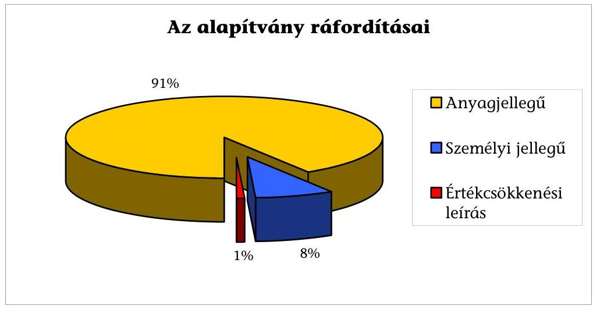
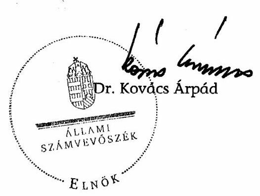

# JELENTÉS 

a Szabó Miklós Tudományos, Ismeretterjesztő, Kutatási és Oktatási Szabadelvű Alapítvány 2005-2006. évi gazdálkodása törvényességének ellenőrzéséről

---

# 3. Önkormányzati és Területi Ellenőrzési Igazgatóság 

3.1. Szabályszerűségi Ellenőrzési Főcsoport

Iktatószám: V-1021-28/2007.
Témaszám: 878
Vizsgálat-azonosító szám: V-0345

## Az ellenőrzést felügyelte:

Dr. Lóránt Zoltán
főigazgató
Az ellenőrzés végrehajtásáért felelős:
Dr. Elek János
általános főigazgató-helyettes
Az ellenőrzést vezette:
Solymár Ágnes
osztályvezető főtanácsos
Az összefoglaló jelentést készítette:
Brebán Andrea
számvevő
Az ellenőrzést végezték:
Asztalosné Zupcsán Erika Brebán Andrea Pásztor Katalin
külső szakértő számvevő számvevő tanácsos

A témához kapcsolódó eddig készített számvevőszéki jelentések:
címe
sorszáma
Jelentés a Szabó Miklós Szabadelvű Alapítvány 2003-2004. évi gaz- 0559
dálkodása törvényességének ellenőrzéséről

---

# TARTALOMJEGYZÉK 

BEVEZETÉS ..... 5
I. ÖSSZEGZŐ MEGÁLLAPÍTÁSOK, KÖVETKEZTETÉSEK, JAVASLATOK ..... 7
II. RÉSZLETES MEGÁLLAPÍTÁSOK ..... 12

1. Az alapítvány gazdálkodásának törvényessége ..... 12
1.1. A kuratórium működése ..... 12
1.2. Az alapítvány bevételei ..... 13
1.3. Az alapítvány ráfordításai ..... 14
2. Az éves beszámolók ..... 15
2.1. Az éves beszámolók szabályossága ..... 15
2.2. A mérleg ..... 17
2.3. Az eredmény-kimutatás ..... 17
3. A könyvvezetés szabályozottsága ..... 18
4. A könyvvezetés gyakorlata ..... 20
5. Az adókkal és járulékokkal kapcsolatos kötelezettségek ..... 22
6. Az alapítvány ellenőrzési rendszere ..... 23
7. A korábbi ellenőrzés megállapításaira tett intézkedések ..... 23

## MELLÉKLETEK

1. számú Szabó Miklós Tudományos, Ismeretterjesztő, Kutatási és Oktatási Szabadelvű Alapítvány 2005. évi egyszerűsített éves beszámolójának mérlege
2. számú Szabó Miklós Tudományos, Ismeretterjesztő, Kutatási és Oktatási Szabadelvű Alapítvány 2005. évi egyszerűsített éves beszámolójának eredmény-kimutatása
3. számú Szabó Miklós Tudományos, Ismeretterjesztő, Kutatási és Oktatási Szabadelvű Alapítvány 2006. évi egyszerűsített éves beszámolójának mérlege
4. számú Szabó Miklós Tudományos, Ismeretterjesztő, Kutatási és Oktatási Szabadelvű Alapítvány 2006. évi módosított, egyszerűsített éves beszámolójának mérlege

---

5. számú Szabó Miklós Tudományos, Ismeretterjesztő, Kutatási és Oktatási Szabadelvű Alapítvány 2006. évi egyszerűsített éves beszámolójának eredménykimutatása
6. számú Szabó Miklós Tudományos, Ismeretterjesztő, Kutatási és Oktatási Szabadelvű Alapítvány 2006. évi módosított, egyszerűsített éves beszámolójának eredmény-kimutatása
6. számú Szabó Miklós Tudományos, Ismeretterjesztő, Kutatási és Oktatási Szabadelvű Alapítvány 2006. évi és 2006. évi egyszerűsített éves beszámolójának eltérései

---

# RÖVIDÍTÉSEK JEGYZÉKE 

| Alapítvány | A Szabó Miklós Tudományos, Ismeretterjesztő, Kutatási és Oktatási Szabadelvű Alapítvány |
| :--: | :--: |
| ÁSZ | Állami Számvevőszék |
| Kincstár | Magyar Államkincstár |
| Pártalapítványi törvény | a pártok működését segítő tudományos, ismeretterjesztő, kutatási, oktatási tevékenységet végző alapítványokról szóló 2003. évi XLVII. törvény |
| Párttörvény | a pártok működéséről és gazdálkodásáról szóló 1989. évi XXXIII. törvény |
| Ptk. | a Polgári Törvénykönyvről szóló 1959. évi IV. törvény |
| SZDSZ | Szabad Demokraták Szövetsége |
| Számviteli rendelet | a számviteli törvény szerinti egyes egyéb szervezetek beszámolókészítési és könyvvezetési kötelezettségének sajátosságairól szóló 224/2000. (XII. 19.) Korm. rendelet |
| Számviteli törvény | a számvitelről szóló 2000. évi C. törvény |
| SZMSZ | Szervezeti és működési szabályzat |

---

.

---

# JELENTÉS 

## a Szabó Miklós Tudományos, Ismeretterjesztő, Kutatási és Oktatási Szabadelvű Alapítvány 2005-2006. évi gazdálkodása törvényességének ellenőrzéséről

## BEVEZETÉS

A pártok működését segítő tudományos, ismeretterjesztő, kutatási, oktatási tevékenységet végző alapítványokról szóló 2003. évi XLVII. törvény (a továbbiakban: pártalapítványi törvény) alapján a pártok a politikai kultúra fejlesztése érdekében tudományos, ismeretterjesztő, kutatási és oktatási tevékenységük elősegítésére, a pártok működéséről és gazdálkodásáról szóló 1989. évi XXXIII. törvényben (a továbbiakban: párttörvény) meghatározott költségvetési támogatásra jogosult alapítványt hozhattak létre. A Szabad Demokraták Szövetsége - a pártalapítványi törvényben biztosított lehetőséggel élve - a 2003. évben 594 ezer Ft induló vagyonnal létrehozta a Szabó Miklós Tudományos, Ismeretterjesztő, Kutatási és Oktatási Szabadelvű Alapítványt (a továbbiakban: alapítvány).

A pártalapítványi törvény alapján létrehozott alapítványok költségvetési támogatásának formáiról és mértékéről a párttörvény 2003. július 1-jétől hatályos módosításában rendelkezik. A párttörvény 9/A. § (5) bekezdés a) - c) pontjai alapján az alapítványok alaptámogatásban, mandátumarányos kiegészítő támogatásban és eseti támogatásban részesülhetnek. Az alapítvány a párttörvény előírásának megfelelően, 2005-ben 105800 ezer Ft, 2006-ban 109900 ezer Ft alap- és mandátumarányos kiegészítő támogatásban részesült, eseti támogatást nem kapott.

Az alapítvány alapító okiratban foglalt céljai:

- a modern, európai liberális politikai kultúra magyarországi népszerűsítése és hazai társadalmi viszonyoknak megfelelő átültetése, újrafogalmazása;
- liberális politikai kultúrát fejlesztő programok készítése;
- a pluralista, demokratikus és toleráns politikai kultúra terjesztése.

Az alapítvány a célok megvalósítása érdekében saját szervezésében és a liberális klubokkal közösen előadásokat, a Liberális Hét rendezvényeit, saját szervezésében elméleti-gyakorlati politikai és egyéb társadalomtudományi képzéseit szervezte meg. A kuratórium az alapító okiratban megfogalmazott célokkal összhangban nyújtott támogatást pályázati úton, egyedi kérelmekre, kuratóriumi kezdeményezésre szervezeteknek és magánszemélyeknek rendezvények, kutatási tevékenység, kiadvány, könyv- és lapkiadás megvalósításához.

A pártalapítványi törvény 4. § (2) bekezdése alapján az állami költségvetési támogatásban részesült alapítványok gazdálkodása törvényességének ellenőrzésére az Állami Számvevőszék (a továbbiakban: ÁSZ) jogosult, amely a pártalapítványi törvény 4. § (4) bekezdése alapján kétévenként ellenőrzi azok gazdálkodását.

Az alapítványt az ÁSZ 2005. évben ellenőrizte a megalakulástól 2004. december 31-éig terjedő időszakra vonatkozóan. Az ellenőrzés a belső szabályzatokkal, és a kuratóriumi döntésekkel kapcsolatos hiányosságokat állapított meg.

A jelen ellenőrzés célja volt az alapítvány 2005-2006. évi gazdálkodása törvényességének értékelése. Ennek keretében ellenőriztük:

- az alapítvány gazdálkodásának törvényességét;
- az éves beszámolók jogszabályi előírásoknak való megfelelését;
- az alapítvány könyvvezetésében a számvitelről szóló 2000. évi C. törvény (a továbbiakban: számviteli törvény) és egyéb jogszabályi rendelkezések, és belső előírások betartását;
- a kuratórium által megtett intézkedések körét és eredményét az ÁSZ előző ellenőrzése során feltárt hiányosságok megszüntetése, valamint az intézkedési tervben megjelölt feladatok megvalósítása érdekében.

Az ellenőrzési program összeállítása során az eredendő kockázatot alacsonynak, a belső kontroll kockázatot közepesnek minősítettük. A megjelölt 2%-os lényegességi küszöb és az ellenőrzés előkészítése során elvégzett kockázatértékelés alapján kialakított mintavételt alkalmaztunk az alapítvány ráfordításainak ellenőrzéséhez. Tételesen kerültek ellenőrzésre az 5000 ezer forintot meghaladó könyvelési tételek és a bevételeken belül az éves központi költségvetési támogatás.

Az egyéb szabályszerűségi ellenőrzés a 2005. január 1. és 2006. december 31-e közti időszakra terjedt ki.

---

# I. ÖSSZEGZŐ MEGÁLLAPÍTÁSOK, KÖVETKEZTETÉSEK, JAVASLATOK 

A kuratórium az ellenőrzött időszakban törvényesen működött, az alapítvány vagyonkezelését és a gazdálkodást érintő döntéseit a 2005-2006. években az alapító okiratában előírtak szerinti határozatképes ülésen hozta meg. A határozatok tára a határozatok tartalmát, időpontját tartalmazta, de az alapító okirattól eltérően nem tartalmazta a döntést támogatók, ellenzők arányát, személyét. A korábbi ellenőrzés alapján tett ÁSZ javaslatoktól eltérően az alapító okiratot az alapító nem módosította, így az továbbra sem tartalmazta a kuratóriumi határozat érvényességéhez előírt szavazati arányt. A kuratórium az ellenőrzött években az alapítvány költségvetéseit elkészíttette, határozattal elfogadta. Az elfogadott költségvetések, összhangban az alapító okirattal, a várható bevételeket és kiadásokat egyensúlyban tartalmazták. A korábbi ellenőrzés javaslataival összhangban a kuratórium a határozatait 2006-tól a támogatási összeg megjelölésével hozta meg.

A képviseleti és a bankszámla feletti rendelkezési jog alapító okiratbeli szabályozása megfelelt a Ptk.-ban foglaltaknak. Az alapítvány által megkötött szerződések, megállapodások ellenőrzése alapján megállapítottuk, hogy a képviseleti jog gyakorlása során betartotta az alapító okiratban foglalt szabályokat, a képviseleti jogot az alapítvány ügyvezető igazgatója gyakorolta. A banki aláírási címpéldány az alapító okiratban meghatározottakkal nem volt összhangban, mivel azon az alapító által fel nem jogosított személy is szerepelt.

Az ellenőrzött években az alapítvány összes bevétele a főkönyvi kivonatok alapján 220955 ezer Ft volt, ennek 97,6%-át a központi költségvetési támogatás, 2,4%-át a pénzügyi és egyéb bevételei tették ki. Az alapítvány által kapott költségvetési támogatás összege az ellenőrzött években megfelelt a párttörvényben meghatározott mértékű alap-, és mandátumarányos kiegészítő támogatás együttes értékének. Eseti támogatásban az alapítvány nem részesült.

Az alapítvány a 2005-2006. években a bevételei és az előző évekről áthozott maradványa terhére a cél szerinti tevékenységével és működésével kapcsolatban költségként és ráfordításként összesen 283362 ezer Ft-ot számolt el. Az alapítvány céljait egyrészt a kuratórium által megítélt, továbbadott támogatások útján, másrészt saját szervezeti keretei között végzett tevékenységével valósította meg.

A kuratórium az alapító okiratban megfogalmazott célokkal összhangban nyújtott támogatást pályázati úton, egyedi kérelmekre, kuratóriumi kezdeményezésre szervezeteknek és magánszemélyeknek különféle programok (rendezvény, kutatási tevékenység, kiadvány, könyv- és lapkiadás stb.) megvalósításához. A kuratórium az alapító okirattal összhangban a támogatásokról határozattal döntött. A támogatás rendszere a 2006. évtől szabályozott volt, de a szabályzat nem határozta meg, hogy az elszámolások ellenőrzése és elfogadása kinek a feladata. A támogatottakkal az alapítvány képviselője támogatási szer-

---

ződést kötött, melyben rögzítették a támogatás célját, a felhasználás és elszámolás határidejét, az elszámolási kötelezettséget.

A kuratóriumi döntés alapján megkötött támogatási szerződések 10%-ánál az alapítvány a támogatás összegét nem a támogatott számára, hanem a támogatott által igénybevett és az alapítvány felé igazolt tevékenységet - az alapítvány nevére kiállított számla alapján - nyújtó szervezet számára fizette ki, így az nem támogatás, hanem az alapítvány saját szervezeti keretek között végzett tevékenység. A támogatások 3,3%-ánál a kuratórium által eldöntött támogatási összegnél - csekély mértékben, 161 ezer Ft-tal - magasabb összegű támogatást fizettek ki. A kuratórium a helyszíni ellenőrzés időszaka alatt e többlettámogatások kifizetésének jogosságát határozattal elfogadta. Az ellenőrzött időszakban a támogatásokkal a támogatottak 16,1%-a nem, vagy csak részben számolt el a helyszíni ellenőrzés lezárásáig. Ehhez hozzájárult az, hogy a támogatási szerződés nem írt elő a késedelmes elszámolás miatt szankciót. A kuratórium határozattal döntött az alapítvány saját szervezeti keretein belül végzett tevékenységekről, azok az alapító okirat céljaival összhangban álltak, ezen tevékenységekre vonatkozóan az alapítvány képviseletében az ügyvezető igazgató a határozattal összhangban álló szerződést kötött.

Az alapítvány a jogszabályban előírt számviteli szabályzatokkal rendelkezett, azokat az ellenőrzött időszakban módosította, de a korábbi ellenőrzés javaslatait csak részben vette figyelembe. A módosított szabályzatokat a korábbi ÁSZ ellenőrzés alapján tett javaslattal összhangban a kuratórium elfogadta és hatályba léptette, a számviteli politikában a jogszabályban foglaltaknak megfelelően módosította a kapott költségvetési támogatások elszámolási szabályait, az eszközök és források leltározási szabályzatát az alapítványi sajátosságoknak megfelelően módosította, a pénzkezelési szabályzatban meghatározta az utalványozásra jogosultak körét, a pénztáros anyagi felelősségét, kiegészítette a bankszámlaforgalom lebonyolításával kapcsolatos részletes szabályokkal. A korábbi ellenőrzés javaslata ellenére a számviteli politikában nem határozta meg az alapítványi tevékenység közvetlen költségeinek és egyéb közvetett (működési) költségeinek körét és elkülönítésük módját, a továbbadott támogatások elszámolási szabályait, nem szabályozta egyértelműen a beszámoló választott formáját, a számlarendben az alapítvány által továbbutalt támogatások elszámolását - a jogszabályi előírástól eltérően - nem az egyéb ráfordítások között írta elő. Így a szabályzatok nem teljes körűen, és nem az alapítványi sajátosságok figyelembevételével szabályozták a számviteli elszámolás rendjét, továbbá előírásaik nem érvényesültek maradéktalanul a gyakorlatban, mindezek a könyvvezetési és az egyszerűsített éves beszámoló összeállítása során elkövetett hibákhoz vezettek.

A módosított számviteli politika nem tartalmazta a passzív időbeli elhatárolások és az éves könyvviteli zárlathoz kapcsolódó feladatok körét és szabályait, a módosított leltározási szabályzat nem határozta meg a leltározással kapcsolatos -
 az idegen helyen tárolt eszközök kivételével - hatásköröket, az elkészítendő leltárak formáját, az egyeztetéssel történő leltározás szabályait. Az eszközök és a források módosított értékelési szabályzata nem tartalmazta az időbeli elhatárolásokra vonatkozó szabályokat, valamint a terven felüli értékcsökkenés értékelésére meghatározott szabályok nem voltak összhangban a számviteli politikában előírtakkal. A módosított pénzkezelési szabályzatban az elektronikus

---

átutalások rendjére vonatkozó szabályozás nem felelt meg az alapító okirat előírásainak, nem az alapítvány szervezeti felépítésének megfelelően jelölte meg az átutalást megelőző feladatok körét és nem határozta meg az ellenőrzés gyakoriságát. A módosított számlarend nem szabályozta a főkönyvi számlák és az analitikus nyilvántartások kapcsolatát, a bizonylati rendet, nem jelölt ki számlát az eredményszámlák lezárásához.

Az alapítvány könyvvezetését kettős könyvvitel rendszerében, az alapbizonylatok számítógépes feldolgozásával végezte. A számviteli nyilvántartások vezetésére és a beszámoló elkészítésére jogosult személy rendelkezett a törvényi előírásoknak megfelelő képesítéssel. A kialakított számítógépes könyvelési rendszerből az ellenőrzéshez szükséges adatokat biztosították. Az alapítvány a záráshoz kapcsolódóan az alapítványra jellemző kiegészítő, egyeztető műveleteket elvégezte, összeállított főkönyvi kivonatot, de a jogszabályban és az alapítvány számviteli politikájában előírtaktól eltérően a főkönyvi számlák technikai lezárását nem végezte el. Az alapítvány a leltározást a leltározási és selejtezési szabályzatban foglaltak szerint végezte el. A havi pénztári zárásokat elvégezték és dokumentálták a pénzkezelési szabályzatnak megfelelően, de a szabályzatban előírtaktól eltérően a 2005. évben a házipénztárban tartható készpénz állományt hat esetben a havi záró pénzkészlet meghaladta. A házipénztári nyilvántartás során a bizonylati elv és fegyelem szabályai sérültek, mert az ellenőrzött időszakban a forint pénztári nyilvántartás vezetése során a tételek 6,3\%-ánál a kifizetés tényleges időpontja, sorrendje eltért a pénztári bizonylatokon feltüntetett dátumtól, hibás sorrendben került a pénztárjelentésbe, továbbá a valuta forgalomról pénztári bizonylat nem került kiállításra, a pénzmozgást csak főkönyvi nyilvántartásban rögzítették. Az ellenőrzési időszakban jogosulatlan kifizetés nem történt. Az alapítvány a könyvvezetésében - a szabályozás hiányosságai miatt, a jogszabályi előírás ellenére - a továbbutalt támogatásokat, az alapítványi tevékenység közvetlen költségeit és a működési költségeket nem különítette el. A könyvelés alapjául szolgáló számviteli bizonylatok megfeleltek a jogszabályi előírásoknak, azzal a kivétellel, hogy azokon nem tüntették fel a könyvelés dátumát.

Az alapítvány az ellenőrzött időszakban beszámolókészítési kötelezettségének eleget tett, a kettős könyvviteli rendszernek megfelelő egyszerűsített éves beszámolókat a kuratórium határozattal elfogadta. Az alapítvány az éves beszámolók elkészítése és könyvvezetése során 2005. évben a valódiság, 2006. évben a valódiság és lényegesség kivételével érvényesítette a számviteli alapelveket. A honlaphoz kapcsolódó kiadások immateriális javak közti nyilvántartása helyett igénybevett szolgáltatásként való téves elszámolása miatt, az éves beszámolóban feltárt hiba mértéke a 2005. évben (bevételek 0,4\%-a) nem érte el, a 2006. évben (bevételek 5,2\%-a) azonban meghaladta a lényegességi szint (bevételek 2\%-a) mértékét, továbbá az alapítvány számviteli politikájában meghatározott jelentős összegű hiba határát. Az ellenőrzés megállapításai alapján az alapítvány a 2006. évre vonatkozóan a lényegességi szintet érintő hibát helyesbítette. A kuratórium a módosított beszámolót határozattal elfogadta.

Az alapítvány egyszerűsített éves beszámolójának adatai a főkönyvi kivonatból levezethetők, a mérleg tételei leltárakkal alátámasztottak. Az alapítvány a vonatkozó jogszabályi előírásoktól eltérően a továbbutalt támogatásokat az

---

egyéb ráfordítások helyett, a telefon költségtérítést és a reprezentáció költségeit a személyi jellegű ráfordítások helyett az anyagjellegű ráfordítások között mutatta ki könyveiben és az eredmény-kimutatásban. A mérlegben helyesen kimutatott időbeli elhatárolásokon belül a szervezeteknek továbbutalt támogatásokhoz kapcsolódó elhatárolt összegeket a vonatkozó jogszabályi előírástól eltérően számolta el. A feltárt hibák az alapítvány saját tőkéjének és kimutatott eredményének értékét nem módosították.

Az alapítvány, mint munkáltató, eleget tett a személyi jövedelemadóról, a társadalombiztosítás ellátásaira és a magánnyugdíjra jogosultakról, valamint e szolgáltatások fedezetéről, az egészségügyi hozzájárulásról és az adózás rendjéről szóló hatályos törvényi előírásoknak. Vezette a jogszabályok által előírt munkáltatói és a kifizetői feladatokhoz rendelt nyilvántartásokat, ellátta az előírt adatszolgáltatási kötelezettségét. Levonta a kifizetett bér- és bérjellegű jövedelmekből a magánszemélyeket terhelő levonásokat, a központi költségvetéssel szembeni bevallási és befizetési kötelezettségét határidőre teljesítette.

Az ellenőrzés személyi feltételei nem voltak biztosítottak, mivel az alapító nem jelölt ki a kuratórium ellenőrzésére jogosult szervet, a kuratórium nem bízott meg könyvvizsgálót az egyszerűsített éves beszámolók ellenőrzésével és hitelesítésével, a vezetői ellenőrzést nem szabályozta. Az alapítvány és a megbízott könyvelő cég közötti szerződés az alapítvány ellenőrzési jogosultságát nem kötötte ki. A folyamatba épített, előzetes és utólagos ellenőrzés csak részben működött, nem volt zárt rendszerű, mivel a támogatási döntések végrehajtását, a pénztárat a 2005-2006. években nem ellenőrizték. Az ellenőrzési hiányosságok hozzájárultak a számviteli szabályzatokban foglaltaktól eltérő gyakorlat alkalmazásához, a könyvvezetés és a beszámoló összeállítása során feltárt, a lényegességi szintet meghaladó hibához.

A helyszíni ellenőrzés megállapításainak hasznosítása mellett javasoljuk:

# a Szabad Demokraták Szövetsége elnökének 

Gondoskodjon arról, hogy az alapító okirat kiegészítésre kerüljön a kuratóriumi határozat érvényességéhez szükséges szavazati arány meghatározásával.

## az alapítvány kuratóriumának

1. Vizsgálja felül a belső szabályzatokat a következők figyelembevételével:
a) határozza meg támogatási szabályzatban a munkaszervezet feladatát és pontosítsa a követendő eljárásrendet a támogatások elszámolása során, jelölje meg a szerződésszegés szankcióit, az elszámolások elfogadásának felelősét;
b) határozza meg a számviteli politikában egyértelműen a beszámoló választott formáját, az alapítványi tevékenység közvetlen költségeinek és egyéb közvetett (működési) költségeinek körét és elkülönítésük módját, a továbbadott támogatá-

---

sok elszámolási szabályait, jelölje meg az éves könyvviteli zárlathoz kapcsolódó feladatok körét és szabályait;
c) jelölje meg a leltározási szabályzatban a leltározással kapcsolatos hatásköröket, határozza meg a leltárak formáját, az egyeztetéssel történő leltározás szabályait;
d) egészítse ki az eszközök és a források értékelési szabályzatát az időbeli elhatárolások szabályaival, hozza összhangba a terven felüli értékcsökkenés értékelésére meghatározott szabályokat a számviteli politikában előírtakkal;
e) hozza összhangba a pénzkezelési szabályzatban az alapító okirat előírásaival az elektronikus átutalások rendjére vonatkozó szabályozást, módosítsa az alapítvány szervezetének megfelelően a banki átutalások és a pénztár ellenőrzés szabályait;
f) módosítsa a számlarend egyéb ráfordításokra vonatkozó előírásait az alapítványi sajátosságok figyelembevételével, határozza meg a főkönyvi számlák és az analitikus nyilvántartások kapcsolatát, a bizonylati rendet, jelöljön ki főkönyvi számlát az eredményszámlák lezárásához;
g) gondoskodjon a kuratóriumi határozattal jóváhagyott belső szabályzatok előírásainak maradéktalan alkalmazásáról, különösen a pénztárban tartható pénzkészlet, a pénztári ellenőrzés és a zárás során a számlák technikai lezárására vonatkozóan.
2. Gondoskodjon az alapítvány belső ellenőrzési rendszerének kialakításáról és működéséről.
3. Biztosítsa a számvitelről szóló 2000. évi C. törvény 15. § (3) bekezdésben foglalt valódiság és 16. § (4) bekezdés szerinti lényegesség számviteli alapelvek maradéktalan érvényesítését.
4. Intézkedjen a számvitelről szóló 2000. évi C. törvény 25. § (6) bekezdésében a vagyoni értékű jogokkal kapcsolatos, a 3. § (7) bekezdés 3. pontjában meghatározott személyi jellegű ráfordításokra, a 165. § (1) és (2) bekezdéseiben a bizonylati elv és fegyelem, és a 167. § (1) bekezdés i) pontjában a könyvviteli nyilvántartásokban történt rögzítés időpontjára és igazolására vonatkozó szabályok maradéktalan betartásáról.
5. Gondoskodjon a számviteli törvény szerinti egyes egyéb szervezetek beszámoló készítési és könyvvezetési kötelezettségének sajátosságairól szóló 224/2000. (XII. 19.) Korm. rendelet 16. § (6) bekezdésében a továbbutalási célú támogatások nyilvántartására vonatkozó szabályok, a 16. § (7) bekezdésében foglalt a továbbutalási célú bevételként elszámolt, de az adott üzleti évben még tovább nem utalt összeg időbeli elhatárolására vonatkozó szabályok betartásáról.
6. Módosítsa a banki aláírásra bejelentettek körét az alapító okirat előírásainak megfelelően.

---

# II. RÉSZLETES MEGÁLLAPÍTÁSOK 

## 1. AZ ALAPÍTVÁNY GAZDÁLKODÁSÁNAK TÖRVÉNYESSÉGE

### 1.1. A kuratórium működése

A kuratórium az alapítvány vagyonkezelését és gazdálkodását érintő döntéseit a 2005-2006. években az alapító okiratban előírtak szerinti határozatképes ülésen hozta meg.

Az alapító okirat XI. b.) pontja szerint a kuratórium tagjai több mint felének (három kurátor) jelenléte esetén határozatképes az ülés. Az ellenőrzött években a kuratóriumi ülések jegyzőkönyvei szerint minden ülésen a határozatképességhez szükséges számú képviselő megjelent.

A kuratórium üléseiről az alapító okirat előírásának megfelelően jegyzőkönyvet készítettek, azokat egy kivétellel aláírta a kuratóriumi ülések levezető elnöke, a jegyzőkönyvvezető és a jegyzőkönyv hitelesítője.

A 2005. február 23-i jegyzőkönyvet a jegyzőkönyvvezető nem írta alá.
A korábbi ellenőrzés alapján tett ÁSZ javaslatoktól eltérően az alapító okiratot az alapító nem módosította, így az továbbra sem tartalmazta a kuratóriumi határozat érvényességéhez előírt szavazati arányt. A 2005. évi első kuratóriumi ülés jegyzőkönyve nem tartalmazta a határozatot ellenzők személyét. A határozatok tára a határozatok tartalmát, időpontját tartalmazta, de az alapító okirattól eltérően nem tartalmazta a döntést támogatók és ellenzők arányát, személyét.

Az alapító okirat XI. c.) pontja szerint a jegyzőkönyvnek tartalmaznia kell a kuratóriumi ülések időpontját, a határozatok szó szerinti szövegét, a döntés hatályára vonatkozó rendelkezéseket, a döntést támogatók és ellenzők számarányát, személyét. A jegyzőkönyv alapján vezetni kell a határozatok könyvét, amelybe be kell vezetni a határozat tartalmát, időpontját, hatályát, a döntést támogatók, ellenzők arányát, személyét.

A kuratórium az alapító okirat előírásainak megfelelően a pályáztatási, tervezési, támogatási tevékenységéről minden esetben hozott határozatot, elfogadta az éves beszámolókat, szabályzatokat.

A kuratórium az ellenőrzött években az alapítvány költségvetéseit elkészíttette, határozattal elfogadta. Az elfogadott költségvetések összhangban az alapító okirattal a várható bevételeket és kiadásokat egyensúlyban tartalmazták. Mivel az alapító okirat a működési költségek mértékére előírást nem tartalmazott, a kuratórium a költségvetés elfogadásával határozta meg a működési költségek körét, mértékét és a cél szerinti feladatok kiadásait.

A képviseleti és a bankszámla feletti rendelkezési jog alapító okiratbeli szabályozása megfelelt a Ptk. 74/C. § (4) bekezdéseiben foglaltaknak. Az alapítvány

---

által megkötött szerződések, megállapodások ellenőrzése alapján megállapítottuk, hogy a képviseleti jog gyakorlása során betartották az alapító okiratban foglalt szabályokat. Az alapító okirat és a kuratórium felhatalmazása alapján az alapítvány ügyvezető igazgatója gyakorolta a képviseleti jogot. A banki aláírási címpéldány azonban az alapító okiratban - így a jogszabályban meghatározottakkal nem volt összhangban, mivel azon az alapító által fel nem jogosított személy is szerepelt.

Az alapító a Ptk. 74/C. § (4) bekezdése előírásának megfelelően, az alapító okiratban élt azzal a lehetőséggel, hogy a kuratórium az alapítvány alkalmazottja számára is biztosíthat képviseleti jogot, és a képviseleti jog terjedelmét és gyakorlásának meghatározását a kuratórium hatáskörébe utalta.

Az alapító okirat XII. 1. pontja az alapítvány teljes körű képviseletével egy kurátort, a bankszámla feletti rendelkezésre a kuratórium elnökét és még egy rendelkezésre jogosult személyt bízott meg. A kuratórium az alapítvány ügyvezető igazgatóját teljes körű képviseleti joggal és bankszámla feletti rendelkezési joggal hatalmazta fel. Banki aláírásra - a képviseleti joggal nem rendelkező, nem alkalmazotti jogállású - az alapítvány könyvelési feladataival megbízott cég ügyvezető igazgatóját is bejelentették.

# 1.2. Az alapítvány bevételei 

Az ellenőrzött években az alapítvány összes bevétele a főkönyvi kivonatok alapján 220955 ezer Ft volt, ennek 97,6\%-át a központi költségvetési támogatás, 2,4
 %-át a nyújtott támogatásokhoz és költségtérítéshez kapcsolódó visszafizetésből, árfolyamnyereségből, valamint az átmenetileg szabad pénzeszközei egy évnél rövidebb időtartamú lekötéséből származó kamatbevétel tette ki.

A költségvetési támogatás összege az ellenőrzött években - kerekítésből adódó eltéréssel - megfelelt a párttörvény 2003. július 1-jétől hatályos 9/A. § (5) bekezdésében meghatározott mértékű alap-, és mandátumarányos kiegészítő támogatás együttes értékének, eseti támogatást az alapítvány nem kapott. A központi költségvetésről szóló törvény alapján az alapítvány költségvetési támogatása a 2005-ben 105 800 ezer Ft, 2006-ban 109 900 ezer Ft volt. A Kincstár a támogatást a pártalapítványi törvény 2. § (1) bekezdésének megfelelően negyedéves ütemezésben, a negyedév első napjaiban átutalta.

Az alapító okirat lehetővé tette az alapítvány számára a kívülállók által teljesített adományok, egyéb támogatások, juttatások és felajánlások elfogadását a pártalapítványi törvény 3. § (2) bekezdésének előírásai figyelembe vételével. Az ellenőrzött időszakban az alapítvány részére adományt sem természetbeni, sem pénzbeli hozzájárulásként nem ajánlottak fel.

A pártalapítványi törvény 3. § (2) bekezdése szerint „az alapítványhoz bárki feltétel nélkül csatlakozhat, az alapító okirat azonban előírhatja, hogy a csatlakozás elfogadásához a kezelő szerv jóváhagyása szükséges”.

Az alapító okirat rögzítette, hogy az alapítvány másodlagosan és kisegítő jelleggel vállalkozási tevékenységet is folytathat, az ellenőrzött években vállalkozási tevékenységet nem végzett.

---

# 1.3. Az alapítvány ráfordításai 

Az alapítvány a 2005-2006. években a bevételei és az előző évekről áthozott maradványa terhére a cél szerinti tevékenységével és működésével kapcsolatban költségként és ráfordításként összesen 283 362 ezer Ft-ot számolt el, költségnemenkénti összetételét az alábbi diagramm mutatja be.

A kuratórium az alapító okiratban megfogalmazott célokkal összhangban nyújtott támogatást pályázati úton, egyedi kérelmekre, kuratóriumi kezdeményezésre szervezeteknek és magánszemélyeknek különféle programok (rendezvény, kutatási tevékenység, kiadvány, könyv- és lapkiadás stb.) megvalósításához. Az alapító okirattal összhangban a támogatásokról határozattal döntött.

A kuratórium a támogatások nyújtásának szabályait csak a 2006. évben dolgozta ki, 2005-ben azokról egyedi határozatokkal döntött. A kuratórium által elfogadott támogatási szabályzat a döntésig határozta meg a támogatási folyamatot, előírta, hogy a támogatottakkal szerződést kell kötni. A pályázati támogatással való elszámolás szabályait a kuratórium által elfogadott elszámolás rendje szabályozta, de nem határozta meg, hogy az elszámolások ellenőrzése és elfogadása kinek a feladata. Előírta az elszámolható számlák körét és a felhasználásról készített részletes tartalmi beszámolót.

A támogatottakkal az alapítvány képviselője támogatási szerződést kötött, melyben rögzítették a támogatás célját, a felhasználás és elszámolás határidejét, az elszámolási kötelezettséget.

A kuratóriumi döntés alapján megkötött támogatási szerződések 10%-ánál az alapítvány a támogatás összegét nem a támogatott számára, hanem a támogatott által igénybevett és az alapítvány felé igazolt tevékenységet - az alapítvány nevére kiállított számla alapján - nyújtó szervezet számára fizette ki. Mivel az elszámolás során a benyújtott számlákat az alapítvány saját bankszámlájáról egyenlítette ki, így az már nem tekintendő támogatásnak, hanem az alapítvány saját szervezeti keretek között végzett tevékenységnek.

---

A nem jogi személyeknek nyújtott támogatások esetében a szerződések az alapítvány nevére szóló számlákkal való elszámolást írták elő, mert e szervezetek nevére számlát nem lehetett kiállítani.

A támogatások 3,3%-ánál a kuratórium által döntésében meghatározott támogatási összegnél csekély mértékben, de magasabb összegű támogatást fizettek ki összesen 161 ezer Ft-tal. A kuratórium a helyszíni ellenőrzés időszaka alatt a többlettámogatások kifizetését utólag határozattal elfogadta.

A kuratórium a többlettámogatások kifizetésének jogosságáról a 2./2007.10.16. számú kuratóriumi határozattal döntött.

A támogatási döntésekről és az elszámolásról analitikus nyilvántartást vezettek. A 2005-2006. években megítélt támogatásokkal a támogatottak 16,1%-a nem, vagy részben számolt csak el a helyszíni ellenőrzés lezárásáig, ehhez hozzájárult, hogy a támogatási szerződés nem írt elő a késedelmes elszámolás miatt szankciót. Az időszakban a támogatottak 12,8%-a nem, vagy nem teljes összegben vette fel a megítélt támogatást.

A kuratórium határozattal döntött az alapítvány saját szervezeti keretein belül végzett cél szerinti tevékenységeiről, amelyek az alapító okirat céljaival összhangban álltak. A cél szerinti tevékenységek esetében az alapítvány képviseletében az ügyvezető igazgató a határozattal összhangban álló szerződéseket kötött.

A működési kiadások körében a kuratórium nem hozott határozatot az ügyvezető igazgató mobiltelefon költségtérítésének ellenőrzéséről, részére 2006-tól a költségtérítést a kuratórium elnöke engedélyezte.

# 2. Az ÉVES BESZÁMOLÓK 

### 2.1. Az éves beszámolók szabályossága

Az alapítvány az ellenőrzött időszakban beszámoló készítési kötelezettségnek a számviteli politikában megjelölt határidőre eleget tett, a kettős könyvviteli nyilvántartáson alapuló egyszerűsített éves beszámolót készített.

Az alapítvány a számviteli törvény szerinti egyes egyéb szervezetek beszámoló készítési és könyvvezetési kötelezettségének sajátosságairól szóló 224/2000. (XII. 19.) Korm. rendelet (továbbiakban: számviteli rendelet) 6. § (7) bekezdésének megfelelően, a kettős könyvviteli rendszerhez igazodó egyszerűsített éves beszámolója a rendelet 4. sz. melléklete szerint mérlegből és 5. sz. melléklete szerint eredmény-kimutatásból, valamint kiegészítő mellékletből állt.

Az egyszerűsített éves beszámolókat az alapító okirat előírásának megfelelően a kuratórium határozattal elfogadta, a beszámolókat a képviseletre jogosult aláírásával hitelesítette.

A kuratórium az éves beszámolókat a 2005. évre vonatkozóan a 8./2006.05.15. számú, a 2006. évre vonatkozóan az 1./2007.04.25. számú határozattal fogadta el. Az elfogadott egyszerűsített éves beszámolók mérlegét és eredménykimutatását az 1., 2., 3. és 5. számú mellékletek tartalmazzák.

---

Az egyszerűsített éves beszámolókban szereplő adatok a záráshoz készített főkönyvi kivonat adataiból levezethetők voltak, a beszámoló sorokhoz kapcsolódó főkönyvi számlák, továbbá az alapítvány által összeállított analitikus nyilvántartások adataival megegyeztek.

Az alapítvány az ellenőrzött időszakban beszámoló készítési kötelezettségének eleget tett, a kettős könyvviteli rendszernek megfelelő egyszerűsített éves beszámolókat a kuratórium határozattal elfogadta. Az alapítvány az éves beszámolók elkészítése és könyvvezetése során 2005. évben a valódiság, 2006. évben a valódiság és lényegesség kivételével érvényesítette a számviteli alapelveket. A téves könyvvezetés során keletkezett és az ellenőrzés során feltárt eredményt, saját tőkét módosító hiba a 2005. évi beszámolóban nem érte el, a 2006. évben meghaladta a 2%-os lényegességi küszöb mértékét, továbbá az alapítvány számviteli politikájában meghatározott jelentős összegű hibahatárt. Az ellenőrzés megállapításai alapján az alapítvány a 2006. évre vonatkozóan a lényegességi szintet érintő hibát helyesbítette. A kuratórium a módosított beszámolót a helyszíni ellenőrzés időszaka alatt határozattal elfogadta.

A számviteli törvény 15. § (3) bekezdése szerint „a könyvvitelben rögzített és a beszámolóban szereplő tételeknek a valóságban is megtalálhatóknak, bizonyíthatóknak, kívülállók által is megállapíthatóknak kell lenniük. Értékelésük meg kell, hogy feleljen az e törvényben előírt értékelési elveknek és az azokhoz kapcsolódó értékelési eljárásoknak (a valódiság elve)”, 16. § (4) bekezdése szerint „Lényegesnek minősül a beszámoló szempontjából minden olyan információ, amelynek elhagyása vagy téves bemutatása az ésszerűség határain belül - befolyásolja a beszámoló adatait felhasználók döntéseit (a lényegesség elve).

A lényegességi küszöb az összes bevétel 2%-a, mértéke a 2005. évben 2206 ezer Ft, a 2006. évben 2213 ezer Ft. Az ellenőrzés során azon hibák érintik a lényegességi szintet, amelyek az eredményt, saját tőkét növelik, illetve csökkentik.

A feltárt hiba teljes egészében a befektetett eszközöket érintette, mértéke a 2005. évben a bevételek 0,4%-a, a 2006. évben 5,2%-a. Az alapítvány a 2005. évben a honlap tervezésével, elkészítésével, fenntartásával (amely 17 hónapra szólt), a 2006. évben a honlap fejlesztésével összefüggő kifizetések értékét az igénybe vett szolgáltatások költségei között számolta el. Az alapítványnak a honlap elkészítése során használati joga keletkezett, így az azzal kapcsolatos kiadásait a számviteli törvény 25. § (6) bekezdésében foglaltaknak megfelelően a befektetett eszközök (immateriális javak, vagyoni értékű jog) között kellett volna kimutatnia. A 2005. évben 427 ezer Ft-ot számoltak el tévesen. A 2006. évben tévesen 4980 ezer Ft bekerülési értéket számoltak el, továbbá 794 ezer Ft értékcsökkenési leírást nem számoltak el, a beszámolókban így a kettő különbözeteként 4196 ezer Ft-tal magasabb ráfordítás illetve kisebb eredmény került kimutatásra.

Az alapítvány számviteli politikájában a jelentős összegű hiba mértékét a számviteli törvény 3. § (3) bekezdés 3. pontjában foglaltakkal megegyezően a mérleg főösszeg 2%-ában határozta meg. A 2006. évben a hiba a mérleg főösszegének 40,7%-a.

A kuratórium a 2006. évi módosított, egyszerűsített éves beszámolót az 1./2007.10.16. számú határozattal fogadta el. Az alapítvány 2006. évi módosított, egyszerűsített éves beszámolójának mérlegét és eredmény-kimutatását a 4. és 6. számú melléklet tartalmazza, az eltéréseket a 7. számú melléklet mutatja be.

---

# 2.2. A mérleg 

Az ellenőrzött években a mérleg sorokat az alapítvány által összeállított, a mérleg fordulónapjára vonatkozó leltárakkal támasztotta alá.

Az alapítvány szabályzataiban - a pénzforgalom kivételével - nem rögzítette az egyedi nyilvántartás, analitikák vezetésére vonatkozó szabályokat. A befektetett eszközökön belül a tárgyi eszközöknél egyedi nyilvántartó kartont vezettek mennyiségben és értékben, amelynek adatai összhangban voltak a főkönyvi nyilvántartás, a leltár és a mérleg adatával. A tárgyi eszközök esetében az aktiválás időpontját igazolták, az értékcsökkenés elszámolása a szabályzatokban foglaltaknak és a jogszabályi előírásoknak megfelelően történt. A tárgyi eszközök beszerzéséről a kuratórium határozattal döntött.

Az ellenőrzött években az alapítvány összesen 5015 ezer Ft értékű tárgyi eszközt szerzett be.

A forgóeszközökön belül az előlegekről vezetett analitika és főkönyvi nyilvántartás adatai, a mérlegsor adatával megegyeztek. Az utólagos elszámolásra kiadott előlegek analitikájában nyilvántartották az elszámolásra kiadott összeget, a felvétel célját, az elszámolásért felelős személyt, az elszámolási határidőt, az előlegekkel minden esetben határidőre elszámoltak. Az ellenőrzött években a pénzeszközök értéke megegyezett a december 31-ei pénztárjelentésben kimutatott készpénz záróállomány és a banki folyószámla kivonatok december 31-ei záróegyenlegének összegével.

A 2005. és 2006. évben az aktív időbeli elhatárolások és a kötelezettségek meghatározása, elszámolása szabályosan történt. A passzív időbeli elhatárolások értékét az alapítvány helyesen határozta meg, ezen belül azonban az alapítvány által a szervezeteknek továbbutalandó támogatások elhatárolt összegének elszámolása nem felelt meg a számviteli rendelet 16. § (7) bekezdésében foglalt előírásnak. A téves elszámolás az alapítvány saját tőkéjének és kimutatott eredményének értékét nem módosítja, nem érinti a lényegességi küszöb és a jelentős összegű hiba értékét.

A számviteli rendelet 16. § (7) bekezdése szerinti, az adott üzleti évben továbbutalási célú bevételként elszámolt, de még tovább nem utalt összeget, a kettős könyvvitelt vezetőknél időbelileg el kell határolni.

Az alapítvány könyvvezetésében az adott támogatásokat tévesen az egyéb igénybevett szolgáltatások költségei között tartotta nyilván, a még tovább nem utalt támogatás összegét a bevételek helyett, a költségek között határolta el.

### 2.3. Az eredmény-kimutatás

Az ellenőrzött években az alapítvány eredmény-kimutatásaiban a költségvetési támogatást a számviteli rendelet 16. § (6) bekezdése szerinti előírásának megfelelően az egyéb bevételek között, a bankkivonatok alapján összesített értékkel megegyezően mutatta ki. Az alapítványnak csatlakozó magánszemélyektől és szervezetektől kapott támogatása, vállalkozási bevétele nem volt. Az alapítványnak a költségvetési támogatáson kívül bevétele a nyújtott támogatásokhoz és költségtérítéshez kapcsolódó visszafizetésből, árfolyamnyereségből, va-

---

lamint az átmenetileg szabad pénzeszközei egy évnél rövidebb időtartamú lekötésével szerzett kamatból származott, ezek elszámolása szabályosan történt, a kimutatott kamatbevétel
 a bankkivonatok összesített adataival megegyezett.

Az alapítvány elszámolt ráfordításait a könyvelési alapbizonylatok alátámasztották. Az alapítványi kifizetéseknél a pénzkezelési szabályzatban megjelöltekkel összhangban az alapítvány ügyvezető igazgatója végezte az utalványozást. Az utalványozásra a banki átutalások esetén az alapítvány által készített kivonat jellegű íveken, a pénztári kifizetéseknél a kiadási pénztárbizonylaton és az alapbizonylaton került sor.

A készpénzfelvétel a pénzkezelési szabályzat és az alapító okirat előírásaival összhangban, az elektronikus banki átutalások az alapító okiratban foglaltaktól eltérően történt.

Az alapító okirat XII. fejezete alapján az alapítvány bankszámlája feletti rendelkezéshez minden esetben a kuratórium elnöke és még egy rendelkezésre jogosult személy aláírása szükséges. Az elektronikus átutalások esetében a bankszámla feletti rendelkezési jogot a képviseleti joggal rendelkező ügyvezető igazgató és a képviseleti joggal nem rendelkező, az alapítvány könyvelési feladataival megbízott cég ügyvezető igazgatója együttesen gyakorolta.

Az alapítvány eredmény-kimutatásában a számlarend előírásának megfelelően, de a számviteli rendelet 16. § (6) bekezdésében foglaltaktól eltérően az egyéb ráfordítások helyett az anyagjellegű ráfordítások között mutatta ki a szervezeteknek továbbutalt, nyújtott támogatások teljes összegét. A reprezentáció költségeit szinte teljes egészében (99,9%) és a telefon költségtérítés teljes összegét a számviteli törvény 3. § (7) bekezdés 3. pontjában foglaltaktól eltérően a személyi jellegű ráfordítások helyett az anyagjellegű ráfordítások között számolta el könyveiben és mutatta ki az eredmény-kimutatásban. Ezen hibák az alapítvány saját tőkéjének és kimutatott eredményének értékét nem módosították, nem érintették a lényegességi küszöb és a jelentős összegű hiba értékét.

A számviteli rendelet 16. § (6) bekezdése alapján az egyéb szervezetnél a kapott támogatás továbbutalt, átadott összegét egyéb ráfordításként kell elszámolni. A rendelet (7) bekezdése szerint továbbutalási céllal kapott támogatásnak minősül az olyan támogatás, amelyet a szervezet az alapítójától, illetve más szervezettől, pályázati vagy egyéb más úton kap, és azt továbbutalja, illetve átadja olyan szervezet részére, amely a támogatás célja szerinti feladatot közvetlenül megvalósítja. Az alapítvány a módosított számlarendben a továbbutalt támogatások nyilvántartását a számviteli rendelet 16. § (6) bekezdésében foglaltaktól eltérően nem az egyéb ráfordítások, hanem az egyéb igénybevett szolgáltatások között írta elő.

# 3. A KÖNYVVEZETÉS SZABÁLYOZOTTSÁGA 

Az alapítvány gazdálkodásának, éves beszámolói elkészítésének és könyvelésének belső szabályozási rendszere a számviteli törvény által kötelezően előírt szabályozáson alapult. Az alapítvány rendelkezett a számviteli törvény 14. § (3)-(5) bekezdései szerint számviteli politikával, ahhoz kapcsolódóan eszközök és a források leltárkészítési és leltározási-, az eszközök és a források értékelési-, és a pénzkezelési szabályzatokkal, valamint a számviteli törvény 161. § (1) be-

---

kezdése szerint a számlarenddel. A szabályzatokat 2005. év végén - a korábbi ÁSZ ellenőrzés javaslati alapján összeállított intézkedési terv alapján - módosították, a módosított szabályzatokat a kuratórium elfogadta.

A kuratórium 1./2005. 12. 06. számú kuratóriumi határozattal fogadta el a módosított számviteli szabályzatokat, azok 2006. január 1-jével léptek hatályba. A szabályzatokat a képviseleti joggal rendelkező ügyvezető igazgató írta alá.

A számviteli politikában - a számviteli törvény 14. § (4) bekezdésének megfelelően - meghatározták a könyvvezetés módját, a számviteli elszámolás és az értékelés szempontjából mi tekintendő lényegesnek, valamint rögzítették a jelentős összegű hiba mértékét. A szabályzatban nem határozták meg egyértelműen a beszámoló választott formáját.

A szabályzat a kettős könyvvitel rendszerének alkalmazását írta elő, és a 2. pontja szerint az alapítvány egyszerűsített éves beszámolót készít, amely mérlegből, eredmény-kimutatásból és kiegészítő mellékletből áll, a gyakorlatban helyesen ez készült. A szabályzat más pontjaiban azonban egyszeres könyvvezetésnek megfelelő beszámoló részek, mérleg és az eredmény-levezetés kerültek megjelölésre (pl. a szabályzat II. fejezet 3. és 4. 1. pontjaiban).

A számviteli politikában nem rögzítették a passzív időbeli elhatárolások körét és tartalmát, nem határozták meg az éves könyvviteli zárlathoz kapcsolódó, kiegészítő, helyesbítő, egyeztető könyvelési feladatokat, nem jelölték meg az alapítvány gazdálkodására jellemző, sajátos elszámolások közül az alapítványi célú tevékenység közvetlen, és a közvetett (működési) költségeinek körét és elkülönítésük módját, továbbá az alapítvány által nyújtott támogatásokkal kapcsolatos sajátos nyilvántartási szabályokat.

Az alapítványi célú tevékenység közvetlen és az egyéb közvetett költségek elkülönítését az alapítványok gazdálkodási rendjéről szóló 115/1992. (VII. 23.) Korm. rendelet 5. §-a írta elő.

A leltárkészítési és leltározási szabályokat az alapítvány leltározási és selejtezési szabályzata tartalmazta. A szabályzat a leltározás módját minden eszköz és forrás tekintetében tartalmazta. A szabályzat nem határozta meg a leltározás során a hatásköröket, az elkészítendő leltárak formáját, az egyeztetéssel történő leltározás szabályait.

Az eszközök és a források - kivéve az időbeli elhatárolások - értékelésének szabályait az alapítvány értékelési szabályzata tartalmazta, amely a számviteli törvényben rögzített alapelveken és értékelési előírásokon alapult. A szabályzatban a terven felüli értékcsökkenés értékelésére meghatározott szabályok nem voltak összhangban a számviteli politikában előírtakkal.

A számviteli politika III. fejezete értelmében az alapítvány a terven felüli értékcsökkenés elszámolását nem alkalmazhatta. Az értékelési szabályzat 2.1.2. pontjában az alapítvány meghatározta a terven felüli értékcsökkenés elszámolásának szabályait. A 2006. évben sor került terven felüli értékcsökkenés elszámolására, a könyvvezetés gyakorlatában alkalmazták az értékelési szabályzatban előírtakat.

A pénzkezelési szabályzat tartalmazta a házipénztár kezelésére vonatkozó előírásokat, a készpénzforgalom során alkalmazandó bizonylatok körét, kitért a

---

pénztári nyilvántartás vezetésére, rögzítette a pénzszállításra vonatkozó szabályokat, az utalványozó személyeket és a pénztáros anyagi felelősségét. A szigorú számadású bizonylatokra vonatkozó előírások megfeleltek a számviteli törvény 168. § (3) bekezdésének. A szabályzat a valutapénztár vezetésére vonatkozó szabályokat nem tartalmazta. A pénzkezelési szabályzatban nem az alapítvány szervezeti felépítésének megfelelően került szabályozásra az átutalást megelőző feladatok köre, a bankszámla feletti rendelkezési és teljes körű utalványozási joggal rendelkező személyt jelölték ki pénztárellenőrzésre, és nem került meghatározásra az ellenőrzés gyakorisága.

A pénzkezelési szabályzat alapján átutalásokat teljesíteni, csak érvényesített, utalványozott és ellenjegyzett bizonylat alapján lehetett. A feladatok elvégzéséért felelős személyeket nem jelölte meg a szabályzat.

A pénzkezelési szabályzat szerint a pénztári nyilvántartásokat és a pénz meglétét az ügyvezető igazgató bármikor ellenőrizhette, az ellenőrzések számát, időpontjait azonban nem határozta meg.

A pénzkezelési szabályzat meghatározta a bankszámlaforgalomra vonatkozó szabályokat, azonban az alapító okirat előírásától eltérően szabályozta az elektronikus átutalások szabályait.

Az alapító okirat XII. 1. pontja az alapítvány bankszámlája feletti rendelkezésre a kuratórium elnökét és még egy képviseleti joggal rendelkező személyt jogosított fel. A pénzkezelési szabályzatban az elektronikus átutalásokhoz kapcsolódóan a bankszámla feletti rendelkezési jogot az alapító okirattal összhangban az ügyvezető igazgató, és az alapító okirattól eltérően azonban a könyveléssel megbízott cég ügyvezető igazgatója is kapott. A kuratórium az alapítvány ügyvezető igazgatóját teljes körű képviseleti joggal és bankszámla feletti rendelkezési joggal hatalmazta fel. Az alapítvány könyvelési feladataival megbízott cég ügyvezető igazgatója a képviseleti joggal nem rendelkezett.

Az alapítvány számlarendje tartalmazta a számlák számjelét, megnevezését és tartalmát, az egyes számlákat érintő főbb gazdasági eseményeket, azoknak más számlákkal való kapcsolatát, a számviteli törvény 161. § (2) bekezdés c) és d) pontjaitól eltérően azonban nem szabályozta a főkönyvi számlák és az analitikus nyilvántartások kapcsolatát, a számlarendben foglaltakat alátámasztó bizonylati rendet. A számlarend nem jelölt meg számlát az eredményszámlák lezárásához, az alapítvány által nyújtott támogatások elszámolási szabályait nem a számviteli rendelet 16. § (6) bekezdésének megfelelően az egyéb ráfordítások között, hanem a költségek között írta elő, és nem határozta meg a továbbutalt támogatásokkal kapcsolatos időbeli elhatárolásra vonatkozó szabályokat. A főkönyvi számlák részletezését a számlatükör tartalmazta, amely a számlarenddel összhangban volt.

# 4. A KÖNYVVEZETÉS GYAKORLATA 

Az ellenőrzött időszakban az alapítvány könyvvezetését és éves beszámolóinak összeállítását megbízott külső könyvelő vállalkozás végezte. A számviteli szolgáltatást végző rendelkezett a számviteli törvény 151. § (1) bekezdésben előírt képesítéssel és szerepelt a Pénzügyminisztérium által vezetett könyvviteli szolgáltatást végzők nyilvántartásában.

---

Az alapítvány könyvvezetését a számviteli rendelet 8. § (4) bekezdésében foglaltaknak megfelelően, a kettős könyvvitel rendszerében, az alapbizonylatok számítógépes feldolgozásával, az ellenőrzött időszakban azonos könyvelési programmal végezte. A kialakított számítógépes könyvelési rendszerből az ellenőrzéshez szükséges adatok biztosíthatók voltak.

Az alapítvány a számviteli politikában a záráshoz kapcsolódó feladatok közül a számlák technikai lezárását, azt megelőzően egyeztetési kötelezettséget írta elő, az egyeztetési feladatokat nem határozta meg. Az alapítvány a záráshoz kapcsolódóan elszámolta a tárgyi eszközök éves terv szerinti értékcsökkenését, az aktív és passzív időbeli elhatárolásokat, a költségszámlák egyenlegeit átvezették a ráfordítások közé. Az előírt egyeztetést - a leltározáshoz kapcsolódóan - elvégezték, azt jegyzőkönyvvel dokumentálták. A könyvviteli számlákból főkönyvi kivonatot készítettek, az alapítvány a számviteli politikájában és a számviteli törvény 164. § (1) bekezdésében előírtaktól eltérően azonban a főkönyvi számlák technikai lezárását nem végezték el. A következő évi nyitáskor a számlák nyitóértéke megegyezett a számlák záró egyenlegével. A leltározást a leltározási szabályzatban előírt egyeztetéssel végezte el az alapítvány.

A házipénztári nyilvántartások vezetése során a pénzkezelési szabályzatban előírtaknak megfelelően a havi pénztári zárásokat elvégezték és dokumentálták. A 2005. évben a pénzkezelési szabályzatban meghatározott, házipénztárban tartható készpénz állományt 6 esetben a havi záró pénzkészlet meghaladta.

A pénzkezelési szabályzat a házipénztárban tartható készpénz értékhatárát a 2005. évben 800 ezer Ft-ban állapította meg. A 2005. évben a havi záró pénzkészlet februárban 908916 Ft, áprilisban 1284430 Ft, júniusban 1284569 Ft, júliusban 1086429 Ft, augusztusban 892819 Ft, decemberben 967405 Ft volt.

A házipénztár vezetése során a számviteli törvény szerinti bizonylati elv és fegyelem szabályai és a pénzkezelési szabályzatban előírtak sérültek, mert a forint készpénzmozgáshoz kapcsolódó bizonylatok feldolgozásának időrendiségében megjelölt szabályokat az alapítvány a 2005. évben 12 esetben, a 2006. évben 4 esetben nem tartotta be, valamint a valuta pénzmozgásról a számviteli törvény 165. § (1) bekezdésének előírásától eltérően pénztári bizonylat nem került kiállításra, a pénzmozgást csak főkönyvi nyilvántartásban rögzítették. Az ellenőrzött időszakban jogosulatlan kifizetés nem történt.

A számviteli törvény 165. § (1) bekezdése szerint: „minden gazdasági műveletről, eseményről, amely az eszközök, illetve az eszközök forrásainak állományát vagy összetételét megváltoztatja, bizonylatot kell kiállítani (készíteni)”. A (2) bekezdése szerint a „számviteli (könyvviteli) nyilvántartásokba csak szabályszerűen kiállított bizonylat alapján szabad adatokat bejegyezni. Szabályszerű az a bizonylat, amely az adott gazdasági műveletre (eseményre) vonatkozóan a könyvvitelben rögzítendő és a más jogszabályban előírt adatokat a valóságnak megfelelően, hiánytalanul tartalmazza, megfelel a bizonylat általános alaki és tartalmi követelményeinek, és amelyet - hiba esetén - előírás szerint javítottak”. A (3) bekezdése alapján a készpénzforgalommal lebonyolított gazdasági műveletek adatait a pénzmozgással egyidejűleg kell rögzíteni.

Az alapítvány pénzkezelési szabályzata alapján a pénztárosnak minden pénztári befizetést és kifizetést a felmerülésük sorrendjében pénztárjelentésbe kellett feljegyeznie. A befizetésekről és kifizetésekről szabvány bizonylatot kellett kiállítani,

---

amelyet a pénztáros a be- és kifizetések sorrendjében éves sorszámmal köteles volt ellátni, ezt a számot a pénztárjelentésben szerepeltetni kellett. A valuta mozgásra vonatkozóan nem határozott meg külön szabályokat az alapítvány.

Az
 alapítvány képviselőjének nyilatkozata szerint az alapítványnál a kiadási pénztárbizonylatokat a kifizetés egyeztetett időpontjára kiállították és azokat utalványozták. A kifizetés elmaradása esetén ezeket a bizonylatokat nem sztornírozták, illetve a későbbi időpontban történő kifizetés időpontjának megfelelően nem javították. A bizonylatok vezetésénél elkövetett hibák miatt a kifizetés tényleges időpontja és sorrendje eltért a pénztári bizonylatokon feltüntetett dátumtól, sorszámtól és hibás sorrendben került a pénztárjelentésbe.

A 2005. december 6-án a pénztárba bevételezett és december 7-én külföldi konferencián való részvételhez 2 fő részére kiadott támogatásról, 1460 GBP-ról (556 756 Ft-nak megfelelő angol font) pénztári bizonylatok nem kerültek kiállításra. A pénzmozgás a banki bizonylatok alapján került rögzítésre a főkönyvi nyilvántartásban.

Az alapítvány könyvvezetésében a szabályozási hiányosságok miatt a továbbutalt támogatások, az alapítványi tevékenység közvetlen költségei és a működési költségek nem különültek el teljes mértékben.

Az alapítvány könyveiben az anyagjellegű ráfordítások esetében nem jelölte meg, a személyi jellegű ráfordítások esetében elkülönítette az alapítványi célú közvetlen és az alapítvány működésével kapcsolatos költségeket. A személyi jellegű ráfordításoknál sem volt meghatározható azonban, hogy az egyes költségek mi alapján sorolódnak az alapítványi célú közvetlen illetve a működéssel kapcsolatos költségekhez.

A szigorú számadás alá vont bizonylatokat a pénzkezelési szabályzatban foglaltaknak megfelelően nyilvántartották. A könyvelés alapjául szolgáló számviteli bizonylatok - a hibás pénztári bizonylatok kivételével - megfeleltek a számviteli törvény 167. § (1) bekezdésében meghatározott alaki és tartalmi követelményeknek, azzal a kivétellel, hogy a vizsgált alapbizonylatokon nem tüntették fel a könyvelés dátumát. Az alapítványnál a számlakijelölés gyakorlata - az éves beszámolókról szóló részben ismertetett hibák kivételével - megfelelt a belső szabályzatok, és a számviteli jogszabályok előírásainak.

# 5. AZ ADÓKKAL ÉS JÁRULÉKOKKAL KAPCSOLATOS KÖTELEZETTSÉGEK 

Az alapítvány munkáltatói jogkörében 2005-2006. években a személyi jövedelemadóról, a társadalombiztosítás ellátásaira és a magánnyugdíjra jogosultakról, valamint e szolgáltatások fedezetéről, az egészségügyi hozzájárulásról és az adózás rendjéről szóló hatályos törvényi előírásoknak eleget tett. A munkáltatói és a kifizetői feladatokhoz rendelt nyilvántartásokat vezette, az előírt adatszolgáltatásokat teljesítette. A kifizetett bér és bérjellegű jövedelmekből (munkabér, megbízási díj) a magánszemélyeket terhelő levonásokat teljesítették, a munkáltatót, illetve a kifizetőt terhelő költségvetési befizetési kötelezettséget havi rendszerességgel, határidőre befizették.

Természetbeni juttatásként adómentesen elszámolható étkezési költségtérítést biztosítottak a kuratórium által elfogadott éves költségvetés keretében. A kuratóriumi elnök engedélye alapján az ügyvezető mobiltelefon telefonköltségét tel-

---

jes mértékben egy alkalmazott részére pedig ezen a címen maximum havi tízezer forint költséget térítettek.

Az alapítvány mint kifizető nem rendelkezett telefon előfizetéssel, ezért rá a kifizetőt terhelő telefonköltség térítésnek a személyi jövedelemadóról szóló 1995. évi CXVII. törvény 69. § (1) bekezdés mb) pontjában rögzített adózási szabálya, de a magánszemélyeknek éves adóbevallásukban figyelemmel kell lenni a költségtérítés általános szabályaira.

A reprezentációs költségek összege az ellenőrzött időszakban az adómentes értékhatárt nem haladta meg.

A reprezentáció költségeit nem a személyi jellegű kifizetések között külön tételként, hanem az anyagjellegű ráfordításokon belül a különböző rendezvények költségei között számolták el. A számlák tételes kigyűjtése és átvizsgálása után megállapítható volt, hogy az ellenőrzött időszakban az adómentes értékhatárt a reprezentáció együttes értéke nem haladta meg.

# 6. Az alapítvány ellenőrzési Rendszere 

Az alapítvány ellenőrzési rendszere hiányosan működött. Az alapító a kuratórium ellenőrzésére jogosult szervet nem jelölt ki, erre vonatkozó jogszabályi kötelezettsége nem is volt. A kuratórium nem bízott meg könyvvizsgálót az egyszerűsített, éves beszámolók ellenőrzésével és hitelesítésével, mivel azt jogszabály nem írta elő. A kuratórium a vezetői ellenőrzést nem szabályozta, az alapítvány és a megbízott könyvelő cég közötti szerződés az alapítvány ellenőrzési jogosultságát nem kötötte ki.

A folyamatba épített előzetes és utólagos ellenőrzés csak részben működött, nem volt zárt rendszerű, mivel a támogatási döntések végrehajtását, a pénztárat a 2005-2006. években nem ellenőrizték. Az ellenőrzési hiányosságok hozzájárultak a számviteli szabályzatokban foglaltaktól eltérő gyakorlat alkalmazásához, a könyvvezetési és a beszámoló összeállítása során feltárt, a lényegességi szintet meghaladó hibához.

Az alapítvány kuratóriuma a munkaszervezet feladatait nem szabályozta átfogó szabályozással, nem készített SZMSZ-t. A munkakörökhöz tartozó feladatokat munkaköri leírások tartalmazták, de az ügyvezető igazgató részére a munkáltató a munkaköri leírást nem adta ki, így a vezetői ellenőrzést nem szabályozták. Az alapító okirat a munkáltatói jogokat gyakorló személyét nem jelölte meg, a gyakorlatban az ügyvezető igazgatót a kuratórium nevezte ki, a munkaszerződését a kuratórium elnöke írta alá, telefon költségtérítést számára szintén a kuratórium elnöke engedélyezte. A munkaszervezet alkalmazottai felett a munkáltatói jogokat kuratóriumi felhatalmazás alapján az ügyvezető igazgató gyakorolta.

## 7. A KORÁBBI ELLENŐRZÉS MEGÁLLAPÍTÁSAIRA TETT INTÉZKEDÉSEK

Az alapító az alapító okirat módosítására tett ÁSZ javaslatra nem intézkedett, a határozatok érvényességéhez szükséges szavazatarányt az alapító okiratban nem rögzítette. A kuratórium az alapítvány vagyona feletti rendelkezési kötelezettségét 2006-tól oly módon teljesítette, hogy vagy a költségvetés keretében

---

vagy egyedi döntéssel határozta meg a célszerinti tevékenységek és a támogatások összegét.

A kuratórium az alapítvány belső szabályzataival kapcsolatban az alábbiak szerint intézkedett:

- kuratóriumi határozattal elfogadta a módosított számviteli szabályzatokat és gondoskodott azok életbe léptetéséről, azt a képviseleti joggal rendelkező aláírásával igazolta;
- a számviteli politikában a számviteli rendelet 16. § (5) bekezdésének megfelelően módosította a kapott költségvetési támogatásokra vonatkozó számviteli elszámolás szabályait, a módosítás után sem határozta meg azonban az alapítványi tevékenység közvetlen költségeinek és egyéb közvetett (működési) költségeinek tartalmát, azok elkülönítésének módját, valamint az alapítvány által továbbadott támogatások számviteli elszámolásának szabályait;
- a számlarendben az egyéb ráfordításokra vonatkozó előírásait nem az alapítványi sajátosságoknak és a számviteli rendelet előírásainak megfelelően módosította;
- az eszközök és források leltározási szabályzatát az alapítványi sajátosságoknak megfelelően módosította, de a leltározással kapcsolatos - az idegen helyen tárolt eszközök kivételével - hatásköröket nem jelölte ki;
- a pénzkezelési szabályzatban meghatározta az utalványozásra jogosultak körét, a pénztáros anyagi felelősségét, továbbá kiegészítette a bankszámlaforgalom lebonyolításával kapcsolatos részletes szabályokkal, de az elektronikus átutalások rendjére vonatkozó szabályozása nem felel meg az alapító okirat előírásainak.

Budapest, 2008. január " 9 "

Melléklet: $\quad 7 \mathrm{db} \quad 7$ lap

---

18181483-1-42
Statisztikai számjel vagy adószám (csekkszámlaszám)

2005 ÉV

MÉRLEG
adatok E Ft-ban

| $\underset{\text { SZám }}{a}$ | A tétel megnevezése | Előző év | Előző év(ek) helyesbitései | Tárgyév |
| :--: | :--: | :--: | :--: | :--: |
| a | b | c | d | e |
| 1 | A. Befektetett eszközök | 0 | 0 | 4497 |
| 2 | I. IMMATERIÁLIS JAVAK | 0 |  |  |
| 3 | II. TÁRGYI ESZKÖZÖK |  |  | 4497 |
| 4 | III. BEFEKTETETT PÉNZÜGYI ESZKÖZÖK |  |  |  |
| 5 | B. Forgóeszközök | 81417 | 0 | 70265 |
| 6 | I. KÉSZLETEK |  |  |  |
| 7 | II. KÖVETELÉSEK | 20 |  | 82 |
| 9 | III. ÉRTÉKPAPÍROK |  |  |  |
| 10 | IV. PÉNZESZKÖZÖK | 81397 |  | 70183 |
| 11 | C. Aktív idóbeli elhatárolások |  |  | 1056 |
| 12 | ESZKÖZÖK ÖSSZESEN | 81417 | 0 | 75818 |
| 13 | D. Saját tőke | 594 | 0 | 69727 |
| 14 | I. INDULÓ TÖKE | 594 |  | 594 |
| 15 | II. TÖKEVÁLTOZÁS |  |  | 78974 |
| 16 | III. LEKÖTÖTT TARTALÉK |  |  |  |
| 17 | IV. ÉRTÉKELÉSI TARTALÉK |  |  |  |
| 18 | V. TÁRGYÉVI EREDMÉNY ALAPTEVÉKENYSÉGBÖL |  |  | $-9841$ |
| 19 | VI. TÁRGYÉVI EREDMÉNY VÁLLALKOZÁSI TEVÉKENYSÉGBÖL |  |  |  |
| 20 | E. Céltartalékok |  |  |  |
| 21 | F. Kötelezettségek | 1849 | 0 | 2491 |
| 22 | I. HÁTRASOROLT KÖTELEZETTSÉGEK |  |  |  |
| 23 | II. HOSSZÚ LEJÁRATÚ KÖTELEZETTSÉGEK |  |  |  |
| 24 | III. RÖVID LEJÁRATÚ KÖTELEZETTSÉGEK | 1849 |  | 2491 |
| 25 | G. Passzív időbeli elhatárolások | 78974 |  | 3600 |
| 26 | FORRÁSOK ÖSSZESEN | 81417 | 0 | 75818 |

Keltezés: 2006. május 15.
Az alapítvány, a közalapítvány vezetője (képviselője)
Szabó Miklós T.I.K.O.SZ.
Alapítvány
1143 Budapest, Gizella út 36.
Adószám: 18181483-1-42
Panksz.sz.: 11786001-20164904

---

18181483-1-42 18181483-1-42 Statisztikai számjel vagy adószám (csekkszámlaszám) 2005 ÉV

EREDMÉNYKIMUTATÁS adatok E Ft-ban

|  Sor-
szám | A tétel megnevezése | Előző év | Előző év(ek) helyesbítése | Tárgyév  |
| --- | --- | --- | --- | --- |
|   |  | Alaptev./Váll.tev./ Összes | Alaptev./Váll.tev./ Összes | Alaptev./Váll.tev./ Összes  |
|  a | b | c | d | e  |
|  1 | 1. Értékesítés nettó árbevétele |  | 0 | 0  |
|  2 | 2. Aktivált saját teljesítmények értéke |  | 0 | 0  |
|  3 | 3. Egyéb bevételek | 149803 | 149803 | 0  |
|  4 | ebből: támogatások | 149701 | 0 149701 | 0  |
|  5 | - alapítói | 1 | 1 | 0  |
|  6 | - központi költségvetési | 149700 | 149700 | 0  |
|  7 | - helyi önkormányzati |  | 0 | 0  |
|  8 | - társadalombiztosítási |  | 0 | 0  |
|  9 | - továbbutalási célú |  | 0 | 0  |
|  10 | - egyéb támogatás |  | 0 | 0  |
|  11 | 4. Pénzügyi műveletek bevételei | 398 | 398 | 0  |
|  12 | 5. Rendkívüli bevételek |  | 0 | 0  |
|  13 | ebből: támogatások | 0 | 0 | 0  |
|  14 | - alapítói |  | 0 | 0  |
|  15 | - központi költségvetési |  | 0 | 0  |
|  16 | - helyi önkormányzati |  | 0 | 0  |
|  17 | - társadalombiztosítási |  | 0 | 0  |
|  18 | - továbbutalási célú |  | 0 | 0  |
|  19 | - egyéb támogatás |  | 0 | 0  |
|  20 | A. ÖSSZES BEVÉTEL (1.a2.+3.+4.+5.) | 150201 | 0 150201 | 0 
 |
|  21 | 6. Anyagjellegű ráfordítások | 61741 | 61741 | 0  |
|  22 | 7. Személyi jellegű ráfordítások | 9486 | 9486 | 0  |
|  23 | 8. Értékcsökkenési leírás |  | 0 | 0  |
|  24 | 9. Egyéb ráfordítások | 78974 | 78974 | 0  |
|  25 | ebből: továbbutalt támogatás | 78974 | 78974 | 0  |
|  26 | 10. Pénzügyi műveletek ráfordításai |  | 0 | 0  |
|  27 | 11. Rendkívüli ráfordítások |  | 0 | 0  |
|  28 | B. ÖSSZES RÁFORDÍTÁS (6.+7.+8.+9.+10.+11.) | 150201 | 150201 | 0  |
|  29 | C. ADÓZÁS ELŐTTI EREDMÉNY (A.-B.) | 0 | 0 | 0  |
|  30 | D. Adófizetési kötelezettség |  | 0 | 0  |
|  31 | E. TÁRGYÉVI EREDMÉNY (C.-D.) | 25000 millió Ft k.o. 62. | 0 | 0  |

Keltezés: 2006. május 15.

Alapítvány 1143 Budapest, 6.  út 36. Adószám: 18181483-1-42 Bankkód: 11786001-2015 Alapítvány, a közigazgatási vezetője (képviselője)

---

Statisztikai számjel vagy adószám (csekkszámlaszám)

## 2006 ÉV

## MÉRLEG

|  Sor-
szám | A tétel megnevezése | Előző év | Előző
év(ek)
helyesbítése
tétel | Tárgyév  |
| --- | --- | --- | --- | --- |
|  a | b | c | d | e  |
|  1 | A. Befektetett eszközök | 4497 | 0 | 3672  |
|  2 | I. IMMATERIÁLIS JAVAK |  |  |   |
|  3 | II. TÁRGYI ESZKÖZÖK | 4497 |  | 3672  |
|  4 | III. BEFEKTETETT PÉNZÜGYI ESZKÖZÖK |  |  |   |
|  5 | B. Forgóeszközök | 70265 | 0 | 10504  |
|  6 | I. KÉSZLETEK |  |  |   |
|  7 | II. KÖVETELÉSEK | 82 |  | 0  |
|  9 | III. ÉRTÉKPAPÍROK |  |  |   |
|  10 | IV. PÉNZESZKÖZÖK | 70183 |  | 10504  |
|  11 | C. Aktív időbeli elhatárolások | 1056 |  | 2  |
|  12 | ESZKÖZÖK ÖSSZESEN | 75818 | 0 | 14178  |
|  13 | D. Saját tőke | 69727 | 0 | 12965  |
|  14 | I. INDULÓ TÖKE | 594 |  | 594  |
|  15 | II. TÖKEVÁLTOZÁS | 78974 |  | 69133  |
|  16 | III. LEKÖTÖTT TARTALÉK |  |  |   |
|  17 | IV. ÉRTÉKELÉSI TARTALÉK |  |  |   |
|  18 | V. TÁRGYÉVI EREDMÉNY ALAPTEVÉKENYSÉGBŐL | -9841 |  | -56762  |
|  19 | VI. TÁRGYÉVI EREDMÉNY VÁLLALKOZÁSI TEVÉKENYSÉGBŐL |  |  |   |
|  20 | E. Céltartalékok |  |  |   |
|  21 | F. Kötelezettségek | 2491 | 0 | 812  |
|  22 | I. HÁTRASOROLT KÖTELEZETTSÉGEK |  |  |   |
|  23 | II. HOSSZÚ LEJÁRATÚ KÖTELEZETTSÉGEK |  |  |   |
|  24 | III. RÖVID LEJÁRATÚ KÖTELEZETTSÉGEK | 2491 |  | 812  |
|  25 | G. Passzív időbeli elhatárolások | 3600 |  | 401  |
|  26 | FORRÁSOK ÖSSZESEN | 75818 | 0 | 14178  |

Keltezés: 2007. április 18.

Szabó Miklós T.I.K.O.SZ. Alapítvány az alapítvány, a közalapítvány vezetője (képviselője)

1143 Budapest, Gizella út 36. Adószám: 18181683-1-42 Bankszámlaszám: 11786001-20164904

---

18181483-1-42 Statisztikai számjel vagy adószám (csekkszámlaszám)

# 2006. módosított ÉV

## MÉRLEG

|  Sor-szám | A tétel megnevezése | Előző év | Előző év(ek) helyesbítései | Tárgyév  |
| --- | --- | --- | --- | --- |
|  a | b | c | d | e  |
|  1 | A. Befektetett eszközök | 4497 |  | 7868  |
|  2 | I. IMMATERIÁLIS JAVAK |  |  | 4196  |
|  3 | II. TÁRGYI ESZKÖZÖK | 4497 |  | 3672  |
|  4 | III. BEFEKTETETT PÉNZÜGYI ESZKÖZÖK |  |  |   |
|  5 | B. Forgóeszközök | 70265 | 0 | 10504  |
|  6 | I. KÉSZLETEK | 82 |  |   |
|  7 | II. KÖVETELÉSEK |  |  |   |
|  9 | III. ÉRTÉKPAPÍROK |  |  |   |
|  10 | IV. PÉNZESZKÖZÖK | 70183 |  | 10504  |
|  11 | C. Aktív időbeli elhatárolások | 1056 |  | 2  |
|  12 | ESZKÖZÖK ÖSSZESEN | 75818 | 0 | 18374  |
|  13 | D. Saját tőke | 69727 |  | 17161  |
|  14 | I. INDULÓ TÖKE | 594 |  | 594  |
|  15 | II. TÖKEVÁLTOZÁS | 78974 |  | 69133  |
|  16 | III. LEKÖTÖTT TARTALÉK |  |  |   |
|  17 | IV. ÉRTÉKELÉSI TARTALÉK |  |  |   |
|  18 | V. ALAPTEVÉKENYSÉGBŐL | 9841 |  | 52566  |
|  19 | VI. TÁRGYÉVI EREDMÉNY VÁLLALKOZÁSI TEVÉKENYSÉGBŐL | 0 |  |   |
|  20 | E. Céltartalékok |  |  |   |
|  21 | F. Kötelezettségek | 2491 | 0 | 812  |
|  22 | I. HÁTRASOROLT KÖTELEZETTSÉGEK |  |  |   |
|  23 | II. HOSSZÚ LEJÁRATÚ KÖTELEZETTSÉGEK |  |  |   |
|  24 | III. RÖVID LEJÁRATÚ KÖTELEZETTSÉGEK | 2491 |  | 812  |
|  25 | G. Passzív időbeli elhatárolások | 3600 |  | 401  |
|  26 | FORRÁSOK ÖSSZESEN | 75818 | 0 | 18374  |

Keltezés:

2007. október 16.

Szabó Miklós T.I.K.O.SZ Alapítvány 1143 Budapest, Gizella út 36. Adószám: 18181483 alapítvány, a közalapítvány vezetője (képviselője) Bankszámlaszám: 11786701-2014211111

P. H.

---

18181483-1-42 18181483-1-42

Statisztikai számjel vagy adószám (csekkszámlaszám)

2006 ÉV

EREDMÉNYKIMUTATÁS adatok E Ft-ban

|  Sor-
szám | A tétel megnevezése | Előző év | Előző év(ek) helyesbítésé | Tárgyév  |
| --- | --- | --- | --- | --- |
|   |  | Alaptev./Váll.tev./ Összes | Alaptev./Váll.tev./ Összes | Alaptev./Váll.tev./ Összes  |
|  a | b | c | d | e  |
|  1 | 1. Értékesítés nettó árbevétele |  | 0 | 0 | 0  |
|  2 | 2. Aktivált saját teljesítmények értéke |  | 0 | 0 | 0  |
|  3 | 3. Egyéb bevételek | 106257 | 106257 | 0 | 110271  |
|  4 | ebből: támogatások | 105800 | 0 | 0 | 109900  |
|  5 | - alapítói |  | 0 | 0 | 0  |
|  6 | - központi költségvetési | 105800 | 105800 | 0 | 109900  |
|  7 | - helyi önkormányzati |  | 0 | 0 | 0  |
|  8 | - társadalombiztosítási |  | 0 | 0 | 0  |
|  9 | - továbbutalási célú |  | 0 | 0 | 0  |
|  10 | - egyéb támogatás |  | 0 | 0 | 0  |
|  11 | 4. Pénzügyi műveletek bevételei | 4046 | 4046 | 0 | 437  |
|  12 | 5. Rendkívüli bevételek |  | 0 | 0 | 0  |
|  13 | ebből: támogatások | 0 | 0 | 0 | 0  |
|  14 | - alapítói |  | 0 | 0 | 0  |
|  15 | - központi költségvetési |  | 0 | 0 | 0  |
|  16 | - helyi önkormányzati |  | 0 | 0 | 0  |
|  17 | - társadalombiztosítási |  | 0 | 0 | 0  |
|  18 | - továbbutalási célú |  | 0 | 0 | 0  |
|  19 | - egyéb támogatás |  | 0 | 0 | 0  |
|  20 | A. ÖSSZES BEVÉTEL (1.+2.+3.+4.+5.) | 110303 | 110303 | 0 | 110708  |
|  21 | 6. Anyagjellegű ráfordítások | 108370 | 108370 | 0 | 154563  |
|  22 | 7. Személyi jellegű ráfordítások | 11239 | 11239 | 0 | 12026  |
|  23 | 8. Értékcsökkenési leírás | 518 | 518 | 0 | 649  |
|  24 | 9. Egyéb ráfordítások | 17 | 17 | 0 | 176  |
|  25 | ebből: továbbutalt támogatás | 0 | 0 | 0 | 0  |
|  26 | 10. Pénzügyi műveletek ráfordításai | 0 | 0 | 0 | 0  |
|  27 | 11. Rendkívüli ráfordítások | 0 | 0 | 0 | 0  |
|  28 | B. ÖSSZES RÁFORDÍTÁS (6.+7.+8.+9.+10.+11.) | 120144 | 120144 | 0 | 167414  |
|  29 | C. ADÓZÁS ELŐTTI EREDMÉNY (A.-B.) | -9841 | -9841 | 0 | -56706  |
|  30 | D. Adófizetési kötelezettség | 2000 M. Ft | 0 | 0 | 0  |
|  31 | E. TÁRGYÉVI EREDMÉNY (C.-D.) | -9841 | -9841 | 0 | -56706  |

Keltezés: 2007. április 18.

Az alapítvány, a közalapítvány vezetője (képviselője)

---

18181483-1-42 18181483-1-42

Statisztikai számjel vagy adószám (csekkszámlaszám)

18181483-1-42

2006. módosított ÉV

EREDMÉNYKIMUTATÁS adatok E Ft-ban

|  Sor-szám | A tétel megnevezése | Előző

 év | Előző év(ek) helyesbítései | Tárgyév  |
| --- | --- | --- | --- | --- |
|   |  | Alaptev. | Váll.tev. | Összes  |
|  a | b | c | d | e  |
|  1 | 1. Értékesítés nettó árbevétele |  |  |   |
|  2 | 2. Aktivált saját teljesítmények értéke |  |  |   |
|  3 | 3. Egyéb bevételek | 106257 | 106257 |   |
|  4 | ebből: támogatások | 105800 | 105800 |   |
|  5 | - alapítói |  |  |   |
|  6 | - központi költségvetési | 105800 | 105800 |   |
|  7 | - helyi önkormányzati |  |  |   |
|  8 | - társadalombiztosítási |  |  |   |
|  9 | - továbbutalási célú |  |  |   |
|  10 | - egyéb támogatás |  |  |   |
|  11 | 4. Pénzügyi műveletek bevételei | 4046 | 4046 |   |
|  12 | 5. Rendkívüli bevételek |  |  |   |
|  13 | ebből: támogatások |  |  |   |
|  14 | - alapítói |  |  |   |
|  15 | - központi költségvetési |  |  |   |
|  16 | - helyi önkormányzati |  |  |   |
|  17 | - társadalombiztosítási |  |  |   |
|  18 | - továbbutalási célú |  |  |   |
|  19 | - egyéb támogatás |  |  |   |
|  20 | A. ÖSSZES BEVÉTEL (1.+2.+3.+4.+5.) | 110303 | 110303 |   |
|  21 | 6. Anyagjellegű ráfordítások | 108379 | 108370 |   |
|  22 | 7. Személyi jellegű ráfordítások | 11229 | 11229 |   |
|  23 | 8. Értékesítésteljesítmény leírás | 518 | 518 |   |
|  24 | 9. Egyéb ráfordítások |  |  |   |
|  25 | ebből: továbbutalt támogatás |  |  |   |
|  26 | 10. Pénzügyi műveletek ráfordításai |  |  |   |
|  27 | 11. Rendkívüli ráfordítások |  |  |   |
|  28 | B. ÖSSZES RÁFORDÍTÁS (6.+7.+8.+9.+10.+11.) | 120144 | 120144 |   |
|  29 | C. ADÓZÁS ELŐTTI EREDMÉNY (A.-B.) | -9841 | -9841 |   |
|  30 | D. Adókötelezettség |  |  |   |
|  31 | E. TÁRGYÉVI EREDMÉNY (C.-D.) | -9841 | -9841 |   |

Keltezés: 2007. október 16.

Szabó Miklós T.I.K.O.SZ. az alapítvány, a kizárólagos alapítvány vezetője (képviselője)

1143 Budapest, Gizella út 36. Adószám: 18181483-1-42 Budszázs: 11786001-2016

---

Szabó Miklós Tudományos, Ismeretterjesztő, Kutatási és Oktatási Szabadelvű Alapítvány 2006. évi és 2006. évi egyszerűsített éves beszámolójának eltérése!

| Érintett beszámoló sorok | Eredeti beszámoló adata | Ellenőrzési eltérés | Módosított beszámoló adata |
| :--: | :--: | :--: | :--: |
| Befektetett eszközök | 3672 | 4196 | 7868 |
| Immateriális javak | 0 | 4196 | 4196 |
| Eszközök összesen | 14178 | 4196 | 18374 |
| Saját tőke | 12965 | 4196 | 17161 |
| Tárgyévi eredmény alaptevékenységből | $-56762$ | 4196 | $-52566$ |
| Források összesen | 14178 | 4196 | 18374 |
| Anyagjellegű ráfordítások | 154563 | $-4980$ | 149583 |
| Értékcsökkenési leírás | 649 | 784 | 1433 |
| Összes ráfordítás | 167414 | $-4196$ | 163218 |
| Tárgyévi eredmény | $-56762$ | 4196 | $-52566$ |

