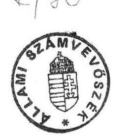
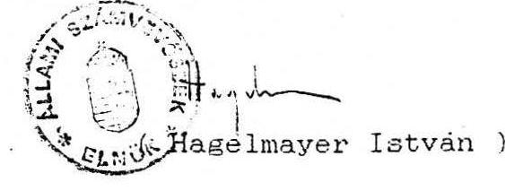

# ALLAMI SZAMVEVOSZEK 

## J E L E N T E S

az önhibáján kívül hátrányos helyzetben lévő önkormányzatok elutasitott támogatási igényeinek helyszíni felülvizsgálatáról

1991. november hó

---

Allami Számvevőszék
V-147-3/1991.
Témaszám: 96

# J e l e n t é s 

az önhibáján kivül hátrányos helyzetben lévõ önkormányzatok elutasitott támogatási igényeinek helyszini felülvizsgálatáról

Az önkormányzati Törvény 87. paragrafus (1) bekezdése intézkedik arról, hogy az "önállóság és a müködőképesség védelme érdekében kiegészitő állami támogatás illeti meg az önhibáján kivül hátrányos helyzetben lévõ települési önkormányzatot."

Erre a célra a Magyar Köztársaság 1991. évi állami költségvetéséről és az államháztartás vitelének 1991. évi szabályozásáról szóló 1990. évi CIV. tv. 1. paragrafus (5) bekezdése az önhibáján kivül hátrányos helyzetben lévõ önkormányzatoknak 5 milliárd Ft-ot biztosított. Döntött arról is, hogy ez az összeg két részletben kerüljön az önkormányzatokhoz (1991. március 31-ig az elõirányzat 75 \%-a, a fennmaradó $25 \%$ az év során).

A Parlament az 1991. évi XIX. törvény elfogadásával a jelzett gondok enyhítésére a rendelkezésre álló keretösszegből 2.883 millió Ft-ot biztosított az önkormányzatoknak. A fennmaradó 2.117 millió Ft-ot 1991. októberben osztotta fel az 1991. évi LIV. törvény elfogadásával. Ez utóbbi törvény -

---

még mint tervezet - mellékletként két "Tájékoztatót" tartalmazott, ezek közül:

- az egyik azokat az önkormányzatokat sorolta fel, melyek pályázata forráshiány miatt részben vagy teljes összegben elutasításra került (234 pályázat),
- a másik - többek között - bemutatta azokat az önkormányzatokat melyek felujítási pályázatát részben utasították el (86 pályázat).

Az Országgyülés önkormányzati, Közigazgatási, Belbiztonsági és Rendőrségi Bizottságának felkérésére helyszini ellenőrzés keretében megvizsgáltuk a részben vagy teljesen elutasított pályázatokat, összesen 320 db-ot.

Az ellenőrzés célja annak megállapítása volt, hogy:

- a Pénzügyminisztérium által kért adatszolgáltatás alapján megítélhető-e az önhibáján kivül hátrányos helyzetben lévő önkormányzat tényleges pénzügyi helyzete,
- az önkormányzatok által közölt adatok, illetve a TAKISZ-ok közremüködése alapján megfelelő információt ka-pott-e a Pénzügyminisztérium ahhoz, hogy a kérelmeket egységes, objektiv szempontok alapján felülvizsgálhassa, parlamenti döntésre előkészithesse,
- mennyiben tekinthető megalapozottnak az önkormányzati pályázatok elutasítása.

---

# A vizsgálat megállapításai 

1/ Az elutasított pályázatok számvevõszéki minõsitése

Helyszini ellenôrzés keretében valamennyi rész-, vagy teljes összeggel elutasitott pályázatot megvizsgáltuk ( 320 db pályázatot).

Megállapításainkról, az eltérő adatokról az érintett önkormányzatoknál, illetve a megyei TAKISZ-oknál jegyzökönyvet vettünk fel.

A forráshiány miatt elutasított pályázatok közül ( 234 db ): a/ 178 db-nál egyetértettünk a Pénzügyminisztérium birálatával, végkövetkeztetésével, annak ellenére, hogy jónéhány esetben a helyszini ellenôrzés alkalmával a tárca által közölt adatoktól eltérő számszaki adatokat találtunk. Ezeknek az önkormányzatoknak a Pénzügyminisztérium által javasolt támogatási igénye 436.502 eFt, amit az 1991. évi. LIV. törvény már jóváhagyott.
(2. sz. melléklet)
b/ A pályázatok közül 24 db esetében nem értettünk egyet a Pénzügyminisztériummal, mivel a tárca nem fogadta el azokat a kritériumokat, melyek alapján általában véleményezte a benyujtott támogatási igényeket. Amennyiben a pályázat elbirálása konzekvens lett volna, ezeket is el kellett volna fogadni.

---

Az 1991. évi LIV. törvény ebben a körben, már 15.630 eFt támogatást elismert, amit javasolunk további 32.942 eFt-tal növelni.
(3. sz. melléklet)
c/ A benyujtott pályázatok közül 32 db-nál nem fogadtuk el a Pénzügyminisztérium birálati szempontjait, mivel helyszini ellenörzéseink során megállapítottuk, hogy az önkormányzatok forráshiányosak ugyan, de a tényleges "hátrányos helyzetet" nem a Pénzügyminisztérium által elfogadhatónak minösített szempontok okozták.

Ezen önkormányzatok támogatására az 1991. évi LIV. törvény már 150.298 eFt-ot elismert, amit további 188.815 eFt-tal javaslunk növelni. (4. sz. melléklet)

A felujítási támogatásra benyujtott 86 db pályázat közül: d/ 4 esetben nem értettünk egyet a Pénzügyminisztériummal. A számvevõszék által javasolt támogatási összeg 6.421 eFt. A Pénzügyminisztérium az önkormányzatok támogatására 9.887 eFt-ot elismert, amit az 1991. évi LIV. törvény már jóváhagyott. (5. sz. melléklet)

A számvevõszék által számitott többlet támogatási igényt, összesen 228.178 eFt-ot javasoljuk, hogy - az önhibáján kívül hátrányos helyzetű településeknek - a Magyar Köztársaság 1992. évi költségvetési tervezetében szereplő 3 milliárd Ft elöirányzat terhére elfogadni.

---

2/ A törvénye1őkészítéssel a pályázatok feltételrendszerével kapcsolatos észrevételek

Megjegyezzük, hogy a támogatási igények benyujtását az 1991. évi költségvetési törvény nem nevezi pályázatnak, de a rendszer pályázati jelleggel müködött. Ugyanis a Pénzügyminisztérium kérésére az önkormányzatok adatokat közöltek annak reményében, hogy a központi keretböl támogatást kaphatnak.
a/ Az önkormányzati Törvény 87. paragrafus (1) bekezdése alapján az önhibáján kivül hátrányos helyzetü önkormányzatot az állami költségvetésbõl támogatás illeti meg, ennek "feltételeiről és mértékéröl az Országgyülés az Allami Költségvetési Törvényben dönt".

A Magyar Köztársaság 1991. évi állami költségvetéséről szóló 1990. évi CIV törvény 1. paragrafus (5) bekezdése csak a támogatás mértékéröl döntött, feltételeiről nem. Az elmaradt törvényszintü szabályozás, mint alapvető probléma, igen nagy gondot okozott a rendelkezésre álló elöirányzat szétosztásában, az alábbiak miatt:

- nem került megfogalmazásra, mit kell érteni "önhibáján kivül hátrányos helyzet" alatt, hogyan kell meghatározni azt, milyen ismérvek alapján lehet eldönteni az önkormányzatok forráshiányát (milyen egzakt "képletet" lehet alkal-

---

mazni a jelenlegi információs, beszámolási rendszer keretében).

- Forráshiány esetén milyen kiadási célokat, feladatokat lehet elismerni az önkormányzatok jogos igényei között. A Költségvetési Törvény "elemi ellátást végző intézmények folyamatos üzemeltetése" érdekében kivánja felhasználni ezt az előirányzatot. Tekintettel arra, hogy a jelenlegi pénzügyi szabályozás szerint az önkormányzatoknak egységes pénzalapjuk van, az önkormányzatok forrásainak igen kis hányadára vonatkozik felhasználási kötöttség, ezért a müködési-, fejlesztési-, felujítási tevékenységek fedezetének elkülönítése értelmét veszti.

Az önkormányzatok müködése ugyanakkor fogalmilag lényegesen több, mint intézményeinek müködtetése, ugyanis a zavartalan gazdálkodásuk magában foglalja az intézmények finanszirozását, fejlesztések, felujitások folyamatos teljesítését is. Mindemellett az önkormányzat önmaga is egy speciális intézmény, mint polgármesteri hivatal.

Több éve huzódó, befejezés előtt álló beruházás leállítása meggátolhatja az önkormányzat kötelezö alapfeladatainak ellátását (pl. oktatási, egészségü-gyi-szociális intézmények).

A beruházási szerződések felbontásából eredő anyagi kár a müködési kiadásokra negatívan hat, de jogi következményeitől sem lehet eltekinteni.

Korábban felvett hitelek visszafizetésének elmaradása a jelenlegi kamatkondíciók miatt sulyos terheket ró az önkormányzatokra, amelyet gyakran csak a müködés rovására tudnak teljesíteni (ez a kérdés különösen élesen vetődik fel a kisebb önkormányzatoknál).

---

A volt társközségek gondjait sajátos helyzetük alapján kell megítélni, hiszen pénzügyi lehetőségek nélkül az önállóság megőrzése illuzió.
b/ Ellenőrzéseink során megállapítottuk, hogy a törvényi szabályozás hiányán tul a másik nagy problémát az okozta, hogy a pályázati feltételek nem voltak nyilvánosan meghirdetve.

Jellemzően, a benyujtott pályázatok elbírálását követően került sor az energiaigények elhagyására, a felujítási támogatással 4 millió Ft összeguu felső határának megjelölésére.

A pályázat megkezdése előtt még a Pénzügyminisztérium szintjén sem tisztázták egyértelmüen a feltételeket, ezért menet közben változtattak azokon.

Igy az önkormányzatok nem tudták milyen indokok alapján pályázhatnak, milyen feltételek kellenek ahhoz, hogy a támogatást elnyerhessék. A pályázat egész folyamatából hiányzott a nyiltság.
c/ A költségvetési törvényben meghatározott keret ( 5 milliárd forint) felosztását - jogi szabályozás helyett a Pénzügyminisztérium döntötte el, háromféle szempont alapján:

- a támogatásra elsősorban az az önkormányzat volt jogosult. amelynek forráshiánya kimutatható. Forráshiány esetén, mint jogos többletigényt elismerték - és birálati szempontként kezelték - a természeti csapásokat (fogalmát, dokumentációs igényét nem határozták meg), a határátkelők közegészségügyi

---

A volt társközségek gondjait sajátos helyzetük alapján kell megítélni, hiszen pénzügyi lehetőségek nélkül az önállóság megőrzése illuzió.
b/ Ellenőrzéseink során megállapítottuk, hogy a törvényi szabályozás hiányán tul a másik nagy problémát az okozta, hogy a pályázati feltételek nem voltak nyilvánosan meghirdetve.

Jellemzően, a benyujtott pályázatok elbirálását követően került sor az energiaigények elhagyására, a felujítási támogatással 4 millió Ft összeguu felső határának megjelölésére.

A pályázat megkezdése elött még a Pénzügyminisztérium szintjén sem tisztázták egyértelmüen a feltételeket, ezért menet közben változtattak azokon.

Igy az önkormányzatok nem tudták milyen indokok alapján pályázhatnak, milyen feltételek kellenek ahhoz, hogy a támogatást elnyerhessék. A pályázat egész folyamatából hiányzott a nyiltság.
c/ A költségvetési törvényben meghatározott keret ( 5 milliárd forint) felosztását - jogi szabályozás helyett a Pénzügyminisztérium döntötte el, háromféle szempont alapján:

- a támogatásra elsősorban az az önkormányzat volt jogosult. amelynek forráshiánya kimutatható. Forráshiány esetén, mint jogos többletigényt elismerték - és birálati szempontként kezelték - a természeti csapásokat (fogalmát, dokumentációs igényét nem határozták meg), a határátkelők közegészségügyi

---

problémáját, a térségi feladatok átvétele miatti zavartalan müködés feltételeit és a felujitásokat, 1990. évi szinten. Később - a pályázati idõszak közepén - ezek a feladatok kibővültek, a vihar és belvizkárokkal, valamint a határátkelőhelyek jugoszláv eseményekkel kapcsolatos kiadásaival.

A forráshiányt okozó többlet feladatok ilyen szük körü, kategórikus megfogalmazásával nem lehet egyetérteni, még akkor sem, ha a felhasználható keret kötött volt.

Helyszini vizsgálataink során megállapítottuk, hogy az "önhibáján kivül hátrányos helyzetet" ennél szélesebb körü problémák okozták (áthuzódó kötelezettségvállalás, folyamatban lévő alapellátást nyujtó beruházások pénzügyi igénye, ujonnan alakuló önkormányzatok "életkezdési" problémái, kistelepülések közösen ellátott feladatainak egymás közötti megtérítése, a megyei tanácsi támogatás elmaradása, külterületi lakónépesség után járó normatív támogatás megszünése, stb.).

- A forráshiányos önkormányzatokon tul a volt társközségek felujítási igényeit is elismerték. A felujitások benyujtásánál igen laza feltételeket szabtak, azok dokumentálását nem igényelték, ugyanakkor a kitöltési ürlapokon lényegesen több információt kértek az indokoltnál (pl. milyen feladatra kell az elöirányzat, mi a felujitás tárgya, kivitelezés kezdete, befejezése). Ezeket a birálat során egyébként nem mérlegelték, az igényeket néhány kivételtől eltekintve

---

maximum 4 millió Ft-ig elismerték (a felső határt felosztható keretösszeg behatárolta).

- Ugyancsak a pénzügyi keretek miatt utólag kikerültek a pályázatból az energiatöbblettel kapcsolatos kiadási igények.

Az önkormányzatok beküldték ugyan ezirányu kérelmüket, végül nem került elismerésre ez az összeg, mert már az elsõ két tétel elfogadása miatt (forráshiány, felujitási támogatás) ezek az igények "nem fértek bele" a felosztható pénzügyi keretbe.

Véleményünk szerint az ilyen tipusu igények elismerése jogos lett volna, nemcsak azért, mert az energiahordozók áremelkedése nagyobb volt a központilag elismert dologi növekménynél ( $10 \%$ ), hanem azért, mert az ilyen tipusu pályázatok elbirálásánál biztositható legjobban az objektivitás (konkrétan meg lehet mondani a felhasznált mennyiséget). Ezért célszerűbb lett volna a sorrendet megforditani, először az energiatöbbleteket, - esetleg önkormányzat típusonként differenciáltan - majd a felujitási igényeket elismerni és csak a megmaradt összeget figyelembe venni a forráshiányok kezelésére (ez utóbbi tartalmazza ugyanis a legtöbb szubjektiv elemet).
d/ Az önkormányzatok a TAKISZ-okon keresztül kapták meg a I-V. sz. Kimutatást (Kitöltési utmutatóval együtt), aminek kitöltésével és benyujtásával pályázni lehetett.

---

Tapasztalataink szerint az önkormányzatoknak csaknem fele pályázott. A két fordulóban összesen 1.465 önkormányzat - volt amelyik kétszer is - benyujtotta igényét. (Ez egyébként nem volt kizáró ok.) A jelenlegi pénzügyi szabályozó rendszer miatt ugyanis az önkormányzatok "többlet pénzhez jutás" lehetöségét látták ebben a pályázatban. (Ha címzett- vagy céltámogatást nem kaptak, vagy nem volt elég saját forrásuk a céltámogatásokhoz, megpróbálták az önhibáján kivül hátrányos helyzetben lévő településeknek juttatott támogatást elnyerni.)

A pályázat alapjául szolgáló Kimutatások alapvető problémái a következök voltak:

- nem lehetett belőle választ kapni arra az alapkérdésre, hogy mennyi az önkormányzat tényleges forráshiánya. Igy maga az önkormányzat sem tudta eldönteni, hogy pályázata kedvező elbirálást kaphat-e;
- a táblarendszer igen bonyolult volt fôként a kistelepüléseknek okozott gondot a kitöltése (szinte alig volt kötelezö egyezőségi pontja);
- olyan adatokat is kértek az önkormányzatoktól, amivel ugy a TAKISZ-ok, mint a Pénzügyminisztérium rendelkeztek, mivel ezek részét képezik a pénzügyi információs rendszernek (pl. I. félévi Beszámoló módosított elöirányzata, automatizmusok, központilag lebontott támogatások).

A Kitöltési Utmutató néhány ponton félrevezető volt. ez azonban a gyakorlati végrehajtás során sarkalatos kérdésnek minősült.

---

Amennyiben követték volna az Utmutató elõirásait az önkormányzatok közülök egyik sem lett volna forráshiányos, vagyis nem igényelhetett volna támogatást. (Kitöltési utmutató 2. oldal utolsó bekezdése).

Erre az anomáliára a pályázat beinditását követõen a TAKISZ-ok hívták fel az önkormányzatok figyelmét, jelezve, hogy melyik sorban (I. Kimutatás 6. sor) lehet fedezetlen, de indokolt kiadást kimutatni. (Tapasztalataink szerint az önkormányzatok ezt követöen nemosak ilyen tipusu kötelezettségeket mutattak ki.)

# 3/ A pályázatok elbirálásának értékelése 

A pályázatok értékelését, azaz Parlamenti döntésre való elökészitését a Pénzügyminisztérium végezte. Azokat egyedileg, egyenként birálta el ugy, hogy törvènvi szabályozás hiányában nem rendelkezett egzakt birálati szempontokkal, ami egységessé, objektívvá tette volna a birálatot. Esetenként az önmaga által felállitott feltételekhez sem volt mindig konzekvens.
a/ A pályázatok értékelése a TAKISZ-ok közremüködésével történt. Ugy a TAKISZ-oknak, mint az önkormányzatoknak igen rövid idõ állt rendelkezésre a megalapozott pályázatok benyujtására, illetve azok felülvizsgálatára.

Az I.-V. számu Kimutatás elkészitésére az önkormányzatoknak átlag 6-7 napra, a TAKISZ-oknak a felülvizsgálatra átlag 5-6 nap állt rendelkezésre. Ez

---

utóbbi idôn belül értekezletet szerveztek, több megyében munkaidôn tul is ügyeletet tartottak.

A TAKISZ-ok általában egyedileg foglalkoztak a benyujtott pályázatokkal, azokat saját véleményükkel (táblázatok, adatkiséro lap) egészitették ki, és küldték meg a Pénzügyminisztériumnak. Munkájukhoz csak szóbeli eligazitást kaptak, - egy értekezlet keretében. Igy fordulhatott elõ, hogy a forráshiány nagyságának meghatározására alkalmazott képlet, illetve a birálati szempontok a megyék egy részében eltért egymástól, ami természetesen eltérő eredményt is adott.

A TAKISZ-ok többsége ugy számolta a forráshiányt, hogy az összes forrást egybevetette a müködési kiadásokkal, és a hitel, kötvény visszafizetési kötelezettséggekkel.

Ot TAKISZ számitási módszere megegyezett a Pénzügyminisztérium által alkalmazott képlettel.

Egy TAKISZ nem alkalmazott egységes sémát, településenként egyedileg bírált (Komárom-Esztergom megye).

Egy TAKISZ a forrásoldal meghatározásához a pénzügyminisztériumi módszert alkalmazta, mig a kiadási oldalnál ettól eltért (Pest megye).

A TAKISZ által megállapított forráshiány és a javasolt támogatási igényt az esetek többségében azonban nem vette figyelembe a Pénzügyminisztérium. Ennek az volt az alapvetõ oka, hogy a Pénzügyminisztérium már nem azzal a képlettel számolt, amit a TAKISZ-oknak értekezlet keretében elmondott .

A müködési kiadásokhoz hozzáadta a fejlesztési kiadásokat, és ezt vetette egybe a forrásokkal.

---

A pályázati rendszerben meglévô folyamatos bizonytalanság ami elsősorban a feltételek módosításában, a birálati módszerek változásában tükröződött - különös hangsulyt kap akkor, ha figyelembe vesszük, hogy a Pénzügyminisztérium véleményének kialakításához csaknem kizárólag az önkormányzatok által benyujtott adatokra és a TAKISZ-ok által felülvizsgált, illetve közölt adatokra támaszkodhatott. Mindezek következményeként a Pénzügyminisztérium pályázati birálata jónéhány esetben ellentmondásos volt:

- A tárca által meghirdetett birálati szempontokat (jelentésünk 7. oldala) nem minden önkormányzatnál alkalmazta következetesen.

P1.: Szob önkormányzatnál 500 eFt árvizkárra. Szigetujfalunál szintén 500 eFt árvizkárra. Dombrád településnél 1.500 eFt viharkárra. Tiszakanyáron 800 eFt viharkárra nem biztosított támogatást.

- Ugyanazon kiadási feladatokat az egyik önkormányzatnál elfogadták, a másiknál nem.

A müködési hiteleket Nagymarosnál, Szobnál nem fogadta el, Kemencénél viszont elismerte.

Temetökialakitást Berekbözörménynél elismerte a tárca, mig a ravatalozó befejezésének fedezetigényét Olcsva községnél nem.

A támfal javitási igényét Aszódnál elfogadta, Ragály községnél az esôzés miatt beomlott óvodai szennyvizderitő helyreállitási költségét már nem ismerte el, holott emiatt az óvoda müködésképtelenné vált.

- Az elutasított pályázatok egynegyedénél arra hivatkozott a Pénzügyminisztérium, hogy a forráshiányt a fejlesztési

---

kiadások volumene okozta. Azon tul, hogy ezzel a kategórikus megjegyzéssel nem lehet egyérteni, ennek megitéléséhez lényegesen több információra lett volna szüksége a tárcának. A birálathoz mindössze a TAKISZ-ok által közölt egy adat(fejlesztési kiadások, elsõ félév végi módositott elõirányzata) állt rendelkezésre (errõl ugyanis az önkormányzatnak információt nem szolgáltatottak).

Indokolt lett volna elemezni, hogy mikor indultak ezek a beruházások (pl. több évvel ezelõtti tanácsi döntéssel), mikor fejezôdnek be, milyen tipusu beruházásról van szó (kötelezõ alapellátást nyujtó vagy egyéb beruházás). Különösen gondot okoz a fejlesztések ilyen tipusu megközelitése akkor, ha kistelepülésrõl - esetleg szétvált társközségrõl van szó, ahol éveken keresztül egy-két beruházásra van lehetöség (ez általában alapfeladatokat érint), ami jelentös lakossági anyagi hozzájárulással, illetve társadalmi munkával épül.

A pályázatok elbirálásának dokumentálása is kifogásolható:

- általában nem követhetõ nyomon, hogy a Pénzügyminisztérium hogyan vezette le a számitott hiányt, illetve a támogatási igényt. Ezért olyan adatokkal is találkoztunk, amit sem az önkormányzatok pénzügyi dokumentumai, sem a TAKISZ javitások nem bizonyitanak.

Pl.: Szécsény önkormányzat 1991. évi korrigált müködési elöirányzatát 7 millió forinttal, Dömsöd

---

1991. évi fejlesztési kiadási elöirányzatát 4,2 milliárd forinttal megemelte a Pénzügyminisztérium.

- Az elutasítás szöveges indokolása igen szűkszavu, vagy hiányzik. Mindössze egy "megjegyzés" rovat tartalmaz néhány mondatot.

Esetenként elöfordult, hogy a Pénzügyminisztérium forráshiányt állapított meg, emiatt támogatás megadását javasolta, amit kellöen megindokolt. Helyszini vizsgálat során kiderült, hogy az önkormányzat forrástöbblettel rendelkezik, igy nem jogos a támogatási javaslat, amit az 1991. évi LIV. törvény már elfogadott. (Pl. Geszteréd 2.500 eFt, Szécsény 33.100 eFt, Petneháza 2.333 eFt).
A támogatás elvonására javaslatot nem teszünk.
4/ Ajánlás a kiegészitő támogatás további müködtetésére

Az 1991-ben bevezetett pénzügyi szabályozó rendszer - amelyik alapvetően forrásorientált -, az állami hozzájárulás nagy részét normatív módon osztja el.

A szabályozásnak ez a módja ma még nem tudja nélkülözni azokat a kiegészitő forrásokat (cél- címzett támogatás stb.), melyeknek az a célja, hogy a normatív módon nem kezelhető feladatokat finanszirozza.

A kiegészitő elemek a rendszer alapelvével szemben az 1990. elötti kiadásorientált, alkumechanizmusra lehetöséget adó tervezési módszerek alkalmazását jelentik. Nem ösztönöznek hatékonyabb gazdlálkodásá ra, - alacsony kihasználtságu, magas fajlagos ráforditással müködö - intézmények felülvizsgálatá ra, korszerüsitésére.

Az önhibáján kivül hátrányos helyzetben lévő települések támogatását - mint kiegészitő támogatási formát - várhatóan

---

még néhány évig müködtetni szükséges. Ez azonban csak akkor szolgálhatja az önkormányzati törvényben megfogalmazott eredeti célokat, ha mint tényleges pályázat müködik, elöre megfogalmazott - lehetőleg több évre törvény szinten rögzített - konkrét feltételek mellett. ( Pl.: kötelezõ alapfeladatokhoz kapcsolodó ellátottsági mutató, elmaradt térségek önkormányzatát segito̊ fajlagos támogatás).

Célszerü arra törekedni, hogy a feltételek ugy kerüljenek kialakításra, hogy azok teljesülése esetén a támogatás alanyi jogon járjon az önkormányzatoknak. Ezzel ugyanis nö az önkormányzatok tervezési biztonsága, ugyanakkor a pályázati feltételek megléte esetén automatikusan igényelhetō.

A normatív rendszer továbbfejlesztésével, stabilitásának megteremtésével természetesen az önhibáján kivül hátrányos helyzetü önkormányzatok támogatását is indokolt a normativ elosztási rendszer részeként müködtetni.

Budapest, 1991. november 29.

---

Az ellenőrzést vezette Hegedűsné dr. Müllern Veronika osztályvezető főtanácsos

Berényi Magdolna azámvevõ, Molnár Istvánné azámvevõ, dr. Molnár Klára azámvevő közremüködésével.

Helyszini vizsgálatot végezték:
Baranya megye:
dr. Koronics Károlyné azámvevõ
Bács-Kiskun megye:
Domján Jenő azámvevő
Békés megye:
Baji Ferencné azámvevő
Borsod-Abauj-Zemplén megye:
Győrffi Dezső tanácsos
Csongrád megye:
dr. Otott Lajos tanácsos
Csiszárné dr.Kosik Mária azámvevő
Fejér megye:
Horváth József azámvevő
Győr-Moson-Sopron megye:
Berényi Magdolna azámvevő
Hajdu-Bihar megye:
Kóródi József azámvevő

---

Heves megye:
Nagy Sándorné azámvevõ
Jász-Nagykun-Szolnok megye:
Buczkó András számvevõ
Komárom-Esztergom megye:
Kalmár István számvevõ
Fátrainé Zsebedics Katalin azámvevõ
Nógrád megye:
Németh Péterné azámvevõ
Somogy megye:
Maczekó Károly tanácsos
dr. Szigeti István azámvevõ
Szita László azámvevõ
Szabolcs-Szatmár-Bereg megye:
Bacskai János azámvevõ
Bocsi Sándor azámvevõ
Dankó Géza tanácsos
Fekete Tibor tanácsos
Kenéz Sándor tanácsos
Tolna megye:
Csekei Gyula tanácsos
Vas megye:
Horváth János azámvevõ
Vécsey László tanácsos
Veszprém megye:
Vasváriné dr. Rózsa Magdolna azámvevõ
Zala megye:
Angyalosi Dániel azámvevõ

---

Fôváros és Pest megye:
dr. Katona Béláné számvevõ
dr. Kurucz István számvevõ
dr. Molnár Klára számvevõ
Simon Akosné tanácsos
dr. Spilák Antal számvevõ

---

A Pészügyminisztérium pályázati bírálatát, támogatási javaslatát a Számvevőszék elfogadta.

1. az. melléklet a V-147-3/1991.sz. jelentéshez

eft-ban

|  Önkormányzat megnevezése | Módosított működési kiadás I./7. | Fejlesztési kiadás adat-kísérő lap 4. pont | 1991. évi összes kötelezettség | 1991. évi összes bevétel | Számított | Javasolt támogatás  |
| --- | --- | --- | --- | --- | --- | --- |
|   |  |  |  |  | blány | többlet  |
|  1. | 2. | 3. | 4. | 5. | 6. | 7.  |
|  Zaranya |  |  |  |  |  |   |
|  1. Elly z/. | 82.592 | 16.300 | 98.892 | 98.892 | - | -  |
|  2. Pécs zz/ | 4.695.540 | 1.109.946 | 5.115.486 | 4.993.917 | 121.569 |   |
|  zzz/ | 4.662.040 | 1.109.946 | 5.171.986 | 5.284.815 | - | 112.529  |
|  3. Szabadszentkirály |  |  |  |  |  |   |
|   | 27.449 | - | 27.449 | 21.894 | 5.555 | -  |
|   | 15.526 | - | 15.526 | 20.191 | - | 4.665  |
|  Bács-Kiskun |  |  |  |  |  |   |
|  1. Bácszzólós | 11.301 | 287 | 11.558 | 13.267 | - | 1.678  |
|   | 11.178 | 287 | 11.465 | 13.267 |  | 1.802  |
|  2. Dunaszentbesedek |  |  |  |  |  |   |
|   | 24.848 | 6.500 | 31.348 | 32.181 | - | 833  |
|  3. Felsőlalcs | PM számok hiányoznak |  |  |  |  |   |
|   | 13.129 | 13.082 | 26.202 | 26.212 | - | 19  |

z/ Amennyiben az önkormányzat neve után egy sor adat szerepel, a PM adatai a számvevőszék véleményével megegyezik. Amennyiben az önkormányzat neve után két sor adat szerepel, a PM adatai eltértek a számvevőszék által felülvizsgált adatoktól.

zz/ PM adatok zzz/ számvevőszéki adatok

---

|  4. Fölbybäta | 20.204 | 1.117 | 21.321 | 23.568 | - | 2.047 | 0  |
| --- | --- | --- | --- | --- | --- | --- | --- |
|   | 23.672 | 1.117 | 24.789 | 24.355 | 434 | - |   |
|  5. Lalossa | 871.707 | 59.655 | 931.265 | 970.055 | - | 38.690 | 0  |
|   | 838.905 | 59.069 | 897.974 | 965.771 | - | 67.797 |   |
|  Békés a. |  |  |  |  |  |  |   |
|  1. Erzegiflora | 29.657 | 6.653 | 38.310 | 39.020 |  | 2.710 | 0  |
|   | 27.246 | 6.653 | 33.999 | 39.020 |  | 5.021 |   |
|  Borsod-Abouj-Zemplén a. |  |  |  |  |  |  |   |
|  1. Patna | 233.720 | 7.580 | 241.200 | 247.813 |  | 6.513 | 0  |
|   | 233.720 | 7.580 | 241.200 | 247.813 |  | 6.513 |   |
|  2. Sély | 36.101 | 5.250 | 41.451 | 41.375 | 76 | - | 0  |
|   | 35.385 | 5.250 | 40.735 | 40.298 | 438 | - |   |
|  Csongrid a. |  |  |  |  |  |  |   |
|  1. Arpiddaloa | 13.102 | 200 | 13.332 | 13.102 | 200 | - | 0  |
|   | 13.102 | 200 | 13.332 | 13.102 | 200 | - |   |
|  2. Hódmezővásárhely |  |  |  |  |  |  |   |
|   | 1.393.808 | 395.575 | 1.759.353 | 1.788.343 | 81.040 | - | 0  |
|   | 1.482.303 | 395.575 | 1.877.875 | 1.898.136 | 69.742 | - |   |
|  3. Felgyő | 25.265 | 4.661 | 29.926 | 26.998 | 2.928 | - | 2.052  |
|  4. Ottóba | 21.687 | - | 21.687 | 21.687 | - | - | 0  |
|  5. Pustamérges | 25.514 | 977 | 27.491 | 27.347 | 144 | - | 0  |
|  6. Szeged | 5.136.182 | 1.025.678 | 6.181.860 | 6.181.860 | - | - | 0  |
|  7. Szentes | 770.057 | 74.375 | 844.432 | 836.789 | 7.643 | - | 0  |
|  8. Tiszasziget | 25.989 | 700 | 26.689 | 28.251 | - | 1.562 | 0  |
|   | 25.989 | - | 25.989 | 28.251 | - | 2.262 |   |

---

Bajdu-Bihar .

1. Serebhizsörsiny
42.864
42.864
39.687
2.977
2. 2.977
2. Kezsörs
21.591
4.719
26.310
22.205
4.105
3.499

Beves .

1. Füzesabosy
167.279
33.581
200.860
194.860
6.000
6.000
2. Hatvas
598.969
97.203
696.172
696.172
3. Elalö
31.925
31.925
31.925
-
0

Györ-Moson-Sopron .

1. Espuvir
426.293
41.123
476.416
422.529
44.907
11.293
415.689
50.171
465.860
444.943
21.317

Jäsz-Magykun-Szolnok .

1. Nagykörö
37.155
10.993
48.151
53.013
4.862

Komiron-Kostergou .

1. Dunsalmis
23.021
6.765
29.786
29.786
-
0
20.503
33.516
29.786
1.270
2. Neazmely
23.892
5.986
29.788
29.788
-
0
22.342
16.025
30.354
29.788
566
3. Bakonybink
13.725
13.725
10.737
2.988
500
4. Dönös
22.899
22.899
20.881
2.018
1.018

---

|  5. Esztergza | 1.342.907 | 172.957 | 1.515.864 | 1.490.248 | 25.616 | - | 8.100  |
| --- | --- | --- | --- | --- | --- | --- | --- |
|  6. Eszirusa | 559.187 | 141.034 | 721.221 | 706.259 | 14.962 | - | 6.100  |
|  7. Süt | 80.685 | 64.114 | 144.799 | 149.201 | - | 4.402 | 0  |
|   | 80.510 | 64.114 | 144.624 | 149.201 | - | 4.577 |   |

### Hógród a.

|  1. Balassagyarmat | 1.024.069 | 95.029 | 1.119.098 | 1.119.098 | - | - | 0  |
| --- | --- | --- | --- | --- | --- | --- | --- |
|  2. Szigótarján | 1.166.747 | 400.935 | 1.567.682 | 1.558.147 | - | 20.465 | 0  |
|  3. Szécsény | 259.172 | 23.013 | 282.185 | 249.085 | 33.100 | - | 33.100  |
|   | 222.358 | 23.013 | 245.371 | 249.085 | - | 3.714 |   |

### Pest a.

|  1. Aszód | 209.642 | 29.295 | 235.937 | 203.895 | 35.042 | - | 20.454  |
| --- | --- | --- | --- | --- | --- | --- | --- |
|   | 209.642 | 29.295 | 238.937 | 203.895 | 35.042 | - |   |
|  2. Sénye | 17.295 | 3.526 | 20.821 | 20.821 | - | - | 0  |
|   | 17.352 | 3.416 | 20.768 | 20.768 | - | - |   |
|  3. Eszence | 29.688 | 5.985 | 35.673 | 30.293 | 5.289 | - | 3.249  |
|   | 29.557 | 5.985 | 35.542 | 30.293 | 5.249 | - |   |
|  4. Elzámolásháza | 185.117 | 100.161 | 285.278 | 285.278 | - | - | 0  |
|  5. Nyírsapat | 27.002 | 6.823 | 33.825 | 31.985 | 1.840 | - | 0  |
|   | 23.351 | 6.823 | 34.634 | 31.985 | 2.649 | - |   |
|  6. Vác | 1.608.866 | 197.435 | 1.806.301 | 1.802.801 | 3.500 | - | 0  |
|  7. Veresegyház | 132.242 | 148.060 | 200.302 | 206.658 | - | 6.256 |   |

### Sonogy a.

|  1. Audocs | 22.560 | 3.395 | 25.955 | 26.083 | - | 10.128 | 0  |
| --- | --- | --- | --- | --- | --- | --- | --- |
|   | 22.560 | 3.391 | 25.951 | 25.068 | 533 | - |   |
|  2. Balatonbasód | 9.364 | 374 | 9.738 | 13.532 | - | 37.794 | 0  |
|   | 9.577 | 374 | 9.951 | 13.532 | - | 3.521 |   |
|  3. Balatosszírszó | 70.542 | 35.220 | 105.762 | 102.541 | 3.221 | - | 3.221  |
|   | 70.542 | 35.251 | 105.793 | 102.542 | 3.252 | - |   |

---

|  4. Baros | 394.718 | 132.796 | 527.514 | 442.409 | 55.105 | - | 33.889  |
| --- | --- | --- | --- | --- | --- | --- | --- |
|   | 373.067 | 132.796 | 505.863 | 469.099 | 45.764 | - |   |
|  5. Bikourouguer | 13.420 | 4.806 | 19.226 | 17.635 | 591 | - | 0  |
|   | 14.720 | 4.806 | 19.526 | 17.635 | 1.591 | - |   |
|  6. Bodrog | 8.007 | 3.273 | 11.208 | 9.411 | 1.869 | - | 0  |
|   | 4.736 | 3.271 | 8.007 | 9.411 |  | 1.404 |   |
|  7. Bolbo | 14.706 | 1.436 | 16.142 | 11.656 | 4.486 | - | 693  |
|   | 9.708 | 1.436 | 11.144 | 12.689 | - | 1.545 |   |
|  8. Dariny-Istviadi | 8M adatok bíanyoznak |  |  |  |  |  | 3.624  |
|   | 14.732 | 2.061 | 16.793 | 14.581 | 2.212 | - |   |
|  9. Gamis | 31.086 | 3.142 | 34.223 | 27.923 | 6.305 | - | 5.441  |
|   | 30.222 | 3.142 | 33.364 | 27.923 | 5.441 | - |   |
|  10. Bedrebeiy | 11.503 | 1.840 | 13.343 | 12.203 | 1.140 | - | 0  |
|   | 11.109 | 1.840 | 12.949 | 12.203 | 746 | - |   |
|  11. Esdareut | 62.461 | 2.522 | 64.993 | 64.231 | 762 | - | 0  |
|   | 60.440 | 2.522 | 62.962 | 64.231 | - | 1.269 |   |
|  12. Kilaisessa | 11.004 | 1.420 | 12.424 | 12.567 | - | 143 | 0  |
|  13. Esposseresztur | 6.635 | 315 | 6.950 | 7.022 | - | 72 | 0  |
|   | 6.173 | 315 | 6.478 | 7.022 | - | 544 |   |
|  14. Esposvir | 2.060.621 | 516.036 | 1.576.657 | 2.578.502 | - | 1.845 | 0  |
|  15. Esrid | 7.356 | 5.151 | 12.607 | 15.094 | - | 2.497 | 0  |
|   | 34.669 | 2.153 | 36.822 | 35.624 | 1.198 | - |   |
|  16. Elabajca | 13.834 | 7.000 | 20.834 | 13.098 | 7.736 | - | 0  |
|   | 7.061 | 7.000 | 14.061 | 13.098 | 963 | - |   |
|  17. Libod | 54.223 | 3.396 | 56.114 | 59.152 | - | 1.038 | 0  |
|   | 49.321 | 3.886 | 53.207 | 59.192 | - | 5.985 |   |
|  18. Mornye | 44.087 | 3.740 | 47.827 | 47.626 | 201 | - | 201  |
|   | 41.087 | 3.740 | 44.627 | 49.452 | - | 4.625 |   |
|  19. Nagyesepely | 12.394 | 376 | 12.760 | 12.539 | 221 | - | 0  |
|   | 11.084 | 376 | 11.359 | 12.539 | - | 1.150 |   |
|  20. Nemesdéd | 19.069 | 480 | 19.549 | 17.998 | 1.551 | - | 1.551  |
|   | 19.451 | 98 | 19.549 | 17.998 | 1.551 | - |   |
|  21. Rinyazjlak | 9.191 | 2.304 | 11.495 | 9.858 | 1.637 | - | 0  |
|   | 8.422 | 2.304 | 10.726 | 9.558 | 668 | - |   |

---

|  22. Sonegroos | 7.554 | 5.129 | 12.983 | 11.525 | 1.458 | - | 0  |
| --- | --- | --- | --- | --- | --- | --- | --- |
|  23. Sonegreiresse | 16.941 | 3.500 | 20.441 | 8.815 | 11.626 | - | 622  |
|   | 6.141 | 3.500 | 9.641 | 8.815 | 326 | - |   |
|  24. Sonegreinosi | 4.080 | - | 4.080 | 3.726 | 804 | - | 804  |
|   | 3.276 | 122 | 3.298 | 3.276 | 122 | - |   |
|  25. Szabis | 10.808 | 2.131 | 12.939 | 12.208 | 731 | - | 0  |
|   | 8.150 | 2.131 | 10.281 | 12.208 | - | 1.927 |   |
|  26. Szentkorbis | 4.758 | - | 4.758 | 4.300 | 458 | - | 458  |
|   | 4.204 | - | 4.204 | 4.300 | - | 96 |   |
|  27. Szölás | 19.495 | 3.025 | 22.530 | 20.256 | 2.264 | - | 1.268  |
|   | 19.495 | 2.911 | 22.406 | 20.256 | 2.150 | - |   |
|  28. Teleki | 8.452 | 130 | 3.612 | 7.405 | 1.207 | - | 0  |
|   | 4.575 | 130 | 4.705 | 7.405 | - | 2.700 |   |
|  29. Tötuffalu | 6.647 | 559 | 7.206 | 6.688 | 518 | - | 0  |
|   | 5.703 | 559 | 6.262 | 6.688 | - | 426 |   |
|  30. Zies | 8.559 | 260 | 9.219 | 8.699 | 520 | - | 520  |

Szabolcs-Szatzir-Bereg .

|  1. Alak | 71.860 | 7.326 | 79.156 | 75.681 | 3.505 | - | 2.000  |
| --- | --- | --- | --- | --- | --- | --- | --- |
|   | 75.461 | 7.326 | 82.787 | 80.787 | 2.000 | - |   |
|  2. Baitalóriathiza | 126.784 | 27.782 | 154.566 | 146.843 | 7.723 | - | 0  |
|   | 115.784 | 27.782 | 140.536 | 146.843 | - | 3.307 |   |
|  3. Balsa | 21.948 | 4.947 | 26.895 | 20.470 | 6.425 | - | 688  |
|   | 21.158 | 1.240 | 22.498 | 20.470 | 2.028 | - |   |
|  4. Besesvö | 12.251 | 357 | 13.108 | 12.454 | 654 | - | 0  |
|   | 11.749 | 357 | 12.696 | 12.454 | 152 | - |   |
|  5. Czaboz | 33.576 | - | 30.875 | 29.564 | 1.312 | - | 0  |
|   | 32.085 | - | 32.085 | 32.085 | - | - |   |
|  6. Csengersiza | 16.854 | - | 16.354 | 15.513 | 1.241 | - | 0  |
|   | 15.459 | - | 15.459 | 15.459 | - | - |   |
|  7. Csengersifalu | 29.682 | - | 29.682 | 28.453 | 1.629 | - | 0  |
|   | 18.453 | - | 18.453 | 18.453 | - | - |   |
|  8. Döge | 28.368 | 11.791 | 40.159 | 37.133 | 3.026 | - | 1.200  |
|   | 26.541 | 11.791 | 28.332 | 37.132 | 1.200 | - |   |

---

|  9. Fäblabä̈s | 33.385 | 4.016 | 37.384 | 35.413 | 1.971 | - | 489  |
| --- | --- | --- | --- | --- | --- | --- | --- |
|   | 31.935 | 4.016 | 35.951 | 35.413 | 538 | - |   |
|  10. Gassily | 16.428 | 2.700 | 19.123 | 15.315 | 3.813 | - | 1.293  |
|   | 14.787 | 2.698 | 17.485 | 16.192 | 1.293 | - |   |
|  11. Gaberjön | 12.993 | 3.300 | 16.293 | 15.497 | 796 | - | 0  |
|   | 15.593 | 3.300 | 18.693 | 15.559 | 3.334 | - |   |
|  12. Györtelek | 24.468 | 14.830 | 39.293 | 37.772 | 1.526 | - | 0  |
|   | 24.631 | 14.830 | 39.461 | 37.772 | 1.689 | - |   |
|  13. Estefalérose | 11.275 | 853 | 12.138 | 7.940 | 4.198 | - | 949  |
|   | 5.179 | 470 | 8.649 | 7.940 | 759 | - |   |
|  14. Jönkraitis | 47.645 | 1.919 | 49.564 | 43.443 | 6.121 | - | 0  |
|   | 50.764 | 2.213 | 52.917 | 52.917 | - | - |   |
|  15. Jöte | 13.251 | - | 13.251 | 11.388 | 1.563 | - | 500  |
|   | 12.007 | - | 12.007 | 11.507 | 500 | - |   |
|  16. Liatorjösosi | 35.073 | 5.064 | 40.137 | 38.030 | 2.107 | - | 0  |
|   | 36.494 | 5.074 | 41.568 | 38.030 | 3.538 | - |   |
|  17. Eik | 35.299 | 19.718 | 55.017 | 43.725 | 11.292 | - | 3.028  |
|   | 33.509 | 19.718 | 59.227 | 43.725 | 6.592 | - |   |
|  18. Esmose | 62.117 | 25.987 | 89.104 | 85.237 | 3.567 | - | 0  |
|   | 62.879 | 26.987 | 89.866 | 87.858 | 2.008 | - |   |
|  19. Elzlötz | 28.875 | 3.260 | 32.135 | 28.875 | 3.260 | - | 1.200  |
|   | 26.667 | 3.260 | 29.935 | 28.875 | 1.060 | - |   |
|  20. Elzazekeres | 13.724 | - | 13.724 | 12.839 | 395 | - | 0  |
|   | 13.139 | - | 13.139 | 12.839 | 390 | - |   |
|  21. Lönya | 23.630 | 770 | 24.400 | 21.515 | 2.885 | - | 0  |
|   | 20.567 | 770 | 21.337 | 21.647 | - | 310 |   |
|  22. Löeöpetri | 9.803 | 1.380 | 11.193 | 11.730 | - | 547 | 0  |
|  23. Magy | 14.581 | 4.865 | 13.446 | 18.361 | 1.085 | - | 0  |
|   | 12.709 | 4.865 | 17.574 | 17.890 | - | 316 |   |
|  24. Mähtelek | 24.850 | 2.230 | 27.080 | 24.850 | 2.230 | - | 0  |
|   | 23.236 | 2.230 | 25.466 | 25.466 | - | - |   |
|  25. Magyrarsizy | 36.279 | 1.064 | 37.343 | 34.109 | 3.234 | - | 2.170  |
|   | 36.278 | 1.064 | 37.342 | 34.109 | 3.233 | - |   |
|  26. Nyirgelse | 17.198 | 6.708 | 23.906 | 22.820 | 1.086 | - | 0  |
|   | 17.198 | 6.708 | 23.906 | 22.820 | 1.086 | - |   |

---

|  27. Nyirítrosy | 19.009 | 2.100 | 21.109 | 19.009 | 2.100 |  | 0  |
| --- | --- | --- | --- | --- | --- | --- | --- |
|   | 15.291 | 2.100 | 17.391 | 19.843 |  | 2.452 |   |
|  28. Nyirkita | 34.926 | 5.236 | 40.162 | 31.703 | 8.459 |  | 3.300  |
|   | 39.032 | 4.844 | 34.926 | 31.703 | 8.223 |  |   |
|  29. Nyirióvó | 17.281 | 2.200 | 19.481 | 18.821 | 660 |  | 0  |
|   | 16.620 | 2.200 | 18.820 | 18.820 |  |  |   |
|  30. Nyirnibilvái | 23.838 | 9.748 | 33.556 | 30.184 | 3.402 |  | 0  |
|   | 22.816 | 9.748 | 32.564 | 32.689 | 475 |  |   |
|  31. Nyirparasznya | 16.737 | 1.789 | 18.526 | 16.868 | 1.658 |  | 1.200  |
|  32. Nyirtót | 17.690 | 11.749 | 29.439 | 28.706 | 733 |  | 0  |
|  33. Cabóly (Nyirtoítok) | 11.352 | 1.422 | 12.774 | 10.811 | 1.563 |  | 0  |
|  34. Puszab | 21.906 | 1.698 | 23.004 | 21.437 | 1.567 |  | 0  |
|   | 20.829 | 988 | 21.617 | 21.437 | 230 |  |   |
|  35. Pátroba | 51.123 | 13.733 | 64.856 | 51.123 | 13.733 |  | 0  |
|   | 46.120 | 13.733 | 59.653 | 59.203 | 650 |  |   |
|  36. Pirinze | 22.142 | 13.600 | 35.742 | 31.810 | 3.932 |  | 0  |
|   | 22.142 | 13.078 | 35.220 | 40.641 |  | 4.821 |   |
|  37. Porszalna | 38.137 | 21.618 | 59.755 | 56.420 | 3.735 |  | 0  |
|   | 45.543 | 21.618 | 67.161 | 67.161 |  |  |   |
|  38. Bizocosbiza | 27.924 | 1.201 | 29.105 | 26.639 | 2.166 |  | 0  |
|   | 23.126 | 1.201 | 24.327 | 26.639 |  | 2.312 |   |
|  39. Bápolt | 4.546 | 2.944 | 7.490 | 6.943 | 517 |  | 0  |
|   | 4.974 | 2.944 | 7.915 | 6.826 | 1.192 |  |   |
|  40. Bétközberescs | 16.227 | 4.962 | 21.129 | 20.764 | 425 |  | 0  |
|   | 15.289 | 4.962 | 20.351 | 19.932 | 419 |  |   |
|  41. Szabolcsbika | 19.842 | 5.523 | 25.385 | 20.142 | 5.223 |  | 250  |
|   | 17.290 | 5.523 | 22.813 | 21.963 | 650 |  |   |
|  42. Szapolszcs | 8.410 | 420 | 8.830 | 8.092 | 738 |  | 0  |
|   | 7.942 | 150 | 8.692 | 8.092 |  |  |   |
|  43. Székely | 19.459 | 1.750 | 21.200 | 20.673 | 536 |  | 0  |
|   | 13.548 | 1.750 | 15.298 | 20.673 |  | 5.375 |   |
|  44. Teren | 15.368 | 3.350 | 19.248 | 16.080 | 3.168 |  | 0  |
|   | 12.700 | 3.350 | 16.080 | 16.080 |  |  |   |

---

|  45. Tiborozallia | 18.588 | 3.294 | 21.872 | 20.009 | 1.863 | - | 0  |
| --- | --- | --- | --- | --- | --- | --- | --- |
|   | 20.879 | 3.284 | 24.163 | 24.163 | - | - |   |
|  46. Tiszabecs | 30.417 | 3.225 | 33.742 | 26.293 | 7.444 | - | 2.268  |
|   | 28.242 | 3.225 | 31.667 | 29.299 | 2.368 | - |   |
|  47. Tiszabercei | 36.015 | 3.541 | 39.556 | 38.345 | 1.211 | - | 0  |
|   | 24.669 | 3.541 | 27.610 | 38.345 | - | 10.735 |   |
|  48. Tiszaeszlar | 41.803 | 10.900 | 52.703 | 51.803 | 900 | - | 0  |
|   | 33.648 | 10.900 | 44.548 | 53.523 | - | 8.980 |   |
|  49. Tiszawaziri | 335.237 | 212.385 | 517.625 | 497.043 | 20.582 | - | 16.394  |
|  50. Torsyospáca | 50.556 | 2.866 | 53.422 | 50.400 | 3.042 | - | 400  |
|   | 50.682 | 2.866 | 53.748 | 53.348 | 400 | - |   |
|  51. Turistrinsi | 15.549 | 1.100 | 16.649 | 14.418 | 2.231 | - | 500  |
|   | 14.118 | 1.100 | 15.218 | 14.418 | 500 | - |   |
|  52. Ujámbriá | 11.294 | 1.200 | 13.194 | 12.264 | 900 | - | 500  |
|   | 10.476 | 1.825 | 12.301 | 11.301 | 500 | - |   |
|  53. Ujámás | 20.160 | 557 | 20.717 | 17.762 | 2.955 | - | 0  |
|   | 17.205 | 557 | 17.702 | 17.762 | - | - |   |
|  54. Ura | 11.650 | 1.970 | 13.620 | 12.937 | 503 | - | 0  |
|   | 12.020 | 1.970 | 13.990 | 13.990 | - | - |   |
|  55. Válisi | 22.523 | 1.100 | 23.623 | 22.423 | 1.200 | - | 0  |
|   | 19.824 | 1.100 | 20.924 | 12.422 | - | 1.600 |   |
|  56. Vízzezya | 13.777 | - | 13.777 | 13.123 | 557 | - | 0  |
|   | 11.949 | - | 11.949 | 13.123 | - | 1.271 |   |

#### Vas a.

|  1. Cellábalik | 391.270 | 39.648 | 400.918 | 414.472 | 16.446 | - | 0  |
| --- | --- | --- | --- | --- | --- | --- | --- |
|  2. Szentgottárd | 235.468 | 86.083 | 321.551 | 276.971 | 44.589 | - | 6.465  |
|   | 231.406 | 86.083 | 317.489 | 276.971 | 43.518 | - |   |
|  3. Hegyhitszentjabab | 16.212 | 4.480 | 20.692 | 15.669 | 5.632 | - | 0  |
|   | 6.487 | 4.480 | 10.967 | 15.729 | - | 4.762 |   |

#### Veszprém a:

|  1. Veszprém | 1.623.788 | 526.762 | 2.150.550 | 2.114.918 | 35.632 | - | 0  |
| --- | --- | --- | --- | --- | --- | --- | --- |
|   | 1.456.130 | 527.657 | 1.983.187 | 2.116.216 | - | 133.019 |   |
|  2. Bakonyozzotlászló | 49.557 | 4.742 | 54.299 | 44.856 | 9.443 | - | 1.364  |
|   | 25.277 | 4.742 | 40.019 | 45.201 | - | 5.182 |   |

---

- 10 -

3. Balasonfüző | 92.770 | 66.831 | 159.601 | 134.201 | 25.400 | - | 0 | | :-- | :-- | :-- | :-- | :-- | :-- | :-- | :-- | :-- | | | 77.276 | 66.831 | 144.107 | 162.507 | - | 18.400 | | | 4. Csabredek | 54.535 | 18.719 | 73.254 | 72.246 | 1.008 | - | 0 | | | 53.527 | 18.719 | 72.246 | 72.246 | - | - | | | 5. Csót | 26.495 | 11.697 | 38.192 | 37.692 | 500 | - | 0 | | | 17.956 | 11.136 | 29.092 | 37.692 | - | 8.600 | | | 6. Canna | 9.441 | 304 | 9.745 | 9.441 | 304 | - | 0 | | | 7.401 | 304 | 7.785 | 9.441 | - | 1.656 | | | 7. Eölsővet | 15.344 | 80 | 15.424 | 14.631 | 793 | - | 0 | | | 12.342 | 80 | 12.422 | 15.427 | - | 3.002 | | | 8. Nyárád | 23.458 | 1.626 | 25.084 | 23.273 | 1.811 | - | 0 | | | 15.841 | 1.626 | 17.467 | 23.273 | - | 5.806 | | | 9. Szerecsery | 15.448 | 7.303 | 22.751 | 22.140 | 611 | - | 0 | | | 19.465 | 7.183 | 17.648 | 22.140 | - | 4.492 | | | 10. Zalabaiép | 27.225 | 100 | 27.325 | 23.522 | 3.303 | - | 0 | | | 19.981 | 100 | 20.081 | 23.526 | - | 3.445 | | | Zala n. | | | | | | | | | 1. Pöceki | 18.548 | 835 | 19.383 | 18.058 | 1.325 | - | 1.325 | | | 2. Kissérvó | 18.775 | 439 | 19.214 | 18.064 | 1.150 | - | 0 | | | 16.344 | 439 | 16.783 | 18.064 | - | 1.331 | | | 3. Lenti | 234.523 | 30.279 | 264.892 | 244.521 | 20.231 | - | 7.412 | | | 4. Pika | 32.751 | 16.882 | 49.633 | 49.655 | - | 0 | | | 31.694 | 16.882 | 48.486 | 49.655 | - | 1.159 | | | | Pöváros | | | | | | | | | I. kor. | 543.104 | 169.871 | 712.975 | 728.063 | - | 15.083 | 0 | | | 543.104 | 169.871 | 712.975 | 728.063 | - | 15.083 | | | II. kor. | 1.222.249 | 380.283 | 1.602.532 | 1.690.476 | - | 17.944 | 0 | | | 1.297.873 | 680.283 | 1.678.156 | 1.690.476 | - | 12.320 | | | III. kor. | 1.953.335 | 429.275 | 2.382.610 | 2.570.996 | - | 153.336 | 0 | | | 1.953.335 | 429.275 | 2.382.610 | 2.570.996 | - | 153.336 | | | IV. kor. | 1.693.899 | 147.581 | 1.541.480 | 1.890.540 | - | 49.060 | 0 | | | 1.693.899 | 147.581 | 1.541.480 | 1.890.540 | - | 49.060 | | | VIII. kor. | 1.190.030 | 231.225 | 1.421.255 | 1.404.558 | 16.697 | - | 0 | | | 1.197.828 | 231.225 | 1.419.053 | 1.404.558 | 14.495 | - | |

---

|  II. ker. | 1.007.410 | 150.700 | 1.153.110 | 1.236.274 |  | 78.164 | 0  |
| --- | --- | --- | --- | --- | --- | --- | --- |
|   | 1.007.410 | 150.701 | 1.153.110 | 1.236.274 |  | 78.164 |   |
|  I. ker. | 1.372.838 | 324.423 | 1.697.261 | 1.669.164 | 23.097 |  | 0  |
|   | 1.372.838 | 324.423 | 1.697.261 | 1.669.164 | 23.097 |  |   |
|  II. ker. | 2.240.629 | 517.425 | 2.758.054 | 3.201.475 |  | 443.421 | 0  |
|   | 2.240.629 | 517.425 | 2.758.054 | 3.201.475 |  | 443.421 |   |
|  III. ker. | 984.106 | 262.156 | 1.246.262 | 1.366.616 |  | 120.354 | 0  |
|   | 984.106 | 262.156 | 1.246.262 | 1.366.616 |  | 120.354 |   |
|  IIII. ker. | 1.752.204 | 543.953 | 2.296.157 | 2.200.215 | 95.942 |  | 0  |
|   | 1.752.204 | 543.953 | 2.296.157 | 2.200.215 | 95.942 |  |   |
|  XIV. ker. | 1.568.209 | 310.445 | 1.878.654 | 1.851.653 | 27.001 |  | 0  |
|   | 1.568.209 | 310.445 | 1.878.654 | 1.851.653 | 27.001 |  |   |
|  IV. ker. | 1.412.931 | 88.895 | 1.501.826 | 1.319.880 | 131.946 |  | 0  |
|   | 1.412.931 | 88.895 | 1.501.826 | 1.319.880 | 131.946 |  |   |
|  XVI. ker. | 946.546 | 102.802 | 1.049.348 | 1.062.128 |  | 12.780 | 0  |
|   | 946.546 | 102.802 | 1.049.348 | 1.062.128 |  | 12.780 |   |
|  XVII. ker. | 1.022.908 | 155.877 | 1.178.785 | 1.200.509 |  | 21.724 | 0  |
|   | 1.022.908 | 155.877 | 1.178.785 | 1.200.509 |  | 21.724 |   |
|  XVIII. ker. | 1.519.356 | 162.424 | 1.681.780 | 1.543.931 | 137.799 |  | 0  |
|   | 1.519.356 | 162.424 | 1.681.780 | 1.543.931 | 137.799 |  |   |
|  XIX. ker. | 1.096.728 | 151.977 | 1.248.705 | 1.312.600 |  | 63.595 | 0  |
|   | 1.096.728 | 151.977 | 1.248.705 | 1.312.600 |  | 63.595 |   |
|  XX. ker. | 1.332.477 | 165.929 | 1.498.406 | 1.391.468 | 106.938 |  | 0  |
|   | 1.332.477 | 165.929 | 1.498.406 | 1.391.468 | 106.938 |  |   |
|  XXI. ker. | 1.343.480 | 155.420 | 1.498.900 | 1.579.186 |  | 80.286 | 0  |
|   | 1.342.259 | 155.420 | 1.497.779 | 1.579.186 |  | 81.407 |   |
|  XXII. ker. | 929.619 | 95.749 | 1.025.368 | 958.607 | 66.761 |  | 0  |
|   | 929.619 | 95.749 | 1.025.368 | 958.607 | 66.761 |  |   |

# Begrei Cakorniorzatok

|  Bées-fizken a. | 2.599.000 | 584.000 | 3.133.000 | 3.126.000 | 57.000 |  | 0  |
| --- | --- | --- | --- | --- | --- | --- | --- |
|  Bétés a. | 1.570.000 | 924.000 | 2.794.000 | 2.949.000 |  | 155.000 | 0  |
|   | 1.530.000 | 1.060.000 | 2.890.000 | 2.949.000 |  | 59.000 |   |

---

|  332 s. | 4.112 .000 | 735.000 | 4.847 .000 | 4.596 .000 | 251.000 | - | 80.000 (1)  |
| --- | --- | --- | --- | --- | --- | --- | --- |
|   | 4.182 .000 | 494.000 | 4.676 .000 | 4.596 .000 | 90.000 | - |   |
|  Czengrad s. | 1.292 .000 | 490.000 | 1.782 .000 | 1.531 .000 | 201.000 | - | 60.000  |
|   | 1.292 .000 | 490.000 | 1.782 .000 | 1.652 .000 | 130.000 | - |   |
|  Györ-Moson-Sopron s. |  |  |  |  |  |  |   |
|   | 2.534 .000 | 392.000 | 3.226 .000 | 3.224 .000 | 2.000 | - | 0  |
|   | 2.833 .000 | 391.000 | 3.224 .000 | 3.224 .000 | - | - |   |
|  Fejér s. | 2.643 .000 | 768.000 | 3.411 .000 | 3.411 .000 | - | - | 0  |
|  Hajdu-étban s. | 2.572 .000 | 121.000 | 2.693 .000 | 2.723 .000 | - | 90.000 | 49.000  |
|   | 2.477 .000 | 323.000 | 2.890 .000 | 2.723 .000 | 77.000 | - |   |
|  Eszáros-Esztergen s. |  |  |  |  |  |  |   |
|   | 1.597 .000 | 234.000 | 1.531 .000 | 1.892 .000 | 19.000 | - | 0  |
|   | 1.582 .000 | 234.000 | 1.516 .000 | 1.892 .000 | 14.000 | - |   |
|  Pest s. | 3.878 .000 | 618.000 | 4.496 .000 | 4.496 .000 | - | - | 0  |
|  Szmegy s. | 3.289 .000 | 619.000 | 3.928 .000 | 3.828 .000 | 108.000 | - | 0  |
|  Tolna s. | 1.869 .000 | 198.000 | 2.058 .000 | 2.012 .000 | 46.000 | - | 20.000 (1)  |
|   | 1.844 .000 | 198.000 | 2.042 .000 | 2.012 .000 | 30.000 | - |   |
|  Vas s. | 2.522 .000 | 312.000 | 2.834 .000 | 2.820 .000 | 14.000 | - | 0  |
|   | 2.505 .000 | 312.000 | 2.820 .000 | 2.820 .000 | - | - |   |

(1) A Pénzügyminisztérium a negyei önkormányzatok adatait millió Ft-ban adta meg, tényleges támogatási összeg törvény szerint:

- BAT megye: 80.362 eFt
- Tolna megye: 30.123 eFt

---

|  Teszprén a. | 3.131 .000 | 991.000 | 4.172 .000 | 4.027 .000 | 145.000 | - | 0  |
| --- | --- | --- | --- | --- | --- | --- | --- |
|   | 3.169 .000 | 999.000 | 4.098 .000 | 4.098 .000 | - | - |   |
|  Zala a. | 1.938 .000 | 525.000 | 2.463 .000 | 2.463 .000 | - | - | 0  |
|   | 1.931 .000 | 525.000 | 2.466 .000 | 2.463 .000 | - | 7.000 |   |
|  |   |   |   |   |   |   |   |
|  Tövárosi Cakoraioszt |  |  |  |  |  |  |   |
|   | 44.671 .000 | 6.634 .000 | 51.305 .000 | 48.941 .000 | 2.384 .000 | - | 0  |
|  |   |   |   |   |   |   |   |
|   |  |  |  |  |  | Összesen: | 436.502  |

Összes támogatási igény : 436.502 eft, amelyet az 1991. évi LIV. törvény már jóváhagyott.

---

A Pénzügyminisztérium pályázati bírálatát a számvevőszék nem fogadta el a meghirdetett kritériumoktól eltérő véleményezés miatt

3. sz. melléklet a V-147-3/1991.sz. jelentéshez

eft-ban

|  Önkormányzat | Módosított | Fejlesztési | 1991. évi | 1991. évi | Számitott | Javasolt  |
| --- | --- | --- | --- | --- | --- | --- |
|  megnevezése | müködési | kiadás adat- | összes | összes | hiány | többlet  |
|   | kiadás | kísérő lap | kötele- | bevétel |  |   |
|   | 1./7. | 4. pont | zettség |  |  |   |

1. 2. 3. 4. 5. 6. 7. 8.

Coongrád n.

1. Csongrád z/ 610.994 33.368 644.362 611.670 32.692 33.568 644.362 611.670 32.692 32.692

A helyszíni vizsgálat során megállapítottuk, hogy az önkormányzat tényleges forráshiánya a közölt azatok ezeregtárá alatt zintegy 10 millió Ft-tal kevezésb. mint a FM szánitott hiánya. A kiegészítő támogatás felhaztásának első ütemében pár kapott támogatást az önkormányzat, azonban átbízódó hiteltörlesztési kötelezettsége van 3.912 eft önszegtén, mit javasolunk ellátom.

Pest n.

1. Dumny 25.702 5.026 33.728 32.748 980 980 33.838 5.026 33.564 32.748 1.116 980

Az önkormányzataai megállapított forráshiányból 980 eft a viharkárok helyreállítási költsége, ezzel megadását a helyszíni vizsgálat alapján indokoltnak tartjuk.

Az önkormányzatok neve után szereplő adatok közül:

x/ FM adatok

xx/ számvevőszéki adatok

---

1. Dinsöd 93.475 35.370 128.645 123.696 5.149 - 5.149 93.475 31.121 124.596 123.696 900 - 0

A FM az adatfeldolgozás során az önkormányzat fejlesztési kiadásait tévesen 4.229 eft-tal magasabb összeghen vette figyelembe. Így az ASZ helyszíni vizsgálata alapján az önkormányzat valós forrás hiánya 900 eft. A részére segittől 5.149 eft. tiszogás elvonását sem javasoljuk.

1. Galganálosa 47.174 3.395 50.569 45.569 5.000 - 0 47.174 3.395 50.569 45.569 5.000 - 5.000

Az önkormányzat 5.000 eft-os forráshiányát a celyezini vizsgálat is igazolta. A kért támogatási összeg a több napig tartó felbőszakadás következtében kért szenvedett településú vízelvezető rendszer kiadnak, burkolt árkok, étereszek, stb.1 helyreállításához szükséges. Mivel a vihar- kiross elliszerése a támogatott feltételek közé tartozik, javasoljuk a kért összeg utólagos jóvá- bagyását.

1. Kartal 78.216 21.174 99.390 98.890 500 - 0 78.216 21.174 97.390 95.890 1.500 - 1.500

A helyszíni ellenőrzés az önkormányzat adataiban forrás és kiadás oldalon egyaránt hibákat állapított meg. Ezek következményeként a település kimutatható forráshiánya 1.500 eft-ra módosult. Az önkormányzat helyreállítási szímlákkal alátámasztott viharaira 1.500 eft. eszek megadását javasoljuk.

1. Eizmaros 36.714 8.954 45.668 43.668 2.000 - 0 36.714 8.954 45.668 43.668 2.000 - 2.000

Az ellenőrzés valóznak találta az önkormányzat 2.000 eft-ban meghatározott forráshiányát. Az összeg az augusztusú dunai árvizzel kapcsolatos többletkiadás, melynek fedezetére javasoljuk a kért támogatási összeg megadását.

---

7. Nagymaros
8. 408
9. 408
10. 833
11. 833
12. 833
13. 833
14. 128.241
15. 877
16. 17.264
17. 264
0
1.964

A PM által kibozott számított hiány ellenére támogatási javaslatot nem tett, bolott az önkormányzat-
cál bekövetkezett árvíz miatt 1.964 eft többletkiadás keletkezett, ami megfelelően dokumentált.

8. Szada
9. 272
10. 272
11. 874
12. 874
13. 146
14. 146
15. 451
16. 695
0
0
0
695

A helyszíni ellenőrzés megerősítette, hogy az önkormányzat 695 eft-os forráshiánya az esőzések miatt
bekövetkezett kírcs helyreállításának többletkiadásából keletkezett (javítási számával igazolva).
A meghirdetett feltételrendszer értelmében javasoljuk a támogatás megadását.

9. Szigetszfalu
10. 867
11. 867
12. 867
13. 923
14. 11.790
15. 11.250
16. 540
0
540
0
500

Az önkormányzat számított forráshiánya 540 eft. A helyszíni ellenőrzés megállapítása szerint a nyári
árvissár miatt szükségessé vált - számlákkal igazolt - helyreállítási műsák okoztak a cím tervezett
többletcísáást. Ennek alapján a jelzett összegű támogatás megadását javasoljuk.

10. Szob
11. 559
12. 559
13. 964
14. 559
15. 523
16. 523
17. 000
0
500
0
500

A helyszíni vizsgálat megállapítása szerint az önkormányzat adatai valósak, ezek alapján tényleges
forráshiánya 500 eft, mely az árvissár miatti többletkiadásokból adódik. A forráshiány elismerését
a jelzett összegben javasoljuk.

11. Tisnye
12. 229
13. 229
14. 229
15. 229
16. 229
17. 229
18. 229
19. 229
0
0
0
570

A korábbi tízsközség elhagyogott intézményeinek felajítására a kért támogatási összeget megkapta - a
szolgálati lakásokra fordítandó összegezi együtt, melyek nem szerepeltek a támogatott célkitűzések
későtti. A viharáértéent szerepeltezett 1.900 eft a település belső vízelvezető rendeszere kiépítésé-
nek költsége. Az esőzések miatt sűrzőben szükségessé vált munálatokra 570 eft került kifizetésre,
eznek fedezetét támogatásként javasoljuk biztosítani.

---

1. Visegres
2. 11.818
3. 11.818
1.216
1.216
13.034
13.034
11.374
1.660
1.660

Az önkormányzat a felbőszakadások következményeinek megszüntetéséhez 1.660 eft összegű támogatást igényelt, számított forráshiányát ez a nemvárt kiadási többlet okozza ítélet a helyszíni ellenőrzés is megerősített. A meghirdetett feltételeinek megfelelően a támogatás megadását javasoljuk.

Sonogy a.
13. Earád
7.356
34.669
5.251
2.153
12.697
36.822
15.094
35.624
2.487
1.198
0
1.198

A 7 M által feltüntetett adatok egy esetben sem igazolható́k a helyszíni vizsgálat alapján. Az önkormányzatnak ténylegesen 1.198 eft forráshiánya van, amit javasolunk elismerni.
14. Véze
18.420
1.158
19.578
19.017
561
561
19.094
1.158
10.552
19.017
1.535
0
1.535

Az önkormányzat tényleges hitele nagyobb a 7 M által számított összegelel, a forráshiányt szám-
léval igazolt celyresilítési költséges (egészceghöz tetejét a felbőszakadás szerü vihar jelen-
tösen megrongálta). Ületve a község iskolájának részbeni müködési, fenntatási igénye okozza.
A község ugyanis szervált tízsközség. Az intézmény fenntartásának gondja minden évben visszatérő
probléma. ezt azonban ezúig a negyed tanács kiegészítette.

Szabolcs-Szatmár-Bereg a.
15. Eesztereg
26.910
26.910
20.769
6.141
1.314
23.520
23.500
20.769
2.731
1.200

Helyszíni vizsgálat alapján a tényleges forráshiány 3.4 millió Ft-tal kevesebb. A 7 M ebből zár
1.3 millió Ft-ot müködési hiányra elismert, azonban nem ismerte el azt az 1.2 millió Ft-ot, ami
három intézménynél viharáár miatt keletkezett. Javasoljuk, hogy a viharáár összege kerüljön elis-
mérésre.

---

|  21. Taja | 71.253 | 39.382 | 91.635 | 77.502 | 14.133 | - | 777  |
| --- | --- | --- | --- | --- | --- | --- | --- |
|   | 58.769 | 29.382 | 79.151 | 77.502 | 1.649 | - | 223  |

A belyezini vizsgálat során megállapítottuk, hogy az önkormányzat tényleges forráshiánya 12.5 millió Ft-tal ásvesebb a számított hiánynál. A Ft az önkormányzat hiányából 777 eft-ot viharáár cizén ellésert. A viharáár tényleges összege 1 millió Ft, szemben a Ft által kimutatott 777 eft-tal. A Ft által elfogadott összege adatokkal nem támasztható alá, ezért indokoltnak tartjuk az 1 millió Ft elléserését.

|  22. Zsarolyás | 12.216 | 1.273 | 13.489 | 12.022 | 1.467 | - | 0  |
| --- | --- | --- | --- | --- | --- | --- | --- |
|   | 11.249 | 1.273 | 12.522 | 12.022 | 500 | - | 500  |

Az önkormányzat tényleges forráshiánya - belyezini vizsgálatunk alapján - mindössze egykárnada a számított forráshiánynak. A forráshiány elléserését javasoljuk, ez esetben ugyanis ez fedezzé a viharáár azennvedett öregek napkóziottbónának bélyreállítását. A Ft elutasító indokát ellenőrzésünk megállapításai nem támasztják alá.

### Zala megye

|  23. Letenye | 114.245 | 7.409 | 121.654 | 107.070 | 14.584 | - | 3.390  |
| --- | --- | --- | --- | --- | --- | --- | --- |
|   | 114.245 | 7.409 | 121.654 | 107.070 | 14.584 | - | 2.000  |

Az önkormányzataál végzett vizsgálatunk során számozzaki eltérést nem tapasztaltunk, a tényleges hiány megegyezik a számított hiánynál. A Ft 8.390 eft támogatás elléserését javasolta a határátkelőhely közegészségügyi feladatsára. Megállapítottuk, hogy ezen túl további 2.000 eft jogos igénye keletkezett az önkormányzatnak a jogosziláv események miatt, azinek elléserését javasoljuk.

Összes támogatási javaslat:

- Pénzügyminisztérium szerint: 15.630 eft, amit az 1991. évi LIV. tv.már jóváhagyott
- Számvevőszék szerint: az 1992. évi LIV. törvényben foglaltakon túl további 32.942 eft.

---

A Fénsügyminisztérium birálatát a számvevőszék nem fogadta el, mivel a forrasbány minősítéséhez nem volt elégséges a meghirdetett kritériumok figyelembevétele

1. sz. melléklet a V-147-3/1991.sz. jelentéshez

eft-ban

|  Önkormányzat megnevezése | Módosított működési kiadás 1./7. | Fejlesztési kiadás adat- kiséró lap 4.pont | 1991. évi összes kötele- zettség | 1991. évi összes bevétel | Számított bőblet | Javasolt támpatáa  |
| --- | --- | --- | --- | --- | --- | --- |
|  1. | 2. | 3. | 4. | 5. | 6. | 7.  |

Bács-Eiskun a:

|  Keresgizártó z/ | 45.134 | 19.147 | 64.331 | 56.994 | 7.337 | - | 0  |
| --- | --- | --- | --- | --- | --- | --- | --- |
|  sz/ | 45.069 | 14.249 | 59.389 | 56.869 | 2.440 | - | 2.440  |

A helyszíni vizsgálat során megállapítottuk, hogy úgy az önkormányzat, mint a TAKISZ által közölt adatok hibásak, emiatt a tényleges hiány kevesebb a PM által kimutatottnál. A PM szövegee indoklását elfogadni nem tudjuk, mivel ennek kialakításában információval van rendelkezett. A számvevőszék által kimutatott hiány segédását javasoljuk, mivel ezt alapvetően a határoyladékok fenntartásának szükségesége és a nemzetiségi- etnikai oktatás működési hiánya okozza.

|  2. Uzrod | 25.635 | 269 | 25.964 | 23.398 | 2.566 | - | 2.566  |
| --- | --- | --- | --- | --- | --- | --- | --- |
|   | 25.956 | 269 | 26.225 | 23.168 | 3.057 | - | 491  |

A helyszíni vizsgálat során több tétel javításra került, így nőtt a tényleges kötelezettség, míg csökkent a kimutatott forrás. A PM a szimított hiányt elfogadta és javasolta támogatási összegeek, mint a működési hiány fedezetét. Ezért indokoltnak tartjuk, hogy a számszakilag korrigált hiány teljes összegeben elfogadásra kerüljön, mint támogatás.

Az önkormányzatok neve után szereplő adatok közül:

x/ PM adatok

xx/ számvevőszéki adatok

---

# Borzod-Abaúj-Zemplén a.

|  3. Bodrogeresztur | 31.977 | 700 | 32.677 | 29.879 | 2.798 | - | 0  |
| --- | --- | --- | --- | --- | --- | --- | --- |
|   | 30.438 | 700 | 31.138 | 29.879 | 1.259 | - | 771  |

Helyezizi ellentárzéseink során úgy a kötelezettségeket, mint a forrásokat csökkentettük, így a kimutatott hiány lényegesen keverebb lett. A FM elutasító indoklása nem fogadható el, ugyanis az önkormányzat 1990-ben 771 eft összege felújítást végzett, azit a beszámolójában fejlesztési kiadásként szerepeltetett. Így ezzel az összegege 1991. évi felújítási lehetőségeit lecsökkentette, ami nem indokolt.

|  4. Bodrogazegi | 24.616 | 1.932 | 26.548 | 24.338 | 2.210 | - | 0  |
| --- | --- | --- | --- | --- | --- | --- | --- |
|   | 22.003 | 1.932 | 23.935 | 23.622 | 313 | - | 313  |

A helyezzi ellentárzés során úgy a forrásokban, mint a kötelezettségeken eltérést tapasztaltunk, ami a számított forráshiányi jelentősen csökkentette. A támogatás megadását indokoltnak tartjuk, mivel a FM által felhozott vélemény nem fogadható el, ugyanis a körjegyző kérére az önkormányzat kapott támogatást, ez azonban a körjegyzőség működési hiányát csak csekély nértékben fedezte.

|  5. Büttős | 10.139 | - | 10.139 | 7.276 | 2.363 | - | 2.183  |
| --- | --- | --- | --- | --- | --- | --- | --- |
|   | 10.139 | - | 10.139 | 7.276 | 2.363 | - | 650  |

A FM által kimutatott forráshiányt teljes összegeken javasoljuk támogatásként megadni, ugyanis a FM nem rendelkezett olyan adatokkal, ami a 650 eft csökkentést indokolta volna. A FM részbeni elutasítása így nem fogadható el.

|  6. Bagály | 22.225 | 2.255 | 25.130 | 22.387 | 2.793 | - | 0  |
| --- | --- | --- | --- | --- | --- | --- | --- |
|   | 20.425 | 2.255 | 22.680 | 22.387 | 293 | - | 293  |

A helyezzi vizsgálat alapján úgy a forrásokban, mint a kötelezettségeken eltérést tapasztaltunk, így a tényleges hiány kisebb a FM által kimutatottul. A forráshiány elsősorban az óvoda kocyaájában bekövetkezett robbanás helyreállítási költségeiből adódik, azit javasolunk elismerni.

|  7. Sátoraljaujhely | 848.043 | 101.600 | 949.643 | 925.475 | 21.165 | - | 20.476  |
| --- | --- | --- | --- | --- | --- | --- | --- |
|   | 858.980 | 101.600 | 960.580 | 925.475 | 25.125 | - | 14.629  |

Az önkormányzatnál történt vizsgálataink során megállapítottuk, hogy a FM az önkormányzat kötelezettségeire vonatkozó javított adatokkal nem fogadta el (10,9 millió Ft). Elutasító véleményében szereplő fejlesztési pénz szükségletet adatok nem tűnasztják alá (a város 1991-ben új beruházást nem kezdett), ugyanakkor megállapítható, hogy a város fejlesztési kiadásabból 24,4 millió Ft olyan hitel és kötvény visszafizetési kötelezettség van, mire még a volt megyei tanács vállalt kötelezettséget. (A FM 20.476 eft-ot már elismert)

---

# Neves 

8. Mikófalva
$\begin{array}{lllllll}\text { 12.126 } & \text { 1.869 } & \text { 13.995 } & \text { 13.452 } & 543 & - & 0\end{array}$
$\begin{array}{llllll}\text { 12.126 } & \text { 1.869 } & \text { 13.995 } & \text { 13.452 } & 543 & - & 543\end{array}$

A település tóreközzég volt, az izduló költségvetés tervezéséhez negbizható bázisadatok nem álltak rendelkezésre, igy a PM elutasítási izabka nem fogadható el, mivel nem dologi színt javításról van szó. Az új önkormányzatnak önállóan kell gondoskodni szociális-komponális feledatairól, mint alapfeledatokról, amibec a szükséges fedezettel nem rendelkezik. Igy a szá mitott hiány támogatáskénti megadását javasoljuk.

## Komárom-Esztergom a.

| 9. Tuta | 918.317 | 47.115 | 965.432 | 916.778 | 45.654 | - | 0 |
| :-- | :-- | :-- | :-- | :-- | :-- | :-- | :-- |
|  | 997.370 | 45.794 | 943.074 | 916.778 | 26.296 | - | 21.400 |

A PM a TAKISS javitását nem vette figyelembe, ami a helyszini ellenőrzés során valóssak bizonyult. Ezen tuizenden a TAKISS adatközlése is pontatlan volt a fejlesztési kiadásoknál, ami a hiány végösszegét is befolyásolta. A helyszini vizsgálat alapján megállapítottuk, hogy az önkormányzat 1991. évben uj fejlesztést nem izzitott, ezért a PM közölt indoklásával nem tudunk egzetérteni. 21.400 eft tünogatás megadását javasoljuk az áthuzdó hitelkötétezettség fedezetére.

## Somogy a.

| 10. Keleviz | 5.885 | 1.290 | 7.175 | 5.455 | 1.720 | - | 0 |
| :-- | :-- | :-- | :-- | :-- | :-- | :-- | :-- |
|  | 5.238 | 1.290 | 6.528 | 5.455 | 1.073 | - | 1.073 |

Volt tóreközzég, tényleges forráshiénya kevesebb a szimítottnál, aminek elismerését javasoljuk. Az önkormányzat ugyanis a szomszéd községén járó gyerzekek, illetve orvosi ellátás alatt pénzeszköz átadásra kényszerúi, azire csak a forráshiény elfogadása esetén van mód.
11. Eötcse
$\begin{array}{llllll}\text { 19.022 } & \text { 992 } & \text { 30.014 } & \text { 16.356 } & \text { 2.658 } & - & 913\end{array}$
$\begin{array}{llllll}\text { 21.187 } & \text { 992 } & \text { 22.179 } & \text { 16.356 } & \text { 5.523 } & - & 2.337\end{array}$

Helyszini vizsgálat során a közölt adatok módosításra kerültek, igy a tényleges forráshiény nagyobb a szimítottnál. Javasoljuk, hogy ebédl 3.200 eft karüljön elismerésre ( 913 eft-ot a PM már eliznert), esnek hiányában ugyanis az önkormányzat nem tudja megtéríteni azokat a működési kiadásokat, melyek a község tanulónak szomszédos községten történő ellátása alatt merültéé fel.

---

|  20. Kisvarcány | 25.435 | 3.100 | 28.535 | 30.030 | 8.505 | - | 0  |
| --- | --- | --- | --- | --- | --- | --- | --- |
|   | 20.398 | 3.100 | 23.498 | 18.913 | 4.535 | - | 4.585  |

Az önkormányzat volt távzközség ezért a bázis költségvetése számított. A helyszíni vizsgálat a számított forráshiányai szemben lényegesen kevesebb forráshiányt állapított meg. Tapasztalataink szerint az önállóvá válás pénzügyi feltételei nem teljeskörűen biztosítottak, így alapvető feladatokra - utferntartás, beletizendezés - fedezetet nyújtana a kimutatott forráshiány, minek elfogadását javasoljuk.

|  21. Királyság | 40.924 | 22.300 | 63.224 | 42.624 | 20.600 | - | 907  |
| --- | --- | --- | --- | --- | --- | --- | --- |
|   | 40.924 | 6.700 | 47.624 | 42.624 | 5.000 | - | 4.093  |

A helyszíni vizsgálat alapján megállapítottuk, hogy a PM által kimutatott fejlesztési kiadások az önkormányzat adatai alapján nem igazolhatók. Jóváhagyott fejlesztési előirányzata 15.600 eft-tal kevesebb, ami már magában foglalja az önkormányzat hitelkötelezettségét is, ezért a tényleges forráshiánya egynegyede a PM által kimutatott forráshiánynak. Javasoljuk, hogy az 5 millió Ft hiány karolijón elismerésre (907 eft-ot az önkormányzat zegang, mivel ennek hiányában az előző évekről átbucsdó hitelkötelezettségét teljesíteni nem tudja. Az önkormányzat zár 1990-ben is évközi likviditási hitelt vett fel, amit az adott évben nem tudott visszafizetni, és ez is növeli az ezúvi kötelezettségeket.

|  22. Nagykálló | 237.940 | 19.515 | 307.455 | 285.880 | 21.575 | - | 0  |
| --- | --- | --- | --- | --- | --- | --- | --- |
|   | 287.940 | 19.515 | 307.455 | 280.855 | 26.600 | - | 26.600  |

A helyszíni vizsgálat alapján az önkormányzat tényleges forráshiánya 26,6 millió Ft-ra módosult. A PM elutasító javaslatával nem értünk egyet. Az önkormányzat éves fejlesztési kiadása alig 20 millió Ft (6 %), amikől 13,4 millió Ft az előző évekről átbucsdó hitel visszafizetési kötelezettség.

|  23. Olcsva | 11.622 | 3.039 | 14.661 | 13.278 | 1.333 | - | 0  |
| --- | --- | --- | --- | --- | --- | --- | --- |
|   | 11.622 | 3.039 | 14.661 | 13.278 | 1.333 | - | 1.383  |

A helyszíni vizsgálat alapján megállapítottuk, hogy az önkormányzat jogelőd tanácsa 1990-ben ravatalozó építéséte kezdett önkéntes lakossági támogatásból. A ravatalozó jelenlegi készültsége 60 %. A befejezéshez a PM által kimutatott számított forráshiány szükséges, minek támogatáskénti megadását javasoljuk, ellenkező esetben ugyanis az önkormányzat írásba a működési kiadásait csökkenti, minthogy felvállalja a lakosság negatív értékítéletét. A temető fenntartása a kötelező önkormányzati alapfeladatok közé tartozik. (Az önkormányzat éves költségvetési kiadása 14,7 millió Ft.)

---

# Megyei önkormányzatok

Jász-Nagykun-Szolnok z.

|  2.370 .000 | 944.000 | 3.314 .000 | 3.132 .000 | 182.000 | - | 15.000  |
| --- | --- | --- | --- | --- | --- | --- |
|  2.370 .000 | 944.000 | 3.314 .000 | 3.132 .000 | 182.000 | - | 12.700  |

A helyszíni vizsgálat szerint az önkormányzat tényleges forráshiánya megegyezik a számított hiányzati. A PM által javasolt támogatást 15.000 eft-ot javasoljuk kiegészíteni 27.700 eft-ra, annak érdekében hogy fedezze az 1991. évi bitel- és kötvénykapat visszafizetését.

|  Hőgréd 2. | 1.542 .000 | 460.000 | 2.022 .000 | 1.950 .000 | 72.000 | - | 68.000 (1)  |
| --- | --- | --- | --- | --- | --- | --- | --- |
|   | 1.509 .000 | 478.000 | 1.987 .000 | 1.949 .000 | 38.000 | - | 0  |

A helyszíni vizsgálat során megállapítást nyert, hogy az önkormányzat tényleges hiánya alig több, zint fele a PM által számított hiányzata. Ezzel szemben a Pénzügyminisztérium 68.000 eft támogatás odaítélezét tartotta jogosnak. Eir az önkormányzatnak nincs ilyen nagyságrendú forráshiánya, a tünogatás visszavonását van javasoljuk.

Szabolcs-Szatmír-Bereg 2.

|  3.167 .000 | - | 3.167 .000 | 2.973 .000 | 194.000 | - | 21.000 (1)  |
| --- | --- | --- | --- | --- | --- | --- |
|  3.082 .002 | 895.000 | 3.977 .302 | 3.868 .000 | 109.302 | - | 38.000  |

Az önkormányzat vizsgálata során megállapítottuk, hogy az eltérő adatok miatt forráshiánya csak zintegy fele a PM által számított hiányzata. A korábbi években tünogatott települést berubizásokhoz a megyei tanács biteleket vett fel, ennek 1991. évi kibatása 5.700 eft. Javasoljuk a PM által zár elfogadott 21.000 eftos felül további 38.000 eft tünogatási igény elismerését. (1) A Pénzügyminisztérium a megyékre vonatkozó adatokat millió Ft-ban adta meg, a törvény által jóváhagyott tényleges támogatási önszeg:

- Hőgréd megye: 68.198 eft,
- Szabolcs-Szatmír-Bereg megye: 21.230 eft.

---

Øsnzen Línogatisi javaslat :

- Pénzügyminisztériun szerint: 150.298 ełt, amit az 1991. évi LIV. törvėny mír jóváhagyott
- szénvevöszėk szerint:
az 1991. évi LIV. törvėnyben
foglaltakon tul továbbí: $\quad 188.815$ ełt.