# ÁLLAMI   SZÁMVEVŐSZÉK 

## JELENTÉS

a Munkaerőpiaci Alap működésének ellenőrzéséről

---

2. Államháztartás Központi Szintjét Ellenőrző Igazgatóság
2.3. Átfogó Ellenőrzési Főcsoport
V-07-054/2007
Témaszám: 862
Vizsgálat-azonosító szám: V0337

# Az ellenőrzést felügyelte: 

Bihary Zsigmond
főigazgató
Az ellenőrzés végrehajtásáért felelős:
Hegedűsné dr. Müllern Veronika
főcsoportfőnök
Az ellenőrzést vezette:
dr. Kuti Anna
osztályvezető
Az ellenőrzést végezték:

| Bánkné Simon Judit számvevő | Csepreginé Tancsik Erzsébet számvevő tanácsos | Domonkosné Kurilla Edit számvevő tanácsos |
| :--: | :--: | :--: |
| Jakubcsák Jenő számvevő tanácsos | Kenéz Sándor irodavezető, főtanácsadó | dr. Király László számvevő tanácsos, tanácsadó |
| Laki Dóra számvevő tanácsos | Lődiné Cser Zsuzsanna számvevő tanácsos | Nyikon Zsigmondné számvevő tanácsos |
| Pappné Szamosi Éva számvevő tanácsos | dr. Pataki Magdolna számvevő tanácsos, főtanácsadó | Salamin Viktor számvevő |
| Szólya Ildikó számvevő tanácsos | Tóth Árpád számvevő tanácsos, tanácsadó |  |

A témához kapcsolódó eddig készített számvevőszéki jelentések:
címe
sorszáma
Jelentés a Munkaerőpiaci Alap működésének pénzügyi-gazdasági 9923 ellenőrzéséről
Jelentés a foglalkoztatást elősegítő támogatások felhasználásának 0226 ellenőrzéséről
Jelentés a szakképzési struktúra szerepéről a munkaerő-piaci igények kielégítésében

---

Jelentés a Magyar Köztársaság 2002. évi költségvetése végrehajtásának ellenőrzéséről
Vélemény a Magyar Köztársaság 2004. évi költségvetési javaslatáról
Jelentés a Munkaerőpiaci Alap működésének ellenőrzéséről ..... 0439
Vélemény a Magyar Köztársaság 2005. évi költségvetési javaslatáról ..... 0449
Jelentés a Határon Túli Magyar Oktatásért Apáczai Közalapítvány ..... 0510
gazdálkodásának ellenőrzéséről
Jelentés a Magyar Köztársaság 2004. évi költségvetése végrehajtásának ellenőrzéséről
Jelentés a Foglalkoztatáspolitikai és Munkaügyi Minisztérium fejezet ..... 0543
működésének ellenőrzéséről
Vélemény a Magyar Köztársaság 2006. évi költségvetési javaslatáról ..... 0550
Jelentés a Magyar Köztársaság 2005. évi költségvetése végrehajtásának ellenőrzéséről
Tájékoztató az európai uniós támogatások 2005. évi felhasználásának ellenőrzéséről
Vélemény a Magyar Köztársaság 2007. évi költségvetési javaslatáról ..... 0641
Jelentés a Magyar Köztársaság 2006. évi költségvetése végrehajtásának ellenőrzéséről
Tájékoztató az európai uniós támogatások 2006. évi felhasználásának ellenőrzéséről
Jelentés a munkaképesség megőrzésére fordított pénzeszközök ..... 0731
hasznosulásának ellenőrzéséről
Jelentés a közmunka programok támogatására fordított pénzeszközök ..... 0732
hasznosulásának ellenőrzéséről

---

# TARTALOMJEGYZÉK 

BEVEZETÉS ..... 9
I. ÖSSZEGZŐ MEGÁLLAPÍTÁSOK, KÖVETKEZTETÉSEK, JAVASLATOK ..... 13
II. RÉSZLETES MEGÁLLAPÍTÁSOK ..... 23

1. A Munkaerőpiaci Alap működési rendszere ..... 23
1.1. A foglalkoztatáspolitikai célok megjelenése az Alap működését meghatározó szabályozásban ..... 23
1.2. Az Alap bevételeinek és kiadásainak alakulása, az alapszerű működés költségvetési feltételei ..... 29
1.3. Az Alappal való rendelkezés, az alapszerű működés megvalósulása ..... 33
2. Az Alap pénzeszközeinek szakmai célok szerinti felhasználása ..... 37
2.1. A passzív ellátási rendszer ..... 37
2.2. A foglalkoztatási alaprészből finanszírozott aktív eszközök ..... 39
2.2.1. A központi keret terhére indított munkahelyteremtést segítő programok és munkahelymegőrző támogatások ..... 40
2.2.2. A decentralizált keretből finanszírozott támogatási eszközök ..... 44
2.3. A foglalkoztatás bővítését célzó egyéb foglalkoztatáspolitikai eszközök ..... 49
2.4. A szakképzési célú kifizetések felhasználása ..... 51
2.5. Az iskolarendszeren kívüli felnőttképzésre fordított pénzeszközök felhasználása ..... 57
3. Az Alap működésének kontrolljai ..... 59
3.1. A működés irányítása, szervezeti és létszám feltételei ..... 59
3.2. Az ellátások és támogatások ellenőrzési rendszere ..... 65
3.3. Az informatikai kockázatok kezelése ..... 69
4. A korábbi számvevőszéki vizsgálatok utóellenőrzése ..... 73

---

# MELLÉKLETEK 

1. Észrevételek
2. A foglalkoztatást elősegítő támogatások az Flt., illetve a vonatkozó rendelet alapján
3. A foglalkoztatást elősegítő támogatási rendszer főbb változásai
4. A munkaerőpiaci prognózisok és a tényadatok alakulása 2004-2006. között
5. A Munkaerőpiaci Alap bevételeinek alakulása
6. A Munkaerőpiaci Alap kiadásainak alakulása
7. Az MPA felhasználásának központi döntési mechanizmusa 2007-ben
8. Az Alap kiadásai az aktív kiadások részletezésével
9. A foglalkoztatási alaprész decentralizált keretéből finanszírozott foglalkoztatást elősegítő és képzési támogatások kiadásainak megoszlása 2006-ban
10. A foglalkoztatási alaprész decentralizált keretéből finanszírozott foglalkoztatást elősegítő és képzési támogatások létszám megoszlása 2006-ban
11. A munkaerőpiaci szervezet létszámadatai
12. A szakképzési hozzájárulás teljesítése, felhasználása és ellenőrzése
13. Informatikai biztonsági problémák

## FÜGGELÉK

1. Az Egységes Magyar Munkaügyi Adatbázis működésének tapasztalatai

---

# RÖVIDÍTÉSEK JEGYZÉKE 

| Áe. | 1957. évi IV. törvény az államigazgatási eljárás általános szabályairól (hatályos 2005. november 1-ig.) |
| :--: | :--: |
| ÁFSZ | Állami Foglalkoztatási Szolgálat |
| Áht. | 1992. évi XXXVIII. törvény az államháztartásról szóló |
| AM | Alkalmi Munkavállalói Könyv |
| Ámr. | 217/1998. (XII.30.) Korm. rendelet az államháztartás működési rendjéről |
| APEH | Adó- és Pénzügyi Ellenőrzési Hivatal |
| Art. | 2003. évi XCII. törvény az adózás rendjéről |
| ÁSZ | Állami Számvevőszék |
| Ber. | 193/2003. (XI.26.) Korm. rendelet a költségvetési szervek belső ellenőrzéséről szóló |
| EMMA | Egységes Magyar Munkaügyi Adatbázis |
| ESZA | Európai Szociális Alap |
| EU | Európai Unió |
| EURES | Európai Foglalkoztatási Szolgálat |
| FA | Foglalkoztatási alaprész |
| Fbtv. | 2005. évi CLXXX. törvény a foglalkoztatás bővítése és rugalmasabbá tétele érdekében szükséges intézkedésekről |
| Fck | Felnőttképzési célú keret |
| FEOR | Foglalkozások Egységes Osztályozási Rendszere |
| FEUVE | Folyamatba épített előzetes és utólagos vezetői ellenőrzés |
| FH | Foglalkoztatási Hivatal |
| Fktv. | 2001. évi CI. törvény a felnőttképzésről |
| Flt. | 1991. évi IV. törvény a foglalkoztatás elősegítéséről és a munkanélküliek ellátásáról |
| FMM | Foglalkoztatáspolitikai és Munkaügyi Minisztérium |
| FSZH | Foglalkoztatási és Szociális Hivatal (korábban FH) |
| HEFOP | Humánerőforrás Fejlesztési Operatív Program |
| ILO | Nemzetközi Munkaügyi Szervezet |
| IR | Integrált Információs Rendszer |
| ITB | Informatikai Tárcaközi Bizottság |
| Ket | 2004. évi CXL. törvény a közigazgatási hatósági eljárás és szolgáltatás általános szabályairól |
| Kkv. | Kis- és középvállalkozás |
| KSH | Központi Statisztikai Hivatal |
| MAT | Munkaerőpiaci Alap Irányító Testület |
| MEV | Megegyezéses Eredménycélokkal való Vezetési rendszer |
| MKIK GVI | Magyar Kereskedelmi és Iparkamara Gazdaság és Vállalkozáselemző Intézet |
| MNJ | Munkanélküli járadék |
| MPA | Munkaerőpiaci Alap |

---

| MÚT | Munkaügyi Tanács |
| :--: | :--: |
| NFA | Nemzeti Foglalkoztatási Akcióterv |
| NFI | Nemzeti Felnőttképzési Intézet |
| NFT | Nemzeti Fejlesztési Terv (2004-2006) |
| NSZFI | Nemzeti Szakképzési és Felnőttképzési Intézet |
| NSZI | Nemzeti Szakképzési Intézet |
| OEP | Országos Egészségbiztosítási Pénztár |
| OÉT | Országos Érdegyeztető Tanács |
| OFA | Országos Foglalkoztatási Közalapítvány |
| OFKT | Országos Felnőttképzési Tanács |
| OGY | Országgyúlés |
| OKM | Oktatási és Kulturális Minisztérium |
| OM | Oktatási Minisztérium |
| OMAI | Oktatási Minisztérium Alapkezelő Igazgatóság |
| OMMF | Országos Munkavédelmi és Munkaügyi Főfelügyelőség |
| ONYF | Országos Nyugdíjbiztosítási Főigazgatóság |
| OSZT | Országos Szakképzési Tanács |
| OTMR | Országos Támogatási Monitoring Rendszer |
| Péptv. | 2004. évi CXXII. törvény a prémiumévek programról és a különleges foglalkoztatási állományról |
| PIR | Pénzügyi Információs Rendszer |
| Pftv. | 2004. évi CXXIII. törvény a pályakezdő fiatalok, az ötven év feletti munkanélküliek, valamint a gyermek gondozását, illetve a családtag ápolását követően munkát keresők foglalkoztatásának elősegítéséről, továbbá az ösztöndíjas foglalkoztatásról |
| RFKB | Regionális Fejlesztési és Képzési Bizottság |
| Szht. | 2003. évi LXXXVI. törvény a szakképzési hozzájárulásról és a képzés fejlesztésének támogatásáról |
| SZMM | Szociális és Munkaügyi Minisztérium |
| SZMSZ | Szervezeti és Működési Szabályzat |
| Szoctv. | 1993. évi III. törvény a szociális igazgatásról és szociális ellátásról |
| Szt. | 1993. évi LXXVI. törvény a szakképzésről |
| TAJ | Társadalombiztosítási azonosító jel |
| TÁMOP | Társadalmi Megújulás Operatív Program |
| Tbj. | 1997. évi LXXX. törvény a társadalombiztosítás ellátásaira és a magánnyugdíjra jogosultakról, valamint e szolgáltatások fedezetéről |
| ÚMFT | Új Magyarország Fejlesztési Terv (2007-2013) |

---

# ÉRTELMEZŐ SZÓTÁR 

Aktív foglalkoztatáspolitikai eszközök

A munkanélküliség megelőzésére és kezelésére, a munkahely megőrzésére és a foglalkoztatottság emelésére szolgáló, a munkaerőpiacon hátrányos helyzetűeknek, a munkanélkülieknek és a munkában állóknak nyújtott munkaerőpiaci szolgáltatások (pl. közvetítés), képzések és átképzések, valamint a foglalkoztatásukat elősegítő támogatások (A foglalkoztatás elősegítéséről és a munkanélküliek ellátásáról szóló 1991. évi IV. törvény).
A gazdaságilag aktívak aránya a megfelelő korcsoportba tartozó népességen belül.

Alaprész

Álláskeresők / munkanélküliek ellátása (passzív eszközök)

Bérgarancia alaprész

Csekély összegű „de minimis" támogatás

Csoportmentességi rendelet

A korábbi öt elkülönített állami pénzalap (Munkanélküliek Szolidaritási Alapja, Foglalkoztatási Alap, Szakképzési Alap, Rehabilitációs Alap, Bérgarancia Alap) összevonásával létrehozott Munkaerőpiaci Alap meghatározott céljai szerinti kiadási jogcímek.
A munkanélkülivé válást megelőző négy év alatt legalább 365 napig munkaviszonyban állt álláskereső/munkanélküli részére járó, legfeljebb 91 napig az átlagkeresettől, azt követően a legkisebb munkabér nagyságától függő pénzbeli ellátás (álláskeresési járadék/segély, költségtérítés).
A munkavállalók szociális biztonságának elősegítése érdekében az 1994. évi LXVI. törvényben foglaltak alapján, a felszámolás alatt álló gazdálkodó szervezeteknek a munkavállalóikkal szembeni bértartozásának megelőlegezését finanszírozó jogcím (Flt. 39. §. (3) bekezdés d) pont).

Az EK-Szerződés 87. és 88. cikkének a csekély összegű „de minimis" támogatásokra való alkalmazásáról szóló 69/2001/EK bizottsági rendelet 2. cikke szerinti támogatás. A rendelet értelmében a csekély összegű támogatás jogcímén odaítélt támogatások egy vállalkozás esetében három év alatt nem haladhatták meg (a 2007. évet megelőzően) a százezer eurónak megfelelő forintösszeget.
A Bizottság 2002. december 5-i 2204/2002/EK rendelete az EK-Szerződés 87. és 88. cikkének a foglalkoztatásra nyújtott állami támogatásra történő alkalmazásáról. A rendelet alapján a munkaadónak nyújtott támogatás halmozható más állami vagy közösségi támogatással ugyanazokra a költségekre, de a bruttó támogatási intenzitás nem haladhatja meg a bruttó bérköltségek 100%-át, valamint bármely hároméves időszak alatt a 15 M euró értéknek megfelelő forintösszeget.

---

EURES

Foglalkoztatási alaprész

Foglalkoztatási ráta (foglalkoztatottság)

Foglalkoztatott

Gazdaságilag aktív népesség

Gazdaságilag nem aktív népesség (inaktívak)

GFS egyenleg

IDEA
Képzési alaprész

Kirendeltségi terhelési mutató

Európai Foglalkoztatási Szolgálat, az Európai Unió, illetve az Európai Gazdasági Térség országai közötti munkaerő-áramlás elősegítésére létrehozott tanácsadó és információs hálózat.
A Munkaerőpiaci Alap azon kiadási jogcíme, melyből a foglalkoztatást elősegítő támogatások, a nem az ÁFSZ által végzett munkaerőpiaci szolgáltatások, a Munkaerőpiaci Alap Irányító Testületének működtetése, a megyei munkaügyi tanácsok működéséhez való hozzájárulás, valamint a keresetpótló juttatással kapcsolatos postaköltségek finanszírozása valósul meg (Flt. 39. §. (3) bekezdés c) pont).
A foglalkoztatottak aránya a 15-64 vagy a 15-74 éves népességhez viszonyítva (KSH). A Nemzetközi Munkaügyi Szervezet (ILO) a mutatót a 15-74 éves korcsoportra közli.
A KSH megkérdezésen alapuló munkaerő felmérésében foglalkoztatottnak számít az adott héten legalább egyórányi, jövedelmet biztosító munkát végző, vagy munkával rendelkező, de átmenetileg nem dolgozó (pl. beteg, szabadságon levő) személy (KSH munkaügyi statisztika).
A foglalkoztatottak és a munkanélküliek (forrás: KSH munkaügyi statisztika).
Azon személyek, akik sem a foglalkoztatottak, sem a munkanélküliek közé nem sorolhatók (pl. tanulók, nem dolgozó nyugdíjasok, háztartásbeliek, gyermekgondozási ellátást igénybe vevők).
Az államháztartás pénzügyi műveletei elszámolásának nemzetközi módszertana (Government Finance Statistics - IMF) szerint számított folyó bevételek és folyó kiadások egyenlege. Az államháztartás és alrendszereinek pénzügyi pozícióját GFS szemléletben értékelik.
A pénzügyi ellenőrzést támogató programcsomag.
A szakképzési hozzájárulásról és a képzési rendszer fejlesztésének támogatásáról szóló törvény által meghatározott juttatások, támogatások, programok, valamint a szakképzés fejlesztését célzó közalapítványok támogatására használható

 fel. Az alaprész rendeltetése a nemzetgazdaság és a munkaerőpiac által igényelt, korszerűen képzett szakemberek számának növelése, szakképzettségük, tudásuk továbbfejlesztése a gazdasági fejlődés, a hatékony foglalkoztatás érdekében, valamint az ezzel kapcsolatos társadalmi érdekek érvényre juttatásának finanszírozása (Flt. 39. §. (3) bekezdés e) pont).
A kirendeltségen folyó jellemző, kiválasztott tevékenységek (az álláskeresési ellátásokra való jogosultság megállapítása mellett például a bértámogatás, a közhasznú munkavégzés támogatása, a közvetítések stb.) súlyozott, korrigált esetszámainak összege és a kirendeltségi létszám hányadosa.

A költségvetési szerv tevékenységében, gazdálkodásában rejlő kockázati tényezők azonosítása, elemzése és a kockázatokat csökkentő, megszüntető intézkedések meghozatali rendjének meghatározása, az intézkedések megtétele (217/1998. (XII.30.) Korm. rendelet 145/C. §. szerint).
Az elsősorban a közszféra és a non-profit szektor által biztosított, jellemzően foglalkoztatáspolitikai eszközök alkalmazásával támogatott munkahelyek kereslete és kínálata (pl.: közhasznú foglalkoztatás, közcélú munka, közmunka).
A megkérdezésen alapuló munkaügyi statisztikában az a megkérdezett személy, aki az adott héten nem dolgozott, és nincs is olyan munkája, amelytől csak átmenetileg van távol, a kikérdezést megelőző 4 héten aktívan keresett munkát, a kikérdezéskor két héten belül munkába tudna állni, illetve talál munkát, ahol 90 napon belül dolgozni kezd (KSH).
A munkanélkülieknek a gazdaságilag aktívakhoz viszonyított aránya (forrás: KSH munkaügyi statisztika).
A munkaügyi szervezet részére a vonatkozó törvényekben meghatározott feladatok ellátására, az intézményrendszer fejlesztésére, valamint a Munkaerőpiaci Alap pénzeszközeit kezelő szervezet működtetésére és fejlesztésére szolgáló kiadási jogcím (Flt. 39. §. (3) bekezdés g) pont).
A munkahelyeknek a gazdaság független szereplői között kialakuló kereslete és kínálata.
Az ellenőrzött támogatások aránya az adott évben a támogatásokra fordított kiadások összegéhez viszonyítva.

A munkaügyi központoknál nyilvántartásba vett munkanélküli.
A megváltozott munkaképességű személyek foglalkoztatását elősegítő támogatások fedezetét biztosító kiemelt előirányzat (Flt. 39. §. (3) bekezdés f) pont).
A munkanélkülieket - az Flt. alapján - megillető ellátások fedezetét biztosító kiadási jogcím (Flt. 39. §. (3) bekezdés a) pont).

Az álláskeresővé vált vállalkozók ellátására, támogatására szolgáló kiadási jogcím (Flt. 39. §. (3) bekezdés h) pont).

---

# 8

---

# JELENTÉS   a Munkaerőpiaci Alap működésének ellenőrzéséről 

## BEVEZETÉS

A foglalkoztatottság alakulása alapvetően befolyásolja a lakosság szociális és gazdasági helyzetét, és az állami bevételek keletkezése szempontjából is meghatározó. Az ezredfordulót követő években a foglalkoztatottság alakulását Magyarországon ellentétes hatások befolyásolták: míg a gazdasági növekedés mintegy 4%-os üteme az emelkedés irányába hatott, addig a nyugdíjkorhatár 1998-tól történő megemelése, valamint a sorkatonai és polgári szolgálat 2004-től való megszüntetése csökkentő hatást gyakorolt. Magyarországon a foglalkoztatottság elmarad az Európai Unióra jellemző szinttől, a 15-64 év közötti népességen belül a foglalkoztatottak 57,3%-os aránya több mint hét százalékponttal volt alacsonyabb 2006. második negyedévében az EU-25 országok átlagánál. Jelentősek a munkanélküliség strukturális feszültségei, a népesség kor- és területi csoportjai közötti különbségek. A régiónként mért munkanélküliségi ráta szélső értékei (Közép-Magyarországon 5-5,2%, Észak-Magyarországon 10,6-11,0%) közötti 1:2 arány fennmaradt.

A regisztrált és a munkaerő-felmérés szerinti munkanélküliek számának változása, negyedévente
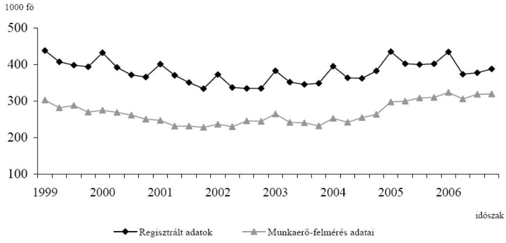
(forrás: Főbb munkaügyi folyamatok, 2006. január-december - KSH, 2007. április)

---

A KSH a nemzetközi összehasonlíthatóság érdekében a munkanélküliség kimutatásának egyezményes módszerét követi, reprezentatív lakossági felmérés segítségével határozza meg a munkanélküliek számát és a munkanélküliségi rátát. A munkaerőpiaci szervezet ettől eltérő módon, a megyei (regionális) munkaügyi központok nyilvántartási adataiból számolja a mutató értékét, amely módszertani eltérés miatt a KSH mutatójánál rendszerint kedvezőtlenebb képet mutat. A munkájukat elvesztők ugyanis az ellátások, támogatások feltételeként nyilvántartásba vetetik magukat, de munkalehetőség híján egy részük nem is keres állást. Ők a munkaerő-felmérés (KSH) szerint nem munkanélkülinek, hanem inaktívnak számítanak.

A foglalkoztatás elősegítését, a munkanélküliség megelőzését, kezelését és a képzési rendszer fejlesztését finanszírozó forrásokat 1996-tól ${ }^{1}$ a MPA tartalmazza. Az MPA célja a foglalkoztatás elősegítése, a munkanélkülivé vált személyek átmeneti pénzbeli ellátása, az alkalmazott eszközök (munkaerőpiaci szolgáltatások, támogatások, ellátások) fedezetének biztosításával és a feladatot ellátó szervezeti rendszer kiadásaihoz való hozzájárulással. Az egyes felhasználási célok szerint elkülönített alaprészek közül a szolidaritási alaprész a passzív (munkanélküli járadék/álláskeresési támogatás, segély) ellátások, a foglalkoztatási alaprész a foglalkoztathatóságot elősegítő és a foglalkoztatást támogató, aktív eszközök forrását biztosítja. A bérgarancia alaprészt a felszámolás alatt álló vállalkozások munkavállalói munkabérének megelőlegezésére fordítják, a képzési alaprészből a képzési rendszer fejlesztéséhez, a gyakorlati képzés eszközfejlesztéséhez járulnak hozzá. A rehabilitációs alaprész a megváltozott munkaképességűek elhelyezkedési esélyeinek növelését szolgálja. A vállalkozói alaprész a munkanélkülivé vált vállalkozók ellátását, támogatását, a működési alaprész a szervezet működését, fejlesztését biztosítja.

Az MPA működésének feltételeit elsősorban a foglalkoztatás elősegítéséről és a munkanélküliek ellátásáról szóló 1991. évi IV. törvény (Flt.), a szakképzésről szóló 1993. évi LXXVI. törvény (Szt.), a Bérgarancia Alapról szóló 1994. évi LXVI. törvény, a szakképzési hozzájárulásról és a képzés fejlesztésének támogatásáról szóló 2003. évi LXXXVI. törvény (Szht.), a felnőttképzésről szóló 2001. évi CI. törvény (Fktv.), valamint az államháztartásról szóló 1992. évi XXXVIII. törvény (Áht.) szabályozza. Az alaprészek nagyságát a költségvetési törvények határozzák meg.

Az Alappal a foglalkoztatáspolitikáért felelős miniszter rendelkezik, aki ezen jogát az előírások szerint megosztva gyakorolja a munkaadók, a munkavállalók és a Kormány képviselőiből álló testülettel, a Munkaerőpiaci Alap Irányító Testületével (MAT), illetve a képzési alaprész tekintetében az oktatásért felelős miniszterrel. Az Alapot a Foglalkoztatáspolitikai és Munkaügyi, majd a Szociális és Munkaügyi Minisztérium (továbbiakban szaktárca) kezelte, pénzeszközeinek felhasználásáról a szaktárca, az oktatási ügyekkel foglalkozó minisztérium és az állam jogszabályban kijelölt foglalkoztatási szervei gondoskodtak. A munkaügyi központok és kirendeltségeik a Foglalkoztatási és Szociális Hivatal

[^0]
[^0]:    ${ }^{1}$ A Munkaerőpiaci Alapot a korábban öt elkülönített állami pénzalap (Munkanélküliek Szolidaritási Alapja, Foglalkoztatási Alap, Szakképzési Alap, Rehabilitációs Alap, Bérgarancia Alap) összevonásával hozták létre.

---

(FSZH, 2006 végéig Foglalkoztatási Hivatal, FH) szakmai irányításával, koordinálásával juttatták el a kedvezményezetthez az ellátásokat, támogatásokat.

Az MPA-ra vonatkozó előírások 2004-től bevezetett módosításai érintették az Alap működésének, működtetésének szinte minden területét, így az MPA céljait (pl. EU-s programok társfinanszírozása), a forrásokat (pl. a vállalkozói járulék bevezetése), a foglalkoztatást elősegítő aktív (pl. normatív járulékkedvezmények alkalmazása) és passzív (munkanélküli/álláskeresési ellátások) eszközöket.

A munkanélküliség megelőzésére, kezelésére alkalmazott foglalkoztatáspolitikai eszközöket az Alap mellett más forrás is finanszírozza, ugyanakkor az Alap forrásai az eszközökön kívüli felhasználást (pl. szociális cél) is fedeznek. Az eszköztárat nem csak a munkaerőpiaci szervezet működteti, a szervezet viszont az Alap bevételeinek felhasználásán kívüli tevékenységet (pl. HEFOP programok) is végez. A szervezet működési költségeit az Alapon kívüli (EU-s) források is fedezik.

Az Alap bevételei a 2004. évi 241,6 Mrd Ft-ról 2006-ban 311,5 Mrd Ft-ra, 28,9%-kal emelkedtek, a kiadások a 2004-2006. évek között 244,6 Mrd Ft-ról 289,5 Mrd Ft-ra, 18,4%-kal nőttek. Az ÁFSZ-nél nyilvántartott munkanélküliek száma 2004 januárjában 388 ezer fő, 2007 januárjában 439 ezer fő volt, közülük 131 ezren, illetve 162 ezren részesültek passzív ellátásban. A munkaügyi központokban és a kirendeltségeken a nyilvántartott álláskeresőkön kívül további 96 ezer fő, illetve 56 ezer fő kapott támogatást valamelyik aktív foglalkoztatáspolitikai eszköz alkalmazásával.

A Munkaerőpiaci Alap működését átfogóan 1999-ben és 2003-ban ellenőriztük. Évenkénti ellenőrzéseink az Alap éves költségvetési törvényjavaslatának véleményezésére és a költségvetés végrehajtásáról szóló törvényjavaslatok értékelésére irányultak. Témaellenőrzés keretében a szakképzési struktúra szerepét a munkaerő-piaci igények kielégítésében és a közmunka programok támogatására fordított pénzeszközök hasznosulását vizsgáltuk². A Rehabilitációs Alaprészből nyújtott támogatások, a munkaképesség megőrzésére fordított pénzeszközök hasznosulását, valamint a Képzési Alaprészből a szakiskolák részére nyújtott támogatások, a szakiskolai fejlesztési programra fordított pénzeszközök felhasználását részleteiben jelenlegi ellenőrzésünk során nem vizsgáltuk, mivel e források hasznosulásáról önálló ÁSZ ellenőrzések szólnak ${ }^{3}$.

A jelen ellenőrzés célja annak értékelése volt, hogy

- az MPA jogszabályban előírt feladatainak a foglalkoztatáspolitikai célokkal összhangban történő teljesítéséhez - a rendelkezésre álló források célszerű

[^0]
[^0]:    ${ }^{2}$ Lásd a fedlap belső oldalán a témához kapcsolódó eddig elkészített számvevőszéki jelentések felsorolását.
    ${ }^{3}$ Jelentés a munkaképesség megőrzésére fordított pénzeszközök hasznosulásának ellenőrzéséről (0731), „A szakiskolai fejlesztési programra fordított pénzeszközök felhasználásának eredményessége" - témaszám: 881.

---

felhasználásával - a Munkaerőpiaci Alap szabályozási, szervezeti és költségvetési háttere megfelelő feltételeket biztosított-e;

- az Alap felhasználásának döntéshozatali mechanizmusa, az Alap felett rendelkező minisztérium(ok) belső kontrollrendszere, a munkaerőpiaci szervezet intézményi, személyi, informatikai és pénzügyi feltételei eredményesen járultak-e hozzá az MPA célszerű működtetéséhez, a feladatok hatékony ellátásához;
- a korábbi számvevőszéki ellenőrzések megállapításai, javaslatai miként hasznosultak.

Az MPA működését a 2004 - 2006. évek folyamatai alapján értékeltük, kitekintettünk 2007. I. félévére is.

Az Alap létrehozásához, működtetéséhez fűzött célok megvalósulását, a szakmai feladatok ellátását az Alap bevételeinek és kiadásainak elemzésével, valamint az egyes alaprészek, illetve foglalkoztatáspolitikai eszközök vizsgálatával értékeltük.

Az aktív eszközök alkalmazását a foglalkoztatási alaprész keretei (központi, decentralizált és felnőttképzési célú) felhasználásának ellenőrzése alapján minősítettük. A konkrétan vizsgált munkahelyteremtő és munkahelymegőrző programokat véletlenszerű mintavétellel választottuk ki.

Az ellenőrzés lefolytatásának jogszabályi alapját az Állami Számvevőszékről szóló 1989. évi XXXVIII. törvény, különösen annak 1. § (2) bekezdése, a 2. § (3), (5), (6) bekezdése, a 16. §. (1) bekezdése, 17. § (3) bekezdése, valamint a 21. §. (3) bekezdésében foglaltak együttesen képezik.

A jelentést az Állami Számvevőszékről szóló 1989. évi XXXVIII. törvény 25. § (1) bekezdésének megfelelően észrevételezésre megküldtük a Szociális és Munkaügyi Minisztériumot, valamint az Oktatási és Kulturális Minisztériumot felügyelő miniszternek, akik észrevételt nem tettek. Levelüket az 1/a. és 1/b. sz. melléklet tartalmazza.

---

# I. ÖSSZEGZŐ MEGÁLLAPÍTÁSOK, KÖVETKEZTETÉSEK, JAVASLATOK 

A Munkaerőpiaci Alap (MPA) a mindenkori foglalkoztatáspolitikai célkitűzések megvalósításának egyik meghatározó eszköze. Az MPA feladata az elsősorban a munkaerőpiac szereplőitől származó bevételeknek a munkaerőpiacra való hatékony visszaforgatása, annak bővítése és eredményesebb működése érdekében.

A nyilvántartott munkanélküliek száma a vizsgált időszakban kedvezőtlenül alakult. A 2004-ben 6,1%-os, 2006 elejére 7,8%-ra emelkedő munkanélküliségi ráta 2007. május-júliusra 7%-ra mérséklődött. A munkaügyi kirendeltségek 2004-ben átlagosan 376 ezer fő, 2005-ben 410 ezer és 2006-ban 393 ezer fő álláskeresőt tartottak nyilván. Az álláskeresők között kis mértékben (mintegy 1,5%-kal) csökkent az ellátásokban részesülők átlagos aránya, és ezzel együtt a passzív ellátásoknak a kiadásokon belüli aránya. A munkanélküliséget jellemzően rövid távon - egyes támogatási formáiban közvetlenül - mérséklő aktív eszközökre az időszakban az Alap kiadásainak változatlan részét, 42%-át fordították. A hosszabb távon is ható, a területi, kor szerinti és szakmai egyenlőtlenségeket tompító képzésekre, humán szolgáltatásokra, a munkaerő keresletét befolyásoló beruházások támogatására az összes kiadás mintegy 6%-át használták fel. A támogatások munkanélküliségre gyakorolt kedvező hatása azonban nem állapítható meg teljes körűen az Alappal rendelkező miniszter számára, mert nincs információja a közcélú munka támogatásának nagyságáról, a támogatással közcélú munkán és megváltozott munkaképességűként foglalkoztatottak teljes számáról.

Az ellenőrzött évek kormányprogramjai, fejlesztési tervei ${ }^{4}$, a Kormány foglalkoztatáspolitikai stratégiájaként elfogadott
 Nemzeti Foglalkoztatási Akcióterv (NFA) fő célként az EU teljes foglalkoztatottságot előirányzó stratégiájával összhangban a foglalkoztatási szint, a népesség munkaerőpiaci aktivitásának növelését jelölte ki. Az emelkedő munkanélküliséget, a tartóssá vált strukturális egyenlőtlenségeket a munkaerő kínálati oldalára ható, az Alap által korábban is működtetett eszköztár (munkanélküli ellátások, képzések, célzott foglalkoztatási támogatások) alkalmazásával kívánták kezelni.

A kormányzati elképzelések jogszabályi módosításokban, új jogszabályokban és azok módosításaiban ölöttek testet. A változások a foglalkoztatáspolitikai célok megvalósítása irányába hatottak, ugyanakkor az eszközrendszernek a módosított szabályok szerinti alkalmazása nem volt elegendő a munkaerőpiaci feszültségek feloldásához.

A munkahely keresésére ösztönözte az ellátórendszerbe kerülés feltételeinek változása, annak feltételeként az álláskeresés vállalásának előírása, az ellátások folyósítási időszak alatti, kétszeri csökkentése. A feltétel azonban éppen a ma-

[^0]
[^0]:    ${ }^{4}$ Nemzeti Fejlesztési Terv I., 100 lépés program, Új Magyarország Fejlesztési Terv

---

gas munkanélküliséggel sújtott térségekben nem volt teljesíthető, módosítása után, 2007-től csak az ellátásban részesülő köteles a kirendeltséggel álláskeresési megállapodást kötni. Az ellátás csökkenő mértéke elsősorban a magasabb keresetűeket érintette hátrányosan, ezért álláskeresésre ösztönző hatása is a körükben érvényesült. A járulékkötelezettség emelése és az ellátások szabályozásának módosítása következtében a jövedelméhez képest arányában is magasabb járulékot fizető személy a munkahely elvesztésekor alacsonyabb szintű ellátásban részesül, mint korábban.

A hátrányos helyzetűek (pl. pályakezdők, 45, illetve 50 éven felüliek, nyugdíj előtt állók) elhelyezkedésének elősegítésére 2005-től lehetővé tették a bér- és járulékkedvezmények alanyi jogú igénybevételét. Az új törvényekkel ${ }^{5}$ az egymást a támogatás módjában, célcsoportjában átfedő eszközök köre bővült (például a pályakezdők, illetve az idősebb munkavállalók alkalmazásának támogatására az Flt., a Pftv. és a Péptv. is lehetőséget adott). A támogatások igénybevételének új lehetőségei a foglalkoztatást kedvezően befolyásolták, ugyanakkor a támogatások bonyolult rendszere az igénybevevők számára nehezen átlátható. A több jogszabály alapján is érvényesíthető kedvezmények együttes igénybevételének felső határáról (az Fbtv. kivételével) nem rendelkeztek, mert a munkáltatónál felmerült, a foglalkoztatáshoz kapcsolódó költségek, járulékok ${ }^{6} 100 \%$-át meghaladó támogatás igénybevételét EU-s jogszabály tiltja ${ }^{7}$.

A támogatási rendszerben az eligazodást segítette 2007. január 1-jétől az Flt. alapján nyújtható támogatások egyszerűsítése. A rendszer átlátását továbbra is nehezíti, hogy az Flt., a foglalkoztatási feszültségek, a munkanélküliség kezelésének alaptörvénye csak az általa szabályozott támogatásokra hivatkozik alkalmazandó foglalkoztatáspolitikai eszközként, és nem utal az új törvényekkel megállapított támogatási lehetőségekre.

A stratégiaalkotás az Alapból támogatott szakképzési rendszer alakítására is kiterjedt (szakképzés-fejlesztési stratégia és intézkedési terv ${ }^{8}$ ). A képzési rendszer fejlesztésére a képzés tárgyát, igénybevevőjét és nyújtóját, a képzés feltételeit érintő jogszabályi módosításokat hoztak. A munkaerőpiac és a szakképzés közötti szorosabb összhang megteremtése érdekében 2006 júliusától a két területet egyazon személy, a foglalkoztatáspolitikáért felelős miniszter irányítása alá helyezték.

[^0]
[^0]:    ${ }^{5}$ 2004. évi CXXIII. törvény a pályakezdő fiatalok, az ötven év feletti munkanélküliek, valamint a gyermek gondozását, illetve a családtag ápolását követően munkát keresők foglalkoztatásának elősegítéséről, továbbá az ösztöndíjas foglalkoztatásról (Pftv.), 2004. évi CXXII. törvény a prémiumévek programról és a különleges foglalkoztatási állományról (Péptv.), 2005. évi CLXXX. törvény a foglalkoztatás bővítése és rugalmasabbá tétele érdekében szükséges intézkedésekről (Fbtv.)
    ${ }^{6}$ egészség- és nyugdíjbiztosítási járulék, munkaadói járulék (együtt a bruttó bér 32\%-a) és egészségügyi hozzájárulás
    ${ }^{7}$ 2204/2002/EK rendelet az EK-Szerződés 87. és 88. cikkének a foglalkoztatásra nyújtott állami támogatásra történő alkalmazásáról
    ${ }^{8}$ 1057/2005.(V.31.) Korm. határozat a szakképzés-fejlesztési stratégia végrehajtásához szükséges intézkedésekről

---

Az Alap működését a gazdálkodók befizetési kötelezettségeit megállapító előírások és a kiadásokat meghatározó költségvetési törvények ellentmondásosan befolyásolták. Az Alapba befizetést teljesítők kötelezettségeinek emelése többletforrásokat teremtett a foglalkoztatáspolitikai eszközök fokozott alkalmazásához. A többletforrások ugyanakkor az Alapot terhelő költségvetési befizetések növelését is fedezték, a szakmai kiadások összkiadáson belüli aránya nem emelkedett. Az aktív eszközök alkalmazásának új területeivel a miniszter és a MAT mozgástere csökkent.
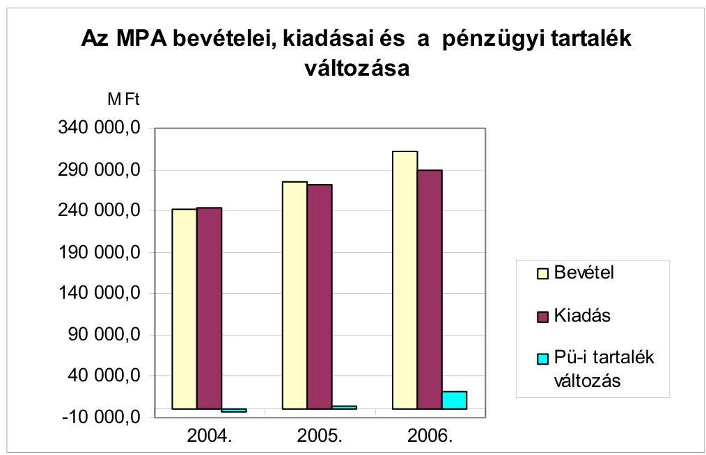

Az Alap bevételei a 2004. évi 241,6 Mrd Ft-ról 2006-ban 311,5 Mrd Ft-ra, 28,9\%-kal emelkedtek, a bevételek 98\%-a járulék- és hozzájárulás befizetésből származott. A bevételek emelkedését a munkaerőpiac résztvevőinek, a munkaadóknak és a munkavállalóknak a kötelezettségek növelése miatt is megemelkedett befizetései eredményezték.

Rövid távon, 2004-2006 között az Alap kiadási szerkezete kis mértékben változott, és az éves kiadás 244,6 Mrd Ft-ról 289,5 Mrd Ft-ra, 18,4\%-kal emelkedett. A három év alatt teljesített bevételek és kiadások különbözete az Alap pénzügyi tartalékát növelte. A szakmai alaprészek kiadásainak az összkiadásokon belüli aránya kis mértékben, 60\%-ról 58\%-ra mérséklődött. A működési alaprészre 2004-ben és 2006-ban is a kiadások 9\%-át fordították, és 31\%-ról 33\%-ra nőtt az alaprészeken kívüli tételek aránya. Az alaprészekhez nem kötött előirányzatok költségvetési befizetés vagy pénzeszközátadás formájában a rehabilitációs foglalkoztatás „hagyományos" támogatását, szociális és egyéb célt, valamint az aktív eszközök új felhasználási területeit finanszírozták. A befizetés nem részletezett tétele (a munkanélküliek ellátó rendszerének változása miatti befizetés) felhasználására vonatkozó információk hiánya nem tette megállapíthatóvá, hogy a felhasználás megfelelt-e az Alap működési céljának (foglalkoztatási feszültségek kezelése).

A munkaerőpiac kínálati oldalára koncentráló, rövid távon hatásos aktív foglalkoztatáspolitikai eszközök alkalmazása a munkaerőpiacot befolyásoló tendenciák (lassuló ütemű gazdasági fejlődés) és egyéb intézkedések (sorkatonai szolgálat eltörlése, nyugdíjkorhatár emelése) ellensúlyozására nem volt elegendő. A hátrányos helyzetű rétegek munkaerőpiaci pozíciójában érdemi javulás nem mutatható ki, és a munkaerőpiacnak megfelelő képzettségű szakemberek rendelkezésre állásában sem történt előrelépés.

A kiadások összetétele hosszabb távon vizsgálva, jelentősen megváltozott. A kiadások növekvő részét (1999-ben 7\%-át, 2006-ban 33\%-át) fordították a költségvetési törvényben meghatározott, alaprészeken kívüli jogcímekre.
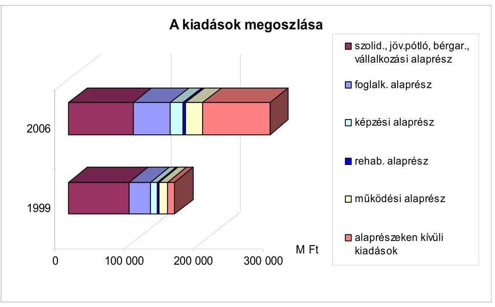

A passzív jellegű - az álláskeresők ellátásait fedező, a felszámolás alatti vállalkozások munkavállalóinak bérét megelőlegező - kiadások összkiadáson belüli aránya az 1999. évi 57\%-ról 2006-ban 32\%-ra csökkent. Egy-egy százalékponttal emelkedett a képzési (6\%-ról 7\%-ra), illetve a működési alaprész aránya (8\%-ról 9\%-ra).

Az aktív eszközökre, az alaprészeken kívüli felhasználásokat (pl. közcélú munka támogatása, EU-s programok társfinanszírozása, közmunka támogatása) is figyelembe véve, 1999-ben a kiadások 28\%-át, 2004-2006-ban pedig 41-42\%-át fordították. Az aktív kiadások növekedési üteme a vizsgált időszakban a foglalkoztatási célokkal és a munkaerőpiaci igényekkel szemben a bevételek növekedési üteménél mintegy 9 százalékponttal volt alacsonyabb.

Az Alappal rendelkezés jogának a foglalkoztatáspolitikáért felelős és az oktatásért felelős miniszter közötti megosztása az előírt megállapodások megkötése alapján megvalósult. A foglalkoztatáspolitikai eszközök felhasználásánál mind a MAT, mind a miniszter mozgástere, szerepe csökkent.

A foglalkoztatáspolitikai eszközök alkalmazásánál a kiadási szerkezet változásával csökkent az érdekegyeztetésen alapuló önkormányzati testületi döntéssel felhasznált források aránya. Míg a foglalkoztatási és rehabilitációs alaprész felhasználásához kapcsolódó jogosítványok az ezredfordulót megelőzően a MAT részére az aktív kiadások közel 80\%-a felett döntési hatáskört biztosítottak, ugyanezen jogokkal 2006-ban a MAT az aktív kiadások 39\%-a felett dönthetett. Az aktív kiadási előirányzatok 42\%-ának felhasználása a foglalkoztatáspolitikáért felelős miniszter felügyelete alól is kikerült, ami ellentmond a miniszternek a foglalkoztatáspolitikáért viselt általános felelősségének ${ }^{9}$.

A képzési alaprésznek az oktatásért felelős miniszter hatáskörébe tartozó felhasználásánál csorbult a területi szervek, az RFKB-k javaslattevő és döntéselőkészítő joga a decentralizált keret arányának (és ezzel nagyságának) a jogalkotó szándékánál jelentősen alacsonyabb mértékben történt megállapítása miatt. A decentralizált keret aránya a felét sem érte el az Szht-ban előírt kétharmadnak, ami a helyi sajátosságok figyelembevételét korlátozta ${ }^{10}$.

A szakmai alaprészek felhasználásánál a munkaerőpiaci szervezet figyelembe vette a foglalkoztatáspolitikai célokat. A képzési alaprészből fedezett támogatások alakulása és a munkaerőpiac igényei között konkrét összefüggés, összhang nem állt fenn.

A foglalkoztatási alaprészben felmerült kiadások három év alatt 147,7 Mrd Ft-ot tettek ki, az érintett létszám mintegy 630 ezer fő volt. A foglalkoztatásra hosszabb távon ható eszközökre, munkaerőpiaci képzésekre és a munkahelyteremtő beruházásokra 46,0 Mrd Ft-ot, az alaprész 31\%-át fordították. Az alaprészen kívüli aktív eszközök között az EU-s programok társfinanszírozásához az Alap három év alatt 20,6 Mrd Ft-tal járult hozzá. A munkanélküliség megelőzését és kezelését célzó operatív programba (HEFOP 1.1) a munkaügyi központok közel 36 ezer főt vontak be.

Az alaprész központi kerete kiadásainak (2004-ben 8,3 Mrd Ft, 2006-ban 10,8 Mrd Ft) növekvő arányát (27-46\%-át) munkahelyteremtést és a munkahelymegőrzést támogató programokra fordították. A támogatások odaítélésénél a foglalkoztatási céloknak megfelelő, a vállalt létszámra vagy a foglalkoztatás időtartamára vonatkozó szempontokat érvényesítettek. A kedvezőtlen helyzetű térségek munkahelyteremtő beruházásait támogató programokban a keretet jelentősen meghaladó igény miatt a pályázatok 61\%-át el kellett utasítani. A 4,9 Mrd Ft-os kifizetés 30\%-át a legmagasabb munkanélküliségi rátájú megyék (Szabolcs-Szatmár-Bereg és Borsod-Abaúj-Zemplén) vállalkozásai kapták. A támogatott beruházások segítségével 5285 új munkahely létesült, ahol 3379 fő nyilvántartott munkanélküli, illetve álláskereső foglalkoztatása valósult meg tartós ideig. Az átmeneti működési (likviditási) zavarok áthidalását segítő munkahely-megőrzési programok keretében előfordult, hogy az eredeti céltól eltérően veszteséges vállalkozások is kaptak támogatást a veszélyeztetett létszám (alacsonyan képzettek, 45 éven felüliek) további foglalkoz-

[^0]
[^0]:    ${ }^{9}$ A megváltozott munkaképességűek támogatása felügyeletének szaktárcához kerülésével az ellentmondás 2007 közepétől csak a közcélú munka támogatására áll fenn.
    ${ }^{10}$ Az Szht. módosításával a decentralizált keret arányára vonatkozó előírást 2007-től törölték.

---

tatására ${ }^{11}$. Munkahelymegőrző támogatásban összesen 139 vállalkozás részesült, ez mintegy 13 ezer fő munkahelyének hosszabb-rövidebb ideig történő megtartásához járult hozzá.

A munkaügyi központok a területi foglalkoztatási feszültségek enyhítésére a decentralizált keretből rendelkezésükre álló források mintegy 80\%-át ugyanazon néhány eszközre, a közhasznú foglalkoztatásra, a képzésre és a pályakezdők támogatására, valamint bértámogatásra költötték. Az érintett létszám mintegy 85\%-a részesült a nevezett támogatási formákban. A szaktárca célkitűzése, a közhasznú foglalkoztatás helyett a nyílt munkaerőpiacra visszavezető eszközök hangsúlyosabb alkalmazása nem valósult meg, mert a kedvezőtlenebb munkaerőpiaci helyzetű régiókban, kistérségekben szinte az egyedüli foglalkoztatási lehetőséget a közfoglalkoztatási formák jelentették.

A képzési alaprész központi keretének mintegy 74\%-át egyedi döntések alapján használták fel. A támogatási szerződésekben nem határozták meg egyértelműen a támogatások céljait, ezzel nem követelték meg a jogszabályban rögzített célok szerinti felhasználást. Az általános célok a teljesítés ellenőrzéséhez sem adtak egyértelmű kritériumot. A pályázat útján elosztott forrásokból nagyobb hányadban oktatási intézményeket támogattak, a gyakorlati képzést végző kis- és középvállalkozások a források kisebb hányadát (a központi keretből felosztott összeg 16\%-át és a decentralizált keret 33\%-át) kapták. A munkaerőpiaci igények és a képzés összhangjának megteremtéséhez hiányoztak a szükséges információk. A több helyen vezetett adatbázisok alapvetően a képzés meglévő szerkezetére vonatkoztak, a terület várható változásaira, a gazdaság igényeire, a végzett szakemberek felkészültségére, gyakorlatban történő beválásukra kevés információt tartalmaztak.

Az alaprészekből nyújtott támogatások hatékonyságának és eredményességének megítéléséhez 2005 végéig kritériumokat nem alakítottak ki, eredményességi követelményeket 2006-tól határoztak meg. A foglalkoztatási támogatások
 1994 óta működtetett, követéses vizsgálatokon alapuló monitoring rendszerében az eszközök rövidtávú eredményessége mérhető. A kérdőíves megkérdezések adatainak megbízhatóságát a támogatottak eltérő válaszadási hajlandósága csökkentette. A 2004–2006. között aktív foglalkoztatáspolitikai támogatásban részesültek több mint felére kiterjedő monitoring vizsgálat szerint az elhelyezkedési arányok számottevően nem változtak. Éppen a legnagyobb – mintegy egyharmados – arányban támogatott közhasznú munkavégzésnél a legalacsonyabb a támogatás lejárta utáni, nem támogatott munkaviszonyt létesítők aránya (1% körüli). A képzési alaprészből nyújtott támogatásokról készített beszámolók a felhasználás hatékonyságára nem tértek ki ${ }^{12}$.

[^0]
[^0]:    ${ }^{11}$ A támogatás feltételei 2005-től szigorodtak annak érdekében, hogy csak azok a munkáltatók részesüljenek támogatásban, amelyeknél rövid időn belül megszüntethető likviditási problémák merültek fel.
    ${ }^{12}$ A szaktárca tájékoztatása szerint a Pályázati Információs Rendszer bevezetése 2008-tól lehetőséget ad a hatékonyság mérésére.

---

# A munkaerőpiaci szervezet a változó működési feltételek mellett több intézkedést hozott a feladatok cél szerinti, hatékonyabb ellátására. 

A megyei munkaügyi központok regionális szinten szervezett központokká alakítására 2006 nyarán született kormánydöntés ${ }^{13}$. A regionális intézményi rendszert és működését meghatározó, nem teljesen kiérlelt jogszabályokat az új regionális munkaügyi központok tapasztalatai alapján módosították. A 2007. január 1-jétől létrehozott intézményi struktúrát áprilistól egyszerűsítették, az ún. regionális kirendeltségeket megszüntették. Módosítani kellett az önkormányzati irányítás regionális testületét meghatározó előírásokat is, mivel nem garantálták a régió minden megyéjének képviseletét.

A szaktárcánál a fejezeti létszámcsökkentések intézményrendszeren belüli, feladatokkal arányos elosztására nem találtunk dokumentumot. A munkaügyi központok az elrendelt létszámcsökkentések végrehajtásánál a kirendeltségek leterheltségében feltárt különbségeket figyelembe vették. Az ÁFSZ engedélyezett létszámának 2004. évi 4437 főről 2007-re 3770-re csökkentésénél, a regionális átszervezés során összevonták egyes infrastrukturális, illetve szakmai feladatok ellátását. Az összlétszámon belül a kirendeltségi dolgozók számarányának 58%-ról 72%-ra emelése az ügyfelekkel közvetlenül foglalkozók létszámfeltételeit javította.

A szakmai feladatok minőségi ellátására való ösztönzése érdekében 2006-tól országosan bevezették a „Megegyezéses Eredménycélokkal való Vezetési rendszert” (MEV). A szakmai irányítás és az önértékelés megalapozásához időben és térben összehasonlítható mutatókat (pl. a regisztrált álláskeresőkből foglalkoztatottá válók, a képzésbe bevontak száma, az ügyfelek elégedettsége) határoztak meg. A munkaügyi központok és a kirendeltségek tevékenységének eredményességét a mutatók vállalt és teljesített nagysága alapján értékelik. Az ügyfél-elégedettségi mutatók alapján (2006-ban 88%) a munkaügyi szervezet tevékenységével az ügyfelek elégedettek voltak.

A működés informatikai kockázatai nem csökkentek. Az informatikai feltételek közül a gépi eszközökkel való ellátottság javult 2004–2006 között, az ÁFSZ fejlesztésére indított operatív program (HEFOP 1.2) keretében 3500 új munkaállomást és nyomtatót, 176 kirendeltségi szervert állítottak üzembe. Az Alap 300–400 Mrd Ft-os nagyságrendű éves bevételének felhasználását ugyanakkor nem támogatta korszerű informatikai rendszer. Az MPA kirendeltségi rendszereinek területi adatait is tartalmazó, a pénzügyi és kontrolling folyamatokat lefedő informatikai rendszer üzembe helyezése tíz éve várat magára. A működő számítástechnikai rendszerekben az ellátásokat megállapító határozatok elektronikus jóváhagyása nem előfeltétele a kifizetésnek, ami fokozott manuális ellenőrzést igényel. A számítógépes rendszerek még 2007 nyarán sem támogatták valamennyi munkaerőpiaci eszköz alkalmazását (pl.: részmunkaidős foglalkoztatás, munkaerőpiaci programok).

[^0]
[^0]:    ${ }^{13}$ 2118/2006. (VI.30.) Korm. határozat az államháztartás hatékony működését elősegítő szervezeti átalakításokról és az azokat megalapozó intézkedésekről

---

A 2004–2006 között végrehajtott fejlesztések a határidő be nem tartásával akadályozták más fejlesztések üzembe helyezését, esetenként a megvalósítani kívánt célt részlegesen érték el (az önálló álláskeresést támogató országos rendszer használatbavételét központi adatbázisok hiánya akadályozta, a rendszer korlátozottan üzemel). Az országos adatbázisok és korszerű alkalmazások integrált rendszere (IR) az eredeti határidőre, 2007 márciusra csak részlegesen készült el.

Az informatikai biztonság kezelésének szabályait és gyakorlatát nem teremtették meg. A biztonsági követelmények a legújabb fejlesztésnél sem teljesülnek (pl. nem azonosítható az adatbázisokat módosítók személye), ami az adatok hitelességének, megbízhatóságának szempontjából kockázatot jelent.

A munkáltatók által szolgáltatott, munkaviszonyokkal kapcsolatos adatok nyilvántartás, az Egységes Magyar Munkaügyi Adatbázis (EMMA) kifejlesztésére 2004–2005. között 1,5 Mrd Ft-ot fordítottak az MPA-ból. Az adatokat a munkaügyi központok mellett az OMMF is felhasználhatta a munkaügyi ellenőrzési tevékenységéhez. 2007-től az Flt. minden, az EMMA-ra vonatkozó előírását törölték, azóta törvényi felhatalmazás alapján az adatok nyilvántartását az OMMF végzi. Így az eredeti fejlesztési céloktól eltérően a munkaerőpiaci szervezet az ellátások, támogatások megítélésénél, ellenőrzésénél, nyomon követésénél nem támaszkodhat a szóban forgó adatokra.

A támogatások megítélésének szabályszerűségét utólagosan a belső ellenőrzés, az igénybevétel jogszerűségét az ellátottaknál és a támogatottaknál a munkaerőpiaci (hatósági) ellenőrzés vizsgálta. A munkaügyi központok ellenőrzési szakterületének szakmai irányítását a Foglalkoztatási Hivatal (FH) Ellenőrzési Irodája látta el. Az ellenőri kapacitás szűkössége miatt egyes munkaügyi központokban a két ellenőrzési szakterület szervezetileg és a létszámot tekintve sem különült el egymástól. A belső ellenőrzés és a hatósági ellenőrzés tevékenységét bemutató kimutatások összevontan és halmozottan tartalmazzák az ellenőrzések számát, ami az adatok felhasználhatóságát rontja. Az ellenőri apparátus létszámát már az Alap korábbi ÁSZ vizsgálata sem találta elegendőnek ${ }^{14}$, a létszám 2007-re a 2004. évinek mintegy háromnegyedére (115 főről 82 főre) csökkent.

Az MPA-ból csekély összegűként nyújtható támogatások ${ }^{15}$ igénybevételének az uniós rendelkezéseknek megfelelő feltételei fennállásáról az ÁFSZ a kérelmezőt nyilatkoztatta. A feltételek teljesülése a Kincstár által a csekély összegű támogatásokat is tartalmazó OTMR nyilvántartás alapján nem ellenőrizhető, mivel a nyilvántartás nem tartalmazza az Alapból nyújtható csekély összegű

[^0]
[^0]:    ${ }^{14}$ Jelentés a Munkaerőpiaci Alap működésének ellenőrzéséről (0439), 56. o.
    ${ }^{15}$ Csekély összegű „de minimis” támogatás: Az EK-Szerződés 87. és 88. cikkének a csekély összegű „de minimis” támogatásokra való alkalmazásáról szóló 69/2001/EK bizottsági rendelet 2. cikke szerinti támogatás. A rendelet értelmében a csekély összegű támogatás jogcímén odaítélt támogatások egy vállalkozás esetében három év alatt nem haladhatták meg (a 2007. évet megelőzően) a százezer eurónak megfelelő forintösszeget

---

támogatásokat. Az Ámr. az OTMR köteles támogatási konstrukciók között e támogatásokat nem nevesíti.

A képzési alaprész felhasználásának ellenőrzése az OM felügyelete alá tartozó Alapkezelő Igazgatóság (OMAI) ${ }^{16}$ feladata volt. A szakképzési célok megvalósulását a gazdálkodóknak az Alapba történt befizetésein kívül a szakképzést folytató iskoláknak nyújtott közvetlen támogatásai is szolgálták, a szakképzési hozzájárulást a kötelezett ily módon is teljesíthette. A közvetlen támogatás szakiskolai felhasználása egyben a hozzájárulás felhasználását jelentette.

A felhasználás különböző módjainak megfelelően, annak jogszerűségét a kedvezményezetteknél, így a szakiskoláknál – jogállásukat, hatáskörüket, ellenőrzési jogosultságukat tekintve is – különböző szervek (APEH, OMAI, munkaügyi központok) ellenőrzik. A feltárt szabálytalan felhasználás is különböző jogszabályok (Art., Szht., illetve a végrehajtására kiadott OM rendelet, Ket.) alapján, eltérően szankcionálható. A szabálytalanul felhasznált támogatás visszakövetelése – az OMAI, majd NSZFI hatósági jogkörének, illetve az APEH hatáskörének hiányában – csak polgári peres úton érvényesíthető. A 2006-ban lezárult ellenőrzések a céltól eltérő felhasználás alapján mintegy 1,4 Mrd Ft visszakövetelésére tettek javaslatot.

Az ÁSZ korábbi, az Alapot érintő vizsgálatok során megfogalmazott javaslatai többségében hasznosultak. A foglalkoztatáspolitikai és munkaügyi miniszternek címzett, az ágazati szintű informatikai stratégia elkészítését ${ }^{17}$, valamint az ellenőrzési feladatok és az ellenőrzési szervezet létszáma közötti összhang megteremtését célzó javaslatok ma is időszerűek.

A helyszíni ellenőrzés megállapításainak hasznosítása mellett javasoljuk:

# a Kormánynak 

1. kezdeményezze az Flt. kiegészítését, mely szerint a foglalkoztatási feszültségeket, a munkanélküliséget kezelő eszközök szabályozása más törvények útján is megvalósul;
2. kezdeményezze a munkaügyi nyilvántartási adatok szélesebb körű felhasználását, a munkaerőpiaci szervezet hozzáférését a nyilvántartás adataihoz, az ellátások és támogatások megítélése, ellenőrzése és nyomon követése érdekében;
3. vizsgálja meg a Nemzeti Szakképzési és Felnőttképzési Intézet hatósági jogkörrel felruházását, a szakképző iskolák által fogadott fejlesztési támogatások ellenőrzésére figyelemmel;
[^0]
[^0]:    ${ }^{16}$ A feladatot 2007. január 1-től a Nemzeti Szakképzési és Felnőttképzési Intézet (NSZFI) látja el.
    ${ }^{17}$ Jelentés a Foglalkoztatáspolitikai és Munkaügyi Minisztérium fejezet működésének ellenőrzéséről (0543)

---

# a pénzügyminiszternek 

gondoskodjon az Ámr. – OTMR köteles felhasználási jogcímek kiterjesztését célzó módosításáról és az OTMR szükség szerinti továbbfejlesztéséről annak érdekében, hogy a csekély összegű támogatásokra vonatkozó közösségi feltételek fennállása ellenőrizhető legyen az MPA-ból csekély összegűként nyújtható támogatások odaítélésénél;

## a foglalkoztatáspolitikáért felelős miniszternek

1. intézkedjen az MPA működésénél fennálló informatikai biztonsági kockázatok csökkentéséről, az informatikai fejlesztéseknél a biztonsági követelmények teljesítéséről;
2. biztosítsa korszerű, a kötelezettségvállalásokat és a kifizetéseket teljes körűen, országos elektronikus nyilvántartásban tartalmazó, a főkönyv és az analitika összhangját automatikusan biztosító pénzügyi informatikai rendszer bevezetését;
3. gondoskodjon arról, hogy az OTMR felé előírt adatszolgáltatás elektronikusan teljesíthető legyen;

---

# II. RÉSZLETES MEGÁLLAPÍTÁSOK 

## 1. A Munkaerőpiaci Alap működési Rendszere

### 1.1. A foglalkoztatáspolitikai célok megjelenése az Alap működését meghatározó szabályozásban

Az ellenőrzéssel érintett 3 évben az MPA felhasználásának irányait három deklarált kormányprogram is befolyásolta. A munkanélküliség 2002 végéig lassan csökkenő trendje 2003-tól 2006 közepéig folyamatosan emelkedett. A kormányprogramok a foglalkoztatás kérdéskörét kiemelten kezelték, a foglalkoztatási szint emelését, a munkaképes korú népesség munkaerőpiaci aktivitásának növelését irányozták elő. A célkitűzések megfeleltek az uniós csatlakozás után kötelezően követendő iránymutatásoknak. A munkalehetőségek növelésének eszközei között a munkahelyteremtés, a beruházások támogatása is megjelent, a munkaerőpiac feszültségeit a kormányprogramok elsősorban a munkaerő kínálatára ható eszközökkel kívánták kezelni. A munkaerő foglalkoztathatóságának emelésére a munkaerőpiac igényeit figyelembe vevő képzéseket, a képzési rendszer fejlesztését, a helyzetüknél fogva hátránnyal indulók foglalkoztatására ösztönző programokat, támogatásokat irányozták elő.

A 2004 második harmadáig érvényes kormányprogram ${ }^{18}$ (KP1) bővülő foglalkoztatást célzott meg a gyermeknevelés és a tanulás feltételeinek javításával, a munkaképesség fejlesztésével. Egy millió fő képzésére alkalmas felnőttképzési rendszer kiépülését és működtetését kívánta elősegíteni. Az MPA forrásait figyelembe véve speciális, támogatott felnőttképzési programokat tervezett a munkaerőpiacon hátrányos helyzetű emberek (fogyatékossággal élők, hátrányos helyzetű térségekben lakók, pályakezdő fiatalok, kisgyermekes anyák, 45 év feletti munkavállalók, sorkatonai szolgálatukból visszatérők, romák, gyermekvédelmi intézményekben nevelkedettek, hajléktalanok) számára. A 2004 őszétől érvényes ${ }^{19}$ kormányprogram (KP2) a Világ-Nyelv programmal a fiatalok, adókedvezményekkel a felnőttek nyelvtanulásának ösztönzését tűzte célul.

Az egy életen át tartó tanulás feltételeinek megteremtése, a megváltozott társadalmi-gazdasági viszonyokhoz való alkalmazkodóképesség kifejlesztése kiemelt programtényező a 2006. év második felétől elfogadott kormányprogramban ${ }^{20}$ (KP3) is.

[^0]
[^0]:    ${ }^{18}$ Cselekedni most és mindenkiért! A nemzeti közép, a demokratikus koalíció Kormányának programja. Magyarország 2002 – 2006. H/19. OGY Iromány, 2002. május 27.
    ${ }^{19}$ Lendületben az ország! A Köztársaság kormányának programja a szabad és igazságos Magyarországért 2004–2006. H/11640. OGY Iromány, 2004. szeptember 29.
    ${ }^{20}$ Új Magyarország – Szabadság és szolidaritás – A Magyar Köztársaság Kormányának programja a sikeres, modern és igazságos Magyarországért 2006–2010. H/64 OGY Iromány. 2006. június 9.

---

A KP2 a fiatalok
 első munkahelyhez jutását, a gyesről visszatérő anyák foglalkoztatásának ösztönzését és az 50 évesnél idősebbek foglalkoztatását járulékkedvezménnyel tervezte támogatni. 2006 második felétől a legtöbb segítséget a pályakezdőknek, az ötven évesnél idősebbeknek, a kisgyermekes szülőknek, a roma embereknek, a megváltozott munkaképességűeknek, továbbá a szakképzettséggel nem rendelkezőknek és az ország leghátrányosabb helyzetű térségeiben élőknek kívánták nyújtani.

Az ellátási, támogatási rendszer változtatását már 2004 első felében elhatározták. Áttekinthető, korszerű, a változó helyzethez rugalmasan alkalmazkodó képzési és foglalkoztatási támogatási rendszert a harmadik kormányprogrammal terveztek létrehozni. Az elképzelések az intézményi feltételek, a munkaügyi szervezet fejlesztését is tartalmazták.

2004-ben a munkanélküli ellátás rendszerének átalakítása (a munkanélküli járadék mellett fix összegű munkanélküli segély bevezetése), valamint további célként az egységes foglalkoztatási nyilvántartás létrehozása, a munkaügyi ellenőrzés hatásosabb működtetése volt napirenden. 2006 második felétől a támogatási rendszer átalakítása, a munkaerőpiaci szolgáltatások és támogatások egyszerű hozzáférésének biztosítása, továbbá az álláskeresők és állástalanságuk miatt szociális ellátásra szorulók számára egyetlen szervezet létrehozása került programba a szociális és a munkaerőpiaci szolgáltatások összehangolásával, az ÁFSZ megújításával.

A foglalkoztatáspolitikai koncepciók az ellenőrzött időszakban további átfogó programokban, tervekben kerültek újabb - hangsúlyosabb vagy konkrétabb megfogalmazásra ${ }^{21}$. A munkaerőpiac igényeihez igazodó képzési rendszer kialakítását a 2005-ben elfogadott szakképzés-fejlesztési stratégia és intézkedési terv $^{22}$ is előírta.

A Kormánynak az Európai Unió Foglalkoztatási Bizottságával egyeztetett, kifejezetten a foglalkoztatáspolitikára vonatkozó stratégiáját, az egyes uniós irányvonalakhoz kapcsolódó helyzetértékelését, a hazai és uniós forrásokat felhasználó válaszlépéseket, intézkedéseket a Nemzeti Foglalkoztatási Akcióterv (NFA) foglalta össze, amelyet a Kormány 2004. október 1-jén ${ }^{23}$ hagyott jóvá.

A dokumentum az intézkedésekhez szükséges hazai, illetve az Unió által biztosított forrásokat is tartalmazza. Az intézkedések hatásainak megállapításához mérőszámok (indikátorok) rendszerét alakították ki.

[^0]
[^0]:    ${ }^{21}$ 1076/2004. (VII.22.) Korm. határozat az Európa Terv (2007-2013.) kidolgozásának tartalmi és szervezeti kereteiről, 96/2005. (XII.25) OGY határozat az Országos Fejlesztéspolitikai Koncepcióról. A 2005. május 2-án, a korábbi programok cselekvési terveként meghirdetett 100 lépés program első intézkedései között szerepelt a foglalkoztatáspolitikai szabályok átalakítása, a foglalkoztatás bővítését, a látható munkaerőpiacot, a jobb alkalmazkodást célozva.
    ${ }^{22}$ 1057/2005.(V.31.) Korm. határozat a szakképzés-fejlesztési stratégia végrehajtásához szükséges intézkedésekről
    ${ }^{23}$ 2247/2004. (X.1.) Korm. határozat a 2004. évi Nemzeti foglalkoztatási akciótervről

---

Az MPA működését meghatározó szakmai jogszabályok módosításai visszatükrözték a Kormány foglalkoztatási céljait. Az MPA működési kereteit meghatározó Flt. az alkalmazandó munkaerőpiaci eszközök és a szervezeti keretek tekintetében is a kormányzati céloknak megfelelően változott. A munkával nem rendelkezők munkaerőpiaci aktivitásának növelését, az álláskeresés ösztönzését a nyilvántartott munkanélküliek ellátó rendszerének átalakítása és a szociális törvény módosítása ${ }^{24}$ célozta.

A rendszeres szociális segély feltételeként az önkormányzat a munkaügyi szervezettel való együttműködést is előírhatja.

Az Flt. 2005. november 1-jei módosításával a nyilvántartott munkanélküli státusz, a nyilvántartásban való feltüntetés (regisztráció) feltételévé vált a munkahely keresésének a munkaügyi központtal (kirendeltséggel) kötött szerződésben történő vállalása. A feltételekkel együtt a munkanélküliek megnevezése is megváltozott, a jogszabály az álláskereső elnevezést vezette be. Az álláskeresés ösztönzésére az ellátások mértékét is módosították. A folyósítás időszakára korábban változatlan összegű ellátás helyett az álláskereső két lépcsőben csökkentett összegű járadékra, illetve segélyre jogosult.

Az álláskeresési szerződés megkötésének kötelezettségét a gyakorlati tapasztalatok alapján 2007. január 1-jei hatállyal módosították. Álláskeresési szerződés kötésére csak az ellátásban részesülők kötelezettek, az ellátásban nem részesülő regisztráltak együttműködni kötelesek a munkaügyi szervezettel. A kötelezettség ugyanis éppen a magas munkanélküliséggel sújtott megyékben betöltetlen állások híján csak formálisan volt teljesíthető.

A magasabb, korábbi átlagkeresettel arányos járadék legfeljebb 91 napig vehető igénybe, miközben a kiválasztási folyamatot is beleértve ma Magyarországon átlagban 4-6 hónapos aktív álláskeresés szükséges egy megfelelő munkahely megtalálására.

A munkanélküliséghez képest a munkavállalás „anyagi vonzerejét" fejezi ki a „munkanélküliségi csapda" indikátor, melynek alakulása a munkavállalásra való ösztönzöttség erősödését jelzi. Minél közelebb van ez az érték a 100%-hoz, például minél közelebb van a munkanélküli ellátások reálértéke a munkavállalók reálkeresetéhez, annál kisebb a státuszváltás haszna, erősebb a csapdahelyzet. Magyarországon csökkenő tendenciát mutat a munkanélküliségi csapda, 2001ben 74,9 %, 2002-ben 70,6 %, 2005-ben 55 % volt, azaz 45 %-os volt a nettó jövedelemnövekmény munkavállalás esetén. A státusváltás nálunk vonzóbb, mint az unió régi tagállamaiban, az újak közül Csehország adatához hasonló.

# A hátrányos helyzetűek elhelyezkedésének elősegítésére bővítették 2005-től a munkaadókat ösztönző foglalkoztatási támogatásokat. Az 

Flt. alapján is alkalmazott támogatási forma, a járulékkedvezmény más feltételek alapján, alanyi jogon történő igénybevételére új törvények adtak lehetőséget.

[^0]
[^0]:    ${ }^{24}$ 1993. évi III. törvény a szociális igazgatásról és szociális ellátásról (Szoctv.). 2005. január 1-jével módosította az egyes szociális tárgyú törvények módosításáról szóló 2004. évi CXXXVI. törvény.

---

A Pftv. ${ }^{25}$ az ötven év felettiek, a gyermek vagy családtag gondozása után, a munkatapasztalat nélkül munkát keresők foglalkoztatásához, 2005. évi módosítása a Start-kártya bevezetésével a pályakezdők elhelyezkedéséhez nyújtott járulékkedvezményt. A törvény legutóbbi módosítása ${ }^{26}$ 2007. július 1-jétől a Start Plusz és Start Extra program beindításával a megelőző időszakinál szélesebb társadalmi körre kiterjedő támogatást biztosít.

A Péptv. ${ }^{27}$ alapján a közigazgatásban dolgozó, nyugdíj előtt állók részére indított prémiumévek programba történő belépésre, illetve a különleges foglalkoztatási állományba helyezésre, gyakorlatilag részmunkaidős foglalkoztatás vállalására kerülhetett sor 2005. január 1. és 2006. december 31. között. A törvény módosítása ${ }^{28}$ a programot kiterjesztette a költségvetési körön kívüli munkavállalókra és munkáltatójukra 2005. október 1-jétől.

Az Fbtv. ${ }^{29}$ - az EU Szerződés ${ }^{30}$ követelményeit szem előtt tartó - intézkedéscsomagja a legalább három hónapja nyilvántartott álláskeresők mikro-, kis- és középvállalkozás, valamint civil szervezet által történő, valamint a közszektorban a részmunkaidős foglalkoztatáshoz ad különböző járuléktámogatásokat.

Az Flt. és végrehajtási rendelete ${ }^{31}$ önmagában 15-féle foglalkoztatást elősegítő támogatásról rendelkezett, amelyek célcsoportjukban, az eszköz típusát tekintve is átfedték egymást. (A 15 féle foglalkoztatást elősegítő támogatást a 2. számú melléklet tartalmazza.) Az egymást átfedő eszközök köre az új törvényekben meghatározott normatív járulékkedvezményekkel tovább bővült. A már megnevezett jogszabályokon túl is születtek a munkaerőpiac pozitív elmozdu-
${ }^{25}$ 2004. évi CXXIII. törvény a pályakezdő fiatalok, az ötven év feletti munkanélküliek, valamint a gyermek gondozását, illetve a családtag ápolását követően munkát keresők foglalkoztatásának elősegítéséről, továbbá az ösztöndíjas foglalkoztatásról
${ }^{26}$ 2007. évi XIV. törvény a pályakezdő fiatalok, az ötven év feletti munkanélküliek, valamint a gyermek gondozását, illetve a családtag ápolását követően munkát keresők foglalkoztatásának elősegítéséről, továbbá az ösztöndíjas foglalkoztatásról szóló 2004. évi CXXIII. törvény módosításáról
${ }^{27}$ 2004. évi CXXII. törvény a prémiumévek programról és a különleges foglalkoztatási állományról
${ }^{28}$ 2005. évi LXXII. törvény a prémiumévek programról és a különleges foglalkoztatási állományról szóló 2004. évi CXXII. törvény, valamint a társadalombiztosítás pénzügyi alapjainak és a társadalombiztosítás szerveinek állami felügyeletéről szóló 1998. évi XXXIX. törvény módosításáról
${ }^{29}$ 2005. évi CLXXX. törvény a foglalkoztatás bővítése és rugalmasabbá tétele érdekében szükséges intézkedésekről
${ }^{30}$ Az Európai Unióról szóló szerződés és az Európai Közösséget létrehozó szerződés, valamint ez utóbbinak a 2003. április 16-án aláírt Athéni Szerződés által bevezetett módosításait is tartalmazó egységes kiadvány. A 87. cikk szerint a közös piaccal összeegyeztethető többek között az olyan térségek gazdasági fejlődésének előmozdítására nyújtott támogatás, ahol rendkívül alacsony az életszínvonal vagy jelentős az alulfoglalkoztatottság, továbbá az egyes gazdasági tevékenységek vagy gazdasági területek fejlődését előmozdító támogatás, amennyiben a támogatás nem befolyásolja hátrányosan a kereskedelmi feltételeket a közös érdekkel szemben.
${ }^{31}$ 6/1996. (VII. 16.) MüM rendelet a foglalkoztatást elősegítő támogatásokról, valamint a Munkaerőpiaci Alapból foglalkoztatási válsághelyzetek kezelésére nyújtható támogatásról

---

lását célzó jogszabályi módosítások (pl. az alkalmi munkavállalás lehetőségének kiterjesztése, a rugalmasabb foglalkoztatás új szabályai, a fekete munka kifehérítésére a munkaügyi ellenőrzés szigorítása, a megváltozott munkaképességűek foglalkoztatási rendszerének átalakítása, foglalkoztató és képző intézmények akkreditációs eljárásának előírása). A munkaerőpiaci szabályozás és a foglalkoztatást elősegítő támogatások rendszere az alkalmazott támogatási formák számossága és sokfélesége, a tartalmilag egymást átfedő támogatások miatt nehezen áttekinthető volt.

Az Flt. 2007 elején hatályba lépett módosítása egyes eszközök összevonásával (pl. bér- és járulékalapú támogatások) egyszerűsítette, átláthatóbbá tette az általa szabályozott támogatásokat. (Az Flt-ben és a kapcsolódó jogszabályokban 2006 végéig és 2007 elejétől szabályozott támogatásokat a 3. számú melléklet foglalja össze). Az Flt. ugyanakkor, mint a foglalkoztatási feszültségek, a munkanélküliség kezelésének alaptörvénye, alkalmazandó foglalkoztatáspolitikai eszközként továbbra is csak az általa szabályozott támogatásokat határozza meg, és nem is utal az új törvényekkel megállapított támogatási lehetőségekre.

Bér- és járuléktámogatás az Flt. és a normatív igénybevételt lehetővé tevő törvények szerint is elérhető. Az Flt. 5. §-a alapján foglalkoztatáspolitikai eszközként a törvény III. fejezetében leírt szolgáltatásokat, támogatásokat kell alkalmazni, amelyeket a foglalkoztatáspolitikába nem tartozó eszközök egészítenek ki.

A szakképzési rendszer fejlesztésének, ennek során a munkaerőpiaci igények figyelembe vételének támogatását, a szükséges forrásokat az Szht. szabályozza. A felnőttképzésről 2002-től külön törvény (Fktv.) rendelkezik.

A munkaerőpiacon keresett szaktudású munkaerőt kibocsátó képzési rendszer megvalósítására a képzés tárgyát, nyújtóját és igénybevevőjét, a képzés feltételeit érintő intézkedések ellenére, a munkáltatói igényeknek a munkát keresők képzettségi szintje és összetétele a vizsgált időszakban nem felelt meg.

Az összhang kialakítását szolgálta 2005-ben a felsőoktatás újraszabályozása ${ }^{32}$, a képzett munkaerő pályakövetési rendszerének kialakítása, az ún. hiányszakmák oktatására a pályakezdők és a képzést végzők ösztönzése, a támogatható gyakorlati képzések körének kiterjesztése ${ }^{33}$. A hátrányos helyzetűek képzési feltételeinek javítására a képzést a regionális képző központok alapfeladatává tették ${ }^{34}$. A kormányzati struktúra módosításával a szakképzés irányítása is az SZMM fel-

[^0]
[^0]:    ${ }^{32}$ 2005. évi CXXXIX. törvény a felsőoktatásról
    ${ }^{33}$ 2005. évi CXLVIII. törvény az oktatást érintő egyes törvények módosításáról
    ${ }^{34}$ 23/2005. (XII.26.) FMM rendelet a regionális képző központok feladatairól, irányításáról, a Munkaerőpiaci Alap foglalkoztatási alaprészén belül elkülönített képzési keret felhasználásáról, valamint a regionális képző központok és a megyei (fővárosi) munkaügyi központok együttműködéséről

---

adatkörébe került 2006 nyarától ${ }^{35}$. A szakképzési rendszerben a gazdaság képviselői szerepének növelésére 2006-ban intézkedtek ${ }^{36}$.

A konvergencia programot szolgáló előzetes kutatások szerint a tartós piaci szereplő kis- és középvállalkozások (kkv) gyenge növekedési képessége az átlagnál lassabb modernizációjukkal függ össze, ami ma már nemcsak a fejlesztésbővülésben mutatkozik meg. A modernizáció gátját jelenti, hogy „kimerült a megfelelő szakképzettségű munkaerőforrás és drágul a magyar munkaerő." ${ }^{37}$ „A szakképzés struktúrája és a dinamikusan változó munkaerőpiaci igények között lassú az „áramlás": olyan képzések működnek, amelyekkel nem lehet álláshoz jutni, míg más területeken a képzés nem képes kielégíteni az igényt. A munkaerőpiacon jelenleg egyszerre van
 túlkínálat szakképzetlen munkaerőből és túlképzett (rossz irányba képzett) szakemberből." ${ }^{38}$

A jogi szabályozás változásainak ellenére, az intézkedések hatókörében álló hátrányos helyzetű rétegek (pl. a munkaerőpiacra hosszabb távollét után visszatérők, alacsony iskolai végzettségűek, pályakezdők, 50 év felettiek) munkaerőpiaci pozíciójában 2005-től 2007 közepéig érdemi arányváltozás nem mutatható ki. A hátrányos helyzet elsősorban az 51-60 éves korosztályt érintette, a legfiatalabbaknál még fokozódott is, a regisztrált pályakezdők száma pedig összességében 8,1\%-kal nőtt. (A munkanélküliségi arány 2006 első félévét követően 7,5\%-ról nem emelkedett tovább, és 2007 május-júniusra 7,0\%-ra csökkent.)

A 17 év alattiak és a 17-20 évesek aránya 2005. január 1-jétől 2007 áprilisára egytized, illetve háromtized százalékponttal nőtt a regisztrált álláskeresők között. A 21-25 éves korosztály 2004. évi 13,9\%-os aránya 13,3\%-ra csökkent, az 51-60 évesek 2004 decemberi 16\%-os aránya 2007 áprilisra 17,5\%-ra emelkedett. A regisztrált pályakezdők száma 2004 decemberében 35250 fő, 2007 áprilisában 2860 fővel több volt.

A foglalkoztatáspolitikai koncepciók, az NFA végrehajtásához a Nemzeti Fejlesztési Terv I. humán-erőforrás operatív programja (HEFOP) keretében uniós forrásokat is felhasználtak ${ }^{39}$. A módosított szabályokon alapuló módosított ellátások, támogatások hatását a stagnáló, majd lassuló gazdasági fejlődés, valamint a foglalkoztatásra ható egyéb állami döntések (pl. a sorkatonai és polgári szolgálat megszüntetése, a közszférában végrehajtott létszámcsökkentés) is befolyásolták. A foglalkoztatottak számának, valamint az aktivitás szintjének emelkedése mellett, az NFA munkanélküliségre vonatkozó célkitűzéseit nem sikerült teljesíteni (4. számú melléklet).

[^0]
[^0]:    ${ }^{35}$ 2006. évi LV. törvény a Magyar Köztársaság minisztériumainak felsorolásáról
    ${ }^{36}$ 2006. évi CXIV. törvény egyes szakképzési és felnőttképzési tárgyú törvények módosításáról
    ${ }^{37}$ Fehér könyv. Magyarország 2015 Jövőképek. Összeállította Ágh Attila-Tamás Pál-Vértes András. MTA-MEH Projekt, MTA Szociológiai Kutatóintézet Bp. 2006. 21. o.
    ${ }^{38}$ Fehér könyv, 28. o.
    ${ }^{39}$ Az MPA által finanszírozott hazai társfinanszírozás összegével (a három év alatt 20,6 Mrd Ft) együtt mindösszesen 82,8 Mrd Ft.

---

A foglalkoztatottak, illetve a gazdaságilag aktívak száma évről évre alatta maradt a prognosztizált mértéknek, míg a munkanélküliek száma, illetve a munkanélküliségi ráta rendre - számottevő mértékben - meghaladta azt. A GDP 2004-ben 4,6\%-os növekedési üteme 2005-ben 4,3\%, 2006-ban 4\%, 2007 első félévében 1,9\% volt. A közszférában alkalmazottak száma 2004-ben 816,6 ezer fő, 2006-ban 788,3 ezer fő és 2007 első felében 760,7 ezer fő (forrás: KSH, STADAT adatbázis).

Az NFA, a munkaerőpiac kínálati oldalára koncentráló foglalkoztatáspolitikai eszközök alkalmazásának elégtelensége (úgy az EU-ban, mint Magyarországon) a foglalkoztatás és a gazdasági növekedés feltételeinek együttes kezelésére irányította a figyelmet. A 2005 decemberében elkészült „Nemzeti akcióprogram a növekedésért és a foglalkoztatásért 2005-2008" című cselekvési terv már együtt tartalmazta a foglalkoztatáspolitika és a gazdaságpolitika egymással összhangban lévő céljait.

Az EU a lisszaboni stratégia, a foglalkoztatás emelésére vonatkozó célkitűzések felülvizsgálatával, a prognózisok optimizmusának mérséklésével válaszolt a 2005-ig kialakult helyzetre ${ }^{40}$. Magyarországon OGY határozat mondta ki 2005 végén, hogy a foglalkoztatás bővítésének szempontját valamennyi fejlesztéspolitikai beavatkozás megtervezésekor meg kell vizsgálni ${ }^{41}$.

Az ÚMFT 2006 októberében a HEFOP értékeléseként állapította meg, miszerint "bebizonyosodott, hogy a munkaerő-piaci helyzet nem javítható kizárólag a foglalkoztatáspolitika révén, hanem átfogó, a minisztériumok kompetenciáján átívelő komplex megközelítésre van szükség" ${ }^{42}$.

# 1.2. Az Alap bevételeinek és kiadásainak alakulása, az alapszerű működés költségvetési feltételei 

Az Alap működésére vonatkozó jogszabályok módosulásai a költségvetés szerkezetét és az előirányzatok alakulását is befolyásolták. A bevételek között 2005-től új forrás volt a vállalkozói járulék. A bevételek alakulását a foglalkoztatottak létszám- és kereseti adataiból következő automatizmusokon kívül az előírt járulék- és hozzájárulás emelések (pl. minimális járulékalap előírása, a szakképzési hozzájárulás vetítési alapjának megkétszerezése, a munkavállalói járulék mértékének 1\%-ról 1,5\%-ra emelése, a rehabilitációs hozzájárulás fizetésére

[^0]
[^0]:    ${ }^{40}$ Az EU 2000-ben indított lisszaboni stratégiája 2010-re 70 százalékos foglalkoztatotti arány elérését tűzte ki célul. Az Európai Tanács Stockholmban 67\%-os félidős célt jelölt ki 2001-ben. Az európai munkaerőről készített felmérés (2005) adatai szerint az Európai Unió huszonöt tagállamában a foglalkoztatottak aránya 2004-2005 között 63,3\%-ról 63,8\%-ra emelkedett, ami 2000 óta a legjelentősebb növekedésnek számított. A változás mégsem volt elegendő a félidős célkitűzés eléréséhez. Optimista forgatókönyv szerint 2010-re a félidős célt sikerül elérni, a legóvatosabb becslések mindössze 65\%-os foglalkoztatotti arányt várnak 2010-re.
    ${ }^{41}$ 96/2005. (XII.25.) OGY határozat az Országos Fejlesztéspolitikai Koncepcióról, 6. pont/d.
    ${ }^{42}$ Új Magyarország Fejlesztési Terv (ÚMFT) - Társadalmi Megújulás Operatív Program (TÁMOP), 39. o.

---

kötelezettek körének kiterjesztése és a hozzájárulás mértékének közel háromszorosára, 3\%-ról 8\%-ra emelése) határozták meg.

2006-ban a rehabilitációs hozzájárulásból 54\%-kal, a szakképzési hozzájárulásból 37\%-kal több bevétel folyt be mint 2004-ben. A munkaadói és a munkavállalói járulék 18, illetve 31\%-kal lett magasabb.
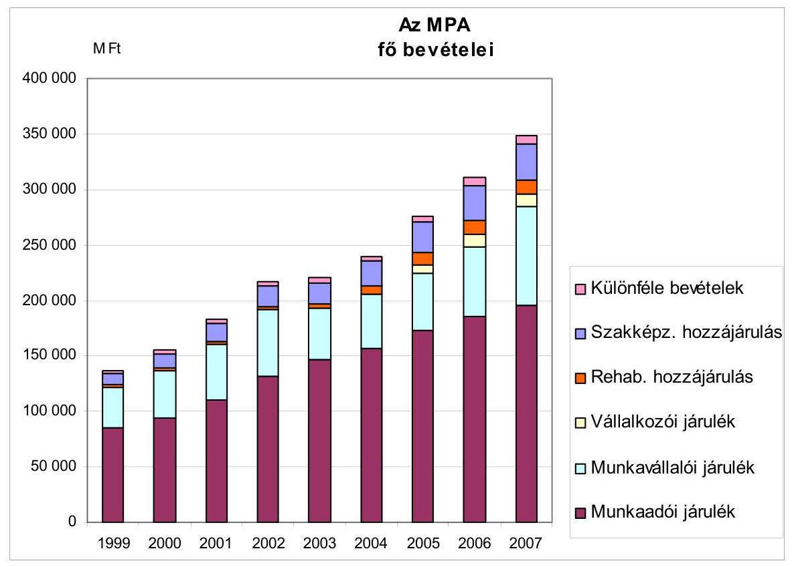

2007: előirányzott
Az Alap éves bevétele 2004-2006. között 241,6 Mrd Ft-ról 311,5 Mrd Ft-ra (28,9\%-kal) emelkedett. A bevételek összetétele lényegesen nem változott, a járulékok aránya 83-86\%, a hozzájárulásoké 9-14\%, az egyéb tételeké mintegy 2\% (a bevételek alakulását részletezi a 5. számú melléklet).

Az Alap éves kiadása 2004-2006. között 244,6 Mrd Ft-ról 289,5 Mrd Ft-ra (18,4\%-kal) emelkedett. A 2004. évi kiadási többlet az Alap pénzügyi tartalékát csökkentette. A kiadásoknak a bevételektől elmaradó növekedését elsősorban a 2006. évi járulékemelésből keletkezett bevételi többlet felhasználhatóságának tilalma okozta. A kiadási előirányzatoknak a PM útmutatása szerint, az éves bevételi előirányzattal egyező összegű (nulla GFS egyenleget adó) tervezése az alapszerű működés Áht-ben előírt követelményénél szigorúbb költségvetési korlátot szabott a kiadásoknak (a kiadások alakulását a 6. számú melléklet mutatja be).

Az Áht. 55. §. (1) bekezdése megszabja, hogy az elkülönített állami pénzalap Országgyűlés által megállapított kiadási előirányzatai - a bevételi előirányzatok túlteljesülése esetén kívül - módosíthatók, ha a felülvizsgált és jóváhagyott előző évi maradványok erre fedezetet biztosítanak.

---

# Az Alap kiadásainak az éves költségvetési és zárszámadási törvényekben megjelenített bemutatása és annak tartalmi változásai megnehezítették a költségvetés értékelését, elemzését, az egymást követő évek adatainak összehasonlítását. 

A szakmai törvény (Flt.) az egyes felhasználási célokat alaprészekhez kötötten határozza meg. Egyes alaprészek kiadásai az Alap költségvetésének és beszámolójának törvényi soraiból a szakmai törvénytől eltérő szóhasználat miatt közvetlenül nem állapíthatók meg (pl. aktív foglalkoztatási eszközök → foglalkoztatási alaprész, szakképzési célú kifizetések → képzési alaprész). A költségvetési törvények egyre több alaprészen kívüli kiadási sort tartalmaztak, melyek célja esetenként nem volt nyilvánvaló (pl. területkiegyenlítésre pénzeszközátadás). Tartalmi változást jelentett az aktív foglalkoztatási eszközök sorába tartozó tételek utóbb önálló sorban való közlése (társadalmi párbeszéd programok), külön sorok (pl. közcélú munkavégzés, aktív korúak rendszeres szociális segélyezése) összevonása. A költségvetés bemutatásának problémáit az ÁSZ a jelentéseiben folyamatosan jelezte.

Az Alap törvényben elfogadott költségvetésének 2007. évi változásai követték a kormányzati szervek közötti hatásköri és szervezeti változásokat, egyben tartalmilag „tisztítottak" az egyes kategóriákon. A módosítások ugyanakkor ismét összemérési gondokat okoztak ${ }^{43}$. A 2008. évi költségvetési törvényjavaslat már az Flt. szerinti fő felhasználási célok szerint csoportosítva tartalmazza az egyes kiadási kategóriákat.
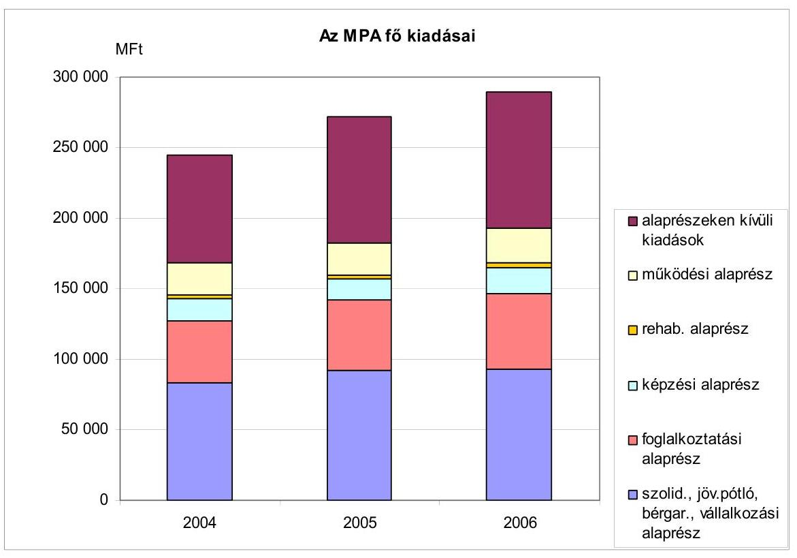

[^0]
[^0]:    ${ }^{43}$ A szerkezeti változást követő és megelőző adatok összemérhetősége az átmeneti időszakra kétféle szerkezetű adatközléssel biztosítható.

---

A szakképzésért való felelősség és a képzési alaprésszel való rendelkezés joga a szociális és munkaügyi miniszterhez került, ezt követően feleslegessé vált a felnőttképzési célú keretnek a képzési alaprészből a foglalkoztatási alaprészbe való átcsoportosítása. A két alaprész egyes működési kiadásai átkerültek a működési alaprészbe (Nemzeti Szakképzési és Felnőttképzési Intézet, OFA).

A vizsgált időszakban az Alap szakmai felhasználási céljait megtestesítő alaprészek kiadási főösszegen belüli aránya 60\%-ról kis mértékben, 58\%-ra mérséklődött. A működési alaprész aránya 9\% volt (2005-ben átmenetileg 8\%-ra csökkent), és 2006-ban a kiadások egyharmadát (2004-ben 31\%-át) az alaprészeken kívüli kiadási előirányzatokra fordították. A szakmai felhasználási területeken, az ellátások rendszerének módosításával az Alap csökkenő arányban (34\%-ról 32\%-ra) költött passzív jellegű ellátásokra (a munkanélküliek átmeneti pénzbeli megsegítésére). Változatlan arányban, a kiadások 18\%-át fordították a foglalkoztatási, mintegy 7\%-át a képzési és 1\%-át a rehabilitációs alaprészből finanszírozott támogatásokra. A foglalkoztatási és a rehabilitációs alaprész a foglalkoztathatóság javítását, a foglalkoztatás támogatását szolgáló, tágabb értelemben vett ${ }^{44}$ aktív foglalkoztatáspolitikai eszközök működtetését finanszírozta.

A passzív jellegű ellátásokhoz a munkanélküliek/álláskeresők ellátását fedező szolidaritási alaprészt (az aktív korúak nyugdíjához való hozzájárulást is beleértve), illetve a vállalkozókat támogató vállalkozói alaprészt, a jövedelempótló támogatás alaprészt, a felszámolás alatt álló gazdálkodó szervezeteknek a munkavállalókkal szembeni bértartozása megelőlegezésére szolgáló bérgarancia alaprészt soroltuk. A teljesített passzív jellegű kiadások több mint 90\%-a tartozik a szolidaritási alaprészhez.

A foglalkoztatási alaprész felhasználásával működtetik a felnőttképzési, készség-, képességjavító, képzettséget adó tanfolyamokat, programokat, a munkaerő közvetítését, a tájékoztatást adó munkaerőpiaci szolgáltatásokat, a foglalkoztatáshoz a munkát keresőnek vagy a munkát adónak nyújtott bér- és járulékkedvezményeket. A képzési alaprész célja a korszerűen képzett gyakorlati szakemberek számának növelése, a szakképzettség, a képzési rendszer fejlesztése. A rehabilitációs alaprész támogatja a foglalkozási rehabilitációt elősegítő programokat, közalapítványokat.

A működési alaprész, az Alapot működtető munkaerőpiaci szervezet, valamint a munkaügyi ellenőrzést végző Országos Munkavédelmi és Munkaügyi Főfelügyelőség (OMMF) kiadásaihoz való hozzájárulás 22,6 Mrd Ft-ról 24,8 Mrd Ft-ra növekedését elsősorban a munkaügyi ellenőrzés költségvetési törvényben előírt támogatásának ötszörözése okozta. Az alaprész nem tartalmazza az ÁFSZ teljes működési kiadásait, ugyanakkor a „szakmai" alaprészek működési jellegű kiadásokat is tartalmaznak.

Az eszközök működtetésének egyes kiadásai (pl. postaköltség) az eszközt finanszírozó alaprészt terhelik, és az Flt. a működtetési feltételek javításának meghatározott kiadásait is szakmai alaprészek kiadásaként határozta meg (munkaügyi nyilvántartás kiépítése a foglalkoztatási alaprész felhasználásaként).

[^0]
[^0]:    ${ }^{44}$ A szűkebb értelmezés szerint a foglalkoztatási alaprészből működtetett eszköztár tartozik az aktív eszközökhöz.

---

Az Alap elkülönülő felhasználási céljaira a költségvetési törvények a megfelelő alaprészeken kívül is előirányoztak kiadásokat. Az alaprészekhez nem kötött előirányzatok a tartalmukat tekintve működési (tranzakciós kiadások) és rehabilitációs célt, az aktív eszközök újabb felhasználási területeit, valamint a központi költségvetés egyre kevésbé nevesített bevételi célját finanszírozták.

Aktív eszköz pl. az EU-s foglalkoztatási programok társfinanszírozása, a nonprofit szektorbeli munkavállalás támogatása, a normatív járulékkedvezmények miatt az Alapot terhelő kiadás, amelyek önálló sorként jelennek meg a költségvetésben. Az Alap 2004-ben 31,6 Mrd Ft, 2005-ben és 2006-ban 52-52 Mrd Ft-os költségvetési befizetéssel járult hozzá a megváltozott munkaképességűek foglalkoztatásához. Az önkormányzatok szociális tevékenységéhez történő hozzájárulás 2004-ben részletezett tételei 2005-től egy soron találhatók, és 2007-től e tételt a megváltozott munkaképességűek foglalkoztatásához, továbbá meg nem nevezett célokhoz történő hozzájárulással összevontan tartalmazza a
 költségvetés.

# 1.3. Az Alappal való rendelkezés, az alapszerű működés megvalósulása 

Az MPA létrehozásakor, 1996-ban gondoskodtak az elkülönített állami pénzalap működésének alapfeltételéről: az Alap hatókörébe sorolt szakmai feladatokhoz az államháztartáson kívülről származó forrásokat, célzott adójellegű befizetéseket rendeltek ${ }^{45}$. Az MPA fennállása óta (a költségvetést vagy annak beszámolóját tartalmazó törvényben megengedett kivételekkel) teljesült az alapszerű működés pénzügyi feltétele, miszerint az Alapból kiadásokat a bevételek mértékéig lehet teljesíteni. Az MPA pénzeszközeinek halmozódó maradványa, mérleg szerinti költségvetési tartaléka 2004 végére 11610,8 M Ft-ra mérséklődött, 2005 végére 15 986,3 M Ft-ra, 2006-ban 37 921,9 M Ft-ra emelkedett. A tartalék felhasználhatóságát az Áht. 55. § (1) bekezdésén kívül 2006-tól szabályozza az Flt.

A PM tervezési körirata minden évre előírta, hogy a tárgyévi kiadások nem haladhatják meg a tárgyévi bevételeket. A 2006-tól bevezetett likviditási tartalék a záró pénzállománynak a biztonságos működéshez szükséges nagyságát határozza meg. A tartalék a Kormány előzetes jóváhagyásával használható fel (Flt. 39/D. §).

Az Alap önkormányzati irányításának szükségességét az Országgyűlés határozatban ${ }^{46}$ mondta ki. A határozatot végrehajtó szabályozás az 1996. évi CVII. törvény alapján került az Flt-be. Az önkormányzati irányítás központi szerve a Munkaerőpiaci Alap Irányító Testülete (MAT), területi szervei pedig a (megyei majd regionális) munkaügyi tanácsok (MÜT).

A foglalkoztatáspolitikai és munkaügyi (2007-től a foglalkoztatáspolitikáért felelős) miniszter az Alappal kapcsolatos rendelkezési jogát a

[^0]
[^0]:    ${ }^{45}$ Áht. 54. § (2) bekezdés
    ${ }^{46}$ 126/1995. (XII.26.) OGY határozat a Munkaerőpiaci Alap önkormányzati jellegű irányításáról szóló törvényi szabályozásról - „Az Országgyűlés szükségesnek tartja, hogy a Munkaerőpiaci Alap 1997-től a munkaadók, a munkavállalók és a Kormány delegált képviselőiből álló önkormányzati jellegű irányítás alá kerüljön."

---

MAT-tal, az MPA képzési alaprésze tekintetében az oktatási miniszterrel megosztva gyakorolta ${ }^{47}$. A rendelkezési jog megosztása nem érintette a miniszter Alapért viselt általános kormányzati felelősségét (az MPA felhasználásának központi döntési mechanizmusát az 7. számú melléklet tartalmazza).

A MAT rendelkezési joga gyakorlásának, a döntéshozatalnak az aktív eszközök felhasználásánál van tere. A passzív ellátások az igénybevételi jogosultság és az ellátás mértéke jogszabályi feltételeinek megfelelően automatikusan megilletik a kérelmezőt, a törvényi előirányzatok túl is léphetők és ezt a költségvetési törvények is lehetővé teszik. Az Flt. a foglalkoztatáspolitikai eszközök alkalmazási céljainak meghatározásához, a forrásoknak a célok közötti elosztásához döntési, javaslattételi jogosítványokat biztosít az önkormányzati irányítás (MAT/MÜT) szervei számára, a foglalkoztatási és a rehabilitációs alaprészhez rendelten.

A munkaadókat, munkavállalókat és a kormányzatot 6-6 fővel képviselő testület dönt, véleményez, és állást foglal az Flt-ben részletezett, hatáskörébe utalt ügyekben. Az aktív eszközök alkalmazása a konkrét eszközt és a mértéket illetően is döntést igényel.

Az MPA felhasználására vonatkozóan a MAT dönt a foglalkoztatási és rehabilitációs alaprész központi és decentralizált kereteinek arányáról, a decentralizálás elveiről, az alaprészek közötti, valamint az alaprészeken belüli átcsoportosításokról, a foglalkoztatási alaprész központi keret felhasználásáról. A munkaügyi tanácsok a decentralizált keretek felhasználásának elveiről és arányairól döntöttek (2006 végéig).

Az MPA kiadásainak összetétele az alaprészeken kívüli felhasználási jogcímek felmerülésével megváltozott (az 1999, 2000. évi kiadásokat is bemutató, csak az aktív kiadásokat részletező összeállítást a 8. számú melléklet tartalmazza, amelyben aktív eszközként a felhasználás tartalma alapján vettük figyelembe az egyes kiadási tételeket). A munka nélkül lévők passzív ellátásaira 1999-ben a kiadások több mint felét fordították, a 2004. és 2006. években mintegy a harmadát.

A passzív eszközök visszaszorulása az aktív eszközökre fordított kiadások súlyának növekedésével járt együtt, arányuk az Alap kiadási főösszegében az 1999. évi 28%-ról 2006-ban 42%-ra emelkedett. Az Alap egyre több címen és egyre nagyobb összegben fedez a költségvetési törvényben előírt, a költségvetésbe befizetendő és más tárca által felhasznált, az 1999-es költségvetést még nem terhelő tételeket is, amelyekre 2006-ban a kiadások 10%-a merült fel. (A szakképzési célú kifizetések 1999. évi 6%-os aránya 2006-ban 7% volt, a működési kiadások aránya 8%-ról 9%-ra emelkedett.)

[^0]
[^0]:    ${ }^{47}$ Flt. 39/A. § (1) bekezdés a/ és b/ pontjai, Szht. 11. §

---

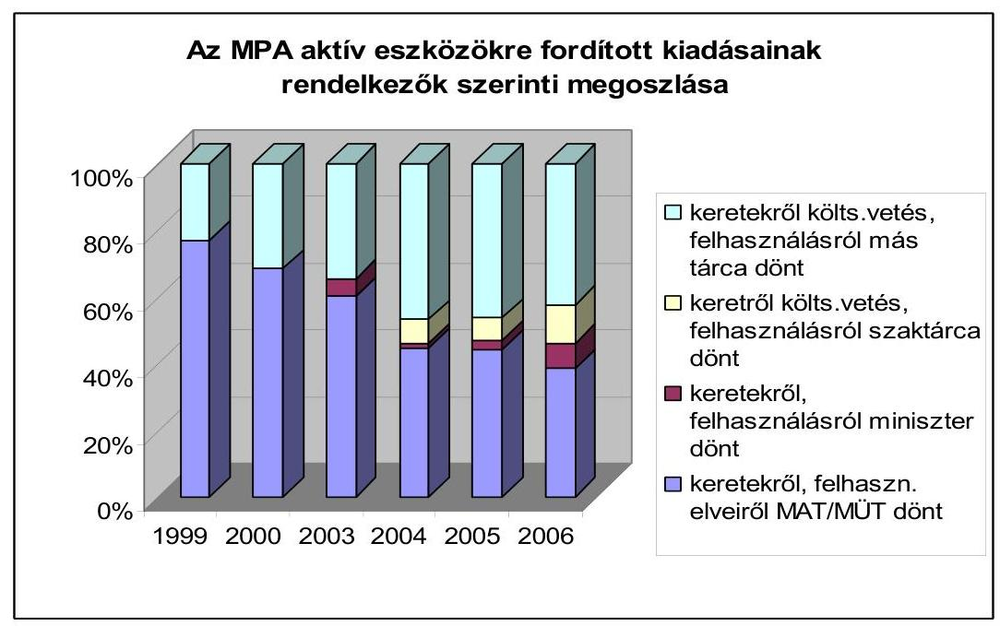

Az aktív eszközökre fordított kiadások alakulását 1999-től, az egyes keretek nagyságának és felhasználásának meghatározására jogosultakat is figyelembe véve értékelve, az alábbiak állapíthatók meg:

A felhasználási célok bővülésével a MAT és a szaktárca hatásköre a döntést igénylő aktív kiadások egyre csökkenő részére terjedt ki. A MAT rendelkezési jogköre az aktív kiadások 77%-áról (1999-ben) 39%-ra (2006-ban) esett vissza, a szaktárcáé az 1999. évi 77%-ról 2006-ban 58%-ra csökkent.

- a foglalkoztatási alaprészen belül megjelentek olyan aktív tételek, amelyek nagyságáról és felhasználásáról (felnőttképzési célú keret, 2003-tól), illetve nagyságáról (képzési keret, 2006-tól) már nem a MAT, hanem a szaktárca döntött. Arányuk 2006-ban az aktív kiadások 7%-a;
- az alaprészekhez nem kötött kiadásokon belül, a költségvetési törvények határoztak meg célokat és összegeket, amelyeket
- a szaktárca irányításával használtak fel (EU társfinanszírozás, non profit szektorbeli munkavállalás támogatása, közmunka támogatása, 2006-ban az aktív kiadások 12%-a, 1999-ben 0%-a);
- más tárcák irányításával használtak fel (átadás közcélú munkára, megváltozott munkaképességűek foglalkoztatására, arányuk 2006-ban az aktív eszközökre fordított összeg 42%-a, 1999-ben 23%-a).

Az önkormányzati irányítás helyi szerveinek hatásköre 2007-től szorult vissza a munkaügyi tanácsok aktív eszközökre vonatkozó döntési jogosítványainak jogszabályi törlésével ${ }^{48}$.

Az aktív eszközök működtetésének a szaktárca hatásköre alóli kikerülése ellentmond a miniszternek a kormány foglalkoztatáspolitiká-

[^0]
[^0]:    ${ }^{48}$ Az Flt. 13. §-ának módosításával

---

jáért és az MPA felhasználásáért viselt általános felelősségének, a közfoglalkoztatás területén gátolta az eszközök összehangolt működtetését. Az SZMM miniszternek a megváltozott munkaképességű személyek társadalmi integrációjáért viselt felelősségének nem felel meg a foglalkoztatási támogatással való rendelkezés hiánya. A támogatással való elszámolási kötelezettség Pénzügyminisztériumhoz (PM) telepítése az Áht-val és a miniszterek feladatait meghatározó kormányrendeletekkel nem volt összhangban. Az összhang hiánya megszűnt 2007. július 1-jén, amikor a megváltozott munkaképességű személyek foglalkoztatásának támogatása teljes egészében a tárca feladatkörébe került.

Az Alap felhasználásáról más tárca nem tartozik az Alappal rendelkezők felé beszámolási kötelezettséggel. A közfoglalkoztatási támogatások széttagolt rendszerében a támogatások hasznosulásáról nincsen teljes kép.

A megváltozott munkaképességűek foglalkoztatási támogatásával a PM a „Normatív támogatások" címen számol el. Az Áht. 20. § (7) bekezdésének nem felel meg, hogy a támogatásról szóló beszámolót nem a szakmai célt ellátó fejezet beszámolója tartalmazza. A szociális és munkaügyi miniszter feladat- és hatásköréről szóló jogszabály ${ }^{49}$ szerint a miniszter a társadalmi esélyegyenlőség előmozdításáért való felelőssége keretében felel a fogyatékos és megváltozott munkaképességű személyek társadalmi integrációjának elősegítéséért, de a pénzügyminiszternek erre vonatkozóan a feladat- és hatásköréről rendelkező jogszabály ${ }^{50}$ nem ír elő feladat-, vagy hatáskört.

A költségvetési befizetések részletezésének hiánya (pl. 2005-ben 29,3 Mrd Ft-ból, 2006-ban 30 Mrd Ft-ból a közcélú foglalkoztatásra fordított rész) nem teszi megállapíthatóvá, hogy felhasználásuk célja megfelel-e az Alap működési céljának (foglalkoztatási feszültségek kezelése). A felhasználásról szóló beszámolók hiánya pedig az Alappal rendelkezők számára nem teszi megállapíthatóvá, hogy az összegeket az előírt célra használták-e fel. A foglalkoztatási feszültségek kezeléséhez nem kötődő felhasználási célú kiadásoknál csorbul az alapszerű működésnek a bevételek célhoz kötött felhasználására vonatkozó elve.

Az OÉT tájékoztatójában ${ }^{51}$ jelent meg: „A munkavállalói oldal sérelmesnek tartja, hogy a munkavállalói járulékemelésből adódó többletbevétel nem jelenik meg a Munkaerőpiaci Alap költségvetésében többletforrásként. Igényli ennek korrekcióját."

[^0]
[^0]:    ${ }^{49}$ 170/2006. (VII.28.) Korm. rendelet a szociális és munkaügyi miniszter feladat- és hatásköréről
    ${ }^{50}$ 169/2006. (VII.28.) Korm. rendelet a pénzügyminiszter feladat- és hatásköréről
    ${ }^{51}$ Tájékoztató az Országos Érdekegyeztető Tanács 2006. november 22-i üléséről. Országos Érdekegyeztető Tanács Titkársága 2007. január 16.

---

# 2. Az Alap pénzeszközeinek szakmai célok szerinti felhasználása 

### 2.1. A passzív ellátási rendszer

A munkanélkülivé vált személy átmenetileg passzív ellátásokban részesülhet, az ellátások forrása az MPA szolidaritási alaprésze. Az ellenőrzött időszakban a munkanélküli ellátások körébe a munkanélküli járadék, az álláskeresést ösztönző juttatás, a nyugdíj előtti munkanélküli segély és a költségtérítés tartozott, 2005. november 1-jétől az álláskeresési támogatás és az álláskeresési segély, valamint új elemként az MPA vállalkozói alaprészéből ${ }^{52}$ a vállalkozói járadék.

Az Flt. módosításának célja a munkára ösztönzés erősítése volt. A módosítás az ellátó rendszer elemeinek elnevezését is változtatta, a munkanélküli ellátó rendszer helyébe az álláskeresők támogatási rendszere, a munkanélküli járadék helyébe az álláskeresési támogatás lépett, az álláskeresést ösztönző juttatás és a nyugdíj előtti munkanélküli segély megszűnt, az utóbbi beépült az álláskeresési segély rendszerébe.

## Az ellátás megállapításának és folyósításának feltételei szigorodtak

(a járadékra való jogosultsághoz minimálisan szükséges munkaviszony hossza emelkedett és csak az a személy részesülhet ellátásban, aki aktívan keres munkát), az ellátás mértéke az idő előrehaladásával fokozatosan csökken, illetőleg stagnál.

A munkanélküli járadék az átlagkereset 65%-a volt, 2005. november 1-jétől az álláskeresési járadék az első szakaszban az átlagkereset 60%-a, majd a másodikban az átlagkeresettől függetlenül a kötelező legkisebb munkabér 60%-ára csökkent. Az álláskeresési járadék átlagos összege 2004 januárjában 35605 Ft/fő/hó, 2007 januárjában 43981 Ft/fő/hó volt.

A járadék folyósítási ideje nem változott, legfeljebb 270 nap. A segély folyósítási ideje - meghatározott feltételektől függően - 90 vagy 180 nap, illetve az öregségi nyugdíjjogosultság megszerzéséig tart.

A munkanélküliek/álláskeresők nyilvántartásba vétele és az ellátások megállapítása, folyósítása a munkaügyi központok kirendeltségeinek feladatkörébe tartozott. Munkanélküliként azt a személyt vették nyilvántartásba, aki azt kérte és megfelelt a jogszabályban előírtaknak, illetve a jogszabályi feltételek ${ }^{53}$ módosulását követően elhelyezkedése érdekében álláskeresési megállapodást ${ }^{54}$ kötött a kirendeltséggel (2005. november 1. és 2006. december 31. között). A feladat 2005 végén dömpingszerűen jelentkezett a kirendeltségeken, ezzel jelentős terhet róva a szervezetre. A gyakorlati tapasztalatok hatására 2007. január 1-jétől a nyilvántartásba vételnek az álláskeresési megállapodás megkötése már nem feltétele, de a kirendeltséggel való együttműködési kötelezettség továbbra is fennáll.

Az Flt. 2005. évi módosítása a munkanélküliek álláskeresési aktivitásának növekedése irányába hatott. Minél nagyobb a különbség a korábbi átlagkereset és az ellátás összege között, annál inkább igyekeznek az ügyfelek lehetőség

 szerint újra elhelyezkedni.

A munkanélküliek keresik a munkalehetőséget. Azokban a megyékben, ahol a mezőgazdasági tevékenység dominál, jellemzően a tavaszi és nyári időszakban tudnak elhelyezkedni, a magasabb munkanélküliségi rátával jellemezhető településeken csak a másodlagos munkaerőpiacon (közmunka, közhasznú, közcélú foglalkoztatás keretében) találnak munkát.

Az álláskeresési járadék második szakaszában nő az elhelyezkedés iránti igény. Az ellátás harmadik szakaszában a segélyes ügyfelek jelentős része belekerült egy körforgásba, melyben a rövid idejű munkaviszonyok, az álláskeresési segély és a rendszeres szociális segély váltják egymást.

A regisztrált munkanélküliek száma 2004 januárjában 388 ezer fő, a nyilvántartott álláskeresők száma 2007 januárjában 439 ezer fő, ebből a munkanélküli/álláskeresési ellátásban részesültek aránya 34% (131 ezer fő), illetve 37% (162 ezer fő) volt. Az ellátások folyósítása az ellátásban eltelt napok figyelembevételével történt, a passzív ellátásokra fordított összeg 2004-ben 78,2 Mrd Ft, 2005-ben 86,7 Mrd Ft, 2006-ban 85,9 Mrd Ft volt.

Az ellátórendszer működtetése a munkaügyi központok kirendeltségeinek feladata. Az FH szakmai koordináló, irányító tevékenysége a passzív eszközök tekintetében az informatikai feltételrendszer biztosításában, fejlesztésében, különböző módszertani útmutatók kiadásában, képzések szervezésében nyilvánult meg. Az egységes gyakorlat kialakítására korábban központilag kiadott, külön eljárásrend nem készült, az Flt. és a végrehajtásához kapcsolódó jogszabályok meghatározták a passzív ellátásokkal kapcsolatos feladatokat, az ellátás megállapítása, szüneteltetése és megszüntetése szabályait is. A jogszabályváltozást követően, 2005 végén a Hivatal által kiadott eljárási rend segítette a kirendeltségek munkáját.

A munkaügyi központ kirendeltségének ügyintézője az ellátásra való jogosultság jogszabályi feltételeinek teljesülését az ügyfél nyilatkozata, valamint az ügyfél által bemutatott iratok alapján állapítja meg. Az igazolások tartalmi elemeit nem ellenőrzi, kirívó esetekben (pl. kiugró kereset, megszűnt munkáltató igazolása) továbbítja azt a munkaerőpiaci ellenőrzési szervezeti egység felé.

Az EMMA-t a kirendeltségek munkatársai nem használták az ügyfelek által hozott munkáltatói igazolások ellenőrzésére. A 2004. május 1-jei bevezetést követően elsősorban a munkaügyi és munkabiztonsági/munkavédelmi felügyelőség, valamint a hatósági ellenőrök munkájában, illetve a passzív ellátásokra vonat-

---

kozó panaszok, kirendeltségi megkeresések, fellebbezések esetén a határozatot hozó kirendeltségi munkatársnak és a jogi osztálynak nyújtott segítséget. A munkaügyi központoknak 2007. január 1-jétől a jogszabályi felhatalmazás $^{55}$ hatályon kívül helyezése miatt sem betekintési, sem lekérdezési jogosultsága nincs a rendszerben.

# 2.2. A foglalkoztatási alaprészből finanszírozott aktív eszközök 

Az aktív foglalkoztatáspolitikai eszközrendszer a munkanélküliség csökkentését, megelőzését, a munkanélküliek munkába helyezését és a foglalkoztatási feszültségek feloldását, a foglalkoztathatóság, a munkaerőpiaci esélyek javítását szolgálja. Az MPA foglalkoztatási és rehabilitációs alaprészéből $^{56}$ támogatás nyújtható a munkanélküliek képzéséhez, újbóli foglalkoztathatóságához, új munkahelyek létrehozásához, meglévők megtartásához.

A foglalkoztatási alaprészből (FA) 2004-2006. között 147,7 Mrd Ft kifizetés történt. Az alaprészen belül a központi és decentralizált keret arányáról és a keretek közötti átcsoportosításokról a MAT dönt.

A MAT határozatai alapján a központi keret 2004-ben 10343 M Ft, 2005-ben 11974 M Ft és 2006-ban 11789 M Ft, a keret terhére teljesített kifizetés 2004-ben 8341 M Ft, 2005-ben 10036 M Ft és 2006-ban 10759 M Ft volt.

Közel 105 Mrd Ft-ot a munkaügyi központok decentralizált keretként használtak fel a munkaügyi tanácsok döntése alapján. A megyékre leosztott decentralizált keret központi kerethez viszonyított aránya a 2004. évi 81%-ról 2005-ben és 2006-ban 76%-ra csökkent. Az aktív eszközök működtetésével érintettek létszáma a három év viszonylatában meghaladta a 630 ezer főt $^{57}$.

A foglalkoztatást elősegítő támogatások finanszírozási rendszerében a vizsgált időszakban - az alaprészen belül a regionális képző központok képzési és képzéssel kapcsolatos feladatainak finanszírozására szolgáló képzési keret elkülönítésével - bekövetkezett változás is hozzájárult a decentralizált pénzeszközök alaprészen belüli arányának csökkenéséhez (a 2004. évi 78%-ról 2006-ra 63%-ra). A korábban csak a decentralizált keretből finanszírozott munkaerőpiaci képzés működését ugyanakkor az Flt-ben meghatározott célcsoportok képzéseinek több forrásból (a decentralizált mellett a képzési keretből) történő támogatása a ráfordítások és a bevont létszám tekintetében nem befolyásolta kedvezőtlenül. A képző központok finanszírozásának változása nem szűkítette a munkanélküliek részére indítható képzések körét, számát.

[^0]
[^0]:    $^{55}$ Flt. 57/C § (1) bekezdés (d) pontja
    $^{56}$ Az MPA rehabilitációs alaprészből történt kifizetések vizsgálatára jelen vizsgálat nem terjed ki, mert azt az ÁSZ-nak a munkaképesség megőrzésére fordított pénzeszközök hasznosulásának ellenőrzéséről szóló jelentése (0731) érinti.
    $^{57}$ Az aktív eszközök működtetésével érintettek létszám adatai az aktív eszközök segítségével adott időszakban támogatáshoz jutottak tényleges számáról nem adnak információt, mert a létszámstatisztikákban egy (pl. egy képzést követően támogatott foglalkoztatásba kerülő, vagy közhasznú foglalkoztatásba több alkalommal akár csak néhány napra bevont) személy többször is megjelenik.

---

# 2.2.1. A központi keret terhére indított munkahelyteremtést segítő programok és munkahelymegőrző támogatások 

A foglalkoztatási alaprész központi keretének felhasználási területeit az Flt. $^{58}$ határozza meg. Jelen ellenőrzés kiemelten a központi keretből a munkahelyteremtő beruházásokra és a munkahelymegőrző támogatásokra fordított pénzeszközök hasznosulásának véleményezésére terjedt ki$^{59}$, melyre a keret 27-46%-át használták fel.

## A FA központi keretének megoszlása

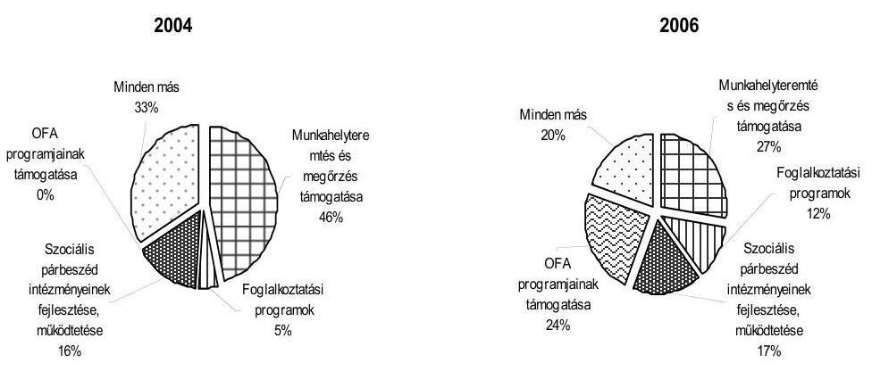

A keret központi foglalkoztatási, képzési és munkaerőpiaci integrációs programok és kutatások, meghatározott munkahely-teremtési célok, foglalkoztatási és képzési célú közalapítványok támogatására használható fel. A keretből foglalkoztatást elősegítő támogatások továbbfejlesztésére vonatkozó kutatások és programok finanszírozhatók, és a forrás többek között az érdekegyeztetés, a társadalmi párbeszéd intézményei működéséhez és fejlesztéséhez járul hozzá. A keret pénzeszközei a PHARE, majd az Európai Szociális Alap társfinanszírozásával megvalósuló programok hazai finanszírozására fordíthatók.

A központi munkahelyteremtő pályázati programokra biztosított $^{60}$, valamint a munkahelymegőrzés támogatására fordítható kereteket $^{61}$ MAT határozat rögzí-

[^0]
[^0]:    $^{58}$ Flt. 43. § (2) bekezdés
    $^{59}$ A ellenőrzés az IDEA program segítségével véletlenszerűen kiválasztott minta alapján 31 munkahelyteremtő támogatás a kifizetett támogatás mintegy 21%-a, illetve 15 munkahely-megőrzési támogatás a kifizetett támogatás 11%-a felhasználását vizsgálta. Az MPA költségvetése végrehajtásának ellenőrzése keretében a felhasználás szabályszerűségét az ÁSZ minden évben minősíti.
    $^{60}$ A keret összege 2004-ben 2 Mrd Ft, 2005-ben 1,5 Mrd Ft, 2006-ban 1,8 Mrd Ft volt. Ez a keret 2006-ban kiegészült további 352 M Ft-tal, amelyet 8 megyei munkaügyi központ decentralizált keretéből csoportosított át a MAT.
    $^{61}$ 2004-ben a központi keretből 855 M Ft, 2005-ben 1724 M Ft, 2006-ban 1200 M Ft állt rendelkezésre.

---

ti, a felhasználás szabályait jogszabályi rendelkezések határozták meg $^{62}$, a programok végrehajtását a minisztérium 2004-ben és 2005-ben módszertani útmutató kiadásával segítette, 2006-ban eljárási rendben szabályozta.

Az eljárási rend alapján a munkahelyteremtő beruházási programokat a minisztérium hirdette meg, a munkaügyi központok fogadták a pályázatokat, javaslatot tettek a minisztérium felé, a minisztérium szakfőosztálya értékelte a pályázatokat. A miniszteri döntést követően a munkaügyi központok szerződést kötöttek a támogatott pályázókkal, ellenőrizték a beruházások megvalósulását, folyósították a támogatásokat, figyelemmel kísérték a foglalkoztatási kötelezettség teljesülését és a program befejezését követően lezárták a támogatásokat.

A munkahelyteremtést segítő központi pályázati programok célja a kedvezőtlen helyzetű térségekben $^{63}$ működő vállalkozások támogatása, tartós időtartamú $^{64}$ foglalkoztatást biztosító új munkahelyek létrehozása volt. A támogatási igény minden évben meghaladta a rendelkezésre álló forrást, ezért a döntés-előkészítés és döntés során prioritásokat $^{65}$ érvényesítettek. Az ellenőrzött időszakban 297 vállalkozásnak összesen 5,7 Mrd Ft támogatást ítéltek meg.

A benyújtott pályázatok mintegy 28%-át, a munkaügyi központok által megalapozottnak ítélt támogatási igény 50%-a összegében támogatták. Forráshiány miatt 2004-ben 212, 2005-ben 98 pályázatot utasítottak el.

A vizsgált időszakban munkahelyteremtő támogatásokra 4,9 Mrd Ft kifizetés történt. Megítélt támogatás folyósítására 2004. és 2006. között 717 M Ft összegben azért nem került sor, mert a pályázók a szerződéskötés előtt visszaléptek, vagy a beruházás a támogatás nélkül is megvalósult. A támogatott beruházások segítségével 5285 új munkahely létesült, ahol 3379 fő nyilvántartott munkanélkülit/álláskeresőt foglalkoztatnak tartós ideig. A támogatási keretösszeg 30%-át a legsúlyosabb munkanélküliséggel küzdő (a munkanélküliségi ráta 18,1-18,6%) Szabolcs-Szatmár-Bereg megyei és Borsod-Abaúj-Zemplén megyei vállalkozások kapták. A két megyében 69 vállalkozás összesen 1472 M Ft vissza nem térítendő támogatásban részesült, és a beruházások eredményeként 1556 új munkahely jött létre.

Szabolcs-Szatmár-Bereg megyében 2005-ben a Start Rehabilitációs Vállalat és Intézményei 305 új munkahely létrehozására 180 M Ft, a Szabolcs-Coop Kereske-

[^0]
[^0]:    $^{62}$ 6/1996. (VII.16.) MüM rendelet a foglalkoztatást elősegítő támogatásokról, valamint a Munkaerőpiaci Alapból foglalkoztatási válsághelyzetek kezelésére nyújtható támogatásokról
    $^{63}$ 7/2003. (I.14.) és 240/2006. (XI.30.) Korm. rendelet a társadalmi-gazdasági és infrastrukturális szempontból elmaradott, illetve az országos átlagot jelentősen meghaladó munkanélküliséggel sújtott települések jegyzékéről
    $^{64}$ legalább 3 éves, 2005-től kis- és középvállalkozások esetében legalább 2 éves foglalkoztatás
    $^{65}$ pl. az előírtnál hosszabb foglalkoztatási kötelezettség vállalása, a létrehozandó új munkahelyek nagy száma, a beruházásban érintett térség, település hátrányos helyzete, a munkanélküliek, közülük is a hátrányos helyzetűek foglalkoztatásának magasabb aránya

---

delmi és Szolgáltató Rt. 10 új munkahely létrehozására 10 M Ft támogatást kapott.

Borsod-Abaúj-Zemplén megyében a SANMINA SCI Kft. 2005-ben 77 fő többletlétszám foglalkoztatására 80 M Ft támogatást kapott, így a beruházás befejezését követően az összes foglalkoztatotti létszám 388 fő volt. Az ARETASZ Kft. 2006-ban benyújtott pályázata alapján 5 M Ft támogatással a foglalkoztatotti létszám 5 fővel 77 főre növekedett.

Az eljárási rendnek megfelelően a finanszírozás a beruházás megvalósítását követően történt, a folyósítás feltétele a hatósági szerződésben megjelölt eszközbeszerzéseket igazoló eredeti bizonylatok bemutatása volt. A támogatottak a vállalt foglalkoztatási kötelezettség teljesítését havi létszámjelentések útján igazolták. A munkaügyi központok a jelentések határidőben történő megküldését figyelemmel kísérték. A munkaügyi központok többsége a beruházás megvalósítását követően helyszíni ellenőrzést is végzett a támogatottaknál. Volt azonban olyan munkaügyi központ is (Főváros, Heves és Nógrád megye), amelyik - munkaerőpiaci ellenőri kapacitás hiányában csak kis számban végzett ilyen típusú ellenőrzéseket.

A létszámjelentések és a helyszíni vizsgálatok tapasztalatai alapján a támogatottak általában teljesítették a létszámfeltöltési, illetve foglalkoztatási kötelezettséget.

A vizsgált időszakban új típusú támogatás a magas hozzáadott értékű tevékenységek munkahelyteremtő beruházásainak támogatása, melyre 2005-ben és 2006-ban 200-200 M Ft keretösszegben írtak ki pályázatot. A támogatásban olyan vállalkozások részesülhettek, amelyek magas hozzáadott értékű tevékenységet végeznek és viszonylag kis tárgyi eszköz-fejlesztéssel jelentős számú új munkahelyet teremtettek elsősorban felsőfokú végzettségű, többségében pályakezdők részére. A támogatás kedvezményezettjei 2005-ben és 2006-ban elsősorban Budapesten működő, információ-technológiai, pénzügyi, számviteli és üzletviteli szolgáltató és tanácsadó, valamint telefonos ügyfélszolgálati tevékenységet folytató vállalkozások voltak.

A támogatás kizárólag a támogatott beruházás kapcsán felvételre kerülő munkavállalói létszám után volt igényelhető, mértéke új munkahelyenként a ténylegesen felmerülő bérköltség és annak járulékai együttes összegének 60, illetve 50%-a volt attól függően, hogy a
 támogatott vállalkozás regisztrált vagy nem nyilvántartott álláskeresőt foglalkoztat a beruházás által létrehozott új munkahelyen. 2005-ben legalább 5 éves, 2006-ban a kis- és középvállalkozásoknak legalább 2 éves, más vállalkozásoknak legalább 3 éves foglalkoztatási kötelezettséget kellett vállalniuk.

2005-ben a pályázatot benyújtó 5 vállalkozás közül 3, 2006-ban 12 pályázat alapján 10 vállalkozás részére ítéltek meg támogatást. Egy kedvezményezett 2006 januárjában a szerződés felbontását kérte. A biztosított 237 M Ft összegű támogatás összesen 202 új munkahely létrehozásához járult hozzá. 2007-ben a 14 támogatott vállalkozás közül mindössze 4 budapesti, és a hátrányos helyzetű térségekben (pl. Kisvárda, Debrecen, Paks) is létesültek olyan szolgáltató központok, amelyek támogatásban részesülnek.

---

A munkahelymegőrzési programok célja a jelentősnek tekinthető ${ }^{66}$ csoportos létszámleépítések megelőzése, a vállalkozások átmeneti működési problémáinak kezelése, a meglévő munkahelyek megtartásának, a munkaadók gazdasági szerkezetváltásának segítése volt. Támogatására pályázati keretként 2004-ben a központi keretből 855 M Ft, 2005-ben 1724 M Ft, 2006-ban 1200 M Ft állt rendelkezésre.

A támogatások igényelt összege minden évben meghaladta a rendelkezésre álló keretet, ezért a döntés-előkészítés és a döntés során prioritásokat (pl. hosszabb foglalkoztatási kötelezettség vállalása) érvényesítettek. A benyújtott kérelmek száma viszont évről-évre csökkent a támogatáshoz jutás feltételeinek szigorodása (pl. stabilizációs terv készítésének kötelezettsége) miatt.

A 2004-2006. között benyújtott összesen 205 pályázat 68%-ának ítéltek meg támogatást. 2004-ben 112, 2006-ban csak 31 támogatási kérelem érkezett.

A támogatás feltételei 2005-től szigorodtak, 25 M Ft-ot elérő támogatási igény esetén a munkaügyi központ köteles volt külső szakértővel is megvizsgáltatni a kérelmező likviditási helyzetét annak érdekében, hogy csak azok a munkáltatók részesüljenek támogatásban, amelyeknél a munkaviszony megszüntetésére irányuló szándék rövid időn belül megszüntethető likviditási problémákra vezethető vissza.

A vizsgált időszakban összesen 139 vállalkozás részesült támogatásban, ez mintegy 13 ezer fő munkahelyének - hosszabb-rövidebb ideig tartó - megőrzéséhez járult hozzá. A megítélt 2561 M Ft támogatás terhére 2170 M Ft kifizetés történt ${ }^{67}$.

A két összeg közötti különbözet egyrészt abból adódott, hogy a vállalkozások nem tudták vállalni a támogatással érintett bérek előfinanszírozását, másrészt a munkavállalók munkaviszonya nem szankcionálható módon ${ }^{68}$ szűnt meg.

# A munkahelymegőrző támogatás a térségi foglalkoztatási feszültségek kezelésének egyik eszköze volt, nem kizárólag a rövid ideig tartó likviditási problémával küzdő vállalkozások részesültek támogatásban. 

Magas munkanélküliségi rátájú térségben veszteséges tevékenységet folytató mezőgazdasági szolgáltatással, növénytermesztéssel, állattenyésztéssel foglalkozó munkáltatók is kaptak támogatást annak érdekében, hogy az alkalmazott munkaerőpiaci szempontból veszélyeztetett (alacsonyan képzett, 45 év feletti) munkavállalók ne váljanak munkanélkülivé.

[^0]
[^0]:    ${ }^{66}$ A pályázati kiírásnak megfelelően 2004-ben legalább 20 fő, 2005-ben és 2006-ban legalább 50 fő tervezett létszámleépítése esetén.
    ${ }^{67}$ A megítélt támogatások terhére folyósított összege 2004-ben 695 M Ft, 2005-ben 965 M Ft, 2006-ban 510 M Ft volt.
    ${ }^{68}$ pl. munkavállalói rendes felmondás, elhalálozás

---

A 2004-ben támogatott Parád Kristály Manufaktúra Rt-nél nem rövid ideig tartó likviditási probléma merült fel. A gyár nem tudta rentábilis működését helyreállítani. Az Rt. a támogatás folyósításának megszűnését követően csoportos létszámleépítés keretében olyan munkavállalók munkaviszonyát is megszüntette, akik után a támogatást korábban igénybe vette.

# 2.2.2. A decentralizált keretből finanszírozott támogatási eszközök 

A foglalkoztatási alaprész, illetve decentralizált pénzeszközeinek támogatási formák közötti felosztásáról hozott döntések megalapozásához a helyi sajátosságok figyelembe vétele mellett alapul szolgáltak a munkaerőpiaci folyamatokat, a foglalkoztatottság alakulását figyelemmel kísérő, rendszeresen elvégzett prognózisok, munkaerő-gazdálkodási felmérések. Ezek révén bővült a várható tendenciákról a döntéshozók rendelkezésére álló információk köre. A felmérések azonban alapvetően a hosszabb távú előrelátás bizonytalansága (a munkaerő-gazdálkodásra ható reálfolyamatok, kormányzati intézkedések nehezen előre jelezhető volta) folytán korlátozottan alkalmasak a jövőre vonatkozó döntések megalapozásához.

A FA decentralizált keretét a MAT az egyes megyék munkaerőpiaci mutatói ${ }^{69}$ alapján osztotta fel minden évben. Az alaprész megyében rendelkezésre álló eszközei felhasználásának elveiről és az egyes támogatások arányáról a munkaügyi tanácsok hoztak döntést. A támogatási elvek meghatározása a helyi sajátosságok figyelembe vételével történt, a mérlegelés szempontjai a munkaügyi tanácsok véleménye alapján, a jogszabályi rendelkezéseknek ${ }^{70}$ megfelelően, megyénként eltérő módon és mértékben érvényesültek. A közhasznú foglalkoztatás - általánosan alkalmazott 70%-osnál kedvezőbb - 90%-os támogatási lehetőségét a Hajdú-Bihar megyei Munkaügyi Tanács például a parlagfű irtását célzó, valamint a segítő pedagógus célprogramokra terjesztette ki. A Borsod megyei testület a munkanélküliségi mutatókat figyelembe véve a megye egész területét hátrányos helyzetűnek minősítette.

1991-2003. között félévente, 2004-től évente egyszer készítettek a foglalkoztatottság és a munkanélküliség rövidtávon várható alakulásának előrejelzését célzó prognózist. Az adatfelvétel adatainak on-line módon, internetes felületen történő közzététele 2007-től a döntéshozók és a munkaerőpiac szereplőinek tájékoztatását, döntéseinek megalapozását szolgálta.

Az alaprész megosztásáról és a decentralizált keretet érintő, jellemzően egy megye által indított vagy több megyét érintő munkaerőpiaci programok addicionális támogatását célzó évközbeni forrás-átcsoportosításokról hozott MAT döntések megalapozottak voltak. A munkaügyi tanácsok, eleget téve az Flt-ben foglalt kötelezettségüknek ${ }^{71}$, a pénzeszközök megyei szintű felhasználását figyelemmel kísérték. A felhasználások nyomon követése és a rendelkezés módja lehetőséget adott az eszközkeretek közötti belső átcsoportosí-

[^0]
[^0]:    ${ }^{69}$ regisztrált munkanélküliek és pályakezdők, tartós munkanélküliek, aktív eszközökben részt vettek száma, aktivitási arány, kereseti index
    ${ }^{70}$ Flt. 16/A. § (5) a) pontja, 6/1996. (VII.16.) MüM rendelet 2. § (1) és 26/C. § (2) bekezdései
    ${ }^{71}$ Flt. 13. § b)

---

tásokra. Az átcsoportosítások megyékben kialakult gyakorlata az eszközök rugalmas működtetését és a gazdálkodás folyamatosságát biztosította. A megyei kereteket érintő központi rendelkezések (pl. zárolás) a bevételek elmaradása miatt jogszerűek voltak, ugyanakkor a keretek felhasználásában és az eszközök működtetésében zavart okoztak.

A munkaügyi tanács felhatalmazásával a munkaügyi központ igazgatója utólagos beszámolási kötelezettséggel, megyénként eltérő mértékben hajthatott végre átcsoportosítást az eszközkeretek között. Heves megyében pl. a decentralizált keret 5%-ának erejéig, Veszprém megyében az adott eszközre megállapított keret 10%-áig volt lehetőség ilyen módon átcsoportosításra.

Békés megyében a decentralizált keret kiegészítés, vagy forráselvonás miatt módosult, de a bevételek elmaradása miatt sor került (pl. 2004) a pénzügyi keret zárolására is. Somogy megyében a zárolás zavart okozott az eszközök működtetésében, mert a jelentkező igényeket nem tudták kielégíteni, a keretek felszabadításakor azonban már nehezebb volt a kihelyezésük. A támogatások átmeneti felfüggesztésére vonatkozó minisztériumi döntés kihatással volt a gazdálkodásra Borsod megyében is, mert abban az időszakban hozták meg, mikor több önkormányzattal a közhasznú foglalkoztatásra megkötött szerződéseket kellett volna megújítani.

# A munkaügyi központok decentralizált keretükből a legmagasabb 

összeget közhasznú foglalkoztatás támogatására, munkaerőpiaci képzésre, pályakezdők támogatására és bértámogatásra fordították (a vizsgált három év átlagában 80%). Az érintett létszám mintegy 85%-a részesült a nevezett támogatási formákban (a keretből finanszírozott támogatások 2006. évi kiadás- és létszámmegoszlását a 9. és 10. számú melléklet mutatja). A felhasználások tendenciáit (a közhasznú foglalkoztatás arányának növekedése) tekintve megállapítható, hogy nem teljesült az ÁFSZ tevékenységével kapcsolatban a szaktárca által megfogalmazott célkitűzés, hogy a közhasznú foglalkoztatás fokozatos kiváltásával a nyílt munkaerőpiacon történő elhelyezkedést, visszatérést eredményesebben segítő támogatási formák kerüljenek előtérbe.

A főként a rosszabb munkaerőpiaci helyzetű (pl. észak-magyarországi és észak-alföldi) régiókban meghatározó szerepet játszó közhasznú foglalkoztatás átmeneti munkaalkalmat és jövedelemszerzési lehetőséget jelent, a nyílt munkaerőpiacra nem vezet vissza. Az ország számos kistérségében azonban szinte ez az egyedüli foglalkoztatási forma. Az ÁFSZ monitoring adatai szerint a közhasznú munkát követően nem támogatott munkaviszonyt létesítők aránya 2004-ben mindössze 1,3%, az azt követő időszakban 0,9% volt.

A munkaerőpiaci szervezetben a vizsgált időszakban bekövetkezett változások (mintakirendeltségek növekvő száma, az információnyújtás szélesedő szervezeti keretei) alapvetően a munkaerőpiaci szolgáltatásokat érintették, és a feladatellátást kedvezően befolyásolták. Az egységes feladatellátást a kirendeltségek szintjén mutatkozó szervezeti (elhelyezés) és kapacitásbeli (létszám, szakmai

---

felkészültség) különbségek ellenére a tipikus munkakörökre ${ }^{72}$ épülő belső munkamegosztás biztosította.

Központi előírások hiányában a megyék a szervezeti struktúra kialakításában a feladatok végrehajtásához legmegfelelőbb megoldásokat választották, a kirendeltségeken a létszámoktól függően feladatokhoz igazították a szervezetet. A hatósági feladatokat ellátó, valamint a szolgáltatási és aktív eszközöket működtető terület minden esetben egymástól elkülönült.

# A munkaügyi központok és kirendeltségeik aktív eszközök működtetésével kapcsolatos feladatellátását a szakmai irányító ajánlásokkal, egységes eljárásrendekkel segítette. Esetenként az eljárásrendek kései megjelenése hátráltatta a feladatellátást (a munkaügyi központok negyedének jelzése szerint a regionális képző központokkal való együttműködést, illetve a felügyeleti belső ellenőrzések megállapítása szerint egyes aktív eszközök kapcsán a közösségi szabályok alkalmazását nehezítette). Az aktív eszközökre vonatkozó eljárásrendek kidolgozásánál a támogatásokra alkalmazandó közösségi szabályokat figyelembe vették.

2005-ben a korábban is létező (jellemzően 2004-ben kiadott) működési utasításokat újszerű szerkezetben kidolgozott eljárásrendek váltották fel. Egy eljárásrendben szabályozták pl. a bér- és járulékalapú 9, illetve a vállalkozást elősegítő 3 különböző támogatást, tekintettel arra, hogy az egyes támogatások ügyintézésekor az eljárás során sok az azonosság. 2007-ben a megváltozott támogatási rendszerhez igazodóan új eljárásrendeket adtak ki. A megyei indítású munkaerőpiaci programok lebonyolítására eljárásrendek nem készültek, ez a programok eltérő célcsoportja, illetve az alkalmazott szolgáltatás- és támogatáskombinációk sokfélesége miatt nem is célszerű.

A csekély összegű (de minimis) támogatásokra vonatkozó részletszabályokat az eljárásrendek és azok mellékletét képező iratminták tartalmazták. A bértámogatás megállapításakor alkalmazandó csoportmentességi rendeletre vonatkozó részletszabályokról azonban csak a 2007-ben kiadott eljárásrend rendelkezik. 2007. január 1-jét megelőzően bértámogatást a megváltozott munkaképességű munkavállalók foglalkoztatásához csak e rendelet alapján lehetett nyújtani. A bér- és járulékalapú támogatások 2005-ben kiadott eljárásrendje csak a bizottsági rendelet figyelembe veendő cikkeire hivatkozik, az összeszámítás részletszabályairól, és a munkáltató konkrét nyilatkozatairól nem rendelkezik.

A közösségi rendelkezések alkalmazása kapcsán a gyakorlatban nem érvényesült az az uniós követelmény, hogy támogatás odaítélésére a közösségi rendelkezésekben foglalt feltételek fennállásának ellenőrzését követően kerüljön sor. A csekély összegű támogatás jogcímén odaítélt támogatások egy vállalkozás esetében három év vonatkozásában nem haladhatták meg (2007 előtt) a százezer eurónak megfelelő forintösszeget. A támogatási kérelmet benyújtónak az előző három évben bármilyen állami forrásból igénybe vett támogatásokról nyilatkoznia kellett. A nyilatkozatok meglétét a kérelem elbírálásának folyamatában ellenőrizték, de azok valóságtartalmát csak a hatósági ellenőrzés keretében utólagosan vizsgálták.

[^0]
[^0]:    ${ }^{72}$ A kirendeltségen megjelenő ügyfelek általában szolgáltatást kívánnak igénybe venni, vagy támogatást, illetve ellátás megállapítását kérik.

---

Az MPA-ból csekély összegűként nyújtható támogatások kapcsán nincs lehetőség a döntés-előkészítés folyamatában - a csekély összegű támogatásokra vonatkozó információk kedvezményezettenkénti nyilvántartására egyébként alkalmas - Országos Támogatási Monitoring Rendszerben (OTMR) regisztrált adatokkal való egyeztetésre, tekintettel arra, hogy az Ámr. nem nevesíti e támogatási konstrukciókat az OTMR felé történő adatszolgáltatásra köteles felhasználási jogcímek között.

A kialakult gyakorlat szerint a támogatásnyújtás előtt az ügyintéző csak azt tudja ellenőrizni, hogy a
 kérelmező az adott megyében az MPA-ból mekkora csekély összegű támogatásban részesült.

Az Ámr. 7. számú mellékletében meghatározott előirányzatokból nyújtott, OTMR-ben regisztrált támogatási konstrukciók esetében a Kincstár bevonásával a döntéselőkészítés folyamatában biztosítható a csekély összegű támogatásokkal kapcsolatos információk visszajelzése a döntéshozók felé ${ }^{73}$, ami elősegíti a támogatások megalapozott elbírálását.

# A foglalkoztatást elősegítő támogatások felhasználásával ténylegesen elért hatás összességében nehezen ítélhető meg az aktív eszközök 

sokfélesége és eltérő rendeltetése, valamint az egyes támogatási formák eredményességének megítélésére alkalmazott módszerek különbözősége miatt. Az eredményesség és hatékonyság mérésére mutatókat képeztek, de néhány kivétellel (munkaerőpiaci programok, regionális képzőközpontok által megvalósított munkaerőpiaci képzések), mely esetekben az eredményességi követelmények előzetes meghatározása jogszabályi követelmény ${ }^{74}$, az eredményesség és hatékonyság elvárt kritériumait előzetesen nem alakították ki. Ezt az ÁSZ korábban is észrevételezte ${ }^{75}$. A Megegyezéses Eredménycélokkal való Vezetési rendszer (MEV) kialakításával és bevezetésével 2006-tól a kirendeltségek a munkaügyi központokkal, azok az FH-val kötött megállapodásokban vállalják a szakmai tevékenység eredményességét jelző mutatók kitűzött értékeinek elérését.

Az FSZH egyes aktív eszközök (munkaerőpiaci képzés, bértámogatás, vállalkozóvá válás, pályakezdő programok, közhasznú foglalkoztatás) eredményességének és hatékonyságának értékelésére 1994 óta működtet monitoring rendszert. A kérdőíves megkeresésen és önkéntes válaszadáson alapuló, félévente elvégzett követéses vizsgálat az eszközökben résztvevők létszámösszetételének, elhelyezkedési arányainak (3 hónappal a program befejezése után), valamint a támogatások fajlagos költségeinek nyomon követésére irányult. A MEV keretében a támogatások eredményességét időben és térben összemérhető mutatórendszerrel jellemzik.

A vizsgált időszakban az aktív eszközökből kikerült mintegy 150 ezer fő és a közhasznú munkán foglalkoztatott közel 182 ezer fő érintettre kiterjedő monitoring vizsgálatok tapasztalatai alapján az eszközök közvetlen hatását jelző elhelyezkedési arányok számottevően nem változtak. Legnagyobb arányban (a 3 év átlagában 92%) a munkaviszony melletti képzésben résztvevőket foglalkoztatta to-

[^0]
[^0]:    ${ }^{73}$ Ámr. 85. § (2)
    ${ }^{74}$ 6/1996. (VII.16.) MüM rendelet 26/A. § (2) g); 23/2005. (XII.26.) FMM rendelet 5. § (3) d) és 7. § (3) e) pontja
    ${ }^{75}$ Jelentés a Munkaerőpiaci Alap működésének ellenőrzéséről (0439), 11. o.

---

vább eredeti munkáltatójuk, csaknem 100%-ban abban a munkakörben, melyre vonatkozóan az átképzés történt. A közhasznú munkán foglalkoztatottak között ugyanakkor a munkák szezonális jellege és az önkormányzatok ellenérdekeltsége folytán alacsony azoknak az aránya (2004-ben 1,3%, 2005-től 0,9%), akik a támogatott foglalkoztatás lejártával eredeti munkaadójuknál nem támogatott munkaviszonyt tudtak létesíteni.

A kérdőíves megkeresésen alapuló követéses vizsgálatok a monitorozásba vont támogatási formák és támogatotti kör teljes körűségének hiánya miatt csak korlátozott, jellemzően az aktív eszközök rövidtávú eredményességének megítélését lehetővé tevő információt nyújtottak. Az eredményesség megítélését nehezítette és a kapott monitoring adatokat, valamint a vizsgálatból levont következtetéseket torzította a megkeresett támogatottak eszközönként változó, és jelentős területi eltéréseket is mutató válaszadási hajlandósága.

A monitoring adatok között nem szerepelnek a munkaerőpiaci programok keretében alkalmazott foglalkoztatást elősegítő támogatások (jellemzően a képzés, bértámogatás és a közhasznú foglalkoztatás).

A megkérdezett támogatottak válaszadási hajlandósága 2004-ben Pest megyében a pályakezdők foglalkoztatási támogatásánál volt a legalacsonyabb (33%). Ezzel szemben a munkaviszony melletti képzésben résztvevők közül a megyék felében a megkérdezettek 100%-a visszaküldte a kérdőívet. A támogatottnak hatósági szerződésben előírt kötelezettsége, hogy az eszköz hatékonyságának vizsgálatához a munkaügyi központ megkeresésére információt szolgáltasson. A támogatottaktól visszaérkezett válaszok arányának javítása érdekében a munkaügyi központok a nem válaszolókat újból megkeresték és minden olyan lehetőséget kihasználtak, mely a munkáltatóktól visszaérkezett kérdőívek számát növelhette (pl. munkáltatói kapcsolattartói látogatások). A kötelezettség nem teljesítéséhez azonban szankció nem kapcsolódik.

Az FSZH a monitoring rendszert a vizsgált időszakban változatlan tartalommal működtette. Módosítására sem a belső ellenőrzések során feltárt hiányosságok ${ }^{76}$, sem az ÁSZ korábbi megállapításai ${ }^{77}$ nyomán nem került sor. A monitoring rendszert érintően megvalósítani tervezett fejlesztések (pl. a munkaerőpiaci programok monitorozási módszereinek kidolgozása; azon lehetőség megteremtése, hogy az EMMA felhasználásával az aktív eszközök résztvevőinek elhelyezkedése 6 vagy 12 hónap elteltével is követhető legyen) és a tervek nyomán indult kezdeményezések a helyszíni vizsgálat lezárásáig nem hoztak eredményt.

[^0]
[^0]:    ${ }^{76}$ Az FSZH és a munkaügyi központok belső ellenőrei a 2005. évi vizsgálatok során hiányosságként értékelték, hogy a hagyományos munkahely-megőrzési támogatás esetében a támogatási idő lejárta után a foglalkoztatásról nincs nyomon követés.
    ${ }^{77}$ Az ÁSZ korábbi vizsgálata során a támogatással indított vállalkozások működőképességének megítélése kapcsán a három hónapos követési időszak rövidségét kifogásolta. - Jelentés a Munkaerőpiaci Alap működésének ellenőrzéséről (0439)

---

# 2.3. A foglalkoztatás bővítését célzó egyéb foglalkoztatáspolitikai eszközök 

A foglalkoztatáspolitika Flt-ben szabályozott hagyományos eszköztárát bővítették a 2004-ben indult, EU által támogatott programok, és a 100 lépés program keretében 2005-től a foglalkoztatás bővítésére és a munkanélküliség csökkentésére bevezetett intézkedések, melyeket az Alap pénzeszközátadás formájában finanszírozott. Az EU-s programok végrehajtása a foglalkoztatási szervek közreműködésével valósult meg, a pályakezdő fiatalok, gyermek gondozását, családtag ápolását követően munkát keresők foglalkoztatásának kedvezményéről, annak összegéről és az elhelyezkedettek létszámáról az APEH adatszolgáltatása ${ }^{78}$ alapján rendelkezett az MPA információval.

A hároméves HEFOP 1.1. programba a megyei programtervek alapján a munkaügyi központok 35691 főt vontak be. A program céljainak elérését képzési támogatással, vállalkozóvá válás, valamint munkagyakorlat-szerzés támogatásával és humán szolgáltatásokkal segítették. 2007 májusáig a kifizetések országos átlagban elérték a teljes költségvetés (közel 30 Mrd Ft) 91%-át.

Az MPA forrásaiból az 50 év feletti munkanélküliek elhelyezkedésének elősegítésére indított programhoz kapcsolódóan megtérített járulékkedvezmény mellett normatív módon egyrészt a (2005 októberétől a START program keretében foglalkoztatott) fiatal pályakezdők, gyesről, gyedről visszatérők, másrészt 2006. január 1-jétől a mikro-, kis- és középvállalkozások által foglalkoztatott legalább 3 hónapja regisztrált munkanélküliek ${ }^{79}$ után érvényesített járulékkedvezményt térítették meg a TB alapok részére.

A munkaügyi tanácsok az egyéb támogatási csatornákon érkező forrásokat, normatív járulékkedvezményeket a decentralizált keretek felosztása során és az alaprészből finanszírozott programok indításánál figyelembe vették. Azok hatását a hagyományos támogatások igénybevételének alakulására a munkaügyi tanácsok nyomon követték.

Jász-Nagykun-Szolnok megyében figyelembe véve a Kormány által bevezetett járulékkedvezményeknek a munkaügyi központ által nyújtható járulékok átvállalása támogatás igénybevételét befolyásoló hatását, 2006-ban az eszközre elkülönített forrás jelentős csökkentésével számoltak.

Fejér megyében a pályakezdők támogatása esetében a jelzett tendencia (a támogatás iránti igény visszaesése az egyéb járulékkedvezmények miatt) megfordult: sokan, megtapasztalva az új lehetőség módszerét, inkább visszatértek a hagyományos támogatáshoz (gyorsabb kifizetés, adminisztrációja ismert).

[^0]
[^0]:    ${ }^{78}$ 7/2005. (II.8.) PM-FMM együttes rendelet a foglalkoztatáspolitikai célú járulékkedvezmény elszámolásának részletes szabályairól; 31/2005. (IX.29.) PM rendelet a STARTkártya felhasználásának, a járulékkedvezmény érvényesítésének, továbbá elszámolásának részletes szabályairól
    ${ }^{79}$ 2005. évi CLXXX. törvény a foglalkoztatás bővítése és rugalmasabbá tétele érdekében szükséges intézkedésekről

---

A FA 2005. évi felosztása során a tárca számolt azzal az EU-s igénnyel, hogy az uniós források ne az elmaradó hazai támogatások pótlására szolgáljanak, és az aktív eszközökre fordított kiadások az előző évhez viszonyítva növekedjenek, de a törekvést forráshiány miatt 2006-ban nem sikerült megvalósítani. A járulékkedvezmények és a HEFOP-ban rendelkezésre álló pénzeszközök a decentralizált források kiegészítését szolgálták.

A fővárosban és több megyében is (pl. Heves, Tolna) számolva a HEFOP keretében megvalósítható képzési lehetőségekkel, a 2005. évi decentralizált kereten belül az előző évekhez képest kisebb részarányban fordítottak forrásokat munkaerőpiaci képzésre. Az egyéb képzési lehetőségekkel együtt a felmerülő képzési igényeket ki tudták elégíteni.

A főváros 2006. évi decentralizált kerete a korábbi évektől eltérően csak a szakképzetlen pályakezdők munkatapasztalat szerzésének támogatását tette lehetővé. A jogszabály ${ }^{80}$ szerint támogatandó szakképzett fiataloknak munkalehetőséget, hogy kérelmet ne kelljen elutasítani, a HEFOP keretében biztosítottak.

A járulékkedvezmények igénybevételéről az APEH szolgáltatott adatot, az intézkedések hosszabb távú eredményességéről ${ }^{81}$ a munkaerőpiaci szervezet csak részleges információval rendelkezett (a járulékkedvezménnyel egyidejűleg a hagyományos munkaerőpiaci aktív eszközöket is igénybevevők esetében).

Amikor a START-kártyás munkavállaló után a munkáltató bértámogatást is igénybe vesz, vagy közhasznú munkán foglalkoztatja, a támogatott foglalkoztatást követő továbbfoglalkoztatási arányok alakulásáról az ÁFSZ monitoring rendszerének keretében végzett követéses vizsgálatok adnak képet.

A járulékkedvezmény és a foglalkoztatást elősegítő támogatások ${ }^{82}$ egyidejű alkalmazására, az együttesen igénybe vett kedvezmény felső határára sem az Flt., sem a járulékkedvezmény érvényesítésére vonatkozó jogszabályok ${ }^{83}$ (az Fbtv. kivételével) nem tartalmaztak rendelkezést. A foglalkoztatáshoz kapcsolódó költségek, járulékok ${ }^{84}$ 100%-át meghaladó támogatás tilalmát a jogi szabályozásban a 2204/2002/EK ${ }^{85}$ rendelet tartalmazza. A mérlegelés alapján nyújtott támogatások eljárási rendje e szempontra tekintettel volt.

[^0]
[^0]:    ${ }^{80}$ 68/1996. (V.15.) Korm. rendelet a pályakezdő munkanélküliek elhelyezkedésének elősegítéséről 7. § (1) (Hatálytalan 2007. január 1-jétől)
    ${ }^{81}$ pl. hogyan alakult azoknak a munkavállalóknak az aránya, akik a kedvezményes foglalkoztatás időtartamának lejárta után is munkaviszonyban maradtak
    ${ }^{82}$ pl. bértámogatás, közhasznú munkavégzés támogatása, járulékok átvállalása
    ${ }^{83}$ Pftv.; 31/2005. (IX.29.) PM rendelet a START-kártya felhasználásának, a járulékkedvezmény érvényesítésének, továbbá elszámolásának részletes szabályairól
    ${ }^{84}$ egészség- és nyugdíjbiztosítási járulék, munkaadói járulék (együtt a bruttó bér 32%-a) és egészségügyi hozzájárulás
    ${ }^{85}$ 2204/2002/EK rendelet az EK-Szerződés 87. és 88. cikkének a foglalkoztatásra nyújtott állami támogatásra történő alkalmazásáról

---

A START-kártyával bértámogatással vagy közhasznú munkán foglalkoztatott pályakezdő esetén a támogatás alapja a START-kártya által nyújtott kedvezmény igénybevétele után fennmaradó járulékfizetési kötelezettség (a bruttó bér 15%, illetve 25%-a). Ha a munkaügyi szervezet nem szerez tudomást arról, hogy az álláskereső START-kártyával rendelkezik, a támogatást a bruttó bér 32%-át kitevő járulékok, és az egészségügyi hozzájárulás után állapítja meg.

A megkötött hatósági szerződések a munkáltató kötelezettségeként rögzítik a START-kártyával történő foglalkoztatás esetén a munkaszerződéssel egyidejűleg a kedvezményekre jogosító dokumentumok becsatolását. E kötelezettség elmulasztása, a támogatás kifizetéséhez benyújtott elszámoló lapon valótlan adatok közlése adott esetben csak a támogatás folyósítását követő ellenőrzés során állapítható meg és utólag szankcionálható. Az APEH adatszolgáltatása alapján a kedvezménnyel foglalkoztatottakról kizárólag összesített adatok állnak a munkaerőpiaci szervezet rendelkezésére ${ }^{86}$.

A HEFOP 1.1. program eredményességének, hatékonyságának mérésére monitoring rendszert építettek ki. A program előrehaladásáról szóló beszámoló szerint a bevont álláskeresők, a programot sikeresen befejezők, és ennek eredményeként elhelyezkedettek vagy vállalkozóvá válók száma a tervezettet meghaladta. Nem teljesült a program intézkedéseivel szemben megfogalmazott azon elvárás, hogy a programba a három év során bevonni tervezett 25000 fő mellett a FA decentralizált keretéből támogatásban részesülők aránya a munkanélküliek 2002. évi átlagos létszámához viszonyítva ne csökkenjen.

Az összehasonlítás eredményét torzítja a munkaerőpiaci képzés 2006-tól megváltozott finanszírozási rendszere. A FA képzési keretéből finanszírozott munkaerőpiaci képzéseken 2006-ban további 14850 fő
 vett részt, az elvárás azonban ezt figyelembe véve sem teljesült.

A decentralizált FA-ból támogatásban részesülők 2002. évi átlagos munkanélküli létszámhoz viszonyított arányának alakulása

| év | dec. FA-ból tá-   mogatásban   részesülők száma | munkanélküliek   2002. évi átlagos   létszáma | arány   (fő) | dec. FA-ból + képzési   keretből támogatásban   részesülők száma | korrigált arány |
| :--: | :--: | :--: | :--: | :--: | :--: |
|  | (fő) | (fő) |  | (fő) | (\%) |
| 2004 | 217518 | 344715 | $63 \%$ | 217518 | $63 \%$ |
| 2005 | 221184 |  | $64 \%$ | 221184 | $64 \%$ |
| 2006 | 192777 |  | $56 \%$ | 207627 | $60 \%$ |

# 2.4. A szakképzési célú kifizetések felhasználása 

Az Flt. ${ }^{87}$ szerint az MPA-n belül képzési alaprészt kell elkülöníteni, melyet az Szht-ben meghatározott feladatok finanszírozására kell fordítani. Az éves költségvetési adatok alapján az MPA szakképzési hozzájárulásból eredő bevétele 2004-ben 22 418,9 M Ft, 2005-ben 27 669,2 M Ft, 2006-ban 30 745,8 M Ft összesen

[^0]
[^0]:    ${ }^{86}$ 31/2005. (IX.29.) PM rendelet a START-kártya felhasználásának, a járulékkedvezmény érvényesítésének, továbbá elszámolásának részletes szabályairól, 7. § (2)
    ${ }^{87}$ Flt. 39. § (3) bek. e) pontja szerint

---

teljesült. Az Alap szakképzési célú kifizetése 2004-ben 15 930,4 M Ft, 2005-ben 14 703,2 M Ft, 2006-ban 19 070,6 M Ft volt.

Az alaprész célja a munkaerőpiac követelményeihez, a társadalom igényeihez igazodó szakképzési rendszer fejlesztési forrásainak biztosítása a szakképzési hozzájárulásból és a szakképzési egyéb bevételekből, mely összeg az MPA összes bevételei között évente mintegy 8-10\%-ot képviselt. A szakképzési célú kifizetések összege az MPA kiadásainak évente 6-8\%-át jelentette, a kifizetések nagyságrendje a tervezettől, és a bevételektől minden évben elmaradt.

# A képzési alaprész tekintetében a rendelkezési jogot a foglalkoztatáspolitikai és munkaügyi miniszter az oktatási miniszterrel meg-

osztva gyakorolja. Az alaprész pénzeszközei kezelésének, felhasználásának részletes szabályait az FMM az OM-mel egyetértésben határozta meg. A szakmai felügyelet az oktatási miniszter feladata volt 2004-2006. között, a tárcák közti 2006. évi feladatváltozások következtében a szakképzéssel kapcsolatos feladatok, pénzeszközök az SZMM-hez kerültek.

A Kormány által 2005 májusában elfogadott szakképzés-fejlesztési stratégia ${ }^{88}$ és a stratégia végrehajtásához szükséges intézkedési terv ${ }^{89}$ az FMM és az OM közös feladatait tartalmazta, amelyben az ÁSZ korábbi javaslatait ${ }^{90}$ is figyelembe vették.

A munkaerőpiaci igények és a képzés összhangjának megteremtését nem segítették kellően a meglévő információbázisok ${ }^{91}$. A többéves időtartamú szakképzéshez a munkaügyi központok rövidtávú munkaerőpiaci prognózisai sem szolgáltattak elegendő információt, elsődlegesen a már munkanélkülivé váltak elhelyezkedését, iskolai rendszeren kívüli átképzését segítették. Az előrejelzések szakképzés fejlesztési és tervezési folyamatokban történő hasznosítására az FMM intézkedési tervet készíttetett.

A több helyen vezetett adatbázisok alapvetően a képzés meglévő szerkezetére vonatkoztak, a terület várható változásaira, a gazdaság igényeire, a végzett szakemberek felkészültségére, gyakorlatban történő beválásukra kevés információt tartalmaztak. Az információk hiányát egyedi felmérésekkel és kutatásokkal igyekeztek pótolni.

A vizsgált időszakban az oktatási miniszter volt felelős a szakképzési hozzájárulás nyilvántartásáért, hatékony felhasználásáért, beszedéséért, ellenőrzéséért, a

[^0]
[^0]:    ${ }^{88}$ A fejlesztési források célirányos, összehangolt és hatékony felhasználása érdekében szakképzés-fejlesztési stratégia 2002-2004, 2005-2013. időszakra vonatkozóan készült.
    ${ }^{89}$ 1057/2005.(V.31.) Korm. határozat a szakképzés-fejlesztési stratégia végrehajtásához szükséges intézkedésekről
    ${ }^{90}$ Jelentés a szakképzési struktúra szerepéről a munkaerő-piaci igények kielégítésében (0321), illetve a Jelentés a Munkaerőpiaci Alap múködésének ellenőrzéséről (0439)
    ${ }^{91}$ Közoktatási statisztikai rendszer, Nemzeti Pályainformációs Központ, Nemzeti Szakképzési Intézet adatbázisai

---

pénzügyi garanciák érvényesítéséért. Ezt a feladatot az OMAI ${ }^{92}$ MPA Képzési Alaprészét kezelő szervezete látta el.

Az OMAI a képzési alaprész felhasználásával kapcsolatos tevékenységét 2006. december 31-ig látta el. 2007. január 1-jével a Nemzeti Szakképzési Intézet (NSZI), a Nemzeti Felnőttképzési Intézet (NFI), illetve az OMAI MPA Képzési Alaprészét kezelő szervezete összevonása útján létrejött a Nemzeti Szakképzési és Felnőttképzési Intézet (NSZFI) ${ }^{93}$.

A támogatási eljárások bonyolítására az OMAI a 2004. évet megelőzően nem rendelkezett sem a központi, sem a decentralizált keret felhasználására vonatkozó eljárásrenddel, amit az ÁSZ is kifogásolt ${ }^{94}$. Az ÁSZ javaslata alapján elkészültek a pályázati eljárás lebonyolítását, finanszírozását szabályozó eljárásrendek, melyek lehetővé tették, hogy a pályáztatás az előírásoknak megfelelően átlátható és ütemezhető legyen. Továbbra is hiányos és bonyolult a támogatási szerződések módosításának szabályozása ${ }^{95}$, melynek rendezése egy SZMM utasítás kiadásával várhatóan megoldódik.

Az eljárásrendeket 2004 júniusában adták ki az oktatási miniszter jóváhagyásával. A decentralizált keret felhasználására vonatkozó szabályozás a feladatok végrehajtására határidőket tartalmazott, a központi keret felhasználására vonatkozó eljárásrendben határidőket nem állapítottak meg. A jogszabályváltozások ellenére 2005-ben az eljárásrendeket nem, csak 2006 márciusában módosították.

A helyszíni vizsgálat idején egyeztetés alatt álló utasítás tervezetben a központi keret terhére egyedi döntéssel, illetve a pályázatok útján, valamint a decentralizált keretből nyújtott támogatások esetében a szerződések módosításával kapcsolatban követendő eljárás is szabályozásra kerül.

Az alaprész felhasználásával kapcsolatban az Országos Szakképzési Tanács (OSZT) országos szinten, a Regionális Fejlesztési és Képzési Bizottságok (RFKB) regionális szinten döntés-előkészítő feladatokat láttak el, véleményező és javaslattevő testületként működtek. Az OSZT 2006. január 1-jétől bővülő ${ }^{96}$ feladatköre alapján állást foglal a központi keretből nyújtott támogatások felhasználásáról készített beszámolókról, mely kötelezettségének nem teljes mértékben tett eleget. A szerződésekben foglalt feladatok ellátásáról, a támogatások hasznosulásáról állásfoglalás mindössze 1 db szerződés teljesítéséről született az OSZT részére átadott egyedi döntésű szerződések közül.

Az OSZT a működési keret mértékére, a központi, illetve decentralizált keretek elkülönítésére, a központi keret felhasználására, a decentralizált keret összegére, régiók közötti felosztására, a pályáztatás során érvényesítendő prioritásokra tett javaslatot. Az EU decentralizált pályázati rendszeréhez igazodva a régiók számá-

[^0]
[^0]:    ${ }^{92}$ Oktatási Minisztérium Alapkezelő Igazgatóság
    ${ }^{93}$ 292/2006. (XII.23.) Korm. rendelet a Nemzeti Szakképzési és Felnőttképzési Intézetről
    ${ }^{94}$ Jelentés a Munkaerőpiaci Alap működésének ellenőrzéséről (0439)
    ${ }^{95}$ Már a Munkaerőpiaci Alap működésének ellenőrzéséről szóló ÁSZ jelentés (0439) is kifogásolta a szerződéskötések mechanizmusát.
    ${ }^{96}$ Szht. 12. § (3) bekezdés c)

---

ra jóváhagyott decentralizált keretek felosztására az RFKB tett javaslatot. 2007. szeptember 1-jétől az Szht. módosításával ${ }^{97}$ az RFKB-k összetétele megváltozik, nagyobb szerepet kapnak a gazdaság szereplői, illetve döntéshozó testületként átvesznek olyan feladatokat, amelyek korábban a miniszter feladatkörébe tartoztak, pl. a decentralizált keret pályázatai alapján nyújtott támogatások odaítélése.

A kormányzati szerkezetváltásnak megfelelően az OSZT és az Országos Felnőttképzési Tanács (OFKT) összevonásával a képzési alaprész felhasználásával kapcsolatos feladatokra új döntés-előkészítő, véleményező és javaslattevő szervezet jött létre, a Nemzeti Szakképzési és Felnőttképzési Tanács (NSZFT) ${ }^{98}$. Az SZMM Alapkezelési Főosztályának tájékoztatása szerint az NSZFT a 2007. szeptember 19-i ülésén 17 darab korábbi, az OMAI által nyújtott támogatásokhoz kapcsolódó beszámolót tárgyalt és vett tudomásul.

A MAT a képzési alaprész tekintetében rendszeresen tájékoztatást kérhet az OSZT MPA-t érintő javaslatairól, de a vizsgált időszakban a MAT tájékoztatást nem kért, az OM egy esetben, 2006 májusában számolt be a MAT felé a képzési alaprész 2005. évi felhasználásáról.

A képzési alaprész kiadási előirányzata az éves költségvetési törvények és az Szht. vonatkozó előírásai alapján korrigálásra került (pl. a határon túli magyarok szakképzése és felsőoktatása támogatásának, az NFT céljaira előírt EU társfinanszírozási kötelezettségnek az összegével). A levonások után maradó rész 2/3-1/3 arányban oszlott meg az iskolai rendszerű szakképzés (OM) és az iskolarendszeren kívüli felnőttképzés között (FMM), a két tárcát vezető miniszter éves megállapodása alapján. Az OM keretének az előírt kötelezettségekkel való csökkentése ${ }^{99}$ utáni, minisztérium által felhasználható összeg központi és decentralizált keretre osztható fel. A központi és decentralizált keret megállapítása nem felelt meg az Szht. előírásainak. A keretösszegnek legalább 66\%-át ${ }^{100}$ decentralizált keretként a régiók számára kellett biztosítani. Az elmúlt évek tapasztalatai azt mutatták, hogy a minisztérium források központosítására irányuló törekvése ${ }^{101}$ miatt a kétharmados arányt a felosztható regionális keret ténylegesen nem érte el. A tárgyévi döntéssel felhasználható decentralizált keretet az előző években az adott évre vállalt kötelezettségek és a kötelező tartalékképzés tovább csökkentették.

Az alaprész központi keretéből egyedi előterjesztés alapján, illetve nyilvános pályázat útján beruházási támogatás nyújtható, a decentralizált keretből regionális szinten nyilvános pályázatok útján támogathatók a szakképzésben résztvevő

[^0]
[^0]:    ${ }^{97}$ 2007. évi CII. törvény a szak- és felnőttképzést érintő reformprogram végrehajtásához szükséges törvények módosításáról
    ${ }^{98}$ 2007. január 1-jével az Szht. 12. §-a az egyes szakképzési és felnőttképzési tárgyú törvények módosulásáról szóló 2006. évi CXIV. törvény 42. §-a alapján módosult.
    ${ }^{99}$ Az alaprészből kell biztosítani a kezelését végző szervezet működtetését.
    ${ }^{100}$ 2006. december 31-ig az Szht. 10. § -a alapján, de 2007. január 1-jétől a szabályozás módosult, a %-os mérték meghatározását törölték, az Szht. 11. § (2) bek. a) pontja alapján a megosztásról a miniszter dönt.
    ${ }^{101}$ Megállapításunkat az ÁSZ Magyar Köztársaság 2006. évi költségvetése végrehajtásának ellenőrzéséről szóló jelentése (0724) is megerősíti.

---

szervezeteknél folytatott gyakorlati képzés fejlesztései, beruházásai, a szakképzés tárgyi feltételeinek fejlesztésére irányuló beruházások.

A keretek közötti forrásmegosztást 2004. január 1-jét megelőzően jogszabály nem rögzítette. A módosítást a decentralizált keretnek a korábbi években tapasztalt, alaprészen belüli alacsony aránya indokolta. Az arány százalékos előírása elvileg előrelépést jelenthetett volna a keret nagyságrendjének növelésében, de ez a gyakorlatban nem teljesült, igaz viszont, hogy a felhasználható kereten belüli aránya a 2001-2003. közötti 17,5-25,4\%-ról 2004-2006-ra 25,7-30,4\%-ra emelkedett. A decentralizált keret arányát tovább rontotta, hogy a többletbevétel a központi keretet növelte.

A decentralizált keretösszegek éven belüli felhasználását kedvezőtlenül befolyásolta 2005-ben az előírt maradványképzés ${ }^{102}$, 2006-ban a keretből nyújtott támogatások kifizetésének időleges felfüggesztése ${ }^{103}$. Az intézkedések következtében a kifizetések nem voltak ütemezhetők, így sem 2005-ben, sem 2006-ban nem teljesült az éves keret éven belüli felhasználása.

A vizsgált időszakban a központi keret átlagban 74\%-át egyedi támogatási szerződésekkel, különböző közalapítványok ${ }^{104}$, intézetek ${ }^{105}$, kamarák ${ }^{106}$ közreműködésével használták fel a kedvezményezettekkel kötött megállapodás alapján. A támogatási szerződések nem voltak egyértelműek a szerződések céljának meghatározása tekintetében, nem segítve ezzel elő a szerződés végrehajtásának számonkérését, nyomon követését, ellenőrzését. Az évről évre ugyanazon kedvezményezettel kötött támogatási szerződésekkel kialakult szinte folyamatos finanszírozással esetenként

 nem teljesült az Áht-ben ${ }^{107}$ előírt számadási kötelezettség az államháztartás alrendszereiből céljelleggel juttatott összegek rendeltetésszerű felhasználásáról.

A megkötött szerződésekben túl általánosan fogalmazták meg a támogatandó célt (pl. tananyagfejlesztés, gazdasági kamarák szakképzéssel összefüggő feladatai ellátásának elősegítése). A 2050/2004. (III. 11.) Korm. határozattal ${ }^{108}$ kapcsolatban tett intézkedései során az OM felülvizsgálta az egyedi szerződéseket és szükség szerint visszautalásról, zárolásról döntött.

[^0]
[^0]:    ${ }^{102}$ 2166/2005. (VIII.2.) Korm. határozat a fejezetek 2005. évi maradványképzési kötelezettségének teljesítéséről
    ${ }^{103}$ A szociális és munkaügyi miniszter 2006. augusztus 1-jén kelt levelében az FMMOKM között létrejött megállapodásra, az alaprész tárcák közötti megosztására, valamint az alaprész likviditásának biztosítására hivatkozva a kifizetéseket felfüggesztette, egy államtitkári levél a felfüggesztést 2006. november 28-án feloldotta, és engedélyezte, hogy az alaprésznél képződő többletbevétel terhére a korábban megkötött szerződések alapján a kifizetés folytatódhasson.
    ${ }^{104}$ Határon Túli Magyar Oktatásért Apáczai Közalapítvány, Fogyatékos Gyermekek, Tanulók Felzárkóztatásáért Országos Közalapítvány
    ${ }^{105}$ Nemzeti Szakképzési Intézet (NSZI)
    ${ }^{106}$ Magyar Kereskedelmi és Iparkamara
    ${ }^{107}$ Áht. 13/A. §
    ${ }^{108}$ 2050/2004. (III.11.) Korm. határozat az államháztartás egyensúlyi helyzetének javításához szükséges rövid és hosszabb távú intézkedésekről

---

A központi keret 26\%-át pályázat útján használták fel a gyakorlati képzést végző kisvállalkozások taneszköz-beszerzésének támogatására, illetve az oktatási intézmények gyakorlati képzésénél beruházások megvalósítására.

A támogatási keret 15,5\%-át gazdálkodók kapták, bár a pályázatok évente mintegy 69\%-át a gazdálkodók nyújtották be. Az egy gazdálkodóra jutó támogatási összeg alatta maradt az egy iskolára jutó támogatási összegnek, átlagban annak mintegy 12-ed része.

A decentralizált keretet regionális szinten, nyilvános pályázatok útján használták fel. A pályázatoknál érvényesítendő prioritásokat az OM szakképzés-fejlesztési stratégiájának, és az NFT szakképzési céljainak figyelembevételével határozták meg. Kiemelt prioritást kapott a munkaerőpiac által keresett szakképesítéseket segítő fejlesztések támogatása, a hátrányos helyzetű fiatalok szakképzését minősített programok keretében folytatók eszköztámogatása.

A régiók közötti keretfelosztás %-os értéke a vizsgált időszakban jellemzően nem változott, a régiókra megállapított támogatási összeg nagyságát tekintve az évek során azonos szinten alakult. A decentralizált keret 33,2\%-át gazdálkodók, jellemzően mikro-, kis- és középvállalkozások kapták, bár a pályázatok évente mintegy 43,5\%-át a gazdálkodók nyújtották be. Az egy gazdálkodóra jutó támogatási összeg alatta maradt az egy iskolára jutó támogatási összegnek, az iskolák átlagban mintegy 1,5-2-szeres nagyságrendű támogatási összeget kaptak.

A központi keretből megvalósuló programok egészéről, az elérni kívánt célok megvalósulásáról, a felhasználás hatékonyságáról, célszerűségéről átfogó éves értékelés nem készült. A decentralizált keretek felhasználása esetén az RFKB feladata figyelemmel kísérni a szakképzési hozzájárulás régióban történt felhasználását, ellenőrizni és értékelni a felhasználás hatékonyságát. A keretek felhasználásáról évente számszaki kimutatás formájában beszámoló készült, de a felhasználás hatékonyságára a beszámoló nem terjedt ki ${ }^{109}$.

Az alapkezelő a képzési alaprészről a támogatásokra vonatkozóan keretenként, támogatási formánként rendelkezett információval. Az OMAI által kifejlesztett Pályázati Információs Rendszer bevezetésével a 2006. évi decentralizált pályáztatás lebonyolítása során az előző évek gyakorlatához képest javult a nyilvántartások ÁSZ által korábban kifogásolt átláthatósága. ${ }^{110}$

[^0]
[^0]:    ${ }^{109}$ A szaktárca tájékoztatása szerint a Pályázati Információs Rendszer bevezetése 2008-tól lehetőséget ad a hatékonyság mérésére.
    ${ }^{110}$ Az ÁSZ a Munkaerőpiaci Alap működésének ellenőrzéséről szóló jelentésében (0439) kifogásolta, hogy az OMAI által vezetett nyilvántartások nem biztosították az átláthatóságot.

---

# 2.5. Az iskolarendszeren kívüli felnőttképzésre fordított pénzeszközök felhasználása 

2003-ban az Flt. módosításával jött létre az MPA foglalkoztatási alaprész iskolarendszeren kívüli felnőttképzési célú kerete (Fck). Az Flt. rendelkezik a kerettel kapcsolatos döntési jogosultságról és a keret pénzeszközei felhasználásának céljairól. Az Fck részletes felhasználását miniszteri rendelet szabályozta ${ }^{111}$, az ezzel összefüggő szakmai és pénzügyi feladatok ellátásának rendjéről miniszteri utasítás ${ }^{112}$ rendelkezett. A rendelet és az arra épülő utasítás az Fck felhasználásával kapcsolatos feladatokat és folyamatokat pontosan meghatározta.

A felnőttképzési keret a felnőttképzés támogatására, a felnőttképzést folytató akkreditált intézmények technikai feltételei fejlesztésének támogatására, a felnőttképzés érdekében végzett fejlesztő tevékenység támogatására, az Európai Unió felnőttképzési programjaihoz való csatlakozás hazai pénzügyi forrásaihoz, valamint a Nemzeti Felnőttképzési Intézet (NFI) meghatározott feladatai támogatására használható fel. A miniszteri rendelet alapján támogatás nyújtható a felnőttképzésben résztvevőn és a felnőttképzéssel foglalkozó intézményeken kívül alapítványoknak, társadalmi szervezeteknek, gazdasági kamaráknak, valamint a szakképzési hozzájárulást fizetők részére. A keretből vissza nem térítendő támogatás nyújtható, a folyósítás jellemzően utófinanszírozással történt.

Az Fck-ból nyújtott támogatásokra az OFKT tett javaslatot ${ }^{113}$, a döntést - az Fltben foglaltaknak megfelelően ${ }^{114}$ - a miniszter hozta meg. A keret felhasználásával kapcsolatos döntés-előkészítő, javaslattevő és véleményező feladatokat az OFKT a jogszabálynak megfelelően ellátta.

A 2006. évi jogszabályváltozás ${ }^{115}$ a szakképzéssel kapcsolatos feladatokat az SZMM hatáskörébe utalta. Ennek következtében az MPA terhére biztosított, eddig különálló szakképzési és felnőttképzési támogatási keretek és a végrehajtás rendszere 2007. január 1-jétől összevonásra került.

[^0]
[^0]:    ${ }^{111}$ A Munkaerőpiaci Alap foglalkoztatási alaprész iskolarendszeren kívüli felnőttképzési célú keretének felhasználásáról szóló 8/2003. (VII.4.) FMM rendeletet 2007. április 16-tól a Munkaerőpiaci Alap képzési alaprészéből felnőttképzési célra nyújtható támogatások részletes szabályairól szóló 15/2007. (IV. 13.) SZMM rendelet váltotta fel.
    ${ }^{112}$ A foglalkoztatáspolitikai és munkaügyi miniszter 20/2003. (Mü.K.10.), valamint 13/2005. (Mü.K.8.) utasítása a Munkaerőpiaci Alap foglalkoztatási alaprész iskolarendszeren kívüli felnőttképzési célú keret terhére nyújtott támogatások felhasználásával összefüggő szakmai és pénzügyi feladatok ellátásának rendjéről
    ${ }^{113}$ 8/2003. (VII. 4.) FMM rendelet 15. § (3) bekezdés b) pontja szerint
    ${ }^{114}$ Flt. 39/A. § (6)-(7) bekezdés
    ${ }^{115}$ 2006. évi LV. törvény a Magyar Köztársaság minisztériumainak felsorolásáról 2. § gb) bekezdése

---

Az Fck forrásáról az Szht. ${ }^{116}$ rendelkezik, eszerint a képzési alaprész meghatározott tételekkel történő csökkentése után fennmaradó rész egyharmada - az oktatási és a foglalkoztatáspolitikai és munkaügyi miniszter megállapodásában meghatározott feltételek alapján - képezi a foglalkoztatási alaprész iskolarendszeren kívüli felnőttképzési célú keretét. A megállapodást a miniszterek a vizsgált időszakban, az adott év elején megkötötték.

Az Fck miniszteri megállapodásokban meghatározott összege az egyes években rendre 5314 M Ft, 6351 M Ft és 6623 M Ft volt. Az Fck-t ezután még a munkaügyi miniszter által felügyelt, felnőttképzési célú EU programok társfinanszírozási kötelezettsége terhelte, így felnőttképzési célú támogatásokra 4537 M Ft, 5284 M Ft, illetve 5250 M Ft volt a felhasználható keret.

Az MPA éves beszámolója szerint a vizsgált években az Fck-ból 1536 M Ft, 3111 M Ft és 4243 M Ft kifizetés történt. A keret kihasználtsága a vizsgált időszakban nem volt teljes, az egyes években a kifizetés aránya növekedett, rendre 30, 59 és 81\%-os volt.

A támogatott részelszámolásainak késése miatt előfordult, hogy az adott évre tervezett kifizetések nem voltak teljesíthetők. A nagyobb összegű - akár százmillió forintos nagyságrendű - szerződések növelték a keret kihasználásának kockázatát.

A keret pénzeszközei felhasználása hatékonyságának mérésére nem alakítottak ki kritériumokat, a kifizetések hasznosulását a minisztérium átfogóan nem értékelte.

A főosztály nyilvántartotta a képzésben résztvevők létszámát, és ellenőrizte a támogatási szerződések cél szerinti teljesülését. Az MPA 2004. évi beszámolója szerint a felhasznált támogatás mintegy 2000 fő közvetlen képzését tette lehetővé a képzés költségének részben vagy egészben történő megtérítésével. A felnőttképzést jellemzően közvetett módon támogatták, a képzés feltételeinek (kutatás, tananyagfejlesztés, felnőttképzés népszerűsítése stb.) megteremtése, javítása révén.

A felnőttképzés támogatásának rendszerében adott célt (az első, állam által elismert OKJ-ban szereplő szakképesítés megszerzése) több, különböző forrásból (felnőttképzés normatív támogatás fejezeti kezelésű előirányzat, Fck, HEFOP) is támogattak. Az adott célra fordított kiadásokról összesített áttekintés nem készült.

A felnőttképzés normatív támogatása fejezeti kezelésű előirányzatot kiegészítő, első szakképesítés megszerzésének támogatására az Fck-ból nyújtott, 2005-ben 552 M Ft-os, 2006-ban 1032 M Ft-os összeggel egészítették ki. A képzésben résztvevők száma az MPA beszámolójában nem szerepelt.

A felnőttképzési célú keretet egyedi döntések és pályáztatás útján használták fel. A keretből a felhasználás előtt 2006-ban 1500 M Ft-ot csoportosítottak át a regionális képzőközpontok támogatására.

[^0]
[^0]:    ${ }^{116}$ 2006. december 31-ig az Szht. 9. § (1) bekezdése szerint a képzési alaprész meghatározott tételekkel történő csökkentése után fennmaradó rész egyharmada képezte a FA iskolarendszeren kívüli felnőttképzési célú keretét.

---

Az egyedi döntés alapján megítélt támogatások jellemzően nagyobb összegűek voltak, 2004-2006. között a keretből kifizetett támogatás 60, 89, valamint 78\%-át tették ki. Az - egyedi miniszteri döntés alapján nyújtott - beruházásösztönző képzési célú támogatások alapja a befektetői és kormányzati szándékot rögzítő megállapodás volt (pl. Elektrolux Lehel Kft., GE Hungary Zrt.). A pályáztatás rendszere alapvetően hozzájárult az elfogadott programokra biztosított források hatékonyabb, célnak megfelelő kihasználásához, a pályáztatással teremtett verseny elősegítette a célok megvalósulását. A támogatási programok döntő többsége pályázat útján, a NFI, mint programvégrehajtó (lebonyolító) és támogatást a harmadik fél részére finanszírozó szervezet által került lebonyolításra.

A keret terhére vállalt kötelezettségekről a minisztérium szakfőosztálya nyilvántartást vezetett. A nyilvántartási rendszer nem volt naprakész, abból nem volt egyértelműen megállapítható a keret pillanatnyi helyzete, a finanszírozott programok aktuális állása.

A többször módosított miniszteri rendelet bővítette az NFI által ellátható, Fck felhasználáshoz kapcsolódó lehetséges feladatok körét, a többletfeladatok ellátásához szükséges pénzeszközök biztosításával párhuzamosan. A 2005. évi jogszabály-módosítások eredményeként az NFI az MPA részben önálló területi egységévé vált, a harmadik fél részére nyújtott támogatás így nem vált az NFI költségvetésének részévé, a támogatás kiutalása heti pénzigénylés keretében az MPA elkülönített bankszámlájáról történt. Az SZMM rendelet szerint ${ }^{117}$ a támogatások odaítéléséről a miniszter dönt, de a pályázat kiírása, a pályázati program teljes körű végrehajtása, valamint a támogatásokra vonatkozó szerződések megkötése a Nemzeti Szakképzési és Felnőttképzési Intézet feladata.

Az Fck nyilvántartási rendszere a kötelezettségvállalások nyilvántartásán, illetve az elfogadott beszámolók, elszámolások alapján kapott információkon alapult. A támogatottak (elsősorban az NFI) beszámolói azonban - a felszólítások ellenére - rendszeresen késve érkeztek, ezért problémát okozott a finanszírozott programok aktuális állásának megállapítása.

# 3. Az Alap működésének kontrolljai 

### 3.1. A működés irányítása, szervezeti és létszám feltételei

Az MPA pénzeszközeinek felhasználásáról az Flt. (39/A. § (9) bek.) szerint a Foglalkoztatáspolitikai és Munkaügyi Minisztérium (FMM), az Oktatási Minisztérium (OM), valamint az állami foglalkoztatási szolgálat szervei, a Foglalkoztatási Hivatal (FH, FSZH, Hivatal) és a megyei (fővárosi) munkaügyi központok (és kirendeltségeik) gondoskodtak. Az ellátásokat, támogatásokat a kedvezményezetthez eljuttató, a végrehajtást megvalósító szervezeti rendszert a fejezetek felügyeletét ellátó miniszter irányította. A foglalkoztatáspolitikáért felelős miniszter a területi szervek feletti szakmai irányítási, felügyeleti hatáskörét a Hivatalra ruházta.

[^0]
[^0]: 
 ${ }^{117}$ 15/2007. (IV.13.) SZMM rendelet a Munkaerőpiaci Alap képzési alaprészből felnőttképzési célra nyújtható támogatások részletes szabályairól

---

A szaktárca szervezeti és működési szabályzata - melyet a vizsgált időszakban nyolc alkalommal módosítottak - meghatározta az Alap működtetésében közreműködő szervezeti egységeket és feladataikat. Az állami feladatoknak fejezetek közötti, 2006 nyarán végrehajtott átcsoportosításával ${ }^{118}$ az MPA-val kapcsolatos feladatok a szakképzés terén bővültek.

A szervezet többszöri módosítása, a jogállási törvény ${ }^{119}$ rendelkezéseinek alkalmazása a feladatokat ellátó szervezeti egységek minisztériumon belüli helyének, felügyeletének változásával járt. 2004-ben az MPA-val a miniszter közvetlen alárendeltségébe tartozó Alapkezelési Főigazgatóság, a Foglalkoztatási helyettes államtitkárhoz tartozó MAT Titkárság és három további helyettes államtitkárhoz tartozó szakmai főosztály foglalkozott. 2007-ben az alapkezelést főosztályként végző területet és a szakmai főosztályokat szakállamtitkárok, az MPA tervezését, irányítását, működtetését az államtitkár felügyeli.

Az ágazati feladatok változásának megfelelően bővültek a középirányító szerv (2007-től FSZH) szakmai feladatai (szociális, gyermekjóléti, gyermekvédelmi feladatokkal), és a Hivatal az érdekegyeztetés támogatásával kapcsolatos feladatokat is kapott. Megszűnt ugyanakkor a 2004. május 1-jétől végzett, az Egységes Magyar Munkaügyi Adatbázis (EMMA) vezetésére vonatkozó feladata.

# Az ÁFSZ felépítésére, intézményi körére vonatkozó kormányzati döntések nem voltak minden tekintetben kiérleltek, átgondoltak. Az állami intézmények hatékonyabb működését célzó szervezeti átalakításokat előíró kormányhatározatnak ${ }^{120}$ a regionális képző központok és a munkaügyi központok összevonására vonatkozó döntése 2007 szeptemberére még nem teljesült, mert a szaktárca a képzők önálló költségvetési szervként működtetését tartotta indokoltnak.

A munkaerőpiaci szolgáltatások sajátos területén, a munkaerőpiaci képzés területén a 90-es évek első fele óta költségvetési szervként működnek a regionális képző központok. Finanszírozásukhoz biztos hátteret nyújt 2006-tól a foglalkoztatási alaprész e célból létrehozott képzési kerete. A keret felhasználásaként a képző központok a képzéseket megrendelő munkaügyi központokkal kötött együttműködési szerződés alapján, alapfeladatként látják el a hátrányos helyzetű álláskeresők vagy veszélyeztetett állású személyek képzését ${ }^{121}$.

A képző központok és a munkaügyi központok között korábban is volt együttműködés, a munkaügyi központok igénye alapján állították össze a tanfolyamok témáit. 2005-ben a képző központok is csak közbeszerzési eljárás eredményképpen folytathattak a munkaügyi központok által finanszírozott képzést. A szaktárca tapasztalatai és véleménye szerint a hátrányos helyzetűek képzését a magánszféra intézményei nem vállalják. Békés megyében pl. az alacsony iskolai végzettségűek, a szociálisan hátrányos helyzetűek képzését kizárólag a képző központ végezte.

A szervezeti átalakításokról rendelkező kormányhatározat előírta a munkanélküli ellátásokat, a támogatásokat a kedvezményezettekhez eljuttató munkaügyi központok megyei szervezésű hálózatának regionális szintűvé alakítását. Országos szinten a 20 megyei munkaügyi központ helyett 7 regionális munkaügyi központ kezdte meg működését 2007. január 1-jétől.

A megyei munkaügyi központok hatósági, szakmai feladataikat önállóan gazdálkodó központi költségvetési szervként látták el. Az MPA alapegységeiként az Alapra vonatkozóan sajátos jogosultságokkal, az Alap gazdálkodását tekintve korlátozott jogkörrel rendelkeztek. A regionális munkaügyi központok az illetékességi területükön működött megyei szervezetek jogutódjaként, a kijelölt megyei munkaügyi központok bázisán alakultak meg.

A munkaügyi központok az alapkezelő által engedélyezett keretekkel gazdálkodtak. Az Alapra vonatkozó szabályzatok elkészítéséhez kötelező jellegű előírásokat az Alapkezelési Főosztály adott, amelytől eltérni nem lehetett. Ezen túlmenően figyelembe vették a könyvvizsgáló véleményét és a helyi sajátosságokat.

A regionális munkaügyi központ jogi személy, önállóan gazdálkodó központi költségvetési szerv. Élén főigazgató áll, aki felett a munkáltatói jogokat a szociális és munkaügyi miniszter gyakorolja. A regionális munkaügyi központok illetékességi területe megegyezik a statisztikai régiókkal. Az új szervezeti struktúra alapján a foglalkoztatási célú decentralizált források elosztása regionális szinten történik, a tervezés és keretgazdálkodás meghatározó szintje a kirendeltség.

A regionális működés szabályozását ${ }^{122}$ a gyakorlati tapasztalatok alapján három hónap múlva módosították. A létrehozott intézményi rendszer struktúráját egyszerűsítették, megszüntették a kirendeltségek között 2007 januárjától létrehozott regionális kirendeltségi szintet ${ }^{123}$.

Módosítani kellett az Flt-ben ${ }^{124}$ az önkormányzati irányítás regionális testületét meghatározó előírásokat is, mivel nem garantálták a régió mindegyik megyéjének helyi kormányzati képviseletét. A nem eléggé átgondolt szabályozás késleltette, a gyors utólagos korrekciók viszont elősegítették a regionális működési rend megszilárdulását.

Az Flt. 12. §-a 2007. január 1-március 31. között érvényes előírása szerint „A munkaügyi tanács önkormányzati oldalának egy-egy tagját a működési területén működő megyékben és fővárosban lévő többcélú kistérségi társulások elnöksége,...választja".

[^0]
[^0]:    ${ }^{122}$ 291/2006. (XII.23.) Korm. rendelet az Állami Foglalkoztatási Szolgálatról
    ${ }^{123}$ 53/2007. (III.28.) Korm. rendelet az egyes foglalkoztatási és szociális tárgyú kormányrendeletek módosításáról
    ${ }^{124}$ 2007. április 1-jétől az Flt. 12. §-át módosították.

---

Elnökséggel és így jelölési joggal azonban csak azok a többcélú kistérségi társulások rendelkeztek, amelyekben a települések száma több mint $25^{125}$. Az Északalföldi régióhoz tartozó Szabolcs-Szatmár-Bereg megyében 4, Hajdú-Bihar megyében 1 kistérségi társulásnál teljesült, Szolnok megyében egyiknél sem teljesült a feltétel. Így a helyi (ön)kormányzati oldal részéről Szabolcs-Szatmár-Bereg megyét 4 fő, Hajdú-Bihar megyét 1 fő képviselte, Szolnok megyéből senkit sem delegáltak.

A kirendeltségek hálózata a munkaerőpiac, a lakosság igényei alapján alakult ki. A kirendeltségek száma 2004 végén 173, 2007 áprilisában 168 volt. Az összes kirendeltség több mint kétharmada 15 fő alatti létszámú. Az ÁFSZ tapasztalatai szerint 3000 fő havi átlagos álláskeresői létszám kezeléséhez legalább 15 fő munkatárs szükséges.

A kirendeltségi szervezet 2003-ban indított fejlesztése eredményeképpen 2007 májusában 78 kirendeltség működött új modell szerint. Előtérbe helyezték az ügyfelek személyre szabott tanácsadását, az egyablakos ügyintézést, az önkiszolgáló módszerek elterjesztését. A volt megyei munkaügyi központok helyén alakult kirendeltségeken szolgáltató központok működnek.

A szervezetfejlesztés Phare projekt, majd a HEFOP 1.2 intézkedés (ÁFSZ fejlesztése) keretében valósult meg. A kirendeltségeken az ügyfelek önálló informálódásának helyszínét az álláskeresők igényeinek kérdőíves felmérése alapján alakították ki. Az öninformációs térben az ügyfelek számára is elérhetővé vált az internetes ÁFSZ portál. A kirendeltségeken kialakították az ügyfélforgalomhoz igazodó belső átcsoportosítás rendjét, de korszerű ügyfélhívó rendszer nincs mindenhol. A néhány főből álló kirendeltségeken az „egy ügyfél - egy ügyintéző" elvet, miszerint az ügyfél mindig ugyanahhoz az ügyintézőhöz kerüljön, nem tudták megvalósítani.

A munkaügyi központok és kirendeltségek feladatai a munkaerőpiaci szolgáltatások előtérbe kerülésével, a passzív ellátások átalakításával módosultak, a munkaügyi nyilvántartó rendszer kiépítésével és az Uniós támogatási programokban való közreműködéssel bővültek 2004-2006. között. A regionális átszervezésnél néhány aktív eszköz működtetését a munkaügyi központokból a kirendeltségekhez került. A munkaügyi központok feladatainak regionális szintű ellátása létszámmegtakarításra adott lehetőséget.

A kirendeltségek végzik 2007-től pl. az önfoglalkoztatóvá váláshoz, a munkaviszonyban állók képzéséhez és a csoportos létszámleépítéshez nyújtható támogatások bonyolítását.

A létszámcsökkentési intézkedések és a regionális átszervezés következtében az ÁFSZ (ideértve a képző központokat is) létszáma csökkent, és a feladatváltozáshoz igazodóan a létszám összetétele megváltozott. A Hivatalban dolgozók létszáma alig változott (9%-ról 8%-ra csökkent), a munkaügyi központok létszámaránya 33%-ról 20%-ra csökkent, míg a kirendeltségeken dolgozóké 58%-ról 72%-ra nőtt. (A munkaerőpiaci szervezet létszámadatait a 11. számú melléklet tartalmazza.)
${ }^{125}$ 1996. évi XXI. törvény a területfejlesztésről és a területrendezésről, 10/D §. (8) bek.

---

A munkaügyi központokban engedélyezett létszám a 2004. évi 4113 főről 2006-ra 3781-re csökkent, a felügyeleti szerv 2007-re 3500 főt engedélyezett. A bővülő feladatok végrehajtásához határozott idejű létszám felvételére volt lehetőség.

A Dél-Dunántúli Regionális Munkaügyi Központ létszáma 110 fő lett, míg a területén lévő volt megyei munkaügyi központok összesen 163 fővel látták el feladataikat.

A létszámcsökkentések fejezeti elrendelésénél a munkaügyi központok leterheltségének figyelembe vétele nem követhető nyomon. A Hivatal 2005-ben és 2006-ban a kirendeltségek leterheltségére vizsgálatokat végzett, azok szaktárca általi felhasználására, hasznosulására dokumentum azonban nem állt rendelkezésre. A régiós létszámkeret felosztásánál helyi szinten vizsgálták a kirendeltségek és a munkaügyi központok osztályainak feladatterhelését, az engedélyezett létszámot mutatószámok alapján osztották fel.

A Hivatal az elemzéshez a kirendeltségen előforduló ügyfajták, az ügyek bonyolultsága és azok előfordulása alapján ún. komplex „leterheltségi" mutatót alakított ki. Minden kirendeltségre meghatározták a mutató értékét, és ennek alapján a kirendeltségek leterheltség szerinti sorrendjét. A legnagyobb leterheltség a legkisebbnek közel háromszorosa, és a különbség a vizsgált időszakban alig változott.

A dél-alföldi régióban az átszervezésnél alkalmazott mutatók a kirendeltségekre: az ügyfél forgalom, a munkanélküli ellátásban részesülők, az alkalmi munkavállalói könyvet kiváltók, a támogatási eszközzel érintettek száma. A munkaügyi központok szakmai osztályainak tevékenységét pl. a befogadott pályázatok, a megkötött szerződések, a munkaerő-piaci programok, a rendezvények, a befogadott képzési ajánlatok, a könyvelt forgalmi tételek, a peres ügyek, az ellenőrzések számával jellemezték.

Az ÁFSZ miniszteri szakmai irányítása a feladatok elvi szintű meghatározásáról a számon kérhető, konkrét feladatok irányába tolódott el. A miniszter 2007-ben a megelőző időszaki szakmai irányelvek helyett a szakmai feladatok mellett a felelősöket és határidőt is tartalmazó, számon kérhető intézkedési tervet adott ki, miniszteri utasítás formájában. A szakmai irányelvek, az intézkedési terv egyes részelemeinek végrehajtását a Hivatal - a feladat jellegétől függően - újabb intézkedési terv, illetve főigazgatói ajánlás kiadásával segítette. A munkaerőpiaci eszközök és működtetésük fejlesztésének irányait hosszabb távra (2007-2013) szóló stratégiában fogalmazta meg.

A munkaerőpiaci szervezet működése szabályozott volt. A Hivatal a támogatási rendszer egységes működtetésére szakmai ajánlásokat, eljárásrendeket, módszertani útmutatókat adott ki, kötelezően alkalmazandó informatikai eszközöket bocsátott rendelkezésre, belső képzéseket szervezett.

A passzív ellátások átalakítása miatt 2006-tól új eljárásrendet kell alkalmazni az álláskeresők regisztrációjánál, ellátásánál. A regionális átalakítás során az FSZH a regionális szervezeti egységek kereteire tett ajánlást, a feladatokat és a szervezeti kapcsolatokat összefüggésükben szabályozó minta SZMSZ-t csak 2007 áprilisban adott ki. A munkaügyi központok ideiglenes SZMSZ-ét a regionális kirendeltségek megszüntetésével módosítani kellett, a szabályzatok miniszter általi jóváhagyása 2007 nyarán folyamatban volt.

A munkavállalók oktatása kiterjedt az új informatikai alkalmazásokra. Az oktatáson résztvevők adták tovább az ismereteket a helyi kollégáknak.

A belső hálózat hasznos és jól strukturált szakmai anyagokat tartalmazott, amit a munkatársak folyamatosan hasznosíthattak munkájuk során.

Az Alap költségvetése, a MAT döntéseihez benyújtandó pénzügyi előterjesztések, az előirányzatok felhasználását bemutató havi kimutatások elkészítésének szabályozási és pénzügyi információs rendszere összességében megfelelő feltételeket biztosított az előirányzatok tervezéséhez
 és felhasználásához. A pénzügyi elszámolásokat minden évben könyvvizsgáló ellenőrizte, aki a beszámolókat megbízhatónak találta.

Az éves költségvetési javaslatokat a pontosabb, megbízhatóbb tervezés, előrejelzés érdekében a munkaügyi központok bevonásával alakították ki. A szolidaritási és a vállalkozói alaprészre, a foglalkoztatási alaprész decentralizált keretére, valamint az ötven év felettiek járulékkedvezményére a munkaügyi központok által készített terveket vették figyelembe a kiadások tervezésénél.

A szakmai célok teljesítésének figyelemmel kísérésére a fejezet és a MAT tájékoztatását szolgáló beszámolási és adatszolgáltatási rendszert működtettek.

A munkaügyi központok féléves, valamint éves jelentést készítettek a Hivatal által rendelkezésre bocsátott tematika szerint. Az irányelvek végrehajtásáról a Hivatal évente beszámolt.

Az előirányzatok alakulásáról rendszeres (havi) kimutatások készültek. Az aktív és passzív ellátásokról a kirendeltségi, megyei elemi adatokból állítanak össze statisztikákat. Az álláskeresők számáról, összetételéről, a munkaerőpiac alakulásáról munkaerőpiaci gyorsjelentések készülnek.

A MEV a szakmai irányítás, az ÁFSZ-re háruló szakmai feladatok minőségi ellátására való ösztönzés és az önértékelés 2005-ben kísérletként bevezetett eszköze. A rendszer a szakmai tevékenység eredményességét időben és térben összehasonlítható mutatórendszerrel írja le. A munkaügyi központok az FH-val kötött megállapodásokban vállalják a mutatók kitűzött értékének elérését, amit a kirendeltségekkel kötött hasonló megállapodások is megalapoztak. Az elégedettségi mutatók a magánszemély ügyfelek, a munkaadók és a kirendeltségi ügyintézők véleményét is kifejezik. A 2006-ban már országosan bevezetett rendszer tapasztalatai szerint a MEV ösztönző hatása a feladatok számba vételén, a teljesítmény folyamatos figyelésén keresztül, a közbeavatkozásra késztetéssel, a versenyszellem felélesztésével érvényesült.

Az élesben 2006-tól működő rendszerben a szervezet vállalása alapján rögzítik nyolc szakmai mutató elérendő értékét, így pl. a regisztrált álláskeresőkből foglalkoztatottá válók, képzésbe bevontak számát, az aktív eszközökben lévők arányát, a bejelentett álláshelyek számát és arányát. A kilencedik mutató a partnerek és a munkatársak elégedettségét méri.

---

A MEV rendszer bevezetésére az FH egyrészt tájékoztató anyagokkal, segédletekkel készítette fel a munkaügyi központokat és a kirendeltségeket, továbbá intézkedési tervet fogadott el a felkészítésre, a rendszer bevezetésére, valamint a végleges országos munkaerőpiaci terv előterjesztésére. 2006-ban a MEV keretében kirendeltségi szinten, illetve megyei munkaügyi központok szintjén történtek vállalások, mely utóbbi vállalás a kirendeltségi vállalások eredőjeként keletkezett.

Az ügyfél elégedettségi mutató a több mint 10 ezer elemű mintán végzett felmérés alapján 2005-ben 68,9\%, 2006-ban 88\% volt.

# 3.2. Az ellátások és támogatások ellenőrzési rendszere 

Az Alapból finanszírozott ellátások és támogatások megítélésének szabályszerűségét utólagosan a belső ellenőrzés, az igénybevétel jogszerűségét az ellátottaknál és a támogatottaknál a munkaerőpiaci (hatósági) ellenőrzés vizsgálta.

Az alapkezelő minisztérium ellenőrzési osztálya az igazgatás belső ellenőrzése mellett 2004-2006. között az MPA célszerű, szabályszerű, hatékony felhasználását egy-egy intézmény rendszerellenőrzése kapcsán vizsgálta (pl. az MPA felnőttképzési célú keretének működtetését a minisztérium szakfőosztályánál és az NFI-nél vizsgálták). Felügyeleti szervi hatáskörben az FH-nál 2005-ben többek között a pénzügyi irányítási és ellenőrzési rendszerekre kiterjedő vizsgálatot végzett, az ellenőrzés azonban a szakmai feladatellátás, a szakmai irányítási rendszer értékelésére nem terjedt ki.

A minisztérium egyes ellenőrzési jogosítványait - megállapodásban - az FH-ra ruházta, így az FH Ellenőrzési Irodája nemcsak irányította a területi szervek belső és munkaerőpiaci ellenőrzési tevékenységét, hanem feladata volt a munkaügyi központok és a regionális képző központok működésének ellenőrzése is. Az FH Ellenőrzési Irodája irányítói hatáskörében ellenőrzési kézikönyv mintát és (egységes jegyzőkönyv iratmintákkal) eljárásrendet adott ki. Az ellenőri kapacitás szűkössége miatt egyes munkaügyi központokban a két ellenőrzési szakterület szervezetileg és a létszámot tekintve sem különült el egymástól. Az ellenőrzésekről készített kimutatások a két tevékenységet együttesen tükrözik, ami használhatóságukat korlátozza. Az ellenőri létszám a vizsgált időszakban kedvezőtlenül alakult, elégtelenségét az Alap előző átfogó vizsgálata is megállapította ${ }^{126}$.

A munkaügyi központokban a hatósági és belső ellenőrzési feladatokat 2004-ben 115 fő látta el, a létszám a 2007. évi regionalizáció nyomán 82 főre csökkent. Voltak munkaügyi központok, ahol egy belső ellenőr dolgozott. A központ, a kirendeltségek pénzügyi és szakmai tevékenységének ellenőrzésére az 1 fő kapacitás nem volt elegendő. A központok egy részében a két ellenőrzési terület ugyanazon osztályhoz tartozott, és a kirendeltségek belső ellenőrzésében munkaerőpiaci ellenőrök is közreműködtek.

Az ellenőrzésekről készített kimutatások halmozottan tartalmazzák az elvégzett ellenőrzések számát és nem derül ki, hogy mely ellenőrzés tárta fel, milyen hibát takar (az ügyintéző hibáját vagy a munkáltató hibás adatközlését).

[^0]
[^0]:    ${ }^{126}$ Jelentés a Munkaerőpiaci Alap működésének ellenőrzéséről (0439), 56. o.

---

A belső és a munkaerőpiaci ellenőrök a szükséges nyilvántartásokhoz hozzáfértek. Az EMMA új adataihoz való hozzáférést megengedő jogszabályi felhatalmazás hiánya azonban 2007-től nehézkessé és lassúbbá tette az ellenőrzés kontroll adatainak összegyűjtését.

A passzív ellátások jogszerűségét a belső ellenőrzés és a munkaerőpiaci ellenőrzés is vizsgálta. Az ellenőrzéseket éves munkaterv alapján végezték, de a rendelkezésre álló munkaerőpiaci ellenőri kapacitás mellett elsőbbséget élveztek a soron kívüli - megkeresések, vagy bejelentés alapján indított - vizsgálatok.

Az FSZH Ellenőrzési Irodájának kimutatásai szerint a megyei belső ellenőrök és a munkaerőpiaci ellenőrzési osztályok 2004-2006. között 12644 esetben, 17988 főt érintően végeztek ellenőrzést az ellátások megállapításának szabályszerűsége, a kifizetett ellátások összegszerűségének alátámasztottsága vonatkozásában, és az ellenőrzött esetek mintegy 20\%-ánál állapítottak meg szabálytalanságot.

A munkaerőpiaci ellenőrök szabályszerűségi ellenőrzés keretében vizsgálták, hogy az álláskeresési támogatásban részesülők valós adatokat tartalmazó igazolásokat (különösen a munkakör, a munkaviszony időtartama, a munkaviszony megszűnésének módja és az átlagkereset tárgyában) nyújtottak-e be a kérelem mellékleteként. Jellemző hiba, hogy a munkáltatók az igazolt átlagkereset számításakor nem a jogszabályban előírt időszak keresetét vették figyelembe.

A foglalkoztatást elősegítő támogatások megállapítása és kifizetése folyamatában az ellenőrzés kontroll pontjai (FEUVE) az aktív eszközök eljárásrendjeiben rögzítettek (pl. ellenőrző lista a döntés-előkészítés dokumentálására és a szakmai teljesítésigazolás alátámasztására), és az eszköz működtetését segítő informatikai rendszerek által támogatottak (pl. a támogatás tényleges kifizetése előtt több szinten ellenőrző lista készül). Mindezek ellenére is - az országos adatbázisokkal ${ }^{127}$ való közvetlen kapcsolatrendszer hiányában - bizonyos esetekben csak utólagos ellenőrzés keretében tárhatók fel a szabálytalanságok (pl. a kérelmező köztartozásairól, vagy a közösségi rendeletekben foglalt feltételek fennállásáról nem a valóságnak megfelelően nyilatkozott; a munkaadó a közhasznú munkán foglalkoztatott munkavállalókat sem az EMMA-ba, sem az OEP-hez nem jelentette be, járulékfizetési kötelezettségét sem teljesítette).

A munkaügyi központok és kirendeltségeik a foglalkoztatási alaprész kezelésével kapcsolatos feladatellátásra és az alaprész felhasználására vonatkozó ellenőrzések megtervezésénél a kockázatelemzés módszerét alkalmazták. Számszerűsített elvárásokat sem a szakmai főosztályok, sem a Hivatal ellenőrzési egysége nem fogalmazott meg. A végrehajtott ellenőrzések az aktív eszközökre fordított kiadások közel 20\%-át fedték le 2005-ben. A lefedettségben a munkaügyi központok adatai között jelentős eltérések mutatkoznak.

A belső ellenőrzés a FA vonatkozásában az MPA megyei kerete tervezésének és felhasználásának, 2004-ben kiemelten a képzés, 2006-ban a közhasznú foglal-

[^0]
[^0]:    ${ }^{127}$ APEH adatbázisa, OEP TAJ és jogviszony nyilvántartása, EMMA

---

koztatás támogatási rendszerének ellenőrzésére fókuszált. A munkaügyi központok és kirendeltségeik ezzel kapcsolatos tevékenységét az ellenőrzés összességében megfelelőnek, szabályszerűnek ítélte.

A vizsgált időszakban az MPA alaprészeire vonatkozó munkaerőpiaci ellenőrzések 50\%-a a foglalkoztatási alaprészből nyújtott támogatások felhasználásának vizsgálatára irányult. Pest megyében a támogatások összegének mindössze 8\%-a került ellenőrzésre, Veszprém megyében az ellenőrzött támogatások aránya 56\% körül alakult.

A MAT az ellátások és a támogatások ellenőrzési tapasztalatainak értékelésére vonatkozó jogosultságával ${ }^{128}$ nem élt. A Hivatal az MPA felhasználását érintő ellenőrzésekről összeállított beszámolót a MAT részére megküldte, a beszámolók azonban a MAT ülések napirendjén nem szerepeltek.

A munkaügyi központok ellenőrzési egységei a munkaügyi tanácsok felé készítettek éves beszámolót, amit a munkaügyi tanácsok megtárgyaltak.

A 2005-ben először alkalmazott támogatások, a normatív járulékkedvezmények igénybevételének jogszerűségét az APEH az Art. szerint jogosult ellenőrizni. Az ellenőrzések eredményeiről a munkaerőpiaci szervezet nem rendelkezett információval. A járulékkedvezmények alanyai kizárólag a foglalkoztatási alaprészből finanszírozott támogatások egyidejű igénybevétele esetén kerülnek a munkaerőpiaci ellenőrzés látókörébe.

A szakképzési hozzájárulás nyilvántartásáért, hatékony felhasználásáért, beszedéséért és ellenőrzéséért a vizsgált időszakban az oktatási miniszter felelős. Ezt a feladatot az OMAI ${ }^{129}$ MPA Képzési Alaprészét kezelő szervezete látta el. Az OMAI képzési alaprész felhasználásával kapcsolatos tevékenységét az OM Ellenőrzési Főosztálya a 2004-2005. közötti időszakot átfogóan vizsgálta.

Az ellenőrzés kisebb hiányosságokat állapított meg a szabályozottság, a működtetés terén. Megállapításai nyomán az intézkedések a vizsgálat ideje alatt, illetve annak lezárását követően megtörténtek.

Az OMAI belső ellenőrzése az MPA képzési alaprészének felhasználására a 2005. évet megelőzően nem terjedt ki, a feladat ellátására önálló szervezeti egységet hoztak létre.

A képzési alaprész keretei felhasználására vonatkozó szakmai ellenőrzések tapasztalataiból megállapítható, hogy a kedvezményezettek nagy része a kapott támogatást a célnak és az erről szóló támogatási szerződésekben előírtaknak megfelelően, szabályszerűen használta fel. Az ellenőrzések kis %-ban tártak fel a szerződés céljával össze nem egyeztethető felhasználást.

[^0]
[^0]:    ${ }^{128}$ Flt. 39/A § (2) bek.
    ${ }^{129}$ Oktatási Minisztérium Alapkezelő Igazgatóság

---

A képzési alaprész központi keretéből gazdálkodók részére pályázati úton nyújtott beruházási támogatások felhasználásának ellenőrzése során 2004-ben a támogatási szerződések 74\%-át, 2005-ben 44\%-át, 2006-ban 20 esetben, a támogatási szerződések 6,5\%-át vizsgálták. A decentralizált keret esetében a támogatási szerződéseket 2004-ben teljes körűen tekintették át, 2005-ben a támogatási szerződések 64\%-át ellenőrizték. A helyszíni ellenőrzéseket a meglévő dokumentumok egyeztetésével, esetenként külső szakértők bevonásával hajtották végre.

# A szakképzési hozzájárulás teljesítésének, és a kötelezettség teljesítése ellenőrzésének rendszere széttagolt. Az ellenőrzést három szervezet 

(APEH, OMAI, munkaügyi központok) végzi, az ellenőrzési jogosultságukat tekintve hatáskörük, jogállásuk különböző, illetve a szabálytalan felhasználás esetén alkalmazható szankciórendszert is különböző jogszabályok ${ }^{130}$ alapján, különbözőképpen érvényesítik (a szakképzési hozzájárulás teljesítésének, felhasználásának folyamatát, és az ellenőrzés rendszerét a 12. számú melléklet szemlélteti).

A szakképzési hozzájárulási kötelezettséget az adóhatóság felé bevallók, befizetési kötelezettséget teljesítők ellenőrzése az Art. szerint az APEH feladata. Azon gazdálkodókat, akik a szakképzési hozzájárulást a saját munkavállalói részére szervezett képzéssel teljesítik a hozzájárulásra kötelezett költségei elszámolásának feltételeiről és az elszámolás szabályairól szóló 3/2004. (II.17.) OM-FMM együttes rendelet ${ }^{131}$ alapján a munkaügyi központok munkaerőpiaci ellenőrei ellenőrzik. A munkaügyi központok ellenőrei hatósági ellenőrzési jogosultsággal rendelkeznek, ezért az ellenőrzési tevékenység vonatkozásában a szakmai rendeleteken túl a közigazgatási hatósági eljárás és szolgáltatás általános szabályairól szóló 2004. évi CXL. törvény (Ket.) hatósági ellenőrzésre vonatkozó szabályozása az irányadó.

Az APEH és a munkaügyi központok ellenőrei hatósági jogkörükben eljárva az ellenőrzés során feltárt szabálytalanság esetén államigazgatási határozatban kötelezhetik be-, illetve visszafizetésre az ellenőrzöttet, valamint rendbírságot, mulasztási bírságot alkalmazhatnak kötelezettség elmaradása, vagy késedelmes teljesítése esetén. Az OMAI ellenőrei nem rendelkeznek hatósági jogkörrel, nem államigazgatási határozat formájában kötelezik szabálytalan felhasználás észlelése esetén a támogatottat, hanem visszafizetésre szólíthatják fel a kedvezményezettet, és követelésüket peres úton érvényesíthetik.

## A szakképző intézmények által fogadható, a gyakorlati képzés feltételeinek megteremtését,
 korszerűsítését szolgáló fejlesztési támogatás ${ }^{132}$ visszafizetésére az NSZFI hatósági jogkörrel nem rendelkezik, de az ellenőrzések végrehajtására és a szankciók alkalmazására a jog-

[^0]
[^0]:    ${ }^{130}$ Art., Szht., illetve a végrehajtására kiadott OM rendelet, Ket.
    ${ }^{131}$ A rendelet 2004. február 20-án lépett hatályba és 2007. január 1-jétől a 13/2006.(XII.27.) SZMM rendelet hatályba lépésével érvényét vesztette.
    ${ }^{132}$ A szakképzési hozzájárulási kötelezettség teljesítésének módját a hozzájárulás fizetésére kötelezettek választhatják meg: a kötelezettség teljesíthető gyakorlati képzés megszervezéséhez a szakképző intézménynek nyújtott fejlesztési támogatással, saját dolgozó képzésével, vagy az állami adóhatóságnak történő befizetéssel.

---

szabályok ${ }^{133}$ által felhatalmazott. A támogatás visszafizetésére az APEHnek nincs hatásköre, mivel a támogatást fogadók (szakképző intézmények) nem alanyai a szakképzési hozzájárulás fizetési kötelezettségnek. Az MPA képzési alaprésze bevételeinek védelme érdekében szükséges a szabálytalan felhasználás esetén a jogszabályban előírt visszafizetések elérése, tekintettel arra, hogy megfelelő intézkedések megtétele hiányában, a szankció alkalmazásának elmaradása esetén az ellenőrzés nem éri el a célját.

2005-ben szabálytalan felhasználás megállapítását követően az Alapkezelő adóhatósági vizsgálatot kezdeményezett, tekintettel azonban arra, hogy a fejlesztési támogatást fogadók nem alanyai a szakképzési hozzájárulás fizetési kötelezettségnek, az APEH nem hozott elmarasztaló határozatot a céltól eltérő felhasználás miatt. Az ügyben az Alapkezelő részéről a fizetési kötelezettségre való felszólítást követően a kintlévőség behajtására az ismételt ellenőrzéssel való fenyegetésen kívül más intézkedés (pl. polgári per) nem történt.

A 2006-ban lezárult ellenőrzések is megállapítottak a céltól eltérő felhasználást, mely alapján 1,418 Mrd Ft visszafizetésére tettek javaslatot. Az OMAI a vizsgálat lezárását követően a jelentést felterjesztette, illetve javaslatot tett az SZMM szakfőosztálya felé egyrészt a szakképzési hozzájárulás kedvezményezettjeinek köréből történő kizárásra, másrészt a fejlesztési támogatás fogadására való jogosultság hiánya miatt a fogadott fejlesztési támogatás teljes összege befizetésének elrendelésére, illetve a céltól eltérően felhasznált összeg visszafizetésére. Az intézkedés a vizsgálat lezárásakor még folyamatban volt.

A foglalkoztatási alaprész iskolarendszeren kívüli felnőttképzési célú keretéből finanszírozott támogatások esetében a felhasználás jogszerűségének ellenőrzését a minisztérium, illetve az általa megbízott személy vagy szervezet, jellemzően külső megbízott, könyvvizsgáló végezte. A keretből nyújtott támogatások felhasználását az ellenőrzések tapasztalatai alapján összességében szabályszerűnek ítélték meg. Az NFI a pályázatokat a minisztériummal megkötött szerződésben rögzített százalékban ellenőrizte, az intézet a támogatási szerződésben előírt ellenőrzési kötelezettségének eleget tett.

# 3.3. Az informatikai kockázatok kezelése 

A szaktárca informatikai szakterülete alacsony kapacitása miatt nem alkalmas az informatikai feladatok ágazati irányítására, szervezeti elhelyezése nem felelt meg a jogi előírásoknak ${ }^{134}$. Az ágazati informatika alakításának meghatározó tényezője a Hivatal, a 2004 februárban elfogadott informatikai stratégia kidolgozását és 2005. évi aktualizálását az FH végezte el. Az ÁFSZ

[^0]
[^0]:    ${ }^{133}$ A fejlesztési támogatás felhasználása során felmerült szabálytalanságokkal kapcsolatban alkalmazható szankciókról a 13/2004. (IV.27.) OM rendelet 7. §-a rendelkezik. A rendelet 21-22. §-ai lehetőséget adnak hatósági jogkör biztosítása nélkül a szakképzési hozzájárulás gazdasági folyamatainak ellenőrzésére.
    ${ }^{134}$ A kormányzati informatika fejlesztésének koordinálásával kapcsolatos egyes feladatokról szóló 1054/2004. (VI.3.) Korm. határozat 2. a) pontja, illetve a közigazgatási informatikai feladatok kormányzati koordinációjáról szóló 1026/2007.(IV.11.) Korm. határozat 1-2. pontja szerint.

---

működését meghatározó rendeletek a munkaügyi központok szakmai irányításának részeként a Hivatal számára írták elő az informatikai rendszerek meghatározását és kidolgozását, a programrendszerek fejlesztését, telepítését ${ }^{135}$.

A koordinációs szakállamtitkár alá tartozó, Közigazgatási Koordinációs és Informatikai Főosztály informatikai osztályán egy köztisztviselő dolgozik.

Az FH az Informatikai Stratégiában felvázolt célok mentén, a meglévő rendszereit integrált módon kívánja átszervezni korszerű adatbázis struktúrára és fejlesztői környezetre támaszkodva.

Az MPA működtetésének informatikai feltételei közül az ellenőrzési időszakban a gépi eszközökkel való ellátottság, az eszközellátottság terén történt minőségi előrelépés. Az ÁFSZ fejlesztésére indított HEFOP 1.2 intézkedés céljai a hardver vásárlások tekintetében teljesültek, ami 3500 munkaállomás és nyomtató, 20 megyei és 176 kirendeltségi szerver kiépítését jelentette.

A működtetett informatikai rendszerek 2007 nyarán sem támogatták mindegyik munkaerőpiaci eszköz alkalmazását. A megvalósított fejlesztések nem váltották ki az elavult, esetenként több mint 15-20 éves technológiára épülő számítástechnikai rendszereket. A meglévő szakmai programrendszerek lokális hálózatokon, saját, helyi adatbázissal működtek.

A középirányító szerv a 80-as évek végén a tömeges munkanélküliség megjelenésekor első lépésként azokat a rendszereket fejlesztette ki, amelyek közvetlenül a munkanélküli ellátást tették lehetővé, nevezetesen a segélyek számfejtő rendszerét. 2007-ben sem volt központi program a részmunkaidős foglalkoztatás, a munkaerőpiaci programok támogatásához, így minden egyes támogatást külön analitikus (Excel) nyilvántartásban kell felvezetnie az eszközkoordinátornak.

A számítógépes programok egységes informatikai koncepció nélkül, különböző programnyelveken (Cobol, clipperes programok) készültek, valamint különálló, adattartalmában egymást átfedő adatállományokat használtak. Clipperes program pl. az Ügyfélszolgálati rendszer; FA eszközök rendszere; Képzési rendszer; Monitoring; Külföldi munkavállalók nyilvántartása; Tartós munkanélküliek programja. Cobol nyelven készült a Járadékszámfejtő rendszer. A programokat a jogszabályok követése és a felhasználói igények alapján többször módosították.

A 2004-2006. között végrehajtott fejlesztések a határidőket követően készültek/készülnek el, az alkalmazásukkal elérni kívánt célokat részlegesen érték el. A megvalósulás csúszása akadályozta más fejlesztések üzembe helyezését, illetve pótlólagos fejlesztést, átmeneti megoldásokat tett szükségessé. Az EMMA 1,7 Mrd Ft-os fejlesztési kiadása csak a munkaügyi ellenőrzésnél hasznosult, az MPA-ból fedezett ellátások, támogatások jogtalan igénybevételének előzetes kiszűrésére, az aktív eszközök hatásainak nyomon követésére, elemzésre nem alkalmazták.

[^0]
[^0]:    ${ }^{135}$ Az Állami Foglalkoztatási Szolgálatról szóló 4/2002. (X.17.) FMM rendelet 3. § (1) a) 3. pontja és a 2007. január 1-jétől hatályos 291/2006. (XII.23.) Korm. rendelet 4. § (1) c) pontja.

---

Az Flt. alapján működő Egységes Magyar Munkaügyi Adatbázis 2007. január 1-jétől a szabályozás szerint megszűnt ${ }^{136}$. Maga a nyilvántartás és a munkáltatók adatszolgáltatási kötelezettsége ugyanakkor megmaradt, az adatok kezelésére, az új adatok használatára a munkaügyi ellenőrzés céljából kizárólag az OMMF jogosult ${ }^{137}$. (Az EMMA-val kapcsolatos ellenőrzési tapasztalatokat a Függelék tartalmazza.)

2004-ben PHARE program keretében az önálló álláskeresést támogató országos szintű információs rendszer kialakítására és - 20 kirendeltségen kísérleti - bevezetésére kötöttek szerződést. A helyi munkaügyi kirendeltségeken regisztrált üres munkahelyekre és az álláskeresőkre kiterjedő rendszert 75%-os készültségben 2005 őszén vették át, de használatba nem került, mert a működés központi adatbázisok meglétét feltételezte, amelyek 2005 őszére nem készültek el. Szűkített szolgáltatásként önéletrajzoknak az ÁFSZ portálján történő elhelyezését lehetővé tették, egy másik vállalkozás által kifejlesztett alkalmazással.

A SIEMENS Internet alapú rendszerének moduljai lehetővé tették, hogy mind a munkaadó, mind a munkavállaló az ÁFSZ portálján tudjon állást kínálni/keresni, a munkavállaló elhelyezhesse önéletrajzát, kommunikációjukra belső postafiók szolgált. A helyszíni ellenőrzés időpontjában 483 önéletrajzot tartalmazott az adatbázis, miközben az álláskeresők száma meghaladta a 400 ezret.

Az álláskeresést az üres álláshelyek nyilvántartásával támogató EU-s közös rendszer (EURES) a magyarországi betöltetlen álláshelyeket töredékesen tartalmazta. Az EURES adatbázis lekérdezése alapján 2007. június 27-én az EU állásajánlatok száma 1206020 db , önéletrajzok száma 265398 db és a regisztrált munkaadók száma 11019 db . Ausztriában az adatbázis szerint mintegy 15822 db betöltetlen álláshely van, míg Magyarországon mindössze 1976 db .

Az ÁFSZ fejlesztésére vonatkozó HEFOP 1.2 intézkedést fejlesztési stratégia alapozta meg, amelyben forrásként mintegy 4 Mrd Ft-tal számoltak. A korszerű adatállományokat és programrendszereket alkalmazó integrált informatikai alkalmazás (IR) fejlesztésére 2006. február 13-án kötöttek szerződést. A tavaszi határidő többszöri módosítást követően 2007 novemberre változott.

A stratégia az EU csatlakozásából fakadó elvárásokat, a szakmai célokat (szolgáltatások fejlesztése, minőségirányítási rendszer bevezetése, teljes informatikai rendszer korszerűsítése stb.) vette figyelembe. A fejlesztéstől áttörést vártak a munkaügyi informatika fejlődésében. A határidő csúszásához a vállalkozó problémái és a megrendelő igényeinek változása (pl. a regionalizáció miatt) is hozzájárult.

A 2007 márciusi eredeti határidőre a fejlesztés első fázisa fejeződött be, üzembe helyezték az országosan egységes személy- és cégadatbázist, a szakmai funkci-

[^0]
[^0]:    ${ }^{136}$ Az egyes pénzügyi tárgyú törvények módosításáról szóló 2006. évi LXI. tv. 238. § (1) bek. alapján az Flt. 57/B-E. §-ai, az Egységes Munkaügyi Nyilvántartásra vonatkozó rendelkezései 2007. január 1-től hatályukat vesztették, az indoklás szerint „2007. január 1-jétől megszűnik az EMMA".
    ${ }^{137}$ A munkaügyi hatóság az egyes pénzügyi tárgyú törvények módosításáról szóló 2006. évi CXXXI. tv. 207. §-a alapján jogosult az adatkezelésre.

---

ókhoz kapcsolódó egységes kódállományokat, a kirendeltségi közvetítői rendszert, valamint a passzív eszközöket támogató kirendeltségi informatikai rendszereket. A fejlesztés befejezéséig a régi alkalmazások működésére, és így párhuzamos adatrögzítésre is szükség van.

Oracle alapú programok kezelik a Központi Egyén Adatbázist; a munkanélküliek számára kifizetett ellátásokat tartalmazó rendszert, a külföldiek magyarországi munkavállalásának nyilvántartását. A munkaerőpiaci szolgáltatások számbavételéhez (MEV indikátor számolásához) nem elég az IR használata, az adatokat a régi ügyfélszolgálati programban is rögzíteni kell.

Az MPA kirendeltségi rendszereinek pénzügyi adatait is integráló, a pénzügyi és kontrolling folyamatokat lefedő pénzügyi információs rendszer létrehozása tíz éve napirenden van. A működő számítástechnikai rendszerben az ellátásokat megállapító határozatok jóváhagyása nem előfeltétele a kifizetésnek, ami fokozott manuális ellenőrzést tesz szükségessé. A tervezett új fejlesztés időigénye miatt az új rendszer legkorábban 2010 januárjától vezethető be. A létrehozandó online rendszerek célszerű működtetésének feltétele, hogy a rendszerek output „termékeit", bizonylatait az államigazgatás szervei hiteles bizonylatként fogadják el, ami jogszabályi módosítást igényel. A jogszabálymódosítás bekövetkezte befolyásolja a rendszerfejlesztés tartalmát, folyamatát.

A főkönyvi beszámoló adatait analitikus, azaz elemi adatokkal automatikusan egyeztető rendszer jelenleg nem üzemel. Az 1999-ben 95%-os készültségű PIR rendszert nem vezették be. A határozatokat a kirendeltség-vezető csak papíron írja alá, e tényt az elektronikus rendszer nem rögzíti, és nem garantált a papíron jóváhagyott összeg jogalap nélküli, utólagos meg nem változtathatósága.

A rendszer specifikációjához meg kell határozni a rendszer funkcióit, aminél eldöntendő, hogy a rendszert mennyire készítsék fel az online elektronikus ügyintézésre. Az előkészítésnél tanulmányozott osztrák rendszer 13 év alatt készült el, a számlakivonatait mind az Európai Bizottság, mind az osztrák számvevőszék hiteles forrásnak fogadja el. Az új fejlesztés várhatóan a TÁMOP keretében indul.

Az álláskeresők nyilvántartása, az ellátások megállapítása központilag biztosított informatikai program segítségével történt. A nyilvántartó és járadékszámfejtő program az ügyintéző által rögzített adatok alapján számítja az ellátás összegét, a folyamatba épített belső ellenőrzési pontok alapján ugyanarra az időszakra többszörös kifizetés nem teljesíthető, de a felvitt adatok valóságtartalmának ellenőrzésére automatikus kontrollokat ${ }^{138}$ a rendszer nem tartalmaz.

A számítógépes rendszerek ma már szerves részét képezik a szervezet adatnyilvántartásainak, feldolgozási és elszámolási folyamatainak, ezért az elektronikus adatvagyon és infrastruktúra megfelelő szintű védelme elengedhetetlen a megbízható feladatellátás és elszámolás érdekében. Az adatok biztonságos

[^0]
[^0]:    ${ }^{138}$ pl. valós-e a munkáltató, ténylegesen megvalósult foglalkoztatásról szól-e a felvitt munkaviszony stb.

---

#

 kezelésének szabályait és gyakorlatát nem teremtették meg. A biztonsági követelmények a legújabb alkalmazásnál sem teljesülnek. 

Az MPA korábbi ellenőrzése ${ }^{139}$ során javasoltuk, hogy - a források biztosítása mellett - a Hivatal dolgozza ki az informatikai biztonság szabályozását és teremtse meg a biztonság feltételeit. Az IR rendszer központi Oracle adatbázisában minden felhasználó ÁFSZ user néven jelenik meg, ami követhetetlenné teszi az adatbázist használó, módosító személyeket. Az adatbázishoz fordulások naplózása is megoldatlan.

A biztonság szabályozása, a felelősök kijelölése hiányos. Az eszközök és az adatok fizikai és logikai védelme nem megoldott. A biztonság gyakorlati megvalósulásának ellenőrzési rendjét nem alakították ki. A folyamatos üzemmód fizikai feltételei nem álltak rendelkezésre. A Hivatal sem a számítástechnikai eszközökről (hardver és szoftver), sem a kezelt adatokról, a hozzáférési jogosultságokról nem rendelkezik naprakész nyilvántartással. Az informatikai biztonsági követelmények teljesítésére folyamatban lévő lépések nem elégségesek az adat- és üzemeltetés-biztonsági szempontból kockázatot jelentő, ismert hiányosságok megszüntetésére (az informatikai biztonsági problémák felsorolását a 13. számú melléklet tartalmazza).

A Hivatal érzékeny és kritikus informatikai eszközeinek szünetmentes áramellátása áramszünet esetén mintegy 20 percig biztosítja az országos hálózatot - 167 kirendeltséget - kiszolgáló szerverterem folyamatos üzemeltetését. Generátor elhelyezésére az Orczy ház nem alkalmas.

Nem határozták meg a kezelt adatok védelmi igényeit, nem végezték el az adatok biztonsági osztályokba sorolását. Nem szabályozott a mentési eljárás, a változtatások ellenőrzése, az érzékeny és kritikus eszközökhöz való fizikai hozzáférés stb. Nem rendezett a közös adatbázisok adminisztrátori jelszavainak biztonságos kezelése.

## 4. A KORÁBBI SZÁMVEVŐSZÉKI VIZSGÁLATOK UTÓELLENŐRZÉSE

Az MPA költségvetése véleményezésének, végrehajtása értékelésének, az Alap kezelésének és felhasználásának, az FMM fejezet működésének, valamint a Határon Túli Magyar Oktatásért Apáczai Közalapítvány gazdálkodásának ellenőrzése során megfogalmazott javaslatok többségében hasznosultak.

A Magyar Köztársaság 2003. évi költségvetése végrehajtásának ellenőrzéséről szóló jelentésben az ÁSZ javasolta a Kormánynak az MPA-ból történő képzési célú, beruházás ösztönzési támogatások elvi alapjai és annak megfelelő jogszabályi háttér kialakítását. A javaslat hasznosult, a Munkaerőpiaci Alap foglalkoztatási alaprész iskolarendszeren kívüli felnőttképzési célú keretének felhasználásáról szóló 8/2003. (VII.4.) FMM rendelet a 7/2005. (VI.1.) FMM rendelettel módosításra került. A rendelet 22-23. §-ai szabályozzák a beruházásösztönző képzési célú támogatás nyújtásának feltételeit.

[^0]
[^0]:    ${ }^{139}$ Jelentés a Munkaerőpiaci Alap működésének ellenőrzéséről (0439)

---

A Magyar Köztársaság 2004. évi költségvetése végrehajtásának ellenőrzése során az ÁSZ javasolta a Kormánynak, hogy szabályozza az Áht 12/A. §-ában foglaltakra figyelemmel az elkülönített állami pénzalapok éven túli kötelezettségvállalásának rendjét. A javaslat hasznosult, a 2006. évi költségvetésről szóló 2005. évi CLIII. törvény 87. § (1) bek. a foglalkoztatási alaprész vonatkozásában az Flt. 39/B. § (5) bekezdését, a törvény 97. §-a a képzési alaprész vonatkozásában az Szht. 16. § (5) bekezdését módosította, és az éven túli kötelezettségvállalás mértékét az eredeti, előirányzat-módosítás esetén a módosított kiadási előirányzat 40%-ában maximálta.

A Magyar Köztársaság 2004. évi költségvetési javaslatának véleményezése, a 2004. és 2005. évi költségvetés végrehajtásának ellenőrzése során az ÁSZ javasolta a Kormánynak, illetve a foglalkoztatáspolitikai és munkaügyi miniszternek az MPA tervezési rendszerének korszerűsítését, a foglalkoztatáspolitika megváltozott követelményeihez igazodó jogszabályi háttér kialakítását, az Alap cél- és eszközrendszere összhangjának megteremtését. A korábbi években kialakult gyakorlathoz képest az Alap tervezési rendszerében változás nem következett be. A Kormány az Alap tervezését jól körülhatároltnak, szabályozását megfelelőnek tartotta, a jelenleginél részletesebb szabályozást nem tartott indokoltnak.

Az MPA működésének ellenőrzéséről szóló jelentésben az ÁSZ javasolta a miniszternek az ellenőrzési feladatok és az ellenőrzési szervezet létszáma közötti összhang megteremtését. A javaslat nem hasznosult, az ellenőri létszám 2007-ben a 2005. évinek mintegy háromnegyede.

Az MPA működésének ellenőrzéséről szóló jelentésben az ÁSZ javasolta az FH-nak az alkalmazott informatikai rendszerek biztonságos működtetéséhez szükséges szabályzatok kidolgozását. A munkaerő-piaci programok, az aktív és passzív eszközök, az ügyviteli előírások, valamint a katasztrófa elhárítással kapcsolatos szabályzatok kidolgozása megtörtént. Az FH rendelkezik informatikai biztonsági szabályzattal, de a szabályozás nem teljes körű. Az adatok biztonságos kezelésének gyakorlatát nem teremtették meg teljes körűen, a biztonsági előírások ellenőrzésére nincs kinevezett biztonsági felügyelő.

Az MPA működésének ellenőrzéséről szóló jelentésben az ÁSZ azt is javasolta az oktatási miniszternek, hogy intézkedjen a képzési alaprészből támogatandó szervezetek előzetes értékeléséről, a szerződéskötés, a szerződés-módosítás, a nyilvántartás, a teljesítés ellenőrzéséről, a szankciók érvényesítéséről, hogy a keretek éven belüli felhasználása az előírásoknak megfelelő, átlátható, és ütemezhető legyen. Az intézkedés megtörtént, a két eljárási rend kiadásra került, ami lehetőséget ad az alaprészből történt kifizetések átláthatóvá és ütemezhetővé tételére. A jelentés további javaslata volt a miniszternek, hogy kezdeményezze a képzési alaprészre vonatkozó szabályozás felülvizsgálatát a fejlesztési, a támogatási, a döntési feltételek, hatáskörök, a központi keret felhasználása feltételeinek egyértelművé tétele érdekében. A szabályozás felülvizsgálatát az oktatási miniszter kezdeményezte, az Flt. és az Szht. módosítása megtörtént.

Az Flt. 39/A. §-ának változása a foglalkoztatási és munkaügyi miniszter hatáskörét - a képzési alaprész tekintetében az oktatási miniszter véleményének kiké-

---

résével - az Alap év végi egyenlegének megóvása érdekében megerősítette (többletbevételek felhasználása, kiadások ütemezése, vagy azok csökkentése tekintetében).
2006. január 1-jétől hatályba lépett az Szht. azon módosítása, mely az iskolák által fogadható fejlesztési támogatások mértékét maximálta, a döntési jogköröket pontosította. Rögzítésre került, hogy az OSZT a központi keretből nyújtott támogatásokról készített beszámolókról és nem a pályázatokról dönt. A két minisztérium (FMM és OM) között pontosításra került a keretátadás szabályozása, ezáltal megszűnt az Szht. korábbi 9. § (1) és (3) bekezdései közötti ellentmondás. A központi keretből támogatható célok (pl. gimnáziumi informatika, határon túli magyarok) vonatkozásában egyértelműen meghatározásra került, hogy az alaprész melyik előirányzatából (bevételi vagy kiadási, eredeti vagy módosított) kell számítani a támogatási keretösszegeket. A források hatékonyabb elosztását célzó szabályozás 2006. március 1-jétől lépett hatályba.

Az FMM fejezet működésének ellenőrzéséről szóló jelentésben az ÁSZ javasolta a miniszternek, hogy értékelje a felnőttképzési támogatások tapasztalatait, működtetését, a felhasználást nyomon követő beszámoltatást, az ellenőrzések végrehajtását, és az értékelés alapján intézkedjen a feladatvégzés feltételeinek rendelkezésre állásáról. A javaslat részlegesen hasznosult, a felnőttképzés normatív támogatási rendszerének jogszabályi feltételei rendeződtek. A szabályozási környezet 2005. óta többször változott, a rendeletek ${ }^{140}$ 2006. és 2007. évi módosításai a rendszer átláthatósága javításának irányába hatottak.

Az FMM fejezet működésének ellenőrzéséről szóló jelentésben azt is javasolta az ÁSZ a miniszternek, hogy határozza meg a foglalkoztatáspolitikai célok eredményes megvalósítása érdekében a regionális képző központoknak a felnőttképzési feladatok ellátásában betöltött szerepét, alakítsa ki a szakmai irányítás és a beszámoltatás rendszerét. A javaslat hasznosult, a foglalkoztatási alaprészen belül az Flt. 43. § (8) bekezdésének 2006. január 1-től hatályos módosítása alapján képzési keret jött létre a regionális képző központok képzési és képzéssel kapcsolatos feladatainak finanszírozására. A képző központok alaptevékenységét és feladatait, a szakmai irányítás és a beszámoltatás rendszerét a regionális képző központok feladatairól, irányításáról, a Munkaerőpiaci Alap foglalkoztatási alaprészén belül elkülönített képzési keret felhasználásáról, valamint a regionális képző központok és a megyei (fővárosi) munkaügyi központok együttműködéséről szóló 23/2005. (XII.26.) FMM rendeletben határozták meg.

Az FMM fejezet működésének ellenőrzéséről szóló jelentésben az ÁSZ intézkedést javasolt a miniszternek az ágazati szintű informatikai stratégia elkészítésére, de a javaslat nem hasznosult.

[^0]
[^0]:    ${ }^{140}$ 4/2007. (II.12.) SZMM rendelet az akkreditációs eljárás és követelményrendszer részletes szabályairól szóló 24/2004. (VI.22.) FMM rendelet módosításáról, 5/2007. (II.12.) SZMM rendelet a felnőttképzést folytató intézmények és a felnőttképzési programok akkreditációs eljárási dijának mértékéről és felhasználási szabályairól szóló 7/2002. (XII.6.) FMM rendelet módosításáról, 6/2007. (II.12.) SZMM rendelet a felnőttképzést folytató intézmények nyilvántartásba vételének részletes szabályairól szóló 48/2001. (XII.29.) OM rendelet módosításáról

---

A miniszter által jóváhagyott ágazati Informatikai Stratégia utoljára 2004 februárjában készült, amely ugyan megfelelt a vonatkozó ITB ajánlásainak, azonban csak az MPA-ra terjedt ki, ezért nem tekinthető ágazati stratégiának. Az ágazati stratégia elkészítése, az informatikai biztonságpolitika kialakítása elkezdődött, a helyszíni vizsgálat idejéig nem fejeződött be.

A Határon Túli Magyar Oktatásért Apáczai Közalapítvány gazdálkodásának ellenőrzéséről szóló jelentésben az ÁSZ javaslatot tett az oktatási miniszternek a határon túli magyarok szakképzése és felsőoktatása támogatásának szabályozására, ezen belül az MPA képzési alaprészéből támogatható feladatoknak és a támogatásban részesíthetők körének meghatározására. A javaslat hasznosult, a szakképzési hozzájárulásról és a képzés fejlesztésének támogatásáról szóló 2003. évi LXXXVI. törvény 2006. december 31-ig hatályos módosítása a képzési alaprész eredeti bevételi előirányzatának 2,5%-ában, a 2007. január 1-jétől hatályos módosítás az eredeti bevételi előirányzat 2%-ában határozta meg a képzési alaprészből a határon túli magyarok szakképzése, felsőoktatása és felnőttképzése támogatásának keretösszegét. A törvénymódosítás szerint a keretösszeget át kell csoportosítani a 2005. évi II. törvényben meghatározott Szülőföld Alapba, ezáltal biztosítva, hogy a határon túli magyarok támogatására szolgáló források átlátható, egységes döntéshozatali és forráskezelési rendszerben kerüljenek felhasználásra. A törvény a támogatható határon túli feladatok, a támogatásban részesíthetők körének meghatározására is tartalmaz szabályozást.
Budapest, 2008. január 17.
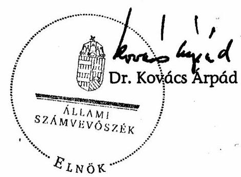

| Melléklet: | 13 db | 11 lap |
| :-- | --: | --: |
| Függelék: | 1 db | 1 lap |

---

# MELLÉKLETEK

---

# Szociális és Munkaügyi Minisztérium Miniszter 

Iktatószám: 13164-3 /2007-SzMM
dr. Kovács Árpád
elnök

Állami Számvevőszék
Budapest

## Tisztelt Elnök Úr!

A Munkaerőpiaci Alap 2004-2006. évi működésének ellenőrzéséről készített jelentésre észrevételt nem teszek.

Tájékoztatom, hogy a számvevőszéki ellenőrzés alapján a szociális és munkaügyi miniszternek tett javaslataik végrehajtását elősegítő intézkedési terv elkészítéséről a tárca illetékes szakterületei felé a szükséges rendelkezést megteszem.

Kérésének megfelelően az elrendelt intézkedésekről 30 napon belül tájékoztatom.

Budapest, 2007. december 28.
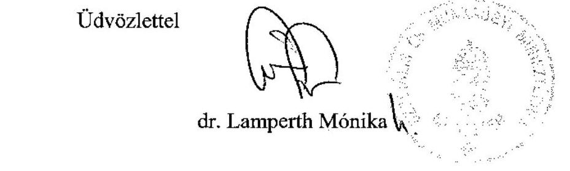

---

# Oktatási és Kulturális Minisztérium Miniszter 

Dr. Kovács Árpád úr
elnök
Állami Számvevőszék
Budapest
Apáczai Csere J. u. 10.
1052

## Tisztelt Elnök Úr!

Köszönettel megkaptam a V-07-49/2007. számú levelével megküldött „A Munkaerőpiaci Alap működésének ellenőrzéséről" készített jelentés-tervezetet.
A jelentés-tervezet előző változata a minisztérium illetékes szakterületével (közoktatási szakállamtitkár úr alá tartozó szervezeti egységgel) korábban már egyeztetésre került. Jelen tervezetet az érintett szakterületekkel (közoktatási szakállamtitkár úr valamint a fejlesztési és gazdasági szakállamtitkár úr területével) ismételten, alaposan áttekintettük, a jelentéstervezetre további észrevételt nem teszünk.

## Tisztelt Elnök Úr!

Ismételten megköszönjük szakszerű és alapos munkájukat. Tájékoztatom, hogy ellenőrzésük a minisztérium részére konkrét javaslatokat nem fogalmazott meg és külön intézkedések elrendelését nem tette szükségessé.

Budapest, 2008. január , $/ 4$ "
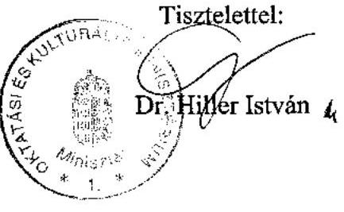

---

# A foglalkoztatást elősegítő támogatások 

az Flt., illetve a vonatkozó rendelet ${ }^{1}$ alapján

Az MPA-ból a 2003-tól 2007-ig a következő fő területekre, illetve tevékenységekre lehetett (lehet) támogatást igénybe venni:

- Foglalkoztatást elősegítő képzésben történő részvétel
- A munkanélküliek vállalkozóvá válásának elősegítése
- A foglalkoztatás bővítése - bérköltség támogatás
- Részmunkaidős foglalkoztatás
- Közhasznú munkavégzés
- Álláskeresők munkaerő-kölcsönzés keretében történő foglalkoztatása
- Önfoglalkoztatóvá válás
- Munkahelyteremtés és munkahelymegőrzés
- A foglalkoztatáshoz kapcsolódó járulékok átvállalása
- A megváltozott munkaképességű személyek foglalkoztatása
- A befogadó munkahely kialakítása
- Rehabilitációs célú foglalkoztatás
- A csoportos létszámleépítés

 hátrányos következményeinek enyhítése
- Intenzív álláskeresés
- Munkaerő-piaci programok

[^0]
[^0]:    ${ }^{1}$ 6/1996. (VII. 16.) MüM rendelet a foglalkoztatást elősegítő támogatásokról, valamint a Munkaerőpiaci Alapból foglalkoztatási válsághelyzetek kezelésére nyújtható támogatásról

---

# A foglalkoztatást elősegítő támogatási rendszer főbb változásai

|  A régi támogatási eszköz megnevezése | Jogszabályi alap (2006. december 31-ig) | A változás lényege | Jogszabályi alap (2007. január 1-től) | Az új foglalkoztatást elősegítő támogatás megnevezése  |
| --- | --- | --- | --- | --- |
|  Foglalkoztatás bővítését szolgáló támogatás | Flt. 16.§; 6/1996. (VII.16.) MüM rendelet 11.§ | önálló támogatási formaként megszűnt | Flt. 16.§; 6/1996 (VII.16.) MüM rendelet 11.§ | Foglalkoztatás bővítését szolgáló támogatások  |
|  Foglalkoztatáshoz kapcsolódó járulékok átvállalása | Flt. 18/A.§; 6/1996. (VII.16.) MüM rendelet 18/B-18/E.§ | önálló támogatási formaként megszűnt |  |   |
|  Részmunkaidős foglalkoztatás támogatása | Flt. 19/C.§; 6/1996. (VII.16.) MüM rendelet 11/A.§ | önálló támogatási formaként megszűnt |  |   |
|  Rehabilitációs foglalkoztatás bővítését szolgáló munkabér- és járulékátvállalás | 11/1998. (IV.29.) MüM rendelet 4.§ | önálló támogatási formaként megszűnt | Flt. 16.§; 6/1996 (VII.16.) MüM rendelet 11.§ | Foglalkoztatás bővítését szolgáló támogatások  |
|  Munkatapasztalat szerzés támogatása | 68/1996. (V.15.) Korm. rendelet 7.§ | önálló támogatási formaként megszűnt |  |   |
|  Pályakezdő álláskeresők foglalkoztatásának támogatása | 68/1996. (V.15.) Korm. rendelet 9.§ | önálló támogatási formaként megszűnt |  |   |
|  Álláskeresők munkaerő-kölcsönzés keretében történő foglalkoztatásának támogatása | Flt. 16/B.§; 6/1996. (VII.16.) MüM rendelet 16-17.§ | megszűnt |  |   |
|  Foglalkoztatást elősegítő képzési támogatás | Flt. 14.§; 6/1996. (VII.16.) MüM rendelet 1-8.§ | átalakult | Flt. 14.§; 6/1996 (VII.16.) MüM rendelet 1-8.§ | Foglalkoztatást elősegítő képzések támogatása  |
|  Pályakezdő álláskeresők képzési támogatása | 68/1996. (V.15.) Korm. rendelet 8.§ | önálló támogatási formaként megszűnt |  |   |
|  Megváltozott munkaképességű álláskeresők képzési támogatása | 11/1998. (IV.29.) MüM rendelet 5.§ | önálló támogatási formaként megszűnt |  |   |
|  Munkaviszonyban állók képzése | Flt. 14.§; 6/1996. (VII.16.) MüM rendelet 9.§ | változatlan formában megmaradt | Flt. 14.§; 6/1996 (VII.16.) MüM rendelet 9.§ | Munkaviszonyban állók képzése  |
|  Közhasznú munkavégzés támogatása | Flt. 16/A.§; 6/1996. (VII.16.) MüM rendelet 12-15.§ | változatlan formában megmaradt | Flt. 16/A.§; 6/1996 (VII.16.) MüM rendelet 12-15.§ | Közhasznú munkavégzés támogatása  |
|  Vállalkozóvá válás támogatása | Flt. 15.§; 6/1996. (VII.16.) MüM rendelet 10.§ | önálló támogatási formaként megszűnt | Flt. 17.§; 6/1996 (VII.16.) MüM rendelet 10.§ | Vállalkozás indításának elősegítése  |
|  Megváltozott munkaképességű álláskeresők vállalkozóvá válásának támogatása | Flt. 15.§; 6/1996. (VII.16.) MüM rendelet 10.§; 11/1998. (IV.29.) MüM rendelet 6.§ | önálló támogatási formaként megszűnt | Flt. 17.§; 6/1996 (VII.16.) MüM rendelet 10.§ |   |
|  Önfoglalkoztatóvá válás támogatása | Flt. 17.§; 6/1996. (VII.16.) MüM rendelet 17/A-17/B.§ | önálló támogatási formaként megszűnt |  |   |
|  Munkaerőpiaci programok támogatása | Flt. 19/B.§; 6/1996. (VII.16.) MüM rendelet 26/A-26/G.§ | részben módosult | Flt. 19/B.§; 6/1996 (VII.16.) MüM rendelet 11/A.§ és 26/A-26/G.§ | Munkaerőpiaci programok támogatása (programon belül bérköltség támogatás)  |

---

# A munkaerőpiaci prognózisok és a tényadatok alakulása 2004-2006 között*

|  Prognózis és tényadatok | Időszak | Foglalkoztatottak ezer fő | Munkanélküliek ezer fő | Gazdaságilag aktívak ezer fő | Gazdaságilag inaktívak ezer fő | 15-64 -éves népesség ezer fő | Foglalkoztatási arány \% | Aktivitási arány \% | Munkanélküliségi ráta $\%$  |
| --- | --- | --- | --- | --- | --- | --- | --- | --- | --- |
|  TÉNY | 2003. | 3897 | 244 | 4141 | 2695 | 6836 | 57 | 60,6 | 5,9  |
|  NFA | 2004. | 3945 | 246 | 4192 | 2673 | 6864 | 57,5 | 61,1 | 5,9  |
|  Tény | 2004. | 3875 | 252 | 4127 | 2699 | 6826 | 56,8 | 60,5 | 6,1  |
|  Viszonyszám | (Tény/NFA)** | 98,2\% | 102,6\% | 98,5\% | 101,0\% | 99,5\% | $-0,7$ | $-0,6$ | 0,2  |
|  NFA | 2005. | 4005 | 250 | 4255 | 2638 | 6893 | 58,1 | 61,7 | 5,9  |
|  Tény | 2005. | 3879 | 303 | 4182 | 2633 | 6815 | 56,9 | 61,4 | 7,2  |
|  Viszonyszám | (Tény/NFA)** | 96,8\% | 121,2\% | 98,3\% | 99,8\% | 98,9\% | $-1,2$ | $-0,3$ | 1,3  |
|  NFA | 2006. | 4056 | 253 | 4309 | 2612 | 6921 | 58,6 | 62,3 | 5,9  |
|  Tény | 2006. | 3906 | 317 | 4223 | 2593 | 6816 | 57,3 | 62 | 7,5  |
|  Viszonyszám | (Tény/NFA)** | 96,3\% | 125,1\% | 98,0\% | 99,3\% | 98,5\% | $-1,3$ | $-0,3$ | 1,6  |

*: A prognózisadatok forrása: Nemzeti Foglalkoztatási Akcióterv Magyarország 2004., 2. melléklet: A nemzeti célkitűzéseket megalapozó számítások. Munkaerőpiaci prognózis 2010-ig (15-64 éves korcsoport). Mellékletek, 33. o. A tényadatok forrása: Munkaerő-piaci Helyzetkép 2006, KSH, Budapest 2007. **: A viszonyszám jellegű mutatóknál, a foglalkoztatási, az aktivitási arány és a munkanélküliségi ráta esetén az eltérést a (Tény-NFA) alapján, százalékpontban kifejezve

---

5. sz. melléklet a V-07-054/2007. sz. jelentéshez

# A Munkaerőpiaci Alap bevételeinek alakulása

|  Megnevezés | 2003 |  |  | 2004 |  |  | 2005 |  |  | 2006 |  |  | 2007 |  |   |
| --- | --- | --- | --- | --- | --- | --- | --- | --- | --- | --- | --- | --- | --- | --- | --- |
|   | ei. | mód. ei. | telj. | ei. | mód. ei. | telj. | ei. | mód. ei. | telj. | ei. | mód. ei. | telj. | ei. | mód. ei. | teljesítés I-VIII. hó  |
|  Munkaadó járulék | 143 195,8 | 144 130,8 | 146 185,6 | 163 947,0 | 163 947,0 | 157 333,8 | 176 440,0 | 176 440,0 | 172 609,6 | 181 400,4 | 181 400,4 | 185 045,5 | 195 290,0 | 195 290,0 | 133 784,1  |
|  Munkavállalói járulék | 46 100,0 | 46 100,0 | 47 141,3 | 50 201,2 | 50 201,2 | 48 259,5 | 54 024,0 | 54 024,0 | 52 263,6 | 55 734,0 | 62 730,0 | 63 426,1 | 89 110,0 | 89 110,0 | 61 033,3  |
|  Vállalkozói járulék |  |  |  |  |  |  | 11 183,7 | 11 183,7 | 6 523,7 | 16 080,0 | 16 080,0 | 11 185,5 | 11 330,0 | 11 330,0 | 9 334,8  |
|  Egyéb bevétel | 1 400,0 | 3 982,0 | 4 182,5 | 1 746,9 | 1 746,9 | 3 105,3 | 2 847,7 | 2 847,7 | 4 289,3 | 4 637,0 | 4 789,8 | 7 198,7 | 5 239,5 | 5 239,5 | 3 426,8  |
|  Területi egyéb bevétel |  |  |  |  |  |  | 2 300,0 | 2 300,0 | 1 725,8 | 1 500,0 | 1 500,0 | 1 311,8 | 660,0 | 660,0 | 715,2  |
|  Központi egyéb bevétel |  |  |  |  |  |  | 297,7 | 297,7 | 1 777,0 | 2 887,0 | 3 039,8 | 4 293,9 | 3 869,5 | 3 869,5 | 2 539,2  |
|  Szakképzési egyéb bevétel* |  |  |  | 500,0 | 1 520,3 | 1 532,3 | 250,0 | 250,0 | 786,5 | 250,0 | 250,0 | 1 593,0 | 710,0 | 710,0 | 172,4  |
|  Rehabilitációs hozzájárulás | 2 776,6 | 2 776,6 | 3 284,1 | 9 291,3 | 9 291,3 | 8 066,6 | 9 900,0 | 9 900,0 | 11 403,7 | 11 570,0 | 11 570,0 | 12 488,4 | 13 220,0 | 13 220,0 | 9 995,2  |
|  Visszterhes támogatások törlesztés | 150,0 | 150,0 | 197,9 | 154,1 | 154,1 | 121,4 | 160,0 | 160,0 | 66,5 | 160,0 | 160,0 | 27,6 | 30,0 | 30,0 | 4,2  |
|  Szakképzési hozzájárulás | 18 191,0 | 19 332,0 | 19 470,2 | 18 998,0 | 20 846,5 | 22 418,9 | 23 598,4 | 23 598,4 | 27 669,2 | 25 248,0 | 30 355,0 | 30 745,8 | 32 620,0 | 32 620,0 | 31 600,9  |
|  Szakképzési kamatmentes kölcsön visszafizetése | 40,0 | 34,0 | 48,0 |  |  |  |  |  |  |  |  |  |  |  |   |
|  Költségvetési támogatás |  |  |  |  |  |  |  |  |  | 200,0 | 200,0 | 200,0 |  |  |   |
|  Költségvetési befizetés visszatérítés |  |  |  |  |  |  |  | 368,0 | 368,0 |  |  |  |  |  |   |
|  Bérgarancia támogatás törlesztése | 900,0 | 900,0 | 236,8 | 986,1 | 986,1 | 772,8 | 550,0 | 550,0 | 691,5 | 550,0 | 550,0 | 1 163,7 | 960,0 | 960,0 | 794,3  |
|  HEFOP intézk. előfin. megtérítése |  |  |  |  |  |  |  |

  |  |  |  |  | 529,5 | 529,5 | 0,0  |
|  Be nem azonosított bevétel |  |  |  |  |  |  |  |  |  |  |  |  |  |  | 1 075,7  |
|  Költségvetési bevételek | 212 753,4 | 217 405,4 | 220 746,4 | 245 824,6 | 248 693,4 | 241 610,6 | 278 703,8 | 279 071,8 | 275 885,1 | 295 579,4 | 307 835,2 | 311 481,3 | 348 329,0 | 348 329,0 | 251 049,5  |
|  Betétállomány változása |  |  |  |  |  | 2 989,9 |  |  |  |  |  |  |  |  |   |
|  Függő tételek |  |  | 224,2 |  |  | 5,7 |  |  | 54,4 |  |  | 63,2 |  |  | 571,8  |
|  BEVÉTELEK ÖSSZESEN | 212 753,4 | 217 405,4 | 220 970,6 | 245 824,6 | 248 693,4 | 244 606,2 | 278 703,8 | 279 071,8 | 275 939,5 | 295 579,4 | 307 835,2 | 311 544,5 | 348 329,0 | 348 329,0 | 251 621,1  |

- 2007. évi megnevezése: Szakképzési és felnőttképzési egyéb bevétel ** 2007. évi megnevezése: Rehabilitációs célú munkahelyteremtő támogatás törlesztése

---

# A Munkaerőpiaci Alap kiadásainak alakulása

|  Megnevezés | 2003 |  |  | 2004 |  |  | 2005 |  |  | 2006 |  |  | 2007 |  |   |
| --- | --- | --- | --- | --- | --- | --- | --- | --- | --- | --- | --- | --- | --- | --- | --- |
|   | ei. | mód. ei. | telj. | ei. | mód. ei. | telj. | ei. | mód. ei. | telj. | ei. | mód. ei. | telj. | ei. | mód. ei. | teljesítés
I-VIII. hó  |
|  Aktív foglalkoztatási eszközök | 50340,3 | 54339,6 | 53464,6 | 45904,5 | 51287,7 | 44410,8 | 50000,0 | 54018,7 | 49894,3 | 48730,0 | 55405,8 | 53405,6 | 49852,5 | 48339,5 | 24334,0  |
|  Foglalkoztatási és képzési támogatások | 47980,3 | 54339,6 | 53464,6 | 45904,5 | 51287,7 | 44410,8 | 50000,0 | 54018,7 | 49894,3 | 48730,0 | 55405,8 | 53405,6 | 49852,5 | 48339,5 | 24334,0  |
|  Aktív foglalkoztatási eszközök tartalék | 2360,0 | 0,0 | 0,0 |  |  |  |  |  |  |  |  |  |  |  |   |
|  Szakképzési célú kifizetések | 18231,0 | 15298,0 | 15296,6 | 18225,6 | 15931,2 | 15930,4 | 21832,4 | 16548,7 | 14703,2 | 22838,0 | 20042,2 | 19070,6 | 25717,3 | 25717,3 | 9522,0  |
|  Posszív ellátások |  |  |  |  |  |  |  |  |  | 88200,0 | 88200,0 | 85504,6 | 101760,0 | 101760,0 | 55908,8  |
|  Munkanélküli ellátások | 68176,0 | 68176,0 | 68364,3 | 75027,0 | 75027,0 | 78239,2 | 80304,1 | 80672,1 | 86741,5 | 7549,7 | 7549,7 | 17474,1 |  |  |   |
|  Álláskeresési támogatások |  |  |  |  |  |  |  |  |  | 80650,3 | 80650,3 | 68030,5 |  |  |   |
|  Jövedelempótló támogatás | 200,0 | 200,0 | 200,7 | 1,0 | 1,0 | 106,3 | 50,8 | 50,8 | 17,8 | 10,0 | 10,0 | 1,6 | 1,0 | 1,0 | 0,0  |
|  Bérgarancia kifizetések | 1700,0 | 3565,0 | 3419,7 | 3600,0 | 3600,0 | 3665,1 | 4200,0 | 4200,0 | 4679,3 | 4200,0 | 4200,0 | 5648,0 | 7000,0 | 7000,0 | 2601,1  |
|  Rehabilitációs célú kifizetések | 19826,6 | 19826,6 | 19743,0 | 34654,5 | 34654,5 | 34251,0 | 55300,0 | 55300,0 | 54967,6 | 55300,0 | 55300,0 | 55249,9 | 56300,0 | 56300,0 | 35030,6  |
|  Munkahelyteremtő támogatás | 2926,6 | 2926,6 | 2843,0 | 3041,0 | 3041,0 | 2637,5 | 3300,0 | 3300,0 | 2967,6 | 3300,0 | 3300,0 | 3249,9 | 4300,0 | 4300,0 | 363,9  |
|  Megváltozott munkaképességű személyek foglalkoztatásának támogatása | 16900,0 | 16900,0 | 16900,0 | 31613,5 | 31613,5 | 31613,5 | 52000,0 | 52000,0 | 52000,0 | 52000,0 | 52000,0 | 52000,0 | 52000,0 | 52000,0 | 34666,7  |
|  Alapkezelőnek átadott pénzeszköz | 271,2 | 300,2 | 300,2 | 355,8 | 355,8 | 355,8 | 338,0 | 356,2 | 356,2 | 345,5 | 345,5 | 345,5 | 381,7 | 381,7 | 254,5  |
|  Állami Foglalkoztatási Szolgálat működése és fejlesztése | 19893,7 | 21585,4 | 21569,1 | 21528,8 | 21528,8 | 21528,8 | 20452,4 | 21505,3 | 21505,3 | 20828,5 | 22308,3 | 22306,8 | 21454,7 | 21510,7 | 14042,8  |
|  Állami Foglalkoztatási Szolgálatnak átadott pénzeszköz | 18043,7 | 19735,4 | 19735,4 | 20278,8 | 20278,8 | 20278,8 | 19264,9 | 20329,7 | 20329,7 | 19688,2 | 21168,0 | 21168,0 | 20017,0 | 20073,0 | 13760,9  |
|  Állami Foglalkoztatási Szolgálat fejlesztési program | 1250,0 | 1250,0 | 1233,7 | 1250,0 | 1250,0 | 1250,0 | 1187,5 | 1175,6 | 1175,6 | 1140,3 | 1140,3 | 1138,8 | 1437,7 | 1437,7 | 281,9  |
|  Állami Foglalkoztatási Szolgálat PHARE program társfinanszírozás | 600,0 | 600,0 | 600,0 |  |  |  |  |  |  |  |  |  |  |  |   |
|  Állami Foglalkoztatási Szolgálat központosított karate | 206,0 | 206,0 | 206,0 | 250,0 | 250,0 | 250,0 | 237,5 | 237,5 | 237,5 | 237,5 | 237,5 | 237,5 | 237,5 | 237,5 | 119,7  |
|  Átadás EU -társfinanszírozásra |  |  |  | 5567,4 | 5567,4 | 5430,4 | 6607,0 | 6607,0 | 6607,0 | 8564,0 | 8564,0 | 8564,0 | 9725,6 | 9725,6 | 0,0  |
|  Munkanélkütség kezelése |  |  |  |  |  |  | 4591,0 | 4591,0 | 4591,0 | 5904,0 | 5904,0 | 5904,0 |  |  |   |
|  Felnőttképzés |  |  |  |  |  |  | 1067,0 | 1067,0 | 1067,0 | 1373,0 | 1373,0 | 1373,0 |  |  |   |
|  Szakképzés fejlesztése |  |  |  |  |  |  | 949,0 | 949,0 | 949,0 | 1287,0 | 1287,0 | 1287,0 |  |  |   |
|  Foglalkoztathatóság |  |  |  |  |  |  |  |  |  |  |  |  | 4295,2 | 4295,2 | 0,0  |
|  Alkalmazkostóképsesség |  |  |  |  |  |  |  |  |  |  |  |  | 5430,4 | 5430,4 | 0,0  |
|  TB alapnak átadás | 1000,0 | 1000,0 | 1357,8 | 1000,0 | 1000,0 | 1016,9 | 730,0 | 730,0 | 802,0 |  |  |  |  |  |   |
|  Nyugdíjbiztosítási Alapnak átadás |  |  |  |  |  |  |  |  |  | 450,0 | 450,0 | 1136,8 | 1130,0 | 1130,0 | 0,0  |
|  Országos Munkabiztonsági és Munkaügyi Főfelügyelőségnek átadott pénzeszköz | 398,6 | 398,6 | 398,6 | 417,5 | 417,5 | 417,5 | 396,6 | 591,0 | 591,0 | 1959,3 | 1959,3 | 1959,3 | 1959,3 | 1959,3 | 1306,2  |
|  Közmunka céljára pénzeszköz átadás |  |  |  | 1600,0 | 1600,0 | 1600,0 |  |  |  | 3752,4 | 3752,4 | 3752,4 | 1500,0 | 2950,0 | 2950,0  |
|  Nemzeti Szakképzési és Felnőttképzési Intézetnek pénzeszköz átadás |  |  |  |  |  |  |  |  |  |  |  |  | 2182,3 | 2182,3 | 1475,6  |
|  Területkiegyenítésre pénzeszköz átadás |  |  |  | 810,0 | 810,0 | 810,0 | 405,0 |  |  |  |  |  |  |  |   |

---

|  Megnevezés | 2003 |  |  | 2004 |  |  | 2005 |  |  | 2006 |  |  | 2007 |  |   |
| --- | --- | --- | --- | --- | --- | --- | --- | --- | --- | --- | --- | --- | --- | --- | --- |
|   | ei. | mód. ei. | telj. | ei. | mód. ei. | telj. | ei. | mód. ei. | telj. | ei. | mód. ei. | telj. | ei. | mód. ei. | teljesítés
I-VIII. hó  |
|  Non-profit szektorbeli munkavállalás tám |  |  |  | 600,0 | 250,0 | 179,9 | 250,0 | 290,0 | 275,3 | 200,0 | 200,0 | 98,1 | 200,0 | 200,0 | 6,6  |
|  Fejezeti tartalék |  |  |  |  |

  |  |  | 204,5 |  | 694,2 | 694,2 |  |  |  |   |
|  KSH régiós átalakítás támogatása |  |  |  |  |  | 130,0 | 130,0 |  |  |  |  |  |  |  |   |
|  HEFOP intézkedés előfinanszírozása |  |  |  |  |  |  |  |  |  |  |  |  | 1319,3 | 1319,3 | 0,0  |
|  Társadalmi párbeszéd programok |  |  |  |  |  |  |  |  |  |  |  |  | 1529,1 | 1536,1 | 1529,1  |
|  OFA-nak (KHT) pénzeszköz átadás |  |  |  |  |  |  |  |  |  |  |  |  | 563,7 | 563,7 | 425,9  |
|  Egyéb költségvetési befizetés |  |  |  |  |  |  |  |  |  |  |  |  | 61309,5 | 61309,5 | 40872,0  |
|  Munkanélküli ellátórendszer változásával összefüggő költségvetési befizetés | 32510,0 | 32510,0 | 32510,0 | 36282,5 | 36282,5 | 36282,5 | 29300,0 | 29300,0 | 29300,0 | 30000,0 | 30000,0 | 30000,0 |  |  |   |
|  Munkanélküli járadékból kikerülő aktív korúak rendszeres szociális segélyezésére | 18510,0 | 18510,0 | 18510,0 | 20162,5 | 20162,5 | 20162,5 |  |  |  |  |  |  |  |  |   |
|  Közcélú munkavégzés kiadásaira | 13000,0 | 13000,0 | 13000,0 | 15120,0 | 15120,0 | 15120,0 |  |  |  |  |  |  |  |  |   |
|  Munkanélküli ellátórendszer átalakításához kötődő igazgatási feladatokra | 1000,0 | 1000,0 | 1000,0 | 1000,0 | 1000,0 | 1000,0 |  |  |  |  |  |  |  |  |   |
|  Járulékkedvezmény visszatérítés |  |  |  |  |  |  | 8300,0 | 8300,0 | 697,1 | 7070,0 | 7070,0 | 1713,7 | 3000,0 | 3000,0 | 3326,6  |
|  Normatív járulékkedvezmény visszatérítés |  |  |  |  |  |  | 5500,0 | 5500,0 | 11,9 | 5070,0 | 5070,0 | 958,9 | 2000,0 | 2000,0 | 3326,6  |
|  Ötven év felettiek járulékkedvezménye |  |  |  |  |  |  | 2800,0 | 2800,0 | 685,2 | 2000,0 | 2000,0 | 754,8 | 1000,0 | 1000,0 | 0,0  |
|  Vállalkozók pénzügyi ellátása és támogatása |  |  |  |  |  |  |  |  |  | 2000,0 | 1900,0 | 437,5 | 1000,0 | 1000,0 | 886,6  |
|  Vállalkozói járadék |  |  |  |  |  |  |  |  |  | 1900,0 | 1900,0 | 437,5 | 1000,0 | 1000,0 | 886,6  |
|  Vállalkozók aktív eszköz támogatása |  |  |  |  |  |  |  |  |  | 100,0 |  |  |  |  |   |
|  Tranzakciós díj |  |  |  |  |  |  |  | 160,0 | 134,5 | 200,0 | 200,0 | 113,8 | 205,5 | 205,5 | 55,2  |
|  Költségvetési kiadások | 212753,4 | 217405,4 | 216830,6 | 245824,6 | 248693,4 | 244604,6 | 278703,8 | 279071,8 | 271509,6 | 295579,4 | 300839,2 | 289545,7 | 348329,0 | 348329,0 | 194647,3  |
|  Betétállomány változása |  |  | 4139,8 |  |  |  |  |  | 4429,0 |  | 6996,0 | 22000,8 |  |  |   |
|  Függő tétel |  |  | 0,2 |  |  | 1,6 |  |  | 0,9 |  |  | -2,0 |  |  | 2,0  |
|  KIADÁSOK ÖSSZESEN | 212753,4 | 217405,4 | 220970,6 | 245824,6 | 248693,4 | 244606,2 | 278703,8 | 279071,8 | 275939,5 | 295579,4 | 307835,2 | 311544,5 | 348329,0 | 348329,0 | 194649,3  |

költségvetési törvény szerint központi költségvetésbe befizetési kötelezettség egyéb pénzeszköz átadás

---

7. sz. melléklet a V-07-054/2007. sz. jelentéshez
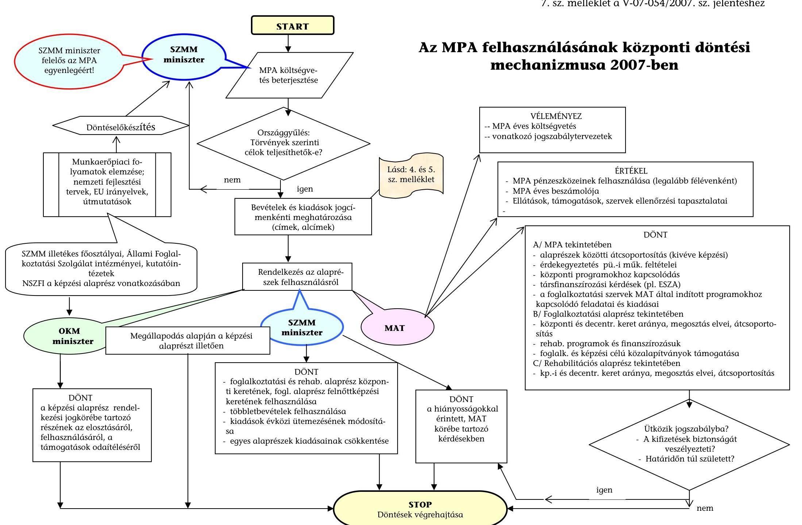

---

Az Alap kiadásai az aktív kiadások részletezésével

|  |   |   |   |   |   |   |   |   |   |   |   |   |   |   |
| --- | --- | --- | --- | --- | --- | --- | --- | --- | --- | --- | --- | --- | --- | --- |
|  Megnevezés | 1999 | 2000 | 2003 | 2004 | 2005 | 2006 | 2007
tervezet | 1999 | 2000 | 2003 | 2004 | 2005 | 2006 | 2007
tervezet  |
|  AKTÍV ESZKÖZÖK / A keret nagyságáról és a felhasználásáról rendelkező szerv |  |  |  |  |  |  |  |  |  |  |  |  |  |   |
|  A keretekről és a felhasználás elveiről a MAT dönt (foglalk. és rehab.alaprész központi és dec. keretei) | 33106,7 | 36268,7 | 51807,6 | 45512,5 | 49750,5 | 47391,1 | 54152,5 | 0,22 | 0,22 | 0,24 | 0,19 | 0,18 | 0,16 | 0,16  |
|  A keretekről a miniszter(ek), a felhasználásról a szaktárca dönt (felnőttképzési célú és képzési keret) | 0,0 | 0,0 | 4500,0 | 1535,8 | 3111,4 | 9264,4 | 0,0 | 0,00 | 0,00 | 0,02 | 0,01 | 0,01 | 0,03 | 0,00  |
|  Összesen | 33106,7 | 36268,7 | 56307,6 | 47048,3 | 52861,9 | 56655,5 | 54152,5 | 0,22 | 0,22 | 0,26 | 0,19 | 0,19 | 0,20 | 0,16  |
|  A keretekről a költségvetési tv., a felhasználásról a szakminiszter dönt (átadás EU társfin., közmunka, járulékkedv. visszatér. non-profit sz.) | 0,0 | 0,0 | 0,0 | 7210,3 | 7579,4 | 14128,2 | 15744,9 | 0,00 | 0,00 | 0,00 | 0,03 | 0,03 | 0,05 | 0,05  |
|  Aktív eszközök a szakminiszter hatáskörében összesen | 33106,7 | 36268,7 | 56307,6 | 54258,6 | 60441,3 | 70783,7 | 69897,4 | 0,22 | 0,22 | 0,26 | 0,22 | 0,22 | 0,24 | 0,20  |
|  A keretekről a költségvetési tv., a felhasználásról más tárca dönt (átadás közcélú munkára, megváltozott munkaképességűek foglalkoztatására) | 9990,0 | 16773,0 | 29900,0 | 47543,5 | 52000,0 | 52000,0 | 53529,1 | 0,07 | 0,10 | 0,14 | 0,19 | 0,19 | 0,18 | 0,15  |
|  Összesen | 43096,7 | 53041,7 | 86207,6 | 101802,1 | 112441,3 | 122783,7 | 123426,5 | 0,28 | 0,33 | 0,40 | 0,42 | 0,41 | 0,42 | 0,35  |
|  PASSZÍV, SZAKKÉPZÉSI ÉS MÜKÖDÉSI KIADÁSOK |  |  |  |  |  |  |  |  |  |  |  |  |  |   |
|  passzív jellegű kiadások ${ }^{1}$ | 87029,1 | 80916,7 | 73342,5 | 83027,5 | 92240,6 | 92728,5 | 110891,0 | 0,57 | 0,50 | 0,33 | 0,34 | 0,33 | 0,32 | 0,32  |
|  szakképzési célú kifizetések | 9768,0 | 12224,8 | 15296,6 | 15930,4 | 14703,2 | 19070,6 | 25717,3 | 0,06 | 0,08 | 0,07 | 0,07 | 0,05 | 0,07 | 0,07  |
|  müködési jellegű kiadások | 12693,2 | 12819,1 | 22473,9 | 22552,1 | 22690,0 | 24849,1 | 26779,2 | 0,08 | 0,08 | 0,10 | 0,09 | 0,08 | 0,09 | 0,08  |
|  Összesen | 109490,3 | 105960,6 | 111113,0 | 121510,0 | 129633,8 | 136648,2 | 163387,5 | 0,72 | 0,65 | 0,51 | 0,49 | 0,47 | 0,47 | 0,47  |
|  ÁTADÁS SZOCIÁLIS ÉS EGYÉB CÉLRA, EGYÉB |  |  |  |  |  |  |  |  |  |  |  |  |  |   |
|  m.nélküli ellátó r. vált., régiós át., költségv. befiz., tranz. díj | 0,0 | 3044,0 | 19510,0 | 21292,5 | 29434,5 | 30113,8 | 61515,0 | 0,00 | 0,02 | 0,10 | 0,09 | 0,13 | 0,11 | 0,18  |
|  Kiadások összesen | 152587,0 | 162046,3 | 216830,6 | 244604,6 | 271509,6 | 289545,7 | 348329,0 | 1,0 | 1,0 | 1,0 | 1,0 | 1,0 | 1,0 | 1,0  |

[^0] [^0]: ${ }^{1}$ passzív jellegű kiadások: a szolidaritási-, vállakozói-, jövedelempótló támogatás és bérgarancia alaprészek

---

# A foglalkoztatási alaprész decentralizált keretéből finanszírozott foglalkoztatást elősegítő és képzési támogatások kiadásainak megoszlása 2006-ban 

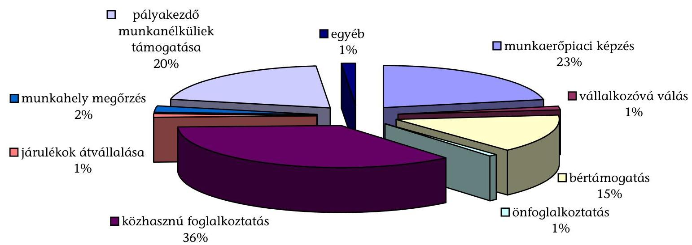

---

A foglalkoztatási alaprész decentralizált keretéből finanszírozott foglalkoztatást elősegítő és képzési támogatások létszám megoszlása 2006-ban
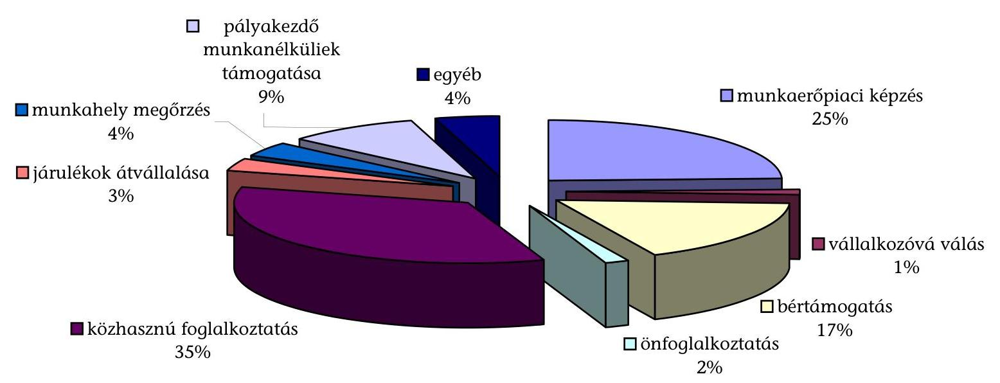

---

# A munkaerőpiaci szervezet létszámadatai

|  Intézmény | 2003. évi létszám |  | 2004. évi létszám |  | 2005. évi létszám |  | 2006. évi létszám |  | 2007. évi eredeti
engedélyezett
létszám |   |
| --- | --- | --- | --- | --- | --- | --- | --- | --- | --- | --- |
|   | Módosított
engedélyezett

 | Átlagos
stat.létszám | Módosított
engedélyezett | Átlagos
stat.létszám | Módosított
engedélyezett | Átlagos
stat.létszám | Módosított
engedélyezett | Átlagos
stat.létszám |  |   |
|  FH | 165 | 150 | 324 | 241 | 367 | 345 | 342 | 360 | 270 |   |
|  Munkaügyi Központok | 3916 | 3981 | 4113 | 4045 | 4080 | 4022 | 3781 | 3949 | 3500 |   |
|  Főváros | 341 | 338 | 352 | 357 | 355 | 350 | 324 | 350 |  |   |
|  Pest | 255 | 259 | 278 | 256 | 263 | 256 | 242 | 257 | 500 | Közép Mo. RMK  |
|  Baranya | 189 | 195 | 198 | 194 | 192 | 188 | 178 | 189 |  |   |
|  Somogy | 156 | 156 | 164 | 161 | 161 | 161 | 147 | 159 | 426 | Dél-Dtúli RMK  |
|  Tolna | 136 | 143 | 149 | 147 | 145 | 142 | 133 | 140 |  |   |
|  Békés | 177 | 185 | 194 | 190 | 188 | 186 | 174 | 182 |  |   |
|  Bács | 235 | 235 | 223 | 244 | 237 | 235 | 219 | 234 | 530 | Dél-Alf. RMK  |
|  Csongrád | 181 | 184 | 187 | 187 | 187 | 187 | 174 | 187 |  |   |
|  Borsod | 356 | 358 | 378 | 365 | 376 | 371 | 341 | 327 |  |   |
|  Heves | 168 | 174 | 184 | 181 | 178 | 175 | 164 | 175 | 655 | É-Mo. RMK  |
|  Nógrád | 160 | 161 | 167 | 158 | 169 | 165 | 152 | 164 |  |   |
|  Szabolcs | 290 | 302 | 311 | 303 | 304 | 304 | 316 | 280 |  |   |
|  Hajdú | 209 | 218 | 219 | 219 | 223 | 222 | 206 | 218 | 674 | É-Alf. RMK  |
|  Jász | 209 | 207 | 219 | 207 | 212 | 211 | 196 | 212 |  |   |
|  Fejér | 179 | 175 | 171 | 178 | 186 | 178 | 167 | 177 |  |   |
|  Komárom | 158 | 156 | 164 | 157 | 160 | 156 | 148 | 154 | 400 | Közép-Mo. RMK  |
|  Veszprém | 158 | 158 | 165 | 159 | 159 | 158 | 145 | 157 |  |   |
|  Vas | 116 | 125 | 128 | 127 | 122 | 120 | 113 | 123 |  |   |
|  Győr | 122 | 127 | 127 | 127 | 130 | 130 | 122 | 134 | 315 | Ny-Dtúli. RMK  |
|  Zala | 121 | 125 | 135 | 128 | 133 | 127 | 120 | 130 |  |   |
|  RKK | 467 | 455 | 467 | 463 | 485 | 463 | 396 | 444 | 390 |   |
|  ERAK | 80 | 76 | 80 | 79 | 84 | 79 | 64 | 78 | 65 |   |
|  Debreceni RKK | 59 | 56 | 59 | 57 | 63 | 54 | 51 | 54 | 48 |   |
|  Pécsi RKK | 58 | 58 | 58 | 58 | 60 | 60 | 47 | 56 | 47 |   |
|  Székesfehérvári RKK | 75 | 71 | 75 | 75 | 75 | 69 | 60 | 62 | 61 |   |
|  Békéscsabai RKK | 54 | 54 | 54 | 54 | 57 | 57 | 46 | 46 | 44 |   |
|  Kecskeméli RKK | 52 | 51 | 52 | 51 | 54 | 53 | 45 | 53 | 43 |   |
|  BMiK | 31 | 31 | 31 | 31 | 32 | 32 | 31 | 32 | 29 |   |
|  Nyíregyházi RKK | 26 | 26 | 26 | 26 | 27 | 26 | 24 | 26 | 24 |   |
|  Szombathelyi RKK | 32 | 32 | 32 | 32 | 33 | 33 | 28 | 37 | 29 |   |

---

# A szakképzési hozzájárulás teljesítése, felhasználása és ellenőrzése 

Gazdálkodó saját
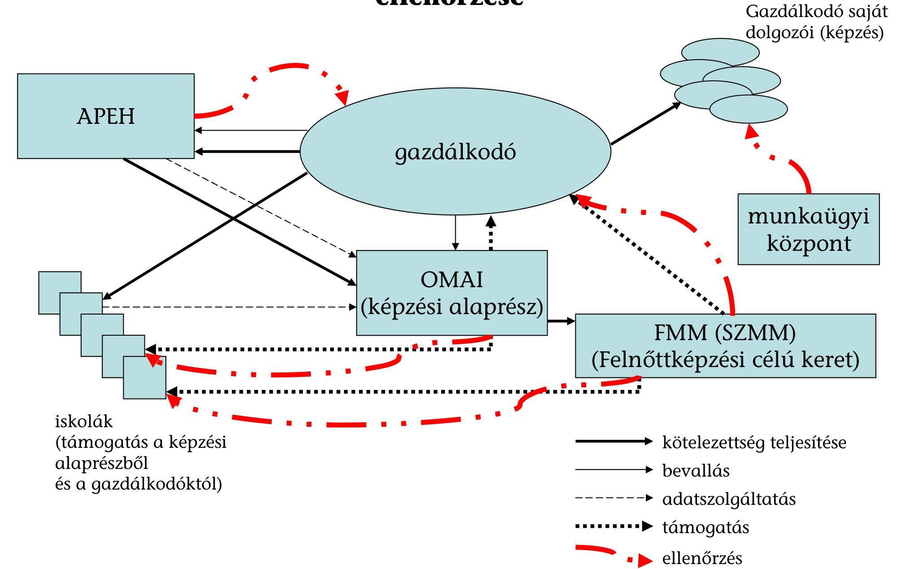

---

# INFORMATIKAI BIZTONSÁGI PROBLÉMÁK 

## 1. Az IT KÖRNYEZET SZABÁLYOZOTTSÁGA

- A szervezet nem rendelkezik titokvédelmi szabályzattal.
- Nem szabályozott az informatikai rendszerek fejlesztésének és dokumentálásának folyamata.

## 2. Az IT SZERVEZETE ÉS IRÁNYÍTÁSA, BELSŐ ELLENŐRZÉS

- Nincs előírva a felső vezetés rendszeres és közvetlen tájékoztatása az informatikai biztonság belső ellenőrzésének eredményéről.
- Nem megoldott és dokumentált az informatikai biztonsági intézkedések, és azok betartásának rendszeres belső ellenőrzése.
- Nincs kijelölt felelőse a szoftver-licencfeltételek betartásának.

## 3. Az IT RENDSZER HOZZÁFÉRÉSVÉDELME

### 3.1. Hozzáférések rendszere

- Nem rendelkeznek az informatikai hardver eszközök teljes körű és naprakész nyilvántartásával. Megoldása elkezdődött, kialakítás várhatóan 2007. év végéig.
- Nem rendelkeznek a szoftverek (beleértve a munkaállomásokon futókat is) teljes körű és naprakész nyilvántartásával. Megoldása elkezdődött, kialakítás várhatóan ez év végéig.
- Nem rendelkeznek az informatikai eszközökön (beleértve a szervereket és munkaállomásokat is) kezelt adatok és adatbázisok teljes körű és naprakész nyilvántartásával.
- Nem végezték el és nem dokumentálták az informatikai eszközökön kezelt adatok és adatbázisok védelmi igényének meghatározását, biztonsági osztályokba sorolását.
- Nem meghatározottak az informatikai eszközökön kezelt adatok és adatbázisok tulajdonosai.
- Nincs kinevezett felelőse a védelmi igény-meghatározások és az adattulajdonosi rendszer karbantartásának.

---

# 3.2. Fizikai védelem 

- Nem meghatározottak és dokumentáltak az érzékeny és kritikus informatikai eszközök (pl. szerverek, hálózati eszközök) befogadására szolgáló épületek, helyiségek, tárolók.
- Nem teljes körűen szabályozottak és nyilvántartottak a hozzáférési lehetőségek az érzékeny és kritikus informatikai eszközök befogadására szolgáló épületekhez, helyiségekhez, tárolókhoz.
- Nincs kinevezett vezető/dolgozó, aki rendszeres időközönként aktualizálja az érzékeny és kritikus informatikai eszközök befogadására szolgáló épületekhez, helyiségekhez, tárolókhoz fizikai hozzáféréssel rendelkező alkalmazottak listáját.
- Nincs automatikus tűzoltó rendszer az érzékeny és kritikus informatikai eszközök befogadására szolgáló helyiségekben.
- Nem biztosított tűz esetén a légkondicionáló berendezés automatikus leállása.
- Az FSZ érzékeny és kritikus informatikai eszközei rendelkeznek szünetmentes áramellátással, azonban áramszünet esetén ez csak mintegy 20 percig képes biztosítani a szerver gépek megfelelő mentéssekkel történő szabályos leállítását. Hosszabb áramszünet esetére nem rendelkeznek olyan berendezéssel (generátorral) ami biztosítaná, hogy az országos hálózatot - 167 kirendeltséget - kiszolgáló szerverterem folyamatos üzemeltetése biztosított legyen. A generátor elhelyezésére az épület nem alkalmas.
- A központi szervergépek bármely okból történő tartós kiesése esetére, nincs olyan tartalék szerverpark, ami biztosítaná az országos hálózat folyamatos üzemeltetését.
- A központi szervergépek fizikai védelme nem biztosított.

### 3.3. Logikai védelem

- Nem rendelkezik a szervezet teljes körű, naprakész és dokumentált nyilvántartással arról, hogy mely dolgozó milyen hozzáférési jogosultságokkal rendelkezik a szervezet hálózati rendszeréhez, operációs rendszereihez, felhasználói alkalmazásaihoz, adatbázisaihoz. A Microsoft alapú rendszerekhez még az idén elkészül.
- Nincs egyértelműen és dokumentáltan kijelölt minden felhasználói alkalmazásra vonatkozóan a jogosultsági beállításokért felelős informatikai dolgozó.
- Nem naplóznak minden olyan tevékenységet, amely az érzékeny vagy kritikus fontosságú központi rendszerekhez, alkalmazói szoftverekhez, adatbázisokhoz való hozzáféréssel, vagy módosítással jár.

---

# 3.4. Naplózás 

- Nem naplózzák a hozzáférési jogosultságok beállításait és változtatásait minden érzékeny vagy kritikus fontosságú központi rendszer, alkalmazói szoftver, adatbázis esetében.
- Nem naplózottak a biztonsági beállítások változtatásai minden érzékeny vagy kritikus fontosságú központi rendszer, alkalmazói szoftver, adatbázis esetében.
- Nincs kinevezett dolgozó, aki a naplóállományok rendszeres vizsgálatáért felelős.

### 3.5. Jelszavak

- Nem kényszerítik ki az érzékeny vagy kritikus fontosságú központi rendszerek, alkalmazói szoftverek, adatbázis kezelők a jelszavak képzésére és használatára előírt szabályok teljes körű betartását.

### 3.6. Felhasználói problémák kezelése

- Nem alakított ki a szervezet eljárásrendet a felhasználói problémák kezelésére. Megoldása elkezdődött, kialakítás várhatóan ez év végéig.
- Nem készül rendszeresen az informatikai és/vagy a felsőbb vezetés részére statisztika a felmerült informatikai problémákról. Megoldása elkezdődött, kialakítás várhatóan ez év végéig.

## 4. ÜZEMELTETÉS, VÁLTOZÁSKEZELÉS

### 4.1. Üzemeltetés

- Nem rendelkezik a szervezet a hálózati rendszeréhez, az operációs rendszereihez és adatbázis kezelőihez naprakész üzemeltetési dokumentációval. Megoldása elkezdődött kialakítás várhatóan jövő év közepéig.
- Nem rendelkezik a szervezet minden felhasználói alkalmazásához naprakész üzemeltetési dokumentációval. Megoldása elkezdődött, kialakítás várhatóan jövő év közepéig.
- Nem biztosított hogy a rendszerváltoztatások (mind hardver mind szoftver) azonnal tükröződjenek az üzemeltetési leírásokban is.

### 4.2. Változáskezelés

- Nem dokumentált minden, az informatikai rendszer bármely elemére vonatkozó változtatási kérelem (pl. hardverbővítés, hardvercsere, szoftverfrissítés, szoftvermódosítás). Megoldása elkezdődött, kialakítás várhatóan jövő év közepéig.

---

- Nem biztosított hogy a változtatási folyamatok minden lépése utólag visszakövethető és ellenőrizhető legyen.
- Nem szabályozottak a változtatások ellenőrzésére, tesztelésére vonatkozó eljárások.

# 5. MŰKÖDÉSFOLYTONOSSÁG 

### 5.1. Működésfolytonossági tervek

- Nem tesztelték a működésfolytonossági tervek végrehajthatóságát.

### 5.2. Mentések

- Nem szabályozott és dokumentált a számítógépes rendszer mentési eljárása, beleértve annak módját, idejét, eljárási rendjét és felelősségi viszonyait. Megoldása elkezdődött, kialakítás várhatóan jövő év közepéig.
- Nem dokumentált a mentési eljárások végrehajtása. Megoldása elkezdődött, kialakítás várhatóan jövő év közepéig.
- Nincs a mentéseket tartalmazó adathordozóknak olyan másolati példánya, amelyeket a mentés helyszínétől fizikailag elkülönítve (minimálisan külön épületben) tárolnak. Megoldása elkezdődött, kialakítás várhatóan jövő év közepéig.

Budapest, 2008. január

---

# Az Egységes Magyar Munkaügyi Adatbázis működésének tapasztalatai 

A Kormánynak az Egységes Magyar Munkaügyi Adatbázis (EMMA) létrehozására vonatkozó, 2003 tavaszi döntését követően 2004. május 1-től működteti jogszabály alapján ${ }^{1}$ az ÁFSZ az Mt. ${ }^{2}$ hatálya alá tartozó munkaviszonyok nyilvántartását. A foglalkoztatók bejelentési kötelezettségét az Flt. határozta meg. 2007-ben - a munkaügyi ellenőrzés, a munkavégzésre irányuló jogviszonyok bejelentett jogviszonnyá alakítása, a munkaerőpiaci folyamatok
 tervezése, elemzése és statisztikai adatszolgáltatás céljából létrehozott adatbázis - az EMMA, mint az Flt-ben szabályozott adatbázis megszűnt, a működtetésére és felhasználására vonatkozó szabályok kikerültek az Flt-ből ${ }^{3}$. Maga a nyilvántartás ugyanakkor megmaradt, az adatkezelés joga átkerült a munkaügyi hatóság, az OMMF hatáskörébe. A foglalkoztatók továbbra is fennálló adatszolgáltatási kötelezettségét az Art. ${ }^{4}$ szabályozza.

Az MPA 2004-ben 1,7 Mrd Ft-tal finanszírozta a nyilvántartás kialakítását. A működtetés költségei beépültek az FH és a munkaügyi központok kiadásaiba. Az Alap 2004-ben 417,5 M Ft-tal, 2005-ben 591 M Ft-tal, 2006-ban 1 959,3 M Ft-tal járult hozzá az OMMF munkaügyi ellenőrzéseinek kiadásaihoz.

A nyilvántartás 2007-től frissített adatainak felhasználási joga az OMMF-re ${ }^{5}$ korlátozódik. A megváltozott szabályozás nem biztosítja a nyilvántartás eredeti céljainak megvalósítását, így a munkaviszonyra vonatkozó információs önrendelkezési jog érvényesülésének segítését, az ellátások és a támogatások igénybevétele jogszerűségének informatikai ellenőrzését.

[^0]
[^0]:    ${ }^{1}$ 2003. évi XCIV. törvény egyes törvényeknek az Egységes Munkaügyi Nyilvántartás létrehozásával összefüggő módosításáról
    ${ }^{2}$ 1992. évi XXII. törvény a Munka Törvénykönyvéről
    ${ }^{3}$ Az egyes pénzügyi tárgyú törvények módosításáról szóló 2006. évi LXI. tv. 238. § (1) bek. alapján az Flt. 57/B-E. §-ai az Egységes Munkaügyi Nyilvántartásra vonatkozó rendelkezései 2007. január 1-től hatályukat vesztették.
    ${ }^{4}$ 2003. évi XCII. törvény az adózás rendjéről
    ${ }^{5}$ A munkaügyi hatóság az egyes pénzügyi tárgyú törvények módosításáról szóló 2006. évi CXXXI. tv. 207. §-a alapján jogosult az adatkezelésre.

---

Az Flt-ben nevesített korábbi felhasználók az Art. felhatalmazása alapján az EMMA 2007 előtti adataihoz férhetnek hozzá. 2007-től új személyek nem kapnak hozzáférési kódot saját munkaviszonyuk adatainak lekérdezéséhez.

A nyilvántartás működtetésének és felhasználásának 2007. évi szabályozása ellentmondásos. A nyilvántartás felhasználási lehetőségének szűkítése nincs összhangban a foglalkoztatók adatszolgáltatási kötelezettségeinek megnövekedésével, a nyilvántartás karbantartásához átadott adatkör bővítésével. A nyilvántartáshoz a közfoglalkoztatási jogviszonyokról is, ráadásul a bejelentések adatain kívül havi rendszeres adatok is érkeznek.

Az OEP és az ONYF nyilvántartásai és az EMMA karbantartásához a foglalkoztatók az Art. rendelkezései alapján a változások egyedi bejelentése mellett havi bevallásban teljesítendő adatszolgáltatásra is kötelezettek. Adatközlésre a közszféra munkáltatói is kötelesek. Az adatokat az APEH havonta továbbítja a munkaügyi hatóság felé.

A nyilvántartás kezelőjének adatkezelési joga nem terjed ki az APEH által rendszeresen átadott, valamennyi adatra. Kezelési jog hiányában ezeket az adatokat nem dolgozzák fel. A kezelhető adatkörnek a munkaügyi ellenőrzéshez szükséges adat (pl. a foglalkoztatás telephelye) ugyanakkor már nem része az adatátadásnak.

Az OMMF adatkezelési joga az EMMA-ban 2006 végén kezelt adatok körére vonatkozik. Az APEH által átadott adatok közül nem tartalmazta az EMMA pl. az alkalmazás jogviszonyát, a munkabérrel való ellátatlanság okát, időszakát, a FEOR számot. Az APEH az alkalmi munkavállalói könyvvel való alkalmazásról is információt ad, miközben az EMMA erre a foglalkoztatási módra nem gyűjtött adatot. A több telephellyel rendelkező munkaadók összes dolgozója az EMMAban 2007-től úgy jelenik meg, mintha a székhelyen dolgozna, ami nehezíti a munkaügyi ellenőrzést.

A nyilvántartás vezetésének informatikai feladatait az OMMF és az FSZH közötti szerződés alapján továbbra is az FSZH végzi. Az FSZH a havi adatszolgáltatások adataival 2007. januártól a helyszíni ellenőrzés befejezéséig (2007. augusztusig) nem frissítette a nyilvántartást.

A hatályos törvényi szabályozástól (Art.) eltérő, a bejelentésekre és a lekérdezésekre vonatkozó eredeti jogszabályokat nem helyezték hatályon kívül.

Az Egységes Munkaügyi Nyilvántartással kapcsolatos bejelentési és nyilvántartási kötelezettség szabályozásáról szóló 67/2004. (IV.15.) Korm. rendeletet, valamint az Egységes Munkaügyi Nyilvántartás keretében használt azonosító kódok képzésére, kiadására és alkalmazására vonatkozó szabályokról szóló 18/2004. (IV.25.) FMM rendeletet nem helyezték hatályon kívül.

Az EMMA adattartalma a felhasználási lehetőségekhez képest részlegesen hasznosul. Az adataihoz való hozzáférés megszüntetésével a nyilvántartás adataira kidolgozott munkaügyi statisztikák készítésének, a munkaerőpiaci eszközök hatásai elemzésének lehetősége is megszűnt az ÁFSZ részére.

Budapest, 2008. január
