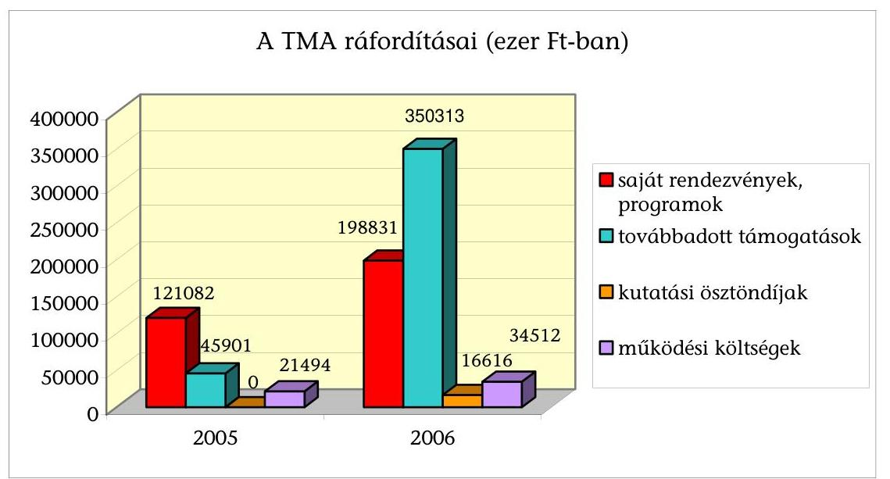
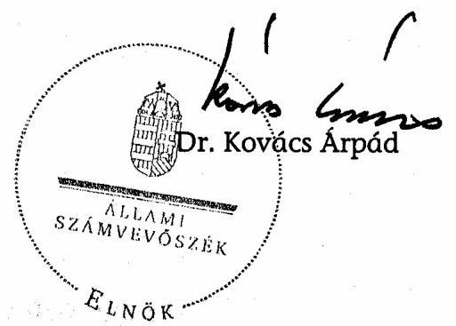

# ÁLLAMI   SZÁMVEVŐSZÉK 

## JELENTÉS

a Táncsics Mihály Alapítvány 2005-2006. évi gazdálkodása törvényességének ellenőrzéséről

---

3. Önkormányzati és Területi Ellenőrzési Igazgatóság
3.1. Szabályszerűségi Ellenőrzési Főcsoport
Iktatószám: V-1020-29/2007.
Témaszám: 877
Vizsgálat-azonosító szám: V-0343
Az ellenőrzést felügyelte:
Dr. Lóránt Zoltán
főigazgató
Az ellenőrzés végrehajtásáért felelős:
Dr. Elek János
általános főigazgató-helyettes
Az ellenőrzést vezette:
Solymár Ágnes
osztályvezető főtanácsos
Az összefoglaló jelentést készítette:
Sas Imréné
számvevő tanácsadó
Az ellenőrzést végezték:
Asztalosné Zupcsán Erika Dr. Méri Sándorné Sas Imréné
külső szakértő számvevő számvevő tanácsadó

# A témához kapcsolódó eddig készített számvevőszéki jelentések: 

címe
sorszáma
Jelentés a Táncsics Mihály Alapítvány 2003-2004. évi gazdálkodása törvényességének ellenőrzéséről

---

# TARTALOMJEGYZÉK 

BEVEZETÉS ..... 5
I. ÖSSZEGZŐ MEGÁLLAPÍTÁSOK, KÖVETKEZTETÉSEK, JAVASLATOK ..... 7
II. RÉSZLETES MEGÁLLAPÍTÁSOK ..... 11

1. Az alapítvány gazdálkodásának törvényessége ..... 11
1.1. A kuratórium működése ..... 11
1.2. Az alapítvány bevételei ..... 13
1.3. Az alapítvány ráfordításai ..... 14
2. Az éves beszámolók ..... 17
2.1. Az éves beszámolók szabályossága ..... 17
2.2. A mérleg ..... 18
2.3. Az eredmény-kimutatás ..... 19
3. A könyvvezetés szabályozottsága ..... 19
4. A könyvvezetés gyakorlata ..... 20
5. Az adókkal és járulékokkal kapcsolatos kötelezettségek ..... 22
6. Az alapítvány ellenőrzési rendszere ..... 23
7. Az alapítvány által létrehozott gazdasági társaság ..... 24
7.1. A társaság létrehozása ..... 24
7.2. A tulajdonosi jogok gyakorlása ..... 24
7.3. Az alapítványtól átvett pénz- és egyéb eszközök ..... 25
8. A korábbi ellenőrzés megállapításaira tett intézkedések ..... 25

## MELLÉKLETEK

1. számú A Táncsics Mihály Alapítvány 2005. évi mérlege
2. számú A Táncsics Mihály Alapítvány 2005. évi eredmény-kimutatása
3. számú A Táncsics Mihály Alapítvány 2006. évi mérlege
4. számú A Táncsics Mihály Alapítvány 2006. évi eredmény-kimutatása

---

.

---

# RÖVIDÍTÉSEK JEGYZÉKE 

| Áfa | általános forgalmi adó |
| :--: | :--: |
| ÁSZ | Állami Számvevőszék |
| FB | Felügyelő Bizottság |
| Gt. | a gazdasági társaságokról szóló 2006. évi IV. törvény |
| Kft. | Kapcsolat.hu Kommunikációs és Szolgáltató Korlátolt Fe-   lelősségű Társaság |
| Kincstár | Magyar Államkincstár |
| KKK pályázat | Kapcsolat Közösségi Kommunikáció pályázat |
| MSZP | Magyar Szocialista Párt |
| Pártalapítványi törvény | a pártok működését segítő tudományos, ismeretterjesztő,   kutatási, oktatási tevékenységet végző alapítványokról   szóló 2003. évi XLVII. törvény |
| Párttörvény | a pártok működéséről és gazdálkodásáról szóló 1989. évi   XXXIII. törvény |
| Ptk. | Polgári Törvénykönyvről szóló 1959. évi IV. törvény |
| SZMSZ | Szervezeti és Működési Szabályzat |
| Számviteli törvény | a számvitelről szóló 2000. évi C. törvény |
| TMA | Táncsics Mihály Alapítvány |

---

.

---

# JELENTÉS 

## a Táncsics Mihály Alapítvány 2005-2006. évi gazdálkodása törvényességének ellenőrzéséről

## BEVEZETÉS

A parlamenti pártok a politikai kultúra fejlesztése érdekében történő politikai képzés, kutatási, tudományos és ismeretterjesztő tevékenységük elősegítésére, a pártok működését segítő tudományos, ismeretterjesztő, kutatási, oktatási tevékenységet végző alapítványokról szóló 2003. évi XLVII. törvény (pártalapítványi törvény) alapján költségvetési támogatásra jogosult alapítványokat hozhatnak létre. A Magyar Szocialista Párt (MSZP) a pártalapítványi törvény alapján 2003-ban egymillió Ft induló vagyonnal létrehozta a Táncsics Mihály Alapítványt (TMA).

A TMA a szociáldemokráciát és a baloldali értékrendet képviselni és népszerűsíteni hivatott alapítvány. Az alapító okiratban rögzített céljai: elősegíteni az MSZP Alkotmányban biztosított, a népakarat kialakításában, valamint kinyilvánításában történő hatékony közreműködését; szélesíteni az állampolgárok tájékozódását a magyar társadalmat érintő társadalmi és politikai kérdésekről, a szociáldemokrácia elméleti megközelítéseiről; ösztönözni a magyar politikai kultúra színvonalának emelését, a demokrácia elveinek és gyakorlatának erősítését; bátorítani a magyar és a globális kulturális értékek, valamint a tudományos eredmények tiszteletben tartását és elfogadtatását; előmozdítani a szociáldemokrata gondolkodás fejlődését, és a szociáldemokrata eszmeiség terjesztését; segíteni a nemzeti érdekeknek a változó körülményeknek megfelelő időszerű megfogalmazását, különös figyelmet fordítva Magyarország uniós tagságából következő feladatokra.

A TMA az alapítványi célok megvalósítása érdekében saját szervezésében, illetve társszervezetekkel közösen előadásokat, konferenciákat, vitaesteket rendez. A "Kapcsolat" elnevezésű, közösségfejlesztő, kommunikációs, integráló és szolgáltató rendszer kiépítésével az MSZP társadalmi kapcsolatainak, a szociáldemokrata értékek elfogadottságának erősítését kívánja szolgálni. A kuratórium a Politikatörténeti Intézettel együttműködve kutatócsoportot hozott létre a hazai- és nemzetközi szociáldemokrácia történelmi és aktuális kérdéseinek tanulmányozására. Hagyományteremtő szándékkal életmű díjat alapított a magyar kultúra kiemelkedő személyiségeinek elismerésére, a díj átadására évente kerül sor.

A pártalapítványok gazdálkodása törvényességének ellenőrzésére a pártalapítványi törvény 4. § (2) bekezdése alapján az Állami Számvevőszék (ÁSZ) jogosult. A pártalapítványi törvény 4. § (4) bekezdése értelmében az ÁSZ kétévenként ellenőrzi azoknak az alapítványoknak a gazdálkodását, amelyek e törvény szerint állami költségvetési támogatásban részesültek.

A pártalapítványi törvény alapján létrehozott alapítványok költségvetési támogatásának formáiról és mértékéről a pártok működéséről és gazdálkodásáról szóló 1989. évi XXXIII. törvény (párttörvény) 2003. július 1-jétől hatályos módosításában rendelkezik. A párttörvény 9/A. § (5) bekezdés a) - c) pontjai alapján az alapítványok alaptámogatásban, mandátumarányos kiegészítő támogatásban és eseti támogatásban részesülhetnek. A TMA, a párttörvény előírásának megfelelően, 2005-ben 444,3 millió Ft, 2006-ban 477,2 millió Ft alap- és mandátumarányos kiegészítő támogatásban részesült.

Az ÁSZ a pártalapítványi törvényben előírtaknak megfelelően, első alkalommal 2005-ben ellenőrizte a TMA 2003-2004. évi gazdálkodásának törvényességét. Az ellenőrzés hiányosságokat állapított meg az alapító okirat és a belső szabályzatok tekintetében, a házipénztári bizonylatok vezetésében, valamint a támogatottakkal megkötött szerződésekre, illetve a kuratórium által nyújtott támogatások felhasználásának elszámoltatására vonatkozóan.

Jelen ellenőrzésünk célja a TMA 2005-2006. évi gazdálkodása törvényességének értékelése volt, amelynek keretében ellenőriztük

- az alapítvány gazdálkodásának törvényességét,
- az éves beszámolók jogszabályi előírásoknak való megfelelését,
- az alapítvány könyvvezetésében a számvitelről szóló 2000. évi C. törvény (számviteli törvény) és egyéb jogszabályi rendelkezések, továbbá a belső előírások betartását,
- a kuratórium által megtett intézkedések körét és eredményét az előző ellenőrzésünk során feltárt hiányosságok megszüntetése, valamint az intézkedési tervben megjelölt feladatok megvalósítása érdekében.

Az éves központi költségvetési támogatást, a csatlakozóktól kapott támogatásokat, és az ötmillió forintot meghaladó könyvelési tételeket tételesen, a ráfordításokat minta alapján ellenőriztük. Az ellenőrzési minta nagyságát az ellenőrzés előkészítése során elvégzett kockázatértékelés alapján határoztuk meg, amelynek során az eredendő kockázatot alacsonynak, a belső kontroll kockázatot közepesnek minősítettük.

Az egyéb szabályszerűségi ellenőrzés a 2005. január 1-jétől 2006. december 31-ig tartó időszakra terjedt ki.

---

# I. ÖSSZEGZŐ MEGÁLLAPÍTÁSOK, KÖVETKEZTETÉSEK, JAVASLATOK 

A kuratórium az ellenőrzött időszakban betartotta az alapító okirat előírásait, törvényesen működött. Döntéseit minden esetben az alapító okiratban előírtak szerinti határozatképes ülésen, a jelen lévő kurátorok egyszerű szótöbbségével hozta meg. Az ülésekről az alapító okirat előírásának megfelelően jegyzőkönyvet, a határozatokról nyilvántartást vezetett. A vagyon felhasználásáról - korábbi ellenőrzésünk javaslatát is figyelembe véve - valamennyi határozatában konkrét összeg megjelölésével döntött, döntései a pártalapítványi törvényben és az alapító okiratban rögzített célok megvalósítását szolgálták.

A képviseleti jog és a bankszámla feletti rendelkezés alapító okiratbeli szabályozása megfelelt a törvényi előírásoknak, gyakorlása pedig az alapító okiratnak. Az elektronikus banki átutalásokat utólag is ellenőrizhető módon, az arra jogosult személyek végezték. Az alapító az előző ellenőrzésünk javaslata ellenére az alapító okiratban nem rögzítette a kuratóriumi határozatok érvényességéhez szükséges szótöbbség viszonyítási alapját. Az SZMSZ - korábbi ellenőrzésünk javaslatától eltérően - nem szabályozta az információs központ, valamint a 2006-ban létrehozott kutató-, és nemzetközi kapcsolattartásért felelős munkacsoportok működésének rendjét és szabályait. A kuratórium az ellenőrzés befejezésekor még nem határozott az utóbbi két munkacsoport további működtetésének szükségességéről. Az SZMSZ nem volt összhangban az alapító okirattal a kuratóriumi elnök és az alapítványi igazgató feladat-, hatás- és felelősségi körét illetően az éves tervek és beszámolók, a belső szabályzatok, a belső és külső ellenőrzési feladatok tekintetében.

Az alapítvány összes bevétele az ellenőrzött 2005-2006. években összesen 1012420 ezer Ft volt, ebből a központi költségvetési támogatás 89,7%-ot képviselt. Az éves költségvetési támogatás mértéke mindkét évben megfelelt a párttörvény által meghatározott alap- és mandátumarányos kiegészítő támogatás együttes értékének. Magánszemélyektől 3466 ezer Ft (0,3%) pénzbeli adományt kapott az alapítvány. Az adományozók a törvényi előírásoknak megfelelően, adományukat az alapítvány pénzforgalmi számlájára teljesítették. A TMA az adományokat a pártalapítványi törvény előírásának megfelelően, saját honlapján közzétette. A kuratórium az alapító okirat előírásától eltérően, 2006-ban két belföldi adományról nem hozott elfogadó határozatot. A bevételek további 10%-át az átmenetileg szabad pénzeszközök lekötéséből realizált pénzügyi, egyéb és rendkívüli bevételek tették ki.

A kuratórium az ellenőrzött években realizált összes bevételének 78%-át (788 749 ezer Ft) használta fel, a ráfordítások 93%-át célszerinti feladatokra, 7%-át az alapítvány működésére fordította. Az alapítványi célokat részben a TMA szervezeti keretei között (44%), másrészt külső szervezetek és magánszemélyek támogatásával (56%) valósította meg. Az alapítványi keretek között megvalósított szakmai programokról és rendezvényekről előzetes szakmai javaslat és pénzügyi terv alapján döntött, határozatait minden esetben a pénzügyi keretek, határidők, felelősök megjelölésével hozta meg. A támogatásokat egyedi kérelemre, saját kezdeményezésre és pályázati úton nyújtotta. Az ellenőrzött időszakban egy pályázati felhívást tett közzé, ennek keretében 145 pályázót 72100 ezer Ft támogatásban részesített. A kuratórium - a támogatás felhasználásáról benyújtott elszámolások ellenőrzése során - 25 pályázót szólított fel hiánypótlásra, ebből kilenc a helyszíni ellenőrzés befejezéséig nem tett eleget a felszólításnak. Ehhez hozzájárult az is, hogy a támogatási szerződések nem írtak elő szankciót a hiánypótlás elmulasztása miatt.

A kuratórium elnöke mind a pályázati, mind az egyedi kérelem alapján támogatottakkal szerződést kötött. A támogatási szerződések a korábbi ellenőrzés javaslatait figyelembe véve tartalmazták az elszámolás határidejét, az elszámoláshoz csatolandó dokumentumok körét. Továbbra sem írták elő azonban az elszámolási határidő elmulasztásának szankcióit, a hiánypótlás szabályait, a támogatás visszakövetelésének eseteit, mindezek hiánya az elszámolások elhúzódását eredményezte. A támogatottak 41%-a határidőn túl számolt el a támogatás felhasználásáról, a késedelmesen elszámolók csupán 8%-a kért elszámolási határidő módosítást. A kuratórium a pályázatkezelési szabályzattól eltérően a párhuzamos elszámolások elkerülése érdekében nem írta elő az eredeti számlák záradékolását. Az alapítvány által elfogadott elszámolások 24%-a hiányos volt, a támogatottak a hiányosságokat - számlák hitelesítése, hiányzó kifizetési bizonylatok, teljesítést igazoló megbízási szerződések, részvételt igazoló listák megküldése - a helyszíni ellenőrzés ideje alatt pótolták.

A TMA az ellenőrzött időszak mindkét évére elkészítette az egyszerűsített éves beszámolókat, a számviteli politikában rögzített formában, határidőben, és a jogszabályi előírásoknak megfelelően. A beszámolókat a felügyelő bizottság (FB) véleményezte, a könyvvizsgáló hitelesítő záradékkal látta el, és a kuratórium érvényes határozattal elfogadta. A beszámolók elkészítésénél érvényesítették a számviteli törvényben megfogalmazott alapelveket. Az éves beszámolók az alapítvány gazdálkodásáról megbízható és valós képet mutattak. A beszámoló sorok adatai az év végi főkönyvi kivonatok adataiból mindkét évben levezethetőek voltak. A mérleg és eredmény-kimutatás sorok adatai megegyeztek a kapcsolódó analitikus és főkönyvi nyilvántartások összesített adataival. Az éves mérlegekben kimutatott eszközök és források értékadatait a leltározási szabályzat előírása szerinti leltárakkal, az eredmény-kimutatásban kimutatott bevételeket és ráfordításokat könyvelési alapbizonylatokkal támasztották alá. Az eszközbeszerzések és a ráfordítások elszámolásánál érvényesítették a kötelezettségvállalás, a teljesítésigazolás és utalványozás, valamint a
 banki aláírás szabályait.

A TMA rendelkezett a számviteli törvényben előírt, a könyvvezetés és a beszámoló elkészítésének rendjét meghatározó számviteli politikával, és ahhoz kapcsolódó szabályzatokkal. A kuratórium az ellenőrzött időszakban a szabályzatok módosításait jóváhagyta. A számviteli politika nem rögzítette a korábbi ellenőrzés során javasolt, az alapítványi célú tevékenység közvetlen-, és közvetett költségei elkülönítésének rendjét és szabályait. A könyvvezetésben az alapítványi költségek nyilvántartása és elkülönítése a szabályozási hiányosság ellenére megfelelt a vonatkozó jogszabályi előírásoknak. A pénzkezelési szabályzat sem a korábbi, sem jelen ellenőrzött időszakban nem tartalmazta a bankszámlaforgalom és az elektronikus átutalások rendjét és szabályait, a szabályzatot ezen előírásokkal 2007-ben egészítették ki. A számlarend nem felelt meg

---

teljes körűen a számviteli törvény előírásának, mivel a könyvvezetésben alkalmazott számlák számjele és tartalma nem minden esetben volt összhangban a számlarendben megjelöltekkel, ez a könyvvezetés szabályosságát nem érintette. A számlarend 2007. évi módosításával megteremtették a számlarendben megjelölt és a könyvvezetésben alkalmazott számlák közötti összhangot.

A könyvvezetést a kettős könyvvitel rendszerében, mindkét évben azonos számítógépes programmal végezték, a gazdasági eseményeket idősorrendben, könyvelési alapbizonylatokkal alátámasztva rögzítették. A számviteli feladatok vezetésére és a beszámoló elkészítésére jogosult személy rendelkezett a törvényi előírásoknak megfelelő képesítéssel. A könyvvezetésben érvényesítették a bizonylatok számviteli törvény által előírt alaki és tartalmi követelményeit a könyvviteli nyilvántartásokban való rögzítés időpontjának igazolása kivételével. A számlakijelölés gyakorlata összhangban volt a vonatkozó jogszabályi előírásokkal. A belső szabályzatokban előírt egyedi nyilvántartásokat vezették, és azoknak a főkönyvi adatokkal való egyeztetését elvégezték. A házipénztár kezelésében és a pénztári nyilvántartások vezetésében a korábbi ellenőrzés során feltárt hiányosságot megszüntették. A házipénztárt a megbízott pénztáros kezelte, az elszámolásra kiadott előleget, a munkabér előleget és a szigorú számadású bizonylatokat nyilvántartották. A kiadási bizonylatokhoz minden esetben csatolták az utalványozott alapbizonylatokat. A 2005-2006. években a házipénztár záró pénzkészlete a havi pénztárzárások felénél meghaladta a pénzkezelési szabályzatban előírt mértéket, a felvett előlegek 35%-át az elszámolási határidőt meghaladóan számolták el, 2%-ánál a korábban felvett előleg elszámolása nélkül folyósítottak újabb előleget. Az ellenőrzés nem állapított meg jogosulatlan kifizetést.

A TMA az ellenőrzött években munkáltatói és kifizetői jogkörében eleget tett az adózási és társadalombiztosítási jogszabályok rendelkezéseinek, az előírt nyilvántartásokat vezette, az adatszolgáltatást határidőben teljesítette. A bér- és bérjellegű kifizetésekből a magánszemélyek adóelőlegeit és járulékait levonta, a munkáltatót, illetve kifizetőt terhelő költségvetési befizetési kötelezettséget határidőben teljesítette. A hivatali személygépkocsi magáncélú használata utáni cégautó adót, az adómentes mértéket meghaladó természetbeni juttatás utáni személyi jövedelemadót megfizették. Egy magánszemélytől - egyéb jogcímen kifizetett összegből - nem vontak adóelőleget, de a törvényi előírásnak megfelelően az adóhatóságot a magánszemély részére történt kifizetésről értesítették.

Az FB az alapító okirat előírásával összhangban rendszeresen ellenőrizte a kuratórium működésének törvényességét, az alapítvány gazdálkodásának szabályosságát a támogatási rendszer ellenőrzése kivételével, a belső szabályozottságot, a pénzügyi terveket és beszámolókat. Az ellenőrzött két évben a belső ellenőrzés folyamatba épített, előzetes és utólagos vezetői ellenőrzéssel valósult meg. Az ellenőrzés megszervezéséért és működtetéséért a kuratórium elnöke és az alapítványi igazgató voltak felelősek. A belső kontrollokat a gazdálkodási szabályzatok rögzítették. A vezetői ellenőrzés a képviseleti jog, a kötelezettségvállalás és utalványozás, a munkáltatói jogkör gyakorlása, a bankszámla feletti rendelkezés során valósult meg. A folyamatba épített ellenőrzés nem működött teljes körűen a támogatások elszámoltatásánál és a házipénztár vezetésénél.

---

A kuratórium a TMA céljaival összhangban, 2006-ban Kapcsolat.hu Kommunikációs és Szolgáltató Korlátolt Felelősségű Társaságot hozott létre, kapcsolatépítő és kommunikációs program megvalósítására. A kuratórium a törvényi előírásokkal összhangban gyakorolta a tulajdonosi jogokat, úgymint az ügyvezetők megválasztása, visszahívása, a könyvvizsgáló kijelölése, az alapító okirat módosítása, az éves beszámoló elfogadása, az értékhatár feletti szerződések megkötésének engedélyezése. A törvényi előírástól eltérően 2006 novemberéig a taggyűlés hatáskörébe tartozó kérdésekben hozott döntéseiről írásban nem értesítette az ügyvezetőt, továbbá a könyvvizsgáló díjazását a kuratórium helyett az ügyvezető állapította meg. A Kft. 150 000 ezer Ft kamatmentes fejlesztési támogatási kölcsönt kapott az alapítványtól. A kölcsönről a kuratórium határozott, a felek az erre vonatkozó írásbeli szerződést a kuratórium határozatával összhangban, de késedelmesen kötötték meg, ezzel megsértették az alapító okirat előírását. A kölcsön visszafizetése a határidő meghosszabbítása miatt 2008-ban válik esedékessé.

A helyszíni ellenőrzés megállapításainak hasznosítása mellett javasoljuk:

# az MSZP elnökének, mint az alapító képviselőjének 

Pontosítsa az alapító okirat legközelebbi módosítása során a kuratóriumi határozatok érvényességéhez szükséges szótöbbség viszonyítási alapját.

## az alapítvány kuratóriumának

1. Vizsgálja felül az alapítvány belső szabályzatait az alábbiak figyelembevételével:
a) egészítse ki az SZMSZ-t az információs központ, és a kuratórium döntésétől függően, a kutató- és nemzetközi kapcsolattartásért felelős munkacsoportok működtetésének szervezeti kereteire, működési rendjére, feladataira vonatkozóan;
b) teremtsen összhangot az alapító okirat és az SZMSZ között a kuratórium elnöke és az alapítványi igazgató feladat-, hatás- és felelősségi körében az éves tervek és beszámolók, a belső szabályzatok és az ellenőrzési feladatok tekintetében;
c) rögzítse a számviteli politikában az alapítványi célú tevékenység közvetlen és közvetett költségei elkülönítésének szabályait.
2. Határozza meg a támogatási szerződésekben a határidőn túli elszámolás miatti szankciót, a hiánypótlás és a támogatás visszakövetelésének szabályát, írja elő a felhasználásról szóló eredeti számlák záradékolását, az elszámolások ellenőrzése során következetesen érvényesítse a támogatási szabályzat és szerződés előírásait, határozzon a hiánypótlási kötelezettséget nem teljesítő támogatottakkal szemben lefolytatandó eljárási rendről.
3. Gondoskodjon a számvitelről szóló 2000. évi C. törvény 167. § (1) bekezdés i) pontja szerint a számviteli bizonylatokon a könyvviteli nyilvántartásokban történt rögzítés időpontjának feltüntetéséről, továbbá a pénzkezelési szabályzat előírásának maradéktalan betartásáról a záró pénzkészlet és az utólagos elszámolásra kiadott előlegek vonatkozásában.

---

# II. RÉSZLETES MEGÁLLAPÍTÁSOK 

## 1. Az alapítvány gazdálkodásának törvényessége

### 1.1. A kuratórium működése

Az alapító az alapító okiratot az ellenőrzött időszakban egy alkalommal módosította.

Az alapító a módosított alapító okiratban a kuratórium elnökét és két új tagját 2005. július 1-i hatállyal öt évre bízta meg, amely a pártalapítványi törvény 3. § (7) bekezdésének rendelkezéseivel összhangban volt. A módosítást a Fővárosi Bíróság 2005. július 12-i végzésével 9051. sorszám alatt vette nyilvántartásba.

Az alapító okirat a Polgári Törvénykönyvről szóló 1959. évi IV. törvény (Ptk.) 74/C. § (4) bekezdésének megfelelően rendelkezett az alapítvány képviseletéről, a képviseleti jog gyakorlásának módjáról és terjedelméről, a bankszámla feletti rendelkezés és a kötelezettségvállalás szabályairól. Az alapító okirat nem rögzítette azt, hogy a kuratóriumi határozatok érvényességéhez a kuratóriumi ülésen jelenlévő, vagy valamennyi kuratóriumi tag egyszerű szótöbbsége szükséges.

Az SZMSZ módosítását a kuratórium 2005. októberben fogadta el, a szabályzat nem volt összhangban az alapító okirattal a kuratóriumi elnök és az alapítványi igazgató feladat-, hatás- és felelősségi köre tekintetében.

Az alapító okirat alapján az elnök, az SZMSZ szerint az alapítványi igazgató volt felelős az alapítvány éves munkaprogramjának, pénzügyi-gazdálkodási tervének és költségvetésének kidolgozásáért, azok végrehajtásáért, a beszámolók elkészítéséért, a belső szabályzatok elkészítéséért, azok betartatásáért, a belső ellenőrzés megszervezéséért és az FB-vel való kapcsolattartásért.

Az SZMSZ nem szabályozta az Információs Központ (20 fő) feladat- és hatáskörét, továbbá a 2006-ban létrehozott Szociáldemokrácia Kutatócsoport és a Táncsics Euro-Contakt nemzetközi kapcsolattartásért felelős munkacsoport működésének rendjét és szabályait. A kuratórium az utóbbi két munkacsoport vezetőit megbízással, alkalmazottait munkaszerződéssel foglalkoztatta, működésüket feljegyzések, kuratóriumi határozatok szabályozták. A helyszíni ellenőrzés befejezésekor e munkacsoportok további működtetésének szükségességéről a kuratórium még nem határozott.

Az alapító okirat és SZMSZ az alapítvány céljaira rendelt vagyon felhasználásának módját a Ptk., a párttörvény és a pártalapítványi törvény előírásainak megfelelően szabályozta.

A kuratórium által 2005. november 15-én jóváhagyott vagyonkezelési és befektetési szabályzat az alapító okirattal összhangban tartalmazta a vagyon feletti döntési jogkört és az alapítvány vagyonelemeit. A szabályzat a szabad pénzeszközök bankbetétbe és garantált értékpapírba helyezését írta elő, de nem

---

szabályozta az alapítvány által, célszerinti feladatai ellátására létrehozott gazdasági társaságba való pénzügyi befektetést.

A kuratórium az ellenőrzött időszakban 15 ülésen 329 határozatot hozott. A kuratóriumi ülésekről készített jegyzőkönyvek és jelenléti ívek tanúsága szerint a határozatokat minden esetben az alapító okiratban előírtak szerinti határozatképes ülésen, a jelenlévő kuratóriumi tagok egyszerű szótöbbségével hozta. A kuratóriumi ülésről felvett jegyzőkönyvek, és a határozatok tára megfelelt az alapító okirat és SZMSZ jegyzőkönyv készítési-, hitelesítési- és nyilvántartási előírásainak.

A kuratórium mindkét évben megtárgyalta és elfogadta az éves költségvetési és pénzügyi tervet, az éves szakmai és pénzügyi beszámolót, a gazdálkodási szabályzatok módosításait.

A kuratórium 2006-ban az alapító okirat előírásától eltérően nem hagyott jóvá éves munkatervet, ülésein az egyes célfeladatokra vonatkozó koncepciókat fogadta el (pl. szociáldemokrata kutatócsoport létrehozása, működtetése, szervezetfejlesztési projekt, kapcsolat közösségi portál létrehozása, stb.).

Az ellenőrzött időszakban a kuratórium vagyoni döntései a cél szerinti tevékenységek ellátását szolgálták. A kuratórium döntéseit az alapító okirat céljaihoz kapcsolódó kulturális, képzési, ismeretterjesztő, kommunikációs és kapcsolatépítő programok, klubhálózat támogatása érdekében hozta, valamint a kezelő- és munkaszervezet működési költségeit biztosította.

Az éves költségvetési és pénzügyi tervek nem voltak teljes körűek, mivel a kuratórium mindkét évben hozott a tervben nem szereplő pénzügyi döntést.

A kuratórium a 2005. évi tervben nem jelölt meg fejlesztési forrást, miközben az év folyamán döntött személygépkocsi vásárlásáról 5000 ezer Ft keretösszegben (57/2005. (09. 13.), továbbá a kapcsolat.hu domain név megvásárlásáról 2500 ezer Ft összegben (108/2005. (11. 15.).

A kuratórium a 2006. évi tervben nem vette figyelembe az alapítványi célok megvalósítására létrehozott egyszemélyes gazdasági társaságnak nyújtott 150 000 ezer Ft rövid lejáratú kölcsöntámogatást, amelyről még a terv elfogadása előtt döntött (38/2006. (03. 07.).

A képviseleti jogot az ellenőrzött időszakban az alapító okiratban megjelölt, rendelkezésre jogosult személy - a kuratórium elnöke - gyakorolta. Az alapítvány valamennyi szerződését (munkaszerződés, megbízási-, vállalkozási- és támogatási szerződések) a kuratórium elnöke írta alá.

A bankszámla feletti rendelkezés szabályozása megfelelt a Ptk. 29. § (3) bekezdése előírásának, az aláírásra bejelentettek köre összhangban volt az alapító okirat és az SZMSZ előírásával. A banki bejelentés alapján a kuratórium elnöke, titkára, az alapítványi igazgató és egy alapítványi alkalmazott közül két személy együttesen voltak jogosultak a bankszámla felett rendelkezni. A banki átutalásokat elektronikus úton - utólag is ellenőrizhető módon - az arra feljogosítottak írták alá.

---

Az alapítvány törzsvagyonának induláskor meghatározott összege (500 ezer Ft) az ellenőrzött években nem változott. Az alapítvány a törzsvagyont elkülönített betétszámlán, lekötött betétben helyezte el. Az év végi záró pénzkészletből a törzsvagyon összegét, annak meglétét külön bankszámla kivonat igazolta.

A kuratórium jogosult volt a költségvetési támogatás egy részének a törzsvagyonba helyezésére, ezzel a jogával az ellenőrzött két évben nem élt.

# 1.2. Az alapítvány bevételei 

A TMA az ellenőrzött időszak éves beszámolóiban összesen 1012 420 ezer Ft bevételt mutatott ki, amelyből a központi költségvetési támogatás összege 89,7%-ot tett ki (908 620 ezer Ft). Az alapítványhoz csatlakozó

 magánszemélyek adománya a bevételek 0,3%-át (3466 ezer Ft-ot) alkotta. Egyéb bevétel származott a visszautalt támogatásokból 3519 ezer Ft (0,4%), és a korábbi ellenőrzésünk miatt végrehajtott önrevízió (honlap fejlesztés utólagos aktiválása) során 4298 ezer Ft (0,4%). A pénzügyi műveletek bevétele 87716 ezer Ft (8,7%) volt, amely a szabad pénzeszközök banki lekötéséből származott. Az alapítvány a 2006. év végén 525500 ezer Ft lekötött betéttel rendelkezett, ebből a törzsvagyon összege 500 ezer Ft volt. A térítés nélkül átvett eszközök után 4801 ezer Ft (0,5%) rendkívüli bevételt számoltak el, az átvett eszközökről a kuratórium elfogadó határozatot hozott.

A TMA a pártalapítványi törvény 1. §-a alapján központi költségvetési támogatásra volt jogosult, a támogatás mértékét a párttörvény határozta meg. A támogatás alap- és mandátumarányos kiegészítő támogatásból tevődött össze, eseti támogatásban nem részesült az alapítvány. A központi költségvetési támogatás összege mindkét évben megfelelt a párttörvény 9/A. § (5) bekezdés a) és b) pontjai előírásainak.

Az alaptámogatás mértéke az egyévi képviselői alapdíj huszonötszöröse, amelyet az országgyűlési képviselők tiszteletdíjáról és költségtérítéséről szóló 1990. évi LVI. törvény határoz meg, összege: 128430 ezer Ft volt.

A mandátumarányos támogatás mértéke képviselőnként a képviselői alapdíj 85%-a, összege 2005-ben 178 képviselőre, 2006. II. felétől 180 képviselőre számítva, a képviselői alapdíj évközi változását is figyelembe véve 793023 ezer Ft-ot tett ki.

Az alapítvány 2005-2006-ban a központi költségvetésből (a felkerekítés eredményeként) 921500 ezer Ft támogatást kapott (2005-ben 444300 ezer Ft, 2006-ban 477200 ezer Ft). Az éves beszámolókban és a könyvvezetésben kimutatott költségvetési támogatás összege 908620 ezer Ft volt.

A befolyt és a könyvvezetésben kimutatott költségvetési támogatás eltérése a bevételeknek a számviteli törvény 44. § (2) bekezdése szerinti passzív időbeli elhatárolásából adódott, amelyet a számviteli politikában foglaltakkal összhangban, a kötelezettségvállalással terhelt, de a tárgyév végéig fel nem használt pályázati és ösztöndíj támogatások tettek ki. Az elhatárolásról tételes nyilvántartást vezettek, azokat minden esetben kuratóriumi határozattal, szerződéssel támasztották alá.

---

A Kincstár a 2005. és 2006. évi költségvetési támogatást a pártalapítványi törvény 2. § (1) bekezdésének megfelelően, negyedéves ütemezésben, a negyedév első napjaiban átutalta a TMA számlájára.

A kuratórium a pártalapítványi törvény 3. § (2) bekezdése alapján 2005-ben elfogadta egy csatlakozó külföldi magánszemély 1005 ezer Ft (4000 euró) pénzbeli támogatását. A 2006. évben két belföldi magánszemély 2461 ezer Ft (9600 euró) pénzbeli adományának elfogadásáról - az alapító okirat II. fejezet (2) bekezdésben foglaltak ellenére - nem hozott határozatot.

Az adományozók a pártalapítványi törvény 3. § (3) bekezdésének megfelelően az adományokat az alapítvány pénzforgalmi számlájára átutalással teljesítették, a banki kivonatokon az adományozó személye beazonosítható volt. Az alapítvány a csatlakozóktól kapott támogatások közzétételi kötelezettségének eleget tett. A csatlakozók támogatásait az összeg megjelölésével - mint közérdekű adatot - az alapítvány közzétette a honlapján. Az alapítvány a csatlakozóktól kapott támogatást általános jelleggel kapta, a támogatók konkrét célokat nem határoztak meg, ezért felhasználásukról elkülönített nyilvántartást nem kellett vezetni.

A pártalapítványi törvény 3. § (4) bekezdés a) és b) pontjai szerint akkor kell közérdekből nyilvános adatként kezelni a pénzbeli adományokat, ha a belföldi támogatás meghaladja az 500 ezer Ft-ot, a külföldi támogatás pedig a 100 ezer Ft-ot.

# 1.3. Az alapítvány ráfordításai 

Az alapítvány az ellenőrzött két évben 788749 ezer Ft ráfordítást mutatott ki, bevételei és ráfordításai különbözeteként 223671 ezer Ft eredmény képződött. A TMA célszerinti tevékenységekre 732743 ezer Ft-ot (93%), míg működési költségekre 56006 ezer Ft-ot (7%) fordított. A kuratórium a működési költségekre fordítható keretösszegeket az éves költségvetési és pénzügyi tervben elfogadta. A működési költségek körében az alkalmazottak juttatásait, az irodai eszközök, szoftverek és számítógépek beszerzését, az igénybevett szolgáltatási szerződéseket (bérleti szerződés, könyvelővel, könyvvizsgálóval kötött szerződés), az új dolgozók felvételét a kuratórium mindkét évben előzetesen jóváhagyta. A szerződéses kötelezettségvállalásokat valamennyi esetben a kuratórium elnöke írta alá.

A TMA az alapító okiratban rögzített célokat saját szervezeti keretei között, valamint más szervezeteknek és magánszemélyeknek továbbadott támogatásokkal valósította meg. A célszerinti ráfordítások 44%-át (319 913 ezer Ft) az alapítvány szervezeti keretei között bonyolított szakmai programok, kiadványok, az MSZP-ével közös politikai rendezvények és az információs központ költségeire számolták el. A kuratórium előzetes szakmai javaslat és pénzügyi terv alapján döntött az alapítvány szervezeti keretei között megvalósított célszerinti tevékenységek költségeiről, döntéseit a programok, rendezvények, konferenciák megnevezésével, pontos pénzügyi keretek, határidők, felelősök megjelölésével hozta meg.

---

A célszerinti ráfordítások 56%-át külső szervezetek és magánszemélyek részére nyújtott támogatások tették ki. A kuratórium pályázati és egyedi támogatásokra 396214 ezer Ft-ot, kutatási ösztöndíjakra 16616 ezer Ft-ot fordított, 2005-ben 51, 2006-ban 291 támogatott részesült pénzügyi támogatásban, ezen belül kutatási ösztöndíjban 2005-ben 10, 2006-ban 49 fő.

A kuratórium az ellenőrzött időszakban a más szervezetek és magánszemélyek részére továbbadott valamennyi támogatásról érvényes kuratóriumi határozatot hozott, megjelölve abban a támogatott nevét, a támogatás célját és összegét. A támogatási szerződések visszautaltak a kuratóriumi határozat számára, a szerződések így beazonosíthatók voltak.

A kuratórium az SZMSZ előírásának megfelelően 2005 végén pályázatkezelési szabályzatot adott ki, amely teljes körűen szabályozta a pályáztatás (elbírálás, szerződéskötés, elszámoltatás) folyamatát.

A kuratórium eltérően a pályázatkezelési szabályzat előírásától a befogadott pályázatokat, valamint a támogatásokról hozott döntéseket az alapítvány honlapján nem tette közzé.

Az alapítvány számára a befogadott pályázatok, valamint a támogatások közzétételét jogszabály nem írja elő.

A pályázatkezelési szabályzat az alapítványokra nem vonatkozó jogszabályi hivatkozásokat alkalmaz, így pl. az államháztartásról szóló 1992. évi XXXVIII. törvény, az államháztartás működési rendjéről szóló 217/1998. (XII. 30.) Korm. rendelet, az államháztartás szervezetei beszámolási és könyvvezetési kötelezettségeinek sajátosságairól szóló 249/2000. (XII. 24.) Korm. rendelet.

A kuratórium az ellenőrzött időszakban egy alkalommal, 2005. decemberben tett közzé pályázati felhívást Kapcsolat Közösségi Kommunikáció (KKK pályázat) címmel. A pályázat elbírálása során az 1/2006. (01. 31.) számú kuratóriumi határozat alapján 145 pályázó részére utólagos elszámolási kötelezettség

---

mellett 72100 ezer Ft vissza nem térítendő támogatást nyújtott. A kuratórium elnöke valamennyi pályázóval 2006. februárban szerződést kötött.

A pályázati kiírás tartalmazta a pályázat célját, a támogatási keretet (100 000 ezer Ft), az egyenként adható támogatás felső határát (500 ezer Ft), a támogatás felhasználásának jogcímeit.

A pályázati támogatások felhasználásáról a pályázóknak egységesen 2006. július végéig kellett elszámolni. A kuratórium 2006. novemberben határozott a KKK pályázat lezárásáról, ennek során 118 pályázó elszámolását fogadta el, 25 pályázót hiánypótlásra kötelezett. Egy pályázó a támogatást nem vette fel, egy pedig a teljes összeget visszafizette. Az ÁSZ helyszíni ellenőrzéséig összesen kilenc pályázó elszámolását nem zárták le, mivel azok a kuratóriumi elnök többszöri hiánypótlási felhívásának nem tettek eleget, közülük öt szervezettől a teljes támogatási összeg visszakövetelésére 2007. szeptemberben sor került, négy szervezet további haladékot kapott a hiánypótlására.

A kuratórium elnöke mind a pályázati, mind az egyedi kérelem alapján támogatottakkal szerződést kötött. A támogatási szerződések nem tartalmazták az elszámolási határidő elmulasztása esetén a hiánypótlás végső határidejét, illetve elmulasztásának szankcióit, a pályázatkezelési szabályzattól eltérően nem rögzítették a támogatás visszakövetelésének eseteit és garanciáit. Mindezek hiánya az elszámolások elhúzódását eredményezte. A pénzügyi elszámolás dokumentálásának módját a támogatási szerződések és az alapítvány által közzétett elszámolási formanyomtatványok tartalmazták. A szerződésben és formanyomtatványokon - a párhuzamos elszámolások elkerülése érdekében - nem tüntették fel a szabályzat 14.4 pontja által előírtakat, nevezetesen azt, hogy az eredeti számlákat záradékolni kell, rá kell vezetni a Táncsics Alapítvány kuratóriumi határozatának számát és a képviselővel alá kell íratni.

A kuratórium által nyújtott támogatások szabályosságának ellenőrzése során az alábbiakat állapítottuk meg:

- A kuratórium elnöke valamennyi támogatottal támogatási szerződést kötött, a támogatások kifizetése előre egy összegben - utólagos elszámolással - a szerződések alapján történt.
- A támogatási szerződések 3%-a nem tartalmazta a támogatások összegét.

Két támogatott szerződésében nem szerepelt a támogatás összege, részükre személyenként 250 ezer Ft-ot fizettek ki, amelyet a vonatkozó kuratóriumi határozat előterjesztése tartalmazott.

- A támogatottak 47%-a határidőben, 41%-a határidőn túl, késedelmesen számolt el, 10% elszámolása folyamatban volt, 2%-a nem használta fel és önként visszafizette a támogatást.
- A késedelmesen elszámolóknak csupán 8%-a kért elszámolási határidő módosítást, melyet a kuratórium jóváhagyott. Mivel a szerződések nem szankcionálták a késedelmes elszámolást, így 92% még határidő módosítást sem kért.

---

- A kuratórium a támogatások felhasználásáról készített elszámolások 98%-át elfogadta. Az elszámolások 2%-át nem fogadta el, a támogatási összeg felét kuratóriumi határozattal visszakövetelte, ennek a támogatott a helyszíni ellenőrzés befejezéséig nem tett eleget.
- A támogatások 24%-ánál állapítottunk meg olyan hiányosságot, amelyet az alapítvány saját ellenőrzése során nem tárt fel. A hiányosságokat a helyszíni ellenőrzés ideje alatt a támogatottak pótolták. Elszámolási hiányosságok voltak: hitelesítés nélküli számlamásolatok benyújtása és elfogadása, kifizetési bizonylatok (bankkivonat, pénztárbizonylat) hiányos benyújtása, teljesítést igazoló megbízási szerződések, képzési támogatások esetén a résztvevők listájának hiánya.

Hiánypótlások a 2005. évi elszámolásokhoz: egy szervezet 22 db számla kifizetési bizonylatát, egy szervezet a képzésen a résztvevők listáját utólag pótolta, egy szervezet az elszámoláshoz benyújtott számlákat utólag hitelesítette.

Hiánypótlások a 2006. évi elszámolásokhoz: négy szervezet a benyújtott számlák utólagos hitelesítését végezte el, két szervezet a hiányzó kifizetési bizonylatokat, két szervezet a képzéseken résztvevők listáját, két szervezet a kifizetéseket igazoló megbízási szerződéseket pótolta.

# 2. Az ÉVES BESZÁMOLÓK 

### 2.1. Az éves beszámolók szabályossága

A TMA az ellenőrzött időszak mindkét évében eleget tett beszámoló készítési kötelezettségnek, éves beszámolóit a vonatkozó jogszabályi előírásoknak megfelelően, a számviteli politikájában megjelölt formában határidőre elkészítette.

Az egyszerűsített éves beszámoló a számviteli politikában megjelölt, a számviteli törvény szerinti egyes egyéb szervezetek beszámoló készítési és könyvvezetési kötelezettségének sajátosságairól szóló 224/2000. (XII. 19.) Korm. rendelet 4. sz. melléklete szerint mérlegből és 5. sz. melléklete szerint eredmény-kimutatásból állt.

A könyvvizsgáló az alapítvány éves beszámolóit hitelesítő záradékkal látta el. A TMA felügyelő bizottsága az alapító okirat előírásának megfelelően az egyszerűsített éves beszámolókat véleményezte, a kuratóriumnak elfogadásra javasolta. A kuratórium a beszámolókat érvényes kuratóriumi határozattal elfogadta.

A 2005. évről készített beszámolót a 43/2006. (05. 30.), a 2006. évről szóló beszámolót a 97/2007. (05. 28.) számú határozatokkal fogadta el a kuratórium.

A TMA az egyszerűsített éves beszámolói összeállítása során érvényesítette a számviteli törvény 15-16. §-aiban foglalt számviteli alapelveket. Az éves beszámolók adatai az év végi főkönyvi kivonatok adataiból mindkét évben levezethetőek voltak.

A 2005-2006. évek egyszerűsített éves beszámolói nem tartalmaztak sem a lényegességi szintet (a bevételek 2%-át) meghaladó, sem jelentős összegű hibát (a

---

mérleg-főösszeg 2%-át meghaladó, eredményt, saját tőkét növelő-csökkentő tételeket).

A TMA 2005. éves egyszerűsített beszámolóját az 1. és 2. számú, a 2006. éves egyszerűsített beszámolóját a 3. és 4. számú mellékletek mutatják be.

# 2.2. A mérleg
 Az ellenőrzött években a mérlegsorok adatai megegyeztek a kapcsolódó analitikus és főkönyvi nyilvántartások összesített adataival. Az éves mérlegekben kimutatott eszközök és források értékadatait a számviteli törvény 69. § előírásával összhangban, a leltározási szabályzat szerinti leltárakkal alátámasztották.

Az immateriális javak és tárgyi eszközök értékét az egyedi nyilvántartás adataiból készített összesítő kimutatások, a pénzeszközök értékét készpénzállománynál mennyiségi leltár, bankszámláknál év végi bankkivonatok, a követelések és kötelezettségek, valamint az aktív és passzív időbeli elhatárolások értékét év végi tételes kimutatások támasztották alá. (Az immateriális javakat és tárgyi eszközöket a leltározási szabályzat szerint mennyiségi felvétellel ötévente kell leltározni.)

Az ellenőrzött időszakban az immateriális javak és tárgyi eszközök egyedi nyilvántartása és az állomány-változások - beszerzések-aktiválások, selejtezés, terv szerinti értékcsökkenés - elszámolása összhangban volt a belső szabályzatok előírásaival.

Az eszközök beszerzéséről 2005-ben minden esetben a kuratórium határozott. 2006-ban a beszerzések, beruházások 7,4%-ánál az alapító okirat VIII. fejezet 5/d pontja alapján a kuratórium elnöke vállalt kötelezettséget, kötelezettségvállalásairól azonban az alapító okirattól eltérően, a következő ülésen nem tájékoztatta írásban a kuratóriumot, a kuratórium azokat az éves beszámoló elfogadásával hagyta jóvá.

A TMA 2006-ban 12 772,8 ezer Ft eszköz-adományt kapott, az alapító okirat előírásának megfelelően az adomány elfogadásáról a kuratórium határozott, és azt a TMA honlapján közzétette.

A forgóeszközökön belül a beszámolók elismert követeléseket tartalmaztak, év végén a munkavállalókkal, illetve 2006-ban az alapítvány egyszemélyes gazdasági társaságával szemben állt fenn követelés. A pénzeszközök mérlegben kimutatott értéke megegyezett az év végi pénztárjelentés záró állományával és a bankkivonatokkal.

A mérlegben az induló tőkét az alapító okirat által meghatározott induló vagyon értékének megfelelően mutatták ki.

A mérlegben a kötelezettségek között mindkét évben csak rövidlejáratú kötelezettséget mutattak ki, amely megegyezett a december hónapra elszámolt, és következő év januárban befizetett adók és járulékok, valamint a szállítói tartozások együttes értékével.

---

Az aktív és passzív időbeli elhatárolások elszámolása szabályos volt, az elszámolást szállítói számlák, támogatási szerződések, számítási anyagok támasztották alá.

# 2.3. Az eredmény-kimutatás 

Az ellenőrzött években az eredmény-kimutatás sorok adatai a főkönyvi kivonatok, illetve a vonatkozó főkönyvi és részletező számlák összesített adataival megegyeztek.

A bevételeken belül a központi költségvetési és az egyéb támogatásokat elkülönítetten mutatták ki, a kimutatott támogatások, valamint az elszámolt pénzügyi és egyéb bevételek összege megegyezett a vonatkozó bankkivonatok összesített értékével. Az eredmény-kimutatásban kimutatott ráfordításokat könyvelési alapbizonylatokkal (szerződések, szállítói számlák, vegyes könyvelési feladások) támasztották alá.

Az eredmény-kimutatás sorai - egy kivétellel - az adott sorokon kimutatható bevételek, illetve ráfordítások fogalomkörébe tartozó tételeket tartalmaztak. A 2005. évben az egyéb igénybevett szolgáltatások (hatósági díj, biztosítási díj, bankköltség) értékét (417 ezer Ft) az anyagjellegű ráfordítások helyett az egyéb ráfordítások között mutatták ki, amely csak az eredmény-kimutatás sorait érintette, az összes ráfordítás, az eredmény és a saját tőke értékét nem módosította. A 2006. évben az egyéb igénybevett szolgáltatások értékét már helyesen, az anyagjellegű ráfordítások között szerepeltették.

A ráfordítások elszámolásánál érvényesítették a kötelezettségvállalás, az utalványozás, a teljesítésigazolás és a banki aláírás szabályait. A bankszámla feletti rendelkezés és a kötelezettségvállalás gyakorlása az alapító okirat, az utalványozás a pénzkezelési szabályzat előírása szerint történt.

## 3. A KÖNYVVEZETÉS SZABÁLYOZOTTSÁGA

A 2005-2006. években a könyvvezetés és az éves beszámolók elkészítésének belső szabályozási rendszere a számviteli törvény által kötelezően előírt szabályozáson alapult. A TMA a számviteli törvény 14. § (3)-(5) bekezdéseinek előírásaival összhangban rendelkezett számviteli politikával, ennek keretében eszközök és a források értékelési-, eszközök és a források leltárkészítési és leltározási-, pénzkezelési szabályzatokkal, továbbá a 161. § alapján számlarenddel. A kuratórium a szabályzatok módosításait az ellenőrzött években jóváhagyta.

A kuratórium a számviteli törvényben rögzített alapelveknek és értékelési előírásoknak megfelelő számviteli politikát 2004-ben fogadta el. Az ellenőrzött 2005-2006. években a számviteli politika alapján a számviteli folyamatok ellenőrzéséért és a beszámoló elkészítéséért a kuratórium ügyvezető alelnöke volt felelős (II/7. pont) annak ellenére, hogy az ügyvezető alelnöki tisztséget 2005 közepétől az alapító megszüntette. A kuratórium a szabályzat 2007. évi módosítása során e feladatok felelőseként a kuratórium elnökét jelölte meg. A számviteli politika - mint alapítványi sajátosságot - nem tartalmazta az alapítványi költségek (alapítványi célú tevékenység közvetlen-, és közvetett költségek)

---

elkülönítésének módját, szabályait, de a gyakorlatban a költségeket a vonatkozó jogszabályi előírásoknak megfelelően tartották nyilván.

Az eszközök és források értékelésének szabályait az ellenőrzött években a számviteli politika teljes körűen tartalmazta, önálló értékelési szabályzatot a kuratórium 2007-ben fogadott el.

Az eszközök és források leltárkészítési és leltározási szabályzatát a kuratórium egy alkalommal, 2005-ben módosította, a szabályzat tartalmazta a mérleg tételeit alátámasztó leltár elkészítésére vonatkozó előírásokat, a leltározással kapcsolatos feladatokat, a mennyiségi felvétellel és egyeztetéssel leltározandó eszközök és források körét, leltározásuk gyakoriságát és idejét.

A pénzkezelési szabályzat az ellenőrzött években a készpénzforgalomra vonatkozó előírásokat és utalványozási rendet határozta meg, a bankszámlák kezelésének, ennek keretében az elektronikus pénzforgalom lebonyolításának szabályait nem tartalmazta. A 2007. évben a számviteli törvény 14. § (8) bekezdésének megfelelően a szabályzatot kiegészítették.

A számlarend az alkalmazásra kijelölt számlák tekintetében nem felelt meg teljes körűen a számviteli törvény előírásainak, mivel a számlarend részét képező számlatükör nem tartalmazta teljes körűen a könyvvezetésben ténylegesen alkalmazott számlákat, illetve a könyvvezetésben alkalmazott számlák tartalma, illetve számjele esetenként eltért a számlarendtől. A számlarend 2007. évi módosításával a hiányosságot, illetve az eltérést megszüntették.

A 2005. év végétől hatályos számlatükör nem tartalmazta a 113, 171, 221, 354, 3842-4, 4626, 4633, 4643, 476, 5276-9, 528, 529, 5521, 8631, 8634, 8641-2 számjelű, a könyvvezetésben alkalmazott számlákat. A számlarendben rögzített tartalomtól eltérő számlák: a 124 számla számlarendben egyéb építmény, a könyvvezetésben idegen ingatlanon végzett beruházás, az 5513 számla a számlarendben végkielégítés, a könyvvezetésben pénzbeli díjazás, a 962 számla számlarendben költségvetési támogatás, a könyvvezetésben fel nem használt támogatás visszautalása. A számlarendben rögzített számjeltől eltérő számjelű számlák: a műszaki berendezések, járművek értékcsökkenése számlarendben 139, könyvvezetésben 133, megbízási díj számlarendben 543, könyvvezetésben 5523.

# 4. A KÖNYVVEZETÉS GYAKORLATA 

Az ellenőrzött időszakban a TMA könyvvezetését és éves beszámolóinak összeállítását külső könyvelő szervezet végezte. A számviteli szolgáltatás körébe tartozó feladatok vezetésére és a beszámoló elkészítésére jogosult személy rendelkezett a számviteli törvény 151. § (1) bekezdésben előírt képesítéssel, szerepelt a Pénzügyminisztérium által vezetett könyvviteli szolgáltatást végzők nyilvántartásában.

A könyvvezetést a kettős könyvvitel rendszerében, az alapbizonylatok számítógépes feldolgozásával, az ellenőrzött időszakban azonos könyvelési programmal végezték. A kialakított számítógépes könyvelési rendszerből az ellenőrzéshez szükséges adatokat biztosították.

---

A gazdasági eseményeket idősorrendben rögzítették. A pénzforgalmi bizonylatokhoz a kifizetés, illetve átutalás alapbizonylatai (szerződések, számlák), a vegyes bizonylatok alapján könyvelt tételekhez részletező kimutatások, bizonylatok kapcsolódtak. A számlakijelölés gyakorlata összhangban volt a számviteli törvény 167. § (1) bekezdés h) pontja és a belső szabályzatok előírásával. A bizonylatoknak a számviteli törvény szerinti alaki és tartalmi követelményeit a 167. § (1) bekezdés i) pontjában előírt, a könyvviteli nyilvántartásokban történt rögzítés időpontja kivételével érvényesítették.

Az éves beszámolók elkészítését megelőzően - a számviteli politikában előírt - a könyvviteli zárlattal kapcsolatos feladatokat elvégezték.

Elszámolták az immateriális javak és tárgyi eszközök éves terv szerinti értékcsökkenését, megállapították az aktív és passzív időbeli elhatárolásokat, főkönyvi kivonatot készítettek, az eszköz, forrás és eredmény számlákat lezárták.

Az TMA a 2005-2006. években a leltározási szabályzat előírásainak megfelelően, az eszköz és forrás tételeket a főkönyvi számláknak az analitikus nyilvántartásokkal, és a könyvelés helyességét igazoló egyéb okmányokkal (bankkivonatok, szerződések) történt egyeztetése útján leltározta.

A TMA a számviteli törvény 161. § (2) bekezdés c) pontjának megfelelően, számlarendjében szabályozta a főkönyvi számlákhoz rendelt analitikák körét, tartalmát, vezetésük rendjét. A számlarendben előírt egyedi nyilvántartásokat vezették, az év végi főkönyvi kivonatot az analitikus nyilvántartásokkal egyeztetett főkönyvi számlákból állították össze.

Az immateriális javak és tárgyi eszközök egyedi nyilvántartását számítógépes programmal naprakész, zárt rendszerben vezették. A szállítókkal szembeni kötelezettséget a főkönyvi könyvelés keretében, tételesen nyilvántartották. A személyi jellegű kifizetésekről egyénenként, az adóhatósággal szembeni kötelezettségről évenkénti elkülönített nyilvántartást vezettek.

A házipénztári nyilvántartások vezetésének és ellenőrzésének szabályait a pénzkezelési szabályzat rögzítette. A szabályzatban előírt nyilvántartásokat vezették, a havi pénztári zárásokat dokumentálták. A szabályzatban megnevezett pénztárellenőr negyedéves gyakorisággal ellenőrizte a házipénztár vezetését. A házipénztár havi záró készpénz állománya az ellenőrzött időszak pénztárjelentései alapján 14 esetben (58%) haladta meg a szabályzatban előírt keretösszeget (500 ezer Ft), ebből egy alkalommal volt egymillió Ft feletti érték. Az utólagos elszámolásra kiadott előlegeket és azok elszámolását nyilvántartották. A 2005-2006. években az elszámolásra felvett előlegek 35%-ával (14 alkalommal) határidőn túl számoltak el, ebből az elszámolási határidőt több mint egy hónapot meghaladóan két alkalommal (14%). A pénzkezelési szabályzat alapján legkésőbb az előleg felvételét követő 30 napon belül kellett elszámolni. A pénzkezelési szabályzat előírásától eltérően egy alkalommal ugyanazon személy a korábban felvett előleg elszámolása nélkül kapott újabb előleget. A felvett előlegekkel az elszámolás megtörtént. A szigorú számadás alá vont bizonylatok körét nem határozták meg, de a készpénz kezeléséhez kapcsolódó bizonylatokat (bevételi és kiadási pénztárbizonylat, pénztárjelentés) nyilvántartották.

---

A kuratórium a kötelezettségvállalás és az utalványozás rendjéről a szervezeti és működési, illetve a pénzkezelési szabályzatban rendelkezett. A szabályozás kiterjedt az aláírási, utalványozási jogosultak körére, valamint e jogosítványok értékhatáraira. A szabályzatokban e jogkörökkel a kuratóriumot, a kuratórium elnökét, a kuratóriumi titkárt és az alapítványi igazgatót jogosították fel.

A készpénzes kifizetések és szállítói számlák utalványozása összhangban volt a pénzkezelési szabályzat előírásával, a pénzforgalmi bizonylatokat - értékhatártól függően - az utalványozásra feljogosított személyek írták alá.

A 200 ezer Ft értékhatár alatti kiadásokat az alapítványi igazgató vagy a kuratóriumi titkár, afölötti kifizetéseket a kuratórium elnöke utalványozta.

A munkabérek és a kuratórium által nyújtott támogatások utalványozása átutalás útján, elektronikus banki aláírással valósult meg. Az alapítványnál azonos volt a bankszámla felett rendelkezők, illetve aláírásra bejelentettek, valamint az utalványozásra jogosultak köre.

A könyvvezetésben - az alapítványok gazdálkodási rendjéről szóló 115/1992. (VII. 23.) Korm. rendelet 3. § (2) bekezdésében előírtaknak megfelelően - az alapítványi célú tevékenység közvetlen-, és közvetett (működési jellegű) költségeit a főkönyvi könyvelés keretében, munkaszámos nyilvántartással elkülönítették. A költségek típusát a könyvelési alapbizonylatokon feltüntették.

# 5. AZ ADÓKKAL ÉS JÁRULÉKOKKAL KAPCSOLATOS KÖTELEZETTSÉGEK 

A TMA 2005-2006-ban eleget tett a személyi jövedelemadóról, a társadalombiztosítás ellátásaira és a magánnyugdíjra jogosultakról, valamint e szolgáltatások fedezetéről, az egészségügyi hozzájárulásról és az adózás rendjéről szóló hatályos törvényi előírásoknak, a munkáltatói és a kifizetői feladatokhoz rendelt nyilvántartásokat vezette, az előírt adatszolgáltatásokat teljesítette.

A kifizetett bér és bérjellegű jövedelmekből - munkabér, megbízási díj, pénzbeli díjazás, szerzői jogdíj - a magánszemélyeket terhelő levonásokat teljesítették, a munkáltatót, illetve kifizetőt terhelő költségvetési befizetési kötelezettséget - egy kivétellel - előírták, azt havi rendszerességgel határidőre befizették.

Az alapítvány 2005-ben egy magánszemélytől adásvételi szerződés alapján
 domain nevet vásárolt. A kifizetett összegből adóelőleget nem vontak és nem fizettek meg, de az adózás rendjéről szóló 2003. évi XCII. számú törvény 29. § (3) bekezdése alapján az illetékes állami adóhatóságot értesítették az adóelőleg levonásának elmaradásáról.

Természetbeni juttatásként a munkaszerződésekben biztosított, adómentesen elszámolható étkezési költségtérítést fizettek.

A személyi jellegű ráfordítások között elszámolt reprezentáció nem haladta meg az adómentesen elszámolható értéket. A tízezer forint egyedi értéket meghaladó ajándék esetében a természetbeni juttatás utáni adót megfizették. A külföldi kiküldetések során kifizetett napidíjakból, a vonatkozó jogszabályi előírásoknak megfelelően, az adóelőleget megállapították és megfizették.

---

Az alapítvány útiköltség-térítést fizetett saját tulajdonú gépkocsi hivatali célú használata miatt. A kuratórium elnöke a gépkocsi használatára a tulajdonossal megállapodást kötött, a költségeket igazolt útnyilvántartás alapján, a személyi jövedelemadóról szóló 1995. évi CXVII. számú törvény 25. § (2) bekezdésének megfelelően, adómentes mértékben térítették meg, erről a szükséges igazolásokat határidőben kiadták.

Az üzemanyag költséget a közúti gépjárművek, az egyes mezőgazdasági, erdészeti és halászati erőgépek üzemanyag- és kenőanyag-fogyasztásának igazolás nélkül elszámolható mértékéről szóló 60/1992. (IV. 1.) Korm. rendelet 1. számú melléklete szerinti üzemanyag-fogyasztási norma és az APEH által közzétett üzemanyagár alapulvételével számolták el.

A TMA rendelkezett cégautóval, azt az alapítványi igazgató használta, a használatról útnyilvántartást vezetett. Az autó után - személyes használat miatt - a cégautó adót a személyi jövedelemadó törvény 70. § (3) bekezdése alapján megfizették.

# 6. AZ ALAPÍTVÁNY ELLENŐRZÉSI RENDSZERE 

A folyamatba épített előzetes és utólagos vezetői ellenőrzés, valamint a belső ellenőrzési rendszer megszervezéséért és hatékony működtetéséért a kuratórium elnöke és az alapítványi igazgató voltak felelősek. A belső kontroll mechanizmusokat a gazdálkodási szabályzatokba beépítették. A folyamatba épített vezetői ellenőrzést a kuratórium elnöke a képviseleti jog, a kötelezettségvállalási és utalványozási jog, valamint a munkáltatói jogkör gyakorlása során teljes körűen ellátta. Az alapítványi igazgató ellenőrzési tevékenysége 200 ezer Ft összeghatárig az utalványozási jog, a bankszámla feletti rendelkezési jog gyakorlására, és a támogatások teljes körű ellenőrzésére terjedt ki. Az alapítványi igazgató az utalványozási jogát a kifizetések előzetes utalványozása, és a bankszámla feletti rendelkezés során teljes körűen ellátta. A támogatások elszámoltatásánál a folyamatba épített vezetői ellenőrzés hiányosan működött, a pályázatkezelési szabályzatban és a szerződésben előírt feltételeket az elszámolások 24%-ánál megszegték. (lásd 1. 3. pontban leírtakat). A pénzkezelési szabályzat előírásait a házipénztárból kiadott előlegek elszámoltatása során nem teljes körűen tartották be.

Az alapító az alapító okiratban öt évre jelölte ki az FB tagjait és elnökét, meghatározta működési szabályait, hatáskörét. Az FB ellenőrzési feladata kiterjedt az alapítvány pénzügyi tervének, éves beszámolójának, mérlegének, vagyonkimutatásának és utalványozási rendjének, továbbá belső szabályzatainak véleményezésére, ellenőrzésére. Az FB üléseiről jegyzőkönyvet vett fel. Folyamatosan részt vett a kuratórium ülésein. Az FB véleményezte és egyetértett az éves költségvetésekkel, az éves beszámolókkal, a belső szabályzatokat elfogadásra javasolta. A kuratórium minden lényeges vagyongazdálkodást érintő kérdésben kikérte az FB véleményét. Az FB a kuratórium működését, gazdálkodását, szabályozottságát - a támogatások kivételével - rendszeresen ellenőrizte, ellátta az alapító okiratban ráruházott feladatokat.

---

# 7. Az alapítvány által létrehozott gazdasági társaság 

### 7.1. A társaság létrehozása

A TMA kuratóriuma az alapító okirat felhatalmazása alapján 2006-ban egyszemélyes gazdasági társaságot hozott létre.

Az alapító okirat IV. fejezet 3/e. pont rögzítette, hogy a kuratórium dönt a vállalkozásszerűen végzendő tevékenységekkel összefüggő kérdésekről, így az alapítvány nevében gazdálkodó szervezet létrehozásáról, és ezzel kapcsolatban gyakorolja a tulajdonosi jogokat.

A kuratórium a Kapcsolat.hu Kommunikációs és Szolgáltató Korlátolt Felelősségű Társaságot elsődlegesen a TMA alapító okiratában megfogalmazott feladataival összhangban, a kapcsolatépítő és kommunikációs programja keretében, a program szervezeti-technikai feltételeinek kialakítására, a kapcsolat közösségi internetes portál működtetésére hozta létre.

A TMA alapító okirata szerint az alapítvány célja - többek között - szélesíteni az állampolgárok tájékozódását a magyar társadalmat érintő társadalmi és politikai kérdésekről, az ismeretterjesztő tevékenység keretében feladata az MSZP társadalmi kapcsolatainak szélesítésére irányuló programok kidolgozása és megvalósítása.

A TMA kuratóriuma a Kft. létrehozásáról határozatképes ülésen, a jelenlévő kurátorok egyhangú szavazatával határozott. A kuratórium a gazdasági társaságokról szóló 2006. évi IV. törvény (Gt.) 167. § (3) bekezdésének megfelelően a cégbírósághoz történő bejelentés előtt - gondoskodott a törzstőke összegének (25 000 ezer Ft) befizetéséről. A Fővárosi Bíróság, mint Cégbíróság a Kft-ét 2006. április 10-én jegyezte be, főtevékenysége máshová nem sorolt egyéb közösségi, társadalmi tevékenység.

### 7.2. A tulajdonosi jogok gyakorlása

A Kft. alapító okirata a Gt. 168. § (1) bekezdésével összhangban, a taggyűlés jogkörét az alapítvány (egyedüli tag) kuratóriumának hatáskörébe utalta.

A TMA kuratóriuma a tulajdonosi jogait az alábbiak szerint gyakorolta:

- megválasztotta, illetve visszahívta a Kft. ügyvezetőit, az ügyvezetők nyilatkoztak a megbízás elfogadásáról és arról, hogy személyükkel szemben a Gt. 23. §-ában foglalt kizáró ok nem áll fenn, a kuratórium részükre díjazást 2006-ban nem állapított meg;

A kuratórium a 38/2006. (03. 07.) számú határozatával megválasztotta a Kft. első ügyvezető igazgatóját, akinek a megbízását a 140/2006. (11. 08.) számú határozatával visszavonta, és egyidejűleg új ügyvezetőt bízott meg.

- kijelölte a Kft. könyvvizsgálóját, azonban a Gt. 141. § (2) bekezdés l) pontjától eltérően a könyvvizsgáló díjazását nem a kuratórium állapította meg, azt az egyszemélyes kft. ügyvezetője és a könyvvizsgáló között megkötött szerződés tartalmazta;

---

- a Kft. alapító okiratait a Gt. 18. § szerinti esetekben (telephelyváltozás, ügyvezető változás) módosította, a Cégbírósághoz benyújtotta, a módosítások bejegyezése megtörtént;
- a Kft. 2006. évi gazdálkodásáról szóló éves beszámolóját határidőben elfogadta (2007. május 29.);
- döntött a Kft. alapító okiratában rögzített értékhatárt (25 000 ezer Ft) elérő-, illetve azt meghaladó szerződés megkötéséről.

A taggyűlés hatáskörébe tartozó kérdésekben hozott kuratóriumi döntésekről szóló ügyvezetői értesítéseket a Gt. 168. § (1) bekezdésében, illetve a Kft. alapító okiratának 11/b. pontjában foglaltaktól eltérően, 2006. novemberéig nem dokumentálták, azt követően az ügyvezetőt rendszeresen, írásban értesítették.

A Gt. 168. § (1) bekezdése alapján az egyszemélyes társaságnál a taggyűlési hatáskörbe tartozó kérdésekben az egyedüli tag dönt, és erről a vezető tisztségviselőket írásban köteles értesíteni. A TMA alapító okirata szerint a kuratórium döntését az alapítvány elnöke, akadályoztatása esetén a helyettesítési rend szerint kijelölt kuratóriumi tag, az alapítvány neve alatt jegyzett, és a kuratórium nevében kiadott alapítói határozatban közli az ügyvezetéssel.

# 7.3. Az alapítványtól átvett pénz- és egyéb eszközök 

A Kft. 2006-ban az alapítványtól 25000 ezer Ft jegyzett tőkén kívül 150000 ezer Ft kamatmentes fejlesztési támogatási kölcsönt kapott kapcsolatépítő és kommunikációs program megvalósítására, egy éves futamidővel. A TMA képviseletében a kuratórium elnöke a Kft-ével a kölcsön-szerződést csak a kölcsön folyósítását követő öt hónap elteltével kötötte meg annak ellenére, hogy a TMA alapító okiratának VIII. fejezete 5. pontjában előírta, hogy bármilyen kötelezettségvállalás kizárólag írásban pontosan rögzített feltételekkel történhet.

A kuratórium a 38/2006. (03. 07.) számú határozatával döntött a kölcsön biztosításáról, amelyet a TMA 2006. június 8-án folyósított, a felek pedig a kölcsönszerződést 2006. november 10-én kötötték meg.

A kuratórium a kölcsön futamidejét 2007. július 12-én - a futamidő lejáratától számított egy hónap elteltével - a 133/2007 (07. 12.) számú határozatával további egy évvel meghosszabbította, így a kölcsön visszafizetése 2008 közepén válik esedékessé.

A Kft. a kuratórium határozata alapján a kölcsön terhére 2006-ban szerződést kötött a kapcsolat kommunikációs program adatbázisának létrehozása, és elkezdte az infrastrukturális feltételek kiépítését (informatikai eszközök beszerzése, szoftverek kidolgozása).

## 8. A korábbi ellenőrzés megállapításaira tett intézkedések

Az alapító az alapító okirat módosítása során a 2005. évi ellenőrzésünk javaslata alapján a képviseleti jog és a kötelezettségvállalás rendjére vonatkozó szabályozást összhangba hozta a Ptk. 74/C. § (4) bekezdés előírásával, a kuratóri-

---

umi határozatok érvényességéhez szükséges szótöbbség viszonyítási alapját azonban nem határozta meg.

A kuratórium az ÁSZ 2005. évi ellenőrzésének javaslataival összhangban az alábbiak szerint intézkedett:

- gondoskodott az alapítványi célú tevékenység közvetlen- és működési költségeinek elkülönített nyilvántartásáról a főkönyvi és analitikus könyvelés keretében, de a számviteli politika továbbra sem rögzítette az elkülönítés módját és szabályait;
- a pénzkezelési szabályzatnak a bankszámlaforgalom lebonyolítására és az elektronikus átutalások rendjére vonatkozó szabályokkal való kiegészítését csak 2007-ben valósította meg;
- gondoskodott a pénzkezelési szabályzat házipénztár kezelésére vonatkozó előírásainak betartásáról, ennek keretében a pénztárosi feladatoknak a megbízott pénztáros által történő ellátásáról, a szabályzatban előírt havi pénztárjelentések elkészítéséről, továbbá a házipénztár-kezelés alapítványi igazgató által történő, negyedévenkénti ellenőrzéséről;
- a kuratórium valamennyi határozatában konkrét összeg megjelölésével döntött a vagyon felhasználásáról;
- a kuratórium új pályázatkezelési szabályzatot fogadott el, amely részletesen szabályozta a pályázati folyamatot és annak dokumentációját, 2006-tól új típusú támogatási szerződést vezetett be, amely meghatározta az elszámolás végső határidejét, de nem határozta meg a határidő elmulasztásának szankcióit.

Korábbi javaslatunk ellenére nem szabályozta a kuratórium az SZMSZ-ben az információs központ 20 fős szervezetének feladat- és hatáskörét.

Budapest, 2008. január „ 17 "

Melléklet: $\quad 4 \mathrm{db} \quad 6$ lap

---

1 8 1 8 1 8 0 9 9 1 3 3 5 6 9 0 1 1

1. sz. melléklet a V-1020-29/2007 sz. jelentéshez

Statisztikai számjel vagy adószám (csekkszámlaszám)

Táncsics Mihály Alapítvány 1081 Budapest, Köztársaság tér 26.

KETTŐS KÖNYVVITELT VEZETŐ EGYÉB SZERVEZETEK EGYSZERŰSÍTETT ÉVES BESZÁMOLÓJÁNAK MÉRLEGE

2005. ÉV adatok Eft-ban

|  A tétel megnevezése | Előző év | Előző év(ek) helyesbítéséi | Tárgyév  |
| --- | --- | --- | --- |
|  A. BEFEKTETETT ESZKÖZÖK | 49 441 | 0 | 32 877  |
|  I. Immateriális javak | 2 191 |  | 6 055  |
|  II. Tárgyi eszközök | 47 250 |  | 26 822  |
|  III. Befektetett pénzügyi eszközök |  |  |   |
|  IV. Befektetett eszközök értékhelyesbítése |  |  |   |
|  B. FORGÓESZKÖZÖK | 465 412 | 0 | 797 912  |
|  I. Készletek |  |  | 500  |
|  II. Követelések | 200 |  | 403  |
|  III. Értékpapírok |  |  |   |
|  IV. Pénzeszközök | 465 212 |  | 797 009  |
|  C. AKTÍV IDŐBELI ELHATÁROLÁSOK | 2 613 |  | 2 534  |
|  ESZKÖZÖK (AKTÍVÁK) ÖSSZESEN: | 517 466 | 0 | 833 323  |
|  D. SAJÁT TŐKE | 513 871 | 0 | 766 778  |
|  I. Induló tőke/Jegyzett tőke | 1 000 |  | 1 000  |
|  II. Tőkeváltozás | 209 400 | 0 | 512 871  |
|  ~ alaptevékenységből | 209 400 |  | 512 871 |

 |
|  ~ vállalkozási tevékenységből |  |  |   |
|  III. Lekötött tartalék |  |  |   |
|  IV. Értékelési tartalék |  |  |   |
|  V. Tárgyévi eredmény | 303 471 | 0 | 252 907  |
|  ~ alaptevékenységből | 303 471 |  | 252 907  |
|  ~ vállalkozási tevékenységből |  |  |   |
|  E. CÉLTARTALÉKOK |  |  |   |
|  F. KÖTELEZETTSÉGEK | 3 524 | 0 | 7 290  |
|  I. Hátrasorolt kötelezettségek |  |  |   |
|  II. Hosszú lejáratú kötelezettségek |  |  |   |
|  III. Rövid lejáratú kötelezettségek | 3 524 |  | 7 290  |
|  C. PASSZÍV IDŐBELI ELHATÁROLÁSOK | 71 |  | 59 255  |
|  FORRÁSOK ŐSSZESEN: | 517 466 | 0 | 833 323  |

Rutinvest 2006. március 22.

---

18181809913356901

Stalisztikai számjel vagy adószám (csekkszámliszám)

2. sz. melléklet 1. oldal a V-1020-29/2007 sz. jelentéshez

Táncsics Mihály Alapítvány 1081. Budapest, Köztársaság tér 28.

KETTŐS KÖNYVVITELT VEZETŐ EGYÉB SZERVEZETEK EGYSZERŰSÍTETT ÉVES BESZÁMOLÓJÁNAK EREDMÉNYKIMUTATÁSA

2005. ÉV adatok Eft-ben

|  A tétel megnevezése | Előző év | Előző év(ek) helyesbítése | Tárgyév  |
| --- | --- | --- | --- |
|   | Alaptev. | Váll.tev. | Összes  |
|  1. Értékesítés nettó árbevétele |  |  |   |
|  2. Aktivált saját teljesítmények értéke |  |  |   |
|  3. Egyéb bevételek | 418 900 | 0 | 418 900  |
|  Állami költségvetésből származó támogatás | 418 900 | 0 | 418 900  |
|  -alaptámogatás | 418 900 |  | 418 900  |
|  -mandátumarányos kiegészítő tám. |  |  |   |
|  -eseti támogatás |  |  |   |
|  Egyéb hozzájárulások | 0 | 0 | 0  |
|  -jogi személyektől | 0 | 0 | 0  |
|  » 500 eFt feletti hozzájárulás belfölditől |  |  |   |
|  » 100 eFt feletti hozzájárulás külfölditől |  |  |   |
|  -jogi személynek nem minősülő GT | 0 | 0 | 0  |
|  » 500 eFt feletti hozzájárulás belfölditől |  |  |   |
|  » 100 eFt feletti hozzájárulás külfölditől |  |  |   |
|  -magánszemélytől | 0 | 0 | 0  |
|  » 500 eFt feletti hozzájárulás belfölditől |  |  |   |
|  » 100 eFt feletti hozzájárulás külfölditől |  |  |   |
|  Egyéb bevételt növelő tételek |  |  |   |
|  4. Pénzügyi műveletek bevételei | 33 964 |  | 33 964  |
|  5. Rendkívüli bevételek |  |  |   |
|  A. ÖSSZES BEVÉTEL (1+2+3+4+5) | 452 864 | 0 | 452 864  |

az egyéb szervezet vezetője

2005. ÉV

---

|  1. Anyagjellegű ráfordítások | 36 895 | 36 895 |  |  |  | 39 160 |  | 39 160  |
| --- | --- | --- | --- | --- | --- | --- | --- | --- |
|  2. Személyi jellegű ráfordítások | 20 621 | 20 621 |  |  |  | 73 467 |  | 73 467  |
|  3. Értékcsökkenési leírás | 6 237 | 6 237 |  |  |  | 28 991 |  | 28 991  |
|  4. Egyéb ráfordítások | 85 640 | 85 640 |  |  |  | 46 859 |  | 46 859  |
|  ~nyújtott támogatások | 85 640 | 85 640 |  |  |  | 45 901 |  | 45 901  |
|  5. Pénzügyi műveletek ráfordításai |  |  |  |  |  |  |  |   |
|  6. Rendkívüli ráfordítások |  |  |  |  |  |  |  |   |
|  B. KIADÁSOK, RÁFORD.ÖSSZ.(1+2+3+4+5+6) | 149 393 | 0 | 149 393 | 0 | 0 | 0 | 188 477 | 0  |
|  C. ADÓZÁS ELŐTTI EREDMÉNY (A-B) | 303 471 | 0 | 303 471 | 0 | 0 | 0 | 252 907 | 0  |
|  D. Adófizetési kötelezettség |  |  |  |  |  |  |  |   |
|  E. TÁRGYÉVI EREDMÉNY (C-D) | 303 471 | 0 | 303 471 | 0 | 0 | 0 | 252 907 | 0  |

Budapest, 2006. március 22.

az egyéb szervezet vezetője (képviselője)

---

Statisztikai számjel vagy adószám (csekkszámlaszám)

Táncsics Mihály Alapítvány 1081. Budapest, Köztársaság tér 26.

KETTŐS KÖNYVVITELT VEZETŐ EGYÉB SZERVEZETEK EGYSZERŰSÍTETT ÉVES BESZÁMOLÓJÁNAK MÉRLEGE

2006. ÉV adatok Eft-ben

|  |   |   |   |
| --- | --- | --- | --- |
|  1. | 2. | 3. | 4.  |
|  5. | 6. | 7. | 8.  |
|  9. | 10. | 11. | 12.  |
|  13. | 14. | 15. | 16.  |
|  17. | 18. | 19. | 20.  |
|  21. | 22. | 23. | 24.  |
|  25. | 26. | 27. | 28.  |
|  29. | 30. | 31. | 32.  |
|  33. | 34. | 35. | 36.  |
|  37. | 38. | 39. | 40.  |
|  41. | 42. | 43. | 44.  |
|  45. | 46. | 47. | 48.  |
|  49. | 50. | 51. | 52.  |
|  53. | 54. | 55. | 56.  |
|  57. | 58. | 59. | 60.  |
|  61. | 62. | 63. | 64.  |
|  65. | 66. | 67. | 68.  |
|  69. | 70. | 71. | 72.  |
|  73. | 74. | 75. | 76.  |
|  77. | 78. | 79. | 80.  |
|  80. | 81. | 82. | 83.  |
|  81. | 82. | 83. | 84.  |
|  85. | 86. | 87. | 88.  |
|  89. | 87. | 88. | 89.  |
|  90. | 91. | 92. | 93.  |
|  94. | 95. | 96. | 97.  |
|  98. | 99. | 100. | 101.  |
|  99. | 102. | 103. | 104.  |
|  100. | 105. | 106. | 107.  |
|  101. | 108. | 109. | 110.  |
|  102. | 101. | 102. | 103.  |
|  103. | 102. | 103. | 104.  |
|  104. | 103. | 104. | 105.  |
|  105. | 104. | 105. | 106.  |
|  106. | 105. | 106. | 107.  |
|  108. | 106. | 107. | 108.  |
|  109. | 107. | 108. | 109.  |
|  110. | 108. | 109. | 110.  |
|  111. | 108. | 110. | 111.  |
|  112. | 108. | 111. | 112.  |
|  113. | 108. | 111. | 113.  |
|  114. | 108. | 111. | 114.  |
|  115. | 108. | 111. | 115.  |
|  116. | 108. | 111. | 116.  |
|  117. | 108. | 111. | 117.  |
|  118. | 108. | 111. | 118.  |
|  119. | 108. | 111. | 119.  |
|  120. | 108. | 111. | 120.  |
|  121. | 108. | 111. | 121.  |
|  122. | 108. | 111. | 122.  |
|  123. | 108. | 111. | 123.  |
|  124. | 108. | 111. | 124.  |
|  125. | 108. | 111. | 125.  |
|  126. | 108. | 111. | 126.  |
|  127. | 108. | 111. | 127.  |
|  128. | 108. | 111. | 128.  |
|  129. | 108. | 111. | 129.  |
|  130. | 108. | 111. | 130.  |
|  131. | 108. | 111. | 131.  |
|  132. | 108. | 111. | 132.  |
|  133. | 108. | 111. | 133.  |
|  134. | 108. | 111. | 134.  |
|  135. | 108. | 111. | 135.  |
|  136. | 108. | 111. | 136.  |
|  137. | 108. | 111. | 137.  |
|  138. | 108. | 111. | 138.  |
|  139. | 108. | 111. | 139.  |
|  140. | 108. | 111. | 140.  |
|  141. | 108. | 111. | 141.  |
|  142. | 108. | 111. | 142.  |
|  143. | 108. | 111. | 143.  |
|  144. | 108. | 111. | 144.  |
|  145. | 108. | 111. | 145.  |
|  146. | 108. | 111. | 146.  |
|

  147. | 108. | 111. | 147.  |
|  148. | 108. | 111. | 148.  |
|  149. | 108. | 111. | 149.  |
|  150. | 108. | 111. | 150.  |
|  151. | 108. | 111. | 151.  |
|  152. | 108. | 111. | 152.  |
|  153. | 108. | 111. | 153.  |
|  154. | 108. | 111. | 154.  |
|  155. | 108. | 111. | 155.  |
|  156. | 108. | 111. | 156.  |
|  157. | 108. | 111. | 157.  |
|  158. | 108. | 111. | 158.  |
|  159. | 108. | 111. | 159.  |
|  160. | 108. | 111. | 160.  |
|  161. | 108. | 111. | 161.  |
|  162. | 108. | 111. | 162.  |
|  163. | 108. | 111. | 163.  |
|  164. | 108. | 111. | 164.  |
|  165. | 108. | 111. | 165.  |
|  166. | 108. | 111. | 166.  |
|  167. | 108. | 111. | 167.  |
|  168. | 108. | 111. | 168.  |
|  169. | 108. | 111. | 169.  |
|  1610. | 108. | 111. | 1610.  |
|  1611. | 108. | 111. | 1611.  |
|  1612. | 108. | 111. | 1612.  |
|  1613. | 108. | 111. | 1613.  |
|  1614. | 108. | 111. | 1614.  |
|  1615. | 108. | 111. | 1615.  |
|  1616. | 108. | 111. | 1616.  |
|  1617. | 108. | 111. | 1617.  |
|  1618. | 108. | 111. | 1618.  |
|  1619. | 108. | 111. | 1619.  |
|  1620. | 108. | 111. | 1620.  |
|  1621. | 108. | 111. | 1621.  |
|  1622. | 108. | 111. | 1622.  |
|  1623. | 108. | 111. | 1623.  |
|  1624. | 108. | 111. | 1624.  |
|  1625. | 108. | 111. | 1625.  |
|  1626. | 108. | 111. | 1626.  |
|  1627. | 108. | 111. | 1627.  |
|  1628. | 108. | 111. | 1628.  |
|  1629. | 108. | 111. | 1629.  |
|  1630. | 108. | 111. | 1630.  |
|  1631. | 108. | 111. | 1631.  |
|  1632. | 108. | 111. | 1632.  |
|  1633. | 108. | 111. | 1633.  |
|  1634. | 108. | 111. | 1634.  |
|  1635. | 108. | 111. | 1635.  |
|  1636. | 108. | 111. | 1636.  |
|  1637. | 108. | 111. | 1637.  |
|  1638. | 108. | 111. | 1638.  |
|  1639. | 108. | 111. | 1639.  |
|  1640. | 108. | 111. | 1640.  |
|  1641. | 108. | 111. | 1641.  |
|  1642. | 108. | 111. | 1642.  |
|  1643. | 108. | 111. | 1643.  |
|  1644. | 108. | 111. | 1644.  |
|  1645. | 108. | 111. | 1645.  |
|  1646. | 108. | 111. | 1646.  |
|  1647. | 108. | 111. | 1647.  |
|  1648. | 108. | 111. | 1648.  |
|  1649. | 108. | 111. | 1649.  |
|  1650. | 108. | 111. | 1650.  |
|  1651. | 108. | 111. | 1651.  |
|  1652. | 108. | 111. | 1652.  |
|  1653. | 108. | 111. | 1653.  |
|  1654. | 108. | 111. | 1654.  |
|  1655. | 108. | 111. | 1655.  |
|  1656. | 108. | 111. | 1656.  |
|  1657. | 108. | 111. | 1657.  |
|  1658. | 108. | 111. | 1658.  |
|  1659. | 108. | 111. | 1659.  |
|  1660. | 108. | 111. | 1660.  |
|  1661. | 108. | 111. | 1661.  |
|  1662. | 108. | 111. | 1662.  |
|  1663. | 108. | 111. | 1663.  |
|  1664. | 108. | 111. | 1664.  |
|  1665. | 108. | 111. | 1665.  |
|  1666. | 108. | 111. | 1666.  |
|  1667. | 108. | 111. | 1667.  |
|  1668. | 108. | 111. | 1668.  |
|  1669. | 108. | 111. | 1669.  |
|  1670. | 108. | 111. | 1670.  |
|  1671. | 108. | 111. | 1671.  |
|  1672. | 108. | 111. | 1672.  |
|  1673. | 108. | 111. | 1673.  |
|  1674. | 108. | 111. | 1674.  |
|  1675. | 108. | 111. | 1675.  |
|  1676. | 108. | 111. | 1676.  |
|  1677. | 108. | 111. | 1677.  |
|  1678. | 108. | 111. | 1678.  |
|  1679. | 108. | 111. | 1679.  |
|  1680. | 108. | 111. | 1680.  |
|  1681. | 108. | 111. | 1681.  |
|  1682. | 108. | 111. | 1682.  |
|  1683. | 108. | 111. | 1683.  |
|  1684. | 108. | 111. | 1684.  |
|  1685. | 108. | 111. | 1685.  |
|  1686. | 108. | 111. | 1686.  |
|  1687. | 108. | 111. | 1687.  |
|  1688. | 108. | 111. | 1688.  |
|  1689. | 108. | 111. | 1689.  |
|  1690. | 108. | 111. | 1690.  |
|  1691. | 108. | 111. | 1691.  |
|  1692. | 108. | 111. | 1692.  |
|  1693. | 108. | 111. | 1693.  |
|  1694. | 108. | 111. | 1694.  |
|  1695. | 108. | 111. | 1695.  |
|  1696. | 108. | 111. | 1696.  |
|  1697. | 108. | 111. | 1697.  |
|  1698. | 108. | 111. | 1698.  |
|  1699. | 108. | 111. | 1699.  |
|  1700. | 108. | 111. | 1700.  |
|  1701. | 108. | 111. | 1701.  |
|  1702. | 108. | 111. | 1702.  |
|  1703. | 108. | 111. | 1703.  |
|  1704. | 108. | 111. | 1704.  |
|  1705. | 108. | 111. | 1705.  |
|  1706. | 108. | 111. | 1706.  |
|  1707. | 108. | 111. | 1707.  |
|  1708. | 108. | 111. | 1708.  |
|  1709. | 108. | 111. | 1709.  |
|  1710. | 108. | 111. | 1710.  |
|  1711. | 108. | 111. | 1711.  |
|  1712. | 108. | 111. | 1712.  |
|  1713. | 108. | 111. | 1713.  |
|  1714. | 108. | 111. | 1714.  |
|  1715. | 108. | 111. | 1715.  |
|  1716. | 108. | 111. | 1716.  |
|  1717. | 108. | 111. | 1717.  |
|  1718. | 108. | 111. | 1718.  |
|  1719. | 108. | 111. | 1719.  |
|  1720. | 108. | 111. | 1720.  |
|  1721. | 108. | 111. | 1721.  |
|  1722. | 108. | 111. | 1722.  |
|  1723. | 108. | 111. | 1723.  |
|  1724. | 108. | 111. | 1724.  |
|  1725. | 108. | 111. | 1725.  |
|  1726. | 108. | 111. | 1726.  |
|  1727. | 108. | 111. | 1727.  |
|  1728. | 108. | 111. | 1728.  |
|  1729. | 108. | 111. | 1729.  |
|  1730. | 108. | 111. | 1730.  |
|  1731. | 108. | 111. | 1731.  |
|  1732. | 108. | 111. | 1732.  |
|  1733. | 108. | 111. | 1733.  |
|  1734. | 108. | 111. | 1734.  |
|  1735. | 108. | 111. | 1735.  |
|  1736. | 108. | 111. | 1736.  |
|  1737. | 108. | 111. | 1737.  |
|  1738. | 108. | 111. | 1738.  |
|  1739. | 108. | 111. | 1739.  |
|  1740. | 108. | 111. | 1740.  |
|  1741. | 108. | 111. | 1741.  |
|  1742. | 108. | 111. | 1742.  |
|  1743. | 108. | 111. | 1743.  |
|  1744. | 108. | 111. | 1744.  |
|  1745. | 108. | 111. | 1745.  |
|  1746. | 108. | 111. | 1746.  |
|

  1747. | 108. | 111. | 1747.  |
|  1748. | 108. | 111. | 1748.  |
|  1749. | 108. | 111. | 1749.  |
|  1750. | 108. | 111. | 1750.  |
|  1751. | 108. | 111. | 1751.  |
|  1752. | 108. | 111. | 1752.  |
|  1753. | 108. | 111. | 1753.  |
|  1754. | 108. | 111. | 1754.  |
|  1755. | 108. | 111. | 1755.  |
|  1756. | 108. | 111. | 1756.  |
|  1757. | 108. | 111. | 1757.  |
|  1758. | 108. | 111. | 1758.  |
|  1759. | 108. | 111. | 1759.  |
|  1760. | 108. | 111. | 1760.  |
|  1761. | 108. | 111. | 1761.  |
|  1762. | 108. | 111. | 1762.  |
|  1763. | 108. | 111. | 1763.  |
|  1764. | 108. | 111. | 1764.  |
|  1765. | 108. | 111. | 1765.  |
|  1766. | 108. | 111. | 1766.  |
|  1767. | 108. | 111. | 1767.  |
|  1768. | 108. | 111. | 1768.  |
|  1769. | 108. | 111. | 1769.  |
|  1770. | 108. | 111. | 1770.  |
|  1771. | 108. | 111. | 1771.  |
|  1772. | 108. | 111. | 1772.  |
|  1773. | 108. | 111. | 1773.  |
|  1774. | 108. | 111. | 1774.  |
|  1775. | 108. | 111. | 1775.  |
|  1776. | 108. | 111. | 1776.  |
|  1777. | 108. | 111. | 1777.  |
|  1778. | 108. | 111. | 1778.  |
|  1779. | 108. | 111. | 1779.  |
|  1780. | 108. | 111. | 1780.  |
|  1781. | 108. | 111. | 1781.  |
|  1782. | 108. | 111. | 1782.  |
|  1783. | 108. | 111. | 1783.  |
|  1784. | 108. | 111. | 1784.  |
|  1785. | 108. | 111. | 1785.  |
|  1786. | 108. | 111. | 1786.  |
|  1787. | 108. | 111. | 1787.  |
|  1788. | 108. | 111. | 1788.  |
|  1789. | 108. | 111. | 1789.  |
|  1790. | 108. | 111. | 1790.  |
|  1791. | 108. | 111. | 1791.  |
|  1792. | 108. | 111. | 1792.  |
|  1793. | 108. | 111. | 1793.  |
|  1794. | 108. | 111. | 1794.  |
|  1795. | 108. | 111. | 1795.  |
|  1796. | 108. | 111. | 1796.  |
|  1797. | 108. | 111. | 1797.  |
|  1798. | 108. | 111. | 1798.  |
|  1799. | 108. | 111. | 1799.  |
|  1791. | 108. | 111. | 1791.  |
|  1792. | 108. | 111. | 1792.  |
|  1793. | 108. | 111. | 1793.  |
|  1794. | 108. | 111. | 1794.  |
|  1795. | 108. | 111. | 1795.  |
|  1796. | 108. | 111. | 1796.  |
|  1797. | 108. | 111. | 1797.  |
|  1798. | 108. | 111. | 1798.  |
|  1799. | 108. | 111. | 1799.  |
|  1798. | 108. | 111. | 1798.  |
|  1799. | 108. | 111. | 1799.  |
|  1791. | 108. | 111. | 1791.  |
|  1792. | 108. | 111. | 1792.  |
|  1793. | 108. | 111. | 1793.  |
|  1794. | 108. | 111. | 1794.  |
|  1795. | 108. | 111. | 1795.  |
|  1796. | 108. | 111. | 1796.  |
|  1797. | 108. | 111. | 1797.  |
|  1798. | 108. | 111. | 1798.  |
|  1798. | 108. | 111. | 1798.  |
|  1799. | 108. | 111. | 1799.  |
|  1791. | 108. | 111. | 1791.  |
|  1799. | 108. | 111. | 1799.  |
|  1791. | 108. | 111. | 1791.  |
|  1792. | 108. | 111. | 1792.  |
|  1793. | 108. | 111. | 1793.  |
|  1794. | 108. | 111. | 1794.  |
|  1795. | 108. | 111. | 1795.  |
|  1796. | 108. | 111. | 1796.  |
|  1797. | 108. | 111. | 1797.  |
|  1798. | 108. | 111. | 1798.  |
|  1798. | 108. | 111. | 1798.  |
|  1799. | 108. | 111. | 1799.  |
|  1791. | 108. | 111. | 1791.  |
|  1798. | 108. | 111. | 1798.  |
|  1791. | 108. | 111. | 1791.  |
|  1798. | 108. | 111. | 1798.  |
|  1798. | 108. | 111. | 1798.  |
|  1798. | 108. | 111. | 1798.  |
|  1798. | 108. | 111. | 1798.  |
|  1798. | 108. | 111. | 1798.  |
|  1798. | 108. | 111. | 1798.  |
|  1798. | 108. | 111. | 1798.  |
|  1798. | 108. | 111. | 1798.  |
|  1798. | 108. | 111. | 1798.  |
|  1798. | 108. | 111. | 1798.  |
|  1798. | 108. | 111. | 1798.  |
|  1798. | 108. | 111. | 1798.  |
|  1798. | 108. | 111. | 1798.  |
|  1798. | 108. | 111. | 1798.  |
|  1798. | 108. | 111. | 1798.  |
|  1798. | 108. | 111. | 1798.  |
|  1798. | 108. | 111. | 1798.  |
|  1798. | 108. | 111. | 1798.  |
|  1798. | 108. | 111. | 1798.  |
|  1798. | 108. | 111. | 1798.  |
| 1798. | 108. | 111. | 1798.  |
|  1798. | 108. | 111. | 1798.  |
|  1798. | 108. | 111. | 1798.  |
|  1798. | 108. | 111. | 1798.  |
|  1798. | 108. | 111. | 1798.  |
| 1798. | 108. | 111. | 1798.  |
|  1798. | 108. | 111. | 1798.  |
|  1798. | 108. | 111. | 1798.  |
|  1798. | 108. | 111. | 1798.  |
|  1798. | 108. | 111. | 1798.  |
|  1798. | 108. | 111. | 1798.  |
| 1798. | 108. | 111. | 1798.  |
|  1798. | 108. | 111. | 1798.  |
|  1798. | 108. | 111. | 1798.  |
|  1798. | 108. | 111. | 1798.  |
|  1798. | 108. | 111. | 1798.  |
| 1798. | 108. | 111. | 1798.  |
|  1798. | 108. | 111. | 1798.  |
|  1798. | 108. | 111. | 1798.  |
|  1798. | 108. | 111. | 1798.  |
|  1798. | 108. | 111. | 1798.  |
|  1798. | 108. | 111. | 1798.  |
| 1798. | 108. | 111. | 1798.  |

 | 11. | 1790.  |
| 1798. | 108. | 11. | 1790.  |
|  1798. | 108. | 11. | 1790.  |
|  1798. | 108. | 11. | 1790.  |
| 1798. | 108. | 11. | 1790.  |
| 1798. | 108. | 11. | 1790.  |
| 1798. | 108. | 11. | 1790.  |
| 1798. | 108. | 11. | 1790.  |
| 1798. | 108. | 11. | 1790.  |
| 1798. | 108. | 11. | 1790.  |
| 1798. | 108. | 11. | 1790.  |
| 1798. | 108. | 11. | 1790.  |
| 1798. | 108. | 11. | 1790.  |
| 1798. | 108. | 11. | 1790.  |
| 1798. | 108. | 11. | 1790.  |
| 1798. | 108. | 11. | 1790.  |
| 1798. | 108. | 11. | 1790.  |
| 1798. | 108. | 11. | 1790.  |
| 1798. | 108. | 11. | 1790.  |
| 1798. | 108. | 11. | 1790.  |
| 1798. | 108. | 11. | 1790.  |
| 1798. | 108. | 11. | 1790.  |
| 1798. | 108. | 11. | 1790.  |
| 1798. | 108. | 11. | 1790.  |
| 1798. | 108. | 11. | 1790.  |
| 1798. | 108. | 11. | 1790.  |
| 1798. | 108. | 11. | 1790.  |
| 1798. | 108. | 11. | 1790.  |
| 1798. | 108. | 11. | 1790.  |
| 1798. | 108. | 11. | 1790.  |
| 1798. | 108. | 11. | 1790.  |
| 1798. | 108. | 11. | 1790.  |
| 1798. | 108. | 11. | 1790.  |
| 1798. | 108. | 11. | 1790.  |
| 1798. | 108. | 11. | 1790.  |

---

11811818099133569011 Statisztikai számjel vagy adószám (csekkszámlaszám)

Táncsics Mihály Alapítvány 1081. Budapest, Köztársaság tér 26.

KETTŐS KÖNYVVITELT VEZETŐ EGYÉB SZERVEZETEK EGYSZERŰSÍTETT ÉVES BESZÁMOLÓJÁNAK EREDMÉNYKIMUTATÁSA

2006. ÉV adatok Eth-ban

|  Átétel megnevezése | Alaptev | Válitev | Összést | Alaptev | Válitev | Összést | Alaptev | Válitev | Összést  |
| --- | --- | --- | --- | --- | --- | --- | --- | --- | --- |
|  1. Értékesítés nettó árbevétele |  |  |  |  |  |  |  |  |   |
|  2. Aktivált saját teljesítmények értéke |  |  |  |  |  |  |  |  |   |
|  3. Egyéb bevételek | 393 817 | 0 | 393 817 | 0 | 0 | 0 | 526 086 | 0 | 526 086  |
|  Állami költségvetésből származó támogatás | 386 500 | 0 | 386 500 | 0 | 0 | 0 | 522 120 | 0 | 522 120  |
|  ~alaptámogatás | 386 500 |  | 386 500 |  |  |  | 522 120 |  | 522 120  |
|  ~mandátumarányos kiegészítő tám. |  |  |  |  |  |  |  |  |   |
|  ~eseti támogatás |  |  |  |  |  |  |  |  |   |
|  Egyéb hozzájárulások | 0 | 0 | 0 | 0 | 0 | 0 | 3 466 | 0 | 3 466  |
|  ~jogi személyektől | 0 | 0 | 0 | 0 | 0 | 0 | 0 | 0 | 0  |
|  » 500 eFt feletti hozzájárulás belfölditől |  |  |  |  |  |  |  |  |   |
|  » 100 eFt feletti hozzájárulás külfölditől |  |  |  |  |  |  |  |  |   |
|  ~jogi személynek nem minősülő GT | 0 | 0 | 0 | 0 | 0 | 0 | 0 | 0 | 0  |
|  » 500 eFt feletti hozzájárulás belfölditől |  |  |  |  |  |  |  |  |   |
|  » 100 eFt feletti hozzájárulás külfölditől |  |  |  |  |  |  |  |  |   |
|  ~magánszemélytől | 0 | 0 | 0 | 0 | 0 | 0 | 3 466 | 0 | 3 466  |
|  » 500 eFt feletti hozzájárulás belfölditől |  |  |  |  |  |  | 2 461 |  | 2 461  |
|  » 100 eFt feletti hozzájárulás külfölditől |  |  |  |  |  |  | 1 005 |  | 1 005  |
|  Egyéb bevételt növelő tételek | 7 317 |  | 7 317 |  |  |  | 500 |  | 500  |
|  4. Pénzügyi műveletek bevételei | 47 567 |  | 47 567 |  |  |  | 40 149 |  | 40 149  |
|  5. Rendkívüli bevételek |  |  |  |  |  |  | 4 801 |  | 4 801  |
|  ebből egyéb |  |  |  |  |  |  | 4 801 |  | 4 801  |
|  A. ÖSSZES BEVÉTEL (1+2+3+4+5) | 441 384 | 0 | 441 384 | 0 | 0 | 0 | 571 036 | 0 | 571 036  |

az egyéb szervezet vezetője

---

|  1. Anyagjellegű ráfordítások | 39 160 | 39 160 |  |  | 70 547 | 70 547  |
| --- | --- | --- | --- | --- | --- | --- |
|  2. Személyi jellegű ráfordítások | 73 467 | 73 467 |  |  | 131 005 | 131 005  |
|  3. Értékcsökkenési leírás | 28 991 | 28 991 |  |  | 31 764 | 31 764  |
|  4. Egyéb ráfordítások | 46 859 | 46 859 |  |  | 366 956 | 366 956  |
|  -nyújtott támogatások | 45 901 | 45 901 |  |  | 350 313 | 350 313  |
|  5. Pénzügyi műveletek ráfordításai |  |  |  |  |  |   |
|  6. Rendkívüli ráfordítások |  |  |  |  |  |   |
|  B. KIADÁSOK, RÁFORD.ÖSSZ.(1+2+3+4+5+6) | 188 477 | 0 | 188 477 | 0 | 0 | 600 272  |
|  C. ADÓZÁS ELŐTTI EREDMÉNY (A-B) | 252 907 | 0 | 252 907 | 0 | 0 | -29 236  |
|  D. Adófizetési kötelezettség |  |  |  |  |  |   |
|  E. TÁRGYÉVI EREDMÉNY (C-D) | 252 907 | 0 | 252 907 | 0 | 0 | -29 236  |

Budapest, 2007. május 24.

az egyéb szervezet vezetője (képviselője)

