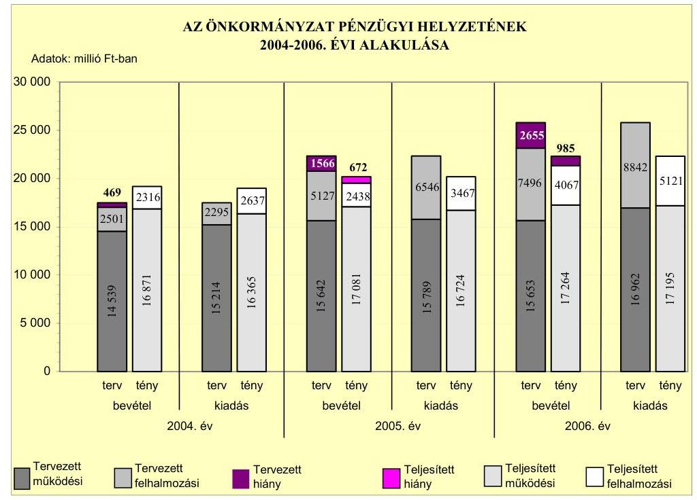
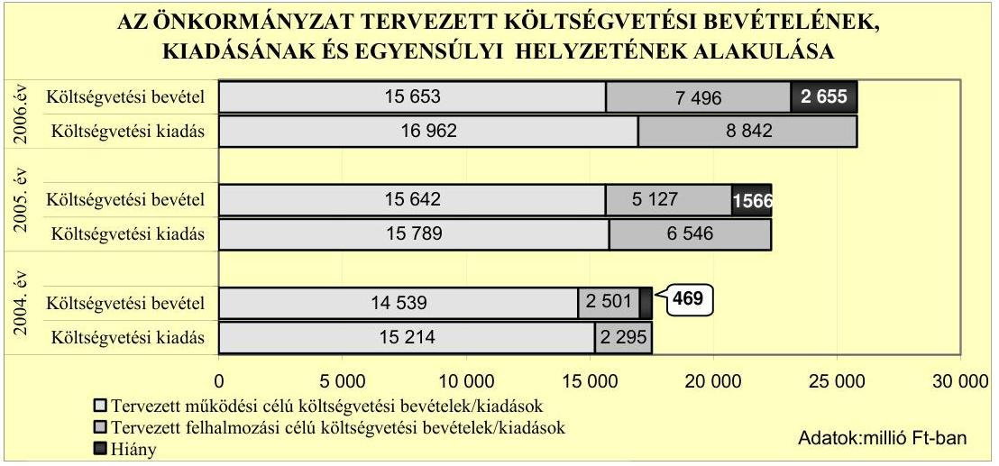
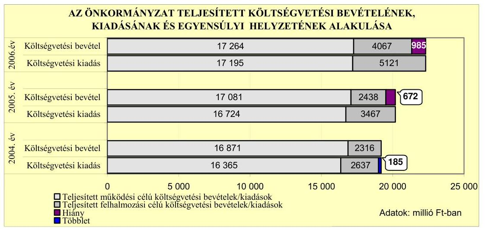
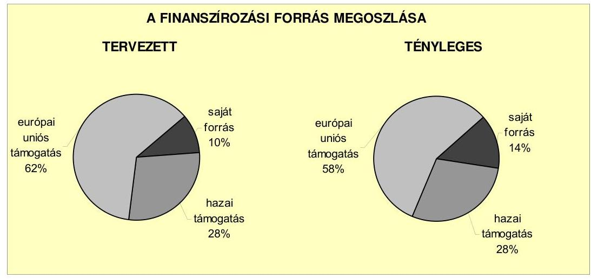
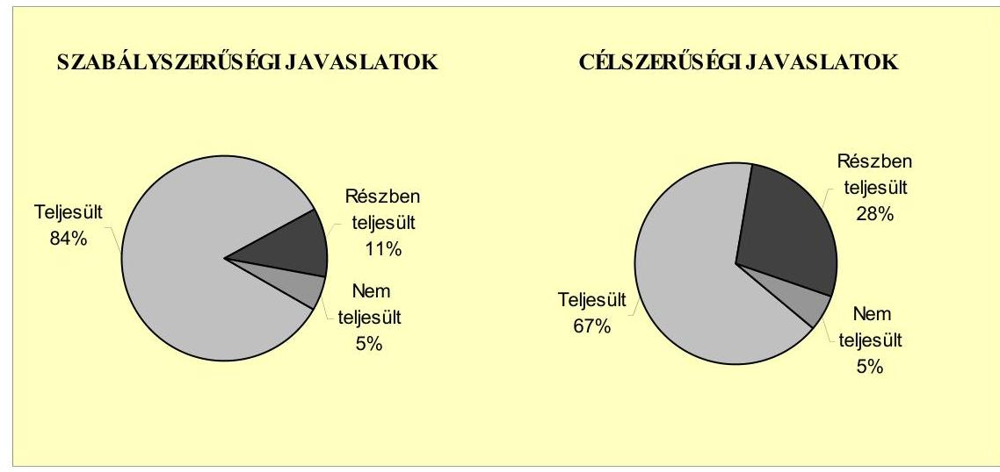
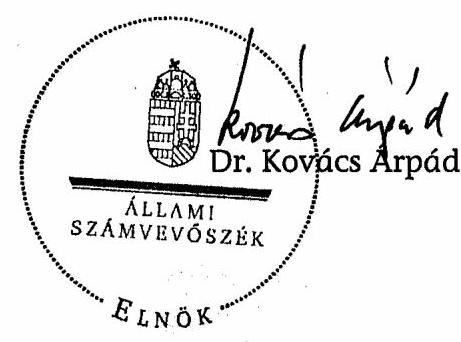
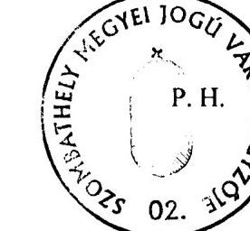
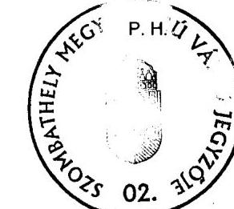
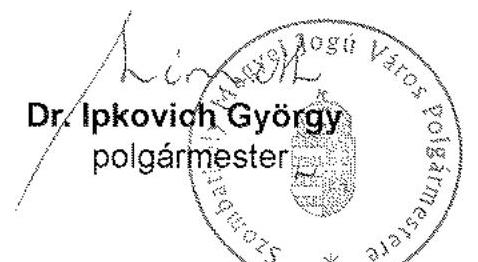
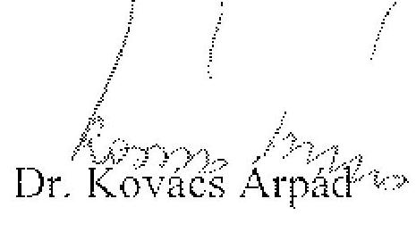

# JELENTÉS 

Szombathely Megyei Jogú Város Önkormányzata gazdálkodási rendszerének 2007. évi átfogó ellenőrzéséről

---

# 3. Önkormányzati és Területi Ellenőrzési Igazgatóság Átfogó Ellenőrzések Főcsoport 

Iktatószám: V-1001-9/26/17/2007.
Témaszám: 845
Vizsgálat-azonosító szám: V0328

## Az ellenőrzést felügyelte:

Dr. Lóránt Zoltán
főigazgató
Az ellenőrzés végrehajtásáért felelős:
Dr. Sepsey Tamás
főigazgató-helyettes
Az ellenőrzést vezette:
Csecserits Imréné
főcsoportfőnök-helyettes

## Az ellenőrzést végezték:

| Humli Tamásné | Kántor Ilona | Kiss Rita Teréz |
| :-- | :-- | :-- |
| számvevő | irodavezető, főtanácsadó | számvevő |

## A témához kapcsolódó eddig készített számvevőszéki jelentések:

## címe

Jelentés a települési önkormányzatok szennyvízközmű fejlesztési és működtetési feladatai ellátásához
Jelentés a Szombathely Megyei Jogú Város Önkormányzata gazdálkodásának átfogó ellenőrzéséről (0456)
Jelentés a Magyar Köztársaság 2004. évi költségvetése végrehajtásának ellenőrzéséről
Függelék:

- a helyi önkormányzatokat a 2004. évben megillető normatív állami hozzájárulás elszámolásának ellenőrzése
- a kötött felhasználású támogatások 2004. évi felhasználásának ellenőrzése
Jelentés a helyi és a helyi kisebbségi önkormányzatok gazdálkodásának átfogó ellenőrzéséről
Jelentés a Magyar Köztársaság 2005. évi költségvetése végrehajtásának ellenőrzéséről
Függelék:
- a kötött felhasználású támogatások 2005. évi felhasználásának ellenőrzése
- a helyi önkormányzatokat a 2005. évben megillető normatív hozzájárulás igénylésének és elszámolásának ellenőrzése

---

Jelentés a Nemzeti Fejlesztési Terv végrehajtásának ellenőrzéséről (0636)
Jelentés az önkormányzati út- és szennyvízcsatorna beruházásokra (0639)
2002-2005. években igénybe vett közműfejlesztési támogatások igénylésének és felhasználásának ellenőrzéséről

---

## Eierlikör (1)

Menge: 1 Drink

2 Zentiliter Zitronensaft
2 Zentiliter Zuckersirup
1 Zentiliter Zuckersirup
1 Zentiliter Zuckersirup
etwas Zuckersirup
etwas Zuckersirup
etwas Zuckersirup
etwas Zuckersirup
etwas Zuckersirup
etwas Zuckersirup
etwas Zuckersirup
etwas Zuckersirup
etwas Zuckersirup
etwas Zuckersirup
etwas Zuckersirup
etwas Zuckersirup
etwas Zuckersirup
etwas Zuckersirup
etwas Zuckersirup
etwas Zuckersirup
etwas Zuckersirup
etwas Zuckersirup
etwas Zuckersirup
etwas Zuckersirup
etwas Zuckersirup
etwas Zuckersirup
etwas Zuckersirup
etwas Zuckersirup
etwas Zuckersirup
etwas Zuckersirup
etwas Zuckersirup
etwas Zuckersirup
etwas Zuckersirup
etwas Zuckersirup
etwas Zuckersirup
et

---

# TARTALOMJEGYZÉK 

BEVEZETÉS ..... 11
I. ÖSSZEGZŐ MEGÁLLAPÍTÁSOK, KÖVETKEZTETÉSEK, JAVASLATOK ..... 15
II. RÉSZLETES MEGÁLLAPÍTÁSOK ..... 23

1. Az Önkormányzat költségvetési és pénzügyi helyzete ..... 23
1.1. A tervezett költségvetési bevételi és kiadási előirányzatok, valamint a költségvetési egyensúly alakulása ..... 25
1.2. A költségvetési bevételek és kiadások teljesítése, a pénzügyi egyensúlyi helyzet alakulása ..... 28
2. Az Önkormányzat felkészültsége az európai uniós források igénylésére és felhasználására, valamint az e-közigazgatási feladatok ellátására ..... 31
2.1. Az európai uniós források igénybevételére és a várható támogatás felhasználásának szervezettségére történt felkészülés és a belső szabályozottság értékelése ..... 31
2.1.1. A fejlesztési célkitűzések meghatározása ..... 31
2.1.2. Az európai uniós forrásokhoz kapcsolódóan a pályázatfigyelés, a pályázat-készítés, valamint az európai uniós támogatással megvalósuló fejlesztés lebonyolítása belső rendjének szabályozottsága, a végrehajtás személyi, szervezeti feltételei ..... 36
2.1.3. Az európai uniós forrással támogatott fejlesztés megvalósítása ..... 40
2.2. Az e-közigazgatási feladatok előkészítése, bevezetése ..... 46
3. A költségvetési gazdálkodás kontrolljai ..... 48
3.1. A szabályozottság kockázata a költségvetés tervezési, gazdálkodási, beszámolási és a folyamatba épített ellenőrzési feladatainál ..... 48
3.2. A belső kontrollok érvényesülése az önkormányzati források szabályszerű felhasználásában, a költségvetési tervezés, gazdálkodás, beszámolás folyamataiban ..... 50
3.3. A belső ellenőrzési kötelezettség teljesítése, javaslatainak hasznosulása ..... 52
4. Az ÁSZ korábbi ellenőrzési javaslatai alapján készített intézkedési terv végrehajtása, eredményessége ..... 57
4.1. Az Önkormányzat gazdálkodási rendszerének átfogó ellenőrzése során tett javaslatok végrehajtására tervezett intézkedések megvalósulása ..... 57

---

4.2. A zárszámadáshoz kapcsolódó (állami hozzájárulások, támogatások igénylésének és felhasználásának ellenőrzése), valamint a további vizsgálatok esetében a megállapítások, javaslatok alapján tett intézkedések

# MELLÉKLETEK 

1. számú Az Önkormányzat gazdálkodását meghatározó adatok, mutatószámok (1 oldal)
2. számú Az önkormányzati vagyon alakulása (1 oldal)
3. számú Az Önkormányzat 2004-2006. évi költségvetési előirányzatainak és azok pénzügyi teljesítéseinek alakulása (1 oldal)
4. számú 1. számú Nyilatkozat a tervezett és teljesített költségvetési adatoknak a megelőző évhez viszonyított jelentős, ±10%-ot meghaladó változásának indokolásáról, amennyiben azt a feladatok változása indokolta (2 oldal)
5. számú 1. számú Tanúsítvány az európai uniós forrásokkal támogatott programok, célok tervezett és tényleges 2004-2007. évi adatairól (2 oldal)
6. számú Dr. Ipkovich György úr, Szombathely Megyei Jogú Város Önkormányzata polgármesterének észrevétele (2 oldal)
7. számú Dr. Ipkovich György úr, Szombathely Megyei Jogú Város Önkormányzata polgármesterének írt válaszlevél (1 oldal)

---

# RÖVIDÍTÉSEK JEGYZÉKE 

## Törvények

2004. évi költségvetési törvény
2005. évi költségvetési törvény
2006. évi költségvetési törvény
Áht.
Eisztv.
Htv.

Ket.

Ötv.
Számv. tv.
társulási törvény
Tkt. tv.

## Rendeletek

2004. évi költségvetési rendelet
2005. évi költségvetési rendelet
2006. évi költségvetési rendelet
2007. évi költségvetési rendelet
2006. évi zárszámadási rendelet

Ámr.
Ber.
a Magyar Köztársaság 2004. évi költségvetéséről szóló 2003. évi CXVI. törvény
a Magyar Köztársaság 2005. évi költségvetéséről és az államháztartás hároméves kereteiről szóló 2004. évi CXXXV. törvény
a Magyar Köztársaság 2006. évi költségvetéséről szóló 2005. évi CLIII. törvény
az államháztartásról szóló 1992. évi XXXVIII. törvény
az elektronikus információszabadságról szóló 2005. évi XC. törvény
a helyi önkormányzatok és szerveik, a köztársasági megbizottak, valamint egyes centrális alárendeltségű szervek feladat- és hatásköreiről szóló 1991. évi XX. törvény
a közigazgatási hatósági eljárás és szolgáltatás általános szabályairól szóló 2004. évi CXL. törvény
a helyi önkormányzatokról szóló 1990. évi LXV. törvény
a számvitelről szóló 2000. évi C. törvény
a helyi önkormányzatok társulásairól és együttműködéséről szóló 1997. évi CXXXV. törvény
a települési önkormányzatok többcélú kistérségi társulásairól szóló 2004. évi CVII. törvény

Szombathely Megyei Jogú Város Önkormányzatának 3/2004. (II. 26.) számú rendelete az önkormányzat 2004. évi költségvetésről
Szombathely Megyei Jogú Város Önkormányzatának 3/2005. (II. 24.) számú rendelete az önkormányzat 2005. évi költségvetésről
Szombathely Megyei Jogú Város Önkormányzatának 4/2006. (II. 23.) számú rendelete az önkormányzat 2006. évi költségvetésről
Szombathely Megyei Jogú Város Önkormányzatának 5/2007. (II. 22.) számú rendelete az önkormányzat 2007. évi költségvetésről
Szombathely Megyei Jogú Város Önkormányzatának 12/2007. (IV. 26.) számú rendelete az önkormányzat 2006. évi gazdálkodásának végrehajtásáról az államháztartás működési rendjéről szóló 217/1998. (XII. 30.) Korm. rendelet
a költségvetési szervek belső ellenőrzéséről szóló 193/2003. (XI. 26.) Korm. rendelet

---

SzMSz
vagyongazdálkodási rendelet
versenyeztetési szabályzat

Vhr.

## Szórövidítések

ÁSZ
Belső ellenőrzési csoport
belső ellenőrzési vezető

CHF
együttes utasítás
e-közigazgatás
FEUVE
GVOP 2004-4.3.1. információszolgáltatás fejlesztési feladat

HEFOP
HEFOP 3.2.2.

HEROP 4.1.1.

Informatikai iroda

INTERREG III
INTERREG IIIA

Szombathely Megyei Jogú Város Önkormányzatának 20/2003. (V. 29.) számú rendelete az Önkormányzat Szervezeti és Működési Szabályzatáról
Szombathely Megyei Jogú Város Önkormányzata vagyonáról, a vagyontárgyak feletti tulajdonosi jogok gyakorlásáról szóló 29/2004. (VI. 30.) számú rendelete
Szombathely Megyei Jogú Város Önkormányzata vagyonáról, a vagyontárgyak feletti tulajdonosi jogok gyakorlásáról szóló 29/2004. (VI. 30.) számú rendeletének 1. számú melléklete
az államháztartás szervezetei beszámolási és könyvvezetési kötelezettségének sajátosságairól szóló 249/2000. (XII. 24.) Korm. rendelet

Állami Számvevőszék
Szombathely Megyei Jogú Város Önkormányzata Polgármesteri Hivatalának Belső ellenőrzési csoportja
Szombathely Megyei Jogú Város Önkormányzata Polgármesteri hivatala Belső ellenőrzési csoportjának vezetője
Svájci frank
Szombathely Megyei Jogú Város Önkormányzatának és a Polgármesteri Hivatalnak kötelezettségvállalási, utalványozási és érvényesítési eljárásáról szóló 6/2004. (VII. 15.) polgármesteri-jegyzői utasítás
elektronikus közigazgatás
folyamatba épített, előzetes és utólagos vezetői ellenőrzés
a GVOP 2004-4.3.1. Az önkormányzatok információszolgáltató tevékenységének keretében elnyert „e-Savaria: Szolgáltató Önkormányzat kialakítása Szombathelyen és kistérségeiben" fejlesztési feladat
NFT Humánerőforrás-fejlesztési Operatív Program
NFT Humánerőforrás-fejlesztési Operatív Program keretében elnyert Savaria - TISZK létrehozására vonatkozó pályázat
NFT Humánerőforrás-fejlesztési Operatív Program keretében elnyert Savaria - TISZK fejlesztése és infrastrukturális feltételeinek javítására vonatkozó pályázat
Szombathely Megyei Jogú Város Önkormányzat Polgármesteri Hivatal Munkaügyi, Informatikai és Szervezési Osztályának Informatikai Irodája
Határ menti együttműködés Szlovénia-Magyarország-Horvátország szomszédsági program
Határ menti együttműködés Ausztria-Magyarország program

---

Intézményellenőrzési csoport

ISPA projekt

IT Kht.
jegyző
KEHI
Költségvetési iroda

Közgazdasági osztály
Közgyűlés
NFT
Okmányiroda
Oktatási osztály
Önkormányzat
PEA II. támogatás

Pénzügyi bizottság

Pénzügyi iroda

PHARE CBC
polgármester
Polgármesteri hivatal
Polgármesteri hivatali ügyrend

Szombathely Megyei Jogú Város Önkormányzata Polgármesteri Hivatala Közgazdasági Osztályának Intézményellenőrzési Csoportja
„Szombathely Megyei Jogú Város szennyvízelvezetési és tisztítási rendszerének fejlesztése" tárgyú 2003/HU/16/P/PE/021 hivatkozási számú projekt
Az Információs Társadalom Informatikai és Távközlési Szolgáltató Közhasznú társaság
Szombathely Megyei Jogú Város Önkormányzatának jegyzője
Kormányzati Ellenőrzési Hivatal
Szombathely Megyei Jogú Város Önkormányzata Polgármesteri Hivatala Közgazdasági Osztályának Költségvetési Irodája
Szombathely Megyei Jogú Város Önkormányzata Polgármesteri Hivatalának Közgazdasági Osztálya
Szombathely Megyei Jogú Város Önkormányzatának Közgyűlése
Nemzeti Fejlesztési Terv
Szombathely Megyei Jogú Város Önkormányzata Polgármesteri Hivatala Igazgatási Osztályának Okmányirodája
Szombathely Megyei Jogú Város Önkormányzata Polgármesteri Hivatalának Oktatási, Kulturális és Sport Osztálya
Szombathely Megyei Jogú Város Önkormányzata
Projekt Generation Facility II. (II. Pályázat Előkészítő Alap) fejezeti kezelésű előirányzat terhére a Nyugatdunántúli Regionális Fejlesztési Tanácstól elnyert támogatás
Szombathely Megyei Jogú Város Önkormányzatának Szervezeti és Működési Szabályzatáról szóló 20/2003. (V. 29.) számú rendelete alapján Pénzügyi és Költségvetési Bizottság, Szombathely Megyei Jogú Város Önkormányzatának 9/2005. (II. 24.) számú rendelete alapján 2005. március 1-től Pénzügyi és Gazdasági Bizottság
Szombathely Megyei Jogú Város Önkormányzata Polgármesteri Hivatala Közgazdasági Osztályának Pénzügyi Irodája
PHARE Cross Border Cooperation (Határon átnyúló együttműködés)
Szombathely Megyei Jogú Város Önkormányzatának polgármestere
Szombathely Megyei Jogú Város Önkormányzatának Polgármesteri Hivatala
a polgármester és a jegyző által 2003. június 16-án jóváhagyott, Szombathely Megyei Jogú Város Önkormányzata Polgármesteri Hivatalának Ügyrendje

---

| Polgármesteri ügyrend $_{2}$ | hivatali Szombathely Megyei Jogú Város Önkormányzata Polgármesteri Hivatalának Ügyrendje, melyet Szombathely Megyei Jogú Város Önkormányzatának Közgyűlése 97/2005. (III. 31.) számú határozatával hagyott jóvá |
| :--: | :--: |
| Polgármesteri ügyrend $_{3}$ | hivatali Szombathely Megyei Jogú Város Önkormányzata Közgyűlésének 393/2006. (XII. 14.) számú határozatával módosított 97/2005. (III. 31.) számú határozata Szombathely Megyei Jogú Város Önkormányzata Polgármesteri Hivatalának Ügyrendjéről |
| ROP | NFT Regionális Operatív Program |
| ROP 1.2.2. projekt | ROP 1.2.2. Turisztikai fogadókészség javítása intézkedés keretében elnyert „A szombathelyi térségi kerékpáros és kulturális központ szolgáltatásainak fejlesztése" címú projekt |
| ROP 2.2.1. projekt | ROP 2.2.1. Városi területek rehabilitációja intézkedés keretében benyújtott „Keleti Városrész rehabilitációja, I. ütem" pályázat |
| Savaria TISZK | Savaria Térségi Integrált Szakképző Központ |
| Stratégiai csoport | Szombathely Megyei Jogú Város Önkormányzata Polgármesteri Hivatala Tisztségviselői Osztályának Stratégiai és Idegenforgalmi Csoportja |
| Stratégiai iroda | Szombathely Megyei Jogú Város Önkormányzata Polgármesteri Hivatala Városfejlesztési és Üzemeltetési Osztályának Stratégiai Irodája, amely Szombathely Megyei Jogú Város Önkormányzata Polgármesteri Hivatala Ügyrendjének módosításával (Szombathely Megyei Jogú Város Közgyűlése 393/2006. (XII. 14.) számú határozatával) 2006. december 15-től megszűnt |
| Szociális osztály | Szombathely Megyei Jogú Város Önkormányzata Polgármesteri Hivatalának Egészségügyi, Szociális és Családvédelmi Osztálya |
| településfejlesztési koncepció | Szombathely Megyei Jogú Város Önkormányzatának Közgyűlése 96/2004. (III. 25.) számú határozatával elfogadott hosszú távú településfejlesztési koncepciója |
| Tisztségviselői osztály | Szombathely Megyei Jogú Város Önkormányzata Polgármesteri Hivatalának Tisztségviselői Osztálya |
| ÚMFT | Új Magyarország Fejlesztési Terv |
| ügyrend ${ }_{1}$ | Szombathely Megyei Jogú Város Önkormányzata Polgármesteri Hivatala Közgazdasági Osztályának 2005. június 15-én a Közgazdasági Osztály vezetője által kiadott ügyrendje |
| ügyrend $_{2}$ | Szombathely Megyei Jogú Város Önkormányzata Polgármesteri Hivatala Közgazdasági Osztályának 2005. augusztus 10-én a Közgazdasági Osztály vezetője által kiadott ügyrendje |
| Városfejlesztési és üzemeltetési osztály | Szombathely Megyei Jogú Város Önkormányzata Polgármesteri Hivatalának Városfejlesztési és Üzemeltetési Osztálya |

---

# ÉRTELMEZŐ SZÓTÁR 

1. elektronikus szolgáltatási szint
2. elektronikus szolgáltatási szint
3. elektronikus szolgáltatási szint
4. elektronikus szolgáltatási szint

EMIR
európai uniós források
fejlesztési feladat (projekt)
fejlesztési célkitűzés
irányító hatóság

Az 1044/2005. (V. 11.) Korm. határozat alapján olyan információs, tájékoztató szolgáltatás, amely csak általános információkat közöl az adott üggyel kapcsolatos teendőkről és a szükséges dokumentumokról.
Az 1044/2005. (V. 11.) Korm. határozat alapján olyan egyirányú kapcsolatot biztosító szolgáltatás, amely az 1. szinten túl biztosítja az adott ügy intézéséhez szükséges dokumentumok, nyomtatványok letöltését, és azok ellenőrzéssel, vagy ellenőrzés nélküli elektronikus kitöltését, amely esetben a dokumentumok benyújtása hagyományos úton történik.
Az 1044/2005. (V. 11.) Korm. határozat alapján olyan kétirányú kapcsolatot

 biztosító szolgáltatás, amely közvetlen, vagy ellenőrzött kitöltésű dokumentum segítségével biztosítja az elektronikus adatbevitelt és a bevitt adatok ellenőrzését. Az ügy indításához, intézéséhez személyes megjelenés nem szükséges, de az ügyhöz kapcsolódó közigazgatási döntés (határozat, egyéb aktus) közlése, valamint a kapcsolódó illeték-, vagy díjfizetés hagyományos úton történik.
Az 1044/2005. (V. 11.) Korm. határozat alapján olyan teljes közvetlen kétirányú ügyintézési folyamatot biztosító szolgáltatás, amikor az ügyhöz kapcsolódó közigazgatási döntés is elektronikus úton kerül közlésre, illetve a kapcsolódó illeték-, vagy díjfizetés elektronikus úton is intézhető.
Egységes monitoring informatikai rendszer az Európai Unió által nyújtott egyes pénzügyi támogatások felhasználásával megvalósuló programok, projektek figyelemmel kísérésére kialakított számítógépes nyilvántartási rendszer, amely a programok és a projektek adatait gyűjti, rendszerezi és tartja nyilván.
Az elnyert európai uniós források lehívása a támogatott projekt megvalósítása érdekében, a fejlesztés lebonyolítása során felmerült kiadások finanszírozására.
A fejlesztési feladat (projekt) tartalmilag és formailag részletesen kidolgozott, megfelelő pénzügyi háttérrel és végrehajtási ütemezéssel rendelkező fejlesztési terv, amely illeszkedik az Európai Unió, illetve a Nemzeti Fejlesztési Terv által támogatott programokhoz.
Az önkormányzat által ellátott kötelező, vagy önként vállalt feladatok ellátásának mennyiségi, vagy minőségi fejlesztésére vonatkozó terv. A mennyiségi fejlesztés megvalósulhat beszerzéssel, létesítéssel, bővítéssel, átalakítással.
A strukturális alapok és a Kohéziós alap forrásainak szabályszerű, hatékony és eredményes felhasználásához szükséges intézményrendszer felső eleme. Az irányító ha-

---

kedvezményezett
központi program
közreműködő szervezet
lebonyolítás
tóság általános és átfogó felelősséget visel a programok, projektek hatékony és szabályszerű végrehajtásáért. Felelősségi köréből eredően ellenőrzi a közösségi, valamint a hazai jogszabályok betartását, koordinálja az európai uniós források szétosztásának folyamatát, irányítja az intézményrendszer, a statisztikai és a pénzügyi nyilvántartási rendszer működését.
Az a helyi önkormányzat, amely a támogatási szerződést kedvezményezettként aláírja, a projektet, illetve a központi programhoz kapcsolódó támogatott önkormányzati programot végrehajtja.
Az ország egészére, több régióra, egy régióra vonatkozó, de mindenképpen az önkormányzat közigazgatási területén túlmutató program, amelynél a támogatott programok kiválasztása pályáztatás nélkül, előre meghatározott feltételrendszer szerint történik, a kedvezményezettek közvetlen megkeresésével. Az Európai Unió pénzügyi alapja a Kohéziós alap, a környezetvédelem és a közlekedés terén nyújt lehetőséget az egyes tagországoknak központi programok megvalósítására.
A közreműködő szervezet az európai uniós támogatást elnyert kedvezményezettekkel kapcsolatot tartó szerv. Az operatív programok közreműködő szervezetei befogadják, nyilvántartják, döntésre előkészítik a pályázatokat, rögzítik a támogatással kapcsolatos adatokat az egységes monitoring informatikai rendszerben, elvégzik a támogatások előzetes (szerződéskötést megelőző), közbenső (a pénzügyi elszámolás, finanszírozás folyamatában végzett) és utólagos (a támogatott projekt pénzügyi lezárását megelőző) ellenőrzését. Az önkormányzatoknál a leggyakrabban előforduló operatív program a Regionális Fejlesztési Operatív Program végrehajtásában közreműködő szervezetek a VÁTI Kht. és a regionális fejlesztési ügynökségek.
A Kohéziós alap két közreműködő szervezete (Gazdasági és Közlekedési Minisztérium, Környezetvédelmi és Vízügyi Minisztérium) a támogatott projektek végrehajtásához kapcsolódó operatív feladatokat látják el. Ennek keretében megkötik a szerződéseket a projekt kedvezményezettjével, folyamatosan nyomon követik a teljesítéseket, lebonyolítják a támogatások kifizetését, vezetik az egységes monitoring informatikai rendszert.
Az európai uniós források felhasználásával megvalósuló fejlesztésre irányuló műszaki, gazdasági (pénzügyi) tevékenységet magában foglaló szervezési, irányítási szolgáltatás. A szervezési szolgáltatás kiterjedhet a pályázatkészítésre, a közbeszerzési eljárás lebonyolításán keresztül a folyamatos műszaki ellenőrzésre, a pénzügyi elszámolásra, a műszaki átadás-átvételre, az üzembe helyezésre, illetve a fejlesztési folyamat egyes elemeire.

---

operatív program
támogatási szerződés

Az Európai Bizottság által jóváhagyott, a Közösségi Támogatási Keret végrehajtására vonatkozó 2004-2006 közötti, több évre szóló intézkedésekhez kapcsolódó prioritások egységes rendszerét tartalmazó dokumentum. A strukturális alapok operatív programjai: Agrár és Vidékfejlesztési Operatív Program (AVOP); Gazdasági Versenyképesség Operatív Program (GVOP); Humánerőforrás-fejlesztési Operatív Program (HEFOP); Környezetvédelmi és Infrastruktúra-fejlesztési Operatív Program (KIOP); Regionális Fejlesztési Operatív Program (ROP).
A strukturális alapok esetében az irányító hatóságnak, illetve a Kohéziós alap esetében a közreműködő szervezeteknek a kedvezményezett önkormányzattal kötött szerződése, támogatás felhasználásának részletes feltételeit tartalmazza.

---

.

---

# JELENTÉS 

## Szombathely Megyei Jogú Város Önkormányzata gazdálkodási rendszerének 2007. évi átfogó ellenőrzéséről

## BEVEZETÉS

Az Ötv. 92. § (1) bekezdése, az Állami Számvevőszékről szóló 1989. évi XXXVIII. törvény 2. § (3) bekezdése, valamint az Áht. 120/A. § (1) bekezdése alapján az önkormányzatok gazdálkodását az Állami Számvevőszék ellenőrzi. Az ellenőrzésre az Országgyűlés illetékes bizottságai részére is átadott, országosan egységes ellenőrzési program szerint került sor.

Az Állami Számvevőszék a stratégiájában foglalt célkitűzéseknek megfelelően a helyi önkormányzatok költségvetési gazdálkodási rendszere átfogó ellenőrzésének programját a 2007. évtől megújította, azt kiegészítette további - teljesítmény-ellenőrzési - elemekkel.

## Az ellenőrzés célja annak értékelése volt, hogy az önkormányzat:

- a pénzügyi egyensúlyt a költségvetésében és annak teljesítése során milyen módon biztosította, a teljesített bevételek és kiadások egyes évek közötti jelentős eltérése feladatváltozáshoz kapcsolódott-e;
- felkészült-e a szabályozottság és a szervezettség terén az európai uniós források igénylésére és felhasználására, továbbá az e-közigazgatás bevezetése miatti szervezet-korszerűsítési feladatokra;
- kialakította-e a külső és a belső feltételeknek megfelelően a gazdálkodás belső kontrollrendszerét ${ }^{1}$, továbbá a költségvetés tervezési, végrehajtási és zárszámadási feladatok szabályszerű ellátásához hozzájárult-e a folyamatba épített, előzetes és utólagos vezetői ellenőrzés, valamint a belső ellenőrzés;
- megfelelően hasznosította-e a korábbi számvevőszéki ellenőrzések megállapításait, szabályszerűségi ${ }^{2}$ és célszerűségi javaslatait.

[^0]
[^0]:    ${ }^{1}$ A gazdálkodás szabályszerűségét biztosító kontrollrendszer alatt értjük a kiépített és működő belső irányítási és szabályozási rendszert, valamint a belső ellenőrzési funkciók ellátásának rendszerét.
    ${ }^{2}$ A törvényi előírások betartásának elmulasztásakor a részletes megállapítások fejezetben egységesen a törvénysértés megjelölést alkalmazzuk, mivel az ÁSZ nem tehet különbséget a törvényi előírások között.

---

Az ellenőrzött időszak: az 1., 2. és 4. programpontok tekintetében a 2004-2006. évek, valamint 2007. I. negyedév, a 3. ellenőrzési pontnál a 2006. év és 2007. I. negyedév.

Szombathely Megyei Jogú Város Vas megye székhelye, lakosainak száma 2007. január 1-jén 80000 fő volt. A 29 tagú Közgyűlés munkáját kilenc állandó bizottság segíti. A helyi önkormányzat mellett a 2004-2007. évben négy ${ }^{3}$ kisebbségi önkormányzat működött. A polgármester a 2002. évi önkormányzati választás óta tölti be tisztségét, a jegyző az 1990. évi önkormányzati választások óta tölti be e tisztségét.

Az Önkormányzat feladatainak végrehajtása érdekében a 2006. évben 60 költségvetési szervet működtetett, amelyekből 39 önállóan gazdálkodott. A feladatok ellátásában részt vett az Önkormányzat tíz kizárólagos, és négy többségi tulajdonában lévő gazdasági társasága. Az Önkormányzat költségvetési szerveinél 2006. év december 31-én foglalkoztatott köztisztviselők száma 293 fő, a közalkalmazottak száma 2695 fő volt. Az Önkormányzat a 2006. évi költségvetési beszámolója szerint 21331 millió Ft költségvetési bevételt ért el és 22316 millió Ft költségvetési kiadást teljesített, 2006. december 31-én a könyvviteli mérleg szerint 72342 millió Ft értékű vagyonnal rendelkezett. A 2007. évi költségvetési rendeletben 19387 millió Ft költségvetési bevételt és 20895 millió Ft költségvetési kiadást irányoztak elő. Az Önkormányzat gazdálkodását meghatározó adatokat, mutatószámokat a jelentés 1-3. számú mellékletei tartalmazzák.

Az Önkormányzat költségvetési és pénzügyi helyzetét az összehasonlító elemzés módszerével vizsgáltuk. E körben elemeztük a költségvetés egyensúlyi helyzetének alakulását, a tervezett és tényleges költségvetési hiány okait, a mérséklésére tett intézkedéseket, finanszírozásának módját, az Önkormányzat adósságállományának alakulását, összetevőit.

A teljesítmény-ellenőrzés módszerével vizsgáltuk, hogy a belső szabályozottság, szervezettség terén felkészültek-e az európai uniós források figyelésére, igénylésére és felhasználására, valamint az igényelt európai uniós támogatások az Önkormányzat által meghatározott fejlesztési célkitűzésekhez kapcsolódtak-e. Az ellenőrzés során felmértük, hogy az e-közigazgatási feladat ellátása, illetve bevezetése, működtetése érdekében milyen intézkedéseket tettek, valamint biztosították-e a közérdekű adatok elektronikus közzétételét.

A költségvetési gazdálkodás belső kontrolljainak ellenőrzése során értékeltük, hogy a Polgármesteri hivatalnál a költségvetés tervezési, gazdálkodási, zárszámadás készítési feladatok belső kontrolljainak kiépítettsége és működése megfelelő biztosítékot ad-e a gazdálkodási feladatok megfelelő, szabályszerű ellátására. Felmértük és minősítettük a költségvetés tervezési, a gazdálkodási, a zárszámadás készítési feladatokkal, továbbá a pénzügyi-számviteli területen az informatikával kapcsolatosan kialakított kontrollok megfelelősségét, valamint azok működésének eredményességét, megbízhatóságát. Értékeltük a belső ellenőrzés szervezeti és szabályozási keretét, továbbá működését. A Polgármes-

[^0]
[^0]:    ${ }^{3}$ Cigány, horvát, német, szlovén kisebbségi önkormányzatok.

---

teri hivatalnál értékeltük a gazdálkodás folyamatában a kontrollok működésének megbízhatóságát, ennek keretében ellenőriztük a szakmai teljesítés igazolására és az utalvány ellenjegyzésére kialakított kontrollok végrehajtását. Az ellenőrzést a következő, kiemelt kockázata alapján kiválasztott ${ }^{4}$ az általánostól jellemzően eltérő, egyedi eljárást igénylő gazdasági eseményekkel kapcsolatos kifizetésekre folytattuk le ${ }^{5}$ :

- a személyi juttatások közül az állományba nem tartozók megbízási díjai ${ }^{6}$,
- a külső szolgáltató által végzett karbantartási, kisjavítási szolgáltatások, valamint
- a gépek, berendezések, felszerelések beszerzése.

Az ellenőrzés hatékony elvégzése céljából a vizsgálandó területek kiválasztása során a kockázatokon alapuló megközelítés érvényesült, ezáltal az ellenőrzési erőforrásokat azokra a területekre fókuszáltuk, amelyeken legnagyobb a hibák előfordulási valószínűsége. Az ellenőrzési erőforrások ilyen típusú összpontosításával minimálisra csökkenthető a kívánt ellenőrzési bizonyosság eléréséhez szükséges időráfordítás.

A pénzügyi-számviteli folyamatokban alkalmazott belső kontrollok létezésének és működésének ellenőrzésére a vizsgált három terület 2006. évi könyvviteli tételeiből területenként egyszerű véletlen mintát vettünk. A kijelölt gazdasági eseményre elvégzett megfelelőségi tesztek alapján értékeltük a kontrollok működésének eredményességét, megbízhatóságát a vizsgált három területre külön-külön, majd összefoglalóan ${ }^{7}$ a Polgármesteri hivatal egyedi eljárást igénylő gazdasági eseményeire. A helyszíni ellenőrzés megállapításainak részletes dokumentálását három megfelelőségi tesztlapon, öt elővizsgálati és kilenc helyszíni ellenőrzési munkalapon biztosítottuk. Ezeken a teszt- és munkalapokon a minősítés alapjául szolgáló kérdések és a vonatkozó konkrét jogszabályhelyek

[^0]
[^0]:    ${ }^{4}$ Az önkormányzatok kiemelt előirányzataira vonatkozóan, a vertikális folyamatokra elvégeztük a kockázatok becslését, amelynek eredményeként az állományba nem tartozók megbízási díjai, a külső szolgáltató által végzett karbantartási, kisjavítási szolgáltatások, valamint a gépek, berendezések, felszerelések beszerzése kiemelkedően kockázatos területnek bizonyultak.
    ${ }^{5}$ A korábbi ellenőrzési tapasztalataink szerint ezeken a területeken a jegyzők nem, vagy hiányosan szabályozták a megbízás, megrendelés, illetve beszerzés indokoltságának, szükségességének elbírálására, igazolására, valamint a teljesítések dokumentálására, a kifizetések jogosságának megítélésére szolgáló kontrollokat. További kockázatot jelentett a külső szolgáltató által végzett karbantartási, kisjavítási munkák esetében, hogy az 50 ezer Ft alatti megrendelésekre vonatkozóan az ellenőrzési tapasztalataink szerint a jegyzők nem alakították ki a kötelezettségvállalások rendjét és nyilvántartási formáját, valamint a szabályozás elmulasztása esetén nem történt meg az írásbeli kötelezettségvállalás és annak az ellenjegyzése sem.
    ${ }^{6}$ Az állományba tartozók rendszeres személyi juttatásainak számfejtését, valamint folyósítását nem a polgármesteri hivatalok, hanem a nettó finanszírozás keretében a beküldött dokumentumok alapján a MÁK végzi.
    ${ }^{7}$ A vizsgált három terület egyedi értékelési pontszámait a területek relatív költségvetési súlyával arányosan összegeztük.

---

megjelölése mellett értékeltük a kialakított belső kontrollokban rejlő kockázatokat ${ }^{8}$ és a kialakított kontrollok működésének megbízhatóságát ${ }^{9}$.

Az ÁSZ korábbi ellenőrzési javaslatai alapján tett intézkedéseket, illetve azok
 megvalósítását utóellenőrzés keretében vizsgáltuk. A gazdálkodási rendszer átfogó ellenőrzése során megfogalmazott javaslatok végrehajtására tett intézkedések megvalósítását ellenőrizzük, az egyéb számvevőszéki ellenőrzések során tett javaslatok esetében pedig a kiadott intézkedéseket tekintjük át.

A helyszíni ellenőrzés során kitöltött - az ellenőrzést végző számvevő és a Polgármesteri hivatal felelős köztisztviselője által aláírt - elővizsgálati és helyszíni ellenőrzési munkalapokat, azok kitöltési útmutatóit, továbbá a megfelelőségi tesztek dokumentumait a polgármester részére a számvevői jelentéssel egyidejűleg átadtuk.

A jelentés megállapításainak, javaslatainak egyeztetése során a polgármester arról adott tájékoztatást, hogy az időközben megtett intézkedésekkel a javaslatok egy részét megvalósították. Ezekben az esetekben a jelentés II. Részletes megállapítások fejezetében az adott témához kapcsolt lábjegyzetben a megtett intézkedést feltüntettük és a kapcsolódó javaslatot elhagytuk.

A jelentést az ÁSZ-ról szóló 1989. évi XXXVIII. tv. 25. § (1) bekezdése alapján észrevétel közlése céljából megküldtük Szombathely Megyei Jogú Város Önkormányzata polgármesterének. A kapott észrevételt a jelentés 6. számú melléklete tartalmazza.

[^0]
[^0]:    ${ }^{8}$ A kialakított belső kontrollokban rejlő kockázatot alacsonynak minősítettük, ha a kontrollok - végrehajtásuk esetén - megfelelő védelmet nyújtanak a hibák bekövetkezése ellen. Közepesnek minősítettük a belső kontrollokban rejlő kockázatot, amennyiben a kontrollok - végrehajtásuk esetén - a lehetséges hibák többsége ellen védelmet nyújtanak. Magasnak értékeltük a kockázatot, ha a kontrollok - kialakításuk hiányában, vagy hiányos kialakításuk miatt - nem nyújtanak elegendő védelmet a lehetséges hibákkal szemben.
    ${ }^{9}$ A kontrollok működésének eredményességét, megbízhatóságát kiválónak értékeltük abban az esetben, ha azok működése - esetleges apróbb hiányosságoktól eltekintve - megfelelt a hibák megelőzésére és kijavítására meghatározott szabályozásnak és a legmagasabb szintű elvárásoknak. Jónak minősítettük a kontrollok működését, ha a hiányosságok száma ugyan jelentős volt, de nem veszélyeztette az ellenőrzött terület hibáinak megelőzését és kijavítását. Amennyiben a hiányosságok mértéke nem biztosította a hibák megelőzését, feltárását, kijavítását és ezáltal veszélyeztette az eredményes, megbízható működést, a kontroll működésének megbízhatósága gyenge minősítést kapott.

---

# I. ÖSSZEGZŐ MEGÁLLAPÍTÁSOK, KÖVETKEZTETÉSEK, JAVASLATOK 

Az Önkormányzatnál a 2004-2006. évek között a tervezett és 2004-2006 között a teljesített költségvetési kiadások folyamatosan emelkedtek, a költségvetések egyensúlya nem volt biztosított. A 2004-2007. évi költségvetési rendeletekben a költségvetés bevételi és kiadási főösszegének megállapításakor az Áht. előírásai ellenére finanszírozási célú pénzügyi műveleteket vettek figyelembe költségvetési hiányt módosító költségvetési bevételként, illetve költségvetési kiadásként. Az Önkormányzat a költségvetésekben a pénzügyi egyensúlyt likviditási hitel felvételével, valamint a felhalmozási célú költségvetési kiadásokat növekvő arányban hosszú lejáratú hitelfelvételével tervezte biztosítani. Az Önkormányzat a 2004. évben költségvetési többlettel, a 2005. és 2006. években növekvő összegű költségvetési hiánnyal zárta az évet.

A teljesített költségvetési bevételek és kiadások a 2005. és 2006. években, az előző évekhez viszonyítva folyamatosan emelkedtek, de a teljesített költségvetési bevételek növekedésének mértéke elmaradt a költségvetési kiadásoktól. Az Önkormányzat a 2004. évi költségvetésben tervezett hiányt a működési célú költségvetési bevételek többletével ellensúlyozta. A 2005-2006. évi költségvetésekben tervezett költségvetési hiány összegét az év során keletkezett működési célú költségvetési bevételek többletével, a tervezettnél alacsonyabb összegű működési célú költségvetési kiadások teljesítésével mérsékelték. A tervezett költségvetési hiányt mérsékelte a működési célú költségvetési kiadások tervezettől való elmaradása, a működési célú költségvetési bevételek tervezettet meghaladó emelkedése, a teljesített felhalmozási célú költségvetési kiadások teljesítésének 47%-kal, illetve 42%-kal való mérséklődése, amelyet a források rendelkezésre állásának ideje, a beruházások, felújítások lebonyolítási, illetve műszaki szempontból történő megvalósításának akadályoztatása okozott.

Az Önkormányzat a pénzügyi egyensúly biztosításához folyószámlahitelt vett igénybe, a hitelkeretet 2004-2006 között a háromszorosára emelte. A felhalmozási feladatok megvalósításához növekvő mértékben vettek igénybe felhalmozási célú hosszú lejáratú hiteleket, amelyek év végi állománya a 2006. évi költségvetési kiadások 25%-át érte el.

Az Önkormányzat által a 2004-2007. években benyújtott európai uniós pályázatok a 2003-2006. évi ciklusprogramban és a 2007-2010. évekre vonatkozó gazdasági programban, valamint a településfejlesztési koncepcióban foglalt fejlesztési célkitűzésekkel összhangban voltak. A fejlesztési célkitűzéseket a NFT-ben foglalt célokhoz kapcsolódva, annak figyelembevételével határozták meg. A fejlesztési célkitűzések valós szükségleten alapultak. A Közgyűlés 2004-2007. között 12 európai uniós forrással támogatott fejlesztési feladat megvalósításának kezdeményezéséről döntött, melyből tíz pályázat eredményes volt, egy pályázatot forráshiány miatt elutasítottak, egy pályázatról nem kapott értesítést. Az Önkormányzat a 2004-2007. évek költségvetési rendeleteiben az Ámr. elő-

---

írása ellenére elkülönítetten nem mutatta be az európai uniós támogatással megvalósuló programok, projektek bevételeit és kiadásait.

A Polgármesteri hivatal ügyrendjében szabályozták az európai uniós források igénybevételére és felhasználására vonatkozó önkormányzati szintű feladatokat. Az Önkormányzat a belső szabályozottság tekintetében összességében nem készült fel eredményesen az európai uniós források igénylésére és fogadására, mivel az európai uniós forrásokkal támogatott fejlesztési feladatok lebonyolításával kapcsolatos folyamatba épített és belső ellenőrzés kötelezettségét, eljárási rendjét nem határozták meg. A Polgármesteri hivatali szabályozás tartalmazta a pályázatfigyelés belső rendjét, meghatározták a pályázatkészítési és a fejlesztés-lebonyolítási feladatokat. A 2007. évben hatályba helyezett polgármesteri és jegyzői utasítással a fejlesztési nagyprojektek előkészítését koordináló, a nagyprojektek megvalósítását segítő szabályozást alkotott. Az Önkormányzat a Polgármesteri hivatal szervezetén belül az európai uniós források igénylésére és fogadására a pályázatfigyelési, a pályázatkészítési és a fejlesztés lebonyolítási feladatok ellátását összességében eredményesen szervezte meg. Az európai uniós források pályázatfigyelésével, pályázatkészítésével, lebonyolításával összefüggő feladatok személyi és szervezeti feltételeit kialakították. Az európai uniós források igénybevételével és felhasználásával összefüggő felelősség szabályait a feladatellátással megbízott köztisztviselők munkaköri leírása tartalmazta.

Az Önkormányzat a GVOP 2004-4.3.1. információszolgáltatás fejlesztési feladatra beadott pályázatával az e-közigazgatás fejlesztésére 375 millió Ft támogatást nyert el, a ROP 1.2.2. projekt megvalósításához 9 millió Ft-ot. A GVOP 2004-4.3.1. információszolgáltatás fejlesztési feladat és a ROP 1.2.2. projekt megvalósítása során a támogatási szerződésben meghatározott időbeli ütemezésnek megfelelően haladt a kivitelezés. A támogatás igénybevétele nem a támogatási szerződésben meghatározott ütemezésnek megfelelően történt. A ROP 1.2.2. projekt esetén az Önkormányzat nem tartotta be a támogatási szerződés jelentéstételi kötelezettségre vonatkozó előírását. A GVOP 2004-4.3.1. információszolgáltatás fejlesztési feladatnál a kiadások teljesítése eltért a támogatási szerződésben meghatározott ütemtől, mert a pályázat benyújtását követően megjelent a központi elektronikus ügyfélkapu koncepciója, ami a rendszer továbbfejlesztését igényelte. A kiadások teljesítése az ütemezésnek megfelelő volt a ROP 1.2.2. projekt esetében. A GVOP 2004-4.3.1. információszolgáltatás fejlesztési feladatnál a támogatási szerződés módosítása folyamatban van, a módosítás összefügg a tervezett költségek elfogadásának megváltozásával. A ROP 1.2.2 projekt támogatási szerződését két alkalommal módosították, a műszaki tartalom kiegészítése, pontosítása vált szükségessé. A Polgármesteri hivatalban működött a folyamatba épített ellenőrzés, a külső ellenőrzési megállapítások nem utaltak szabálytalanságra, de felvetettek, illetve jeleztek problémákat az elszámolható költségek, valamint az interaktív elektronikus ügyintézés megvalósítási módja tekintetében.

A Polgármesteri hivatalban e-közigazgatási feladatokat ellátó informatikai rendszert működtettek. A GVOP 2004-4.3.1. információszolgáltatás fejlesztési feladatban a 3. elektronikus szolgáltatási szint megvalósítását határozták meg, illetve megvalósítani tervezték az e-adórendszer továbbfejlesztése esetén a 4. szolgáltatási szint elérésének lehetőségét. A működő e-közigazgatási rendszerben a fejlesztéssel az adórendszerben érték el a 3. elektronikus ügyintézési

---

szintet. Az Önkormányzat kötelezett a közérdekű adatok elektronikus közzétételére. Az Önkormányzat az általa nyújtott nem normatív, céljellegű fejlesztési célú támogatások kedvezményezettjeinek nevét, a támogatások célját, összegét, a támogatások megvalósításának helyeit a 2006-2007 évben közzétette, azonban a 2007. évben ezt a kötelezettséget az Áht. előírása ellenére a működési célú támogatások esetében nem teljesítette. A vagyonnal történő gazdálkodással összefüggő - a nettó ötmillió Ft-ot elérő, vagy azt meghaladó értékű - árubeszerzésre, építési beruházásra, szolgáltatás megrendelésre, vagyonértékesítésre, vagyonhasznosításra, vagyon és vagyoni értékű jog átadására, valamint koncesszióba adásra vonatkozó szerződések megnevezését (típusát), tárgyát, a szerződést kötő felek nevét, a szerződés értékét, határozott időre kötött szerződés esetében annak időtartamát, valamint az említett adatok változásait közzé tették. Az Ámr-ben előírtak ellenére az éves költségvetési beszámoló szöveges indoklásának közzététele nem történt meg.

A 2006. évben a Polgármesteri hivatalnál a költségvetés tervezési és a zárszámadás készítési folyamatok szabályozottsága alacsony kockázatot jelentett a feladatok szabályszerű végrehajtásában, mert a jegyző előírta a költségvetés tervezési és a zárszámadás készítési folyamatok ellenőrzési feladatait, meghatározta az intézmények részére a költségvetési javaslat összeállításával kapcsolatos követelményeket, a költségvetési szervek elemi beszámolója felülvizsgálatának rendjét, tartalmát. Az ÁSZ által - az Önkormányzat gazdálkodásának 2004. évi átfogó ellenőrzése során - tett javaslatok hasznosítása is hozzájárult a szabályozottság javulásához. A Polgármesteri hivatalnál a költségvetés tervezés és a zárszámadás készítés folyamatában a belső kontrollok működésének megbízhatósága a 2006. évben összességében kiváló volt, mivel a költségvetési tervezés és zárszámadás készítés folyamatában a vonatkozó jogszabályokban és belső szabályozásban foglalt ellenőrzési, egyeztetési feladatokat elvégezték.

A gazdálkodási, a pénzügyi-számviteli és a folyamatba épített ellenőrzési feladatok szabályszerű végrehajtásában a feladatok szabályozottsága a 2006. évben összességében alacsony kockázatot jelentett az elvégezendő feladatok szabályszerű végrehajtásában, mivel a Polgármesteri hivatal az előírt és - aktualizált - szabályzatokkal rendelkezett. Annak ellenére összességében alacsony volt a kockázat, hogy a közérdekű adatszolgáltatáshoz kapcsolódó költségek összegének megállapítása tekintetében az önköltségszámítás rendjét belső szabályzatban nem rögzítették, a jegyző által elkészített ellenőrzési nyomvonal az egyes tevékenységek elvégzését igazoló dokumentum rendszerben történő nyilvántartási helyét nem tartalmazta, kockázatkezelési szabályzat nem készült, a szabálytalanságok kezelésének eljárásrendjét a jegyző nem szabályozta. Az Önkormányzat gazdálkodásának 2004. évi átfogó ellenőrzésénél tett, a gazdálkodás szabályozottságára vonatkozó ÁSZ javaslatokat hasznosították. A 2007. évre vonatkozóan a szabályozottság javult, mivel a jegyző 2007. június 15-től hatályba helyezte a kockázatkezelési szabályzatot és a szabálytalanságok kezelésének eljárásrendjét, és 2007. július 1-jén hatályba léptette az önköltség-számítási szabályzatot. A számlarend 2007. évi aktualizálását a számlatükör vonatkozásában elvégezték, azonban a Számv. tv-ben előírtak ellenére a pénztárak, csekkek, betétkönyvek, költségvetési bankszámlák, belföldi idegen pénzeszközök, nemzetközi támogatási programok idegen pénzeszközei számla-

---

csoportok esetében a számlarend nem tartalmazta a számlák tartalmát, a számlák értéke növekedésének, csökkenésének jogcímeit, a számlát érintő gazdasági eseményeket, azok más számlákkal való kapcsolatát.

A Polgármesteri hivatalnál az állományba nem tartozók megbízási díjaival, a karbantartási, kisjavítási szolgáltatásokkal, továbbá az ügyvitel- és számítástechnikai eszközök, valamint az egyéb gépek, berendezések, felszerelések beszerzésével kapcsolatos kifizetések során a kialakított kontrollok működésének megbízhatósága összességében kiváló volt, megfelelt a hibák megelőzésére és kijavítására meghatározott szabályozásnak és a magasabb szintű elvárásoknak. Annak ellenére összességében kiváló volt a kialakított kontrollok működésének megbízhatósága, hogy az utalvány ellenjegyzés nem adott megfelelő biztosítékot az állományba nem tartozók megbízási díjával kapcsolatos gazdálkodási feladatok megfelelő, szabályszerű ellátására.

A Polgármesteri hivatalban az informatikai rendszer szabályozottsága a 2006. évben alacsony mértékű kockázatot jelentett az informatikai feladatok biztonságos végrehajtásában, mivel a kialakított kontrollok - végrehajtásuk esetén - megfelelő védelmet nyújtottak a hibák, nem megengedett műveletek bekövetkezése ellen. Az ÁSZ - az Önkormányzat 2004.
 évi gazdálkodásának ellenőrzése során tett javaslatának hatására a szabályozottság tovább javult. Az informatikai rendszer 2006. évi működtetésénél a működésbeli hibák megelőzésére, feltárására, kijavítására kialakított kontrollok működésének megbízhatósága összességében kiváló volt, mivel számítógépes program informatikai hálózati rendszer útján biztosította a főkönyv és a költségvetési beszámoló adatainak egyezőségét a szükséges adatok egyszeri bevitele alapján, megoldott a szolgáltatott adatok rendszeres ellenőrzése.

A belső ellenőrzés szervezeti kereteinek kialakítása és szabályozása a belső ellenőrzés végrehajtásában összességében magas kockázatot jelentett, mivel az Önkormányzat belső ellenőri feladatok elvégzése érdekében kialakított szervezeti rendszerében az Áht. előírásait megsértve nem teljes körűen biztosított a belső ellenőrök szervezeti függetlensége, a belső ellenőrzési kézikönyv és a stratégiai terv nem vonatkozott az intézmények ellenőrzésére. A belső ellenőrzési kézikönyv hatálya nem vonatkozott az Intézményellenőrzési csoport tevékenységi körére, nem tartalmazta a belső ellenőrök folyamatos továbbképzésére vonatkozó alapelveket, a külső szakértők bevonására vonatkozó előírásokat. Az éves ellenőrzési tervek az intézményi ellenőrzések tekintetében nem feleltek meg a Ber-ben foglalt követelményeknek, mert nem határoztak meg kapacitást a soron kívüli feladatokra, valamint az Intézményellenőrzési csoport esetében nem előzte meg kockázatbecslés az ellenőrzési terv összeállítását. Az ellenőrzések elvégzéséhez ellenőrzési programok készültek, melyeket az Intézményellenőrzési csoport tekintetében nem a belső ellenőrzési vezető hagyott jóvá.

Az ellenőrzésének működésénél a kialakított kontrollok működésének megbízhatósága összességében kiváló volt, mivel az elvégzett ellenőrzéseket az ellenőrzési programokban foglaltak szerint hajtották végre, az ellenőrzésekről készített jelentések értékelték az eredményeket és hiányosságokat, a hibák feltárásával, valamint célirányos intézkedések kezdeményezésével elősegítették a gazdálkodás szabályszerűségének javítását. Annak ellenére volt összességében kiváló, hogy az éves ellenőrzési tervben előírt feladatok egy részét a Belső ellenőrzési csoport az ütemezéstől eltérően hajtotta végre. A belső ellenőrzés nem vizsgálta a FEUVE rendszer kiépítését és működését, az Önkormányzat többségi irányítást biztosító befolyása alatt működő gazdasági társaságoknál nem ellenőrizte a rendelkezésre álló erőforrásokkal való gazdálkodást. A belső ellenőrzésekről készített jelentések tartalma megfelelt az előírásoknak, az ellenőrzöttek intézkedési tervet készítettek. A jegyző a költségvetési beszámoló keretében a belső ellenőrzés működéséről beszámolt, de - az Áht-ban előírt kötelezettsége ellenére - nem számolt be a FEUVE rendszer kialakításáról és működéséről. A polgármester az Ötv. előírása alapján a Közgyűlés elé terjesztette az Önkormányzat által alapított és fenntartott költségvetési szervek éves ellenőrzési jelentései alapján készített éves összefoglaló ellenőrzési jelentéseket, amelyeket az elfogadott.

Az ÁSZ az Önkormányzat gazdálkodását a 2004. évben ellenőrizte átfogó jelleggel. A jelentés javaslatainak hasznosítására a jegyző készített intézkedési tervet, melyet a Közgyűlés jóváhagyott. Az ÁSZ ellenőrzés által tett javaslatok 75%-a teljesült, 20%-a részben teljesült, 5%-a nem teljesült. A megvalósult javaslatok eredményeként az Önkormányzat tervező munkája, a gazdálkodás és pénzügyi-számviteli feladatok szabályozása, ellátása, a kisebbségi önkormányzatok gazdálkodásának szabályozottsága, a vagyongazdálkodás szabályozottsága, a közbeszerzési eljárások lefolytatásának szabályszerűsége, a céljellegű támogatások odaítélése, a gazdálkodásról történő beszámolás, a belső ellenőrzés szabályszerűbbé vált. A hitelműveleti hatásköröket meghatározták, a Polgármesteri hivatal a jóváhagyott előirányzatokon belül gazdálkodott, a számlarendet a jogszabályoknak megfelelően kiegészítették, a zárszámadások szerkezeti rendje javult, a költségvetési szervek ellenőrzéséről a jegyző beszámolt a Közgyűlésnek. A szabályszerűségi javaslataink, és az Ámr-ben előírt követelmények ellenére a költségvetési és zárszámadási rendeletekben az önkormányzati beruházásokat célonként és feladatonként nem mutatták be. Nem biztosították továbbá, hogy valamennyi intézmény a költségvetési főösszegen belül a Közgyűlés által meghatározott kiadási előirányzatokat betartsa, nem vált teljes körűvé a kötelezettségvállalások - arra jogosult személy által - történő ellenjegyzése, az önkormányzati vagyon mennyiségi leltározása. Egy ingatlan értékesítése során nem tartották be a versenyeztetési szabályzat előírásait: nem határozták meg az elbírálásra vonatkozó szempontokat, a csak egy leadott pályázat ellenére nem nyilvánították eredménytelennek az eljárást, nem tartották be az ellenszolgáltatás megfizetési idejére vonatkozó előírást. Nem biztosították a zárszámadási rendelethez csatolt vagyonkimutatás esetében a Vhr. és a vagyongazdálkodási rendelet előírásai közötti összhangot. A belső ellenőröket a belső ellenőrzési tevékenységen kívül más tevékenységbe nem vonták be, de továbbra sem biztosított, hogy valamennyi belső ellenőrzést végző a jegyzőnek közvetlenül alárendelve végezze tevékenységét. A javaslataink és az Ötv-ben, illetve Ámr-ben meghatározott követelmények ellenére nem határozták meg az Önkormányzat által ellátott kötelező és önként vállalt feladatok körét, a feladatellátás módját, valamint a költségvetési koncepció és a költségvetési rendelet-tervezet előterjesztésekor a Pénzügyi bizottság véleménye - továbbra is közvetlenül a napirendi pont tárgyalása előtt került kiosztásra.

A célszerűségi javaslataink hatására integrált számítógépes rendszert vezettek be, a munkaköri leírásokat, a pénz és értékkezelési szabályzatot kiegészítették.

Továbbra sem átfogó jelleggel szabályozták a céljelleggel nyújtott támogatások odaítélésének, nyilvántartásának eljárási rendjét. A Polgármesteri hivatalban a forrásokat bővítő pályázatok előkészítésével, lebonyolításával, nyilvántartásával kapcsolatos folyamatok átfogó rendszerének szabályzatba foglalása nem történt meg.

Az ÁSZ az Önkormányzatnál a 2004-2006. években négy témavizsgálatot végzett, mely során összesen 35 szabályszerűségi és öt célszerűségi javaslatot tett. A javaslatok végrehajtására intézkedési tervek nem készültek, ennek ellenére a javaslatok 88%-ára történt intézkedés, 5%-ára pedig részleges intézkedés történt, 7%-a megvalósulása érdekében nem intézkedtek. A szabályszerűségi javaslatok az állami támogatások és hozzájárulások szabályszerű igénylésére, elszámolására, az azzal kapcsolatos alapdokumentumok szabályszerű vezetésére irányultak, melyekre vonatkozóan - a közműfejlesztési támogatásokkal kapcsolatos ellenőrizhető nyilvántartás kivételével - az intézkedések megtörténtek. A szabályszerűségi javaslatok közül nem történt intézkedés - a csatornamű társulatok esetében - a közműfejlesztési támogatásokkal kapcsolatos, a 262/2004. (IX. 23.) Korm. rendeletben előírt ellenőrizhető nyilvántartás vezetésére vonatkozóan, a kötött felhasználású támogatások 2005. évi felhasználásának ellenőrzése és az önkormányzati út- és szennyvízberuházásokhoz 2002-2005. években igénybevett közműfejlesztési támogatások igénylésének és felhasználásának ellenőrzésére során tett javaslat ellenére. A célszerűségi javaslatok hatására a szennyvízhálózatra való rákötések elvégzésére, valamint a víziközmű társulatokkal kapcsolatos közműfejlesztési támogatás igénylésére vonatkozóan intézkedtek. A 2004. és 2005. évi normatív hozzájárulás igénylésének és elszámolásának ellenőrzése során tett ÁSZ javaslat ellenére a normatív hozzájárulások igénylésének és elszámolásának alapdokumentumainak helyszíni ellenőrzésére vonatkozóan nem intézkedtek, az intézményi adatszolgáltatás tételes és teljes körű vizsgálatára, elemzésére vonatkozóan történt intézkedés. A települési önkormányzatok szennyvízközmű fejlesztési és működtetési feladatai ellátásának 2003. évi ellenőrzése során tett ÁSZ javaslat ellenére az ellenőrzés megállapításairól a Közgyűlés tájékoztatása nem történt meg.

Az ÁSZ által a 2004-2006. években végzett ellenőrzések során tett javaslatok összességében 81%-ban hasznosultak, 14%-ban részben teljesültek. Az ellenőrzések javaslatai eredményeként javult a költségvetés készítés rendje, a gazdálkodási és a pénzügyi-számviteli feladatok ellátásának szabályozottsága, a belső kontrollrendszer működése.

A helyszíni ellenőrzés megállapításainak hasznosítása mellett javasoljuk:

# a polgármesternek 

a jogszabályi előírások maradéktalan betartása érdekében

1. biztosítsa a versenyeztetési szabályzatban foglaltak betartását, ennek során versenyeztetés esetén határozzák meg az elbírálásra vonatkozó szempontokat, amennyiben egy pályázatot nyújtanak be az eljárást nyilvánítsák eredménytelenné, valamint tartsák be az ellenszolgáltatás megfizetési idejére vonatkozó előírást;

a munka színvonalának javítása érdekében
2. kezdeményezze, hogy a számvevőszéki jelentésben foglaltakat a Közgyűlés tárgyalja meg és a feltárt hiányosságok megszűntetése érdekében készíttessen intézkedési tervet a határidők és felelősök megjelölésével;

# a jegyzőnek 

a jogszabályi előírások maradéktalan betartása érdekében

1. biztosítsa, hogy a költségvetési rendelettervezetekben az Áht. 8/A. § (7) bekezdésében foglaltaknak megfelelően a finanszírozási célú pénzügyi műveleteket költségvetési hiányt módosító költségvetési kiadásként, illetve költségvetési bevételként ne vegyék figyelembe;
2. gondoskodjon arról, hogy az Ámr. 29. § (1) bekezdés k) pontjának előírása alapján a költségvetési rendeletek tartalmazzák elkülönítetten az európai uniós támogatással megvalósuló programok, projektek bevételeit, kiadásait;
3. a belső ellenőrzés megfelelő működése érdekében
a) biztosítsa, hogy az éves ellenőrzési tervekben a Ber. 21. § (4) bekezdésben rögzítettek alapján határozzanak meg kapacitást a soron kívüli ellenőrzési feladatokra, az éves ellenőrzési terveket a stratégiai terv alapján állítsák össze a Ber. 21. § (1) bekezdésében előírtak szerint;
b) intézkedjen annak érdekében, hogy az ellenőrzési programokat a Ber. 23. § (3) bekezdés szerint a belső ellenőrzési vezető hagyja jóvá;
c) gondoskodjon arról, hogy a belső ellenőrzési kézikönyv tartalmazza a belső ellenőrök folyamatos továbbképzésére vonatkozó alapelveket, a külső szakértők bevonására vonatkozó előírásokat;
d) gondoskodjon arról, hogy a belső ellenőrzés keretében vizsgálják a FEUVE rendszer kiépítésének és működésének központi és helyi szabályoknak való megfelelését a Ber. 8. § a) pontnak megfelelően, valamint számoljon be az Áht. 97. § (2) bekezdésében foglalt kötelezettség teljesítése érdekében a költségvetési beszámoló keretében a FEUVE rendszer működtetéséről;
4. gondoskodjon az Önkormányzat gazdálkodásának 2004. évi átfogó ellenőrzése, valamint a 2004. évi és 2005. évi zárszámadáshoz kapcsolódó ellenőrzések során az ÁSZ által tett és nem teljesült szabályszerűségi és célszerűségi javaslatok végrehajtásáról;
a munka színvonalának javítása érdekében
5. határozza meg az európai uniós források igénybevételének és felhasználásának önkormányzati szintű feladatait, valamint gondoskodjon arról, hogy az európai uniós források igénybevételével és felhasználásával összefüggő pályázatkészítés és a fejlesztési feladat lebonyolítás rendjére, valamint az ehhez kapcsolódó folyamatba épített ellenőrzés és belső ellenőrzés kötelezettségére vonatkozó szabályozás elkészüljön;

6. intézkedjen annak érdekében, hogy a belső ellenőrzésre vonatkozó stratégiai terv felülvizsgálata, aktualizálása során a kockázatelemzés kiterjedjen az Önkormányzat többségi irányítást biztosító befolyása alatt működő gazdasági társaságoknál, illetve vagyonkezelőknél a rendelkezésre álló erőforrásokkal való gazdálkodás, a vagyon megóvás, gyarapítás, az elszámolások, beszámolók megbízhatósága vizsgálatának feladataira.

# II. RÉSZLETES MEGÁLLAPÍTÁSOK 

## 1. Az ÖNKORMÁNYZAT KÖLTSÉGVETÉSI ÉS PÉNZÜGYI HELYZETE

Az Önkormányzatnál 2004-2006 között a tervezett és a 2004-2006 között teljesített összes költségvetési bevétel és kiadás folyamatosan növekedett, a költségvetések egyensúlya nem volt biztosított. Az Önkormányzat a 2004. évben költségvetési többlettel, a 2005. és a 2006. években növekvő összegű költségvetési hiánnyal zárta az évet.

A tervezett és a teljesített összes költségvetési bevétel és kiadás alakulását a 2004-2006. években az alábbi ábra szemlélteti ${ }^{10}$ :

A 2004-2006. évben tervezett és teljesített költségvetési - azon belül a működési és a felhalmozási célú - bevételeket és kiadásokat, azok egyenlegeként kialakult hiány, illetve többlet összegét, valamint a finanszírozási célú pénzügyi műveletek bevételeit és kiadásait a jelentés 3. számú melléklete ismerteti.

A 2004-2007. évi költségvetési rendeletekben a költségvetések bevételi és kiadási főösszegének megállapításakor ${ }^{11}$ - megsértve az Áht. 8/A. § (7) bekezdésében előírtakat - finanszírozási célú pénzügyi műveleteket (hitelbevételeket, illetve hiteltörlesztéssel kapcsolatos

 kiadásokat) is figyelembe vették. A Közgyűlés a költségvetési rendeletekben meghatározta a hiány finanszírozási módját.

Az Önkormányzat a költségvetésekben a pénzügyi egyensúlyt a tervezett működési kiadások - létszámcsökkentések, intézmények megszüntetése, átszervezése révén történő - mérséklésével, likvid hitel, továbbá a fejlesztési feladatok megvalósítása érdekében felhalmozási célú hitelek felvételével tervezte biztosítani. A pénzügyi egyensúly megteremtését segítette elő a működési célú bevételek tervezettet meghaladó növekedése, a napi gazdálkodás likviditási hitellel történt támogatottsága, a fejlesztésekhez szükséges hitelek felvétele, egyes tervezett fejlesztések elmaradása, megvalósításának következő évre történt áthúzódása.

Az Önkormányzatnál a 2004-2007. években tervezett és 2004-2006. években teljesített működési és felhalmozási célú költségvetési kiadásokra a következő arányban biztosítottak fedezetet a költségvetési bevételek:

Adatok: %-ban

| Megnevezés | 2004. év |  | 2005. év |  | 2006. év |  | 2007.   év |
| :--: | :--: | :--: | :--: | :--: | :--: | :--: | :--: |
|  | Terv | Tény | Terv | Tény | Terv | Tény | Terv |
| Működési célú költségvetési kiadások fedezettsége működési célú költségvetési bevételekből | 95,6 | 103,1 | 99,1 | 102,1 | 92,3 | 100,4 | 98,1 |
| Felhalmozási célú költségvetési kiadások fedezettsége felhalmozási célú költségvetési bevételekből | 109,0 | 87,8 | 78,3 | 70,3 | 84,8 | 79,4 | 69,5 |
| Költségvetési kiadások fedezettsége költségvetési bevételekből | 97,3 | 101,0 | 93,0 | 96,7 | 89,7 | 95,6 | 92,8 |

A tervezett működési célú költségvetési bevételek 2004-2007 között, a felhalmozási célú költségvetési bevételek 2005-2007 között nem biztosítottak fedezetet a működési és a felhalmozási célú költségvetési kiadásokra. A tervtől eltérően a teljesített működési célú költségvetési bevételek a működési célú

[^0]
[^0]:    ${ }^{11}$ A 2004-2007. évi költségvetési rendeletekben a Közgyűlés a bevétel és kiadás főösszegét azonos összegben 18640 millió Ft-ban, 24225 millió Ft-ban, 28882 millió Ft-ban, illetve 23777 millió Ft-ban állapította meg.

---

kiadásokra folyamatosan fedezetet nyújtottak, míg a teljesített felhalmozási célú költségvetési kiadások meghaladták a felhalmozási célú költségvetési bevételeket.

A 2005-2007. években tervezett és a 2005-2006. években teljesített költségvetési - azon belül működési és felhalmozási célú - bevételek és kiadások megelőző évhez viszonyított változását szemlélteti a következő táblázat:

| Megnevezés | Változás az előző évhez (%) |  |  |  |  |
| :--: | :--: | :--: | :--: | :--: | :--: |
|  | 2005.   évben |  | 2006.   évben |  | 2007.   évben |
|  | Terv | Tény | Terv | Tény | Terv |
| Működési célú költségvetési bevételek változása | 7,6 | 1,2 | 0,1 | 1,1 | 6,7 |
| Működési célú költségvetési kiadások változása | 3,8 | 2,2 | 7,4 | 2,8 | 0,4 |
| Felhalmozási célú költségvetési bevételek változása | 105,0 | 5,3 | 46,2 | 66,8 | $-64,2$ |
| Felhalmozási célú költségvetési kiadások változása | 185,2 | 31,5 | 35,1 | 47,7 | $-58,3$ |
| Összes költségvetési bevétel változása | 21,9 | 1,7 | 11,5 | 9,3 | $-16,2$ |
| Összes költségvetési kiadás változása | 27,6 | 6,3 | 15,5 | 10,5 | $-19,0$ |

A 2004-2006. évek között a tervezett és a teljesített összes költségvetési bevétel és összes költségvetési kiadás egymástól eltérő ütemben és az évek között változó arányban növekedett, 2007. évben a költségvetési bevétel és a kiadás is az előző évi tervezett előirányzatok alatt maradt. A tervezett költségvetési bevételek növekedésének mértéke 2005-2006-ban nem érte el a költségvetési kiadások emelését, a 2007. évben a tervezett költségvetési bevételek csökkenése kisebb ütemű volt, mint a költségvetési kiadásoké.

Az Önkormányzat költségvetési előirányzatainak és teljesítési adatainak a megelőző évhez viszonyított változásai indoklását a feladatok bővülésével, illetve csökkenésével összefüggésben a 4. számú melléklet tartalmazza.

# 1.1. A tervezett költségvetési bevételi és kiadási előirányzatok, valamint a költségvetési egyensúly alakulása 

A tervezett költségvetési bevétel és kiadás előirányzata a 2005. és a 2006. években emelkedett, a 2007. évben azonban csökkent az előző évhez viszonyítva. A tervezett költségvetési bevételek növekedésének mértékét a költségvetési kiadások növekedése a 2005. évben 5,7 százalékponttal, a 2006. évben 4 százalékponttal meghaladta. A 2007. évben a változás iránya megfordult, ekkor az előző évhez viszonyítva a költségvetési kiadások 2,8 százalékponttal nagyobb arányban csökkentek, mint a költségvetési bevételek.

A költségvetésben tervezett hiányt a 2004. évben a működési célú költségvetési bevételek hiánya okozta. A 2005-2007. évben azonban a tervezett működési és a felhalmozási célú költségvetési kiadások is meghaladták a működési és a felhalmozási célú költségvetési bevételeket. A költségvetési egyensúly megteremtését az Önkormányzat a költségvetési rendeletekben hosszú lejáratú

---

hitel felvételével, a pénzügyi egyensúlyhiányt likviditási hitel igénybevételével tervezte biztosítani.

A tervezett költségvetési bevételek és kiadások 2004-2006 közötti alakulását szemlélteti a következő ábra:

A tervezett működési célú költségvetési bevételek előirányzatának előző évhez viszonyított 2005. évi növekedését elsősorban az intézményi ellátásért fizetett díjak emelése, valamint a működési célú kiadásokhoz nyújtott pályázati támogatások biztosították. A működési célú költségvetési bevételek tervezett hiányának kialakulására - amely a 2004-2007. években 675 millió Ft, 147 millió Ft, 1310 millió Ft és 332 millió Ft volt - hatással voltak, de nem szüntették meg, az intézmények működési költségeinek csökkentése, a bevételek növelése érdekében végrehajtott intézkedések.

A működési célú költségvetési kiadások csökkentése érdekében a Közgyűlés az 50/2004. (II. 26.) számú határozattal a gazdálkodás tartalékainak feltárása érdekében, illetve a gazdálkodási feszültségek megelőzésére szükséges feladatterv elkészítéséről döntött, melyben az önkormányzati feladatok költségkímélőbb módon történő ellátását határozta meg. E célkitűzés megvalósítása során a 2004. évben egy óvoda és egy általános iskola megszüntetésével és egy új nevelési-oktatási feladatokat ellátó intézmény alapításával az önállóan gazdálkodó intézmények száma eggyel csökkent. A Közgyűlés a 20/2005. (I. 27.) számú határozattal döntött az intézményekben foglalkoztatottak létszámának csökkentéséről, egyes adható támogatások, juttatások megszüntetéséről, intézmény átalakításáról és megszüntetéséről, intézményi vezetői státuszok megszüntetéséről. A 2005. évben kettő önálló - Művelődési és Sportház, Szombathelyi Sportigazgatóság - és kettő részben önálló intézmény - Mézeskalács Óvoda, Hivatali Étkezde - szűnt meg, melyek feladatait - az étkeztetés kivételével - önkormányzati kht-k ${ }^{12}$, és meglévő más intézmények - az óvoda esetében a többi óvoda - vették át. A 2006. évben a Közgyűlés döntése alapján az oktatás területén valósultak meg a közalkalmazotti létszámcsökkentések. A Közgyűlés az 58/2007. (II. 22.) számú határozattal döntött a kulturális intézményhálózat racionalizálásáról, az 59/2007.

[^0]
[^0]:    ${ }^{12}$ A Művelődési és Sportház feladatait a Szombathelyi MSH Rendezvényház Kht., a Szombathelyi Sportigazgatóság feladatait a Szombathelyi Sportszolgáltató Kht. vette át.

---

(II. 22.) számú határozatban pedig a nevelési-oktatási intézmények átszervezéséről döntött.

Az intézkedések hatására 2005-2006 között - a központi bérintézkedésekkel összefüggő előirányzat növekmény és a fogyasztói áremelkedések ellenére - a személyi juttatások és a munkaadókat terhelő járulékok növekedési üteme 6%-ról, 2%-ra mérséklődött, a teljesített dologi kiadások pedig a 2005. évben 1%-kal, a 2006. évben 8%-kal haladták meg az előző évit. A megtett intézkedések ellenére a 2004-2007. években a tervezett működési célú költségvetési bevételek a tervezett működési célú költségvetési kiadások 4,4%-ára, 0,9%-ára, 7,7%-ára és 2%-ára nem nyújtottak fedezetet.

A tervezett felhalmozási célú költségvetési bevételek előirányzata a 2005-2006. években 2626 millió Ft-tal, majd 2369 millió Ft-tal haladta meg az előző évben tervezettet, a 2007. évben e bevételi előirányzat összege az előző évi előirányzattól 4812 millió Ft-tal maradt el. A tervezett felhalmozási célú költségvetési kiadások előirányzata a 2005-2006. években 4251 millió Ft-tal, majd 2296 millió Ft-tal haladta meg az előző évben tervezettet, a 2007. évben az előző évi előirányzattól 4981 millió Ft-tal maradt el. A felhalmozási célú költségvetési kiadások tervezett összege 2005-2007 között 1419 millió Ft-tal, 1346 millió Ft-tal és 1176 millió Ft-tal haladta meg a tervezett felhalmozási célú költségvetési bevételeket.

A költségvetésben tervezett felhalmozási célú költségvetési bevételeket meghaladó összegű felhalmozási célú kiadásokból a Közgyűlés több éven át megvalósítható fejlesztési feladatok - út-híd felújítási program, szombathelyi Fő tér rekonstrukciója, Szombathely történelmi-régészett városrész építése, informatikai fejlesztés, Városi Sportcsarnok építés - végrehajtását tervezte.

A tervezett felújítási feladatok előirányzata körében a 2005. évben - pénzügyileg - legjelentősebb, ekkor 620 millió Ft-os előirányzattal tervezett és négy éven át folytatódó felújítási feladat az út-híd felújítási program, amelynek 2006. évi előirányzata 603 millió Ft volt. A 2006. évben legnagyobb összegű forrást igénylő felújítási feladat a szombathelyi Fő tér rekonstrukciója volt, mely a felújítási jogcímek között 978 millió Ft előirányzattal került a költségvetésbe.

A tervezett beruházási feladatok kiadási előirányzata a 2005. évben 2353 millió Ft-tal, a 2006. évben 1720 millió Ft-tal haladta meg az előző évi előirányzatot. Pénzügyileg legjelentősebb feladat 2005-ben 2701 millió Ft-os előirányzattal, 2006-ban 4582 millió Ft-os előirányzattal - az ISPA támogatás, állami támogatás és önerő felhasználásával megvalósítani tervezett szennyvízrendszer fejlesztés volt. Szombathely történelmi-régészett városrész építésének előkészítésére 2005-ben 315 millió Ft-os, a 2006. évben 428 millió Ft-os, a GVOP támogatással megvalósult informatikai fejlesztésre a 2005. évben 438 millió Ft-os előirányzatot tartalmazott a költségvetés.

A Városi Sportcsarnok építésével összefüggő állami támogatás és önerő átadása jelentette, az államháztartáson kívülre tervezett pénzeszköz átadáson belüli legnagyobb összegű kiadást, amely a 2005. évben 1659 millió Ft, a 2006. évben 481 millió Ft volt.

---

# 1.2. A költségvetési bevételek és kiadások teljesítése, a pénzügyi egyensúlyi helyzet alakulása 

A teljesített költségvetési bevételek és kiadások a 2005. és a 2006. években - a tervezettől elmaradva - az előző évekhez viszonyítva folyamatosan emelkedtek.

A teljesített működési célú költségvetési bevételeknél - a teljesített működési célú költségvetési kiadásokhoz viszonyítva - a 2004-2006. évben 506 millió Ft, 357 millió Ft, illetve 70 millió Ft bevételi többlet keletkezett. A működési célú bevételek növekedését - a feladatellátás szervezeti megoldásában bekövetkezett módosítások eredményeként csökkenő bevételek mellett - a 2005. évben a működési célú támogatások, a 2006. évben a helyi adókból származó bevételi többlet és az előző évi pénzmaradvány nem tervezett igénybevétele segítette elő.

A teljesített működési kiadásokat mérsékelték a Közgyűlés által meghatározott, az intézmények számát, összetételét, a foglalkoztatottak létszámát érintő változások. Az intézkedések hatására 2004-2006 között az óvodák, a közművelődési, a sport feladatokat ellátó intézmények száma eggyel, az önállóan gazdálkodó intézmények száma 41-ről 39-re, a részben önállóan gazdálkodó intézmények száma 20-ról 19-re, a foglalkoztatottak száma 5%-kal csökkent.

A 2004-2006. évek között a teljesített felhalmozási célú költségvetési bevételek az előző évhez viszonyítva a 2006. évben emelkedtek kiemelkedő mértékben. A növekedést a vagyonhasznosításból
 elért bevételek mellett a költségvetési és európai uniós támogatások eredményezték.

A teljesített felhalmozási célú költségvetési kiadásokon belül a beruházási kiadások növekedéséhez a 2005. évben az út-híd fenntartási program, az informatikai fejlesztés együttesen 774 millió Ft-tal járult hozzá. A 2006. évben kiemelkedett a szennyvízrendszer (kezelés és tisztítás) fejlesztésével kapcsolatos beruházásokkal összefüggő kiadás, a folytatódó út-híd felújítási program, a szombathelyi Fő tér átalakítása, továbbá a szombathelyi történelmi-régészett városrész fejlesztéséhez köthető együttesen 2839 millió Ft-os kiadás. A teljesített felújítási kiadások növekedését meghatározta az út-híd felújítási program végrehajtásával, továbbá a szombathelyi Fő tér rekonstrukciójával összefüggésben teljesített 1879 millió Ft kiadás. A teljesített államháztartáson kívüli pénzeszköz átadások, továbbá a részesedések vásárlása körében megvalósult a Városi Sportcsarnok építésével összefüggő állami támogatás átadása, és a létesítményt működtető gazdasági társaságban törzstőke emeléssel történt részesedés szerzés, amely a 2005-2006. évben összesen 1829 millió Ft-os teljesített kiadást jelentett.

---

A teljesített költségvetési bevételek és kiadások 2004-2006 közötti alakulását a következő ábra mutatja be:

Az Önkormányzat a pénzügyi egyensúlyi helyzet biztosításához a 2004-2006. években folyószámla hitelt vett igénybe, amely éven belül egyre hosszabb időn át segítette a pénzügyi egyensúly megteremtését. A folyószámla hitelkeret nagysága a 2004. évben 800 millió Ft, a 2005. évben 1500 millió Ft, a 2006. évben 2500 millió Ft volt, amelyből igénybevételre a 2004. évben 143, a 2005. évben 176, a 2006. évben 213 napon keresztül volt szükség, napi összege a 2004-2006. években 4 millió Ft és 1532 millió Ft között változott. Az igénybevett folyószámla hitelek visszafizetése az évek végén megtörtént, e jogcímen kötelezettség nem húzódott át a következő évre. Az igénybe vett folyószámla hitel átlagos napi összege 278 millió Ft, 629 millió Ft, és 546 millió Ft volt.

A fejlesztési feladatokhoz egyre növekvő mértékben vettek igénybe felhalmozási célú hiteleket, melyek állománya a 2004. évi 1934 millió Ft-ról - a teljesített tőketörlesztések figyelembevételével - a 2006. év végére 5583 millió Ft-ra nőtt ${ }^{13}$.

A 2004. évben a fejlesztésekhez tervezett 800 millió Ft-os hitelből 791 millió Ft felvétele történt meg az év során, valamint az előző évre kötött hitelszerződés alapján még felvett 117 millió Ft hitel együttesen 908 millió Ft bevételt jelentett. A 2005. évi fejlesztésekhez az éves költségvetésben tervezett hosszúlejáratú hitel előirányzatot 3%-kal meghaladóan, 1662 millió Ft, a 2006. évi fejlesztésekhez a tervezett 2638 millió Ft hosszúlejáratú hitel igénybevétele megtörtént. A fejlesztési hitelekkel kapcsolatos törlesztési kötelezettség adott évek hitelfelvételeinek 59%-át, 32%-át, 28%-át jelentette. A 2006. évben felvett hitelből 2100 millió Ft törlesztése 2010-ben kezdődik és 2016-ig évi 285 millió Ft tőkefizetési kötelezettséget jelent, valamint a hitel kamatainak fizetése a folyósítástól kötelezettséget jelent az Önkormányzatnak, így a 2006. évben 11 millió Ft kiadást okozott, a 2007. évben ehhez a hitelhez kapcsolódóan tervezett kamatfizetési kötelezettség összege 105 millió Ft.

[^0]
[^0]:    ${ }^{13}$ A 2006. december 31-i állapot szerint kimutatottak alapján, a hitelek tőke- és kamatfizetési kötelezettsége együtt 7443 millió Ft volt.

---

A költségvetés végrehajtása során 2004-2006 között, a bevételek alultervezését okozó előre nem tervezhető - vagy nehezen becsülhető - egyedi, vagy rendkívüli bevételek, az év közben nyert pályázati pénzeszközök, valamint az eredeti előirányzatként nem tervezett - de kötelezettséggel terhelt - pénzmaradvány igénybevétel eredményezte.

A teljesített működési célú költségvetési bevételek 2004-2006 között a tervezett működési célú költségvetési kiadásokat meghaladó mértékben emelkedtek ${ }^{14}$. Az Önkormányzat a 2004. évi költségvetésben tervezett hiányt a működési célú költségvetési bevételek többletével ellensúlyozni tudta. A 2005-2006. évi költségvetésekben tervezett költségvetési hiányokat az év során keletkezett működési célú költségvetési bevételek többletével, valamint a tervezettnél alacsonyabb összegű működési célú költségvetési kiadások teljesítésével mérsékelték oly mértékben, hogy a teljesített működési célú költségvetési bevételek fedezetet biztosítottak a működési célú költségvetési kiadásokra, valamint hozzájárultak a felhalmozási célú költségvetési kiadásokhoz is.

A 2004-2006. évi költségvetési rendeletekben tervezett működési célú költségvetési bevételek eredeti előirányzathoz viszonyított túlteljesítésében közrejátszott a helyi adóbevétel nem tervezett növekménye, valamint az eredeti előirányzatként nem tervezett - kötelezettséggel terhelt - pénzmaradvány figyelmen kívül hagyása a tervezésnél. A 2004-2006. évi költségvetési rendeletekben tervezett működési célú költségvetési kiadások eredeti előirányzatai túlteljesítését elsősorban a működési célú államháztartáson kívüli pénzeszközátadások, valamint a dologi és egyéb folyó kiadások terven felüli összegű kifizetései ${ }^{15}$ okozták.

A felhalmozási célú költségvetési bevételek közül a tárgyi eszközök értékesítéséből származó bevételeket és a támogatásértékű felhalmozási célú bevételeket - állami támogatások, európai uniós támogatások - túltervezték. A felhalmozási célú költségvetési bevételek és kiadások a 2005-2006. években elmaradtak az eredeti előirányzatban meghatározottól. A teljesített felhalmozási célú költségvetési bevételek előirányzatának teljesítését befolyásolta a források rendelkezésre állásának ideje. A teljesített felhalmozási célú költségvetési kiadások előirányzatának teljesítését pedig a beruházások, felújítások lebonyolítási, illetve műszaki szempontból történő megvalósításának akadályai, a beruházások tervezettől eltérő, lassúbb megvalósítási üteme.

[^0]
[^0]:    ${ }^{14}$ A teljesített működési célú költségvetési bevételek 2004-2006 között 16%-kal, 9%-kal és 10%-kal haladták meg a költségvetésben tervezett előirányzatot, a teljesített működési költségvetési kiadások ugyanezen időszakban 8%-kal, 6%-kal és 1%-kal haladták meg a költségvetésben tervezett előirányzatot.
    ${ }^{15}$ A dologi és egyéb folyó kiadások körében a tervezetthez viszonyítva legjelentősebb kiadási többlet a készletbeszerzések - könyv, folyóirat, irodaszer, nyomtatvány -, a kommunikációs szolgáltatási, a karbantartási, kisjavítási díjak, és az egyéb üzemeltetési szolgáltatások díjaival összefüggésben merült fel. A növekedés visszavezethető az évközi beszerzési igények, beszerzési árak, szolgáltatási díjak változására is.

---

A 2004. évi tervezett költségvetési hiány megszűnéséhez hozzájárult a helyi adók, és illetékek előirányzatának együttesen 5%-os túlteljesítése. A 2005. évben a helyi adók teljesített bevétele 3%-kal elmaradt a tervezettől, a 2006. évi bevétel ellenben 13%-kal haladta meg a tervezettet. Ennek mintegy 80%-át az adótúlfizetések okozták, amely az adóelőlegek elszámolását követően visszafizetésre kerültek a 2007. évben.

A 2004. évi költségvetés végrehajtása során a tárgyi eszközök értékesítésére tervezett előirányzat 29%-a teljesült, mivel a működési kiadásoknál jelentkezett forráshiány fedezetére - konkrét ingatlanok értékesítésre történt kijelölése nélkül tervezett 600 millió Ft ingatlanértékesítési bevételi előirányzat nem teljesült. Az előirányzat további részét - 422 millió Ft - illetően kijelölték az értékesíteni kívánt tárgyi eszközt, azonban megfelelő érdeklődés hiányában az előirányzat e része is csak 71%-ra teljesült.

A támogatásértékű felhalmozási bevételek a 2005. évben a tervezett előirányzat 22%-ában, a 2006. évben 16%-ában teljesültek, mivel a projektek támogatási szerződése alapján rendelkezésre álló, és ennek alapján a költségvetésben bevételek között tervezethető előirányzatok terv szerinti felhasználását több alkalommal késleltette a feladatok tervezettnél lassúbb ütemű végrehajtása. A támogatásértékű felhalmozási bevételek késedelmes teljesítése miatt a 2005. évben 2705 millió Ft, 2006. évben 4312 millió Ft bevétel nem teljesült az előirányzatból. A Városi Sportcsarnok építéshez kapcsolódó 2005. évben tervezett 300 millió Ft támogatás átutalása csak a 2006. évben történt meg. A szennyvízrendszer fejlesztéséhez kapcsolódó beruházások 2005. évben tervezett 2210 millió Ft-os bevételi előirányzata nem teljesült, mivel ez évben csak az előkészítés - öt közbeszerzési eljárás tenderdokumentációjának készítése, közbeszerzési eljárások végrehajtása, szerződéskötések - történt meg. E beruházás 2006. évi támogatási előirányzata is csak 7%-ban teljesült a tervezett megvalósítási ütemnél lassúbb teljesítés miatt. A szombathelyi történelmi-régészett városrész projekt befejezésének időbeli elhúzódása miatt 272 millió Ft támogatás igénybevétele a 2006. évben történt meg. A beruházások tervezett kiadási előirányzatából a 2005. évben 2884 millió Ft, a 2006. évben 4063 millió Ft, az előirányzat 76%, és 73%-a nem teljesült.

# 2. AZ ÖNKORMÁNYZAT FELKÉSZÜLTSÉGE AZ EURÓPAI UNIÓS FORRÁSOK IGÉNYLÉSÉRE ÉS FELHASZNÁLÁSÁRA, VALAMINT AZ E-KÖZIGAZGATÁSI FELADATOK ELLÁTÁSÁRA 

### 2.1. Az európai uniós források igénybevételére és a várható támogatás felhasználásának szervezettségére történt felkészülés és a belső szabályozottság értékelése

### 2.1.1. A fejlesztési célkitűzések meghatározása

Az Önkormányzat fejlesztési célkitűzéseit a 2003-2006. évi ciklusprogramban és a 2007-2010. évekre vonatkozó gazdasági programban ${ }^{16}$, településfejlesztési

[^0]
[^0]:    ${ }^{16}$ A Közgyűlés a 2003-2006. évekre szóló ciklusprogramot a 149/2003. (V. 29.) számú határozatával, a 2007-2010. évekre szóló gazdasági programot a 176/2007. (IV. 26.) számú határozatával fogadta el.

---

koncepcióban ${ }^{17}$ rögzítette. A 2003-2006. évekre szóló „Program a Városért" ciklusprogramot a polgármester az SzMSz-ben ${ }^{18}$ meghatározottak szerint terjesztette a Közgyűlés elé. A ciklusprogram elfogadásakor, a fejlesztési célkitűzések meghatározásakor a Közgyűlés a NFT prioritásait figyelembe vette. A 2007-2010 közötti időszakra szóló gazdasági programban megfogalmazták, hogy a fejlesztési tevékenységet az Európai Unió fejlesztési elveivel és gyakorlatával, az ÚMFT-vel összhangban határozzák meg. A Közgyűlés a 2007-2008. évekre vonatkozó európai uniós pályázatok előkészítéséről és a szükséges saját forrás biztosításának szándékáról a 25/2007. (I. 25.) számú határozatában döntött.

Az Önkormányzat fejlesztési célkitűzései mintegy 50%-ban kapcsolódtak az Ötv-ben előírt, az Önkormányzat számára kötelező feladatokhoz.

Kötelező feladathoz kapcsolódott a 2003-2006. évekre szóló „Program a Városért" ciklusprogram kiemelt feladata az ISPA támogatással megvalósuló szennyvíztisztító korszerűsítés fejlesztési célkitűzés és az úthálózat fejlesztése. Szociálpolitika terén prioritásként határozták meg az alapellátás szolgáltatási körének kiterjesztését a fogyatékos személyekre, a pszichiátriai és szenvedélybetegekre.

A 2007-2010 közötti időszak gazdasági programjában nyolc kiemelt célt határoztak el. A város területén megvalósuló úthálózati fejlesztések közül kiemelten fontos fejlesztési célként határozták meg a Csaba úti felüljáró megépítését. Szociális feladatok között új bölcsődei férőhelyek létrehozását rögzítették, valamint 150 férőhelyes idősek otthonának megépítését határozták el.

A fejlesztési célkitűzések további mintegy 50%-a önként vállalt feladatokhoz kapcsolódott, amelyek turisztikai, városfejlesztési, kulturális valamint nemzetközi kapcsolati tevékenységekre vonatkoztak.

A 2003-2006. évi ciklusprogramban és a 2007-2010. évekre vonatkozó gazdasági programban a fejlesztési célkitűzések megvalósításához rögzítették, hogy a fejlesztés fedezetének biztosításához élni kívánnak a pályázati lehetőségekkel. A hosszú távú településfejlesztési koncepcióban a „lehetséges források" szerint vették számba a megvalósítás pénzügyi forrásait. A lehetséges források közé számba vett külső pénzügyi források közt az európai uniós forrásokat minden esetben megjelölték, de azok elnyerését nem szabták feltételül.
A gazdasági programban, és a településfejlesztési koncepcióban meghatározott fejlesztési célkitűzéseket helyzetfelmérések elvégzésével megalapozták. Az Önkormányzat településfejlesztési koncepciójában szereplő négy fő prioritás ${ }^{19}$ a fő

[^0]
[^0]:    ${ }^{17}$ A Közgyűlés a 96/2004. (III. 25.) számú határozatával elfogadta „Szombathely hosszú távú településfejlesztési koncepciója"-t.
    ${ }^{18}$ SzMSz 16. §-a szerint:„A polgármester - a megválasztását követő 6 hónapon belül - a Közgyűlés megbízatásának időtartamára ciklusprogramot terjeszt a Közgyűlés elé."
    ${ }^{19}$ 1. A tudásalapú városi gazdaság kiépülésének előmozdítása, 2. A humán tőke fejlesztése, az életminőség javítása, 3. A megközelíthetőség és a városi infrastruktúra fejlesztése, 4. A települési környezet javítása, modern városgazdálkodás kialakítása.

---

feladatokat fogalmazta meg. A
 négy fő prioritás Szombathely helyzetelemzésének ${ }^{20}$ eredményéből fakadt.

A „Társadalmi-gazdasági helyzetelemzés" elkészítésénél a készítők elemezték a külső és belső tényezőket, erőforrásokat, amihez a Polgármesteri hivatal adatszolgáltatása mellett a nyilvános cégadatbázist, a Statisztikai Hivatal adatait és saját adatgyűjtések eredményeit használták fel. A fejlesztés szükségességét a helyzetelemzésben ismertetett fennálló elégtelenségek, a feltárt feszültségek alátámasztották.

Az Önkormányzat nevelési-oktatási intézményeinek 2004-2009 közötti időszakra vonatkozó fejlesztési terve a megoldásra váró feladatokat megalapozó helyzetelemzést tartalmazott. A gyermeklétszám alakulását hét év adatain keresztül óvodákra, általános iskolákra, középfokú oktatási intézményre elemezték. A kapacitás kihasználtság adatait, az intézményi sajátosságokat, a közoktatási törvény módosításait figyelembe vették a megoldásra váró feladatoknál, emellett „egyeztetéseket folytattak a város közoktatásában érintett és érdekelt felekkel".

Az Önkormányzat egészségügyi programtervezetét megelőzte egy felmérés, amely arra irányult, hogy felmérje milyen szintű mentálhigiénés munka folyik a város szociális intézményeiben. A bölcsődei létszámok alakulását tíz évre vonatkozóan vizsgálták, a feltöltöttségi mutató 121-140% között volt, a legkihasználtabb hónap esetén a mutató 181,6% volt. Az idősek otthonának megépítésével kapcsolatos felmérésben a megkérdezettek 26,5%-a válaszolt igennel.

# A Közgyűlés 2004-2007 között az alábbi európai uniós forrásokkal összefüggő fejlesztési feladatokról döntött. 

A 2004. évben:

- a GVOP 2004-4.3. Információs társadalom- és gazdaságfejlesztésre vonatkozó részprogramban az e-közigazgatás fejlesztésére kiírt pályázaton való részvételről. A pályázattal az Önkormányzat 375 millió Ft támogatást nyert az e-Savaria: Szolgáltató Önkormányzat kialakítása Szombathelyen és Kistérségében fejlesztési feladat megvalósítására. A 2004-2006. években megvalósuló 428,6 millió Ft értékű fejlesztési feladathoz a támogatás mértéke az összköltség 87,5%-a, melynek 75%-át a Közösségi Alapból, 25%-át a hazai központi költségvetési előirányzatból biztosították. A fejlesztési feladat pénzügyi forrása az Európai Regionális Fejlesztési Alapból 281,3 millió Ft közösségi támogatás, valamint a GVOP irányító hatósága által kezelt Információs Társadalom előirányzatból 93,7 millió Ft hazai támogatás, a saját forrás összege 53,6 millió Ft a támogatási szerződés ${ }^{21}$ alapján;

[^0]
[^0]:    ${ }^{20}$ „Szombathely Megyei Jogú Város hosszú távú településfejlesztési koncepciója" című fejlesztési dokumentum elkészítésére vonatkozó vállalkozási szerződés a város részletes helyzetelemzésére vonatkozó tanulmány elkészítését is tartalmazta.
    ${ }^{21}$ Az EMIR rendszerben az érvényes támogatási szerződésben rögzítettel egyező értékkel szerepel a GVOP információszolgáltatás fejlesztési feladatra megítélt támogatás 375 millió Ft-os összege. A támogatási összegen belül az EMIR rendszer 322,5 millió Ft európai uniós támogatást és 52,5 millió Ft hazai támogatást mutatott, a támogatási szerződésben rögzített 281,3 millió Ft és 93,7 millió Ft értékektől eltérően. A támogatási szerződés módosítása folyamatban van.

---

- a HEFOP keretében a szakképzés tartalmi, módszertani és szerkezeti fejlesztése felhívásra a HEFOP 3.2.2. a Savaria - TISZK létrehozása pályázatról, amely 356 millió Ft támogatásban részesült;
- a HEFOP 4.1.1. a Savaria - TISZK fejlesztése és infrastrukturális feltételeinek javítása tárgyában benyújtott pályázatról, melyet az értékelő bizottság döntése alapján az irányító hatóság támogatásra érdemesnek ítélt, és a 652 millió Ft támogatást az Önkormányzat elnyerte;
- a ROP keretében a városi területek rehabilitációja felhívásra, a város és barnamezős rehabilitációra benyújtott ROP 2.2.1. a „Keleti Városrész rehabilitációja, I. ütem" című pályázatról. A pályázat a Regionális Fejlesztési Ügynökség értékelése illetve a döntés-előkészítő bizottság javaslata alapján szakmailag támogathatónak bizonyult, de a 2004. évben tartaléklistára került, mert a rendelkezésre álló pénzügyi keretet a beérkezett pályázatok már lekötötték a kapott pontszámok értéksorrendjében. Az Országos Területfejlesztési Hivatal 2005. október 25-én kelt levelében arról tájékoztatta az Önkormányzatot, hogy a pályázat megvalósítására a következő programozási időszak (2007-2013. évek) alatt kerülhet sor;
- a PHARE CBC Magyarország-Ausztria 2003. program határon átnyúló turizmus-fejlesztési hálózatok pályázati felhívására „Pannónia földjén-kulturális örökségünk a határtérségben" címmel benyújtott pályázatról, amely 62,1 millió Ft támogatásban részesült;
- a PHARE CBC Kisprojekt Alap HU 2002. programhoz kapcsolódva „Szombathely térségszervező erejének határfelettisége" címmel benyújtott pályázatról, amelyet a 2005. évben ismét benyújtottak, mert 2004-ben elutasították forráshiány miatt, azonban a 2005. évben elnyerte a 11,8 millió Ft támogatást.

A 2005. évben:

- az INTERREG IIIA Ausztria-Magyarország programmal a határon átnyúló gazdasági kapcsolatok fejlesztése érdekében, „Szombathely térségi kerékpáros és kulturális központ" című projektről. A program közös kormányzóbizottságának támogató javaslata alapján az Önkormányzat elnyerte a 114 millió Ft támogatást;
- a ROP 2.2. projekt turisztikai fogadókészség javítása programon belül „A szombathelyi térségi kerékpáros és kulturális központ szolgáltatásainak fejlesztése" című projektről. A beadott pályázat 9 millió Ft támogatásban részesült. A támogatásból 6,75 millió Ft az Európai Regionális Fejlesztési Alaptól származik, 2,25 millió Ft hazai támogatás. A saját forrás összege 21 millió Ft, amely egyrészt saját pénzbeli hozzájárulásból áll, melynek összege 8,4 millió Ft, másrészt egyéb saját forrás, ennek összege: 12,6 millió Ft, amit az Önkormányzati és Területfejlesztési Minisztériummal kötött támogatási szerződés alapján az Európai Unió Önerő Alapja támogatásként biztosított;
- az European Union Institution kiíró szervezethez a „Testvérvárosok együttműködése az Európai Unióban" című 12 ezer euro költségű pályázat benyújtásáról, amely a nyertesek listájára nem került fel, az Önkormányzat az elutasítás okáról nem kapott értesítést;

---

- a PEA II támogatáshoz kapcsolódó projektjavaslat beadásáról. A 37,5 millió Ft-os támogatásban részesült projekt címe: „A szombathelyi 11-es Huszár- (volt szovjet) laktanya tömbjének rehabilitációja I. ütem";
- az INTERREG III Szlovénia-Magyarország-Horvátország szomszédsági program keretében „Szent Márton zarándokút létrehozása" című pályázat benyújtásáról, amely 67,8 millió Ft támogatásban részesült.

A 2006. évben:

- a PEA II támogatásra vonatkozó projektjavaslat beadásáról a Történelmi-Régészeti Városrész III. ütem, a Történelmi Sétaút beépítésére vonatkozó tervpályázathoz kapcsolódva. A projekt 8 millió Ft támogatásban részesült.

A 2007. évben a városi nagyprojektek pályázati előkészítésére vonatkozó döntésen kívül európai uniós forrásokkal összefüggő fejlesztési feladatról döntés nem volt.

A benyújtott pályázatok a 2003-2006. évi ciklusprogramban és a településfejlesztési koncepcióban foglalt célkitűzésekkel összhangban voltak.

Az Önkormányzat 2004-2007 közötti európai uniós forrásokkal támogatott fejlesztéseinek tervezett és tényleges adatait az 5. számú melléklet részletezi. A támogatott feladatoknál a saját forrás tervezett aránya 0-70%-ig terjedt, az európai uniós támogatás aránya 22-100% közötti volt. Összesítetten az alábbi diagram mutatja az Önkormányzat 2004-2007. évek közötti európai uniós forrásokkal támogatott fejlesztési feladatainál a finanszírozási források tervezett és tényleges megoszlását.

A saját forrás tényleges aránya 4%-kal magasabb a tervezettnél, mivel az Önkormányzat a támogatási forrást megelőlegezte, így a tervezett 10%-kal szemben átmenetileg a kiadások 14%-át saját forrásból fizette ki.

Az éves költségvetési rendeletek tartalmazták az európai uniós forrást igénylő fejlesztési feladatokat és azok bevételi és kiadási előirányzatait, a kiadások fedezetéül szolgáló pénzügyi forrásokat. Az előirányzatok meg-

---

alapozottságát közgyűlési és bizottsági döntések, szerződések, megállapodások alátámasztották.

Az Ámr. 29. § (1) bekezdés k) pontjának előírása ellenére a 2004-2007. évi költségvetések elkülönítetten nem ismertetik az európai uniós támogatással megvalósuló programok, projektek bevételeit és kiadásait. A 2004-2007. évi költségvetésekben az európai uniós támogatáshoz való kapcsolódásról a tájékoztatást az előirányzat megnevezése biztosítja, az Európai Uniótól kapott támogatások együttes összege ezért a költségvetésből csak kigyűjtéssel állapítható meg. Az Önkormányzat gondoskodott a támogatási szerződés szerinti saját forrás biztosításáról az éves költségvetésekben.

A fejlesztési feladatokhoz tartalékot képeztek, amely a 2004. évi költségvetésben 86,5 millió Ft, a 2005. évben 4 millió Ft, a 2006. évben 25,9 millió Ft, a 2007. évben 29,9 millió Ft volt. A pályázati saját forrás előirányzatán túlmenően további saját forrás szükségletet nem terveztek. Az Önkormányzat a központi költségvetés nyújtotta lehetőséggel élt, a 2006. évben igényelt támogatást „Önkormányzatok európai uniós fejlesztési pályázati saját forrás kiegészítésének támogatása" jogcímű központosított előirányzatból a ROP 1.2.2. projekt 21 millió Ft saját forrás kiegészítésének támogatására, amelyhez a 2006. évben 12,6 millió Ft támogatást nyert el. Pályázati saját forrást kiváltó pénzintézeti hitel igénybevételét nem tervezték.

# 2.1.2. Az európai uniós forrásokhoz kapcsolódóan a pályázatfigyelés, a pályázatkészítés, valamint az európai uniós támogatással megvalósuló fejlesztés lebonyolítása belső rendjének szabályozottsága, a végrehajtás személyi, szervezeti feltételei 

A Polgármesteri hivatal ügyrend${ }_{1,2}$-ben, valamint a munkavállalók munkaköri leírásaiban meghatározták az európai uniós források igénybevételére és felhasználására és az ezzel összefüggő felelősségükre vonatkozó önkormányzati szintű feladatokat. A pályázatfigyeléssel, pályázatkészítéssel és fejlesztés lebonyolításával kapcsolatos önkormányzati szintű feladatokat a Polgármesteri hivatali ügyrend${ }_{1,2}$-ben szabályozták. A Polgármesteri hivatali ügyrend${ }_{1,2}$-ben a döntési jogköröket nem szabályozták, de az éves költségvetési rendeletekben a Közgyűlés döntési jogát meghatározták, mely alapján a 2007. évi költségvetési rendeletben a Közgyűlés által elhatározott 2007-2013. évekre szóló projektek előirányzatainak felhasználásáról kizárólag a Közgyűlés jogosult dönteni. Az önkormányzati szintű pályázatkoordinálás a Polgármesteri hivatali ügyrend${ }_{1,2}$-ben meghatározottak szerint a Stratégiai iroda feladata. „Az Önkormányzatot érintő európai uniós pályázatokkal kapcsolatos feladatok összehangolása" az európai uniós referens munkaköri leírásában szerepelt. Kijelölték az önkormányzati szintű pályázat-nyilvántartás vezetésének felelősét, a pályázati ügyintéző munkaköri leírása tartalmazza e feladatot. Kiterjedt a szabályozás a pályázatfigyelést végzők és a döntési jogkörrel rendelkezők közötti információ-szolgáltatási kötelezettség meghatározására, valamint a polgármester és a fejlesztési feladat lebonyolítója közötti kapcsolattartásra. Nem tartalmazta sem a Polgármesteri hivatal ügyrend${ }_{1,2}$, sem más szabályzat az európai uniós forrásokra irányuló pályázatfigyelés, pályázatkészítés, a támogatott fejlesztések lebonyolításának ellenőrzési kötelezettségét, feladatait, felelősét.

---

A Polgármesteri hivatalban szabályozták az európai uniós forrásokhoz kapcsolódó pályázatfigyelési, pályázatkészítési és projekt menedzseri feladatokat. A Polgármesteri hivatali ügyrend${ }_{1}$-ben meghatározottak szerint a 2003-2004. évek között, illetve 2005. április 14-ig a Közgazdasági osztály Stratégiai irodája vett részt az európai uniós forrásokkal összefüggő pályázatfigyelés, pályázatkészítés és a projekt menedzseri feladatok elvégzésében. Az Önkormányzat SzMSz módosításáról szóló 11/2005. (III. 31.) számú rendelete alapján 2005. április 15-től és a 2006. évben a Stratégiai iroda a Városfejlesztési és üzemeltetési osztályhoz tartozott. A Polgármesteri hivatali ügyrend${ }_{1}$ a Stratégiai iroda feladatait meghatározza, kiemelve az európai uniós referens feladatait.

A Polgármesteri hivatali ügyrend${ }_{1}$ szabályozása szerint az európai uniós referens figyelemmel kíséri az Európai Unió támogatási rendszerét, erről rendszeresen, legalább negyedévente írásban tájékoztatja a tisztségviselőket és a Polgármesteri hivatal szervezeti egységeit. Részt vesz az európai uniós pályázatok elkészítésében, és szükség szerint ellátja a projekt-menedzseri teendőket. A 2007. évtől a Polgármesteri hivatali ügyrend${ }_{2}$ szerint a Tisztségviselői osztályon a Stratégiai csoport feladata a pályázatfigyelés, a pályázatkészítés, azonban a lebonyolítás feladata a Városfejlesztési és üzemeltetési osztály Beruházási és közbeszerzési irodájához tartozik.

A pályázatfigyeléssel (ide értve az európai uniós pályázatokat is) kapcsolatos feladatok szabályozása megtalálható a Városfejlesztési és üzemeltetési osztály folyamatszabályozásában. A pályázatkészítés és a fejlesztési feladatok lebonyolítása belső rendjére a Városfejlesztési és üzemeltetési osztály folyamatszabályozása azonban nem terjedt ki, valamint nem határozták meg az európai uniós forrásokkal támogatott fejlesztési feladatok lebonyolításával kapcsolatos belső ellenőrzési és a folyamatba épített ellenőrzési feladatokat.

A Városfejlesztési és üzemeltetési osztály folyamatszabályozásában
 A Stratégiai iroda tevékenységeinek leírása tartalmazza önkormányzati szinten a pályázatfigyeléssel kapcsolatos feladatellátás módját (Interneten és különböző sajtóorgánumokban), rögzíti a feljegyzési, kivonatkészítési és továbbítási kötelezettséget, annak módját, meghatározza azokat, akikhez az információt el kell juttatni, továbbá a dokumentálási, megőrzési kötelezettséget, annak módját.

Az európai uniós források igénybevételével és felhasználásával összefüggő felelősség szabályait a feladatellátással megbízott köztisztviselők munkaköri leírása tartalmazta.

A Közgyűlés 2007. január 25-én elfogadta a Szombathely megyei jogú város és Agglomerációja Területfejlesztési Programban meghatározott nagyprojektek (800 millió Ft feletti beruházási értékkel rendelkezők) listáját. Az UMFT programjaihoz kapcsolódnak a javasolt projektek. A nagyprojektek előkészítése, kidolgozása komplex feladat, többféle szakterület képviselőjének munkáját igényli. A fejlesztési nagyprojektek gyors és eredményes előkészítését segíti a 4/2007. (IV. 4.) számú polgármesteri és jegyzői együttes utasítás, amely a 2007-2013. évekre meghatározott fejlesztési nagyprojektek működési szabályzata. Ebben a nagyprojekt munkaszervezetét három szintű irányítási modellre (támogató vezetés, irányító vezetés, munkacsoportok) építve alakították ki, amely a hierarchia szerinti döntési szinteket is jelenti. Minden projektre létrehoztak egy munkacsoportot, meghatározták annak személyi összetételét. A fejlesztési nagyprojektek működési szabályzatában a kommunikációt, a folyamatos működést biztosító értekezletek rendjét, a hivatalos feljegyzések és dokumentálás szabályait is rögzítették a hatékony és megalapozott végrehajtáshoz.

Az európai uniós forrásokra irányuló pályázatfigyelés, pályázatkészítés, valamint az európai uniós forrással támogatott fejlesztési feladatok lebonyolításának ellenőrzési kötelezettségét, feladatait és felelőseit nem határozták meg, kivétel az ISPA projekt. Az ISPA projekt esetében a Polgármesteri hivatalban – az Európai Unió Bizottsága által előírt – projektmenedzselő egységet állítottak fel. A Városfejlesztési és üzemeltetési osztály ügyrendi szabályozása mellett a projektmenedzselő egységre a végrehajtási feladatokat külön dokumentumban rögzítették, amely tartalmazza a folyamatba épített ellenőrzés jogosultjait, valamint a dokumentum melléklete az ellenőrzési nyomvonalat. A belső ellenőrzés 2005. június 6-án jóváhagyott stratégiai tervében, és a 2005-2007. éves ellenőrzési tervekben szerepelt az ISPA projekt ellenőrzése.

A Polgármesteri hivatalban az európai uniós források pályázatfigyelésével összefüggő feladatok ellátásáról gondoskodtak, annak személyi és szervezeti kereteit kialakították. A Polgármesteri hivatal két köztisztviselője látta el az európai uniós forrásokra irányuló pályázatfigyelési feladatokat a 2004-2006. években. A köztisztviselők munkaköri leírása tartalmazta e feladatot. A 2007. évben pályázatfigyelési feladattal külső személyt is megbíztak. A Polgármesteri hivatali ügyrend$_{1}$-ben meghatározottaknak megfelelően a Közgazdasági osztály Stratégia irodája végezte a pályázatfigyelési feladatokat. A 2003-2006. években európai uniós referens munkakört nevesített a Polgármesteri hivatali ügyrend$_{1,2}$. A pályázatfigyelési feladattal megbízott köztisztviselők megfelelő képzettséggel és a szükséges nyelvismerettel rendelkeztek. A pályázatfigyelés tárgyi feltételeit és az internet használatát biztosították.

Az európai uniós forrásokkal összefüggő pályázatkészítési feladatokat a Polgármesteri hivatalon belül a Stratégiai iroda köztisztviselőinek munkáján keresztül biztosították, valamint két pályázat esetében külső szervezet megbízásával látták el.

A Polgármesteri hivatal köztisztviselői készítették a következő pályázatokat: Pannónia földjén – kulturális örökségünk a határtérségben, Szombathelyi térségi kerékpáros és kulturális központ, valamint a Szombathelyi térségi kerékpáros és kulturális központ szolgáltatásainak fejlesztése, Szombathely térségszervező erejének határfelettisége, Szombathelyi Történelmi-régészeti városrész kialakítása, Szent Márton zarándokút létrehozása, a Keleti városrész rehabilitációja I. ütem. Segítséget nyújtottak intézményi, alapítványi pályázatok elkészítésénél is.

Megbízott vállalkozások készítették el a GVOP 2004-4.3.1. információszolgáltatási feladatra benyújtott és a HEFOP 3.2.2. és a HEFOP 4.1.1. a Savaria TISZK létrehozása, illetve infrastrukturális feltételeinek javítása tárgyú pályázatokat.

A pályázatkészítési feladatok ellátására kötött szerződésekben előírták a feladatellátás kötelezettségét, rendjét, a felelősség, a kapcsolattartás szabályait, az információ átadásának formáját, tartalmát, módját.

A GVOP 2004-4.3.1. információszolgáltatási feladat esetében meghatározták, hogy a feladatellátás egyrészt a pályázati szakaszban a pályázati dokumentáció elkészítése és az ehhez szükséges szakmai tevékenységek elvégzése, másrészt sikeres pályázat esetén a közbeszerzési szakaszban a közbeszerzési pályázati dokumentáció műszaki kiírási részének elkészítése, műszaki tanácsadói tevékenység elvégzése. Meghatározták a feladat ellátás rendjét, anyagi, szakmai, fizetési feltételeket. A szerződés tartalmazta a vállalkozó felelősségét, benne az alvállalkozó tevékenységéért való felelősséget is. A munka irányítására, a feladatok koordinálására témafelelősöket nevesítettek. Rögzítették a kapcsolattartás szabályait, az eredmények, az információ átadás formáját, tartalmát, módját. A pályázati dokumentációt papíros formátumban aláírásra kész állapotban, és digitális formában adja át a Polgármesteri hivatalnak a vállalkozó.

A HEFOP 3.2.2. és a HEFOP 4.1.1. pályázatok elkészítésére egy megbízási szerződést kötöttek, amelyben feladatként az Európai Szociális Alap és Európai Regionális Fejlesztési Alap jogi, szociális, beruházási, pénzügyi és megvalósíthatósági követelményeknek megfelelő két pályázat elkészítését határozták meg. A megbízáshoz konzorciumi megállapodást csatoltak. A megbízott kiemelt feladatai mellett rögzítették a pályázati felhívásban megkövetelt formában, tartalommal, mellékletekkel és határidőre való elkészítési kötelezettséget. A fizetési feltételek meghatározásánál rögzítették, hogy a díj magába foglalja a pályázat Közgyűlés előtti szóbeli ismertetését, a javítások és a módosítások munkadíját is. A szerződés az együttműködés jogosultjait nevesítette és a teljesítéshez a folyamatos együttműködési kötelezettséget határozták meg. Az egyes részekre a teljes felelősséget, a határidőre való elkészítésre az egyetemleges felelősséget, továbbá az információk átadásának formáját, tartalmát és módját rögzítették.

A Polgármesteri hivatal szervezeti rendszerében az európai uniós támogatással megvalósuló fejlesztési feladatok lebonyolításának szervezeti és projektenkénti személyi feltételeit a Polgármesteri hivatalon belül a Stratégiai irodán biztosították, de emellett külső szervezet igénybevételére is sor került. A GVOP 2004-4.3.1. információszolgáltatás fejlesztési feladat lebonyolítását a projektmenedzser (a Polgármesteri hivatal köztisztviselője) mellett a projekt működési szabályzata szerint a Projekt Irányító Bizottsága látta el. A Projekt Irányító Bizottságát projektvezetők (a Polgármesteri hivatal két köztisztviselője, a fejlesztési feladat végrehajtását végző vállalkozás három tagja) alkották. A GVOP 2004-4.3.1. információszolgáltatás fejlesztési feladat működési szabályzata tartalmazta az összes feladatot, amit 11 pontban rögzítettek. Rögzítették a kapcsolattartás szabályait, a kommunikáció, az információ átadásának formáját, tartalmát, módját (a jelentések, az emlékeztetők írásos mintáját, illetve elektronikus formáját meghatározták). A projekt minőségellenőrzési politikája garantálta az ellenőrzési feladat ellátását, kijelölték a minőség felelőseit, a minőségi kontroll területeit, az ellenőrzési pontokat. A GVOP 2004-4.3.1. információszolgáltatás fejlesztési feladat működési szabályzata a megbízott munkájának követhetőségét, a kifizetések átláthatóságát és ellenőrizhetőségét magába foglalta. A ROP 1.2.2. projekt lebonyolítási feladatát a Polgármesteri hivatal köztisztviselője látta el.

A gazdasági programban, fejlesztési koncepciókban megfogalmazott fejlesztési célkitűzésekhez kapcsolódtak az európai uniós támogatások. A fejlesztési célkitűzések kialakításánál figyelembe vették a NFT prioritásait. Az Önkormányzat a belső szabályozottság tekintetében nem készült fel eredményesen az európai uniós források igénylésére és fogadására, mivel az európai uniós forrásokkal támogatott fejlesztési feladatok lebonyolításával kapcsolatos folyamatba épített és belső ellenőrzés kötelezettségét, eljárási rendjét nem határozták meg. Az Önkormányzat az európai uniós források igénylésére és fogadására a pályázatfigyelési, a pályázatkészítési és a fejlesztés lebonyolítási feladatok ellátását eredményesen szervezte meg. A Polgármesteri hivatali ügyrendben meghatározták a pályázatfigyelés belső rendjét, a pályázatkészítési és a fejlesztés-lebonyolítási feladatokat. Az Önkormányzat a Polgármesteri hivatal szervezetén belül kialakította a pályázatfigyelés szervezeti, személyi feltételeit, valamint megszervezte a pályázatfigyelési, a pályázatkészítési és a fejlesztéslebonyolítási feladatok ellátását.

# 2.1.3. Az európai uniós forrással támogatott fejlesztés megvalósítása 

Az Önkormányzathoz 2004-2007. I. negyedév között a támogatott pályázatok alapján 4823 millió Ft európai uniós, illetve 2136 millió Ft hazai elnyert támogatásból a 459,0 millió Ft saját forrás kiegészítéséhez 1879,5 millió Ft Európai Uniós, illetve 881,9 millió Ft hazai támogatás érkezett, amellyel 3220,4 millió Ft összegű európai uniós forrással támogatott fejlesztés valósult meg. A GVOP 2004-4.3.1. információszolgáltatás fejlesztési feladat és a ROP 1.2.2. projekt támogatást nyert fejlesztési feladat megvalósításával kapcsolatos megállapítások az alábbiak:

A GVOP 2004-4.3.1. információszolgáltatás fejlesztési feladat kivitelezésére megkötött vállalkozási szerződésben a közigazgatás korszerűsítését szolgáló aktuális e-kormányzati feladatokról szóló 1044/2005. (V. 11.) Korm. határozatban szereplő 3. szolgáltatási szint elérését rögzítették. A 2007. I. negyedév végéig a fejlesztési feladat megvalósítása műszaki szempontból befejeződött, pénzügyi szempontból az elszámolás még nem történt meg, az elnyert támogatás teljes összegét még nem vették igénybe. A ROP 1.2.2. projekt megvalósítására kötött vállalkozási szerződéshez$^{22}$ két projekt kapcsolódott, a két fejlesztési feladat műszaki szempontból 2007. február 22-én befejeződött$^{23}$. A ROP 1.2.2. projekttel kapcsolatban a pénzügyi elszámolás még nem történt meg, a támogatást még nem vették igénybe.

A GVOP 2004-4.3.1. információszolgáltatás fejlesztési feladat és a ROP 1.2.2. projekt megvalósítása során a támogatási szerződésben meghatározott ütemezésnek megfelelően történt a kivitelezés.

[^0]
[^0]:    $^{22}$ A „Szombathelyi térségi kerékpáros és kulturális központ" című projekt megvalósításához Interreg Ausztria-Magyarország IIIA programból nyert támogatást az Önkormányzat, míg a „Szombathelyi térségi kerékpáros és kulturális központ szolgáltatásainak bővítése" című projekt megvalósításához a ROP-ból nyert támogatást. A két feladatra egy vállalkozási szerződést kötöttek. A szerződés VII. Vállalkozási díj és fizetési feltételek részben pontosan szétválasztották a két pályázatot.
    $^{23}$ A 2006. március 6-án aláírt támogatási szerződésben a projekt megvalósításának időbeli ütemezése: kezdő napja a szerződés aláírását követő nap, befejezése: 2007. március 7. A befejezés dokumentuma a műszaki átadás-átvételi eljárásról készült jegyzőkönyv (dátuma: 2007. február 22.), mely szerint a létesítmény a rendeltetésének megfelelő és biztonságos használatra alkalmas.

A GVOP 2004-4.3.1. információszolgáltatás fejlesztési feladatra vonatkozó támogatási szerződés$^{24}$ szerint a projekt megvalósításának tervezett kezdőnapja 2004. augusztus 16., de legkésőbb a támogatási szerződés hatályba lépésétől számított 90. nap. A befejezés tervezett napja 2006. augusztus 16., de legkésőbb 2006. október 25. nap. A vállalkozási szerződés megkötésének dátuma 2004. október 21., melyben a fejlesztésre a vállalkozási szerződés aláírásától számított 24 hónap időtartamig határozták meg a feladatokat. A vállalkozási szerződésben a projekt megvalósítását, a fejlesztést illetően három ütemre és egy plusz rendszerüzemeltetési ütemre bontották, azok tartalmát, ellenértékét és a teljesítés határidejét meghatározták, amit a végrehajtás során betartottak. Ugyancsak betartották a ROP 1.2.2. projekt megvalósítására vonatkozó támogatási szerződésben szereplő befejezési határidőt: 2007. március 7.

Az Önkormányzatnál a vizsgált projekteknél a támogatás igénybevétele nem a támogatási szerződésben meghatározott ütemezésnek megfelelően történt:

- a GVOP 2004-4.3.1. információszolgáltatás fejlesztési feladatot illetően az Önkormányzat a 2005. évben a támogatási szerződés szerinti 365,2 millió Ft helyett 296,4 millió Ft támogatásban részesült (a megítélt támogatás 79%-át kapta meg). A 2006. évre ütemezett 9,8 millió Ft-os támogatást igénybe vételére nem került sor. A támogatás kifizetésének igénylésénél a támogatási szerződésben foglalt ütemtől való eltérésnek nem szervezettségi oka volt, hanem a tervezett ütemezés tartását hátráltatta a projekt előrehaladási jelentések, valamint a támogatás kifizetés igénylését alátámasztó számlák, bizonylatok közreműködő szervezet általi ellenőrzésének és a támogatási szerződés módosításának elhúzódása;

Az első – 244,6 millió összköltségű – kifizetési kérelem benyújtási időpontja 2005. február 22. volt. A elszámolásra beküldött dokumentumokra 2005. május 9-én hiánypótlást kért a közreműködő szervezet, amit az Önkormányzat 2005. május 17-én teljesített, és ezen a napon tartotta a közreműködő szervezet a második helyszíni ellenőrzést. A lefolytatott vizsgálatot
 követően 2005. július 1-én került folyósításra - 203,3 millió Ft (csökkentett összegű, mert a pályázatírásról szóló számla értékének elszámolhatósága tisztázatlan volt) - a támogatás. A második - 106,4 millió összköltségű - kifizetési kérelem benyújtási időpontja 2005. július 11. volt, amit a közreműködő szervezet 2005. szeptember 30-án ellenőrzött, kifizetést akadályozó hibát, szabálytalanságot nem tárt fel, az Önkormányzat számláján 2005. december 22-én került jóváírásra a támogatás 93,1 millió Ft-os összege. A kivitelező még 2005. év augusztus 3-án kiállította a 3. ütemről szóló számláját (59,6 millió Ft), annak kiegyenlítését az Önkormányzat 2006. év március 23-án teljesítette (az elhalasztott kiegyenlítés a központi ügyfélkapura történő csatlako-

[^0]
[^0]:    ${ }^{24}$ A támogatási szerződés megkötésére késedelemmel került sor. A pályázat benyújtása 2004. április 9., amelyet a hiánypótlás szükségessége miatt 2004. július 19-én fogadtak be. A támogatási döntést (2004. augusztus 27.) 5 hónappal később 2005. január 19-én követte a támogatási szerződés aláírása. A támogatási szerződés aláírását megelőzően ellenőrzésre került sor. A 2005. január 6-án készült helyszíni ellenőrzési jegyzőkönyv szerint az ellenőrzés a szerződéskötést befolyásoló hibát, szabálytalanságot nem állapított meg, a támogatási szerződés a jogszabályi előírásoknak megfelelő tartalommal és a pályázattal összhangban jött létre.

---

zással ${ }^{25}$ függött össze). A Gazdasági és Közlekedési Minisztérium, mint a GVOP irányító hatósága állásfoglalása miatt szükségessé vált a támogatási szerződés módosítása, amiről az Önkormányzatot az irányító hatóság felkérésére az IT Kht. tájékoztatta. A GVOP 2004-4.3.1. információszolgáltatás fejlesztési feladat pályázati költségterve (az irányító hatóság szerint) tévesen került elfogadásra, mivel el nem számolható költségeket is tartalmazott (üzemeltetés 18,2 millió Ft, pályázatírás költsége 12,3 millió Ft). Ezért a támogatási szerződés módosítását kezdeményezte a közreműködő szervezet, a támogatás megítélt összegét 26,7 millió Ft-tal kívánta csökkenteni. Az Önkormányzat a tájékoztató levélben foglaltakat nem fogadta el, az erről szóló nyilatkozatát postafordultával - 2006. július 3-án - a közreműködő szervezetnek megküldte. Az Önkormányzat 2006. november 8-ig választ nem kapott, ezért a támogatási szerződés módosítással ${ }^{26}$ kapcsolatban személyes egyeztetést kezdeményezett. A negyedik kifizetési kérelmet 2006. december 18-án nyújtotta be az Önkormányzat, melynek elfogadása a támogatási szerződés módosítása kapcsán létrejövő egyeztetések következményétől függ.

- a ROP 1.2.2. projekthez a 2006. évre ütemezett támogatást még nem vette igénybe az Önkormányzat. A 2007. évben beadott kifizetési kérelmekre hiánypótlást kért a VÁTI Kht., amelyek hiányos teljesítése hátráltatta a támogatás igénybevételét.

A Polgármesteri hivatal 2007. február 23-án küldte el az 1. számú fizetési kérelmét, melyre a VÁTI Kht. 2007. március 6-án kelt levelében 11 pontban foglalta össze a formai és tartalmi hiányokat (fényképek, építési napló másolatának, teljesítés igazolás hiánya, számlaösszesítőn hibás adatok szerepeltetése). A 2007. április 4-én küldött válaszra 2007. április 19-én ismételt hiánypótlási igény érkezett, ebben a hiányokat hat pontban rögzítették. Az Önkormányzat 2007. június 15-én kelt levelével teljesítette a hiánypótlást. A záró kifizetési kérelem benyújtására (zárójelentéssel együtt) 2007. március 7-én került sor. A záró kifizetési kérelem hiánypótlását 2007. április 11-én kelt levélben (öt pontban rögzítették a tartalmi hiányokat) kérte a közreműködő szervezet, melyre az Önkormányzat nem válaszolt, ezért a 2007. június 7-én küldött felszólításban szerepelt, hogy a kézhezvételtől számított (2007. június 11-én iktatott) öt munkanapon belül pótolják a hiányokat. A záró kifizetési kérelemre 2007. június 22-én kelt levelében pótolta a hiányokat a Polgármesteri hivatal.

A projekt előrehaladási jelentésekkel kapcsolatban is volt hiánypótlási felszólítás. A 2007. március 7-én beadott zárójelentéshez kettő (2007. március 20. és június 7. tartalmi hiányokat tartalmazó) hiánypótlási felszólító levél kapcsolódott, melyre a választ 2007. június 18-án küldte el az Önkormányzat.

Az Önkormányzat a fizetési kérelmek hiánypótlásainak hiányos, illetve késedelmes teljesítése miatt nem jutott hozzá az ütemezésnek megfelelően a támogatáshoz. A támogatási szerződés 7. pontja tartalmazza a projekt elő-

[^0]
[^0]:    ${ }^{25}$ A központi ügyfélkapu és a helyi elektronikus szolgáltatás közötti kapcsolatot biztosító program (amit a Belügyminisztériumnak kellett biztosítania) nem készült el, ezért az önkormányzati részt (a két portál közötti ügyfél azonosító program elkészítését) nem tudták befejezni.
    ${ }^{26}$ A 2006. júliusban indult szervezeti változások következtében a GVOP intézményrendszerét átszervezték, a közreműködő szervezetei átalakultak, így majd egy évvel később 2007. június 14-én küldte meg az Önkormányzat részére az új szerződésmódosítás tervezetet a közreműködő szervezet, amely az újabb egyeztetés alapja.

---

rehaladási jelentés és a zárójelentés jelentéstételi kötelezettséget, e jelentéstételi kötelezettségre vonatkozó előírásokat az Önkormányzat nem tartotta be.

Az Önkormányzat a fejlesztési feladatok megvalósítása során a támogatási szerződésben szereplő ütemezésnek megfelelően biztosította a saját forrást. A kivitelező vállalkozás által benyújtott számlák alapján teljesített kifizetéseknél biztosították - a támogatás utólagos finanszírozási rendszere miatt - a megelőlegezés követelményét. Az Önkormányzatnak pénzügyi zavart nem okozott a támogatások utólagos finanszírozási rendszere. A Polgármesteri hivatal a számlák kifizetésének fedezetét költségvetési elszámolási számlájáról biztosította, azokra az esetekre, amikor gazdálkodása során a költségvetési elszámolási számláján nem volt elegendő fedezet, a költségvetési elszámolási számla fizetőképessé tételét a számlavezető pénzintézetnél folyószámla hitelkeret rendelkezésre tartásával biztosította.

A GVOP 2004-4.3.1. információszolgáltatás fejlesztési feladatnál a kivitelezők első két számláját fizetési határidő után 35 napos illetve 54 napos késéssel egyenlítette ki az Önkormányzat, de annak nem szervezettségi oka és nem pénzügyi akadálya volt, hanem a támogatási szerződés aláírásának elhúzódása, továbbá a vállalkozási szerződésben a 3. ütem elvégzett feladatairól szóló számlát az Önkormányzat a teljesítés végleges lezárásáról készült jegyzőkönyv elkészültét követően fizette ki. A ROP 1.2.2. projekt számláit határidőre kiegyenlítette az Önkormányzat.

A GVOP 2004-4.3.1. információszolgáltatás fejlesztési feladatnál a kiadások teljesítése eltért a támogatási szerződésben meghatározott ütemtől, mert a kivitelező 2005. augusztus 3-án kiállított számláját nem egyenlítették ki a 2005. évben. A pályázati kiírás alapjául szolgáló dokumentum a célkitűzések leírásánál zárójelben említi, hogy a teljes elektronikus ügyintézés bevezetéséhez szükséges a minősített biztonságú elektronikus aláírás. A pályázat benyújtását (2004. április 9.) követően 2004. júniusban megjelent a központi elektronikus ügyfélkapu ${ }^{27}$ koncepciója, viszont az elektronikus aláírás alkalmazásához előírt hitelesítés (hitelesítést szolgáltató), illetve viszontazonosítás még nem volt biztosított. Az Önkormányzat a központi ügyfélkapun történő regisztrálás alkalmazásához szükséges intézkedéseket vállalta, a Miniszterelnöki Hivatal részére 2005. június 1-jén jelezte csatlakozási szándékát. A helyi rendszer továbbfejlesztése (melynek lezárásáról a jegyzőkönyv 2006. március 10-én készült el) a támogatási szerződésben meghatározott 2005. évi és a 2006. évi kiadási ütemek eltérését eredményezte a teljesítés során. A ROP 1.2.2. projektnél a kiadások teljesítése megfelelt a támogatási szerződésben meghatározott ütemezésnek ${ }^{28}$.

[^0]
[^0]:    ${ }^{27}$ Az elektronikus közigazgatási ügyintézésről és a kapcsolódó szolgáltatásokról szóló 184/2004. (VI. 3.) Korm. rendelet az elektronikus aláírás alternatívájaként vezette be az e-ügyintézésre szolgáló központi ügyfélkapu intézményét. A Ket. 160. § alapján az ügyfél azonosítása a legalább fokozott biztonságú aláírással rendelkező ügyfél esetén elsődlegesen elektronikus aláírással vagy ügyfélkapun keresztül történő regisztrálással történik.
    ${ }^{28}$ Az elvégzett munka arányában a cselekvési ütemterv szerint az 1. részszámla az alapozási munkákról, a 2. részszámla a torony és a fedett terasz munkáiról, a 3. részszám-

---

A támogatási szerződés módosítását kellett volna kezdeményeznie az Önkormányzatnak a GVOP 2004-4.3.1. információszolgáltatás fejlesztési feladat esetében a költségek (évek közötti) ütemezésének változása miatt. Ezt a támogatási szerződés IV/4. pontja tartalmazta, de erre nem került sor. A GVOP irányító hatóságának elszámolható költségekre vonatkozó állásfoglalása miatt a támogatási szerződés módosítását a közreműködő szervezet kezdeményezte, erről az Önkormányzatot tájékoztatta ${ }^{29}$, annak értelmében az elszámolható összköltség 30,5 millió Ft-tal csökken. Az Önkormányzat a tájékoztató levélben foglaltakat nem fogadta el, az erről szóló nyilatkozatát 2006. július 3-án a közreműködő szervezetnek megküldte, ezért a támogatási szerződést még nem módosították. A módosítás összefügg a tervezett költségek elfogadásának megváltozásával. (A pályázat befogadásakor és az első helyszíni ellenőrzéskor elfogadott költségnek minősült a pályázatírás és üzemeltetés költsége, a tájékoztató megküldésével nem elszámolhatóknak minősültek.) A ROP 1.2.2. projekt támogatási szerződését két alkalommal módosították, először a műszaki tartalom kiegészítése (akadálymentes szálláshely kialakítása), pontosítása vált szükségessé, míg másodszor a költségvetési tábla adatát javították, amikor az eszközbeszerzés és a szolgáltatások igénybevétele között átcsoportosításra került sor.

A GVOP 2004-4.3.1. információszolgáltatás fejlesztési feladat és a ROP 1.2.2. projekt fejlesztési feladatok megvalósítása az ÁSZ helyszíni vizsgálatáig pénzügyi elszámolás szempontjából nem zárult le. Az Önkormányzat a 2007. évi költségvetésében nem tervezett e feladatokra előirányzatot.

A Polgármesteri hivatalban a fejlesztési feladathoz kapcsolódó bizonylatok esetében a folyamatba épített ellenőrzési feladatokat az arra illetékes köztisztviselők elvégezték, és ezt aláírásukkal igazolták. A műszaki, szakmai ellenőrzési feladatok ellátása a lebonyolításra létrehozott projektszervezet folyamatos működésével biztosított volt.

Az európai uniós projektekkel kapcsolatban külső ellenőrzést végzett a közreműködő szervezet, az ÁSZ és a KEHI. A közreműködő szervezet a GVOP 2004-4.3.1. információszolgáltatás fejlesztési feladat esetében a helyszínen négy alkalommal, az ÁSZ és a KEHI egy-egy alkalommal tartott ellenőrzést a támogatott GVOP 2004-4.3.1. információszolgáltatás fejlesztési feladat megvalósításának folyamatában. A tett megállapítások nem tartalmaztak szabálytalanságot, de felvetnek, illetve jeleznek problémákat, úgy az elszámolható költségek, mint az interaktív elektronikus ügyintézés megvalósítási módja tekintetében.
la a villamosság, gépészet, a végszámla a befejező burkolási munkákról szólt, amelyeket az Önkormányzat 2006. november 8-án, 2007. január 11-én, február 6-án illetve március 6-án egyenlített ki.
${ }^{29}$ IT Kht. K-2006-GVOP-4.3.1-0013334/4.0 iktatószámú, 2006. május 23-i kelű, de a Polgármesteri hivatalnál 2006. július 3-án iktatott levélben foglaltak szerint nem számolható el a pályázatírás 12,3 millió Ft és az üzemeltetés 18,2 millió Ft összegű költsége.

---

A közreműködő szervezet helyszíni ellenőrzései:

- 2005. január 6-án folytatta le az első helyszíni ellenőrzést, amely előzetes ellenőrzésként a 2004. április 20. és 2005. január 6. közötti időszakra, a pályázati feltételeknek való megfelelés értékelésére, a pályázattal elnyerhető támogatás vizsgálatára, a pályázat tartalma szerinti beruházás készültségére, a projekt számszerűsíthető eredményeire vonatkozott. A közreműködő szervezet megállapította, hogy a pályázó szakmailag jól felkészült, a projekt a kedvezményezett és a szállító között létrejött szerződésben szereplő ütemtervnek megfelelően halad. Az ellenőrzés során a közbeszerzési eljárás szükségszerűségét értékelték, szerződéskötést befolyásoló hibát, szabálytalanságot nem állapítottak meg;
- 2005. május 17-én folytatta le a második helyszíni ellenőrzést, amely közbenső ellenőrzésként a 2004. április 27. és 2005. május 17. közötti időszakra vonatkozott, melyben a kifizetési feltételeknek való megfeleléssel kapcsolatban az első elszámolásra benyújtott dokumentumok átvizsgálására is vonatkozott. Az ellenőrzési jegyzőkönyvben rögzítették, hogy a pályázatírás (12,3 millió Ft) költsége nem elszámolható, valamint azt, hogy a számlák kifizetését csak a számlarészletezőkkel való alátámasztás után javasolják, mivel tisztázásra vár az elszámolhatóság pontos tartalma és összege;
- 2005. szeptember 30-án folytatta le a
 harmadik helyszíni ellenőrzést, amely közbenső ellenőrzésként a 2004. április 27. és 2005. szeptember 30. közötti időszakra vonatkozott. A projekt második elszámolásával kapcsolatban megállapította, hogy az elszámolási dokumentáció és a projekt előrehaladási jelentés a helyszínen tapasztaltakkal összhangban van;
- 2006. augusztus 22-én folytatta le a negyedik helyszíni ellenőrzést, amely közbenső ellenőrzésként a 2005. május 17. és 2006. augusztus 22. közötti időszakra, a harmadik elszámolás megvalósulására vonatkozott. Megállapította a helyszíni ellenőrzés, hogy a bevezetett e-közigazgatási rendszer éles üzemben működik, illetve az éles üzem az egyes modulok (adó, építéshatósági, kommunális) tekintetében az ügyfélkapu működésére vár. Tartalmazta a jegyzőkönyv, hogy az elszámolás elfogadását a támogatási szerződés módosítása után javasolja.

Az ÁSZ 2006. március 13-án és 14-én végzett helyszíni ellenőrzése az NFT végrehajtására vonatkozott, ennek keretében vizsgálta a projekt megvalósulását, szabálytalanságot, hiányosságot nem állapított meg. A KEHI 2006. június 9-30. között elvégzett ellenőrzésének célja annak a megállapítása volt, hogy a projekt végrehajtása megfelelt-e az előírtaknak, a kifizetések szabályszerűek voltak-e. A KEHI a közbeszerzési eljárást ellenőrizte, azt formailag szabályszerűnek minősítette. Hiányosságot nem állapított meg, visszafizetési kötelezettség a megállapítások alapján nem keletkezett.

Az Önkormányzatnál a belső ellenőrzés 2007. évre meghatározott éves munkatervében szerepelt a GVOP információszolgáltatás fejlesztési feladat megvalósításának ellenőrzése. Belső ellenőrzés a fejlesztési feladat megvalósítása alatt ellenőrzést nem végzett, azonban a befejezést követően megkezdte a fejlesztési feladattal kapcsolatos vizsgálatot, amelyet még nem fejezett be.

---

# 2.2. Az e-közigazgatási feladatok előkészítése, bevezetése 

A Közgyűlés a 2003-2006. évekre meghatározott ciklusprogramban megfogalmazta az informatikai fejlesztések szükségességét, meghatározta azokat a legfontosabb szempontokat, amelyeket a stratégia kialakításánál figyelembe kell venni. A Közgyűlés a 2004-2008. évekre szóló informatikai stratégiát a 262/2004. (IV. 30.) számú határozatával fogadta el. Az Önkormányzat informatikai stratégiája tartalmazta a helyzetértékelést és az elhatározott célkitűzéseket. A rendszerfejlesztési célkitűzéseken belül a kiemelt célok között szerepelt az elektronikus szolgáltatások modernizálása, az ügyintézés elektronizáltsági szintjének emelése, a 3. elektronikus szolgáltatási szint elérése. Az e-közigazgatási rendszer megteremtése céljából a 2004-2005. évekre rövid-, középtávú, a 2006-2008. évekre hosszú távú célkitűzéseket tartalmaz a stratégia. A stratégia fejlesztések megvalósításának kritériumait rögzítették, minimum programot, valamint a hosszú távon megvalósuló optimális program feltételét meghatározták.

A GVOP információszolgáltatás fejlesztési feladatban az ügyintézés elektronizáltsági szintjének emelését a 3. elektronikus szolgáltatási szint megvalósításával határozta meg a Közgyűlés, valamint megvalósítani tervezte az e-adó rendszer továbbfejlesztése esetén a 4. elektronikus szolgáltatási szint elérését.

A GVOP által kiírt támogatásra a 2004. évben pályázatot nyújtott be az Önkormányzat ${ }^{30}$. A GVOP pályázati kiírás 4.3 komponensének „B" pályázati céljára benyújtott pályázat eredményes volt. Az elnyert támogatás célja: az ügyfélcentrikus közigazgatás feltételeinek megteremtése, a közösségi feladatok hatékonyabb ellátása, a közigazgatás modernizálásának biztosítása. Az e-közigazgatási feladat ellátásának személyi feltételeit a Polgármesteri hivatalon belül biztosították. Az e-közigazgatási feladat megvalósítását biztosító rendszerek működéséhez az alkalmazói szoftver licenceket beszerezték, de a vásárolt szoftverek mellett saját fejlesztésű szoftverekkel is segítették az e-közigazgatási feladat megvalósítását.

Az Önkormányzatnál a 2001. évben indult az Internet alapú városi hálózat kialakítása. Az informatikai hálózat fejlesztése révén kialakításra került 2003-ban a digitális ügyfélszolgálati rendszer, mely lehetővé tette a közigazgatási szolgáltatásokra a vonatkozó információk, az ügyintézéshez szükséges nyomtatványok, űrlapok elérését. A GVOP információszolgáltatás fejlesztési feladat megvalósításával 2006. október 25-től a 3. elektronikus szolgáltatási szintet biztosították az adózás területén. A működő e-közigazgatási rendszer az állampolgárok vonatkozásában a személyi okmányok, hatósági igazolások és lakcímváltozások, regisztráció és súlyadófizetés, építési engedélyezés ügykörök tekintetében, valamint a szociális juttatások, támogatások fizetése ügykörnél, az egészségüggyel kapcsolatos szolgáltatásoknál az ügyintézés a 2. elektronikus szolgáltatási szinten történik. Az üzleti szféra vonatkozásában az e-ügyintézés a

[^0]
[^0]:    ${ }^{30}$ A döntést a Közgyűlés 70/2004. (II. 26.) számú határozata tartalmazta. A pályázatot az Önkormányzat és Szombathely Megyei Jogú Város és Kistérsége Területfejlesztési Társulása közösen nyújtotta be.

---

3. elektronikus szolgáltatási szinten történik az iparűzési adó, a gépjármű súlyadó tekintetében, míg az engedélyeket illetően a 2. elektronikus szolgáltatási szint biztosított. A kialakított rendszer alkalmas arra, hogy további központi fejlesztésekkel összehangolva megvalósuljon a kétirányú ügyfélkapcsolatokban történő ügyintézés.

Az Önkormányzat az Eisztv. 21. § (3) bekezdése alapján kötelezett a közérdekű adatok elektronikus közzétételére. Az Áht. 15/A. § (1) bekezdésében előírt közzétételi kötelezettséget az Önkormányzat az általa nyújtott nem normatív, céljellegű fejlesztési támogatásokra vonatkozóan a 2006. évben és 2007. I. félévben teljesítette, 2007. január 1-től az Áht. 15/A. § (1) bekezdésében előírtakat megsértve a működési célú kiadásokra nem teljesítette, nem tette közzé a kedvezményezettek nevét, támogatások célját, összegét, továbbá a támogatott programok megvalósítási helyét ${ }^{31}$. Az Áht. 15/B. § (1) bekezdésének előírása alapján a vagyonnal történő gazdálkodással összefüggő - a nettó ötmillió forintot elérő vagy azt meghaladó értékű - árubeszerzésre, építési beruházásra, szolgáltatás megrendelésre, vagyonértékesítésre, vagyonhasznosításra, vagyon és vagyoni értékű jog átadására, valamint koncesszióba adásra vonatkozó szerződések megnevezését (típusát), tárgyát, a szerződést kötő felek nevét, a szerződés értékét, határozott időre kötött szerződés esetében annak időtartamát, valamint az említett adatok változásait közzé tették. Az Önkormányzat a 2005-2006. évi költségvetési beszámoló szöveges indoklását nem tette közzé az Ámr. 157/D. § (1) bekezdésében előírt 22. számú mellékletben meghatározottak ellenére ${ }^{32}$.

Az e-közigazgatási feladatokat ellátó informatikai rendszer felhasználók általi igénybevételét (elektronikus ügyfélforgalom) az Önkormányzat figyelemmel kíséri, annak adatait havonta összesítik, táblázatba foglalt és grafikonos megjelenítéssel a tapasztaltakról tájékoztatják a vezetést. Az ügyintézéssel kapcsolatos ügyfél elégedettségi mérést végeztek (2006. szeptember-november hónap folyamán) kérdőíves formában. Az egész évről készített értékelést a minőségügyi vezető által összeállított vezetői összefoglaló dokumentum tartalmazza. A jegyző a belső kommunikáció javítására cselekvési program kidolgozását határozta meg.

[^0]
[^0]:    ${ }^{31}$ A közbenső egyeztetés során a polgármester által adott észrevétel szerint: „A nem normatív, céljelleggel nyújtott működési támogatások esetében megtörtént az intézkedés. A Szombathely Megyei Jogú Város Önkormányzatának honlapján már megtalálhatóak ezen információk nagy része. 2007. november 30-ig a naprakészséget biztosítani fogjuk.".
    ${ }^{32}$ A polgármester által adott mellékelt tájékoztatás szerint az Önkormányzat a vizsgálat lefolytatásának ideje alatt honlapján közzétette az éves költségvetési beszámolók szöveges indokolását.

---

# 3. A KÖLTSÉGVETÉSI GAZDÁLKODÁS KONTROLLJAI 

### 3.1. A szabályozottság kockázata a költségvetés tervezési, gazdálkodási, beszámolási és a folyamatba épített ellenőrzési feladatainál

A 2006. évben a Polgármesteri hivatalnál a költségvetés tervezési és a zárszámadás készítési folyamatok szabályozottsága alacsony kockázatot jelentett a feladatok szabályszerű végrehajtásában, mert a jegyző az ügyrend ${ }_{1,2}$ mellékletét képező ellenőrzési nyomvonalban előírta a költségvetés tervezési és a zárszámadás készítési folyamatok ellenőrzési feladatait, meghatározta az intézmények részére a költségvetési javaslat összeállításával kapcsolatos követelményeket, a költségvetési szervek elemi beszámolója felülvizsgálatának rendjét, tartalmát.

Az ÁSZ által - az Önkormányzat gazdálkodásának 2004. évi átfogó ellenőrzése során - tett javaslatok is hozzájárultak a költségvetési tervezési és zárszámadási folyamatok szabályozottságának javulásához.

A 2006. évi és a 2007. évi költségvetési rendeletekben szabályozták az Áht-ban előírt mérlegek tartalmát, a hitelműveleti hatásköröket meghatározták. A címrendet megfelelően alakították ki.

A gazdálkodási, a pénzügyi-számviteli és a folyamatba épített ellenőrzési feladatok szabályszerű végrehajtásában a feladatok szabályozottsága a 2006. évben összességében alacsony kockázatot jelentett az elvégezendő feladatok szabályszerű végrehajtásában, mivel a Polgármesteri hivatal rendelkezett ügyrenddel, számviteli politikával és a kapcsolódó - aktualizált - szabályzatokkal, számlarenddel. Annak ellenére összességében alacsony volt a kockázat $^{33}$, hogy:

- a közérdekű adatszolgáltatáshoz kapcsolódó költségek összegének megállapítása tekintetében az önköltségszámítás rendjét belső szabályzatban nem rögzítették;
- a jegyző által elkészített ellenőrzési nyomvonal az egyes tevékenységek elvégzését igazoló dokumentum rendszerben történő fellelhetőségi helyét nem tartalmazta ${ }^{34}$;

[^0]
[^0]:    ${ }^{33}$ A kialakított belső kontrollokban rejlő kockázatot alacsonynak minősítettük, ha a kontrollok - végrehajtásuk esetén - megfelelő védelmet nyújtanak a hibák bekövetkezése ellen. Közepesnek minősítettük a belső kontrollokban rejlő kockázatot, amennyiben a kontrollok - végrehajtásuk esetén - a lehetséges hibák többsége ellen védelmet nyújtanak. Magasnak értékeltük a kockázatot, ha a kontrollok - kialakításuk hiányában, vagy hiányos kialakításuk miatt - nem nyújtanak elegendő védelmet a lehetséges hibákkal szemben.
    ${ }^{34}$ A közbenső egyeztetés során a polgármester által adott észrevétel szerint intézkedés történt annak érdekében, hogy az ellenőrzési nyomvonalban a könyvvezetésben való megjelenés (a számviteli nyilvántartás megnevezése, amelyben a feladat végrehajtása során keletkezett adat megjelenik) is meghatározásra kerüljön.

---

- kockázatkezelési szabályzat nem készült, ezáltal nem történt meg a kockázatok azonosítása, folyamatgazdáinak meghatározása, nem szabályozták a kockázatok értékelését és kategóriákba sorolását, nem határozták meg az elfogadható kockázati szintet, a kockázatokra tett válaszintézkedések beépítését a folyamatba, nem rögzítették a kockázati környezet rendszeres felülvizsgálati, valamint a kockázat nyilvántartási kötelezettséget sem;
- a szabálytalanságok kezelésének eljárásrendjét a jegyző nem szabályozta, ezáltal az adott szabálytalanság észlelésekor nem meghatározott a követendő eljárás, illetve a felmerült szabálytalansággal összefüggésben végzett intézkedés sem nyomon követhető.

Az ÁSZ által az Önkormányzat gazdálkodásának 2004. évi átfogó ellenőrzése során, a számviteli politika és a pénz-és értékkezelési szabályzat, valamint a munkaköri leírások módosítására, kiegészítésére tett javaslatokat hasznosították.

A 2007. évben a gazdálkodási feladatok szabályszerű végrehajtása érdekében a jegyző elkészítette, és a 6/2007. (VI. 15.) számú jegyzői utasítással 2007. június 15-től hatályba helyezte a kockázatkezelési szabályzatot és a szabálytalanságok kezelésének eljárásrendjét, elkészítette és 2007. július 1-jén hatályba léptette az önköltség-számítási szabályzatot. A számlarend 2007. évi módosítását a számlatükör vonatkozásában elvégezték, azonban a Számv. tv. 161. § (2) bekezdés b) pontjában előírtakat megsértve, a pénztárak, csekkek, betétkönyvek, költségvetési bankszámlák, belföldi idegen pénzeszközök, nemzetközi támogatási programok idegen pénzeszközei ${ }^{35}$ számlacsoportok esetében a számlarend nem tartalmazta a számlák tartalmát, a számlák értéke növekedésének, csökkenésének jogcímeit, a számlát érintő gazdasági eseményeket, azok más számlákkal való kapcsolatát ${ }^{36}$.

A Polgármesteri hivatalban az informatikai rendszer szabályozottsága a 2006. évben alacsony kockázatot jelentett az informatikai feladatok biztonságos végrehajtásában, mivel a kialakított szabályok - végrehajtásuk esetén - megfelelő védelmet nyújtottak a hibák, nem megengedett műveletek bekövetkezése ellen. A Polgármesteri hivatal a 2004. évtől rendelkezett informatikai stratégiával, informatikai biztonsági szabályzattal, katasztrófa elhárítási tervvel. Az informatikai eszközökhöz való hozzáférés és az adat-karbantartási feladat szabályozott volt.

Az Önkormányzat gazdálkodásának 2004. évi átfogó ellenőrzése az informatikai rendszer szabályozottságát megfelelőnek értékelte. Az ÁSZ javaslatának hatására a szabályozottság tovább javult azáltal, hogy a pénzügyi, számviteli dolgozók munkaköri leírását az informatikai feladatokkal kiegészítették.

[^0]
[^0]:    ${ }^{35}$ A Vhr. 9. számú melléklet szerinti 31, 32, 35, 36-os számlacsoportok.
    ${ }^{36}$ A közbenső egyeztetés során a polgármester által adott észrevétel szerint intézkedés történt annak érdekében, hogy a Polgármesteri hivatal számlarendje a Számv. tv.
 számvevőszéki jelentésben hivatkozott előírásainak figyelembe vételével 2007. november 30-ig aktualizálásra kerüljön.

---

# 3.2. A belső kontrollok érvényesülése az önkormányzati források szabályszerű felhasználásában, a költségvetési tervezés, gazdálkodás, beszámolás folyamataiban 

A Polgármesteri hivatalnál a költségvetés tervezés és a zárszámadás készítés folyamatában a belső kontrollok működésének megbízhatósága a 2006. évben összességében kiváló volt, mivel a költségvetési tervezés és zárszámadás készítés folyamatában a vonatkozó jogszabályokban és belső szabályozásban foglalt ellenőrzési, egyeztetési feladatokat elvégezték.

A Polgármesteri hivatal az állományba nem tartozók megbízási díjaival kapcsolatos kiadások fedezetére a 2006. évi elemi költségvetésben 143,8 millió Ft eredeti előirányzatot tervezett, amely előirányzatot az állományba nem tartozók megbízási díjainak kiadási előirányzata főkönyvi számlán 171,6 millió Ft-ra növelték. A 2007. évi elemi költségvetésben 136,6 millió Ft eredeti előirányzat szerepelt. A személyi juttatások tervezett kiadásaiból a 2006. évi eredeti előirányzat 11,2%-ot, a módosított 12,5%-ot, a 2007. évi eredeti előirányzat 9,8%-ot képviselt. A 2006. évi és a 2007. év I. negyedévi költségvetési előirányzatok felhasználása során a megbízási szerződések tárgya $^{37}$ összhangban volt a Polgármesteri hivatal által ellátott feladatokkal. Az állományba nem tartozók megbízási díjainak kifizetései során a működésbeli hibák megelőzésére, feltárására, kijavítására kialakított kontrollok működésének megbízhatósága gyenge volt, mert:

- az utalvány ellenjegyzője nem észrevételezte, hogy a gyámhatósági szakértő mellett működő jegyzőkönyvvezető megbízási díjával kapcsolatos kifizetésnél, valamint az ebek oltásával kapcsolatos kifizetések során a kötelezettségvállalást nem a polgármesteri-jegyzői együttes utasításban arra felhatalmazott személy végezte;
- a polgári védelmi kiadásokkal összefüggő kifizetésekhez, valamint a gyámhatósági szakértő mellett működő jegyzőkönyvvezető megbízási díjának kifizetéséhez kapcsolódó megbízási szerződésnél és az ebek oltásához kapcsolódó megbízási szerződésnél a kötelezettségvállalás ellenjegyzése nem történt meg.

A Polgármesteri hivatal a külső szolgáltatók által végzett karbantartási, kisjavítási szolgáltatásokkal kapcsolatos kiadások fedezetére a 2006. évi elemi költségvetésben 249,8 millió Ft eredeti előirányzatot tervezett, amely összeget az év közbeni módosítások következtében 327,1 millió Ft-ra növelték. A 2007. évi elemi költségvetésben 183,3 millió Ft eredeti előirányzat szerepelt. A tervezett dologi kiadásokból az eredeti előirányzat a 2006. évben 9,3%-os, a módosított évi 9,9%-os, a 2007. évben 6,4%-os részarányt képviselt. Az elői-

[^0]
[^0]:    $^{37}$ A megbízási szerződések a tervtanácsban közreműködők városfejlesztési céllal kapcsolatos feladataira, külföldi kapcsolatok fenntartására, pályázattal kapcsolatos fordításra, az Okmányiroda és a Közgazdasági osztály eseti többletfeladatainak megoldásához külső kapacitás igénybe vételére, polgári védelmi feladatokban való közreműködésre, eb-oltásnál való közreműködésre irányultak.

---

rányzatok felhasználása során a kötelezettségvállalások tárgya $^{38}$ összhangban volt a Polgármesteri hivatal által ellátott feladatokkal. A külső szolgáltató által végzett karbantartási, kisjavítási feladatokkal kapcsolatos kifizetések során a működésbeli hibák megelőzésére, feltárására, kijavítására kialakított kontrollok működésének megbízhatósága összességében kiváló volt, mivel a megrendelésben, szerződésben meghatározott cél teljesítésének, a kiadás jogosultságának, összegszerűségének ellenőrzését a szakmai teljesítés igazolására kijelölt személy elvégezte és azt az előírt módon igazolta. Az utalvány ellenjegyzését az arra jogosult személy végezte, és ennek során meggyőződött a gazdálkodásra vonatkozó szabályok érvényesüléséről, a szakmai teljesítés igazolásának és az érvényesítésnek a megtörténtéről.

A Polgármesteri hivatal az ügyvitel- és számítástechnikai eszközök, valamint az egyéb gépek, berendezések és felszerelések beszerzésével, létesítésével kapcsolatos kiadások fedezetére a 2006. évi elemi költségvetésben 146,6 millió Ft eredeti előirányzatot tervezett, amely összeg az év közbeni módosítások következtében 104,4 millió Ft-ra csökkent, a 2007. évi elemi költségvetésben 21,6 millió Ft eredeti előirányzat szerepelt. Az eredeti előirányzat a 2006. évben 2,7%-ot, a módosított 2%-ot, a 2007. évben 1,2%-ot képviselt a tervezett felhalmozási célú kiadásokból. Az előirányzatok felhasználására vonatkozó kötelezettségvállalások tárgya $^{39}$ összhangban volt a Polgármesteri hivatal által ellátott feladatokkal.

Az ügyvitel- és számítástechnikai eszközök, valamint az egyéb gépek, berendezések és felszerelések beszerzésével, létesítésével kapcsolatos kifizetések során a működésbeli hibák megelőzésére, feltárására, kijavítására kialakított kontrollok működésének megbízhatósága kiváló volt, mert a megrendelésben meghatározott cél teljesítésének, a kiadás jogosultságának, összegszerűségének ellenőrzését a szakmai teljesítés igazolására kijelölt személy elvégezte és azt az előírt módon igazolta. Az utalvány ellenjegyzését az arra jogosult személy végezte, és ennek során meggyőződött a gazdálkodásra vonatkozó szabályok érvényesüléséről, a szakmai teljesítés igazolásának és az érvényesítésnek a megtörténtéről.

A Polgármesteri hivatalnál az állományba nem tartozók megbízási díjaival, a karbantartási, kisjavítási szolgáltatásokkal, továbbá az ügyvitel- és számítástechnikai eszközök, valamint az egyéb gépek, berendezések, felszerelések beszerzésével kapcsolatos kifizetések során a kialakított kontrollok működésének megbízhatósága összességében kiváló volt, megfelelt a hibák megelőzésére és kijavítására meghatározott szabályozásnak és a magasabb szintű elvárásoknak. Annak ellenére összességében kiváló volt, hogy az utal-

[^0]
[^0]:    $^{38}$ A külső szolgáltató által végzett karbantartások, kisjavítások parkfenntartási, járdahelyreállítási, út-híd fenntartási, intézményi épület-karbantartási, az önkormányzati gépjárművek, a fűtési rendszerek, klíma berendezések, felvonók karbantartására, számítógéprendszer átalánydíjas karbantartására, javítására irányultak.
    $^{39}$ A gépek, berendezések, felszerelések beszerzései számítástechnikai eszközök, fénymásolók, bútorok beszerzésére, a SAVARIA történelmi fesztivállal kapcsolatos szabadtéri felszerelések, valamint turisztikai célú WEB kamera létesítésére irányultak.

---

vány ellenjegyzés nem adott megfelelő biztosítékot az állományba nem tartozók megbízási díjával kapcsolatos gazdálkodási feladatok megfelelő, szabályszerű ellátására $^{40}$.

Az informatikai rendszer 2006. évi működtetésénél a működésbeli hibák megelőzésére, feltárására, kijavítására kialakított kontrollok működésének megbízhatósága összességében kiváló volt, mivel számítógépes program informatikai hálózati rendszer útján biztosította a főkönyv és a költségvetési beszámoló adatainak egyezőségét a szükséges adatok egyszeri bevitele alapján, megoldott a szolgáltatott adatok rendszeres ellenőrzése.

# 3.3. A belső ellenőrzési kötelezettség teljesítése, javaslatainak hasznosulása 

A belső ellenőrzés szervezeti kereteinek kialakítása és szabályozása a belső ellenőrzés szabályszerű végrehajtásában összességében magas kockázatot jelentett, mivel:

- nem biztosított az intézmények ellenőrzését végző ellenőrök szervezeti függetlensége;
- az ellenőrzési feladatok tervezését illetően a belső ellenőrzési kézikönyv és a stratégiai terv nem vonatkozott az intézmények ellenőrzésére;
- az ellenőrzési tervek tartalma az intézményi ellenőrzések tekintetében nem felelt meg a jogszabályi követelményeknek;
- nem határoztak meg kapacitást a soron kívüli ellenőrzési feladatokra;
- az ellenőrzések lefolytatásához készített ellenőrzési programot az intézményi ellenőrzések tekintetében nem hagyta jóvá a belső ellenőrzési vezető;
- az intézményi ellenőrzést végző ellenőrök rendszeres továbbképzése nem volt biztosított.

Az SzMSz-ben, és a Polgármesteri hivatali ügyrend$_{2}$-ben előírták a belső ellenőrzési kötelezettséget, az ellenőrzést végző személyek jogállását és feladatait $^{41}$. Az Önkormányzat a Polgármesteri hivatal ügyrend$_{2}$-je szerint a belső ellenőrzési feladatok ellátására 2005. május 1-től kettő fővel Belső ellenőrzési csoportot hozott létre, élén a belső ellenőrzési vezetővel. A Belső ellenőrzési csoport tevékenysége az önkormányzati feladatok ellátásának és a Polgármesteri hivatal feladatainak ellenőrzésére terjedt ki. A Belső ellenőrzési csoport önálló, közvetlenül a jegyzőhöz tartozó szervezeti egység, a Pol-

[^0]
[^0]:    $^{40}$ A közbenső egyeztetés során a polgármester által adott észrevétel szerint: „A 10/2007. (X. 12.) számú polgármesteri és jegyzői együttes utasítás 2007. november 1. napján hatályba lépett. Szombathely Megyei Jogú Város Polgármesteri Hivatalának kötelezettségvállalási, utalványozási és érvényesítési eljárásáról szóló utasítás szerkezete, illetve az utasítás szigorú betartása garanciát jelent a hibalehetőségek kizárására."
    $^{41}$ E döntést megelőzően a belső ellenőrzést a Tisztségviselői osztály Ellenőrzési csoportja, valamint a Pénzügyi osztályhoz tartozó Intézményellenőrzési csoport végezte.

---

gármesteri hivatal szervezetében betöltött helye alapján a belső ellenőrzés funkcionális függetlensége biztosított. A Polgármesteri hivatal ügyrend$_{2}$-jében a Közgazdasági Osztályhoz rendelten alakították ki - szintén kettő fővel - az intézmények ellenőrzését végző Intézményellenőrzési csoportot. Az Intézményellenőrzési csoport a Polgármesteri hivatalban kialakított szervezetben elfoglalt helye miatt nem közvetlenül a költségvetési szerv vezetőjének volt alárendelve, ezzel megsértették az Áht. 121/A. § (3) bekezdésben foglalt előírást és nem tartották be a Ber. 6. § (2) bekezdésben foglaltakat $^{42}$. Az Intézményellenőrzési csoport feladata ellátni az éves ellenőrzési ütemterv alapján a felügyelt intézmények pénzügyi-gazdasági ellenőrzését, cél és témavizsgálatokat végezni, felülvizsgálni az intézményi pénzmaradványokat, segíteni a költségvetési intézmények gazdálkodását. A foglalkoztatott négy fő ellenőr $^{43}$ iskolai végzettsége és szakmai képesítése megfelelt a követelményeknek. A Belső ellenőrzési csoport munkatársai rendszeres továbbképzéseken vettek részt, az Intézményellenőrzési csoport ellenőreinek rendszeres továbbképzését azonban nem biztosították.

Az Önkormányzat rendelkezett kockázatelemzéssel alátámasztott stratégiai tervvel, melynek hatálya azonban nem terjedt ki az intézmények ellenőrzésére. A belső ellenőrzési vezető kockázatelemzési eljárást követően állította össze a 2006. és a 2007. évre vonatkozó éves ellenőrzési terveket. A kockázatelemzési eljárás alapján szükséges ellenőri kapacitás elégtelensége miatt az ellenőrzéseket a Belső ellenőrzési csoport kétfős létszámhoz tervezték. Az Intézményellenőrzési csoport a 2006. és 2007. évre szintén éves ellenőrzési terveket készített, melyek - e csoport feladataira vonatkozó stratégiai terv hiányában - nem alapultak kockázatelemzés alapján felállított prioritásokon. A 2006. és a 2007. évi ellenőrzési tervekben - a Közgyűlés és a Közgazdasági osztály vezetője - kapacitást nem határoztak meg a soron kívüli feladatokra, azonban a belső ellenőrök kapacitásának év közbeni felosztása, ellenőrzések áthúzódása, átütemezése miatt ilyen feladatok végrehajtására is sor került.

A Belső ellenőrzési csoport feladatkörében a kockázatelemzésben magas kockázatúnak minősítették a költségvetési bevételek és kiadások tervezését, felhasználását, eszközökkel és forrásokkal való gazdálkodást, e-közigazgatás fejlesztésével kapcsolatos GVOP pályázatot, a szombathelyi történelmi-régészeti városrész kialakítását, a részben önálló intézmények gazdálkodását, a Savaria mozi felújítását, a szombathelyi Fő tér felújítását, az autóbusz pályaudvar rekonstrukcióját, valamint a Művészeti Szakközépiskola bővítését. Kockázati tényezőként határozták meg az irányítási környezetet, a pénzügyi hatást, a stratégiai hatást, a funkcionális stabilitást, az ellenőrzés gyakoriságát, összetettséget, továbbá az ellenőrzés kötelező voltát. Az Intézményellenőrzési csoport feladatkörében kockázatelemzés nem készült.

[^0]
[^0]:    $^{42}$ A polgármester által adott mellékelt tájékoztatás szerint az Önkormányzat a 27/2007. (XI. 29.) számú rendeletével módosította SzMSz-ét, amelynek során az Intézményellenőrzési csoportot a Közgazdasági Osztály helyett a Belső ellenőrzési csoporthoz rendelték, ezáltal az intézmények ellenőrzését végzők szervezeti függetlenségét biztosították, valamint ezzel a megállapított hiányosságok egy részét automatikusan megszüntették.
    $^{43}$ A Belső ellenőrzési csoport és az Intézményellenőrzési csoport együttes létszáma.

---

A belső ellenőrzés a 2006. és 2007. évekre vonatkozóan rendelkezett a Közgyűlés által jóváhagyott éves ellenőrzési tervvel.

A Belső ellenőrzési csoport 2006. évi feladataira vonatkozóan, a magas kockázatúnak minősített feladatok közül a költségvetési bevételek és kiadások tervezésének, a szennyvízrendszer fejlesztés kapcsán igénybevett ISPA támogatás (ISPA projekt) felhasználás igénybevételének, a szombathelyi történelmi-régészeti városrész kialakításának szabályszerűségét, a szombathelyi Fő tér felújítási programja végrehajtásának, az informatikai fejlesztéssel összefüggő GVOP pályázat (GVOP 2004-4.3.1. információszolgáltatás fejlesztési feladat) végrehajtásának vizsgálatát, a kockázatminősítésen felül az adóbevételek elszámolásának ellenőrzését, valamint a 2007. évi költségvetés előkészítésének ellenőrzését tervezték. A 2007. évi ellenőrzési tervben szerepelt a GVOP pályázat ellenőrzésének befejezése, a céljellegű támogatások szabályszerűségének vizsgálata, a Savaria mozi felújításának, a térségi kerékpáros út szabályszerűségének,
 a szombathelyi történelmi-régészeti városrész felújításának, a költségvetési bevételek és kiadások tervezésének, Művészeti Szakközépiskola bővítésének, a Bartók terem felújításának, az ISPA támogatás felhasználásának ellenőrzése, a FEUVE rendszer kialakításának, működésének értékelése.

Az Intézményellenőrzési csoport Közgyűlés által elfogadott éves ellenőrzési terveit a Ber. 12. § b) pontja ellenére nem a belső ellenőrzési vezető dolgozta ki, ezt a feladatot a Közgazdasági osztály vezetője látta el. Az Intézményellenőrzési csoport 2006. évi munkatervében valamennyi intézményi pénzmaradvány elszámolásának ellenőrzése, hét önállóan gazdálkodó és öt részben önállóan gazdálkodó intézmény pénzügyi-gazdasági ellenőrzése, egy intézmény utóvizsgálata szerepelt. Az Intézményellenőrzési csoport 2007. évi munkaterve tartalmazta valamennyi intézmény pénzmaradvány elszámolásának vizsgálatát, továbbá hét intézmény pénzügyi-gazdasági ellenőrzését.

Az ellenőrzések lefolytatásához szükséges ellenőrzési programot a Belső ellenőrzési csoport és az Intézményellenőrzési csoport a 2006. évben elvégzett ellenőrzésekre vonatkozóan készített, melyeket a Belső ellenőrzési csoport tekintetében a belső ellenőrzési vezető, az Intézményellenőrzési csoport tekintetében a Ber. 23. § (3) bekezdés ellenére nem a belső ellenőrzési vezető, hanem a Közgazdasági osztály vezetője hagyott jóvá. A belső ellenőrzési kézikönyv hatálya a Belső ellenőrzési csoport feladataira terjedt ki, és nem vonatkozott az Intézményellenőrzési csoport tevékenységi körére, nem tartalmazta a belső ellenőrök folyamatos továbbképzésére vonatkozó alapelveket, a külső szakértők bevonására vonatkozó előírásokat.

A ellenőrzések működésénél a kialakított kontrollok működésének megbízhatósága összességében kiváló volt, mivel az elvégzett ellenőrzéseket az ellenőrzési programokban foglaltak szerint hajtották végre, az ellenőrzésekről készített jelentések értékelték az eredményeket és hiányosságokat, a hibák feltárásával, valamint célirányos intézkedések kezdeményezésével segítették elő a gazdálkodás szabályszerűségének javítását. Annak ellenére volt összességében kiváló, hogy az éves ellenőrzési tervben előírt feladatok egy részét a Belső ellenőrzési csoport az ütemezéstől eltérően, az Intézményellenőrzési csoport az éves ellenőrzési tervben nem rögzített ütemezésben hajtotta végre.

---

A Belső ellenőrzési csoport részéről a 2006. évben tervezett hét ellenőrzésből három fejeződött be, egy témájában módosult ${ }^{44}$, majd befejeződött, három befejezése áthúzódott a 2007. évre. A témavizsgálatok során megtörtént a tervezett és teljesített költségvetési előirányzatok ellenőrzése is. A tervtől történő elmaradást az okozta, hogy az ellenőrzés által vizsgálat alá vont felhalmozási feladatok műszaki megvalósítása és pénzügyi teljesítése a következő évre húzódott át, az ellenőrzési program szerinti feladat pedig a teljes megvalósítás végigkövetése volt. A 2006. évi ellenőrzési tervben szereplő, magas kockázatú területek ellenőrzése közül az év során nem fejeződött be a szombathelyi történelmi-régészeti városrész kialakításának - előkészítés, közbeszerzési eljárások, szerződéskötések, pénzügyi teljesítések szabályszerűsége -, az e-közigazgatás fejlesztéssel összefüggő GVOP pályázat - ezen belül a közbeszerzési eljárások szabályszerűségének - ellenőrzése.

A Belső ellenőrzési csoport a 2006. évben kettő terven felüli ellenőrzést végzett, melynek során, a jegyző felkérésére megvizsgálta a „Szombathely 11-es Huszár úti volt laktanya épületeinek és területének hasznosítására előzetes megvalósíthatósági és megvalósíthatósági tanulmány elkészítése" érdekében kiírt közbeszerzési eljárások szabályosságának, valamint a PEA II. pályázaton elnyert támogatás felhasználása szabályszerűségét, továbbá a Savaria Mozi Felújítása Art Mozivá történő kialakítását. A 2006. évben a belső ellenőrzés keretében - az egyes témavizsgálatokhoz kapcsolódóan - rendszeresen vizsgálták a közbeszerzési eljárásokat, azonban a Polgármesteri hivatalnál nem vizsgálták mivel a kockázatelemzésben alacsony kockázatúnak értékelték - a FEUVE rendszer kiépítését és működését, központi és helyi szabályoknak való megfelelését ${ }^{45}$, az Önkormányzat többségi irányítást biztosító befolyása alatt működő gazdasági társaságoknál a rendelkezésre álló erőforrásokkal való gazdálkodást, a vagyon megóvását, gyarapítását, illetve az elszámolások, beszámolók megbízhatóságát, továbbá a kedvezményezett szervezeteknél az Önkormányzat költségvetéséből céljelleggel nyújtott támogatások rendeltetés szerinti felhasználását ${ }^{46}$.

Az Intézményellenőrzési csoport részéről a 2006. évben tervezett, a felügyelt intézményeket érintő hét pénzügyi-gazdasági ellenőrzésből hat a 2006. év során befejeződött, egy befejezése a 2007. évben megtörtént. A 2006. év-

[^0]
[^0]:    ${ }^{44}$ A Belső ellenőrzési csoport 2006. évi ellenőrzési terve az Adóosztály tevékenységének ellenőrzését tartalmazta. Ezzel szemben az Adóosztály vezetőjével történt egyeztetést követően, a jegyző hozzájárulásával e vizsgálat helyett a folyamatba épített előzetes és utólagos vezetői ellenőrzés rendszerének részét képező, az Adóosztályt érintő ellenőrzési nyomvonal kidolgozásának segítésére, felügyeletére, az Adóosztály kockázatkezelési rendszerének kialakítására kapott megbízást, majd tett javaslatokat.
    ${ }^{45}$ A 2007. évi ellenőrzési terv már tartalmazza a FEUVE rendszer kiépítésének és működésének ellenőrzését. A kockázatfelmérési eljárás során a 16 téma közül a 14. helyre rangsorolták a kötelezettségvállalás, érvényesítés, utalványozás, ellenjegyzés ellenőrzését.
    ${ }^{46}$ A 2007. évi ellenőrzési terv tartalmazza a céljelleggel nyújtott támogatások rendeltetés szerinti felhasználásának ellenőrzését.

---

ben tervezett utóvizsgálat, valamint a témavizsgálatként - az összes intézményt érintő - tervezett pénzmaradvány felülvizsgálat megvalósult.

Az Intézményellenőrzési csoport a tervezetten felül - a Közgazdasági osztály vezetőjének intézkedésére - egy intézménynél utóvizsgálatot hajtott végre, egy másik intézménynél a működőképesség tárgyában végzett célellenőrzést. Az Intézményellenőrzési csoport az intézményeknél nem vizsgálta és nem értékelte a FEUVE rendszer kiépítését és működését, a központi és helyi szabályoknak való megfelelését, a közbeszerzéseket, illetőleg a közbeszerzési eljárásokat, azonban az Önkormányzat által jóváhagyott éves ellenőrzési terv alapján a Szombathelyi Többcélú Kistérségi Társulás által megbízott belső ellenőrök az intézményekben vizsgálták a FEUVE rendszer kiépítésének és működésének központi és helyi szabályoknak való megfelelését, és a közbeszerzési eljárások szabályszerűségét is ${ }^{47}$.

Az ellenőrzésekről készített jelentések értékelték a rendelkezésre álló információkat, eredményeket és hiányosságokat összefoglaló értékelést fogalmaztak meg, tartalmaztak ajánlásokat, következtetéseket, javaslatokat. Az ellenőrzést végzők az ellenőrzések során nem tártak fel büntető, kártérítési, illetve fegyelmi eljárás megindítására okot adó cselekményt. A Polgármesteri hivatalban foglalkoztatott belső ellenőrök által készített jelentések a 2006. évben összesen 50 javaslatot tartalmaztak, melyek 80%-a szabályszerű működésre, szabályozottságra és 20%-a az Önkormányzat rendelkezésére álló források hatékony és eredményes felhasználására irányult ${ }^{48}$. A Belső ellenőrzési csoport által végzett ellenőrzések tekintetében az ellenőrzöttek a jelentésekben megfogalmazottakra észrevételt tettek.

A Belső ellenőrzési csoport által végzett vizsgálatok lezárását - jegyző, ellenőrzöttek, ellenőrök a megállapítások és következtetések elemzése, az ajánlások egyeztetése céljából tartott együttes megbeszélését - követően az ellenőrzött szervezeti egységek készítettek a megállapítások, javaslatok hasznosítására vonatkozó intézkedési tervet. Az Intézményellenőrzési csoport által elvégzett ellenőrzéseket követően az ellenőrzöttek észrevételt nem tettek, intézkedési terveket készítettek.

A Polgármesteri hivatal és az intézmények gazdálkodásában feltárt hiányosságok megszüntetéséről a 2006. évben a Belső ellenőrzési csoport által vizsgált témák közül kettő esetben beszámoló készítéssel adtak számot, az Intézményellenőrzési csoport által vizsgált intézmények közül kettőben utóellenőrzéssel győződtek meg a megtett intézkedésekről.

[^0]
[^0]:    ${ }^{47}$ A Szombathelyi Többcélú Kistérségi Társulás - melynek tagja az Önkormányzat - által foglalkoztatott belső ellenőrök a 2006. évi munkaterv szerint 39 intézménynél végeztek ellenőrzést, melynek során 14 intézménynél vizsgálták a közbeszerzési eljárások szabályszerűségét. Az intézményben végzett további vizsgálatok a gazdálkodás szervezettségét, a bevételek és kiadások alakulását, a számviteli előírások érvényesülését, a FEUVE kialakítását és működését, a működés rendjéről szóló rendeletek betartását célozták.
    ${ }^{48}$ A Belső ellenőrzési csoport által készített jelentések 13, az Intézményellenőrzési Csoport által készített jelentések 37 javaslatot fogalmaztak meg.

---

A jegyző a 2005. és a 2006. évi költségvetési beszámoló keretében a belső ellenőrzés működéséről beszámolt, de az Áht. 97. § (2) bekezdésében foglaltakat megsértve nem számolt be a FEUVE rendszer kialakításáról, működtetéséről ${ }^{49}$. A polgármester a zárszámadási rendelettervezettel egyidejűleg terjesztette a Közgyűlés elé az Önkormányzat által alapított és fenntartott költségvetési szervek éves ellenőrzési jelentései alapján készített éves összefoglaló ellenőrzési jelentéseket. A Közgyűlés az általa alapított és fenntartott költségvetési szervek ellenőrzéseinek tapasztalatairól szóló beszámolókat, az éves összefoglaló jelentéseket tudomásul vette. Az intézményi éves beszámolók megvitatását követően felkérte az intézményvezetőket, hogy a 2007. évi belső ellenőrzés terjedjen ki az intézmények közbeszerzési eljárásaira is.

# 4. Az ÁSZ korábbi Ellenőrzési Javaslatai alapján Készített Intézkedési Terv Végrehajtása, Eredményessége 

### 4.1. Az Önkormányzat gazdálkodási rendszerének átfogó ellenőrzése során tett javaslatok végrehajtására tervezett intézkedések megvalósulása

Az ÁSZ az Önkormányzat gazdálkodását a 2004. évben ellenőrizte átfogó jelleggel, melynek során 39 szabályszerűségi és 13 célszerűségi javaslatot tett. A Közgyűlés az ÁSZ vizsgálati jelentése alapján felelősök és végrehajtási határidők megjelölésével készített intézkedési tervet megtárgyalta és azt a 80/2005. (II. 24.) számú határozatában elfogadta. Felkérte a polgármestert és a jegyzőt, hogy az intézkedési tervben foglaltak végrehajtását folyamatosan ellenőrizze.

Az ÁSZ ellenőrzés által tett javaslatok 75%-a teljesült, 20%-a részben teljesült, 5%-a nem teljesült. A szabályszerűségi javaslatok 75%-a megvalósult, 21%-a részben valósult meg, 4%-a nem teljesült. A célszerűségi javaslatok 77%-ának végrehajtása megtörtént, 23%-a részben valósult meg.

## A következő szabályszerűségi javaslatok hasznosultak:

- a 2006. és 2007. évi költségvetési rendeletek végrehajtási részében a hitelműveleti hatásköröket az Áht. 75. § előírásai alapján meghatározták. A 2006. és 2007. évi költségvetési rendeletekben a Polgármesteri hivatal - a tőle eltérő tevékenységet végző - részben önállóan gazdálkodó intézményektől elkülönítetten alkotott önálló címet, az Áht. 67. § (1) bekezdésében foglaltaknak megfelelően. Az Ámr. 139. §-ának megfelelően a likviditási terv a 2004. évi költségvetési rendelet elfogadását követően havonta folyamatosan aktualizálásra került. A 2006. évi és a 2007. évi költségvetési rendeletekben szabályozták az Áht. 118. §-ában előírt mérlegek, kimutatások tartalmát;

[^0]
[^0]:    ${ }^{49}$ Mindkét évben külön előterjesztés készült a Szombathely Megyei Jogú Város Önkormányzatának belső ellenőrzési terve végrehajtása helyzetéről, az intézményekben végzett felügyeleti jellegű belső ellenőrzésekről, és az önkormányzati intézmények belső ellenőrzési tapasztalatairól.

---

- az Önkormányzat számára a 2006. év utolsó negyedévében biztosított pótelőirányzattal kapcsolatban a Közgyűlés az Ámr. 53. § (2) bekezdésében megjelölt határidőn belül döntött a költségvetési rendeletének módosításáról. A kisebbségi önkormányzatok költségvetési előirányzatainak 2006. évi módosításai - az Áht. 74. § (3) bekezdésében foglaltak betartásával - a kisebbségi önkormányzatok határozatai alapján kerültek az Önkormányzat költségvetésében átvezetésre. A Polgármesteri hivatal a 2006. évben az Áht. 93. § (1) bekezdésében foglaltak betartásával - a jóváhagyott előirányzatokon belül gazdálkodott;
- a számlarendet kiegészítették a Vhr. 49. § (4) bekezdésében rögzített, az analitikus nyilvántartások adataiból készítendő összesítő bizonylatok (feladások) elkészítésének határidejére vonatkozó előírásokkal, a Vhr. 49. § (2) bekezdés alapján az analitikus nyilvántartás adataiból készítendő összesítő bizonylatok elkészítési formájának meghatározásával, valamint a zárlati teendők szabályozásával. Kötelezettségvállalásra - az Ámr. 134. § (2) bekezdésében foglaltaknak megfelelően - a polgármester adott felhatalmazást. Az 50 ezer Ft-ot el nem érő kötelezettségvállalások rendjét és nyilvántartási formáját a bizonylati albumban és a Szombathely Megyei Jogú Város Önkormányzatának és a Polgármesteri Hivatalnak kötelezettségvállalási, utalványozási és érvényesítési eljárásáról szóló 3/2007. (IV. 1.) számú polgármesteri-jegyzői utasításban rögzítették az Ámr. 134. § (3) bekezdésében foglaltaknak megfelelően;
- a gazdasági események bizonylatainak - köztük a kisebbségi önkormányzatok
 bizonylatainak - Ámr. 135. § (5) bekezdése szerinti érvényesítése megtörtént. A bizonylati album tartalmazta, valamint az integrált pénzügyi rendszer biztosította a bevételi bizonylatok előállítását, amelyen az „érvényesítve” megjelölés szerepelt. A bevételek érvényesítése e bizonylatok alkalmazásával történt meg. Az ellenőrzött gazdasági események bizonylatai esetében az Ámr. 136. § (2) bekezdése szerinti utalványozás és Ámr. 137. § (2) bekezdése szerinti ellenjegyzés megtörtént. Az integrált pénzügyi rendszer által előállított utalványok a kötelezettségvállalás nyilvántartásba vételi sorszámát tartalmazták az Ámr. 136. § (4) bekezdés h) pontjában előírtaknak megfelelően;
- a kisebbségi önkormányzatok gazdálkodására vonatkozóan megtörtént az Ámr. 134. § (13) bekezdésében előírt kötelezettségvállalás és az előleg nyilvántartás vezetése a Polgármesteri hivatalnál alkalmazott számítógépes programok segítségével;
- a Közgyűlés a 2004. július 1-től hatályos vagyongazdálkodási rendeletben, a vagyongazdálkodási koncepció készítési kötelezettséget a ciklusprogram részeként határozta meg. A 2003-2006. évre vonatkozó ciklusprogram V. 3. pontja tartalmazta a vagyongazdálkodási és városüzemeltetési koncepciót. A 2005. április 1-jétől hatályos vagyongazdálkodási rendeletben a követelés elengedésének módját és eseteit szabályozták az Áht. 108. § (2) bekezdésében előírtaknak megfelelően;
- az üzemeltetésre, kezelésre átadott eszközökkel kapcsolatos szerződéseket a 2006. év folyamán kiegészítették az átadott eszközök tételes jegyzékével, értékével, valamint a nyilvántartási és adatszolgáltatási kötelezettségek teljesítési módjának és formájának meghatározásával. A gazdasági társaságoknak működtetésre átadott víziközműveket - a Vhr. 20. § (1) bekezdésében foglaltaknak megfelelően - az üzemeltetésre átadott eszközök között tartották nyilván. Az üzemeltetésre átadott egyéb építmény elnevezésű főkönyvi számlára való átvezetés - a VASIVÍZ Rt-vel kötött üzemeltetési szerződés alapján - 2004. július 1-i dátummal megtörtént. A jegyző a Mátyás király u. - Thököly u. - Kiskar u. körforgalmi csomópontok és a Huszt u. átépítésére vonatkozóan a közbeszerzési eljárást követő vállalkozási szerződésben foglalt határidő be nem tartása miatt, a szerződésben kikötött kötbér érvényesítés lehetőségét megvizsgáltatta. A Városfejlesztési és üzemeltetési osztály 2005. január 28-i írásos tájékoztatása alapján a kötbért nem tartották érvényesíthetőnek;

- a nem szociális célra nyújtott céljellegű támogatások folyósítása a közhasznú szervezeteknek írásbeli szerződés alapján történt, a Ksztv. 14. § (2) bekezdésében foglaltak betartásával. A támogatott szervezetek részére az Áht. 13/A. § (2) bekezdésében foglaltaknak megfelelően a számadási kötelezettséget előírták. A támogatások odaítélésénél az Ötv. 9. § (3) bekezdésében foglalt hatásköri átruházási korlát betartását biztosították. A helyi iparűzési adó címkézéséről szóló 33/2000. (XI. 30.) számú rendeletét az Önkormányzat a 2005. évben módosította, melynek megfelelően külön közgyűlési döntést követően kerülhet sor az iparűzési adóbevételből nyújtott céljellegű támogatások kiutalására. Az alpolgármesteri támogatási kereteket megszüntették. A támogatások rendeltetésszerű felhasználását a szakmai osztály szakmai szempontból, a Közgazdasági osztály pénzügyi szempontból ellenőrizte. A 2006. évben nyújtott támogatásra vonatkozó számadást - a többszöri felszólítás ellenére - egy szervezet elmulasztotta, ezért a támogatási összeg visszafizettetéséről intézkedtek;

A 2004. évi átfogó ellenőrzés során tételesen vizsgált, a támogatási szerződésben megjelölt céltól (felújítás) eltérő felhasználásúnak ítélt Zarkaházi kastély támogatásával kapcsolatban a jegyző felülvizsgálatot végeztetett, melyről a 2007. január 5-én kelt feljegyzésben rögzítették, hogy „Az Önkormányzat a 6 millió Ft összegű támogatást a Phare pályázat önrészéhez kívánta biztosítani. A támogatási szerződésben ez leegyszerűsítve úgy jelent meg, hogy a civil szervezet a felújításhoz kapta a támogatást... A tételes összevetés alapján egyértelműen megállapítható, hogy a nem építési jellegű, rendezvényszervezési céllal elszámolt teljesítmények azon rendezvények költségeit takarják, amelyek a pályázati támogatás kötelező feladatait képezik. A támogató valamennyi számlát ellenőrizte, jóváhagyta és befogadta.”

- a közbeszerzések szabályszerű végrehajtását a 2006. évi költségvetésben szereplő 2100 millió Ft fejlesztési forráshiányhoz az Önkormányzat éven túli lejáratú hitel felvételéhez közbeszerzési eljárás esetében ellenőriztük. A Kbt. II. rész IV. fejezete szerint a közösségi értékhatárokat elérő értékű nyílt közbeszerzési eljárást indítottak, melynek során eleget tettek a Kbt. előírásainak. Megfelelően alkalmazták a közbeszerzés személyi és tárgyi hatályát, érvényesült a közbeszerzési szabályzatban meghatározott belső felelősségi rend. A közbeszerzési eljárás összhangban volt az intézkedési tervben meghatározottakkal. Az ajánlatok értékelése dokumentált, az elbírálás jogszerű volt, gondoskodtak az alkalmassági feltételek vizsgálatáról. A megkötött szerződés módosítására nem volt szükség. Eleget tettek az ellenőrzési kötelezettségnek, melyet megbízás alapján egy gazdasági társaság végzett el;

- a költségvetés és a zárszámadás előterjesztésekor a többéves kihatással járó döntések összesített módon történő bemutatása az Áht. 118. § (1) bekezdés 1. b) pont, illetve 118. § (2) bekezdés 2. d) pontjában előírtaknak megfelelően megtörtént, az Áht. 118. § (1) bekezdés 1. c) pontjában, illetve a 118. § (2) bekezdés 2. e) pontjában előírtak szerint a közvetett támogatásokat bemutatták. A zárszámadási rendeletben bemutatott - az Áht. 118. § (2) bekezdés 2. c) pontjában előírt - vagyonkimutatás a kisebbségi önkormányzatok vagyonát elkülönítetten tartalmazta a kisebbségi önkormányzatok költségvetésének, gazdálkodásának, vagyonjuttatásának egyes kérdéseiről szóló 20/1995. (III. 1.) Korm. rendelet 15. § (1) bekezdésének előírásai szerint;
- a kisebbségi önkormányzatokkal kötött megállapodásokat 2005. január 31-én módosították, melyekben biztosították a gazdálkodási jogkörök gyakorlási módjának összhangját, a gazdálkodási, ellenőrzési hatásköröket meghatározó együttes utasításban rögzítettekkel;
- a Polgármesteri hivatal és a hozzá tartozó részben önállóan gazdálkodó költségvetési szervek közötti munkamegosztás és felelősségvállalás rendjét rögzítő együttműködési megállapodásokat megkötötték a Közgyűlés 275/2005. (VI. 23.), illetve 276/2005. (VI. 23.) számú határozata alapján, az Ámr. 14. § (5) bekezdés b) pontjában előírtaknak megfelelően;
- az éves költségvetések végrehajtásáról szóló zárszámadáshoz kapcsolódóan az Önkormányzat által alapított valamennyi költségvetési szerv belső ellenőrzéséről készült beszámoló, melynek segítségével a Közgyűlés meghatározott időszakonként áttekintette a belső ellenőrzés helyzetét;
- a Belső ellenőrzési csoport éves munkatervi feladata volt a költségvetési bevételek és kiadások tervezésének, felhasználásának és elszámolásának, valamint az eszközökkel és forrásokkal való gazdálkodásnak az ellenőrzése. A belső ellenőröket az Áht. 121/A. § (4) bekezdés e) pontjában előírtaknak megfelelően a belső ellenőrzési tevékenységen kívül más tevékenységbe nem vonták be.

# A következő szabályszerűségi javaslatok részben hasznosultak: 

- a 2006. és 2007. évi költségvetési és a 2006. évi zárszámadási rendelettervezetek az Önkormányzat kiemelt előirányzatait, köztük a speciális célú támogatásokat - ezen belül a céljellegű támogatásokat - valamint a működési célú előirányzatokat az Áht. 69. § (1) bekezdésének megfelelő módon Polgármesteri hivatalra elkülönítve és önkormányzati szintre összesítve tartalmazták, azonban a működési és a felhalmozási kiadásokat nem a kiemelt előirányzatok szerinti bontásban különítették el. Az Ámr. 29. § (1) bekezdés c) és d) pontjában előírtak ellenére az önkormányzati felújítási kiadásokat célonként és a felhalmozási kiadásokat feladatonként nem mutatták be. A Polgármesteri hivatal, mint költségvetési szerv felújítási és felhalmozási kiadásait célonként, illetve feladatonként bemutatták, az intézmények felújítási, felhalmozási célú kiadásainak célonkénti, illetve feladatonkénti bemutatására vonatkozóan a 2006. évi zárszámadási rendelet indokolása tartalmazott hivatkozást, mely szerint ezen intézményi adatok - a nagy terjedelem miatt - a Közgazdasági osztályon tekinthetők meg;

- az Áht. 93. § (1) bekezdésében előírt, a jóváhagyott előirányzaton belüli gazdálkodás, valamint az Áht. 12/A. § (1) bekezdésében foglaltak betartására - amely szerint tárgyévi kifizetési kötelezettség a jóváhagyott előirányzat mértékéig vállalható - vonatkozóan a Polgármesteri hivatal részéről intézkedés történt: A Közgazdasági osztály a költségvetési rendeletek módosítását megelőzően, a 2006. évre vonatkozó utolsó módosítást érintően pedig 2006. december 5-i levelében kérte az intézményektől a saját hatáskörű módosítás végrehajtását és annak adatlapon történő bemutatását, valamint szöveges indokolását. Ennek ellenére a 2006. évben egy részben önállóan gazdálkodó intézmény a dologi előirányzatát 3,3%-kal túllépte;
- a kötelezettségvállalás ellenjegyzése nem történt meg a jegyző, illetve az általa felhatalmazott személy részéről az Ámr. 134. § (2) bekezdésében foglaltak ellenére az eboltással, a polgári védelmi feladatokkal és a gyámhatósági szakértő melletti jegyzőkönyvvezetéssel kapcsolatos megbízási szerződések esetében, ezáltal az Ámr. 134. § (8) bekezdésében foglaltak ellenére a kötelezettségvállalás nem a jegyző, illetve az általa felhatalmazott személy ellenjegyzése után történt. Ezen túlmenően nem a polgármesteri-jegyzői együttes utasításban felhatalmazott személy végezte a kötelezettségvállalás ellenjegyzését az eboltással és a gyámhatósági szakértő melletti jegyzőkönyvvezetéssel kapcsolatos megbízási szerződések esetében;
- az Önkormányzat a 2006. évi költségvetési rendelet 2006. szeptember 27-i módosításában - a Vhr. 37. § (7) bekezdése alapján - engedélyezte a kétévenkénti leltározást. A leltározási szabályzat - ezzel összhangban - a 2007. évre vonatkozóan mennyiségi felvételen alapuló leltározási kötelezettséget írt elő. A 2004-2005. években viszont az ingatlanvagyon, a gépek, berendezések, felszerelések a Vhr. 37. § (3) bekezdésében előírtak szerinti mennyiségi felvétellel történő leltározását a leltározási ütemtervben nem írták elő és nem végezték el;
- az Önkormányzat a vagyongazdálkodási rendelet mellékleteként elfogadta a versenyeztetési szabályzatot;

A versenyeztetési eljárás szabályainak érvényesülését a Szombathely, Hadnagy u. 23. számú ingatlan 2006. évben történt elidegenítése esetében vizsgáltuk.

A Közgyűlés 441/2005. (X. 27.) számú határozatában az ingatlan nyilvános pályázat útján történő értékesítéséről döntött azzal a kikötéssel, hogy az ingatlan közösségi célra kerülhet hasznosításra. A Közgyűlés 514/2005. (XII. 15.) számú határozatában, az előterjesztésben bemutatott pályázati felhívás tervezet tartalmával egyetértve az ingatlan meghirdetéséről döntött. A pályázati felhívás címében nyilvános egyfordulós pályázat hirdetése szerepelt. A felhívásban az értékesítési irányárat kikiáltási árként jelölték meg. A megyei napilapban, a helyi újságban és tv-ben megjelentetett pályázati felhívásban licitálás útján történő eladást tettek közzé. A hirdetésekben hivatkoztak arra, hogy a részletes feltételek az Önkormányzat honlapján megtalálhatók. A honlapon a pályázati felhívásban azonban nyilvános egyfordulós pályázati felhívást szerepeltettek. A pályázati felhívásokban meghatározták, hogy az összességében legelőnyösebb ajánlat szempontja alapján bírálják el a pályázati feltételeknek megfelelő ajánlatot. Az elbírálásra vonatkozó szempontokat azonban a versenyeztetési szabályzat 14. f) pontjában előírtak ellenére nem határozták meg. A pályázati felhívás - a pályázati biztosíték kikötésén túl - egyéb ellenszolgáltatással kapcsolatos kikötéseket és

- a zárszámadási rendelethez csatolt vagyonkimutatás a Vhr. 44/A. § (2) és (3) bekezdésében meghatározott tartalommal készült, azonban hiányosan felelt meg a vagyongazdálkodási rendeletben meghatározott tartalom szerinti elvárásnak, amelyben ennél részletesebb bemutatást írtak elő;
- a belső ellenőrzési kötelezettség, az
 ellenőrzést végzők jogállása, feladatai az SzMSz-ben rögzítettek voltak, de az Intézményellenőrzési csoporthoz tartozó belső ellenőrök az Áht. 121/A. § (3) bekezdésben foglaltakat megsértve, továbbra sem közvetlenül a jegyzőnek alárendelve végezték tevékenységüket. A Belső ellenőrzési csoport funkcionális függetlenségét biztosították. A Polgármester előterjesztésében előterjesztés készült a Közgyűlés 2007. május 31-i ülésére az SzMSz módosítása tárgyában, melyben javaslat született a belső ellenőrzés szervezeti átalakítására, a szervezeti függetlenség biztosítása érdekében. A javaslatot a Közgyűlés a napirendről levette, a döntést elhalasztotta.

# A következő szabályszerűségi javaslatok nem hasznosultak: 

- a költségvetési koncepció, valamint a költségvetési rendelet-tervezet előterjesztésekor a Pénzügyi bizottság véleménye - továbbra is közvetlenül a napirendi pont tárgyalása előtt kerül kiosztásra. Ez nem felel meg az Ámr. 28. § (3) bekezdésében, illetve az Ámr. 29. § (9) bekezdésében foglalt követelménynek, mely a pénzügyi bizottság véleményének a koncepció tervezethez, illetve a költségvetési rendelet-tervezethez történő csatolást írta elő.

[^0]
[^0]:    ${ }^{50}$ A licittel történő értékesítési eljárás esetén - mivel csak egy érvényes ajánlat érkezett a versenyeztetési szabályzat 53. c) pontja értelmében az eljárást eredménytelenné kellett volna nyilvánítani. Továbbá a versenyeztetési szabályzat 48. pontja értelmében a licit nyertese az általa ajánlott ellenszolgáltatás összegét a pályázati felhívásban meghatározottak szerint, de legkésőbb a licittől számított 30 napon belül egy összegben köteles megfizetni, ennek megfizetésére részletfizetés, halasztás nem adható, következésképp az ajánlattevő részéről kért részletfizetésre sem lett volna a szabályozás értelmében lehetőség.
    ${ }^{51}$ A vagyongazdálkodási rendelet 7. § (4) bekezdése szerint az ingatlanokat és az ingatlanokhoz kapcsolódó vagyoni értékű jogokat tételesen, a számviteli nyilvántartás szerinti bruttó és becsült értéken, az ingó vagyontárgyakat vagyonkezelőnként összesített könyvviteli mérleg szerinti értékben, az egyéb vagyonelemeket vagyonkezelőnként összesített, könyvviteli mérleg szerinti értéken kell számba venni.

---

- a Közgyűlés nem határozta meg, hogy az Ötv. 8. § (2) bekezdésében foglaltakat figyelembe véve, a lakosság igényei alapján, anyagi lehetőségeitől függően az Önkormányzat, mely feladatokat, milyen mértékben és módon lát el. A kötelező és önként vállalt feladatok körét és a feladatellátás módját nem határozták meg.

# A célszerűségi javaslatokból az alábbiak teljesültek: 

- a 2006. évtől a Polgármesteri hivatalban bevezették a GORDIUS integrált pénzügyi számítógépes rendszert. A Közgazdasági osztály dolgozóinak munkaköri leírását az ellenőrzési, egyeztetési feladatok tartalmának részletes kijelölésével és az informatikai eszközök használatával és az ezekkel összefüggő felelősség rögzítésével kiegészítették. A számviteli politikában a mérleg valódiságának megállapításánál a jelentős eltérés összegének csökkentése megtörtént: a 2006. évi számviteli politikában ezen összeget 100 millió Ftban maximálták. A pénz- és értékkezelési szabályzatot a bankszámlaforgalommal (ügyfélterminállal) kapcsolatos ellenőrzési feladatok rögzítésével kiegészítették. A kötelezettségvállalásra és utalványozásra felhatalmazottak beszámoltatásának - a költségvetés szerkezetének megfelelő havi pénzügyi információszolgáltatás készítésével - eleget tettek. A „minikincstári" rendszert 2006. július 1-től a teljes intézményi körre kiterjesztették. A korábbi ÁSZ vizsgálatok során tett, előző vizsgálatkor részben teljesült javaslatok közül az ingatlanok kataszteri nyilvántartása és a számviteli nyilvántartások adatai közötti egyezőségi követelmény a 2006. évben teljesült. A középületek akadálymentesítésére ${ }^{52}$ vonatkozó intézkedési javaslatot figyelembe véve, az éves költségvetésekben - az Önkormányzat forrásainak szűkössége miatt -egy-egy beruházáshoz kapcsolódóan hagytak jóvá előirányzatot az akadálymentesítés megvalósítása céljából.

## A célszerűségi javaslatokból az alábbiak részben teljesültek:

- az Önkormányzat a civil szervezetek pénzügyi támogatásáról a 6/2007. (II. 22.) számon alkotott új rendeletet, amely azonban továbbra sem átfogó jelleggel, valamennyi támogatottra vonatkozóan szabályozta a céljelleggel nyújtott támogatások odaítélésének, nyilvántartásának eljárási rendjét. A számadások ellenőrzési feladatait a 2006. és 2007. évi költségvetési rendeletekben szabályozták, a Polgármesteri hivatali ügyrend ${ }_{2,3}$-jében a szakmai osztályok feladatai között rögzítették, valamint a Közgazdasági osztály dolgozóinak munkaköri leírásában szerepeltették;
- a vagyongazdálkodási rendelet módosításával gondoskodtak a vagyon elidegenítése, a használati jogának átengedése során alkalmazandó versenyeztetési szabályok kialakításáról. A nyilvános versenytárgyalás útján történő vagyonhasznosítás értékhatárának jogszabályi előíráson alapuló módosítására az előterjesztést a Közgyűlés 2005. május 31-i ülésére elkészítették, abban hivatkoztak a 2005. évi költségvetési törvény 7. § (1) bekezdésében meghatározott 20 millió Ft-os - mint felső - értékhatárra, valamint az ÁSZ javaslatára. Ennek ellenére a vagyongazdálkodási rendeletben, „ha a törvény ennél alacsonyabb értéket nem állapít meg, ingatlan és ingó vagyon tekintetében 200 (kettőszáz) millió forint" összegben határozták meg azt az értékhatárt, amely felett versenytárgyalás alkalmazása kötelező;

- a Polgármesteri hivatalban a forrásokat bővítő pályázatok előkészítésével, lebonyolításával, nyilvántartásával kapcsolatos folyamatok átfogó rendszerét részben kialakították, de ezek szabályzatba foglalása nem történt meg. A Stratégiai iroda feladatai között meghatározták a pályázatok elektronikus és a nyomtatott médiában történő figyelését, a pályázati tájékoztató készítését, és a Polgármesteri hivatal szervezeti egységeihez történő eljuttatását, a nyertes pályázatok lebonyolításának koordinálását. E feladatok 2007. január 1-től megosztásra kerültek a Polgármesteri hivatal két szervezeti egysége között. Továbbá a Tisztségviselői osztály stratégiai ügyintézőjének 2007. április 1-től feladata többek között a pályázati tájékoztatókon való részvétel. Az intézkedési tervben további feladatként meghatározták a projekteket lebonyolító szervezetekkel történő kapcsolattartást, mely ezen osztályok feladatai között nem került meghatározásra.

# 4.2. A zárszámadáshoz kapcsolódó (állami hozzájárulások, támogatások igénylésének és felhasználásának ellenőrzése), valamint a további vizsgálatok esetében a megállapítások, javaslatok alapján tett intézkedések 

Az ÁSZ az Önkormányzatnál a 2004-2006. években négy vizsgálatot végzett, melyek során összesen 35 szabályszerűségi és öt célszerűségi javaslatot tett. A javaslatok végrehajtására intézkedési tervek nem készültek. A javaslatok 88\%-ára történt intézkedés, 5\%-ára részleges intézkedés történt és 7\%-a megvalósulása érdekében nem intézkedtek ${ }^{53}$.

A 2003. évben az Önkormányzatnál a települési önkormányzatok szennyvízközmű fejlesztési és működtetési feladatai ellátásának ellenőrzésére került sor. Ennek során az ÁSZ három szabályszerűségi és két célszerűségi javaslatot tett, melyek hasznosítása érdekében - egy célszerűségi javaslat kivételével - intézkedtek.

## A szabályszerűségi javaslatok hasznosítására tett intézkedések:

A jegyző a - Városfejlesztési osztály vezetője, a Pénzügyi irodavezető és az érintett pénzügyi ügyintéző részvételével - 2004. május 3-án megtartott megbeszélésről készült feljegyzés szerint intézkedést kért az érintettektől:

[^0]
[^0]:    ${ }^{53}$ A szabályszerűségi javaslatok 94\%-ának megvalósulása érdekében intézkedtek, 6\% esetében nem történt intézkedés, a célszerűségi javaslatok 40\%-ának végrehajtása érdekében intézkedtek, $40 \%$ esetében részben, $20 \%$ esetében pedig nem történt intézkedés.

---

- a víziközmű vagyon a vízgazdálkodásról szóló 1995. évi LVII. törvény 9. § (1) bekezdésében és 10. § (1) bekezdésében foglaltak alapján történő működtetésére és használatba adására, a víziközmű működtetőjével történő üzemeltetési szerződéskötés megtételére;
- az Ötv. 79. § (2) bekezdésében előírtak betartása érdekében az Önkormányzat vagyongazdálkodási rendeletének - a forgalomképtelen, illetve korlátozottan forgalomképes vagyoni besorolásra vonatkozó - módosítására;
- az üzemeltetésre átadott eszközök Vhr. előírásai szerinti számviteli nyilvántartására vonatkozó javaslat megvalósítása érdekében.

# A célszerűségi javaslatok hasznosítására tett intézkedések: 

A Városfejlesztési és üzemeltetési osztály vezetője a lakástulajdonosok részére írt 53597/2006. számú körlevelében intézkedett a szennyvízcsatorna hálózatra történő rákötések elvégzése érdekében. Az ÁSZ javaslata ellenére az ellenőrzés megállapításairól a Közgyűlés tájékoztatása nem történt meg.

A 2005. évben az Önkormányzatnál a zárszámadási vizsgálat keretében a helyi önkormányzatok 2004. évi normatív hozzájárulás igénylésének és elszámolásának, továbbá a kötött felhasználású támogatások 2004. évi felhasználásának ellenőrzésére került sor.

A 2004. évi normatív hozzájárulás igénylésének és elszámolásának ellenőrzése során az ÁSZ négy szabályszerűségi és egy célszerűségi javaslatot tett.

## A szabályszerűségi javaslatok hasznosulására tett intézkedések:

- a normatív állami hozzájárulás igénylése és elszámolásával kapcsolatban a Közgazdasági Osztály vezetője a 70 038-3/2005. és a 7001-9/2006. számú, intézményvezetők részére írt körlevelében felhívta a figyelmet a mindenkori költségvetési törvény és a vonatkozó jogszabályok előírásainak figyelembe vétele érdekében a változásokra és a 70 038-20/2005. számú körlevelében az ÁSZ ellenőrzés által megállapított hiányosságokra és eltérésekre;
- a korai fejlesztéshez biztosított normatív hozzájárulás (a Magyar Köztársaság 2004. évi költségvetéséről szóló 2003. évi CXVI. tv. 3. számú melléklet 21. b. jogcím) esetében az Oktatási osztály vezetője felhívta az érintett intézmény figyelmét a képzési kötelezettségről és a pedagógiai szakszolgálatokról szóló 14/1994. (VI. 24.) MKM rendelet 8. § (2) bekezdésében foglaltakban előírt időkeret betartására, melyről a polgármestert 2005. május 19-i, 80 403-2/2005. számú levelében tájékoztatta;
- a különleges gondozásban részesülő tanulók után járó normatív hozzájárulás (a Magyar Köztársaság 2004. évi költségvetéséről szóló 2003. évi CXVI. tv. 3. számú melléklet 21. jogcím, illetve a Magyar Köztársaság 2004. évi költségvetéséről szóló 2004. évi CXXXV. tv. 3. számú melléklet 21. jogcím) jogszerű igénybevétele érdekében a Közgazdasági osztály vezetője 700383/2005, illetve 70001-9/2006. számú intézményvezetőknek írt körlevelében kérte a tanulók névsorának és a szakértői és rehabilitációs bizottsági szakvéleményeknek, valamint a nevelési tanácsadói véleményeknek beküldését;
- a Közgazdasági osztály vezetője a 70 038-3/ 2005. és a 7001-9/2006. számú körlevelében felhívta az intézményvezetők figyelmét az intézményi nyilvántartások megfelelőségének követelményére a napközis foglalkozások, a nemzeti kisebbségi nyelvoktatás, a bejáró tanulók és az idősek klubjaiban megjelentek esetében.

A normatív hozzájárulás alapdokumentumainak helyszíni ellenőrzésére vonatkozó célszerűségi javaslat ellenére - kapacitási feltételek hiányára hivatkozva - nem történt intézkedés, az intézményi adatszolgáltatás tételes és teljes körű vizsgálatára vonatkozóan a Közgazdasági osztály vezetője a 700383/2005, illetve a 70001-9/2006. számú, intézményvezetőknek írt körlevelében intézkedett.

# A kötött felhasználású támogatások 2004. évi felhasználásának ellenőrzése során nyolc szabályszerűségi javaslat került megfogalmazásra. 

## A szabályszerűségi javaslatok hasznosulására tett intézkedések:

- a jegyző, a Szociális osztály vezetője és a Közgazdasági osztály vezetője részvételével tartott 2005. június 9-i megbeszélésről készült 70 096-13/2005. számú feljegyzés szerint az alábbi intézkedéseket tette;

Felhívta az érintett osztályok vezetőinek figyelmét, hogy a jogosultsági feltétel hiányában folyósított rendszeres gyermekvédelmi támogatások megszüntetésre kerüljenek.

Intézkedett arról, hogy a rendszeres segély folyósítására vonatkozóan a szociális igazgatásról és a szociális ellátásokról szóló 1993. évi III. törvény 37/C. § (1) bekezdésében foglaltak szerint járjanak el.

Elrendelte, hogy a 2004. június hónapban benyújtott normatív lakásfenntartási kérelmekre megállapított támogatás kezdő időpontját vizsgálják felül, és ahol szükséges, visszamenőlegesen kerüljön megállapításra a támogatás, valamint gondoskodjanak az állami támogatás igényléséről.

- a Közgazdasági osztály vezetője, a Költségvetési iroda és a Pénzügyi iroda vezetője, valamint az érintett pénzügyi ügyintézők részvételével tartott, 2005. június 9-i megbeszélésről készült 70 096-14/2005. számú feljegyzés szerint az alábbiakról intézkedett;

Felhívta a figyelmet a közműfejlesztési támogatás a magánszemélyek közműfejlesztési támogatásáról szóló 262/2004. (IX. 23.) Korm. rendeletben foglaltak alapján történő igénylésére, kitért a megfelelő nyilatkozat
 és az előírt igazolások csatolására.

Rendelkezett arról, hogy a könyvtári és közművelődési érdekeltségnövelő támogatást az intézmények részére az összeg Önkormányzathoz való beérkezését követően az intézményfinanszírozással, a „minikincstár" keretében biztosítsák.

- az oktatási támogatások, szociális továbbképzés és szakvizsga, illetve a pénzbeni szociális ellátások állami támogatásának igénylésénél és elszámolásánál a Közgazdasági osztály vezetője a 70 038-20/2005. számú, intézményvezetőknek írt körlevelében az ÁSZ ellenőrzés által megállapított hiányosságokra és eltérésekre hivatkozva felhívta a figyelmet a mindenkori költségvetési törvény szerinti igénylésre és a vonatkozó jogszabályok alapján az elszámolást alátámasztó dokumentumok meglétére.

A 2006. évben az Önkormányzatnál zárszámadási vizsgálat keretében a helyi önkormányzatok 2005. évi normatív hozzájárulás igénylésének és elszámolásának, illetve a kötött felhasználású támogatások 2005. évi felhasználásának ellenőrzésére, valamint az önkormányzati út- és szennyvízberuházásokhoz 2002-2005. években igénybevett közműfejlesztési támogatások igénylésének és felhasználásának ellenőrzésére került sor.
2005. évi normatív hozzájárulás igénylésének és elszámolásának ellenőrzése során az ÁSZ hat szabályszerűségi és egy célszerűségi javaslatot tett. (A célszerűségi javaslat megegyezett az előző évivel, mely továbbra is részben valósult meg.) A szabályszerűségi javaslatok realizálása érdekében intézkedtek:

- a Közgazdasági osztály vezetője a 70001-26/2006. és a 70001-27/2006. számú, intézményvezetőknek írt körlevelében - a levélhez csatolt, ÁSZ ellenőrzés tapasztalatairól, a feltárt eltérésekről készített összefoglaló alapján - felhívta a figyelmet a megállapított eltérések vonatkozásában a szükséges intézkedések megtételére;

Felhívta az intézményvezetők figyelmét a házi segítségnyújtásban részesítettek, az óvodai nevelésben részesülő gyermekek, az iskolai oktatásban részt vevő tanulók, a szakmai gyakorlati képzésben levők, a különleges gondozásban részesülő tanulók, a kollégiumi ellátásban részesülők, a napközis foglalkozásban részt vevő tanulók, a bejáró tanulók, a felzárkóztató képzésben részt vevők, a szervezett intézményi étkeztetésben résztvevők és az ingyenes tankönyvellátásra jogosultak mutatószámának költségvetési törvény szerinti megállapítására.

Intézkedett az óvodai ellátás esetében a közoktatásról szóló 1993. évi LXXIX. törvény 24. § (1) bekezdésének korhatárra vonatkozó előírásainak betartása érdekében.

Az esti oktatásban részt vevő tanulók számának a közoktatásról szóló 1993. évi LXXIX. törvényben előírtaknak megfelelő meghatározására, az ifjúsági tagozatos oktatásban részt vevő nem tanköteles korú tanulók létszámának számításánál a vonatkozó MKM rendelet előírásának betartására hívta fel a figyelmet.

Rendelkezett a statisztikai adatszolgáltatásnak a tanügyi okmányok adataival való összhangjának biztosításáról az óvodai létszám, a bejáró tanulók létszáma, a kollégiumi létszám és a különleges gondozás létszáma esetében.

- a jegyző, a Szociális osztály vezetője, a Közgazdasági osztály vezetője és az Oktatási osztály vezetője részvételével tartott, 2006. június 6-i megbeszéléséről készült 70 001-39. számú feljegyzés szerint felhívta az érintett osztályvezetők figyelmét az iskolai létszám meghatározásánál a közoktatásról szóló 1993. évi LXXIX. törvény 3. számú mellékletében előírt maximális osztálylétszámra vonatkozó rendelkezések betartására, túllépések esetén az OKÉV engedélyek megkérésére;

- a különleges gondozásban részesülő tanulók után járó normatív hozzájárulás (a Magyar Köztársaság 2005. évi költségvetéséről szóló 2004. évi CXXXV. tv. 3. számú melléklet 21. jogcím) igénybevételéhez a megfelelő szakvélemények bekéréséről a Közgazdasági osztály vezetője az intézményvezetőknek írt 70038-3/2005, illetve 70001-9/2006. számú körlevelében intézkedett.

A kötött felhasználású támogatások 2005. évi felhasználásának ellenőrzése során az ÁSZ 10 szabályszerűségi javaslatot tett.

# A következő szabályszerűségi javaslatok hasznosulására történt intézkedés: 

- a jegyző, a Közgazdasági osztály vezetője és az érintett ügyintézők részvételével tartott, 2007. január 5-i megbeszéléséről készült 70 010-1/2007. számú feljegyzés szerint intézkedett arról, hogy a közműfejlesztési támogatás, az időskorúak járadéka, a közcélú foglalkoztatás után járó állami támogatások igénylése a mindenkori költségvetési törvény, és az ágazati jogszabályok figyelembe vételével történjen. Felhívta a figyelmet, hogy a rendszeres szociális ellátásban részesülőknek a részükre járó támogatást az egyes pénzbeli szociális ellátások folyósításának és elszámolásának szabályairól szóló 30/1993. (II. 17.) Korm. rendelet 1. § (1) bekezdése $^{54}$ szerinti határidőnek megfelelően, utólag, minden hónap 5-éig fizesse ki az Önkormányzat.
- a Közgazdasági osztály vezetője, a Költségvetési iroda és a Pénzügyi iroda vezetője, valamint az érintett pénzügyi ügyintézők részvételével tartott, 2006. június 6-i megbeszéléséről készült 70 001-38/2006. számú feljegyzés szerint intézkedett arról, hogy a könyvtári és közművelődési érdekeltségnövelő támogatásokkal kapcsolatos támogatási összeghez való hozzáférhetőség az Önkormányzathoz való beérkezést követően a „minikincstár" keretében az intézményfinanszírozással biztosított legyen;
- az ECDL és nyelvvizsgadíjakkal kapcsolatos támogatási összeghez az előírt határidőben való hozzájutás biztosítása érdekében az Oktatási osztály vezetője a 80881/2006. számú levelében felhívta az érintett intézmények figyelmét a kifizetésre;
- a Közgazdasági osztály vezetője a 70001-26/2006. és a 70001-27/2006. számon körlevelet intézett az intézményekhez, melyhez az ÁSZ ellenőrzés tapasztalatairól, a feltárt eltérésekről készített összefoglalót csatolták és felhívták a figyelmet azokra a területekre, amelyeknél az ÁSZ hiányosságot állapított meg;

Rendelkeztek arról, hogy az ECDL és nyelvvizsgadíjak igénylése a kiegészítő támogatás nemzetiségi iskolák fenntartására, az ECDL számítógép-kezelői vizsga és a nyelvvizsga díjára, valamint az érettségi és szakmai vizsgák lebonyolítására

[^0]
[^0]:    $^{54}$ A jogszabály e §-a hatálytalan 2007. április 1-étől. Fenti rendelkezést - a helyébe lépő - a pénzbeli és természetbeni szociális ellátások igénylésének és megállapításának, valamint folyósításának részletes szabályairól szóló 63/2006. (III. 27.) Korm. rendelet 6. § (3) bekezdése továbbra is előírja.

nyújtott támogatás igénylésének, folyósításának és elszámolásának rendjéről szóló 13/2005. (IV. 29.) OM rendeletben előírtak betartásával történjen.

Felhívták a figyelmet, hogy az oktatási támogatások igénylése és felhasználása a mindenkori költségvetési törvény előírásainak figyelembevételével történjen.

Intézkedést kértek a szociális és gyermekvédelmi intézmények a továbbképzési tervének készítésénél a személyes gondoskodást végző személyek továbbképzéséről és a szociális szakvizsgáról szóló 9/2000. (VIII. 4.) SzCsM rendeletben foglaltak betartására vonatkozóan.

- a szociális igazgatásról és a szociális ellátásokról szóló 1993. évi III. törvény és a 30/1993. (III. 17.) Korm. rendelet, valamint a helyi rendeletek összhangjának megteremtése érdekében az adósságkezelési szolgálat működtetéséről szóló rendelet módosításának előkészítésére vonatkozóan a 2006. augusztus 21-i osztályvezetői értekezleten az alpolgármester által történt intézkedés, melyről 301-22/2006. számon feljegyzés készült.

Nem intézkedtek, hogy a csatornamű társulatokra vonatkozóan ellenőrizhető nyilvántartást vezessenek a közműfejlesztési hozzájárulás igazolásainak adatairól, a kifizetett közműfejlesztési támogatásokról, valamint az esetleg visszafizetett közműfejlesztési hozzájárulásról annak ellenére, hogy ezt a magánszemélyek közműfejlesztési támogatásáról szóló 262/2004. (IX. 23.) Korm. rendelet 6. § (1), valamint 8. § (1) bekezdése előírja.

Az ÁSZ az önkormányzati út- és szennyvízberuházásokhoz a 2002-2005. években igénybevett közműfejlesztési támogatások igénylésének és felhasználásának ellenőrzéséhez kapcsolódóan négy szabályszerűségi és egy célszerűségi javaslatot tett, melyből három szabályszerűségi javaslatra történt intézkedés, az előző vizsgálat során már javasolt közműfejlesztési támogatás nyilvántartás kialakításával kapcsolatosan továbbra sem intézkedtek.

# A következő szabályszerűségi javaslatok vonatkozásában intézkedtek: 

- a jegyző, a Közgazdasági osztály vezetőjével, valamint érintett dolgozóival folytatott 2007. január 5-i megbeszéléséről készült 70010-1/2007. számú feljegyzés szerint felhívta a dolgozók figyelmét a vonatkozó jogszabályok betartására a közműfejlesztési támogatás esetében;
- a Közgazdasági osztály vezetője, a Költségvetési iroda és a Pénzügyi iroda vezetője, valamint az érintett pénzügyi ügyintézők részvételével tartott, 2006. június 6-i megbeszéléséről készült 70 001-38/2006. számú feljegyzés szerint az ÁSZ által megállapított visszafizetési kötelezettség határidőben való teljesítéséről intézkedett, annak megtörténtéről dokumentumokkal alátámasztott tájékoztatást kért.

A célszerűségi javaslat alapján a Közgazdasági osztály vezetője intézkedett arról, hogy a víziközmű társulatok esetében a befizetések igazolását közmű fajtánként fogadják el, ez alapján igényeljék a központi költségvetésből a támogatást.

A számvevői jelentésben foglaltakat a polgármester a Közgyűlésen - a két ülés közötti beszámolójában - ismertette, melyet a Közgyűlés a 209/2006. (VI. 22.) számú határozatával elfogadott.

A Nemzeti Fejlesztési Terv végrehajtásának 2006. évi ellenőrzése keretében az Önkormányzat GVOP-4.3.1-2004-04-001/4. regisztrációs számú az e-Savaria (Szolgáltató önkormányzat kialakítása Szombathelyen és kistérségében) elnevezésű projektje megvalósulásának helyszíni ellenőrzését végezte az ÁSZ, a vizsgálattal kapcsolatban javaslatot nem fogalmazott meg.

Az ÁSZ által a 2004-2006. években végzett ellenőrzések során tett javaslatok összességében 81%-ban hasznosultak, 14%-ban részben teljesültek. Az átfogó és a zárszámadáshoz kapcsolódó ellenőrzések, valamint a közműfejlesztési vizsgálat javaslatai eredményeként javult a költségvetés készítés rendje, a gazdálkodási és a pénzügyi-számviteli feladatok ellátásának szabályozottsága, a belső kontrollrendszer működése.

Az Önkormányzatnál végzett ÁSZ ellenőrzési javaslatok hasznosulásának megoszlását a következő ábra szemlélteti:

Budapest, 2008. január 24.

Melléklet:  7 db 10 lap

Szombathely Megyei Jogú Város Önkormányzata

# Az Önkormányzat gazdálkodását meghatározó adatok, mutatószámok 

| Megnevezés |  |
| :--: | :--: |
| A Szombathely megyei jogú város állandó lakosainak száma (fő) 2007. január 1-jén* | 80000 |
| A Közgyűlés tagjainak a száma (fő) (2006. december 31-én) | 29 |
| A Közgyűlés munkáját segítő állandó bizottságok száma (2006. december 31-én) | 9 |
| A Polgármesteri hivatalban foglalkoztatott köztisztviselők száma (fő) (2006. december 31-én) | 293 |
| Az összes vagyon értéke a 2006. december 31-i könyvviteli mérleg szerint (millió Ft) | 72342 |
| Az adósságállomány (hosszú és rövid lejáratú kötelezettség) 2006. december 31-én (millió Ft) | 8272 |
| Az egy lakosra jutó adósságállomány (Ft) (2006. december 31-én) | 103400 |
| Az összes költségvetési bevétel (millió Ft) (2006. évben) | 21331 |
| Ebből: saját bevétel (millió Ft), melyből | 14964 |
| helyi adóbevétel (millió Ft) | 5006 |
| Az egy lakosra jutó összes költségvetési bevétel (Ft) (2006. évben) | 266638 |
| Az egy lakosra jutó saját bevétel (Ft) (2006. évben) | 187051 |
| Az egy lakosra jutó helyi adóbevétel (Ft) (2006. évben) | 62575 |
| Saját bevétel/Összes költségvetési bevétel (%) (2006. évben) | 70,15 |
| Helyi adó bevétel/Összes költségvetési bevétel (%) (2006. évben) | 24 |
| Az összes teljesített költségvetési kiadás (millió Ft) (2006. évben) | 22316 |
| Ebből: felhalmozási célú kiadás (millió Ft) | 5121 |
| Az összes költségvetési kiadásból a felhalmozási kiadás részaránya (%) (2006. évben) | 22,9 |
| Az egy lakosra jutó költségvetési kiadás (Ft) (2006. évben) | 278950 |
| Az egy lakosra jutó felhalmozási kiadás (Ft) (2006. évben) | 64013 |
| A költségvetési intézmények száma (db) (2006. december 31-én) | 60 |
| Ebből: részben önállóan gazdálkodó (db) | 21 |
| A költségvetési intézményekben foglalkoztatott közalkalmazottak száma (fő) (2006. december 31-én) | 2695 |

[^0]
[^0]:    * Megjegyzés: A megyék esetében a lakosságszám a megyei jogú város lakosságszáma nélkül értendő!

Szombathely Megyei Jogú Város Önkormányzata

# Az önkormányzati vagyon alakulása

|  Mérlegsor
megnevezése | 2004.év
(ezer Ft) | 2005. év
(ezer Ft) | 2006. év
(ezer Ft) | Változás %-a |  |   |
| --- | --- | --- | --- | --- | --- | --- |
|   |  |  |  | 2005/2004. | 2006/2005. | 2006/2004.  |
|  Immateriális javak | 53784 | 162045 | 145748 | 301,3 | 89,9 | 271,0  |
|  Tárgyi eszközök | 54202593 | 53492074 | 54513590 | 98,7 |

 101,9 | 100,6  |
|  ebből: ingatlanok | 51531319 | 50909841 | 50314359 | 98,8 | 98,8 | 97,6  |
|  beruházások | 830089 | 702154 | 2373804 | 84,6 | 338,1 | 286,0  |
|  Befektetett pénzügyi eszközök | 7247356 | 8258235 | 8374329 | 113,9 | 101,4 | 115,6  |
|  Üzemeltetésre átadott eszközök | 4331484 | 5636870 | 7391458 | 130,1 | 131,1 | 170,6  |
|  Befektetett eszközök összesen | 65835217 | 67549224 | 70425125 | 102,6 | 104,3 | 107,0  |
|  Forgóeszközök összesen | 2304643 | 1581550 | 1917213 | 68,6 | 121,2 | 83,2  |
|  ebből: követelések | 745222 | 641065 | 530333 | 86,0 | 82,7 | 71,2  |
|  pénzeszközök | 1052391 | 326215 | 795645 | 31,0 | 243,9 | 75,6  |
|  Eszközök összesen | 68139860 | 69130774 | 72342338 | 101,5 | 104,6 | 106,2  |
|  Saját tőke összesen | 63269821 | 63039594 | 62701777 | 99,6 | 99,5 | 99,1  |
|  Tartalék összesen | 1036662 | 435599 | 872620 | 42,0 | 200,3 | 84,2  |
|  Kötelezettségek összesen | 3833377 | 5655581 | 8767941 | 147,5 | 155,0 | 228,7  |
|  ebből: rövid lejáratú kötelezettségek | 1339209 | 2066174 | 3361752 | 154,3 | 162,7 | 251,0  |
|  hosszú lejáratú kötelezettségek | 1996310 | 3104217 | 4910572 | 155,5 | 158,2 | 246,0  |
|  Források összesen: | 68139860 | 69130774 | 72342338 | 101,5 | 104,6 | 106,2  |

Forrás: Magyar Államkincstár éves költségvetési beszámoló "01" számú űrlap adatai

---

# Az Önkormányzat 2004-2006. évi költségvetési előirányzatainak és azok pénzügyi teljesítéseinek alakulása

|  Adatok: millió Ft-ban |  |  |  |  |  |  |  |  |  |   |
| --- | --- | --- | --- | --- | --- | --- | --- | --- | --- | --- |
|  Megnevezés | 2004. év |  |  | 2005. év |  |  | 2006. év |  |  | 2007.év  |
|   | Eredeti előirányzat | Módosított Teljesítés |  | Eredeti előirányzat | Módosított Teljesítés |  | Eredeti előirányzat | Módosított Teljesítés |  | Eredeti előirányzat  |
|  Működési célú költségvetési kiadások összesen | 15214 | 17142 | 16365 | 15789 | 17605 | 16724 | 16962 | 17966 | 17195 | 17035  |
|  Felhalmozási célú költségvetési kiadások összesen | 2295 | 3518 | 2637 | 6546 | 4271 | 3467 | 8842 | 9691 | 5121 | 3861  |
|  Költségvetési kiadások összesen | 17509 | 20660 | 19002 | 22335 | 21876 | 20191 | 25804 | 27657 | 22316 | 20896  |
|  Működési célú költségvetési bevételek összesen | 14539 | 16737 | 16871 | 15642 | 17113 | 17081 | 15652 | 17285 | 17264 | 16703  |
|  Felhalmozási célú költségvetési bevételek összesen | 2501 | 2524 | 2316 | 5127 | 2712 | 2438 | 7496 | 8128 | 4067 | 2684  |
|  Költségvetési bevételek összesen | 17040 | 19261 | 19187 | 20769 | 19825 | 19519 | 23148 | 25413 | 21331 | 19387  |
|  Költségvetési bevételek és kiadások egyenlege: hiány-, többlet+ | $-469$ | $-1399$ | 185 | $-1566$ | $-2051$ | $-672$ | $-2656$ | $-2244$ | $-985$ | $-1509$  |
|  Finanszírozási célú pénzügyi kiadások | 1131 | 1131 | 331 | 1891 | 1111 | 390 | 3079 | 2894 | 586 | 2881  |
|  Finanszírozási célú pénzügyi bevételek | 1600 | 2529 | 1380 | 3457 | 3162 | 1662 | 5734 | 5138 | 2638 | 4390  |
|  Finanszírozási célú pénzügyi műveletek egyenlege | 469 | 1399 | 1049 | 1566 | 2051 | 1272 | 2656 | 2244 | 2052 | 1509  |

Forrás: Magyar Államkincstár éves költségvetési beszámoló "80" számú űrlap adatai, a költségvetési bevétel-kiadás működési-felhalmozási célra történt megosztásának forrása az analitikus nyilvántartás

---

.

---

# 1. számú NYILATKOZAT

a tervezett és teljesített költségvetési adatoknak a megelőző évhez viszonyított jelentős, $\pm 10 \%$-ot meghaladó változásának indokolásáról, amennyiben azt a feladatok változása indokolta

|  Sorszám | Feladatváltozás megnevezése, kiadási és bevételi jogcímek neve működési, illetve felhalmozási célú csoportosításban | 2005. év |  | 2006. év |   |
| --- | --- | --- | --- | --- | --- |
|   |  | Eredeti előirányzat | Teljesítés | Eredeti előirányzat | Teljesítés  |
|   |  | változás millió Ft-ban |  | változás millió Ft-ban |   |
|   | A felhalmozási célú költségvetési kiadások előző évhez viszonyított alakulásához feladatváltozásokkal összefüggésben hozzájárult: |  |  |  |   |
|  1. | Felújítások | 623 | 252 | 1361 | 1848  |
|   | Út-híd fejlesztési program (felújítási rész) | 620 | 206 | $-17$ | 252  |
|   | Szombathelyi Fő tér átalakítása | 0 | 0 | 978 | 726  |
|   | Szombathely Történelmi-régészeti városrész kialakítása (felújítási rész) | 0 | 0 | 0 | 404  |
|  2. | Beruházások | 2553 | $-423$ | 1720 | 542  |
|   | Szennyvízrendszer fejlesztéssel összefüggő feladatok (ISPA projekt) | 2701 | 14 | 1881 | 807  |
|   | Informatikai fejlesztésekkel összefüggő feladatok (GVOP pályázat) | 438 | 135 | $-339$ | $-127$  |
|   | Szombathely Történelmi-régészeti városrész kialakítása (beruházási rész) | 315 | 0 | 104 | 33  |
|   | Oktatási intézményeknél végrehajtott beruházások | $-14$ | 99 | 0 | $-126$  |
|   | Lakásalap, szociális lakás vásárlás | 0 | $-188$ | 0 | $-58$  |
|   | Út, híd fejlesztési program (beruházási rész) | 0 | 57 | 0 | $-52$  |
|   | Szombathelyi Sportcsarnok építés beruházási kiadásai | $-1175$ | 0 | 0 | 0  |
|   | Prenor elkerülő miatti kártalanítás | 0 | $-495$ | 0 | 0  |
|  3. | Támogatás értékű felhalmozási kiadás | 797 | 333 | $-403$ | 99  |
|   | Szombathelyi Sportcsarnok építés állami támogatásának átadása az üzemeltető |  |  |  |   |
|   | Házkezelőségi Kft-nek | 895 | 295 | 555 | 45  |
|  4. | Részesedések vásárlása | 764 | 755 | $-764$ | $-922$  |
|   | Szombathelyi Sportcsarnok építés miatt törzstőke emelés a Házkezelési Kft-ben | 764 | 755 | $-764$ | $-922$  |

---

|  Sorszám | Feladatváltozás megnevezése, kiadási és bevételi jogcímek neve működési, illetve felhalmozási célú csoportosításban | 2005. év |  | 2006. év |   |
| --- | --- | --- | --- | --- | --- |
|   |  | Eredeti előirányzat | Teljesítés | Eredeti előirányzat | Teljesítés  |
|   |  | változás millió Ft-ban |  | változás millió Ft-ban |   |
|   | Felhalmozási célú költségvetési kiadások összesen | 4251 | 830 | 2296 | 1654  |
|   | Felhalmozási célú költségvetési bevételek előző évhez viszonyított alakulásához feladatváltozásokkal összefüggésben hozzájárult: |  |  |  |   |
|  5. | Támogatásértékű felhalmozási bevétel | 2711 | 88 | 1680 | 73  |
|   | ISPA projekt (hazai támogatási része), a szombathelyi Sportcsarnok építéséhez átvett pénzeszközök, informatikai fejlesztéssel összefüggő GVOP támogatás, Történelmi-régészeti projektek támogatásai | 2711 | 88 | 1680 | 73  |
|  6. | Felhalmozási célú pénzeszközátvét ÁH-án kívülről | 187 | -44 | -131 | 325  |
|   | Panel program lakossági befizetései, szakképzési támogatások | 187 | -44 | -131 | 325  |
|  7. | Felhalmozás EU költségvetésből | 0 | -29 | 0 | 780  |
|   | ISPA projekt (része), a szombathelyi Sportcsarnok építéséhez átvett pénzeszközök, informatikai fejlesztéssel összefüggő GVOP támogatás, Történelmi-régészeti projektek támogatásai | 0 | -29 | 0 | 780  |
|  8. | Privatizációs, vállalat értékesítési, vagyonhasznosítási bevételek | 254 | -98 | -227 | 419  |
|   | Szennyvízrendszer fejlesztéshez Vasivíz Zrt. önerő beutalása, Városgazdálkodási Kft. által működtetett parkolórendszer bevétele | 254 | -98 | -227 | 419  |
|  9. | Osztalékok, üzemeltetési és koncessziós díjak | 262 | 373 | 927 | -33  |
|   | Részesedés a Prenor Kft., Forrás Rt. És a Nyugat Pannon Régió Fejlesztési Rt-ben lévő tulajdoni arányok szerint | 262 | 373 | 927 | -33  |
|   | Felhalmozási célú költségvetési bevételek összesen: | 3625 | 122 | 2369 | 1629  |

A nyilatkozatban szereplő adatok valódiságát igazolom.

Kiállítás időpontja: 2007. 11. 03.

1. oldal

---

# 5. számú melléklet

a V-1001-9/26/2007. számú számvevői jelentéshez

Szombathely Megyei Jogú Város Önkormányzata

## 1. számú TANÚSÍTVÁNY

az európai uniós forrásokkal támogatott programok, célok tervezett és tényleges adatairól 2004-2007. évekre

|  Sorszám | Az európai uniós forrásokkal támogatott programok, célok megnevezése | Tervezett költségvetési adatok (millió Ft) |  |  |  |  |  | Tényadatok (millió Ft) |  |  |  |  |   |
| --- | --- | --- | --- | --- | --- | --- | --- | --- | --- | --- | --- | --- | --- |
|   |  | összes költségvetési kiadás | az összes kiadást finanszírozó források |

 |  |  |  | állapot* | teljesített összes kiadás | a teljesített összes kiadást finanszírozó források |  |  |   |
|---|---|---|---|---|---|---|---|---|
|   |  |  | saját forrás |  |  |  |  |  |  |
|   | Szent Márton útjai INTERREG | 74,6 | 6,8 | 11,9 | 55,9 | 0,0 | 0,0 | folyamatban | 53,1 | 4,8 | 8,5 | 39,8 | 0,0  |
|  1. | Finanszírozási források megoszlása | 100\% | 9,1\% | 16,0\% | 74,9\% | 0,0\% | 0,0\% |  | 100\% | 9,0\% | 16,0\% | 75,0\% | 0,0\%  |
|  2. | Via Urbium INTERREG | 30,8 | 2,8 | 4,9 | 23,1 | 0,0 | 0,0 | folyamatban | 0,0 | 0,0 | 0,0 | 0,0 | 0,0  |
|   | Finanszírozási források megoszlása | 100\% | 9,1\% | 15,9\% | 75,0\% | 0,0\% | 0,0\% |  | 100\% | 0,0\% | 0,0\% | 0,0\% | 0,0\%  |
|  3. | Pannónia Földjén PHARE CBC | 69,0 | 6,9 | 15,5 | 46,6 | 0,0 | 0,0 | befejezett | 54,1 | 5,4 | 12,2 | 36,5 | 0,0  |
|   | Finanszírozási források megoszlása | 100\% | 10,0\% | 22,5\% | 67,5\% | 0,0\% | 0,0\% |  | 100\% | 10,0\% | 22,6\% | 67,5\% | 0,0\%  |
|  4. | Háttérrégiós turisztikai kiadvány PHARE CBC | 13,1 | 1,3 | 3,1 | 8,7 | 0,0 | 0,0 | befejezett | 8,3 | 0,9 | 1,9 | 5,5 | 0,0  |
|   | Finanszírozási források megoszlása | 100\% | 9,9\% | 23,7\% | 66,4\% | 0,0\% | 0,0\% |  | 100\% | 10,8\% | 22,9\% | 66,3\% | 0,0\%  |
|  5. | ISPA szennyvíztisztító építése | 5239,1 | 582,1 | 1746,4 | 2910,6 | 0,0 | 0,0 | folyamatban | 1674,0 | 216,0 | 553,0 | 905,0 | 0,0  |
|   | Finanszírozási források megoszlása | 100\% | 11,1\% | 33,3\% | 55,6\% | 0,0\% | 0,0\% |  | 100\% | 12,9\% | 33,0\% | 54,1\% | 0,0\%  |
|  6. | Opheus Phare, Szhely történelmi-régészeti városrész | 469,7 | 47,0 | 187,8 | 234,9 | 0,0 | 0,0 | befejezett | 476,7 | 76,4 | 177,2 | 223,1 | 0,0  |
|   | Finanszírozási források megoszlása | 100\% | 10,0\% | 40,0\% | 50,0\% | 0,0\% | 0,0\% |  | 100\% | 16,0\% | 37,2\% | 46,8\% | 0,0\%  |
|  7. | Phare CBC, Szhely Térségszervező erejének határfelettisége | 13,1 | 1,3 | 2,9 | 8,9 | 0,0 | 0,0 | befejezett | 14,6 | 1,5 | 3,3 | 9,8 | 0,0  |
|   | Finanszírozási források megoszlása | 100\% | 10,0\% | 22,0\% | 68,0\% | 0,0\% | 0,0\% |  | 100\% | 10,3\% | 22,6\% | 67,1\% | 0,0\%  |
|  8. | Interreg III/A, Kerékpáros és kulturális kp. I. ütem | 120,0 | 6,0 | 24,0 | 90,0 | 0,0 | 0,0 | folyamatban | 111,1 | 34,6 | 16,1 | 60,4 | 0,0  |
|   | Finanszírozási források megoszlása | 100\% | 5,0\% | 20,0\% | 75,0\% | 0,0\% | 0,0\% |  | 100\% | 31,1\% | 14,5\% | 54,4\% | 0,0\%  |
|  9. | ROP 1.2.2., Kerékpáros és kulturális kp. II. ütem | 30,0 | 21,0 | 2,2 | 6,8 | 0,0 | 0,0 | folyamatban | 28,0 | 28,0 | 0,0 | 0,0 | 0,0  |
|   | Finanszírozási források megoszlása | 100\% | 70,0\% | 7,3\% | 22,7\% | 0,0\% | 0,0\% |  | 100\% | 100,0\% | 0,0\% | 0,0\% | 0,0\%  |
|  10. | ROP 2.2.1., Keleti városrész | 162,5 | 16,2 | 24,4 | 121,9 | 0,0 | 0,0 | tartaléklista | 0,0 | 0,0 | 0,0 | 0,0 | 0,0  |
|   | Finanszírozási források megoszlása | 100\% | 10,0\% | 15,0\% | 75,0\% | 0,0\% | 0,0\% |  | 100\% | 0,0\% | 0,0\% | 0,0\% | 0,0\%  |

---

|  Sorszám | Az európai uniós forrásokkal támogatott programok, célok megnevezése | Tervezett költségvetési adatok (millió Ft) |  |  |  |  |  | Tényadatok (millió Ft) |  |  |  |  |   |
|---|---|---|---|---|---|---|---|---|---|---|---|---|---|
|   |  | Összes költségvetési kiadás | az összes kiadást finanszírozó források |  |  |  |  | állapot* | Tényadatok (millió Ft) |  |  |  |   |
|   |  |  | saját forrás |  |  |  |  |  |  |  |  |  |   |
|   |  |  |  |  |  |  |  |  |  |  |  |  |   |
|  11. | GVOP 4.3.1 | 428,6 | 53,6 | 93,7 | 281,3 | 0,0 | 0,0 | folyamatban | 428,2 | 64,3 | 91,0 | 272,9 | 0,0  |
|   | Finanszírozási források megoszlása | 100% | 12,5% | 21,9% | 65,6% | 0,0% | 0,0% |  | 100% | 15,0% | 21,3% | 63,7% | 0,0%  |
|  12. | ESZA - Információs tech. az iskolában - Informatika | 50,4 | 5,0 | 18,9 | 26,5 | 0,0 | 0,0 | befejezett | 50,4 | 5,0 | 18,9 | 26,5 | 0,0  |
|   | Finanszírozási források megoszlása | 100% | 9,9% | 37,5% | 52,6% | 0,0% | 0,0% |  | 100% | 9,9% | 37,5% | 52,6% | 0,0%  |
|  13. | HEFOP 3.2.2 | 356,0 | 0,0 | 0,0 | 356,0 | 0,0 | 0,0 | folyamatban | 66,0 | 0,0 | 0,0 | 66,0 | 0,0  |
|   | Finanszírozási források megoszlása | 100% | 0,0% | 0,0% | 100,0% | 0,0% | 0,0% |  | 100% | 0,0% | 0,0% | 100,0% | 0,0%  |
|  14. | HEFOP 4.1.1 | 715,0 | 63,0 | 0,0 | 652,0 | 0,0 | 0,0 | folyamatban | 256,0 | 22,0 | 0,0 | 234,0 | 0,0  |
|   | Finanszírozási források megoszlása | 100% | 17,7% | 0,0% | 183,1% | 0,0% | 0,0% |  | 100% | 8,6% | 0,0% | 91,4% | 0,0%  |
|  Összesen: |  | 7 771,9 | 813,0 | 2 135,9 | 4 823,0 | 0,0 | 0,0 |  | 3 220,4 | 459,0 | 881,9 | 1 879,5 | 0,0  |
|   |  | 100% | 10,5% | 27,5% | 62,1% | 0,0% | 0,0% |  | 100% | 14,3% | 27,4% | 58,4% | 0,0%  |

Jelmagyarázat: *A programok, célok megvalósításának állapota a folyamatban lévő, illetve a befejezett helyzetet jelzi. A cellában szöveggel kérjük megjelölni az ellenőrzés időszakában fennálló állapotot.

Nyilatkozat: A tanúsítványban szereplő adatok valódiságát igazolom.

Kiállítás időpontja: 2007. június 26.

---

6. számú melléklet
a V-1001-9/26/2007. számú jelentéshez

SZOMBATHELY MEGYEI JOGÚ VÁROS
POLGÁRMESTERE

Iktatási szám :70.296/2007.

Tárgy: Észrevétel

Állami Számvevőszék Önkormányzati és
Területi Ellenőrzési Igazgatósága

Apáczai Csere János u. 10.
Budapest
1052

Dr. Kovács Árpád
elnök
részére

Tisztelt Elnök Úr !

Ezúton szeretném megköszönni Szombathely Megyei Jogú Város Önkormányzata
gazdálkodási rendszerének 2007. évi átfogó ellenőrzésével kapcsolatban tanúsított
segítőkészségüket és a korrekt, objektív megállapításaikat.

Az ellenőrzés megállapításaira az alábbi észrevételeket tesszük:

A jegyzőnek a jogszabályi előírások maradéktalan betartása érdekében tett javaslatok:

3. biztosítsa, hogy az Ámr. 157/D. § (1) bekezdésében hivatkozott 22. számú melléklet
1.2.5. pontjában előírtak alapján az éves költségvetési beszámoló szöveges
indoklásának közzététele megtörténjen.

A vizsgálat lefolytatásának ideje alatt Szombathely Megyei Jogú Város a www.
szombathely.hu internetes oldalon közzétette az éves költségvetési beszámolókat.

Elérhetőségi útvonal:
- Közérdekű INFÓ
- Közérdekű információk
- Költségvetések, beszámolók
- Beszámolók
  - 2004. évi beszámoló szöveges indoklása
  - 2005. évi beszámoló szöveges indoklása
  - 2006. évi beszámoló szöveges indoklása

Tanúsítvány száma:
CH04/0010

Telefon: 06 94/520 - 124 Fax: 06 94/313 - 172
Honlap: www.szombathely.hu

---

4. a belső ellenőrzés megfelelő működése érdekében
a) biztosítsa az Áht. 121/A. § (4), és a Ber.6. § (2) bekezdéseiben előírtak alapján az intézmények ellenőrzését végzők funkcionális függetlenségét;
b) intézkedjen annak érdekében, hogy a belső ellenőrzés kockázatelemzéssel alátámasztott stratégiai terve a Ber. 19.§-ban foglaltaknak megfelelően az intézmények ellenőrzésének feladatait is foglalja magába;
c) biztosítsa, hogy az éves ellenőrzési tervekben a Ber. 21. §. (4 ) bekezdésében rögzítettek alapján határozzanak meg kapacitást a soron kívüli ellenőrzési feladatokra, az éves ellenőrzési terveket a stratégiai terv alapján állítsák össze a Ber. 21. § (1) bekezdésben előírtak szerint;
d) intézkedjen annak érdekében, hogy az ellenőrzési programokat a Ber. 23. § (3) bekezdés szerint a belső ellenőrzési vezető hagyja jóvá;
e) gondoskodjon arról, hogy a belső ellenőrzési kézikönyv hatálya a Ber. 5. § (2) bekezdés alapján terjedjen ki a felügyelt intézmények ellenőrzésére is, valamint tartalmazza a belső ellenőrök folyamatos továbbképzésére vonatkozó alapelveket, a külső szakértők bevonására vonatkozó előírásokat;
f) gondoskodjon arról, hogy a belső ellenőrzés keretében vizsgálják a FEUVE rendszer kiépítésének és működésének központi és helyi szabályoknak való megfelelését a Ber. 8. § a) pontnak megfelelően;
g) számoljon be az Áht. 97. § (2) bekezdésében foglalt kötelezettség teljesítése érdekében a költségvetési beszámoló keretében a FEUVE működtetéséről;

Szombathely Megyei Jogú Város Közgyűlésének 2007. november 29-i ülésén elfogadta a 27/2007. (XI.29.) sz. rendeletével Szombathely Megyei Jogú Város Önkormányzatának Szervezeti és Működési Szabályzatáról szóló rendeletét. Az önkormányzati
 intézmények ellenőrzését végző Intézményi Ellenőrzési Csoportot a Közgazdasági Osztály kereteiből a Belső Ellenőrzési Csoport szervezeti egységébe vonta. Ezáltal a hiányosságok egy része automatikusan megszűnt.

Kérem, hogy az észrevételeinket elfogadni szíveskedjék.

Szombathely, 2007. december 14.

Tisztelettel:

---

# 7.számú melléklet 

a V-1001-9/26/2007. számú jelentéshez

## Inbk

ÁLLAMI
SZÁMVEVŐSZÉK

Ikt.szám: V-1001-9/26/16/2007.

## Dr. Ipkovich György úr,   polgármester

Szombathely Megyei Jogú Város Önkormányzata

## Szombathely   Kossuth Lajos u. 1-3.   9700

## Tisztelt Polgármester Úr!

Köszönettel vettem Szombathely Megyei Jogú Város Önkormányzata gazdálkodási rendszerének 2007. évi átfogó ellenőrzéséről készített jelentésre tett észrevételeit. Örömmel értesültem arról, hogy megállapításaink és javaslataink döntő többségével egyetértenek és javaslataink közül az éves költségvetési beszámoló szöveges indoklásának közzétételére, valamint az intézményi ellenőrzés szervezeti megoldásának módosítására vonatkozó javaslatokat már megvalósították.

A tájékoztatása szerint megvalósult intézkedéseket a számvevőszéki jelentésben az érintett megállapításhoz kapcsolódó lábjegyzetben szerepeltettük és a korábban tett, vonatkozó javaslatokat elhagytuk. Egyidejűleg megköszönöm ellenőrzésünk korrekt lefolytatásáról adott elismerő véleményét.

Budapest, 2008. január 11.

Tisztelettel:

