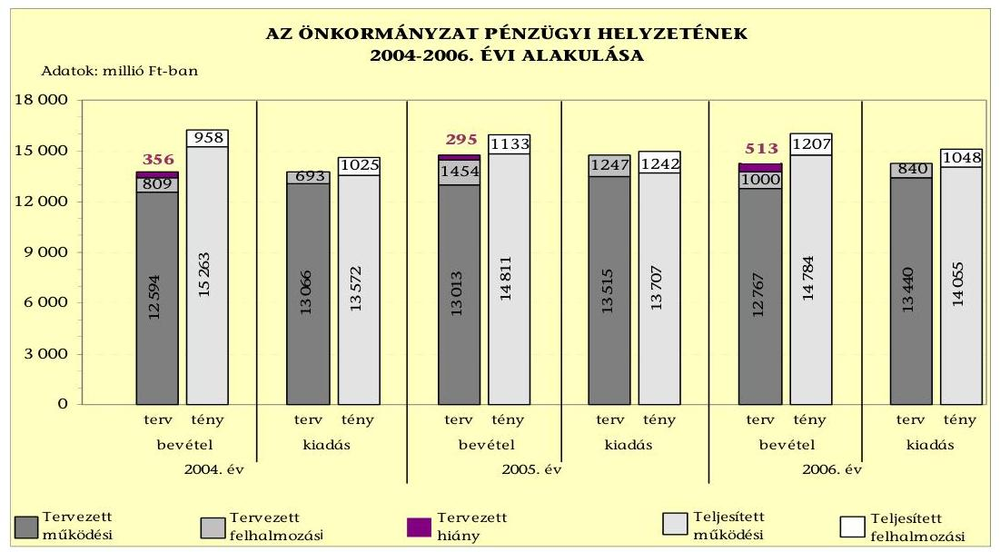
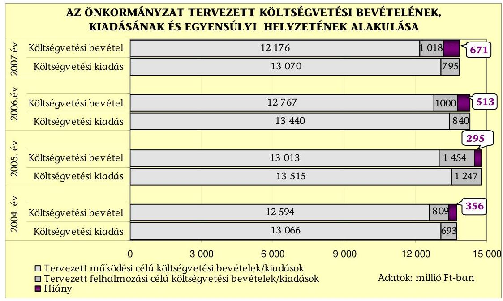
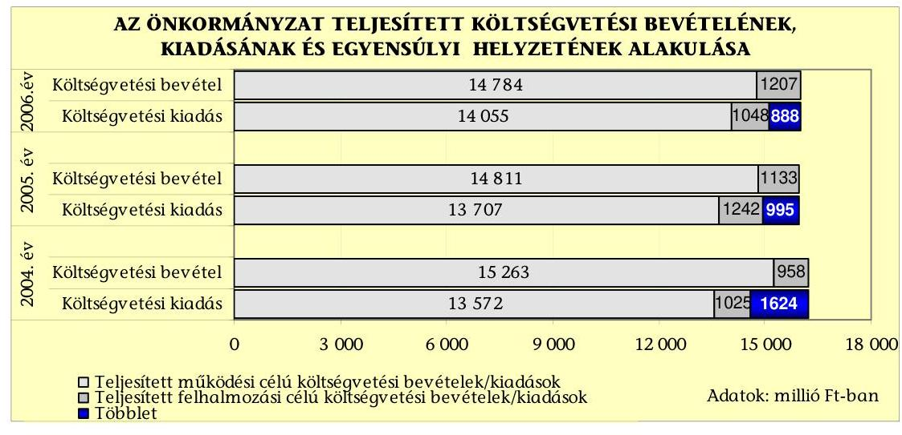
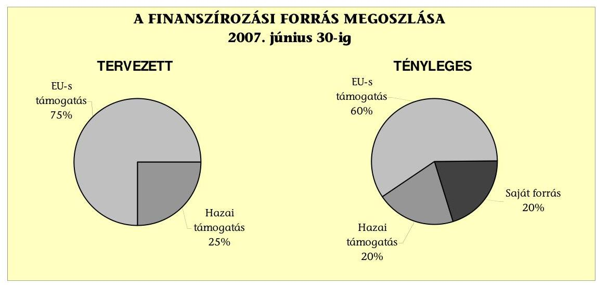
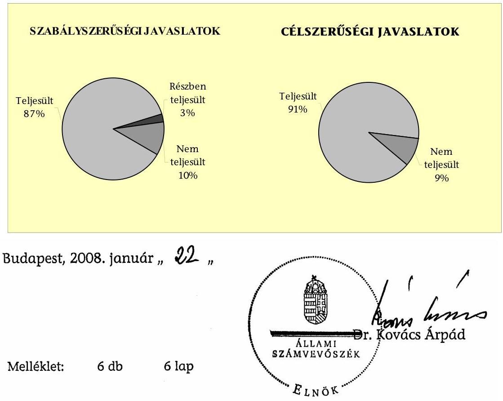
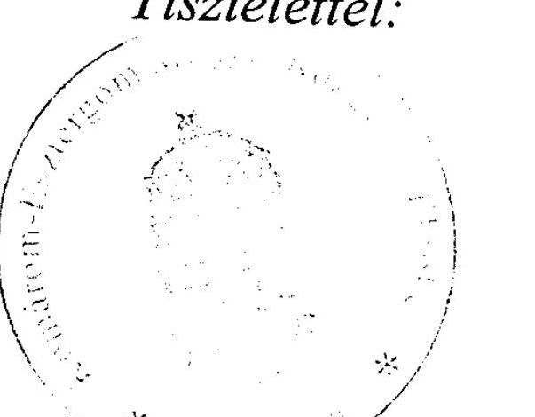

# JELENTÉS 

a Komárom-Esztergom Megyei Önkormányzat gazdálkodási rendszerének 2007. évi átfogó ellenőrzéséről

---

# 3. Önkormányzati és Területi Ellenőrzési Igazgatóság 

## Átfogó Ellenőrzések Főcsoport

Iktatószám: V-1001-9/28/15/2007.
Témaszám: 845
Vizsgálat-azonosító szám: V0322

## Az ellenőrzést felügyelte:

Dr. Lóránt Zoltán
főigazgató
Az ellenőrzés végrehajtásáért felelős:
Dr. Sepsey Tamás
főigazgató-helyettes
Az ellenőrzést vezette:
Csecserits Imréné
főcsoportfőnök-helyettes
Az ellenőrzést végezték:
Böröcz Imre, György Árpád, Koltayné Szepesi Zsuzsanna
tanácsadó, számvevő, tanácsos, irodavezető, főtanácsadó

## A témához kapcsolódó eddig készített számvevőszéki jelentések:

## címe

Jelentés a Komárom-Esztergom Megyei Önkormányzat gazdálkodásának átfogó ellenőrzéséről

Jelentés a helyi és a helyi kisebbségi önkormányzatok gazdálkodásának átfogó ellenőrzéséről

Jelentés a 2004. június 13-án megtartott, az EP tagjai választás és a 2004. december 5-én megtartott országos ügydöntő népszavazás lebonyolításához felhasznált pénzeszközök elszámolásának ellenőrzéséről

Jelentés a Magyar Köztársaság 2005. évi költségvetése végrehajtásának ellenőrzéséről

Függelék:

- a helyi önkormányzatokat a 2005. évben megillető normatív állami hozzájárulás elszámolásának ellenőrzése
-a helyi önkormányzatok beruházásaihoz és rekonstrukcióihoz nyújtott 2005. évi felhalmozási célú támogatások ellenőrzése

---

# TARTALOMJEGYZÉK 

BEVEZETÉS ..... 9
I. ÖSSZEGZŐ MEGÁLLAPÍTÁSOK, KÖVETKEZTETÉSEK, JAVASLATOK ..... 13
II. RÉSZLETES MEGÁLLAPÍTÁSOK ..... 23

1. Az Önkormányzat költségvetési és pénzügyi helyzete ..... 23
1.1. A tervezett költségvetési bevételi és kiadási előirányzatok, valamint a költségvetési egyensúly alakulása ..... 25
1.2. A költségvetési bevételek és kiadások teljesítése, a pénzügyi egyensúlyi helyzet alakulása ..... 27
2. Az Önkormányzat felkészültsége az európai uniós források igénylésére és felhasználására, valamint az e-közigazgatási feladatok ellátására ..... 31
2.1. Az európai uniós források igénybevételére és a várható támogatás felhasználásának szervezettségére történt felkészülés és a belső szabályozottság értékelése ..... 31
2.1.1. A fejlesztési célkitűzések meghatározása ..... 31
2.1.2. Az európai uniós forrásokhoz kapcsolódóan a pályázatfigyelés, a pályázat-készítés, valamint az európai uniós támogatással megvalósuló fejlesztés lebonyolítása belső rendjének szabályozottsága, a végrehajtás személyi, szervezeti feltételei ..... 35
2.1.3. Az európai uniós forrással támogatott fejlesztés megvalósítása ..... 38
2.2. Az e-közigazgatási feladatok előkészítése, bevezetése ..... 40
3. A költségvetési gazdálkodás kontrolljai ..... 42
3.1. A szabályozottság kockázata a költségvetés tervezési, gazdálkodási, beszámolási és a folyamatba épített ellenőrzési feladatainál ..... 42
3.2. A belső kontrollok érvényesülése az önkormányzati források szabályszerű felhasználásában, a költségvetési tervezés, gazdálkodás, beszámolás folyamataiban ..... 43
3.3. A belső ellenőrzési kötelezettség teljesítése, javaslatainak hasznosulása ..... 46
4. Az ÁSZ korábbi ellenőrzési javaslatai alapján készített intézkedési terv végrehajtása, eredményessége ..... 50
4.1. Az Önkormányzat gazdálkodási rendszerének átfogó ellenőrzése során tett javaslatok végrehajtására tervezett intézkedések megvalósulása ..... 50

---

4.2. A zárszámadáshoz kapcsolódó (állami hozzájárulások, támogatások igénylésének és felhasználásának ellenőrzése), valamint a további vizsgálatok esetében a megállapítások, javaslatok alapján tett intézkedések

# MELLÉKLETEK 

1. számú Az Önkormányzat gazdálkodását meghatározó adatok, mutatószámok (1 oldal)
2. számú Az önkormányzati vagyon alakulása (1 oldal)
3. számú Az Önkormányzat 2004-2006. évi költségvetési előirányzatainak és azok pénzügyi teljesítéseinek alakulása ( 1 oldal)
4. számú 1. számú Nyilatkozat a tervezett és teljesített költségvetési adatoknak a megelőző évhez viszonyított jelentős, $\pm 10 \%$-ot meghaladó változásának indokolásáról, amennyiben azt a feladatok változása indokolta (1 oldal)
5. számú 1. számú Tanúsítvány az európai uniós forrásokkal támogatott programok, célok tervezett és tényleges adatairól, 2004-2007. évekre (1 oldal)
6. számú Dr. Völner Pál úr, a Komárom-Esztergom Megyei Közgyűlés elnökének észrevétele (1 oldal)

---

# RÖVIDÍTÉSEK JEGYZÉKE 

## Törvények

2004. évi költségvetési törvény
2005. évi költségvetési törvény
2006. évi költségvetési törvény
Áht.
Eisztv.
Htv.

Ötv.
Számv. tv.

## Rendeletek

2004. évi költségvetési rendelet
2005. évi költségvetési rendelet
2006. évi költségvetési rendelet
2007. évi költségvetési rendelet
Ámr.
Ber.
SzMSz
vagyongazdálkodási rendelet

Vhr.

## Szórövidítések

APEH
ÁSZ
e-közigazgatás
Eötvös József Gimnázium
a Magyar Köztársaság 2004. évi költségvetéséről szóló 2003. évi CXVI. törvény
a Magyar Köztársaság 2005. évi költségvetéséről és az államháztartás hároméves kereteiről szóló 2004. évi CXXXV. törvény;
a Magyar Köztársaság 2006. évi költségvetéséről szóló 2005. évi CLIII. törvény
az államháztartásról szóló 1992. évi XXXVIII. törvény az elektronikus információszabadságról szóló 2005. évi XC. törvény
a helyi önkormányzatok és szerveik, a köztársasági megbízottak, valamint egyes centrális alárendeltségű szervek feladat- és hatásköreiről szóló 1991. évi XX. törvény
a helyi önkormányzatokról szóló 1990. évi LXV. törvény a számvitelről szóló 2000. évi C. törvény

Komárom-Esztergom Megye Önkormányzatának 4/2004. (II. 26.) számú rendelete a 2004. évi költségvetésről
Komárom-Esztergom Megye Önkormányzatának 9/2005. (II. 24.) számú rendelete a 2005. évi költségvetésről
Komárom-Esztergom Megye Önkormányzatának 5/2006. (II. 23.) számú rendelete a 2006. évi költségvetésről
Komárom-Esztergom Megye Önkormányzatának 5/2007. (III. 1.) számú rendelete a 2007. évi költségvetésről
az államháztartás működési rendjéről szóló 217/1998. (XII. 30.) Korm. rendelet
a költségvetési szervek belső ellenőrzéséről szóló 193/2003. (XI. 26.) Korm. rendelet
a Komárom-Esztergom Megyei Önkormányzat Szervezeti és Működési Szabályzatáról szóló 26/2005. (XI. 24.) számú rendelet
a Komárom-Esztergom Megyei Önkormányzat 13/2007. (IV. 26.) számú rendelete a Komárom-Esztergom Megyei Önkormányzat vagyongazdálkodásáról
az államháztartás szervezetei beszámolási és könyvvezetési kötelezettségének sajátosságairól szóló 249/2000. (XII. 24.) Korm. rendelet

Adó- és Pénzügyi ellenőrzési Hivatal
Állami Számvevőszék
elektronikus közigazgatás
Komárom-Esztergom Megyei Önkormányzat Eötvös József Gimnáziuma

---

| FEUVE | folyamatba épített, előzetes és utólagos vezetői ellenőrzés |
| :--: | :--: |
| Főjegyző | Komárom-Esztergom Megyei Önkormányzat főjegyzője |
| Gazdasági főosztály | Komárom-Esztergom Megyei Önkormányzat Hivatala Gazdasági Főosztálya |
| gazdálkodási jogkörök   szabályzata | a kötelezettségvállalás, utalványozás, ellenjegyzés és érvényesítés rendjéről szóló 10/2005.(V. 15.) sz. főjegyzői utasítás |
| gazdasági program ${ }_{1}$ | Komárom-Esztergom Megye Önkormányzatának gazdasági programja a 2003-2007. időszakra |
| gazdasági program ${ }_{2}$ | Komárom-Esztergom Megye Önkormányzatának 2006-2010. időszakra szóló gazdasági programja |
| GVOP | Gazdasági Versenyképesség Operatív Program |
| HEFOP 2.1.3 intézkedés | Humánerőforrás-fejlesztés Operatív Program; hátrányos helyzetű tanulók esélyegyenlőségének biztosítása az oktatási rendszerben; az integrációs program eredményességét mutató mérő és értékelő rendszer kifejlesztése, alkalmazása |
| HEFOP 3.1.2 intézkedés | Humánerőforrás-fejlesztés Operatív Program; egész éven át tartó tanuláshoz szükséges készségek és képességek fejlesztése; tanítási programcsomagok, tananyagok, taneszközök kidolgozása, pedagógia-szakmai fejlesztések a hátrányos helyzetben lévő gyermekek ellátásában résztvevő intézmények együttműködésére építve |
| Illetékhivatal | Komárom-Esztergom Megyei Illetékhivatal |
| Intézményi ellenőrzési osztály | Komárom-Esztergom Megyei Önkormányzat Hivatala Intézményi Ellenőrzési Osztálya |
| Kórház | Komárom-Esztergom Megyei Önkormányzat Szent Borbála Kórháza |
| Közgyűlés | Komárom-Esztergom Megyei Önkormányzat Közgyűlése |
| Közgyűlés elnöke | Komárom-Esztergom Megyei Önkormányzat Közgyűlésének elnöke |
| MÁK | Magyar Államkincstár |
| NFT | Nemzeti Fejlesztési Terv |
| Norvég alap | Norvég Finanszírozási Mechanizmus |
| OEP | Országos Egészségbiztosítási Pénztár |
| ÖNHIKI | önhibáján kívül hátrányos helyzetben lévő önkormányzatok támogatása |
| Önkormányzat | Komárom-Esztergom Megyei Önkormányzat |
| Önkormányzat hivatala | Komárom-Esztergom Megyei Önkormányzat Hivatala |
| Önkormányzat hivatalának SzMSz-e | a Komárom-Esztergom Megyei Önkormányzat Szervezeti és Működési Szabályzatáról szóló 26/2005. (XI. 24.) számú rendeletének 8. számú melléklete a Komárom-Esztergom Megyei Önkormányzat Hivatalának Szervezetéről és Ügyrendjéről |
| Pedagógiai Intézet | Komárom-Esztergom Megyei Önkormányzat Pedagógiai Intézete |
| PEJ | projekt előrehaladási jelentés |

---

Pénzügyi bizottság
Területfejlesztési főosztály
Térségi Fejlesztési Tanács
Vagyongazdálkodási osztály

Komárom-Esztergom Megyei Önkormányzat Pénzügyi Bizottsága
Komárom-Esztergom Megyei Önkormányzat Hivatalának Területfejlesztési és Műszaki főosztálya
Velencei-tó, Vértes Térségi Fejlesztési Tanács
Komárom-Esztergom Megyei Önkormányzat Hivatalának Vagyongazdálkodási és Vagyonkezelési Osztálya

---

.

---

# ÉRTELMEZŐ SZÓTÁR 

1. elektronikus szolgáltatási szint
2. elektronikus szolgáltatási szint
3. elektronikus szolgáltatási szint
4. elektronikus szolgáltatási szint
európai uniós források felhasználása
fejlesztési feladat (projekt)
fejlesztési célkitűzés
irányító hatóság

Az 1044/2005. (V. 11.) Korm. határozat alapján olyan információs, tájékoztató szolgáltatás, amely csak általános információkat közöl az adott üggyel kapcsolatos teendőkről és a szükséges dokumentumokról.
Az 1044/2005. (V. 11.) Korm. határozat alapján olyan egyirányú kapcsolatot biztosító szolgáltatás, amely az 1. szinten túl biztosítja az adott ügy intézéséhez szükséges dokumentumok, nyomtatványok letöltését, és azok ellenőrzéssel, vagy ellenőrzés nélküli elektronikus kitöltését, amely esetben a dokumentumok benyújtása hagyományos úton történik.
Az 1044/2005. (V. 11.) Korm. határozat alapján olyan kétirányú kapcsolatot biztosító szolgáltatás, amely közvetlen, vagy ellenőrzött kitöltésű dokumentum segítségével biztosítja az elektronikus adatbevitelt és a bevitt adatok ellenőrzését. Az ügy indításához, intézéséhez személyes megjelenés nem szükséges, de az ügyhöz kapcsolódó közigazgatási döntés (határozat, egyéb aktus) közlése, valamint a kapcsolódó illeték-, vagy díjfizetés hagyományos úton történik.
Az 1044/2005. (V. 11.) Korm. határozat alapján olyan teljes közvetlen kétirányú ügyintézési folyamatot biztosító szolgáltatás, amikor az ügyhöz kapcsolódó közigazgatási döntés is elektronikus úton kerül közlésre, illetve a kapcsolódó illeték-, vagy díjfizetés elektronikus úton is intézhető.
Az elnyert európai uniós források lehívása a támogatott projekt megvalósítása érdekében, a fejlesztés lebonyolítása során a felmerült kiadások finanszírozására.
A fejlesztési feladat (projekt) tartalmilag és formailag részletesen kidolgozott, megfelelő pénzügyi háttérrel és végrehajtási ütemezéssel rendelkező fejlesztési terv, amely illeszkedik az Európai Unió, illetve a Nemzeti Fejlesztési Terv által támogatott programokhoz.
Az önkormányzat által ellátott kötelező, vagy önként vállalt feladatok ellátásának mennyiségi, vagy minőségi fejlesztésére vonatkozó terv. A mennyiségi fejlesztés megvalósulhat beszerzéssel, létesítéssel, bővítéssel, átalakítással.
A strukturális alapok és a Kohéziós alap forrásainak szabályszerű, hatékony és eredményes felhasználásához szükséges intézményrendszer felső eleme. Az irányító hatóság általános és átfogó felelősséget visel a programok, projektek hatékony és szabályszerű végrehajtásáért. Felelősségi köréből eredően ellenőrzi a közösségi, valamint a hazai jogszabályok betartását, koordinálja az európai uniós források szétosztásának folyamatát, irányítja az intézményrendszer, a statisztikai és a pénzügyi nyilvántartási rendszer működését. A HEFOP irányító hatósága a

---

kedvezményezett
közreműködő szervezet
lebonyolítás
operatív program
támogatási szerződés

Foglalkoztatáspolitikai és Munkaügyi Minisztérium Humánerőforrás-fejlesztési Operatív Program és EQAL program irányító hatósága
Az a helyi önkormányzat, vagy konzorcium, amely a támogatási szerződést kedvezményezettként aláírja, a projektet, illetve a központi programhoz kapcsolódó támogatott önkormányzati programot végrehajtja.
A közreműködő szervezet az európai uniós támogatást elnyert kedvezményezettekkel kapcsolatot tartó szerv. Az operatív programok közreműködő szervezetei befogadják, nyilvántartják, döntésre előkészítik a pályázatokat, rögzítik a támogatással kapcsolatos adatokat az egységes monitoring informatikai rendszerben, elvégzik a támogatások előzetes (szerződéskötést megelőző), közbenső (a pénzügyi elszámolás, finanszírozás folyamatában végzett) és utólagos (a támogatott projekt pénzügyi lezárását megelőző) ellenőrzését. Az önkormányzatoknál a leggyakrabban előforduló operatív program a Regionális Fejlesztési Operatív Program végrehajtásában közreműködő szervezetek a VÁTI Kht. és a regionális fejlesztési ügynökségek.
A HEFOP végrehajtásában a közreműködő szervezet a Foglalkoztatási Hivatal Európai Szociális Alap Főosztálya Komárom-Esztergom Megyei Kihelyezett Egysége.
Az európai uniós források felhasználásával megvalósuló fejlesztésre irányuló műszaki, gazdasági (pénzügyi) tevékenységet magában foglaló szervezési, irányítási szolgáltatás. A szervezési szolgáltatás kiterjedhet a pályázatkészítésre, a közbeszerzési eljárás lebonyolításán keresztül a folyamatos műszaki ellenőrzésre, a pénzügyi elszámolásra, a műszaki átadás-átvételre, az üzembe helyezésre, illetve a fejlesztési folyamat egyes elemeire.
Az Európai Bizottság által jóváhagyott, a Közösségi Támogatási Keret végrehajtására vonatkozó 2004-2006 közötti, több évre szóló intézkedésekhez kapcsolódó prioritások egységes rendszerét tartalmazó dokumentum. A strukturális alapok operatív programjai: Agrár és Vidékfejlesztési Operatív Program (AVOP); Gazdasági Versenyképesség Operatív Program (GVOP); Humánerőforrás-fejlesztési Operatív Program (HEFOP); Környezetvédelmi és Infrastruktúra-fejlesztési Operatív Program (KIOP); Regionális Fejlesztési Operatív Program (ROP).
A strukturális alapok esetében az irányító hatóságnak, illetve a Kohéziós alap esetében a közreműködő szervezeteknek a kedvezményezett önkormányzattal, vagy más szervezettel kötött szerződése, amely a támogatás felhasználásának részletes feltételeit tartalmazza.

---

# JELENTÉS 

## a Komárom-Esztergom Megyei Önkormányzat gazdálkodási rendszerének 2007. évi átfogó ellenőrzéséről

## BEVEZETÉS

Az Ötv. 92. § (1) bekezdése, az Állami Számvevőszékről szóló 1989. évi XXXVIII. törvény 2.
 § (3) bekezdése, valamint az Áht. 120/A. § (1) bekezdése alapján az önkormányzatok gazdálkodását az Állami Számvevőszék ellenőrzi. Az ellenőrzésre az Országgyűlés illetékes bizottságai részére is átadott, országosan egységes ellenőrzési program szerint került sor.

Az Állami Számvevőszék a stratégiájában foglalt célkitűzéseknek megfelelően a helyi önkormányzatok költségvetési gazdálkodási rendszere átfogó ellenőrzésének programját a 2007. évtől megújította, azt kiegészítette további - teljesítmény-ellenőrzési - elemekkel.

## Az ellenőrzés célja annak értékelése volt, hogy az Önkormányzat:

- a pénzügyi egyensúlyt a költségvetésében és annak teljesítése során milyen módon biztosította, a teljesített bevételek és kiadások egyes évek közötti jelentős eltérése feladatváltozáshoz kapcsolódott-e;
- felkészült-e a szabályozottság és a szervezettség terén az európai uniós források igénylésére és felhasználására, továbbá az e-közigazgatás bevezetése miatti szervezetkorszerűsítési feladatokra;
- kialakította-e a külső és a belső feltételeknek megfelelően a gazdálkodás belső kontrollrendszerét ${ }^{1}$, továbbá a költségvetés tervezési, végrehajtási és zárszámadási feladatok szabályszerű ellátásához hozzájárult-e a folyamatba épített, előzetes és utólagos vezetői ellenőrzés, valamint a belső ellenőrzés;
- megfelelően hasznosították-e a korábbi számvevőszéki ellenőrzések megállapításait, szabályszerűségi ${ }^{2}$ és célszerűségi javaslatait.

[^0]
[^0]:    ${ }^{1}$ A gazdálkodás szabályszerűségét biztosító kontrollrendszer alatt értjük a kiépített és működő belső irányítási és szabályozási rendszert, valamint a belső ellenőrzési funkciók ellátásának rendszerét.
    ${ }^{2}$ A törvényi előírások betartásának elmulasztásakor a részletes megállapítások fejezetben egységesen a törvénysértés megjelölést alkalmazzuk, mivel az ÁSZ nem tehet különbséget a törvényi előírások között.

---

Az ellenőrzött időszak: az 1., 2. és 4. programpontok tekintetében a 2004-2006. évek és a 2007. I. félév, a 3. ellenőrzési programpontnál a 2006. év és a 2007. év I. negyedéve.

Komárom-Esztergom megye lakosainak száma - Tatabánya megyei jogú város lakossága nélkül - 2007. január 1-jén 245854 fő volt. A megyében a 2006. évben 76 települési önkormányzat működött, amelyből 10 város, 4 nagyközség, 62 község. Az Önkormányzat 40 tagú Közgyűlésének munkáját kilenc állandó bizottság segítette. A 2006. évi önkormányzati választásokat követően a Közgyűlés elnökének személye változott. A főjegyző 2004. január 1-jétől 2007. augusztus 31-ig látta el feladatát, a Közgyűlés az új főjegyzőt 2007. szeptember 27-én nevezte ki.

Az Önkormányzat feladatainak végrehajtása érdekében a 2006. évben 35 költségvetési intézményt működtetett, amelyekből 5 önállóan gazdálkodott. A feladatok ellátásában részt vett egy közhasznú társaság, továbbá öt alapítvány. Az Önkormányzat a 2006. évben 15991 millió Ft költségvetési bevételt és 15103 millió Ft költségvetési kiadást teljesített, a könyvviteli mérleg szerint a 2006. év végén 14973 millió Ft vagyonnal rendelkezett. Az Önkormányzat a 2007. évi költségvetésében 13194 millió Ft költségvetési bevételt és 13865 millió Ft költségvetési kiadást irányzott elő. Az Önkormányzat hivatalában foglalkoztatott köztisztviselők száma a 2006. december 31-én 98 fő, a költségvetési intézményekben foglalkoztatott közalkalmazottak száma 3128 fő volt. A megyei illetékhivatalok 2007. január 1-jétől történt megszüntetését követően az Önkormányzat hivatalában dolgozók száma 36 fővel csökkent. Az Önkormányzat gazdálkodását meghatározó főbb adatokat, mutatószámokat a jelentés 1-3. számú mellékletei tartalmazzák.

Az Önkormányzat költségvetési és pénzügyi helyzetét az összehasonlító elemzés módszerével vizsgáltuk. E körben elemeztük a költségvetés egyensúlyi helyzetének alakulását, a tervezett és tényleges költségvetési hiány okait, a mérséklésére tett intézkedéseket, finanszírozásának módját, az Önkormányzat adósságállományának alakulását, összetevőit.

A teljesítmény-ellenőrzés módszerével vizsgáltuk, hogy a belső szabályozottság, szervezettség terén felkészültek-e az európai uniós források figyelésére, igénylésére és felhasználására, valamint az igényelt európai uniós támogatások az Önkormányzat által meghatározott fejlesztési célkitűzésekhez kapcsolódtak-e. Az ellenőrzés során felmértük, hogy az e-közigazgatási feladat ellátása, illetve bevezetése, működtetése érdekében milyen intézkedéseket tettek, valamint biztosították-e a közérdekű adatok elektronikus közzétételét.

A költségvetési gazdálkodás belső kontrolljainak ellenőrzése során értékeltük, hogy az Önkormányzat hivatalánál a költségvetés tervezési, gazdálkodási, zárszámadás készítési feladatok belső kontrolljainak kiépítettsége és működése megfelelő biztosítékot ad-e a gazdálkodási feladatok megfelelő, szabályszerű ellátására. Felmértük és minősítettük a költségvetés tervezési, a gazdálkodási, a zárszámadás készítési feladatokkal, továbbá a pénzügyi-számviteli területen az informatikával kapcsolatosan kialakított kontrollok megfelelőségét, valamint azok működésének eredményességét, megbízhatóságát. Értékeltük a belső ellenőrzés szervezeti és szabályozási keretét, továbbá működését.

---

Az Önkormányzat hivatalánál értékeltük a gazdálkodás folyamatában a kontrollok működésének megbízhatóságát, ennek keretében ellenőriztük a szakmai teljesítés igazolására és az utalvány ellenjegyzésére kialakított kontrollok végrehajtását. Az ellenőrzést a következő, kiemelt kockázatuk alapján kiválasztott ${ }^{3}$ az általánostól jellemzően eltérő, egyedi eljárást igénylő gazdasági eseményekkel kapcsolatos kifizetésekre folytattuk le ${ }^{4}$ :

- a személyi juttatások közül az állományba nem tartozók megbízási díjai ${ }^{5}$,
- a külső szolgáltató által végzett karbantartási, kisjavítási szolgáltatások, valamint
- a gépek, berendezések, felszerelések beszerzése.

Az ellenőrzés hatékony elvégzése céljából a vizsgálandó területek kiválasztása során a kockázatokon alapuló megközelítés érvényesült, ezáltal az ellenőrzési erőforrásokat azokra a területekre fókuszáltuk, amelyeken legnagyobb a hibák előfordulási valószínűsége. Az ellenőrzési erőforrások ilyen típusú összpontosításával minimálisra csökkenthető a kívánt ellenőrzési bizonyosság eléréséhez szükséges időráfordítás.

A pénzügyi-számviteli folyamatokban alkalmazott belső kontrollok létezésének és működésének ellenőrzésére a vizsgált három terület 2006. évi könyvviteli tételeiből területenként egyszerű véletlen mintát vettünk. A kijelölt gazdasági eseményre elvégzett megfelelőségi tesztek alapján értékeltük a kontrollok működésének eredményességét, megbízhatóságát a vizsgált három területre külön-külön, majd összefoglalóan ${ }^{6}$ az Önkormányzat hivatalában egyedi eljárást igénylő gazdasági eseményeire. A helyszíni ellenőrzés megállapításainak részletes dokumentálását három megfelelőségi tesztlapon, öt elővizsgálati és kilenc helyszíni ellenőrzési munkalapon biztosítottuk. Ezeken a teszt- és munkalapokon a minősítés alapjául szolgáló kérdések és a vonatkozó konkrét jogszabályhelyek megjelölése mellett értékeltük a kialakított belső kontrollokban rejlő kockázatokat ${ }^{7}$ és a kialakított kontrollok működésének megbízhatóságát ${ }^{8}$.

[^0]
[^0]:    ${ }^{3}$ Az önkormányzatok kiemelt előirányzataira vonatkozóan, a vertikális folyamatokra elvégeztük a kockázatok becslését, amelynek eredményeként az állományba nem tartozók megbízási díjai, a külső szolgáltató által végzett karbantartási, kisjavítási szolgáltatások, valamint a gépek, berendezések, felszerelések beszerzése kiemelkedően kockázatos területnek bizonyultak.
    ${ }^{4}$ A korábbi ellenőrzési tapasztalataink szerint ezeken a területeken a jegyzők nem, vagy hiányosan szabályozták a megbízás, megrendelés, illetve beszerzés indokoltságának, szükségességének elbírálására, igazolására, valamint a teljesítések dokumentálására, a kifizetések jogosságának megítélésére szolgáló kontrollokat. További kockázatot jelentett a külső szolgáltató által végzett karbantartási, kisjavítási munkák esetében, hogy az 50 ezer Ft alatti megrendelésekre vonatkozóan az ellenőrzési tapasztalataink szerint a jegyzők nem alakították ki a kötelezettségvállalások rendjét és nyilvántartási formáját, valamint a szabályozás elmulasztása esetén nem történt meg az írásbeli kötelezettségvállalás és annak az ellenjegyzése sem.
    ${ }^{5}$ Az állományba tartozók rendszeres személyi juttatásainak számfejtését, valamint folyósítását nem a polgármesteri hivatalok, hanem a nettó finanszírozás keretében a beküldött dokumentumok alapján a MÁK végzi.
    ${ }^{6}$ A vizsgált három terület egyedi értékelési pontszámait a területek relatív költségvetési súlyával arányosan összegeztük.

---

bályhelyek megjelölése mellett értékeltük a kialakított belső kontrollokban rejlő kockázatokat ${ }^{7}$ és a kialakított kontrollok működésének megbízhatóságát ${ }^{8}$.

Az ÁSZ korábbi ellenőrzési javaslatai alapján tett intézkedéseket, illetve azok megvalósítását utóellenőrzés keretében vizsgáltuk. A gazdálkodási rendszer átfogó ellenőrzése során megfogalmazott javaslatok végrehajtására tett intézkedések megvalósítását ellenőriztük, az egyéb számvevőszéki ellenőrzések során tett javaslatok esetében pedig a kiadott intézkedéseket tekintettük át.

A helyszíni ellenőrzés során kitöltött - az ellenőrzést végző számvevő és a Önkormányzat hivatalának felelős köztisztviselője által aláírt - elővizsgálati és helyszíni ellenőrzési munkalapokat, azok kitöltési útmutatóit, továbbá a megfelelőségi tesztek dokumentumait a Közgyűlés elnöke részére a számvevői jelentéssel egyidejűleg átadtuk.

A jelentést az ÁSZ-ról szóló 1989. évi XXXVIII. tv. 25. § (1) bekezdése alapján észrevétel közlése céljából megküldtük a Komárom-Esztergom Megyei Közgyűlés elnökének. A kapott észrevételt a jelentés 6. számú melléklete tartalmazza.
${ }^{7}$ A kialakított belső kontrollokban rejlő kockázatot alacsonynak minősítettük, ha a kontrollok - végrehajtásuk esetén - megfelelő védelmet nyújtanak a hibák bekövetkezése ellen. Közepesnek minősítettük a belső kontrollokban rejlő kockázatot, amennyiben a kontrollok - végrehajtásuk esetén - a lehetséges hibák többsége ellen védelmet nyújtanak. Magasnak értékeltük a kockázatot, ha a kontrollok - kialakításuk hiányában, vagy hiányos kialakításuk miatt - nem nyújtanak elegendő védelmet a lehetséges hibákkal szemben.
${ }^{8}$ A kontrollok működésének eredményességét, megbízhatóságát kiválónak értékeltük abban az esetben, ha azok működése - esetleges apróbb hiányosságoktól eltekintve - megfelelt a hibák megelőzésére és kijavítására meghatározott szabályozásnak és a legmagasabb szintű elvárásoknak. Jónak minősítettük a kontrollok működését, ha a hiányosságok száma ugyan jelentős volt, de nem veszélyeztette az ellenőrzött terület hibáinak megelőzését és kijavítását. Amennyiben a hiányosságok mértéke nem biztosította a hibák megelőzését, feltárását, kijavítását és ezáltal veszélyeztette az eredményes, megbízható működést, a kontroll működésének megbízhatósága gyenge minősítést kapott.

---

# I. ÖSSZEGZŐ MEGÁLLAPÍTÁSOK, KÖVETKEZTETÉSEK, JAVASLATOK 

Az Önkormányzat tervezett költségvetési bevételei és kiadásai az előző évhez képest a 2005. évben növekedtek, majd a 2006. és a 2007. évben csökkentek, a tervezett költségvetési bevételek egyik évben sem biztosították a fedezetet a költségvetési kiadásokra, mind a négy évben a költségvetési kiadások forráshiányával tervezték a költségvetést. A költségvetési egyensúly biztosítása érdekében az Önkormányzat 2004-2006 között hosszú és - növekvő arányban - rövid lejáratú hitelfelvételt tervezett, a 2006. és a 2007. évben értékpapír eladással is számolt. A költségvetési rendeletekben - az Áht. előírásától eltérve - finanszírozási célú pénzügyi műveleteket számoltak el költségvetési hiányt módosító költségvetési kiadásként, illetve költségvetési bevételként.

Az Önkormányzatnál a költségvetés végrehajtása során az eredeti előirányzatot a teljesített költségvetési bevételek évente meghaladták, amit az év közben elnyert pályázati pénzösszegek, az eredeti előirányzatként nem tervezett pénzmaradvány igénybevétel és egyes költségvetési bevételek alultervezése eredményezett. Az Önkormányzat a 2004-2006. években a költségvetés egyensúlyát a működési célú kiadásainak csökkentésére irányuló intézkedéseivel, a pályázati lehetőségek kihasználásával és a Kórház bevételi többleteivel összességében biztosította. A 2004-2006. évek között évente a tervtől eltérően a működési célú költségvetési bevételeknél többlet keletkezett, amelyet a 2005. és a 2006. évben a nem tervezett, viszont teljesített kórházi pénzmaradvány igénybevétel eredményezett. Az Egészségbiztosítási Alapból a Kórház részére biztosított bevételek és az azokkal finanszírozott költségvetési kiadások nélkül számolva a 2005. és a 2006. évben a költségvetési bevételek 99%-ban fedezték a költségvetési kiadásokat, és kettő-kettő százalék arányú volt a működési célú kiadások forráshiánya. A Kórház adatai nélkül számított működési célú kiadások forráshiánya összefüggött az intézményrendszerben ellátottak létszámának visszaesésével, a finanszírozási feltételek változásával, amelyek miatt az intézmények - a Kórházat nem számítva - működéséhez kapott központi forrásokat a 2004-2006. évek között 54%-kal egészítette ki az Önkormányzat.

Az Önkormányzat költségvetései 2004-2006 között minden évben felhalmozási célú bevételi többleteket tartalmaztak, azonban a teljesített felhalmozási célú költségvetési kiadások a 2004. és a 2005. évben meghaladták a felhalmozási célú költségvetési bevételeket, a 2006. évben a felhalmozási célú költségvetési bevételeknél a tervezettnek megfelelően többlet keletkezett. A tervtől való eltéréseket a felhalmozási célú bevételek
 alá- vagy fölébecslései, pályázati források év közben történő elnyerése, illetve a tervezettől eltérő igénybevétele okozták.

Az Önkormányzat hivatala év közben a pénzügyi egyensúly biztosításához a 2004. és a 2005. évben rövid lejáratú, működési célú hiteleket, 2005. májusától folyószámlahitelt is igénybe vett. Az Önkormányzat a 2005. és a 2006. év végén a folyószámlahiteleket nem fizette vissza, a 2006. évben 500 millió Ft hosszú lejáratú működési célú hitelt is felvett a Kórház nélkül számított működési

---

célú költségvetési kiadások forráshiánya és a hiteltörlesztési kiadások kötelezettsége miatt, valamint a pénzügyi egyensúlyi helyzet - folyószámla hitelkeret emelése nélkül történő - biztosítása érdekében. A Közgyűlés takarékossági, intézményrendszer-korszerűsítési intézkedéseket hozott, az Önkormányzat hivatala a likviditás elősegítése érdekében a kiadásokat rangsorolta, az intézmények havi finanszírozását a bevételek beérkezéséhez igazítva több ütemben végezte, azonban 2005-2007 között a fizetési kötelezettségeit egyre nagyobb mértékű napi folyószámlahitel igénybevételével teljesítette.

Az Önkormányzat fejlesztési célkitűzéseit a gazdasági program ${ }_{1,2}$-ben, koncepciókban, és szakmai programokban rögzítette. Az egészségügyi, szociális szolgáltatástervezési, illetve közoktatás-fejlesztési koncepciók fejlesztési célkitűzéseit a lakossági igények felmérésével és a demográfiai mutatók alakulásának bemutatásával alátámasztották. A gazdasági program ${ }_{1,2}$ tartalmazta a fejlesztési célkitűzések megvalósításának lehetséges pénzügyi forrásait. A gazdasági program ${ }_{1}$ célkitűzéseit 2004-ben a Közgyűlés felülvizsgálta, új fejlesztési feladatokat ennek során nem jelölt ki. A Közgyűlés 2004-2006 között európai uniós forrásokkal összefüggő öt fejlesztési feladatról döntött, melyből hármat az Önkormányzat hivatala a Norvég alaphoz, kettőt az intézményei európai uniós támogatásra nyújtottak be. A Norvég alaphoz benyújtott pályázatok elbírálása még nem történt meg, az intézmények pályázataik alapján összesen 34,6 millió Ft európai uniós támogatást nyertek el. Az Önkormányzat ezeken túlmenően 2007. II. negyedévben a Közép-Dunántúli Operatív Program 2007-2008. évi akciótervéhez hat projektjavaslatot is benyújtott összesen 8455,6 millió Ft összegben, amelyek elbírálásáról értesítést még nem kapott. Az Önkormányzat 2006. évi költségvetése az Ámr. előírásával szemben nem tartalmazta a többéves kihatással járó európai uniós feladatok előirányzatait éves bontásban, továbbá a 2006-2007. évi költségvetésekben az Ámr. előírásával ellentétben nem mutatták be elkülönítetten az európai uniós támogatással megvalósuló programok, projektek bevételeit, kiadásait.

Az Önkormányzat a belső szabályozottság és szervezettség terén összességében nem készült fel eredményesen az európai uniós források igénybevételére és felhasználására. Annak ellenére, hogy az európai uniós támogatások a gazdasági program ${ }_{1,2}$-ben, a koncepciókban, szakmai programokban megfogalmazott fejlesztési célkitűzésekhez kapcsolódtak, azonban az Önkormányzat szabályozása nem tartalmazta az európai uniós forrásokkal összefüggésben az önkormányzati szintű pályázatfigyelési, a pályázatkészítési, nyilvántartási, információáramlási feladatokat. Nem szabályozták továbbá az európai uniós forrásokkal támogatott fejlesztések lebonyolítási rendjét, az európai uniós források igénybevételével és felhasználásával kapcsolatos önkormányzati szintű döntési jogköröket, a Közgyűlés elnöke és a fejlesztési feladat lebonyolítója közötti kapcsolattartás rendjét. Az Önkormányzat hivatala a pályázatfigyelési és készítési feladatok ellátásával külső szervezetet is megbízott, a megbízási szerződésekben az információk átadásának formáját, tartalmát és módját nem határozták meg. A pályázatfigyelés, pályázatkészítés ellenőrzési kötelezettségét, feladatait és felelőseit nem szabályozták.

A Pedagógiai Intézet főkedvezményezettként 11 közoktatási intézménnyel létrehozott konzorcium vezetőjeként nyújtott be a 2004. évben pályázatot a „Térségi Iskola- és Óvodafejlesztő Központok megalapítása a kompetencia-alapú tanítási-

---

tanulási programok elterjesztéséért" című projekt megvalósítására. A támogatási szerződést az eredményhirdetést követő kilenc hónap elteltével kötötték meg, így a források igénybevétele nem a támogatási szerződésben meghatározott ütemezésnek megfelelően alakult. A támogatási szerződést egy alkalommal módosították, amely a támogatási szerződésben rögzített határidőket (ütemezéseket) érintette. A projekt megvalósításának határideje 2007. június 30-a, a záró jelentés benyújtása és a pénzügyi elszámolás határideje 2007. szeptember 28-a volt. A pályázatban vállalt feladatok végrehajtását a közreműködő szervezet és az Intézményi ellenőrzési osztály ellenőrizte. A külső ellenőrzés szabálytalanságra, mulasztásra vonatkozó megállapítást nem tett. A belső ellenőrzés által feltárt hiányosságok felszámolására intézkedtek.

Az Önkormányzat hivatalában működő e-közigazgatási feladatokat ellátó informatikai rendszer az 1. elektronikus szolgáltatási szint követelményeinek felelt meg. A honlapon megtalálhatók és letölthetők az Önkormányzat hivatala által kiírt pályázatok űrlapjai, az űrlapok elektronikus kitöltése és ellenőrzése azonban nem biztosított. Az Önkormányzat a 2006. évtől informatikai stratégiával nem rendelkezik. Az Önkormányzat hivatala az e-közigazgatás további szintje bevezetésének hardver, szoftver igényét, pénzügyi, személyi feltételeit nem mérte fel, nem elemezte. Az Önkormányzat honlapján közzétette a nettó ötmillió forintot elérő, vagy azt meghaladó értékű árubeszerzésre, építési beruházásra, szolgáltatás megrendelésére, vagyonértékesítésre, vagyonhasznosításra vonatkozó szerződések megnevezését, tárgyát, a szerződést kötők nevét, a szerződés értékét, határozott időre kötött szerződés esetében annak időtartamát, valamint az adatok változását. A 2006. évben nyújtott, nem normatív, céljellegű fejlesztési támogatások kedvezményezetteinek nevét, a támogatások célját, összegét, a támogatások megvalósításának helyeit az Áht-ban foglaltak ellenére az Önkormányzat hivatala nem tette közzé. A 2007. I. félévben az önként vállalt feladatok (környezetvédelmi, nemzetiségi, sport, színházi és tudomá-nyos-kulturális feladatok) ellátására fordított kiadásokból juttatott nem normatív, céljellegű működési és fejlesztési célú támogatások adatait - a Közgyűlés elnöke hatáskörében meghozott támogatási döntéseket kivéve - az Önkormányzat hivatala nem tette közzé. Az Önkormányzat hivatala az Ámr-ben előírtakkal ellentétben nem hozta nyilvánosságra a 2005. és a 2006. évi költségvetési beszámolók szöveges indoklását.

A 2006. évben az Önkormányzat hivatalában a költségvetés tervezési és a zárszámadás készítési folyamatokat szabályozták, a szabályozás hiányosságai összességében alacsony kockázatot jelentettek a feladatok szabályszerű végrehajtásában, mivel a főjegyző belső szabályzatokban meghatározta az intézmények részére a költségvetési javaslat összeállításával kapcsolatos követelményeket, előírta a kapcsolódó ellenőrzési feladatokat. Annak ellenére összességében alacsony volt a kockázat, hogy a főjegyző az Ámr. előírása ellenére nem határozta meg a költségvetési szervek éves költségvetési beszámolója beküldésének határidejét, felülvizsgálatának időpontját, a beszámoló szöveges indoklásának részletes tartalmi és formai követelményeit.

Az Önkormányzat hivatalánál a költségvetés tervezés és a zárszámadás készítés folyamatában a kialakított kontrollok működésének megbízhatósága összességében kiváló volt, mivel - a költségvetési javaslat összeállítására, az intézményi pénzmaradványok megállapításának szabályszerűségére, az intéz-

---

ményi beszámolók belső, valamint a főjegyző által meghatározott adatszolgáltatással való összhangjának felülvizsgálatára vonatkozóan - az előírt egyeztetési, ellenőrzési feladatokat elvégezték.

Az Önkormányzat hivatalában a 2006. évben a pénzügyi-számviteli tevékenységek szabályszerű végrehajtásában a gazdálkodási, a pénzügyi-számviteli és a folyamatba épített ellenőrzési feladatok szabályozottsága közepes kockázatot jelentett, mivel az Ámr. előírása ellenére a pénzügyi-gazdasági feladatok ellátásáért felelős személyek által ellátandó feladatokat, továbbá a vezetők és más dolgozók feladat-, hatás- és jogkörét nem szabályozták részletesen a gazdasági szervezet ügyrendjében. A munkaköri leírások nem tartalmazták a gazdálkodási jogkörök szabályzatában rögzített ellenőrzési jogköröket, továbbá a számviteli szabályzatokban meghatározott értékelési, egyeztetési és ellenőrzési feladatokat. Az eszközök és források leltározási és leltárkészítési szabályzatában a főjegyző a Vhr. előírása ellenére az eszközök évenkénti mennyiségi leltározási kötelezettsége helyett azok nyilvántartásokkal való évenkénti egyeztetését rögzítette. A közérdekű adatszolgáltatáshoz kapcsolódó költségtérítés összegének megállapítása tekintetében az önköltségszámítás rendjét belső szabályzatban az Ámr. előírása ellenére nem rögzítették. A számlarendben a Vhr. előírása ellenére nem szabályozták az analitikus nyilvántartások főkönyvi nyilvántartásokkal történő egyeztetését és annak dokumentálási módját. Az ellenőrzési nyomvonal nem tartalmazta, hogy a tevékenységeket, feladatokat részletesen mely belső szabályzatok rögzítik, továbbá a Gazdasági főosztály vonatkozásában nem tartalmazta az adott tevékenység, feladat és a végrehajtásáért felelős szervezeti egység (személy) egyértelmű megfeleltetését, az ellenőrzési pontokat, az egyes tevékenység, feladat elvégzését igazoló dokumentum megnevezését és nyilvántartási helyét a rendszerben.

Az állományba nem tartozók megbízási díjainak kifizetései során a működésbeli hibák megelőzésére, feltárására, kijavítására kialakított kontrollok működésének megbízhatósága a 2006. évben és a 2007. I. negyedévben összességében kiváló volt, mivel a megbízási szerződésekben meghatározott cél teljesítésének, a kiadás jogosultságának, összegszerűségének ellenőrzését a szakmai teljesítés igazolására kijelölt személy belső szabályzatban előírt módon elvégezte. Az utalvány ellenjegyzője a szakmai teljesítés igazolás és az érvényesítés megtörténtéről a megbízási szerződések esetében meggyőződött. Annak ellenére összességében kiváló volt a kontrollok működésének megbízhatósága, hogy a Gazdasági főosztály vezetője a választási feladatokkal kapcsolatos megbízási díjak kifizetése során az Ámr. összeférhetetlenségre vonatkozó előírása ellenére két esetben saját részre történő kifizetésre vonatkozó utalvány ellenjegyzését is elvégezte.

A külső szolgáltatók által végzett karbantartási, kisjavítási feladatokkal kapcsolatos kifizetések során a működésbeli hibák megelőzésére, feltárására, kijavítására kialakított kontrollok működésének megbízhatósága a 2006. évben és 2007. I. negyedévben gyenge volt, mert az 50 ezer Ft-ot el nem érő karbantartási kiadásokra és a gépjárművek karbantartási feladataira vonatkozó kötelezettségvállalásokat nem foglalták írásba, ezáltal - ezen dokumentumok hiányában - nem végezték el a szakmai teljesítés igazolását, a kiadások jogosultságának, összegszerűségének ellenőrzését. Az utalvány ellenjegyzés a gazdálkodás folyamatában nem megfelelően működött, mivel az Ámr. előírása el-

---

lenére az ellenjegyzések során elmaradt a gazdálkodásra vonatkozó szabályok betartásának ellenőrzése, az utalvány ellenjegyzője nem észrevételezte, hogy az 50 ezer Ft-ot el nem érő karbantartási kiadásokra vonatkozóan a szakmai teljesítés igazolása, és az érvényesítés a kötelezettségvállalási dokumentum hiányában történt meg.

Az ügyvitel- és számítástechnikai eszközök, valamint egyéb gépek, berendezések és felszerelések beszerzésével, létesítésével kapcsolatos kifizetések során a működésbeli hibák megelőzésére, feltárására, kijavítására kialakított kontrollok működésének megbízhatósága a 2006. évben és 2007. I. negyedévben összességében kiváló volt, mivel a szerződésben meghatározott cél teljesítésének, a kiadás jogosultságának, összegszerűségének ellenőrzését a szakmai teljesítés igazolására kijelölt személy a belső szabályzatban előírt módon elvégezte és az ellenőrzés elvégzését aláírásával igazolta. Az utalvány ellenjegyzője a gazdálkodásra vonatkozó szabályok érvényesüléséről, a szakmai teljesítés igazolásának és az érvényesítésnek a megtörténtéről meggyőződött.

Az Önkormányzat hivatalánál az állományba nem tartozók megbízási díjaival, a karbantartási kisjavítási szolgáltatásokkal, továbbá az ügyvitel- és számítástechnikai eszközök, valamint egyéb gépek, berendezések, felszerelések beszerzésével kapcsolatos kifizetések során a belső kontrollok a gazdálkodás folyamatában - a három terület költségvetési súlyának figyelembevételével - összességében nem működtek megfelelően. A működésbeli hibák megelőzésére, feltárására, kijavítására kialakított kontrollok működésének megbízhatósága a 2006. évben és a 2007. I. negyedévben összességében gyenge volt, mivel a szakmai teljesítésigazolás és az utalvány ellenjegyzés nem adott megfelelő biztosítékot az 50 ezer Ft-ot el nem érő karbantartási kiadásoknál a gazdálkodási feladatok megfelelő, szabályszerű ellátására.

A 2007. I. negyedévében a gépek, berendezések és felszerelések beszerzésénél a teljesített kiadás elszámolása előtt a főkönyvi könyvelésben a kiadások előirányzatát külön előirányzati számlán a Vhr. előírása ellenére nem rögzítették. Ezen kiadások esetében a kötelezettségvállalásra a fedezetet az ingatlanok vásárlására, létesítésére tervezett előirányzat biztosította.

Az Önkormányzat hivatalában a 2006. évben és a 2007. év I. negyedévben az informatikai rendszer szabályozottsága közepes mértékű kockázatot jelentett az informatikai feladatok biztonságos végrehajtásában, mivel nem rendelkeztek hatályos informatikai stratégiával, valamint nem gondoskodtak az informatikai eszközökhöz való hozzáférések ellenőrzési rendjének meghatározásáról, és az elvégzett ellenőrzések dokumentálásának előírásáról. Az informatikai rendszerek működtetésénél a kialakított kontrollok megbízhatósága a 2006. évben és a 2007.
 év I. negyedévében összességében kiváló volt, mivel informatikai hálózati rendszereket működtettek, biztosították a főkönyv és a költségvetési beszámoló adatainak egyezőségét a szükséges adatok egyszeri bevitele alapján, megtörtént a szolgáltatott adatok rendszeres ellenőrzése. Annak ellenére összességében kiváló volt a kontrollok működésének megbízhatósága, hogy az informatikai rendszer változásait, hibáit és kezelésüket nem dokumentálták.

---

A belső ellenőrzés szervezeti kereteinek kialakítása és szabályozása a belső ellenőrzés végrehajtásában összességében alacsony kockázatot jelentett, mivel az Önkormányzat kialakította a belső ellenőrzés szervezetét mind az Önkormányzat hivatala, mind pedig az Önkormányzat által fenntartott és működtetett intézmények vonatkozásában, valamint szabályozta az ellenőrzés működési feltételeit. Annak ellenére összességében alacsony volt a kockázat, hogy ellentétben a Ber. előírásával, valamint az Önkormányzat 2004. évben végzett ÁSZ ellenőrzéséről készült jelentésben megfogalmazott javaslattal, az Önkormányzat hivatalának SzMSz-ében az intézmények ellenőrzését végzők feladatait nem írták elő, illetve a Ber. előírása ellenére az éves ellenőrzési terveket megalapozó stratégiai tervek nem tartalmazták a FEUVE rendszer értékelését, a kockázati tényezőket és azok értékelését. Az Önkormányzat hivatala belső ellenőrzését hivatali belső ellenőr végezte, az Önkormányzat intézményeinek ellenőrzési feladatait három főből álló Intézményi ellenőrzési osztály látta el. Az ellenőrök közvetlenül a főjegyző irányítása alá tartoztak. Az ellenőrzéseket a Közgyűlés által elfogadott éves ellenőrzési tervek alapján végezték.

A belső ellenőrzés működésének megbízhatósága a 2006. évben jó volt, mert az előforduló hiányosságok nem veszélyeztették az ellenőrzés működésének megbízhatóságát. Annak ellenére összességében jó volt a belső ellenőrzés működésének megbízhatósága, hogy az Önkormányzat hivatalában nem vizsgálták a közbeszerzéseket, illetve a közbeszerzési eljárásokat, az Önkormányzat többségi irányításával működő közhasznú társaság gazdálkodását, valamint az Áht. előírása ellenére sem a belső ellenőrzés útján, sem más módon nem ellenőrizték az Önkormányzat költségvetéséből céljelleggel nyújtott támogatások esetében a számadást és a felhasználást. A 2006. évi ellenőrzési tervben meghatározott 14 belső ellenőrzési feladatból az Önkormányzat hivatalában a belső ellenőr átmeneti távolléte miatt három ellenőrzési feladatot nem végeztek el, az Intézményi ellenőrzési osztály az ellenőrzési tervben foglalt feladatokat végrehajtotta. Az Intézményi ellenőrzési osztály a 2006. évben három alkalommal tárt fel fegyelmi eljárás megindítását megalapozó hiányosságokat, amelyek következménye két esetben megrovás, egy esetben írásbeli figyelmeztetés volt. Az Önkormányzat hivatalának és az intézményeknek a gazdálkodásában feltárt hiányosságok megszüntetéséről a 2006. évben utóellenőrzéssel győződtek meg. A főjegyző az Áht. előírása ellenére a 2006. évi költségvetési beszámoló keretében a FEUVE rendszer kialakításáról és működtetéséről, valamint a belső ellenőrzés működéséről nem számolt be. A Közgyűlés elnöke az Ötv. előírása alapján a zárszámadási rendelettel egyidejűleg a Közgyűlés elé terjesztette az Önkormányzat hivatala és az intézmények ellenőrzésének tapasztalatairól készült éves összefoglaló ellenőrzési jelentést, amelyet elfogadott.

Az Önkormányzat gazdálkodásának 2004. évi átfogó ellenőrzéséről készített számvevőszéki jelentésben tett megállapítások, javaslatok hasznosítására készített intézkedési tervben meghatározták az elvégzendő feladatokat, azok végrehajtásáért felelős személyeket és határidőket. A javaslatok 81%-át teljes mértékben, 3%-át részben hasznosították, a 16%-át nem hasznosították. A javaslatok hasznosításával javult a Közgyűlés döntéshozatalát elősegítő tájékoztatás, megtörtént az Önkormányzat hivatalának SzMSz-e, a számviteli politika, számlarend, a leltározási szabályzat vonatkozó részeinek kiegészítése, a szakmai igazolás módjának meghatározása és az azt végző személyeknek a kijelö-

---

lése. A likviditási terv készítése, aktualizálása hozzájárult az Önkormányzat hivatalánál a pénzellátás folyamatos biztosításához. A kötelezettségvállalások nyilvántartási rendjének kialakításáról gondoskodtak, amelyből az évenkénti kötelezettségvállalás összege megállapítható. A követelések, a részesedések, értékpapírok értékelésének elvégzése biztosította ezen eszközök esetében a számviteli előírásoknak megfelelő értéken való kimutatását a mérlegben. A vagyongazdálkodási rendeletet módosították, ez alapján az Önkormányzat ingó és ingatlan vagyontárgyait csak versenypályáztatás, vagy licit útján értékesítették, hasznosítva ezzel az erre irányuló javaslatot. A céljelleggel nyújtott támogatások szabályszerűségét biztosították azáltal, hogy az alapítványi támogatásokról a Közgyűlés külön határozatokkal döntött, valamint a közhasznú szervezetek részére megállapított támogatások folyósítása kizárólag írásbeli szerződés alapján történt, hasznosítva az erre irányuló javaslatokat. A zárszámadási rendeletben a speciális célú támogatások, az intézményi, felújítási, valamint felhalmozási célú előirányzatok teljesítésének célonkénti bemutatását biztosították. A belső ellenőrzési rendszer szabályozottságának a szintje javult a belső ellenőr funkcionális függetlenségének az Önkormányzat hivatala SzMSz-ében történő biztosításával, a belső ellenőrzést végzők kötelezettségeinek előírásával.

A javaslatok ellenére nem biztosították, hogy a költségvetési intézmények az Áht-ban foglaltaknak megfelelően a jóváhagyott előirányzatokon belül gazdálkodjanak, az Áht-nak megfelelően a kötelezettségvállalás és az utalványozás csak a jóváhagyott kiadási előirányzatok mértékéig történjen. A 2004-2006. évek mindegyikében történtek túllépések az intézményenkénti és az Önkormányzat hivatala kiemelt előirányzatai körében. Az Áht. előírása ellenére a költségvetési és zárszámadási rendelettervezetek előterjesztésekor elmaradt a közvetett támogatásokról szóló kimutatás és annak szöveges indoklásának a bemutatása. Nem történt meg a pénzügyi-számviteli dolgozók munkaköri leírásainak kiegészítése az egyeztetési, ellenőrzési feladatokkal.

A munka színvonalának javítása érdekében tett javaslatokat hasznosítva kiadták az általános informatikai adatmentési és katasztrófa-elhárítási tervet, valamint az informatikai erőforrások jogszerű használatára vonatkozó szabályozást. A céljelleggel nyújtott támogatások odaítélésének, nyilvántartásának és rendeltetésszerű felhasználásának eljárási rendjét a Közgyűlés szabályozta. A középületek akadálymentesítésének figyelemmel kísérésére vonatkozó javaslatot hasznosították. Az Önkormányzat hivatalában az akadálymentes közlekedést biztosították. Az új beruházások, rekonstrukciók során az akadálymentességi szempontokat figyelembe vették.

Az Önkormányzatnál végzett témavizsgálatok javaslatai hasznosultak. Az Európai Parlament tagjainak választásához és a 2005. december 5-ei országos ügydöntő népszavazás lebonyolításához felhasznált pénzeszközök ellenőrzése által javasoltakat hasznosítva a főjegyző a költségvetési- és pénzgazdálkodásra vonatkozó helyi szabályozást kiegészítette. A 2005. évi normatív hozzájárulások igénylésének és elszámolásának ellenőrzése során tett javaslatokat hasznosítva az Önkormányzat a jogosulatlanul igénybe vett hozzájárulást a költségvetés részére visszafizette. A maximális létszám túllépése esetén az Országos Közoktatási Értékelési és Vizsgaközpont jóváhagyását kérték. Kidolgozták a szakmai továbbképzéshez, a testi/szellemi fogyatékos magántanulók, a nem magyar állampolgár tanulók ellátásához, a kedvezményes étkeztetéshez kap-

---

csolódó normatív hozzájárulások helyi szabályait. A helyi önkormányzatok beruházásaihoz és rekonstrukcióihoz nyújtott 2005. évi felhalmozási célú támogatások ellenőrzése javaslatait hasznosítva a Közgyűlés határozatot hozott a támogatások késedelem nélküli lehívásáról, valamint az elszámolási határidők betartásáról.

A helyszíni ellenőrzés megállapításainak hasznosítása mellett javasoljuk:

# a Közgyűlés elnökének 

a munka színvonalának javítása érdekében

1. kezdeményezze, hogy a jelentésben foglaltakat a Közgyűlés tárgyalja meg és a feltárt hiányosságok megszűntetése érdekében készíttessen intézkedési tervet a határidők és felelősök megjelölésével;

## a főjegyzőnek

a jogszabályi előírások maradéktalan betartása érdekében

1. biztosítsa, hogy a költségvetési rendelettervezetekben az Áht. 8/A. § (7) bekezdésében foglaltaknak megfelelően a finanszírozási célú pénzügyi műveleteket költségvetési hiányt módosító költségvetési kiadásként, illetve költségvetési bevételként ne vegyék figyelembe;
2. gondoskodjon arról, hogy a költségvetési rendelettervezetek tartalmazzák az Ámr. 29. § (1) bekezdés g) pontjának előírása alapján a többéves kihatással járó európai uniós feladatok előirányzatait éves bontásban, valamint az Ámr. 29. § (1) bekezdés k) pontja alapján elkülönítetten az európai uniós támogatással megvalósuló programok, projektek bevételeit, kiadásait;
3. az Önkormányzat közzétételi kötelezettségének teljesítése érdekében
a) biztosítsa a nem normatív, céljelleggel nyújtott működési és fejlesztési támogatások esetében a kedvezményezett nevének, a támogatás céljának, összegének, a támogatási program megvalósítási helyének a közzétételét az Áht. 15/A. § (1) bekezdésében foglalt előírásoknak megfelelően;
b) gondoskodjon az Ámr. 157/D. § (1) bekezdésében hivatkozott 22. számú melléklet 1.2.5. pontjában foglaltak alapján az éves költségvetési beszámoló szöveges indokolásának közzétételéről;
4. gondoskodjon az Önkormányzat hivatala pénzügyi-számviteli tevékenységének szabályozottsága érdekében
a) az Ámr. 17. § (5) bekezdésében előírtak alapján a gazdasági szervezet ügyrendjében a pénzügyi-gazdasági feladatok ellátásáért felelős személyek feladatainak, továbbá a vezetők és más dolgozók feladat-, hatás- és jogkörének meghatározásáról;

---

b) a Vhr. 37. § (1) és (3) bekezdései alapján az eszközök és források leltározási és leltárkészítési szabályzatában az eszközök évenkénti mennyiségi leltározási kötelezettségének előírásáról;
c) a Vhr 8. § (4) bekezdésének c) pontjában, illetve a (16) bekezdésében foglaltak alapján a közérdekű adatszolgáltatáshoz kapcsolódó költségtérítési összeg megállapítására vonatkozóan az önköltségszámítás rendjének szabályozásáról;
d) a Vhr. 49. § (2) bekezdésében foglaltak alapján a számlarendben az analitikus nyilvántartások főkönyvi nyilvántartásokkal történő egyeztetésének és dokumentálásának szabályozásáról;
5. kezdeményezze előterjesztés elkészítésével, hogy a Közgyűlés határozza meg az Ámr. 149. § (2) bekezdés a)-c) pontjaiban foglaltak betartása érdekében a költségvetési szervek éves költségvetési beszámolója beküldésének határidejét, felülvizsgálatának időpontját, a beszámoló szöveges indoklásának részletes tartalmi és formai követelményeit;
6. az operatív gazdálkodás során a működésbeli hibák megelőzése, illetve kijavítása érdekében
a) gondoskodjon arról, hogy az utalvány ellenjegyzője betartsa az Ámr. 138. § (3) bekezdése szerinti összeférhetetlenségi előírásokat;
b) intézkedjen, hogy a főkönyvi könyvelésben az előirányzati számlákat a Vhr. 9. számú melléklet 1. pontjában foglalt előírások szerint vezessék.
7. az Önkormányzat hivatala, valamint az intézmények belső ellenőrzése szabályszerűségének biztosítása érdekében
a) kezdeményezze, hogy a Ber. 4. § (2) bekezdésében foglaltaknak megfelelően az Önkormányzat hivatala SzMSz-ében határozzák meg az Önkormányzat intézményeinek ellenőrzését végző személyek feladatait;
b) intézkedjen, hogy a belső ellenőrzési stratégiai terv tartalmazza a Ber. 19. § b), c) pontjaiban foglalt előírások alapján a FEUVE rendszer értékelését, valamint a kockázati tényezőket;
c) intézkedjen, hogy az Önkormányzat hivatala belső ellenőrzési programjai - a Ber. 23. § (4) bekezdés h) pontjában foglaltaknak megfelelően - tartalmazzák az ellenőrzés módszereit;
8. biztosítsa az Áht. 13/A. § (2) bekezdése előírása alapján az Önkormányzat költségvetéséből céljelleggel nyújtott támogatások esetében a számadás és a felhasználás ellenőrzését;
9. gondoskodjon az Önkormányzat gazdálkodásának 2004. évi átfogó ellenőrzése során az ÁSZ által tett és nem teljesült szabályszerűségi és célszerűségi javaslatok végrehajtásáról;

---

a munka színvonalának javítása érdekében
10. az európai uniós forrásokkal kapcsolatos fejlesztési feladatoknál
a) gondoskodjon arról, hogy belső szabályzatban határozzák meg az európai uniós forrásokkal összefüggésben az önkormányzati szintű pályázatfigyelési és pályázatkészítési, pályázat-nyilvántartási, információáramlási feladatokat, valamint az európai uniós forrásokkal támogatott fejlesztések lebonyolításának rendjét, az európai uniós források igénybevételével és felhasználásával kapcsolatos önkormányzati szintű döntési jogköröket, a Közgyűlés elnöke és a fejlesztési feladat lebonyolítója közötti kapcsolattartás rendjét;
b) gondoskodjon külső szervezet megbízása esetén arról, hogy a pályázatfigyelésre és pályázat-készítésre vonatkozó szerződés tartalmazza az információ-átadás formáját, módját, tartalmát;
11. intézkedjen, hogy az ellenőrzési nyomvonal tartalmazza, hogy a tevékenységeket, feladatokat részletesen mely belső szabályzatok rögzítik, továbbá a Gazdasági főosztály vonatkozásában tartalmazza az adott tevékenység, feladat és a végrehajtásáért felelős szervezeti egység (személy) egyértelmű megfeleltetését, az ellenőrzési pontokat, az egyes tevékenység, feladat elvégzését igazoló dokumentum megnevezését és nyilvántartási helyét a rendszerben;
12. egészítse ki a pénzügyi dolgozók munkaköri leírásait a gazdálkodási jogkörök szabályzatában rögzített ellenőrzési hatáskörökkel, továbbá a számviteli szabályzatokban meghatározott értékelési, egyeztetési és ellenőrzési feladatokkal;
13. gondoskodjon az informatikai fejlesztések érvényes célkitűzéseit és feltételeit tartalmazó informatikai stratégia elkészítéséről, az informatikai eszközökhöz való hozzáférések ellenőrzési rendjének meghatározásáról és az elvégzett ellenőrzések, valamint az informatikai rendszer változásai, hibái és kezelésük dokumentálási kötelezettségének előírásáról;
14. intézkedjen, hogy a stratégiai terv aktualizálása során a belső ellenőrzési vezető kockázatelemzése terjedjen ki a
 közbeszerzések, illetve a közbeszerzési eljárások szabályszerűsége vizsgálatára.

---

# II. RÉSZLETES MEGÁLLAPÍTÁSOK 

## 1. AZ ÖNKORMÁNYZAT KÖLTSÉGVETÉSI ÉS PÉNZÜGYI HELYZETE

Az Önkormányzatnál a tervezett összes költségvetési bevétel és kiadás 2004-2005 között növekedett, majd a 2006. és a 2007. évben csökkent a megelőző időszakhoz képest. A költségvetés egyensúlya 2004-2007 között nem volt biztosított, mivel a tervezett költségvetési bevételek nem nyújtottak fedezetet a tervezett költségvetési kiadásokra, a tervezett költségvetési hiány a 2005. évet kivéve emelkedett és mértéke a 2004. évi 3%-ról a 2007. évre 5%-ra nőtt. A teljesített költségvetési bevételek az előző évhez viszonyítva a 2005. évben csökkentek, a 2006. évben növekedtek, míg a költségvetési kiadások folyamatosan emelkedtek, de az Önkormányzat mindhárom évben költségvetési többlettel zárta az évet.

Az Önkormányzat 2004-2006. évi költségvetései előirányzatait - azon belül a működési és felhalmozási, valamint a finanszírozási célú bevételeket és kiadásokat - és azok pénzügyi teljesítésének alakulását a 3. számú melléklet tartalmazza. Az Önkormányzat által ellátott feladatok változásának hatását a tervezett és teljesített költségvetési adatokra a 4. számú melléklet mutatja.

A tervezett és teljesített működési és felhalmozási célú költségvetési bevételek és kiadások alakulását szemlélteti a következő ábra:

A 2004-2007. évi költségvetési rendeletekben a költségvetés bevételi és kiadási főösszegének megállapításakor - megsértve az Áht. 8/A. § (7) bekezdésében előírtakat - finanszírozási célú pénzügyi műveleteket (hiteltörlesztéssel kapcsolatos kiadásokat, illetve a 2006. és a 2007. évben értékpapír-értékesítési bevételeket)

---

vettek figyelembe költségvetési hiányt módosító költségvetési kiadásként, illetve költségvetési bevételként ${ }^{9}$.

Az Önkormányzatnál a 2004-2006. években tervezett és teljesített működési és felhalmozási célú költségvetési kiadásokra a következő arányban biztosítottak fedezetet a költségvetési bevételek:

Adatok: %-ban

| Megnevezés | 2004.   év |  | 2005.   év |  | 2006.   év |  | 2007.   év |
| :--: | :--: | :--: | :--: | :--: | :--: | :--: | :--: |
|  | terv | tény | terv | tény | terv | tény | terv |
| Működési célú költségvetési kiadások fedezettsége működési célú költségvetési bevételekből | 96,4 | 112,5 | 96,3 | 108,1 | 95,0 | 105,2 | 93,2 |
| Felhalmozási célú költségvetési kiadások fedezettsége felhalmozási célú költségvetési bevételekből | 116,7 | 93,5 | 116,6 | 91,2 | 119,1 | 115,1 | 128,0 |
| Költségvetési kiadások fedezettsége költségvetési bevételekből | 97,4 | 111,1 | 98,0 | 106,7 | 96,4 | 105,9 | 95,2 |

A tervezett működési célú költségvetési bevételek egyik évben sem nyújtottak fedezetet a tervezett működési célú költségvetési kiadásokra, míg a tervezett felhalmozási célú költségvetési kiadások fedezettsége biztosított volt. A tervtől eltérően a teljesített működési célú költségvetési bevételek a működési célú költségvetési kiadásokra mindhárom évben fedezetet nyújtottak, míg a teljesített felhalmozási célú költségvetési bevételek a felhalmozási célú költségvetési kiadásokat a 2004-2005. években nem, azonban a 2006. évben fedezték.

A költségvetés végrehajtása során - a tervezettnél magasabb összegű költségvetési bevételek és kiadások mellett - önkormányzati szinten a teljesített költségvetési bevételek fedezték ugyan a költségvetési kiadásokat, de ezt a 2005-2006. években az Egészségbiztosítási Alapból finanszírozott Kórház többletbevételei eredményezték. A Kórház adatai nélkül számítva az önkormányzati teljesített költségvetési bevételek a 2005. és 2006. évben csupán 99%-ban fedezték a teljesített költségvetési kiadásokat.

A 2005-2006. években tervezett és teljesített költségvetési - azon belül működési és felhalmozási célú - bevételek és kiadások megelőző évhez viszonyított változását szemlélteti a következő táblázat:

[^0]
[^0]:    ${ }^{9}$ A költségvetésekben a finanszírozási célú pénzügyi műveletek helyett a költségvetési hiányt módosító kiadásként szerepelt a 2004. évben 88,6 millió Ft, a 2005. évben 193,6 millió Ft, a 2006. évben 39,8 millió Ft, a 2007. évben 79,7 millió Ft tervezett hiteltörlesztés. A költségvetési hiányt módosító bevételként mutattak be az utóbbi két évben 1,6 millió Ft, illetve 59,8 millió Ft tervezett értékpapír-értékesítés bevételét.

---

| Megnevezés | Változás az előző évhez (%) |  |  |  |  |
| :--: | :--: | :--: | :--: | :--: | :--: |
|  | 2005. évben |  | 2006. évben |  | $\begin{gathered} 2007 . \\ \text { évben } \end{gathered}$ |
|  | terv | tény | terv | tény | terv |
| Működési célú költségvetési bevételek változása | 3,3 | -3,0 | -1,9 | -0,2 | -4,6 |
| Működési célú költségvetési kiadások változása | 3,4 | 1,0 | -0,6 | 2,5 | -2,8 |
| Felhalmozási célú költségvetési bevételek változása | 79,8 | 18,2 | -31,2 | 6,5 | 1,8 |
| Felhalmozási célú költségvetési kiadások változása | 79,8 | 21,2 | -32,7 | -15,6 | -5,3 |
| Összes költségvetési bevétel változása | 7,9 | -1,7 | -4,8 | 0,3 | -4,2 |
| Összes költségvetési kiadás változása | 7,3 | 2,4 | -3,3 | 1,0 | -2,9 |

A felhalmozási célú költségvetési bevételek és kiadások előző évhez viszonyított 2005. évi növekedését, illetve 2006. évi csökkenését a pályázattal elnyert fejlesztési támogatások - ezen belül kiemelten a pszichiátriai betegek otthona építéséhez valamint egy szakközépiskola rekonstrukciójához nyújtott címzett támogatások - éves ütemei és a kivitelezési, pénzügyi teljesítések tervezettől való eltérései okozták.

# 1.1. A tervezett költségvetési bevételi és kiadási előirányzatok, valamint a költségvetési egyensúly alakulása 

Az Önkormányzatnál a tervezett összes költségvetési bevétel és kiadás 2004-2005 között növekedett, majd a 2006. és a 2007. évben csökkent a megelőző időszakhoz képest. A tervezett költségvetési bevételek és kiadások különbözetéből eredő hiányt minden évben a tervezett működési célú költségvetési kiadások forráshiánya okozta.

---

Az Önkormányzatnál a 2004-2007. évek között a tervezett működési célú költségvetési kiadások forráshiánya fokozatosan emelkedett; 471,4 millió Ft, 502,0 millió Ft, 673,2 millió Ft és 893,8 millió Ft volt. A tervezett működési célú költségvetési bevételek minden évben a tervezett működési célú költségvetési kiadásokkal azonos irányban változtak az előző évhez képest, de egyre kisebb mértékű forrást biztosítottak. A tervezett működési célú költségvetési kiadások fedezettsége működési célú költségvetési bevételekkel a 2004. és a 2007. évek között három százalékponttal romlott.

A 2005. évben az előző évhez viszonyítva a tervezett működési célú költségvetési bevételek és kiadások egymással összhangban 3%-kal növekedtek.

A bevételi és kiadási előirányzatokat 684,3 millió Ft-tal, illetve 887,4 millió Ft-tal növelte nyolc intézmény átvétele települési önkormányzattól, valamint 598,7 millió Ft-tal, illetve 648,6 millió Ft-tal csökkentette három intézmény átadása települési önkormányzatnak. A két év között az illetékbevételek előirányzatát 13%-kal növelte az előző évi tényadaton alapuló bevételi elvárás. A tervezett személyi juttatások és a munkaadókat terhelő járulékok 9%-os, illetve 7%-os növekedése az intézmény átadás-átvételek mellett a központi bérintézkedések hatása volt.

A tervezett működési célú költségvetési bevételek előző évhez viszonyított csökkenése a 2006. évben 171,2 millió Ft-tal, a 2007. évben 220,6 millió Ft-tal meghaladta a tervezett működési célú költségvetési kiadások csökkenését.

A 2006-2007. években az átengedett személyi jövedelemadó és a költségvetési támogatás számításának és az illetékhivatali hatásköröknek a változásai a bevételek csökkenését okozták. Az OEP által megadott Egészségbiztosítási Alap finanszírozási terv a 2006. évtől csökkent, az előirányzat a 2007. évre a 2004. évi szintet sem érte el, ezzel együtt változtak a tervezett kórházi kiadások is. Az Illetékhivatal kiadásai a 2007. évtől már nem az Önkormányzatnál, hanem az APEH-nál jelentek meg (a 2006. évi tervben még 308,0 millió Ft-os kiadással szerepelt). A 2006-2007. évek működési célú költségvetési kiadási tervadatai a 2005. évben megindított takarékossági intézkedések hatására is csökkentek. A saját működtetésű főzőkonyhák helyett a vásárolt élelmezésre tértek át, a 2005. évben elkészült tanulmány és az abban foglalt 177 fős létszám, illetve mintegy 300 millió Ft-os kiadás megtakarítási lehetőség alapján az Önkormányzat átalakította az intézményrendszerét. A pénzügyi és műszaki tevékenységek megosztott ellátásának szükségességét felülvizsgálták, a Közgyűlés a 2005. évben intézményeket vont össze, a korábban önállóan gazdálkodó intézményeket részben önállóan gazdálkodó szervezetekké minősítette és a gazdálkodási feladataik ellátására a megye területén négy gazdasági szolgáltató szervezetet hozott létre. A 2007. évben a Közgyűlés - a feladatok és létszámok átrendezésével kiadási megtakarítás elérését felvázoló előterjesztés alapján - a gazdasági szolgáltató szervezetek megszüntetéséről, az intézmények gazdálkodási önállóságának visszaállításáról döntött.

A tervezett működési célú költségvetési kiadások forráshiányát az okozta, hogy az Önkormányzat költségvetési szervei működtetéséhez a kapott központi támogatások és egyéb működési célú bevételek a gazdaságosság növelése céljából meghozott takarékossági intézkedések mellett sem voltak elegendőek, emiatt a Közgyűlés az elfogadott költségvetésekben a felhalmozási célú költségvetési bevételi többlet és hitel igénybevételével is számolt.

---

A tervezett felhalmozási célú költségvetési bevételek és kiadások 2004-2007 között évente az Önkormányzat éves költségvetési előirányzatainak 6-10%-át, illetve 5-8%-át jelentették, az évek közötti eltéréseket a pályázati támogatásokkal megvalósított fejlesztések évenként tervezett ütemei és az értékesítésre szánt forgalomképes ingatlanok köre befolyásolták.

A tervezett felhalmozási célú költségvetési bevételek többlete évente 115-223 millió Ft volt, ami a tervezett működési célú költségvetési kiadások forráshiányának 24-41%-áig fedezetet nyújtott.

Az Önkormányzat a 2004-2007. évek költségvetési rendeleteiben a költségvetési bevételek és költségvetési kiadások főösszegeinek megállapításakor figyelembe vett finanszírozási célú pénzügyi műveletekkel (a hiteltörlesztések kiadásai és a gáz közművagyon ellentételezéseként kapott államkötvény utóbbi kettő évben tervezett értékesítési bevételei) a költségvetési hiányt 25%-kal, 66%-kal, 7%-kal és 3%-kal növelte. A Közgyűlés a költségvetési és a finanszírozási célú pénzügyi műveletek együttes hiányának finanszírozására a 2004-2006. években 444,5 millió Ft, 488,7 millió Ft és 551,3 millió Ft hosszú lejáratú felhalmozási célú hitel, valamint rövid lejáratú működési célú hitel felvételét engedélyezte, az utóbbiak aránya évente 54%, 92% és 96% volt a felvehető hitelek összegéhez viszonyítva. A 2007. évi költségvetésben kimutatott 691,2 millió Ft - költségvetési és a finanszírozási célú pénzügyi műveletekből származó - hiány finanszírozásának egészét rövid lejáratú működési célú hitellel tervezte az Önkormányzat.

# 1.2. A költségvetési bevételek és kiadások teljesítése, a pénzügyi egyensúlyi helyzet alakulása 

A teljesített költségvetési bevételek a 2004-2006. évek között összességében 230,1 millió Ft-tal csökkentek, de összegük az 505,5 millió Ft-tal emelkedő teljesített költségvetési kiadásokat így is meghaladta. A teljesített költségvetési kiadásokat meghaladó költségvetési bevételi többlet mértéke ugyanakkor a 2004-2006. évek között 45%-kal csökkent.

Az éves költségvetésekben tervezettekkel ellentétben mindegyik évben költségvetési bevételi többlet keletkezett, valamint a működési célú költségvetési bevételek fedezetet nyújtottak a működési célú költségvetési kiadásokra, a 2004-2005. években a felhalmozási célú költségvetési kiadásoknak pedig nem volt elegendő felhalmozási célú költségvetési bevételi forrása.

A teljesített működési célú költségvetési bevételeknél - a teljesített működési célú költségvetési kiadásokhoz viszonyítva - évente folyamatosan csökkenő összegű, 1690,4 millió Ft,
 1104,3 millió Ft, illetve 729,5 millió Ft többlet keletkezett. A 2004-2006. években a működési célú költségvetési bevételek többletében szerepe volt tervezési hiányosságoknak, mert az Önkormányzat hivatala a tervezéskor a bevételek közül 12-22%-kal alábecsülte a várható intézményi működési bevételeket, a kamatbevételeket és az illetékbevételeket, valamint a pénzmaradvány működési célú igénybevételével nem számolt.

---

A 2004. évben a teljesített intézményi működési bevételek 22%-kal, 198,5 millió Ft-tal haladták meg az eredeti tervet, a tervben becsült összeghez képest nyolcszor akkora, 155,4 millió Ft-tal magasabb kamatbevétel keletkezett, az illetékbevételek 15%-kal, 245,2 millió Ft-tal haladták meg a tervezettet. A 2005. és 2006. évben a kamatbevétel a tervadatok kétszerese volt, az illetékbevételeknél a 2006. évben 12%-os, 225,4 millió Ft-os túlteljesítés történt.

A 2005-2006. években az Önkormányzat működési célú pénzmaradvány igénybevételt nem tervezett, ugyanakkor annak mértéke 2004-2006 között évente 1508,6 millió Ft, 1354,7 millió Ft, illetve 1148,1 millió Ft volt. Az éves zárszámadások információi szerint a feladattal terhelt pénzmaradvány a működési célú pénzmaradványon belül évente 61%-os, 83%-os és 92%-os arányt képviselt, a feladatok kiadásai és azok pénzmaradvány igénybevételből származó forrásai minden évben előirányzat-módosításokkal kerültek a költségvetésekbe. Az Önkormányzat pénzmaradványa működési célú igénybevételének 63-92%-a a Kórháznál történt, amelynek kiemelését az indokolja, hogy a kötelező egészségbiztosítás ellátásairól szóló 1997. évi LXXXIII. törvény 35. § (2) bekezdése alapján a finanszírozás keretében folyósított összeg csak a finanszírozási szerződésben foglalt feladatokra használható fel, a 35. § (6) bekezdés pedig a szerződésszegés esetére jogkövetkezményeket ír elő. Emiatt az Önkormányzat hivatala a Kórháztól kapott terv- és tényadatokat - ezzel a nem tervezett, de teljesített pénzmaradványt - tudomásul vette és beépítette a költségvetési és zárszámadási rendelettervezetekbe.

Az Egészségbiztosítási Alapból finanszírozott Kórház adatai nélkül számítva az Önkormányzat teljesített működési célú költségvetési bevételeinek és kiadásainak különbözeteként a 2004. évben még 293,2 millió Ft működési bevételi többlet keletkezett, de a 2005. és 2006. évben 226,3 millió Ft, illetve 260,1 millió Ft - kettő-kettő százalék arányú - volt a működési célú költségvetési kiadások forráshiánya.

A Kórház teljesített költségvetési bevételei és kiadásai nélkül számított működési forráshiány az Önkormányzat intézményrendszere működtetésének gazdaságosságával, finanszírozási feltételeivel függött össze. Az ellátotti létszám a 2004-2006. évek között 15%-kal visszaesett $^{10}$, csökkentek az éves költségvetési törvényekben meghatározott szociális szakellátások támogatási mértékei. A működési célú költségvetési bevételek egytized részének kiesését a Közgyűlés a takarékossági, az intézményrendszer összetételét és a feladatellátások módját érintő intézkedésekkel - az ezekkel összefüggő egyszeri kiadási többletek, a kiadáscsökkenés elérhető mértéke és várható késedelme miatt - nem tudta kompenzálni. Az Önkormányzat által működtetett költségvetési intézmények (a Kórház nélkül) működéséhez biztosított központi forrásokat az Önkormányzat a 2004. évben 1151,6 millió Ft-tal, a 2005. évben 1624,3 millió Ft-tal, a 2006. évben 1775,1 millió Ft-tal egészítette ki $^{11}$.

[^0]
[^0]:    $^{10}$ Az éves zárszámadásokban lévő információk felhasználásával számított adat.
    $^{11}$ Az adatok számítása az éves zárszámadások információiból történt, az azokban kimutatott működési célú intézményfinanszírozás összegeinek és az intézmények működtetésével összefüggésben kapott központi támogatásoknak a különbségeként.

---

A teljesített felhalmozási célú költségvetési kiadások a 2004. évben 66,8 millió Ft-tal, a 2005. évben 108,9 millió Ft-tal haladták meg a felhalmozási célú költségvetési bevételeket, míg a 2006. évben a felhalmozási célú költségvetési bevételeknél 158,5 millió Ft többlet keletkezett, miközben az Önkormányzat költségvetései 2004-2006 között minden évben felhalmozási célú bevételi többleteket tartalmaztak. Az Önkormányzat hivatala a költségvetések tervezésekor mindhárom évben túlbecsülte az eladható ingatlanokból és alábecsülte a szakképzési támogatásból származó bevételeket, valamint két évben nem számolt az előző évi pénzmaradvány felhalmozási célú igénybevételével.

Az ingatlanok eladásából származó tervezett bevétel évente 15%-kal, 120%-kal illetve 144%-kal magasabb volt, mint amekkora az évenkénti teljesítés összege volt (egy kórházi telephelyet éveken át nem sikerült értékesíteni). A szakképző iskolák által tervezett megszerezhető szakképzési hozzájárulások tervadata évente 41%-a, 64%-a illetve 27%-a volt a ténylegesen befolyt támogatásoknak. A pénzmaradványok felhalmozási célú igénybevételét nem tervezte az Önkormányzat a 2004. és a 2006. években ugyanakkor 142,7 millió Ft és 77,7 millió Ft igénybevétel ténylegesen megtörtént mind a két évben.

A tervezettől eltérően a felhalmozási célú költségvetési kiadások felhalmozási célú költségvetési bevételeket meghaladó összegű teljesítését a 2004. és a 2005. évben az tette lehetővé, hogy a Kórház olyan építési- és gép-műszer beruházási kiadásokat teljesített (281,1 millió Ft és 272,7 millió Ft összegben), amelyeket nem tervezett működési célú bevételekből (pénzmaradvány igénybevétel) teljesített. A felhalmozási célú költségvetési bevételek és kiadások tervezettől eltérő alakulását a tervezési hiányosságokon kívül az okozta, hogy pályázati forrásokat év közben nyertek el vagy a kivitelezésekkel összhangban, de a tervezettől eltérően vettek igénybe.

Az Önkormányzat hivatala a pénzügyi egyensúlyi helyzet biztosításához a munkabérhitelek $^{12}$ mellett a 2004. évben 120,0 millió Ft, a 2005. évben 150,0

[^0]
[^0]:    $^{12}$ A munkabérhitelek igénybevétele a 2006. júliusi bér augusztus havi kifizetéséig rendszeres volt, majd a 2007. áprilisi bér május havi kifizetésétől havonta újra alkalmazza e hitel igénybevételi formát az Önkormányzat.

---

millió Ft rövid lejáratú működési célú hitelt, illetve az utóbbit kiváltva folyószámlahitelt vett igénybe.

A 2005. május 31-én megnyitott 150 millió Ft-os folyószámla hitelkeret 2005. szeptember 30-tól 300 millió Ft-ra, 2005. november 30-tól 500 millió Ft-ra nőtt, majd 2006. március 30-tól 800 millió Ft-ra emelkedett. A hitelkeret megnyitását követő harmadik hónaptól minden nap igénybe vett folyószámlahitel átlagos napi állománya a 2005. évben 160,8 millió Ft, a 2006. évben 535,5 millió Ft, 2007. első félévében 539,2 millió Ft volt. Az igénybevett napi folyószámlahitel maximális összege 500,0 millió Ft, 791,1 millió Ft, illetve 783,7 millió Ft volt.

A Közgyűlés döntéseinek megfelelően egyéves időkereteket és májusi évfordulókat rögzítő szerződések alapján igénybe vett folyószámlahiteleket év végén a költségvetési bevételekből nem fizették vissza, a 2005. év utolsó napján 198,8 millió Ft, a 2006. év utolsó napján 187,1 millió Ft összegű folyószámlahitel visszafizetése nem történt meg. A Kórház nélkül számított működési célú költségvetési kiadások forráshiánya és a hiteltörlesztési kiadások $^{13}$ kötelezettsége miatt, a pénzügyi egyensúlyi helyzet - folyószámla hitelkeret emelése nélkül történő - biztosítása érdekében 2006 augusztusában 500 millió Ft hosszú lejáratú, a 2007. évtől tíz év alatt visszafizetendő működési célú hitelt vett fel az Önkormányzat. A folyószámlahitel és hosszú lejáratú működési célú hitel 2006. december 31-i állománya 687,1 millió Ft volt. A 2004-2007. I. félév között kötvényt nem bocsátottak ki, kölcsönt nem vettek igénybe, értékpapír eladás a 2006. évben történt 1,6 millió Ft értékben. Hosszú lejáratú felhalmozási célú hitel felvétel a 2004. évben történt 16,6 millió Ft összegben.

A likviditás elősegítése érdekében a kiadásokat rangsorolták, az intézmények havi finanszírozását a bevételek beérkezéséhez igazítva több ütemben végezték. Az ÖNHIKI támogatásra mindhárom évben, a működésképtelen önkormányzatok egyéb támogatására egy évben pályáztak, a 2004. és a 2006. évben sikerrel.

Az Önkormányzat a 2006. évben az ÖNHIKI pályázat eredményeként 89,9 millió Ft, a 2004. évben a működésképtelen önkormányzatok egyéb támogatási pályázat eredményeként 7,0 millió Ft támogatást kapott. Az elnyert támogatások a tervezett forráshiány összegének a 2004. évben 1% alatti nagyságrendjét, illetve a 2006. évben 17,5%-át jelentették.

A költségvetés végrehajtása során 2004-2006 között az eredeti előirányzathoz viszonyított költségvetési bevételi többlet évente a bevételek alultervezettségét okozó előre nem tervezhető - vagy nehezen becsülhető - egyedi vagy rendkívüli bevételeknek, az év közben nyert pályázati pénzeszközöknek, az alultervezett intézményi működési-, kamat-, valamint illetékbevételeknek, az eredeti előirányzatként töredékében, vagy nem tervezett és 56-86%-ban a Kórháznál keletkezett pénzmaradvány igénybevételének a következménye volt. Az eredeti előirányzatokhoz viszonyított költségvetési kiadás túllé-

[^0]
[^0]:    $^{13}$ Az 51,9 millió Ft 23%-át a likvidhitel csökkentésére, 72%-át a 2003-2004. években az Esthajnal Időskorúak Otthona férőhely bővítésére és rekonstrukciójára felvett hitel, 5%-át a 2005. évben az intézményi gépjárműbeszerzésekhez felvett hitelek törlesztésére fordította az Önkormányzat.

---

pése a dologi és egyéb folyó kiadások alábecslése és az év közben pályázatokkal nyert, valamint az alultervezett bevételek teljesítési többletéből eredő források felhasználása miatt következett be.

A tervezéskor a költségvetési bevételek alábecslése - ezen belül kiemelten a pénzmaradvány igénybevétel tervezésének elmaradása - azzal járt, hogy a költségvetési kiadások hiányával szemben költségvetési bevételi többlet keletkezett. Az Egészségbiztosítási Alapból kapott bevételek és az azokkal finanszírozott költségvetési kiadások nélkül számolva viszont a 2005. és a 2006. évben a Kórházi adatok nélküli teljesített költségvetési kiadások egy-egy százalékkal meghaladták a teljesített költségvetési bevételt.

# 2. AZ ÖNKORMÁNYZAT FELKÉSZÜLTSÉGE AZ EURÓPAI UNIÓS FORRÁSOK IGÉNYLÉSÉRE ÉS FELHASZNÁLÁSÁRA, VALAMINT AZ EKÖZIGAZGATÁSI FELADATOK ELLÁTÁSÁRA 

### 2.1. Az európai uniós források igénybevételére és a várható támogatás felhasználásának szervezettségére történt felkészülés és a belső szabályozottság értékelése

### 2.1.1. A fejlesztési célkitűzések meghatározása

Az Önkormányzat fejlesztési célkitűzéseit a gazdasági programban$_{1,2}$-ben és a szakmai koncepciókban $^{14}$ rögzítette.

A gazdasági programban$_{1}$-ben $^{15}$ elsősorban a kötelező közszolgálati feladatok (egészségügyi és szociális ellátás, közoktatás, közgyűjtemények, közművelődés, idegenforgalom, sport, gyermek és ifjúsági jogok biztosítása) ellátásával, és az Önkormányzat által fenntartott intézmények működtetésével összefüggő célokat határoztak meg. A gazdasági program$_{1}$ tartalmazta továbbá az önként vállalt feladatokkal (egészségmegőrzés, civil közösségek támogatása) kapcsolatos fejlesztési célokat is.

A gazdasági programban$_{2}$-ben a humán szolgáltatások fejlesztéséhez kapcsolódóan szociális szolgáltatásfejlesztési koncepció, illetve megyei egészségügyi koncepció készítését határozták el. Alapvető célkitűzés volt a szociális ellátórendszer modernizációja, fejlesztése (pszichiátriai betegek otthonának felújítása, bővítése, értelmi fogyatékosok otthonának kialakítása, szenvedélybetegek részére szociális otthon létesítése), illetve a Kórház fejlesztési programjának kidolgozása. A közoktatás területén az Önkormányzat fenntartásában működő intézmények műszaki színvonalának emelését (felújítások, rekonstrukciók), illetve a térségi, kistérségi együttműködés lehetőségeinek keresését, fejlesztését határozták meg. Kiemelt szempontként szerepelt a munkaerő-piaci jelzésekre alapozott szakképzési straté-

[^0]
[^0]:    $^{14}$ Szociális szolgáltatástervezési koncepció, közoktatási feladat-ellátási, intézményhálózat működtetési és fejlesztési terv, egészségügyi fejlesztési szakmai program, idegenforgalmi stratégia, zöldturizmus-fejlesztési koncepció, környezetvédelmi program.
    $^{15}$ A Közgyűlés 81/2003. (VI. 26.) számú határozata.

---

gia kidolgozása. A gazdaságfejlesztés tekintetében a megye versenyképességének növelését (iparfejlesztés, ipari park hálózat kiépítése innováció centrumok létrehozásával és az ipari parkok hálózati együttműködésével) emelték ki. Az infrastruktúra-fejlesztés területén a szennyvízelvezetés-tisztítás biztosításának kiterjesztését a 13 csatornázatlan településre, egészséges ivóvíz biztosítását a külterületeken, árvízvédelmi szakaszok kiépítését, a közúthálózat fejlesztését, bővítését (új főútvonalak, elkerülő szakaszok, kerékpárutak kiépítése, alsóbb rendű főutak rekonstrukciója) határozták meg.

A fejlesztési célkitűzések megvalósításának pénzügyi forrásai tekintetében a gazdasági programban$_{1}$-ben előírták, hogy „a felújítások és beruházások évenkénti feladatainak

 megállapításakor minden esetben számoljunk a központi, illetve EU alapokból elnyerhető forrásokkal".

A gazdasági program ${ }_{1}$ mutatószámokat, a fejlesztési feladatok szükségességét megalapozó indokolást nem tartalmazott. Az egészségügyi, szociális szolgáltatástervezési, illetve közoktatás-fejlesztési koncepciók fejlesztési célkitűzéseit a lakossági igények felmérésével és a demográfiai mutatók alakulásának bemutatásával támasztották alá.

A gazdasági program ${ }_{1}$-ben meghatározott fejlesztési célkitűzéseket a Közgyűlés a 2004. szeptember 3-ai ülésén felülvizsgálta és megállapította, hogy az abban meghatározott feladatokat időarányosan teljesítették.

A Közgyűlés a 2004. évben elfogadta a szociális szolgáltatástervezési koncepciót ${ }^{16}$, illetve a megyei egészségügyi koncepciót ${ }^{17}$. A 2004. évben elnyert címzett támogatás lehetővé tette a pszichiátriai betegek otthona felújítási munkálatainak elkezdését. Az OEP pénzügyi támogatásával a 2004. évben megszervezték a Megyei Mentálhigiénés Ambulanciát. A közoktatási szolgáltatások színvonalának biztosítása érdekében a 2004. évben elkészítették az Önkormányzat minőségirányítási programját ${ }^{18}$, ennek alapján elkészültek az intézményi minőségirányítási programok. A 2004. évben megkezdődött a Tokod-Tát elkerülő út építése, amely egyben árvízvédelmi töltésként is szolgál. Folyamatban volt a tatabányai és az oroszlányi szennyvíztisztító rekonstrukciója.

A felülvizsgált gazdasági program ${ }_{1}$-ben új fejlesztési feladatokat nem jelöltek ki.

A Közgyűlés a gazdasági program ${ }_{2}$-t 2007. június 7-én, az önkormányzati képviselő-választás utáni alakuló ülést követő kilencedik hónapban fogadta el ${ }^{19}$, megsértve ezáltal az Ötv. 91. § (7) bekezdése előírását, mely szerint a gazdasági programot a képviselő-testület az alakuló ülését követő hat hónapon belül fogadja el.

A gazdasági program ${ }_{2}$-ben fejlesztési célként az úthálózat fejlesztését, új Dunahidak építésének előkészítését, a környezetvédelem területén a települési felha-

[^0]
[^0]:    ${ }^{16}$ A Közgyűlés 47/2004. (III. 25.) számú határozata.
    ${ }^{17}$ A Közgyűlés 113/2004. (VI. 7.) számú határozata.
    ${ }^{18}$ A Közgyűlés 18/2004. (I. 29.) számú határozata.
    ${ }^{19}$ A Közgyűlés 128/2007. (VI. 7.) számú határozata.

---

gyott hulladék-lerakók rekultivációját, a meglévő szennyvíztisztítók fejlesztését, a még ellátatlan települések csatornázását határozták meg. A szociális feladatok között célként rögzítették a fogyatékos személyeket, pszichiátriai betegeket ellátó intézményekben az ellátottak foglalkoztathatóságának javítását, a komplex rehabilitáció feltételeinek kialakítását. A közoktatás területén kiemelt feladatként az intézmények korszerűsítését és a munkaerő-piaci igényekre alapozott szakképzési stratégia elkészítését határozták meg. A gazdasági program ${ }_{2}$ tartalmazta a fejlesztési célkitűzések megvalósításának lehetséges pénzügyi forrásait.

A gazdasági program ${ }_{1,2}$-ben és a szociális, egészségügyi koncepciókban foglalt célkitűzésekkel összhangban a Közgyűlés 2004-2007 I. félév között európai uniós forrásokkal összefüggő öt fejlesztési feladatról döntött:

- a Térségi Fejlesztési Tanáccsal, a Fejér Megyei Területfejlesztési Tanáccsal, a Komárom-Esztergom Megyei Területfejlesztési Tanáccsal és a Fejér Megyei Önkormányzattal közösen létrehozott konzorcium tagjaként az Önkormányzat hivatala a 2006. évben pályázott a Norvég alapból biztosított támogatásra az önkormányzati tulajdonban levő középületek akadálymentesítésének elősegítésére. A pályázat összege 647,1 millió Ft volt, amelyet Fejér és Komárom-Esztergom megyék önkormányzatai egyenlő arányban vehetnek igénybe, illetve használhatnak fel. A vállalt önrész a pályázati összeg 15%-a, ezt a részt vevő önkormányzatok fele-fele arányban viselik. A Közgyűlés az önrész (48,5 millió Ft) és 0,2 millió Ft pályázat-előkészítési költség vállalásáról a 169/2006. (IX. 21.) számú határozatával döntött. A pályázat elbírálása, illetve az eredményhirdetés még nem történt meg;
- az Önkormányzat hivatala a 2006. évben nyújtotta be a Norvég alapból biztosított támogatásokra a Kórház radiológiai szűrő kapacitásának növelésére és modernizálására, valamint a pszichiátriai betegséggel élők mentálhigiénés ellátása színvonalának javítására szolgáló pályázatokat. A pályázatok elbírálására felkért PROMEI Modernizációs és Euroatlanti Integrációs Projekt Iroda Közhasznú Társaság a pályázatokat érdemi felülvizsgálat nélkül elutasította, arra való hivatkozással, hogy a pályázati kiírásban foglaltaknak megfelelően egy támogatási konstrukcióhoz egy értékelési időszakban ugyanaz a szervezet csak egy pályázatot nyújthat be. Az elutasítást követően az Önkormányzat hivatala a pályázatokat visszavonta, majd az érintett intézmények külön-külön nyújtották be. A pályázatok elbírálása még nem történt meg. A Kórház által benyújtott pályázatban foglalt támogatási igény 2128,4 millió Ft volt, ebből 15% önrész, amelynek biztosítását a Kórház vállalta, a fedezet rendelkezésre állását a számlavezető pénzintézet igazolta. A Mentálhigiénés és Rehabilitációs Intézet által benyújtott támogatási igény 740,5 millió Ft volt, ebből saját erő 15%. A saját erőt a Közgyűlés a 168/2006. (IX. 21.) számú határozatával biztosította.
- a Pedagógiai Intézet a 2004. évben a település további öt közoktatási intézményével konzorciumban, részkedvezményezettként indult a HEFOP 2.1.3. intézkedés keretén belül az „Integráció az integrációban" című pályázaton. A pályázat eredményes volt, a Pedagógiai Intézet 0,5 millió Ft támogatást nyert. A 2005. évben lezárult pályázaton elnyert támogatást a Pedagógiai Intézet felhasználta. Önerő biztosítását a pályázat nem írta elő;

---

- a Pedagógiai Intézet főkedvezményezettként az Eötvös József Gimnáziummal és további 10 közoktatási intézménnyel létrehozott konzorcium vezetőjeként a 2004. évben pályázatot nyújtott be a HEFOP 3.1.2. intézkedés keretén belül a „Térségi Iskola- és Óvodafejlesztő Központok megalapítása a kompetencia-alapú tanítási-tanulási programok elterjesztéséért" című, 2007. március 31-i befejezési határidőre történő projekt megvalósítására. A pályázat sikeres volt, a pályázaton a Pedagógiai Intézet 23,6 millió Ft, az Eötvös József Gimnázium 10,5 millió Ft támogatást nyert el a 2005. évben (a konzorcium által a pályázaton elnyert támogatás összesen 125,2 millió Ft volt). A pályázathoz önerő biztosítására nem volt szükség. A pályázatban vállalt feladatok befejezési határideje 2007. március 31. volt. A támogatás elszámolása 2007. június 30-ig nem történt meg. A Pedagógiai Intézet és az Eötvös József Gimnázium a pályázatban vállalt feladatok elvégzésével kapcsolatos kiadásokat saját költségvetése terhére megelőlegezte. A támogatási szerződés megkötésétől (2005. december 6.) 2007. június 30-ig terjedő időszakban a pályázattal kapcsolatos kiadások és a kiutalt támogatás közötti különbség 6,5 millió Ft volt. Az utófinanszírozásból adódó fizetési kötelezettségek teljesítése az intézmények gazdálkodásában, feladatainak ellátásában zavarokat nem okozott;
- az Önkormányzat a Közép-Dunántúli Operatív Program 2007-2008. évi akciótervéhez 2007. május 11-én hat kiemelt projekt-javaslatot nyújtott be összesen 8455,6 millió Ft összegben. A javaslatok elbírálásáról a Közép-Dunántúli Regionális Fejlesztési Ügynökség az Önkormányzatot még nem tájékoztatta.

Az Önkormányzat 2004-2007. évek közötti európai uniós forrásokkal támogatott, megvalósított fejlesztési feladatainál a finanszírozási források tervezett és tényleges megoszlását az 5. számú mellékletként csatolt Tanúsítvány, valamint a következő ábra mutatja (a tervezett forrás csak a Pedagógiai Intézet és az Eötvös József Gimnázium által elnyert támogatást, a saját forrás a 2007. június 30-ig a Magyar Államkincstár által a Pedagógiai Intézet és az Eötvös József Gimnázium részére 2007. június 30-ig még át nem utalt támogatási részt tartalmazza).

---

Az Önkormányzat 2006. évi költségvetése az Ámr. 29. § (1) bekezdés g) pontja előírásával szemben nem tartalmazta a Pedagógiai Intézet és az Eötvös József Gimnázium többéves kihatással járó európai uniós feladatainak előirányzatait éves bontásban, továbbá a 2006-2007. évi költségvetésekben az Ámr. 29. § (1) bekezdés k) pontja előírása ellenére nem mutatták be elkülönítetten az európai uniós támogatással megvalósuló programok, projektek bevételeit, kiadásait.

Az Eötvös József Gimnázium 2006. és 2007. évi költségvetéseiben az elnyert pályázattal kapcsolatos kiadások és bevételek előirányzatait évközi módosításként mutatták be annak ellenére, hogy a fejlesztéssel kapcsolatos kiadások évenkénti ütemezését tartalmazó támogatási szerződést a 2006. évi költségvetés elkészítését megelőzően (2005. december 6-án) megkötötték.

A Norvég alaphoz benyújtott pályázatban vállalt önrész és a pályáztatással kapcsolatos kiadások előirányzatairól a Közgyűlés a 2006, illetve 2007. évi költségvetési rendeletekben nem döntött.

A projektek utófinanszírozása miatti többletforrás-igény fedezetére a Pedagógiai Intézet és az Eötvös József Gimnázium a 2005-2007. évek költségvetéseiben előirányzatot nem tervezett, a kiadásokra az intézményi bevételek fedezetet nyújtottak, a kiadások teljesítése pénzügyi nehézségeket nem okozott.

A Pedagógiai Intézet és az Eötvös József Gimnázium által benyújtott pályázatokban vállalt feladatok teljesítése önerőt nem igényelt, a saját forrás kiegészítésére, ezzel összefüggő hitel felvételére nem volt szükség. A Norvég alapból biztosított támogatásra benyújtott pályázatok elbírálása nem történt meg, az Önkormányzat hivatala a 48,5 millió Ft összegű önerő fedezetére központi költségvetési forrásokkal nem számolt, pénzintézeti hitel felvételét, a Hitelgarancia Zrt. garanciavállalásának igénybe vételét nem tervezte.

# 2.1.2. Az európai uniós forrásokhoz kapcsolódóan a pályázatfigyelés, a pályázatkészítés, valamint az európai uniós támogatással megvalósuló fejlesztés lebonyolítása belső rendjének szabályozottsága, a végrehajtás személyi, szervezeti feltételei 

Az Önkormányzat az európai uniós források igénybevételének és felhasználásának önkormányzati szintű - az Önkormányzat hivatalára és az intézményekre is kiterjedő - szabályait nem határozta meg. Az SzMSz 3. számú mellékleteként elfogadott beruházási szabályzat tartalmazta a fejlesztésekkel kapcsolatos fogalom-meghatározásokat és az Önkormányzat hivatalának beruházási feladatait. Nem határozták meg azonban:

- az európai uniós források igénybevételével és felhasználásával kapcsolatos önkormányzati szintű döntési jogköröket;
- az európai uniós forrásokra irányuló pályázatokkal összefüggésben az önkormányzati szintű pályázatkoordinálás feladatait és felelősét, valamint az önkormányzati szintű pályázatnyilvántartás vezetésének felelősét;

---

- az európai uniós forrásokkal kapcsolatos információk áramlásának önkormányzati szintű szabályait;
- a pályázatfigyelést végzők és a döntési jogkörrel rendelkezők közötti információ-szolgáltatási kötelezettséget, a Közgyűlés elnöke és a fejlesztési feladat lebonyolítója közötti kapcsolattartás rendjét;
- az európai uniós forrásokra irányuló önkormányzati szintű pályázatfigyelés, pályázatkészítés ellenőrzési kötelezettségét, feladatait és felelőseit.

Az Önkormányzat hivatalában az európai uniós forrásokra irányuló pályázatfigyelési, pályázat-előkészítési feladatokat, a feladatellátás rendjét az Önkormányzat hivatalának SzMSz-e tartalmazta, az ezzel kapcsolatos feladatokat a Területfejlesztési, illetve a Gazdasági főosztály feladatkörébe utalta. Az Önkormányzat hivatalának SzMSz-e azonban nem terjedt ki a pályázatkészítés rendjének meghatározására. A Területfejlesztési főosztály vezetőjének és területfejlesztési referensének munkaköri leírásában határoztak meg a pályázatfigyelési és előkészítési, illetve a pályázatok elkészítésében közreműködői feladatokat. A pályázatok lebonyolításával kapcsolatos eljárási rendet, ennek folyamatba épített és belső ellenőrzési feladatait az SzMSz 3. számú mellékleteként elfogadott beruházási szabályzata tartalmazta.

Az európai uniós pályázatok figyelésének személyi, szervezeti feltételeit az Önkormányzat hivatalán belül alakították ki. Az Önkormányzat hivatalán belül a pályázatfigyelésre kijelölt személyek rendelkeztek megfelelő képzettséggel és nyelvismerettel. A pályázatfigyelés tárgyi feltételeit (szakmai kiadványok, internet használat) az Önkormányzat hivatalában biztosították.

A pályázatfigyelési feladatok ellátására a főjegyző 2004. december 23-án két éves időszakra külső szakértőt is megbízott. A szerződésben meghatározta a feladatellátás kötelezettségét, rendjét, de a kapcsolattartás szabályait, az információk átadásának formáját, tartalmát és módját nem határozta meg.

A Közgyűlés elnöke (a főjegyző ellenjegyzésével) 2007. május 13-án pályázati koordinációs szolgáltatásokkal külső szakértő szervezetet bízott meg. A megbízási szerződés tartalmazta a feladatellátás kötelezettségét, a felelősség rendjét, a kapcsolattartás szabályait, de az információk átadásának formáját, tartalmát és módját továbbra sem határozták meg.

Az európai uniós forrásokkal összefüggő pályázatok készítésének személyi-szervezeti feltételeit az Önkormányzat hivatala szervezetén belül, valamint külső szakértők bevonásával biztosították. A Területfejlesztési főosztály vezetője és munkatársa, valamint a Gazdasági főosztály munkatársa a munkaköri leírásban foglaltak szerint a pályázatok elkészítésében közreműködői feladatokat látott el.

A Norvég
 alapból biztosított támogatásokra benyújtott pályázatokat az Önkormányzat hivatala, a Kórház, valamint a Mentálhigiénés és Rehabilitációs Intézet által benyújtott pályázatokat külső szakértő készítette el. A Pedagógiai Intézet HEFOP 3.1.2. intézkedéshez benyújtott pályázatát az intézmény munkatársai készítették el.

---

A pályázatkészítési feladatok ellátására kötött megbízási szerződésben előírták a feladatellátás kötelezettségeit, rendjét, a felelősség, valamint a kapcsolattartás szabályait, az információk átadásának formáját, módját és tartalmát.

Az Önkormányzat hivatalában az európai uniós támogatással megvalósuló fejlesztések lebonyolításának szervezeti, személyi feladatait az SzMSz 3. számú mellékleteként elfogadott beruházási szabályzatban határozták meg. A műszaki feladatokat (építési terület átadása, beruházás-szervezés, műszaki vezetés, műszaki teljesítés igazolása, műszaki átadás-átvétel) a Vagyongazdálkodási osztály, a jogügyi feladatokat (szerződésmódosítás előkészítése) az aljegyző, a pénzügyi feladatokat (igazolt számlák kiegyenlítése, kötbérigények érvényesítése) a Gazdasági főosztály kötelezettségeként írták elő.

A 2004-2007. I. félév között az Önkormányzat hivatalában európai uniós támogatással megvalósuló fejlesztés nem volt.

Az európai uniós támogatással megvalósuló fejlesztések önkormányzati szintű szabályozására az Önkormányzat nem intézkedett. A Pedagógiai Intézet a HEFOP 3.1.2. intézkedésére benyújtott pályázaton elnyert támogatással megvalósuló fejlesztés lebonyolítására külső szakértőt (projektmenedzsert) bízott meg. A megbízási szerződésben előírták a feladatellátás kötelezettségét, rendjét, meghatározták a felelősségi szabályokat és az ellenőrzési feladatok megosztását, a kapcsolattartás szabályait, az információk átadásának tartalmát és módját.

Az Önkormányzat a belső szabályozottság és szervezettség terén összességében nem készült fel eredményesen az európai uniós források igénybevételére és felhasználására, mert:

- az európai uniós támogatásokra vonatkozó pályázatok a gazdasági programokban, szakmai koncepciókban megfogalmazott fejlesztési célokhoz kapcsolódtak, azonban az Önkormányzat szabályozása nem tartalmazta az európai uniós forrásokkal összefüggésben az önkormányzati szintű pályázatfigyelés, pályázatkészítés, és az európai uniós forrásokkal támogatott fejlesztések lebonyolítási rendjét, az európai uniós források igénybevételével és felhasználásával kapcsolatos önkormányzati szintű döntési jogköröket, az információk áramlásának önkormányzati szintű szabályait, a Közgyűlés elnöke és a fejlesztési feladat lebonyolítója közötti kapcsolattartás rendjét. Az Önkormányzat hivatalában az európai uniós forrásokra irányuló pályázatfigyelési, pályázat-előkészítési feladatokat, a feladatellátás rendjét az Önkormányzat hivatalának SzMSz-ében határozták meg;
- az Önkormányzat hivatala a pályázatfigyelési, a pályázatkészítési, a fejlesztés-lebonyolítási feladatok ellátását a szervezeten belül megszervezte, valamint a pályázatfigyelési és -készítési feladatok ellátásával külső szervezetet is megbízott. A külső szervezettel kötött szerződésben az információk átadásának formáját, tartalmát és módját azonban nem határozták meg.

---

# 2.1.3. Az európai uniós forrással támogatott fejlesztés megvalósítása 

A Pedagógiai Intézet, az Eötvös József Gimnázium és további 10 közoktatási intézmény által alapított konzorcium vezetőjeként a 2004. évben a HEFOP 3.1.2. intézkedésére benyújtott, a „Térségi Iskola- és Óvodafejlesztő Központok megvalósítása a kompetencia-alapú tanulási-tanítási programok elterjesztéséért" című pályázaton 23,6 millió Ft támogatást nyert.

A pályázatot a Pedagógiai Intézet 2004. június 25-én benyújtotta, az elbírálásra, illetve az eredményhirdetésre a pályázati kiírásban megjelölt 2004. szeptember 25-i határidő helyett 2005. március 4-én került sor. A támogatási szerződést 2005. december 6-án, kilenc hónappal az eredményhirdetést követően kötötték meg. A támogatási szerződésben a feladatok teljesítési határidejét 2007. március 31-én határozták meg.

A pályázatban meghatározott feladatok (a központi programok keretében kifejlesztett oktatási programcsomagok és módszerek adaptálása az intézmények igényeihez, a kidolgozott programok és módszerek továbbfejlesztése) teljesítését a Pedagógiai Intézet és a konzorciumban résztvevő intézmények az eredményhirdetést követően, a támogatási szerződés megkötését megelőzően megkezdték. A támogatási szerződés késedelmes megkötése miatt a fejlesztési feladatok megvalósítása nem a támogatási szerződésben tervezett ütemezés szerint haladt.

A tervezett források igénybevétele nem a támogatási szerződésben meghatározott ütemezésnek megfelelően alakult. A támogatási szerződés tartalmazta a fejlesztési feladatok ellátásának és a források igénybevételének ütemezését. Az ütemezés szerint az összes támogatás 49%-át a 2005. évben, 39%-át a 2006. évben, 12%-át a 2007. évben jogosultak igénybe venni a pályázók. Ettől eltérően 2005-2007. I. félév között a Pedagógiai Intézet 25-39-16%-ot, az Eötvös József Gimnázium 25-46-9%-ot vett igénybe.

A források tervezett és tényleges igénybevétele közötti eltérést a támogatási szerződés késedelmes megkötése, valamint a kifizetési igénylések hosszadalmas elbírálása okozta. Az irányító hatóság intézkedésére a MÁK az elnyert támogatás 25%-ának megfelelő összeget a támogatási szerződésben foglaltaknak megfelelően a támogatási szerződés aláírását követő két héten belül a pályázók rendelkezésére bocsátotta. Az első PEJ benyújtásának határideje a támogatási szerződés szerint 2006. március 27-e volt, így a 2005. évben további forrás felhasználására nem volt lehetőség.

A PEJ-ek benyújtása a tervezett pénzügyi forrásoknak a támogatási szerződésben meghatározott ütemezés szerinti igénybevételét nem hátráltatta. A Pedagógiai Intézet a PEJ-eket a támogatási szerződésben meghatározott időpontokban benyújtotta, az igényelt hiánypótlásokról haladéktalanul (4-5 napon belül) gondoskodott. A közreműködő szervezet a PEJ-ek, illetve a csatolt fizetési igények ellenőrzését és a támogatás átutalását a támogatási szerződésben meghatározott 60 napot jelentősen (kettő-hat hónappal) meghaladóan végezte el. A Pedagógiai Intézet és az Eötvös József Gimnázium a fejlesztéshez kapcsolódó kiadásokat a támogatásokat megelőlegezve saját bevételei terhére teljesítette, az utófinanszírozás pénzügyi zavarokat nem okozott. A pályázat saját erő biztosítását nem írta elő. A fejlesztési feladatok megvalósítása és a kiadások tervezett teljesítési ütemezése közötti összhang - a támogatási szerződés késedelmes megkötéséből következően - nem volt biztosított.

A támogatási szerződést egy alkalommal, az Irányító hatóság kezdeményezésére 2007. február 20-án módosították. A támogatási szerződés aláírása időpontjában nyilvánvaló volt, hogy az abban foglalt, a feladatok teljesítésére, a kiadások ütemezésére, a fejlesztés befejezésére, lezárására vonatkozó határidők nem tarthatók, mivel azokat a pályázatban foglaltak alapján határozták meg, nem vették figyelembe, hogy a pályázat benyújtása és a támogatási szerződés megkötése között 1,5 év telt el. A támogatási szerződés módosítása a tervezett ütemezések módosítására vonatkozott.

A módosított támogatási szerződésben:

- a projekt megvalósítási befejező időpontja 2007. március 31-ről 2007. június 30-ra,
- a pénzügyi kifizetés utolsó határideje 2007. május 31-ről 2007. augusztus 14-re,
- a záró jelentés benyújtása és a pénzügyi elszámolás határideje 2007. június 29-ről 2007. szeptember 28-ra,
- a negyedévenkénti jelentés félévesre, a 2006. IV. negyedévi jelentés beadási határideje 2006. december 27-ről 2007. március 27-re módosult.

A támogatási szerződésben meghatározott fejlesztési feladatok megvalósítása során többletkiadások nem merültek fel. A Pedagógiai Intézet által teljesített összes kiadás 2005. december 6-tól 2007. június 30-ig 23 millió Ft volt, ebből a MÁK az irányító hatóság intézkedésére 16,6 millió Ft-ot folyósított. A 2007. március 27-i PEJ-ben a Pedagógiai Intézet 5,9 millió Ft-ra vonatkozó támogatás kifizetési igénylést adott be. A kifizetési igénylésben foglaltakhoz a támogató észrevételt nem fűzött, felfüggesztett tételekről a pályázót nem tájékoztatta, az igényelt támogatási összeg utalására nem intézkedett. Az Eötvös József Gimnázium által teljesített összes kiadás 2005. december 6-tól 2007. június 30-ig 8,5 millió Ft volt, ebből az irányító hatóság intézkedésére a MÁK 8,4 millió Ft utalására intézkedett.

A támogatási szerződésben foglaltak szerint az előleg és a közbenső kifizetések összege nem haladhatja meg a megítélt támogatás 80%-át, ennek megfelelően az utolsó (a szerződés szerint 2007. augusztus 14-én esedékes) támogatási részlet az összes támogatás 20%-a. Az Eötvös József Gimnázium esetében az eddig kifizetett támogatási részletek az összes támogatás 80%-ának, a Pedagógiai Intézet esetében 70,4%-ának felelnek meg.

A támogatott fejlesztési feladatok ellátását a megvalósítás folyamatában a közreműködő szervezet a Foglalkoztatási Hivatal és a MÁK bevonásával 2006. december 5-én ellenőrizte. Az ellenőrzés során szakmai, illetve pénzügyi hiányosságokat nem tártak fel, korrekciót, végrehajtandó intézkedéseket nem kezdeményeztek, visszafizetési kötelezettséget nem írtak elő.

Az Intézményi ellenőrzési osztály célvizsgálat keretében 2006. január 25-én vizsgálta a Pedagógiai Intézet pénzforgalmi kiadásainak szabályszerűségét, különös tekintettel a HEFOP 3.1.2. támogatással elnyert feladatok megvalósításához kapcsolódó személyi jellegű kifizetésekre. Az ellenőrzés során megállapították, hogy a Pedagógiai Intézet munkatársai megbízási, illetve vállalkozási szerződések alapján munkaidőben, illetve a munkaidőt meghaladó időszakban is elláttak a pályázatban foglalt fejlesztésekhez kapcsolódó feladatokat. Az irányító hatóság rendelkezése alapján a MÁK a Pedagógiai Intézet részére a munkaidőben, illetve a munkaidőn túl végzett munkavégzéshez kapcsolódó támogatást a kifizetési igényekben foglaltak szerint egyösszegben folyósította. Az ellenőrzést végzők javasolták a munkaidőben, illetve a munkaidőn túl végzett feladatok elkülönített nyilvántartásának kialakítását és a munkaidőben ellátott, a támogatási szerződésben meghatározott feladatokhoz kapcsolódó személyi juttatások és járulékok Önkormányzat hivatala részére történő utalását. A Pedagógiai Intézet a javasolt intézkedéseket végrehajtotta.

Az ellenőrzést végzők javasolták a támogatási szerződésben meghatározott, valamint a munkaköri feladatok elkülönített nyilvántartását. A feladatokat az ellenőrzést követően elkülönítették, az addig kifizetett, a munkaidőben ellátott és a pályázati feladatokat érintő munkavégzéshez kapcsolódó személyi juttatásokat és járulékait a Pedagógiai Intézet a pályázati források terhére az Önkormányzat hivatala részére megtérítette. Az Eötvös József Gimnáziumnál a fejlesztési feladat ellátását a belső ellenőrzés nem vizsgálta.

A Közgyűlés a 73/2007. (III. 29.) számú határozatában 2007. június 30-i időponttal a Pedagógiai Intézet jogutód nélküli megszűnését rendelte el. A pályázattal kapcsolatos további feladatok ellátásával a pályázatban részt vevő Eötvös József Gimnáziumot bízta meg. A konzorcium a 2007. június 28-i ülésén a Közgyűlés döntésével összhangban a konzorcium vezetői feladatok ellátásával a Közgyűlés által kijelölt intézményt bízta meg.

# 2.2. Az e-közigazgatási feladatok előkészítése, bevezetése 

Az Önkormányzat 2000-2005. időszakra szóló informatikai stratégiáját a Közgyűlés a 2000. évben fogadta el${ }^{20}$, az azóta eltelt időszakban az informatikai stratégiában foglaltak értékelésére, felülvizsgálatára, aktualizálására nem került sor. A 2000-2005. időszakra szóló informatikai stratégia tartalmazta a helyzetértékelést, az alapvető célkitűzéseket, a célok megvalósításához szükséges eszközöket. A stratégiában meghatározott célkitűzéseket az ott megjelölt határidőkre teljesítették. Az Önkormányzat hivatala helyi informatikai hálózattal, a 2004. évtől külső szakértő által kifejlesztett honlappal${ }^{21}$ rendelkezik.

Az Önkormányzat hivatala a 2006. évtől hatályos informatikai stratégiával nem rendelkezik, az NFT GVOP által, az információszolgáltatás fejlesztésére kiírt pályázaton nem vett részt.

[^0]
[^0]:    ${ }^{20}$ A Közgyűlés 74/2000. (VI. 29.) számú határozata.
    ${ }^{21}$ www.kemoh.hu

---

Az Önkormányzat hivatala az e-közigazgatási feladat ellátásának személyi feltételeit az Önkormányzat hivatalán belül kialakította, az alkalmazott szoftvert külső szakértő fejlesztette ki, az üzemeltetési feladatokat az Önkormányzat hivatalának köztisztviselője látja el.

Az Önkormányzat hivatalában működő e-közigazgatási feladatokat ellátó informatikai rendszer az 1. elektronikus szolgáltatási szint követelményeinek felelt meg. Az információs, tájékoztató szolgáltatáson túl${ }^{22}$ a honlapon megtalálhatók és letölthetők az Önkormányzat hivatala által kiírt pályázatok űrlapjai, az űrlapok elektronikus kitöltése és ellenőrzése azonban nem biztosított. Az Önkormányzat hivatala az e-közigazgatás további szintjeinek bevezetését informatikai, illetve egyéb fejlesztési programokban, stratégiákban, koncepciókban nem határozta meg, a bevezetés hardver, szoftver igényét, pénzügyi, személyi feltételeit nem mérte fel, nem elemezte.

Az Önkormányzat hivatala az Eisztv. 21. § (3) bekezdése alapján 2007. január 1-jétől kötelezett a közérdekű adatok honlapon történő közzétételére, ennek helyi szabályait a 2/2005. (V. 10.) számú, illetve az ezt módosító 23/2007.
 (I. 2.) számú főjegyzői utasításban határozták meg. A szabályozás tartalmazta a közérdekű adatok honlapon történő megjelenítéséért és frissítéséért felelős szervezeti egységek, személyek megnevezését, a közzététel, illetve az adatok frissítésének határidejét, a közzétett adatok elérhetőségének módját.

Az Önkormányzat hivatala az Áht. 15/B. § (1) bekezdésében előírt közzétételi kötelezettségének eleget téve honlapján közzétette a nettó ötmillió forintot elérő, vagy azt meghaladó értékű árubeszerzésre, építési beruházásra, szolgáltatás megrendelésére, vagyonértékesítésre, vagyonhasznosításra vonatkozó szerződések megnevezését, tárgyát, a szerződést kötők nevét, a szerződés értékét, határozott időre kötött szerződés esetében annak időtartamát, valamint az adatok változását. Az Áht. 15/A. § (1) bekezdésében foglaltakat megsértve az Önkormányzat hivatala a 2006. évben nyújtott, nem normatív, céljellegű fejlesztési támogatások adatait nem tette közzé, valamint a 2007. I. félévben nyújtott működési és fejlesztési támogatásokat hiányosan tette közzé.

A Közgyűlés elnöke hatáskörében meghozott támogatási döntéseket kivéve az Önkormányzat nem tette közzé a környezetvédelmi, a nemzetiségi, a sport, a színházi és a tudományos-kulturális feladatok ellátásához nyújtott összesen 16,5 millió Ft nem normatív, céljellegű működési és fejlesztési támogatások esetében a kedvezményezettek nevét, a támogatások célját, összegét, a támogatási programok megvalósításának a helyeit.

Az Ámr. 157/D. § (1) bekezdésében, illetve 22. számú mellékletében előírtakkal ellentétben az Önkormányzat hivatala nem hozta nyilvánosságra a 2005. és a 2006. évi költségvetési beszámolók szöveges indoklását.

[^0]
[^0]:    ${ }^{22}$ Komárom-Esztergom megye általános földrajzi, gazdasági jellemzői, az Önkormányzat hivatalának tevékenységére, gazdálkodására, szervezetére vonatkozó adatok, az Önkormányzat által fenntartott intézmények megnevezése, elérhetősége, vezetőinek megnevezése, területfejlesztési program, területrendezési terv.

---

Az e-közigazgatási feladatokat ellátó informatikai rendszer ügyfelek általi igénybevételét nem kísérték figyelemmel, erre vonatkozó elemzéseket nem végeztek.

# 3. A KÖLTSÉGVETÉSI GAZDÁLKODÁS KONTROLLJAI 

### 3.1. A szabályozottság kockázata a költségvetés tervezési, gazdálkodási, beszámolási és a folyamatba épített ellenőrzési feladatainál

A 2006. évben az Önkormányzat hivatalánál a költségvetés tervezési és a zárszámadás készítési folyamatokat szabályozták, a szabályozás hiányosságai összességében alacsony kockázatot jelentettek a feladatok szabályszerű végrehajtásában, mivel a főjegyző belső szabályzatokban meghatározta az intézmények részére a költségvetési javaslat összeállításával kapcsolatos követelményeket, előírta annak ellenőrzését, hogy az intézmények és a hivatali szervezeti egységek által benyújtott költségvetési igények indokoltak-e, teljesíthetőek-e, a saját bevételek előirányzatai és a költségvetés megalapozását szolgáló helyi rendeletek összhangja biztosított-e. A főjegyző kijelölte a költségvetés tervezési és zárszámadás készítési feladatok koordinálásáért felelős személyeket. Annak ellenére összességében alacsony volt a kockázat, hogy a főjegyző nem határozta meg a költségvetési szervek éves költségvetési beszámolója beküldésének határidejét, felülvizsgálatának időpontját, a beszámoló szöveges indoklásának részletes tartalmi és formai követelményeit.

Az Önkormányzat hivatalában a 2006. évben a pénzügyi-számviteli tevékenységek szabályszerű végrehajtásában a gazdálkodási, a pénzügyi-számviteli és a folyamatba épített ellenőrzési feladatok szabályozottsága közepes kockázatot jelentett, mivel:

- a pénzügyi-gazdasági feladatok ellátásáért felelős személyek által ellátandó feladatokat, továbbá a vezetők és más dolgozók feladat-, hatás- és jogkörét nem szabályozták részletesen a gazdasági szervezet ügyrendjében ${ }^{23}$. A vezetők és a pénzügyi dolgozók munkaköri leírásai nem tartalmazták a gazdálkodási jogkörök szabályzatában rögzített ellenőrzési (szakmai teljesítésigazolási, érvényesítési, utalvány ellenjegyzési) jogköröket, továbbá a számviteli szabályzatokban (a számlarendben, az értékelési szabályzatban) meghatározott értékelési, egyeztetési és ellenőrzési feladatokat;
- a számviteli feladatok szabályszerű végrehajtásában a kockázatot növelték a számviteli politika keretében elkészített szabályzatok hiányosságai. Az eszközök és a források leltározási és leltárkészítési szabályzatában a főjegyző az eszközök évenkénti mennyiségi leltározási kötelezettsége helyett azok nyilvántartásokkal való évenkénti egyeztetését rögzítette. A közérdekű adatszolgáltatáshoz kapcsolódó költségtérítés összegének megállapítása tekintetében

[^0]
[^0]:    ${ }^{23}$ A Komárom-Esztergom Megyei Önkormányzat Szervezeti és Működési Szabályzatáról szóló 26/2005. (XI. 24.) számú rendeletének 8. számú melléklete a Komárom-Esztergom Megyei Önkormányzat Hivatalának Szervezetéről és Ügyrendjéről.

---

az önköltségszámítás rendjét belső szabályzatban nem rögzítették. A számlarendben nem szabályozták a főkönyvi és az analitikus nyilvántartások vezetését, valamint a főkönyvi számlákkal történő egyeztetését és annak dokumentálási módját;

- az Önkormányzat hivatalának SzMSz-e mellékletét képező ellenőrzési nyomvonal nem tartalmazott utalást arra vonatkozóan, hogy a tevékenységeket, feladatokat részletesen mely belső szabályzatok rögzítik, továbbá a Gazdasági főosztály vonatkozásában nem tartalmazta az adott tevékenység, feladat és a végrehajtásáért felelős szervezeti egység (személy) egyértelmű megfeleltetését, az ellenőrzési pontokat, az egyes tevékenység, feladat elvégzését igazoló dokumentum megnevezését és nyilvántartási helyét a rendszerben.

Az Önkormányzat hivatalában az informatikai rendszer szabályozottsága közepes mértékű kockázatot jelentett az informatikai feladatok biztonságos végrehajtásában, amelyet a következő szabályzat hiánya, illetve hiányos rendelkezések okoztak:

- a 2006. és a 2007. I. félévben nem rendelkeztek hatályos informatikai stratégiával;
- nem írták elő az informatikai eszközökhöz való hozzáférések ellenőrzésének rendjét, és az elvégzett ellenőrzések dokumentálását.

Az ÁSZ 2004. évi, az Önkormányzat gazdálkodásának átfogó ellenőrzésekor a munka színvonalának javítása érdekében tett, a katasztrófa-elhárítási terv készítésére és az adatvédelmi, adatbiztonsági, jogosultsági rendszer kialakítására irányuló javaslatait hasznosítva a főjegyző 2005. május hóban kiadta az általános informatikai adatmentési és katasztrófa-elhárítási tervet, valamint az informatikai erőforrások jogszerű használatára vonatkozó szabályozást.

# 3.2. A belső kontrollok érvényesülése az önkormányzati források szabályszerű felhasználásában, a költségvetési tervezés, gazdálkodás, beszámolás folyamataiban 

A 2006. évben a költségvetési tervezés és a zárszámadás készítés folyamatában a kialakított kontrollok működésének megbízhatósága összességében kiváló volt, mivel - a költségvetési javaslat összeállítására, az intézményi pénzmaradványok megállapításának szabályszerűségére, az intézményi beszámolók belső, valamint a főjegyző által meghatározott adatszolgáltatással való összhangjának felülvizsgálatára vonatkozóan - az előírt egyeztetési, ellenőrzési feladatokat elvégezték.

Az Önkormányzat hivatala az állományba nem tartozók megbízási díjaival kapcsolatos kiadások fedezetére a 2006. évi költségvetésében 11,5 millió Ft eredeti előirányzatot tervezett, amely előirányzatot év közben 11,6 millió Ft-ra módosítottak. A 2007. évi költségvetésben 11,6 millió Ft eredeti előirányzat szerepelt. A személyi juttatások tervezett előirányzatából a 2006. évi eredeti előirányzat 2,0%-ot, a módosított 1,9%-ot, a 2007. évi eredeti előirányzat 3,0%-ot képviselt. A 2006. évi és a 2007. évi költségvetési előirányzatok felhasználása

---

során a megbízási szerződések tárgya ${ }^{24}$ összhangban volt az Önkormányzat hivatala által ellátott feladatokkal.

Az állományba nem tartozók megbízási díjainak kifizetései során a működésbeli hibák megelőzésére, feltárására, kijavítására kialakított kontrollok működésének megbízhatósága a 2006. évben és a 2007. I. negyedévben összességében kiváló volt, mivel a megbízási szerződésekben meghatározott cél teljesítésének, a kiadás jogosultságának, összegszerűségének ellenőrzését a szakmai teljesítés igazolására kijelölt személy belső szabályzatban előírt módon elvégezte. Az utalvány ellenjegyzője a szakmai teljesítés igazolás és az érvényesítés megtörténtéről a megbízási szerződések esetében meggyőződött. Annak ellenére összességében kiváló volt a kontrollok ${ }^{25}$ működésének megbízhatósága, hogy a Gazdasági főosztály vezetője a választási feladatokkal kapcsolatos megbízási díjak kifizetése során kettő esetben saját részre történő kifizetésre vonatkozó utalvány ellenjegyzését is elvégezte.

Az Önkormányzat hivatala a külső szolgáltatók által végzett karbantartási, kisjavítási szolgáltatásokkal kapcsolatos kiadások fedezetére a 2006. évi költségvetésben 31,1 millió Ft eredeti előirányzatot tervezett, amely előirányzatot az év közbeni módosítások következtében 34,8 millió Ft-ra növeltek. A 2007. évi költségvetésben 16,7 millió Ft eredeti előirányzat szerepelt. A tervezett dologi kiadásokból az eredeti előirányzat a 2006. évben 4,6%-os, a módosított 8,1%-os, a 2007. évben 3,3%-os részarányt képviselt. Az előirányzat felhasználására vonatkozó kötelezettségvállalások az Önkormányzat hivatala által ellátott feladatok megvalósítását szolgálták ${ }^{26}$. A külső szolgáltatók által végzett karbantartási, kisjavítási feladatokkal kapcsolatos kifizetések során a működésbeli hibák megelőzésére, feltárására, kijavítására kialakított kontrollok működésének megbízhatósága a 2006. évben és 2007. I. negyedévben gyenge volt, mert

[^0]
[^0]:    ${ }^{24}$ A megbízási szerződések a 2006. április 9-én tartott országgyűlési képviselőválasztás és a 2006. október 1-jén tartott önkormányzati képviselőválasztás feladatainak ellátására, a Védelmi bizottság tevékenységével kapcsolatos feladatok elvégzésére, szociális szakmai feladat ellátására, a megyei turisztikai portál folyamatos bővítésével, aktualizálásával kapcsolatos feladatok elvégzésére, valamint művészeti ösztöndíj pályázat szakvéleményezésére irányultak.
    ${ }^{25}$ A kontrollok működésének eredményességét, megbízhatóságát kiválónak értékeltük abban az esetben, ha azok működése - esetleges apróbb hiányosságoktól eltekintve - megfelelt a hibák megelőzésére és kijavítására meghatározott szabályozásnak és a legmagasabb szintű elvárásoknak. Jónak minősítettük a kontrollok működését, ha a hiányosságok száma ugyan jelentős volt, de nem veszélyeztette az ellenőrzött terület hibáinak megelőzését és kijavítását. Amennyiben a hiányosságok mértéke nem biztosította a hibák megelőzését, feltárását, kijavítását és ezáltal veszélyeztette az eredményes, megbízható működést, a kontroll működésének megbízhatósága gyenge minősítést kapott.
    ${ }^{26}$ A megfelelőségi teszt elvégzése során tételesen ellenőrzött külső szolgáltató által végzett karbantartások, kisjavítások, a telefon alközpont karbantartására, gépjárművek szervizelésére, javítására és intézményi karbantartásra, javításra irányultak.

---

- az 50 ezer Ft-ot el nem érő karbantartási kiadásokra ${ }^{27}$, a gépjárművek karbantartási feladataira vonatkozó kötelezettségvállalásokat nem foglalták írásba, ezáltal - ezen dokumentumok hiányában - nem végezték el a szakmai teljesítés igazolását, a kiadások jogosultságának, összegszerűségének ellenőrzését;
- az utalvány ellenjegyzés a gazdálkodás folyamatában nem megfelelően működött, mivel az ellenjegyzések során elmaradt a gazdálkodásra vonatkozó szabályok betartásának ellenőrzése, az utalvány ellenjegyzője nem észrevételezte, hogy az 50 ezer Ft-ot el nem érő karbantartási kiadásokra vonatkozóan a szakmai teljesítés igazolása, és az érvényesítés a kötelezettségvállalási dokumentum hiányában történt meg.

Az Önkormányzat hivatala az ügyvitel- és számítástechnikai eszközök, valamint egyéb gépek, berendezések és felszerelések beszerzésével, létesítésével kapcsolatos kiadások fedezetére a 2006. évi költségvetésben 7 millió Ft eredeti előirányzatot tervezett, amely összeg az év közbeni módosítások következtében 12,5 millió Ft-ra növekedett. Az Önkormányzat hivatala a 2007. évi elemi költségvetésben, illetve a főkönyvi könyvelésben a 2007. évi költségvetési rendeletben tervezett beruházásait - köztük az Önkormányzat hivatala korszerűsítését - az ingatlan vásárlása, létesítése előirányzataként rögzítette, az ügyviteli- és számítástechnikai eszközök, valamint az egyéb gépek, berendezések és felszerelések beszerzésével kapcsolatos kiadásoknak az előirányzatait nem határozta meg. A 2006. évi eredeti előirányzat 0,9%-ot, a módosított 1,4%-ot képviselt a tervezett felhalmozási célú kiadásokból. Az ügyvitel- és számítástechnikai eszközök, valamint egyéb gépek, berendezések és felszerelések beszerzésével, létesítésével kapcsolatos kifizetések során a működésbeli hibák megelőzésére, feltárására, kijavítására kialakított kontrollok működésének megbízhatósága a 2006. évben és 2007. I. negyedévben összességében kiváló volt, mivel a szerződésben meghatározott cél teljesítésének, a kiadás jogosultságának, összegszerűségének ellenőrzését a szakmai teljesítés igazolására kijelölt személy a belső szabályzatban előírt módon elvégezte és az ellenőrzés elvégzését aláírásával igazolta. Az utalvány ellenjegyzője a gazdálkodásra vonatkozó szabályok érvényesüléséről, a szakmai teljesítés igazolásának és az érvényesítésnek a megtörténtéről meggyőződött.

A 2007. I. negyedévében a gépek, berendezések és felszerelések beszerzésénél a teljesített kiadás elszámolása előtt a főkönyvi könyvelésben a kiadások előirányzatát külön előirányzati számlán a Vhr. 9. számú melléklet 1. pontjában foglalt előírás ellenére nem rögzítették. Ezen kiadások esetében a kötelezettségvállalásra a fedezetet az ingatlanok vásárlására, létesítésére tervezett előirányzat biztosította.

Az Önkormányzat hivatalánál
 az állományba nem tartozók megbízási díjaival, a karbantartási kisjavítási szolgáltatásokkal, továbbá az ügyviteli és szá-

[^0]
[^0]:    ${ }^{27}$ Az Önkormányzat hivatalában a 2006. évben nem éltek az Ámr. 134. § (3) bekezdésében biztosított lehetőséggel, amely szerint nem szükséges előzetes írásbeli kötelezettségvállalás az 50 ezer Ft-ot el nem érő kötelezettségvállalások esetében, amennyiben annak rendjét és nyilvántartási formáját belső szabályzatban rögzítették.

---

mítástechnikai eszközök, valamint egyéb gépek, berendezések, felszerelések beszerzésével kapcsolatos kifizetések során a belső kontrollok a gazdálkodás folyamatában - a három terület költségvetési súlyának figyelembevételével ${ }^{28}$ - nem működtek megfelelően. A működési hibák megelőzésére, feltárására, kijavítására kialakított kontrollok működésének megbízhatósága a 2006. évben és a 2007. I. negyedévben összességében gyenge volt, mivel a szakmai teljesítésigazolás és az utalvány ellenjegyzés nem adott megfelelő biztosítékot az 50 ezer Ft-ot el nem érő karbantartási kiadásoknál a gazdálkodási feladatok megfelelő, szabályszerű ellátására.

Az informatikai rendszerek működtetésénél a 2006. évben és a 2007. I. negyedévben a kontrollok működésének megbízhatósága összességében kiváló volt, mivel biztosították az informatikai hálózati rendszerek működését, az informatikai eszközök támogatták a költségvetési beszámoló elkészítését, biztosították a főkönyv és a költségvetési beszámoló adatainak egyezőségét a szükséges adatok egyszeri bevitele alapján, megtörtént a szolgáltatott adatok rendszeres ellenőrzése. Annak ellenére összességében kiváló volt a kontrollok működésének megbízhatósága, hogy az informatikai rendszer változásait, a szoftver és hardver hibákat és kezelésüket nem dokumentálták.

# 3.3. A belső ellenőrzési kötelezettség teljesítése, javaslatainak hasznosulása 

A belső ellenőrzés szervezeti kereteinek kialakítása és szabályozása a belső ellenőrzés végrehajtásában összességében alacsony kockázatot jelentett, mivel az Önkormányzat kialakította a belső ellenőrzés szervezetét mind az Önkormányzat hivatala, mind pedig az Önkormányzat által fenntartott és működtetett intézmények vonatkozásában, valamint szabályozta az ellenőrzés működési feltételeit. Az ellenőrzést végző személy, szervezeti egység tevékenységét közvetlenül a főjegyzőnek alárendelten látta el. A belső ellenőrzés szervezeti és szabályozási kereteinek kockázata annak ellenére összességében alacsony volt, hogy:

- az Önkormányzat hivatalának SzMSz-ében a belső ellenőrzési kötelezettség, az ellenőrzést végző személy, belső ellenőrzési egység, szervezet jogállásának meghatározásakor ellentétben a Ber. 4. § (2) bekezdésében, valamint az Önkormányzat 2004. évben végzett ÁSZ ellenőrzéséről készült jelentésben megfogalmazott javaslattal az intézmények ellenőrzését végzők feladatait nem írták elő;
- az éves ellenőrzési terveket megalapozó stratégiai tervek nem tartalmazták a FEUVE rendszer értékelését, valamint a kockázati tényezőket és azok értékelését.

Az Önkormányzat az ellenőrzési feladatok ellátását kettős rendszerben alakította ki:

[^0]
[^0]:    ${ }^{28}$ A kontrollok működése megbízhatóságának értékelése során a vizsgált három terület egyedi értékelési pontszámait a területek relatív költségvetési súlyával arányosan összegeztük.

---

- az Önkormányzat hivatalának belső ellenőrzését közvetlenül a főjegyzőnek alárendelt belső ellenőr látta el;
- az intézmények ellenőrzését az Önkormányzat hivatalának szervezeti egysége, közvetlenül a főjegyzőnek alárendelt Intézményi ellenőrzési osztály végezte.

A foglalkoztatott négy fő ellenőr megfelelt az előírt iskolai végzettségi és szakmai képesítési követelményeknek.

Az Önkormányzat hivatala ellenőrzéséhez és az intézményi ellenőrzésekhez készült stratégiai terv és éves ellenőrzési terv ${ }^{29}$. A stratégiai és az éves ellenőrzési tervek jogszabályi előírás ellenére nem kockázatelemzésen alapultak. Az Önkormányzat hivatalának belső ellenőre a 2006. és a 2007. évi ellenőrzési tervek összeállításához javaslatokat kért az Önkormányzat hivatalának szervezeti egységeitől. Az Intézményi ellenőrzési osztály a 2006. és a 2007. évi ellenőrzési tervét kockázatelemzés alapján készítette el. Az Önkormányzat hivatala és az Intézményi ellenőrzési osztály 2006. és 2007. évi éves ellenőrzési tervei tartalmazták az adott feladat, folyamat kockázati tényezőit, azok értékelését.

Az Intézményi ellenőrzési osztály 2006. évi ellenőrzési terve elkészítésénél kiemelt kockázatként a normatív hozzájárulások tervezését, elszámolását, az intézményi dolgozók besorolását, a költségvetési beszámoló megfelelő alátámasztását jelölték meg. Ennek megfelelően az ellenőrzési terv (valamennyi intézmény vonatkozásában) tartalmazta a normatív hozzájárulások igénylésének, elszámolásának ellenőrzését, a költségvetési beszámolók, illetve a bér- és bérjellegű kifizetések megalapozottságának ellenőrzését.

Az Önkormányzat hivatala, illetve az intézmények 2006. és 2007. évi ellenőrzési terveiben a soron kívüli ellenőrzési feladatokra ellenőrzési kapacitást biztosítottak. Az intézményi ellenőrzési programokat előírásszerű tartalommal készítették el, az Önkormányzat hivatala belső ellenőrzéséhez készített ellenőrzési programokban azonban az ellenőrzés módszerét nem határozták meg. Az ellenőrzéseket ellenőrzési program alapján folytatták le. Az Önkormányzat hivatalában belső ellenőrzést végző és az intézményi ellenőrzést végzők is rendelkeztek megfelelő tartalmú belső ellenőrzési kézikönyvvel.

A belső ellenőrzésnél a kialakított kontrollok működésének megbízhatósága jó volt, mert az előforduló hiányosságok nem veszélyeztették az ellenőrzés működésének megbízhatóságát. Azonban az Önkormányzat hivatalában nem vizsgálták

- a közbeszerzéseket, illetve a közbeszerzési eljárásokat,

[^0]
[^0]:    ${ }^{29}$ Az Önkormányzat hivatala, illetve az Intézményi ellenőrzési osztály 2006. évi belső ellenőrzési tervét a Közgyűlés a 213/2005. (X. 27.), illetve a 214/2005. (X. 27) számú határozataival fogadta el. A 2007. évi ellenőrzési munkaterveket a Közgyűlés a 212/2006. (XI. 30), illetve a 211/2006. (XI. 30.) számú határozataival fogadta el.

---

- sem a belső ellenőrzés útján, sem más módon a kedvezményezett szervezeteknél az Áht 13/A. § (2) bekezdésében foglalt előírást megsértve az Önkormányzat költségvetéséből céljelleggel nyújtott támogatások rendeltetés szerinti felhasználását,
- az Önkormányzat többségi irányításával működő Vág-Duna-Ipoly Eurórégió Közhasznú Társaságnál a rendelkezésre álló erőforrásokkal való gazdálkodást, a vagyon megóvását, gyarapítását, az elszámolások, beszámolók valódiságát ${ }^{30}$.

A 2006. évben az Önkormányzat hivatalában 14 tervezett és kettő terven felüli, az intézményeknél 142 tervezett és 20 terven felüli ellenőrzést végeztek. Az éves ellenőrzési tervekben előírt feladatokat az Intézményi ellenőrzési osztály ellenőrei az abban meghatározott ütemezés szerint végrehajtották.

Az Önkormányzat hivatalának 2006. évi ellenőrzési terve 14 ellenőrzést tartalmazott.

A személyi nyilvántartások vezetése szabályszerűségének, a közbeszerzési eljárások szabályozottságának, az iratkezelés és az irattározás szabályszerűségének, az intézményi ellenőrzések szabályszerűségének, a megbízási szerződések indokoltságának és szabályszerűségének, a közzétételi kötelezettség teljesítésének, a gazdálkodásra vonatkozó belső szabályzatok megfelelőségének és a gazdálkodási jogkörök szabályszerűségének, az Önkormányzat hivatala szervezeti egységei közötti kommunikáció hatékonyságának és a FEUVE rendszer kialakításának és működtetésének ellenőrzését, továbbá pénztárellenőrzést, a 2006. évi bevételi előirányzatok teljesítésének, a 2006. évi költségvetési beszámoló megbízhatóságának ellenőrzését, valamint egy utóvizsgálatot.

Az Önkormányzat hivatalának belső ellenőre három tervezett ellenőrzési feladatot (a 2005. évi beszámoló megbízhatóságának, az Önkormányzat hivatala osztályi közötti kommunikáció hatékonyságának és a megbízási szerződések indokoltságának és szabályszerűségének ellenőrzését) átmeneti távollét miatt nem végzett el. A 2006. év folyamán a főjegyző utasítására az Önkormányzat hivatalának ellenőre két terven felüli vizsgálatot végzett el (az Önkormányzat hivatalában a 2005. évben végrehajtott selejtezések ellenőrzését és az Iskolamúzeum beruházásával kapcsolatos versenyeztetési eljárás szabályszerűségének ellenőrzését). Az Önkormányzat hivatalának 2007. évi ellenőrzési terve 13 ellenőrzést tartalmazott, ezek időarányos végrehajtása megtörtént.

Az Intézményi ellenőrzési osztály 2006. évi ellenőrzési terve 142 ellenőrzési feladatot tartalmazott.

Normatív hozzájárulás igénylésének szabályszerűségét 26 intézménynél, normatív hozzájárulás elszámolásának szabályszerűségét 19 intézménynél, ingatlanok bérbeadása szabályszerűségének ellenőrzését hat intézménynél, intézményi térítési díj megállapítás- és beszedés szabályszerűségének ellenőrzését nyolc intézménynél, vezetői átadás-átvétel szabályszerűségének ellenőrzését három intézménynél, közbeszerzési eljárás szabályszerűségének ellenőrzését egy intézmény-

[^0]
[^0]:    ${ }^{30}$ Az Önkormányzat a Közgyűlés 21/2007. (I. 25.) számú határozata alapján a Vág-Duna-Ipoly Eurorégió Közhasznú Társaságot értékesítette.

---

nél, a 2005. évi költségvetés tervezésének ellenőrzését 34 intézménynél, a 2005. évi beszámoló könyvviteli mérlege megbízhatóságának, a költségvetési előirányzatok teljesítésének és a FEUVE rendszer kiépítettségének, működésének ellenőrzését hat intézménynél, a gazdasági szolgáltató szervezetek működésének ellenőrzését 29 intézménynél és nyolc utóellenőrzést.

A tervezett ellenőrzési feladatokat végrehajtották. A főjegyző utasítására az Intézményi ellenőrzési osztály ellenőrei a 2006. évben 20 terven felüli ellenőrzést végeztek (az önköltségszámítás és az ingatlanok, eszközök bérbeadása szabályszerűségét 20 intézménynél ellenőrizték). Az Intézményi ellenőrzési osztály 2007. évi munkaterve 102 ellenőrzést tartalmazott, ezek időarányos megkezdése megtörtént.

Az Önkormányzat hivatalánál és az intézményeknél is vizsgálták a FEUVE rendszer kiépítettségét és működtetését, valamint a költségvetési előirányzatok teljesítését.

Az ellenőrzésekről készített jelentéseket az ellenőrzési kézikönyvben meghatározottak szerint készítették el. A jelentések a részletes megállapítások mellett tartalmaztak összefoglaló értékelést, következtetéseket, javaslatokat. A javaslatok 67%-a a szabályozottságra, 22%-a a szabályszerű működésre és 11%-a az erőforrások gazdaságos, hatékony felhasználásra irányult.

Az ellenőrzést végzők az ellenőrzések során büntető, illetve kártérítési eljárás megindítására okot adó cselekményeket nem tártak fel. Az Intézményi ellenőrzési osztály három alkalommal tárt fel fegyelmi eljárás indítását megalapozó hiányosságot. Az érintetteket az eljárás eredményeként két esetben megrovásban, egy esetben írásbeli figyelmeztetésben részesítették.

Az Önkormányzat hivatalának ellenőrzött szervezeti egységei, illetve az ellenőrzött intézmények közül három esetben tettek észrevételt. Az ellenőrzést követően lefolytatott egyeztetések során az észrevételt kettő esetben elfogadták, egy esetben pedig megalapozatlannak minősítették. Az ellenőrzési jelentésekben - amennyiben az ellenőrzések hiányosságokat tártak fel, illetve állapítottak meg - intézkedési terv készítésének kötelezettségét előírták. Az intézkedési terveket az Önkormányzati hivatal ellenőrzött szervezeti egységei és az intézmények elkészítették és az ellenőrzést végző, illetve a főjegyző részére megküldték. Az Önkormányzat hivatalának és az intézményeknek a gazdálkodásában feltárt hiányosságok megszüntetéséről utóellenőrzéssel győződtek meg. Az utóellenőrzéseket önálló ellenőrzési feladatként, illetve a soron következő ellenőrzés keretében ellátott feladatként végezték el. A 2006. évi ellenőrzésekről szóló beszámolóban foglaltak szerint az ellenőrzések során tett javaslatok 97%-át teljesítették.

A főjegyző - az Áht. 97. § (2) bekezdésében foglalt előírást megsértve - a 2006. évi költségvetési beszámoló keretében az Önkormányzat hivatalában a FEUVE rendszer kialakításáról és működtetéséről, valamint a belső ellenőrzés működéséről nem számolt be. A Közgyűlés elnöke az Ötv. 92. § (10) bekezdése alapján a zárszámadási rendelettel egyidejűleg a Közgyűlés elé terjesztette az Önkormányzat hivatala és az intézmények ellenőrzésének tapasztalatairól készült éves összefoglaló ellenőrzési jelentést, amelyet az elfogadott.

---

# 4. Az ÁSZ KORÁBBI ELLENŐRZÉSI JAVASLATAI ALAPJÁN KÉSZÍTETT INTÉZKEDÉSI TERV VÉGREHAJTÁSA, EREDMÉNYESSÉGE 

### 4.1. Az Önkormányzat gazdálkodási rendszerének átfogó ellenőrzése során tett javaslatok végrehajtására tervezett intézkedések megvalósulása

Az ÁSZ a 2004. évben ellenőrizte az Önkormányzat gazdálkodását átfogóan, melynek során 25 szabályszerűségi és 6 célszerűségi javaslatot tett. A Közgyűlés 2005. január 27-i ülésén az ÁSZ jelentést megismerte, megtárgyalta és a jelentésben javasoltak megvalósítása érdekében intézkedési tervet fogadott el, megjelölve a végrehajtás felelőseit és határidejét. A 31 javaslat 16%-a nem, 3%-a részben teljesült és 81%-a hasznosult. A 25 szabályszerűségi javaslat 80%-a valósult meg, 4%-a részben és 16%-a nem teljesült. A hat célszerűségi javaslat közül öt teljesült, egy nem realizálódott.

## A következő szabályszerűségi javaslatok megvalósultak:

- a költségvetési koncepció tervezethez, illetve a költségvetési rendelettervezethez a Pénzügyi bizottság véleményét a 2006. évben csatolták, az Áht. 118. §-ában előírt, a költségvetés és a zárszámadás előterjesztésekor bemutatandó mérlegek, kimutatások tartalmi követelményeiről a Közgyűlés rendeletet alkotott;
- a 2006. évi költségvetési koncepciót a helyben képződő bevételek és az ismert kötelezettségek figyelembevételével állították össze, a költségvetési rendelettervezet a speciális támogatásokat, valamint a felújítási előirányzatokat
 célonként tartalmazta;
- a bizottsági hatáskörben felosztható kereteknek, mint speciális célú támogatásoknak, céltartalékként történő figyelembevételéről, a bizottsági „alapok”, valamint a kiadási előirányzatok zárolási gyakorlatának megszüntetéséről a főjegyző gondoskodott. A javaslatok hasznosítása biztosította a Közgyűlés tagjainak döntéshozatalát elősegítő tájékoztatás megadását;
- az Önkormányzat hivatalának SzMSZ-ét az Ámr. 10. § (4) bekezdése d), g) pontjai alapján kiegészítették az alap- és a kiegészítő tevékenységek forrásainak megjelölésével, a költségvetés végrehajtására vonatkozó számlaszámmal;
- főjegyzői utasításként a kötelezettségvállalás, utalványozás, ellenjegyzés és érvényesítés szabályozásának 2005. július 6-i módosítása során meghatározták a szakmai teljesítés igazolásának módját és az azt végző személyeket;
- a számviteli politikában meghatározták a Vhr. 8. § (5) bekezdés g) pontjában foglaltak alapján a terven felüli értékcsökkenés elszámolásánál figyelembe veendő szempontokat, a leltározási és leltárkészítési szabályzat kiegészítésre került a források leltározására vonatkozó előírásokkal. Biztosították a pénzkezelési szabályzatban meghatározott készpénzkeret betartását, a házipénztári ellenőrzések rendszerességét;

---

- a számlarend 2005. évi módosításakor rendelkeztek a Vhr. 49. § (4) bekezdésében előírtak alapján az analitikus nyilvántartásokból készült összesítő bizonylatok (feladások) határidejéről;
- a főjegyző likviditási tervet készíttetett, amelyben aktualizálva havonta és napi bontásban előre vetítve szerepeltek a tervezett nyitó és záró pénzkészletek, várható bevételek és kiadások;
- a kötelezettségvállalások nyilvántartási rendjének kialakításáról gondoskodtak, integrált gazdálkodási rendszer 2005. májusaától történő bevezetésétől kezdődően a kötelezettségvállalásokat folyamatosan számítógépes nyilvántartásban vezetik az Önkormányzat hivatalában, amelyből az évenkénti kötelezettségvállalás összege megállapítható. A gazdálkodási folyamatban a rendelkezésre álló előirányzat megállapítását a szoftver az előirányzat modul alkalmazási problémája miatt a 2006. évben nem támogatta, amit a könyvelő programban és táblázatkezelő rendszerben nyilvántartott adatokkal való összevetésekkel átmenetileg pótoltak;
- a követelések, részesedések év végi értékelését a Számv. tv. 55. § (1) bekezdésében, valamint a javaslatban foglaltaknak megfelelően 2006. évben elvégezték, értékvesztés elszámolására, visszaírására nem volt szükség;
- a nyilvános versenyeztetés szabályainak az Áht. 108. § (1) bekezdésben meghatározottakkal összhangban levő szabályozása tárgyában intézkedtek. A módosított vagyongazdálkodási rendeletben foglaltaknak megfelelően az Önkormányzat ingó és ingatlan vagyontárgyai csak versenypályáztatás vagy licit útján értékesíthetők. A 2004-2006. időszakban, valamint a 2007. év I. negyedévében a vagyontárgyak értékesítése a vagyongazdálkodási rendeletben meghatározott szabályok szerint történt;
- az alapítványok nem normatív, céljellegű támogatása az Ötv. 10. § (1) bekezdés d) pontja előírásainak megfelelően a Közgyűlés határozata alapján történt;
- az Önkormányzat hivatala a közhasznú szervezetek részére megállapított támogatásokat a közhasznú szervezetekről szóló 1997. évi CLVI. törvény 14. § (2) bekezdésében foglaltak szerint, szerződés alapján folyósította;
- a zárszámadási rendeletben a speciális célú támogatások, az intézményi felújítási, valamint a felhalmozási célú előirányzatok teljesítésének célonkénti bemutatását biztosították;
- az Önkormányzat hivatala belső ellenőrzését 2005. január 1-jétől közvetlenül a főjegyzőnek alárendelt belső ellenőr látja el;
- az Önkormányzat hivatalának SzMSz-ét kiegészítették, előírták a belső ellenőrzési kötelezettséget, bemutatták a belső ellenőr jogállását.

A szabályszerűségi javaslatok közül részben hasznosult a költségvetési előirányzatok módosítására vonatkozó, mivel a 2006. évi költségvetési rendelettervezet előkészítése során a főjegyző az Ámr. 53. § (2) és (6) bekezdéseiben foglaltak betartása érdekében a költségvetési előirányzatok tárgyévet követő időben - december 31-i hatállyal - történő módosításának kezdeményezéséről

---

csak az államháztartás többi alrendszere által biztosított pótelőirányzatok esetében gondoskodott, a költségvetési szervek saját hatáskörben december 31-ig végrehajtott előirányzat módosításainak költségvetési rendeleten történő átvezetésére előterjesztést nem készített.

# Az alábbi szabályszerűségi javaslatok nem teljesültek: 

- a költségvetési és a zárszámadási rendeletek előterjesztésekor elmaradt az Áht. 118. § (2) bekezdés e) pontját megsértve a közvetett támogatásokról szóló kimutatás és annak szöveges indoklásának bemutatása;
- az ÁSZ javaslata ellenére nem valósult meg, hogy a költségvetési intézmények az Áht. 93. § (1) bekezdésében foglaltaknak megfelelően a jóváhagyott előirányzatokon belül gazdálkodjanak, az Áht. 12/A. § (1) bekezdésének megfelelően a kötelezettségvállalás és az utalványozás csak a jóváhagyott kiadási előirányzatok mértékéig történjen, előirányzat túllépés esetén a Htv. 140. § (1) bekezdés e) pontjában biztosított ellenőrzési jogkörben eljárva a főjegyző vizsgálja meg az okait, és indokolt esetben tegyen személyes felelősségre vonási javaslatot. A 2004-2006. évek mindegyikében történtek túllépések az intézményenkénti és az Önkormányzat hivatala kiemelt előirányzatai körében, az okok feltárásán alapuló személyes felelősségre vonási javaslat nem született.

A hat célszerűségi javaslat közül öt teljesült, egy nem realizálódott:

- a katasztrófa-elhárítási terv készítésére és az adatvédelmi, adatbiztonsági, jogosultsági rendszer kialakítására irányuló számvevőszéki javaslatokat hasznosítva a főjegyző 2005. május hónapban kiadta az általános informatikai adatmentési és katasztrófa-elhárítási tervet, valamint az informatikai erőforrások jogszerű használatára vonatkozó szabályozást;
- a céljelleggel nyújtott támogatások odaítélésének, nyilvántartásának és rendeltetésszerű felhasználásának eljárási rendjét a Közgyűlés 72/2005. (II. 24.) számú határozatával elfogadott egységes pályáztatási rendszer keretében szabályozták;
- az Önkormányzat hivatalában az akadálymentes közlekedést biztosították, az új beruházások, rekonstrukciók során az akadálymentességi szempontokat figyelembe vették. Az Önkormányzat középületei akadálymentessé tételéhez szükséges források biztosítása érdekében a 2006. évben pályázatot nyújtottak be a Norvég alaphoz, ennek elbírálása még nem történt meg.

A pénzügyi-számviteli dolgozók munkaköri leírásait nem egészítették ki a gazdálkodási szabályzatokban részletezett egyeztetési, ellenőrzési feladatokkal, nem nevesítették a konkrét feladatokhoz kapcsolódó hatás- és jogköröket.

---

# 4.2. A zárszámadáshoz kapcsolódó (állami hozzájárulások, támogatások igénylésének és felhasználásának ellenőrzése), valamint a további vizsgálatok esetében a megállapítások, javaslatok alapján tett intézkedések 

Az Önkormányzatnál az ÁSZ a 2004-2006. évek között a 2005. évben az Európai Parlament tagjainak választásához, az országos ügydöntő népszavazás lebonyolításához felhasznált pénzeszközök elszámolását, a 2006. évben a zárszámadáshoz kapcsolódóan a normatív állami hozzájárulás elszámolását, valamint a beruházásokhoz és rekonstrukciókhoz nyújtott 2005. évi felhalmozási célú támogatásokat ellenőrizte.

A 2004. június 13-án megtartott, az Európai Parlament tagjainak választásához és a 2004. december 5-i országos ügydöntő népszavazás lebonyolításához felhasznált pénzeszközök elszámolásának ellenőrzéséről készített számvevői jelentés hat szabályszerűségi és egy célszerűségi javaslatot tartalmazott. A főjegyző valamennyi javaslat hasznosulása érdekében a 2006. évi országgyűlési- és helyi önkormányzati képviselő választásokat megelőzően intézkedett.

A szabályszerűség biztosítása érdekében a főjegyző elrendelte a központi támogatások miatti előirányzat-módosítás határidőben történő végrehajtásának kezdeményezését, az általános költségek számítása és elszámolása feltételeinek kialakítását, a pénzforgalmi és pénzforgalom nélküli tételek kimutatását, a választásokhoz kapcsolódó elszámolások pénzügyi ellenőrzési határidejének betartását, intézkedett a pénzgazdálkodási folyamatok szabályozása és annak betartása érdekében. A főjegyző a munka színvonalának javítására irányuló javaslat alapján intézkedett a választások elszámolásai helyszíni pénzügyi ellenőrzésének a központi ajánlás, szempontrendszer szerinti megtervezésére és végrehajtására.

A zárszámadáshoz kapcsolódóan a 2005. évi normatív hozzájárulások igénylésének és elszámolásának ellenőrzéséről készített számvevői jelentésben az ÁSZ a Közgyűlés elnöke részére egy szabályszerűségi és egy célszerűségi, a főjegyző részére öt szabályszerűségi javaslatot tett, amelyeket azok hasznosítottak. A főjegyző intézkedett a jogosulatlanul igénybe vett normatív hozzájárulás a költségvetés részére történő visszafizetéséről. A Közgyűlés elnöke a számvevői jelentést a Közgyűlés 2006. június 22-i ülésére előterjesztette, amely alapján az a hiányosságok felszámolására intézkedési tervet fogadott el ${ }^{31}$. A maximális létszám túllépése esetén az Önkormányzat hivatala jóváhagyást kért az Országos Közoktatási Értékelési és Vizsgaközponttól. A főjegyző tájékoztatást adott a nem magyar állampolgár tanulók felvételének és beszámításának szabályairól az oktatási intézmények részére, felszólította a szakképző oktatási intézményeket a tanulószerződéseknek az Önkormányzat hivatalához történő megküldésére. Intézkedett a testi, érzékszervi fogyatékos magántanulók vizsgáztatása esetén követendő szabályok betartására és a kedvezményes étkeztetéssel kapcsolatos nyilvántartások elkülönített vezetésére.

[^0]
[^0]:    ${ }^{31}$ A Közgyűlés 117/2006. (VI. 22.) számú határozata.

---

A helyi önkormányzatok beruházásaihoz és rekonstrukcióihoz nyújtott 2005. évi felhalmozási célú támogatások ellenőrzéséről készített számvevői jelentés egy szabályszerűségi és három célszerűségi javaslatot tartalmazott. A Közgyűlés a 118/2006. (VI. 22.) számú határozatában előírta a javaslatok végrehajtását, határidőket és felelősöket jelölt ki, amelyek alapján a Közgyűlés elnöke és a főjegyző intézkedéseket tett.

A szabályszerűség biztosítása érdekében a decentralizált helyi önkormányzati fejlesztési támogatási programok előirányzatai, valamint a vis maior tartalék felhasználásának részletes szabályairól szóló 295/2005. (XII. 23.) Korm. rendelet 8. § (1) bekezdése szerinti elszámolási határidő betartására a főjegyző intézkedett.

A célszerűségi javaslatok alapján a Közgyűlés elnöke tájékoztatta a Közgyűlést az ÁSZ ellenőrzési megállapításairól, valamint kezdeményezte az áfa-mérték változása miatti többletforrás igénybevétel engedélyének megszerzését a területfejlesztésért felelős minisztertől. A főjegyző a likviditási helyzet javítása érdekében elrendelte a fejlesztési célú támogatások késedelem nélküli lehívását.

Az ÁSZ által a 2004-2006. években végzett ellenőrzések során tett javaslatok összességében 88%-ban hasznosultak, 2%-ban részben teljesültek. Az átfogó és a zárszámadáshoz kapcsolódó ellenőrzések javaslatai eredményeként javult a költségvetés készítés rendje, a gazdálkodási és a pénzügyi-számviteli feladatok ellátásának szabályozottsága, a belső kontrollrendszer működése.

Az Önkormányzatnál végzett ÁSZ ellenőrzések során tett javaslatok hasznosulásának megoszlását a következő ábra mutatja be:

---

# Az Önkormányzat gazdálkodását meghatározó adatok, mutatószámok 

| Megnevezés |  |
| :--: | :--: |
| A megye állandó lakosainak száma (fő) 2007. január 1-jén* | 245854 |
| A Közgyűlés tagjainak a száma (fő) (2006. december 31-én) | 40 |
| A Közgyűlés munkáját segítő állandó bizottságok száma (2006. december 31-én) | 9 |
| Az Önkormányzat hivatalában foglalkoztatott köztisztviselők száma (fő) (2006. december 31-én) | 98 |
| Az összes vagyon értéke a 2006. december 31-i könyvviteli mérleg szerint (millió Ft) | 14973 |
| Az adósságállomány (hosszú és rövid lejáratú kötelezettségek) értéke 2006. december 31-én (millió Ft) | 1274 |
| Az egy lakosra jutó adósságállomány (Ft) (2006. december 31-én) | 5180 |
| Az összes költségvetési bevétel (millió Ft) (2006. évben) | 15991 |
| Ebből: saját bevétel (millió Ft), melyből | 11499 |
| helyi adóbevétel (millió Ft) | 0 |
| Az egy lakosra jutó összes költségvetési bevétel (Ft) (2006. évben) | 65041 |
| Az egy lakosra jutó saját bevétel (Ft) (2006. évben) | 46770 |
| Az egy lakosra jutó helyi adóbevétel (Ft) (2006. évben) | 0 |
| Saját bevétel/Összes költségvetési bevétel (%) (2006. évben) | 71,9 |
| Helyi adó bevétel/Összes költségvetési bevétel (%) (2006. évben) | 0 |
| Az összes teljesített költségvetési kiadás (millió Ft) (2006. évben) | 15103 |
| Ebből: felhalmozási célú kiadás (millió Ft) | 1048 |
| Az összes költségvetési kiadásból a felhalmozási kiadás részaránya (%) (2006. évben) | 7 |
| Az egy lakosra jutó költségvetési kiadás (Ft) (2006. évben) | 61429 |
| Az egy lakosra jutó felhalmozási kiadás (Ft) (2006. évben) | 4264 |
| Az Önkormányzat által fenntartott költségvetési intézmények száma (db) (2006. december 31-én) | 35 |
| Ebből: részben önállóan gazdálkodó (db) | 30 |
| Az Önkormányzat által fenntartott költségvetési intézményekben foglalkoztatott közalkalmazottak száma (fő) (2006. december 31-én) | 3128 |

---

Komárom-Esztergom Megyei Önkormányzat

# Az önkormányzati vagyon alakulása

|  Mérlegsor megnevezése | 2004. év (ezer Ft) | 2005. év (ezer Ft) | 2006. év (ezer Ft) | Változás %-a | 
 |   |
| --- | --- | --- | --- | --- | --- | --- |
|   |  |  |  | 2005/2004. | 2006/2005. | 2006/2004.  |
|  Immateriális javak | 48995 | 61205 | 33938 | 124,9 | 55,4 | 69,3  |
|  Tárgyi eszközök | 9305974 | 9948334 | 9955868 | 106,9 | 100,1 | 107,0  |
|  ebből: ingatlanok | 7939993 | 8219760 | 7962895 | 103,5 | 96,9 | 100,3  |
|  beruházások | 151485 | 558619 | 959226 | 368,8 | 171,7 | 633,2  |
|  Befektetett pénzügyi eszközök | 558931 | 689988 | 895146 | 123,4 | 129,7 | 160,2  |
|  Üzemeltetésre átadott eszközök | 94456 | 90789 | 88621 | 96,1 | 97,6 | 93,8  |
|  Befektetett eszközök összesen | 10008356 | 10790316 | 10973573 | 107,8 | 101,7 | 109,6  |
|  Forgóeszközök összesen | 3844105 | 3498740 | 3999426 | 91,0 | 114,3 | 104,0  |
|  ebből: követelések | 1154520 | 1210871 | 1582407 | 104,9 | 130,7 | 137,1  |
|  pénzeszközök | 2234736 | 1898740 | 2019784 | 85,0 | 106,4 | 90,4  |
|  Eszközök összesen | 13852461 | 14289056 | 14972999 | 103,2 | 104,8 | 108,1  |
|  Saját tőke összesen | 10625016 | 11236780 | 11427521 | 105,8 | 101,7 | 107,6  |
|  Tartalék összesen | 1642827 | 1148707 | 1256207 | 69,9 | 109,4 | 76,5  |
|  Kötelezettségek összesen | 1584618 | 1903569 | 2289271 | 120,1 | 120,3 | 144,5  |
|  ebből: rövid lejáratú kötelezettségek | 513633 | 753115 | 690307 | 146,6 | 91,7 | 134,4  |
|  hosszú lejáratú kötelezettségek | 179193 | 149125 | 583285 | 83,2 | 391,1 | 325,5  |
|  Források összesen: | 13852461 | 14289056 | 14972999 | 103,2 | 104,8 | 108,1  |

Forrás: Magyar Államkincstár éves költségvetési beszámoló "01" számú űrlap adatai

---

# Az Önkormányzat 2004-2006. évi költségvetési előirányzatainak és azok pénzügyi teljesítéseinek alakulása

|  Adatok: ezer Ft-ban |  |  |  |  |  |  |  |  |   |
| --- | --- | --- | --- | --- | --- | --- | --- | --- | --- |
|  Megnevezés | 2004. év |  |  | 2005. év |  |  | 2006. év |  |   |
|   | Eredeti előirányzat | Módosított | Teljesítés | Eredeti előirányzat | Módosított | Teljesítés | Eredeti előirányzat | Módosított | Teljesítés  |
|  Működési célú költségvetési kiadások összesen | 13065809 | 14606044 | 13572175 | 13515261 | 14887692 | 13707371 | 13440328 | 15069254 | 14054339  |
|  Felhalmozási célú költségvetési kiadások összesen | 693634 | 1652570 | 1024904 | 1247459 | 1672233 | 1241695 | 839998 | 1353984 | 1048220  |
|  Költségvetési kiadások összesen | 13759443 | 16258614 | 14597079 | 14762720 | 16559925 | 14949066 | 14280326 | 16423238 | 15102559  |
|  Működési célú költségvetési bevételek összesen | 12594369 | 14914435 | 15262533 | 13013261 | 14700899 | 14811630 | 12767093 | 14705902 | 14783832  |
|  Felhalmozási célú költségvetési bevételek összesen | 809127 | 971916 | 958090 | 1454417 | 1414188 | 1132779 | 1000153 | 1164699 | 1206737  |
|  Költségvetési bevételek összesen | 13403496 | 15886351 | 16220623 | 14467678 | 16115087 | 15944409 | 13767246 | 15870601 | 15990569  |
|  Költségvetési bevételek és kiadások egyenlege: hiány-, többlet+ | $-355947$ | $-372263$ | 1623544 | $-295042$ | $-444838$ | 995343 | $-513080$ | $-552637$ | 888010  |
|  Finanszírozási célú pénzügyi kiadások | 88585 | 88585 | 88585 | 193645 | 193645 | 163825 | 39835 | 40626 | 51893  |
|  Finanszírozási célú pénzügyi bevételek | 444532 | 460848 | 136566 | 488687 | 638483 | 198838 | 552915 | 593263 | 501620  |
|  Finanszírozási célú pénzügyi műveletek egyenlege | 355947 | 372263 | 47981 | 295042 | 444838 | 35013 | 513080 | 552637 | 449727  |

Forrás: Magyar Államkincstár éves költségvetési beszámoló "80" számú űrlap adatai, a költségvetési bevétel-kiadás működési-felhalmozási célra történt megosztásának forrása az analitikus nyilvántartás

---

Komárom-Esztergom Megyei Önkormányzat

# 1. számú NYILATKOZAT

a tervezett és teljesített költségvetési adatoknak a megelőző évhez viszonyított jelentős, $\pm 10 \%$-ot meghaladó változásának indokolásáról, amennyiben azt a feladatok változása indokolta

|  Sor-
szám | Feladatváltozás megnevezése, kiadási és bevételi jogcímek neve működési, illetve felhalmozási célú csoportosításban | 2005. év |  | 2006. év |   |
| --- | --- | --- | --- | --- | --- |
|   |  | Eredeti előirányzat | Teljesítés | Eredeti előirányzat | Teljesítés  |
|   |  | változás ezer Ft-ban |  | változás ezer Ft-ban |   |
|   | Felhalmozási célú költségvetési bevételek változása | 90395 | 225947 | 227859 | 311432  |
|   | Támogatásértékű felhalmozási bevételek változása | $-128730$ | $-80643$ | 111859 | 204426  |
|  1. | Felhalmozási célú pénzeszközátvétel központi költségvetési szervektől, fejezeti kezelési előirányzatból (benne a 5-11. sorok szerinti fejlesztések kapott központi forrásainak változása) | $-128730$ | $-80643$ | 111859 | 204426  |
|   | Felhalmozási célú költségvetési támogatás változása | 219125 | 306590 | 116000 | 107006  |
|  2. | Címzett támogatás (3-4. sor fejlesztésekhez kapcsolódó források változása) | 219125 | 306590 | 116000 | 107006  |
|   | Felhalmozási célú költségvetési kiadások változása | 189795 | 358538 | 147081 | 73812  |
|  3. | Pszichiátriai Betegek Otthona, Esztergom építés 2004. évi induló - címzett | 248125 | 344509 | 131000 | 125760  |
|  4. | Bottyán J. Műszaki Szakközépiskola, Esztergom 2006. évi induló - címzett | 0 | 0 | 6667 | 21120  |
|  5. | Kömlőd diákotthon - lakóotthon építése 2005. évi befejezés | $-37000$ | $-51787$ | 0 | 0  |
|  6. | Időskorúak, Tata - rekonstrukció + lift építés 2006. évi befejezés | $-15330$ | $-39635$ | $-25500$ | $-22758$  |
|  7. | Mentálhigiénés Központ kialakítása 2006. évi befejezés | $-13000$ | 0 | 45311 | 45311  |
|  8. | Szabormásolati Múzeum - tető-, homlokzat, tetőcsatorna 2006. évi befejezés | $-20000$ | $-51540$ | 0 | 0  |
|  9. | Általános Iskola, Speciális Szakiskola, Diákotthon és Gyermekotthon, Tata rekonstrukció - 2006. évi befejezés | 12000 | 98236 | $-5745$ | $-91999$  |
|  10. | Bottyán J. Műszaki Szakközépiskola, Esztergom homlokzat felújítás 2006. évben befejeződött | 15000 | 35332 | $-13652$ | $-33984$  |
|  11. | MERI-lakóotthon épület vásárlás és felújítás 2005-2006-ban | 0 | 23423 | 9000 | 30362  |

A nyilatkozatban szereplő adatok valódiságát igazolom. Kiállítás időpontja: 2007. június 25.

---

5. számú melléklet a V-1001-9/28/2007. számú jelentéshez

Komárom-Esztergom Megyei Önkormányzat

I. számú TANÚSÍTVÁNY az európai uniós forrásokkal támogatott programok, célok tervezett és tényleges adatairól 2004-2007. évekre

|  Sorszám | Az európai uniós forrásokkal támogatott programok, célok megnevezése | Tervezett költségvetési adatok (millió Ft) | Tervezett költségvetési adatok (millió Ft) | Alapott | Tervezett költségvetési adatok (millió Ft) | Tervezett költségvetési adatok (millió Ft) | Alapott | Tervezett költségvetési adatok (millió Ft) | Tervezett költségvetési adatok (millió Ft) | Alapott | Tervezett költségvetési adatok (millió Ft) | Tervezett költségvetési adatok (millió Ft) | Alapott | Tervezett költségvetési adatok (millió Ft) | Tervezett költségvetési adatok (millió Ft) | Alapott | Tervezett költségvetési adatok (millió Ft)  |
| --- | --- | --- | --- | --- | --- | --- | --- | --- | --- | --- | --- | --- | --- | --- | --- | --- | --- |
|  1. | Integráció az integrációban HEFOP-2.1.3-P.-2004-06-0015/1.0 | 0,5 | 0,1 | 0,4 | 0,0% | 75,0% | 0,0% | 0,0% | 0,0% | 0,0% | 0,0% | 0,0% | 0,0% | 0,0% | 0,0% | 0,0%  |
|   | Feliner Jakab Szakiskola |  |  |  |  |  |  |  |  |  |  |  |  |  |  |  |   |
|   | Forrásmegnevezés |  |  |  |  |  |  |  |  |  |  |  |  |  |  |  |   |
|  2. | TIOK Közép-Dunántúli Régió Társégi Iskola- és Óvodafeljesztő Központok megalapítása | 0,5 | 0,1 | 0,4 | 0,0% | 75,0% | 0,0% | 0,0% | 0,0% | 0,0% | 0,0% | 0,0% | 0,0% | 0,0% | 0,0% | 0,0%  |
|   | HEFOP3.1.2-P.-2004-07-0002/1.0 (Ped. Int.-Eötvös J. Ginn.)/EMIR-on-line felületén lekért adat |  |  |  |  |  |  |  |  |  |  |  |  |  |  |  |   |
|   |  | 34,1 | 8,5 | 25,6 | 75,1% | 0,0% | 0,0% | 0,0% | 0,0% | 0,0% | 0,0% | 0,0% | 0,0% | 0,0% | 0,0% | 0,0%  |
|   | Forrásmegnevezés |  |  |  |  |  |  |  |  |  |  |  |  |  |  |  |   |
|  Összesen |  | 34,6 | 8,6 | 26,0 | 75,1% | 0,0% | 0,0% |

 0,0% | 0,0% | 0,0% | 0,0% | 0,0% | 0,0% | 0,0% | 0,0% | 0,0%  |
|   |  |  |  |  |  |  |  |  |  |  |  |  |  |  |  |  |   |
|   |  | 100% | 0,0% | 24,9% | 75,1% | 0,0% | 0,0% | 0,0% | 0,0% | 0,0% | 0,0% | 0,0% | 0,0% | 0,0% | 0,0% | 0,0%  |

Jelmagyarázat: *A programok, célok megvalósításának állapota a folyamatban lévő, illetve a befejezett helyzetet jelzi. A cellában szöveggel kérjük megjelölni az ellenőrzés időszakában fennálló állapotot.

Nyilatkozat: A tanúsítványban szereplő adatok valódiságát igazolom.

Kelt: 2007. június 25.

Lignánszky aláírás

---

Állami Számvevőszék

# Budapest 

Apáczai Cs. J. u. 10.
1052

Dr. Kovács Árpád
Állami Számvevőszék elnöke

## Tisztelt dr. Kovács Árpád Úr!

A V-1001-9/28/14/2007. iktató számon a Komárom-Esztergom Megyei Önkormányzat gazdálkodási rendszerének 2007. évi átfogó ellenőrzéséről készített számvevői jelentést átvétel után áttanulmányoztuk, s az abban foglaltakat tudomásul vesszük, a munka színvonalának javítására tett javaslatokat köszönettel elfogadjuk, s a jövőben mindent megteszünk a jogszabályok maradéktalan betartása érdekében, s a jelentésben leírt hiányosságokat a lehető legrövidebb idő alatt javítani fogjuk.

Tatabánya, 2008. január 14.

Tisztelettel:

Dr. Völner Pál
