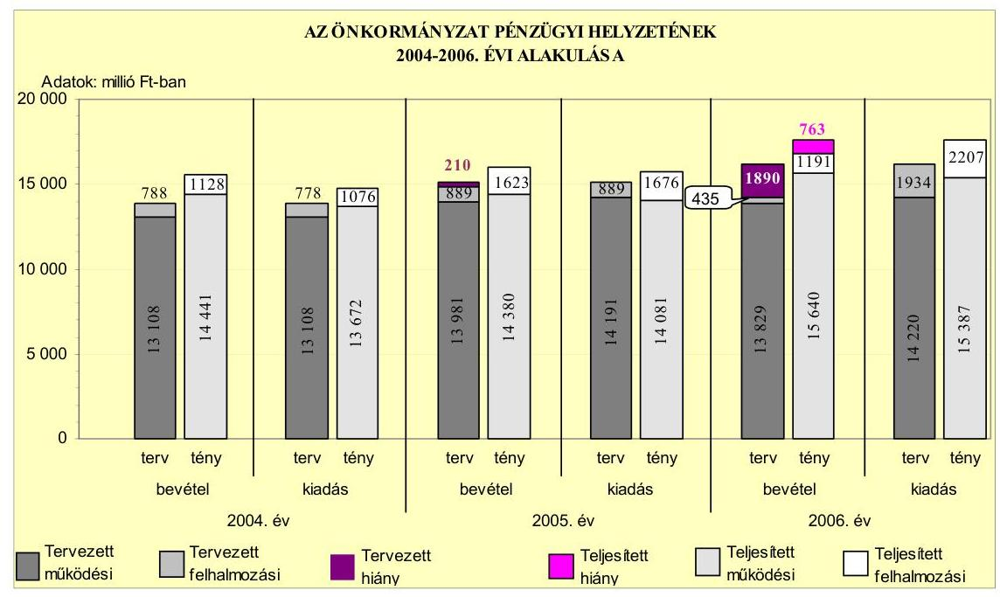
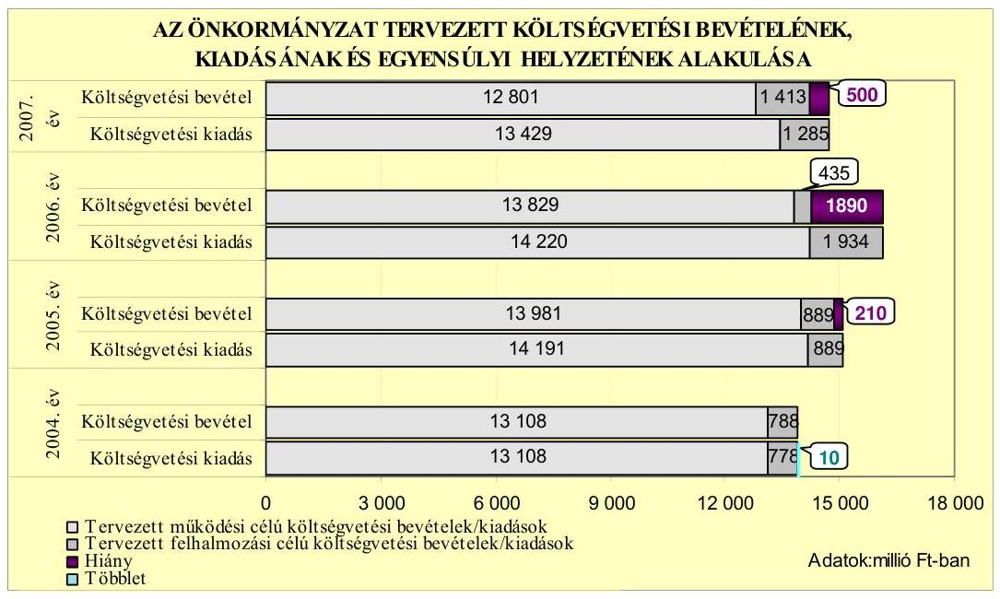
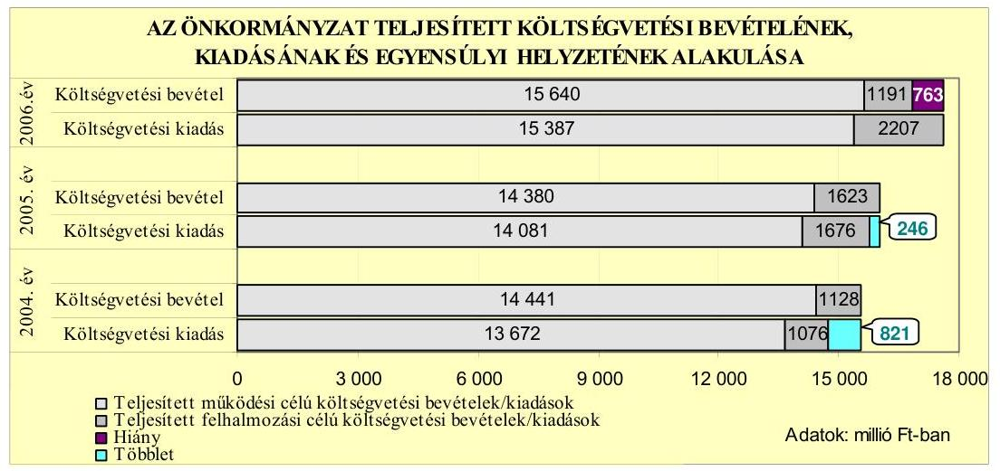
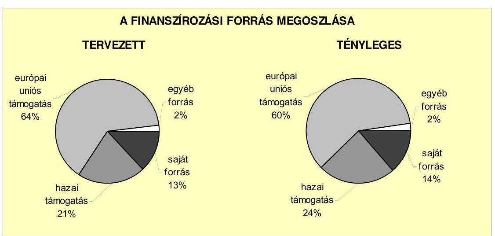
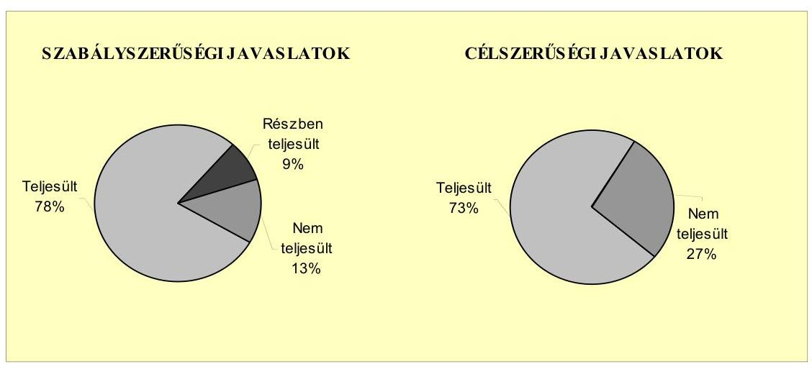
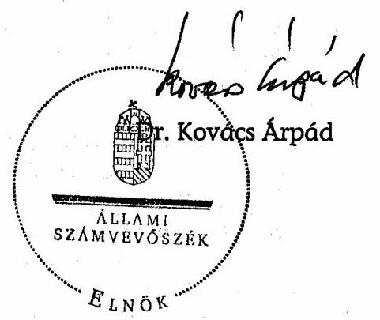

# JELENTÉS 

a Tolna Megyei Önkormányzat gazdálkodási rendszerének 2007. évi átfogó ellenőrzéséről

---

# 3. Önkormányzati és Területi Ellenőrzési Igazgatóság 

## Átfogó Ellenőrzések Főcsoport

Iktatószám: V-1001-9/30/16/2007.
Témaszám: 845
Vizsgálat-azonosító szám: V0324

## Az ellenőrzést felügyelte:

Dr. Lóránt Zoltán
főigazgató
Az ellenőrzés végrehajtásáért felelős:
Dr. Sepsey Tamás
főigazgató-helyettes
Az ellenőrzést vezette:
Csecserits Imréné
főcsoportfőnök-helyettes

## Az ellenőrzést végezték:

| Kopaczné Horváth | Major Lászlóné | Péntek László |
| :-- | :-- | :-- |
| Zsuzsanna | számvevő tanácsos | irodavezető, főtanácsadó |
| számvevő tanácsos |  |  |

## A témához kapcsolódó eddig készített számvevőszéki jelentések:

## címe

Jelentés a Tolna Megyei Önkormányzat gazdálkodásának átfogó 0465 ellenőrzéséről
Jelentés a címzett támogatásból finanszírozott egészségügyi beru- 0523 házások, rekonstrukciók ellenőrzéséről
Jelentés a helyi és a helyi kisebbségi önkormányzatok gazdálkodá- 0544 sának átfogó ellenőrzéséről
Jelentés a Magyar Köztársaság 2005. évi költségvetése végrehajtásának ellenőrzéséről
Függelék:

- a helyi önkormányzatokat a 2005. évben megillető normatív állami hozzájárulás elszámolásának ellenőrzése
- normatív kötött felhasználású támogatások 2005. évi felhasználásának ellenőrzése

---

# TARTALOMJEGYZÉK 

BEVEZETÉS ..... 9
I. ÖSSZEGZŐ MEGÁLLAPÍTÁSOK, KÖVETKEZTETÉSEK, JAVASLATOK ..... 13
II. RÉSZLETES MEGÁLLAPÍTÁSOK ..... 20

1. Az Önkormányzat költségvetési és pénzügyi helyzete ..... 20
1.1. A tervezett költségvetési bevételi és kiadási előirányzatok, valamint a költségvetési egyensúly alakulása ..... 22
1.2. A költségvetési bevételek és kiadások teljesítése, a pénzügyi egyensúlyi helyzet alakulása ..... 25
2. Az Önkormányzat felkészültsége az európai uniós források igénylésére és felhasználására, valamint az e-közigazgatási feladatok ellátására ..... 29
2.1. Az európai uniós források igénybevételére és a várható támogatás felhasználásának szervezettségére történt felkészülés és a belső szabályozottság értékelése ..... 29
2.1.1. A fejlesztési célkitűzések meghatározása ..... 29
2.1.2. Az európai uniós forrásokhoz kapcsolódóan a pályázatfigyelés, a pályázatkészítés, valamint az európai uniós támogatással megvalósuló fejlesztés lebonyolítása belső rendjének szabályozottsága, a végrehajtás személyi, szervezeti feltételei ..... 33
2.1.3. Az európai uniós forrással támogatott fejlesztés megvalósítása ..... 35
2.2. Az e-közigazgatási feladatok előkészítése, bevezetése ..... 38
3. A költségvetési gazdálkodás kontrolljai ..... 39
3.1. A szabályozottság kockázata a költségvetés tervezési, gazdálkodási, beszámolási és a folyamatba épített ellenőrzési feladatainál ..... 39
3.2. A belső kontrollok érvényesülése az önkormányzati források szabályszerű felhasználásában, a költségvetési tervezés, gazdálkodás, beszámolás folyamataiban ..... 41
3.3. A belső ellenőrzési kötelezettség teljesítése, javaslatainak hasznosulása ..... 43
4. Az ÁSZ korábbi ellenőrzési javaslatai alapján készített intézkedési terv végrehajtása, eredményessége ..... 46
4.1. Az Önkormányzat gazdálkodási rendszerének átfogó ellenőrzése során tett javaslatok végrehajtására tervezett intézkedések megvalósulása ..... 46

---

4.2. A zárszámadáshoz kapcsolódó (állami hozzájárulások, támogatások igénylésének és felhasználásának ellenőrzése), valamint a további vizsgálatok esetében a megállapítások, javaslatok alapján tett intézkedések

# MELLÉKLETEK 

1. számú Az Önkormányzat gazdálkodását meghatározó adatok, mutatószámok (1 oldal)
2. számú Az önkormányzati vagyon alakulása (1 oldal)
3. számú Az Önkormányzat 2004-2006. évi költségvetési előirányzatainak és azok pénzügyi teljesítéseinek alakulása (1 oldal)
4. számú 1. számú Nyilatkozat a tervezett és teljesített költségvetési adatoknak a megelőző évhez viszonyított jelentős, $\pm 10 \%$-ot meghaladó változásának indokolásáról, amennyiben azt a feladatok változása indokolta (1 oldal)
5. számú 1. számú Tanúsítvány az európai uniós forrásokkal támogatott programok, célok tervezett és tényleges 2004-2007. évi adatairól (1 oldal)
6. számú Dr. Puskás Imre úr, a Tolna Megyei Közgyűlés elnökének észrevétele (1 oldal)

---

# RÖVIDÍTÉSEK JEGYZÉKE 

## Törvények

2004. évi költségvetési törvény
2005. évi költségvetési törvény
2006. évi költségvetési törvény
Áht.
Eisztv.
Htv.

Ket.

Ötv.
Számv. tv.
társulási törvény
Tkt. tv.

## Rendeletek

Ámr.
Ber.
vagyongazdálkodási rendelet

Vhr.

## Szórövidítések

ÁMK
Árpád-házi Szent Erzsébet Otthon
ÁSZ
Beruházási Osztály
Bezerédj Pál Általános Iskola
a Magyar Köztársaság 2004. évi költségvetéséről szóló 2003. évi CXVI. törvény
a Magyar Köztársaság 2005. évi költségvetéséről és az államháztartás hároméves kereteiről szóló 2004. évi CXXXV. törvény
a Magyar Köztársaság 2006. évi költségvetéséről szóló 2005. évi CLIII. törvény
az államháztartásról szóló 1992. évi XXXVIII. törvény az elektronikus információszabadságról szóló 2005. évi XC. törvény
a helyi önkormányzatok és szerveik, a köztársasági megbízottak, valamint egyes centrális alárendeltségű szervek feladat- és hatásköreiről szóló 1991. évi XX. törvény
a közigazgatási hatósági eljárás és szolgáltatás általános szabályairól szóló 2004. évi CXL. törvény
a helyi önkormányzatokról szóló 1990. évi LXV. törvény a számvitelről szóló 2000. évi C. törvény
a helyi önkormányzatok társulásairól és együttműködéséről szóló 1997. évi CXXXV. törvény
a települési önkormányzatok többcélú kistérségi társulásairól szóló 2004. évi CVII. törvény
az államháztartás múködési rendjéről szóló 217/1998. (XII. 30.) Korm. rendelet
a költségvetési szervek belső ellenőrzéséről szóló 193/2003. (XI. 26.) Korm. rendelet
Tolna Megyei Önkormányzat 17/1999. (XI. 29) számú rendelete a Tolna Megyei Önkormányzat vagyonáról és a vagyongazdálkodás szabályairól
az államháztartás szervezetei beszámolási és könyvvezetési kötelezettségének sajátosságairól szóló 249/2000. (XII. 24.) Korm. rendelet

Tolna Megyei Önkormányzat Általános Művelődési Központ Pedagógiai és Kulturális Intézete
Tolna Megyei Önkormányzat „Árpád-házi Szent Erzsébet Otthona Bonyhád
Állami Számvevőszék
Tolna Megyei Önkormányzat Hivatalának Igazgatási és Beruházási Osztálya
Tolna Megyei Önkormányzat Bezerédj Pál Általános Iskola

---

| DDRFT | Dél-Dunántúli Regionális Fejlesztési Tanács |
| :--: | :--: |
| Dr. Kelemen Endre Szak- | Tolna Megyei Önkormányzat Dr. Kelemen Endre Szakközépiskolája és Kollégiuma |
| bépiskola |  |
| EIP | Tolna Megyei Önkormányzat Hivatala Területi Integrációs és Külkapcsolati Osztályának Európai Integrációs Pont szervezeti egysége |
| e-közigazgatás | elektronikus közigazgatás |
| FEUVE | folyamatba épített, előzetes és utólagos vezetői ellenőrzés |
| Fogyatékosok Otthona | Tolna Megyei Önkormányzat Fogyatékosok Otthona, Pálfa |
| főjegyzö | Tolna Megyei Önkormányzat főjegyzője |
| fütésrekonstrukciós program | a Kórház több évre ütemezett energiahatékonyság javítási és fütés-rekonstrukciós programja |
| gazdasági program ${ }_{1}$ | Tolna Megyei Önkormányzat Közgyűlésének 37/2003. (IV. 22.) számú határozatában elfogadott, 2003-2006. közötti évekre szóló gazdasági programja |
| gazdasági program ${ }_{2}$ | Tolna Megyei Önkormányzat Közgyűlésének 36/2007. (IV. 9.) számú határozatában elfogadott 2007-2010. évekre szóló gazdasági programja |
| GVOP | Gazdasági Versenyképesség Operatív Program |
| HEFOP | Humánerőforrás-fejlesztési Operatív Program |
| Hétszínvilág Otthon | Tolna Megyei Önkormányzat „Hétszínvilág" Otthona, Szekszárd |
| Humánpolitikai osztály | Tolna Megyei Önkormányzat Hivatalának Humánpolitkai Osztálya |
| ICsSzEM | Ifjúsági, Családügyi, Szociális és Egészségügyi Minisztérium |
| Illetékhivatal | Tolna Megyei Önkormányzat Illetékhivatala |
| IT | informatikai technológia |
| Kórház | Tolna Megyei Önkormányzat Balassa János Kórháza, Szekszárd |
| Könyvtár | Tolna Megyei Önkormányzat Illyés Gyula Megyei Könyvtára |
| Közgyűlés | Tolna Megyei Önkormányzat Közgyűlése |
| Közgyűlés elnöke | Tolna Megyei Önkormányzat Közgyűlésének elnöke |
| Levéltár | Tolna Megyei Önkormányzat Levéltára |
| MÁK | Magyar Államkincstár |
| Mechwart András Otthon | Tolna Megyei Önkormányzat Mechwart András Otthona, Belecska |
| Móra Ferenc Általános Iskola | Tolna Megyei Önkormányzat Móra Ferenc Általános Iskolája, Dombóvár |
| Múzeum | Tolna Megyei Önkormányzat Wosinsky Mór Megyei Múzeuma |
| Mütőblokk | Tolna Megyei Önkormányzat Balassa János Kórházának Mütő- és Diagnosztikai blokkja |

---

| NFT | Nemzeti Fejlesztési Terv |
| :-- | :-- |
| OEP | Országos Egészségbiztosítási Pénztár |
| oktatási program | Pannon Kaptár Közoktatási és Együttmúködési Hálózat |
|  | pályázat keretében a kompetencia alapú oktatási |
| Önkormányzat | programok bevezetése és elterjesztése |
| Önkormányzati hivatal | Tolna Megyei Önkormányzat |
| PEJ | Tolna Megyei Önkormányzat Hivatala |
| Pénzügyi bizottság | Program Előrehaladási Jelentés |
| Pénzügyi osztály | Tolna Megyei Önkormányzat Pénzügyi Bizottsága |
| PM | Tolna Megyei Önkormányzat Hivatalának Pénzügyi és |
| ROP | Intézményfenntartó Osztálya |
| Szűrőközpont | Pénzügyminisztérium |
| Területfejlesztési bizottsá | NFT Regionális Operatív Program |
|  | Tolna Megyei Térségi Diagnosztikai és Szűrőközpont |
| Területi Gyermekvédelmi Szakszolgálat | Tolna Megyei Önkormányzat Integrációs, Területfejlesztési és Környezetvédelmi Bizottsága |
| TIK | Tolna Megyei Önkormányzat Gyermekvédelmi Szak- |
| TISZK | szolgálata |
| Védelmi bizottság | Tolna Megyei Önkormányzat Hivatalának Területi Integrációs és Külkapcsolati Osztálya |
|  | Térségi Integrált Szakképző Központ |
|  | Tolna Megyei Védelmi Bizottság |

---

.

---

# ÉRTELMEZŐ SZÓTÁR 

1. elektronikus szolgáltatási szint
2. elektronikus szolgáltatási szint
3. elektronikus szolgáltatási szint
4. elektronikus szolgáltatási szint
európai uniós források felhasználása
fejlesztési feladat (projekt)
fejlesztési célkitúzés
kedvezményezett
központi program

Az 1044/2005. (V. 11.) Korm. határozat alapján olyan információs, tájékoztató szolgáltatás, amely csak általános információkat közöl az adott üggyel kapcsolatos teendőkről és a szükséges dokumentumokról.
Az 1044/2005. (V. 11.) Korm. határozat alapján olyan egyirányú kapcsolatot biztosító szolgáltatás, amely az 1. szinten túl biztosítja az adott ügy intézéséhez szükséges dokumentumok, nyomtatványok letöltését, és azok ellenőrzéssel, vagy ellenőrzés nélküli elektronikus kitöltését, amely esetben a dokumentumok benyújtása hagyományos úton történik.
Az 1044/2005. (V. 11.) Korm. határozat alapján olyan, kétirányú kapcsolatot biztosító szolgáltatás, amely közvetlen, vagy ellenőrzött kitöltésű dokumentum segítségével biztosítja az elektronikus adatbevitelt és a bevitt adatok ellenőrzését. Az ügy indításához, intézéséhez személyes megjelenés nem szükséges, de az ügyhöz kapcsolódó közigazgatási döntés (határozat, egyéb aktus) közlése, valamint a kapcsolódó illeték-, vagy díffizetés hagyományos úton történik.
Az 1044/2005. (V. 11.) Korm. határozat alapján olyan teljes közvetlen kétirányú ügyintézési folyamatot biztosító szolgáltatás, amikor az ügyhöz kapcsolódó közigazgatási döntés is elektronikus úton kerül közlésre, illetve a kapcsolódó illeték-, vagy díffizetés elektronikus úton is intézhető.
Az elnyert európai uniós források lehívása a támogatott projekt megvalósítása érdekében, a fejlesztés lebonyolítása során felmerült kiadások finanszírozására.
A fejlesztési feladat (projekt) tartalmilag és formailag részletesen kidolgozott, megfelelő pénzügyi háttérrel és végrehajtási ütemezéssel rendelkező fejlesztési terv, amely illeszkedik az Európai Unió, illetve a Nemzeti Fejlesztési Terv által támogatott programokhoz.
Az önkormányzat által ellátott kötelező, vagy önként vállalt feladatok ellátásának mennyiségi, vagy minőségi fejlesztésére vonatkozó terv. A mennyiségi fejlesztés megvalósulhat beszerzéssel, létesítéssel, bővítéssel, átalakítással.
Az a helyi önkormányzat, amely a támogatási szerződést kedvezményezettként aláíria, a projektet, illetve a központi programhoz kapcsolódó támogatott önkormányzati programot végrehajtja.
Az ország egészére, több régióra, egy régióra vonatkozó, de mindenképpen az önkormányzat közigazgatási területén túlmutató program, amelynél a támogatott programok kiválasztása pályáztatás nélkül, előre meghatározott feltételrendszer szerint történik, a kedvezményezettek köz-

---

operatív program
támogatási szerződés
vetlen megkeresésével. Az Európai Unió pénzügyi alapja a Kohéziós alap, a környezetvédelem és a közlekedés terén nyújt lehetőséget az egyes tagországoknak központi programok megvalósítására.
Az Európai Bizottság által jóváhagyott, a Közösségi Támogatási Keret végrehajtására vonatkozó 2004-2006 közötti, több évre szóló intézkedésekhez kapcsolódó prioritások egységes rendszerét tartalmazó dokumentum. A strukturális alapok operatív programjai: Agrár és Vidékfejlesztési Operatív Program (AVOP); Gazdasági Versenyképesség Operatív Program (GVOP); Humánerőforrás-fejlesztési Operatív Program (HEFOP); Környezetvédelmi és Infrastruktúra-fejlesztési Operatív Program (KIOP); Regionális Fejlesztési Operatív Program (ROP).
A strukturális alapok esetében az irányító hatóságnak, illetve a Kohéziós alap esetében a közremúködő szervezeteknek a kedvezményezett önkormányzattal kötött szerződése, amely a támogatás felhasználásának részletes feltételeit tartalmazza.

---

# JELENTÉS 

## a Tolna Megyei Önkormányzat gazdálkodási rendszerének 2007. évi átfogó ellenőrzéséről

## BEVEZETÉS

Az Ötv. 92. § (1) bekezdése, az Állami Számvevőszékről szóló 1989. évi XXXVIII. törvény 2. § (3) bekezdése, valamint az Áht. 120/A. § (1) bekezdése alapján az önkormányzatok gazdálkodását az Állami Számvevőszék ellenőrzi. Az ellenőrzésre az Országgyúlés illetékes bizottságai részére is átadott, országosan egységes ellenőrzési program szerint került sor.

Az Állami Számvevőszék a stratégiájában foglalt célkitűzéseknek megfelelően a helyi önkormányzatok költségvetési gazdálkodási rendszere átfogó ellenőrzésének programját a 2007. évtől megújította, azt kiegészítette további - teljesít-mény-ellenőrzési - elemekkel.

## Az ellenőrzés célja annak értékelése volt, hogy az Önkormányzat:

- a pénzügyi egyensúlyt a költségvetésében és annak teljesítése során milyen módon biztosította, a teljesített bevételek és kiadások egyes évek közötti jelentős eltérése feladatváltozáshoz kapcsolódott-e;
- felkészült-e a szabályozottság és a szervezettség terén az európai uniós források igénylésére és felhasználására, továbbá az e-közigazgatás bevezetése miatti szervezet-korszerúsítési feladatokra;
- kialakította-e a külső és a belső feltételeknek megfelelően a gazdálkodás belső kontrollrendszerét ${ }^{1}$, továbbá a költségvetés tervezési, végrehajtási és zárszámadási feladatok szabályszerű ellátásához hozzájárult-e a folyamatba épített, előzetes és utólagos vezetői ellenőrzés, valamint a belső ellenőrzés;
- megfelelően hasznosították-e a korábbi számvevőszéki ellenőrzések megállapításait, szabályszerűségi ${ }^{2}$ és célszerűségi javaslatait.

[^0]
[^0]:    ${ }^{1}$ A gazdálkodás szabályszerűségét biztosító kontrollrendszer alatt értjük a kiépített és múködő belső irányítási és szabályozási rendszert, valamint a belső ellenőrzési funkciók ellátásának rendszerét.
    ${ }^{2}$ A törvényi előírások betartásának elmulasztásakor a részletes megállapítások fejezetben egységesen a törvénysértés megjelölést alkalmazzuk, mivel az ÁSZ nem tehet különbséget a törvényi előírások között.

---

Az ellenőrzött időszak: az 1., 2. és 4. programpontok tekintetében a 20042006. évek és 2007. I. félév, a 3. ellenőrzési programpontnál a 2006. év és 2007. I. félév.

Tolna megye lakosainak száma Szekszárd város lakossága nélkül, 2007. január 1-jén 210189 fő volt. A megyében a 2006. évben 108 önkormányzat múködött, melyből kilenc városi, 99 községi önkormányzat. Az Önkormányzat 41 tagú Közgyűlésének munkáját hét állandó bizottság segítette. A 2006. évi önkormányzati választásokat követően a Közgyűlés elnökének személye változott. A Közgyűlés 2006. december 29-én a főjegyző közszolgálati jogviszonyát megszüntette, az új főjegyző 2007. február 15-én került kinevezésre.

Az Önkormányzat feladatainak végrehajtása érdekében a 2006. évben 27 költségvetési intézményt múködtetett, amelyekből 25 önállóan gazdálkodott. A feladatok ellátásában részt vett kettő közalapítványa. Az Önkormányzat a 2006. évi költségvetési beszámolója szerint 16831 millió Ft költségvetési bevételt ért el és 17594 millió Ft költségvetési kiadást teljesített, 2006. december 31-én a könyvviteli mérleg szerint 19899 millió Ft értékű vagyonnal rendelkezett. A 2007. évi költségvetési rendeletben 14214 millió Ft költségvetési bevételt és 14714 millió Ft költségvetési kiadást irányoztak elő. Az Önkormányzati hivatalban dolgozó köztisztviselők száma 2006. december 31-én 82 fő, a költségvetési intézményekben foglalkoztatott közalkalmazottak száma 3299 fő volt. Az Önkormányzat gazdálkodását meghatározó adatokat, mutatószámokat az 1-3. számú mellékletek tartalmazzák.

Az Önkormányzati hivatal az 1998. évben az EN ISO 9001: 2000 előírásainak megfelelő minőségbiztosítási tanúsítványt szerzett, amely kiterjedt az Önkormányzati hivatal feladataihoz kapcsolódó döntések szakmai és jogi előkészítésére, illetve a végrehajtás szervezésére, ellenőrzésére.

Az Önkormányzat költségvetési és pénzügyi helyzetét az összehasonlító elemzés módszerével vizsgáltuk. E körben elemeztük a költségvetés egyensúlyi helyzetének alakulását, a tervezett és tényleges költségvetési hiány okait, a mérséklésére tett intézkedéseket, finanszírozásának módját, az Önkormányzat adósságállományának alakulását, összetevőit.

A teljesítmény-ellenőrzés módszerével vizsgáltuk, hogy a belső szabályozottság, szervezettség terén felkészültek-e az európai uniós források figyelésére, igénylésére és felhasználására, valamint az igényelt európai uniós támogatások az Önkormányzat által meghatározott fejlesztési célkitűzésekhez kapcsolódtak-e. Az ellenőrzés során felmértük, hogy az e-közigazgatási feladat ellátása, illetve bevezetése, múködtetése érdekében milyen intézkedéseket tettek, valamint biz-tosították-e a közérdekú adatok elektronikus közzétételét.

A költségvetési gazdálkodás belső kontrolljainak ellenőrzése során értékeltük, hogy az Önkormányzati hivatalnál a költségvetés tervezési, gazdálkodási, zárszámadás készítési feladatok belső kontrolljainak kiépítettsége és múködése megfelelő biztosítékot ad-e a gazdálkodási feladatok megfelelő, szabályszerű ellátására. Felmértük és minősítettük a költségvetés tervezési, a gazdálkodási, a zárszámadás készítési feladatokkal, továbbá a pénzügyi- számviteli területen az informatikával kapcsolatosan kialakított kontrollok megfelelőségét, vala-

---

mint azok működésének eredményességét, megbízhatóságát. Értékeltük a belső ellenőrzés szervezeti és szabályozási keretét, továbbá működését.

Az Önkormányzati hivatalnál értékeltük a gazdálkodás folyamatában a kontrollok működésének megbízhatóságát, ennek keretében ellenőriztük a szakmai teljesítés igazolására és az utalvány ellenjegyzésére kialakított kontrollok végrehajtását. Az ellenőrzést a következő, kiemelt kockázatuk alapján kiválasztott ${ }^{3}$ az általánostól jellemzően eltérő, egyedi eljárást igénylő gazdasági eseményekkel kapcsolatos kifizetésekre folytattuk le ${ }^{4}$ :

- a személyi juttatások közül az állományba nem tartozók megbízási díjai ${ }^{5}$,
- a külső szolgáltató által végzett karbantartási, kisjavítási szolgáltatások, valamint
- a gépek, berendezések, felszerelések beszerzése.

Az ellenőrzés hatékony elvégzése céljából a vizsgálandó területek kiválasztása során a kockázatokon alapuló megközelítés érvényesült, ezáltal az ellenőrzési erőforrásokat azokra a területekre fókuszáltuk, amelyeken legnagyobb a hibák előfordulási valószínűsége. Az ellenőrzési erőforrások ilyen típusú összpontosításával minimálisra csökkenthető a kívánt ellenőrzési bizonyosság eléréséhez szükséges időráfordítás.

A pénzügyi-számviteli folyamatokban alkalmazott belső kontrollok létezésének és működésének ellenőrzésére a vizsgált három terület 2006. évi könyvviteli tételeiből területenként egyszerű véletlen mintát vettünk. A kijelölt gazdasági eseményre elvégzett megfelelőségi tesztek alapján értékeltük a kontrollok múködésének eredményességét, megbízhatóságát a vizsgált három területre különkülön, majd összefoglalóan ${ }^{6}$ az Önkormányzati hivatal egyedi eljárást igénylő gazdasági eseményeire. A helyszíni ellenőrzés megállapításainak részletes do-

[^0]
[^0]:    ${ }^{3}$ Az önkormányzatok kiemelt előirányzataira vonatkozóan, a vertikális folyamatokra elvégeztük a kockázatok becslését, amelynek eredményeként az állományba nem tartozók megbízási díjai, a külső szolgáltató által végzett karbantartási, kisjavítási szolgáltatások, valamint a gépek, berendezések, felszerelések beszerzése kiemelkedően kockázatos területnek bizonyultak.
    ${ }^{4}$ A korábbi ellenőrzési tapasztalataink szerint ezeken a területeken a jegyzők nem, vagy hiányosan szabályozták a megbízás, megrendelés, illetve beszerzés indokoltságának, szükségességének elbírálására, igazolására, valamint a teljesítések dokumentálására, a kifizetések jogosságának megítélésére szolgáló kontrollokat. További kockázatot jelentett a külső szolgáltató által végzett karbantartási, kisjavítási munkák esetében, hogy az 50 ezer Ft alatti megrendelésekre vonatkozóan az ellenőrzési tapasztalataink szerint a jegyzők nem alakították ki a kötelezettségvállalások rendjét és nyilvántartási formáját, valamint a szabályozás elmulasztása esetén nem történt meg az írásbeli kötelezettségvállalás és annak az ellenjegyzése sem.
    ${ }^{5}$ Az állományba tartozók rendszeres személyi juttatásainak számfejtését, valamint folyósítását nem a polgármesteri hivatalok, hanem a nettó finanszírozás keretében a beküldött dokumentumok alapján a MÁK végzi.
    ${ }^{6}$ A vizsgált három terület egyedi értékelési pontszámait a területek relatív költségvetési súlyával arányosan összegeztük.

---

kumentálását három megfelelőségi tesztlapon, öt elővizsgálati és kilenc helyszíni ellenőrzési munkalapon biztosítottuk. Ezeken a teszt- és munkalapokon a minősítés alapjául szolgáló kérdések és a vonatkozó konkrét jogszabályhelyek megjelölése mellett értékeltük a kialakított belső kontrollokban rejlő kockázatokat ${ }^{7}$ és a kialakított kontrollok működésének megbízhatóságát ${ }^{8}$.

Az ÁSZ korábbi ellenőrzési javaslatai alapján tett intézkedéseket, illetve azok megvalósítását utóellenőrzés keretében vizsgáltuk. A gazdálkodási rendszer átfogó ellenőrzése során megfogalmazott javaslatok végrehajtására tett intézkedések megvalósítását ellenőriztük, az egyéb számvevőszéki ellenőrzések során tett javaslatok esetében pedig a kiadott intézkedéseket tekintettük át.

A helyszíni ellenőrzés során kitöltött - az ellenőrzést végző számvevő és az Önkormányzati hivatal felelős köztisztviselője által aláírt - elővizsgálati és helyszíni ellenőrzési munkalapokat, azok kitöltési útmutatóit, továbbá a megfelelőségi tesztek dokumentumait a Közgyűlés elnöke részére a számvevői jelentéssel egyidejűleg átadtuk.

A jelentés megállapításainak, javaslatainak egyeztetése során a Közgyűlés elnöke arról adott tájékoztatást, hogy az időközben megtett intézkedésekkel a javaslatok egy részét megvalósították. Ezekben az esetekben a jelentés II. Részletes megállapítások fejezetében az adott témához kapcsolt lábjegyzetben a megtett intézkedést feltüntettük és a kapcsolódó javaslatot elhagytuk.

A jelentést az ÁSZ-ról szóló 1989. évi XXXVIII. tv. 25. § (1) bekezdése alapján észrevétel közlése céljából megküldtük a Közgyűlés elnökének. A kapott észrevételt a jelentés 6 . számú melléklete tartalmazza.

[^0]
[^0]:    ${ }^{7}$ A kialakított belső kontrollokban rejlő kockázatot alacsonynak minősítettük, ha a kontrollok - végrehajtásuk esetén - megfelelő védelmet nyújtanak a hibák bekövetkezése ellen. Közepesnek minősítettük a belső kontrollokban rejlő kockázatot, amennyiben a kontrollok - végrehajtásuk esetén - a lehetséges hibák többsége ellen védelmet nyújtanak. Magasnak értékeltük a kockázatot, ha a kontrollok - kialakításuk hiányában, vagy hiányos kialakításuk miatt - nem nyújtanak elegendő védelmet a lehetséges hibákkal szemben.
    ${ }^{8}$ A kontrollok múködésének eredményességét, megbízhatóságát kiválónak értékeltük abban az esetben, ha azok múködése - esetleges apróbb hiányosságoktól eltekintve megfelelt a hibák megelőzésére és kijavítására meghatározott szabályozásnak és a legmagasabb szintű elvárásoknak. Jónak minősítettük a kontrollok múködését, ha a hiányosságok száma ugyan jelentős volt, de nem veszélyeztette az ellenőrzött terület hibáinak megelőzését és kijavítását. Amennyiben a hiányosságok mértéke nem biztosította a hibák megelőzését, feltárását, kijavítását és ezáltal veszélyeztette az eredményes, megbízható múködést, a kontroll múködésének megbízhatósága gyenge minősítést kapott.

---

# I. ÖSSZEGZŐ MEGÁLLAPÍTÁSOK, KÖVETKEZTETÉSEK, JAVASLATOK 

Az Önkormányzatnál a tervezett költségvetési bevételek a 2004. évben meghaladták a tervezett költségvetési kiadásokat, ezt követően a 2005-2007. években a tervezett költségvetési bevételek nem nyújtottak fedezetet a tervezett költségvetési kiadásokra, nem volt biztosított a költségvetési egyensúly. A 2005. és a 2007. évben a tervezett múködési célú költségvetési bevételek nem nyújtottak fedezetet a tervezett múködési célú költségvetési kiadásokra, a 2006. évben pedig mind a múködési, mind a felhalmozási célú költségvetési bevételeket meghaladóan tervezték a költségvetési kiadásokat. A költségvetési hiány finanszírozását a Közgyűlés hitelfelvétellel tervezte biztosítani.

Az Önkormányzat a költségvetési rendeletben a múködési célú költségvetési bevételeket a 2006. és a 2007. évben az előző évi előirányzatnál alacsonyabb összegben tervezte az illetékbevétel központi szabályozásának, illetve elosztási rendszerének és az átengedett személyi jövedelemadó újraelosztásának módosítása, az Önkormányzat által ellátott feladatok normatív hozzájárulása fajlagos összegének csökkenése, valamint az OEP finanszírozás változása miatt. Az Önkormányzat a múködési célú költségvetési kiadásokat 2005-2006. között évente növekvő összegben tervezte, melyben közrejátszott, hogy az általános forgalmi adó kedvezményes kulcsának megszüntetését, valamint a fogyasztói áremelkedést, és az energiaárak inflációt meghaladó növekedését is figyelembe vette. A 2007. évi költségvetésben a múködési célú költségvetési bevételek csökkenése miatt a múködési célú költségvetési kiadások az előző évi tervezettnél és teljesítettnél is alacsonyabb összegben kerültek meghatározásra. A tervezett felhalmozási célú költségvetési kiadásokat a 2004. és a 2005. évben a tervezett felhalmozási célú költségvetési bevételek fedezték, azonban a 2006. évben a Mútőblokk beruházás befejezéséhez a tervezett felhalmozási célú költségvetési bevételek nem nyújtottak elegendő fedezetet, ezért azt hitel felvételével tervezték megvalósítani. A 2007. évben a felhalmozási célú költségvetési bevételek a címzett támogatás és a tervezett pénzmaradvány igénybevétel miatt a tervezett felhalmozási célú költségvetési kiadásokra fedezetet nyújtottak. A felhalmozási célú költségvetési kiadások eredeti előirányzataiban a szerződéssel alátámasztott, megkezdett, áthúzódó beruházások, rekonstrukciók kiadásait tervezték meg.

A teljesített költségvetési bevételek a 2004-2005. években fedezetet nyújtottak a költségvetési kiadásokra, a 2004-2006. években a múködési célú költségvetési bevételek meghaladták a múködési célú költségvetési kiadásokat, a felhalmozási célú költségvetési kiadások teljesítése a 2005. évben 3,1\%-ban, a 2006. évben $46 \%$-ban hitelből történt. A költségvetés végrehajtása során az eredeti költségvetési bevételi és kiadási előirányzatokat túlteljesítették. A költségvetési bevételek túlteljesítését az illetékbevétel emelkedése, az előző évi pénzmaradvány nem tervezett igénybevétele, az év közben nyert pályázati és az államház-

---

tartáson kívülről átvett pénzeszközök és a realizált intézményi többletbevételek okozták.

Az Önkormányzat fizetőképessége 2004-2007. között romlott, a költségvetési és a pénzügyi egyensúly biztosításához növekvő összegű működési és felhalmozási célú hiteleket, valamint folyószámlahitelt vettek igénybe. A teljesített költségvetési bevételek és kiadások folyamatosan emelkedtek az előző évi teljesítésekhez viszonyítva, azonban a 2006. évben a költségvetési bevételek előző évhez viszonyított $5 \%$-os emelkedése már nem nyújtott fedezetet a $12 \%$-kal megemelkedett költségvetési kiadásokra, az Önkormányzat 763 millió Ft költségvetési hiánnyal zárta az évet. Az Önkormányzat hitelállománya 2006. december 31-én 2098,9 millió Ft volt, melyből 700 millió Ft hétéves futamidejű működési és 1398,9 millió Ft 15 éves futamidejű felhalmozási célú hitel volt. A folyószámlahitel-keret és annak napi igénybevételi összege 2004-2007 között folyamatosan emelkedett, míg a 2004. évben két napon vették igénybe, addig 2007. II. negyedévtől folyamatosan, és az átlagos napi állomány 28 millió Ftról 343 millió Ft-ra emelkedett.

Az Önkormányzat a 2003-2006., illetve a 2007-2010. évekre szóló gazdasági programjaiban meghatározott célkitűzések az önkormányzati kötelező feladatokhoz kapcsolódtak, illeszkedtek az NFT célkitűzéseihez. Az Önkormányzatnál a 2004-2006. évek között 13 európai uniós támogatással megvalósuló fejlesztési célkitűzés önálló, illetve partnerként történő megvalósításáról döntöttek. Az Önkormányzati hivatal és az intézmények által benyújtott pályázatok közül hat pályázat alapján támogatásban részesültek, hét pályázatot elutasítottak. A nem támogatott pályázatokat szakmai indokok, tartalmi hiányosságok és forráshiány miatt utasították el. A 2004-2007. évi költségvetési rendeletek az Ámr. előírásának megfelelően elkülönítetten tartalmazták az európai uniós forrásokkal összefüggő fejlesztési feladatok bevételi-kiadási előirányzatait, valamint a projektek kiadásainak forrásmegoszlását, ütemezését. Az európai uniós forrásokkal támogatott fejlesztések 2004-2007. évekre tervezett összes költségvetési kiadása 783,3 millió Ft volt, melyből a 2007. I. félév végéig 663,2 millió Ft felhasználása történt meg.

Az Önkormányzatnál a gazdasági program ${ }_{3}$-ben megfogalmazott fejlesztési célkitűzésekhez kapcsolódtak az európai uniós pályázatok alapján kapott támogatások. A szabályozottság terén azonban az Önkormányzat felkészültsége összességében annak ellenére nem volt eredményes, hogy a pályázatfigyelés feladatait meghatározták, nem szabályozták azonban a pályázatkészítés rendjét, az európai uniós forrásokkal támogatott fejlesztési feladatok lebonyolításával kapcsolatos eljárási rendet, valamint nem határozták meg az európai uniós forrásokra irányuló pályázatfigyelés, pályázatkészítés, valamint a támogatott fejlesztések lebonyolításának ellenőrzési kötelezettségét, feladatait, felelőseit. Az európai uniós támogatások igénybevételéhez az Önkormányzati hivatalban megszervezték a pályázatfigyelési feladatok megoldását, a pályázatok elkészítésével, a támogatott fejlesztési feladatok megvalósításával külső szervezeteket bíztak meg. Az Önkormányzati hivatalban nem határozták meg az európai uniós források igénybevételével és felhasználásával kapcsolatos önkormányzati szintű feladatokat, döntési jogköröket, valamint a Közgyűlés elnöke és a fejlesztési feladat lebonyolítója közötti kapcsolattartás rendjét. Az európai uniós forrásokkal kapcsolatosan az önkormányzati szintű pályázat koor-

---

dinálás feladatait és felelőseit, az önkormányzati szintű pályázat-nyilvántartás vezetésének felelősét, az információk áramlásának rendjét, a pályázatfigyelést végzők és a döntési jogkörrel rendelkezők közötti információ áramlásának rendjét nem szabályozták. A fejlesztési feladat lebonyolítására külső szervezettel kötött szerződés nem tartalmazta a feladatellátás rendjét, a felelősség személyre szóló meghatározását, az ellenőrzési feladatok megosztását, a megbízott munkájának követhetőségét, a kifizetések átláthatóságához szükséges feltételeket, a lebonyolítás ellenőrizhetőségét. Az európai uniós forrásokkal támogatott fejlesztési feladatok lebonyolításával kapcsolatos folyamatba épített és belső ellenőrzés rendjének szabályait nem alakították ki, nem jelölték ki az ellenőrzési pontokat.

Az Önkormányzati hivatal három fejlesztést valósított meg, kettő a PEA II. támogatás igénybevételével történt, egy fejlesztésnél pedig támogatásban részesülő partnerként vett rész. Az intézmények főkedvezményezettként nyertes projektjei közül két, még folyamatban lévő fejlesztés a Kórházban a fűtésrekonstrukciós program megvalósítása, illetve az ÁMK-nál az oktatási program megvalósítására vonatkozott. A Kórházban a 2007. I. félév végéig a fűtésrekonstrukciós program megvalósítása a támogatási szerződés időbeli ütemezésének megfelelően történt, de a 2006. évi támogatási ütemezéstől eltért, mivel a támogatási összegből csak előleget vett igénybe, a kiadások ütemezését teljesítette. Az ÁMK-ban az oktatási program támogatási szerződését módosították, mivel a feladat megvalósításához szükséges programcsomag rendelkezésre állásának hiánya miatt késett a program megkezdése, ennek következtében a kiadások évek szerinti ütemezése, a befejezési határidő és a kiadások összetétele is változott. Az oktatási program megvalósítását külső és belső ellenőrzés vizsgálta. A külső ellenőrzés nem tárt fel szabálytalanságot, a belső ellenőrzés az operatív gazdálkodás szabályozását és gyakorlatát kifogásolta, valamint megállapította, hogy a folyamatba épített, előzetes és utólagos vezetői ellenőrzés nem múködött hatékonyan.

Az Önkormányzat informatikai stratégiát nem készített, közép és hosszú távú informatikai célkitűzéseket nem határozott meg, az e-közigazgatás területén az 1. elektronikus szolgáltató szintet nem érte el, mivel a költségvetési szerveinél intézhető ügyekről elektronikus úton nem adott tájékoztatást. Az Önkormányzat a közérdekú adatok közzétételére kötelezett volt. Az Önkormányzat az Eisztv-ben előírt, a közérdekú adatok közzétételére vonatkozó kötelezettségét teljesítette. Az Önkormányzat internetes honlapján közzétette az Áht. és az Ámr. előírása alapján a 2007. I. félévben nyújtott nem normatív, céljellegú múködési és fejlesztési támogatások kedvezményezettjeinek nevét, a támogatás célját, összegét, továbbá a támogatási program megvalósítási helyét, a vagyonnal történő gazdálkodással összefüggő, a nettó ötmillió Ft-ot elérő, vagy azt meghaladó értékű szerződések megnevezését, tárgyát, a szerződéskötő felek nevét, a szerződés értékét, határozott időre kötött szerződés esetében annak időtartamát, továbbá a 2005-2006. évek költségvetési beszámolójának szöveges indoklását.

Az Önkormányzati hivatalban a költségvetés tervezési és a zárszámadás készítési folyamatok szabályozottságának hiányosságai összességében alacsony kockázatot jelentettek a feladatok szabályszerű végrehajtásában, mivel a belső szabályzatokban meghatározták a költségvetési javaslat összeállításával

---

kapcsolatos követelményeket, és előírták a kapcsolódó ellenőrzési feladatokat. Annak ellenére összességében alacsony volt a kockázat, hogy a tervezett saját bevételek előirányzatai és az azok megalapozását szolgáló önkormányzati rendeletek összhangjának ellenőrzését és annak felelősét a főjegyző nem határozta meg. A költségvetés tervezés és a zárszámadás készítés folyamatában a múködésbeli hibák megelőzésére, feltárására, kijavítására kialakított kontrollok múködésének megbízhatósága összességében kiváló volt, mivel a vonatkozó jogszabályokban és belső szabályozásokban foglalt ellenőrzési, egyeztetési feladatokat elvégezték. A kontrollok múködésének megbízhatósága annak ellenére összességében kiváló volt, hogy a költségvetés készítés folyamatában a saját bevételek előirányzatai és a költségvetés megalapozását szolgáló helyi rendeletek összhangját - a szabályozás hiánya miatt - nem ellenőrizték.

Az Önkormányzati hivatalban a pénzügyi-számviteli tevékenységek végrehajtásában a gazdálkodási, a pénzügyi-számviteli és a folyamatba épített ellenőrzési feladatok szabályozottságának hiányosságai közepes kockázatot jelentettek, mivel nem határozták meg a felesleges vagyontárgyak hasznosításának, selejtezésének szabályzatában a döntéshozatalra jogosultak körét az üzemeltetésre átadott eszközökre vonatkozóan, továbbá a főjegyző nem készítette el a FEUVE-val kapcsolatos szabályzatként az ellenőrzési nyomvonalat, a kockázatkezelés és a szabálytalanságok kezelésének eljárásrendjét. A gazdálkodási feladatok szabályozottsága a 2007. évben javult azáltal, hogy az Önkormányzati hivatalban elkészült az ellenőrzési nyomvonal, a kockázatkezelési szabályzat, valamint a szabálytalanságok kezeléséről szóló szabályzat. Az állományba nem tartozók megbízási díjaival, a karbantartási, kisjavítási szolgáltatásokkal, továbbá a gépek, berendezések, felszerelések beszerzésével kapcsolatos kifizetések során a kontrollok múködésének megbízhatósága összességében kiváló volt, mivel a szakmai teljesítésigazolás és az utalvány ellenjegyzés megfelelő biztosítékot adott a gazdálkodási feladatok szabályszerű ellátására. Annak ellenére összességében kiváló volt a kontrollok múködésének megbízhatósága, hogy a Védelmi bizottság részére történt kettő eszközbeszerzés esetében az utalvány ellenjegyzője nem győződött meg a gazdálkodásra vonatkozó szabályok betartásáról.

Az Önkormányzati hivatalban az informatikai rendszer szabályozottságának hiányosságai közepes kockázatot jelentettek, mivel nem rendelkeztek informatikai stratégiával, nem készítették el a katasztrófa elhárítási tervet, nem szabályozták az informatikai eszközökhöz történő hozzáférések ellenőrzését és annak dokumentálását, továbbá nem gondoskodtak arról, hogy a pénzügyiszámviteli területen dolgozók megismerjék az informatikai szabályzatban foglaltakat. Az informatikai rendszer múködtetésénél a múködésbeli hibák megelőzésére, feltárására, kijavítására kialakított kontrollok múködésének megbízhatósága összességében kiváló volt, mivel számítógépes program biztosította a főkönyv és a költségvetési beszámoló adatainak egyezőségét, megoldott a szolgáltatott adatok rendszeres ellenőrzése. A kontrollok múködésének megbízhatósága annak ellenére kiváló volt, hogy nem automatikus a számítógépen vezetett analitikus nyilvántartások és a főkönyvi könyvelés kapcsolata, a könyvviteli feladatok informatikai elvégzése során nem megoldott az adatok egyszeri bevitele és a bizonylatok adatainak rögzítésénél a számszaki pontosság auto-

---

matikus ellenőrzése, továbbá nem érhetőek el a pénzügy-számvitel által használt programok adatai az informatikai hálózaton keresztül.

A belső ellenőrzés szervezeti kereteinek kialakítása és szabályozása a belső ellenőrzés végrehajtásában összességében alacsony kockázatot jelentett, mivel a belső ellenőrzési kötelezettség teljesítéséhez szükséges függetlenített belső ellenőrzési szervezetet kialakították, és szabályozták a belső ellenőrzés működésének feltételeit. A belső ellenőrzés rendelkezett kockázatelemzéssel alátámasztott stratégiai tervvel. Az éves ellenőrzési tervekben meghatározott vizsgálatok lefolytatásához az előírt követelményeknek megfelelő tartalmú ellenőrzési programokat készítettek. Annak ellenére összességében alacsony volt a kockázat, hogy a 2006. évi ellenőrzési terv a kockázatelemzés hiánya miatt nem felelt meg a jogszabályi előírásoknak, abban nem határoztak meg kapacitást a soron kívüli ellenőrzési feladatokra.

A belső ellenőrzéshez kialakított kontrollok múködésének megbízhatósága összességében jó volt, mivel az intézményeknél tervezett ellenőrzések 80\%át ellenőrzési program alapján végrehajtották, azonban az Önkormányzati hivatalnál a 2006. évben belső ellenőrzést nem végeztek, így nem vizsgálták a FEUVE rendszer kiépítésének és múködésének jogszabályoknak és szabályzatoknak való megfelelését, a költségvetési előirányzatok teljesítését, valamint a közbeszerzési eljárásokat. A 2006. évi ellenőrzési tervben szereplő öt intézményi ellenőrzés közül egy átfogó ellenőrzés - az évközben végrehajtott intézmény összevonások miatt - elmaradt, helyette a belső ellenőrzési vezető rendelkezésére egy soron kívüli vizsgálatot végeztek el. Az átmenetileg üres belső ellenőri álláshely betöltése lehetővé tette a 2006. évre tervezett ellenőrzések számának évközi növelését. A főjegyző által jóváhagyott módosított ellenőrzési terv alapján - a tervezett ellenőrzéseken kívül - hat intézménynél vizsgálták a szakképzési fejlesztési támogatások és a Munkaerőpiaci Alapból elnyert beruházási célú támogatások felhasználását és elszámolását, továbbá három civil szervezetnél ellenőrizték az Önkormányzat által céljelleggel nyújtott támogatások felhasználását. A 2007. évi ellenőrzési tervben az Önkormányzati hivatalt érintően kettő, valamint 16 intézményi ellenőrzést határoztak meg, melyek végrehajtása időarányosan megtörtént. A főjegyző az Áht. előírása alapján a 2006. évi költségvetési beszámoló keretében beszámolt a FEUVE rendszer és a belső ellenőrzés múködtetéséről. A Közgyűlés elnöke az Ötv-ben előírtaknak megfelelően a zárszámadási rendelettervezettel egyidejűleg a Közgyűlés elé terjesztette az Önkormányzat által alapított és fenntartott költségvetési szervek éves ellenőrzési jelentése alapján készített éves összefoglaló ellenőrzési jelentést. A Közgyűlés elfogadta az éves összefoglaló ellenőrzési jelentést, az ellenőrzésekkel kapcsolatosan további követelményeket, elvárásokat nem fogalmazott meg.

Az Önkormányzat gazdálkodási rendszerének 2004. évi átfogó ellenőrzése során az ÁSZ által tett javaslatok végrehajtására intézkedési tervet készítettek, amelyet a Közgyűlés határozatban jóváhagyott. Az összesen 25 szabályszerűségi és célszerűségi javaslat 68\%-át megvalósították, 8\%-át részben hasznosították. A javaslatok megvalósítása hozzájárult a gazdálkodási és a pénzügyiszámviteli feladatok jogszabályi előírásoknak megfelelő szabályozásához, a költségvetés tervezésével, a zárszámadással, a leltározással, a céljelleggel juttatott támogatások odaítélésével és elszámoltatásával kapcsolatos feladatok szabályszerű végrehajtásához, valamint az ellenőrzésekről történő beszámolási kö-

---

telezettség teljesítéséhez. A középületek akadálymentessé tétele a 2005-2006. években hat épületnél megtörtént. A gazdálkodási és az ellenőrzési jogkörök gyakorlására vonatkozó javaslatok részben hasznosultak, mivel a 2006. évben a Védelmi bizottság részére történt kettő eszközbeszerzésnél elmaradt az írásos kötelezettségvállalás ellenjegyzése. A javaslatok 24\%-a nem hasznosult a 2006. év végéig. Az Önkormányzat 2006. III. negyedévben annak indokoltsága ellenére nem módosította a 2006. évi költségvetési rendeletet a központi költségvetésből biztosított pótelőirányzatokkal. Nem történt meg a Közgyűlés 30 napon belüli tájékoztatása az intézmények saját hatáskörben végrehajtott előirányzat változtatásairól. Nem készítették el az informatikai stratégiai tervet. Az intézkedési tervben foglaltak közül a 2005-2006. évben nem, hanem csak a 2007. évben történt meg az Önkormányzati hivatal szervezetére és múködésére vonatkozó szabályozás kiegészítése, a céljellegú támogatási rendszer részletes szabályainak kialakítása, valamint az új informatikai szabályzat és annak részeként a katasztrófa elhárítási terv kiadása.

A 2005. évi zárszámadáshoz kapcsolódóan - a normatív hozzájárulás igénylése és elszámolása, valamint a kötött támogatások felhasználása témakörben végzett ellenőrzések megállapításait a Közgyűlés megtárgyalta, a javaslatok végrehajtására készített intézkedési terveket jóváhagyta, a javaslatokat hasznosították.

A helyszíni ellenőrzés megállapításainak hasznosítása mellett javasoljuk:

# a Közgyülés elnökének 

a munka színvonalának javítása érdekében
kezdeményezze, hogy a számvevőszéki jelentésben foglaltakat a Közgyűlés tárgyalja meg és a feltárt hiányosságok megszüntetése érdekében készíttessen intézkedési tervet a határidők és felelősök megjelölésével;

## a föjegyzönek

a jogszabályi előírások maradéktalan betartása érdekében

1. intézkedjen, hogy az utalvány ellenjegyző́je az Ámr. 137. § (3) bekezdésének előírása alapján győződjön meg arról, hogy az utalványozás nem sérti-e a gazdálkodásra a kötelezettségvállalás ellenjegyzésére - vonatkozó, az Ámr. 134. § (8) bekezdésében foglalt előírást;
2. biztosítsa, hogy a belső ellenőrzés a Ber. 8. § a) pontjának előírása alapján vizsgálja az Önkormányzati hivatalnál a FEUVE rendszer kiépítésének, működésének jogszabályoknak és szabályzatoknak való megfelelését;
3. gondoskodjon az Önkormányzat gazdálkodásának 2004. évi átfogó ellenőrzése során az ÁSZ által tett és nem vagy részben teljesült szabályszerűségi és célszerűségi javaslatok végrehajtásáról;

---

a munka színvonalának javítása érdekében
4. határozza meg az Önkormányzati hivatal belső szabályzataiban az európai uniós forrásokkal összefüggésben a pályázatkészítés rendjét, az európai uniós forrásokkal támogatott fejlesztés lebonyolításával kapcsolatos eljárási rendet, az európai uniós forrásokra irányuló pályázatfigyelés, pályázatkészítés, valamint a támogatott fejlesztések lebonyolításának ellenőrzési kötelezettségét, feladatait, továbbá alakítsa ki az európai uniós forrásokkal támogatott fejlesztési feladatok lebonyolításával kapcsolatos folyamatba épített és belső ellenőrzési rend szabályait;
5. kezdeményezze az európai uniós források igénybevételével és felhasználásával kapcsolatos önkormányzati szintű feladatok, döntési jogkörök szabályozását, valamint a Közgyűlés elnöke és a fejlesztési feladat lebonyolítója közötti kapcsolattartás rendjének kialakítását, az európai uniós forrásokkal kapcsolatosan az önkormányzati szintű pályázat koordinálás feladatainak és felelőseinek meghatározását, az önkormányzati szintű pályázat-nyilvántartás felelősének kijelölését, a pályázatfigyelést végzők és a döntési jogkörrel rendelkezők közötti információ áramlásának rendjének szabályozását;
6. gondoskodjon arról, hogy európai uniós forrásokkal támogatott fejlesztési feladat lebonyolítására külső szervezettel kötött szerződés tartalmazza a feladatellátás rendjét, a felelősség személyre szóló meghatározását, az ellenőrzési feladatok megosztását, a megbízott munkájának követhetőségét, a kifizetések átláthatóságához szükséges feltételeket, a lebonyolítás ellenőrizhetőségét;
7. határozza meg a felesleges vagyontárgyak hasznosításának, selejtezésének szabályzatában a döntéshozatalra jogosultak körét az üzemeltetésre átadott eszközökre vonatkozóan;
8. kezdeményezze informatikai stratégia meghatározását, valamint szabályozza az informatikai eszközökhöz történő hozzáférések ellenőrzését;
9. kezdeményezze a könyvviteli feladatok informatikai elvégzésénél az analitikus nyilvántartások és a főkönyvi könyvelés automatikus kapcsolatának kialakítását az adatok egyszeri bevitelének biztosítása érdekében, valamint a bizonylatok adatainak rögzítésénél a számszaki pontosság automatikus ellenőrzését biztosító számítógépes program alkalmazását.

---

# II. RÉSZLETES MEGÁLLAPÍTÁSOK 

## 1. Az ÖNKORMÁNYZAT KÖLTSÉGVETÉSI ÉS PÉNZÜGYI HELYZETE

Az Önkormányzatnál a 2004. évben a tervezett költségvetési bevételek meghaladták a tervezett költségvetési kiadásokat. A 2005-2007. években a tervezett költségvetési bevételek nem nyújtottak fedezetet a tervezett költségvetési kiadásokra, az Önkormányzat költségvetésének egyensúlyát hitel felvételével tervezték biztosítani. A teljesítési adatok alapján a költségvetési egyensúly a 2004-2005. években biztosított volt, a 2006. évben az Önkormányzat költségvetési kiadásai meghaladták a költségvetési bevételeket, a költségvetési hiányt hitellel finanszírozták.

A tervezett és teljesített múködési és felhalmozási célú költségvetési bevételek és kiadások alakulását szemlélteti a következő grafikus ábra:

A 2004-2007. évi költségvetési rendeletekben a költségvetés bevételi és kiadási főösszegének, illetve a költségvetés hiányának megállapításakor - az Áht. 8/A. § (7) bekezdésében előírtakkal összhangban - finanszírozási célú pénzügyi műveletek nélkül állapították meg a költségvetési bevételeket, illetve a költségvetési kiadásokat.

Az Önkormányzatnál a 2004-2007. években tervezett és teljesített múködési és felhalmozási célú költségvetési kiadásokra a következő arányban biztosítottak fedezetet a költségvetési bevételek:

---

Adatok: \%-ban

| Megnevezés | 2004.   év |  | 2005.   év |  | 2006.   év |  | 2007.   év   terv |
| :--: | :--: | :--: | :--: | :--: | :--: | :--: | :--: |
|  |  |  |  |  |  |  |  |
|  | terv | tény | terv | tény | terv | tény |  |
| Múködési célú költségvetési kiadások fedezettsége múködési célú költségvetési bevételekből | 100,0 | 105,6 | 98,5 | 102,1 | 97,3 | 101,6 | 95,3 |
| Felhalmozási célú költségvetési kiadások fedezettsége felhalmozási célú költségvetési bevételekből | 101,3 | 104,8 | 100,0 | 96,9 | 22,5 | 54,0 | 109,9 |
| Költségvetési kiadások fedezettsége költségvetési bevételekből | 100,1 | 105,6 | 98,6 | 101,6 | 88,3 | 95,7 | 96,6 |

A tervezett költségvetési bevételek a 2005. évtől nem biztosítottak fedezetet a költségvetési kiadásokra, a múködési célú költségvetési kiadások teljesítéséhez a 2005-2007. években, a felhalmozási célú költségvetési kiadásokhoz a 2006. évben hitelfelvételt hagyott jóvá a Közgyűlés.

A teljesített költségvetési bevételek a 2004-2005. években fedezetet nyújtottak a költségvetési kiadásokra, a 2004-2006. években a múködési célú költségvetési bevételek meghaladták a múködési célú költségvetési kiadásokat, a felhalmozási célú költségvetési kiadások teljesítése a 2005. évben 3,1\%-ban, a 2006. évben $46 \%$-ban hitelből történt.

A 2005-2006. években tervezett és teljesített költségvetési - azon belül múködési és felhalmozási célú - bevételek és kiadások megelőző évhez viszonyított alakulását szemlélteti a következő táblázat:

|  | Változás az előző évhez (\%) |  |  |  |  |
| :-- | :--: | :--: | :--: | :--: | :--: |
| Megnevezés | $\mathbf{2 0 0 5}$. évben |  | 2006. évben |  | $\mathbf{2 0 0 7 .}$   évben |
|  | terv | tény | terv | tény | terv |
| Múködési célú költségvetési bevételek változása | 6,7 | $-0,4$ | $-1,1$ | 8,8 | $-7,4$ |
| Múködési célú költségvetési kiadások változása | 8,3 | 3,0 | 0,2 | 9,3 | $-5,6$ |
| Felhalmozási célú költségvetési bevételek változása | 12,9 | 43,9 | $-51,1$ | $-26,6$ | 324,8 |
| Felhalmozási célú költségvetési kiadások változása | 14,3 | 55,7 | 117,5 | 31,7 | $-33,6$ |
| Összes költségvetési bevétel változása | $\mathbf{7 , 0}$ | $\mathbf{2 , 8}$ | $\mathbf{- 4 , 1}$ | $\mathbf{5 , 2}$ | $\mathbf{- 0 , 4}$ |
| Összes költségvetési kiadás változása | $\mathbf{8 , 6}$ | $\mathbf{6 , 8}$ | $\mathbf{7 , 1}$ | $\mathbf{1 1 , 7}$ | $\mathbf{- 5 , 6}$ |

A tervezett és a teljesített költségvetési kiadások az előző évi teljesítéshez viszonyítva a 2005-2006. években emelkedtek a 2007. évi tervezett előirányzatok csökkentek. A tervezett költségvetési bevételek a 2005. évben emelkedtek, a 2006. és a 2007. évben nem érték el az előző évi eredeti előirányzatot. A teljesített költségvetési bevételek azonban mindkét évben meghaladták a megelőző évben elért költségvetési bevételt. A költségvetési bevételek emelkedésének üteme elmaradt a költségvetési kiadások növekedésének dinamikájától, melyet a felhalmozási célú költségvetési bevételek tervezett csökkenése ellenére tervezett felhalmozási célú költségvetési kiadás növelés okozott.

---

A felhalmozási célú tervezett költségvetési bevételek és kiadások eltérő mértékű növekedését a címzett támogatással tervezett szociális otthon (1108 millió Ft), illetve a középiskolai kollégium rekonstrukciója (267 millió Ft), valamint a Mútőblokk építés befejezése ( 1400 millió Ft ) adott évre vonatkozó előirányzata okozta. A teljesített felhalmozási célú költségvetési kiadások és bevételek változását az adott évi költségvetésben tervezetten túl a 2006. évben a volt laktanya északi területének európai uniós támogatással megvalósuló rehabilitációja (149 millió Ft) és a déli területének értékesítése (nettó 375 millió Ft) okozta.

# 1.1. A tervezett költségvetési bevételi és kiadási előirányzatok, valamint a költségvetési egyensúly alakulása 

Az Önkormányzat a 2005-2007. évi költségvetések tervezésekor a feladatellátás folyamatosságát biztosító költségvetési kiadásnövelést, a központi bérintézkedések végrehajtása fedezetének biztosítására a saját bevételek előző évi teljesítésének megfelelő összegre történő emelését és az intézményi javaslatok alapján takarékossági intézkedések megtételét figyelembe vette. A 2005-2007. évi költségvetési rendeletekben a költségvetési egyensúlyi helyzetet rövid- és hosszú lejáratú hitelfelvétel tervezésével biztosította az Önkormányzat.

Önkormányzat a költségvetési hiány összegére hitelfelvételt tervezett.

Az Önkormányzat a múködési célú költségvetési bevételi előirányzatok előző évhez viszonyított 2005. évi növelését az intézményi működési célú költségvetési bevételek, az illetékbevétel és az OEP támogatás (a támogatásértékű bevétel 99\%-a) emelésével kívánta elérni. A 2006. évi költségvetésében a múködési célú költségvetési bevételek előirányzatát az előző évi tervezett és teljesített összeghez viszonyítva is csökkentették az illetékbevételre vonatkozó köz-

---

ponti szabályozás változása ${ }^{9}$, az Önkormányzat által ellátott feladatok normatív állami hozzájárulása fajlagos összegének csökkenése és az OEP finanszírozás mérséklődése ${ }^{10}$ miatt. A 2007. évben a múködési célú költségvetési bevételek előző évi tervezettnél alacsonyabb összegben történt tervezésénél az illetékbevétel elszámolási rendszerének változását, az átengedett személyi jövedelemadó újraelosztásának módosítását, az egészségügyi struktúra átalakítást és a Kórház aktív ágyszámainak csökkentését vették figyelembe.

Az Önkormányzat a múködési célú költségvetési kiadásokat 2005-2006. között évente növekvő összegben tervezte, melyben közrejátszott, hogy az általános forgalmi adó kedvezményes kulcsának megszüntetését, valamint a fogyasztói áremelkedést, és az energiaárak inflációt meghaladó mértékű növekedését is figyelembe vette. Az Önkormányzat a 2007. évi költségvetésben azonban már az előző évi tervezetthez és teljesítetthez viszonyítva is csökkenő összegű működési célú költségvetési kiadásról döntött.

Az Önkormányzat a 2007. évi költségvetésben a múködési célú költségvetési kiadások előirányzatát az előző évi tervezett összeghez viszonyítva 6\%-kal csökkentette, melyből a személyi juttatások és munkaadói járulékok összegének 430,9 millió Ft-tal való csökkentését álláshelyek megszüntetésével, a nem kötelező pótlékok megszűntetésével tervezte, valamint a dologi kiadások csökkentésénél vette figyelembe az OEP támogatás csökkenését.

A tervezett felhalmozási célú költségvetési bevételek 2006. évi csökkenését és a felhalmozási célú költségvetési kiadások 2005-2006 közötti évenkénti növekedését a címzett támogatással megvalósuló beruházások, rekonstrukciók kivitelezésének üteme, továbbá a Mütőblokk beruházás befejezése határozta meg. Az Önkormányzat a felhalmozási célú költségvetési kiadások eredeti előirányzatában a szerződéssel alátámasztott, már megkezdett, áthúzódó beruházások, rekonstrukciók kiadásait tervezte meg. A 2005. évben a tervezett felhalmozási célú költségvetési bevételeket - 60\%-ban címzett támogatásból, 20\%-ban előző évi pénzmaradvány igénybevételével - a felhalmozási célú költségvetési kiadásokkal azonos összegben tervezték meg. Az Önkormányzat a 2006. évben a Mútőblokk beruházás befejezésének fedezetét nem tudta biztosítani felhalmozási célú költségvetési bevételből, ezért azt hitel felvételével tervezte megvalósítani. A 2007. évben a felhalmozási célú költségvetési kiadási előirányzatot meghaladó felhalmozási célú költségvetési bevételeket $31 \%$-ban címzett támogatásból, $38 \%$-ban az előző évi pénzmaradványból tervezték.

A 2005. és a 2007. évben a tervezett múködési célú költségvetési bevételek nem nyújtottak fedezetet a tervezett múködési célú költségvetési kiadásokra, a 2006. évben pedig mind a múködési, mind a felhalmozási célú költségvetési bevételeket meghaladóan tervezték a költségvetési kiadásokat. A múködési célú költ-

[^0]
[^0]:    ${ }^{9}$ A 2006. évi központi szabályozás szerint a vagyonszerzéshez kapcsolódóan az ingatlan nyilvántartási eljárás illetékének kiszabása és behajtása kikerült az önkormányzati illetékhivatalok hatásköréből.
    ${ }^{10}$ Az egészségügyi finanszírozás szabályainak 2006. évi változása szerint a teljesítményvolumen korláton alapuló degresszív finanszírozás miatt az OEP a Kórház 2003. évi teljesítése $98 \%$-át, illetve októberto̊l a $95 \%$-át finanszírozta.

---

ségvetési bevételek a tervezett múködési célú költségvetési kiadásoknak 95-100\%-ára nyújtottak fedezetet 2004-2007 között. A 2006. évben a felhalmozási célú költségvetési bevételeknél magasabb összegű felhalmozási célú költségvetési kiadást terveztek, a felhalmozási célú költségvetési kiadások 78\%át hitelből kívánták finanszírozni.

A 2005. évben a múködési célú költségvetési kiadások finanszírozásához 210 millió Ft, egyéves futamidejú hitel felvételét tervezte az Önkormányzat.

A 2006. évi költségvetésben elfogadott 1890 millió Ft költségvetési hiány fedezésére, továbbá az előző évben felvett múködési célú hitel visszafizetésére összesen 2100 millió Ft hosszú lejáratú hitel felvételét tervezte az Önkormányzat. A Mútőblokk építésének befejezéséhez a 2100 millió Ft hosszú lejáratú hitelből az Önkormányzat 1400 millió Ft-ot 15 éves lejáratú forinthitel felvételével tervezte, amelyből 1260 millió Ft kedvezményes kamatozású (MFB) hitel és ennek 10\%-os önrészeként 140 millió Ft a banki kamatozású célhitel. Ezen beruházási hitel terheinek finanszírozásában - együttműködési megállapodás alapján - azonos részarányban az Önkormányzat mellett szerepet vállalt Szekszárd Megyei Jogú Város Önkormányzata és a Paksi Atomerőmú Zrt. is. Az Önkormányzat a 700 millió Ft, hét éves futamidejú hitelből múködési célú költségvetési kiadásra 390,9 millió Ft-ot, a 2005. évben felvett hitel visszafizetésére 210 millió Ft-ot, és felhalmozási célú költségvetési kiadások finanszírozására 99,1 millió Ft-ot irányzott elő.

A 2007. évben az Önkormányzat 500 millió Ft költségvetési hiányt tervezett, melynek finanszírozására és a 2006. évben felvett hitelek törlesztésére összesen 700 millió Ft hitelfelvételt szerepeltettek a 2007. évi költségvetési rendeletben. A költségvetési rendeletnek a 13/2007. (VI. 27.) számú rendelettel történt módosításakor a Közgyűlés a hitelfelvétel előirányzatát 1000 millió Ft-ra emelte a folyamatban lévő gazdasági perekkel összefüggő ügyvédi- és szakértői díjak finanszírozása, valamint a Pécsi Ítélőtábla által jogerősen megítélt, az Önkormányzatot terhelő kártérítési kötelezettség fedezetének megteremtésére. Az Önkormányzat a gazdasági perek ügyvédi, szakértői díjaira, a perköltségre, illetve a kártérítési kötelezettség teljesítésére 304 millió Ft költségvetési kiadást tervezett.

Az Önkormányzat a 2005-2007. évi költségvetésének tervezésekor a költségvetési egyensúly biztosításához egyéb finanszírozási célú pénzügyi műveletekről nem döntött, kötvény kibocsátást nem tervezett. Az Önkormányzat a 20052007. között az évi költségvetési rendeletekben kiadáscsökkentő intézkedések megtételét rendelte el.

A 2005. évben a költségvetés elfogadásakor 32,5 üres és 22 betöltött álláshely megszüntetéséről, az intézményektől ezen a jogcímen 56,1 millió Ft elvonásáról döntöttek.

A 2006. évi költségvetésben a feladatbővülésekhez (M6-os autópálya régészeti feltárásához kapcsolódóan ideiglenes jelleggel 50 álláshely fejlesztés), valamint a központi bérintézkedésekhez kapcsolódó személyi juttatások és munkaadói járulékok összegére terveztek fedezetet. A 2005. decemberében három szociális intézmény megszüntetéséről, átszervezéséről, ehhez kapcsolódóan 2006. január 1-jétől 58 álláshely megszüntetéséről döntöttek, mely kihatásaként 280,1 millió Ft-tal csökkentették az intézmények támogatását.

A 2007. évi költségvetésben a 2006. évi kiadáscsökkentő intézkedések áthúzódó hatása miatt 173,5 millió Ft, a 2007. évi intézkedések eredményeként 266,4 mil-

---

lió Ft megtakarítást terveztek, valamint az intézményvezetők javaslatai alapján 82,5 álláshely megszüntetéssel és 94,5 millió Ft megtakarítással számoltak.

# 1.2. A költségvetési bevételek és kiadások teljesítése, a pénzügyi egyensúlyi helyzet alakulása 

Az Önkormányzatnál a teljesített költségvetési bevételek és kiadások folyamatosan emelkedtek az előző évhez viszonyítva. A realizált költségvetési bevételek előző évhez viszonyított emelkedésének üteme a 2005. évben négy százalékponttal maradt el a költségvetési kiadások növekedési ütemétől, de még finanszírozta a teljesített költségvetési kiadásokat. A 2006. évben a költségvetési bevételek 5\%-os emelkedése már nem nyújtott fedezetet a $12 \%$-kal megemelkedett költségvetési kiadásokra, így az Önkormányzat 763 millió Ft költségvetési hiánnyal zárta az évet.

A teljesített múködési célú költségvetési bevételek az előző évekhez viszonyítva nem a múködési célú költségvetési kiadásokkal összhangban változtak, mivel a 2005. évben a múködési célú költségvetési bevételek az előző évi teljesítéshez viszonyítva csökkentek, majd a 2006. évben emelkedtek, a múködési célú költségvetési kiadások azonban mindkét évben emelkedettek. A teljesített múködési célú költségvetési bevételek minden évben meghaladták a múködési célú költségvetési kiadásokat az év közben képződött többletbevételek, a pénzmaradvány igénybevétel és a végrehajtott kiadáscsökkentő intézkedések eredményeként.

## Az Önkormányzat a múködési célú költségvetési kiadások mérséklésére évente tett intézkedéseket.

A Közgyűlés a 88/2005. (X. 25.) számú határozatával az idegenforgalmi feladatellátás szervezeti megoldásáról, a 62/2006. (VI. 29.) számú határozatával a gyermekvédelmi szakellátás múködésének és szervezeti rendszerének átalakításáról, a 116-118/2005. (XII. 13.) határozataival a bentlakásos szociális intézmények jogutódlással történő megszüntetéséről döntött. Az átszervezések következtében az Önkormányzat intézményeinek száma 2004-2006 között 34-ről 27-re, az intézményi foglalkoztatottak létszáma a 2004. év végi 3528 fơről 2006. december 31-ig 3401 főre (4\%-kal) csökkent. A létszámváltozás a költségvetési rendeletek-

---

ben elrendelt álláshely-megszüntetések és engedélyezett létszámemelések összegzéseként alakult ki.

A teljesített felhalmozási célú költségvetési kiadások folyamatosan emelkedtek ${ }^{11}$ a 2004-2006. évek között (a 2005. évben 600 millió Ft-tal, a 2006. évben 530,5 millió Ft-tal). A teljesített felhalmozási célú költségvetési bevételek a címzett támogatások igénybevételéhez kapcsolódóan, a 2005. évben 495,3 millió Ft-tal növekedtek, a 2006. évben 432,2 millió Ft-tal csökkentek, a csökkenést 65\%-ban a címzett támogatással megvalósult rekonstrukciók befejezése okozta. A 2005. és a 2006. évben a felhalmozási célú költségvetési bevételeknél 52,7 millió Ft, illetve 1015,5 millió Ft-tal több felhalmozási célú költségvetési kiadást teljesítettek.

Az Önkormányzat a Mútőblokk beruházását 1993-1996. évi ütemezéssel, 2200 millió Ft összköltséggel és ehhez 2177 millió Ft címzett támogatás igénybevételével tervezte megvalósítani. A beruházás nem valósult meg forráshiány, illetve a kivitelezővel kapcsolatos problémák miatt. A 2000-2005. évek között építés nem történt, a beruházás a 2006. évben fejeződött be, a tényleges ráfordítás 6659 millió Ft volt, melyhez 1400 millió Ft (1398,9 millió Ft) hitelfelvétel történt. Az Önkormányzatnak a beruházás kivitelezőjével gazdasági pere van folyamatban, melynek kimenetele - a felperesek (kivitelezők) által a 2006. évben benyújtott új kereset 4400 millió Ft-os perértéke miatt - jelentősen befolyásolhatja az Önkormányzat pénzügyi helyzetét.

A Fogyatékosok Otthona, a Hétszínvilág Otthon és a Mechwart András Otthon átalakítását az Önkormányzat 2000-2003. között tervezte megvalósítani. A fejlesztés befejezésére a tervtől eltérően - a fővállalkozói szerződés felmondása miatt - csak a 2005. évben került sor, a rekonstrukció teljes bekerülési költsége 894 millió Ft volt, melyet a címzett támogatás és az egyéb központi támogatás mellett 130 millió Ft saját forrással finanszíroztak. A kivitelezésére kötött fővállalkozói szerződés felmondása tárgyában indított perben a Pécsi Ítélőtábla által hozott részítélet - kamatokkal együtt az Önkormányzatot terhelő kártérítés öszszeg 146 millió Ft - ellen az Önkormányzat a 2007. évben perújítási kérelmet nyújtott be.

Az Árpád-házi Szent Erzsébet Otthon rekonstrukciójára a 2003-2005. években 1020 millió Ft címzett támogatás és 88 millió Ft saját forrás felhasználásával került sor. A Dr. Kelemen Endre Szakközépiskola kollégiuma 267 millió Ft összköltséggel megvalósuló rekonstrukciója a terv szerint a 2007. évben fejeződik be, melyhez 239 millió Ft címzett támogatást kapott az Önkormányzat. A Kórház B épületének a rekonstrukciójára - múszaki okok miatt - a Mútőblokk átadását követően kerülhetett sor, a 669 millió Ft tervezett kiadást 569 millió Ft címzett támogatással és 100 millió Ft saját forrással tervezi megvalósítani az Önkormányzat a 2006-2008. években.

Az Önkormányzat fizetőképessége 2004-2007 között romlott, a költségvetési és a pénzügyi egyensúly biztosításához rövid és hosszú lejáratra múködési és felhalmozási célú hiteleket, valamint folyószámlahitelt vettek igénybe.

[^0]
[^0]:    ${ }^{11}$ A feladatok változását a jelentés 4. számú melléklete tartalmazza.

---

Az Önkormányzat a 2004. évet hitel visszafizetési kötelezettség nélkül zárta. A likviditás folyamatos biztosítására a 2004. évben 150 millió Ft összegű folyószámlahitel-keretszerződést kötöttek a számlavezető pénzintézettel. Az előző évben képződött tartalékoknak, a bevételek rendszeres realizálásának és a beruházások időbeli elhúzódásának eredményeként a 2004. évben likviditási gondok nem merültek fel, év közben mindössze két napon - 20 és 35,5 millió Ft összegben - került sor folyószámlahitel igénybevételére.

Az Önkormányzat a 2005. évben 210 millió Ft rövid lejáratú hitelt vett fel. Az egy éves lejáratú hitelt a számlavezető pénzintézet nyújtotta, a visszafizetés 2006. novemberében volt esedékes, a hitelfelvétel 23,9 millió Ft kamatfizetési kötelezettséget okozott. A 2005. évben 600 millió Ft folyó-számlahitel-keretszerződést kötöttek a számlavezető hitelintézetével. A folyószámlahitel igénybevételére 69 napon keresztül került sor, a napi átlagos állomány 84,1 millió Ft, a legalacsonyabb összeg egy millió Ft, a legmagasabb összeg 216,2 millió Ft volt. Az Önkormányzatnak 2005. december 31-én nem volt folyószámlahitel állománya.

Az Önkormányzat a 2006. évben 2100 millió Ft hitelt vett fel ${ }^{12}$, melyből a hét éves lejáratú múködési célú hitel összege 700 millió Ft, a 15 éves lejáratú fejlesztési célú hitel összege 1400 millió Ft. A múködési célú hitel felvételére a számlavezető pénzintézetnél került sor, a hiteltörlesztés évente 100 millió Ft, a kamatkiadás összesen 205,9 millió Ft. A Sikeres Magyarországért Önkormányzati Fejlesztési hitelprogram keretében a számlavezető pénzintézetnél felvett felhalmozási célú hitel éves törlesztő-részlete 90 millió Ft negyedévenkénti fizetési kötelezettséggel, a felvett hitel 90\%-a kedvezményes kamatozású, a kamatteher 15 év alatt összesen 546,1 millió Ft. Az évente felmerülő tőketörlesztés és kamatteher finanszírozásához az együttműködésben részt vevő felek egynegyed-egynegyed részarányban járulnak hozzá. Az Önkormányzati hivatal fizetési kötelezettségének határidőben történő teljesítését a 2006. évben 133 napon át a rendelkezésre álló folyószámlahitelkeret 600 millió Ft összegéből finanszírozta, a felvett folyószámla hitel napi átlagos állománya 187,6 millió Ft, az igénybe vett legkisebb összege 0,6 millió Ft, legnagyobb összege 440 millió Ft volt. Az Önkormányzatnak 2006. december 31-én nem volt folyószámlahitel tartozása.

Az Önkormányzat a 2007. évben 1150 millió Ft-ra emelte a folyószám-lahitel-keretösszegét, emellett a Közgyűlés 2007. június hónapban megemelte a működési célú hitel előirányzatát is. Működési célú hitel felvételre azonban nem került sor, a fizetési kötelezettségeket folyószámlahitel igénybevételével teljesítették a 2007. I. félévében, ezen belül 2007. március 30-tól folyamatosan, minden nap. A felvett folyószámlahitel napi átlagos állománya 2007. I. félévben 342,9 millió Ft, az igénybevett legkisebb hitelösszeg 19,7 millió Ft, a legmagasabb 533,4 millió Ft volt.

Az Önkormányzat a 2004. évben a költségvetési bevételek eredeti előirányzatát 12\%-kal, ezen belül a működési célú költségvetési bevételeket 10\%-kal, a felhalmozási célú költségvetési bevételeket 43\%-kal teljesí-

[^0]
[^0]:    ${ }^{12}$ A hiteleket nyújtó pénzintézetek kiválasztása közbeszerzési eljárás keretében történt.

---

tette túl. A működési célú költségvetési bevételek túlteljesítését 19\%-ban az illetékbevétel emelkedése, 28\%-ban az előző évi pénzmaradvány nem tervezett igénybevétele okozta az év közben nyert pályázati és az államháztartáson kívülről átvett pénzeszközök, és az intézményi többletbevételek mellett. A felhalmozási célú költségvetési bevétek előirányzatának túlteljesítését 90\%-ban az előző évi pénzmaradvány nem tervezett igénybevétele okozta. A költségvetési kiadások eredeti előirányzatát 6\%-kal, ezen belül a működési célú költségvetési kiadások előirányzatát $4 \%$-kal, a felhalmozási célú költségvetési kiadások eredeti előirányzatát $38 \%$-kal teljesítették túl. A működési célú költségvetési kiadások előirányzatának túlteljesítését 39\%-ban a személyi juttatások és járulékai, 48\%-ban a dologi kiadások okozták. A felhalmozási célú költségvetési kiadások eredeti előirányzatának túlteljesítését az előző évi pénzmaradvány nem tervezett igénybevétele tette lehetővé.

A 2005. évben a költségvetési bevételek eredeti előirányzatát 8\%-kal, a működési célú költségvetési bevételek előirányzatát 3\%-kal, a felhalmozási célú bevételek eredeti előirányzatát $83 \%$-kal teljesítették túl, melyet a pénzmaradvány nem tervezett igénybevétele 34\%-ban, a címzett támogatás időarányos igénybevétele 54\%-ban okozott. A költségvetési kiadások eredeti előirányzatát $4 \%$-kal teljesítették túl, ezen belül a működési célú költségvetési kiadások előirányzatát 99\%-ban teljesítették, a felhalmozási célú költségvetési kiadások eredeti előirányzatát $88 \%$-kal teljesítették túl. A felhalmozási célú költségvetési kiadások előirányzatának túlteljesítését az előző évi pénzmaradvány nem tervezett igénybevétele, valamint a címzett támogatás és a Tolna Megyei Területfejlesztési Tanácstól elnyert támogatások eredményezték.

Az Önkormányzat a 2006. évben a költségvetési bevételek eredeti előirányzatát $18 \%$-kal, ezen belül a működési célú költségvetési bevételek eredeti előirányzatát $13 \%$-kal, a felhalmozási célú költségvetési bevételek eredeti előirányzatát 174\%-kal teljesítette túl. A működési célú költségvetési bevételek előirányzatának túlteljesítését 36\%-ban a M6-os autópálya régészeti feltárásával kapcsolatos díjbevétel és $28 \%$-ban a pénzmaradvány nem tervezett igénybevétele okozta. A felhalmozási célú költségvetési bevételek előirányzatának túlteljesítését $31 \%$-ban a laktanya értékesítésének nem tervezett bevétele, 12\%-ban a beruházások megvalósításához kapcsolódó címzett támogatás igénybevétele okozta, a pályázatokhoz kapcsolódó támogatásértékű bevételek növekedése mellett. A költségvetési kiadások eredeti előirányzatát 9\%-kal, ezen belül a működési célú költségvetési kiadások előirányzatát $8 \%$-kal, a felhalmozási célú költségvetési kiadások eredeti előirányzatát 14\%-kal teljesítették túl. A felhalmozási célú költségvetési kiadások előirányzatának túlteljesítésére - a címzett támogatás, az év közben elnyert európai uniós támogatás, az előző évi pénzmaradvány nem tervezett igénybevétele, és az év közben elnyert pályázati támogatások nyújtottak fedezetet.

---

# 2. Az ÖNKORMÁNYZAT FELKÉSZÜLTSÉGE AZ EURÓPAI UNIÓs FORRÁSOK IGÉNYLÉSÉRE ÉS FELHASZNÁLÁSÁRA, VALAMINT AZ EKÖZIGAZGATÁSI FELADATOK ELLÁTÁSÁRA 

2.1. Az európai uniós források igénybevételére és a várható támogatás felhasználásának szervezettségére történt felkészülés és a belső szabályozottság értékelése

### 2.1.1. A fejlesztési célkitűzések meghatározása

Az Önkormányzat a 2003-2006., illetve a 2007-2010. évekre szóló gazdasági programjaiban határozta meg az érintett időszakok feladatellátására, fejlesztésére vonatkozó célkitüzéseket.

A gazdasági program ${ }_{1}$-ben célul tűzték ki, hogy biztosított legyen a közszolgáltatások folyamatos ellátása és fejlesztése, valamint kihasználják az uniós csatlakozásból származó előnyöket. A fejlesztési célkitűzések a folyamatban levő intézményi bővítések, fejlesztések (elsősorban szociális intézmények) és a Műtőblokk befejezését, a Könyvtár és Levéltár korszerű elhelyezését, illetve Szekszárdon a volt laktanya épületegyüttes új funkcióval történő hasznosítását tartalmazták. Célul tűzték ki az egészségügyi, a szociális, a gyermekvédelmi és az oktatási feladatok - szakmai jogszabályok által előírt - múködési, személyi és tárgyi feltételeinek lehetőségek szerinti javítását, a megye gazdasági igényeit is figyelembe vevő szakember utánpótlás biztosításában az Önkormányzat koordináló tevékenységének erősítését. A gazdasági program ${ }_{1}$-ben foglalt célkitűzések, fejlesztések az önkormányzati kötelező feladatokhoz kapcsolódtak, illeszkedtek az NFT célkitűzéseihez.

A DDRFT a 2006. év végén térségi cselekvési tervek készítéséhez a kistérségek, megyei jogú városok és megyei önkormányzatok fejlesztési elképzeléseinek rangsorolt listáját kérte. Az Önkormányzat cselekvési tervének priorizált projektjavaslatai a gazdasági program ${ }_{2}$-ben meghatározott célokhoz kapcsolódnak.

A gazdasági program ${ }_{2}$-ben az Önkormányzat által nyújtott közszolgáltatások teljesebbé tételén felül az oktatás, a térségi foglalkoztatási feladatok és a szakképzés feladatainak összehangolását, az egészségügyi ellátás színvonalának javításában történő nagyobb felelősségvállalást is megfogalmazták.

A gazdasági programokban szereplő fejlesztési célkitűzések megvalósításához szükséges saját forrásokat nem jelölték meg, a külső források bevonását pályázatok segítségével tervezték. A gazdasági program ${ }_{2}$-ben egyes fejlesztési célkitűzések megvalósításához feltételként szabták az európai uniós pályázati források elnyerését.

A gazdasági programokban tervezett fejlesztési célkitűzések az ágazati szakmai jogszabályokban előírt működési feltételek biztosítását célozták, valamint összhangban voltak a közoktatás-politikában bekövetkezett változásokkal, a szakképzés átalakításával, a sajátos nevelési tanulók integrált intézményi oktatást ösztönözték.

---

A gazdasági program ${ }_{1}$-ben rögzített célkitúzéseket nem módosították, azok az NFT-ben megjelent pályázati lehetőségekhez kapcsolódtak. Az Új Magyarország Fejlesztési Terv keretében a 2007. I. félévben meghirdetésre került programokra nem pályáztak, mivel azok eltértek az Önkormányzat fejlesztési célkitűzéseitől.

Az Önkormányzatnál 2004-2006 között 13 európai uniós támogatással megvalósuló fejlesztési célkitúzés önálló, illetve partnerként történő megvalósításáról döntöttek.

Az Önkormányzati hivatal és az intézmények által benyújtott pályázatok közül hét pályázatot elutasítottak, hat pályázat alapján támogatásban részesültek. A nem támogatott projektek elutasításának oka 57\%-ban (négy esetben) szakmai indokok, tartalmi hiányosságok voltak, $43 \%$-ban (három esetben) az elutasítás oka forráshiány volt.

# A benyújtott pályázatok az alábbiak voltak: 

- az Önkormányzat a 2004. évben HEFOP 3.2.2-P. intézkedés keretében a TISZK létrehozására és infrastrukturális feltételeinek javítására (a két pályázat együttesen volt benyújtható) nyújtott be két pályázatot, melyeket elutasítottak arra hivatkozva, hogy a projektek indokoltságának alátámasztására nem alkalmaztak megfelelő mutatókat, a konkrét tevékenység lényege és célja nem egyértelmú, bizonyos költségelemek alultervezettek, illetve hiányoztak;
- a HEFOP 2.2.1-P. intézkedés keretében a 2004. évben az Árpád-házi Szent Erzsébet Otthon nyújtott be pályázatot „Segitő kamera a dél-dunántúli szociális intézményekben" címmel, amelyben konzorciumi tag több Tolna megyei és Somogy megyei szociális otthon, továbbá egy alapítvány és egy egyesület. A pályázat nem nyert, a bíráló bizottság a pályázatban megfogalmazott elképzelést hasznosnak minősítette, megítélése szerint azonban a pályázat célcsoportja nincs összhangban az intézkedés célkitűzéseivel, a cselekvési terv hiányos;
- a HEFOP 4 3.2-P. intézkedés keretében a Szűrőközpont kialakítására a 2004. évben a Kórház pályázott. A pályázatot forráshiány miatt elutasították;
- a ROP 2.2.1. városi területek rehabilitációja intézkedés keretében Szekszárd Megyei Jogú Város Önkormányzata főkedvezményezett mellett támogatásban részesülő partnerként vett részt az Önkormányzat a 2004. évben Szekszárd Keleti Városkapu Rehabilitáció I. ütem projekt pályázatában. A nyertes pályázat eredményeként az Önkormányzatot érintően a volt laktanya területe egy részének terület-előkészítése, a jövőbeni intézményi beruházások feltételeinek megteremtése, a bontási munkák elvégzése, a közművek kiépítése valósult meg. A projekt összes költsége 443 millió Ft, amelyből az Önkormányzat által megvalósítandó fejlesztés összes költsége 291 millió Ft, az ehhez elnyert európai uniós támogatás 261,9 millió Ft, a szükséges önrész 29,1 millió Ft volt. A projekt a 2007. évben befejeződött;
- a ROP 2.3.1. intézkedés keretében a Szekszárdon működő Bezerédj Pál Általános Iskola épületeinek felújítása, akadálymentesítése, oktatási-nevelési célú informatikai eszközeinek beszerzése és rendszerbe foglalásának megvaló-

---

sítására a közoktatási intézmény nyújtott be pályázatot a 2004. évben két alkalommal. A pályázatot első alkalommal szakmai indokok alapján utasították el, annak átdolgozását és ismételt benyújtását követően a pályázatot forráshiány miatt nem támogatták;

- a HEFOP 3.1.2. intézkedés keretében az ÁMK pályázott a 2005. évben önerő nélkül 150 millió Ft európai uniós forrás elnyerésére a Pannon Kaptár Közoktatási és Együttmúködési Hálózat pályázatával. Az oktatási programra benyújtott pályázat eredményes volt, a 2007. I. félév végéig 120 millió Ft támogatás folyósítása megtörtént;
- a HEFOP 2.1.6. intézkedés keretében „Sajátos nevelési igényú tanulók esélyegyenlősége" című pályázatot a Móra Ferenc Általános Iskola nyújtott be a 2005. évben. A pályázatot elutasították, melynek indokai között az szerepelt, hogy a számszerúsített célkitúzések nem voltak megfelelőek, nem volt látható előre, hogy a pályázattal tervezett integráció mennyire biztosított, a kitűzött eredmények mennyire reálisak;
- a HEFOP 4.4.1. projekt keretében a Kórház a Dél-Dunántúli Régió nyolc intézményével együtt a régión belüli intézményközi egészségügyi információ mintarendszer kifejlesztésére nyert forrást a 2005. évben. A konzorciumot alakított intézmények között a főkedvezményezett a Pécsi Tudományegyetem volt, a többi intézmény kedvezményezett státuszt képviselt. A fejlesztés eredményeképpen létrejövő IT rendszer egészségügyi szolgáltatásokat nyújt az egészségügyi ellátás valamennyi intézményének, fekvő és járó betegellátásnak, háziorvosoknak.

A Dél-Dunántúli Régióra jutó támogatás 1350 millió Ft volt, melyből a Kórház támogatása 170,9 millió Ft bruttó értékű, térítés nélküli eszközátvétel (számítógépek, nyomtatók, szoftverek). A 2007. I. félév végéig a Kórház 160,4 millió Ft bruttó értékű eszközt vett át. A pályázathoz önerő nem volt szükséges;

- a PEA II. program keretében - a Könyvtár és a Levéltár építése projekt megvalósíthatósági tanulmányának elkészítésére, valamint Tolna megye szociális ellátórendszerének felmérési és fejlesztési programja megvalósíthatósági tanulmányának elkészítésére - egy-egy pályázat került benyújtásra a 2005. évben, amelyekre az Önkormányzat 9 millió Ft, illetve 18 millió Ft vissza nem térítendő támogatásban részesült. A megvalósíthatósági tanulmányok elkészültek;
- a KIOP 1.7.0F intézkedéshez kapcsolódóan fűtésrekonstrukciós program megvalósítására a Kórház nyújtott be pályázatot a 2006. évben, mely eredményes volt. A Kórház a 144,4 millió Ft összköltségű beruházás kiadásainak finanszírozására 57,7 millió Ft, (40\%) támogatást kapott, amelyből a 2007. I. félév végéig 14,4 millió Ft előleget vett igénybe.

A hat támogatott projekt közül hármat az intézmények, hármat az Önkormányzati hivatal valósított, illetve valósít meg.

Az Önkormányzat 2004-2007. évi költségvetési rendeletei - az Ámr. 29. § (1) bekezdés k) pontjának megfelelően elkülönítetten tartalmazták - az európai uniós forrásokkal összefüggő fejlesztési feladatok bevételi-kiadási előirányzata-

---

it, valamint a projektek kiadásainak forrásmegoszlását, ütemezését. A támogatott fejlesztési feladatokhoz szükséges saját forrás biztosításáról gondoskodtak. A pályázati saját forrás előirányzatán túlmenően további saját forrás szükségletet a Szekszárd Keleti Városkapu Rehabilitáció I. ütem projektnél (engedélyezési tervekre, műszaki ellenőrzési feladatokra), valamint a kórházi IT projekt kiadásain felül a konzorciumi múködési költségekhez történő hozzájárulás saját (intézményi) forrását tervezték. A projektek utófinanszírozása miatti többletforrás igényt, valamint a saját forrást kiváltó pénzintézeti hitel felvételét, illetve ehhez kapcsolódóan a Hitelgarancia Zrt. garanciavállalásának igénybevételét nem tervezték.

Az Önkormányzat a Szekszárd Keleti Városkapu Rehabilitáció I. ütem projekt megvalósulásánál a BM Önerő Alap igénybevételével számolt. A támogatást, a közös pályázatot benyújtó önkormányzatok társulási megállapodása alapján Szekszárd Megyei Jogú Város Önkormányzata igényelte, amelyet az Önkormányzat támogatásértékű felhalmozási célú bevételként vett át. Ezen projekt európai uniós forrással elnyert támogatás összegére az Önkormányzatnak bankgaranciát kellett biztosítékul benyújtania. Az Önkormányzat számlavezető pénzintézete által adott garanciadíj évi 2,7 millió Ft, (1\%), 2011. december 31-ig érvényes.

Az európai uniós forrásokkal támogatott fejlesztések 2004-2007. évekre tervezett összes költségvetési kiadása 783,3 millió Ft volt. A 2007. I. félév végéig a támogatott fejlesztések tényleges kiadása 663,2 millió Ft volt. Az európai uniós forrásokkal támogatott programok tervezett és tényleges 2004-2007. évi adatait a jelentés 5 . számú melléklete tartalmazza. Az utólagos finanszírozás következtében a költségvetési intézmények a kiadások teljes összegét átmenetileg saját forrásból finanszírozták, egy beruházásnál a projektre el nem számolható járulékos költségeket ( 12 millió Ft) az Önkormányzati hivatal fizette ki. Összesítetten a következő diagramok mutatják az Önkormányzat 20042007. évek közötti európai uniós forrásokkal támogatott fejlesztési feladatainál a finanszírozási források tervezett és tényleges megoszlását.

---

# 2.1.2. Az európai uniós forrásokhoz kapcsolódóan a pályázatfigyelés, a pályázatkészítés, valamint az európai uniós támogatással megvalósuló fejlesztés lebonyolítása belső rendjének szabályozottsága, a végrehajtás személyi, szervezeti feltételei 

Az európai uniós források igénybevételének és felhasználásának szervezeti kereteit kialakították, azonban a feladatokat szabályzatban nem határozták meg.

Az Önkormányzati hivatalban a 2000. évben négy fővel Területi Integrációs és Külkapcsolati osztályt hoztak létre, melyben Európai Integrációs Pont szervezeti egység működött irodavezető irányításával. A 2007. május 1-jétől végrehajtott létszámcsökkentést követően az osztályszervezetet megszüntették, az Európai Integrációs Pont szervezeti egységet képező kettő főt a Beruházási osztály vette át.

Az Önkormányzati hivatal ügyrendjében az osztályszervezetek feladatkörét rögzítették. Az európai uniós források igénybevételével és felhasználásával kapcsolatos önkormányzati szintű feladatokat és a döntési jogköröket azonban nem határozták meg. A Közgyűlés nem döntött pályázatok benyújtására vonatkozó hatáskör átadásáról.

Az európai uniós forrásokkal kapcsolatosan az önkormányzati szintű pályázat koordinálás feladatait és felelőseit, az önkormányzati szintű pályázatnyilvántartás vezetésének felelősét, az információk áramlásának rendjét, a pályázatfigyelést végzők és a döntési jogkörrel rendelkezők közötti információ áramlásának rendjét nem szabályozták. Nem határozták meg a Közgyűlés elnöke és a fejlesztési feladat lebonyolítója közötti kapcsolattartás rendjét, az európai uniós forrásokra irányuló pályázatfigyelés, pályázatkészítés, valamint a támogatott fejlesztések lebonyolításának ellenőrzési kötelezettségét, feladatait, felelőseit.

Az európai uniós forrásokra irányuló pályázatfigyelés rendjét az Önkormányzati hivatal ügyrendjében meghatározták. Az európai uniós forrásokra irányuló pályázatkészítés rendjét az Önkormányzati hivatal ügyrendje, illetve más szabályzat nem tartalmazta, nem határozták meg az európai uniós forrásokkal támogatott fejlesztési feladatok lebonyolításával kapcsolatos eljárási rendet sem. Az európai uniós forrásokkal támogatott fejlesztési feladatok lebonyolításával kapcsolatos, folyamatba épített és belső ellenőrzés rendjének szabályait nem alakították ki, nem jelölték ki az ellenőrzési pontokat. Az ellenőrzési nyomvonal általánosságban rögzítette a pályázattal megvalósuló beruházások előkészítésével, a szerződéskötéssel és a támogatás elszámolásával kapcsolatos ellenőrzési feladatokat és azok felelőseit. A pályázatok előkészítésének, pénzügyi lebonyolításának feladatait két köztisztviselő munkaköri leírása tartalmazta ${ }^{13}$.

[^0]
[^0]:    ${ }^{13}$ A közbenső egyeztetés során a Közgyűlés elnöke által adott tájékoztatás szerint a Pénzügyi osztály vezetőjének, osztályvezető-helyettesének és két ügyintézőjének munkaköri leírását 2007. november 27-étől kiegészítették az európai uniós támogatásokkal kapcsolatos pénzügyi, számviteli feladatokkal.

---

A pályázatfigyeléssel kapcsolatos feladatok szervezeti és személyi feltételeit az Önkormányzati hivatalon belül (Területi Integrációs és Külkapcsolati osztály, illetve Beruházási Osztály) alakították ki, külső szervezetet, személyt ezzel a feladattal nem bíztak meg. A pályázatfigyelési feladatokat, az azokról történő folyamatos tájékoztatást a megfelelő képzettséggel, nyelvismerettel rendelkező köztisztviselő munkaköri leírásában rögzítették. A pályázatfigyelés tárgyi feltételeit korlátlan internet hozzáféréssel, szakirodalom rendelkezésre bocsátásával, továbbképzésekkel biztosították.

Az európai uniós forrásokkal összefüggő pályázatok elkészítését és a támogatott fejlesztések lebonyolítását külső szervezetekre bízták, ezen feladatok személyi, szervezeti feltételeit az Önkormányzati hivatalban nem alakították ki. Pályázatkészítésre egy szervezettel kötöttek szerződést.

A pályázatkészítési kötelezettséget, annak rendjét, a tevékenységek felelőseit, a kapcsolattartás rendjét, az információk átadásának tartalmát és módját a 2004. évben a HEFOP 3.2.2.P intézkedés keretében a TISZK létrehozására és infrastrukturális feltételeinek javítására beadott pályázatok készítőjével kötött szerződésben rögzítették.

Az Önkormányzat a Szekszárd Keleti Városkapu Rehabilitáció I. ütem projekt megvalósítására Szekszárd Megyei Jogú Város Önkormányzata támogatásban részesülő partnereként kötött külső szervezettel megállapodást. A két önkormányzat a partneri megállapodásban, illetve társulási megállapodásban rögzítette azt, hogy a támogatás szabályszerű felhasználásáért a főkedvezményezett felelős, az egyes projektelemek szerződésszerú teljesítéséért az önkormányzatok külön-külön felelősek. A közbeszerzési eljárást a saját projektelemekre külön bonyolították, a kivitelezésre egyedileg kötöttek szerződést. A Szekszárd Keleti Városkapu Rehabilitáció I. ütem projekt megvalósítására a két önkormányzat külső szervezettel háromoldalú szerződést kötött, amely a projektmenedzsmenti szakértői tevékenységet, a támogatások jogszerú igénybevételéhez kapcsolódó kötelezettségek teljesítését és a közbeszerzések szabályszerű lebonyolításának szakmai segítségnyújtását tartalmazta. A lebonyolítóval kötött szerződés nem tartalmazta a feladatellátás rendjét, a felelősség személyre szóló meghatározását, az ellenőrzési feladatok megosztását, a megbízott munkájának követhetőségét, a kifizetések átláthatóságához szükséges feltételeket, a lebonyolítás ellenőrizhetőségét.

Az Önkormányzatnál a gazdasági program ${ }_{2}$-ben megfogalmazott fejlesztési célkitűzésekhez kapcsolódtak az európai uniós pályázatok alapján kapott támogatások. A szabályozottság terén azonban az Önkormányzat felkészültsége összességében annak ellenére nem volt eredményes, hogy a pályázatfigyelés rendjét meghatározták, azonban nem szabályozták a pályázatkészítés rendjét, az európai uniós forrásokkal támogatott fejlesztési feladatok lebonyolításával kapcsolatos eljárási rendet, valamint nem határozták meg az európai uniós forrásokra irányuló pályázatfigyelés, pályázatkészítés, valamint a támogatott fejlesztések lebonyolításának ellenőrzési kötelezettségét, feladatait, felelőseit. Az európai uniós támogatások igénybevételéhez az Önkormányzati hivatalban megszervezték a pályázatfigyelési feladatok megoldását, a pályázatok elkészítésével, a támogatott fejlesztési feladatok megvalósításával külső szervezeteket megbíztak.

---

# 2.1.3. Az európai uniós forrással támogatott fejlesztés megvalósítása 

A pályázatok alapján elnyert 502,1 millió Ft európai uniós támogatásból és a 165,4 millió Ft hazai támogatásból a 2004-2007. I. félév között 399,5 millió Ft, illetve 158,5 millió Ft támogatás érkezett meg az Önkormányzathoz.

Az Önkormányzati hivatal három fejlesztést valósított meg, kettő fejlesztés PEA II. támogatás igénybevételével történt, egy fejlesztésnél támogatásban részesülő partnerként vett részt.

A Szekszárd Keleti Városkapu rehabilitáció I. ütem projekt a tervezett 291,0 millió Ft támogatási összegnél alacsonyabb európai uniós támogatással és hazai forrással, ugyanakkor a tervezettnél nagyobb összegű saját forrással valósították meg. A költségek összetételének változását az eredményezte, hogy a közbeszerzést követően az építési szerelési munkákra összességében a tervezettnél kevesebb ráfordítás történt, ugyanakkor a projektre el nem számolható járulékos költségeket (engedélyezési tervek, geodéziai munkák, műszaki ellenőrzés díja) az Önkormányzatnak saját forrásból kellett finanszíroznia.

Az európai uniós forrásból támogatott fejlesztési feladatok közül az oktatási program a támogatási szerződésben foglalt ütemezéstől eltérően valósult meg, és változott a támogatási összköltség összetétele is. A fűtésrekonstrukciós program a támogatási szerződésben rögzített időbeli ütemezésnek megfelelően, de attól eltérő támogatási ütemezés szerint valósult meg 2007. év I. félév végéig, a kiadások ütemezését teljesítették.

Az oktatási program keretében, az ÁMK közreműködésével, a 2005-2007. években valósult meg a kompetencia alapú tanítási-tanulási programok bevezetése és elterjesztése, óvodai, általános iskolai és középiskolai régiós lefedettséggel 28 hónapon keresztül nyolc közoktatási intézmény konzorciumi együttműködésében. A konzorcium vezetője és koordináló intézménye az ÁMK, amely biztosította a projektmenedzsmenti és a szakmai feladatok ellátását.

Az oktatási programban tesztelendő programcsomagokat, modulokat a vállalkozó késéssel szállította, ezért a 2005. évre ütemezett tesztelési feladatok meghatározó része a 2006. évre húzódott át, ami a kiadások évek szerinti ütemezését, illetve a projekt 2007. március 31-i befejezését 2007. június 15-re módosította.

A projekt végrehajtásához a támogatási összeg 25\%-át előlegként kapta meg az ÁMK. A támogatási szerződésben nem szerepelt időbeli ütemezés a fejlesztési feladatok szakaszolására. A támogatási összeg lehívására negyedéves gyakorisággal öt időpontot jelöltek meg azzal a korláttal, hogy az intézmény részére közvetlenül megfizetett támogatási előleg és a köztes kifizetések együttes értéke nem haladhatta meg a megítélt támogatás $80 \%$-át. A pénzügyi kifizetések teljesítésére 2007. május 15-i időpontot rögzítettek. A források igénybevétele nem a támogatási szerződés szerinti ütemezésben történt, amihez hozzájárult a program megvalósításának kezdeti csúszása és a támogatás késedelmes utalása is.

---

A 2005-2007. I. félév között hat kiutalási kérelmet nyújtottak be, melyekre négy esetben 13-197 ezer Ft eltéréssel kapták meg az igényelt összegeket. Az eltérések a gépjármúhasználat - APEH átalányártól eltérő - elszámolásával voltak kapcsolatosak. Az ÁMK a 2007. I. félévében a támogatási összeg 80\%-át megkapta, a 2007. február 7-én benyújtott 34,6 millió Ft támogatási kérelemre 3,3 millió Ft támogatásban részesült. A 2007. április 5-én beterjesztett kérelemre a 2007. I. félévében nem érkezett folyósítás, a végelszámolás határideje a szerződésmódosítás szerint 2007. szeptember 13. volt. A támogató a hiánytalanul benyújtott igényléstől számítva a 2007. I. félév végéig a támogatást két esetben a támogatási szerződésben előírt 60 napos határidőn belül, három esetben azon túl ( 91 nap, 224 nap, 99 nap elteltével) utalta az ÁMK bankszámlájára.

A Kórház a 2003. évben az intézmény összes épületét érintő, több évre ütemezett energiahatékonyság-javítási, fütésrekonstrukciós programot indított el, melynek keretében a korszerűtlen fűtési és melegvíz előállítási rendszer teljes cseréjére került sor. E program keretében a 2003-2005. években a Palánki részlegen, belgyógyászati tömbben, a pszichiátria épületében és a „C" épületben valósították meg a fejlesztéseket.

A Kórház a fűtésrekonstrukciós program további lépéseként 2006. január 31-én európai uniós forrás elnyerésére nyújtott be pályázatot, melyben két évre (két ütemben) hat kazántelep és a kazánok által ellátott fűtési és melegvíz rendszerek támogatására kértek forrást. Tekintettel arra, hogy a munkálatokat a pályázat üteme szerint a fűtési szezonon kívül kívánták végezni, a pályázat eredményétől függetlenül 2006. április hónapban megkezdték a munkákat.

Az I. ütem berendezéseinek üzembe helyezése 2006. augusztus 13-án és 14-én megtörtént, azonban a Kórház csak 2006. augusztus 9-én kapott értesítést pályázatának elfogadásáról. A támogatási szerződést 2006. október 20-án írták alá, melyben a projekt kezdési és befejezési időpontjaként a 2006. március 1. 2008. február 28-i időpontokat rögzítették. A Kórház a 2006. évben a 19,8 millió Ft támogatásból 14,4 millió Ft előleget vett igénybe, további támogatást nem igényelt. A 2006. évre tervezett kiadási ütemezést teljesítették. A Kórház a 2006. évben teljesített kifizetései után 2007. június 4-én nyújtotta be a PEJ-t, és igényelte a támogatást, amelynek folyósítása a 2007. I. félévben nem történt meg. A Kórház a 2007. I. félévben lefolytatott közbeszerzési eljárást követően a fűtésrekonstrukció II. ütemére (5 kazánház létesítésére) három vállalkozóval kötött szerződést, ami a támogatási szerződés szerinti időbeli ütemezésnek megfelel.

Az európai uniós támogatások kifizetéseinek igénylésénél a PEJ, valamint a támogatás kifizetés igénylését alátámasztó számlák, bizonylatok ellenőrzése a tervezett ütemezés tartását nem befolyásolta. Az európai uniós forrással megvalósuló fejlesztésekhez kapcsolódóan a 2007. I. félév végéig többletkiadások nem merültek fel.

A Kórház számára a strukturális alapok által támogatott fejlesztési feladatok utófinanszírozási rendszere finanszírozási gondokat nem okozott, a saját forrást biztosítani tudta. Az ÁMK a számlák megelőlegezését teljesíteni nem tudta, annak fedezetét az Önkormányzati hivatal biztosította. Az Önkormányzati hivatal a 2006. évben és 2007. I. félévben kettőtől hét hónapig terjedő időszakokra

---

12-24 millió Ft közötti kifizetéseket előlegezett meg az ÁMK részére, ami likviditási helyzetét érdemben nem befolyásolta.

Az uniós forrással megvalósuló fejlesztések közül (2007. I. félév végéig) az oktatási program támogatási szerződését az ÁMK kezdeményezésére két alkalommal módosították, a projekt kezdeti csúszása miatt a befejezési határidőt, illetve a kiadások összetételét változtatták, a projekt bekerülési költségét nem módosították.

A támogatási szerződés 2006. április 26-án kelt módosításában az oktatási program befejezésének napját 2007. június 15-re, a pénzügyi kifizetések teljesítését 2007. május 15-ről 2007. július 30-ra, a zárójelentés és egyben a pénzügyi elszámolás határidejét 2007. június 30-ról 2007. szeptember 13-ra változtatták.

A támogatási szerződés 2007. március 22-i módosításában az oktatási program költségvetésében biztosított tartalék összeg felosztásáról döntöttek.

A megvalósítás folyamatában külső és belső ellenőrzés az oktatási program végrehajtását vizsgálta. A feladat megvalósítását a 2006. év végén a Foglalkoztatási Hivatal Európai Szociális Alap Főosztályának Tolna Megyei kihelyezett egysége és az Oktatási Minisztérium Alapkezelő Igazgatósága együttesen ellenőrizték. Az ellenőrzés megállapítása szerint a pénzügyi dokumentumok rendben voltak, a beszerzett eszközök a helyszínen megtalálhatóak, az eszközök leltárba vétele megtörtént. A PEJ-hez kapcsolódó jelentéseket, mellékleteiket (eredeti számlák) és a kifizetést igazoló dokumentumokat, közbeszerzési eljárás dokumentumait, a támogatóval folytatott levelezést, valamint a támogatási szerződést és módosítását megfelelőnek találták. Megállapításaik szerint a szakmai munka jól dokumentált, áttekinthető. Az ellenőrzés szabálytalanságra vonatkozó megállapítást nem tett.

Az Önkormányzati hivatal belső ellenőri szervezete a 2006. évben az ÁMK-nál a gazdálkodás átfogó ellenőrzése keretében az oktatási program számlájához kapcsolódó készpénzkezelést ellenőrizte.

# A belső ellenőrzésről készített jelentés megállapítása szerint: 

- az oktatási program számlájához kapcsolódó készpénzforgalom kezelése szabályozatlan,
- a 2005. évi pénztári bizonylatokhoz nem mellékeltek sem eredeti bizonylatokat, sem azzal egyező igazolással ellátott másolatokat, azokat külön projekt dossziéban tárolták,
- a Számv. tv. 166. § (1) bekezdésére hivatkozva kifogásolták, hogy az oktatási program elkülönített számlaforgalmát alátámasztó, a gazdasági esemény számviteli nyilvántartásba vétel céljára készített bizonylatokkal nem rendelkezik,
- az oktatási program nyilvántartásai nem időrendi sorrendben tartalmazzák az eredeti bizonylatokat,
- az oktatási program készpénzforgalmának bizonylatolása és a napi pénztárjelentés nem naprakész,

---

- az ÁMK-ban a folyamatba épített előzetes és utólagos vezetői ellenőrzés nem múködött hatékonyan.

A belső ellenőrzés megállapításaira az ÁMK igazgatója a felelősök és a határidő megjelölésével intézkedési tervet készített, melynek végrehajtásáról 2007. március hónapban írásos beszámolót adott a főjegyzőnek. A beszámoló szerint az intézkedési terv 2006. évre ütemezett feladatai teljesültek, az áthúzódó feladatok a 2007. évben voltak megvalósíthatóak.

A Közgyűlés a 62/2007. (VII. 27.) számú határozatában döntött az ÁMK átszervezéséről, tevékenységi körének módosításáról, amely nem érintette az ÁMKnak az oktatási programban vállalt kötelezettségét.

# 2.2. Az e-közigazgatási feladatok előkészítése, bevezetése 

Az Önkormányzat informatikai stratégiával nem rendelkezett, közép és hosszú távú informatikai célkitűzéseket nem határozott meg, az NFT GVOP által az e-közigazgatás fejlesztésére kiírt pályázatokon nem vett részt.

Az Önkormányzatnál az 1. elektronikus szolgáltató szintet nem érte el az e-közigazgatás fejlettségi szintje, mivel a költségvetési szerveinél intézhető ügyekkel kapcsolatos teendőkről és a szükséges dokumentumokról elektronikus úton nem adott tájékoztatást ${ }^{14}$.

Az Önkormányzat - a Ket. 160. § (1) bekezdésében foglalt felhatalmazás alapján - az elektronikus ügyintézésről a 20/2005. (X. 25.) számon rendeletet alkotott, mely szerint az Önkormányzati hivatal ügyintézője hatáskörébe tartozó hatósági ügyek és az államigazgatási ügyek elektronikus úton nem intézhetők, kivéve azon ügyeket, amelyek esetében magasabb szintű jogszabály rendelkezései alapján biztosítani kell az elektronikus út ügyfél által történő igénybevételének lehetőségét.

Az e-közigazgatási feladatok kialakítása keretében a 2006. évben a hatósági feladatok feltételeinek biztosítására 3,4 millió Ft összegben szoftver és hardver eszközöket vásároltak. Az e-közigazgatási feladatok előkészítésében az Önkormányzati hivatal Beruházási osztályán két fő informatikai előadó múködött közre.

Az Önkormányzat 2007. január 1-től az Eisztv. 21. § (3) bekezdése alapján kötelezett volt a közérdekű adatok elektronikus közzétételére. A közérdekű adatok közzétételére vonatkozó kötelezettség alapján a jegyző az Áht. 15/A. § (1) és a 15/B. § (1) bekezdésében foglaltaknak eleget tett, a 2007. I. félévben a nem normatív, céljellegú múködési és fejlesztési támogatások adatait kedvezményezettek neve, támogatás célja, összege, továbbá a támogatási program megvalósítási helye - valamint a pénzeszközök felhasználásával, a vagyonnal történő gazdálkodással összefüggő, a nettó ötmillió Ft-ot elérő

[^0]
[^0]:    ${ }^{14}$ A közbenső egyeztetés során a Közgyűlés elnöke által adott tájékoztatás szerint az Önkormányzat hatósági feladatainak ismertetése, az eljárás rendje az Önkormányzat internetes honlapján (www.tolnamegye.hu) megtekinthető.

---

vagy azt meghaladó értékű szerződések adatait - megnevezését, tárgyát, a szerződéskötő felek nevét, a szerződés értékét, határozott időre kötött szerződés esetében annak időtartamát - az Önkormányzat internetes honlapján közzétette. Az Ámr. 157/D. § (1) bekezdésében és a 22. számú mellékletében foglalt előírásnak megfelelően a 2005-2006. évi költségvetési beszámoló szöveges indoklását a jegyző az internetes honlapon nyilvánosságra hozta. Az Önkormányzat a 2006. évben nem nyújtott céljellegú fejlesztési támogatást.

# 3. A KÖLTSÉGVETÉSI GAZDÁLKODÁS KONTROLLJAI 

### 3.1. A szabályozottság kockázata a költségvetés tervezési, gazdálkodási, beszámolási és a folyamatba épített ellenőrzési feladatainál

A 2006. évben az Önkormányzati hivatalban a költségvetés tervezési és a zárszámadás készítési folyamatok szabályozottságának hiányosságai összességében alacsony kockázatot ${ }^{15}$ jelentettek a feladatok szabályszerű végrehajtásában, mivel a gazdasági szervezet ügyrendjében, közgyúlési határozatban, a főjegyző által kiadott körlevelekben, illetve a munkaköri leírásokban a vonatkozó jogszabályok előírásainak és a helyi sajátosságoknak megfelelően rögzítették a költségvetés tervezés és a zárszámadás készítés folyamatában szükséges ellenőrzési feladatokat. Annak ellenére összességében alacsony volt a kockázat, hogy a pénzügyi irányítási és ellenőrzési rendszer létrehozása keretében a főjegyző nem határozta meg a költségvetés tervezési folyamatában a saját bevételek előirányzatai és a költségvetés megalapozását szolgáló helyi rendeletek összhangját biztosító ellenőrzési kötelezettséget és annak felelősét ${ }^{16}$.

A 2006. évben a gazdálkodási, a pénzügyi-számviteli és a folyamatba épített ellenőrzési feladatok szabályszerű végrehajtásában a feladatok szabályozottságának hiányosságai közepes kockázatot jelentettek, mivel:

- a Pénzügyi osztály vezetőjének és helyettesének munkaköri leírása nem tartalmazta az értékelési szabályzatban, valamint a felesleges vagyontárgyak

[^0]
[^0]:    ${ }^{15}$ A kialakított belső kontrollokban rejlő kockázatot alacsonynak minősítettük, ha a kontrollok - végrehajtásuk esetén - megfelelő védelmet nyújtanak a hibák bekövetkezése ellen. Közepesnek minősítettük a belső kontrollokban rejlő kockázatot, amennyiben a kontrollok - végrehajtásuk esetén - a lehetséges hibák többsége ellen védelmet nyújtanak. Magasnak értékeltük a kockázatot, ha a kontrollok - kialakításuk hiányában, vagy hiányos kialakításuk miatt - nem nyújtanak elegendő védelmet a lehetséges hibákkal szemben.
    ${ }^{16}$ A közbenső egyeztetés során a Közgyűlés elnöke által adott tájékoztatás szerint a főjegyző a hiányosságot megszüntette. A saját bevételek előirányzatai és a költségvetés megalapozását szolgáló önkormányzati rendeletek összhangjának ellenőrzése - a 2007. november 27 -én módosított szabályzatok alapján - a Pénzügyi osztály vezetőjének munkaköri feladatát képezi.

---

hasznosításának, selejtezésének szabályzatában foglalt - az értékelésekkel, illetve a selejtezéssel kapcsolatos - ellenőrzési feladatokat ${ }^{17}$;

- a felesleges vagyontárgyak hasznosításának, selejtezésének szabályzatában az üzemeltetésre átadott eszközökre vonatkozóan nem határozták meg a döntéshozatalra jogosultak körét;
- a főjegyző nem készítette el a FEUVE rendszerével kapcsolatos szabályzatokat, így az Önkormányzati hivatalban nem állt rendelkezésre az ellenőrzési nyomvonal, valamint a kockázatkezelés és a szabálytalanságok kezelésének eljárásrendje.

A gazdálkodási feladatok szabályszerű végrehajtásának érdekében a főjegyző a 2007. évben - a jogszabályi előírásoknak és a helyi sajátosságoknak megfelelő tartalommal - elkészítette, és 2007. május 2-án hatályba léptette az Önkormányzati hivatal ellenőrzési nyomvonalát, kockázatkezelési szabályzatát, valamint a szabálytalanságok kezeléséről szóló szabályzatát.

A gazdálkodási és a pénzügyi-számviteli feladatok ellátásához készített helyi szabályzatok 2007. évi aktualizálását az Önkormányzati hivatal elvégezte.

Az Önkormányzati hivatalban az informatikai rendszer szabályozottságának hiányosságai közepes kockázatot jelentettek, mivel:

- az Önkormányzati hivatal nem rendelkezett informatikai stratégiával, így nem készült helyzetelemzés, nem határozták meg a közép és hosszú távú célkitűzéseket, a cél eléréséhez szükséges intézkedéseket;
- az Önkormányzati hivatal nem rendelkezett - a váratlan események bekövetkezésekor teendő intézkedéseket meghatározó - informatikai katasztrófa elhárítási tervvel;
- nem szabályozták az informatikai eszközökhöz történő hozzáférés ellenőrzését és annak dokumentálását;
- nem gondoskodtak arról, hogy a pénzügyi-számviteli területen dolgozók megismerjék az informatikai szabályzatot ${ }^{18}$.

Az Önkormányzat gazdálkodásának 2004. évi átfogó ellenőrzését követően az ÁSZ vonatkozó célszerűségi javaslatainak realizálása nem történt meg, így nem készítették el az informatikai stratégiai tervet, valamint a katasztrófa elhárítási tervet.

[^0]
[^0]:    ${ }^{17}$ A közbenső egyeztetés során a Közgyűlés elnöke által adott tájékoztatás szerint a Pénzügyi osztály vezetője és helyettese részére a 2007. november 27 -én kiadott új munkaköri leírás tartalmazza az értékelési szabályzatban, valamint a felesleges vagyontárgyak hasznosításának, selejtezésének szabályzatában foglalt feladatokat és felelősségeket is.
    ${ }^{18}$ A közbenső egyeztetés során a Közgyűlés elnöke által adott tájékoztatás szerint a pénzügyi, számviteli területen dolgozók az informatikai szabályzatban foglaltakat megismerték, és annak megtörténtét a 2007. szeptember 3-én kelt nyilatkozat aláírásával igazolták.

---

Az informatikai feladatok szabályozottsága a 2007. évben javult, mivel a főjegyző 2007. június 15-i hatállyal kiadta az Önkormányzati hivatal új informatikai szabályzatát, melynek részét képezi a katasztrófa elhárítási terv.

# 3.2. A belső kontrollok érvényesülése az önkormányzati források szabályszerű felhasználásában, a költségvetési tervezés, gazdálkodás, beszámolás folyamataiban 

Az Önkormányzati hivatalban a költségvetés tervezés és a zárszámadás készítés folyamatában a belső kontrollok múködésének megbízhatósága összességében kiváló ${ }^{19}$ volt, mivel a vonatkozó jogszabályokban és belső szabályozásokban foglalt ellenőrzési, egyeztetési feladatokat elvégezték. A kontrollok működésének megbízhatósága annak ellenére összességében kiváló volt, hogy a költségvetés készítés folyamatában a saját bevételek előirányzatai és a költségvetés megalapozását szolgáló helyi rendeletek összhangját - a szabályozás hiánya miatt - nem ellenőrizték.

Az Önkormányzati hivatal az állományba nem tartozók megbízási díjaival kapcsolatos kiadások fedezetére a 2006. évi elemi költségvetésben 9,1 millió Ft eredeti előirányzatot tervezett, amely előirányzatot év közben 11,6 millió Ft-ra módosított. A 2007. évi elemi költségvetésben 3,3 millió Ft eredeti előirányzat szerepelt. A személyi juttatások tervezett kiadásaiból a 2006. évi eredeti előirányzat $2,0 \%$-ot, a módosított $2,3 \%$-ot, a 2007 . évi eredeti előirányzat $1,1 \%$-ot képviselt. A 2006. évi költségvetési előirányzatok felhasználása során a megbízási szerződések tárgya ${ }^{20}$ összhangban volt az Önkormányzati hivatal által ellátott feladatokkal. Az állományba nem tartozók megbízási díjainak kifizetései során a működésbeli hibák megelőzésére, feltárására, kijavítására kialakított kontrollok múködésének megbízhatósága összességében kiváló volt, mivel a megbízási szerződésben meghatározott cél teljesítésének, a kiadás jogosultságának, összegszerűségének ellenőrzését a szakmai teljesítés igazolására kijelölt személy elvégezte, és ezt az előírt módon igazolta. Az utalvány ellenjegyzője a gazdálkodásra vonatkozó szabályok érvényesüléséről, a szakmai teljesítés igazolásának és az érvényesítésnek a megtörténtéről a megbízási szerződések esetében meggyőződött.

[^0]
[^0]:    ${ }^{19}$ A kontrollok múködésének eredményességét, megbízhatóságát kiválónak értékeltük abban az esetben, ha azok múködése - esetleges apróbb hiányosságoktól eltekintvemegfelelt a hibák megelőzésére és kijavítására meghatározott szabályozásnak és a legmagasabb szintű elvárásoknak. Jónak minősítettük a kontrollok múködését, ha a hiányosságok száma ugyan jelentős volt, de nem veszélyeztette az ellenőrzött terület hibáinak megelőzését és kijavítását. Amennyiben a hiányosságok mértéke nem biztosította a hibák megelőzését, feltárását, kijavítását és ezáltal veszélyeztette az eredményes, megbízható múködést, a kontroll múködésének megbízhatósága gyenge minősítést kapott.
    ${ }^{20}$ A megbízási szerződések a Közgyűlés kisebbségi konzultatív tanácsának múködésével összefüggő tanácsadásra, közvetítő tevékenységre, a választások lebonyolításával kapcsolatos tevékenységekre, szakértői feladatok ellátására, szoftverkarbantartásra, valamint önkormányzati folyóirat szerkesztésére irányultak.

---

Az Önkormányzati hivatal a külső szolgáltatók által végzett karbantartási, kisjavítási szolgáltatásokkal kapcsolatos kiadások fedezetére a 2006. évi elemi költségvetésben 4,3 millió Ft eredeti előirányzatot tervezett, amely összeg az év közbeni módosítás következtében 5,2 millió Ft-ra nőtt. A 2007. évi elemi költségvetésben 2,5 millió Ft eredeti előirányzat szerepelt. A tervezett dologi kiadásokból az eredeti előirányzat a 2006. évben 1,6\%-os, a módosított évi 1,1\%-os, a 2007. évben $0,7 \%$-os részarányt képviselt. Az előirányzatok felhasználására vonatkozó kötelezettségvállalások tárgya ${ }^{21}$ összhangban volt az Önkormányzati hivatal által ellátott feladatokkal. A külső szolgáltató által végzett karbantartási, kisjavítási feladatokkal kapcsolatos kifizetések során a múködésbeli hibák megelőzésére, feltárására, kijavítására kialakított kontrollok múködésének megbízhatósága a 2006. évben és 2007. I. negyedévben öszszességében kiváló volt, mivel a karbantartási feladatokra vonatkozó szerződésekben, illetve megrendelésekben meghatározott cél teljesítésének, a kiadás jogosultságának, összegszerűségének ellenőrzését a szakmai teljesítés igazolására kijelölt személy elvégezte, és ezt az előírt módon igazolta. Az utalvány ellenjegyző̉e a gazdálkodásra vonatkozó szabályok érvényesüléséről, a szakmai teljesítésigazolás és az érvényesítés megtörténtéről meggyőződött.

Az Önkormányzati hivatal az ügyvitel- és számítástechnikai eszközök, valamint az egyéb gépek, berendezések és felszerelések beszerzésével, létesítésével kapcsolatos kiadások fedezetére a 2006. évi elemi költségvetésben 8,3 millió Ft eredeti előirányzatot tervezett, amely összeg az év közbeni módosítások következtében 30,5 millió Ft-ra növekedett. A 2007. évi elemi költségvetésben 10,5 millió Ft eredeti előirányzat szerepelt. Az eredeti előirányzat a 2006. évben $0,5 \%$-ot, a módosított $1,5 \%$-ot, a 2007 . évben $1,6 \%$-ot képviselt a tervezett felhalmozási célú kiadásokból. Az ügyvitel- és számítástechnikai eszközök, valamint az egyéb gépek, berendezések és felszerelések beszerzésével, létesítésével kapcsolatos kifizetések során a múködésbeli hibák megelőzésére, feltárására, kijavítására kialakított kontrollok múködésének megbízhatósága a 2006. évben és 2007. I. negyedévben összességében kiváló volt, mivel a gépbeszerzési szerződésekben meghatározott cél teljesítésének, a kiadás jogosultságának ellenőrzését a szakmai teljesítés igazolására kijelölt személy elvégezte, és azt az előírt módon igazolta. Az utalvány ellenjegyzője a szakmai teljesítésigazolás és az érvényesítés megtörténtéről meggyőződött. Annak ellenére összességében kiváló volt a kontrollok múködésének megbízhatósága, hogy a Védelmi bizottság részére történt kettő eszközbeszerzés esetében az utalvány ellenjegyzője nem győződött meg a gazdálkodásra vonatkozó szabályok közül az Ámr. 134. § (8) bekezdésében foglalt előírás betartásáról, így nem észrevételezte az írásos kötelezettségvállalások (megrendelők) ellenjegyzésének elmaradását.

Az Önkormányzati hivatalnál az állományba nem tartozók megbízási díjaival, a karbantartási, kisjavítási szolgáltatásokkal, továbbá a gépek, berendezések, felszerelések beszerzésével kapcsolatos kifizetések során a kontrollok müködésének megbízhatósága a 2006. évben és 2007. I. negyedévben összessé-

[^0]
[^0]:    ${ }^{21}$ A megfelelőségi teszt elvégzése során tételesen ellenőrzött külső szolgáltató által végzett karbantartások, kisjavítások felvonók, gépjárművek, számítógépek, nyomtató és fénymásoló karbantartására, javítására irányultak.

---

gében kiváló volt, mivel a szakmai teljesítésigazolás és az utalvány ellenjegyzés megfelelő biztosítékot adott a gazdálkodási feladatok szabályszerű ellátására.

Az informatikai rendszer múködtetésénél a működésbeli hibák megelőzésére, feltárására, kijavítására kialakított kontrollok múködésének megbízhatósága összességében kiváló volt, mivel számítógépes program biztosította a főkönyv és a költségvetési beszámoló adatainak egyezőségét, megoldott a szolgáltatott adatok rendszeres ellenőrzése. A kontrollok múködésének megbízhatósága annak ellenére összességében kiváló volt, hogy nem automatikus a számítógépen vezetett analitikus nyilvántartások és a főkönyvi könyvelés kapcsolata, a könyvviteli feladatok informatikai elvégzése során nem megoldott az adatok egyszeri bevitele és a bizonylatok adatainak rögzítésénél a számszaki pontosság automatikus ellenőrzése, továbbá nem érhetőek el a pénzügy-számvitel által használt programok adatai az informatikai hálózaton keresztül.

# 3.3. A belső ellenőrzési kötelezettség teljesítése, javaslatainak hasznosulása 

A belső ellenőrzés szervezeti kereteinek kialakítása és szabályozása a belső ellenőrzés végrehajtásában összességében alacsony kockázatot jelentett, mivel az Önkormányzat a belső ellenőrzési kötelezettség teljesítéséhez szükséges függetlenített belső ellenőrzési szervezetet kialakította, és szabályozta a belső ellenőrzés működésének feltételeit. Annak ellenére összességében alacsony volt a kockázat, hogy a 2006. évi ellenőrzési terv - a kockázatelemzés hiánya miatt - nem felelt meg a jogszabályi előírásoknak, abban nem határoztak meg kapacitást a soron kívüli ellenőrzési feladatokra ${ }^{22}$, továbbá a 2006. október 1-jétől alkalmazott belső ellenőr a 2006. évben és 2007. I. félévben még nem rendelkezett az előírt kétéves szakmai gyakorlattal.

Az SzMSz 8. számú mellékletében ${ }^{23}$ meghatározták a belső ellenőrzési kötelezettséget, továbbá rögzítették a belső ellenőrzési csoport jogállását és feladatait. Az Önkormányzati hivatal önálló szervezeti egységeként létrehozott belső ellenőrzési csoport a 2006. évben - a belső ellenőrzési csoportvezetővel együtt - négy fős létszámmal múködött, a tevékenységét közvetlenül a főjegyzőnek alárendelten végezte. A foglalkoztatott belső ellenőrök végzettsége megfelelt az előírt iskolai végzettségi és szakmai képesítési követelményeknek. A belső ellenőrzési vezető által készített és a főjegyző által jóváhagyott belső ellenőrzési kézikönyv tartalma megfelelt a jogszabályi előírásoknak.

A belső ellenőrzés rendelkezett kockázatelemzéssel alátámasztott - a 20052009. évekre szóló - stratégiai tervvel. A 2006. és a 2007. évi ellenőrzési tervet a

[^0]
[^0]:    ${ }^{22}$ A 2007. évi ellenőrzési terv kockázatelemzés alapján készült, és abban soron kívüli ellenőrzési feladatokra is biztosítottak kapacitást.
    ${ }^{23}$ Az Önkormányzati hivatal szervezete és ügyrendje

---

Közgyűlés határozattal ${ }^{24}$ elfogadta. A 2006. évi ellenőrzési tervhez kockázatelemzést nem készítettek, melynek okaként a belső ellenőri létszám átmeneti csökkenését és a 2005. évről áthúzódó - az intézményi gazdálkodással kapcsolatos - ellenőrzési feladatok jelentős kapacitás igényét jelölték meg. (A 2006. évi ellenőrzési tervben a számításba vett revizori napok 43\%-át az előző évről áthozott ellenőrzési kötelezettségek teljesítésére irányozták elő.)

A 2007. évi ellenőrzési terv készítésénél magas kockázatúnak ítélték azon intézmények gazdálkodását, amelyeknél a legutóbbi átfogó ellenőrzés óta öt év telt el, valamint az Önkormányzati hivatalnál az állami támogatások igénylését és elszámolását, továbbá a közbeszerzési eljárások lefolytatását, míg az intézményeknél a könyvviteli mérleg valódiságára vonatkozó követelmények betartását és a kötelezettségvállalások nyilvántartását.

A belső ellenőrzés múködésénél a kialakított kontrollok megbízhatósága összességében jó volt, mivel az intézményeknél tervezett ellenőrzések $80 \%$-át ellenőrzési program alapján végrehajtották, azonban az Önkormányzati hivatalnál a 2006. évben belső ellenőrzést nem végeztek, így nem vizsgálták a FEUVE rendszer kiépítésének és múködésének központi és helyi szabályoknak való megfelelését, a költségvetési előirányzatok teljesítését, valamint a közbeszerzési eljárásokat.

A 2006. évi ellenőrzési tervben az ellenőrzési feladatokat - az átmenetileg betöltetlen belső ellenőri álláshely és a tartós távollét (GYED) miatt - egy fő belső ellenőr éves revizori napjai alapján határozták meg. A belső ellenőrzési csoportvezető az ellenőrzésekkel kapcsolatos szervezési és irányítási feladatokat látta el, az ellenőrzések végrehajtásában nem vett részt. A 2006. évben négy intézménynél átfogó rendszerellenőrzést terveztek, egy intézménynél a 2005. évi átfogó ellenőrzés utóvizsgálatát irányozták elő. A tervezett átfogó ellenőrzések közül a Területi Gyermekvédelmi Szakszolgálat ellenőrzése - az évközben végrehajtott intézmény összevonások miatt - elmaradt, helyette a belső ellenőrzési vezető rendelkezése alapján a 2000. év óta nem ellenőrzött Móra Ferenc Általános Iskola átfogó ellenőrzését végezték el soron kívül. Az átfogó ellenőrzések keretében vizsgálták a FEUVE rendszer kiépítését és múködését, valamint a jóváhagyott költségvetési előirányzatok betartását is. Az ellenőrzésre kijelölt intézményeknél közbeszerzési eljárás lefolytatása nem volt szükséges, így annak vizsgálatára nem került sor.

Az üres belső ellenőri álláshely 2006. január 1-jétől történt betöltése lehetővé tette a 2006. évre tervezett ellenőrzések számának évközi növelését. A módosított ellenőrzési terv ${ }^{25}$ alapján - az átfogó ellenőrzéseken és az utóvizsgálaton kívül - további hat intézménynél szabályszerűségi ellenőrzést és három civil szervezetnél pénzügyi ellenőrzést folytattak le.

[^0]
[^0]:    ${ }^{24}$ A Közgyűlés a 2006. évi ellenőrzési tervet a 100/2005. (X. 25.) számú határozatával, a 2007. évi ellenőrzési tervet a 136/2006. (XII. 15.) számú határozatával fogadta el.
    ${ }^{25}$ A 2006. évi ellenőrzési terv módosítását a főjegyző 2006. november 20-án jóváhagyta.

---

Az intézményeknél a szabályszerűségi ellenőrzés a szakképzési fejlesztési támogatások és a Munkaerőpiaci Alap pénzeszközeiből elnyert beruházási célú támogatások felhasználására és elszámolására irányult. A három civil szervezetnél az Önkormányzat által céljelleggel nyújtott támogatások rendeltetés szerinti felhasználását ellenőrizték.

A 2007. évi ellenőrzési tervben az Önkormányzati hivatalnál az állami támogatások igénylésének és elszámolásának pénzügyi ellenőrzését, valamint a közbeszerzési eljárások lefolytatásának szabályszerűségi vizsgálatát tervezték. Az intézményeknél a négy átfogó rendszerellenőrzésen kívül a könyvviteli mérleg valódiságának és a kötelezettségvállalások nyilvántartásának ellenőrzését irányozták elő. A tervezett ellenőrzések összesen 16 intézményt érintettek. Az ellenőrzési tervben foglaltak a 2007. I. félévben időarányosan teljesültek. A belső ellenőrzési csoport elvégezte az Önkormányzati hivatalnál és öt intézménynél az állami támogatások igénylésének és elszámolásának vizsgálatát. Átfogó ellenőrzésre kettő intézménynél, a könyvviteli mérleg valódiságának ellenőrzésére négy intézménynél került sor.

Az ellenőrzéseket ellenőrzési program alapján hajtották végre. A 2006. évi és a 2007. I. félévi ellenőrzések lefolytatásához az előírt követelményeknek megfelelő tartalmú ellenőrzési programot készítettek. Az elvégzett ellenőrzésekről készített jelentések értékelték a rendelkezésre álló információkat, tartalmaztak összegző megállapításokat, következtetéseket és javaslatokat. Büntető vagy kártérítési eljárás megindítására okot adó cselekményt az ellenőrzések során nem tártak fel. Személyes felelősség megállapítására irányuló eljárást egy esetben - a 2006. évben lefolytatott intézményi utóvizsgálat megállapításai alapján - kezdeményeztek.

A belső ellenőrök javaslatai 35\%-ban a szabályozottságra, 48\%-ban a szabályszerű működésre, 19\%-ban az Önkormányzat rendelkezésére álló források gazdaságos, hatékony és eredményes felhasználására irányultak. A belső ellenőrzések megállapításaira az ellenőrzött szervezetek vezetői észrevételeket nem tettek, a jelentésekben rögzített javaslatok megvalósítására vonatkozó intézkedési terveket a megadott határidőre elkészítették. Az ellenőrzések során feltárt hiányosságok megszüntetéséről az intézkedési tervek végrehajtásáról - az éves ellenőrzési beszámolóhoz kapcsolódóan - készített intézményi beszámolók alapján, valamint a 2006. évben egy intézménynél utóellenőrzéssel győződtek meg. A beszámolók szerint az intézmények az intézkedési tervekben foglaltakat végrehajtották, illetve időarányosan teljesítették.

A főjegyző az Áht. 97. § (2) bekezdésének előirása alapján a 2006. évi költségvetési beszámoló keretében beszámolt a FEUVE rendszer, valamint a belső ellenőrzés múködtetéséről. Az éves ellenőrzési jelentés tartalma megfelelt a jogszabályi előírásoknak, tartalmazta a tervtől való eltérés indoklását is. A Közgyűlés elnöke az Ötv. 92. § (10) bekezdésében foglaltaknak megfelelően - a zárszámadási rendelettervezettel egyidejűleg - a Közgyűlés elé terjesztette az Önkormányzat által alapított és fenntartott költségvetési szervek éves ellenőrzési jelentése alapján készített éves összefoglaló ellenőrzési jelentést. A Közgyűlés a 48/2007. (IV. 19.) számú határozatban elfogadta az éves összefoglaló ellenőrzési jelentést, az ellenőrzésekkel kapcsolatosan további követelményeket, elvárásokat nem fogalmazott meg.

---

# 4. Az ÁSZ KORÁBBI ELLENŐRZÉSI JAVASLATAI ALAPJÁN KÉSZÍTETT INTÉZKEDÉSI TERV VÉGREHAJTÁSA, EREDMÉNYESSÉGE 

### 4.1. Az Önkormányzat gazdálkodási rendszerének átfogó ellenőrzése során tett javaslatok végrehajtására tervezett intézkedések megvalósulása

Az Önkormányzat gazdálkodási rendszerének átfogó ellenőrzésére a 2004. évben került sor, mely során az ÁSZ 17 szabályszerűségi és 8 célszerúségi javaslatot tett. A javaslatok hasznosítására 2005. február 18-án intézkedési terv készült, melyben megjelölték a végrehajtás felelőseit és annak határidejét. A Közgyűlés az ÁSZ jelentéséről készített tájékoztatót - az erre irányuló javaslatot is figyelembe véve - megtárgyalta, és a jelentésben javasoltak megvalósítása érdekében készített intézkedési tervet a 35/2005. (IV. 19.) számú határozatával jóváhagyta. A 25 javaslat $68 \%$-át megvalósították, $8 \%$-át részben hasznosították, $24 \%$-át nem hasznosították a 2006. év végéig. A 17 szabályszerűségi javaslat közül 12 valósult meg, kettő részben hasznosult és három nem teljesült. A nyolc célszerűségi javaslat közül öt teljesült és három nem hasznosult.

## A következő szabályszerűségi javaslatok valósultak meg:

- a Közgyűlés elnöke a 2006. és a 2007. évi költségvetési koncepciót, valamint a 2006. és a 2007. évi költségvetési rendelet tervezetét az Áht. 70. §, illetve 71. §-ában meghatározott határidőn belül a Közgyűlés elé terjesztette. A költségvetési koncepció tervezetekhez és a költségvetési rendelet tervezetekhez a Közgyűlés elnöke mindkét évben csatolta a Pénzügyi bizottság írásos véleményét;
- a 2006. és a 2007. évi költségvetési rendelettervezetek önkormányzati intézményekkel történt egyeztetésének eredményét - az Ámr. 29. § (4) bekezdés előírásának megfelelően - dokumentálták. A 2006. évi költségvetés előkészítése során összefoglaló készült a költségvetési egyeztetéseken felmerült támogatási igényekről és a költségvetésben elismert kiadási szükségletekről. A 2007. évi költségvetés előkészítése során jegyzőkönyvet vettek fel az egyeztetésen résztvevők, ezen túlmenően írásos összegzést készítettek az Önkormányzati hivatal által elismert támogatási igényekről és a létszámcsökkentéssel kapcsolatos kezdeményezések hatásáról;
- az Áht. 118. §-ának előírása alapján a költségvetés és a zárszámadás előterjesztésekor tájékoztatásul bemutatandó mérlegek, kimutatások tartalmi követelményeit az Önkormányzat a 15/2005. (VI. 29.) számú rendeletben meghatározta, és az abban foglaltakat a 7/2007. (II. 14.) számú rendeletben aktualizálta;
- az Ámr. 139. § (1) bekezdése előírása szerint a 2006. és a 2007. évben is elkészítették a likviditási tervet, és gondoskodtak annak aktualizálásáról;
- a főjegyző 2005. május 10-én iránymutatást adott ki az intézmények részére a számviteli politika kereteinek meghatározása, a Vhr. 7. §-ában foglaltak alapján elkészítendő költségvetési beszámoló, valamint az Önkormányzat és

---

intézményei adatait összevontan tartalmazó egyszerűsített éves beszámoló összeállítását biztosító követelmények meghatározása érdekében;

- a helyi szabályozás alapján az üzemeltetésre átadott ingatlanok mennyiségi felvétellel történő leltározására kétévente kerül sor. A 2006. évben esedékessé vált leltározás megtörténtét az üzemeltető aláírásával igazolta;
- a 2005. és a 2006. évben betartották az Ötv. 10. § (1) bekezdése d) pontja előírását és az Áht. 13/A. § (2) bekezdésében foglaltakat azáltal, hogy az alapítványok támogatásáról a Közgyűlés döntött, a támogatások nyújtására számadási kötelezettséget is tartalmazó támogatási szerződés alapján került sor, olyan szervezetnek nem folyósítottak támogatást, amely azt megelőzően nem tett eleget számadási kötelezettségének, nem számolt el a támogatással, az Önkormányzati hivatal ellenőrizte a számadási kötelezettség teljesítését;
- az Önkormányzat felügyelete alá tartozó költségvetési szervek elemi beszámolója felülvizsgálatának rendjét és tartalmát a Közgyűlés a 105/2004. (XII. 14.) számú, valamint a 141/2006. (XII. 15.) számú határozatban szabályozta;
- az Önkormányzat több éves kihatással járó döntéseit évenkénti bontásban és összesítve az Áht. 116. § 9. pontja szerint a 2005. évi és a 2006. évi zárszámadási rendeletben is bemutatták;
- a Htv. 138. § (1) bekezdés g) pontjának előírása alapján a Közgyűlés a 2005-2007. években áttekintette az általa alapított és fenntartott költségvetési intézmények előző évi ellenőrzésének tapasztalatait.

Szabályszerűségi javaslat ellenére kötelezettségvállalásra és annak ellenjegyzésére a 2006. évben a Védelmi bizottság részére történt kettő eszközbeszerzésnél elmaradt a kötelezettségvállalás ellenjegyzése, a kötelezettségvállaló és az ellenjegyzői jogkör gyakorlója nem tartotta be az Ámr. 134. § (8)-(9) bekezdéseinek - a kötelezettségvállalás ellenjegyzésére és az ellenjegyzés során végzendő ellenőrzési kötelezettségre vonatkozó - előírásait.

# A következő szabályszerűségi javaslatok nem teljesültek: 

- az Önkormányzat nem tartotta be az Ámr. 53. § (2) bekezdésének előírását, mivel annak indokoltsága ellenére 2006. III. negyedévben nem módosította a 2006. évi költségvetési rendeletet a központi költségvetésből biztosított pótelőirányzatokkal. Ennek okaként a 2006. évi országgyűlési és helyi önkormányzati képviselőválasztást jelölte meg. A 2007. évi költségvetési rendeletet az Önkormányzat 2007. I. félévben az Ámr. 53. § (2) bekezdésében előírtaknak megfelelően módosította;
- nem tettek eleget az Ámr. 53. § (6) bekezdésében foglalt előírásnak, amely szerint az önálló költségvetési szervek saját hatáskörben végrehajtott elői-rányzat-változtatásairól a főjegyző előkészítésében a Közgyűlés elnöke 30 napon belül tájékoztatja a Közgyűlést. Ennek oka az volt, hogy az intézmények továbbra is azt a gyakorlatot követték, hogy csak az Önkormányzati hivatal írásos felhívására jelentették be a saját hatáskörű előirányzat módosításaikat, így a Közgyűlés tájékoztatása a költségvetési rendelet módosításaihoz kapcsolódóan történt meg;

---

- az Önkormányzati hivatal szervezeti és múködési szabályzatának jóváhagyására vonatkozó szabályszerűségi javaslat végrehajtása 2006. december 31-ig nem történt meg. Az SzMSz 2007. március 1-jei hatállyal történt módosítása keretében kiegészítették annak 8. számú mellékletét (az Önkormányzati hivatal szervezetét és ügyrendjét) az Ámr. 10. § (4) bekezdésében előírtakkal, így ezen időponttól a szabályozás tartalmazza az Önkormányzati hivatal alapító okiratának keltét, számát, az állami feladatként ellátott alaptevékenységet és annak forrásait, a költségvetés végrehajtására szolgáló számlaszámot, a költségvetési szervhez rendelt részben önállóan gazdálkodó költségvetési szerv megnevezését, valamint a pénzügyi-gazdasági tevékenységet ellátó személyek feladatkörének, munkakörének meghatározását, továbbá a költségvetés tervezésével és végrehajtásával kapcsolatos különleges előírásokat.

# A következő célszerúségi javaslatok teljesültek: 

- a számviteli politikában foglalt, a számviteli elszámolás és értékelés szempontjából megbízható és valós kép kialakítását lényegesen befolyásoló hibahatárt 2005. április 1-jétől mérsékelték. A hatályos szabályozás szerint a hibahatár $10 \%$, ha a $10 \%$ meghaladja a 100 millió Ft-ot, akkor 100 millió Ft;
- a Közgyűlés elnöke és a főjegyző 1/2005. számú együttes utasításában foglaltak alapján a kötelezettségvállalásra és az utalványozásra, illetve azok ellenjegyzésére felhatalmazottak a vezetői értekezleteken beszámoltak a felhatalmazások alapján tett intézkedéseikről;
- az Önkormányzat 2005. október 25-i hatállyal módosította a vagyongazdálkodási rendeletet ${ }^{26}$, és annak keretében meghatározta a vagyontárgyak forgalomképesség szerinti besorolása megváltoztatásának módját, feltételeit;
- a 2005. évben kialakították a céljellegú támogatások egységes nyilvántartási rendszerét;
- az Önkormányzat a 2005-2006. években pályázati források bevonásával hat intézményben megoldotta az akadálymentes közlekedést.

## A következő célszerúségi javaslatok nem teljesültek:

- a 2006. évben nem került sor a céljellegú támogatási rendszer múködése - a támogatások kiadása, az elszámolás, az ellenőrzés, a nyilvántartás - részletes szabályainak kidolgozására ${ }^{27}$;
- az informatikai stratégiai terv és a katasztrófa elhárítási terv elkészítésére vonatkozó célszerúségi javaslat hasznosítására az intézkedési tervben felelősként megjelölt személyek - a főjegyző és a műszaki osztályvezető - nem intézkedtek. Az Önkormányzati hivatal 2007. június 15-től hatályos infor-

[^0]
[^0]:    ${ }^{26}$ Az Önkormányzat 18/2005. (X. 25.) számú rendelete
    ${ }^{27}$ A főjegyző 2007. március 1-jén, 7/2007. számon adta ki a céljellegú támogatások kiadásának, elszámolásának, ellenőrzésének, nyilvántartásának és közzétételének szabályairól szóló utasítását.

---

matikai szabályzata már tartalmazza a katasztrófa elhárítási tervet is. A 2007. évben elkészítették az informatikai stratégiai terv tervezetét, de annak Közgyűlés elé terjesztése még nem történt meg;

- a 2005. évi belső ellenőrzési tervben meghatározott feladatok közül négy ellenőrzés - a belső ellenőri létszám évközi csökkenése, valamint a kettő terven felüli ellenőrzés miatt - nem valósult meg. A 2006. évben egy intézménynél nem folytatták le a tervezett átfogó ellenőrzést, melynek okaként az ellenőrzési terv összeállításának időpontjában még nem ismert évközi intézményösszevonásokat jelölték meg.

# 4.2. A zárszámadáshoz kapcsolódó (állami hozzájárulások, támogatások igénylésének és felhasználásának ellenőrzése), valamint a további vizsgálatok esetében a megállapítások, javaslatok alapján tett intézkedések 

Az Önkormányzatnál az ÁSZ a 2004-2006. évek között kettő vizsgálatot végzett. A Magyar Köztársaság 2005. évi költségvetése végrehajtásának ellenőrzése keretében a kötött felhasználású támogatások és a helyi önkormányzatokat megillető normatív hozzájárulások elszámolásának ellenőrzése történt meg, mely során az ÁSZ hat szabályszerűségi és három célszerűségi javaslatot fogalmazott meg az Önkormányzat számára. A címzett támogatásból finanszírozott egészségügyi beruházások, rekonstrukciók ellenőrzési témában a Műtőblokk beruházás ellenőrzésére került sor, a jelentésben az ÁSZ nem fogalmazott meg javaslatot. A Közgyűlés elnöke a 2006. június 29-i ülésén tájékoztatta a Közgyűlést az ÁSZ ellenőrzésekről. A Közgyűlés a 72/2006. (VI. 29.) számú határozatában elfogadta a beszámolót, és jóváhagyta a jelentésekben foglalt javaslatok végrehajtására készített intézkedési terveket.

A normatív hozzájárulás igénylésének és elszámolásának ellenőrzéséről szóló számvevői jelentésben megfogalmazott öt szabályszerűségi és egy célszerűségi - a Közgyűlés tájékoztatására vonatkozó - javaslat megvalósítására intézkedtek. A Közgyűlés előírta az intézmények részére intézkedési tervben a gyermek- és lakásotthonok speciális vagy különleges ellátás nyújtása, illetve férőhely változás esetére az azonnali jelzési kötelezettséget, a normatív állami hozzájárulás feladat-mutatószámainak törvényi előírások szerinti képzését, a Humánpolitikai osztály vezetője részére a működési engedély módosítására vonatkozó intézkedés megtételét, továbbá a gyermekvédelmi intézmények normatív hozzájárulás igényléséhez, elszámolásához nyújtott adatszolgáltatásának ellenőrzését.

A kötött felhasználású támogatások igénylésének és elszámolásának ellenőrzéséről szóló számvevői jelentés egy szabályszerűségi és kettő célszerűségi javaslatot fogalmazott meg. Az intézkedési tervben a jogszabályi előírások maradéktalan betartása érdekében az eddigieknél részletesebb útmutatók kiadását írta elő a Közgyűlés a Pénzügyi osztály vezetője részére. A kettő célszerűségi javaslatot az Önkormányzat hasznosította, a jelentést a Közgyűlés megtárgyalta, a javaslatokra intézkedési tervet készített, a jogosulatlanul igénybe vett támogatást 2006. május 15 -én visszafizette.

---

Az ÁSZ által a 2004-2006. években végzett ellenőrzések során tett javaslatok összességében 76\%-ban hasznosultak, 18\%-ban nem, 6\%-ban részben teljesültek, ezen belül a szabályszerűségi javaslatok 78\%-ban teljesültek, 13\%-ban nem, 9\%-ban részben hasznosultak, a célszerúségi javaslatokat 73\%-ban hasznosították, 27\%-ban nem. Az átfogó és a zárszámadáshoz kapcsolódó ellenőrzések javaslatai eredményeként javult a költségvetés készítés rendje, a gazdálkodási és a pénzügyi-számviteli feladatok ellátásának szabályozottsága, a belső kontrollrendszer múködése. Az Önkormányzatnál végzett ÁSZ ellenőrzési javaslatok hasznosulásának megoszlását a következő ábra szemlélteti:

Budapest, 2008. január " 24 "

Melléklet: $\quad 6 \mathrm{db} \quad 6$ lap

---

# Az Önkormányzat gazdálkodását meghatározó adatok, mutatószámok 

| Megnevezés |  |
| :--: | :--: |
| A megye állandó lakosainak száma (fő) 2007. január 1-jén* | 210189 |
| A Közgyűlés tagjainak a száma (fő) (2006. december 31-én) | 41 |
| A Közgyűlés munkáját segítő állandó bizottságok száma (2006. december 31-én) | 7 |
| Az Önkormányzati hivatalban foglalkoztatott köztisztviselők száma (fő) (2006. december 31-én) | 82 |
| Az összes vagyon értéke a 2006. december 31-i könyvviteli mérleg szerint (millió Ft) | 19899 |
| Az adósságállomány (hosszú és rövidl ejáratú kötelezettség) értéke 2006. december 31-én (millió Ft) | 3024 |
| Az egy lakosra jutó adósságállomány (Ft) (2006. december 31-én) | 14387 |
| Az összes költségvetési bevétel (millió Ft) (2006. évben) | 16831 |
| Ebből: saját bevétel (millió Ft), melyből | 13826 |
| helyi adóbevétel (millió Ft) | 0 |
| Az egy lakosra jutó összes költségvetési bevétel (Ft) (2006. évben) | 80076 |
| Az egy lakosra jutó saját bevétel (Ft) (2006. évben) | 65779 |
| Az egy lakosra jutó helyi adóbevétel (Ft) (2006. évben) | 0 |
| Saját bevétel/Összes költségvetési bevétel (\%) (2006. évben) | 82,1 |
| Helyi adó bevétel/Összes költségvetési bevétel (\%) (2006. évben) | 0 |
| Az összes teljesített költségvetési kiadás (millió Ft) (2006. évben) | 17594 |
| Ebből: felhalmozási célú kiadás (millió Ft) | 2207 |
| Az összes költségvetési kiadásból a felhalmozási kiadás részaránya (\%) (2006. évben) | 12,5 |
| Az egy lakosra jutó költségvetési kiadás (Ft) (2006. évben) | 83707 |
| Az egy lakosra jutó felhalmozási kiadás (Ft) (2006. évben) | 10500 |
| A költségvetési intézmények száma (db) (2006. december 31-én) | 27 |
| Ebből: részben önállóan gazdálkodó (db) | 2 |
| A költségvetési intézményekben foglalkoztatott közalkalmazottak száma (fő) (2006. december 31-én) | 3299 |

---

# Az önkormányzati vagyon alakulása

|  Mérlegsor
megnevezése | 2004.év
(millió Ft) | 2005. év
(millió Ft) | 2006. év
(millió Ft) | Változás \%-a |  |   |
| --- | --- | --- | --- | --- | --- | --- |
|   |  |  |  | 2005/2004. | 2006/2005. | 2006/2004.  |
|  Immateriális javak | 47 | 88 | 46 | 187,0 | 52,8 | 98,7  |
|  Tárgyi eszközök | 13766 | 14660 | 16507 | 106,5 | 112,6 | 119,9  |
|  ebből: ingatlanok | 7442 | 8265 | 8693 | 111,1 | 105,2 | 116,8  |
|  beruházások | 5157 | 5191 | 6630 | 100,7 | 127,7 | 128,6  |
|  Befektetett pénzügyi eszközök | 118 | 118 | 110 | 99,6 | 93,5 | 93,2  |
|  Üzemeltetésre átadott eszközök | 112 | 110 | 110 | 98,6 | 99,4 | 98,0  |
|  Befektetett eszközök összesen | 14043 | 14975 | 16774 | 106,6 | 112,0 | 119,4  |
|  Forgóeszközök összesen | 3022 | 2544 | 3126 | 84,2 | 122,9 | 103,4  |
|  ebből: követelések | 905 | 886 | 1022 | 98,0 | 115,2 | 112,9  |
|  pénzeszközök | 1622 | 1349 | 1661 | 83,2 | 123,1 | 102,4  |
|  Eszközök összesen | 17065 | 17519 | 19899 | 102,7 | 113,6 | 116,6  |
|  Saját tőke összesen | 14354 | 15172 | 14947 | 105,7 | 98,5 | 104,1  |
|  Tartalék összesen | 896 | 723 | 1146 | 80,7 | 158,6 | 127,9  |
|  Kötelezettségek összesen | 1816 | 1625 | 3807 | 89,5 | 234,3 | 209,6  |
|  ebből: rövid lejáratú kötelezettségek | 834 | 787 | 1079 | 94,3 | 137,1 | 129,3  |
|  hosszú lejáratú kötelezettségek | 33 | 70 | 1945 | 209,2 | 2792,9 | 5842,4  |
|  Források összesen: | 17065 | 17519 | 19899 | 102,7 | 113,6 | 116,6  |

Forrás: Magyar Államkincstár éves költségvetési beszámoló "01" számú űrlap adatai.

---

3. számú melléklet

a V- 1001-9/30/2007. számú jelentéshez

# Az Önkormányzat 2004-2006. évi költségvetési előirányzatainak és azok pénzügyi teljesítéseinek alakulása

|  Adatok: millió Ft-ban |  |  |  |  |  |  |  |  |  |   |
| --- | --- | --- | --- | --- | --- | --- | --- | --- | --- | --- |
|  Megnevezés | 2004. év |  |  | 2005. év |  |  | 2006. év |  |  | 2007.  |
|   | Eredeti előirányzat | Módosított | Teljesítés | Eredeti előirányzat | Módosított | Teljesítés | Eredeti előirányzat | Módosított | Teljesítés | Terv  |
|  Müködési célú költségvetési kiadások összesen | 13 108 | 14 042 | 13 672 | 14 191 | 14 585 | 14 081 | 14 220 | 15 931 | 15 387 | 13 429  |
|  Felhalmozási célú költségvetési kiadások összesen | 778 | 1 607 | 1 076 | 889 | 1 920 | 1 676 | 1 934 | 2 824 | 2 207 | 1 285  |
|  Költségvetési kiadások összesen | 13 886 | 15 649 | 14 748 | 15 080 | 16 505 | 15 757 | 16 154 | 18 755 | 17 594 | 14 714  |
|  Müködési célú költségvetési bevételek összesen | 13 108 | 14 217 | 14 441 | 13 981 | 14 506 | 14 380 | 13 829 | 15 578 | 15 640 | 12 801  |
|  Felhalmozási célú költségvetési bevételek összesen | 788 | 1 442 | 1 128 | 889 | 1 789 | 1 623 | 435 | 1 287 | 1 191 | 1 413  |
|  Költségvetési bevételek összesen | 13 896 | 15 659 | 15 569 | 14 870 | 16 295 | 16 003 | 14 264 | 16 865 | 16 831 | 14 214  |
|  Költségvetési bevételek és kiadások egyenlege: hiány-, többlet+ | 10 | 10 | 821 | -210 | -210 | 246 | -1 890 | -1 890 | -763 | -500  |
|  Finanszírozási célú pénzügyi kiadások | 10 | 10 | 10 | 0 | 0 | 0 | 210 | 210 | 210 | 200  |
|  Finanszírozási célú pénzügyi bevételek | 0 | 0 | 0 | 210 | 210 | 210 | 2 100 | 2 100 | 2 099 | 700  |
|  Finanszírozási célú pénzügyi műveletek egyenlege | -10 | -10 | -10 | 210 | 210 | 210 | 1 890 | 1 890 | 1 889 | 500  |

*Forrás: -* Magyar Államkincstár éves költségvetési beszámoló "80" számú űrlap adatai; - a 2007. évi adatok esetében az Önkormányzat 2007. évi költségvetése; - a költségvetési bevétel-kiadás működési-felhalmozási célra történt megosztásánál az analitikus nyilvántartás.

---

Ellenőrzött önkormányzat neve: Tolna Megyei Önkormányzat Ellenőrzött önkormányzat címe: Szekszárd, Szent István tér 11-13. Ellenőrzött önkormányzat PIR száma:414005

1. számú NYILATKOZAT a tervezett és teljesített költségvetési adatoknak a megelőző évhez viszonyított jelentős, ±10%-ot meghaladó változásának indokolásáról, amennyiben azt a feladatok változása indokolta

|  Sorszám | Feladatváltozás megnevezése, kiadási és bevételi jogcímek neve működési, illetve felhalmozási célú csoportosításban | 2005. év |  | 2006. év |   |
| --- | --- | --- | --- | --- | --- |
|   |  | Eredeti előirányzat | Teljesítés | Eredeti előirányzat | Teljesítés  |
|   |  | változás ezer Ft-ban |  | változás ezer Ft-ban |   |
|   | Felhalmozási célú költségvetési kiadások előző évhez viszonyított alakulásához feladatváltozásokkal összefüggésben hozzájárult: |  |  |  |   |
|  1 | Műtőblokk építés |  |  | 1 400 000 | 1 402 118  |
|  2 | Árpád-házi Szent Erzsébet Otthon rekonstrukció | 116 322 | 662 377 | -581 330 | -812 247  |
|  3 | Fogyatékosok Otthona, Mechwart Otthon és Hétszínvilág Otthon előző évi köt. áthuzódás | -3 738 | -119 350 | -63 291 | -80 940  |
|  4 | Dr. Kelemen Endre Szakközépiskola kollégiumának rekonstrukciója | 2 222 | 3 762 | 114 860 | 156 344  |
|   | Összesen | 114 806 | 546 789 | 870 239 | 665 275  |
|   | Felhalmozási célú költségvetési bevételek előző évhez viszonyított alakulásához feladatváltozásokkal összefüggésben hozzájárult: |  |  |  |   |
|  1 | Címzett támogatás Árpád-házi Szent Erzsébet Otthon rekonstrukciójához. | 90 000 | 618 312 | -520 000 | -755 734  |
|  2 | Címzett támogatás Fogyatékosok Otthona, Mechwart Otthon és Hétszínvilág Otthon rekonstrukciójához |  | -122 595 |  | -33 913  |
|  3 | Címzett támogatás Dr. Kelemen Endre Szakközépiskola kollégiumának rekonstrukciójához |  | 2 623 | 102 335 | 120 141  |
|  4 | Volt laktanya ingatlan déli részének értékesítése |  |  |  | 389 961  |
|   | Összesen | 90 000 | 498 340 | -417 665 | -279 545  |

A nyilatkozatban szereplő adatok valódiságát igazolom.

Kiállítás időpontja: 2007. november "

---

Ellenőrzött önkormányzat neve: 7100 Szekszárd, Szent István tér 11-13. Ellenőrzött önkormányzat PIR száma: 414005

1. számú TANÚSÍTVÁNY az európai uniós forrásokkal támogatott programok, célok tervezett és tényleges adatairól 2004-2007. évekre

|  Sorszám | Az európai uniós forrásokkal támogatott programok, célok megnevezése | Tervezett költségvetési adatok (millió Ft) | Ténylatások (millió Ft)  |
| --- | --- | --- | --- |
|   |  | Összes költségvetési | az összes kiadást finanszírozó források  |
|   |  | saját forrás | díjazd  |
|  1. | Szekszárd Keleti Város- kapu rehab. első ütem | 291,0 | 14,7  |
|  2. | Pannon Kaptár Közokt. | 150,0 | 0,0  |
|   | Együttműk. Hálózat | 100% | 0,0%  |
|  3. | Energia hatékonyság jav., fűtés rekonstrukció | 144,4 | 86,6  |
|  4. | Eü.-i inf.-techn. fejl. az elmaradott régiókban | 100% | 60,0%  |
|  5. | Megyei Könyvtár és Leváltár építése (PEA II.) | 170,9 | 0,0  |
|  6. | Szociális ellátó rendszer | 9,0 | 0,0  |
|   | felmérés, fejl. (PEA II.) | 100% | 0,0%  |
|  Összes |  | 783,3 | 101,3  |
|   |  | 100% | 12,9%  |

Amlatkázat: *A programok, célok megvalósításának állapota a folyamatban lévő, illetve a befejezett helyzetet jelzi. A cellában szöveggel kérjük megjelölni az ellenőrzés időszakában fennálló állapotot.

Nyilatkozat: A tanúsítványban szereplő adatok valódiságát igazolom.

Indoklás:

1. *sorszámhoz: A tényleges kifizetések megtörténtek, de 30 millió Ft pályázati forrást még nem kapott meg az intézmény, ezt a saját forrás felhasználásánál szerepeltetjül.*
2. *sorszámhoz: Az intézmény a megvalósításhoz 14,44 millió Ft-ot kapott meg eddig, a felhasználás többi részéhez jelenleg saját forrás kapcsolódik.*
3. *sorszámhoz: Az intézmény konzorciumi tagként kapcsolódik a projekthez. A kimutatott teljesített kiadás péztorgalom nélküli tételként jelentkezik és aktivált eszközként jelenik meg.*

Kiállítás időpontja: 2007. november "☑"

P. H. aláírás

---

# TOLNA MEGYEI ÖNKORMÁNYZAT 

KözGYÜLÉSÉNEK ELNÖKE

Állami Számvevőszék
Dr. Kovács Árpád
Elnök Úr
Budapest

Szám:
Tárgy:
Elöadó:
Melléklet:
Hivatkozási szám:

## Tisztelt Elnök Úr!

Az Állami Számvevőszék által a Tolna Megyei Önkormányzat gazdálkodási rendszerének 2007. évi átfogó ellenőrzéséről készített jelentést áttanulmányoztam. Az Állami Számvevőszékről szóló 1989. évi XXXVIII. törvény 25. § (1) bekezdésében foglaltakra figyelemmel tájékoztatom, hogy a jelentés megállapításaira észrevételt nem kivánok tenni.

Egyben megköszönöm a Állami Számvevőszék munkatársainak korrekt és szakszerű munkáját.

Szekszárd, 2008. január 10.

## Üdvözlettel:

dr. Puskás Imre
a Közgyülés elnök