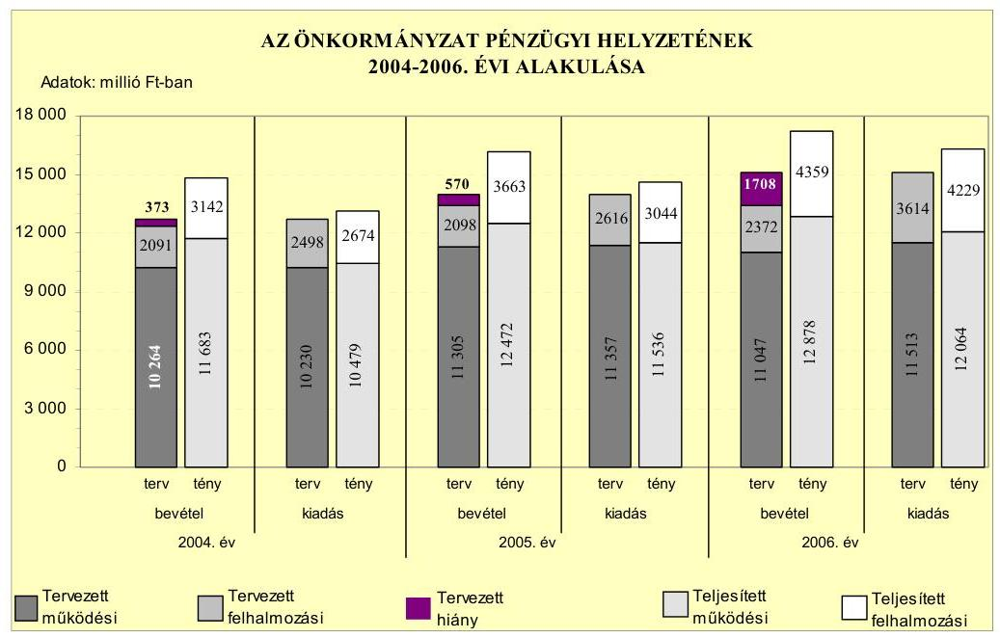
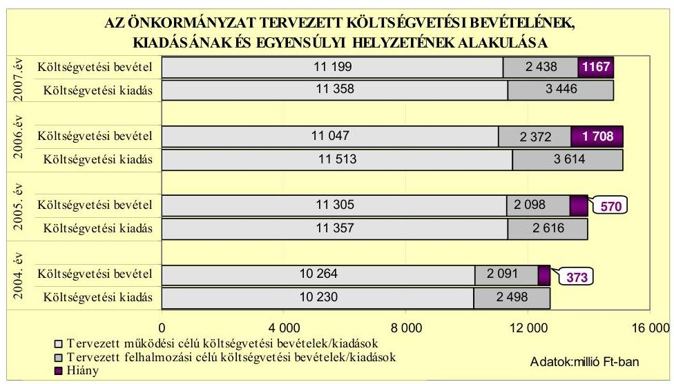
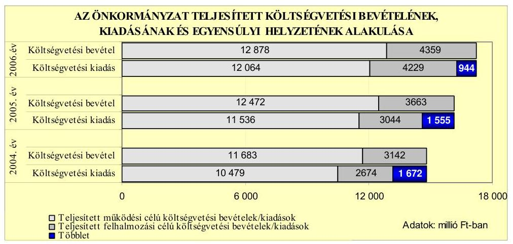
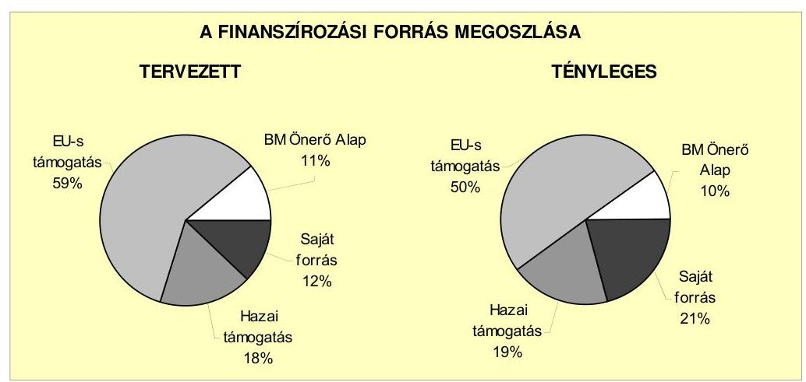
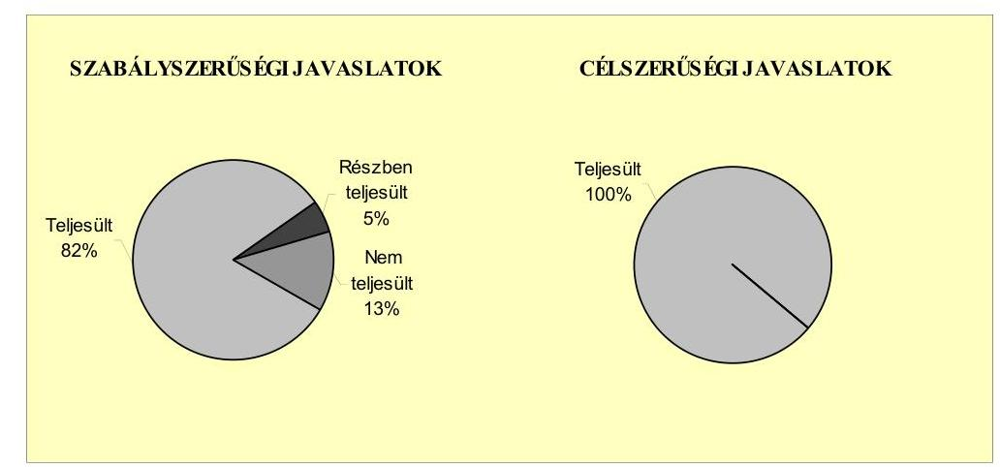
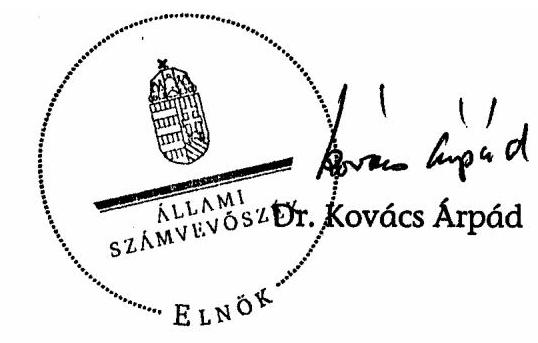
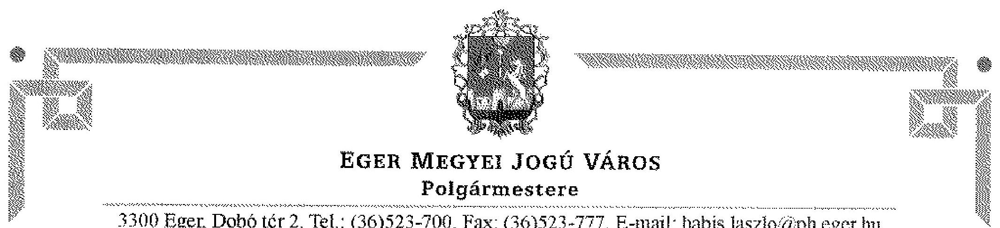
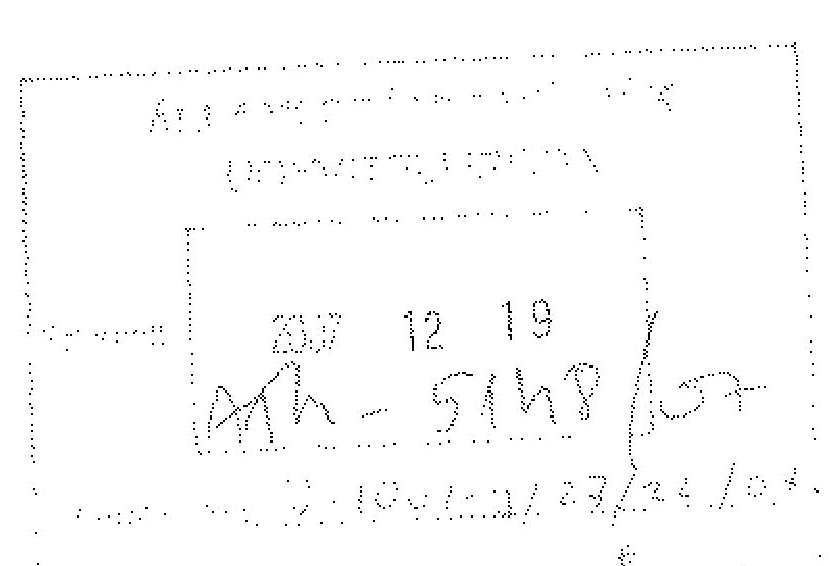

# JELENTÉS 

Eger Megyei Jogú Város Önkormányzata gazdálkodási rendszerének 2007. évi átfogó ellenőrzéséről

---

# 3. Önkormányzati és Területi Ellenőrzési Igazgatóság Átfogó Ellenőrzések Főcsoport 

Iktatószám: V-1001-9/27/23/2007.
Témaszám: 845
Vizsgálat-azonosító szám: V0325

## Az ellenőrzést felügyelte:

Dr. Lóránt Zoltán
föigazgató
Az ellenőrzés végrehajtásáért felelős:
Dr. Sepsey Tamás
föigazgató-helyettes
Az ellenőrzést vezette:
Csecserits Imréné
főcsoportfőnök-helyettes
Az ellenőrzést végezték:
Nagy Sándorné Puchy Márta Veres Jánosné
külső szakértő irodavezető, főtanácsadó számvevő
A témához kapcsolódó eddig készített számvevőszéki jelentések:
címe
sorszáma
Jelentés az Eger Megyei Jogú Város Önkormányzata gazdálkodás0461
sának átfogó ellenőrzéséről
Jelentés a helyi önkormányzati fürdők - kiemelten a gyógyfürdők -
helyzete, fejlesztésének lehetőségei, hatása az idegenforgalomra és a turizmusra
Jelentés a Magyar Köztársaság 2004. évi költségvetése végrehajtás
sának ellenőrzéséről
Függelék:

- a kötött felhasználású támogatások 2004. évi felhasználásának ellenőrzéséről az Eger megyei Jogú Város önkormányzatánál
Jelentés a helyi és a helyi kisebbségi önkormányzatok gazdálkodás0544
sának átfogó ellenőrzéséről
Jelentés a Magyar Köztársaság 2005. évi költségvetése végrehajtásának ellenőrzéséről
Függelék:
- a helyi önkormányzatok 2005. évi normatív hozzájárulás igénylésének és elszámolásának ellenőrzéséről
- a kötött felhasználású támogatások 2005. évi felhasználásának ellenőrzéséről
- a helyi önkormányzatok beruházásaihoz és rekonstrukcióhoz nyújtott 2005. évi felhalmozási célú támogatások ellenőrzéséről
Jelentés a Nemzeti Fejlesztési Terv végrehajtásának ellenőrzéséről ..... 0636

---

# TARTALOMJEGYZÉK 

BEVEZETÉS ..... 11
I. ÖSSZEGZŐ MEGÁLLAPÍTÁSOK, KÖVETKEZTETÉSEK, JAVASLATOK ..... 15
II. RÉSZLETES MEGÁLLAPÍTÁSOK ..... 22

1. Az Önkormányzat költségvetési és pénzügyi helyzete ..... 22
1.1. A tervezett költségvetési bevételi és kiadási előirányzatok, valamint a költségvetési egyensúly alakulása ..... 24
1.2. A költségvetési bevételek és kiadások teljesítése, a pénzügyi egyensúlyi helyzet alakulása ..... 26
2. Az Önkormányzat felkészültsége az európai uniós források igénylésére és felhasználására, valamint az e-közigazgatási feladatok ellátására ..... 31
2.1. Az európai uniós források igénybevételére és a várható támogatás felhasználásának szervezettségére történt felkészülés és a belső szabályozottság értékelése ..... 31
2.1.1. A fejlesztési célkitűzések meghatározása ..... 31
2.1.2. Az európai uniós forrásokhoz kapcsolódóan a pályázatfigyelés, a pályázatkészítés, valamint az európai uniós támogatással megvalósuló fejlesztés lebonyolítása belső rendjének szabályozottsága, a végrehajtás személyi, szervezeti feltételei ..... 36
2.1.3. Az európai uniós forrással támogatott fejlesztés megvalósítása ..... 40
2.2. Az e-közigazgatási feladatok előkészítése, bevezetése ..... 48
3. A költségvetési gazdálkodás kontrolljai ..... 50
3.1. A szabályozottság kockázata a költségvetés tervezési, gazdálkodási, beszámolási és a folyamatba épített ellenőrzési feladatainál ..... 50
3.2. A belső kontrollok érvényesülése az önkormányzati források szabályszerű felhasználásában, a költségvetési tervezés, gazdálkodás, beszámolás folyamataiban ..... 52
3.3. A belső ellenőrzési kötelezettség teljesítése, javaslatainak hasznosulása ..... 54
4. Az ÁSZ korábbi ellenőrzési javaslatai alapján készített intézkedési terv végrehajtása, eredményessége ..... 58
4.1. Az Önkormányzat gazdálkodási rendszerének átfogó ellenőrzése során tett javaslatok végrehajtására tervezett intézkedések megvalósulása ..... 58

---

4.2. A zárszámadáshoz kapcsolódó (állami hozzájárulások, támogatások igénylésének és felhasználásának ellenőrzése), valamint a további vizsgálatok esetében a megállapítások, javaslatok alapján tett intézkedések

# MELLÉKLETEK 

1. számú Az Önkormányzat gazdálkodását meghatározó adatok, mutatószámok (1 oldal)
2. számú Az önkormányzati vagyon alakulása (1 oldal)
3. számú Az Önkormányzat 2004-2006. évi költségvetési előirányzatainak és azok pénzügyi teljesítéseinek alakulása ( 1 oldal)
4. számú 1. számú Nyilatkozat a tervezett és teljesített költségvetési adatoknak a megelőző évhez viszonyított jelentős, $\pm 10 \%$-ot meghaladó változásának indokolásáról, amennyiben azt a feladatok változása indokolta (2 oldal)
5. számú 1. számú Tanúsítvány az európai uniós forrásokkal támogatott programok, célok tervezett és tényleges 2004-2007. évi adatairól (1 oldal)
6. számú Habis László úr, Eger Megyei Jogú Város Önkormányzata polgármesterének észrevétele (2 oldal)

---

# RÖVIDÍTÉSEK JEGYZÉKE 

## Törvények

2004. évi költségvetési törvény
2005. évi költségvetési törvény
2006. évi költségvetési törvény
Áht.
Eisztv.
Htv.

Kbt.
Nek. törvény
Ötv.
Számv. tv.
társulási törvény
Tkt. tv.

## Rendeletek

2004. évi költségvetési rendelet
2004. évi zárszámadási rendelet
2005. évi költségvetési rendelet
2005. évi zárszámadási rendelet
2006. évi költségvetési rendelet
2006. évi zárszámadási rendelet
2007. évi költségvetési rendelet
a Magyar Köztársaság 2004. évi költségvetéséről szóló 2003. évi CXVI. törvény
a Magyar Köztársaság 2005. évi költségvetéséről és az államháztartás hároméves kereteiről szóló 2004. évi CXXXV. törvény
a Magyar Köztársaság 2006. évi költségvetéséről szóló 2005. évi CLIII. törvény
az államháztartásról szóló 1992. évi XXXVIII. törvény az elektronikus információszabadságról szóló 2005. évi XC. törvény
a helyi önkormányzatok és szerveik, a köztársasági megbízottak, valamint egyes centrális alárendeltségű szervek feladat- és hatásköreiről szóló 1991. évi XX. törvény
A közbeszerzésekről szóló 2003. évi CXXIX. törvény
A nemzeti és etnikai kisebbségek jogairól szóló 1993. évi LXXVII. törvény
a helyi önkormányzatokról szóló 1990. évi LXV. törvény
a számvitelről szóló 2000 . évi C. törvény
a helyi önkormányzatok társulásairól és együttműködéséről szóló 1997. évi CXXXV. törvény
a települési önkormányzatok többcélú kistérségi társulásairól szóló 2004. évi CVII. törvény

Eger Megyei Jogú Város Önkormányzatának 6/2004. (III. 5.) számú rendelete a 2004. év költségvetéséről

Eger Megyei Jogú Város Önkormányzatának 15/2005. (IV. 29.) számú rendelete a 2004. évi költségvetésének zárszámadásáról
Eger Megyei Jogú Város Önkormányzatának 10/2005. (III. 4.) számú rendelete a 2005. év költségvetéséről
Eger Megyei Jogú Város Önkormányzatának 19/2006. (IV. 28.) számú rendelete a 2005. évi költségvetésének zárszámadásáról
Eger Megyei Jogú Város Önkormányzatának 8/2006. (III. 10.) számú rendelete a 2006. év költségvetéséről Eger Megyei Jogú Város Önkormányzatának 21/2007. (IV. 27.) számú rendelete a 2005. évi költségvetésének zárszámadásáról
Eger Megyei Jogú Város Önkormányzatának 1/2007. (II. 23.) számú rendelete a 2007. év költségvetéséről

---

Ámr.
Ber.
Polgármesteri hivatali SzMSz
vagyongazdálkodási rendelet

Vhr.

## Szórövidítések

áfa
ÁSZ
BM Önerő Alap
e-közigazgatás
EVAT Zrt.
FEUVE
jegyzó
Gazdasági iroda
GVOP
GVOP e-közigazgatási rendszer fejlesztési feladat
hatásköri szabályzat

HEFOP
HEFOP 3.2.2. intézkedés

HEFOP 4.1.1. intézkedés
az államháztartás múködési rendjéről szóló 217/1998. (XII. 30.) Korm. rendelet
a költségvetési szervek belső ellenőrzéséről szóló 193/2003. (XI. 26.) Korm. rendelet
Eger Megyei Jogú Város Önkormányzatának 37/2001. (X. 19.) számú rendelete a Polgármesteri Hivatal Szervezeti Müködési Szabályzatáról
Eger Megyei Jogú Város Önkormányzatának 5/2000. (II. 18.) számú rendelete az önkormányzat vagyonáról és a vagyongazdálkodás szabályairól
az államháztartás szervezetei beszámolási és könyvvezetési kötelezettségének sajátosságairól szóló 249/2000. (XII. 24.) Korm. rendelet
általános forgalmi adó
Állami Számvevőszék
önkormányzatok európai uniós fejlesztési pályázati saját forrás kiegészítésének támogatása
elektronikus közigazgatás
EVAT Egri Vagyonkezelő és Távfűtő Zrt.
folyamatba épített, előzetes és utólagos vezetői ellenőrzés
Eger Megyei Jogú Város Önkormányzatának címzetes főjegyzője
Eger Megyei Jogú Város Önkormányzata Polgármesteri Hivatalának Gazdasági Irodája
NFT Gazdasági Versenyképesség Operatív Program
GVOP-2004-4.3.1. Szolgáltató önkormányzat az önkormányzatok információ-szolgáltató tevékenységének fejlesztése keretében elnyert „Komplex elektronikus közigazgatási rendszer kialakítása Eger kistérségben" fejlesztési feladat
A költségvetési gazdálkodással kapcsolatos hatáskörök szabályozása (kötelezettségvállalás, ellenjegyzés, érvényesítés, utalványozás), amelyet a polgármester és a jegyző együttesen szabályozott 2006. január 1-jén, illetve 2006. október 12-én
NFT Humánerőforrás-fejlesztési Operatív Program
Térségi Integrált Szakképző Központ létrehozása intézkedés keretében elnyert „Térségi Integrált Szakképző Központ létrehozása Egerben" fejlesztési feladat
Térségi Integrált Szakképző Központ Infrastrukturális feltételeinek javítása intézkedés keretében elnyert „Térségi Integrált Szakképző Központ infrastrukturális feltételeinek javítása Egerben" fejlesztési feladat

---

| IH | Gazdasági és Közlekedési Minisztérium KIOP Irányító Hatóság |
| :--: | :--: |
| Informatikai iroda | Eger Megyei Jogú Város Önkormányzata Polgármesteri Hivatalának Informatikai Irodája |
| IT Kht. | IT Információs Társadalom Informatikai és Távközlési Szolgáltató Közhasznú Társaság |
| KEHI | Kormányzati Ellenőrzési Hivatal |
| KIOP | NFT Környezetvédelmi és Infrastruktúra-fejlesztés Operatív Program |
| KIOP építési hulladékkezelés fejlesztési feladat | KIOP 1.3. Egészségügyi és építési hulladékok kezelése intézkedése keretében elnyert „Komplex építési és bontási hulladékok kezelése Eger kistérségben" fejlesztési feladat |
| kisebbségi önkormányzatok | Egri Lengyel Települési Kisebbségi Önkormányzat, Egri Ruszin Települési Kisebbségi Önkormányzat, Egri Görög Települési Kisebbségi Önkormányzat, Egri Cigány Települési Kisebbségi Önkormányzat |
| Közbeszerzési Döntőbizottság | Közbeszerzések Tanácsa Közbeszerzési Döntőbizottság |
| közbeszerzési szabályzat | Eger Megyei Jogú Város Önkormányzata Közgyűlésének 199/2004. (IV. 29.) számú határozata az Önkormányzat és a Polgármesteri Hivatal Közbeszerzési Szabályzatáról |
| Közgyűlés | Eger Megyei Jogú Város Önkormányzatának Közgyűlése |
| KvVM | Környezetvédelmi és Vízügyi Minisztérium Fejlesztési Igazgatóság, Kisprojektek Főosztály |
| MÁK | Magyar Államkincstár |
| NFT | Nemzeti Fejlesztési Terv |
| Okmányiroda | Eger Megyei Jogú Város Önkormányzata Polgármesteri Hivatalának Okmányirodája |
| PEA | Pályázat Előkészítő Alap |
| PEA II. előkészítő támogatás | Az Eger város és térsége gazdasági potenciáljának erősítése projektjavaslatra, az Észak-Magyarországi Regionális Fejlesztési Tanácstól elnyert támogatás |
| PEJ | Projekt előrehaladási jelentés |
| Polgármesteri hivatal | Eger Megyei Jogú Város Önkormányzatának Polgármesteri Hivatala |
| Polgármesteri hivatal SzMSz-e | Eger Megyei Jogú Város Önkormányzata többször módosított 37/2001. (X. 19.) számú rendelete a Polgármesteri Hivatal Szervezeti Müködési Szabályzatáról |
| PM | Pénzügyminisztérium |
| ROP | NFT Regionális Operatív Program |
| ROP Eger-Egerszalók közötti összekötő út fejlesztési feladat | ROP 2.1.1. Hátrányos helyzetű régiók és kistérségek elérhetőségének javítása intézkedés keretében elnyert „Eger-Egerszalók közötti összekötő út" fejlesztési feladat |

---

ROP Eger-Felnémet városrész rehabilitációja fejlesztési feladat
ROP tömegközlekedés előnyben részesítése fejlesztési feladat
többcélú társulás
többcélú társulás ellenőrzési csoportja
ÚMFT
Város- és területfejlesztési iroda
VÁTI Kht.

ROP 2.2.1. Hátrányos helyzetű régiók és kistérségek elérhetőségének javítása intézkedés keretében elnyert „Eger-Felnémet városrész rehabilitációja" fejlesztési feladat
ROP 2.1.3. Hátrányos helyzetű régiók és kistérségek elérhetőségének javítása a helyi tömegközlekedés fejlesztése intézkedés keretében elnyert „Tömegközlekedés előnyben részesítése Szt. Miklós városrészben" fejlesztési feladat
Eger Megyei Jogú Város Önkormányzata Közgyűlésének 342/2004. (VI. 24.) számú határozatával és 14 települési önkormányzattal létrehozott Egri Kistérségi Többcélú Társulása
Egri Kistérség Többcélú Társulásának Ellenőrzési Csoportja
Új Magyarország Fejlesztési Terv
Eger Megyei Jogú Város Önkormányzata Polgármesteri Hivatalának Város és Területfejlesztési Irodája
VÁTI Magyar Regionális Fejlesztési és Urbanisztikai Közhasznú Társaság

---

# ÉRTELMEZŐ SZÓTÁR 

1. elektronikus szolgáltatási szint
2. elektronikus szolgáltatási szint
3. elektronikus szolgáltatási szint
4. elektronikus szolgáltatási szint
európai uniós források

Fejlesztési feladat (projekt)

Fejlesztési célkitúzés
irányító hatóság

Az 1044/2005. (V. 11.) Korm. határozat alapján olyan információs, tájékoztató szolgáltatás, amely csak általános információkat közöl az adott üggyel kapcsolatos teendőkről és a szükséges dokumentumokról.
Az 1044/2005. (V. 11.) Korm. határozat alapján olyan egyirányú kapcsolatot biztosító szolgáltatás, amely az 1. szinten túl biztosítja az adott ügy intézéséhez szükséges dokumentumok, nyomtatványok letöltését, és azok ellenőrzéssel, vagy ellenőrzés nélküli elektronikus kitöltését, amely esetben a dokumentumok benyújtása hagyományos úton történik.
Az 1044/2005. (V. 11.) Korm. határozat alapján olyan kétirányú kapcsolatot biztosító szolgáltatás, amely közvetlen, vagy ellenőrzött kitöltésű dokumentum segítségével biztosítja az elektronikus adatbevitelt és a bevitt adatok ellenőrzését. Az ügy indításához, intézéséhez személyes megjelenés nem szükséges, de az ügyhöz kapcsolódó közigazgatási döntés (határozat, egyéb aktus) közlése, valamint a kapcsolódó illeték-, vagy díffizetés hagyományos úton történik.
Az 1044/2005. (V. 11.) Korm. határozat alapján olyan teljes közvetlen kétirányú ügyintézési folyamatot biztosító szolgáltatás, amikor az ügyhöz kapcsolódó közigazgatási döntés is elektronikus úton kerül közlésre, illetve a kapcsolódó illeték-, vagy díffizetés elektronikus úton is intézhető.
Az elnyert európai uniós források lehívása a támogatott projekt megvalósítása érdekében, a fejlesztés lebonyolítása során felmerült kiadások finanszírozására.
A fejlesztési feladat (projekt) tartalmilag és formailag részletesen kidolgozott, megfelelő pénzügyi háttérrel és végrehajtási ütemezéssel rendelkező fejlesztési terv, amely illeszkedik az Európai Unió, illetve a Nemzeti Fejlesztési Terv által támogatott programokhoz.
Az önkormányzat által ellátott kötelező, vagy önként vállalt feladatok ellátásának mennyiségi, vagy minőségi fejlesztésére vonatkozó terv. A mennyiségi fejlesztés megvalósulhat beszerzéssel, létesítéssel, bővítéssel, átalakítással.
A strukturális alapok és a Kohéziós alap forrásainak szabályszerű, hatékony és eredményes felhasználásához szükséges intézményrendszer felső eleme. Az irányító hatóság általános és átfogó felelősséget visel a programok, projektek hatékony és szabályszerű végrehajtásáért. Felelősségi köréből eredően ellenőrzi a közösségi, valamint a hazai jogszabályok betartását, koordinálja az európai uniós források szétosztásának folyamatát, irányítja az

---

|  | intézményrendszer, a statisztikai és a pénzügyi nyilvántartási rendszer múködését. |
| :--: | :--: |
| kedvezményezett | Az a helyi önkormányzat, amely a támogatási szerződést kedvezményezettként aláíra, a projektet, illetve a központi programhoz kapcsolódó támogatott önkormányzati programot végrehajtja. |
| központi program | Az ország egészére, több régióra, egy régióra vonatkozó, de mindenképpen az önkormányzat közigazgatási területén túlmutató program, amelynél a támogatott programok kiválasztása pályáztatás nélkül, előre meghatározott feltételrendszer szerint történik, a kedvezményezettek közvetlen megkeresésével. Az Európai Unió pénzügyi alapja a Kohéziós alap, a környezetvédelem és a közlekedés terén nyújt lehetőséget az egyes tagországoknak központi programok megvalósítására. |
| közremúködő szervezet | A közremúködő szervezet az európai uniós támogatást elnyert kedvezményezettekkel kapcsolatot tartó szerv. Az operatív programok közremúködő szervezetei befogadják, nyilvántartják, döntésre előkészítik a pályázatokat, rögzítik a támogatással kapcsolatos adatokat az egységes monitoring informatikai rendszerben, elvégzik a támogatások előzetes (szerződéskötést megelőző), közbenső (a pénzügyi elszámolás, finanszírozás folyamatában végzett) és utólagos (a támogatott projekt pénzügyi lezárását megelőző) ellenőrzését. Az önkormányzatoknál a leggyakrabban előforduló operatív program a Regionális Fejlesztési Operatív Program végrehajtásában közremúködő szervezetek a VÁTI Kht. és a regionális fejlesztési ügynökségek.   A Kohéziós alap két közreműködő szervezete (Gazdasági és Közlekedési Minisztérium, Környezetvédelmi és Vízügyi Minisztérium) a támogatott projektek végrehajtásához kapcsolódó operatív feladatokat látják el. Ennek keretében megkötik a szerződéseket a projekt kedvezményezettjével, folyamatosan nyomon követik a teljesítéseket, lebonyolítják a támogatások kifizetését, vezetik az egységes monitoring informatikai rendszert. |
| lebonyolítás | Az európai uniós források felhasználásával megvalósuló fejlesztésre irányuló múszaki, gazdasági (pénzügyi) tevékenységet magában foglaló szervezési, irányítási szolgáltatás. A szervezési szolgáltatás kiterjedhet a pályázatkészítésre, a közbeszerzési eljárás lebonyolításán keresztül a folyamatos műszaki ellenőrzésre, a pénzügyi elszámolásra, a műszaki átadás-átvételre, az üzembe helyezésre, illetve a fejlesztési folyamat egyes elemeire. |
| operatív program | Az Európai Bizottság által jóváhagyott, a Közösségi Támogatási Keret végrehajtására vonatkozó 2004-2006 közötti, több évre szóló intézkedésekhez kapcsolódó prioritások egységes rendszerét tartalmazó dokumentum. A strukturális alapok operatív programjai: Agrár és Vidékfejlesz- |

---

támogatási szerződés
tési Operatív Program (AVOP); Gazdasági Versenyképesség Operatív Program (GVOP); Humánerőforrás-fejlesztési Operatív Program (HEFOP); Környezetvédelmi és Infrastruktúra-fejlesztési Operatív Program (KIOP); Regionális Fejlesztési Operatív Program (ROP).
A strukturális alapok esetében az irányító hatóságnak, illetve a Kohéziós alap esetében a közremúködő szervezeteknek a kedvezményezett önkormányzattal kötött szerződése, amely a támogatás felhasználásának részletes feltételeit tartalmazza.

---

.

---

# JELENTÉS 

## Eger Megyei Jogú Város Önkormányzata gazdálkodási rendszerének 2007. évi átfogó ellenőrzéséről

## BEVEZETÉS

Az Ötv. 92. § (1) bekezdése, az Állami Számvevőszékről szóló 1989. évi XXXVIII. törvény 2. § (3) bekezdése, valamint az Áht. 120/A. § (1) bekezdése alapján az önkormányzatok gazdálkodását az Állami Számvevőszék ellenőrzi. Az ellenőrzésre az Országgyúlés illetékes bizottságai részére is átadott, országosan egységes ellenőrzési program szerint került sor.

Az Állami Számvevőszék a stratégiájában foglalt célkitűzéseknek megfelelően a helyi önkormányzatok költségvetési gazdálkodási rendszere átfogó ellenőrzésének programját a 2007. évtől megújította, azt kiegészítette további - teljesít-mény-ellenőrzési - elemekkel.

## Az ellenőrzés célja annak értékelése volt, hogy az Önkormányzat:

- a pénzügyi egyensúlyt a költségvetésében és annak teljesítése során milyen módon biztosította, a teljesített bevételek és kiadások egyes évek közötti jelentős eltérése feladatváltozáshoz kapcsolódott-e;
- felkészült-e a szabályozottság és a szervezettség terén az európai uniós források igénylésére és felhasználására, továbbá az e-közigazgatás bevezetése miatti szervezet-korszerúsítési feladatokra;
- kialakította-e a külső és a belső feltételeknek megfelelően a gazdálkodás belső kontrollrendszerét ${ }^{1}$, továbbá a költségvetés tervezési, végrehajtási és zárszámadási feladatok szabályszerű ellátásához hozzájárult-e a folyamatba épített, előzetes és utólagos vezetői ellenőrzés, valamint a belső ellenőrzés;
- megfelelően hasznosították-e a korábbi számvevőszéki ellenőrzések megállapításait, szabályszerűségi ${ }^{2}$ és célszerűségi javaslatait.

[^0]
[^0]:    ${ }^{1}$ A gazdálkodás szabályszerűségét biztosító kontrollrendszer alatt értjük a kiépített és múködő belső irányítási és szabályozási rendszert, valamint a belső ellenőrzési funkciók ellátásának rendszerét.
    ${ }^{2}$ A törvényi előírások betartásának elmulasztásakor a részletes megállapítások fejezetben egységesen a törvénysértés megjelölést alkalmazzuk, mivel az ÁSZ nem tehet különbséget a törvényi előírások között.

---

Az ellenőrzött időszak: az 1., 2. és 4. programpontok tekintetében a 20042006. évek, valamint a 2007. év első félév, a 3. ellenőrzési programpontnál a 2006. év és a 2007. év első negyedév.

Eger megyei jogú város lakosainak száma 2007. január 1-jén 55863 fő volt. A 2006. évi önkormányzati választást követően az Önkormányzat 26 tagú Közgyűlésének munkáját kilenc állandó bizottság segítette. A helyi önkormányzat mellett a 2006. évi önkormányzati választásokig három ${ }^{3}$, azt követően négy ${ }^{4}$ kisebbségi önkormányzat múködött. A polgármester a 2006. évi önkormányzati választás óta tölti be tisztségét, a jegyző személye nem változott.

Az Önkormányzat feladatainak végrehajtása érdekében a 2006. évben 46 költségvetési intézményt múködtetett, amelyekből 23 önállóan gazdálkodott. A feladatok ellátásában részt vett 18 gazdasági társasága, amelyekben ötnél 100\%os, háromnál $51 \%$ feletti, míg a többiben $50 \%$ alatti tulajdoni részesedéssel bírt az Önkormányzat. A 2006. évi költségvetési beszámolója szerint az Önkormányzat 17237 millió Ft költségvetési bevételt ért el és 16294 millió Ft költségvetési kiadást teljesített, 2006. december 31-én a könyvviteli mérleg szerint 60898 millió Ft értékű vagyonnal rendelkezett. A 2007. évi költségvetési rendeletben 13637 millió Ft költségvetési bevételt és 14804 millió Ft költségvetési kiadást - a kiadások és bevételek különbségeként mutatkozó hiány fedezeteként a finanszírozási célú pénzügyi műveletekkel összességében 1167 millió Ft hosz-szú- és rövidlejáratú hitel igénybevételét, valamint hosszú lejáratú értékpapír értékesítési bevételt - irányoztak elő. A Polgármesteri hivatalban dolgozó köztisztviselők száma a 2006. december 31-én 232 fő, a költségvetési intézményekben foglalkoztatott közalkalmazottak száma 1995 fő volt. Az Önkormányzat gazdálkodását meghatározó adatokat, mutatószámokat az 1-3. számú mellékletek tartalmazzák.

Az Önkormányzat költségvetési és pénzügyi helyzetét az összehasonlító elemzés módszerével vizsgáltuk. E körben elemeztük a költségvetés egyensúlyi helyzetének alakulását, a tervezett és tényleges költségvetési hiány okait, a mérséklésére tett intézkedéseket, finanszírozásának módját, az Önkormányzat adósságállományának alakulását, összetevőit.

A teljesítmény-ellenőrzés módszerével vizsgáltuk, hogy a belső szabályozottság, szervezettség terén felkészültek-e az európai uniós források figyelésére, igénylésére és felhasználására, valamint az igényelt európai uniós támogatások az Önkormányzat által meghatározott fejlesztési célkitűzésekhez kapcsolódtak-e. Az ellenőrzés során felmértük, hogy az e-közigazgatási feladat ellátása, illetve bevezetése, múködtetése érdekében milyen intézkedéseket tettek, valamint biz-tosították-e a közérdekú adatok elektronikus közzétételét.

A költségvetési gazdálkodás belső kontrolljainak ellenőrzése során értékeltük, hogy a Polgármesteri hivatalnál a költségvetés tervezési, gazdálkodási, zárszámadás készítési feladatok belső kontrolljainak kiépítettsége és múködése

[^0]
[^0]:    ${ }^{3}$ Cigány, görög, lengyel, kisebbségi önkormányzatok.
    ${ }^{4}$ Cigány, görög, lengyel, ruszin kisebbségi önkormányzatok.

---

megfelelő biztosítékot ad-e a gazdálkodási feladatok megfelelő, szabályszerű ellátására. Felmértük és minősítettük a költségvetés tervezési, a gazdálkodási, a zárszámadás készítési feladatokkal, továbbá a pénzügyi-számviteli területen az informatikával kapcsolatosan kialakított kontrollok megfelelőségét, valamint azok múködésének eredményességét, megbízhatóságát. Értékeltük a belső ellenőrzés szervezeti és szabályozási keretét, továbbá múködését.

A Polgármesteri hivatalnál értékeltük a gazdálkodás folyamatában a kontrollok múködésének megbízhatóságát, ennek keretében ellenőriztük a szakmai teljesítés igazolására és az utalvány ellenjegyzésére kialakított kontrollok végrehajtását. Az ellenőrzést a következő, kiemelt kockázatuk alapján kiválasztott ${ }^{5}$ az általánostól jellemzően eltérő, egyedi eljárást igénylő gazdasági eseményekkel kapcsolatos kifizetésekre folytattuk le ${ }^{6}$ :

- a személyi juttatások közül az állományba nem tartozók megbízási díjai ${ }^{7}$,
- a külső szolgáltató által végzett karbantartási, kisjavítási szolgáltatások, valamint
- a gépek, berendezések, felszerelések beszerzése.

Az ellenőrzés hatékony elvégzése céljából a vizsgálandó területek kiválasztása során a kockázatokon alapuló megközelítés érvényesült, ezáltal az ellenőrzési erőforrásokat azokra a területekre fókuszáltuk, amelyeken legnagyobb a hibák előfordulási valószínűsége. Az ellenőrzési erőforrások ilyen típusú összpontosításával minimálisra csökkenthető a kívánt ellenőrzési bizonyosság eléréséhez szükséges időráfordítás.

A pénzügyi-számviteli folyamatokban alkalmazott belső kontrollok létezésének és múködésének ellenőrzésére a vizsgált három terület 2006. évi és a 2007. I. negyedévi könyvviteli tételeiből területenként egyszerű véletlen mintát vettünk. A kijelölt gazdasági eseményre elvégzett megfelelőségi tesztek alapján értékeltük a kontrollok múködésének eredményességét, megbízhatóságát a vizs-

[^0]
[^0]:    ${ }^{5}$ Az önkormányzatok kiemelt előirányzataira vonatkozóan, a vertikális folyamatokra elvégeztük a kockázatok becslését, amelynek eredményeként az állományba nem tartozók megbízási díjai, a külső szolgáltató által végzett karbantartási, kisjavítási szolgáltatások, valamint a gépek, berendezések, felszerelések beszerzése kiemelkedően kockázatos területnek bizonyultak.
    ${ }^{6}$ A korábbi ellenőrzési tapasztalataink szerint ezeken a területeken a jegyzők nem, vagy hiányosan szabályozták a megbízás, megrendelés, illetve beszerzés indokoltságának, szükségességének elbírálására, igazolására, valamint a teljesítések dokumentálására, a kifizetések jogosságának megítélésére szolgáló kontrollokat. További kockázatot jelentett a külső szolgáltató által végzett karbantartási, kisjavítási munkák esetében, hogy az 50 ezer Ft alatti megrendelésekre vonatkozóan az ellenőrzési tapasztalataink szerint a jegyzők nem alakították ki a kötelezettségvállalások rendjét és nyilvántartási formáját, valamint a szabályozás elmulasztása esetén nem történt meg az írásbeli kötelezettségvállalás és annak az ellenjegyzése sem.
    ${ }^{7}$ Az állományba tartozók rendszeres személyi juttatásainak számfejtését, valamint folyósítását nem a polgármesteri hivatalok, hanem a nettó finanszírozás keretében a beküldött dokumentumok alapján a MÁK végzi.

---

gált három területre külön-külön, majd összefoglalóan ${ }^{8}$ a Polgármesteri hivatal egyedi eljárást igénylő gazdasági eseményeire. A helyszíni ellenőrzés megállapításainak részletes dokumentálását három megfelelőségi tesztlapon, öt elővizsgálati és kilenc helyszíni ellenőrzési munkalapon biztosítottuk. Ezeken a teszt- és munkalapokon a minősítés alapjául szolgáló kérdések és a vonatkozó konkrét jogszabályhelyek megjelölése mellett értékeltük a kialakított belső kontrollokban rejlő kockázatokat ${ }^{9}$ és a kialakított kontrollok működésének megbízhatóságát ${ }^{10}$.

Az ÁSZ korábbi ellenőrzési javaslatai alapján tett intézkedéseket, illetve azok megvalósítását utóellenőrzés keretében vizsgáltuk. A gazdálkodási rendszer átfogó ellenőrzése során megfogalmazott javaslatok végrehajtására tett intézkedések megvalósítását ellenőrizzük, az egyéb számvevőszéki ellenőrzések során tett javaslatok esetében pedig a kiadott intézkedéseket tekintjük át.

A helyszíni ellenőrzés során kitöltött - az ellenőrzést végző számvevő és a Polgármesteri hivatal felelős köztisztviselője által aláírt - elővizsgálati és helyszíni ellenőrzési munkalapokat, azok kitöltési útmutatóit, továbbá a megfelelőségi tesztek dokumentumait a polgármester részére a számvevői jelentéssel egyidejűleg átadtuk.

A jelentés megállapításainak, javaslatainak egyeztetése során a polgármester arról adott tájékoztatást, hogy az időközben megtett intézkedésekkel a javaslatokat megvalósították. A megtett intézkedést a jelentés II. Részletes megállapítások fejezetében az adott témához kapcsolt lábjegyzetben feltüntettük és a kapcsolódó javaslatot elhagytuk.

A jelentést az ÁSZ-ról szóló 1989. évi XXXVIII. tv. 25. § (1) bekezdése alapján észrevétel közlése céljából megküldtük Eger Megyei Jogú Város Önkormányzata polgármesterének. A kapott észrevételt a jelentés 6. számú melléklete tartalmazza.
${ }^{8}$ A vizsgált három terület egyedi értékelési pontszámait a területek relatív költségvetési súlyával arányosan összegeztük.
${ }^{9}$ A kialakított belső kontrollokban rejlő kockázatot alacsonynak minősítettük, ha a kontrollok - végrehajtásuk esetén - megfelelő védelmet nyújtanak a hibák bekövetkezése ellen. Közepesnek minősítettük a belső kontrollokban rejlő kockázatot, amennyiben a kontrollok - végrehajtásuk esetén - a lehetséges hibák többsége ellen védelmet nyújtanak. Magasnak értékeltük a kockázatot, ha a kontrollok - kialakításuk hiányában, vagy hiányos kialakításuk miatt - nem nyújtanak elegendő védelmet a lehetséges hibákkal szemben.
${ }^{10}$ A kontrollok múködésének eredményességét, megbízhatóságát kiválónak értékeltük abban az esetben, ha azok múködése - esetleges apróbb hiányosságoktól eltekintve megfelelt a hibák megelőzésére és kijavítására meghatározott szabályozásnak és a legmagasabb szintű elvárásoknak. Jónak minősítettük a kontrollok múködését, ha a hiányosságok száma ugyan jelentős volt, de nem veszélyeztette az ellenőrzött terület hibáinak megelőzését és kijavítását. Amennyiben a hiányosságok mértéke nem biztosította a hibák megelőzését, feltárását, kijavítását és ezáltal veszélyeztette az eredményes, megbízható múködést, a kontroll gyenge minősítést kapott.

---

# I. ÖSSZEGZŐ MEGÁLLAPÍTÁSOK, KÖVETKEZTETÉSEK, JAVASLATOK 

Az Önkormányzatnál a 2004-2006. években a tervezett költségvetési bevételek és kiadások összegei folyamatosan növekedtek, de a költségvetések egyensúlya tervezési szinten nem volt biztosított. A tervezett költségvetési hiányt a múködési célú költségvetési kiadások 1-4\%-os forráshiánya, valamint a felhalmozási célú költségvetési kiadásoknak a felhalmozási célú költségvetési bevételeket $16-34 \%$-kal meghaladó összegű tervezése eredményezte. A költségvetési egyensúly biztosítása érdekében 2004-2007 között évente növekvő arányban rövid, illetve hosszú lejáratú hitelfelvételt terveztek. A 2004-2007. évi költségvetési rendeletekben a költségvetés bevételi és kiadási főösszegének megállapításakor - az Áht. előírása ellenére - a finanszírozási célú pénzügyi műveletek bevételeit, kiadásait, költségvetési hiányt módosító költségvetési bevételként, illetve költségvetési kiadásként vették figyelembe.

A költségvetési egyensúly a teljesített költségvetési bevételek és kiadások adatai alapján a 2004-2006. években a költségvetés végrehajtása során biztosított volt, a múködési kiadásoknál forráshiány nem alakult ki, a felhalmozási célú költségvetési kiadásokat fedezték a felhalmozási célú költségvetési bevételek. Az Önkormányzat mindhárom évben költségvetési többlettel zárta az évet. A múködési célú költségvetési kiadások folyamatos, de a költségvetési bevételekhez képest alacsonyabb mértékű emelkedése ellenére a gazdálkodáshoz a 2005. és a 2006. évben tervezett rövid lejáratú hitel felvételére nem volt szükség, a múködési célú költségvetési bevételek fedezték a múködési célú költségvetési kiadásokat. A múködési célú költségvetési bevételek eredeti előirányzatának túlteljesítését az alul tervezett kamat- és intézményi múködési bevételek, a helyi adók és illetékek, a támogatásértékű működési bevételek, és a 2005-2006. évben múködési célra igénybe vett előző évi pénzmaradvány tervezettnél magasabb összegei eredményezték.

A teljesített felhalmozási célú költségvetési bevételek mindhárom évben meghaladták a tervezett előirányzatokat. A túlteljesítést az előző évi felhalmozási célú pénzmaradvány tervezettet meghaladó összegben történt igénybevétele, a különböző pályázatokkal elnyert központi költségvetési és európai uniós források valamint az államháztartáson kívülről felhalmozási célra átvett pénzeszközök eredményezték. A felhalmozási célú költségvetési kiadások túlteljesítéshez hozzájárult a pályázatok alapján kapott támogatások felhasználása, valamint az előző évi pénzmaradvány igénybevételéből tervezett tartalékból történt átcsoportosítások, és a tervezettnél magasabb összegű felhalmozási célú pénzeszköz-átadások.

A pénzügyi egyensúlyt az Önkormányzat a 2004-2006. években felhalmozási célú rövid- és hosszúlejáratú hitelek felvételével biztosította. Az egyes évek költségvetéseiben tervezett hosszú lejáratú felhalmozási célú hitelek felvételére a tervezett összeg 62-69-76\%-ában került sor. Az igénybe vett hitelek 2004. január 1-i 1199 millió Ft összeget kitevő állománya évenként emelkedett, 2007. június 30-ig összességében 117\%-kal, 2608 millió Ft-ra. A hitelfelvételek - ame-

---

lyek között szerepeltek deviza-alapú és kedvezményes kamatozású hitelek - célja az Önkormányzat felújítási, beruházási feladatainak finanszírozása volt. A törlesztések megkezdésére minimálisan egy év, de két hitelszerződés esetében négy év türelmi időt biztosítottak a hitelt nyújtó pénzintézetek. A 2004-2006. években az Önkormányzat hosszú lejáratú hitelek törlesztésével kapcsolatos éves adósságszolgálati kötelezettsége - amely legkésőbb a 2020. évben szűnik meg - a költségvetési pénzügyi helyzet alakulását érdemben nem befolyásolta. Az egyes években elért költségvetési bevételi többletek és a tervezett feladatok ütemezéstől eltérő megvalósulása lehetőséget biztosított az Önkormányzat számára - a tervezettől alacsonyabb összegű hitelek igénybevétele mellett - az átmenetileg szabad pénzeszközeinek lekötésével a kamatbevételek terven felüli teljesítésére. Folyószámla hitelkeretet a Közgyűlés nem határozott meg, igénybevételre sem került sor.

Az Önkormányzat a 2004-2007. évekre vonatkozó fejlesztési célkitűzéseit meghatározta, a célok kétharmada a kötelező feladatokhoz kapcsolódott. A fejlesztési célkitűzések költségvetési kiadási szükségletét és a megvalósítás pénzügyi forrásait számba vették. Az Önkormányzat eredményesen pályázott a fejlesztési célkitűzéseivel összhangban hét fejlesztési feladathoz európai uniós támogatásra. A 2005-2006. év közben megkötött támogatási szerződések alapján a ténylegesen folyósított támogatás összegével a költségvetési előirányzatok év közbeni módosításáról az Önkormányzat döntött. A 2006. és a 2007. évi költségvetések eredeti előirányzatai - az Áht-ban előírtak ellenére - nem tartalmazták az éves kiadási és támogatási ütemezés összegeit költségvetési kiadásonként és forrásonként. Az Önkormányzat gondoskodott az európai uniós támogatással megvalósuló fejlesztési feladatok saját forrásának biztosításáról a 2004-2007. évi költségvetéseiben. A Közgyűlés tájékoztatása céljából bemutatták a többéves kihatással járó európai uniós forrásból megvalósuló fejlesztési feladatok bevételeit és kiadásait számszerúsítve, éves bontásban, szöveges indoklással, valamint önkormányzati szinten elkülönítetten. A saját forrás kiegészítéseként 2004-2006 között a BM Önerő Alapból 729 millió Ft támogatásban részesült az Önkormányzat. A projektek utófinanszírozása miatt 2005-2007ben a költségvetésekben előfinanszírozási tartalékot képeztek.

Az Önkormányzat európai uniós pályázatai a gazdasági programban, ágazati, szakmai és terület-fejlesztési koncepciókban, tervekben megfogalmazott fejlesztési célkitűzésekhez kapcsolódtak, azonban a szabályozottság és a szervezettség terén az Önkormányzat 2004-2006 között összességében nem készült fel eredményesen az európai uniós források igénybevételére és felhasználására. Nem határozták meg az európai uniós forrásokhoz kapcsolódóan a pályázatfigyelés, a pályázatkészítés, az európai uniós forrásokkal támogatott fejlesztés lebonyolítási feladatait, felelőseit, valamint nem jelölték ki az önkormányzati szintű pályázatnyilvántartás vezetésének felelősét. Nem szabályozták a pályázatfigyelés, pályázatkészítés, valamint az európai uniós forrással támogatott fejlesztési feladat lebonyolításának ellenőrzési kötelezettségét, feladatait és felelőseit. A pályázatfigyelés, pályázatkészítés, valamint a fejlesztési feladat lebonyolításának feladatait és felelőseit, továbbá a pályázatfigyelés, pályázatkészítés ellenőrzési kötelezettségét, feladatait és felelőseit 2007. II. félévétől szabályozták, ezzel biztosították az európai uniós források igénybevételének és felhasználásának szabályozottságát és szervezettségét. A Polgármesteri hivatal

---

szervezetén belül, valamint külső személy és szervezet igénybevételével szervezték meg a pályázatfigyelés, a pályázatkészítés és a fejlesztés lebonyolítási feladatok ellátását. Az európai uniós pályázatokkal összefüggő feladatok koordinálása a Polgármesteri hivatal szervezetén belüli feladat volt.

A 2005-2006 között európai uniós forrással támogatott öt fejlesztési feladatból négy megvalósítása lezárult, amelyekhez az elnyert európai uniós támogatást az Önkormányzat teljes összegben igénybe vette. Az európai uniós forrásból támogatott öt fejlesztési feladat végrehajtása a támogatási szerződésben foglalt időbeli és pénzügyi ütemezéstől eltérően haladt. A kifizetési kérelmek benyújtása és a teljesítése egy-kilenc hónap közötti időtartamot vett igénybe az igénylést alátámasztó dokumentumok alaki, tartalmi hiányosságai miatt. Az Önkormányzat az éves költségvetési rendeletekben biztosította a saját forrást, továbbá eleget tett a strukturális alapok által támogatott fejlesztések megelőlegezési követelményének. A támogatás utólagos finanszírozási rendszere az Önkormányzat gazdálkodásában pénzügyi zavarokat nem okozott. Az Önkormányzat három fejlesztési feladatnál kezdeményezte a támogatási szerződés időbeni, kiadási és támogatási ütemezésének, ezek közül egy esetben a műszaki tartalomváltozás miatti módosítását, további egy esetben az indokoltság ellenére nem kérelmezett változtatást. Három fejlesztési feladat többletkiadással valósult meg, amely fedezetét saját forrás biztosította. A folyamatba épített ellenőrzési feladatok végrehajtása a Polgármesteri hivatalban nyomon követhető volt. Az európai uniós támogatással megvalósult fejlesztési feladatokat a helyszínen a közremúködő szervezetek, az ÁSZ és a KEHI vizsgálták. Egy fejlesztési feladatnál a IH szabálytalanságra vonatkozó megállapítás miatt a kifizetést nem engedélyezte. Kettő fejlesztési feladat dokumentálásának és a támogatás elszámolásának belső ellenőrzése megtörtént, az ellenőr célszerűségi javaslatokat fogalmazott meg a jegyző részére.

Az informatikai koncepciót a Közgyűlés elfogadta, amelyben középtávú célként a 3. elektronikus szolgáltatási szint elérését, az ehhez szükséges eszközöket és pénzügyi forrásokat határozta meg. Az Önkormányzat eredményesen pályázott a GVOP e-közigazgatási rendszer fejlesztési feladat európai uniós támogatására. Az e-közigazgatási feladatok ellátásának szervezeti-személyi feltételeit a Polgármesteri hivatalban kialakították. Az e-közigazgatási feladatokat ellátó közigazgatási szolgáltatások rendszerét a 2. elektronikus szolgáltatási szinten, a helyi adózásnál a 3. elektronikus szolgáltatási szinten az Önkormányzat portálján biztosította a Polgármesteri hivatal. Az Önkormányzat az Eisztv-ben előírt, a közérdekú adatok közzétételére vonatkozó kötelezettségét 2007. január 1-jétől teljesítette. Az Önkormányzat honlapján eleget tett az Áht-ban és az Ámr-ben foglalt előírásoknak, mert a 2006. évben a céljelleggel nyújtott fejlesztési, a 2007. I. negyedévében múködési és fejlesztési támogatások kedvezményezettjeinek nevét, a támogatás célját, összegét, továbbá a támogatási program megvalósítási helyét, a vagyonnal történő gazdálkodással összefüggő, a nettó ötmillió Ft-ot elérő, vagy azt meghaladó értékű szerződések megnevezését, tárgyát, a szerződéskötő felek nevét, a szerződés értékét, határozott időre kötött szerződés esetében annak időtartamát, továbbá a 2005-2006. évek költségvetési beszámolójának szöveges indoklását közzétette.

A Polgármesteri hivatalnál a költségvetés tervezési és a zárszámadás készítési folyamatok szabályozottsága összességében alacsony kockázatot je-

---

lentett a feladatok szabályszerű végrehajtásában, mivel a vonatkozó jogszabályok előírásainak és a helyi sajátosságoknak megfelelően rögzítették a költségvetés tervezési és a zárszámadás készítés folyamatában szükséges ellenőrzési feladatokat. A költségvetési tervezés és a zárszámadás készítés folyamatában a múködésbeli hibák megelőzésére, feltárására, kijavítására kialakított kontrollok múködésének megbízhatósága összességében kiváló volt, mivel a 20062007. évi költségvetések tervezési és a 2006. évi zárszámadás készítési folyamatban a vonatkozó jogszabályokban és a belső szabályozásban előírt ellenőrzési, egyeztetési feladatokat elvégezték.

A Polgármesteri hivatalnál a 2006. évben a pénzügyi-számviteli tevékenységek szabályszerű végrehajtásában a gazdálkodási, a pénzügyi-számviteli és a folyamatba épített ellenőrzési feladatok szabályozottsága összességében alacsony kockázatot jelentett, mivel rendelkeztek az előírt szabályzatokkal, azok tartalmát rendszeresen felülvizsgálták és aktualizálták. Annak ellenére összességében alacsony volt a kockázat, hogy az eszközök és források szabályzatában az adókkal kapcsolatos követelések egyszerűsített értékelési eljárását alkalmazták, azonban annak szempontjait, dokumentumait a jegyző nem határozta meg. A Polgármesteri hivatalban az eszközök hasznosítási és selejtezési szabályzatában nem rögzítették a hasznosítás, nyilvántartás során követendő eljárási rendet, az ármegállapítás szabályait, a Polgármesteri hivatal SzMSz-ének részét képező ellenőrzési nyomvonal nem tartalmazott utalást arra vonatkozóan, hogy az egyes tevékenységeket, feladatokat részletesen mely szabályzatok tartalmazzák.

A Polgármesteri hivatalnál az állományba nem tartozók megbízási díjaival, a karbantartási, kisjavítási szolgáltatásokkal, továbbá az ügyviteli-, számítástechnikai- és az egyéb gépek, berendezések, felszerelések beszerzésével kapcsolatos kifizetések során a belső kontrollok múködésének megbízhatósága öszszességében kiváló volt, mivel a gazdálkodás folyamatában, a szakmai teljesítésigazolás és az utalványok ellenjegyzése megfelelő biztosítékot adott a gazdálkodási feladatok megfelelő, szabályszerű ellátására. Az operatív gazdálkodás során a szakmai teljesítés igazolására a jegyző által kijelölt személyek feladatukat elvégezték, a kiadások teljesítésének elrendelése előtt - a hatásköri szabályzatban előírt módon - szakmailag igazolták azok jogosultságát, összegszerűségét, a szerződés, megrendelés, a megállapodás teljesítését. Az utalványok ellenjegyzői meggyőződtek arról, hogy az utalványozás nem sérti a gazdálkodásra vonatkozó szabályokat, továbbá, hogy a szakmai teljesítés igazolása és az érvényesítés az arra jogosultak által megtörtént.

A Polgármesteri hivatalnál az informatikai rendszer szabályozottsága öszszességében alacsony kockázatot jelentett az informatikai feladatok biztonságos végrehajtásában, mivel informatikai koncepcióban meghatározták a stratégiai célkitűzések megvalósításához kapcsolódó feladatokat, a biztonsági szabályzatban rögzítették az informatikai eszközökhöz történő hozzáférés szabályait. Annak ellenére összességében alacsony volt a kockázat, hogy a pénzügyiszámviteli dogozók munkaköri leírásának közel fele nem tartalmazta az informatikai feladatokat. Az informatikai rendszer múködtetésénél a múködésbeli hibák megelőzésére, feltárására kialakított kontrollok múködésének megbízhatósága összességében kiváló volt, mivel informatikai eszközökkel megoldott a költségvetési beszámoló összeállítása, az alkalmazott program biztosította a

---

könyvviteli mérleg és a főkönyv, illetve a főkönyv és a költségvetési beszámoló adatainak egyezőségét.

A belső ellenőrzés szervezeti kereteinek kialakítása és szabályozása a belső ellenőrzés végrehajtásában összességében alacsony kockázatot jelentett, mivel a Közgyűlés döntött a belső ellenőrzés szervezeti keretéről, annak többcélú társulás keretében történő ellátási módjáról, jóváhagyta az előírásoknak megfelelő, kockázatelemzéssel alátámasztott, stratégiai terven alapuló 2006-2007. évi ellenőrzési terveket. Kialakították az ellenőrzéssel megbízott többcélú társulásnál az ellenőrzés szabályait, amelyet ellenőrzési kézikönyvben rögzítettek. Annak ellenére alacsony volt a kockázat, hogy a Közgyűlés döntését az ellenőrzés társulás útján történő ellátásáról a Ber. előírása ellenére nem építették be a Polgármesteri hivatal SzMSz-ébe. A belső ellenőrök az előírt iskolai végzettséggel és szakképesítéssel, valamint szakmai gyakorlattal rendelkeztek. A belső ellenőrzéshez kialakított kontrollok működésének megbízhatósága összességében jó volt, mivel éves terv és ellenőrzési program alapján végezték az ellenőrzéseket a Polgármesteri hivatalban és az intézményeknél, az ellenőrzésekről készített jelentések tartalmazták az eredményeket és hiányosságokat összefoglaló értékelést, valamint következtetéseket, javaslatokat. A 2006. évi ellenőrzési tervben foglalt ellenőrzések 10\%-át azonban nem végezték el, valamint a 2006. évben a belső ellenőrök a Polgármesteri hivatalban nem végeztek ellenőrzéseket a költségvetési előirányzatok teljesítését illetően, továbbá az Önkormányzat többségi irányítást biztosító befolyása alatt működő gazdasági társaságainál. A gazdasági társaságoknál végzendő ellenőrzést a 2007. évi ellenőrzési tervben szerepeltették.

A jegyző az éves ellenőrzési munkatervek alapján gondoskodott a költségvetési szervek ellenőrzésének végrehajtásáról. A 2006. évben az intézményeknél tervezett 14 ellenőrzést az ütemezésnek megfelelően végrehajtották. A tartalékidő terhére négy célellenőrzést is végeztek az ellenőrök. A Polgármesteri hivatalban a tervezett hét ellenőrzésből három nem valósult meg, helyette jegyzői utasításra két új témában, valamint öt, nem tervezett cél-, illetve témaellenőrzésre került sor. A 2007. év első negyedévében az intézményi tervezett ellenőrzéseket elvégezték. Az ellenőrzéseket ellenőrzési program alapján hajtották végre a belső ellenőrök, és a jelentéseik tartalmaztak értékeléseket, ajánlásokat, következtetéseket és javaslatokat. Az ellenőrzöttek elfogadták az ellenőrzés megállapításait, észrevételt nem tettek, és a jelentés javaslataira intézkedési tervet készítettek. A jegyző a 2006. évi költségvetési beszámoló keretében az Áht. előírása alapján tájékoztatást adott a FEUVE rendszer kiépítéséről és múködéséről, valamint a belső ellenőrzés múködtetéséről. A polgármester a 2006. évi zárszámadási rendelettel egyidejűleg az Ötv. előírásának megfelelően a Közgyűlés elé terjesztette az ellenőrzésekről készített éves összefoglaló jelentést, amelyben a tervtől való eltérések indoklása a Ber-ben foglalt előírás ellenére nem történt meg. Az éves összefoglaló jelentést a Közgyűlés elfogadta.

Az Önkormányzat gazdálkodásának 2004. évi átfogó ellenőrzéséről készített ÁSZ jelentésben tett megállapítások, javaslatok hasznosítására készített intézkedési tervben meghatározták az elvégzendő feladatokat, azok végrehajtásáért felelős személyeket és határidőket. A javaslatok $82 \%$-át teljes mértékben, $5 \%$-át részben hasznosították, 13\%-a nem teljesült. Az ÁSZ ellenőrzés során megfogalmazott javaslatok figyelembe vételével gondoskodtak az Önkormányzat

---

több évre szóló gazdasági programjának elfogadásáról, a költségvetési rendelethez kapcsolódó mérlegek, kimutatások tartalmának meghatározásáról, a költségvetési rendelet előírt határidőben történő előterjesztéséről, a jóváhagyott költségvetési előirányzatok módosítására, a bevételi előírások nyilvántartására, a jóváhagyott előirányzatokon belüli gazdálkodásra, valamint a gazdálkodási, ellenőrzési jogkörök gyakorlására és a belső ellenőrzésre vonatkozó előírások betartásáról. A jegyző utasításban szabályozta a céljelleggel juttatott összegek rendeltetésszerű felhasználásának számadási kötelezettségét, ellenőrzési rendszerét, melynek működtetésével biztosította az Áht-ben foglaltak betartását. A Közgyűlés a Polgármesteri hivatal SzMSz-ét kiegészítette a kisebbségi önkormányzatok munkáját segítő feladataival, továbbá elvégezte a kisebbségi önkormányzatokkal kötött megállapodások tartalmi felülvizsgálatát.

A jegyző előkészítésének hiányában a polgármester a 2005-2006. években az Áht. előírása és az ÁSZ javaslata ellenére nem intézkedett, hogy a Közgyűlés helyezze hatályon kívül a vagyongazdálkodási rendelet nyilvános versenytárgyalás mellőzésére vonatkozó „kivételek" szabályát. Az Önkormányzat 2007. augusztus 30 -án a vagyongazdálkodási rendeletet az ÁSZ javaslatban foglaltaknak megfelelően módosította. A 2005-2006. években, valamint a 2007. I. negyedévben nyilvános versenytárgyalás mellőzésével 20 millió Ft forgalmi értékhatárt meghaladó vagyont nem értékesítettek. Az Áht-ban előírtak és a belső szabályozás hiánya ellenére az Önkormányzatnál a 2005-2006. években 0,9 millió Ft nettó értékű vagyon tulajdonjogának ingyenes átruházására került sor. 2005-2007. I. negyedév között összesen 61,7 millió Ft követelésről mondtak le a vagyongazdálkodási rendeletben foglaltaknak megfelelő módon. A jegyző a közbeszerzési eljárások előkészítésének, lefolytatásának, belső felelősségi rendjének szabályozására a 2004. évben tett javaslat ellenére a 2005-2006-ban nem, csak 2007. I. negyedévben intézkedett, melynek alapján a Közgyűlés a Kbt-ben foglaltaknak megfelelő tartalommal új közbeszerzési szabályzatot fogadott el. A közbeszerzési eljárás lebonyolítása során - a Kbt. előírása ellenére az Önkormányzatnál nem biztosították az összhangot a megkötött építésivállalkozási szerződés, az ajánlati felhívás és az ajánlattételi dokumentáció tartalma között, az ajánlati biztosíték az ajánlattevők részére határidőben nem került visszafizetésre, továbbá a teljesítéstől számított öt munkanapon belül a közzétételi kötelezettségnek nem tettek eleget. A közbeszerzési eljárást a Kbt-ben előírt értékhatár felett egy szolgáltatás-beszerzés esetében nem folytatták le, melyet a helyszíni ellenőrzés ideje alatt indítottak meg.

Az Önkormányzatnál a 2004-2006. évek között a zárszámadáshoz kapcsolódóan elvégzett, valamint a további vizsgálatok javaslatai hasznosultak. A helyi önkormányzati fürdők fejlesztésének lehetőségeivel kapcsolatos ellenőrzés javaslataira tett intézkedések során megtörtént a fejlesztések fürdőszolgáltatás színvonalára gyakorolt hatásának tulajdonosi értékelése, a fejlesztési elképzeléseket a Közgyűlés megtárgyalta, prioritásként a gyógyfürdő fejlesztését határozta meg, a fürdők üzemeltetését végző gazdasági társaságok tulajdonosi szerkezetének átalakításával a tulajdonosi célkitűzések érvényesültek az üzleti tervek összeállításában és jóváhagyásában. A 2004. évi kötött felhasználású támogatások vizsgálatáról készült ÁSZ jelentés javaslataira a jegyző a Gazdasági iroda ügyrendjében előírta a központosított előirányzatok igénylésének és elszámolásának folyamatba épített vezetői ellenőrzését, intézkedett a közműfejlesztési

---

támogatásokhoz kapcsolódó, ellenőrizhető nyilvántartás kialakításáról és vezetéséről. A helyi önkormányzatokat a 2005. évben megillető normatív hozzájárulás igénylésének és elszámolásának vizsgálatáról készített jelentésben tett javaslatok hasznosítására a jegyző utasításban határozta meg az irodák és a többcélú társulás ellenőrzési csoportja, továbbá az intézmények normatív hozzájárulás igénylésével, ellenőrzésével összefüggő feladatait. A 2005. évi kötött felhasználású támogatások vizsgálatáról készített jelentésben tett javaslatok alapján a polgármester az ÁSZ ellenőrzés megállapításait ismertette a Közgyűléssel, és intézkedett az ÁSZ által elvonásra javasolt támogatás visszafizetésére. Az NFT keretében a GVOP e-közigazgatási rendszer fejlesztési feladat elnevezésű pályázat megvalósulásának ellenőrzése során feltárt hiányosságok felszámolására a jegyző az európai uniós támogatások bonyolításának teljes körű szabályozásával utasításban, valamint a számviteli politika és a számlarend kiegészítésével intézkedett a 2007. évben.

A helyszíni ellenőrzés megállapításainak hasznosítása mellett javasoljuk:

# a polgármesternek 

a munka színvonalának javítása érdekében

1. kezdeményezze, hogy a jelentésben foglaltakat a Közgyűlés tárgyalja meg.

---

# II. RÉSZLETES MEGÁLLAPÍTÁSOK 

## 1. Az ÖNKORMÁNYZAT KÖLTSÉGVETÉSI ÉS PÉNZÜGYI HELYZETE

Az Önkormányzatnál a 2004-2006. években a tervezett és teljesített összes költségvetési bevételek és kiadások folyamatosan növekedtek, de a költségvetések egyensúlya tervezési szinten nem volt biztosított, mivel a költségvetési bevételek előirányzatai a tervezett költségvetési kiadásokat egyik évben sem fedezték. A tervezett költségvetési hiányt a múködési célú költségvetési kiadások 1-4\%-os forráshiánya, valamint a felhalmozási célú költségvetési kiadásoknak a felhalmozási célú költségvetési bevételeket 16,3-34,4\%-kal meghaladó összegű tervezése eredményezte. A teljesítési adatok alapján költségvetési hiány nem alakult ki, a tervezettel szemben az Önkormányzat ténylegesen mindhárom évben költségvetési többlettel zárta az évet, annak összege azonban évről-évre csökkent. A 2007. évre tervezett költségvetési bevételek a 2006. évhez viszonyítva 1,6\%-kal növekedtek, azonban a költségvetési kiadások 2,1\%-os csökkenése ellenére sem volt biztosított a költségvetés egyensúlya.

Az Önkormányzatnál a 2005-2007. évi költségvetési rendeletekben a költségvetési bevételek és kiadások főösszegeit ${ }^{11}$ azonos összegben határozták meg, mivel az Áht. 8/A. § (7) bekezdésében előírtakat megsértve finanszírozási célú pénzügyi műveleteket (hitelfelvételből tervezett bevételeket, illetve hiteltörlesztéssel kapcsolatos kiadásokat) vettek figyelembe - az ÁSZ 2004. évi átfogó ellenőrzése

[^0]
[^0]:    ${ }^{11}$ A 2004-2007. évi költségvetési rendeletekben a Közgyűlés a bevételek és kiadások főösszegeit egymással azonos összegben állapította meg az évek sorrendjében a következők szerint: 12 868,7 millió Ft-ban, 14 460,5 millió Ft-ban, 15 302,6 millió Ft-ban, illetve 15256,1 millió Ft-ban.

---

során tett javaslata ellenére - költségvetési hiányt, illetve költségvetési többletet módosító költségvetési bevételként, illetve költségvetési kiadásként ${ }^{12}$. Az Önkormányzat 2004-2006. évi tervezett és teljesített költségvetési - azon belül a múködési és felhalmozási célú - bevételeit és kiadásait, azok egyenlegeként kialakult hiányt vagy többletet, valamint a finanszírozási célú pénzügyi műveletek egyenlegét a jelentés 3. számú melléklete tartalmazza. Az Önkormányzatnál a 2004-2007. években a tervezett és a 2004-2006. években a teljesített múködési és felhalmozási célú költségvetési kiadásokra a következő arányban biztosítottak fedezetet a költségvetési bevételek:

Adatok: \%-ban

| Megnevezés | 2004.   év |  | 2005.   év |  | 2006.   év |  | 2007.   év |
| :--: | :--: | :--: | :--: | :--: | :--: | :--: | :--: |
|  | Terv | tény | terv | tény | terv | tény | Terv |
| Múködési célú költségvetési kiadások fedezettsége múködési célú költségvetési bevételekből | 100,3 | 111,5 | 99,5 | 108,1 | 96,0 | 106,7 | 98,6 |
| Felhalmozási célú költségvetési kiadások fedezettsége felhalmozási célú költségvetési bevételekből | 83,7 | 117,5 | 80,2 | 120,3 | 65,6 | 103,1 | 70,8 |
| Költségvetési kiadások fedezettsége költségvetési bevételekből | 97,1 | 112,7 | 95,9 | 110,7 | 88,7 | 105,8 | 92,1 |

A 2004-2007. években a tervezett múködési célú bevételek a 2004. év kivételével, míg a tervezett felhalmozási célú bevételek egyik évben sem biztosítottak fedezetet az azonos célú kiadásokra. A teljesített múködési és felhalmozási célú bevételek a 2004-2006. években fedezték az azonos célú kiadásokat. A 20052006. években tervezett és teljesített, valamint a 2007. évben tervezett költségvetési - azon belül múködési és felhalmozási célú - bevételek és kiadások megelőző évhez viszonyított alakulását szemlélteti a következő táblázat:

| Megnevezés | Változás az előző évhez (\%) |  |  |  |  |
| :--: | :--: | :--: | :--: | :--: | :--: |
|  | 2005. évben |  | 2006. évben |  | 2007. évi |
|  | terv | tény | terv | Tény | Terv |
| Múködési célú költségvetési bevételek változása | 10,1 | 6,8 | $-2,3$ | 3,3 | 1,4 |
| Múködési célú költségvetési kiadások változása | 11,0 | 10,1 | 1,4 | 4,6 | $-1,3$ |
| Felhalmozási célú költségvetési bevételek változása | 0,3 | 16,6 | 13,1 | 19,0 | 2,8 |
| Felhalmozási célú költségvetési kiadások változása | 4,7 | 13,8 | 38,2 | 39,0 | $-4,6$ |
| Összes költségvetési bevétel változása | 8,5 | 8,8 | 0,1 | 6,8 | 1,6 |
| Összes költségvetési kiadás változása | 9,8 | 10,8 | 8,3 | 11,8 | $-2,1$ |

[^0]
[^0]:    ${ }^{12}$ A 2007. évi költségvetési rendelet a 2007. augusztus 31-i módosítása során az Áht. 8/A. § (7) bekezdésében előírtak figyelembe vételével mutatták be a tervezett költségvetési bevételek és kiadások egyenlegeként a költségvetési hiány összegét.

---

A tervezett költségvetési bevételek, és - a 2007. év kivételével - a kiadások előirányzatai az előző évhez viszonyítva a 2005-2007. években emelkedtek, azonban a tervezett költségvetési bevételek növekedésének mértékét a költségvetési kiadások változása mindhárom évben meghaladta. A teljesített költségvetési bevételek és kiadások - hasonlóan a tervezett előirányzatok változásához - a 2005-2006. években növekedést mutattak. Az emelkedés aránya a tényadatok tekintetében is a költségvetési kiadások esetében volt magasabb, az évek sorrendjében kettő, illetve öt százalékponttal.

# 1.1. A tervezett költségvetési bevételi és kiadási előirányzatok, valamint a költségvetési egyensúly alakulása 

Az Önkormányzat a 2004-2006. évek között a költségvetési bevételek és kiadások folyamatos, de csökkenő mértékű növekedését, a 2007. évben a költségvetési bevételek növelése mellett a költségvetési kiadások előző évhez viszonyított csökkentését tervezte. A költségvetési bevételek 2005. évre tervezett közel 9\%-os emelkedését követően az előző évihez képest számításba vett 20062007. évi növekedés egy, illetve kettő százalék alatt maradt. Az Önkormányzatnál a 2005-2006. évek között az előző évhez viszonyítva a tervezett költségvetési kiadások százalékban mért változása meghaladta a bevételek változását, amely a költségvetési hiány növekedésével járt. A tervezés során a költségvetési egyensúly romlását eredményezte, hogy az előző évinél a 2005. évben 1048,4 millió Ft-tal magasabb költségvetési bevétellel szemben 1244,8 millió Ft-tal több költségvetési kiadást terveztek, míg a 2006. évben a költségvetési bevételeket 15,6 millió Ft-tal, a költségvetési kiadásokat pedig 1154,1 millió Ft-tal magasabb összegben határozták meg. A 2007. évben az Önkormányzat a költségvetési egyensúly javítására törekedve a tervezett költségvetési bevételek és kiadások közötti különbözetet, az előző évhez viszonyítva 32\%-kal - 1708 millió Ft-ról 1167 millió Ft-ra - csökkentette. A költségvetési bevételek és kiadások pénzügyi egyensúlyában a tervezésnél jelentkező összhang hiányára tekintettel az Önkormányzat a költségvetés eredeti előirányzatában 2005-2007 között évente növekvő arányban működési és 2004-2007 között felhalmozási célú hitelek felvételét, valamint a 2006-2007. években értékpapír értékesítését tervezte.

---

Az Önkormányzatnál a 2005-2007. években az előző évhez képest a tervezett múködési célú költségvetési bevételek - a 2006. év kivételével - növekedtek. A 2005. évben a tervezett múködési célú költségvetési bevételek növekedését $61 \%$-ban a központi támogatások előző évinél magasabb összege eredményezte. A további bevétel-növekedés ${ }^{13}$ hatását mérsékelte az intézményi működési bevételek, valamint az előző évi pénzmaradvány tervezett igénybevételének összesen 271,5 millió Ft-os csökkenése. A 2006. évi, összességében 258 millió Ft összegű csökkenést a működési célú költségvetési bevételeken belül a költségvetési koncepcióban tervezett térítési díjemelések, a helyi adók és a ka-mat-, valamint a támogatásértékű működési bevételek tervezett emelése, valamint a költségvetési támogatás ${ }^{14}$ és az előző évi pénzmaradvány működési célú igénybevételének 100 millió Ft-tal alacsonyabb összegben történt tervezése eredményezte. A 2006. évben tervezett múködési célú költségvetési kiadások 465 millió Ft összegű forráshiányát az Önkormányzat működési célú hitelfelvétellel tervezte pótolni. A 2007. évben a működési célú költségvetési bevételek előző évinél 152 millió Ft-tal magasabb összegben történt tervezésével és a múködési célú költségvetési kiadások 155 millió Ft-tal történt csökkentésével a működési célú költségvetési kiadások tervezett forráshiányát az előző évi öszszeg egyharmadára 159 millió Ft-ra mérsékelték. A 2007. évi költségvetési rendeletben a működési célú költségvetési kiadások forráshiányát működési célú hitel felvételével tervezték pótolni.

A 2005. évi múködési célú költségvetési kiadási előirányzatok előző évhez viszonyított növekedésének 48\%-át az összes múködési célú kiadás 72\%-át kitevő személyi juttatások és kapcsolódó járulékai, 29\%-át a múködési célú kiadások között 23\%-ot képviselő dologi kiadások, továbbá az államháztartáson kívülre történő múködési célú pénzeszkózátadások növekedései eredményezték.

A központi bérintézkedések, valamint a 2004. évben indított „Küzdelem a munka világából történő kirekesztődés elleni program" 2005. évi kihatása növelte a személyi juttatások tervezett előirányzatát. A dologi kiadások között a karbantartási, kisjavítási és energia kiadások növekedését eredményezte a vagyonkezeléssel kapcsolatos korábbi nettó módon történt elszámolás megszüntetésével a bevételek és kiadások bruttó módon való figyelembevétele.

Az Önkormányzatnál a 2004-2007. években a tervezett felhalmozási célú költségvetési bevételeket meghaladó összegű felhalmozási célú kiadásokat terveztek.

Felhalmozási célú költségvetési kiadásra a 2006. évben az előző évhez képest öszszesen 38,2\%-kal több kiadást terveztek, ezen belül az útfelújítások előirányzatát 131,3 millió Ft-tal, a beruházások előirányzatát 157,4 millió Ft-tal magasabban

[^0]
[^0]:    ${ }^{13}$ A kamatbevételek, a helyi adók és az ahhoz kapcsolódó bírságok, az illetékbevételek, támogatásértékű múködési bevételek, valamint az államháztartáson kívüli pénzeszkózátvétel jogcímeken összesen 679 millió Ft-tal növekedtek a múködési célú költségvetési bevételek.
    ${ }^{14}$ A jövedelemdifferenciálódás mérséklésére a 2005. évi 120 millió Ft-tal szemben a megváltozott számítási mód miatt 16,7 millió Ft-ot tervezhetett az Önkormányzat.

---

határozták meg az Eger-Egerszalók összekötő út építése, a Farkasvölgyi-árok nyomvonal-áthelyezése, a Hunyadi Mátyás Általános Iskola bővítése és a Vécseyvölgy úti vízgyűjtő terület beruházásának előkészítésével kapcsolatos igényekre tekintettel. Felhalmozási célú tartalékot képeztek a Felnémet-Nagylapos ROP pályázatához szükséges 170 millió Ft-os és az iparosított technológiával épült lakások energiatakarékos korszerűsítésének 474 millió Ft-os saját forrására. Az Önkormányzat költségvetési előirányzatainak és teljesítési adatainak a feladatok változásával összefüggő előző évhez viszonyított változását a 4. számú melléklet tartalmazza.

Az Önkormányzatnál a 2004-2007. években a tervezett költségvetési bevételek és kiadások egyensúlya nem volt biztosított, mivel az egyes években a költségvetési bevételek előirányzatai a költségvetési kiadási előirányzatokat nem fedezték. A költségvetési kiadások fedezettségének mértéke a 2006. évig folyamatosan csökkent, majd a 2007. évben emelkedett. A költségvetési egyensúlyi helyzet biztosításához, valamint a hosszú lejáratú hitelfelvételből származó hiteltörlesztési kötelezettség teljesítéséhez a 2004-2007. évi költségvetési rendeletekben felhalmozási célú hosszú lejáratú, illetve az utóbbi három évben múködési célú hitel felvételét is tervezte az Önkormányzat. A 2006-2007. években hosszú lejáratú értékpapír - államkötvény lejárata miatti - visszaváltásának bevételével is számoltak a költségvetési egyensúly megteremtése érdekében.

# 1.2. A költségvetési bevételek és kiadások teljesítése, a pénzügyi egyensúlyi helyzet alakulása 

A teljesített költségvetési bevételek és kiadások 2004-2006 között folyamatosan emelkedtek ${ }^{15}$, a költségvetési bevételek fedezetet biztosítottak a költségvetési kiadásokra. A teljesített költségvetési bevételeken és kiadásokon belül a vizsgált időszakban a működési célú költségvetési bevételek és kiadások aránya 75-80\% közötti volt. Az Önkormányzat a 2004-2006. évi költségvetési rendeleteiben tervezett eredeti költségvetési bevételi és kiadási előirányzatokat túlteljesítette ${ }^{16}$. Az előző évi pénzmaradvány prognosztizált, feladatokkal és szerződéssel lekötött összegét eredeti bevételi és kiadási előirányzatként megtervezték és tartalékot képeztek a folyamatban lévő és egyéb feladatok (általános és államháztartási tartalék, pályázati önerő, pályázati előfinanszírozási keret, normatív állami hozzájárulás visszafizetése miatti kötelezettség, stb.) kiadási előirányzataira. Az előző évi szabad pénzmaradványok igénybevétele - annak közgyűlési jóváhagyását követően - a költségvetési rendeletek előterjesztéseiben rögzítettek szerint a tervezett hitelek csökkentését szolgálta.

[^0]
[^0]:    ${ }^{15}$ Az előző évhez képest a 2005-2006. években a teljesített költségvetési bevételek 1,31,1 millió Ft-tal, a költségvetési kiadások 1,4-1,7 millió Ft-tal emelkedtek.
    ${ }^{16}$ A 2004-2006. években a költségvetési bevételi előirányzatok teljesítése 120-120-128\%, a költségvetési kiadási előirányzatok teljesítése 103-104-108\% volt.

---

A teljesített múködési célú költségvetési bevételek a 2005. évben a 3,6\%-os fogyasztói árindex növekedésnél ${ }^{17} 3,2$ százalékponttal magasabb mértékben növekedtek, míg a 2006. évben hattized százalékponttal maradt el a növekedés mértéke a 3,9\%-os fogyasztói árindex emelkedéstől. A teljesített múködési célú költségvetési bevételeknél - a teljesített múködési célú költségvetési kiadásokhoz viszonyítva - a 2004-2006. években, az évek sorrendjében 1204-936814 millió Ft többlet keletkezett, amely hozzájárult a 2005-2006. évekre tervezett múködési forráshiány megszüntetéséhez. A múködési célú költségvetési kiadások a vizsgált években folyamatosan emelkedtek, a növekedés üteme azonban lassult és elmaradt a bevételek növekedésének mértékétől.

Az Önkormányzatnál a múködési célú költségvetési bevételek 2004-2006 között az eredeti előirányzatokat 14-10-17\%-kal meghaladták, a múködési célú költségvetési kiadások eredeti előirányzatokhoz viszonyított túlteljesítése 2-5\% közötti volt. A múködési célú költségvetési bevételek eredeti előirányzatának túlteljesítését az alul tervezett kamat- és intézményi múködési bevételek, a helyi adók és illetékek, a támogatásértékű múködési bevételek, és a 2005-2006. évben a múködési célra igénybe vett előző évi pénzmaradvány tervezettnél magasabb összegei eredményezték. Az intézményi múködési bevételek túlteljesítéséhez hozzájárult, hogy a költségvetés jóváhagyását követően, év közben döntött az Önkormányzat az intézményi térítési díjak emeléséről.

# A teljesített felhalmozási célú költségvetési bevételek mindhárom 

évben biztosították a felhalmozási célú költségvetési kiadások fedezetét. A teljesített felhalmozási célú költségvetési bevételek kiadásokhoz viszonyított tárgyévi többletét a tervezett kiadások csökkenése eredményezte, amelyet a tervezett felhalmozási feladatok megvalósításának időbeli csúszása, illetve a pénzügyi kifizetések tárgyéven túli teljesítése okozott.

A felhalmozási célú költségvetési bevételek és kiadások teljesítése mindhárom évben túlteljesítést mutatott az eredeti előirányzatokhoz viszonyítva. A felhalmozási célú költségvetési bevételek 2004-2006. évi 50-75$84 \%$-kal történő túlteljesítését ${ }^{18}$ a 2004. évben az eredeti előirányzatként nem tervezett pénzmaradvány, a 2005-2006. évi tervezettet meghaladó mértékű pénzmaradvány igénybevétele, illetve az Önkormányzat felújítási, beruházási feladatainak a megvalósításához pályázatokkal, központi költségvetési szervektől, európai uniós forrásokból elnyert támogatások, valamint az államháztartáson kívülről felhalmozási célra átvett pénzeszközök eredményezték. A 2004. évben a felhalmozási célú költségvetési bevételek túlteljesítéséhez 13\%ban járult hozzá a nem lakás célú helyiségek bérleti joga eladásából származó, a vételi igények felmerülésétől függő, nehezen becsülhető, a tervezett összeget $99 \%$-kal meghaladó bevétel. A felhalmozási célú költségvetési bevételek eredeti előirányzatainak 2005-2006. évi túlteljesítései 11\%-ban, illetve 87\%-ban a nem

[^0]
[^0]:    ${ }^{17}$ A KSH által közzétett adatok szerint a fogyasztói árindex a 2005. évben 103,6\%, a 2006. évben 103,9\% volt, ebből számítva a két év alatti fogyasztói árindex növekedés $7,6 \%$.
    ${ }^{18}$ Az Önkormányzat 2004-2006. évi felhalmozási célú költségvetési bevételei az eredeti előirányzathoz képest 1051-1565-1987 millió Ft-tal túlteljesültek.

---

tervezett hazai és európai uniós támogatások eredményezték. Az Önkormányzat a 2004-2006. évi eredeti költségvetéseiben ezen pályázatokhoz csak a saját forrásokat tervezte, míg az elnyert támogatásokat az Áht. 69. § (1) bekezdésében előírtakat megsértve - függetlenül a finanszírozási szerződések megkötési időpontjától és az abban foglalt ütemezéstől - a költségvetésbe a megvalósítás szakaszaihoz igazodva, év közben, az előirányzatok módosításával emelte be ${ }^{19}$. A hazai és európai uniós, valamint az egyéb - saját forrást kiváltó - BM Önerő Alap támogatások összege és aránya a 2006. évben volt a legmagasabb. A többletbevételek mellett a 2004-2006. években a telkek és egyéb ingatlanok értékesítéséből tervezett bevételek 14-67-27\%-kal elmaradtak az eredeti előirányzattól, amelynek okai a sikertelen pályáztatások, a szakhatósági eljárások elhúzódása, esetenként az ellenértékből származó bevételek következő évben történő teljesítései voltak.

Az Önkormányzat 2004-2006. évi költségvetéseiben az európai uniós támogatások és a támogatásértékű felhalmozási célú költségvetési bevételek az eredeti előirányzathoz képest 183-968-1354 millió Ft-tal túlteljesültek. A 2005. évben az európai uniós támogatással megvalósuló beruházásokhoz elnyert források 105 millió Ft, a 2006. évben 1176 millió Ft összegben járultak hozzá az eredeti előirányzat túlteljesítéséhez. A 2005. évben az eredeti előirányzat túlteljesítéséhez hozzájárult a beruházási feladatok előkészítéséhez és megvalósításához a különböző központi szervektől nyert 760 millió Ft támogatás is.

A 2004-2006. közötti időszakban a felhalmozási célú költségvetési kiadások teljesítése az eredeti elöirányzatoknál 7-16-17\%-kal magasabb volt, amelyhez hozzájárultak a beruházási és felújítási célú kiadások, valamint a felhalmozási célú pénzeszköz átadások tervezettet meghaladó teljesítései.

A tervezett felújítási célú kiadások 2005-2006. évi 65-95\%-os túlteljesítését elsősorban az útfelújításokhoz elnyert pályázati források felhasználása, valamint az előző évi pénzmaradvány igénybevételéből tervezett tartalékból történt átcsoportosítások tették lehetővé. A beruházási feladatok teljesítése mindhárom évben meghaladta az eredeti előirányzatokat, amelyet a pályázati úton elnyert költségvetési és európai uniós támogatások eredményeztek. A felhalmozási célú pénzeszköz átadások 2004-2006. évi tervezettet 32-84-45\%-kal meghaladó teljesítései a Közgyűlés év közben hozott döntései alapján az Önkormányzat gazdasági társaságai (Egri Városfejlesztő Kft, Agria Film Kft, Városi Televízió Kft, EVAT Zrt.) felújítási, beruházási feladataihoz, a Heves Megyei Vízmú Rt-nek szennyvíztisztító telep építéséhez, az Eger-Ostoros összekötő út egri szakaszának felújításához kapcsolódtak.

[^0]
[^0]:    ${ }^{19}$ A közbenső egyeztetés során a polgármester által adott észrevétel szerint: „Az Áht. 69. § (1) bekezdésében előírtak érvényesülését, az európai uniós forrással támogatott fejlesztésekkel összefüggő támogatási szerződésben foglaltaknak megfelelően az adott évi támogatások összegét az eredeti költségvetési rendeletben megjelenítjük. Az ide vonatkozó jegyzői utasítást csatoljuk. Megjegyezzük továbbá, hogy ezen előírást már a 2008. évi költségvetési koncepcióban is megfogalmaztuk."

---

A költségvetések egyensúlya a 2004-2006. években a teljesített költségvetési bevételek és költségvetési kiadások adatai alapján biztosított volt. A teljesített költségvetési bevételek a 2004. évben 13\%-kal, a 2005. évben 11\%-kal, a 2006. évben 6\%-kal meghaladták a teljesített költségvetési kiadások összegét, a költségvetési bevételek többlete azonban folyamatosan csökkent. A teljesített múködési célú költségvetési bevételek a múködési célú költségvetési kiadásokra mindegyik évben fedezetet nyújtottak, a múködési célú költségvetési kiadásoknál forráshiány nem alakult ki, az Önkormányzat 2005-2006. évi költségvetési rendeleteiben tervezett múködési célú hitelek felvételére nem volt szükség.

Az Önkormányzat 2006. december 14-én 165 millió Ft rövidlejáratú hitelt vett fel, amelyre azonban a múködési költségvetési bevételek kedvező alakulására adóbevételi többletre - tekintettel nem volt szükség. A Közgyűlés az Önkormányzat 2006. évi költségvetési rendeletének utolsó, 10/2007. (II. 23.) számú módosításával az eredetileg múködési célú rövid lejáratú hitelt fejlesztési hitellé minősítette át.

Az Önkormányzatnál a 2004-2006. években a tervezett felhalmozási célú költségvetési bevételek teljesítésének mértéke meghaladta az azonos célú kiadások eredeti előirányzatokhoz viszonyított túlteljesítésének mértékét, amelynek eredményeként a felhalmozási célú költségvetési kiadásokat fedezték a felhalmozási célú költségvetési bevételek.

A költségvetések végrehajtása során év közben a pénzügyi egyensúlyt az Önkormányzat a 2004-2006. években felhalmozási célú rövid- és hosszúlejáratú hitelek felvételével biztosította. Az egyes évek költségvetéseiben tervezett hosszú lejáratú felhalmozási célú hitelek felvételére a tervezett összeg 62-69-76\%-ában került sor, a Közgyűlés döntései alapján több év alatt megvalósítandó fejlesztési feladatok pályázati előkészítéséhez és a beruházások saját forrásaihoz szükséges fedezet biztosítása céljából.

Az Önkormányzat felhalmozási célra felvett rövid- és hosszú lejáratú hitelállományának a 2004. januári 1-jei 1199 millió Ft-ot kitevő összege az év végére 1376 millió Ft-ra nőtt, majd 2005. december 31-én 1588 millió Ft, 2006. december 31-én 2575 millió Ft és 2007. június 30-án 2608 millió Ft volt.

---

A felvett hitelek folyamatos növekedése eredményeként a hitelállomány 117\%kal nőtt. A felvett rövid- és hosszú lejáratú hitelek célja a Közgyűlés döntései alapján a gazdasági programban és az éves költségvetési koncepciókban és költségvetési rendeletekben rögzített, az Önkormányzat beruházási feladatainak finanszírozása volt. A 2004. évben 317,5 millió Ft-ot, a 2005. évi 787 millió Ft összegben meghatározott, deviza (CHF) alapú hitel szerződése alapján 700 millió Ft-ot (a további részét a 2006. évben vette igénybe az Önkormányzat) vettek fel intézményi épület- és útfelújítások, értékesítésre szánt terület (Nagylapos) előkészítése, valamint a Polgármesteri hivatal informatikai fejlesztésének finanszírozásához. A 2006. évben felvett 1198 millió Ft hitel összegéből - a 87 millió Ft összeget is beleértve - 146 millió Ft volt a „Panel Plusz" hitel, (melynek a 2004-ben megkötött szerződés szerint a teljes összege 463,4 millió Ft, kedvezményes kamatozású és igénybevétele a felújítások üteme alapján történik) míg a 799,9 millió Ft hosszú lejáratú és a 165 millió Ft rövid lejáratú hitel deviza (CHF) alapú hitel volt. A 2007. év első félévében a „Panel Plusz" hitelkeretből 165,6 millió Ft-ot vett igénybe az Önkormányzat. A 2005. évi 787 millió Ft-ról, valamint a 2006. évi 799 millió Ft-ról és 165 millió Ft-ról szóló, multicurrenty típusú hitelszerződések esetében a meghatározott CHF deviza alap a kedvező feltételek alakulásától függően változtatható, amelyre azonban eddig nem került sor. A deviza alapú hitelek 2006. év végi értékelésének eredményeként 35,6 millió Ft-tal csökkent a felvett hitelekből származó tőketartozás összege.

Az Önkormányzat által kötött hitelszerződésekben a rövid és hosszú lejáratú hitelek törlesztésére minimálisan egy év türelmi idő került rögzítésre, ettől eltérő a 2004. évben tornaterem felújításra felvett 17,5 millió Ft, és a „Panel Plusz" hitel 463,4 millió Ft teljes összegének - amelyből 2007. június 30-ig összesen 312 millió Ft-ot vettek igénybe - visszafizetési feltétele, mivel ezek törlesztése 2008. márciusban kezdődik.

A Polgármesteri hivatal nyilvántartása alapján a 2006. évben felvett, egy éven belül visszafizetendő rövid lejáratú fejlesztési hitel kivételével, a hosszú lejáratú hitelek futamideje 5 és 20 év közötti, a 2004-ben felvett 300 millió Ft lejárata 2009. október 1., majd ezt követően 2010-től 2020-ig tart a hiteltörlesztési kötelezettség időtartama.

A 2004-2006. években az Önkormányzat hosszú lejáratú hitelek törlesztésével kapcsolatos éves adósságszolgálati kötelezettsége a költségvetési pénzügyi helyzet alakulását érdemben nem befolyásolta, összes költségvetési kiadásaihoz viszonyított aránya mindhárom évben 1\% közelében volt. Az Önkormányzat által felvett hitelek céljai között különböző pályázati forrásokkal megvalósítandó intézményi és egyéb beruházási feladatok - például a Forrás Szabadidő Központ, a Hunyadi Mátyás Általános Iskola bővítései, a Lajosvárosi temető bővítéshez földterület vásárlás, az értékesítésre szánt terület előkészítése, a Déli iparterület szennyvízcsatornázása, stb. - szerepeltek. Az egyes években elért költségvetési bevételi többletek és a tervezett feladatok ütemezéstől eltérő megvalósulása lehetőséget biztosított az Önkormányzat számára - a tervezettől alacsonyabb összegű hitelek igénybevétele mellett - az átmenetileg szabad pénzeszközeinek lekötésével a kamatbevételek terven felüli teljesítésére. A 2005. évben lejárat miatt 360 millió Ft értékben visszavásárolt - a 2000. évben kibocsátott -uszoda-kótvények fedezetét a tárgyi eszközök értékesítési bevételeiből finanszí-

---

rozták. Az Önkormányzat a 2004-2006. években kötvényt nem bocsátott ki, értékpapírt - a gázprivatizáció során kapott, lejárt államkötvényt - a 2006. évben értékesítette 81,3 millió Ft összegben. A 2004-2007. években a Közgyűlés a költségvetési rendeletekben folyószámla hitelkeretet nem határozott meg, annak igénybevétele a gazdálkodás során nem vált szükségessé.

# 2. AZ ÖNKORMÁNYZAT FELKÉSZÜLTSÉGE AZ EURÓPAI UNIÓs FORRÁSOK IGÉNYLÉSÉRE ÉS FELHASZNÁLÁSÁRA, VALAMINT AZ EKÖZIGAZGATÁSI FELADATOK ELLÁTÁSÁRA 

### 2.1. Az európai uniós források igénybevételére és a várható támogatás felhasználásának szervezettségére történt felkészülés és a belső szabályozottság értékelése

### 2.1.1. A fejlesztési célkitűzések meghatározása

Az Önkormányzat a 2003-2006. évekre vonatkozó fejlesztési célkitűzéseit településfejlesztési, valamint ágazati szakmai koncepciókban rögzítette, a 2006-2013-ra szóló gazdasági programot a 2006. évben fogadta el ${ }^{20}$ a Közgyűlés.

A gazdasági programot megalapozó külső feltételrendszer között az NFT pályázati lehetőségeit, a Nemzeti Stratégiai Referencia Keret stratégiai céljait, az országos, a regionális, megyei, kistérségi terület-fejlesztési programok hatásait vették figyelembe. Belső feltételrendszerként az Önkormányzat stratégiai tervére, a városrészi fejlesztési akciótervekre, az ágazati fejlesztési koncepciókban helyzetelemzéssel alátámasztott fejlesztési célkitűzésekre támaszkodtak. A stratégiai célokkal összhangban prioritásként a gazdasági infrastruktúra és idegenforgalom, az intézmények infrastrukturális és szakmai, a szociális-egészségügyi, ifjúsági, sport-szabadidő programokhoz a környezeti kultúra, valamint az önkormányzati feladatellátás feltételrendszerének fejlesztését jelölték meg.

A fejlesztési célkitűzések kétharmada az Önkormányzat kötelező feladatai ellátásához kapcsolódott.

A kötelező feladatokhoz illesztett fejlesztési célkitűzésként határozták meg a gazdasági programban a városi úthálózat fejlesztését, a vízellátást, szennyvíz- és csapadék-vízelvezetést, a szakképzési program megvalósításához kapcsolódó szakképzési intézményi környezet kialakítását. A fejlesztések céljai között a szociális intézményrendszer felújítását, a házi segítségnyújtás fejlesztését, a hajléktalanok elhelyezési feltételeinek javítását, a gyermekvédelemben az otthont nyújtó és utógondozói ellátást, az egészségügyi alapellátási intézmények akadálymentes megközelíthetőségének biztosítását, a tömeg- és diáksport támogatását, a környezetvédelem területén a hulladékgazdálkodási rendszer regionális kiépítésében való részvételt, a talaj és levegőtisztaság-védelem érdekében a város tehermente-

[^0]
[^0]:    ${ }^{20}$ A Közgyűlés 59/2006. (II. 16.) számú határozata az Önkormányzat 2006-2013. évekre szóló gazdasági programjáról.

---

sítésére elkerülő útszakasz építését, az ügyfélbarát közigazgatás bevezetését rögzítették.

A gazdasági program tartalmazta a meghatározott fejlesztési célkitúzések költségvetési kiadási szükségletét és a megvalósítás lehetséges pénzügyi forrásait. A gazdasági programban rögzítették, hogy a fejlesztési célkitűzéseket a pénzügyi egyensúly folyamatos fenntartása mellett kell megvalósítani. A Közgyűlés rendelkezett arról, hogy az eredményes pályázás érdekében a fejlesztések előkészítéséről és a szükséges önrész biztosításáról gondoskodni kell, a pályázatok Polgármesteri hivatalon belüli előminősítése során elemezni szükséges a megvalósuló fejlesztések múködési költségvetésre gyakorolt hatását, továbbá az előfinanszírozást a tartalékkeretből kell biztosítani. Az egyes beruházásokhoz kapcsolódó fejlesztési célkitűzések megvalósításához külső forrásként hitel felvételét - elsősorban a hitel futamideje alatt megtérülő, vagy kedvezményes kamatozású hitelt - határozták meg. A fejlesztési célkitűzések megvalósításához nem szabták feltételként az európai uniós pályázati forrás elnyerését.

A fejlesztési koncepciókban, ágazati programokban és a gazdasági programban meghatározott fejlesztési célkitűzéseket az ellátottsági színvonalat meghatározó felmérésekkel, elemzésekkel, tanulmány és városrészi fejlesztésekre vonatkozó akciótervekkel alátámasztották.

A fejlesztési célkitűzéseket az alapfokú oktatásban a lakossági véleményfelmérések, az óvodai ellátásban a demográfiai mutatók, a középfokú oktatásban a munkaerő-piaci prognózisok elemzései, a közlekedési hálózat vonatkozásában az utakat terhelő forgalomszámlálás értékelése, a környezetgazdálkodás területén végzett vizsgálatok eredményei alapján készült tanulmányterv, az intézményi felújításokat az épületek állagára vonatkozó műszaki felmérések értékelései igazolták.

Az Önkormányzat a 2006. évben elfogadott gazdasági programot a 2007. évben felülvizsgálta, melyet a Közgyűlés 87/2007. (III. 29.) számú határozatával elfogadott. A gazdasági programban 2006-2013 között meghatározott stratégiai célok és prioritások a 2007-2013. évekre nem módosultak, a külső feltételrendszer vonatkozásában áttekintették az ÚMFT operatív programjai által meghatározott prioritásokat és intézkedéseket. Az Önkormányzat által tervezett fejlesztési célkitűzések több mint fele az NFT keretében meghirdetett pályázatokkal összhangban volt.

A Közgyűlés 2004-2006 között európai uniós forrásokkal összefüggő hét fejlesztési feladat megvalósításáról döntött, amelyek a gazdasági programban meghatározott fejlesztési célkitűzésekhez kapcsolódtak. A 2004. évben hat, a 2006. évben egy pályázat került benyújtásra, amelyek eredményesen zárultak.

A GVOP 4.3.1. Szolgáltató önkormányzat az önkormányzatok információszolgáltató tevékenységének fejlesztése intézkedésre a 2004. évben benyújtotta az Önkormányzat „Komplex e-közigazgatási rendszer kialakítása Eger kistérségben" pályázatát, amely megvalósítását a GVOP Irányító Hatósága támogatta. A projekt megvalósításának tervezett összköltsége 617 millió Ft volt, amely $87,5 \%$-át támogatás ( $65,6 \%$-a európai uniós és $21,9 \%$-a hazai költségvetési) és $12,5 \%$-át a saját forrás biztosította.

---

A KIOP 1.3. Egészségügyi és építési hulladékok kezelése intézkedésre az „Épitési és bontási hulladékok kezelése Eger térségében" benyújtott pályázat támogatásáról 2005. február 21. napján kapott értesítést az Önkormányzat. A projekt célja Eger kistérség ellátására a komplex építési-bontási hulladékkezelési rendszer kiépítése volt. A projekt költségeire tervezett 536,9 millió Ft kiadás finanszírozására 95\%ban ( $75 \%$-a európai uniós és $20 \%$-a hazai központi költségvetési) támogatás és $5 \%$-ban saját forrás nyújtott fedezetet.

A ROP 2.1.3. Hátrányos helyzetú régiók és kistérségek elérhetőségének javítása, a helyi tömegközlekedés fejlesztése intézkedésre a „Tömegközlekedés elönyben részesitése Szt. Miklós városrészben" benyújtott pályázat - kettő partner részvételével ${ }^{21}$ - a 2005. évben eredményesen zárult. A projekt célja a belvárosi vonalszakaszon a bevásárló negyed és az egészségügyi intézmények közforgalmú közlekedése minőségének, valamint akadálymentes és biztonságos feltételeinek kialakítása volt. Az Önkormányzat a fejlesztési feladat megvalósítására tervezett 109,3 millió Ft kiadása elfogadásra került ${ }^{22}$, amely fedezetére $90 \%$-ban ( $75 \%$-át európai uniós és $15 \%$-át hazai központi költségvetési) támogatás, $10 \%$-ban saját forrás állt a rendelkezésre.

A ROP 2.1.1. Hátrányos helyzetú régiók és kistérségek elérhetőségének javítása intézkedés keretében az Önkormányzat - Egerszalók Község Önkormányzata és Eger Körzete Kistérségi Területfejlesztési Önkormányzati Társulás partnereivel - a 2004. évben pályázatot nyújtott be az „Eger-Egerszalók közötti összekötő út" kiépítésére. A projekt célja az Eger kistérséghez tartozó több hátrányos helyzetú település megközelíthetőségének javítása érdekében öt km hosszú völgyfeltáró út megépítése volt. A projekt tervezett költsége 1405 millió Ft volt ${ }^{23}$.

Az Önkormányzat ROP 2.2.1. Városi területek rehabilitációja intézkedés keretében „Eger-Felnémet városrész rehabilitációja" benyújtott pályázata a 2006. évben támogatást nyert ${ }^{24}$. A projekt célja a városrész megújítása, a közlekedési helyzet javítása, a hátrányos helyzetú lakosság képzési és kulturális lehetőségeinek bővítése volt. A projekt végrehajtásának tervezett költségét 1493 millió Ft-ban határozták $\mathrm{meg}^{25}$.

A HEFOP 3.2.2. Térségi Integrált Szakképző Központ létrehozása intézkedésre a 2004. évben benyújtotta a „Térségi Integrált Szakképző Központ létrehozása Egerben" pályázatát az Önkormányzat. A pályázat elsődleges célja a szétaprózódott szakképzési struktúra átalakításával központi gyakorlati képzőhely kialakítása volt,

[^0]
[^0]:    ${ }^{21}$ Agria Volán Részvénytársaság, és az Életminőségért Környezetvédelmi Alapítvány közremúködő partnerek.
    ${ }^{22}$ A Magyar Terület és Regionális Fejlesztési Hivatal Regionális Fejlesztési Operatív program és Interreg Közösségi Kezdeményezés Irányító Hatóság 2005. március 31-én kelt értesítése.
    ${ }^{23}$ A projekt megvalósítását $71,17 \%$-ban támogatás ( $59,31 \%$-ban európai uniós, $11,86 \%$-ban hazai központi költségvetési) $28,83 \%$-ban saját forrás finanszírozta.
    ${ }^{24}$ A támogatásban nem részesülő partnerek voltak: Magyar Közút Állami Közlekedéskezelő, Fejlesztő, Műszaki és Információs Közhasznú Társaság Heves Megyei Területi Igazgatósága, Magyar Államvasutak Zártkörűen Müködő Részvénytársasága, Földművelődésügyi és Vidékfejlesztési Minisztérium Heves Megyei Földművelésügyi Hivatal, Észak-magyarországi Környezetvédelemi és Vízügyi Igazgatóság.
    ${ }^{25}$ A projekt kiadását $53,48 \%$-ban támogatás ( $44,56 \%$-ban európai uniós, és $8,92 \%$-ban hazai központi költségvetési), továbbá $46,52 \%$-ban saját forrás fedezte.

---

amelyhez az Önkormányzat a pályázat önrészeként a központi képzőhely kialakítását szolgáló ingatlant biztosította. Az Önkormányzat a fejlesztési feladat lebonyolítására és a projekt üzemeltetésére 100\%-os tulajdonú közhasznú társaság létrehozásáról döntött, amellyel mint fökedvezményezettel a támogatási szerződést a közremüködő szervezet megkötötte.

A HEFOP 4.1.1. Térségi Integrált Szakképző Központ infrastrukturális feltételeinek javítása intézkedés keretében a „Térségi Integrált Szakképző Központ infrastrukturális feltételeinek javítása Egerben" pályázat a 2004. évben támogatásra került. A támogatás célja a Térségi Integrált Szakképző Központ múködési feltételeinek biztosítása volt az épület felújításával, az oktatási eszközök beszerzésével, az emberi erőforrás fejlesztésével. A támogatási szerződést - mint főkedvezményezett - ennél a fejlesztési feladatnál a lebonyolításra és az üzemeltetésre létrehozott közhasznú szervezet kötötte meg a közremüködő szervezettel.

Az Önkormányzat intézményeinél a 2004-2007. években öt PHARE és négy HEFOP pályázat zárult eredményesen.

Az Önkormányzat 2004-2007 között európai uniós forrásokkal támogatott fejlesztési feladatai megvalósításához a tervezett és a teljesített kiadások finanszírozási forrásainak megoszlását a következő ábrák szemléltetik:

Az európai uniós forrásokkal támogatott fejlesztések támogatási szerződéseiben meghatározott, tervezett források 55,2\%-át használták fel 2007. június 30-ig. A teljesített kiadásokat finanszírozó forrásokban az európai uniós támogatás részaránya - folyamatban lévő fejlesztések utófinanszírozása miatt - alacsonyabb volt a tervezettnél. Az európai uniós fejlesztési feladatok megvalósításában az Önkormányzat forrásképző szerepe 7,3\%-kal magasabb volt a támogatási szerződésben meghatározott összegnél. Ezt befolyásolta az a körülmény, hogy a ROP Eger-Egerszalók közötti összekötő út fejlesztési feladat tényleges kiadásaiban a saját forrás részaránya a tervezettnél $23,1 \%$-kal magasabb volt a projekt utófinanszírozásával, valamint a megvalósítása során jelentkezett pótkisajátítással összefüggő többletkiadások hatására. A tényleges kiadások forrásösszetételében a saját forrás részaránya a GVOP e-közigazgatási rendszer fejlesztési feladatnál 5,1\%-kal, a KIOP építési hulladékkezelés fejlesztési feladatnál 2,7\%-kal csökkent, mivel a támogatási szerződések nem tartalmazták a BM

---

Önerő Alap támogatását ${ }^{26}$. A ROP tömegközlekedés előnyben részesítése fejlesztési feladat, és a GVOP e-közigazgatási rendszer fejlesztési feladat befejeződött, a tervezett támogatások a tervezett finanszírozási forrásösszetétellel felhasználást nyertek.

Négy európai uniós forrásból megvalósuló fejlesztési feladatra vonatkozó támogatási szerződést a 2005. év közben, további egy fejlesztési feladat esetében a 2006. év közben kötötte meg a polgármester a közremúködő szervezetekkel. Ezért a tárgyévi költségvetés eredeti előirányzatai között ezekre vonatkozóan projektenként a támogatásokat nem tervezték meg, a tényleges teljesítés alapján azok előirányzat-módosításáról év közben döntött az Önkormányzat. Ezen fejlesztési feladatok esetében a döntést követő 2006. és 2007. évben azonban az Áht. 69. § (1) bekezdésében foglaltakat megsértve a költségvetés eredeti előirányzatai nem tartalmazták a támogatási szerződésekben szereplő ütemezésben a kiadásokat és a támogatásból származó bevételeket ${ }^{27}$. Az Önkormányzat gondoskodott az európai uniós támogatással megvalósuló fejlesztési feladatok saját forrásának biztosításáról a 2004-2007. évi költségvetési rendeleteiben.

A 2004-2006 között benyújtott és a támogatott pályázatokhoz szükséges saját forrás fedezete az éves költségvetési rendeletekben - a 2005. évben három, a 2006. évben egy fejlesztési feladatnál - a céltartalék között szerepelt. A Polgármesteri hivatalnál 2005-2007 között évenként kettő-kettő fejlesztési feladathoz feladatonként elkülönítetten tervezték meg a bevételi és kiadási előirányzatokat.

Az Ámr. 29. § (1) bekezdés k) pontjában foglaltaknak megfelelően a 20042007. évek költségvetési rendeletei mellékletében önkormányzati szinten elkülönítetten bemutatták az európai uniós támogatással megvalósuló programok bevételeit és kiadásait. Az Áht. 118. §-ában előírtaknak eleget téve 2004-2007 között a Közgyűlés tájékoztatása céljából bemutatták az Áht. 116. § 9. pontjában ${ }^{28}$ foglaltaknak megfelelően a többéves kihatással járó európai uniós forrásokból megvalósuló fejlesztési feladatokat számszerúsítve, éves bontásban, szöveges indoklással. A saját forrás hiánya miatt a fejlesztési feladat megvalósítási ütemében késedelem nem volt.

Az Önkormányzat 2004-2006 között az éves költségvetési rendeleteiben a pályázatokban szereplő saját forrás előirányzatán túlmenően további esetleges saját forrás szükségletre fedezetet nem hagyott jóvá.

[^0]
[^0]:    ${ }^{26}$ A támogatási szerződést a KIOP építési hulladékkezelés fejlesztési feladatnál 2005. június 16-án, a GVOP e-közigazgatási rendszer fejlesztési feladat esetében 2005. március 17-én kötötte meg a polgármester. A BM Önerő Alap támogatására szóló támogatási szerződéseket 2005. október 12-én írta alá a polgármester.
    ${ }^{27}$ A közbenső egyeztetés során a polgármester által adott észrevétel szerint: „Az Áht. 69. § (1) bekezdésében előírtak érvényesülését, az európai uniós forrással támogatott fejlesztésekkel összefüggő támogatási szerződésben foglaltaknak megfelelően az adott évi támogatások összegét az eredeti költségvetési rendeletben megjelenítjük. Az ide vonatkozó jegyzői utasítást csatoljuk. Megjegyezzük továbbá, hogy ezen előírást már a 2008 évi költségvetési koncepcióban is megfogalmaztuk."
    ${ }^{28}$ 2007. január 1-től Áht. 118. § 2. b) pontja.

---

A 2005-2007. évek költségvetésében a projektek utófinanszírozása miatt -20-50-15 millió Ft - előfinanszírozási tartalékot tervezett az Önkormányzat.

A Közgyűlés 2004-2006 között öt európai uniós forrásból megvalósuló fejlesztési feladatnál a saját forrás kiegészítéseként a BM Önerő Alaphoz pályázat benyújtásáról döntött. Az Önkormányzat mind az öt pályázata eredményes volt, 728,7 millió Ft támogatást nyert a fejlesztési feladatai megvalósításához.

A 2005. évben a GVOP e-közigazgatási rendszer fejlesztési feladatnál 46,3 millió Ft, a KIOP építési hulladékkezelés fejlesztési feladatnál 16,1 millió Ft, ROP tömegközlekedés előnyben részesítése fejlesztési feladatnál 6,6 millió Ft, ROP EgerEgerszalók közötti összekötő út építése fejlesztési feladatnál 243 millió Ft, a 2006. évben a ROP Eger-Felnémet városrész rehabilitációja fejlesztési feladatnál 416,7 millió Ft volt a BM Önerő Alap támogatása.

Az Önkormányzat a 2004-2007. években saját forrást kiváltó hitel felvételét az európai uniós támogatással megvalósuló fejlesztésekhez nem tervezett.

# 2.1.2. Az európai uniós forrásokhoz kapcsolódóan a pályázatfigyelés, a pályázatkészítés, valamint az európai uniós támogatással megvalósuló fejlesztés lebonyolítása belsö rendjének szabályozottsága, a végrehajtás személyi, szervezeti feltételei 

A Polgármesteri hivatal ügyrendje alapján a Város- és területfejlesztési iroda általános feladata volt az európai uniós pályázati rendszerben az Önkormányzat részvételének koordinálása. A Város- és területfejlesztési irodán négy köztisztviselő munkaköri leírásában előírták az európai uniós forrással támogatott pályázatok figyelési, előkészítési feladataiban és a megvalósítás lebonyolításában való részvételi kötelezettséget, valamint meghatározták a beszámolási, az információáramlási, a kapcsolattartási feladatokat és a feladatellátás módját.

Az európai uniós források igénybevételének és felhasználásának feladatait hiányosan határozták meg, mivel:

- az elnyert európai uniós pályázatok támogatás igénybevételével, valamint felhasználásával kapcsolatos döntési jogkörökről annak indokoltsága ellenére nem rendelkeztek;
- nem rögzítették az európai uniós forrásokra irányuló pályázatok koordinálásával összefüggő feladatokat, az önkormányzati szintű pályázatnyilvántartás vezetésének felelősét ${ }^{29}$, az európai uniós forrásokkal kapcsolatos információk áramlásának rendjét, valamint elmaradt a pályázatfigyelést végzők és a döntési jogkörrel rendelkezők közötti információ-szolgáltatási kötelezettség, a polgármester és a fejlesztési feladat lebonyolítója közötti kapcsolattartás rendjének előírása;

[^0]
[^0]:    ${ }^{29}$ A közbenső egyeztetés során a polgármester által adott észrevétel szerint kiegészült az utasítás az önkormányzati szintű nyilvántartással.

---

- nem szabályozták az európai uniós forrásokra irányuló pályázatfigyelés, pályázatkészítés, valamint az európai uniós forrással támogatott fejlesztési feladat lebonyolításának ellenőrzési kötelezettségét, feladatait és felelőseit.

Az európai uniós források igénybevételére és felhasználására vonatkozó pályázatfigyeléssel, pályázatkészítéssel, és a fejlesztés megvalósításával, összefüggő feladatokat nem szabályozták.

Az európai uniós források igénybevétele és felhasználása során az ellenőrzési nyomvonal a folyamatba épített előzetes és utólagos vezetői ellenőrzési feladatokat tartalmazta. A belső ellenőrzés stratégiai tervében kiemelt - háromévenkénti - ellenőrzési feladat volt „Az Önkormányzat kötelező feladatellátásához és a fejlesztésekhez szükséges pénzeszközök biztositása saját bevételekből, központi költségvetésből és európai uniós forrásból" tárgyú vizsgálat elvégzése. A Polgármesteri hivatal 2007. évi ellenőrzési terve tartalmazta az európai uniós források felhasználásának pénzügyi és szabályszerűségi ellenőrzésének feladatát.

Az európai uniós források pályázatfigyelésével és pályázatkészítésével összefüggő feladatok ellátásának személyi, szervezeti feltételeit a Polgármesteri hivatalon belül, a Város- és területfejlesztési iroda köztisztviselőinek kijelölésével kialakították.

A pályázatfigyeléssel megbízott köztisztviselők rendelkeztek megfelelő felsőfokú iskolai végzettséggel, szakmai felkészültséggel és egy fő rendelkezett a feladatellátáshoz szükséges nyelvismerettel is. Az európai uniós forrásokra irányuló pályázatfigyelés tárgyi (Internet) feltételeit a Polgármesteri hivatalban biztosították. A 2004-2006. években a pályázatfigyelési feladatok ellátására külső személy, szervezet részére a polgármester nem adott megbízást.

A Város- és területfejlesztési iroda köztisztviselői a ROP tömegközlekedés előnyben részesítése fejlesztési feladat pályázatát a projektben közreműködő partnerekkel együttesen, a ROP Eger-Felnémet városrész rehabilitációja részesítése fejlesztési feladat pályázatát a Polgármesteri hivatal szakirodáinak közreműködésével, valamint külső szervezet folyamat-tanácsadásával ${ }^{30}$ dolgozták ki. A PEA és PEA II. előkészítő támogatás keretében támogatott és kidolgozott pályázatok készítésénél az Önkormányzat részéről szükséges igazolások, adatok, információk nyújtása a Város- és területfejlesztési iroda köztisztviselőinek volt a feladata.

Az Önkormányzat a 2003. évben az NFT operatív programjaihoz kapcsolódó projektötletekre szóló PEA pályázati felhívásra a Közgyűlés támogatásával ${ }^{31} 40$ ötle-

[^0]
[^0]:    ${ }^{30}$ A gazdasági-műszaki folyamatok vizsgálata keretében a költségvetés összeállítása, a Partnerségi Megállapodás megkötésében való tanácsadás, a projekt menedzser kiválasztásában való közreműködés, megvalósíthatósági tanulmány és a pályázati anyag tartalmi egyezőségének vizsgálata, dokumentációk, engedélyek, nyilatkozatok összeállításában való segítségnyújtás.
    ${ }^{31}$ A Közgyűlés 188/2003. (V. 29.) számú határozata.

---

tet nyújtott be, amelyből nyolc projekt ${ }^{32}$ kapott támogatott minősítést. A Közgyűlés döntött ${ }^{33}$ a GVOP e-közigazgatási rendszer fejlesztési feladat, valamint a KIOP építési hulladékkezelés fejlesztési feladat PEA program támogatásával történő előkészítéséről, valamint azok pályázat formájában történő benyújtásáról és a szükséges sajáterő vállalásáról.

A ROP Eger Felnémet városrész rehabilitációja fejlesztési feladathoz a PEA II. előkészítő támogatás keretében az Önkormányzat 25,4 millió Ft vissza nem térítendő állami támogatásban részesült.

Az európai uniós források igénylésével összefüggő pályázatok elkészítésével a 2004-2005. években négy esetben külső szervezetet bízott meg a polgármester.

A ROP Eger-Egerszalók közötti összekötő út fejlesztési feladat, a HEFOP 3.2.2., HEFOP 4.1.1. intézkedésekre benyújtott pályázatok szakmai koncepcióját külső szervezetek készítették el. A ROP Eger-Felnémet városrész rehabilitációja fejlesztési feladat esetében a Város- és területfejlesztési iroda köztisztviselőinek eredményes pályázat-készítésében külső szervezet is részt vett.

A pályázat-készítési feladatok ellátására kötött szerződésekben rögzítették a pályázati dokumentáció összeállításakor, a szakmai koncepció készítésekor és a folyamat-tanácsadáskor a megbízott feladatait, kötelezettségeit, a feladat elvégzésének határidejét, a megbízott felelősségi szabályait, a kapcsolattartó személy kijelölését a megbízott vállalkozás részéről, továbbá az információ átadás módját. A szerződésekben az információ-átadás formájának, tartalmának, a Polgármesteri hivatal részéről a kapcsolattartó személy kijelölésének és a kapcsolattartás módjának rögzítése elmaradt, valamint nem történt meg azoknak a formai hibáknak a megnevezése, amelyekért a megbízó felel.

A HEFOP 3.2.2. és HEFOP 4.1.1. intézkedésekhez kapcsolódó pályázat szakmai koncepciójának kidolgozásához az oktatási és pedagógiai tájékoztatás nyújtására szóló szerződés mellékletében meghatározták a szerződő felek az egyes feladatokat, az ahhoz kapcsolódó felelős szervezeteket - a szervezet nevében eljáró személy kivételével - és a teljesítési határidőket. A megbízó kötelezettsége volt a szükséges információk, adatok átadása, amelynek konkrét tartalmát, formáját, módját és esedékességét, valamint az elvégzett tevékenység dokumentálásának módját, továbbá a Polgármesteri hivatal részéről teljesítésigazolásra jogosult személy megnevezését, a felelősségi szabályokat a vállalkozási szerződés nem tartalmazta. A kapcsolattartásra jogosult személyeket kijelölték, azonban a kapcsolattartás módját és gyakoriságát nem határozták meg a szerződő felek.

[^0]
[^0]:    ${ }^{32}$ A támogatott minősítést kapott projektek címei: HEFOP keretében a Városi „alternatív" ifjusági napközi; a hátrányos helyzetű különösen a roma diákok tanulmányi sikerességének növelése; a bikulturális szocializáció segítése a roma fiatalok társadalmi integrációjának előmozdítása érdekében; a „Táguló világ" - nemzetközi konferencia szervezése és pedagógusok továbbképzése -; a GVOP keretében „Komplex elektronikus közigazgatási rendszer" kialakítása Eger kistérségben; a KIOP keretében Inertlerakó létesítése feldolgozó üzemmel; a ROP keretében Szociális Segédgondozó-szolgálat, valamint a Házi Gyermekfelügyelet Szolgálat.
    ${ }^{33}$ A Közgyűlés 24/2004. (I. 29.) és a 26/2004. (I. 29.) számú határozatai.

---

A Polgármesteri hivatalban az európai uniós támogatással megvalósuló fejlesztési feladatok lebonyolításának szervezeti, projektenkénti személyi feltételeit egyrészt a Polgármesteri hivatal szervezeti rendszerében, másrészt külső szervezet igénybevételével biztosították. A Város- és területfejlesztési iroda három fő köztisztviselője látta el a KIOP építési hulladékkezelés fejlesztési feladat megvalósítása során a projekt és pénzügyi menedzseri, valamint az adminisztrációs tevékenységet. Három fejlesztési feladatnál pénzügyi és műszaki, egy fejlesztési feladatnál szakmai projektvezetői tevékenység ellátására a polgármester külső szervezettel megbízást kötött. Öt megbízási szerződés tartalmazta a feladatellátás kötelezettségeit és rendjét, a megbízott munkájának követhetőségét, a kifizetések átláthatóságát, ellenőrizhetőségét. Ezen túlmenően négy fejlesztési feladat lebonyolításához kapcsolódó megbízásban nem rögzítették a megbízott kötelezettségét, a megbízott munkájának ellenőrizhetőségét, a kifizetések átláthatóságának, ellenőrizhetőségének biztosítását. A megbízási szerződések nem tartalmazták a Polgármesteri hivatal képviseletében eljáró, a teljesítésigazolásra kijelölt személy ellenőrzési feladatait. A fejlesztési feladatok megvalósításának külső szervezet általi lebonyolításához kapcsolódóan az adminisztrációs, adatszolgáltatási és dokumentációs feladatokat a Város- és területfejlesztési iroda szóban kijelölt köztisztviselői látták el.

A GVOP e-közigazgatási rendszer fejlesztési feladat projektmenedzseri tevékenység ellátására kötött megbízási szerződés nem tartalmazta a feladatellátás kötelezettségét és rendjét, a felelősség személyre szóló meghatározását, az ellenőrzési feladatok megosztását, a megbízott munkájának ellenőrizhetőségét, a kifizetések átláthatóságának és ellenőrizhetőségének biztosítását.

A ROP Eger-Egerszalók közötti összekötő út fejlesztési feladat és a ROP EgerFelnémet városrész rehabilitációja fejlesztési feladatok műszaki, valamint a projektmenedzseri, továbbá a ROP Eger-Egerszalók közötti összekötő út fejlesztési feladat pénzügyi menedzseri megbízási szerződései nem tartalmazták a felelősség személyre szóló meghatározását, a Polgármesteri hivatal képviseletében eljáró, a teljesítésigazolásra kijelölt személy ellenőrzési feladatait.

A ROP tömegközlekedés előnyben részesítése fejlesztési feladat megvalósítása érdekében kötött kettő megbízási szerződés nem tartalmazta a szakmai feladatok ellátását végző projektvezetők, valamint a pénzügyi lebonyolítás irányításában résztvevő pénzügyi munkatárs kötelezettségét, a felelősség személyre szóló meghatározását, az ellenőrzési feladatok megosztását, a kapcsolattartó, a teljesítés igazolására kijelölt személyeket, továbbá nem biztosította a megbízott munkájának ellenőrizhetőségét, a kifizetések átláthatóságát és ellenőrizhetőségét. A megbízási szerződésekben nem határozták meg a megállapított „70 ezer forint/alkalom" - heti vagy havi - rendszerességét.

Az Önkormányzat európai uniós pályázatai a gazdasági programban, ágazati, szakmai és terület-fejlesztési koncepciókban, tervekben megfogalmazott fejlesztési célkitűzésekhez kapcsolódtak, azonban a szabályozottság és a szervezettség terén az Önkormányzat 2004-2006 között összességében nem készült fel eredményesen az európai uniós források igénybevételére és felhasználására. Nem határozták meg az európai uniós forrásokhoz kapcsolódóan a pályázatfigyelés, a pályázatkészítés, az európai uniós forrásokkal támogatott fejlesztés lebonyolítási feladatait, felelőseit. Továbbá nem határozták meg az európai

---

uniós forrásokra irányuló pályázatok koordinálásával összefüggő feladatokat, az önkormányzati szintű pályázat-nyilvántartás vezetésének felelősét, az európai uniós forrásokkal kapcsolatos információk áramlásának rendjét. Elmaradt a pályázatfigyelést végzők és a döntési jogkörrel rendelkezők közötti informá-ció-szolgáltatási kötelezettség, valamint a polgármester és a fejlesztési feladat lebonyolítója közötti kapcsolattartás rendjének előírása, továbbá nem szabályozták a pályázatfigyelés, pályázatkészítés, valamint az európai uniós forrással támogatott fejlesztési feladat lebonyolításának ellenőrzési kötelezettségét, feladatait és felelőseit ${ }^{34}$.

A Polgármesteri hivatal szervezetén belül, valamint külső személy és szervezet igénybevételével megszervezték a pályázatfigyelés, a pályázatkészítés, a fejlesztés lebonyolítási feladat ellátását. Az európai uniós pályázatokkal összefüggő feladatok koordinálása a Polgármesteri hivatal szervezetén belüli feladat volt.

A pályázatfigyelés, pályázatkészítés, valamint a fejlesztési feladat lebonyolításának feladatait és felelőseit 2007. június 15 -től szabályozták, ezzel biztosították az európai uniós források igénybevételének és felhasználásának szabályozottságát és szervezettségét.

Az európai uniós pályázatok önkormányzati szintű koordinálását a Város- és területfejlesztési iroda feladataként határozták meg. A fejlesztési célokkal összefüggő pályázatokkal kapcsolatos információ áramlásáért a Város- és területfejlesztési iroda vezetője és köztisztviselői a felelősek, akik a pályázatokról folyamatosan összefoglalókat készítenek a polgármester és a szakirodák vezetői részére. Az önkormányzati intézmények részére az információk továbbítása a szakirodák vezetőinek a feladata. Meghatározták a pályázatfigyelés és pályázatkészítés ellenőrzési kötelezettségét, feladatait és felelőseit. Az önkormányzati szintű pályázatnyilvántartás vezetésének felelőséről azonban nem rendelkeztek.

# 2.1.3. Az európai uniós forrással támogatott fejlesztés megvalósítása 

A polgármester 2004-2007. I. félév között öt európai uniós forrással megvalósuló fejlesztési feladatra kötött támogatási szerződést. A GVOP eközigazgatási rendszer, és a ROP tömegközlekedés előnyben részesítése fejlesztési feladatok megvalósultak, ennek során a támogatási szerződésekben rögzített európai uniós támogatás teljes összegét igénybe vette az Önkormányzat. A KIOP építési hulladékkezelés és a ROP Eger-Egerszalók közötti öszszekötő út fejlesztési feladatok kivitelezése befejeződött, a zárójelentés elkészült, az üzembe helyezés megtörtént, azonban a pénzügyi elszámolás nem zárult le. A ROP Eger-Felnémet városrész rehabilitációja fejlesztési feladat megvalósítása folyamatban van.

A KIOP építési hulladékkezelés fejlesztési feladat támogatási szerződésében rögzített 496 millió Ft támogatás igénybevételéhez a kifizetési kérelmeit az Önkor-

[^0]
[^0]:    ${ }^{34}$ A közbenső egyeztetés során a polgármester által adott észrevétel szerint az európai uniós források igénybevételével és felhasználásával összefüggésben tett javaslatokra figyelemmel, kiegészítették az utasítást az önkormányzati szintű nyilvántartással, a fejlesztési feladat lebonyolítását végző ellenőrzés feladataival.

---

mányzat benyújtotta, melyből az IH 25,0 millió Ft támogatás folyósítását felfüggesztette a szabálytalanságra tett megállapítása miatt.

A ROP Eger-Felnémet városrész rehabilitációja fejlesztési feladat megvalósításához biztosított támogatásból a Polgármesteri hivatal 2006. december 11-én 199,6 millió Ft előleget vett igénybe, amely folyósítása tíz napon belül megtörtént. Az első kifizetési kérelem benyújtására 2007. június 20-án került sor.

Az európai uniós forrásból támogatott öt fejlesztési feladat megvalósítása, a hatályos támogatási szerződésekben meghatározott időbeli és finanszírozási ütemezéstől eltérően haladt. A támogatási szerződés szerinti időbeli ütemben a KIOP építési hulladékkezelés fejlesztési feladat és a ROP tömegközlekedés előnyben részesítése fejlesztési feladat megvalósult, a GVOP e-közigazgatási rendszer fejlesztési feladat féléves késéssel valósult meg, az Eger-Egerszalók közötti összekötő út fejlesztési feladat a hatályos támogatási szerződésben rögzített befejezési határidőben zárójelentéssel lezárult. A ROP Eger-Felnémet városrész rehabilitációja fejlesztési feladat megvalósítása folyamatban van. Az európai uniós támogatások igénylésénél a PEJ, valamint a kifizetés igénylését alátámasztó számlák, bizonylatok ellenőrzése 56-274 nap közötti időtartamot vett igénybe, azonban a tervezett műszaki kivitelezés időbeli ütemezésének tartását nem nehezítette.

A GVOP e-közigazgatási rendszer fejlesztési feladat megvalósítás kezdő napját a támogatási szerződésben 2005. január 6., a befejezésének tervezett időpontját 2006. június 30. napjában ${ }^{35}$, a projekt támogatás éves ütemét a 2005. évben 447,8 millió Ft, a 2006. évben 92,2 millió Ft összegben határozták meg. A Polgármesteri hivatal egy előlegigénylést és négy kifizetési kérelmet nyújtott be, amely folyósításáig 56-196 nap közötti időtartam telt el. A projekt megvalósításához igényelt támogatás és a folyósítás közötti időtartamot kettő esetben befolyásolták a jogosultsági vizsgálat során feltárt hiányosságok. Az IT Kht. közremúködő szervezet a kifizetési kérelmek jogosultsági vizsgálatakor az első esetben megállapította az igénylési dokumentáció hiányosságát és a beszerzett eszközökre vonatkozó vagyonbiztosítás megkötésének elmaradását, a második esetben a kifizetést akadályozó tényező volt, hogy egy e-közigazgatás feltételként meghatározott 4. elektronikus szolgáltatás ügyintézési folyamata ${ }^{36}$ nem volt nyomon követhető. A megvalósítás időbeli ütemezésének elhúzódását befolyásolta, hogy a központi ügyfélkapuhoz való csatlakozás 2006. október hónapban vált lehetővé, az azt követő fejlesztés és tesztelés után 2007. január 4-én teljesült a fejlesztési feladat.

A KIOP építési hulladékkezelés fejlesztési feladat megvalósításának kezdő napja 2005. július 6., a projekt befejezés időpontja 2006. július 31. volt, amely a támogatási szerződésben foglaltaknak megfelelően teljesült. A Polgármesteri hivatal öt alkalommal nyújtott be kifizetési kérelmet, amely folyósításáig 75-274 nap telt el. Az IH a második, harmadik és az ötödik támogatás kifizetési kérelemhez csatolt műszaki ellenőri feladat elvégzésének ellenértékét tartalmazó számla kifizetését -

[^0]
[^0]:    ${ }^{35}$ A támogatási szerződésben a kedvezményezett Önkormányzat a projekt megvalósítás 2005. január 6. napján történő megkezdéséről nyilatkozott.
    ${ }^{36}$ A projekt felügyelő a helyszíni ellenőrzés során egy fakivágási ügy bejelentését kezdeményezte, azonban a 4. elektronikus ügyintézési szinten a programhiba miatt az ügymenetet nem lehetett végigvinni.

---

a közbeszerzési eljárás során észrevételezett szabálytalanság miatt - nem engedélyezte. A negyedik kifizetési kérelemben szereplő eszközök ellenértékének kiegyenlítését az IH a minőségtanúsítvány (eredet igazolás) hiánya miatt nem teljesítette, amely összegek kifizetését az Önkormányzat 2006. szeptember hónapban megelőlegezte. A támogatás tervezett összege a 2005. évben 158,9 millió Ft, amelyből 4,8 millió Ft, a 2006. évre 351,1 millió Ft, amelyből 334,5 millió Ft teljesült. A 2007. évben a 2005-2006. évi támogatások maradvány összegéből 113,4 millió Ft-ot a kivitelező részére a műszaki teljesítés alapján az IH kifizetett. A 2007. I. félévéig 25,0 millió Ft támogatás folyósítása nem történt meg.

A ROP tömegközlekedés előnyben részesítése fejlesztési feladat megvalósításának kezdő napja 2005. június 15., a befejezés tervezett időpontja 2006. május 31. volt, amely határidőre megvalósult. A támogatási szerződés mellékletében a projekt költségvetés támogatási üteme a 2005. évre 101,5 millió Ft, a 2006. évre 7,8 millió Ft volt, amelyet - a 2005. évben lehívott 24,6 millió Ft előleg kivételével - a 2006. évben vettek igénybe. A Polgármesteri hivatal a 2006. évben kettő kifizetési kérelmet nyújtott be a VÁTI Kht. részére, a kért támogatás folyósítása 33-107 napon belül történt meg. Az első kifizetési kérelem ellenőrzése során alaki hiányosságokat állapított meg a VÁTI Kht, a bankszámla kivonatok hitelesítésének és a pénzügyi menedzser megbízási szerződésében a dátumnak az elmaradását, valamint azt, hogy a pénzügyi és projektmenedzser szerződésének melléklete nem tartalmazta az árajánlatot. A második kifizetési kérelem esetében a támogatás igénylését alátámasztó dokumentumok hiányosságai ${ }^{37}$ akadályozták a kifizetést.

A ROP Eger-Egerszalók közötti összekötő út fejlesztési feladat megvalósításának kezdő napja 2005. december 1. A feladat a hatályos támogatási szerződésben rögzített 2007. július 31-ei határidő előtt - 2007. május 31-én a VÁTI Kht. részére megküldött kifizetési kérelem és záró dokumentáció alapján - megvalósult. A Polgármesteri hivatal előleg kérelmét 43 napon belül, az első kifizetési kérelem benyújtását követő 193. napon folyósította a közreműködő szervezet. Az első kifizetési kérelem felülvizsgálata alapján kettő alkalommal a dokumentumok hiánypótlására a VÁTI Kht. felhívást tett. Hiányosság volt többek között: a számlákon a projektazonosító, az SZJ szám nem szerepelt, az elszámolás nem felelt meg a költségütemezésnek, a kivitelező szerződéséhez a mellékleteket, a közbeszerzési eljárást lebonyolító, valamint a jogi képviseletet ellátók ajánlatainak értékelését nem csatolták, a kivitelező részszámlájának összege nem egyezett meg a módosított támogatási szerződésben szereplő műszaki tartalomhoz kapcsolódó pénzügyi ütemezés összegével. A második kifizetési kérelem a kivitelező végszámláját tartalmazta, amelyből az önkormányzati saját részt a Polgármesteri hivatal teljesítette, a támogatásból fizetendő részt a támogatási szerződés szerint a VÁTI Kht. közvetlenül utalja a kivitelező részére.

A ROP Eger-Felnémet városrész rehabilitációja fejlesztési feladat megvalósításának kezdő napja 2006. november 18., a bejezés tervezett időpontja 2007. decem-

[^0]
[^0]:    ${ }^{37}$ A pénzügyi menedzser által kiállított számla nem tartalmazta az SZJ és a vállalkozói igazolvány számát. Három vállalkozó számláján a programazonosító száma hibás volt. Kettő vállalkozó számlája javításakor a vonatkozó jogszabályi előírásokat nem vette figyelembe. Kettő vállalkozó által benyújtott számlához a teljesítést igazoló bizonylatot nem csatolták. A könyvvizsgáló vállalkozói számláján a vállalkozói igazolvány számát nem a vonatkozó jogszabályi előírásoknak megfelelően tüntették fel. Egy megbízási szerződés nem volt összhangban az árajánlattal, hiányzott az árajánlatok értékelése.

---

ber 31. A támogatási szerződés mellékletében a projekt költségvetése alapján a támogatás időbeli üteme a 2006. évre 445,6 millió Ft, a 2007. évre 352,9 millió Ft. A 2006. évben 199,6 millió Ft előleget igényelt az Önkormányzat. Az első PEJ szerint kettő projektelemnél egy-egy hónapos elmaradás volt a tervben nem szereplő közművezetékek feltárása, továbbá az út- és a burkolt árok közé korlát építése miatt, amely a megvalósulás tervezett határi dejét nem befolyásolta. Az első kifizetési kérelmet 2007. június 20 -án nyújtotta be a Polgármesteri hivatal.

Az Önkormányzat az európai uniós forrással támogatott öt fejlesztési feladat megvalósítása során biztosította a támogatási szerzödésekben vállalt, és a 2004-2007. évi költségvetési rendeletekben szereplő saját forrást.

Az Önkormányzat eleget tett a strukturális alapok által támogatott fejlesztések megelőlegezési követelményének. A gazdálkodásban pénzügyi zavarokat nem okozott az európai uniós forrásból megvalósuló három fejlesztési feladatnál ${ }^{38}$ a támogatás utólagos finanszírozási rendszere. A KIOP építési hulladékfeldolgozás fejlesztési feladatnál a támogatás folyósítása közvetlenül a számlát kibocsátó részére történő kifizetéssel valósult meg, az Önkormányzatra jutó saját forrás kifizetésének igazolása mellett. A ROP EgerEgerszalók közötti összekötő út fejlesztési feladatnak vegyes finanszírozása volt. A folyósított támogatási előleg terhére az első kifizetést a Polgármesteri hivatal, majd a további kifizetést - a saját forrás terhére történő teljesítést követően közvetlenül a VÁTI Kht. végezte ${ }^{39}$ a kivitelező részére.

A fejlesztési feladatok megvalósítása nem a kiadások tervezett ütemezése szerint haladt, a tényleges teljesítés alacsonyabb összegű volt a támogatási szerződésben meghatározott műszaki tartalomnál, valamint az ehhez kapcsolódó pénzügyi összegnél.

A GVOP e-közigazgatási rendszer fejlesztési feladatra a 2005. évre 512 millió Ft, a 2006. évre 105 millió Ft összegű kiadást tartalmazott a támogatási szerződés, amelyek 507,7 millió Ft-ra ( $99,2 \%$ ) és 109 millió Ft-ra (104,2\%) teljesültek.

A KIOP építési hulladékkezelés fejlesztési feladat kivitelezése a támogatási szerződésben meghatározott műszaki ütemezésnek megfelelően történt. A 2005. évre tervezett kiadás 167,2 millió Ft előirányzatából 5,4 millió Ft (3,2\%), a 2006. évben tervezett 369,7 millió Ft-ból 352,1 millió Ft ( $95,2 \%$ ) került felhasználásra, a 2007. évre áthúzódó kiadás 119,4 millió Ft volt.

A ROP tömegközlekedés előnyben részesítése fejlesztési feladat támogatási szerződésben rögzített pénzügyi üteme a 2005. évben 101,5 millió Ft, a 2006. évben 7,9 millió Ft volt. A feladatra a 2005. évben 1,6 millió Ft kiadás teljesült, a 2006. évben 108,3 millió Ft-tal számolt el az Önkormányzat. A támogatási szerződésben foglalt kiadási ütemtől való eltérést befolyásolta a közbeszerzési eljárás eredményeként megkötött vállalkozási szerződés kiadási ütemezése, valamint az időjárási viszonyok akadályozták a tervezett építési munkálatok végzését.

[^0]
[^0]:    ${ }^{38}$ A GVOP e-közigazgatási rendszer fejlesztési feladat, a ROP tömegközlekedés előnyben részesítése fejlesztési feladat, a ROP Eger-Felnémet városrész rehabilitációja fejlesztési feladat.
    ${ }^{39}$ A Polgármesteri hivatal a 2007. május 31-én benyújtott kifizetési kérelem elfogadásáról értesítést még nem kapott.

---

A ROP Eger-Egerszalók közötti összekötő út fejlesztési feladat megvalósításának a támogatási szerződésben rögzített kiadási ütemezése 2005-2007 között minden évben módosult. A hatályos támogatási szerződések alapján a kiadási ütem 2005. évi 83,5 millió Ft összegének 50,2\%-a 41,9 millió Ft, a 2006. évi 229,7 millió Ft kiadási ütemből 337,1 millió Ft (146,7\%), a 2007. évben pedig 375,4 millió Ft - a 2005-2006. évi maradvány terhére - teljesült. A támogatási szerződést 2007. február 8-án módosították, ekkor rögzítették, hogy a kiadások pénzügyi üteme a 2005. évre 68,3 millió Ft, a 2006. évre 313,8 millió Ft, a 2007. évre 1022,9 millió Ft.

A ROP Eger-Felnémet városrész rehabilitációja fejlesztési feladatra a hatályos támogatási szerződésben a 2006. évre 833,1 millió Ft, a 2007. évre 659,9 millió Ft kiadást határoztak meg, amelyek 7,1 millió Ft, illetve 230,5 millió Ft összegben teljesültek. A 2006. évben a vállalkozó nem tett eleget a kivitelezési szerződésben rögzített műszaki feladatoknak, ezért a pénzügyi teljesítés is áthúzódott a 2007. évre.

A 2005-2006. évben aláírt öt európai uniós forrással megvalósuló fejlesztésre vonatkozó támogatási szerződéseket 2007. március 31-ig a szerződő felek módosították. Az Önkormányzat öt fejlesztési feladatából indokoltan három fejlesztési feladatnál kezdeményezte, indokoltsága ellenére egy fejlesztési feladatnál nem kezdeményezte a támogatási szerződés módosítását ${ }^{40}$, és további egy fejlesztési feladatnál nem volt indokolt a módosítás.

A GVOP e-kózigazgatási rendszer fejlesztési feladat támogatási szerződésének első módosítására - a 135 millió Ft előleg igénylése miatt - 2005. december 6-án került sor. Az Önkormányzat a 2006. évben nem kezdeményezte a fejlesztési feladat időbeni ütemének csúszása ellenére a támogatási szerződés módosítását. Az IT Kht. - 2006. október 12-én - utólag kezdeményezte az éves kiadások és azok finanszírozási ütemének eltérése miatt a támogatási szerződés módosítását. A támogatási szerződés mellékletében a projekt kiadás ütemezése a 2005. évben 511,8 millió Ft-ról 397,1 millió Ft-ra, a 2006. évben 105,3 millió Ft-ról 220 millió Ft-ra , ebből a támogatás a 2005. évben 447,8 millió Ft-ról 347,5 millió Ft-ra, valamint a 2006. évben 92,1 millió Ft-ról 192,5 millió Ft-ra módosult.

A KIOP építési hulladékkezelés fejlesztési feladat 2005. június 16-án aláírt támogatási szerződését egy alkalommal, az Önkormányzat kezdeményezésére - a támogatási szerződésben meghatározott műszaki tartalom változása miatt - 2006. december 5. napján módosította az IH.

A ROP tömegközlekedés előnyben részesítése fejlesztési feladat megvalósítására 2005. június 14-én megkötött támogatási szerződés egy alkalommal - 2006. május 29-én - az Önkormányzat kezdeményezésére módosult, a fejlesztési feladat összes kiadásának és a támogatás összegének változatlanul hagyása mellett a források évenkénti ütemezése változott ${ }^{41}$.

[^0]
[^0]:    ${ }^{40}$ A közbenső egyeztetés során a polgármester által adott észrevétel szerint: Az európai uniós források igénybevételével és felhasználásával összefüggésben tett javaslatokra figyelemmel, kiegészült a jegyzői utasítás a támogatási szerződés módosításának kezdeményezésével.
    ${ }^{41}$ A támogatás a 2005. évre 91,3 millió Ft-ról 25,7 millió Ft-ra, a 2006. évre 7,1 millió Ft-ról 72,7 millió Ft-ra, a saját forrás 10,2 millió Ft-ról 2,9 millió Ft-ra, illetve 0,8 millió Ft-ról 8,1 millió Ft-ra módosult.

---

A ROP Eger-Egerszalók közötti összekötő út fejlesztési feladat megvalósítására kötött támogatási szerződés módosítását 2005-2007 között - a kiadási főösszeg és támogatás összegének változtatása nélkül - kettő alkalommal az Önkormányzat kezdeményezte ${ }^{42}$. A 2006. szeptember 11-én kelt szerződésmódosításban a fejlesztési feladat befejezésének napja 2006. december 31-ről 2007. március 31-ére változott. A szerződésmódosítást a földterületek pót-kisajátítási eljárásai, valamint az építési munkák kedvezőtlen időjárás miatti elhúzódása tették indokolttá. Ezen túlmenően a cselekvési és a pénzügyi ütemterv - a kivitelezői szerződésben meghatározott fizetési ütemezésnek megfelelően - is változott. Az Önkormányzat által kezdeményezett további szerződésmódosítást a pót-kisajátítási eljárás lezárása és a jogerős forgalomba-helyezési engedély megszerzésének időigénye indokolta. A projekt várható befejezésének időpontját 2007. július 31-ében határozták meg, valamint a cselekvési ütemtervhez kapcsolódóan a kiadások és támogatások ütemezését is módosították a szerződő felek. A VÁTI Kht. által 2007. február 22én kezdeményezett szerződésmódosítást a ROP eljárás rendjének - a kifizetési kérelmek és jelentési kötelezettség - változása tette szükségessé.

A ROP Eger-Felnémet városrész rehabilitációja fejlesztési feladatra 2006. november 17-én megkötött támogatási szerződés módosítását 2007. január 25-én kezdeményezte a VÁTI Kht. a kifizetési kérelem és a jelentési kötelezettség előírásának változása miatt, amelyet az Önkormányzat 2007. február 12-én elfogadott.

A KIOP építési hulladékkezelési fejlesztési feladatot a támogatási szerződésben meghatározott kiadási összeggel oldották meg. Három fejlesztési feladatot többletkiadással valósítottak meg, amelyek fedezetét saját forrás biztosította. A többletkiadások felmerülését nem az önkormányzati szabályozottság hiányossága, hanem a pályázatban nem szereplő kiadások okozták.

A GVOP e-közigazgatási rendszer fejlesztési feladat megvalósításához az Önkormányzat 16 millió Ft többlet saját forrást biztosított. A polgármester a közbeszerzési eljárás lefolytatására vállalkozási szerződést kötött 9,1 millió Ft, valamint a projektmenedzseri feladatok ellátására megbízást adott 7,0 millió Ft összegben, amely kiadásokat a pályázat és a támogatási szerződés nem tartalmazta.

A ROP tömegközlekedés előnyben részesítése fejlesztési feladat kivitelezésének megvalósítása 0,4 millió Ft többletkiadást jelentett

A ROP Eger-Egerszalók közötti összekötő út fejlesztési feladat megvalósításához az Önkormányzat többletforrás biztosításáról döntött. A közbeszerzési eljárás során a nyertes ajánlattevő ajánlata 113,1 millió Ft-tal magasabb összegű volt a projekt költségvetés építésre tervezett kiadásainál. A 2006. január 1-től az áfa kulcsok változása miatti 49,6 millió Ft áfa megtakarítás felhasználható volt a projekt megvalósítására, így a még szükséges 63,5 millió Ft többletkiadást az Önkormányzat saját forrásból biztosította.

A Polgármesteri hivatalban a folyamatba épített ellenőrzés feladatait 2005-2006 között az európai uniós forrással megvalósuló öt fejlesztési feladattal kapcsolatos bevételek beszedésénél és a kiadások teljesítésénél végrehajtották. A kötelezettségvállalás, valamint az utalvány ellenjegyzését az arra

[^0]
[^0]:    ${ }^{42}$ A támogatási szerződés első módosítását 2006. augusztus 1-jén, a kettes számút december 20-án kezdeményezte az Önkormányzat, amelyeket a VÁTI Kht. 2006. szeptember 6-án, illetve 2007. január 30-án hagyott jóvá.

---

jogosultak, a teljesítés szakmai igazolását a kijelöltek a hatásköri szabályzatban meghatározott módon, az érvényesítést a megfelelő végzettséggel és képzettséggel rendelkező megbízott személyek végezték.

Külső ellenőrzést a 2005-2006. években a közremúködő szervezetek mind az öt európai uniós forrással támogatott fejlesztési feladat megvalósításának folyamatában végeztek. A GVOP e-közigazgatási rendszer fejlesztési feladat megvalósítását a közremúködő szervezet mellett az ÁSZ és a KEHI ellenőrizte. A ROP Eger-Egerszalók közötti összekötő út fejlesztési feladat kivitelezését a közremúködő szervezet és a KEHI vizsgálta. A külső ellenőrzés megállapításaihoz visszafizetési kötelezettség nem kapcsolódott.

A GVOP e-közigazgatási rendszer fejlesztési feladat megvalósítását hat alkalommal ${ }^{43}$ az IT Kht. helyszínen ellenőrizte. Az előzetes ellenőrzés a szerződéskötést befolyásoló hibát nem állapított meg, a közbeszerzési eljárás lefolytatását szabályszerűnek értékelte. A közbenső ellenőrzések a kifizetési feltételeknek való megfelelés vizsgálataikor megállapították az elszámolási dokumentációk és a PEJ összhangját, a számlák kifizetését akadályozó hibát, szabálytalanságot nem tártak fel. Kettő helyszíni ellenőrzés a támogatás kifizetését akadályozó hiányosságokat tárt fel, azok megszüntetéséig a kifizetést nem javasolta. Az ÁSZ 2006. március 14-én lefolytatott ellenőrzésének megállapítása szerint a projekt dossziék dokumentumai és tárolási helye nem felelt meg a támogatási szerződésben előírtaknak, amely hiányosság megszüntetésére a jegyző intézkedett. A KEHI részéről 2006. június 9-30. között tartott helyszíni ellenőrzés megállapította, hogy a támogatási szerződés mintegy féléves késedelemmel került megkötésre, s abban hibásan rögzítették a projekt legkésőbbi befejezésére előírt határidőt, valamint az ehhez kapcsolódó utolsó kifizetési kérelem benyújtásának határidejét, ezért a támogatási szerződés haladéktalan módosítását tartotta szükségesnek. A jelentés értékelése alapján a projekt tárgya összhangban volt a GVOP-2004-4.3.1. számú intézkedés céljaival, a 3. elektronikus szolgáltatási szinten az ügyintézés bevezetése eredményesen megvalósult. Rögzítésre került továbbá a KEHI részéről, hogy a megvalósítás folyamán a műszaki tartalomban változás történt (a tervezettnél több hardver beszerzés valósult meg), az Önkormányzat az ügyfél azonosítást - a pályázati útmutatóban foglaltaktól elérően - a központi ügyfélkapu alkalmazásával valósította meg, amelyet az IT Kht. felé a PEJ-ekben nem jelzett. A központi kormányzati portálra történő csatlakozás nehézségei miatt a támogatási szerződésben rögzített határidőhöz (2006. június 30.) viszonyítva a projekt befejezése késedelemben volt. A KEHI a projekt megkezdésétől számított két éven belüli, végső befejezési határidő (2007. január 7.) teljesítését is kockázatosnak értékelte.

A KIOP építési hulladékkezelés fejlesztési feladat megvalósítását a KvVM három alkalommal ellenőrizte. A 2006. január 26-án lefolytatott ellenőrzés típusa a PEJhez kapcsolódó helyszíni ellenőrzés volt. Megállapította a vizsgálat, hogy a Polgármesteri hivatal köztisztviselőjének munkaköri leírása nem tartalmazta a projektmenedzseri feladatokat, a múszaki dokumentációk hiányosságát tárta fel, valamint rögzítette, hogy a PEJ-hez a műszaki ellenőri jelentés csatolása elmaradt. A 2007. május 3-án végzett eseti ellenőrzés rögzítette a számlák kezelésére vonatkozó eljárási rend hiányát, valamint a pénzügyi dosszié rendezése nem felelt meg az előírásoknak, a közbeszerzési eljárás dokumentációiban az aláírások hiányoztak. A jegyző intézkedésére az ellenőrzésekkor feltárt hiányosságokat megszüntet-

[^0]
[^0]:    ${ }^{43}$ A 2005. január 5-én előzetes, 2005. szeptember 8-án, december 5-én, 2006. június 16án, október 6-án és 2007. január 18-án közbenső ellenőrzésre került sor.

---

ték. A 2006. április 24-i monitoring ellenőrzés megállapította, hogy a projektcélok megvalósításakor az építés során a kiviteli tervektől eltért a kedvezményezett.

A ROP tömegközlekedés előnyben részesítése fejlesztési feladatnál három helyszíni ellenőrzést a VÁTI Kht. végzett. Az ellenőrzések a projekt megvalósítás megfelelő̉ ütemű előrehaladását, a PEJ-ek és a kifizetési kérelmek az előírásoknak - hiánypótlással - való megfelelését állapították meg, szabálytalanságot nem tártak fel. A projekt végrehajtásához kapcsolódó főkönyvi és analitikus nyilvántartásokban a gazdasági események rögzítése naprakész volt, elszámolásuk megfelelt a hatályos számviteli előírásoknak.

A ROP Eger-Egerszalók közötti összekötő út fejlesztési feladat megvalósításánál 2006. augusztus 27 -én helyszíni monitoring ellenőrzés rögzítette - a projekt kivitelezésével párhuzamosan folyó, víz és szennyvíz-csatornázási munkák összehangolása miatt - a projekt kivitelezési időtartamának várható elhúzódását. A VÁTI Kht. 2006. december 12-én lefolytatott helyszíni ellenőrzésekor a módosított cselekvési és a kiadási ütemterv szerinti projekt végrehajtását, a projekttel kapcsolatos kiadások elkülönített vezetését, és az analitikus nyilvántartás meglétét állapította meg. A KEHI a 2007. május 7-i mintavételes vizsgálatáról készült emlékeztetőben rögzítette, hogy a költségvetésben szerepeltetett ingatlanbeszerzés kiadásainak elszámolása során az Önkormányzat betartotta a ROP pénzügyi eljárásrendjének szabályait. A kisajátításhoz igénybe vett jogi képviselő megbízását és költségeinek elszámolását, valamint a VÁTI Kht. részére adott kifizetési kérelmekhez és PEJ-ekhez kapcsolódó hiánypótlások határidejének betartását tekintette át az ellenőrzés, amely hiányosságot nem tárt fel.

A ROP Eger-Felnémet városrész rehabilitációja projekt megvalósítási folyamatában a VÁTI Kht. részvételével kettő monitoring egyeztetés volt, a támogatási szerződés előkészítésével és a kifizetési kérelem benyújtásával összefüggő feladatok ellátására.

A KIOP építési hulladékkezelés fejlesztési feladat megvalósításánál a külső ellenőrzést végző IH szabálytalanságra vonatkozó megállapítást tett.

Az IH szabálytalanságot a műszaki ellenőri tevékenységre, valamint a szociális konténer beszerzésére vonatkozóan állapított meg. A 2-3-5 számú PEJ-hez kapcsolódó műszaki ellenőri számlák ( 21,5 millió Ft) kifizetésére - a közbeszerzési eljárás hiányosságai miatt - nem került sor 2005-2006 között. A Közbeszerzési Döntőbizottság döntésétől függetlenül az IH úgy ítélte meg, hogy a nyertes ajánlattevő közbeszerzési eljárás során adott ajánlatához csatolt referencia igazolása hamis, illetve nem megfelelő, ezért a támogatás folyósítását nem engedélyezte. Az Önkormányzat az építést végző kivitelezővel kötött vállalkozási szerződést 2006. április 11-én módosította a szociális konténer beszerzésének 3,5 millió Ft összegével. A Polgármesteri hivatal kezdeményezte az IH-nál - a tartalékkeret terhére - szociális konténer beszerzés pénzügyi forrásának biztosítását. Az IH a vállalkozási szerződés módosítását szabálytalannak tartotta - megítélése szerint a szociális konténer beszerzés közbeszerzési eljárás hatálya alá tartozó volt -, ezért a kifizetést nem engedélyezte.

A belső ellenőrzés a 2005-2006. években nem, a 2007. évben az ellenőrzési tervében foglaltaknak megfelelően pénzügyi, szabályszerűségi ellenőrzést végzett a 2005. január 1-2006. december 31. között európai uniós pályázatok lefolytatása, dokumentálása és a pályázatokon nyert támogatások

---

elszámolása tárgyában. A 2007. május 16-június 27. között lefolytatott ellenőrzés megállapította, hogy a ROP tömegközlekedés előnyben részesítése, és a ROP Eger-Felnémet városrész rehabilitációja fejlesztési feladatok projekt dokumentációi a formai és tartalmi követelményeknek megfeleltek. Rögzítette továbbá, hogy a ROP tömegközlekedés előnyben részesítése fejlesztési feladat lebonyolításában résztvevő külső vállalkozókkal kötött megbízási szerződésekben a megbízott feladatát és kötelezettségét, a megbízási díj kifizetési módját, idejét és összegét nem egyértelmúen határozta meg a polgármester. Javaslatot tett a jegyzői utasítás kiegészítésére a dokumentációk tartalmi követelményei rögzítésével, valamint a megbízási szerződésekben a Polgármesteri hivatal részéről a kapcsolattartó személyek kijelölésével. A belső ellenőr megállapításaira a helyszíni ellenőrzés befejezéséig a jegyző nem intézkedett.

# 2.2. Az e-közigazgatási feladatok előkészítése, bevezetése 

A Polgármesteri hivatal helyzetelemzést tartalmazó informatikai koncepcióval ${ }^{44}$ rendelkezett, amely az e-közigazgatási feladatok 3. elektronikus szolgáltatási szintjének megvalósításához középtávú célokat, és az azok megvalósulásához szükséges eszközöket határozta meg.

A Közgyűlés stratégiai célként a szolgáltató önkormányzat megteremtéséről, az elektronikus közgyűlési rendszer bevezetéséről döntött, a lakosság és az üzleti élet szereplői részére a gyorsabb és hatékonyabb ügyintézés és tájékoztatás, továbbá a képviselők rendeletalkotási, határozathozatali munkájának támogatása érdekében.

Az Önkormányzat a 2004. évben a GVOP - 4.3. komponensére - európai uniós támogatására eredményesen pályázott, amely célja az integrált informatikai rendszer fejlesztése, a meglévő alkalmazások integrálása, az elektronikus ügyintézés 3. elektronikus szolgáltatási szintjének elérése volt. Az e-közigazgatási feladatok ellátásának a szervezeti-személyi feltételeit az Informatikai iroda hat fő köztisztviselőjével - az informatikai infrastruktúra múködtetését, adatállomány mentését, a belső információáramlást, kommunikációt, az informatikai problémák megoldását támogató szoftverfejlesztéseket ${ }^{45}$, valamint az interneten történő szolgáltatási, adat és információgyűjtési feladatok elvégzését - biztosította. Az e-közigazgatási rendszer szoftver-verziójának követésére, rendszerfelügyeletére, üzemeltetési hiba elhárítására, szerviz szolgáltatására, új belépő, vagy a rendszert újonnan használatba vevő köztisztviselők oktatás támogató feladatainak ellátására a polgármester 2006. június 30 -án vállalkozási szerződést kötött. Az eközigazgatási feladatok megvalósítása a GVOP e-közigazgatási rendszer fejlesztési feladat támogatási forrásából vásárolt szoftverrel, az Okmányiroda feladat-

[^0]
[^0]:    ${ }^{44}$ A Közgyűlés 333/2003. (IX. 25.) számú határozatában fogadta el az informatikai koncepciót.
    ${ }^{45}$ A 2006. évben az Informatikai iroda köztisztviselői fejlesztették ki a Polgármesteri hivatal intranetes portálját, és a Helpdisk rendszerét.

---

és hatáskörébe tartozó ügyekben a Belügyminisztérium ${ }^{46}$ által telepített szoftverrel történt.

Az Önkormányzatnál az 1. elektronikus szolgáltatási szint a 2002. évtől múködött, amely keretében az önkormányzati portál információszolgáltatást nyújtott. A Polgármesteri hivatalban az intranet fizikai hálózata kiépült, a portál az információk közzétételét szolgálta.

Az Önkormányzatnál a komplex e-közigazgatási rendszer 2005-2006 között - a GVOP e-közigazgatási rendszer fejlesztési feladat keretében - megvalósításra került. Az integrált hálózat, valamint az elektronikus közgyűlés informatikai rendszere kiépült, az operációs rendszer egységessé vált, az önkormányzati portál ${ }^{47}$ egységes szerkezetú megjelenítése és turisztikai információkkal bővítése, a Polgármesteri hivatali portál létrehozása megtörtént. A köztisztviselők elektronikus úton kapják meg az ügyiratokat a nagyléptékű iratok - térképmásolatok, helyszínrajzok - kivételével.

Az e-közigazgatási feladatokat ellátó közigazgatási szolgáltatások rendszerét a 2. elektronikus szolgáltatási szinten - a helyi adók négy adóneme kivételével - az Önkormányzat portálján a 2006. évben biztosította. Az állampolgárok és a vállalkozások részére a közérdekű információk, tájékoztató adatok közzétételét a személyi okmányok, hatósági igazolások, lakcímváltozás bejelentése, gépjármú regisztráció, súlyadófizetés, építési engedélyezés, egészségüggyel kapcsolatos szolgáltatások, szociális juttatások, támogatások fizetése ügykörökben a 2. elektronikus szolgáltatási szinten nyújtotta az Önkormányzat. A helyi adózás ügyintézési folyamatát négy adónem esetében - a helyi iparúzési, az idegenforgalmi, építmény, telekadó - a 3. elektronikus szolgáltatási szinten biztosították a 2006. évben. Az önkormányzati portálról 10 ügy ${ }^{48}$ esetében a 2006. évben megvalósult a 3. elektronikus szolgáltatási szintnek megfelelő ügyintézés. A Polgármesteri hivatalban a 4. elektronikus szolgáltatási szintnek megfelelő ügyintézés biztosítását a pénzügyi források hiánya akadályozza, az Okmányiroda feladatkörébe tartozó, állampolgárok és a vállalkozások részére történő ügyintézés körében a kialakítás a tárgyi feltételek (szoftver) központi telepítésének függvénye.

Az Önkormányzat 2007. január 1-től az Eisztv. 21. § (3) bekezdése alapján kötelezett volt a közérdekú adatok közzétételére, mivel lakosainak száma meghaladta az 50 ezer főt. A közérdekú adatok közzétételére vonatkozó kötelezettségét az Önkormányzat teljesítette. A jegyző az Áht. 15/A. § (1) és a 15/B. § (1) bekezdésében foglaltaknak eleget tett, a 2006. évben nyújtott céljellegú fejlesztési, illetve a 2007. I. negyedévében céljelleggel nyújtott múködési és fejlesztési támogatások adatait - kedvezményezettek neve, támogatás

[^0]
[^0]:    ${ }^{46}$ A 2006. évtől Önkormányzati és Területfejlesztési Minisztérium.
    ${ }^{47}$ www.eger.hu
    ${ }^{48}$ Fakivágási engedély, urnahely használat, közterület bontási, közútkezelői hozzájárulás, tulajdonosi hozzájárulás közterületen létesítmény elhelyezéséhez, igénybejelentés közterületen való rendezvényre, közterület eltérő használata, korlátozott forgalmú belvárosba és a várzónába való behajtás iránti kérelem, hatósági bizonyítvány, túlfizetés visszautalási, taxiállomás használatára vonatkozó kérelmek esetében.

---

célja, összege, továbbá a támogatási program megvalósítási helye - a pénzeszközök felhasználásával, a vagyonnal történő gazdálkodással összefüggő, a nettó ötmillió Ft-ot elérő vagy azt meghaladó értékű szerződések megnevezését, tárgyát, a szerződéskötő felek nevét, a szerződés értékét, határozott időre kötött szerződés esetében annak időtartamát az Önkormányzat internetes honlapján közzétette. Az Ámr. 157/D. § (1) bekezdésében és a 22. számú mellékletében foglalt előírásnak megfelelően a 2005-2006. évi költségvetési beszámoló szöveges indoklását a jegyző nyilvánosságra hozta.

Az e-közigazgatási feladatot ellátó informatikai rendszeren keresztül végzett ügyintézésekről, az egyes ügykörök igénybevételéről felméréseket, statisztikát nem készítettek, a tapasztalatokat a Polgármesteri hivatal nem értékelte.

# 3. A KÖLTSÉGVETÉSI GAZDÁLKODÁS KONTROLLJAI 

### 3.1. A szabályozottság kockázata a költségvetés tervezési, gazdálkodási, beszámolási és a folyamatba épített ellenőrzési feladatainál

A 2006. évben a Polgármesteri hivatalnál a költségvetés tervezési és a zárszámadás készítési folyamatok szabályozottsága összességében alacsony kockázatot jelentett a feladatok szabályszerű végrehajtásában, mert a vonatkozó jogszabályok előírásainak és a helyi sajátosságoknak megfelelően rögzítették a költségvetés tervezési és a zárszámadás-készítés folyamatában szükséges ellenőrzési feladatokat.

A Polgármesteri hivatalban a 2006. évben a pénzügyi-számviteli tevékenységek szabályszerú végrehajtásában a gazdálkodási, pénzügyiszámviteli és a folyamatba épített ellenőrzési feladatok szabályozottsága összességében alacsony kockázatot jelentett, mivel rendelkeztek az előírt szabályzatokkal, azok tartalmát rendszeresen felülvizsgálták és aktualizálták. Annak ellenére összességében alacsony volt a kockázat ${ }^{49}$ a 2006. évben, hogy:

- az eszközök és források értékelési szabályzatában nem határozták meg az adókkal kapcsolatos követelések egyszerűsített értékelési eljárásának alkalmazása ellenére annak szempontjait, dokumentumait, az eszközök és forrá-

[^0]
[^0]:    ${ }^{49}$ A kialakított belső kontrollokban rejlő kockázatot alacsonynak minősítettük, ha a kontrollok - végrehajtásuk esetén - megfelelő védelmet nyújtanak a hibák bekövetkezése ellen. Közepesnek minősítettük a belső kontrollokban rejlő kockázatot amennyiben a kontrollok - végrehajtásuk esetén - a lehetséges hibák többsége ellen védelmet nyújtanak. Magasnak értékeltük a kockázatot, ha a kontrollok - kialakításuk hiányában, vagy hiányos kialakításuk miatt - nem nyújtanak elegendő védelmet a lehetséges hibákkal szemben.

---

sok értékelésének ellenőrzésért felelős munkaköröket ${ }^{50}$. Az eszközök hasznosítási és selejtezési szabályzatában nem írták elő a hasznosítás, nyilvántartás során követendő eljárási rendet, az ármegállapítás szabályait ${ }^{51}$;

- a Polgármesteri hivatal SzMSz-ének részét képező ellenőrzési nyomvonal nem tartalmazott utalást arra vonatkozóan, hogy az egyes tevékenységeket, feladatokat részletesen mely szabályzatok tartalmazzák ${ }^{52}$.

A gazdálkodási, a pénzügyi-számviteli és a folyamatba épített ellenőrzési feladatok szabályozottsága az ÁSZ által - az Önkormányzat gazdálkodásának 2004. évi átfogó ellenőrzése keretében - tett szabályszerűségi javaslatok hatására javult, mivel a polgármester az erre felhatalmazottaktól megkövetelte, hogy a kötelezettségvállalás csak a jegyző, vagy az általa felhatalmazott személy ellenjegyzése után írásban, illetve a hatásköri szabályzatban rögzített módon történjen. A kötelezettségvállalásokra, utalványozásokra vonatkozó felhatalmazások, valamint az érvényesítésre történő megbízások tartalmazták a kiadmányozás, a hatálybalépés időpontját, valamint a felhatalmazottak által történő átvétel igazolását.

A Polgármesteri hivatalban az informatikai rendszer szabályozottsága összességében alacsony kockázatot jelentett az informatikai feladatok biztonságos végrehajtásában, mivel informatikai koncepcióban meghatározták a stratégiai célkitűzések megvalósításához kapcsolódó feladatokat, a biztonsági szabályzatban rögzítették az informatikai eszközökhöz történő hozzáférés szabályait. Annak ellenére összességében alacsony volt a kockázat, hogy a pénz-ügyi-számviteli dolgozók munkaköri ${ }^{53}$ leírásainak közel fele nem tartalmazta az informatikai feladatokat.

[^0]
[^0]:    ${ }^{50}$ A közbenső egyeztetés során a polgármester által adott észrevétel szerint: „Az eszközök és források értékelési szabályzatát 2007. augusztus 1-i hatállyal kiegészítettük az adókkal kapcsolatos követelések egyszerűsített értékelési eljárása szempontjainak és dokumentumainak előírásával és az értékelések ellenőrzéséért felelős munkakörök meghatározásával."
    ${ }^{51}$ A közbenső egyeztetés során a polgármester által adott észrevétel szerint: „Eger Megyei Jogú Város Polgármesteri Hivatala Selejtezési szabályzatában 2007. november 12-i hatállyal módosítottuk a 3/d és 3/f pontokat, melyekben rögzítésre került a selejtezett eszközök hasznosítása, a nyilvántartás során követendő eljárás és az ármegállapítás szabályai."
    ${ }^{52}$ A közbenső egyeztetés során a polgármester által adott észrevétel szerint a Polgármesteri Hivatal ellenőrzési nyomvonala kiegészítésre került a tevékenységeket, feladatokat részletesen tartalmazó szabályzatok megjelölésével.
    ${ }^{53}$ A közbenső egyeztetés során a polgármester által adott észrevétel szerint a Gazdasági Iroda dolgozóinak munkaköri leírásait 2007. június 29-én az informatikai feladatokkal kiegészítették.

---

# 3.2. A belső kontrollok érvényesülése az önkormányzati források szabályszerű felhasználásában, a költségvetési tervezés, gazdálkodás, beszámolás folyamataiban 

A Polgármesteri hivatalnál a költségvetés tervezés és a zárszámadás készítés folyamatában a múködésbeli hibák megelőzésére, feltárására, kijavítására kialakított belső kontrollok múködésének megbízhatósága öszszességében kiváló ${ }^{54}$ volt, mivel a 2006-2007. évi költségvetések tervezési és a 2006. évi zárszámadás készítési folyamatban a vonatkozó jogszabályokban és a belső szabályozásban foglalt ellenőrzési, egyeztetési feladatokat elvégezték.

A Polgármesteri hivatal az állományba nem tartozók megbízási díjaival kapcsolatos kiadások fedezetére a 2006. évi elemi költségvetésben 101,2 millió Ft eredeti előirányzatot tervezett, amely előirányzatot az állományba nem tartozók megbízási díjainak kiadási előirányzata főkönyvi számlán 131,9 millió Ftra emeltek. A 2007. évi elemi költségvetésben 82 millió Ft eredeti előirányzat szerepelt. A személyi juttatások tervezett kiadásaiból a 2006. évi eredeti előirányzat 10,5\%-ot, a módosított $12,4 \%$-ot, a 2007. évi eredeti előirányzat $8,5 \%$ ot képviselt. A 2006. évi költségvetési előirányzatok felhasználása során a megbízási szerződések tárgya ${ }^{55}$ összhangban volt a Polgármesteri hivatal által ellátott feladatokkal.

Az állományba nem tartozók megbízási díjainak kifizetése során a múködésbeli hibák megelőzésére, feltárására, kijavítására kialakított kontrollok müködésének megbízhatósága a 2006. évben összességében kiváló volt, mivel a megbízási szerződésekben meghatározott cél teljesítésének, a kiadás jogosultságának, összegszerűségének ellenőrzését a szakmai teljesítés igazolására kijelölt személy elvégezte, és azt a belső szabályzatokban ${ }^{56}$ előírt módon igazolta. A szakmai teljesítés igazolás módja - a megbízási díjak esetében - megbízási szerződésen a munka elvégzését igazoló szöveg aláírásával történt. Az utalvány ellenjegyző̉e a gazdálkodásra vonatkozó szabályok érvényesülésé-

[^0]
[^0]:    ${ }^{54}$ A kontrollok múködésének eredményességét, megbízhatóságát kiválónak értékeltük abban az esetben, ha azok múködése - esetleges apróbb hiányosságoktól eltekintve megfelelt a hibák megelőzésére és kijavítására meghatározott szabályozásnak és a legmagasabb szintű elvárásoknak. Jónak minősítettük a kontrollok múködését, ha a hiányosságok száma ugyan jelentős volt, de nem veszélyeztette az ellenőrzött terület hibáinak megelőzését és kijavítását. Amennyiben a hiányosságok mértéke nem biztosította a hibák megelőzését, feltárását, kijavítását és ezáltal veszélyeztette az eredményes, megbízható múködést, a kontroll múködésének megbízhatósága gyenge minősítést kapott.
    ${ }^{55}$ A megbízási szerződések a 2006. április 9-én tartott országgyűlési és a 2006. október 1-jén tartott önkormányzati képviselőválasztás feladatainak ellátására, idegenforgalmi adó ellenőrzésére, lakáscélú támogatás helyszínelési feladatainak ellátására, esküvőkön történő kisegítő tevékenység, valamint tervtanácsi feladatok elvégzésére irányultak.
    ${ }^{56}$ Belső szabályzatok: a hatásköri szabályzat, valamint a 2006. április 9-én tartott országgyűlési és a 2006. október 1-jén tartott önkormányzati képviselőválasztáshoz kapcsolódó feladatok ellátása tekintetében a jegyző által 2006. február 25-én, illetve 2006. augusztus 1-jén kelt 1 . számú utasítások.

---

ről, valamint a szakmai teljesítésigazolás és az érvényesítés megtörténtéről a megbízási szerződések esetében meggyőződött.

A Polgármesteri hivatal a külső szolgáltatók által végzett karbantartási, kisjavítási szolgáltatásokkal kapcsolatos kiadások fedezetére a 2006. évi elemi költségvetésben 122,6 millió Ft eredeti előirányzatot tervezett, amely öszszeget az év közbeni módosítások következtében 118,7 millió Ft-ra csökkentettek. A 2007. évi elemi költségvetésben 119 millió Ft eredeti előirányzat szerepelt. A tervezett dologi kiadásokból az eredeti előirányzat a 2006. évben 8,7\%os, a módosított $6,9 \%$-os, a 2007. évben 7,6\%-os részarányt képviselt. Az előirányzatok felhasználására vonatkozó kötelezettségvállalások tárgya ${ }^{57}$ összhangban volt a Polgármesteri hivatal által ellátott feladatokkal. A külső szolgáltató által végzett karbantartási, kisjavítási szolgáltatások kifizetésével kapcsolatos gazdasági eseményeknél a múködésbeli hibák megelőzésére, feltárására, kijavítására kialakított kontrollok múködésének megbízhatósága a 2006. évben összességében kiváló volt, mivel a karbantartási, kisjavítási szolgáltatások megrendelésére vonatkozó szerződésben meghatározott cél teljesítésének, a kiadás jogosultságának, összegszerűségének ellenőrzését a szakmai teljesítés igazolására kijelölt személy elvégezte, és azt a hatásköri szabályzatban előírt módon igazolta. A szakmai teljesítés igazolás módja ennek megfelelően a számlán a „szakmai teljesitést igazolom" feliratú bélyegzőlenyomat aláírásával történt. Az utalvány ellenjegyzője a gazdálkodásra vonatkozó szabályok érvényesüléséről, a szakmai teljesítés igazolásának és az érvényesítésnek a megtörténtéről meggyőződött.

A Polgármesteri hivatal az ügyvitel- és számítástechnikai eszközök, valamint az egyéb gépek, berendezések és felszerelések beszerzésével, létesítésével kapcsolatos kiadások fedezetére a 2006. évi elemi költségvetésben 21 millió Ft eredeti előirányzatot tervezett, amely összeg az év közbeni módosítások következtében 33,3 millió Ft-ra növekedett, a 2007. évi elemi költségvetésben előirányzat nem szerepelt. Az eredeti előirányzat a 2006. évben 2,1\%ot, a módosított $0,8 \%$-ot képviselt a tervezett felhalmozási kiadásokból. Az előirányzatok felhasználására vonatkozó kötelezettségvállalások tárgya ${ }^{58}$ összhangban volt a Polgármesteri hivatal által ellátott feladatokkal. Az ügyvi-tel- és számítástechnikai eszközök, valamint az egyéb gépek, berendezések és felszerelések beszerzésével, létesítésével kapcsolatos kifizetések során a múködésbeli hibák megelőzésére, feltárására, kijavítására kialakított kontrollok múködésének megbízhatósága a 2006. évben összességében kiváló volt, mivel ezen eszközök, gépek, berendezések, felszerelések beszerzésére vonatkozó szerződésben meghatározott cél teljesítésének, a kiadás jogosultságának, ösz-

[^0]
[^0]:    ${ }^{57}$ A megfelelőségi teszt elvégzése során ellenőrzött külső szolgáltató által végzett karbantartások, kisjavítások az önkormányzati bérlakások, felvonók, fénymásolók karbantartására, javítására irányultak.
    ${ }^{58}$ A megfelelőségi teszt elvégzése során ellenőrzött egyéb gépek, berendezések és felszerelések között a Polgármesteri hivatal részére beszerzett számítógépek, párátlanító berendezések, az „Építési, bontási hulladék kezelése Eger térségében" árubeszerzés pályázathoz kapcsoló gépbeszerzés, fénymásoló, nyomtató, irodai bútorok, hangszerek voltak.

---

szegszerűségének ellenőrzését a szakmai teljesítés igazolására kijelölt személy elvégezte, és azt a hatásköri szabályzatban előírt módon igazolta. A szakmai teljesítés igazolás módja ennek megfelelően a számlán a „szakmai teljesitést igazolom" feliratú bélyegzőlenyomat aláírásával történt. Az utalvány ellenjegyzője a gazdálkodásra vonatkozó szabályok érvényesüléséről, a szakmai teljesítés igazolásának és az érvényesítésnek a megtörténtéről meggyőződött.

A Polgármesteri hivatalnál az állományba nem tartozók megbízási díjaival, a karbantartási, kisjavítási szolgáltatásokkal, továbbá az ügyviteli, számítástechnikai eszközök, valamint az egyéb gépek, berendezések, felszerelések beszerzésével kapcsolatos kifizetések során a kontrollok múködésének megbízhatósága összességében kiváló volt, mivel a szakmai teljesítésigazolás és az utalvány ellenjegyzés megfelelő biztosítékot adott a gazdálkodási feladatok megfelelő, szabályszerű ellátására.

Az informatikai rendszerek működtetésénél a működésbeli hibák megelőzésére, feltárására, kijavítására kialakított kontrollok müködésének megbízhatósága összességében kiváló volt, mivel informatikai eszközökkel megoldott a költségvetési beszámoló összeállítása, melyhez az alkalmazott program biztosította a könyvviteli mérleg és a főkönyv, illetve a főkönyv és a költségvetési beszámoló adatainak egyezőségét. A Polgármesteri hivatal informatikai hálózati rendszerrel rendelkezett, melyen keresztül a pénzügyszámvitel adatainak elérhetősége csak a pénzügyi-számviteli dolgozók részére volt biztosított.

# 3.3. A belső ellenőrzési kötelezettség teljesítése, javaslatainak hasznosulása 

A belső ellenőrzés szervezeti kereteinek kialakítása és szabályozása a belső ellenőrzés végrehajtásában összességében alacsony kockázatot jelentett, mivel a Közgyűlés döntött a belső ellenőrzés szervezeti kereteiről, jóváhagyta a Ber. előírásának megfelelő - kockázatelemzéssel alátámasztott stratégiai terven alapuló - 2006-2007. évekre vonatkozó, kockázatelemzéssel megalapozott ellenőrzési terveket, valamint az ellenőrzéssel megbízott ${ }^{59}$ többcélú társulásnál kialakították az ellenőrzés szabályait, melyet a belső ellenőrzési kézikönyvben rögzítettek. Annak ellenére összességében alacsony volt a kockázat, hogy a Közgyűlés döntését az ellenőrzés társulás útján történő ellátásáról a Ber. 4. § (2) bekezdésében foglaltak ellenére nem építették be a Polgármesteri hivatal SzMSz-ébe, valamint a társulási megállapodásban nem rendelkeztek a belső ellenőrzési vezetői feladat ellátásának jogosultjáról ${ }^{60}$. A belső ellenőrök az iskolai végzettségségük és szakképesítésük, valamint az - alkalmazásuk feltételeként előírt - ellenőrzési, költségvetési, pénzügyi vagy számviteli munkakörben eltöltött legalább kétéves munkaviszonyuk alapján megfeleltek a követelmé-

[^0]
[^0]:    ${ }^{59}$ Az Önkormányzatnál a belső ellenőrzési feladatokat 2004. szeptember 1-től a többcélú társulás látja el a Közgyűlés 344/2004. (VI. 24.) számú határozata alapján.
    ${ }^{60}$ A többcélú társulás 2005. októberétől hatályos SzMSz-ének mellékletét képező, a munkaszervezet vezetőjének munkaköri leírása 5/3. pontja tartalmazta, hogy ellátja a Ber. 12. § szerinti belső ellenőrzési vezetői teendőket.

---

nyeknek, valamint a 2005. január 1-től hatályos belső ellenőrzési kézikönyv megfelelt a Ber. 5. § (2) bekezdésében foglalt előírásoknak.

A Közgyűlés által az előírt határidőben elfogadott ${ }^{61}$, az Önkormányzat intézményeire és a Polgármesteri hivatalra vonatkozó 2006-2007. évi belső ellenőrzési tervekhez a többcélú társulás belső ellenőrei elkészítették a kockázatelemzést ${ }^{62}$, amely tartalmazta az egyes kockázati tényezők értékelését és súlyozását, valamint a kockázati tényezők szerinti összesítés alapján az ellenőrzendő költségvetési intézmények, illetve a Polgármesteri hivatal legkockázatosabb területeinek minősítését.

Az intézmények tekintetében magas kockázatúnak értékelték és a tervévben javasolták az ellenőrzését azoknak az oktatási intézményeknek, amelyek nagy volumenű költségvetéssel rendelkeztek, az ellátott feladataik összetettek és az előző ellenőrzés nagyobb súlyú hiányosságokat tárt fel. A Polgármesteri hivatalnál az ellenőrzésre javasolt területek és a kockázatelemzés közötti kapcsolatra a Közgyűlés által elfogadott ellenőrzési tervben nem történt utalás.

A költségvetési intézményekre vonatkozó 2006-2007. évi ellenőrzési tervek a soron kívüli feladatok elvégzésére tartalmaztak szabad kapacitást. A Polgármesteri hivatal 2006. évi ellenőrzési tervében tartalék időt nem biztosítottak a felmerülő nem tervezett feladatokra, a 2007. évi ellenőrzési tervben ezt a hiányosságot megszüntették.

Az ellenőrzés társulás útján történő ellátása érdekében 2004. szeptember 1-től a többcélú társulásnál a személyi feltételek kialakításához három fő áthelyezése történt meg, akik az Önkormányzat intézményeinek ellenőrzési feladatait látják el. A Polgármesteri hivatal és az Önkormányzat többségi irányítást biztosító befolyása alatt működő gazdasági, illetve közhasznú társaságai ellenőrzésének feladatait (utóbbi feladatokat az alkalmazásakor kiadott munkaköri leírásban nem rögzítették) 2005. április 15 -től szintén a többcélú társulás munkaszervezetében alkalmazott belső ellenőr ${ }^{63}$ végzi. Munkavégzésének helye a Polgármesteri hivatal, munkahelyi vezetője a jegyző. Az ellenőrzési feladat - előbbiekben részletezett - ellátásának módjáról a Közgyűlés a 690/2005. (X. 20.) számú határozatában döntött.

A belső ellenőrzéshez kialakított kontrollok múködésének megbízhatósága összességében jó volt, mivel éves terv és ellenőrzési program alapján végezték az ellenőrzéseket a Polgármesteri hivatalban és az intézményeknél, az

[^0]
[^0]:    ${ }^{61}$ A Közgyűlés 690/2005. (X. 20.) és a 691/2005. (X. 20.) számú határozatai tartalmazzák a Polgármesteri hivatal, illetve az intézmények 2006. évi, az 521/2006. (XI. 16.) számú határozata pedig mindkét terület 2007. évi ellenőrzési tervéről szóló döntést.
    ${ }^{62}$ A többcélú társulás belső ellenőrzési kézikönyvében, illetve a Polgármesteri hivatal 2005. január 1-jén, a jegyző által jóváhagyott kockázatkezelési szabályzatban rögzítettek alapján.
    ${ }^{63}$ A többcélú társulás munkaszervezetének vezetője (irodavezetője) és a jegyző 2005. április 15-én kötött megállapodása értelmében a Polgármesteri hivatal belső ellenőrzését végző munkatárssal kapcsolatos egyéb munkáltatói jogokat - feladatainak a meghatározása, munkaidő beosztása - a jegyző gyakorolja.

---

ellenőrzésekről készített jelentések tartalmazták az eredményeket és hiányosságokat összefoglaló értékelést, valamint következtetéseket, javaslatokat. Azonban a kellően nem megalapozott kapacitás felmérés ${ }^{64}$ és az év közben a jegyző által elrendelt feladatmódosítások miatt az ellenőrzési tervben foglalt ellenőrzések 10\%-át nem teljesítették, valamint a belső ellenőrök nem vizsgálták:

- a Polgármesteri hivatalban a költségvetési előirányzatok teljesítését;
- a költségvetési intézményeknél a közbeszerzéseket és a közbeszerzési eljárásokat;
- az Önkormányzat többségi irányítást biztosító befolyása alatt működő gazdasági társaságoknál ${ }^{65}$ a rendelkezésre álló erőforrásokkal való gazdálkodást, a vagyon megóvását, gyarapítását, az elszámolások, beszámolók megbízhatóságát, amellyel kapcsolatosan a 2007. évi ellenőrzési tervben egy gazdasági társaságnál (EVAT Zrt.) két témában ütemeztek ellenőrzést;
- valamint a 2006. évi ellenőrzésekről készített éves ellenőrzési jelentés nem tartalmazott indokolást az ellenőrzési tervtől való eltérésekre vonatkozóan.

A jegyző, a Közgyűlés által jóváhagyott 2006. és 2007. évi ellenőrzési munkatervek alapján gondoskodott a Polgármesteri hivatal belső ellenőrzéséről és a költségvetési szervek ellenőrzéséről.

A Polgármesteri hivatalban a 2006. évre tervezett hét ellenőrzésből a céljelleggel juttatott támogatások elszámolására, a közbeszerzési eljárásokra, a FEUVE múködésére és az e-közigazgatás bevezetésére irányulók teljesültek. További három tervezett ellenőrzés - a Polgármesteri hivatal pályázatokon való részvételének költségvetési kihatásai, a 2006. évtől bevezetett új kötelezettségvállalási gyakorlat és az Önkormányzat adósságrendezése, követeléseinek behajtása, nyilvántartása - nem valósult meg. Az elmaradt ellenőrzések helyett jegyzői utasításra az Önkormányzat gazdálkodásának 2004. évi ÁSZ átfogó ellenőrzése alapján készített intézkedési terv végrehajtása és egy gazdasági társasággal kötött szerződések felülvizsgálata, valamint további öt, nem tervezett cél-, illetve témavizsgálatot ${ }^{66}$ végzett a belső ellenőr.

[^0]
[^0]:    ${ }^{64}$ A négy fő belső ellenőr által ellenőrzésre fordítható időt nem napokban, hanem hetekben határozták meg, a vizsgálatok kezdési és befejezési napját az ellenőrzési terv nem tartalmazta, ami pontatlan számítást eredményezett.
    ${ }^{65}$ A 2006. évi zárszámadási rendelet 8. számú kimutatása alapján többségi - 90-100\%os - tulajdoni részesedéssel rendelkezett a következő gazdasági társaságokban: Egerszalóki Gyógyforrást Üzemeltető Kft, Térségi Integrált Szakképző Központ Kht., EVAT Zrt, Városgazdálkodás Kft, Agria Film Kft, Agria-Humán Szolgáltató Kft, Művészetek Háza Kht, Városi Televízió Kht.
    ${ }^{66}$ A soron kívüli, terven felüli ellenőrzések közül kettő lakossági panasz kivizsgálására, a további három pedig az ÁSZ 2006. évi, „A komplex e-közigazgatási rendszer kialakítása Eger kistérségében" ellenőrzési megállapításaira tett intézkedések, a Polgármesteri hivatali házipénztárának és egy óvoda felújítás pótelőirányzatának az ellenőrzésére irányult.

---

A 2006. évben az intézményekben 14 ellenőrzést terveztek, amelyek közül nyolc pénzügyi-gazdasági (átfogó) ellenőrzés, három célellenőrzés (az illetékbevételek és a megyei önkormányzattal megosztásra kerülő közös költségek, a céljelleggel biztosított intézményi pótelőirányzatok felhasználása, a 2006. évi pótelőirányzat igények vizsgálatára irányultak), továbbá három témaellenőrzés (a normatív állami hozzájárulások, a kötött felhasználású állami támogatásokkal történő intézményi elszámolások, a pénzmaradvány elszámolása körében) volt. A 2006. évre az intézményekben tervezett vizsgálatokat az ütemezésnek megfelelően hajtották végre, közülük egy, a Családsegítő Intézet pénzügyi-gazdasági ellenőrzése az év végéig nem fejeződött be, a 2007. évi tervben előző évről áthúzódó ellenőrzésként szerepeltették. A 2006. évi ellenőrzési tervben számításba vett tartalékidő terhére három intézménynél végeztek célvizsgálatot az időarányostól eltérő finanszírozás indokoltsága tárgyában, és egy intézménynél lakossági bejelentés alapján.

A 2007. évre a Polgármesteri hivatalban hat ellenőrzést ${ }^{67}$, az intézményekben 15 - nyolc átfogó, egy utóellenőrzést és hat, a 2006-2007. évi költségvetési beszámolókhoz kapcsolódó cél- és témaellenőrzést - terveztek. A Polgármesteri hivatalban az első negyedévre ütemezett, az európai uniós források felhasználásának ellenőrzése a Polgármesteri hivatal belső nyilvántartási rendszerének kialakításában szakmai közreműködői feladatok soron kívüli ellátása miatt csak május-június hónapokban történt meg. Az intézményeknél tervezett három cél- és témavizsgálat - az előző évihez hasonlóan az aktuális (2006. évi) költségvetési beszámolóhoz kapcsolódó elszámolások ellenőrzése - 2007. első negyedév végére megvalósult.

Az elvégzett ellenőrzéseket ellenőrzési program alapján hajtották végre a belső ellenőrök. A belső ellenőrzésekről készült jelentések értékelték a rendelkezésre álló információkat és tartalmaztak ajánlásokat, következtetéseket, javaslatokat. Az ellenőrzések során büntető és kártérítési eljárás megindítására okot adó cselekményt nem tártak fel. A 2006. évben az intézmények körében elvégzett vizsgálatok kapcsán a belső ellenőrök összesen 36 javaslatot tettek, amelynek $17 \%$-a a szabályozottságra, $50 \%$-a a szabályszerű működésre és $33 \%$-a a rendelkezésre álló források gazdaságos, hatékony és eredményes felhasználására irányult. A Polgármesteri hivatalnál elvégzett vizsgálatok esetében tett összesen 15 javaslatból 13-80-7\% a szabályozottságra, a szabályszerű működésre, illetve a források gazdaságos felhasználására vonatkozott. Az ellenőrzöttek elfogadták az ellenőrzés megállapításait, észrevételt nem tettek. Az ellenőrzés által a jelentés záradékában tett felhívás alapján a pénzügyigazdasági (átfogó) vizsgálattal érintett hét ellenőrzött intézmény, és a Polgármesteri hivatalnál egy szervezeti egység ${ }^{68}$ készített intézkedési tervet. Az intéz-

[^0]
[^0]:    ${ }^{67}$ Európai Uniós források felhasználása, megbízási szerződések felülvizsgálata, az ingatlankataszter és a vagyongazdálkodási rendelet mellékletének egyezősége, az EVAT Zrt. által kötött bérleti szerződések, az EVAT Zrt. által bérbe adott parkolók bérleti dijának elszámolása és a céljelleggel nyújtott támogatások témában tervezték az ellenőrzéseket.
    ${ }^{68}$ „A e-közigazgatás bevezetése és múködése a gyakorlatban" témában végzett belső ellenőrzés javaslatai alapján az Informatikai irodavezető készített intézkedési tervet, amelyben jelezte azt is, hogy a javaslatokat már részben hasznosították.

---

ményeknél lefolytatott cél- és témaellenőrzések ${ }^{69}$ eseteiben intézkedési terv készítését az ellenőrök - annak indokoltságának hiányában - nem javasolták.

Az intézményeknél a 2006. évben végzett pénzügyi-gazdasági (átfogó) ellenőrzéseket követően a feltárt hiányosságok megszüntetéséről az ellenőrök két esetben utóellenőrzéssel győződtek meg, egy intézménynél pedig - egy kiemelt javaslati pont (az analitikus és főkönyvi nyilvántartások, valamint a 2006. évi költségvetési beszámolót alátámasztó leltár egyezőségének biztosítása) tekintetében - az intézkedési terven túl, feljegyzésben kértek és kaptak tájékoztatást a javaslatok végrehajtásáról. Az alkalmazott gyakorlat alapján az utóellenőrzéseket a következő vizsgálat során végezték el, amelyhez az ellenőrzési programok - külön programpontként - tartalmazták az előző ellenőrzés során megfogalmazott javaslatok hasznosítására tett intézkedések megvalósításának vizsgálatát is, a realizált intézkedések arányát azonban nem rögzítették a jelentésekben.

A jegyző a 2006. évi költségvetési beszámoló keretében beszámolt a FEUVE, valamint a belső ellenőrzés múködtetéséről az Áht. 97. § (2) bekezdésben foglalt előírásnak megfelelően.

A polgármester az Ötv. 92. § (10) bekezdés előírása alapján a Közgyűlés elé terjesztette a Polgármesteri hivatal és az intézmények 2006. évi ellenőrzési jelentései alapján készített éves összefoglaló jelentést, amelyben azonban a Közgyűlés által elfogadott ellenőrzési tervtől való eltérések indoklása nem történt meg ${ }^{70}$. A Közgyűlés erről - eleget téve a Htv. 138. § (1) bekezdés g) pontjában foglaltaknak -, a 2006. évről szóló zárszámadással egyidejúleg döntött, amelyet a 185/2007. (IV. 26.) számú határozatával elfogadott, további feladatokat nem határozott meg.

# 4. Az ÁSZ KORÁBBI ELLENŐRZÉSI JAVASLATAI ALAPJÁN KÉSZÍTETT INTÉZKEDÉSI TERV VÉGREHAJTÁSA, EREDMÉNYESSÉGE 

### 4.1. Az Önkormányzat gazdálkodási rendszerének átfogó ellenőrzése során tett javaslatok végrehajtására tervezett intézkedések megvalósulása

Az ÁSZ az Önkormányzat gazdálkodását a 2004. évben ellenőrizte átfogó jelleggel, melynek során szabályszerűségi és célszerűségi javaslatokat tett. A Közgyűlés az ÁSZ ellenőrzés javaslatainak realizálása érdekében, az ÁSZ javaslatának megfelelően a jegyző által előkészített és a polgármester által

[^0]
[^0]:    ${ }^{69}$ A költségvetési beszámoló megalapozására irányuló, a normatív állami hozzájárulások, a kötött felhasználású támogatások és a pénzmaradvány elszámolás szabályszerűségére vonatkozó cél- és témaellenőrzések.
    ${ }^{70}$ A közbenső egyeztetés során a polgármester által adott észrevétel, valamint csatolt melléklet szerint jegyzői utasítás készült annak érdekében, hogy a Ber. 31. § (3) bekezdés aa) pontjában foglaltaknak megfelelően az éves ellenőrzési tervtől való eltérések indoklása megtörténjen.

---

benyújtott - a határidőket és felelősöket tartalmazó - intézkedési tervet a 334/2005. (IV. 28.) számú határozatával elfogadta. Az ÁSZ ellenőrzés 38 javaslatot tett, melynek $82 \%$-a hasznosult, $5 \%$-a részben, $13 \%$-a nem teljesült. A 33 szabályszerűségi javaslat $82 \%$-a realizálódott, $3 \%$-a részben, $15 \%$-a nem teljesült. Az öt célszerűségi javaslat közül négy realizálódott, egy részben valósult meg.

# A következő szabályszerűségi javaslatok valósultak meg: 

- a polgármester az Ötv. 91. § (1) bekezdésében előírtak betartása érdekében előterjesztette - a jegyző által előkészített, az Ötv. 91. § (6) bekezdésében foglalt tartalmi követelményeknek megfelelő gazdasági programtervezet alapján - az Önkormányzat 2006-2013. évekre szóló gazdasági programját, melyet a Közgyűlés az 59/2006. (II. 16.) számú határozattal elfogadott. Az Ötv. 91. § (7) bekezdésében előírtaknak eleget téve a Közgyűlés felülvizsgálta a gazdasági programot, és azt a 2007-2013. évekre szólóan a 87/2007. (III. 29.) számú határozatával elfogadta. A Közgyűlés - a jegyző által elkészített és a polgármester által előterjesztett rendelettervezet alapján - az Áht. 118. §ában foglalt előírásnak megfelelően önkormányzati rendeletben ${ }^{71}$ meghatározta a költségvetés előterjesztésekor, illetve a zárszámadáskor a Közgyűlés részére tájékoztatásul bemutatandó mérlegek és kimutatások tartalmi követelményeit;
- a polgármester - a jegyző által előkészített előterjesztés alapján - az Önkormányzat 2006. évi költségvetésének módosításait az Ámr. 53. § (2) és (6) bekezdéseiben foglaltaknak megfelelően kezdeményezte a Közgyűlésnél. A költségvetési rendelet módosítása negyedévenként, illetve legkésőbb a külön jogszabályban előírt határidőig megtörtént ${ }^{72}$. Az Önkormányzat önállóan gazdálkodó költségvetési szervei saját hatáskörében végrehajtott elői-rányzat-változásairól - a jegyző előkészítésében - a polgármester az Ámrben előírt 30 napos határidő betartásával tájékoztatta a Közgyűlést, amelyet követően a költségvetési rendelet módosítása is megtörtént. A jegyző kezdeményezte ${ }^{73}$ a 2005-2006-2007. évi költségvetési rendelet-tervezetek előkészítésekor a költségvetés végrehajtási szabályai között az önállóan és részben önállóan gazdálkodó költségvetési szervekre vonatkozóan az Áht. 12/A. § (1) bekezdésében előírtak betartását, hogy tárgyévi fizetési kötelezettség csak a jóváhagyott előirányzatok mértékéig terjedhet. A költségvetési rendeletek 8. § (9) bekezdésében foglaltak értelmében a jóváhagyott előirányzaton belüli gazdálkodás követelményének be nem tartása fegyelmi felelősségre vonással járt. A 2006. évi költségvetés végrehajtásáról az Önkormányzat által

[^0]
[^0]:    ${ }^{71}$ Az Önkormányzat 4/2007. (I. 26.) számú rendeletével módosított, a költségvetési és zárszámadási rendelete tartalmának meghatározásáról szóló 9/2005. (III. 4.) számú önkormányzati rendelete.
    ${ }^{72}$ Az Önkormányzat a 2006. évi költségvetési rendeletét a következő rendeletekkel módosította: 32/2006. (VI. 23.), 35/2006. (IX. 1.), 43/2006. (XI. 17.), 10/2007. (II. 23.).
    ${ }^{73}$ Az intézkedést a 2005. évi költségvetési rendelet 6. § (6) bekezdése, a 2006. évi költségvetési rendelet 6. § (6) bekezdése, valamint a 2007. évi költségvetési rendelet 6. § (6) bekezdése tartalmazta.

---

elfogadott ${ }^{74}$ rendelet adatai szerint az önállóan és részben önállóan gazdálkodó költségvetési intézmények a jóváhagyott - módosított - előirányzataikat nem lépték túl. A Polgármesteri hivatal az Áht. 103. § (2) bekezdésében foglalt előírások szerint a bevételi előirányzatok teljesítését előrejelző, a teljesülés várható időpontja szerint rögzített bevételi előírások nyilvántartását a 2005-2006. években, illetve a 2007. I. negyedévben folyamatosan vezette;

- a polgármester az operatív gazdálkodás során az Ámr. 134. § (2) bekezdésben foglaltaknak megfelelően biztosította, hogy a kötelezettségvállalás a jegyző, vagy az általa felhatalmazott személy ellenjegyzése után írásban megtörténjen. Az 50 ezer Ft-ot el nem érő kifizetések kötelezettségvállalására - a hatásköri szabályzatban foglaltak szerint - a számlán, az arra jogosultak által került sor. A jegyző gondoskodott arról, hogy a kiadás teljesítésének elrendelése előtt az Ámr. 135. § (1) bekezdésében foglalt előírásoknak megfelelően az arra kijelölt személyek okmányok alapján ellenőrizzék, szakmailag igazolják azok jogosultságát, összegszerűségét, a szerződés, a megrendelés, a megállapodás teljesítését;
- a Polgármesteri hivatalban a nem szociális ellátásként nyújtott céljellegű támogatások esetében a juttatott összegek rendeltetésszerú felhasználásáról az Áht. 13/A. § (2) bekezdésben foglaltak alapján számadási kötelezettséget írtak elő. Az Önkormányzat által a közhasznú szervezetek részére megállapított támogatások folyósítására a közhasznú szervezetekről szóló 1997. évi CLVI. törvény 14. § (2) bekezdésében foglalt előírásnak megfelelően írásbeli szerződés alapján került sor, melyben rögzítették a számadási kötelezettség határidejét és módját. A jegyző az Áht. 13/A. § (2) bekezdésében előírtakra és a belső ellenőr megállapításaira ${ }^{75}$ figyelemmel a 2006. évben jegyzői utasításban szabályozta ${ }^{76}$ az önkormányzat által céljelleggel nyújtott támogatások elszámoltatásának rendszerét és gondoskodott annak múködtetéséről. A számadások ellenőrzéséért az ágazati irodák kijelölt szakreferensei voltak felelősek. A jegyzői utasítás hatására a támogatott szervezetek számadási kötelezettségüket az előírt határidőre, egységes formában teljesítették, melynek szabályszerűségét a szakreferensek valamennyi esetben ellenőrizték. A céltól eltérő felhasználás miatt a támogatás felfüggesztésére, illetve visszafizettetésére a 2006. évben, illetve a 2007. I. negyedévben intézkedésre nem került sor;

[^0]
[^0]:    ${ }^{74}$ A 2006. évi költségvetés végrehajtásáról az Önkormányzat a 21/2007. (IV. 27.) számú rendeletében döntött.
    ${ }^{75}$ A belső ellenőr a céljelleggel biztosított támogatások szabályozottságának, pénzügyi elszámolásának és nyilvántartásának szabályszerűségét a 2005. évben ellenőrizte, mely során tett megállapításai alapján javasolta a jegyzőnek a támogatás elnyeréséhez benyújtandó pályázati adatlap megszerkesztését, egységes megállapodás készítését, amely tartalmazza a pályázó szervezetek részére az elszámolás kritériumait, mulasztásuk jogkövetkezményeit, számlaösszesítő bevezetését az elszámolás részeként, a számlamásolatok hitelesítésének szabályait, az érdeklődők számára elérhető nyilvántartás vezetését.
    ${ }^{76}$ A jegyző a 2006. április 27-én kelt 6758-1/2006. számú utasításban szabályozta az Önkormányzat által céljelleggel nyújtott támogatások ellenőrzését.

---

- a jegyző eleget tett a Kbt. 16. § (1) bekezdésben foglalt előírásnak, mivel a 2004-2005-2006. évek beszerzéseiről elkészített éves statisztikai összegzést a tárgyévet követő év május 31-ig minden évben megküldte a Közbeszerzések Tanácsának. Az Önkormányzat közigazgatási területén járda- és parkoló építési, valamint járda és parkoló 2006. évi felújítási munkák tárgyú közbeszerzési eljárás során az eljárás meghirdetése megfelelt a Kbt. 50-53. §-aiban foglalt előírásoknak, a közbeszerzési eljárásban résztvevők összeférhetetlenségét vizsgálták, a borítékbontásnál megállapították az ajánlatok érvényességét, melyet jegyzőkönyvben rögzítettek, a közbeszerzési eljárás eredményhirdetésére az ajánlati felhívásban szereplő 2006. május 18 -al szemben 2006. május 25 -én került sor, mely módosulásáról a borítékontáskor tájékoztatták a pályázókat. Az ajánlattételi dokumentáció és az ajánlati felhívás alapján a szerződéskötésre a Kbt. 99. § (2) bekezdésében foglaltak figyelembe vételével az eredményhirdetést követő nyolcadik napon került sor. A közbeszerzési eljárás eredményéről készült összegzés ajánlattevők részére történő átadásánál betartották a Kbt. 96. §-ában foglalt határidőket, a megjelent ajánlattevők részére aznap, a meg nem jelent ajánlattevők részére írásban másnap tájékoztatást adtak;
- az Önkormányzat 2006. évi költségvetésének végrehajtásáról szóló rendelete az Ámr. 29. § (1) bekezdés h) pontjának megfelelően tartalmazta - a 13. számú mellékletben - a múködési célú bevételek és kiadások, valamint a felhalmozási célú bevételek és kiadások előirányzatait és azok teljesítését egymástól elkülönítetten. A zárszámadási rendeletben - a 12. számú mellékletben - bemutatták a több éves kihatással járó döntések számszerúsítését évenkénti bontásban és összesítve, valamint szöveges indokolással;
- a jegyző a Nek. törvény 28. §-ban foglaltak betartása érdekében a Polgármesteri hivatal SzMSz-ének kiegészítésére előterjesztést készített arra vonatkozóan, hogy a Polgármesteri hivatal milyen módon köteles segíteni a kisebbségi önkormányzatok munkáját. Ebben a költségvetés tervezéssel, a gazdálkodás végrehajtásával kapcsolatos munkamegosztás és felelősségvállalás rendjét a külön megállapodásban rögzítettek szerint határozták meg. A kiegészítést az Önkormányzat a 45/2004. (XII. 17.) számú rendeletével hagyta jóvá. A Polgármesteri hivatalnál a kisebbségi önkormányzatokkal kötött együttműködési megállapodásokban rögzítették, hogy a kisebbségi önkormányzatok testületei a költségvetés elfogadásáról elkészített jegyzőkönyvet minden év január 31-éig, a zárszámadásról elkészített jegyzőkönyvet a tárgyévet követő év február 28-ig benyújtja a Gazdasági iroda részére, mely az abban szereplő határozatot beépíti az Önkormányzat költségvetési, illetve zárszámadási rendeletébe. A kisebbségi önkormányzatok az együttmúködési megállapodásban rögzített határidőket a 2005-2006-2007. években betartották;
- a Közgyűlés áttekintette a Htv. 138. § (1) bekezdés g) pontjában előírtaknak megfelelően a jegyző által előkészített előterjesztés alapján a Polgármesteri hivatalnál a 2006. években végzett belső ellenőrzések tapasztalatait, amelyet a 185/2007. (IV. 26.) számú határozatával elfogadott. A jegyző biztosította a Ber. előírásainak érvényesülését azzal, hogy a 23. § (1) bekezdés alapján a 2006. évben végrehajtott intézményi ellenőrzésekre ellenőrzési program alapján került sor, valamint a Ber. 21. § (3) bekezdés c)-h) pontjait be-

---

tartva a 2005-2007. évi ellenőrzési tervek tartalmazták az ellenőrzés célját, az ellenőrzendő időszakot, a szükséges ellenőri kapacitást, az ellenőrzések típusát, módszereit, az ellenőrzések ütemezését, az ellenőrzött szerv, illetve szervezeti egység megnevezését. A jegyző 2004. szeptember hónapban elrendelte az alapítványok részére a 2003. évben nyújtott támogatások rendeltetésszerű felhasználásának ellenőrzését, melyet a többcélú társulás 2004. szeptember 27. és október 25. között elvégzett. A többcélú társulás ellenőre megállapította, hogy a támogatott 37 alapítvány az Áht. 13/A. § (2) bekezdésében előírt számadási, valamint cél szerinti felhasználási kötelezettségének - kettő alapítvány kivételével, melyeknél a számadási kötelezettség teljesítéséig a támogatás további folyósításának felfüggesztését javasolta ${ }^{77}$ - eleget tett. A Polgármesteri hivatalban a Kbt. hatálya alá tartozó közbeszerzési eljárások szabályszerűségét a belső ellenőr a 2004-2005. években vizsgálta, mely során javaslatokat fogalmazott meg a közbeszerzési szabályzat tartalmának kiegészítése, a beszerzés becsült értékének helyes megállapítása, a műszaki leírás szakirodák által összeállított dokumentációjának - a Kbt. előírásainak megfelelő - tartalmi pontosítása érdekében.

Részben hasznosult a közbeszerzési eljárások lefolytatására vonatkozó javaslat, mivel a polgármester - egy eset kivételével, melyre vonatkozó közbeszerzési eljárást a Polgármesteri hivatal a helyszíni ellenőrzés ideje alatt (2007. július 11-én) indította meg ${ }^{78}$ - gondoskodott arról, hogy a Kbt. 35-40. §-okban meghatározott értékhatár feletti beszerzéseknél a közbeszerzési eljárás lefolytatása megtörténjen. A közbeszerzési eljárás mellőzése, illetve később, a közbeszerzési eljárás helyszíni ellenőrzés ideje alatti megindítása szolgáltatás vásárlására vonatkozott.

Az Önkormányzat „objektumok őrzése" tárgyában 2003. február 1-jén határozatlan időtartamra szóló szerződést kötött az AGRIA-VÉD SECURITY Vagyonvédelmi és Általános Szolgáltató Kft-vel. A szerződés módosítására 2004. január 26-án, 2004. március 22-én, 2005. január 1-jén, valamint 2007. március 31-én került sor a vagyonvédelmi szolgáltatás megbízási díjának változása miatt. A szerződés módosításával a szerződéses feltételek megváltoztak, a Kbt. alkalmazásának feltételei fennálltak, ezért az Önkormányzatnak a közbeszerzési eljárást le kellett volna folytatnia. A beszerzés a Kbt. 27. §-a alapján szolgáltatás megrendelésnek minősült. A szerződés 2005. január 1-i módosítása 1. számú mellékletében a szolgáltatás megbízási díja $535 \mathrm{Ft} /$ óra/fő volt, a várható teljesített szolgálati munkaidőt az előző évi tapasztalati adatok ismeretében havi 720 órában kalkulálva a szolgáltatás havi díja - áfa nélkül - 385,2 ezer Ft/hó volt a 2005-2006. években. A beszerzés becsült értéke a Kbt. 38. § (1) bekezdés b) pontja alapján

[^0]
[^0]:    ${ }^{77}$ A többcélú társulás ellenőrzési csoportja a kedvezményezett két szervezetet 2004. szeptember 30-án és október 08-án kelt levelében hívta fel a számadási kötelezettség teljesítésére, amelyek 2004. október 7-én, illetve október 12-én „a címzett ismeretlen" jelzéssel visszaérkeztek. A két alapítványnak a Polgármesteri hivatal további támogatást nem folyósított a 2004-2005-2006. években.
    ${ }^{78}$ Az ÁSZ az ellenőrzési tevékenysége során tudomására jutott mulasztás miatt a Kbt. 327. § (1) bek. b) pontja alapján a KDB hivatalból való eljárását kezdeményezte, melyet a jogorvoslati eljárás során az észrevételezési határidő lejárta miatt visszavont.

---

áfa nélkül - a havi ellenszolgáltatás negyvennyolcszorosa - 18,5 millió Ft volt, amely a 2005-2006. években is meghaladta a közbeszerzési értékhatárt ${ }^{79}$.

# Az alábbi szabályszerűségi javaslatok nem teljesültek: 

- a 2005. és a 2006. évi költségvetési rendeletekben az Áht. 8. § (1) bekezdésében foglalt előírást megsértve a hiány összegét nem mutatták be, az Áht. 8/A. § (7) bekezdésében foglalt előírás ellenére - a 2007. évi költségvetési rendeletben is - a költségvetési bevételek és a költségvetési kiadások között finanszírozási célú pénzügyi műveleteket is figyelembe vettek;
- a jegyző a Kbt. 6. §-ban foglalt előírást megsértve a 2005-2006. években nem intézkedett a közbeszerzési eljárások előkészítésének, lefolytatásának, belső felelősségi rendjének, az ajánlatkérő nevében eljáró, illetve az eljárásba bevont személyek felelősségi körének meghatározására, azonban a helyszíni vizsgálat ideje alatt a Közgyűlés új közbeszerzési szabályzat elfogadásáról döntött ${ }^{80}$, mely tartalmazta az Önkormányzat gazdálkodásának 2004. évi átfogó ellenőrzése során tett javaslatban megfogalmazott felelősségi rend szabályozását. Az Önkormányzat közigazgatási területén járda- és parkoló építési, valamint járda és parkoló 2006. évi felújítási munkák közbeszerzési eljárása során a Kbt. 99. § (1) és (2) bekezdéseiben foglaltakat megsértve a nyertes ajánlattevővel írásban megkötött szerződések tartalma és időpontja az ajánlati felhívás és az ajánlati dokumentáció tartalmával nem volt összhangban;

A közbeszerzési eljárás nyertesével - az Egut Zrt-vel - 2006. június 2-án három 8090 ezer Ft, 5000 ezer Ft, és 6923 ezer Ft bruttó összegben - 2006. szeptember 20án kettő - 2168 ezer Ft és 2732 ezer Ft bruttó összegben - és 2006. október 6-án egy vállalkozói szerződést - 4684 ezer Ft bruttó összegben - kötöttek. Az ajánlati felhívás és ajánlati dokumentáció szerint a szerződéskötés időpontja 2006. június 2., a munkák teljesítési határideje 2006. szeptember 30. volt. Az ajánlattételi dokumentáció II. 7. pontja alapján külön-külön utcánként került sor az építési (vállalkozási) szerződés aláírására, melyek azonban - egy szerződés kivételével - nem tartalmazták, a munka elvégzésének pontos helyét és műszaki tartalmát, amelyet az építési szerződés II. 3. pontja szerint a megrendelő műszaki ellenőre jelöli ki. Az építési (vállalkozási) szerződések ellenszolgáltatásainak összegeit az eljárás eredményéről készült tájékoztató - Közbeszerzési Értesítő 68. számában 2006. június 16. - bruttó 15000 ezer Ft, nettó 12000 ezer Ft összegben tartalmazta, míg a 2006. június 2-án megkötött három szerződés nettó összege 16677 ezer Ft, bruttó összege 20013 ezer Ft volt, a 2006. szeptember 20-án és 2006. október 6-án megkötött szerződések nettó összege összesen további 7987 ezer Ft-ot, bruttó összege 9584 ezer Ft-ot tett ki. A tájékoztatóban az ellenszolgáltatás szerződésbeli rész-

[^0]
[^0]:    ${ }^{79}$ A Kbt. 402. § (4) bekezdés c) pontjának előírása szerint a Kbt. negyedik része alkalmazásában az egyszerű közbeszerzés eljárás értékhatára 2004. január l-jétől 2005. december 31-ig a szolgáltatás megrendelése esetében 2 millió Ft volt. A 2006. évi költségvetési törvény 117. § (3) bekezdés c) pontja alapján szolgáltatás megrendelésére vonatkozóan az egyszerű közbeszerzési eljárás értékhatára 8 millió Ft volt.
    ${ }^{80}$ A Közgyűlés 165/2007. (VI. 26.) számú határozatában döntött az Önkormányzat és intézményeinek közbeszerzési szabályzatáról, egyidejűleg az Önkormányzat és szervei közbeszerzési szabályzatát korábban tartalmazó 199/2004. (IV. 29.) számú határozatát hatályon kívül helyezte.

---

szempont szerinti összegei nem egyeztek meg a nyertes ajánlatban szereplő részszempont szerinti nettó egységárakkal, az eltérést az okozta, hogy az ajánlattevő az érvényes törvényi előírásoknak megfelelően ${ }^{81}$ 20\%-os áfa-val számolt, a közzétételben a bruttó ajánlati egységárak tévesen $25 \%$-os áfa-val csökkentett összegekkel szerepeltek. A 2006. június 2-án megkötött vállalkozási szerződésekben a teljesítési határidő az ajánlati felhívásban szereplővel egyezően 2006. szeptember 30-a volt, míg a 2006. szeptember 20-án és október 6-án megkötött vállalkozói szerződésekben - az ajánlati felhívással ellentétben - 2007. április 30-i teljesítési határidő szerepelt, ezzel megsértették a Kbt. 99. § (1) bekezdésben foglaltakat. Az 1000 ezer Ft ajánlati biztosíték az ajánlati felhívás szerint az eredményhirdetést követő 10 napon belül az ajánlattevők részére visszafizetésre kerül. Az Önkormányzat az ajánlati biztosíték összegét a Kbt. 59. §-ban foglalt előírásokat megsértve a 2006. június 4-i határidő helyett a Verzió Kft-nek 2006. június 29-én, a HE-DO Kft-nek 2006. augusztus 30-án fizette vissza, és a Kbt. 307. § (1) bekezdésében foglaltakat megsértve a szerződés teljesítésétől számított öt munkanapon belül közzétételi kötelezettségének nem tett eleget ${ }^{82}$.

- az ÁSZ javaslatban foglaltak ellenére - jegyző általi előterjesztés hiányában - a polgármester nem kezdeményezte a 2005-2006. években, hogy a Közgyűlés helyezze hatályon kívül a vagyongazdálkodási rendelet - a vagyon értékesítése, hasznosítási jogának átadása esetére - nyilvános versenytárgyalás mellőzésére vonatkozó kivételeket, ezzel megsértette az Áht. 108. § (1) bekezdésében foglalt előírást. Az Önkormányzat rendeletben meghatározta a követelésről való lemondás, valamint a vagyon tulajdonjoga ingyenes átruházásának módját, azonban annak eseteit az Áht. 108. § (2) bekezdésében előírtakat megsértve nem határozta meg. A jegyző előkészítésében a polgármester az ÁSZ javaslatban foglaltakat a vagyongazdálkodási rendelet módosításaként 2007-ben, a helyszíni ellenőrzés ideje alatt terjesztette elő. A vagyongazdálkodási rendelet módosítását az Önkormányzat 2007. augusztus 30-án a jóváhagyta. A 2005-2006. években és a 2007. I. negyedévben az Önkormányzat tulajdonát képező vagyon értékesítésére, használatának, illetve a hasznosítás jogának átengedésére nyílt licites, vagy zárt borítékos eljárás mellőzésével nem került sor. A vagyon ingyenes átruházása 2005-2006 között öt alkalommal, összesen 900 ezer Ft nettó nyilvántartási értékű eszköznél fordult elő.

Egy ingatlant a Többcélú Kistérségi Társulás részére orvosi ügyeleti szolgálat biztosításához, két összesen 500 ezer Ft nyilvántartási értékű földterületet a Heves Megyei Vizmú Rt-nek víztározó építés céljára adott át a Közgyűlés, két régi, érték nélkül nyilvántartott gázfőzőüst közétkeztetést biztosító vállalkozó részére történő ingyenes átadásáról pedig intézményvezető döntött a vagyongazdálkodási rendeletben szabályozott módon.

A 2005. évben ingyenesen átadott 0560/1 hrsz-ú és 0560/2 hrsz-ú földterületek bruttó nyilvántartási értéke 503,5 ezer Ft, a 2006. évben átadott

[^0]
[^0]:    ${ }^{81}$ Az általános forgalmi adóról szóló 1992. évi LXXIV. törvény 28. §-a alapján.
    ${ }^{82}$ Az ÁSZ az ellenőrzési tevékenysége során tudomására jutott mulasztás miatt a Kbt. 327. § (1) bekezdés b) pontja alapján a Közbeszerzési Döntő Bizottság hivatalból való eljárását azért nem kezdeményezte, mivel a Kbt. 327. § (2) bekezdése alapján nyitva álló 15 napos jogvesztő határidő alatt a hiányos dokumentumokból nem volt megállapítható teljes bizonyossággal a Kbt. előírásainak megsértése.

---

6609/A/27 hrsz-ú ingatlané 835 ezer Ft - az intézményvezetői döntésen alapuló - kettő főzőüsté 887,3 ezer Ft volt. A 2007. I. negyedévben vagyon ingyenes átruházása nem fordult elő. Az ingyenes vagyonátruházásokra az Áht. 108. § (2) bekezdésben foglaltakat megsértve került sor, mivel az Önkormányzat rendeletben nem szabályozta a vagyon tulajdonjoga ingyenes átruházásának eseteit ${ }^{83}$. A követelésről való lemondásra a 2005. évben az Önkormányzatnál 21653,7 ezer Ft, a 2006. évben 33877,5 ezer Ft, a 2007. I. negyedévben 6095,5 ezer Ft összegben került sor, mely - a méltányosságból elengedett adókövetelések kivételével, ahol erre egyedi határozatok alapján a helyi adókról szóló 2003. évi XCII. törvény 134. §-ban foglaltak szerint került sor - megfelelt a vagyongazdálkodási rendeletben előírt szabályoknak.

# Az alábbi célszerűségi javaslatok hasznosultak: 

- a polgármester a fogyatékosok jogairól és esélyegyenlőségük biztosításáról szóló 1998. évi XXVI. törvényben ${ }^{84}$ foglalt előirások teljesítéséről a 2007. február 22-i ülésén tájékoztatta a Közgyűlést, mely szerint 2006. december 31-ig az Önkormányzat felügyelete alá tartozó 60 db közintézmény $27 \%$-a esetében teljes körűen, $13 \%$-ánál részben ${ }^{85}$ biztosították az egyenlő esélyű hozzáférés feltételeit, melyre összesen 114,7 millió Ft-ot fordítottak ${ }^{86}$. Az intézmények további $60 \%$-ánál az akadálymentes közlekedés kialakítása - a tájékoztató szerint - várhatóan 250 millió Ft ráfordítást igényel. A Közgyűlés az 57/2007. (II. 22.) számú határozatában elfogadta az önkormányzati tulajdonú intézmények akadálymentesítésének 2007. évi tervét, mely ebben az évben 27 db akadálymentesítési pályázat benyújtását tartalmazta. Határozatban ${ }^{87}$ döntött a Közgyűlés az intézmények által akadálymentesítés céljából benyújtott pályázatokhoz szükséges önerő biztosításáról is;
- a kötelezettség-vállalásokra, ellenjegyzésekre vonatkozó felhatalmazások, valamint az érvényesítésre történő kijelölések tartalmazták a kiadmányozás, a hatálybalépés időpontját, valamint azokon rögzítették a felhatalmazottak átvételének igazolását;

[^0]
[^0]:    ${ }^{83}$ Az ÁSZ előző átfogó jelentésében foglalt javaslat hasznosításának elmaradásáért, illetve az Ötv. 90. § (1) bekezdésében foglaltak alapján a gazdálkodás szabályszerűségéért a polgármester felelős. A polgármester felelősségének érvényesítését, megállapítását az Áht. 108. § (1) bekezdésében előírtak megsértése miatt az ÁSZ azért nem kezdeményezte, mivel a polgármester jogviszonya a 2006. október 1-jei helyi és kisebbségi önkormányzati képviselő és polgármester választást követően az Önkormányzatnál megszűnt.
    ${ }^{84}$ A fogyatékosok jogairól és esélyegyenlőségük biztosításáról szóló 1998. évi XXVI. törvényt a 2007. évi XXIII. törvény módosította, melynek 3. §-ában foglaltak szerint az egyenlő esélyű hozzáférés megvalósításának határideje közszolgáltatások vonatkozásában 2010. december 31., illetve a közszolgáltatást nyújtó épület nyilvánosság számára nyitva álló részei tekintetében 2013. december 31. lett.
    ${ }^{85}$ Az intézmények földszintjén biztosított az akadálymentes közlekedés.
    ${ }^{86}$ A tájékoztatót a Közgyűlés a 56/2007. (II. 22.) számú határozatában elfogadta.
    ${ }^{87}$ A Közgyűlés 58/2007. (II. 22.) számú határozata.

---

- a jegyző elkészítette és 2006. június 30-i hatállyal kiadta a Polgármesteri hivatal informatikai katasztrófa elhárítási tervét, melynek felülvizsgált és aktualizált változata 2007. március 1-jétől lépett hatályba.

A célszerúségi javaslatok közül egy részben valósult meg, mivel a jegyző 6758-1/2006. számú, 2006. április 27-én kiadmányozott utasításban szabályozta az Önkormányzat által céljelleggel nyújtott támogatások nyilvántartási rendszerét, hogy a számadási kötelezettség előírása és teljesítése, valamint a számadás és a rendeltetésszerú felhasználás ellenőrzésének elvégzése megállapítható legyen. A 2005-2006. évekre, valamint a 2007. I. negyedévre elkészített nyilvántartás hiányossága volt, hogy csak a pályázati úton nyújtott - az Önkormányzat bizottságai által megítélt - céljellegú támogatások adatait tartalmazta, a Közgyűlés döntésén alapuló támogatásokét nem.

# 4.2. A zárszámadáshoz kapcsolódó (állami hozzájárulások, támogatások igénylésének és felhasználásának ellenőrzése), valamint a további vizsgálatok esetében a megállapítások, javaslatok alapján tett intézkedések 

A helyi önkormányzati fürdők - kiemelten a gyógyfürdők - helyzete, fejlesztésének lehetőségei különös tekintettel az idegenforgalomra és turizmusra vizsgálatáról készített számvevői jelentésben az ÁSZ célszerúségi javaslatokat tett. Az önkormányzati fürdők tulajdonosi szerkezetét a Közgyűlés 2005. április 25 -étől átalakította ${ }^{88}$ a tulajdonosi célkitúzések hatékonyabb érvényesítése érdekében. A tulajdonos EVAT Zrt. részére az Eger Termál Kft. minden évben benyújtotta éves üzleti tervét, mely tartalmazta a megvalósult fejlesztések hatásának elemzését és a tervezett további fejlesztéseket, amelyek teljesítéséről év közben negyedévente is beszámolt. Az EVAT Zrt. 2006. évi üzleti tervét és éves beszámolóját a Közgyűlés hagyta jóvá, mely során a tulajdonosi célkitűzések megvalósulását figyelemmel kísérte. A Közgyűlés a fürdők helyzetét, fejlesztési célkitűzéseit a 2005. december 15-i ülésén elemezte és értékelte, prioritásként jelölte meg a Török fürdő idegenforgalmi hasznosítását és felhatalmazta a polgármestert a Török fürdő tulajdonosával, a Heves Megyei Önkormányzattal való tárgyalások megkezdésére ${ }^{89}$. A tárgyalások eredményeként a Török fürdőt üzemeltető Eger Termál Kft. sikeres pályázatot nyújtott be a Magyar Turisztikai Hivatal által kiírt pályázatra és 466 millió Ft vissza nem térítendő állami támogatást kapott.

A Magyar Köztársaság 2004. évi költségvetése végrehajtásának ellenőrzése keretében megtörtént a kötött felhasználású támogatások felhasználásának ellenőrzése, mely vizsgálatról készített számvevői jelentésben az

[^0]
[^0]:    ${ }^{88}$ Az Önkormányzat 2005. április 25. napjával a 100\%-os tulajdonában lévő Eger Termál Kft-t a 100\%-os tulajdonában álló EVAT Zrt-be apportálta.
    ${ }^{89}$ A Közgyűlés 783/2005. (XII. 15.) számú határozata alapján az Önkormányzat, az Eger Termál Kft. és a Heves Megyei Önkormányzat 2006. január 10-én háromoldalú együttműködési megállapodást írt alá a Török fürdő pályázati- és saját forrásból biztosított pénzeszközökből történő fejlesztésére.

---

ÁSZ a jegyző részére kettő szabályszerűségi javaslatot tett. A Gazdasági iroda 2005. január 1-jétől hatályos ügyrendje 1. számú mellékletében ${ }^{90}$ a jegyző előírta a központosított előirányzatok igénylésének és elszámolásának folyamatba épített vezetői ellenőrzését. A jegyző intézkedett a közmúfejlesztési támogatásokhoz kapcsolódó, ellenőrizhető nyilvántartás kialakításáról és vezetéséről, mely megfelelt a magánszemélyek közmúfejlesztési támogatásáról szóló 262/2004. (IX. 23.) Korm. rendelet 6. § (1) bekezdésében foglalt előírásoknak, mivel a vezetett nyilvántartás tartalmazta az igénylő nevét, a támogatás alapját képező tényleges befizetés összegét, időpontját és az alapbizonylatra való hivatkozást.

A Magyar Köztársaság 2005. évi költségvetése végrehajtásának ellenőrzése keretében megtörtént a helyi önkormányzatokat megillető normatív hozzájárulás igénylésének és elszámolásának, a kötött felhasználású támogatások felhasználásának, a helyi önkormányzatok beruházásaihoz és rekonstrukcióihoz nyújtott 2005. évi felhalmozási célú támogatás felhasználásának ellenőrzése.

A helyi önkormányzatokat a 2005. évben megillető normatív hozzájárulás igénylésének és elszámolásának vizsgálatáról készített számvevői jelentésben az ÁSZ a jegyző részére három szabályszerűségi és három célszerűségi javaslatot tett. A javaslatok hasznosítására a jegyző 2006. június 28 -án kelt utasításban rendelkezett, melyben felhívta az ágazati irodák, a Gazdasági iroda és a többcélú társulás ellenőrzési csoportja, valamint az intézmények figyelmét, hogy a normatív hozzájárulás igénylésénél, továbbá annak ellenőrzésénél vegyék figyelembe az ágazati törvényekben, valamint ezek végrehajtási rendeleteiben meghatározott szakmai előírásokat. A jegyzői utasítás kiemelten tartalmazta az év végi normatív támogatásokkal való elszámolás során az ágazati jogszabályok betartásának ellenőrzési kötelezettségét, továbbá a feladat-mutatószám képzéséhez szükséges alapadatok képzésénél a költségvetési törvényben előírtak alkalmazását, melyhez kapcsolódóan az ágazati irodának előzetes szakmai tájékoztatási kötelezettsége volt.

A 2005. évi kötött felhasználású támogatások vizsgálatáról készített számvevői jelentésben az ÁSZ a polgármester részére egy szabályszerűségi és egy célszerúségi javaslatot tett. A javaslatok hasznosultak, a polgármester az ÁSZ ellenőrzés megállapításait a Közgyűlés 2006. június 15-i ülésén ismertette és intézkedett az ÁSZ által elvonásra javasolt 307 ezer Ft támogatás 2006. május 31-én történő visszafizetéséről.

A helyi önkormányzatok beruházásaihoz és rekonstrukcióihoz nyújtott 2005. évi felhalmozási célú támogatás vizsgálatáról készített jelentésben az ÁSZ javaslatot nem tett.

A 2006. évben az NFT végrehajtásának ellenőrzése keretében az ÁSZ helyszíni vizsgálatot végzett a GVOP e-közigazgatási rendszer fejlesztési feladat elnevezésű pályázat megvalósulásáról, melynek megállapításairól jegyzőkönyv készült. Hiányosságként állapította meg, hogy a pályázati dokumentáció tárolása nem

[^0]
[^0]:    ${ }^{90}$ A Gazdasági iroda ügyrendjének 1. számú melléklete a Gazdasági iroda ellenőrzési nyomvonala.

---

felelt meg a támogatási szerződésben foglaltaknak, a támogatási szerződésmódosítás a helyszíni ellenőrzés során nem állt rendelkezésre, továbbá a Polgármesteri hivatal számviteli politikája, illetve számlarendje a beruházással összefüggő, elkülönített számviteli nyilvántartások vezetésére vonatkozó előírásokat nem tartalmazott. A hiányosságok felszámolására a jegyző az európai uniós támogatások bonyolításának teljes körű szabályozásával utasításban, továbbá a számviteli politika és a számlarend kiegészítésével intézkedett a 2007. évben.

Az ÁSZ által a 2004-2006. években végzett ellenőrzések során tett javaslatok összességében 82\%-ban hasznosultak, 5\%-ban részben, 13\%-ban nem teljesültek ${ }^{91}$. Az átfogó és a zárszámadáshoz kapcsolódó ellenőrzések javaslatai eredményeként javult a költségvetés készítés rendje, a jóváhagyott költségvetési előirányzatok módosítása, nyilvántartása, a jóváhagyott előirányzatokon belüli gazdálkodás szabályszerűsége, valamint a költségvetési gazdálkodási és ellenőrzési jogkörök gyakorlásának rendje, a céljelleggel nyújtott támogatások számadási kötelezettségének teljesítése, a belső ellenőrzési feladatok ellátása, továbbá a kötött felhasználású támogatások felhasználásának és a normatív hozzájárulások igénylésének szabályszerűsége.

Az Önkormányzatnál végzett ÁSZ ellenőrzési javaslatok hasznosulásának megoszlását a következő ábra szemlélteti:

Budapest, 2008. január " $t h$ "

Melléklet: $\quad 6 \mathrm{db} \quad 8$ lap

[^0]
[^0]:    ${ }^{91}$ A közbenső egyeztetés során a polgármester által adott észrevétel szerint: „A 2004. évi átfogó ellenőrzés során az ÁSZ által tett szabályszerűségi és célszerűségi javaslatokra jelen tervezet kézhez vételéig az intézkedések megtörténtek, melyeket következetesen alkalmazunk (Áht. 8. § (1) bek.. szerint a hiány összegének bemutatása a 2007. évi költségvetési rendelet-módosításban, új közbeszerzési szabályzat elfogadása, vagyongazdálkodási rendelet módosítása, a céljellegú támogatások nyilvántartása kiegészült a Közgyűlési döntésen alapuló támogatásokkal)."

---

# Eger Megyei Jogú Város Önkormányzata 

## Az Önkormányzat gazdálkodását meghatározó adatok, mutatószámok

| Megnevezés |  |
| :--: | :--: |
| A város állandó lakosainak száma (fő) 2007. január 1-jén | 55863 |
| A Közgyűlés tagjainak a száma (fő) (2006. december 31-én) | 26 |
| A Közgyűlés munkáját segítő állandó bizottságok száma (2006.december 31-én) | 9 |
| A Polgármesteri hivatalban foglalkoztatott köztisztviselők száma (fő) (2006.december 31-én) | 232 |
| Az összes vagyon értéke a 2006. december 31-i könyvviteli mérleg szerint (millió Ft) | 60898 |
| Az adósságállomány értéke 2006. december 31-én (millió Ft) | 5377 |
| Az egy lakosra jutó adósságállomány (Ft) (2006.december 31-én) | 96250 |
| Az összes költségvetési bevétel (millió Ft) (2006. évben) | 17237 |
| Ebből: saját bevétel (millió Ft), melyből | 10512 |
| helyi adóbevétel (millió Ft) | 2543 |
| Az egy lakosra jutó összes költségvetési bevétel (Ft) (2006. évben) | 308554 |
| Az egy lakosra jutó saját bevétel (Ft) (2006. évben) | 188170 |
| Az egy lakosra jutó helyi adóbevétel (Ft) (2006. évben) | 45446 |
| Saját bevétel/Összes költségvetési bevétel (\%) (2006. évben) | 60,98 |
| Helyi adó bevétel/Összes költségvetési bevétel (\%) (2006. évben) | 15 |
| Az összes teljesített költségvetési kiadás (millió Ft) (2006. évben) | 16294 |
| Ebből: felhalmozási célú kiadás (millió Ft) | 4229 |
| Az összes költségvetési kiadásból a felhalmozási kiadás részaránya (\%) (2006. évben) | 25,96 |
| Az egy lakosra jutó költségvetési kiadás (Ft) (2006. évben) | 291673 |
| Az egy lakosra jutó felhalmozási kiadás (Ft) (2006. évben) | 75712 |
| A költségvetési intézmények száma (db) (2006.december 31-én) | 46 |
| Ebből: részben önállóan gazdálkodó (db) | 23 |
| A költségvetési intézményekben foglalkoztatott közalkalmazottak száma (fő) (2006.december 31-én) | 1995 |

---

# 2. számú melléklet

a V-1001-9/27/2007. számú jelentéshez

## Eger Megyei Jogú Város Önkormányzata

## Az önkormányzati vagyon alakulása

|  Mérlegsor megnevezése | 2004.év
(ezer Ft) | 2005. év
(ezer Ft) | 2006. év
(ezer Ft) | Változás \%-a |  |   |
| --- | --- | --- | --- | --- | --- | --- |
|   |  |  |  | 2005/2004. | 2006/2005. | 2006/2004.  |
|  Immateriális javak | 137979 | 479187 | 473166 | 347,3 | 98,7 | 342,9  |
|  Tárgyi eszközök | 45487631 | 46587380 | 48990541 | 102,4 | 105,2 | 107,7  |
|  ebből: ingatlanok | 43972495 | 44268200 | 45280337 | 100,7 | 102,3 | 103,0  |
|  beruházások | 598644 | 1332105 | 2767962 | 222,5 | 207,8 | 462,4  |
|  Befektetett pénzügyi eszközök | 2341253 | 2299665 | 2125362 | 98,2 | 92,4 | 90,8  |
|  Üzemeltetésre átadott eszközök | 5680586 | 6030805 | 6065807 | 106,2 | 100,6 | 106,8  |
|  Befektetett eszközök összesen | 53647449 | 55397037 | 57654876 | 103,3 | 104,1 | 107,5  |
|  Forgóeszközök összesen | 3198788 | 3110730 | 3243429 | 97,2 | 104,3 | 101,4  |
|  ebből: követelések | 470935 | 504457 | 478267 | 107,1 | 94,8 | 101,6  |
|  pénzeszközök | 2403315 | 2207678 | 2208468 | 91,9 | 100,0 | 91,9  |
|  Eszközök összesen | 56846237 | 58507767 | 60898305 | 102,9 | 104,1 | 107,1  |
|  Saját tőke összesen | 52177458 | 53255177 | 52788668 | 102,1 | 99,1 | 101,2  |
|  Tartalék összesen | 2299040 | 2143134 | 2334935 | 93,2 | 108,9 | 101,6  |
|  Kötelezettségek összesen | 2369739 | 3109456 | 5774702 | 131,2 | 185,7 | 243,7  |
|  ebből: rövid lejáratú kötelezettségek | 1087161 | 1266638 | 3249864 | 116,5 | 256,6 | 298,9  |
|  hosszú lejáratú kötelezettségek | 889107 | 1413044 | 2126941 | 158,9 | 150,5 | 239,2  |
|  Források összesen: | 56846237 | 58507767 | 60898305 | 102,9 | 104,1 | 107,1  |

Forrás: Magyar Államkincstár Fejlesztési Igazgatóság éves költségvetési beszámoló "01" számú űrlap adatai

---

# Az Önkormányzat 2004-2006. évi költségvetési előirányzatainak és azok pénzügyi teljesítéseinek alakulása

|  Megnevezés | 2004. év |  |  | 2005. év |  |  | 2006. év |  |   |
| --- | --- | --- | --- | --- | --- | --- | --- | --- | --- |
|   | Eredeti | Módosított | Teljesítés | Eredeti | Módosított | Teljesítés | Eredeti | Módosított | Teljesítés  |
|   | előirányzat ezer Ft-ban |  | ezer Ft-ban | előirányzat ezer Ft-ban |  | ezer Ft-ban | előirányzat ezer Ft-ban |  | ezer Ft-ban  |
|  Müködési célú költségvetési kiadások összesen | 10230436 | 10937698 | 10478820 | 11357102 | 12313492 | 11535522 | 11512835 | 12763400 | 12064226  |
|  Felhalmozási célú költségvetési kiadások összesen | 2497585 | 4199778 | 2674258 | 2615747 | 4484796 | 3043676 | 3614089 | 6136476 | 4229480  |
|  Költségvetési kiadások összesen | 12728021 | 15137476 | 13153078 | 13972849 | 16798288 | 14579198 | 15126924 | 18899876 | 16293706  |
|  Müködési célú költségvetési bevételek összesen | 10263963 | 11230452 | 11682907 | 11305333 | 12252504 | 12471577 | 11046939 | 12698338 | 12878081  |
|  Felhalmozási célú költségvetési bevételek összesen | 2090858 | 3516262 | 3142223 | 2097900 | 4256634 | 3663055 | 2371894 | 4637235 | 4358647  |
|  Költségvetési bevételek összesen | 12354821 | 14746714 | 14825130 | 13403233 | 16509138 | 16134632 | 13418833 | 17335573 | 17236728  |
|  |   |   |   |   |   |   |   |   |   |
|  Költségvetési bevételek és kiadások egyenlege: hiány-, többlet+ | $-373200$ | $-390762$ | 1672052 | $-569616$ | $-289150$ | 1555434 | $-1708091$ | $-1564303$ | 943022  |
|  |   |   |   |   |   |   |   |   |   |
|  Finanszírozási célú pénzügyi kiadások | 140700 | 140700 | 140700 | 487700 | 487700 | 487700 | 175700 | 175700 | 175700  |
|  Finanszírozási célú pénzügyi bevételek | 513900 | 531419 | 317519 | 1057316 | 776850 | 700000 | 1883791 | 1740003 | 1279368  |
|  Finanszírozási célú pénzügyi műveletek egyenlege | 373200 | 390719 | 176819 | 569616 | 289150 | 212300 | 1708091 | 1564303 | 1103668  |

---

Ellenőrzött önkormányzat neve: Eger Megyei Jogú Város Önkormányzata Ellenőrzött önkormányzat címe: 3300. Eger, Dabó tér 2. Ellenőrzött önkormányzat PIR száma: 379843

# 1. számú NYILATKOZAT

a tervezett és teljesített költségvetési adatoknak a megelőző évhez viszonyított jelentős, $\pm 10 \%$-ot meghaladó változásának indokolásáról, amennyiben azt az önkormányzat által ellátott feladatok változása indokolta

|  Sorszám | Feladatváltozás megnevezése, kiadási és bevételi jogcímek neve müködési, illetve felhalmozási célú csoportosításban | 2005. év |  | 2006. év |   |
| --- | --- | --- | --- | --- | --- |
|   |  | Eredeti előirányzat | Teljesítés | Eredeti előirányzat | Teljesítés  |
|   |  | változás ezer Fi-ban |  | változás ezer Fi-ban |   |
|   | Müködési célú költségvetési kiadások |  |  |  |   |
|  1. | Személyi juttatások (1.1./1.sor) | 541788 |  |  |   |
|   | Dologi kiadások (1.1./3. sor) | 324533 | 131266 |  |   |
|  2. | Lakás és nem lakáskezelés elszámolás | 234533 |  |  |   |
|  3. | Városüzemeltetési kiadások | 90000 | 131266 |  |   |
|   | Tervezett maradvány, tartalék müködési célú része (1.1./10.sor) | 24053 |  |  |   |
|  4. | Államháztartási céltartalék | 155253 |  |  |   |
|  5. | Közalkalmazottak jutalomalapja | 25000 |  |  |   |
|  6. | Pénzmaradványi és egyéb tartalék | 106200 |  |  |   |
|   | Mindösszesen: (1.1./12.sor) | 890374 | 131266 |  |   |
|   | Felhalmozási célú költségvetési kiadások |  |  |  |   |
|   | Felújítások (1.1./13.sor) |  | 190745 | 131349 | 137344  |
|  7. | Útfelújítások |  | 137235 | 131349 | 45737  |
|  8. | Kossuth úti irodaépület felújítása |  | 53510 |  |   |
|  9. | Érsekkert parkfelújítás |  |  |  | 91607  |
|   | Beruházások áfával (1.1./14.sor) |  |  | 172933 | 470540  |
|  10. | Eger-Egerszalök közötti összekötő út |  |  | 110000 | 295165  |
|  11. | Forrás Gyermek-Szabadidőközpont bővítés |  |  | 266038 |   |
|  12. | Szent Miklós városrész rehabilitációja |  |  |  | 654633  |
|  13. | Komplex elektronikus közigazgatái rendszer kialakítása |  |  |  | 445506  |
|  14. | Iparosított technológiával épült lakások energiatakarékos felújítás |  |  |  | 327528  |
|  15. | Farkasvölgyi-árok nyomvonaláthelyezés |  |  | 291121 |   |
|  16. | Hunyadi Mátyás Általános Iskola bővítése |  |  | 37850 |   |
|  17. | Termálfúrdő fejlesztés PHARE támogatással |  |  |  | 252586  |
|  18. | Pozsonyi úti lakásépítés |  |  |  | 108694  |

---

|  Sorszám | Feladatváltozás megnevezése, kiadási és bevételi jogcímek neve müködési, illetve felhalmozási célú csoportosításban | 2005. év |  | 2006. év |   |
| --- | --- | --- | --- | --- | --- |
|   |  | Eredeti előirányzat | Teljesítés | Eredeti előirányzat | Teljesítés  |
|   |  |  |  |  | 25 000  |
|   |  |  |  |  | 25 000  |
|   | Támogatásértékű felhalmozási kiadás (1.1./15.sor) |  |  | - | 25 000  |
|  19. | Eger-Ostoros összekötő út egri szakaszának felújításához |  |  |  | 25 000  |
|   | ÁH kívüli pénzeszköz átadás (1.1./16.sor) |  | 80 935 | - | -  |
|  20. | Heves Megyei Vízmű Rt. támogatása |  | 80 935 |  |   |
|   | Tervezett maradvány, tartalék felhalmozási célú része 1.1./18.sor) |  |  | 643 612 | -  |
|  21. | Feinémet- Nagylapos ROP pályázathoz önerő |  |  | 169 823 |   |
|  22. | Iparosított technológiával épült lakások energiatakarékos felújítás |  |  | 473 789 |   |
|   | Mindösszesen: (1.1./21.sor) |  | 271 680 | 947 894 | 632 884  |
|   | Müködési célú költségvetési bevételek |  |  |  |   |
|  23. | Helyi adók (1.1./25.sor) | 151 000 |  |  |   |
|  24. | Illetékek (1.1./26.sor) | 60 000 |  |  |   |
|   | Átengedett központi adók (1.1./27.sor) | 120 141 |  |  |   |
|  25. | Jövedelemdifferenciálódás mérséklésére | 120 141 |  |  |   |
|  26. | Müködési célú pénzeszköz ÁH-n kívülről (1.1./32.sor) | 51 653 |  |  |   |
|   | Mindösszesen: | 382 794 |  |  |   |
|   | Felhalmozási célú költségvetési bevételek |  |  |  |   |
|   | Tárgyi eszközök, immateriális javak értékesítése (1.1./36.sor) |  | - | 284 207 | 344 095  |
|  27. | Telekeladások |  |  | 224 542 | 208 620  |
|  28. | Egyéb ingatlan értékesítés |  |  | 59 665 | 135 475  |
|   | Támogatásértékű felhalmozási bevétel (1.1./37.sor) |  | 793 064 | 30 000 | 88 819  |
|  29. | BM-től Pozsonyi úti lakásépítés IV.ütem |  | 237 460 |  | 108 823  |
|  30. | Egerszalóki Önkormányzattól összekötő út építéséhez |  |  | 30 000 |   |
|  31. | Termálfürdő fejlesztéséhez |  | 123 604 |  | 123 604  |
|  32. | Komplex elektronikus közigazgatási rendszer kialakítására |  | 432 000 |  |   |
|  33. | KVM-től és EU Építési és bontási hulladék kezelése Eger térségében |  |  |  | 321 246  |
|   | Felhalmozási célra átvett pénzeszközök ÁH-on kívülről (1.1./39.sor) |  | - | - | 262 407  |
|  34. | Iparosított technológiával épült lakások társasházi önrésze |  |  |  | 262 407  |
|   | Mindösszesen: |  | 793 064 | 314 207 | 695 321  |

A nyilatkozatban szereplő adatok valódiságát igazolom.

Kiállítás időpontja: 2007. július 17.

P. H.

2007. július 17.

2007. július 17.

kiállító aláírása

---

Eserüneti önbürmünzist neve Eserüneti önbürmünzist neve Eserüneti önbürmünzist 2000. Eger. Tablo 6c 2. 379043 E. azamü meleklet e.V-1001-9/2007. azamü jetentörnös

1. azámü TANUŞITVÁNY az európai uniós forrásokkal támogatott fejlesztések tervazett és tényleges adatáról 2006-2007. évadra

|  Borozám | Az európai uniós forrásokkal támogatott fejlesztése megnevezése | Gazeta költségve-síra fordás | Az önbürmünzist bekezdési felnevezése | Gazeta költségve-síra fordás | Az önbürmünzist bekezdési felnevezése | Gazeta költségve-síra fordás | Az önbürmünzist bekezdési felnevezése | Gazeta költségve-síra fordás | Az önbürmünzist bekezdési felnevezése | Gazeta költségve-síra fordás | Az önbürmünzist bekezdési felnevezése | Gazeta költségve-síra fordás  |
| --- | --- | --- | --- | --- | --- | --- | --- | --- | --- | --- | --- | --- |
|  1. |  |  |  |  |  |  |  |  |  |  |  |   |
|  2. |  |  |  |  |  |  |  |  |  |  |  |   |
|  3. |  |  |  |  |  |  |  |  |  |  |  |   |
|  4. |  |  |  |  |  |  |  |  |  |  |  |   |
|  5. |  |  |  |  |  |  |  |  |  |  |  |   |
|  6. |  |  |  |  |  |  |  |  |  |  |  |   |
|  7. |  |  |  |  |  |  |  |  |  |  |  |   |
|  8. |  |  |  |  |  |  |  |  |  |  |  |   |
|  9. |  |  |  |  |  |  |  |  |  |  |  |   |
|  10. |  |  |  |  |  |  |  |  |  |  |  |   |
|  11. |  |  |  |  |  |  |  |  |  |  |  |   |
|  12. |  |  |  |  |  |  |  |  |  |  |  |   |
|  13. |  |  |  |  |  |  |  |  |  |  |  |   |
|  14. |  |  |  |  |  |  |  |  |  |  |  |   |
|  15. |  |  |  |  |  |  |  |  |  |  |  |   |
|  16. |  |  |  |  |  |  |  |  |  |  |  |   |
|  17. |  |  |  |  |  |  |  |  |  |  |  |   |
|  18. |  |  |  |  |  |  |  |  |  |  |  |   |
|  19. |  |  |  |  |  |  |  |  |  |  |  |   |
|  20. |  |  |  |  |  |  |  |  |  |  |  |   |
|  21. |  |  |  |  |  |  |  |  |  |  |  |   |
|  22. |  |  |  |  |  |  |  |  |  |  |  |   |
|  23. |  |  |  |  |  |  |  |  |  |  |  |   |
|  24. |  |  |  |  |  |  |  |  |  |  |  |   |
|  25. |  |  |  |  |  |  |  |  |  |  |  |   |
|  26. |  |  |  |  |  |  |  |  |  |  |  |   |
|  27. |  |  |  |  |  |  |  |  |  |  |  |   |
|  28. |  |  |  |  |  |  |  |  |  |  |  |   |
|  29. |  |  |  |  |  |  |  |  |  |  |  |   |
|  30. |  |  |  |  |  |  |  |  |  |  |  |   |
|  31. |  |  |  |  |  |  |  |  |  |  |  |   |
|  32. |  |  |  |  |  |  |  |  |  |  |  |   |
|  33. |  |  |  |  |  |  |  |  |  |  |  |   |
|  34. |  |  |  |  |  |  |  |  |  |  |  |   |
|  35. |  |  |  |  |  |  |  |  |  |  |  |   |
|  36. |  |  |  |  |  |  |  |  |  |  |  |   |
|  37. |  |  |  |  |  |  |  |  |  |  |  |   |
|  38. |  |  |  |  |  |  |  |  |  |  |  |   |
|  39. |  |  |  |  |  |  |  |  |  |  |  |   |
|  40. |  |  |  |  |  |  |  |  |  |  |  |   |
|  41. |  |  |  |  |  |  |  |  |  |  |  |   |
|  42. |  |  |  |  |  |  |  |  |  |  |  |   |
|  43. |  |  |  |  |  |  |  |  |  |  |  |   |
|  44. |  |  |  |  |  |  |  |  |  |  |  |   |
|  45. |  |  |  |  |  |  |  |  |  |  |  |   |
|  46. |  |  |  |  |  |  |  |  |  |  |  |   |
|  47. |  |  |  |  |  |  |  |  |  |  |  |   |
|  48. |  |  |  |  |  |  |  |  |  |  |  |   |
|  49. |  |  |  |  |  |  |  |  |  |  |  |   |
|  50. |  |  |  |  |  |  |  |  |  |  |  |   |
|  51. |  |  |  |  |  |  |  |  |  |  |  |   |
|  52. |  |  |  |  |  |  |  |  |  |  |  |   |
|  53. |  |  |  |  |  |  |  |  |  |  |  |   |
|  54. |  |  |  |  |  |  |  |  |  |  |  |   |
|  55. |  |  |  |  |  |  |  |  |  |  |  |   |
|  56. |  |  |  |  |  |  |  |  |  |  |  |   |
|  57. |  |  |  |  |  |  |  |  |  |  |  |   |
|  58. |  |  |  |  |  |  |  |  |  |  |  |   |
|  59. |  |  |  |  |  |  |  |  |  |  |  |   |
|  60. |  |  |  |  |  |  |  |  |  |  |  |   |
|  61. |  |  |  |  |  |  |  |  |  |  |  |   |
|  62. |  |  |  |  |  |  |  |  |  |  |  |   |
|  63. |  |  |  |  |  |  |  |  |  |  |  |   |
|  64. |  |  |  |  |  |  |  |  |  |  |  |   |
|  65. |  |  |  |  |  |  |  |  |  |  |  |   |
|  66. |  |  |  |  |  |  |  |  |  |  |  |   |
|  67. |  |  |  |  |  |  |  |  |  |  |  |   |
|  68. |  |  |  |  |  |  |  |  |  |  |  |   |
|  69. |  |  |  |  |  |  |  |  |  |  |  |   |
|  70. |  |  |  |  |  |  |  |  |  |  |  |   |
|  71. |  |  |  |  |  |  |  |  |  |  |  |   |
|  72. |  |  |  |  |  |  |  |  |  |  |  |   |
|  73. |  |  |  |  |  |  |  |  |  |  |  |   |
|  74. |  |  |  |  |  |  |  |  |  |  |  |   |
|  75. |  |  |  |  |  |  |  |  |  |  |  |   |
|  76. |  |  |  |  |  |  |  |  |  |  |  |   |
|  77. |  |  |  |  |  |  |  |  |  |  |  |   |
|  78. |  |  |  |  |  |  |  |  |  |  |  |   |
|  79. |  |  |  |  |  |  |  |  |  |  |  |   |
|  80. |  |  |  |  |  |  |  |  |  |  |  |   |
|  81. |  |  |  |  |  |  |  |  |  |  |  |   |
|  82. |  |  |  |  |  |  |  |  |  |  |  |   |
|  83. |  |  |  |  |  |  |  |  |  |  |  |   |
|  84. |  |  |  |  |  |  |  |  |  |  |  |   |
|  85. |  |  |  |  |  |  |  |  |  |  |  |   |
|  86. |  |  |  |  |  |  |  |  |  |  |  |   |
|  87. |  |  |  |  |  |  |  |  |  |  |  |   |
|  88. |  |  |  |  |  |  |  |  |  |  |  |   |
|  89. |  |  |  |  |  |  |  |  |  |  |  |   |
|  90. |  |  |  |  |  |  |  |  |  |  |  |   |
|  91. |  |  |  |  |  |  |  |  |  |  |  |   |
|  92. |  |  |  |  |  |  |  |  |  |  |  |   |
|  93. |  |  |  |  |  |  |  |  |  |  |  |   |
|  94. |  |  |  |  |  |  |  |  |  |  |  |   |
|  95. |  |  |  |  |  |  |  |  |  |  |  |   |
|  96. |  |  |  |  |  |  |  |  |  |  |  |   |
|  97. |  |  |  |  |  |  |  |  |  |  |  |   |
|  98. |  |  |  |  |  |  |  |  |  |  |  |   |
|  99. |  |  |  |  |  |  |  |  |  |  |  |   |
|  100. |  |  |  |  |  |  |  |  |  |  |  |   |
|  101. |  |  |  |  |  |  |  |  |  |  |  |   |
|  102. |  |  |  |  |  |  |  |  |  |  |  |   |
|  103. |  |  |  |  |  |  |  |  |  |  |  |   |
|  104. |  |  |  |  |  |  |  |  |  |  |  |   |
|  105. |  |  |  |  |  |  |  |  |  |  |  |   |
|  106. |  |  |  |  |  |  |  |  |  |  |  |   |
|  107. |  |  |  |  |  |  |  |  |  |  |  |   |
|  108. |  |  |  |  |  |  |  |  |  |  |  |   |
|  109. |  |  |  |  |  |  |  |  |  |  |  |   |
|  110. |  |  |  |  |  |  |  |  |  |  |  |   |
|  111. |  |  |  |  |  |  |  |  |  |  |  |   |
|  112. |  |  |  |  |  |  |  |  |  |  |  |   |
|  113. |  |  |  |  |  |  |  |  |  |  |  |   |
|  114. |  |  |  |  |  |  |  |  |  |  |  |   |
|  115. |  |  |  |  |  |  |  |  |  |  |  |   |
|  116. |  |  |  |  |  |  |  |  |  |  |  |   |
|  117. |  |  |  |  |  |  |  |  |  |  |  |   |
|  118. |  |  |  |  |  |  |  |  |  |  |  |   |
|  119. |  |  |  |  |  |  |  |  |  |  |  |   |
|  120. |  |  |  |  |  |  |  |  |  |  |  |   |
|  121. |  |  |  |  |  |  |  |  |  |  |  |   |
|  122. |  |  |  |  |  |  |  |  |  |  |  |   |
|  123. |  |  |  |  |  |  |  |  |  |  |  |   |
|  124. |  |  |  |  |  |  |  |  |  |  |  |   |
|  125. |  |  |  |  |  |  |  |  |  |  |  |   |
|  126. |  |  |  |  |  |  |  |  |  |  |  |   |
|  127. |  |  |  |  |  |  |  |  |  |  |  |   |
|  128. |  |  |  |  |  |  |  |  |  |  |  |   |
|  129. |  |  |  |  |  |  |  |  |  |  |  |   |
|  1210. |  |  |  |  |  |  |  |  |  |  |  |   |
|  1291. |  |  |  |  |  |  |  |  |  |  |  |   |
|  1292. |  |  |  |  |  |  |  |  |  |  |  |   |
|  1293. |  |  |  |  |  |  |  |  |  |  |  |   |
|  1294. |  |  |  |  |  |  |  |  |  |  |  |   |
|  1295. |  |  |  |  |  |  |  |  |  |  |  |   |
|  1296. |  |  |  |  |  |  |  |  |  |  |  |   |
|  1297. |  |  |  |  |  |  |  |  |  |  |  |   |
|  1298. |  |  |  |  |  |  |  |  |  |  |  |   |
|  1299. |  |  |  |  |  |  |  |  |  |  |  |   |
|  1299. |  |  |  |  |  |  |  |  |  |  |  |   |
|  1299. |  |  |  |  |  |  |  |  |  |  |  |   |
|  1299. |  |  |  |  |  |  |  |  |  |  |  |   |
|  1299. |  |  |  |  |  |  |  |  |  |  |  |   |
|  1299. |  |  |  |  |  |  |  |  |  |  |  |   |
|  1299. |  |  |  |  |  |  |  |  |  |  |  |   |
|  1299. |  |  |  |  |  |  |  |  |  |  |  |   |
|  1299. |  |  |  |  |  |  |  |  |  |  |  |   |
|  1299. |  |  |  |  |  |  |  |  |  |  |  |   |
|  1299. |  |  |  |  |  |  |  |  |  |  |  |   |
|  1299. |  |  |  |  |  |  |  |  |  |  |  |   |
|  1299. |  |  |  |  |  |  |  |  |  |  |  |   |
|  1299. |  |  |  |  |  |  |  |  |  |  |  |   |
|  1299. |  |  |  |  |  |  |  |  |  |  |  |   |
|  1299. |  |  |  |  |  |  |  |  |  |  |  |   |
|  1299. |  |  |  |  |  |  |  |  |  |  |  |   |
|  1299. |  |  |  |  |  |  |  |  |  |  |  |   |
|  1299. |  |  |  |  |  |  |  |  |  |  |  |   |
|  1299. |  |  |  |  |  |  |  |  |  |  |  |   |
|  1299. |  |  |  |  |  |  |  |  |  |  |  |   |
|  1299. |  |  |  |  |  |  |  |  |  |  |  |   |
|  1299. |  |  |  |  |  |  |  |  |  |  |  |   |
|  1299. |  |  |  |  |  |  |  |  |  |  |  |   |
|  1299. |  |  |  |  |  |  |  |  |  |  |  |   |
|  1299. |  |  |  |  |  |  |  |  |  |  |  |   |
|  1299. |  |  |  |  |  |  |  |  |  |  |  |   |
|  1299. |  |  |  |  |  |  |  |  |  |  |  |   |
|  1299. |  |  |  |  |  |  |  |  |  |  |  |   |
|  1299. |  |  |  |  |  |  |  |  |  |  |  |   |
|  1299. |  |  |  |  |  |  |  |  |  |  |  |   |
|  

---

Ikt. szám: 21.259-5/2007.

# Állami Számvevőszék   Dr. Kovács Árpád   Elnök részére 

## Budapest

## Tisztelt Elnök Úr!

Eger Megyei Jogú Város Önkormányzatánál 2007. évben végzett átfogó ellenőrzésükről készült jelentést kézhez kaptam.
A jelentésben foglaltakat elfogadom, a leírtakkal kapcsolatban észrevételt nem kivánok tenni.
Rendkívül tanulságosnak tartjuk az új vizsgálati módszer gyakorlati alkalmazását, mely mind a helyszini ellenőrzést végzők, mind pedig a Polgármesteri Hivatal munkájának hatékonyságát, együttmüködését erősítette.
Fentiekhez kapcsolódóan kiemelendőnek tartjuk, hogy a helyszini ellenőrzés időszakában lehetővé tették számunkra a vizsgált területeken felmerült problémák megoldására hozott intézkedések befogadását, a szabályozottság javítását.
Ezúton köszönöm meg a vizsgálatban részt vett valamennyi munkatársának a munkáját, különös tekintettel a korrekt szakmai együttmüködésre.

Eger, 2007. december 11.

Tisztelettel:

Habis László
polgármester