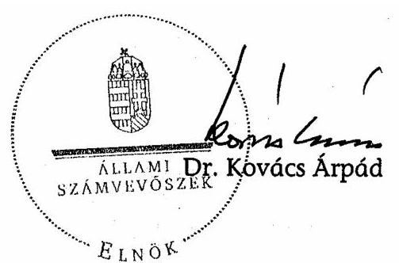
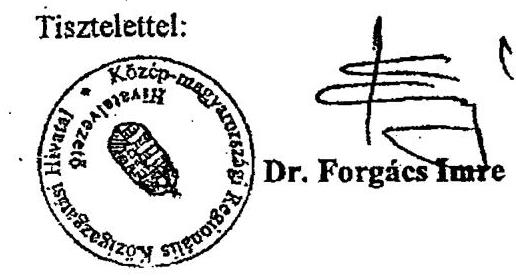
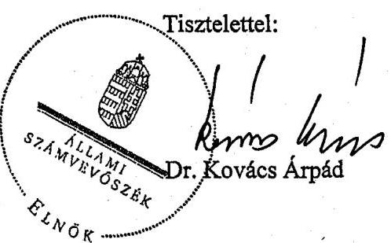
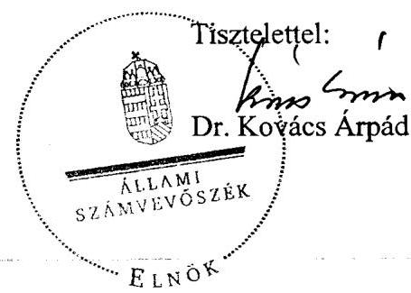

# JELENTÉS 

a fővárosi önkormányzatot és a kerületi önkormányzatokat osztottan megillető bevételek 2007. évi megosztásáról szóló önkormányzati rendelet felülvizsgálatáról

---

3. Önkormányzati és Területi Ellenőrzési Igazgatóság
3.3. Átfogó Ellenőrzési Főcsoport
Iktatószám: V-1018-77/2007.
Témaszám: 870
Vizsgálat-azonosító szám: V0376
Az ellenőrzést felügyelte:
Dr. Lóránt Zoltán
főigazgató
Az ellenőrzés végrehajtásáért felelős:
Dr. Sepsey Tamás
főigazgató helyettes
Az ellenőrzést vezette:
Németh Gábor
igazgató helyettes
A számvevői jelentések feldolgozásában és a jelentés összeállításában
közreműködött:
Dr. Karáné Kőszegi Zsuzsanna
tanácsadó
Az ellenőrzést végezték:
Dr. Csermák Judit
számvevő
Kozma Gábor
számvevő tanácsos
Schósz Attila Ferencné
számvevő tanácsos
Kristóf Jánosné
külső munkatárs
Dér Géza
számvevő
Köllődné Gátai Mária
számvevő
Gyurcsák Ferencné
külső munkatárs
Dr. Knapp József
külső munkatárs

A témához kapcsolódó eddig készített számvevőszéki jelentések:
címe
sorszáma
Jelentés a Magyar Köztársaság 1998. évi költségvetése végrehajtásának ellenőrzéséről

- A helyi önkormányzatok ellenőrzése
1.3. A fővárosi és fővárosi kerületi önkormányzatok közötti forrásmegosztás tapasztalatai

---

Jelentés a Magyar Köztársaság 1999. évi költségvetése végrehajtásának ellenőrzéséről

- A helyi önkormányzatok ellenőrzése

1. számú Függelék: A fővárosi és a fővárosi kerületi önkormányzatok közötti forrásmegosztás tapasztalatai
Jelentés a települési önkormányzatok adóztatási tevékenységének 0121 vizsgálatáról
Függelék:

- A fővárosi és a kerületi önkormányzatok közötti forrásmegosztás

---

# TARTALOMJEGYZÉK 

BEVEZETÉS ..... 7
I. ÖSSZEGZŐ MEGÁLLAPÍTÁSOK, KÖVETKEZTETÉSEK, JAVASLATOK ..... 12
II. RÉSZLETES MEGÁLLAPÍTÁSOK ..... 19

1. A fővárosi önkormányzatot és a kerületi önkormányzatokat osztottan megillető 2007. évi bevételek meghatározásának szabályszerűsége és összege ..... 19
1.1. A magánszemélyek jövedelemadójából az állami költségvetésről szóló törvény alapján a települési önkormányzatot megillető rész ..... 22
1.2. Az egyéb központi adók (átengedett adók) ..... 25
1.3. Az állandó népességhez kapcsolódó hozzájárulás, kivéve az Ötv. 64/B. § a) pontjában foglaltakat ..... 27
1.4. A helyi adókból származó bevételek ..... 30
2. A megosztási arányok meghatározása során felhasznált alapadatok megalapozottsága, megbízhatósága, valamint a számítási eljárások szabályszerűségének ellenőrzése ..... 31
2.1. A fővárosi önkormányzatot és a kerületi önkormányzatokat együttesen megillető részesedés számítása a 2006. évi forrásmegosztási törvény 5. § (1) bekezdése alapján ..... 32
2.2. A 2006. évi forrásmegosztási törvény 6. § (1) bekezdés szerinti megosztás alapját képező „központi hozzájárulás" ..... 33
2.3. A bázisévi (2005. év) kerületi önkormányzati költségvetési beszámolók normatív hozzájárulással támogatott feladatai működési kiadásai meghatározásának szabályszerűsége és megbízhatósága ..... 36
2.4. A 2.3. pont szerinti működési kiadásokhoz a bázisévben kapott állami költségvetési hozzájárulások összegének meghatározása, annak megbízhatósága ..... 38
2.5. A 2006. évi forrásmegosztási törvény 6. § (1) bekezdés szerinti megosztás számításának szabályszerűsége ..... 39
2.6. A 2006. évi forrásmegosztási törvény 6. § (2) bekezdés szerinti megosztás érvényesülése ..... 39
2.7. Az egyes kerületi önkormányzatokat megillető részesedési arány előző évihez viszonyított, legfeljebb 5%-os változási korlátjának betartása ..... 42
3. Az esetleges adat- és számítási hibák miatt a 2008. évi forrásmegosztásnál végrehajtandó korrekció (a fővárosi önkormányzat vagy kerületi

---

önkormányzat részére még jogszerűen járó összeg, illetve jogosulatlanul kapott összeg) meghatározása
4. A 2007. évi forrásmegosztási rendelet megalkotási eljárás szabályszerűsége, valamint a forrásmegosztás adatellenőrzése
4.1. A fővárosi 2007. évi költségvetési koncepció kerületekkel történő egyeztetése, valamint a forrásmegosztás adatellenőrzése
4.2. A 2006. évi forrásmegosztási törvényben előírt határidők betartása
4.3. A kerületi önkormányzatok 2005. évi költségvetési beszámolóiban szereplő adatok feldolgozásának szabályozottsága és vezetői ellenőrzése

# MELLÉKLETEK 

1. számú A 2006. évi forrásmegosztási törvény, illetve a 2007. évi forrásmegosztási rendelet szerint a forrásmegosztásba vont adóbevételek, valamint állandó népességhez kapcsolódó normatív állami hozzájárulások kimutatása (1 oldal)
2. számú A forrásmegosztásba vont bevételek összesítése (1 oldal)
3. számú Működési kiadási forráshiány kiszámítása a kerületi önkormányzatok és a kincstár adatai alapján (1 oldal)
4. számú Működési kiadási forráshiány a „központi hozzájárulás" adathibáinak javítása után (1 oldal)
5. számú Működési kiadási forráshiány kiszámítása a javasolt többlet normatív hozzájárulás figyelembevételével (1 oldal)
6. számú A kerületi önkormányzatok bázisévi költségvetési beszámolóiban szereplő adatok feldolgozásának szabályozottsága és vezetői ellenőrzése (összesítés) (1 oldal)
7. számú A Közép-magyarországi Regionális Közigazgatási Hivatal hivatalvezetőjének 2007. október 11-én kelt levele (2 oldal)
8. számú Bajnai Gordon úr, az Önkormányzati és Területfejlesztési Minisztérium miniszterének észrevétele (2 oldal)
9. számú Bajnai Gordon úr, az Önkormányzati és Területfejlesztési Minisztérium miniszterének írt válaszlevél (2 oldal)
10. számú Dr. Demszky Gábor úr, Budapest Főváros Önkormányzat főpolgármesterének észrevétele (2 oldal)
11. számú Dr. Demszky Gábor úr, Budapest Főváros Önkormányzat főpolgármesterének írt válaszlevél (1 oldal)

---

# RÖVIDÍTÉSEK JEGYZÉKE 

## Törvények

Alkotmány
1994. évi LXIII. törvény
2000. évi költségvetési törvény
2001. és 2002. évi költségvetési törvény
Áht.
2003. évi forrásmegosztási törvény
2005. évi költségvetési törvény
2006. évi forrásmegosztási törvény
2007. évi költségvetési törvény
módosító törvény
Főpolgármesteri hivatal
főpolgármester
főjegyző
fővárosról szóló törvény
gépjárműadó törvény
Hatv.
Ltv.
luxusadó törvény
Jat.
Ötv.

## Rendeletek

1992. évi forrásmegosztási rendelet
2007. évi forrásmegosztási rendelet
a Magyar Köztársaság Alkotmányáról szóló 1949. évi XX. törvény
a helyi önkormányzatokról szóló 1990. évi LXV. törvény módosításáról szóló 1994. évi LXIII. törvény
a Magyar Köztársaság 2000. évi költségvetéséről szóló 1999. évi CXXV. törvény
a Magyar Köztársaság 2001. és 2002. évi költségvetéséről szóló 2000. évi CXXXIII. törvény
az államháztartásról szóló 1992. évi XXXVIII. törvény
a fővárosi önkormányzat és a kerületi önkormányzatok közötti forrásmegosztásról szóló 2003. évi CXIV. törvény
a Magyar Köztársaság 2005. évi költségvetéséről szóló 2004. évi CXXXV. törvény
a fővárosi önkormányzat és a kerületi önkormányzatok közötti forrásmegosztásról szóló 2006. évi CXXXIII. törvény
a Magyar Köztársaság 2007. évi költségvetéséről szóló 2006. évi CXXVII. törvény
az egyes önkormányzatokat érintő törvények módosításáról szóló 2007. évi CLXXXII. törvény
Budapest Főváros Önkormányzata Közgyűlésének Főpolgármesteri Hivatala
Budapest Főváros Önkormányzatának Főpolgármestere
Budapest Főváros Önkormányzatának Főjegyzője
a fővárosi és a fővárosi kerületi önkormányzatokról szóló 1991. évi XXIV. törvény
a gépjárműadóról szóló 1991. évi LXXXII. törvény
a helyi adókról szóló 1990. évi C. törvény
a lakások és helyiségek bérletére, valamint az elidegenítésükre vonatkozó egyes szabályokról szóló 1993. évi LXXVIII. törvény
a luxusadóról szóló 2005. évi CXXI. törvény
a jogalkotásról szóló 1987. évi XI. törvény
a helyi önkormányzatokról szóló 1990. évi LXV. törvény

Budapest Főváros Önkormányzat 2/1992. (III. 5.) számú rendelete a Fővárosi Önkormányzatot és a kerületi önkormányzatokat osztottan megillető bevételek 1992. évi megosztása
Budapest Főváros Önkormányzat 6/2007. (II. 23.) számú rendelete a Fővárosi Önkormányzatot és a kerületi önkormányzatokat osztottan megillető bevételek 2007. évi megosztásáról

---

idegenforgalmi adó rendelet
iparűzési adó rendelet

PM-BM rendeletek

PM-ÖTM együttes rendelet

Ámr.

## Szórövidítések

AB
ÁSZ
bázisév
BM KÖNYV Hivatal
földhivatal
2007. évi fővárosi költségvetési koncepció
fővárosi önkormányzat
kerületi önkormányzatok
kincstár
Közgyűlés
KSH
polgármesterek
Polgármesteri hivatalok

SzMSz

Budapest Főváros Önkormányzat 31/1994. (VI. 10.) számú rendelete az idegenforgalmi adóról
Budapest Főváros Önkormányzat 21/1991. (IX. 5.) számú rendelete a helyi iparűzési adóról
a helyi önkormányzatokat megillető normatív állami hozzájárulásokról és személyi jövedelemadóról szóló PMBM együttes rendeletek, 1993-2006-ig
a helyi önkormányzatokat és a többcélú kistérségi társulásokat 2007. évben egyes állami költségvetési kapcsolatokból megillető forrásokról szóló 1/2007. (I. 30.) PMÖTM együttes rendelet
az államháztartás működési rendjéről szóló 217/1998. (XII. 30.) Korm. rendelet

Alkotmánybíróság
Állami Számvevőszék
a tárgyévet kettővel megelőző év
Belügyminisztérium Központi Adatfeldolgozó, Nyilvántartó és Választási Hivatal (Jogutód szervezete 2007. január 1-jétől a Közigazgatási és Elektronikus Közszolgáltatások Központi Hivatal)
Fővárosi Kerületek Földhivatala
Javaslat Budapest Főváros Önkormányzata 2007. évi költségvetési koncepciójára
Budapest Főváros Önkormányzata
Budapest Főváros I - XXIII. kerületeinek önkormányzatai
Magyar Államkincstár
Budapest Főváros Önkormányzatának Közgyűlése
Központi Statisztikai Hivatal
Budapest Főváros I - XXIII. kerület Önkormányzatainak Polgármestere
Budapest Főváros I. - XXIII. kerületek Önkormányzata Képviselő-testületének Polgármesteri Hivatalai
Szervezeti és Működési Szabályzat

---

# ÉRTELMEZŐ SZÓTÁR 

„ászfmt" adatbázis
„kerületi" adatbázis
„kincstári" adatbázis
állami költségvetés
forrásmegosztás
háttérszámítás
működési kiadási forráshiány
normatív hozzájárulások
normatív állami hozzájárulás

PM tájékoztató
az ÁSZ észrevétele alapján meghatározott adatokat és a számítást tartalmazza.
a fővárosi és a kerületi önkormányzatok 2005. évi költségvetési beszámolójának adatait és a számítást tartalmazza.
az ÁSZ rendelkezésére álló 2005. évi kincstári adatokat és a számítást tartalmazza.
a Magyar Köztársaság 1991-2007. évi költségvetéséről szóló törvények
a fővárosi önkormányzatot és a kerületi önkormányzatokat osztottan megillető bevételek megosztása
a fővárosi önkormányzat forrásmegosztási rendelettervezetének előterjesztéséhez mellékelt, a forrásmegosztást megalapozó számítások, amelyek alapján a forrásmegosztási rendelet elfogadásra került
a működési kiadások és a normatív hozzájárulások különbözete
a normatív állami hozzájárulás és a normatív részesedésű átengedett személyi jövedelemadó együttesen
A fővárosról szóló törvény 17. § (2) bekezdés a), valamint 18. § a) pontjában normatív költségvetési hozzájárulás, 17. § (3) bekezdés c) pontjában normatív állami támogatás, az Ötv. 64. § (3) bekezdés a), 64/B. § a) pontjában, a 64/C. § (2) bekezdésében normatív központi hozzájárulás, 64. § (4) bekezdés c) pontjában központi hozzájárulás megnevezések együttesen
A Pénzügyminisztérium által kiadott Tájékoztató az államháztartás szervezetei éves költségvetési beszámolójának összeállítására

---

.

---

# JELENTÉS 

## a fővárosi önkormányzatot és a kerületi önkormányzatokat osztottan megillető bevételek 2007. évi megosztásáról szóló önkormányzati rendelet felülvizsgálatáról

## BEVEZETÉS

A 2006. évi forrásmegosztási törvény 8. § (1) bekezdése alapján, figyelemmel az Alkotmány 32/C. § (1) bekezdésére, a fővárosi önkormányzat tárgyévre vonatkozó 2007. évi forrásmegosztási rendeletét az ÁSZ-nak felül kell vizsgálnia.

A 2006. évi forrásmegosztási törvénynek megfelelően a számvevőszéki ellenőrzés a forrásmegosztás során alkalmazott adatok megalapozottságára és az ennek alapjául szolgáló számítások helyességére irányult. Amennyiben a forrásmegosztás során alkalmazott adatok, vagy a számítások helytelensége miatt a fővárosi önkormányzat, vagy valamely kerületi önkormányzat jogosulatlan forráshoz jutott, vagy a jogszerűen járó forrásnál alacsonyabb összegben részesült, ezt az összeget, a hiba feltárását követő év forrásmegosztásánál kell figyelembe venni.

Az ellenőrzés célja annak megállapítása volt, hogy:

- a 2007. évi forrásmegosztási rendelet a 2006. évi forrásmegosztási törvény előírásainak megfelelően határozta-e meg a megosztható bevételeket és azok összegét;
- a megosztási arányok meghatározásánál felhasznált alapadatok megalapozottak voltak-e, és a számítási eljárások helyesek voltak-e;
- az esetleges adat- és számítási hibák miatt milyen korrekciót kell elvégezni a tárgyévet követő évi forrásmegosztásnál.

Az ellenőrzött időszak: a fővárosi önkormányzatot és a kerületi önkormányzatokat osztottan megillető bevételek meghatározása a 2007. évre vonatkozott, a megosztási arányok meghatározása során felhasznált alapadatokat a 2005. évi önkormányzati költségvetési beszámoló alapján kellett ellenőrizni.

A forrásmegosztás rendszerének megismeréséhez szükséges a vonatkozó jogi szabályozás rövid áttekintése.

A fővárosi önkormányzati rendszer - az önkormányzatok 1990. évi létrehozásakor - kétszintűként került meghatározásra, a fővárosi önkormányzat és a kerületi önkormányzatok, azonban feladat- és hatáskörüket tekintve számottevő az eltérés közöttük. Az 1990. évben az Ötv. a fővárosi önkormányzati rendszer vonatkozásában csak az alapokat rögzítette, de a részletes szabályozást külön törvényre, a fővárosról szóló törvényre bízta. A fővárosról szóló törvényben a fővárosi önkormányzatot és a kerületi önkormányzatokat osztottan megillető bevételek a következőkből álltak:

- a magánszemélyek jövedelemadójából a települési önkormányzatokat megillető rész;
- az egyéb központi adók;
- az állandó népesség egészéhez kapcsolt normatív állami hozzájárulás ${ }^{1}$;
- a helyi adókból származó bevételek.

A fővárosról szóló törvény egyidejűleg módosította a Hatv.-t annak érdekében, hogy biztosítsa a fővárosi önkormányzatnak a főváros egész területére a helyi adó bevezetésének jogát, továbbá módosította a 8. § (1) bekezdését, amely során a főváros esetében eltért attól az általános rendelkezéstől, hogy a helyi adó kizárólag az azt megállapító önkormányzat bevételét képezi, tőle az nem vonható el, tehát a megosztott bevételek részét képezi.

A fővárosról szóló törvény a felsorolt bevételek fővárosi önkormányzatok közötti megosztásáról csak annyit mondott, hogy azt „a fővárosi közgyűlés rendeletében a kerületi képviselő-testületek többségének egyszerű szótöbbséggel elfogadott egyetértésével határozza meg", vagyis sem a fővárosról szóló törvény, sem az 1994-ben módosított Ötv. ${ }^{2}$ nem határozta meg a bevételek megosztásának módszerét. Lehetővé tette, hogy adott esetben a négy bevétel bármelyike akár teljes egészében a kerületi önkormányzatokat, vagy éppen a fővárosi

 önkormányzatot illesse meg.

A fővárosi önkormányzat és a kerületi önkormányzatok közötti forrásmegosztás ténylegesen a köztük 1992-ben létrejött megállapodáson alapult, amely szerint a megosztás alapelve a feladatellátásban való részesedés volt. Ennek megfelelően:

- Kizárólagosan a kerületi önkormányzatokhoz szabályozták a helyi közművelődési célú, a fővárosi önkormányzathoz pedig a térségi feladatokhoz kapcsolódó normatív állami hozzájárulást. A kerületi önkormányzatok helyi adó kivetési érdekeltségének megtartása miatt a kerületi helyi adókat, valamint a fővárost megillető gépjárműadót teljes egészében a kerületi önkor-

[^0]
[^0]:    ${ }^{1}$ Ugyanarra a fogalomra az egyes jogszabályok más megnevezést alkalmaznak, felsorolásukat az értelmező szótár tartalmazza.
    ${ }^{2}$ Az 1994. évi LXIII. törvénnyel módosított Ötv. a fővárosról szóló törvény rendelkezéseit beépítette az Ötv.-be, kiegészítve az előző időszak tapasztalataiból adódó új szabályozási szükségletekkel. A törvénymódosítás indokolása szerint valamennyi helyi adó a megosztott bevételek közé tartozik.

---

mányzatok bevételeként határozták meg ${ }^{3}$ azaz „nem vonták be a megosztásba".

- Az előző pontba nem tartozó bevételeket a megállapodás szerinti arányban osztották meg ${ }^{4}$.

A megállapodásban foglaltakat tartalmazta az 1992. évi forrásmegosztási rendelet. Az elmúlt 15 év alatt ezen megállapodásnak megfelelően működött a forrásmegosztás rendszere.

Vitákat ${ }^{5}$ az arány szerinti megosztás körébe tartozó bevételek - évente változó megosztási módszere váltott ki.

A forrásmegosztással kapcsolatos törvényi szintű szabályozást - a megegyezés elősegítése érdekében - először a 2000. évi költségvetési törvény fogalmazta meg miszerint: a felosztásra kerülő bevételek közül a kerületi önkormányzatoknak a magánszemélyek jövedelemadójából a települési önkormányzatokat megillető rész, az egyéb központi adók és az állandó népességhez kapcsolódó normatív állami hozzájárulás legalább 50%-át, és a helyi adókból származó bevételek legalább 45%-át kell megkapniuk. A szabályozás alkotmányellenességének megállapítását négy indítvány kérte, azonban az AB döntésekor a vitatott szabály már hatályát vesztette, ezért az AB az eljárását a hatályos 2001. és 2002. évi költségvetési törvény vonatkozó részére ${ }^{6}$ folytatta le, az abban foglalt hasonló rendelkezést alkotmányellenesnek minősítette és megsemmisítette ${ }^{7}$.

[^0]
[^0]:    ${ }^{3}$ A kerületi helyi adók és gépjárműadó a megállapodás alapján és nem a költségvetési törvények, illetve a Hatv. alapján képezték a kerületi önkormányzatok bevételét, ugyanis ezen jogszabályok mindig települési önkormányzatot nevesítettek, ami az ország önkormányzatai esetében egyértelmű szabályozást jelentett, az egyaránt települési önkormányzatként működő fővárosi önkormányzat és a kerületi önkormányzatok esetében azonban - a fővárosról szóló törvény rendelkezése miatt - nem.
    ${ }^{4}$ Az 1992. évi megállapodásban a megosztásba tartozó összes bevételről döntöttek.
    ${ }^{5}$ A forrásmegosztással kapcsolatos vita nemcsak a fővárosi önkormányzat és a kerületi önkormányzatok között, hanem az eltérő adottságú kerületi önkormányzatok között is volt.
    ${ }^{6}$ A Magyar Köztársaság 2001. és 2002. évi költségvetéséről szóló 2000. évi CXXXIII. törvény 26. § (2)-(3) bekezdése.
    ${ }^{7}$ A 47/2001. (XI. 22.) AB határozat.

---

Ezt követően és figyelemmel egy másik AB döntésre ${ }^{8}$ az Országgyűlés az Ötv.-t úgy módosította, hogy a feladat- és hatáskörarányos forrásmegosztás normatív eljárásait, számítási módját külön törvényben kell szabályozni, amely jelenleg a 2006. évi forrásmegosztási törvény. Ezt az Országgyűlés a 2007. december 17-én elfogadott, december 29-én kihirdetett törvénnyel ${ }^{9}$ módosította. A módosító előírások egy részét a 2007. évi forrásmegosztás felülvizsgálatánál is alkalmazni kell. Erre tekintettel a jelentésben ismertetjük a 2006. évi forrásmegosztási törvénnyel és a 2007. évi forrásmegosztási rendelettel összefüggő jogi szabályozás ellentmondásait, azonban a javaslatok megtételénél már figyelembe vettük azokat a 2007. december 30-ától hatályos rendelkezéseket, amelyek érintik a felülvizsgálatot, valamint utalunk a 2006. évi forrásmegosztási törvény módosított rendelkezéseire is.

A 2006. évi forrásmegosztási törvény a korábbi évek gyakorlatától eltérő szabályozást tartalmazott, az Ötv.-ben meghatározott megosztandó négy bevétel összegére vonatkozóan 47%-53%-os megosztási arány kötelező alkalmazását írta elő a fővárosi és a kerületi önkormányzatok részesedése tekintetében.

Az egyéb szabályszerűségi ellenőrzés keretében a 2006. évi forrásmegosztási törvény előírásainak való megfelelőséget elemző eljárással vizsgáltuk. A Főpolgármesteri hivatalnál tekintettük át a 2006. évi forrásmegosztási törvény gyakorlati alkalmazását, a számítások helyességét. A fővárosi önkormányzatot a megosztott bevételek 47%-a illeti meg, a kerületi önkormányzatok összességét megillető (53%) összegnek a kerületi önkormányzatok közötti megosztás során alkalmazott adatok helyességének megállapításánál a 2007. évi forrásmegosztási rendelettervezet előterjesztéséhez mellékelt háttérszámításokhoz kapcsolódó adatbázis adatait hasonlítottuk össze az önkormányzatoknál található költségvetési beszámoló adataival, valamint az ÁSZ rendelkezésére álló kincstári adatokkal. Az összehasonlítás érdekében a „kerületi" adatbázis táblázataiba az önkormányzatok beszámolóiban ellenőrzött adatot írtuk be, ha az adat eltért a táblázatban feltüntetett háttérszámítás adatától. Hasonlóan jártunk el a „kincstári" adatbázis táblázatainak adata esetében. Az ÁSZ vizsgálata alapján meghatározott adatok rögzítését az „ászfmt" adatbázisban végeztük el.

A forrásmegosztás adatainak ellenőrzésekor értékeltük az adatfeldolgozás szabályozottságát és az ehhez kapcsolódó vezetői ellenőrzés működésének megbízhatóságát.

[^0]
[^0]:    ${ }^{8}$ Az AB 1/1999. (II. 24.) AB határozata megállapította, hogy „valamely, az Alkotmány által meghatározott törvény elfogadásához megkívánt minősített többség nem egyszerűen a törvényalkotási eljárás formai előírása, hanem olyan alkotmányos garancia, amelynek lényeges tartalma az országgyűlési képviselők közötti széles körű egyetértés. A minősített többség követelménye nemcsak a törvény megalkotására vonatkozik, hanem e törvény módosítására (rendelkezéseinek megváltoztatására, kiegészítésére) és hatályon kívül helyezésére is". Továbbá az Alkotmány 44/C. §-ból az következik, hogy az Ötv. módosítására csak minősített szavazattöbbséggel kerülhet sor, azonban nem kizárt, hogy az Ötv.-ben szabályozott egyes elemekre vonatkozó részletes rendelkezéseket egyszerű szavazattöbbséggel elfogadott törvény tartalmazza.
    ${ }^{9}$ A 2007. évi CLXXXII. törvény az egyes önkormányzatokat érintő törvények módosításáról.

---

A helyszíni ellenőrzés megállapításainak dokumentálását a kerületi önkormányzatoknál szükség szerint tanúsítvány kéréssel, adatbázis táblázatok és munkatáblák kitöltésével biztosítottuk, amelyeket a számvevői jelentéssel egyidejűleg a kerületi önkormányzatok polgármesterei részére átadtunk.

---

# I. ÖSSZEGZŐ MEGÁLLAPÍTÁSOK, KÖVETKEZTETÉSEK, JAVASLATOK 

A 2007. évi forrásmegosztási rendelet összesen 187 911 767 ezer Ft megosztásáról rendelkezett.

A 2006. évi forrásmegosztási törvény a fővárosi önkormányzatot és a kerületi önkormányzatokat osztottan megillető bevételek körét az Ötv. szabályozására, valamint a Hatv. törvényre hivatkozással állapította meg, továbbá a bevételek nagyságának meghatározásához a fővárosi költségvetési koncepcióban szereplő tervszámok kerületekkel történő egyeztetési kötelezettségét írta elő. Az Ötv. szerint a megosztott bevételek körébe tartoznak a magánszemélyek jövedelemadójából az állami költségvetésről szóló törvény alapján a települési önkormányzatokat megillető rész; az egyéb központi adó; az állandó népességhez kapcsolódó normatív állami hozzájárulás, kivéve a fővárosi önkormányzatot megillető igazgatási- és közművelődési feladatokhoz kapcsolódókat; valamint a helyi adókból származó bevételek.

A kerületi önkormányzatok nem rendelkeztek a fővárosi önkormányzatnál több, vagy pontosabb információval a költségvetési koncepció készítésének időszakában. A fővárosi önkormányzat költségvetési koncepciójának csak a fővárosi önkormányzatra vonatkozó tervszámokat kell tartalmaznia, ezért annak a kerületi önkormányzatokkal való egyeztetési kötelezettségének előírása indokolatlan.

A 2006. évi forrásmegosztási törvény Hatv.-re való hivatkozását a kerületi önkormányzatok tévesen úgy értelmezték, hogy az Ötv. szerinti megosztott bevételek körébe tartozó helyi adókra vonatkozó előírás ${ }^{10}$ nem vonatkozik minden, a főváros területén kivetett és beszedett helyi adóra. A Hatv. rendelkezése ${ }^{11}$ nincs összhangban az Ötv. rendelkezésével ${ }^{12}$, mert az Ötv. helyett a hatályon kívül helyezett, a fővárosról szóló törvényre való hivatkozást tartalmaz.

Az AB felhívása alapján az Országgyűlés 2003-ban fogadta el a fővárosi forrásmegosztás normatív eljárásait tartalmazó külön törvényt. Az Országgyűlés a 2006. évben új forrásmegosztási törvényt alkotott, mely a feladatellátástól függetlenül rögzítette a megosztás arányát. A 2006. évi forrásmegosztási törvény a fővárosi önkormányzatot megillető bevételek 47%-53%-os megosztásával korlátozta a Közgyűlés Ötv. felhatalmazásán alapuló jogkörét, amely a megosztási arányok meghatározására vonatkozik.

[^0]
[^0]:    ${ }^{10}$ A 2006. évi forrásmegosztási törvény 2. §-a.
    ${ }^{11}$ A Hatv. 8. § (1) bekezdése szerint „Ha a fővárosi és a fővárosi kerületi önkormányzatokról szóló törvény másként nem rendelkezik, a helyi adó kizárólag az azt megállapító önkormányzat bevételét képezi, tőle az nem vonható el."
    ${ }^{12}$ Az Ötv. 64. § (4) bekezdés d) pont szerint a fővárosi önkormányzatot és a kerületi önkormányzatot osztottan megillető bevételek a helyi adókból származó bevételek.

---

A 2007. évi forrásmegosztási rendelet nem a 2006. évi forrásmegosztási törvény, hanem az előző évek gyakorlatának megfelelően tartalmazta a megosztott bevételek körét. A kialakult gyakorlat az Ötv. 1990. évi felhatalmazása szerint megalkotott fővárosról szóló törvényben foglaltakon alapult, amikor a kerületi képviselő-testületek többségének egyetértéséhez kötődött a bevételek megosztását meghatározó közgyűlési rendelet elfogadása, s az akkor hatályos törvény nem nevesítette a megosztás arányát, arról a fővárosi közgyűlés döntött.

A fővárosról szóló törvény rendelkezéseinek 1994-ben az Ötv-be ${ }^{13}$ - módosításokkal - történt beillesztését követően megszűnt az Ötv. és a költségvetési törvények összhangja. Az 1995-2007. években a költségvetési törvények a főváros önkormányzatait megillető bevételek helyett a fővárosi önkormányzatot megillető bevételeknek a fővárosi és a kerületi önkormányzatok közötti megosztásáról rendelkeztek, amely szabályozás az Ötv-re való hivatkozáson túl nem tartalmazott érdemi előírást.

A 2006. évi forrásmegosztási törvény tartalmazza a személyi jövedelemadó helyben maradó részébe a jövedelem-differenciálódás mérséklése miatt elvont összeg tárgyévet megelőző évben visszaigényelhető részét, de nem rendelkezett a visszafizetendő összeg rendezéséről, amelyet a 2007. évi forrásmegosztási rendelet a 2006. évi forrásmegosztási törvény felhatalmazása nélkül megosztott a fővárosi önkormányzat és a kerületi önkormányzatok között. A módosító törvény ezt a hiányosságot pótolta, azonban a jogalkotó ezen módosítás tekintetében nem írta elő, hogy a forrásmegosztás 2007. évi felülvizsgálata során ezt alkalmazni kell, a 2007. évi forrásmegosztási rendelet hivatkozott része ellentétes a 2006. évi forrásmegosztási törvénnyel.

A költségvetési törvények szabályozása a magánszemélyek jövedelemadójából a települési önkormányzatokat megillető rész vonatkozásában, valamint a magánszemélyek jövedelemadójából finanszírozott normatív állami hozzájárulás következtében nincs összhangban az Ötv. előírásaival ${ }^{14}$, mert a személyi jövedelemadó részben a normatív hozzájárulás, illetve a kötött felhasználású normatív támogatás forrásává vált. A forrásmegosztás bevételei között a magánszemélyek jövedelemadójának összegét a 2007. évi forrásmegosztási rendeletben szereplő adatok alapján vettük figyelembe, a PM-ÖTM együttes rendeletben foglaltakkal egyezően.

Az egyéb központi adók körébe tartozó gépjárműadót a 2007. évi forrásmegosztási rendelet - az Ötv. előírása ${ }^{15}$ ellenére - nem osztotta meg a főváros és a kerületi önkormányzatok között a 2006. évi forrásmegosztási törvény 2007. december 29-ig hatályos előírása szerinti 47%-53%-os arányban, mert az 1992. évi megállapodás alapján azt a kerületi önkormányzatok bevételének tekintették. A 2006. évi forrásmegosztási törvény 2007. december 30-án hatályba lépett rendelkezése ${ }^{16}$ szerint az egyéb központi adókból a kerületi önkormányzat által

[^0]
[^0]:    ${ }^{13}$ Az Ötv. VII. A főváros című fejezetébe 62-68/D. §-ként.

 ${ }^{14}$ Az Ötv. 64. § (4) bekezdés a) pontja.
    ${ }^{15}$ Az Ötv. 64. § (4) bekezdés b) pontja.
    ${ }^{16}$ A 2006. évi forrásmegosztási törvény 4. § (3) bekezdése.

---

beszedett adóbevétel 100%-a a kerületi önkormányzatot illeti meg. Ezt a rendelkezést a 2006. évi forrásmegosztási törvényt módosító törvény előírása ${ }^{17}$ szerint a forrásmegosztás 2007. évi felülvizsgálata esetén is alkalmazni kell. A 2006. évtől bevezetett, ebbe a körbe tartozó luxusadó megosztása szabályszerűen megtörtént.

Az állandó népességhez kapcsolódó normatív állami hozzájárulás összegének meghatározása nem egyértelmű. Az Ötv. előírása ${ }^{18}$ szerint a fővárosi önkormányzat kizárólagos bevétele az igazgatási- és közművelődési normatív hozzájárulás, ennek összege azonban nem állapítható meg, mert a 2007. évi költségvetési törvény összevontan tartalmazza ezek összegét a megosztandó bevételek körébe tartozó sport- és közgyűjteményi feladatokhoz tartozóval. A forrásmegosztási rendelet nem vette figyelembe az állandó népességszám alapján juttatott összes normatív állami hozzájárulást, hanem csak a településüzemeltetési, igazgatási- és sportfeladatokhoz kapcsolódó normatív állami hozzájárulást osztotta meg a fővárosi és a kerületi önkormányzatok között.

A helyi adókból származó bevételek megosztásánál a fővárosi önkormányzat iparűzési és idegenforgalmi adóbevételét szabályszerűen vették figyelembe, a 2006. évi forrásmegosztási törvény 2007. december 29-ig hatályos előírása ellenére a kerületi önkormányzatok által kivetett és beszedett helyi adókat azonban nem. A 2007. évi forrásmegosztási rendelet törvénysértő módon a kerületi helyi adókat a kerületek bevételeként határozta meg, amely szabályozás az 1992. évi megállapodásban foglaltakon alapult. A 2006. évi forrásmegosztási törvény 2007. december 30-án hatályba lépett rendelkezése ${ }^{19}$ szerint a helyi adókból a kerületi önkormányzat által beszedett adóbevétel 100%-a a kerületi önkormányzatot illeti meg. Ezt a rendelkezést a 2006. évi forrásmegosztási törvényt módosító törvény előírása ${ }^{20}$ szerint a forrásmegosztás 2007. évi felülvizsgálata esetén is alkalmazni kell.

A 2006. évi forrásmegosztási törvény nem felel meg az Ötv. követelményének, mert nem határozta meg a forrásmegosztás számításánál figyelembe veendő önkormányzati feladatokat. Így nem egyértelműen meghatározott, hogy a kiadási oldalon mely szakfeladatok működési kiadásait, a bevételi oldalon a normatív hozzájárulások és támogatások mely feldolgozási kódszámain elszámolt bevételeket kell figyelembe venni.

A forrásmegosztás számításánál a nem lakosságszám alapján járó normatív állami hozzájárulások összegének arányában kell megosztani a működési kiadások és az azokhoz kapcsolódó normatív állami hozzájárulások különbségét, azaz a működési kiadási forráshiány összegét.

[^0]
[^0]:    ${ }^{17}$ Az egyes önkormányzatokat érintő törvények módosításáról szóló 2007. évi CLXXXII. törvény 8. § (1) bekezdése.
    ${ }^{18}$ Az Ötv. 64/B. § e) pontja.
    ${ }^{19}$ A 2006. évi forrásmegosztási törvény 4. § (3) bekezdése.
    ${ }^{20}$ Az egyes önkormányzatokat érintő törvények módosításáról szóló 2007. évi CLXXXII. törvény 8. § (1) bekezdése.

---

A 2006. évi forrásmegosztási törvény kizárja ${ }^{21}$ a költségvetési szervek intézményfenntartói jogának átadására visszavezethető változások figyelembe vételét a forrásmegosztásnál, ez a rendelkezése nincs összhangban az Ötv-nek a források megosztására vonatkozó feladat- és hatáskör arányos előírásával.

A forrásmegosztás számítási előírása célszerűtlen, mert a normatív állami hozzájárulásokból bevételként csak a lakosságszám alapján járókat veszi figyelembe, kiadásként viszont a normatív állami hozzájárulás alapját képező feladatok teljes működési kiadását. A működési kiadások korlát nélküli figyelembevétele azt eredményezi, hogy a feladatot magasabb költségszinten ellátó kerületi önkormányzat a forrásmegosztáskor nagyobb arányú részesedést kap az ugyanazon feladatot költségtakarékosabban ellátó kerületi önkormányzatnál.

A „központi hozzájárulás" összegének a fővárosi önkormányzat háttérszámításában történt meghatározása nem felelt meg a 2006. évi forrásmegosztási törvény előírásának, mert nem minden, az állandó népesség egészéhez tartozó normatív hozzájárulást vette figyelembe. Ezek pótlásának hatására a főváros háttérszámításához viszonyítva a „központi hozzájárulás" megállapításunk szerint 1,8%-kal nagyobb.

Számítási alapadatokat a 2007. évi forrásmegosztási rendelet nem tartalmaz, ezért minden esetben a rendelet-tervezet közgyűlési előterjesztésének 2. számú mellékletét képező háttérszámítás adataival vetettük össze az ellenőrzésünk során megállapítottakat.

A működési kiadások helyszíni ellenőrzésénél az épületfenntartás és -korszerűsítés, valamint a színházi tevékenység hiányzó adatainak pótlását követően a háttérszámítás adatához viszonyítva a működési kiadás 0,2%-kal nagyobb. Véleményünk szerint a településüzemeltetési, illetve igazgatási feladatokhoz további szakfeladatok teljesítési adatai is figyelembe veendők, amelyek a működési kiadás összegét 15,3%-kal növelték.

A működési kiadási forráshiány és a megosztandó bevételi összeg összehasonlítása alapján megállapítottuk, hogy a fővárosi önkormányzat által, valamint az ÁSZ megállapításai alapján számított működési kiadási forráshiány is meghaladta a megosztható bevételek összegét, ezért nem maradt forrás a 2006. évi forrásmegosztási törvényben a kerületek sajátosságait figyelembe vevő szabályozás szerinti megosztásra ${ }^{22}$. Ez utóbbi megosztás azért sem végezhető el vitathatatlan módon, mert a megmaradt forrás felosztását a 2005. év végi adatok alapján - amelyek nem állnak rendelkezésre - kellett volna elvégezni, továbbá a fogalom-meghatározások sem feleltek meg a kapcsolódó szabályozásokban foglaltaknak. Az önkormányzati tulajdonban lévő lakások ingatlanvagyon-kataszteri, valamint a KSH „jelentés az önkormányzatok 2006. évi ingatlankezelési és lakásellátási tevékenységéről" című adatszolgáltatása nincs összhangban, továbbá a KSH adatszolgáltatásban a lakások komfortfokozat szerinti besorolása nem felel meg az Ltv. előírásának, mert nem különíti el a szükséglakás fogalmát. Az ingatlanvagyon-kataszteri nyilvántartás épület nyilvántartá-

[^0]
[^0]:    ${ }^{21}$ A 6. § (4) bekezdése.
    ${ }^{22}$ A 6. § (2) bekezdés szerinti megosztás.

---

sában a függőleges teherhordó szerkezetre vonatkozó meghatározás nem azonos a KSH „részletező adatok a lakások és üdülők végleges használatbavételéről" című - önkormányzatok által kitöltendő - kérdőív kitöltési útmutatójában foglaltakkal. Ezen KSH kérdőív adatai felelnek meg a 2006. évi forrásmegosztási törvény előírásának, azonban az adatok évenkénti összesítését a KSH nem hozza nyilvánosságra. A 2006. évi forrásmegosztási törvény 2007. december 30-tól hatályos módosítása a számításokban felhasználható adatokat a törvény mellékletében meghatározta.

A kerületi önkormányzatok és a fővárosi önkormányzat elvégezték a forrásmegosztás számítását megalapozó adatok ellenőrzését. A 2007. évi forrásmegosztási rendelet tervezet véleményezésekor az önkormányzati bizottságok, képviselő-testületek és a fővárosi önkormányzat bizottságai, valamint a Közgyűlés az ÁSZ véleményével azonos észrevételeket tettek. A 2007. évi forrásmegosztási rendeletet a kerületi önkormányzatok a szabályozás kedvező változásai miatt észrevételeik fenntartása mellett támogatták.

A Közép-magyarországi Regionális Közigazgatási Hivatal vezetője megállapította ugyan, hogy a 2007. évi forrásmegosztási rendelet törvénysértő, de az Ötv. előírása ellenére nem hívta fel a Közgyűlést a törvénysértés megszüntetésére.

A 2007. évi forrásmegosztási rendelettervezet felülvizsgálatáról szóló független könyvvizsgálói jelentés szabálytalanságot nem állapított meg, a rendelettervezetet a hatályos jogszabályokkal összhangban lévőnek minősítette.

A 2008. évi forrásmegosztásnál kell javaslatunk alapján a 2007. évi forrásmegosztás korrekcióját elvégezni. A 2005. évi bázisadatok felülvizsgálata alapján javaslatot teszünk a megosztási arányok korrigálására, a 2007. évi költségvetési törvény, illetve az Ötv. alapján a megosztandó bevételek helyesbítésére.

A helyszíni ellenőrzés megállapításainak hasznosítása mellett javasoljuk:

# az önkormányzati és területfejlesztési miniszternek 

1. kezdeményezze a fővárosi önkormányzat és a kerületi önkormányzatok közötti forrásmegosztásról szóló 2006. évi CXXXIII. törvény módosítását annak érdekében, hogy előírásai összhangban legyenek a helyi önkormányzatokról szóló 1990. évi LXV. törvénnyel, ezért a módosítás:
a) határozza meg a forrásmegosztási számításoknál figyelembe veendő feladatokat a helyi önkormányzatokról szóló 1990. évi LXV. törvény 64. § (6) bekezdésének megfelelően;
b) kezdeményezze a fővárosi önkormányzat és a kerületi önkormányzatok részesedési arányának olyan normatív módon való meghatározását, ami nem korlátozza a Fővárosi Közgyűlés megosztási arányok meghatározására vonatkozó jogát;
2. kezdeményezze a fővárosi önkormányzat és a kerületi önkormányzatok közötti forrásmegosztásról szóló 2006. évi CXXXIII. törvény előírásainak pontosítását az egyértelmű alkalmazhatóság céljából, ennek keretében:

---

a) kezdeményezze, hogy a Fővárosi Közgyűlés törvényi felhatalmazás alapján rendeletben határozza meg a forrásmegosztási számításnál figyelembe vett feladatokhoz tartozó azon szakfeladatokat, amelyeken elszámolt működési kiadások a forrásmegosztási számítás alapját képezik;
b) kezdeményezze, hogy a költségvetési törvény 3. és 8. számú mellékletében szereplő normatív hozzájárulások és támogatások azon feldolgozási kódszámait a Fővárosi Közgyűlés törvényi felhatalmazás alapján, rendeleti úton határozza meg, amelyek a forrásmegosztásnál figyelembe veendő feladatokhoz tartozóként ismer el;
c) kezdeményezze, hogy a költségvetési törvényben külön önálló feladatként szerepeljen a fővárosi önkormányzat kizárólagos bevételét képező igazgatási és közművelődési feladat normatív hozzájárulása a helyi önkormányzatokról szóló 1990. évi LXV. törvény 64/B. § a) pontjában foglaltak érvényesíthetősége érdekében;
d) kezdeményezze, hogy a 2006. évi forrásmegosztási törvény szabályozása ösztönözzön a költségtakarékos feladatellátásra;
3. kezdeményezze a helyi adókról szóló 1990. évi C. törvény 8. § (1) bekezdés módosítását, hogy az ne a már hatályon kívül helyezett, a fővárosi és a fővárosi kerületi önkormányzatokról szóló 1991. évi XXIV. törvényre hivatkozzon, hanem a helyi önkormányzatokról szóló 1990. évi LXV. törvény 64. § (4) bekezdés d) pontjára;
4. kezdeményezze, hogy a költségvetési törvény ne tartalmazzon indokolatlanul a főváros önkormányzatait megillető bevételek megosztását szabályozó törvényekre való hivatkozást;

# a főpolgármesternek 

Gondoskodjon arról, hogy a 2009. évi forrásmegosztásnál a 2007. évi forrásmegosztás korrekciójaként
a) a 2005. évi jövedelem-differenciálódás mérséklés elszámolásából adódó 402194856 forint visszafizetendő összeg jogszabályi felhatalmazás hiányában szabálytalan megosztását szüntesse meg;
b) az Ötv. 64. § (4) bekezdés c) pontjának megfelelően az állandó népességhez kapcsolódó központi hozzájárulások teljes körű figyelembevételével (a Magyar Köztársaság 2007. évi költségvetéséről szóló 2006. évi CXXVII. törvény 3. számú melléklet 2. ac.) pontjában meghatározott gyámügyi igazgatási feladatok; 2.ba.) pontjában meghatározott építésügyi igazgatási feladatok alap-hozzájárulása; 9. pontjában meghatározott pénzbeli szociális juttatások; 10. pontjában meghatározott lakáshoz jutás feladatai; 11. ab., ac., ad. pontjaiban meghatározott családsegítő és/vagy gyermekjóléti szolgáltatás működtetése; 18. pontjában meghatározott helyi közművelődési és közgyűjteményi feladatok) a megosztandó bevételek összegét növelje meg;

---

c) a 2007. évi megosztandó bevétel b) pontbeli javaslat alapján módosított adatok figyelembevételével meghatározott összegét a jelentés 4. számú melléklet 3. oszlopában meghatározott arányok szerint ossza meg.

---

# II. RÉSZLETES MEGÁLLAPÍTÁSOK 

## 1. A FŐVÁROSI ÖNKORMÁNYZATOT ÉS A KERÜLETI ÖNKORMÁNYZATOKAT OSZTOTTAN MEGILLETŐ 2007. ÉVI BEVÉTELEK MEGHATÁROZÁSÁNAK SZABÁLYSZERŰSÉGE ÉS ÖSSZEGE

A 2006. évi forrásmegosztási törvény 4. § (1) bekezdésében a fővárosi önkormányzatot és a kerületi önkormányzatokat osztottan megillető bevételek körét az Ötv. 64. § (4) bekezdésére hivatkozással határozta meg.

Az Ötv. 64. § (4) bekezdése szerint:

- a magánszemélyek jövedelemadójából az állami költségvetésről szóló törvény alapján a települési önkormányzatokat megillető rész;
- az egyéb központi adó;
- az állandó népességhez kapcsolódó normatív állami hozzájárulás, kivéve a 64/B. § a) pontban foglaltakat ${ }^{23}$;
- a helyi adókból származó bevételek.

A 2006. évi forrásmegosztási törvény 4. § (2) bekezdésében előírta, hogy a bevételek nagyságának meghatározása a tárgyidőszakra vonatkozó fővárosi költségvetési koncepcióban szereplő tervszámok kerületekkel történt egyeztetése alapján történik.

Az Áht. 70. §-a szerint a következő évre vonatkozó költségvetési koncepciót a főpolgármester - az országgyűlési képviselő-választás évében - december 15-ig benyújtja a Közgyűlésnek. A Közgyűlés a 2007. január 25-i ülésén határozatával ${ }^{24}$ levette
 napirendjéről a „Javaslat Budapest Főváros Önkormányzata 2007. évi költségvetési koncepciójáról" szóló előterjesztést.

A költségvetési koncepciót az Ámr. 28. § (1) bekezdése szerint - a tervezési tájékoztatóban ${ }^{25}$ foglaltakhoz igazodva - a helyben képződő bevételeket, valamint az ismert kötelezettségeket figyelembe véve kell összeállítani.

A fővárosi önkormányzat a 2003-2006. évek költségvetési koncepciójára vonatkozó javaslataiban a költségvetési törvényjavaslatban szereplő determinációkat az előző évi forrásmegosztás arányaival számolva, a normatív állami hozzájárulások számításánál az előző évi mutatószámot, vagy a tárgyévi mutatószámfelmérés adatait és a költségvetési törvényjavaslatban szereplő normatívákat, faj-

[^0]
[^0]:    ${ }^{23}$ Az Ötv. 64/B. § a) pontja szerint a fővárosi önkormányzat kizárólagos bevétele „a normatív központi hozzájárulás igazgatási és közművelődési feladatokra".
    ${ }^{24}$ A Közgyűlés 5/2007. (I. 25.) számú határozatában döntött arról, hogy nem tárgyal a 2007. évi költségvetési koncepcióról szóló előterjesztésről.
    ${ }^{25}$ Az Ámr. 22. § (2) bekezdésében foglaltaknak megfelelően a költségvetés tervezési feladatainak szervezése keretében a pénzügyminiszter a tervezési adatokról, az adatszolgáltatás módjáról a tervezési tájékoztatóban értesíti az érintett szerveket, személyeket.

---

lagos mutatókat, ezek hiányában az előző évi adatokat vette figyelembe a fővárosi önkormányzati gazdaság egészét érintő előzetes számításaiban ${ }^{26}$. A 2006. decemberben készített 2007. évi költségvetési koncepcióban - mivel a 2007. évi költségvetésről szóló törvényjavaslat nem tartalmazott számszerű adatokat sem a helyben maradó személyi jövedelemadó, sem a jövedelem-differenciálódás mérséklésére vonatkozó adóerőképesség miatti elvonásra - saját számításaikon alapuló előzetes becsléseket alkalmaztak, amely „értelemszerűen nagy bizonytalanságot hordoz". A forrásmegosztásnál a 2006. évi aránnyal számoltak.

A kerületi önkormányzatok nem rendelkeztek a fővárosi önkormányzatnál több, vagy pontosabb információval a költségvetési koncepció készítésének időszakában. A fővárosi önkormányzat koncepciójának csak a fővárosi önkormányzatra vonatkozó tervszámokat kell tartalmaznia, ezért annak a kerületi önkormányzatokkal való egyeztetési kötelezettségének előírása indokolatlan.

A főpolgármester a 2006. évi forrásmegosztási törvény előírását betartva, a 2007. január 4-én kelt levelében a 2007. évi költségvetési törvény adatai alapján tájékoztatta a kerületi önkormányzatok polgármestereit a forrásmegosztás részét képező bevételek tervezett előirányzatáról.

A Közgyűlés a 2007. évre vonatkozó költségvetési koncepciót nem fogadott el. A 2006. évi forrásmegosztási törvényben előírt kötelezettség teljesítése érdekében a forrásmegosztáshoz kapcsolódó tervszámokat határozatban ${ }^{27}$ 2007. január 25-én véglegesítette, amelyek megegyeztek a főpolgármester 2007. január 4-ei levelében foglaltakkal.

A bevételi tervszámok nem tartalmazták a 2006. évi forrásmegosztási törvény 4. § (1) bekezdése, vagyis az Ötv. 64. § (4) bekezdése szerinti bevételeket, mivel hiányzott az egyéb központi adó körébe tartozó gépjárműadó, az állandó népességhez kapcsolódó normatív állami hozzájárulások közül - a településüzemeltetési, igazgatási és sportfeladatokon kívül - a fővárosi és a kerületi önkormányzatokat megillető hozzájárulás, valamint a kerületi helyi adók tervezett összege (1. számú melléklet).

A 2007. évi forrásmegosztási rendelettervezet 2007. január 12-ei előterjesztése szerint a „megosztott bevételekben - az előző évek gyakorlatának megfelelően - az állandó népességhez kapcsolódó normatív állami hozzájárulásból csak a településüzemeltetési, igazgatási és sportfeladatokhoz kapcsolódó normatív hozzájárulásokat szerepeltetjük", tehát nem a 2006. évi forrásmegosztási törvény 4. § (1) bekezdésében foglaltak szerint jártak el.

[^0]
[^0]:    ${ }^{26}$ A fővárosi önkormányzati gazdaság egészét érintő számítások a 2003-2007. évi költségvetési koncepciókban a „lakhelyen maradó szja" összegére vonatkoztak. A háttértáblák tartalmazták az iparűzési adó, az idegenforgalmi adó és üdülőhelyi hozzájárulás kerületeket megillető tervszámát, az állandó népességhez kapcsolódó normatív hozzájárulás mértékére vonatkozó információt azonban nem.
    ${ }^{27}$ A Közgyűlés 78/2007. (I. 25.) számú határozata a forrásmegosztás 2007. évi tervszámainak elfogadásáról.

---

A 2006. évi forrásmegosztási törvény Hatv.-re való hivatkozását ${ }^{28}$ a kerületi önkormányzatok tévesen úgy értelmezték, hogy az Ötv. szerinti megosztott bevételek körébe tartozó helyi adókra vonatkozó előírás nem vonatkozik minden, a főváros területén kivetett és beszedett helyi adóra. A Hatv. rendelkezése nincs összhangban az Ötv. rendelkezésével, mert az Ötv. helyett a hatályon kívül helyezett, a fővárosról szóló törvényre való hivatkozást tartalmaz.

A Hatv. 8. § (1) bekezdésének hatályos szövege szerint „Ha a fővárosi és a fővárosi kerületi önkormányzatokról szóló törvény másképp nem rendelkezik, a helyi adó kizárólag az azt megállapító önkormányzat bevételét képezi, tőle az nem vonható el". Az Ötv-t módosító 1994. évi LXIII. törvény 62. § (2) bekezdés e) pontja szerint csak a fővárosról szóló törvény 1-29 §-ai vesztették hatályukat, a Hatv.-t módosító 31. §-a 2007. június 29-ig hatályban volt. Az egyes jogszabályok és jogszabályi rendelkezések hatályon kívül helyezéséről szóló 2007. évi LXXXII. törvény 2. § 75. pontja hatályon kívül helyezte a fővárosról szóló törvény még hatályban lévő rendelkezéseit úgy, hogy egyidejűleg nem módosította a Hatv. 8. § (1) bekezdés első mondatrészét az Ötv. 64. § (4) bekezdés d) pontjával összhangban. A Hatv. 8. § (1) bekezdése a hatályon kívül helyezett fővárosi törvényre való hivatkozást tartalmaz.

A 2006. évi forrásmegosztási törvény 5. § (1) bekezdése alapján a fővárosi és a kerületi önkormányzatokat az Ötv. 64. § (4) bekezdése szerint osztottan megillető bevételekből a fővárosi önkormányzatot 47%, a kerületi önkormányzatokat együttesen 53% részesedés illeti meg.

A 2006. évi forrásmegosztási törvény a fővárosi önkormányzatokat megillető bevételek 47%-53%-os megosztásával korlátozta a Közgyűlés Ötv. felhatalmazásán alapuló jogkörét, amely a megosztási arányok meghatározására vonatkozik.

A 47/2001. (XI. 22.) AB határozat megállapította, hogy alkotmányellenes helyzet keletkezett azáltal, hogy az Országgyűlés az Ötv-ben nem szabályozta a fővárosi önkormányzatot és a kerületi önkormányzatokat osztottan megillető bevételek megosztásának elveit és részletes szabályait. Egyúttal felhívta az Országgyűlést arra, hogy jogalkotási kötelezettségének 2002. december 31-ig tegyen eleget.

A felhívás alapján az Országgyűlés azzal egészítette ki 2003. január 1-től az Ötv. 64. § (6) bekezdését, hogy ezeket a normatív eljárásokat külön törvényben kell meghatározni. Ez a külön törvény jelenleg a 2006. évi forrásmegosztási törvény, amelyet a 2007. december 30-án hatályba lépett módosító törvénnyel módosított az Országgyűlés.

Ez az AB határozat a 2001. és 2002. évi költségvetési törvény egy rendelkezését is megsemmisítette.

Az alkotmányellenesnek minősített törvényi előírás azt írta elő, hogy „az Ötv. 64. § (4) bekezdés a)-c) pontjaiban meghatározott bevételek 64. § (5) bekezdés szerinti megosztása során a kerületi önkormányzatokat a bevételek legalább 70%-a illeti meg; az Ötv. 64. § (4) bekezdés d) pontjában meghatározott bevétel 64. § (5) bekezdés sze-

[^0]
[^0]:    ${ }^{28}$ A 2006. évi forrásmegosztási törvény 2. §.

---

rinti megosztása során a kerületi önkormányzatokat a bevételek legalább 60%-a illeti meg."

Az AB határozatának indoklása azt tartalmazza, hogy „a Kötv. formálisan, tételesen nem módosította az Ötv. 64. § (5) bekezdését, azonban a Kötv. vitatott szabályai azzal, hogy meghatározzák az osztott bevételekből a kerületi önkormányzatokat minimálisan megillető rész mértékét, olyan kiegészítő feltételeket állapított meg, amelyek - mivel a fővárosi közgyűlés csak a Kötv. e rendelkezéseinek és az Ötv. 64. § (5) bekezdésének együttes alkalmazásával dönthet a bevételek megosztásáról - az Ötv. 64. § (5) bekezdésében foglalt felhatalmazáshoz képest korlátozzák a fővárosi közgyűlés rendeletalkotási jogkörét. Így a Kötv. 26. §-ának rendelkezései - tartalmukat tekintve az Ötv. által adott jogalkotási felhatalmazás módosítását, a fővárosi közgyűlés Ötv.-ben biztosított szabályozási jogkörének jelentős szűkítését eredményezik.

# 1.1. A magánszemélyek jövedelemadójából az állami költségvetésről szóló törvény alapján a települési önkormányzatot megillető rész 

Az Ötv. 64. § (4) bekezdése szerint a fővárosi önkormányzatot és a kerületi önkormányzatot osztottan megillető bevételek között az a) pontban „a magánszemélyek jövedelemadójából az állami költségvetésről szóló törvény alapján a települési önkormányzatokat megillető rész" szerepel.

A fővárosról szóló törvény 17. § (3) bekezdése tartalmazta először a fővárosi önkormányzatot és a kerületi önkormányzatokat osztottan megillető bevételek körét. A 17. § (4) bekezdése előírta, hogy a (3) bekezdés szerinti bevételek megosztását a Közgyűlés rendeletében a kerületi képviselő-testületek többségének egyszerű szótöbbséggel elfogadott egyetértésével határozza meg. Ezen kötelezettség teljesítése érdekében alakultak meg a fővárosi és kerületi munkabizottságok, melyek az Ötv. 1994. évi módosítását, - az egyetértési kötelezettség megszüntetését követően - nem működtek, döntéseik azonban hatással voltak a következő évek forrásmegosztására.

Az 1992-1994. évekre vonatkozó költségvetési törvények szabályozása összhangban volt a fővárosról szóló törvényben foglaltakkal:

- az átengedett, megosztott bevételek cím alatt a települési önkormányzatokat a személyi jövedelemadó 50%-a, később 30%-a illette meg, amelyet az egyes települések esetében a meghatározott mértékig az állami költségvetés kiegészített;
- a főváros önkormányzatait megillető bevételeknek a fővárosi és a kerületi önkormányzatok közötti megosztására a fővárosról szóló törvényben foglaltak alkalmazását írta elő;
- a költségvetési törvények mellékletében, illetve az 1993. évtől a PM-BM együttes rendeletekben a településenkénti összeg közzétételénél a főváros önkormányzatait megillető személyi jövedelemadó összegét a fővárosi ön-

---

kormányzatnál tüntették fel, amely megfelelt a forrásmegosztási megállapodásban foglaltaknak ${ }^{29}$.

A fővárosról szóló törvénynek az Ötv-be 1994. december 11-i hatállyal történt beillesztését követően, az 1995. évi költségvetési törvényben jelentős változás történt. A főváros önkormányzatait megillető bevételek helyett a fővárosi önkormányzatot megillető bevételeknek a fővárosi és a kerületi önkormányzatok közötti megosztásáról rendelkezik. A fővárosi önkormányzatot megillető bevétel kifejezés ${ }^{30}$ ellentétes az Ötv. 64. § (4) bekezdésében foglaltakkal. A PM-BM, a 2007. évben PM-ÖTM együttes rendeletekben a forrásmegosztási kötelezettség miatt a fővárosi önkormányzatnál tüntették fel a főváros önkormányzatait megillető személyi jövedelemadó összegét.

A települési önkormányzatokat ${ }^{31}$ megillető személyi jövedelemadó az 1994. évihez képest 5%-ponttal, 35%-ra nőtt, azonban az összeg egy részének felhasználását konkrét célokhoz ${ }^{32}$ kötötte, az 1996. évi költségvetési törvény már elkülönítette a helyi önkormányzatokat ${ }^{33}$ megillető (36%) személyi jövedelemadót és abból a települési önkormányzatokat megillető személyi jövedelemadó mértékét (25%) és a különbözet egy részének felhasználását normatív állami hozzájárulás jogcíméhez ${ }^{34}$ rendelte. A következő években növekedett a személyi jövedelemadóból támogatott normatív állami hozzájárulásban részesülő feladatok száma és az 1999. évi költségvetési törvényben már külön - a 4. számú - melléklet tartalmazta a települési „önkormányzatokat normatívan megillető személyi jövedelemadó"-ból támogatott feladatokat, melyek megnevezése a 2000. évtől: „normatív részesedésű átengedett személyi jövedelemadó" lett.

A 2001. évtől a költségvetési törvények 8. számú mellékletében felsorolt normatív kötött felhasználású állami támogatás részbeni forrása szintén a települési önkormányzatokat megillető normatív részesedésű átengedett személyi jövedelemadó.

[^0]
[^0]:    ${ }^{29}$ Az 1992. évi forrásmegosztási rendelet a forrásmegosztás előkészítésére alakult fővárosi és kerületi munkabizottságok által tárgyalássorozaton kialakított egyezségnek megfelelően tartalmazza a megosztásba bevont forrás körét, a megosztás elveit és a források megosztását. A rendelettervezet 1992-re a személyi jövedelemadót javasolja bevonni a forrásmegosztásba.
    ${ }^{30}$ Ez szerepel a 2007. évi költségvetési törvény 23. §-ában.
    ${ }^{31}$ A települési önkormányzat az Ötv.

 6. § (1) bekezdése szerint a község, a város, a főváros és kerületei önkormányzata.
    ${ }^{32}$ Megyei önkormányzatok támogatása, munkanélküliek jövedelempótló támogatása, személyi jövedelemadó kiegészítése.
    ${ }^{33}$ A helyi önkormányzat az Ötv. 1. § (1) bekezdése szerint: a község, a város, a főváros és kerületei, valamint a megye önkormányzata.
    ${ }^{34}$ A Magyar Köztársaság 1996. évi költségvetéséről szóló 1995. évi CXXI. törvény 24. § (8) bekezdése szerint a települési önkormányzatok a települési igazgatási, kommunális, közművelődési és sportfeladatokhoz 1761 forint/fő személyi jövedelemadóban részesülnek; a 3. számú melléklet 2. pontja szerint ugyanezen feladathoz 1637 forint/fő a normatív állami hozzájárulás.
    Az éves költségvetési törvényekben, a fővárosról szóló törvényben, valamint az Ötv-ben a normatív állami hozzájárulásra vonatkozóan eltérő megnevezések szerepelnek, ezért az értelmező rendelkezésekben felsorolt elnevezések helyett, egységesen a normatív állami hozzájárulás fogalmat alkalmazzuk.

---

A forrásszerkezet 1995. évtől kezdődő módosításával - a személyi jövedelemadó normatív állami hozzájárulásként történő kezelésével - egyidejűleg nem módosították az Ötv. vonatkozó rendelkezését, és ennek következtében megszűnt az Ötv. 64. § (3) bekezdés a) pontja és a (4) bekezdés a) pontja közötti összhang.

Az Ötv. 64. § (3) bekezdés a) pontja szerint a fővárosi önkormányzatot, illetve a kerületi önkormányzatokat önállóan és közvetlenül illetik meg a feladat ellátáshoz kapcsolódó normatív állami hozzájárulások, a 64. § (4) bekezdés a) pontja szerint viszont osztott bevétel a magánszemélyek jövedelemadójából a költségvetési törvény alapján a települési önkormányzatokat megillető rész egésze. Eszerint a települési önkormányzatokat a magánszemélyek jövedelemadójából illeti meg a normatív hozzájárulások személyi jövedelemadóból fedezett része, amely a főváros önkormányzatai tekintetében az osztottan megillető bevételek részét képezi.

A 2007. évi költségvetési törvény 19. §-ában hivatkozott 4. sz. mellékletben foglalt megosztási szabályok szerint 513,3 milliárd forint személyi jövedelemadó illeti meg a helyi önkormányzatokat, ebből 56,9% - 291,9 milliárd forint normatív állami hozzájárulásként, illetve normatív kötött felhasználású támogatásként ${ }^{35}$.

A 2007. évi költségvetési törvény alapján a fővárosi önkormányzatot és a kerületi, mint települési önkormányzatokat együttesen megillető magánszemélyek jövedelemadójából származó összeg 48,2 milliárd Ft (2006-ban 50,7 milliárd Ft), amely a fővárosra vonatkozó, az Ötv. 64. § (4) bekezdés a) pontja szerint a megosztott bevételek részét képezi.

A főváros területére kimutatott személyi jövedelemadó 8%-a (2006-ban 10%) 33,2 milliárd Ft (2006-ban 38,7 milliárd Ft), a jövedelemdifferenciálódás mérséklése miatt elvont összeg 18,1 milliárd Ft (2006-ban 20,1 milliárd Ft, valamint a céltartalék-képzés 2,2 milliárd Ft), a normatív állami hozzájárulás személyi jövedelemadóból származó része 25,6 milliárd Ft${ }^{36}$ (2006-ban 27,1 milliárd Ft), a normatív kötött felhasználású támogatás személyi jövedelemadóból származó része 7,5 milliárd Ft${ }^{37}$ (2006-ban 7,2 milliárd Ft).

A 2006. évi forrásmegosztási törvény 5. § (1) bekezdése „a személyi jövedelemadó helyben maradó rész" kifejezést alkalmazta az Ötv. 64. § (4) bek. a) pontjában szereplő magánszemélyek jövedelemadója helyett.

A 2006. évi forrásmegosztási törvény 5. § (1) bekezdése az osztottan megillető bevételek közé beemelte a személyi jövedelemadó helyben maradó részébe a jövedelem-differenciálódás mérséklése miatt elvont összeg tárgyévet megelőző évben visszaigényelhető részét, de nem szabályozta a jövedelem-differenciálódás mérséklés elszámolása alapján visszafizetendő összeg rendezését. A 2006. évi forrásmegosztási törvény 5. § (1) bekezdésében a

[^0]
[^0]:    ${ }^{35}$ A 2007. évi költségvetés alapján a normatív állami hozzájárulás 35,4%-a, a normatív kötött felhasználású támogatás 79,1%-a az átengedett személyi jövedelemadó.
    ${ }^{36}$ A főváros önkormányzatait együttesen megillető normatív állami hozzájárulás 25,7%-a (2006-ban 27,0%-a) a személyi jövedelemadó.
    ${ }^{37}$ A főváros önkormányzatait együttesen megillető normatív kötött felhasználású támogatás 80,1%-a (2006-ban 77,1%-a) a személyi jövedelemadó.

---

jövedelem-differenciálódás mérséklése miatt elvont összeg „tárgyévet megelőző évben" visszaigényelhető rész meghatározás a 2007. évi forrásmegosztásnál a 2006. évben visszaigényelhető részre vonatkozik. A 2006. évben a fővárosi önkormányzat a 2005. évi személyi jövedelemadóhoz kapcsolódó elszámolást teljesíti. A 2006. évi forrásmegosztási törvény 3. § a) bekezdésében a tárgyévhez - a 2007. évhez - tartozó bevételre azonban a 2006. évi személyi jövedelemadó elszámolása van hatással, mert annak korrekciója érinti a 2007. évi bevétel összegét.

A 2005. évi jövedelem-differenciálódás mérséklésének elszámolása alapján visszafizetendő ${ }^{38}$ részt a 2007. évi forrásmegosztási rendelet a 2006. évi forrásmegosztási törvény 5. § (1) bekezdésében meghatározott részesedési arány szerint megosztotta a fővárosi önkormányzat és a kerületi önkormányzatok között. Erre a megosztásra a 2006. évi forrásmegosztási törvény nem adott felhatalmazást. A módosító törvény ezt a hiányosságot pótolta, azonban a jogalkotó ezen módosítás tekintetében nem írta elő, hogy a forrásmegosztás 2007. évi felülvizsgálata során ezt alkalmazni kell, a 2007. évi forrásmegosztási rendelet hivatkozott része ellentétes a 2006. évi forrásmegosztási törvénnyel.

# 1.2. Az egyéb központi adók (átengedett adók) 

Az Ötv. 64. § (4) bekezdés b) pontja szerint a fővárosi önkormányzatot és a kerületi önkormányzatokat osztottan megillető bevétel az egyéb központi adó ${ }^{39}$. Az egyéb központi adók körébe tartozik a gépjárműadó.

A gépjárműadóról szóló 1991. évi LXXXII. törvény preambuluma szerint a fővárosban a kerületi önkormányzatok bevételeinek gyarapítása, valamint a közúthálózat karbantartásához és fejlesztéséhez szükséges források bővítése érdekében alkotta meg az Országgyúlés, amely 1992. január 1-jétől lépett hatályba.

A gépjárműadó törvény rendelkezése nem, csak a törvény indokolása tartalmazta, hogy a gépjárműadó a helyi adóktól elkülönítve funkcionáló központi adó, továbbá, hogy az adóbevétel megosztásáról az állami költségvetésről szóló törvény rendelkezik az adót beszedő települési (fővárosban a kerületi) önkormányzat és az állami költségvetés között. Eszerint a gépjárműadó törvény 9. §-ában az adóztatási feladatok kerületi önkormányzatokhoz rendelése, valamint a preambulum szövege nem jelentette a gépjárműadó bevétel összege feletti rendelkezési jogosultságot, de a kerületi önkormányzatok ezt így értelmezték ${ }^{40}$.

[^0]
[^0]:    ${ }^{38}$ A visszafizetendő összeg 402 194,9 ezer Ft volt.
    ${ }^{39}$ A fővárosról szóló törvény többes számban fogalmazott az egyéb központi adók esetében, amely az Ötv. 1994. évi LXIII. törvénnyel történt módosításakor változott meg.
    ${ }^{40}$ Ennek megfelelően az 1992. évi forrásmegosztási rendelet a forrásmegosztás előkészítésére alakult fővárosi és kerületi munkabizottságok által tárgyalássorozaton kialakított egyezségnek megfelelően tartalmazza a megosztásba bevont forrás körét, a megosztás elveit és a források megosztását. A rendelettervezet 1992-re „nem vonja be a megosztásba", azaz 100%-ban a kerületi önkormányzathoz rendeli, „a központilag bevezetett gépjárműadót, amelynek 50%-a az adót beszedő települési (fővárosban a kerületi) önkormányzatot illeti meg."

---

A költségvetési törvényekben az 1992. évtől az átengedett, megosztott bevételek fejezetcím alatt a gépjárműadó 50%-a, a 2003. évtől 100%-a illette meg a települési önkormányzatokat.

A 2000. évi, valamint a 2001. és 2002. évi költségvetési törvények meghatározták, hogy az Ötv. 64. § (4) bekezdés a)-c) pontjában meghatározott - köztük a gépjárműadó - bevételek megosztása során a kerületi önkormányzatokat a bevételek legalább 50%-a, valamint 70%-a illeti meg ${ }^{41}$, azonban a 2000-2002. évi forrásmegosztási rendeletek - az 1992. évi megállapodás alapján - nem tettek említést a gépjárműadó megosztásáról, azaz a kerületi önkormányzatokhoz rendelésről.

A 2004. év január 1-től hatályos 2003. évi forrásmegosztási törvény 5. § (2) bekezdése alapján az Ötv. 64. § (4) bekezdése szerinti megosztott bevételekből - az 5. § (3) bekezdésben meghatározott bevételek ${ }^{42}$ kivételével - a fővárosi önkormányzatot és a kerületi önkormányzatokat megillető részesedést a forrásmegosztási rendelet normatívan, a fővárosi és a kerületi önkormányzatok által ténylegesen gyakorolt feladat- és hatáskör arányának figyelembevételével szabályozta ${ }^{43}$.

A 2004-2006. évi forrásmegosztási rendeletek a gépjárműadóra vonatkozóan nem rendelkeztek.

A 2007. évi forrásmegosztási rendelet törvénysértő módon, az Ötv. 64. § (4) bekezdés b) pontjában, illetve a 2006. évi forrásmegosztási törvényben megosztandó bevételként megjelölt egyéb központi adót képező gépjárműadót nem vonta be a megosztandó bevételek közé.

A 2006. évi forrásmegosztási törvény 2007. december 30-án hatályba lépett rendelkezése ${ }^{44}$ szerint az egyéb központi adókból a kerületi önkormányzat által beszedett adóbevétel 100%-a a kerületi önkormányzatot illeti meg. Ezt a rendelkezést a 2006. évi forrásmegosztási törvényt módosító törvény előírása ${ }^{45}$ szerint a forrásmegosztás 2007. évi felülvizsgálata esetén is alkalmazni kell.

Az egyéb központi adó körébe tartozik a luxusadó, amellyel kapcsolatosan az adóhatóság a fővárosi önkormányzat. A luxusadó törvény 2006. január 1-én lépett hatályba, amely 10. §-a szerint a fővárosban az adóból származó bevétel

[^0]
[^0]:    ${ }^{41}$ Az AB a 47/2001. (XI. 22.) számú határozatában 2002. XII. 31-i hatállyal megsemmisítette a 2001. és 2002. évi költségvetési törvény 26. § (2)-(3) bekezdését.
    ${ }^{42}$ A 2003. évi forrásmegosztási törvény 5. § (3) bekezdése szerint a deficitarányosan megosztott bevételek a településüzemeltetéssel, kommunális, sport- és egyéb feladatokkal összefüggő állandó népességhez kapcsolódó normatív állami hozzájárulás, a magánszemélyek jövedelemadójából az állami költségvetésről szóló törvény alapján a települési önkormányzatokat megillető rész, az adóérdekeltségi költséggel csökkentett iparűzési és idegenforgalmi adó és az üdülőhelyi normatív hozzájárulás.
    ${ }^{43}$ A deficitarányos bevételek körébe nem tartozó bevételek az egyéb központi adó, (a gépjárműadó), az állandó népességhez kapcsolt - a települési igazgatási, kommunális feladatokon kívüli - feladatokhoz járó normatív állami hozzájárulások, valamint a helyi adókból a kerületi önkormányzatok által kivetett helyi adók.
    ${ }^{44}$ A 2006. évi forrásmegosztási törvény 4. § (3) bekezdése.
    ${ }^{45}$ Az egyes önkormányzatokat érintő törvények módosításáról szóló 2007. évi CLXXXII. törvény 8. § (1) bekezdése.

---

a fővárosi és a kerületi önkormányzatokat osztottan, a fővárosi és kerületi forrásmegosztásra vonatkozó jogszabályok ${ }^{46}$ alapján illeti meg.

A 2007. évi forrásmegosztási rendelet a 2006. évi forrásmegosztási törvény 5. § (1) bekezdésében meghatározott részesedés szerint osztotta meg a luxusadó tervezett összegét a fővárosi önkormányzat és a kerületi önkormányzatok között.

# 1.3. Az állandó népességhez kapcsolódó hozzájárulás, kivéve az Ötv. 64/B. § a) pontjában foglaltakat 

Az Ötv. hatályos 64. § (4) bekezdés c) pontja szerint megosztott bevétel az állandó népességhez kapcsolódó normatív állami hozzájárulás, kivéve a 64/B. § a) pontjában foglaltakat. A 2006. évi forrásmegosztási törvény azonban nem határozza meg az állandó népesség fogalmát. Az állandó népesség alatt érthető az önkormányzatok (össz)lakosságszáma, de az állandó népesség körébe tartozik a külterületi lakos, illetve a különböző korcsoportokhoz tartozó lakos is.

A fővárosról szóló törvény 17. § (3) bekezdése szerint az osztott bevételek körébe tartozott „az állandó népesség egészéhez" kapcsolt normatív állami hozzájárulás. A fővárosi önkormányzat, illetve a kerületi önkormányzatok kizárólagos bevétele volt „a feladat ellátásához", valamint „az egyes korcsoportokkal arányos" normatív állami hozzájárulás. A fővárosról
 szóló törvény alapján az 1991–1994. évi forrásmegosztási rendeletekben az előző év január elsejei állandó népesség egésze után járó normatív állami hozzájárulás összegét vették figyelembe.

Az Ötv. 1994. évi módosításakor a fővárosról szóló törvény vonatkozó szabályozása módosult a jelenleg hatályos meghatározásra, miszerint „az állandó népességhez kapcsolódó" normatív állami hozzájárulás a megosztott bevétel. Ezzel egyidejűleg az Ötv. 64/C. § (2) bekezdés „az állandó népességszám egészéhez kapcsolódó" normatív állami hozzájárulások utalásáról rendelkezett. Eszerint az Ötv-n belül sem alkalmaztak azonos fogalmat.

A 2006. évi forrásmegosztási törvény 2007. december 30-án hatályba lépett 3. § e) pontja a KSH bázisévet követő év január 1-jei adataként határozta meg a figyelembe veendő állandó népesség számát.

A 2007. évi forrásmegosztási rendelet az Ötv. 64. § (4) bekezdés c) pontja szerinti állandó népességhez kapcsolódó normatív állami hozzájárulások közül megsértve a 2006. évi forrásmegosztási törvény 5. § (1) bekezdésének előírását nem vette figyelembe a körzeti igazgatás körébe tartozó gyámügyi igazgatási feladatok ${ }^{47}$, az építésügyi igazgatási feladatok alap-hozzájárulása ${ }^{48}$, a pénzbeli

[^0]
[^0]:    ${ }^{46}$ A luxusadó törvény hatályba lépésekor, 2006. január 1-én a 2003. évi forrásmegosztási törvény volt hatályban.
    ${ }^{47}$ A 2007. évi költségvetési törvény 3. számú melléklet 2. ac) pontjában meghatározott gyámügyi igazgatási feladatok.
    ${ }^{48}$ A 2007. évi költségvetési törvény 3. számú melléklet 2. ba) pontjában meghatározott építésügyi igazgatási feladatok alap-hozzájárulása.

---

szociális juttatások ${ }^{49}$, a lakáshoz jutás feladatai ${ }^{50}$, a szociális és gyermekjóléti alapszolgáltatás általános feladatai körébe tartozó családsegítés és/vagy gyermekjóléti szolgáltatás működtetése ${ }^{51}$, a helyi közművelődési és közgyűjteményi feladatok ${ }^{52}$, (ezek 2007. évi tervezett előirányzata 12772799 ezer Ft) valamint a fővárosi önkormányzat feladatai közül az igazgatási és sportfeladatokból ${ }^{53}$ a sportfeladat és a közművelődési és közgyűjteményi feladatokból ${ }^{54}$ a közgyűjteményi feladatokat.

A költségvetési törvények a felsorolt hozzájárulások igénybevételének feltételeit a szakágazati törvények előírásának betartásához kötötték, amely alapján a PMBM együttes rendeletek a normatív hozzájárulások önkormányzatonkénti összegeit a feladatot ellátó kerületi, illetve fővárosi önkormányzatnál tüntették fel.

Az állandó népességhez kapcsolódó normatív állami hozzájárulások közül a településüzemeltetéshez ${ }^{55}$ kapcsolódó hozzájárulás igénybevételének feltétele nem kötődik szakágazati törvény előírásához, ez esetben a 2007. évi költségvetési törvény a települési önkormányzatot nevesítette igénybevevő önkormányzatnak. Tekintettel arra, hogy mind a fővárosi önkormányzat, mind a kerületi önkormányzat települési önkormányzat, a 2007. évi költségvetési törvény szerint mindegyik jogosult a település-üzemeltetési normatív hozzájárulásra. A 2007. évi költségvetési törvény előírásától eltérően a PM-ÖTM együttes rendelet - amely a 2007. évi költségvetési törvény felhatalmazása alapján helyi önkormányzatonként és jogcímenként tartalmazza többek között a normatív állami hozzájárulásokat - csak a fővárosi önkormányzatot tartalmazza jogosultként.

Az 1992. évi forrásmegosztási rendelet a forrásmegosztás előkészítésére alakult fővárosi és kerületi munkabizottságok által tárgyalássorozaton kialakított egyezségnek megfelelően tartalmazza a megosztásba bevont forrás körét, a megosztás elveit és a források megosztását.

A rendelettervezet 1992-re az állandó népesség egészéhez kapcsolt normatív állami hozzájárulásokat javasolja bevonni a forrásmegosztásba. A forrásmegosztási javaslat az 1992. január 1-jei tényleges feladatellátást veszi figyelembe. Az intézményfenntartásban elhatározott változások miatti forrásátrendezéseket egyedi megállapodásokban kell rögzíteniük az érintett önkormányzatoknak. Az állandó
${ }^{49}$ A 2007. évi költségvetési törvény 3. számú melléklet 9. pontjában meghatározott pénzbeli szociális juttatások.
${ }^{50}$ A 2007. évi költségvetési törvény 3. számú melléklet 10. pontjában meghatározott lakáshoz jutás feladatai.
${ }^{51}$ A 2007. évi költségvetési törvény 3. számú melléklet 11. ab), ac) ad) pontjában meghatározott családsegítés és/vagy gyermekjóléti szolgáltatás működtetése.
${ }^{52}$ A 2007. évi költségvetési törvény 3. számú melléklet 18. pontjában meghatározott helyi közművelődési és közgyűjteményi feladatok.
${ }^{53}$ A 2007. évi költségvetési törvény 3. számú melléklet 4. a) pontjában meghatározott fővárosi önkormányzat igazgatási és sportfeladatok.
${ }^{54}$ A 2007. évi költségvetési törvény 3. számú melléklet 19. pontjában meghatározott fővárosi közművelődési és közgyűjteményi feladatok.
${ }^{55}$ A 2007. évi költségvetési törvény 3. számú melléklet 1.a) pontban meghatározott településüzemeltetési, igazgatási és sportfeladatok.

---

népesség egészéhez kapcsolt normatív állami hozzájárulások megosztásának alapelve a feladatellátásban való részesedés.

Az alapelvnek megfelelően a feladatellátásban való részesedésből kiindulva – az egyezségnek megfelelően korrigálva – került megosztásra a településüzemeltetés támogatásához kapcsolódó normatív állami hozzájárulás a fővárosi önkormányzat és a kerületi önkormányzatok között.

Az alapelvnek megfelelően kizárólagosan a kerületi önkormányzatokhoz kerül szabályozásra a helyi közművelődési feladatokhoz kapcsolódó működési célú, valamint kizárólagosan a fővárosi önkormányzathoz kerül szabályozásra a térségi feladatokhoz kapcsolódó fejlesztési célú normatív állami hozzájárulás.

A PM-BM együttes rendeletek – a fővárosi forrásmegosztási megállapodásnak megfelelően – a településüzemeltetési, később a települési igazgatási, kommunális (évente változó megnevezésű és feladattartalmú), a 2007. évben a települési önkormányzatok feladatain belül a településüzemeltetési, igazgatási és sportfeladatokhoz tartozó normatív állami hozzájárulások összegét a fővárosi önkormányzatnál, az állandó népességhez kapcsolódó normatív állami hozzájárulások összegét a kerületi önkormányzatoknál, illetve a fővárosi önkormányzatnál tüntették fel.

Az 1992–1996. évi forrásmegosztási rendeletek azonos összegben szerepeltették a további állandó népességhez kapcsolódó normatív állami hozzájárulások esetében a PM-BM együttes rendeletben a kerületi önkormányzatoknál feltüntetett összegeket.

A 2007. évi forrásmegosztási rendelet 1. § (1) bekezdése a településüzemeltetési, igazgatási és sportfeladatokhoz kapcsolódó normatív állami hozzájárulás kivételével az állandó népességhez kapcsolódó normatív állami hozzájárulásokat a feladatot ellátó önkormányzathoz szabályozta és a 2006. január elsejei állandó népesség alapján osztotta meg az önkormányzatok között.

A költségvetési törvények alapján az 1991–1994. években járt normatív állami hozzájárulás az üdülőhelyi feladatokhoz, amely az érintett kerületi önkormányzat bevétele volt. A fővárosi önkormányzat az általa 1995. évtől bevezetett idegenforgalmi adó alapján számított ${ }^{56}$ üdülőhelyi normatív állami hozzájárulást is bevonta a megosztandó bevételek közé, annak ellenére, hogy az nem kapcsolódott az Ötv. 64. § (4) bekezdésében meghatározott állandó népességhez.

Az Ötv. 64/B § a) pontja szerint a fővárosi önkormányzat kizárólagos bevétele az igazgatási- és közművelődési normatív hozzájárulás, ennek összege azonban nem állapítható meg, mert a költségvetési törvény összevontan tartalmazza ezek összegét a megosztandó bevételek körébe tartozó sport- és közgyűjteményi feladatokhoz tartozóval. Ezek együttes tervezett előirányzata 2007. évben 887307 ezer Ft. A forrásmegosztási rendelet nem vette figyelembe az állandó népességszám alapján juttatott összes normatív állami hozzájárulást,

[^0]
[^0]:    ${ }^{56}$ Az idegenforgalmi adó minden forintjához 2 Ft normatív állami hozzájárulást nyújtottak az üdülőhelyi feladatokhoz az 1991. évtől napjainkig a költségvetési törvények.

---

hanem csak a településüzemeltetési, igazgatási- és sportfeladatokhoz kapcsolódó normatív állami hozzájárulást osztotta meg a fővárosi és a kerületi önkormányzatok között.

A helyszíni ellenőrzésnél az állandó népességhez kapcsolódó normatív állami hozzájárulás 2007. évi tervezett bevételi adatainak meghatározásakor – a kincstár tervezési adatai alapján – az állandó népesség egészéhez kapcsolódó normatív hozzájárulásokat vettük figyelembe.

# 1.4. A helyi adókból származó bevételek 

A fővárosi önkormányzatot és a kerületi önkormányzatokat megillető megosztott bevételek körébe tartozó helyi adók kivetését a helyi közszolgáltatások helyi igényekhez igazítható ellátása érdekében az 1991. január 1-jétől hatályba lépett Hatv. szabályozta.

Az 1991. év július 10-től hatályos fővárosról szóló törvény – annak figyelembevételével, hogy „a megosztott bevételek közé tartozik .... a fővárosi közgyűlés és a kerületi képviselő-testületek által kivetett valamennyi helyi adó is" ${ }^{57}$ – a 31. § (3) bekezdésében módosította a Hatv. 8. § (1) bekezdését ${ }^{58}$, amely során a főváros más települési önkormányzatoktól eltérő sajátosságaira tekintettel eltért attól az általános rendelkezéstől, hogy a helyi adó kizárólag az azt megállapító önkormányzat bevételét képezi, tőle az nem vonható el.

A Hatv. 1. § (2) bekezdésében foglalt felhatalmazás alapján a fővárosi önkormányzat jogosultsága volt a helyi iparűzési adó bevezetése, amelyet szabályozó fővárosi rendelet ${ }^{59}$ 1991. szeptember 5-én lépett hatályba.

Az 1992. évtől a fővárosi önkormányzat iparűzési adóbevétele a megosztott bevételek részét képezte, a kerületi önkormányzatok által kivetett helyi adókat ${ }^{60}$ az 1992. évi megállapodásnak ${ }^{61}$ megfelelően nem vették figyelembe az 1992–1994. évi forrásmegosztási rendeletekben. Az 1995. évtől a forrásmegosztási rendeletek a kerületi önkormányzatok kivetése alapján befolyt helyi adó bevételt 100%-ban az érintett kerületi önkormányzat bevételeként határozták

[^0]
[^0]:    ${ }^{57}$ A fővárosról szóló törvény indokolásából idézett szöveg.
    ${ }^{58}$ A Hatv. 8. § (1) bekezdésének „Ha a fővárosi és a fővárosi kerületi önkormányzatokról szóló törvény másként nem rendelkezik,..." első mondatrészét.
    ${ }^{59}$ Az Önkormányzat 21/1991. (IX. 5.) számú rendelete a helyi iparűzési adóról, amelyet a fővárosról szóló törvény 31. § (1) bekezdésével módosított Hatv. 1. § (2) bekezdése alapján a kerületi képviselő-testületek többségének egyszerû szótöbbséggel elfogadott egyetértésével hozott meg.
    ${ }^{60}$ A kerületi önkormányzatok által kivetett helyi adó az építményadó, a telekadó, a vállalkozók kommunális adója, a magánszemélyek kommunális adója.
    ${ }^{61}$ Az 1992. évi forrásmegosztási rendelet a forrásmegosztás előkészítésére alakult fővárosi és kerületi munkabizottságok által tárgyalássorozaton kialakított egyezségnek megfelelően tartalmazza a megosztásba bevont forrás körét, a megosztás elveit és a források megosztását. A rendelettervezet 1992-re a fővárosi önkormányzat által bevezetett helyi iparűzési adót javasolja bevonni a forrásmegosztásba. Nem vonja be a megosztásba a kerületi önkormányzatok által kivetett helyi adókat.

---

meg. A 2000. évi, valamint a 2001. és 2002. évi költségvetési törvények alapján az Ötv. 64. § (4) bekezdés d) pontjában meghatározott – helyi adó – bevételek megosztása során a kerületi önkormányzatokat a bevételek legalább 45%-a, illetve 60%-a illette meg ${ }^{62}$. A 2000–2002. évi forrásmegosztási rendeletek ezen előírásnak úgy tettek eleget, hogy változatlanul az érintett kerületi önkormányzatokhoz szabályozták a kerületi önkormányzatok kivetése alapján az általuk beszedett helyi adó 100%-át. Ez a kialakult gyakorlat támasztotta alá a Hatv. 8. § (1) bekezdés előírásának a kerületi önkormányzatok általi téves értelmezését.

A Közgyűlés a kerületi képviselő-testületek többségének egyetértésével az 1994. évben bevezetett idegenforgalmi adót ${ }^{63}$ az 1995. évtől bevonta a megosztott bevételek körébe.

A 2007. évi forrásmegosztási rendelet 3. §-a az Ötv. 64. § (4) bekezdése d) pontjának és a 2006. évi forrásmegosztási törvény 5. § (1) bekezdésének előírását megsértve a kerületi önkormányzatok által kivetett helyi adókat nem vonta be a megosztandó bevételekbe. A 2006. évi forrásmegosztási törvény 2007. december 30-án hatályba lépett módosítást követően – a beiktatott új (3) bekezdése szerint – a kerületi önkormányzat által beszedett adóbevétel 100%-a a kerületi önkormányzatot illeti meg. Ezt a rendelkezést a 2006. évi forrásmegosztási törvényt módosító törvény előírása ${ }^{64}$ szerint a forrásmegosztás 2007. évi felülvizsgálata esetén is alkalmazni kell.

A 2006. évi forrásmegosztási törvény 2007. december 30-án hatályba lépett módosítást követően a fővárosi önkormányzat által figyelembe vett 187911767 ezer Ft bevételhez
 képest az ÁSZ megállapításai alapján a megosztandó források összege 201086761 ezer Ft. (2. számú melléklet)

# 2. A MEGOSZTÁSI ARÁNYOK MEGHATÁROZÁSA SORÁN FELHASZNÁLT ALAPADATOK MEGALAPOZOTTSÁGA, MEGBÍZHATÓSÁGA, VALAMINT A SZÁMÍTÁSI ELJÁRÁSOK SZABÁLYSZERŰSÉGÉNEK ELLENŐRZÉSE 

A kerületi önkormányzatokat megillető részesedés felosztása a „bázisév"-i (a tárgyévet kettővel megelőző év) önkormányzati költségvetési beszámoló érintett űrlapjainak adatain alapult. A forrásmegosztás során alkalmazott adatok helyességének megállapításánál a 2007. évi forrásmegosztási rendelettervezet előterjesztéséhez mellékelt háttérszámításokhoz kapcsolódó adatbázis adatait hasonlítottuk össze az önkormányzatoknál található költségvetési beszámoló adataival a „kerületi" adatbázisban, valamint az ÁSZ rendelkezésére álló kincstári adatokkal a „kincstári" adatbázisban. Az ÁSZ megállapítása alapján meghatározott adatok rögzítését az „ászfint" adatbázisban végeztük el.

[^0]
[^0]:    ${ }^{62}$ Az AB a 47/2001. (XI. 22.) számú határozatában 2002. XII. 31-i hatállyal megsemmisítette a 2001. és 2002. évi költségvetési törvény 26. § (2)-(3) bekezdését.
    ${ }^{63}$ Az Önkormányzat 31/1994. (VI. 10.) számú rendelete az idegenforgalmi adóról.
    ${ }^{64}$ Az egyes önkormányzatokat érintő törvények módosításáról szóló 2007. évi CLXXXII. törvény 8. § (1) bekezdése.

---

# 2.1. A fővárosi önkormányzatot és a kerületi önkormányzatokat együttesen megillető részesedés számítása a 2006. évi forrásmegosztási törvény 5. § (1) bekezdése alapján 

A 2006. évi forrásmegosztási törvény nem felel meg az Ötv. 64. § (6) bekezdés harmadik mondata követelményének, mert nem rögzíti a számítások során figyelembe veendő feladatokat.

A 2006. évi forrásmegosztási törvény 3. § c) pontjában foglalt szabályozás nem feladat meghatározás, hanem a forrásmegosztás számításának leírása. A számítás a kerületi önkormányzatokat megillető részesedés felosztásakor „a nem lakosságszám alapján járó központi normatív hozzájárulásokat" vette figyelembe, amely nem feleltethető meg egyértelműen az Ötv. 64. § (3) bekezdés a) pontja szerinti „feladatellátáshoz kapcsolódó" normatív hozzájárulásnak.

Az Ötv. állandó népesség fogalma nem egyértelmű a 2007. évi költségvetési törvényben és a 2006. évi forrásmegosztási törvény 3. § c) pontjában alkalmazott lakosságszám kifejezéssel.

Az Ötv. 64. § (4) bekezdés c) pontjának „az állandó népességhez" meghatározása nem egyértelmű, mert az állandó népesség részét képezi az egyes korcsoportokba tartozó lakosság ${ }^{65}$ amely ellátási szakfeladatához kapcsolódik a normatív állami hozzájárulás.

A 2006. évi forrásmegosztási törvény 2007. december 30-án hatályba lépett 3. § e) pontja a KSH bázisévet követő év január 1-jei adataként határozta meg a figyelembe veendő állandó népesség számát.

A 2006. évi forrásmegosztási törvény 6. § (4) bekezdés harmadik mondata ${ }^{66}$ nincs összhangban az Ötv. 64. § (1) bekezdésben foglalt azon előírással, hogy az önkormányzati bevételek a fővárosi és a kerületi önkormányzat által ténylegesen gyakorolt feladat- és hatáskör arányában illetik meg a fővárosi, illetve kerületi önkormányzatokat, mert a részesedési arány elmozdulásának meghatározásakor figyelmen kívül hagyni rendeli a költségvetési szervek intézményfenntartói jogának átadására visszavezethető változásokat.

A 2006. évi forrásmegosztási törvény ezen rendelkezése megfelel az 1992. évben létrejött megállapodásnak, miszerint az 1992. évi forrásmegosztási rendelet a forrásmegosztás előkészítésére alakult fővárosi és kerületi munkabizottságok által tárgyalássorozaton kialakított egyezségnek megfelelően tartalmazta a megosztásba bevont források körét, a megosztás elveit és a források megosztását. A for-

[^0]
[^0]:    ${ }^{65}$ A forrásmegosztásnál figyelembe vett bázis évi, azaz a 2005. évi költségvetési törvény 3. számú mellékletének 4. pontja szerint a lakott külterülettel kapcsolatos feladatokhoz a normatív hozzájárulás a külterületi lakosok száma szerint jár, a kiegészítő szabályok 2. a) pontja szerint, ha a tanuló a gyermekvédelmi szakellátást biztosító intézményben van elhelyezve, lakóhelyét annak alapján kell megállapítani, hogy az elhelyezését szolgáló épület melyik településen található.
    ${ }^{66}$ A 2006. évi forrásmegosztási törvény 6. § (4) bekezdésének harmadik mondata: „A részesedési arány elmozdulásának meghatározása során figyelmen kívül kell hagyni a költségvetési szervek intézményfenntartói jogának átadására visszavezethető változásokat."

---

rásmegosztási javaslat az 1992. január 1-jei tényleges feladatellátást vette figyelembe. Az intézményfenntartásban elhatározott változások miatti forrásátrendezéseket egyedi megállapodásokban kellett rögzíteniük az érintett önkormányzatoknak.

A fővárosi önkormányzat és a kerületi önkormányzatok közötti feladat átadás-átvételt a forrásmegosztás szempontjából a 2004-2006. évekre vonatkozóan tekintettük át.

A forrásmegosztás szempontjából a normatív állami hozzájárulásban részesülő feladatokat kell figyelembe venni. A fővárosi önkormányzat tájékoztatása szerint a jelzett időszakban az oktatási ágazatban történt feladat átadás-átvétel a fővárosi önkormányzat és a kerületi önkormányzatok között. A 2004. év második felében három kerületi önkormányzat egy-egy gimnáziumot adott át a fővárosi önkormányzatnak. A feladathoz kapcsolódó 2004. év második félévi átutalt normatív hozzájárulásokról az átadó kerületi önkormányzatok számoltak el. A 2004. évben átadott intézmények 2005. évi működési kiadásainak, felhasznált normatív hozzájárulásainak összegei szerepelnek a fővárosi önkormányzat 2005. évi költségvetési beszámolójában, vagyis a bázis évi adatokban. A 2005. évben nem történt feladat átadás-átvétel. A 2006. év második félévében kettő kerületi önkormányzat összesen három gimnáziumot adott át a fővárosi önkormányzatnak. Az átadó önkormányzatok 2006. július hónaptól összesen 586211 ezer Ft támogatást utaltak át a fővárosi önkormányzatnak. Az átvett intézmények második félévi működési kiadása 593747 ezer Ft volt. A fővárosi önkormányzatnak az átvett intézményekkel kapcsolatosan 7536 ezer Ft működési többletkiadása keletkezett.

A normatív hozzájárulások elszámolásának előírásai alapján nem követhető az évközi önkormányzatok közötti feladat átadás/átvétel a költségvetési beszámoló 31. űrlapját megalapozó 48. űrlapon. A fővárosi önkormányzat 2004., 2005. és 2006. évi beszámolójának 48. űrlapja 6., 7. oszlopa egyik évben sem tartalmazott adatot, mert a normatív hozzájárulás egész évi összegével az átadó önkormányzat számolt el, az Áht. 64. § (7) bekezdés előírásának megfelelően.

# 2.2. A 2006. évi forrásmegosztási törvény 6. § (1) bekezdés szerinti megosztás alapját képező „központi hozzájárulás" 

A 2006. évi forrásmegosztási törvény alkalmazásában a törvény 3. § c) pontja határozta meg a „központi hozzájárulás" fogalmát a következők szerint: „a nem lakosságszám alapján járó központi normatív hozzájárulások és az azokhoz kapcsolódó kiegészítő támogatások, a bázisévi önkormányzati költségvetési beszámoló érintett űrlapjainak adatai".

A 2006. évi forrásmegosztási törvényben a lakosságszám és a „központi hozzájárulás" az 1.3. és az 1.1. pontban bemutatott - az Ötv. és a költségvetési törvények - eltérő fogalomhasználata miatt nem határozható meg egyértelműen, hogy melyik normatív hozzájárulást és támogatást kell figyelembe venni a számításnál.

---

A 2005. évi költségvetésben a normatív állami hozzájárulásokhoz kapcsolódó kiegészítő támogatások sem azonosíthatóak pontosan, mert a 2005. évi költségvetési törvény 3. számú mellékletében a 11. ae) pont szerinti családsegítő és gyermekjóléti szolgálat kiegészítő támogatása, a 13. e) pont szerinti területi gyermekvédelmi szakszolgálat működtetése, a 14. pont szerinti bentlakásos és átmeneti elhelyezést nyújtó intézményi ellátás és a 16. pont szerinti fogyatékos személyek, pszichiátriai és szenvedélybetegek bentlakásos intézményi ellátása normatív állami hozzájárulás mellett az intézmény jogosult a 8. számú melléklet szerinti kiegészítő támogatások igénybevételére is az ott meghatározott feltételek szerint.

A háttérszámítás helyesen a 11. ae) pont szerinti kiegészítő támogatást a lakosságszám alapján járó normatív hozzájárulások között, a 13., 14. és 16. pont szerinti normatív hozzájárulást a nem lakosságszám alapján járó normatív hozzájárulásnál, továbbá a 8. számú mellékletből a normatív kötött felhasználású támogatások közül a I. Kiegészítő támogatás egyes közoktatási feladatok ellátásához és a II. Egyes szociális feladatok kiegészítő támogatása címú kiegészítő támogatásokat vette figyelembe. A felsorolt normatív hozzájárulások külön feldolgozási kóddal rendelkeztek, ezért a költségvetési beszámolóban elkülöníthetőek voltak ${ }^{67}$.

Az említett eltérő szóhasználatok és a hozzájuk tartozó jelentéstartalom meghatározásának hiánya miatt, meg kell említeni, hogy a 2005. évi költségvetési törvény 3. számú mellékletében a kiegészítő támogatás mellett kiegészítő hozzájárulás megnevezés is szerepel a normatív hozzájárulások között, amely esetében nem ismert a megnevezés tartalma. A szóhasználat ez esetben sem következetes, mert a 30. a) pont szerinti hozzájárulás minőségfejlesztési, minőségirányítási feladatokhoz normatív hozzájárulás igénylési feltételeinek leírása „A kiegészítő hozzájárulást a helyi önkormányzatok igényelhetik ...." szöveggel kezdődik, a 30. b) hozzájárulás pedagógiai szakmai szolgáltatások igénybevételéhez normatív hozzájárulásnál az igénylés szövege összhangban van „A hozzájárulást helyi önkormányzat igényelheti....".

A költségvetési beszámoló PM tájékoztatójának mellékletében a normatív hozzájárulások feldolgozási kódját és megnevezését tartalmazó táblázatban a 19-21. pontokban a megnevezés rovatban szerepel a kiegészítő hozzájárulás megnevezés, ezért azonosítható, a 24-26. a) pontokban nem, emiatt a leválasztás nem végezhető el ${ }^{68}$.

A módosító törvény a „központi hozzájárulás" tartalmát már egyértelműen határozta meg, de ezt az előírást a 2007. évi forrásmegosztás felülvizsgálatánál nem kell figyelembe venni.

[^0]
[^0]:    ${ }^{67}$ A 2006. és 2007. évi költségvetési törvény normatív hozzájárulásokat felsoroló 3. számú mellékletében már nem szerepel kiegészítő támogatás fogalom, a normatív kötött felhasználású támogatást tartalmazó 8. számú melléklet I. és II. pontjai tartalmaznak az előző évhez hasonlóan kiegészítő támogatást.
    ${ }^{68}$ A 2007. évi költségvetési törvény normatív hozzájárulásokat felsoroló 3. számú mellékletében az 1. bb) Kiegészítő hozzájárulás építésügyi feladatokhoz címú pont, valamint a 2006. és 2007. évben a különleges helyzetben lévő gyermekek, tanulók támogatása tartalmaz kiegészítő hozzájárulás megnevezést.

---

A 2006. évi forrásmegosztási törvény 3. § c) pontja szerint a bázisév önkormányzati költségvetési beszámoló űrlapjainak adatait kell figyelembe venni. Az adatok a Kincstár, illetve az ÁSZ felülvizsgálata alapján módosulhatnak. Az önkormányzati költségvetési beszámolókon az eltérések miatt szükséges javítások átvezetési kötelezettségét jogszabály nem írja elő és ezt nem is végzik el. A forrásmegosztás adatainak ellenőrzésekor azonban nem fogadhatók el a már hibásnak minősített adatok. A módosító törvény ezt a hiányosságot pótolta, azonban a jogalkotó ezen módosítás tekintetében nem írta elő, hogy a forrásmegosztás 2007. évi felülvizsgálata során ezt alkalmazni kell.

A bázisévre vonatkozóan a 31/2006. (XII. 13.) PM-ÖTM együttes rendelet 1. számú melléklete tartalmazza a normatív állami hozzájárulások, a normatív kötött felhasználású támogatások önkormányzatonként és jogcímenként részletezett elszámolását, amely alapján figyelembe vehetőek a 2006. évi forrásmegosztási törvény szerinti „központi hozzájárulás"-hoz szükséges adatok.

A 2006. évi forrásmegosztási törvény 3. § c) pontja szerinti „központi hozzájárulás" meghatározásához a nem lakosságszám alapján járó normatív hozzájárulásokat és az azokhoz kapcsolódó kiegészítő támogatásokat vettük figyelembe. A nem lakosságszám alapján járó normatív hozzájárulás az összes normatív hozzájárulás és a lakosságszám alapján járó normatív hozzájárulás különbsége.

A kerületi önkormányzatok esetében az összes normatív hozzájárulást a 31. űrlap tényleges állami hozzájárulás összesen adatának és az üdülőhelyi feladatok normatív hozzájárulásának összege adja meg.

A lakosságszám alapján járó normatív hozzájárulások és kiegészítő támogatások adatainak ellenőrzését a „kincstári" és a „kerületi" adatbázisban az önkormányzati költségvetési beszámolók 31. és 51. űrlap, illetve a kincstár vonatkozó adatai alapján végeztük el. A háttérszámítás adatához viszonyítva eltérést nem találtunk. A 3. számú melléklet 2. oszlopának adata megegyezik a háttérszámítás adatával.

Az „ászfmt" adatbázisban a lakosságszám alapján járó normatív állami hozzájárulások esetében az önkormányzatok - BM KÖNYV Hivatal által közzétett
 állandó összes lakosságszámát vettük figyelembe, a költségvetési törvények 3. számú melléklet Kiegészítő szabályok fejezetében foglalt előírás alapján.

Az előzőek szerint a normatív állami hozzájárulások közül nem vettük figyelembe a lakott külterülettel kapcsolatos feladatokat, amelyhez a külterületi lakosok száma alapján, a körzeti igazgatási feladatok közül az alap-hozzájárulást, amelyhez a körzetközpont, valamint az okmányirodák működését, amelyhez az ügyiratszám alapján járt a normatív állami hozzájárulás.

A működési kiadási forráshiány fogalma alapján ${ }^{69}$ az üdülőhelyi feladatokhoz tartozó normatív hozzájárulás összegét a 2005. évben történt átutalásnak meg-

[^0]
[^0]:    ${ }^{69}$ A bázisévi, azaz 2005. évi beszámolóban szereplő normatív hozzájáruláshoz, működési kiadáshoz kapcsolódó adatok a 2005. évi bevételek és kiadások adatait tartalmazzák.

---

felelően - amely részben a 2004. évi, részben a 2005. évi idegenforgalmi bevételhez kapcsolódott - vettük figyelembe. A fővárosi önkormányzat ezen hozzájárulást a 2005. évi összegben vette figyelembe, amelynek átutalása a 2005. és 2006. évben valósult meg.

A „központi hozzájárulás" összege a háttérszámítás adatához viszonyítva kerületenként 1,1%-4,4%-kal nagyobb. A „központi hozzájárulás" összesen 1,8%-kal, 58872050 ezer Ft-tal nagyobb (4. számú melléklet 2. oszlop adata).

A megosztás alapját képező „központi hozzájárulás"-ok aránya az egyes kerületi érték és az összes kerület értékének hányadosa (4. számú melléklet 3. oszlop).

# 2.3. A bázisévi (2005. év) kerületi önkormányzati költségvetési beszámolók normatív hozzájárulással támogatott feladatai működési kiadásai meghatározásának szabályszerűsége és megbízhatósága 

A 2006. évi forrásmegosztási törvény 6. § (1) bekezdése szerint a bázisévi önkormányzati költségvetési beszámolók azon működési kiadásaiból, melyekhez az állami költségvetés normatív hozzájárulást nyújt, le kell vonni a 3. § c) pontban meghatározott „központi hozzájárulást". Ebből azt következik, hogy a működési kiadásoknál minden olyan feladatot figyelembe kell venni, amihez a központi költségvetés normatív hozzájárulást nyújt, viszont a levonandó „központi hozzájárulás" csak a nem lakosságszám alapján járó központi normatív hozzájárulásokat és az azokhoz kapcsolódó kiegészítő támogatást tartalmazza. E célszerűtlen szabályozás következményeként például a kiadási oldalon szerepel a teljes közoktatási kiadás, de a bevételi oldalon nem a hozzá kapcsolódó normatív hozzájárulás és támogatás.

A működési kiadásokat az önkormányzati költségvetési beszámolók adatai alapján kell számba venni. Az önkormányzati költségvetési beszámolók a működési kiadásokat szakfeladatonkénti részletezésben tartalmazzák. A 2006. évi forrásmegosztási törvény azonban nem tartalmazza a forrásmegosztásnál figyelembe veendő feladatok megnevezését. A kerületi önkormányzatoknál végzett helyszíni vizsgálat alapján a feladatokhoz tartozó szakfeladatok körét sem azonosan határozták meg.

A szakfeladatok tartalmi meghatározása sem egyértelmű, amely következtében az önkormányzatok ugyanazt a feladatellátást más-más szakfeladatra könyvelik.

A bázisévben hat kerületi önkormányzat könyvelt működési, három felhalmozási kiadást a magas-építőipar 451017 szakfeladatra magas-építőipari tevékenység végzése miatt. A meghatározás nem tiltja, hogy az önkormányzatok könyveljenek erre a szakfeladatra, és azt sem zárja ki, hogy működési kiadás nem szerepeltethető. A mélyépítőipar 452014 szakfeladaton utak, hidak, alagutak kivitelezésének és fenntartásának bevételeit és kiadásait kell tervezni és elszámolni, miután a meghatározás nem zárja ki, négy önkormányzat működési, három felhalmozási kiadást könyvelt erre a szakfeladatra, a 452025 helyi közutak, hidak alagutak létesítése és felújítása szakfeladaton az önkormányzat a helyi közutak, hidak, alagutak létesítésével és felújításával kapcsolatos bevételeket és kiadásait szá-

---

molhatja el. Ezen kizárólag felhalmozási célú szakfeladatra két önkormányzat könyvelt működési kiadást annak ellenére, hogy a 631211 közutak, hidak, alagutak üzemeltetése, fenntartása szakfeladat az országos és az önkormányzati közutak és hidak, alagutak üzemeltetése, fenntartása szakfeladat szolgálja a működési kiadások könyvelését.

A fővárosi önkormányzat a magas-építőipar 451017 és a mélyépítőipar 452014 szakfeladatokat felhalmozási célúnak tekintette, és nem vette figyelembe a működési kiadások számbavételénél. A 452014, valamint a 452025 és 631211 szakfeladatoknál a feladatellátás tartalma egyértelmű.

A szakfeladat szerinti könyvelés központi programja helytelenül lehetővé tette, hogy működési kiadást könyveljenek olyan szakfeladatra, amelyen a meghatározás szerint nem mutatható ki működési kiadás.

Az önkormányzatok, valamint többcélú kistérségi társulások elszámolásai 751922 szakfeladaton tizenhét kerületi önkormányzat tüntetett fel működési kiadást, annak ellenére, hogy költségvetés tervezéséhez kiadott PM tájékoztató Szakfeladatok tartalmi meghatározása című 5. számú melléklete ezt nem engedi meg.

A településüzemeltetés, valamint az igazgatás körébe tartozó feladatok központi meghatározása a kapcsolódó szakfeladat számok megjelölésével nem történt meg.

A normatív hozzájárulással támogatott feladatok működési kiadásait a fővárosi önkormányzat által a kerületi önkormányzatok részére egyeztetés céljából megküldött táblázatban meghatározott szakfeladatokhoz tartozó, az önkormányzati költségvetési beszámoló 21. űrlapjának adatai alapján ellenőriztük.

Az egyéb településüzemeltetés körébe tartozó 454018 szakfeladat számú épületfenntartás és korszerűsítéshez, valamint a 921617 szakfeladat számú színházi tevékenységhez tartozó adatok hiányát tíz kerületi önkormányzat nem jelezte a fővárosi önkormányzat felé. Az eltérés oka, hogy az ellenőrzés a megadott számok megfelelőségére vonatkozott, az adat nélküli szakfeladat számokhoz tartozó adatokra nem. A „kerületi" és a „kincstári" adatbázisban ezen hiányzó adat figyelembe vételével a működési kiadás a háttérszámítás adatához viszonyítva 0,002%-2,7%-kal nagyobb az érintett kerületi önkormányzatok esetében. A működési kiadások összege 0,2%-kal, 219163807 ezer Ft-ra változott a hiányzó adatok pótlását követően (3. számú melléklet 4. oszlop adata).

A működési kiadások teljes körű számbavétele céljából a 21. űrlap adataiból a hiányzó kincstári adatot, valamint az egyéb településüzemeltetés, illetve igazgatás körébe tartozó további szakfeladat számok teljesítési adatait rögzítettük az „ászfmt" adatbázisban.

014034 Kisegítő mezőgazdasági szolgáltatás
452014 Mélyépítő ipar (fenntartási rész)
631211 Közutak, hidak, alagutak üzemeltetése, fenntartása
701015 Saját vagy bérelt ingatlan hasznosítása
702012 Ingatlankezelés, - forgalmazás, - közvetítés, - becslés (megbízásos alapon)

---

751197 Máshová nem sorolható szervek tevékenysége (önkormányzati igazgatás)
751494 Máshová nem sorolható szervek tevékenysége (védelmi tevékenység)
751856 Település vízellátás és vízminőség-védelem
751951 Intézményi étkeztetés vállalkozási tevékenységként
751955 Szociális, gyermekvédelmi intézményekben végzett vállalkozási tevékenységek
751957 A szórakozás, kultúra, sport ágazatban végzett vállalkozási tevékenységek
751959 A költségvetési szervek által végzett egyéb vállalkozási tevékenységek
901116 Szennyvízelvezetés- és kezelés
930932 Máshová nem sorolt egyéb szolgáltatás
Az „ászfmt" adatbázisban a működési kiadás a háttérszámítás adatához viszonyítva a kerületek esetében 1,8%-70%-kal nagyobb. Az összes működési kiadás a háttérszámítás adatához viszonyítva 15,3%-kal, 252067727 ezer Ft-ra változott (4. számú melléklet 4. oszlop adata).

# 2.4. A 2.3. pont szerinti működési kiadásokhoz a bázisévben kapott állami költségvetési hozzájárulások összegének meghatározása, annak megbízhatósága 

A 2006. évi forrásmegosztási törvény 6. § (1) bekezdésében meghatározott működési kiadások, valamint a 3. § c) pontja szerinti „központi hozzájárulás" különbségének, azaz a működési kiadási forráshiánynak a meghatározását, valamint annak a „központi hozzájárulás" arányában a kerületi önkormányzatok közötti megosztását a fővárosi önkormányzat a szabályozásnak megfelelően határozta meg.

A számítás a „kerületi" és a „kincstári" adatbázisban - a kerületi önkormányzati költségvetési beszámolók és a kincstári adatok egyezősége miatt - egyező eredményt adott. A háttérszámítás adatától való eltérés az épületfenntartás és korszerűsítés (454018) és a színházi tevékenység (921617) szakfeladatra könyvelt működési kiadások a fővárosi önkormányzat és az érintett kerületek általi figyelmen kívül hagyásából eredt.

Az „ászfmt" adatbázisban végzett számítás háttérszámítástól, valamint a „kerületi" és „kincstári" adatbázistól való eltérése a 2.2. pont szerinti „központi hozzájárulás" és a 2.3. pont szerinti működési kiadások számításánál figyelembe vett és bemutatott szempontokból eredt.

---

# 2.5. A 2006. évi forrásmegosztási törvény 6. § (1) bekezdés szerinti megosztás számításának szabályszerűsége 

A működési kiadási forráshiány a működési kiadásokhoz kapcsolódó „központi hozzájárulás" alapján a „kerületi" és „kincstári" adatbázis adataihoz viszonyítva az „ászfint" adatbázisban a működési kiadásnál figyelembe vett több szakfeladat miatt minden kerületi önkormányzat esetében nőtt.

A „központi hozzájárulás" mértéke az állandó népesség egészének és az üdülőhelyi hozzájárulás bázisévben utalt összegének figyelembevételével átlagosan 1,9%-al növekedett a kerületi önkormányzatok esetében (4. számú melléklet 2. oszlop).

A működési kiadásnál minden kerületi önkormányzatra vonatkozóan a több szakfeladat figyelembevételének oka, hogy a 2006. évi forrásmegosztási törvény nem határozta meg az ellátandó feladatok körét, különös tekintettel a településüzemeltetési, igazgatási feladatokra, valamint a kapcsolódó szakfeladat számokat és a normatív hozzájárulás feldolgozási kódjait a pontos azonosítás érdekében. A többlet szakfeladatok adatai a működési kiadást a háttérszámításhoz viszonyítva átlagosan 16,4%-al emelték meg. Ezen belül az érintett tíz kerületi önkormányzatnál az épületfenntartás és korszerűsítés, valamint a színházi tevékenység adathiány pótlása következtében a működési kiadás növekedése átlagosan 0,7%.

A 2006. évi forrásmegosztási törvénnyel szemben a 2003. évi forrásmegosztási törvény 8. §-a meghatározta, hogy a forrásmegosztási számításokban figyelembe vett működési kiadások körét a 9. §, az igazgatási, településüzemeltetés típusú és a lakáságazat működtetésével kapcsolatos működési kiadások körét a 10. §, a felújítási és fejlesztési kiadások körét a 11-12. § tartalmazza, amelyek részei a kiadási szükségletnek. A 9. § szerinti alapfeladatokat a törvény 1. számú mellékletben sorolták fel, továbbá figyelembe vették a tűzoltóság, a tömegközlekedés és a színházi támogatások normatívan elismert kiadási szükségletét. A 10. § szerinti igazgatási, településüzemeltetési típusú és a lakáságazat működtetésével kapcsolatos elismert kiadásokat a törvény 2. számú mellékletében meghatározottak szerint vették számba.

Az egymásnak megfeleltethető adatok alapján meghatározott működési kiadási forráshiány az összes normatív hozzájárulás magasabb összege, a 71204373 ezer Ft miatt (5. számú melléklet 2. oszlop), az „ászfint" adatbázisban kerületenként 1,8%-9,0%-kal, összesen 6,4%-kal 180863354 ezer Ft-ra csökkent (5. számú melléklet 5. oszlop) a „központi hozzájárulás" alapján számítotthoz képest (4. számú melléklet 5. oszlop), azonban így sem jutott fedezet a kerületi sajátságokat figyelembe vevő megosztásra.

### 2.6. A 2006. évi forrásmegosztási törvény 6. § (2) bekezdés szerinti megosztás érvényesülése

A 2007. évi forrásmegosztási rendeletben foglaltak alapján a 2006. évi forrásmegosztási törvény 6. § (2) bekezdés szerinti megosztásra nem maradt forrás. Az e bekezdésben szereplő adatok rendelkezésre állását azért vizsgáltuk meg ennek ellenére, mert a további évek forrásmegosztásánál bázisadatként kell azokat használni.

---

A 2006. évi forrásmegosztási törvény 6. § (2) bekezdése nem határozta meg, hogy az adatokat milyen adatbázis, vagy adatgyűjtés alapján kell figyelembe venni a 2005. év végére vonatkozóan. Az adatok rendelkezésre állásának ellenőrzése során a következőket állapítottuk meg:

- a kerület állandó népességére a BM KÖNYV Hivatal, valamint a KSH 2006. január 1-jei adata állt rendelkezésre; az eltérő fogalomhasználat következtében a két adat nem egyezett meg egymással;
- BM KÖNYV Hivatal: A teljes állandó lakosság állományában a magyar állampolgárok, a bevándorlási engedéllyel itt élő és a menekültként elismert külföldi állampolgárok, illetve hontalan személyek szerepelnek a bejelentett lakóhelyüknek, vagy annak hiányában érvényes tartózkodási helyüknek megfelelő önkormányzat sorában. Egy-egy önkormányzat sorában szerepelnek továbbá az érvényes lakóhellyel nem rendelkezők is, az utolsó ismert címük alapján.
- KSH, 2001. évi népszámlálás fogalom: Népszámlálási állandó népesség ${ }^{70}$ : az adott területen népszámlálási állandó népességbe tartozik az az összeírt személy, aki az adott területen lévő lakást tekinti állandó otthonának, azt másik lakóhelye kedvéért nem kívánja feladni. ahová rendszeresen hazatér, ahol ha családja van - a család többi tagja él. Ebbe a csoportba tartoznak, azok a személyek
 is, akik valamilyen okból (tanulás, munkavállalás stb. miatt) más településen vagy külföldön tartózkodnak, de állandó otthonuk az adott területen van. A népszámlálási állandó népességbe tartozó személynek az összeírás helye tehát lehet pl. lakóhelyként bejelentett (állandó) lakcíme, tartózkodási helyként bejelentett (ideiglenes) lakcíme, vagy nem bejelentett lakcíme is.
- a belterületi földterület fogalom nem használatos az ingatlannyilvántartásban ${ }^{71}$, valamint az önkormányzati ingatlanvagyon-kataszter szabályozásában.

Az ingatlanvagyon-kataszteri nyilvántartás ${ }^{72}$ földterületként a beépítetlen földterület adatait tartalmazza, az ingatlan adatlap az ingatlan fekvését belterületként, vagy külterületként határozza meg.

A belterület területére vonatkozóan a Polgármesteri hivatalok a földhivatal takarnet.hu internetes oldaláról különböző időpontban kinyomtatott adattal rendelkeztek, amely nem egyezett meg a fővárosi önkormányzat által 2006. december 13-án kért adattal, mert a földhivatal csak naprakész információt tud szolgáltatni, visszamenőlegeset nem;

- a belterületi népsűrűség fogalma nem egyértelmű. Ha nem a kerület állandó népességének és a belterület területének hányadosát értjük alatta, akkor szükség van a belterület lakónépességének adatára. A külterület lakónépességére vonatkozó 2006. január 1-jei BM Könyvtár Hivatal adatot a 2007.

[^0]
[^0]:    ${ }^{70}$ A KSH megkülönböztet még bejelentett állandó népességet, bejelentett lakónépességet, népszámlálási lakónépességet.
    ${ }^{71}$ Az ingatlan-nyilvántartásról szóló 1997. évi CXLI. törvény belterület, külterület megnevezést tartalmaz.
    ${ }^{72}$ Az önkormányzatok tulajdonában lévő ingatlanvagyon nyilvántartási és adatszolgáltatási rendjéről szóló 147/1992. (XI. 6.) Korm. rendelet F2 jelű földterület alapadatai című adatlap, valamint az I jelű ingatlan-nyilvántartási adatlap.

---

évi normatíva igénylés adatlapja tartalmazza. Külterületi lakossal tíz kerületi önkormányzat rendelkezik, a legkevesebb 36 fő, a legtöbb 1199 fő, amely a kerületi összlakosságszám átlagosan 0,8 %-a. A kerület állandó népességének és a külterület lakónépességének különbségéből számítható a belterület lakónépessége, amelyet a belterület területével elosztva kapjuk a belterület népsűrűségét;

# - az önkormányzati tulajdonban lévő félkomfortos, komfortnélküli és szükséglakások alapterületének adata, vagy a Polgármesteri hivatal által kezelt bérlakások bérlemény-nyilvántartó programjának 2005. december 31-i adata, amely nem tartalmazza az intézményekben lévő lakások adatait, vagy az ingatlanvagyon-kataszteri nyilvántartás adata. 

Az ingatlanvagyon-kataszteri nyilvántartás adata - melyet a KSH 1616/06. nyilvántartási számú jelentéséhez szolgáltatnak - tartalmazza az intézményi lakások adatát is, azonban az előírásnak megfelelően a lakások főbb jellemzői között a lakások összes hasznos alapterületét szobaszám és nem komfortfokozat szerint mutatja ki. Az ingatlanvagyon-kataszteri nyilvántartásra vonatkozóan nincs központi számítógépes program, ezért minden önkormányzat megbízás útján gondoskodott a szabályozásnak megfelelő programozásról. Azon önkormányzatoknak, amelyek csak a kötelező adatszolgáltatás programozását kérték, eltérő adat lekérdezésére nincs módjuk. Más önkormányzatok az alapadatokból külön programmal le tudták kérdezni a szükséges információt. További adateltérést okoz a lakásadatokban, hogy az ingatlanvagyon-kataszteri nyilvántartásra vonatkozó kitöltési útmutató szerint a több önkormányzat közös tulajdonában álló ingatlanállomány adatait az érintett önkormányzatok között létrejött megállapodás alapján az egyik önkormányzat jelenti.

Az önkormányzat tulajdonában lévő félkomfortos, komfortnélküli és szükséglakások darabszámát jelenteni kell a KSH 1080/05 nyilvántartási számú, „Bejelentés az önkormányzatok 200.. évi ingatlankezelési és lakásellátási tevékenységéről" című adatszolgáltatás során. Az önkormányzatok a KSH fogalomtárából hiányzó szükséglakás ${ }^{73}$ miatt az adatlapon a 2.2. pontban a komfort nélküli lakások között tüntették fel az Ltv. 91/A § 6. pontjának megfelelő szükséglakás komfortfokozatú lakásokat, mert ezáltal teljesült a KSH által előírt - lakások összes darabszámára vonatkozó - összefüggés. Az adatlapon a 2.3. pontban a szükség-, életveszélyes, bontandó lakások táblázatban a kerületi önkormányzatok 90 %-a a szükséglakások számát tüntette fel. Egy önkormányzat azon szükségből lakott, de lakásnak nem minősíthető (kis belmagasság, csigalépcsőn v. alagsoron át megközelíthető stb.) lakásokat vette számba, amelyek az összes lakás darabszámában a különböző komfortfokozatnál (pl. komfortos, félkomfortos) szerepeltek, egy másik önkormányzat a komfort nélküli lakások között nem, csak a 2.3. pontban szerepeltette a szükséglakások számát.

[^0]
[^0]:    ${ }^{73}$ KSH, 2001. évi népszámlálás fogalmak: Komfortosság: A lakások komfortosság szerinti csoportosítása csak annyiban tér el a lakás- és építésügyi előírásoktól, hogy figyelmen kívül hagyja a szobák külső falának vastagságát (erre vonatkozó kérdés nem szerepelt a felvételi kérdőíven), és a lakás esetleges terepszint alatti fekvését. A komfortossági fokozatokban való besorolásnál a fürdőszobák közül csak a rögzített (beépített) káddal vagy zuhanyzóval ellátottakat vettük figyelembe. A komfortosság fokozatai a következők: összkomfortos, komfortos, félkomfortos, komfort nélküli. Az előbbi komfortfokozatok egyikébe sem sorolható lakások a szükség- és egyéb lakások.

---

- az önkormányzat területén iparosított technológiával épült lakások darabszámánál a KSH 2001. évi népszámlálás adatát vettük figyelembe.

Az iparosított technológiával épült lakások fogalma nem egyértelmű:

- a „Sikeres Magyarországért Panel Plussz" hitelprogram elindításáról és a kapcsolódó állami támogatásokról szóló 1060/2005. (VI. 4.) Korm. határozat 1. pontja szerint „a panel, a blokk, az alagútzsalu, az öntött, a vasbeton vázas és az egyéb előre gyártott technológia felhasználásával épült lakóépületek..."
- a lakások és üdülők végleges használatbavételéről szóló 1078/06 nyilvántartási számú KSH adatlap 13. sorában az épület függőleges teherhordó falszerkezeténél az előre gyártott vázszerkezet, a helyszínen készült vázszerkezet (idetartozik a vasbeton vázszerkezet), a panel, az öntött, (ide tartozik az alagútzsaluzat), a blokk fogalmakat különbözteti meg. Az adatok feldolgozása és közzététele nem ismert.

A Polgármesteri hivatalok a KSH felé történő kötelező adatszolgáltatás keretében folyamatosan kitöltötték és megküldték a 1078/06 nyilvántartási számú „részletező adatok a lakások és üdülők végleges használatbavételéről" szóló adatlapot, amely egy példányát nyilvántartásba vették, és megőrizték, azonban az adatokról - köztük a függőleges teherhordó falszerkezetről - központi előírás hiányában külön elektronikus nyilvántartást nem készítettek.

- A KSH honlapján hozzáférhető 2001. évi népszámlálási adatainak fogalom meghatározása nem feleltethető meg a lakások használatba vételéről szóló adatlap adatainak, mert a falazat adatainál a közép- vagy nagyblokk, öntött beton falazatot együttesen, illetve a panel falazat adatát tüntette fel a korszerű építési módok között, valamint az információ a népszámlálási kérdőívre adott lakossági válaszokon alapul;
- az ingatlanvagyon-kataszter adatai csak az önkormányzat tulajdonában lévő ingatlanok adatait tartalmazzák (amelyek lehetnek a közigazgatási területén kívül is), valamint a fogalom meghatározás sem azonos a lakások és üdülők végleges használatbavételéről szóló adatlapéval. A függőleges teherhordozó szerkezet a hagyományos, falazott szerkezet, amely együttesen tartalmazza többek között a helyszínen készült vázszerkezetet és a vasbetonvázas szerkezetet), a blokk; a vázas, vagy öntött; a panelos szerkezetet.

A számítás során a következő években figyelembe veendő adatok forrásával, azok megbízhatóságával kapcsolatos problémát a módosító törvény megszüntette, az adatokat a törvény mellékletében rögzítette.

# 2.7. Az egyes kerületi önkormányzatokat megillető részesedési arány előző évihez viszonyított, legfeljebb 5\%-os változási korlátjának betartása 

A fővárosi önkormányzat a 2006. évi forrásmegosztási törvény 6. § (4) bekezdése szerint határozta meg az egyes kerületi önkormányzatoknak a tárgyévi részesedési arányát. A számítás eredménye szerint nyolc-nyolc kerületi önkormányzat részesedési arányváltozása csökkent, illetve nőtt az előírt 5%-os mértékhez viszonyítva. Ezt követően kiszámította az 5%-os arányváltozással a részesedési arány minimum (95%) és maximum (105%) értékét. A korrekció lépéseinél a bekövetkező eltérésekkel az egyes önkormányzatok részesedését nö-

---

velte, illetve csökkentette. A korrekció második lépését követően alakultak ki a 2007. évi korrigált részesedési arányok. A háttérszámítás 5. és 5/a. számú táblázatának számítási eljárása megfelelt a 2006. évi forrásmegosztási törvény előírásainak.

# 3. Az esetleges adat- és számítási hibák miatt a 2008. évi forrásmegosztásnál végrehajtandó korrekció (a fővárosi önkormányzat vagy kerületi önkormányzat részére még jogszerűen járó összeg, illetve jogosulatlanul kapott összeg) meghatározása 

A 2007. évi forrásmegosztási rendelet ellentétes volt a 2006. évi forrásmegosztási törvénnyel a forrásmegosztásba bevonandó források tekintetében, így emiatt nincs összhangban az Alkotmány azon előírásával ${ }^{74}$, mely szerint a helyi képviselő-testület rendelet alkothat, amely nem lehet ellentétes a magasabb szintű jogszabállyal.

A 2007. évi forrásmegosztásnál a háttérszámítás adatai megegyeztek a Kincstár adataival.

Az ÁSZ megállapításai alapján a 2007. évi forrásmegosztás korrekcióját a következők figyelembevételével kell elvégezni:

1) A 2005. évi jövedelem-differenciálódás mérséklés elszámolásából adódó 402194856 forint visszafizetendő összeg nem osztható meg.
2) A megosztandó bevételek összegét meg kell növelni a háttérszámításból hiányzó állandó népesség egészéhez tartozó központi hozzájárulásokkal (a Magyar Köztársaság 2007. évi költségvetéséről szóló 2006. évi CXXVII. törvény 3. számú melléklet 2. ac.) pontjában meghatározott gyámügyi igazgatási feladatok; 2.ba.) pontjában meghatározott építésügyi igazgatási feladatok alap-hozzájárulása; 9. pontjában meghatározott pénzbeli szociális juttatások; 10. pontjában meghatározott lakáshoz jutás feladatai; 11. ab., ac., ad. pontjaiban meghatározott családsegítő és/vagy gyermekjóléti szolgáltatás működtetése; 18. pontjában meghatározott helyi közművelődési és közgyűjteményi feladatok).
3) A 2005. évi „központi hozzájárulás" adatok 4. számú melléklet 2. oszlopában pontosított adatok alapján meghatározott megosztási arányok szerint kell a 2. pontbeli javaslat alapján módosított adatok figyelembevételével meghatározott arányok szerint kell az egyes kerületi önkormányzatokat megillető bevételeket korrigálni.
[^0]
[^0]:    ${ }^{74}$ Az Alkotmány 44/A. § (2) bekezdése.

---

# 4. A 2007. évi forrásmegosztási rendelet megalkotási eljárás szabályszerűsége, valamint a forrásmegosztás adatellenőrzése 

### 4.1. A fővárosi 2007. évi költségvetési koncepció kerületekkel történő egyeztetése, valamint a forrásmegosztás adatellenőrzése

A 2006. évi forrásmegosztási törvény 4. § (1) bekezdése szerint a megosztandó bevételek nagyságának meghatározása a kerületekkel egyeztetett fővárosi költségvetési koncepcióban szereplő tervszámok alapján történik.

A főpolgármester a 2007. évi költségvetési koncepció előterjesztését az Áht. 70. §-ában meghatározott 2006. év december 15-ei határidőben benyújtotta a Közgyűlésnek.

A fővárosi önkormányzat a 2007. évi költségvetési koncepciójában szereplő, a költségvetési törvény adatai alapján pontosított, a forrásmegosztást érintő bevételi tervszámokról a 2007. január 4-i levelében tájékoztatta a kerületi önkormányzatokat, egyidejűleg kérve észrevételeiket. A bevételekkel kapcsolatosan a kerületi önkormányzatok közül kettő tett észrevételt.

Az észrevételek szerint a rendelkezésre álló információ nem volt elegendő szakszerű vélemény kialakítására, nem kapták meg a 2006. évi forrásmegosztási törvény 4. § (2) bekezdésének előírása ellenére a 2007. évi fővárosi költségvetési koncepciót egyeztetésre, továbbá az állandó népességhez kapcsolódó normatív állami hozzájárulások figyelembe vétele nem volt teljeskörű.

A Közgyűlés a forrásmegosztáshoz kapcsolódó bevételekről a 2007. év január 25-ei ülésén hozott határozatot, a 2007. évi költségvetési koncepcióról szóló előterjesztés tárgyalását levette a napirendről.

### 4.2. A 2006. évi forrásmegosztási törvényben előírt határidők betartása

A 2006. évi forrásmegosztási törvény 2006. december 18-ai elfogadását és a december 27-ei Magyar Közlönyben történő kihirdetését követően a fővárosi önkormányzatnak a 2003. évi forrásmegosztási törvény 16. § (5) bekezdés előírása alapján végzett felülvizsgálati munkáját meg kellett szüntetnie, az azt segítő, a 2004. évtől kialakított informatikai háttér használhatatlanná vált a szabályozás alapvető változása miatt. A 2006. évi forrásmegosztási törvény 9. § (1) bekezdésében az adatok kigyűjtésére és a kerületeknek való megküldésére meghatározott öt munkanap kevés volt az előző évek gyakorlatától eltérő szabályozás maradéktalan teljesítésére. Az idő rövidsége miatt a 2003. évi forrásmegosztási törvény alapján kiadott útmutatóhoz tartozó táblázatot küldték meg
 a kerületi önkormányzatoknak (ezért tartalmazott fővárosi önkormányzatot érintő szakfeladatokat is).

A fővárosi önkormányzat a 2006. évi forrásmegosztási törvény elfogadását követően első alkalommal 2006. december 29-én küldte meg a 2007. évi forrás-

---

megosztás elvégzéséhez szükséges, a fővárosi önkormányzat által kigyűjtött adatokat ellenőrzés céljából a kerületi önkormányzatoknak.

Az ellenőrzéssel kapcsolatban kettő önkormányzat adateltérésről, egy önkormányzat a 2006. évi forrásmegosztási törvény szabályozásától eltérő számítási módszer alkalmazásáról – emiatt elfogadhatatlanságáról –, a többi kerületi önkormányzat az adatok megfelelőségéről tájékoztatta a fővárosi önkormányzatot, a megjelölt január 9-i határidőig.

A fővárosi önkormányzat az észrevételek alapján a számításban figyelembe vett adatok körét módosította a 2007. január 12-i levelében megjegyezve, hogy a 2006. évi forrásmegosztási törvény szó szerinti értelmezése azt jelenti, hogy a „központi hozzájárulás” meghatározásánál nem szerepelnek a lakosságszám alapján járó normatív állami hozzájárulások, a működési kiadásoknál viszont az összes olyan feladatot figyelembe kell venni, amelyekhez normatív állami hozzájárulás kapcsolódik. Az adatok ellenőrzését a kerületi önkormányzatok elvégezték, észrevételt nem tettek.

A fővárosi önkormányzat betartotta a 2006. évi forrásmegosztási törvényben előírt szűkös határidőket, amelyek a 2006. november 15-én benyújtott 2006. évi forrásmegosztási törvény sürgős tárgyalási eljárásából eredt.

A fővárosi önkormányzat a 2007. évi forrásmegosztási rendelettervezetet a 2006. évi forrásmegosztási törvény 7. § (2) bekezdésében előírt határidőben 2007. január 12-én küldte meg a kerületi önkormányzatok részére véleményezés céljából. Az ÁSZ megállapításai alapján készített előterjesztés kiegészítést 2007. február 7-én küldte meg a kerületi önkormányzatoknak.

A véleményt adó kerületi önkormányzatok a 2007. évi forrásmegosztási rendelettel kapcsolatban 2007. január 18. és február 12. között jelezték, hogy a 2007. évi forrásmegosztási rendelet nincs összhangban a 2006. évi forrásmegosztási törvénnyel, nem teljesül a feladatarányos elosztás sem a főváros és a kerületek, sem a kerületek egymás közötti megosztása során (öt kerületi önkormányzat), a szabályozás a minél drágább működtetésre ösztönöz (kettő kerületi önkormányzat), a figyelembe vett normatív hozzájárulás és a működési kiadás közötti nagymértékű hiány miatt a másodlagos megosztás nem érvényesül (hét kerületi önkormányzat), a bevételek köre a kerületi helyi adó és a gépjárműadó figyelmen kívül hagyása miatt nem felel meg a 2006. évi forrásmegosztási törvény szabályozásának (öt kerületi önkormányzat), nem tartalmazza az állandó lakossághoz kapcsolódó összes normatív hozzájárulást, hosszú távon hátrányos helyzetet teremt a minimum szinten (95%) maradás (kettő kerületi önkormányzat), egy-egy kerületi önkormányzat javasolta a normatív hozzájárulások és a velük azonosítható működési kiadások felsorolását a 2007. évi forrásmegosztási rendeletben, illetve a színházi tevékenység figyelembevételét, valamint, hogy az állandó népesség, a belterület és a belterületre számított népsűrűség alkalmazása ugyanazon mutatók kétszeres figyelembevételét jelenti.

A véleményt küldő húsz kerületi önkormányzat 80%-a a szabályozás kedvező változásai miatt (elmaradt a tényadatok figyelembevételéből származó évközi módosítás, a számítási módszer egyszerű és követhető lett, a megbízhatatlan ingatlanvagyon kataszteri adatok nem kerültek figyelembevételre) – az észrevételeik fenntartása mellett – a 2007. évi forrásmegosztási rendelettervezetben foglaltakat tudomásul vette, illetve elfogadta, négy nem támogatta.

---

A Közgyűlés a 2006. évi forrásmegosztási törvény 7. § (2) bekezdésében előírt határidőben, a 2007. február 15-i ülésén megalkotta a 2007. évi forrásmegosztási rendeletet.

A Közép-magyarországi Regionális Közigazgatási Hivatal a forrásmegosztási rendeletnek az Ötv. 98. § (2) bekezdés szerinti törvényességi előírásának eredményéről csak 2007. október 11-én kelt levelében tájékoztatta a főpolgármestert. A hivatalvezető az ÁSZ előzetes figyelemfelhívására való hivatkozással ugyan megállapította, hogy a forrásmegosztási rendelet törvénysértő, mert a kerületi önkormányzatok által kivetett helyi adókat és a gépjárműadót nem vonta be a megosztandó bevételek közé, de az Ötv. 99. § (1) bekezdés előírása ellenére – határidő kitűzésével – nem hívta fel a Közgyűlést a törvénysértés megszüntetésére (7. számú melléklet).

# 4.3. A kerületi önkormányzatok 2005. évi költségvetési beszámolóiban szereplő adatok feldolgozásának szabályozottsága és vezetői ellenőrzése 

A fővárosi önkormányzat a 2005. évi önkormányzati költségvetési beszámolók alapján kigyűjtötte a forrásmegosztás elvégzéséhez szükséges adatokat, amelyet ellenőrzés céljából megküldött a kerületi önkormányzatoknak.

A Polgármesteri hivatalokban elvégezték a fővárosi önkormányzat által kigyűjtött adatok ellenőrzését, azonban tíz kerületi önkormányzat az adat nélküli szakfeladat számokhoz tartozó adatok hiányát nem jelezte a fővárosi önkormányzatnak. Az ellenőrzés elvégzését az ügyintéző az adatok melletti jelzéssel igazolta.

A kerületi önkormányzatok 100%-a az ellenőrzött adatok dokumentumát a 2007. január 9-i határidőre megküldte a fővárosi önkormányzatnak, a kísérőlevélben jelezték az adatok egyezőségét.

A forrásmegosztás jogi szabályozásával gyakorlatával kapcsolatos feljegyzést hat kerületi önkormányzat (26%) készített.

A Főpolgármesteri hivatalban a Költségvetési Tervezési Ügyosztály 2007. január 26-án készített a forrásmegosztás jogi szabályozásával kapcsolatos feljegyzést a vezetők felé. A főjegyző 2007. január 31-én küldte meg a Főpolgármesteri Kabinet Kabinet részére a 2007. évi forrásmegosztási rendelettervezet előterjesztését, a következő ülés napirendre tűzése céljából, jelezve, hogy az anyaggal kapcsolatosan szóbeli kiegészítést kíván tenni. A Főpolgármesteri Kabinet 30/2007. számú döntésében egyetértett azzal, hogy az előterjesztés a Közgyűlés elé kerüljön. A főpolgármester úr jelezte, hogy február 12-én délután a tárgyban egyeztetni kíván a kerületi polgármesterekkel, amely megtörtént.

A kerületi önkormányzatok a Képviselő-testület SzMSz-ében, a munkaköri leírásokban szabályozták a forrásmegosztással kapcsolatos feladatokat.

A fővárosi önkormányzat SzMSz-ében a Közgyűlés által a főpolgármesterre átruházott hatáskörök jegyzékében szerepelt a forrásmegosztás elvégzésének feladata. A Költségvetési Tervezési Ügyosztály ügyrendje szerint előkészíti „a fővá-

---

rosi és a kerületi önkormányzatokat osztottan megillető bevételekre vonatkozó forrásmegosztási javaslatot és önkormányzati rendelettervezetet”. A kerületi önkormányzatoktól az adatszolgáltatás kérésének, összesítésének, a számítások elvégzésének, az előterjesztés készítésének folyamatát – a felelősök megnevezésével – az ME 04-02 számú minőségügyi eljárás részletezte. A forrásmegosztással kapcsolatos feladatok elvégzését kettő ügyintéző munkaköri leírása tartalmazta.

A kerületi önkormányzatok esetében a forrásmegosztás vezetői ellenőrzése szabályozott volt, amelynek elvégzését dokumentálták.

A Főpolgármesteri hivatalban a vezetői ellenőrzés elvégzését a Költségvetési Tervezési Ügyosztály vezetőjének munkaköri leírása szabályozta, aki az ellenőrzés elvégzését dokumentálta.

A kerületi önkormányzatok 96%-ánál (22) önkormányzati bizottság tárgyalta a 2007. évi forrásmegosztási rendelettervezetet, a szabályozással kapcsolatosan 22 db érdemi észrevételt tettek.

A fővárosi önkormányzat három önkormányzati bizottsága tárgyalta a 2007. évi forrásmegosztási rendelettervezetet.

A Pénzügyi és Közbeszerzési Bizottságban felvetődött, hogy a könyvvizsgálati ellenőrzés kevés (öt) kerületet érintett, és a hozzászóló nem értett egyet a felelősségük kizárásával. A Bizottság a 158/2007. (II. 27.) számú határozatában felkérte a Főpolgármester urat, hogy vizsgálja felül a forrásmegosztási számításokat a törvény alapján. Ennek eredményét a közgyűlési előterjesztés kiegészítése tartalmazta.

A Pénzügyi Ellenőrző Bizottság ülésén felvetődött, hogy a Közigazgatási Hivatalnak $^{75}$ van-e álláspontja az üggyel kapcsolatban és javasolták, hogy a főváros kérjen állásfoglalást, továbbá, hogy a törvény nem a szokásos előkészítéssel készült, ami rontotta a garanciális szabályok érvényesíthetőségét, valamint, hogy egy rossz törvény jó végrehajtásáról van szó. A Bizottság három határozatot fogadott el. A 12/2007. (II. 12.) számú határozatban javasolta a Közgyűlésnek, hogy a 2007. évi forrásmegosztási rendelettervezet elfogadott költségvetési koncepción alapuljon, a 13/2007. (II. 12.) számú határozatban egyetértett a jogszabály felülvizsgálatot és módosítást tartalmazó kiegészítésben foglaltakkal, valamint a 14/2007. (II. 12.) számú határozatban az előző határozatok figyelembe vételével az előterjesztést a Közgyűlés elé terjesztésre alkalmasnak tartotta.

A Kerületi Koordinációs Bizottság a 17/2007. (II. 14.) számú határozatában elfogadásra javasolta a Közgyűlés számára a 2007. évi forrásmegosztási rendelettervezetet, a 18/2007. (II. 14.) számú határozatában javasolta, hogy a Közgyűlés éljen a felterjesztési jogával a jogszabályok közti összhang megteremtése érdekében.

A Képviselő-testületi üléseken a forrásmegosztással kapcsolatosan 16 db érdemi észrevétel hangzott el.

[^0]
[^0]:    ${ }^{75}$ A Közép-Magyarországi Regionális Közigazgatási Hivatal hivatalvezetője a 2007. évi forrásmegosztási rendeletre vonatkozó 02-231/2007. számú jelzését 2007. október 11-én adta ki, miszerint a rendelet egyes rendelkezései sértik a forrásmegosztásra vonatkozó jogszabályi előírásokat.

---

A Közgyűlés 2007. február 15-i ülésén elhangzott hozzászólások felvetették a fővárosi költségvetési koncepció elfogadásának hiányát, a rossz jogszabály végrehajtásának megfelelő módon történő lebonyolítását, továbbá, hogy a főváros éljen a felterjesztési jogával.

A Közgyűlés elfogadta a 2007. évi forrásmegosztási rendeletet és a 109/2007. (II. 15.) számú határozatában a felterjesztési jogával élve kezdeményezte a jogszabályok közti összhang megteremtését az Önkormányzati és Területfejlesztési Minisztériumnál. A miniszter válaszlevelében véleményét a következőkben összegezte: „, múlt év végén elfogadott új törvény információim és tapasztalataim szerint egyszerüsítette és átláthatóbbá tette a főváros és a kerületek közötti forrásmegosztást, és erősítette az önkormányzatok költségvetésének garanciáit. Ennek megfelelően az a véleményem, hogy a szabályozást alapvetően nem kell megváltoztatni, de a szükséges módosításokra konszenzus esetén természetesen látok lehetőséget”. A felterjesztésben jelzett jogszabályok közötti összhang megteremtése érdekében kezdeményezőként nem lépett fel.

A Polgármesteri hivatalokban nem vonták be a könyvvizsgálót a 2007. évi forrásmegosztási rendelettervezet véleményezésébe.

A fővárosi önkormányzat a 2003. évi forrásmegosztási törvény alapján kötött 2005. március 17-én megbízási szerződést könyvvizsgáló szervezettel a fővárosi önkormányzatra és valamennyi kerületi önkormányzatra kiterjedően a forrásmegosztáshoz kapcsolódó adatszolgáltatás valóságtartalmának helyszíni felülvizsgálatára, a forrásmegosztási számítások és rendelet utólagos könyvvizsgálói auditálására. A megbízási szerződés részét képező, a 2007. évi forrásmegosztási számítások ütemtervét a könyvvizsgáló 2006. szeptember 20-án fogadta el. A szerződést nem módosították a 2006. évi forrásmegosztási törvényhez kapcsolódóan. A 2007. évi forrásmegosztási rendelettervezet felülvizsgálatáról szóló független könyvvizsgálói jelentés szerint a felülvizsgálatot a 2006. évi forrásmegosztási törvény alapján végezték el. Megállapították, hogy a 2007. évi forrásmegosztási rendelettervezet a 2006. évi forrásmegosztási törvény és az Ötv. alapján került megalkotásra, a fővárosi önkormányzat a 2006. évi forrásmegosztási törvény rendelkezései alapján járt el a felosztandó források megállapítása során, a megosztandó összeg megegyezett a költségvetési koncepcióban szereplő összeggel. A megosztásba vont bevételek körével, valamint a költségvetési koncepció Közgyűlés általi tárgyalásának hiányával kapcsolatosan észrevételt nem tettek.

A kerületi önkormányzatok 2005. évi költségvetési beszámolójában szereplő adatok feldolgozásának szabályozottságát és vezetői ellenőrzését mutatja be a 6. számú melléklet.

Budapest, 2008. január 39

Melléklet: 11 db 15 lap

---

A 2006. évi forrásmegosztási törvény, illetve a 2007. évi forrásmegosztási rendelet szerint a forrásmegosztásba vont adóbevételek, valamint állandó népességhez kapcsolódó normatív állami hozzájárulások kimutatása

| Ötv. 64. § (4) bekezdés | Megnevezés |
| :--: | :--: |
| 2. | 3. |
| a) | magánszemélyek jövedelemadójából a települési önkormányzatokat megillető rész |
|  | személyi jövedelemadó helyben maradó része |
|  | jövedelemkülönbség mérséklése |
|  | 2005. évi jöv. diff. mérséklés elszámolásának korrekciója |
|  | személyi jövedelemadó normatív módon elosztott része |
| b) | egyéb központi adó |
|  | gépjárműadó |
|  | luxusadó |
|  | termőföld bérbeadásából származó jövedelemadó |
|  | átengedett egyéb központi adók |
| c) | állandó népességhez kapcsolódó normatív állami hozzájárulás |
|  | 1. Települési önkormányzatok feladatai |
|  | 1.a) településüzemeltetési, igazgatási és sportfeladatok |
|  | 2. Körzeti igazgatás |
|  | 2.ac) gyámügyi igazgatási feladatok |
|  |

 2.ba) építésügyi igazgatási feladatok alaphozzájárulás |
|  | 4. Megyei, fővárosi önkormányzatok feladatai |
|  | 4.a) igazgatási és sportfeladatok |
|  | 8. Üdülőhelyi feladatok |
|  | 9. Pénzbeli szociális juttatások |
|  | 10. Lakáshozjutás feladatai |
|  | 11. Szociális és gyermekjóléti alapszolgáltatás feladatai |
|  | 11.ab)-11ad) (1) családsegítés |
|  | 11.ab)-11ad) (2) gyermekjóléti szolgálat |
|  | 18. Helyi közművelődési és közgyűjteményi feladatok |
|  | 19. Megyei, fővárosi közművelődési és közgyűjteményi feladatok |
| d) | helyi adók |
|  | fővárosi helyi adók |
|  | idegenforgalmi adó |
|  | iparűzési adó |
|  | kerületi helyi adók |
|  | építményadó |
|  | telekadó |
|  | vállalkozók kommunális adója |
|  | magánszemélyek kommunális adója |

Megjegyzés: a fővárosi önkormányzat a vastagon szedett bevételeket vette figyelembe

---

# A forrásmegosztásba vont bevételek összesítése

|  Sorszám | Önkormányzat | A forrásmegosztási rendeletben figyelembe vett tervezett bevételek | A 2005. évi jöv. diff. mérséklés elszámolása korrekciójának elhagyása | Az ÁSZ megállapítása szerint bevonandó tervezett normatív hozzájárulás többlet | Az ÁSZ megállapítása szerinti összes tervezett bevétel  |
| --- | --- | --- | --- | --- | --- |
|   |  | ezer Ft | ezer Ft | ezer Ft |   |
|  1. | 2. | 3. | 4. | 5. | $6=3+4+5$  |
|  1. | I. kerület | 1684122 | 3605 | 193501 | 1881228  |
|  2. | II. kerület | 4834255 | 10347 | 609920 | 5454522  |
|  3. | III. kerület | 7077096 | 15147 | 915659 | 8007902  |
|  4. | IV. kerület | 5343178 | 11436 | 729540 | 6084154  |
|  5. | V. kerület | 1179183 | 2524 | 210792 | 1392499  |
|  6. | VI. kerület | 2804546 | 6003 | 323963 | 3134512  |
|  7. | VII. kerület | 3870194 | 8283 | 502651 | 4381128  |
|  8. | VIII. kerület | 4605191 | 9857 | 674331 | 5289379  |
|  9. | IX. kerület | 3930945 | 8414 | 455872 | 4395231  |
|  10. | X. kerület | 4544439 | 9727 | 539158 | 5093324  |
|  11. | XI. kerület | 6459617 | 13826 | 906164 | 7379607  |
|  12. | XII. kerület | 3181007 | 6808 | 436637 | 3624452  |
|  13. | XIII. kerület | 5992525 | 12826 | 819524 | 6824875  |
|  14. | XIV. kerület | 6809190 | 14574 | 846207 | 7669971  |
|  15. | XV. kerület | 4948788 | 10592 | 646660 | 5606040  |
|  16. | XVI. kerület | 4144075 | 8869 | 507812 | 4660756  |
|  17. | XVII. kerület | 5577221 | 11937 | 590469 | 6179627  |
|  18. | XVIII. kerület | 6154862 | 13173 | 723096 | 6891131  |
|  19. | XIX. kerület | 3453894 | 7393 | 461365 | 3922652  |
|  20. | XX. kerület | 3362268 | 7196 | 511213 | 3880677  |
|  21. | XXI. kerület | 5188807 | 11106 | 585940 | 5785853  |
|  22. | XXII. kerület | 3145153 | 6732 | 396622 | 3548507  |
|  23. | XXIII. kerület | 1302678 | 2788 | 185703 | 1491169  |
|  24. | kerületek összesen: | 99593236 | 213163 | 12772799 | 112579198  |
|  25. | főváros* | 88318531 | 189032 |  | 88507563  |
|  26. | összesen (24.+25.) | 187911767 | 402195 | 12772799 | 201086761  |
|  27. | fővárosi önkormányzatot megillető 47% | 88318531 | 189032 | 6003216 | 94510778  |
|  28. | kerületi önkormányzatokat megillető 53% | 99593236 | 213163 | 6769583 | 106575983  |

[^0] [^0]: * A fővárosi önkormányzat esetében figyelembe veendő sport, illetve közgyűjteményi feladatok tervezett normatív hozzájárulás többlet összegét nem tartalmazza, mert azok nem választhatók le az igazgatási és sportfeladatokhoz, illetve a közművelődési és közgyűjteményi feladatokhoz meghatározott normatív hozzájárulásból (együttes összegük: 887307 ezer Ft)

---

Működési kiadási forráshiány kiszámítása a kerületi önkormányzatok és a kincstár adatai alapján ezer Ft

|  Megnevezés | "Központi hozzájárulás" | Megoszlás
(%) | Működési kiadások | Működési kiadási
forráshiány
( 4 - 2 ) | Működési kiadási
forráshiány lefedésére
rendelkezésre álló források
megosztása a "központi
hozzájárulás" arányában  |
| --- | --- | --- | --- | --- | --- |
|  1 | 2 | 3 | 4 | 5 | 6  |
|  I. Kerület | 897339 | 1,552 | 3590668 | 2693329 | 1545428  |
|  II. Kerület | 2826554 | 4,888 | 10359453 | 7532899 | 4867989  |
|  III. Kerület | 4137443 | 7,155 | 14338531 | 10201088 | 7125647  |
|  IV. Kerület | 3591833 | 6,211 | 11071243 | 7479410 | 6185979  |
|  V. Kerület | 1329778 | 2,300 | 6743940 | 5414162 | 2290189  |
|  VI. Kerület | 1532642 | 2,650 | 7807028 | 6274386 | 2639569  |
|  VII. Kerület | 1720193 | 2,975 | 8019217 | 6299024 | 2962576  |
|  VIII. Kerület | 1913601 | 3,309 | 10463829 | 8550228 | 3295670  |
|  IX. Kerület | 2074122 | 3,587 | 8667662 | 6593540 | 3572124  |
|  X. Kerület | 2659211 | 4,598 | 12310001 | 9650790 | 4579785  |
|  XI. Kerület | 4301437 | 7,438 | 15262798 | 10961361 | 7408083  |
|  XII. Kerület | 1859711 | 3,216 | 7226094 | 5366383 | 3202858  |
|  XIII. Kerület | 3496763 | 6,047 | 13282903 | 9786140 | 6022246  |
|  XIV. Kerület | 3959926 | 6,848 | 13021550 | 9061624 | 6819921  |
|  XV. Kerület | 2893202 | 5,003 | 10330714 | 7437512 | 4982772  |
|  XVI. Kerület | 2422767 | 4,190 | 7762639 | 5339872 | 4172573  |
|  XVII. Kerület | 2627448 | 4,544 | 9000045 | 6372597 | 4525081  |
|  XVIII. Kerület | 3905263 | 6,753 | 14426912 | 10521649 | 6725778  |
|  XIX. Kerület | 1980796 | 3,425 | 7129973 | 5149177 | 3411395  |
|  XX. Kerület | 1932753 | 3,342 | 7105791 | 5173038 | 3328654  |
|  XXI. Kerület | 3134160 | 5,420 | 10323083 | 7188923 | 5397758  |
|  XXII. Kerület | 1838680 | 3,180 | 7646055 | 5807375 | 3166638  |
|  XXIII. Kerület | 792298 | 1,370 | 3273678 | 2481380 | 1364523  |
|  Kerületek összesen | 57827920 | 100,000 | 219163807 | 161335887 | 99593236  |
|  Háttérszámítás adata | 57827920 | 100,000 | 218638561 | 160810641 | 99593236  |

---

Működési kiadási forráshiány a "központi hozzájárulás" adathibáinak javítása után ezer Ft

|  Megnevezés | "Központi hozzájárulás" | Megoszlás
(%) | Működési kiadások a hiányzó szakfeladatok pótlásával | Működési kiadási forráshiány ( 4 - 2 )  |
| --- | --- | --- | --- | --- |
|  1 | 2 | 3 | 4 | 5  |
|  I. kerület | 917632 | 1,559 | 4631704 | 3714072  |
|  II. kerület | 2866432 | 4,869 | 11106351 | 8239919  |
|  III. kerület | 4229948 | 7,185 | 15785107 | 11555159  |
|  IV. kerület | 3634089 | 6,173 | 12250734 | 8616645  |
|  V. kerület | 1353741 | 2,299 | 11412629 | 10058888  |
|  VI. kerület | 1554347 | 2,640 | 9794379 | 8240032  |
|  VII. kerület | 1753643 | 2,979 | 10106087 | 8352444  |
|  VIII. kerület | 1993172 | 3,386 | 13633429 | 11640257  |
|  IX. kerület | 2116123 | 3,594 | 10936858 | 8820735  |
|  X. kerület | 2691561 | 4,572 | 13506995 | 10815434  |
|  XI. kerület | 4367224 | 7,418 | 17056686 | 12689462  |
|  XII. kerület | 1895673 | 3,220 | 7826408 | 5930735  |
|  XIII. kerület | 3568265 | 6,061 | 15840813 | 12272548  |
|  XIV. kerület | 4039774 | 6,862 | 15385674 | 11345900  |
|  XV. kerület | 2925050 | 4,968 | 11249193 | 8324143  |
|  XVI. kerület | 2459269 | 4,177 | 8045087 | 5585818  |
|  XVII. kerület | 2673194 | 4,541 | 9763694 | 7090500  |
|  XVIII. kerület | 3959419 | 6,725 | 14688183 | 10728764  |
|  XIX. kerület | 2023092 | 3,436 | 8159368 | 6136276  |
|  XX. kerület | 1977710 | 3,359 | 7848002 | 5870292  |
|  XXI. kerület | 3184605 | 5,409 | 11390617 | 8206012  |
|  XXII. kerület | 1875074 | 3,185 | 8233660 | 6358586  |
|  XXIII. kerület | 813013 | 1,381 | 3416069 | 2603056  |
|  Kerületek összesen | 58872050 | 100,000 | 252067727 | 193195677  |
|  Háttérszámítás adata | 57827920 | 100,000 | 218638561 | 160810641  |

---

# Működési kiadási forráshiány kiszámítása a javasolt többlet normatív hozzájárulás figyelembevételével

|  Megnevezés | Összes normatív hozzájárulás | Megoszlás
(%) | Működési kiadások | Működési kiadási forráshiány ( 4 - 2 )  |
| --- | --- | --- | --- | --- |
|  1 | 2 | 3 | 4 | 5  |
|  I. kerület | 1100807 | 1,546 | 4631704 | 3530897  |
|  II. kerület | 3459077 | 4,858 | 11106351 | 7647274  |
 III. kerület | 5104953 | 7,169 | 15785107 | 10680154  |
|  IV. kerület | 4308878 | 6,051 | 12250734 | 7941856  |
|  V. kerület | 1534657 | 2,155 | 11412629 | 9877972  |
|  VI. kerület | 1851229 | 2,600 | 9794379 | 7943150  |
|  VII. kerület | 2231357 | 3,134 | 10106087 | 7874730  |
|  VIII. kerület | 2675527 | 3,758 | 13633429 | 10957902  |
|  IX. kerület | 2529926 | 3,553 | 10936858 | 8406932  |
|  X. kerület | 3243684 | 4,555 | 13506995 | 10263311  |
|  XI. kerület | 5294111 | 7,435 | 17056686 | 11762575  |
|  XII. kerület | 2311258 | 3,246 | 7826408 | 5515150  |
|  XIII. kerület | 4363601 | 6,128 | 15840813 | 11477212  |
|  XIV. kerület | 4848624 | 6,809 | 15385674 | 10537050  |
|  XV. kerület | 3566951 | 5,009 | 11249193 | 7682242  |
|  XVI. kerület | 2962449 | 4,160 | 8045087 | 5082638  |
|  XVII. kerület | 3272242 | 4,596 | 9763694 | 6491452  |
|  XVIII. kerület | 4639237 | 6,515 | 14688183 | 10048946  |
|  XIX. kerület | 2452044 | 3,444 | 8159368 | 5707324  |
|  XX. kerület | 2487199 | 3,493 | 7848002 | 5360803  |
|  XXI. kerület | 3732917 | 5,243 | 11390617 | 7657700  |
|  XXII. kerület | 2243615 | 3,151 | 8233660 | 5990045  |
|  XXIII. kerület | 990030 | 1,390 | 3416069 | 2426039  |
|  Kerületek összesen | 71204373 | 100,000 | 252067727 | 180863354  |
|  Háttérszámítás adata | 57827920 | 100,000 | 218638561 | 160810641  |

---

A kerületi önkormányzatok bázisévi költségvetési beszámolóiban szereplő adatok feldolgozásának szabályozottsága és vezetői ellenőrzése (összesítés)

|  Sorszám | Önkormányzat | adatellenőrzés elvégzése |  | dokumentálása |  | visszajelzés határideje |  | feljegyzés készítése |  | forrásmegosztás szabályozása |  | $\begin{gathered} \text { vezetői } \ \text { ellenőrzés } \ \text { szabályozása } \end{gathered}$ |  | vezetői ellenőrzés gyakorlata |  | bizottsági tárgyalás |  | bizottsági észrevétel száma |  | képviselő-testületi észrevétel száma |  | $\begin{gathered} \text { képviselő- } \ \text { testületi } \ \text { észrevétel } \ \text { száma } \end{gathered}$  |
| --- | --- | --- | --- | --- | --- | --- | --- | --- | --- | --- | --- | --- | --- | --- | --- | --- | --- | --- | --- | --- | --- | --- |
|   |  | igen | nem | igen | nem | igen | nem | igen | nem | igen | nem | igen | nem | igen | nem | igen | nem |  |  |  |   |
|  1. | 2. | 3. | 4. | 5. | 6. | 7. | 8. | 9. | 10. | 11. | 12. | 13. | 14. | 15. | 16. | 17. | 18. | 19. | 20. | 21. | 22.  |
|  1. | I. kerület | $x$ | 0 | $x$ | 0 | $x$ | 0 | $x$ | 0 | $x$ | 0 | $x$ | 0 | $x$ | 0 | $x$ | 0 | 3 | 0 | $x$ | 0  |
|  2. | II. kerület | $x$ | 0 | $x$ | 0 | $x$ | 0 | $x$ | 0 | $x$ | 0 | $x$ | 0 | $x$ | 0 | $x$ | 0 | 1 | $x$ | 0 | 1  |
|  3. | III. kerület | $x$ | 0 | $x$ | 0 | $x$ | 0 | $x$ | 0 | $x$ | 0 | $x$ | 0 | $x$ | 0 | $x$ | 0 | 1 | $x$ | 0 | 1  |
|  4. | IV. kerület | $x$ | 0 | $x$ | 0 | $x$ | 0 | 0 | $x$ | $x$ | 0 | $x$ | 0 | $x$ | 0 | $x$ | 0 | 1 | $x$ | 0 | 1  |
|  5. | V. kerület | $x$ | 0 | $x$ | 0 | $x$ | 0 | 0 | $x$ | $x$ | 0 | $x$ | 0 | $x$ | 0 | $x$ | 0 | 1 | $x$ | 0 | 1  |
|  6. | VI. kerület | $x$ | 0 | $x$ | 0 | $x$ | 0 | 0 | $x$ | $x$ | 0 | $x$ | 0 | $x$ | 0 | $x$ | 0 | 3 | $x$ | 0 | 3  |
|  7. | VII. kerület | $x$ | 0 | $x$ | 0 | $x$ | 0 | $x$ | 0 | $x$ | 0 | $x$ | 0 | $x$ | 0 | $x$ | 0 | 0 | 0 | $x$ | 0  |
|  8. | VIII. kerület | $x$ | 0 | $x$ | 0 | $x$ | 0 | 0 | $x$ | $x$ | 0 | $x$ | 0 | $x$ | 0 | $x$ | 0 | 1 | 0 | $x$ | 0  |
|  9. | IX. kerület | $x$ | 0 | $x$ | 0 | $x$ | 0 | 0 | $x$ | $x$ | 0 | $x$ | 0 | $x$ | 0 | $x$ | 0 | 1 | 0 | $x$ | 0  |
|  10. | X. kerület | $x$ | 0 | $x$ | 0 | $x$ | 0 | 0 | $x$ | $x$ | 0 | $x$ | 0 | $x$ | 0 | $x$ | 0 | 0 | $x$ | $x$ | 0  |
|  11. | XI. kerület | $x$ | 0 | $x$ | 0 | $x$ | 0 | 0 | $x$ | $x$ | 0 | $x$ | 0 | $x$ | 0 | $x$ | 0 | 0 | 0 | $x$ | 0  |
|  12. | XII. kerület | $x$ | 0 | $x$ | 0 | $x$ | 0 | $x$ | 0 | $x$ | 0 | $x$ | 0 | $x$ | 0 | $x$ | 0 | 3 | 0 | $x$ | 0  |
|  13. | XIII. kerület | $x$ | 0 | $x$ | 0 | $x$ | 0 | 0 | $x$ | $x$ | 0 | 0 | $x$ | $x$ | 0 | $x$ | 0 | 1 | 0 | $x$ | 0  |
|  14. | XIV. kerület | $x$ | 0 | $x$ | 0 | $x$ | 0 | 0 | $x$ | $x$ | 0 | 0 | $x$ | $x$ | 0 | $x$ | 0 | 0 | 0 | $x$ | 0  |
|  15. | XV. kerület | $x$ | 0 | 0 | $x$ | $x$ | 0 | $x$ | 0 | $x$ | 0 | $x$ | 0 | 0 | $x$ | $x$ | 0 | 2 | $x$ | 0 | 1  |
|  16. | XVI. kerület | $x$ | 0 | $x$ | 0 | $x$ | 0 | 0 | $x$ | $x$ | 0 | $x$ | 0 | $x$ | 0 | $x$ | 0 | 0 | $x$ | 0 | 1  |
|  17. | XVII. kerület | $x$ | 0 | $x$ | 0 | $x$ | 0 | 0 | $x$ | $x$ | 0 | 0 | $x$ | $x$ | 0 | $x$ | 0 | 0 | $x$ | 0 | 2  |
|  18. | XVIII. kerület | $x$ | 0 | $x$ | 0 | $x$ | 0 | 0 | $x$ | $x$ | 0 | $x$ | 0 | $x$ | 0 | $x$ | 0 | 4 | $x$ | 0 | 5  |
|  19. | XIX. kerület | $x$ | 0 | $x$ | 0 | $x$ | 0 | 0 | $x$ | $x$ | 0 | $x$ | 0 | $x$ | 0 | $x$ | 0 | 0 | 0 | $x$ | 0  |
|  20. | XX. kerület | $x$ | 0 | $x$ | 0 | $x$ | 0 | 0 | $x$ | $x$ | 0 | $x$ | 0 | $x$ | 0 | $x$ | 0 | 0 | 0 | $x$ | 0  |
|  21. | XXI. kerület | $x$ | 0 | $x$ | 0 | $x$ | 0 | 0 | $x$ | $x$ | 0 | $x$ | 0 | 0 | 0 | $x$ | 0 | 0 | 0 | $x$ | 0  |
|  22. | XXII. kerület | $x$ | 0 | $x$ | 0 | $x$ | 0 | 0 | $x$ | $x$ | 0 | $x$ | 0 | $x$ | 0 | 0 | $x$ | 0 | 0 | $x$ | 0  |
|  23. | XXIII. kerület | $x$ | 0 | $x$ | 0 | $x$ | 0 | 0 | $x$ | $x$ | 0 |

 0 | $x$ | 0 | $x$ | 0 | $x$ | 0 | 0 | $x$ | 0 | 0  |
|  24. | kerületek összesen: | 23 | 0 | 22 | 1 | 23 | 0 | 6 | 17 | 23 | 0 | 20 | 3 | 21 | 1 | 22 | 1 | 22 | 11 | 13 | 16  |
|  26. | megoszlás | 100\% | 0\% | 96\% | 4\% | 100\% | 0\% | 26\% | 74\% | 100\% | 0\% | 87\% | 13\% | 91\% | 4\% | 96\% | 4\% |  | 48\% | 57\% |   |

---

a V-1018-77/2007. számú jelentéshez

KÖZÉP-MAGYARORSZÁGI REGIONÁLIS KÖZIGAZGATÁSI HIVATAL HIVATALVEZETŐ
1056 Budapest, Váci utca 62-64. e-mail: ehatosag@bfkh.bm.hu
Internet: www.bfkh.hu 1364 Budapest, Pf. 234. 235-1700

Szám: 02-231/2007.
Üt.: Dr. Belányi M.
Tel.: 235-1725
E-mail: belanyim@bfkh.hu

Dr. Demszky Gábor
Főpolgármester Úr részére

Budapest Főváros Önkormányzata
Budapest

Tisztelt Főpolgármester Úr!

Tárgy: Budapest Főváros Közgyűlése 6/2007. (II. 23.)
Főv. szám:
Főv. szám:
Melléklet:

Hafp.: T. h. Tita 2006
T. Mani-kult me
T. h. Gysink-tah!

T. Kog agy!
K.A.T.

OT. Karmicand!
ZOZK x M
A helyi önkormányzatokról szóló 1990. évi LXV. törvény (a továbbiakban: Ötv.) 98. §
(2) bekezdés a) pontjában biztosított törvényességi ellenőrzési jogkörömben eljárva
az Állami Számvevőszék véleményének figyelembevételével vizsgáltam a Fővárosi
Közgyűlés 2007. február 15-én megtartott ülésén elfogadott, a Fővárosi
Önkormányzatot és a kerületi önkormányzatokat osztottan megillető bevételek 2007.
évi megosztásáról szóló 6/2007. (II. 23.) Főv. Kgy. rendelet (a továbbiakban: R.)
törvényességét és megállapítottam, hogy egyes rendelkezései sértik a
forrásmegosztásra vonatkozó jogszabályi előírásokat.

Az Állami Számvevőszék az R. tervezetének előzetes vizsgálata alapján az alábbiakat
állapította meg:

„Az R. 3. §-a az Ötv. 64. § (4) bekezdés d) pontjának előírását megsértve a kerületi
önkormányzatok által kivetett helyi adókat kivonja a megosztandó bevételek közül.

Az R. törvénysértő módon, az Ötv. 64. § (4) bekezdés b) pontjában megosztandó
bevételként megjelölt egyéb központi adót képező gépjárműadót nem vonja be a
megosztandó bevételek közé."

A fővárosi önkormányzat és a kerületi önkormányzatok közötti forrásmegosztásról
szóló 2006. évi CXXXIII. törvény (a továbbiakban: Fmtv.) 4. § (1) bekezdése
értelmében a fővárosi önkormányzatot és a kerületi önkormányzatokat osztottan
megillető bevételek körét az Ötv. 64. § (4) bekezdése határozza meg. E bevételekből a
fővárosi önkormányzatot 47 %, a kerületi önkormányzatokat együttesen 53 %
részesedés illeti meg az Fmtv. 5. § (1) bekezdése alapján.

---

Az Ötv. 64. § (4) bekezdése az osztott bevételek közé sorolja:
a) a magánszemélyek jövedelemadójából az állami költségvetésről szóló törvény alapján a települési önkormányzatokat megillető részt;
b) az egyéb központi adót;
c) az állandó népességhez kapcsolódó központi hozzájárulást, kivéve a 64/B. § a) pontban foglaltakat;
d) a helyi adókból származó bevételeket.

Az R. a forrásmegosztásba bevonta a magánszemélyek jövedelemadóját, az állandó népességhez kapcsolódó központi hozzájárulást, továbbá a helyi iparűzési, luxus-, illetve idegenforgalmi adót.

Nem képezi azonban az R.-ben az elosztás alapját a gépjárműadóről szóló 1991. évi LXXXII. törvény értelmében központi adóként funkcionáló gépjárműadó, valamint a helyi adókról szóló 1990. évi C. törvény szerinti, a kerületi önkormányzatok által kivetett építmény- és telekadó, illetve kommunális adó, melyek kivonása a bevételi körből az Ötv. és az Fmtv. fenti előírásaival ellentétes.

Az R. vizsgálatával is összefüggésben megállapítottam továbbá, hogy nem tett eleget a Közgyűlés az államháztartásról szóló 1992. évi XXXVIII. törvény 70. §-ában foglalt azon kötelezettségének, amely szerint a főpolgármester a helyi önkormányzati képviselő-testület tagjai általános választásának évében legkésőbb december 15-ig benyújtja a közgyűlésnek a következő évre vonatkozó költségvetési koncepciót. A Közgyűlés 2007. január 25-én megtartott ülésén a „Javaslat Budapest Főváros Önkormányzata 2007. évi költségvetési koncepciójára" című előterjesztést az 5/2007. (I. 25.) Főv.Kgy. határozattal a napirendről levette.

Tekintettel arra, hogy a forrásmegosztási rendelet érinti valamennyi fővárosban működő önkormányzat költségvetését, így a rendelet ez évi módosítása jelentős mértékben nehezítené a költségvetési gazdálkodást.

Fontosnak tartom azonban tisztelt Főpolgármester Úr személyes közreműködését abban, hogy a jövő évi költségvetési tervezés, valamint a forrásmegosztási rendelet előkészítése és elfogadása során a jogszabályi előírásoknak megfelelő döntéseket hozzon a Fővárosi Közgyűlés.

Ennek elmulasztása esetén a Közigazgatási Hivatalnak 2008-ban meg kell tennie a szükséges jogi lépéseket a törvénysértő állapot megszüntetése érdekében.

Budapest, 2007. október 11.

---

# ÖNKORMÁNYZATI ÉS TERÜLETFEJLESZTÉSI MINISZTER 

Iktatószám: ÖTM/
Dr. Kovács Árpád úrnak, elnök

Állami Számvevőszék

## Budapest

## Tisztelt Elnök Úr!

A fővárosi önkormányzatot és a kerületi önkormányzatokat osztottan megillető bevételek 2007. évi megosztásáról szóló önkormányzati rendelet felülvizsgálati tevékenységének ellenőrzéséről szóló Jelentés megküldését köszönettel vettem.

A Jelentés megismerése hasznos volt számunkra, hiszen részleteiben bemutatja a fővárosi forrásmegosztás gyakorlatát, rámutatva a felmerülő problémákra is. Az Önkormányzati és Területfejlesztési Minisztérium felé a forrásmegosztási törvény alkalmazásával, tapasztalataival kapcsolatban kevés visszacsatolás érkezik: a problémákkal alapvetően csak akkor "találkozunk", amikor a kisebb módosítási kezdeményezések előkészítésében kérik segítségünket.

A Jelentésben foglaltakra, illetve az önkormányzati és területfejlesztési miniszternek tett javaslatokra az alábbi észrevételeket teszem.

Az 1. pontban tett javaslatok alapvetően olyan módosítást jelentenének, amely szerint a törvény kiegészülne a fővárosi önkormányzat és az egyes kerületi önkormányzat azon feladataival, amelyeket a forrásmegosztásnál figyelembe kell venni. Véleményem szerint egy ilyen módosítással az Ötv.-vel való összhang nem érvényesülne; emellett az egyes önkormányzatok feladatainak részletes meghatározása meglátásom szerint nem képzelhető el a forrásmegosztási törvényben. Ez ugyanis a szakmai, ágazati törvények feladata. Az ÁSZ e javaslatának érvényesítése esetén adott ágazati jogszabály-változás maga után vonná a forrásmegosztási törvény módosítását is, amely bizonytalanságot és átláthatatlanságot okozhat.

Az arányszámokra vonatkozóan megjegyzem, hogy azok a forrásmegosztási törvénybe a kerületi önkormányzatok és a fővárosi önkormányzat konszenzusa alapján kerültek be. Tekintettel arra, hogy a főváros működése szempontjából kiemelkedően fontos a forrásmegosztási szabályok gyakorlati alkalmazhatósága, a kialakult konszenzusra figyelemmel véleményem szerint a hivatkozott rendelkezés ténylegesen nem üresíti ki a fővárosi önkormányzat rendeletalkotási jogkörét.

---

Az 1. c) pontban tett javaslatban foglaltakat az Országgyűlés által 2007. december 29-én elfogadott, a forrásmegosztási törvény módosításáról szóló törvény pontosította, így a javaslat véleményünk szerint teljesült.

A 2. a) és b) pontban szereplő javaslatokkal kapcsolatban Dr. Bujdosó Sándor szakállamtitkár úr korábbi véleményét fenntartom: álláspontom szerint a Fővárosi Közgyűlés – törvényi felhatalmazás nélkül – szabályozhatja rendeletében e kérdéseket.

A 2. c) pontban szereplő javaslat kapcsán jelzem: e kérdés rendezése érdekében a 2006. évi forrásmegosztási törvény módosítására benyújtott T/4222. számú törvényjavaslat az Ötv. 64/B. § a) pontjában foglaltak hatályon kívül helyezését javasolta, amelyet azonban az Országgyűlés nem fogadott el. Ezért az igazgatási és közművelődési feladatokhoz kapcsolódó normatív hozzájárulásokra vonatkozó kérdésekben az érintett önkormányzatoknak kell megállapodniuk.

A 2. d) pontban foglalt javaslat kapcsán megjegyzem, minden helyi önkormányzatnak elemi érdeke a költségtakarékos feladatellátás, amelynek megvalósulását különböző költségvetési eszközök is ösztönzik. Ennek megfelelően nem tartom indokoltnak – és egyben a törvény szabályozási jellegéből adódóan lehetségesnek –, hogy a forrásmegosztási törvény a fővárosi önkormányzatok vonatkozásában erre irányuló külön rendelkezéseket tartalmazzon.

A 3. és 4. pontokban megfogalmazott javaslatokkal egyetértek, azok érvényesítését a helyi adókról szóló 1990. évi C. törvény soron következő módosítása, illetve a következő költségvetési törvényjavaslat előkészítése során kezdeményezni fogom.

A fentieken túl szeretném jelezni, hogy a törvény speciális jellege miatt a Kormány is különleges helyzetben van a forrásmegosztási törvény tekintetében: közel 190 milliárd forint elosztási mechanizmusára nem lehet ugyanis az érdekelt felek megkérdezése és egyetértése nélkül javaslatot tenni, törvényt módosítani. Különösen fontos erre felhívni a figyelmet amiatt is, mert – ahogyan azt már e levél elején is említettem – nem rendelkezünk megfelelő mélységű információkkal, végrehajtási gyakorlati tapasztalatokkal ahhoz, hogy megalapozottan dönthessünk.

Éppen ezért a forrásmegosztási törvény alakítására, módosítására csak a fővárosi önkormányzat és a kerületek konszenzusa alapján kerülhet sor. Ez valóban egy speciális jogalkotási formát eredményez, de meglátásunk szerint ezen nem indokolt változtatni. Tájékoztatom továbbá Elnök Urat, hogy a Kormány-Önkormányzatok Egyeztető Fórum döntése alapján hamarosan megkezdi működését a KÖEF fővárosi munkacsoportja, amely segítheti – többek között – a forrásmegosztással kapcsolatban a fővárosi önkormányzat és a kerületek együttműködését.

Bízva további eredményes együttműködésünkben munkájához sok sikert kívánok.

Budapest, 2008. január 18.

Tisztelettel:

Barnai Gordon

---

# Bajnai Gordon úr 

miniszter

## Önkormányzati és Területfejlesztési Minisztérium

Budapest József A. u. 2-4. 1051

## Tisztelt Miniszter Úr!

Köszönettel vettem a fővárosi önkormányzatot és a kerületi önkormányzatokat osztottan megillető bevételek 2007. évi megosztásáról szóló önkormányzati rendelet felülvizsgálatáról készült jelentésünkre adott észrevételeit. Ezekre visszatérve a következőkről tájékoztatom Miniszter urat.

1. A jelentésben az 1a) és b) pontok alatt megfogalmazottak szerinti törvénymódosítások kezdeményezését - észrevételei ismeretében - továbbra is indokoltnak tartjuk.
a) Az Ötv. 64. §-ának (1) bekezdése értelmében az önkormányzati bevételek a fővárosi és kerületi önkormányzat által ténylegesen gyakorolt feladat- és hatáskör arányában illetik meg a fővárosi, illetve a kerületi önkormányzatokat. Ugyanezen jogszabályhely (6) bekezdése írja elő, hogy a feladat- és hatáskörarányos forrásmegosztás érdekében külön törvényben meghatározott normatív eljárásokat kell alkalmazni. E bekezdés második mondatának rendelkezése rögzíti azt is, hogy e külön törvényben kell meghatározni a számítások során figyelembe veendő feladatokat is.

A forrásmegosztási rendelet felülvizsgálata után is az az álláspontunk, hogy a jelenleg hatályos külön törvény a módosítás után sem tesz eleget az Ötv. hivatkozott rendelkezéseinek, ugyanis nem rögzíti a számítások során a figyelembe veendő feladatokat. Ennek következtében az észlelt törvényi hiányosság kiküszöbölésére tett javaslatunkat nem tudjuk mellőzni.
b) A forrásmegosztási törvényben rögzített arányszám megállapítása a főváros és a kerületi önkormányzatok közötti forrásmegosztás tekintetében ellentétes az Ötv. 64. § (5) bekezdésében foglaltakkal, mely szerint a bevételeknek a fővárosi önkormányzat és

---

a kerületi önkormányzatok közötti megosztását a Fővárosi Közgyűlés rendeletében határozza meg. Az Ötv. hivatkozott rendelkezése a fővárosi önkormányzatot hatalmazza fel a megosztásról szóló döntésre, nem pedig külön törvényre bízza a megosztás meghatározását. Álláspontunk szerint a jelentésben kifejtett javaslatnak megfelelő módosítás elvégzése után lenne összhang az Ötv. hatályos előírásával, így annak kezdeményezését továbbra is javasoljuk.
2. Az Ötv. 16. §-ának (1) bekezdése alapján a képviselő-testület a törvény által nem szabályozott helyi társadalmi viszonyok rendezésére, továbbá törvény felhatalmazása alapján, annak végrehajtására alkothat rendeletet. Figyelemmel e törvényi háttérre is, a Fővárosi Közgyűlés csak az ennek megfelelő felhatalmazás alapján alkothat rendeletet a 2a) és 2b) pontokbeli javaslatban szereplő kérdés szabályozására, különösen azért is, mert az a kerületi önkormányzatokat (is) érinti.
3. A költségvetési törvény az igazgatási és közművelődési feladatokhoz kapcsolódó normatív hozzájárulást - ami az Ötv. 64/B. §-ának a) pontja szerint a fővárosi önkormányzat kizárólagos bevétele - összevontan tartalmazza a megosztandó bevételek körébe tartozó sport- és közgyűjteményi feladatokhoz tartozóval. A normatív hozzájárulások összegének feladatok szerinti megosztását nem lehet a fővárosi önkormányzat és a kerületi önkormányzatok megállapodására áthárítani, ezért a 2c) pontbeli javaslatunk fenntartásától nem tekinthetünk el.
4. Valóban az önkormányzatoknak - általában - érdekükben áll, hogy a feladataikat költségtakarékosan oldják meg. A forrásmegosztás jelenlegi

 szabályozása azonban azt eredményezi, hogy az a kerületi önkormányzat, amely egy támogatott feladatot magasabb költségszinten old meg, az a megosztandó bevételekből nagyobb arányban részesedik, mint a feladatot alacsonyabb költségszinten ellátó kerületi önkormányzat.
5. A jelentés 1c) pont alatti javaslatát - az észrevételében foglaltakat elfogadva - elhagyjuk.

Tájékoztatom a Miniszter Urat, hogy jelentésünket a miniszteri észrevétellel és e levél csatolásával hozzuk nyilvánosságra.

Budapest, 2008. január 11.

---

# Dr. Kovács Árpád 

elnök
részére

## Állami Számvevőszék

Budapest.
Apáczai Csere János utca 10. 1052

## Tisztelt Elnök Úr!

Köszönettel vettem V-1018-72/2007. számon megküldött, „A fővárosi önkormányzatot és a kerületi önkormányzatokat osztottan megillető bevételek 2007. évi megosztásáról szóló önkormányzati rendelet felülvizsgálatáról" szóló jelentését, (továbbiakban: Jelentés) melyhez az alábbi észrevételeket teszem:

1) A Jelentést 2008. január 18-án kaptuk meg. A fővárosi önkormányzat és a kerületi önkormányzatok közötti forrásmegosztásról szóló módosított 2006. évi CXXXIII. törvény (továbbiakban: forrásmegosztási törvény) 7. § (1) bekezdésében foglaltak szerint a Fővárosi Önkormányzatnak a tárgyévre vonatkozó rendelettervezetét a kerületi önkormányzatok részére január 15-éig kell megküldeni. A törvényi előírásoknak megfelelően a Fővárosi Önkormányzatot és a kerületi önkormányzatokat osztottan megillető bevételek 2008. évi megosztásáról szóló rendelettervezetet január 15-én a kerületi önkormányzatok részére véleményezés céljából megküldtük.

A forrásmegosztási törvény 8. §-a szerint, a rendeletet az Állami Számvevőszék felülvizsgálja. Amennyiben a felülvizsgálat megállapítja, hogy a forrásmegosztás során alkalmazott adatok, vagy a számítások helytelensége miatt a Fővárosi Önkormányzat vagy valamely kerületi önkormányzat jogosulatlan forráshoz jutott, vagy a jogszerűen járó forrásnál alacsonyabb összegben részesült, ezzel az összeggel a hiba feltárását követő évben a forrásmegosztást módosítani kell. Tekintettel arra, hogy az Állami Számvevőszék a 2007. évi forrásmegosztási rendelettel kapcsolatos hibákat 2008-ban tárta fel, a Jelentésben foglaltakkal a 2009. évi forrásmegosztást kell módosítani.
2) A január 18-i Jelentés tartalmában jelentősen eltér a november végén véleményezésre átadott jelentés-tervezettől. Ez utóbbira december elején reagáltunk, és jeleztük, hogy az Állami Számvevőszék 2007. évi forrásmegosztási rendelet-tervezettel kapcsolatos előzetes véleményének megfelelően még tavaly februárban előterjesztői kiegészítés készült. Ebben többek között az állandó népességhez kapcsolódó normatív hozzájáruláshoz kapcsolódó problémát is bemutattuk, modellszámítással alátámasztva. A Fővárosi Közgyűlés az eredetileg beterjesztett rendeletet hagyta jóvá, tekintettel arra, hogy a kerületeket érintő mintegy 21 milliárd Ft nagyságrendű forráselvonás ellehetetlenítette volna azok működését. E döntés helyességét igazolta vissza a

---

forrásmegosztási törvény december végén elfogadott módosítása, amely - az állandó népességhez kapcsolódó normatív hozzájárulásokon kívül - rendezte az egyéb problémás kérdéseket, a kerületi kivetésű helyi adókhoz, illetve a gépjárműadóhoz kapcsolódóan. A törvénymódosítás rendezte továbbá azt is, hogy az Állami Számvevőszék 2007. évi felülvizsgálatánál ezeket már a módosított törvény szerint vegye figyelembe. Ez az oka az ÁSZ jelentés-tervezete és végleges Jelentése közti eltérésnek.

Mindezek ismeretében véleményem szerint igazolódott az, hogy a törvény szellemében történő magatartás magasabb rendező elv, mint a törvény formális előírásainak betartása. Ha nem ennek az elvnek megfelelően jártunk volna el a 2007. évi forrásmegosztásnál, akkor a törvénymódosítás miatt a 2007-ben érvényesített elvonásokat 2008-ban vissza kellett volna rendezni. Ezzel olyan bizonytalanságot vittünk volna be a forrásmegosztásba, amely az önkormányzatok amúgy is szűkös pénzellátása mellett kiszámíthatatlan, tervezhetetlen körülményeket teremtett volna a kerületi önkormányzatok költségvetéseinek készítésénél.
3) Nem értek egyet továbbá az alábbiakkal:

- a Jelentés 17. oldalon szereplő javaslat b) pontjával. A megosztandó bevételekből nem kell levonni a népesség egy részéhez kapcsolódó központi hozzájárulásokat, mivel az a rendeletben nem is szerepelt a megosztandó bevételek 2007. évi tervszámai között. A levonás céljából megjelölt jogcímekhez kapcsolódó hozzájárulásokkal - a részletes megállapításokban közöltek szerint - a 2005. évi tényadatok alapján meghatározott központi hozzájárulás összegét kell korrigálni (a 2007. évi forrásmegosztási rendelet háttérszámításaiban szereplő központi hozzájárulásokhoz azt hozzá kell adni). Ezt az Állami Számvevőszék az általa végzett számításokban el is végezte, így a 4. számú melléklet 2. oszlopának adata ezt már tartalmazza.
- a Jelentés 18. oldalán szereplő javaslat c) pontjával. A megosztandó bevételek 4. számú melléklet 3. oszlopában meghatározott megosztási arányok szerinti megosztása nem felel meg a forrásmegosztási törvényben foglaltaknak. A megosztandó bevételeket nem a központi hozzájárulás arányában, hanem a forrásmegosztási törvény 6. §-ában foglalt számítási módszer (,tompítás") eredményeként meghatározott részesedési aránynak megfelelően kell megosztani.

# Összegezve tehát: 

A Jelentésben szereplő megállapításokat és javaslatokat az alábbiak szerint tartom szükségesnek módosítani:

- A Jelentés 17-18. oldalán szereplő, a főpolgármesternek címzett javaslatok felvezető szövegét oly módon, hogy 2008. év helyett 2009. évben kell gondoskodni a 2007. évi forrásmegosztás korrekciójáról. Értelemszerűen a részletes és összegző megállapítások érintett részeit is módosítani kell.
- a Jelentés 17. oldalán szereplő, a főpolgármesternek címzett javaslat közül a b) pontban szereplő szöveget oly módon, hogy a népesség egy részéhez kapcsolódó központi hozzájárulások levonásáról szóló részt töröljék.
- a Jelentés 18. oldalán szereplő, a főpolgármesternek címzett javaslat közül a c) pontban szereplő szöveget oly módon, hogy az megfeleljen a forrásmegosztási törvényben foglaltaknak.

Budapest, 2008. január 29.
Tisztelettel:
dr. Demszky Gábor

---

# 11. számú melléklet 

a V-1018-77/2007. számú jelentéshez

## ÉLNÖK

ÁLLAMI
SZÁMVEVŐSZÉK

Ikt.szám: V-1018-76/2007.

## Dr. Demszky Gábor úr   főpolgármester

Budapest Főváros Önkormányzat
Főpolgármesteri Hivatala

## Budapest

Városház u. 9-11.
1052

## Tisztelt Főpolgármester Úr!

Köszönettel vettem a fővárosi önkormányzat 2007. évi forrásmegosztási rendeletének felülvizsgálatáról szóló jelentésünkre adott észrevételeit tartalmazó levelét, amelyben a Főpolgármester részére megfogalmazott javaslatokkal kapcsolatos észrevételeit, fenntartásait szándékozta velem megosztani. Kérem engedje meg, hogy ezekkel kapcsolatban a következőkről tájékoztassam.
A fővárosi önkormányzat és a kerületi önkormányzatok közötti forrásmegosztás normatív módszereit megállapító 2006. évi CXXXIII. törvény (a továbbiakban: törvény) 8. §-ának (2) bekezdése szerint a forrásmegosztás korrekcióját a hiba feltárását követő év forrásmegosztásánál kell elvégezni. Miután a törvény 2007. év végi módosítása érdemi részében érintette a 2007. november hóban már megküldött jelentés-tervezetünket, így a jelentésünkben foglaltakat a megváltozott törvényi feltételek következtében, ehhez igazítva, csak a 2008. évben tudjuk nyilvánosságra hozni.

A 2007. évi forrásmegosztás korrekciójának a 2009. évi forrásmegosztásnál történő elvégzése feltételei - a hivatkozott törvényi keretben - biztosítottak. Ugyanakkor Főpolgármester úr szíves figyelmébe ajánlom, hogy a korrekciót indokló szabálytalanságokra vonatkozó megállapításokat az Önöknek átadott - már fentebb hivatkozott - jelentés-tervezet is tartalmazta.

Egyidejűleg tájékoztatom Főpolgármester Urat arról is, hogy észrevételét elfogadva elhagyjuk a népesség nem egészéhez kapcsolódó központi hozzájárulások megosztandó bevételekből való levonására vonatkozó javaslatunkat.

---

A megosztási arányokra vonatkozó javaslatunk összhangban van a hatályos forrásmegosztási törvény 6. §-ának (1) bekezdésével. Az előző évi forrásmegosztáshoz viszonyított eltérés korlátozását a megosztást követően - a törvény 6. §-ának (4) bekezdése szerint - kell elvégezni.

Végül tájékoztatom a Főpolgármester Urat, hogy jelentésünket észrevételeivel és e levél csatolásával hozzuk nyilvánosságra.

Budapest, 2008. január 24.

