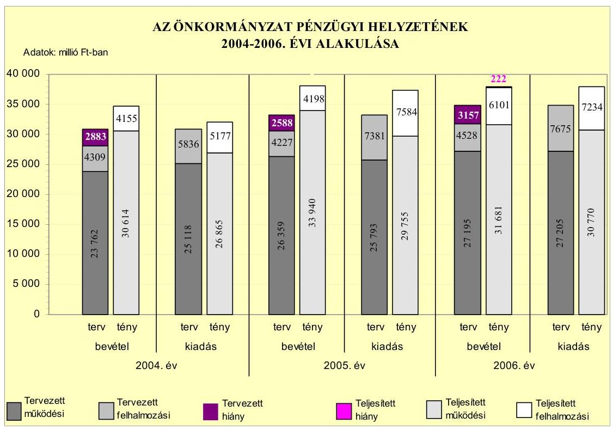
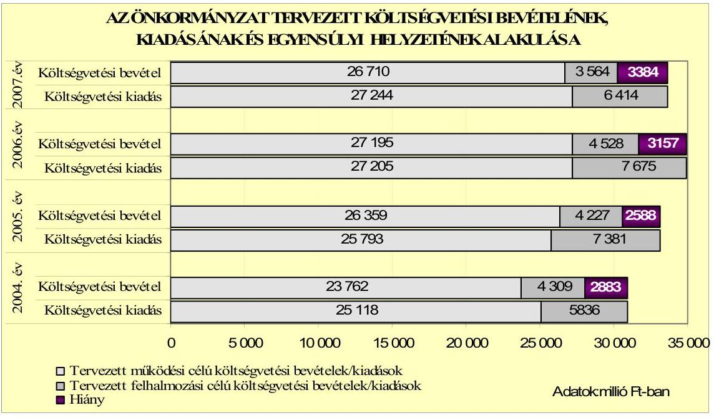
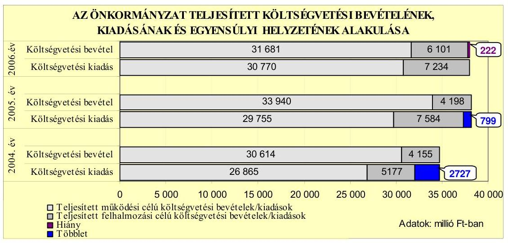
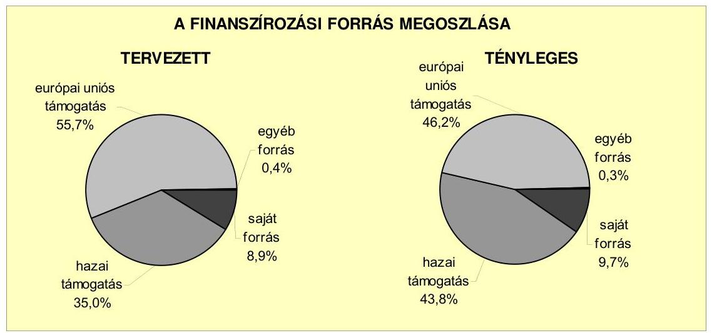
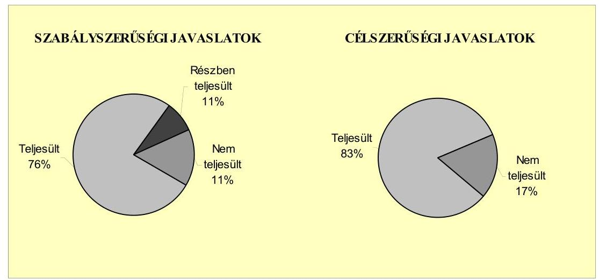
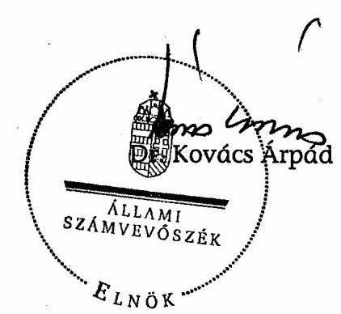
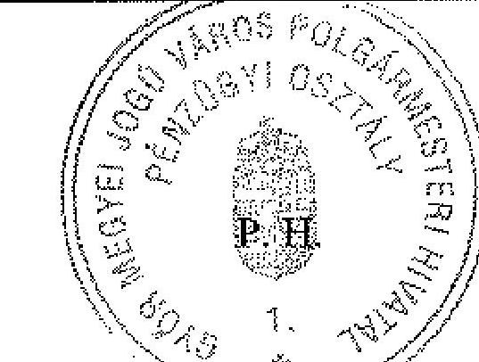
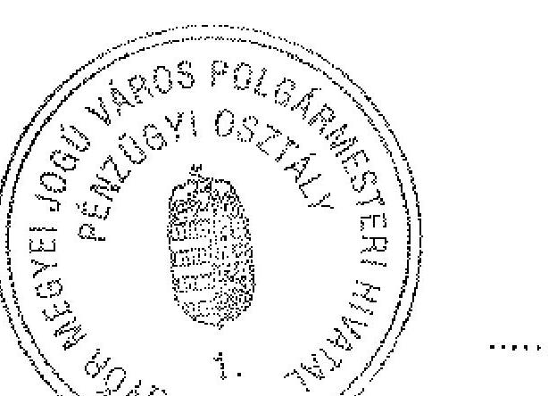
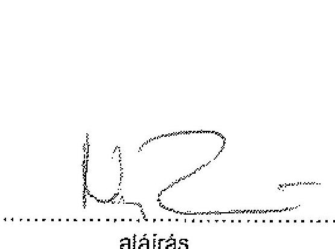
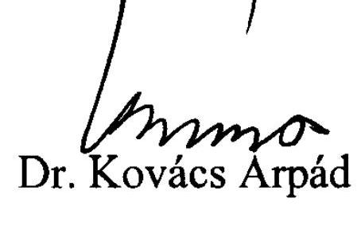

# JELENTÉS 

Győr Megyei Jogú Város Önkormányzata gazdálkodási rendszerének 2007. évi átfogó ellenőrzéséről

---

# 3. Önkormányzati és Területi Ellenőrzési Igazgatóság 

## Átfogó Ellenőrzések Főcsoport

Iktatószám: V-1001-9/29/17/2007.
Témaszám: 845
Vizsgálat-azonosító szám: V0326

## Az ellenőrzést felügyelte:

Dr. Lóránt Zoltán
főigazgató
Az ellenőrzés végrehajtásáért felelős:
Dr. Sepsey Tamás
főigazgató-helyettes
Az ellenőrzést vezette:
Csecserits Imréné
főcsoportfőnök-helyettes

## Az ellenőrzést végezték:

Dr. Fátrainé Zsebedics Katalin Varga József Unger Ferenc tanácsadó irodavezető, főtanácsadó külső szakértő

## A témához kapcsolódó eddig készített számvevőszéki jelentések:

| címe | sorszáma |
| :-- | :--: |
| Jelentés Győr megyei Jogú Város Önkormányzata gazdálkodásá- | 0512 |
| nak átfogó ellenőrzéséről |  |
| Jelentés a Magyar Köztársaság 2004. évi költségvetése végrehajtá- | 0540 |
| sának ellenőrzéséről |  |
| Függelék: |  |
| - a helyi önkormányzatokat a 2004. évben megillető normatív |  |
| állami hozzájárulás elszámolásának ellenőrzése |  |
| Jelentés a helyi és a helyi kisebbségi önkormányzatok gazdálkodá- | 0544 |
| sának átfogó ellenőrzéséről |  |
| Jelentés a hajléktalanokat ellátó intézményrendszer ellenőrzéséről | 0613 |
| Jelentés a Magyar Köztársaság 2005. évi költségvetése végrehajtá- | 0628 |
| sának ellenőrzéséről |  |

Függelék:

- a helyi önkormányzatokat a 2005. évben megillető normatív állami hozzájárulás elszámolásának ellenőrzése
- a normatív kötött felhasználású támogatások 2005. évi felhasználásának ellenőrzése

---

# TARTALOMJEGYZÉK 

BEVEZETÉS ..... 9
I. ÖSSZEGZŐ MEGÁLLAPÍTÁSOK, KÖVETKEZTETÉSEK, JAVASLATOK ..... 14
II. RÉSZLETES MEGÁLLAPÍTÁSOK ..... 23

1. Az Önkormányzat költségvetési és pénzügyi helyzete ..... 23
1.1. A tervezett költségvetési bevételi és kiadási előirányzatok, valamint a költségvetési egyensúly alakulása ..... 25
1.2. A költségvetési bevételek és kiadások teljesítése, a pénzügyi egyensúlyi helyzet alakulása ..... 27
2. Az Önkormányzat felkészültsége az európai uniós források igénylésére és felhasználására, valamint az e-közigazgatási feladatok ellátására ..... 31
2.1. Az európai uniós források igénybevételére és a várható támogatás felhasználásának szervezettségére történt felkészülés és a belső szabályozottság értékelése ..... 31
2.1.1. A fejlesztési célkitűzések meghatározása ..... 31
2.1.2. Az európai uniós forrásokhoz kapcsolódóan a pályázatfigyelés, a pályázat-készítés, valamint az európai uniós támogatással megvalósuló fejlesztés lebonyolítása belső rendjének szabályozottsága, a végrehajtás személyi, szervezeti feltételei ..... 37
2.1.3. Az európai uniós forrással támogatott fejlesztés megvalósítása ..... 40
2.2. Az e-közigazgatási feladatok előkészítése, bevezetése ..... 43
3. A költségvetési gazdálkodás kontrolljai ..... 45
3.1. A szabályozottság kockázata a költségvetés tervezési, gazdálkodási, beszámolási és a folyamatba épített ellenőrzési feladatainál ..... 45
3.2. A belső kontrollok érvényesülése az önkormányzati források szabályszerű felhasználásában, a költségvetési tervezés, gazdálkodás, beszámolás folyamataiban ..... 47
3.3. A belső ellenőrzési kötelezettség teljesítése, javaslatainak hasznosulása ..... 51
4. Az ÁSZ korábbi ellenőrzési javaslatai alapján készített intézkedési terv végrehajtása, eredményessége ..... 55
4.1. Az Önkormányzat gazdálkodási rendszerének átfogó ellenőrzése során tett javaslatok végrehajtására tervezett intézkedések megvalósulása ..... 55

---

4.2. A zárszámadáshoz kapcsolódó (állami hozzájárulások, támogatások igénylésének és felhasználásának ellenőrzése), valamint a további vizsgálatok esetében a megállapítások, javaslatok alapján tett intézkedések

# MELLÉKLETEK 

1. számú Az Önkormányzat gazdálkodását meghatározó adatok, mutatószámok (1 oldal)
2. számú Az önkormányzati vagyon alakulása (1 oldal)
3. számú Az Önkormányzat 2004-2006. évi költségvetési előirányzatainak és azok pénzügyi teljesítéseinek alakulása ( 1 oldal)
4. számú 1. számú Nyilatkozat a tervezett és teljesített költségvetési adatoknak a megelőző évhez viszonyított jelentős, $\pm 10 \%$-ot meghaladó változásának indokolásáról, amennyiben azt a feladatok változása indokolta (1 oldal)
5. számú 1. számú Tanúsítvány az európai uniós forrásokkal támogatott programok, célok tervezett és tényleges 2004-2007. évi adatairól (1 oldal)
6. számú Borkai Zsolt úr, a Győr Megyei Jogú Város Önkormányzata polgármesterének észrevétele (2 oldal)
7. számú Borkai Zsolt úrnak, a Győr Megyei Jogú Város Önkormányzata polgármesterének észrevételére adott válaszlevél (1 oldal)

---

# RÖVIDÍTÉSEK JEGYZÉKE 

## Törvények

2004. évi költségvetési törvény
2005. évi költségvetési törvény
2006. évi költségvetési törvény
Áht.
Eisztv.
Htv.

Kbt.
Ötv.
Számv. tv.

## Rendeletek

2004. évi költségvetési rendelet
2004. évi zárszámadási rendelet
2005. évi költségvetési rendelet
2005. évi zárszámadási rendelet

2006. évi költségvetési rendelet
2006. évi zárszámadási rendelet

2007. évi költségvetési rendelet
Ámr.
Ber.
$\mathrm{SzMSz}_{1}$
a Magyar Köztársaság 2004. évi költségvetéséről szóló 2003. évi CXVI. törvény
a Magyar Köztársaság 2005. évi költségvetéséről és az államháztartás hároméves kereteiről szóló 2004. évi CXXXV. törvény
a Magyar Köztársaság 2006. évi költségvetéséről szóló 2005. évi CLIII. törvény
az államháztartásról szóló 1992. évi XXXVIII. törvény
az elektronikus információszabadságról szóló 2005. évi XC. törvény
a helyi önkormányzatok és szerveik, a köztársasági megbízottak, valamint egyes centrális alárendeltségű szervek feladat- és hatásköreiről szóló 1991. évi XX. törvény
a közbeszerzésekről szóló 2003. évi CXXIX. törvény
a helyi önkormányzatokról szóló 1990. évi LXV. törvény
a számvitelről szóló 2000 . évi C. törvény

Győr Megyei Jogú Város Önkormányzatának 3/2004. (II. 20.) számú rendelete a 2004. évi költségvetésről
Győr Megyei Jogú Város Önkormányzatának 15/2005. (IV. 15.) számú rendelete a 2004. évi költségvetés végrehajtásáról
Győr Megyei Jogú Város Önkormányzatának 5/2005. (II. 25.) számú rendelete a 2005. évi költségvetésről
Győr Megyei Jogú Város Önkormányzatának 15/2006. (IV. 28.) számú rendelete a 2005. évi költségvetés végrehajtásáról
Győr Megyei Jogú Város Önkormányzatának 6/2006. (II. 24.) számú rendelete a 2006. évi költségvetésről
Győr Megyei Jogú Város Önkormányzatának 14/2007. (IV. 20.) számú rendelete a 2006. évi költségvetés végrehajtásáról
Győr Megyei Jogú Város Önkormányzatának 6/2007. (III. 5.) számú rendelete a 2007. évi költségvetésről az államháztartás múködési rendjéről szóló 217/1998. (XII. 30.) Korm. rendelet
a költségvetési szervek belső ellenőrzéséről szóló 193/2003. (XI. 26.) Korm. rendelet
Győr Megyei Jogú Város Önkormányzatának 12/2003. (IV. 4.) számú rendelete a Szervezeti és Múködési Szabályzatról

---

| SzMSz $_{2}$ | Győr Megyei Jogú Város Önkormányzatának 11/2007. (III. 23.) számú rendelete a Szervezeti és Müködési Szabályzatról |
| :--: | :--: |
| vagyongazdálkodási rendelet | Győr Megyei Jogú Város Önkormányzata vagyonának meghatározásáról, a vagyon feletti tulajdonosi jogok gyakorlásának és a vagyon kezelésének szabályozásáról szóló 16/2001. ((IV. 10.) számú rendelet. |
| Vhr. | az államháztartás szervezetei beszámolási és könyvvezetési kötelezettségének sajátosságairól szóló 249/2000.   (XII. 24.) Korm. rendelet |
| Szórövidítések |  |
| ÁNTSZ | Állami Népegészségügyi és Tisztiorvosi Szolgálat |
| ÁSZ | Állami Számvevőszék |
| azbesztmentesítési projekt | A KIOP keretében megvalósított projekt, amely a házgyári technológiával épült lakások azbesztmentesítésére irányult |
| BM | Belügyminisztérium |
| EESZI | Győr Megyei Jogú Város Önkormányzata Egyesített Egészségügyi és Szociális Intézménye |
| e-közigazgatás | elektronikus közigazgatás |
| Ellenőrzési csoport | Győr Megyei Jogú Város Önkormányzata Polgármesteri Hivatalának Ellenőrzési Csoportja 2007. február 8-tól |
| Ellenőrzési iroda | Győr Megyei Jogú Város Önkormányzata Polgármesteri Hivatalának Ellenőrzési Irodája |
| ESZA Kht. | Európai Szociális Alap Nemzeti Programirányító Iroda Társadalmi Szolgáltató Közhasznú Társaság |
| BM Önerő Alap | A Belügyminisztérium 15/2006. (III. 14.) számú rendeletében szabályozott, önkormányzati saját forrást kiegészítő támogatás |
| fejlesztési program | a Közgyűlés 131/2005. (V. 5.) számú határozatával elfogadott Győr Megyei Jogú Város Településfejlesztési Koncepciója |
| FEUVE | folyamatba épített, előzetes és utólagos vezetői ellenőrzés |
| gazdasági program ${ }_{1}$ | Az Önkormányzat 2002-2006. évekre vonatkozó Gazdasági Programja, amelyet a Közgyűlés 110/2003. (IV. 24.) számú határozatával fogadott el. |
| gazdasági program ${ }_{2}$ | Az Önkormányzat 2006-2010. évekre vonatkozó Gazdasági Programja, amelyet a Közgyűlés 71/2007. (III. 22.) számú határozatával fogadott el. |
| GVOP e-közigazgatási rendszer fejlesztési feladat | GVOP 4.3.1. Szolgáltató önkormányzat az önkormányzatok információ-szolgáltató tevékenységének fejlesztése keretében támogatott feladat |
| HEFOP | Humánerőforrás-fejlesztés Operatív Program |
| Informatikai csoport | Győr Megyei Jogú Város Önkormányzata Polgármesteri Hivatala Informatikai Csoportja 2007. február 8-tól |
| INSZOL Zrt. | INSZOL Győri Önkormányzati Ingatlankezelő és Szolgáltató Zártkörűen Müködő Részvénytársaság |

---

INTERREG IIIA együttműködési projekt

INTERREG IIIC együttműködési projekt

IT Kht.
jegyzó
kötelezettségvállalási szabályzat ${ }_{1}$
kötelezettségvállalási szabályzat ${ }_{2}$

Közbeszerzési csoport
Közgyűlés
MÁK
Önkormányzat
Pénzügyi bizottság
Pénzügyi iroda
Pénzügyi osztály
polgármester
Polgármesteri hivatal
Polgármesteri hivatal SzMSz-e

ROP 2.2.1 intézkedés
Stratégiai csoport

Stratégiai és városfejlesztési osztály

TISZK
az INTERREG IIIA keretében megvalósított projekt, amely az európai régiók egymás közötti tapasztalatcseréjének biztosítására vonatkozik
az INTERREG IIIC keretében megvalósított projekt, amely több európai régió egymás közötti tapasztalatcseréjének biztosítására, az Európai Unió egészére alkalmazott irányelvek kialakítására irányul
IT Információs Társadalom Közhasznú Társaság
Győr Megyei Jogú Város Önkormányzata Polgármesteri Hivatala jegyzője
a polgármester és a jegyző 11/2005. számú utasítása a kötelezettségvállalás, a kötelezettségvállalás ellenjegyzésének, valamint a kiadás teljesítésével és a bevétel beszedésével összefüggő szakmai igazolás, érvényesítés, utalványozás ellenjegyzésének rendjéről
a polgármester és a jegyző J/3/2007. számú utasítása a kötelezettségvállalás, a kötelezettségvállalás ellenjegyzésének, valamint a kiadás teljesítésével és a bevétel beszedésével összefüggő szakmai igazolás, érvényesítés, utalványozás ellenjegyzésének rendjéről
Győr Megyei Jogú Város Önkormányzata Polgármesteri Hivatala Közbeszerzési csoportja
Győr Megyei Jogú Város Önkormányzata Közgyűlése
Magyar Államkincstár
Győr Megyei Jogú Város Önkormányzata
Győr Megyei Jogú Város Önkormányzata Közgyűlésének Pénzügyi Bizottsága
Győr Megyei Jogú Város Önkormányzata Polgármesteri Hivatalának Pénzügyi Irodája
Győr Megyei Jogú Város Önkormányzata Polgármesteri Hivatalának Pénzügyi Osztálya 2007. február 8-tól
Győr Megyei Jogú Város Önkormányzatának polgármestere
Győr Megyei Jogú Város Önkormányzatának Polgármesteri Hivatala
Győr Megyei Jogú Város polgármesterének és jegyzőjének 10/2005. számú szabályzata a Polgármesteri Hivatal Szervezeti és Múködési Szabályzatáról
ROP 2.2.1. Városi területek rehabilitációja intézkedés
Győr Megyei Jogú Város Önkormányzata Polgármesteri Hivatala Stratégiai és Városfejlesztési Osztályának Stratégiai Tervezési Csoportja (Az SzMSz ${ }_{1}$ módosítás alapján 2007. február 8-tól)

Győr Megyei Jogú Város Önkormányzata Polgármesteri Hivatalának Stratégiai és Városfejlesztési Osztálya (Az $\mathrm{SzMSz}_{1}$ módosítás alapján 2007. február 8-tól)
Győr Térségi Integrált Szakképző Központ

---

Városépítési iroda Győr Megyei Jogú Város Önkormányzata Polgármesteri Hivatalának Városépítési Irodája
VÁTI Kht. VÁTI Magyar Regionális Fejlesztési és Urbanisztikai Közhasznú Társaság

---

# ÉRTELMEZŐ SZÓTÁR 

1. elektronikus szolgáltatási szint
2. elektronikus szolgáltatási szint
3. elektronikus szolgáltatási szint
4. elektronikus szolgáltatási szint
európai uniós források
fejlesztési feladat (projekt)
fejlesztési célkitúzés

INTERREG Program
irányító hatóság

Az 1044/2005. (V. 11.) Korm. határozat alapján olyan információs, tájékoztató szolgáltatás, amely csak általános információkat közöl az adott üggyel kapcsolatos teendőkről és a szükséges dokumentumokról.
Az 1044/2005. (V. 11.) Korm. határozat alapján olyan egyirányú kapcsolatot biztosító szolgáltatás, amely az 1. szinten túl biztosítja az adott ügy intézéséhez szükséges dokumentumok, nyomtatványok letöltését, és azok ellenőrzéssel, vagy ellenőrzés nélküli elektronikus kitöltését, amely esetben a dokumentumok benyújtása hagyományos úton történik.
Az 1044/2005. (V. 11.) Korm. határozat alapján olyan kétirányú kapcsolatot biztosító szolgáltatás, amely közvetlen, vagy ellenőrzött kitöltésű dokumentum segítségével biztosítja az elektronikus adatbevitelt és a bevitt adatok ellenőrzését. Az ügy indításához, intézéséhez személyes megjelenés nem szükséges, de az ügyhöz kapcsolódó közigazgatási döntés (határozat, egyéb aktus) közlése, valamint a kapcsolódó illeték-, vagy díffizetés hagyományos úton történik.
Az 1044/2005. (V. 11.) Korm. határozat alapján olyan teljes közvetlen kétirányú ügyintézési folyamatot biztosító szolgáltatás, amikor az ügyhöz kapcsolódó közigazgatási döntés is elektronikus úton kerül közlésre, illetve a kapcsolódó illeték-, vagy díffizetés elektronikus úton is intézhető.
Az elnyert európai uniós források lehívása a támogatott projekt megvalósítása érdekében, a fejlesztés lebonyolítása során felmerült kiadások finanszírozására.
A fejlesztési feladat (projekt) tartalmilag és formailag részletesen kidolgozott, megfelelő pénzügyi háttérrel és végrehajtási ütemezéssel rendelkező fejlesztési terv, amely illeszkedik az Európai Unió, illetve a Nemzeti Fejlesztési Terv által támogatott programokhoz.
Az önkormányzat által ellátott kötelező, vagy önként vállalt feladatok ellátásának mennyiségi, vagy minőségi fejlesztésére vonatkozó terv. A mennyiségi fejlesztés megvalósulhat beszerzéssel, létesítéssel, bővítéssel, átalakítással. Határon átnyúló, transznacionális és interregionális együttmúködés, amelynek célja a közösség területének harmonikus, kiegyensúlyozott és tartós fejlődése.
A strukturális alapok és a Kohéziós alap forrásainak szabályszerű, hatékony és eredményes felhasználásához szükséges intézményrendszer felső eleme. Az irányító hatóság általános és átfogó felelősséget visel a programok, projektek hatékony és szabályszerű végrehajtásáért. Felelősségi köréből eredően ellenőrzi a közösségi, valamint a

---

kedvezményezett
közremúködő szervezet
operatív program
támogatási szerződés
hazai jogszabályok betartását, koordinálja az európai uniós források szétosztásának folyamatát, irányítja az intézményrendszer, a statisztikai és a pénzügyi nyilvántartási rendszer múködését.
Az a helyi önkormányzat, amely a támogatási szerződést kedvezményezettként aláíra, a projektet, illetve a központi programhoz kapcsolódó támogatott önkormányzati programot végrehajtja.
A közremúködő szervezet az európai uniós támogatást elnyert kedvezményezettekkel kapcsolatot tartó szerv. Az operatív programok közremúködő szervezetei befogadják, nyilvántartják, döntésre előkészítik a pályázatokat, rögzítik a támogatással kapcsolatos adatokat az egységes monitoring informatikai rendszerben, elvégzik a támogatások előzetes (szerződéskötést megelőző), közbenső (a pénzügyi elszámolás, finanszírozás folyamatában végzett) és utólagos (a támogatott projekt pénzügyi lezárását megelőző) ellenőrzését. Az önkormányzatoknál a leggyakrabban előforduló operatív program a Regionális Fejlesztési Operatív Program végrehajtásában közremúködő szervezetek a VÂTI Kht. és a regionális fejlesztési ügynökségek.
A Kohéziós alap két közremúködő szervezete (Gazdasági és Közlekedési Minisztérium, Környezetvédelmi és Vízügyi Minisztérium) a támogatott projektek végrehajtásához kapcsolódó operatív feladatokat látják el. Ennek keretében megkötik a szerződéseket a projekt kedvezményezettjével, folyamatosan nyomon követik a teljesítéseket, lebonyolítják a támogatások kifizetését, vezetik az egységes monitoring informatikai rendszert.
Az Európai Bizottság által jóváhagyott, a Közösségi Támogatási Keret végrehajtására vonatkozó 2004-2006 közötti, több évre szóló intézkedésekhez kapcsolódó prioritások egységes rendszerét tartalmazó dokumentum. A strukturális alapok operatív programjai: Agrár és Vidékfejlesztési Operatív Program (AVOP); Gazdasági Versenyképesség Operatív Program (GVOP); Humánerőforrás-fejlesztési Operatív Program (HEFOP); Környezetvédelmi és Infrast-ruktúra-fejlesztési Operatív Program (KIOP); Regionális Fejlesztési Operatív Program (ROP).
A strukturális alapok esetében az irányító hatóságnak, illetve a Kohéziós alap esetében a közremúködő szervezeteknek a kedvezményezett önkormányzattal kötött szerződése, amely a támogatás felhasználásának részletes feltételeit tartalmazza.

---

# JELENTÉS 

## Győr Megyei Jogú Város Önkormányzata gazdálkodási rendszerének 2007. évi átfogó ellenőrzéséről

## BEVEZETÉS

Az Ötv. 92. § (1) bekezdése, az Állami Számvevőszékről szóló 1989. évi XXXVIII. törvény 2. § (3) bekezdése, valamint az Áht. 120/A. § (1) bekezdése alapján az önkormányzatok gazdálkodását az Állami Számvevőszék ellenőrzi. Az ellenőrzésre az Országgyúlés illetékes bizottságai részére is átadott, országosan egységes ellenőrzési program szerint került sor.

Az Állami Számvevőszék a stratégiájában foglalt célkitűzéseknek megfelelően a helyi önkormányzatok költségvetési gazdálkodási rendszere átfogó ellenőrzésének programját a 2007. évtől megújította, azt kiegészítette további - teljesít-mény-ellenőrzési - elemekkel.

## Az ellenőrzés célja annak értékelése volt, hogy az Önkormányzat:

- a pénzügyi egyensúlyt a költségvetésében és annak teljesítése során milyen módon biztosította, a teljesített bevételek és kiadások egyes évek közötti jelentős eltérése feladatváltozáshoz kapcsolódott-e;
- felkészült-e a szabályozottság és a szervezettség terén az európai uniós források igénylésére és felhasználására, továbbá az e-közigazgatás bevezetése miatti szervezet-korszerúsítési feladatokra;
- kialakította-e a külső és a belső feltételeknek megfelelően a gazdálkodás belső kontrollrendszerét ${ }^{1}$, továbbá a költségvetés tervezési, végrehajtási és zárszámadási feladatok szabályszerű ellátásához hozzájárult-e a folyamatba épített, előzetes és utólagos vezetői ellenőrzés, valamint a belső ellenőrzés;
- megfelelően hasznosították-e a korábbi számvevőszéki ellenőrzések megállapításait, szabályszerűségi ${ }^{2}$ és célszerűségi javaslatait.

[^0]
[^0]:    ${ }^{1}$ A gazdálkodás szabályszerűségét biztosító kontrollrendszer alatt értjük a kiépített és múködő belső irányítási és szabályozási rendszert, valamint a belső ellenőrzési funkciók ellátásának rendszerét.
    ${ }^{2}$ A törvényi előírások betartásának elmulasztásakor a részletes megállapítások fejezetben egységesen a törvénysértés megjelölést alkalmazzuk, mivel az ÁSZ nem tehet különbséget a törvényi előírások között.

---

Az ellenőrzött időszak: az 1., a 2. és a 4. ellenőrzési programpontok tekintetében a 2004-2006. évek és a 2007. év első félév, a 3. ellenőrzési programpontnál a 2006. év, valamint a 2007. év első negyedéve.

Győr megyei jogú város lakosainak száma 2007. január 1-jén 126322 fő volt. A 2006. évi önkormányzati választást követően az Önkormányzat 36 tagú Közgyűlésének munkáját hét ${ }^{3}$ állandó bizottság segítette. A polgármester a 2006. évi önkormányzati választás óta tölti be tisztségét, a jegyző személye 2007. január 20-án változott. A városban a 2006. évi önkormányzati képviselő választásig négy ${ }^{4}$, azt követően öt ${ }^{5}$ kisebbségi önkormányzat múködött. A városban településrészi önkormányzatokat is létrehoztak ${ }^{6}$. A 2006. évi önkormányzati képviselő választásig az $\mathrm{SzMSz}_{1}$ hét településrészi önkormányzat létrehozásáról rendelkezett, amelyet 2006. november 30-tól eggyel bővítettek. Pinnyéd Településrészi Önkormányzat megalakítására annak ellenére nem került sor egyik ciklusban sem, hogy azt mindkét SzMSz tartalmazta.

Az Önkormányzat feladatainak végrehajtása érdekében a 2006. évben 86 költségvetési intézményt múködtetett, amelyekből 46 önállóan gazdálkodott.

A költségvetési szervek gazdálkodási önállóságára vonatkozóan az 1. számú mellékletben bemutatott 2006. december 31-i állapothoz képest 2007. január 1-jétől jelentős változás következett be. A Közgyűlés több önkormányzati intézmény önálló gazdálkodói jogkörét megszüntetve, a gazdálkodási feladatokat centralizálta. 2007. január 1-től 83 intézmény tartozott a részben önállóan gazdálkodó költségvetési szervek közé. Ezek gazdálkodási feladatait három önállóan gazdálkodó költségvetési szerv látta el a gazdálkodási feladatok és jogkörök megosztásáról készült megállapodás alapján. Egy részben önálló intézmény 2007. június 30-án megszüntetésre került, egyet pedig közhasznú társasággá szerveztek át.

Az önkormányzati feladatok ellátásában részt vett az Önkormányzat öt gazdasági társasága, két közhasznú társasága, valamint három alapítványa. Az Önkormányzat a 2006. évi költségvetési beszámolója szerint 37782 millió Ft költségvetési bevételt ért el és 38004 millió Ft költségvetési kiadást teljesített, 2006. december 31-én a könyvviteli mérleg szerint 136869 millió Ft értékű vagyonnal rendelkezett. A 2007. évi költségvetési rendeletben 30274 millió Ft költségvetési bevételt és 33658 millió Ft költségvetési kiadást irányoztak elő. A Polgármesteri hivatalban dolgozó köztisztviselők száma 355 fő, a költségvetési intézményekben foglalkoztatott közalkalmazottak száma 4748 fő volt 2006. december 31-én. Az Önkormányzat gazdálkodását meghatározó főbb adatokat, mutatószámokat az 1-3. számú mellékletek tartalmazzák.

[^0]
[^0]:    ${ }^{3}$ A 2006. évi önkormányzati képviselő választást megelőzően a Közgyűlés munkáját 12 állandó bizottság segítette.
    ${ }^{4}$ Cigány, lengyel, német, örmény kisebbségi önkormányzatok.
    ${ }^{5}$ Cigány, horvát, lengyel, német, örmény kisebbségi önkormányzatok.
    ${ }^{6} \mathrm{Az} \mathrm{SzMSz}_{1}$ és az $\mathrm{SzMSz}_{2}$ 64. § (1) bekezdése szerint a településrész lakosságának 10\%-a írásban kezdeményezheti a választás évében a jól körülhatárolható városrész megjelölésével a településrészi önkormányzat létrehozását.

---

Az Önkormányzat költségvetési és pénzügyi helyzetét az összehasonlító elemzés módszerével vizsgáltuk. E körben elemeztük a költségvetés egyensúlyi helyzetének alakulását, a tervezett és tényleges költségvetési hiány okait, a mérséklésére tett intézkedéseket, finanszírozásának módját, az Önkormányzat adósságállományának alakulását, összetevőit.

A teljesítmény-ellenőrzés módszerével vizsgáltuk, hogy a belső szabályozottság, szervezettség terén felkészültek-e az európai uniós források figyelésére, igénylésére és felhasználására, valamint az igényelt európai uniós támogatások az Önkormányzat által meghatározott fejlesztési célkitűzésekhez kapcsolódtak-e. Az ellenőrzés során felmértük, hogy az e-közigazgatási feladat ellátása, illetve bevezetése, múködtetése érdekében milyen intézkedéseket tettek, valamint biz-tosították-e a közérdekű adatok elektronikus közzétételét.

A költségvetési gazdálkodás belső kontrolljainak ellenőrzése során értékeltük, hogy a Polgármesteri hivatalnál a költségvetés tervezési, gazdálkodási, zárszámadás készítési feladatok belső kontrolljainak kiépítettsége és múködése megfelelő biztosítékot ad-e a gazdálkodási feladatok megfelelő, szabályszerű ellátására. Felmértük és minősítettük a költségvetés tervezési, a gazdálkodási, a zárszámadás készítési feladatokkal, továbbá a pénzügyi- számviteli területen az informatikával kapcsolatosan kialakított kontrollok megfelelőségét, valamint azok múködésének eredményességét, megbízhatóságát. Értékeltük a belső ellenőrzés szervezeti és szabályozási keretét, továbbá működését.

A Polgármesteri hivatalnál értékeltük a gazdálkodás folyamatában a kontrollok múködésének megbízhatóságát, ennek keretében ellenőriztük a szakmai teljesítés igazolására és az utalvány ellenjegyzésére kialakított kontrollok végrehajtását. Az ellenőrzést a következő, kiemelt kockázatuk alapján kiválasztott ${ }^{7}$ az általánostól jellemzően eltérő, egyedi eljárást igénylő gazdasági eseményekkel kapcsolatos kifizetésekre folytattuk le ${ }^{8}$ :

- a személyi juttatások közül az állományba nem tartozók megbízási díjai ${ }^{9}$,

[^0]
[^0]:    ${ }^{7}$ Az önkormányzatok kiemelt előirányzataira vonatkozóan, a vertikális folyamatokra elvégeztük a kockázatok becslését, amelynek eredményeként az állományba nem tartozók megbízási díjai, a külső szolgáltató által végzett karbantartási, kisjavítási szolgáltatások, valamint a gépek, berendezések, felszerelések beszerzése kiemelkedően kockázatos területnek bizonyultak.
    ${ }^{8}$ A korábbi ellenőrzési tapasztalataink szerint ezeken a területeken a jegyzők nem, vagy hiányosan szabályozták a megbízás, megrendelés, illetve beszerzés indokoltságának, szükségességének elbírálására, igazolására, valamint a teljesítések dokumentálására, a kifizetések jogosságának megítélésére szolgáló kontrollokat. További kockázatot jelentett a külső szolgáltató által végzett karbantartási, kisjavítási munkák esetében, hogy az 50 ezer Ft alatti megrendelésekre vonatkozóan az ellenőrzési tapasztalataink szerint a jegyzők nem alakították ki a kötelezettségvállalások rendjét és nyilvántartási formáját, valamint a szabályozás elmulasztása esetén nem történt meg az írásbeli kötelezettségvállalás és annak az ellenjegyzése sem.
    ${ }^{9}$ Az állományba tartozók rendszeres személyi juttatásainak számfejtését, valamint folyósítását nem a polgármesteri hivatalok, hanem a nettó finanszírozás keretében a beküldött dokumentumok alapján a MÁK végzi.

---

- a külső szolgáltató által végzett karbantartási, kisjavítási szolgáltatások, valamint
- a gépek, berendezések, felszerelések beszerzése.

Az ellenőrzés hatékony elvégzése céljából a vizsgálandó területek kiválasztása során a kockázatokon alapuló megközelítés érvényesült, ezáltal az ellenőrzési erőforrásokat azokra a területekre fókuszáltuk, amelyeken legnagyobb a hibák előfordulási valószínűsége. Az ellenőrzési erőforrások ilyen típusú összpontosításával minimálisra csökkenthető a kívánt ellenőrzési bizonyosság eléréséhez szükséges időráfordítás.

A pénzügyi-számviteli folyamatokban alkalmazott belső kontrollok létezésének és működésének ellenőrzésére a vizsgált három terület 2006. évi könyvviteli tételeiből területenként egyszerű véletlen mintát vettünk. A kijelölt gazdasági eseményre elvégzett megfelelőségi tesztek alapján értékeltük a kontrollok múködésének eredményességét, megbízhatóságát a vizsgált három területre különkülön, majd összefoglalóan ${ }^{10}$ a Polgármesteri hivatal egyedi eljárást igénylő gazdasági eseményeire. A helyszíni ellenőrzés megállapításainak részletes dokumentálását három megfelelőségi tesztlapon, öt elővizsgálati és kilenc helyszíni ellenőrzési munkalapon biztosítottuk. Ezeken a teszt- és munkalapokon a minősítés alapjául szolgáló kérdések és a vonatkozó konkrét jogszabályhelyek megjelölése mellett értékeltük a kialakított belső kontrollokban rejlő kockázatokat ${ }^{11}$ és a kialakított kontrollok múködésének megbízhatóságát ${ }^{12}$.

Az ÁSZ korábbi ellenőrzési javaslatai alapján tett intézkedéseket, illetve azok megvalósítását utóellenőrzés keretében vizsgáltuk. A gazdálkodási rendszer átfogó ellenőrzése során megfogalmazott javaslatok végrehajtására tett intézkedések megvalósítását ellenőriztük, az egyéb számvevőszéki ellenőrzések során tett javaslatok esetében pedig a kiadott intézkedéseket tekintettük át.

[^0]
[^0]:    ${ }^{10}$ A vizsgált három terület egyedi értékelési pontszámait a területek relatív költségvetési súlyával arányosan összegeztük.
    ${ }^{11}$ A kialakított belső kontrollokban rejlő kockázatot alacsonynak minősítettük, ha a kontrollok - végrehajtásuk esetén - megfelelő védelmet nyújtanak a hibák bekövetkezése ellen. Közepesnek minősítettük a belső kontrollokban rejlő kockázatot, amennyiben a kontrollok - végrehajtásuk esetén - a lehetséges hibák többsége ellen védelmet nyújtanak. Magasnak értékeltük a kockázatot, ha a kontrollok - kialakításuk hiányában, vagy hiányos kialakításuk miatt - nem nyújtanak elegendő védelmet a lehetséges hibákkal szemben.
    ${ }^{12}$ A kontrollok múködésének eredményességét, megbízhatóságát kiválónak értékeltük abban az esetben, ha azok múködése - esetleges apróbb hiányosságoktól eltekintve megfelelt a hibák megelőzésére és kijavítására meghatározott szabályozásnak és a legmagasabb szintű elvárásoknak. Jónak minősítettük a kontrollok múködését, ha a hiányosságok száma ugyan jelentős volt, de nem veszélyeztette az ellenőrzött terület hibáinak megelőzését és kijavítását. Amennyiben a hiányosságok mértéke nem biztosította a hibák megelőzését, feltárását, kijavítását és ezáltal veszélyeztette az eredményes, megbízható múködést, a kontroll múködésének megbízhatósága gyenge minősítést kapott.

---

A helyszíni ellenőrzés során kitöltött - az ellenőrzést végző számvevő és a Polgármesteri hivatal felelős köztisztviselője által aláírt - elővizsgálati és helyszíni ellenőrzési munkalapokat, azok kitöltési útmutatóit, továbbá a megfelelőségi tesztek dokumentumait a polgármester részére a számvevői jelentéssel egyidejűleg átadtuk.

A jelentést az ÁSZ-ról szóló 1989. évi XXXVIII. tv. 25. § (1) bekezdése alapján észrevétel közlése céljából megküldtük Győr Megyei Jogú Város Önkormányzata polgármesterének. A kapott észrevételt és az arra adott válaszlevelet a jelentés 6 . és 7 . számú melléklete tartalmazza.

---

# I. ÖSSZEGZŐ MEGÁLLAPÍTÁSOK, KÖVETKEZTETÉSEK, JAVASLATOK 

Az Önkormányzatnál a 2004-2006 közötti időszakban a tervezett és a teljesített költségvetési kiadások, valamint a tervezett költségvetési bevételek az előző évhez viszonyítva folyamatosan emelkedtek. A 2007. évre tervezett költségvetési kiadások és bevételek a 2006. évhez viszonyítva csökkentek. A költségvetés egyensúlya nem volt biztosított, mivel a tervezett költségvetési bevételek nem nyújtottak fedezetet a tervezett költségvetési kiadásokra. A tervezett költségvetési hiány mértéke a 2004. évi 9\%-ról 2005. évre 8\%-ra csökkent, majd 2006-ra $9 \%$-ra, 2007-re $10 \%$-ra emelkedett. Az Önkormányzat a költségvetési és pénzügyi egyensúly hiányát a 2004-2007. évi költségvetési rendeletekben rövid-, valamint hosszú lejáratú hitelek felvételével tervezte fedezni.

Az Önkormányzat a 2004-2006. évi költségvetési rendeleteiben tervezett eredeti költségvetési bevételi és kiadási előirányzatokat túlteljesítette, amelyet a bevételeknél 2004-2006 között az előző évi pénzmaradvány igénybevételének tervezésnél történt figyelmen kívül hagyása, az intézményi múködési bevételek alultervezése, a kapott támogatások, a 2004-2005. években a helyi adó bevételek alultervezése, a 2006. évben az előző évben vásárolt értékpapír nem tervezett értékesítése tette lehetővé. A teljesített költségvetési bevételek a 20042005. években fedezték a költségvetési kiadásokat, amelyet a múködési célú költségvetési bevételek eredeti előirányzatot meghaladó teljesítése tett lehetővé. A 2006. évben a teljesített költségvetési bevételek azonban nem nyújtottak fedezetet a teljesített költségvetési kiadásokra. A 2004-2006. évi költségvetési rendeletekben a tervezett múködési célú költségvetési kiadások eredeti előirányzatait meghaladó teljesítéseket a dologi és egyéb folyó kiadások terven felüli kifizetései okozták. A költségvetési bevételi előirányzatok terven felüli teljesüléséhez hozzájárult az ingatlanértékesítésből származó felhalmozási célú bevételek 2006. évi előirányzatot meghaladó alakulása.

A 2004-2006 közötti időszakban a teljesített felhalmozási célú költségvetési bevételeket meghaladó összegben teljesítettek felhalmozási célú költségvetési kiadásokat, amelyeket a 2004. évben a múködési célú költségvetési bevételek többletéből, a 2005. évben hitel felvételével és a múködési célú költségvetési bevételek többletével, a 2006. évben pedig hitel felvételével finanszíroztak. A felhalmozási célú költségvetési bevételek és kiadások a 2004. évihez viszonyítva a 2005-2006. években 40-46\%-kal emelkedtek, amelyet a költségvetési és európai uniós támogatások valamint az ingatlanértékesítési bevételek növekedése tett lehetővé. A 2004-2006 közötti időszakban folyamatosan növekvő felhalmozási célú költségvetési bevételek, valamint a rendelkezésre álló hitelkeretek részbeni felhasználása lehetővé tette az Önkormányzat nagyberuházásainak (Nádor aluljáró és csatlakozó úthálózata, útkorszerűsítések) folytatását és befejezését. Az Önkormányzat - az Áht előirása ellenére - a költségvetéseiben nem tervezte meg az INSZOL Zrt. kezelésében lévő önkormányzati ingatlanok bérbeadásából származó bevételeket és ugyanezen ingatlanok karbantartási kiadásait.

---

A pénzügyi egyensúly biztosítása érdekében év közben 2004-2006 között a folyószámlahitel keretösszegéből egyre csökkenő összegben és időtartamra vettek igénybe hitelt. A gazdálkodás során az átmenetileg szabad pénzeszközöket betétben helyezték el, illetve abból forgatási célú értékpapírt vásároltak. A 2004. évben tervezett múködési és felhalmozási célú hitelfelvételre az iparúzési adónál és illeték bevételeknél elért többletbevételek miatt nem került sor. Az Önkormányzat a 2005. évben 15 éves futamidőre 5,5 milliárd Ft hitelkeret szerződést kötött a törlesztés hét évvel későbbi kezdési kötelezettségével a Nádor aluljáró és csatlakozó úthálózata beruházás finanszírozásához, a 2006. évben pedig hat éves futamidőre 1,6 milliárd Ft hitelkeret szerződést kötött az útkorszerűsítési feladatok finanszírozásához, a törlesztés másfél évvel későbbi kezdési kötelezettségével. Az Önkormányzat a két, összesen 7,1 milliárd Ft-os hitelkeretből 2007. I. félév végéig 3,9 milliárd Ft hitelt vett fel, melyet választása szerint forintban, vagy euróban kell törlesztenie.

Az Önkormányzat hosszú távú fejlesztési célkitűzéseit a gazdasági program ${ }_{1,2}$ ben, és a fejlesztési tervben rögzítette. A célkitúzések megvalósításának lehetséges pénzügyi forrásait a gazdasági program ${ }_{1}$ nem, a gazdasági program ${ }_{2}$ pedig csak részben tartalmazta. A fejlesztési célok meghatározásához nem végeztek igényfelmérést a lakosság, vagy a civil szféra körében. Az Önkormányzat fejlesztési céljai megvalósításához 2004-2007. I. félév között európai uniós forrásra tizenegy pályázatot nyújtott be, melyek közül négy elutasításra került a pályázatok célkitűzésektől részben eltérő tartalma miatt. Az elbírálást követően az Önkormányzat hat projekt megvalósítására kötött támogatási szerződést. A 2004-2007. évek költségvetési rendeleteiben szerepeltek elkülönítetten az európai uniós támogatással megvalósuló projektek bevételei és kiadásai, valamint a pályázatokhoz előírt saját forrás.

Az európai uniós forrásokkal összefüggő fejlesztési feladatok a gazdasági progra $\mathrm{m}_{1,2}$-ben, fejlesztési tervben foglaltakkal összhangban voltak, az európai uniós támogatásokra vonatkozóan a Polgármesteri hivatalban készített minőségügyi eljárás rend, valamint a munkaköri leírások tartalmazták a pályázatfigyelés, pályázatkészítés rendjének meghatározását. Az Önkormányzat azonban a belső szabályozottság és szervezettség terén összességében nem készült fel eredményesen az európai uniós források igénybevételére és felhasználására, mivel nem történt meg az európai uniós forrásokkal támogatott fejlesztési feladatok lebonyolításával kapcsolatos eljárási rend kialakítása, továbbá a lebonyolítással kapcsolatos folyamatba épített ellenőrzés és belső ellenőrzés rendjének szabályozása. A Polgármesteri hivatalban a pályázatfigyelési, a pályázatkészítési, és a fejlesztési feladat lebonyolítási feladatok ellátását megszervezték, valamint pályázatkészítésbe külső szervezetet bevontak, illetve fejlesztési feladat lebonyolításával külső szervezetet is megbíztak. Külső szervezetek megbízása esetén rögzítették a projekt megvalósításában közremúködők feladatait, felelősségét, a teljesítés igazolásának módját, a vállalkozó ellenőrzési feladatait.

Az Önkormányzatnál nem szabályozták az önkormányzati szintű pályázatkoordinálás feladatait és felelőseit, az európai uniós forrásokra irányuló pályázatok önkormányzati szintű nyilvántartásának vezetését, felelősét, az európai uniós forrásokkal kapcsolatos információk áramlásának rendjét, a pályázatfigyelést végzők és a döntési jogkörrel rendelkezők közötti információ-

---

szolgáltatási kötelezettséget, a polgármester és a fejlesztési feladat lebonyolítója közötti kapcsolattartás rendjét, a pályázatfigyelés, pályázatkészítés, valamint az európai uniós forrással támogatott fejlesztés lebonyolításának ellenőrzési kötelezettségét, feladatait, felelőseit.

A Polgármesteri hivatal az NFT operatív programjaihoz kapcsolódóan két pályázatot nyújtott be, melyek alapján az azbesztmentesítési projekt és a GVOP eközigazgatási rendszer fejlesztési feladat megvalósításához összesen 762,2 millió Ft európai uniós támogatásban részesült. Az Önkormányzat az elnyert támogatási összeg mintegy $97 \%$-át igénybe vette. A támogatási szerződések módosításai az elszámolási feltételekre, a dokumentálási kötelezettségekre és a GVOP e-közigazgatási rendszer fejlesztési feladat esetében a befejezési határidő módosítására irányultak. A támogatott projektek befejezése határidőn belül megtörtént, azonban a támogatás igénybevétele eltért az ütemezéstől, mivel az azbesztmentesítési projekt esetében a támogatást fél év késedelemmel kapta meg az Önkormányzat. A két projekt megvalósítását, elszámolását a belső ellenőrzés nem vizsgálta, a közremúködő szervezetek ellenőrzéseinek megállapításai alapján az Önkormányzatnak visszafizetési kötelezettsége nem keletkezett.

Az Önkormányzat az informatikai stratégiájához kapcsolódva pályázott az eközigazgatás fejlesztéséhez európai uniós támogatásra. A 2006. évben múködtetett e-közigazgatási rendszer az 1. elektronikus szolgáltatási szint követelményeit biztosította, mivel a gépjármúadó, helyi adó, építési, valamint egészségügyi és szociális ügyekben az eljáráshoz szükséges dokumentumok letöltésére lehetőség volt, az űrlapok elektronikus kitöltése és ellenőrzése azonban nem biztosított. A helyi adó beszedésében és a szociális ellátásban a 3. elektronikus szolgáltatási szint elérését tűzték ki célként.

Az Önkormányzat a közérdekú adatok közzétételére az Eisztv. alapján 2007. január 1-je óta kötelezett, azonban honlapját már ezt megelőzően kialakította, múködtette, azon közétette az Önkormányzat által nyújtott, nem normatív, céljellegú, múködési és fejlesztési támogatások kedvezményezettjeinek nevére, a támogatás céljára, összegére, továbbá a támogatási program megvalósítási helyére vonatkozó adatokat. Honlapján közzétette a pénzeszközök felhasználásával, az önkormányzati vagyonnal történő gazdálkodással összefüggő szerződések megnevezését, tárgyát, a szerződést kötő felek nevét, a szerződések értékét, határozott időre kötött szerződések esetében azok időtartamát. A szerződések közzétételére - a Közgyűlés döntését betartva - értékhatártól függetlenül került sor. A Polgármesteri hivatal az Ámr-ben előírtak ellenére éves költségvetési beszámolójának szöveges indokolását a 2004. és 2005. évinél még nem, csak a 2006. évi költségvetési beszámoló esetében tette közzé.

A Polgármesteri hivatalban a költségvetési tervezés és a zárszámadás készítési folyamatokat szabályozták, a szabályozás összességében a 2006. évben alacsony kockázatot jelentett a feladatok szabályszerű végrehajtásában, mivel a jegyző a pénzügyi irányítási és ellenőrzési rendszer meghatározása keretében előírta a költségvetési javaslat összeállításával kapcsolatos követelményeket, meghatározta a kapcsolódó ellenőrzési feladatokat. Annak ellenére öszszességében alacsony volt a kockázat, hogy elmaradt a helyi adók és egyéb szolgáltatási díjakból származó saját bevételi előirányzat és a költségvetés

---

megalapozását szolgáló önkormányzati rendeletek közötti összhang meglétére vonatkozó ellenőrzési kötelezettség előírása.

A költségvetési tervezés és a zárszámadás készítés folyamatában a múködésbeli hibák megelőzésére, feltárására, kijavítására kialakított kontrollok múködésének megbízhatósága a 2006. évben összességében kiváló volt, mivel a belső szabályozásban foglalt előírásoknak megfelelően ellenőrizték, hogy a költségvetési intézmények teljesítették-e a költségvetési javaslat összeállításával kapcsolatban részükre meghatározott szakmai és pénzügyi követelményeket, továbbá a zárszámadás előkészítése során ellenőrizték az intézményi pénzmaradványok megállapításának szabályszerűségét. Annak ellenére összességében kiváló volt a kontrollok múködésének megbízhatósága, hogy a költségvetés készítésénél a saját bevételek előirányzatai és a költségvetés megalapozását szolgáló helyi rendeletek összhangját nem vizsgálták, a 2006. évi zárszámadás folyamatában az intézmények eredeti, a módosított előirányzatok és a teljesítések eltérésének indokoltságát nem ellenőrizték.

A Polgármesteri hivatalban a 2006. évben a pénzügyi-számviteli feladatok szabályszerű végrehajtásában a gazdálkodási, a pénzügyi-számviteli és a folyamatba épített ellenőrzési feladatok szabályozottságának hiányosságai közepes kockázatot jelentettek, mivel a polgármester által utalványozásra felhatalmazott, valamint a jegyző által szakmai teljesítésigazolásra kijelölt személyek - az Ámr-ben, valamint a kötelezettségvállalási szabályzat ${ }_{1}$-ban foglaltakkal ellentétesen - a polgármester felhatalmazásával nem rendelkező személyek részére utalványozásra felhatalmazást adtak, illetve jegyzői kijelöléssel nem rendelkező személyeket szakmai teljesítés igazolására jelöltek ki. A Polgármesteri hivatalnál az 50 ezer Ft-ot el nem érő kötelezettségvállalások esetében éltek az Ámr-ben biztosított lehetőséggel, amely szerint ezen kifizetéseknél nem szükséges előzetes írásbeli kötelezettségvállalás, azonban ennek rendjét és nyilvántartási formáját a jegyző belső szabályzatban nem rögzítette. Az eszközök hasznosítási és selejtezési szabályzatában nem határozták meg a minősítési jogot gyakorló munkaköröket, a hasznosítás, nyilvántartás során követendő eljárási rendet, a döntéshozatalra jogosultak körét az üzemeltetésre átadott eszközöknél. Az ellenőrzési nyomvonal nem tartalmazta az elvégzendő tevékenységeket, feladatokat, azok végrehajtásáért felelős szervezeti egység, személy megnevezését, egyértelmú kapcsolatát, utalást arra, hogy a tevékenységeket, feladatokat részletesen mely belső szabályzatok tartalmazzák. A kockázatkezelési eljárásrendet és a szabálytalanságok kezelésének eljárásrendjét meghatározó jegyzői utasítás nem tartalmazta a kockázat azonosítását, folyamatgazdáit, a kockázatok értékelését és kategóriákba sorolását, az elfogadható kockázati szint meghatározását. A gazdálkodási, a pénzügyi-számviteli és a folyamatba épített ellenőrzési feladatok szabályozottságának hiányosságait a 2007. évben kiadott utasításokkal, rendelkezésekkel megszüntették.

A Polgármesteri hivatalnál a gazdasági eseményekkel kapcsolatos kifizetések során a szakmai teljesítés igazolás és az utalvány ellenjegyzés múködésének megbízhatósága gyenge volt, mivel a kontrollok múködése nem adott megfelelő biztosítékot a gazdálkodási feladatok megfelelő, szabályszerű ellátására. Az operatív gazdálkodás során a szakmai teljesítés igazolását, az állományba nem tartozók megbízási díj kifizetéseinél, a külső szolgáltatók által végzett kar-

---

bantartási kisjavítási feladatoknál, az ügyvitel- és számítástechnikai eszközök, valamint az egyéb gépek, berendezések és felszerelések beszerzésével, létesítésével kapcsolatos kifizetések során nem a jegyző által kijelölt személyek végezték el. Nem foglalták írásba a kötelezettségvállalásokat a karbantartási, kisjavítási feladatoknál, ezáltal a szakmai teljesítés igazolására kijelölt személyek - ezen dokumentumok hiányában - nem végezték el a szakmai teljesítés igazolását, a kiadás jogosultságának és összegszerűségének ellenőrzését. Az utalvány ellenjegyzés jogszabályban meghatározott feladatait a gazdálkodás folyamatában nem látták el, azoknál a gazdasági eseményeknél amelyeknél a szakmai teljesítés igazolását nem a jegyző által kijelölt személy végezte az utalvány ellenjegyzője nem ellenőrizte a szakmai teljesítésigazolás és érvényesítés megtörténtét, továbbá a gazdálkodásra vonatkozó szabályok betartását. Az utalvány ellenjegyzője nem ellenőrizte a gazdálkodásra vonatkozó szabályok betartását azon kifizetések esetében sem, amelyeket megelőzően a kötelezettségvállalásokat nem foglalták írásba, illetve a megrendelés nem tartalmazta a kötelezettségvállalás összegét, továbbá amely kötelezettségvállalásokat nem előzte meg a kötelezettségvállalás ellenjegyzése. Nem győződött meg az utalvány ellenjegyzője a szakmai teljesítés igazolásának, valamint az érvényesítésnek a megtörténtéről azon kifizetéseknél ahol az érvényesítés nem szakmai teljesítés igazolásán alapult, továbbá nem észrevételezte, hogy az érvényesítést nem az arra írásban megbízott személy végezte el.

A Polgármesteri hivatalban az informatikai rendszer szabályozottsága öszszességében alacsony mértékű kockázatot jelentett az informatikai feladatok biztonságos végrehajtásában, mivel rendelkeztek informatikai stratégiával, biztonsági és biztonságtechnikai szabályzattal. Annak ellenére összességében alacsony volt a kockázat, hogy az Önkormányzat az informatikai katasztrófa elhárítási tervét nem készítette el. Az informatikai rendszer múködtetésénél a múködésbeli hibák megelőzésére, feltárására, kijavítására kialakított kontrollok múködésének megbízhatósága kiváló volt, mivel biztosította a pénzügyiszámviteli feladatok biztonságos, dokumentált és ellenőrzött múködési feltételeit.

A belső ellenőrzés szervezeti és szabályozási kerete az ellenőrzés szabályszerű végrehajtásában összességében alacsony kockázatot jelentett, mivel az Önkormányzat az ellenőrzési kötelezettség teljesítéséhez szükséges szervezeti kereteket kialakította, a Polgármesteri hivatal SzMSz-eiben a belső ellenőrzési kötelezettséget előírta, a függetlenített belső ellenőrzési szervezetet kialakította, az Ellenőrzési iroda jogállását, feladatait meghatározta. A belső ellenőrzés tevékenységére vonatkozó szabályokat és eljárásokat az ellenőrzési kézikönyvben előírták. Annak ellenére összességében alacsony volt az ellenőrzés szervezettségének és szabályozottságának a kockázata, hogy a 2006. évi ellenőrzési tervben a soron kívüli ellenőrzési feladatokra kapacitást a Ber. és a Polgármesteri hivatal ellenőrzési kézikönyvének előírása ellenére nem határoztak meg. A 2007. évi ellenőrzési tervben soron kívüli ellenőrzési feladatokra a tervezett ellenőrzési idő $15 \%$-át határozták meg.

A belső ellenőrzés múködésének megbízhatósága összességében kiváló volt, mivel annak múködése a hibák feltárásával, valamint a szükséges intézkedések kezdeményezésével és a javaslatok megvalósításának ellenőrzésével megfelelt a központi és helyi előírásoknak. Annak ellenére összességében kiváló volt,

---

hogy a 2006. évi tervezett ellenőrzési feladatokat részben hajtották végre, a céljelleggel nyújtott támogatások rendeltetésszerű felhasználását nem ellenőrizték. A 2007. évi ellenőrzési tervben foglalt intézményellenőrzési feladatok egyharmadát, a Polgármesteri hivatalban tervezett feladatok hatodát teljesítették 2007. június 30 -ig, valamint a 115 napnál többet, 174 napot fordítottak kilenc soron kívüli ellenőrzés elvégzésére. A jegyző a költségvetési beszámoló keretében az Áht. előírását betartva beszámolt a FEUVE és a belső ellenőrzés múködtetéséről. A Közgyűlés a 2006. évi zárszámadási rendelettervezet előterjesztésével egyidejűleg áttekintette a költségvetési szervek ellenőrzésének tapasztalatait.

Az Önkormányzat gazdálkodásának 2004. évi átfogó ellenőrzéséről készített számvevőszéki jelentésben tett megállapítások, javaslatok hasznosítására készített intézkedési tervben meghatározták az elvégzendő feladatokat, azok végrehajtásáért felelős személyeket és határidőket. A javaslatok 74\%-át teljes mértékben, $8 \%$-át részben hasznosították, $18 \%$-át nem hasznosították.

A megtett intézkedésekkel biztosították az Áht-ban előírt mérlegek, kimutatások tartalmi követelményeinek önkormányzati rendeletben történő rögzítését, valamint az ennek alapján elkészített mérlegeket, kimutatásokat a Közgyűlésnek bemutatták, de az Áht. előírása ellenére a közvetett támogatásokról szöveges indokolást nem készítettek. A költségvetési előirányzatok túllépésének okait nem vizsgálták minden esetben, felelősség felvetésére egy alkalommal került sor. A gazdálkodási és ellenőrzési jogkörök gyakorlásának szabályszerűsége érdekében tett javaslatok közül nem hasznosultak a szakmai teljesítés igazolására és az utalványozás ellenjegyzésére tett javaslatok, mivel a szakmai teljesítés igazolását nem a jegyző által kijelölt személy végezte, illetve az előzetes kötelezettségvállalás, vagy a vállalt kötelezettség összegének hiányában a szakmai teljesítés igazolását a kijelölt személy hiányosan végezte el. Az utalvány ellenjegyzését nem az arra felhatalmazott személy végezte el, a külső szolgáltatók által végzett karbantartási, kisjavítási munkáknál és a gép, berendezés, felszerelés beszerzéseknél a helyi szabályozásban foglaltak ellenére előzetes írásbeli kötelezettségvállalásra nem került sor, illetve az nem tartalmazta a kötelezettségvállalás összegét. A vagyongazdálkodási feladatok és döntési hatáskörök gyakorlása szabályszerűségének biztosítása érdekében tett javaslatokat nem valósították meg. Az Ötv. alapján az Önkormányzat vagyongazdálkodási rendelete a vagyon jellegének és forgalomképességének megváltoztatását kivételes esetekben a Közgyűlés hatáskörébe utalta. A Közgyűlés a 2005. évben hozzájárult egy közoktatási célra használt belterületi ingatlan elidegenítéséhez, amely a korlátozottan forgalomképes törzsvagyon körébe tartozott. A döntést nem előzte meg a forgalomképességi besorolás Közgyűlés általi megváltoztatása, a jegyző az Ötv. előírása ellenére nem jelezte a Közgyűlés részére, hogy a döntés nem felel meg az Ötv-ben előírtaknak, mivel nem önkormányzati rendeletben meghatározott feltételek szerint rendelkeztek az értékesítésről, valamint nem felel meg az Áht. előírásának sem, mivel az értékesítést megelőzően nyilvános pályáztatásra nem került sor.

A 2006. évi zárszámadási rendelet előterjesztésekor az Áht. előírása ellenére tájékoztatásul nem mutatták be a többéves kihatással járó döntések hatásainak számszerűsítését éves bontásban, valamint összesítve. A szociális feladatok ellátásához kapcsolódó javaslatok nem hasznosultak a 2005-2006. években, mert

---

Közgyűlés a Fogyatékossággal élők Átmeneti és Napközi Otthonának múködtetéséről csak a 2007. évben döntött, 2007. november 1.-jével induló ellátással. A pszichiátriai és szenvedélybetegek nappali ellátására 2006. május 25 -én kezdeményeztek egyeztetéseket a Baptista Szeretetszolgálattal.

Az ÁSZ a 2004-2006. évek között négy országos összefoglaló jelentéssel lezárt vizsgálatot végzett. A helyi önkormányzatokat megillető normatív hozzájárulás elszámolását 2005-ben és 2006-ban is ellenőrizte. Az ellenőrzési jelentésekben tett célszerúségi javaslatokat hasznosították, azok végrehajtására a polgármester és a jegyző adott ki intézkedéseket. A hajléktalanokat ellátó intézményrendszer ellenőrzéséről készült jelentésben megfogalmazott javaslatok hasznosítására irányuló intézkedéseket a polgármester és a jegyző kiadta, azonban ennek ellenére a szakképzettségi arány nem érte el a szakmai jogszabályokban előírt mértéket. A kötött felhasználású támogatások 2005. évi felhasználásának ellenőrzéséről 2006. május 25 -én kelt jelentésben hét szabályszerűségi és három célszerűségi javaslatot rögzítettek, melyek megvalósítására polgármesteri és jegyzői utasítás került kiadásra. A javaslatok alapján megfogalmazott egyértelmú utasítások, a felelősök és a határidők meghatározása elősegítette, hogy a javaslatok 95\%-ban megvalósultak. Az átfogó és a zárszámadáshoz kapcsolódó ellenőrzések javaslatai eredményeként szabályszerűbbé vált az Önkormányzat tervező munkája, a gazdálkodás és pénzügyiszámviteli feladatok meghatározása, ellátása, a céljellegú támogatások felhasználásának elszámoltatása, a gazdálkodásról történő beszámolás.

A helyszíni ellenőrzés megállapításainak hasznosítása mellett javasoljuk:

# a polgármesternek 

a munka színvonalának javítása érdekében

1. kezdeményezze, hogy a számvevőszéki jelentésben foglaltakat a Közgyűlés tárgyalja meg és a feltárt hiányosságok megszüntetése érdekében készíttessen intézkedési tervet a határidők és felelősök megjelölésével;
2. kezdeményezze, hogy a fejlesztési célkitűzések meghatározásához a feladatok megoldásánál jelentkező feszültségekről igényfelmérés készüljön, valamint a gazdasági program tartalmazza a célkitűzések lehetséges pénzügyi forrásait;

## a jegyzőnek

a jogszabályi előírások maradéktalan betartása érdekében

1. biztosítsa, hogy a költségvetési rendelet az Áht. 69. § (1) bekezdésében előírtaknak megfelelően tartalmazza az INSZOL Zrt. kezelésében lévő önkormányzati ingatlanok bérbeadásából származó bevételeinek és ugyanezen ingatlanok karbantartási kiadásainak előirányzatát;
2. írja elő az Áht 121. § (1) és (3) bekezdéseiben, valamint az Ámr. 145/A. § (1)-(2) és a 145/B. § (1) bekezdésében foglalt előírások alapján a Polgármesteri hivatalnál a

---

költségvetésben tervezett saját bevételek és az azok megalapozását szolgáló önkormányzati rendeletek összhangjának ellenőrzését és gondoskodjon a költségvetés tervezés folyamatában ezen belső kontrollok müködtetéséről, továbbá a zárszámadás készítése során biztosítsa az intézményi eredeti és a módosított előirányzatok, valamint a teljesítések eltérései indokoltságának ellenőrzését;
3. gondoskodjon az operatív gazdálkodás során a müködésbeli hibák megelőzése, feltárása, illetve kijavítása érdekében
a) az Ámr. 135. § (1) bekezdésében előírtak betartásáról, hogy a kiadások teljesítésének elrendelése előtt a jegyző által kijelölt személyek okmányok alapján a belső szabályzatban előírt módon ellenőrizzék, szakmailag igazolják azok jogosultságát, összegszerűségét, a szerződés, megrendelés, megállapodás teljesítését;
b) a folyamatba épített ellenőrzési feladatok elvégzésével, hogy az utalvány ellenjegyzésére jegyző által felhatalmazott személyek az Ámr. 137. § (3) bekezdésének előírásai alapján győződjenek meg arról, hogy az utalványozás nem sérti-e a gazdálkodásra - a kötelezettségvállalás ellenjegyzésére - vonatkozó, az Ámr. 134. § (8) és (9) bekezdésében foglalt szabályokat, továbbá, hogy a szakmai teljesítés igazolása az Ámr. 135. § (1) bekezdésében előírtak alapján és az érvényesítés az Ámr. 135. § (3) és (4) bekezdéseiben foglaltak szerint az arra jogosultak által megtörtént-e;
4. gondoskodjon az Önkormányzat gazdálkodásának 2004. évi átfogó ellenőrzése, valamint a hajléktalan ellátással kapcsolatos és intézményfenntartó feladatai ellátásának vizsgálata során az ÁSZ által tett és nem, vagy részben teljesült szabályszerűségi és célszerűségi javaslatok végrehajtásáról;
a munka színvonalának javítása érdekében
5. az európai uniós forrásokkal kapcsolatos feladatoknál:
a) gondoskodjon az önkormányzati szintű pályázatkoordinálás feladatainak és felelőseinek meghatározásáról, az európai uniós forrásokra irányuló pályázatokról önkormányzati szintű nyilvántartás vezetésének, felelősének szabályozásáról;
b) alakítsa ki az európai uniós forrásokkal kapcsolatos információk áramlásának rendjét, a pályázatfigyelést végzők és a döntési jogkörrel rendelkezők közötti in-formáció-szolgáltatási kötelezettség teljesítésének szabályait,
c) határozza meg a polgármester és a fejlesztési feladat lebonyolítója közötti kapcsolattartás rendjét, a pályázatfigyelés, pályázatkészítés, valamint az európai uniós forrással támogatott fejlesztés lebonyolításának ellenőrzési kötelezettségét, feladatait, jelölje ki ennek felelőseit;
d) biztosítsa, hogy az európai uniós forrásokkal támogatott fejlesztési feladatok lebonyolításával kapcsolatos eljárási rend kialakítása, és a lebonyolítással kapcsolatos folyamatba épített ellenőrzés és belső ellenőrzés rendjének szabályozása megtörténjen;

---

e) biztosítsa, hogy az európai uniós források igénybevételének és felhasználásának önkormányzati szintű feladatai rögzítésre kerüljenek.

---

# II. RÉSZLETES MEGÁLLAPÍTÁSOK 

## 1. AZ ÖNKORMÁNYZAT KÖLTSÉGVETÉSI ÉS PÉNZÜGYI HELYZETE

Az Önkormányzatnál a 2004-2006 közötti időszakban tervezett és teljesített költségvetési kiadások, valamint a tervezett költségvetési bevételek az előző évhez viszonyítva folyamatosan emelkedtek. A 2007. évre tervezett költségvetési bevételek és kiadások a 2006. évhez viszonyítva csökkentek. A teljesített költségvetési bevételek 2004-2005 között növekedtek, viszont 2006ban az előző időszakhoz viszonyítva csökkentek. A költségvetés egyensúlya nem volt biztosított, mivel a tervezett költségvetési bevételek nem nyújtottak fedezetet a tervezett költségvetési kiadásokra, a tervezett költségvetési hiány mértéke a 2004. évi 9\%-ról 2005. évre 8\%-ra csökkent, majd 2006-ra 9\%-ra, 2007-re 10\%-ra emelkedett. A teljesítési adatok alapján az Önkormányzat a 2004-2005. években költségvetési többlettel, 2006-ban költségvetési hiánnyal zárta az évet.

A tervezett és teljesített összes költségvetési bevételek és kiadások alakulását szemlélteti a következő grafikus ábra:

Az Önkormányzatnál a 2004-2006. között tervezett és teljesített költségvetési - azon belül a múködési és felhalmozási célú - bevételeket és kiadásokat, azok egyenlegeként kialakult hiány, illetve többlet összegét, valamint a finanszírozási célú pénzügyi bevételeket és kiadásokat a jelentés 3. számú melléklete ismerteti.

---

A 2004. évi költségvetési rendeletben a költségvetés bevételi és kiadási föösszegének megállapításakor az Áht. 8/A. § (7) bekezdésében előírtakat megsértve finanszírozási célú pénzügyi múveleteket (hitelfelvételből tervezett bevételeket, illetve hiteltörlesztéssel kapcsolatos kiadásokat) vettek figyelembe költségvetési hiányt, illetve költségvetési többletet módosító költségvetési bevételként, illetve költségvetési kiadásként. A 2005-2007. évi költségvetési rendeletekben az Áht. 8/A. § (7) bekezdésében előírtaknak megfelelően mutatták be a tervezett éves költségvetési bevételek és kiadások egyenlegeként a költségvetési hiány összegét.

Az Önkormányzatnál a 2004-2006. években tervezett és teljesített, illetve a 2007. évben tervezett múködési és felhalmozási célú költségvetési kiadásokra a következő arányban biztosítottak fedezetet a költségvetési bevételek:

Adatok: \%-ban

| Megnevezés | 2004.   év |  | 2005.   év |  | 2006.   év |  | 2007.   év |
| :--: | :--: | :--: | :--: | :--: | :--: | :--: | :--: |
|  |  |  |  |  |  |  |  |
|  |  |  |  |  |  |  |  |

A tervezett múködési célú költségvetési bevételek a 2004. évben, a tervezett és teljesített felhalmozási célú költségvetési bevételek a 2004-2006. években nem nyújtottak fedezetet az azonos célú múködési illetve felhalmozási célú költségvetési kiadásokra. A 2004. évi tényleges, valamint a 2005. évi tervezett és tényleges múködési célú költségvetési bevételek fedezték a tervezett és teljesített múködési célú költségvetési kiadásokat. A 2007. évi költségvetésben tervezett előirányzatok esetében sem a múködési, sem a felhalmozási célú kiadásokra nem nyújtottak fedezetet az azonos célú költségvetési bevételek, ezért az költségvetési hiányt tartalmazott.

A 2005-2006. években tervezett és teljesített költségvetési - azon belül múködési és felhalmozási célú - bevételek és kiadások megelőző évhez viszonyított alakulását szemlélteti a következő táblázat:

---

| Megnevezés | Változás az előző évhez (\%) |  |  |  |  |
| :--: | :--: | :--: | :--: | :--: | :--: |
|  | 2005.   évben |  | 2006.   évben |  | 2007.   évben |
|  | terv | tény | terv | tény | terv |
| Múködési célú költségvetési bevételek változása | 10,9 | 10,9 | 3,2 | $-6,7$ | $-1,8$ |
| Múködési célú költségvetési kiadások változása | 2,7 | 10,8 | 5,5 | 3,4 | 0,1 |
| Felhalmozási célú költségvetési bevételek változása | $-1,9$ | 1,0 | 7,1 | 45,3 | $-21,3$ |
| Felhalmozási célú költségvetési kiadások változása | 26,5 | 46,5 | 4,0 | $-4,6$ | $-16,4$ |
| Összes költségvetési bevétel változása | 9,0 | 9,7 | 3,7 | $-0,9$ | $-4,6$ |
| Összes költségvetési kiadás változása | 7,2 | 16,5 | 5,1 | 1,8 | $-3,5$ |

A tervezett költségvetési bevételek és kiadások előirányzatai az előző évhez viszonyítva a 2005. és a 2006. évben emelkedtek (4-9\%-kal), amíg a 2005. évben a költségvetési bevételek növekedési üteme meghaladta a kiadásokét, a 2006. évben nem érte el azt. A 2007. évben a tervezett költségvetési bevételek és kiadások előirányzatai az előző évhez képest úgy csökkentek, hogy a költségvetési bevételek csökkenési üteme meghaladta a kiadásokét. A teljesített költségvetési bevételek és kiadások az előző évhez viszonyítva a 2005. évben növekedtek, a 2006. évben pedig a 2005. évihez viszonyítva a teljesített költségvetési kiadások - a teljesített költségvetési bevételek csökkenése ellenére - emelkedtek. A teljesített költségvetési kiadások 2005. évi emelkedése 9,8 százalékponttal, 2006. évi növekedése pedig 2,7 százalékponttal haladta meg a költségvetési bevételek növekedésének, illetve csökkenésének ütemét.

# 1.1. A tervezett költségvetési bevételi és kiadási előirányzatok, valamint a költségvetési egyensúly alakulása 

A múködési célú költségvetési bevételi előirányzatok tervezett növekedését a helyi adóbevételekből, a 2005. évben pedig ezen túlmenően az önkormányzati költségvetési támogatás növelésével kívánták biztosítani. A múködési célú költségvetési kiadási előirányzatok 2005-2006. évi tervezett növekedését a múködési célú költségvetési előirányzatok 63-63\%-át jelentő személyi juttatások és az ehhez kapcsoló munkaadói járulékok, a 21-25\%-os részarányt képviselő dologi és egyéb folyó kiadások, valamint a tervezett maradvány - államháztartási tartalék tervezési kötelezettségéből adódó - emelkedése eredményezte.

A személyi juttatások és a munkaadói járulékok tervezett növekményét a közalkalmazotti körben végrehajtott 2005. évi kétszeri és a 2006. évi központi bérintézkedés, továbbá a köztisztviselői illetményalap emelései indokolták. A tervezett növekedés mértékére ellentétes irányú befolyásoló hatással voltak az intézményi racionalizálási intézkedések, amelyek azonban az átszervezés nélküli személyi juttatások és a munkáltatói járulék központi intézkedés miatti növekedési irányát megváltoztatni nem tudták.

A dologi és egyéb folyó kiadások előző évhez viszonyított 2005. évi tervezett többletét (4\%) az inflációs hatások eredményezték, a 2006. évi 27\%-os növekedéshez pedig ezen túlmenően hozzájárult, hogy a 2006. évtől a takarítási és portaszolgá-

---

lati feladatokat - racionalizálási intézkedésként - vállalkozás szolgáltatásaként vette igénybe az Önkormányzat.

A felhalmozási célú költségvetési bevételi előirányzatok 2005. évi tervezett csökkenését a támogatásértékű felhalmozási bevételek (szennyvíztisztító építésével összefüggő tervezett állami forrás csökkenése, ISPA forrás megszűnése) előző évinél $45 \%$-kal alacsonyabb szinten történő tervezése okozta. A 2006. évi tervezett emelkedést részesedés értékesítés, valamint a felhalmozási célra - lakóépületek azbeszt-mentesítésének támogatására - tervezett költségvetési támogatás előző évhez viszonyított közel háromszoros összegre történő növelése eredményezte. A 2007. évi felhalmozási célú költségvetési bevételi előirányzatok csökkenése általános jellegű, csaknem valamennyi felhalmozási célú költségvetési forráslehetőségre kiterjedő visszafogott tervezés következménye. Felhalmozási célú költségvetési kiadásra a 2004. évinél 31-37\%-kal többet terveztek fordítani mivel az Önkormányzat ezekben az években tervezte megvalósítani, lezárni a korábbi évekről áthúzódó nagyberuházásait. A 2007. évi felhalmozási célú költségvetési kiadási előirányzat csökkenését a felhalmozási célú költségvetési bevételek tervezett csökkenésével összhangban az induló új beruházások csökkenő volumene eredményezte.

Az Önkormányzat négy nagyberuházása (Nádor aluljáró és a kapcsolódó úthálózat, szennyvíztisztító telep továbbépítése II/b. ütem, Zsinagóga rekonstrukció, lakóépület azbesztmentesítés) a felhalmozási célú tervezett költségvetési kiadásokon belül a 2005. évben $83 \%$-os, a 2006. évben $61 \%$-os részaránnyal szereplő beruházások $73 \%$-át, illetve $79 \%$-át jelentette.

A tervezett költségvetési bevételek és kiadások a 2004-2007. évek közötti alakulását szemlélteti a következő grafikus ábra:

Az Önkormányzatnál 2004-2007 között a tervezett költségvetési bevételek és kiadások egyensúlya nem volt biztosított, mivel a tervezett költségvetési bevételek nem nyújtottak fedezetet a tervezett költségvetési kiadásokra. A tervezett költségvetési hiányt a 2004. évben 53\%-ban, a 2005-2006. években

---

teljes egészében, a 2007. évben pedig $84 \%$-ban a felhalmozási célú költségvetési források szükössége, illetve az okozta, hogy a tervezett felhalmozási célú költségvetési bevételeket meghaladó összegű felhalmozási célú költségvetési kiadásokat terveztek a beruházások mielőbbi befejezése érdekében.

A tervezett költségvetési bevételi előirányzatoknak a felhalmozási célú költségvetési bevétel 2004-2007 között $15 \%-a, 14 \%-a, 14 \%-a, 12 \%-a$, illetve a tervezett költségvetési kiadási előirányzatoknak a felhalmozási célú költségvetési kiadás $19 \%-a, 22 \%-a, 22 \%-a, 19 \%-a$ volt, amely lényegesen magasabb az országosan jellemző, átlagos 6-8\%-nál.

A költségvetési bevételek és kiadások költségvetési egyensúlyában meglevő összhang hiányát a 2004-2007. évi költségvetési rendeletekben rövid lejáratú, valamint hosszú lejáratú hitelek felvételével tervezte fedezni az Önkormányzat.

# 1.2. A költségvetési bevételek és kiadások teljesítése, a pénzügyi egyensúlyi helyzet alakulása 

Az Önkormányzat teljesített költségvetési bevételei az előző évhez viszonyítva 2005. évben a 3,6\%-os inflációnál ${ }^{13} 6 \%$-kal magasabb mértékben növekedtek, míg a 2006. évben 1\%-kal csökkentek, miközben az infláció növekedése ezen időszak alatt 3,9\% volt. A teljesített költségvetési bevétek a 2004-2005. években biztosították a fedezetet a költségvetési kiadásokra, viszont a 2006. évben a tényleges költségvetési kiadások kismértékben ( $0,6 \%$-kal) meghaladták a költségvetési bevételeket.

A teljesített múködési célú költségvetési kiadások 2005. és 2006. évi emelkedését a központi bérintézkedésekhez kapcsolódó személyi juttatás és munkaadói járulék növekménye, a dologi kiadások vállalkozásba adás miatti, valamint a 2004. évről áthúzódó kötelezettségvállalások teljesítésével összefüggő kiadás indokolta. A központi bérintézkedések kiadásnövelő hatása ellenére a teljesített

[^0]
[^0]:    ${ }^{13}$ A KSH adatai szerint az infláció a 2005. évben 103,6\%, a 2006. évben 103,9\% volt, ebből számítottan a kétéves árnövekedés 7,6\%.

---

múködési célú költségvetési kiadások növekedési üteme csökkent a 2005. évtől. Befolyásoló tényezőként hatott, hogy a múködési célú költségvetési kiadások csökkentése, a pénzügyi egyensúly biztosítása érdekében a szakmai, gazdálkodási, szervezeti korszerűsítéseket hajtottak végre.

Az intézkedések tartalmazták a tanulócsoportok számához igazodó közalkalmazotti létszámváltoztatásokat, a kollégiumi férőhelyek csökkentését, a takarítás, portaszolgálat vállalkozásba adását, intézményi feladatok átadását-átvételét intézmények között, egy középfokú egészségügyi közoktatási intézmény kimenő rendszerú megszüntetését, a pénzügyi-gazdálkodási feladatok központosítását.

A 2007. évtől az önállóan gazdálkodó költségvetési szervek számát jelentősen (46-ról 3-ra) csökkentették, továbbá a 2007. évben döntött a Közgyűlés a közoktatási intézmények által üzemeltetett főzőkonyhák üzemeltetésének vállalkozásba adásáról és ezzel együtt az érintett közalkalmazotti álláshelyek megszüntetéséről.

Az intézkedések révén az Önkormányzat által foglalkoztatottak létszáma a 2004. január 1-i 5883 fơről 2007. június 30-ig 5613 főre (5\%-kal) csökkent.

A teljesített múködési célú költségvetési bevételek előző évhez viszonyított emelkedését a 2005. évben elsősorban a helyi adó bevételek - a kapott múködési célú támogatás, és az intézményi múködési bevételek - növekedése tette lehetővé. E bevételi kör emelkedése kompenzálni tudta az átengedett szja csökkenését. A teljesített múködési célú költségvetési bevételek előző évhez viszonyított csökkenését a 2006. évben a múködési célra kapott támogatás ${ }^{14}$, valamint a helyi adó adóalapjának csökkenése miatti - okozta. A teljesített múködési célú költségvetési bevételek mindhárom évben biztosították a teljesített múködési célú költségvetési kiadások fedezetét. Ezt a 2004. évben a helyi adó és illeték többletbevétel tette lehetővé, a 2005. évben a múködési célú költségvetési bevételek már tervszinten is meghaladták a múködési célú költségvetési kiadásokat. A teljesített múködési célú költségvetési bevételek tárgyévi többlete a 2005. évi 4185 millió Ft-ról a 2006. évben 911 millió Ft-ra csökkent.

A teljesített felhalmozási célú költségvetési bevételek 2004-2006 között nem biztosították a felhalmozási célú költségvetési kiadások fedezetét. A teljesített felhalmozási célú költségvetési bevételeket a felhalmozási célú költségvetési kiadások a 2004. évben 1022 millió Ft-tal, a 2005. évben 3386 millió Ft-tal, a 2006. évben pedig 1133 millió Ft-tal meghaladták.

A felhalmozási célú költségvetési bevételek előző időszakhoz viszonyított 2005. évi növekedését a felhalmozási célra kapott költségvetési támogatás ötszörös növekménye - melynek 45\%-át a zsinagóga rekonstrukcióhoz kapott címzett támogatása jelentette - tette lehetővé, a 2006. évben pedig a tervezett felhalmozási célra kapott költségvetési támogatás $168 \%$-ra teljesült. Az ingatlanok értékesítéséből a 2006. évben az előző évinél 157\%-kal, a támogatásértékű felhalmozási bevételekből pedig 59\%-kal több bevétel folyt be.

[^0]
[^0]:    ${ }^{14}$ A változás döntő részét a normatív állami hozzájárulás és a jövedelemdifferenciálódás mérséklése miatti támogatás csökkentése eredményezte.

---

Az ingatlanok ${ }^{15}$ értékesítési bevételének előző időszakhoz viszonyított 2006. évi növekedése a felhalmozási célú költségvetési bevételek emelkedésének 57\%-át jelentette. A támogatásértékű felhalmozási célú költségvetési bevételek növekedését elsősorban az iparosított technológiával épült lakóépületek energiatakarékos felújításának támogatása, az informatikai fejlesztés európai uniós támogatása, a Győr-Pér regionális repülőtér fejlesztésének támogatása, valamint a MosoniDuna rehabilitációjának támogatása eredményezte.

A felhalmozási célú költségvetési kiadásra 2005-ben és 2006-ban a 2004. évinél 40-46\%-kal többet fordítottak, az emelkedést a beruházásokra fordított kiadások növekedése okozta. Az Önkormányzat által ellátott feladatok változásának hatását a tervezett és teljesített költségvetési adatokra a 4. számú melléklet mutatja.

Az Önkormányzat a folyamatos pénzügyi egyensúlyi helyzet biztosításához a 2004-2006. években folyószámla hitelt vett igénybe. A 2004-2007. évi folyószámlahitel keretszerződéseiben meghatározott 2000 millió Ft-os hitelkeretet egyre csökkenő mértékben (napi átlagos állomány a 2004. évben 3,8 millió Ft, a 2005. évben 0,8 millió Ft volt) és csökkenő időszakra (a 2004. évben 100 napon, a 2005. évben 14 napon) vették igénybe. A 2006. évben mindöszsze kettő napon keresztül rendelkeztek 2,3 millió Ft átlagos állományú folyószámla hitellel. A 2004-2006. közötti napi folyószámlahitel minimuma 0,1 millió Ft, maximuma 814,7 millió Ft volt. Év végi folyószámlahitel állomány nem volt. A 2007. I. félévben 13 napon keresztül rendelkeztek folyószámlahitel állománnyal, amelynek minimum összege 74,7 millió Ft, maximuma 332,1 millió Ft volt. A gazdálkodás során az átmenetileg szabad pénzeszközöket betétként helyezték el, illetve abból forgatási célú értékpapírt vásároltak. ${ }^{16} \mathrm{Az}$ Önkormányzat 2005. december 29-én 800 millió Ft és 1000 millió Ft értékben 63, illetve 36 napos lekötéssel Magyar Államkötvényt vásárolt, melyet a 2006. évben lejáratkor értékesített. A folyószámlahitel felvételének és az átmenetileg szabad pénzeszközök lekötésének időszakai eltérőek voltak.

A 2004. évben tervezett 2913 millió Ft összegű működési és felhalmozási célú hitelek felvételére az iparűzési adó és az illeték bevételi előirányzat túlteljesítése miatt nem volt szükség. A 2005-2006. évi felhalmozási célú feladatok megvalósításánál a pénzügyi egyensúly biztosítása érdekében az Önkormányzat két multicurrency ${ }^{17}$ típusú hosszú lejáratú fejlesztési célú hitelkeret szerződést kötött. A 2005. év januárjában aláírt 15 éves futamidejű 5500 millió Ft-os szerződés által biztosított hitelkeret (melynek törlesztési kezdő időpontja 2012. július 14.) terhére 2007. június 30-ig 3464,9 millió Ft lehívására került sor a Nádor aluljáró és csatlakozó úthálózata közlekedési beruházás finanszírozásá-

[^0]
[^0]:    ${ }^{15}$ A Közgyűlés 166/2006. (VI. 8.) számú határozata alapján 2 db telek értékesítéséből 882 millió Ft, illetve 352 millió Ft, együttesen 1234 millió Ft bevétel származott.
    ${ }^{16}$ A 2004-2007. I. félév között az átmenetileg szabad pénzeszközök forgatásából származó hozambevétel (183,4 millió Ft) tizenkétszerese volt a folyószámla hitel igénybevételi kamatának ( 15,1 millió Ft).
    ${ }^{17}$ Az multicurrency típusú hitel lehetővé teszi az Önkormányzat számára, hogy a pénzpiaci feltételektől függően szabadon és költségek nélkül dönthet arról, hogy forint vagy euro hitelt vesz igénybe, illetve megválaszthatja a hitel és kamatai törlesztésének pénznemét.

---

hoz. A 2006. év márciusában aláírt 6 éves futamidejú 1600,0 millió Ft-os hitelkeret szerződés a városban folyó útkorszerűsítési munkákra biztosított forrást, amelyből 2007. év június 30-ig 458,5 millió Ft-ot vettek igénybe. A 2006. évben ebből a hitelkeretből (melynek törlesztési kezdő időpontja 2007. szeptember 30.) nem történt lehívás. Az igénybevett fejlesztési célú hitelek a 2005. évben a teljesített felhalmozási célú kiadások 36\%-ára, 2006. évben pedig azok 9\%-ára nyújtottak fedezetet. A 2005. évben a múködési célú költségvetési bevételek többletéből is finanszíroztak felhalmozási célú költségvetési kiadást. A 2006. évi tervezett hitel felvételt részben kiváltotta az ingatlanértékesítés tervezettnél magasabb bevétele. A hitelkeret szerződésekben és azok módosításaiban rögzített rendelkezésre tartási határidők biztosítják, hogy a hitelkeret maradványok hozzájáruljanak az Önkormányzat 2007. évi tervezett felhalmozási feladatainak finanszírozásához.

Az Önkormányzat költségvetéseiben áthúzódó kötelezettségeket és azok teljesítéséhez megfelelő tartalékokat terveztek, valamint használtak fel. Az Önkormányzat a 2004-2006. évi költségvetési rendeleteiben tervezett eredeti költségvetési bevételi előirányzatokat (12-22-15\%-kal) valamint a költségvetési kiadások tervszámai 103\%-ra, 115\%-ra, valamint 109\%-ra túlteljesítette. A túlteljesítést a bevételeknél az előző évi pénzmaradvány ${ }^{18}$ igénybevételének tervezésnél történt figyelmen kívül hagyása ${ }^{19}$, az intézményi múködési bevételek (bérleti dijbevételek) alultervezése, és a 2004-2005 években a helyi adó bevételek alultervezése okozta, a 2006. évben a túlteljesítést az előző évben vásárolt értékpapír nem tervezett értékesítése eredményezte. Az eredeti előirányzatok teljesítését torzítja mind bevételi, mind pedig kiadási oldalon az INSZOL Zrt. által azonos összegben megadott bérleti díj bevétel és fenntartási kiadás, amelyet eredeti előirányzatként a költségvetésben az Áht. 69. § (1) bekezdésében előírtakat megsértve sem költségvetési bevételként sem költségvetési kiadásként nem szerepeltettek. Évközi módosítással a költségvetési rendeletekben módosított előirányzatként került elfogadásra. A zárszámadási rendeletekben a vizsgált évek sorrendjében 1515-1793-1799 milliót Ft összegben szerepelt teljesítési adatként.

A tervezési hiányosságot figyelmen kívül hagyva az Önkormányzat a 2004-2006. évi költségvetési rendeleteiben tervezett eredeti költségvetési bevételi előirányzatokat 110-117-110\%-ra teljesítette, a költségvetési kiadások tervszámai pedig 98-$110-104 \%$-ra teljesültek.

A 2004-2006. évi költségvetési rendeletekben tervezett múködési célú költségvetési kiadások előirányzatait (7\%-kal, 15\%-kal, illetve 11\%-kal) túlteljesítették. Az eredeti előirányzat összegét meghaladó teljesítéseket a dologi és

[^0]
[^0]:    ${ }^{18}$ Az előző évi pénzmaradvány összegével év közben növelték a költségvetés bevételi és kiadási előirányzatait a vizsgált évek sorrendjében 714-527-927 millió Ft-tal.
    ${ }^{19}$ A 2007. évi költségvetési rendeletben bevételként már szerepeltették az előző évi pénzmaradványt.

---

egyéb folyó kiadások terven felüli kifizetései okozták, amelyet mérsékelt a támogatásértékű működési kiadások jelentős alulteljesítése ${ }^{20}$.

A dologi és egyéb folyó kiadások előirányzatának túlteljesítése a 2004-2006. években szolgáltatási kiadások alultervezése miatt következett be. Az eredeti előirányzat teljesítése a 2004. évben 178\%, 2005. évben 202\%-ra nőtt, majd 2006. évben $165 \%$-ra csökkent.

A felhalmozási célú költségvetési kiadások teljesítése 2004-ben 11\%-kal, 2006-ban 19\%-kal maradt el az eredeti előirányzatoktól, míg 2005-ben 1\%-kal haladta meg a tervezett kiadásokat. Az előirányzatok alulteljesítését a beruházások tervezettnél lassúbb megvalósítási üteme, illetve következő évre történő áthúzódása okozta.

A felhalmozási célú költségvetési bevételi előirányzatokat a 20042005. években alul ( $96 \%$-ra, illetve $85 \%$-ra), a 2006. évben pedig túlteljesítették ( $124 \%$-ra). A felhalmozási célú költségvetési bevételek esetében a teljesítés tervezettől történő elmaradását a 2005. évben a tervezett ingatlanértékesítési bevétel tervezettnél alacsonyabb teljesítése, a 2006. évi tervezettet meghaladó teljesítést a felhalmozási célra kapott költségvetési támogatás ${ }^{21}$ ( $225 \%$-os teljesítés), és a termőföld értékesítésből származó többletbevétel eredményezte (287\%os teljesítésével).

# 2. Az ÖNKORMÁNYZAT FELKÉSZÜLTSÉGE AZ EURÓPAI UNIÓs FORRÁSOK IGÉNYLÉSÉRE ÉS FELHASZNÁLÁSÁRA, VALAMINT AZ EKÖZIGAZGATÁSI FELADATOK ELLÁTÁSÁRA 

### 2.1. Az európai uniós források igénybevételére és a várható támogatás felhasználásának szervezettségére történt felkészülés és a belső szabályozottság értékelése

### 2.1.1. A fejlesztési célkitűzések meghatározása

Az Önkormányzat fejlesztési célkitűzéseit a Közgyűlés által 2003. április 24-én és 2007. március 22-én elfogadott gazdasági program ${ }_{1,2}$-ben, fejlesztési

[^0]
[^0]:    ${ }^{20}$ A támogatási értékű működési kiadások jelentős része a nettósított költségvetésekben és költségvetési beszámolókban központi költségvetési szervek részére történő tervezett pénzeszköz átadásként jelent meg a 2004-2007 közötti időszakban, a költségvetési rendeletekben pedig az egyes ágazati, szakmai feladatok fel nem osztható keretének előirányzataként is. Az előirányzat és a felhasználás helyének eltérése (mivel a tervezés időszakában még nem látható a felhasználás pontos helye) a költségvetési beszámolókban megjelent, így ennek következményeként alakultak ki a jelentős alulteljesítések (2004. évben 1\%, 2005. évben 3\%, 2006. évben 2\%).
    ${ }^{21}$ A központi költségvetési szervektől átvett pénzeszközök (ISPA szennyvíztisztító, Mosoni-Duna rehabilitáció, Győr-Pér regionális repülőtér fejlesztés, iparosított technológiájú lakásépítés) és a fejezeti kezelésű előirányzattól átvett pénzeszközök (fejlesztési pólus előkészítése) bevételeinek teljesítése.

---

tervben, valamint szakmai programokban ${ }^{22}$ rögzítette. A gazdasági progra $\mathrm{m}_{1,2}$-ben a fejlesztési célkitűzések között a kiemelt projekteket külön fejezetben mutatták be. E fejlesztési célok nagyobb része ( $62 \%$-a) nem az Önkormányzat kötelező feladataihoz kapcsolódott, azokat a város fejlesztése és a gazdaság élénkítése indokolta.

Az Önkormányzat kötelezően ellátott feladataihoz kapcsolódóan fogalmazták meg a közúti közlekedés fejlesztését, ami nem csak az új átkelőhelyek és utak építésére vonatkozott, hanem - forgalomszervezési vizsgálatokra alapozva - a forgalomszabályozásra és annak eszközeire is. A gazdasági program ${ }_{1,2}$-ben is tervezték a város egyik legszebb barokk terének, a Széchenyi térnek a felújítását. A város csatornahálózatának felújítását, a szennyvízkezelés, tisztítás megoldását a gazdasági program ${ }_{1}$-ben fogalmazták meg. Az oktatás-, művelődés- és humán szolgáltatások területén az ellátási kötelezettségek körébe tartozó feladatokat megoldó intézmények színvonalasabb múködtetését, azok - rendelkezésre álló forrásokkal összhangban lévő - felújítását határozták meg célként.

Önként vállalt önkormányzati feladatként a Mosoni-Duna rehabilitációját, egy uszoda, és tornaterem építését, egészségügyi és szociálpolitikai feladatok keretében az orvosi rendelők helyzetének rendezését tervezték a gazdasági program ${ }_{2}{ }^{-}$ ben. Az Önkormányzat közremúködésével, részben, vagy egészben magántőke bevonásával tervezték megvalósítani Győr-Újváros rehabilitációját, Győr-Gönyű Országos Közforgalmi Kikötő, valamint a Péri Repülőtér fejlesztését, a „kis ipari park" kialakítását.

A gazdasági program ${ }_{1,2}$-ben - az ismertetett kiemelt projektek mellett - megfogalmazták, hogy „kiemelt terület a város gazdasági életének élénkítése, a mikro-, kisés középvállalkozások támogatása", aminek keretében a betelepülő vállalkozásokat az Önkormányzat infrastruktúra kiépítésével támogatná. Célként határozták meg a lakónépesség megtartását.

A fejlesztési célkitűzések megvalósításának lehetséges pénzügyi forrásait a gazdasági program ${ }_{1}$ nem, a gazdasági program ${ }_{2}$ pedig részben (a kiemelt projektek felénél) tartalmazta. A tervezett fejlesztési célok megvalósítási feltételeként azoknál a projekteknél sem nevezték meg az európai uniós támogatás elnyerését, amelyeknél a pénzügyi forrásokat a gazdasági program ${ }_{2}$ tartalmazta.

A gazdasági koncepciókban megfogalmazott fejlesztési célokat nem támasztották alá a szükségletek felmérésével, nem végeztek igényfelmérést a lakosság, vagy a civil szféra körében. A gazdasági program ${ }_{1,2}$ megalkotása előtt a Polgármesteri hivatal szakmai irodái készítettek helyzetelemzést. A speciális ismereteket is igénylő területeken külső szakmai szervezetek megbízásával készítettek elemzéseket és dolgoztattak ki megoldási alternatívákat. A fejlesztési célok meghatározását új feladat ellátási kötelezettségével, vagy az ellátottsági mutatók alacsony értékeivel nem támasztották alá.

A fejlesztési célkitűzések időarányos megvalósításáról készített tájékoztatót a Közgyűlés évente megtárgyalta, a célkitűzéseket nem módosította.

[^0]
[^0]:    ${ }^{22}$ A gazdasági program ${ }_{1}$-hez tartozó szakmai programok átdolgozását a gazdasági program ${ }_{2}$-ben megfogalmazott célok tartalmának megfelelően 2007-ben elkezdték és új szakmai programok kidolgozása (ÁSZ helyszíni vizsgálat idején) is folyamatban volt.

---

A 2004-2007. I. félév között 13 európai uniós pályázat benyújtásáról döntött a Közgyűlés. Az európai uniós forrásokkal összefüggő fejlesztési feladatok a gazdasági program ${ }_{1,2}$-ben, fejlesztési tervben foglaltakkal összhangban voltak. A döntések alapján a pályázat benyújtására 11 esetben a Polgármesteri hivatal, két esetben intézmény (EESZI) volt jogosult. Az elkészített pályázatokról egységes nyilvántartás nem készült, a Polgármesteri hivatalban fellelhető pályázati anyagok három eredménytelen pályázat esetében hiányosak.

Az elbírálásra benyújtott 11 pályázat közül négy elutasításra került.
Elutasították a következő pályázatokat:

- a Kálvária út és környékének rehabilitációjához a 2004. évben a ROP 2.2.1 intézkedés keretében pályázott az Önkormányzat 733 millió Ft európai uniós, és 147 millió Ft hazai támogatásra, de a 977 millió Ft összköltségű projektet a beruházó partner jogosulatlansága miatt elutasították;
- a HEFOP keretében 2004. évben két pályázat került benyújtásra TISZK kialakítása céljából. Az egyik pályázat az ingatlan fejlesztéséhez ${ }^{23}$, a másik a szakmai tartalom megvalósításához (képzéshez) kapcsolódott. A pályázat hiányosságai, valamint a térség jó mutatói miatt nem részesült támogatásban a TISZK létrehozása. A hiányosságok között szerepelt, hogy a két pályázat közötti összefüggések nem kerültek bemutatásra, a célcsoport igényeinek feltárása nem történt meg, valamint az előkészítő szakasz is időben indokolatlanul elnyújtott volt;
- az EESZI által a 2004. évben beadott, az értelmileg akadályozott és szenvedélybeteg emberek szociális foglalkoztatásának körülményeit javító épületfelújítási pályázat. Az elutasítás oka, hogy a pályázatban bemutatták azt a vállalkozást, amely a foglalkoztatáshoz a munkát biztosította, amit a bírálók úgy értelmeztek, hogy a projektbe profitorientált szervezet is részt venne.

Az Önkormányzat a Győr, Széchenyi tér rehabilitációjához 998 millió forintos támogatásra 2004-ben pályázott. A pályázat a ROP Nyugat-dunántúli Regionális Fejlesztési Ügynöksége által 2004. december 1-jén megküldött befogadó levél szerint megfelelt minden formai és jogosultsági feltételnek, befogadásra is került, de a döntésről az Önkormányzat nem kapott értesítést. Az 1121 millió forintos projektről az Önkormányzat további információval nem rendelkezik.

A támogatott projektek megvalósítására a következők szerint került sor:

- a PHARE forrásból támogatott ÖkoBusinessPlan Wienna-Győr nevű projekt a határon átnyúló környezeti infrastruktúra hálózatok keretében 2002-ben került benyújtásra. A projekt keretében környezetvédelmi szakemberek képzésére, hulladékcsökkentési lehetőségek felkutatására kívánt forrásokhoz jutni az Önkormányzat. A szomszédos országban megszerzett ismeretek és tapasztalatok felhasználásával az önkormányzatoknak, intézményeiknek, valamint a kis- és középvállalkozásoknak kívánt segítséget nyújtani. A támogatási szerződés aláírására 2004. április 30-án került sor, amelyben 48 millió Ft tervezett bekerülési összegből 31 millió Ft (65,6\%) volt a PHARE támogatás, 21,9\% a hazai támogatás és $12,5 \%$ a saját forrás. A projekt zárására 2005. október 31én került sor. Ennek folytatásaként az INTERREG IIIA keretében 2005. október 27-én döntött a Közgyűlés a pályázat benyújtásáról, melynek alapján kötött

[^0]
[^0]:    ${ }^{23}$ Szakképző központ céljára átalakítani, korszerűsíteni a meglévő ingatlant.

---

támogatási szerződésben 6,2 millió Ft Európai Regionális Fejlesztési Alapból nyújtandó támogatás, 1,2 millió Ft hazai forrás és 0,8 millió Ft saját erő került rögzítésre. A projekt megvalósításának határideje 2007. március 31. A Polgármesteri hivatal a zárójelentést elkészítette;

- a GVOP e-közigazgatási rendszer fejlesztési feladatra ${ }^{24}$ 2004. június 4-én nyújtott be pályázatot a Polgármesteri hivatal. A pályázatban megfogalmazott cél olyan integrált önkormányzati informatikai rendszer létrehozása volt, amely a kistérségre is kiterjeszthető, és a már múködő hivatali rendszerhez illeszthető. A projekt tervezett teljes bekerülési költsége 415 millió Ft, amelyhez 312 millió Ft európai uniós forrás és 52 millió hazai társfinanszírozás elnyerésére pályáztak. A projekt megvalósításával a helyi adóztatásban a 3. elektronikus szolgáltatási szint elérését tűzték ki célként. A sikeres pályázatot követően csak 2005. szeptember 20-án került sor a támogatási szerződés aláírására. A pályázatban befejezési határidőként 2006. április 1-jét jelölte meg az Önkormányzat;
- a házgyári lakásokban meglévő egészségre ártalmas azbesztből készített szigetelések eltávolításához KIOP támogatásra nyújtott be pályázatot az Önkormányzat a 2004. évben. A pályázat a 602,5 millió Ft tervezett ráfordításhoz 450 millió Ft európai uniós forrás és 120 millió hazai társfinanszírozás elnyerését célozta. A 32,5 millió Ft-os saját erő biztosításához a BM Önerő Alapból 18 millió Ft elnyerésére is - eredményesen - pályázott az Önkormányzat. A támogatási szerződést 2004. december 23-án írta alá a Gazdasági és Közlekedési Minisztérium mint támogató, valamint az Önkormányzat. A projekt megvalósítására a támogatási szerződésben foglalt határidőig (2006. szeptember) sor került, de a támogatás átutalásának késése miatt a projekt zárása csak 2007 márciusában ${ }^{25}$ történt meg;
- az időskorúak lakáshelyzetének javítására irányuló kutatás forrásainak megteremtéséhez az INTERREG IIIC keretében nyújtott be pályázatot 2006-ban az Önkormányzat. A projekt célja, az időskorúak lakáshelyzetének, körülményeinek megváltoztatására olyan technikák kidolgozása, amely az Európai Unió egész területén alkalmazható. A projektben hat ország ${ }^{26}$ vesz részt, a projektvezető partner olasz. A program teljes bekerülési költsége a terv szerint 1143050 euró, amelyből a Győrben elvégzett feladatokra 133100 eurót (33,8 millió forintot) terveztek. A megvalósítás várható ideje 2007. decembere;
- az EESZI a 2004. évben pályázott az értelmileg akadályozott és szenvedélybetegséggel küzdő személyekkel foglalkozó - interdiszciplináris ismereteket igénylő - szakemberek képzésére. A pályázat a HEFOP 2.2.1 program keretében elnyerhető támogatást célozta meg. A teljes bekerülési költsége 21,2 millió Ft, amely $75 \%$-ban európai uniós forrásból, $25 \%$-ban hazai társfinanszírozással valósul meg, saját erő nélkül. A támogatási szerződés aláírására 2006.

[^0]
[^0]:    ${ }^{24}$ Az Intelligens Győr Város Stratégiai és Operatív Programja tartalmazta az informatikai fejlesztés igényét, ehhez a 2004. évi költségvetési rendeletében az Önkormányzat 60 millió Ft kiadási előirányzatot fogadott el, rögzítve, hogy ez az összeg fedezetet biztosít az informatikai pályázatok saját erő részére is.
    ${ }^{25}$ A projekt zárójelentésének felülvizsgálatát a közreműködő szervezet végezte. Az ellenőrzésről készült jelentésben az szerepel, hogy az elszámolás végső határidejét a támogatási szerződés 2. számú módosítása tartalmazza. Ez a módosítás azonban nem szerepel a szerződésben.
    ${ }^{26}$ Olaszország, Svédország, Spanyolország, Egyesült Királyság, Magyarország és Litvánia. Az utóbbi a támogatási szerződést aláírta, de a projekt megvalósításában már nem vett részt.

---

március 13-án került sor. A projekt megvalósitásának határideje 2007. szeptember 30. A projekttel kapcsolatos támogatások kifizetésére 2007. november 14-ig kerülhet sor, a zárójelentést 2007. december 29-ig kell megküldeni.

A szennyvíz hatékonyabb tisztításának biztosítására - 1998 novemberében - a Közlekedési, Hírközlési és Vízügyi Minisztérium a kiemelt városok szennyvízkezelését megoldandó pályázati igényt jelentett be ISPA támogatásra. A Közgyúlés 1999. május 6-án döntött ${ }^{27}$ a pályázat benyújtásáról, ezzel egyidejúleg határozott a szükséges saját forrás biztosításáról. A pályázatban megfogalmazott cél a beruházás 2000. év végén történő megkezdése és 2003. év végi befejezése volt. A támogatási szerződést azonban csak 2002. február 5-én írta alá a Környezetvédelmi Minisztérium és az Önkormányzat. A bonyolítói szerződést 2003. augusztus 15-én, a kivitelezőit 2003. szeptember 23-án írták alá. A munkaterület átadására 2003. szeptember 27-én, az alapkő letételére 2004. március 18-án került sor. A projekt megvalósult, a létesítmény átadására 2006. augusztus 10-én került sor. A támogatás elszámolásának határideje 2007. március 31e volt. Az Önkormányzat elszámolását a Környezetvédelmi és Vízügyi Minisztérium elfogadta.

Az Önkormányzat a pályázatokon összesen 2689,9 millió Ft európai uniós támogatást nyert, amelyhez az elnyert hazai társfinanszírozás összege 1687,2 millió Ft volt. A saját erővel és a BM Önerő Alapból kapott 18 millió Ft támogatás igénybevételével együtt 4826,2 millió Ft forrás állt az Önkormányzat rendelkezésére a tervezett célok megvalósításához.

Az európai uniós forrásokkal támogatott programok, célok tervezett és tényleges forrásösszetételét tartalmazza pályázatok dokumentumai alapján összeállított 5. számú mellékletet képező tanúsítvány. Az Önkormányzat a teljes bekerülési érték figyelembe vételével 2004-2007. I. félév között ténylegesen 5636,7 millió Ft-ot használt fel a következő forrásösszetételben:

[^0]
[^0]:    ${ }^{27}$ A Közgyűlés 162/1999. (V. 6.) számú határozatában.

---

A ténylegesen felhasznált források aránya a projektek jelentős részénél a tervezetthez hasonlóan alakult. Az eltérés az ISPA támogatással megvalósított szennyvízkezelési beruházásnál jelentős ${ }^{28}$ volt, mivel a beruházás bekerülési értéke növekedett a támogatási szerződés megkötésének elhúzódása miatt.

Az időskorúak lakáshelyzetének javítására irányuló kutatásnál a projekt megvalósítása jelenleg 67\%-os. Az európai uniós forrás aránya 10,2 százalékponttal marad el a tervezett ütemezéstől, mivel ilyen arányban az Önkormányzat előfinanszírozást biztosított ${ }^{29}$. Az európai uniós támogatás igénylése és elszámolása után a támogatási szerződés szerinti forrásösszetétel várható.

Az Önkormányzat a 2004-2007. évek költségvetési rendeleteiben a felhalmozási célú kiadások között szerepeltette a tervezett beruházások megvalósításához szükséges forrásokat, valamint az európai uniós támogatással megvalósuló projektek bevételeit és kiadásait elkülönítetten bemutatta a költségvetési rendeletekben. A Közgyűlés a pályázatok benyújtására vonatkozó döntéseit projektenként hozta meg, amelyekben kitértek a saját forrás biztosítására.

A projekt megvalósítására kötött szerződésekben figyelembe vették az utófinanszírozást, a kivitelezőkkel kötött szerződésekben a fizetési határidőt 60 napban rögzítették a többletforrás igény elkerülése érdekében. Egy esetben okozott gondot a támogatás kifizetésének késése, mivel az azbesztmentesítést végző vállalkozó több mint 200 napig nem jutott hozzá a leszámlázott bevételéhez és emiatt késedelmi kamatot számított fel az Önkormányzatnak 0,5 millió Ft összegben.

Az azbesztmentesítést végző kft 2006. augusztus 30 -án nyújtotta be 10055880 Ft összegű számláját, amelyet a Polgármesteri hivatalban elfogadtak, a teljesítést igazolták. A számlát a 12-es számú projekt előrehaladási jelentéssel együtt 2006. szeptember 9-én küldték el a kifizető hatósághoz. A projekt előrehaladási jelentés felülvizsgálatának, és a számla elfogadásának helyzetéről hivatalos információt a Polgármesteri hivatal nem kapott. Az áfa összegét és a saját erő részt a vállalkozás részére átutalták, de a támogatás átutalására csak 2007. május 8 -án került sor, az igényléssel azonos összegben. A késedelem miatt számított fel az Önkormányzattal szerződéses kapcsolatban álló vállalkozás 519582 Ft késedelmi kamatot. A kamatfizetési kötelezettség a támogatás késése miatt állt elő, ezért az Önkormányzat 2007. augusztus 8 -án erről tájékoztatta a Környezetvédelmi és Vízügyi Minisztériumot, azonban érdemi választ nem kapott.

Az INTERREG keretében megvalósuló projektek esetében a megelőlegezési kötelezettség azok nagyságrendje miatt nem okozott anyagi gondot az Önkormányzatnak. Az Önkormányzat az európai uniós forrásokon és a hazai társfinanszírozáson kívül egy esetben igényelt további segítséget a támogatott projekt megvalósításhoz. A saját erő rész biztosításához az azbesztmentesítés során

[^0]
[^0]:    ${ }^{28}$ A tervezett 50\% helyett ténylegesen $40 \%$ volt az európai uniós támogatás aránya.
    ${ }^{29}$ A projekt végrehajtásának jelenlegi szintjén ez nem egészen 6 millió forintot jelent, ezért a támogatás elszámolása a grafikonon bemutatott arányokat alig ( 0,1 százalékponttal) fogja megváltoztatni.

---

igényelt és nyert el támogatást az EU Önerő Alapból 18 millió Ft összegben.

Saját forrást kiváltó pénzintézeti hitel felvételét az európai uniós pályázatokhoz egyik évben sem tervezték.

# 2.1.2. Az európai uniós forrásokhoz kapcsolódóan a pályázatfigyelés, a pályázat-készítés, valamint az európai uniós támogatással megvalósuló fejlesztés lebonyolítása belső rendjének szabályozottsága, a végrehajtás személyi, szervezeti feltételei 

Az európai uniós források igénybevételének és felhasználásának önkormányzati szintű feladatai közül a Közgyűlés és bizottságai európai uniós támogatásokkal kapcsolatos teendőit az $\mathrm{SzMSz}_{1}$-ben és az $\mathrm{SzMSz}_{2}$-ben szabályozták. Az $\mathrm{SzMSz}_{1}$ alapján Informatikai, stratégia tervezési és európai uniós bizottságot hoztak létre, amelynek feladatai között szerepelt az európai uniós támogatási források figyelemmel kísérése. Az $\mathrm{SzMSz}_{2}$-ben Városstratégiai bizottság feladatai között az európai uniós programok figyelemmel kísérését előírták. Mindkét SzMSz tartalmazott előírásokat a bizottság számára, egyúttal rögzítette, hogy a Közgyűlés csak a kijelölt bizottság véleményének csatolásával készült előterjesztésben tárgyal a nemzetközi és hazai pályázatokon való részvételről.

Mindkét SzMSz tartalmazta, hogy a bizottság ellenőrzi: „a pályázatokon elnyert összegek felhasználását".

Az $\mathrm{SzMSz}_{1,2}$ előírásai szerint az európai uniós források igénybevételéről és felhasználásáról döntési jogkörrel a Közgyűlés rendelkezik ${ }^{30}$. Az Önkormányzatnál nem szabályozták az önkormányzati szintű pályázatkoordinálás feladatait és felelőseit, az európai uniós forrásokra irányuló pályázatok önkormányzati szintű nyilvántartásának vezetését, felelősét, az európai uniós forrásokkal kapcsolatos információk áramlásának rendjét, a pályázatfigyelést végzők és a döntési jogkörrel rendelkezők közötti információ-szolgáltatási kötelezettséget, a polgármester és a fejlesztési feladat lebonyolítója közötti kapcsolattartás rendjét, a pályázatfigyelés, pályázatkészítés, valamint az európai uniós forrással támogatott fejlesztés lebonyolításának ellenőrzési kötelezettségét, feladatait, felelőseit. A Polgármesteri hivatalban készített minőségügyi eljárás rend ${ }^{31}$ tartalmazta az európai uniós forrásokra vonatkozóan a pályázatfigyelés, pályázatkészítés rendjének meghatározását, a projektek lebonyolításával kapcsolatos feladatok felelőseiről szabályzatban nem rendelkeztek, viszont pályázatonként a polgármesteri hivatal munkatársai közül kijelölték a felelősöket. A Polgármesteri hivatal $\mathrm{SzMSz}_{1-2}$-e tartalmazta azt a szervezeti egységet ${ }^{32}$, amelyiknek a fenti feladatokat a minőségügyi eljárásban előírták.

[^0]
[^0]:    ${ }^{30} \mathrm{Az} \mathrm{SzMSz}_{1,2}$ nem zárta ki, hogy önkormányzati intézmény készítsen és nyújtson be pályázatot, de csak a Közgyűlés egyetértésével.
    ${ }^{31}$ 2005. szeptember 1-jén hatályba helyezett minőségügyi eljárás 2.4. pontja.
    ${ }^{32}$ A szervezeti egységet Stratégiai csoportnak nevezték, de a 2006. évi választásokat követő átszervezéskor a Városépítési irodától a Stratégiai és városfejlesztési osztályhoz került.

---

A minőségügyi eljárás rend szerint a Stratégiai csoport feladata a támogatási szerződés aláírásáig a projektekkel kapcsolatos feladatok ellátása. A munkaköri leírások ${ }^{33}$ ezzel összhangban tartalmazták a köztisztviselők feladatait. A feladatok között szerepelt a pályázatfigyelési, pályázatkészittési kötelezettség. Nem rögzítették, hogy a Stratégiai csoport milyen nyilvántartást vezet az európai uniós pályázatokról, milyen formában, milyen időszakonként tájékoztatja a döntéshozókat.

A Polgármesteri hivatalban a szabályozások nem tértek ki az európai uniós forrásokkal támogatott fejlesztési feladatok lebonyolításával kapcsolatos folyamatba épített ellenőrzés és belső ellenőrzés rendjének szabályozására ${ }^{34}$. A Stratégiai csoport tagjai felsőfokú iskolai végzettséggel és középfokú nyelvvizsgával ${ }^{35}$ rendelkeztek.

A pályázatfigyelés tárgyi feltételei biztosították, a Stratégiai csoport számítógépei a Polgármesteri hivatalon belüli számítógépes hálózathoz kapcsolódtak, és összeköttetésben vannak az intézményekkel, valamint biztosított az Internetes hozzáférési lehetőség. Pályázatfigyelési feladatok ellátásával külső személyt, szervezetet nem bíztak meg.

A pályázatkészítés szakaszára vonatkozóan rögzítették a Stratégiai csoport tagjainak és a szakirodáknak az együttmúködési kötelezettségét. A minőségügyi eljárási rend tartalmazta, hogy szükség esetén külső szakértő igénybevételére is sor kerülhet. Rögzítették, hogy a pályázatkészítés során a csoport hogyan múködik együtt a szakirodákkal, illetve milyen esetben vesznek igénybe külső szakértőket, akiknek a kiválasztása közbeszerzési eljárással történhet.

A pályázatokat a Polgármesteri hivatal munkatársai egy esetben az Önkormányzat intézményének, egy esetben pedig az Önkormányzat kizárólagos tulajdonában lévő gazdasági társaság vezetőjének bevonásával készítették. A két vezető által irányított szervezet a projekt megvalósításában érdekelt volt, megbízási, vállalkozási szerződés megkötésére nem került sor.

[^0]
[^0]:    ${ }^{33}$ A Stratégiai csoportban dolgozók munkaköri leírásai 2006. októberéig tartalmazták a pályázatok figyelésével, készítésével kapcsolatos feladatokat, de az akkori munkatársak köztisztviselői jogviszonya a 2006. évi választásokat követően megszűnt. Az SzMSz ${ }_{1}$ módisítása (2007. február 8-a) után megkezdődött a csoport ismételt felállítása. Az ellenőrzés idején munkaköri leírással egy köztisztviselő rendelkezett, akinek a korábbi köztisztviselőkkel megegyezően határozták meg a feladatait.
    ${ }^{34}$ A közbenső egyeztetés során a polgármester által adott tájékoztatás szerint a Győr városi szennyvíztisztító telep továbbépítése beruházás rendelkezik a pénzügyi és ellenőrzési „Monitoring audit trail" szabályozással.
    ${ }^{35}$ A pályázatok figyelésével 2007-ig megbízott munkatársak valamennyien rendelkeztek felsőfokú iskolai végzettséggel, valamint - egy fő kivételével - középfokú nyelvvizsgával. A 2007-ben felvett új köztisztviselők iskolai végzettsége és nyelvismerete is megfelelő a feladat ellátásához.

---

A projektek megvalósítása során - négy projekt kivételével ${ }^{36}$ - polgármesteri hivatalon belül biztosították a fejlesztések lebonyolítási feladatainak szervezeti, személyi feltételeit.

Külső személyek megbízására az „ÖkoBusinessPlan Wienna-Győr" nevű projekt, illetve annak folytatásánál került sor, további egy esetben a projekt vezetésével a pályázat elkészítésében is közremúködő intézményt, a negyedik projekt esetében pedig egy gazdasági társaságot bíztak meg a projekt lebonyolításával. A szerződések tartalmazták a projektek szakmai felelőseit, ezért attól kezdődően ők gondoskodtak a további feladatok ellátásáról, a projekt megvalósításáról és elszámolásáról. A fejlesztési feladatok lebonyolítására vállalkozásoknak adott megbízás tartalmazta a projekt megvalósításában közremúködők feladatait, felelősségét, a teljesítés igazolásának módját, a vállalkozó ellenőrzési feladatait.

Az európai uniós támogatással megvalósuló fejlesztési projektek lebonyolításával kapcsolatos belsö ellenőrzési feladatot - annak indokoltsága ellenére nem írtak elő, a belső ellenőrzési kézikönyvben erre vonatkozó eljárási rendet nem határoztak meg. A belső ellenőrzés stratégiai terve, éves ellenőrzési terve az európai uniós forrásokkal támogatott fejlesztési feladatok lebonyolításával kapcsolatos ellenőrzési feladatot a szennyvízberuházással kapcsolatban tartalmazott.

Az európai uniós forrásokkal összefüggő fejlesztési feladatok a gazdasági progra ${ }_{1,2}$-ben, fejlesztési tervben foglaltakkal összhangban voltak, az európai uniós támogatásokra vonatkozóan a Polgármesteri hivatalban készített minőségügyi eljárás rend valamint a munkaköri leírások tartalmazták a pályázatfigyelés, pályázatkészítés rendjének meghatározását. Az Önkormányzat azonban a belső szabályozottság és szervezettség terén összességében nem készült fel eredményesen az európai uniós források igénybevételére és felhasználására, mivel nem történt meg az európai uniós forrásokkal támogatott fejlesztési feladatok lebonyolításával kapcsolatos eljárási rend kialakítása, és a lebonyolítással kapcsolatos folyamatba épített ellenőrzés és belső ellenőrzés rendjének szabályozása ${ }^{37}$. A Polgármesteri hivatalban a pályázatfigyelési, a pályázatkészítési, és a fejlesztési feladat lebonyolítási feladatok ellátását megszervezték, valamint pályázatkészítésbe külső szervezetet bevontak, illetve fejlesztési feladat lebonyolításával külső szervezetet is megbíztak. Külső szervezet megbízása esetén rögzítették a projekt megvalósításában közremúködők feladatait, felelősségét, a teljesítés igazolásának módját, a vállalkozó ellenőrzési feladatait.

Az Önkormányzatnál nem szabályozták az önkormányzati szintű pályázatkoordinálás feladatait és felelőseit, az európai uniós forrásokra irányuló pályázatok önkormányzati szintű nyilvántartásának vezetését, felelősét, az európai

[^0]
[^0]:    ${ }^{36}$ Külső személyek megbízására az ÖkoBusinessPlan Wienna-Győr nevű projekt, illetve annak folytatásánál került sor. Egy esetben a projekt vezetésével a pályázat elkészítésében is közremúködő intézmény, a negyedik projekt esetében egy gazdasági társaság vezetőjét bízták meg a projekt lebonyolításával.
    ${ }^{37}$ A közbenső egyeztetés során a polgármester által adott tájékoztatás szerint: „A Győr városi szennyvíztisztító telep továbbépítése keretében a város rendelkezik mindenfajta szükséges szabályozással.,,

---

uniós forrásokkal kapcsolatos információk áramlásának rendjét, a pályázatfigyelést végzők és a döntési jogkörrel rendelkezők közötti információszolgáltatási kötelezettséget, a polgármester és a fejlesztési feladat lebonyolítója közötti kapcsolattartás rendjét, a pályázatfigyelés, pályázatkészítés, valamint az európai uniós forrással támogatott fejlesztés lebonyolításának ellenőrzési kötelezettségét, feladatait, felelőseit.

# 2.1.3. Az európai uniós forrással támogatott fejlesztés megvalósítása 

Az elnyert pályázati összegeket az Önkormányzat 96,5\%-ban igénybe vette. A folyamatban lévő projektek megvalósítása után az elnyert támogatás több mint $97 \%$-át veszi igénybe az Önkormányzat. A támogatási összeg kismértékű elmaradásának szervezettségből, vagy szabályozottságból adódó okai nem vol$\operatorname{tak}^{38}$.

Az európai uniós támogatással megvalósított projektek közül három kapcsolódott a NFT operatív programjaihoz. Közülük egyet az Önkormányzat intézménye nyújtott be, a további két projekt (azbesztmentesítési projekt, és GVOP eközigazgatási rendszer fejlesztési feladat) megvalósításánál vizsgáltuk a végrehajtás tapasztalatait.

Az azbesztmentesítési projekt megvalósítására kötött támogatási szerződést két, a GVOP e-közigazgatási rendszer fejlesztési feladat megvalósítására kötött támogatási szerződést három alkalommal módosították.

## Az azbesztmentesítési projekt támogatási szerződésének első módosítása 2005. augusztus 25 -én lépett hatályba, ami az elszámolás technikai feltételeit, valamint a közbeszerzéssel kapcsolatos előírásokat pontosította, a módosítást a közremúködő szervezet kezdeményezte.

Az elszámolások egységes formáját rögzítették a korábban megkötött támogatási szerződésekben, a közbeszerzési eljárás pontosítása az Önkormányzatot nem érintette, mert akkorra az eljárás befejeződött.

A 2006. szeptember 25-én aláírt második módosítás a támogatás összegét is érintette, mivel az áfa kulcs módosítása miatt változott a befizetendő és vissza nem igényelhető áfa összege. A módosítás másik oka, hogy egy társasház viszszavonta az azbesztmentesítéshez adott korábbi hozzájárulását, ezért helyébe az ÁNTSZ javaslatát is figyelembe véve - másik társasházat mentesítettek az azbeszttartalmú szigeteléstől. Az ekkor elvégzett technikai jellegű módosítások keretében a támogatás elszámolási feltételeit, a zárójelentésre vonatkozó előírásokat, a nyomonkövetési jelentések készítésére, valamint a dokumentumok megőrzésére vonatkozó előírásokat is változtatták. A módosítást ez alkalommal is a közremúködő szervezet kezdeményezte.

A szerződés módosítások nem érintették a projekt megvalósításának határidejét, a munkák szervezése és a végrehajtás üteme azt nem tette indokolttá. Az azbeszttartalmú szigetelés eltávolítását végző kft. az utolsó számláját 2006. au-

[^0]
[^0]:    ${ }^{38}$ A 3\%-nál kisebb eltérés oka részben a tervezettnél alacsonyabb kivitelezési költség, illetve kisebb részben az európai uniós támogatásnál figyelembe nem vehető kiadások.

---

gusztus 30-án benyújtotta. A projekt megvalósítása során felmerült kiadások az Önkormányzat költségeként kerültek elszámolásra.

A GVOP e-közigazgatási rendszer fejlesztési feladat támogatási szerződésének módosításait az Önkormányzat kezdeményezte. Az első módosítás a támogatási előleg igénybevételi lehetőségét és feltételeit, a második módosítás a megvalósítás és a hozzá kapcsolódó támogatás átütemezését tartalmazta. A harmadik módosításra 2006. november 23-án került sor ${ }^{39}$, és a befejezési határidő módosítására irányult azzal az indokkal, hogy a támogatási szerződés aláírására a kiértesítést követő tízedik hónapban került sor. A közremúködő szervezet a módosításra tett javaslatot elfogadta, így a projekt befejezésének végső határidejét 2007. május 31-ében, az utolsó kérelem benyújtásának határidejét 2007. július 15-ben határozták meg.

A támogatási szerződések szerint a támogatást 60 napon belül fizette a MÁK, ha a közremúködő szervezetek ${ }^{40}$ a projekt előrehaladási jelentést felülvizsgálva, a kifizetést engedélyezték. A kivitelezői szerződések megkötésénél figyelembe vették a 60 napos fizetési határidőt, azokban is 60 napos határidőt rögzítettek, így a határidőben történő fizetés jelentős finanszírozási terhet nem rótt az Önkormányzatra, az utófinanszírozás pénzügyi zavarokat nem okozott, a likviditási helyzetet nem befolyásolta, forráshiány a támogatás megelőlegezése miatt nem keletkezett. Az Önkormányzat a saját forrást - BM Önerő Alap igénybevételével ${ }^{41}$, de hitel felvétele nélkül - biztosította.

A beruházások befejezésére a hatályban lévő ${ }^{42}$ támogatási szerződés szerinti idöpontokban sor került. A projekt előrehaladási jelentésekben a megvalósítás üteméről folyamatosan beszámolt az Önkormányzat.

A támogatásból származó források igénybevétele egy esetben nem a támogatási szerződésben, illetve a módosításban meghatározott ütemezésnek megfelelően történt. Az azbesztmentesítés 12-es számú projekt előrehaladási jelentéshez kapcsolódó támogatási kérelmet 2006. szeptember 9-én küldte el az Önkormányzat a közreműködő szervezetnek. A jelentés felülvizsgálatának helyzetéről információt nem kapott. Az áfa összegét és a saját erő részt az Önkormányzat a kivitelezővel kötött szerződésben rögzített határidőn belül átutalta a kivitelezőnek, de a MÁK a támogatási szerződésben előírt 60 nap helyett csak 2007. május 8-án utalta az Önkormányzat részére az igényelt támogatást. Az Önkormányzat csak ezt követően utalta a kivitelezőnek az áfa és a saját erő feletti hányadot. A támogatás határidőn túli utalása nem az Önkormányzat mulasztásából következett be, de a kivitelezést végző vállalkozóval ő volt szer-

[^0]
[^0]:    ${ }^{39}$ A támogatási szerződés szerint az utolsó támogatási kérelem beadásának határideje 2006. november 30.
    ${ }^{40}$ Az azbesztmentesítési projekt esetében a Környezetvédelmi és Vízügyi Minisztérium, a GVOP e-közigazgatási rendszer fejlesztési feladat esetében az IT Kht. volt a közreműködő szervezet.
    ${ }^{41}$ Az azbesztmentesítés projekt megvalósításához vette igénybe az Önkormányzat.
    ${ }^{42}$ A GVOP e-közigazgatási rendszer fejlesztési feladat esetében a módosításban rögzített időpontban.

---

ződéses kapcsolatban, ezért a késedelmi kamatot részére számlázta a vállalkozó.

A vizsgált projektek közül a GVOP e-közigazgatási rendszer fejlesztési feladat esetében módosították a pénzügyi ütemezést, amely a támogatási szerződés megkötésének elhúzódása miatt indokolt volt. A módosított ütemezés és a tényleges megvalósítás összhangja biztosított volt. A GVOP e-közigazgatási rendszer fejlesztési feladatnál összességében hatmillió Ft többletkiadás jelentkezett, amit saját erőből finanszírozott az Önkormányzat.

Az európai uniós támogatásokhoz kapcsolódó pénzforgalmi bizonylatok esetében a folyamatba épített ellenőrzési feladatokat a kötelezettségvállalás ellenjegyzője, a szakmai teljesítés igazolója ${ }^{43}$, az érvényesítő és az utalványozás ellenjegyzője végrehajtotta.

A két - részletesen vizsgált - projekt esetében a belső ellenőrzés vizsgálatot nem végzett. A közremúködő szervezetek részéről az azbesztmentesítési projekt esetében három, a GVOP e-közigazgatási rendszer fejlesztési feladat esetében két alkalommal került sor helyszíni ellenőrzésre.

Az azbesztmentesítési projekt 2005. június 23-án végrehajtott első ellenőrzésén az Európai Bizottság képviselői is jelen voltak. Kérték, hogy az Önkormányzat mutassa be a lakók jövedelmi viszonyait, valamint az azbesztmentesítéssel foglalkozó helyi és regionális programokat. Az Önkormányzat a kérésnek határidőre eleget tett. Az első ellenőrzésnél műszaki hiányosságot nem tapasztaltak, a továbbiakon ${ }^{44}$ egy-egy műszaki jellegű hiányosságot állapítottak meg, amelyeket a megjelölt határidőre megszüntettek. A projekt dokumentációval kapcsolatban egy alkalommal állapítottak meg hiányosságot.

A veszélyes hulladék szállítói szerződés és a befogadó nyilatkozat, valamint az „SZ" lap ${ }^{45}$, az azbesztmentesítési terv benyújtásának igazolása a helyszínen nem volt megtalálható, valamint a kettős zsákban elhelyezett veszélyes hulladék nem zárt konténerben volt. Hiányzott a veszélyes anyag feliratot tartalmazó tábla. A dokumentációs hiányosságot a 9. sz. előrehaladási jelentésben állapították meg, ugyanis a négy helyett csak kettő indikátor kumulált értékei kerültek bemutatásra.

A GVOP e-közigazgatási rendszer fejlesztési feladat végrehajtását két alkalommal (2005. augusztus 16-án és 2006. március 23-án) ellenőrizte az IT Kht., mint közreműködő szervezet, de hiányosságot nem állapított meg.

Az Önkormányzat az ellenőrzések során megállapított hiányosságok megszüntetésére intézkedett. Ezen ellenőrzések megállapításai alapján az Önkormányzatnak visszafizetési kötelezettsége nem keletkezett.

[^0]
[^0]:    ${ }^{43}$ A jegyző mindkét projekt esetében kijelölte a szakmai teljesítés igazolás önkormányzati felelősét.
    ${ }^{44}$ A második ellenőrzésre 2005. július 13-án, a harmadikra 2006. június 13-án került sor.
    ${ }^{45}$ A veszélyes anyagok tárolásához és szállításához használt adatlap.

---

# 2.2. Az e-közigazgatási feladatok előkészítése, bevezetése 

A Közgyűlés a 2/2002. (I. 24.) számú határozatával elfogadta az informatikai stratégiáját. A stratégiai célok közép és hosszú távú meghatározásához helyzetelemzés készült.

Az Önkormányzatnál 2002-ben a feladatellátáshoz kapcsolódóan használt számítástechnikai eszközök jellemzően külön szigeteket képeztek, egy-egy területre készített szoftverrel. A tanulmány a helyzet elemezése alapján ajánlotta elfogadásra az Intelligens Győr Város projektet. Az informatikai szolgáltatásokat elsősorban a lakosság, valamint a kis- és középvállalkozások kiszolgálására javasolta fejleszteni a tanulmány. A Közgyűlés határozata szerint „a lehetőségek függvényében 2003-ban gondoskodni kell a forrásokról". A megvalósításhoz pályázati forrásokat is igénybe kívántak venni, ezért rögzítették, hogy „a pályázati lehetőségeket figyelni kell".

Az informatikai stratégia három fő célt nevesített:

- hivatali tájékoztatás;
- intézmények összekötése, közös adatfeldolgozás és forgalmazás;
- társadalmasítás, a lakosság bevonása, szerkesztő-moderátor alkalmazása.

Az informatikai fejlesztések első eleme még nem az e-közigazgatás magasabb szintre emelését célozta. A hazai informatikai pályázatok közül az IHM-ITP-17 jelűn sikerrel szerepelt az Önkormányzat, így 2004-ben folyamatban volt a könyvelési program fejlesztése. A GVOP keretében meghirdetett informatikai fejlesztéshez ezt követően készített és nyújtott be pályázatot az Önkormányzat. A Magyar Információs Társadalom Stratégia megjelenése után az Intelligens Győr Város programot kiegészítették a kormányzati stratégia több elemével. Ezt követően az Önkormányzat a Polgármesteri hivatalban már meglévő rendszerekhez illeszkedő, a kistérségre is kiterjeszthető integrált önkormányzati rendszer kialakítására készített pályázatot. A pályázathoz csatolták a kistérség polgármestereinek nyilatkozatát, amelyben támogatták a fejlesztés megvalósítását. Az informatikai stratégiához kapcsolódva a 3. elektronikus szolgáltatási szintet a helyi adóztatásban kívánták elérni.

Az elektronikus aláírás (egyedi azonosítás) biztosításához kétféle megoldást terveztek. Egyaránt lehetővé kívánták tenni a helyi azonosító létrehozását, valamint az ügyfélkapuhoz való csatlakozást.

Az építéshatósági és a szociálpolitikai modul esetében az e-közigazgatás 2. elektronikus szolgáltatási szintjének elérését tervezték.

A GVOP e-közigazgatási rendszer fejlesztési feladatra a 2004-ben benyújtott pályázat eredményes volt.

Az e-közigazgatás feladatellátásának személyi feltételeit a Polgármesteri hivatalon belül biztosították. Az Informatikai csoport munkatársai a rendszer hardver eszközeinek üzemeltetését biztosították. Az Önkormányzat honlapjának szerkesztésével a Polgármesteri hivatal munkatársát bíztak meg. Saját készítésű szoftvereket az Önkormányzat nem készített, az e-közigazgatási feladatokat vásárolt szoftverekkel oldotta meg 2006-ban az elektronikus szolgáltatás 1. szint-

---

jén. Az okmányirodai szolgáltatások igénybevételéhez lehetőség volt bejelentkezésre és ügyintézéshez időpont egyeztetésére. Az állampolgárok és az üzleti szféra vonatkozásában is biztosították az információk elérését, a szükséges nyomtatványok - folyamatosan bővülő - letöltési lehetőségét, ennek keretében a gépjármúadó, helyi adó, építési, valamint egészségügyi és szociális ügyekben az eljáráshoz szükséges dokumentumok letöltésére volt lehetőség, az űrlapok elektronikus kitöltése és ellenőrzése azonban nem biztosított. Az e-közigazgatás magasabb szintjének eléréséhez hardveres fejlesztés nem szükséges. A továbblépéshez az űrlapok elektronikus kitöltésének és ellenőrzésének, valamint az aláírás biztosításának megoldása szükséges.

Az Önkormányzat 2007. január 1-jétől az Eisztv. 21. § (3) bekezdése alapján kötelezett a közérdekú adatok közzétételére. Az Önkormányzatnál az Eisztv. 6. § (1) bekezdésében előírtakat megsértve, a közérdekú adatok közül hiányosan mutatták be az Önkormányzat többségi tulajdonában álló, illetve részvételével múködő gazdálkodó szervezetek Eisztv. mellékletének I. 1-4. pontjaiban meghatározott adatait, valamint a tevékenységére, múködésére vonatkozó előírt adatkörből az Eisztv. mellékletének II. 3. pontjában foglaltakat megsértve, a honlap hiányosan tartalmazta az Önkormányzat önként vállalt feladatait.

Az önkormányzati intézmények és az Önkormányzat irányítása alatt múködő, közfeladatokat is ellátó gazdasági vállalkozások tevékenységi körét, képviselőjének nevét, a részesedés mértékét nem mutatták be.

A közzététel az önként vállalt feladatok közül nem tartalmazta a piacok, vásárcsarnokok üzemeltetését, az állatkert fenntartását.

Az internetes honlapon ${ }^{46}$ az Áht. 15/A. § (1) bekezdésében foglaltaknak megfelelően a 2006-2007 években közzétették a nem normatív, céljellegú fejlesztési, illetve 2007. január 1-től a fejlesztési és múködési célú támogatások kedvezményezettjeinek nevére, a támogatás céljára, összegére, továbbá az Áht. 15/B. § (1) bekezdés előírásai alapján a vagyonnal történő gazdálkodással összefüggő árubeszerzésre, építési beruházásra, szolgáltatás megrendelésre, vagyonértékesítésre, vagyonhasznosításra vonatkozó szerződések megnevezését (típusát), tárgyát, a szerződést kötő felek nevét, a szerződés értékét, a Közgyűlés döntésének megfelelően értékhatártól függetlenül.

A támogatások adatait és a vagyonnal való gazdálkodást érintő szerződéseket egy menüpontban tették közzé, ami a terjedelem miatt az áttekinthetőséget rontja.

A Polgármesteri hivatal az Ámr. 157/D. § (1) bekezdésében előírt kötelezettségének csak 2007-ben tett eleget a 22. számú mellékletben meghatározottak szerint annak ellenére, hogy a kötelezettsége a 2004. évtől kezdődően fennállt.

Az e-közigazgatási feladatokat ellátó informatikai rendszer ügyfelek általi igénybevételét az Önkormányzat honlapján nem vizsgálták, a megfigyelés csak a belépések számára terjedt ki.

[^0]
[^0]:    ${ }^{46}$ www.gyor.hu

---

# 3. A KÖLTSÉGVETÉSI GAZDÁLKODÁS KONTROLLJAI 

### 3.1. A szabályozottság kockázata a költségvetés tervezési, gazdálkodási, beszámolási és a folyamatba épített ellenőrzési feladatainál

A 2006. évben a Polgármesteri hivatalban a költségvetés tervezési és a zárszámadás készítési folyamatokat szabályozták, a szabályozás összességében alacsony kockázatot ${ }^{47}$ jelentett a feladatok szabályzzerű végrehajtásában, mivel a jegyző belső szabályzatokban meghatározta az intézmények részére a költségvetési javaslat összeállításával kapcsolatos követelményeket, előírta annak ellenőrzését, hogy az intézmények és a hivatali szervezeti egységek által benyújtott költségvetési igények indokoltak-e, teljesít-hetőek-e. Meghatározták a költségvetési szervek elemi beszámolója felülvizsgálatának rendjét, kijelölték a költségvetés tervezési és zárszámadás készítési feladatok koordinálásáért felelős személyeket. Annak ellenére összességében alacsony volt a kockázat, hogy a jegyző nem írta elő a tervezett saját bevételek (helyi adók, intézményi térítési díjak, egyéb saját bevételek) előirányzatainak és az azok megalapozását szolgáló önkormányzati rendeletek összhangjának ellenőrzését.

A Polgármesteri hivatalban a 2006. évben a gazdálkodási, a pénzügyiszámviteli és a folyamatba épített ellenőrzési feladatok szabályozottságának hiányosságai a feladatok szabályszerű végrehajtásában közepes kockázatot jelentettek, amelyet a következő hiányosságok okoztak:

- a polgármester által utalványozásra felhatalmazott, valamint a jegyző által szakmai teljesítésigazolásra kijelölt személyek az Ámr. 136.§ (2), illetve a 135. § (3) bekezdésében, valamint a kötelezettségvállalási szabályzat ${ }_{1}$-ban foglaltakkal ${ }^{48}$ ellentétesen a polgármester felhatalmazásával nem rendelkező személyek részére utalványozásra felhatalmazást adtak, illetve jegyzői kijelöléssel nem rendelkező személyeket szakmai teljesítés igazolására jelöltek ki. Az utalványozásra továbbadott felhatalmazásokat nem az arra jogosult polgármester, hanem a jegyző írta alá. A kötelezettségvállalási szabályzat ${ }_{1}$ 1. számú mellékletében az utalvány ellenjegyzésére, valamint az érvényesítési feladatok ellátására a Pénzügyi iroda dolgozói kaptak felhatalmazást, il-

[^0]
[^0]:    ${ }^{47}$ A kialakított belső kontrollokban rejlő kockázatot alacsonynak minősítettük, ha a kontrollok - végrehajtásuk esetén - megfelelő védelmet nyújtanak a hibák bekövetkezése ellen. Közepesnek minősítettük a belső kontrollokban rejlő kockázatot, amennyiben a kontrollok - végrehajtásuk esetén - a lehetséges hibák többsége ellen védelmet nyújtanak. Magasnak értékeltük a kockázatot, ha a kontrollok - kialakításuk hiányában, vagy hiányos kialakításuk miatt - nem nyújtanak elegendő védelmet a lehetséges hibákkal szemben.
    ${ }^{48}$ A szakmai teljesítésigazolásra vonatkozó kijelölés továbbadásának tilalmát a kötelezettségvállalási szabályzat ${ }_{1}$ II/A/2.pontjában rögzítették, a jogosulatlan felhatalmazásokat, illetve kijelöléseket visszavonták.

---

letve megbízást a jegyzőtől ${ }^{49}$. A Polgármesteri hivatalnál az 50 ezer Ft-ot el nem érő kötelezettségvállalások esetében éltek ${ }^{50}$ az Ámr-ben biztosított lehetőséggel, amely szerint ezen kifizetéseknél nem szükséges előzetes írásbeli kötelezettségvállalás, azonban ennek rendjét és nyilvántartási formáját belső szabályzatban nem rögzítették;

- az eszközök hasznosítási és selejtezési szabályzatában nem rögzítették a minősítési jogot gyakorló munkakörök meghatározását, a hasznosítás, nyilvántartás során követendő eljárási rendet, a döntéshozatalra jogosultak körét az üzemeltetésre átadott eszközöknél, továbbá a selejtezési eljárás szabályszerű végrehajtásának folyamatba épített ellenőrzéséért felelős személy meghatározását;
- az ellenőrzési nyomvonalban ${ }^{51}$ nem azonosították a folyamatokat és folyamatgazdákat, nem határozták meg a tevékenységcsoportokat. A szabályozás nem tartalmazta az elvégzendő tevékenységeket, feladatokat, azok végrehajtásáért felelős szervezeti egység, személy megnevezését, egyértelmú kapcsolatát, utalást arra, hogy a tevékenységeket, feladatokat részletesen mely belső szabályzatok tartalmazzák. A kockázatkezelési eljárásrend és a szabálytalanságok kezelésének eljárásrendje nem tartalmazta a kockázat azonosítását, folyamatgazdáit, a kockázatok értékelését és kategóriákba sorolását, az elfogadható kockázati szint meghatározását és a kockázati környezet rendszeres felülvizsgálatát.

A 2007. évben elkészítették a kötelezettségvállalási szabályzat ${ }_{2}$-őt ${ }^{52}$, valamint az értékelési, a pénzkezelési, továbbá az eszközök hasznosításának és selejtezésének szabályzatoknak a kiegészítésével a hiányosságokat megszüntették ${ }^{53}$. Az ellenőrzési nyomvonalat hatályon kívül helyezték, a 2007. június 1-től hatályos szabályozás a jogszabályi előírásoknak megfelel. A kockázatkezelés rendjéről új szabályzatot ${ }^{54}$ készítettek, melyben a hiányosságokat megszüntették.

Az ÁSZ által az Önkormányzat gazdálkodásának 2004. évi átfogó ellenőrzése során, a gazdálkodás és a pénzügyi-számviteli feladatellátás szabályozottságának biztosítása érdekében tett javaslatokat hasznosították. Az ÁSZ javaslatára

[^0]
[^0]:    ${ }^{49}$ A jegyző az utalvány ellenjegyzésre vonatkozó felhatalmazásokat, illetve az érvényesítési feladatokkal kapcsolatos megbízásokat a Pénzügyi iroda dolgozóinak munkaköri leírásaiban rögzítette.
    ${ }^{50}$ A 2006. és a 2007. évi költségvetési rendeletekben.
    ${ }^{51}$ Az Önkormányzat ellenőrzési nyomvonalaként a jegyző a minőségirányítási kézikönyvben szereplő, kötelező érvénnyel rögzített szöveges és folyamatábrákkal szemléltetett eljárásokat határozta meg.
    ${ }^{52}$ A kötelezettségvállalási szabályzat ${ }_{2}$-ben a gazdálkodási és ellenőrzési jogkörökre adott felhatalmazások, megbízások, illetve kijelölések továbbadását megtiltották, továbbá az 50 ezer Ft-ot el nem érő kötelezettségvállalások rendjét és nyilvántartási formáját szabályozták.
    ${ }^{53}$ A J/4/2007. számú, a J/2/2007. számú jegyzői utasítással, valamint az E/5/2007. számú szabályzattal az értékelési, a pénzkezelési, illetve az eszközök hasznosításának és selejtezésének szabályzatát a hiányzó rendelkezésekkel kiegészítették.
    ${ }^{54}$ A J/6/2007. számú jegyzői utasítással kiadott szabályzat.

---

a Közgyűlés az $\mathrm{SzMSz}_{1}$ módosításával rögzítette az Önkormányzat kötelező és önként vállalt feladatait és azok ellátásának módját, a jegyző az Önkormányzatra és intézményeire vonatkozó számviteli rend kialakítása kötelezettségének eleget tett, kialakították a kötelezettségvállalások és a tényleges felhasználások kiadási és bevételi oldalon történő folyamatos figyelemmel kísérését. A Polgármesteri hivatal SzMSz-ében rögzítették a belső ellenőrzési kötelezettséget, az ellenőrzési szervezet jogállását, feladatait, a 2005. évben elkészítették a Polgármesteri hivatal gazdasági szervezetének ügyrendjét, ezáltal javult a Polgármesteri hivatalnál a gazdálkodási, a pénzügyi-számviteli és a folyamatba épített ellenőrzési feladatok szabályozottsága.

A Polgármesteri hivatalban az informatikai rendszer szabályozottsága összességében alacsony mértékú kockázatot jelentett az informatikai feladatok biztonságos végrehajtásában, mivel informatikai koncepcióban meghatározták a stratégiai célkitűzések megvalósításához kapcsolódó feladatokat, a biztonsági szabályzatban rögzítették az informatikai eszközökhöz történő hozzáférés szabályait. Annak ellenére összességében alacsony mértékű a kockázat, hogy az Önkormányzat informatikai katasztrófa elhárítási tervét a jegyző a helyszíni vizsgálat befejezéséig nem léptette hatályba.

# 3.2. A belső kontrollok érvényesülése az önkormányzati források szabályszerű felhasználásában, a költségvetési tervezés, gazdálkodás, beszámolás folyamataiban 

A 2006. évben a költségvetési tervezés és a zárszámadás készítés folyamatában a kialakított kontrollok múködésének megbízhatósága összességében kiváló ${ }^{55}$ volt, mivel a belső szabályozásban foglaltak szerint végezték el a költségvetés tervezéséhez készített intézményi mutatószám felmérés adatainak megalapozottságára, a költségvetési javaslat összeállítására meghatározott követelmények betartására, az intézmények és a Polgármesteri hivatal szervezeti egységei által benyújtott költségvetési igények indokoltságára, illetve az intézményi pénzmaradványok megállapításának szabályszerűségére vonatkozó ellenőrzési, egyeztetési feladatokat. A kontrollok múködésének megbízhatósága annak ellenére összességében kiváló volt, hogy a költségvetés készítésénél a tervezett saját bevételek előirányzatai és az azok megalapozását szolgáló önkormányzati rendeletek összhangjának ellenőrzését nem végezték el, továbbá a 2006. évi zárszámadás készítés folyamatában az intézményi eredeti és a módosított előirányzatok, valamint a teljesítési adatok eltérésének indokoltságát nem ellenőrizték.

[^0]
[^0]:    ${ }^{55}$ A kontrollok múködésének eredményességét, megbízhatóságát kiválónak értékeltük abban az esetben, ha azok múködése - esetleges apróbb hiányosságoktól eltekintve megfelelt a hibák megelőzésére és kijavítására meghatározott szabályozásnak és a legmagasabb szintű elvárásoknak. Jónak minősítettük a kontrollok múködését, ha a hiányosságok száma ugyan jelentős volt, de nem veszélyeztette az ellenőrzött terület hibáinak megelőzését és kijavítását. Amennyiben a hiányosságok mértéke nem biztosította a hibák megelőzését, feltárását, kijavítását és ezáltal veszélyeztette az eredményes, megbízható múködést, a kontroll múködésének megbízhatósága gyenge minősítést kapott.

---

A Polgármesteri hivatal az állományba nem tartozók megbízási díjaival kapcsolatos kiadások fedezetére a 2006. évi elemi költségvetésben 225,5 millió Ft eredeti előirányzatot tervezett, amely előirányzatot az állományba nem tartozók megbízási díjainak kiadási előirányzata főkönyvi számlán 219,4 millió Ftra csökkentettek. Az eredeti előirányzat 13,8\%-ot, a módosított 11,9\%-ot képviselt a személyi juttatások tervezett kiadásaiból. A 2006. évi teljesítés a személyi kiadások előirányzatán belül 2,6\% volt. A 2007. évi elemi költségvetésben 145,0 millió Ft eredeti előirányzatot terveztek, mely előirányzatot 2007. év I. félévében 71,3 millió Ft-ra csökkentettek. A 2007 évi eredeti előirányzat 9,1\%-ot a módosított $4,3 \%$-ot képviselt a személyi juttatások tervezett kiadásaiból. A 2006. és a 2007. évi költségvetési előirányzatok felhasználása során a megbízási szerződések tárgya ${ }^{56}$ összhangban volt a Polgármesteri hivatal által ellátott feladatokkal.

# Az állományba nem tartozók megbízási díjainak kifizetései során a szakmai teljesítésigazolás és az utalvány ellenjegyzés múködésének megbízhatósága gyenge volt, mert: 

- a szakmai teljesítésigazolás a gazdálkodás folyamatában nem megfelelően működött, mivel az INNO-RAAB Nemzetközi Tudás Park tervpályázat bíráló bizottságában való részvételre, az ár- és belvízvédelem területén szakvélemény nyújtására, és a szülésre felkészítő foglalkozássorozatra kötött megbízási szerződésben előírt feladatok teljesítésének, a kiadás jogosultságának, valamint összegszerűségének szakmai teljesítésigazolását nem a jegyző által kijelölt személyek végezték el;
- az utalvány ellenjegyzés jogszabályban meghatározott feladatait a gazdálkodás folyamatában a jegyző, illetve az általa felhatalmazott személyek nem végezték el. Az utalványok ellenjegyzése során elmaradt a gazdálkodásra vonatkozó szabályok betartásának, a szakmai teljesítésigazolás, valamint az érvényesítés megtörténtének ellenőrzése, mivel a tervpályázati bíráló bizottságban való részvételre, az ár- és belvízvédelem területén szakvélemény nyújtására és a szülésre felkészítő foglalkozássorozat feladataira vonatkozó megbízási díjak kifizetéseit megelőzően a jegyző kijelölésével nem rendelkező személy végezte el a szakmai teljesítés igazolását A zeneszolgáltatásra, hangosításra és hangszerhasználatra kötött megbízási szerződés alapján teljesített kifizetésnél az utalvány ellenjegyzője nem ellenőrizte a gazdálkodásra vonatkozó szabályok betartását, mivel nem kifogásolta, hogy a kötelezettségvállalást nem előzte meg annak ellenjegyzése. A polgári védelmi kirendeltség raktár takarítási, anyag-karbantartási feladataira vonatkozó megbízási díjak kifizetésénél a belső szabályozásban foglaltak ellenére az érvényesítést nem a jegyző által kijelölt személy, illetve az utalvány ellenjegyzését nem a jegyző, illetve az általa felhatalmazott személy végezte el A városháza dísztermének takarítási feladatára vonatkozó megbízási díj utalványozását ellenjegyző személy nem rendelkezett a jegyző felhatalmazásával;

[^0]
[^0]:    ${ }^{56}$ A választások lebonyolításával kapcsolatos tevékenységekre, tervpályázati bíráló bizottságban történő részvételre, szakvélemény elkészítésére, üdülőgondnoki feladat, takarítási, műszaki ellenőrzési feladat ellátására, házasságkötések külső helyszínen történő megrendelésére irányultak.

---

- a Polgármesteri hivatal a külső szolgáltatók által végzett karbantartási, kisjavítási szolgáltatásokkal kapcsolatos kiadások fedezetére a 2006. évi elemi költségvetésben 171,9 millió Ft eredeti előirányzatot tervezett, amely összeget az év közbeni módosítások következtében 51,3 millió Ft-ra csökkentettek. Az eredeti előirányzat 7,9\%-os, a módosított $1,2 \%$-os részarányt képviselt a tervezett dologi kiadásokból. A 2006. évi teljesítés a dologi kiadások előirányzatán belül 1\% volt. A 2007. évi elemi költségvetésben 142,8 millió Ft eredeti előirányzatot terveztek, melyet az előirányzat-módosítások következtében 2007. I. félévben 174 millió Ft-ra növeltek. Az eredeti előirányzat 7\%-os, a módosított előirányzat 6\%-os részarányt képviselt a tervezett dologi kiadásokból. Az előirányzatok felhasználása során az írásban rögzített kötelezettségvállalások tárgya ${ }^{57}$ összhangban volt a Polgármesteri hivatal által ellátott feladatokkal.

A külső szolgáltató által végzett karbantartási, kisjavítási feladatokkal kapcsolatos kifizetések során a kontrollok múködésének megbízhatósága gyenge volt, mert:

- a szakmai teljesítésigazolás a gazdálkodás folyamatában nem megfelelően működött, mivel a jegyző kijelölésével nem rendelkező személyek igazolták aláírásukkal az irodagép karbantartások, valamint a hivatali személygépkocsi javítási feladatainak teljesítését. Az 50 ezer Ft-ot el nem érő karbantartások (televízió javítási, beállítási, nyomtató javítási és konyha álmennyezetében történő víznyomócső csere) feladataira vonatkozó kötelezettségvállalásokat nem foglalták írásba, ezáltal - ezen dokumentumok hiányában - nem végezték el a szakmai teljesítés igazolását, a kiadások jogosultságának, öszszegszerűségének ellenőrzését. A hivatali gépjármú javítási munkák megrendelésére vonatkozó dokumentumok nem tartalmazták a kötelezettségvállalás összegét, ezáltal a jegyző kijelölésével nem rendelkező dolgozó a szakmai teljesítés igazolása során nem végezte el a kiadás összegszerűségének ellenőrzését;
- az utalvány ellenjegyzését, a gazdálkodásra vonatkozó szabályok betartásának, a szakmai teljesítés igazolás és érvényesítés megtörténtének ellenőrzését a felvonó karbantartási feladathoz kapcsolódó kifizetést megelőzően nem a jegyző által felhatalmazott személy végezte el. Az utalvány ellenjegyzője nem ellenőrizte a gazdálkodásra vonatkozó szabályok betartását azon kifizetések esetében amelyeket megelőzően az Ámr. 134. § (8) bekezdésében előírtak ellenére a kötelezettségvállalásokat nem foglalták írásba, illetve amelyekről a megrendelés nem tartalmazta a kötelezettségvállalás összegét. Az utalvány ellenjegyzője az ellenőrzés során nem győződött meg a szakmai teljesítésigazolás, valamint az érvényesítés jogszerú megtörténtéről, nem észrevételezte, hogy az érvényesítés a hivatali gépjármú javítási, valamint a konyhai víznyomócső karbantartási feladatok kiadásainál a jogosultsággal nem rendelkező által végzett szakmai teljesítésigazoláson alapult.

[^0]
[^0]:    ${ }^{57}$ A megfelelőségi teszt elvégzése során tételesen ellenőrzött külső szolgáltató által végzett karbantartások, kisjavítások az önkormányzati bérlakások, gépjármúvek, fütési rendszerek, klíma berendezések, telefon alközpont karbantartására, javítására irányultak.

---

A Polgármesteri hivatal az ügyvitel- és számítástechnikai eszközök, valamint az egyéb gépek, berendezések és felszerelések beszerzésével, létesítésével kapcsolatos kiadások fedezetére a 2006. évi elemi költségvetésben 43,5 millió Ft eredeti előirányzatot tervezett, amely összeg az év közbeni módosítások következtében 127,6 millió Ft-ra növekedett. Az eredeti előirányzat 1\%-ot, a módosított 2,6\%-ot képviselt a tervezett felhalmozási kiadásokból. A 2006. évi teljesítés a felhalmozási kiadások előirányzatán belül 3,1\% volt. A 2007. évi elemi költségvetésben 46,2 millió Ft eredeti előirányzatot terveztek, amely összeg az évközi előirányzat-módosítás következtében 73,5 millió Ft-ra növekedett. Az eredeti előirányzat 1,5\%-os, a módosított előirányzat 2,6\%-os arányt képviselt a tervezett felhalmozási kiadásokból. Az előirányzatok felhasználása során az írásban rögzített kötelezettségvállalások tárgya ${ }^{58}$ összhangban volt a Polgármesteri hivatal által ellátott feladatokkal.

Az ügyvitel- és számítástechnikai eszközök, valamint az egyéb gépek, berendezések és felszerelések beszerzésével, létesítésével kapcsolatos kifizetések során kontrollok múködésének megbízhatósága gyenge volt, mert:

- a szakmai teljesítés igazolását, a kiadások jogosultságának és összegszerűségének ellenőrzését a számítástechnikai eszközök, fénymásolók és a térfigyelő kamera rendszer beszerzései esetében nem a jegyző által kijelölt személy végezte el. A tinta patronok és CD írók beszerzésére vonatkozó kötelezettségvállalásokat nem foglalták írásba, ezáltal - ezen dokumentumok hiányában a szakmai teljesítés igazolására kijelölt személy nem végezte el a szakmai teljesítés igazolását, a kiadások jogosultságának, összegszerűségének ellenőrzését;
- az utalvány ellenjegyzését, a gazdálkodásra vonatkozó szabályok betartásának, a szakmai teljesítés igazolás és érvényesítés megtörténtének ellenőrzését az LCD monitorok beszerzéséhez kapcsolódó kifizetéseket megelőzően nem a jegyző által felhatalmazott személy végezte el. Az utalvány ellenjegyzője aláírását megelőzően nem ellenőrizte, hogy az utalványozás nem sérti-e a gazdálkodásra vonatkozó szabályokat azon kifizetések esetében, amelyeket megelőzően a kötelezettségvállalásokat nem foglalták írásba. Az utalvány ellenjegyzője nem győződött meg arról, hogy az érvényesítés a tintapatronok és a CD írók beszerzése során nem szakmai teljesítésigazoláson alapult, továbbá nem észrevételezte, hogy az érvényesítést nem az arra írásban megbízott személy végezte el.

A Polgármesteri hivatalnál az állományba nem tartozók megbízási díjaival, a karbantartási, kisjavítási szolgáltatásokkal, továbbá az ügyvitel- és számítástechnikai eszközök, valamint az egyéb gépek, berendezések és felszerelések beszerzésével kapcsolatos kifizetések során a belső kontrollok a gazdálkodás folyamatában nem múködtek megbízhatóan. A szakmai teljesítésigazolás és az utalvány ellenjegyzés nem adott megfelelő biztosítékot a gazdálkodási feladatok megfelelő, szabályszerű ellátására. A kontrollok múködésének meg-

[^0]
[^0]:    ${ }^{58}$ A megfelelőségi teszt elvégzése során tételesen ellenőrzött gép-, berendezés, felszerelés beszerzések számítástechnikai eszközök, nyomatók, másolók, telefonok beszerzésére, kamerarendszer kiépítésére irányultak.

---

bízhatósága gyenge volt, amelyet a gazdálkodás jogszabályi előírásoknak nem megfelelő szabályozása okozott.

Az informatikai rendszerek múködtetésénél a 2006. évben a kontrollok múködésének megbízhatósága kiváló volt, mivel számítógépes program informatikai hálózati rendszer útján biztosítja a főkönyv és a költségvetési beszámoló adatainak egyezőségét, megoldott a szolgáltatott adatok rendszeres ellenőrzése. A szoftver és adatrögzítési hibák, azok kijavítása folyamatosan vezetett naplóban rögzítésre került. A számviteli nyilvántartás az Önkormányzat informatikai rendszerének szerves része, az adatok tárolása, mentése a szolgáltatási szerződés ${ }^{59}$ alapján történt.

# 3.3. A belső ellenőrzési kötelezettség teljesítése, javaslatainak hasznosulása 

A belső ellenőrzés szervezeti és szabályozási kerete a belső ellenőrzés szabályszerű végrehajtásában összességében alacsony kockázatot jelentett, mivel az Önkormányzat a Polgármesteri hivatal SzMSz-ében a belső ellenőrzési kötelezettséget előírta, a függetlenített belső ellenőrzési szervezetet kialakította, az Ellenőrzési iroda jogállását, feladatait meghatározta. A belső ellenőrzés hatáskörét, feladatait és célját rögzítő belső ellenőrzési kézikönyvet elkészítették. A belső ellenőrzés szervezeti és szabályozási kereteinek kockázata annak ellenére összességében alacsony volt, hogy soron kívüli ellenőrzési feladatokra a 2006. évben kapacitást nem határoztak meg (a belső ellenőrzési kézikönyvben előírták, hogy a rendelkezésre álló éves ellenőrzési erőforrás 20-30\%-át a soron kívüli feladatokra kell fordítani). A 2007. évi ellenőrzési tervben soron kívüli ellenőrzésre a tervezett ellenőrzési idő $15 \%$-át határozták $\mathrm{meg}^{60}$.

Az Ellenőrzési iroda létszáma a 2004. év elején nyolc fő volt, ami a 2004. és 2006. évek között nyugdíjazások miatt évente egy-egy fővel, öt főre csökkent. A megüresedett belső ellenőri álláshelyeket nem töltötték be. A foglalkoztatott ellenőrök az előírt iskolai végzettségi és szakmai képesítési követelményeknek megfeleltek. Az ellenőrök funkcionális függetlensége biztosított volt, tevékenységüket közvetlenül a jegyzőnek alárendelve végezték. Az ellenőrzési feladatok ellátásához külső szakértői kapacitást nem vettek igénybe.

A belső ellenőrzési vezető elkészítette és a jegyző a 2004. évben jóváhagyta a belső ellenőrzés 2004-2008. évekre szóló kockázatelemzéssel alátámasztott stratégiai tervét. A stratégiai tervben meghatározott célkitűzések

[^0]
[^0]:    ${ }^{59}$ Zalaszám Kft-vel kötött szerződésben részletesen rögzítették a program moduljainak kezelésére jogosultak felhasználó neveit, a használattal kapcsolatos jogosultságokat. A szerződés tartalmazza, hogy a szerverek az Önkormányzat tulajdonát képezik, de a szolgáltató székhelyén kerültek elhelyezésre, ahol az adatok mentéséről és szükség esetén az adatbázisok helyreállításáról is gondoskodni kötelesek.
    ${ }^{60}$ A Közgyűlés 298/2007. (X. 25.) számú határozatával elfogadott 2008. évi ellenőrzési tervben a belső ellenőrzési kézikönyvben előírtaknak megfelelően az éves ellenőrzési kapacitás $30 \%$-át soron kívüli ellenőrzési feladatokra tervezték.

---

az Önkormányzat gazdasági programjára épültek, magas kockázatúnak a magas összegszerűség miatt a beruházásokat minősítették.

A 2006. évi ellenőrzési terv kockázatelemzés alapján készült. Az ellenőrzési terv készítésénél magas kockázatúnak ítélték az intézmények rendszerében történt változásokat (átszervezés, vezető személyének változása), az intézményi tevékenységek sajátosságát, a költségvetési előirányzatok nagyságrendjét, az utolsó vizsgálat időpontját. A szigorú számadású nyomtatványok kezelésének és használatának ellenőrzését témavizsgálat keretében tervezték, az intézményekben a pénzkezeléseknél korábban tapasztalt visszaélések alapján. A Polgármesteri hivatalnál a stratégiai tervben meghatározott beruházási feladatokat tekintették magas kockázatúnak, az intézményi témavizsgálathoz kapcsolódóan tervezték a banki és házipénztári pénzkezelés ellenőrzését, továbbá a Kbt. és a Polgármesteri hivatal közbeszerzési szabályzata előírása alapján két közbeszerzési eljárás ellenőrzését.

Az ellenőrzési kézikönyv tartalma megfelelt a Ber. előírásainak.
A belső ellenőrzés múködésének megbízhatósága összességében kiváló volt, annak múködése a hibák feltárásával, valamint a szükséges intézkedések kezdeményezésével és a javaslatok megvalósításának ellenőrzésével megfelelt a központi és helyi előírásoknak. A belső ellenőrzés múködésének megbízhatósága annak ellenére összességében kiváló volt, hogy a 2006. évi ellenőrzési feladatok 73\%-át hajtották végre továbbá az Önkormányzat költségvetéséből céljelleggel nyújtott támogatások rendeltetésszerű felhasználását nem ellenőrizték.

A 2006. évi belső ellenőrzési tervben a Polgármesteri hivatalban hét, az intézményeknél 19, a 2007. évben a Polgármesteri hivatalban hét az intézményeknél 16 ellenőrzés elvégzését tervezték.

A Polgármesteri hivatalban a 2006. évben a banki és házipénztári pénzkezelés szabályosságát, egy címzett támogatással megvalósuló beruházás közbeszerzésének, a beruházás bonyolításának, kivitelezésének és elszámolásának, két Polgármesteri hivatal által indított közbeszerzési eljárásnak, a szennyvíztisztító beruházásnak, a Nádor aluljáró beruházás bonyolításának, kivitelezésének és elszámolásának, az útfelújítási és útkarbantartási munkálatoknak, továbbá a vagyonértékesítésből származó bevételek felhasználásának ellenőrzését tervezték.

A tervezett ellenőrzések közül a 2006. évben négy ellenőrzés lezárult, a Nádor aluljáró beruházás ellenőrzése 2007. évre áthúzódóan valósult meg. Elmaradt a szennyvíztisztító beruházás ellenőrzése és a vagyonértékesítésből származó bevételek vizsgálata, melynek indoka az volt, hogy soron kívüli ellenőrzésre kapacitást nem terveztek, ugyanakkor öt - a jegyző által elrendelt - terven felüli ellenőrzést végeztek el.

A 2006. évi országgyűlési képviselők, továbbá a helyi önkormányzati képviselők és polgármesterek, valamint a helyi kisebbségi önkormányzati képviselők választása céljára biztosított pénzeszközök elszámolásának, a Fehérvári úti nyomvonal kijelölésének ügyével kapcsolatos dokumentációk ellenőrzését, a „PANNON-Viz" Zrt. 2003. és 2004. évi éves beszámoló mérlegének és eredmény-kimutatásának, valamint kiegészítő mellékleteinek elemzését, a Xantus János Állatkert Kht. Jogszabályszerú múködése ellenőrzését végezték el.

---

A 2006. évben 16 intézmény átfogó ellenőrzését, kettő intézménynél utóellenőrzést, egy intézménynél témavizsgálatot terveztek, amelyből 14 vizsgálat valósult meg. Az átfogó ellenőrzésekből elmaradt a vizsgálat a Petz Lajos Egészségügyi Középiskola és Kollégiumnál az intézmény megszűnése miatt, továbbá a Radó Tibor Általános iskola, mint részben önállóan gazdálkodó intézmény ellenőrzése az ellenőrzési kapacitás hiánya miatt. A 2006. évről áthúzódó vizsgálatként a 2007. évben zárult le a Sportigazgatóság vizsgálata. Elmaradt a Győri Nemzeti Színház utóellenőrzése a jegyző által elrendelt soron kívüli célvizsgálat miatt.

A Győri Nemzeti Színház 2006. I-III. negyedévi költségvetési támogatás időarányos túllépése célvizsgálatát és a Városi Tüzoltóság jármúvei 2005-2006. évi igénybevételének, valamint az eszközbeszerzések szabályszerűségének soron kívüli vizsgálatát végezték el.

Két soron kívüli vizsgálatként került sor a 2006. évi országgyűlési képviselők, továbbá a helyi önkormányzati képviselők és polgármesterek, valamint a helyi kisebbségi önkormányzati képviselők választása céljára biztosított pénzeszközök elszámolásának ellenőrzésére.

A 2006. évi ellenőrzési terv időarányos teljesítésétől való elmaradás ellenére a belső ellenőrzési vezető nem kezdeményezte a belső ellenőrzési terv módosítását. A 2006. évben az éves ellenőrzési tervben foglalt ellenőrzések 73\%-a valósult meg, mivel az éves ellenőrzési tervben soron kívüli ellenőrzési feladatokra kapacitást nem terveztek,

A 2007. évre vonatkozó ellenőrzési tervben az elvégzett kockázatelemzés alapján 15 költségvetési intézmény átfogó vizsgálatát, valamint a Polgármesteri hivatalban hét ellenőrzés lefolytatását irányozták elő. Soron kívüli ellenőrzésre a tervezett ellenőrzési idő mindössze $15 \%$-át határozták meg a belső ellenőrzési kézikönyvben előírtak ellenére.

A Polgármesteri hivatalban az integrált pénzügyi és gazdálkodási rendszer bevezetésének, a Zsinagóga épületének felújításának, az útfelújítási-útkarbantartási munkálatok, a Polgármesteri hivatal által indított három közbeszerzési eljárásnak, az önkormányzati tulajdonú gazdasági társaságok (INSZOL) részére évközben átadott pénzeszközök felhasználásának, számviteli elszámolásának, az ingatlanvagyon kataszter nyilvántartásának és a 2006. évi selejtezések és a vagyonfelmérő leltározás ellenőrzését tervezték.

A 2007. évi ellenőrzési tervet 2007. június 30-ig 27\%-ban teljesítették, az Önkormányzat intézményeinek 33\%-át, a Polgármesteri hivatal ellenőrzési feladatainak $14 \%$-át ellenőrizték, és kilenc soron kívüli ellenőrzést végeztek el 174 munkanap felhasználásával, melyre az éves ellenőrzési tervben soron kívüli feladatokra meghatározott 115 nap nem volt elegendő.

A Polgármesteri hivatalban elvégezték az útfelújítási-útkarbantartási feladatok ellenőrzését, a költségvetési intézmények átfogó vizsgálatát a Galgóczi Erzsébet Városi Könyvtárnál, a Győr Megyei Jogú Város Levéltáránál, a Móra Ferenc Általános és Középiskolánál, a Szabadhegyi Közoktatási Központ Magyar-Német Óvoda, Általános Iskola és Gimnáziumnál és az Újvárosi Művelődési háznál befejezték.

---

Az ellenőrzéseket ellenőrzési program alapján hajtották végre. A belső ellenőrök szabályszerűségi ellenőrzés keretében ellenőrizték a Polgármesteri hivatalnál és az intézményeknél a FEUVE rendszer kiépítését és múködését, továbbá az Önkormányzat többségi irányítást biztosító befolyása alatt működő gazdasági társaságnál, közhasznú társaságnál, rendszerellenőrzés keretében vizsgálták a rendelkezésre álló erőforrásokkal való gazdálkodást, a vagyon megóvását, gyarapítását, az elszámolások, beszámolók megbízhatóságát. A kedvezményezett szervezeteknél az Önkormányzat költségvetéséből céljelleggel nyújtott támogatások rendeltetésszerű felhasználását nem ellenőrizték.

Az elvégzett ellenőrzésekről készített jelentések tartalmazták az eredményeket és hiányosságokat összefoglaló értékelést, következtetéseket, javaslatokat. Büntető vagy kártérítési eljárás megindítására okot adó cselekményt az ellenőrzések során feltártak a belső ellenőrök. Személyes felelősség megállapítására irányuló eljárást egy esetben kezdeményeztek a belső ellenőrzés megállapításai alapján. A Közgyűlés ${ }^{61}$ a fegyelmi vizsgálóbiztos jelentése alapján az intézményvezetőt elbocsátás fegyelmi büntetésben részesítette, és ezzel egyidejűleg kötelezte a polgármestert ${ }^{62}$ arra, hogy ismeretlen tettes ellen büntető feljelentést tegyen a Győri Nemzeti Színház gazdálkodása során tapasztalt visszaélések kapcsán, különös tekintettel a karbantartási és felújítási munkákra. A Xantus János Állatkert Kht. ellenőrzése során feltárt kártérítési javaslatról az Ellenőrzési iroda feljegyzést készített, az ellenőri feljegyzésben az ügyvezető igazgató nyilatkozott arról, hogy a pénztáros munkaviszonyát közös megegyezéssel megszüntette és a kártérítés összegétől eltekintett.

A belső ellenőrök javaslatai 38\%-ban a szabályozottságra, 29\%-ban a szabályszerú múködésre, 33\%-ban az Önkormányzat rendelkezésére álló források gazdaságos, hatékony és eredményes felhasználására irányultak.

A 2006. évben elvégzett ellenőrzések során az ellenőrzöttek közül egy intézmény tett észrevételt. A megállapítások és következtetések elemzése, az ajánlások egyeztetése azt eredményezte, hogy a belső ellenőrök az ellenőrzött szervezet észrevételeit részben elfogadták, és az ellenőrzött a javaslatok megvalósítására vonatkozó intézkedési tervet a megadott határidőre elkészítette.

A belső ellenőrök és az ellenőrzött költségvetési intézmények gazdálkodásában feltárt hiányosságok megszüntetéséről az intézmények átfogó ellenőrzése során utóellenőrzéssel meggyőződtek. A Polgármesteri hivatal utóellenőrzését nem tervezték, azt a belső ellenőrzési megállapítások nem indokolták. A belső ellenőrök által tett javaslatokat az intézmények 86\%-ban megvalósították.

A jegyző a 2006. évi költségvetési beszámoló keretében az Áht. 97. § (2) bekezdésében foglaltaknak megfelelően beszámolt a FEUVE, valamint a belső

[^0]
[^0]:    ${ }^{61}$ A Közgyűlés 91/2007. (IV. 12.) számú határozatával.
    ${ }^{62}$ A Közgyűlés 92/2007. (IV. 12) számú határozatával.

---

ellenőrzés múködtetéséről. A Közgyűlés a polgármester előterjesztése alapján a zárszámadási rendelettervezettel egyidejűleg az Ötv. 92. § (10) bekezdése alapján áttekintette az általa alapított és fenntartott költségvetési szervek ellenőrzésének tapasztalatait, az éves összefoglaló jelentést elfogadta, további követelményeket, elvárásokat nem fogalmazott meg.

# 4. Az ÁSZ KORÁBBI ELLENŐRZÉSI JAVASLATAI ALAPJÁN KÉSZíTETT INTÉZKEDÉSI TERV VÉGREHAJTÁSA, EREDMÉNYESSÉGE 

### 4.1. Az Önkormányzat gazdálkodási rendszerének átfogó ellenőrzése során tett javaslatok végrehajtására tervezett intézkedések megvalósulása

Az ÁSZ a 2004. évben ellenőrizte az Önkormányzat gazdálkodását átfogóan, melynek 39 szabályszerűségi és 10 célszerűségi javaslata volt. A javaslatok hasznosítására 2005. január 26-án intézkedési terv készült, melyben megjelölték a végrehajtás felelőseit és annak határidejét. A Közgyűlés az ÁSZ jelentéséről készített tájékoztatót - az erre irányuló javaslatot is figyelembe véve - megtárgyalta, és a jelentésben javasoltak megvalósítása érdekében készített intézkedési tervet elfogadta. A szabályszerűségi javaslatok 74\%-át megvalósították, $8 \%$-át részben hasznosították, a $18 \%$-át nem hasznosították a 2007. év I. félév végéig.

## A következő szabályszerűségi javaslatok megvalósultak:

- a költségvetési koncepció és a költségvetési rendelet tartalmára, mellékleteire tett kilenc javaslat közül nyolcat hasznosítottak. A polgármester az Ámr. 28. § (3) bekezdésében foglaltak teljesülése érdekében a koncepcióhoz csatolta a Pénzügyi bizottság és a helyi kisebbségi önkormányzatok koncepció tervezetről adott véleményeit, a költségvetési rendelettervezethez a Pénzügyi bizottság és a könyvvizsgáló véleményét az Ámr. 29. § (9) bekezdésében előírtaknak megfelelően. A Közgyűlés a költségvetés forrásai feletti döntési jogkörrel az Ötv. 9. § (3) bekezdésében foglaltaknak megfelelően a polgármestert, a bizottságokat, a részönkormányzat testületét ruházta fel a 2005., 2006., és a 2007. évi költségvetési rendeleteiben. Az Áht. 69. § (1) bekezdésében foglaltak alapján a működési és felhalmozási célú bevételeket és kiadásokat önkormányzati szintre összesítve, együttesen bemutatták, gondoskodtak arról, hogy az Áht. 8. § (1) bekezdésében foglaltaknak megfelelően a költségvetési bevételek és kiadások különbségeként a tervezett hiány bemutatásra kerüljön, az Áht. 8/A. § (7) bekezdésében foglaltakat betartva költségvetési bevételként finanszírozási célú pénzügyi műveleteket nem mutattak ki. A tartalék jellegű keretösszeget az Ámr. 29. § (1) bekezdés e) pontjában foglaltaknak megfelelően általános és céltartalékként mutatták ki a 2006. és a 2007. évi költségvetésekben. A javaslatok hasznosítása biztosította a Közgyűlés tagjainak döntéshozatalát elősegítő tájékoztatás megadását;
- a gazdálkodás szabályozottságának biztosítása érdekében tett nyolc javaslatot hasznosították. A Közgyűlés az SzMSz 2005. október 1-től hatályos módosításával rögzítette az Ötv. 8. § (2) bekezdésében foglaltak alapján az Önkormányzat kötelező és önként vállalt feladatait és azok ellátásának módját.

---

A jegyző a Htv. 140. § (1) bekezdés c) pontjában foglalt, az Önkormányzatra és intézményeire vonatkozó számviteli rend kialakítása kötelezettségének eleget tett. A Polgármesteri hivatalban a 2005. január 1-jei hatállyal bevezetett integrált pénzügyi-gazdasági rendszer biztosítja a kötelezettségvállalások és a tényleges felhasználások, mind kiadási, mind bevételi oldalon történő folyamatos figyelemmel kísérését. A Polgármesteri hivatal SzMSz-ében rögzítették a belső ellenőrzési kötelezettséget, az ellenőrzési szervezet jogállását, feladatait, kiegészítették az Ámr. 10. § (4) bekezdés a), b), d), e), g), i), j) pontjai alapján az alapító okirat keltével, számával; az alap- és kiegészítő tevékenységek körével, forrásaival; a feladatmutatók megnevezésével, körével; a költségvetés végrehajtására szolgáló számlaszámmal, a költségvetés tervezésével és végrehajtásával kapcsolatos különleges előírásokkal, feltételekkel; a szervezeti egységek vezetőjének azon jogosítványaival, amelyek körében az Önkormányzat hivatala képviselőjeként járhat el;

- a pénzügyi-számviteli feladatellátás szabályozottságának biztosítása érdekében a Polgármesteri hivatal gazdasági szervezetének ügyrendjét a 2005. évben elkészítették és jóváhagyták. A Polgármesteri hivatal számviteli politikáját kiegészítették, abban rögzítették a megbízható, valós összképet befolyásoló lényeges és nem lényeges információk tartalmát a Vhr. 8. § (5) bekezdésének a) és b) pontja alapján, valamint a Vhr. 8. § (7) bekezdésében foglaltak alapján a beszerzett, illetve előállított immateriális javak, tárgyi eszköz üzembe helyezésének dokumentálásának szabályait, továbbá a helyi kisebbségi önkormányzatokra vonatkozóan a Vhr. 8. § (3) bekezdése szerinti szabályokat a szakmai feladat ellátásra és sajátosságaira alkalmazták. A Polgármesteri hivatal számlarendjét a 2005. évben kiegészítették a főkönyvi számlák megnevezésével, tartalmának, növekedésének és csökkenésének jogcímeivel, az analitikus nyilvántartások formáját, tartalmát, azok vezetésének módját a számlarend mellett a jegyző által hatályba léptetett bizonylati szabályzat tartalmazza;
- a gazdálkodási és ellenőrzési jogkörök gyakorlásának szabályszerűsége érdekében öt javaslatból hármat hasznosítottak. Az Ámr. 139. § alapján gondoskodtak a likviditási terv elkészítéséről és annak folyamatos aktualizálásáról. Az Önkormányzat gazdasági társaságaitól a szolgáltatások igénybevételénél megszüntették a szabálytalan gyakorlatot, a szolgáltatásokat számlázás alapján dologi kiadásként veszik számba. A kötelezettségvállalások analitikus nyilvántartását vezetik a Polgármesteri hivatalra és a kisebbségi önkormányzatokra vonatkozóan;
- a leltározási kötelezettség teljesítésére vonatkozó javaslat hasznosult. A leltározási kötelezettség kétévenkénti végrehajtásának lehetőségét az Önkormányzat vagyongazdálkodási rendeletének módosításával ${ }^{63}$ : biztosították, a könyvviteli mérlegben kimutatott eszközöket és forrásokat a 2006. évben leltározták;
- a követelések érékeléséhez kapcsolódó két javaslat hasznosult. A jegyző gondoskodott az egyéb követelések és kötelezettségek érintett szakirodák és a

[^0]
[^0]:    ${ }^{63}$ Az Önkormányzat 20/2005. (V. 10.). számú rendeletének 3. §-ában foglaltak alapján, a vagyongazdálkodási rendelet 6/A. § (5) bekezdésében.

---

Pénzügyi osztály által egyeztetéssel történő ellenőrzéséről, az egyedi értékelést a Számv. tv. 46. § (3) bekezdésében foglaltaknak megfelelően végrehajtották;

- a céljelleggel nyújtott támogatások felhasználásáról a számadási és ellenőrzési kötelezettségek teljesítése érdekében tett intézkedésekre irányuló két javaslatot hasznosították. A speciális (nem szociális célú) támogatásokra kötendő megállapodásokról és az elszámolások lebonyolításáról a jegyző szabályzatban ${ }^{64}$ rendelkezett. Az Önkormányzat által céljelleggel - nem szociális ellátásként - juttatott támogatások esetében az Áht. 13/A. § (2) bekezdésében foglaltakat a 2005. és a 2006. évben betartották, olyan szervezetnek nem folyósítottak támogatást, amely azt megelőzően nem tett eleget számadási kötelezettségének. Javasolta továbbá az ÁSZ a céljelleggel - nem szociális ellátásként - juttatott támogatások rendeltetésszerű felhasználásának az ellenőrzését, melyet az elszámolások benyújtásakor elvégeztek. Helyszíni ellenőrzésre a 2006. évben három támogatott szervezetnél került sor;
- a közbeszerzési eljárások lefolytatására a 2005. évben a Polgármesteri hivatalban a jegyző által irányított Közbeszerzési csoportot múködtettek. A Közbeszerzési csoport feladata a nemzeti értékhatárt elérő, illetve meghaladó közbeszerzési eljárások lefolytatása, az egyszerű közbeszerzési eljárásoknál az intézmények segítése, kérésükre az eljárás lefolytatása. Az élelmezési anyagok, valamint az élelmezési szolgáltatást végzők vonatkozásában az intézményvezetők intézkedtek arra vonatkozóan, hogy a költségvetési intézmények a közbeszerzési értékhatárt elérő árubeszerzések, szolgáltatások esetében a Kbt-ben előírtak alapján lefolytassák a közbeszerzési eljárásokat. A 2006. évi közbeszerzési eljárásokról készített beszámoló alapján az élelmezési nyersanyagbeszerzésre valamennyi főzőkonyha ( 9 db ) esetében közbeszerzési eljárást hajtottak végre, az intézményi étkeztetésre pedig öt intézménynél pályázatot írtak ki. A 2007. évben a vizsgálat időszaka alatt döntés született a kilenc konyhaüzem üzemeltetési jogának közös közbeszerzési eljárás keretében történő átadására és ezzel együtt a közalkalmazotti álláshelyek megszüntetésére;
- a zárszámadási rendelet szerkezetére, tartalmára, mellékleteire vonatkozó két javaslatból egy javaslatot hasznosítottak. A jegyző intézkedése alapján, az intézmények az Ámr. 149. § (5) bekezdésében előírtaknak megfelelően éves számszaki beszámolóik és működésük elbírálásáról, jóváhagyásáról írásban értesítést kaptak;
- a kisebbségi önkormányzatokkal kötött együttmúködési megállapodást 2007. január 15-én módosították, a szakmai teljesítés igazolására jogosult személyt a jegyző kijelölte;
- a középületek akadálymentessé tételére vonatkozó javaslatot figyelembe véve 2005-2006 között a Polgármesteri hivatal és tíz intézmény akadálymentesítését végezték el;

[^0]
[^0]:    ${ }^{64}$ A 2/2005. (III. 29.) számú jegyzői szabályzat az Önkormányzat költségvetési rendelete alapján kötendő megállapodások és elszámolások lebonyolítására.

---

- a belső ellenőrzési rendszer működtetése érdekében tett javaslat hasznosult, a belső ellenőrzés funkcionális - feladatköri - függetlenségét biztosították. A Polgármesteri hivatal SzMSz-ében meghatározták a belső ellenőrzést végzők kötelezettségét, jogállását, feladatait. A belső ellenőrzési tapasztalatokat a Közgyűlés a 2006. évben értékelte. A belső ellenőrzési rendszer szabályozottságának a szintje javult a belső ellenőr funkcionális függetlenségének a Polgármesteri hivatal SzMSz-ében történő biztosításával, a belső ellenőrzést végzők kötelezettségeinek, jogállásának és feladatainak előírásával.

# A következő szabályszerűségi javaslatok részben hasznosultak: 

- az Áht. 118. §-ában előírt mérlegek, kimutatások tartalmának meghatározásáról a költségvetési rendelettervezetekben intézkedtek, az Áht. 118. § (2) bekezdés c) pontja szerinti közvetett támogatásokat (adóelengedéseket, adókedvezményeket) a 2006. és a 2007. évi költségvetési rendelet előterjesztésekor a Közgyűlésnek tájékoztatásul bemutatták, azokról szöveges indoklást azonban az Áht. 118. §. (2) bekezdésében foglalt előírást megsértve nem készítettek;
- a költségvetésben jóváhagyott előirányzatok módosítási időpontjának szabályait a 2006. évi költségvetési rendeletben az Ámr. 53. § (2) bekezdésében foglaltaknak megfelelően szabályozták és a szabályozásban foglaltakat betartották. A 2007. évi költségvetési rendelet a szabályozásra nem terjedt ki ${ }^{65}$. Az intézmények előirányzat-módosításának szabályait az évenkénti költségvetési rendeletekben meghatározták. Az intézmények közül 10 az Áht. 93. § (1) bekezdésében előírtakat megsértve a 2006. évben a módosított kiemelt kiadási előirányzatait - 0,5-50,1\%-kal - túllépte, a túllépések okait nem vizsgálták, a túllépésért felelősségre vonást - a Győri Nemzeti Színház kivételével - nem kezdeményeztek.

## A következő szabályszerűségi javaslatok nem hasznosultak:

- a gazdálkodási és ellenőrzési jogkörök gyakorlásának szabályszerűsége érdekében tett javaslatok közül kettő javaslat megvalósítása elmaradt. Az Ámr. 135. § (1) bekezdésében előírt szakmai teljesítések igazolását az állományba nem tartozók megbízási díjai, a külső szolgáltatók által végzett karbantartási, kisjavítási munkák továbbá az ügyviteli és számítástechnikai eszközök, valamint az egyéb gép, berendezés, felszerelés beszerzések esetében nem a jegyző által kijelölt személyek végezték el, így az érvényesítő nem tett eleget az Ámr. 135. § (3) bekezdésében foglalt feladatoknak. Az utalvány ellenjegyzését az Ámr. 137. § (2) bekezdésében foglaltak ellenére nem az arra felhatalmazott személy gyakorolta, az utalvány ellenjegyzője nem kifogásolta, hogy a szakmai teljesítés igazolását és az érvényesítést nem az arra kijelölt, illetve megbízott végezte el. A külső szolgáltatók által végzett karbantartási, kisjavítási munkáknál, továbbá az ügyviteli és számítástechnikai eszközök, valamint egyéb gép, berendezés, felszerelés beszerzéseknél az előzetes írásbeli kötelezettségvállalás a helyi szabályzatban foglaltak ellenére hiányosan történt meg, illetve nem tartalmazta a kötelezettségvállalás összegét,

[^0]
[^0]:    ${ }^{65}$ A Közgyűlés 25/2007. (IX. 14.) számú rendeletében előírta a költségvetésben jóváhagyott előirányzatok módosításának szabályait.

---

melynek következtében a szakmai teljesítésigazolások során nem tettek eleget az Ámr. 134. § (1) bekezdésében foglaltaknak, nem ellenőrizték okmányok alapján a kiadások teljesítésének összegszerűségét;

- a vagyongazdálkodási feladatok és döntési hatáskörök gyakorlása szabályszerűségének biztosítása érdekében tett javaslatokat nem valósították meg. Az Ötv. 79. § (2) bekezdés b) pontja alapján az Önkormányzat vagyongazdálkodási rendelete ${ }^{66} \mathrm{a}$ vagyon jellegének és forgalomképességének megváltoztatását kivételes esetekben a Közgyűlés hatáskörébe utalta. A Közgyűlés a 427/2005. (XII. 8.) számú határozatával hozzájárult a közoktatási célra használt, a 6626 hrsz-ú, $2252 \mathrm{~m}^{2}$ nagyságú belterületi ingatlan elidegenítéséhez 353 millió Ft +áfa vételárért. Az ingatlan a korlátozottan forgalomképes törzsvagyon körébe tartozott. A döntést nem előzte meg a forgalomképességi besorolás Közgyűlés általi megváltoztatása, a jegyző az Ötv. 36. § (3) bekezdésében előírtakat megértve nem jelezte a Közgyűlés részére, hogy a döntés sérti az Ötv. 79. § (2) bekezdés b) pontjában foglaltakat, mivel nem önkormányzati rendeletben meghatározott feltételek szerint rendelkeztek az értékesítésről, valamint sérti Áht. 108. § (1) bekezdésében foglaltakat, mivel az értékesítést megelőzően nyilvános pályáztatásra nem került sor. Az ÁSZ a jegyző felelősségének megállapítását azért nem kezdeményezte, mivel a jegyző közszolgálati jogviszonya az Önkormányzatnál 2006. december 2-án megszűnt;

A közbenső egyeztetés során a polgármester által adott észrevétel szerint: „A jelentéstervezet 19. és 58. oldalán található megállapítások szerint a vagyon értékesítésénél az önkormányzat megsértette az Ötv-ben foglaltakat, mert a Közgyülés a forgalomképesség megváltoztatása nélkül döntött korlátozottan forgalomképes vagyon elidegenítéséről, valamint nyilvános pályáztatásra nem került sor.

Az Ötv. 79.§ (2) bek. b pontja szerint a törzsvagyon korlátozottan forgalomképes tárgyairól törvény vagy helyi önkormányzat rendeletében meghatározott feltételek szerint lehet rendelkezni.. A korlátozottan forgalomképes vagyon értékesítése nem kizárt (és nem semmis) csak meghatározott - szigorúbb - feltételekkel lehet a rendelkezési jogot (ezen belül az értékesítést is) gyakorolni, mely feltételek a vagyonrendeletben meghatározásra kerültek. Értékesítésénél ezeket a szabályokat betartottuk, az értékesitő́sről a Közgyülés döntött.

Az Önkormányzat vagyonrendelete értékhatár nélkül kötelezővé teszi a versenyeztetési eljárással történő vagyonhasznosítást, amely alól a rendeletben meghatározott kivételek esetében adhat a Közgyülés felmentést. Megítélésünk szerint ez az Áht. 108. §-ában meghatározott rendelkezésnél szigorúbb szabályozás és megfelel a törvényi előirásoknak.

A Közgyűlés a győri 6626 hrsz-ú ingatlan értékesítése esetében a rendeletben meghatározott szabályok betartásával járt el, melynek 22. § (5) na.) pontja szerint mellőzhető a versenyeztetési eljárás közérdekből történő elidegenités, bérbe, használatba adás esetén nettó 10.000.001,- Ft vagyonérték felett a Közgyülés döntése alapján. Az érintett ingatlan értékesítése köz- és városérdeket szolgált, az Oktatási Minisztérium által javasolt és a Közgyülés által választott (PPP) konstrukcióval hosszú távon biztosítva van az oktatási cél megvalósitása.

[^0]
[^0]:    ${ }^{66}$ Az Önkormányzat többször módosított 16/2001. ((IV. 10.) számú rendelet 6. §-ában.

---

Az Önkormányzat a vagyonhasznosításra vonatkozó törvényi és helyi rendeletben meghatározott eljárási szabályokat fentiek alapján megítélésünk alapján betartotta!"

Az észrevétel nem megalapozott, mivel a helyi önkormányzatokról szóló 1990. évi LXV. törvény védi a törzsvagyont, ezért külön szabályokat fogalmaz meg használatba adására és elidegenítésére. A Közgyűlés többször módosított 16/2001. (IV. 10.) számú rendeletének 6. § (1) bekezdése tartalmazza, hogy a vagyon forgalomképességét a törvény által korlátozottan forgalomképesnek nyilvántartott törzsvagyon esetében a Közgyűlés nem változtathatja meg. Az iskola céljára szolgáló intézményi ingatlan az Ötv. 79. § (2) bekezdés b) pontjában foglaltak alapján korlátozottan forgalomképes.

Az ingatlanban múködött intézmény megszüntetésekor nem történt döntés arról, hogy az intézmény megszűnése miatt az ingatlan esetében nem indokolt a továbbiakban a korlátozottan forgalomképesség fenntartása, illetve a vagyon besorolását és számviteli nyilvántartását módosítani kell, a korlátozottan forgalomképesek közül kikerülve a továbbiakban forgalomképesként kell nyilvántartani.

A Közgyűlés a vagyongazdálkodásról szóló 16/2001. (IV. 10.) számú rendeletének 10. § (4) bekezdésében a korlátozottan forgalomképes törzsvagyon elidegenítési, egyéb módon történő hasznosítási feltételei esetében meghatározta a döntési hatásköröket, nem módosította a 6. § (1) bekezdésében foglaltakat.

Az észrevétel második részében foglaltak nem fogadhatók el, mert a megállapítás arra vonatkozik, hogy az 1992. évi XXXVIII. törvény 108. § (1) bekezdésében előírt nyilvános versenyeztetésre nem került sor. Az ingatlan értéke ( 353 millió $\mathrm{Ft}+\mathrm{áfa}$ ) meghaladta a nyilvános versenyeztetésre előírt értékhatárt, és nem vonatkozott rá a 108. § (1) bekezdés a)-g) pontjaiban meghatározott mentesség.

- a Közgyűlésnek a többéves kihatással járó döntések hatásainak számszerűsítését éves bontásban, valamint összesítve a 2005. és a 2006. évi zárszámadási rendelet előterjesztésekor az Áht. 118. §. (2) bekezdés d) pontjában foglaltakat megsértve tájékoztatásul nem mutatták be szöveges indoklással;
- az ágazati feladatok ellátásához tett javaslatok nem hasznosultak a 20052006. években. A Közgyűlés ${ }^{67}$ döntött a Fogyatékossággal élők Átmeneti és Napközi Otthonának múködtetéséről 2007. november 1.-től. A pszichiátriai és szenvedélybetegek nappali ellátására 2006. május 25 -én egyeztetéseket kezdeményeztek a Baptista Szeretetszolgálattal.

# A 10 célszerűségi javaslat közül hat teljesült, négy nem realizálódott: 

- az Önkormányzat 2004. december 1-jén létrehozta a Polgármesteri hivatalon belül a Közbeszerzési csoportot, amely feladatát közvetlenül a jegyzőnek alárendelve végzi;
- a Pénzügyi irodán dolgozók munkaköri leírását a 2005. évben felülvizsgálták, kiegészítették az elvégzendő ellenőrzési feladattal, annak határidejével, gyakoriságával, az eltérés dokumentálásának módjával. Az informatikai feladatokkal a munkaköri leírásokat úgy egészítették ki, hogy a bevezetett

[^0]
[^0]:    ${ }^{67}$ A Közgyűlés 189/2007. (VI. 14.). számú határozata a személyes gondoskodást nyújtó szociális intézményi fejlesztésről.

---

számítógépes program használatát előírták, amelynek használatára a munkatársakat kiképezték, a program leírása részletesen rögzíti a teendőket, amit a 2005. év január hónapban minden munkatárs - dokumentáltan megismert, a számítógépeiken a részletes feladatok kézikönyv formában rendelkezésre állnak;

- a 2005. évtől a költségvetési rendeletben megszüntették az idegenforgalmi alap elnevezést, az idegenforgalommal kapcsolatos bevételeket és kiadásokat nem mérlegszerűen kezelik;
- a be nem hajtható követelésekről a belső szabályozásban foglaltaknak megfelelően közgyűlési, gazdasági bizottsági és polgármesteri hatáskörben döntöttek;
- a Polgármesteri hivatal pénzkezelési szabályzatát 2005. április 1-től kiegészítették az Örmény Kisebbségi Önkormányzat bankszámlájának számával, a bankszámla felett rendelkezni jogosultak nevével, aláírásával;
- a kötelezettségvállalási és az ellenjegyzési jogkör gyakorlásával összefüggő beszámoltatási, számonkérési előírás a felhatalmazott köztisztviselők teljesítmény célkitűzési közé a 2005. évtől beépítésre került, de annak gyakorlati alkalmazása elmaradt;
- a Polgármesteri hivatal informatikai rendszerének folyamatos és zavartalan múködése feltételeinek biztosítása érdekében tett javaslat nem hasznosult, katasztrófa elhárítási tervet nem készítettek;
- a céljellegú támogatások összesített, egységes analitikus nyilvántartásáról a 2005. és a 2006. években nem, a 2007. évtől gondoskodtak.

# 4.2. A zárszámadáshoz kapcsolódó (állami hozzájárulások, támogatások igénylésének és felhasználásának ellenőrzése), valamint a további vizsgálatok esetében a megállapítások, javaslatok alapján tett intézkedések 

Az Önkormányzatnál az ÁSZ a 2004-2006. évek között négy országos összefoglaló jelentéssel lezárt vizsgálatot végzett. Az elkészített számvevői jelentésekről minden esetben készítettek közgyűlési előterjesztést, amelyhez intézkedési terv javaslatot is csatoltak. A vizsgálati jelentésekben megfogalmazott valamennyi javaslat végrehajtására kiterjedő intézkedési tervet adott ki a polgármester és a jegyző.

A Magyar Köztársaság 2004. évi költségvetése végrehajtásának ellenőrzése keretében a helyi önkormányzatokat a 2004. évben megillető normatív állami hozzájárulás elszámolásának ellenőrzésekor hat célszerűségi javaslat került megfogalmazásra. A javaslatok hasznosítására a polgármester és a jegyző aláírásával intézkedést adtak ki 2005. május 31-én.

A hajléktalanokat ellátó intézményrendszer ellenőrzése címú vizsgálatról készített jelentésben egy szabályszerűségi és egy célszerűségi javaslatot fogalmaztak meg. A szabályszerűségi javaslatot részben valósították meg, az előírt létszám és szakképzettségi arány javult, de a jogszabályi követelmények-

---

nek még nem felelnek meg. Az ellátás személyi feltételeinek megteremtéséhez szükséges pénzeszközök megszerzéséről, valamint az ehhez szükséges saját erő biztosításáról az Önkormányzat gondoskodott.

A Magyar Köztársaság 2005. évi költségvetése végrehajtásának ellenőrzése keretében:

- a helyi önkormányzatokat a 2005. évben megillető normatív állami hozzájárulás elszámolásának ellenőrzése került sor a 2006. évben. A vizsgálat három célszerűségi javaslatot fogalmazott meg. A javaslatok hasznosítására a polgármester és a jegyző aláírásával intézkedést adtak ki 2006. június 21-én, amely a javaslatok alapján a szakirodák számára előírta a tájékoztatási és ellenőrzési kötelezettséget. A kiadott intézkedésben a függetlenített belső ellenőrzés számára a polgármester és a jegyző előírta, hogy az intézményellenőrzések részeként végezze el a normatív elszámolások ellenőrzését is;
- a kötött felhasználású támogatások 2005. évi felhasználásának ellenőrzéséről 2006. május 25 -én kelt jelentésben hét szabályszerűségi és három célszerűségi javaslatot rögzítettek. A vizsgálati jelentésről készült előterjesztést, az intézkedési terv alapján kiadott utasításokat a Közgyűlés 2006. július 6-án tárgyalta meg.

A hét szabályszerűségi javaslat végrehajtása érdekében a polgármester és a jegyző együttesen intézkedést adott ki a pályázatban rögzített határidőn belüli elszámolás végrehajtására; a könyvtári és közművelődési támogatások előirányzati összegének felosztására vonatkozó javaslat lebontásának határidőre történő elkészítésére; a közmúfejlesztési támogatások felső korlátjának betartására; az intézményi adatszolgáltatások dokumentált ellenőrzésére; a pedagógiai szakszolgálat alapító okiratának kiegészítésére, illetve a módosítás 2006. szeptember 21-i közgyűlési előterjesztésére; a szociális továbbképzéssel kapcsolatos dokumentáció ellenőrzésére. A közcélú foglalkoztatás végrehajtására a polgármester 2006. szeptember 22-én utasítást adott ki.

A célszerűségi javaslatok alapján az informatikai fejlesztés során biztosították az OrganP és a KIMÉRA programok integrált alkalmazását. A hivatásos zenekar támogatására a pályázati felhívásban előírt szerződés megkötésére 2006. június 20-án sor került.

A zárszámadáshoz kapcsolódó, valamint a további ÁSZ vizsgálatok esetében a jelentésekben megfogalmazott javaslatokat 95\%-ban megvalósították.

Az ÁSZ által a 2004-2006. években végzett ellenőrzések során tett szabályszerűségi és célszerűségi javaslatok együttesen 78\%-ban hasznosultak, 6\%ban részben, $16 \%$-ban nem teljesültek. Az átfogó és a zárszámadáshoz kapcsolódó ellenőrzések javaslatai eredményeként javult a költségvetés készítés rendje, a gazdálkodási és a pénzügyi-számviteli feladatok ellátásának szabályozottsága, a belső kontrollrendszer múködése. A Polgármesteri hivatalnál azonban az állományba nem tartozók megbízási díjaival, a karbantartási, kisjavítási szolgáltatásokkal, továbbá az ügyvitel- és számítástechnikai eszközök, valamint az egyéb gépek, berendezések és felszerelések beszerzésével, létesítésével kapcsolatos kifizetések során a belső kontrollok a gazdálkodás folyamatában nem múködtek megbízhatóan.

---

Az Önkormányzatnál végzett ÁSZ ellenőrzési javaslatok hasznosulásának megoszlását a következő ábra szemlélteti:

Budapest, 2008. január" 31 "

Melléklet: $\quad 7 \mathrm{db} \quad 8$ lap

---

# Az Önkormányzat gazdálkodását meghatározó adatok, mutatószámok 

| Megnevezés |  |
| :--: | :--: |
| A település állandó lakosainak száma (fő) 2007. január 1-jén* | 126322 |
| A Közgyűlés tagjainak a száma (fő) (2006. december 31-én) | 36 |
| A Közgyűlés munkáját segítő állandó bizottságok száma (2006. december 31-én) | 7 |
| A Polgármesteri hivatalban foglalkoztatott köztisztviselők száma (fő) (2006. december 31-én) | 355 |
| Az összes vagyon értéke a 2006. december 31-i könyvviteli mérleg szerint (millió Ft) | 136869 |
| Az adósságállomány (hosszú és rövid lejáratú kötelezettség) 2006. december 31-én (millió Ft) | 6342 |
| Az egy lakosra jutó adósságállomány (Ft) (2006. december 31-én) | 50205 |
| Az összes költségvetési bevétel (millió Ft) (2006. évben) | 37782 |
| Ebből: saját bevétel (millió Ft), melyből | 26169 |
| helyi adóbevétel (millió Ft) | 8126 |
| Az egy lakosra jutó összes költségvetési bevétel (Ft) (2006. évben) | 299093 |
| Az egy lakosra jutó saját bevétel (Ft) (2006. évben) | 207161 |
| Az egy lakosra jutó helyi adóbevétel (Ft) (2006. évben) | 64328 |
| Saját bevétel/Összes költségvetési bevétel (\%) (2006. évben) | 69 |
| Helyi adó bevétel/Összes költségvetési bevétel (\%) (2006. évben) | 22 |
| Az összes teljesített költségvetési kiadás (millió Ft)(2006. évben) | 38004 |
| Ebből: felhalmozási célú kiadás (millió Ft) | 7234 |
| Az összes költségvetési kiadásból a felhalmozási kiadás részaránya (\%) (2006. évben) | 19 |
| Az egy lakosra jutó költségvetési kiadás (Ft) (2006. évben) | 300850 |
| Az egy lakosra jutó felhalmozási kiadás (Ft) (2006. évben) | 57266 |
| A költségvetési intézmények száma (db) (2006. december 31-én) | 86 |
| Ebből: részben önállóan gazdálkodó (db) | 40 |
| A költségvetési intézményekben foglalkoztatott közalkalmazottak száma (fő) (2006. december 31-én) | 4748 |

[^0]
[^0]:    * Megjegyzés: A megyék esetében a lakosságszám a megyei jogú város lakosságszáma nélkül értendő!

---

# Az önkormányzati vagyon alakulása

|  Mérlegsor
megnevezése | 2004.év
(millió Ft) | 2005. év
(millió Ft) | 2006. év
(millió Ft) | Változás \%-a |  |   |
| --- | --- | --- | --- | --- | --- | --- |
|   |  |  |  | 2005/2004. | 2006/2005. | 2006/2004.  |
|  Immateriális javak | 222 | 369 | 345 | 166,0 | 93,6 | 155,4  |
|  Tárgyi eszközök | 82437 | 85180 | 88005 | 103,3 | 103,3 | 106,8  |
|  ebből: ingatlanok | 76917 | 75694 | 75544 | 98,4 | 99,8 | 98,2  |
|  beruházások | 4104 | 8006 | 10981 | 195,1 | 137,2 | 267,5  |
|  Befektetett pénzügyi eszközök | 5872 | 5623 | 6627 | 95,8 | 117,9 | 112,9  |
|  Üzemeltetésre átadott eszközök | 36866 | 38025 | 37903 | 103,1 | 99,7 | 102,8  |
|  Befektetett eszközök összesen | 125397 | 129197 | 132881 | 103,0 | 102,9 | 106,0  |
|  Forgóeszközök összesen | 5550 | 5897 | 3988 | 106,3 | 67,6 | 71,9  |
|  ebből: követelések | 2545 | 2052 | 1024 | 80,6 | 49,9 | 40,2  |
|  pénzeszközök | 1768 | 1696 | 2677 | 95,9 | 157,9 | 151,4  |
|  Eszközök összesen | 130947 | 135094 | 136869 | 103,2 | 101,3 | 104,5  |
|  Saját tőke összesen | 126028 | 127713 | 127665 | 101,3 | 100,0 | 101,3  |
|  Tartalék összesen | 1360 | 729 | 1770 | 53,6 | 242,9 | 130,2  |
|  Kötelezettségek összesen | 3560 | 6652 | 7433 | 186,9 | 111,8 | 208,8  |
|  ebből: rövid lejáratú kötelezettségek | 2008 | 2651 | 2955 | 132,0 | 111,5 | 147,1  |
|  hosszú lejáratú kötelezettségek | - | 2781 | 3388 | - | 121,8 | -  |
|  Források összesen: | 130947 | 135094 | 136869 | 103,2 | 101,3 | 104,5  |

Forrás: Magyar Államkincstár Fejlesztési Igazgatóság éves költségvetési beszámoló "01" számú űrlap adatai

---

# Az Önkormányzat 2004-2006. évi költségvetési előirányzatainak és azok pénzügyi teljesítéseinek alakulása

|  Adatok: millió Ft-ban |  |  |  |  |  |  |  |  |  |  |  |   |
| --- | --- | --- | --- | --- | --- | --- | --- | --- | --- | --- | --- | --- |
|  Megnevezés | 2004. év |  |  | 2005. év |  |  | 2006. év |  |  | 2007. év |  |   |
|   | Eredeti előirányzat | Módosított
Teljesítés |  | Eredeti előirányzat | Módosított
Teljesítés |  | Eredeti előirányzat | Módosított
Teljesítés |  | Eredeti előirányzat | Módosított
Teljesítés | Félévi teljesítés  |
|  Müködési célú költségvetési kiadások összesen | 25118 | 28286 | 26865 | 25793 | 30744 | 29755 | 27205 | 32749 | 30770 | 27244 | 29794 | 15126  |
|  Felhalmozási célú költségvetési kiadások összesen | 5836 | 6742 | 5177 | 7381 | 8768 | 7584 | 7675 | 9745 | 7234 | 6414 | 6767 | 2374  |
|  Költségvetési kiadások összesen | 30954 | 35028 | 32042 | 33174 | 39512 | 37339 | 34880 | 42494 | 38004 | 33658 | 36561 | 17500  |
|  Müködési célú költségvetési bevételek összesen | 23762 | 28256 | 30614 | 26359 | 30977 | 33940 | 27195 | 31684 | 31681 | 26710 | 29175 | 16817  |
|  Felhalmozási célú költségvetési bevételek összesen | 4309 | 5609 | 4155 | 4227 | 5437 | 4198 | 4528 | 5853 | 6101 | 3564 | 4002 | 1008  |
|  Költségvetési bevételek összesen | 28071 | 33865 | 34769 | 30586 | 36414 | 38138 | 31723 | 37537 | 37782 | 30274 | 33177 | 17825  |
|  Költségvetési bevételek és kiadások egyenlege: hiány-, többlet+ | $-2883$ | $-1163$ | 2727 | $-2588$ | $-3098$ | 799 | $-3157$ | $-4957$ | $-222$ | $-3384$ | $-3384$ | 325  |
|  Finanszírozási célú pénzügyi kiadások | 30 | 31 | 9 | 0 | 0 | 1800 | 0 | 0 | 0 | 160 | 160 | 0  |
|  Finanszírozási célú pénzügyi bevételek | 2913 | 1194 | 0 | 2588 | 3098 | 2747 | 3157 | 4957 | 2437 | 3544 | 3544 | 565  |
|  Finanszírozási célú pénzügyi műveletek egyenlege | 2883 | 1163 | $-9$ | 2588 | 3098 | 947 | 3157 | 4957 | 2437 | 3384 | 3384 | 565  |

Fornás: - Magyar Államkincstár éves költségvetési beszámoló "80" számú űrlap adatai;

- a 2007. évi adatok esetében az Önkormányzat 2007. évi költségvetése;
- a költségvetési bevétel-kiadás müködési-felhalmozási célra történt megosztásánál az analitikus nyilvántartás.

---

Győr Megyei Jogú Város Önkormányzata

# 1. számú NYILATKOZAT

a tervezett és teljesített költségvetési adatoknak a megelőző évhez viszonyított jelentős, ±10%-ot meghaladó változásának indokolásáról, amennyiben azt a feladatok változása indokolta

|  Sorszám | Feladatváltozás megnevezése, kiadási és bevételi jogcímek neve működési, illetve felhalmozási célú csoportosításban | 2005. év |  | 2006. év |   |
| --- | --- | --- | --- | --- | --- |
|   |  | Eredeti előirányzat | Teljesítés | Eredeti előirányzat | Teljesítés  |
|   |  | változás ezer Ft-ban |  | változás ezer Ft-ban |   |
|   | Felhalmozási célú költségvetési kiadások |  |  |  |   |
|   | Beruházási kiadás |  |  |  |   |
|  1 | Győr-Szentiván településközpont | 24 369 | -8 426 | 386 771 | 321 786  |
|  2 | Szennyvíztisztító II. ütem | -949 691 | 87 639 | -546 724 | -1 175 601  |
|  3 | Nádor aluljáró | 2 545 184 | 2 821 800 | 574 449 | -1 500 640  |
|  4 | Zsinagóga | -71 461 | 193 026 | 180 979 | 139 271  |
|  5 | Vízrendezés Újváros II. ütem | 60 808 | 140 250 | -7 808 | -149 827  |
|  6 | Mosoni-Duna rehabilitáció | 11 250 | 9 877 | -65 000 | -63 252  |
|  7 | Utkorszerűsítés | 0 | 0 | 1 198 000 | 657 385  |
|  8 | Győr-Pér Regionális Repülőtér | 0 | 0 | 0 | 83 331  |
|   | Felhalmozási célú költségvetési bevételek |  |  |  |   |
|  9 | Támogatásértékű felhalmozási bevételek | 0 | 0 | 0 | 599 240  |
|  |   |   |   |   |   |
|  |   |   |   |   |   |

A nyilatkozatban szereplő adatok valódiságát igazolom.

Kiállítás időpontja: 2007. augusztus 30.

aláírás

---

Győr Megyei Jogú Város Önkormányzat

# 1. számú TANÚSÍTVÁNY

az európai uniós forrásokkal támogatott programok, célok tervezett és tényleges adatairól 2004-2007. évekre

|  Sorszám | Az európai uniós forrásokkal támogatott programok, célok megnevezése | Tervezett költségvetési adatok (millió Ft) |  |  |  |  |  | Tényadatok (millió Ft) |  |  |  |  |   |
| --- | --- | --- | --- | --- | --- | --- | --- | --- | --- | --- | --- | --- | --- |
|   |  | összes
költségvetési kiadás | az összes kiadást finanszírozó források |  |  |  |  | teljesített
összes
kiadás | a teljesített összes kiadást finanszírozó források |  |  |  |   |
|   |  | saját forrás |  |  |  |  |  | saját forrás |  |  |  |  |   |
|   |  |  |  |  |  |  |  |  |  |  |  |  | egyéb forrás  |
|  1. | ÖkoltusinessPlan Bécs-Győr | 47,9 | 6,0 | 10,5 | 31,4 | 0,0 | 0,0 | befejezett | 40,5 | 5,2 | 8,9 | 26,4 | 0,0  |
|   | Finanszírozási források megoszása | 100% | 12,5% | 21,9% | 65,6% | 0,0% | 0,0% |  | 100,0% | 12,8% | 22,0% | 65,2% | 0,0%  |
|  2. | ÖkoltusinessPlan Bécs-Győr II. | 8,2 | 0,8 | 1,2 | 6,2 |  |  | folyamatban | 9,0 | 5,0 | 0,7 | 3,3 | 0,0  |
|   | Finanszírozási források megoszása | 100% | 10,0% | 15,0% | 75,0% | 0,0% | 0,0% |  | 100,0% | 55,5% | 7,8% | 36,7% | 0,0%  |
|  3. | Azbeszt mentesítés | 602,5 | 14,5 | 120,0 | 450,0 |  | 18,0 | befejezett | 566,2 | 13,1 | 121,8 | 413,3 | 0,0  |
|   | Finanszírozási források megoszása | 100% | 2,4% | 19,9% | 74,7% | 0,0% | 3,0% |  | 100,0% | 2,3% | 21,5% | 73,0% | 0,0%  |
|  4. | Szennyeztisztító telep IIIB. ütem | 3 697,6 | 349,4 | 1 499,4 | 1 648,8 |  |  | befejezett | 4 556,4 | 453,5 | 2 281,3 | 1 821,6 | 0,0  |
|   | Finanszírozási források megoszása | 100% | 9,4% | 40,6% | 50,0% | 0,0% | 0,0% |  | 100,0% | 9,9% | 50,1% | 40,0% | 0,0%  |
|  5. | Informatikai fejlesztés | 415,0 | 52,0 | 50,8 | 312,2 |  |  | folyamatban | 421,0 | 58,0 | 50,8 | 312,2 | 0,0  |
|   | Finanszírozási források megoszása | 100% | 12,5% | 12,5% | 75,2% | 0,0% | 0,0% |  | 100,0% | 13,8% | 12,0% | 74,2% | 0,0%  |
|  6. | Értelmileg akadályozottakkal foglalkozó szakemberek képzése | 21,2 | 0,0 | 5,3 | 15,9 |  |  | befejezett | 21,2 | 0,0 | 5,3 | 15,9 | 0,0  |
|   | Finanszírozási források megoszása | 100% | 0,0% | 25,0% | 75,0% | 0,0% | 0,0% |  | 100,0% | 0,0% | 25,0% | 75,0% | 0,0%  |
|  7. | Időskorúak lakáshelyzetének javítására irányuló kulcsiát | 33,8 | 8,4 | 0,0 | 25,4 | 0,0 | 0,0 | folyamatban | 22,4 | 11,5 | 0,0 | 10,9 | 0,0  |
|   | Finanszírozási források megoszása | 100% | 24,9% | 0,0% | 75,1% | 0,0% | 0,0% |  | 100,0% | 51,3% | 0,0% | 48,7% | 0,0%  |
|  Összesen |  | 4 826,3 | 431,1 | 1 687,2 | 2 689,9 | 0,0 | 18,0 |  | 5 636,7 | 546,3 | 2 468,8 | 2 603,6 | 0,0  |
|   |  | 100% | 8,9% | 35,0% | 55,7% | 0,0% | 0,4% |  | 100,0% | 9,7% | 43,8% | 46,2% | 0,0%  |

Jelmegyerázat: *A programok, célok megvalósításának állapota a folyamatban lévő, illetve a befejezett helyzetet jelzi. A cellában szöveggel kérjük megjelölni az ellenőrzés időszakában fennálló állapotot .

Nyilatkozat: A tanúsítványban szereplő adatok valódiságát igazolom.

Klállítás időpontja: Győr, 2007. augusztus 30.

P. H.

---

# GYÖR MEGYEI JOGÚ VÁROS POLGÁRMESTERÉTŐL 

Polgármesteri Hivatal Városháza 9021 Győr

Tel.: (96) 500-195
Fax: (96) $500-219$

## ÁLLAMI SZÁMVEVŐSZÉK Elnöke

Dr. Kovács Árpád Úr részére

## 1052 Budapest

Apáczai Csere János u. 10.

## Tisztelt Elnök Úr!

Hivatkozva a Győr Megyei Jogú Város Önkormányzata gazdálkodási rendszerénck 2007. évi átfogó ellenőrzéséről készült „Jelentés" (2007. december, az ellenőrzött szerv vezctöjének észrevétel közlése céljából megjelölésű) kisérőlevelében foglaltakra, a következőkról tájékoztatom:

A jelentés-tervezetben foglaltakat megismertem.
A „Jelentés" azokra a területekre mutat rá, ahol intézkedéseket kell/kellett tenni, hogy a hivatali folyamatok teljes egészében megfeleljenck az érvényben lévô jogszabályi elöírásoknak.

Tájékoztatom Elnök Urat, hogy

- a jelentésben foglaltak megtárgyalását - a „Jelentés" véglegezését követöen - Győr Város Közgyűlése napirendre tüzi, a feltárt hiányosságok megszüntetése érdekében pedig intézkedési tervet készítünk, melyröl Önt is tájékoztatni fogom;
- a 2008. évi költségvetés összeállítása során figyelemmel leszünk arra, hogy az INSZOL Zrt. kezelésében lévő önkormányzati ingatlanok bérbeadásából származó bevételek és kiadások a költségvetésben eredeti elöirányzatként szerepeljenek;
- folyamatosan figyelemmel fogjuk kísérni a költségvetés és a zárszámadás készitésével, a költségvetés végrehajtásával kapcsolatos folyamatba épített belső kontrollok (ellenőrzési pontok) müködését, erösitését;
- további lépéseket teszünk a pályázat koordinálási feladatok szabályozottságának crösitése érdekében.

Tájékoztatom, hogy az ellenőrzés során a gazdálkodás folyamatában érzékelt, feltárt müködési hibák megelözése érdekében a Polgármesteri Hivatal kötelezettségvállalási, utalványozási, ellenjegyzési szabályzatát a számvevöszéki ellenőrzés útmutatásai alapján már az ellenőrzés idötartama alatt kijavítottuk, erről az ellenőrzést végző számvevöket szóban tájékoztattuk, a módosított szabályzatot bemutattuk. Tisztelettel kérem, hogy erre a „Jelentés" véglegezése során - lehetőség szerint figyelemmel lenni szíveskedjenek.

---

# Tisztelt Elnök Úr: 

A „Jelentés" 19. ill. 58. oldalán foglalkozik a vagyongazdálkodási feladatok és döntési hatáskörök gyakorlásának szabályszerűségével.
Tájékoztatom, hogy a számvevöszéki „Jelentés" ezen részéhez füzött korábbi észrevételünket fenntartjuk. Álláspontunk az, hogy a kifogásolt értékesités nem sértette a helyi rendeleteinket, és nem sértette sem az Ötv. sem az Aht. szabályait.
(Álláspontunkat megfogalmazó „Feljegyzés"-t jelen levelem mellékleteként csatolom.) Kérem Önt, hogy észrevételünkre, a „Jelentés" véglegezése során figyelemmel lenni szíveskedjenek.

Megköszönve az Állami Számvevőszék és különösen Győr város átfogó ellenőrzésében érintett munkatársainak az önkormányzati igazgatási, hivatali folyamatok jobbitására irányuló segitő együttműködését, kérem Elnök Urat, hogy fentieket elfogadni szíveskedjék.

Győr, 2008. január 03.

---

# Melléklet 

Győr Megyei Jogú Város Polgármestere által az Állami Számvevőszék Elnökének adott, Győr MJV Önkormányzata gazdálkodási rendszerének 2007. évi átfogó ellenőrzéséről készült „Jelentés"-t megküldő leveléhez

Az Állami Számvevőszék V-1001-9/29/13/2007. Ikt. számon Győr MJV Önkormányzata gazdálkodási rendszerének 2007. évi átfogó ellenőrzéséről készült jelentés, Vagyongazdálkodási Osztályt érintő számvevői megállapításaival kapcsolatosan:

A kifogásolt győri 6626 hrsz-ú, természetben Győr Gárdonyi G. u. 10. sz. alatti volt Pattantyús Á. Géza Ipari Szakközépiskulát magában foglaló vagyontárgy értékesítésével kapcsolatosan az alábbiakat emeljük ki:

Az Ötv. 79. § (2) bekezdés b.) pontja az alábbiakat rögzítette:
„korlátozottan forgalomképesek a közmüvek, intézmények és középïlctek, továbbá a belvi önkormányzat által meghatározott ingatlanok és ingók. A törzsvagyon korlátozottan forgalomképes tárgyairól törvény vagy a helyi önkormányzat rendeletében meghatározott feltételek szerint lehet rendelkezni."

Az idézett jogszabályhely nem ülija, illetve egyértelmüen lehetővé teszi a korlátozottan forgalomképes vagyontárgyakkal való rendelkezési, természetesen a helyi rendeletben foglalt feltételek betartásával.

A Győr Megyei Jogú Város Önkormányzata vagyonának meghatározásáról, a vagyon feletti tulajdonosi jogok gyakorlásának és a vagyon kezelésének szabályozásáról szóló 16/2001. (IV. 10.) Ök. rendelet (s továbbiakben: Rendelet) tartalmazza az önkormányzati vagyontárgyakkal történő rendelkezés szabályait.
A Rendelet a korlátozottan forgalomképes vagyontárgyak értékesítése során eltérő, szigorúbb rendelkezéséket írt elő, mint az egyéb forgalomképes vagyontárgyak esetében, amikor is a 10. § (4) bekezdése kimondta:
„A korlátozottan forgalomképes törzsvagyon elidegenítéséről, egyéb módon történő hasznosításáról és annak feltételeiről, valamint megterheléséről az SZMSZ-ben meghatározott bizottságok javaslatának figyelembevételével
a) nettó $5.000 .000 .-\mathrm{Ft}$ vagyonértékig a polgármester,
b) nettó $5.000 .001-15.000 .000 .-\mathrm{Ft}$ vagyonértékig a Gazdasági Bizottság,
c) nettó $15.000 .001 .-\mathrm{Ft}$ vagyonértéktől a Közgyülés
dönt.
A hivatkozott vagyontárgy elidegenítéséről a közgyülés három esetben is döntést hozott, legutoljára a 427/2005. (XII. 8.) Kgy határozatával, tehát az önkormányzat döntéshozó szevvei közül a rendeletben meghatározott Közgyülés döntött az értékesítésről. A Közgyülés nem mondta ki ugyan expressis verbis, hogy korlátozottan forgalomképes vagyontárgy értékesítéséről döntött, de álláspontunk szerint ezt nem is írja elő cgyeden jogszabályhely sem. A Rendelet 6. § (1) bekezdése az alábbiakat rögzítette:
„A vagyon jellegét és forgalomképességét, kivéve törvény által forgalom képtelennek, vagy korlátozottan forgalomképesnek nyilvánított törzsvagyont -, kivételesen indokolt esetben az Önkormányzat Közgyülése megváltoztathatja."
A rendelet e szabálya nem az értékesítésről, hanem az önkormányzat tulajdonában lévő (és maradó) vagyontárgyak jellegének módosítását szabályozza.
Ha a korlátozottan forgalomképes vagyontárgyat, az értékesítését megelőzően szükségszerüen át kellene minősíteni forgalomképessé, feleslegessé válna (az Ötv. ben kötelezően előírt) a korlátozottan forgalomképes vagyontárgyak értékesítésének szabályozása, ugyanis ez esetben már forgalomképes vagyontárgyként kellene azt értékesíteni.

Álláspontunk szerint tehát nem írja elő jogszabály, hogy a korlátozottan forgalomképes vagyontárgyakat a rendelkezési megelőzően át kellene minősíteni forgalomképessé, és a korlátozott forgalomképesség csupán annyit jelent, hogy a forgalomképes vagyontárgyaknál szigorúbb feltételek mellett lehet róluk rendelkezni. A kifogásolt értékesítés során a Rendeletünkben foglaltak maradéktalan betartásával, e szigorúbb értékesítési feltételek alkalmazásával játnunk el.

A jelentés kifogásolja, hogy az értékesítés során nem tartottuk be az Ált. 108. § (1) bekezdésében toglalt versentárgyalá sos eljárásra vonarkozó kötelezetiséget. Az Ált. hivatkozort szakasza a következőket tartalmazza:

---

„Az állambáztartás alrendszeréhez kapcsolódó - a költségvetési törvényben, a kincstári vagyon kezelésére vonatkozó kormányrendeletben, illetőleg a helyi önkormányzatoknál a helyi önkormányzat rendeletében, valamint a helyi kisebbségi önkormányzat határozatában meghatározott értékhatár feletú - vagyont értékesíteni, a vagyon feletti vagyonkezelés jogát, a vagyon hasznáarát, illetve a hasznosítás jogát árengedni - ha törvény vagy kincstári vagyon esetében törvény felhatalmazása alapján kiadott jogszabály kivételt nem tesz - csak nyilvános (indokolt esetben zártkörü) versenytárgyalás útján, a legjobb ajánlatot tevő részére lehet. Nem vonatkozik ez a rendelkezés:
a) az értékesítési célt szolgáló dolgokra,
b) a szokásos kereskedelmi kapcsolatokra,
c) a kincstári vagyon bérbeadásra, használatba adásra, KVI általi vagyonkezelésbe adására, amennyiben az az állambáztartás alrendszereihez tartozó szerv számára vagy bármely személy számára közérdekből történik,
d) kincstári vagyon cseréjére,
e) a kincstári vagyon 109/D. § (6) bekezdésében megielölt értékesítésére,
f) a helyi önkormányzat korlátozottan forgalomképes és forgalomképes vagyonának az Ötv. 80/A. (5) bekezdés szerinti vagyonkezelésbe adására,
g) az övegházhatású gázok kibocsátási egységeinek kereskedelméről szóló törvényben meghatározott kibocsátási egységre."

A Rendelet amellett, hogy elidegenítés esetén a 22. § (1) bekezdése általános versenyeztetési kötelezettséget ír elő, rendelkezik azon esetekről is (lásd (5) bekezdés) amelyeknél nem kell versenyeztetési eljárást lefolytatni. A kifogásolt elidegenítés a Rendelet 22. § (5) bekezdés n.) pontja alapján történt, amely a következőket tartalmazza:
„na. ) közérdekből történő elidegenítés, bérbe, használatba adás esetén

- nettó $10.000 .000,-\mathrm{Ft}$ vagyonértékig a Gazdasági Bizottság
- nettó $10.000 .001,-\mathrm{Ft}$ vagyonértéktól a Közgyưlés döntése alapján,
nb.) vagyonhasznosítás szempontjából önkormányzati érdekből történő elidegenítés, bérbe, használatba adás esetén - amennyiben az ingatlan forgalmi értéke a 10 millió forintot meghaladja - a Közgyűlés döntése alapján a döntésben meghatározott feltételek szerint"

Az értékesítés közérdekböl a Nyugat-Magyarországi Egyetem folyamatos müködésének biztosítására szolgált, tehát a Rendeletünk alapján értékhatárra tekintet nélkül nem kellett versenyeztetési eljárást lefolytatni. Az Áht. hivatkozott szakasza szintén visszautal az önkormányzat rendeletére amit maradéktalanul betartottunk az eljárás során.

Az értékesítésről szóló Közgyűlési döntés nem jelölte meg a vásárló személyét, hanem a PPP konstrukciós eljárás alapján kiválasztott harmadik személyt jelölte meg az ingatlan vevőjének. A PPP konstrukciós eljárásban a vevő személyét a Nyugat-Magyarországi Egyetem közbeszerzési eljárás keretében választotta ki, amely minden elemében megfelel a versenyeztetési eljárásban állított követelményeknek.

A fentieket összegezve fenntartjuk azon álláspontunkat, hogy a kifogásolt értékesítés nem sértette a helyi rendeleteinket, és nem sértette sem az Ötv. sem az Áht. szabályait.

Győr, 2008. január 3.

A összeállította készítette: Győr MJ Város Polgármesteri Hivatala Vagyongazdálkodási Osztály

---

# Borkai Zsolt úr, 

polgármester
Győr, Megyei Jogú Város Önkormányzata

## Győr

Városháza
9021

## Tisztelt Polgármester Úr!

Köszönettel vettem Győr Megyei Jogú Város Önkormányzata gazdálkodási rendszerének 2007. évi átfogó ellenőrzéséről készített jelentésre tett észrevételeit. Örömmel értesültem arról, hogy megállapításaink és javaslataink döntő többségével egyetértenek és javaslataink végrehajtására intézkedési terv elkészítését tervezik. A Polgármesteri hivatal kötelezettségvállalási, utalványozási, ellenjegyzési szabályzatának a helyszíni ellenőrzés ideje alatt javasolt módosítását a számvevőszéki jelentés részletes megállapítások fejezetében, a 45. oldalon a korábbi kérést is figyelembe véve feltüntettük. Az utóellenőrzés során a vagyongazdálkodással kapcsolatban tett megállapításunkat azonban továbbra is fenntartjuk, ezért az erre vonatkozó észrevételt, természetesen az arra adott válaszunkkal együtt (az 58-59. oldalon) továbbra is szerepeltetjük a jelentésben.

Egyidejűleg megköszönöm segítő együttműködésünkről adott elismerő véleményét.
Budapest, 2008. január , 30,

Tisztelettel:
