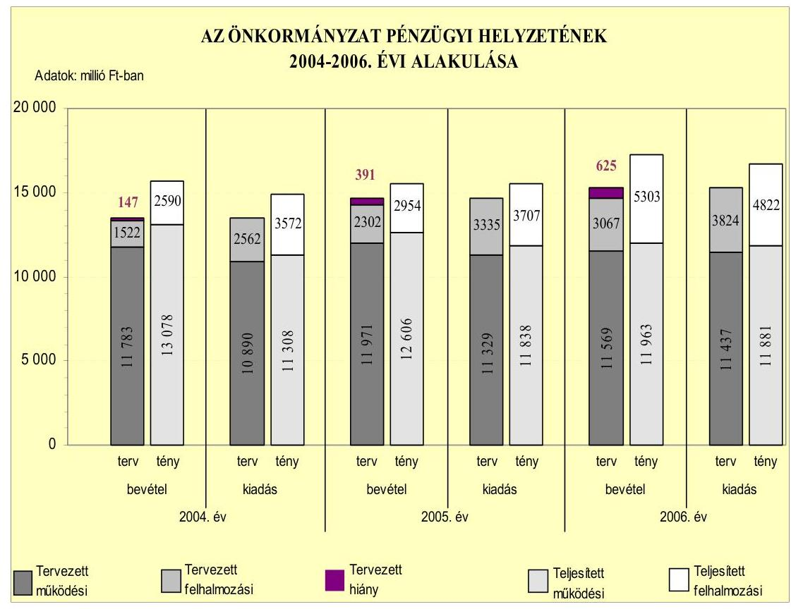
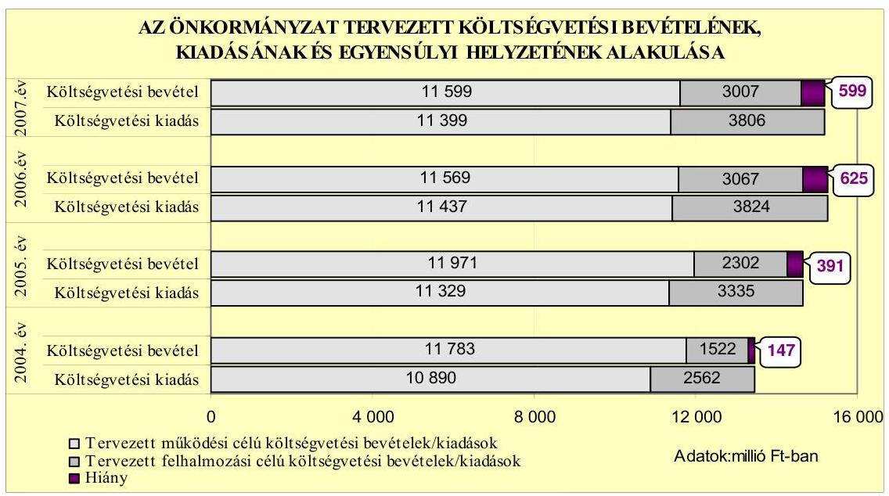
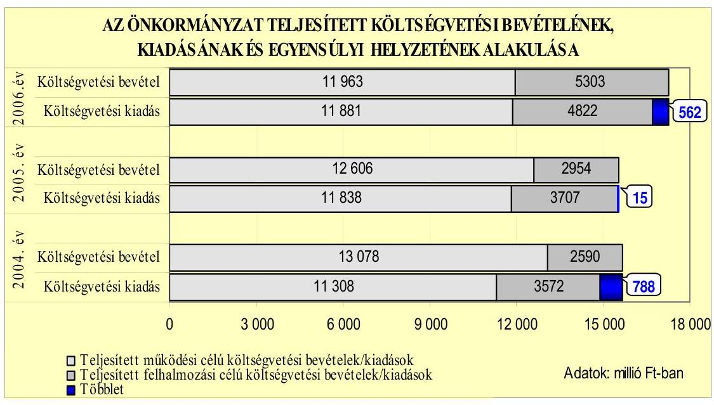
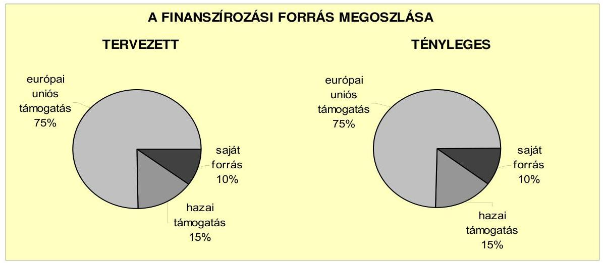
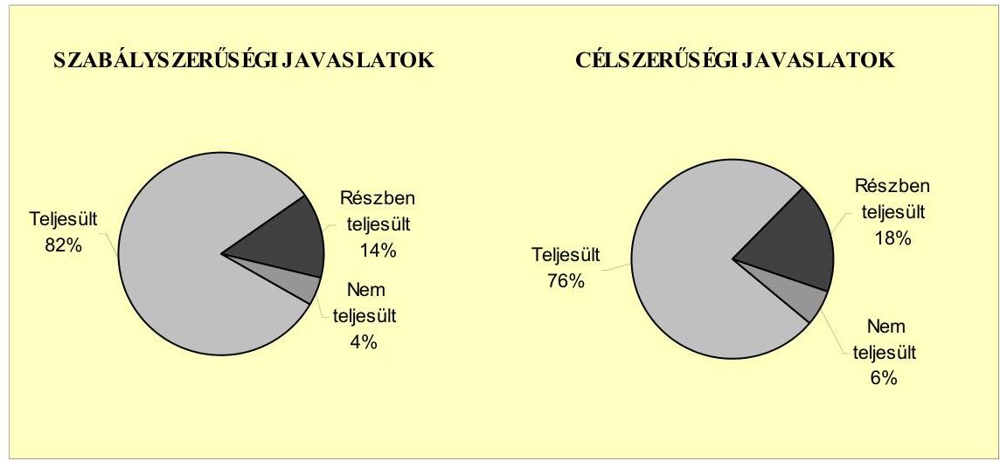
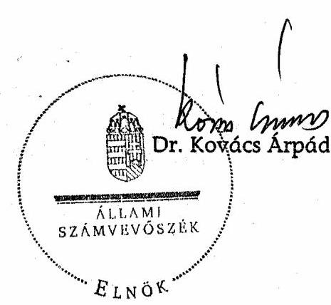
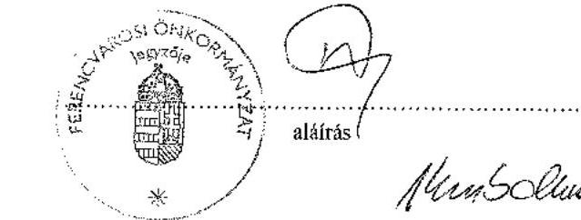
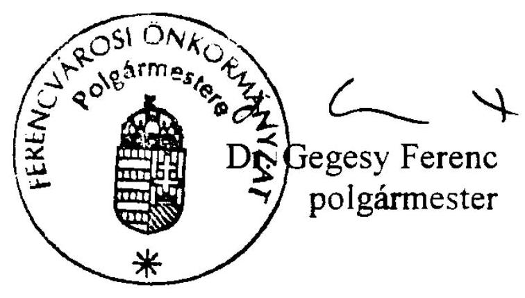

# JELENTÉS 

a Budapest Főváros IX. kerület Ferencváros Önkormányzata gazdálkodási rendszerének 2007. évi átfogó ellenőrzéséről

---

3. Önkormányzati és Területi Ellenőrzési Igazgatóság
3.3. Átfogó Ellenőrzések Főcsoport
Iktatószám: V-1001-9/33/21/2007.
Témaszám: 845
Vizsgálat-azonosító szám: V0331
Az ellenőrzést felügyelte:
Dr. Lóránt Zoltán
főigazgató
Az ellenőrzés végrehajtásáért felelős:
Dr. Sepsey Tamás
főigazgató-helyettes
Az ellenőrzést vezette:
Molnár Gyula Mihály
igazgató-helyettes
Az ellenőrzést végezték:
Dér Géza Gyüre Lajosné
számvevő
számvevő tanácsos
Nagy Ervin Barnabás
számvevő

# A témához kapcsolódó eddig készített számvevőszéki jelentések: 

címe
sorszáma
Jelentés Budapest Főváros IX. kerület Ferencváros Önkormányzata gazdálkodásának átfogó ellenőrzéséről
Jelentés a Magyar Köztársaság 2004. évi költségvetése végrehajtásának ellenőrzéséről
Függelék:

- a helyi önkormányzatokat a 2004. évben megillető normatív állami hozzájárulás elszámolása
Jelentés a helyi és a helyi kisebbségi önkormányzatok gazdálkodásának átfogó ellenőrzéséről

---

# TARTALOMJEGYZÉK 

BEVEZETÉS ..... 9
I. ÖSSZEGZŐ MEGÁLLAPÍTÁSOK, KÖVETKEZTETÉSEK, JAVASLATOK ..... 13
II. RÉSZLETES MEGÁLLAPÍTÁSOK ..... 22

1. Az Önkormányzat költségvetési és pénzügyi helyzete ..... 22
1.1. A tervezett költségvetési bevételi és kiadási előirányzatok, valamint a költségvetési egyensúly alakulása ..... 24
1.2. A költségvetési bevételek és kiadások teljesítése, a pénzügyi egyensúlyi helyzet alakulása ..... 25
2. Az Önkormányzat felkészültsége az európai uniós források igénylésére és felhasználására, valamint az e-közigazgatási feladatok ellátására ..... 28
2.1. Az európai uniós források igénybevételére és a várható támogatás felhasználásának szervezettségére történt felkészülés és a belső szabályozottság értékelése ..... 28
2.1.1. A fejlesztési célkitűzések meghatározása ..... 28
2.1.2. Az európai uniós forrásokhoz kapcsolódóan a pályázat-figyelés, a pályázat-készítés, valamint az európai uniós támogatással megvalósuló fejlesztés lebonyolítása belső rendjének szabályozottsága, a végrehajtás személyi, szervezeti feltételei ..... 32
2.1.3. Az európai uniós forrással támogatott fejlesztés megvalósítása ..... 35
2.2. Az e-közigazgatási feladatok előkészítése, bevezetése ..... 39
3. A költségvetési gazdálkodás kontrolljai ..... 41
3.1. A szabályozottság kockázata a költségvetés tervezési, gazdálkodási, beszámolási és a folyamatba épített ellenőrzési feladatainál ..... 41
3.2. A belső kontrollok érvényesülése az önkormányzati források szabályszerű felhasználásában, a költségvetési tervezés, gazdálkodás, beszámolás folyamataiban ..... 44
3.3. A belső ellenőrzési kötelezettség teljesítése, javaslatainak hasznosulása ..... 47
4. Az ÁSZ korábbi ellenőrzési javaslatai alapján készített intézkedési terv végrehajtása, eredményessége ..... 51
4.1. Az Önkormányzat gazdálkodási rendszerének átfogó ellenőrzése során tett javaslatok végrehajtására tervezett intézkedések megvalósulása ..... 51

---

4.2. A zárszámadáshoz kapcsolódó (állami hozzájárulások, támogatások igénylésének és felhasználásának ellenőrzése), valamint a további vizsgálatok esetében a megállapítások, javaslatok alapján tett intézkedések

# MELLÉKLETEK 

1. számú Az Önkormányzat gazdálkodását meghatározó adatok, mutatószámok (1 oldal)
2. számú Az önkormányzati vagyon alakulása (1 oldal)
3. számú Az Önkormányzat 2004-2006. évi költségvetési előirányzatainak és azok pénzügyi teljesítéseinek alakulása (1 oldal)
4. számú 1. számú Nyilatkozat a tervezett és teljesített költségvetési adatoknak a megelőző évhez viszonyított jelentős, ± 10 %-ot meghaladó változásának indokolásáról, amennyiben azt a feladatok változása indokolta (3 oldal)
5. számú 1. számú Tanúsítvány az európai uniós forrásokkal támogatott programok, célok tervezett és tényleges 2004-2007. évi adatairól (1 oldal)
6. számú Dr. Gegesy Ferenc úr, a Budapest Főváros IX. kerület Ferencváros Önkormányzata polgármestere által adott észrevétel (1 oldal)

---

# RÖVIDÍTÉSEK JEGYZÉKE 

## Törvények

Áht.
Eisztv.

Htv.

Kbt.
Ksztv.

Ötv.
Számv. tv.
Szoc. tv.

## Rendeletek

2004. évi költségvetési rendelet

2004. évi zárszámadási rendelet

2005. évi költségvetési rendelet

2005. évi zárszámadási rendelet

2006. évi költségvetési rendelet

2006. évi zárszámadási rendelet

2007. évi költségvetési rendelet

Ámr.
Ber.
Vhr.
az államháztartásról szóló 1992. évi XXXVIII. törvény
az elektronikus információszabadságról szóló 2005. évi XC. törvény
a helyi önkormányzatok és szerveik, a köztársasági megbízottak, valamint egyes centrális alárendeltségű szervek feladat- és hatásköreiről szóló 1991. évi XX. törvény
a közbeszerzésekről szóló 2003. évi CXXIX. törvény
a közhasznú szervezetekről szóló 1997. évi CLVI. törvény
a helyi önkormányzatokról szóló 1990. évi LXV. törvény
a számvitelről szóló 2000. évi C. törvény
a szociális igazgatásról és szociális ellátásokról szóló 1993. évi III. törvény

Budapest Főváros IX. kerület Ferencváros Önkormányzatának 6/2004. (II. 6.) számú rendelete a 2004. évi költségvetésről
Budapest Főváros IX. kerület Ferencváros Önkormányzatának 15/2005. (V. 25.) számú rendelete a 2004. évi zárszámadásról
Budapest Főváros IX. kerület Ferencváros Önkormányzatának 7/2005. (III. 3.) számú rendelete a 2005. évi költségvetésről
Budapest Főváros IX. kerület Ferencváros Önkormányzatának 12/2006. (V. 4.) számú rendelete a 2005. évi zárszámadásról
Budapest Főváros IX. kerület Ferencváros Önkormányzatának 5/2006. (II. 9.) számú rendelete a 2006. évi költségvetésről
Budapest Főváros IX. kerület Ferencváros Önkormányzatának 8/2007. (V. 4.) számú rendelete a 2006. évi zárszámadásról
Budapest Főváros IX. kerület Ferencváros Önkormányzatának 3/2007. (II. 7.) számú rendelete a 2007. évi költségvetésről
az államháztartás működési rendjéről szóló 217/1998. (XII. 30.) számú Korm. rendelet
a költségvetési szervek belső ellenőrzéséről szóló 193/2003. (IX. 26.) számú Korm. rendelet
az államháztartás szervezetei beszámolási és könyvvezetési kötelezettségének sajátosságairól szóló 249/2000. (XII. 24.) számú Korm. rendelet

---

SzMSz
vagyongazdálkodási rendelet

## Szórövidítések

ÁSZ
Adóiroda
belső ellenőrzési egység

Beruházási iroda

Egyesített Bölcsődék
e-közigazgatás
FB Kft.

FENYÁR Kht.
FEUVE
Főépítészi iroda
gazdálkodási jogkörök szabályzata
gazdasági program

Gondozó Szolgálat

GVOP
HEFOP
HEFOP „A társadalmi kirekesztés elleni küzdelem" fejlesztés feladata

HEFOP „Az oktatási infrastruktúra" fejlesztés feladata

Budapest Főváros IX. kerület Ferencváros Önkormányzatának 5/1999. (IV. 30.) számú rendelete az Önkormányzat Szervezeti és Működési Szabályzatáról
Budapest Főváros IX. kerület Ferencváros Önkormányzatának 6/1997. (IV. 1.) számú rendelete az Önkormányzat vagyonáról és a vagyona feletti tulajdonosi jogok gyakorlásáról

Állami Számvevőszék
Budapest Főváros IX. kerület Ferencváros Önkormányzat Polgármesteri Hivatalának Adóirodája
Budapest Főváros IX. kerület Ferencváros Önkormányzat Polgármesteri Hivatalának Belső Ellenőrzési Egysége
Budapest Főváros IX. kerület Ferencváros Önkormányzat Polgármesteri Hivatalának Beruházási Irodája
Ferencvárosi Egyesített Bölcsődei Intézmények elektronikus közigazgatás
Ferencvárosi Bérleményüzemeltető Korlátolt Felelősségű Társaság

Ferencvárosi Nyári Játékok Közhasznú Társaság
folyamatba épített, előzetes és utólagos vezetői ellenőrzés
Budapest Főváros IX. kerület Ferencváros Önkormányzat Polgármesteri Hivatalának Főépítészi irodája
a Polgármesteri Hivatal pénzgazdálkodásával kapcsolatos kötelezettségvállalás, ellenjegyzés, utalványozás és érvényesítés rendjéről szóló polgármesteri és jegyzői együttes utasítás
Budapest Főváros IX. kerület Ferencváros Önkormányzat Képviselő-testületének 114/2007. (V. 2.) számú határozatával elfogadott, 2007-2010. évekre vonatkozó Gazdasági Programja
Budapest Főváros IX. kerület Ferencváros Önkormányzat Gondozó Szolgálata
NFT Gazdasági Versenyképesség Operatív Program
NFT Humánerőforrás-fejlesztési Operatív Program
HEFOP-2.2.1. A társadalmi kirekesztés elleni küzdelem „A Ferencvárosi Bölcsődék Gondozóinak, Óvodák óvónőinek integrált nevelésre való felkészítése, integrált minta bölcsődék kialakítása"
HEFOP-4.1.2. Oktatási infrastruktúra fejlesztés feladata. Felsőoktatási intézmények infrastrukturális feltételeinek javítása. „Fejlettebb technika-fejlettebb kommunikáció a Károli Gáspár Református Egyetemen

---

| irányító hatóság | A strukturális alapok forrásainak szabályszerű, hatékony és eredményes felhasználásához szükséges intézményrendszer felső eleme. Az irányító hatóság általános és átfogó felelősséget visel a programok, projektek hatékony és szabályszerű végrehajtásáért |
| :--: | :--: |
| jegyző | Budapest Főváros IX. kerület Ferencváros Önkormányzatának Jegyzője |
| Képviselő-testület | Budapest Főváros IX. kerület Ferencváros Önkormányzatának Képviselő-testülete |
| KIOP | NFT Környezetvédelmi és Infrastruktúrafejlesztés Operatív Program |
| Korai Fejlesztő Alapítvány | Korai Fejlesztő Központot Támogató Alapítvány |
| Közigazgatási iroda | Budapest Főváros IX. kerület Ferencváros Önkormányzata Polgármesteri Hivatalának Közigazgatási Irodája |
| középtávú fejlesztési terv | Budapest Főváros IX. kerület Ferencváros Önkormányzat Képviselő-testületének 425/2005. (XII. 6.) számú határozatával elfogadott Középtávú Fejlesztési Terv |
| közreműködő szervezet | A közreműködő szervezetek az európai uniós támogatást elnyert kedvezményezettekkel kapcsolattartó szervek |
| MÁK | Magyar Államkincstár |
| NFT | Nemzeti Fejlesztési Terv |
| Okmányiroda | Budapest Főváros IX. kerület Ferencváros Önkormányzata Polgármesteri Hivatalának Okmányirodája |
| Oktatási iroda | Budapest Főváros IX. kerület Ferencváros Önkormányzata Polgármesteri Hivatalának Oktatási, Kulturális és Sport Irodája |
| oktatáspolitikai intézkedési terv | Budapest Főváros IX. kerület Ferencváros Önkormányzat Képviselő-testületének 63/2004. (II. 05.) számú határozatával elfogadott Oktatáspolitikai Intézkedési Terve |
| Önkormányzat | Budapest Főváros IX. kerület Ferencváros Önkormányzata |
| Pénzügyi bizottság | Budapest Főváros IX. kerület Ferencváros Önkormányzata Képviselő-testületének Pénzügyi és Költségvetési Bizottsága |
| Pénzügyi iroda | Budapest Főváros IX. kerület Ferencváros Önkormányzata Polgármesteri Hivatalának Pénzügyi Irodája |
| polgármester | Budapest Főváros IX. kerület Ferencváros Önkormányzatának Polgármestere |
| Polgármesteri hivatal | Budapest Főváros IX. kerület Ferencváros Önkormányzatának Polgármesteri Hivatala |
| Polgármesteri hivatal SzMSz-e | Budapest Főváros IX. kerület Ferencváros Önkormányzata Polgármesteri Hivatalának Szervezeti és Működési Szabályzata, amelyet a Képviselő-testület a 442/2004. (XII. 14.) számú határozatával hagyott jóvá |

---

| Polgármesteri és Jegyzői | Budapest Főváros IX. kerület Ferencváros Önkormány- |
| :-- | :-- |
| iroda | zat Polgármesteri Hivatalának Polgármesteri és Jegyzői |
|  | Irodája |
| ROP | NFT Regionális Operatív Program |
| ROP „Városi területek | ROP-2.2.1. Város területek rehabilitációja. „Közterületi |
| rehabilitációja" fejlesz- | rehabilitáció folytatása a Ferenc(kert)város megújulása |
| tés feladata | érdekében" |
| SEM IX. Zrt. | SEM IX. Városfejlesztő Zártkörűen Működő Részvénytársaság |
| szolgáltatástervezési | a Képviselő-testület 127/2005. (III. 29.) számú határozatával elfogadott szociális szolgáltatástervezési koncepció |
| koncepció | Budapest Főváros IX. kerület Ferencváros Önkormányzatának Európai Integrációs Tanácsnoka |
| tanácsnok | Budapest Főváros IX. kerület Ferencváros Önkormányzata |
|  | Polgármesteri Hivatalának Családvédelmi és Ügyfélszolgálati Irodája |
| Ügyfélszolgálati iroda |  |
|  | Budapest Főváros IX. kerület Ferencváros Önkormányzata |
| Vagyonkezelési iroda | Polgármesteri Hivatalának Vagyonkezelési Irodája |

---

# ÉRTELMEZŐ SZÓTÁR 

1. elektronikus szolgáltatási szint
2. elektronikus szolgáltatási szint
3. elektronikus szolgáltatási szint
4. elektronikus szolgáltatási szint
európai uniós források
fejlesztési feladat (projekt)
fejlesztési célkitűzés
kedvezményezett

Az 1044/2005. (V. 11.) Korm. határozat alapján olyan információs, tájékoztató szolgáltatás, amely csak általános információkat közöl az adott üggyel kapcsolatos teendőkről és a szükséges dokumentumokról.
Az 1044/2005. (V. 11.) Korm. határozat alapján olyan egyirányú kapcsolatot biztosító szolgáltatás, amely az 1. szinten túl biztosítja az adott ügy intézéséhez szükséges dokumentumok, nyomtatványok letöltését, és azok ellenőrzéssel, vagy ellenőrzés nélküli elektronikus kitöltését, amely esetben a dokumentumok benyújtása hagyományos úton történik.
Az 1044/2005. (V. 11.) Korm. határozat alapján olyan kétirányú kapcsolatot biztosító szolgáltatás, amely közvetlen, vagy ellenőrzött kitöltésű dokumentum segítségével biztosítja az elektronikus adatbevitelt és a bevitt adatok ellenőrzését. Az ügy indításához, intézéséhez személyes megjelenés nem szükséges, de az ügyhöz kapcsolódó közigazgatási döntés (határozat, egyéb aktus) közlése, valamint a kapcsolódó illeték-, vagy díjfizetés hagyományos úton történik.
Az 1044/2005. (V. 11.) Korm. határozat alapján olyan teljes közvetlen kétirányú ügyintézési folyamatot biztosító szolgáltatás, amikor az ügyhöz kapcsolódó közigazgatási döntés is elektronikus úton kerül közlésre, illetve a kapcsolódó illeték-, vagy díjfizetés elektronikus úton is intézhető.
Az elnyert európai uniós források lehívása a támogatott projekt megvalósítása érdekében, a fejlesztés lebonyolítása során felmerült kiadások finanszírozására.
A fejlesztési feladat (projekt) tartalmilag és formailag részletesen kidolgozott, megfelelő pénzügyi háttérrel és végrehajtási ütemezéssel rendelkező fejlesztési terv, amely illeszkedik az Európai Unió, illetve a Nemzeti Fejlesztési Terv által támogatott programokhoz.
Az önkormányzat által ellátott kötelező, vagy önként vállalt feladatok ellátásának mennyiségi, vagy minőségi fejlesztésére vonatkozó terv. A mennyiségi fejlesztés megvalósulhat beszerzéssel, létesítéssel, bővítéssel, átalakítással.
Az a helyi önkormányzat, amely a támogatási szerződést kedvezményezettként aláírja, a projektet, illetve a központi programhoz kapcsolódó támogatott önkormányzati programot végrehajtja.

---

központi program
lebonyolítás
támogatási szerződés

Az ország egészére, több régióra, egy régióra vonatkozó, de mindenképpen az önkormányzat közigazgatási területén túlmutató program, amelynél a támogatott programok kiválasztása pályáztatás nélkül, előre meghatározott feltételrendszer szerint történik, a kedvezményezettek közvetlen megkeresésével. Az Európai Unió pénzügyi alapja a Kohéziós alap, a környezetvédelem és a közlekedés terén nyújt lehetőséget az egyes tagországoknak központi programok megvalósítására.
Az európai uniós források felhasználásával megvalósuló fejlesztésre irányuló műszaki, gazdasági (pénzügyi) tevékenységet magában foglaló szervezési,
 irányítási szolgáltatás. A szervezési szolgáltatás kiterjedhet a pályázatkészítésre, a közbeszerzési eljárás lebonyolításán keresztül a folyamatos műszaki ellenőrzésre, a pénzügyi elszámolásra, a műszaki átadás-átvételre, az üzembe helyezésre, illetve a fejlesztési folyamat egyes elemeire.
A strukturális alapok esetében az irányító hatóságnak, illetve a Kohéziós alap esetében a közreműködő szervezeteknek a kedvezményezett önkormányzattal kötött szerződése, amely a támogatás felhasználásának részletes feltételeit tartalmazza.

---

# JELENTÉS 

## Budapest Főváros IX. kerület Ferencváros Önkormányzata gazdálkodási rendszerének 2007. évi átfogó ellenőrzéséről

## BEVEZETÉS

Az Ötv. 92. § (1) bekezdése, az Állami Számvevőszékről szóló 1989. évi XXXVIII. törvény 2. § (3) bekezdése, valamint az Áht. 120/A. § (1) bekezdése alapján az önkormányzatok gazdálkodását az Állami Számvevőszék ellenőrzi. Az ellenőrzésre az Országgyűlés illetékes bizottságai részére is átadott, országosan egységes ellenőrzési program alapján került sor.

Az Állami Számvevőszék a stratégiájában foglalt célkitűzéseknek megfelelően a helyi önkormányzatok költségvetési gazdálkodási rendszere átfogó ellenőrzésének programját a 2007. évtől megújította, azt kiegészítette további - teljesítmény-ellenőrzési - elemekkel.

## Az ellenőrzés célja annak értékelése volt, hogy az Önkormányzat:

- a pénzügyi egyensúlyt a költségvetésében és annak teljesítése során milyen módon biztosította, a teljesített bevételek és kiadások egyes évek közötti jelentős eltérése feladatváltozáshoz kapcsolódott-e;
- felkészült-e a szabályozottság és a szervezettség terén az európai uniós források igénylésére és felhasználására, továbbá az e-közigazgatás bevezetése miatti szervezet-korszerúsítési feladatokra;
- kialakította-e a külső és a belső feltételeknek megfelelően a gazdálkodás belső kontrollrendszerét ${ }^{1}$, továbbá a költségvetés tervezési, végrehajtási és zárszámadási feladatok szabályszerű ellátásához hozzájárult-e a folyamatba épített, előzetes és utólagos vezetői ellenőrzés, valamint a belső ellenőrzés;
- megfelelően hasznosították-e a korábbi számvevőszéki ellenőrzések megállapításait, szabályszerűségi ${ }^{2}$ és célszerűségi javaslatait.

[^0]
[^0]:    ${ }^{1}$ A gazdálkodás szabályszerűségét biztosító kontrollrendszer alatt értjük a kiépített és működő belső irányítási és szabályozási rendszert, valamint a belső ellenőrzési funkciók ellátásának rendszerét.
    ${ }^{2}$ A törvényi előírások betartásának elmulasztásakor a részletes megállapítások fejezetben egységesen a törvénysértés megjelölést alkalmazzuk, mivel az ÁSZ nem tehet különbséget a törvényi előírások között.

---

Az ellenőrzött időszak: az 1., 2. és 4. ellenőrzési programpontok tekintetében a 2004-2006. évek és a 2007. I. negyedév, a 3. ellenőrzési programpontnál a 2006. év és a 2007. I. negyedév.

Budapest Főváros IX. kerületét négy településrész ${ }^{3}$ alkotja. A kerület lakosainak száma 2007. január 1-én 56261 fő volt. A 2006. évi önkormányzati választást követően az Önkormányzat 26 tagú Képviselő-testületének munkáját 11 állandó bizottság segítette. Az Önkormányzat mellett a 2006. évi önkormányzati választásokig $10^{4}$, azt követően is $10^{5}$ helyi kisebbségi önkormányzat működött. A polgármester az 1990. évi önkormányzati választás óta tölti be tisztségét, a jegyző személye a 1999. évben változott.

Az Önkormányzat feladatainak végrehajtása érdekében a 2006. évben 29 költségvetési intézményt működtetett, amelyekből 21 önállóan gazdálkodott. A feladatok ellátásában részt vett három közalapítványa, továbbá három gazdasági társasága és kettő közhasznú társasága. Az Önkormányzat a 2006. évi költségvetési beszámolója szerint 17266 millió Ft költségvetési bevételt ért el és 16703 millió Ft költségvetési kiadást teljesített, 2006. december 31-én a könyvviteli mérleg szerint 226457 millió Ft értékű vagyonnal rendelkezett. A 2007. évi költségvetési rendeletben 14606 millió Ft költségvetési bevételt és 15205 millió Ft költségvetési kiadást irányoztak elő. A Polgármesteri hivatalban dolgozó köztisztviselők száma 2006. december 31-én 287 fő, a költségvetési intézményekben foglalkoztatott közalkalmazottak száma 1476 fő volt. Az Önkormányzat gazdálkodását meghatározó adatokat, mutatószámokat az 1-3. számú mellékletek tartalmazzák.

Az Önkormányzat költségvetési és pénzügyi helyzetét az összehasonlító elemzés módszerével vizsgáltuk. E körben elemeztük a költségvetés egyensúlyi helyzetének alakulását, a tervezett költségvetési hiány okait, a mérséklésére tett intézkedéseket, finanszírozásának módját, az Önkormányzat adósságállományának alakulását, összetevőit.

A teljesítmény-ellenőrzés módszerével vizsgáltuk, hogy a belső szabályozottság, szervezettség terén felkészültek-e az európai uniós források figyelésére, igénylésére és felhasználására, valamint az igényelt európai uniós támogatások az Önkormányzat által meghatározott fejlesztési célkitűzésekhez kapcsolódtak-e. Az ellenőrzés során felmértük, hogy az e-közigazgatási feladat ellátása, illetve bevezetése, működtetése érdekében milyen intézkedéseket tettek, valamint biztosították-e a közérdekű adatok elektronikus közzétételét.

A költségvetési gazdálkodás belső kontrolljainak ellenőrzése során értékeltük, hogy a Polgármesteri hivatalnál a költségvetés tervezési, gazdálkodási, zárszámadás készítési feladatok belső kontrolljainak kiépítettsége és működése

[^0]
[^0]:    ${ }^{3}$ Külső-Ferencváros, Középső-Ferencváros, Belső-Ferencváros és a József Attila lakótelep.
    ${ }^{4}$ Bolgár, cigány, görög, horvát, német, örmény, román, ruszin, szerb és ukrán kisebbségi önkormányzatok.
    ${ }^{5}$ Bolgár, cigány, görög, horvát, német, örmény, ruszin, szerb, szlovák és ukrán kisebbségi önkormányzatok.

---

megfelelő biztosítékot ad-e a gazdálkodási feladatok megfelelő, szabályszerű ellátására. Felmértük és minősítettük a költségvetés tervezési, a gazdálkodási, a zárszámadás készítési feladatokkal, továbbá a pénzügyi-számviteli területen az informatikával kapcsolatosan kialakított kontrollok megfelelőségét, valamint azok működésének eredményességét, megbízhatóságát. Értékeltük a belső ellenőrzés szervezeti és szabályozási keretét, továbbá működését.

A Polgármesteri hivatalnál értékeltük a gazdálkodás folyamatában a kontrollok működésének megbízhatóságát, ennek keretében ellenőriztük a szakmai teljesítés igazolására és az utalvány ellenjegyzésére kialakított kontrollok végrehajtását. Az ellenőrzést a következő, kiemelt kockázata alapján kiválasztott ${ }^{6}$, az általánostól jellemzően eltérő, egyedi eljárást igénylő gazdasági eseményekkel kapcsolatos kifizetésekre folytattuk le ${ }^{7}$ :

- a személyi juttatások közül az állományba nem tartozók megbízási díjai ${ }^{8}$,
- a külső szolgáltató által végzett karbantartási, kisjavítási szolgáltatások, valamint,
- a gépek, berendezések, felszerelések beszerzése.

Az ellenőrzés hatékony elvégzése céljából a vizsgálandó területek kiválasztása során a kockázatokon alapuló megközelítés érvényesült, ezáltal az ellenőrzési erőforrásokat azokra a területekre fókuszáltuk, amelyeken legnagyobb a hibák előfordulási valószínűsége. Az ellenőrzési erőforrások ilyen típusú összpontosításával minimálisra csökkenthető a kívánt ellenőrzési bizonyosság eléréséhez szükséges időráfordítás.

A pénzügyi-számviteli folyamatokban alkalmazott belső kontrollok létezésének és működésének ellenőrzésére a vizsgált három terület 2006. évi és 2007. I. negyedévi könyvviteli tételeiből területenként egyszerű véletlen mintát vettünk. A kijelölt gazdasági eseményre elvégzett megfelelőségi tesztek alapján értékeltük a kontrollok működésének eredményességét, megbízhatóságát a vizsgált há-

[^0]
[^0]:    ${ }^{6}$ Az önkormányzatok kiemelt előirányzataira vonatkozóan, a vertikális folyamatokra elvégeztük a kockázatok becslését, amelynek eredményeként az állományba nem tartozók megbízási díjai, a külső szolgáltató által végzett karbantartási, kisjavítási szolgáltatások, valamint a gépek, berendezések, felszerelések beszerzése kiemelkedően kockázatos területnek bizonyultak.
    ${ }^{7}$ A korábbi ellenőrzési tapasztalataink szerint ezeken a területeken a jegyzők nem, vagy hiányosan szabályozták a megbízás, megrendelés, illetve beszerzés indokoltságának, szükségességének elbírálására, igazolására, valamint a teljesítések dokumentálására, a kifizetések jogosságának megítélésére szolgáló kontrollokat. További kockázatot jelentett a külső szolgáltató által végzett karbantartási, kisjavítási munkák esetében, hogy az 50 ezer Ft alatti megrendelésekre vonatkozóan az ellenőrzési tapasztalataink szerint a jegyzők nem alakították ki a kötelezettségvállalások rendjét és nyilvántartási formáját, valamint a szabályozás elmulasztása esetén nem történt meg az írásbeli kötelezettségvállalás és annak az ellenjegyzése sem.
    ${ }^{8}$ Az állományba tartozók rendszeres személyi juttatásainak számfejtését, valamint folyósítását nem a polgármesteri hivatalok, hanem a nettó finanszírozás keretében a beküldött dokumentumok alapján a MÁK végzi.

---

rom területre külön-külön, majd összefoglalóan ${ }^{9}$ a Polgármesteri hivatal egyedi eljárást igénylő gazdasági eseményeire. A helyszíni ellenőrzés megállapításainak részletes dokumentálását három megfelelőségi tesztlapon, öt elővizsgálati és kilenc helyszíni ellenőrzési munkalapon biztosítottuk. Ezeken a teszt- és munkalapokon a minősítés alapjául szolgáló kérdések és a vonatkozó konkrét jogszabályhelyek megjelölése mellett értékeltük a kialakított belső kontrollokban rejlő kockázatokat ${ }^{10}$ és a kialakított kontrollok működésének megbízhatóságát ${ }^{11}$.

Az ÁSZ korábbi ellenőrzési javaslatai alapján tett intézkedéseket, illetve azok megvalósítását utóellenőrzés keretében vizsgáltuk. A gazdálkodási rendszer átfogó ellenőrzése során megfogalmazott javaslatok végrehajtására tett intézkedések megvalósítását ellenőriztük, az egyéb számvevőszéki ellenőrzések során tett javaslatok esetében pedig a kiadott intézkedéseket tekintettük át.

A helyszíni ellenőrzés során kitöltött - az ellenőrzést végző számvevő és a Polgármesteri hivatal felelős köztisztviselője által aláírt - elővizsgálati és helyszíni ellenőrzési munkalapokat, azok kitöltési útmutatóit, továbbá a megfelelőségi tesztek dokumentumait a polgármester részére a számvevői jelentéssel egyidejűleg átadtuk.

A jelentést az ÁSZ-ról szóló 1989. évi XXXVIII. tv. 25. § (1) bekezdése alapján észrevétel közlése céljából megküldtük a Budapest Főváros IX. kerület Ferencváros Önkormányzata polgármesterének. A kapott észrevételt a jelentés 6. számú melléklete tartalmazza.

[^0]
[^0]:    ${ }^{9}$ A vizsgált három terület egyedi értékelési pontszámait a területek relatív költségvetési súlyával arányosan összegeztük.
    ${ }^{10}$ A kialakított belső kontrollokban rejlő kockázatot alacsonynak minősítettük, ha a kontrollok - végrehajtásuk esetén - megfelelő védelmet nyújtanak a hibák bekövetkezése ellen. Közepesnek minősítettük a belső kontrollokban rejlő kockázatot, amennyiben a kontrollok - végrehajtásuk esetén - a lehetséges hibák többsége ellen védelmet nyújtanak. Magasnak értékeltük a kockázatot, ha a kontrollok - kialakításuk hiányában, vagy hiányos kialakításuk miatt - nem nyújtanak elegendő védelmet a lehetséges hibákkal szemben.
    ${ }^{11}$ A kontrollok működésének eredményességét, megbízhatóságát kiválónak értékeltük abban az esetben, ha azok működése - esetleges apróbb hiányosságoktól eltekintve - megfelelt a hibák megelőzésére és kijavítására meghatározott szabályozásnak és a legmagasabb szintű elvárásoknak. Jónak minősítettük a kontrollok működését, ha a hiányosságok száma ugyan jelentős volt, de nem veszélyeztette az ellenőrzött terület hibáinak megelőzését és kijavítását. Amennyiben a hiányosságok mértéke nem biztosította a hibák megelőzését, feltárását, kijavítását és ezáltal veszélyeztette az eredményes, megbízható működést, a kontroll működésének megbízhatósága gyenge minősítést kapott.

---

# I. ÖSSZEGZŐ MEGÁLLAPÍTÁSOK, KÖVETKEZTETÉSEK, JAVASLATOK 

Az Önkormányzatnál a 2004-2006. évek között a tervezett költségvetési bevétel és kiadás évente folyamatosan nőtt, azonban a 2007. évre csökkent. A költségvetési bevételek előirányzatai a tervezett költségvetési kiadásokat nem fedezték, a költségvetés egyensúlyának biztosítására mindhárom évben felhalmozási célú hitelfelvételt határoztak meg. A 2004-2007. években tervezett költségvetési kiadásokhoz 147 millió Ft, 391 millió Ft, 625 millió Ft, illetve 599 millió Ft forrás hiányzott, melynek az éves költségvetési kiadáshoz viszonyított aránya évente növekedett, az időszak végén elérte a 4%-ot. A felhalmozási célú költségvetési kiadásoknál tervezett költségvetési forráshiányra csak részben nyújtott fedezetet a működési célú költségvetési bevételek tervezett többlete.

Az Önkormányzatnál a 2004-2006. években a teljesített költségvetési bevételek fedezetet biztosítottak a költségvetési kiadásokra, hiány nem alakult ki. A teljesített felhalmozási célú költségvetési bevételek a felhalmozási célú költségvetési kiadásokat a 2004. évben mindössze 73%-os, a 2005. évben 80%-os mértékben fedezték, a 2006. évben a felhalmozási célú költségvetési bevételek fedezetet nyújtottak az azonos célú költségvetési kiadásokra. A felhalmozási célú költségvetési kiadások hiányát a 2004. és a 2005. évben a működési célú költségvetési bevételek többletéből fedezték. A 2004-2006. évi gazdálkodás során a pénzügyi egyensúlyt a számlavezető pénzintézettől felvett folyószámlahitellel biztosították. Az Önkormányzat 2004-2006 között - a
 realizált költségvetési bevételek és a teljesített költségvetési kiadások egyensúlya mellett - mindhárom évben fejlesztési célú, kedvezményes kamatozású hitelt vett fel, így a felhalmozási célú hitelek állománya a 2004. január 1-jei 993 millió Ft-ról 2007. március 31-re megkétszereződött.

A 2004-2006. években a működési célú költségvetési kiadások folyamatosan, mindössze 573 millió Ft-tal növekedtek, miközben a működési célú költségvetési bevételek egyre mérséklődtek, összesen 1116 millió Ft-tal csökkentek. A működési célú költségvetési bevételek csökkenése a helyi adóbevételek, valamint a működési célú költségvetési támogatások csökkenéséből adódott, ugyanakkor a működési célú költségvetési kiadások folyamatos emelkedéséhez a személyi juttatások és a munkaadói járulékok központi bérintézkedésekkel kapcsolatos növekménye és a dologi kiadások növekedése járult hozzá. A realizált felhalmozási célú költségvetési bevételek és a teljesített felhalmozási célú költségvetési kiadások a 2004-2006. között folyamatosan emelkedtek, a növekedés mértéke a bevételeknél összesen 2713 millió Ft, a kiadásoknál 1250 millió Ft volt. A felhalmozási célú költségvetési bevételek növekedését a tárgyi eszközök értékesítéséből származó bevételek, a támogatásértékű felhalmozási bevételek, a felhalmozási célra kapott költségvetési támogatások növekedése, valamint az előző évi pénzmaradvány felhalmozási célú igénybevételének emelkedése okozta. A felhalmozási célú költségvetési kiadások növekedéséhez hozzájárultak a város-rehabilitációhoz kapcsolódó felújítások, az önkormányzati intézmények,

---

ingatlanok, közterületek, játszóterek felújításai és a lakásvásárlásokhoz, ingatlancserékhez, infrastruktúra-építésekhez kapcsolódó fejlesztések.

A költségvetési bevételek eredeti előirányzatát a 2004-2006. években (18-9-18%-kal) túlteljesítették. A költségvetésekben jóváhagyott eredeti bevételi előirányzatok, valamint a teljesített adatok közötti eltérések a felhalmozási célú költségvetési bevételek (ingatlanértékesítések) terven felüli teljesítéseire, az intézményi működési bevételek alultervezésére, valamint az előző évi pénzmaradvány igénybevételének zárszámadást követő tervezésére vezethetők vissza. A 2004-2006. években a költségvetési kiadási előirányzatok eredeti tervhez viszonyított (11-6-10%-os) túlteljesítését a módosított előirányzatok terhére megvalósított beruházások és felújítások teljesített kiadásai, valamint az előző évről áthúzódó kifizetések okozták.

Az Önkormányzat a 2004-2006. évekre vonatkozó fejlesztési célkitűzéseit szolgáltatástervezési koncepcióban, oktatáspolitikai intézkedési tervben és középtávú fejlesztési tervben rögzítette, gazdasági programja 2007. áprilisában készült el. Az Önkormányzat fejlesztési célkitűzései megvalósításának lehetséges pénzügyi forrásait meghatározták a szakmai tervekben és koncepciókban. A fejlesztési célkitűzések megvalósításához a várható saját forrásokon túl külső - pályázati - források bevonását is tervezték. A középtávú fejlesztési tervben meghatározták azon fejlesztési feladatok körét, amelyek pályázati támogatás segítségével valósulhatnak meg. A Képviselő-testület a 2004-2007. I. féléve közötti időszakban európai uniós forrás igénylésére nyolc pályázat benyújtásáról döntött, melyből négy esetben a benyújtott pályázat eredményes volt. Az európai uniós forrással támogatott fejlesztési feladatok bevételi és kiadási előirányzatait a 2004-2007. évek költségvetési rendeletei az Áht. előírása ellenére nem, illetve nem megfelelő összeggel tartalmazták, valamint nem mutatták be az Ámr. előírása ellenére az európai uniós forrással támogatott fejlesztések bevételi és kiadási előirányzatait elkülönítetten és a többéves kihatással járó feladatok előirányzatait éves bontásban.

A Polgármesteri hivatal SzMSz-ében és belső szabályzataiban hiányosan szabályozták az európai uniós források igénybevételére, felhasználására és a felelősségre vonatkozó feladatokat, mivel azok nem tartalmazták az európai uniós pályázatfigyelés, pályázatkészítés, továbbá a támogatott fejlesztési feladatok lebonyolításával kapcsolatos belső ellenőrzés és folyamatba épített ellenőrzés kötelezettségének, rendjének meghatározását. Az Önkormányzat a pályázatfigyelési és pályázatkészítési feladatok ellátására külső szervezetekkel megbízási szerződést kötött, amelyek tartalmazták a feladat-ellátási kötelezettséget, a kapcsolattartás és az információ-átadás szabályait. Az európai uniós forrásokra irányuló önkormányzati szintű pályázat-koordinálás feladataira tanácsnokot jelölt ki a Képviselő-testület, a pályázatok nyilvántartásának felelősét és az információk áramlásának rendjét nem határozták meg. A pályázatfigyelést végzők és a pályázatok benyújtásáról döntési jogkörrel rendelkezők közötti információ szolgáltatási kötelezettség előírását belső szabályzatban nem rögzítették. Az Önkormányzat az európai uniós források igénybevételére és felhasználására a belső szabályozottság tekintetében nem készült fel eredményesen, mivel a Polgármesteri hivatalnál, illetve a SEM IX. Zrt.-nél nem szabályozták az európai uniós forrásból támogatott fejlesztések lebonyolítási feladatainak rendjét, a felelősség személyre szóló meghatározását és az ellenőrzési feladatok

---

megosztását, továbbá a külső szervezetekkel kötött szerződések nem tartalmazták a feladatellátás rendjének szabályozását és a megbízottak munkájával kapcsolatos ellenőrzési feladatokat.

Az európai uniós támogatások pályázatfigyelésével, pályázatkészítésével kapcsolatos feladatok ellátásának személyi feltételeit a Polgármesteri hivatalon belül biztosították. A Polgármesteri és Jegyzői irodán európai uniós ügyintézői munkakörre készítettek munkaköri leírást. A feladatok ellátására 2005. és a 2006. években (hét hónapon át) alkalmaztak köztisztviselőt. Az európai uniós támogatásokkal megvalósuló fejlesztési feladatok lebonyolításának projektenkénti személyi feltételeiről más-más szervezeti egységekhez tartozó köztisztviselők és az Önkormányzat többségi tulajdonában lévő gazdasági társaság megbízása útján gondoskodtak. Az Önkormányzat az európai uniós források igénybevételét és felhasználását biztosította.

Az Önkormányzat a ROP „Városi területek rehabilitációja” fejlesztési feladatra benyújtott pályázatával 448 millió Ft támogatást nyert el a 2005. évben a 498 millió Ft összegű beruházáshoz. A támogatási szerződést 2005. márciusában a teljesítési határidőre vonatkozóan és 2006. júniusában az igényelt támogatási összeg tekintetében módosították. A megvalósítás a kettő módosított támogatási szerződésben meghatározott időbeli ütemezés szerint haladt. Az Önkormányzathoz benyújtott számlák, továbbá a 10%-os saját rész kifizetését az Önkormányzat teljesítette a szállítók részére. Az Önkormányzatnak pénzügyi gondokat nem okozott a támogatás utólagos finanszírozása. A SEM IX. Zrt.-nél, illetve a Polgármesteri hivatalnál - a ROP „Városi területek rehabilitációja” fejlesztési feladatához kapcsolódó gazdasági események esetében - az Ámr. előírása ellenére nem működött a folyamatba épített ellenőrzés, mivel az európai uniós támogatás felhasználásával megvalósított feladatokhoz kapcsolódó kötelezettségvállalások ellenjegyzése során az ellenjegyző nem ellenőrizte, hogy a kötelezettségvállalás sérti-e a gazdálkodásra (a fedezet meglétére) vonatkozó Áht-ban előírt szabályokat. A szakmai teljesítés igazolását és az érvényesítési feladatok elvégzését az önkormányzati alszámlákra beérkező európai uniós támogatási bevételek és az azok felhasználásával megvalósított feladatok teljesítésével kapcsolatos kiadások bizonylatain a jegyző által kijelölt dolgozók - az Ámr-ben és a gazdálkodási jogkörök szabályzatában foglalt előírások ellenére aláírásukkal nem igazolták. Az utalvány ellenjegyzője aláírását megelőzően nem ellenőrizte a gazdálkodási szabályok betartását, a fedezet meglétét, nem győződött meg a szakmai teljesítésigazolás és az érvényesítés megtörténtéről. A költségvetési előirányzatok tervezésének elmaradása, valamint a folyamatba épített ellenőrzési feladatok elvégzésének hiányosságai miatt a Képviselőtestület által jóváhagyott kiadási előirányzatot a ROP „Városi területek rehabilitációja” fejlesztési feladata megvalósítása során a 2006. évben 416 millió Ft-tal túllépték. Az Önkormányzat három kifizetési kérelmet nyújtott be a közreműködő szervezet felé, amely ellenőrzése során szabálytalanság megállapítására nem került sor, a kiutalásokat teljesítették a Polgármesteri hivatal, illetve a szállítók részére. A belső ellenőrzés az európai uniós forrással megvalósuló ROP „Városi területek rehabilitációja” fejlesztési feladatának folyamatát nem ellenőrizte.

Az e-közigazgatási feladatokat ellátó informatikai rendszert az Önkormányzatnál kialakították, biztosították az elektronikusan elérhető közszolgáltatások igénybevételét. A hatósági tevékenységgel, a szociális juttatásokkal, támogatásokkal, a lakásgazdálkodási feladatokkal és az egészségüggyel kapcsolatos ügyek intézése nem az e-közigazgatás keretében történt. A 2. elektronikus szolgáltatási szinten biztosították a közérdekű információk, tájékoztató anyagok közzétételét, az ügyintézéshez szükséges nyomtatványok letöltését. A helyi adózással, a parkolási engedély ügyekkel kapcsolatosan a 3. elektronikus szolgáltatási szinten vehették igénybe az ügyfelek a Polgármesteri hivatal közigazgatási tevékenységét. A nem normatív céljellegű működési célú támogatások adatait az Áht. és az Eisztv. előírásainak megfelelően 2007. január 1-től az önkormányzati honlapon közzétették. Az önkormányzati pénzeszközök felhasználásával, a vagyonnal történő gazdálkodással összefüggő szerződések, valamint a nem normatív, céljellegű fejlesztési támogatások adatait az Áht-nak megfelelő tartalommal, de nem elektronikus formában tették közzé, annak ellenére, hogy az Eisztv. a 2007. évtől ezt a közzétételi formát írta elő az Önkormányzat részére. Az Ámr. előírása ellenére nem történt meg az éves költségvetési beszámoló szöveges indoklásának közzététele, valamint a költséghatékonyság javítása érdekében tett intézkedések felsorolása és elemzése tekintetében kötelezően közzéteendő közérdekű adatok nyilvánossá tétele. Az Önkormányzat nem tartotta be az Eisztv-ben foglalt előírásokat, mert a törvény mellékletében kiadott általános közzétételi listában foglaltakat nem tette közzé hiánytalanul. Elmulasztották a közzétételt a gazdálkodási adatok közül a létszámra, a személyi juttatásokra, a vezetők és vezető tisztségviselők illetményére, juttatásaira vonatkozó összesített adatok tekintetében. A Polgármesteri hivatalban az e-közigazgatási feladatellátás személyi feltételeit kialakították. A feladatot segítő informatikai rendszer használatának gyakoriságát, az ügyfelek általi igénybevétel tapasztalatait ügykörönként, illetve együttesen nem értékelték.

A Polgármesteri hivatalban a költségvetés tervezési és a zárszámadáskészítési folyamatok szabályozottsága alacsony kockázatot jelentett a feladatok szabályszerű végrehajtásában, mivel a jegyző a pénzügyi irányítási és ellenőrzési rendszer meghatározása keretében előírta a költségvetés tervezési és a zárszámadás készítési folyamatok ellenőrzési feladatait. A 2006. és a 2007. évi költségvetés tervezés és a 2006. évi zárszámadás készítés folyamatában a működésbeli hibák megelőzésére, feltárására, kijavítására kialakított kontrollok működésének megbízhatósága összességében kiváló volt, mivel a belső szabályozásban foglalt előírásoknak megfelelően ellenőrizték, hogy a költségvetési intézmények teljesítették-e a költségvetési javaslat összeállításával kapcsolatban részükre meghatározott szakmai és pénzügyi követelményeket. A 2006. évi zárszámadás előkészítése során ellenőrizték az intézményi pénzmaradványok megállapításának szabályszerűségét, az intézményi eredeti és a módosított előirányzatok, valamint a teljesítési adatok eltérésének indokoltságát. A kontrollok működésének megbízhatósága annak ellenére összességében kiváló volt, hogy a 2006. évi költségvetési rendelet előkészítése során a Polgármesteri hivatalnál nem ellenőrizték az európai uniós támogatási bevételek, illetve azok felhasználásával megvalósuló feladatok kiadási előirányzatainak összhangját az Önkormányzat által megkötött támogatási szerződésekben rögzített összegekkel, továbbá a zárszámadás készítés folyamatában elmaradt ezen előirányzatok és a teljesítések eltérései indokoltságának ellenőrzése.

---

A Polgármesteri hivatalnál a 2006. évben és a 2007. I. negyedévben a gazdálkodási, a pénzügyi-számviteli és a folyamatba épített ellenőrzési feladatok szabályozottságának hiányosságai közepes kockázatot jelentettek a gazdálkodási feladatok szabályszerű végrehajtásában, mivel a gazdálkodási folyamatok szabályozása során a helyi sajátosságokat nem vették figyelembe a ROP „Városi területek rehabilitációja” fejlesztési feladata megvalósítására megnyitott - SEM IX. Zrt. által kezelt - önkormányzati alszámlák bevételeinek realizálása és kiadásainak teljesítése tekintetében. A gazdálkodási és ellenőrzési jogkörök gyakorlására vonatkozóan a SEM IX. Zrt. vezetői és dolgozói részére adott polgármesteri, illetve jegyzői felhatalmazásokban és megbízásokban az Ámr. előírásai ellenére nem határozták meg a feladatok ellátásának rendjét, a szakmai teljesítés igazolásának módját, valamint a hatáskörökhöz és feladatokhoz kapcsolódó felelősségi szabályokat. Ezen önkormányzati alszámlákról a SEM IX. Zrt. által teljesített szállítói kötelezettségek főkönyvi és analitikus nyilvántartásának sajátos szabályait a jegyző a számlarendben nem rögzítette, ezáltal a ROP „Városi területek rehabilitációja” fejlesztési feladatával kapcsolatos szállítói kötelezettségek növekedését, illetve csökkenését a Polgármesteri hivatal főkönyvi könyvelésében a Vhr. előírása ellenére nem rögzítették. A közbenső egyeztetés során a jegyző által adott tájékoztatás szerint a jegyző a SEM IX. Zrt. által kezelt önkormányzati alszámlák tekintetében a vezetők részére kiadott felhatalmazásokat, valamint az érvényesítést és szakmai teljesítés igazolását végzők megbízásait módosította, a gazdálkodás, illetve ellenőrzési jogköröket gyakorló személyek részére előírta a gazdálkodási jogkörök szabályzatában foglaltak betartását, továbbá a Polgármesteri hivatal
 számlarendjét kiegészítette a SEM IX. Zrt. által kezelt önkormányzati alszámlákról teljesített szállítói kötelezettségek állományának főkönyvi könyvelésben való rögzítésének szabályaival.

A Polgármesteri hivatalnál a 2006. évben és a 2007. év I. negyedévében a működésbeli hibák megelőzésére, feltárására, kijavítására kialakított kontrollok működésének megbízhatósága az állományba nem tartozók megbízási díjaival, a karbantartási, kisjavítási szolgáltatásokkal, továbbá a gépek, berendezések, felszerelések beszerzésével kapcsolatos kifizetések során - a három terület költségvetési súlyának figyelembevételével értékelve - összességében kiváló volt, mivel a szakmai teljesítésigazolás és az utalvány ellenjegyzés megfelelő biztosítékot adott a gazdálkodási feladatok szabályszerű ellátására. Az állományba nem tartozók megbízási díjaival kapcsolatos kifizetések, továbbá a külső szolgáltató által végzett karbantartási, kisjavítási feladatokkal kapcsolatos kifizetések során a szakmai teljesítés igazolására kijelölt személyek ellenőrzési feladataikat belső szabályzatban előírt módon és tartalommal elvégezték, valamint az utalvány ellenjegyzője a gazdálkodásra vonatkozó szabályok érvényesüléséről, továbbá a szakmai teljesítésigazolás és az érvényesítés megtörténtéről meggyőződött. A gépek, berendezések, felszerelések beszerzésével kapcsolatos kifizetések esetében a szakmai teljesítés igazolására kijelölt személyek ellenőrzési feladataikat a gazdálkodási jogkörök szabályzatában előírt módon és tartalommal elvégezték, azonban a szerkesztőség, a pedagógiai feladatok, illetve az igazgatási feladatok költségvetési előirányzatai terhére vásárolt számítástechnikai, ügyviteli gépek és irodai bútorok vételárának kifizetéseihez kapcsolódó utalványok ellenjegyzése során elmaradt a fedezet meglétének ellenőrzése, és ezáltal nem tartották be ezen feladatok felhalmozási kiadási előirány-

---

zatai tekintetében a jóváhagyott kiemelt előirányzatokon belüli gazdálkodásra vonatkozó - Áht-ban foglalt - kötelezettséget.

A Polgármesteri hivatalban az informatikai feladatok biztonságos végrehajtásában az informatikai rendszer szabályozottsága közepes mértékű kockázatot jelentett, mert az adatokhoz való hozzáférések ellenőrzését és az ellenőrzések dokumentálási kötelezettségét nem határozták meg, valamint az informatikával kapcsolatos szabályzatok dolgozókkal történő megismertetését nem dokumentálták. A pénzügyi-számviteli feladatok ellátását segítő informatikai rendszerek működtetésénél a működésbeli hibák megelőzésére, illetve feltárására kialakított kontrollok működésének megbízhatósága összességében kiváló volt, mivel a munkafolyamatba épített ellenőrzést az informatikai rendszer hatékonyan segítette, azonban az adatkapcsolatokat nem dokumentálták, nem történt meg a hardver hibáknak, illetve azok elhárításának, kezelésének a dokumentálása és a pénzügyi-számviteli terület által használt programok adatai az informatikai hálózaton keresztül nem voltak elérhetők.

A belső ellenőrzés szervezeti kereteinek kialakítása és szabályozása a belső ellenőrzési feladatok szabályszerű végrehajtásában összességében alacsony kockázatot jelentett, mivel az Önkormányzat a Polgármesteri hivatal SzMSzében a belső ellenőrzési kötelezettséget előírta, a függetlenített belső ellenőrzési szervezetet kialakította, annak jogállását és feladatait meghatározta. A belső ellenőrzés tevékenységére vonatkozó szabályokat és eljárásokat a belső ellenőrzési kézikönyvben előírták. Annak ellenére összességében alacsony volt a belső ellenőrzés szervezettségének és szabályozottságának a kockázata, hogy a 2006. évben a belső ellenőrzés nem rendelkezett kockázatelemzéssel alátámasztott stratégiai tervvel, továbbá, a 2006. évben, valamint 2007. I. negyedévében elvégzett 20 ellenőrzés közül kettő esetében nem készítettek ellenőrzési programot. A 2006. évben és 2007. I. negyedévében a belső ellenőrzés működésének megbízhatósága jó volt, mivel az éves ellenőrzési tervben foglalt feladatokat végrehajtották, a hibák feltárására és a célirányos intézkedések megtételére javaslatokat fogalmaztak meg. A belső ellenőrök által tett javaslatok végrehajtása érdekében az ellenőrzöttek intézkedési tervet készítettek, a belső ellenőrök a javaslatok realizálásáról, a hiányosságok felszámolásáról az ÁSZ helyszíni ellenőrzésének ideje alatt meggyőződtek. A Polgármesteri hivatal 2006. II. félévi selejtezéseinek és a 2006. évi leltározás végrehajtásának ellenőrzéséről nem készítettek ellenőrzési jelentést, hanem a megállapításokat és a javaslatokat feljegyzésekben rögzítették, amelyek tartalma nem felelt meg a Ber. előírásainak. A belső ellenőrzés keretében a Polgármesteri hivatalban és az Önkormányzat költségvetési intézményeinél nem ellenőrizték a közbeszerzéseket és a közbeszerzési eljárásokat. A jegyző a költségvetési beszámoló keretében az Áht. előírásának megfelelően beszámolt a FEUVE és a belső ellenőrzés működtetéséről. A Képviselő-testület az Htv. előírását betartva a 2006. évi zárszámadási rendelettervezet előterjesztésével egyidejűleg áttekintette a költségvetési szervek ellenőrzésének tapasztalatait.

Az Önkormányzat gazdálkodásának 2004. évi átfogó ellenőrzéséről készült ÁSZ jelentést a Képviselő-testület megvitatta és a javaslatok realizálására intézkedési tervet hagyott jóvá, amelynek végrehajtása során az összesen 58 (szabályszerűségi és célszerűségi) javaslat négyötöde teljes körűen hasznosult, kilenc javaslat részben teljesült. Három javaslat megvalósításáról nem intéz-

---

kedtek, mivel a Képviselő-testület nem határozta meg az Áht-ban előírt mérlegek, kimutatások tartalmát, továbbá nem történt meg a pénzügyi, gazdálkodási és számviteli feladatok ellátása céljából alkalmazott számítógépes rendszerek közötti informatikai kapcsolat megteremtése, valamint 2007. szeptemberig - a Vhr. előírása ellenére - nem határozták meg az analitikus nyilvántartások adataiból készített összesítő kimutatások elkészítési határidejét.

Részben hasznosították a banki bevételek érvényesítésére, a likviditási terv elkészítésére, illetve szükség szerinti aktualizálására, valamint a dolgozók munkaköri leírásainak kiegészítésére irányuló javaslatokat. A Képviselő-testület által jóváhagyott költségvetési előirányzatok betartásával, valamint az intézmények saját hatáskörben végrehajtott előirányzat változtatásaival kapcsolatban megvalósított intézkedések ellenére nem biztosították az intézményi költségvetési előirányzatok, a Polgármesteri hivatal egyes kiemelt (felhalmozási kiadások) előirányzatainak továbbá a ROP „Városi területek rehabilitációja" fejlesztés feladata megvalósítására jóváhagyott költségvetési előirányzatok betartását. A céljelleggel nyújtott támogatások számadási kötelezettségének előírására, valamint a számadások és a rendeltetés szerinti felhasználás ellenőrzésére tett intézkedések a 2006. évben hozzájárultak a támogatások folyósításának szabályszerűségéhez és cél szerinti felhasználásához, azonban a 2006. évben az Áht. előírása ellenére a számadási kötelezettséget elmulasztó kettő támogatott részére is folyósítottak további támogatást. A pártok részére biztosított önkormányzati helyiségek bérleti díjának meghatározására vonatkozó javaslat végrehajtása érdekében tett polgármesteri intézkedés nem volt eredményes.

A Polgármesteri hivatalnál a gazdálkodás és a pénzügyi-számviteli feladatok szabályozottságának biztosítása - a gazdálkodási jogkörök szabályzatának módosítása, a Pénzügyi iroda ügyrendjének aktualizálása, a költségvetési szervek egységes számviteli rendjének meghatározása - érdekében tett javaslatok hasznosítása hozzájárult ezen feladatok szabályozottsága terén a kockázatok csökkentéséhez. A vagyongazdálkodási rendelet hatásköri szabályait kiegészítették, a Képviselő-testület az Áht. előírásainak megfelelően meghatározta a követelésekről történő lemondás eseteit. A követelések és a részesedések értékelésének elvégzésével biztosították ezen eszközök esetében a számviteli előírásoknak megfelelő értéken való bemutatását a könyvviteli mérlegben. A közbeszerzési eljárások lefolytatására, a kisebbségi önkormányzatokkal kötött megállapodások felülvizsgálatára, továbbá a zárszámadási rendelet szerkezetére és tartalmára, valamint a pénzmaradvány elszámolás felülvizsgálatára vonatkozó szabályszerűségi javaslatokat realizálták. A középületek akadálymentessé tétele folyamatban van. A belső ellenőrzési rendszer szabályozottságának a szintje javult a belső ellenőrök funkcionális függetlenségének a Polgármesteri hivatal SzMSz-ében történő biztosításával, a belső ellenőrzési szervezet jogállásának és feladatainak meghatározásával.

Az ÁSZ a 2004. évi normatív állami hozzájárulás igénylésének és elszámolásának ellenőrzését végezte el az Önkormányzatnál a 2005. évben. Az ellenőrzésről készített számvevői jelentés három szabályszerűségi javaslatot tartalmazott. A javaslatok megvalósítása érdekében intézkedtek.

Az átfogó és a zárszámadáshoz kapcsolódó ellenőrzések javaslatainak végrehajtása eredményeként a Polgármesteri hivatalnál javult a költségvetés készítés

---

rendjének, a gazdálkodási és a pénzügyi-számviteli feladatok ellátásának szabályozottsága, a belső kontrollrendszer működésének megbízhatósága, valamint a belső ellenőrzés működésének eredményessége.

A helyszíni ellenőrzés megállapításainak hasznosítása mellett javasoljuk:

# a polgármesternek 

a munka színvonalának javítása érdekében

1. kezdeményezze, hogy a jelentésben foglaltakat a Képviselő-testület tárgyalja meg és a feltárt hiányosságok megszűntetése érdekében készíttessen intézkedési tervet a határidők és felelősök megjelölésével;

## a jegyzőnek

a jogszabályi előírások maradéktalan betartása érdekében

1. gondoskodjon a költségvetési rendelettervezet elkészítésénél arról, hogy az európai uniós forrásokkal kapcsolatos fejlesztések
a) bevételi és kiadási előirányzatait a támogatási szerződésben foglaltakkal összhangban tervezzék meg az Áht. 69. § (1) bekezdésében előírtaknak megfelelően;
b) bevételi és kiadási előirányzatait az Ámr. 29. § (1) bekezdés k) pontja alapján elkülönítetten és a 29. § (1) bekezdés g) pontjának előírása alapján a több éves kihatással járó feladatok előirányzatainak éves bontásával tervezzék;
2. az európai uniós támogatásokkal megvalósított feladatokhoz kapcsolódó gazdasági események teljesítése során
a) biztosítsa, hogy a kötelezettségvállalás ellenjegyzésére felhatalmazott személyek az Ámr. 134. § (9) bekezdésében foglalt előírásoknak megfelelően ellenőrizzék, hogy a kötelezettségvállalás nem sérti-e a gazdálkodásra, a fedezet meglétére vonatkozó - az Áht. 93. § (1) bekezdésében foglalt - szabályokat;
b) gondoskodjon a támogatások bevételeinek elszámolása, valamint a támogatásokból megvalósított feladatokhoz kapcsolódó kiadások teljesítésének elrendelése előtt, hogy az Ámr. 135. § (1)-(3) bekezdésében és az Ámr. 137. § (3) bekezdésében előírtak alapján a szakmai teljesítés-igazolására kijelölt, illetve az érvényesítéssel megbízott, valamint az utalvány ellenjegyzésre felhatalmazott dolgozók teljesítsék a folyamatba épített ellenőrzési feladataikat;
3. gondoskodjon a költségvetés tervezés, valamint a zárszámadás készítés folyamatában az Áht 121. § (1) bekezdésében és az Ámr. 145/A. § (1) bekezdésében foglalt előírásoknak megfelelően kialakított belső kontrollok működtetéséről az európai uniós támogatásokkal megvalósított feladatok bevételeinek és kiadásainak tervezése, valamint teljesítése során;

---

4. gondoskodjon a SEM IX. Zrt. által kezelt önkormányzati alszámlák bevételei és kiadásai tekintetében a működésbeli hibák és szabálytalanságok megelőzésére szolgáló kontrollok kialakítása érdekében a Vhr. 9. számú melléklete 4. d) pontjában foglalt előírások betartásáról, az önkormányzati alszámlákról (SEM IX. Zrt. által) teljesített szállítói kötelezettségekről főkönyvi és analitikus nyilvántartás folyamatos vezetéséről;
5. intézkedjen, hogy az Eisztv. 6. § (1) bekezdésében és mellékletében, az Áht. 15/A. § (1) - a nem normatív, céljellegű működési támogatások adatainak kivételével - és 15/B. § (1) bekezdéseiben, valamint az Ámr. 157/D. § (1) bekezdésében és a 22. mellékletében előírtak szerinti közérdekű adatok közzététele elektronikus formában megtörténjen;
6. gondoskodjon a működésbeli hibák megelőzése, feltárása, illetve kijavítása érdekében a folyamatba épített ellenőrzési feladatok elvégzésével, hogy az utalvány ellenjegyző az Ámr. 137. § (3) bekezdésének előírásai alapján győződjön meg arról, hogy az ügyvitel- és számítástechnikai eszközök, valamint az egyéb gépek, berendezések és felszerelések beszerzésével, létesítésével kapcsolatos kifizetések során az utalványozás nem sérti-e a fedezet meglétére vonatkozó - az Áht. 93. § (1) bekezdésében foglalt - szabályokat;
7. gondoskodjon az Önkormányzat gazdálkodásának 2004. évi átfogó ellenőrzése során az ÁSZ által tett és nem teljesült szabályszerűségi és célszerűségi javaslatok végrehajtásáról;
a munka színvonalának javítása érdekében
8. intézkedjen az informatikai szabályozás kiegészítésére a programokhoz való hozzáférési jogosultságok engedélyezésével, használatának ellenőrzésével és az ellenőrzések dokumentálásával, a hardver hibáknak, illetve azok elhárításának, kezelésének a dokumentálásával;
9. gondoskodjon arról, hogy az informatikai rendszerben minden esetben dokumentáltak legyenek az adatkapcsolatok és a Polgármesteri hivatalban a munkatársak megismerjék az informatikával kapcsolatos szabályzatokat;
10. intézkedjen, hogy kockázatelemzés alapján a Polgármesteri hivatalban és az intézményeknél a belső ellenőrzés keretében ellenőrizzék a közbeszerzéseket, illetve a közbeszerzési eljárásokat.

---

# II. RÉSZLETES MEGÁLLAPÍTÁSOK 

## 1. AZ ÖNKORMÁNYZAT KÖLTSÉGVETÉSI ÉS PÉNZÜGYI HELYZETE

Az Önkormányzatnál a 2004-2006 közötti időszakban a tervezett költségvetési bevételek és kiadások évente folyamatosan emelkedtek. A 2004-2006. években a költségvetés egyensúlya nem volt biztosított, mivel a költségvetési bevételek előirányzata a tervezett költségvetési kiadásokat nem fedezte. A 2004-2006. években a tervezett hiány aránya az éves költségvetési kiadásokhoz viszonyítva évente növekedett, az időszak végén meghaladta a 4%-ot. A hiányt fejlesztési célú hitelfelvétellel tervezték pótolni. A 2004-2006. évi költségvetési rendeletekben az Áht. 8/A. § (7)
 bekezdésében előírtaknak megfelelően mutatták be a tervezett éves költségvetési bevételek és kiadások egyenlegeként a költségvetési hiány összegét. A tényleges teljesítési adatok alapján azonban költségvetési hiány egyik évben sem alakult ki, a költségvetési bevételek összességében fedezték a költségvetési kiadásokat.

Az Önkormányzat tervezett és teljesített költségvetési bevételeinek és kiadásainak alakulását a 2004-2006. években a következő ábra szemlélteti:

---

A 2004-2006. évek között a tervezett működési célú költségvetési bevételek fedezték a működési célú költségvetési kiadásokat, a felhalmozási célú költségvetési bevételek előirányzatai azonban nem biztosítottak fedezetet az azonos célú költségvetési kiadásokra. A teljesített működési célú költségvetési bevételek a működési célú költségvetési kiadásokra mindhárom évben fedezetet nyújtottak, ugyanakkor a realizált felhalmozási célú költségvetési bevételek csak a 2006. évben finanszírozták az azonos célú költségvetési kiadásokat. A 2004-2006. években tervezett és teljesített működési, illetve felhalmozási célú költségvetési bevételeket és kiadásokat, a kialakult hiány, illetve többlet összegét, valamint a finanszírozási célú pénzügyi műveletek bevételeit és kiadásait a 3. számú melléklet részletezi.

A költségvetési kiadások fedezettségét a költségvetési bevételekből - működési és felhalmozási célok szerint részletezve - a következő táblázat mutatja:

Adatok: %-ban

| Megnevezés | 2004.   év |  | 2005.   év |  | 2006.   év |  | 2007.   év   terv |
| :--: | :--: | :--: | :--: | :--: | :--: | :--: | :--: |
|  | terv | tény | terv | tény | terv | tény | terv |
| Működési célú költségvetési kiadások fedezettsége működési célú költségvetési bevételekből | 108,2 | 115,7 | 105,7 | 106,5 | 101,2 | 100,7 | 101,8 |
| Felhalmozási célú költségvetési kiadások fedezettsége felhalmozási célú költségvetési bevételekből | 59,4 | 72,5 | 69,0 | 79,7 | 80,2 | 110,0 | 79,0 |
| Költségvetési kiadások   fedezettsége költségvetési bevételekből | 98,9 | 105,3 | 97,3 | 100,1 | 95,9 | 103,4 | 96,1 |

Az Önkormányzatnál a 2005. és a 2006. évben a tervezett költségvetési bevételek és kiadások növekedtek az előző évi előirányzatokhoz képest. A 2005. évben a költségvetés bevételi előirányzatainak növekedése 1,7 százalékponttal, míg a 2006. évben 1,6 százalékponttal maradt el a költségvetési kiadások tervezett növekedésétől. A 2005. évben a teljesített költségvetési bevételek (a működési célú költségvetési bevételek csökkenése következtében) csökkentek, miközben a költségvetési kiadások emelkedtek a 2004. évhez képest, így a teljesített költségvetési kiadások növekedési mértéke 5,2 százalékponttal meghaladta a teljesített költségvetési bevételek változását. A 2006. évben ezzel ellentétes tendencia érvényesült, mivel a teljesített költségvetési bevételek előző évhez viszonyított növekedési mértéke (a felhalmozási célú költségvetési bevételek növekedéséből adódóan) 3,5 százalékponttal meghaladta a költségvetési kiadások emelkedését. A tervezett és teljesített költségvetési adatok esetében az Önkormányzat által ellátott feladatok változásának hatását a 4. számú melléklet mutatja.

---

A tervezett és teljesített működési és felhalmozási célú költségvetési bevételek és kiadások előző évhez viszonyított változását a következő táblázat részletezi:

| Megnevezés | Változás az előző évhez (\%) |  |  |  |  |
| :-- | :--: | :--: | :--: | :--: | :--: |
|  | $\mathbf{2 0 0 5}$. évben |  | $\mathbf{2 0 0 6}$. évben |  | $\mathbf{2 0 0 7 .}$   évben |
|  | terv | tény | terv | tény | terv |
| Működési célú költségvetési bevételek   változása | 1,6 | $-3,6$ | $-3,4$ | $-5,1$ | 0,3 |
| Működési célú költségvetési kiadások   változása | 4,0 | 4,7 | 1,0 | 0,4 | $-0,3$ |
| Felhalmozási célú költségvetési bevé-   telek változása | 51,2 | 14,0 | 33,3 | 79,5 | $-2,0$ |
| Felhalmozási célú költségvetési ki-   adások változása | 30,2 | 3,8 | 14,7 | 30,1 | $-0,5$ |
| Összes költségvetési bevétel vál-   tozása | $\mathbf{7 , 3}$ | $\mathbf{- 0 , 7}$ | $\mathbf{2 , 5}$ | $\mathbf{1 1 , 0}$ | $\mathbf{- 0 , 2}$ |
| Összes költségvetési kiadás vál-   tozása | $\mathbf{9 , 0}$ | $\mathbf{4 , 5}$ | $\mathbf{4 , 1}$ | $\mathbf{7 , 5}$ | $\mathbf{- 0 , 4}$ |

# 1.1. A tervezett költségvetési bevételi és kiadási előirányzatok, valamint a költségvetési egyensúly alakulása 

Az Önkormányzat a 2004-2006. években a költségvetési bevételek és kiadások folyamatos, de lassuló mértékű növekedését tervezte. A költségvetési bevételek 2005. évre tervezett 967,0 millió Ft-os emelkedését követően a 2006. évre - az előző évihez képest - 363,7 millió Ft-os költségvetési bevétel növekedést terveztek. A költségvetési kiadások előirányzatainak az előző évhez viszonyított növekedése a 2005. évben 1211,0 millió Ft, a 2006. évben 597,1 millió Ft volt. Az Önkormányzat 2007. évi költségvetési rendeletében a költségvetési bevételek 30,1 millió Ft-tal, a kiadások 55,5 millió Ft-tal csökkentek az előző évhez viszonyítva.

A 2005. és a 2006. évben a felhalmozási költségvetési bevételek a megelőző év eredeti előirányzatát 779,6 millió Ft-tal, illetve 765,5 millió Ft-tal, míg a felhalmozási célú költségvetési kiadások 772,7 millió Ft-tal, illetve 489,1 millió Ft-tal haladták meg. A tervezett változásokat a felújítási és a beruházási feladatok bővülése okozta.

A felhalmozási célú költségvetési bevételek előirányzatainak növekedését a 2005. és a 2006. évben a tárgyi eszközök (ingatlanok, földterületek, helyiségek, egyéb eszközök) értékesítésének 830 millió Ft-os, illetve 510 millió Ft-os, a támogatásértékű felhalmozási bevételek (Fővárosi Lakásfelújítási Pályázatból, illetve egyéb, tervezésre, rehabilitációra átvett pénzeszközök) 190 millió Ft-os, illetve 176 millió Ft-os növekedése okozta. Az államháztartáson kívüli felhalmozási célú pénzeszközátvételekből, az önkormányzati lakások értékesítéséből és az előző évi pénzmaradvány igénybevételből együttesen 2005. évben 150 millió Ft-tal alacsonyabb, a 2006. évben pedig 105 millió Ft-tal magasabb előirányzatot tartalmaztak az éves költségvetési rendeletek. A felhalmozási célra kapott költségvetési támogatások előirányzata a 2005. évben 140 millió Ft-tal, a 2006. évben 9 millió Ft-tal csökkent az előző évhez mérten.

---

A felhalmozási célú költségvetési kiadásokra a város-rehabilitáció keretében végzett feladatokhoz (épületek felújítása, tervkészítés, lakások és helyiségek felújítása, veszélyelhárítás, társasház felújítások), valamint az önkormányzati intézményekhez, ingatlanokhoz, közterületekhez, játszóterekhez kapcsolódó felújításokra évente növekvő összegű (a 2005. évben 202 millió Ft-tal, a 2006. évben 514 millió Ft-tal magasabb) előirányzatot terveztek. Az Önkormányzat beruházási (infrastruktúraépítés, lakásvásárlás, ingatlancsere) feladataira a 2005. évben 569 millió Ft-tal magasabb, a 2006. évben viszont 386 millió Ft-tal alacsonyabb kiadási előirányzatot tartalmaztak az éves költségvetések, ezt a csökkenést a lakások vásárlására történő kiadások 338 millió Ft-tal növelt előirányzata ellensúlyozta.

Az Önkormányzatnál a 2004-2006. években a tervezett költségvetési bevételek a költségvetési kiadásokat nem fedezték, a tervezett költségvetési bevételek időrendi sorrendben 99%-os, 97%-os és 96%-os arányban nyújtottak fedezetet a költségvetési kiadásokra. A 2004-2006. években a működési célú költségvetési előirányzatok esetében fedezetet nyújtottak a működési célú költségvetési bevételek a kiadásokra. A felhalmozási célú költségvetési kiadási előirányzatokat az azonos célú költségvetési bevételek nem fedezték, azokat mindössze 59%-ban, 69%-ban, illetve 80%-ban finanszírozták. A költségvetés egyensúlyát mindhárom évben felhalmozási célú hitellel kívánták biztosítani. Az éves költségvetési rendeletekben a Képviselő-testület felhatalmazta a polgármestert, hogy az államilag kamattámogatott fejlesztési célú hitel felvételére vonatkozó közbeszerzési eljárást lefolytassa, és a hitelszerződést megkösse az Önkormányzat nevében. A tervezett hiány összege a legnagyobb a 2006. évben volt.

# 1.2. A költségvetési bevételek és kiadások teljesítése, a pénzügyi egyensúlyi helyzet alakulása 

A 2004-2006 között a teljesített költségvetési kiadások folyamatosan (összesen 1823 millió Ft-tal) növekedtek, míg a teljesített költségvetési bevételek az előző évhez képest a 2005. évben csökkentek, a 2006. évben növekedtek, az időszak alatt összesen 1597 millió Ft-tal nőttek. A 2004-2006 között teljesített működési

---

célú költségvetési kiadások folyamatosan, mindössze 573 millió Ft-tal emelkedtek, miközben az azonos célú költségvetési bevételek (1116 millió Ft-tal) csökkentek. A teljesített felhalmozási célú költségvetési bevételek és kiadások a 2004-2006 között folyamatosan növekedtek, a növekedések mértéke a bevételeknél összesen 2713 millió Ft, a kiadásoknál 1250 millió Ft volt. A realizált működési célú költségvetési bevételek csökkenését nem feladatváltozás, hanem a helyi adóbevételek (köztük az iparűzési adóbevétel), valamint a működési célú költségvetési támogatások csökkenése okozta. A teljesített működési célú költségvetési kiadások mérsékelt emelkedéséhez a személyi juttatások és a munkaadói járulékok központi bérintézkedésekkel kapcsolatos növekménye, továbbá a dologi kiadások (közüzemi szolgáltatások díjainak emelésével összefüggő) növekedése járult hozzá. A teljesített felhalmozási célú költségvetési bevételek és kiadások 2005., illetve 2006. évi előző évihez viszonyított növekedése a feladatok volumenének változásához kapcsolódott.

A teljesített felhalmozási célú költségvetési bevételek 2005. évi 363,6 millió Ft összegű növekedéséhez az előző évhez viszonyítva a helyiség értékesítés bevételeinek (247 millió Ft-os) emelkedése, a támogatásértékű, felhalmozási bevételek (137 millió Ft-os) és az előző évi pénzmaradvány felhalmozási célú igénybevételének (191 millió Ft-os) növekedése járult hozzá, amely bevétel-növekedéseket ellensúlyozta a földterületek, telkek értékesítésből származó bevételek (194 millió Ft-os) csökkenése. A realizált felhalmozási célú költségvetési bevételek 2006. évi 2349,3 millió Ft összegű növekedését az önkormányzati tulajdonú ingatlanok, helyiségek értékesítésének (2602 millió Ft-os), valamint az európai uniós forrásból származó bevételek (398 millió Ft-os) növekedése eredményezte. A támogatásértékű bevételek, a költségvetéstől kapott felhalmozási célú támogatások, valamint az előző évi pénzmaradvány felhalmozási célú igénybevétele azonban (összesen 630 millió Ft-tal) elmaradt a megelőző évben ezeken a címeken realizált bevételektől.

A teljesített felhalmozási célú költségvetési kiadások 134,5 millió Ft összegű növekedéséhez a 2005. évben a felújítási és a beruházási kiadások emelkedése járult hozzá. A felújítási kiadások (174 millió Ft-os) növekedését mérsékelte a kamatkiadások (29 millió Ft-os) és a felhalmozási célú kölcsönök törlesztésére, nyújtására történő kiadások (35 millió Ft-os) csökkenése. Az ingatlan vásárlásokhoz, cserékhez, az önkormányzati intézményekhez és a közterületekhez kapcsolódó beruházási kiadások teljesítése összességében (352 millió Ft-tal) meghaladta az előző évit, továbbá az államháztartáson kívülre történő pénzeszközátadások (354 millió Ft-tal) növekedtek a 2004. évi mértékhez viszonyítva, amit a lakáslemondások pénzbeli térítéssel való rendezésének emelkedése okozott. A felhalmozási célú költségvetési kiadások 2006. évi 1115,9 millió Ft-os emelkedéséhez hozzájárult a 2005. évben teljesített, de pénzügyileg áthúzódó, valamint a tárgyévben megvalósított beruházások kiadásainak (1065 millió Ft-os) növekedése. A felújítási kiadások (205 millió Ft-tal) emelkedtek, míg a felhalmozási célú pénzeszközátadások kiadásai (170 millió Ft-tal) csökkentek, amit a pénzben megváltott lakáslemondásokra és a templom felújítására fordított kiadások változásai okoztak.

A 2004-2006. években a realizált költségvetési bevételek fedezetet biztosítottak a teljesített költségvetési kiadásokra. Az éves költségvetési rendeletekben tervezett hiányt a működési és a felhalmozási célú költségvetési bevételek túlteljesítése - a 2004. évben összesen 2363 millió
 Ft-tal, a 2005. évben 1288 millió Ft-tal, míg a 2006. évben 2630 millió Ft-tal csökkentette. Az eredeti költségvetési előirányzatként nem tervezett működési és a felhalmozási célú

---

költségvetési kiadások teljesítése azonban a tervezett hiányt - a 2004. évben 1428 millió Ft-tal, a 2005. évben 881 millió Ft-tal, a 2006. évben 1443 millió Ft-tal - növelte.

A 2004-2006. években a realizált költségvetési bevételekből a működési célú bevételek évente csökkenő (69-84% közötti) részarányt tettek ki, a teljesített költségvetési kiadásokból a működési célú kiadások (71-76% közötti) folyamatosan csökkenő részt képviseltek. A teljesített felhalmozási célú költségvetési bevételek, illetve kiadások részarányának növekedéséhez a város-rehabilitációval kapcsolatos ingatlan beruházások és felújítások megvalósítása bevételeinek és kiadásainak alakulása járult hozzá. Az Önkormányzatnál a teljesített működési célú költségvetési bevételek a működési célú költségvetési kiadásokra a 2004-2006. években egyre csökkenő mértékben (116%, 107%, és 101%) nyújtottak fedezetet. A 2004. és a 2005. években a teljesített költségvetési többlet ellenére a felhalmozási célú költségvetési kiadásoknál (981,7 millió Ft, illetve 752,7 millió Ft összegű) hiány alakult ki, amelynek fedezetéül működési célú költségvetési bevételeket használtak fel. A 2004-2006. években a felhalmozási célú költségvetési kiadások fedezettsége az azonos célra szolgáló költségvetési bevételekből 73-80-110%-os volt.

Az Önkormányzatnál a 2004-2006. évi gazdálkodás során a folyamatos pénzügyi egyensúlyt folyószámlahitel felvételével biztosították, melyre a 2004. évben 173 napon át, a 2005. évben 218 napon át, a 2006. évben pedig 156 napon át volt szükség. Az éves költségvetési rendeletek szerint a hitelkeret szerződés szerinti mértéke mind a három évben 500 millió Ft volt. A folyószámlahitel állomány - igénybevételi napokra vetített - egy napra eső összege a 2004. évben 257,8 millió Ft, a 2005. évben 251,7 millió Ft, a 2006. évben 275,6 millió Ft volt. A 2004-2006. évek során a folyószámla hitelállomány legkisebb összege mindhárom évben egy millió Ft alatt volt, a legmagasabb összege a 2004. évben 490,3 millió Ft-ot, a 2005. évben 498 millió Ft-ot, a 2006. évben 494,5 millió Ft-ot tett ki. Az Önkormányzat a 2005. évben az igénybe vett folyószámlahitelt az adott éven belül nem fizette vissza, az év végén 56,3 millió Ft likvid hiteltartozás állt fenn. Az Önkormányzat a 2004. évben

---

400 millió Ft, a 2005. évben 700 millió Ft, a 2006. évben 900 millió Ft kedvezményes kamatozású felhalmozási célú hitelt vett fel. A felhalmozási célú hitelek állománya 2004. január 1-én 992,8 millió Ft volt, ami 2007. március 31-re megkétszereződött, 1834,6 millió Ft-ra nőtt. Az Önkormányzat a 2004-2006. években nem bocsátott ki kötvényt.

Az Önkormányzatnál a 2004-2006. évek költségvetési rendeleteiben tervezett eredeti költségvetési bevételek és kiadások mindhárom évben túlteljesültek. A 2004-2006. években az összes költségvetési bevételi előirányzaton belül a tervezett működési célú költségvetési bevételeket 11%-kal, 5%-kal, illetve 3%-kal, a felhalmozási célú költségvetési bevételeket 70%-kal, 28%-kal és 73%-kal haladták meg a teljesített adatok. A működési célú költségvetési bevételeknél a túlteljesítést (1295 millió Ft-tal, 636 millió Ft-tal, 394 millió Ft-tal) az intézményi működési bevételek alultervezése, valamint az előző évi pénzmaradvány működési célú igénybevételének zárszámadást követő tervezése okozta. A felhalmozási célú költségvetési bevételek eredeti előirányzatokat (1068 millió Ft-tal, 652 millió Ft-tal, 2236 millió Ft-tal) meghaladó teljesítése az önkormányzati ingatlan és egyéb tárgyi eszközök értékesítéséből, valamint az önkormányzati lakásértékesítésekből származó bevételek alakulásából, továbbá az előző évi pénzmaradvány felhalmozási célú igénybevételének $^{12}$ zárszámadást követő tervezéséből adódott. A működési célú költségvetési kiadásoknál az évek sorrendjében 4%-os, 5%-os, illetve 4%-os, a felhalmozás kiadásoknál 39%-os, 11%-os, illetve 26%-os volt az előirányzatok túlteljesítési mértéke. A felhalmozási célú költségvetési kiadások előirányzaton túli teljesítéseit a beruházások és a felhalmozási célú pénzeszköz átadások - eredeti előirányzatot meghaladó - módosított előirányzatok terhére történő kifizetései, valamint az előző évről áthúzódó teljesítések okozták.

# 2. AZ ÖNKORMÁNYZAT FELKÉSZÜLTSÉGE AZ EURÓPAI UNIÓS FORRÁSOK IGÉNYLÉSÉRE ÉS FELHASZNÁLÁSÁRA, VALAMINT AZ EKÖZIGAZGATÁSI FELADATOK ELLÁTÁSÁRA 

2.1. Az európai uniós források igénybevételére és a várható támogatás felhasználásának szervezettségére történt felkészülés és a belső szabályozottság értékelése

### 2.1.1. A fejlesztési célkitűzések meghatározása

Az Önkormányzat 2004-2006. évekre vonatkozó fejlesztési célkitűzéseit szolgáltatástervezési koncepcióban, oktatáspolitikai intézkedési tervben, továbbá középtávú fejlesztési tervben rögzítették. A 2007-2010. évekre szóló gazdasági program 2007. áprilisban készült el. A fejlesztési célkitűzések valós

[^0]
[^0]:    $^{12}$ Az előző évi pénzmaradvány felhalmozási célú igénybevételét a 2004. és a 2006. évben nem tervezték, a 2005. évben 25 millió Ft-ot irányoztak elő ezen a bevételi címen. A felhalmozási célra történő pénzmaradvány felhasználás ebben az időszakban ténylegesen 304,7 millió Ft, 495,4 millió Ft, illetve 169,7 millió Ft volt.

---

szükségleteken alapultak, és bizottsági vélemények $^{13}$ figyelembevételével kerültek kialakításra, amelyeket a szükségletek felmérésével, számításokkal, ellátottsági mutatókkal támasztották alá. Az NFT-ben megjelenő pályázati lehetőségekkel az Önkormányzat fejlesztési célkitűzései összhangban voltak, amelyek az Önkormányzat kötelező feladataihoz kapcsolódtak.

A Képviselő-testület fejlesztési prioritásként a városfejlesztést határozta meg, a 2005. év végén középtávú fejlesztési tervet fogadott el, amelyben a folyamatban lévő fejlesztési feladatokat a Belső-Ferencváros, a Középső Ferencváros és a Külső Ferencváros program csoportokban mutatták be. A szolgáltatástervezési koncepcióban a Szoc. tv-ben megfogalmazott feladatokat rögzítették. Az oktatáspolitikai intézkedési terv 2007. évi felülvizsgálata során megállapították, hogy a kerületben magas a hátrányos helyzetű gyermekek aránya, ezért a differenciált fejlesztést tűzték ki célul. A közművelődés területén a fejlesztés fő elemei a minőség irányába történő elmozdulás, a sokszínűség és a hozzáférés esélyének biztosítása voltak. A 2004-2006. évi költségvetési rendeletekben a környezetvédelmi és a közbiztonsági feladatokra - a veszélyes hulladék-gyűjtésre, erdősáv felújításra, valamint a zaj és levegő vizsgálatokra - vonatkozóan meghatározták a bevételi és a kiadási előirányzatokat.

Az Önkormányzat fejlesztési célkitűzései megvalósításának lehetséges pénzügyi forrásait a szakmai tervekben és koncepciókban meghatározták. A fejlesztési célkitűzések megvalósításához a várható saját forrásokon túl külső - pályázati - források bevonását is tervezték. A középtávú fejlesztési terv tartalmazta azon fejlesztési feladatok körét (sajátos nevelési igényű gyermekek elhelyezésével, integrált bölcsődék létrehozásával, kerület központi terének megújításával kapcsolatos feladatok), amelyek pályázati támogatás segítségével valósulhatnak meg. A célkitűzések között nem szerepelt olyan feladat, amelyhez nevesítetten európai uniós forrás elnyerését határozták meg feltételként.

Az Önkormányzat 2004. január 1-je és 2007. június 30-a között nyolc európai uniós pályázat benyújtásáról döntött, amelyekből négy pályázat eredményes volt:

- a 2004. évben a HEFOP „A társadalmi kirekesztés elleni küzdelem" fejlesztés feladata című pályázat a „társadalmi befogadás elősegítése a szociális területen dolgozó szakemberek képzésével" a ferencvárosi bölcsődék gondozóinak és az óvodák óvónőinek integrált nevelésre való felkészítése érdekében, amelyen az Önkormányzat 3452 ezer Ft támogatási összeggel, társpályázóként vett részt;
- a ROP „Városi területek rehabilitációja" fejlesztés feladata címú pályázat a „Közterületi rehabilitáció folytatása a Ferenc(kert)város megújulása érdekében", amelyet az Önkormányzat 373440 ezer Ft támogatási összeggel önálló pályázatként nyújtott be a 2004. évben;

[^0]
[^0]:    $^{13}$ Az Önkormányzat bizottságai illetékességi területükön.

---

- a testvérvárosi kapcsolatok fejlesztés feladata $^{14}$ pályázat, amelyre az Európai Bizottság 4395,4 euró támogatást hagyott jóvá az Önkormányzat részére. A testvérvárosi kapcsolatok fejlesztése érdekében tervezett rendezvényre a határmenti országok és Nyugat-európai országok városaiból 22-28 fő résztvevőnek küldtek meghívót. A kis létszámú (10 fő alatti) találkozó költségeit az Önkormányzat vállalta, ezért nem hívta le az elnyert támogatást;
- a HEFOP „Az oktatási infrastruktúra" fejlesztés feladata című pályázat, amelyet az Önkormányzat a 2006. évben konzorciumi tagként 2874 ezer Ft támogatási összeggel nyújtott be a „Fejlettebb technika-fejlettebb kommunikáció a Károli Gáspár Református Egyetemen" cél megvalósítására.

Az alábbi négy pályázat az értékelések alapján eredménytelen volt:

- a PHARE 2002/000-315. 01. 02. 02. jelű támogatási program keretében „Helyi Tolerancia Erősítő Kezdeményezés" címmel 2004. február 20-án adott be pályázatot az Önkormányzat, az Értékelő Bizottság döntése alapján a pályázat nem került az Európai Közösség által támogatott projektek közé. A pályázat megfelelt a támogatásra való ajánláshoz szükséges minőségi szempontoknak, azonban azt elutasították, mivel más pályázatok magasabb pontszámot értek el;
- a PHARE 2003. Fogyatékos személyek esélyegyenlőségének elősegítése pályázati programra az Önkormányzat intézménye „Közintézmények akadálymentesítése" című pályázatot adott be 2004. március 16-án, amely támogatásra nem volt jogosult. A pályázatot nem fogadták el, mivel a pályázó aláírása hiányzott, ezen túl kilenc formai hiányosságot $^{15}$ tártak fel az elbírálás során;
- a GVOP-4.3.1. jelű az „Önkormányzatok információ-szolgáltató tevékenység fejlesztése" tárgyban pályázatot adott be az Önkormányzat 2004. március 29-én. A pályázatot az irányító hatóság nem részesítette támogatásban. A pályázat az értékelés során a minimális 60 pontot nem érte el, mivel az irányító hatóság szakmailag magas kockázatú pályázatnak minősítette;
- a KIOP-1.7. OF-05/1. 2006. Energiagazdálkodás Környezetbarát fejlesztése „a Ferencvárosi Önkormányzati Intézmények környezetbarát energetikai korszerűsítése" témában benyújtott önkormányzati pályázatot az irányító hatóság elutasította. A beruházás nem felelt meg a pályázati feltételeknek, mivel a távhő ellátásról történő leválás - gázkazánház kialakításával - csupán energiaköltség megtakarítást eredményezhet, de energiahordozó megtakarítást nem, ezért a pályázati felhívás gazdaságossági kritériumai nem teljesültek.

[^0]
[^0]:    $^{14}$ A Meeting of Citizens 2005. fejlesztési feladatra.
    $^{15}$ Hiányzott az angol nyelvű „project budget” táblázat, a floppy lemez, a pályázó alapító okirata, a pályázó és a partner nyilatkozata a tanárok integrált oktatási képzésben való részvételéről, illetve szakmai beszámolójuk, a műszaki leírás, a területre vonatkozó építés-szabályozás és a megvalósíthatósági tanulmányterv.

---

Az Önkormányzat a 2004-2007. évek közötti európai uniós forrásokkal támogatott fejlesztési feladatainál a finanszírozási források tervezett és tényleges megoszlását a következő ábra mutatja:

Az eredményes pályázatok tervezett kiadásainak összege 505 millió Ft volt, a tényleges fejlesztési kiadás teljesítése - 2007. június 30-ig - 429 millió Ft-ot ért el. A fejlesztések megvalósításához felhasznált források megoszlása a teljesítések során nem változott.

Az Önkormányzat megsértette az Áht. 69. § (1) bekezdés előírását, mivel a 2004-2007. évek között elfogadott költségvetési rendeletek a HEFOP „Az oktatási infrastruktúra”, valamint a ROP „Városi területek rehabilitációja” fejlesztés feladataihoz kapcsolódó pályázatok esetében az európai uniós forrással támogatott feladatok bevételi és kiadási előirányzatait nem, illetve nem megfelelő összeggel tartalmazták:

- az Önkormányzat a 2004-2007. évek költségvetési rendeleteiben nem döntött a HEFOP „Az oktatási infrastruktúra” fejlesztése feladataiban való részvétel bevételi és kiadási előirányzatairól. A konzorciumi megállapodásban rögzített önkormányzati bevételi előirányzat 3193 ezer Ft (a teljes pályázati összeg 10%-a) - a támogatási szerződésben foglaltak alapján 2874 ezer Ft európai uniós forrás, 319 ezer Ft saját forrás - a kiadási előirányzata 3193 ezer Ft volt, amelyet nem terveztek a költségvetési rendeletek előirányzatai között;
- a ROP „Városi területek rehabilitációja” fejlesztés
 feladata eredeti előirányzatát a 2005. évi költségvetési rendeletben nem, illetve a 2006. évi költségvetési rendeletben mindössze 10 000 ezer Ft-tal tervezték. A költségvetési rendeletek nem tartalmazták a támogatási szerződésben rögzített 497 940 ezer Ft bevételi és kiadási előirányzatot, amely 373 440 ezer Ft európai uniós, 74 706 ezer Ft hazai támogatás és 49 794 ezer Ft saját forrásból tevődött össze.

A 2004-2007. évi költségvetési rendeletet az Ámr. 29. § (1) bekezdés g) pontjának előírása ellenére nem tartalmazták a többéves kihatással járó európai uniós támogatás igénybevételével megvalósuló feladatai előirányzatait éves bontásban és az Ámr. 29. § (1) bekezdés k) pontja előírását nem tartották be, mert elkülönítetten az európai uniós támogatással megvalósuló fejlesztések bevételi és kiadási előirányzatait nem tüntették fel.

A 2004-2007. évek költségvetési rendeleteinek előkészítése során a HEFOP „A társadalmi kirekesztés elleni küzdelem" fejlesztés feladatának pályázata és a HEFOP „Az oktatási infrastruktúra fejlesztési" feladatára vonatkozó együttműködési projektek és a ROP „Városi területek rehabilitáció" fejlesztés feladatához szükséges saját forrás tervezéséről nem gondoskodtak. A pályázati saját forrás előirányzatán túl további saját forrás szükségletet és a projektek utófinanszírozása miatt többletforrás igényt, továbbá saját forrást kiváltó pénzintézeti hitel felvételét sem tervezték az Önkormányzat a 2004-2006. évek költségvetéseiben. Az Önkormányzat a központosított előirányzatokból (a Belügyminisztérium EU Önerő Alap támogatásából) saját forrás kiegészítésére támogatást nem igényelt. Az 5. számú melléklet tartalmazza az európai uniós forrásokkal megvalósuló fejlesztési feladatok előirányzati és teljesítési adatait, a támogatási szerződések, megállapodások alapján.

# 2.1.2. Az európai uniós forrásokhoz kapcsolódóan a pályázatfigyelés, a pályázat-készítés, valamint az európai uniós támogatással megvalósuló fejlesztés lebonyolítása belső rendjének szabályozottsága, a végrehajtás személyi, szervezeti feltételei 

Az európai uniós források igénybevételének és felhasználásának önkormányzati szintű feladatait az SzMSz-ben, a Polgármesteri hivatal belső szabályozásában, illetve az európai uniós pályázatok benyújtását jóváhagyó képviselőtestületi döntésekben hiányosan határozták meg, mivel nem rendelkeztek az európai uniós források igénybevételével és felhasználásával kapcsolatban a pályázatfigyelést végzők és a döntési jogkörrel rendelkezők közötti információszolgáltatási kötelezettségről és az információáramlás rendjéről, továbbá a pályázati nyilvántartás felelőséről, az ellenőrzési kötelezettség feladatairól és felelőséről. A Képviselő-testület az európai uniós források igénybevétele önkormányzati szintű pályázat koordinálás feladataira és felelősére, valamint felhasználása feladatának végrehajtására 2004. februárban - tanácsnok választásával és feladatainak meghatározásával - intézkedett.

A Képviselő-testület a 37/2004. (II. 5.) számú határozatában tanácsnokot választott és az SzMSz-ben ${ }^{16}$ meghatározta a feladatait, ami kiterjedt a szakmai ügyosztályokkal való kapcsolat tartásra, a pályázati lehetőségek felkutatására, a pályázati prioritásainak kidolgozására, a külső szervekkel való kapcsolat tartásra és az európai unióval kapcsolatos szakmai programok koordinációjára.

A Polgármesteri hivatal belső szabályzatai tartalmaztak pályázati forrásokra vonatkozóan a pályázatok figyelésével, készítésével kapcsolatos feladatokat, lebonyolítási szabályokat, a pályázatkészítés és a támogatás felhasználás felelőseit meghatározó előírásokat. Az európai uniós forrással támogatott fejlesztés lebonyolításának ellenőrzési feladataira a Polgármesteri hiva-

[^0]
[^0]:    ${ }^{16}$ Az Önkormányzatnak az SzMSz módosításáról szóló 4/2004. (II. 16.) számú rendelete 7. §-ában, valamint a 334/2006. (XII. 21.) számú rendelet 16. §-ában.

---

talban a belső ellenőrzés szabályozása vonatkozott, azonban az éves ellenőrzési tervek nem tartalmaztak európai uniós pénzeszközből megvalósuló fejlesztések ellenőrzésére vonatkozó feladatokat. A Polgármesteri hivatalban a tanácsnok feladatait a Polgármesteri és Jegyzői iroda európai uniós ügyintéző köztisztviselője segítette a 2005. augusztus 8-án aláírt munkaköri ${ }^{17}$ leírás szerint. Az európai uniós pályázatok figyelésére, a pályázatokkal kapcsolatos feladatok koordinálására irodánként ${ }^{18}$ egy-egy köztisztviselő részére az aljegyző és a tanácsnok értekezleten ismertették a teendőiket, internet lehetőséget biztosítottak számukra, azonban a munkaköri leírásaikban nem rögzítették az európai uniós pályázatokhoz kapcsolódó feladatukat. Az Önkormányzat a pályázatok figyelésére ${ }^{19}$, valamint pályázatírásra és pályázatkészítésre gazdasági társaságokkal ${ }^{20}$ megbízási szerződést kötött, a pályázatok lebonyolítására nem terjedtek ki a szerződések. A megbízási szerződések keretmegállapodások voltak, amelyek érvényessége folyamatos volt. A Polgármesteri hivatal kialakította az európai uniós forrásokra irányuló pályázatfigyelés személyi és szervezeti feltételeit. Az európai uniós pályázattal kapcsolatos feladatokat önkormányzati intézmény (Egyesített Bölcsődék), valamint önkormányzati többségi tulajdonú gazdasági társaság ${ }^{21}$ látott el. A külső szervezetekkel az európai uniós forrásokra irányuló pályázatfigyelési feladatokra kötött megbízási szerződések tartalmazták a feladat-ellátási kötelezettséget, a kapcsolattartás és az információ-átadás szabályait. A pályázat készítés személyi, szervezeti feltételei külső szervezetek igénybevételével és a Polgármesteri hivatal köztisztviselőinek munkájával valósultak meg, akik nem külön szervezeti egységben, hanem működő szervezeti egységhez rendelten teljesítették a feladatukat. A fejlesztések lebonyolítási feladatainak projektenkénti személyi feltételeit a Polgármesteri hivatalon belül biztosították.

A HEFOP „A társadalmi kirekesztés elleni küzdelem" fejlesztés feladata európai uniós forrásokra irányuló pályázatkészítés feladatait külső gazdasági társaság eseti megállapodás alapján végezte el, az eseti megállapodás tartalmazta a feladatellátás kötelezettségeit, annak rendjét, a felelősség, a kapcsolattartás és az információk átadásának szabályait. A jegyző az Ügyfélszolgálati iroda köztisztviselőjét megbízta a támogatás igénybevételéhez és elszámolásához kapcsolódó feladatok szervezésével.

A HEFOP "Az oktatási infrastruktúra" fejlesztése feladatra benyújtott pályázat készítésével kapcsolatos feladatokat a Károli Gáspár Református Egyetem végezte el, a konzorciumi szerződésben foglaltaknak megfelelően az Önkormányzat által vállalt részesedésre - a támogatási összeg 10%-ára - vonatkozóan a szükséges

[^0]
[^0]:    ${ }^{17}$ Az EU ügyintéző munkaköre 2006. március 1-e óta - tartós távollét miatt - betöltetlen.
    ${ }^{18}$ Adóiroda, Beruházási iroda, Ügyfélszolgálati iroda, Főépítészi iroda, Közigazgatási iroda, Oktatási iroda, Pénzügyi iroda, Polgármesteri és Jegyzői iroda és Vagyonkezelési iroda köztisztviselői.
    ${ }^{19}$ Valamennyi európai uniós pályázat feladatai ellátásában részt vettek a külső szolgáltatók.
    ${ }^{20}$ A BRO Consulting Kft, a Metalogic Partners Tanácsadó és Szolgáltató Bt., illetve az Europrojekt Bt.
    ${ }^{21}$ A SEM IX. Zrt.

---

adatokat az Oktatási iroda köztisztviselője a jegyző megbízása alapján biztosította.

Az Önkormányzat a ROP „Városi területek rehabilitációja" fejlesztés feladatának pályázat készítését a Képviselő-testület 282/2004. (VI. 1.) számú határozata alapján SEM IX. Zrt-re bízta. A gazdasági társaság a pályázat készítésére 2004. május 11-én külső szervezettel vállalkozási szerződést kötött, amely tartalmazta a feladatellátás kötelezettségét, rendjét, a felelősség szabályait, a kapcsolattartás és az információk átadására vonatkozó előírásokat, valamint meghatározták a díjazás rendjét.

A ROP „Városi területek rehabilitációja" fejlesztés feladata megvalósítására a SEM IX. Zrt. az Önkormányzat 2004. július 15-én, 10 éves időtartamra megbízási szerződést kötött fejlesztési feladatok előkészítésére és a fejlesztések végrehajtásának koordinálására. A megbízási szerződés 14. pontjában felhatalmazta a megbízottat, hogy nevében eljárjon: „Megbízott a 12. pontban foglalt feladatainak végrehajtása érdekében megbízhat minden olyan szakembert, állami vagy magán céget, melyek közreműködése tervezői és/vagy szakértői minőségben hasznosnak bizonyulhat az önkormányzati célok megvalósulásához." Az Önkormányzat a SEM IX. Zrt. részére a megbízási szerződésben nem határozta meg a ROP „Városi területek rehabilitációja" fejlesztés feladata előkészítéséhez és annak megvalósításához kapcsolódó feladatokat és felelősségi szabályokat, a megbízott feladat-ellátási kötelezettségét, továbbá az Önkormányzat részére a támogatási szerződésben előírt kötelezettségeket, az elszámolásokkal kapcsolatos előírásokat és az együttműködés rendjét, valamint ezek ellenőrzési feladatainak megosztását. A SEM IX. Zrt-vel kötött megbízási szerződésben a megbízott kerület-fejlesztési feladatai tekintetében a jogszabályi előírások végrehajtását, valamint az önkormányzati érdekek érvényesítését írták elő a megbízott részére.

Az Önkormányzat az európai uniós támogatással megvalósuló fejlesztési feladatok lebonyolításának személyi és szervezeti feltételeit a tanácsnok feladatainak meghatározásával, az európai uniós ügyintéző (köztisztviselő) munkaköri leírásának kiadásával, pályázatban résztvevő intézmények közalkalmazottai részvételének biztosításával, illetve a konzorciumi szerződésekben rögzített feladat-ellátási kötelezettség előírásával alakította ki. A jegyző külön szervezeti egységet nem hozott létre az európai uniós támogatással megvalósuló fejlesztések lebonyolítási feladatainak ellátására.

A HEFOP „A társadalmi kirekesztés elleni küzdelem" fejlesztés feladata című pályázati célt a támogatottak ${ }^{22}$ együttműködési megállapodás alapján valósították meg. Az együttműködők a feladatok végrehajtását a pályázatban foglalt cselekvési és pénzügyi ütemtervvel összhangban vállalták. A 2007. szeptember 7-ig a projekt lezárása nem fejeződött be. A HEFOP „Az oktatási infrastruktúra" fejlesztés feladatának megvalósítása a 2004. augusztus 27-én kötött együttműködési megállapodás alapján történt, amelyben az Önkormányzat társpályázóként - 10%-os arányban - vett részt. A támogatási szerződésben foglaltak szerint a projekt befejezési határideje 2007. december 31-e.

[^0]
[^0]:    ${ }^{22}$ A Ferencvárosi Önkormányzat, Korai Fejlesztő Központot Támogató Alapítvány és a Ferencvárosi Egyesített Bölcsődei Intézmények.

---

Az európai uniós forrásokkal támogatott fejlesztési feladatok lebonyolításának ellenőrzésével kapcsolatban a Polgármesteri hivatalban belső ellenőrzést 2007. június 30-ig nem végeztek.

Az Önkormányzat az európai uniós források igénybevételét, felhasználását biztosította, azonban a belső szabályozottság és szervezettség terén nem készült fel eredményesen:

- az ágazati-szakmai koncepcióban, középtávú fejlesztési tervben megfogalmazott fejlesztési célkitűzésekhez kapcsolódó európai uniós támogatások forrásaival összefüggésben intézkedtek a pályázatfigyelés és a pályázatkészítés feladatairól, azonban a támogatott fejlesztések lebonyolítási feladatainak rendjét nem szabályozták;
- a Polgármesteri hivatalnál, illetve a SEM IX. Zrt-nél nem szabályozták a feladatellátás kötelezettségét és rendjét, valamint a felelősség névre szóló meghatározását és az ellenőrzési feladatok megosztását;
- a külső szervezetekkel kötött - a HEFOP „A társadalmi kirekesztés elleni küzdelem" és a ROP „Városi területek rehabilitációja" fejlesztés feladatai megvalósítására vonatkozó - szerződések nem tartalmazták a feladatellátás rendjének szabályozását és a megbízott munkájával kapcsolatos ellenőrzési feladatokat ${ }^{23}$.

# 2.1.3. Az európai uniós forrással támogatott fejlesztés megvalósítása 

Az Önkormányzat, mint főkedvezményezett a ROP „Városi területek rehabilitáció" fejlesztés feladatára az irányító hatóság nevében eljáró közreműködő szervezettel 2005. március 7-én kötött támogatási szerződést, melynek összegét 497,9 millió Ft-ban rögzítették, amelyből az Önkormányzati saját részt 49,8 millió Ft-ban állapították meg. A támogatási összegének 83,3%-a (373,4 millió Ft) az EU Európai Regionális Fejlesztési alapjából, 16,7%-a (74,7 millió Ft) a hazai finanszírozásból származik.

A támogatás folyósítása a közreműködő szervezet intézkedése alapján a MÁK-on keresztül történt az Önkormányzat - ROP „Városi területek rehabilitációja" fejlesztés feladata céljára nyitott - alszámlájára, azon összegek tekintetében amelyet az elszámolásra benyújtott (szolgáltatási) számlák alapján az Önkormányzat már kifizetett. A fejlesztés megvalósítására vonatkozó további számlák ellenértékét a MÁK a kivitelezők számlájára utalta.

Az Önkormányzat a támogatás összegéből előleget nem vett igénybe, továbbá BM EU Önerő Alap támogatást nem kért.

[^0]
[^0]:    ${ }^{23}$ A közbenső egyeztetés során a jegyző által adott tájékoztatás szerint Önkormányzat által benyújtott pályázatok kezelésről szóló 14/2007. (IX. 3.) utasításban a jegyző szabályozta a pályázatok előkészítésének és lebonyolításának eljárás- és felelősségi rendjét.

---

Az ÁSZ ellenőrzés időtartama alatt, 2007. szeptember 7-ig a fejlesztési feladat megvalósítása befejeződött, a záró jelentést elkészítették, az elnyert támogatás teljes összegét nem vették igénybe.

Az Önkormányzat három alkalommal nyújtott be fizetési kérelmet a közreműködő szervezet felé:

- az Önkormányzat első kifizetési kérelmében ${ }^{24}$ - nyolc számla alapján - 96,6 millió Ft-ot igényelt 2006. június 6-án, amely támogatás
 2006. július 6-án érkezett meg az alszámlájára;
- az Önkormányzat második kifizetési kérelmében ${ }^{25}$ - négy számla alapján 147,8 millió Ft-ot igényelt 2006. augusztus 28-án, amely összeg 2006. október 3-án írták jóvá;
- az Önkormányzat harmadik kifizetési igénylés kérelmében ${ }^{26}-10$ számla alapján - 138,5 millió Ft-ot igényelt 2006. november 30-án, amely támogatást 2006. december 19-én fizették ki.

A ROP „Városi területek rehabilitációja" fejlesztés feladatának megvalósítása a módosított támogatási szerződésben meghatározott időbeli ütemezés szerint teljesült, amelyben a tervezett befejezés napja 2006. február 28-a volt. A Középső Ferencvárosban a projektből megvalósuló Ferenc tér, illetve a közrefogó Berzenczey és Bokréta utcák átépítésével egyidejűleg kezdődött az Angyal, Tompa és a Liliom utcák átépítése. Ez forgalom-technikai okok miatt nem volt lehetséges, ezért a Berzenczey és Bokréta utcák felújítását meg kellett előznie a Ferenc tér átépítésének, a két utca lezárása átépítés céljából később történhetett, így a projektet csak 2006. december 30-ára lehetett végrehajtani, a befejezési határidő változtatására 2005. március 30-án írták alá a támogatási szerződés módosítását.

A teljesítés ütemezésének változása maga után vonta a támogatás igénybevétel módosítását is. A ROP „Városi területek rehabilitációja" fejlesztés feladata megvalósításához a tervezett források igénybevétele nem a támogatási szerződésben meghatározott ütemezésnek megfelelően történt. Az eltérést a 2006. évben az okozta, hogy a befejezési határidő megváltozott, az építési munkákra vonatkozó közbeszerzési eljárás lezárása után a pályázati költségvetés tervezett költségeihez képest 83,0 millió Ft megtakarítás volt. Az Önkormányzat a Ferenc tér kivitelezése során építési pótmunkák költségeinek fedezetére igényelt és kapott 22,5 millió Ft támogatást, a megtakarításból. A projektre 2006. december 19-ig 382,8 millió Ft-ot folyósítottak az Önkormányzat által a közreműködő szervezethez eljuttatott zárójelentés jóváhagyása alapján.

A projekt előrehaladási jelentések elfogadása, valamint a kifizetési kérelmet alátámasztó bizonylatok ellenőrzése a tervezett ütemezés betartását nem hát-

[^0]
[^0]:    ${ }^{24}$ A B-2006-ROP-2.2.1.-0014662/2 és B-2006-ROP-2.2.1.-0014661/2 számú kifizetési kérelmek.
    ${ }^{25}$ A B-2006-ROP-2.2.1.-0020288/2 számú kifizetési kérelem.
    ${ }^{26}$ A B-2006-ROP-2.2.1.-0026315/2 és B-2006-ROP-2.2.1.-0026316/2 számú kifizetési kérelmek.

---

ráltatta. A közreműködő szervezet a hozzá benyújtott három kifizetési kérelemmel kapcsolatban hiánypótlást nem kért. Az Önkormányzat a projekt megvalósítása során biztosította az éves ütemezésnek megfelelően vállalt saját forrást, valamint a támogatási szerződésben foglaltak szerint a megelőlegezett fizetés követelményének eleget tett. Az utófinanszírozás rendszere nem okozott pénzügyi zavart, fennakadást az Önkormányzatnál, a szállítók a fizetési határidők esetében 20 napot meghaladó kifizetést fogadtak el.

A projekt végrehajtása során az Önkormányzat nyolc számla értékét (17,7 millió Ft-ot) teljes összegben kifizetett a szállítók részére. A MÁK a támogatásból 14 db számla összegének 90%-át, (366,9 millió Ft-ot) közvetlenül a szállítók részére és nyolc számla összegének 90%-át (15,9 millió Ft-ot) az Önkormányzat alszámlájára utalt át. A fizetési kérelem és a folyósítás között az első számlázás alapján lehívott támogatás esetében 30 nap, a második folyósításnál 35 nap és a harmadik támogatási összeg átutalásánál 20 nap telt el.

A ROP „Városi területek rehabilitációjára" fejlesztés feladatára kötött támogatási szerződést a megvalósítás során az Önkormányzat és a közreműködő szervezet két alkalommal módosította. Az Önkormányzat a támogatási szerződés módosítását kezdeményezte 2006. június 26-án a Ferenc tér kivitelezése során felmerült építési pótmunkák miatt, a szerződés műszaki tartalma a költségvetési összesítőben felsorolt tételek pótmunkaként való elszámolásával 22,5 millió Ft értékben került kiegészítésre ${ }^{27}$.

A szerződésmódosítás indoka az volt, hogy az építési területről nem készült talajmechanikai szakvélemény, ezért a talajvíz magas szintje és a talaj szerves anyag teherviselési képessége nem volt ismert, így a kivitelező ezek kezelésének tervezésére és kivitelezésére nem tudott felkészülni. Az építkezés során megjelenő talajvíz és talaj terhelési képesség alacsony szintje pótmunkaként történő feladat teljesítését tette szükségessé.

A ROP „Városi területek rehabilitációja" fejlesztés feladata megvalósítására megnyitott - önkormányzati alszámlák bevételei és kiadásai tekintetében a gazdálkodási és ellenőrzési jogköröket a polgármester és a jegyző felhatalmazása alapján a SEM IX. Zrt. vezetői gyakorolták ${ }^{28}$. A folyamatba épített ellenőrzési feladatokat a SEM IX. Zrt-nél, illetve a Polgármesteri hivatalnál nem végezték el a ROP „Városi területek rehabilitációja" fejlesztés feladatára biztosított európai uniós támogatás költségvetési bevételként történő elszámolása, valamint a támogatás felhasználásával megvalósított fejlesztések kiadásainak teljesítése során. A kötelezettségvállalás ellenjegyzője az Ámr. 134. § (9) bekezdésében előírtak ellenére nem ellenőrizte az európai uniós támogatás felhasználásával megvalósított feladatokhoz kapcsolódó szerződések ellenjegyzését megelőzően, hogy a kötelezettségvállalás nem sérti-e a gazdálkodásra, a fedezet meglétére

[^0]
[^0]:    ${ }^{27}$ A 2. számú szerződésmódosítást 2006. július 31-én írták alá.
    ${ }^{28}$ A polgármester és a jegyző 2005. február 28-án felhatalmazta a SEM IX. Zrt. vezérigazgatóját, illetve főkönyvelőjét a városfejlesztési feladatok, valamint a ROP „Városi területek rehabilitációja" fejlesztés feladata megvalósítására megnyitott 12001008-001-70290-01500007 számú és 12001008-001-70290-02900008 számú önkormányzati alszámlák tekintetében a számlavezető pénzintézetnél bejelentett aláírási jogosultsággal, a számlán kezelt pénzeszközök felhasználásával összefüggő kötelezettségvállalással, utalványozással, illetve kötelezettségvállalás és utalványozás ellenjegyzésével.

---

vonatkozó - Áht. 93. § (1) bekezdésében foglalt - szabályokat. A szakmai teljesítésigazolás és az érvényesítés folyamatba épített ellenőrzési feladatait a jegyző által kijelölt, illetve megbízott dolgozók ${ }^{29}$ az Ámr. 135. § (1)-(3) bekezdésében, valamint a gazdálkodási jogkörök szabályzatában előírtak ellenére nem végezték el, mivel a részükre adott felhatalmazásokban, illetve megbízásokban nem írták elő a gazdálkodási jogkörök szabályzatában foglaltak betartását. Az utalvány ellenjegyzője az Ámr. 137. § (3) bekezdésében foglalt előírások ellenére, aláírását megelőzően nem ellenőrizte a gazdálkodásra vonatkozó szabályok betartását, a fedezet meglétét a 2005. és a 2006. évi költségvetési rendeletben, továbbá a szakmai teljesítésigazolás és az érvényesítés megtörténtét. A folyamatba épített ellenőrzési feladatok elmulasztása miatt a Képviselő-testület által jóváhagyott kiadási előirányzatot a ROP „Városi területek rehabilitációja" fejlesztés feladata megvalósítása során a 2006. évben 415,4 millió Ft-tal túllépték.

Az Önkormányzatnál a belső ellenőrzés a ROP „Városi területek rehabilitációja" fejlesztés feladata megvalósítását nem ellenőrizte 2004. január 1-je és 2007. június 30-a között. A közreműködő szervezet külső ellenőrzést a helyszínen három alkalommal végzett a ROP „Városi területek rehabilitációja" fejlesztés feladata megvalósításának folyamatában, szabálytalanságot az ellenőrzések során nem tárt fel. A műszaki és pénzügyi megvalósítás a támogatási szerződésében rögzítettek szerint történt. A külső ellenőrzés szabálytalanságra, mulasztásra vonatkozó megállapítást nem tett.

A közreműködő szervezet első helyszíni ellenőrzését 2006. június 22-én folytatta le az Önkormányzatnál, melynek során a közbeszerzési dokumentumok, „a projekt jelentések" és a pénzügyi dokumentumok ellenőrzésére került sor. Az Önkormányzat közbenső fizetési kérelmet nyújtott be a közreműködő szervezethez, ehhez kapcsolódóan ellenőrizték a helyszínen a megvalósítást. A vizsgálat megállapította, hogy a „projekt előrehaladási" jelentésben és a benyújtott számlákon szereplő munkák megvalósultak, a célok elérését veszélyeztető körülmény nem merült fel.

A közreműködő szervezet a második helyszíni ellenőrzést 2006. szeptember 26-án végezte el, amely a „projekt-dosszié", a zárójelentés és a záró kifizetési kérelem felülvizsgálatára irányult. A beruházás lezárult, a műszaki átadás-átvétel - a Ferenc tér átadása 2006. július 6-án, a Berzenczey és a Bokréta utcák átadása 2006. szeptember 15-én - megtörtént. A ROP „Városi területek rehabilitációja" fejlesztés feladatának támogatási szerződésében rögzített és a megvalósítás tényleges tartalma között eltérés nem volt. A dokumentumok rendezetten rendelkezésre álltak, a közreműködő szervezethez benyújtott kifizetési kérelmek másolati példányai ellenőrizhetőek voltak. A fejlesztés a támogatási szerződésnek megfelelően valósult meg a vizsgálati jegyzőkönyv átfogó értékelése szerint.

A közreműködő szervezet a harmadik helyszíni ellenőrzést 2006. december 11-én folytatta le, amely a záró kifizetési kérelem ellenőrzésére irányult. A záró ellenőrzés során a jegyzőkönyvben rögzítették, hogy a kedvezményezett a projektet a

[^0]
[^0]:    ${ }^{29}$ A jegyző 2005. február 28-án a SEM IX. Zrt. dolgozóit bízta meg az önkormányzati alszámlákkal kapcsolatos pénzeszközök felhasználása során az alszámlák működtetésével összefüggő gazdálkodási folyamatok vonatkozásában a műszaki ellenőrzési feladatok, valamint az érvényesítés elvégzésével.

---

támogatási szerződésben foglaltak szerint valósította meg. A kedvezményezett az elszámolt költségeket a nyilvántartásában szerepeltette, a bizonylatokhoz kapcsolódó saját forrásból teljesítendő összegeket átutalta. A záró ellenőrzés során a közvetlen célok eléréséről megbizonyosodtak a közreműködő szervezeti képviselők, az átfogó célok megvalósítását közvetlenül veszélyeztető körülmény pedig nem jutott tudomásukra.

# 2.2. Az e-közigazgatási feladatok előkészítése, bevezetése 

Az Önkormányzat rendelkezett e-közigazgatási informatikai stratégiával ${ }^{30}$, amelyet a Képviselő-testület elfogadott. Egyidejűleg felkérte a polgármestert az abban foglaltak pénzügyi fedezetének az éves költségvetésekben való szerepeltetésére, valamint a jegyzőt a szükséges hivatali intézkedések megtételére. A 2004-2006. évekre vonatkozó informatikai stratégia tartalmazta a helyzetelemzést, részletezték benne az Önkormányzat jelenlegi és a jövőbeni feltételezett működési környezetét, a számítástechnikai szoftver és hardver ellátottság helyzetét. A rendszer működésének alapvető kérdéseire, a személyi és tárgyi erőforrásokra, a megvalósítás anyagi feltételeire figyelemmel folyamatos és fokozatos bevezetést, illetve bővítést rögzítettek az informatikai stratégiában. Az önkormányzati informatikai stratégia végső célkitűzésként az e-közigazgatási feladatok legmagasabb, 4. szintjének megvalósítását és az ebből következő feladatokat tartalmazta. A Polgármesteri hivatalban külön szervezeti egységet nem hoztak létre az e-közigazgatási feladat ellátására. Az Önkormányzat az e-közigazgatási feladatok ellátásához a 2004. évben pályázott az NFT GVOP által kiírt támogatásra. A GVOP-4.3.1. komponensre ${ }^{31}$ benyújtott pályázat nem volt eredményes, nem sikerült külső forrást biztosítani az elérni kívánt stratégiai célok megvalósításának meggyorsításához.

A Polgármesteri hivatalon belül kialakították az e-közigazgatási feladatok ellátásához szükséges személyi feltételeket. A honlapra kerülő adatok összegyűjtésére, kezelésére, a honlap szerkezetének ellenőrzésére egy munkatársat jelöltek ki, a hatósági ügyek intézését hagyományos eszközökkel végző munkatársak ellátják az elektronikus módon történő ügyintézési feladatokat is. Az önkormányzati honlap üzemeltetését vállalkozási szerződés útján biztosították. Az e-közigazgatási feladatok informatikai megvalósítása részben saját fejlesztésű, részben vásárolt szoftverekkel történt.

A Polgármesteri hivatalban az e-közigazgatási feladatok ellátása 2005. évtől működött a lakosság és a vállalkozások ügyintézésének korszerűsítése, hatékonyságának javítása érdekében. Az elektronikus ügyintézés lehetőségeinek bővítése, fejlesztése folyamatosan történt. A honlapon a 2. elektronikus szolgáltatási szinten biztosították a közérdekű információk, tájékoztató anyagok közzétételét, az ügyintézéshez szükséges nyomtatványok letöltését. A hatósági engedélyekkel, igazolásokkal, a szociális juttatásokkal, támogatás-

[^0]
[^0]:    ${ }^{30}$ A Ferencvárosi Önkormányzat Közszolgálati Informatikai Programját a Képviselőtestület a 21/2004. (I. 15.) számú határozatával fogadta el.
    ${ }^{31}$ Az e-közigazgatási feladatok támogatását szolgáló GVOP-4.3.1. komponense az ügyfélcentrikus közigazgatás feltételeinek megteremtését, a közösségi feladatok hatékonyabb ellátását, a közigazgatás modernizálását tartalmazta.

---

kal, a lakásgazdálkodási feladatokkal és az egészségüggyel kapcsolatos ügyek intézését nem elektronikus úton biztosították. A helyi adózással, a parkolási engedély ügyekkel kapcsolatosan a 3. elektronikus szolgáltatási szinten vehetik igénybe az ügyfelek a Polgármesteri hivatal közigazgatási tevékenységét. Az Önkormányzatnál a 2006. évben rendeletet ${ }^{32}$ alkottak
 az elektronikus ügyintézésről. Az ügyfeleket az Önkormányzat honlapján tájékoztatták arról, hogy milyen közigazgatási ügyeket intézhetnek elektronikus úton a Polgármesteri hivatalban. Az Okmányirodában a Belügyminisztérium által biztosított szoftverrel, országosan egységes módon és színvonalon - a 2. elektronikus szolgáltatási szinten - történt az ügyintézés (az állampolgárok részére a személyi okmányokkal, a lakcímváltozással, valamint a gépjármű regisztrációval kapcsolatos ügyek, illetve az egyéni vállalkozói engedélyezésekkel kapcsolatos ügyek intézése).

Az Önkormányzatnál az e-közigazgatás 3. szolgáltatási szintű elektronikus ügyintézés igénybevételére - annak ellenére, hogy az elektronikus aláírás hitelesítésének költségét az első száz esetben az ügyfelektől átvállalták - igen alacsony számú (egy év alatt 94 ügyfél) igény jelentkezett. Az Önkormányzatnál a teljes közvetlen kétirányú ügyintézési folyamatot biztosító szolgáltatás még nem biztosított, a fejlesztésnek pénzügyi akadályai vannak, de a lakossági igény oldaláról sem egyértelműen sürgető az informatikai továbbfejlesztés mielőbbi megvalósítása.

Az Önkormányzat számára a közérdekű adatok elektronikus közzétételi kötelezettségét ${ }^{33}$ a közvélemény pontos és gyors tájékoztatása érdekében az Eisztv-ben meghatározottak szabályozzák. A jegyző utasításban ${ }^{34}$ szabályozta a Polgármesteri hivatal közérdekű tájékoztatásra vonatkozó feladatait, a feladatellátás módját és eszközeit, a kapcsolattartás kereteit és felelőseit. Az Önkormányzat az Eisztv. 6. § (1) bekezdésében foglaltakat megsértve, az abban meghatározott - a törvény mellékletében kiadott általános közzétételi listában foglalt - közzétételi kötelezettségének nem tett eleget. A közzétételi lista III. részében szereplő, a gazdálkodásra vonatkozó adatok közül elmulasztották a közzétételt a létszámra, a személyi juttatásokra, a vezetők és vezető tisztségviselők illetményére, juttatásaira vonatkozó összesített adatok esetében. A költségvetési, valamint a zárszámadási rendeletek, illetve az azokhoz kapcsolódó előterjesztések, jegyzőkönyvek nyilvánosságát biztosították.

Az Áht. 15/B. § (1) bekezdésében foglalt, a vagyonnal történő gazdálkodással összefüggő - nettó öt millió Ft-ot elérő vagy azt meghaladó értékű - árubeszerzésre, építési beruházásra, szolgáltatás megrendelésre, vagyonértékesítésre, vagyonhasznosításra vonatkozó szerződések adatait (a partner neve, a szerződés típusa, tárgya, összege, a szerződéskötés dátuma, az érvényesség kezdete), va-

[^0]
[^0]:    ${ }^{32}$ Az Önkormányzat 1/2006. (I. 19.) számú rendelete az elektronikus ügyintézés szabályairól.
    ${ }^{33}$ A közérdekű adatok közzétételével kapcsolatos - rendelkezéseket az Önkormányzatnak - mint 50 ezernél nagyobb lakónépességű településnek - 2007. január 1-jétől kell alkalmazni.
    ${ }^{34}$ A jegyző 4/2007. (III. 27.) számú utasítása a Polgármesteri hivatal közérdekű tájékoztatási kötelezettségeiről.

---

lamint az Áht. 15/A. § (1) bekezdésében foglalt, nem normatív, céljellegű fejlesztési célú támogatások kedvezményezettjeinek nevére, a támogatás céljára, összegére, a megvalósítás helyére vonatkozó adatait - az Eisztv. 21. § (3) bekezdésének 2007. január 1-től hatályos előírását megsértve - nem elektronikus formában hozták nyilvánosságra. A közzétételi kötelezettségnek az Önkormányzat hivatalos lapjában ${ }^{35}$ tettek eleget folyamatosan és rendszeresen, a kihirdetésre vonatkozó előírások betartásával biztosítva a lakosság tájékoztatását. A nem normatív, céljellegű működési célú támogatásokkal kapcsolatosan az Áht. 15/A. § (1) bekezdésében foglalt előírásoknak 2007. január 1-től az önkormányzati honlapon eleget tettek. A közzététel a testületi, illetve bizottsági ülések jegyzőkönyveinek - ezekben a támogatási döntésekről szóló határozatok tételes ismertetésének - a honlapon való elérhetőségével történt meg, ezek minden esetben tartalmazták támogatásonként a támogatottak megnevezésén kívül a megítélt támogatás összegére, céljára, a támogatási program megvalósításának helyére vonatkozó adatokat. Az Ámr. 157/D. § (1) bekezdésében előírt 22. számú melléklet 1. 2. 5. és 1. 2. 30. pontjában meghatározottak ellenére elmaradt az éves költségvetési beszámoló szöveges indoklásának, valamint a költséghatékonyság javítása érdekében tett intézkedések felsorolásának és elemzésének közzététele.

Az e-közigazgatási feladatokat ellátó informatikai rendszer ügyfelek általi igénybevételének mérésére figyelési rendszert az Önkormányzatnál nem alakítottak ki, nem került sor az ügyfelek általi igénybevétel tapasztalatainak ügykörönkénti, illetve együttes értékelésére ${ }^{36}$.

# 3. A KÖLTSÉGVETÉSI GAZDÁLKODÁS KONTROLLJAI 

### 3.1. A szabályozottság kockázata a költségvetés tervezési, gazdálkodási, beszámolási és a folyamatba épített ellenőrzési feladatainál

A 2006. évben a Polgármesteri hivatalban a költségvetés tervezési és a zárszámadás készítési folyamatokat szabályozták, a szabályozás alacsony kockázatot ${ }^{37}$ jelentett a feladatok szabályszerű végrehajtásában,

[^0]
[^0]:    ${ }^{35}$ A Ferencvárosi Önkormányzat hivatalos lapja a Ferencvárosi Közlöny, melynek tartalmi és kihirdetési szabályait az SzMSz 7. számú melléklete tartalmazza.
    ${ }^{36}$ A közbenső egyeztetés során a jegyző által adott tájékoztatás szerint az e-közigazgatási feladatokat ellátó informatikai rendszer adatai alapján az ügyfelek általi igénybevétel tapasztalatainak értékelését 2007. november 15-én elkészítette.
    ${ }^{37}$ A kialakított belső kontrollokban rejlő kockázatot alacsonynak minősítettük, ha a kontrollok - végrehajtásuk esetén - megfelelő védelmet nyújtanak a hibák bekövetkezése ellen. Közepesnek minősítettük a belső kontrollokban rejlő kockázatot, amennyiben a kontrollok - végrehajtásuk esetén - a lehetséges hibák többsége ellen védelmet nyújtanak. Magasnak értékeltük a kockázatot, ha a kontrollok - kialakításuk hiányában, vagy hiányos kialakításuk miatt - nem nyújtanak elegendő védelmet a lehetséges hibákkal szemben.

---

mivel az ellenőrzési nyomvonalban ${ }^{38}$, a gazdasági szervezet ügyrendjében, jegyzői rendelkezésekben és körlevelekben, valamint a dolgozók munkaköri leírásaiban - a vonatkozó jogszabályok előírásainak megfelelően - rögzítették a költségvetés tervezés és a zárszámadás készítés folyamatában szükséges ellenőrzési feladatokat és azok felelőseit. A jegyző előírta az intézmények részére a költségvetési javaslat összeállításával kapcsolatos követelményeket, valamint az intézmények és a hivatali szervezeti egységek által benyújtott költségvetési igények indokoltságának, teljesíthetőségének ellenőrzését, meghatározta a költségvetési szervek elemi beszámolója felülvizsgálatának rendjét és kijelölte a költségvetés tervezési és zárszámadás készítési feladatok koordinálásáért felelős személyeket.

Az ÁSZ által - az Önkormányzat gazdálkodásának 2004. évi átfogó ellenőrzése keretében - megfogalmazott, a költségvetési szervek elemi beszámolói felülvizsgálatának szabályozására irányuló szabályszerűségi javaslatot a 2006. és a 2007. években végrehajtották, melynek eredményeként javult a zárszámadás készítési folyamatok szabályozottsága.

A Polgármesteri hivatalban a 2006. évben, valamint a 2007. év I. negyedévében a gazdálkodási, a pénzügyi-számviteli és a folyamatba épített ellenőrzési feladatok szabályozottságának hiányosságai a feladatok szabályszerű végrehajtásában közepes kockázatot jelentettek, amelyet a következő hiányosságok okoztak:

- a gazdálkodási és ellenőrzési folyamatok szabályozása során a helyi sajátosságokat nem vették figyelembe a ROP „Városi területek rehabilitációja" fejlesztés feladata megvalósítására megnyitott - SEM IX. Zrt. által kezelt - önkormányzati alszámlák bevételeinek realizálása és kiadásainak teljesítése tekintetében. A kötelezettségvállalási, az utalványozási és az ellenjegyzési jogkörök gyakorlására, valamint a szakmai teljesítés igazolás és az érvényesítés feladataira vonatkozóan a SEM IX. Zrt. vezetői, illetve dolgozói részére adott polgármesteri és jegyzői felhatalmazásokban és megbízásokban nem határozták meg a feladatok ellátásának rendjét, a szakmai teljesítés igazolásának módját, valamint a hatáskörökhöz és feladatokhoz kapcsolódó felelősségi szabályokat, részükre nem írták elő a gazdálkodási jogkörök szabályzatában foglaltak betartását ${ }^{39}$;
- a ROP „Városi területek rehabilitációja" fejlesztés feladata megvalósítására szolgáló, SEM IX. Zrt. által kezelt önkormányzati alszámlákról teljesített szállítói kötelezettségek főkönyvi és analitikus nyilvántartásának sajátos

[^0]
[^0]:    ${ }^{38}$ Az ellenőrzési nyomvonal a Polgármesteri hivatal SzMSz-ének 21. számú melléklete volt.
    ${ }^{39}$ A közbenső egyeztetés során a jegyző által adott tájékoztatás szerint a SEM IX. Zrt. által kezelt önkormányzati alszámlák tekintetében a vezetők részére kiadta a felhatalmazásokat, valamint az érvényesítést és szakmai teljesítés igazolását végző személyek megbízásait 2007. november 14-én módosította, rendelkezett a Polgármesteri hivatal gazdálkodási és ellenőrzési jogkörök szabályzatában és az Ámr. 137. §. (3.) bekezdésben foglaltak maradéktalan teljesítéséről.

---

szabályait a jegyző a számlarendben nem rögzítette ${ }^{40}$, amely hiányosság következtében ezen szállítói kötelezettségek növekedését, illetve csökkenését a Polgármesteri hivatal főkönyvi könyvelésében a Vhr. 9. számú melléklete 4. d) pontjában foglalt előírás ellenére nem rögzítették.

- a Polgármesteri hivatalnál a közérdekű adatszolgáltatáshoz kapcsolódó költségek összegének megállapítása tekintetében az önköltségszámítás rendjét belső szabályzatban nem rögzítették. A felesleges vagyontárgyak hasznosításának és selejtezésének szabályzatában nem határozták meg az üzemeltetésre, kezelésre átadott eszközök selejtezésére ${ }^{41}$ vonatkozóan a döntéshozatalra jogosultak körét;
- a Polgármesteri hivatal FEUVE rendszerének részeként elkészített kockázatkezelési eljárásrend nem tartalmazta az elfogadható kockázati szint meghatározását.

A jegyző az eszközök és források értékelési szabályzatát 2007. március 1-én kiegészítette az értékelések ellenőrzéséért felelős munkakörök meghatározásával, 2007. június 1-én jóváhagyta az önköltség-számítási szabályzatot, amelyben rögzítette a közérdekű adatszolgáltatáshoz kapcsolódó költségek megállapításának rendjét, továbbá 2007. szeptember 3-án módosította a felesleges vagyontárgyak hasznosításának és selejtezésének szabályzatát, melynek során meghatározta az üzemeltetésre, kezelésre átadott eszközök selejtezésére vonatkozóan a döntéshozatalra jogosultak körét.

A Polgármesteri hivatalnál a gazdálkodási, a pénzügyi-számviteli és a folyamatba épített ellenőrzési feladatok szabályozottsága az ÁSZ által - az Önkormányzat gazdálkodásának 2004. évi átfogó ellenőrzése keretében tett javaslatok 2005. és 2006. évi realizálása következtében javult, mivel az intézkedési tervben foglaltaknak megfelelően a Képviselő-testület jóváhagyta a Polgármesteri hivatal SzMSz-ét, végrehajtották az operatív gazdálkodáshoz kapcsolódó ellenőrzési jogkörök szabályozására irányuló javaslatot. A Polgármesteri hivatalnál a gazdálkodási jogkörök szabályzatában a gazdálkodási és ellenőrzési jogkörökre felhatalmazott dolgozók részére negyedévenkénti beszámolási kötelezettséget írt elő a polgármester és a jegyző. A Pénzügyi iroda feladataiban bekövetkezett változások figyelembevételével a gazdasági szervezet ügyrendjét aktualizálták, továbbá a pénzkezelési szabályzatot kiegészítették a készpénzforgalom kímélése érdekében alkalmazandó szabályokkal. A gazdálkodási feladatok megfelelő és szabályszerű végrehajtásának kockázatát növelte azonban, hogy az ÁSZ javaslata ellenére elmaradt az analitikus nyilvántartások adataiból készített összesítő bizonylatok elkészítési határidejének meghatározása. A számlarend kiegészítése 2007. szeptember 3-án megtörtént, abban rögzítették az analitikus nyilvántartások adataiból készített összesítő feladás elkészítési határidejét.

[^0]
[^0]:    ${ }^{40}$ A közbenső egyeztetés során a jegyző által adott tájékoztatás szerint a jegyző a Polgármesteri hivatal számlarendjét módosította, kiegészítette a SEM IX. Zrt. által kezelt önkormányzati alszámlákról teljesített szállítói kötelezettségek állományának főkönyvi könyvelésben való rögzítésének szabályaival.
    ${ }^{41}$ A 2006. évben üzemeltetésre, kezelésre átadott eszközöket nem selejteztek.

---

A Polgármesteri hivatalnál működő informatikai rendszer szabályozottsága a 2006. évben közepes kockázatot jelentett az informatikai feladatok biztonságos végrehajtásában, amit a következő hiányosságok okoztak:

- nem írták elő számítástechnikai szabályzatban ${ }^{42}$, belső utasításban, vagy egyéb dokumentumban az adatokhoz való hozzáférések ellenőrzését és az ellenőrzések dokumentálási kötelezettségét;
- a Polgármesteri hivatalban nem rendelkeztek a dolgozók által aláírt dokumentumokkal az informatikával kapcsolatos szabályzatok megismertetéséről.

# 3.2. A belső kontrollok érvényesülése az önkormányzati források szabályszerű felhasználásában, a költségvetési tervezés, gazdálkodás, beszámolás folyamataiban 

A Polgármesteri hivatalnál a költségvetés tervezés és a zárszámadás készítés folyamatában a hibák megelőzésére, feltárására és kijavítására kialakított belső kontrollok működésének megbízhatósága összességében kiváló volt ${ }^{43}$, mivel a 2006. és a 2007. évi költségvetés, valamint a 2006. évi zárszámadás előkészítése során az előírásoknak megfelelően kialakított belső szabályozásban foglaltak szerint végezték el a költségvetés tervezéséhez készített intézményi mutatószám felmérés adatainak megalapozottságára, a költségvetési javaslat összeállítására meghatározott követelmények betartására, az intézmények és a

 Polgármesteri hivatal szervezeti egységei által benyújtott költségvetési igények indokoltságára, illetve az intézményi pénzmaradványok megállapításának szabályszerűségére vonatkozó ellenőrzési, egyeztetési feladatokat. Annak ellenére összességében kiváló volt a kontrollok működésének megbízhatósága, hogy a 2006. évi költségvetési rendelet előkészítése során a Polgármesteri hivatalnál nem ellenőrizték az európai uniós támogatási bevételek, illetve azok felhasználásával megvalósuló feladatok kiadási előirányzatainak összhangját az Önkormányzat által megkötött támogatási szerződésekben rögzített összegekkel, továbbá a zárszámadás készítés folyamatában elmaradt ezen előirányzatok és a teljesítések eltérései indokoltságának ellenőrzése.

A Polgármesteri hivatal az állományba nem tartozók megbízási díjaival kapcsolatos kiadások fedezetére a 2006. évi elemi költségvetésben 76,6 millió Ft eredeti, valamint 69,5 millió Ft módosított előirányzatot, a 2007. évi elemi költségvetésben 49,7 millió Ft eredeti előirányzatot tervezett. A személyi juttatások tervezett kiadásaiból a 2006. évi eredeti előirányzat 6,3%-ot, a módosított 5,6%-ot, a 2007. évi eredeti előirányzat 4,2%-ot képviselt. A költségvetési előirányzatok 2006. évi, valamint a 2007. év I. negyedévi felhasználása során a megbízási szerződések tárgya ${ }^{44}$ összhangban volt a Polgármesteri hivatal által ellátott feladatokkal. Az állományba nem tartozók megbízási díjainak - a 2006. évben és a 2007. I. negyedévben teljesített - kifizetései során a működésbeli hibák megelőzésére, feltárására és kijavítására kialakított kontrollok működésének megbízhatósága kiváló volt, mivel a megbízási szerződésekben meghatározott feladatok teljesítésének, a kiadások jogosultságának, összegszerűségének ellenőrzését a szakmai teljesítés igazolására kijelölt személyek a gazdálkodási jogkörök szabályzatában előírt módon ${ }^{45}$ elvégezték. Az utalvány ellenjegyzője a gazdálkodásra vonatkozó szabályok érvényesüléséről, a szakmai teljesítésigazolás és az érvényesítés elvégzéséről meggyőződött.

A Polgármesteri hivatal a külső szolgáltatók által végzett karbantartási, kisjavítási szolgáltatásokkal kapcsolatos kiadások fedezetére a 2006. évi elemi költségvetésben 338,1 millió Ft eredeti, valamint 346,8 millió Ft módosított előirányzatot, a 2007. évben 305,2 millió Ft eredeti előirányzatot tervezett. A dologi kiadásokból a 2006. évi eredeti előirányzat 11,4%-ot, a módosított 10,3%-ot, a 2007. évi eredeti előirányzat 10,7%-ot képviselt. Az előirányzatok felhasználására vonatkozó kötelezettségvállalások tárgya ${ }^{46}$ összhangban volt a Polgármesteri hivatal által ellátott feladatokkal. A külső szolgáltató által végzett karbantartási, kisjavítási feladatokkal kapcsolatos kifizetések során a működésbeli hibák megelőzésére, feltárására és kijavítására kialakított kontrollok működésének megbízhatósága kiváló volt, mivel a szerződésekben, illetve megrendelésekben meghatározott cél teljesítésének, a kiadás jogosultságának, összegszerűségének ellenőrzését a szakmai teljesítés igazolására kijelölt személyek a gazdálkodási jogkörök szabályzatában előírt módon ${ }^{47}$ elvégezték. Az utalvány ellenjegyzője a gazdálkodásra vonatkozó szabályok érvényesüléséről, a szakmai teljesítésigazolás és az érvényesítés elvégzéséről meggyőződött.

[^0]
[^0]:    ${ }^{44}$ A megbízási szerződések a 2006. április 9-én tartott országgyűlési képviselőválasztás feladatainak ellátására, vagyonkezelési és nyilvántartási feladatok elvégzésére, környezettanulmány készítésére, az Okmányirodán közlekedésigazgatási ügyek intézésére, a BEFESZ nyilvántartó program kezelésére, analitikus nyilvántartás vezetésére, a Haller piacon segédmunkási feladatok elvégzésére, minőségügyi vezetői és a CAF moderátori feladatainak ellátására, irattározási feladatok végzésére, a Ferencvárosi Pedagógiai Napok keretében bemutató óra tartására, helytörténeti kerületi szakkör vezetésére, valamint hivatásos gondnoki feladatok ellátására irányultak.
    ${ }^{45}$ A szakmai teljesítés igazolásáról szóló - a gazdálkodási jogkörök szabályzatában előírt tartalmú - záradékkal és aláírásukkal igazolták.
    ${ }^{46}$ A megfelelőségi teszt elvégzése során tételesen ellenőrzött külső szolgáltató által végzett karbantartások, kisjavítások parkfenntartási munkák elvégzésére, gépjárművek, klíma berendezések, fénymásolók, nyomtatók, lift, bojler, mérleg javítására, illetve karbantartására irányultak.
    ${ }^{47}$ A kifizetés alapjául szolgáló bizonylaton (számlán) a szakmai teljesítésigazolás elvégzését a gazdálkodási jogkörök szabályzatában előírt tartalmú záradék feltüntetésével és aláírásukkal igazolták.

---

A Polgármesteri hivatal az ügyvitel- és számítástechnikai eszközök, valamint az egyéb gépek, berendezések és felszerelések beszerzésével, létesítésével kapcsolatos kiadások fedezetére a 2006. évi elemi költségvetésben 110,1 millió Ft eredeti, valamint 112,3 millió Ft módosított előirányzatot, a 2007. évben 106,8 millió Ft eredeti előirányzatot tervezett. A felhalmozási kiadásokból a 2006. évi eredeti előirányzat 3,5%-ot, a módosított 2,4%-ot, a 2007. évi eredeti előirányzat 3,1%-ot képviselt. Az előirányzatok felhasználása során a kötelezettségvállalások tárgya ${ }^{48}$ a szerkesztőség, a pedagógiai feladatok, illetve az igazgatási feladatok költségvetési előirányzatai terhére vásárolt számítógépek, nyomtatók, fénymásoló gép, monitor és irodai bútorok esetében - a kifizetéshez kapcsolódó előirányzat hiánya miatt - nem volt összhangban a Polgármesteri hivatal által ellátott feladatokkal. Az ügyvitel- és számítástechnikai eszközök, valamint az egyéb gépek, berendezések és felszerelések beszerzésével, létesítésével kapcsolatos kifizetések során a szerződésekben, illetve megrendelésekben meghatározott cél teljesítésének, a kiadás jogosultságának, összegszerűségének ellenőrzését a szakmai teljesítés igazolására kijelölt személyek - a gazdálkodási jogkörök szabályzatában előírt módon - elvégezték. Az utalvány ellenjegyzője a szakmai teljesítésigazolás és az érvényesítés elvégzéséről meggyőződött, azonban a működésbeli hibák megelőzésére, feltárására és kijavítására kialakított kontrollok működésének megbízhatósága gyenge volt, mert a szerkesztőség, a pedagógiai feladatok, illetve az igazgatási feladatok költségvetési előirányzatai terhére vásárolt számítógépek, nyomtatók, fénymásoló gép, monitor és irodai bútorok kifizetéseihez kapcsolódó utalványok ellenjegyzése során elmaradt a fedezet meglétére vonatkozó gazdálkodási szabály betartásának ellenőrzése. Az ügyvitel- és számítástechnikai eszközök, valamint az egyéb gépek, berendezések és felszerelések beszerzésével, létesítésével kapcsolatos kiadásokra a 2006. évben összesen 7,5 millió Ft-ot fizettek ki annak ellenére, hogy a kötelezettségvállalás tárgyával összefüggő kiadási előirányzat a költségvetési rendeletben a szerkesztőség, a pedagógiai feladatok, illetve az igazgatási feladatokon belül a felhalmozási kiadások során ${ }^{49}$ nem állt rendelkezésre, így ezen kiemelt előirányzatok tekintetében megsértették az Áht. 93. § (1) bekezdésében foglalt, a jóváhagyott előirányzatokon belüli gazdálkodásra vonatkozó kötelezettséget.

A Képviselő-testület az éves költségvetési rendeletekben a kiadási előirányzatokat feladatonként, az egyes feladatokon belül kiemelt előirányzatonként határozta meg. A 2006. évi költségvetési rendelet 18. § (2) bekezdésében a kiemelt előirányzatok közötti átcsoportosítás jogát a Képviselő-testület a polgármesterre átruházta, azonban a kifizetésekhez szükséges előirányzatok átcsoportosítása a kifizetés tárgyával összefüggő kiemelt előirányzatra - a felhalmozási kiadási előirányzatokra - nem történt meg, ami a Képviselő-testület által meghatározott egyes kiemelt előirányzatok túllépését okozta.

[^0]
[^0]:    ${ }^{48}$ A megfelelőségi teszt elvégzése során tételesen ellenőrzött kifizetésekhez kapcsolódó kötelezettségvállalások számítástechnikai berendezések, egészségügyi gépek, műszerek, fénymásolók, nyomtatók, irodai bútorok, salgó polcok, projektor beszerzésére, valamint ügyfélhívó hálózat kiépítésére irányultak.
    ${ }^{49}$ A 2006. évi költségvetési rendelet 3/C. számú mellékletének a 3111, 3137. felhalmozási kiadások sorain, valamint a 3/D. számú melléklet 3480 felhalmozási kiadások sorain.

---

A Polgármesteri hivatalnál a működésbeli hibák megelőzésére, feltárására, kijavítására kialakított belső kontrollok működésének megbízhatósága az állományba nem tartozók megbízási díjaival, a karbantartási, kisjavítási szolgáltatásokkal, továbbá a gépek, berendezések, felszerelések beszerzésével kapcsolatos kifizetések során - a három terület költségvetési súlyának figyelembevételével értékelve ${ }^{50}$ - összességében kiváló volt, működésük megfelel a hibák megelőzésére és kijavítására meghatározott szabályozásnak, mivel a szakmai teljesítés igazolására kijelölt személyek a folyamatba épített ellenőrzési feladataikat a gazdálkodási jogkörök szabályzatában foglaltaknak megfelelően elvégezték, továbbá az utalvány ellenjegyzője meggyőződött a szakmai teljesítésigazolás és az érvényesítés megtörténtéről.

A Polgármesteri hivatalban a pénzügyi-számviteli feladatellátást biztosító informatikai rendszer 2006. évi működtetésénél a működésbeli hibák megelőzésére, feltárására, kijavítására kialakított kontrollok működésének megbízhatósága összességében kiváló volt, mivel a számítástechnikai rendszer és környezete fizikai, működésbeli és védelmi követelményei reális és megbízható alapot biztosítottak a pénzügyi-számviteli feladatok ellátására. Az önkormányzati, illetve ezen belül a pénzügyi-számviteli szakterületen alkalmazott informatikai rendszer védelme kiterjedt a fizikai, a logikai és a személyi védelem területére egyaránt. A rendszer hatékonyan segítette a munkafolyamatba épített ellenőrzést, a kontrollok működésének megbízhatósága az alábbi kisebb hiányosságok ellenére összességében kiváló volt:

- az informatikai rendszerben nem voltak dokumentáltak az adatkapcsolatok;
- a pénzügyi-számviteli terület által használt programok adatai az informatikai hálózaton keresztül nem elérhetők;
- nem történt meg a hardver hibáknak, illetve azok elhárításának, kezelésének a dokumentálása, erre vonatkozóan a helyi szabályozás nem tartalmaz előírásokat.

# 3.3. A belső ellenőrzési kötelezettség teljesítése, javaslatainak hasznosulása 

A belső ellenőrzés szervezeti kereteinek kialakítása és szabályozása összességében alacsony kockázatot jelentett a belső ellenőrzés szabályszerű végrehajtásában, mivel az Önkormányzat a belső ellenőrzési kötelezettség teljesítéséhez szükséges szervezeti kereteket kialakította, a Polgármesteri hivatal SzMSz-ében a belső ellenőrzési kötelezettséget előírta, a függetlenített belső ellenőrzési egységet ${ }^{51}$ létrehozta, annak jogállását, feladatait meghatározta. A belső ellenőrök funkcionális függetlensége biztosított volt, tevékenységüket közvetlenül a jegyzőnek alárendelve végezték. A foglalkoztatott belső

[^0]
[^0]:    ${ }^{50}$ A kontrollok működése megbízhatóságának értékelése során a vizsgált három terület egyedi értékelési pontszámait a területek relatív költségvetési súlyával arányosan összegeztük.
    ${ }^{51}$ 2006. július 1-től a revizori csoport és a belső ellenőr belső ellenőrzési egységként működik.

---

ellenőrök iskolai végzettsége és szakképesítése megfelelt az előírt követelményeknek. A belső ellenőrzés hatáskörét, feladatait és célját, valamint a tevékenységére vonatkozó szabályokat és eljárásokat rögzítő belső ellenőrzési kézikönyvet elkészítették. A belső ellenőrzés rendelkezett a Képviselőtestület által jóváhagyott éves ellenőrzési tervekkel. Az ellenőrzési tervekben a soron kívüli feladatokra a 2006. évben 15 nap, a 2007. évben 50 nap kapacitást határoztak meg.

A belső ellenőrzés szervezeti és szabályozási kereteinek kockázata annak ellenére összességében alacsony volt, hogy az Önkormányzatnál a 2006. évi ellenőrzési tervet nem támasztották alá kockázatelemzés alapján felállított stratégiai tervvel. A 2006. évi ellenőrzési terv nem tartalmazta a tervet megalapozó kockázatelemzéseket. A 2006. évi ellenőrzési tervet a Képviselő-testület az Ötv. 92. § (6) bekezdésének rendelkezését megsértve, az abban foglalt határidőhöz - a megelőző év november 15. napjához - képest három hónapos késedelemmel hagyta jóvá. A Képviselő-testület 314/A/2006. (XI. 7.) számú határozatával jóváhagyott 2007. évre vonatkozó ellenőrzési tervhez a belső ellenőrzési vezető kockázatelemzést készített, ami tartalmazta az egyes kockázati tényezők megnevezését, értékelését és súlyozását, valamint a kockázati pontok költségvetési intézményenkénti, valamint a Polgármesteri hivatal szervezeti egységenkénti összesítését. A 2007. évi ellenőrzési terv a jegyző által 2006. október 26-án jóváhagyott - 2007-2011. évekre vonatkozó - stratégiai tervben meghatározott prioritásokkal összhangban készült. Az ellenőrzések lefolytatásához szükséges ellenőrzési programot a 2006. évben, valamint a 2007. év I. negyedévében elvégzett összesen 20 ellenőrzés
 közül kettő vizsgálathoz nem készítettek ${ }^{52}, 18$ ellenőrzéshez az előírt követelményeknek megfelelő tartalmú ellenőrzési programot hagyott jóvá a belső ellenőrzési vezető.

A Polgármesteri hivatal SzMSz-ében foglaltaknak megfelelően a belső ellenőrzési egység biztosította a belső ellenőrzési feladatok ellátását. A Polgármesteri hivatalban a belső ellenőrzési egységre vonatkozóan 2006. évben öt, a 2007. évben hat belső ellenőri álláshely állt rendelkezésre, amelyek be voltak töltve. A belső ellenőrzés működésének megbízhatósága jó volt, mivel a 2006. évi módosított ellenőrzési tervben ${ }^{53}$ foglalt feladatokat, valamint a 2007. évre tervezett ellenőrzések időarányos részét végrehajtották. A belső ellenőrzésekről készült jelentésekben értékelték a rendelkezésre álló információkat, a jelentések tartalmaztak ajánlásokat, következtetéseket, javaslatokat. Az ellenőrzöttek a javaslatok realizálása érdekében intézkedési tervet készítettek, azonban a végrehajtott ellenőrzéseket követően a belső ellenőrök a javaslatok 40%-ánál nem ellenőrizték a realizálást, a hiányosságok felszámolását.

A jegyző a 2006. évben és a 2007. I. negyedévében az éves ellenőrzési tervek alapján gondoskodott a költségvetési szervek ellenőrzéséről.

[^0]
[^0]:    ${ }^{52}$ A Polgármesteri hivatal 2006. évi selejtezéseinek és a leltározás végrehajtásának ellenőrzéséhez nem készítettek ellenőrzési programot.
    ${ }^{53}$ A jegyző által 2006. július 17-én jóváhagyott módosított ellenőrzési tervben foglalt feladatokat.

---

- A 2006. évi ellenőrzési tervben előirányzott 14 ellenőrzésből 13 ellenőrzés teljesült. A 2006. évi ellenőrzési tervet a belső ellenőrzési vezető javaslatára az időarányos teljesítéstől való elmaradás miatt - a jegyző módosította, melynek során a 2006. évi ellenőrzések közül törölte a Ferencvárosi Általános és Szakiskola tervezett rendszerellenőrzését ${ }^{54}$. Az időarányos teljesítéstől való elmaradást egy fő belső ellenőr tartós betegség miatti távolléte, valamint az éves ellenőrzési terv késedelmes jóváhagyása okozta. A 2006. évben a Polgármesteri hivatalnál három ellenőrzést folytattak le, amelyek során vizsgálták a gazdálkodás szabályozottságát és szabályszerűségét a házipénztárban, továbbá az országgyűlési képviselők, valamint a helyi önkormányzati képviselők, a polgármester és kisebbségi önkormányzati képviselők 2006. évi választásának pénzügyi elszámolásait. Öt költségvetési intézménynél vizsgálták, a költségvetés tervezési, a gazdálkodási, a könyvvezetési és a beszámolási tevékenység megfelelőségét a jogszabályi előírásoknak, valamint ellenőrizték a FEUVE rendszer kialakítását és működtetését. Négy költségvetési intézményben a korábbi belső ellenőrzési javaslatok realizálása érdekében utóellenőrzést folytattak le, továbbá egy költségvetési intézmény, mint jogutód intézmény 2006. január 1-i nyitómérlegét vizsgálták.
- A 2007. évre vonatkozó belső ellenőrzési tervben a belső ellenőrzési vezető által elkészített kockázatelemzés alapján a Polgármesteri hivatalban ${ }^{55}$ nyolc ellenőrzés lefolytatását, továbbá hét költségvetési intézmény gazdálkodásának átfogó vizsgálatát irányozták elő, amelyekből az első negyedévben összesen öt ellenőrzést elvégeztek, továbbá kettő soron kívüli ellenőrzés valósult meg. A belső ellenőrök a 2007. év I. negyedévében a Polgármesteri hivatalnál négy ellenőrzést hajtottak végre, melyek során ellenőrizték az Ügyfélszolgálati iroda által végzett - gazdálkodást érintő - feladatok megvalósítását, a 2006. II. félévi selejtezések szabályszerűségét, valamint a 2006. évi leltározási feladatok végrehajtását, továbbá soron kívül vizsgálták a 2007. évi kisebbségi elektori választás pénzügyi elszámolását. Kettő vizsgálat a költségvetési intézményeknél ${ }^{56}$ a költségvetés tervezés, a gazdálkodás, a könyvvezetés és beszámolási tevékenység jogszabályi előírásoknak való megfelelőség ellenőrzésére irányult, melynek keretében vizsgálták a FEUVE rendszer kiépítettségét és működtetését. A Gondozó Szolgálat gazdálkodásának átfogó ellenőrzése kiterjedt a vásárolt közétkeztetésre vonatkozó közbeszerzési eljárás lefolytatásának szabályszerűségére is. A belső ellenőrök egy az Önkormányzat többségi irányítást biztosító befolyása alatt működő gazdasági társaságnál ${ }^{57}$ soron kívül ellenőrizték a rendelkezésre álló erőfor-

[^0]
[^0]:    ${ }^{54}$ A költségvetési intézmény rendszerellenőrzését a 2007. évi ellenőrzési tervben a Képviselő-testület jóváhagyása alapján szerepeltették.
    ${ }^{55}$ A Polgármesteri hivatalnál tervezték az Ügyfélszolgálati iroda által végzett - gazdálkodást érintő - feladatok megvalósításának ellenőrzését, a 2006. II. félévi selejtezések szabályszerűségének, valamint a 2006. évi leltározási feladatok végrehajtásának ellenőrzését, a Vagyongazdálkodási irodánál a 20 millió Ft feletti ingatlan eladások ellenőrzését, továbbá a 2006. évi zárszámadási rendelettervezet, a 2007. I. félévi és az I-III. negyedévi beszámolók, valamint a 2008. évi költségvetési koncepció tervezet ellenőrzését.
    ${ }^{56}$ Az Epres Óvodánál és tagóvodáinál, valamint a Gondozó Szolgálatnál.
    ${ }^{57}$ A FB Kft-nél.

---

rásokkal való gazdálkodás eredményességét, hatékonyságát, melynek során megállapították, hogy az ellenőrzött szervezet által elvégzendő feladatok folyamatos csökkenését nem követte a kiadások arányos csökkenése, ezért javaslatot tettek a gazdasági társaság költségeinek csökkentésére, valamint a bevételek növelésére.

A Polgármesteri hivatalnál a 2006. évi költségvetési előirányzatok teljesítésének vizsgálatát a 2007. évi ellenőrzési tervben - a 2006. évi zárszámadás ellenőrzése keretében - tervezték, amelyre az önkormányzati tulajdonú kft. gazdálkodásának soron kívüli ellenőrzése miatt csak a zárszámadás jóváhagyását követően kerül sor. A belső ellenőrzés keretében nem vizsgálták a kedvezményezett szervezeteknél az önkormányzati költségvetésből céljelleggel nyújtott támogatások rendeltetés szerinti felhasználását ${ }^{58}$. A Polgármesteri hivatalban, valamint a költségvetési intézményeknél ${ }^{59}$ nem tervezték és nem ellenőrizték a közbeszerzési értékhatárokat elérő, illetve az azt meghaladó közbeszerzéseket és a közbeszerzési eljárásokat.

A belső ellenőrök által elvégzett ellenőrzésekről készített jelentések tartalmazták az eredményeket és a hiányosságokat összefoglaló értékelést, továbbá a következtetéseket és a javaslatokat, azonban a Polgármesteri hivatal selejtezéseinek és a leltározás végrehajtásának ellenőrzéséről nem készítettek ellenőrzési jelentést, hanem a megállapításokat és a javaslatokat feljegyzésekben ${ }^{60}$ rögzítették, amelyek a Ber. 27. § (2) bekezdésének c)-h) pontjaiban foglalt előírások ellenére nem tartalmazták az ellenőrzésre vonatkozó jogszabályi felhatalmazás megjelölését, az ellenőrzés tárgyát, az ellenőrzött időszakot, a helyszíni ellenőrzés kezdetét és végét, az ellenőrzés célját, feladatait, valamint az alkalmazott ellenőrzési módszereket és eljárásokat ${ }^{61}$. A belső ellenőrzést végzők a 2006. évi és a 2007. év I. negyedévi ellenőrzések során nem tártak fel büntető, kártérítési, illetve fegyelmi eljárás megindítására okot adó cselekményt ${ }^{62}$.

[^0]
[^0]:    ${ }^{58}$ Az Önkormányzat által a 2005. és a 2006. évben céljelleggel nyújtott támogatások rendeltetésszerű felhasználását a költségvetési rendelet 26. §-ában előírtak szerint a Polgármesteri hivatal kijelölt dolgozói ellenőrizték, megállapításaikat ellenőrzési záradékokban, illetve helyszíni ellenőrzési jegyzőkönyvekben rögzítették.
    ${ }^{59}$ A Polgármesteri hivatalnál és a költségvetési intézményeknél a 2005. évben összesen 44, a 2006. évben 20 közbeszerzési eljárást folytattak le, amelyekből egy intézménynél ellenőrizték a közbeszerzési eljárás lefolytatását.
    ${ }^{60}$ A Polgármesteri hivatal 2006. II. félévi selejtezéseinek ellenőrzését a BE-003/2007. számú 2007. február 20-án kelt feljegyzésben, a 2006. évi leltározási feladatok végrehajtásának ellenőrzését a BE-004/2007. számú 2007. március 23-án kelt feljegyzésben rögzítette a belső ellenőr.
    ${ }^{61}$ A közbenső egyeztetés során a jegyző által adott tájékoztatás szerint a jegyző és a belső ellenőrzési vezető az 1/2007. számú körlevélben szabályozta a belső ellenőrzési egységnél az ellenőrzési program és jelentés készítésével kapcsolatos előírásokat.
    ${ }^{62}$ A 2005. évben egy intézmény esetében a gazdálkodás átfogó ellenőrzése során tárt fel a belső ellenőrzés fegyelmi eljárás megindítására okot adó cselekményt, amely miatt az intézmény vezetőjét a Képviselő-testület fegyelmi büntetéssel sújtotta.

---

A belső ellenőrök a 2006. évben összesen 102 javaslatot tettek, melynek 70%-a a szabályszerű működésre, 30%-a a szabályozottságra irányult. Az ellenőrzöttek két esetben tettek a jelentésben megfogalmazottakra észrevételt. A belső ellenőrök a Polgármesteri hivatal és az ellenőrzött költségvetési intézmények gazdálkodásában feltárt hiányosságok megszüntetéséről, az ellenőrzöttek által elkészített intézkedési tervek megvalósításáról a javaslatok 40%-ánál nem győződtek meg. Az intézkedési tervek végrehajtásáról szóló beszámoló készítését 61 javaslatra vonatkozóan előírták, a beszámolókban foglaltak szerint az ellenőrzöttek a javaslatok megvalósításáról intézkedtek.

A jegyző a 2006. évi költségvetési beszámoló keretében az Áht. 97. § (2) bekezdésében előírtak figyelembevételével beszámolt a FEUVE, valamint a belső ellenőrzés működtetéséről. A Képviselő-testület a 2006. évi zárszámadási rendelettervezettel egyidejűleg áttekintette és a 97/2007. (IV. 4.) számú határozatával elfogadta az Önkormányzat által alapított és fenntartott költségvetési szervek éves ellenőrzési jelentései alapján készített éves összefoglaló ellenőrzési jelentést.

# 4. Az ÁSZ KORÁBBI ELLENŐRZÉSI JAVASLATAI ALAPJÁN KÉSZÍTETT INTÉZKEDÉSI TERV VÉGREHAJTÁSA, EREDMÉNYESSÉGE 

### 4.1. Az Önkormányzat gazdálkodási rendszerének átfogó ellenőrzése során tett javaslatok végrehajtására tervezett intézkedések megvalósulása

Az ÁSZ az Önkormányzat gazdálkodásának átfogó ellenőrzését a 2004. évben végezte, az arról szóló jelentés a vizsgálat során feltárt hiányosságok megszüntetése érdekében 41 szabályszerűségi és 17 célszerűségi javaslatot tartalmazott. A jelentésről készített tájékoztatót a Képviselő-testület a 2004. december 14-i ülésén megtárgyalta és részletes intézkedési tervet hagyott jóvá, amely a határidők és a végrehajtásért felelős személyek megjelölésével tartalmazta a javaslatok megvalósítása érdekében szükséges intézkedéseket. Az 58 javaslatból 46 javaslat megvalósult, kilenc részben teljesült, míg háromnak a végrehajtása nem történt meg a 2007. I. negyedév végéig. A végrehajtott intézkedések és azok eredménye a következő:

- Az ÁSZ a költségvetés tervezésével kapcsolatban nyolc szabályszerűségi javaslatot fogalmazott meg, amelyek közül hetet megvalósítottak. A megtett intézkedések eredményeként a Képviselő-testület a szükséges és jogszabályokban előírt információk birtokában dönthetett az Önkormányzat költségvetéseiről. A Htv. 140. § (1) bekezdés a) pontja alapján az Önkormányzat több évre szóló gazdasági programját elkészítették és azt a Képviselő-testület a 114/2007. (V. 2.) számú határozatában jóváhagyta, ezzel az Ötv. 91. § (1) bekezdésében előírtakat betartották. A költségvetési koncepció tervezethez az Ámr. 28. § (3) bekezdése szerint a Pénzügyi bizottság és a helyi kisebbségi önkormányzatok koncepció tervezetről alkotott véleményét csatolták. A 2006. és a 2007. évi költségvetési rendelet előkészítése során a jegyző a rendelettervezetet a költségvetési intézmények vezetőivel az Ámr. 29. § (4) bekezdésében foglaltaknak megfelelően egyeztette, annak

---

eredményét írásban ${ }^{63}$ rögzítette. A 2005-2007. évi költségvetési rendeletekben bemutatták a működési és a felhalmozási célú bevételi és kiadási előirányzatokat tájékoztató jelleggel, mérlegszerűen az Ámr. 29. § (1) bekezdés h) pontjában előírtak szerint, továbbá a költségvetési rendeletek előterjesztésekor tájékoztatásul bemutatták a Képviselő-testület részére az Áht. 116. § 10. pontja szerint a közvetett támogatásokról szóló kimutatást. A helyi kisebbségi önkormányzatok költségvetései a helyi kisebbségi önkormányzatok határozatai alapján szerepeltek az Önkormányzat költségvetési rendelettervezeteiben az Ámr. 29. § (3) bekezdésében foglaltaknak megfelelően. Az Önkormányzat költségvetési rendeletei elkülönítetten tartalmazták a speciális célú támogatásokat és az ellátottak pénzbeli juttatásait az Áht. 69. § (1) bekezdésében előírtak szerint.

- A gazdálkodási és a pénzügyi-számviteli feladatok ellátásának szabályozottságával összefüggésben az ÁSZ összesen nyolc szabályszerűségi javaslatot fogalmazott meg, amelyből megvalósult hét javaslat. A szabályozottsággal összefüggő javaslatok megvalósítása révén a gazdálkodási, valamint a pénzügyi-számviteli feladatok végrehajtásának szabályozási feltételeit kialakították. A jegyző gondoskodott a Polgármesteri hivatal SzMSz-ének előkészítéséről az Ámr. 10. § (4) bekezdésében előírtaknak megfelelően, amelyet a polgármester előterjesztett és a Képviselő-testület a 442/2004. (XII. 14.) számú határozatában

 hagyott jóvá. A polgármester kezdeményezésére, a Képviselő-testület döntése alapján az SzMSz 7. számú függelékében meghatározták - az Ötv. 8. § (2) bekezdésében foglaltak szerint - az Önkormányzat kötelező és önként vállalt feladatait és azok ellátásának módját. A gazdálkodási jogkörök szabályzatának 2. számú mellékletében a Polgármesteri hivatal béralapjának előirányzataival kapcsolatos kötelezettségvállalások ellenjegyzésére a Pénzügyi iroda vezetőjét, távolléte esetén helyettesét hatalmazta fel a jegyző, ezáltal az ellenjegyzések során biztosították az Ámr. 138. § (1) bekezdésében foglalt összeférhetetlenségi követelmény érvényesülését. A gazdasági szervezet ügyrendjét a Pénzügyi iroda feladataiban bekövetkezett változások figyelembevételével aktualizálták ${ }^{64}$, így annak tartalma megfelelt az Ámr. 17. § (5) bekezdésében előírtaknak. A jegyző az önállóan gazdálkodó költségvetési szervek részére előírta ${ }^{65}$ a számviteli politika és a számlarend készítésének kötelezettségét, meghatározta a figyelembe veendő egységes szabályokat, ezzel eleget tett a Htv. 140. § (1) bekezdés c) pontjában előírt - az intézmények számviteli rendjének kialakítására vonatkozó - kötelezettségének.
- A költségvetési gazdálkodással, valamint a gazdálkodási és ellenőrzési jogkörök gyakorlásának szabályszerűségével kapcsolatban az ÁSZ jelentés négy szabályszerűségi javaslatot tartalmazott, amelyekből kettő javaslatra az intézkedés megtörtént, amelyek eredményeként a gazdálkodás során javult a működésbeli hibák megelőzésére, feltárására, kijavítására kialakított kontrollok működésének megbízhatósága. A Polgármesteri hivatalnál a 2006. évben és a 2007. I. negyedévben az Áht. 98. § (2) bekezdésében foglalt előírást betartották, a kötelezettségvállalások a jegyző által felhatalmazott személyek ellenjegyzése után, és csak írásban történtek. A jegyző a gazdálkodási jogkörök szabályzatában visszavonta a lakásvásárlási szerződések, mint kötelezettségvállalások ellenjegyzésére vonatkozó ügyvédi ellenjegyzési jogosítványt, a lakásvásárlásokra vonatkozó kötelezettségvállalásokat a 2006. évben és a 2007. I. negyedévben az Ámr. 134. § (9) bekezdésében foglaltak alapján a jegyző ellenjegyezte.

[^0]
[^0]:    ${ }^{63}$ A 2006. február 6-án, valamint a 2007. január 27-én kelt jegyzőkönyvekben.
    ${ }^{64}$ A Pénzügyi iroda ügyrendjét a jegyző 2006. szeptember 30-án módosította.
    ${ }^{65}$ A jegyző 2005. március 25-én, valamint 2006. február 14-én kelt levelekben.

---

- A gazdasági eseményeket magukba foglaló számviteli bizonylatok alaki és tartalmi követelményeknek való megfelelésével, valamint azok könyvekben történő rögzítésével kapcsolatban három szabályszerűségi javaslatot tett az ÁSZ, amelyeket végrehajtottak. A segélyek kifizetései alapjául szolgáló összesítő bizonylatokon dokumentálták az egyedi határozatokkal történő egyeztetéseket a Számv. tv. 167. § (1) bekezdésében foglaltaknak megfelelően, továbbá az egyéb gazdasági eseményeket a bizonylatok alaki és tartalmi követelményeinek megfelelő összesítő feladások alapján rögzítették a könyvvitelben. Az Önkormányzat által igénybevett szolgáltatásokat a tényleges gazdasági tartalmuknak megfelelően a dologi kiadások között szerepeltették a költségvetésben és rögzítették a főkönyvi számlákon, ezáltal a Számv. tv. 16. § (3) bekezdésének előírását betartva szolgáltatás igénybevételt nem szerepeltettek a működési célú pénzeszköz átadások között.
- Az önkormányzati vagyon nyilvántartására, a leltározási kötelezettség teljesítésére, valamint a követelések és a részesedések értékelésének szabályszerűségére vonatkozóan az ÁSZ kettő szabályszerűségi javaslatot fogalmazott meg, amelyeket megvalósítottak. Az évenkénti leltározási kötelezettség teljesítése érdekében a Vhr. 37. § (1) bekezdésének előírása alapján a 2005. és a 2006. évi leltározási utasítás tartalmazta a követelések, bankszámlák és a források leltározásának szabályait is, amelynek megfelelően végezték el az év végi leltározási feladatokat. A 2005. és a 2006. évi zárszámadás készítésekor a mérleg-fordulónapján fennálló követelések és meglévő részesedések év végi értékelési feladataihoz az adatok rendelkezésre álltak és vizsgálták az értékvesztés elszámolásának szükségességét a Számv. tv. 55. § (1) bekezdése és a Számv. tv. 54. § (1) bekezdése és (2) bekezdés c) pontjában előírtaknak megfelelően. Az értékelések alapján értékvesztés elszámolása nem volt indokolt.
- A vagyongazdálkodási feladatok és döntési hatáskörök meghatározásával, valamint a céljellegű fejlesztési támogatások nyilvánosságának és átláthatóságának biztosításával kapcsolatos kettő szabályszerűségi javaslatot megvalósították. A vagyongazdálkodási rendeletet ${ }^{66}$ kiegészítették a követelésekről történő lemondás eseteinek meghatározásával az Áht. 108. § (2) bekezdésében foglaltaknak megfelelően. A jegyző intézkedése alapján az Áht. 15/A. § (1) és 15/B. § (1) bekezdés hatálya alá tartozó szerződések közzététele folyamatosan megtörtént a helyben szokásos módon, az Önkormányzat hivatalos lapjában, a Ferencvárosi Közlönyben.

[^0]
[^0]:    ${ }^{66}$ Az Önkormányzat vagyonáról és vagyona feletti tulajdonosi jogok gyakorlásáról szóló 44/2004. (XII. 23.) számú rendelet 19. § (2)-(3) bekezdéseivel.

---

- A céljellegű támogatások döntési, eljárási rendjével, elszámoltatásával, valamint a rendeltetésszerű felhasználás ellenőrzésével kapcsolatos intézkedésekre tett három szabályszerűségi javaslatból kettőt realizáltak. A polgármester az ÁSZ javaslata alapján gondoskodott az Ötv. 10. § (1) bekezdés d) pontjában foglalt előírás betartásáról, a 2005-2006. években, valamint a 2007. I. félévben az alapítványok részére céljelleggel nyújtott támogatásokról szóló döntéseket a Képviselő-testület hozta meg. Az Önkormányzat által támogatott közhasznú szervezetek részére - a Ksztv. 14. § (2) bekezdésében foglaltaknak megfelelően - szerződésben határozták meg a támogatással való elszámolás feltételeit és módját.
- A közbeszerzési eljárások lefolytatására tett szabályszerűségi javaslatot realizálták, a jegyző a 2005. és a 2006. években gondoskodott a közbeszerzési értékhatárt elérő árubeszerzéseknél, építési beruházásoknál és szolgáltatások megrendelésénél a közbeszerzési eljárások lefolytatásáról, a Kbt. 2. § (2) bekezdésében előírtak alapján.
- A zárszámadási rendelet szerkezetére, tartalmára vonatkozó követelmények érvényesülése érdekében, valamint a pénzmaradvány elszámolás felülvizsgálatára tett négy szabályszerűségi javaslatot realizálták. A jegyző gondoskodott a 2005. és a 2006. évi zárszámadási rendelettervezetben - az Áht. 69. § (1) bekezdésében foglaltaknak megfelelően - az ellátottak pénzbeli juttatásai és a speciális célú támogatások előirányzatainak és teljesítési adatainak elkülönítéséről. A 2005. és a 2006. évi zárszámadási rendelettervezet tartalmazta a működési és felhalmozási célú bevételeket és kiadásokat elkülönítetten, mérlegszerűen az Ámr. 29. § (1) bekezdés h) pontja szerint. A jegyző intézkedett a költségvetési szervek elemi beszámolója felülvizsgálata rendjének és tartalmának meghatározásáról az Ámr. 149. § (3) bekezdésében előírtaknak megfelelően. A 2005. és a 2006. évi számszaki beszámoló felülvizsgálatának eredményéről a költségvetési szervek írásban értesítést kaptak az Ámr. 149. § (5) bekezdésében előírtaknak megfelelően.
- A helyi kisebbségi önkormányzatokkal kötött megállapodások felülvizsgálatára, valamint a kisebbségi önkormányzatok gazdálkodásának szabályszerűségére vonatkozó kettő javaslatot hasznosították. A jegyző gondoskodott a 2006. évi helyhatósági választásokat követően megalakult helyi kisebbségi önkormányzatok és az Önkormányzat közötti együttműködési megállapodások megkötéséről az Áht. 68. § (3) bekezdésének megfelelően. A jegyző intézkedése alapján a helyi kisebbségi önkormányzatokkal kötött együttműködési megállapodásokban rögzítették, hogy az Ámr. 36. § (5) bekezdésében foglaltak szerint megfelelő időben hozzák meg költségvetési és zárszámadási határozataikat, hogy azok beépülhessenek az Önkormányzat költségvetési, illetve zárszámadási rendeleteibe.
- A belső ellenőrzési rendszer kialakítására vonatkozóan tett javaslat realizálása érdekében intézkedtek, a Polgármesteri hivatal SzMSz-ében a belső ellenőrzési szervezet jogállását és feladatait a Ber. 4. § (2) bekezdésében foglaltaknak megfelelően rögzítették, melynek során biztosították, hogy az Áht. 121/A. § (3) bekezdése alapján a belső ellenőrök tevékenységüket közvetlenül a jegyzőnek alárendelve végezzék.

---

# Részben valósították meg az alábbi hat szabályszerűségi javaslatot: 

- Az Ámr. 53. § (2) bekezdésében foglaltaknak megfelelően a 2005. évi költségvetési rendelet negyedévenkénti módosításáról gondoskodtak, azonban a 2006. évi költségvetési rendelet módosítása az októberi havi pótelőirányzatok tekintetében késedelmesen (2007. február 7-én) történt meg. Az intézmények saját hatáskörben végrehajtott előirányzat-változtatásairól a 2005. évben a Képviselő-testület 30 napon belül tájékoztatást kapott az Ámr. 53. § (6) bekezdésében foglaltak szerint, azonban a 2006. évben a saját bevételek novemberi és decemberi előirányzat-változtatásait nem mutatták be.
- Részben teljesítették az előirányzatokon belüli gazdálkodás rendjének kialakítására vonatkozó javaslatot, mivel a jegyző felhívta a költségvetési intézmények vezetőinek a figyelmét ${ }^{67}$, hogy biztosítsák a Képviselő-testület által jóváhagyott költségvetési előirányzatok betartását az Áht. 93. § (1) bekezdésében foglaltak alapján. A 2005. és a 2006. évi költségvetési rendeletben a Képviselő-testület döntött, hogy az önállóan gazdálkodó költségvetési szervek többletbevételükkel kiadási előirányzatukat növelhetik, kiemelt előirányzataik között átcsoportosítást hajthatnak végre, amely változásokról a havi információs jelentés keretében adnak tájékoztatást. A Polgármesteri hivatal a 2005. és a 2006. évi költségvetési beszámolók felülvizsgálata során ellenőrizte és megállapította a jóváhagyott előirányzatok túllépését, erről az intézmények vezetőit írásban ${ }^{68}$ értesítették. Az intézkedések ellenére a 2006. évi zárszámadásról szóló rendeletben foglalt adatok szerint a 29 költségvetési intézmény közül hat intézmény az összes költségvetési előirányzatát (1-6%-ig terjedő mértékben) túllépte, továbbá 14 intézmény - az összes költségvetési bevételi és kiadási előirányzatának betartása mellett - az egyes kiemelt előirányzatokat (68 ezer Ft-tól 4745 ezer Ft-ig terjedő mértékben) lépte túl. A 2006. évi költségvetési előirányzatok betartását nem biztosították a Polgármesteri hivatal egyes kiemelt (felhalmozási) kiadási előirányzatainak, valamint a ROP „Városi területek rehabilitációja" fejlesztés feladatára jóváhagyott költségvetési előirányzatok tekintetében. A költségvetési intézmények előirányzatainak túllépését az okozta, hogy az intézmények által - a saját hatáskörben végrehajtott 2006. november és december havi előirányzat-változtatásaikról - megküldött havi információs jelentései alapján a Képviselőtestület részére az Ámr. 53. § (6) bekezdésében foglaltak szerinti tájékoztatás elmaradt, ennek következtében nem történt meg ezen előirányzatok tekintetében a 2006. évi költségvetési rendelet módosítása.

[^0]
[^0]:    ${ }^{67}$ A jegyző 2005. március 10-én kelt körlevelében felhívta az intézményvezetők figyelmét a Képviselő-testület által jóváhagyott előirányzatokon belüli gazdálkodásra.
    ${ }^{68}$ Az intézményvezetők részére megküldött - 2006. április 10-én és 2007. április 11-én kelt - jegyzői levelekben.

---

- A 2006. évben, valamint a 2007. I. negyedévben a Polgármesteri hivatalnál az operatív gazdálkodás során a banki bevételeket az Ámr. 135. § (1)-(6) bekezdéseiben előírtak szerint érvényesítették, továbbá gondoskodtak a nem termékértékesítésből és szolgáltatásnyújtásból származó bevételek utalványozásáról és utalvány-ellenjegyzéséről az Ámr. 136. § (1) és (6) bekezdéseiben foglaltaknak megfelelően, azonban a SEM IX. Zrt. által kezelt - a ROP „Városi területek rehabilitációja" fejlesztés feladata megvalósítására megnyitott - önkormányzati alszámlák bevételeinek beszedése és kiadásainak teljesítése során az Ámr. 135. § (1) és (2) bekezdésében foglalt előírások ellenére elmaradt a szakmai teljesítés igazolása és az érvényesítés. A jegyző intézkedése alapján a 2005-2007. években elkészítették - az Ámr. 139. § (1) bekezdése alapján - az Önkormányzat pénzállományának alakulásáról a likviditási tervet, azonban annak szükség szerinti aktualizálásáról nem gondoskodtak.
- Az Önkormányzat által céljelleggel támogatott szervezetek és magánszemélyek részére az Áht. 13/A. § (2) bekezdésében, valamint az éves költségvetési rendeletek 26. §-ában foglaltaknak megfelelően előírták a számadási kötelezettséget. A Polgármesteri hivatalnál a támogatások felhasználásáról benyújtott elszámolásokat ellenőrizték, továbbá a támogatások rendeltetés szerinti felhasználását a feladattal megbízott dolgozók elvégezték. A számadások felülvizsgálatát a számlamásolatokon, a célnak megfelelő felhasználás ellenőrzését az elszámolásokhoz csatolt záradékokban, illetve helyszíni ellenőrzési jegyzőkönyvekben dokumentálták. A számadási kötelezettségét nem teljesítő szervezeteket az elszámolás benyújtására felszólították. A
 2005. és a 2006. évben támogatott szervezetek közül három támogatott összesen 1,2 millió Ft-ot fizetett vissza a finanszírozó részére, mint fel nem használt támogatást. Az elszámolás pótlását elmulasztó hat támogatott részére az Áht. 13/A § (2) bekezdésében előírtakat megsértve visszafizetési kötelezettséget nem írtak elő ${ }^{69}$, továbbá a 2006. évben kettő szervezet részére annak ellenére nyújtottak támogatást ${ }^{70}$, hogy azok nem tettek eleget a 2005. évi támogatási szerződésben ${ }^{71}$ rögzített elszámolási kötelezettségüknek.

[^0]
[^0]:    ${ }^{69}$ A számadási kötelezettségét elmulasztó szervezetek (hat támogatott) részére a polgármester 2007. július 26-án kelt leveleiben előírta a támogatás összegének visszafizetési kötelezettségét.
    ${ }^{70}$ A polgármester 2006./894. és a 2006./2534. iktatószámú döntései alapján két külföldi testvérváros Polgármesteri hivatalának nyújtott, összesen 1,8 millió Ft támogatást.
    ${ }^{71}$ A támogatási szerződések alapján a két támogatottnak összesen 2,1 millió Ft összegű céljellegű támogatást fizettek ki a 2005. évben, amely összegek felhasználásáról a támogatottak nem nyújtottak be számadást a finanszírozó részére.

---

# Nem intézkedtek kettő szabályszerűségi javaslat hasznosításáról: 

- az Áht. 118. §-ában ${ }^{72}$ előírt mérlegek, kimutatások tartalmának rendeletben történő meghatározását a polgármester nem kezdeményezte a Képviselőtestület felé;
- a Vhr. 49. § (4) bekezdésében foglalt előírás ellenére elmaradt az analitikus nyilvántartások adataiból készített összesítő kimutatások elkészítési határidejének meghatározása, ennek következtében az egyéb gazdasági műveletek 2006. I. negyedévi elszámolását tartalmazó összesítő feladások tételeit a Vhr. 51. § (1) bekezdés b) pontjában előírtak ellenére késedelmesen, - a tárgynegyedévet követő hónap 12. napján túl ${ }^{73}$ - 2006. június 30-án rögzítették a főkönyvi számlákon. A szabályozási hiányosságot a jegyző a számlarend kiegészítésével 2007. szeptember 3-án pótolta.

A munka színvonalának javítása érdekében tett 17 javaslatból 13 javaslatot megvalósítottak, három javaslat végrehajtása érdekében csak részleges intézkedések történtek, míg egy javaslatot nem hasznosítottak.

- Az ÁSZ célszerűségi javaslatai alapján a polgármester és a jegyző a gazdálkodási jogkörök szabályzatában előírta, hogy a kötelezettségvállalásra, az utalványozásra, illetve azok ellenjegyzésére felhatalmazott személyek negyedévente kötelesek szóban beszámolni az általuk végzett gazdálkodási és ellenőrzési tevékenységről. A gazdálkodási jogkörök szabályzatában meghatározták, hogy mely 50 ezer Ft-ot el nem érő kötelezettségvállalás esetében kívánnak élni az Ámr. 134. § (3) bekezdésében biztosított lehetőséggel, valamint rögzítették ezen kötelezettségvállalások rendjét és nyilvántartási formáját. A pénzkezelési szabályzatot a jegyző kiegészítette, meghatározta a megnyitandó bankszámlák körét, rendeltetését és az azok feletti rendelkezésre jogosultakat, továbbá rögzítette a készpénzforgalom kímélése érdekében alkalmazandó szabályokat.
- Az adatvédelem biztonsága érdekében a Számítástechnikai Védelmi Szabályzatban meghatározták a mentések gyakoriságát, az alkalmazandó mentési eljárásokat, módokat és eszközöket, valamint a mentett adatok megőrzésének idejét. A Pénzügyi irodán dolgozó köztisztviselők munkaköri leírását az informatikai rendszerek használatához kapcsolódó feladatokkal kiegészítették. A Polgármesteri hivatal informatikai rendszerének folyamatos és zavartalan működése érdekében szükséges katasztrófa elhárítási feladatokat és adatvédelmi eljárásokat a Számítástechnikai Védelmi Szabályzatban rögzítették, illetve 2007. május 29-én a jegyző önálló Katasztrófa Elhárítási Tervet adott ki.
- Gondoskodtak az intézményrendszer célszerűségének vizsgálatáról annak érdekében, hogy a feladatellátásban a gazdaságosság érvényesüljön. Szakmai átvilágítás alapján 2006. január 1-től létrehozták a Ferencvárosi Egyesí-

[^0]
[^0]:    ${ }^{72}$ A 2007. január 1-től hatályos módosítás szerint 118. § (2) bekezdés 2. pontjában.
    ${ }^{73}$ 2007. január 1-től az egyéb gazdasági műveletek, események bizonylatainak adatait, illetve a folyamatosan vezetett analitikus nyilvántartásokból készített összesítő feladás adatait, a tárgynegyedévet követő hónap 15. napjáig kell a könyvekben rögzíteni.

---

tett Családsegítő Központot (a Ferencvárosi Családsegítő Szolgálat, a Fehér Holló Gyermekjóléti Szolgálat és Gyermekek Átmeneti Otthona, valamint a Mini Krizis Gyermekek Átmeneti Otthona összevonásával). A Ferencvárosi Egészségügyi Szolgálatra vonatkozóan helyzetfeltáró és a jövőbeni működtetési lehetőségeket bemutató szakmai átvilágítást készíttettek. Elkészült a Ferencvárosi Művelődési Központ és a FENYÁR Kht. átvilágítása, illetve annak alapján döntött a Képviselő-testület a FENYÁR Kht. jogutód nélküli megszüntetéséről és a Ferencvárosi Művelődési Központ tevékenységének módosításáról.

- A vagyongazdálkodási rendelet kiegészítését a Képviselő-testület a 11/2006. (V. 4.) számú önkormányzati rendelet módosításával elvégezte, a 6. § (1) bekezdésében a beszámolás rendjét meghatározták. A középületek akadálymentessé tételére vonatkozóan - a fogyatékos személyek jogairól és esélyegyenlőségük biztosításáról szóló 1998. évi XXVI. törvényben meghatározottakat figyelembe véve - folyamatosan történtek intézkedések a 2005-2007. években. Az intézményi beruházások, felújítások során az akadálymentes megközelítés megoldását kiemelten kezelték. Felmérték a még megvalósításra váró ezirányú feladatokat, a becsült költségigény alapján áttekintették a megvalósítási lehetőségeket, határidőket, valamint a külső források elérését célzó pályázati lehetőségeket.
- Részben hasznosították a munkaköri leírások kiegészítésére vonatkozó célszerűségi javaslatot, mivel a Pénzügyi iroda dolgozóinak munkaköri leírásaiban a folyamatba épített ellenőrzési feladatokat előírták, azonban 2007. szeptember 3-ig nem rögzítették a szakmai teljesítés igazolására kijelölt dolgozók „költséggazdák” munkaköri leírásaiban a szakmai teljesítés igazolásának feladatait, valamint a számviteli egyeztetési és ellenőrzési feladatok rögzítése során elmaradt az értékelési feladatok ellenőrzéséért felelős személyek munkaköri leírásainak kiegészítése. A számítástechnikai felhasználókra vonatkozó hozzáférési jogosultsági előírásokat a Számítástechnikai Védelmi Szabályzatban rögzítették, a hozzáférés-engedélyezési jogköröket azonban nem határozták meg. A pártok részére biztosított önkormányzati helyiségek bérleti díjának meghatározására vonatkozó javaslat végrehajtása érdekében a polgármester 2005. július 19-én valamennyi önkormányzati helyiséget bérlő párt elnöke felé írásban kezdeményezte a bérleti díjak módosítását, hogy a pártok részére biztosított helyiségek bérleti díja összhangba kerüljön a Képviselő-testület rendeletével az Ötv. 78. § (1) bekezdésének előírásában foglaltaknak megfelelően, továbbá kérte a hátralék rendezését és lehetőséget ajánlott a helyiség megvételére. Az intézkedés azonban nem volt eredményes, mivel a bérleti díjak mértékét nem módosították.
- A pénzügyi, gazdálkodási és számviteli feladatok ellátása céljából alkalmazott számítógépes rendszerek közötti informatikai kapcsolat megteremtése a párhuzamos adatfeldolgozással járó többletmunka és hibalehetőségek csökkentése érdekében tett célszerűségi javaslat ellenére - nem történt meg, az összekapcsolás számítástechnikai feltételeit az önállóan működő rendszerek esetében nem biztosították.

A közbenső egyeztetés során a jegyző által tett észrevétel szerint: „A pénzügyi integrált számítógépes rendszer nem kapcsolható össze más informatikai rendszerekkel, így az Állami Számvevőszék ezen javaslata nem megvalósítható.”

---

Az észrevételt nem fogadjuk el, mivel a párhuzamos adatfeldolgozással járó többletmunka elkerülése és a hibalehetőségek csökkentése érdekében célszerűnek tartjuk az Önkormányzat pénzügyi, gazdálkodási és számviteli feladatainak ellátására alkalmazott saját számítógépes rendszerek közötti informatikai kapcsolat megteremtését, ezért a megállapításunkat és a javaslatot - a megvalósítást akadályozó tényezők, okok ismeretének hiányában - a munka színvonalának javítása érdekében továbbra is fenntartjuk.

# 4.2. A zárszámadáshoz kapcsolódó (állami hozzájárulások, támogatások igénylésének és felhasználásának ellenőrzése), valamint a további vizsgálatok esetében a megállapítások, javaslatok alapján tett intézkedések 

Az ÁSZ a 2004. évi normatív állami hozzájárulás igénylésének és elszámolásának ellenőrzését végezte el a 2005. évben az Önkormányzatnál. A vizsgálatról készített számvevői jelentést és az abban megfogalmazott javaslatokat a Képviselő-testület megtárgyalta és tudomásul vette. A normatív állami hozzájárulás igénylésének és elszámolásának ellenőrzéséről készített számvevői jelentés három szabályszerűségi javaslatot tartalmazott. A javaslatok megvalósítása érdekében intézkedtek.

A jegyző intézkedése alapján a pénzügyi és a szakmai irodák részéről - a költségvetési tervezés, illetve a beszámolás intézményi feladatainak ismertetése során figyelemfelhívással éltek az intézmények felé a normatív állami hozzájárulások elszámolás alapjául szolgáló mutatószámainak pontos és szabályos meghatározása, megalapozottsága érdekében. A gyógypedagógiai oktatásban részesülő tanulók esetében az igénylés alapjául szolgáló szakvélemények határidőre történő beszerzése, valamint a javaslatban szereplő két idősek klubja ${ }^{74}$ működési engedélyének módosítása, illetve az érvényes engedély kiadása a jegyző intézkedése alapján megtörtént.

[^0]
[^0]:    ${ }^{74}$ Az Ecseri úti Idősek Klubja 12725/8/1997. számú működési engedélyének módosítására 2005. október 28-án, a Lenhossék utcai Idősek Klubja VIII-205/19/2005. számú működési engedélyének kiadására 2005. október 19-én került sor.

---

Az átfogó és a zárszámadáshoz kapcsolódó ellenőrzések javaslatainak végrehajtása eredményeként javult a költségvetés készítés rendjének, a gazdálkodási és a pénzügyi-számviteli feladatok ellátásának szabályozottsága, a belső kontrollrendszer működésének megbízhatósága, valamint a belső ellenőrzés működésének eredményessége.
Budapest, 2008. február „ ",

Melléklet: $\quad 6 \mathrm{db} \quad 8$ lap

---

Budapest Főváros IX. kerület Ferencváros Önkormányzata

# Az Önkormányzat gazdálkodását meghatározó adatok, mutatószámok 

| Megnevezés |  |
| :--: | :--: |
| A település állandó lakosainak száma (fő) 2007. január 1-jén | 56261 |
| A Képviselő-testület tagjainak a száma (fő) (2006. december 31-én) | 26 |
| A Képviselő-testület munkáját segítő állandó bizottságok száma (2006.december 31-én) | 11 |
| A Polgármesteri hivatalban foglalkoztatott köztisztviselők száma (fő) (2006. december 31-én) | 287 |
| Az összes vagyon értéke a 2006. december 31-i könyvviteli mérleg szerint (millió Ft) | 226457 |
| Az adósságállomány (hosszú- és rövidlejáratú kötelezettség) 2006. december 31-én (millió Ft) | 3026 |
| Az egy lakosra jutó adósságállomány (Ft) (2006. december 31-én) | 53785 |
| Az összes költségvetési bevétel (millió Ft) (2006. évben) | 17266 |
| Ebből: saját bevétel (millió Ft), melyből | 14675 |
| helyi adóbevétel (millió Ft) | 4498 |
| Az egy lakosra jutó összes költségvetési bevétel (Ft) (2006. évben) | 306891 |
| Az egy lakosra jutó saját bevétel (Ft) (2006. évben) | 260838 |
| Az egy lakosra jutó helyi adóbevétel (Ft) (2006. évben) | 79949 |
| Saját bevétel/Összes költségvetési bevétel (%) (2006. évben) | 85,0 |
| Helyi adó bevétel/Összes költségvetési bevétel (%) (2006. évben) | 26,1 |
| Az összes teljesített költségvetési kiadás (millió Ft) (2006. évben) | 16703 |
| Ebből: felhalmozási célú kiadás (millió Ft) | 4822 |
| Az összes költségvetési kiadásból a felhalmozási kiadás részaránya (%) (2006. évben) | 28,9 |
| Az egy lakosra jutó költségvetési kiadás (Ft) (2006. évben) | 296884 |
| Az egy lakosra jutó felhalmozási kiadás (Ft) (2006. évben) | 85708 |
| A költségvetési intézmények száma (db) (2006. december 31-én) | 29 |
| Ebből: részben önállóan gazdálkodó (db) | 8 |
| A költségvetési intézményekben foglalkoztatott közalkalmazottak száma (fő) (2006. december 31-én) | 1476 |

---

Budapest Főváros IX. kerület Ferencváros Önkormányzata

# Az önkormányzati vagyon alakulása

|  Mérlegsor megnevezése | 2004.év
(millió Ft) | 2005. év
(millió Ft) | 2006. év
(millió Ft) | Változás %-a |  |   |
| --- | --- | --- | --- | --- | --- | --- |
|   |  |  |  | 2005/2004. | 2006/2005. | 2006/2004.  |
|  Immateriális javak | 87,0 | 72,7 | 63,1 | 83,6 | 86,8 | 72,5  |
|  Tárgyi eszközök | 219 309,9 | 219 403,8 | 221 279,0 | 100,0 | 100,9 | 100,9  |
|  ebből: ingatlanok | 217 940,0 | 217 138,4 | 217 892,6 | 99,6 |

 100,3 | 100,0  |
|  beruházások | 981,8 | 1 894,6 | 3 018,8 | 193,0 | 159,3 | 307,5  |
|  Befektetett pénzügyi eszközök | 2 265,8 | 2 547,8 | 2 405,6 | 112,4 | 94,4 | 106,2  |
|  Üzemeltetésre átadott eszközök | 92,6 | 80,3 | 81,7 | 86,7 | 101,7 | 88,2  |
|  Befektetett eszközök összesen | 221 755,3 | 222 104,6 | 223 829,4 | 100,2 | 100,8 | 100,9  |
|  Forgóeszközök összesen | 2 672,8 | 2 324,7 | 2 627,4 | 87,0 | 113,0 | 98,3  |
|  ebből: követelések | 1 274,3 | 1 452,4 | 1 166,8 | 114,0 | 80,3 | 91,6  |
|  pénzeszközök | 936,7 | 422,9 | 987,3 | 45,1 | 233,5 | 105,4  |
|  Eszközök összesen | 224 428,1 | 224 429,3 | 226 456,8 | 100,0 | 100,9 | 100,9  |
|  Saját tőke összesen | 221 508,8 | 221 604,8 | 221 971,9 | 100,0 | 100,2 | 100,2  |
|  Tartalék összesen | 1 017,8 | 457,0 | 1 099,0 | 44,9 | 240,5 | 108,0  |
|  Kötelezettségek összesen | 1 901,5 | 2 367,5 | 3 385,9 | 124,5 | 143,0 | 178,1  |
|  ebből: rövid lejáratú kötelezettségek | 839,1 | 926,4 | 1 480,4 | 110,4 | 159,8 | 176,4  |
|  hosszú lejáratú kötelezettségek | 684,4 | 1 027,6 | 1 545,2 | 150,1 | 150,4 | 225,8  |
|  Források összesen: | 224 428,1 | 224 429,3 | 226 456,8 | 100,0 | 100,9 | 100,9  |

Forrás: Magyar Államkincstár Fejlesztési Igazgatóság éves költségvetési beszámoló "01" számú űrlap adatai

---

# Az Önkormányzat 2004-2006. évi költségvetési előirányzatainak és azok pénzügyi teljesítéseinek alakulása

|  Adatok: millió Ft-ban |  |  |  |  |  |  |  |  |  |   |
| --- | --- | --- | --- | --- | --- | --- | --- | --- | --- | --- |
|  Megnevezés | 2004. év |  |  | 2005. év |  |  | 2006. év |  |  | 2007.  |
|   | Eredeti előirányzat | Módosított
Teljesítés | Eredeti előirányzat | Módosított
Teljesítés | Teljesítés | Eredeti előirányzat | Módosított
Teljesítés | Teljesítés | Terv |   |
|  Működési célú költségvetési kiadások összesen | 10 890,2 | 11 957,7 | 11 308,4 | 11 328,5 | 12 385,7 | 11 838,3 | 11 436,5 | 12 287,7 | 11 880,9 | 11 399,2  |
|  Felhalmozási célú költségvetési kiadások összesen | 2 562,4 | 4 182,0 | 3 572,0 | 3 335,1 | 4 892,7 | 3 706,5 | 3 824,2 | 5 508,3 | 4 822,4 | 3 806,0  |
|  Költségvetési kiadások összesen | 13 452,6 | 16 139,7 | 14 880,4 | 14 663,6 | 17 278,4 | 15 544,8 | 15 260,7 | 17 796,0 | 16 703,3 | 15 205,2  |
|  Működési célú költségvetési bevételek összesen | 11 783,0 | 13 232,2 | 13 078,4 | 11 970,5 | 13 054,2 | 12 606,2 | 11 568,6 | 12 425,0 | 11 962,5 | 11 598,9  |
|  Felhalmozási célú költségvetési bevételek összesen | 1 522,3 | 2 760,2 | 2 590,3 | 2 301,9 | 3 832,9 | 2 953,9 | 3 067,4 | 4 821,5 | 5 303,2 | 3 007,0  |
|  Költségvetési bevételek összesen | 13 305,3 | 15 992,4 | 15 668,7 | 14 272,4 | 16 887,1 | 15 560,1 | 14 636,0 | 17 246,5 | 17 265,7 | 14 605,9  |
|  Költségvetési bevételek és kiadások egyenlege: hiány-, többlet+ | -147,3 | -147,3 | 788,3 | -391,2 | -391,3 | 15,3 | -624,7 | -549,5 | 562,4 | -599,3  |
|  Finanszírozási célú pénzügyi kiadások | 252,7 | 252,7 | 253,0 | 308,7 | 308,7 | 308,7 | 275,3 | 350,5 | 350,5 | 300,7  |
|  Finanszírozási célú pénzügyi bevételek | 400,0 | 400,0 | 400,0 | 700,0 | 700,0 | 756,4 | 900,0 | 900,0 | 900,0 | 900,0  |
|  Finanszírozási célú pénzügyi műveletek egyenlege | 147,3 | 147,3 | 147,0 | 391,3 | 391,3 | 447,7 | 624,7 | 549,5 | 549,5 | 599,3  |

Forrás: - Magyar Államkincstár éves költségvetési beszámoló "80" számú űrlap adatai;

- a 2007. évi adatok esetében az Önkormányzat 2007. évi költségvetése;
- a költségvetési bevétel-kiadás működési-felhalmozási célra történt megosztásánál az analitikus nyilvántartás.

---

Budapest Főváros IX. kerület Ferencváros Önkormányzata a V-1001-9/33/2007. számú jelentőshez

1. számú NYILATKOZAT a tervezett és teljesített költségvetési adatoknak a megelőző évhez viszonyított jelentős, ±10%-ot meghaladó változásának indokolásáról, amennyiben azt a feladatok változása indokolta

|  Sorszám | Feladatváltozás megnevezése, kiadási és bevételi jogcímek neve működési, illetve felhalmozási célú csoportosításban | 2005. év | 2006. év  |
| --- | --- | --- | --- |
|   |  | Eredeti előirányzat | Teljesítés  |
|   |  | Változás előző évhez millió Ft-ban | Változás előző évhez millió Ft-ban  |
|  1. | Felhalmozási célú költségvetési kiadások változása összesen | 772,7 | 134,5  |
|  1/a | Felújítások | 201,6 | 174,1  |
|   | Ebből: Ingatlanügyletek | 231,3 | 206,3  |
|   | ebből: rehabilitáció | -107,2 | 38,2  |
|   | Oktatási intézmények felújításai | -12,0 | -7,3  |
|   | Egészségügyi, szociális ellátás intézmények felújításai | -7,1 | 14,3  |
|   | Játszóterek felújítása | 0,0 | -23,0  |
|   | Táborok felújítása | 0,0 | 7,1  |
|   | Polgármesteri hivatal ép. felújítása | 0,0 | -0,1  |
|   | SEM IX. Rt. által végzett felújítások | 0,0 | 11,2  |
|   | Egyéb felújítási tevékenység | -10,6 | -34,4  |
|  1/b | Beruházások áfával | 569,1 | -352,4  |
|   | Ebből: Ingatlanügyletek | 45,0 | -209,1  |
|   | ebből: lakások vásárlása | 20,0 | -342,2  |
|   | Ingatlancsere | 0,0 | 0,0  |
|   | Oktatási intézmények beruházásai | 4,8 | 13,2  |
|   | Földutak szilárd burkolattal történő ellátása | 0,0 | -23,2  |
|   | Polgármesteri hivatal fejlesztések (számítástechnika, gépjármű, stb.) | -1,8 | -78,2  |
|   | Parkolóhely létesítés | 25,0 | -1,6  |
|   | Várostervezés (szabályozási tervek, stb.) | -15,0 | -18,2  |
|   | SEM IX. fejlesztések (infrastruktúra építés, ingatlan vásárlás) | 517,1 | -64,7  |
|   | Egyéb fejlesztési tevékenység | -6,0 | 29,4  |
|  1.c | Támogatás értékű felhalmozási kiadás | 0,0 | 22,3  |

1. oldal, összesen: 3

---

|  Sorszám | Feladatváltozás megnevezése, kiadási és bevételi jogcímek neve működési, illetve felhalmozási célú csoportosításban | 2005. év |  | 2006. év |   |
| --- | --- | --- | --- | --- | --- |
|   |  | Eredeti előirányzat | Teljesítés | Eredeti előirányzat | Teljesítés  |
|   |  | Változás előző évhez millió Ft-ban |  | Változás előző évhez millió Ft-ban |   |
|   | Ebből: Fővárosi Lakásalapba befizetés | 0,0 | 22,3 | 30,0 | -6,7  |
|  1.d | ÁH kívülre felhalmozási pénzeszközátadás | -24,8 | 354,5 | 13,6 | -170,4  |
|   | Ebből: Lakáslemondás pénzbeli térítéssel | 40,0 | 327,9 | 0,0 | -142,4  |
|   | Társasházi felújítási pályázatok | 5,0 | 25,3 | 5,0 | 5,6  |
|   | Templom felújításra | 0,0 | 12,2 | 5,0 | -24,9  |
|   | SEM IX. pénzeszközátadás | -75,0 | -15,0 | 0,0 | 0,0  |
|   | Egyéb pénzeszközátadás | 5,2 | 4,1 | 3,6 | -8,7  |
|  1.e. | Kamatkiadások felhalmozási célra | 46,0 | -28,7 | -25,0 | 17,9  |
|  1.f. | Tervezett felhalmozási célú maradvány/tartalék | -25,0 | 0,0 | 337,8 | 0,0  |
|   | Ebből: E-Ferencváros informatikai program | -10,0 | 0,0 | 0,0 | 0,0  |
|   | Közterület Felügyelet bővítése | -15,0 | 0,0 | 0,0 | 0,0  |
|   | Lakások vásárlása | 0,0 | 0,0 | 337,8 | 0,0  |
|  1.g | Felhalmozási célú kölcsönök törlesztése, nyújtása | 5,8 | -35,3 | 5,0 | 5,6  |
|  2. | Felhalmozási célú költségvetési bevételek változása összesen | 779,6 | 363,6 | 765,5 | 2349,2  |
|  2/a | Tárgyi eszközök, immat. javak értékesítése | 829,8 | 54,2 | 510,2 | 2601,9  |
|   | Ebből: Ingatlan, földterület, telek értékesítése | 829,8 | -194,1 | -39,8 | 1617,6  |
|   | Helyiség értékesítése | 0,0 | 247,4 | 550,0 | 986,7  |
|   | Gépck, berendezések, felszerelések értékesítése | 0,0 | 0,9 | 0,0 | -2,4  |
|  2/b | Támogatásértékű felhalmozási bevétel | 190,2 | 136,9 | 175,5 | -191,1  |
|   | Ebből: Fővárosi Lakásfelújítási pályázat | 190,0 | 21,3 | 190,0 | -111,9  |
|   | Felújítás tervezésre átvett pénzeszköz Főv.-tól | -119,8 | 25,9 | 0,0 | -45,0  |
|   | SEM IX-től átvett pénzeszköz | 120,0 | 59,1 | -120,0 | -59,1  |
|   | DZSUMBUJ rehabilitációra pénzeszk. átvétel

 | 0,0 | 0,0 | 80,0 | 0,0  |
|   | RÖNK részére elnyert pályázati forrás | 0,0 | 0,0 | 25,5 | 0,0  |
|   | Egyéb pályázati pénzeszköz átvétel | 0,0 | 30,6 | 0,0 | 24,9  |
|  2/c | Felhalm. célú pénzeszk. átvétel ÁH-on kívülről | $-75,0$ | $-18,8$ | 30,0 | $-5,2$  |
|  2/d | Felhalm. EU költségvetésből | 0,0 | 0,0 | 0,0 | 397,7  |
|  2/e | Önk.-i lakások, helyiségek értékesítése | $-50,0$ | $-37,1$ | 100,0 | 16,2  |
|  2/f | Váll. ért., vagyonhaszn. bevétel | 0,0 | $-0,5$ | 0,0 | $-0,5$  |
|   | Ebből: Első Pesti Hengermalom értékesítésének bevétele | 0,0 | $-0,5$ | 0,0 | $-0,5$  |
|  2/g | Kölcsönök visszatérülése | 0,0 | 1,1 | 8,0 | 2,6  |
|   | Ebből: Munkálható kölcsön, helyi támogatás, házmesteri, társasházi befizetések | 0,0 | 1,1 | 8,0 | 2,6  |

---

|  Sorszám | Feladatváltozás megnevezése, kiadási és bevételi jogcímek neve működési, illetve felhalmozási célú csoportosításban | 2005. év |  | 2006. év |   |
| --- | --- | --- | --- | --- | --- |
|   |  | Eredeti előirányzat | Teljesítés | Eredeti előirányzat | Teljesítés  |
|   |  | Változás előző évhez millió Ft-ban |  | Változás előző évhez millió Ft-ban |   |
|  2/h | Osztalékok, üzem, kontr. díjak | 0,0 | 18,0 | 0,0 | -18,0  |
|   | Ebből: SEM IX. Rt által utalt osztalék | 0,0 | 18,0 | 0,0 | -18,0  |
|  2/i | Pü. befektetések bevételeiből részesedések | 0,0 | -3,8 | -24,0 | -15,2  |
|   | Ebből: PALETTA részvény, Sportcentrum Kft üzletrész eladása | 0,0 | -3,8 | -24,0 | -15,2  |
|  2/j | Kamatbevételek felhalmozási célú része | 0,0 | -0,9 | 0,0 | -0,1  |
|   | Ebből: Helyi támogatással, kölcsönnel összefüggő kamat | 0,0 | -0,9 | 0,0 | -0,1  |
|  2/k | Önkorm. költségvetési támogatása felhalmozási célra | -140,4 | 23,8 | -9,2 | -113,4  |
|   | Ebből: Címzett támogatás (Sportcentrum) | -60,0 | 0,0 | 0,0 | 0,0  |
|   | Kerületi földutak szilárd burkolat kialakítására | -93,9 | 10,2 | 0,0 | -104,2  |
|   | Szakmai fejlesztések | 13,5 | 13,6 | -9,2 | -9,2  |
|  2/l | Előző évi pénzmaradvány igénybevétele felhalmozási célra | 25,0 | 190,7 | -25,0 | -325,7  |
|   | Ebből: Parkoló alap | 25,0 | 19,0 | -25,0 | -2,7  |
|   | Lakásvásárlás | 0,0 | 75,1 | 0,0 | -280,7  |
|   | Ügyfélszolgálati iroda kialakítása | 0,0 | 42,3 | 0,0 | -42,3  |
|   | Egyéb | 0,0 | 54,3 | 0,0 |   |

A nyilatkozatban szereplő adatok valódiságát igazolom.

Budapest, 2007. szeptember 3.

P. H.

6. oldal, összesen: 7

---

Budapest Főváros IX. kerület Ferencváros Önkormányzata 5. számú melléklet a V-1001-9/33/2007. számú jelentéshez

1. számú TANÚSÍTVÁNY az európai uniós forrásokkal támogatott fejlesztések tervezett és tényleges adatairól 2004-2007. évekre

|  Sorszám | Az európai uniós forrásokkal
támogatott fejlesztés megnevezése
(1) |  |  |  |  |  |  |  |  |  |  |  |  |  |  |  |  |  |  |  |  |  |  |   |
| --- | --- | --- | --- | --- | --- | --- | --- | --- | --- | --- | --- | --- | --- | --- | --- | --- | --- | --- | --- | --- | --- | --- | --- |
|   |  |  |  |  |  |  |  |  |  |  |  |  |  |  |  |  |  |  |  |  |  |  |   |
|   |  |  |  |  |  |  |  |  |  |  |  |  |  |  |  |  |  |  |  |  |  |  |   |
|   |  |  |  |  |  |  |  |  |  |  |  |  |  |  |  |  |  |  |  |  |  |  |   |
|   |  |  |  |  |  |  |  |  |  |  |  |  |  |  |  |  |  |  |  |  |  |  |   |
|   |  |  |  |  |  |  |  |  |  |  |  |  |  |  |  |  |  |  |  |  |  |  |   |
|   |  |  |  |  |  |  |  |  |  |  |  |  |  |  |  |  |  |  |  |  |  |  |   |
|   |  |  |  |  |  |  |  |  |  |  |  |  |  |  |  |  |  |  |  |  |  |  |   |
|   |  |  |  |  |  |  |  |  |  |  |  |  |  |  |  |  |  |  |  |  |  |  |   |
|   |  |  |  |  |  |  |  |  |  |  |  |  |  |  |  |  |  |  |  |  |  |  |   |
|   |  |  |  |  |  |  |  |  |  |  |  |  |  |  |  |  |  |  |  |  |  |  |   |
|   |  |  |  |  |  |  |  |  |  |  |  |  |  |  |  |  |  |  |  |  |  |  |   |
|   |  |  |  |  |  |  |  |  |  |  |  |  |  |  |  |  |  |  |  |  |  |  |   |
|   |  |  |  |  |  |  |  |  |  |  |  |  |  |  |  |  |  |  |  |  |  |  |   |
|   |  |  |  |  |  |  |  |  |  |  |  |  |  |  |  |  |  |  |  |  |  |  |   |
|   |  |  |  |  |  |  |  |  |  |  |  |  |  |  |  |  |  |  |  |  |  |  |   |
|   |  |  |  |  |  |  |  |  |  |  |  |  |  |  |  |  |  |  |  |  |  |  |   |
|   |  |  |  |  |  |  |  |  |  |  |  |  |  |  |  |  |  |  |  |  |  |  |   |
|   |  |  |  |  |  |  |  |  |  |  |  |  |  |  |  |  |  |  |  |  |  |  |   |
|   |  |  |  |  |  |  |  |  |  |  |  |  |  |  |  |  |  |  |  |  |  |  |   |
|   |  | 

 |  |  |  |  |  |  |  |  |  |  |  |  |  |  |  |  |  |  |  |  |   |
|   |  |  |  |  |  |  |  |  |  |  |  |  |  |  |  |  |  |  |  |  |  |  |   |
|   |  |  |  |  |  |  |  |  |  |  |  |  |  |  |  |  |  |  |  |  |  |  |   |
|   |  |  |  |  |  |  |  |  |  |  |  |  |  |  |  |  |  |  |  |  |  |  |   |
|   |  |  |  |  |  |  |  |  |  |  |  |  |  |  |  |  |  |  |  |  |  |  |   |
|   |  |  |  |  |  |  |  |  |  |  |  |  |  |  |  |  |  |  |  |  |  |  |   |
|   |  |  |  |  |  |  |  |  |  |  |  |  |  |  |  |  |  |  |  |  |  |  |   |
|   |  |  |  |  |  |  |  |  |  |  |  |  |  |  |  |  |  |  |  |  |  |  |   |
|   |  |  |  |  |  |  |  |  |  |  |  |  |  |  |  |  |  |  |  |  |  |  |   |
|   |  |  |  |  |  |  |  |  |  |  |  |  |  |  |  |  |  |  |  |  |  |  |   |
|   |  |  |  |  |  |  |  |  |  |  |  |  |  |  |  |  |  |  |  |  |  |  |   |
|   |  |  |  |  |  |  |  |  |  |  |  |  |  |  |  |  |  |  |  |  |  |  |   |
|   |

---

# 6. számú melléklet a 

## FERENCVÁROSI ÖNKORMÁNYZAT POLGÁRMESTERE

I-1196/4/2007.
Hiv.sz.:V-1001-9/33/19/2007.

## Állami Számvevőszék Elnökének Dr. Kovács Árpád részére

Budapest Apáczai Csere János utca 10. 1052

## Tisztelt Elnök úr!

Ferencváros Önkormányzata gazdálkodási rendszerének 2007. évi átfogó ellenőrzéséről készített jelentésüket megkaptam.
A jelentés 32. és 41. oldalán idézett polgármesteri észrevételeket visszavonom. A visszavonásom oka a következő: Mindkét megjegyzést a korábbi összegző megállapításokhoz (14. illetve 16. oldal) tettem.

- A jelentés 32. oldalán szereplő észrevételt a számomra félreérthető 14. oldalon lévő szövegrész miatt jeleztem, de utólag mérlegelve, ott sem tűnik igazán indokoltnak.
- Az összegző megállapítás 16. oldal első bekezdés eredeti szövege „Az Ámr. előírása ellenére nem történt meg az éves költségvetési beszámoló szöveges indoklása, valamint a költséghatékonyság javítása érdekében tett intézkedések felsorolása és elemzése tekintetében kötelezően közzéteendő közérdekű adatok nyilvánossá tétele." A mostani változatban az „indoklása" szó helyett az „indoklásának közzététele" szerepel, így az észrevételem tárgytalanná vált.
Az elvégzett alapos munkát, a megtett észrevételeket köszönöm.
Budapest, 2007. december 19.

Tisztelettel:

