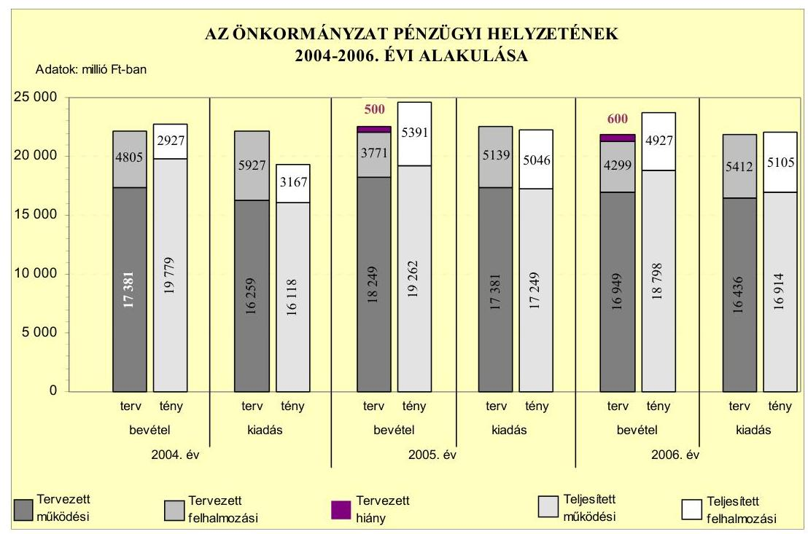
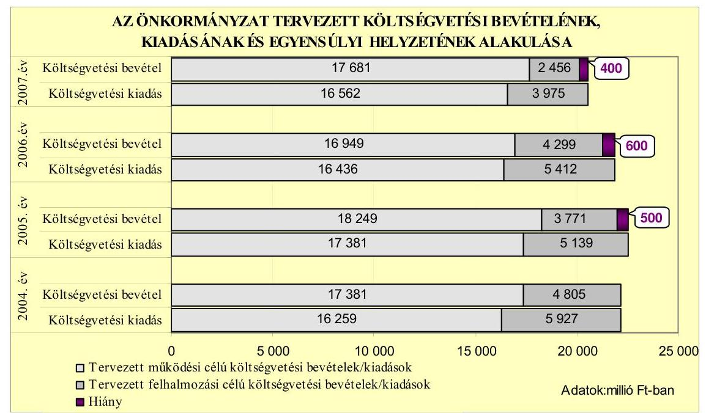
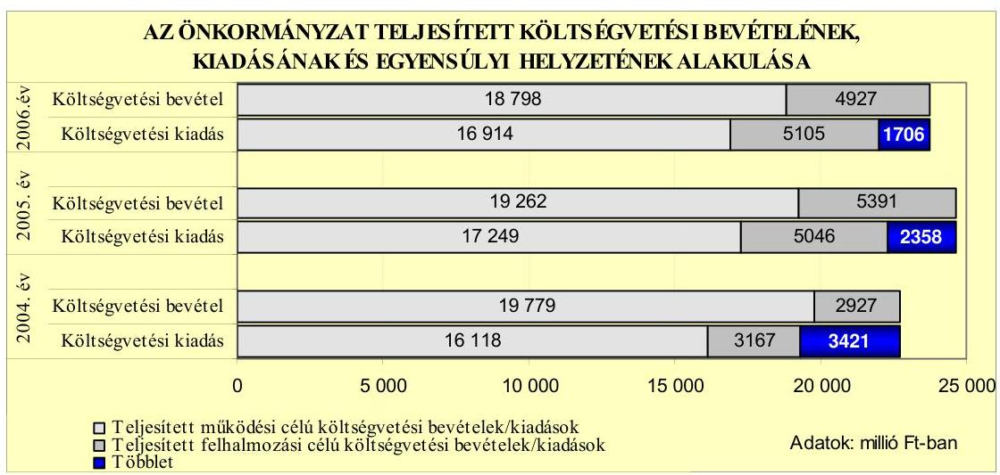
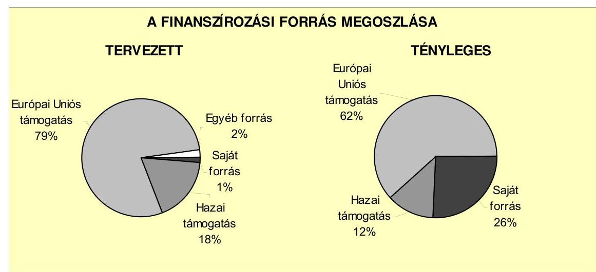
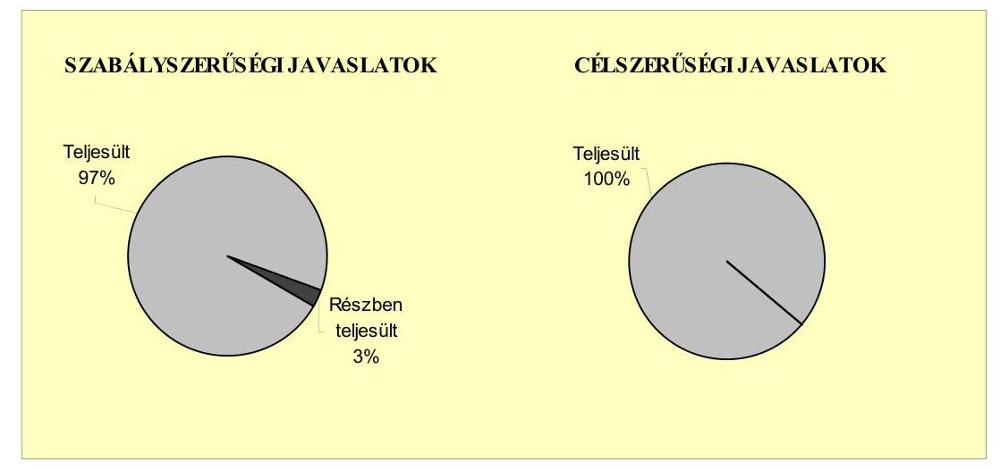
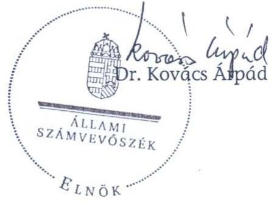
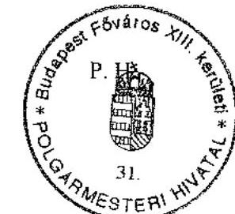
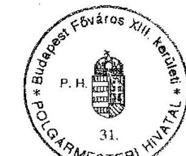
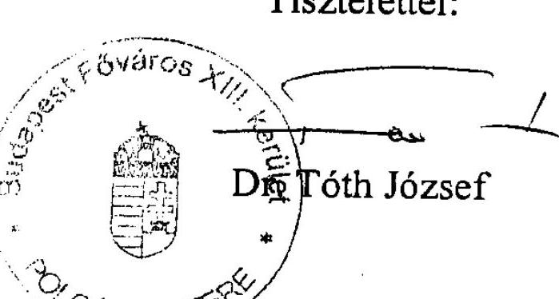

# JELENTÉS 

a Budapest Főváros XIII. kerület Önkormányzata gazdálkodási rendszerének 2007. évi átfogó ellenőrzéséről

---

3. Önkormányzati és Területi Ellenőrzési Igazgatóság
3.3. Átfogó Ellenőrzések Főcsoport
Iktatószám: V-1001-9/34/23/2007.
Témaszám: 845
Vizsgálat-azonosító szám: V0332
Az ellenőrzést felügyelte:
Dr. Lóránt Zoltán
főigazgató
Az ellenőrzés végrehajtásáért felelős:
Dr. Sepsey Tamás
főigazgató-helyettes
Az ellenőrzést vezette:
Molnár Gyula Mihály
igazgató-helyettes
Az ellenőrzést végezték:
Kozma Gábor
számvevő tanácsos
Köllődné Gátai Mária
számvevő
Tóth László
számvevő

# A témához kapcsolódó eddig készített számvevőszéki jelentések: 

címe
sorszáma
Jelentés Budapest Főváros XIII. kerület Önkormányzata gazdálko- 0506
dásának átfogó ellenőrzéséről
Jelentés a Magyar Köztársaság 2004. évi költségvetése végrehajtá- 0540
sának ellenőrzéséről
Függelék:

- a helyi önkormányzatokat a 2004. évben megillető normatív állami hozzájárulás elszámolása
Jelentés a helyi és a helyi kisebbségi önkormányzatok gazdálkodá- 0544
sának átfogó ellenőrzéséről

---

# TARTALOMJEGYZÉK 

BEVEZETÉS ..... 9
I. ÖSSZEGZŐ MEGÁLLAPÍTÁSOK, KÖVETKEZTETÉSEK, JAVASLATOK ..... 13
II. RÉSZLETES MEGÁLLAPÍTÁSOK ..... 20

1. Az Önkormányzat költségvetési és pénzügyi helyzete ..... 20
1.1. A tervezett költségvetési bevételi és kiadási előirányzatok, valamint a költségvetési egyensúly alakulása ..... 22
1.2. A költségvetési bevételek és kiadások teljesítése, a pénzügyi egyensúlyi helyzet alakulása ..... 24
2. Az Önkormányzat felkészültsége az európai uniós források igénylésére és felhasználására, valamint az e-közigazgatási feladatok ellátására ..... 27
2.1. Az európai uniós források igénybevételére és a várható támogatás felhasználásának szervezettségére történt felkészülés és a belső szabályozottság értékelése ..... 27
2.1.1. A fejlesztési célkitűzések meghatározása ..... 27
2.1.2. Az európai uniós forrásokhoz kapcsolódóan a pályázatfigyelés, a pályázat-készítés, valamint az európai uniós támogatással megvalósuló fejlesztés lebonyolítása belső rendjének szabályozottsága, a végrehajtás személyi, szervezeti feltételei ..... 31
2.1.3. Az európai uniós forrással támogatott fejlesztés megvalósítása ..... 32
2.2. Az e-közigazgatási feladatok előkészítése, bevezetése ..... 34
3. A költségvetési gazdálkodás kontrolljai ..... 36
3.1. A szabályozottság kockázata a költségvetés tervezési, gazdálkodási, beszámolási és a folyamatba épített ellenőrzési feladatainál ..... 36
3.2. A belső kontrollok érvényesülése az önkormányzati források szabályszerű felhasználásában, a költségvetési tervezés, gazdálkodás, beszámolás folyamataiban ..... 38
3.3. A belső ellenőrzési kötelezettség teljesítése, javaslatainak hasznosulása ..... 42
4. Az ÁSZ korábbi ellenőrzési javaslatai alapján készített intézkedési terv végrehajtása, eredményessége ..... 47
4.1. Az Önkormányzat gazdálkodási rendszerének átfogó ellenőrzése során tett javaslatok végrehajtására tervezett intézkedések megvalósulása ..... 47

---

4.2. A zárszámadáshoz kapcsolódó (állami hozzájárulások, támogatások igénylésének és felhasználásának ellenőrzése), valamint a további vizsgálatok esetében a megállapítások, javaslatok alapján tett intézkedések

# MELLÉKLETEK 

1. számú Az Önkormányzat gazdálkodását meghatározó adatok, mutatószámok (1 oldal)
2. számú Az önkormányzati vagyon alakulása (1 oldal)
3. számú Az Önkormányzat 2004-2006. évi költségvetési előirányzatainak és azok pénzügyi teljesítéseinek alakulása ( 1 oldal)
4. számú 1. számú Nyilatkozat a tervezett és teljesített költségvetési adatoknak a megelőző évhez viszonyított jelentős, $\pm 10 \%$-ot meghaladó változásának indokolásáról, amennyiben azt a feladatok változása indokolta (3 oldal)
5. számú 1. számú Tanúsítvány az európai uniós forrásokkal támogatott programok, célok tervezett és tényleges 2004-2007. évi adatairól (2 oldal)
6. számú Dr. Tóth József úr, a Budapest Főváros XIII. kerület Önkormányzata polgármestere által adott észrevétel (1 oldal)

---

# RÖVIDÍTÉSEK JEGYZÉKE 

## Törvények

Áht.
Eisztv.
Htv.

Kszt. tv.
Ötv.
Számv. tv.

## Rendeletek

2004. évi költségvetési rendelet

2004. évi zárszámadási rendelet

2005. évi költségvetési rendelet

2006. évi költségvetési rendelet

2007. évi költségvetési rendelet

Ámr.
vagyongazdálkodási rendelet

Vhr.

## Szórövidítések

Adóügyi osztály
ÁSZ
BM
Ellenőrzési csoport
az államháztartásról szóló 1992. évi XXXVIII. törvény az elektronikus információszabadságról szóló 2005. évi XC. törvény
a helyi önkormányzatok és szerveik, a köztársasági megbízottak, valamint egyes centrális alárendeltségú szervek feladat- és hatásköreiről szóló 1991. évi XX. törvény
a közhasznú szervezetekről szóló 1997. évi CLVI. törvény
a helyi önkormányzatokról szóló 1990. évi LXV. törvény a számvitelről szóló 2000. évi C. törvény

Budapest Főváros XIII. kerület Önkormányzatának 5/2004. (II. 25.) számú rendelete a 2004. évi költségvetésről
Budapest Főváros XIII. kerület Önkormányzatának 10/2005. (IV. 20.) számú rendelete a 2005. évi zárszámadásról
Budapest Főváros XIII. kerület Önkormányzatának 3/2005. (II. 15.) számú rendelete a 2005. évi költségvetésről
Budapest Főváros XIII. kerület Önkormányzatának 2/2006. (II. 27.) számú rendelete a 2006. évi költségvetésről
Budapest Főváros XIII. kerület Önkormányzatának 4/2007. (II. 20.) számú rendelete a 2007. évi költségvetésről
az államháztartás múködési rendjéről szóló 217/1998. (XII. 30.) Korm. rendelet

Budapest Főváros XIII. kerület Önkormányzatának 9/2003. (III. 17.) számú rendelete az Önkormányzat vagyonáról és a vagyongazdálkodás szabályairól
az államháztartás szervezetei beszámolási és könyvvezetési kötelezettségének sajátosságairól szóló 249/2000. (XII. 24.) Korm. rendelet

Budapest Főváros XIII. kerület Önkormányzata Polgármesteri Hivatalának Adóügyi Osztálya
Állami Számvevőszék
Belügyminisztérium
Budapest Főváros XIII. kerület Önkormányzat Polgármesteri Hivatala Jegyzői Irodájának Ellenőrzési Csoportja

---

| e-közigazgatás | elektronikus közigazgatás |
| :--: | :--: |
| Európa Terv XIII. prog- | a Képviselő-testület 90/2005. (VI. 30.) számú határozatá- |
| ram | val elfogadott Angyalföld, Vizafogó, Újlipótváros városfejlesztési programja a 2007-2013. évekre |
| FEUVE | folyamatba épített, előzetes és utólagos vezetői ellenőrzés |
| gazdálkodási jogkörök | IV/1/6/2002. (XI. 18.) számú Polgármesteri és Jegyzői |
| szabályzata | Együttes Utasítás a Polgármesteri Hivatal pénzgazdálkodásával kapcsolatos kötelezettségvállalás és annak ellenjegyzése, valamint az utalványozás, ellenjegyzés, érvényesítés hatásköri rendjéről |
| GVOP | NFT Gazdasági Versenyképesség Operatív Program |
| HEFOP | NFT Humánerőforrás-fejlesztési Operatív Program |
| hivatali SzMSz | IV/GY/4/15/2000. (IX. 25.) számú jegyzői intézkedés, Budapest Főváros XIII. kerületi Önkormányzat Polgármesteri Hivatal Szervezeti és Múködési Szabályzat (Ügyrend) |
| jegyző | Budapest Főváros XIII. kerület Önkormányzatának jegyzője |
| Jegyzői iroda | Budapest Főváros XIII. kerületi Önkormányzat Polgármesteri Hivatala Jegyzői Irodája |
| Képviselő-testület | Budapest Főváros XIII. kerület Önkormányzatának Képviselő-testülete |
| KFKI-LNX Zrt. | KFKI-LNX Hálózatintegrációs Zrt. |
| KIOP | NFT Környezetvédelmi és Infrastruktúrafejlesztés Operatív Program |
| Költségvetési bizottság | Budapest Főváros XIII. kerület Önkormányzata Képvi-selő-testületének Költségvetési Bizottsága a 2006. évi önkormányzati képviselő választásokig |
| Közoktatási koncepció | Budapest Főváros XIII. kerület Önkormányzata Képviselőtestületének 66/2003. (IV. 24.) számú határozatával elfogadott Közoktatási koncepciója |
| KSH | Központi Statisztikai Hivatal |
| MÁK | Magyar Államkincstár |
| MIS osztály | Budapest Főváros XIII. kerület Önkormányzat Polgármesteri Hivatala Múvelődési, Ifjúsági és Sport Osztálya |
| NFT | Nemzeti Fejlesztési Terv |
| Oktatási bizottság | Budapest Főváros XIII. kerület Önkormányzata Képvi-selő-testületének Oktatási, Kulturális és Sport Bizottsága |
| Önkormányzat | Budapest Főváros XIII. kerület Önkormányzata |
| PEJ | Projekt előrehaladási jelentés |
| Pénzügyi bizottság | Budapest Főváros XIII. kerület Önkormányzata Képvi-selő-testületének Pénzügyi és Költségvetési Bizottsága a 2006. évi önkormányzati választásokat követően |

---

| Pénzügyi osztály | Budapest Főváros XIII. kerület Önkormányzat Polgár-   mesteri Hivatala Pénzügyi Osztálya |
| :-- | :-- |
| PM | Pénzügyminisztérium |
| polgármester | Budapest Főváros XIII. kerület Önkormányzat polgár-   mestere |
| Polgármesteri hivatal | Budapest Főváros XIII. kerület Önkormányzat Polgár-   mesteri Hivatala |
| Szervezési osztály | Budapest Főváros XIII. kerület Önkormányzat Polgár-   mesteri Hivatala Szervezési Osztálya |
| Szociális bizottság | Budapest Főváros XIII. kerület Önkormányzata Képvi-   selő-testületének Szociális Bizottsága |
| Szolgáltatásszervezési   koncepció | Budapest Főváros XIII. kerület Önkormányzata Képviselő-   testületének 119/2004. (IX. 9.) számú határozatával elfo-   gadott Szolgáltatásszervezési koncepciója |
| Településfejlesztési kon-   cepció | Budapest Főváros XIII. kerület Önkormányzata Képvi-   selő-testületének 124/2003. (VI. 26.) határozatával el-   fogadott Településfejlesztési Koncepciója |
| Vagyonkezelő Zrt. | Angyalföld - Újlipótváros - Vizafogó Vagyonkezelő Zrt. |

---

# ÉRTELMEZŐ SZÓTÁR 

1. elektronikus szolgáltatási szint
2. elektronikus szolgáltatási szint
3. elektronikus szolgáltatási szint
4. elektronikus szolgáltatási szint
európai uniós források
fejlesztési feladat (projekt)
fejlesztési célkitúzés

GVOP-4.3 intézkedés

Az 1044/2005. (V. 11.) Korm. határozat alapján olyan információs, tájékoztató szolgáltatás, amely csak általános információkat közöl az adott üggyel kapcsolatos teendőkről és a szükséges dokumentumokról.
Az 1044/2005. (V. 11.) Korm. határozat alapján olyan egyirányú kapcsolatot biztosító szolgáltatás, amely az 1. szinten túl biztosítja az adott ügy intézéséhez szükséges dokumentumok, nyomtatványok letöltését, és azok ellenőrzéssel, vagy ellenőrzés nélküli elektronikus kitöltését, amely esetben a dokumentumok benyújtása hagyományos úton történik.
Az 1044/2005. (V. 11.) Korm. határozat alapján olyan kétirányú kapcsolatot biztosító szolgáltatás, amely közvetlen, vagy ellenőrzött kitöltésű dokumentum segítségével biztosítja az elektronikus adatbevitelt és a bevitt adatok ellenőrzését. Az ügy indításához, intézéséhez személyes megjelenés nem szükséges, de az ügyhöz kapcsolódó közigazgatási döntés (határozat, egyéb aktus) közlése, valamint a kapcsolódó illeték-, vagy díjfizetés hagyományos úton történik.
Az 1044/2005. (V. 11.) Korm. határozat alapján olyan teljes közvetlen kétirányú ügyintézési folyamatot biztosító szolgáltatás, amikor az ügyhöz kapcsolódó közigazgatási döntés is elektronikus úton kerül közlésre, illetve a kapcsolódó illeték-, vagy díjfizetés elektronikus úton is intézhető.
Az elnyert európai uniós források lehívása a támogatott projekt megvalósítása érdekében, a fejlesztés lebonyolítása során felmerült kiadások finanszírozására.
A fejlesztési feladat (projekt) tartalmilag és formailag részletesen kidolgozott, megfelelő pénzügyi háttérrel és végrehajtási ütemezéssel rendelkező fejlesztési terv, amely illeszkedik az Európai Unió, illetve a Nemzeti Fejlesztési Terv által támogatott programokhoz.
Az önkormányzat által ellátott kötelező, vagy önként vállalt feladatok ellátásának mennyiségi, vagy minőségi fejlesztésére vonatkozó terv. A mennyiségi fejlesztés megvalósulhat beszerzéssel, létesítéssel, bővítéssel, átalakítással.
A GVOP keretében az információs társadalom- és gazdaság fejlesztése NFT prioritáshoz kapcsolódóan az eközigazgatás fejlesztésére megnyitott pályázati lehetőség.

---

irányító hatóság
kedvezményezett
központi program
közreműködő szervezet

A strukturális alapok és a Kohéziós alap forrásainak szabályszerű, hatékony és eredményes felhasználásához szükséges intézményrendszer felső eleme. Az irányító hatóság általános és átfogó felelősséget visel a programok, projektek hatékony és szabályszerű végrehajtásáért. Felelősségi köréből eredően ellenőrzi a közösségi, valamint a hazai jogszabályok betartását, koordinálja az európai uniós források szétosztásának folyamatát, irányítja az intézményrendszer, a statisztikai és a pénzügyi nyilvántartási rendszer múködését.
Az a helyi önkormányzat, amely a támogatási szerződést kedvezményezettként aláíra, a projektet, illetve a központi programhoz kapcsolódó támogatott önkormányzati programot végrehajtja.
Az ország egészére, több régióra, egy régióra vonatkozó, de mindenképpen az önkormányzat közigazgatási területén túlmutató program, amelynél a támogatott programok kiválasztása pályáztatás nélkül, előre meghatározott feltételrendszer szerint történik, a kedvezményezettek közvetlen megkeresésével. Az Európai Unió pénzügyi alapja a Kohéziós alap, a környezetvédelem és a közlekedés terén nyújt lehetőséget az egyes tagországoknak központi programok megvalósítására.
A közreműködő szervezet az európai uniós támogatást elnyert kedvezményezettekkel kapcsolatot tartó szerv. Az operatív programok közreműködő szervezetei befogadják, nyilvántartják, döntésre előkészítik a pályázatokat, rögzítik a támogatással kapcsolatos adatokat az egységes monitoring informatikai rendszerben, elvégzik a támogatások előzetes (szerződéskötést megelőző), közbenső (a pénzügyi elszámolás, finanszírozás folyamatában végzett) és utólagos (a támogatott projekt pénzügyi lezárását megelőző) ellenőrzését. Az önkormányzatoknál a leggyakrabban előforduló operatív program a Regionális Fejlesztési Operatív Program végrehajtásában közreműködő szervezetek a VÁTI Kht. és a regionális fejlesztési ügynökségek.
A Kohéziós alap két közreműködő szervezete (Gazdasági és Közlekedési Minisztérium, Környezetvédelmi és Vízügyi Minisztérium) a támogatott projektek végrehajtásához kapcsolódó operatív feladatokat látják el. Ennek keretében megkötik a szerződéseket a projekt kedvezményezettjével, folyamatosan nyomon követik a teljesítéseket, lebonyolítják a támogatások kifizetését, vezetik az egységes monitoring informatikai rendszert.

---

lebonyolítás
operatív program
támogatási szerződés

Az európai uniós források felhasználásával megvalósuló fejlesztésre irányuló műszaki, gazdasági (pénzügyi) tevékenységet magában foglaló szervezési, irányítási szolgáltatás. A szervezési szolgáltatás kiterjedhet a pályázatkészítésre, a közbeszerzési eljárás lebonyolításán keresztül a folyamatos műszaki ellenőrzésre, a pénzügyi elszámolásra, a műszaki átadás-átvételre, az üzembe helyezésre, illetve a fejlesztési folyamat egyes elemeire.
Az Európai Bizottság által jóváhagyott, a Közösségi Támogatási Keret végrehajtására vonatkozó 2004-2006 közötti, több évre szóló intézkedésekhez kapcsolódó prioritások egységes rendszerét tartalmazó dokumentum. A strukturális alapok operatív programjai: Agrár és Vidékfejlesztési Operatív Program (AVOP); Gazdasági Versenyképesség Operatív Program (GVOP); Humánerőforrás-fejlesztési Operatív Program (HEFOP); Környezetvédelmi és Infrast-ruktúra-fejlesztési Operatív Program (KIOP); Regionális Fejlesztési Operatív Program (ROP).
A strukturális alapok esetében az irányító hatóságnak, illetve a Kohéziós alap esetében a közremúködő szervezeteknek a kedvezményezett önkormányzattal kötött szerződése, amely a támogatás felhasználásának részletes feltételeit tartalmazza.

---

# JELENTÉS 

## a Budapest Főváros XIII. kerület Önkormányzata gazdálkodási rendszerének 2007. évi átfogó ellenőrzéséről

## BEVEZETÉS

Az Ötv. 92. § (1) bekezdése, az Állami Számvevőszékről szóló 1989. évi XXXVIII. törvény 2. § (3) bekezdése, valamint az Áht. 120/A. § (1) bekezdése alapján az önkormányzatok gazdálkodását az Állami Számvevőszék ellenőrzi. Az ellenőrzésre az Országgyűlés illetékes bizottságai részére is átadott, országosan egységes ellenőrzési program szerint került sor.

Az Állami Számvevőszék a stratégiájában foglalt célkitűzéseknek megfelelően a helyi önkormányzatok költségvetési gazdálkodási rendszere átfogó ellenőrzésének programját a 2007. évtől megújította, azt kiegészítette további - teljesít-mény-ellenőrzési - elemekkel.

## Az ellenőrzés célja annak értékelése volt, hogy az Önkormányzat:

- a pénzügyi egyensúlyt a költségvetésében és annak teljesítése során milyen módon biztosította, a teljesített bevételek és kiadások egyes évek közötti jelentős eltérése feladatváltozáshoz kapcsolódott-e;
- felkészült-e a szabályozottság és a szervezettség terén az európai uniós források igénylésére és felhasználására, továbbá az e-közigazgatás bevezetése miatti szervezet-korszerűsítési feladatokra;
- kialakította-e a külső és a belső feltételeknek megfelelően a gazdálkodás belső kontrollrendszerét ${ }^{1}$, továbbá a költségvetés tervezési, végrehajtási és zárszámadási feladatok szabályszerű ellátásához hozzájárult-e a folyamatba épített, előzetes és utólagos vezetői ellenőrzés, valamint a belső ellenőrzés;
- megfelelően hasznosították-e a korábbi számvevőszéki ellenőrzések megállapításait, szabályszerűségi ${ }^{2}$ és célszerűségi javaslatait.

[^0]
[^0]:    ${ }^{1}$ A gazdálkodás szabályszerűségét biztosító kontrollrendszer alatt értjük a kiépített és múködő belső irányítási és szabályozási rendszert, valamint a belső ellenőrzési funkciók ellátásának rendszerét.
    ${ }^{2}$ A törvényi előírások betartásának elmulasztásakor a részletes megállapítások fejezetben egységesen a törvénysértés megjelölést alkalmazzuk, mivel az ÁSZ nem tehet különbséget a törvényi előírások között.

---

Az ellenőrzött időszak: az 1., 2. és 4. programpontok tekintetében a 20042006. évek és 2007. I. félév, a 3. ellenőrzési programpontnál a 2006. év és 2007. I. félév.

A kerület lakosainak száma 2007. január 1-jén 105436 fő volt. A 2006. évi önkormányzati választást követően az Önkormányzat 33 tagú Képviselőtestületének munkáját hat állandó bizottság segítette. A 2006. évi önkormányzati választásig $11^{3}$, a 2006. évi választást követően - a Román Kisebbségi Önkormányzat megszűnésével - 10 kisebbségi önkormányzat múködött. A polgármester az 1994. évi önkormányzati választás óta tölti be tisztségét, a jegyző feladatait 1995 áprilisától látja el.

Az Önkormányzat feladatainak végrehajtása érdekében a Polgármesteri hivatal mellett a 2006. évben 48 költségvetési intézményt múködtetett, amelyekből 34 részben önállóan gazdálkodott. Az Önkormányzat költségvetési szerveinél a 2006. december 31-én foglalkoztatott közalkalmazottak száma 2276 fő, a köztisztviselők száma 200 fő volt. Az Önkormányzat a 2006. évi költségvetési beszámolója szerint 23725 millió Ft költségvetési bevételt ért el és 22019 millió Ft költségvetési kiadást teljesített, 2006. december 31-én a könyvviteli mérleg szerint 68309 millió Ft vagyonnal rendelkezett. A 2007. évi költségvetési rendeletben 20137 millió Ft költségvetési bevételt és 20537 millió Ft költségvetési kiadást irányoztak elő. Az Önkormányzat gazdálkodását meghatározó adatokat, mutatószámokat az 1-3. számú mellékletek tartalmazzák.

Az Önkormányzat költségvetési és pénzügyi helyzetét az összehasonlító elemzés módszerével vizsgáltuk. E körben elemeztük a költségvetés egyensúlyi helyzetének alakulását, a tervezett és tényleges költségvetési hiány okait, a mérséklésére tett intézkedéseket, finanszírozásának módját, az Önkormányzat adósságállományának alakulását, összetevőit.

A teljesítmény-ellenőrzés módszerével vizsgáltuk, hogy a belső szabályozottság, szervezettség terén felkészültek-e az európai uniós források figyelésére, igénylésére és felhasználására, valamint az igényelt európai uniós támogatások az Önkormányzat által meghatározott fejlesztési célkitűzésekhez kapcsolódtak-e. Az ellenőrzés során felmértük, hogy az e-közigazgatási feladat ellátása, illetve bevezetése, múködtetése érdekében milyen intézkedéseket tettek, valamint biz-tosították-e a közérdekú adatok elektronikus közzétételét.

A költségvetési gazdálkodás belső kontrolljainak ellenőrzése során értékeltük, hogy a Polgármesteri hivatalnál a költségvetés tervezési, gazdálkodási, zárszámadás készítési feladatok belső kontrolljainak kiépítettsége és múködése megfelelő biztosítékot ad-e a gazdálkodási feladatok megfelelő, szabályszerű ellátására. Felmértük és minősítettük a költségvetés tervezési, a gazdálkodási, a zárszámadás készítési feladatokkal, továbbá a pénzügyi- számviteli területen az informatikával kapcsolatosan kialakított kontrollok megfelelőségét, valamint azok múködésének eredményességét, megbízhatóságát. Értékeltük a belső ellenőrzés szervezeti és szabályozási keretét, továbbá múködését.

[^0]
[^0]:    ${ }^{3}$ Bolgár, cigány, görög, horvát, lengyel, német, örmény, román, ruszin, szerb, szlovák.

---

A Polgármesteri hivatalnál értékeltük a gazdálkodás folyamatában a kontrollok múködésének megbízhatóságát, ennek keretében ellenőriztük a szakmai teljesítés igazolására és az utalvány ellenjegyzésére kialakított kontrollok végrehajtását. Az ellenőrzést a következő, kiemelt kockázatuk alapján kiválasztott ${ }^{4}$ az általánostól jellemzően eltérő, egyedi eljárást igénylő gazdasági eseményekkel kapcsolatos kifizetésekre folytattuk le ${ }^{5}$ :

- a személyi juttatások közül az állományba nem tartozók megbízási díjai ${ }^{6}$,
- a külső szolgáltató által végzett karbantartási, kisjavítási szolgáltatások, valamint
- a gépek, berendezések, felszerelések beszerzése.

Az ellenőrzés hatékony elvégzése céljából a vizsgálandó területek kiválasztása során a kockázatokon alapuló megközelítés érvényesült, ezáltal az ellenőrzési erőforrásokat azokra a területekre fókuszáltuk, amelyeken legnagyobb a hibák előfordulási valószínűsége. Az ellenőrzési erőforrások ilyen típusú összpontosításával minimálisra csökkenthető a kívánt ellenőrzési bizonyosság eléréséhez szükséges időráfordítás.

A pénzügyi-számviteli folyamatokban alkalmazott belső kontrollok létezésének és működésének ellenőrzésére a vizsgált három terület 2006. évi könyvviteli tételeiből területenként egyszerű véletlen mintát vettünk. A kijelölt gazdasági eseményre elvégzett megfelelőségi tesztek alapján értékeltük a kontrollok múködésének eredményességét, megbízhatóságát a vizsgált három területre különkülön, majd összefoglalóan ${ }^{7}$ a Polgármesteri hivatal egyedi eljárást igénylő gazdasági eseményeire. A helyszíni ellenőrzés megállapításainak részletes dokumentálását három megfelelőségi tesztlapon, öt elővizsgálati és kilenc helyszíni ellenőrzési munkalapon biztosítottuk. Ezeken a teszt- és munkalapokon a minősítés alapjául szolgáló kérdések és a vonatkozó konkrét jogszabályhelyek

[^0]
[^0]:    ${ }^{4}$ Az önkormányzatok kiemelt előirányzataira vonatkozóan, a vertikális folyamatokra elvégeztük a kockázatok becslését, amelynek eredményeként az állományba nem tartozók megbízási díjai, a külső szolgáltató által végzett karbantartási, kisjavítási szolgáltatások, valamint a gépek, berendezések, felszerelések beszerzése kiemelkedően kockázatos területnek bizonyultak.
    ${ }^{5}$ A korábbi ellenőrzési tapasztalataink szerint ezeken a területeken a jegyzők nem, vagy hiányosan szabályozták a megbízás, megrendelés, illetve beszerzés indokoltságának, szükségességének elbírálására, igazolására, valamint a teljesítések dokumentálására, a kifizetések jogosságának megítélésére szolgáló kontrollokat. További kockázatot jelentett a külső szolgáltató által végzett karbantartási, kisjavítási munkák esetében, hogy az 50 ezer Ft alatti megrendelésekre vonatkozóan az ellenőrzési tapasztalataink szerint a jegyzők nem alakították ki a kötelezettségvállalások rendjét és nyilvántartási formáját, valamint a szabályozás elmulasztása esetén nem történt meg az írásbeli kötelezettségvállalás és annak az ellenjegyzése sem.
    ${ }^{6}$ Az állományba tartozók rendszeres személyi juttatásainak számfejtését, valamint folyósítását nem a polgármesteri hivatalok, hanem a nettó finanszírozás keretében a beküldött dokumentumok alapján a MÁK végzi.
    ${ }^{7}$ A vizsgált három terület egyedi értékelési pontszámait a területek relatív költségvetési súlyával arányosan összegeztük.

---

megjelölése mellett értékeltük a kialakított belső kontrollokban rejlő kockázatokat ${ }^{8}$ és a kialakított kontrollok múködésének megbízhatóságát ${ }^{9}$.

Az ÁSZ korábbi ellenőrzési javaslatai alapján tett intézkedéseket, illetve azok megvalósítását utóellenőrzés keretében vizsgáltuk. A gazdálkodási rendszer átfogó ellenőrzése során megfogalmazott javaslatok végrehajtására tett intézkedések megvalósítását ellenőriztük, az egyéb számvevőszéki ellenőrzések során tett javaslatok esetében pedig a kiadott intézkedéseket tekintettük át.

A helyszíni ellenőrzés során kitöltött - az ellenőrzést végző számvevő és a Polgármesteri hivatal felelős köztisztviselője által aláírt - elővizsgálati és helyszíni ellenőrzési munkalapokat, azok kitöltési útmutatóit, továbbá a megfelelőségi tesztek dokumentumait a polgármester részére a számvevői jelentéssel egyidejűleg átadtuk.

A jelentést az ÁSZ-ról szóló 1989. évi XXXVIII. tv. 25. § (1) bekezdése alapján észrevétel közlése céljából megküldtük a Budapest Főváros XIII. kerület Önkormányzata polgármesterének. A kapott észrevételt a jelentés 6 . számú melléklete tartalmazza.
${ }^{8}$ A kialakított belső kontrollokban rejlő kockázatot alacsonynak minősítettük, ha a kontrollok - végrehajtásuk esetén - megfelelő védelmet nyújtanak a hibák bekövetkezése ellen. Közepesnek minősítettük a belső kontrollokban rejlő kockázatot, amennyiben a kontrollok - végrehajtásuk esetén - a lehetséges hibák többsége ellen védelmet nyújtanak. Magasnak értékeltük a kockázatot, ha a kontrollok - kialakításuk hiányában, vagy hiányos kialakításuk miatt - nem nyújtanak elegendő védelmet a lehetséges hibákkal szemben.
${ }^{9}$ A kontrollok múködésének eredményességét, megbízhatóságát kiválónak értékeltük abban az esetben, ha azok múködése - esetleges apróbb hiányosságoktól eltekintve megfelelt a hibák megelőzésére és kijavítására meghatározott szabályozásnak és a legmagasabb szintű elvárásoknak. Jónak minősítettük a kontrollok múködését, ha a hiányosságok száma ugyan jelentős volt, de nem veszélyeztette az ellenőrzött terület hibáinak megelőzését és kijavítását. Amennyiben a hiányosságok mértéke nem biztosította a hibák megelőzését, feltárását, kijavítását és ezáltal veszélyeztette az eredményes, megbízható múködést, a kontroll múködésének megbízhatósága gyenge minősítést kapott.

---

# I. ÖSSZEGZŐ MEGÁLLAPÍTÁSOK, KÖVETKEZTETÉSEK, JAVASLATOK 

A költségvetés egyensúlya a 2005. és a 2006. évben nem volt biztosított, a tervezett költségvetési bevételek nem fedezték a tervezett költségvetési kiadásokat, az Önkormányzat a 2005-2006. évi költségvetési rendeletekben a költségvetési egyensúlyi helyzet biztosításához 500, illetve 600 millió Ft összegű értékpapír eladást tervezett. A tervezettel szemben a teljesített költségvetési bevételek a költségvetési kiadásokat meghaladták, az Önkormányzat költségvetési többlettel zárt.

Az Önkormányzat biztosította a tervezett múködési célú költségvetési bevételek és kiadások változásának összhangját a 2004-2006. évek közötti időszakban, a működési célú költségvetési kiadási igényt a közoktatásban mérsékelte a tervezett kiadáscsökkentő intézkedések hatása. A tervezett felhalmozási célú költségvetési kiadások az előző évhez viszonyítva a 2005. évben csökkentek, a 2006. évben növekedtek, a változásokat a tervezett önkormányzati beruházások okozták. A teljesített felhalmozási célú költségvetési bevételek az előző évhez viszonyítva a 2005. évben $84 \%$-kal növekedtek a bérlakás-építésre fordítható központi költségvetési támogatások, illetve a kerület megújítására folyósított fővárosi támogatások miatt, a teljesített felhalmozási célú költségvetési kiadások a lakóépületek rehabilitációjával kapcsolatos munkálatok gyorsuló ütemű végrehajtása, valamint kettő kiemelt jelentőségű intézményi beruházás kivitelezése miatt növekedtek 2005-ben és 2006-ban.

Az Önkormányzat pénzügyi egyensúlyi helyzete a 2004-2006. évek között stabil volt, az éves költségvetések végrehajtása során a bevételek és kiadások éven belüli eltérő ütemezése miatt szükségessé váló finanszírozást saját forrásaival biztosította. A múködési célú kiadások teljesítésének ellenőrzésével, a Polgármesteri hivatal, illetve az intézmények irányában érvényesülő kiadáscsökkentő intézkedések tervezettnek megfelelő végrehajtásával folyamatosan biztosították a teljesített múködési célú költségvetési bevételek többletét, melyet a felhalmozási célú kiadások, elsősorban a kerületi beruházások finanszírozására fordítottak.

Az Önkormányzat fejlesztési célkitúzéseit Közoktatási koncepcióban, Szolgáltatástervezési koncepcióban, Településfejlesztési koncepcióban, Informatikai Stratégiában, valamint az Európa Terv XIII. program keretein belül rögzítette. A fejlesztési célkitűzések helyzetelemzéssel, statisztikai felmérésekkel alátámasztották. A koncepciókat felülvizsgálták és módosították a fejlesztési célkitűzéseket. Az NFT-ben megjelenő pályázati lehetőségekre figyelemmel a fejlesztési elképzeléseket az Európa Terv XIII. programban fogalmazták meg.

A 2003-2006. évre vonatkozó fejlesztési célkitűzések megvalósításának lehetséges pénzügyi forrásait a Területfejlesztési és a Közoktatási koncepció nem tartalmazta. Két fejlesztés esetében a megvalósítás pénzügyi fedezeteként pályázat útján elnyerhető támogatást jelöltek meg, a többi fejlesztés pénzügyi forrását nem határozták meg.

---

A Képviselő-testület a 2004-2007. I. félév időszakában európai uniós pályázatok benyújtásáról 13 esetben döntött, 10 pályázat esetében a pályázat benyújtásához Képviselő-testületi döntés nem volt szükséges. A benyújtott pályázatok közül 14 sikeres volt, HEFOP, GVOP, ROP pályázati támogatásban részesültek. Az Önkormányzat 2004-2007. időszakban összesen 614 millió Ft támogatást nyert el. A 14 projekt tervezett költségvetésében egy pályázat esetében vettek figyelembe saját forrást, a fejlesztések megvalósításához hitelt, egyéb forrást nem terveztek. A projekteket európai uniós és hazai támogatásból tervezték megvalósítani. Az Önkormányzat költségvetési rendeletében az utófinanszírozott pályázati pénzből tervezett fejlesztések lebonyolítására a 2004. évben 158 millió Ft, a 2005 évben 145 millió Ft, a 2006. évben 134 millió Ft és a 2007. évben 188 millió Ft pályázati céltartalékot képeztek. Az utólagos finanszírozás következtében a tervezett 1,3\%-kal szemben átmenetileg a kiadások 100\%-át az Önkormányzat saját forrásból fizette ki. A számlák megelőlegezéséhez a pénzügyi fedezetet biztosították, külső forrást, pénzintézeti hitelt nem vettek igénybe. Három projekt megvalósítása fejeződött be 2007. I. félévéig, két esetben nem használták fel teljes mértékben az elnyert összeget.

Az európai uniós források igénybevételének, és felhasználásának önkormányzati szintű feladatait a közoktatási és közművelődési, valamint a szociális és gyermekjóléti intézményekre vonatkozóan az Önkormányzatnál a 2004. évben a szakmai osztályok vezetői által kiadott körlevéllel szabályozták. A körlevél alapján a Képviselő-testületi döntést nem igénylő, önrész nélküli pályázatok benyújtásáról az intézmények vezetői döntöttek. A közoktatási és közművelődési intézmények vezetői félévente, a szociális intézmények vezetői évente tájékoztatást adtak a benyújtott pályázatokról és azok eredményéről. A tájékoztatás alapján a szakmai osztályok évente kettő alkalommal beszámolót készítettek a Szervezési osztály számára, ahol a benyújtott pályázatok önkormányzati szintű nyilvántartását végezték. A pályázatokról, azok eredményéről, megvalósulásuk mértékéről a Szervezési osztály évente összefoglaló tájékoztatót készített. A pályázati forrásból megvalósuló fejlesztés lebonyolításának ellenőrzésével, a monitoring rendszer múködtetésével az osztályvezetőket bízták meg, a feladat ellátásának módját a körlevél nem határozta meg. A pályázatok elkészítésének, lebonyolításának rendjéről 2007. márciusában kiadott jegyzői intézkedésben kijelölték önkormányzati szinten a pályázatfigyeléssel megbízott személyeket. A pályázat elkészítésért, benyújtásáért, koordinálásáért, valamint a nyertes pályázattal kapcsolatos valamennyi feladatért a pályázatot készítő osztály vezetője volt felelős. A jegyzői intézkedés az európai uniós forrásokkal támogatott fejlesztési feladatok lebonyolításával kapcsolatos folyamatba épített ellenőrzés és a belső ellenőrzés rendjének szabályozására nem tért ki. A pályázatfigyeléssel megbízott valamennyi dolgozó a feladatellátásnak megfelelő felsőfokú - végzettségű volt, a pályázatfigyeléshez szükséges nyelvismerettel a kijelölt dolgozók 36\%-a rendelkezett. A pályázatfigyelés tárgyi feltételeit megteremtették az Önkormányzatnál az európai uniós források igénybevételére és felhasználására. Az Önkormányzat 2007. I. negyedévéig összességében nem készült fel eredményesen az európai uniós források igénybevételére és felhasználására a belső szabályozottság és szervezettség tekintetében, mivel az önkormányzati szintű feladatok közül csak a pályázatfigyelést szabályozták. A pályázatfigyelés, a pályázatkészítés, valamint a támogatással megvalósuló fejlesztések lebonyolításának belső rendjét, feladatait, ezt követően szabályozták,

---

személyi és szervezeti feltételeit a Polgármesteri hivatalán belül kialakították, megszervezték.

A Polgármesteri hivatal 2004-2007 között a GVOP adatvagyonának hasznosítása feladatra 130 millió Ft egyszeri, vissza nem térítendő támogatást nyert el. A 150 milliós összköltségű projekt megvalósítása a 2006. évben befejeződött. A fejlesztési feladatok megvalósulása a támogatási szerződés ütemezésének megfelelően haladt. A tervezett források felhasználása nem a támogatási szerződés, illetve a módosított támogatási szerződés szerinti ütemezést követte. A támogatás kifizetését hátráltatta az utólagos szerződésmódosítás, illetve a fejlesztés befejezését követően, több mint fél évvel később lefolytatott kifizetést megelőző támogatói ellenőrzés. Az Önkormányzat a projekt megvalósítását saját forrásból - pályázati céltartalékból - finanszírozta. A saját forrás kiegészítéséhez a BM Önerőalapból 12 millió Ft vissza nem térítendő támogatást nyertek el. A Polgármesteri hivatalban a folyamatba épített ellenőrzési feladatok elvégezése során a pályázattal kapcsolatos kiadási bizonylatokon a jegyző által kijelölt szakmai teljesítésigazoló, érvényesítő, és utalvány ellenjegyzője aláírásukkal igazolták a feladat elvégzését, azonban a szakmai teljesítés igazolás módjának szabályozási hiánya miatt a szakmai teljesítés igazolását végzők ellenőrzési feladatukat nem a belső szabályzatban előírt módon látták el. A pályázattal megvalósított fejlesztéshez kapcsolódóan külső ellenőrzésre kettő alkalommal került sor, a belső ellenőrzés a megvalósítás folyamatát nem vizsgálata.

A Polgármesteri hivatal rendelkezett informatikai stratégiával. Az informatikai stratégiában elvégezték a helyzetelemzést, ismertették a nemzetközi követelményeket, az Önkormányzattal és az informatikával szembeni elvárásokat, bemutatták az Önkormányzat jelenlegi informatikai helyzetét. Meghatározták az elfogadott stratégia idejére szóló személyi, alapinfrastruktúra és szoftverfejlesztéseket. A középtávú, három éves fejlesztési irányt meghatározó stratégiai terv az e-közigazgatási feladatok 3. szintjének megvalósítását tűzte ki célként, hosszú távú célkitűzéseket nem határoztak meg.

A Képviselő-testület meghatározta az elektronikus ügyintézés szabályait. A jegyző az elektronikus ügyintézés hivatali rendjéről utasításban rendelkezett, Az e-közigazgatási feladat ellátását a Polgármesteri hivatalon belül, a jegyzői iroda alá tartozó informatikai csoport vezetője végezte. Az Önkormányzatnál kialakították és működtették az e-közigazgatási feladatokat ellátó informatikai rendszert. Az e-közigazgatás keretében a 2000. évtől 2. elektronikus szolgáltatási szinten, a 2006. évtől 3. elektronikus szolgáltatási szinten biztosították az állampolgárok részére az ügyintézést. Az Önkormányzat az Eisztv., az Áht. és az Ámr. előírásának megfelelően a gazdálkodási és a közérdekű adatokra vonatkozó közzétételi kötelezettségének honlapján eleget tett.

A Polgármesteri hivatalnál a költségvetés tervezési és a zárszámadás készítési folyamatok szabályozottsága összességében alacsony kockázatot jelentett a feladatok szabályszerű végrehajtásában, mivel a pénzügyi irányítási és ellenőrzési rendszer létrehozása keretében a jegyző kialakította a költségvetés tervezési és a zárszámadás készítési folyamatok ellenőrzési feladatait. Annak ellenére alacsony volt a kockázat, hogy a pénzügyi irányítás és ellenőrzési rendszer létrehozása keretében nem írták elő a tervezett saját bevételek előirányzatai és az azok megalapozását szolgáló önkormányzati rendeletek össz-

---

hangjának ellenőrzését. A költségvetés tervezés és a zárszámadás készítés folyamatában a múködésbeli hibák megelőzésére, feltárására, kijavítására kialakított kontrollok múködésének megbízhatósága összességében kiváló volt, mivel a vonatkozó jogszabályokban és a belső szabályozásban előírt ellenőrzési, egyeztetési feladatokat elvégezték. Annak ellenére összességében kiváló volt a kontrollok múködésének megbízhatósága, hogy nem vizsgálták a saját bevételek tervezett előirányzatai és a bevételt megalapozó helyi rendeletek összhangját.

A gazdálkodási, a pénzügyi-számviteli és a folyamatba épített ellenőrzési feladatok szabályszerű végrehajtásában a feladatok szabályozottsága összességében alacsony kockázatot jelentett az elvégezendő feladatok szabályszerű végrehajtásában, mivel a Polgármesteri hivatal rendelkezett a helyi sajátosságoknak megfelelő hivatali SzMSz-szel, aktualizált pénzügyi-számviteli szabályzatokkal, ellenőrzési nyomvonallal, a kockázatkezelésre és a szabálytalanságok kezelésére vonatkozó szabályozással, a gazdasági szervezet ügyrendjével. Annak ellenére összességében alacsony volt a kockázat, hogy a jegyző a szakmai teljesítés igazolás rendjének szabályozása során nem rendelkezett annak módjáról, nem rögzítette az eszközök és források értékelésének ellenőrzéséért felelős munkaköröket, a kiselejtezett eszközök hasznosítása során követendő, ármegállapításra vonatkozó szabályokat, a selejtezés és a hasznosítás szabályszerű végrehajtásának folyamatába épített ellenőrzésért felelős személyt, a belső bizonylatok tartalmi, formai követelményeit. Az ellenőrzési nyomvonal nem tartalmazta az egyes tevékenységek elvégzését igazoló dokumentumok nyilvántartási helyét, a kockázatkezelési szabályzatban nem írták elő a kockázati környezet rendszeres időközönkénti felülvizsgálatát. A számviteli politikát, a hozzá kapcsolódó szabályzatokat és a számlarendet folyamatosan aktualizálták, de az 1999. évben kiadott szabályzatokat nem szerkesztették a módosításokkal egységes szerkezetbe, ezáltal a gazdálkodási, pénzügyi-számviteli terület szabályozása, illetve annak változásai nehezen voltak követhetők. Az ÁSZ 2004. évi átfogó ellenőrzése során tett szabályszerűségi javaslatok hasznosításának eredményeként a gazdálkodási-ellenőrzési feladatok szabályozottsága javult, a 2007. évben elvégezték a pénzügyi-számviteli szabályzatok aktualizálását.

A Polgármesteri hivatalnál az állományba nem tartozók megbízási díjaival, a karbantartási, kisjavítási szolgáltatásokkal, továbbá a gépek, berendezések, felszerelések beszerzésével kapcsolatos kifizetések során a belső kontrollok a gazdálkodás folyamatában nem működtek megbízhatóan. A kontrollok múködésének megbízhatósága gyenge volt, mivel a szakmai teljesítésigazolás a gazdálkodás folyamatában - a szabályozás hiánya miatt - nem megfelelően múködött. A szerződésekben, megrendelőkben meghatározott feladatok teljesítését a szakmai teljesítés igazolására a jegyző által kijelölt személyek aláírásukkal igazolták, azonban ellenőrzési feladatukat az Ámr-ben előírtak ellenére nem belső szabályzatban előírt módon végezték el. Az utalvány ellenjegyzés jogszabályban meghatározott feladatai közül az arra kijelöltek elvégezték a gazdálkodásra vonatkozó szabályok betartásának ellenőrzését, de a gazdálkodás folyamatában, az utalványok ellenjegyzése során az Ámr. előírásai ellenére nem megfelelően látták el a szakmai teljesítésigazolás, valamint az érvényesítés megtörténtének ellenőrzését.

---

A Polgármesteri hivatalban az informatikai rendszer szabályozottsága alacsony kockázatot jelentett az informatikai feladatok biztonságos végrehajtási feltételeinek kialakításában. Annak ellenére összességében alacsony volt a kockázat, hogy a Pénzügyi osztály ügyrendjében nem tértek ki a pénzügyi számviteli terület informatikai rendszerének szabályozási környezetére. Az informatikai rendszer 2006. évi múködtetésénél a múködésbeli hibák megelőzésére, feltárására, kijavítására kialakított kontrollok múködésének megbízhatósága öszszességében kiváló volt, mivel az informatikai rendszer hatékonyan segítette a pénzügyi-számviteli feladatok megoldását és a munkafolyamatba épített ellenőrzést. Annak ellenére összességében kiváló volt a kontrollok múködésének megbízhatósága, hogy az analitikus nyilvántartások és a főkönyvi könyvelés kapcsolata nem volt automatikus, a könyvviteli feladatok informatikai elvégzése során nem volt biztosított az adatok egyszeri bevitele, illetve, hogy csak az engedélyezett tranzakciók kerüljenek könyvelésre.

A belső ellenőrzés szervezeti kereteinek kialakítása és szabályozása a belső ellenőrzés végrehajtásában alacsony kockázatot jelentett, mivel a hivatali SzMSz-ben előírták a belső ellenőrzési kötelezettséget, az ellenőrzést végző személyek jogállását és feladatait, biztosították a belső ellenőrzés funkcionális függetlenségét, a belső ellenőrök tevékenységüket külön szervezeti egységben, közvetlenül a jegyzőnek alárendelve végezték. Az éves ellenőrzési tervek kockázatelemzéssel alátámasztott stratégiai terven alapultak, belső ellenőrzési kézikönyvet, az ellenőrzésekhez ellenőrzési programot készítettek. Annak ellenére összességében alacsony volt a kockázat, hogy a belső ellenőrök közül egy fő nem rendelkezett felsőfokú iskolai végzettséggel. A belső ellenőrzés múködésénél kialakított kontrollok megbízhatósága kiváló volt, mivel a hibák feltárására a célirányos intézkedések kezdeményezése és a realizálás ellenőrzése hozzájárult a kontroll kockázatok csökkentéséhez. Annak ellenére összességében kiváló volt a kontrollok múködésének megbízhatósága, hogy négy intézményi ellenőrzés nem valósult meg. A belső ellenőrzés keretében vizsgálták a FEUVE rendszer kiépítését és múködését, a költségvetési előirányzatok időarányos teljesítését, a közbeszerzési eljárásokat és a céljelleggel nyújtott támogatások rendeltetés szerinti felhasználását. Ellenőrizték a Vagyonkezelő Zrt-nél a rendelkezésre álló erőforrásokkal való gazdálkodást, a vagyon megóvását, gyarapítását, illetve az elszámolások megbízhatóságát. Az ellenőrzési jelentések értékelték a rendelkezésre álló információkat, tartalmaztak ajánlásokat, következtetéseket, javaslatokat. Az ellenőrzöttek észrevételt nem tettek, az ellenőrzések során feltárt hiányosságokra a vizsgálatot követően azonnali intézkedéseket tettek, illetve intézkedési tervet készítettek. A belső ellenőrök a 2006. évben tervezett ellenőrzések keretében hat utóellenőrzést végeztek. A Polgármesteri hivatal és az intézmények gazdálkodásában feltárt hiányosságok megszüntetéséről az ellenőrzöttek beszámoló készítésével, illetve vezetői értekezleten történt tájékoztatóval adtak számot. A jegyző a 2006. évben az Áht. előírásának megfelelően beszámolt a FEUVE, valamint a belső ellenőrzés múködtetéséről. A polgármester az Ötv. előírását betartva a zárszámadási rendelettervezettel egyidejúleg a Kép-viselő-testület elé terjesztette az Önkormányzat felügyelete alá tartozó költségvetési szervek éves jelentései alapján készített éves összefoglaló ellenőrzési jelentést.

---

Az ÁSZ által a 2004-2005. években végzett ellenőrzései során tett javaslatai összességében 98\%-ban hasznosultak. Az ÁSZ az Önkormányzat gazdálkodását átfogó jelleggel a 2004. évben ellenőrizte. A Képviselő-testület a határozatával tudomásul vette a jelentésben foglaltakat, és az ellenőrzés javaslatainak realizálása érdekében a polgármester, illetve a jegyző intézkedési tervet hagyott jóvá a felelősök és a határidők megjelölésével. Az átfogó ellenőrzés szabályszerűségi és célszerűségi javaslatai 98\%-ban hasznosultak. Részben hasznosult a javaslatok $2 \%$-a, mivel a jegyző nem gondoskodott a helyi kisebbségi önkormányzatok szakmai teljesítésigazolása módjának meghatározásáról. A 2004. évi zárszámadáshoz kapcsolódó ÁSZ ellenőrzés javaslataira az Önkormányzat intézkedéseket tett. Az ÁSZ ellenőrzések javaslatai hasznosításának eredményeként javult a gazdálkodás pénzügyi, gazdasági, számviteli tevékenység szabályozottsága és a belső kontrollrendszer múködése.

A helyszíni ellenőrzés megállapításainak hasznosítása mellett javasoljuk:

# a polgármesternek 

a munka színvonalának javítása érdekében

1. kezdeményezze, hogy a jelentésben foglaltakat a Képviselő-testület tárgyalja meg és a feltárt hiányosságok megszűntetése érdekében készíttessen intézkedési tervet a határidők és felelősök megjelölésével;
2. biztosítsa, hogy az önkormányzati koncepciók tartalmazzák a fejlesztési célkitűzések megvalósításának lehetséges pénzügyi forrásait;

## a jegyzőnek

a jogszabályi előírások maradéktalan betartása érdekében

1. gondoskodjon az operatív gazdálkodás során a működésbeli hibák megelőzése, feltárása, illetve kijavítása érdekében
a) az Ámr. 135. § (1) és (2) bekezdéseiben előírtak betartásáról, hogy a kiadások teljesítésének elrendelése előtt a jegyző által kijelölt személyek a belső szabályzatban előírt módon okmányok alapján ellenőrizzék, szakmailag igazolják azok jogosultságát, összegszerűségét, a szerződés, megrendelés, megállapodás teljesítését;
b) a folyamatba épített ellenőrzési feladatok elvégzésével, hogy az utalvány ellenjegyzői az Ámr. 137. § (3) bekezdésének előírásai alapján győződjenek meg arról, hogy a szakmai teljesítés igazolása az Ámr. 135. § (1) és (2) bekezdésében előírtak, az érvényesítés az Ámr. 135. § (3) bekezdésében foglaltak alapján tör-tént-e meg;

---

a munka színvonalának javítása érdekében
2. gondoskodjon a számviteli politika, a hozzá kapcsolódó szabályzatok és a számlarend a módosításokkal egységes szerkezetbe történő foglalásáról, hogy a gazdálkodási, pénzügyi-számviteli terület szabályozása, illetve annak változásai követhetők legyenek;
3. gondoskodjon az informatikai rendszer szabályozottsága és megbízhatósága érdekében a számítógépen vezetett analitikus nyilvántartások és a főkönyvi könyvelés automatikus kapcsolatának kialakításáról.

---

# II. RÉSZLETES MEGÁLLAPÍTÁSOK 

## 1. Az ÖNKORMÁNYZAT KÖLTSÉGVETÉSI ÉS PÉNZÜGYI HELYZETE

Az Önkormányzatnál a 2004-2006. évek közötti időszakban a tervezett költségvetési bevételek és kiadások főösszege az előző évhez viszonyítva a 2005. évben emelkedett, a 2006. évben csökkent. A költségvetés egyensúlya a 2005. és a 2006. évben nem volt biztosított, a tervezett költségvetési bevételek nem biztosítottak fedezetet a tervezett költségvetési kiadásokra. A 2005. és 2006. évi költségvetési rendeletekben a finanszírozási célú pénzügyi műveletek nélküli bevételek-kiadások különbségeként mutatták be a hiány összegét, a hiány finanszírozására tervezett értékpapír értékesítésekről a költségvetési rendeletek normaszövegében rendelkeztek. A 2007. évre tervezett költségvetési bevételek és kiadások a 2006. évhez viszonyítva csökkentek, a költségvetésben 400 millió Ft hiányt terveztek.

A tervezettel szemben a 2004-2006. években a teljesített költségvetési bevételek a teljesített költségvetési kiadásokat meghaladták, az Önkormányzat mindhárom évben költségvetési többlettel zárt.

A tervezett és teljesített költségvetési bevételek és kiadások alakulását szemlélteti a következő grafikus ábra:

A 3. számú melléklet részletezi az Önkormányzatnál a 2004-2006. években tervezett és teljesített múködési, illetve felhalmozási célú költségvetési bevételeket és kiadásokat, azok egyenlegeként a kialakult hiány, illetve többlet összegét, valamint a finanszírozási célú pénzügyi műveletek bevételeit és kiadásait.

---

Az Önkormányzatnál a 2004-2006. években tervezett és teljesített múködési és felhalmozási célú költségvetési kiadásokra a következő arányban biztosítottak fedezetet a költségvetési bevételek:

Adatok: \%-ban

| Megnevezés | 2004. év |  | 2005. év |  | 2006. év |  |
| :--: | :--: | :--: | :--: | :--: | :--: | :--: |
|  | terv | tény | terv | tény | terv | tény |
| Múködési célú költségvetési kiadások fedezettsége múködési célú költségvetési bevételekből | 106,9 | 122,7 | 105,0 | 111,7 | 103,1 | 111,1 |
| Felhalmozási célú költségvetési kiadások fedezettsége felhalmozási célú költségvetési bevételekből | 81,1 | 92,4 | 73,4 | 106,8 | 79,4 | 96,5 |
| Költségvetési kiadások fedezettsége költségvetési bevételekből | 100 | 117,7 | 97,8 | 110,6 | 97,3 | 107,7 |

A tervezett és teljesített múködési célú költségvetési bevételek a 2004-2006. években - fokozatosan csökkenő mértékben - fedezetet nyújtottak a múködési célú kiadásokra. A felhalmozási célú költségvetési bevételek - a 2005. évi teljesítési adatok kivételével - nem biztosítottak fedezetet a tervezett és a teljesített felhalmozási célú költségvetési kiadásokra. A teljesített költségvetési kiadások fedezettsége a 2004-2006. évek között csökkenő mértékű volt.

A 2005-2006. években tervezett és teljesített múködési és felhalmozási célú költségvetési bevételek és kiadások előző évhez viszonyított alakulását szemlélteti a következő táblázat:

| Megnevezés | Változás az előző évhez (\%) |  |  |  |
| :--: | :--: | :--: | :--: | :--: |
|  | 2005. évben |  | 2006. évben |  |
|  | terv | tény | terv | tény |
| Múködési célú költségvetési bevételek változása | 5,0 | $-2,6$ | $-7,1$ | $-2,4$ |
| Múködési célú költségvetési kiadások változása | 6,9 | 7,0 | $-5,4$ | $-1,9$ |
| Felhalmozási célú költségvetési bevételek változása | $-21,5$ | 84,2 | 14,0 | $-8,6$ |
| Felhalmozási célú költségvetési kiadások változása | $-13,3$ | 59,3 | 5,3 | 1,2 |
| Összes költségvetési bevétel változása | $-0,7$ | 8,6 | $-3,5$ | $-3,8$ |
| Összes költségvetési kiadás változása | 1,5 | 15,6 | $-3,0$ | $-1,2$ |

A teljesített költségvetési bevételek és kiadások a 2005. évben emelkedtek a 2004. évhez képest, de a teljesített költségvetési kiadások hét százalékponttal nagyobb arányban növekedtek, mint a teljesített költségvetési bevételek. A 2006. évben az előző évhez viszonyítva a teljesített költségvetési kiadások és a költségvetési bevételek egyaránt csökkentek, azonban a teljesített költségvetési bevételek csökkenésének mértéke kettő és fél százalékponttal meghaladta a költségvetési kiadások változását.

---

# 1.1. A tervezett költségvetési bevételi és kiadási előirányzatok, valamint a költségvetési egyensúly alakulása 

A tervezett múködési célú költségvetési bevételek az előző évhez viszonyítva a 2005. évben 5\%-kal növekedtek, a 2006. évben 7\%-kal csökkentek.

A tervezett múködési célú költségvetési bevételek 2005. évi növekedését a helyi adók, a központi támogatások, illetve az intézményi múködési bevételek tervezett növekedésének együttes hatása okozta.

A legnagyobb súlyarányt képviselő helyi adók ${ }^{10}$ 2004-ről 2005-re 6\%-kal növekedtek, részarányuk a növekedés mellett változatlan maradt (36\%). A tervezett múködési célú bevételek az intézményi múködési bevételek és a központi támogatások eredeti előirányzatainak eltérő ütemű változása miatt rendeződtek át egy százalékponttal 2004. és 2005. évek között (az intézményi múködési bevételek 13\%-ról 12\%-ra, a központi támogatások 19\%-ról 20\%-ra). A kamatbevételek, az átengedett adók, a támogatásértékú múködési bevételek együttesen mindkét évben a múködési célú költségvetési bevételekben 32\%-os részarányt jelentettek.

A tervezett múködési célú bevételek 2006. évi csökkenését a központi támogatások csökkenése, az intézményi múködési bevételeknek az egészségügyi intézmény közhasznú társasággá történő átszervezése miatti csökkenése, illetve az átszervezés következményeként a támogatásértékű múködési bevételek csökkenése (az OEP finanszírozás kiesése) okozták.

[^0]
[^0]:    ${ }^{10}$ A tervezett helyi adók negyedrészét az Önkormányzat által beszedett építményadó és telekadó, háromnegyedét Budapest Főváros Önkormányzata által beszedett és a forrásmegosztás keretében átadott iparűzési adó jelentette. Az iparűzési adó eredeti előirányzatát 2004-ről 2005-re 5\%-kal, az építményadó előirányzatát 6\%-kal növelték, a telekadó előirányzatát nem változtatták.

---

A tervezett múködési célú költségvetési kiadások az előző évhez viszonyítva a 2005. évben 7\%-kal növekedtek, a 2006. évben 5\%-kal csökkentek.

A 2005. évi növekedést a múködési célú költségvetési kiadásokon belül 49\%-os részarányt kitevő személyi juttatások és munkaadói járulékoknak, a 37\%-os részarányt kitevő dologi és egyéb folyó kiadásoknak az 5-5\%-os tervezett emelkedése okozta. Az emelkedés mértékéhez hozzájárult a társadalom és szociálpolitikai juttatások 14\%-os, valamint az államháztartáson kívüli pénzeszköz átadások 10\%os tervezett emelkedése. A 2006. évi csökkenésben az egészségügyi intézmény közhasznú társaságba történő átszervezésének hatása érvényesült.

A 2004-2006. évekre tervezett múködési célú költségvetési kiadási igényt a közoktatásban mérsékelte a tervezett kiadáscsökkentő intézkedések hatása. A közoktatási ágazatban a gyermek-, illetve tanulólétszám változást követő intézmény átszervezéseket, a szociális ágazatban a 2005. évben esedékes átszervezéseket, intézmény összevonásokat vették figyelembe. A közoktatási intézmények átszervezésének hatásaként a tervezett tárgyévi megtakarítás a 2004-2006. évek között az ellenőrzött évek sorrendjében 19,8-29,430,1 millió Ft, az átszervezések hatására kimutatható halmozott (a következő évekre áthúzódó) költségvetési megtakarítás a 2007. évben 268,7 millió Ft. A szociális intézmények körében végrehajtott intézmény átszervezések nem jártak költségvetési megtakarítással, elsődlegesen szakmai szempontokat szolgáltak. ${ }^{11}$

A tervezett felhalmozási célú költségvetési bevételek az előző évhez viszonyítva a 2005. évben 22\%-kal csökkentek, a 2006. évben 14\%-kal növekedtek.

A 2005. évi csökkenést a támogatásértékű felhalmozási bevételek 1006 millió Ft tervezett csökkenése okozta, az önkormányzati bérlakásépítéshez kapcsolódó támogatások igénybevételének csökkenése miatt. A csökkenést részben ellensúlyozta az ingatlan értékesítések 162 millió Ft-os, illetve felhalmozási célú pénzmaradvány igénybevétel 416 millió Ft-os növekedése. A 2006. évi növekedést az ingatlanértékesítések tervezett 704 millió Ft-os növekedése okozta, melyet mérsékelt a tervezett támogatásértékű felhalmozási bevételek 340 millió Ft-os, illetve a felhalmozási célú pénzmaradvány igénybevétel 311 millió Ft-os csökkenése.

A tervezett felhalmozási célú költségvetési kiadások az előző évhez viszonyítva a 2005. évben 13\%-kal csökkentek, a 2006. évben 5\%-kal növekedtek, a változásokat a tervezett önkormányzati beruházások 2005. évi növekedése és 2006. évi csökkenése okozták. A 2005. évben a tervezéskor a befejeződő beruházások figyelembevételével határozták meg az eredeti előirányzatot, a 2006. évi tervezés során a 2005-ben indított, 2006-ra áthúzódó fejlesztésekkel számoltak.

Az Önkormányzat biztosította a tervezett múködési célú költségvetési bevételek és kiadások változásának összhangját a 2004-2006. évek közötti időszakban, a működési célú költségvetési bevételek fedezetet biztosítottak a múködési célú

[^0]
[^0]:    ${ }^{11}$ A szociális intézmények 2005. évi összevonása elsődlegesen szakmai szempontokat szolgált, költségvetési megtakarítást nem mutattak ki. Négy gondozási központot a Szociális Szolgáltató Központ szervezetébe integráltak, három szociális szolgálatot, illetve a szociális foglalkoztatót a Prevenciós Központban vontak össze.

---

költségvetési kiadásokra. A tervezett felhalmozási célú költségvetési bevételek és kiadások változásának összhangját nem biztosították a 2004. és 2006. évek közötti időszakban, a tervezett felhalmozási kiadások mindhárom évben meghaladták a tervezett felhalmozási célú bevételeket.

Az Önkormányzat a tervezett költségvetési kiadások és a tervezett költségvetési bevételek összhangját a 2005. és 2006. években nem biztosította, a költségvetéseket hiánnyal tervezte meg. A tervezett felhalmozási célú költségvetési bevételek és kiadások változó mértékű hiányára a tervezett múködési célú költségvetési bevételek és kiadások többletéből, illetve tervezett értékpapír eladásból biztosítottak fedezetet.

Az Önkormányzat 2005-2006. évi költségvetési rendeletekben a költségvetési egyensúlyi helyzet biztosításához 500 millió Ft, illetve 600 millió Ft értékpapír értékesítést tervezett. A tervezett költségvetési forráshiány értéke az előző évhez képest a 2006. évben 20\%-kal emelkedett, aránya a 2005. évben a költségvetés kiadási főösszegének 2\%-át, a 2006. évben 3\%-át jelentette. A tervezett múködési célú költségvetési bevételek többlete a tervezett felhalmozási célú költségvetési kiadásoknál hiányzó forrásra a 2005. évben 63\%-ban, a 2006. évben 46\%-ban fedezetet nyújtott. A tervezett múködési célú költségvetési bevételek folyamatosan csökkenő összegű többlete a 2004-2006 között az évek sorrendjében 1122-868513 millió Ft-ot, a tervezett felhalmozási célú költségvetési kiadások változó öszszegű hiánya (a tervezett múködési célú bevételi többlet és a tervezett költségvetési hiány összege) 1122-1368-1113 millió Ft-ot tett ki.

A költségvetés helyzetét a 2007. évben is a múködési célú költségvetési bevételek többlete (1119 millió Ft) és a felhalmozási célú költségvetési kiadásoknál jelentkező hiány ( 1519 millió Ft) egyidejű fennállása határozta meg. A felhalmozási célú költségvetési kiadások forráshiányának finanszírozását a múködési célú költségvetési bevételek többletével, illetve 400 millió Ft fejlesztési hitel felvételével tervezték meg.

# 1.2. A költségvetési bevételek és kiadások teljesítése, a pénzügyi egyensúlyi helyzet alakulása 

A teljesített költségvetési bevételek meghaladták a teljesített költségvetési kiadásokat a 2004-2006. évek közötti időszakban. A 2006. évben teljesített múködési célú költségvetési bevételi előirányzat a 2004. évben teljesített előirányzathoz viszonyítva csökkent. A 2004-2006 közötti időszakban teljesített múködési célú költségvetési bevételek az előző évhez viszonyítva a 2005. évben 3\%-kal, a 2006. évben 2\%-kal csökkentek, miközben a fogyasztói árindex ${ }^{12}$ éves szintű növekedése ebben az időszakban 3,6-3,9\% volt.

A teljesített múködési célú költségvetési bevételek 2005. évi csökkenését a helyi adók $11 \%$-os, illetve az átengedett adók $8 \%$-os csökkenése okozta a fővárosi forrásmegosztás változása miatt, a csökkenést a központi költségvetési támogatások 13\%-os, illetve a helyi adókhoz kapcsolódó bírságok és az egyéb sajátos bevételek 7\%-os növekedése mérsékelte. A 2006. évi csökkenéshez a központi költségvetési

[^0]
[^0]:    ${ }^{12}$ A KSH által közzétett adatok szerint a fogyasztói árindex a 2004. évben 106,8\%, a 2005. évben 103,6\%, a 2006. évben 103,9\% volt.

---

támogatások 12\%-os csökkenése, illetve az egészségügyi intézmény közhasznú társasággá történő átszervezése (OEP finanszírozás kiesése) járult hozzá, a csökkenést mérsékelte a helyi adók, az átengedett adók, a helyi adókhoz kapcsolódó bírságok, illetve az egyéb sajátos bevételek növekedése.

A 2004-2006. évek közötti időszakban teljesített működési célú költségvetési kiadások az előző évhez viszonyítva a 2005. évben 7\%-kal növekedtek, a 2006. évben 2\%-kal csökkentek. A 2005. évi növekedést a 2005-2006. évi központi bérintézkedések ${ }^{13}$, a 2006. évi csökkenést az egészségügyi intézmény közhasznú társasággá történő átszervezése okozták.

A 2004-2006 közötti időszakban teljesített felhalmozási célú költségvetési bevételek az előző évhez viszonyítva a 2005. évben 84\%-kal növekedtek a bérlakás-építésre fordítható központi költségvetési támogatások, illetve a kerület megújítására folyósított fővárosi támogatások miatt. A 2006. évben a teljesített felhalmozási célú költségvetési bevételek 9\%-kal csökkentek a központi és fővárosi támogatások összegének csökkenése miatt. A 2004-2006 közötti időszakban teljesített felhalmozási célú költségvetési kiadások az előző évhez viszonyítva a 2005. évben 59\%-kal, a 2006. évben 1\%-kal növekedtek. A 2005-2006. évi növekedéshez hozzájárult a lakóépületek rehabilitációjával kapcsolatos munkálatok gyorsuló ütemű végrehajtása, valamint kettő kiemelt jelentőségű intézményi beruházás kivitelezése.

Az Önkormányzat Településfejlesztési koncepciója kiemelt feladatként kezelte a lakóépületek megújítását, a Budapest, XIII. kerület Bulcsú utca, Lehel utca, Dózsa György út és a vasútvonal által határolt terület rehabilitációjáról 2001 júniusában döntött. A rehabilitáció finanszírozására a Megújítási keret szolgált, amelynek forrásait és azok felhasználását a költségvetési és zárszámadási rendeletek tájékoztató mellékletében folyamatosan bemutatták a 2001. évtől kezdődően. A Megújítási keret kiadása a 2004-2005. évek között két és félszeresére, 760 millió Ft-ról 1940 millió Ft-ra növekedett. A keret forrásai között bemutatták a Fővárosi

[^0]
[^0]:    ${ }^{13}$ A közalkalmazottak törvényben meghatározott besorolási bére 2005. január 1-jétől 7,5\%-kal, 2005. szeptember 1-jétől 4,5\%-kal, 2006. április 1-jétől átlagosan 3\%-kal emelkedett.

---

Stratégiai Alapból elnyert, illetve a Belügyminisztérium bérlakás-építési pályázatán elnyert összegeket, összesen 851 millió Ft-ot, a keret fennmaradó részét önkormányzati forrásokkal finanszírozták. A kiemelt intézményfejlesztések a Budapest XIII. kerület Szegedi úti járóbeteg szakrendeléshez kapcsolódó eszközberuházás és fejlesztés, továbbá az Angyalföldi József Attila Múvelődési Központ rekonstrukciója voltak. A 2004-2006. évek közötti időszakban az Önkormányzat folyamatosan végezte az intézmények fejlesztését és felújításait, valamint a kerületi úthálózat, közterületek, parkok megújítását.

Az Önkormányzat biztosította a teljesített múködési célú költségvetési bevételek és kiadások változásának összhangját a 2004-2006. évek közötti időszakban, a teljesített múködési célú költségvetési bevételek mindhárom évben fedezetet nyújtottak a teljesített múködési célú költségvetési kiadásokra. A teljesített felhalmozási célú kiadások és bevételek változásának összhangját a 2004. és 2006. évben nem biztosították, a teljesített felhalmozási célú költségvetési bevételek 2005-ben haladták meg felhalmozási célú költségvetési kiadásokat. Az Önkormányzat a költségvetések végrehajtása során a múködési célú kiadások teljesítésének ellenőrzésével, a Polgármesteri hivatal, illetve az intézmények irányában érvényesülő kiadáscsökkentő intézkedései tervezettnek megfelelő végrehajtásával folyamatosan biztosította a teljesített múködési célú költségvetési bevételek többletét, melyet a felhalmozási célú kiadások, elsősorban a kerületi beruházások finanszírozására fordított.

Az Önkormányzat a teljesített költségvetési kiadások között a múködési célú kiadások csökkenő, a vizsgált évek sorrendjében 83-77-77\%-os arányát érte el, elsősorban a közoktatási intézmények irányában érvényesülő kiadáscsökkentő intézkedések miatt. A teljesített költségvetési bevételeken belül a múködési célú költségvetési bevételek aránya 87-78-79\%-os volt. Az Önkormányzat a teljesített költségvetési kiadások között a felhalmozási célú kiadások növekvő, a vizsgált évek sorrendjében 17-23-23\%-os arányát érte el, elsősorban a gyorsuló ütemú kerületi beruházások, valamint az intézmények folyamatos fejlesztése/felújítása miatt. A teljesített költségvetési bevételeken belül a felhalmozási célú költségvetési bevételek aránya 13-22-21\%-os volt. A felhalmozási célú költségvetési bevételek arányának a 2004. és 2005. évek közötti kilenc százalékpontos javulását a támogatásértékű felhalmozási célú bevételek növekedése okozta.

Az Önkormányzat a 2004-2006. évek között a pénzügyi egyensúlyi helyzet biztosítása érdekében nem vett igénybe hitelt, kötvényt nem bocsátott ki, továbbá az előző év végi értékpapír állományát nem csökkentette, értékpapír eladásokat és vásárlásokat az évközi likviditás folyamatos biztosítása érdekében hajtott végre alacsony kockázatú, illetve kockázatmentes állampapírokkal. A pénzügyi egyensúlyi helyzet biztosítása érdekében egyéb intézkedést nem tett. Fejlesztési célhoz, illetve egyéb finanszírozási célhoz kapcsolódóan az Önkormányzat kötvényt nem bocsátott ki. Az Önkormányzat összes költségvetési kiadáshoz viszonyított, a hosszú lejáratú kötelezettségek ${ }^{14}$ törlesztésével kapcsolatos éves adósságszolgálati kötelezettsége a költségvetési-pénzügyi helyzet ala-

[^0]
[^0]:    ${ }^{14}$ Budapest Főváros Önkormányzata részéről nyújtott, visszafizetendő értékvédelmi támogatások.

---

kulását a 2004-2006. évek között érdemben nem befolyásolta, aránya nem érte le a teljesített költségvetések kiadási főösszegének 1\%-át.

Az Önkormányzatnál a 2004-2006. években a költségvetési bevételeket az évek sorrendjében 102-112-112\%-os arányban, a költségvetési kiadásokat 87-99-101\%-os arányban teljesítették az eredeti előirányzathoz viszonyítva. A működési célú költségvetési kiadások teljesítése az évek sorrendjében az eredeti előirányzathoz viszonyítva 99-99-103\%-os volt. A kiadások 2006. évi túlteljesítését a dologi kiadások alultervezése okozta. A működési célú pénzeszközátadások eredeti előirányzataihoz viszonyítva a teljesítés 126-126-117\%-os volt, az eredeti előirányzat és teljesítés különbözetét céltartalékokon tervezték meg. A működési célú költségvetési bevételek eredeti előirányzathoz viszonyított 114-106-111\%-os teljesítése az intézményi működési bevételek alultervezésére vezethető vissza. A helyi adók 2005. évi $91 \%$-os alulteljesítését a fővárosi forrásmegosztás változása okozta.

A felhalmozási célú költségvetési kiadások eredeti előirányzathoz viszonyított 53\%-os teljesítése a 2004. évben a Budapest, XIII. kerület Béke utcai Fecskeház beruházás kivitelezésének elhúzódására, a befejezés 2005. évre történő átütemezésére vezethető vissza. A 2005-2006. években a felhalmozási célú költségvetési kiadások eredeti előirányzatainak 98-94\%-os alulteljesítését a beruházási kiadások 88-84\%-os teljesítése okozta, amely az eredeti előirányzatok túltervezése miatt következett be. A felhalmozási célú pénzeszközátadások eredeti előirányzataihoz viszonyítva a teljesítés kettő-, illetve háromszoros, az eredeti előirányzat és teljesítés különbözetét céltartalékokon tervezték meg.

# 2. AZ ÖNKORMÁNYZAT FELKÉSZÜLTSÉGE AZ EURÓPAI UNIÓS FORRÁSOK IGÉNYLÉSÉRE ÉS FELHASZNÁLÁSÁRA, VALAMINT AZ EKÖZIGAZGATÁSI FELADATOK ELLÁTÁSÁRA 

### 2.1. Az európai uniós források igénybevételére és a várható támogatás felhasználásának szervezettségére történt felkészülés és a belső szabályozottság értékelése

### 2.1.1. A fejlesztési célkitűzések meghatározása

Az Önkormányzat fejlesztési célkitűzéseit Közoktatási koncepcióban, Szolgáltatástervezési koncepcióban, Településfejlesztési koncepcióban, Informatikai Stratégiában, valamint az Európa Terv XIII. program ${ }^{15}$ keretein belül rögzítette. A 2007-2010. évekre szóló gazdasági programját az Önkormányzat 2007. februárjában hagyta jóvá.

Az Önkormányzat az Európai Unióhoz való csatlakozást követően 2005. évben elkészítette a kerület városfejlesztési jövőképét, az Európa Terv XIII. programját,

[^0]
[^0]:    ${ }^{15}$ A Képviselő-testület által 2007-2013-as évekre vonatkozóan 2005. június 30-án elfogadott Európa Terv XIII. program 2005. évtől tartalmazta a helyzetelemzést és fejlesztési célkitűzéseket.

---

amelyben az Európai Unió támogatási rendszeréhez igazodó fejlesztési programot határoztak meg. A fejlesztési feladatokat az Európai Unió Bizottsága által a tagállamok között elosztandó - nem megpályázható projektek, az NFT operatív programja keretében megvalósítható - nem pályázati úton támogatandó projektek, valamint a pályázati elosztású NFT projektek alapján határozták meg .

A kötelező feladatokhoz kapcsolódó főbb fejlesztési célok a következők voltak az Önkormányzatnál:

- a Közoktatási koncepció kötelező feladat ellátásához kapcsolódóan fejlesztő pedagógusi hálózat működtetése, a nevelés, oktatás tárgyi feltételeinek, valamint a humán erőforrás fejlesztése, fogyatékos gyermekek, tanulók integrált nevelése, oktatása;
- a Településfejlesztési koncepció kötelező feladatai között az Új Palotai úti sporttelep korszerűsítése, az Angyalföldi József Attila Művelődési Központ rekonstrukciója és önkormányzati bérlakások kialakítása;
- a Szolgáltatástervezési koncepció a szenvedélybetegek nappali intézménye, a pszichiátriai betegek nappali intézménye, a fogyatékosok gondozóháza, a pszichiátriai betegek átmeneti otthona és a szenvedélybetegek átmeneti otthona megvalósítása, magas színvonalú szakmai munka biztosítása.

A szolgáltatástervezési koncepció fejlesztési feladatai között szerepelt a családok védelme és a munkanélküliek foglakoztatásának elősegítése. Az Önkormányzat 2005-2007. évi Informatikai Stratégiája tartalmazta az adatvagyon hasznosításának fejlesztését.

A 2003-2006. évre vonatkozó fejlesztési célkitúzések megvalósításának lehetséges pénzügyi forrásait a Településfejlesztési és a Közoktatási koncepció nem tartalmazta. A Szolgáltatástervezési koncepció a pszichiátriai betegek nappali intézményének megvalósítására valamint a munkanélküliek számára biztosítandó átképzés, foglalkoztatás és támogatói-segítői szolgáltatás forrásaként pályázat útján elnyerhető forrást jelölt meg, a többi fejlesztés pénzügyi forrását nem határozták meg. A 2007-2013. évekre vonatkozó közoktatási fejlesztési célkitűzések megvalósításához lehetőség szerint az NFT pályázatain elnyerhető források felhasználását írták elő a Közoktatási koncepcióban. A fejlesztések között szereplő interaktív táblák iskolai felszerelését európai uniós pályázati forrás felhasználásához kötötték.

A fejlesztési célkitűzések valós szükségleteken alapultak, a koncepcionális tervezést követően két területen (közoktatás, szolgáltatástervezés) intézkedési tervet készítettek. A fejlesztési célkitűzéseket, a koncepciókat - a lakossági, társadalmi igények alapján - helyzetelemzéssel támasztották alá. A Szolgáltatástervezési koncepcióban meghatározott valamennyi fejlesztési feladathoz részletes kimutatások, statisztikai felmérések készültek, ami az ellátandó feladatot és az ahhoz kapcsolódó fejlesztéseket alátámasztotta.

Az Oktatási koncepció időarányos teljesítéséről 2006. januárjában, a Szolgáltatástervezési koncepció időarányos teljesítéséről 2005. júniusában, a Településfejlesztési koncepció időarányos teljesítéséről 2005. júniusában beszámoló készült. A beszámoló javaslatai alapján bővítették a kijelölt feladatokat és módo-

---

sították a fejlesztési célkitűzéseket. A fejlesztési feladatokat az Európai Uniós pályázati források igénybevételének valamint az Európa Terv XIII. program fejlesztési feladatainak megfelelően bővítették. Új fejlesztési feladatként határozták meg a közoktatás területén a közoktatási épületállomány felújítását, fejlesztését, a nevelés, oktatás tartalmi színvonalának emelését és a humánerőforrás fejlesztését, a szolgáltatástervezési területen az e-közigazgatás bevezetését. Az NFT-ben megjelenő pályázati lehetőségekre figyelemmel a fejlesztési elképzeléseket az Európa Terv XIII. programban és a Közoktatási, Szolgáltatástervezési és a településfejlesztési koncepciókban fogalmazták meg.

A Képviselő-testület a 2004-2007. I. félévében európai uniós pályázatok benyújtásáról 13 esetben döntött, 10 pályázat esetében a pályázat benyújtásáról a pályázó intézmény vezetője döntött az osztályvezetői körlevél alapján ${ }^{16}$. A benyújtott pályázatok 14 esetben sikeresek voltak, nyolc elutasításra került (három Norvég Finanszírozási Mechanizmus-, három HEFOP-, egy PHA-RE-, egy ROP- pályázat), egy pályázat elbírálása folyamatban van.

A három HEFOP és a ROP pályázat forráshiány miatt került elutasításra, a három Norvég Finanszírozási Mechanizmus pályázatait visszautasították, mert önkormányzatonként csak egy pályázat volt benyújtható. Az akadálymentesítésre benyújtott PHARE pályázat megvalósításától az Önkormányzat lépett vissza, mert a fejlesztés megvalósítására beérkezett árajánlatok alapján a fejlesztésre tervezett saját forrás és a megpályázott összeg nem nyújtott fedezetet a beruházásra.

Az Önkormányzat a 2004-2007. I. féléve közötti időszakban összesen 613,6 millió Ft támogatást nyert el.

Az Önkormányzat által elnyert és megvalósított pályázati forrásból biztosított fejlesztések:

- a HEFOP-3.1.3 pályázat, melyből iskolákat készítettek fel kompetencia alapú oktatásra (hét pályázat);
- a HEFOP-3.1.4 pályázat, a kompetencia alapú oktatás elterjesztése;
- a HEFOP-2.1.2 pályázat, a sajátos nevelési igényű tanulók integrált nevelése;
- a HEFOP-2.1.6. pályázat, a sajátos nevelési igényű tanulók együtt nevelése;
- a GVOP-4.3.2 pályázat, az adatvagyon hasznosítása;
- a HEFOP-1.3.1 pályázat, a nők foglalkoztathatóságának javítása és munkába helyezése;

[^0]
[^0]:    ${ }^{16}$ A 2004. július 7-től hatályba lévő intézményvezetői körlevél alapján a szociális és gyermekjóléti intézmények, valamint a közoktatási és közművelődési intézmények vezetői jogosultak dönteni a pályázat benyújtásáról a Képviselő testületi döntést nem igénylő pályázatok esetében, amennyiben a pályázati fejlesztés megvalósításához saját forrást nem vesznek igénybe.

---

- a HEFOP-2.2.1 pályázat, a társadalmi befogadás elősegittés a szociális területen dolgozó szakemberek képzésével;
- a ROP-2.3. pályázat, az óvodák és alapfokú oktatási-nevelési intézmények infrastruktúrájának fejlesztése.

A 14 projekt tervezett költségvetésében egy pályázatnál terveztek saját forrást ${ }^{17}$, a fejlesztések megvalósításához hitelt nem terveztek, a projekteket európai uniós forrásból ( 484,1 millió Ft), hazai támogatásból ( 109,5 millió Ft) és egyéb forrásból ( 12,0 millió Ft) tervezték megvalósítani.

Az Önkormányzat költségvetési rendeleteiben az utófinanszírozott pályázati pénzből tervezett fejlesztések lebonyolítására a 2004. évben 158,5 millió Ft, a 2005. évben 145,0 millió Ft, a 2006. évben 134,2 millió Ft és a 2007. évben 187,8 millió Ft pályázati céltartalékot képzett.

A 14 elnyert európai uniós pályázatból egy pályázat esetében (GVOP pályázat) terveztek saját forrást a fejlesztés megvalósításához, amit a 2006. évi költségvetési rendeletben biztosítottak. Az európai uniós pályázati forrásból megvalósított fejlesztésekhez a saját forrást kiegészítő támogatást, illetve pénzintézeti hitelt nem vett igénybe.

Az Önkormányzat 2004-2007. évek közötti időszakban az európai uniós forrásokkal támogatott fejlesztési feladatok finanszírozási forrásainak tervezett és tényleges megoszlását a következő ábrák mutatják:

A tényleges adatok az európai uniós forrásokkal támogatott fejlesztésekre történt önkormányzati szintű kifizetések forrásmegoszlását tartalmazzák. ${ }^{18} \mathrm{Az}$ Önkormányzat az utólagos finanszírozás következtében a tervezett 1,3\%-kal szemben átmenetileg a kiadások 100\%-át saját forrásból fizette ki. A támogatás

[^0]
[^0]:    ${ }^{17}$ A GVOP. 4.3.2. jelű pályázat megvalósításához az Önkormányzat 8 millió Ft saját forrást tervezet, ami a teljes projekt tervezett összköltségének 5,3 \%-a .
    ${ }^{18}$ A táblázat 2007. augusztus 31-ig feldolgozott adatokat tartalmaz.

---

megelőlegezéséhez a pénzügyi fedezetet biztosították ${ }^{19}$, külső forrást, pénzintézeti hitelt nem vettek igénybe.

A tervezett költségvetés szerkezete a 2004-2007. I. félévig egy pályázat esetében változott. A GVOP 4.3.2. pályázat saját forrásból tervezett összege 20 millió Ftról 8 millió Ft-ra csökkent, mivel 12 millió Ft-ot egyéb forrásból - BM önerő alapból - biztosítottak.

Az Önkormányzat a 2004-2007. I. félévig 14 pályázati forrásból megvalósuló fejlesztésből három projektet fejezett be. A három befejezett fejlesztésből két esetben nem használták fel teljes mértékben az elnyert összeget a projekt megvalósításához.

A HEFOP 2.1.2. pályázaton elnyert (sajátos nevelési igényű tanulók együtt nevelése) pályázati összegből 632 ezer Ft-ot, a GVOP. 4.3.2 pályázaton - adatvagyon hasznosítás - 43 ezer Ft-ot nem vettek igénybe, mivel a fejlesztési feladatok megvalósítása kevesebb volt a megpályázott összegnél.

# 2.1.2. Az európai uniós forrásokhoz kapcsolódóan a pályázatfigyelés, a pályázat-készítés, valamint az európai uniós támogatással megvalósuló fejlesztés lebonyolítása belső rendjének szabályozottsága, a végrehajtás személyi, szervezeti feltételei 

Az európai uniós források igénybevételének és felhasználásának önkormányzati szintű feladatai közül 2007. évig csak a pályázatfigyeléssel kapcsolatos feladatokat szabályozták. A hivatali SzMSz alapján az önkormányzati pályázatfigyelés feladatát a Szervezési Osztály látta el. A közoktatási és közművelődési, valamint a szociális és gyermekjóléti intézményekre vonatkozóan a 2004. évben az közoktatási és közművelődési, valamint a szociális osztály vezetője által kiadott körlevélben szabályozták a feladat intézményi szintű ellátását, mely szerint a pályázatok benyújtásáról a Képviselő-testületi döntést nem igénylő, önrész nélküli pályázatok esetében a pályázó intézmény vezetője, a Képviselőtestület elfogadását, illetve önrészt igénylő pályázat esetében az érintett osztály vezetője döntött. A pályázatfigyelést intézményi és Önkormányzati szinten írták elő.

Az intézményi szintű pályázatfigyelést a körlevél alapján az osztályvezetők és az intézményvezetők által megbízott munkatárs végezte. A pályázatfigyeléssel megbízottak azonnal tájékoztatták az érintett osztály-, és intézmény vezetőket a pályázati lehetőségről.

A körlevélben előírtak alapján a közoktatási és közművelődési intézmények vezetői félévente, a szociális intézmények vezetői évente tájékoztatást adtak a benyújtott pályázatokról és azok eredményéről. A tájékoztatás alapján az osztályok évente két alkalommal - januárban és júliusban - beszámolót készítettek a Polgármesteri Hivatal Szervezési osztálya számára.

[^0]
[^0]:    ${ }^{19}$ Az önkormányzat 2004. január 1-től 2007. augusztus 31-ig a pályázatok finanszírozására saját forrásból összesen 100,2 millió Ft-ot biztosított a tervezett 8 millió Ft saját forrással szemben az utófinanszírozás miatt.

---

A hivatali SzMSz a Szervezési osztály feladataként határozta meg a benyújtott pályázatok önkormányzati szintű nyilvántartását. A pályázatokról, azok eredményéről, a megvalósulás mértékéről a Szervezési osztály évente öszszefoglaló tájékoztatót készített a vezetői értekezletre, melyen a polgármester részt vett. A pályázati forrásból megvalósuló fejlesztés lebonyolításának ellenőrzése, a monitoring rendszer múködtetése az osztály vezetőjének feladata volt. Az ellenőrzés feladatait a körlevél nem határozta meg.

A hivatali SzMSz mellékletét képezte 2007. márciusától a pályázatok készítésének, lebonyolításának rendjéről kiadott jegyzői intézkedés ${ }^{20}$. A jegyzői intézkedés alapján a pályázatfigyelés általános feladatait a Szervezési osztály, illetve valamennyi osztályon az osztályvezető által kijelölt személy látta el. A pályázatfigyeléssel megbízottak kötelesek a pályázati lehetőség észlelésekor az érintett osztályokat, intézményeket, illetve az önkormányzati tulajdonú cégeket értesíteni. Projektenként a pályázat elkészítéséért, benyújtásáért, koordinálásáért, valamint a nyertes pályázattal kapcsolatos valamennyi feladat (támogatási szerződés kötése, közbeszerzési eljárás lebonyolítása) ellátásáért a pályázatot készítő osztály vezetője felelős. Az intézkedés az európai uniós forrásokkal támogatott fejlesztési feladatok lebonyolításával kapcsolatos folyamatba épített ellenőrzés és belső ellenőrzés rendjének szabályozására nem tért ki, az ellenőrzési nyomvonal a feladatot nem tartalmazta.

Az osztályvezetők munkaköri leírása tartalmazta a pályázatfigyelés és lebonyolítás feladatát, a hivatali SzMSz-ben a Szervezési osztály feladatai között szerepelt a pályázati kiírások figyelése és az érintett területek tájékoztatása a pályázati lehetőségekről. A pályázatfigyeléssel megbízott valamennyi dolgozó a feladatellátáshoz szükséges - felsőfokú - végzettséggel rendelkezett, a pályázatfigyeléshez szükséges nyelvismerettel a kijelölt dolgozók 36\%-a rendelkezett.

Az Önkormányzat 2007. I. negyedévéig összességében nem készült fel eredményesen az európai uniós források igénybevételére és felhasználására a belső szabályozottság és szervezettség tekintetében, mivel az önkormányzati szintű feladatok közül csak a pályázatfigyelést szabályozták. A valós szükségleteken alapuló koncepciók és az Európa Terv XIII. program elkészítésekor az NFT keretében meghirdetett európai uniós pályázati lehetőségeket vették figyelembe. Az európai uniós források igénybevételéhez és felhasználásához kapcsolódóan a pályázatfigyelés, a pályázatkészítés, valamint a támogatással megvalósuló fejlesztések lebonyolításának belső rendjét, feladatait szabályozták, személyi és szervezeti feltételeit az Önkormányzat hivatalán belül kialakították, megszervezték. A pályázatfigyelés tárgyi feltételeit megteremtették, számítógépet, korlátlan internet hozzáférést biztosítottak.

# 2.1.3. Az európai uniós forrással támogatott fejlesztés megvalósítása 

A Polgármesteri hivatal a 2004-2007. évek között a GVOP Irányító Hatósága által kezelt Információs társadalom előirányzatból - az Önkormányzat adat-

[^0]
[^0]:    ${ }^{20}$ A pályázatok készítésének és lebonyolításának rendjéről szóló IV/4/3/2007. (III. 19.) számú jegyzői intézkedés

---

vagyonának hasznosítására - 130 millió Ft egyszeri, vissza nem térítendő támogatást nyert el. A 150 milliós összköltségű projekt megvalósítása a 2006. évben befejeződött.

Az Önkormányzat által 2005. október 11-én aláírt támogatási szerződésben a projekt megvalósításának határideje 2006. december 31-e volt. A támogatás kifizetését két részletben - a 2006. évben 146 millió Ft, a 2007. évben 4 millió Ft ütemezték.

A fejlesztési feladatok megvalósulása a támogatási szerződés és a kiadások tervezett teljesítési ütemezésének megfelelően haladt.

A fejlesztés megvalósítására közbeszerzési eljárást hirdettek meg, melyet a KFKI LNX Zrt. nyert meg. A projekt 2006. szeptember 29-én átadásra került és a rendszer teljes beüzemelése 2006. december 8-án elindult. Az Önkormányzat adatvagyonának hasznosítása keretében térinformációs rendszer került kiépítésre, az internetes portált bővítették, a hálózati és hálózatbiztonsági rendszert fejlesztették.

Az Önkormányzat a projekt megvalósítása során hat alkalommal nyújtott be PEJ-t. Kifizetési igényt 2006. november 11-én (66,2 millió Ft) és 2007. február 13-án (83,8 millió Ft) benyújtott PEJ tartalmazott. A támogató 2007. június 1én - a teljes fejlesztés 2006. évi megvalósulását és üzembehelyezését követően 2007. június 1-én módosította a támogatási szerződést a kifizetés igénylési dokumentáció vizsgálatát követően, melyben a kifizetés ütemezését megváltoztatta, a 2006. évre eredetileg ütemezett 146 millió Ft-os kifizetést 66,2 millió Ft-ra csökkentette, a 2007. évi 4 millió Ft-os tervezett kifizetést 83,8 millió Ft-ra növelte.

A tervezett források igénybevétele nem a támogatási szerződés, illetve a módosított támogatási szerződés szerinti ütemezést követte, mivel a 2006. évben támogatói kifizetés nem történt, annak ellenére, hogy mind az eredeti szerződés, mind a módosított szerződés 2006. évre vonatkozó részkifizetést tartalmazott.

Az Önkormányzat a projekt megvalósításával megbízott KFKI-LNX Zrt-nek két részletben - 2006. június 7-én 66,18 millió Ft-ot és 2006. október 10-én 83,78 millió Ft-ot fizetett ki saját forrásból. A támogató egy összegben 2007. június 29-én fizette ki a támogatást.

Az Önkormányzat a támogatás kifizetése iránti igényt tartalmazó PEJ-t 2006. novemberében és 2007. februárjában adott le. A támogató 2007. május 31-én ellenőrizte a támogatás kifizetését igazoló számlákat, bizonylatokat. A támogatás kifizetését hátráltatta a fejlesztést megvalósító beruházás befejezését követő szerződésmódosítás, illetve a több mint fél évvel később - a kifizetés feltételeként lefolytatott - helyszíni ellenőrzés. Az Önkormányzat kimutatta, hogy számára a késedelmes fizetés 2,9 millió Ft kamatveszteséget okozott.

Az Önkormányzat a projekt megvalósítását saját forrásból - pályázati céltartalékból - finanszírozta. Az Önkormányzat 2006. évi költségvetésében 134200 ezer Ft pályázati céltartalékot tervezett. A 20000 ezer Ft saját forrást

---

pénzmaradványból biztosította. A saját forrás kiegészítéséhez a BM Önerőalapból 12000 ezer Ft vissza nem térítendő támogatásra szerződést kötöttek ${ }^{21}$, ami az európai uniós támogatásra benyújtott kifizetési kérelem végleges elfogadása után kerül kifizetésre ${ }^{22}$. A Projekt megvalósításához a KFKI-LNX Zrt-vel kötött vállalkozói szerződés alapján, az eredetileg tervezett 150000 ezer Ft-nál kevesebbet, 149957 ezer Ft-t használtak fel. A fennmaradó 43 ezer Ft-ról az Önkormányzat lemondott.

A Polgármesteri hivatalban a folyamatba épített ellenőrzési feladatok elvégzése során az önkormányzati adatvagyon másodlagos hasznosítása fejlesztési feladattal kapcsolatos kiadások teljesítésénél az ellenőrzésre kijelölt kötelezettségvállaló, annak ellenjegyző̉je és az utalványozó aláírásával igazolta a gazdálkodási és ellenőrzési feladatok elvégzését. A pályázattal kapcsolatos kiadási bizonylatokon a jegyző által kijelölt szakmai teljesítésigazoló, érvényesítő, és utalvány ellenjegyző̉je aláírásukkal igazolták a feladat elvégzését, azonban a szakmai teljesítés igazolás módjának szabályozási hiánya miatt a szakmai teljesítés igazolását végzők ellenőrzési feladatukat nem a belső szabályzatban előírt módon látták el.

A belső ellenőrzés a fejlesztés megvalósításának folyamatát nem vizsgálta ${ }^{23}$, éves ellenőrzési programja során végzett közbeszerzési eljárások ellenőrzése keretében a GVOP pályázathoz kapcsolódó közbeszerzés szabályszerűségét vizsgálták, hiányosságot nem állapítottak meg.

A GVOP-4.3.2-jelű pályázattal megvalósított fejlesztéshez kapcsolódóan külső ellenőrzésre két alkalommal került sor. A támogató a szerződés megkötése előtt 2005. augusztus 18 -án előzetes ellenőrzést végzett és a fejlesztés befejeztével 2007. május 31 -én a fejlesztés megvalósulását és annak bizonylatait ellenőrizték és hiányosságot nem állapított meg.

# 2.2. Az e-közigazgatási feladatok előkészítése, bevezetése 

A Polgármesteri hivatal rendelkezett a 2002-2004. évekre Informatikai Fejlesztési koncepcióval, amit a Képviselő-testület 1994/2002. (VI. 27.) számú határozatával fogadott el, valamint a 2005-2007. évekre informatikai stratégiával, amelyet a Képviselő-testület 117/2004. (IX. 9.) határozatában fogadott el. Az informatikai stratégia tartalmazta a helyzetelemzést, az Önkormányzattal és az informatikával szembeni elvárásokat, bemutatták az Önkormányzat jelenlegi informatikai helyzetét, meghatározták az elfogadott stratégia idejére szóló személyi-, alapinfrastruktúra- és szoftverfejlesztéseket.

[^0]
[^0]:    ${ }^{21}$ A Képviselő-testület 122/2005. (IX. 8.) számú határozatában hagyta jóvá a támogatási igény benyújtását.
    ${ }^{22}$ A támogatás 2007. szeptember 10-ig nem került kifizetésre.
    ${ }^{23}$ A polgármester által adott 2007. december 21-i tájékoztatás szerint a IV/GY/4/7/2007. (11. 20.) számú jegyzői intézkedéssel pótolták az európai uniós forrásokkal megvalósuló fejlesztési feladatok belső ellenőrzési kötelezettségének előírását.

---

A középtávú, három éves fejlesztési irányt meghatározó stratégiai terv az e-közigazgatási feladatok 3. szintjének megvalósítását tűzte ki célként, melynek megvalósítási határidejét 2006. első félévében határozták meg. Hosszútávú célkitűzéseket nem határoztak meg.

A Képviselő-testület 22/2005. (X. 17.) számú rendeletében határozta meg az elektronikus ügyintézés szabályait. A jegyző az elektronikus ügyintézés hivatali rendjéről a IV/GY/4/3/2006. számú Jegyzői utasításban rendelkezett. Az utasítás átfogóan, részletesen szabályozta az elektronikus ügyintézéssel kapcsolatos önkormányzati, valamint az elektronikus aláírást biztosító tanúsítvány kiadásával kapcsolatos feladatokat.

Az Önkormányzat 2004-2006. években egy alkalommal - 2005. októberében sikeresen pályázott az NFT GVOP által kiírt támogatás 4.3.2. komponensére. A támogatásból az Önkormányzat adatvagyonának hasznosítását, a térinformációs rendszer kialakítását, a hálózatbiztonság, valamint az önkormányzati internetes portál fejlesztését valósította meg.

A Polgármesteri hivatalon belül az e-közigazgatási feladatokat - munkaköri leírásának megfelelően - a Jegyzői iroda alá rendelt Informatikai csoport vezetője egyedül látta el. Az Önkormányzat nagy sávszélességű Internet kapcsolatot épített ki, az elektronikus levelezést önkormányzati és intézményi szinten egységes rendszerben biztosította. Az önkormányzati internetes portál az 1998. évtől múködött. Az e-közigazgatási feladatokat vásárolt szoftverekkel valósították meg.

Az Önkormányzatnál kialakították és múködtették az e-közigazgatási feladatokat ellátó informatikai rendszert, melyen belül az ügyfeleket a honlapon tájékoztatták arról, milyen ügyeket intézhetnek elektronikusan ${ }^{24}$.

Az Önkormányzat honlapján az e-ügyintézés 3. szintjének megvalósításához a honlapon kétféle hozzáférést alakítottak ki. A nyomtatványok hitelesítéséhez az előzetesen igényelt digitális aláírással vagy az ügyfélkapus rendszerhez kapott azonosító adatok és jelszó felhasználásával engedélyezte az önkormányzati rendszer a belépést.

Az e-közigazgatás keretében a 3. elektronikus szolgáltatási szinten biztosították az állampolgárok részére az építményadó és a telekadó bevallást, a bontási munkák befejezésének bejelentését, a nemleges vagyonnyilatkozatot, a múködési engedéllyel rendelkező kereskedők számára a nyitvatartási idő, az ideiglenes zárvatartás, valamint a telephely, illetve üzlet megszűnésének bejelentését.

A szociális juttatások, támogatások iránti kérelmek, a vállalkozók számára a telephely engedély, üzemeltetési engedély és múködési engedély ügyintézését a 2. elektronikus szolgáltatási szinten biztosították a 2000. évtől.

[^0]
[^0]:    ${ }^{24}$ Az Önkormányzat honlapja www.bp13.hu címen érhető el.

---

Az Önkormányzat az Eisztv. alapján 2007. január 1-től kötelezett volt a közérdekú adatok közzétételére, mert a lakosainak száma meghaladta az 50 ezer főt. Az Önkormányzat a 2000. évtől elektronikus úton biztosította a közérdekű adatok közzétételét a honlapján. Az Önkormányzat az Eisztv. mellékletének megfelelően a gazdálkodási adatokat 2006. december 27-től honlapján közzétette.

Az e-közigazgatási informatikai rendszerén keresztül elektronikus úton ügyintézést egy esetben - 2007. évben - végeztek ${ }^{25}$, a honlap látogatottságáról statisztikát készítettek, a tapasztalatokat értékelték, elemezték, és erről a jegyző a polgármestert évente tájékoztatta. ${ }^{26}$

Az Önkormányzat a nem normatív, céljellegú fejlesztési és múködési támogatások adatait (célját, összegét, a megvalósítás helyére vonatkozó adatokat) az Áht. 15/A. § (1) bekezdésében foglalt előírások betartásával közzétette. Az Áht. 15/B. § (1) bekezdés előírásának megfelelően a pénzeszközei felhasználásával, a vagyonnal történő gazdálkodással összefüggő, a nettó öt millió Ft-ot elérő vagy azt meghaladó értékű szerződések adatait (a szerződések megnevezését, tárgyát, a szerződő felek nevét, a szerződés értékét, időtartamát) nyilvánosságra hozták. Az Önkormányzat a 2005-2006. évi költségvetési beszámoló szöveges indoklását az Ámr. 157/D. § (1) bekezdésében előírt 22. számú mellékletben meghatározottaknak megfelelően honlapján közzé tette.

# 3. A KÖLTSÉGVEtÉsi GAZDÁlKODÁs KONTROLLJAI 

### 3.1. A szabályozottság kockázata a költségvetés tervezési, gazdálkodási, beszámolási és a folyamatba épített ellenőrzési feladatainál

A 2006. évben a Polgármesteri hivatalnál a költségvetés tervezési és a zárszámadás készítési folyamatok szabályozottsága összességében alacsony kockázatot jelentett az elvégzendő feladatok szabályszerű végrehajtásában, mert a pénzügyi irányítási és ellenőrzési rendszer létrehozása keretében a jegyző kialakította a költségvetés tervezési és a zárszámadás készítési folyamatok ellenőrzési feladatait. Annak ellenére alacsony volt a kockázat, hogy a pénzügyi irányítás és ellenőrzési rendszer létrehozása keretében nem írták elő a saját bevételek előirányzatai és a költségvetés megalapozását szolgáló helyi rendeletek összhangjának ellenőrzését.

A gazdálkodási, a pénzügyi-számviteli és a folyamatba épített ellenőrzési feladatok szabályszerű végrehajtásában a feladatok szabályozottsága összességében alacsony kockázatot jelentett, mert a Polgármesteri hivatal rendelkezett a helyi sajátosságoknak megfelelő hivatali SzMSz-szel, aktualizált pénzügyi-számviteli szabályzatokkal, ellenőrzési nyomvonallal, a

[^0]
[^0]:    ${ }^{25} 2007$ évben egy építéshatósági ügyet (zajpanaszt) intéztek elektronikus úton.
    ${ }^{26}$ A jegyző a polgármestert 2005. január 10-én, 2006. február 6-án és 2007. február 9én írásban tájékoztatta az Önkormányzat informatikai rendszeréről.

---

kockázatkezelésre és a szabálytalanságok kezelésére vonatkozó szabályozással, a gazdasági szervezet ügyrendjével. Szabályozták a gazdálkodási és ellenőrzési jogkörök gyakorlásának rendjét. Annak ellenére összességében alacsony volt a kockázat ${ }^{27}$, hogy:

- a jegyző a szakmai teljesítés igazolás rendjének szabályozása során annak módjáról a gazdálkodási jogkörök szabályzatában nem rendelkezett, ezáltal nem írta elő a feladatra kijelölt személyek részére a kiadások teljesítésének és a bevételek beszedésének elrendelése előtt elvégzendő ellenőrzési feladatuk végrehajtásának és dokumentálásának módját ${ }^{28}$;
- a számviteli feladatok szabályszerű végrehajtása feltételeinek kialakításánál a kockázatot növelték a számviteli politika és a kapcsolódó szabályzatok hiányosságai. Az értékelési szabályzatban a jegyző nem rögzítette a terven felüli értékcsökkenés elszámolásának rendjét ${ }^{29}$, az eszközök és források értékelésének ellenőrzéséért felelős munkaköröket, a selejtezési szabályzatban nem határozta meg a kiselejtezett eszközök hasznosítása során követendő eljárás rendet, az ármegállapításra vonatkozó szabályokat ${ }^{30}$, valamint a selejtezés és a hasznosítás szabályszerű végrehajtásának folyamatába épített ellenőrzésért felelős személyt. A számlarend nem tartalmazta a belső bizonylatok (feladások, helyesbítések) tartalmi, formai követelményeit ${ }^{31}$;
- a FEUVE rendszer meghatározásának, szabályozásának hiányossága volt, hogy az annak részeként elkészített, a hivatali SzMSz mellékletét képező ellenőrzési nyomvonal nem tartalmazta az egyes tevékenységek, feladatok elvégzését igazoló dokumentumok nyilvántartási helyét a rend-

[^0]
[^0]:    ${ }^{27}$ A kialakított belső kontrollokban rejlő kockázatot alacsonynak minősítettük, ha a kontrollok - végrehajtásuk esetén - megfelelő védelmet nyújtanak a hibák bekövetkezése ellen. Közepesnek minősítettük a belső kontrollokban rejlő kockázatot, amennyiben a kontrollok - végrehajtásuk esetén - a lehetséges hibák többsége ellen védelmet nyújtanak. Magasnak értékeltük a kockázatot, ha a kontrollok - kialakításuk hiányában, vagy hiányos kialakításuk miatt - nem nyújtanak elegendő védelmet a lehetséges hibákkal szemben.
    ${ }^{28}$ A polgármester által adott 2007. december 21-i tájékoztatás szerint a IV/1/8/2007. (12. 08.) számú polgármesteri-jegyzői együttes utasítással szabályozták a szakmai teljesítés igazolás módját.
    ${ }^{29}$ A számviteli politikában rendelkeztek a terven felüli értékcsökkenés elszámolásának szabályairól.
    ${ }^{30}$ A selejtezési szabályzatban a jegyző ugyan előírta, hogy gazdálkodó szervezetek részére térítés ellenében, hivatali dolgozók részére a bekerülési érték 2-10\%-ának megfelelő, vagy - az eszköz állaga szerinti - csökkentett értéken, az Önkormányzat költségvetési intézményei dolgozói részére csökkentett értéken lehet eladni a kiselejtezett eszközöket, de az ár megállapításának egyértelmű, általános érvényű szabályait nem rögzítette.
    ${ }^{31}$ A közbenső egyeztetés során a polgármester által adott tájékoztatás szerint a IV/4/3/2007. (07. 23.) számú jegyzői intézkedéssel pótolták a számviteli politika, a kapcsolódó szabályzatok és a számlarend hiányosságait.

---

szerben, továbbá a kockázatkezelési szabályzat nem tartalmazott előírást a kockázati környezet rendszeres időközönkénti felülvizsgálatára ${ }^{32}$.

A számviteli politikát, a hozzá kapcsolódó szabályzatokat és a számlarendet folyamatosan aktualizálták, de az 1999. évben kiadott szabályzatokat nem szerkesztették a módosításokkal egységes szerkezetbe, ezáltal a gazdálkodási, pénz-ügyi-számviteli terület szabályozása, illetve annak változásai nehezen követhetőek.

Az ÁSZ 2004. évi átfogó ellenőrzése során tett szabályszerűségi javaslatok hasznosításának eredményeként - a még fennálló hiányosságok ellenére is - a gazdálkodási, a pénzügyi-számviteli és a folyamatba épített ellenőrzési feladatok szabályozottsága javult, így a végrehajtásuk kockázata csökkent, mivel a jegyző gondoskodott a pénzügyi-számviteli szabályzatok - az ÁSZ által javasoltaknak megfelelő - módosításáról, a gazdasági szervezet részére új ügyrendet hagyott jóvá. A hivatali SzMSz-ben rögzítették, hogy a belső ellenőrzés közvetlenül a jegyzőnek alárendelve múködik. Tovább csökkentette a gazdálkodási és a pénzügyi-számviteli feladatok ellátásának kockázatát, hogy a 2007. évben elvégezték a számviteli politika, a hozzá kapcsolódó pénzkezelési szabályzat, valamint a számlarend aktualizálását. ${ }^{33}$

A Polgármesteri hivatalban az informatikai rendszer szabályozottsága alacsony mértékú kockázatot jelentett az informatikai feladatok biztonságos végrehajtási feltételeinek kialakításában. Annak ellenére összességében alacsony volt a kockázat, hogy a Pénzügyi osztály ügyrendjében nem tértek ki a pénzügyi-számviteli terület informatikai rendszerének szabályozási környezetére ${ }^{34}$.

# 3.2. A belső kontrollok érvényesülése az önkormányzati források szabályszerú felhasználásában, a költségvetési tervezés, gazdálkodás, beszámolás folyamataiban 

A Polgármesteri hivatalnál a költségvetés tervezés és a zárszámadás készítés folyamatában a belső kontrollok múködésének megbízhatósága összességében kiváló volt, mert a vonatkozó jogszabályokban és a belső szabályozásban előírt ellenőrzési, egyeztetési feladatokat elvégezték. A jegyző dokumentáltan ellenőriztette az intézmények, hivatali szervezeti egységek által benyújtott költségvetési igények teljesíthetőségét, indokoltságát, valamint az

[^0]
[^0]:    ${ }^{32}$ A közbenső egyeztetés során a polgármester által adott tájékoztatás szerint IV/4/4/2007. (07. 25.) számú jegyzői intézkedéssel pótolták az ellenőrzési nyomvonal és a kockázatkezelési szabályzat hiányosságait.
    ${ }^{33}$ A pénzkezelési szabályzat 2007. január 15-ei módosításában intézkedtek a vezetői ellenőrzés kiterjesztéséről, a bankszámlák feletti rendelkezési jogosultságból adódó jogok és kötelezettségek, a pénzkezelés, valamint a készpénzforgalom rendjének pontosításáról. A számviteli politika és a számlarend indokolt pontosítását a szabályozás 2007. március 19-én kiadott módosításában végezték el.
    ${ }^{34}$ A közbenső egyeztetés során a polgármester által adott tájékoztatás szerint 2007. július 24-i jegyzői intézkedéssel kiegészítették a Pénzügyi osztály ügyrendjét.

---

intézmények által az állami hozzájárulásokkal történő elszámoláshoz közölt mutatószámok adatainak megbízhatóságát, az előirányzatok és a teljesítések eltérésének indokoltságát. Összességében kiváló volt a kontrollok múködésének megbízhatósága, annak ellenére, hogy a jegyző nem ellenőriztette a saját bevételek tervezett előirányzatai és a költségvetési bevételt megalapozó helyi rendeletek összhangját.

A Polgármesteri hivatal az állományba nem tartozók megbízási díjaival kapcsolatos kiadások fedezetére a 2006. évi elemi költségvetésben ${ }^{35} 23$ millió Ft eredeti előirányzatot tervezett, amely előirányzatot az állományba nem tartozók megbízási díjainak kiadási előirányzata főkönyvi számlán 38,1 millió Ft-ra emeltek, a 2006. évi teljesítés 37,8 millió Ft volt. Az eredeti előirányzat 2,3\%-ot, a módosított $3,4 \%$-ot, a teljesítés $3,5 \%$-ot képviselt a személyi juttatások tervezett, illetve teljesített kiadásaiból. A 2006. évi költségvetési előirányzatok felhasználása során a megbízási szerződések tárgya ${ }^{36}$ összhangban volt a Polgármesteri hivatal által ellátott feladatokkal. Az állományba nem tartozók megbízási díjainak kifizetései során a múködésbeli hibák megelőzésére, feltárására, kijavítására kialakított kontrollok múködésének megbízhatósága gyenge ${ }^{37}$ volt, mert

- a szakmai teljesítésigazolás a gazdálkodás folyamatában nem megfelelően múködött. A megbízási szerződésekben meghatározott feladatok teljesítését a szakmai teljesítés igazolására a jegyző által kijelölt személyek aláírásukkal igazolták, azonban ellenőrzési feladatukat - az Ámr. 135. § (1) és (2) bekezdéseiben előírtak ellenére - a szabályozás hiánya miatt nem belső szabályzatban előírt módon végezték el;
- az utalvány ellenjegyzés jogszabályban meghatározott feladatai közül elvégezték a gazdálkodásra vonatkozó szabályok betartásának ellenőrzését, de a gazdálkodás folyamatában, az utalványok ellenjegyzése során az Ámr. 137. § (3) bekezdésének előírásai ellenére nem megfelelően látták el a szakmai

[^0]
[^0]:    ${ }^{35}$ A 2007. évi elemi költségvetés 26,3 millió Ft eredeti előirányzatot tartalmazott, amely előirányzatot a 2007. év I. félévének végéig nem módosították, a teljesítés eddig az időpontig 10,2 millió Ft volt. Az eredeti előirányzat 2,5\%-ot, a teljesítés 2,2\%-ot képviselt a személyi juttatások tervezett, illetve az I. félév végéig teljesített kiadásaiból.
    ${ }^{36}$ A megbízási szerződések tanácsadói, szervezői, ügyintézői, adminisztratív kisegítői, ügyeleti, postázói, vendégfogadási, fordítási és tolmácsolási, valamint ügyeleti feladatokra, helytörténeti séta vezetésére, kiállítás és előadás szervezésére, a 2006. évi önkormányzati képviselőválasztás kettő fordulójával kapcsolatos gépkocsivezetői feladatok ellátására, takarítási, továbbá az Okmányirodán postai értékcikk árusítási tevékenység elvégzésére irányultak.
    ${ }^{37}$ A kontrollok múködésének eredményességét, megbízhatóságát kiválónak értékeltük abban az esetben, ha azok múködése - esetleges apróbb hiányosságoktól eltekintve megfelelt a hibák megelőzésére és kijavítására meghatározott szabályozásnak és a legmagasabb szintű elvárásoknak. Jónak minősítettük a kontrollok múködését, ha a hiányosságok száma ugyan jelentős volt, de nem veszélyeztette az ellenőrzött terület hibáinak megelőzését és kijavítását. Amennyiben a hiányosságok mértéke nem biztosította a hibák megelőzését, feltárását, kijavítását és ezáltal veszélyeztette az eredményes, megbízható múködést, a kontroll múködésének megbízhatósága gyenge minősítést kapott.

---

teljesítésigazolás, valamint az érvényesítés megtörténtének ellenőrzését, mivel a szakmai teljesítésigazolás az Ámr. 135. § (1) és (2) bekezdésében előírtak ellenére nem belső szabályzatban előírt módon történt, és az érvényesítést az Ámr. 135. § (3) bekezdésében foglaltak ellenére - a szabályozás hiánya miatt - nem a belső szabályzatban előírt módon végzett szakmai teljesítésigazolás alapján végezték.

A Polgármesteri hivatal a külső szolgáltatók által végzett karbantartási, kisjavítási szolgáltatásokkal kapcsolatos kiadások fedezetére a 2006. évi elemi költségvetésben ${ }^{38} 811,4$ millió Ft eredeti előirányzatot tervezett, amely összeget az év közbeni módosítások következtében 845,3 millió Ft-ra növeltek, a 2006. évi teljesítés 831,1 millió Ft volt. Az eredeti előirányzat 20,3\%-os, a módosított előirányzat $18,3 \%$-os, a teljesítés $19,1 \%$-os részarányt képviselt a tervezett, illetve teljesített dologi kiadásokból. Az előirányzatok felhasználása során az írásban rögzített kötelezettségvállalások tárgya ${ }^{39}$ összhangban volt a Polgármesteri hivatal által ellátott feladatokkal. A külső szolgáltató által végzett karbantartási, kisjavítási feladatokkal kapcsolatos kifizetések során a múködésbeli hibák megelőzésére, feltárására, kijavítására kialakított kontrollok múködésének megbízhatósága gyenge volt, mert

- a szakmai teljesítésigazolás a gazdálkodás folyamatában nem megfelelően működött. A szerződésekben, megrendelésekben meghatározott feladatok teljesítését a szakmai teljesítés igazolására a jegyző által kijelölt személyek aláírásukkal igazolták, azonban ellenőrzési feladatukat - az Ámr. 135. § (1) és (2) bekezdéseiben előírtak ellenére - a szabályozás hiánya miatt nem belső szabályzatban előírt módon végezték el;
- az utalvány ellenjegyzői a jogszabályban meghatározott feladatok közül elvégezték a gazdálkodásra vonatkozó szabályok betartásának ellenőrzését, de a gazdálkodás folyamatában, az utalványok ellenjegyzése során az Ámr. 137. § (3) bekezdésének előírásai ellenére nem megfelelően látták el a szakmai teljesítésigazolás, valamint az érvényesítés megtörténtének ellenőrzését, mivel a szakmai teljesítésigazolás az Ámr. 135. § (1) és (2) bekezdésében előírtak ellenére nem belső szabályzatban előírt módon történt, és az érvényesítést az Ámr. 135. § (3) bekezdésében foglaltak ellenére - a szabályozás hiánya miatt - nem a belső szabályzatban előírt módon végzett szakmai teljesítésigazolás alapján végezték.

A Polgármesteri hivatal az ügyviteli- és számítástechnikai eszközök, valamint az egyéb gépek, berendezések és felszerelések beszerzésével, lé-

[^0]
[^0]:    ${ }^{38}$ A 2007. évi elemi költségvetés 802,1 millió Ft eredeti előirányzatot tartalmazott, amely előirányzatot a 2007. év I. félévének végéig 799,5 millió Ft-ra módosítottak, a teljesítés eddig az időpontig 405,8 millió Ft volt. Az eredeti előirányzat 19,4\%-ot, a módosított $18,4 \%$-ot, a teljesítés $20,4 \%$-ot képviselt a dologi kiadások tervezett, illetve az I. félév végéig teljesített előirányzatából.
    ${ }^{39}$ A megfelelőségi teszt elvégzése során tételesen ellenőrzött külső szolgáltató által végzett karbantartások, kisjavítások az önkormányzati irodai berendezések és alkalmazások, gépjárművek, felvonók, klíma berendezések, telefon alközpont, vízvezeték rendszer karbantartására, javítására, parkok és utak karbantartására irányultak.

---

tesítésével kapcsolatos kiadások fedezetére a 2006. évi elemi költségvetésben ${ }^{40} 137,7$ millió Ft eredeti előirányzatot tervezett, amely összeg az év közbeni módosítások következtében 119 millió Ft-ra csökkent, a 2006. évi teljesítés 88 millió Ft volt. Az eredeti előirányzat 3,4\%-ot, a módosított és a teljesített előirányzat $2,7 \%$-ot képviselt a tervezett, illetve teljesített felhalmozási kiadásokból. Az előirányzat felhasználására vonatkozó kötelezettségvállalások tárgya ${ }^{41}$ összhangban volt a Polgármesteri hivatal által ellátott feladatokkal. Az ügyvitel- és számítástechnikai eszközök, valamint az egyéb gépek, berendezések és felszerelések beszerzésével, létesítésével kapcsolatos kifizetések során a múködésbeli hibák megelőzésére, feltárására, kijavítására kialakított kontrollok múködésének megbízhatósága gyenge volt, mert

- a szakmai teljesítésigazolás a gazdálkodás folyamatában nem megfelelően múködött. A szerződésekben, megrendelésekben meghatározott feladatok teljesítését a szakmai teljesítés igazolására a jegyző által kijelölt személyek aláírásukkal igazolták, azonban ellenőrzési feladatukat - az Ámr. 135. § (1) és (2) bekezdéseiben előírtak ellenére - a szabályozás hiánya miatt nem belső szabályzatban előírt módon végezték el;
- az utalvány ellenjegyzői a jogszabályban meghatározott feladatok közül elvégezték a gazdálkodásra vonatkozó szabályok betartásának ellenőrzését, de a gazdálkodás folyamatában, az utalványok ellenjegyzése során az Ámr. 137. § (3) bekezdésének előírásai ellenére nem megfelelően látták el a szakmai teljesítésigazolás, valamint az érvényesítés megtörténtének ellenőrzését, mivel a szakmai teljesítésigazolás az Ámr. 135. § (1) és (2) bekezdésében előírtak ellenére nem belső szabályzatban előírt módon történt, és az érvényesítést az Ámr. 135. § (3) bekezdésében foglaltak ellenére - a szabályozás hiánya miatt - nem a belső szabályzatban előírt módon végzett szakmai teljesítésigazolás alapján végezték.

A Polgármesteri hivatalnál az állományba nem tartozók megbízási díjaival, a karbantartási, kisjavítási szolgáltatásokkal, továbbá a gépek, berendezések, felszerelések beszerzésével kapcsolatos kifizetések során a belső kontrollok a gazdálkodás folyamatában nem múködtek megbízhatóan. A szakmai teljesítésigazolás a gazdálkodás folyamatában - a szabályozás hiánya miatt nem múködött megfelelően, az utalványok ellenjegyzése során pedig nem szabályosan látták el a szakmai teljesítésigazolás, valamint az érvényesítés megtörténtének ellenőrzését.

Az informatikai rendszer 2006. évi múködtetésénél a múködésbeli hibák megelőzésére, feltárására, kijavítására a kialakított kontrollok múködésének megbízhatósága összességében kiváló volt, mivel az informatikai

[^0]
[^0]:    ${ }^{40}$ A 2007. évi elemi költségvetés 73,1 millió Ft eredeti előirányzatot tartalmazott, amely előirányzatot a 2007. év I. félévének végéig 94,2 millió Ft-ra módosítottak, a teljesítés eddig az időpontig 8,2 millió Ft volt. Az eredeti előirányzat 3,2\%-ot, a módosított 3,7\%ot,a teljesítés $1 \%$-ot képviselt a felhalmozási kiadások tervezett, illetve az I. félév végéig teljesített kiadásaiból.
    ${ }^{41}$ Számítógépeket, számítástechnikai eszközöket, nyomtatót, fénymásológépet, televíziót és egyéb ügyviteli eszközöket vásároltak.

---

rendszer hatékonyan segítette a pénzügyi-számviteli feladatok megoldását és a munkafolyamatba épített ellenőrzést. Annak ellenére összességében kiváló volt a kontrollok működésének megbízhatósága, hogy

- a számítógépen vezetett analitikus nyilvántartások és a főkönyvi könyvelés kapcsolata nem volt automatikus;
- a könyvviteli feladatok informatikai elvégzése során nem volt biztosított, hogy csak az engedélyezett tranzakciók kerüljenek könyvelésre, valamint az adatok rögzítése egyszeri bevitellel ${ }^{42}$ történjen meg.

A közbenső egyeztetés során a polgármester által tett észrevétel szerint: „Álláspontom szerint az analitikus nyilvántartások és a fókönyvi könyvelés automatikus kapcsolata, az adatok egyszeri bevitele a számviteli nyilvántartások megbiz̃hatósága szempontjából fontos kontroll kiiktatását jelentené (az analitikus és fókönyvi könyvelés egyeztetés), amint arra a jelentés is utal a lábjegyzetben. Tudomásom szerint erre vonatkozóan jogszabályi előirás nincs. A jelenlegi rendszer javasolt módosítása a jelentésben kiválónak minősített kontrollok gyengitését és nem javitását eredményezné. Önkormányzatunknál a számviteli elöirásoknak megfelelő, szabályszerüen ellenőrzött bizonylatok alapján végzik a könyvelést a munkaköri leírásban ezzel megbízott munkatársak a Magyar Államkincstár által fejlesztett és tesztelt biztonságos más által nem hozzáférhető, nem felülirtható könyvelési rendszerrel (TATIGAZD). Az engedéllyel való könyvelés biztositása ezek alapján nem értelmezhető javaslat, a megvalósitásra konkrét példát nem ismerünk. Tudomásom szerint a Magyar Államkincstárnál jelenleg folyamatban van egy korszerübb könyvelési rendszer fejlesztése, így nem tartom célszerúnek az elöbbiekben említett központilag biztositott programot egyedi fejlesztésüre cserélni."

Az észrevétel nem megalapozott, mert az analitikus nyilvántartások és a főkönyvi könyvelés automatikus kapcsolata, illetve az adatok egyszeri bevitele a számviteli nyilvántartások megbízhatósága szempontjából nem jelenti kontrollok kiiktatását, mivel az egyszeri adatbevitellel csökken a hiba lehetőség. Az engedéllyel történő könyvelés az egyszeri adatbevitellel összefüggésben értelmezhető munkafolyamatba épített ellenőrzési eljárás. A nyilvántartások egyeztetése során nem a főkönyvi és az analitikus nyilvántartások külön-külön rögzített adatai kerülnek egyeztetésre, hanem az analitikus feladások összegzését hasonlítják össze a főkönyvi könyvelésben rögzített adatokkal. A Magyar Államkincstár által készített könyvelő szoftver fejlesztése nem az Önkormányzat feladata, de a fejlesztés kezdeményezése igen.

# 3.3. A belső ellenőrzési kötelezettség teljesítése, javaslatainak hasznosulása 

A belső ellenőrzés szervezeti kereteinek kialakítása és szabályozása a belső ellenőrzés végrehajtásában összességében alacsony kockázatot jelentett, mivel a hivatali SzMSz-ben előírták a belső ellenőrzési kötelezettséget, az ellenőrzést végző személyek jogállását és feladatait. Biztosították a belső ellenőrzés funkcionális függetlenségét, a belső ellenőrök tevékenységüket külön

[^0]
[^0]:    ${ }^{42}$ Az analitikus nyilvántartások és a főkönyvi könyvelés kapcsolata nem automatikus, nem megoldott az adatok egyszeri bevitele, de a FEUVE szempontjából további kontrollpontot jelent az adatok manuális egyeztetése.

---

szervezeti egységben ${ }^{43}$, közvetlenül a jegyzőnek alárendelve végezték. Annak ellenére összességében alacsony volt a kockázat, hogy a belső ellenőrök közül egy fő nem rendelkezett felsőfokú iskolai végzettséggel ${ }^{44}$.

A belső ellenőrzés - a 2005-2010. évekre vonatkozóan - rendelkezett kockázatelemzéssel alátámasztott stratégiai tervvel, és a 2006. és a 2007. évre vonatkozóan elkészítették a stratégiai tervvel összhangban lévő éves ellenőrzési tervet ${ }^{45}$.

A kockázatelemzésben a Polgármesteri hivatal tekintetében a 2006. és a 2007. évben is magas kockázatot hordozó területnek minősítették a gazdálkodás szabályozottságát, a vagyongazdálkodást, valamint a költségvetési gazdálkodást. A részben önálló és az önálló gazdálkodási jogkörrel rendelkező költségvetési intézmények közül a 2006. évben egy-egy, a 2007. évben három, illetve egy intézményt minősítettek az ellenőrzés szempontjából magas kockázatúnak. A besorolásnál kockázatot befolyásoló tényezőként határozták meg a költségvetés tervezésével kapcsolatos feladatellátás, a szabályozottság, a FEUVE rendszer és a normatív állami támogatásokkal való elszámolás színvonalát, valamint a korábbi ellenőrzések tapasztalatait és azok időpontját. A magas kockázatúnak minősített területek, illetve intézmények ellenőrzését mindkettő évben tervezték.

A 2006. és a 2007. évi ellenőrzési tervben is meghatároztak kapacitást a soron kívüli ellenőrzési feladatok végrehajtására. A Polgármesteri hivatalban és az intézményekben a 2006. évben lefolytatott ellenőrzésekhez ellenőrzési programot készítettek. A belső ellenőrzési kézikönyv tartalma megfelelt az előírásoknak.

A belső ellenőrzés múködésénél kialakított kontrollok megbízhatósága összességében kiváló volt, mivel a hibák feltárásával, célirányos intézkedések kezdeményezésével, a realizálás ellenőrzésével hozzájárult a kontroll kockázatok csökkentéséhez. A jegyző, a Képviselő-testület által jóváhagyott 2006. évi és 2007. évi ellenőrzési munkatervek alapján gondoskodott a költségvetési szervek ellenőrzéséről, a 2006. évben a Polgármesteri hivatalban 21, a költségvetési intézményekben 25 ellenőrzést terveztek. Annak elle-

[^0]
[^0]:    ${ }^{43}$ Az Ötv. 2007. január 1-től hatályos 92. § (7) bekezdése a fővárosi kerületi önkormányzatnál kötelezővé teszi a belső ellenőrzési egység létrehozását, kivéve, ha az önkormányzat társulás keretében látja el a belső ellenőrzést. Ennek megfelelően a - hivatali SzMSz szerint - a belső ellenőrzési feladatokra a Jegyzői irodán belül Ellenőrzési Csoportot hoztak létre.
    ${ }^{44}$ Egy fő esetében a felsőfokú végzettség megszerzése folyamatban volt, számára a jegyző a Ber. 11. § (2) bekezdésének megfelelően halasztást adott.
    ${ }^{45}$ A 2006. és a 2007. évre vonatkozó éves ellenőrzési terveket a Képviselő-testület a 148/2005. (X. 13.) számú és a 124/2006. (IX. 7.) számú határozatokkal hagyta jóvá.

---

nére összességében kiváló volt a kontrollok múködésének megbízhatósága, hogy négy intézményi ellenőrzés nem valósult meg ${ }^{46}$.

A Polgármesteri hivatalban tervezett ellenőrzések 62\%-a pénzügyiszabályszerúségi, 33\%-a szabályszerűségi és egy informatikai rendszerellenőrzés volt. Az intézményeknél végzett ellenőrzések 100\%-a tartalmazott szabályszerűségi ellenőrzési elemeket a rendszer-, a FEUVE és a megbízhatósági ellenőrzési elemek mellett.

Az Önkormányzatnál 12 (Polgármesteri hivatalban kilenc, intézményekben három) soron kívüli ellenőrzést folytattak le ${ }^{47}$.

A 2006. évben az Önkormányzatnál ellenőrizték:
a Polgármesteri hivatalban az országgyúlési és az önkormányzati választások állami normatív és önkormányzati forrásainak felhasználását, az „üvegzseb" törvény alkalmazását, a vagyonnyilvántartást, annak egyeztetését és a kapcsolódó adatszolgáltatást, az átfutó bevételeket és az adózók hátralékait, az együttmúködési megállapodásokban foglaltak alapján a kisebbségi önkormányzatok gazdálkodását. Vizsgálták továbbá a kerületi honlap karbantartásának végrehajtását, a pályázati úton értékesített vagyonelemek eladását, az ügyfélszolgálati irodák tevékenységét, a leltározást, az Önkormányzatnál végzett közmunka, közhasznú munka alakulását. Az intézményeknél a 2005. évi normatív állami támogatások közül a szervezett intézményi étkeztetésre és az általános iskolai napközi foglalkozásra biztosított támogatás felhasználását, a pedagógus szakvizsgára és továbbképzésre biztosított normatív, kötött felhasználású támogatások felhasználását, a gazdálkodás szabályozottságát, a költségvetés tervezését és a beszámoló alátámasztottságát, a pénzkezelést, az intézmények által benyújtott pályázatok ${ }^{48}$ nyilvántartását és elszámolását, a vagyonnal, a létszámmal és a sze-

[^0]
[^0]:    ${ }^{46}$ A Vizafogó Általános Iskola, a PRIZMA Általános Iskola, Óvoda és Logopédiai Szakszolgálat, az Egyesített Bölcsődék belső ellenőrzése elmaradt, mivel az éves ellenőrzési tervet hat ellenőrre készítették, de a 2006. évben ténylegesen öt fő végzett belső ellenőrzést. A 2006. évben zajlott az Angyalföldi Művelődési Központ teljes rekonstrukciója, ideiglenes telephelyeken múködött, így a tervezett ellenőrzése nem volt időszerű.
    ${ }^{47}$ A Polgármesteri hivatalban soron kívül ellenőrizték a Fővárosi Közterület-fenntartó Zrt. XIII. kerületi Önkormányzati Alközpontjának 2005. évi költségelszámolását, a Vagyonkezelő Zrt. behajthatatlan követelésekkel kapcsolatos előterjesztését, a kezelésében lévő önkormányzati lakások felújítására vonatkozó közbeszerzési eljárást, az Önkormányzat, majd az ÁSZ kezdeményezésére a Román Kisebbségi Önkormányzat elnökével kapcsolatban felmerült pénzügyi visszaélést, az önkormányzati választásra készített költségvetés-tervezetet, a visszafizetendő normatív állami támogatások kamatköltségét, a 2006. november 27-e után kötött 5 millió Ft-ot meghaladó értékű szerződéseket. A belső ellenőrzés keretében vizsgálták az ideiglenes telephelyen múködő József Attila Múvelődési központban történt betöréses lopás körülményeit. Soron kívül végezték el az Ady Endre Cámnázium, a Szociális Szolgáltató Központ és a Prevenciós Központ szabályszerűségi ellenőrzését.
    ${ }^{48}$ Eszközbeszerzésekre, kulturális- és szabadidős programok megvalósítására, sajátos nevelési igényű gyermekeket oktató pedagógusok tréningprogramjára.

---

mélyi juttatásokkal való gazdálkodást ellenőrizték, a tervezett ellenőrzések során hat esetben utóellenőrzést végeztek ${ }^{49}$.

A belső ellenőrzés keretében a 2006. évben a Polgármesteri hivatal Adóügyi osztályán és 18 intézménynél vizsgálták a FEUVE rendszer kiépítését és múködését. Az Adóügyi osztályon vezetett analitikus nyilvántartások és az adózók hátralékos kimutatásai tekintetében a FEUVE megerősítését javasolták. Elvégezték a költségvetési előirányzatok időarányos teljesítésének ellenőrzését, valamint a 2005. évben lefolytatott, a 2006. évre jóváhagyott és időarányosan teljesített közbeszerzési eljárások vizsgálatát.

Értékelték az Önkormányzat többségi irányítást biztosító befolyása alatt működő Vagyonkezelő Zrt-nél a rendelkezésre álló erőforrásokkal való gazdálkodást, a vagyon megóvását, gyarapítását, illetve az elszámolások megbízhatóságát ${ }^{50}$. Az Önkormányzat költségvetéséből közalapítványoknak és az egyéb szervezeteknek céljelleggel nyújtott támogatások rendeltetés szerinti felhasználását hét támogatott esetében helyszíni ellenőrzés keretében vizsgálták.

A 2007. évben a Polgármesteri hivatalban tervezték a Képviselő-testület által jóváhagyott éves munkaterv szerint a pályázati úton elnyert források felhasználása, az „üvegzseb" törvény alkalmazása, a vagyonnyilvántartás, annak egyeztetése és a kapcsolódó adatszolgáltatás, az Adóügyi osztályon vezetett analitikus nyilvántartásokból az átfutó bevételek és az adózók hátralékos kimutatásai, az együttmúködési megállapodásokban foglaltak alapján a kisebbségi önkormányzatok gazdálkodása ellenőrzését. Tervezték továbbá a közbeszerzések, az informatikai feladatok végrehajtása, a 2006. évben feltárt hibák miatt az óvóhelyek száma, állaga, kataszteri nyilvántartása és rendszeres ellenőrzése, a FEUVE alkalmazása, az analitikus nyilvántartások és azok informatikai támogatottsága vizsgálatát. Szerepeltették a 2007. évi ellenőrzési tervben a költségvetési előirányzatok teljesítése, az ügyfélszolgálati irodák tevékenysége, az elektronikus ügyintézés, a közalapítványoknak és az egyéb szervezeteknek biztosított támogatások elszámolása, a pályázati úton értékesített vagyonelemek eladása, az akadálymentesítés, a Polgármesteri hivatal köztisztviselőivel kötött tanulmányi szerződések, a köztisztviselők végzettsége alakulásának, a közmunka, közhasznú munka alakulásának ellenőrzését. A Polgármesteri hivatalban 24 ellenőrzést terveztek. Az intézményeknél a 2007. évre a normatív állami támogatások közül a szervezett intézményi étkeztetésre biztosított támogatás vizsgálatát, továbbá 25 intézmény rendszervizsgálatát, pénzügyi-, szabályszerűségi-, illetve megbízhatósági ellenőrzését tervezték.

A Polgármesteri hivatalban 2007. augusztus 31-ig a tervezett ellenőrzések 25\%át, az intézményeknél $77 \%$-át folytatták le, ami hat, illetve 20 elvégzett vizsgálatot jelentett. Addig soron kívüli ellenőrzést nem végeztek.

[^0]
[^0]:    ${ }^{49}$ A vizsgálati programban külön feladatként szerepelt a korábbi belső ellenőrzések javaslatai hasznosulásának ellenőrzése.
    ${ }^{50}$ A 2005. évben pályázati úton értékesített vagyonelemek eladását, az óvóhelyek számát, állagát, kataszteri nyilvántartását és rendszeres ellenőrzését, az önkormányzati vagyonnal kapcsolatos adatszolgáltatási kötelezettség teljesítését, továbbá az Önkormányzati tulajdonú, a Vagyonkezelő Zrt. által kezelt ingatlanok felújítási, karbantartási, bontási munkáira kiírt közbeszerzési eljárás lebonyolítását vizsgálták.

---

A 2006. évben az ellenőrzéseket az ellenőrzési programban foglaltak alapján hajtották végre. A belső ellenőrzésekről készített jelentések értékelték a rendelkezésre álló információkat, tartalmaztak ajánlásokat, következtetéseket, javaslatokat. A belső ellenőrzést végzők az ellenőrzések során kártérítési, illetve fegyelmi eljárás megindítására okot adó cselekményt nem, büntető eljárás megindítására okot adó cselekményt a Román Kisebbségi Önkormányzat ellenőrzése kapcsán tártak fel.

Az Önkormányzat az együttmúködési megállapodás alapján a Román Kisebbségi Önkormányzatnál végzett belső ellenőrzés során megállapított sikkasztás gyanúja miatt az elnök büntetőjogi felelősségre vonását kezdeményezte. A Budapest V. és XIII. kerületi Ügyészség a büntetőeljárást megszüntette, az Önkormányzat követelését polgári, nem peres - fizetési meghagyásos - eljárás keretében érvényesítette. Az Önkormányzat a fizetési meghagyás kibocsátása iránti kérelmet 2007. április 10-én nyújtotta be.

A belső ellenőrök a 2006. évben a költségvetési intézményekben és a Polgármesteri hivatalban végzett ellenőrzéseik során 99 javaslatot tettek, melynek $26 \%$-a a szabályozottságra, $70 \%$-a a szabályszerű működésre és $4 \%$-a az Önkormányzat rendelkezésére álló források hatékony és eredményes felhasználására irányult. Az ellenőrzött intézmények az ellenőrzések megállapításaira, a hibák és a hiányosságok felszámolására intézkedési tervet készítettek, míg négy ellenőrzés nem igényelte intézkedési terv készítését. A Polgármesteri hivatal tekintetében végzett ellenőrzések során tett megállapításokra az ellenőrzöttek a vizsgálatot követően azonnali intézkedéseket tettek, így ezeknél intézkedési terv készítését nem írták elő. Az ellenőrzöttek észrevételt nem tettek, a megállapításokat és a javaslatokat elfogadták, a szükséges intézkedéseket megtették.

A Polgármesteri hivatal és az intézmények gazdálkodásában feltárt hiányosságok megszüntetéséről az ellenőrzöttek beszámoló készítésével, illetve vezetői értekezleten történt tájékoztatóval adtak számot. A belső ellenőrök által tett javaslatokat realizálták.

A jegyző a 2006. évi költségvetési beszámoló keretében eleget tett az Áht. 97. § (2) bekezdésében foglalt előírásoknak és beszámolt a FEUVE, valamint a belső ellenőrzés múködtetéséről. A polgármester teljesítette az Ötv. 92. § (10) bekezdésében foglaltakat, a zárszámadási rendelettervezettel egyidejúleg előterjesztette az Önkormányzat által alapított és fenntartott költségvetési szervek éves jelentései alapján készített éves összefoglaló ellenőrzési jelentést. A Képviselő-testület az ellenőrzések tapasztalatait áttekintette, ezáltal eleget tett a Htv. 138. § (1) bekezdés g) pontjában foglaltaknak. Az ellenőrzési jelentést a Képviselő-testület elfogadta ${ }^{51}$, további elvárásokat, követelményeket nem fogalmazott meg.

[^0]
[^0]:    ${ }^{51}$ Az ellenőrzési jelentést a Képviselő-testület a 6/2007. (IV. 26.) számú határozatával fogadta el.

---

# 4. Az ÁSZ korÁbbi ELLENŐRZÉSI JAVASLATAI ALAPJÁN KÉSZÍTETT INTÉZKEDÉSI TERV VÉGREHAJTÁSA, EREDMÉNYESSÉGE 

### 4.1. Az Önkormányzat gazdálkodási rendszerének átfogó ellenőrzése során tett javaslatok végrehajtására tervezett intézkedések megvalósulása

Az ÁSZ az Önkormányzat gazdálkodását a 2004. évben ellenőrizte átfogó jelleggel, melynek során szabályszerűségi és célszerúségi javaslatokat tett. Az ÁSZ ellenőrzés javaslatainak realizálása érdekében a polgármester 2004. december 21-i keltezéssel intézkedési tervet készített a felelősök és a határidők megjelölésével. A Képviselő-testület a 23/2005. (II. 10.) számú határozatával tudomásul vette az ÁSZ jelentésben foglaltakat, elfogadta a polgármester beszámolóját az ÁSZ ellenőrzés tapasztalatairól, valamint jóváhagyta az előterjesztés mellékleteként csatolt intézkedési tervet.

Az ÁSZ ellenőrzés 53 javaslatot tett, a 33 szabályszerűségi javaslat 97\%-a valósult meg, 3\%-a részben teljesült, a 20 célszerűségi javaslatot az Önkormányzat megvalósította.

## A következő szabályszerűségi javaslatok valósultak meg:

- a polgármester az Ámr. 29. § (9) bekezdésében foglaltak teljesülése érdekében a költségvetési rendelettervezet előterjesztéséhez csatolta a Pénzügyi bizottság rendelettervezetről alkotott véleményét;
- a polgármester előterjesztése alapján a Képviselő testület a költségvetési rendeletek végrehajtási szabályainak részeként meghatározta az Áht. 118. § szerinti mérlegek, kimutatások tartalmát;
- a jegyző az Áht. 8/A. (7) bekezdésében foglaltaknak megfelelően gondoskodott arról, hogy a finanszírozási célú pénzügyi műveleteket a költségvetési rendelettervezetek összeállításakor nem költségvetési hiányt módosító költségvetési bevételként tervezték meg, illetve a tervezett hiányt bemutatták a költségvetési rendeletek normaszövegében;
- a jegyző az Ámr. 29. § (1) bekezdése b) pontjában előírtak betartása érdekében a költségvetési rendelettervezetben bemutatta a GAMESZ, mint önállóan gazdálkodó költségvetési szerv működési, fenntartási kiemelt előirányzatait;
- a jegyző a költségvetési rendelettervezetben az Ámr. 29. § (1) bekezdése d), e), i), és j) pontjai teljesülése érdekében bemutatta feladatonként az intézményi felhalmozási kiadásokat, elkülönítetten a céltartalék előirányzatait, továbbá a helyi kisebbségi önkormányzatok költségvetését, valamint elkészítette az előirányzat-felhasználási ütemtervet;
- a polgármester az Áht. 93. § (1) bekezdésében, illetve az Áht. 12/A. § (1) bekezdésében előírtaknak megfelelően az önkormányzati költségvetési szervek beszámolóinak munkafolyamatba épített, illetve belső ellenőrzésével biztosította, hogy a Képviselő testület által meghatározott kiemelt előirányzatokon,

---

illetve a saját hatáskörben módosított előirányzatokon belül gazdálkodjanak;

- a gazdálkodás és a pénzügyi-számviteli feladatok szabályzzerű ellátásához kapcsolódóan a jegyző a számviteli politika és a kapcsolódó szabályzatok 2005. január 31-től hatályos módosításában intézkedett, hogy a Vhr. 37. § (3) bekezdésében foglaltakkal összhangban az ingatlanok leltározását mennyiségi felvétellel végezzék, továbbá gondoskodott ennek elvégzéséről;
- a számlarend 2005. január 31-től hatályos módosításában rögzítették a Vhr. 49. § (2), illetve (4) bekezdésében foglaltak alapján a vevőkkel és a munkavállalókkal szembeni követelések, a szállítói kötelezettségek analitikus nyilvántartási formájának, tartalmának, vezetési módjának szabályozását, illetve a követelések és a kötelezettségek analitikus nyilvántartási adataiból készített összesítő bizonylatok elkészítésének határidejét ${ }^{52}$;
- a jegyző 2005. február 28-án a gazdasági szervezet részére új ügyrendet hagyott jóvá, melyben intézkedett az Ámr. 17. § (5) bekezdésében foglaltaknak megfelelő kiegészítésekről a csoportvezetők és más dolgozók feladat-, hatásés jogkörére vonatkozóan;
- a jegyző gondoskodott a kötelezettségvállalás ellenjegyzésére - a polgármester és a jegyző IV/1/6/2002. (XI. 18.) számú együttes utasításában - kijelölt személyek általi, az Ámr. 134. § (9) bekezdésében foglaltak szerinti ellátásáról;
- a Szociális osztályra kihelyezett pénztár által kiállított, 2006. júliusi kiadási és bevételi pénztárbizonylatok mintavételes ellenőrzésével meggyőződtünk, hogy a kihelyezett pénztár pénztárellenőre - a pénzkezelési szabályzat előírása szerint - aláírásával igazolta az ellenőrzés elvégzését;
- a 2006. II. negyedévi egyéb gazdasági múveletek bizonylatainak mintavételes ellenőrzésével megbizonyosodtunk arról, hogy a bizonylatok kiállítói - a Számv. tv. 165. § (2) bekezdésében foglalt, a bizonylatok szabályszerű kiállítására vonatkozó előírást betartva - a bizonylatokat aláírták;
- a jegyző az Áht. 108. § (2) bekezdésében előírtak betartása érdekében a vagyongazdálkodási rendelet részeként előkészítette a követelésekről történő lemondás eseteinek és módjának meghatározását, a Képviselő-testület 2005. február 10-i ülésén a vagyongazdálkodási rendelet javasolt módosítását elfogadta;
- a jegyző a vagyongazdálkodási rendelet 15. § (2) bekezdése a) pontjának megfelelően biztosította, hogy az ingatlanok értékesítése esetében csatolják az előterjesztéshez a három hónapnál nem régebben megállapított forgalmi értéket tartalmazó ingatlanszakértői véleményt;

[^0]
[^0]:    ${ }^{52}$ A követelések és a kötelezettségek analitikus nyilvántartási adataiból készített összesítő bizonylatok elkészítésének határideje negyedévente a tárgynegyedévet követő hónap 12-e.

---

- a polgármester az Ötv. 10. § (1) bekezdése d) pontjában foglaltak teljesülése érdekében a költségvetési rendelettervezetekben előterjesztette az alapítványi források átadásának előirányzatait, azokról a Képviselő-testület a költségvetési rendeletek elfogadásával döntött;
- a jegyző a közhasznú szervezetek támogatási szerződéseiben az Áht. 13/A. § (2) bekezdésében, illetve a Kszt. tv. 14. § (2) bekezdésében foglalt előírásoknak megfelelően gondoskodott az elszámolási kötelezettség feltételeinek és módjának előírásáról;
- a jegyző az Áht. 13/A. § (2) bekezdésében foglaltaknak megfelelően előírta a társadalmi szervezetek és egyházak részére nyújtott támogatások esetében a számadási kötelezettséget;
- az Önkormányzat a 2004-2006. években 24 intézmény teljes és nyolc intézmény részleges akadálymentesítését végezte el, összesen 51,4 millió Ft értékben, a 2006. év végéig középületeinek 67,7\%-ánál - a rendelkezésre álló saját források hiányában - még nem biztosította azok akadálymentessé tételét ${ }^{53}$;
- az Önkormányzat, illetve annak kizárólagos tulajdonában lévő Vagyonkezelő Zrt. által a 2005-2006. években, valamint a 2007. év I. negyedévében végzett, közbeszerzési értékhatárt elérő, illetve meghaladó értékű beszerzései ellenőrzése során megállapítottuk, hogy a jegyző gondoskodott a közbeszerzési eljárásoknak a Kbt. 2. § (1) és (2) bekezdéseiben előírtak szerinti lefolytatásáról;
- a jegyző a szerződésmódosítás során gondoskodott a Kbt. 303. §-ában meghatározott feltételek betartásáról, továbbá arról, hogy az Önkormányzat a Kbt. 246. § (2) bekezdésében foglaltaknak megfelelően kösse magát az ajánlati felhívásban és dokumentációban meghatározott feltételekhez;

A „Budapest XIII. kerület Növér utca 15-17. szám alatti Német László Gimnázium fóépület: folyosók, lépcsőházak, földszinti aula teljeskörü felújitása V. ütem kivitelezési tervdokumentáció alapján" tárgyban lefolytatott nyílt közbeszerzési eljárás lezárásaként megkötött szerződés módosítására 2006. augusztus 8 -án került sor, amelyben a vállalkozói díjat 103440 ezer Ft-ról 106090 ezer Ft-ra, a befejezési határidőt a földszint és az alagsor vonatkozásában 2006. augusztus 21-ről augusztus 28-ra módosították. A módosítást az aula feletti födém megerősitési munkák indokolták. A szerződés-módosítás indokoltságát a megerősítés szükségességéről folytatott levelezés, az építési napló bejegyzései és a megerősítés múszaki rajzai alátámasztották. A szerződés módosításáról szóló hirdetményt a Közbeszerzési Értesítő Szerkesztő Bizottságának megküldték, 2006. augusztus 23-án a 18296/2006. számú hirdetményben megjelentették. A Közbeszerzések Döntőbizottsága a hirdetmény alapján nem kezdeményezett eljárást a szerződésmódosítás körülményeinek kivizsgálása érdekében.

[^0]
[^0]:    ${ }^{53}$ A fogyatékos személyek jogairól és esélyegyenlőségük biztosításáról szóló 1998. évi XXVI. évi törvény módosításáról szóló, 2007. május 1-től hatályos, 2007. évi XXIII. törvény a már meglévő középületek akadálymentesítésére a törvényben meghatározott 2005. január 1-jei határidőt módosította és azt a közszolgáltatások típusától függően 2008. december 31. és 2013. december 31. között, differenciáltan állapította meg.

---

- a jegyző az Áht. 18. §-ában előírt követelménynek megfelelően biztosította, hogy a zárszámadási rendeleteket az elfogadott költségvetési rendeletekkel összehasonlítható módon készítsék el;
- a jegyző az Áht. 118. § (1) bekezdése 2. b) pontjának ${ }^{54}$ megfelelően bemutatta a többéves kihatással járó döntések előirányzatait évenkénti bontásban és összesítve, valamint ezek szöveges indoklását;
- a jegyző gondoskodott a Vhr. 39. § (4) bekezdésében foglaltak teljesülése érdekében a Polgármesteri hivatal pénzmaradványának szabályszerű megállapításáról;
- a Képviselő-testület a polgármester előterjesztése alapján az Önkormányzat 8/2005. (III. 21.) számú rendelet 7. §-ával módosította az Önkormányzat helyi kisebbségekkel kapcsolatos rendelete ${ }^{55} 8$. § (2) bekezdését, ezzel a kisebbségi önkormányzatokkal kötött együttmúködési megállapodások felülvizsgálatának időpontját az Ámr. 29. § (11) bekezdésében foglalt időponthoz igazította, az együttműködési megállapodások felülvizsgálatát az abban előírtak szerint végezték;
- a jegyző által az Áht. 66. §-a, valamint a 68. § (3) bekezdése alapján előkészített, a polgármester, valamint a kisebbségi önkormányzatok elnökei által aláírt, a kisebbségi önkormányzatokkal kötött együttmúködési megállapodásokban egységesen rögzítették a Nek. tv. 27. § (1) bekezdésében és (2) bekezdés a) pontjában foglaltak szerinti díjtalan helyiséghasználatot, a kisebbségi önkormányzati költségvetési előirányzatokat módosító határozatok Önkormányzat részére történő átadásának határidejét, az előzetes, írásbeli kötelezettségvállalást nem igénylő kifizetések rendjével és nyilvántartásával összefüggő feladatokat;
- a polgármester gondoskodott a hivatali SzMSz módosításáról, ennek megfelelően 2005. február 1-jétől a Polgármesteri hivatal ellenőrzését ellátó Belső Ellenőrzési Csoportot és a költségvetési intézmények ellenőrzését végző Ellenőrzési Csoportot a Jegyzői Irodán belül Ellenőrzési Csoport néven egyesítette, így a belső ellenőrök tevékenységüket az Áht. 121/A. § (3) bekezdésében foglaltaknak megfelelően közvetlenül a jegyzőnek alárendelve végezték.

Egy szabályszerűségi javaslat részben hasznosult. A gazdálkodási jogkörök szabályzatában kijelölték a kisebbségi önkormányzatok gazdasági eseményei tekintetében a szakmai teljesítésigazolást végző személyeket, de az Ámr. 135. § (2) bekezdésében foglaltak ellenére a kisebbségi önkormányzatok gazdasági eseményei tekintetében nem írták elő a szakmai teljesítésigazolás módját.

[^0]
[^0]:    ${ }^{54}$ Az Áht. 118. § (1) bekezdés 2. b) pontja 2007. január 1-től hatályos, ezt megelőzően az Áht. 116. § 9. pontjában előírtak voltak az irányadóak.
    ${ }^{55}$ Budapest Főváros XIII. kerület Önkormányzatának 32/1995. (VII. 7.) számú rendelete a helyi kisebbségi önkormányzatokat megillető jogokról.

---

# A 20 célszerúségi javaslatot az Önkormányzat megvalósította: 

- a jegyző a költségvetési rendelettervezet előkészítésekor a félreérthető önkormányzati pénzalap elnevezéseket megváltoztatta, gondoskodott a felülvizsgált és a Képviselő-testület által elfogadott címrend betartásáról, továbbá intézményi címszám alatt nem szerepeltetett feladatot;
- a polgármester és a jegyző a IV/1/6/2002. (XI. 18.) számú együttes utasítás 2005. június 1-től hatályos módosításában rendelkezett a kötelezettségvállalásra, az utalványozásra és ezek ellenjegyzésére átruházott hatáskörben felhatalmazottak beszámoltatásának módjáról és formájáról, továbbá intézkedtek a beszámoltatás szabályzatban előírtak szerinti elvégzéséről;

Az átruházott hatáskörben végzett kötelezettségvállalásról, utalványozásról és azok ellenjegyzéséről az érintettek minden negyedévet követő hónap utolsó osztályvezetői értekezletén előre meghatározott tartalmú előterjesztés benyújtásával számoltak be.

- a gazdálkodási feladatok szabályszerű ellátásához kapcsolódóan a jegyző a számviteli politika, a kapcsolódó szabályzatok és a számlarend 2005. január 31-től hatályos módosításában intézkedett a mennyiségi felvétellel történő leltározás időszakának és fordulónapjának ${ }^{56}$ kijelöléséről, a selejtezés vonatkozásában meghatározta a megsemmisítés szabályait és dokumentálásának módját, rögzítette az eszközök selejtezése, hasznosítása során döntéshozatalra jogosultak körét, szabályozta a Polgármesteri hivatal letéti számláján történő pénzkezelést, továbbá a havi, negyedéves és féléves zárlati feladatokat, a főkönyvi számlák és az analitikus nyilvántartások egyeztetésére vonatkozó dokumentálási rendet. Rendelkezett az önköltségszámítási szabályzat tekintetében az önköltségszámítás dokumentálásáról, valamint az önköltségszámítás adatainak a főkönyvi számlákkal, az analitikus nyilvántartásokkal és a beszámolóval való kapcsolatáról;
- a jegyző a 2005. február 28-án a Pénzügyi osztály részére jóváhagyott új ügyrendben gondoskodott a munkafolyamatba épített ellenőrzés dokumentálása módjának és az ellenőrzés során észlelt eltérés esetén követendő eljárás szabályainak meghatározásáról;
- a pénzügyi-számviteli szoftverek felhasználóinak munkaköri leírásait - a folyamatosan végzett aktualizálás során - kiegészítették a használt szoftverek, továbbá az informatikai rendszerekkel támogatott feladatok vonatkozásában;
- a polgármester a vagyongazdálkodási rendeletben a versenyeztetéssel kapcsolatban meghatározott 500 millió Ft értékhatár 20 millió Ft-ra történő csökkentését, valamint a 100-500 millió Ft érték közötti értékesítés esetén a versenyeztetés mellőzési lehetőség megszüntetését kezdeményezte, a Képvise-lő-testület a vagyongazdálkodási rendelet javasolt módosításait 2005. február 10-i ülésén elfogadta;

[^0]
[^0]:    ${ }^{56}$ A leltározás időszaka egy év, a fordulónapja december 31.

---

- a polgármester az év közben átmenetileg szabad rendelkezésű pénzeszközökből vásárolt, egy hónapnál rövidebb futamidejű értékpapírok közös rendelkezésű értékpapír számlán történő zárolása érdekében kezdeményezte a Képviselő-testület 183/2000. (XII. 14.) számú határozat a) pont ac) alpontjának módosítását, melyet a Képviselő-testület a 38/2005. (III. 17.) számú határozatával fogadott el;
- a jegyző a Pénzügyi osztály ügyrendjének 2005. február 28-án kiadott módosításával szabályozta az éven belüli értékpapír befektetési döntések előkészítését, a döntés dokumentálásának, a befektetési szolgáltatónál vezetett értékpapír számlák ellenőrzésének módját;
- a jegyző intézkedett a speciális célú támogatások rendeltetésszerú felhasználása helyszíni ellenőrzésének kialakításáról és megszervezéséről.

# 4.2. A zárszámadáshoz kapcsolódó (állami hozzájárulások, támogatások igénylésének és felhasználásának ellenőrzése), valamint a további vizsgálatok esetében a megállapítások, javaslatok alapján tett intézkedések 

Az ÁSZ a 2004. évi normatív állami hozzájárulás igénylésének és elszámolásának ellenőrzését végezte el a 2005. évben. A polgármester 2006. május 27-én az ÁSZ jelentésben megfogalmazott javaslatok végrehajtására - határidő és felelősök meghatározásával - intézkedési tervet készített, amit a Költségvetési, a Pénzügyi, a Szociális valamint az Oktatási bizottság elé terjesztett. A polgármesteri intézkedési tervben előírt jegyzői intézkedés ${ }^{57}$ a normatív állami hozzájárulások igénybejelentésével, évközi módosításával és év végi elszámolásával kapcsolatos teendőket szabályozta felelősök és határidő megjelölésével.

A normatív állami hozzájárulás igénylésének és elszámolásának ellenőrzéséről készített számvevői jelentés három szabályszerűségi és egy célszerűségi javaslatot tartalmazott.

A szabályszerűségre vonatkozó mindhárom javaslat hasznosulása érdekében a következő intézkedések történtek:

- a gyógypedagógiai oktatásban részesülő sajátos nevelési igényű tanulókról rehabilitációs bizottsági szakvélemények alapján a MIS osztály nyilvántartás vezetését írta elő az intézmények számára mely tartalmazta a bizottsági vélemény és a kontrollvizsgálat időpontját;
- az Önkormányzat az oktatási intézményei számára útmutatót készített a normatíva igénylés intézményi, tanügyi igazgatási alapnyilvántartásainak vezetéséhez;

[^0]
[^0]:    ${ }^{57}$ A IV/6/GY/4/2005. (IV.1.) számú jegyzői intézkedés a feladatmutatókhoz kötött normatív állami hozzájárulások és támogatások igénylésével, évközi módosításával és év végi elszámolásával kapcsolatos feladatokról.

---

- az esti rendszerú képzésbe résztvevő tanulók nyilvántartásához fenntartói segítséget adtak, és elvégezték a 2005/2006 tanévre vonatkozó normatíva igénylés, valamint az igénylést megalapozó hiányzások osztálynaplóban történő vezetésének ellenőrzését.

A célszerúségi javaslat hasznosulása érdekében a MIS osztály a normatíva elszámolását megelőzően - ellenőrzési ütemterv alapján - valamennyi oktatási intézményben ellenőrizte a normatíva elszámolását.

Az ÁSZ által a 2004-2006. években végzett ellenőrzések során tett javaslatok összességében 98\%-ban hasznosultak, 2\%-ban részben teljesültek. Az átfogó és a zárszámadáshoz kapcsolódó ellenőrzések javaslatai eredményeként javult a költségvetés készítés rendje, a gazdálkodási és a pénzügyi-számviteli feladatok ellátásának szabályozottsága, a belső kontrollrendszer múködése.

Az Önkormányzatnál végzett ÁSZ ellenőrzési javaslatok hasznosulásának megoszlását a következő ábra szemlélteti:

Budapest, 2008. február " 1 "

---

Budapest Főváros XIII. kerület Önkormányzata

# Az Önkormányzat gazdálkodását meghatározó adatok, mutatószámok 

| Megnevezés |  |
| :--: | :--: |
| A település állandó lakosainak száma (fő) 2007. január 1-jén* | 105436 |
| A Képviselő-testület tagjainak a száma (fő) (2006. december 31-én) | 33 |
| A Képviselő-testület munkáját segítő állandó bizottságok száma (2006. december 31-én) | 6 |
| A Polgármesteri hivatalban foglalkoztatott köztisztviselők száma (fő) (2006. december 31-én) | 200 |
| Az összes vagyon értéke a 2006. december 31-i könyvviteli mérleg szerint (millió Ft) | 68309 |
| Az adósságállomány értéke 2006. december 31-én (millió Ft) | 1204 |
| Az egy lakosra jutó adósságállomány (Ft) (2006. december 31-én) | 11418 |
| Az összes költségvetési bevétel (millió Ft) (2006. évben) | 23725 |
| Ebből: saját bevétel (millió Ft), melyből | 17497 |
| helyi adóbevétel (millió Ft) | 7092 |
| Az egy lakosra jutó összes költségvetési bevétel (Ft) (2006. évben) | 225018 |
| Az egy lakosra jutó saját bevétel (Ft) (2006. évben) | 165946 |
| Az egy lakosra jutó helyi adóbevétel (Ft) (2006. évben) | 67260 |
| Saját bevétel/Összes költségvetési bevétel (\%) (2006. évben) | 73,8 |
| Helyi adó bevétel/Összes költségvetési bevétel (\%) (2006. évben) | 29,9 |
| Az összes teljesített költségvetési kiadás (millió Ft) (2006. évben) | 22019 |
| Ebből: felhalmozási célú kiadás (millió Ft) | 5105 |
| Az összes költségvetési kiadásból a felhalmozási kiadás részaránya (\%) (2006. évben) | 23,2 |
| Az egy lakosra jutó költségvetési kiadás (Ft) (2006. évben) | 208840 |
| Az egy lakosra jutó felhalmozási kiadás (Ft) (2006. évben) | 48415 |
| A költségvetési intézmények száma (db) (2006. december 31-én) | 48 |
| Ebből: részben önállóan gazdálkodó (db) | 34 |
| A költségvetési intézményekben foglalkoztatott közalkalmazottak száma (fő) (2006. december 31-én) | 2276 |

[^0]
[^0]:    * Megjegyzés: A megyék esetében a lakosságszám a megyei jogú város lakosságszáma nélkül értendő!

---

Budapest Főváros XIII. kerület Önkormányzata

Az önkormányzati vagyon alakulása

|  Mérlegsor megnevezése | 2004.év
(ezer Ft) | 2005. év
(ezer Ft) | 2006. év
(ezer Ft) | Változás \%-a |  |   |
| --- | --- | --- | --- | --- | --- | --- |
|   |  |  |  | 2005/2004. | 2006/2005. | 2006/2004.  |
|  Immateriális javak | 69410 | 83021 | 173158 | $119,6 \%$ | $208,6 \%$ | $249,5 \%$  |
|  Tárgyi eszközök | 32900066 | 41307379 | 41711847 | $125,6 \%$ | $101,0 \%$ | $126,8 \%$  |
|  ebbäl: ingatlanok | 30771465 | 39847142 | 38570746 | $129,5 \%$ | $96,8 \%$ | $125,3 \%$  |
|  beruházások | 1258463 | 553788 | 2606488 | $44,0 \%$ | $470,7 \%$ | $207,1 \%$  |
|  Befektetett pénzügyi eszközök | 2135864 | 2058232 | 2691232 | $96,4 \%$ | $130,8 \%$ | $126,0 \%$  |
|  Üzemeltetésre átadott eszközök | 14684198 | 17979856 | 20185537 | $122,4 \%$ | $112,3 \%$ | $137,5 \%$  |
|  Befektetett eszközök összesen | 49789538 | 61428488 | 64761774 | $123,4 \%$ | $105,4 \%$ | $130,1 \%$  |
|  Forgóeszközök összesen | 5980579 | 4796757 | 3547356 | $80,2 \%$ | $74,0 \%$ | $59,3 \%$  |
|  ebbäl: követelések | 1044086 | 963854 | 662613 | $92,3 \%$ | $68,7 \%$ | $63,5 \%$  |
|  pénzeszközök | 3815589 | 2218728 | 2174968 | $58,1 \%$ | $98,0 \%$ | $57,0 \%$  |
|  Eszközök összesen | 55770117 | 66225245 | 68309130 | $118,7 \%$ | $103,1 \%$ | $122,5 \%$  |
|  Saját tőke összesen | 50287768 | 62105843 | 64346924 | $123,5 \%$ | $103,6 \%$ | $128,0 \%$  |
|  Tartalék összesen | 3869777 | 2677798 | 2319874 | $69,2 \%$ | $86,6 \%$ | $59,9 \%$  |
|  Kötelezettségek összesen | 1171557 | 920017 | 1203917 | $78,5 \%$ | $130,9 \%$ | $102,8 \%$  |
|  ebbäl: rövid lejáratú kötelezettségek | 1165371 | 909705 | 787923 | $78,1 \%$ | $86,6 \%$ | $67,6 \%$  |
|  hosszú lejáratú kötelezettségek | 6186 | 10312 | 415994 | $166,7 \%$ | $4034,1 \%$ | $6724,8 \%$  |
|  Források összesen: | 55770117 | 66225245 | 68309130 | $118,7 \%$ | $103,1 \%$ | $122,5 \%$  |

Forrás: Magyar Államkincstár Fejlesztési Igazgatóság éves költségvetési beszámoló "01" számú űrlap adatai, illetve a 2006. évi adatok esetében az Önkormányzat 2006. évi költségvetési beszámolója

---

Budapest Főváros XIII. kerület Önkormányzata

Az Önkormányzat 2004-2006. évi költségvetési előirányzatainak és azok pénzügyi teljesítéseinek alakulása

|  Adatok: ezer Ft-ban |  |  |  |  |  |  |  |  |   |
| --- | --- | --- | --- | --- | --- | --- | --- | --- | --- |
|  Megnevezés | 2004. év |  |  | 2005. év |  |  | 2006. év |  |   |
|   | Eredeti | Módosított | Teljesítés | Eredeti | Módosított | Teljesítés | Eredeti | Módosított | Teljesítés  |
|   | előirányzat |  |  | előirányzat |  |  | előirányzat |  |   |
|  Müködési célú költségvetési kiadások összesen | 16258848 | 17110384 | 16117774 | 17380632 | 18864644 | 17248718 | 16436134 | 17733649 | 16914599  |
|  Felhalmozási célú költségvetési kiadások összesen | 5927063 | 6138165 | 3167236 | 5139192 | 6634939 | 5046209 | 5411396 | 6518413 | 5104693  |
|  Költségvetési kiadások összesen | 22185911 | 23248549 | 19285010 | 22519824 | 25499583 | 22294927 | 21847530 | 24252062 | 22019292  |
|  Müködési célú költségvetési bevételek összesen | 17380660 | 18845088 | 19779294 | 18249394 | 19105918 | 19262539 | 16948373 | 18856075 | 18798333  |
|  Felhalmozási célú költségvetési bevételek összesen | 4805251 | 4403461 | 2926322 | 3770430 | 5893665 | 5390595 | 4299157 | 4900487 | 4926714  |
|  Költségvetési bevételek összesen | 22185911 | 23248549 | 22705616 | 22019824 | 24999583 | 24653134 | 21247530 | 23756562 | 23725047  |
|  Költségvetési bevételek és kiadások egyenlege: hiány-, többlet+ | 0 | 0 | 3420606 | $-500000$ | $-500000$ | 2358207 | $-600000$ | $-495500$ | 1705755  |
|  Finanszírozási célú pénzügyi kiadások | 3000000 |  | 477610 |  |  | 17890 |  |  |   |
|  Finanszírozási célú pénzügyi bevételek | 3000000 |  |  | 500000 | 500000 |  | 600000 | 495500 | 495500  |
|  Finanszírozási célú pénzügyi műveletek egyenlege | 0 | 0 | $-477610$ | 500000 | 500000 | $-17890$ | 600000 | 495500 | 495500  |

Forrás: Magyar Államkincstár Fejlesztési Igazgatóság éves költségvetési beszámoló "80" számú űrlap adatai, illetve a 2006. évi adatok esetében az Önkormányzat 2006. évi költségvetési beszámolója, a költségvetési bevétel-kiadás működési-felhalmozási célra történt megosztásának forrása az analitikus nyilvántartás

---

Budapest Főváros XIII. kerület Önkormányzata

1. számú NYILATKOZAT a tervezett és teljesített költségvetési adatoknak a megelőző évhez viszonyított jelentős, $\pm 10 \%$-ot meghaladó változásának indokolásáról, amennyiben azt a feladatok változása indokolta

|  Sorszám | Feladatváltozás megnevezése, kiadási és bevételi jogcímek neve müködési, illetve felhalmozási célú csoportosításban | 2005. év |  | 2006. év |   |
| --- | --- | --- | --- | --- | --- |
|   |  | Eredeti előirányzat | Teljesítés | Eredeti előirányzat | Teljesítés  |
|   |  | Változás ezer Ft-ban |  | Változás ezer Ft-ban |   |
|  1. | Felhalmozási célú költségvetési kiadások változása összesen | $-373627$ | 1915562 | $-174503$ | $-41018$  |
|  1.a. | Felújítások | 233105 | 324564 | $-115228$ | $-86381$  |
|   | Ebből: intézményi feladatokat szolgáló épületek felújítása | $-57795$ | $-148545$ | $-54442$ | 113166  |
|   | utcák, járdák, közterek felújítása | 120900 | 333982 | 7414 | 10533  |
|   | parkok, játszóterek | 15600 | 29221 | 21000 | 14163  |
|   | Mohács 18/a-b. szanálás 60 bérlő kihelyezése | 150000 | $-4463$ | $-152600$ | $-72961$  |
|   | Lakóház felújítás | 4400 | 114369 | 63400 | $-151282$  |
|  1.b. | Beruházások áfával | $-1028549$ | 1523536 | 245789 | 45363  |
|   | Ebből: állami támogatású bérlakásprogram | $-494915$ | $-26863$ | 0 | 0  |
|   | megújítási program II. ingatlanvásárlás | $-217893$ | 11400 | $-1018779$ |   |
|   | Mohács 18/a-b. szanálás 60 bérlő kihelyezése | $-130000$ | 800 | $-100000$ |   |
|   | Ingatlanvásárlás, szanálás (Váci út 144-150, 164-166 2005. évi ei) | 462522 | 9433 | $-222549$ |   |
|   | intézményhálózati fejlesztések | 466696 | 345903 | 1367127 |   |
|   | Szegedi u. 17. szakorvosi rendelő intézet | $-150000$ | 306917 | 187642 |   |
|   | József Attila Müvelődési központ | 580000 | 72179 | 797884 |   |

---

|  Sorszám | Feladatváltozás megnevezése, kiadási és bevételi jogcímek neve müködési, illetve felhalmozási célú csoportosításban | 2005. év |  | 2006. év |   |
| --- | --- | --- | --- | --- | --- |
|   |  | Eredeti előirányzat | Teljesítés | Eredeti előirányzat | Teljesítés  |
|   |  | Változás ezer | Ft-ban | Változás ezer | Ft-ban  |
|   | Újpalotai úti sporttelep |  |  | 210 650 |   |
|   | Gyermek és ifjúsági tábor Velence |  |  | 87 761 |   |
|   | Németh László Gimnázium |  |  | 58 500 |   |
|   | Útépítés | -95 000 | -21 918 | 1 189 |   |
|   | parkok, játszóterek |  | 19 576 | 22 150 |   |
|   | "Fecskeház" Lőportár u.5. és Béke út 7. | -605 430 | -33 012 | -2 022 |   |
|   | Bulcsú-Szabolcs-Dévai megújítása | -422 471 | 1 238 775 | 137 129 |   |
|   | egyéb gép felszerelés beszerzés | 7 942 | -20 558 | 18 544 |   |
|   | Térfigyelő rendszer, informatika |  | -18 196 | 137 000 |   |
|   | Egészségügyi Szolgálat átalakulása miatt |  |  | -94 000 |   |
|  |   |   |   |   |   |
|  |   |   |   |   |   |
|  1.c. | ÁH kívülre felhalmozási pénzeszközátadás | 11 620 | 67 462 | 0 | 0  |
|   | helyi vissza nem térítendő támogatás | 11 620 | -11 045 |  |   |
|   | lakásért életjáradék |  | 14 800 |  |   |
|   | önkormányzati lakásért fizetett térítés |  | 63 707 |  |   |
|  |   |   |   |   |   |
|  1.d. | Tervezett felhalmozási célú maradvány/tartalék | 410 197 |  | -305 064 |   |
|  |   |   |   |   |   |
|   | ebből: intézményhálózati fejlesztések sportcélú beruházások önrésze | -51 795 |  | 609 270 |   |
|   | Fecskeház Béke 7. 2006évben Lőportár 5. | 415 080 |  | -546 595 |   |
|   | Bulcsú-Szabolcs-Dévai megújítása | 150 829 |  |  |   |
|   | pályázati céltartalék | 145 000 |  | -85 760 |   |
|   | fejlesztési célú támogatás | 5 000 |  |  |   |
|   | állami támogatású bérlakásprogram | -219 408 |  |  |   |
|   | Megújítási program I-II | 5 491 |  | -622 700 |   |
|   | lakáshozjutás helyi támogatás | -40 000 |  | 30 748 |   |
|   | Ingatlanvásárlás, szanálás |  |  | 309 973 |   |
|  |   |   |   |   |   |

---

|  Sorszám | Feladatváltozás megnevezése, kiadási és bevételi jogcímek neve működési, illetve felhalmozási célú csoportosításban | 2005. év |  | 2006. év |   |
| --- | --- | --- | --- | --- | --- |
|   |  | Eredeti előirányzat | Teljesítés | Eredeti előirányzat | Teljesítés  |
|   |  | Változás ezer Ft-ban |  | Változás ezer Ft-ban |   |
|  2. | Működési célú pénzeszközátadás államháztartáson belülre | -273 362 |  |  |   |
|   | Az ÁSZ megállapítását figyelembe véve az ágazatok "tartaléka" átkerült a dologi előirányzatok közé |  |  |  |   |
|  3. | Működési célú pénzeszközátvétel |  |  |  |   |
|   | Egészségügyi Szolgálat átalakulása miatt OEP támogatás kiesés |  |  | -1 017 600 |   |
|  4. | Működési kiadások |  |  | -1 362 838 |   |
|   | Egészségügyi Szolgálat átalakulása miatt |  |  |  |   |
|   | -személyi juttatás |  |  | -719 638 |   |
|   | - munkáltatót terhelő járulékok |  |  | -234 028 |   |
|   | - dologi és egyéb folyó kiadások |  |  | -405 954 |   |
|   | - működési célú pénzeszközátadás |  |  | -3 218 |   |
|  |   |   |   |   |   |

A nyilatkozatban szereplő adatok valódiságát igazolom.

3/3

---

# 1. számú TANÚSÍTVÁNY

az európai uniós forrásokkal támogatott programok, célok tervezett és tényleges adatairól 2004-2007. augusztus 31-ig

|  Sorszám | Az európai uniós forrásokkal támogatott fejlesztés megnevezése | Tervezett költségvetési adatok (milliö Ft) |  |  |  |  |  | Tárnyadatok (milliö Ft) |  |  |  |   |
| --- | --- | --- | --- | --- | --- | --- | --- | --- | --- | --- | --- | --- |
|   |  | összes költségvetési kiadás | az összes kiadást finanszírozó források |  |  |  |  | állapot* | teljesített összes kiadás | a teljesített összes kiadást finanszírozó források |  |  |   |
|   |  |  | saját forrás | hazai támogatás | EU-s
tárnogatás | hitel | egyéb
forrás |  |  | saját forrás | hazai
tárnogatás | EU-s támogatás  |
|  1. | Felkészítés a kompetencia alapú oktatásra | 18,0 | 0,0 | 4,5 | 13,5 | 0,0 | 0,0 | telyamatban lévő | 12,3 | 7,8 | 1,1 | 3,4  |
|   | HEFOF-3.1.3.-05/1-2005-10-
0144/1.0 Ady | 100\% | 0,0\% | 25,0\% | 75,0\% | 0,0\% | 0,0\% |  | 100\% | 63,5\% | 9,1\% | 27,4\%  |
|  2. | Felkészítés a kompetencia alapú oktatásra | 18,0 | 0,0 | 0,0 | 18,0 | 0,0 | 0,0 | telyamatban lévő | 6,9 | 0,0 | 0,0 | 6,9  |
|   | HEFOF-3.1.3.-05/1-2005-10-
0035/1.0 Berzsenyi | 100\% | 0,0\% | 0,0\% | 100,0\% | 0,0\% | 0,0\% |  | 100\% | 0,0\% | 0,0\% | 100,0\%  |
|  3. | Felkészítés a kompetencia alapú oktatásra | 18,0 | 0,0 | 4,5 | 13,5 | 0,0 | 0,0 | telyamatban lévő | 10,8 | 6,3 | 1,1 | 3,4  |
|   | HEFOF-3.1.3.-05/1-2005-10-
0255/1.0 Kassák | 100\% | 0,0\% | 25,0\% | 75,0\% | 0,0\% | 0,0\% |  | 100\% | 58,5\% | 10,4\% | 31,1\%  |
|  4. | Felkészítés a kompetencia alapú oktatásra | 17,5 | 0,0 | 4,5 | 13,4 | 0,0 | 0,0 | telyamatban lévő | 13,0 | 6,5 | 1,1 | 3,4  |
|   | HEFOF-3.1.3.-05/1-2005-10-
0151/1.0 Tomori | 100\% | 0,0\% | 25,0\% | 75,0\% | 0,0\% | 0,0\% |  | 100\% | 65,6\% | 8,6\% | 25,8\%  |
|  5. | Felkészítés a kompetencia alapú oktatásra | 18,0 | 0,0 | 4,5 | 13,5 | 0,0 | 0,0 | telyamatban lévő | 11,4 | 6,3 | 1,3 | 3,9  |
|   | HEFOF-3.1.3.-05/1-2005-10-
0432/1.0 Számítástechnika | 100\% | 0,0\% | 25,0\% | 75,0\% | 0,0\% | 0,0\% |  | 100\% | 54,9\% | 11,3\% | 33,8\%  |
|  6. | Felkészítés a kompetencia alapú oktatásra | 18,0 | 0,0 | 4,5 | 13,5 | 0,0 | 0,0 | telyamatban lévő | 12,8 | 2,0 | 2,7 | 8,1  |
|   | HEFOF-3.1.3.-05/1-2005-10-
309/1.0 Hegedüs | 100\% | 0,0\% | 25,0\% | 75,0\% | 0,0\% | 0,0\% |  | 100\% | 15,6\% | 21,1\% | 63,3\%  |
|  7. | Felkészítés a kompetencia alapú oktatásra | 18,0 | 0,0 | 4,5 | 13,5 | 0,0 | 0,0 | telyamatban lévő | 11,7 | 0,0 | 2,5 | 9,2  |
|   | HEFOF-3.1.3.-05/1-2005-10-
0476/1.0 Pannónia | 100\% | 0,0\% | 25,0\% | 75,0\% | 0,0\% | 0,0\% |  | 100\% | 0,0\% | 21,6\% | 78,4\%  |
|  8. | SNi-s tanulóki együtt nevelése | 35,0 | 0,0 | 8,8 | 26,3 | 0,0 | 0,0 | telyamatban lévő | 22,7 | 14,0 | 2,2 | 6,6  |
|   | HEFOF-2.1.6./05/1-2005-08-
0061/1.0 Pannónia | 100\% | 0,0\% | 25,0\% | 75,0\% | 0,0\% | 0,0\% |  | 100\% | 61,5\% | 9,6\% | 28,9\%  |
|  9. | Kompetencia alapú oktatás elterjesztése | 80,0 | 0,0 | 20,0 | 60,0 | 0,0 | 0,0 | telyamatban lévő | 51,7 | 13,9 | 9,5 | 28,4  |
|   | HEFOF-2.1.4./05/1-2005-10-
0025/1.0 PSZK | 100\% | 0,0\% | 25,0\% | 75,0\% | 0,0\% | 0,0\% |  | 100\% | 26,9\% | 18,3\% | 54,8\%  |
|  10 | SNi-s tanulóki integrált nevelése | 33,9 | 0,0 | 5,5 | 25,4 | 0,0 | 0,0 | befejezett | 33,3 | 20,0 | 3,3 | 10,0  |
|   | HEFOF-2.1.2.-P.-2004-05-
0014/1.0 Prizma | 100\% | 0,0\% | 25,0\% | 75,0\% | 0,0\% | 0,0\% |  | 100\% | 60,1\% | 10,0\% | 29,9\%  |

---

## 1. számú TANÚSÍTVÁNY

az európai uniós forrásokkal támogatott programok, célok tervezett és tényleges adatairól 2004-2007. augusztus 31-ig

|  Sorszám | Az európai uniós forrásokkal
támogatott fejlesztés
megnevezése |  | Tervezett költségvetési adatok (millió Ft) |  |  |  |  |  | Ténysdataik (millió Ft) |  |  |  |  |   |
| --- | --- | --- | --- | --- | --- | --- | --- | --- | --- | --- | --- | --- | --- | --- |
|   |  |  | az összes kiadást finanszírozó források |  |  |  |  |  |  |  | a teljesített összes kiadást finanszírozó források |  |  |   |
|   |  |  |  |  | EU-s
támogatás | hitel | egyéb
forrás | állapot* |  |  |  |  |  |   |
|   |  |  |  |  |  |  |  |  |  |  |  |  |  |   |
|  11. | A köli, kerületi adatvagyonának
másodlagos hasznosítása | 150,0 | 8,0 | 18,2 | 111,8 | 0,0 | 12,0 | befejezett | 150,0 | 20,0 | 18,2 | 111,8 | 0,0 | 0,0  |
|   | QVOP-4.3.2.-12-0012/4.0 | 100% | 5,3% | 12,1% | 74,5% | 0,0% | 8,0% |  | 100% | 13,3% | 12,1% | 74,5% | 0,0% | 0,0%  |
|  12. | 1 komponens: a nők
foglalkoztathatóságának javítása
és munkába helyezése | 27,9 | 0,0 | 0,0 | 27,9 | 0,0 | 0,0 | befejezett | 23,8 | 0,0 | 0,0 | 23,8 | 0,0 | 0,0  |
|   | HEFOP-1.3.1-P-2004-06-09-2/0 | 100% | 0,0% | 0,0% | 100,0% | 0,0% | 0,0% |  | 100% | 0,0% | 0,0% | 100,0% | 0,0% | 0,0%  |
|  13. | Társadalmi befogadás
elősegítése a szociális területen
dolgozó szakemberek
képzésével | 25,5 | 0,0 | 0,0 | 25,5 | 0,0 | 0,0 | folyamatban | 4,2 | 1,3 | 0,0 | 2,9 | 0,0 | 0,0  |
|   | HEFOP-2.2.1-P-2004-10-
0065/4.0 | 100% | 0,0% | 0,0% | 100,0% | 0,0% | 0,0% |  | 100% | 30,6% | 0,0% | 69,4% | 0,0% | 0,0%  |
|  14. | Helyi foglalkoztatási
kezdeményezések támogatása | 135,5 | 0,0 | 27,1 | 108,4 | 0,0 | 0,0 | folyamatban | 26,9 | 0,0 | 5,4 | 21,5 | 0,0 | 0,0  |
|   | HOP-3.2.2.-2004-07-0001/35 | 100% | 0,0% | 20,0% | 80,0% | 0,0% | 0,0% |  | 100% | 0,0% | 20,0% | 80,0% | 0,0% | 0,0%  |
|  |   |   |   |   |   |   |   |   |   |   |   |   |   |   |
|  Összesen |  | 613,0 | 8,0 | 109,5 | 484,1 | 0,0 | 12,0 |  | 391,6 | 100,2 | 48,4 | 243,0 | 0,0 | 0,0  |
|   |  | 100% | 1,3% | 17,8% | 78,9% | 0,0% | 2,0% |  | 100% | 25,6% | 12,4% | 62,1% | 0,0% | 0,0%  |

Jelmagyarázat: *A fejlesztés megvalósításának állapota a fejlesztés folyamatban lévő, illetve a befejezett helyzetét jelzi. A cellában szöveggel kérjük megjelölni az ellenőrzés időszakában fennálló állapotot.

Nyilatkozat: A tanúsítványban szereplő adatok valódiságát igazolom.

Kiállítás időpontja: 2007.09.11.

1. számú melléklet a V-1001-9/34/2007. számú jelentéshez

1. számú melléklet a V-1001-9/34/2007. számú jelentéshez

1. számú melléklet a V-1001-9/34/2007. számú jelentéshez

1. számú melléklet a V-1001-9/34/2007. számú jelentéshez

---

# BUDAPEST FÖVÁROS XIII. KERÜLET 

## POLGÁRMESTERE

## Állami Számvevőszék   Dr. Kovács Árpád elnök

## Budapest

## Tisztelt Elnök Úr!

A Budapest Főváros XIII. Kerületi Önkormányzat gazdálkodási rendszerének 2007. évi átfogó ellenőrzéséről készült jelentést áttanulmányoztam, ahhoz a vizsgálat vezetője felé korábban írásban jelzetteken túl további észrevételt nem kívánok tenni.

Az ellenőrzés megállapításai alapján a levelemhez mellékelt intézkedési feladattervet adtam ki.
Tájékoztatom Elnök Urat, hogy az Önkormányzat képviselő-testülete 2007. december 13-i ülésén megtárgyalta és 224/2007.(XII.13.)ÖK. számú határozatával elfogadta a vizsgálatról szóló beszámolót.

Az önkormányzati koncepciókban a fejlesztési célkitűzések lehetséges pénzügyi forrásait a jövőben bemutatjuk.

A szakmai teljesítésigazolás módjának szabályozására a mellékelt IV/1/8/2007.(12.07.) számú polgármesteri-jegyzői utasítás kiadásával intézkedtünk.

Az európai uniós forrásokkal megvalósuló fejlesztési feladatok teljesítésének belső ellenőrzését a pályázatok készítésének, lebonyolításának rendjéről szóló jegyzői intézkedés módosításában szabályoztuk (a IV/GY/4/7/2007.(11.20.) számú jegyzői intézkedést mellékelem). A Polgármesteri Hivatal belső ellenőrzési egységének 2008. évi munkaterve a jelölt feladatot tartalmazza.

A számviteli politika, a kapcsolódó szabályzatok és a számlarend módosításokkal egységes szerkezetbe foglalását az intézkedési tervben előírtam.

A fökönyvi könyveléssel kapcsolatos megállapításokról, javaslatokról levélben tájékoztatom a könyvelő szoftvert készítő és fejlesztő Magyar Államkincstárt.

A jelentés megállapításait elfogadom, álláspontom szerint a javaslatok hasznosítása elősegíti Önkormányzatunk gazdálkodási rendszerének továbbfejlesztését, a feladatok ellátása során fennálló kockázatok csökkentését.

Budapest, 2007. december " "1"
Tisztelettel:
