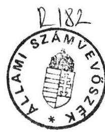
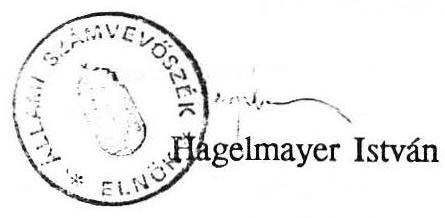

# Állami Számvevőszék

## JELENTÉS

a Magyar Köztársaság Ausztriában működő külképviseleteinek pénzügyi-gazdasági ellenőrzéséről

---

Az ellenőrzést végezték:
Matusek István főtanácsos
Hegyesné dr. Solymosi Mária számvevő
Nagy Ákosné számvevő tanácsos
Patai Tamás számvevő

Az ellenőrzést vezette:
Bihary Zsigmond főcsoportfőnök

---

# JELENTÉS

a Magyar Köztársaság Ausztriában működő
külképviseleteinek pénzügyi-gazdasági
ellenőrzéséről

A Magyar Köztársaság Ausztriában működő kilenc külképviselete az 1991. évi feladatokat mintegy 230 millió Ft-ot kitevő deviza kiadással, 90 főnyi főkiküldötti és családtagi létszámmal oldja meg. A vagyon értéke az elavult és hiányos nyilvántartásokból pontosan nem állapítható meg, de összértéke milliárdos nagyságrendű.

Az ellenőrzés célja a külképviseletek költségvetési tervezésének és felhasználásának, az ellátandó feladatok és erőforrások összhangjának célszerűségi, eredményességi és törvényességi szempontból történő vizsgálata és ezen keresztül a fejezeteket e relációt irányító tevékenységének értékelése volt.

A helyszíni ellenőrzés a nagykövetség, a kereskedelmi képviselet, a Collegium Hungaricum, a katonai attaséi hivatal, a leszerelési küldöttség, az ENSZ misszió, az idegenforgalmi képviselet, a Hadtörténeti Intézet és Múzeum bécsi kirendeltsége, valamint a bécsi levéltári kirendeltség gazdálkodására irányult, az 1989. január - 1991. augusztus közötti időszakban. A helyszíni ellenőrzéseket a külképviseletek munkáját irányító minisztériumoknál végzett vizsgálat és tájékozódás egészítette ki.

## I. Következtetések és javaslatok

Az Ausztriában működő külképviseletek tevékenysége mindenkor megkülönböztetett jelentőségű volt a nyugateurópai kapcsolatok fenntartásában, elmélyítésében. A kitüntetett helyzet a történelmi átalakulással tovább erősödött, amely több képviseleti szerv tevékenységének módosulásával, szervezeti, finanszírozási rendszerének változásával járt együtt. A megállapított költségvetések azonban nem

---

veszik kellően figyelembe a deklarált feladatokat, a központi és helyi szabályzatok pedig nem tükrözik a bekövetkezett változásokat.

A helyenként már évtizedes mulasztások következményeként még az azonos jellegű feladatokat ellátó külképviseletek ügyvitele sem egységes. A gazdálkodási és elszámolási rend színvonala mindenütt és mindenkor a helyi munkatársak felkészültségétől, tapasztalataitól és igényességétől függ.

Rendkívül elmaradott a külképviseleti gazdasági ügyvitel és számvitel feldolgozásának technikai színvonala.

A rendelkezésre álló nyilvántartásokból manuális munkával sem minden esetben végezhetők el a működés megítéléséhez szükséges elemzések. E tekintetben a kereskedelmi kirendeltség, illetve az ugyanilyen rendszert alkalmazó idegenforgalmi kirendeltség kivétel.

Az ellenőrzés számos hiányosságot, közöttük alapvető nyilvántartási, számviteli hibát tárt fel, amelyek sürgős intézkedéseket kívánnak (anyagi károkozás, tisztázatlan betörés, szabálytalan reprezentációs költségelszámolás, kétséges haszonnal járó gépkocsi értékesítés, leltározási, nyilvántartási szabálytalanságok, nem megfelelően nyilvántartott műértékek stb.). Megszüntetendőnek tartjuk azt a korábbi gyakorlatot, hogy a felügyeleti szervek különféle szükségleteiket a bécsi kirendeltségek útján szerzik be és ezért ott különféle letéteket tartanak.

Korábbi tradíciók szükségtelen és indokolatlan továbbéléseként titkosított több külképviselet hivatali költségvetése, annak felhasználása. Különösen anakronisztikus ez a gyakorlat a leszerelési katonai szakértői csoport esetében, amelynek hivatása a bizalom és nyilvánosság kölcsönös erősítése. A kialakult gyakorlat megnehezíti a tevékenységek törvényességi, szabályszerűségi és célszerűségi szempontú ellenőrzését.

A vizsgált időszakban (1989-1991) a bécsi külképviseleteken dolgozók száma csökkent, nőtt a gazdálkodásért felelős személyek megterhelése.

A külképviseletek személyi és tárgyi feltételei általában a kívánatos színvonalú feladatellátást lehetővé tették. A felszereltség, elhelyezés - a Collegium Hungaricum kivételével - jó, a technikai ellátottság fejlesztendő. Az ellenőrzés véleménye szerint élni kell a Collegium Hungaricum értékesítési lehetőségével, a Collegium érdekeinek szem előtt tartásával a működési célnak jobban megfelelő épület megszerzésére célszerű törekedni.

---

Feszültség mutatkozik egyes külképviseleteknél a feladatértelmezés és a jóváhagyott költségvetési keretek szabta lehetőségek között (például a nagykövetségi reprezentációs keret és a tervezett rendezvények tekintetében). Kétségtelen az is, hogy a külképviseletek célirányos együttműködésével, a tevékenységek és lehetőségek összehangolásával a rendelkezésre álló erőforrásokat hatékonyabban lehetne felhasználni (pl. egyeztetett, vagy közös szervezésű rendezvényekkel, a bevételi lehetőségek jobb kihasználásával).

A szűkösen rendelkezésre álló pénzügyi források felhasználása - néhány kivétellel - takarékos, célszerű és szabályszerű. Az év még hátralévő hónapjaiban szükséges szigorúság mellett mindenütt betarthatók a jóváhagyott éves kiadás fő összegei és a rovatok előirányzatai.

A működés tényleges költségeinek áttekintését torzítja az a szokásjogon alapuló gyakorlat, miszerint a nagykövetséggel rendszeres gazdasági, együttműködési kapcsolatban álló külképviseleti szervek (pl. Collegium Hungaricum, ENSZ misszió, leszerelési küldöttség) költségeinek egy részét a nagykövetségi költségvetés viseli. Következetesen végig kell vinni az ENSZ misszió, a leszerelési küldöttség és a Collegium Hungaricum 1991. január 1-vel megkezdett, de eddig csak részben megvalósult költségvetési önállósítását. Egyértelműsítésre vár az a körülmény, hogy az idegenforgalmi kirendeltségek fenntartását az Idegenforgalmi Alap (IFA) és ne a költségvetés viselje.

Néhány gazdasági vonatkozású kényes és bonyolult kérdés az osztrák hatóságokkal rendezendő. Ezek a következők: korábban az osztrák állampolgárok foglalkoztatása után nem a helyileg előírt nagyságrendű társadalombiztosítási összegeket fizették és ebből eredően konkrét követelés(ek) rendezetlen(ek). A magyar külképviseleteknek együttesen mintegy 5 millió ATS hozzáadott érték visszatérítése még nem történt meg, mivel az osztrák szállítók - hallgatólagos megegyezés alapján - a külképviseletek vásárlásait akkor számlázzák, amikor a vásárlás összege eléri az adóvisszatérítésre jogosító 4000 ATS limitet.

Az ellenőrzés tapasztalatai alapján javaslataink a következők:

# 1/ Valamennyi felügyeleti szervet érintően

a/ A külképviseletek feladatait a számukra jóváhagyásra kerülő éves költségvetéssel összhangban kell meghatározni. A jóváhagyott, feszes költségvetés

---

betartása csak akkor követelhető meg, ha nem lazítják azt fel további, a szükséges feltételek biztosítása nélküli rendkívüli feladatok.
b/ Az érintett felügyeleti szervek (KüM; MKM; HM) közvetlen megállapodására van szükség abban, hogy az egyes külképviseleti szervek között felmerülő, de nem arányosan megosztott költségek megfelelően elhatárolásra kerüljenek (nagykövetség és az ENSZ misszió, leszerelési küldöttség, Collegium Hungaricum között) és az egyes szolgáltatásokat igénybevevők reális értéket térítsenek a szolgáltatást nyújtóknak.
c/ A Külügyminisztérium összefogásával kezdeményezni kell az illetékes osztrák hatóságoknál az érvényes helyi törvények szerint az előző éveket megillető, jogosan visszajáró hozzáadott értékadó visszatérítését.
d/ Jogi állásfoglalás szükséges arról, hogy a külképviseleti szervek nem sértik-e az osztrák törvényeket akkor, amikor vásárlásaik során a szállítói számlák kiállításával megvárják a hozzáadott érték limit alsó határának (4000 ATS) elérését.
e/ Jogi szakértő bevonásával megnyugtató módon rendezni kell a külföldi munkavállalók szabálytalan foglalkoztatásával kapcsolatban keletkezett osztrák nyugdíjfolyósító intézeti követeléseket.
f/ A gazdálkodási rend és fegyelem megszilárdítása, illetve helyreállítása érdekében a fejezetek szintjén kell gondoskodni arról, hogy minden külképviseletük egységes elvek szerint kialakított, áttekinthető és ellenőrizhető nyilvántartásokat vezessen. Az egységesítés során célszerű figyelembe venni a korszerű adatfeldolgozási szempontokat is.
g/ Az érdekek kölcsönös egybeesését felismerve kell a KüM-nek és MKM-nek meggyorsítania a Collegium Hungaricum épületének értékesítését és az intézmény működési céljainak jobban megfelelő létesítmény vásárlását. Ezzel kapcsolatban sürgősen tisztázandók az épülettel kapcsolatos jogosultságok és a vételnél érvényesítendő szempontok.
h/ Mindazoknál a külképviseleteknél, amelyeknél nem készült szabályos vagyonleltár, vagy a vagyontárgyak azonosításához szükséges adatok hiányosak (leltári szám, érték stb), a hiányokat záros határidőn belül pótolni kell. A művészeti alkotásokról a főbb jellemzők feltüntetésével fényképes dokumentációt kell vezetni. Ennek hiánya ugyanis megnehezíti, esetleg lehetetlenné teszi egy elveszett műalkotás keresését, hiteles azonosítását.

# 2/ A Külügyminisztérium hatáskörében

a/ Az ENSZ misszió, a leszerelési küldöttség és Collegium Hungaricum nagykövetséghez tartozó gondnokságának gazdálkodási szempontból történő szétválasztása jelenleg is tartó folyamat. A három szervezet teljes gazdasági önállósága csak akkor valósulhat meg, ha:

- önálló bankszámlát nyitnak,
- gazdasági kihatású döntéseik következményeit viselik,
- elkülönített nyilvántartásokat vezetnek.

Ezeket a feltételeket úgy célszerű megteremteni, hogy a működés költségei számottevően ne növekedjenek.
b/ Rendezendőnek tartjuk az 1979. évtől a PM gyógyszerbeszerzés céljaira elkülönített letétként elhelyezett valuta sorsát. Indokoltnak tartjuk a letét megszüntetését.
c/ Szabályozni kell a nagykövetség vendégszobáinak igénybevételi rendjét (a KÜM vendégei/dolgozói részére milyen feltételek, térítési kategóriák szerint lehetséges az igénybevétel és kit illet a döntés). Ehhez igazodóan kell korszerűsíteni a vezetett nyilvántartásokat.
d/ Az eddigieknél tervszerűbb és egymással összehangoltabb szervezéssel javítható a külképviseletek kapcsolattartási rendszere és a reprezentatív rendezvények célszerűsége, eredményessége.
e/ Fegyelmi és kártérítési eljárást lefolytatását tartjuk indokoltnak a Magyar Köztársaság Leszerelési Küldöttsége által bérelt Sieveringer str. 165 b/2/8. sz. bérleményben keletkezett kár miatt az okozóval szemben.

## 3/ A Művelődési és Közoktatási Minisztérium hatáskörében

a/ Meg kell követelni, hogy a Collegium Hungaricum vendégszobáinak (lakásainak) igénybevételéről naprakész, ellenőrizhető nyilvántartások készüljenek és a vendégkönyvet pontosan vezessék. A nyilvántartásokból derüljön ki, hogy ki, milyen térítéskategóriára volt jogosult és meddig vette igénybe a szállást, milyen összeget fizetett be.

---

b/ Szabályozni kell a szponzoráció feltételeit és abból származó bevételek elszámolását.

# 4/ A Honvédelmi Minisztérium hatáskörében

a/ Felül kell vizsgálni a minisztériumhoz tartozó külképviseleti szervek költségvetési gazdálkodását indokolatlanul titkosító szabályokat. A szerv gazdasági működésével kapcsolatos költségvetés, annak végrehajtása során felmerült gazdasági események rögzítése, az analitikus nyilvántartások és elszámolások vezetése az állami vagy katonai titok sérelme nélkül, a polgári eljárási szabályok szerint történhet.
b/ Ki kell vizsgálni a katonai Attaséi Hivatal által magánszemélynek kereskedelmi árajánlat kérése nélkül eladott személygépkocsi értékesítési körülményeit, gazdasági kihatását.
c/ A volt honvédelmi miniszter és a volt vezérkari főnök bécsi tartózkodása során szabálytalanul reprezentációs költségként elszámolt személyes jellegű kiadások elszámolásának körülményeit javasoljuk tisztázni és az összegeket visszafizettetni.

## 5/ Az Ipari és Kereskedelmi Minisztérium hatáskörében

A nemzeti idegenforgalmi képviseletek fenntartási költségeit - figyelemmel a képviseletek tevékenységi körére - teljes egészében az Idegenforgalmi Alapból indokolt finanszírozni.

## 6/ A Nemzetközi Gazdasági Kapcsolatok Minisztériuma hatáskörében

Döntenie kell a kereskedelmi kirendeltség bankszámláján lévő 7 millió ATS összegű, konkrét cél nélküli tartalék hasznosításáról.

---

# II. Részletes megállapítások

## 1/ A működés és gazdálkodás szabályozottsága

A Bécsben működő külképviseletek körében több olyan szervezeti, irányításbeli változás következett be a vizsgált időszakban, ami költségvetési kihatással járt:

#### Abstract

A nagykövetség szervezetéből és költségvetési rendszeréből - bizonyos gazdasági, pénzügyi ellentmondásokkal ugyan - de kivált a Magyar Köztársaság ENSZ missziója és a Magyar Köztársaság Leszerelési Küldöttsége, megszűnt a Sajtóiroda. A Művelődési és Közoktatási Minisztérium Bécsi Magyar Levéltári Kirendeltségének finanszírozását az Országos Levéltár Gazdasági Hivatalától a MKM Nemzetközi Gazdasági Kapcsolatok Főosztálya vette át. A Magyar Nemzeti Idegenforgalmi Képviselet felügyelete a Nemzetközi Gazdasági Kapcsolatok Minisztériumától az Ipari és Kereskedelmi Minisztériumhoz került.

A szervezeti és szerkezeti módosulásokat nem követte az irányítószervek szabályozási koncepciója, sem a külképviseletek belső szabályozottságának változása. Ez alól a kereskedelmi és az idegenforgalmi képviselet kivétel.

A kereskedelmi kirendeltség ügyrendjét 1991-ben adták ki. Az ügyrend a kirendeltség szakmai feladatait jól, a gazdálkodással kapcsolatos feladatokat részben kielégítően szabályozza.

A kirendeltség kronológikus sorrendben, rovatonkénti csoportosításban gyűjti a felügyeleti szerv utasításait is. Ugyanezt a rendszert vette át az idegenforgalmi képviselet.

Az irányítószervek által kiadott átfogó szabályzatok elavultak, hiányosak, előírásaik többségét a gazdálkodás során nem lehet figyelembe venni. Az aktuális eljárási szabályokat az irányítószervek leírások, távirati utasítások, faxok útján közlik esetenként az érdekeltekkel. Egységes eljárási utasítás hiányában ezeket a kiegészítő rendelkezéseket különféleképpen adaptálják. Rendkívül nehéz, több esetben lehetetlen korábbi időszakokra vonatkozóan hitelt érdemlően megállapítani az akkor aktuális központi rendelkezések érvényét.

Különösen nehéz a gazdálkodás ellenőrzése azokon a területeken, ahol a titkos ügykezelést a képviselet gazdálkodási ügyeiben is alkalmazzák.

Rendkívül elmaradott a külképviseletek gazdasági ügyvitelének és számvitelének technikai színvonala. Helyileg semmiféle ügyvitelfeldolgozó berendezés nincs, minden munkaműveletet
 kézzel végzik.

---

Megfelelő nyilvántartások hiányában elemzésre alkalmas kigyűjtésekre sincs mindenütt lehetőség.

A kézzel vezetett nyilvántartások közül a kereskedelmi kirendeltség nyilvántartásai a legsokoldalúbbak. Hátránya a nagy munkaigényesség és magasabb szintű (NGKM) integrálásra átalakítás nélkül ez sem alkalmas.

Időszerű a külképviseletek gazdálkodását szabályozó ügyviteli rend legalább felügyeleti szervenkénti egységességét létrehozó munkálatok megkezdése, amellyel megalapozható egy későbbi lépcsőben megvalósuló egységes adatfeldolgozási rendszer.

# 2/ A külképviseleti feladatok költségvetési megalapozottsága 

A külképviseleti feladatok a vizsgált időszakban mélyreható változásokon mentek át.

A nagykövetség igen intenzíven fejlesztette - a korábban elhanyagolt, illetve tiltott körbe tartozókkal - a magyar-osztrák személyes kapcsolatokat, amelyek a vizsgált időszakban a korábbiakhoz képest hatszoros növekedést mutattak. A vízumügyek és bevételek csökkenésével egyidejűleg a hagyományos konzuli tevékenységek kerültek előtérbe.

A kereskedelmi kirendeltség tevékenységében a konkrét üzletszerzési, lebonyolítási kapcsolatok erőteljesen visszaszorultak, helyettük a hangsúly a külkereskedelmi és ezzel összefüggő más gazdasági érdekek képviseletére és védelmére helyeződött. Feladata továbbá a kirendeltségnek a nemzetközi gazdasági szervezetekkel a kapcsolatok kialakítása és fejlesztése, valamint a magyar gazdálkodó szervezetek külkereskedelmi és gazdasági tevékenységének az ország külkereskedelmi politikájával összhangban álló szektorsemleges támogatása.

A Collegium Hungaricum vezetése az intézményt olyan több funkciójú tudományos-kulturális intézetként kívánja működtetni, amelyik az ország egyik jelentős szellemi központja, kirakata. Az intézet feladata az általános és tudományos tájékoztatás, kapcsolatteremtés. Egyidejűleg művészeti, tudományos és politikai fórum, információközvetítő bázis, olyan oktatási, kulturális propagandafunkciókat is betöltő intézmény, amelynek célja minél jobban beágyazódni az osztrák intézményrendszerbe.

---

Az idegenforgalmi képviselet feladata a magyar idegenforgalmi kormányszerv képviselete, intenzív nemzeti propaganda és sajtómunka kifejtése, az idegenforgalmi vállalatok közötti kapcsolat erősítése, az osztrák idegenforgalmi tapasztalatok adaptálásának és az osztrák tőke bevonásának elősegítése a magyar idegenforgalom fejlesztésébe.

A feladatellátást pénzügyileg megalapozó külképviseleti költségvetéseknél a feladatok változásához hasonlítható változások nem történtek. A külképviseletek költségvetési előirányzatainak tervezési módszerei - a feladatváltozások gyors és rugalmas átalakulását - nem követték, ennek következtében a feladatstruktúra és a működési feltételek esetenként nincsenek összhangban.

A külképviseletek költségvetési tervezése teljesen elavult alapokon áll. A költségvetési előirányzatok megállapításának gyakorlatilag semmi korrelációja nincs az ellátandó feladattal, sem annak változásaival.

A tervezés bázis adatokra épül, amelyhez képest a változtatás többnyire egységes kulcs szerint történik mindenütt. Az előirányzatok alakításánál a relációs specifikumok érvényesülése kivételes eset.

A teljesen mechanikusnak tekinthető tervezési rendszer megmerevíti a költségvetési előirányzatok belső szerkezetét, ezért feszültségek támadnak az ellátandó feladat és annak feltételeit biztosító költségvetés között.

Az ellentmondás a nagykövetség gazdálkodásában a legnagyobb. A személyes kapcsolatok kibővülése a reprezentációs költségek növekedésével járt együtt, amit a jóváhagyott és pótlólag kiegészített költségvetési előirányzat csak részben ismert el.

Az ellátandó feladatok és a költségvetési előirányzatok feszültségeit a Művelődési és Közoktatási Minisztérium, valamint a Nemzetközi Gazdasági Kapcsolatok Minisztériuma úgy hidalta át, hogy megszüntette az előirányzatok kötött jellegét. A gazdálkodás liberalizálása azonban nem késztet megalapozottabb tervezésre, fegyelmezettebb gazdálkodásra, miközben irritálólag hat azokra a külképviseletekre, amelyeknek a gazdálkodási feltételei továbbra is kötöttek.

---

# 3/ Általános gazdálkodási feltételek 

a/ A gazdálkodási jogkörbe adott előirányzatok a külképviseletek működési költségeinek egy részét teszik csak ki. Egyes rovatok (bér, beruházás) felett a központok diszponálnak.

A külképviseletek pénzfelhasználási feltételeiben észlelhető különbségek a gazdálkodás szempontjából többnyire jelentéktelenek. Gazdálkodásról közgazdasági értelemben nincs szó. A gazdálkodás itt tartalmilag azt jelenti, hogy a rendelkezési jog körében - egyéb idevonatkozó szabályok betartásával - meghatározott célra a pénz elkölthető. A liberalizált gazdálkodói jogkörben megengedett, hogy az egyik címen elért megtakarítás másik címen külön engedély nélkül felhasználható legyen.

A nagykövetségnél szabadon felhasználható összegek aránya a gazdálkodási jogosultsági körben 1991-ben 66%-volt, míg 1990-ben csak 51%.

A leszerelési küldöttség 1991. évben felhasználható pénzeszközeinek 73%-a kötött.
A levéltári kirendeltség az éves költségvetéséről írásban értesítést nem kap, az ellátmányt negyedévente megküldik.

A Collegium Hungaricum-ban működő gondnokság kiadásai fedezetére még ellátmányt sem kap, önálló költségvetése, vagy költségterve nincs.

Gazdálkodási szempontból a Collegium Hungaricum önállósága a legnagyobb. Felügyeleti szerve hozzájárult ahhoz, hogy szponzori támogatásokat fogadjon el forintban és valutában. A kulturális misszió ügyét már is több magyar és néhány külföldi szerv részesíti támogatásban. Gazdálkodási és ellenőrzési szempontból egyaránt az jelent gondot, hogy a szponzoráció feltételeit és elszámolási módját az MKM még nem szabályozta. A szponzori bevételek a Collegium érdekeltségi szabályai szerint terven felüli bevételt jelentenek, amelyek egy limitált összeg felett szabadon felhasználhatók.

Semmiképpen nem tekinthető megfelelő megoldásnak az, hogy a hazai támogatók forintban fizetett juttatásait az intézményi pénzellátástól teljesen elkülönítve egy Sopronban elhelyezett bankszámláról használják fel.
b/ A bécsi külképviseletek pénzellátásának és pénzkezelésének módja nagyon sokféle.

---

A nagyobb külképviseletek (nagykövetség, kereskedelmi kirendeltség) hagyományos pénzellátási módja a központból bizonyos ütemességgel (általában havonta) átutalt pénzellátmány. Készpénzfelvételre a bankszámláról kerülhet sor úgy, hogy a pénztárra engedélyezett mértéket tartósan ne haladja meg.

Ettől a jól bevált rendszertől kisebb-nagyobb mértékben a legtöbb bécsi külképviselet gyakorlata eltér.

A nagykövetség pénzszükségletét a konzuli bevételek fedezik. A központi ellátmány a központ részére elrendelt beszerzések fedezésére szolgál.

A kereskedelmi kirendeltség központi pénzellátásának volumene csökkenő tendenciájú, míg 1989-ben éves szinten 10,6 millió ATS összegű volt, 1991-ben havonta 3-400.000 ATS. A pénzszükséglet egy része helyi bevételekből, térítményekből fedezhető.

A katonai attaséi hivatal ellátmányát futárposta útján juttatják el, majd a Centrál Banknál vezetett betétkönyvbe helyezik.

A leszerelési küldöttségnek egyszámlája nincs, 1991-ig önálló költségvetése sem volt. Gazdasági-pénzügyi önállósága még csak részleges. A nagykövetség viseli - bankszámla tulajdonosként - a bérlemények garanciális letét költségeit. A készpénz szállításhoz szükséges kíséret nem mindenkor biztosított.

A katonai leszerelési delegáció a készpénzellátmányát havonta Budapesten veszi fel és azt a csoport anyagi-pénzügyi felelősének nevére kiállított betétkönyvbe, illetve a házipénztárba vételezik be.

Az ellenőrzés találkozott olyan esettel is, amikor az ellátmány egy részét úgy helyezték el a betétkönyvben, hogy azt a pénztárnaplóban nem rögzítették.

Az idegenforgalmi hivatal ellátmányát korábban a Kereskedelmi Minisztérium, újabban az Ipari és Kereskedelmi Minisztérium finanszírozza az Idegenforgalmi Alapból.

A Collegium Hungaricum az MKM-től kapott rendszeres ellátmányon kívül szponzori bevételekhez is jut forintban és valutában. Az ATS ellátmányát, bevételeit bécsi, Ft bevételeit soproni bankban helyezte el.

---

A Collegium Hungaricum épület gondnoksága évi kb. 1,5 millió ATS összegű kiadásait a nagykövetségtől alkalmanként felvett összegekből fedezi. Saját ellátmánya nincs.

Az ENSZ misszió 1991-ig a részére elkülönítetten megállapított egyes költségvetési előirányzatokkal gazdálkodott. Önállósága még ma is sok tekintetben formális. Önálló pénztárosa nincs, ellátmányát a nagykövetség biztosítja, kisebb kiadásaik fedezetére tartanak átlagosan 5000 ATS összeget ellátmányként.

A magyar levéltári kirendeltség ellátmányát 1991. augusztusáig az Országos Levéltár Gazdasági Hivatala pénzintézeten keresztül havonta folyósította. Ez időtől a finanszírozást az MKM Nemzetközi Kapcsolatok Főosztálya vette át és úgy rendelkezett, hogy az ellátmány a Collegium Hungaricumtól vehető fel.

A két intézmény közötti elszámolás rendjét az MKM nem szabályozta. Nem érdektelen megjegyezni, hogy a kirendeltségnek pénzkezelési szabályzata nincs, a kirendeltség vezetőjével Bécsben elődje ismertette a legfontosabb tudnivalókat.

A kirendeltségnek bankszámlája, betétkönyve nincs.
A Hadtörténeti Intézet és Múzeum bécsi kirendeltsége éves ellátmányát négy egyenlő részletben kapja meg, a kirendeltségvezető nevére címezve. A kirendeltség ellátmányát készpénzben tartja. Bankszámlája, betétkönyve nincs.
1991. augusztus 13. óta felmerült kiadásokat a kiküldöttek a saját pénzükből fedezték, mert a pénztári készpénzkészlet 22,76 ATS összegű volt.
c/ A külképviseletek ellenőrzése a felügyeleti szervek részéről többnyire a Budapestre küldött elszámolások és bizonylatok felülvizsgálatával valósul meg. Az elszámolások helyességét, igen ritkán az elrendelt korrekciót írásban igazolják vissza.

A nagykövetség 1990. évi beszámolója felülvizsgálatának eredményéről helyszíni ellenőrzésünk befejezéséig - a Külügyminisztérium nem tájékoztatta az ellenőrzöttet.

A vizsgált időszakban a nagykövetségnél, a katonai leszerelési delegációnál és a katonai attasé hivatalnál volt helyszíni ellenőrzés.

---

A Collegium Hungaricum-nál a könyvtár és a filmállomány szakellenőrzésére került sor.

A helyszíni ellenőrzések hiányossága (a nagykövetség kivételével), hogy a megállapításokról az ellenőrzött szervezeteket nem tájékoztatják, jegyzőkönyvet nem hagynak vissza és utólagosan sem küldenek.

# 4/ A külképviseletek bevételei 

A külképviseletek pénzellátásában a költségvetési ellátmányok a meghatározó jelentőségűek. A saját bevételek lehetőségei és arányai az egyes külképviseleteknél nagyon eltérőek.

Különféle adminisztratív okokra hivatkozva az értéktöbbletadó (MWST) visszatérítése az osztrák államkassza részéről 1989. évtől kezdődően elmaradt. A jogos visszatérítés késedelme valamennyi külképviseleti szervet hátrányosan érintette. A kereskedelmi kirendeltség vezetőjének sürgető közbelépésére történtek intézkedések, de maradéktalanul az ügy máig sem rendeződött.

Késedelmesen ugyan, de 1991-ben 582 ezer ATS megtérült a kirendeltségnek. A külképviseletek nem teljes adatai szerint a magyar felet megillető, de még be nem folyt értéktöbbletadó visszajáró összege több, mint 5 millió ATS.

A nagykövetség bevételei között a konzuli bevételek a legjelentősebbek. A konzuli bevételek, térítmények, egyéb bevételek beszedése az előírásoknak megfelelő volt.

A nagykövetség 9 vendégszobájának (lakásának) igénybevétele után a külső nem külügyminisztériumi vendégektől bevételt nem szedtek be, azok használata részükre is térítésmentes volt. 1991-től a vendégszoba/lakás nyilvántartást rendszeresen vezetik.

A kereskedelmi kirendeltség egyéb bevételei között a vállalati kiküldöttek által fizetett bérleti díjak összege figyelemreméltó (1990-ben 1,9 millió ATS; 1991. I. félévében 1,3 millió ATS).

A bevétel alakulásában a kirendeltségnek nincs érdekeltsége, mivel a kirendeltség által választott szabályozási megoldás miatt a legjelentősebb bevételt biztosító vállalati hozzájárulásoknak az 1990. évhez viszonyított változásai a gazdálkodási feltételeket semmilyen irányban nem módosítják.

---

A kereskedelmi kirendeltség bevételeinek (térítményekkel, szállodák által fizetett provizióval és egyéb bevételekkel) együttes összege 1989-ben 13 millió ATS; 1990-ben 7,9 millió ATS; 1991. I. félévében 3,8 millió ATS volt, tehát a kirendeltség kiadásainak számottevő részét fedezi.

A kirendeltség operatív pénzellátását ugyan nem érintő tény az, hogy a felügyeleti szerv rendelkezése folytán hosszabb idő óta tartalékban van 7 millió ATS. Az összeg rendeltetési célja egyelőre meghatározatlan, felhasználás az idei évben nem volt.

A Collegium Hungaricum a vizsgált időszak első két évében a jóváhagyott költségvetési előirányzatait túllépte, mivel előirányzatai évente csökkentett mértékben kerültek jóváhagyásra. Ettől a tendenciától eltérően 1991-ben az előző évet mintegy 4%-kal meghaladó költségvetési előirányzat áll rendelkezésre. Az idei évben - az intézmény vezetése szerint - a túllépés elkerülhető lesz.

A folyó évi I-VIII. hónap végéig terjedő időszakban az éves előirányzat felhasználása 71,8% volt, amely az időarányosat 7,7%-kal haladja meg. Ez az arány nem garantálja a költségvetési főösszegen belüli éves teljesítést. Fedezetéül csak a saját bevételeket lehet figyelembe venni.

A Collegium saját bevételei között az intézeti vendégszobák (lakások) utáni térítés a legnagyobb tétel. A vendéglakások elsősorban azt a célt szolgálják, hogy az ösztöndíjasok vagy a hivatalos MKM kiküldöttek elhelyezését biztosítani lehessen. Az esetenként szabad férőhelyek saját hatáskörben hasznosíthatók. Az elhelyezéshez a felügyeleti szerv előzetes engedélye szükséges, a térítés mértékét a Collegium 0-200 ATS között állapíthatja meg (az ösztöndíjasokat kivéve, akik elhelyezése ingyenes).

A szobák tényleges igénybevétele és az elért bevételek nehezen ellenőrizhetők, mert csak utólagosan készült kimutatások állnak rendelkezésre, ezek sem kellően rendezettek. Vendégkönyvet nem vezetnek, a különböző térítéskategóriák
 indokoltsága nem bírálható el, az engedélyezések is sokszor szóbeli megállapodásokon alapulnak.

A katonai attaséi hivatalnál 1989. november – 1990. szeptember között 179.808 ATS-t bevételeztek személygépkocsi értékesítése címén. A gépkocsikat – egy esetet kivéve, amikor az új gépkocsi árából leszámította a kereskedő a régi gépkocsi árát – magyar állampolgároknak értékesítették ATS-ért, Bécsben. Kifogásolandó, hogy egy esetben az értékesítés időpontjában nem kértek

---

kereskedői árajánlatokat, így nem bírálható el, hogy a közvetlen értékesítés gazdaságilag milyen kihatású volt.

# 5/ A kiadások cél- és szabályszerűsége 

A kiadások felhasználása – kisebb adminisztratív hiányosságoktól eltekintve – szabályszerű. Helyenként előfordultak kerettúllépések, amit az egyes esetekben más rovatokon jelentkező megtakarítás terhére ki lehetett gazdálkodni, más esetekben erre nem volt lehetőség.

#### Abstract

A nagykövetség számára a reprezentációs keret kötött gazdálkodású előirányzat. Az első félévi nagylétszámú fogadások és egyéb rendezvények miatt éves keretét szinte teljes egészében kimerítette (99,75%). Kérelemre a KüM szeptemberben 400 ezer ATS pótelőirányzatot engedélyezett, ehhez az emelt összeghez viszonyítva az I-IX. havi felhasználás 87%-os. Ilyen ütemű felhasználás mellett az éves keret nem tartható be.

A Nagykövet úr a túllépést azzal indokolta, hogy olyan tájékoztatást kapott korábban, hogy a központilag elrendelt nemzeti ünnepi fogadások költségeit a minisztérium fedezi. A rendezvényi elképzeléseket ennek feltételezésével dolgozta ki. Mivel a kért 800 ezer ATS pótigénnyel szemben központilag 400 ezer ATS-t hagytak jóvá az év fennmaradó részére tervezett rendezvényeket ehhez mérten szervezik meg. A felhozott indokok azonban nem változtatnak azon a tényen, hogy nem volt felhatalmazásuk a kötött előirányzat túllépésére, ami a rendezvények körültekintőbb előkészítésével (rendezvényterv és megalapozott költségkalkuláció készítésével), illetve a keret felhasználásának folyamatosabb figyelemmel kísérésével elkerülhető lett volna.

A Collegium Hungaricum lehetőségei más irányban végletesek. Az intézménynek csak rendkívül szerény vendéglátási és fejlesztési lehetőségei vannak.

A takarékosság érdekében magyar alapanyagokból, saját előállítású kínálattal igyekeznek az egyébként többnyire ingyenes fellépést vállaló külföldi vagy hazai előadókat megvendégelni. Nagyobb létszámú együttesek fellépésekor nincs lehetőségük ilyen gesztusra. Kiállítások, vagy egyéb rendezvények alkalmával 1-1 pohár bort szolgálnak fel.

A Collégium könyvtárállományának fejlesztésére szinte már csak szimbolikus lehetőség van (20.000 Ft/év), amelyet az Országos Széchenyi Könyvtár néhány darab hungarológiai tárgyú küldeménye egészít ki. Célszerűtlen a továbbiakban a 16 mm-es filmállomány fenntartása. Helybeli vetítési lehetőség nincs, kölcsönzésükre sincs igény. A szükségtelen állomány helyet foglal az egyébként is szűkös raktárban.

---

Általában minden bécsi külképviseleti szerv arra törekszik, hogy az országon belüli kapcsolatainak szintentartása és fejlesztése a lehetőségekhez mérten a legkisebb ráfordítással legyen megvalósítható.

Pl. az idegenforgalmi képviselet más szervekkel, vállalatokkal közösen bérel kiállítási standot, térítésmentes propaganda akcióban vesz részt. Fizetett hirdetések helyett a partnerek közvetlen összehozását segíti elő, az újságírókat közlésre alkalmas tájékoztató anyagokkal látja el stb.

A kereskedelmi kirendeltség a drága, ugyanakkor nem hatékony tárgyi ajándékozás helyett díszes csomagolású pezsgőt ajándékoz, amely Ausztriában nívós ajándéknak minősül. Gazdasági kapcsolataik szervezésében nagy segítséget jelent az Osztrák Kereskedelmi Kamara, amelynek útján költségmentes kapcsolatok szervezhetők.

Az ENSZ misszió az éves reprezentációs keretéből (80 ezer ATS) mindössze 28 ezer ATS összeget használt eddig fel. Reprezentációs ajándéktárgyai nincsenek. A diplomaták – térítés ellenében – saját gépkocsijukat használják. Belföldi kiküldetési költség az idei évben nem merült fel.

# a/ Létszám- és bérgazdálkodás, személyi jellegű kiadások 

A vizsgált időszakban a nagyobb létszámú külképviseleteknél a létszám csökkentésre került, a nagykövetségi 19 fővel, a kereskedelmi kirendeltség 2 fővel, a leszerelési küldöttség 2 fővel csökkentve látja el a feladatát, az idegenforgalmi hivatal az engedélyezettnél 1 fővel kevesebbet alkalmaz.

Lényegében megszűnt a külföldi alkalmazottak foglalkoztatása is (egy fő kivételével), mivel a járulékos költségekkel növelt bérköltségek felborítanák a bérezési arányokat.

A korábban alkalmazott külföldi munkavállalók ügye még nem zárult le teljesen.

A Collegium Hungaricumban korábban munkatársként alkalmazott Inge Beier nyugdíjba vonulása miatt a helyi szabályok szerint 103 ezer ATS végkielégítés fizetésére volt a Collégium kötelezett. Az összeg fedezetét csak pótelőirányzat engedélyezésével volt lehetséges előteremteni 1990-ben. Az ellenőrzés időpontjáig azonban rendezetlen volt a helyi társadalombiztosítás 70 ezer ATS összegű követelése, amely azzal függ össze, hogy Inge Beier nem bruttó, hanem nettó keresete után fizették a társadalombiztosítási járulékot. Az ügy rendkívül kényes, mert ez volt az általános gyakorlat minden magyar külképviseleti szervnél.

---

Ennek a konkrét ügynek további vonzatai származhatnak, amelyet célszerű lenne jogászi közreműködéssel egyezséggel lezárni.

A külképviseletek személyi feltételei – a nagykövetségi gazdasági, technikai személyzet létszámát kivéve – elegendőek a zavartalan feladatellátáshoz.

A bérek számfejtése központilag történik. A bérek megállapításánál, az előlegek levonásánál kifogásolni való nem fordult elő.

Helybeni észrevételezést egyes eseti megbízások indokoltak, mert nem minden kifizetésnél volt megállapítható egyértelműen a megbízás tárgya, vagy az eltöltött idő.

A dologi térítmények beszedése az előírt mérték szerint mindenütt rendben megtörtént. A térítmények újbóli megállapítására két évvel ezelőtt került sor.

# b/ Beszerzések, készletek 

A saját célú beszerzések többnyire irodai eszközök, tisztítószerek, irodabútorok, lakásfelszerelési tárgyak és az előírt időben cserélendő gépkocsik.

A WD 272 frsz. Mercedes 190 E megvételére vonatkozó központi engedélyező okmányt a nagykövetség bemutatni nem tudta.

A legnagyobb forgalmat lebonyolító nagykövetség beszerzéseinek a felét még ma is a KüM részére teljesíti (számítástechnikai és gépkocsi alkatrészek).

A kereskedelmi kirendeltségnél a minisztérium részére történő beszerzések aránya mindenkor kisebb volt, az is csökkenő irányzatú.

A helyi beszerzések a hivatali működés szükségleteihez igazodnak, túlzott készletezésre nincs szükség, a pénzügyi források szűkössége miatt lehetőség sincs.

A magyar piac közelsége és a valuta kiadások csökkentése érdekében mérlegelést igénylő kérdés az, hogy nem lenne-e előnyösebb a irodai eszközöket, tisztítószereket Magyarországon beszerezni. Ma már a hazai mennyiségi ellátottság és a minőségi választék nem zár ki egy ilyen megoldást.

---

# c/ Elhelyezés, berendezések színvonala. Felújítások 

A külképviseletek elhelyezése, a berendezések színvonala mindenütt megfelelő. A nagykövetség épületének egy része – építési adottságai miatt – kiemelkedően reprezentatív színvonalú. Gondos, folyamatos felújítási munkálatokkal sikerült fenntartani az eredeti miliőt és megoldásokat. A reprezentatív termek felszereltsége, bútorzata és kiegészítő berendezései többnyire összhangban vannak az épülettel. Ezáltal az épületegyüttes a nemzeti vagyon igen értékes része, bécsi viszonylatban is számontartott műemlék. Az épületben és a Collegium Hungaricumban kialakított lakások a külképviseleten dolgozók egy részének lakásgondjait is megoldják.

A kereskedelmi és az idegenforgalmi képviselet egy irodaépületben közösen nyert elhelyezést. Az épület viszonylag új, jól felszerelt és a bérelt épületszint a rendszeres karbantartás eredményeként kifogástalan. A bútorzat állapota jó.

A Collegium Hungaricum épületét a vizsgált időszakban felújították, ekkor a bútorok egy részét is kicserélték. Építészeti adottságok miatt az épületgépészeti berendezések gyakran meghibásodnak, többször előfordul csőtörés, beázás.

A külképviseletek közös jellemzője az, hogy az irodai felszerelések állapota, korszerűsége nem kifogástalan. A restrikciós intézkedések következtében a felszerelési tárgyak (sokszorosítók, írógépek, vetítők, elektroakusztikai rendszerek stb.) fejlesztése rendre elmaradt, vagy csak a legszükségesebb cserékre terjedt ki. Az elmaradások következménye ma már érzékelhető, de még a szaktevékenység ellátását számottevően nem hátráltatja, igaz, nem is segíti elő. Főképpen a számítástechnikai fejlesztés hiánya érezteti negatív hatását.

A fejlesztés elmaradása a legközvetlenebbül a nagykövetségen jelentkezik a konzulátus tekintetében. Több, mint 5 éve tervezik a konzuli részleg átépítését. A munkálatokat 1991. július 27-én kellett volna megkezdeni, ezzel szemben az ellenőrzés időpontjáig ez nem történt meg. Megemlítjük, hogy az átépítés során az új nagykövetségi (konzuli) pénztár tervezett elhelyezése és kialakítása biztonsági szempontból nem megfelelő.

A lakásbérleti szerződéseket az ellenőrzés rendben találta, de nem mindenütt található annak hiteles magyar nyelvű fordítása. A régebbi, folyamatosan bérelt lakások bérleti díja és bérlési feltételei minden esetben kedvezőbbek az

---

újabbakkal szemben. Helyi sajátosságok miatt a bútorozott lakások bérlése gazdaságosabb.

Kiemelkedően előnyös a kereskedelmi főtanácsos lakásának bérlése, amely 150 m²-es reprezentatív és jól felszerelt lakás. A bérbeadó elhelyezési gondjai miatt mintegy 660 ezer Ft értékű lakásfelszerelést ellenszolgáltatás nélkül átadott.

A külképviseletek általában letét nélkül tudták a lakásokat bérelni. Megfelelő információk hiányában a Collegium Hungaricum lakásszerződéseinél ezt a kedvezményt nem tudták elérni, sőt a letét kamata is a bérbeadót illeti meg, ami egyértelműen hátrányos kikötés és nem felel meg a szokásoknak. Erre a bérlemények megújítása során gondolni kell.

# d/ Egyéb kiadások, költségek 

A nagykövetség gépkocsi parkjának mintegy felét lecserélték 1989. I. 1. – 1991. VI. 30. között. Ezek közül a WD 27001 frsz. Volvo szgk. 47.000 km futásteljesítménnyel 5 évesen eladásra került, igaz a szabályozás ezt lehetővé teszi.

A katonai attaséi hivatal kiadásai közül az ellenőrzés többet kifogásolhatónak tart:

- a honvédelmi miniszter 1988. augusztusi látogatása során a miniszter és családtagjai személyes szükségletét szolgáló kiadások (összesen 7350,75 ATS) a reprezentációs keret terhére kerültek elszámolásra;
- az osztrák-magyar csereüdülésben részt vevő magas rangú katonai házaspárok bécsi tartózkodása alkalmából – a kölcsönösség jegyében – tartott vendégfogadás költségeinek (pl. 1988. szeptemberében 9000 ATS, 1991. szeptemberében 5479 ATS) elszámolását a reprezentációs keret terhére;
- 1989. októberében az akkori vezérkari főnök delegációs látogatása során a feleségek részére (6 fő) elszámolt 3681 ATS ebéd költségét, 270 ATS értékben a vezérezredes szobájába virág vásárlást, a delegáció hölgytagjainak vásárolt virág és műsorfüzet vásárlást (170 ATS), öltöny vasalást (100 ATS);
- az 1988-89. évek magas helyi italbeszerzéseit, aminek a következtében jelenleg is viszonylag jelentős készletekkel rendelkezik a hivatal;
- a havonta 700-1000 ATS körüli összeget kitevő üdítőital és sör beszerzéseit, mivel azok elsősorban a magyar kiküldöttek megvendégelését szolgálják;
- a hivatal esetenként hazai kérésre eszközölt beszerzéseit (pl. 1990. januárjában a 180. sz. távirat alapján 4320 ATS-t fizettek ki gyógyszerekre);

---

- 1990. szeptember 27-i fogadás után 3.500 ATS összegű bért fizettek ki a Lóvér szálló képviselőjének a felszolgálásért, a megfelelő bizonylat nélkül. Tisztázást igényel a foglalkoztatások esetleges SZJA vonzata és a kifizetők adatközlési kötelezettsége az APEH felé.

A leszerelési küldöttség bérleményeiben jelentős változások voltak. Évközben három lakás cseréjével jelentős összegű províziós kiadások és a korábbinál magasabb bérleti díjak merültek fel. A költségeket tovább növelte a Sieveringer str. 165 b/2/8. sz. bérlemény állagának romlása miatt a tulajdonosnak kifizetett 32.150 ATS összegű kártérítés.

Erről a központot tájékoztatták a kárért felelős személyek megjelölése nélkül.

A leszerelési delegáció katonai szakértői csoportjánál 1991. március 11-én 57.053,90 ATS kiadás könyvelését engedélyezte a központ az 1990. november 30-ra virradó éjszaka történt betörés következtében keletkezett pénzügyi kár (készpénzben és nyugtában) leírására. (Hasonló módon jártak el az eltulajdonított forint készpénz esetében is.)

Ebből az összegből 30.000 ATS végül megtérült, mivel egy lakás utáni letét összegét a bérbeadó nyugta nélkül is visszafizette. Az ügyben nyomozás indult, amelybe a magyar rendőrség is bekapcsolódott. Mivel a bécsi rendőrség nyomozati eredményei mindeddig nem érkeztek meg, függőben van a kártérítési és fegyelmi felelősség tisztázása. A fegyelmi felelősség tisztázását
 azonban nem indokolt a rendőrségi nyomozás lezárásához kötni.

# e/ Érték- és vagyonkezelés, számviteli rend 

Az ellenőrzés során számos kisebb-nagyobb értékkezelési, vagyonkezelési és számviteli hiányosságra derült fény.

A Collegium Hungaricum épületének tulajdonjogi viszonyai tisztázatlanok. Az épületet a KÜM kezeli, elsősorban az MKM-hez tartozó Collegium Hungaricum céljaira hasznosítják, ezzel szemben az épület sem a Külügyminisztérium, sem a Művelődési és Közoktatási Minisztérium nyilvántartásaiban nem szerepel.

A tényt a KÜM szóban, a MKM írásban is megerősítette. Okmány a kezelői jog gyakorlásáról sem került elő. A rendezetlenség nagymértékben megnehezíti az épület már szóbajött értékesítését, illetve cseréjét. A hatásköri tisztázatlanságok

---

gyakorlatilag lehetetlenné tették egy osztrák bankkal a tulajdoni tárgyalások sikeres véghezvitelét.

A nagykövetség vagyonnyilvántartásai többnyire megfelelnek a KÜM vonatkozó utasításainak. Ennek ellenére az eszköz- és vagyonnyilvántartás adatai a vagyon reális értékének megállapítására nem alkalmasak.

Az eszközérték nyilvántartás abszurditásait mutatja pl. az, hogy a nagykövetségi múemléképület 20240 ezer Ft értékben van nyilvántartva, az ehhez eszmei értékben nem is hasonlítható Collegium Hungaricum épület értékétol 50-100 millió ATS közötti tartományban folytak a tárgyalások.

Az ellenőrzés a nagykövetségen kifogásolta, hogy:
— az 1985. év előtt leltárba felvett tárgyak, különösen a műalkotások irreálisan alacsony értéken vannak jegyezve;

- herendi tárgyak az 1990. évi leltárban egyaránt szerepelnek fogyóeszközként, állóeszközként és műalkotásként;
- a műalkotások egyedi nyilvántartó lapjai hiányosan vannak vezetve (pl. az antik cserépkályhák - egy kivételével - nem szerepelnek bennük);
- az álló- és fogyóeszköz leltárt sem a leltárfelvevők, sem a használók nem írták alá;
- az 1990. évi fogyóeszköz selejtezésről nem készült szabályos jegyzőkönyv. A selejtezett tárgyak további sorsa megállapíthatatlan. (Selejtezésre került herendi falióra, Zsolnay falióra, 30 db telefonkészülék, 1980. évi beszerzésű rekamié a nagyköveti lakásból).

Hasonló szabálytalanságokat tapasztaltunk a Collegium Hungaricum leltárainak ellenőrzése során is:

- bár 1991. szeptemberével bezárólag minden évben leltároztak, ennek nyomát a helyiségek leltárjegyzékein aláírások nem igazolják;
- a leltárjegyzékek alakilag, tartalmilag hiányosak (hiányosak az azonosító adatok, hiányoznak az értékadatok stb.);
- az újabb vagyontárgyakhoz az irányító szerv sem azonosító számot, sem értékközlést nem ad;

---

- a leltáreltérések kivizsgálása és rendezése, esetleg a felelősség megállapítása elmarad;
- a képzőművészeti alkotásokról nem készült azonosítást biztosító dokumentum, (jóllehet az erre vonatkozó rendelkezést a művelődési tárca adta ki);
- a selejtezett tárgyak értékesítéséről, megsemmisítéséről dokumentum nem készült.

Az utalványozás gyakran utólagos, formális. Fellazultak a kötelezettségvállalásra vonatkozó belső szabályozások.

Az együttműködő szervek között felmerült költségek elszámolására vonatkozó megállapodásoknak nincsenek fellelhető dokumentumai. Csak a szokásjogra alapozva számolják el azokat, mindenféle közgazdasági vagy szakmai szempontra tekintet nélkül. Ez a gyakorlat főképpen a nagykövetség (KÜM) költségeit növeli indokolatlanul.

A szabályszerű pénz- és értékkezelés tárgyi, biztonsági feltételei általában biztosítottak.

Nem megnyugtató azonban a nagykövetségi pénztár biztonsága, továbbá a leszerelési delegáció katonai szakértői csoportjának rendszeresen Budapestről kiszállított készpénzellátása nem felel meg a biztonsági követelményeknek.

Általános hiányosság a pénztárrováncsok hiánya, annak ellenére, hogy erről az irányítószervi utasítások intézkednek.

Budapest, 1991. december hó

