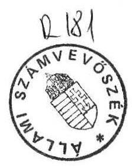

# Allami Számưeböséé 

## JELENTÉS

az önkormányzatok kiemelt kommunális feladatai
(közvilágítás, temető- és útfenntartás, lakásgazdálkodás) megoldásának, s az ehhez kapcsolódó állami hozzájárulás hatásának vizsgálatáról

---

# A vizsgálatot vezette és az összefoglaló jelentést összeállította: 

Farkas László főtanácsos.

A vizsgálat szervezésében közremüködött:
Simon Ákosné számvevő.

A vizsgálatot végezték:
Baranya megye:
Remeczky László számvevő
Bács-Kiskun megye:
Tréfás Antal számvevő tanácsos
Békés megye:
Baji Ferencné számvevő
Borsod-Abaúj-Zemplén megye:
Fekete Tibor számvevő tanácsos
Kocsis István számvevő
Csongrád megye:
dr.Boda Sándor számvevő
Fejér megye:
Horváth József számvevő
Győr-Moson-Sopron megye:
dr.Szeli Tibor számvevő
Heves megye:
Maróti Sándor számvevő
Jász-Nagykun-Szolnok:
Buczkó András számvevő
Négrád megye:
Németh Péterné számvevő
Pest megye és a főváros:
Simon Ákosné számvevő
dr.Tőth Annamária számvevő
Molnár Istvánné számvevő
Giday Zoltán számvevő
Somogy megye:
dr.Szigeti István számvevő
Szabolcs-Szatmár-Bereg megye:
László András számvevő
Tolna megye:
Csekei Gyula számvevő
Vas megye:
Horváth János számvevő
Zala megye:
Kiss Dénes számvevő

---

# JELENTÉS 

Az önkormányzatok kiemelt kommunális feladatai
(közvilágítás, temető- és útfenntartás, lakásgazdálkodás)
megoldásának, s az ehhez kapcsolódó állami hozzájárulás hatásának vizsgálatáról

## A vizsgálat célja:

- annak megállapítása, hogy a helyi önkormányzatokról szóló 1990. LXV. tv. szerint a települési önkormányzatok részére kötelezó jelleggel meghatározott kiemelt kommunális feladatok (közvilágítás, temető és útfenntartás), lakásgazdálkodás megoldásához milyen nagyságrendü pénzügyi források állnak rendelkezésre, és ezek a források a kommunális szolgáltatási tevékenység fenntartását és fejlesztését milyen rangsorolásban és színvonalon biztosítják;
— az 1990. CIV. tv. szerint a helyi önkormányzatok részéről kommunális célra igényelhető támogatások mennyiben segítik a folyamatban lévő beruházások befejezését, s a más kiemelt feladatok megoldását;
- a lakásgazdálkodási rendszer változásából adódóan az önkormányzatok milyen mértékben tudják támogatni a fiatal házasok első lakásvásárlását, valamint a megnövekedett kamatterhek miatt jelentkező lakossági terhek enyhítését.
A vizsgálatot 146 települési önkormányzatnál, valamint a fôvárosi és 7 kerületi önkormányzatnál végeztük. Az önkormányzatok közül: 12 megyeszékhely város, 44 város, 28 nagyközség, 62 község. Az e települések lakossága az ország lakosságának $40 \%$-a. A kommunális normatíva a költségvetési törvény normatív állami hozzájárulásának $10 \%$-át képviselte. A céltámogatásból a szilárd hulladéklerakó telep bővítésére biztosított támogatási összeg $0,8 \%$, míg a központosított előirányzatokból a lakossági gyűjtött folyékony hulladék $1,8 \%$, a hamvasztásos temetés támogatása $2,4 \%$.

---

# I. 

## Összefoglaló megállapítások a vizsgálat tapasztalatairól

Az Országgyűlés az 1990. évi CIV. tv-ben az önkormányzatok részére a közvilágítás, út-, temetőfenntartás, lakásgazdálkodás feladatainak megoldásához 14.766,5 MFt normatív állami hozzájárulást biztosított felhasználási kötöttség nélkül.

A normatív állami hozzájárulás csak makroszámításon alapult és csak országosan nyújtott fedezetet az 1991. évre számított kiadási szinthez.
A népességszám szerinti elosztás a települések között igen jelentős szóródást mutat. Egyes települések forrástöbblethez jutottak, míg más településeken a feladatellátást veszélyeztető forráshiány alakult ki. A normatívának közgazdasági tartalma nincs. Mivel az állam nem deklarálta, hogy a kommunális feladatok megoldásában milyen mértékben kíván részt venni, nem határozható meg, hogy az önkormányzatok részére juttatott 14.766,5 MFt e feladatok mekkora hányadára nyújt fedezetet. A kommunális normatíva körébe vont feladatok az alkalmazott mutatószámmal nem mérhetők, az előbbiek eltérő jellege és a települések adottságainak differenciáltsága miatt. Ennek az lett a következménye, hogy a normatíva az egyes település típusoknál felmerült feladatellátáshoz igen eltérő módon járult hozzá, így nem segítette elő a feladatok és források 1991. évi összhangjának megteremtését.
Ezért e feladatokra kidolgozott támogatási rendszer nem a legmegfelelőbb finanszírozási modell.

A közvilágítás-, út-, temetőfenntartási feladatok tekintetében 1990. év végéig az útfenntartás-felújítás szerepelt a feladatrangsorban az első helyen. Az ebben az évben bekövetkezett többszöri energiaármelkedés eredményeként a közvilágítási többletköltségek miatt az útfenntartás-felújítás az 1991. évre háttérbe szorult. Ebből következik, hogy az önkormányzatok által fenntartott úthálózat műszaki állapotának szintentartására nem teremtődtek meg a pénzügyi feltételek.
A lakásgazdálkodás finanszirozási rendszerében bekövetkezett változásnak, azaz a normatíva alapján működő elosztási rendszernek az lett a következménye, hogy egyes önkormányzatok úgy jutottak ilyen címen támogatáshoz, illetve forrástöbblethez, hogy ezek nem a támogatott célt fogják szolgálni.
A helyi önkormányzatok részéről igényelhető céltámogatás és központosított támogatások rendszere a gyakorlatban nem érte el tervezett célját.
A szilárd hulladéklerakó telep építésére biztosított 50 MFt előirányzat csak töredéke a megkezdett beruházások megvalósításához szükséges összegnek, ezért célszerű lett volna a támogatott célok körét szűkíteni. A versenysemlegesség azt

---

kívánná, hogy a folyékony hulladék gyűjtésével foglalkozó szervezetek közül ne csak a helyi önkormányzatok vállalatai, illetőleg maga az önkormányzat részesüljön támogatásban. A lakosság által fizetendő fajlagos köbméterenkénti díjtétel az egyes települések között igen jelentős eltérést mutat. A szolgáltatás magas díja hátrányosan érinti a csatornázatlan területeken élő lakosságot és nem ösztönzi a folyékony hulladék rendszeres elszállíttatására.
A helykímélő hamvasztásos temetésre biztosított 4.000 Ft támogatási rendszer nem tesz különbséget a szállítási távolság között, minden állampolgárt egyenlő mértékben támogat.
A kamatterhek enyhítésére vonatkozó költségvetési törvényben kialakított elosztási rendszer egyenlőtlenül támogatta az önkormányzatokat, azok is részesültek támogatásban, ahol a hitelszámlák kis számban, vagy egyáltalán nem fordultak elő.

# Ajánlások a Pénzügyminisztérium és Belügyminisztérium részére 

1./ A kommunális normatíva - közvilágítás-, út -, temetőfenntartás-, lakásgazdálkodás - jelenlegi modelljének fenntartását nem tartjuk indokoltnak. Amenynyiben nem dolgozható ki e feladatokra pontosabb mutatószám rendszer, úgy célszerű e pénzeszközöket más normatívához kapcsolni és az itt jelentkező feladatokat az önkormányzatok más bevételi forrásából fedezni.
2./ Az energiaköltségek csökkentése érdekében a közvilágítás korszerűsítési program felgyorsítását szolgáló fejlesztések támogatását - a pénzügyi lehetőségek függvényében - célszerű lenne a céltámogatások körébe beépíteni, ugyanis az országos szinten elért energia megtakarítások az állami költségvetés későbbi kiadásait mérséklik. Megfontolandó, hogy például lakossági kötvény kibocsájtással lehetne-e a fejlesztések pénzügyi forrásait bővíteni.
3./ A céltámogatások között a szilárd hulladéklerakó telep címen 50 MFt támogatási összeggel előirányzott feladatmegoldás pályázati rendszerben történő elosztása az alacsony keretösszeg miatt nem célszerű, mivel ennek elaprózását jelenti. Amennyiben a támogatás mértéke nem növelhető, úgy célszerű csak a regionális jellegű feladatok megoldását támogatni.
4./ A helykímélő (hamvasztásos) temetkezési módhoz a számított állami támogatást a temettető részére a krematórium és a halottak volt lakhelye között, a tényleges szállítási költséghez igazodóan, sávos átlagok alapján lenne célszerű meghatározni.
5./ Az érintett tárcák vizsgálják meg a költségvetés teherbíró képességének figyelembevételével a lakossági folyékony települési hulladékgyűjtés és ártalmatlanítás tekintetében, hogy a támogatás a különböző begyűjtési megoldásokra azonos feltételek mellett valósuljon meg és meghatározó a lakosság támogatása legyen.

---

# II. 

## A vizsgálat részletes megállapításai

## 1./ A kiemelt kommunális feladatok megoldásának feltételrendszere

## a./ Az önkormányzatok forrásszabályozásának változásai

Az Országgyűlés az 1990. évi LXV. tv. megalkotásával létrehozta a tanácsokat felváltó önkormányzat rendszerét. A tanácsi gazdálkodás átalakítása - az államháztartási reform részeként - az 1990. évi költségvetési törvénnyel elindult.

A kiadás orientált tervezést a bevételi érdekeltségre épülő forrásszabályozás, a tervalku mechanizmust pedig az állami pénzeszközök normativ dosztása váltotta fel. A normatív költségvetési hozzájárulás alanyi jogon illeti meg az önkormányzatokat. A normatív állami hozzájárulást címzett, cél, és központosított előirányzat egészítette ki.

Az 1990. évi állami költségvetési törvény a kommunális feladatokat még nem normatív úton támogatta. A tanácsok saját hatáskörükben forrásaik figyelembevételével önállóan alakították ki e feladatokra az éves költségvetési előirányzatokat.

Az 1991. évi költségvetési törvény szerint az önkormányzatok forrásainak struktúrája azonban - az előző évihez képest - jelentősen változott.

Az átengedett bevételek közül 1991. évben a személyi jövedelemadó - az előző évi $100 \%$ helyett - $50 \%$-os mértékben került átengedésre az önkormányzatokhoz. A másik $50 \%$ újraelosztás formájában állami támogatássá alakult át, ez kedvező az önkormányzatok finanszírozása szempontjából.
Az állami hozzájárulás keretében új támogatási elemek kerültek be a rendszerbe. Ilyen pl. a kommunális tevékenységhez rendelt normatíva megjelenése is.

## b./ A kiemelt kommunális feladatok normatív szabályozása

Az 1991. évi költségvetési törvény az önkormányzatok kommunális tevékenységéhez - közvilágítás, út-, temetőfenntartás és lakásgazdálkodás - egy állandó lakosra számítva $1.400 \mathrm{Ft} /$ fő normatívát biztosított. Az önkormányzatok költségvetésében a kommunális normatív hozzájárulás $14.766,5 \mathrm{MFt}$ forrást jelent, amely az összes állami hozzájárulás $10 \%$-át képviseli. A feladatokból az önkormányzati törvény csak a közvilágítás, a helyi közutak és köztemetők fenntartását írja elő kötelezően az önkormányzatok számára.

A normatíva meghatározása - a tárcák részéről - úgy történt, hogy e szakfeladatok 1990. évi bázisszintű előirányzatait ( 8.439 MFt ) csökkentették az itt jelentkező bevételekkel ( 111 MFt ), majd korrigálták az 1991. évi $16 \%$-os átlagautomatizmussal. Az or-

---

szágos szintű 9.660 MFt előirányzat került elosztásra azállandó népesség arányában, és így alakult ki az országos $900 \mathrm{Ft} /$ fó átlagnormatíva, amely csak makroszintü számításokon alapult és csak országosan nyújtott fedezetet a számított kiadási szintre.

# c./ A lakásgazdálkodás finanszírozási rendszerének változása 

A lakásgazdálkodási feladatok megoldásához - a finanszírozási rendszerben bekövetkezett változások miatt - a központilag nyújtott támogatás 1991. évre azonos pénzügyi feltételek mellett önkormányzati hatáskörbe került. Erre a célra az önkormányzatok $500 \mathrm{Ft} /$ fő normatív támogatást kaptak.

A normatíva meghatározása úgy történt, hogy 3 MdFt-ot a fiatal házasok elsőlakáshoz jutásának támogatására, 2 MdFt-ot pedig a megemelt kamatterhek enyhítésére az 1990. január 1-jei állandó lakosra számítva vettek figyelembe.

A költségvetés Országgyűlés elé terjesztésének időszakában a Pénzügyminisztérium nem tudta felmérni miként fog reagálni a lakosság a meghozott intézkedésekre és az önkormányzatoknál hogyan alakul a kamattámogatási igény, ezért ez utóbbi támogatási összeget létszámarányosan osztották szét. 1991. január-február hónapban azonban a lakosság élt a kedvező törlesztési lehetőséggel és nagyszámú kölcsönt egyenlített ki. Ezért a fennmaradó hitelszámlák települések közötti megoszlása igen egyenlőtlenül alakult. Ennek ismeretében módosította az Országgyűlés az 1990. évi CIV. törvényt. Az 1991. évi XV. törvény rendelkezése alapján az emelkedő kamatozású és március elsején a települési önkormányzat illetőségi területén fennálló kölcsöntartozások után egy állandó lakosra számítva $200 \mathrm{Ft} /$ fő levonásával 5.000 Ft/fő támogatási összeg került elfogadásra. Eszerint, a törvény a kiegészítő támogatás megállapításakor figyelembe vette a költségvetésben szereplő̉ népességszám alapján az erre a célra nyújtott összeget, azt mintegy újra elosztotta. Tehát azoktól a településektől nem vont el támogatást, ahol a támogatás összege kisebb mint a népességszám szerinti. Ez azzal a következménnyel járt, hogy az állami költségvetés általános tartaléka terhére 1.500 MFt-tal növelni kellett az önkormányzatok állami hozzájárulását. Igy a normatíva alapján működő elosztási rendszernek a következménye az lett, hogy egyes önkormányzatok úgy jutottak ilyen címen támogatáshoz, illetve forrástöbblethez, hogy ezek nem a támogatott célt fogják szolgálni.

A pénzintézetek által megadott hitelszámlák száma 531.219 db a becsült 700.000 db számlával szemben, mely jelentősen elmaradt a prognosztizált számla számtól. Az 1991. évi XV. tv. által átcsoportosított 1.500 MFt -tal szemben csak 749 MFt kiegészítő támogatás illette meg az 1.252 önkormányzatot. A költségvetési törvény módosítása és a jogosan elosztott költségvetési támogatás között 751 MFt maradvány keletkezett. A Kormány, a vizsgálat időszakában, 3119 számú az 1991. évi költségvetési törvényt módosító javaslatával, melyet az Országgyúlés elé terjesztett, a "lakás gazdálkodási tevékenység" /kiegészítés/ rovatát a fenti összeggel csökkentette.

## d./ A normatív szabályozás tapasztalatai

Az $1.400 \mathrm{Ft} /$ fő országos átlagszámítással képzett normatíva - ugyanúgy mint a többi - a költségvetés szerint nem feladatfinanszírozást jelent, így ezzel az önkormányzatok felhasználási kötöttség nélkül önállóan gazdálkodhatnak.

---

A normatíva meghatározásának következménye, hogy közgazdasági tartalma nincs. Mivel a kommunális feladatokon belül az állam feladatvállalásának részaránya nem került meghatározásra, ezért nincs információ arra vonatkozóan, hogy az önkormányzatok részére juttatott 14.766,5 MFt állami pénzeszközök az előírt feladatoknak mekkora hányadára nyújtanak fedezetet.

A korábbi elosztási rendszer változatlanságát jelzi, hogy a szakfeladatok (közvilágitás-, út-, temetőfenntartás) lakónépességre vetített 1991. évi kiadási szint alapján számított átlaga, a megyék között - a megyék területén elhelyezkedő önkormányzatok összesített adatai alapján - az országos $900 \mathrm{Ft} /$ fő átlaghoz képest igen nagy szóródást mutat.

A plusz-minusz $10 \%$-os sávban a megyék területén lévő önkormányzatok mindössze 30 $\%$-a található. Az önkormányzatok $60 \%$-a a mínusz $10 \%$ alatt he lyezkedik el. Legalacsonyabb a Bács megyei átlag ( $519 \mathrm{Ft} /$ fő), valamint a fővárosi és kerületi önkormányzatok ( $544 \mathrm{Ft} /$ fő) normatívája. Legmagasabb a Baranya megyei átlag normatíva ( $1.019 \mathrm{Ft} /$ fő).

A tapasztalt jelenség azt mutatja, hogy a normatívához kapcsolt közvilágítás-, út-, temetőfenntartási feladatok a figyelembe vett mutatószámokkal nem mérhetők, részben a feladatok eltérő jellege, illetve a települési adottságok differenciáltsága miatt.

A normatíva modellezés problematikáját mutatja az a jelenség is, hogy ahol a megyei átlag lényegesen elmarad az országos átlagtól, mégis forrástöbblet mutatkozik, ugyanakkor néhány megye tekintetében pedig forráshiány alakult ki.

Bács-Kiskun megyében, ahol a számított kiadási szint alapján képzett átlag a 900 Ft/fővel szemben csak $519 \mathrm{Ft} /$ fő, ugyanakkor $27,2 \%$-os forrástöbblettel rendelkeznek. Az összesített adatok szerint 1991. évre 100 MFt -tal növelték a megye területén az önkormányzatok az 1991. évi költségvetési előirányzatokat és ezen felül még 109 MFt forrást más feladatra átcsoportositottak. Ehhez hasonló helyzet alakult ki Békés és Pest megyékben, a fővárosban és kerületeiben pedig megközelítőleg 950 MFt forráshiány keletkezett.

A helyszíni vizsgálat körébe vont 146 települési önkormányzat kapta az országos szintű 9.510 MFt kommunális normatíva $40 \%$-át. Az állami támogatás a közvilágítás-, út-, temetőfenntartási feladatokra az 1991. évi tervezett előirányzatnak csak mintegy $75 \%$-ára nyújtott fedezetet. Az adatok településtípusonkénti feldolgozásából megállapítható, hogy a normatíva eltérő mértékben járult hozzá az 1991. évi tervezett előirányzatokhoz.

A megyeszékhelyű, valamint a fővárosi és a kerületi önkormányzatoknál a normatíva $68,6 \%$-os, a városokban $99,3 \%$-os fedezetet nyújtott a tervezett előirányzatokhoz. A nagyközségek esetében pedig $27,8 \%$-os, a községeknél $17 \%$-os forrástöbblet jelentkezett.

Az 1991. évi előirányzat az 1990. évi teljesített kiadásokhoz viszonyítva valamennyi településtípusnál emelkedett.

---

Legnagyobb mértékben a nagyközségeknél ( $37,9 \%$-kal), a községeknél ( $27,7 \%$ kal), így ezeknél a településeknél a feladatok szintentartásához tervezett elöirányzatot a normatíva tehe̊re biztosítani tudták. A kommunális normatíva egy része itt más feladat finanszírozásához is hozzájárult.

A megyeszékhely településeken, a fơvárosban és a kerületi önkormányzatoknál, és a községeknél az előzőeknél mérsékeltebben $26,2 \%$-kal, a városokban pedig csak $16,6 \%$-kal növekedtek az 1991. évi előirányzatok az 1990. évi tényszámhoz képest. A tervezett 1991. évi előirányzatok kialakításához ezeknél az önkormányzatoknál azonban jelentős többletforrás bevonására volt szükség.

Szegeden 152 MFt, Székesfehérváron 98 MFt, Szekszárdon 33 MFt , a fơvárosban és kerületelben 950 MFt többletforrás bevonását tervezték.

# e./ Cél- és központosított támogatások 

Az állami költségvetés, az önkormányzatok részére nyújtott normatív állami hozzájárulást cél-, címzett és központosított előirányzatokkal egészítette ki. Az önkormányzatok részére biztosított állami hozzájáruláson (189.333 MFt) belül a céltámogatások ( 6.210 MFt ) $3,3 \%$-os, a címzett támogatás ( 11.814 MFt) $6,2 \%$-os, a központosított előirányzatok ( 5.949 MFt ) $3,1 \%$-os részarányt képviselnek. A kommunális feladatokhoz a céltámogatáson belül a "szilárd hulladéklerakó telep építése, bővítése" címen nyújthattak be pályázatot a települési önkormányzatok. Erre a célra központilag 50 MFt-ot különítettek el. Ez a folyamatban lévő beruházások támogatási összegének ( 3.580 MFt ) $1,4 \%$-a.

A központosított előirányzatok közül a "környezet és vízbázisok fokozott védelme érdekében a lakossági folyékony települési hulladék gyűjtési", valamint a helykiméló "hamvasztásos" temetés támogatása kapcsolódik a kommunális feladatok köréhez. E feladatokra nyújtott támogatási rendszer 1990. év végéig úgy múködött, hogy minden évben az állami költségvetés a megyei tanácsok részére árkiegészítő jellegű támogatást nyújtott. A megyei tanácsok állami támogatásába a kiegészítő "egyéb vállalati támogatás" címen lett beépítve. A megyei tanácsok között a Pénzügyminisztérium a tervtárgyalásokon történt megegyezések során kialakult keretszámok szerint osztotta szét a több éve változatlan nagyságrendű támogatási összeget. A szabályozási rendszer 1991. évre úgy változott, hogy a központosított támogatások körébe került - 1990. évhez képest változatlan 110 MFt keretösszeg mellett - a lakossági gyüjtött folyékony hulladék támogatása. A helyi önkormányzatok költségvetési szervezetei, illetve a felügyeletük alatt álló közüzemi vállalatok igényelhetik a támogatást. A költségvetési törvény a támogatás mértékét $65 \mathrm{Ft} / \mathrm{m} 3$-ben határozta meg. A normatíva számítás alapját a 110 MFt támogatási összeg és a településtisztasági statisztika alapján 1991. évben várható lakossági folyékony hulladék gyűjtött mennyiségének ( 1.690 ezer m3) hányadosa képezte, ugyanis sem a ténylegesen keletkezett lakossági folyékony hulladék, sem a kezelt mennyiség nagyságrendje nem ismert.
A temetkezés támogatása címen 1990. év végéig a megyei tanácsok az "egyéb vállalati támogatáson" belül 100 MFt-ban részesültek. A megyei tanácsokon keresztül - ném kötelező jelleggel - az árkiegészítő jellegủ támogatást a

---

vállalatok kapták. A temetkezési szolgáltatás 1990. év végéig több címen kapott támogatást, így a halotthamvasztó művek, a hamvasztó műbe való távolsági szállítás, a hatósági halottszállítás és a polgári gyászszertartás.
A szabályozás 1991. évtől kezdődően megváltozott. Az önkormányzatok érdeke a helykímélés és környezetvédelem miatt a hamvasztásos temetés arányának növelése. Az új temető létesítése, bővítése magas beruházási forrásigényű, ezért célszerű a lakosság támogatása, amennyiben ezt a fajta temetést vállalja. Erre a célra az 1991. évi állami költségvetés 140 MFt támogatási összeget biztosított. Az állandó lakhellyel rendelkező lakos, vagy más jogi személy aki hamvasztás útján gondoskodott az elhunyt eltemettetéséről 4.000 Ft egyszeri hozzájárulásra jogosult az állandó lakhelye szerinti önkormányzatnál. Az ilyen címen kifizetett összeget negyedévenként igényelhetik vissza az önkormányzatok a Belügyminisztériumtól. A 4.000 Ft támogatás képzése a hamvasztás technológiai szükségessége alapján az alábbi tételek támogatását tartalmazza.

| Hamvasztó koporsó | 800 Ft |
| :-- | --: |
| Halottas házhoz szállítás | 700 Ft |
| Hamvasztó műbe szállítás | 1.000 Ft |
| Urnába helyezés stb. | 1.500 Ft |
| Összesen: | 4.000 Ft |

A rendszer hibája, mint azt már az ÁSZ más vizsgálata is alátámasztotta, hogy nem vette figyelembe a szállítás távolságát, így ebből adódóan az eltérő fuvardíjat sem. Ezért a lakosságot indokolatlanul differenciáltan támogatja.

# 2./ A kiemelt kommunális feladatok megoldásának helyzete. 

Az önkormányzatok által tervezett 1991. évi múködési kiadások közül a kiemelt kommunális feladatok részaránya 3,62 \%-os, ez az arány 1990. évben 3,5 \%-os volt. A kiemelt kommunális feladatok részaránya 1991. évre az 1990. évi tényleges kiadáshoz viszonyítva $0,12 \%$-kal nőtt. (A számszerủ adatokat az 1. sz. melléklet tartalmazza). A kiemelt kommunális tevékenységek feladatonkénti megoszlását, továbbá az 1990. és 1991. évi előirányzatok összehasonlítását országos szinten az alábbi táblázat tartalmazza:

| Szakfeladat | 1990. |  | Megoszlás |  | 1991.   terv | Megoszlás   1991.   1991. |
| :--: | :--: | :--: | :--: | :--: | :--: | :--: |
|  | terv | tény | terv | tény |  |  |
|  | M Ft |  | \% |  | M Ft | \% |
| Közvilágítás | 3.420 | 3.758 | 40,5 | 42,7 | 5.031 | 47,4 |
| Helyi út-híd fennt. felúj. | 4.663 | 4.673 | 55,3 | 53,0 | 5.065 | 47,7 |
| Temetőfennt. | 355 | 371 | 4,2 | 4,3 | 521 | 4,9 |
| Összesen: | 8.438 | 8.802 | 100,0 | 100,0 | 10.617 | 100,0 |

---

Az önkormányzatok 1991. évben - közvilágítás-, út-, temetőfenntartásra 10.617 MFt -ot terveztek, ebből a normatíva 9.510 MFt -ot jelentett, amely $89,6 \%$-os fedezetet nyújt. Az önkormányzatok a normatív állami hozzájárulást 1.107 MFt többletforrás bevonásával egészítették ki. Erre azért volt szükség, mivel a normatíva számítás e feladatokra csak $16 \%$-os átlag automatizmussal számolt, mely elmaradt az előző években bekövetkezett áremelkedésektől (pl. közvilágítás). Az 1990. évben terv és tény szinten egyaránt legnagyobb részarányt a helyi útfenntartási- felújítási feladat képviselte.

Az önkormányzatok, mivel 1990. évben az energiaárak többször emelkedtek, a közvilágítási feladatok többletköltségét jellemzően az út-híd fenntartás és felújítás szakfeladatra fordított előirányzatok terhére oldották meg. Az 1991. évben a közvilágításra tervezett előirányzatok aránya további $4,7 \%$ - kal nőtt, míg az útfenntartás 5,3 \%-kal csökkent. A temetőfenntartás korábban is alacsony ( $4,2 \%$-os) részaránya minimális mértékben $0,7 \%$-kal emelkedett.

A vizsgált körben a megyeszékhely városoknál az útfenntartás-felújítási előirányzat $2 \%$-kal, a városoknál $9 \%$-kal, a nagyközségeknél $8 \%$-kal csökkent. A közvilágitási feladatokra tervezett elöirányzat ennek arányában emelkedett. Ez a magasabb szinten kialakult infrastruktúra kiépitettségére vezethető vissza. A nagyközségek és községek az útfenntartási előirányzatoknál mutatkozóforrástöbbletet jellemzően - az úthálózat kiépítetlensége miatt - az egyes települések úthálózatának fejlesztésére kívánták fel használni.

# a./ Közvilágítás 

Az 1990. évi költségvetésben tervezett előirányzatok a kétszeri teljesítménydíj és áramdíj emelkedés következtében nem nyújtottak fedezetet a kiadásokra. Az 1990. évi kiadás 9,9 \%-kal emelkedett, így e feladatokra többletforrás bevonására volt szükség. Az 1991. évre tervezett előirányzat $33,9 \%$-kal emelkedett az előző évi tényleges kiadáshoz képest.
A közvilágítási feladatoknál a tervezési munkára jellemző, hogy a települések többségénél csak pénzügyi tervezés folyik, a naturális mutatók alakulásának elemzése háttérbe szorul. A tervezési munkára még mindig a bázisszemlélet a jellemző, korrigálva a várható díjemelés pénzügyi kihatásával.
Az önkormányzatok a közvilágítási szolgáltatásért a fizetendő díjat egyrészt a beépített villamosteljesítmény, másrészt a szerződésben rögzített "világítási naptár szerint" számított energiafogyasztás alapján fizetik. A villamosenergia szolgáltató szervezeteknek a teljesítménydíj ellenében elvégzendő karbantartási és üzemeltetési feladatait, így a hibabejelentés módját, a javítási kötelezettség határidejét, a szerződések egyértelműen nem rögzítik.
A közvilágítási lámpahelyekről vezetett nyilvántartásokat az önkormányzatok általában nem ellenőrzik. A szolgáltatási szerződések pontatlanságai miatt, továbbá az áramszolgáltatási számlák nehéz áttekinthetősége következtében igen sok esetben a számláknak csak formális ellenőrzésére került sor. A

---

kisebb települések a megfelelő végzettségủ szakemberek hiánya miatt nem tudják folyamatosan ellenőrizni a szolgáltatást.
A közvilágítási költségek alakulását a fényforrások korszerűsége döntően meghatározza. A fényforrások korszerűség szerinti megoszlását, valamint a beépített villamosteljesítmények alakulását országos adatok alapján a 2. sz. melléklet tartalmazza. A helyzetelemzést az 1988-1989-1990. év december 31-i adatok figyelembevételével végeztük. A beépített teljesítmény a fejlesztések növelő és a korszerűsítések csökkentő hatása mellett 1988. évről 1990. év végére $7,45 \%$-kal emelkedett. A fényforrások száma ugyanakkor $5,6 \%$-kal csökkent. Ezen belül a fényforrások korszerűség szerinti megoszlása az 1988-1989-1990. év vonatkozásában a beruházások következtében kedvező folyamatot tükröz.

Az izzó (mint legkorszerűtlenebbfényforrás) aránya mind a darabszámot, mind a beépített teljesítményt illetően 1990. év végére 1988. évhez képest $35,84 \%$-kal csökkent. Az összes fényforrás háromnegyed részét a higanylámpa típusú fényforrás képezi. Ennek a fényforrásnak a fényhasznosítási mutatója átlagosan fele az ún. nátrium típusú fényforrások ugyanezen mutatójának. Ez azt jelenti, hogy ugyanazt a megvilágitási szintet a nátrium típusú fényforrással közel fele akkora beépített teljesítménnyel, ezáltal csökkent költséggel biztosíthatják az önkormányzatok. A higanylámpák kiváltását korszerűbb nátrium típusú lámpákra elkezdték az önkormányzatok, ennek eredményeként a higanylámpák aránya 1988. évhez viszonyítva 4,22 $\%$-kal csökkent. A nátrium típusú fényforrások arányának növekedése igen kedvező a fényforrások és a beépített teljesítmény szempontjából is.

Az önkormányzatok fejlesztési forrásai erősen korlátozottak, ezért a korszerűsítési program - a befektetett pénzeszközök viszonylag gyors megtérülése mellett (3-4 év) is - végrehajtása lassan halad. Több önkormányzat a korszerűsítési program felgyorsítását vállalkozók, illetve az áramszolgáltató vállalatok bevonásával tervezi. A vállalkozók által befektetett tőke és hozadékának fedezetét az energiamegtakarítás biztosítja pl. fővárosban, Nyírbátorban, Jász-Nagykun-Szolnok megye több településén, Székesfehérváron.

# b./ Helyi útfenntartás és felújítás. 

A helyi útfenntartásra és felújításra tervezett 1990. évi előirányzatok és a felhasználások, valamint az 1991. évi tervszámok is azt tükrözik, hogy e feladatok tekintetében a tervezési munkában a "maradékelv" kétszeresen is érvényesül. Egyrészt a kommunális feladatok az egyéb müködési (oktatáa-egészségügy-szociálpolitika stb.) kiadásokon belül az intézményhálózat müködtetése érdekében fokozatosan háttérbe szorulnak. Másrészt a kiemelt kommunális feladatokon belül viszont a közvilágitási kiadásokra fordítandó pénzeszközök növekedése mellett az útfenntartási ráfordítások fokozatosan csökkennek.

Ez a jelenség legjobban a fővárosban és a kerületekben, a megyeszékhely városokban, valamint a városok esetében jellemző, itt az 1991. évi tervezett előirányzat nominálisan is elmarad az 1990. évi pénzügyi teljesítéstől. A nagyközségek és községek többségében az erőteljesen jelentkező lakossági igények és a normatíva által biztosított kedvezőbb pénzügyi feltételek miatt az 1990. évi szintet jelentősen meghala-

---

dó előirányzatokat is terveztek 1991. évre. (Pl. Nyékládháza 357 \%, Szentlstván 260 \%, Forró, Tállya, Böcs, Bogács községekben sorrendben 161, 260, 97 és $68 \%$ ).

Az 1990. évre tervezett útfenntartási előirányzatok év végére 9,8 \%-kal emelkedtek. A településtípusonkénti növekedés mértéke igen eltérő. Az önkormányzatok egy része az útfenntartási előirányzatot egyfajta forrástartalékként kezeli, és esetenként tartós, vagy átmeneti forráshiány finanszírozására használja.

Pusztaföldváron az 1990. évi előirányzatot 1,5\%-ra, Szeghalmon 36,1\%-ra, Jakabszálláson $6 \%$-ra teljesítették. A tervtől való jelentős nagyságrendủ eltéréseket az önkormányzatok az év végére bekövetkező forráshiánnyal magyarázzák.

Az útfenntartás, felújítás feladatainak tervezési folyamatára alapvetően a pénzügyi szemléletű tervezés jellemző. A tervezés műszaki megalapozottsága igen eltérő.

A kistelepüléseken a fenntartási keret terhére egyszerűsített megoldással, többnyire lakossági részvétellel építik az úthálózatot. Kivitell terv nem készül, a munkákra építésügyi hatósági engedélyt nem kérnek. A munkák során elmarad az útszegélyek padkák, kialakítása, a burkolatok nem szabványosak (pl. Fejér, Békés, Jász-NagykunSzolnok megye több településén).

A főváros kerületeinek többségére az a jellemző, hogy csak a legfontosabb javításokra biztosítanak fedezetet, naturális és költségszámításokkal alátámasztott terv nem készül (pl. VI., XV.ker.). Ez a jelenség tapasztalható Szombathely, Nyírbátor, Békéscsaba, Sarkad, Szeghalom, Salgótarján, Szécsény, Szolnok városokban is.

Az útfenntartásra -, felújításra tervezett 1990. évi előirányzatokat a tanácsok döntően a költségvetési üzemeiken, városgazdálkodási vállalataikon keresztül használták fel. Az önkormányzatok 1991. évi előirányzat felhasználásában előtérbe került a vállalkozók versenyeztetése, ez elősegíti a szűkös pénzeszközök gazdaságosabb felhasználását.

Szabolcs-Szatmár-Bereg megye vizsgált településein jellemzően a 2 MFt feletti bekerülési költséget meghaladó felújítási, karbantartási munkákra a kivitelezőket pályázat útján választják ki. Hasonló a tapasztalat Jász-Nagykun-Szolnok, Fejér megyék vizsgált önkormányzatainál.

Ugyanakkor a fővárosi önkormányzat, mely az országos előirányzat $28 \%$-át, megközelítőleg l MdFt forrást biztosít útfenntartási-felújítási feladatokra, a Fővárosi Közterületfenntartó Vállalat részére átengedi az előirányzat felhasználását. A teljes körű lebonyolítással megbízott vállalatnál az egyes munkák esetében a szerződéskötést és a végrehajtást is a vállalat két szervezeti egysége végzi, szimulált "piaci" feltételek között. Versenytárgyalásra nem kerül sor a PM. 70.129/1988. sz. állásfoglalására hivatkozva, mely a Fővárosi Tanács által létrehozott ún. lebonyolító vállalatokat védte azzal, hogy a törvény értelmezésével mentesítette a tanácsi megrendeléseket az 1987. évi 19. sz. - a versenytárgyalásokat szabályozó - törvény és hozzá kapcsolódó 36/1988. (VIII. 6. ) PM. sz. rendelet hatálya alól. A műszaki ellenőrzést szintén az FKFV szakemberei végzik. A főosztály tevékenysége kizárólag a

---

hatósági feladatokra irányul, nem elemzik menetközben, hogy az 1 Md Ft nagyságrendủ elöirányzat milyen gazdaságossági feltételek mellett hasznosul.

Az út-, híd fenntartásra, felújításra fordított előirányzatok bizonylatolása nem minden esetben felelt meg az előírt követelményeknek. Több esetben az építési naplót nem vezették. A felmérési naplóban a műszaki ellenőrök folyamatos bejegyzése több esetben elmaradt. Az elvégzett munkák a költségvetésekkel a nyilvántartásbeli hiányosságok miatt több településen nem voltak összehasonlíthatók, a kistelepüléseken pedig a műszaki szakemberek hiánya miatt hatékony műszaki ellenőrzés sem volt.

# c./ Temetőfenntartás 

A temetők részben önkormányzati, részben egyházi kezelésben vannak. Az önkormányzatok kezelésében lévő temetők esetében a lakónépesség arányában igénybe vehető kommunális normatíva - melynek meghatározásánál a temetőfenntartásra országos átlagként tervezett költségvetési pénzeszközöket vették figyelembe - nem az önkormányzatok feladatvállalásával arányosan biztosítja a forrásokat. A rendszer különösen hátrányosan érintette a fővárost, ahol a normatívának kellett az összes állami tulajdonban lévő köztemető fenntartására fedezetet nyújtani, így azokra a különleges feladatokra is amit a nem köztemetői funkciót betöltő temetők, parcellák, mauzóleumok fenntartása, nemzeti emlékhelyhez méltó színvonalának megőrzése jelent. A kisebb településeken viszont az a jellemző, hogy a temetők jelentős része egyházi kezelésben van. Az önkormányzatok részvétele az egyházi temetők fenntartása vonatkozásában nem tisztázott, ezért igen eltérő képet mutat.

Nem támogatják a temetőfenntartást Egerben, Gyöngyösön, Kiskunhalason és Békés megye négy településén.
Az önkormányzat azáltala tervezett elöirányzatot tel jes egészében az egyházi temetőfenntartáshozátengedi Békéscsabán, Kiskunfélegyházán.
Leggyakoribb megoldás, hogy az önkormányzat vállal ja a karbantartás-, felújitási feladatok elvégzését, vagy az üzemeltetés költségeit.

A temetőfenntartásra fordított kiadások bizonylatolása, a megkötött szerződések általában megfeleltek az előírt követelményeknek, azonban a számlák ellenőrzése néhány helyen formális. A temetőfenntartás ráfordításainak gyüjtése, elkülönítése más tevékenységek kiadásaitól nem minden településen történik meg.

Pécsett a temetkezési vállalattal kötött szerződés mellékletét képező árlista egyes számlákban feltüntetett árakkal nem azonosítható, ennek ellenére a számlákat "kollaudálták", reklamációra nem került sor.
Fejér megye több településén nem választották szét a temetői szemétszállítást az egyéb községi hulladékszállítástól, a ravatalozókban nincs külön árammérő, a temetők fenntartását részben társadalmi, részben pedig közhasznú munkások egyéb tevékenységével együtt számolják el.

---

# d./ Lakásgazdálkodás 

A lakásgazdálkodás finanszírozása kétcsatornás formában müködik. Egyrészt az állami költségvetésben tervezett "különféle támogatási formában", másrészt az 1990. év végéig a helyi tanácsok, illetve önkormányzatok részére biztosított kedvezményes kamatozású hitelkonstrukció keretében.

A lakásrendszer finanszírozása az állami költségvetés terhére a következő jogcímeken történik: lakbértámogatás, forgóeszközhitel kamattámogatás, fegyveres testületek lakásépítése, magánerős lakásépítéssel kapcsolatos támogatás - ez 1990. év végéig magában foglalta a fiatal házasok első lakáshoz jutásának támogatását. A költségvetés e címen 3 MdFt támogatást biztosított.

A tanácsok 1985-1990. közötti időszakban a 106/1988. MT. rendelet alapján a lakosság részére lakásépítés-vásárlás címen az OTP-től felvett kedvezményes kamatozású hitelkonstrukció keretében visszatérítendő, illetve vissza nem térítendő támogatást nyújtottak.

A Pénzügyminisztérium "lakástámogatási hitel címen" 1985. évben 800 MFt hitelkeretet engedélyezett, majd minden évben emelte ezt az összeget és 1988. évtől 1990. december 31-ig évi 2 Md Ft-ot biztosított. A tanácsok 1988. december 31-ig 3\%-os kamat mellett vették igénybe a hitelt, 13 éves futamidőre szólóan, 3 év türelmi idővel. Az OTP 1989. január 1-től kereskedelmi bank lett, és piaci kamat mellett hitelezett az állami költségvetésnek is. Az állami költségvetés a törlesztési támogatások között tervezte és egyenlítette ki a kamatkülönbséget oly módon, hogy a megemelt kamat $70 \%$-át az állami költségvetés, a fennmaradó részt a tanácsok emelt kamatfeltételek mellett egyenlítették ki. Igy alakult ki 1989. évben a tanácsok 5,5\%-os, 1990. évben a 7,3\%-os, míg 1991. évben a $9,6 \%$-os kamatfizetési kötelezettsége.

Az állami költségvetést kamattámogatás címen 1991. évben 2 MdFt terheli. Az önkormányzatok 1990. december 3-i hitelállománya 8.250 MFt , és a hitelek 2003. évben járnak le. Az állami költségvetést a kamatkülönbözet térítése ez ideig terheli. A megyék hitelállománya között igen nagy a szóródás.

A hitelállomány $25,39 \%$-a a főváros kerületi önkormányzatalnál jelentkezik. A fővárosban a hitelkonstrukciót egy jól müködő céltámogatási rendszer is kiegészítette. A kerületi tanácsok $38 \%$-os hitelfelvétel mellett jutottak $62 \%$-os céltámogatáshoz.

A megyék között a hitelkeretet a benyújtott kérelmek alapján a PM-OT. osztotta szét. A hitelkonstrukció a kistelepüléseket forráshiány miatt szinte kizárta a támogatási rendszerböl. Az állami költségvetés a növekvő kamatterheket finanszírozni nem tudja, ezért a hitelkonstrukció lehetősége 1990. december 31-én megszűnt.
Az új normatív alapon nyújtott 1991. évi támogatás előnye, hogy minden települési önkormányzat részesedik állami támogatásban.
A fiatal házasok első lakáshoz jutásának támogatása az állami költségvetésben csak 1990. évben szerepelt. Az állami költségvetés e célra 3 MdFt-ot különített el. A támogatás mértéke 150 eFt volt, ezt minden első lakáshoz jutó állampolgár megkapta a pénzintézeten keresztül. Az állami költségvetés

---

rendezte a pénzintézettel a felmerülő kiadást. Az 1 évig müködő támogatási rendszernek kettős ellentmondása is volt. Egyrészt a támogatás a "rászorultság" kérdését figyelmen kívül hagyta, minden állampolgárt támogatott. Másrészt kizárta a támogatásból a magánforgalomban vásárolt első lakáshoz jutók körét.

A támogatási rendszer 1991. évtől megváltozott. A fiatal házasok első lakáshoz jutásának támogatása az önkormányzatok feladatkörébe került. Erre a célra a települési önkormányzatok normatív alapon 3 MdFt támogatást kaptak. Az új rendszer lehetővé teszi, hogy a a lakáshoz jutás módjától függetlenül a rászorultság szempontjainak kialakítása mellett támogassa az önkormányzat a lakosságot. A központosítás csökkentése azért is szükséges, mivel jelenleg Magyarországon nincs valós jövedelemmérés, továbbá vagyonmérés sem, ezért a "rászorultság" meghatározására központilag nincs lehetőség. Az önkormányzatok 1991. évre $300 \mathrm{Ft} /$ fő normatív támogatást kaptak - felhasználási kötöttség nélkül -, ezzel önállóan gazdálkodhatnak. Az önkormányzatok az 1991. évi költségvetési tervezetüket több fordulóban tárgyalták és azok elfogadására általában a tervév II. negyedévében került sor.

Ennek következtében a támogatási rendszer feltételeit rögzítő önkormányzati rendeletet általában csak 1991. év május-június hónapban fogadták el a képviselő-testületek. Igy a lakosság által benyújtott igények elbírálása időben jelentősen elhúzódott.

A támogatás 1 igénylőre jutó összege az egyes önkormányzatok tekintetében eltérő képet mutat.

Békés megyében 15 eFt és 150 eFt, Zala megyében 50 eFt-tól 150 eFt-ig, Borsod megyében 50 eFt és 250 eFt, Pest megyében 130-150 eFt, a főváros kerületelben 100700 eFt között helyezkedik el az 1 igénylőre eső támogatás összege.

A Pénzügyminisztérium ezen támogatás címen folyósított pénzeszközök felhasználására önálló szakfeladatot nem nyitott, így a tervezésnél és a felhasználásnál pontosan nem mutatható ki, hogy az önkormányzatok milyen nagyságrendben nyújtanak a lakosság részére támogatást.
A megemelt kamatteher miatti támogatásra az önkormányzatok 1991. évben $200 \mathrm{Ft} /$ fő normatív állami hozzájárulásban részesültek. Az önkormányzatok képviselő-testületei a normatíva alapján juttatott forrást a rendkívüli szociális segély szakfeladaton tervezték meg.
A megemelt kamatterhek odaítélésének feltételeit az önkormányzatok többsége rendelet formájában szabályozta. Az odaítélés feltételeként elsősorban a "rászorultságot" tekintik, ennek fogalmát azonban az önkormányzatok eltérően állapították meg.

Azönkormányzatok nagy része a rászorultsághozfigyelembe vehető jövedelem határát a mindenkori legalacsonyabb nyugdij, munkabér összegéhez, vagy az ún. létminimumhoz kötik. A feltételek között szerepel a kölcsönök száma, a törlesztés összege, valamint a havi jövedelem és a havi törlesztés aránya.

---

Az önkormányzatok az 1991. évi költségvetés összeállításánál a lakossági igényeket nem ismerték, ugyanakkor több településen a lakosság sem volt kellően informálva az igénylés lehetőségéről és feltételrendszeréről.
A kamatteher támogatásának szabályozásával, az igények elbírálásával az önkormányzatok egy része - az Alkotmánybíróság döntésére várva - nem foglalkozott. A halaszthatatlan igényeket egyszeri rendkívüli szociális segélyként elbírálva rendezték.

Ezt azálláspontot képviselte a fővárosi I., III., VI., VIII., XX. kerületi önkormányzat, valamint Nógrád megyében több település.

Az önkormányzatoknál a támogatás mértéke igen differenciált, havi 200 Fttól 1.500 Ft -ig, illetve az egyszeri támogatás esetén 3.000 Ft -tól 15.000 Ft -ig terjed. Az önkormányzatok az előirányzat felhasználásáról a vizsgálat idején egy-két kivételtől eltekintve nem tudtak számot adni, ennek oka az elbírálatlan igények nagy száma.
Az információk általánosítható következtetések levonására nem alkalmasak, mert néhány önkormányzat ilyen címen egyáltalán nem adott ki támogatást, máshol viszont a pénzügyi keret felhasználása is megtörtént.

Jól tükrözi ezt Borsod megye, ahol néhány településen már felhasználták az elöirányzatot, ugyanakkor néhány községben az egész évi felhasználható keretösszeggel még rendelkeztek, máshol 6 és $93 \%$ között mozog az igénybevétel.

# 3./ Céltámogatás 

A szilárd hulladéklerakó telep építése, bővítése címen 134 település nyújtott be céltámogatási igényt, ebből a céltámogatási követelményeknek 66 igény nem felelt meg. A megfelelt pályázatokat beadó települések több éve folyamatosan építették szilárd hulladéklerakó telepüket, illetve kistérségi összefogással néhány település közös lerakóhelyet épített. A pályázatok elbírálásánál elsősorban a határmenti (határátkelő) idegenforgalmi, környezetvédelmi szempontokat vették figyelembe. Másodsorban javasoltak között azok a települések szerepeltek, amelyek hulladéklerakó telepei még üzemelnek és ezek bizonyos tartalék kapacitással is rendelkeznek, így egy-másfél évig üzemeltethetők. A beérkezett pályázati igények 246 MFt-ról szóltak, az 50 MFt-tal szemben. Ebből 151 MFt megfelelt a pályázati szempontoknak. A céltámogatások között pályázat útján elérhető 50 MFt csak töredéke az indokolt beruházások befejezéséhez szükséges összegnek. Ilyen alacsony pénzeszköz biztosítása mellett nem célszerü a feladatra nem rangsorolt pályázatot kiírni.

## 4./ Központosított támogatás

A településtisztasági szolgáltatást döntően a helyi tanácsok által alapított megyei szakvállalatok, továbbá a városgazdálkodási vállalatok, illetve kommunális költségvetési üzemek végzik. A támogatási rendszer oly módon való müködtetése, miszerint nem a lakosságot támogatja, hanem csak az önkormányzatok, illetve vállalataik lakossági szolgáltatását, azokon a településeken,

---

ahol nem támogatott szervezet végzi a szolgáltatást a lakosság magasabb árat kénytelen fizetni.

Szentlőrincen az önkormányzat lakossági folyékony települési hulladék gyűjtésével és ártalmatlanításával nem foglalkozik, ennek ellenére ilyen címen 65 eFt állami támogatást igényeltek le a Belügyminisztériumtól. A körjegyzőség a vizsgálat jelzésére a jogtalanul leigényelt állami támogatást visszafizette.

A helykímélő hamvasztás támogatására az állami költségvetés 140 MFt előirányzatot biztosított. A költségvetési törvényben szereplő központosított támogatás a helykimélő hamvasztásos temetést célozza, azonban a területi adottságokat nem veszi figyelembe. Ugyanis helykimélő csak ott lehet, ahol urnatemető, vagy urnák elhelyezésére szolgáló fal van. Ahol ilyen nincs ott a temetés hagyományos sírba történik, nem helykimélő, nem környezetvédő. A 4.000 Ft igényelhető támogatási összeg azonban nem veszi figyelembe az eltérő halottszállítási távolságot ennek megfelelően indokolatlanul eltérő mértékben támogatja a lakosságot.

Budapest, 1991. december

Hagelmayer István

---

Az állami költségvetésből az önkormányzatok müködési kiadásainak tervezett előirányzata

|  Költségvetési szervek müködési kiadásai: | 1990. évi teljesítés | 1991. évi Parlamento | 1991. évi Önkorm. -1 | MEGOSZLÁS: 5 1990. évi tény: | Index 5 1991/1990. tény:  |
| --- | --- | --- | --- | --- | --- |
|  Egészségügyi szolgáltatás | 59.443 | - | 70.423 | 23,63 | 24,02  |
|  Szociális ellátás | 17.164 | - | 22.360 | 6,82 | 7,63  |
|  Oktatás | 96.834 | - | 120.373 | 38,51 | 41,06  |
|  Kulturális és sportszervek | 13.369 | - | 14.716 | 5,32 | 5,02  |
|  Igazgatási szervek | 18.975 | - | 22.224 | 7,55 | 7,58  |
|  Lakás-város és községgazdálkodás | 13.643 | - | 13.426 | 5,43 | 4,58  |
|  Ebből: egyéb kommunális feladat | 9.514 | - | 7.874 | 3,78 | 2,69  |
|  Temetőfenntartás | 371 | - | 521 | 0,15 | 0,18  |
|  Közvilágítás | 3.758 | - | 5.031 | 1,5 | 1,71  |
|  Közlekedés, posta, hírközlés | 14.302 | - | 15.718 | 5,69 | 5,36  |
|  Ebből: Egyéb közl, posta, hírközlés | 9.629 | - | 10.653 | 3,83 | 3,63  |
|  Helyi utak-hidak fenntartása, felújítása | 4.673 | - | 5.065 | 1,86 | 1,73  |
|  Vízgazdálkodás | 1.692 | - | 2.396 | 0,67 | 0,82  |
|  Ipar, kereskedelem, egyéb ágazatok | 16.050 | - | 11.498 | 6,38 | 3,92  |
|  Ö s s z e s e n : | 251.472 | 314.417 | 293.134 | 100 | 100  |

---

|   |  |  | 1988. XII. 31. | Korszerúségi megoszlása: (%) | 1989. XII. 31. | Korszerúségi megoszlás: (%) | 1990. XII. 31. | Korszerúségi megoszlás: (%) | Index (%) 1990/1988.  |
| --- | --- | --- | --- | --- | --- | --- | --- | --- | --- |
|  IZZÓ | a/ Láspahely | db | 109527 |  | 93492 |  | 81512 |  | 74,42  |
|   | b/ Láspatest | db | 109690 |  | 93565 |  | 81585 |  | 74,38  |
|   | c/ Fényforrás | db | 113503 | 8,62 | 95928 | 7,27 | 84169 | 6,43 | 74,16  |
|   | d/ Beépített telj. | MM | 8,843 |  | 6,9486 |  | 5,8478 |  | 66,13  |
|   | e/ Ebből féléjjele | MM | 0,063 |  | 0,0144 |  | 0,0144 |  | 22,86  |
|   | f/ Fajlagos telj. | W/db | 80,73 |  | 74,32 |  | 71,74 |  | 88,86  |
|  FÉNICSŐ | a/ Láspahely | db | 11570 |  | 11122 |  | 10526 |  | 90,98  |
|   | b/ Láspatest | db | 16594 |  | 15746 |  | 14956 |  | 90,13  |
|   | c/ Fényforrás | db | 70380 | 5,34 | 67281 | 5,09 | 62282 | 4,76 | 88,49  |
|   | d/ Beépített telj. | MM | 2,889 |  | 2,6737 |  | 2,5019 |  | 86,6  |
|   | e/ Ebből féléjjele | MM | 0,4 |  | 0,3623 |  | 0,2793 |  | 69,83  |
|   | f/ Fajlagos telj. | W/db | 249,69 |  | 240,4 |  | 237,68 |  | 95,19  |
|  HÉJ LÁMPA | a/ Láspahely | db | 761612 |  | 783860 |  | 750355 |  | 98,52  |
|   | b/ Láspatest | db | 776468 |  | 776831 |  | 762665 |  | 98,22  |
|   | c/ Fényforrás | db | 1016266 | 77,17 | 1002212 | 75,88 | 974400 | 74,44 | 95,88  |
|   | d/ Beépített telj. | MM | 135,662 |  | 129,6414 |  | 143,8123 |  | 106,01  |
|   | e/ Ebből féléjjele | MM | 14,12 |  | 12,7029 |  | 10,9446 |  | 77,07  |
|   | f/ Fajlagos telj. | W/db | 178,12 |  | 169,72 |  | 191,65 |  | 107,6  |
|  NA LÁMPA | a/ Láspahely | db | 100944 |  | 135405 |  | 166355 |  | 164,8  |
|   | b/ Láspatest | db | 104255 |  | 129569 |  | 171233 |  | 164,24  |
|   | c/ Fényforrás | db | 116700 | 8,87 | 155368 | 11,76 | 188137 | 14,37 | 161,21  |
|   | d/ Beépített telj. | MM | 16,03 |  | 19,6302 |  | 23,430 |  | 146,16  |
|   | e/ Ebből féléjjele | MM | 1,704 |  | 1,6889 |  | 1,7523 |  | 102,83  |
|   | f/ Fajlagos telj. | W/db | 158,8 |  | 144,9 |  | 140,84 |  | 88,69  |
|  KÖZVILÁGI | a/ Láspahely | db | 983653 |  | 1,003879 |  | 1,008748 |  | 102,55  |
|   | b/ Láspatest | db | 1,007007 |  | 1,025711 |  | 1,030439 |  | 102,33  |
|   | c/ Fényforrás | db | 1,316849 | 100 % | 1,320789 | 100 % | 1,308988 | 100 % | 99,4  |
|   | d/ Beépített telj. | MM | 163,424 |  | 158,8939 |  | 175,592 |  | 107,45  |
|   | e/ Ebből féléjjele | MM | 16,287 |  | 14,7685 |  | 12,9906 |  | 79,76  |
|   | f/ Fajlagos telj. | W/db | 166,13 |  | 158,2 |  | 174,06 |  | 104,77  |

---

Inkorpánvazatos lakásmétes vasúrlás helys támasatásának hitelállásánya 1990. XII. 21.-1 állapotnak megfelelően, megyémkénti pontjában

3. sz. melléklet.

szer Ft

|  no. | agyve | 1990. XII. 21. | agypostlás | 1991 | 1992 | 1993 | 1994 | 1995 | 1996 | 1997 | 1998 | 1999 | 2000 | 2001 | 2002 | 2003 | 2004  |
| --- | --- | --- | --- | --- | --- | --- | --- | --- | --- | --- | --- | --- | --- | --- | --- | --- | --- |
|   |  | 1 | 2 | 3 | 4 | 5 | 6 | 7 | 8 | 9 | 10 | 11 | 12 | 13 | 14 | 15 | 16  |
|  1 | Baranya | 309.3 | 3.75 | 12.0 | 16.7 | 24.8 | 26.1 | 30.9 | 34.1 | 38.6 | 36.4 | 32.6 | 27.1 | 18.0 | 10.2 | 0.0 | 0.0  |
|  2 | Bács-Koskun | 459.7 | 5.57 | 34.9 | 42.7 | 49.4 | 48.2 | 48.3 | 48.2 | 48.3 | 43.7 | 38.2 | 29.7 | 18.6 | 9.4 | 0.0 | 0.0  |
|  3 | Békés | 243.8 | 3.96 | 17.7 | 24.9 | 27.6 | 26.5 | 26.4 | 26.7 | 26.0 | 22.9 | 19.3 | 13.8 | 9.8 | 2.2 | 0.0 | 0.0  |
|  4 | Borzod-Apagi-Tsaplán | 747.7 | 9.06 | 43.2 | 61.1 | 81.4 | 81.1 | 80.6 | 79.2 | 74.3 | 69.2 | 67.1 | 52.2 | 28.0 | 20.2 | 0.0 | 0.0  |
|  5 | Csanárad | 246.2 | 4.20 | 21.1 | 25.7 | 27.2 | 27.1 | 27.1 | 26.7 | 26.6 | 24.8 | 20.0 | 22.4 | 16.1 | 8.4 | 0.0 | 0.0  |
|  6 | Fejér | 265.6 | 3.22 | 15.1 | 19.9 | 26.9 | 28.5 | 28.1 | 28.2 | 28.0 | 25.9 | 22.6 | 18.3 | 14.5 | 7.9 | 1.6 | 0.0  |
|  7 | Svor-Aspun-Sporen | 223.6 | 3.92 | 21.3 | 28.3 | 35.4 | 35.4 | 35.4 | 35.9 | 33.7 | 31.3 | 26.6 | 20.7 | 14.4 | 7.2 | 0.0 | 0.0  |
|  8 | Hajdu-Bihar | 466.9 | 5.66 | 32.2 | 41.5 | 53.8 | 53.9 | 54.1 | 54.0 | 50.7 | 38.5 | 32.5 | 22.0 | 21.1 | 11.6 | 0.0 | 0.0  |
|  9 | Heves | 177.4 | 3.15 | 10.6 | 14.8 | 13.9 | 18.9 | 18.9 | 18.9 | 18.9 | 17.0 | 15.0 | 12.7 | 8.5 | 4.3 | 0.0 | 0.0  |
|  10 | Jász-Angyban-Szolnok | 315.5 | 3.82 | 18.2 | 25.6 | 32.9 | 33.8 | 33.1 | 32.1 | 33.1 | 31.0 | 28.4 | 22.0 | 15.8 | 8.0 | 0.4 | 0.0  |
|  11 | Komárca-Exstoroca | 217.8 | 2.64 | 12.1 | 15.6 | 23.9 | 23.9 | 23.1 | 23.1 | 23.1 | 20.7 | 17.4 | 14.3 | 11.0 | 8.4 | 1.2 | 0.0  |
|  12 | Magrad | 182.3 | 3.21 | 9.0 | 12.5 | 17.8 | 19.3 | 19.4 | 18.8 | 18.9 | 18.0 | 16.0 | 13.7 | 10.9 | 7.0 | 1.0 | 0.0  |
|  13 | Pecs | 572.5 | 6.94 | 34.4 | 50.1 | 60.5 | 60.5 | 60.5 | 60.5 | 59.9 | 56.2 | 51.7 | 41.4 | 26.3 | 10.5 | 0.0 | 0.0  |
|  14 | Szabay | 210.4 | 2.55 | 11.8 | 17.3 | 22.3 | 22.3 | 22.3 | 22.3 | 22.3 | 20.4 | 18.4 | 14.5 | 11.6 | 4.9 | 0.0 | 0.0  |
|  15 | Szabolcs-Szataár-Sereg | 448.1 | 5.43 | 24.5 | 34.8 | 47.7 | 47.7 | 47.7 | 47.7 | 47.8 | 44.0 | 39.7 | 31.2 | 22.7 | 12.6 | 0.0 | 0.0  |
|  16 | Tolna | 176.0 | 3.12 | 11.5 | 13.6 | 17.9 | 18.8 | 19.0 | 19.7 | 21.2 | 20.0 | 17.0 | 9.8 | 6.2 | 1.2 | 0.0 | 0.0  |
|  17 | Vas | 192.1 | 2.33 | 11.1 | 13.6 | 17.4 | 20.9 | 20.5 | 20.4 | 19.9 | 19.5 | 16.4 | 12.3 | 10.0 | 6.5 | 3.6 | 0.0  |
|  18 | Veszprém | 371.3 | 3.29 | 23.3 | 30.9 | 36.3 | 36.3 | 36.3 | 36.0 | 35.4 | 33.4 | 31.9 | 17.0 | 13.1 | 11.5 | 0.0 | 0.0  |
|  19 | Talá | 229.3 | 3.78 | 14.5 | 19.7 | 24.8 | 24.5 | 24.4 | 24.1 | 24.3 | 22.1 | 19.8 | 15.7 | 10.4 | 5.0 | 0.0 | 0.0  |
|  20 | Budapest | 2094.5 | 25.29 | 118.0 | 168.0 | 214.2 | 217.0 | 218.3 | 218.4 | 215.3 | 211.0 | 193.7 | 155.0 | 110.3 | 52.2 | 1.6 | 0.0  |
|   | Grazing összesen | 8250.0 | 100.00 | 496.7 | 680.3 | 861.1 | 871.5 | 874.2 | 874.1 | 866.8 | 806.0 | 725.3 | 566.8 | 407.4 | 210.3 | 9.4 | 0.0  |