# Állami Számvevőszék

## JELENTÉS

a Honvédelmi Minisztérium
egyes gazdálkodási kérdéseinek vizsgálatáról
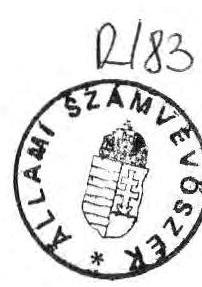

---

# Az ellenőrzést végezték:

dr. Gálik Jenő számvevő
Gömöri József számvevő
Patai Tamás számvevő
dr. Solymár Károlyné tanácsos

Az ellenőrzést vezette:
Hudik Zoltán főtanácsos

---

# ÁLLAMI SZÁMVEVŐSZÉK

$\mathrm{V}-140 / 24 / 1991 / 1992$.
039/27/1991/1992. "NY"

## J E L E N T É S

## a Honvédelmi Minisztérium egyes gazdálkodási kérdéseinek vizsgálatáról

Az Országgyűlés Honvédelmi Bizottságának OBX(30-4) 1991.sz. felkérésére soron kívül megvizsgáltuk:

- a HM letéti számlához (MNB 235-90177-5014) kapcsolódó tranzakciókat 1986. január 1-től;
- a tárca által 1988-tól 1990-ig terjedő időszakban az év utolsó hónapjaiban eszközölt, a következő költségvetési év szükségleteinek kielégítését szolgáló un. elővásárlásokat;
- a Honvédelmi Minisztérium pénzügyi kapcsolatait a Technika Külkereskedelmi Vállalattal és a Magyar Honvédség Gödöllői Gépgyárával;

A vizsgálat előzményéhez tartozik, hogy az 1990. évi állami költségvetés végrehajtásáról szóló előterjesztés HM fejezetet érintő kérdéseiben (elsősorban a bevételi előirányzatok forrását illetően) - a megalapozott értékelés kialakítása érdekében - országgyűlési képviselői tájékozódás indult.

Az ellenőrzés a honvédelmi tárca gazdálkodásából előzőek szerint kiemelt tárgykörökben a törvényesség és szabályszerűség betartására irányult, figyelembevéve az állami pénzügyekről szóló és az állami költségvetéssel kapcsolatos törvények, a költségvetési szervek gazdálkodását meghatározó rendeletek és a tárcán belüli szabályozások vizsgált időszakban bekövetkezett változásait is.

---

Helyszíni ellenőrzéseket végeztünk a Honvédelmi Minisztériumban, a Magyar Honvédség Közgazdasági és Pénzügyi Főnökségén, Anyagi Technikai Főcsoportfőnökségén és Gödöllői Gépgyárában; a Magyar Nemzeti Bank Testületi Szervek Főosztályán, a Pénzügyminisztérium Védelem és Biztonsággazdasági Főosztályán, az NGKM felügyelete alá tartozó Technika Külkereskedelmi Vállalatnál, Elektroimpex 42. sz. irodájánál, a MOGÜRT Gépjármű Külkereskedelmi Vállalatnál.

A helyszíni ellenőrzéseket nehezítette, hogy a honvédelmi tárcánál 1990-ben jelentős szervezeti módosításokra és ebből következően feladat átcsoportosításokra került sor. (Ebből a szempontból a Honvédelmi Minisztérium és a Magyar Honvédség funkcionális szétválása volt a meghatározó). Ezáltal a korábban egy szervezeti egységnél kezelt gazdálkodási feladatok és természetesen ezek a dokumentációk különböző szervezetekhez kerültek. Az átszervezésnél elvégzett iratselejtezés következményeként a vizsgálati megállapítások nem minden esetben támaszthatók alá bizonylatokkal, ilyen esetekben az érintett felelős személyek meghallgatása is szükségessé vált, amiről írásos nyilatkozatok készültek.

Az egyes tárgykörök között számos kérdésben szoros összefüggés mutatható ki, ezek figyelembevételével kerültek összefoglalásra a vizsgálat megállapításai. A HM letéti számlához kapcsolódó tranzakciókat és az 1988-1990. években eszközölt ún. elővásárlásokat részleteiben az I. FÜGGELÉK, a HM pénzügyi kapcsolatait a Technikai Külkereskedelmi Vállalattal és az MH Gödöllői Gépgyárával a II. FÜGGELÉK tárgyalja. Ez utóbbi "Titkos" minősítését az teszi szükségessé, hogy a haditechnikai eszköz kereskedelem konkrét adatait is tartalmazza.

---

# 1.

## M e g á 11 a p í t á s o k

1.  Az "MNB 235-90177-5014 HM Közgazdasági Főosztály letéti számlá"-t* (továbbiakban: 5014-es számla) - dokumentáció hiányában nyilatkozatokra alapozottan - 1968-ban, a védelmi kiadásokhoz nem közvetlenül kötődő és nem az állami költségvetésből származó pénzmozgások céljára hozták létre.

Az 5014-es számla forgalmában 1988. márciusa lényeges fordulópontnak tekinthető, mert ettől kezdve először bankügyletekhez, majd - az állami költségvetésből származó, de a tranzakciókba forgatott pénzekre tekintettel a hatályos jogszabályokban (az állami költségvetési szervek gazdálkodásáról szóló 19/1980./IX.27/PM számú rendelet és az azt módosító 71/1988./XII.27./ PM számú rendelet) költségvetési szervek részére meg nem engedett (p1. operatív gazdálkodás a letéti számlán, hitelnyújtás vállalatoknak, bankoknak) ügyletekhez is kapcsolódott. Előfordultak államilag nem garantált értékpapírokkal folytatott tranzakciók is, kockáztatva ezzel a kincstári vagyon egy részét. (Hozzá kell tenni, hogy ebből veszteség nem származott).

A költségvetési szervek gazdálkodásában irányadó szabályozások nem határolták be a pénzmozgások minden részletét (p1. letéti számlák esetében), de semmikor sem biztosítottak lehetőséget arra, hogy a költségvetési támogatásból vállalkozásoknak (vállalatok, bankok) nyújtsanak hitelt. Egyébként a költségvetési szervek átmenetileg szabad pénzeszközeivel kapcsolatos rendelkezés is csak 1989. januárjától lépett életbe. A szabálytalanságokra -

[^0]
[^0]: * Az 1990. évi átszervezés előtt "MNVK Anyagtervezési és Közgazdasági Csoportfőnökség letéti számla"

---

a honvédelmi tárca érvelésével szemben - az sem adhat magyarázatot, hogy a pénzkihelyezések döntően költségvetési körön kívüli forrásokból történtek, mivel éppen a kifogásolt ügyletekkel érte el a költségvetési eszközök költségvetési körön kívül helyezését.

Az 5014-es számlával összefüggő ügyletekből folyamatosan nőtt az a költségvetési körön kívüli összeg, ami 1990. márciusára elérte a HM fejezet kiadási főösszegének 7,5 %-át. (1988. március: 738 millió Ft, 1990. márciusá kamatbevételekkel együtt mintegy 3,5 Mrd Ft).

A pénzkihelyezések szerződések alapján történtek, azonban - különösen 1989. II. félévétől - a kihelyezett tételek többsége a szerződések lejáratakor nem azonnal került vissza a számlára, hanem azokat szerződések alapján közbenső állomásként más bankok, broker cégek, vállalatok, stb. felé utalták tovább. Így az 5014-es számla hivatalosan könyvelt forgalma - a számviteli előírások megsértésével - egyre nagyobb mértékben tért el az un. "házi nyilvántartásban" szerepeltetett tényleges forgalomtól. (Az ügyletek láncolatát a 1.sz. melléklet szemlélteti).

Az ügyletek sokasága, a nyilvántartás szabályozatlansága és tagoltsága, a könyvelés teljeskörűségének hiánya, valamint a vizsgálathoz biztosított idő rövidsége együttesen korlátok közé szorította az un. tételes ellenőrzést. Ugyanakkor a könyvelésen kívüli ügyletek számbavétele megtörtént, a helytelen gyakorlat kialakulása és lezárási folyamata áttekintésre került.

A HM éves számszaki beszámolóiban - amelyek egyébként a hatályos (OT.PM) előírásoknak megfelelően készültek - az 5014-es számlát nem kellett önállóan szerepeltetni. A nagy összegű kintlévőségek miatt és a tranzakciók említett hiányos könyvelése következtében a tárcabeszámolók, de az MNB által - a HM számlák záróegyenlegeiről -

---

készített kimutatások sem utaltak arra, hogy az 5014-es számlához milliárdos nagyságrendű pénzmozgás tartozott. Ennek előidézésében a számlatulajdonos honvédelmi tárca felelőssége egyértelműen megállapítható. (A számlavezető pénzintézet eljárása nem képezte a vizsgálat tárgyát).

A HM országgyűlési képviselőnek adott tájékoztatásában a letéti számla 1989. év végi egyenlege 2.957 millió Ft, az 1989. évi beszámoló adatai szerint az összes bankszámla pénzmaradvány 2.360 millió Ft, az MNB bankszámla kimutatásában (2. sz. melléklet) a letéti számlák záróegyenlege mindössze 230 millió Ft volt.
1989. I. negyedévétől, miután a PM 2,2 Mrd Ft-ot a HM-nek utalt az "MNB 235-90177-6008 Importforgalmi letéti számlá"-ra (továbbiakban; 6008-as számla), ez a számla is szoros összefüggésbe került az 5014-es számla ügyleteivel.

A 2,2 Mrd Ft a PM által megjelölt (3. sz. melléklet) felhasználási céllal szemben, az átutalást követően átmenetileg mégis szabad pénzeszköznek mutatkozott, mivel a 6008-as számláról is az 5014-es számla ügyleteihez hasonló, majd azzal összefonódó pénzkihelyezéseket folytattak. (1989. végéig visszakerült a kihelyezett tőke mintegy kétharmada, a többi kihelyezett pénz részletenként bekerült az 5014-es számla ügyleteibe).

A 2,2 Mrd Ft átutalását a pénzügyi tárca részéről utólag is indokoltnak igyekeztek feltüntetni, mivel az 1989. I. n.évi un. speciális import* kötelezettségek teljesítésére 1988. végén esedékes átutalás kimutathatóan (4. sz. melléklet) elmaradt. A honvédelmi tárca viszont ezt az összeget a PM - honvédelmi tárcához telepített - olyan tartalékának nevezte, amiről az állami költségvetés évközi szigorításai során előírt befizetési kötelezettségeket teljesíthették (gentlemen s agreement alapján).

[^0]
[^0]: * haditechnikai eszközök importjának gyűjtőneve

---

Az eltérő közelítésekre az adott lehetőséget, hogy 1989-től csak a költségvetési struktúra változott (a speciális import beépült a HM fejezet költségvetésébe), a haditechnikai eszközök importjának negyedéves előfinanszírozási rendjét később, 1990-től - az 1989. évi 4. tvr. alapján - módosították.

A más irányú felhasználást támasztja még alá, hogy az 1988. utolsó negyedévben esedékes átutalás elmaradása ellenére az év végén - a szűkebb értelemben vett közel 1,4 Mrd Ft-os költségvetési maradvány mellett - éppen speciális import maradvány jelentkezett 2,3 Mrd Ft nagyságrendben, amit akkor a HM a mérlegvalódiság elvének megsértésével igyekezett eltüntetni.

Ennek eszközei a Technika Külkereskedelmi Vállalatnak év végén átutalt előlegek voltak. Így 1988-ban a pénzforgalmi teljesítés nagy mértékben meghaladta az áruforgalmi teljesítést. A valóságnak megfelelő helyzet 1989. végére alakult ki, mivel a tárca beszámolójában az előző évi eltérés nagyságrendjének megfelelő, de ellenkező előjelű, tehát lényegesen kisebb pénzforgalmi teljesítést mutattak ki.

A beszámolók pénzforgalmi szemléletű összeállításában a mérlegvalódiság megsértéséért az adatszolgáltatók felelőssége egyértelmű. Nem hagyható figyelmen kívül viszont, hogy a speciális import áruforgalmi szemléletű kimutatásában nem törekedtek a tényleges forgalom elfedésére. Ezzel előtérbe kerül az akkori elosztási és beszámoló rendnek megfelelően az Országos Tervhivatal és a Pénzügyminisztérium felelőssége is. (Ennek részleteire a vizsgálat nem terjedt ki).

Egy szélesebb körű értékeléshez elvileg figyelembe vehetők a HM fejezet 1989. évi költségvetési támogatásából történt elvonások és az évközi befizetési kötelezettségek is.

---

1989. évben a HM fejezet eredetileg jóváhagyott költségvetési támogatásából 4,127 Mrd Ft elvonásra került, továbbá év közben a tárca olyan 2,4 Mrd Ft összegű befizetési kötelezettségnek tett eleget, mellyel szemben csak 900 millió Ft-os - a stratégiai készletek értékesítéséből származó - bevétele volt.

A befizetési kötelezettségek teljesítésével az magyarázható, hogy a vitatott rendeltetésű 2,2 Mrd Ft nagyobb része ( 1,5 Mrd Ft) idővel visszakerült az állami költségvetésbe, de a különbözet és a 6008-as számla ügyleteiből származó kamatbevétel $(700+153$ millió Ft) - már elismerten a PM engedélyével -továbbra is saját hatáskörű felhasználásban a HM-nél maradt. Ezen túl ugyanúgy megállapítható a hivatkozott számlák ügyleteinek és a 2,2 Mrd Ft problematikájának összefüggése az állami költségvetés deficítjével (közvetve az államadóssággal), mint az elvonások és az évközi befizetések teljesítésének költségvetési egyensúlyt javító hatása. Tény az is, hogy a PM az 1989. áprilisi államtitkári átiratban - szorgalmazta a honvédelmi tárca felé az új bevételi források feltárását, ezt azonban a HM illetékesei letéti számlákkal folytatott ügyletekben - az előzőkben összefoglaltak szerint sajátosan értelmezték.

A sajátos értelmezés az előzőkön túl megnyilvánult az MH Gödöllői Gépgyár "megmentése" érdekében tett kezdeményezésben is. Olyan 1 Mrd Ft összegű tárcabevételt ajánlottak fel a vállalati tartozások kiegyenlítésére - hivatkozva annak előző évi befizetési kötelezettségek közötti teljesítésére - ami tulajdonképpen az állami költségvetést és nem a tárcát illette meg, ugyanis a befizetést a tárca éppen a vitatott 2,2 Mrd Ft-ból eszközölte. (A HM kezdeményezését azonban a PM válasz nélkül hagyta).

---

A letéti számlák megszüntetését a PM csak azt követően kezdeményezte, hogy a honvédelmi miniszter felkérésére 1990. nyarán lefolytatott - a tárca részvételével alapított gazdasági társaságokat érintő - szakértői vizsgálat a "költségvetési körön kívüli gazdálkodás" nagyságrendjét felszínre hozta.

A vizsgálat során nem került elő olyan dokumentum, ami az 5014-es számla forgalmára, illetve a tranzakciókra irányuló korábbi tárca szintű belső ellenőrzés, vagy PM ellenőrzés elrendelését, végrehajtását igazolná.

A HM fejezet pénzügyi gazdasági ellenőrzései csak cél és témavizsgálatra korlátozódtak, átfogó ellenőrzéshez a létszám feltételek sem voltak a PM-nél megfelelően biztosítva. Az 1989. évi költségvetési struktúra változtatással egyidejűleg ezt a minimális revizori létszámhelyet is megszüntették.

Az 5014-es számla megszüntetésekor még mindig jelentős (mintegy 3,2 Mrd Ft) kintlévőség volt, így a jogutód költségvetési elszámolási számlára mindössze 401.7 millió Ft került. A
 számla megszűnése ellenére a korábbi ügyletek csökkenő tendenciával, de folytatódtak. (1990. év végéig 2,05 Mrd Ft, 1991. októberéig további 900 millió Ft már befolyt). Erre csak részben adhat magyarázatot, hogy a különböző tételek nem a számlazáráskor, hanem a szerződések lejártakor folytak be, az egyes tételek továbbforgatása már kifejezetten ellentétes a számlákkal folytatott gazdálkodási tevékenységet megszüntető szándékkal.

Az 5014-es és 6008-as számlákhoz tartozó tranzakciók - a helyszíni vizsgálatok befejezése után - a szerződések szerint 1991. novemberében befejezési nyertek.

---

A letéti számla pénzmozgásokhoz 1991. évben új elem is kapcsolódott. A tranzakciókat az 1990. év végén kötött, fiktív elővásárlási szerződésekkel alapozták meg. (1. sz. melléklet 1, 13 és 17. folyószám alatti tételek). Ezeknél az állami költségvetés elől eltüntetés nem lehetett az elsődleges cél (az ehhez felhasznált pénzeszközök - 646,5 millió Ft - a korábbi ügyletekből eredően már költségvetési körön kívül voltak), hanem a kintlévőségek visszaforgatása előtt nyilvánvalóan újabb kamatbevételt kívántak elérni. A visszaforgatás már természetesen a költségvetési elszámolási számla részére történt, hiszen a letéti számlát időközben megszüntették.
2. Különböző vállalatokkal 1990. év végén összesen 846,5 millió Ft értékben kötöttek olyan ún. elővásárlási szerződéseket - beleértve az előző fiktív beszerzéseket melyek esetében a kereskedelmi adásvétel nem valósult meg.

Egy esetben - az élelmezési szakanyag konzerv beszerzésénél - történt az 1990. év végén prognosztizált maradvány felhasználásával olyan elővásárlás, ami az ez évi "visszavásárlással" 200 millió Ft összegű tárca bevételt jelentett. A közreműködő vállalatok részére ezek az ügyletek hitelnyújtást jelentettek, (a Budapesti Konzervgyártól eszközölt 200 millió Ft-os elővásárlás egyértelműen kamatnélküli hitelnyújtásnak minősül, más esetekben pedig az érintett vállalatok, pl. Budapesti Konzervgyár, Nagykőrösi Konzervgyár is részesedtek esetenként az ügyletek kamatbevételeiből).

A vizsgált időszakban ugyanakkor ténylegesen előrehozott beszerzésként realizálódott: 1989-ben 442 millió Ft értékű elővásárlás, mely elsősorban az évközi költségvetési elvonások miatt elmaradt fizetési kötelezettségek telje-

---

sítését szolgálta; továbbá 1990-ben részben az áthúzódó igények kielégítésére, részben a folyamatos ellátás és működés feltételeinek biztosítására mintegy 650 millió Ft-ot kitevő beszerzés, valamint 514,8 millió Ft összegben még a Rbl elszámolás keretei között megvalósított haditechnikai import beszerzés. Megállapítható volt, hogy a ténylegesen előrehozott beszerzések értékével a következő évi költségvetési keretek felosztásánál az előirányzatokat csökkentették.

Az un. elővásárlásokra a tárca gazdálkodási szabályai ilyen megkülönböztetett definícióval nem térnek ki. Az elfogadott - más gazdálkodó szervezeteknél is szokásos gyakorlat szerint az év utolsó negyedében a költségvetési terv várható teljesítésének felmérését követően születtek az elővásárlásokra vonatkozó döntések.

Ilyen döntéselőkészítés céljára készült az 1990. november 2-i feljegyzés (5. sz.melléklet - kéziratos minőségben került korábban nyilvánosságra), amely jól segíti az elővásárlások forrásoldali áttekintését. A vizsgálat is alapvetően ennek figyelembevételével ellenőrizte a központi költségvetési körbe tartozó beszerzéseket. (A HM fejezeten belül az év végén eszközölt vásárlások teljeskörű áttekintése az ország különböző pontjain elhelyezkedő és önálló költségvetéssel rendelkező 297 szervezetet érintene).

Az 1990. év végi pénzügyi helyzet felmérés összeségében 2,5-3,0 Mrd Ft várható maradványt prognosztizált, ami ténylegesen 0,2 Mrd Ft-ra csökkent. Ezzel összefüggésben a képviselői érdeklődésre adott tárca magyarázat szerint a korábbi évek "pénzügyi technikáját" már nem alkalmazták. A vizsgálat adatai ezt teljes mértékben nem támasztották alá. Nagyságrendileg azonosítható volt a prognosztizált maradvány elköltése, azonban az előző összegzés szerint ezekből taktikai vásárlásnak minősíthető elő-

---

beszerzések történtek 846,5 millió Ft összegben és további 100 millió Ft értékű alkatrészt vásároltak a "korábbi pénzügyi technikával" az MH Gödöllői Gépgyárától.
3. A haditechnikai eszközök beszerzésének és külkereskedelmi tevékenységének pénzügyi technikái a HM (az 1990. évi feladat átcsoportosítását követően MH) és Technika Külkereskedelmi Vállalat (mint legjelentősebb reprezentáns) vizsgált üzleti kapcsolatain keresztül jól érzékelhetők voltak. Az 1990. végéig negyedévenkénti, ezt követően havi előlegátutalásokon alapuló, finanszírozási rendszer, kormányrendelet, tárca rendelkezések és tárcaközi megállapodások által behatároltan működött, ami tulajdonképpen a külkereskedelmi partnerek között kialakult szállítási gyakorlathoz igazodott.

A haditechnikai import előleg rendszere a bonyolító külkereskedelmi vállalatot az állami költségvetésből finanszírozva az azonnali fizető pozíciójába hozta, amely egyben a felesleges hitelkamat veszteség felmerülését is megelőzte. (A honvédelmi tárca által átutalt import fedezeti összegek záróegyenlegei a forgalomtól függően a Technika Külkereskedelmi Vállalatnál elérték a milliárdos nagyságrendet, az Elektroimpex 42. sz. irodájánál mindössze 10 millió Ft körüli összegeket tartalmaztak). A HM átutalásokat a vizsgált vállalatok import letéti számlán tartották, ezek kamatmentességére tekintettel ebből a vállalatok részére anyagi előny nem származott.

A honvédség önállóan gazdálkodó szervei (MH Felsőszintű Gazdálkodó Szervek) elvileg külön pénzügyi nyilvántartásokat vezettek az import forgalomról, előlegmaradványokról. Ezek - részben az ütemezetlen szállítói teljesítések következtében - az áttekinthetőséget rendkívül akadályozó módon keveredtek, amiből például a Technika Külkereskedelmi Vállalattal elszámolási viták is adódtak.

---

A haditechnikai eszközbeszerzések vázolt körülményei magukban hordozták a tárca év végi speciális import maradvány eltüntetés lehetőségét is. Ez 1988. végén valóban bekövetkezett. Az 1990. év végi 514,8 millió Ft értékű, a dollár elszámolásra történő átállást megelőző beszerzés utólag is indokoltnak minősíthető, emellett forrásának a végleg elmaradt beszerzések miatt szabad maradványnak prognosztizált pénzeszközök tekinthetők.
4. A "pénzügyi technikák" alkalmazását igazolta az MH Gödöllői Gépgyár gazdálkodásával kapcsolatos ellenőrzés abban, hogy a honvédelmi tárca részéről előbeszerzésnek feltüntetve és a vállalat "megsegítésére" hivatkozva 1988. és 1990. decemberében mintegy 255 millió Ft értékben anyagvásárolásokat eszközöltek. Ennek következtében és a vállalat folyamatosan romló pénzügyi helyezte miatt a költségvetési pénzek nagyobb része (mintegy $70 \%$-a) a vállalatnál tárolt anyagokban fekszik, kisebb hányada a már felszámolás alatt álló vállalat tartozásai között szerepel.

Az MH Gödöllői Gépgyár működésképtelenségét közvetlen kiváltó tényezők között az 1981-ben megkezdett és 1987. IV. negyedévében befejezett javítóbázis beruházással összefüggő tartozások tekinthetők meghatározónak. (Az állami kölcsön és a kamattartozás együtt: 787 millió Ft).

Az átvizsgált dokumentumok alapján a vizsgálat olyan következtetésre jutott, hogy a jelentős összegű beruházással létrehozott kapacitások kihasználatlanságának - 1988. végétől mutatkozó - jeleit a felügyeletet gyakorló honvédelmi tárca - 1989. december 31-ig az MH anyagi-technikai főcsoportfőnök, egyben miniszterhelyettes; ezt követően a HM Védelemgazdasági Főosztály - nem kezelte megfelelően.

---

A vállalati alaptevékenység kimutatható visszaesése ellenére nem történtek hosszabb távra megoldást jelentő érdemi intézkedések, a kivezető út keresése mellett megelégedtek az alaptevékenységen kívüli export értékesítések átmeneti eredményességével. Figyelembevéve, hogy az értékesített haditechnikai eszközök a honvédség tulajdonát képezték, ezzel a megoldással a HM - közvetve az állami költségvetés - követelései további 154,2 millió Ft-tal nőttek.

A vállalat megsegítése érdekében utóbbi két évben felmerült elképzelések is lényegében mind a költségvetési támogatásra épültek. A működésképtelenséggel kapcsolatos problémák valójában visszamutatnak a nagy volumenű beruházás indokoltságára, illetve indokolatlanságára. A létrehozott kapacitások rendkívül rövid időn belül jelentkező kihasználatlansága egyértelműen megkérdőjelezi a beruházás megalapozottságát is. Ilyen célvizsgálat felszínre hozhatja a felelősség mértékét, amit a korábbi - nemzetközi kötelezettségek által behatárolt - katona-politikai követelmények függvényében lehet értékelni.

# II. 

## Következtetések, javaslatok

A honvédelmi tárca 1988. és 1990. között folyamatosan növekvő összegű "költségvetési körön kívüli" pénzek felett rendelkezett, ennek kezelése a letéti számlához kötődött. A letéti számlával összefüggő tranzakciók során nem tartották be azt az alapvető számviteli előírást, hogy minden gazdasági műveletről valósághű, naprakész könyvviteli nyilvántartást kell vezetni. Tulajdonképpen költségvetés forrású pénzekkel olyan ügyletekben vettek részt, amelyek meghaladták a költségvetési szervek szabad pénzeszközeiről szóló rendelkezésben biztosított lehetőséget.

---

A HM 1988. és 1989. évi számszaki beszámolóiban a pénzforgalmi teljesítéseket nem a valóságnak megfelelően mutatták ki annak érdekében, hogy az 1988. év végi 3,2 Mrd Ft körüli pénzmaradványt (ennek nagyobb része mintegy 2,3 Mrd Ft speciális import) a nagyobb nyilvánosság elől eltüntessék. (Nyilatkozatuk szerint az akkori MT Honvédelmi Bizottsága tudtával történt). A valóságos helyzet visszaállítása az 1989. évi beszámolóban ismét a mérlegvalódiság megsértésével járt együtt. A megállapított szabálytalanságokban a személyi felelősség tisztázását indokoltnak tartjuk.

Az 1989. évi költségvetési struktúra változásra tekintettel a pénzügyi tárca részéről indokolatlan volt 1989-ben a 2,2 Mrd Ft átutalása az 1989. I. negyedévi speciális import kötelezettségek fedezetére. Ezt a minősítést az év közben előírt és ebből teljesített költségvetési befizetési kötelezettségek és az 1988. év végén jelentkezett speciális import maradvány összege, továbbá az átutalt összeg szabad pénzeszközként történt kezelése (bevonása a letéti számla ügyletekbe) több oldalról is alátámasztják.

A honvédelmi tárcánál is megállapítható volt, a korábban más tárcáknál folytatott ÁSZ ellenőrzések tapasztalataival egyezően, hogy a letéti számlákkal kapcsolatos gazdálkodási anomáliák visszavezethetők a számlák funkciójának, működtetésének szabályozási és ellenőrzési hiányosságaira. Ezért egyre sürgetőbb - célszerűen az államháztartási törvény keretében - a költségvetési gazdálkodás megfelelő alapokra helyezése.

Az 1990. évi CIV. törvényben már észlelhető ez a törekvés, mivel az államháztartás vitelének 1991. évi szabályai szerint a költségvetési fejezeteknek a beszámolójukban a letéti számlájukról is információt kell adniuk.

---

Általánosságban ismét hangsúlyoznunk kell az állami költségvetés számviteli (nyilvántartási) és bankszámla rendjének egyértelműbb szabályozását, az eljárási szabályok - kellő részletezésű, ellenőrzésre és felelősség megállapításra alkalmas - rögzítését.

A szabálytalanságok előfordulási lehetőségében szerepe volt annak is, hogy a honvédelmi tárca gazdálkodásában meghatározó kérdésekről - a belső szabályozás által feljogosítva ugyanaz a szervezet hozott döntéseket, amelyik illetékes volt a felsőszintű gazdálkodási feladatok végrehajtásában és felelős volt a tárca költségvetés átfogó ellenőrzéséért.

A speciális import 1990-ig fenntartott negyedéves előlegezési rendszeréből következett, hogy a kereskedelmi partnerek ütemezetlen szállítókészsége miatt a bonyolító vállalatokat fizetési gondok általában nem terhelték, a biztonságot a költségvetési forrásból származó pénzösszegek jelentették.

A honvédelmi tárca 1990. évben mintegy 950 millió Ft értékben olyan központi eszközbeszerzéseket eszközölt, amelyek valódi célja nem a tényleges szükségletek kielégítése volt. Ezek nagyobb részénél kereskedelmi adásvétel nem realizálódott, a 100 millió Ft-ot kitevő alkatrészvásárlás pedig az MH Gödöllői Gépgyár "megsegítésére" irányult.

A már csődeljárás alatt álló MH Gödöllői Gépgyárnál végzett ellenőrzés adatai szerint a működésképtelenség elsősorban az 1987-ben befejezett beruházás kihasználatlanságának következménye, de ezt a vállalati felügyeletet ellátó honvédelmi tárca nem a helyzet súlyosságának megfelelő módon kezelte.

Mindezek figyelembevételével javaslataink a következők:

1. A honvédelmet érintő korszerűsítés megkezdett folyamatában különösen hasznosításra ajánljuk:

---

- a szervezeti és működési szabályozások a felsőszintű gazdálkodási tevékenységek tekintetében is biztosítsák a tervezési, döntési, végrehajtási, valamint ellenőrzési feladatok és hatáskörök megfelelő szintű differenciálását,
- az ellenőrzési rendszer kialakítása tegye lehetővé, hogy az államigazgatási ellenőrzés keretei között a költségvetési ellenőrzés sokrétű feladatai (az önálló költségvetéssel rendelkező szervek gazdálkodásának szabályszerűsége, hatékonysága stb) teljesíthetők legyenek.
- a haditechnikai eszközbeszerzések új alapokra helyezésénél egyben áttekinthető, egyértelmű azonosítást biztosító nyilvántartási és elszámolási rendszer kerüljön kialakításra.

2. Indokoltnak tartjuk a vizsgálattal feltárt szabálytalanságokban - számviteli előírások, mérlegvalódiság elvének megsértésében, a költségvetési szervek gazdálkodási előírásainak megkerülésében - az érintettek személyi felelősségének megállapítását, majd annak figyelembevételével a felelősségre vonásukat.
3. Szükségesnek tartjuk, hogy a Pénzügyminisztérium a 2,2
 Mrd Ft 1989. évi átutalásában a felelősség kérdését tisztázza.
4. A haditechnikai eszközök külkereskedelmére, illetve reexportjára vonatkozóan: általánosságban szükségesnek tartjuk az engedélyezési eljárások tapasztalt mértékű szigorítását a lebonyolítások ellenőrzésénél is fokozni; konkrétan célszerű ezt a folyamatban lévő ügyeknél érvényesíteni.

Budapest, 1992. január

Melléklet: 11 lap
I. Függelék: 039/28/1991/1992."NY"
II. Függelék: 039/26/1991/1992."Titkos" /43+141 lap/
$\therefore$. sz. pld.
Kapják: külön elosztó szerint
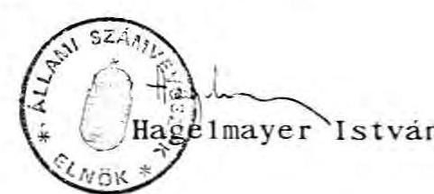

---

d.sz. melléklet a V-140/24/91-92 jelentéshez

|  Felségie | Mécr | Einek | Honnák | Tőke | Lejárat | Emaat | Hova | Megjegyzés  |
| --- | --- | --- | --- | --- | --- | --- | --- | --- |
|  1. | 1988. III. 20. | BBRt | Sol4 | 208.00 | 1989. III. 30. | 50.1 | 16.7 | Kamat Sol4-re
Tőke CA-88  |
|   | 1988. III. 30. | BBRt | Sol4 | 208.00 | 1988. 9.23. | 9.2 |  | Kamat Sol4-re
Tőke 260 PM-nek
Tőke 40 Sol4-re  |
|   | 1989. I. 18. | CA-88 | BBRt | 150.00 | 1990. I. 18. | 35.3 | 23.5 | Tőkeríamat Sol4-re  |
|   | I. 27. | CA-88 | BBRt | 150.00 | 1990. I. 27. | 35.3 | 23.5 | Tőkeríamat
Merkantil Kft.-nek  |
|   | 1990. I. 27. | Merkantil Kft. | CA-88 | 185.20 | 1990. III. 27. | 44.3 | 33.5 | 162.6 6000-ré
66.6 VÍBECKER-mák  |
|  2. | 1988. 1. 15. | Gödöllő, Glogvár | Sol4 | 49.70 | 1988. III. 30. | 5.5 | 12.0 | 10 million at Sol4-re.  |
|   | I. 27. | Gödöllő, Glogvár | Sol4 | 50.00 |  | 4.7 | 15.0 | 150 million a
Nitroxaminitas  |
|   | VIII. 24. |  | Sol4 | 50.00 |  | 3.2 | 15.0 |   |
|   | 1988. III. 22. | Nitroxemia | Gödöllő, Glogv. | 154.00 | 1989. III. 22. | 8.3 | 21.5 | Kamat Sol4-re
100 Magyar Positónak  |
|   | 1989. III. 22. |  |  | 54.00 | 1989. 9. 30. | 2.9 | 21.5 | Tőkeríamat Sol4-re  |
|  3. | 1988. II. 10. | Magyar Positónak | Sol4 | 288.00 | 1989. 1. 16. | 3.8 | 21.0 | 100 GRIKK-mák  |
|   | 1989. 1. 16. |  |  | 188.00 | 1989. 9. 15. | 13.3 | 21.0 | Tőkerib.1 Kamat Sol4-re  |
|   | 1989. 1. 16. | GRIKK | Magyar Positónak | 188.00 | 1989. I. 16. | 5.4 | 21.5 | Tőkeríamat Sol4-re  |
|   | 1989. III. 22. | Magyar Positónak | Nitroxemia | 188.00 | 1989. 9. 21. | 7.3 | 21.0 | 100 GRIKK-mák  |
|   | 1989. III. 21. |  |  | 60.00 | 1989. 9. 21. | 0.8 |  | Tőkeríamat Sol4-re  |
|  4. | 1988. 9. 11. | Datalóró | Sol4 | 90.00 | 1988. III. 30. |  | 18.0 | 11. 1.-én 2a Sol4-re  |
|   |  |  |  |  | 1989. I. 23. |  |  | 8 részletben 68.6 Sol4-re
míntegy 25 átvázat  |
|  5. | 1988. 10. 26. | A-1 Kontakt | FTF-ségtől | 88.00 | 1989. 1. 31. | 5.3 | 20.5 | Tőkeríamat  |
|   |  |  | Sol4 helyett |  |  |  |  | Merkantilnot  |
|   | 1989. 1. 31. | Merkantil Kft. | A-1 Kontakt | 85.20 | 1989. 9. 13. | 9.9 | 21.0 | Tőkeríamat Sol4-re  |
|  6. | 1988. III. 28. | BBRt | FTF-ségtől |  |  |  |  |   |
|   |  |  | Sol4 helyett | 208.00 | 1989. 1. 28. | 6.0 | 22.5 | Kamat Sol4-re  |
|   |  |  |  |  | 1989. 9. 28. | 30.0 | 20.0 | 250 CA-88-mák  |
|   |  |  |  |  |  |  |  | 88 Merkantilink  |
|   | 1989. 9. 28. | CA-88 | BBRt | 250.00 | 1989. 11. 28. | 20.5 | 23.25 | 1. Amortikus-Magyar Kft.  |
|   | 1989. 11. 28. | 1. Am.-Mayr. Kft. | CA-88 | 278.50 | 1990. 1. 29. | 14.0 | 20.0 | KamatTőke Sol4-re  |
|   | 1989. 9. 28. | Merkantil Kft. | BBRt | 80.00 | 1989. 11. 30. | 6.4 | 23.25 | 0.4 Sol4-re
88 GRIKK-mák  |
|   | 1989. III. 1. | GRIKK | Merkantil Kft. | 86.00 | 1990. 1. 15. | 3.1 | 28.5 | Tőkeríamat Sol4-re  |
|  7. | 1989. III. 29. | MAB | 6008 | 201.00 | 1989. 9.27. | 10.0 | 20.0 | Tőkeríamat 6008-ra  |
|  8. | 1989. I. 1. | Interbank | 6008 | 208.00 | 1989. 9. 7. | 16.3 | 21.0 | Tőkeríamat 6008-ra  |
|  9. | 1989. I. 10. | Postabank | 6008 | 500.00 | 1989. 11. 10. | 89.2 | 22.25 | 65.5 Kamat 6008-ra  |
|   | 9. 29. |  | 6008 | 60.00 | 1989. 11. 29. | 5.5 | 22.25 | 21.7 Kamat Sol4-re  |
|   |  |  | Sol4 | 32.00 |  |  |  | 105.6 PM-nek  |
|   | 1990. 1. 10. | Postabank |  | 500.00 | 1990. I. 10. | 34.4 | 28.5 | 200 a 6000-ré  |
|   |  |  |  |  |  |  |  | 100 at GRIKK-mák  |
|   |  |  |  |  |  |  |  | 130 at MAB-mák  |
|   |  |  |  |  |  |  |  | 0.4 at Sol4-re  |
|   | 1990. I. 10. | Postabank |  | 188.00 | 1990. 9. 10. | 6.6 | 33.5 | Tőkeríamat 6008-rt  |
|   | 1990. 9. 10. | AGB Kt. | Postabank | 186.60 | 1990. 1. 10. | 7.1 | 23.5 | Tőkeríamat 6008-re  |
|   | 1990. I. 10. | MAB | Postabank | 120.00 | 1990. 9. 10. | 10.0 | 33.5 | Tőkeríamat Sol4-re  |
|   | 1990. I. 10. | GRIKK | Postabank | 188.00 | 1990. 9. 11. | 8.5 | 33.5 | Tőkeríamat Sol4-re  |

---

10. 1989. V. 12. 860t 6005 1108.88 1989. VIII. 12. 38.2 21 217.3 2M-nes
26.3 kamat 6006-ra
1989. VIII.12. 860t
458.88 1989. II. 20. 26 22 200 at CHNB-ni
27a a 6006-ra
1989. II. 20. 860t
860t
288.88 1990. II. 20. 14.5 28 28
Kamat Sol4-re
200 at M18-100
1990. II. 20. MHB 860t
288.88 1990. II. 18. 52.5 23 23
Tökerkanat 0001-re
11. 1989. IV. 15. Merkantil 4ft. 6006 23.88 1989. V.15. 0.6 22 Tökerkanat 6006-ra
12. 1989. II. 12. Merkantil 4ft. 6006 93.88 1990. III. 06. 11.8 25 Tökerkanat Sol4-re
13. 1989. II. 20. I. Aa.-Mayo. 4ft. 6003 258.88 1989. III. 27. 9.6 26 81.3 a 6006-ra
96 Merkantil.100
1989. III. 27. I. Aa.-Mayo. 4ft.
198.88 1990. III. 27. 71.2 23.5 100 a 80.-1 fenter-çivira
146.5 a 6006-3-100
konzer-çivira
14.7 a 0001-re
1989. III. 27. Merkantil 4ft. I.Aa.-Mayo.4ft. 96.88 1990. III. 27. 39 23 100 Tökerkanat 0001-re
14. 1989. VI. 07. MHB 6006 268.88 1989. III. 07 22 24 125 a 6006-ra
195 at I.Aa.-Mayo. 4ft.-nes
1989. III. 28. I. Aa.-Mayo. 4ft. MHB 195.88 1990. III. 28. 65 23 Tökerkanat CITYBANK
15. 1989.V.08. 860t 5014 188.88 1989. II. 04. 10.8 21 5.3 kamat Sol4-re
1989. II. 06. Merkantil 4ft. 860t 185.58 1989. III. 27. 3.6 24 Tökerkanat Sol4-re
16. 1989. VI.20. MHB 5014 39.28 1989. VII. 20. 0.7 22 Tökerkanat Sol4-re
17. 1989. VI. 16. MHB 5014 96.18 1990. II. 13. 28.7 22 42.5 at 600 6t-nes
1990. II. 13. MHB 92.58 1990. III. 14. 7.7 23.5 100 a VISCOTO4-100 El6-käriat
18. 1989. V. 23. MHB 5014 182.28 1989. II. 28. 7.7 22 Tökerkanat at Sol4-re
19. 1989. VII. 06. MHB 5014 123.88 1989. II. 28. 6.2 22 Tökerkanat Sol4-re
20. 1989. VII. 28. MHB 5014 75.98 1989. VII. 12. 6.7 23.5 Tökerkanat Sol4-re
21. 1989. II. 22. Postal100 5014 258.88 1990. III. 27. 74.3 23-23.5 59 kamat at Sol4-re
21.5 kamat-toke a 6001-re

---

|  22. | 1989. II. 08. | BEKI | Sol4 | 158.82 1991. II. 08. | 84 | 28 | 26.4 AEB Rt-rsv  |
| --- | --- | --- | --- | --- | --- | --- | --- |
|   |  |  |  |  |  |  | 3.6 IM VACUUT. 1991.11.03.  |
|   |  |  |  |  |  |  | 4.2 IM VACUUT. 1991.11.03.  |
|   |  |  |  |  |  |  | 37.8 kanat-tike a pool-re  |
|  23. | 1989. III. 08. | Iamobilla | Sol4 | 52.82 1990. II.09. | 14.9 | 28-33.5 | 6.2 kanat Sol4-re  |
|   |  |  |  |  |  |  | 4.1 kanat pool-re  |
|   |  |  |  |  |  |  | 54.6 CA-88-var  |
|   | 1990. II. 09. | CA-88 | Iamobilla | 54.68 1990. III. 28. | 2.5 | 33.25 | Tüketianat a pool-re  |
|  24. | 1989. III. 21. | Datasilan | Sol4 | 68.88 1990.111. 21. | 4.4 | 29 | 24.1 ar Sol4-re  |
|   |  |  |  |  |  |  | 30 ar I.Am.-Mayr. Eff.-rev  |
|   | 1990. 111.21. | I.Am.-Mayr. Eff. Datasilan |  | 38.88 1990. 111. 19. | 8.1 | 33.5 | Tüketianat a CIIYARA-noi  |
|  25. | 1989. 111. 08. | Iamobilla | Sol4 | 188.88 1990. 111.08. | 31.7 | 28-33.5 | 14.7 kanat ar Sol4-re  |
|   |  |  |  |  |  |  | 8.5 kanat ar AEB Rt-ovt  |
|   |  |  |  |  |  |  | 8.5 kanat-tike a pool-re  |
|  26. | 1989. 111. 22. | I.Am.-Mayr. Eff. | Sol4 | 68.88 1990.111.22. | 4.3 | 29 | Tüketianat ar Sol4-re  |
|  27. | 1989. 111.28. | MHB | Sol4 | 136.38 1990. 19.27. | 13.7 | 30 | Tüketianat ar Sol4-re  |
|  28. | 1989. 111. 28. | CA-88 | Sol4 | 188.88 1991.11. 19. | 66 | 33-34 | Tüketianat a pool-re  |
|  29. | 1990. 1. 29. | BB Rt | Sol4 | 288.88 1990. 19. 29. | 15 | 30 | Tüketianat ar Sol4-re  |
|  30. | 1990. 1. 30. | MHB | Sol4 | 214.18 1990.111.14. | 61.6 | 29-33 | 42.3 kanat a pool-re  |
|   |  |  |  |  |  |  | 233.5 a VIDEOTON-hor  |
|  31. | 1990.11. 08. | BB Rt | Sol4 | 58.88 1990. 9. 08. | 3.7 | 30 | Tüketianat ar Sol4-re  |
|  32. | 1990. 11. 20. | Milltex Eff. | Sol4 | 8.48 1990. 9. 20. | 0.7 | 32 | Kanat-1.4 tike ar Sol4-re  |
|  33. | 1990. 11. 26. | I.Am.-Mayr. Eff. | Sol4 | 78.82 1990. 111. 29. | 22.6 | 30-32.5 | Tüketianat a pool-re  |
|  34. | 1990. 111. 23. | MHB | Sol4 | 38.82 1990. 91. 22. | 2.5 | 32.5 | Tüketianat ar Sol4-re  |
|  35. | 1990.19. 19. | MHB | Sol4 | 78.28 1990. 911. 18. | 5.8 | 32 | 6.9 ar Sol4-re  |
|   | 1990. 11. 11. | MHB |  | 69.18 1990. 11. 07. | 6.9 | 33 | CA-88-var  |
|   | 1990. 11. 07. | CA-88 | MHB | 76.83 1990. 111. 29. | 3.5 | 33.25 | Tüketianat a pool-re  |
|  36. | 1990. 19. 27. | MHB | Sol4 | 181.68 1991. 111. 18. | 66 | 33-36.2 | Tüketianat a pool-re  |

---

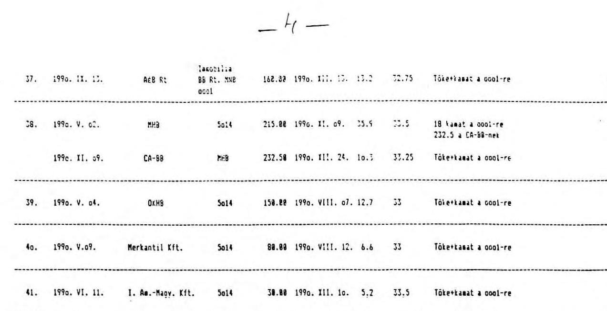
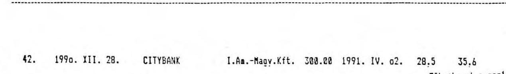
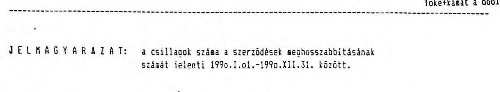

---

# 2. sz. melléklet   a V-140/24/1991-92 jelentéshez 

## K I M U T A T Á S

a HM tárca elszámolási és egyéb számlái 1989. december havi záróegyenlegeiről az MNB 0051/1138/89. sz. kimutatása alapján

Bevételi számla( $=3$
2.400.000.000,00

TB támogatás
157.000.000,00

Elszámolási számlák
1.155.090.834,01

Letéti számlák
230.044.899,51

Céltartalék számla
3.403.395,86

K betétkönyvek
25.080.714,40

Külkereskedelmi kap. célb.
29.669.446,53

Kamatozó betét
700.000,00

Kötvény z. betét
759.300.000,00

EGYÜTTESEN
2.360.289.290,31
(x) megjegyzés: A bevételi számla az állami költségvetés forgóalapjának alszámlája.

---

# 3. sz. melléklet   a V-140/24/1991-92 jelentéshez 

V:
A speciális import finanszírozásának alkalmazott rendje szerint a HM tárca 1989. I. negyedévi speciális import keretének megnyitását
t e r v e z z ü k

## I.

## 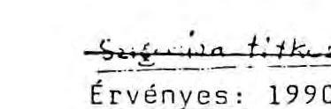

Dr. BENCSIK ISTVÁN mk. vezérőrnagy elvtársnak, csoportfőnök
Honvédelmi Minisztérium
MNVK Anyagtervezési és Közgazdasági
Csoportfőnökség

B u d a p e s t

## Kedves Bencsik Elvtárs!

Mint ismeretes az 1989. évi költségvetés szerkezetének módosítása során változott a spec. import finanszírozási rendje, az beépült a HM tárca költségvetésében.
Ennek megfelelően 9,8 MdFt-tal növeltük a tárca költségvetését.

Tájékoztatjuk, hogy ez az összeg az eddigi gyakorlat folytatásaként negyedévenként az 1989. II-III.IV. negyedévi és az 1990. I. negyedévi spec. import kötelezettségek teljesítésére nyújt fedezetet.

Az 1989. I. negyedévi kötelezettségekre 2,2 MdFt-ot - amit az 1988-as állami költségvetés terhére elszámoltunk - átutaltunk a letéti számlára.
Budapest, 1989. február 24.

---

# Pénzügyminisztérium 

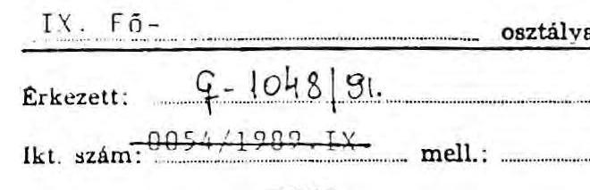

Íkt. szám: $\qquad$ mell. $\qquad$
Irattári tételszám: $\qquad$ 3802 $\qquad$

## Előirat:

## Utóirat:

## Lássa:

Kiadványozás (jóváhagyás) előtt:
I Főo. $\qquad$

Kiadványozás (jóváhagyás) után:
I/d. osztály
Elküldés előtt (letisztázás és aláírás után):
Elintézte a 11205/1989.T. d. aalun eladótven 111.6 . Elküldés után (irattárba helyezés előtt): Cispouine Számítógépre felvezette:

## TÁRGY:

Speciális import gazdálkodási keret megnyitása.

## Utasítás a kiadónak:

Készítette: Németh Gy.
Készült: I. 2 pld-ban
1.sz. címzett
2.sz. irattár
II. 1. pld-ban

Gépelte: Kissné

Utasítás az irattárnak:

---

4 sz.melléklet a V-140/24/91-92 jelentéshez

KIMUTATÁS a speciális import finanszírozás "Nemzetközi pénzügyi kapcsolatokból eredő kiadások" mérlegsoron elszámolt tételeiről

1986 - 1989

Millió forintban!

|  1986 |  |  | 1987 |  |  | 1988 |  |  | 1989  |
| --- | --- | --- | --- | --- | --- | --- | --- | --- | --- |
|  Utalás napja | átutalt összeg | esedékes időszak | Utalás napja | átutalt összeg | esedékes időszak | Utalás napja | átutalt összeg | esedékes időszak |   |
|  - | - |  |  |  |  |  |  |  |   |
|  III.27: 1.800 |  |  | IV.01: 1.800 |  |  | IV.6: 2.540 |  |  |   |
|   |  |  | VI.19: 1.100 |  |  |  |  |  |   |
|  V.21: 1.500 |  |  | VII.03: 832 |  |  | VII.13: 2.000 |  |  |   |
|   |  |  | VIII.03: 1.090 |  |  | VIII.13: 2.000 |  |  |   |
|  VI.19: 1.500 |  |  |  |  |  |  |  |  |   |
|  IX.4: 1.725 |  |  | IX.7: 1.680 |  |  | IX.19: 2.000 |  |  |   |
|   |  |  |  |  |  | IX.19: 2.000 |  |  |   |
|  XII.27: 3.000 |  |  | XII.16: 2.200 |  |  | XII.ho |  |  |   |
|   |  |  |  |  |  | 1989. |  |  |   |
|   |  |  |  |  |  | III.17: 2.200 |  |  |   |

Budapest, 1991. november 21.

Mehlhoffer Istvánné

---

# Feljegyzés 

a HM tárca 1990.év végi várható pénzügyi helyzetéről

A november végén szokásos pénzügyi helyzetfelmérést idén előrébb hoztuk, mert a német tárgyalások és a költségvetési körön kívüli pénzeszközök (lásd melléklet) befolyatása a központi számlára a szokásosnál több bizonytalansággal terheli az év végét. A felmérés eredménye az alábbiakban összegezhető:

Az év során felmerült - indokolt - többletigények kielégítése (bérfejlesztés, építési-felújítások, számítástechnikai eszközök, címerváltás, MiG-23 UB stb.) és az árváltozások hatásainak kiosztása (postai díjak, energia, üzemanyag, szállítás stb.) után a tárca maradványa 2,5 és 3,0 milliárd Ft között várható. Ez két részre oszlik:
$1/$ Ún. lekötött maradvány 1,0-1,5 milliárd Ft (lekötött az a maradvány, ahol a szállítás idén teljesül vagy elindul, de a fizetés 1991-re marad). Fő területei:
a/ a béralap és a jutalmazási norma maradványa (ez 1991-ben jutalomként kifizethető)
$0,1-0,2 \mathrm{MdFt}$
b/ a - mintegy 300 különböző helyen csapatoknál maradó pénzek (pl. villanyszámla stb.)
$0,3-0,5 \mathrm{MdFt}$
c/ az anyagi szolgálatok eszközbeszerzéseinél, elsősorban az importnál történő szállítások beérkezésétől függően
$0,6-1,0 \mathrm{MdFt}$

Az a/ és b/pontban jelzett maradványok gyakorlatilag érinthetetlenek.

---

2/ Szabad maradvány ..... $1,5 \mathrm{MdFt}$
Forrásai: a/ végleg elmaradó beszerzés ..... $0,4 \mathrm{MdFt}$
b/ exportbevétel ..... $0,8 \mathrm{MdFt}$
c/ Kamatbevétel ..... $0,3 \mathrm{MdFt}$

A maradványok nagyságának előzetes becslése alapján vállaltuk a német tárgyalások sikere esetén az idei évben 2 milliárd Ft kifizetését. Amennyiben ez nem realizálódik - és ennek nagy a realitása -, akkor külön intézkedések nélkül a 2,5-3,0 milliárd Ft maradvány kerülne a költségvetési beszámoló részeként a kormány, illetve a parlament elé. Ez önmagában nem baj, mert az ún. maradványérdekeltség jelenlegi szabályai szerint ez visszajár a tárcának, azonban az ország gazdasági problémáit ismerve könnyen lehet, hogy akár a kormány, akár a parlament az összeget részben vagy egészben elvonja.

A szabad maradvány elvonása jövőre szűkíti a mozgásterünket, (pl. a német beszerzésekre nem lesz fedezet) a lekötött maradvány elvonása pedig még súlyosabb következményekkel jár, ugyanis akkor a január-februárban beérkező ún.. "átnyúló" számlákat az 1991. évi - várhatóan amúgy is szűkös - előirányzatokból kell kifizetni.

Ezért úgy intézkedtem az MH anyagi tervező szervei felé, hogy 1 milliárd Ft értékig kezdeményezhetnek olyan beszerzéseket, amelyekre 1991-ben a tárca előirányzatának nagyságától függetlenül mindenképpen sor kerülne, és a vállalatoknál van rá szállítási készség még az év végéig (pl. gyógyszer, konzerv, üzemanyag, ruházat stb.). Az ilyen módon elköltött pénz a maradványt csökkenti, viszont a jövő évi előirányzatból azonos összeget felszabadít, tehát összességében a pénzügyi helyzetünket se nem rontja, se nem javítja.

---

A jelentős összegű maradvány prezentálásának jelzett veszélyei miatt döntést igényel, hogy azt - a korábbi években alkalmazott "pénzügyi technikával" - mérsékeljük-e alacsonyabb szintre (természetesen a pénzt megtartva 1991-re).

Ennek két területe (módszere):
1/ A Technika Külkereskedelmi Vállalatnak átutalunk speciális importra előleget és azt nem mint előleget, hanem mint végleges kifizetést számoljuk el. Mivel ez a TKV számára is kedvező, ezért ebbe eddig belement. Még tisztább módon bonyolítottuk le ugyanezt 1989.végén, amikor is nem előleget adtunk, hanem a TKV készletében lévő árukat "megvettük" tőlük, amit 1990.év folyamán ők visszavásároltak.

2/ A Gödöllői Gépgyárban felhalmozódott hatalmas alkatrészkészletből egy részt megvásárolunk, amit a GG a következő évben visszavásárol. Ez nemcsak, hogy jó a GG-nek, hanem egyenesen megmenti a csődtől. Ennek kockázata, hogy ha a vállalat csődbe megy, akkor a visszavásárlás részben vagy egészben meghiúsul.

Kérem a jelentettek elfogadását és döntést arra vonatkozóan, hogy:

1/ csökkentsük-e "pénzügyi technikával" is a maradványt; 2/ ha igen, akkor milyen nagyságrendet vigyünk a kormány és a parlament elé. Javaslom, hogy 1 milliárd Ft alattit.

Budapest, 1990. november hó "2"-n.
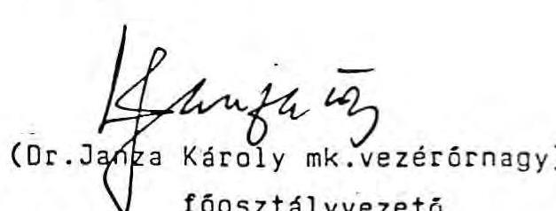

---

# ÁLLAMI SZÁMVEVŐSZÉK   V-140-14/1991/1992.   039/28/1991/1992. "NY" 

I. FÜGGELÉK
a
Honvédelmi Minisztérium
egyes gazdálkodási kérdéseinek vizsgálatáról
készített jelentéshez
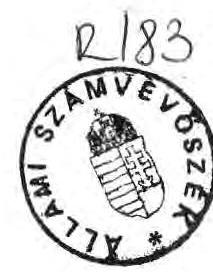

---

# 1. A HM letéti számlához kapcsolódó tranzakciók 

A letéti számla általában csak fejezetenként nyitható, továbbá a nem a költségvetést megillető bevételek kezelésére szolgál. Kivételes esetben azonban a költségvetési szervnek (tárcának) lehet több letéti számlája is, sőt azokról a Pénzügyminisztérium engedélyével operatív gazdálkodást is folytathat. Ezeket az általános, irányelv szerű meghatározásokat a PM "Útmutató a költségvetési szervek gazdálkodásához" c. kiadványában (1981) tették közzé, amelynek alkalmazására a hatályos jogszabályok gyűjteménye az állami költségvetési szervek gazdálkodásáról szóló 19/1980. (IX.27.) PM számú rendelet melléklete hívta fel a figyelmet. (A hivatkozott PM rendeletet a 4/1991. (II.13.) PM rendelet helyezte hatályon kívül). Előrelépést jelentett, hogy a Magyar Köztársaság 1991. évi állami költségvetéséről és az államháztartás vitelének 1991. évi szabályairól szóló 1990. évi CIV. törvény már előírta, hogy a "letéti számlák forgalmáról és állományváltozásáról a zárszámadás keretében tételesen be kell számolni az Országgyűlésnek."

A HM letéti számlához (MNB 235-90177-5014) kapcsolódó tranzakciók 1986. január 1-től kezdődően kerültek ellenőrzésre.

A HM tárcának 1986. január 1-én a megnevezett letéti számlán kívül még 43 db letéti számla elnevezésű számlája volt, amelyek közül 1991-ig igen sok megszüntetésre került. (Ezek nem képezték a vizsgálat tárgyát.)

---

1.1. Az MNB 235-90177-5014 "MNVK Anyagtervezési és Közgazdasági Csoportfőnökség letéti számla" a megkérdezett illetékesek - közgazdasági, majd védelemgazdasági főosztályvezető, pénzügyi szolgálatfőnök - szerint 1968. évben lett megnyitva, azonban ezt dokumentálni nem tudták. A számla megnyitási idejét - mivel az aláírás bejelentőket a MNB az érvényességi idejük lejárta után csak 3 évig őrzi meg - ma már a MNB sem ismeri. A HM 1990. évi átszervezésekor - a Csoportfőnökség megszüntetésével, illetve a Közgazdasági főosztály létrehozásával - neve, jogutódlással MNB-234-90177-5014 "HM Közgazdasági Főosztály letéti számla"-ra változott.

Az 5014-es számlát a Védelemgazdasági Főosztály vezetőinek elmondása (1. sz. melléklet) szerint az ún. költségvetési körön kívüli, a nem közvetlenül a védelmi kiadásokhoz kötődő pénzmozgások céljára hozták létre. Fő bevételi forrásai 1988. márciusáig a katonai üzemi megbízottak által polgári szervek részére végzett minőségellenőrzési munkáért kapott térítések, tőkés export bevételek, licenc díjak voltak.
1981. évtől IpM-HM közös utasítás alapján a Haditechnikai Intézet költségvetési bevételei (licenc díj, haditechnikai termékek polgári értékesítése során képződő fejlesztési költségvisszatérítések) egy részét folyamatosan átutalta a HM-nek - 19861989 között 5,1 millió Ft-ot - az 5014-es számlára. A HTI kérésére 1990. január 24-én ezt a befizetési kötelezettséget a MNVK Anyagtervezési és Közgazdasági csoportfőnök megszüntette és engedélyezte, hogy azt a HTI dologi jellegű kiadásai finanszírozására felhasználja. A csoportfőnöknek erre nem volt felhatalmazása.

Az 5014-es számla kiadásai 1988. márciusáig részben a bevételek eléréséhez szükséges átutalások (döntően a TKV-felé), a Magyar Repülő Szövetség támogatása, szoci-

---

álpolitikai célú kifizetések (a HM Lakásépítési Alap támogatása), részben egyéb, katonai célú (csapatpihenők, 1987. évi szakértők díjai stb.) kifizetések voltak. Szabályozás hiányában a kifizetések nem minősíthetők.
1988. márciusától a bevételek és kiadások zöme bankügyletekkel kapcsolatos, de emellett kft-k alapításához is fűződik.
1.2. Az 5014-es számlával kizárólag a MNVK Anyagtervezési és Közgazdasági Csoportfőnökség, illetve jogutóda, a HM Közgazdasági Főosztály rendelkezett. A rendelkezési jogot az MNB aláírás bejelentőlapok és az átutalási megbízások aláírásai alapján 1984. áprilisa óta - időszakonként 5-5 fő, "mindenki mindenkivel aláírhat" - tíz különböző személy gyakorolta.

Az 5014-es számlát illető írásos szabályozásról sem a HM Védelemgazdasági (volt Közgazdasági-) Főosztálynak, sem a MHP Közgazdasági és Pénzügyi Főnökségnek (volt MN Pénzügyi Szolgálat Főnökség) tudomása nincs. Ismereteik szerint a számlát a HM felső vezetése belső ellenőrzéssel, tételesen 1986. január 1. és 1990. augusztus 1. között nem vizsgáltatta. Hasonlóan nyilatkozatokra hivatkozva állapítható meg, hogy az 5014-számla a PM ellenőrzése alá sem került.

Ide tartozik, hogy a PM részéről a HM fejezet egészet átfogó költségvetési ellenőrzés nem történt, csak téma- és célvizsgálatokat folytattak. (Megjegyzendő, hogy 1990-től a pénzügyi tárcának, így az e területen illetékes PM Védelem és Biztonsággazdasági Főosztálynak már nem volt pénzügyi-gazdasági ellenőrző szervezete). Ugyanakkor előtalálható volt egy 1987. évi PM vizsgálati jelentés (00103/1/1987.IX.) amely a honvédelmi

---

tárca költségvetési és belső ellenőrzési rendszerét értékelte. Ez utalt arra, hogy az akkori MNVK Anyagtervezési és Közgazdasági Csoportfőnökség az illetékességi köréhez sorolt ötévenkénti átfogó ellenőrzéseket csak részben teljesítette.

A nyugállományú Anyagtervezési és Közgazdasági csoportfőnök és a Védelemgazdasági főosztályvezető tájékoztatása szerint - mivel a HM Szervezeti és Működési Szabályzata, valamint Hatásköri jegyzéke alapján az Anyagtervezési és Közgazdasági csoportfőnök a feladatkörét képező alapvető kérdésekben személyesen dönt - a HM felső vezetése az 5014-es számla forgalmáról, állásáról a csoportfőnök, később a főosztályvezető szóbeli referádáin kapott tájékoztatást.

Az 5014-es számla könyvelését nem a HM 1. épületében működő Csoportfőnökség, hanem a Lehel úton (HM II.) elhelyezett Pénzügyi Szolgálat Főnökség költségvetési osztálya végezte a számlakivonatok alapján, főkönyvi számlák helyett átfutó tételként kezelve. Így a könyvelés csak a mindenkori számlaegyenleget mutatta. A kifizetések, illetve a befolyt összegek indokoltságát a Pénzügyi Szolgálat Főnökség - mivel feladatát nem képezte - nem vizsgálta. A Csoportfőnökség 1982 óta létező, "házi nyilvántartása" (spirálfüzet) volt a nem hivatalos analitikus nyilvántartás.

Az 5014-es számla könyvelési egyenlegei a vizsgált években a következők:

| 1986. I. 1. | 1.924 e | ezer Ft |
| --: | --: | --: |
| XII. 31. | 38.529 | e |
| 1987. XII. 31. | 83.309 | e |
| 1988. XII. 31. | 23.555 | ezer Ft |
| 1989. XII. 31. | 19.691 | ezer Ft |
| 1990. VIII. 1. | 401.729 | ezer Ft |

---

A HM éves számszaki beszámolói a mindenkori OT, PM előírásoknak megfelelően készültek, amelyekben az 5014-es számlát önállóan nem kellett szerepeltetni, de könyvelési egyenlege az átfutó tételek összesített egyenlegében a beszámolókban megjelent.

A PM Testületi Szervek Főosztályának vezetője közvetve - a honvédelmi tárca részvételével alapított gazdasági társaságok jogszerűségi vizsgálatának tapasztalatairól értesülve - információt kapott arról, hogy a letéti számláról gazdasági társaságok létrehozásához is teljesítettek kifizetéseket. Ennek ismeretében 1990. július 5-én értesítette a számlatulajdonost, hogy az 5014-es számláról történő kifizetéseket további intézkedésig felfüggesztette. Egyidejűleg megtörtént a számlavezető (MNB Testületi Szervek Főosztálya) "tájékoztatása" is. Ezeket a közbenső intézkedéseket a PM államtitkárának 1990. július 11-i átirata követte, amelyben a gazdálkodási típusú pénzmozgásokat kifogásolva a honvédelmi államtitkár intézkedését kérte egyrészt az 5014-es számla megszüntetésére, másrészt annak érdekében, hogy a tárca valamennyi bevétele a HM költségvetési elszámolási számlájára kerüljön. (2. sz. melléklet: a PM 29.115/90.IX. számon iktatott iratai.)

A számlavezető pénzintézet a bankszámla feletti rendelkezési jog gyakorlása körében "nem figyelembe vehetőnek" minősítette a PM 29.115-90.IX. számon megküldött "tájékoztatóját". Ezt azzal indokolták, hogy a PM tájékoztatása nem felelt meg az államigazgatási határozatok tartalmi és formai követelményeinek, így a számlatulajdonos rendelkezéseire hagyatkoztak. (3. sz. melléklet)

---

Az 5014-es számla megszüntetésére a számlatulajdonos intézkedése 1990. augusztus 1-ig elhúzódott, ugyanakkor 1990. július 27-én az MNB - összesen mintegy 1,2 millió Ft értékben - még 4 db átutalást teljesített e számláról. A letéti számla jogutódja - a PM átiratának megfelelően - az MHP Közgazdasági és Pénzügyi Főnökség 235-90178-0001 költségvetési elszámolási számla (továbbiakban: 0001-es számla) lett.
1.3. A tárca gazdálkodását a vizsgált időszakban irányító vezetők elmondása szerint a HM felső vezetése és az Anyagtervezési és Közgazdasági Csoportfőnökség a 80-as évek második felében úgy érzékelte, hogy a tárca költségvetési támogatását csökkenteni kívánó elképzelések vannak születőben. A Csoportfőnökség hivatalból ismerte a gazdasági liberalizálás különféle elképzeléseit, készülő szabályait is. Igyekeztek felkészülni (tartalékolni) a csökkenő állami támogatás okozta feszültségek levezetésére, kiküszöbölésére.

Mindezek ismeretében az Anyagtervezési és közgazdasági Csoportfőnökség egyik munkatársa javaslatot tett az 5014-es számlán átmenetileg szabad pénzek hasznosítására, amelyet a csoportfőnök jóváhagyott. (4. sz. melléklet)

Előzőek alapján 1988. március 30-án a Csoportfőnökség az 5014-es számláról átutalt 300 millió Ft-ért - határidős ügyletként - államkötvényt vásárolt a Budapest Bank Rt-tól és további 300 millió Ft-ot - heti hosszabbításokkal - helyezett el kamatra ugyanitt.

Innen kezdve az 5014-es számla tényleges (a Csoportfőnökség "házi" nyilvántartásában szereplő) és a Pénzügyi Szolgálat Főnökségen hivatalosan lekönyvelt forgalma

---

lassú ütemben kezd egymástól eltérni. Az 5014-es számláról 1989. II. félévétől kikerülő tételek már egyre nagyobb számban, a szerződések lejáratakor nem folynak vissza azonnal a számlára - néha kamataik sem -, hanem a számlát kikerülve keringenek a bankok, bróker cégek, vállalatok között, mielőtt visszakerülnének a számlára. A magyarázat szerint (1. sz. melléklet) az értékpapír ügyletek során a bankköltség csökkentése és az időveszteség elkerülése érdekében a pénzmozgások útját rövidítették - nem utaltatták vissza az 5014-es számlára -, ahol lehetett, közvetlenül tovább utaltatták a pénzt.

A pénzmozgások bankszámlát kikerülő intézésével azonban az Anyagtervezési és Közgazdasági Csoportfőnökség súlyosan megsértette azt a számviteli előírást, amely szerint minden gazdasági eseményt a vagyonvédelem érdekében könyvelni kell (1979. évi II. törvény IX. fejezet 53. paragrafus (1) bekezdése). Így fordulhatott elő, hogy az 5014-es számla 1988. és 1989. év végi, valamint az 1990. augusztus 1-i záróegyenlegei csak a könyvelt tételeket tartalmazták, nem a tényleges helyzetet mutatták.

A bankügyletekről 1988. októberétől 1990. novemberéig általában havonta, 6 hetente "házi" összesítés készült (hová, mennyi, meddig van kihelyezve) a csoportfőnök, illetve a főosztályvezető tájékoztatására. A "házi" összesítés milliós összegeket tartalmazott egy tizedes pontossággal, a hosszabbítások csak a lejárati dátumokból követhetők.

A "házi" összesítések, az 5014-es és más számlák könyvelt tételei alapján bankügyletek láncolatát bemutató táblázat került összeállításra (5.sz. melléklet).

---

Az előtalált szerződések, a "házi" nyilvántartás és a befolyt összegek alapján olyan adat, információ nem merült fel, amelyik az 5014-es számla pénzelből az egyéni haszonszerzés gyanúját támasztaná alá.

A banki pénzelhelyezésekhez szinte minden esetben jutalékért közvetítő szervezeteket (CA-BB Értékpapír Ügynökség, Közép-Európai Értékpapírforgalmazási KFT, Első Amerikai-Magyar Értékpapírkereskedelmi KFT, BBRt Értékpapír Iroda) alkalmaztak, ami egyben magában hordozta a nyilvánosság elkerülésének lehetőségét is. A jutalék a banki kamatokból került kifizetésre. (Az 5 sz. melléklet ezeket nem tartalmazza.)
1988. év végén megjelent az állami költségvetési szervek gazdálkodásáról szóló 19/1980. (IX.27.) PM sz. rendeletet módosító 71/1988. (XII.27.) PM sz. rendelet, amelyik 1989. január 1-től lehetővé tette, hogy a költségvetési szervek szabad pénzeszközeiket elhelyezhetik tartós betétként a szállavezető pénzintézetnél, illetve szabad pénzeszközeikből kincstárjegyet és kötvényt vásárolhatnak. Ez megerősítette az 5014-es számláról folytatott értékpapír ügyleteket.
1.4. A HM költségvetése 1988. december 31-ig egyes tételeket nem tartalmazott. E körbe tartozott a haditechnikai eszközök importja (speciális import), amit a "Nemzetközi pénzügyi kapcsolatokból eredő kiadások" mérlegsoron számoltak el. Kezelője a pénzügyi tárcán belül a Nemzetközi Pénzügyek Főosztálya volt.

A speciális import finanszírozása általában negyedévenként előre történt, olyan módon, hogy a tervév első negyedévét illető összeg még a bázis évben került átutalásra és elszámolásra. Az állami költségvetés beszámo-

---

lója így az adott évben átutalt összegeket tartalmazta (pl. 1986-ban az 1986. II-III-IV. és 1987. I. negyedévek összegeit). A HM is negyedévenként előre fizette a speciális importban érintett szolgálatfőnökségeket, azok pedig a bonyolító külkereskedelmi vállalatoknak (TVK, Mogürt, Elektroimpex stb.) utalták tovább az előlegeket. E célra vezette az MN Pénzügyi Szolgálat Főnökség a 235-90177-6008 Importforgalmi letéti számlát (továbbiakban: 6008-as számla).
1989. január 1-től a költségvetési struktúra korszerűsítése keretében a speciális import a HM költségvetésének szerves része lett, ekkor kerültek az ezzel járó pénzügyi feladatok a PM Nemzetközi Pénzügyek Főosztályától a IX. Testületi Szervek Önálló Osztálya hatáskörébe. Így 1989. február 29-én már ez utóbbi szervezet intézkedett a HM tárca felé az 1989. I. negyedévi speciális import kötelezettségek fedezetéül 2,2 milliárd Ft átutalásáról (6. sz. melléklet). A hivatkozott intézkedés szerint a HM 1989. évi költségvetésében speciális importra jóváhagyott összeg az 1989. II. III. IV. és az 1990. I. negyedévi kötelezettségek teljesítésére nyújtott fedezetet, amit a PM az 1988-as állami költségvetés terhére számolt el.

A 6008-as számlára átutalt 2,2 milliárd Ft felhasználása azonban eltért a PM 0054-89. számú átiratában (1990. december 31. után nyílt iratnak minősítve) rögzített céltól. Az MN Pénzügyi Szolgálat Főnökség az Anyagtervezési és Közgazdasági Csoportfőnökség szóbeli instrukciói alapján a 2,2 milliárd Ft-ot különféle bankoknál államkötvényekbe fektette (5. és 7. sz. mellékletek).

---

A formailag speciális import fedezetére utalt összeg a HM-nél ilyen módon szabad pénznek nyilvánult. Bár ez a PM tudomására jutott, a kiutalást mégis a HM-nél hagyta azzal, hogy a HM költségvetési befizetéseit az év során megnövelik és így az majd visszafolyik a költségvetésbe. Erre dokumentum nem található, az elmondás szerint erről "gentleman agreement" kötődött a két minisztérium között. Ténylegesen ez a pénz a HM-nél maradt, illetve a későbbiek során az MT általi befizetési kötelezettség részbeni fedezetéül szolgált.

A 3131/1989. (V.11.) Mt határozat szerint a HM-nek 1989. évben a szovjet laktanyák, valamint stratégiai készletek értékesítéséből 1-1 milliárd Ft-ot, a 3171/1989. (VI.27.) Mt határozat szerint pedig további 400 millió Ft-ot kellett az állami költségvetésbe befizetnie.
1989. április 26-án a PM államtitkára levélben közölte a HM-mel, hogy a költségvetés csökkenésének ellensúlyozására a bevételeket növelni szükséges új bevételi források feltárásával. Az érdekeltek szerint ez mintegy megerősítette az 5014-es számláról folytatott ügyletek jogszerűségét.

A 6008-as számlára 1989 végéig mintegy 153 millió Ft kamat folyt be a kihelyezett összegek után. Befolyt a kihelyezett tőke mintegy kétharmada is.

A HM a 2,4 milliárd Ft költségvetési befizetést a következők szerint teljesítette:
stratégiai készletek értékesítéséből, amelyet a Termékgazdálkodási Igazgatóság utalt át a HM bevételi
számlára
900 millió Ft
6008-as számla pénzéből
1.500 millió Ft
2.400 millió Ft

---

A Mt határozatok befizetési előírásait tehát lényegében a PM-től kapott 2,2 milliárd Ft-ból teljesítette a HM, hiszen 1989-ben szovjet laktanyát nem értékesített.
1989. október 11-én a PM Testületi Szervek Főosztálya levélben tájékoztatta a HM-et, hogy a speciális import letéti számláról teljesített költségvetési befizetés után, ami megmarad, az saját hatáskörben felhasználható.

A 6008-as számlán tehát a HM-nek maradt 853 millió Ft-ja $(700+153)$, ami akkor már bankokhoz volt kihelyezve. A számlát a MHP Közgazdasági és Pénzügyi Főnökség 1990. június 30-ával megszüntette, záróegyenlegét 0.7 millió Ft-ot a 0001-es számlára átvezette.

A 6008-as számláról államkötvényekbe helyezett, de előzőek szerint szabad összegek lejáratuk után már a Közgazdasági Főosztály szerződései szerint kerültek további kihelyezésre. Visszafolyásuk egy része az 5014-es számlára történt, de jelentősebb hányaduk a "házi" nyilvántartás szerint folyamatos kihelyezésre került (a kihelyezés folyamatos hosszabbítása növekvő kamatokért).

A Közgazdasági Főosztály 1991. október 2-i feljegyzése szerint 1989. év végén az 5014-es számlán - a "házi" nyilvántartás szerint - kb. 2.900 millió Ft (számlapénz és értékpapír) volt, amelyből a nyilvántartási rendszer alapján nem különíthető el az 5014-es és 6008-as számlát illető összeg.
1990. március 30-án a HM átszervezés kapcsán a HM Anyagtervezési és Közgazdasági csoportfőnök és a MH Közgazdasági és Pénzügyi főnök között létrejött

---

átadás-átvételi jegyzőkönyv az 5014-es számla egyenlegét 3.000 millió Ft-ban, az éves számított kamatbevételt 500 millió Ft-ban jelölte meg.

Az 5014-es számla megszüntetésekor 1990. augusztus 1-én a számla könyvelt záró egyenlege 401,7 millió Ft átvezetésre került a 0001-es számlára, de a "házi" nyilvántartás mellett készített havi, másfélhavi tájékoztató szerint az értékpapírokban lévő kintlevőség-kamatokkal együtt - még mintegy 3.200 millió Ft.

Erre vonatkozólag a Közgazdasági Főosztály és a Pénzügyi Szolgálat Főnökség között szóbeli megállapodás történt:

- az értékpapír szerződések teljesülésének végső határideje 1990. december 31.,
- a HM-et illető összegeknek a 0001-es számlára kell befolyniuk,
- mivel a szerződéseket a Közgazdasági Főosztály kötötte, a Főosztály is zárja le (a Főosztály pedig tovább forgatta a kintlevőséget, ami még mintegy 200 millió Ft kamatot jelent).
1.5. A Csoportfőnökség, illetve a Közgazdasági Főosztály, valamint a Pénzügyi Főnökség pénzkihelyezései szerződések alapján történtek. A megkötött szerződések különbözők:
- államilag garantált, megnevezett kötvények, határidős vétele-eladása;
- meg nem nevezett értékpapírok árfolyamtöbbletére irányulóak (lényegében hitelezés a bankoknak BB, MHB, Postabank stb.);
- államilag nem garantált kötvények határidős vételeeladása (Technomark, Comporgan, BB I, stb.);

---

- rövid lejáratú vállalati hitelek (Gödöllői Gépgyár, Magyar Posztó, OMIKK, Nitrokémia, A-Z Kontakt Kft, Militex kft, Ecodata kft);
- HM alapítású kft-k törzstőkéjéhez hozzájárulás (Militex, Ecodata, Orion-Milorg stb.);
- a Közgazdaságtudományi Egyetem Economix Kft-jével koncepciós javaslatot készíttettek kft-k alapításához (0,2 millió Ft);
- adakoztak a "Magyar Műszaki Haladásért" alapítványra (5 millió Ft).

A szerződések többsége szabálytalan ügyletekre irányult:

- vállalatoknak hitelnyújtás
- bankoknak hitelnyújtás
- állami garancia nélkül meg nem nevezett értékpapírok vétele, eladása

A hatályos jogszabályok szerint költségvetési szervezet hitelt nem nyújthat. Az 5014-es számla pénzkihelyezései a vizsgálat megítélése szerint nem költségvetési körön kívüli forrás terhére történtek. (A TKV-tól 1988. év elején a számlára beutalt mintegy 700 millió Ft eredetileg költségvetési pénzből lett a TKV-nak kiutalva; a 6008-as számla 2,2 milliárd Ft-jából az 5014-es számlára átkonvertált pénzek szintén költségvetési támogatásból származtak.)

A bankügyletek a HM-nek 1988-1990 között mintegy 1.600 millió Ft kamatjövedelmet hoztak (1988-ban kb. 100 millió Ft, 1989-ben kb. 500 millió Ft, 1990-ben kb. 1.000 millió Ft).
1990. december 31-én tehát az 5014-es számla ügyleteiből a HM-nek mintegy 3.700 millió Ft-ja volt a következők szerint:

---

- 1988. évben az 5014-es számláról kihelyezett mintegy
- a 6008-as számláról kihelyezett
- 33 hónap alatt kamatok kb.
- 5014-es számla záróegyenlege
$1.000 \mathrm{millió} \mathrm{Ft}$
700 millió Ft
$1.600 \mathrm{millió} \mathrm{Ft}$
402 millió Ft
mintegy
$3.702 \mathrm{millió} \mathrm{Ft}$

Ebből:

- 1990. december 31-ig befolyt a 0001-es számlára mintegy
$2.050 \mathrm{millió} \mathrm{Ft}$
- 1991. október 31-ig befolyt a 0001-es számlára mintegy
900 millió Ft
- 1991. november 22-ig befolyik a 0001-es számlára mintegy
370 millió Ft
- 1990. augusztus 1-ével az 5014-es számla záróegyenlegének átvezetése a 0001-es számlára

402 millió Ft
mintegy
$3.722 \mathrm{millió} \mathrm{Ft}$

A HM 1990. évi beszámolója közel 4.000 millió Ft egyszeri megismételhetetlen 1990. évi bevételről tesz említést eszközértékesítésből és kamatokból. Az 5014-es számla ügyleteiből 1990. december 31-ig csak mintegy 2.050 millió Ft folyt be a 0001-es számlára. Ebből logikailag következik, hogy 1990-ben más megismételhetetlen bevételei is voltak a tárcának (mint pl. a rendszerből kivont haditechnikai eszközök, valamint az inkurrens készletek értékesítéséből származó bevételek), ezek azonban nem képezték jelen ellenőrzés tárgyát.

A közgazdasági Főosztály a befolyt összeg egy részét és a be nem folyt összeget 1991. évben is forgatta - most már a MHP közgazdasági és Pénzügyi Főnökség szóbeli egyetértésével. Pl. mintegy 650 millió Ft-ot elkönyveltek befolyt összegként, de közvetlenül átutaltattak a 0001-es számlát kikerülve a Videotonnak és két konzerv-

---

gyárnak vásárlások ellenértékeként 1990. december 27-én. Az árukat a gyárak 1991. márciusában visszavásárolták és a kihelyezett tőke kamattal együtt csak részben folyt be a 0001-es számlára, mert mintegy 200 millió Ft-ot a HM közvetlenül kötvényvásárlásra fordított és csak annak lejárta után folyt be a maradék a 0001-es számlára. Ez a tevékenység 1991. évben még mintegy 300 millió Ft kamatnyereséget hoz. Az utolsó előtti tétel, ami kapcsolható az 5014-es és 6008-as számlákról forgatott pénzekhez várhatóan 1991. november 22-én fog befolyni a 0001-es számlára (150 millió Ft tőke és 36,8 millió Ft kamat). A Militex Kft adósságának (7 millió Ft) rendezése azonban még ezután is várat magára.
1.6. A honvédelmi miniszter 1990. nyarán külső szakértői csoportot kért fel annak megállapítására, hogy a HM részvételével alakult gazdasági társaságok alapítása és ahhoz költségvetési támogatás felhasználása jogszerűen történt-e. Az 1990. július 9-i szakértői jelentés - 5. 6. 11. 13. oldalán - megállapítja az 5014-es számla szabályozatlanságát, 3.000 millió Ft-ot meghaladó pénzeszközét, a számla cél jellegéből adódóan szabálytalanul utalt Kft törzsbetéteket, javasolja a számla tételes felülvizsgálatát és megszüntetését azzal, hogy "az ott kezelt összeg kerüljön át ... illetve a HM folyó évi" (1990. évi) "költségvetési hiányára nyújtson fedezetet." A jelentés melléklete (melyet a Védelemgazdasági főosztályvezetőtől kértek) szerint az 5014-es számla lényegében a tárca költségvetési körön kívüli tartaléka volt és helyzetéről a tárca vezetői a csoportfőnök, illetve főosztályvezető általános jelentési kötelezettsége szerint lettek tájékoztatva.

---

A HM-ben a szakértői jelentés alapján 1990. november 8-án 331/1990. számon intézkedési terv készült, amelynek 6. pontja alapján az 5014-es számla forgalmát a MHP Közgazdasági és Pénzügyi Főnöke 1986. január 1-től kezdődően tételesen felülvizsgáltatta és arról 59/29/1991. számon 1991. február 28-án határidőre jelentést adott a HM közigazgatási államtitkárának. Ebben megállapítja, hogy "összességében hiányosságoktól, problémáktól eltekintve az ellenőrzés során sem anyagban, sem pénzeszközben visszaélést, vagy hiányt nem tapasztaltunk. A kölcsönzési futamidők lejártával befolyt összegek ... a HM tárcát megillető bevételként kerültek lekönyvelésre." Továbbá intézkedett az áthúzódó, addig még be nem folyt kintlevőség behajtására. A jelentés mellékletét képező "munkaokmány" csak a számlára könyvelt tételeket tartalmazza (a számlán kívüli pénzmozgások ebben nem szerepelnek). Így a tételes felülvizsgálat csak a könyvelt tételekre érthető, az 5014-es számlát érintő összes ügylet áttekintése megkérdőjelezhető. (Az anyagból hiányzik a vizsgált összegszerűség - tőke, kamat az 1990. december 31-ig, illetve utána történt visszafolyások összege, a kölcsönhosszabbítások stb.)
1.7. Meg kell még jegyezni, hogy a 71/1988. (XII.27.) PM sz. rendelet után a HM is szabályozta a katonai szervezetek átmenetileg szabad pénzeszközeinek hasznosítását (19/1989. /MK.6./, 66/1989. /MK.21./, 75/1989. /MK.25./).

A 71/1988. (XII.27.) PM sz. rendelet és az azt követő HM szabályozás alapján a Pénzügyi Főnökség önállóan is - könyvelésileg nyilvántartottan - kihelyezte, kihelyezi bankokhoz átmenetileg szabad pénzeszközeit a 0001-es számláról:

---

- Ebből 1990. évben 144 millió Ft kamatbevétele származott,
- 1991. IV.-X. hó között mintegy 400 millió Ft szabad pénzeszközét fektette be folyamatosan részben államkötvénybe, részben meg nem nevezett értékpapírokba brókereknél.

A PM Testületi Szervek Főosztálya már 1989. február 14-én jelezte az MN Pénzügyi Szolgálatfőnökségnek, hogy a katonai szervezetek csak a számlavezető banknál helyezhetik el szabad pénzeszközeiket, és csak kincstárjegyet vásárolhatnak, továbbá kérte a felügyeleti szerv gondoskodását a szabálytalan gyakorlat azonnali megszüntetésére. A szolgálatfőnökség intézkedés tervezetét a PM Testületi Szervek Főosztálya - mivel az azonnali megszüntetés kitétel benne volt - szignálta, de az utasítás már "a lejárat időpontjával, de legkésőbb ez év végével" szöveggel került kiadásra 1989. április 10-én (10. sz. melléklet).

A MHP Közgazdasági és Pénzügyi Főnökség tájékoztatása szerint közel 300 pénzügyi szolgálat működik a HM és a hadsereg területén, ahol átmenetileg szabad pénzeszközök képződhetnek, illetve fektethetők be kamatra. A vizsgálat ezekre nem terjedt ki. Emellett a honvédség illetékeseinek nyilatkozata szerint (8. sz. melléklet) jelenleg is vannak a tárca területén a költségvetési körön kívül lévő bankszámlák.
2. 1988. és 1990. között eszközölt ún. elővásárlások

A honvédség anyagi és pénzügyi gazdálkodását átfogó új szabályzatok - az államháztartási törvény, a különböző pénzügyminisztériumi rendeletek hiányban is - még nem készültek. A működés a régebbi, többszörösen módosított és kiegészített rendelkezések alapján történik.

---

A közvetlen honvédelmi kiadások anyagi és pénzügyi gazdálkodásának szabályairól rendelkező 3/1986. HM sz. utasítás meghatározza a központi és felsőszintű gazdálkodói hatásköröket, amelyet a MH Parancsnokának 020/1990. évi ideiglenes jellegű intézkedése aktualizált. Ennek alapján 1990. évtől a fejlesztésre, fenntartásra felhasználható előirányzatoknak fő célkitűzések, felhasználási területek szerinti felosztására, átcsoportosítására az MH parancsnoka hoz döntést.

A döntési javaslatokat a központi tervező-gazdálkodó szervek készítik elő. A központi tervező szervek koordinálják és irányítják a szakterületük gazdálkodási tevékenységét és az MH parancsnokának jóváhagyásával kapják meg a költségvetési előirányzatokat.

A honvédség egészét érintő ellátási, szakmai feladatokat a felsőszintű gazdálkodó szervek és az ezek alárendeltségében működő központi ellátó szervek végzik. A csapatok költségvetési és pénzgazdálkodását és a hatásköröket a MN Pénzügyi szolgálatfőnök 80/1983. (HK 27.) sz. intézkedése tartalmazza, és a további részleteket az ágazati szakutasítások határozzák meg.
2.1. A szabályzatok az ún. elővásárlásokra vonatkozóan a definícióra sem a lebonyolítás módjára előírásokat nem tartalmaznak, ennélfogva ezekre ugyanazon gazdálkodási szabályozók vonatkoznak, mint általában a beszerzésekre. A vizsgálat következésképpen az anyagi-pénzügyi gazdálkodás átfogó belső újraszabályozásának szükségességét hangsúlyozza. Ennek alapvető indoka, hogy az MH parancsnokának 020/1990. sz. intézkedése csak ideiglenes jellegű és azóta is történtek olyan szervezeti, feladatmódosítások, amelyek helyenként az áttekinthetőséget kedvezőtlenül tudják befolyásolni.

---

Előbeszerzés címén költségvetési előirányzat felhasználás a hadsereg belső gazdálkodási rendjének megfelelően valamennyi önálló költségvetéssel rendelkező katonai szervezetnél történhet. Ezek száma a szervezeti változásoknak függvényében évente többször is változó. Az 1990. év végi helyzet szerint 297 önálló költségvetéssel rendelkező szervezet volt a Magyar Honvédségnél az ország egész területén elhelyezkedve, amelyből csapatgazdálkodási körbe 275 szervezet tartozott.

A központi költségvetési körbe tartozó beszerzéseket a központi ellátó szervek végzik, ezek száma 22. Ezen belül a beszerzéshez kapcsolódó egyes feladatokat (áruátvétel, bevételezés, teljesítések igazolása) a részben központi ellátó szervek állományába tartozó tároló szervezetek végzik.

A vizsgálat a központi költségvetési körbe tartozó beszerzésekre terjedt ki, a csapatok pénzügyi gazdálkodását nem érintette. A közel 300 önálló költségvetéssel rendelkező és önálló gazdálkodást folytató katonai szervezetnél is megengedettek az év végi elővásárlások.

Ebből következően az előbeszerzések a központi költségvetési körben végzett beszerzéseknél szélesebb körben fordulhattak elő, amelynek nagyságrendjéről az MH sem rendelkezik konkrét és tényszerű adatokkal.

A kialakult gyakorlat szerint október - november hónapokban a költségvetési terv teljesítésének felmérését követően a szabad pénzeszközök ismeretében születtek döntések az elővásárlásokat illetően.

Az MH Anyagi-Technikai Főcsoport Gazdasági Csoportfőnöksége vezetőjétől kapott és írásban is megerősített

---

tájékoztatás szerint előbeszerzés címén a hadsereg érintett szerveinél (akkori megnevezés szerint MN Hadtápfőnökség, MN Fegyverzeti és Technikai Főcsoportfőnökség) 1988-ban költségvetési előirányzat felhasználása nem történt. Ezt a két szervezet 1989. évi jóváhagyott anyagi-pénzügyi tervében (00624/16/1990) MH ATFCSF-ség, 002388/65/1987 MN FTFF) szereplő adatok is bizonyítják.
2.2. 1989-ben központi költségvetési körben 442 millió Ft értékű előbeszerzésekre került sor, ezek felhasználása az MN szolgálatfőnökségei között a következők szerint alakult:

Egészségügyi Szolgálat
Üzemanyag Szolgálat
Élelmezési Szolgálat
Ruházati Szolgálat

25 millió Ft
150 millió Ft
25 millió Ft
242 millió Ft

Az 1989. év végi elővásárlások az az év eleji központi elhatározásként - MT határozat alapján - csökkentett éves költségvetési keret visszapótlását szolgálták. Az engedélyezési okiratban pótelőirányzat biztosításaként jelentkezett, amely szerint a kiadási és támogatási előirányzat is azonos összeggel került megemelésre, valamint az 1990. évi áremelkedések hatásának mérséklését szolgálta.

Az üzemanyag szakszolgálat költségvetéséből 120 millió Ft, a ruházati szakszolgálat költségvetéséből 400 millió Ft került elvonásra.

A szakszolgálatok vonatkozó dokumentumait áttekintve az egészségügyi célra 6.4 millió Ft értékben különböző laboratóriumi fogyóeszközt és 18.7 millió Ft értékben

---

különböző orvosi berendezéseket szereztek be, amelyek átvételéről a felhasználó intézmények elismerését a vizsgálatra bemutatták.

Az üzemanyag szolgálat 3.000 tonna benzin és 3.500 tonna gázolaj központi beszerzésére fordította a pótelőirányzatot, amelynek átadásáról, diszponálásáról a szállítmány leveleket bemutatták. (Az előrehozott beszerzés 30.0 millió Ft megtakarítást eredményezett).

A ruházati szolgálatnál november 15-ig 138 millió Ft kifizetetlen számla és a vállalatoknál 104 millió Ft értékben letermeltetett árukészlet jelentkezett. A november 29-én jóváhagyott pótkeret a fizetési kötelezettségek teljesítését szolgálta. (A szakszolgálat éves költségvetése 2.4 milliárd Ft volt, ebből 400 millió Ft évközben megvonásra került).

Az 1990. évi 00305/13/87. sz. jóváhagyott anyagi és pénzügyi terv - az MN Hadtápcsoportfőnökség területén - az 1990. évről 1989. évre történt előrehozásokkal tervszinten a korrekciókat elvégezte.

Támogatás E Ft-ban

|  | Központi | Csapat |
| :--: | :--: | :--: |
| Egészségügyi Szolgálat | 339.030 | 233.070 |
| Élelmezési Szolgálat | 117.330 | 2.126.070 |
| Közlekedési Szolgálat | 161.100 | 233.000 |
| Ruházati Szolgálat | 426.603 | 1.939.797 |
| Üzemanyag Szolgálat | 906.100 | 18.000 |

Összes előrehozással csökk. 1.950.163 4.550.637

Mindösszesen
Előrehozás
6.500.800
442.800
6.942.800

A csapatokhoz a lebontás az ágazati szakutasításokban meghatározott normák szerint történt.

---

Az év folyamán azonban a pótelőirányzatok módosították a tervet. Pl.: Az élelmezési norma többletköltségére 681.2 millió Ft pótigény jelentkezett. 1990. április 6-án a HM tárca ki nem osztott tartlékából 520 millió Ft pótelőirányzat került jóváhagyásra, az üzemanyag áremelkedések fedezetére 68.7 millió Ft-tal emelkedett az eredeti előirányzat.
2.3. A HM Védelemgazdasági Főosztálya az 1990. évi költségvetés helyzetének áttekintését követően kb. 2.5-3 milliárd Ft pénzeszköz maradványt jelzett november hónapban, amelyről a tárca legfelső vezetését az 1990. november 2-i feljegyzésben tájékoztatták (9.sz. melléklet).

Ezek között 1.0-1.5 millió Ft körüli volt a lekötött maradvány, amelynél a szállítás 1990. évben teljesül, vagy áthúzódó, de a kiegyenlítés 1991-ben történik. Ebből az anyagi szolgálatások eszközbeszerzéseinél, valamint import szállítások beérkezésétől függően a prognosztizált összeg $0,6-1,0$ Mrd Ft-ot tett ki.

A szabad maradványként jelzett 1,5 Mrd Ft forrásai között 0,4 Mrd Ft összegű végleg elmaradó beszerzés, 0,3 Mrd Ft kamatbevétel, 0,8 Mrd Ft exportbevétel szerepelt.

Mindezek ismeretében született döntés 955 millió Ft értékű előrehozott beszerzésről az MH Anyagi-Technikai Főcsoportfőnökség pénzügyi rendezésében.

Az elővásárlások nagyságrendjére az MH Anyagi-Technikai Főcsoportfőnökség Gazdasági Csoportfőnöksége készítette el a javaslatot a különböző szolgalatfőnökségek bevonásával. Ez utóbbiak a beszerzések cikkcsoport mélységben lebontott specifikációja alapján a szállítókkal a szerződéseket

---

megkötötték. A beszerzésekről az engedélyeket az MH Anyagi-Technikai Főcsoportfőnök, MH parancsnok-helyettes adta ki. A döntés meghozatala előtt az MH Anyagi-Technikai Főcsoportfőnökség Gazdasági Csoportfőnöksége a HM Védelemgazdasági Főosztályával munkakapcsolat keretében több menetes szóbeli egyeztetést végzett, erről írásos dokumentum nem készült.

A bemutatott és rendelkezésre álló dokumentumok alapján a következő évi költségvetési keretek tervfelosztásánál az MH Anyagi-Technikai Főcsoportfőnökség az előrehozott beszerzések értékével a költségvetési előirányzatokat csökkentette (10. sz. melléklet).

Az 1990. évre így biztosított 955 millió Ft felosztása (az engedélyszámok feltüntetésével) a következők szerint alakult:

MH Gödöllői Gépgyártól alkatrész vásárlás /T286/39/90/. 100 millió Ft
/3223/90. Egészségügyi Szolgálat 100 millió Ft
/3559/90. Üzemanyag Szolgálat 300 millió Ft
/3222/90. Élelmezési Szolgálat 205 millió Ft
/3221/90. Ruházati Szolgálat 250 millió Ft

Az MH Gödöllői Gépgyára válságos pénzügyi helyzetén való segítségnyújtás érdekében - miniszteri hozzájárulással - 100 millió Ft értékű anyagvásárlás történt. (Részleteiben a MH Gödöllői Gépgyárról szóló jelentésben).

Az Egészségügyi Szolgálat 29 millió Ft értékben különböző fogyóeszközök és 71 millió Ft értékben kórházi és gyógyászati állóeszközök beszerzésére fordította az engedélyezett költségvetési előirányzatot.

---

Az Üzemanyag Szolgálat 4.700 tonna gázolaj, 8.300 tonna kerozin beszerzést eszközölt az előbeszerzésként 1990. év végén.

A Ruházati Szolgálat 1990. október 20-án 250 millió Ft értékű alapanyag és cipő beszerzésének megkezdésére kapott engedélyt, amelyek beszerzése és számla kiegyenlítése az év végéig megtörtént.

A fenti három szakszolgálat az ellenőrzés során a beszerzés dokumentumait - számlákat, áruátveteli és bevételezési jegyeket - bemutatták, azok rendben voltak. Eszerint a 955 millió Ft-ból összesen 650 millió Ft értékben - a folyamatos működés biztosítására, valamint az áthúzódó igények kielégítésére - tényleges vásárlások történtek.
2.4. Az Élelmezési Szolgálat az elővásárlásra biztosított 205 millió Ft-ból mindössze 5 millió Ft-ot ténylegesen konyhai berendezések vásárlására fordított. 200 millió Ft értékben viszont a Budapesti Konzervgyárral 1990. november 22-én a 100/55/1990/E számon megállapodást kötött különféle, konkrétan meghatározott hideg és készétel konzerv megrendelésére (11. sz. melléklet).

Az előrehozott beszerzést elsősorban az 1991. évre prognosztizált élelmiszer áremelésre hivatkozással indokolták, de már a megállapodásban kikötöttek a várható visszavásárlásra - illetve a beszerzés taktikai jellegére - utaló feltételeket.
Ilyen kikötések voltak pl. a megrendelt mennyiség egy összegben való kifizetése. A vevő részéről előre nem látható okok miatti megállapodás felbontásánál az egy összegben történő visszafizetés esetén az 50 nappal előbbi értesítés, valamint a

---

vevő szerződésbontása esetén a jogi és pénzügyi követeléstől való elállás, változatlan áron történő visszavétel.

A 200.016.198 Ft - a konzervek ellenértékeként - 1990. december 18-án 235-90178-0764 sz. számláról a Budapesti Konzervgyár részére egy összegben átutalásra került (12. sz. melléklet). Ezt követően már 1991. február 11-én utasította az MH Anyagi-Technikai Főcsoportfőnöke az MH Élelmezési Szolgálatfőnököt - a honvédség várható szervezeti változásaira tekintettel - az előbeszerzés lemondására, majd a készletek értékének a Főcsoportfőnökség Pénzügyi Osztályára történő utalásra (13. sz. melléklet: MH belső utasítás és megállapodás felbontás).

A megállapodás felbontásának indokai voltak: a katonai állomány csökkenése; az 1991. évi költségvetési szabályok végrehajtására kiadott 02/1991. sz. Főcsoportfőnöki intézkedés az élelmezési anyagok központi készletének felére csökkentésére (az 1990. év végi 45 napos készletről 22 napra csökkentették a készleteket).

Az MH részéről a kereskedelmi megállapodás, valamint annak felbontása a pénzügyi lebonyolítást illetően sem volt kellően átgondolt, megalapozott. A megállapodás hivatkozási alapja nem változott - az élelmiszer áremelés prognosztizációja nem volt valótlan ugyanakkor a visszavásárlás egyes indokai (mint a katonai állomány csökkentése) feltételezhetően
 már korábban is körvonalazódtak. Ezen túl a költségvetési pénzeszközök vállalati szférába történő több hónapos használata pénzgazdálkodási szempontból kifogásolható, a célszerűségi követelményekkel ellentétes. A szerződés felbontását követően ugyanis az MH nem szerzett érvényt az egy összegben való visszafizetésre. A teljes összeg

---

nyolc részletben - első visszatérítés 1991. június 4., utolsó részlet 1991. szeptember 24. - került visszautalásra, kamat felszámítása nélkül (14. sz. melléklet).

Az 1991-ben visszatérített 200 millió Ft-ot az MH az 1990. évi CIV. törvény 2. sz. mellékletében - honvédelmi tárca részére - előírt bevétel részeként kezelte. Eszerint az MH részére - a költségvetésről szóló törvényben - meghatározott kiadási előirányzat nem emelkedett. Meg kell azonban jegyezni, hogy az 1990. évi költségvetési forrásból származó 200 millió Ft 1991. évre még nem tervezett ár- és díjbevételt jelentett. A tervezettet meghaladó ár- és díjbevétellel pedig mind a többször módosított 19/1980. (XII.27.) PM rendelet, mind az 1990. CIV. törvény 13. paragrafus (1) bekezdése szerint a kiadások növelhetők.

A Budapesti Konzervgyárnál a szerződés megkötésének idején az árufedezet biztosított volt, mintegy 600 millió Ft-os készáru állománnyal rendelkezett. Az éves 3 milliárdos árbevétele mellett 100-160 millió Ft nyeresége képződik. A 200 millió Ft-os év végén egy összegben átutalt összeget - amelyről már február 11-én bizonyossá vált, hogy tényleges kereskedelmi adás-vétel nem valósul meg - a gyár használta, így kamat nélküli hitelnyújtásként fogható fel.
2.5. A HM Védelemgazdasági Főosztálya intézkedésére az 1990. évi "elővásárlások" egy köre a pénzkihelyezés eszköze volt.

Az MH Élelmezési Ellátó Központ 1990. december 18-án a 100/58/90/E sz. megállapodás szerint a Budapesti Konzervgyártól 100 millió Ft értékben, 1990. december 19-én a 100/59/90/E sz. megállapodás alapján a Nagykő-

---

rösi Konzervgyártól 146.5 millió Ft értékben "vásárolt" különböző konzerveket idegen helyen történő tárolásra, azzal a kikötéssel, hogy esetleges előre nem látható változások miatt azt változatlan áron visszaadhatja. A megállapodás felülvizsgálatának határideje március 31. volt (15. sz. melléklet). A teljesítés időpontja mindkét esetben 1990. december 29.

A HM Védelemgazdasági Főosztálya 1990. december 20-i intézkedésére az Első Amerikai-Magyar Értékpapírkereskedelmi Kft-nél lévő értékpapír szerződés alapján a HM-nek járó 261,182 millió Ft-ból 100 millió Ft-ot a Budapesti Konzervgyár, 146.5 millió Ft-ot a Nagykörösi Konzervgyár részére utaltak. A fennmaradó összeg pedig az MHP Közgazdasági és Pénzügyi Főnökség a 235-90178-0001 költségvetési elszámolási számlájára került befizetésre (16. sz. melléklet).

Az MH a konzerv tényleges megvásárlási szándékától elállt. Ezt a HM Védelemgazdasági Főosztály helyettes vezetője 1991. április 2-i levelében közölte az MHP Közgazdasági és Pénzügyi Főnökség pénzellátási és gazdálkodási osztályvezetőjével. A konzervgyárak a pénzt a Lupis RT-nél kamatoztatták és a kamat kétharmad részét az MH-nak felajánlották.

A kereskedelmi ügylet felbontását követően 246.5 millió Ft-ból 150 millió Ft-ra 1991 március 27-től 1991. június 25-i lejárattal a Lupis RT $39 \%$-os kamatozású értékpapír vásárlásra kötött szerződést, amelyet a lejárat után meghosszabbítottak, - a vizsgálat idején ez még kintlevő pénzeszköz - a visszafizetés 1991. november 22-i lejárattal történik.

---

Hasonló tranzakcióra került sor 1990. év végén a VIDEOTON Elektronikai Készülékgyártó Kft-vel. Az MH Híradó Gazdálkodási Központja 1990. december 14-én a 1168/1990. sz. megállapodásban 400 millió Ft értékű különböző árut és alkatrészt rendelt meg a Videotontól a gyártó telephelyén történő tárolással. A teljesítés kelte 1990. december 14. (17. sz. melléklet).

A számla kiegyenlítése a Magyar Hitelbank RT-nél lévő értékpapír vásárlási szerződés alapján a HM-nek járó összeg átutalásával történt meg. 1991-ben - a megállapodás záradékában foglaltak alapján - a HM az árukról eredeti áron számolt értékben lemondott.

A 400 millió Ft-ból 200 millió Ft-ot és 35 millió Ft kamatot a Bank az MHP Közgazdasági és Pénzügyi Főnökség 235-90178-0001 sz. költségvetés elszámolási számlájára átutalta. A 200 millió Ft-on pedig 1991. március 14-től 1991. június 14-ig $38.5 \%$-os kamatozású értékpapírt vásárolt a Magyar Hitelbank RT-tól, amely meghosszabbításra került és a tényleges lejáratra, a visszafizetésre 1991. szeptember 14-én került sor.

A kamatból befolyt 35 millió Ft a központi bevétel része és a VIDEOTON-nál kötött szóbeli megállapodás szerint az MH azt a gyárnál elvásárolja.

Az MH Anyagi-Technikai Főcsoportfőnök 251/5/1991. április 12-i feljegyzésében az MH parancsnokának engedélyét kérte ennek az összegnek a felhasználására a jóváhagyott kiadási előirányzaton belül az állóeszköz beszerzési tervben nem szereplő eszközök beszerzésére. Az MH Vezérkara Szervezési és Hadkiegészítési Csoportfőnöksége szakmai szükséglet szempontjából a beszerzést

---

támogatta, így 13.9 millió Ft értékben adó-vevő és 21.1 millió Ft értékben vevő készülék vásárlására került sor. Így a VIDEOTON-nál megkötött megállapodásból csak 35 millió Ft-os kamatbevételhez kötődött tényleges áruvásárlás.

Az előzőekben tárgyalt 246 millió Ft, illetve 400 millió Ft értékű "elővásárlásokról" a HM Védelemgazdálkodási Főosztálya hozta meg a döntést, a pénzügyi végrehajtás pedig az MHP Közgazdasági és Pénzügyi Főnökség Pénzellátási és Gazdálkodási Osztálya keretében történt, a finanszírozás közvetve az 5014-es letéti számla ügyleteihez kapcsolódott. Ezeknél a kereskedelmi adás-vétel tudatos elhatározásból maradt el, nem az esetleges megváltozott körülmények miatt hiúsult meg.
2.6. Az export import ügyletekben a Rbl elszámolásról a dollár elszámolásra történő 1991. évi átállás ténye már az 1990. év második felében ismertté vált. Ennek jegyében az MH Anyagi-Technikai Főcsoportfőnökség áttekintette a különböző államközi szerződésekben foglalt Rb1 elszámolású körbe tartozó cikkek listáját, abból a szempontból is, hogy 1991. évi előszállítással melyek hozhatók be. Az áttekintés idején az érintett országok szállítás készsége, az előszállítás fedezetének biztosítása még nem körvonalazódott, a további vizsgálódások ezek ismeretének, illetve lehetőségeinek feltárására irányultak. (Az áttekintés részleteiben a 01355/1990. sz. feljegyzésben, amelyet a HM Védelemgazdasági Főosztálya megkapott).
1990. november elejére a HM Védelemgazdasági Főosztálya prognosztizálta az év végére várható szabad pénzeszközök nagyságrendjét (1,5 Mrd Ft-ból 0,4 Mrd Ft forrása elmaradt beszerzés). Ennek és a szovjet fél szállító

---

készségének ismeretében az MH Fegyverzettechnikai Szolgálat 1990. évi költségvetési előirányzatait - az előirányzat belső átcsoportosítása révén - az MH Anyagi-Technikai Főcsoportfőnök döntésének megfelelően 1990. november 30-án módosították (18. sz. melléklet). Így a módosított előirányzatba bekerült a KASZTA-2 berendezés és a KONKURSZ rakéta és KONKURSZ +FAGOTT indítóállvány 1990. évi beszerzése.

A KASZTA-2 berendezés fogadója az MH Fegyverzettechnikai Ellátó Központja (FVTEK) a pénzügyi fedezet biztosítása érdekében a 235-90178-5013. sz. számlájáról november 12-én a TKV 221-12219-4114 sz. számlájára 213.851.679 Ft-ot utalt át, ezzel az összeggel együtt az FVTEK részéről 1990. évben összesen 404.417.796 Ft előleg került átutalásra a TKV részére.

Az 1990. év folyamán előlegekből kifizetett számlák végösszege 359.595.977 Ft. Ebből 314.881.567 Ft-ot tett ki a 002403011 sz. szerződés alapján és TSZ 6444/I. sz. 1990. december 28-i számlán beérkezett KASZTA-2. Az FVTEK a 049882 sz. átvételi jegyzőkönyv alapján 1991. január 22-én az eszközöket átvette, illetve készletébe bevételezte.

Az 50/006603031 sz. szerződés alapján 1990. december 21-én leszámlázott 199.982.979 Ft értékű a KONKURSZ és KONKURSZ-FAGOTT berendezéseket fogadó MH 6060 egységnek a számla beérkezésekor a TKV-nál lévő előleg számláján import fedezet hiánya volt, így a számlát kiegyenlíteni nem tudta. Az MHP Közgazdasági és Pénzügyi Főnökség 1990. december 29-én 250 millió Ft támogatást utalt át a 235-90178-0001 sz. számlájáról MH Fegyverzeti és Technikai Főcsoportfőnökség számlájára, amely még aznap átutalásra került a TKV részére. Az átutalási megbízá-

---

son nem szerepel ugyan, hogy mely eszközök finanszírozását fedezi, de valószínűsíthető, hogy az átutalás ezzel a beszerzéssel függ össze (19. sz. melléklet).

Az MH 6060 egység a 042535,042538 és a 042539 számú átvételi jegyzőkönyv alapján az eszközöket 1991. január 28-án, illetve 1991. március 22-én bevételezésre átvette.

Az import beszerzések pénzügyi elszámolása a HM és a TKV között tételesen nehezen követhető, az elszámolási rendszer szinte áttekinthetetlen (beérkezéstől független átutalások, féléves elszámolás stb. következtében).

Az MH felsőszintű gazdálkodó szervei és a TKV által aláírt jegyzőkönyvek alapján az 1990. december 30-i helyzetnek megfelelően a vállalatnál lévő előlegmaradványok egyeztetésre kerültek. (Ez volt az első menete az 1991-ben folytatott elszámolási egyeztetéseknek, amelyek csak 1991. május 27-én záródtak le). A jegyzőkönyvből kitűnik, hogy az önállóan gazdálkodó egységek külön-külön vezetik a pénzügyi nyilvántartásokat, az egységek egy része túlfinanszírozással, mások kiegyenlítetlen számlatartozásokkal álltak a TKV-val szemben.

Az MH és a TKV pénzforgalmi elszámolása az önálló gazdálkodó egységek előlegmaradványainak egyenlege alapján - tehát a gazdálkodó egységek közötti átcsoportosítással - történt (20. sz. melléklet). Ez az elszámolási rendszer összefüggésbe hozható a szállítási bizonytalanságokkal, de a módszer a gazdálkodás rendje szempontjából nem volt megnyugtató. 1991. év folyamán a több menetben végrehajtott egyeztetések, átutalás kiegyenlítések eredményeként és a havi finanszírozásra

---

történő átállás következtében javultak, a részelszámolások naprakészebben és rövidebb időszakot átölelve történnek.

Budapest, 1991. december

Melléklet: 44 oldal

---

# F e l j e g y z é s   Patai Tamás számvevő részére 

Szóban feltett kérdéseire az alábbiakról tájékoztatjuk:

Az MNVK Anyagtervezési Csoportfőnökségre kerülésünkkor (1974., illetve 1986.) a 235-90177-5014 számú letéti számla már funkcionált, eredetét nem ismerjük, írott szabályozása - az aláírás-bejelentőkön kívül - nincs.

Tudomásunk szerint 1968-ban került létrehozásra az ún. költségvetési körön kívüli - azaz nem az állami költségvetési támogatásból származó és nem közvetlenül a védelmi kiadásokhoz kötődő pénzmozgások céljára. Fő forrásai a katonai üzemi megbízottak által polgári szervek részére végzett ellenőrzési munkákért kapott térítések és a tőkés export bevételek voltak. A kiadások zömmel szociálpolitikára, részben nem tervezett kiadásokra irányultak.

A számla felett az Agt.Csf-ség (illetve jogutódja) diszponált, összhangban a HM SzMSz-ével és Hatásköri Jegyzékével (mely szerint az Agt.Csf-ség egymaga dönt gazdasági kérdésekben).

A HM felső vezetése 1986.01.01. és az 1990. évi megszüntetés között - az Agt.Csf-ségtől független - belső ellenőrzéssel tételesen nem ellenőríztette, a számla állásáról, forgalmáról a csoportfőnök szóbeli referádáin kapott tájékoztatást. A PM részére készülő beszámolókban a számla egyenlege csak az átfutó tételek összegezett egyenlegének részét képezte, önállóan nem szerepelt.

---

A banki befektetések kezdeményezése az akkor már rajtunk átfutott - gazdaságot liberalizáló - szabályok szellemében történt, továbbá a vezetés azon döntése alapján, hogy a váratlan, soron kívüli restrikciós intézkedések hatásainak tompítására tartalékokat gyűjtsünk.

Az értékpapír ügyletek során a bankköltség csökkentése érdekében a pénzmozgások útját - ahol lehetett - rövidítettük, azaz nem mindig utaltattuk vissza a pénzt a számlánkra, hanem ha tudtuk, hogy után hová kellene utalni, egyenesen arra intézkedtünk.

Budapest, 1991.október 30-án.
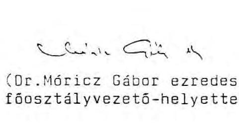
(Dr.Móricz Gábor ezredes) főosztályvezető-helyettes
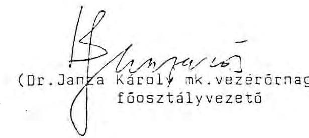

---

# 2.sz. melléklet 

## VOTUM

Közbenső intézkedés.

## Tervezzük:

I.

Dr. Janza Károly vezérőrnagy
főosztályvezető
HM. Közgazdasági Főosztály

## Budapest

Tisztelt Janza úr!

Az 1990. július 4-én folytatott megbeszélésünk értelmében a Honvédelmi Minisztériumban kezelt 235-90177-5014 HM. Közgazdasági Főosztály letéti számla Budapest elnevezésű letéti számláról - amelyről a gazdasági társaságok létrehozásához is teljesítettek kifizetéseket - további intézkedésig kifizetés nem teljesíthető.

Erről levelem másolatával az MNB-t is tájékoztattam.

Budapest, 1990. július 5.

## Üdvözlettel:

## U. f̧u, $d e^{2}$

/Dr. Gruber Nándor/ főosztályvezető
II.
/A 1. alatti másolat átiratilag/

Dr. Fekete Mihály ezredes
főosztályvezető
Testületi Szervek Főosztálya
MNB.

---

Tisztelt Fekete úr!

Szíves tájékoztatásul és esetleges intézkedések megtétele érdekében küldöm a HM letéti számla kezelésével kapcsolatban írt levelem másolatát.

Budapest, 1990. július 5.

Üdvözlettel:
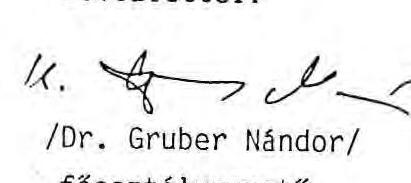

---

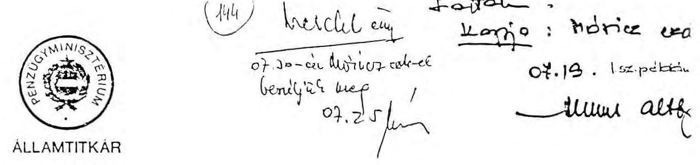
29.115/90:

ANNUS ANTAL altábornagy úr
közigazgatási államtitkár
Honvédelmi Minisztérium

# Budapest 

Tisztelt Annus úr!

A korábbi gyakorlat szerint a HM letéti számlája gazdálkodási típusú pénzmozgásokat is lehetővé tett. A vonatkozó rendelkezések alapján az ilyen típusú számlán operatív gazdálkodás nem folytatható, ezért f. hó 5.-én a Testületi Szervek Főosztály vezetője a számláról további intézkedésig a kifizetést felfüggesztette.

Kérem Államtitkár úr intézkedését, hogy a számla megszüntetésre és a tárca valamennyi bevétele a HM költségvetési elszámolási számlájára kerüljön.

Budapest, 1990. július 11.

## HONVÉDELMI MINISZTÉRIUM

19.... év .... 09 ..... hó 6.7 nap
Nyt. szám: .tiviz/1/1003.
Mell. lapszáma:

---

A honvédelmi miniszter úr felkérése alapján vizsgálat folyik a Magyar Honvédségnél a Honvédség résztvételével megalakított KFT-k jogszerűségéről, melyet független pénzügyi szakértői csoport végzi. A szakértői csoport - melynek összeállításában közreműködtem - jelezte, hogy a KFT-k alaptőkéjének egy részét a HM letéti számlájáról finanszírozták. A letéti számla rendeltetésére sem külső, sem belső szabályozást nem találtak elő.

Információim szerint a letéti számla a 60-as évek elején nyílt meg az úgynevezett "reexport" elszámolására. E számla költségvetési körön kívüli kezelésének megszüntetését már kezdeményeztük és ez év végére meg is történt volna.

A vizsgálat jelzése azonban indokolttá tette, hogy ezzel ne várjunk ez év végéig és a felhasználást 1990. július 5 -én további vezetői intézkedésig felfüggesztettem.

Javaslom, hogy a számla forgalma épüljön be a tárca költségvetési elszámolási körébe ennek érdekében a következő levél küldését javaslom.
T e r v e z z ők:
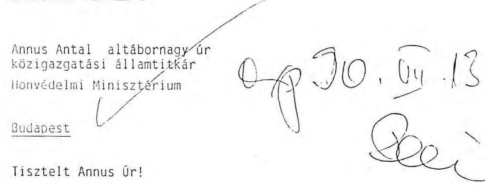

A korábbi gyakorlat szerint a HM letéti számlája gazdálkodási típusú pénzmozgásokat is lehetővé tett. A vonatkozó rendelkezések alapján az ilyen típusú számlán operatív gazdálkodás nem folytatható ezért f. hó 5.-én a Testületi Szervek Főosztály vezetője a számláról további intézkedésig a kifizetést felfüggesztette.

Kérem Államtitkár úr intézkedését, hogy a számla megszüntetésre és a tárca valamennyi bevétele a HM költségvetési elszámolási számlájára kerüljön.

Budapest, 1990. július 09.
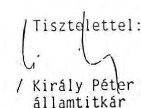

---

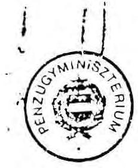
$29.115 / 1990$

Dr. Fekete Mihály ezredes
főosztályvezető
Testületi Szervek Főosztálya
Magyar Nemzeti Bank

# Budapest 

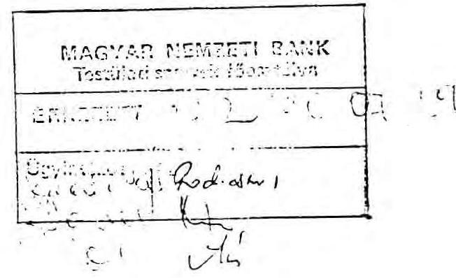

Tisztelt Fekete úr!

Szíves tájékoztatásul és esetleges intézkedések megtétele érdekében küldöm a Honvédelmi Minisztérium letéti számlá kezelésével kapcsolatban írt levelem másolatát.

Budapest, 1990. július 5.
Melléklet: 1 db. levél
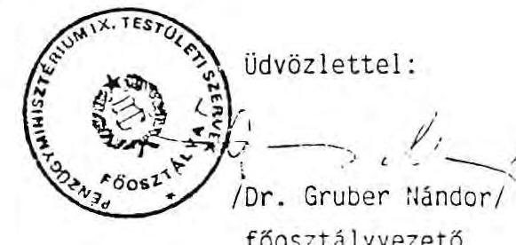

---

Jogi Főosztály
Pénzügyi Jogi Osztály
Jog. 206-139/1990.

Testületi Szervek Főosztálya Számviteli és Emissziós osztály Szigeti Gáborné dr.

Megkeresésükre válaszolva közöljük, hogy a számlatulajdonos bankszámlája feletti rendelkezési jog szabályozása a következő:

1. A számlatulajdonos bankszámlája felett szabadon rendelkezik.
2. A meghatározott célra lekötött, illetve elkülönítve kezelt olyan pénzeszközök, amelyek a számlatulajdonos szabad rendelkezése alól már kikerültek, a lekötöttség tartama alatt csak a meghatározott célra használhatók fel.
3. A számlatulajdonos rendelkezése nélkül vagy rendelkezése ellenére a pénzintézet csak pénzfizetésre szóló végrehajtható bírósági és államigazgatási határozatok alapján, valamint jogszabályban meghatározott más esetekben terheli meg a bankszámlát.

Az államigazgatási szerv határozatának tartalmaznia kell:
a./ az eljáró államigazgatási szerv megnevezését, az ügyfél nevét, székhelyét, az ügy számát, tárgyának és ügyintézőjének megjelölését;
b./ a rendelkező részben az államigazgatási szerv döntését, továbbá a fellebbezés és a bírósági felülvizsgálat lehetőségéről való tájékoztatást;
c./ az indoklásnak tartalmaznia kell azokat a jogszabályokat, amelyek alapján az államigazgatási szerv a határozatot hozta;

---

d./ a határozat hozatalának helyét és idejét, a határozat aláírójának nevét, hivatali beosztását és az államigazgatási szerv bélyegzőlenyomatát.

A Pénzügyminisztérium Testületi Szervek Főosztálya által a Magyar Nemzeti Banknak küldött "tájékoztató" nem felel meg az államigazgatási határozatok tartalmi és formai követelményeinek, ezért azt a bankszámla feletti rendelkezési jog gyakorlása körében figyelembe venni nem lehet.
Az MNB-nek, mint számlavezető pénzintézetnek a számlatulajdonos rendelkezéseit kell követni.

Budapest, 1990. július 11.
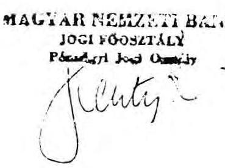

---

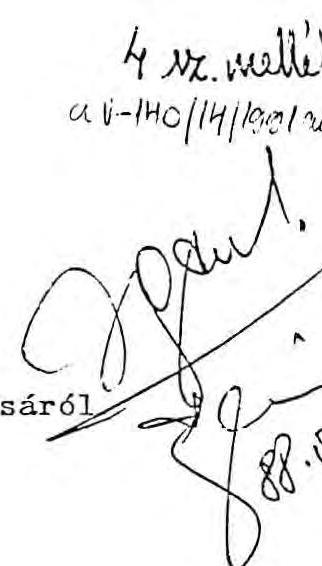

A letéti számlán lévő pénz jelenleg: 738 millió Ft. Ebből javaslok befektetni 1 évre 300 millió Ft-ot 16,7 \%-os kamattal, a Budapest Banktól történő államkötvény vásárlással. Ebben a konstrukcióban visszafizetésre és a kamatra banki és állami garancia van. Ha az összegre a lejárat előtt szükség lenne, ahhoz hozzá lehet jutni, a kamat viszont kisebb - az adott időbeni piaci helyzettől függően - 12-16 \% közötti éves kamat időarányos része.

Ezen túlmenően további 300 millió Ft 1 hétre történő befektetését javaslom hasonló módon, amely 1 hét folyamatosan meghosszabbítható addig, amíg a lakásberuházási keretre történő átcsoportosításra az engedélyt nem kapjuk meg.

Budapest, 1988. március 30.
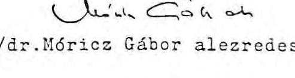

---

5.sz. melléklet a $V-140 / 14 / 1991 . s z i m h a$ Értél: M Ft-ban

| Felszám | Mikor | Kinek | Honnan | Tőke | Lejárat | Kamat | Hova | Megjegyzés |
| :--: | :--: | :--: | :--: | :--: | :--: | :--: | :--: | :--: |
| 1. | 1908. III. 30. | BBRt | Sol4 | 308.08 | 1909. III. 30. | 50.1 | 16.7 | Kamat Sol4-re Tőke CA-5B |
|  | 1908. III. 30 | BBRt | Sol4 | 308.08 | 1908. V.23. | 9.2 |  | Kamat Sol4-re Tőke 360 FM-nek Tőke 40 Sol4-re |
|  | 1909. IV. 18. | CR-5B | BBRt | 150.08 | 1990. IV. 18. | 35.2 | 23.5 | Tőkekamat Sol4-re |
|  | IV. 27. | CR-5B | BBRt | 150.08. | 1990. IV. 27 | 35.2 | 23.5 | Tőkekamat Merkantil Kft.-nek |
|  | 1990. IV. 27. | Merkantil Kft. | CR-5B | 105.28 | 1990. III. 27. | 44.2 | 32.5 | 162.6 oool-re 66.6 V180572M-nek |
| 2. | 1908. I. 15. | Gödöllői Gépgyár | Sol4 | 49.70 | 1908. II. 30 | 5.5 | 12.0 | 10 millió ar Sol4-re, 154 millió a |
|  | IV. 27. |  | Sol4 | 50.08 |  | 4.7 | 15.0 | 154 millió a |
|  | VIII. 24. |  | Sol4 | 50.08 |  | 2.2 | 15.0 | Nitrokémialar. |
|  | 1908. III. 22. | Nitrokémia | Gödöllői Gépv. | 154.08 | 1909. III. 22. | 8.3 | 21.5 | Kamat Sol4-re 100 Magyar Posztónak |
|  | 1909. III. 22. |  | - | 54.08 | 1909. VI. 30 | 2.9 | 21.5 | Tőkekamat Sol4-re |
| 3. | 1908. II. 10. | Magyar Posztó | Sol4 | 202.10 | 1909. I. 16. | 3.8 | 21.0 | 100 OM144-nak Tőkertó. 1 kamat Sol4-re |
|  | 1909. I. 16. | OM144 | Magyar Posztó | 188.08 | 1909. IV. 16. | 5.4 | 21.5 | Tőkekamat Sol4-re |
|  | 1909. III. 22. | Magyar Posztó | Nitrokémia | 182.08 | 1909. VII. 21. | 7.3 | 21 | 100 OM144 |
|  | 1909. VII. 21. |  |  | 60.08 | 1909. VII. 21. | 0.8 |  | Tőkekamat Sol4-re |
| 4. | 1908. VII. 11. | Datalars | Sol4 | 90.02 | 1908. II. 30. |  | 18 | 18. 1.-én 30 Sol4-re 8 részletben 66.6 Sol4-re mintegy 25 anyagban |
|  |  |  |  |  | 1909. IV. 25. |  |  |  |
| 5. | 1908. II. 26. | R-1 Fontait | FTF-régtől Sol4 helvett | 62.08 | 1909. I. 31. | 5.3 | 20.5 | Tőkekamat Merkantilhol |
|  | 1909. I. 31. | Merkantil Kft. | R-1 Fontait | 85.28 | 1909. VIII. 18. | 9.9 | 21 | Tőkekamat Sol4-re |
| 6. | 1908. III. 28. | BBRt | FTF-régtől Sol4 helvett | 202.03 | 1909. I. 28. | 6.0 | 22.5 | Kamat Sol4-re 250 CA-5B-nek 68 Merkantilnak |
|  |  |  |  |  | 1909. VII. 28. | 30 | 20 |  |
|  |  |  |  |  |  |  |  |  |
|  | 1909. VII. 28. | CR-5B | BBRt | 250.00 | 1909. II. 28. | 20.5 | 23.25 | 1. Amerikai Magyar Kft. |
|  | 1909. II. 28. | I. Re.-Magv. Kft. | CR-5B | 278.50 | 1990. I. 29. | 14 | 20 | Kamat-tőke Sol4-re |
|  | 1909. VII. 28. | Merkantil Kft. | BBRt | 80.00 | 1909. II. 30 | 6.4 | 23.25 | 0.4 Sol4-re 86 OOHB-nak |
|  | 1909. III. 1. | OOHB | Merkantil Kft. | 86.00 | 1990. I. 15. | 3.1 | 20.5 | Tőkekamat Sol4-re |
| 7. | 1909. III. 29. | MHB | 6000 | 201.00 | 1909. VI.27. | 10 | 20 | Tőkekamat 6000-ra |
| 8. | 1909. IV. 1. | Interbank | BBRt | 208.02 | 1909. VII. 7. | 16.2 | 21 | Tőkekamat 6000-ra |
| 9. | 1909. IV. 10. | Postabank | 6000 | 500.00 | 1909. II. 10. | 89.2 | 22-28 | 65.5 kamat 6000-ra 22.7 kamat Sol4-re 105.6 FM-nek |
|  | VI. 29. |  | 6000 | 60.00 | 1909. II. 29. | 5.5 | 22 |  |
|  |  |  | Sol4 | 32.00 |  |  |  |  |
|  | 1990. I. 10. | Postabank | - | 500.00 | 1990. IV. 10. | 34.4 | 20.5 | 200 a oool-re 100 ar OOHB-nak 120 ar MHB-nak 0.4 ar Sol4-re |
|  |  |  |  |  |  |  |  |  |
|  | 1990. IV. 10. | Postabank | - | 100.00 | 1990. VII. 10. | 6.6 | 33 | Tőkekamat 600 Rt-nek |
|  | 1990. VII. 10. | AKB Rt | Postabank | 106.60 | 1990. I. 10. | 7.1 | 23 | Tőkekamat oool-re |
|  | 1990. IV. 10. | MHB | Postabank | 120.00 | 1990. VII. 10. | 10 | 33 | Tőkekamat Sol4-re |
|  | 1990. IV. 10. | OOHB | Postabank | 100.00 | 1990. VII. 11. | 8.5 | 33 | Tőkekamat Sol4-re |

---

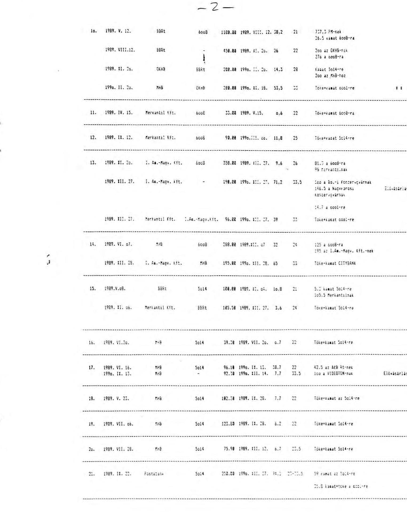

# - 2 -

|  10. | 1989. V. 12. | BBRt | 6008 | 1108.88 | 1989. VIII. 13. 38.2 | 21 | 727.5 PM-mak
36.5 sunat 6008-ra
| --- | --- | --- | --- | --- | --- | --- | --- |
|   | 1989. VIII.12. | BBRt |  | 458.88 | 1989. II. 20. 26 | 22 | 200 az 0KH8-nak
276 a 6008-ra  |
|   | 1989. II. 20. | 0KH8 | BBRt | 208.08 | 1990. II. 20. 14.3 | 28 | Kasat 5014-re
200 az KH8-nak  |
|   | 1990. II. 20. | KH8 | 0KH8 | 208.08 | 1990. II. 18. 53.5 | 22 | Tokervanat 6008-ra  |
|  11. | 1989. IV. 15. | Mercantil Kft. | 6008 | 23.08 | 1989. V.15. | 0.6 | 22  |
|  12. | 1989. II. 12. | Mercantil Kft. | 6008 | 98.08 | 1990. III. 06. 11.8 | 25 | Tokervanat 5014-re  |
|  13. | 1989. II. 20. | I. Am.-Magv. Kft. | 6008 | 258.88 | 1989. III. 27. 9.6 | 26 | 81.5 a 6008-ra
96 mercantilnak  |
|   | 1989. III. 27. | I. Am.-Magv. Kft. |  | 198.08 | 1990. III. 27. 71.2 | 23.5 | 200 a 80.5  |
|   |  |  |  |  |  |  | 146.5 a  |
|   |  |  |  |  |  |  | 14.7 a 6008-ra  |
|   | 1989. III. 27. | Mercantil Kft. | I.Am.-Magv. Kft. | 96.08 | 1990. III. 27. 39 | 25 | Tokervanat 6008-ra  |
|  14. | 1989. VI. 07. | KH8 | 6008 | 288.88 | 1989. III. 07 | 32 | 24  |
|  15. | 1989. III. 28. | I. Am.-Magv. Kft. | KH8 | 195.08 | 1990. III. 28. 65 | 33 | 25  |
|  16. | 1989. V.08. | BBRt | 5014 | 108.08 | 1989. II. 04. 10.8 | 21 | 5.2 sunat 5014-re
105.5 Mercantilnak  |
|   | 1989. II. 06. | Mercantil Kft. | BBRt | 105.58 | 1989. III. 27. 3.6 | 24 | Tokervanat 5014-re  |
|  17. | 1989. VI. 20. | KH8 | 5014 | 39.28 | 1989. VII. 20. 0.7 | 22 | 22  |
|  18. | 1989. VI. 16. | KH8 | 5014 | 96.18 | 1990. II. 13. 28.7 | 22 | 42.5 az AK8 96-nak  |
|   | 1990. II. 13. | KH8 |  | 97.38 | 1990. III. 14. 7.7 | 33.5 | 100 a VISSST08-nak  |
|  19. | 1989. V. 22. | KH8 | 5014 | 182.28 | 1989. II. 28. 7.7 | 22 | 22  |
|  20. | 1989. VII. 28. | KH8 | 5014 | 122.88 | 1989. II. 28. 6.2 | 22 | 22  |
|  21. | 1989. II. 22. | Fostalala | 5014 | 75.98 | 1989. III. 12. 6.7 | 22.5 | 21.5  |
|  22. | 1989. II. 22. | Fostalala | 5014 | 258.08 | 1990. III. 27. 74.2 | 22-22.5 | 59 sunat az 5014-re
21.5 sunatmítsa a 6008-re  |

---

- 3 -

22. 1989. 11. 08. 1641 So14 158.00 1991. 11. 08. 84 28 36.4 628 81-nes
5.6 2M Vedåret. 1990.11.08.
4.2 2M Vedåret. 1991.11.05.
37.8 kanatstöre a onol-re
23. 1989. 111. 08. Ianobrlia So14 50.00 1990. 11.09. 14.9 28-55.5 6.2 kanat Sol4-re
4.1 kanat onol-re
54.6 CA-88-nes
1990. 11. 09. CA-88 Ianobrlia 54.68 1990. 111. 28. 2.5 52.25 Tokerkanat a onol-re
24. 1989. 111. 21. Datanlan So14 68.00 1990.111. 21. 4.4 29 24.1 ar Sol4-re
To ar 1. 8m.-Mage. 6ft.-nes
1990. 111.21. I.8m.-Mage. 6ft. Datanlan 28.80 1990. 111. 19. 8.1 53.5 Tokerkanat a Cllr684a-nes
25. 1989. 111. 08. Ianobrlia So14 108.00 1990. 111.08. 21.7 28-55.5 14.7 kanat ar Sol4-re
8.5 kanat ar 628 81-nes
8.5 kanatstöre a onol-re
26. 1989. 111. 22. I.8m.-Mage. 6ft. So14 68.00 1990.111.22. 4.2 29 Tokerkanat ar Sol4-re
27. 1989. 111.28. MH8 So14 136.30 1990. 19.27. 13.7 30 Tokerkanat ar Sol4-re
28. 1989. 111. 28. CA-88 So14 108.00 1991.11. 19. 66 33-34 Tokerkanat a onol-re
29. 1990. 1. 29. BB 8t So14 208.00 1990. 19. 29. 15 30 Tokerkanat ar Sol4-re
30. 1990. 1. 20. MH8 So14 214.18 1990.111.14. 61.6 29-33 42.3 kanat a onol-re
211.5 a VISIGICA-nes Elovakarlan
31. 1990.11. 08. BB 8t So14 58.00 1990. V. 08. 3.7 30 Tokerkanat ar Sol4-re
32. 1990. 11. 20. Milites 6ft. So14 0.48 1990. V. 20. 0.7 32 Kanatrl.4 töre ar Sol4-re Aton 1991. 11.
33. 1990. 11. 26. I.8m.-Mage. 6ft. So14 78.00 1990. 111. 29. 22.6 30-32.5 Tokerkanat a onol-re
34. 1990. 111. 23. MH8 So14 20.00 1990. VI. 22. 2.5 32.5 Tokerkanat ar Sol4-re
35. 1990.IV. 19. MH8 So14 78.20 1990. VII. 18. 5.8 32 6.9 ar Sol4-re
1990. 11. 11. MH8 69.18 1990. 11. 07. 6.9 32 CA-88-nes
1990. 11. 07. CA-88 MH8 76.00 1990. VII. 29. 3.5 32.25 Tokerkanat a onol-re
36. 1990. IV. 27. MH8 So14 101.60 1991. 111. 18. 66 33-36.2 Tokerkanat a onol-re
1

---

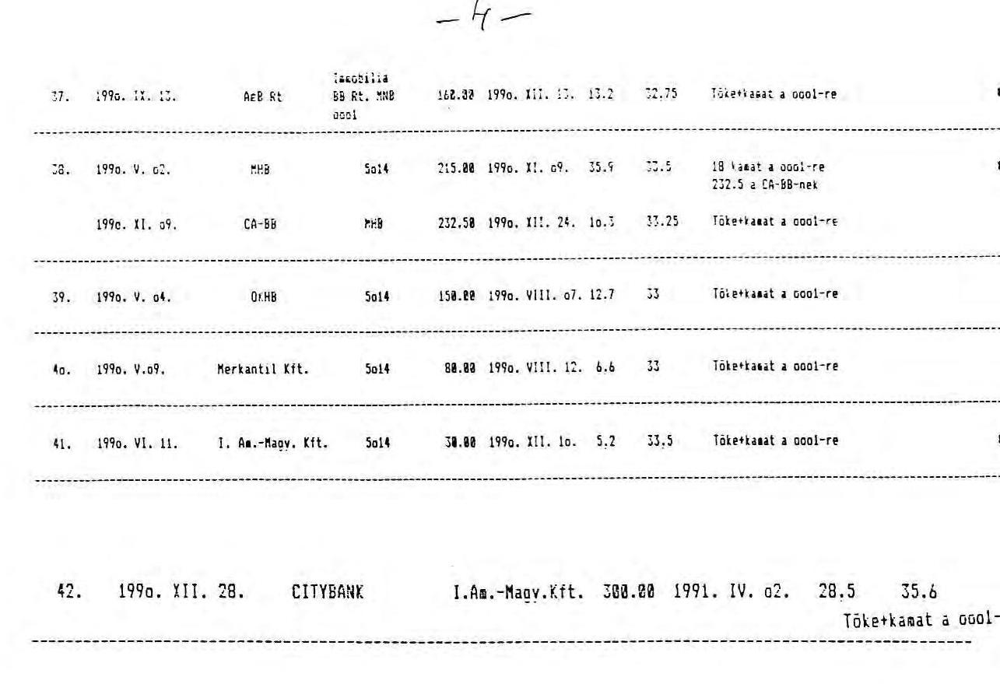
42. 1990. XII. 28. CITYBANK
I.Am.-Magy.Kft. 388.88 1991. IV. 02. 28.5
35.6
Tökerkanat a oool-re $\$$

JELMAGYARA2A: a csillagok szàsa a szerzödések seghosszabbításának
szását lelenti 1990.I.ol.-1990.XII.31. között.

---

# V: 

A speciális import finanszírozásának alkalmazott rendje szerinta HM tárca 1989. I. negyedévi speciális import keretének megnyitását
t e r v e z z ük

## I.

## 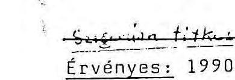

Dr. BENCSIK ISTVÁN mk. vezérőrnagy elvtársnak, csoportfőnök
Honvédelmi Minisztérium
MNVK Anyagtervezési és Közgazdasági
Csoportfőnökség

## B u d a p e s t

## Kedves Bencsik Elvtárs!

Mint ismeretes az 1989. évi költségvetés szerkezetének módosítása során változott a spec. import finanszírozási rendje, az beépült a HM tárca költségvetésében.
Ennek megfelelően 9,8 MdFt-tal növeltük a tárca költségvetését.

Tájékoztatjuk, hogy ez az összeg az eddigi gyakorlat folytatásaként negyedévenként az 1989. II-III.IV. negyedévi és az 1990. I. negyedévi spec. import kötelezettségek teljesítésére nyújt fedezetet.

Az 1989. I. negyedévi kötelezettségekre 2,2 MdFt-ot - amit az 1988-as állami költségvetés terhére elszámoltunk - átutaltunk a letéti számlára.
Budapest, 1989. február 24.
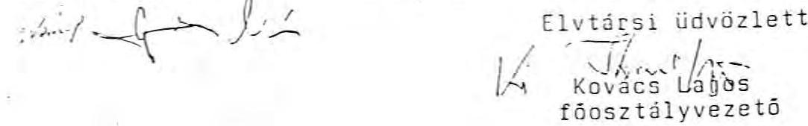

---

# Pénzügyminisztérium 

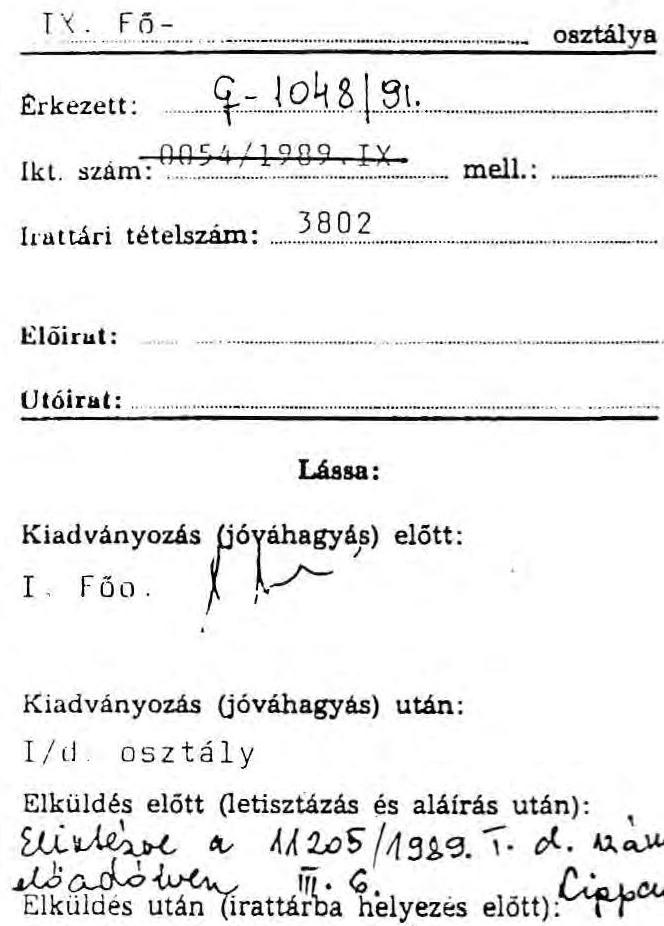

Utasítás a kiadónak:
Készítette: Németh Gy.
Készült: I. 2 pld-ban
1.sz. címzett
2.sz. irattár
Gépelte: Kissné

Utasítás az irattárnak:
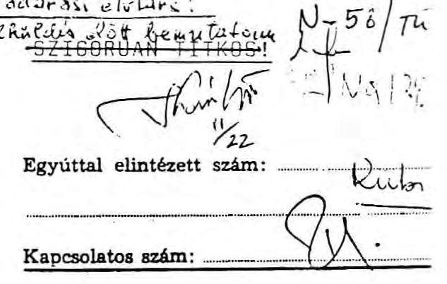

Egypttal elintézett szám:
Kiapcsolatos szám:

## Határidő:

Kiadóba érkezett:
Letisztázta: 12. me
Egyetették:
Elküldés napja: $\qquad$ Elküldte: $\qquad$
Az iktatókönyvbe kivezette: $\qquad$
Irattárba érkezett: $\qquad$

## ELINTÉZÉS:

Határidő: $\qquad$
A válaszirat alapjául szolgáló beadvány (
felterjesztés, jelentés stb.) száma: $\qquad$
Tárgy: $\qquad$

Szt. minisités utot ungesime 1 :

---

# MAGYAR HONVÉDSÉG PARANCSNOKSÁGA 

Közgazdasági és Pénzügyi Főnökség

## Patai Tamás   számvevő részére

Szóban feltett kérdéseire az alábbiak szerint tájékoztatjuk:
1.) A 235-90177-6008 "HM. MN. Pénzügyi Szolgálatfőnökség Importforgalmi letéti számla"-ról - mely 1990. június 30-i hatállyal megszüntetésre került - az átmenetileg szabad pénzeszközöknek különböző pénzintézetekhez történő kihelyezésére a HM MNVK Anyagtervezési és Közgazdasági Csoportfőnökség szóbeli intézkedése alapján került sor. Az érintett pénzintézetekkel a kapcsolatot ugyancsak a csoportfőnökség tartotta, a szerződések aláírása, valamint a pénzösszegek átutalása főnökségünk részéről került végrehajtásra, mivel aláírási joggal mi rendelkeztünk.
2.) Az előző pontban jelzett 6008 számú importforgalmi letéti számla, valamint a 235-90177-5014 "HM MNVK Anyagtervezési és Közgazdasági Csoportfőnökség letéti számla" közötti pénzmozgások számviteli rendezését a számla tulajdonos anyagtervezési és közgazdasági főnökség szóbeli intézkedése alapján hajtottuk végre.
3.) A Magyar Nemzeti Banknál a honvédség különböző szervezetei részére a következő letéti számlákat tartják nyilván:

- 235-90177-5007 "HM letéti számla"

Ezen a számlán kezeljük például az állományunkból elhalálozottak hátrahagyott pénzbeni járandóságait, a hagyatéki eljárás befejezéséig.

- 235-90177-5021 "MH CSEB elszámolási számla"

A számlán a Magyar Honvédség állományában tartozók CSEB biztosításával összefüggő pénzforgalom bonyolódik.

---

- 235-90177-5045 "MH Családalapítási előleg lebonyolítási számla" A számlán a pályakezdő hivatásos katonaállományú személyek részére kifizetett kamatmentes előleg keretet tartjuk nyilván.
- 235-90177-5052 "Közalkalmazottak Szakszervezete Néphadseregi Bizottsága letéti számla"
A számlát a Honvédségi Dolgozók Szakszervezete elnöksége kezeli.
- $235-90177-5100$
-5117
-5124 "Katonai Bíróságok Bírói letéti számla"
-5131
-5148
A számlákon a katonai bíróságok által kirótt pénzbüntetések és bírságok forgalmát bonyolítják.
- 235-90177-5155 "MH Építőipari kivitelezések számla"
A számlán az MH 1200 építőipari kivitelezést végző katonai szervezet pénzforgalma kerül elszámolásra.
- 399-90177-5327 "MN Fegyelmező Zászlóalj letéti számla"
A számlán a fegyelmező zászlóaljnál büntetésüket töltő személyek pénzbeni járandóságait kezelik.
- 235-90177-5478 "MH Központi Irattár letéti számla"
A számlán a központi irattár által a katonai szervezetektől összegyűjtött papírhulladék értékesítéséből befolyt pénzeszközöket kezeltek. Jelenleg a számlán egyenleg nem mutatkozik.
- 235-90177-5557 "Magyar Honvédség pénzügyi részleg letéti számla"
A számlán az MHvK Katonai Felderítő Hivatal "B" költségvetésének pénzforgalma szerepel.
- 235-90177-5571 "Posta Katonai Szolgálat Kötvényelőleg letéti számla"

---

A számla forgalma a szolgálati lakások telefonnal történő ellátásához központilag megvásárlásra kerülő telefonkötvények fedezeteként kezelt pénzeszközök mozgását mutatja.

A felsorolt letéti számlákról - tekintettel a rajtuk kezelt pénzeszközök nagyságrendjét - pénzintézetekhez történő kihelyezések ismereteink szerint nem fordultak elő.

Budapest. 1991. november -n
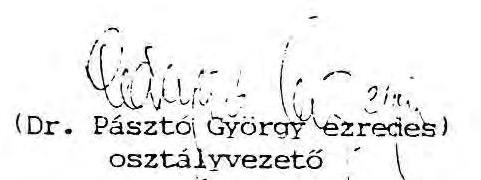

---

a $V-140 / 14 / 1001$ rémkes
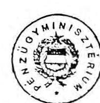
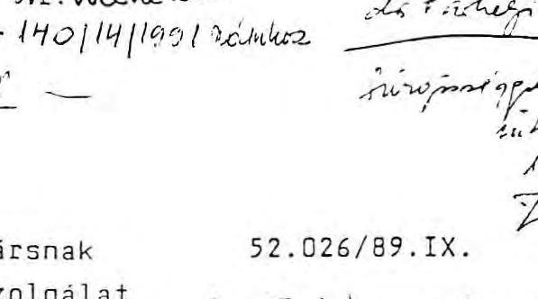

Dr. Lontai Lajos ezredes elvtársnak
Magyar Néphadsereg pénzügyi szolgálat főnök

Budapest
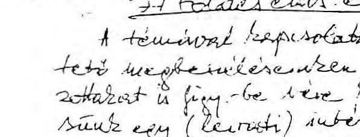

52.026/89.IX.

# 2+ Foldesends et. 

A timisual hepeselater tető megbesuikésenlese el sotholest a fïy-be sise teds sünde egy (leuteti) suterie sunt fisedes elöt os Griz ends et el sizimáatassant. Hi: 1924.03. 21.

Kedves Lontai Elvtárs!
tárhelie

Az állami költségvetési szervek gazdálkodásáról szóló 19/1980. (IX.27.) PM rendeletet módosító 71/1988.(XII.27.) PM rendelet értelmében a költségvetési szervek szabad pénzeszközeiket csak a számlavezető pénzintézetnél (központi költségvetési szervek a MNB-nél) helyezhetik el tartós betétként, forrásra való tekintet nélkül, továbbá e szabad pénzeszköz-k ternére kizárólag kincstárjegy és kötvény vásárolható.

Fentiekre való tekintettel kérem, hogy a felügyelete alá tartozó intézmények figyelmét szíveskedjék felhívni a vonatkozó jogszabályok maradéktalan betartására és gondoskodni a számlavezető pénzintézeten kívül ez évben szabálytalanul elhelyezett pénz eszközök lekötésének azonnali megszűntetéséről.

Budapest, 1989. február 14.
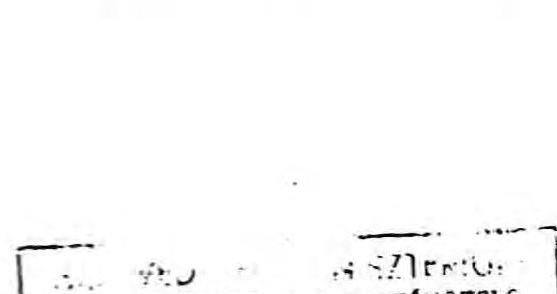
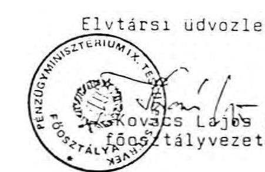

---

# Pénzügyi (al-)osztályvezető elvtárs 

## Állomáshelyeiken

Tárgy: Szabad pénzeszközök elhelyezése

Az állami költségvetési szervek gazdálkodásáról szóló 19/1980. (IX.27.) PM rendeletet módosító 71/1988. (XII.27.) PM rendelet értelmében a költségvetési szervek szabad pénzeszközeiket - forrásra való tekintet nélkül - csak a számlavezető pénzintézetnél (MNB-nél) helyezhetik el tartós betétként, illetve ezen pénzeszközök terhére kizárólag kincstárjegy és kötvény vásárolható.

A fentiekre való tekintettel a pénzügyi (al-)osztályvezető elvtárs intézkedjen az alárendeltségébe tartozó katonai szervezetek felé a vonatkozó jogszabályok maradéktalan betartására és a számlavezető pénzintézeten kívül ez évben szabálytalanul elhelyezett pénzeszközök lekötésének azonnali megszüntetésére.

Budapest, 1989. április hó -n.
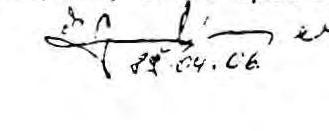
/ Dr. Lontai Lajos ezredes / MN pénzügyi szolgálatfőnök

Készült: 2 pld-ban
Egy pld: 1 lap
Itsz: 0503
Készítette: Or.Pásztó alez.
Gépelte: Kókainé
Péghé ule

---

HONVÉDELMI MINISZTÉRIUM
MN PÉNZÜGYI SZOLGÁLATFŐNÖKSÉG

2.számú példány
"Géptávirón továbbítandó"

Nyt.szám: 315/1989

Pénzügyi (al-)osztályvezető elvtárs

Állomáshelyeiken

Tárgy: Szabad pénzeszközök
elhelyezése

Az állami költségvetési szervek gazdálkodásáról szóló 19/1980. (IX.27.) PM rendeletét módosító 71/1988. (XII.27.)
 PM rendelet értelmében a költségvetési szervek szabad pénzeszközeiket - forrásra való tekintet nélkül - csak a számlavezető pénzintézetnél (MNB-nél) helyezhetik el tartós betétként, illetve ezen pénzeszközök terhére kizárólag kincstárjegy és kötvény vásárolható.

A fentiekre való tekintettel a pénzügyi (al-)osztályvezető elvtárs intézkedjen az alárendeltségébe tartozó katonai szervezetek felé a vonatkozó jogszabályok maradéktalan betartására és a számlavezető pénzintézeten kívül ez évben szabálytalanul elhelyezett pénzeszközök lekötésének a lejárat időpontjával, de legkésőbb ez év végével történő megszüntetésére.

Budapest, 1989. április hó 10-n.

/ Dr. Lontai Lajos ezredes /
MN pénzügyi szolgálatfőnök

Készült: 2 pld-ban
Egy pld: 1 lap
Itsz: 0503
Kapják: 1.sz.pld. Géptávíró, utána írattár (csatolva 1 db elosztó)
2.sz.pld. MN PÜSZF-ség kv.ov.h.

---

# 9. sz. melléklet. 

a $V-140 / 14 / 1901$ számú irathoz

## F e l j e g y z é s   a HM tárca 1990.év végi várható pénzügyi helyzetéről

A november végén szokásos pénzügyi helyzetfelmérést idén előrébb hoztuk, mert a német tárgyalások és a költségvetési körön kívüli pénzeszközök (lásd melléklet) befolyatása a központi számlára a szokásosnál több bizonytalansággal terheli az év végét. A felmérés eredménye az alábbiakban összegezhető:

Az év során felmerült - indokolt - többletigények kielégítése (bérfejlesztés, építési-felújítások, számítástechnikai eszközök, címerváltás, MiG-23 UB stb.) és az árváltozások hatásainak kiosztása (postai díjak, energia, üzemanyag, szállítás stb.) után a tárca maradványa 2,5 és 3,0 milliárd Ft között várható. Ez két részre oszlik:

1/ Ún. lekötött maradvány 1,0-1,5 milliárd Ft (lekötött az a maradvány, ahol a szállítás idén teljesül vagy elindul, de a fizetés 1991-re marad). Fő területei:
a/ a béralap és a jutalmazási norma maradványa (ez 1991-ben jutalomként kifizethető)
$0,1-0,2 \mathrm{MdFt}$
b/ a - mintegy 300 különböző helyen csapatoknál maradó pénzek (pl. villanyszámla stb.)
$0,3-0,5 \mathrm{MdFt}$
c/ az anyagi szolgálatok eszközbeszerzéseinél, elsősorban az importnál történő szállítások beérkezésétől függően
$0,6-1,0 \mathrm{MdFt}$

Az a/ és b/pontban jelzett maradványok gyakorlatilag érinthetetlenek.

---

| 2/ Szabad maradvány | 1,5 MdFt |
| :--: | :--: |
| Forrásai: a/ végleg elmaradó beszerzés | 0,4 MdFt |
| b/ exportbevétel | 0,8 MdFt |
| c/ Kamatbevétel | 0,3 MdFt |

A maradványok nagyságának előzetes becslése alapján vállaltuk a német tárgyalások sikere esetén az idei évben 2 milliárd Ft kifizetését. Amennyiben ez nem realizálódik - és ennek nagy a realitása -, akkor külön intézkedések nélkül a 2,5-3,0 milliárd Ft maradvány kerülne a költségvetési beszámoló részeként a kormány, illetve a parlament elé. Ez önmagában nem baj, mert az ún. maradványérdekeltség jelenlegi szabályai szerint ez visszajár a tárcának, azonban az ország gazdasági problémáit ismerve könnyen lehet, hogy akár a kormány, akár a parlament az összeget részben vagy egészben elvonja.

A szabad maradvány elvonása jövőre szűkíti a mozgásterünket, (pl. a német beszerzésekre nem lesz fedezet) a lekötött maradvány elvonása pedig még súlyosabb következményekkel jár, ugyanis akkor a január-februárban beérkező ún. "átnyúló" számlákat az 1991. évi - várhatóan amúgy is szűkös - előirányzatokból kell kifizetni.

Ezért úgy intézkedtem az MH anyagi tervező szervei felé, hogy 1 milliárd Ft értékig kezdeményezhetnek olyan beszerzéseket, amelyekre 1991-ben a tárca előirányzatának nagyságától függetlenül mindenképpen sor kerülne, és a vállalatoknál van rá szállítási készség még az év végéig (pl. gyógyszer, konzerv, üzemanyag, ruházat stb.). Az ilyen módon elköltött pénz a maradványt csökkenti, viszont a jövő évi előirányzatból azonos összeget felszabadít, tehát összességében a pénzügyi helyzetünket se nem rontja, se nem javítja.

---

A jelentős összegű maradvány prezentálásának jelzett veszélyei miatt döntést igényel, hogy azt - a korábbi években alkalmazott "pénzügyi technikával" - mérsékeljük-e alacsonyabb szintre (természetesen a pénzt megtartva 1991-re).

Ennek két területe (módszere):
1/ A Technika Külkereskedelmi Vállalatnak átutalunk speciális importra előleget és azt nem mint előleget, hanem mint végleges kifizetést számoljuk el. Mivel ez a TKV számára is kedvező, ezért ebbe eddig belement. Még tisztább módon bonyolítottuk le ugyanezt 1989.végén, amikor is nem előleget adtunk, hanem a TKV készletében lévő árukat "megvettük" tőlük, amit 1990.év folyamán ők visszavásároltak.

2/ A Gödöllői Gépgyárban felhalmozódott hatalmas alkatrészkészletből egy részt megvásárolunk, amit a GG a következő évben visszavásárol. Ez nemcsak, hogy jó a GG-nek, hanem egyenesen megmenti a csődtől. Ennek kockázata, hogy ha a vállalat csődbe megy, akkor a visszavásárlás részben vagy egészben meghiúsul.

Kérem a jelentettek elfogadását és döntést arra vonatkozóan, hogy:

1/ csökkentsük-e "pénzügyi technikával" is a maradványt;
2/ ha igen, akkor milyen nagyságrendet vigyünk a kormány és a parlament elé. Javaslom, hogy 1 milliárd Ft alattit.

Budapest, 1990. november hó " 2 "-n.
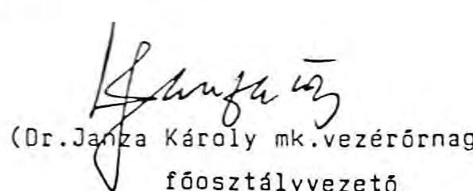

---

10.32. melléklet. P. V-14.1/14/15/15 Helvetez

|  FSZGSZ-ek | Szükséghelyzet szerinti keret | Ebből levonás |  |  |  | Kiadásra tervezve  |
| --- | --- | --- | --- | --- | --- | --- |
|   |  | Pü. jogcímeken tervezve | Előrehozás | Csökkentés | Összesen |   |
|  1. | 2. | 3. | 4. | 5. | 6. | 7.  |
|  Pc. és Gjnü.Techn.Szolg. | 1.568,0 | 7,4 | 100,0 | 100,0 | 207,4 | 1.360,6  |
|  Fegyverzet techn.Szolg. | 821,4 | 0,1 | - | 50,0 | 50,1 | 771,3  |
|  Elektronikai Szolg. | 458,6 | 7,2 | - | 20,0 | 27,2 | 431,4  |
|  HTCSF-ség Műszaki Techn.O. | 229,7 | - | - | 10,0 | 10,0 | 219,7  |
|  HTCSF-ség Vegyvédelmi Techn.O. | 103,8 | 0,1 | - | - | 0,1 | 103,7  |
|  Haditechnikai Fejlesztés | 80,0 | - | - | - | - | 80,0  |
|  Mérésügyi Szolgálat | 24,6 | - | - | 2,0 | 2,0 | 22,6  |
|  Egészségügyi Szolgálat | 788,5 | 390,1 | 100,0 | 40,0 | 530,1 | 258,4  |
|  Üzemanyag Szolgálat | 1.808,5 | - | 300,0 | 200,0 | 500,0 | 1.308,5  |
|  Élelmezés Szolgálat | 3.015,8 | 110,2 | 205,0 | 200,0 | 515,2 | 2.500,6  |
|  Ruházati Szolgálat | 2.500,0 | 159,1 | 250,0 | - | 419,1 | 2.080,9  |
|  Közlekedési Szolgálat | 354,1 | 6,1 | - | 20,0 | 26,1 | 328,0  |
|  Katonai Felderítő Hivatal | 149,6 | - | - | 10,0 | 10,0 | 139,6  |
|  Repülő Főnokság | 2.700,0 | 0,1 | - | 20,0 | 20,1 | 2.679,9  |
|  Térképész Szolgálat | 44,7 | 0,5 | - | 2,0 | 2,5 | 42,2  |
|  Kik. és Szf. Főcsoportfőnokság | 614,8 | 14,3 | - | 50,0 | 64,3 | 550,5  |
|  Hír. és Automat. Csf-ség | 1.136,3 | 20,6 | - | - | 20,6 | 1.115,7  |
|  ÖSSZESEN | 16.398,4 | 725,8 | 955,0 | 724,0 | 2.404,8 | 13.993,6  |
|  Anyagi-Techn.Fcsf-ség |  |  |  |  |  | 606,4  |
|  MINDÖSSZESEN |  |  |  |  |  | 14.600,0  |

---

| FsZGSZ-ek | Kiadott keret | Ebből |  |
| :--: | :--: | :--: | :--: |
|  |  | csapat | központi |
| 1. | 2. | 3. | 4. - |
| Pc.és Gjnü.Techn.Sz. | $1.360,6$ | 142,0 | $1.218,6$ |
| FvTSzf-ség | 771,3 | 38,3 | 733,0 |
| Elektronikai Sz. | 431,4 | 52,2 | 379,2 |
| Mű. T. 0. | 219,7 | 6,6 | 213,1 |
| Vv. T. 0. | 103,7 | 4,9 | 98,8 |
| Haditechn.Fejl. | 80,0 | - | 80,0 |
| Mérésügyi sz. | 22,6 | 5,8 | 16,8 |
| Egészségügyi sz. | 258,4 | 35,1 | 223,3 |
| Üza. Szolg. | $1.308,5$ | 43,7 | $1.264,8$ |
| Elm. Szolg. | $2.500,6$ | $2.411,0$ | 89,6 |
| Ruh. Szolg. | $2.080,9$ | $1.596,9$ | 484,4 |
| Közl. Szolg. | 328,0 | 62,3 | 265,7 |
| KFH | 139,6 | 6,8 | 132,8 |
| REP F-ség | $2.679,9$ | 30,0 | $2.649,9$ |
| Térképész Sz. | 42,2 | 13,7 | 28,5 |
| Kik. és Szf. Fcsf-ség | 550,5 | 133,0 | 417,5 |
| Hír.és Aut. Csf-ség | $1.115,7$ | 177,1 | 938,6 |
| ÖSSZESEN | $13.993,6$ | $4.759,4$ | $9.234,2$ |
| ATFCSF-ség   MINDÖSSZESEN | $\begin{array}{r} 606,4 \\ 14.600,0 \end{array}$ | $4.759,4$ | $\begin{array}{r} 606,4 \\ 9.840,6 \end{array}$ |

---

# MAGYAR HONVÉDSÉG ÉLELMEZÉSI ELLÁTÓ KÖZPONT

A. sz. példány

Nytsz. szám: 100/55/1990/C.

Budapesti Konzervgyár
Ülén István Igazgató úr

Budapest

Tárgy: Megállapodás.

A Magyar Honvédség szervezeti, működési feltételeiben bekövetkezett változások indokolttá tették tartalék készleteink mennyiségi, minőségi és tárolási feltételeinek felülvizsgálatát.

A háború csökkentés, az intézetünknél bekövetkezett szervezeti változások - rektári tárolátor, személyi állomány csökkenés - nem teszi lehetővé a Magyar Honvédség háborús készleteinek eddigi formában történő tárolását és leforgalmazását, ugyanakkor ezen készleteik meglétét szolgálatunknak biztosítani kell.

Kérem Igazgató Úr támogatását a mellékletként megküldött "Megállapodás", illetve "Igénybejelentés" tárgyában, mely 200 M Ft értékben biztosítani szükségletünket 1991. évre a megállapodásban rögzített feltételek szerint.

Melléklet: 1. Megállapodás 2 lap
2. Kimutatás 1 lap.

Budapest, 1990. november 21.

(Sz. oldány) 1 lap

Itsz.: 2987

Kasjás: 1. sz. példány Címzett
2. sz. példány HH ÉK pu. o.
3. sz. példány HH ÉK 1. Rektár
4. sz. példány Irattár átell. x) 22 kg. a 100

---

MAGYAR HONVÉDSÉG
ÉLELMEZÉSI ELLÁTÓ KÖZPONT
Nytsz. szám: 100/55/1990/E.

Megállapodás
amely létrejött 1990. november hó 22-én a Budapesti Konzervgyár (1106. Bp. Maglódi út 47.), továbbiakban mint szállító és a

Magyar Honvédség Élelmezési Ellátó Központ (Bp. 1395. Lehel út 41. Pf.: 423.), továbbiakban mint vevő között az alábbi feltételek szerint:
1./ 1990. december 01-től megrendelünk Önöknél az MH Élelmezési Ellátó Központ részére 200 M Ft értékben különféle hideg és készétel konzerveket (a 2.sz.mellékletben feltüntetett mennyiségben és árban) "idegen helyen" történő tárolásra, tárolási különköltség felszámítása nélkül.
2./ Szállító vállalja, hogy a vevő igénybejelentését követő 10 munkanapon belül a 2.sz. mellékletben felsorolt termékeket biztosítja. A teljesítés helye a szállító telephelye. Csak a végső termék gyártásközi és végtermék minőségi átvételéhez küldünk KÜM átvevőt. Vevő a teljesítést követően az árút saját szállító eszközével szállítja el.
3./ Az idegen helyen szállítónál tárolt készleteink frissítése érdekében hozzájárulunk ahhoz, hogy átmenetileg felhasználhatnak, eladhatnak más kereskedelmi szervezetnek is természetesen az újonnan közösen kialakított határidőre, lehetőleg 30 napon belül visszapotolva a vevő készletét.
4./ Fizetés módja: átutalással egy összegben a szállító által kiállított számla alapján 10
 banki napon belül. Ezt követően a megrendelt termékek az „idegen helyen” tárolt készletét képezik.

---

Amennyiben a vevő a lekötött termékekre előre nem látható változások miatt - készletek további csökkentése - nem tart igényt, úgy köteles a szállítót (egy összegben visszafizetés esetén)
50 nappal előbb értesíteni.

Szerződő felek megállapodnak továbbá, hogy a vevő részéről történő szerződésbontás után jogi, illetve pénzügyi követeléssel
nem lépünk fel.

A szállító részéről történő szerződésbontás - amennyiben a vevőt
45 nappal korábban nem értesíti - esetén a mindenkori érvényben
lévő késedelmi kamat összegét a szállított árukra köteles meg-
téríteni a Magyar Honvédség Élelmezési Ellátó Központ részére.

A megállapodás 1990. december 31-i hatállyal lép életbe.

A megállapodásban foglaltak újbóli felülvizsgálatának határideje
1991. augusztus 31.

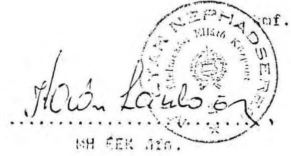

BUDAPESTI KONZERVGYÁR

Budapesti Konzervgyár

---

K I M U T A T Á S

| Termék | Termelői ár Ft/db | Göngyöleg   db | Szerződött mennyiség | Összesen Ft |
| :--: | :--: | :--: | :--: | :--: |
| Sonkás tojáskrém | 13,94 | 35/zsugor | 1000300 | 13.944.182,- |
| Libamájkrém | 22,96 | 35/zsugor | 1000300 | 22.966.888,- |
| Sertésmájkrém | 12,91 | 35/zsugor | 1000300 | 12.913.873,- |
| Piknik májaskrém | 11,89 | 35/zsugor | 1000300 | 11.893.567,- |
| Sonkás uzsonnahús | 27,88 | 35/zsugor | 500150 | 13.944.182,- |
| Luncheon meat | 31,57 | 35/zsugor | 500150 | 15.789.736,- |
| Veronai vagdalt | 31,16 | 35/zsugor | 500150 | 15.584.674,- |
| Különleges vagdalt | 28,29 | 35/zsugor | 500150 | 14.149.244,- |
| Lencseleves | 52,34 | $+18 /$ karton | 103680 | 5.426.611,- |
| Csirkeleves | 63,96 | $+18 /$ karton | 103680 | 6.631.373,- |
| Sólet +2 tojás | 84,23 | $+18 /$ karton | 103680 | 8.732.966,- |
| Sonkaszalámi | 112,34 |  | 24/zsugor | 201600 22.647,744,- |
| Lencsefözelék fh. | 47,84 | 24/zsugor | 201600 | 9.644.544,- |
| Zöldborsófözelék hg. | 43,67 | 24/zsugor | 201600 | 8.803.872,- |
| Mustár | 186,15 | 3/karton | 20160 | 3.752.784,- |
| Natúrlecsó | 270,- | 3/karton | 20160 | 5.443.200,- |
| Csemege uborka (9-12) | 184,74 | 3/karton | 20160 | 3.724.358,- |
| Sűrített par.püré (38-40 \%) |  |  | 20160 db karton 60480 db üveg | 383.040,1.391.040,- |
|  |  | $80,-/ k g$ (hordós) | 82000 kg | 6.560 .000 , |
|  |  |  |  | 204.656.198,- |
|  |  |  |  |  |
|  | $+54-$ es karton $19,-$ Ft/db |  |  |  |
|  | $++41-$ es karton $19,-$ Ft/db |  |  |  |
|  | $+++5 / 1$-es üveg $23,-$ Ft/db |  |  |  |

---

# TERMELÉSI ÉRTESÍTÉS

## ÁTUTALÁSI MEGBÍZÁS

Értesítjük Önöket, hogy a fenti keltű megbízásuk alapján az alábbi összeggel bankszámlájukat megterheltük.

|  A címzett: | Az ellentét bankszámla tulajdonosának neve és székhelye:  |
| --- | --- |
|  - mit élteményt kiállító tényezett |   |
|  Jeltiáodat |   |
|  - 2013. |   |
|  Hozemeny: |   |
|  A teljesítés napja: | A teljesítés  |

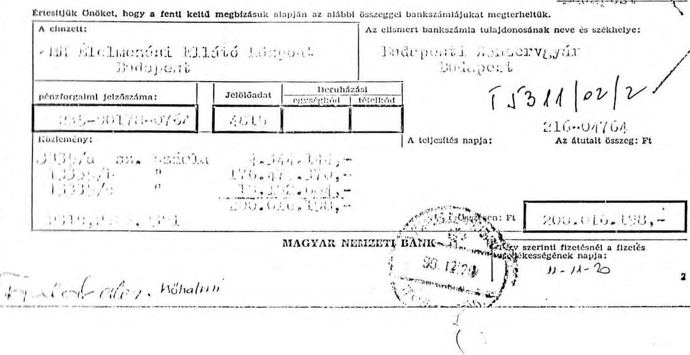

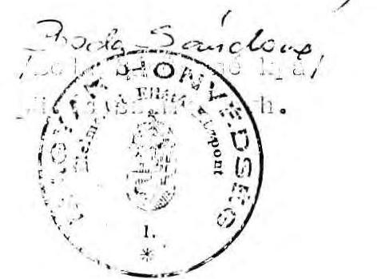

---

MAGYAR HONVÉDSÉG
ANYAGI-TECHNIKAI FŐCSOPORTFŐNÖK
PARANCSNOK-HELYETTES

Nyt.szám: $E z c / 41 / 10 \%$

Papp József ezredes
MH élelmezési szolgálatfőnök

Tárgy: 1991. évi elővásárlás
lemondása

Az 1991. évi 200 MFt értékű előbeszerzés lemondására - az MH várható szervezeti változására tekintettel - kérem intézkedését.

A lemondott készlet ellenértékét az MH ATFCSF-ség Pénzügyi Osztály részére kell átutalni.

Budapest, 1991. február ii. -n.
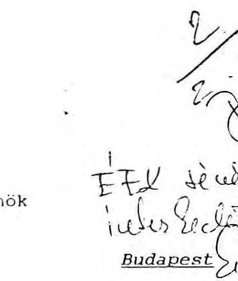

Készült: 3 példányban
Egr pld: 1 lap
Itsz: 2201
Készítette: Mészárosné kpa.
Kapják: 1.sz.pld. Címzett
2.sz.pld. MH ATFCSF-ség Pü.ov.
3.sz.pld. Irattár

---

# MAGYAR HONVÉDSÉG   ÉLELMEZÉSI ELLÁTÓ KÖZPONT   3. sz. példány 

Nyt. szám: 100/6/1991/E.

Oláh Miklós
igazgató úr

## Budapest

Tárgy: Megállapodás
felbontása.

Tisztelt Igazgató Úr!
Szervezeti változások következtében készleteink további csökkentésére kényszerültünk. Ezért kérem, hogy a 100/55/1990/E számú megállapodásunkban megadott mintegy 200 M forint értékű megrendelésünket (előbeszerzésünket) tekintse semmisnek.

A megállapodásunkban rögzített pénzügyi feltételek alapján kérem, hogy rendelésünk előre kifizetett összegét 200.016.198,- Ft-ot 1991. április 05-ig egy összegben az MNB 235-90178-0764 egyszámlánkra átutaltatni szíveskedjen.

Budapest, 1991. február 10.
Üdvözlettel:
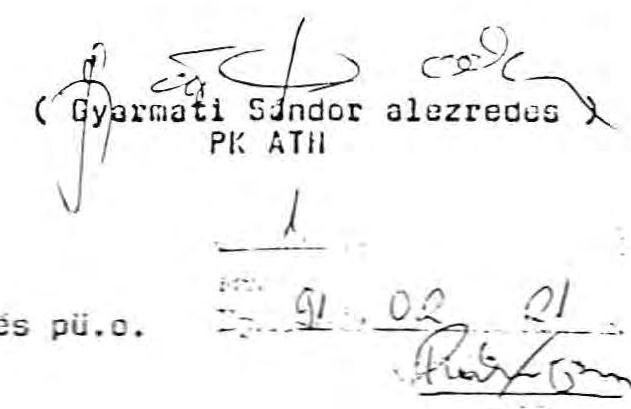

---

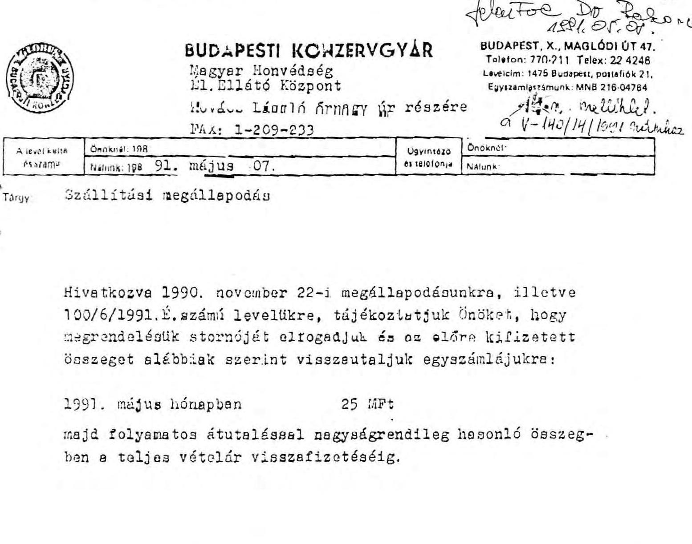

Hivatkozva 1990. november 22-i megállapodásunkra, illetve 100/6/1991. É, számú levelükre, tájékoztatjuk önöket, hogy megrendelésük stornóját elfogadjuk és az előre kifizetett összeget elébbiak szerint visszautaljuk egyszámlájukra:

1991. május hónapban 25 MFt

Majd folyamatos átutalással nagyságrendileg hasonló összegben a teljes vételár visszafizetéséig.

|  Tárgy | Szállítási megállapodás  |
| --- | --- |
|  |   |

Hivatkozva 1990. november 22-i megállapodásunkra, illetve 100/6/1991. É, számú levelükre, tájékoztatjuk önöket, hogy megrendelésük stornóját elfogadjuk és az előre kifizetett összeget elébbiak szerint visszautaljuk egyszámlájukra:

1991. május hónapban 25 MFt

Majd folyamatos átutalással nagyságrendileg hasonló összegben a teljes vételár visszafizetéséig.

---

# Értesítés

## 2014

### Sz. Átutalási Megbízás

|  Értesítjük Önöket, hogy a terhelendő bankszámla tulajdonosa bankszámlájuk javára az alábbi megbízást nyújtotta be. A terhelendő bankszámla tulajdonosának neve és székhelye:

- Budapest: 216-04764
- 4825

Közlemény: 200.016.193.- Ft

I. részlet 1991. jul. 4.

### Összesen:

- 25.000.000.000.000.000.000.000.000.000.000.000.000.000.000.000.000.000.000.000.000.000.000.000.000.000.000.000.000.000.000.000.000.000.000.000.000.000.000.000.000.000.000.000.000.000.000.000.000.000.000

---

# Értesítés

## 20141 Sz. Átutalási Megbízás

Értesítjük Önöket, hogy a terhelendő bankszámla tulajdonosa bankszámlájuk javára az alábbi megbízást nyújtotta be.

A terhelendő bankszámla tulajdonosának neve és székhelye:

**Budapesti Konzervgyár, Budapest**

- 216-04764
- 4825

**Közlemény:**
- 21. részlet
- 31.

**Országos Kereskedelmi és Hitelbank Rt.**

**Tervezetinti fizetésnél a fizetés esedékességének napja:**

- 91. év
- 21. év
- 25.000.000.000
- 15,000.000.000

## 20141 Sz. Átutalási Megbízás

Értesítjük Önöket, hogy a terhelendő bankszámla tulajdonosa bankszámlájuk javára az alábbi megbízást nyújtotta be.

A terhelendő bankszámla tulajdonosának neve és székhelye:

**Budapesti Konzervgyár, Budapest**

- 216-04764
- 7021
- 4825

**Közlemény:**
- 21. részlet
- 31.

**Országos Kereskedelmi és Hitelbank Rt.**

**Tervezetinti fizetésnél a fizetés esedékességének napja:**

- 235-90178-0764
- 235-90178-0764
- 10,000.000.000

## 20141 Sz. Átutalási Megbízás

Értesítjük Önöket, hogy a terhelendő bankszámla tulajdonosa bankszámlájuk javára az alábbi megbízást nyújtotta be.

A terhelendő bankszámla tulajdonosának neve és székhelye:

**Budapesti Konzervgyár, Budapest**

- 216-04764
- 4825

**Közlemény:**
- 21. részlet
- 31.

**Országos Kereskedelmi és Hitelbank Rt.**

**Tervezetinti fizetésnél a fizetés esedékességének napja:**

- 10,000.000.000
- 25,000.000.000

## 20141 Sz. Átutalási Megbízás

Értesítjük Önöket, hogy a terhelendő bankszámla tulajdonosa bankszámlájuk javára az alábbi megbízást nyújtotta be.

A terhelendő bankszámla tulajdonosának neve és székhelye:

**Budapesti Konzervgyár, Budapest**

- 216-04764
- 4825

**Közlemény:**
- 21. részlet
- 31.

**Országos Kereskedelmi és Hitelbank Rt.**

**Tervezetinti fizetésnél a fizetés esedékességének napja:**

- 25,000.000.000
- 25,000.000.000

## 20141 Sz. Átutalási Megbízás

Értesítjük Önöket, hogy a terhelendő bankszámla tulajdonosa bankszámlájuk javára az alábbi megbízást nyújtotta be.

A terhelendő bankszámla tulajdonosának neve és székhelye:

**Budapesti Konzervgyár, Budapest**

- 216-04764
- 4825

**Közlemény:**
- 21. részlet
- 31.

**Országos Kereskedelmi és Hitelbank Rt.**

**Tervezetinti fizetésnél a fizetés esedékességének napja:**

- 25,000.000.000
- 25,000.000.000

## 20141 Sz. Átutalási Megbízás

Értesítjük Önöket, hogy a terhelendő bankszámla tulajdonosa bankszámlájuk javára az alábbi megbízást nyújtotta be.

A terhelendő bankszámla tulajdonosának neve és székhelye:

**Budapesti Konzervgyár, Budapest**

- 216-04764
- 4825

**Közlemény:**
- 21. részlet
- 31.

**Országos Kereskedelmi és Hitelbank Rt.**

**Tervezetinti fizetésnél a fizetés esedékességének napja:**

- 10,000.000.000
- 25,000.000.000

## 20141 Sz. Átutalási Megbízás

Értesítjük Önöket, hogy a terhelendő bankszámla tulajdonosa bankszámlájuk javára az alábbi megbízást nyújtotta be.

A terhelendő bankszámla tulajdonosának neve és székhelye:

**Budapesti Konzervgyár, Budapest**

- 216-04764
- 4825

**Közlemény:**
- 21. részlet
- 31.

**Országos Kereskedelmi és Hitelbank Rt.**

**Tervezetinti fizetésnél a fizetés esedékességének napja:**

- 10,000.000.000
- 25,000.000.000

## 20141 Sz. Átutalási Megbízás

Értesítjük Önöket, hogy a terhelendő bankszámla tulajdonosa bankszámlájuk javára az alábbi megbízást nyújtotta be.

A terhelendő bankszámla tulajdonosának neve és székhelye:

**Budapesti Konzervgyár, Budapest**

- 216-04764
- 4825

**Közlemény:**
- 21. részlet
- 31.

**Országos Kereskedelmi és Hitelbank Rt.**

**Tervezetinti fizetésnél a fizetés esedékességének napja:**

- 10,000.000.000
- 25,000.000.000

## 20141 Sz. Átutalási Megbízás

Értesítjük Önöket, hogy a terhelendő bankszámla tulajdonosa bankszámlájuk javára az alábbi megbízást nyújtotta be.

A terhelendő bankszámla tulajdonosának neve és székhelye:

**Budapesti Konzervgyár, Budapest**

- 216-04764
- 4825

**Közlemény:**
- 21. részlet
- 31.

**Országos Kereskedelmi és Hitelbank Rt.**

**Tervezetinti fizetésnél a fizetés esedékességének napja:**

- 10,000.000.000
- 25,000.000.000

## 20141 Sz. Átutalási Megbízás

Értesítjük Önöket, hogy a terhelendő bankszámla tulajdonosa bankszámlájuk javára az alábbi megbízást nyújtotta be.

A terhelendő bankszámla tulajdonosának neve és székhelye:

**Budapesti Konzervgyár, Budapest**

- 216-04764
- 4825

**Közlemény:**
- 21. részlet
- 31.

**Országos Kereskedelmi és Hitelbank Rt.**

**Tervezetinti fizetésnél a fizetés esedékességének napja:**

- 10,000.000.000
- 25,000.000.000

## 20141 Sz. Átutalási Megbízás

Értesítjük Önöket, hogy a terhelendő bankszámla tulajdonosa bankszámlájuk javára az alábbi megbízást nyújtotta be.

A terhelendő bankszámla tulajdonosának neve és székhelye:

**Budapesti Konzervgyár, Budapest**

- 216-04764
- 4825

**Közlemény:**
- 21. részlet
- 31.

**Országos Kereskedelmi és Hitelbank Rt.**

**Tervezetinti fizetésnél a fizetés esedékességének napja:**

- 10,000.000.000
- 25,000.000.000

## 20141 Sz. Átutalási Megbízás

Értesítjük Önöket, hogy a terhelendő bankszámla tulajdonosa bankszámlájuk javára az alábbi megbízást nyújtotta be.

A terhelendő bankszámla tulajdonosának neve és székhelye:

**Budapesti Konzervgyár, Budapest**

- 216-04764
- 4825

**Közlemény:**
- 21. részlet
- 31.

**Országos Kereskedelmi és Hitelbank Rt.**

**Tervezetinti fizetésnél a fizetés esedékességének napja:**

- 10,000.000.000
- 25,000.000.000

## 20141 Sz. Átutalási Megbízás

Értesítjük Önöket, hogy a terhelendő bankszámla tulajdonosa bankszámlájuk javára az alábbi megbízást nyújtotta be.

A terhelendő bankszámla tulajdonosának neve és székhelye:

**Budapesti Konzervgyár, Budapest**

- 216-04764
- 4825

**Közlemény:**
- 21. részlet
- 31.

**Országos Kereskedelmi és Hitelbank Rt.**

**Tervezetinti fizetésnél a fizetés esedékességének napja:**

- 10,000.000.000
- 25,000.000.000

## 20141 Sz. Átutalási Megbízás

Értesítjük Önöket, hogy a terhelendő bankszámla tulajdonosa bankszámlájuk javára az alábbi megbízást nyújtotta be.

A terhelendő bankszámla tulajdonosának neve és székhelye:

**Budapesti Konzervgyár, Budapest**

- 216-04764
- 4825

**Közlemény:**
- 21. részlet
- 31.

**Országos Kereskedelmi és Hitelbank Rt.**

**Tervezetinti fizetésnél a fizetés esedékességének napja:**

- 10,000.000.000
- 25,000.000.000

## 20141 Sz. Átutalási Megbízás

Értesítjük Önöket, hogy a terhelendő bankszámla tulajdonosa bankszámlájuk javára az alábbi megbízást nyújtotta be.

A terhelendő bankszámla tulajdonosának neve és székhelye:

**Budapesti Konzervgyár, Budapest**

- 216-04764
- 4825

**Közlemény:**
- 21. részlet
- 31.

**Országos Kereskedelmi és Hitelbank Rt.**

**Tervezetinti fizetésnél a fizetés esedékességének napja:**

- 10,000.000.000
- 25,000.000.000

## 20141 Sz. Átutalási Megbízás

Értesítjük Önöket, hogy a terhelendő bankszámla tulajdonosa bankszámlájuk javára az alábbi megbízást nyújtotta be.

A terhelendő bankszámla tulajdonosának neve és székhelye:

**Budapesti Konzervgyár, Budapest**

- 216-04764
- 4825

**Közlemény:**
- 21. részlet
- 31.

**Országos Kereskedelmi és Hitelbank Rt.**

**Tervezetinti fizetésnél a fizetés esedékességének napja:**

- 10,000.000.000
- 25,000.000.000

## 20141 Sz. Átutalási Megbízás

Értesítjük Önöket, hogy a terhelendő bankszámla tulajdonosa bankszámlájuk javára az alábbi megbízást nyújtotta be.

A terhelendő bankszámla tulajdonosának neve és székhelye:

**Budapesti Konzervgyár, Budapest**

- 216-04764
- 4825

**Közlemény:**
- 21. részlet
- 31.

**Országos Kereskedelmi és Hitelbank Rt.**

**Tervezetinti fizetésnél a fizetés esedékességének napja:**

- 10,000.000.000
- 25,000.000.000

## 20141 Sz. Átutalási Megbízás

Értesítjük Önöket, hogy a terhelendő bankszámla tulajdonosa bankszámlájuk javára az alábbi megbízást nyújtotta be.

A terhelendő bankszámla tulajdonosának neve és székhelye:

**Budapesti Konzervgyár, Budapest**

- 216-04764
- 4825

**Közlemény:**
- 21. részlet
- 31.

**Országos Kereskedelmi és Hitelbank Rt.**

**Tervezetinti fizetésnél a fizetés esedékességének napja:**

- 10,000.000.000
- 25,000.000.000

## 20141 Sz. Átutalási Megbízás

Értesítjük Önöket, hogy a terhelendő bankszámla tulajdonosa bankszámlájuk javára az alábbi megbízást nyújtotta be.

A terhelendő bankszámla tulajdonosának neve és székhelye:

**Budapesti Konzervgyár, Budapest**

- 216-04764
- 4825

**Közlemény:**
- 21. részlet
- 31.

**Országos Kereskedelmi és Hitelbank Rt.**

**Tervezetinti fizetésnél a fizetés esedékességének napja:**

- 10,000.000.000
- 25,000.000.000

## 20141 Sz. Átutalási Megbízás

Értesítjük Önöket, hogy a terhelendő bankszámla tulajdonosa bankszámlájuk javára az alábbi megbízást nyújtotta be. be.

A terhelendő bankszámla tulajdonosának neve és székhelye:

**Budapesti Konzervgyár, Budapest**

- 216-04764
- 4825

**Közlemény:**
- 21. részlet
- 31.

**Országos Kereskedelmi és Hitelbank Rt.**

**Tervezett intő fizetésnél a fizetés esedékességének napja:**

- 10,000.000.000
- 25,000.000.000

## 20141 Sz. Átutalási Megbízás

Értesítjük Önöket, hogy a terhelendő bankszámla tulajdonosa bankszámlájuk javára az alábbi megbízást nyújtotta be.

A terhelendő bankszámla tulajdonosának neve és székhelye:

**Budapesti Konzervgyár, Budapest**

- 216-04764
- 4825

**Közlemény:**
- 21. részlet
- 31.

**Országos Kereskedelmi és Hitelbank Rt.**

**Tervezett intő fizetésnél a fizetés esedékességének napja:**

- 10,000.000.000
- 25,000.000.000

## 20141 Sz. Átutalási Megbízás

Értesítjük Önöket, hogy a terhelendő bankszámla tulajdonosa bankszámlájuk javára az alábbi megbízást nyújtotta be.

A terhelendő bankszámla tulajdonosának neve és székhelye:

**Budapesti Konzervgyár, Budapest**

- 216-04764
- 4825

**Közlemény:**
- 21. részlet
- 31.

**Országos Kereskedelmi és Hitelbank Rt.**

**Tervezett intő fizetésnél a fizetés esedékességének napja:**

- 10,000.000.000
- 25,000.000.000

## 20141 Sz. Átutalási Megbízás

Értesítjük Önöket, hogy a terhelendő bankszámla tulajdonosa bankszámlájuk javára az alábbi megbízást nyújtotta be.

A terhelendő bankszámla tulajdonosának neve és székhelye:

**Budapesti Konzervgyár, Budapest**

- 216-04764
- 4825

**Közlemény:**
- 21. részlet
- 31.

**Országos Kereskedelmi és Hitelbank Rt.**

**Tervezett intő fizetésnél a fizetés esedékességének napja:**

- 10,000.000.000
- 25,000.000.000

## 20141 Sz. Átutalási Megbízás

Értesítjük Önöket, hogy a terhelendő bankszámla tulajdonosa bankszámlájuk javára az alábbi megbízást nyújtotta be.

A terhelendő bankszámla tulajdonosának neve és székhelye:

**Budapesti Konzervgyár, Budapest**

- 216-04764
- 4825

**Közlemény:**
- 21. részlet
- 31.

**Országos Kereskedelmi és Hitelbank Rt.**

**Tervezett intő fizetésnél a fizetés esedékességének napja:**

- 10,000.000.000
- 25,000.000.000

## 20141 Sz. Átutalási Megbízás

Értesítjük Önöket, hogy a terhelendő bankszámla tulajdonosa bankszámlájuk
 javára az alábbi megbízást nyújtotta be.

A terhelendő bankszámla tulajdonosának neve és székhelye:

**Budapesti Konzervgyár, Budapest**

- 216-04764
- 4825

**Közlemény:**
- 21. részlet
- 31.

**Országos Kereskedelmi és Hitelbank Rt.**

**Tervezetinti fizetésnél a fizetés esedékességének napja:**

- 10,000.000.000
- 25,000.000.000

## 20141 Sz. Átutalási Megbízás

Értesítjük Önöket, hogy a terhelendő bankszámla tulajdonosa bankszámlájuk javára az alábbi megbízást nyújtotta be.

A terhelendő bankszámla tulajdonosának neve és székhelye:

**Budapesti Konzervgyár, Budapest**

- 216-04764
- 4825

**Közlemény:**
- 21. részlet
- 31.

**Országos Kereskedelmi és Hitelbank Rt.**

**Tervezetinti fizetésnél a fizetés esedékességének napja:**

- 10,000.000.000
- 25,000.000.000

## 20141 Sz. Átutalási Megbízás

Értesítjük Önöket, hogy a terhelendő bankszámla tulajdonosa bankszámlájuk javára az alábbi megbízást nyújtotta be.

A terhelendő bankszámla tulajdonosának neve és székhelye:

**Budapesti Konzervgyár, Budapest**

- 216-04764
- 4825

**Közlemény:**
- 21. részlet
- 31.

**Országos Kereskedelmi és Hitelbank Rt.**

**Tervezetinti fizetésnél a fizetés esedékességének napja:**

- 10,000.000.000
- 25,000.000.000

## 20141 Sz. Átutalási Megbízás

Értesítjük Önöket, hogy a terhelendő bankszámla tulajdonosa bankszámlájuk javára az alábbi megbízást nyújtotta be.

A terhelendő bankszámla tulajdonosának neve és székhelye:

**Budapesti Konzervgyár, Budapest**

- 216-04764
- 4825

**Közlemény:**
- 21. részlet
- 31.

**Országos Kereskedelmi és Hitelbank Rt.**

**Tervezetinti fizetésnél a fizetés esedékességének napja:**

- 10,000.000.000
- 25,000.000.000

## 20141 Sz. Átutalási Megbízás

Értesítjük Önöket, hogy a terhelendő bankszámla tulajdonosa bankszámlájuk javára az alábbi megbízást nyújtotta be.

A terhelendő bankszámla tulajdonosának neve és székhelye:

**Budapesti Konzervgyár, Budapest**

- 216-04764
- 4825

**Közlemény:**
- 21. részlet
- 31.

**Országos Kereskedelmi és Hitelbank Rt.**

**Tervezetinti fizetésnél a fizetés esedékességének napja:**

- 10,000.000.000
- 25,000.000.000

## 20141 Sz. Átutalási Megbízás

Értesítjük Önöket, hogy a terhelendő bankszámla tulajdonosa bankszámlájuk javára az alábbi megbízást nyújtotta be.

A terhelendő bankszámla tulajdonosának neve és székhelye:

**Budapesti Konzervgyár, Budapest**

- 216-04764
- 4825

**Közlemény:**
- 21. részlet
- 31.

**Országos Kereskedelmi és Hitelbank Rt.**

**Tervezetinti fizetésnél a fizetés esedékességének napja:**

- 10,000.000.000
- 25,000.000.000

## 20141 Sz. Átutalási Megbízás

Értesítjük Önöket, hogy a terhelendő bankszámla tulajdonosa bankszámlájuk javára az alábbi megbízást nyújtotta be.

A terhelendő bankszámla tulajdonosának neve és székhelye:

**Budapesti Konzervgyár, Budapest**

- 216-04764
- 4825

**Közlemény:**
- 21. részlet
- 31.

**Országos Kereskedelmi és Hitelbank Rt.**

**Tervezetinti fizetésnél a fizetés esedékességének napja:**

- 10,000.000.000
- 25,000.000.000

## 20141 Sz. Átutalási Megbízás

Értesítjük Önöket, hogy a terhelendő bankszámla tulajdonosa bankszámlájuk javára az alábbi megbízást nyújtotta be.

A terhelendő bankszámla tulajdonosának neve és székhelye:

**Budapesti Konzervgyár, Budapest**

- 216-04764
- 4825

**Közlemény:**
- 21. részlet
- 31.

**Országos Kereskedelmi és Hitelbank Rt.**

**Tervezetinti fizetésnél a fizetés esedékességének napja:**

- 10,000.000.000
- 25,000.000.000

## 20141 Sz. Átutalási Megbízás

Értesítjük Önöket, hogy a terhelendő bankszámla tulajdonosa bankszámlájuk javára az alábbi megbízást nyújtotta be.

A terhelendő bankszámla tulajdonosának neve és székhelye:

**Budapesti Konzervgyár, Budapest**

- 216-04764
- 4825

**Közlemény:**
- 21. részlet
- 31.

**Országos Kereskedelmi és Hitelbank Rt.**

**Tervezetinti fizetésnél a fizetés esedékességének napja:**

- 10,000.000.000
- 25,000.000.000

## 20141 Sz. Átutalási Megbízás

Értesítjük Önöket, hogy a terhelendő bankszámla tulajdonosa bankszámlájuk javára az alábbi megbízást nyújtotta be.

A terhelendő bankszámla tulajdonosának neve és székhelye:

**Budapesti Konzervgyár, Budapest**

- 216-04764
- 4825

**Közlemény:**
- 21. részlet
- 31.

**Országos Kereskedelmi és Hitelbank Rt.**

**Tervezetinti fizetésnél a fizetés esedékességének napja:**

- 10,000.000.000
- 25,000.000.000

## 20141 Sz. Átutalási Megbízás

Értesítjük Önöket, hogy a terhelendő bankszámla tulajdonosa bankszámlájuk javára az alábbi megbízást nyújtotta be.

A terhelendő bankszámla tulajdonosának neve és székhelye:

**Budapesti Konzervgyár, Budapest**

- 216-04764
- 4825

**Közlemény:**
- 21. részlet
- 31.

**Országos Kereskedelmi és Hitelbank Rt.**

**Tervezetinti fizetésnél a fizetés esedékességének napja:**

- 10,000.000.000
- 25,000.000.000

## 20141 Sz. Átutalási Megbízás

Értesítjük Önöket, hogy a terhelendő bankszámla tulajdonosa bankszámlájuk javára az alábbi megbízást nyújtotta be.

A terhelendő bankszámla tulajdonosának neve és székhelye:

**Budapesti Konzervgyár, Budapest**

- 216-04764
- 4825

**Közlemény:**
- 21. részlet
- 31.

**Országos Kereskedelmi és Hitelbank Rt.**

**Tervezetinti fizetésnél a fizetés esedékességének napja:**

- 10,000.000.000
- 25,000.000.000

## 20141 Sz. Átutalási Megbízás

Értesítjük Önöket, hogy a terhelendő bankszámla tulajdonosa bankszámlájuk javára az alábbi megbízást nyújtotta be.

A terhelendő bankszámla tulajdonosának neve és székhelye:

**Budapesti Konzervgyár, Budapest**

- 216-04764
- 4825

**Közlemény:**
- 21. részlet
- 31.

**Országos Kereskedelmi és Hitelbank Rt.**

**Tervezetinti fizetésnél a fizetés esedékességének napja:**

- 10,000.000.000
- 25,000.000.000

## 20141 Sz. Átutalási Megbízás

Értesítjük Önöket, hogy a terhelendő bankszámla tulajdonosa bankszámlájuk javára az alábbi megbízást nyújtotta be.

A terhelendő bankszámla tulajdonosának neve és székhelye:

**Budapesti Konzervgyár, Budapest**

- 216-04764
- 4825

**Közlemény:**
- 21. részlet
- 31.

**Országos Kereskedelmi és Hitelbank Rt.**

**Tervezetinti fizetésnél a fizetés esedékességének napja:**

- 10,000.000.000
- 25,000.000.000

## 20141 Sz. Átutalási Megbízás

Értesítjük Önöket, hogy a terhelendő bankszámla tulajdonosa bankszámlájuk javára az alábbi megbízást nyújtotta be.

A terhelendő bankszámla tulajdonosának neve és székhelye:

**Budapesti Konzervgyár, Budapest**

- 216-04764
- 4825

**Közlemény:**
- 21. részlet
- 31.

**Országos Kereskedelmi és Hitelbank Rt.**

**Tervezetinti fizetésnél a fizetés esedékességének napja:**

- 10,000.000.000
- 25,000.000.000

## 20141 Sz. Átutalási Megbízás

Értesítjük Önöket, hogy a terhelendő bankszámla tulajdonosa bankszámlájuk javára az alábbi megbízást nyújtotta be.

A terhelendő bankszámla tulajdonosának neve és székhelye:

**Budapesti Konzervgyár, Budapest**

- 216-04764
- 4825

**Közlemény:**
- 21. részlet
- 31.

**Országos Kereskedelmi és Hitelbank Rt.**

**Tervezetinti fizetésnél a fizetés esedékességének napja:**

- 10,000.000.000

## 20141 Sz. Átutalási Megbízás

Értesítjük Önöket, hogy a terhelendő bankszámla tulajdonosa bankszámlájuk javára az alábbi megbízást nyújtotta be.

A terhelendő bankszámla tulajdonosának neve és székhelye:

**Budapesti Konzervgyár, Budapest**

- 216-04764
- 4825

**Közlemény:**
- 21. részlet
- 31.

**Országos Kereskedelmi és Hitelbank Rt.**

**Tervezetinti fizetésnél a fizetés esedékességének napja:**

- 10,000.000.000

## 20141 Sz. Átutalási Megbízás

Értesítjük Önöket, hogy a terhelendő bankszámla tulajdonosa bankszámlájuk javára az alábbi megbízást nyújtotta be.

A terhelendő bankszámla tulajdonosának neve és székhelye:

**Budapesti Konzervgyár, Budapest**

- 216-04764
- 4825

**Közlemény:**
- 21. részlet
- 31.

**Országos Kereskedelmi és Hitelbank Rt.**

**Tervezetinti fizetésnél a fizetés esedékességének napja:**

- 10,000.000.00

## 20141 Sz. Átutalási Megbízás

Értesítjük Önöket, hogy a terhelendő bankszámla tulajdonosa bankszámlájuk javára az alábbi megbízást nyújtotta be.

A terhelendő bankszámla tulajdonosának neve és székhelye:

**Budapesti Konzervgyár, Budapest**

- 216-04764
- 4825

**Közlemény:**
- 21. részlet
- 31.

**Országos Kereskedelmi és Hitelbank Rt.**

**Tervezetinti fizetésnél a fizetés esedékességének napja:**

- 10,000.000.00

## 20141 Sz. Átutalási Megbízás

Értesítjük Önöket, hogy a terhelendő bankszámla tulajdonosa bankszámlájuk javára az alábbi megbízást nyújtotta be.

A terhelendő bankszámla tulajdonosának neve és székhelye:

**Budapesti Konzervgyár, Budapest**

- 216-04764
- 4825

**Közlemény:**
- 21. részlet
- 31.

**Országos Kereskedelmi és Hitelbank Rt.**

**Tervezetinti fizetésnél a fizetés esedékességének napja:**

- 10,000.000.00

## 20141 Sz. Átutalási Megbízás

Értesítjük Önöket, hogy a terhelendő bankszámla tulajdonosa bankszámlájuk javára az alábbi megbízást nyújtotta be.

A terhelendő bankszámla tulajdonosa bankszámlájuk javára az alábbi megbízást nyújtotta be.

A terhelendő bankszámla tulajdonosának neve és székhelye:

**Budapesti Konzervgyár, Budapest**

- 216-04764
- 4825

**Közlemény:**
- 21. részlet
- 31.

**Országos Kereskedelmi és Hitelbank Rt.**

**Tervezetinti fizetésnél a fizetés esedékességének napja:**

- 10,000.00

## 20141 Sz. Átutalási Megbízás

Értesítjük Önöket, hogy a terhelendő bankszámla tulajdonosa bankszámlájuk javára az alábbi megbízást nyújtotta be.

A terhelendő bankszámla tulajdonosa bankszámlájuk javára az alábbi megbízást nyújtotta be.

A terhelendő bankszámla tulajdonosának neve és székhelye:

**Budapesti Konzervgyár, Budapest**

- 216-04764
- 4825

**Közlemény:**
- 21. részlet
- 31.

**Országos Kereskedelmi és Hitelbank Rt.**

**Tervezetinti fizetésnél a fizetés esedékességének napja:**

- 10,000.00

## 20141 Sz. Átutalási Megbízás

Értesítjük Önöket, hogy a terhelendő bankszámla tulajdonosa bankszámlájuk javára az alábbi megbízást nyújtotta be.

A terhelendő bankszámla tulajdonosa bankszámlájuk javára az alábbi megbízást nyújtotta be.

A terhelendő bankszámla tulajdonosa bankszámlájuk javára az alábbi megbízást nyújtotta be.

A terhelendő bankszámla tulajdonosa bankszámlájuk javára az alábbi megbízást nyújtotta be.

A terhelendő bankszámla tulajdonosa bankszámlájuk javára az alábbi megbízást nyújtotta be.

A terhelendő bankszámla tulajdonosa bankszámlájuk javára az alábbi megbízást nyújtotta be.

A terhelendő bankszámla tulajdonosa bankszámlájuk javára az alábbi megbízást nyújtotta be.

A terhelendő bankszámla tulajdonosa bankszámlájuk javára az alábbi megbízást nyújtotta be.

A terhelendő bankszámla tulajdonosa bankszámlájuk javára az alábbi megbízást nyújtotta be.

A terhelendő bankszámla tulajdonosa bankszámlájuk javára az alábbi megbízást nyújtotta be.

A terhelendő bankszámla tulajdonosa bankszámlájuk javára az alábbi megbízást nyújtotta be.

A terhelendő bankszámla tulajdonosa bankszámlájuk javára az alábbi megbízást nyújtotta be.

A terhelendő bankszámla tulajdonosa bankszámlájuk javára az alábbi megbízást nyújtotta be.

A terhelendő bankszámla tulajdonosa bankszámlájuk javára az alábbi megbízást nyújtotta be.

A terhelendő bankszámla tulajdonosa bankszámlájuk javára az alábbi megbízást nyújtotta be.

A terhelendő bankszámla tulajdonosa bankszámlájuk javára az alábbi megbízást nyújtotta be.

A terhelendő bankszámla tulajdonosa bankszámlájuk javára az alábbi megbízást nyújtotta be.

A terhelendő bankszámla tulajdonosa bankszámlájuk javára az alábbi megbízást nyújtotta be.

A terhelendő bankszámla tulajdonosa bankszámlájuk javára az alábbi megbízást nyújtotta be.

A terhelendő bankszámla tulajdonosa bankszámlájuk javára az alábbi megbízást nyújtotta be.

A terhelendő bankszámla tulajdonosa bankszámlájuk javára az alábbi megbízást nyújtotta be.

A terhelendő bankszámla tulajdonosa bankszámlájuk javára az alábbi megbízást nyújtotta be.

A terhelendő bankszámla tulajdonosa bankszámlájuk javára az alábbi megbízást nyújtotta be.

A terhelendő bankszámla tulajdonosa bankszámlájuk javára az alábbi megbízást nyújtotta be.

A terhelendő bankszámla tulajdonosa bankszámlájuk javára az alábbi megbízást nyújtotta be.

A terhelendő bankszámla tulajdonosa bankszámlájuk javára az alábbi megbízást nyújtotta be.

A terhelendő bankszámla tulajdonosa bankszámlájuk javára az alábbi megbízást nyújtotta be.

A terhelendő bankszámla tulajdonosa bankszámlájuk javára az alábbi megbízást nyújtotta be.

A terhelendő bankszámla tulajdonosa bankszámlájuk javára az alábbi megbízást nyújtotta be.

A terhelendő bankszámla tulajdonosa bankszámlájuk javára az alábbi megbízást nyújtotta be.

A terhelendő bankszámla tulajdonosa bankszámlájuk javára az alábbi megbízást nyújtotta be.

A terhelendő bankszámla tulajdonosa bankszámlájuk javára az alábbi megbízást nyújtotta be.

A terhelendő bankszámla tulajdonosa bankszámlájuk javára az alábbi megbízást nyújtotta be.

---

# Értesítés

|  20141 | Sz. átutalási megbízás | OKHB Rt.  |
| --- | --- | --- |
|  |   |   |

Értesítjük Önöket, hogy a terhelendő bankszámla tulajdonosa bankszámlájuk javára az alábbi megbízást nyújtotta be 31 II.13.

A terhelendő bankszámla tulajdonosának neve és székhelye:

Budapesti Konzervgyár, Budapest

|  A címzett: |  |   |
| --- | --- | --- |
|  MH Élelmező: |  |   |
|  Budapest |  |   |
|  |   |   |
|  |   |   |
|  |   |   |
|  |   |   |
|  |   |   |
|  |   |   |
|  |   |   |
|  |   |   |
|  |   |   |
|  |   |   |
|  |   |   |
|  |   |   |
|  |   |   |
|  |   |   |
|  |   |   |
|  |   |   |
|  |   |   |
|  |   |   |
|  |   |   |
|  |   |   |
|  |   |   |
|  |   |   |
|  |   |   |
|  |   |   |
|  |   |   |
|  |   |   |
|  |   |   |
|  |   |   |
|  |   |   |
|  |   |   |

---

#
 MAGYAR HONVÉDSÉG ÉLELMEZÉSI ELLÁTÓ KÖZPONT 

Nyt. szám: $100 / 58 / 1990 /$ E.

1. sz. példány
a. V-HO/H/1991 szásha

Megállapodás
amely létrejött 1990. december hó 18-án a Budapesti Konzervgyár (1076. Bp. Maglódi u.47.), továbbiakban mint szállító és a

Magyar Honvédség Élelmezési Ellátó Központ (Bp. 1395. Lenel u.41. Pf.: 423.), továbbiakban mint vevő között az alábbi feltételek szerint:
1./ 1990. december 20-tól megrendelünk Önöknél az MH Élelmezési Ellátó Központ részére 100 M Ft értékben különféle hideg és készétel konzerveket (a 2.sz.mellékletben feltüntetett mennyiségben és árban) "idegen helyen" történő tárolásra, tárolási különköltség felszámítása nélkül.
2./ Szállító vállalja, hogy a vevő igénybejelentését követő 10 munkanapon belül az 1.sz.mellékletben felsorolt termékeket biztosítja. A teljesítés helye a szállító telephelye. Csak a végső termék gyártásközi és végtermék minőségi átvételéhez küldünk KÜM átvevőt. Vevő a teljesítést követően az árut saját szállító eszközével szállítja el.
3./ Az idegen helyen szállítónál tárolt készleteink frissítése érdekében hozzájárulunk ahhoz, hogy átmenetileg felhasználhatnak, eladhatnak más kereskedelmi szervezetnek is természetesen az újonnan közösen kialakított határidőre visszapótolva a vevő készletét.
4./ Fizetés módja: átutalással egy összegben a szállító által kiállított számla alapján 10 banki napon belül. Ezt követően a megrendelt termékek az MH "idegen helyen" tárolt készletét képezik.

---

Amennyiben a vevő a lekötött termékekre előre nem látható változások miatt - készletek további csökkentése - nem tart igényt, úgy köteles a szállítót (egy összegben történő visszafizetés esetén) 20 nappal előbb értesíteni.

Szerződő felek megállapodnak továbbá, hogy a vevő részéről történő szerződésbontás után jogi, illetve pénzügyi követeléssel nem lépünk fel.

A szállító részéről történő szerződésbontás - amennyiben a vevőt 20 nappal korábban nem értesíti - esetén a mindekor érvényben lévő késedelmi kamat összegét a számított időszakra köteles megtéríteni a Magyar Honvédség Élelmezési Ellátó Központ részére.

A megállapodás 1991. január 01-i hatállyal lép életbe.

A megállapodásban foglaltak újbóli felülvizsgálatának határideje 1991. március 31.
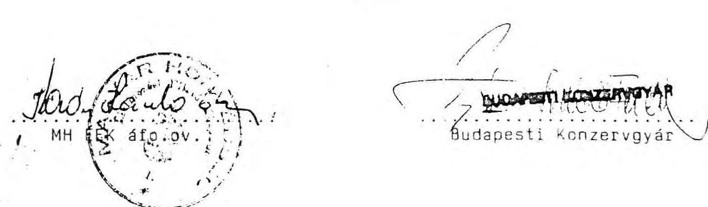

---

| Termék | Termelői ár   FT/db | Szerz.menny.   db | Összesen   FT |
| :-- | :--: | :--: | :--: |
| Sertésborda szeksz.módr. | 50,00 | 80.000 | 4.000 .000 |
| Rakottkáposzta | 33,00 | 50.000 | 1.650 .000 |
| Babfőzelék kolbásszal | 25,00 | 100.000 | 2.500 .000 |
| Töltött káposzta m.h. | 29,00 | 100.000 | 2.900 .000 |
| Marhapörkölt | 46,00 | 200.000 | 9.200 .000 |
| Magyaros vagdalthús | 17,00 | 400.000 | 6.800 .000 |
| Különleges vagdalthús | 16,00 | 200.000 | 3.200 .000 |
| Camping vagdalthús | 16,00 | 200.000 | 3.200 .000 |
| Vikend vagdalthús | 20,00 | 107.500 | 2.150 .000 |
| Veronai vagdalthús | 22,00 | 200.000 | 4.400.000 |
| --- | --- |
| Sűrített par.püré 38-40\% | 60,00 F/Kg | 1.000.000 kg | 60.000.000 |
|  |  |  | 100.000.000 Ft |

Kiszállításkor a mindenkori termelői áron számlázunk.

Budapest, 1990. december 19.

---

# 10697 

A szállító (név, irányítószám, cím, telex, postafiók, bankszámla a vevő (név, irányítószám, cím, bankszámla száma és megnevezése):

A szállító (név, irányítószám, cím, telex, postafiók, bankszámla száma és megnevezése):

Adóigazgatási azonosítósám:

| A megrendelés száma: | A fizetés módja: | A teljesítés időpontja | A számla kelte | Fizetési határidő | A számla sorszáma |
| :-- | :-- | :-- | :-- | :-- | :-- |

Egyéb adatok:

| Cikkszám, Az áru (szolgáltatás) KSH-besorolási száma; ETK-száma,   szabványos megnevezése, egyéb jellemzői; AFA-kulcsa | Mennyiség   egysége | Mennyiség | Egységár | Számlaérték |
| :-- | :-- | :-- | :-- | :-- |

---

10698

A szállító (név, irányítószám, cím, telex, postafiók, bankszámla A vevő (név, irányítószám, cím, bankszámla száma és megnevezése) száma és megnevezése): száma és megnevezése): Budapesti Konzervgyár

MAN ELEL KISZELLÁTO KÖZPONT

Budapest Pf. 21 1475 MNB: 216-04764-0000 ADÓIG.KOD: 10004768221 Adóigazgatási azonosítószám:

| A megrendelés száma: | A fizetés módja: | A teljesítés időpontja 90.12.29. | A számla kelte 90.12.29. | Fizetési határidő | A számla sorszáma
 14000
| --- | --- | --- | --- | --- | --- |
| Egyéb adatok: száll.sz.: 61350/rakta: 3 ország: 0 mozg. nem: 11 | | | | | |
| Cikkszám; Az áru (szolgáltatás) KSH-begorolási száma; ETK-száma; szabványos megnevezésé, egyéb jellemzői; AFA-kulcsa | | Mennyiség | Mennyiség | Egységár | Számlaérték |
| 173: 833211 | Sár.par.38-401 31 sz | kg | 400000.00 | 60.30 | 24000030 |
| 173: 833211 | Sár.par.38-401 31 sz | kg | 600000.00 | 60.30 | 36000000 |
| | AFA nélküli érték: | | | 0.00 | 60000000 |
| | AFA: | | | | 60000000* |
| | AFA nélküli összes: | | | | 60000000* |
| | AFA összérték: | | | | 60000000* |
| | Szanla végösszeg: | | | | 60000000* |

m: 10698

m: 10698

10698

10698

10698

10698

10698

10698

10698

10698

10698

10698

10698

10698

10698

10698

10698

10698

10698

10698

10698

10698

10698

10698

10698

10698

10698

10698

10698

10698

10698

10698

10698

10698

10698

10698

10698

10698

10698

10698

10698

10698

10698

10698

10698

10698

10698

10698

10698

10698

10698

10698

10698

10698

10698

10698

10698

10698

10698

10698

10698

10698

10698

10698

10698

10698

10698

10698

10698

10698

10698

10698

10698

10698

10698

10698

10698

10698

10698

10698

10698

10698

10698

10698

10698

10698

10698

10698

10698

10698

10698

10698

10698

10698

10698

10698

10698

10698

10698

10698

10698

10698

10698

10698

10698

10698

10698

10698

10698

10698

10698

10698

10698

10698

10698

10698

10698

10698

10698

10698

10698

10698

10698

10698

10698

10698

10698

10698

10698

10698

10698

10698

10698

10698

10698

10698

10698

10698

10698

10698

10698

10698

10698

10698

10698

10698

10698

10698

10698

10698

10698

10698

10698

10698

10698

10698

10698

10698

10698

10698

10698

10698

10698

10698

10698

10698

10698

10698

10698

10698

10698

10698

10698

10698

10698

10698

10698

10698

10698

10698

10698

10698

10698

10698

10698

10698

10698

10698

10698

10698

10698

10698

10698

10698

10698

10698

10698

10698

10698

10698

10698

10698

10698

10698

10698

10698

10698

10698

10698

10698

10698

10698

10698

10698

10698

10698

10698

10698

10698

10698

10698

10698

10698

10698

10698

10698

10698

10698

10698

10698

10698

10698

10698

10698

10698

10698

10698

10698

10698

10698

10698

10698

10698

10698

10698

10698

10698

10698

10698

10698

10698

10698

10698

10698

10698

10698

10698

10698

10698

10698

10698

10698

10698

10698

10698

10698

10698

10698

10698

10698

10698

10698

10698

10698

10698

10698

10698

10698

10698

10698

10698

10698

10698

10698

10698

10698

10698

10698

10698

10698

10698

10698

10698

10698

10698

10698

10698

10698

10698

10698

10698

10698

10698

10698

10698

10698

10698

10698

10698

10698

10698

10698

10698

10698

10698

10698

10698

10698

10698

10698

10698

10698

10698

10698

10698

10698

10698

10698

10698

10698

10698

10698

10698

---

# MAGYAR HONVÉDSÉG ÉLELMEZÉSI ELLÁTÓ KÖZPONT

1.  sz. példány

Nyt. szám: 100/59/1990./É.

Megállapodás

amely létrejött 1990. december hó 19-én a Nagykőrösi Konzervgyár (Nagykőrös, József A.u.l.), továbbiakban mint szállító és a Magyar Honvédség Élelmezési Ellátó Központ (Bp. 1395. Lehel u.41. Pf.: 423.), továbbiakban mint vevő között az alábbi feltételek szerint:

1./ 1990. december 20-tól megrendelünk Önöknél az MH Élelmezési Ellátó Központ részére értékben különféle hideg és készétel konzerveket (a 2.sz. mellékletben feltüntetett mennyiségben és árban) "idegen helyen" történő tárolásra, tárolási különköltség felszámítása nélkül.

2./ Szállító vállalja, hogy a vevő igénybejelentését követő 10 munkanapon belül az 1.sz. mellékletben felsorolt termékeket biztosítja. A teljesítés helye a szállító telephely. Csak a végső termék gyártásközi és végtermék minőségi átvételéhez küldünk KÜM átvevőt. Vevő a teljesítést követően az árut saját szállító eszközével szállítja el.

3./ Az idegen helyen szállítónál tárolt készleteink frissítése érdekében hozzájárulunk ahhoz, hogy átmenetileg felhasználhatnak, eladhatnak más kereskedelmi szervezetnek is természetesen az újonnan közösen kialakított határidőre visszapótolva a vevő készletét.

4./ Fizetés módja: átutalással egy összegben a szállító által kiállított számla alapján 10 banki napon belül, az Első Amerikai-Magyar Értékpapír-kereskedelmi Rt. 219-93019 sz. számlájára.

---

Ezt követően a megrendelt termékek az MH "idegen helyen" tárolt készletét képezik.

Amennyiben a vevő a lekötött termékekre előre nem látható változások miatt - készletek további csökkentése - nem tart igényt, úgy köteles a szállítót (egy összegben történő visszafizetés esetén) 20 nappal előbb értesíteni.

Szerződő felek megállapodnak továbbá, hogy a vevő részéről történő szerződésbontás után jogi,
 illetve pénzügyi követeléssel nem lépünk fel.

A szállító részéről történő szerződésbontás - amennyiben a vevőt 20 nappal korábban nem értesíti - esetén a mindenkor érvényben lévő késedelmi kamat összegét a számított időszakra köteles megtéríteni a Magyar Honvédség Élelmezési Ellátó Központ részére.

A megállapodás az aláírással lép életbe.

A megállapodásban foglaltak újbóli felülvizsgálatának határideje az aláírástól számított 3 hónap.
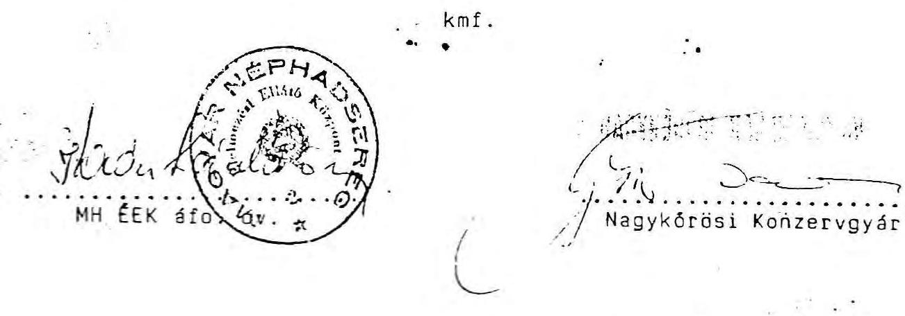

---

Szállító által biztosított termékek jegyzéke

| Körte bef.htt.eg. | $5 / 1$ u |
| :--: | :--: |
| Őszi bef.htt.eg. | $5 / 1$ u |
| Szilva bef. | $5 / 1$ u |
| Zborsó P3 | $5 / 1$ u |
| Zbab ec.hők. | $5 / 1$ u |
| Nat. lecsó | $5 / 4$ u |
| hat. lecsó | $5 / 1$ u |
| Súr.par. | $5 / 4$ u |
| Súr.par. | $5 / 1$ i |
| Súr.par. | $5 / 1$ a |
| Csem.ub.1-2. | $5 / 1$ u |
| Körösi vág.vegyes :. | $5 / 1$ u |
| Csem. zöldparad. | $5 / 1$ u |
| Sertésmájkrém | $1 / 10$ db |

---

# 2.sz. melléklet 

Betárolt termékek mennyisége, egységára és értéke

| Körte bef.htt.eg. | $5 / 1$ it | 62000 db | 104,04 | 6.450.480.- |
| :--: | :--: | :--: | :--: | :--: |
| Őszi bef.htt.eg. | $5 / 1$ it | 130000 db | 123,46 | 16.049.800.- |
| Szilva bef. | $5 / 1$ it | 190000 db | 93,90 | 17.841.000.- |
| Zborsó P 3 | $5 / 1$ it | 18500 db | 105.35 | 1.978.110.- |
| Zbab ec.hők. | $5 / 1$ it | 58000 db | 101,96 | 5.913.680.- |
| Nat. lecsé | $5 / 4$ it | 576000 di | 36,83 | 21.214.080.- |
| Nat. lecsé | $5 / 1$ it | 100000 di | 165,74 | 16.574.000.- |
| Sür.par. | $5 / 4$ i | 36000 db | 55,21 | 2.023.560.- |
| Sür.par. | $5 / 1$ it | 90000 db | 274,38 | 24.694.200.- |
| Sür.par. | $5 / 1$ d | 20000 db | 279,82 | 5.596.400.- |
| Csem.ub. 1-2 | $5 / 1$ it | 20000 db | 261,91 | 5.238.200.- |
| Körös vás. vegyes 3. | $5 / 1$ it | 12000 db | 117,22 | 1.406.640.- |
| Czem.zöldparad. | $5 / 1$ it | 20000 db | 80,04 | 1.600.800.- |
| Sertésmájkrém | 1/10 db2.000000 db |  | 9.94 | 19.880.000.- |
| Összesen: |  |  |  | 146.460.950.- |

---

MAGYAR HONVÉDSÉG
ÉLELMEZÉSI ELLÁTÓ KÖZPONT
I. sz. példány

Nyt.szám: 5/72/1990.

Jozefik Vilmos kpa.
MH Közgazdasági és Pénzügyi Főnökség

Budapest

Tárgy: Számlák meg-
küldése.

Telefonbeszélgetésünkre hivatkozva mellékelten megkül-
döm a Budapesti Konzervgyár és a Nagykőrösi Konzervgyár zára-
dékolt számláit.

Melléklet: 2 pld. P 31171. sz. Nagykőrösi Konzervgyár
szla. 4 lap
2 pld. 13999. sz. Budapesti Konzervgyár
szla. 2 lap
2 pld. 14000. sz. Budapesti Konzervgyár
szla. 2 lap
/Mellékletek csak a címzettnek!/

Budapest, 1991. január 07.

Készült: 2 példányban
Egy pld: 1 lap
Itsz: 2603
Készítette: Kőhalmi fhágy.

MAGYAR HONVÉDSÉG
PÜRANI SZT. 1991-01-11
M. 1991-01-11
Nyt. szám:
Mei. lapszám:

---

# Számla

P 00031228

P.központi elelra.og.raktor Eudazest 1395 Nyugati P. Letei út 19. vág. Szállitólevél 523404 01000126 01000125

|  Fizetés módja | Telj. időpontja | Szomló kelle | Szomló esedékessége | Egyéb adatok:  |
| --- | --- | --- | --- | --- |
|  átutalás | 1990.12.29. | 1991.11.07. | 1991.01.30. |   |
|  Teljesítés helye: |  |  |  |   |
|  Címzsem | KSH üv. | Az öv. (szolgáltatási) megnevezése és ismerletől | Menny. egész | Eisszerel. egység  |
|  83049 1229 0000 8311212119 öszibarackbefőtt htt.eg. |  | DB | 5/1 UV | 1.0  |
|  83049 1269 0000 8311231119 Szilvabefőtt. egész |  | DB | 5/1 UV | 1.0  |
|  83049 1264 0000 8311123119 kártabefőtt, htt. egész |  | DB | 5/1 UV | 1.0  |
|  83049 4028 0000 83211219 Zöldborsó "I" |  | DB | 5/1 UV | 1.0  |
|  83049 4135 0000 8321231219 Zöldbab, ec. hőkezelt |  | DB | 5/1 UV | 1.0  |
|  83049 4326 0000 83221116 Natúrlecsó 10% refr. |  | DB | 5/4 UV | 1.0  |
|  83049 4339 0000 83221119 Natúrlecsó 10% refr. |  | DB | 5/1 UV | 1.0  |
|  83049 4706 0000 83221116 S.paradicsom 28-30% |  | DB | 5/4 UV | 1.0  |
|  83049 4719 0000 83221119 S.paradicsom 28-30% |  | DB | 5/1 UV | 1.0  |
|  83049 4717 0906 83221151 S.paradicsom 28-30% |  | DB | 5/1 UV | 1.0  |
|  83049 5009 0000 83423119 Csemege uborka 1-2 különleges |  | DB | 5/1 UV | 1.0  |
|  83049 5515 0000 8344411 Ecetes zö.paradicsom |  | DB | 5/1 UV | 1.0  |
|  83049 5672 0000 8349831619 Körösi vágott vegyes savanyú |  | DB | 5/1 UV | 1.0  |
|  83049 6226 1924 83614841 Sertésmájkrém |  | DB | 1/10SB | 1.0  |
|  5/1 UV | 1821 | 5/1-ES UVSB | betétolja DB |   |
|  5/4 UV | 1821 | 5/4-ES UVSB | betétolja DB |   |

|  Elegib adatok: |  |  |  |  |  |  |  |  |  |  |  |  |  |  |  |  |  |  |  |  |  |   |
| --- | --- | --- | --- | --- | --- | --- | --- | --- | --- | --- | --- | --- | --- | --- | --- | --- | --- | --- | --- | --- | --- | --- |
|  Gépkocsi |  |  |  |  |  |  |  |  |  |  |  |  |  |  |  |  |  |  |  |  |  |   |
|  Mindeeg |  |  |  | Mindeeg |  |  |  |  |  |  |  |  |  |  |  |  |  |  |  |  |  |   |
|  Mindeeg |  |  |  | Mindeeg |  |  |  |  |  |  |  |  |  |  |  |  |  |  |  |  |  |   |
|  Egzsegár |  |  |  | Szomlo |  |  |  |  |  |  |  |  |  |  |  |  |  |  |  |  |  |   |
|  Szállitólevél 523404 |  |  |  |  |  |  |  |  |  |  |  |  |  |  |  |  |  |  |  |  |  |   |
|  01000126 01000125 |  |  |  |  |  |  |  |  |  |  |  |  |  |  |  |  |  |  |  |  |  |   |

Egyeb adatok:

|  Gépkocsi |  |  |  |  |  |  |  |  |  |  |  |  |  |  |  |  |  |  |  |  |  |   |
| --- | --- | --- | --- | --- | --- | --- | --- | --- | --- | --- | --- | --- | --- | --- | --- | --- | --- | --- | --- | --- | --- | --- |
|  Mindeeg |  |  |  | Mindeeg |  |  |  |  |  |  |  |  |  |  |  |  |  |  |  |  |  |   |
|  Mindeeg |  |  |  | Mindeeg |  |  |  |  |  |  |  |  |  |  |  |  |  |  |  |  |  |   |
|  1395 Nyugati P. Letei út 19. vág. |  |  |  |  |  |  |  |  |  |  |  |  |  |  |  |  |  |  |  |  |  |   |
|  Szállitólevél 523404 |  |  |  |  |  |  |  |  |  |  |  |  |  |  |  |  |  |  |  |  |  |   |
|  01000126 01000125 |  |  |  |  |  |  |  |  |  |  |  |  |  |  |  |  |  |  |  |  |  |
 |

Egyéb adatok:

|  Gépkocsi |  |  |  |  |  |  |  |  |  |  |  |  |  |  |  |  |  |  |  |  |  |   |
| --- | --- | --- | --- | --- | --- | --- | --- | --- | --- | --- | --- | --- | --- | --- | --- | --- | --- | --- | --- | --- | --- | --- |
|  Mindeeg |  |  |  | Mindeeg |  |  |  |  |  |  |  |  |  |  |  |  |  |  |  |  |  |   |
|  Mindeeg |  |  |  | Mindeeg |  |  |  |  |  |  |  |  |  |  |  |  |  |  |  |  |  |   |
|  1395 Nyugati P. Letei út 19. vág. |  |  |  |  |  |  |  |  |  |  |  |  |  |  |  |  |  |  |  |  |  |   |
|  Szállítós |  |  |  |  |  |  |  |  |  |  |  |  |  |  |  |  |  |  |  |  |  |   |
|  01000126 01000125 |  |  |  |  |  |  |  |  |  |  |  |  |  |  |  |  |  |  |  |  |  |   |

---

# Szá

Nagyoktó

Konszervgyár 2751 Nagykőrös, József Attila u 1 Pf. 53. Teléf. 22-4816 Bankszámlaszám: 381-04871 KSH (elsősorban. 10004876-1914-11-20-1-45-13 Adóigazgatósági szám 10004876213

# Számla

P 00031228

Kh. Központi elele, ág. rátár Budapest 1375 nyugati fu. Letai ut. ip. vág. Szállítólevél száma 01060126 01060125

Fizetés módja: Telj. időpontja Számla kellé Számla esedékessége Egyéb adatok:

|  ÁFA | ÁFA alap | ÁFA értéke | Számlaértéke  |
| --- | --- | --- | --- |
|  0 | 146460950.00 |  | 146460950.00  |
|  0 | 146460950.00 |  | 146460950.00  |

A gángrőleg visszapozálítása szállítási szerződés szerint

Kizet aláírása

Szállításra átvette Főtt átvetési igazolása

A fenti anyayot a HH FELT. Beigeen helyen távolt, felületet "beigeen". Utazva a 11-11-20-as bekövetelmét tétel biztartja az "23-es szám alatt". Számlák 01060125 01060125

---

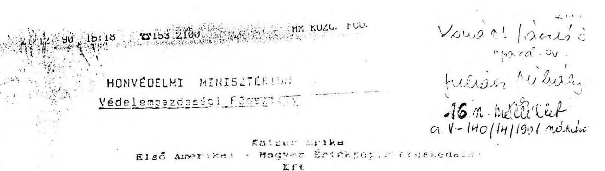

HONVÉDELMI MINISZTÉRIUM
Védelempazdasági fénzőtart

Eatzer Erika
Első Amerikai - Magyar Értékpapír-özdekedelme
Eft

Budapest
Fax: 16

2120000000000000000000000000000000000000000000000000000000000000000000000000000000000000000000000000000000000000000000000000000000000000000000000000000000000000000000000000000000000000000000000000000000000000000000000000000000000000000000000000000000000000000000000000000000000000000000000000000000000000000000000000000000000000000000000000000000000000000000000000000000000000000000000000000000000000000000000000000000000000000000000000000000000000000000000000000000000000000000000000000000000000000000000000000000000000000000000000000000000000000000000000000000000000000000000000000000000000000000000000000000000000000000000000000000000000000000000000000000000000000000000000000000000000000000000000000000000000000000000000000000000000000000000000000000000000000000000000000000000000000000000000000000000000000000000000000000000000000000000000000000000000000000000000000000000000000000000000000000000000000000000000000000000000000000000000000000000000000000000000000000000000000000000000000000000000000000000000000000000000000000000000000000000000000000000000000000000000000000000000000000000000000000000000000000000000000000000000000000000000000000000000000000000000000000000000000000000000000000000000000000000000000000000000000000000000000000000000000000000000000000000000000000000000000000000000000000000000000000000000000000000000000000000000000000000000000000000000000000000000000000000000000000000000000000000000000000000000000000000000000000000000000000000000000000000000000000000000000000000000000000000000000000000000000000000000000000000000000000000000000000000000000000000000000000000000000000000000000000000000000000000000000000000000000000000000000000000000000000000000000000000000000000000000000000000000000000000000000000000000000000000000000000000000000000000000000000000000000000000000000000000000000000000000000000000000000000000000000000000000000000000000000000000000000000000000000000000000000000000000000000000000000000000000000000000000000000000000000000000000000000000000000000000000000000000000000000000000000000000000000000000000000000000000000000000000000000000000000000000000000000000000000000000000000000000000000000000000000000000000000000000000000000000000000000000000000000000000000000000000000000000000000000000000000000000000000000000000000000000000000000000000000000000000000000000000000000000000000000000000000000000000000000000000000000000000000000000000000000000000000000000000000000000000000000000000000000000000000000000000000000000000000000000000000000000000000000000000000000000000000000000000000000000000000000000000000000000000000000000000000000000000000000000000000000000000000000000000000000000000000000000000000000000000000000000000000000000000000000000000000000000000000000000000000000000000000000000000000000000000000000000000000000000000000000000000000000000000000000000000000000000000000000000000000000000000000000000000000000000000000000000000000000000000000000000000000000000000000000000000000000000000000000000000000000000000000000000000000000000000000000000000000000000000000000000000000000000000000000000000000000000000000000000000000000000000000000000000000000000000000000000000000000000000000000000000000000000000000000000000000000000000000000000000000000000000000000000000000000000000000000000000000000000000000000000000000000000000000000000000000000000000000000000000000000000000000000000000000000000000000000000000000000000000000000000000000000000000000000000000000000000000000000000000000000000000000000000000000000000000000000000000000000000000000000000000000000000000000000000000000000000000000000000000000000000000000000000000000000000000000000000000000000000000000000000000000000000000000000000000000000000000000000000000000000000000000000000000000000000000000000000000000000000000000000 65.077,-  |
|  32. | R-111 alkatrész, 220. sz. |  |  |   |
|   | ajánlati lista, 15 tétel | - | - | 203.194,-  |
|  33. | R-111 alkatrész, 210. sz. |  |  |   |
|   | ajánlati lista, 5 tétel | - | - | 280.931,-  |
|  34. | R-111 alkatrész, 200. sz. |  |  |   |
|   | ajánlati lista, 16 tétel | - | - | 623.828,-  |
|  35. | R-111 alkatrész, 120. sz. |  |  |   |
|   | ajánlati lista, 40 tétel | - | - | 148.537,-  |
|  36. | R-142 alkatrész, 170. sz. |  |  |   |
|   | ajánlati lista, 227 tétel | - | - | 388.359,-  |
|  37. | R-142 alkatrész, 020 sz. |  |  |   |
|   | ajánlati lista, 24 tétel | - | - | 49.225,-  |
|  38. | R-130 alkatrész, 180. sz. |  |  |   |
|   | ajánlati lista, 39 tétel | - | - | 391.257,-  |
|  39. | R-130 M alkatrész, 140. sz. |  |  |   |
|   | ajánlati lista, 143 tétel | - | - | 262.991,-  |
|  40. | Vegyes alkatrészek, 030 sz. |  |  |   |
|   | ajánlati lista, 230 tétel | - | - | 9.785.000,-  |
|   |  |  |  | 95.113.000,-  |

Gödöllő, 1990. december 14.

Készült: 3 példányban Egy példány: 2 lap Itsz: 1106 Készítette: Fodor Sándorné kpa. Kapják: 1 pld. Cimzett 2 pld. MH MFFS 3 pld. Irattár

---

S A M A A

B A L L I T U

LLEKTRONIAAI KEZSULEKSIANIS KIT. M. M. M. M. M. M. M. M. M. M. M. M. M. M. M. M. M. M. M. M. M. M. M. M. M. M. M. M. M. M. M. M. M. M. M. M. M. M. M. M. M. M. M. M. M. M. M. M. M. M. M. M. M. M. M. M. M. M. M. M. M. M. M. M. M. M. M. M. M. M. M. M. M. M. M. M. M. M. M. M. M

---

|  911001 44.91 |  |  |  |   |
| --- | --- | --- | --- | --- |
|  911001 44.91 |  |  |  |   |
|  R159 NAGYJAV. KLT. | DB | 50.000 | 300960.00 | 1504000.00  |
|  911001 44.91 |  |  |  |   |
|  R159 KOZEPJAV. KLT. | DB | 50.000 | 256060.00 | 1200000.00  |
|  911001 44.91 |  |  |  |   |
|  R159 KISJAV KLT. | DB | 50.000 | 75240.00 | 176200.00  |
|  911001 44.91 |  |  |  |   |
|  R173 ADO-VEVO NAGYJAV.KLT. | DB | 12.000 | 495840.00 | 1900000.00  |
|  911001 44.91 |  |  |  |   |
|  R173 ADO-VEVO KOZEPJAV.KLT. | DB | 5.000 | 254238.00 | 2013904.00  |
|  911001 44.91 |  |  |  |   |
|  R173 ADO-VEVO KISJAV. KLT. | DB | 14.000 | 242256.00 | 131000.00  |
|  911001 44.91 |  |  |  |   |
|  R173 VEVO NAGYJAV. KLT. | DB | 14.000 | 265986.00 | 3723504.00  |
|  911001 44.91 |  |  |  |   |
|  R173 VEVO KOZEPJAV. KLT. | DB | 14.000 | 135207.00 | 1592598.00  |
|  911001 44.91 |  |  |  |   |
|  R173 VEVO KISJAV. KLT. | DB | 14.000 | 133843.00 | 1673802.00  |
|  911001 44.91 |  |  |  |   |
|  R130 NAGYJAV. KLT. | DB | 1.000 | 255709.00 | 255709.00  |
|  911001 44.91 |  |  |  |   |
|  R130 KOZEPJAV. KLT. | DB | 4.000 | 94544.00 | 378176.00  |
|  911001 44.91 |  |  |  |   |
|  R130 KISJAV. KLT. | DB | 4.000 | 94544.00 | 378176.00  |
|  911001 44.91 |  |  |  |   |
|  R111 NAGYJAV. KLT. | DB | 3.000 | 426923.00 | 1280000.00  |
|  911001 44.91 |  |  |  |   |
|  R111 KOZEPJAV. KLT. | DB | 2.000 | 245329.00 | 490658.00  |

---

|  911001 | 14.91  |
| --- | --- |
|  R111 KISIAV. KET | DB  |
|  ------ | ------  |
|  911002 | 10.91  |
|  R111 ALKATRESE 110.SZ. | DB  |
|  AJANL. LIST. 117. |   |
|  ------ | ------  |
|  911003 | 44.91  |
|  R111 ALKATRESE 110.SZ. | DB  |
|  AJANL. LIST./15 TET |   |
|  ------ | ------  |
|  911002 | 44.91  |
|  R111 ALKATRESE 210.SZ. | DB  |
|  AJANL. LIST./6 TET |   |
|  ------ | ------  |
|  911003 | 44.91  |
|  R111 ALKATRESE 210.SZ. | DB  |
|  AJANL. LIST. 40 |   |
|  ------ | ------  |
|  911002 | 44.91  |
|  R111 ALKATRESE 210.SZ. | DB  |
|  AJANL. LIST. 40 |   |
|  ------ | ------  |
|  911002 | 44.91  |
|  R111 ALKATRESE 200.SZ. | DB  |
|  AJANL. LIST. 10 |   |
|  ------ | ------  |
|  911002 | 44.91  |
|  R111 ALKATRESE 120.SZ. | DB  |
|  AJANL. LIST. 40 |   |
|  ------ | ------  |
|  911002 | 44.91  |
|  R142 ALKATRESE 170.SZ. | DB  |
|  AJANL. LIST. 227. |   |
|  ------ | ------  |
|  911002 | 44.91  |
|  R142 ALKATRESE 020.SZ. | DB  |
|  AJNAL. LIST. 24 |   |
|  ------ | ------  |
|  911002 | 44.91  |
|  R130 ALKATRESE 130.SZ. | DB  |
|  AJANL. LIST. 39 |   |
|  ------ | ------  |
|  911002 | 44.91  |
|  R130 M ALKATRESE 140.SZ. | DB  |
|  AJANL. LIST. 143. |   |
|  ------ | ------  |
|  911002 | 44.91  |
|  VEGYEZ ALKATRESE 030.SZ. | DB  |
|  AJANL. LIST. 230. |   |
|  ------ | ------  |
|  911002 | 44.91  |
|  R111 ALKATRESE 340.SZ. | DB  |
|  AJANL. LIST. 11 |   |

---

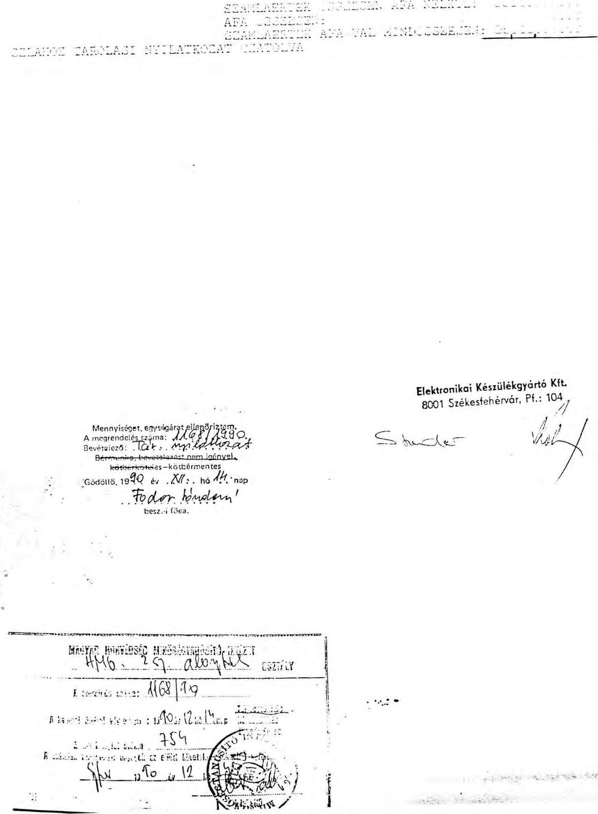

Elektronikai Készülékgyártó Kft. 8001 Székesfehérvár, Pf.: 104

---

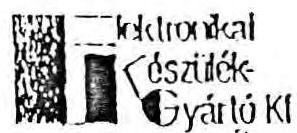

# 10. 911. dec. 14. 

Inllink: Körmendiné
III val.knzts:
I31 ay:

## Iárolási nyilatkozat

Az Elektronikai Készülékgyártó Kft./Székesfehérvár, Herényi ut/ a mai napon a Magyar Ilonvédség Elektronikai Szolgálati Fünükség /Budapest, Lehel u. 33./ 1168/1990 rendelt a mellékelt . A. 1912... sz. számlával számlázolt termékekeL elkész(lelle és a megrendelö reudelkezéséig lelephelyén lárolja.

Általános igazga:óh,
kereskedelmi és érvükesités.
otdály
ofco
Alvevö

Todor Póndorue
Áladó

---

# S A M L A

## 22 A L I T O

### H H CULKTRONICAT BIOLOGIATESINSURES

**1055 EUDAFEST V.**

**P. 104**

**PEJER M. OTI:** 195-95001

**RUTSELA**

**ADOIGAES**

**REJEIKL: RAMAL MENZER**

**PIL. H: 1**

**TEMP. NEM: 22LA. KELI 22LA. ESEL: 22LA. GUAR**

**A: TALAS**

**D: L: 90111**

**K: 90111**

**M: MARRIDA: 3700 1000**

**M: 90111 IT SLAMLA:**

**K: 90111**

**I: 90111**

**F: 90111**

**(B:) ESEL: 130032.(C:) ESEL: 100110.00.(D:) ESEL: 100110.00.(E:) ESEL: 100110.00.(F:) ESEL: 100110.00.(G:) ESEL: 100110.00.(K:) ESEL: 100110.00.(K:)**

**JINKEL.**

**KTA**

**MEINSTISEN**

**EGYSEGAR, PT**

**211001**

**R107 TOS URH RA**

**DB**

**7.000**

**42423.37**

**250999.39**

**711001**

**R111 M URH RA**

**DB**

**74.000**

**61223.00**

**25110000.20**

**711001**

**R130 M RH RA**

**DB**

**3.000**

**279333.00**

**637999.99**

**911001**

**R134 BR / AVR 11.1 RA**

**DB**

**114.000**

**744736.34**

**54399999.76**

**911001**

**R159 M-02 / MIKROH RA**

**DB**

**395.000**

**191467.34**

**76204001.52**

**911001**

**R171 VS RA**

**DB**

**43.000**

**506041.67**

**24230000.16**

**911001**

**R175 A-01 URH RA**

**DB**

**200.000**

**291900.00**

**52002000.00**

**911001**

**R176 I A-010 RA. / AVR**

**DB**

**110.000**

**153027.27**

**17410000.70**

**911001**

**R143 L RA. / SEETT**

**DB**

**60.000**

**314000.00**

**15840000.00**

**52AMLAERTEK:**

**504557001.15**

**AFA**

**1055**

---

Elektronikai Készülékgyártó Kft.?
8001 Szöszetehárvár, Pf.: 104 j
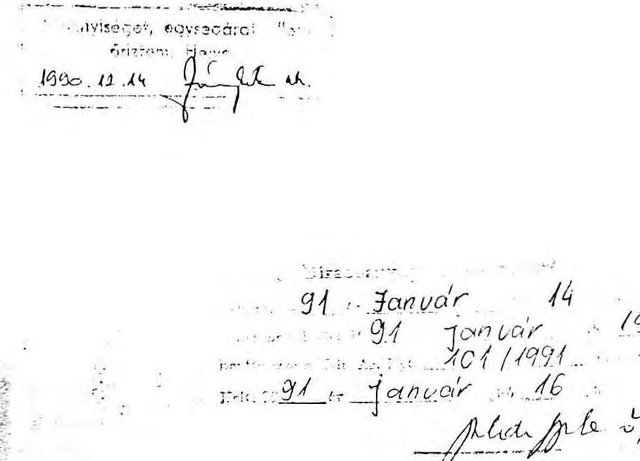
huz: 361/117
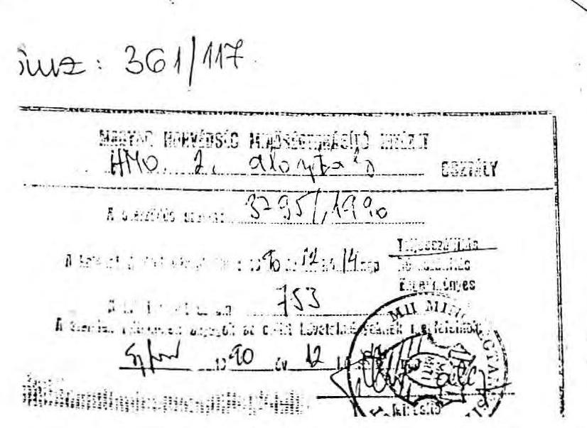

---

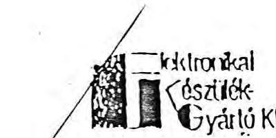

# BOKII SZEKESFEHERVÁR. Dm: dny: 11. FF.: 124 

Inletin: 22/10 111 Inlex: 21 371
Tolofax: 22/10-210
OIF 079-022119-5

## 10. 211. dec.. 14.

Inlluk: Körmenuliné
III val.knz.ás:
Iá:ay:

## Iárolási nyilatkozat

Az Elektronikai Készülékgyárló Kft./Székesfehérvár, Berényi ut/ a mai napon a Magyar Ilonvédség Elektronikai Szolgálati Fünükség /Budapest, Lehel u. 33./. 3795/1999 rendelt a mellékelt ..A. 4509... sz. számlával számlázolt termé-
keket elkészftelte és a megrendelö rendelkezéseig telephelyén tárol.ja.

Alo:ónos igazga: 1. 1y: is kereskedeimi és er évesint
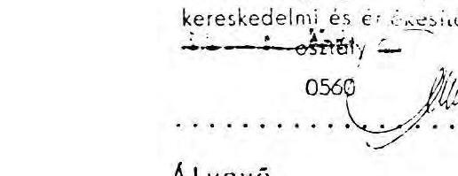

Fodor: Jau channe!
Aladó

---

MAGYAR HONVÉDSÉG PARANCSNOKSÁGA ELEKTRONIKAI SZOLGALATFONOKSÉG

Nyt. szám: 3495 /1990

VIDEOTON Elektronikai Készülékgyártó Kft.

# MEGRENDELÉS

Kérem az alább felsorolt termék(ek) szállítását a megjelölt határidőre és feltételekkel:

|  Fst. | Megnevezés | Mennyiség | Egységár Ft | Oszesen Ft  |
| --- | --- | --- | --- | --- |
|  1. | R-107 T 02 URH rádióber. | 7 | 42.429 | 297  |
|  2. | R-111 M URH rádióber. | 74 | 312.297 | 23.110  |
|  3. | R-130 M RH rádióber. | 3 | 279.333 | 838  |
|  4. | R-134 BR /AVR-II./ rádióber. | 114 | 744.737 | 84.900  |
|  5. | R-159 M-02 /Mikron/ rádióber. | 398 | 191.467 | 76.204  |
|  6. | R-171 VS rádióberendezés. | 48 | 506.042 | 24.290  |
|  7. | R-173 A-01 URH rádióber. | 200 | 294.960 | 58.992  |
|  8. | R-173 P A-018 rádióvevő | 110 | 158.327 | 17.416  |
 9. | R-143 L rádióber.egységek | 60 | 314.000 | 18.840 |
| | | | Összesen: | 304.887 Ft |

Minőség, választék és kiviteli előírás: TU szerint

---

A .............................................. sz. rendelet alapján a megrendelt termék(ek) szerződéskötésre kötelezett(ek).

Szállítási határidő(k):

1990. december 14.

A szállító előszállítást teljesíthet a tárgynegyedév első napjától. A tárgynegyedévben esedékes mennyiség egyszerre szállítandó.

Csomagolási előírások:

Dokumentáció szerinti.
Veszélyt szállításra alkalmas hívistében

Belföldi csomagolás

Készrejelentés:

A szállító köteles az átadást megelőzően 5 nappal az alábbi szavakat írásban értesíteni:
Minőségi átadásról: MH Minőségtanusító Intézet Budapest, Pf. 25. 1855

Vagy a helyi Katonai Üzemi megbízott

Mennyiségi átadásról (szállításról): MH Bottyán János Híradóanyag Raktár -
4402 Nyíregyháza Pf. 20.

Minőségi átvétel módja: KÜM átvétel, 3 hónapnál idősebb berendezéseknél csak mennyiségi átvételt kérünk.
Minőségi átvétel helye: Szállító telepe.

Mennyiségi átadás (teljesítés) helye: MH Bottyán János Híradóanyag Raktár
A gyártó telephelyén felelős tárolással, költség felszámítása
nélkül.

Furarozás módja: Vasúton, „Katonai szállítmánylevéllel". Költségviselő: MH BJ Híradó Anyagraktár, 4402 Nyíregyháza, Pf. 20. MNB 440-60178-5037

---

Komplett teljesítés: A terméket a szállító az előírt tartozékokkal együtt, kompletten köteles szállítani.

Számlázás, kiegyenlítés: Kiegyenlítés az MHB Általános Igazgatóságán keresztül.

A számlának az alábbiakat kell tartalmaznia:
- a szállítási szerződés számát;
- a termék(ek) mennyiségét, megnevezését, egységárát és összegét;
- az árforrást;
- KÜM-átvétel esetén a minőségi átvételt igazoló záradékot.
- Megrendelő számlaszáma: 101-Híradóanyag-Gazdálkodási-Központ
Központi kiadási számla: 1018-235-90178-5226

A számla kiegyenlítéséhez az alábbi okmányok szükségesek:
- egy eredeti, három másolati számla;
- a mennyiségi átvételt vagy feladást igazoló okmány.

Kiegyenlítés átutalással történik: a számla kézhezvételét követő 20-napon belül.

A számla megküldendő: Megrendelő címére.

A fenti követelményeknek meg nem felelő számlákat megrendelő kiegyenlítés nélkül visszaküldi, kamatfizetési kötelezettség nélkül.

Vítás ügyek eldöntése: a Legfelsőbb Bíróság
Fővárosi Bíróság hatáskörébe tartozik.

Az árak az eladó által közölt kedvezményes árak.

Egyéb feltételek:

A vevő fenntartja a jogot, hogy az 1991. évi költségvetés megállapítása után, amennyiben az áruk átvételére megfelelő fedezet nem áll rendelkezésre, az árukat az Elektronikai Készülékgyártó Kft-nek visszaadja az eredeti áron számolt értéken.

A szerződésben nem érintett kérdésekben a 7/1978.(II.1.) MT sz. rendeletet módosított 10-1992.(II.11.) Norm. sz. rendelet, valamint a 2310-65.(I.23.) Norm. határozat, és "A haditechnikai és egyéb KÜM-átvétel alá tartozó gyártmányok gyártásellenőrzésének és átvételének rendjéről szólt 1962. ápr. 1-én kiadott normányhatározat előírásai szerint kell eljárni.

Budapest, 1990. december 14.

Készült: ......... példányban
Egy példány: 2 lap
Itsz.: 1106
Készítette: Závodszky mk.ezds.

/: Széinger István mk. ezredes :/

szolgálatfőnök

---

MAGYAR HONVÉDSÉG
ANYAGI-TECHNIKAI FŐCSOPORTFŐNÖKSÉG GAZDASÁGI CSOPORTFŐNÖK

Nyt.szám: 2100/0/1010

Modok Ferenc mk.ezredes
MH fegyverzettechnikai szolgálatfőnök

Budapest

Tárgy: 1990. évi költségvetési előírányzat rendezés

Tisztelt Ezredes Úr!

Az MH Anyagi-Technikai Főcsoportfőnök Úr döntésének megfelelően az MH Fegyverzettechnikai Szolgálat 1990. évi költségvetési előírányzatát a melléklet szerint módosítom.

A támogatási előírányzat módosításáról, továbbá a bevétel felhasználás mértékéről a bevétel alakulásától függően december 15-ig tájékoztatom.

Kérem szíves intézkedését, hogy a tervezett beszerzések és kifizetések az előírt dátum, 1990. december 27-ig megvalósuljanak.

Melléklet: Kimutatás az előírányzat módosításokról (1 lap, Nyilt)

Budapest, 1990. december 03-n.

(10.12.13 111)

Aláírást lásd!
Intézkedtus

10.12.13
25.12.13

(Kovács Péter mk.ezredes)

---

# 1990. évi kiadási előirányzatok módosítása (érték: eFt)

Tétel K. Megnevezés

| **Kovat:** 11 | Fogyószak, göngyöleg |
| --- | --- |
| 11-41 | Technikai anyag és alk. |
| 11-94 | Hát eszk. mp. alkatrász |
| **Subtotal** | |

| **Kovat:** 15 | Koncultáció |
| --- | --- |
| 15-37 | Kisgép javítás |
| 15-42 | Kisgép javítás |
| **Subtotal** | |

| **Kovat:** 17 | Hagyjavítás |
| --- | --- |
| 17-13 | Import javítás |
| 17-13 | RSZP-10 javítás |
| 17-13 | AKKORD jav. |
| 17-13 | VP-01M jav. |
| 17-13 | 1SZ12M1 jav. |
| 17-13 | PRV-11 jav. |
| **Subtotal** | |

| **Kovat:** 35 | Eszköz beszerzés |
| --- | --- |
| 35-21 | Eszköz beszerzés |
| 35-21 | 7.62 mm 43M acmgv lőszer |
| 35-21 | 39/49M tájoló |
| 35-21 | VK Tűzijáték |
| 35-22 | Kisgép műszer |
| 35-31 | MRL+FDU |
| 35-33 | VK DG-15VM |
| 35-33 | VK 9M111M |
| 35-33 | VK 9M114 |
| 35-33 | VK FAROL |
| 35-33 | VK 12.7 mm lőszer+hev |
| 35-33 | VK 125 mm hk lőszer |
| 35-33 | VK 30 mm VOG-17 lőszer |
| 35-33 | VK 9V49 ell. ber. |
| 35-33 | VK EFK blokk |
| 35-33 | VK Gaz-66TM |
| 35-33 | VK POLE |
| + 35-33 | VK KASZTA-2 |
| 35-33 | VK SZT-68U |
| 35-33 | VK 9M17P |
| - 35-33 | VK KÖNKURSZ+FABOTT ind. állv. |
| + 35-33 | VK KÖNKURSZ rakéta |
| 35-34 | Egyéb eszköz |
| 35-34 | M-6 gyujtó |
| 35-34 | UKSZ-400-P4 |
| **Subtotal** | |

| **Total** | Budapest, 1990. december 3-n. |
| --- | --- |
| 4950 | -750 / 4230 |
| 22236 | 0 / 22236 |
| 230537 | -72577 / 157960 |
| 257753 | -73327 / 184426 |
| 68348 | -50000 / 18348 |
| 9000 | 0 / 9000 |
| 77348 | -50000 / 27348 |
| 306856 | -30500 / 276356 |
| 115707 | -56849 / 58858 |
| 4327 | 0 / 4327 |
| 6417 | 0 / 6417 |
| 26905 | 0 / 26905 |
| 24471 | 0 / 24471 |
| 3750 | 0 / 3750 |
| 488463 | -87349 / 401114 |
| 129571 | -7500 / 122091 |
| 20585 | 0 / 20585 |
| 1000 | -1000 / 0 |
| 15000 | 0 / 15000 |
| 2747 | 0 / 2747 |
| 1502 | 0 / 1502 |
| 8971 | 0 / 8971 |
| 81985 | 141 / 82126 |
| 114478 | 75 / 114553 |
| 542045 | -171622 / 370423 |
| 1983 | 1 / 1984 |
| 1848 | -1 / 1847 |
| 121 | 0 / 121 |
| 8705 | -6 / 8699 |
| 10557 | -7 / 10550 |
| 3756 | 0 / 3756 |
| 0 | 290657 / 290657 |
| 0 | 346250 / 346250 |
| 61606 | 118411 / 180017 |
| 0 | 90531 / 9053 |
| 0 | 84000 / 84000 |
| 0 | 103460 / 103460 |
| 72441 | -20150 / 52291 |
| 0 | 9028 / 9028 |
| 0 | 2434 / 2434 |
| 1079221 | 763224 / 1842445 |
| 1902785 | 552548 / 2455333 |

/Kátrai József mk. alezredes

---

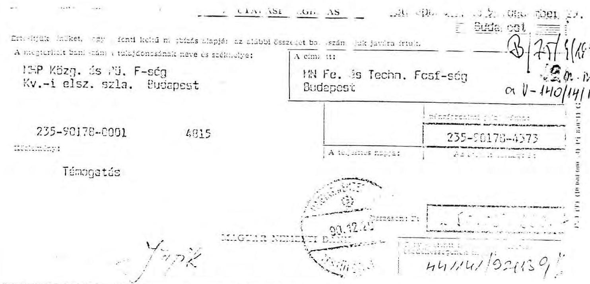

TERHELÉSI ÉRTESÍTÉS

ÁTUTALÁSI MEGBÍZÁS

| A elinzet: | Az elismert bankszámla tulajdonosának neve és székhelye: |
| --- | --- |
| KH Fogyvezeti és Technikai Főcsoportfőnökség Pü. elc. 8p. | Technika Külkereskedelmi Vállalata |
| pánzforgalmi jelzőszáma: | Jelölőadat |
| 235-90178 4373 | 4815 |
| Közlemény: | előleg |
| | |
| | |
| | |
| | |
| | |
| | |
| | |
| | |
| | |
| | |
| | |
| | |
| | |
| | |
| | |
| | |
| | |
| | |
| | |
| | |
| | |
| | |
| | |
| | |
| | |
| | |
| | |
| | |
| | |
| | |
| | |
| | |
| | |
| | |
| | |
| | |
| | |
| | |
| | |
| | |
| |

---

# MAGYAR HONVÉDSÉG

## ANYAGI-TECHNIKAI FŐCSOPORTFŐNÖKSÉG GAZDASÁGI CSOPORTFŐNÖKSÉG

Nyt.szám: 2885/30/1990.

## J e g y z ő k ö n y v

Készült: 1991. január 25-én az MH Gazdasági
Csoportfőnökség hivatalos helységében

Jelen vannak:
a MH Gazdasági Csoportfőnökség részéről
Buda György mk.alezredes besz. és ért. ov.
Csala József mk.alezredes besz. és ért.ov.h.
a Technika Külkereskedelmi Vállalat részéről
Juhász Miklósné pü. ov. h.

Tárgy: Speciális import beszerzésekkel kapcsolatos pénzforgalmi elszámolás egyeztetése

A Magyar Honvédség Felsőszintű Gazdálkodó Szervei és a Technika Külkereskedelmi Vállalat képviselői által aláírt kétoldalú jegyzőkönyvek alapján az 1990. december 30-i helyzetnek megfelelően a Technika Külkereskedelmi Vállalatnál az alábbi elszámolatlan előlegmaradvány van.
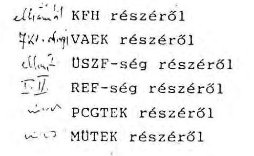
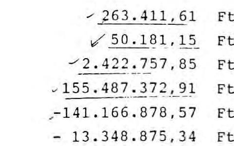

---

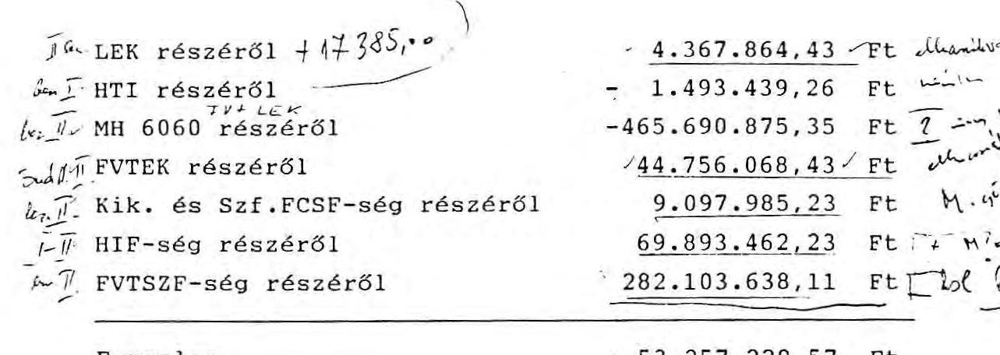

A Magyar Honvédség részéről a Technika Külkereskedelmi Vállalatot illető 53,3 mFt átutalására 1991. január 17-én intézkedtek.

Az átnyúló tételek rendezésére az áruforgalmi egyeztetések összegzése /1991. január 29./ után kerül sor.

kmf.

MH Gazdasági Csoportfőnökség részéről:

/Buda György mk.alezredes/
besz. és ért. ov.

/Csala József mk.alezredes/
besz. és ért. ov.h.

Technika Külkereskedelmi Vállalat részéről:

/Juhász Miklósné /
pü. ov. h.

Ht.1.n. old-t atsebun.
91.01.28

Készült: 3 példányban
Egy példány 2 lap
Itsz.: 2101
Készítette: Csampisz alez.
