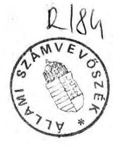
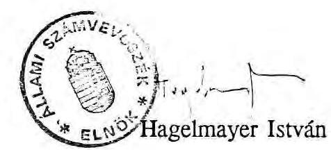

# Állami Számvevőszék

## JELENTÉS

a műemlékvédelem pénzügyi-gazdasági ellenőrzéséről

---

# Az ellenőrzést végezték:

Belics János tanácsos
Czunyi Lajos tanácsos
dr. Csemniczky Jánosné tanácsos
Csóry Györgyné tanácsos
Patai Tamás számvevő

Az ellenőrzést vezette:
Rádfai Tibor főtanácsos

---

# JELENTÉS

a műemlékvédelem pénzügyi-gazdasági ellenőrzéséről

Az országban 1990-ben a műemléki szempontból védett épületek száma meghaladta a tízezret. Az ezek védelmére fordított pénzforrások nagysága legfeljebb becsülhető és az elmúlt öt évben évi mintegy 6 milliárd Ft-ra tehető. A finanszírozásra több csatorna is szolgált.

Az Országos Műemléki Felügyelőség (OMF) 1986-1990. években összesen 2,2 milliárd Ft (évente 400-500 millió Ft) költségvetési előirányzattal rendelkezett. Ez nyújtott fedezetet az OMF szakmai felügyeleti munkáját alátámasztó
— pénzügyi támogató,

- hatósági ellenőrzői, koordináló, valamint
- építési tervezői, kivitelezői és szakrestaurátori
tevékenységekre. Ezen felül az OMF közreműködött különféle műemléki célú beruházások ÁFB, majd MHB által kezelt, a vizsgált öt évben 183 millió Ft-ot kitevő költségvetési keret és az Idegenforgalmi Alapból fedezett mintegy 75 millió Ft szétosztásában. A műemlékvédelem költségvetési támogatását kiegészítették a különböző adó- és pénzügyi kedvezmények, amelyek becsülhető nagysága 1990-ig évente az 50 millió Ft-ot nem lépte túl.

Az ellenőrzés célja annak értékelése volt, hogy a magyar műemlékek védelmét és az azokban megtestesülő nemzeti vagyon megőrzését, gyarapodását miként szolgálta
—a költségvetésből finanszírozott közel 3,0 milliárd Ft-ot kitevő pénzügyi támogatások felosztása és felhasználása,
—a hatósági feladatok ellátása, végül

---

— az OMF mintegy 110 millió Ft értékű állóeszköz-értékkel rendelkező saját kapacitásának kihasználása.

Az ellenőrzés a műemlékvédelem 1986-1990. évek közötti feltételrendszerében elsősorban a költségvetési pénzeszközök felhasználásának törvényességére, célszerűségére és eredményességére irányult. Értékelésünk több, mint 100 helyszínen szerzett tapasztalatokon alapul. (Részletes ismertetését objektumonként a függelék tartalmazza.)

# I/ Következtetések és javaslatok

A műemlékvédelemben az OMF több irányú tevékenységének eredményessége ellentmondásos. Néhány száz objektum szakmai, anyagi támogatással elért kiemelkedő színvonalú helyreállításában, hasznosításában látványos eredményeket ért el. Nemzetközi szinten is elismert pl. a győri belváros, egyes (vár)kastélyok felújítása (Pécsvárad, Esztergom), illetve egyes polgárház-helyreállítások (Kőszeg, Magyarpolány, Hollókő) kiemelkedő színvonala. A védelem országos, átfogó kérdéseiben azonban néhány szerény lépéstől eltekintve, az utóbbi 10-15 évben érdemleges eredményt nem sikerült elérnie.

A védelem gazdasági és főleg (hatósági) ellenőrzési szempontjai évtizedek óta nem érvényesültek kellő módon, így az objektumok tömeges leromlását, egyesek végleges pusztulását nem tudta megakadályozni. Összességében az emlékanyag állapota nem javult.

A műemlékvédelem társadalmi-gazdasági feltételrendszerének ellentmondásai, az OMF belső szervezetlensége és gazdálkodási hiányosságai az elmúlt években felerősödtek. Ezek úgy az erőteljesen korlátozott anyagi eszközök kevésbé hatékony felhasználásában, mint a szakmai tevékenység irányításában megmutatkoztak. Ezért gazdálkodásában az állami pénzek többrendbeli hanyag felhasználását kellett megállapítani.

Az OMF költségvetési tervezési, finanszírozási, valamint a szakmai és pénzügyi ellenőrzési rendszere összehangolatlan volt. A támogatási döntések előkészítése az évtizedek óta megoldatlan nyilvántartási rendszer, a korszerűtlen, pontatlan szakmai, pénzügyi adatbázisok mellett - hiányos, a finanszírozott célok megvalósításának számonkérés elégtelen volt. A hatékonyabb szakmai és gazdasági

---

munkát a belső irányítás elégtelensége, valamint a számviteli-nyilvántartási rend súlyos problémái is akadályozták.

Az OMF saját kivitelezésű munkáinak minősége - egyes igen színvonalasan megoldott feladatok ellenére - az elmúlt években összességében csökkent. Az idegen kivitelezőkkel szembeni színvonalkülönbség a magasabb OMF költségszint ellenére alig tapasztalható. A műemlékek célszerű hasznosításának elősegítésében sem sikerült eddig szélesebb körű eredményeket elérni.

Az OMF rendelkezésére bocsátott költségvetési pénzforrások egyre nagyobb hányadát emésztik fel a szervezet költségei. Ennek ellenére az igazgatási (hatósági ellenőrző, koordináló) funkciók tovább gyengültek. A hatósági felügyeleti feladatok ellátása, a műemlékek védelme, a rendszeres helyszíni ellenőrzést nem nélkülözheti.

Az ágazati és területi irányító (koordináló) tevékenység, a tulajdonosokra, kezelőkre irányuló felügyeleti szerep az utóbbi években nem, hogy erősödött volna, de sajnálatos módon visszafejlődött és tovább dezorganizálódott. A gyenge hatékonyságú működés - az indokoltnál is jóval szűkebb - pénzügyi-gazdasági eszközöket szétforgácsolta.

A műemlékfelügyelet a szabályozás és a rendszeres ellenőrzés elégtelensége miatt a műemlékek romlását, gondatlan kezelését, az engedély nélküli, vagy a szakszerűtlen beavatkozásokat nem teljeskörűen, vagy csak későn fedezte fel. Sok műemlék pusztulását, károsodását így nem sikerült elkerülni. Több milliárd Ft értékre becsülhető az a helyreállítási költségtöbblet, amely egyedül a megelőzés (a megvédés, a kötelezés) elmulasztásából származtatható.

A védendő műemlékállomány növekedése, belső összetételének változása, a műemlékvédelem eredményessége a központi pénzforrások elaprózódásának megakadályozását, a kötelezettségek, gondozási felelősség és gazdasági terhek megosztását indokolná. Ehhez új műemlékvédelmi koncepcióra és politikára lenne szükség.

A tulajdonviszonyok változása és a piacgazdaság fejlődése által sürgetett feladatok előkészítése a műemlékvédelem területén még nagyon kezdeti stádiumban áll. A műemlékek tulajdonjogával kapcsolatos problémák az utolsó évben megsokasodtak. A vizsgálat időszakában még nem volt rögzítve, hogy a kastélyok, kúriák tulajdonviszonyai miként rendeződnek, milyen és mekkora emlékanyag kerül át állami tulajdonból önkormányzati, illetve egyéb tulajdonba. A tulajdonjog tisztázatlansága a hasznosítás kérdésének egyik sarkalatos pontjává vált.

---

munkát a belső irányítás elégtelensége, valamint a számviteli-nyilvántartási rend súlyos problémái is akadályozták.

Az OMF saját kivitelezésű munkáinak minősége - egyes igen színvonalasan megoldott feladatok ellenére - az elmúlt években összességében csökkent. Az idegen kivitelezőkkel szembeni színvonalkülönbség a magasabb OMF költségszint ellenére alig tapasztalható. A műemlékek célszerű hasznosításának elősegítésében sem sikerült eddig szélesebb körű eredményeket elérni.

Az OMF rendelkezésére bocsátott költségvetési pénzforrások egyre nagyobb hányadát emésztik fel a szervezet költségei. Ennek ellenére az igazgatási (hatósági ellenőrző, koordináló) funkciók tovább gyengültek. A hatósági felügyeleti feladatok ellátása, a műemlékek védelme, a rendszeres helyszíni ellenőrzést nem nélkülözheti.

Az ágazati és területi irányító (koordináló) tevékenység, a tulajdonosokra, kezelőkre irányuló felügyeleti szerep az utóbbi években nem, hogy erősödött volna, de sajnálatos módon visszafejlődött és tovább dezorganizálódott. A gyenge hatékonyságú működés - az indokoltnál is jóval szűkebb - pénzügyi-gazdasági eszközöket szétforgácsolta.

A műemlékfelügyelet a szabályozás és a rendszeres ellenőrzés elégtelensége miatt a műemlékek romlását, gondatlan kezelését, az engedély nélküli, vagy a szakszerűtlen beavatkozásokat nem teljeskörűen, vagy csak későn fedezte fel. Sok műemlék pusztulását, károsodását így nem sikerült elkerülni. Több milliárd Ft értékre becsülhető az a helyreállítási költségtöbblet, amely egyedül a megelőzés (a megvédés, a kötelezés) elmulasztásából származtatható.

A védendő műemlékállomány növekedése, belső összetételének változása, a műemlékvédelem eredményessége a központi pénzforrások elaprózódásának megakadályozását, a kötelezettségek, gondozási felelősség és gazdasági terhek megosztását indokolná. Ehhez új műemlékvédelmi koncepcióra és politikára lenne szükség.

A tulajdonviszonyok változása és a piacgazdaság fejlődése által sürgetett feladatok előkészítése a műemlékvédelem területén még nagyon kezdeti stádiumban áll. A műemlékek tulajdonjogával kapcsolatos problémák az utolsó évben megsokasodtak. A vizsgálat időszakában még nem volt rögzítve, hogy a kastélyok, kúriák tulajdonviszonyai miként rendeződnek, milyen és mekkora emlékanyag kerül át állami tulajdonból önkormányzati, illetve egyéb tulajdonba. A tulajdonjog tisztázatlansága a hasznosítás kérdésének egyik sarkalatos pontjává vált.

---

Több, jelenleg különböző kezelésben lévő épületnél a jogi rendezetlenség miatti bizonytalanság felemás helyzeteket teremtett. Az eddigi kezelő, vagy megbízott anyagi áldozatai ellenére a tulajdonjog változás sérelmes megoldásokat szülhet. A nagyrészt tanácsi (önkormányzati) kezelésbe került épületek védelme, állagmegóvása meghaladja fenntartóik anyagi erőit, mivel a bevételek korántsem fedezik a ráfordítási szükségletet. Ezért már megindult a műemlékvédelem alatt álló ingatlanok értékesítése, bár a tulajdonviszonyok még nem tisztázódtak (pl. Egerszalók, Kőröstarcsa tájházak).

A műemlékvédelmi koncepció és az erre épülő új törvény elfogadása késik. A reformokat célzó elképzelések előbb kívánnak szervezetet módosítani és csak azután egy korszerű műemlékvédelmi koncepciót, illetve törvényt megfogalmazni.

Az eddigi változások perifériálisak és sok tekintetben ellentmondásosak, a féloldalas intézkedések nem mentesek a szabálytalanságoktól sem.

A hazai műemlékvédelem feladat- és szervezeti rendszerének kétségtelenül indokolt megváltoztatása még helyes sorrend (koncepció, cél- és feladatrendszer, törvény, pénzügyi és egyéb támogatási rend, szervezet) esetében is több éves folyamat lenne.

Az 1964. évi törvényi rendezésen alapuló gyakorlat a több, mint negyed század folyamán megváltozott társadalmi-gazdasági feltételekkel olyannyira nem tartott lépést, hogy napjainkra már az anarchiához közelítő helyzet kialakulását eredményezte. A jelenlegi szervezet ma már összeférhetetlenségi problémák miatt sem alkalmas. A jövőben a meghatározó hatósági, ellenőrző és koordináló szerepkör mellett a kiegészítő pénzügyi támogató funkciót nem célszerű egy szervezetben működtetni a vállalkozói és a kiemelt műemlékek gondnoksági feladataival.

A támogatások odaítéléséhez általános és időközönként aktualizált kritériumrendszer nem állt rendelkezésre. Az odaítélt támogatások gyakran csak rész- vagy félmegoldásokat eredményeztek, csak prolongálták a gondokat.

Az OMF gazdálkodása összességében nem mentes a pénz- és vagyonkezelési lazaságoktól (magas kintlevőségek, pénzügyi kötelezettségek elmulasztása, sikertelen befektetések és tőkekihelyezések, alacsony hatásfokú állóeszköz-gazdálkodás és termelési szervezet stb.).

---

Ezekre tekintettel ellenőrzési tapasztalataink alapján a következők javasolhatók:

# 1/ A Kormány

a.) áttekintve a magyar műemlékvédelem jelenlegi helyzetét és lehetőségeit gondoskodjon egy korszerű és az aktuális lehetőségekkel reálisan számotvető, az állam, az önkormányzatok, tulajdonosok és kezelők szerepét körvonalazó műemlékpolitika és -koncepció kidolgozásáról; ennek alapján
b.) az új műemlékvédelmi törvény előkészítését is gyorsítani indokolt; ezt és a szervezeti rendszer kidolgozását függetlenített (külső) szervezetek bevonásával is ütemesebbé és alaposabbá célszerű tenni.

## 2/ A Környezetvédelmi és Területfejlesztési Minisztérium (KTM)

a.) dolgozza ki az új műemlékvédelmi koncepció cél- és feladatrendszerét, ezen belül a hatósági feladatok erősítése érdekében intézkedjen a hatósági szerepköröket alátámasztó jogi, szervezeti feltételek megteremtéséről, az országos, területi és helyi jelentőséget jól tükröző műemlékminősítési rendszer kidolgozásáról.
b.) A műemlékvédelem pénzügyi támogatási, költségvetési tervezési, döntési, finanszírozási és ellenőrzési rendszerét és gyakorlatát kritikailag áttekintve tegyen javaslatot az új műemlékvédelmi koncepcióhoz igazodó korszerűbb, célszerűbb és hatékonyabb támogatási és ellenőrzési rendszer kidolgozására.
c.) A műemlékvédelem intézményi-szervezeti hátterének racionalizálása érdekében az OMF kivitelezői és ingatlankezelői funkcióit szervezetileg válassza le. A kivitelezői tevékenységet a gazdasági-vállalkozói szférához, a nemzeti kultúrakincs részeként állami tulajdonban maradó műemlékek fenntartását, kezelését, esetleg független vagyonkezelő szervezethez célszerű rendelni. Az OMF átszervezésével kapcsolatos feladatokat a jelenlegi túldimenzionált vezetés helyett néhány fős ügyvezető igazgatóság végezze.
d.) Gyorsítsa meg az 1991. évi XXXIII. törvényben a műemlékekre előírt kormánykötelezettségek teljesítését, koordinálását, egyeztetését. Készítse elő az állami tulajdonban maradó műemlékek kezelésének feltételeit.

---

# 3/ Az OMF részére feladatként jelölhető meg, hogy

a.) a gazdálkodás és működés minden területére jellemző elszámolási és nyilvántartási hiányosságokat, a folyamatban lévő és lezáratlan ügyeket haladéktalanul vizsgálják felül, a hiányosságokat, a támogatási, elszámolási és vagyoni kintlevőségeket stb. számolják fel. A kiadásként elszámolt, az önkormányzatoknál (tanácsoknál) a letéti számlákon elfekvő pénzeszközök tételes felmérése után az egy évet meghaladó kihelyezések visszautalását el kell rendelni. Az 1989. évi speciális eredmény utáni 4,6 millió Ft költségvetési befizetési kötelezettségnek pótlólag tegyenek eleget.
b.) A támogatási döntési és folyósítási rendszert egységesíteni célszerű. A műemlékvédelem támogatási és igazgatási ráfordításait mind a tervezés, mind az elszámolás és beszámolás fázisában szét kell választani. A támogatásokat szerződéses alapra kell helyezni a megfelelő számonkérhető kötelezettségek feltüntetésével. Felül kell vizsgálni és rendezni kell az ÁFA-val kapcsolatos finanszírozási és visszaigénylési kérdéseket. A költségvetési pénzeszközök racionális folyósítási ütemezése érdekében célszerű a
 fejezettel közösen a likviditási ütemtelenségeken javítani.
c.) Az új műemlékpolitika és törvény elfogadásáig újabb támogatások csak a folyamatban lévő és halaszthatatlan állagmegóvási munkákra korlátozódjanak. A kiemelt létesítmények jövő évi támogatásai tételesen (objektumonként, az eddigi és tervezett ráfordításokra, az előkészítettségre, a megvalósíthatóságra és finanszírozhatóságra tekintettel) felülvizsgálandók, a már megkezdett munkákon túli kivitelezést a területeken is csak az összes feltétel megléte esetén célszerű folytatni.
d.) Az átalakulások, társasági résztvétellel járó kötelezettségek stb. körüli szabálytalanságokat fel kell számolni. A végleges megoldások kialakulásáig a folyamatban lévő szétválási és átszervezési lépéseket indokolt felfüggeszteni. A vállalkozásokban való további részvételt is felül kell vizsgálni. Megengedhetetlen veszteséges vállalkozások állami pénzeszközökkel való finanszírozása. Külön felülvizsgálást igényel a Pannon Kastély Kft. (a befektetett összeg és az azzal helyreállított kastélyt ugyanis már értékesítették és a visszaigényelt ÁFA nem a vevőt, hanem a helyreállítókat illeti).
e.) A tartalmi és formai hiányosságok felszámolása érdekében az OMF egyrészt hatósági felügyeleti ellenőrző tevékenységét, pénzügyi támogatásainak elszá-

---

moltatását, másrészt a szervezet belső ellenőrzési rendszerét szigorítsa és erősítse meg.
f.) A műemlékvédelem rendelkezésére bocsátott költségvetési pénzforrásokkal folytatott gazdálkodás és a számviteli, nyilvántartási rend súlyos lazaságai elsősorban a műemléknyilvántartások és a felügyeleti munka hiányosságai, a kivitelezéseknél tapasztalt gazdálkodási, teljesítmény-számonkérés, költségelszámolási és anyagelszámoltatási rendetlenségek, a támogatások számonkérésének és elszámoltatásának hiánya, az OMF kezelésében lévő ingatlanok és vagyoni értékek hanyag felmérése, a pontatlan adatszolgáltatások, nyilvántartások miatt felelős személyek felelősségre vonása iránt intézkedni indokolt.

# II/ Megállapítások 

## A/ A műemlékvédelem feltételrendszere

A műemlékvédelem feltételeit biztosító költségvetési előirányzatok felhasználása durva megközelítéssel

- 10-15 %-os részarányban a hatósági feladatok ellátásának bér- és bérjellegű kiadásait, valamint a műemlékvédelemhez tartozó egyéb intézményi tevékenységek (pl. tudományos kutatás, gyűjteménytár, könyvtár, nyilvános közgyűjtemények, nemzetközi tevékenység) ráfordításait,
- 35-40 %-ban a védelmet célzó pénzügyi támogatásokat,
- 45-56 %-ban a saját kivitelezéseket biztosító tervező- és kivitelező kapacitások fenntartását és működését fedezte. (1. sz. melléklet)

## 1/ Pénzforrások és tervezés

Az állami költségvetés a műemlékvédelmet elsősorban az OMF támogatásain keresztül finanszírozta. Az ilyen célra kifizetett összegek az elmúlt öt év során 2,2 milliárd Ft-ot, évente mintegy 400-450 millió Ft-ot tettek ki. (1. sz. melléklet)

---

Ezek a közvetlen úton juttatott központi pénzforrások (a reprezentatív felmérések adatai szerint) a védett épületekkel kapcsolatos ráfordításoknak alig 8-10 %-át reprezentálták (műemlékcsoportonkénti jelentős szóródással, mert pl. a népi műemlékeknél kb. 30 %, a kastélyoknál kb. 10 % volt ez az arány).

A nagyobb vállalkozásokra, közösségi célokra alkalmasabb műemlékek helyreállítási ráfordításainak tetemes részét (60-95 %-át) az érintettek (önkormányzatok, hasznosítók stb.), illetve központi (pl. idegenforgalmi) alapok finanszírozták (Nagycenk, Soponya, Pásztó, Erdőtelek, Fáj stb.).

Az anyagi források korlátozottságát az elmúlt évtizedben különböző programokkal kívánták ellensúlyozni, amelyek csak részeredményeket hoztak, hiszen eszközeik a kitűzött célokhoz már kezdetben sem voltak elegendők és a gondok újrateremtődtek.

Az 1981. évben indult a veszélyeztetett műemléki kastélyok (középületek) megmentését célzó ún. GB kastélyprogram, amely 1985. évtől további három kiemelt kastély és hét vár védelmét előirányzó újabb programmal bővült. Az 1974-1987. években ugyancsak külön kormányprogramban 30 millió Ft céltámogatást biztosítottak a személyi tulajdonban fenn nem tartható népi műemlékek megmentésére.

A pénzforrások megoszlására jellemző, hogy az elmúlt öt és fél évben pl. az OMF kivitelező egységei által elvégzett több, mint 1,8 milliárd Ft értékű munkának (2. sz. melléklet)
— 43 %-át központi költségvetési (program-, illetve OMF-támogatás),
—57 %-át külső (főként önkormányzati) pénzforrásból fedezték (ez utóbbit jelentősen csökkenő mértékben).

A pénzforrások hatékonyabb felhasználását - a koncentrációt és a munka koordinálását elősegítő - pénzügyi és szakmai terveknek kellene biztosítani. Ezek összeállítása azonban évek óta egy aktualizált, a védelem differenciált módszereinek alkalmazását és az erőforrások koncentrálását elősegítő érvényes koncepció nélkül folyik. Az éves szakmai és a pénzügyi tervezés céljában, módszereiben még az 1991. évben is csak formailag tért el az előzőektől. Összhangjuk évek óta nem biztosított.

Az alapvetően bázisadatokra és elkerülhetetlen kompromisszumokra alapozott éves előirányzatok egyrészt az el sem indult, vagy elhúzódó munkák "megtakarításai", másrészt az államháztartás egészére jellemző finanszírozási gyakorlat folytán, év közben állandóan módosultak.

---

Az eredeti és módosított előirányzatok közötti eltérések (az utóbbiak javára) rendre elérik az évi 200 millió Ft-ot. (3. sz. melléklet) Az eredeti kiadási előirányzatok pl. 1986-ban 60, 1990-ben 30 %-os változást indukáltak.

Nem segítette ezt a munkát a költségvetési támogatások már tervezés szintjén végrehajtott decentralizálása sem. A pénzforrások több fejezetnél (pl. Miniszterelnökség, Környezetvédelmi és Területfejlesztési Minisztérium, Művelődési és Közoktatási Minisztérium) szereplő, különböző előirányzatokból tevődött össze.

A csak "utólag" elismert igények és többnyire címzetten biztosított összegek (pl. budapesti Bazilikára, különböző programokra, a Pannonhalmi Főapátságra, a Grassalkovich kastélyra nyújtott többlettámogatások), valamint a saját kivitelező telepek eredményei ugyancsak hozzájárultak a költségvetési tervező munka megalapozatlanságához.

A számviteli, nyilvántartási szervezetlenségek folytán ugyanakkor a tényleges felhasználásokat a bázisadatok sem tükrözték elfogadhatóan. Teljeskörűen nem állapítható meg, hogy az utóbbi években egy-egy létesítményhez összesen milyen állami pénzeszközök kerültek műemlékvédelem címén kifizetésre. Nem került sor ezért a tervek teljesítésének kiértékelésére sem. A tervek a tényleges folyamatok ellenőrzéséhez nem használhatók.

A célszerűtlen és erőltetett "címkézés" is megnehezítette az egyes célokat (objektumokat) terhelő felhasználások reális számbavételét. Az "Egyéb műemlékvédelem" és döntően az "Intézményi beruházások" "Dologi kiadások" alcímek alatt is lényegében hasonló célú (várakra, kastélyokra, jelentős középületekre előirányzott) összegek találhatók.

Az intézményi beruházások között pl. az intézményi és telepfejlesztési célokat és a műemlékfelújításokat szolgáló előirányzatok. Így pl. az OMF intézményi beruházási keretéből a csaknem egyidejűleg műemlékké nyilvánított pénzügyminisztériumi épület felújítási forrásainak kiegészítésére is biztosítottak 10 millió Ft-ot.

E támogatási kiadások a terv (és az elszámolások) különböző részeiben (kutatás, tervezés, kivitelezés, restaurálás) egymástól függetlenül - a koordinációt szinte lehetetlenné téve - jelennek meg.

Az OMF éves szakmai terveit a költségvetési előirányzatok jóváhagyása után kezdték véglegesíteni. Ez lényegében a pénzeszközök megyénkénti, kirendeltségenkénti,

---

osztályonkénti és objektumonkénti szétosztását jelentette és azokban a kormányzati programok mellett jobbára a saját kivitelezés érdekei élveztek előnyt.

A tervezés módszereiben az 1991. évtől már érzékelhető kedvező változás, de megfelelő teljesítmény-nyilvántartás nélkül az eredmények még hosszabb ideig fognak váratni magukra.

# 2/ Szabályozottság, szervezet 

A műemlékvédelem gyakorlati tevékenységét szabályozó 1964. évi III. tv. és az 1/1967. (I.31.) EM sz. többször módosított rendeletei a társadalmi-gazdasági környezetet nem megfelelően vették figyelembe. Az 1957-1967. években megszervezett és a körülményekhez képest elfogadhatóan működő műemlékvédelmi intézményrendszer az 1980-as évek elejétől részben a külső okok (állami támogatások reálértékének csökkenése, a tulajdonviszonyok változása, az állami és állampolgári fegyelem lazulása), részben a belső okok (permanens átszervezési készülődések, a kereseti viszonyok romlása, a kontraszelekció stb.) következtében egyre csökkenő hatékonysággal működött.

A támogatási lehetőségek - a növekvő igényekhez képest — egyre szűkültek, ugyanakkor a műemlékek nagy része olyan tulajdonos, kezelő használatában volt, amely annak megvédése iránt nem érzett felelősséget (az épületet "lelakta", majd sorsára hagyta); vagy gazdasági helyzeténél fogva nem is volt képes azt fenntartani.

A műemlékek állagmegóvása nagyon sok esetben folyamatos karbantartással biztosítható lett volna. A kezelők azonban e kötelezettségnek nem tettek eleget és olyan helyzeteket idéztek elő, amikor a helyreállítást már alig, vagy nagy költséggel lehet biztosítani.

Így pl. a pátyodi Madarassy kúria, a szalkszentmárton-homokpusztai gazdasági épületegyüttes, a mohorai Zichy-Vay kastély, a csetényi Holitscher kastély, a gyönki Magyari-Kossa ház, a gávavencsellői Bacskay kúria.

A tulajdonosok (községek, állami gazdaságok, termelőszövetkezetek, magánszemélyek) gyakran olyan értékű és fenntartási költséggel járó műemlékkel rendelkeztek, amit helyreállítani, kezelni, hasznosítani egyáltalán nem voltak képesek.

---

A bajnai kastély, a fehérvárcsurgói Károlyi kastély pl. ma már milliárdos, a naszályi billegpusztai Esterházy és a süttő-bikolpusztai volt Reviczky kúria helyreállítása több száz millió Ft-os ráfordítást igényelne.

Ezek a hátrányok - objektív okokból - még egy igen határozott hatósági funkciógyakorlással is, legfeljebb csak enyhíthetők lettek volna. A hatósági feladatok elvszerű és hatékony ellátása azonban több akadályba ütközött. Az ellentmondásos környezeti hatásokat (pl. egy tanács hol tulajdonosként, hol hatóságként jelent meg) az OMF kénytelen volt többnyire tudomásul venni. Tevékenységében a felügyeleti, hatósági funkciók rovására túlsúlyba került a támogatási szerepkör. Az objektumok tömeges leromlásának, sőt végleges pusztulásának folyamatát nem volt képes feltartani.

Az OMF tevékenységét hátrányosan befolyásolta a felügyeletét ellátó tárcák sorozatos változása (ÉVM, KöHÉM, KTM), a műemlékvédelem főhatósági felügyeletének megosztottsága is (KTM, MKM).

Az országos védelem szempontjából nem közömbös az sem, hogy az OMF a Budapesti Műemléki Felügyelőség (BMF) ügyeiben másodfokú hatóság, de annak szakmai felügyeletét - bár az feladata lenne - mégsem látta el. Hivatalos szakmai kapcsolat a két szervezet között gyakorlatilag nem volt.

Az intézmény belső szabályozottsága megoldatlan. A jelenlegi szervezetben több a párhuzamos feladat, az egyes részlegek munkáinak koordinálása hiányos (pl. a különböző célokra különféle módon nyújtott támogatások összehangolása, a területi felügyelők és "szakreferensek" feladatainak átfedései).

Az intézménynek saját működését szabályozó rendtartása nincs.
A hatósági feladatokat meghatározó részletes jogszabályok eddig nem kerültek kiadásra. A műemlékvédelem hatósági feladatait az intézményen belül is eltérően értelmezik. Az OMF műemlékfelügyeleti munkája a kellemetlenebb hatósági feladatok helyett jórészt az engedélyek kiadására korlátozódott.

A támogatások odaítélésének elvei nem rögzítettek, szabályozásuk is megoldatlan. A támogatási rendszer egyes elemei (pl. tervezés, folyósítás, ellenőrzés) nem egységesek az egyes támogatott célcsoportonál. (Hasonlóságok legfeljebb a támogatások tervezésében tapasztalhatók.)

A kivitelezések rendjének szabályozására az elmúlt években néhány utasítás született (normagyűjtemény kiadása, szerződéskötés-, műszaki számlázás előírása). Ezek pozitív műszaki-gazdasági hatásai azonban ez idáig nem érzékelhetőek.

---

# B/ A költségvetési előirányzatok felhasználása 

A műemlékvédelem igazgatási (hivatali, hatósági), pénzügyi támogatási és saját kivitelezési ráfordításai nem választhatók pontosan szét. Erre az OMF számviteli és nyilvántartási rendszere 1990-ig alig nyújtott lehetőséget. (Csak a központi szervezet költségei állapíthatók meg.)

A ráfordításként elszámolt pénzforrások egy része azonban - később részletezett tervezési, előkészítési, elszámolási stb. okokból - valójában nem került felhasználásra. Amellett, hogy magasak az év végi pénzmaradványok (4. sz. melléklet), tetemesek a rendezetlen kintlevőségek is, amelyek elérik az évi folyósítások értékének egyharmadát.

Így pl. 1990 végén a saját kivitelezésnél 110, a programoknál 41, egyéb területen 14 millió Ft volt a kintlevőség. Ezek egy része a tanácsi (önkormányzati) letéti számlákon feküdt, nagyobb része a beruházók és a saját kivitelező részlegek részben átmeneti, részben tartós finanszírozását szolgálta.

Nagyobb összegeket helyeztek ki ezen kívül pénzforrásaikból - elsősorban a támogatási célkeretekből (pl. kastélyprograméból) - gazdaságilag előnytelen vállalkozásokba. Az OMF öt műemlék épületet használó gazdasági társaságba lépett be (5. sz. melléklet) részben az így ingyen megkapott kezelői jogért, részben, hogy a felújításhoz adott támogatása osztalék címén idővel visszatérüljön. Ehhez felügyeleti szervétől az engedélyt (jóval utólag) rendre megkapta.

Az OMF elképzelései azonban eddig nem váltak be. A társaságok (6. sz. melléklet) egy kivételével (Klastrom Hotel Kft, Győr) eddig vagy nem hoztak eredményt, vagy veszteségesek voltak. Két
 vállalkozás 1989-ben összesen 258 ezer Ft veszteséget produkált. Összességében a mintegy 46 millió Ft-os vagyonkihelyezéssel évi 1,5%-os vagyonarányos nyereséget sem értek el.

A ráckevei Savoyai Kastély Kft. pl. osztalékot még nem fizetett. Az 56 millió Ft értékű ingatlant és berendezést lényegében ingyen (1.000-1.000 Ft bérleti díjért) adták a kft. használatába. Ebből 16 millió Ft az OMF (az állami költségvetés) juttatása volt. Később a törzstőkéjéhez az OMF újabb 100 ezer Ft-tal járult hozzá. Így tehát egészében 16,1 millió Ft értékű kincstári vagyont adott át évi 1.000 Ft bérleti díjért.

Az OMF-et megillető 1990. évi részesedésekről 1991. szeptember 10-ig a vállalkozások még nem számoltak el és azt az OMF sem sürgette. A kintlevőségek

---

kezelése, az elszámolatlanságok, a vállalkozásokba fektetett összegek kezelése az állami pénzeszközökkel való hanyag gazdálkodás bizonyítékai.

# 1/ Igazgatási ráfordítások, szervezetek fenntartási költségei 

Az OMF hivatali szervezetének működése 1990. évben már közel 100 millió Ft-ba került. (1. sz. melléklet) Ez a költségvetési előirányzatok több, mint ötödrésze volt. A különböző előirányzatok, sőt céltámogatási keretek terhére is fedeztek saját, intézményi célú ráfordításokat, melyeket a jogszabályi lehetőségek nem zártak ki és a belső szabályozottság hiánya is elősegített.

Az állóeszköz-fenntartások előirányzataiban pl. az intézményi és (telep)fejlesztési célok, valamint nem az OMF által kezelt műemléki épületek felújítási ráfordításai nem választhatók szét. Az OMF pl. a kezelésében lévő részben műemléki, részben más vagyonról csak ellenőrizetlen elszámolásokkal, nyilvántartásokkal rendelkezik.

Így azután mintegy 40 millió Ft erejéig műemlékfelújítási keretekből finanszírozták az intézményi célokkal üzemeltetett (műemlék-) épületek helyreállítását, vagy kezelői jogának megszerzését. A Dugovics téri Szakrestaurátori Központ pl. 19 millió Ft támogatást élvezett a kastélyprogram keretéből. Ugyaninnen 26 millió Ft-ot használtak fel (miniszteri engedéllyel) különböző vállalkozási befektetésekre.

Egyéb források mellett ilyen keretből több millió Ft-ot még védetté sem nyilvánított, be sem jegyzett (saját kezelésű és/vagy használatú) épületekre terveztek és használtak fel (pl. gyulai, bajai művezetőség).

A vizsgált években többek között mintegy 30 kiállítást is rendeztek, nevesebb építészek jubileuma, illetve a műemlékvédelem propagálása témájában. Ezek költségeit azonban sem rendezvényenként, sem összesen nem munkálták ki.

A Kincstári Vagyonkezelő Szervezet (KVSZ) részére készült vagyonkataszteri adatok pl. az OMF kezelésű ingatlanok alig 3/4-ét tartalmazták. Ezen belül a részadatok sem teljesek, pontatlanok stb.

A költségvetési előirányzatok mintegy felét a saját kivitelező szervezet révén használták fel. E tevékenységek 77%-a építési kivitelezés, 16%-a restaurálási munka volt. (7. sz. melléklet) Az azonban, hogy a kivitelező részleggel külső megrendelésre, ráadásul nem is kizárólag műemlékhelyreállítási körben végzett építőipari tevékenységet (vállalkozási veszteséget, telepfenntartási és egyéb általános költségeket) milyen hányadban fedezte az állami költségvetés, legfeljebb becsülhető.

---

Az OMF kirendeltségei 30, a központi egységek további 6 irodát, vendégházat, telep célú állami tulajdonú ingatlant használnak. Az ingatlanok nyilvántartott bruttó értéke 13 millió Ft - forgalmi értéken - legalább további 200-300 millió Ft-tal többre tehető. Hasonló a helyzet az OMF központnál nyilvántartott kb. 68 millió Ft értékű ingatlanoknál. Az ingatlanok száma, mérete (kapacitása) bár eltérő arányban, de az elengedhetetlenül szükséges mértéket jelentősen (nemegyszer többszörösen) meghaladja (pl. Eger, Sopron, Szeged irodaháza, egyes művezetőségi épületek, a miskolci irodaépület).

A le nem zárt épületberuházások közül a hódmezővásárhelyi túlzónak minősíthető, a kaposvári épület szükségessége megkérdőjelezhető. A felesleges területek kisebb részét hasznosítják bérbeadással, jelentősek a területfelhasználási-értékesítési lehetőségek (pl. Szakrestaurátor osztály budapesti épületegyüttese).

A saját építőipari szervezetek fenntartási és kivitelezési ráfordításai, valamint csökkenő teljesítményei nem állnak arányban. Amíg ingatlanaik száma messze meghaladja a szükséges mértéket, addig produktív gép- és járműállományuk avultsága felgyorsult. A termelő gépek kihasználtsága összességében alacsony szintű. A járműpark átlagosan alacsony használhatósága ellenére sem indokolt a kihasználtság ilyen alacsony foka és az "idegen" szállítók rendszeres igénybevétele.

Az elavult gép- és járműpark, a személygépkocsik hiánya mellett feltűnők a helyenkénti 100-500 ezer Ft értékben beszerzett antik berendezési tárgyak (tálaló szekrények, szalon garnitúrák). Az utóbbi évek beszerzései főleg számító-, másoló-, telefax-berendezésekre irányultak.

Az OMF kivitelezői létszáma az elmúlt öt és fél évben 770-920 fő, az összes létszám 77-78%-a volt. (9. sz. melléklet) Az egységek létszáma az 1988. évi maximum óta ugyan folyamatosan - 1991. I. félévére pl. 150 fővel - csökkent, de e változások nem követték az egységek rendelésállományának, eredményességének stb. változását.

A munkaerő mozgás az utóbbi időben nagyobbrészt a jó szakemberek elvándorlásával gyorsult fel. (Az 1990. évben pl. a felvételi forgalom 26, a kilépési 36%-os volt.) Szándékos leépítés - munkahiány miatt — csak egy egységnél (Kaposvár) volt.

A vezetői/fizikai arány viszont egyre kedvezőtlenebb. Az egy vezetőre jutó fizikaiak száma pl. 1991. I. félévében 8 főről 6-ra csökkent (előfordul 4,5, sőt 1,5 fő/fő érték is). Az egységek átlagkereset-szintje 1988. évben 18%-kal, 1990. évben pedig -

---

a fizikaiaknál 29, az alkalmazottaknál 46%-os keresetnövekedés ellenére is - 20-30%-kal maradt el az építőipari átlagtól.

E kedvezőtlen feltételek mellett a kivitelezések — és végeredményben a költségvetési előirányzatok felhasználásának - hatékonyságát munkaellátottsági és munkaszervezési hiányosságok is nagyban rontották.

# 2/ Hatósági feladatok 

A védett építmények állapotát és használatát, a hivatalos "műemlékjegyzék" adatait háromévenként kell felülvizsgálni, illetve karbantartani. E feladatnak azonban az OMF és az elsőfokú építési hatóságok formálisan és hiányosan tettek eleget. Így a műemlékállományról nincs megbízható nyilvántartásuk, bár az OMF csak az elmúlt öt évben kb. 10 millió Ft-ot tervezett és költött e célra.

Szűkített tartalommal az 1990-ben megjelent magyar műemlékjegyzék adatai legfeljebb címjegyzékként használhatók. Így a kastélyprogramokhoz sem rendelkezett az OMF országos regiszterrel (a nyilvántartás csak a nyugati megyékre készült el).

Az utolsó, 1988-ban végzett műemléki felülvizsgálat során gyűjtött adatok gyakorlatilag használhatatlanok. A felmérés megbízhatóságát az OMF (és a BMF) felülvizsgálattal nem biztosította. A BMF felmérések feldolgozását és hasznosítását meg sem kísérelte. Az OMF csak egy részét dolgozta fel. (A késedelem és az adatok megbízhatatlansága miatt a további feldolgozás felesleges is.) A hanyag felmérési munkát eddig senki sem kifogásolta, illetve szankcionálta. Ezért az esedékes 1991. évi felmérés előkészítését el sem kezdték.

Az 1988. évi műemléki felmérés kb. 30%-át dolgozták fel. A feldolgozott összesen 3.086 műemlék (10. sz. melléklet) kb. 10%-a már elpusztult, romossá, vagy visszafordíthatatlanul rossz állapotúvá vált. Ebből 50 (2%) műemlék, 208 (7%) műemlék jellegű minősítéssel rendelkezett. A legértékesebb emlékanyag állapota tehát a legaggasztóbb. A legjobb állapotban a középületek, templomok és a népi műemlékek vannak. A rossz állapotúak között elsősorban a kastélyok, lakóházak találhatók. Az elmúlt tíz évben ez a helyzet stabilizálódott.

Nem csak nyilvántartási, de minősítési és kategorizálási problémákra is utalnak az olyan vélemények, amelyek szerint a műemlékállomány csak kb. egyharmada, Budapesten kb. egyötöde (!) szerepel nyilvántartásokban, azaz van védetté nyilvá-

---

nítva. Erre utal, hogy a minősített állomány gyarapítása - nem mindig művészeti szempontok elsődleges figyelembevételével, hanem többször vitatható döntések alapján - tovább folyik.

A nyilvántartott műemlékek száma emelkedő ütemben 1986-1990 között 9.457-ről 10.043-ra (6%-kal) növekedett. (11. és 12. sz. melléklet) Ezen belül a műemlék jellegű (276 db-bal, 5%-kal) és a városképi jelentőségű (224 db-bal, 18%-kal) emlékek növekedése volt jellemző.

A nyilvántartott műemlékvagyon ugyanakkor jelentős "idegen" anyaggal, már nem is létező, vagy visszafordíthatatlanul tönkrement, de nem törölt állománnyal terhes. A műemlékek törlésével ugyanis a megyék többsége nem foglalkozott rendszeresen.

Legalább 100-150 db-ra tehető a véglegesen elpusztult és több százra a visszafordíthatatlanul megrongálódott olyan műemlékek száma, amelyeket változatlanul tartanak nyilván.

A védelem hatékonyságát tovább gyengítő folyamat alapvető oka, hogy egyrészt tisztázatlanok a védetté minősítés kritériumai, másrészt bizonytalanok a védelem érvényesítésének differenciált keretei, módszerei. A védetté minősítések olykor nem megfelelően indokolt tanácsi kezdeményezéseken (pl. faluház, tájház létesítésének szándékán), tanácsi vásárlások legalizálásán alapultak (pl. Solt, Dabas). Az utóbbi időszakban "visszapótlásra" utaló jelenségek is tapasztalhatók (pl. Vas megye, Dabas), amikor a tönkrement objektumok helyett újabbakat minősítenek védetté.

A végpusztulás stádiumába került objektumok felvétele után a helyreállítási igények a finanszírozási igényekkel együtt azonnal jelentkeztek (pl. BAZ megye 1987. évi felvételei).

Míg egyes esetekben a minősítés előtt nem vizsgálják az épület műszaki helyreállításának, fenntarthatóságának körülményeit, gazdaságosságát, más esetekben a helyreállítást és a hasznosítást vitatható megkötések nehezítik, vagy teszik lehetetlenné.

Az OMF néhány esetben a visszafordíthatatlanul megsérült (elpusztult) műemlék jellegű építmények törléséhez sem járult hozzá (pl. Pátyod, Albertirsa), máskor viszont a törlések nem bizonyultak megalapozottnak (pl. Imrehegy-erdészház, Bonyhád). A törölt műemlékeket néhány évvel később újra fel kellett venni. A törléseknél az előírt "gazdaságos felújítás" feltételeire sem voltak mindig figyelemmel (Pátyod, Albertirsa, Szabadegyháza-Homokdűlő stb.).

---

A tanácsok pl. életveszélyre hivatkozva többször engedély nélkül, a műemlékek törlését be nem várva adtak engedélyt lebontásra, amit az OMF néhány kivételtől eltekintve tudomásul vett.

A védett ingatlanokon végzendő felújítási, jelentősebb karbantartási stb. tevékenységek ellenőrzése sem szabályozott kellően (pl. kiviteli terv, költségvetés stb.). Az engedélyeket nem mindig államigazgatási határozat formájában adták ki és az OMF alig, a helyi hatóságok is ritkán éltek a szabálysértési bírság kiszabásának lehetőségével (a bírság relatíve kis összegű és nem visszatartó hatású).

A 10% részarányt képviselő, végveszélybe került műemlékek romlását pl. mintegy 17%-ban elfogadható okok, 41%-ban károsító magatartás és (átfedésekkel) 52%-ban az állagmegóvás elhanyagolása okozták. Intézkedés azonban a felmért 35 károsító magatartás többségénél sem történt. Nem egy esetben a tett intézkedések is későn születttek, így a károk nem, vagy csak nagyobb költséggel voltak elháríthatók. Az OMF, illetve a tanácsok intézkedéseinek végrehajtása nem volt következetes. Azok érvényesítése a mulasztások, a "jó kapcsolattartás", vagy a "kifáradás" miatt rendre elmaradt.

# 3/ Pénzbeli támogatások rendszere 

A külső szerveknek nyújtott pénzbeli támogatások az összes támogatásnak 1986-ban még 40, 1990-re már csak 31%-át képviselték annak ellenére, hogy kiemelt célokra az állami költségvetés évről évre címzetten emelte a támogatási összegeket. Az öt év alatt összesen 1.034 millió Ft pénzbeli támogatást (13. sz. melléklet) folyósítottak, ezen belül címzetten
— a kastélyprogramokra 462 millió Ft-ot (44%)
— az egyes kiemelt létesítményekre 475 millió Ft-ot (47%)
— a népi és "hagyományosan" kezelt műemlékekre 97,5 millió Ft-ot (9%).

## a/ A támogatási döntések előkészítése, a támogatások célszerűsége

A támogatások lehetséges körére, differenciált nagyságára előkészítő anyagok kellő szabályozottság hiányában nem készültek. Sem általános, sem évenként aktualizált kritériumrendszer nem került kidolgozásra. Ma sem rögzített egyértelműen pl. az állagmegóvások, a felújítások, a helyreállítások egységes tartalma és az azokhoz kapcsolható differenciált támogatási feltételek. A döntések megalapozottságát

---

számos tényező hátráltatja. Ezek közül első helyen említhetők az informáltság hiánya és a támogatási igények rohamos növekedése, amelyek - mint már említettük - egyaránt az OMF hatósági feladatainak gyengeségére vezethetők vissza.

A
 pénzügyi tervek és a támogatási döntések végül is nem biztosították megfelelően, hogy a pénzforrások a legégetőbb problémákra és koncentráltan kerüljenek felhasználásra. Ezt megfelelő ellenőrzési rendszer sem segítette. A támogatások szétforgácsoltsága az elmúlt években különösen felgyorsult. A döntéseknél az sem volt kritérium, hogy a pénzügyi fedezet a teljes felújításhoz biztosított legyen. Az ellenőrzött népi műemlékhelyreállítások legalább felénél még kötelezettségvállalás, költségvetés sem volt.

Támogattak pl. szennyvízelvezetést, gyermekebédlő készítést, közműépítést stb. Egyes megyékben pénzügyileg ráfizetéses, gazdaságtalan hasznosításokat (pl. fertőrákosi püspöki palota, kékedi kastély, ozorai vár, szentgotthárdi magtár színház, kalocsai szálló). A támogatásokkal egyes esetekben még díszítő elemeket is finanszíroztak (Iszkaszentgyörgy, Szany, Soponya, Öbergény, Új-Ebergény stb.), míg más esetekben viszont tíz év alatt a tetők rendbehozatalának megkezdéséhez szükséges minimális pénzeszközökre sem futotta (bajnai kastély, majki remeteség, Fehérvárcsurgó stb.).

A kastélyprogramok célja pl. a rosszul hasznosított kastélyok, kúriák, középületek, várromok pusztulásának megállítása, az épületek hasznosítása és az ezekhez tartozó feltételek megteremtése volt. A programokra igényelt összeg 2,7 milliárd Ft-jával szemben a ténylegesen folyósított támogatás 1982-1990 között nem érte el az 1,2 milliárd Ft-ot.

Az 1,2 milliárd Ft-ból az elmúlt 9 év alatt hozzávetőlegesen 200 db épület megmentéséhez nyújtottak természetbeni, vagy pénzbeni támogatást. A célszerű új hasznosításra szánt beruházási támogatási keretből pedig a bank útján összesen 234 millió Ft-ból 49 épület műemlékvédelmi munkáit finanszírozták.

A tényleges szükségletek a kastélyprogramokra juttatott összegeket rendre meghaladták. A programokba bevont létesítmények száma egyre emelkedett. A támogatások reálértéke az inflációs rátával viszont egyre csökkent.

Az egy munkára jutó támogatás összege 1982. évi 700 ezer Ft-ról tíz év alatt csak 800 ezer Ft-ra emelkedett.

---

Miközben a program túl sokat - állagmegóvást, felújítást, hasznosítást "markolt", az anyagi források a növekvő költségek mellett végül az egyre nagyobb körben szükségessé vált állagmegóvási feladatok anyagi fedezetét sem biztosították.

A kiemelten kezelt épületcsoportokon belül az utóbbi négy évben a kastélyok-kúriák állagmegóvását célzó törekvések háttérbe szorultak, miközben az egyéb középületek támogatásának aránya emelkedett. A kastélyprogramokon belül a középületek részesedése 20 %-ról 40-50 %-ra nőtt. E programokat az OMF "hosszú távra" szóló feladatként kezeli, azok éves és középtávú finanszírozási háttere azonban ma már bizonytalan. (Az e célú keret eddigi felosztásában az OMF saját érdekei is meghatározó szerepet játszottak.)

A népi és védett városi lakóházak helyreállítására a Pénzügyminisztérium 1986. évben 8 millió Ft-os pótelőirányzatot engedélyezett, amelyből 4,6 millió Ft jutott a népi műemlékekre. Ebből összesen 18 népi műemlék ház támogatására (vétel + helyreállítás) került sor. Az 1987-ig elhúzódó 30 millió Ft-os kormányprogramot kiegészítő eseti és átalányos fenntartási támogatások a pénzeszközök szétforgácsolódását eredményezték.

A célokkal összhangban, az együttesben előforduló népi műemlékek megmentése keretében (pl. Csongrád-Halászfalu, Mezőkövesd, Hadastelepülés, Fertőszéplak, Cák) 1987-ig mintegy 150 épület került állami tulajdonba, illetve közösségi célú hasznosításra. Az épületek új közösségi funkciója elsősorban a helyi igényeknek megfelelően alakult ki (tájház, kulturális, idegenforgalmi célú hasznosítás).

A támogatott népi épületek legalább egyharmadánál a pénzforrások koncentrálásának és a döntéselőkészítések hiányosságai a befejező munkák jelentős elhúzódását okozzák, miközben az eredeti költségvetés többszörösére emelkedik. Az elhúzódás, vagy a részleges helyreállítás következtében egy-egy munkát olykor meg is kell ismételni. A helyszíni tapasztalatok szerint jelenleg is jó néhány, azóta többszörösen is támogatott épület erősen leromlott, pusztulófélben van (Kékkút, Fertőrákos, Somogyszob, Békés stb.).

Az ÁTB 1986-1990. évekre a budapesti Szt. István Bazilika 1983 óta tartó felújítására szánt 120 millió Ft költségvetési támogatást hagyott jóvá, amely címzett módosításaival közel 448 millió Ft-ra emelkedett. Ehhez a katolikus egyház évi 4,5-8,0 millió Ft-tal járult hozzá.

Mivel a helyreállítás terveinek ütemezése általában a tárgyév előtt, a pénzügyi források ismerete nélkül készül, az anyagi lehetőségek ismeretében

---

a feladatok egy része mindig átütemezésre kerül, így a Bazilika helyreállításának befejezése legkorábban az ezredfordulóra várható.

A helyreállítás (1986-1995) prognosztizált költségigénye 1985-ben 2,5 milliárd Ft volt. Jelenleg a már felhasznált félmilliárd Ft-on felül 1995-ig 9,7 milliárd Ft-ra tehető. Amennyiben a helyreállítás csak 2000-re fejeződik be, a végösszeg várhatóan mintegy 20 milliárd Ft-ra fog emelkedni.

Döntéselőkészítési hiányosságok miatt nem szankcionálhatták azt sem, ha a helyreállító pl. miután a támogatási összegeket elköltötte, a munkát félbehagyva levonult (Naszály, Billegpuszta, Golop, Csetény, Iszkaszentgyörgy, Mohora, Magyarnándor stb.).

A támogatási döntéseket bizonytalanná tette a műemlékállomány gyakran tisztázatlan tulajdonjogi helyzete és a hasznosítási lehetőségek korlátozottsága. Az OMF gyakran támogatást juttatott a tulajdonjog ismerete nélkül is, olykor a "reménybeli" tulajdonosnak, kezelőnek. A támogatás visszakövetelésére akkor sem került sor, amikor a tulajdonjog rendezésének hiányában az épület helyreállítása nem kezdődött meg, vagy leállt (pl. a gávavencsellői Bacskay kúria, a nőtincsi Scitovszky kúria).

Az OMF a hasznosítások érdekében közvetítő szerepet vállalt. A hasznosítási lehetőségek feltárására készített hasznosítási tervek azonban az eddigiekben döntően építészeti jellegűek voltak és a hasznosítás érdekében kifejtett tevékenységet a társadalmi-gazdasági és a szakmai-személyi feltételek, nem utolsó sorban a koordináció hiánya nehezítette. Az eddigi szerény eredmények néhány ember erőfeszítései mellett születtek.

A műemlékhelyreállításokhoz fantáziaszegényen nagyon kevés funkciót kapcsolnak (a vizsgált minta múzeumot, könyvtárat, szállodát, gyógyintézetet, gyermek- és öregek otthonát célzó hasznosításokból tevődött össze),

Így a helyreállításokat sokszor a végleges hasznosítás rendezése nélkül tervezték és végezték. Ilyenkor a hasznosítás lehetősége gyakran leszűkül, gazdaságtalanná, vagy lehetetlenné válik (pl. bajnai, ozorai kastélyok, pásztói Cisztercita kolostor). A pénzügyi fedezet és a hasznosítási funkció ismerete nélkül készült helyreállítási tervek (pl. boconádi Szeleczky kastély, Edelény, Golop, Nőtincs) az idő elteltével gyakran feleslegessé válnak, mivel az eredetileg elképzelt funkció megváltozik.

Az üresen álló, vagy rosszul hasznosított kastélyok helyreállítása és rendeltetésének kialakításához nyújtott támogatások eredményei szintén felemásak. A tervezett

---

hasznosítások sokszor az anyagi eszközök hiánya, a funkciók téves megválasztása, a tulajdonosi viszonyok ellentmondásai és egyéb más okok miatt meghiúsultak.

A már helyreállított és jelenleg helyreállítás alatt álló épületanyag egy részénél viszont még most sem dőlt el az épület funkciója. Máskor, mivel működtetésre a kezelőknek (pl. költségvetési intézmény) nem lesz fedezete, tulajdonosváltás várható, ami funkcióváltást is szükségszerűvé tesz.

Ugyanarra az objektumra - évente egy-egy részletre benyújtott igények alapján - 3-5 évig is nyújtanak támogatást. Így még a kisebb objektumok felújítása is nemegyszer évekig húzódik és jelentős többletköltségeket emészt fel. A felújítások többnyire jelentős beruházási tevékenységnek minősíthetők, ennek ellenére azok általában pénzügyi-műszaki organizáció nélkül folynak.

Ezek hiányában pl. a fal- és kőkutatások nemegyszer a már részben helyreállított épületrészeken utólag "kezdődnek" (soproni Bencés rendház, ozorai várkastély, edelényi L' Huillier kastély stb.).

Számonkérhető elvek, ellenőrizhető mérlegelések és helyszíni szemlék hiányában az egyes támogatások és a támogatási összegek nagysága alig utal következetességre.

A támogatással kapcsolatos döntéseknél nem követhetők nyomon a sorolási elvek (pl. Kékkút, Kővágóörs, Tótkomlós, Pénzügyminisztérium). Ez természetesen nem jelenti azt, hogy a műemléki szempontokat (kiemelkedő érték, műszaki állapot) teljességgel mellőznék.

# b/ A pénzbeli támogatások felhasználásának számonkérése, szabályszerűsége és eredményessége 

A támogatási összegek folyósítási gyakorlata heterogén és a támogatások felhasználásának eredményessége is differenciált képet mutat. Néhány szép megoldásban helyreállított objektum ellenére a támogatási összegek javát felölelő különböző kormányprogramok csak részben hozták meg a kívánt eredményt.

Az ún. "hagyományos" támogatások és a kastélyprogramok esetében pl. eltérő megoldásokkal történik. Az ún. "hagyományos" támogatásokat a döntés után a helyi tanács (önkormányzat) letéti számlájára utalták és az elvégzett munkát csak utólag igazoltatták, illetve ellenőrizték. Az előre leutalt támogatással a tulajdonosnak, kezelőnek határidőre el kell számolnia. Miután azonban a támogatásokat gyakran nem kötötték konkrét feltételhez, a felhasználás egzakt módon nem volt ellenőrizhető.

---

Az OMF rendezetlen és hiányos nyilvántartásai sem tették lehetővé a megítélt pénzügyi támogatások nyomon követését. A leutalt támogatások mintegy 25-35 %-a így több évig sem került kivezetésre, elszámolásra és az összegek a tanács (önkormányzat) letéti számláján feküdtek el.

A lejárt határidejű, elszámolatlan támogatások összege 1986 végén 7,3 millió Ft (63 tétel), 1990 végén 12,1 millió Ft (106 tétel) volt. (Leutalt támogatások visszavonására elszámolási késedelem, vagy egyéb okból csak a legritkább esetben került sor.)

Az ÁTB programoknál — ahol a támogatásokat, az előzőektől eltérően, előlegszerűen folyósították (utólagos elszámolás, illetve bonyolítói díjak felszámításával) — az elszámolatlan kintlevőségek ugyancsak magasak voltak és 1990. év végére elérték a 41 millió Ft-ot.

A kastélyprogramok közül az ún. GB-program támogatásait — az előzőekkel szemben — előzetes "ígérvény" és a teljesítést igazoló számla alapján (utólag) folyósították. Itt elérhető volt, hogy az elszámolatlan támogatási összegek minimálisra csökkentek.

A határidőket e területen is "rugalmasan" kezelték. Ezt jól példázza a kőszegi Bálház támogatása. A Vas megyei Vendéglátó Vállalat három dunántúli kastély hasznosítására a Magyar Hitel Bank "keretéből" kapott 6 millió Ft-ot. Ezeket senki sem kérte számon, így a Vállalat csak három év múlva közölte, hogy eredeti szándékát megváltoztatva az egész összeget a kőszegi Bálház hasznosítására kívánja felhasználni. Az összegről az MHB "lemondott" az OMF javára, amely azt kamatostól visszakérte és a Bálházra támogatásként csak a kamatokat (915 ezer Ft-ot) ítélte meg 1990, majd 1991. évi elszámolási kötelezettséggel. 1991. júliusig azonban az erősen lepusztult épületen semmi sem változott, állaga tovább romlott.

Az OMF támogatások elszámolatlan kintlevőségei összességében 1989. év végén 32,5 millió Ft-ot tettek ki, s 1990 végén 53,8 millió Ft-ra emelkedve, meghaladták az e célú évi támogatási keretek 25 %-át. Az elszámoltatások rendszerbeli hiányosságai mellett, különösen a népi műemlékek támogatásánál, többrendbeli szabálytalanság is tapasztalható volt (számlák kollantálásának hiánya, a munka elvégzésének szabálytalan igazolása stb.). A támogatások nem egy esetben az elszámolási határidők többszörös módosítása után is lezáratlanok maradtak (pl. Tótkomlós, Kékkút). Máskor az éveken át folyamatosan (sokszor egymásba érően) támogatott házaknál — bizonylatok hiányában — az állami pénzek felhasználásának nyomon követése nem volt lehetséges.

---

Az üres, pusztulás határán álló kastélyoknak csak egy részénél vált elérhetővé pl., hogy a legsürgősebb munkákhoz nyújtott támogatásokkal legalább (a tetőszerkezetek megjavításával) az állagmegóvás megvalósulhatott (Lovasberény, Edelény, Süttő stb).

A helyszínen megtekintett 60 kastély és középület közül a támogatás 15-nél (25 %) állagmegóvást, 20-nál (35 %) részleges felújítást, 25-nél (40 %) teljes felújítást szolgált. Tovább romlott néhány igen nagy értékű objektum állaga (pl. a bajnai, a fehérvárcsurgói kastélyok, a majki remeteségi rendház).

Továbbra is funkció nélküli, vagy csak részben hasznosított 25 épület (40 %). A részben, vagy teljesen üres épületeknél további védelmi munkák nélkül az állag romlása folytatódik (pl. a hatvani Grassalkovics, a boconádi, a golopi, a jánosházai, a kőszegi, a lovasberényi, a magyarnándori, a gerlai, a naszályi, a nőtincsi, a csetényi, a gyönki, a fehérvárcsurgói objektumok).

A helyreállítás alatt álló, vagy helyreállított kastélyok őrzését részben az OMF, részben az önkormányzatok végzik. A gyakorlatban azonban ez többnyire megoldatlan (pl. edelényi L' Huillier kastély) és a
 lopások, károkozások gyakoriak.

A jelentős támogatással helyreállított műemlékek műszaki állapota többségében kétségkívül jó. A folyamatos karbantartás elmaradása azonban a helyreállított, de az állagmegőrzött épületeknél is nagy gyakorisággal fordul elő. Különösen figyelemre méltó, hogy a karbantartások elhúzódása, vagy elmaradása olyan kiemelkedő egységeknél is jelentkezik már, mint Sopron, Budavár, Hollókő stb.

A kastélyok, középületek esetében a támogatások hatásosságát erőteljesen lerontja, hogy a tetőszerkezet javítása, helyreállítása utáni tetőkárok nagy részét a kezelők nem javítják, miközben a kisebb kárból egyre nagyobbak keletkeznek. Az ilyen jellegű korrekciók elsősorban nem anyagi eszközöket, hanem intézkedéseket igényelnek.

A tervekben az állagmegóvás nem mindig előzi meg a helyreállítást. A helyreállítási tervek pedig gyakran csak az épületegyüttes egyes objektumára, vagy csak egy épületrészre terjedtek ki.

A fehérvárcsurgói Károlyi kastély "helyreállítása" 1985 óta folyik. Az állagmegóvás eddigi eredményei azonban szinte észre sem vehetők. (A tetőfedési munkákat pl. az egyik szárnyon félbehagyták.) Más hasonló példák nagy számmal említhetők (iszkaszentgyörgyi Pappenheim kastély, boconádi kastély stb.).

---

A támogatások eredményességét nagy mértékben rontja a folyamatos ellenőrzés hiánya. A felelősség kérdése is tisztázatlan. Nem eldöntött, hogy a költségvetési pénzekkel gazdálkodó OMF-et, a tulajdonost, vagy a kezelői jog élvezőjét milyen felelősség terheli. Lényegében a szankcionálás gyakorlata ismeretlen. Legszigorúbb lépésként ritkán az — inflációs ráta nélküli — állami támogatás visszavonása fordul elő "büntetésként" (pl. Békés). A támogatások többszöri határidő-módosítással történő elszámolásának gyakoriságát (pl. Kővágóörs) is a szankciók hiánya tehette lehetővé.

# 4/ A saját kivitelezésben végzett múemlékvédelmi tevékenység 

A helyreállításokat az OMF - a költségvetési előirányzatokból erre a támogatási formára egyre nagyobb hányadot kiszakítva - saját kivitelezéseivel is támogatja. Az 1986-1988. években a saját megrendelések az OMF kivitelezési (építőipari, tervezői, szakrestaurátori stb.) ráfordításainak 28-37 %-át, az 1989-1990. években már 45-52 %-át, az 1991. I. félévében 60 %-át vették igénybe. E munkák költségei öt év alatt megduplázódtak.

A saját kivitelezésű objektumok száma pl. 1988 óta a tervezettet évente rendszeresen, 40-50 %-kal haladta meg, bár a ráfordított összegek összesen a tervtől többnyire alacsonyabbak voltak. (14. sz. melléklet)

Az átlagon belül persze a szóródások jelentősek. A szegedi kirendeltségen pl. a tisztán idegen munkák aránya elérte az 50 %-ot, a székesfehérvári egységnél viszont csak 20 % volt. Mindez a múemlékfelújítási (alap)feladattól való eltávolodással is együtt járt. A múemlékekben legkevésbé gazdag szegedi régióban az 1986-1990. évi munkák 46 %-a pl. már nem védett volt.

A külső megrendelések szűkülő lehetőségeit is ellensúlyozó saját kivitelezések szervezettsége azonban gyenge, tehát az egyre nagyobb pénzösszegek romló hatékonysággal kerülnek felhasználásra. A szűkülő források közepette, az élesedő versenyben egyes művezetőségek (Hollókő, Kaposvár, Kőszeg), sőt egész kirendeltségek (pl. Székesfehérvár, Pécs) - a gyenge vezetés, a szervezetlenség, az önkormányzati, egyházi stb. szervezetekkel való nem megfelelő kapcsolatok miatt — folyamatosan "épülnek le".

A nyíregyházi egység működése pl. már csak úgy biztosítható, ha az OMF megállapodásban garantálja a külső félnek a költségek 30-50 %-ának átvállalását (költségvetési támogatását). Még inkább így van ez a székesfehérvári kirendeltségnél.

---

# a/ Operatív tervek, munkaelőkészítés, kivitelezés 

Az OMF kivitelező egységeinek munkaszervezéséhez az elengedhetetlen éves feladattervek elsősorban szervezeti és vezetési hiányosságok, valamint a süllyedő követelményszint miatt évek óta jelentős késedelemmel készültek el. A tervek előkészítését - ennek ellenére - az előzmények, a várható költségek, határidők, az organizáció és költségelemzés stb. hiánya, egészében a tervezés alacsony színvonala jellemezte.

Az 1991. évi operatív tervet — az elmúlt évinek kétszeresét kitevő forrás biztosítása mellett - az egységekhez f. év június közepén még csak véleményezésre juttatták el. A tényleges teljesítmények - a soproni kirendeltség kivételével - az előzetesen engedélyezett, illetve később a tervben szerepeltetett munkákkal csak véletlenszerűen találkoztak. Az 1991. I. negyedévében pl. a nyíregyházi egység 13 db előzetesen tervbe vett munkából csak 9-en dolgozott fele pénzügyi teljesítéssel, ugyanakkor további 10 db munkája a tervben nem is szerepelt.

A műszaki tervvel, érvényes költségvetéssel, pénzügyi forrásokkal, szerződésekkel, anyagbiztosítással stb. megfelelően komplexen előkészített munkák száma az éves operatív tervekben kevés. Az OMF kebelében folyó műszaki tervezés mennyiségi és minőségi színvonala az elmúlt években visszaesett (alacsony átlagbérek még alacsonyabb teljesítményekkel párosultak). Az elkészült műszaki tervek olykor évekig nem kerültek felhasználásra (pl. szirmabesenyői kastély, Szeged-Alsóvárosi templom sekrestye). A terv összeállításához viszont a kirendeltségek javaslataik jelentős részét kész műszaki dokumentáció nélkül terjesztették fel.

Az 1991. évi terv pl. 50 db olyan kisebb-nagyobb mértékben műszaki tervhiányos saját tervezési munkát irányzott elő, ahol a műszaki terveket is az OMF-nek kellett volna szolgáltatni.

A kivitelező egységeknél — annak ellenére, hogy kikötéseik szerint csak a pénzügyi fedezet mértékéig vállalnak munkát - az évenkénti keretösszegekhez ütemezett konkrét feladatelhatárolás többnyire hiányzik.

Még az év végén (októberben, decemberben) módosított tervekhez képest is igen jelentősek (25-32 %-osak) az eltérések. Az 1989-ben a módosított terv pl. 192 feladattal számolt, ebből csak 147 munka kivitelezése folyt, ugyanakkor 61 db nem tervezetten is dolgoztak.

Az éves feladatok meghatározásakor nem egy ízben fordult elő az OMF, illetve egységei érdekeltségének a műemléki szempontok elé helyezése, érdekmúlás esetén

---

pedig a tervezett műemléki munka elmaradása (pl. Alsóbogátpuszta). Az elszámolt teljesítmények — megfelelő ellenőrzés hiányában — apasztják a pénzügyi kereteket, de mire átadásra kerülnek, a korábban elkészült részek újólagos munkákat igényelnek (pl. Somogyvár, Hollókő).

Több területen a csak 60-70 %-os téli munkaellátottság miatt (amit a létszámmozgás nem követett) egyes feladatok a téli munkatartalék szerepét töltötték be, s emiatt húzódtak el évekig (pl. Kaposvár, Vaszary-ház, egyéb polgárházak). "Kapacitáskitöltésként" rendszeresen műemléki romoknál végeznek munkákat.

A késedelmesen kezdett (meg-megszakított) kivitelezések többnyire jelentősen, esetenként 8-12 évig is elhúzódnak.

Különösen érvényes ez a megállapítás az egyes kastélyok, várak, egyházi létesítmények munkálataira, melyek évekig húzódtak (pl. Kéked, Pácin, Ozora, szerencsi, hollókői vár, Somogyvár apátsági rom).

A tervek hiányosságai kiegészültek az egyéb (munkaterületi, pénzügyi fedezetek hiánya stb.) kivitelezést gátló okokkal. Eközben az épületek állaga tovább romlott, az infláció hatására a keret elfogyott, a többszöri fel-levonulás pedig a költségeket tovább növelte (pl. szirmabesenyői Szirmay kastély, Tállya postaház, Szeged alsóvárosi templom sekrestye, több hollókői polgárház, egyes kisebb templomok). A munkák átadásai, az elaprózott pénzforrások és kapacitások miatt — különösen 1990-ben — rendre késtek, elmaradtak.

Az 1990. évben az ütemezett műszaki átadás-átvételeknek csak 42 %-a teljesült. Ezen belül a nyíregyházi egységnél csak 21 % (6 munkát el sem kezdtek). A pécsi kirendeltség tavaly 32 helyett 58 helyen dolgozott anélkül, hogy egyetlen számottevő munkaátadást tervezett, vagy teljesített volna.

A sok évig húzódó munkáknál azután az időközbeni funkcióváltások és hasznosítások meghiúsulása miatt is jelentősek voltak a többletköltségek (pl. a kékedi Melczer kastély, a fági Fáy-kastély, a tuzséri, a szirmabesenyői kastély, Kőszeg Chernel u. 14., Pécs barokk pavilon).

A műszaki ellenőrzés feladatainak személyi és tárgyi feltételrendszere nem felelt meg a követelményeknek. A 3 fős műszaki ellenőri létszám elégtelen volt a feladatok ellátására. A számlaellenőrzések rendszeresen késtek, esetenként elmaradtak és általában nem voltak megfelelő mélységűek.

A próbaszerű ellenőrzéssel is több hiányosság, szabálytalanság (kettős, vagy túlszámlázás, álláspénz elszámolás) volt fellelhető, több százezer, esetenként

---

millió Ft nagyságrendű többletkiadással (pl. a kiskundorozsmai malomnál 428, a kaposvári telepnél 153 ezer Ft túlszámlázás; Veszprém Gizella kápolnánál 1,2 millió Ft "álláspénz" kifizetése megfelelő munkaszervezés helyett). A székesfehérvári kirendeltség munkáira több, mint ¾ évig egyáltalán nem biztosítottak műszaki ellenőrt.

Sok esetben az átadás-átvételeket is a kivitelező vezette le (elfeledkezve az ellenőr meghívásáról). Máskor a műszaki ellenőr hónapokig nem intézkedett a munkák átvételéről (pl. Pásztó üveghuta).

# b/ A kivitelezések pénzügyi-gazdasági eredményessége 

A saját kivitelezések gazdaságosságát az OMF (pl. utókalkulációs elemzésekkel) nem kísérte nyomon. A saját kivitelezési munkáknál szerződéses rendszer nem működött. A belső számlázásra két éve ugyan áttértek, de a kirendeltségi munkák központi elszámolási rendjén ez semmit sem változtatott.

Egyes alvállalkozói szerződések szóbeli megállapodáson nyugodtak, ilyen teljesítményeket előre igazoltak (pl. Kaposvár, Vaszary-ház). Gyenge minőségű munkákat is elfogadtak (pl. Jéke óvoda, Szeged alsóvárosi templom) kötbérezés nélkül. A saját kivitelezések hibáinak kijavítási költségeivel nem az egység eredményét terhelték, hanem azt pótelőirányzattal rendezték (pl. szerencsi vár, Miskolc, Rákóczi F. u. 11. szigetelés).

Hiteles munkánkénti és forrásonkénti analitikus nyilvántartásokat két és fél év óta nem vezettek, az ellenőrzés idején pótlólag elkészített 1989-1990. évi nyilvántartások ellentmondóak, elfogadhatatlanok. A legminimálisabb gazdasági követelményrendszer hiányában az ellátmányok terhére elszámolt költségek a "kimutatott" ráfordításokon és nem az előre rögzített követelményeken alapultak.

Az egyes egységeknél széles körben anyagnyilvántartási és elszámolási hiányosságok, szabálytalanságok tapasztalhatók. Ezek és a már említett bér- és munkaelszámolási anomáliák a közvetlen költségek valóságosságát kérdőjelezik meg. Az alkalmazott kalkulációs tételek az átlagos (falazási, vakolási, bontási, ács) munkák esetén az országos normáknál elfogadhatatlanul lazábbak. Az elvégzett munkák ára már ezért is magasabb. Az elvárt munkateljesítményekre kidolgozott normákat egy éve kellene használni, de több helyen az alacsony leterhelés miatt sem vezették azokat be.

---

Az üzemi és főképp a központi általános költség előírt %-kulcsai 2 éve számításokkal nincsenek alátámasztva, esetlegesek, a valóságos értéktől nagyságrenddel eltérnek. Az egységek 1988-1990. években az előírt központi általános költségkulcsokat használták a külső és a saját forrású munkákra egyaránt. A központi általános költségek egyre növekvő részét, 1990-ben mintegy felét (27-28 millió Ft-ot) közvetlenül a belső megrendelésekre terhelték (ezzel is elősegítve a speciális eredmény — intézménynél maradó részének — forrásképződését).

Az 1991. I. félévében ettől eltérő, teljesen elfogadhatatlan gyakorlat alakult ki. A kivitelező részlegek piaci versenyképességének növelése érdekében idegen munkákra nem írtak elő központi általános költségeket. A központi rezsi megosztása tekintetében - végül is - önkényes arányok és nagy szóródások alakultak ki.

Így pl. a soproni kirendeltség az idegen munkákra 3, a saját munkákra 82 % rezsit számolt, ezen belül a soproni építésvezetőség 3,5, illetve 238 %-kal dolgozott. Az egységek jelentősen, esetenként 1:2 arányban eltérő általános költséghányadának egyik lényeges oka a messzemenően nem a valóságos helyzetet tükröző (kimutatott) fizikai-alkalmazotti létszámarány (pl. Nyíregyháza, Szeged), vagy az aránytalanul túlméretezett telep (pl. Eger).

Az OMF külső megrendelők felé kiszámlázott teljesítményeinek eredménye 1989 óta így is erőteljesen csökkent és 1991. I. félévében már veszteségbe csapott át.

Az árbevételarányos nyereség az 1988. évi 11,5 %-ról (23,4 millió Ft-ról) 1990-ben 7 %-ra (12,6 millió Ft-ra) csökkent. 1991. I. félévében a kivitelező egységeknek 10,6 millió Ft volt a veszteségük.

A kivitelezésekkel kapcsolatos elszámolatlan kintlevőségek is jelentősek. Az idegen megrendelőknél a kintlevőségek az elmúlt 2 év végén 50-60 millió Ft nagyságrendűek voltak. Ezek egy része, pl. 1989-ben 1/3-a, elengedésre, törlésre került. A kivitelező egységeknél lévő ellátmányelőleg ugyanakkor 1991. június 30-án a 40 millió Ft-ot is meghaladta.

# c/ A feladat- és szervezeti
 rendszer átalakítása 

Az OMF feladat- és szervezeti átalakítása megkezdődött, de elsősorban a kivitelezési munkákat érintő szervezetkorszerűsítésre koncentrálódik. Kétségtelenül a legjelentősebb lépés az alapfeladattól idegen kivitelező (termelő) tevékenység és létszám leválasztása. A cél érdekében tett eddigi lépések azonban ellentmondásosak.

---

Az OMF szabálytalanul — a 3457/1990. Korm. sz. határozat és a 4/1991. (II.13.) PM sz. rendelet előírásaival ellentétesen - 1991. július 1-én alapító leveleket bocsátott ki, összesen 95 millió Ft törzstőkét egyszemélyes kft-kbe vitt át és mindezt úgy nyújtotta be cégbírósági bejegyzésre, hogy a Kormány hozzájárulását még vizsgálatunkig sem kapta meg.

Az időközben jórészt bejegyzésre került kft-k működését — ellenőrzésünk felvetéseire tekintettel — az OMF nem indította be és 1991. november végén a törzsbetétek visszarendeléséről intézkedett.

A szervezetkorszerűsítés során napirendre került más tevékenységek leválasztása is (pl. műszaki tervezés, szakrestaurálás). Ezen lezáratlan kérdések, különös tekintettel az igen alacsony hatékonyságú műszaki tervezésre, hátrányosan befolyásolhatják az építtetői tevékenység ellátását, a szerződések betarthatóságát.

Hiányzik több operatív, a megalapozott átálláshoz szükséges feladat lezárása.
A kivitelező egységek társasággá alakításának feltételrendszere már eléggé megalapozott (szabályzati, szerződéskötési minták, számítógépek és programok beszerzése, ügyvezetők bérének meghatározása). Nem mondható mindez el a központi építtetői és egyéb apparátus felkészítéséről, más - korábban helyesen tervezett - szervezetkorszerűsítési lépés megtételéről.

Pl. a kivitelező kft-ket létrehozták, de a belső alapfeltételt jelentő építtetői osztály gyakorlati létrehozása késett. A műszaki, tervezési és szakrestaurálási területek leválasztását tervezték, de eddig ez lezáratlan. Az építtetői osztályt létrehozták, de a működés, létszám, bér, eszköz, gazdálkodási, ügyviteli, nyilvántartási kérdéseinek rendezése a helyszíni ellenőrzés lezárásáig elmaradt. A különféle elképzelésekről az egyes vezetők és/vagy szervezeti egységek ellenállása miatt a döntéshozatal elmaradt, vagy halasztódott.

Az egységek eddigi műszaki-pénzügyi teljesítményének hiteles elbírálása nem történt meg.

Készült ugyan felmérés a folyamatban lévő munkák helyzetéről, de az eddigi műszaki, illetve pénzügyi teljesítések, valamint költségvetések összevetése, a konzekvenciák levonása már csak amiatt sem történhetett meg, mert egyes egységek (pl. a már kft-ként bejegyzett Nyíregyházi Kirendeltség) 1991. II. negyedévi (több 10 millió Ft értékű munkáinak) számlái szeptember elejéig sem érkeztek be! Ezek megfelelő műszaki ellenőrzéséről tehát szó sem lehetett. Következésképp:

---

- Nem kerülhetett sor a hátralévő munkák szerződéseinek megfelelő előkészítésére.
- Tisztázatlan a leendő kft-k által jelenleg használt ingatlanok bérletének, továbbhasznosítási jogának és az azokból származó bevételek, illetve a keletkezett társasági nyereség megosztásának kérdése.

A fenti konkrét kérdések tisztázása azonban csak szükséges, de nem elégséges feltétele az ésszerű szervezet kialakításának.

Budapest, 1992. január

Melléklet: 14 db
1 db függelék ( 40 old.)

---

Az OMF kiadásainak tevékenységenkénti strukturája a vizsgált időszakban ${ }^{x}$

| Év | Támogatások |  | Intézmény működési ktg | összes kiadás |
| :--: | :--: | :--: | :--: | :--: |
|  | Pénzbeli külső | Saját tevékenységű ${ }^{xx}$ |  |  |
|  | 1. | 2. | 3. | 4. |
| 1986. mFt | 123,4 | 145,8 | 33,8 | 303,0 |
| $\%$ | 40,7 | 48,1 | 11,2 | 100,0 |
| 1987. mFt | 126,2 | 138,5 | 37,9 | 302,6 |
| $\%$ | 41,7 | 45,8 | 12,5 | 100,0 |
| 1988. mFt | 154,9 | 170,2 | 50,1 | 375,2 |
| $\%$ | 41,3 | 45,4 | 13,3 | 100,0 |
| 1989. mFt | 188,2 | 252,0 | 74,6 | 514,8 |
| $\%$ | 36,5 | 49,0 | 14,5 | 100,0 |
| 1990. mFt | 196,0 | 335,7 | 98,6 | 630,3 |
| $\%$ | 31,1 | 53,3 | 15,6 | 100,0 |
| Vizsgált időszakban összesen |  |  |  |  |
| mFt | 788,7 | 1042,2 | 295,0 | 2125,9 |
| $\%$ | 37,1 | 49,0 | 13,9 | 100,0 |

Megjegyzés: x : a kivitelezői tevékenység külső megrendelésre végzett bevételekhez tartozó ráfordítások nélkül
xx : Saját tevékenység az álvállalkozóknak külső kivitelezésre kiadott tevékenységgel együtt
Forrás: OMF különböző forrásból származó adatainak és tanúsítványainak felhasználásával

---

Az OMF kivitelezői teljesítményének saját és idegen megrendelés szerinti megoszlása ${ }^{x}$ (elszámolt költségek alapján)

| Év | összes ráford. Idegen megrend.-re Saját megrend.-re (alvállalkozói elszámolt   ktg nélkül) | elszámolt költség | elszámolt költség ${ }^{xx}$ |
| :--: | :--: | :--: | :--: |
|  | 1. | 2. | 3. |
| 1986. mFt | 230,3 | 145,9 | 84,4 |
| $\%$ | 100,0 | 63,0 | 37,0 |
| 1987. mFt | 275,8 | 174,0 | 101,8 |
| $\%$ | 100,0 | 63,0 | 37,0 |
| 1988. mFt | 302,4 | 217,7 | 84,7 |
| $\%$ | 100,0 | 72,0 | 28,0 |
| 1989. mFt | 399,8 | 219,1 | 180,7 |
| $\%$ | 100,0 | 55,0 | 45,0 |
| 1990. mFt | 391,3 | 187,1 | 204,2 |
| $\%$ | 100,0 | 48,0 | 52,0 |
| 1991. I. félév |  |  |  |
| mFt | 217,3 | 86,2 | 131,1 |
| $\%$ | 100,0 | 40,0 | 60,0 |
| A vizsgált időszakban összesen |  |  |  |
| mFt | 1816,9 | 1030,0 | 786,9 |
| $\%$ | 100,0 | 57,0 | 43,0 |

Forrás: ${ }^{x}$ :OMF nyilvántartásai, összesített jelentések, nem hitelesíthető adatszolgáltatás alapján, tájékoztató jellegű ${ }^{xx}$ :Különböző rovat és tételszámok elszámolva

---

Az OMF eredeti és módosított költségvetési előirányzatai és bevételi tényszámai

|  Év | Eredeti előirányzat | Módosított előirányzat | Eltérés (1-2) | Tény | Eltérés (4-2)  |
| --- | --- | --- | --- | --- | --- |
|   | 1. | 2. | 3. | 4. | 5.  |
|  1986. mFt | 151,4 | 295,2 | $+143,8$ | 295,2 | -  |
|  $\%$ | 100,0 | 195,0 | $+95,0$ | 195,0 | -  |
|  saját bevétel | 212,6 | 297,7 | $+85,4$ | 296,9 | $-0,8$  |
|  1987. mFt | 147,5 | 292,8 | $+145,3$ | 292,8 | -  |
|  $\%$ | 100,0 | 198,5 | $+98,5$ | 198,5 | -  |
|  saját bevétel | 258,7 | 353,4 | $+94,7$ | 347,1 | $-6,3$  |
|  1988. mFt | 259,1 | 404,1 | $+145,0$ | 403,7 | $-0,4$  |
|  $\%$ | 100,0 | 156,0 | $+56,0$ | 155,8 | $-0,2$  |
|  saját bevétel | 180,5 | 251,4 | $+70,9$ | 312,9 | $+61,5$  |
|  1989. mFt | 469,3 | 537,1 | $+67,8^{x}$ | 537,1 | -  |
|  $\%$ | 100,0 | 114,4 | $+14,4$ | 114,4 | -  |
|  saját bevétel | 239,8 | 286,7 | $+46,9$ | 303,6 | $+16,9$  |
|  1990. mFt | 459,2 | 667,6 | $+208,4^{xx}$ | 667,6 | -  |
|  $\%$ | 100,0 | 145,3 | $+45,3$ | 145,3 | -  |
|  saját bevétel | 288,2 | 300,5 | $+12,3$ | 300,5 | -  |

Megjegyzés: a saját bevétel lényegében (mintegy 90%-ban) a kivitelezői tevékenységből származik Forrás: OMF tanúsítványok $\begin{array}{ll}\mathrm{x}: & \text { átvett pénzeszköz ebből: } 24,1 \mathrm{mFt} \ \mathrm{xx}: & \text { átvett pénzeszköz ebből: } 163,8 \mathrm{mFt}\end{array}$

---

Az OMF évvégi pénzmaradványai és az áthúzódó kötelezettségek nagysága a céltámogatásokon belül

| Év | Pénzmaradvány spec. maradvány nélkül mFt | Céltámogatások ${ }^{x}$ |  | Áthúzódások x-os aránya |  |
| :--: | :--: | :--: | :--: | :--: | :--: |
|  |  | tárgyévre   felhaszn.   mFt | áthúzódás   mFt | pénzmaradvány a céltámogatáson   belül |  |
|  | 1. | 2. | 3. | 4. | 5. |
| 1986. | 14.9 | 156,6 | 8,0 | 5,1 | 5,1 |
| 1987. | 24,1 | 141,6 | 1,3 | 0,9 | 0,9 |
| 1988. | 47,6 | 197,6 | 33,0 | 16,8 | 16,8 |
| 1989. | 22,3 | 256,1 | 37,9 | 14,8 | 14,8 |
| 1990. | 37,3 | 395,7 | 32,8 | 8,3 | 8,3 |

Megjegyzés: ${ }^{x}$ : Az állóeszköz fenntartási rovaton belül
Forrás: OMF éves szöveges beszámolói

---

Az OMF gazdasági társaságokból, alapítványokból való részesedése
ezer Ft-ban

|  | Alapítva év | Alapítói vagyon | OMF bevitt |
| :--: | :--: | :--: | :--: |
|  | 1. | 2. |  |
| - Dunántúli Építőipar történeti Gyűjtemény | 1990 | 8.000 | 600 |
| - Öcsai Református templom alapítvány | 1991 | 890 | 50 |
| - ANTIKART Leányvállalat | 1985 | 20.052 | 20.052 |
| - Pannon Kastély Rt | 1989 | 25.000 | 9.000 |
| - Hotel Klastrom Győr | 1983 | 72.000 | 8.000 |
| - Majki Műemlékegyüttes Kft | 1989 | 1.800 | 100 |
| - Hotel Kalocsa Kft | 1989 | 61.000 | 5.000 |
| - Régió Városépítészeti és Műemléki Tervező Kft | 1989 | 2.450 | 200 |
| - Ráckevei Kastély-Építész Vendégház Kft | 1989 | 34.000 | 2.542 |
| - Szellemi Alkotásokat Koordináló Egyesülés | 1990 | 350 | 50 |
| Tervezik a csatlakozást: |  |  |  |
| - Pécsi Dóm múzeum Alapítvány |  | 19.000 | 6.000 |
| - Bács-Kiskun megyei Műemléki Alapítvány |  |  | 200 |
| - Észak-Kelet Magyarország-Kárpátok Település Alapítvány |  |  | 200 |
| - Képi és Műemléki Alapítvány |  |  | 200 |
| - A Kárpát-medence műemlékeiért |  |  | 200 |

---

Az OMF gazdasági társaságok utáni részesedése
ezer Ft-ban

| Megnevezés | 1985. | 1986. | 1987. | 1988. | 1989. | 1990. |
| :-- | :--: | :--: | :--: | :--: | :--: | :--: |
| 1. | 2. | 3. | 4. | 5. | 6. | 7. |
| ANTIKART | 157 | 1.166 | 721 | 460,5 | 152 | ? |
| Klastrom Kft |  |  |  | 599,8 | 798,9 | ? |
| Kalocsa Kft |  |  |  |  | -246,1 | ? |
| Majk Kft |  |  |  |  | -12 | ? |

---

Az OMF költségvetésből finanszírozott

 fő profilú műemlékvédelmi saját tevékenységének megoszlása az elszámolt ráfordítások alapján

|  Év | Kivitelezés, előkészítés | Restaurálás | Tervezés | Kutatás | összesen  |
| --- | --- | --- | --- | --- | --- |
|   | 1. | 2. | 3. | 4. | 5.  |
|  1986. mFt | 88,1 | 19,9 | 7,6 | 4,5 | 120,0  |
|  $\%$ | 73,0 | 17,0 | 6,0 | 4,0 | 100,0  |
|  1987. mFt | 102,0 | 12,2 | 8,0 | 3,5 | 125,7  |
|  $\%$ | 81,0 | 10,0 | 6,0 | 3,0 | 100,0  |
|  1988. mFt | 106,8 | 18,9 | 6,2 | 4,9 | 136,8  |
|  $\%$ | 78,0 | 14,0 | 5,0 | 3,0 | 100,0  |
|  1989. mFt | 159,3 | 40,3 | 5,3 | 4,2 | 209,1  |
|  $\%$ | 76,0 | 19,0 | 3,0 | 2,0 | 100,0  |
|  1990. mFt | 166,8 | 42,3 | 5,8 | 6,8 | 221,7  |
|  $\%$ | 75,0 | 19,0 | 3,0 | 3,0 | 100,0  |
|  Vizsgált időszakban összesen |  |  |  |  |   |
|  mFt | 623,0 | 133,6 | 32,9 | 23,9 | 813,4  |
|  $\%$ | 77,0 | 16,0 | 4,0 | 3,0 | 100,0  |

Forrás: OMF tanúsítványok alapján

---

# 6a (NF kirominilampi) alital haustali

(NF haustalastus, haustalialdus arsi, alistus isiprosess sormi ispalisata srlane pelisad anala (1331, 61, 35-1 alistus)

|  Sist. | Eta | Isonisilastus | Isonisilastus | Isonisilastus |  |  |  |  |  |  |  |  |  |  |  |  |  |  |  |  |  |  |  |  |   |
| --- | --- | --- | --- | --- | --- | --- | --- | --- | --- | --- | --- | --- | --- | --- | --- | --- | --- | --- | --- | --- | --- | --- | --- | --- | --- |
|  alist. |  |  |  |  |  |  |  |  |  |  |  |  |  |  |  |  |  |  |  |  |  |  |  |  |   |
|   |  |  |  |  |  |  |  |  |  |  |  |  |  |  |  |  |  |  |  |  |  |  |  |  |   |
|  1. | 2. | 3. | 4. | 5. | 6. | 7. | 8. | 9. | 10. | 11. | 12. |  |  |  |  |  |  |  |  |  |  |  |  |  |   |
|  1. |  |  |  |  |  |  |  |  |  |  |  |  |  |  |  |  |  |  |  |  |  |  |  |  |   |
|  1. |  |  |  |  |  |  |  |  |  |  |  |  |  |  |  |  |  |  |  |  |  |  |  |  |   |
|  2. |  |  |  |  |  |  |  |  |  |  |  |  |  |  |  |  |  |  |  |  |  |  |  |  |   |
|  2. |  |  |  |  |  |  |  |  |  |  |  |  |  |  |  |  |  |  |  |  |  |  |  |  |   |
|  2. |  |  |  |  |  |  |  |  |  |  |  |  |  |  |  |  |  |  |  |  |  |  |  |  |   |
|  3. |  |  |  |  |  |  |  |  |  |  |  |  |  |  |  |  |  |  |  |  |  |  |  |  |   |
|  3. |  |  |  |  |  |  |  |  |  |  |  |  |  |  |  |  |  |  |  |  |  |  |  |  |   |
|  4. |  |  |  |  |  |  |  |  |  |  |  |  |  |  |  |  |  |  |  |  |  |  |  |  |   |
|  4. |  |  |  |  |  |  |  |  |  |  |  |  |  |  |  |  |  |  |  |  |  |  |  |  |   |
|  5. |  |  |  |  |  |  |  |  |  |  |  |  |  |  |  |  |  |  |  |  |  |  |  |  |   |
|  5. |  |  |  |  |  |  |  |  |  |  |  |  |  |  |  |  |  |  |  |  |  |  |  |  |   |
|  5. |  |  |  |  |  |  |  |  |  |  |  |  |  |  |  |  |  |  |  |  |  |  |  |  |   |
|  5. |  |  |  |  |  |  |  |  |  |  |  |  |  |  |  |  |  |  |  |  |  |  |  |  |   |
|  5. |  |  |  |  |  |  |  |  |  |  |  |  |  |  |  |  |  |  |  |  |  |  |  |  |   |
|  5. |  |  |  |  |  |  |  |  |  |  |  |  |  |  |  |  |  |  |  |  |  |  |  |  |   |
|  5. |  |  |  |  |  |  |  |  |  |  |  |  |  |  |  |  |  |  |  |  |  |  |  |  |   |
|  5. |  |  |  |  |  |  |  |  |  |  |  |  |  |  |  |  |  |  |  |  |  |  |  |  |   |
|  5. |  |  |  |  |  |  |  |  |  |  |  |  |  |  |  |  |  |  |  |  |  |  |  |  |   |

 |  |  |  |   |
|  5. |  |  |  |  |  |  |  |  |  |  |  |  |  |  |  |  |  |  |  |  |  |  |  |  |   |
|  5. |  |  |  |  |  |  |  |  |  |  |  |  |  |  |  |  |  |  |  |  |  |  |  |  |   |
|  5. |  |  |  |  |  |  |  |  |  |  |  |  |  |  |  |  |  |  |  |  |  |  |  |  |   |
|  5. |  |  |  |  |  |  |  |  |  |  |  |  |  |  |  |  |  |  |  |  |  |  |  |  |   |
|  5. |  |  |  |  |  |  |  |  |  |  |  |  |  |  |  |  |  |  |  |  |  |  |  |  |   |
|  5. |  |  |  |  |  |  |  |  |  |  |  |  |  |  |  |  |  |  |  |  |  |  |  |  |   |
|  5. |  |  |  |  |  |  |  |  |  |  |  |  |  |  |  |  |  |  |  |  |  |  |  |  |   |
|  5. |  |  |  |  |  |  |  |  |  |  |  |  |  |  |  |  |  |  |  |  |  |  |  |  |   |
|  5. |  |  |  |  |  |  |  |  |  |  |  |  |  |  |  |  |  |  |  |  |  |  |  |  |   |
|  5. |  |  |  |  |  |  |  |  |  |  |  |  |  |  |  |  |  |  |  |  |  |  |  |  |   |
|  5. |  |  |  |  |  |  |  |  |  |  |  |  |  |  |  |  |  |  |  |  |  |  |  |  |   |
|  5. |  |  |  |  |  |  |  |  |  |  |  |  |  |  |  |  |  |  |  |  |  |  |  |  |   |
|  5. |  |  |  |  |  |  |  |  |  |  |  |  |  |  |  |  |  |  |  |  |  |  |  |  |   |
|  5. |  |  |  |  |  |  |  |  |  |  |  |  |  |  |  |  |  |  |  |  |  |  |  |  |   |
|  5. |  |  |  |  |  |  |  |  |  |  |  |  |  |  |  |  |  |  |  |  |  |  |  |  |   |
|  5. |  |  |  |  |  |  |  |  |  |  |  |  |  |  |  |  |  |  |  |  |  |  |  |  |   |
|  5. |  |  |  |  |  |  |  |  |  |  |  |  |  |  |  |  |  |  |  |  |  |  |  |  |   |
|  5. |  |  |  |  |  |  |  |  |  |  |  |  |  |  |  |  |  |  |  |  |  |  |  |  |   |
|  5. |  |  |  |  |  |  |  |  |  |  |  |  |  |  |  |  |  |  |  |  |  |  |  |  |   |
|  5. |  |  |  |  |  |  |  |  |  |  |  |  |  |  |  |  |  |  |  |  |  |  |  |  |   |
|  

---

Az OMF kivitelező egységek fizikai dolgozóinak átlag létszámának szakmai összetétele szerint (fő, kerekítve)

|  Sor-
szám | Főbb kategóriák | 1986.
év | 1988.
év | 1990.
év | 1991.I.f.év
átl.  |
| --- | --- | --- | --- | --- | --- |
|  1. | 2. | 3. | 4. | 5. | 6.  |
|  1. | Kőműves | 207 | 249 | 212 | 192  |
|   | \% | 28 | 31 | 29 | 29  |
|  2. | Ács | 39 | 45 | 43 | 41  |
|  3. | Asztalos | 30 | 37 | 41 | 32  |
|  4. | Festő | 11 | 20 | 23 | 19  |
|  5. | Lakatos | 14 | 17 | 19 | 19  |
|  6. | Kőfaragó | 9 | 17 | 20 | 19  |
|  7. | Egyéb szakm.* | 7 | 28 | 33 | 23  |
|  1-7. | Szakmunkások össz.: | 317 | 413 | 391 | 345  |
|   | \%: | 43 | 51 | 53 | 53  |
|  8. | Gépkezelő | 23 | 24 | 16 | 21  |
|  9. | Bet. munkás | 109 | 104 | 98 | 84  |
|  10. | Segédmunkás | 209 | 183 | 150 | 126  |
|  1-10. | Termelők össz.: | 658 | 724 | 655 | 576  |
|   | \%: | 90 | 89 | 89 | 88  |
|  11. | Kisegítő | 28 | 17 | 26 | 21  |
|  12. | Éjjeliőr, portás | 35 | 35 | 37 | 34  |
|  13. | Takarító | 10 | 11 | 9 | 10  |
|  14. | Raktári m., egyéb** | 5 | 22 | 8 | 20  |
|  11-14. | Nem termelők össz.: | 75 | 85 | 80 | 80  |
|   | \%: | 10 | 11 | 11 | 12  |
|  1-14. | Kivitelező egys. |  |  |  |   |
|   | fizikai össz.: | 733 | 809 | 735 | 656  |
|   | \%: | 100 | 100 | 100 | 100  |

Készült az OMF munkaügyi nyilvántartásai felhasználásával. Megjegyzés:

* = kőműves, vasb.szerelő, tetőfedő, vill.szerelő, kovács ** = gondnok, fűtő

---

1. sz. melléklet a V-72-14/1991. számhoz

Az 1988. évi felmérés szerint a felmért műemlékek fizikai állapotának statisztikai megoszlása

|  Épületfajta | összesen | Romos | Elpusztult | Rossz állapotú | Nem
hasznosított  |
| --- | --- | --- | --- | --- | --- |
|  1. | 2. | 3. | 4. | 5. | 6.  |
|  Lakóépület | 1.094 | 16 | - | 99 | 58  |
|  Középület | 247 | 1 | - | 6 | 3  |
|  Kastély | 149 | 4 |  |  |  |

 | - | 22 | 12  |
|  Vár, városfal | 21 | 8 | - | 1 | 3  |
|  Egyházi épület | 241 | 5 | - | 20 | 13  |
|  Templom | 655 | 6 | 1 | 26 | 9  |
|  Népi épület | 106 | 2 | - | - | 2  |
|  Gazdasági épület | 181 | 4 | 1 | 26 | 23  |
|  Építmény | 65 | 5 | - | 9 | 4  |
|  Köztéri alkotás | 292 | 5 | - | 29 | 1  |
|  Terület | 5 | 2 | - | - | -  |
|  összesen | db 3.056 | 58 | 2 | 238 | 128  |
|   | % | 100,0 | 2,0 | - | 7,8  |

Forrás: Az 1988. évi felmérés részletes statisztikai feldolgozása. Minta: az összes védett állomány kb. 30%-a.

---

1. sz. melléklet a V-72-14/1991. számhoz

A múemlékállomány megoszlása 1986. év és 1989. év december 31-én

|   | Év | Múemlék (M) | Múemlék jellegű (MJ) | Városkép jellegű (VK) | összesen  |
| --- | --- | --- | --- | --- | --- |
|   | 1. | 2. | 3. | 4. | 5.  |
|  a. / Épületfajták szerint |  |  |  |  |   |
|  Lakóépület | 1986 | 496 | 1.435 | 526 | 2.460  |
|   | 1989 | 495 | 1.481 | 541 | 2.517  |
|  Középület | 1986 | 435 | 855 | 115 | 1.405  |
|   | 1989 | 437 | 901 | 130 | 1.468  |
|  Egyházi épület | 1986 | 603 | 2.086 | 29 | 2.718  |
|   | 1989 | 604 | 2.133 | 37 | 2.774  |
|  Népi múemlék | 1986 | 41 | 803 | 661 | 1.505  |
|   | 1989 | 41 | 866 | 757 | 1.664  |
|  Rom | 1986 | 226 | 132 | 1 | 359  |
|   | 1989 | 226 | 133 | 1 | 360  |
|  Egyéb | 1986 | 125 | 826 | 59 | 1.010  |
|   | 1989 | 125 | 846 | 65 | 1.036  |
|  összesen | 1986 | 1.926 | 6.140 | 1.391 | 9.457  |
|   | 1989 | 1.928 | 6.360 | 1.531 | 9.819  |
|  b. / Tulajdonforma szerint |  |  |  |  |   |
|  Állami, szöv. | 1986 | 1.266 | 2.782 | 463 | 4.511  |
|   | 1989 | 1.268 | 2.868 | 490 | 4.626  |
|  Egyházi | 1986 | 603 | 2.115 | 38 | 2.756  |
|   | 1989 | 604 | 2.164 | 44 | 2.812  |
|  Magán | 1986 | 57 | 1.243 | 840 | 2.140  |
|   | 1989 | 56 | 1.328 | 997 | 2.381  |
|  összesen | 1986 | 1.926 | 6.140 | 1.391 | 9.457  |
|   | 1989 | 1.928 | 6.360 | 1.531 | 9.819  |

Forrás: OMF nyilvántartás

---

1. sz. melléklet a V-72-14/1991. számhoz

A múemlékállomány megyék szerinti megoszlása 1990. december 31-én

| Megye | Múemlék   (M) | Múemlék   jellegű   (MJ) | Városkép   jellegű   (VK) | összesen |
| :--: | :--: | :--: | :--: | :--: |
| 1. | 2. | 3. | 4. | 5. |
| Budapest | 377 | 397 | 110 | 884 |
| Baranya | 99 | 433 | 213 | 745 |
| Bács-Kiskun | 39 | 185 | 38 | 262 |
| Békés | 28 | 157 | 58 | 243 |
| Borsod-Abaúj-Zemplén | 155 | 441 | 68 | 664 |
| Csongrád | 30 | 116 | 65 | 211 |
| Fejér | 61 | 275 | 53 | 389 |
| Győr-Sopron-Moson | 223 | 718 | 236 | 1.177 |
| Hajdú-Bihar | 25 | 139 | 33 | 197 |
| Heves | 105 | 298 | 16 | 419 |
| Jász-Nagykun-Szolnok | 30 | 132 | 11 | 173 |
| Komárom-Esztergom | 67 | 250 | 28 | 345 |
| Nógrád | 54 | 230 | 48 | 332 |
| Pest | 130 | 529 | 56 | 715 |
| Somogy | 42 | 340 | 143 | 425 |
| Szabolcs-Szatmár-Bereg | 73 | 226 | 41 | 340 |
| Tolna | 20 | 219 | 13 | 252 |
| Vas | 141 | 408 | 107 | 656 |
| Veszprém | 176 | 748 | 245 | 1.169 |
| Zala | 57 | 236 | 52 | 345 |
| összesen | 1.932 | 6.476 | 1.635 | 10.043 |

Forrás: OMF nyilvántartás

---

Az állóeszköz fenntartáson belüli céltámogatások finanszírozási struktúrája a különböző "címkék" szerint

|  Év | Hagyományos és népi műemlékekre | Kiemelt várak, kastélyok, középületek "GB programjára" |  | Egyéb ${ }^{x}$ nevesített össze-létesít-ményekre |  |   |
| --- | --- | --- | --- | --- | --- | --- |
|   | 1. | 2. | 3. | 4. | 5. |   |
|  1986. mFt | 24,0 | 13,8 | 77,2 | 33,6 | 148,6 |   |
|  $x$ | 16,0 | 9,0 | 52,0 | 23,0 | 100,0 |   |
|  1987. mFt | 17,1 | 14,3 | 66,3 | 42,6 | 140,3 |   |
|  $x$ | 12,0 | 10,0 | 47,0 | 31,0 | 100,0 |   |
|  1988. mFt | 19,2 | 14,6 | 70,7 | 60,1 | 164,6 |   |
|  $x$ | 12,0 | 8,0 | 43,0 | 37,0 | 100,0 |   |
|  1989. mFt | 18,9 | 24,9 | 75,1 | 99,3 | 218,2 |   |
|  $x$ | 9,0 | 11,0 | 34,0 | 46,0 | 100,0 |   |
|  1990. mFt | 18,3 | 19,3 | 85,9 | 239,4 | 362,9 |   |
|  $x$ | 5,0 | 5,0 | 24,0 | 66,0 | 100,0 |   |
|  Vizsgált időszakban összesen |  |  |  |  |  |   |
|  mFt | 97,5 | 86,9 | 375,2 | 475,0 | 1034,6 |   |
|  $x$ | 9,0 | 8,0 | 36,0 | 47,0 | 100,0 |   |

Megjegyzés: ${ }^{x}$ : Kiemelt egyházi épületek + Budapest, Szent István Bazilika Forrás: OMF éves szöveges beszámolók

---

Az OMF szakmai terve és megvalósulására vonatkozó főbb információk

|   | 1986. | 1987. | 1988. | 1989. | 1990. | Vizsg. idősz. összesen  |
| --- | --- | --- | --- | --- | --- | --- |
|   | 1. | 2. | 3. | 4. | 5. | 6.  |
|  Kivitelezési munkák |  |  |  |  |  |   |
|  terv | db | 93,0 | 124,0 | 113,0 | 153,0 | 197,0  |
|   | mFt | 91,6 | 98,2 | 131,4 | 161,5 | 177,9  |
|  tény | db | 124,0 | 138,0 | 170,0 | 208,0 | 266,0  |
|   | mFt | 88,1 | 102,0 | 98,5 | 148,3 | 166,8  |
|  Restaurálási munkák |  |  |  |  |  |   |
|  terv | db | 32,0 | 21,0 | 48,0 | 69,0 | 77,0  |
|   | mFt | 19,6 | 18,2 | 23,0 | 38,5 | 43,1  |
|  tény | db |  |  | nincs | adat |   |
|   | mFt | 19,9 | 12,2 | 21,8 | 40,4 | 35,3  |
|  Tervezési munkák |  |  |  |  |  |   |
|  terv | db | 69,0 | 53,0 | 63,0 | 125,0 | 86,0  |
|   | mFt | 13,0 | 11,2 | 6,2 | 11,2 | 11,5  |
|  tény | db | 73,0 | 81,0 | 41,0 | 78,0 | 64,0  |
|   | mFt | 7,6 | 8,0 | 6,2 | 5,3 | 5,8  |
|  Kutatási munkák |  |  |  |  |  |   |
|  terv | db | 51,0 | 42,0 | 39,0 | 52,0 | 34,0  |
|   | mFt | 3,6 | 4,2 | 4,8 | 5,6 | 9,3  |
|  tény | db | 52,0 | 53,0 | 58,0 | 42,0 | 32,0  |
|   | mFt | 4,5 | 3,5 | 4,9 | 4,4 | 6,8  |
|  Saját munkák összesen |  |  |  |  |  |   |
|  terv | mFt | 127,8 | 131,8 | 165,4 | 216,8 | 241,8  |
|  tény | mFt | 120,1 | 125,7 | 131,4 | 198,4 | 214,8  |
|  Terv elkészítésének időpontjai |  |  |  |  |  |   |
|   |  |  | 1986. | 1987. | 1988. | 1989. 

 |
|  előtervek |  | - | XI. hó | XI-XII. | XI. hó | XI-XII.  |
|   |  | 1986. | 1986. | 1988. | 1989. | 1990.  |
|  jóváh. | tervek | XII. hó | XII. hó | II. hó | II. hó | III. hó  |

Forrás: OMF kimutatások

---

# F Ü G G E L É K 

az Országos Múemléki Felügyelőség ellenőrzéséről
készült jelentéshez

## Kastélyok

## Erdőtelki Buttler kastély

Kezelője a Hotel Buttler Kft., amely a támogatás idején és a vizsgálatkor még nem volt a cégbíróságnál bejegyezve. A kastélyban az államosítás után iskola, iroda és magtár működött.

Az eredetileg kalkulált helyreállítási költség 23 millió Ft volt. A helyreállítás ez idáig 45 millió Ft-ba került, jelenlegi árakon a befejezésig további 21 millió Ft ráfordítást igényel (berendezés nélkül). A rekonstrukció eddig a tetőszerkezet gombátlanítására, a belső tér vakolás, padlózat felújítására, nyílászárók cseréjére terjedt ki. Az OMF-fel a kastélyban lévő faliképek restaurálásában több hónapos huzavona folyik. Az OMF eddig a felújításhoz 3 millió Ft-tal járult hozzá, a restauráláshoz 2 millió Ft támogatást ígért és vállalta a restaurátori munkák megszervezését és a szerződéskötés előkészítését is. A restaurátori szerződést a vizsgálat helyszíni időpontjáig nem kötötték meg.

A hivatalosan nem bejegyzett Kft. törzstőkéjében az OMF támogatás 5 millió Ft-ot, az ÁFB támogatás 1987-1989 között 13,5 millió Ft-ot képvisel. A kastély további költségeinek finanszírozása a vizsgálatkor nem volt rendezve. Az épület jelenlegi készültségi fázisában használhatatlan.

---

# Iszkaszentgyörgyi Pappenheim kastély 

A kastély helyreállításának költségvetése 70 millió Ft volt, várhatóan a tényleges összeg 80 millió Ft lesz. A helyreállítási munkák 1988-ban kezdődtek. Az OMF támogatása a nagyterem restaurálási munkáin kívül 1990-ben 1500 ezer Ft volt, 1991-re 4 millió Ft-ot irányoztak elő az éves kastélyprogrami keretből.

A kastély mintegy $2 / 3$ részén a külső homlokzatokat, a tető és tetőfedést, spalettákat és a belső tér nagy részét felújították, a lépcsők fő díszei is hiánytalanul a helyükön állnak. A kastély bal szárnyának melléképületein - melynek helyrehozatalára jelenleg anyagi eszközök nem állnak rendelkezésre - a minimális állagmegóvási munkákat sem végezték el. A kastély belső terének első szintje ugyancsak további helyreállítási munkákat igényel.

Az OMF számla utáni kifizetési gyakorlata e kastély esetében sem múemléki többletköltségeket finanszíroz, hanem a támogatások területi elv szerinti szétosztásakor a helyreállító erőfeszítéseit méltányolva anyagilag hozzájárul ahhoz. A kastély jelenlegi funkciója vegyes. Egy része üres, emellett iskola, közhivatalok vannak benne, illetve várnak elhelyezésre. A kastély előtti teraszrendszer helyreállítására még tervek sem születtek.

## Nagycenki Széchenyi kastély

A kastély múemlékegyüttesének helyreállítása és megfelelő hasznosítása példaértékű.

A helyreállítási költség 40 millió Ft-jából 5 millió Ft beruházási támogatásból, 23 millió Ft IFA-ból és 9,5 millió Ft az OMF-től származott.

Az épületek, a kastély-szálloda- és vendéglátó létesítményei kihasználtak, rentabilitásuk elfogadható, a tervezett megtérülési idő 10 év.

## Edelényi L' Huillier kastély

A kastély állagmegóvási, hasznosítási feladatait az ÁTB program pénzügyi kerete biztosítja. A kastélyon 6 éve folynak a munkák műszaki-pénzügyi organizáció nélkül. Hasznosítására elfogadott terv nincs.

---

A kivitelezést szerződéses úton az OMF végzi. A kastély munkáira a többszöri bizonytalanság rányomja a bélyegét. A tetőszerkezet és fedés lényegében elkészült. A funkció ismerete nélkül a belső munkák akadoznak. A források az épület állapotához képest szűkösek. Az 1986-1990. évi ráfordítás 52 millió Ft volt az ÁTB 70 millió Ft-os tervezett támogatásához képest. A szervezetlenül, rossz sorrendben végzett munkák növelik a ráfordítást. Pl. a zsalugáterek egy részének kicserélése még hátra van, de a másik része már festett. Hasonló a helyzet az ablakkereteknél, miközben a szemöldökfák, a homlokzati vakolás még hiányzik.

A kastélyt formailag az önkormányzat őrzi. Látogatásunkkor, este 8 óra után, szabadon bejárható volt, a kastélyablakok végig nyitva voltak, a kastély őrizetlenül állt.

# Tarnamérai Almássy kastély

A restaurálás eredeti elképzelések szerinti költsége és finanszírozási megoszlása a következő volt:

|   | 1989. | 1990. | 1991. | Összesen |   |
| --- | --- | --- | --- | --- | --- |
|  Tanács | 1.000 | 1.000 | 500 | 2.500 | $50 \%$  |
|  OMF | 500 | 1.200 | 800 | 2.500 | $50 \%$  |
|   | 1.500 | 2.200 | 1.300 | 5.000 |   |

(A helyreállítási munkákhoz az OMF 500 ezer Ft-tal járult hozzá 1988. évben. A kötelező elszámolásra az OMF az 1988. december 15-i határidőt jelölte meg. Az elszámolásnak a tanács 1990. február 15-én tett eleget.)

A képrestaurálási döntést erős szakmai vita előzte meg. A restaurálás indokoltságát, a fali képek értékét a ráfordítást igénylő munkával történt összehasonlítás alapján erősen vitatták. A restaurálási munkák elhúzódása késlelteti az épület teljes használatbavételét.

Jelenleg a restaurálási munka OMF finanszírozásban folyik. A szakrestaurálási keretből ez évre e célra 3 millió Ft-ot irányoztak elő, miután az önkormányzat anyagi lehetőségei kimerültek.

---

# Soponyai Zichy kastély 

A kastély helyreállításához az OMF részben saját — kőszobrász és restaurálási munkával, részben a kastélyprogram 1983-1989 közötti 2 millió Ft-os támogatásával járult hozzá. Az épületben ma nevelőotthon van. A kastély mintaszerűen karbantartott, tiszta, rendezett, gondozott.

A teljes felújítási költség 50,7 millió Ft volt, melyből az OMF összességében 3,5 millió Ft-ot finanszírozott.

## Hatvani Grassalkovics kastély

1990-ben a főépület födém és tetőszerkezetének felújítása befejeződött. A műszaki átvétel időpontja 1990. július 12. volt. A rekonstrukció ez idáig 56.443 ezer Ft, ebből OMF közvetlen támogatás 8.350 ezer Ft, ÁFB hitel 2.600 ezer Ft volt. Az átadás-átvételen az OMF képviseletében senki sem jelent meg. Hiányjegyzékről, pótlásról írásos nyom a nyilvántartásban sincs.

A zárt és őrzött épület lepusztult és üres, a park elhanyagolt. A kőkonzerválás az OMF javaslataira alapuló építészettörténeti kutatás alapján folyik. Az OMF 1991-ben 500 ezer Ft-tal járult hozzá a kőkonzerválás, a falrestaurálás és az építészeti kutatás munkáihoz. A kastély hasznosítása a vizsgálat időpontjában megoldatlan volt.

## Boconádi Szelecky kastély

A kastély két szárnya és a tetőszerkezet rekonstrukciója 1985. decemberében befejeződött. Jelenleg iskolai osztályok, illetve óvoda üzemel benne. A középső és homlokzati része, a nyílászárók lepusztultak. A rekonstrukció 5.329 ezer Ft-jából az OMF 2.900 ezer Ft támogatást nyújtott.

A kastély középső részének és homlokzatának felújítására az OMF-nél működő VGM keretében 1986-ban 647 ezer Ft-ért további helyreállítási tervet dolgoztak ki, melyet az OMF a kastélyprogram támogatásából finanszírozott.

A terv elkészülte után a kastély további OMF támogatásban nem részesült.
Az épület középső része jelenleg használhatatlan állapotban üresen áll, anyagi fedezete a helyreállításhoz az önkormányzatnak nincs.

---

# Golopi régi Vay kastély 

Az épület 1982-1985-ig 1.280 ezer Ft támogatást kapott az OMF-től, ami hozzájárulást jelentett a tető 2.468 ezer Ft-os helyrehozatalához. A helyi tanács a kastély 50 évre szóló tartós használati szerződését 1987-ben felbontotta, mivel a bérlők 2 év alatt a kötelezettségeiknek nem tettek eleget. A kastély jelenleg üres.

A kastély helyreállítása, állagmegóvása 1987-ben megállt, sorsa azóta rendezetlen, hasznosítása 10 éve megoldatlan. Jelenlegi állapotában a kastély felújításának készültségi foka $30-40\%$, a tetőszerkezet a tetővel és a héjazattal együtt készen van. A válaszfalak részben állnak, a pincében kezdeti kutatási nyomok vannak kutatóárokkal. A bejárat le van zárva, az épület őrizetlen, jelenlegi állapotában használhatatlan.

## Vasszécsényi Új-Ebergényi kastély

A kastélyt a Vas megyei Tanács 50 évre szóló bérleti jog fejében átadta a VIV-nek. A bérleti díj a kastély helyreállításának költsége volt. Az épület 1986-ban készült el. A felújítás 70 millió Ft-jából az OMF a kastélyprogramból 1,5 millió Ft-tal és restaurálással, az ÁFB a múemléki beruházási támogatásából 4,8 millió Ft-tal járult hozzá. A kastély helyreállításának $60\%$-át a vállalat saját forrásból, a fennmaradó részt kölcsönforrásból finanszírozta.

A kastély rendezett, jól karbantartott. Eredeti funkciója vállalati üdülő volt. Ez évben már RT-ként, mint önálló szálloda működik. A vállalat infrastruktúrális létesítményekkel rendelkező jóléti és szociális alapítványa a szálloda fenntartásához meghatározott elhelyezési keretek ellenében hozzájárul. A "kereteket" meghaladó férőhelyekkel a szálloda oktatási, egyéb rendezvényi célokat is szolgál. Árai elfogadhatóak, az ellátás színvonalas. A kastély kihasználtsága $100\%$-os. A vállalkozás rentábilis annak ellenére, hogy a közelben több vendéglátóhely kihasználtsága alacsony. Napi fenntartási költsége 40 ezer Ft/nap, üzemeltetését jelenleg 18 ember végzi.

## Bajnai Sándor-Metternich kastély

Az épület állami tulajdonban van, kezelője a Bajnai Községi Önkormányzat. Kertje védett, benne 40 millió Ft értékű nem múemlék épület, műhely, iroda áll. Ezekben, valamint a lovasistálló épületeiben és területén jelenleg is termelő tevékenység folyik.

---

A múemlékegyüttes életveszélyes állapotban van. A melléképületeken számítani lehet arra, hogy egy keményebb tél esetén a tetőszerkezet összedől, s a főépület szerkezetei is károsodnak.

Az OMF 1991. évi tervezett támogatása - 1987 óta először - 5 millió Ft, de a felhasználás előkészítése még el sem kezdődött. A helyreállítási költség ma már meghaladja az 1 milliárd Ft-ot.

A hasznosítás kérdése többször felmerült, de döntés ez idáig nem született.

# Magyarnándori Buttler kastély - Szügy - Simonyi kastély 

A magyarnándori Buttler kastélyra az OMF a kastélyprogram támogatási keretéből a tető rendbehozatalára 1984-1985-ben 700 ezer Ft-ot adott. A kastély a Magyarnándori Állami Gazdaság tulajdona. Ugyancsak a Magyarnándori ÁG tulajdona a szügyi Simonyi kastély is. Az utóbbi rendbehozatalát az OMF 1983-1985-ig 2.400 ezer Ft-tal ugyancsak támogatta. Az ÁG a Simonyi kastélyt teljesen rendbehozta, saját kivitelezésben reprezentatív formában felújította, jelenleg itt van az ÁG központi irodája. Átköltözés után a megüresedett Buttler kastély tetőszerkezete beázik, a szarufánál a cserepek elmozdultak, az épület felülről rohad. Az épület üres, dohos, elhanyagolt állapotú, takarítatlan. Az ÁG az épület karbantartására vonatkozó tulajdonosi kötelezettségeinek nem tesz eleget.

## Perkátai Dőry kastély

A kastélyt 1983-ban teljesen felújították, a fenntartást a kastélyprogramból 1985-1986-ban összesen 800 ezer Ft-tal támogatták. A kastély fő épületének homlokfalazata ázik a felső csatorna dugulása miatt. Az épület így külsőleg újra felújítást igényel.

Az oldalszárnyak felújítása, bővítése a műemléki hatóság hozzájárulása nélkül készült el.

OMF területi felügyelő a támogatás folyósítása (1986) óta a területen nem ellenőrzött.

---

# Pácini Mágóczhy-Alaghy-Sennyei várkastély 

A várkastélyt és bástyáit az OMF saját kivitelezéssel állította helyre. A kastélyt a program közel 7 millió Ft-tal támogatta. A középkori eredetű reneszánsz kastély ma szép és látványos példája a magyar műemlékvédelemnek. A kastélyban a Bodrogközi Múzeum működik viszonylag nagy látogatottság mellett annak ellenére, hogy területileg kiesik az országjárások fő vonulatából.

## Vasszécsenyi Ó-Ebergényi kastély

A kezelői jogot a tanács magánszemélynek adta át. A kastély helyreállítási munkái 1982 óta folynak, jelenleg a fogadó (nagy) terem restaurálási munkáit végzi az OMF. A helyreállítás részben a kastélyprogramból (3.200 ezer Ft), részben ÁFB beruházási keretből
 (1 millió Ft) történt, ezen kívül a restaurálásból az OMF további támogatást is adott.

A kastély részben lakható, szállodaként működik, de kihasználtsága rendkívül alacsony. Rendbehozatalának eddigi költségeit részben az Agrobank finanszírozta.

## Fehérvárcsurgói Károlyi kastély

Az ország egyik legimpozánsabb védett kastélya lepusztult és elhanyagolt állapotban van. 1985-ig – közel tíz év alatt – a kastélyra semmit nem fordítottak, 1985 óta az OMF saját kivitelezésben az állagmegóvást évente átlag 1 millió Ft-tal támogatta. Ez az összeg a tetőfedés cseréjét sem fedezi.

A kastély 1977 óta üres. A tetőszerkezet csak részben védett, az oldalszárnyak tetője kátránypapírokkal borított. A kastély fából lévő épületrészei menilius lacrimaussal (a legveszélyesebb könnyező gombafajta) fertőzöttek. Az épület közvetlen környéke elhanyagolt, elvadult. A kastélyt a megyei önkormányzat „kezeli”. A teljes helyrehozatal milliárdos nagyságrendű ráfordítást igényelne.

## Alsóbogátpusztai Festetics kastély

1987-ben felmerült a közel 40 éve védett kastély idegenforgalmi központként, német-magyar vegyesvállalati formában történő hasznosítása. Ebben az OMF forráskiegészítés és a személyi érdekeltség növelésére hivatkozással alapító tagként kívánt részt venni. Az OMF ehhez az akkori felügyeleti szerv (ÉVM) engedélyét

---

meg is kapta és 1988-ra a GB keret terhére elvégzendő munkákat be is tervezte. 1989-ben ugyancsak több millió Ft-ot előirányzott a GB és saját műemlékfelújítási kerete terhére. Az üzlet végül meghiúsult, az OMF 1 millió Ft-ot a kastély „megkutatására” fordított.

Az Öreglaki ÁG, mint kezelő 1986-1989-ben állami támogatással az üzlet reményében mintegy 25 millió Ft-ot költött a park és a három halastó rendbetételére, műtárgyak (padok, asztalok, hidak, szeméttartók) kihelyezésére, s különböző sportpályák előmunkálataira. A mintegy 25-30 ha ősfás terület azóta rendezett. A jelenleg 1/5 részt használt, kétszintes épület statikailag szemmel láthatóan megfelelő, ugyanakkor a tetőzet beázik, ablakok kitörve, madárfészkekkel teli, padlózata tönkrement. Ugyanott üresen áll egy védett „kiskastély” (ami az ÁG baromfitelep központja volt az elmúlt időben) két szép festett mennyezettel, ajtók, ablakok betörve, vagy hiányoznak, tetőzet még javíthatónak látszik. A leépülőben lévő ÁG az épületek állagvédelmét sem tudja ellátni.

A helyzet hasonlít a fertődi Esterházy kastély tervezett társaságba viteléhez, ahol az 1980-as évek végén az addigi 8-10 millió Ft fenntartási-javítási költséget sokallta a földművelésügyi tárca, majd 230 millió Ft-ot költött döntően műszaki fejlesztési alapból (!) a lakók kiköltöztetésére és a több mint 30 ha kiegészítő (valamikor a kastélyhoz tartozó) földterület vásárlásra (miközben az épületre szinte semmit) a nyugati partnerrel kötendő – hasonlóan meghiúsult – üzlet reményében.

# Fáji Fáy kastély 

A kastély 1987. évi költségvetési főösszege, magas és mélyépítési munkákra 21,8 millió Ft. Részletes megállapodás az ütemezést, a fedezetet illetően nem volt fellelhető a kirendeltségen. Az 1988-tól 1990. II. negyedévig történő ráfordítások 17,4 millió Ft-ot értek el, melynek kb. 70%-át idegen, 30%-át OMF forrás fedezte. Az idén még várható alvállalkozói (szivárgó, villámvédelmi, bádogos) munka 2,9 millió Ft-nyi összegével a további építőmesteri ráfordításokkal lényegében eléri a költségvetés szerinti összeget, ugyanakkor az ahhoz mérhető műszaki teljesítés alig 50%-osnak vehető. (Még a tetőzeti munka sem fejeződik be.) A valóságos költségeket azonban még becsülni sem lehet, mivel az épület eredetileg tervezett funkciójától (szociális otthon) a BAZ megyei önkormányzat elállt, más hasznosításról pedig még nincs döntés.

---

# Kékedi Melczer kastély 

Felújítása 1977-1989 között kirendeltségi adatok szerint 85,8 millió Ft-ba került ÁFA és bútorzat nélkül. A pontos forrásmegosztás a kirendeltségen nem ismert. A BAZ megyei tanács oktatóközpontjának készült. (Egyedi, stilizált empire bútorzat, egyedi lámpatestek, két szélső végén 1-1 lakosztály, 16 db komfortos „hallgatói” szoba, 3 db személyzeti szoba, 2 db foglalkoztató, tanács- és játéktermek, berendezett konyha, étkező, az udvaron több garázs.) Az épület gyakorlatilag 2 éve zárva, a parkot ápolják. Az éves közüzemi és fenntartási költségét több millió Ft-ra becsülik. Szállodai hasznosítás esetén vizesblokkok kialakítására, több különterem átalakítására lenne szükség. Időközben a kastély-magtár felújítása is folyik. Eddigi ráfordítás már 3-4 millió Ft.

## Hógyészi Apponyi kastély

A kastély a műemlékvédelem egyik pozitív példája. Közel 100 éve folyamatosan karbantartott. A külső karbantartás az utóbbi években 10 millió Ft-ot igényelt, a kápolna restaurálása megtörtént, melyhez az OMF a kastélyprogramból 200 ezer Ft támogatást és restaurálási munkát biztosított. Mind az épület külső-belső terei, mind a környezet gondozott.

A kastély jelenleg üres, a gyermekotthon a melléképületekbe költözött. Az Önkormányzat a kastély értékesítését tervezi.

## Lovasberényi Cziráky kastély

A kastély állagmegóvási munkáit saját kivitelezésben az OMF végezte. A kastélyban szükséglakások és TSZ méregraktár volt. 1977 óta üres. Az állagmegóvási munkákra a kastélyprogram 1982-1985-ig 5,2 millió Ft-ot biztosított. Az állagmegóvás 1977-1986 közti időszakában a tetőt, kéményt és csatornarendszert, a teherhordó szerkezetekkel együtt felújították.

A kastélyt őrzik, de egy év óta a szél által megbontott tető helyretételéről senki sem intézkedett. Hasonló a helyzet a kastély mellett helyreállított templom tornyánál is.

A katonai létesítményekkel megtűzdelt környék a hasznosítást ez idáig nehezítette.

---

# Jánosházai Erdődy kastély 

A kastélyt immár több mint 10 éve az OMF saját kivitelezésben a kastélyprogram forrásaiból finanszírozva „állítja” helyre. 1979-tól a kutatások, 1983-tól a helyreállítás kivitelezése folyik évi 1 millió Ft-os átlagos ráfordítás mellett. Ez idáig az összes OMF ráfordítás megközelíti a 10 millió Ft-ot. A jelenlegi készültségi fok nem éri el a 20%-ot. A végleges helyreállítás 60-100 millió Ft-ra becsülhető.

A kastély 1983 óta üres. Őrzéséért az OMF fizet. A SZÖVORG 1988-as hasznosításra vonatkozó ajánlatát az akkori tanács az OMF javaslatára elutasította. A kastélyt jelenleg az önkormányzat „árulja”.

## Csetényi Holitscher kastély

A kastély tetőzetének helyreállításához 1986-ban az akkori tanács támogatást kért az OMF-tól. Ehhez szakvéleményt mellékelt, ami igazolta, hogy 60%-ban törött, korhadt volt a tetőlécezés, az állószékek megroggyantak, a csapolások elcsúsztak, télen fokozott beázással kellett számolni.

Az OMF egy évre rá közölte, hogy az 1987. évi támogatási keret felosztásra került, s az 1988. évi keretből is a hasznosítással járó rekonstrukciókra, funkcióváltásra igényelhető támogatás.

A tetőszerkezet azóta is rohad. A kastély jelenleg nagyobb részben üres, elhanyagolt, koszos, rendetlen, egészségügyileg is kifogásolható állapotban van. Az egyik részben a lepusztult „kultúrtermet” raktárnak használják. A kastély tetőrészén elmozdult palákat évek óta nem igazították helyre. A műemlék védelmére egyetlen hatóság sem intézkedett. (A tanács e közben több tíz millió Ft értékű új tanácsházát épített.)

A jelenlegi önkormányzat mintegy 40 millió Ft-ért kívánja a kastélyt értékesíteni, de ehhez sem az alapvető tisztasági követelményeknek megfelelő intézkedéseket nem tette meg, sem a tetőjavítást nem végeztette el.

## Mohorai Zichy-Vay kastély

A tetőszerkezet javítását a kastélyprogram utoljára 1984-ben támogatta 500 ezer Ft-tal. Az azóta eltelt években a kastélyban működő óvodát a tanács kiköltöztette. A kastély évek óta üresen áll. Állapota aggasztó, hosszú ideje még a minimális állagmegóvási munkákat sem végezték el.

---

# Meggyeskovácsi Bejczy kastély 

A kastélyt, mely a Sárvári Állami Gazdaság kezelésében volt, 1990-ben eladták. Az eladásról — kezelői jog változásról — az OMF hivatalos értesítést nem kapott.

A kastélyt és a kertjében álló romos kápolnát az új tulajdonos az OMF tudta és engedélye nélkül bekerítette. A kápolna tulajdoni és kezelői joga jelenleg vitatott.

## Szirmabesenyői Szirmay kastély

A kastély állagvédelmi tervdokumentációját (födémtervét) az OMF még 1982-ben elkészítette. Tájékozódásunk szerint abban az időben még iskolaként használták. Azóta tőszomszédságában (tőle kb. 10 m-re!) új iskolaépület épült. A kastély állaga ma már teljesen leromlott. Pl. négy tornyából egyet alaptól újra kellett építeni, padozatok, lépcsőzetek, nyílászárók hiányoznak. Felújítását (újjáépítését) 1988-tól a Nyíregyházi Építésvezetőség tisztán központi forrásból végzi. Ez év június 30-ig a ráfordítás 8,5 millió Ft. Érvényes költségvetés nincs. A födémmunkák lényegében, az alap megerősítések zömében befejeződtek, tetőzet nincs. A helyszíni ellenőrzéskor 2 ember dolgozott a kastélyon. Hasznosítása még ismeretlen.

## Kúriák

## Gávavencsellői volt Bacskay kúria

Az épület műemléki felvételére azután került sor, hogy állaga leromlott és lebontását kezdeményezték. A tulajdonrendezés után az OMF támogatásával a községi tanács tájházat kívánt létesíteni.

Az OMF 1985. április 5-én az épület állagmegőrzési munkáinak elrendelését kezdeményezte, aminek a tanács nem tett eleget. (Az OMF a későbbiek során kezdeményezésének figyelmen kívül hagyását nem kifogásolta.)

A megyei tanács az épület állagmegóvási tervének elkészítéséhez 10-15 ezer Ft-os keretet biztosított. A műszaki tervet a „TRIDENS” Gmk. 1986. május 23-án (az OMF június 5-én kapta meg), a költségvetést 1986. július 20-án készítette el.

Az OMF 1986. május 20-án (még a műszaki terv elkészítése előtt) a műemlék helyreállítására a „népi és védett városi lakóházak helyreállítására” 1986. április

---

24-én biztosított 8000 ezer Ft pótkeret terhére a leendő tulajdonos (tanács) részére 200 ezer Ft támogatást biztosított, azzal, hogy a cél elérése hiányában a támogatást vissza kell fizetni. A támogatás odaítélésének előkészítésére az OMF nem tudott okmányokat felmutatni. A műemlék helyreállítására vonatkozó okmányok is csak erősen hiányosan álltak rendelkezésre. A hiányzó okmányokat a megyei tanácstól sikerült beszerezni.

A Tanács az OMF felszólítására (a tulajdonjog rendezése és a munkák megkezdése nélkül) 1986. december 10-én a GAMESZ 149.360 Ft értékű anyag (tégla) számláját mutatta be. Az OMF a számlát elfogadta és az elszámolatlan rész felhasználására egy év haladékot adott.

A maradvány összeg elszámolására a kikötött határidő után ismételt felszólításra a Tanács újból a GAMESZ anyagszámláit (cement, mész, fa) mutatta be a szükséges igazolások rájegyzése nélkül. (Az eredeti számla az OMF-nél nem volt feltalálható, a számlamásolatot a Tanácstól kértük meg.) A tulajdonjog rendezésére és a munkák megkezdésére még mindig nem került sor. Az OMF a Tanács elszámolását az adott körülmények mellett is elfogadta és a támogatást véglegesen elszámoltnak minősítette.

A Tanács 1989. januárban kelt levele szerint „a tulajdonjog nem rendezett, de átvenni sem akarják”. A megyei tanács 1989. december 11-i levele szerint egy „kapavágás” sem történt, az épület igen rossz állapotban van és azt a szövetkezet újból le akarja bontani. Az 1988. évi felmérés és a részünkre adott adatszolgáltatás szerint az épület rossz állapotban van, helyreállítása vizsgálatunk idejéig sem kezdődött meg.

A megyei tanács 1990. május 20-án az épület helyreállításának támogatásától elzárkózott és erről az OMF-et is értesítette. Az OMF a támogatás visszavonásáról ennek ellenére nem intézkedett.

# Pátyodi volt Madarassy-kúria 

A kúria a 70-es évek végéig a helyi termelőszövetkezet irodája volt, majd a termelőszövetkezetek egyesítése folytán megüresedett, majd méregraktárként használták. A 80-as évek közepe táján sorsára hagyták anélkül, hogy állagmegóvásról gondoskodtak volna. Az épület a helyszíni vizsgálat idején gyakorlatilag menthetetlen állapotban volt.

---

A fellelt iratanyag szerint a műemlék folyamatos karbantartás mellett megóvható lett volna, a termelőszövetkezet azonban az utóbbi húsz esztendőben karbantartásáról egyáltalán nem gondoskodott. Nem tudnak arról, hogy az épület helyreállítását, illetve állagmegóvását az OMF és a
 tanács hivatalosan kezdeményezte, elrendelte volna.

A megyei tanács sürgetésére a helyi tanács 1989-től többször is intézkedett a műemlék helyreállítására, azt azonban vizsgálatunk idejéig sem kezdték meg.

A termelőszövetkezet a gazdaságos helyreállítás lehetőségének hiányára hivatkozva kérte a műemlék törlését. Kérelmét az OMF sokszori sürgetés ellenére két év után sem bírálta el.

# Gyöngyöshalászi Hannis kúria 

Az épületet az eredeti kúria alapjaiból építette fel a Győzelem MgTSz. A teljes rekonstrukció 6.717 ezer Ft volt, s 1987-ben fejeződött be. Az OMF támogatás ebből 2.050 ezer Ft, a többit a TSz finanszírozta 1984-1985 között. Jelenlegi értéke meghaladja a 10 millió Ft-ot. A kivitelezést is a TSz végezte.

Jelenlegi funkciója TSz iroda és ebédlő. Állapota rendezett, kultúrált, gondozott.
A kúria tulajdonjoga rendezetlen, mivel csak a föld került 1960-ban a TSz tulajdonába. Az OKHB a TSz műemlék jellegű épületeként (jelzálogként) hitelfedezetként elfogadta. Az önkormányzat a XXXIII/1991. törvény értelmében igényt tarthat a kúriára.

## Nőtincsi Scitovszky kúria

A kúriát a SOLITER KFT 28 millió Ft előirányzattal, 500 ezer Ft OMF támogatással kívánta helyrehozni. A KFT az 500 ezer Ft-ot a tervezésre számlaelszámolás alapján megkapta OMF-től.

A kúria kezelői joga azonban nem a KFT-é, hanem a nőtincsi önkormányzaté, mivel a KFT a vételár 7.400 ezer Ft-ját a vizsgálat időpontjáig nem tudta kifizetni. Az önkormányzat a SOLITER KFT-vel az eladási megállapodást felmondta, s a kúriát árverezni kívánta.

---

A kúria lakatlan, a teljes tető és tetőszerkezet cserére szorul, lakatlanul is takarított.
A SOLITER KFT tulajdonában lévő "helyreállítási terv" (az erre nyújtott támogatás) tulajdona kérdéses.

# Gyönki Magyari-Kossa ház 

A kúria az OMF kastélyprogram támogatási keretéből 1986-1987-ben 1.500, az ÁFB beruházási támogatási keretéből 3.700 ezer Ft-ot kapott. A ház tetőszerkezetét, tetejét rendbehozták, ennek kalkulált költsége 12 millió Ft volt (a támogatás ebből kb. 50%).

Az utolsó funkciója diákotthon volt. A kúria körül különböző új épületek sorakoznak (iskola, lakóházak stb.), de a régi épület karbantartására, őrzésére már nem jutott pénz. Az oldalfalakat néhány helyen megbontották. Az eredeti vörösmárvány kőlépcsők és könyöklők mutatóként fellelhetők.

Dabas, Szív u. 3.

A leromlott állapotú volt Halász kúria jelenlegi tulajdonosa a helyreállítás költségéhez nem tud hozzájárulni. Emiatt az OMF a támogatástól elzárkózott, miközben a tanácsi tulajdonban levő úri kaszinó (ma művelődési ház) és a vállalkozói tulajdonba került Radimeczky kúria (ma vendéglátói együttes) reprezentatív épülete helyreállítását egy-egy millió Ft-tal segítette.

## Naszály-Billegpusztai Esterházy kúria

A Komáromi ÁG kezelésében lévő kúria jelenleg üres, lakhatatlan. Tetőszerkezete, tetőzete védett, melléképületeinek állaga erősen lepusztult. Az OMF az állagmegóvást 1984-ben 2.200 ezer Ft-tal támogatta. A kastélyon mintegy 10 éve lényeges állagjavítási munkák nem történtek. A környéke elvadult, rendezetlen. Hasznosítása ez idáig nem eldöntött.

## Süttő-Bikolpusztai volt Reviczky kúria

A kúria a helyi önkormányzat kezelésében van. Az OMF 5,7 millió Ft támogatásával a kúria tetőszerkezetét és tetőfedését kicserélték. A teljes felújítás előirányzott költsége 319 millió Ft lett volna.

---

1989. novemberében a helyi tanács a hasznosításra bérleti szerződést kötött. A szerződés értelmében az épületet 30 évre évi 1,3 millió Ft-tal összesen 40 millió Ft felújítási költség ellenében átadja. A hasznosító a felújítást három ütemben végezte volna el. A szerződést végül is felbontották, illetve érvénytelenné vált, mivel azt az akkori tanácselnök a VB jóváhagyása nélkül írta alá.

A szerződés előtt a bentlakókat kiköltöztették. A kúria jelenleg üres, zárt. Hasznosítására ez idáig nincs döntés.

# Hegymagasi Leszner kúria 

Az 1.080 m² természetvédelmi területen lévő udvar és présház felét az OMF egy 1985-ben kötött megállapodás szerint 100 évre szólóan ingyenesen használja. A Hivatal az állami tulajdonú ingatlan kezelői jogát a felszámolásra kerülő Győr-Moson-Sopron megyei Tervező Vállalattól 1991. augusztus 31-én 3,5 millió Ft-ért vette át berendezésekkel, felszerelésekkel együtt. (A Hivatal, mint hatóság, engedélyezte önmagának a műemléki ingatlan kezelői jogának átruházását.)

A felújítás 1984-1990 között 6,9 millió Ft-ba került, ebből az OMF által kezelt GB forrás 4,8 millió Ft volt.

## Dabasi volt Halász Zsigmond kúria

A kúriát a 70-es évek végén engedély és a műemlék törlése nélkül lebontották. A helyén új óvodát építettek. A nyilvántartásból való hivatalos törlés a mai napig sem történt meg. Intézkedésről, kezdeményezésről nem kaptunk tájékoztatást.

## Dabasi volt Baghy kúria

Az épület műemléki jellege a jelenleg is tartó károsító beavatkozások miatt megszűnt. Kezdeményezés, intézkedés nem történt.

## Karanessági Kubinyi kúria

A kúria a műemlékvédelmi tevékenység állagmegóvásának egyik jó példája. A tetőszerkezetét az OMF által készített tervek alapján kicserélték. A munkákhoz a megyei műemléki keret nyújtott fedezetet 500 ezer Ft értékig, míg maga a tetőszerkezet cseréje a TSz saját kivitelezésében 5,5 millió Ft-ba került.

---

A kúria zárt, hasznosításáig megfelel az állagmegóvási követelményeknek. Az épülethez 11 hektár földterület tartozik, s mindkettő TSz tulajdonban van.

# Népi műemlékek 

## Szalkszentmárton-Homokpusztai gazdasági épületegyüttes

A kiemelt jelentőségű műemlékegyüttest (szárazmalom, nyomtató és magtár) a hasznosító tulajdonos termelőszövetkezet a végletekig "lelakta". A műemlékegyüttes már visszafordíthatatlanul károsodott, csak újbóli megépítése lehetséges. Az OMF a fenti folyamatba érdemben nem avatkozott be, képviselőit évek óta nem is látták a helyszínen.
-A 70-es évek közepén a műemlékegyüttes tetőszerkezetét az OMF támogatásával megjavították, állagmegóvását biztosították. Az elfekvő iratanyagok 1983-1984-ben még "jó" állapotról tanúskodnak.
-A 80-as évek elején a megyei tanács a helyreállításra 80 ezer Ft támogatással tervet készíttetett.
-1984. tavaszán a Csongrád megyei Múzeumi Igazgatóság az épületegyüttes Ópusztaszeri Nemzeti Parkba való áttelepítését kezdeményezte, amihez a megyei tanács és az OMF (negyedéves késéssel!) hozzájárult.
-A tulajdonos termelőszövetkezet 1984. tavaszán (?) "életveszélyre" hivatkozva a magtári részt előzetes hozzájárulás és engedély nélkül lebontotta annak ellenére, hogy kiemelt jelentőségű műemlék lebontását a jogszabály egyáltalán nem teszi lehetővé. Az OMF szankciót nem kezdeményezett, a helyi tanács nem intézkedett.

- 1984 őszén a megyei tanács az áttelepítéshez adott hozzájárulását visszavonta (a megyei tanács akkori elnöke olyan utasítást adott ki, hogy "a műemlék megyéből történő kiengedésére nem kerülhet sor"). A megyei tanács intézkedését az OMF tudomásul vette. A megyei tanács ezt követően 1985 végéig folyamatos erőfeszítést tett a műemlékegyüttes helyreállítására. Vállalkozása azonban nem volt megalapozott. A helyreállítási költség és a hasznosítási lehetőség olyan kedvezőtlen, hogy vállalkozót támogatási ígéret mellett sem lehetett találni.

---

- 1987. júliusában mind a megyei tanács, mind a termelőszövetkezet visszavonta a pénzügyi részvételre szóló ígéretét és ezzel az épületegyüttest mindenki sorsára hagyta.
- Az 1988. évi felmérés a kialakult helyzetet rögzítette. Az OMF kezdeményezése illetve a helyi tanács intézkedése ezúttal is elmaradt. Vizsgálatunk során a műemlékegyüttest méltatlan környezetben (dudvával felverve, trágyadomb közvetlen közelében) a végső pusztulás állapotában találtuk. Az ellenőrzés jelzése alapján ismét az Ópusztaszeri Nemzeti Parkba való áttelepítés gondolata merült fel. Az áttelepítés csak néhány faszerkezet átmentését jelentené.

# Kékkút, Fő u. 55. 

A kiemelkedő értékű, archaikus épület állami tulajdonbavétele után a Veszprém megyei Idegenforgalmi Hivatal kezelésébe került. Az OMF a házat 1977-től folyamatosan támogatta:

- 1977-ben 300 ezer Ft-os támogatás vásárláshoz és helyreállításhoz. (Ebből 176.765 Ft-ot 1989. augusztus 10-én visszautaltak.)
- 1983-ban 300 ezer Ft helyreállítási támogatás (elszámolva: 1985. január 18-án).
- 1985-ben 96 ezer Ft elszámolásáról nincs dokumentum (az elszámolás határideje többszöri módosítás után 1988. október 15-e volt).
- 1987-ben 80 ezer Ft támogatásról elszámolás nem volt fellelhető. Ugyanakkor 1987-ben 176 ezer Ft folyósításáról, illetve elfogadásáról intézkedtek egy 265.765 Ft-ról benyújtott számla alapján. A számla elfogadására a tervező (egyben népi szakreferens) tett javaslatot, igazolva a munka elvégzését is.

A házzal kapcsolatban kötelezettségvállalás, költségvetés, fotódokumentáció nem volt található.

Az épület helyreállítási munkáit a Szabolcs-Szatmár megyei Múzeumok Igazgatósága kezdte el Veszprém megye Idegenforgalmi Hivatalának a megbízásából. A felújítási munkálatokat 1984-ben befejezték. A kivitelező leveléből olvasható, hogy a munkavégzés során sem az építtető, sem az OMF részéről ellenőrzést nem kaptak. A szavatossági bejárás meghirdetését elmulasztották. A kivitelező 1985. november 14-én kelt levelében felhívta a figyelmet arra, hogy az épület állagmegóvásáról, karbantartásáról nem gondoskodtak.

---

Az 1989. évi felújítást az OMF székesfehérvári kirendeltsége végezte, illetve végeztette el.

Az 1991. évi tervben 1 millió Ft-os támogatást irányoztak elő az épület befejezésére, illetve múzeummá alakítására. A munkát az OMF szegedi kirendeltségével kívánják elvégeztetni.

Az épületen pillanatnyilag az állagmegóvás, karbantartás jelei sem tapasztalhatók. Az 1989-ben felújított zsúptető beázik, a belső helyiségeket lomtárnak használják.

Kővágóörs, Petőfi u. 18.

A Káli medence egyik értékes műemléke 1821-ben épült, falumúzeum céljára kívánják hasznosítani.

1986-ban 180 ezer Ft támogatást kapott az épület megvétel céljából, amiről 1989. február 1-én (adásvételi szerződés alapján) számoltak el.

Még ugyanebben az évben felújítási támogatásként 220 ezer Ft-ot adtak, amelyről többszöri határidő-módosítással 4 év múlva, 1990. január 9-én számoltak el. A számlát a Révfülöp Nagyközségi Közös Tanács utólag igazolta. A 220.078 Ft-os számla 25%-os ÁFA-t is tartalmaz.

Az épülettel kapcsolatban kötelezettségvállalást, költségvetést, tervdokumentációt nem tudtak mutatni.

A házon a legfontosabb munkákat - tetőzet cseréje - elvégezték. A munkálatokat a megyei tanács is támogatta az OMF-hez hasonló nagyságrendben.

Az 1991. évi tervben újabb 400 ezer Ft-os támogatást irányoztak elő.

Békés, Kispince u. 44.

A kiemelkedő értékű ház az egyik legproblémásabb a támogatott népi műemlékek között. A sorozatos támogatások ellenére siralmas, lepusztult állapotban van.

1980-ban állami tulajdonbavételre 300, 1981-ben helyreállításra 150 ezer Ft-ot kapott. 1990-ben - a visszakövetelésére utaló levélből következtethetően — további 200 ezer Ft-os támogatást nyújtottak.

---

Az épület kezelői jogát a Békés városi Tanács 1982-ben átadta a Hidasháti Állami Gazdaságnak az épület felújítása és közösségi hasznosítása céljából. Az elmúlt közel 10 év alatt az ÁG a megállapodásban foglaltaknak messze nem tett eleget, az épület súlyosan rongálódott. Az OMF csak 1991. márciusában kezdeményezte a kezelői jog, valamint az 1990. évre biztosított 200 ezer Ft-os támogatás visszahívását.

Az épület támogatása az OMF 1991. évi tervében is szerepel, 1 millió Ft-os előirányzattal.

# Hódmezővásárhely, Mátyás u. 8. 

Az épület 1985-1989 közötti években három ízben kapott az OMF-től támogatást.
1985-ben 200 ezer Ft-ot folyósítottak a megvétel támogatására. A 200 ezer Ft-tal még el sem számoltak, amikor a következő évben már újabb 300 ezer Ft-os támogatást kaptak. (A 200 ezer Ft-ról 1987-ben számoltak el 105.114 Ft-ról szóló számla alapján.) 1986-ban kapott 300 ezer Ft-os támogatás elszámolásánál a benyújtott számlákat a népi szakreferens (aki egyben a tervező is) javasolta elfogadásra, igazolva a munka elvégzését is.

1989-ben a kerítésépítéshez 150 ezer Ft újabb támogatást adtak, amelyről — külön felszólításra - 1990. januárjában számoltak el. Az aláíró személye nem deríthető ki, pecsét hiányában a számla nem hiteles!

A helyszín meglehetősen lehangoló. A többszörösen és nem is szűkmarkúan támogatott épület gazdátlan benyomást keltve, elhagyatottan, hasznavehetetlenül áll.

Karád, Attila u. 12.

A tájházra 1978-ban kapott 150 ezer Ft-os támogatással (megvétel, felújítás) 1989-ben számoltak el.

A nádfedést pénz hiányában nem
 állították helyre. A deszkák között fű nő, útbaigazító tábla a községben nincs, a telek kicsi, lehangoló a környezet is, az épület látogatottsága minimális.

---

# Szalafő, Papszer 2. 

A népi műemléket a Savaria Tourist kulcsos házként üzemelteti, néhány másik házzal együtt.

1982-ben 150 ezer Ft-os támogatást adott az OMF az állami tulajdonbavételhez. (Ebből 63.951 Ft-tal elszámoltak, 28.922 Ft-ot pedig visszautalta az Óriszentpéteri Nagyközségi Közös Tanács.)

1983-ban a 100 ezer Ft-os támogatást (az előzőből fennmaradó 6.060,2 Ft-tal együtt) a helyi tanács - az OMF hozzájárulásával — átadta a Savaria Touristnak, aki a kezelői jog átvételekor vállalta, hogy saját pénzeszközeiből végzi el az épület felújítását.

A helyszíni megtekintéskor a házat nyaralók lakták. A falak nedvesedésétől eltekintve a ház viszonylag jó állapotban van.

## Szalafő, Csörgőszer 10.

Példásan rendben tartott, a népi jelleget magán viselő ház stílszerű berendezéssel. Az 1982. évben nyújtott 200 ezer Ft-os támogatás jól hasznosult.

Bonyhád, Lenin u. 6.

Az épület helyreállítását az OMF 1.750 ezer Ft-tal segítette. Az épületre 1990-ben újabb 600 ezer Ft-ot fordítottak. A helyreállítás után jelenleg emeletnyi salétromfoltok vannak, a szigetelési hiányosságok a külső vakolaton már megjelentek. A helyreállításra fordított pénz felesleges volt, az épület pusztulását nem tudta megállítani.

Az OMF a kifogásolható minőség ellenére nem intézkedett a támogatás legalább részbeni visszaköveteléséről.

Tótkomlós, Szép u. 5.

A ház az elmúlt években a szentendrei Szabadtéri Néprajzi Múzeum telepítési tervében szerepelt. Az OMF azonban ragaszkodott az "in situ" védelemhez.

---

A kézhez kapott hiányos dokumentumok alapján a támogatások folyósítása, valamint elszámolása megnyugtató módon nem követhető nyomon. 1986-ban 250 ezer Ft-os támogatásból 160 ezer Ft-tal (1987. október 15-én) állami tulajdonbavétel címén elszámoltak. A fennmaradó 90 ezer Ft elszámolási határidejét 1988. október 15-ig meghosszabbították. Az elszámolásról bizonylat nem volt található, viszont "lezáratlanul" fellelhető egy számla a községi Tanács VB Költségvetési Üzemétől 100.854 Ft értékben, bontási munkák címén.

Az 1990. évben kapott 150 ezer Ft-os (felújítási) támogatás dokumentumai ugyancsak hiányoznak. Állítólag az OMF Kivitelezési osztálya is "beszállt" életveszély elhárítására - 500, valamint a Megyei Műemléki Albizottság 400 ezer Ft-tal. A sorozatos - egymásba érő - támogatások mellett az OMF 1991. évi tervében újabb 2 millió Ft-ot irányoztak elő.

Az eddigi ráfordítások kézzel fogható eredménye a közvetlen életveszély elhárítása.
A házzal kapcsolatos dokumentumok között nem volt található kötelezettségvállalás, költségvetés, tervdokumentáció, műszaki leírás stb.

A hasznosítási elképzelések szerint múzeum és népművészeti szakkörök kapnának az épületben helyet.

# Csongrád 

Csongrád egész belvárosa tanácsi, a belváros egy része (önkényes elhatározás alapján) pedig műemléki védettség alatt áll.

A nagy program keretében 1978-1983 között általában a házak megvásárlásához, állami tulajdonbavételéhez házanként átlagosan 150 ezer Ft-os támogatást adtak. Ez a belváros két utcáját (Öregvár, Gyökér), összesen 19 házat érintett.

A házakat a Csongrádi Városgazdálkodási Vállalat állította helyre, a kezelői jogot a Szeged Tourist kapta. A megvásárolt házakban - felújítás után is - az eredeti tulajdonosok lakhatnak életük végéig.

A házak egy-egy kirívó példától eltekintve (pl. Gyökér u. 19. a tulajdonos kihalt, a kert elhanyagolt) összességében rendezettek.

---

Fertőszéplak, Nagy L. u. 31-39.

Az egységes, fűrészfogas beépítésű utcasor falumúzeumként működik. A házak állami tulajdonbavétele 1975-ben befejeződött és az OMF Soproni Építésvezetősége 1976-ban megkezdte a helyreállítást az alábbi költségráfordítással:

| Nagy L. u. 33. sz. ház | 541.992 Ft | (1975-1977) |
| :-- | :-- | :-- |
| " 35." | 1.114.697 Ft | (1977-1978) |
| " 37." | 1.400.622 Ft | (1977-1978) |
| " 39." | 1.314.368 Ft | (1979-1980) |
| 31." | 1.275.343 Ft | (1980-1981) |

A falumúzeumot 1982. július 1-ével adták át, kezelője a Soproni Múzeum. Jelenleg is szépen rendben tartják. A látogatottságára néhány számszerű példa: 1991. áprilisában 326, májusában 1.326, júniusában 1.728 fő.

Somogyszob, Luther u. 24.

Az épületet (füstös konyhás ház) 1982-ben nyilvánították védetté. Még ugyanebben az évben 300 ezer Ft-os támogatást kapott, amelyből megvételre 110 ezer Ft-ot használtak fel.

A "Vilma" házként ismert épület jelenleg siralmas állapotban van, a polgármester szerint is a falu szégyene. A vizesedést közel 10 év alatt nem tudták megoldani.

Az eredeti hasznosítási cél (úttörőház) időközben aktualitását vesztette.

# Szalafő, Felsőszer 1. 

A ház 1989-ben a 118,1 ezer Ft-os költségvetés alapján 20 ezer Ft-os támogatást kapott. A házon a rendbehozatal utáni utólagos szigetelés nyomai láthatók. Az 1904-es építésű házhoz a tornácot újból építették hozzá.

Békéscsaba, Kinizsi u. 20.

Az OMF 250 ezer Ft-ot adott a városi tanácsnak a megvásárláshoz. Jelenleg kb. 5,5-6 millió Ft-os felújítással diákházat alakítanak ki, amely a fiatalok problémáin

---

lesz hivatott segíteni (alkalmi munka, albérlet szerzés, menza, orvosi, pszichológiai segítségnyújtás).

Békés, Durkó u. 8.

A tájházra az OMF 1976-ban adott 250 ezer Ft-os támogatást. Jelenleg a békéscsabai Munkácsy Múzeum üzemelteti részleges nyitvatartással. Szépen rendben tartott. A látogatottsága havi 80-100 fő.

Békés, Durkó u. 10.

A lakóház eseti támogatás keretében 1989-ben kapott 25 ezer Ft-ot. Jelenleg rendben van. A homlokzatát kb. 126 ezer Ft-ért állították helyre.

Békés, ún. cédulás ház

Az öt ilyen házból egyet sikerült megmenteni. A ház az önkormányzat tulajdonában van, példásan rendbehozott, jelenleg lakott. A Városi Tanács/Önkormányzat támogatási kérelmére választ sem kapott az OMF-től. A megyei Tanácstól kaptak 80 ezer Ft-ot, a többit helyi forrásból teremtették elő (pl. a Mezőgazdasági Múzeum gyárttatta le a nyílászárókat).

Békéscsaba, Békési u. 15.

Az OMF 1980-ban 380 ezer Ft-os támogatást adott a megvásárlásra, a ház jelenleg állami tulajdonban van. Szlovák Kultúrális Központként kezdte a működését, majd Békési úti Közösségi Házakra változott az elnevezés. Jelenleg is pezsgő klubélet folyik. A felújítást 1987-ben az IKV végezte.

Szigliget, Rókarántó 5.

A tulajdonos a hétvégi ház 462.822 Ft-os költségvetésére 20 ezer Ft-os támogatást kapott. A ház hangulatos, ízléses.

---

# Békéscsaba-Gajdács tanyai Gabonamúzeum 

Az épület helyreállításához az OMF 1976-ban 150 ezer Ft támogatást adott. 1980-ban nyitották meg; fenntartója a Békés megyei Gabonaforgalmi és Malomipari Vállalat. A múzeumhoz szélmalom, tanyasi ház és melléképületek tartoznak.

Látogatottsága gyér, kihasználása folyamatosan csökken (idén összesen kb. 600-an voltak augusztusig).

Hódmezővásárhely, Rákóczi u. 101. (Csucsi fazekasház)

Az OMF-től 1982-ben 150 ezer Ft-ot kapott. A ház műhellyel együtt Vékony Sándor fazekasmesteré volt. Jelenleg a Tornyai J. Múzeum kezelésében üzemel. A házat alig lehet megtalálni. A szoba fala erősen repedezett. A kuriózumnak számító óriási agyagkorsót kettéfürészelték, hogy beférjen az ajtón.

A látogatottsága gyér. A betelt vendégkönyvet nem pótolták.

## Boglárlelle, Tabán u. 19.

Eseti támogatásként 1989-ben 546 ezer Ft-os költségvetésre 25 ezer Ft-ot kapott.
A ház nagyon szép, a kertben - OMF engedéllyel — hordóborozót nyitottak, amit a műemléki szempontokat háttérbe szorítva a jóváhagyott tervektől eltérően építettek meg. (Jelenleg másodfokon van az ügy.)

## Imrehegy-Felsőteleki Erdészház

Az erdészházat az OMF 1980. közepén minősítette műemléknek. Egy évvel később a tulajdonos a ház lakatlanságára és a védelem megoldatlanságára hivatkozva műemléki törlést és lebontást javasolt. A Csongrád megyei Múzeumi Igazgatóság ehelyett az Ópusztaszeri Nemzeti Parkba való áttelepítést kezdeményezte a Szalkszentmárton Homokpusztai műemlékegyüttessel együtt. Az áttelepítéshez a megyei tanács és az OMF is hozzájárult. A megyei tanács később az áttelepítést felfüggesztette, az OMF viszont 1985. április 16-án az épületet a műemlékjegyzékből törölte.

---

A törlést követően az épület új tulajdonosa gyors helyreállítást végzett, majd röviddel ezután 1987. november 17-én ismét műemlékké nyilvánították. Az épület jelenleg is jó állapotban van.

Dabas, Hámán Kató út 18.

A műemléket a 80-as évek elején lebontották. A helyén mezőgazdasági művelés folyik. A műemlékek közül való törlésére még nem került sor. Kezdeményezés és intézkedés nem történt.

Dabas, Hámán Kató út 24.

Az épületet a 80-as évek végén engedély nélkül lebontották. A helyén fóliasátorraktárt talált az ellenőrzés. A műemlékjegyzékből még nem törölték. Kezdeményezés, intézkedés ebben az esetben sem volt.

Dabas, Biksza út 493.

Az épület összedőlés előtt áll. Kezdeményezés, intézkedés eddig nem történt.

Dabas, Rózsa út 14.

Az épületet az OMF azzal a céllal, hogy abban tájházat létesítenek, a 80-as évek közepén műemléknek nyilvánította. A helyi tanács az épület helyreállítását elhalasztotta, a műemlék összedőlt, majd a műemléki nyilvántartásból is törölték. (Korábban a Hámán Kató út 18. sz. alatti épületet szánták tájháznak, ami hasonló okok miatt előzőleg lebontásra került.)

Tihany, Csokonai u. 20.

A ház — OMF támogatással — először állami tulajdonba, majd 1987-ben magánkézbe került. A tulajdonváltozással összefüggésben a korábban, 1978-ban kiutalt 200 ezer Ft-os támogatást 1987-ben (!) utalták vissza.

A házon jelenleg folyó átalakítási munkálatok — amihez elvileg az OMF engedélye kellene — az eddig látott műemléki helyreállításoktól idegenek. Tihany, mint védett

---

terület, "településképét" ugyancsak rontja az egyéni elképzelések szerint kialakított, felújított épület.

Fertőrákos, Fő u. 152.

A ház — amely 1979-ben 139 + 21 ezer Ft-os támogatást kapott — kirívóan rossz állapotával erősen rontja a városképet. Jelenleg lakatlan, falai roggyantak, kéménye beomlott, falai oldalt több helyen megtámogatottak.

Hollókő, Kossuth u. 81, 89.

A Világörökség részét képező falu arculatát rontják a házak. Mindkét ház a környezetétől elütően nagyon leromlott állapotban van, különösen a 89. számú, amely az Idegenforgalmi Hivatal kezelésében van. Az OMF Egri Kirendeltségének Hollókői Üzemvezetősége a helyreállítást ez évben tervezi.

Péterhida, Fő u. 43.

Somogy megye utolsó, eredeti helyén lévő favázas talpasháza. Az OMF által felajánlott támogatással évek óta nem éltek, az 1983-ban megvételre kiutalt 300 ezer Ft-os támogatást a helyi tanács 1984. évben visszautalta. (Ezen felül a Somogy megyei Tanács is jelentős anyagi támogatást biztosított a helyreállításhoz. Ez jelenleg is az önkormányzatnál van.)

A ház pillanatnyi állapotában életveszélyes. Az önkormányzat többször tett sikertelen kísérletet a megoldásra. A legutóbbi, 1991. június 28-i falugyűlésen személyes tapasztalat szerint - az egybegyűltek nem támogatták a ház megvásárlását, illetve falumúzeummá alakítását.

Buzsák, Tanács tér 3.

A buzsáki tájház helyreállítására az OMF 1977-ben adott 100 ezer Ft-ot, amivel 1979-ben számoltak el. Jelenleg a Slotour tulajdonában van, csárda, szuvenír bolt, játszórész tartozik hozzá. Sajnálatos, hogy a szomszéd ház gazdasági épülete teljesen ráépült a tájházra.

---

# Szigliget, Petőfi u. 30. 

A 351.295 Ft-os költségvetésre 30 ezer Ft-os támogatást adott az OMF. A ház műszaki állapota kielégítő, rendben tartott. A kerítés és a melléképület nem odaillő.

Szigliget, Kisfaludy u. 7.

20 ezer Ft-os támogatást kapott 79.200 Ft-os költségvetésre. A ház kívülről rendes, karbantartott. A vaskerítés nem odaillő.

## Gyulai Ladics ház

A ház helyrehozatalát az OMF közvetlen támogatással és szakrestaurálási munkák elvégzésével támogatta. A ház gondozott, látogatottsága magas. A helyreállított freskók, falak azonban a közeli közúti forgalom hatására repedeznek.

Esztergom, Berényi u. 1-3.

A ház homlokzatát az OMF székesfehérvári kirendeltsége újította fel. Az OMF és a kirendeltség építési szerződést kötött 1991. májusában a törvényes kötbér kikötésével és a Ptk. vonatkozó jogszabályainak hatályával.

Gyöngyössolymos, Szabadság u. 149.

Az épület helyreállítására 1986-1988-ig 400 ezer Ft támogatást kaptak. Sem hatósági engedély, sem elszámolás az
 irattárban nincs.

Farkasfa, Hunyadi u. 2.

A ház tulajdonosai 1990. évben eseti támogatás keretében 90 ezer Ft-ot kaptak a helyreállításhoz. A költségvetést a Savaria Múzeum muzeológusa készítette és a Szentgotthárd Községi/Városi Tanács hagyta jóvá.

A támogatást - számlák nélkül - egyszerű kimutatásra utalták ki 45.030 Ft-os munka és 62.026 Ft-os anyagdíj feltüntetése mellett.

A tulajdonosok által kitöltetlenül aláírt, OMF nyilvántartási szám nélküli kötelezettségvállalási nyilatkozat nem tekinthető hitelesnek.

---

A ház pillanatnyi állapota rossz. Az eredetileg nádtetős, jelenleg cserép tetőfedésű vályogfalra vasbeton koszorút építettek. A ház jelenlegi állapota alapján az OMF a támogatás visszahívását kezdeményezi.

# Eger, Verőszala úti borházak 

A borházak környezetét ipartelepítéssel (Egervin palackozó üzeme) teljesen tönkretették. A borházak műemléki értéke erősen lecsökkent, idegenforgalmi hasznosításuk teljességgel lehetetlen.

Köröshegy, Petőfi u. 92.

A ház 164 ezer Ft-os költségvetésre 1987-ben 30 ezer Ft-os támogatást kapott. A tetőt megjavították, a falazatot azonban nem újították fel.

## Egyházi műemlékek

## Pásztói Cisztercita kolostor

A kolostort 6 éven keresztül újították fel, illetve állították helyre. A felújítást az OMF kezdte, majd a NORBER, a GENERAL-BAV építőipari kivitelezők fejezték be és adták át 1990. augusztus 20-án.

A helyreállítás költsége 30 millió Ft volt, melyből az OMF kastélyprogrami forrásából 2,865 millió Ft-ot, az Állami Fejlesztési Bank a beruházási támogatásból 2,5 millió Ft-ot finanszírozott. A helyreállítás minőségileg jól sikerült. A műemléket eredetileg múzeumnak kívánták hasznosítani, jelenleg a városi könyvtár és egy kisebb múzeumi gyűjtemény (kótár) is helyet kapott benne.

Az üzemeltetés költsége egyre nagyobb gondot jelent. Ennek ellenére az épület karbantartása ez idáig példaszerű. A könyvtári elhelyezés funkció szempontjából nem tekinthető a legszerencsésebb megoldásnak, bár az adott helyzetben az önkormányzat számára a legcélszerűbbnek bizonyult.

---

# Szécsényi Ferences kolostor 

A rendház formailag az önkormányzat tulajdonában van. A rendbehozatalát egyházi megbízott vezeti, részben egyházi pénzeszközökkel, illetve szervezett munkákkal. Az egyház kezében építési engedély nincs, mivel nem ő a tulajdonos.

A műemlékvédelmi tevékenység "kézi vezérléssel" történik, a teljes rendbehozatal műszaki, kivitelezési, pénzügyi organizációs terv nélkül folyik. Pl: a tervezett elektromos fűtés helyett kis olajkályhákat szereltek be. A kivitelezés üteme a mindenkori likviditási helyzettől függ.

Az OMF támogatása az "állagmegóvásig" terjed, de nincs definiálva, mi tartozik az állagmegóvás és mi a hasznosítás körébe. Az egyház által végzett saját asztalosmunkákat (pl. nyílászárók) - a rendházban asztalosműhely is van berendezve - nem támogatja, ugyancsak nem finanszírozza a meszeléshez szükséges mész, illetve homok számlákat, mivel azok nem állagmegóvást, hanem a helyreállítást hivatottak szolgálni.

A rendház tervezett funkciója novíciánus ház.
Teljesen helyreállított része az ún. Rákóczi terem, mely 2,4 millió Ft-ba került, melyből az OMF a kastélyprogramból 1990. évben 1.200, a megye 500, az Idegenforgalmi Hivatal 600 ezer Ft-ot finanszírozott. (A városi önkormányzat a hozzájárulást anyagilag nem támogatta.) 1991-re az OMF támogatási előirányzata 1.500 ezer Ft.

## Fertőrákosi Püspöki palota

A palota két ütemben történő rekonstrukciójának I. üteme lezárult. A palota tervezett funkciója oktatási központ, vállalati üdülő volt. Az 1982-1990-ig tartott rekonstrukción belül a főépület költsége 18.563, a melléképületé 25.244 , összesen 43.808 ezer Ft volt az eredeti terv 11.000 ezer Ft -jával szemben. A készültségi fok a kastélyon kívüli melléképületenél, a gazdasági épületeknél 90 %, a további szállodai célt szolgáló épületeknél 65 %. Az OMF támogatása 1990. január 1-ig 8.740 ezer Ft.

1991-re a kastély üzemeltetője az asztalosmunkákra, a teljes útburkolatra és udvarrendezésre kalkulált 8 millió Ft-ból az OMF-tól 4 millió Ft-ot kért (január

---

10-én) és 1.500 ezer Ft-ot kapott 1991. május 14-én, az erre kiadott ígérvény május 13-án kelt (az éves terv júniusban készült el).

A kastély jelenleg szállodaként üzemel, igen gyér látogatottság mellett. A tényleges kihasználtsága 10-16 %. A főszezonban az 50 férőhelyből 8 volt foglalt annak ellenére, hogy a szállodai árak nagyon alacsonyak (750 Ft/fő/éj). A melléképületek szállodaként történő további bővítése a jelenlegi költségvetési helyzetben gazdaságilag irreális, az OMF támogatásának jogosultsága — ismerve az ország többi műemléki kastélyának helyzetét is — vitatható. A kastélyban levő két emeletes kápolnát — melynek rekonstrukciója lényegében befejeződött — raktárnak használják.

### Zsurki Református templom

A templom harangláb felújításának tervdokumentációja 1980-ban elkészült. A tanács 1987-ben 150 ezer Ft-ot utalt át az OMF-nek a munkák közös finanszírozású kivitelezésére. Az OMF tavaly 1,5 millió Ft-tal állította tervbe, s idén nyáron — tehát 11 évvel a műszaki terv megszületése után — vette munkába.

Az operatív terv már a 2,5, a kivitelező már több, mint 3 millió Ft bekerüléssel számol.

### Ukki rk. templom

A plébános engedély nélkül elkezdte az oltár helyreállítását. Amikor az OMF erre "véletlenül rájött", 1985. októberében levélben tájékoztatta a plébánost a munka folytatásának feltételeiről. 1986. július 23-án megadta a műemléki hatósági hozzájárulást (ekkor az oltár már 85 %-os készültségben volt) és a 420 ezer Ft-os költséghez 200 ezer Ft támogatást adott. A munka 1987-ben befejeződött. A restauráló cég az átadásról az OMF-et nem értesítette, az pedig nem érdeklődött.

### Jáki Apátsági templom és apáti ház

Az OMF 1986-1990 között 6,5 millió Ft-ot költött rá (támogatás, GB és KE pénzt). A tervek szerint 1997-ig a templom még 33,6 millió Ft-ot, az apáti ház 22,2 millió Ft-ot vesz igénybe (apáti háznál 4 millió Ft kiállítási installációra, publikációra van tervezve).

---

# Arlói rk. templom 

A homlokzat felújításához az OMF 1986. III. 14-én X. 31-i elszámolásra adott 80 ezer Ft támogatást. Többszöri szóbeli, majd írásbeli felszólítás után két és fél év után a tulajdonos 1988. novemberében számolt el.

## Várpalotai Zichy kápolna

A kápolna felújításához az OMF 1987. április hóban 250 ezer Ft támogatást nyújtott 1988. novemberi elszámolásra. Határidőmódosítás két ízben volt. A rendszerváltáskor a munkák leálltak és csak 1991. közepén indultak újra. Az elszámolásra várhatóan ez évben kerül sor.

## Gyöngyös-Alsóvárosi volt Ferences templom

A templom külső felújítása 1987 óta folyamatosan halad. Az OMF 1988-ban 180 ezer Ft, 1989-ben 150 ezer Ft, 1990-ben 250 ezer Ft támogatást nyújtott. A felújítás még 3-4 évig tart. Időnként a tulajdonos szakszerűtlenül végezteti a felújítást, a tervektől is eltér, amiket felhívásra kijavíttat. Ennek ürügyén a tulajdonilag odatartozó, de távol eső kármelhegyi kápolna is felújításra került (előtte gyorsan védetté nyilvánítva).

## Kőszegi Bencés rendház

A volt Orsolini épületet az utóbbi évekig városi szükséglakásként funkcionált. Jelenleg visszakerült az egyház tulajdonába. Rendbehozatalát az Isten Ige társaság — amely az épületet a bencésektől bérli — végzi, saját kivitelezésben.

Szervezettségük, munkáik minősége, gyorsaságuk és nem utolsó sorban ráfordításuk az épület helyrehozatali tevékenységében kedvezőbb, mint az OMF kivitelező apparátusáé. A teljes felújítási költséget 30 millió Ft-ra tervezik, amelyből eddig az egyház saját forrásából 8 millió Ft-ot fordított.

A rendház helyrehozataláért felelős egyházi vezető elmondta, hogy a vakolt, helyrehozott épületrészeken az OMF utólag mintegy 600-700 ezer Ft értékű, újabb "helyrehozatalt igénylő" falkutatást végzett. Az OMF ugyanakkor az 1991. évi támogatási keretből 1 millió Ft-tal kívánja az épület helyrehozatalát támogatni, s részben az így keletkezett kárt kiegyenlíteni. Mindkét fél jobb szervezési és

---

együttműködési tevékenységével a mintegy 1 millió Ft értékű felesleges munka megtakaríthatóvá vált volna.

# Szegedi Alsóvárosi templom 

A templom homlokzat helyreállítási javaslat 1985-ben, a kiviteli terv I. változata 1986-ban, II. változata csak 1988. októberében készült el. A hatékony kivitelezés alapjául szolgáló teljes műszaki dokumentáció máig (5 éve) nincs!

Az alapvetően tervező-műemléki felügyelő párharc a templomablakok "mérműeinél", s a vakolás milyenségében csúcsosodott ki. Volt közben tervtanácsi, majd igazgatói döntés, amit nem hajtottak végre, (belső) tervező lemondása, igazgatói sajnálkozás, ilyen jellegű munkában járatlan kft megbízása, majd 1 év után annak visszavonása, műemléki felügyelő által 3/4 évig visszatartott dokumentáció stb. A közelmúltban az OMF (egy másik) tervezője kapott megbízást a munkára.

Az 1988. év végi eredeti költségvetés összege (kőműves, vakolási, bádogos, asztalos, lakatos és állványozó munkára) nem érte el az 1,5 millió Ft-ot. Az eddig elszámolt ráfordítás már mintegy 2,9 millió Ft. A kivitelező Szegedi Kirendeltség 1991. év augusztus 28-i árajánlata (ÁFA nélkül számolva) 9,9 millió Ft, az eredeti 6,6-szorosa volt. (Újabb értesülésünk szerint egyes kő anyagok kiváltásával ez csökkenni fog.)

A sokat vitatott ablak mérmű kialakítást a fenti összeg nem tartalmazza. Az árajánlat erre 2-15 millió Ft között mozog a 3 variáció (fém, fa, kő) szerint. Az árajánlatok tartalmát, realitását senki sem elemezte. Idén augusztusig még nem folyt kivitelezési munka. A tavaly alvállalkozásban végeztetett vakolás elfogadhatatlan.

## Veszprémi Gizella kápolna

A kápolna érvényes terv szerinti munkáit a régész f. év január 21-én felfüggesztette. A döntést a kivitelező Székesfehérvári Kirendeltség tudomásul vette jelezve, hogy az ott dolgozó (14 fős) brigádnak nem tud más feladatot biztosítani, s újabb rendelkezésig a munka (OMF) hitelkerete terhére fizeti a dolgozókat munkavégzés nélkül.

A (külső) tervező 1991. február 9-i határidőre ígérte a műszaki terv módosítását. (Erre nem került sor, majd a nyár folyamán OMF koncepcióváltás is történt.) A veszprémi brigád 4 kőművese, 2 ácsa, 8 segédmunkása végül is kisebb kihagyással 2,5 hónapig nem végzett itt munkát. A területnek nem volt OMF

---

műszaki ellenőre, bár a Kivitelezési osztálynak egyes belső anyagok szerint erről tudomása volt. (A brigád azóta sem dolgozik a kápolnán, hanem a mellette lévő püspöki palota jobban fizető homlokzati munkáját végzi.)

Végül is a "tervmódosítás miatt" (1.558 óra szakmunkás és 2.434 óra segédmunkás) állásidőre 459,1 ezer Ft díjtételt és az erre vetített (160 %-os) 734,6 ezer Ft fedezeti összeget, együttesen tehát 1.193,7 ezer Ft-ot számolt el az egység (ÁFA nélkül). Ez adta a kápolnára jutó 1990. I. negyedévi saját forrást terhelő számlának a közel teljes összegét (97 %-át)!

# Buzsáki Fehér kápolna 

A kápolna saját hitelű munkáira 1986-ban 347 ezer Ft-ot fordítottak, végül 1987 végén készrejelentették. Az 1988. januári átadás-átvétel meghiúsult, többek között a szentély tetősík kialakítása, az ács és tetőfedési munka nem készült el a terv szerinti kivitelben.

A "megnyugtató módon való befejezéshez" a bizottság 200 ezer Ft várható költséget becsült, amit még abban az évben "tervesítettek". Munka viszont csak két évre rá, 1990-ben folyt 479 ezer Ft összegben (ÁFA nélkül) és ez évre 400 ezer Ft a további előirányzat. Tehát a pótlólagos előirányzat 4,4-szeresét költik újólag a kápolnára, hogy teljesüljön az előírt kivitel. A gyönyörű barokk oltár ugyanakkor biztonsági okokból várhatóan nem kerül vissza az épületbe.

## Sombereki gk. szerb templom

A külső felújításhoz az OMF 1986. februárban 70 ezer Ft támogatást nyújtott. Az elszámolási határidőt módosítani kellett. Az új határidőre, 1987. októberre az elszámolás megtörtént. 1988-ban a helyreállítás folytatódott. A műemléki hatósági hozzájárulás nem határozat formában került kiadásra, hanem a tervdokumentáció
 előlapjának aláírásával és lepecsételésével. Az új munkához az OMF nem tudott támogatást nyújtani, ellenben javasolta a tulajdonosnak, hogy a helyi termelőszövetkezet segítségét kérje. A sombereki "Béke Öre" Mgtsz a felújítást (600 ezer Ft) közérdekű kötelezettségvállalásként elvégezte.

---

# Nagybajomi Református temető 

A temetőben a múlt századitól az 1950-es évekig készült kopjafák találhatók. A kopjafák súlyosan veszélyeztetettek (gombásak). Az OMF 1989-ben társadalmi munkában feltérképezte a temetőt. A következő években a kopjafákról több alternatív szakvélemény készült.

A kopjafák szétszórtan, nem elhatároltan találhatók, a hozzátartozók is ragaszkodnak a helybenmaradásukhoz. A jogi nehézségek mellett a költségek előteremtése még nagyobb problémát jelent.

## Nyíregyházai Püspöki palota

A palota külső felújítását az OMF nyíregyházi építésvezetősége végezte. Az OMF és az építésvezetőség építési szerződést kötött 1991. májusában.

## Kapolesi ev. templom

A műemléki hatósági engedély (irattárban nincs meg) alapján a homlokzat helyreállításához az OMF 1985-ben és 1986-ban összesen 170 ezer Ft támogatást nyújtott, amivel a templom csak 1991. júliusában számolt el. A munkát viszont 1986-ban elvégezték.

## Balogunyomi rk. templom

A templom felújítása 1986 óta folyik OMF támogatással. 1988-tól az irattárban erre vonatkozóan anyag nincs.

## Mesteri rk. templom

A felújítás 1986. óta folyik OMF támogatással. 1988. évtől erre vonatkozó anyag az irattárban nincs. A pénzügy szerint a tulajdonos 1991-ben elszámolt a támogatással.

---

# Egyéb műemlékek 

## Pénzügyminisztérium

A műemléki jegyzékbe tavaly év végén bejegyzett PM épület felújítására (vissza)juttatott összeg 10 millió Ft. Ez 1/5-e a "műemléki támogatások" címén az OMF-nek az ez évi tervben elkülönített (150-500 ezer Ft tényleges nagyságú) támogatások fő összegének.

## Kőszegi Bálház

A XVIII. század végi kőszegi barokk Bálház jelenlegi állapota a teljes pusztulás nyomait viseli. Az épület az ötvenes években még működött. Ma üres, a tető penészedik, beázik, a csatornarendszer eldugult, a földön szennyvíz nyomai. Órizetlen, jelképesen lezárt.

Mindez annak ellenére történt, hogy az OMF a program támogatásából 500 ezer Ft-ot folyósított a tető javításához 1989-ben és 1991-ben a hasznosítást tervező Vas megyei Vendéglátó és Szálloda Vállalat 915.600 Ft-ot kapott előlegként 1991. évi elszámolási határidőre 1990. december 13-án.

A Magyar Hitelbank Rt az OMF nevében 1986-ban a Vas megyei Vendéglátó és Szálloda Vállalatnak 6 millió Ft alapjuttatást átutalt három épület, a szelestei Festetics kastély, a balogunyomi Gotthard kastély és a celldömölki Korona Szálló helyreállításához. A MHB a 6 millió Ft rendelkezési jogáról 1990-ben az OMF javára lemondott.

A Vas megyei Vendéglátó és Szálloda Vállalat a három épület helyreállítása helyett a támogatást a kőszegi Bálház helyrehozatalának és hasznosításának támogatására kívánta "átváltani", miután a pénzt 1990-ig az eredeti célokra nem használta fel. A MHB és az OMF előtt ez alatt a 4 év alatt a felhasználás meghiúsulása nem is volt ismert.

Az OMF a Vállalat kérését elutasította. Visszaigényelte a 6 millió Ft-ot és az azután járó 915 ezer Ft kamatot. Az utóbbit azonban az OMF feltételes támogatásként a Bálház támogatására mégis megítélte, ha annak felhasználásáról a Vállalat 1990. december 31-ig elszámolt volna.

---

A cég a 6 millió Ft-ot visszautalta, de a kamatra halasztást kért. A kamatnak, mint támogatás felhasználásnak az új elszámolási időpontja 1991. november 15. Sem a múlt évben, sem ez év első felében a támogatott vállalat még a minimális állagmegóvási munkákat sem végeztette el az épületen.

Nyíregyháza, Rákóczi u. 1.

A volt takarékpalota homlokzatfelújításához az OMF 1987. november 5-én 500 ezer Ft támogatást adott 1988. november 15-i elszámolásra. A vizsgálat idejéig a helyi önkormányzat — felszólítás ellenére — nem számolt el.

# Szentgotthárdi Magtártemplom 

A középkori emlékanyag felhasználásával a román stílusú cisztercita templom helyén 270 vendéget és 30 alkalmazottat befogadó színház létesült mintegy 76 millió Ft ráfordítással, melyből 40 millió Ft a beruházás és 36 millió Ft a felújítási költség.

Az épületre a kastélyprogram támogatási keretéből mintegy 7 millió Ft-ot fordítottak, az ÁFB 1984-1985-ben ugyancsak 7 millió Ft-tal járult hozzá a helyreállításhoz.

A "színház" kihasználtsága és fenntartásának költsége nem problémamentes, a további funkcióbővítéshez szükséges átalakításokra eddig különböző elképzelések születtek.

## Tatai Cifra malom

A malommúzeum rekonstrukcióját a kastélyprogram 1989-ben 793 ezer Ft támogatással segítette, a helyreállítás 6 millió Ft volt. Az átadás több, mint egy éve megtörtént, de a múzeum még mindig nem nyílt meg a nagyközönség előtt.

## Ozorai Várkastély

A várkastély tizenkét éve tartó helyreállítási munkái indításkor kimerítették az állami nagyberuházás fogalmát. Költségét már az indulás időszakában is több száz millió Ft-tal kellett volna kalkulálni. Ez esetben azonban a helyreállításhoz kötelező lett volna kormányengedélyt beszerezni és beruházási programot készíteni meghatározott kivitelezési, organizációs és pénzügyi feltételek mellett. (Pénz hiányában azonban az indításhoz a Kormány nem adta volna meg az engedélyt.)

E nélkül az OMF a lassú, a saját kivitelezési kapacitást jól lekötő állandó műemlékvédelmi tevékenységet választotta megoldásként. A kastélyprogram ehhez évi 1-2 millió Ft-tal járult hozzá, a döntést senki nem ellenőrizte. A kastély helyreállításához máig sincs érvényes munkaszervezési, pénzügyi ütemterv.

A jelenlegi helyreállítási fok töredéke a 100%-nak. A kastély eredeti funkciója múzeum lett volna, a mai tervek szerint Illés múzeum, kőtár és múzeumi kutatóhely. A legfelsőbb szint — múzeumi helyekkel — a kutatásra már készen áll. A kastély elektromos padlófűtésre tervezett és kivitelezett. A gépészeti munkák jelenleg folynak, a már kész falburkolatokon történő szereléssel.

A kastély fenntartása várhatóan meghaladja mind az önkormányzat, mind a múzeumi igazgatóság, a megye és az OMF pénzügyi lehetőségeit. (Csupán a fenntartás energiaköltsége mai áron több lesz, mint 15 millió Ft/év.) Beruházási program hiányában a működési költségeket sem számították ki. A kastély jelenlegi "üzemeltetését" (pl. őrzését) a beruházási, építési költségeken túl jelenleg az OMF fedezi.

Felülvizsgálandó a kastély hasznosítása, üzemeltetése és fenntartási költsége. A végleges álláspont kialakításáig csak az állagmegóvási tevékenységet célszerű folytatni. Csakis a hasznosítás, üzemeltetés költségeinek ismeretében szabad dönteni a további munkálatokról.

# Bicskei Nagy Károly mauzóleum 

Az épület helyreállítását 1986-1988 között mintegy 7,4 millió Ft ráfordítással tervezték 50-50%-os OMF (GB), illetve a helyi önkormányzati forrás megosztás mellett. A tényleges ráfordítás az 1986-1990. években 6,3 millió Ft, melyből az OMF által biztosított 4,1 millió Ft (1,9 millió Ft GB + 2,2 millió Ft saját forrás) a 2/3 részt teszi ki.

Eddig elkészült az állagvédelmet szolgáló tetőzet (rézfedés), de annak egy részét már megbontották (ellopták). A nyílászárók elhelyezése, a vakolási, festési, padlóburkolási feladat hátra van.

Az épület hasznosítását illetően a helyi önkormányzatnak nincs konkrét elképzelése. Az épület az országút közelében, elhanyagolt, elkerítetlen területen, őrzés nélkül

---

áll. Szerkezeti kialakítása (helyenként 12-15-ös falvastagsága) egész évi hasznosítását kérdésessé teszi.

A mauzóleum közelében lévő, s Nagy Károly, a múlt század jeles tudósa és polihisztora részére emelt műemlék csillagvizsgáló teljesen elhanyagolt, leromlott állapotú.

# Jékei Óvoda 

Az óvoda idegen hitelű tetőfelújításánál a megfelelő ideiglenes védelem hiánya miatti beázás okozta (parketta, festés stb.) kár — a f. év február 9-i szakértői vélemény szerint — ÁFA nélkül a 125, ÁFÁ-val a 156 ezer Ft-ot meghaladta. A 2. ütemre tervezett homlokzatfelújítás 1.100 ezer Ft összegét e kár beszámításával fogadta el a megrendelő a szerződés szerint. A megállapodásban előzetes költségvetésre utalás nem található.

## Tállyai Postaház

Az állagmegóvási munka eredeti költségvetését az ÉSZAKTERV (Miskolc) 1982 végén készítette el. A komplett (kőműves, ács, tetőfedő, lakatos, vasbetonozási, villanyszerelési, tereprendezési) feladat bruttó főösszege 2,7 millió Ft volt 6,5 év után. A tervdokumentációban feltüntetettek egy töredékére (kb. 1/5-öd) jött létre megállapodás 2,1 millió Ft vállalási díj ellenében 1989. augusztus-december közötti elvégzésre. A részfeladat valóságos kezdése több, mint 1 évig húzódott, befejezése 1991. szeptemberéig sem történt meg. A szerződés szerinti megyei forrást már ráfordították, az OMF forrást (500 ezer Ft) nem erre, hanem más épületekhez használták fel. Ugyanakkor az épület jelenleg is "visszabontott", még az ideiglenes fóliás védelem is hiányzik. Az 1982. évi állapot visszaállítása jelenlegi becslések szerint 15-18, a teljes helyreállítás ÁFA nélkül 60-80 millió Ft. Hasznosítása még nem eldöntött.

## Soproni Városfalak

A városfal kutatási, tervezési és kivitelezési munkák az eredeti elgondolások szerint 186 millió Ft-ot tettek volna ki. A megvalósítást 1986-1991-re tervezték. Ezek a munkák jelenlegi áron a 250 millió Ft-ot is meghaladják.

---

A kivitelezést a Soproni kirendeltség végzi, s ellátja az OMF-en belül a program ügyintézésével kapcsolatos feladatokat is. Az utóbbi két év alatt a "programfelelős" csupán egyszer volt a helyszínen. A városfalakra fordított összeg az öt évre előirányzott 23,6 millió Ft-ból 9 millió Ft volt.

# Székesfehérvári régi Megyeháza 

A Csók u. 17. sz. régi városházát teljesen rendbe hozták. Az épületben ma múzeum van. A rendbehozatalt teljes egészében az OMF finanszírozta, a kastélyprogramból támogatott összeg 1982-1989-ig 26,6 millió Ft volt. Funkciója az épülethez igazodik. A helyreállítás követően sajnálatos módon már rövid időn belül szigetelési gondok jelentkeztek.

## Kiskundorozsmai Szélmalom

A Szegedi Kirendeltség a szélmalom 1990. májusi befejezésére átalánydíjas szerződést kötött — megemelt (175%-os) fedezeti összeg mellett — a Csongrád megyei Múzeumi Igazgatósággal. A munka hibás vakolás miatt máig sem került műszaki átadásra. A kirendeltség az ügyben több kisebb hiányosság mellett jogtalan számlázások és félrevezető tájékoztatások miatt is elmarasztalható:
— Amellett, hogy a megrendelő felé leszámlázta az átalánydíjas vállalkozás összegét (ÁFA nélkül 561,4, ÁFÁ-val 709,3 ezer Ft-ot) a megbízó képviseletében eljáró — s a költség emelésében érdekelt — beruházóval pótmunkaként ismertette el a sír-nevet alapon vállalt feladat saját hibából adódó újbóli elkészítését. (Erre tájékozódásunk szerint mintegy 180 ezer Ft összeget kíván számlázni.)
—Az OMF felé két tételben ÁFA nélkül 427,9 ezer Ft-ot számlázott ki párhuzamosan, jogtalanul (a megbízónak is leszámlázott munkákra).
—Az ellenőrzés szándékos félrevezetésére tett kísérletnek minősül, hogy az 1991. augusztus 13-án felküldött számlamásolatok között nem valós is volt. Az OMF-nek elszámolt második (X-70. sz.) számláról ugyanakkor "elfelejtett" a kirendeltségvezető (holott 1 hónappal előbb, 1991. július 12-én számlázta). Nem lehet elfogadni az egység igazoló jelentését sem.

Megjegyzendő, hogy f. év augusztus 29-én a kirendeltségvezető a jogtalanul számlázott összeg (427,9 ezer Ft) 1991. október 15-ig történő visszafizetését vállalta az OMF központja felé.

---

# Kiskunfélegyházai Szélmalom (Pajkos-Szabó féle) 

A szélmalmot 1962-ben a közeli határból telepítették át részben eredeti, részben új anyagból felépítve a Kiskun Múzeum részeként.

A folyamatos állagmegóvási munkák ellenére — kivitelezési hibából (szakszerűtlen falfelhúzás) eredően — a fala nagy darabon kidőlt. Az életveszély elhárítására azonnal aládúcolták. A helyreállítás az OMF szegedi kirendeltsége kivitelezésében jelenleg folyik. A helyreállításhoz a Kiskun Múzeum 1,5 millió Ft-tal, az OMF 500 ezer Ft-tal járul hozzá. A munkálatok augusztusi állása szerint az ez év szeptemberi határidő valószínűsíthetően nem reális. Ugyancsak kérdéses
 az összesen 2 millió Ft-os keret elégségessége.

A malom fafaragásos népi motívumokkal díszített berendezése megvan, elvileg működtethető.

## Szügyi volt Megyeháza

A kastélykertek védelme miatti 1983-as építési tilalom ellenére az OMF engedélyezte a területen iskola építését úgy, hogy a műemlék is bemutatható legyen. Az iskola megépült. A volt megyeháza alapfalainak feltárásához az OMF 1990. augusztus 9-én 300 ezer Ft támogatást adott október 15-ig, amivel a helyi önkormányzat a vizsgálat idejéig nem számolt el.

Az OMF ügyintézés lazaságát jelzi az, hogy az 1989. április 5-i műemléki hatósági hozzájárulás szerint az objektum "M" jelű, míg az 1990. június 15-i támogatást folyósító okiratban "MJ" megjelöléssel szerepel.

Budapest, 1992. január
