# ÁLLAMI   SZÁMVEVŐSZÉK 

## JELENTÉS

a Pénzügyminisztérium fejezet müködésének ellenőrzéséről

---

# 2. Államháztartás Központi Szintjét Ellenőrző Igazgatóság 

2.3. Átfogó Ellenőrzési Főcsoport

Iktatószám: V-08-056/2007-2008.
Témaszám: 864.
Vizsgálat-azonosító szám: V0357

## Az ellenőrzést felügyelte:

Bihary Zsigmond
föigazgató
Az ellenőrzés végrehajtásáért felelős:
Hegedüsné dr. Müllern Veronika
főcsoportfőnök
Az ellenőrzést vezette:
dr. Horváth Margit
osztályvezető főtanácsos
Az ellenőrzést végezték:

| Dr. Bartos László Pál számvevő | Borsos Ferenc számvevő tanácsos, tanácsadó | dr. Burján Margit számvevő tanácsos, főtanácsadó |
| :--: | :--: | :--: |
| Dede Katalin számvevő tanácsos | Kocsis Ferencné számvevő | Krüzselyi Attila számvevő |
| Massányi Tibor számvevő | Oláh Róbert számvevő | Szilas István számvevő tanácsos |

Jelentéseink az Országgyülés számítógépes hálózatán és az Interneten a www.asz.hu címen is olvashatók.

---

# A témához kapcsolódó eddig készített számvevőszéki jelentések: 

címe
sorszáma
Vélemény a Magyar Köztársaság 2003. évi költségvetési törvényja- ..... 0241
vaslatáról
Vélemény a Magyar Köztársaság 2004. évi költségvetési törvényja- ..... 0338
vaslatáról
Jelentés a Pénzügyminisztérium fejezet múködésének ellenőrzéséről ..... 0431
Jelentés a személyi jövedelemadó bevallási és visszaigénylési rend- ..... 0434
szerének ellenőrzéséről
Jelentés a Magyar Köztársaság 2003. évi költségvetése végrehajtá- ..... 0443
sának ellenőrzéséről
Vélemény a Magyar Köztársaság 2005. évi költségvetési javaslatá- ..... 0449
ról
Jelentés a Vám- és Pénzügyőrség múködésének ellenőrzéséről ..... 0511
Jelentés a Magyar Köztársaság 2004. évi költségvetése végrehajtá- ..... 0540
sának ellenőrzéséről
Vélemény a Magyar Köztársaság 2006. évi költségvetési törvényja- ..... 0550
vaslatáról
Jelentés az Adó- és Pénzügyi Ellenőrzési Hivatal múködésének el- ..... 0616
lenőrzéséről
Jelentés a Magyar Köztársaság 2005. évi költségvetése végrehajtá- ..... 0628
sának ellenőrzéséről
Vélemény a Magyar Köztársaság 2007. évi költségvetési javaslatá- ..... 0641
ról

---

# TARTALOMJEGYZÉK 

BEVEZETÉS ..... 5
I. ÖSSZEGZŐ MEGÁLLAPÍTÁSOK, KÖVETKEZTETÉSEK, JAVASLATOK ..... 8
II. RÉSZLETES MEGÁLLAPÍTÁSOK ..... 17

1. A Pénzügyminisztérium fejezet feladat- és intézményrendszerének alakulása ..... 17
1.1. Az államháztartással kapcsolatos feladatok alakulása ..... 22
1.1.1. Az MK éves költségvetésének tervezésével, illetve a zárszámadással kapcsolatos feladatok ellátása ..... 22
1.1.2. Az államháztartási reformmal összefüggő feladatok ..... 23
1.1.3. Az államháztartás információs és informatikai rendszere, fejlesztésének egyes irányai ..... 32
1.2. Az államháztartás belső pénzügyi ellenőrzéséhez kapcsolódó feladatok ..... 39
2. A fejezeti irányítás és a felügyeleti kontroll tevékenység ..... 40
3. A fejezet intézményei feladatellátásának és gazdálkodásának feltételrendszere ..... 46
3.1.1. A regionális átszervezések megalapozása, végrehajtása, a Szerencsejáték Felügyelet és az illetékhivatalok integrációja ..... 51
3.1.2. Az informatikai feladatok ellátása feltételrendszerének alakulása ..... 58
3.2. A gazdálkodási folyamatok kontroll rendszere ..... 65
3.2.1. Az intézmények gazdálkodásának szabályozottsága ..... 65
3.2.2. A költségvetési gazdálkodás monitoring rendszere ..... 68
3.2.3. Az intézmények belső ellenőrzési tevékenysége ..... 70
4. A korábbi számvevőszéki vizsgálatok utóellenőrzése ..... 71
MELLÉKLETEK
1/a-b. számú Észrevétel és arra adott válasz
2. számú A Pénzügyminisztérium fejezet intézményi struktúrája (2003-2007.)
3. számú Tanúsítványok és diagramok jegyzéke
FÜGGELÉKEK
4. számú A korábbi számvevőszéki vizsgálatok utóellenőrzése

---

.

---

# RÖVIDÍTÉSEK JEGYZÉKE 

| Áht. | az államháztartásról szóló 1992. évi XXXVIII. törvény |
| :--: | :--: |
| ÁBPE | államháztartás belső pénzügyi ellenőrzése |
| áfa | általános forgalmi adó |
| ÁKK Zrt. | Államadósság Kezelő Központ Zártkörűen Működő Részvénytársaság |
| Ámr. | az államháztartás múködési rendjéről szóló 217/1998. (XII. 30.) Korm. rendelet |
| APEH | Adó- és Pénzügyi Ellenőrzési Hivatal |
| APEH tv. | Adó- és Pénzügyi Ellenőrzési Hivatalról szóló többször módosított 2002. évi LXV. törvény |
| APEH-SZTADI | Számítástechnikai és Adóelszámolási Intézet |
| ÁRB | Állam Reform Bizottság |
| ÁSZ | Állami Számvevőszék |
| BEF | Belső Ellenőrzési Főosztály |
| Ber. | a költségvetési szervek belső ellenőrzéséről szóló 193/2003. (XI. 26.) Korm. rendelet |
| EB | Európai Bizottság |
| EU | Európai Unió |
| FEUVE | folyamatba épített, előzetes és utólagos vezetői ellenőrzés |
| FIKI | Fejezeti Informatikai Koordinációs Iroda |
| ISZK | Informatikai Szolgáltató Központ |
| KEHI | Kormányzati Ellenőrzési Hivatal |
| KESZ | Kincstári Egységes Számla |
| KGR | Költségvetési Gazdálkodási Rendszer |
| Kincstár | Magyar Államkincstár |
| KIR | Központosított Illetmény-számfejtési Rendszer |
| KÖTEG | Költségvetés Tervező és Előirányzat Gazdálkodást Támogató Komplex Rendszer |
| KSH | Központi Statisztikai Hivatal |
| KVI | Kincstári Vagyoni Igazgatóság |
| MeHVM | Miniszterelnöki Hivatalt vezető miniszter |
| MFB | Magyar Fejlesztési Bank |
| MK | Magyar Köztársaság |
| MNB | Magyar Nemzeti Bank |
| NFA | Nemzeti Földalap |
| NFÜ | Nemzeti Fejlesztési Ügynökség |
| OGY | Országgyúlés |
| OKH | Országgyúlés Költségvetési Hivatala |
| OKM | Oktatási és Kulturális Minisztérium |
| PIB | Projekt Irányító Bizottság |
| PM | Pénzügyminisztérium |
| PMISZK | PM Informatikai Szolgáltató Központ |

---

| PSZÁF | Pénzügyi Szervezetek Állami Felügyelete |
| :-- | :-- |
| RIG | regionális igazgatóságok |
| Stratégia | fejezeti informatikai stratégia |
| SZF | Szerencsejáték Felügyelet |
| SzMM | Szociális és Munkaügyi Minisztérium |
| SzMSz | Szervezeti és Múködési Szabályzat |
| Szt. | a számvitelről szóló 2000. évi C. tv |
| TB | Társadalombiztosítás |
| TIG | Területi Igazgatóság |
| TJKSZ | Támogatásokat és Járadékokat Kezelő Szervezet |
| TKH | Törvényhozási Költségvetési Hivatal |
| VP | Vám- és Pénzügyőrség |
| VPIF | VP Informatikai Főosztály |
| VPOP | Vám- és Pénzügyőrség Országos Parancsnoksága |
| VPOP GF | VPOP Gazdasági Főosztály |

---

# JELENTÉS 

## a Pénzügyminisztérium fejezet múködésének ellenőrzéséről

## BEVEZETÉS

A Pénzügyminisztérium (PM) fejezet intézményeinek feladatellátását egyrészt a pénzügyminiszter részére az államháztartással, annak alrendszereivel, valamint az állami vagyonnal kapcsolatos feladatok, másrészt az egyes intézmények feladat- és hatáskörét érintő szabályozások határozzák meg.

A PM feladata az államháztartás egészét érintő kiemelt területek (az adók és adózás rendjének, a vámok és vámigazgatás, a költségvetés-, jövedelem-, árpolitika, állami vagyonnal való gazdálkodás, nyugdíj-, illetve egészségbiztosítási járulékfizetés) szabályozása, annak előkészítése. A Magyar Nemzeti Bankkal (MNB) összhangban kialakítja az árfolyam-politikát. Az irányítása alá tartozó Magyar Államkincstár (Kincstár) végzi az államháztartás alrendszereinek finanszírozásával kapcsolatos feladatokat. A pénzügyminiszter főfelelőssége az állami költségvetésre és zárszámadásra vonatkozó törvényjavaslat előkészítése, koordinálása, a végrehajtás felügyelete. Egyúttal összehangolja a Kormány pénzügypolitikáját, közremúködik a gazdaságpolitikai programok kialakításában.

A Magyar Köztársaság (MK) 2007. évi költségvetéséről szóló 2006. évi CXXVII. törvény a PM fejezetnek a pénzügyminiszter irányítása/felügyelete alá tartozó címei kiadási előirányzatát 151,5 Mrd Ft-ban határozta meg, melyhez 130,5 Mrd Ft támogatást biztosított, a bevételi előirányzat 21 Mrd Ft volt.

A PM fejezet intézményeinek feladatellátásához (1-12. cím) az MK 2006. évi költségvetéséről szóló 2005. évi CLIII. törvény 138,2 Mrd Ft kiadási előirányzatot hagyott jóvá (ebből a támogatás 114 Mrd Ft ).

Ellenőrzésünk célja annak értékelése volt, hogy a PM fejezetnél:

- a pénzügyminiszternek az államháztartással, kiemelten az állami költségvetéssel és zárszámadással kapcsolatos feladatai ellátását a minisztériumban kialakított kontrollkörnyezet megfelelően segítette-e;
- a fejezet intézményei tevékenységének fejezeti irányítása és felügyelete, azok kontroll tevékenységei, kockázatkezelő képességük, a múködtetés rendje és szervezete hozzájárultak-e a múködés eredményességéhez, hangsúlyozottan a szakmai munkát támogató informatikai fejlesztések irányításánál, összehangolásánál;

---

- az államháztartás belső pénzügyi ellenőrzési rendszerének fejlesztése, módszertani megalapozása, kockázatkezelő képessége megfelelő volt-e;
- a korábbi számvevőszéki ellenőrzések megállapításait, javaslatait a PM és a fejezet intézményei hasznosították-e, különös tekintettel az államháztartás múködtetésével kapcsolatos javaslatokra.

Az ellenőrzés a fejezet intézményeinek 2004-2007. I. féléve közötti időszakra jellemző felügyeleti, irányítási és gazdálkodási folyamataira irányult. Egyúttal nyomon követtük a helyszíni ellenőrzés befejezése (2007. augusztus 23.) utáni változásokat.

Ellenőrzésünk keretében kiemelt figyelmet fordítottunk a PM feladatai közül az államháztartási reformmal, az államháztartás informatikai rendszereivel, fejlesztésével, az államháztartás belső pénzügyi ellenőrzésével kapcsolatos tevékenységekre, továbbá áttekintettük az intézményekre vonatkozó fejezeti irányítási és felügyeleti funkciókat. Az ellenőrzés irányultságának meghatározásakor fontos szempont volt, hogy az Állami Számvevőszék (ÁSZ) által a PM fejezet visszatérő rendszerességgel ellenőrzött intézményei ${ }^{1}$ és feladatai ${ }^{2}$ a jelen vizsgálatunkban kiválasztott területek összefüggéseiben kerültek értékelésre.

A PM fejezet 2003. évi ellenőrzése óta végzett ÁSZ ellenőrzések érintették az éves költségvetések tervezését, illetve azok végrehajtását is. A PM „Igazgatása" és a „Fejezeti kezelésű előirányzatok" címek költségvetési beszámolóinak financial audit típusú ellenőrzését minden évben elvégeztük. A fejezet intézményei közül rendszeresen auditáltuk a Pénzügyi Szervezetek Állami Felügyelete (PSZÁF), továbbá a Kormányzati Ellenőrzési Hivatal (KEHI) éves beszámolóját. 2006. évre vonatkozóan a jelen ellenőrzésünkkel párhuzamosan külön program alapján sor került az APEH, a VP, a Kincstár, a Szerencsejáték Felügyelet (SZF) beszámolójának auditálására is. Az ÁSZ évente vizsgálta az Állami Privatizációs és Vagyonkezelő (ÁPV) ZRt. tevékenységét. Rendszeresen ellenőrizte a PM kincstári vagyonnal kapcsolatos feladatellátását is, legutóbb a kincstári vagyon kezelésének és múködtetésének ellenőrzéséről szóló 0515 sz. Jelentésében.

A helyszíni ellenőrzés a pénzügyminiszter irányítása és felügyelete alá tartozó intézmények közül a PM-re, a PM Informatikai Szolgáltató Központra (PMISZK) az APEH-re, a VP-re ${ }^{3}$, valamint a Kincstárra terjedt ki.

[^0]
[^0]:    ${ }^{1}$ Például a Vám- és Pénzügyőrség (VP) múködésének ellenőrzéséről szóló 0511 sz. Jelentés és az Adó- és Pénzügyi Ellenőrzési Hivatal (APEH) múködésének ellenőrzéséről szóló 0616 sz. Jelentés.
    ${ }^{2}$ Például a személyi jövedelemadó bevallási és visszaigénylési rendszerének ellenőrzéséről szóló 0434 sz. Jelentés.
    ${ }^{3}$ A kormányzati szervezetátalakítással összefüggő törvénymódosításokról szóló 2006. évi CIX. törvény előírásai a jogszabályokban az „Adó- és Pénzügyi Ellenőrzési Hivatal" szövegrész helyett „állami adóhatóság", a „Vám- és Pénzügyőrség (és területi szervei)" helyett pedig „vámhatóság" szöveg alkalmazását írták elő.

---

Az ellenőrzés végrehajtásának az Állami Számvevőszékről szóló 1989. évi XXXVIII. törvény 2. § (3),(5), valamint a 17. § (3) bekezdésében foglaltak képezték a jogszabályi alapját.

A jelentést egyeztettük a pénzügyminiszterrel. Az észrevételeit tartalmazó levelét és az arra adott válaszunkat a jelentés 1/a-b. számú melléklete tartalmazza.

---

# I. ÖSSZEGZŐ MEGÁLLAPÍTÁSOK, KÖVETKEZTETÉSEK, JAVASLATOK 

A fejezet feladat-struktúrájában - az illetékhivatalok tevékenységének átvételén kívül - nem következett be lényeges változás a vizsgált időszakban. A PM ellátta az MK költségvetésével, annak végrehajtásával, az állami vagyonnal, annak sajátos vagyonelemei kezelőivel (KVI, ÁPV Zrt.) kapcsolatos tevékenységet, az uniós csatlakozás többletfeladatait. A tárca új statútumában karakteresebb megfogalmazást kaptak a szabályozási feladatok, az intézményirányítási funkciók pedig erősödtek.

A PM-nek a Magyar Köztársaság költségvetésével kapcsolatban ellátott tervezési, zárszámadási feladatai területén az ellenőrzött időszakban sem értek el a dokumentumok átláthatósága, kezelhetősége érdekében jelentős előrehaladást. Az éves költségvetések véleményezéséről, illetve azok végrehajtásáról készített jelentéseinkben visszatérően megállapítottuk a tervezési és zárszámadási dokumentumok egyezőségének, összehasonlíthatóságának, a szerkezetük áttekinthetőségének hiányát, ami megnehezítette a közpénzek felhasználásának nyomon követhetőségét, a hasznosulás megítélését.

A Kormány 2000-ben, majd 2004-ben is célul tűzte ki az államháztartási reform ${ }^{4}$ átfogó előkészítését ${ }^{5}$. A kijelölt feladatok azonban nem teljesültek, a helyszíni ellenőrzés lezárásáig is aktuálisak maradtak ${ }^{6}$. Az államháztartási reform munkálatainak 2006-ig a PM volt az első számú felelőse. A PM által a 2004-es kormányhatározat alapján elkészített, az államháztartás múködésének pénzügyi követelményrendszerével, az állami feladatok ellátásához szükséges

[^0]
[^0]:    ${ }^{4}$ Az ÁSZ ellenőrzési tapasztalatai szerint a reform-koncepciók, elgondolások időszakonként államháztartási reformnak nevesített kormányzati feladatként jelennek meg. A végrehajtás során - jó esetben - megvalósul az elgondolások egy része, de sohasem az eredetileg eltervezett intézkedések egésze, ezért a megtett intézkedések hatása korlátozott. A kormányzati elkötelezettség mérséklődésével általában a „reform" is kifullad mind a Kormány szintjén, mind a feladat első helyen megjelölt felelősénél, a PM-ben is. A végrehajtás elmaradásának okait, körülményeit jellemzően nem elemzik, így a levonható tanulságok sem hasznosulnak.
    ${ }^{5}$ Az államháztartás pénzügyi rendszerének továbbfejlesztési irányairól és a kincstári rendszer új szervezeti rendjének kialakításáról szóló 2064/2000. (III. 29.) Korm. határozat, illetve az államháztartás egyensúlyi helyzetének javításához szükséges rövid és hosszabb távú intézkedésekről szóló 2050/2004. (III. 11.) Korm. határozat.
    ${ }^{6}$ A 2064/2000. (III. 29.) Korm. határozatot 2004. VII. 8-ától hatályon kívül helyezték anélkül, hogy az abban megfogalmazott feladatokat végrehajtották volna. Az ÁSZ által 2004. júniusában nyilvánosságra hozott, a PM fejezet múködésének ellenőrzéséről szóló 0431 sz. jelentésében javasolta a Kormánynak, hogy „tekintse át és értékelje az államháztartási reform kapcsán a 2064/2000. (III. 29.) Korm. határozatban, továbbá a közigazgatás továbbfejlesztése terén az 1052/1999. (V. 21.) Korm. határozatban elöirt feladatok teljesitését, tárja fel az egyes feladatok elmaradásának, vagy részleges megvalósulásának okait és intézkedjen azok szükség szerinti pótlásáról".

---

források felhasználási módjával, az intézményrendszer átalakításával kapcsolatos előterjesztés tervezetet a Kormány nem tárgyalta meg. A 2006-os kormányprogram az állam, a nagy elosztó rendszerek átfogó reformját hirdette meg. Egyúttal az államreform egyes lépéseinek összehangolt kidolgozása és végrehajtása érdekében - javaslattevő, véleményező, döntéselőkészítő szervként - a Kormány létrehozta az Államreform Bizottságot (ÁRB) ${ }^{7}$. Az államreform és az államháztartással kapcsolatos feladatok, felelősségi körök megosztása ugyanakkor a Bizottság és a PM között nem volt tisztázott. Ez is szerepet játszott abban, hogy a Kormány számára nem készült a költségvetési gazdálkodás diszfunkcionális múködési területeinek számbavételét, okainak feltárását, az elérni kívánt célállapot meghatározását szolgáló előterjesztés.

A Kormány az államreform előkészítő munkáinak operatív irányítására kinevezett kormánybiztost 2007. július 1-jével felmentette és egyidejúleg a kormányzati igazgatás összehangolásáért felelős tárca nélküli miniszterré kinevezte anélkül, hogy az államreformmal kapcsolatos további kormányzati feladatok intézményesített kereteit tisztázta volna ${ }^{8}$. Ezt követően az államháztartás reformját érintő jogalkotási feladatokat - külön jogi felhatalmazás nélkül - ismét a PM látta el.

A PM jogszabály-előkészítő tevékenységében primátusa volt a költségvetési szervezetek jogállására, a közpénzügyekre, illetve a vagyongazdálkodásra vonatkozó jogszabály-tervezetek elkészítésének. A tervezetek elfogadása alapjaiban megváltoztatná az államháztartás múködését. Ugyanakkor nem volt látható, hogy milyen módon illesztik be a tervezetekben megfogalmazott módosításokat az államreform összefüggéseibe, hogyan teremtik meg a különböző területek közötti konzisztenciát. A törvényjavaslatok alapvetően fontos, - korábban az ÁSZ által is javasolt - előremutató rendelkezéseket tartalmaznak. A tervezetek egyik értéke, hogy az államháztartás kiadási oldalának determinációiból származó problémákat is oldani kívánják a külső tételek ${ }^{9}$ és a belső tételek megkülönböztetésével. A törvényjavaslatok az ún. szabályalapú költségvetési politika érvényesítésének követelményét szolgálják, a költségvetési gazdálkodás megújításához azonban ezek a lépések nem elegendőek. A reformfolyamat teljessé tételéhez szükséges ${ }^{10}$ például a forrásszabályozás átalakítása, a differenciálatlan feladat- és hatáskör telepítésből fakadó hatékonysági problémák megszüntetése, az állami feladatok konkrét tar-

[^0]
[^0]:    ${ }^{7}$ Az államreform előkészítésével és megvalósításával összefüggő egyes szervezeti és személyi kérdésekről szóló 1061/2006. (VI. 15.) Korm. határozat. A határozat szerint a Bizottság munkaszervezete (Titkárság) múködésének költségeit az ME fejezet költségvetésén belül elkülönítve kell meghatározni.
    ${ }^{8}$ Az ÁSZ várhatóan 2008. végén hozza nyilvánosságra a magyar központi közigazgatás modernizációjáról szóló jelentését, amely ezt a témakört majd részletesen tárgyalja.
    ${ }^{9}$ Külső tételként kezelendők a költségvetési törvények által közvetlenül nem befolyásolható bevételek és kiadások, így például a magángazdaság szereplőinek döntéseiből, demográfiai folyamatokból fakadó tényezők.
    ${ }^{10}$ Ennek indokoltságát az ÁSZ által 2007. áprilisában megfogalmazott, „A közpénzügyek szabályozásának tézisei" is hangsúlyozzák.

---

talmának meghatározása, a költségvetés elszámolási szabályainak kidolgozása, amelyek külön jogszabályok megalkotását igénylik.

A minisztérium elkészítette a költségvetési felelősségről és a Törvényhozási Költségvetési Hivatalról (TKH) szóló törvény tervezetét is. Ez alapjaiban, célkitűzésében egyezik az ÁSZ közpénzügyi szabályozási téziseivel, amelyet az OGY a Kormány számára a kodifikációs munka alapjául ajánlott ${ }^{11}$. Abban szakmai-politikai konszenzus alakult ki, hogy meg kell újítani a közpénzügyek szabályozását, amelyben a költségvetési hiánycél meghatározásának módja kulcsfontosságú. A tervezetekben ${ }^{12}$ szereplő megoldás nemzetközi kitekintésben egyedinek tekinthető, ezért a működőképessége megalapozásához a kockázatok kezelése kiemelt figyelmet igényel ${ }^{13}$.

A költségvetési szervek jogállásáról és gazdálkodásáról szóló törvény tervezete 2008. januárjában még államigazgatási egyeztetés alatt állt. A tervezet a költségvetési szervek létrehozásának, átalakításának, megszüntetésének szabályozása mellett a közfeladat meghatározásának technikai feltételeiről rendelkezik. Új kategória-rendszert vezet be a költségvetési szervek tipizálására ${ }^{14}$. A tervezet új elemekkel bővíti a költségvetési szervek müködésére vonatkozó előírásokat, például a szerv vezetője felelős a minőségbiztosítás megszervezéséért és hatékony működtetéséért, a költségvetési szerv működésében és gazdálkodásában a gazdaságosságnak, a hatékonyságnak és eredményességnek alapkövetelményként kell érvényesülnie.

[^0]
[^0]:    ${ }^{11}$ Az ÁSZ 2006. évi tevékenységéről szóló jelentés elfogadásáról hozott 41/2007. (V. 23.) OGY határozat.
    ${ }^{12}$ A Kormány 2007. november 9-én benyújtotta az OGY-nek a költségvetési felelősségről és a Törvényhozási Költségvetési Hivatalról szóló T/4319. számú törvényjavaslatot. Külön került benyújtásra a helyi önkormányzatokról szóló 1990. évi LXV. törvény módosításáról szóló T/4320. sz. törvényjavaslat, amely - hasonló elvek alapján - a helyi önkormányzatok fejlesztési kötelezettségvállalását a szabad forrásaik mértékében határozza meg. (A tervezett előírások alkotmányos megalapozását - például az állami költségvetés fenntarthatóságának követelményét - a Magyar Köztársaság Alkotmányáról szóló 1949. évi XX. törvény módosításáról szóló T/4318. sz. törvényjavaslat rögzíti.) A törvényjavaslatok - az előzetes ütemezéstől eltérően - 2008. februárjáig nem kerültek az OGY napirendjére.
    ${ }^{13}$ Például az egyensúlyi követelmény és a gazdaság teljesítménye elszakad(hat) egymástól. Az is vitatható, hogy úgy hoznak létre makrogazdasági összehasonlítások elvégzése alkalmas szervezetet, hogy magának a tervezésnek az intézményi garanciáit nem teljes körűen rendezik. Erre az összefüggésre az ÁSZ elnöke a pénzügyminiszternek 2007. szeptember 24-én megküldött, az Alkotmány közpénzügyi fejezetének szövegtervezetében is utalt.
    ${ }^{14}$ A közhatalmi költségvetési szervet alapvetően közhatalmi jellegű tevékenység(ek) ellátására, vagy ezekben való közvetlen közreműködésre (például jogalkotás és jogsza-bály-előkészítés viszonya) hozzák létre. A közszolgáltató költségvetési szervtípus szellemi (kutatás-fejlesztési, oktatási) típusú, vagy inkább fizikai-technikai (így pl. településgazdálkodási, az anyaintézményt segítő, ellátó, műszaki szolgáltató, fenntartási) jellegű szolgáltatást nyújt. A közszolgáltató költségvetési szervek körén belül négy altípus különböztetendő meg: közintézmény, közintézet, vállalkozói közintézet és közüzem. Ennek indoka az eltérő tevékenységi-, és ezzel összefüggően eltérő irányítás és forrásstruktúra, amiből eltérő gazdálkodási szabályozási célszerűség adódik.

---

A PM az állami vagyonnal kapcsolatos szabályozás-előkészítési feladatot végrehajtotta. A 2007-ben elfogadott törvény szerint az egységes vagyonkezelői feladatok ellátására egy új részvénytársaságot kellett létrehozni ${ }^{15}$. Ezen szervezetre vár az állami vagyongazdálkodásban tapasztalható hiányosságok ${ }^{16}$ megszűntetése.

Az államháztartás információs rendszerén belül kiemelt szerepe van a Kincstárnak ${ }^{17}$. Az információs rendszer korszerűsítésének, a döntéshozatal, illetve az operatív kontrollok hatékonyabbá tételének, egyúttal a költségvetési szervek adminisztrációs terhei csökkentésének alapvető feltétele az informatikai rendszerek összehangolt fejlesztése. A Kincstár nyilvántartási rendszereinek, feldolgozó programjainak jelentős része elavult technológián alapult, az egyes rendszerek sem technológiai, sem az adattartalom, a múködési jellemzők szempontjából nem voltak egységesek. A költségvetési korlátok és a megfelelő, a fejlesztéssel kapcsolatos feladat- és hatáskörökre, eljárási rendre vonatkozó szabályozás hiánya miatt eltérő szolgáltatási szintet kínáló, többször egymással kommunikálni sem tudó informatikai rendszereket alakítottak ki. A Kincstár 2007-ben lépéseket tett a homogénebb és korszerűbb rendszerek kialakítása, az informatikai fejlesztési feladatok központosítása érdekében.

A központi költségvetési szerveknél képződött elöirányzat-maradványok összege - a szabályozásváltozás (határidők módosítása, kötelező tartalékképzés) következtében - 2004-2006 között közel ötödével, 420 Mrd Ft-ra csökkent. Ugyanakkor a kötelezettségvállalással nem terhelt maradványok aránya négyszeresére (mintegy 14\%-ra) nőtt, melynek okait, a befolyásoló tényezőket a PM nem elemezte rendszerszemléletű megközelítésben.

Az államháztartás információs rendszerét hosszú távra meghatározza a Kormány által 2007-ben elfogadott Költségvetési Gazdálkodási Rendszer

[^0]
[^0]:    ${ }^{15}$ Az állami vagyonról szóló, 2007. szeptember 10-én elfogadott 2007. évi CVI. törvény 2007. december 31-ével megszűntette a KVI-t, az ÁPV Zrt-t, a Nemzeti Földalapot (NFA), és létrehozta a Magyar Nemzeti Vagyonkezelő Zrt-t.
    ${ }^{16}$ Az ÁSZ a kincstári vagyon kezelésének és működtetésének ellenőrzéséről szóló 0515 sz. Jelentésében megállapította, hogy a „kincstári vagyonnak nincs egyértelmú tartalmi és fogalmi meghatározása. A nyilvántartásokban szereplő adatok teljes körüsége és megbizhatósága nem biztositott. Az állami tulajdon nyilvántartása nem teszi lehetővé az állam tulajdonosi érdekeinek maradéktalan érvényesitését, nem biztositja a vagyon teljes körü megőrzését és a vagyonkezeléssel összefüggő feladatok ellátását. A kincstári vagyon teljesitményelvü kezelését támogató feltételek hiányoznak. A hatályos szabályozás nem ad teret a hatékony és eredményes vagyonkezelés szerződéses feltételeinek kialakítására. Nincs elfogadott átfogó állami vagyonkezelési és egységes kincstári vagyongazdálkodási koncepció. Az ellenőrzés nem hatékony, a kincstári vagyonra vonatkozó ellenőrzések egymástól elkülönülten, koordináció nélkül folytak. A kezelt vagyonnál a gazdálkodás helyett elsősorban az elszámolói szemlélet volt a jellemző."
    ${ }^{17}$ A Kincstár, mint az állami költségvetés finanszírozási feladatainak végrehajtója, lebonyolítja a fizetési forgalmat, finanszírozza az államháztartási szervezetek múködését. A költségvetési forrásokat központosítva, az MNB-nél vezetett Kincstári Egységes Számlán (KESZ) kezeli.

---

(KGR) projekt-terv ${ }^{18}$, amely tartalmilag a tervezéstől a zárszámadásig érinti a központi költségvetési szervek gazdálkodásának összes folyamatelemét. Egyúttal magába foglalja és felgyorsítja a Kincstár informatikai rendszereinek fejlesztését is. A projekt uniós forrásból tervezett 12 Mrd Ft-os költségvetését, az egyes részfeladatokra előirányzott költségek arányát részletes számításokkal és adatokkal nem támasztották alá, továbbá nem indokolták a projekt leszűkítését a központi költségvetésre, illetve nem elemezték az államháztartás kimaradó alrendszerei későbbi csatlakozási lehetőségeit.

A projekt előkészítése során elvégzett kockázatelemzés kidolgozottsága és részletezettsége nem állt arányban a projekt költségvetésének összegével, a rendszer újszerűségével, a KGR üzembe helyezésének az államháztartás információs rendszerében betöltött fontosságával, az érintett költségvetési intézmények széles körével, hiányoznak a megoldási alternatívák és azok elemzése. Lényeges kockázati elemek értékelése elmaradt, így a külső szakértők nagymértékủ bevonása a közigazgatási egyeztetésekbe és az eljárások kialakításába, a külső fejlesztőknek való kiszolgáltatottság, az érintett intézmények ellenállása, a vezetői döntések, egyeztetések elhúzódása, a belső erőforrások biztosítása, az államreformmal összefüggő folyamatok és a szabályozások változásai.

A projekt szakmai előkészítésének és irányításának felelősségét fokozza, hogy az integrált informatikai rendszerben megvalósított folyamatok utólag már nem, vagy csak költségesen és nagy időigénnyel módosíthatók, azok hosszú távon meghatározzák a központi költségvetési szervek múködését, az államháztartás információs rendszerét ${ }^{19}$.

A PM az államháztartás belső pénzügyi ellenőrzésének (ÁBPE) fejlesztésével kapcsolatos feladatait érdemben nem oldotta meg ${ }^{20}$. A Kormány számára készített éves jelentéseiben rámutatott ugyan a humánerőforrás mennyiségi és minőségi problémáira, de nem tett lépéseket azok megoldása érdekében. Elmaradt a belső pénzügyi ellenőrzési rendszer rendszerszemléletú újragondolása, a nemzetközi tapasztalatok adaptálása, a pénzügyi belső kontrollrendszerek és a belső ellenőrzés viszonyának tisztázása és szabályozása, az ÁSZ módszertanával végzett megbízhatósági ellenőrzések integrálása a belső ellenőrzési, illetve kontrollrendszerbe.

A pénzügyminiszter számára meghatározott feladatok ellátásához kapcsolódó ráfordításokat a PM - a jogszabályok előírásain alapuló - nyilvántartási-információs rendszere általában nem különítette el. Kivételt képez az

[^0]
[^0]:    ${ }^{18}$ A projekt bevezetését 2010-re tervezik.
    ${ }^{19}$ A jelzett kockázatokat jelentősen növeli, hogy a költségvetés átfogó reformjával kapcsolatos politikai és szakmai egyeztetések a projekt tervezésének szakaszában még nem zárultak le, azok szakmai kimenetele és ideje bizonytalan, ugyanakkor eredményük alapvetően befolyásolja a végrehajtandó feladatok tartalmát, idő- és erőforrás szükségletét.
    ${ }^{20}$ A 2006. évi zárszámadásról készített ÁSZ jelentés megállapította, hogy egyes minisztériumoknál az „elszámolások és a beszámolók megbízhatóságának kockázatát növeli, hogy a fejezeti belső kontroll rendszer oly mértékben leépült 2006-ban, hogy nincs meg a feltételrendszere a közpénzekkel való gazdálkodás törvényességi és hatékonysági kontrolljának."

---

ÁBPE fejlesztésének egyes - külön fejezeti kezelésű előirányzatban jóváhagyott és elszámolt - kiadásai 2006-2007-ben ${ }^{21}$.

A fejezet intézményei közül az államháztartás bevételei beszedésének feladatát tekintve kulcsintézmények az APEH és a VP, míg a költségvetés végrehajtásának finanszírozásában ezt a szerepet tölti be a Kincstár. A központi költségvetés bevételeinek 72,6\%-át az APEH és a VP felelősségi körébe tartozó adók és járulékok adták 2006-ban.

A vizsgált időszakban az APEH és a VP esetében a PM intézmény-irányítási tevékenysége a vezetés információ igényét biztosító, egyre bővülő adattartamú kontrolling és monitoring rendszerrel erősödött. Egyúttal a jogkör gyakorlásának eredményes eszköze volt az érdekeltségi jutalom biztosítása. A PM a szakmai feladatellátásra vonatkozó jogszabály-előkészítésben igényelte és figyelembe vette a szervezetek véleményét, észrevételeit.

AZ APEH-re és a VP-re vonatkozó irányítási tevékenységet ezzel megbízott külön főosztályok végezték. Ugyanakkor a Kincstár irányításában koordináció nélkül több főosztály vett részt.

A PM belső ellenőrzési szervezete nem teljes körűen, illetve nem az éves zárszámadás számvevőszéki ellenőrzésének határidejére figyelemmel végezte el a fejezeti jogosítvánnyal fel nem hatalmazott intézmények beszámolóinak az ÁSZ-módszertan szerinti megbízhatósági ellenőrzését. A fejezet intézményei kiépítették a gazdálkodás területén a folyamatba épített ellenőrzés rendszerét, a szakmai feladatellátásra vonatkozóan azonban ez csak a VP-nél és a Kincstárnál történt meg.

Kormányhatározat alapján 2007. I. negyedévében megtörtént az APEH és a Kincstár regionális átszervezése, a VP-nél az Európai Unió (EU) csatlakozás előkészítése keretében már hét évvel korábban végrehajtották az átszervezést. A regionális átszervezések, illetve az SZF és az illetékhivatalok integrációjának előkészítésével kapcsolatban a PM nem adott hatékonysági, megvalósítási, működtetési útmutatást, ezeket az érintett intézmények részben pótolták. A regionális átszervezések végrehajtása részletes ütem- és feladatterv alapján történt a PM-mel való folyamatos konzultáció mellett. A Kincstárnál a normázható munkafolyamatokhoz normatívákat is megállapítottak.

A regionális átszervezések alapvető célkitúzései megvalósultak. Az átszervezések során tényleges összevonásra főként a szakmai feladatot kiszolgáló funkcionális területen került sor. A régiósítás eredményeként úgy a Kincstárnál, mint az APEH-nél csökkent mind a szervezeti egységek, mind a vezetői szintek száma.

[^0]
[^0]:    ${ }^{21}$ Az „ÁBPE Módszertani és Képzési Központ" fejezeti kezelésű előirányzat terhére 2006-ban 189,2 M Ft-ot, míg 2007-ben 2,5 M Ft-ot költöttek el fordításra, tolmácsolásra, informatikai szakértésre és banki költségekre.

---

A regionális átszervezéssel párhuzamosan integrálták az APEH-be az SZF-et, illetve az illetékhivatalokat. Nehézségek az illetékhivatalok integrálásánál az informatikai rendszerek átvétele és múködése terén, továbbá az illeték megállapításának, nyilvántartásának az adóhatóság adóügyi rendszerébe illesztése területén jelentkeztek. Az integrációval az ellenőrzési- és vagyongyarapodás vizsgálati feladatokhoz az adó- és illetékfizetés adatai összehasonlíthatókká váltak. Egységesítették a múködést és a jogalkalmazást ${ }^{22}$, ezáltal növekszik a múködési és behajtási hatékonyság.

Fejezeti szinten az informatikai terület irányítását, koordinációját a minisztérium közigazgatási államtitkárához tartozó, 2004-től múködő iroda hatékonyan látta el. Az irányítási funkciónak 2006-ban a PMISZK-hoz telepítése azonban nem bizonyult sikeresnek, mert a fejezet érintett intézményei közötti feladat- és erőforrás megosztást nem rendezték egyértelmúen.

A PMISZK alapításánál az érintett szervezetek (VP, APEH, Kincstár) informatikai szaktudással rendelkező humánerőforrásának és eszközállományának öszszevonásával a meglevő heterogén rendszerek egységesítésében, a rendelkezésre álló kapacitásoknak az üzemeltetés és a fejlesztés területén történő jobb kihasználásában megjelölt stratégiai célok eléréséhez a PM a szükséges feltételeket nem biztosította. Nem gondoskodott a szakmai előkészítés során a jogszabályi környezet módosításáról, a feladat-, felelősségi és hatáskörök pontos meghatározásáról az informatikai központ és a fejezeti szervezetek között. Ugyanakkor a KGR projekt előkészítésével, irányításával kapcsolatos feladat- és jogkörök ellátásával a minisztérium a PMISZK-t bízta meg.

Az államháztartás kulcsintézményei folyamatos múködésének fontossága felülírta a nagyszabású terv megvalósítását, csak részlegesen történt meg az informatikai szakapparátus átadás-átvétele, a tervezett 672 fő helyett a helyszíni ellenőrzés lezárása idején csak 21 fővel múködött a PMISZK.

Az intézményi szintű informatikai stratégiák aktualizáltsága, illetve a fejezeti stratégiával való összhangja intézményenként eltérő volt, évente aktualizált informatikai stratégiával csak a VP rendelkezett. Az informatikai múködés és feladatok középtávú tervezését - a VP kivételével - nehezítette, hogy az intézmények nem rendelkeztek elfogadott általános stratégiával, továbbá a PMISZK és az intézmények feladatmegosztásával kapcsolatban a fejezeti célok sem voltak egyértelmúek.

Az informatikai fejlesztések előkészítésére, szervezésére, dokumentálására és nyomon követésére vonatkozó követelményeket a vizsgált időszakban a fejezet intézményei folyamatosan fejlesztették és egységesítették, a szabályozási környezet kidolgozottsága, az alkalmazott monitoring eszközök köre és eredményessége viszont az egyes intézményekben eltérő volt. Az APEH és a VP egységes informatikai fejlesztési szabvánnyal rendelkezett, a Kincstár ugyanakkor a

[^0]
[^0]:    ${ }^{22}$ Ezen túlmenően a köztartozások kezelésénél az ügyfelek számára előny a nettó kamatszámítás kiterjesztése az illetékkörre is: ha valamely adónemnél túlfizetés keletkezett, nem kerül sor késedelmi kamat felszámítására.

---

vizsgált időszakban projektvezetési és minőségbiztosítási módszertant, illetve eljárási rendet nem vezetett be.

A VP és az APEH között a vám- és adóbevételek hatékony beszedését támogató együttműködést hátráltatja, hogy az adatcsere az állományok szerkezetét, formátumát, az adatátviteli technológiát tekintve nem került egységesítésre.

A PM fejezet 2003. évi ellenőrzése óta az APEH és a VP működését, a személyi jövedelemadó bevallási és visszaigénylési rendszerét és az éves költségvetések tervezését, végrehajtását ellenőriztük. Utóvizsgálatunk szerint javaslatainkat az intézmények vezetői hasznosították, intézkedtek azok realizálása érdekében. Nem - vagy csak részben - valósultak meg azonban a Kormánynak, illetve a pénzügyminiszternek tett javaslatok (a költségvetési tervezés szakmai megalapozottságának erősítése, az államháztartás belső pénzügyi ellenőrzésének fejlesztése, az előirányzat-maradványok határidőre történő felülvizsgálata).

A helyszíni ellenőrzés megállapításainak hasznosítása mellett javasoljuk:

# a pénzügyminiszternek 

1. Fordítson kiemelt figyelmet az államháztartás, illetve annak alrendszerei müködésére kiható jogszabályok és az állami irányítás egyéb jogi eszközei előkészítésénél a szükséges hatástanulmányok, elemzések elkészítésére.
2. Gondoskodjon az államháztartás információs rendszerére, a költségvetési szervek gazdálkodására hosszú távon kiható KGR projekttel kapcsolatban - még a támogatási szerződés megkötését megelőzően -
a) a lényeges kockázati tényezők (például a külső szakértőknek, fejlesztőknek való kiszolgáltatottság; az érintett fejezetek, intézmények ellenállása; a fejezeten belüli erőforrások szükségessége és biztosítása; az EU-s finanszírozás határidőkényszerének és a szakmai tartalomnak az összefüggései) pótlólagos értékeléséről, az értékelés eredményeinek hasznosításáról;
b) a projekt költségvetésének részletes számításokkal való alátámasztásáról, a túlbecsült management költségek, illetve az alulbecsült bevezetési költségek korrekciójáról,
c) a projekttel kapcsolatos irányítási és döntési mechanizmus átgondolásával a projekt szakmai tartalma, illetve az államháztartási reform közötti folyamatos összhangról.
3. Vizsgálja felül az államháztartás pénzügyi belső ellenőrzési rendszerének szabályozását annak rendszerszemléletű újragondolása ${ }^{23}$, a nemzetközi tapasztalatok adaptálá-
[^0]
[^0]:    ${ }^{23}$ A pénzügyminiszter 2008. február 28-án kelt levelében adott tájékoztatása szerint a belső kontroll rendszerek újragondolását is magába foglaló jogszabályi módosításokat

---

sa, a belső kontrollrendszerekkel való viszony tisztázása, valamint az ÁSZ módszertanával végzett megbízhatósági ellenőrzések integrálása érdekében.
4. Tekintse át rendszerszerűen az előirányzat-maradványok keletkezésének okait, annak eredményeként kezdeményezze, illetve készítse el a szükséges szabályozási változtatásokat.
5. Erősítse meg a fejezeti informatikai irányítási és felügyeleti funkciók hatékonyabb ellátásának feltételeit, ezzel összefüggésben vizsgálja felül a PMISZK funkcióit, a fejezet érintett intézményeivel kapcsolatos feladat- és erőforrás megosztást.
6. Intézkedjen a hatékonyabb adó- és járulék beszedés érdekében a vám-, illetve az adóhatóság közötti adatcsere rendszerének korszerűsítésére.
7. Tegye teljes körűvé - az igazgatási cím kivételével - a fejezet felügyelete alá tartozó intézményeknél a megbízhatósági ellenőrzéseket, figyelemmel az éves zárszámadás számvevőszéki ellenőrzésének határidejére.
a költségvetési szervek jogállásáról és gazdálkodásáról szóló, államigazgatási egyeztetés alatt lévő törvényjavaslat tervezete tartalmazza.

---

# II. RÉSZLETES MEGÁLLAPÍTÁSOK 

## 1. A PÉNZÜGYMINISZTÉRIUM FEJEZET FELADAT- ÉS INTÉZMÉNYRENDSZERÉNEK ALAKULÁSA

A PM fejezet a vizsgált időszak nagyobbik részében, 2006-ig változatlan intézményi kört (címet) foglalt magába. A PM Igazgatás mellett ide tartozott az APEH, a VP, a Kincstár, a KVI és a fejezeti jogosítvánnyal felhatalmazott PSZÁF.

A PSZÁF szakmai önállóságát a Kormány tagjai és az államtitkárok jogállásáról szóló 2006. évi LVII. törvény előírása egyértelműen biztosítja. A törvény szerint a PSZÁF mint kormányhivatal a Kormány irányítása és a pénzügyminiszter felügyelete alatt múködik, de törvényben ${ }^{24}$ meghatározott feladatkörében általuk nem utasítható.

Az APEH és a Kincstár a pénzügyminiszter irányítása alatt álló, területi szervekkel rendelkező önálló jogi személyiségű, önállóan gazdálkodó központi hivatal. A VP rendvédelmi szerv.

A 2006. évi LVII. törvény 73. §-a szerint központi hivatal a kormányrendelet által létrehozott, miniszter irányítása alatt múködő központi államigazgatási szerv, amely az irányító miniszter által vezetett minisztérium költségvetési fejezetén belül önálló címet képez. Az irányító miniszter adja ki utasításban a hivatal szervezeti és múködési szabályzatát, nevezi ki és menti fel vezetőjét, illetve határozza meg létszámkeretét az államháztartásért felelős miniszter egyetértésével.

A SZF önálló szervezetként való múködése 2006-ban megszűnt, a szervezet az APEH-hez került. Ugyanakkor a fejezethez került a fejezeti jogosítvánnyal felhatalmazott KEHI, illetve létrejött a PMISZK. A fejezet intézményeinek feladatellátását segítették a fejezeti kezelésű előirányzatok (2004-ben a 13., azt követően a 12. cím).

A Miniszterelnökség (ME) fejezetből a központi hivatalként besorolt KEHI a pénzügyminiszter irányítása alá került 2006-tól. A KEHI jogállásáról szóló 312/2006. (XII. 23.) Korm. rendelet a korábban hatályos statútumhoz [70/2004. (IV. 15.) Korm. rendelet] képest szélesíti a KEHI uniós támogatásokkal kapcsolatos ellenőrzési feladatait.

Az APEH, a VP és a Kincstár szervezetéről, múködéséről 2006-tól egységes, kormányrendeleti szintű szabályozás rendelkezett ${ }^{25}$.

[^0]
[^0]:    ${ }^{24}$ A PSZÁF-ról szóló 1999. évi CXXIV. törvény, majd 2007. december 1-jétől a 2007. CXXXV. törvény.
    ${ }^{25}$ A 273/2006. (XII. 23.) Korm. rendelet az APEH-ről, a 311/2006. (XII. 23.) Korm. rendelet a Kincstárról, valamint a 314/2006. (XII. 23.) Korm. rendelet a VP szervezetéről, valamint egyes szervek kijelöléséről.

---

A korábbi törvényi szabályozás helyett - az államszervezet ki- és átalakítása terén a Kormánynak nagyobb szabadságot biztosító - rendeleti szabályozás lépett.

Az 1-12/13. cím - a PSZÁF előirányzatai nélkül - eredeti kiadási előirányzatai 2003-hoz képest a következő években 4-6\%-kal csökkentek, majd 2007-ben 2,5\%-kal, 151,4 Mrd Ft-ra nőttek. Ezen belül azonban a saját bevételi előirányzatok trendszerúen, több mint kétszeresre emelkedtek (2003-ban 11,6 Mrd Ft, 2006-ban 24,2 Mrd Ft).

A kiadási előirányzatok teljesítése rendszeresen és jelentősen meghaladta a költségvetési törvényekben eredetileg jóváhagyott összegeket, 2003-2004-ben mintegy $20 \%$-kal, 2006-ban már $35 \%$-kal (2005-ben $12 \%$-kal).

Az 1-12/13. cím összes kiadási előirányzata teljesítésén belül az egyes intézmények aránya a vizsgált időszakban lényegesen nem változott: a PM Igazgatása 3-4\%, az APEH 43-45\%, a VP 24-25\%, a Kincstár pedig 12-15\% volt.

A fejezet intézményeinek létszáma folyamatosan csökkent, amit a tárca vezetése már adottságként kezel ${ }^{26}$.

A PM létszáma 2003-2006 között évente 4-12\%-kal csökkent: 2003-hoz képest 2007. első felében harmadával, 500 főre esett vissza, ezen belül a szakmai feladatokat ellátók aránya 2006-ban negyedével csökkent, 2007. első felére azonban az üzemeltetési feladatok központosítása miatti fejezeten kívülre (ME fejezethez) történő létszám átadás következtében javult az arány.

A VP-nél 2003-2006 között a létszám 16,5\%-kal, 6,6 ezer főre, a Kincstárnál hasonló mértékben ( $15,2 \%$-kal) 3,8 ezer före csökkent.

Az APEH létszáma 2003-2006 között 9\%-kal csökkent, majd 2007-ben 2003-hoz képest $8 \%$-kal emelkedett, 14 ezer före ${ }^{27}$.

A fejezet intézményeinek feladatait meghatározó jogszabályok mellett statútum ${ }^{28}$ is rendelkezett a pénzügyminiszter feladat- és hatásköréről. A 2006-os kormányváltás után hatályos statútum logikusabb szerkezetű, továbbá több területen változást, új előírásokat is tartalmaz, alapvetően a szabályozási tevékenységre koncentrál.

[^0]
[^0]:    ${ }^{26}$ A 2011. első félévi magyar EU-elnökség előkészítésével összefüggő feladatokról szóló 2079/2007. (V. 11.) Korm. határozat alapján a PM 2007. augusztusban elvégezte a humánerőforrás-igény felmérését. Ez alapján a PM az elnökségi humánerőforrás szükségletet elsősorban a jelenlegi humánerőforrás fejlesztésével és megtartásával, a háttérés társintézmények [APEH, Vám- és Pénzügyőrség Országos Parancsnoksága (VPOP), esetlegesen PSZÁF, MNB] bevonásával, valamint az Európai Bizottság (EB) mellett nemzeti szakértőként dolgozó hazai köztisztviselők tapasztalatainak hasznosításával kívánja megoldani.
    ${ }^{27}$ Az illetékhivatalok integrációjával 2007-ben 1,4 ezer fő került be szervezet állományába.
    ${ }^{28}$ A 140/2002. (VI. 28.) Korm. rendelet, majd hatálytalanítása (a miniszterek feladat- és hatásköréről szóló kormányrendeletek deregulációjáról szóló 171/2006. (VII. 28.) Korm. rendelet) után a 169/2006. (VII. 28.) Korm. rendelet.

---

Magyarország uniós tagságából többletfeladatok adódnak: gondoskodás az EU intézményeinek tagállami kormányzati részvétellel múködő döntéshozó és dön-tés-előkészítő tevékenysége keretében képviselendő kormányzati álláspont előkészítéséről és annak az EU intézményeinek tagállami kormányzati részvétellel működő döntés-előkészítő fórumokon való képviseletéről, az EU költségvetését illető saját források befizetéséről, közreműködés a nemzeti fejlesztési terv előkészítésében és megvalósulásának nyomon követésében.

Az új statútum előírásai között a korábbiaktól eltérő kormányzati koncepció, illetve egyes hatáskörök gyakorlásának pontosítása jelenik meg. Az államháztartásról szóló 1992. évi XXXVIII. törvény (Áht.) 48. § előírja, hogy az államháztartásért felelős miniszter (pénzügyminiszter) „gondoskodik a költségvetés végrehajtásáról. "A statútumban ugyanakkor már nem szerepel a pénzügyminiszternek a költségvetés nyomon követéséért, a végrehajtása felügyeletéért való felelőssége.

A pénzügyminiszter - a korábbiaktól eltérően - a szakmai, törvényességi felügyelet helyett irányítja ${ }^{29}$ a Kincstárat.

A 2006. évi LVII. törvény 2. §-a szerint az irányítással ellentétben a felügyeleti hatáskör általánosságban nem foglalja magába az államigazgatási szerv költségvetési előirányzatának és létszámkeretének meghatározását, az államigazgatási szerv döntéseinek előzetes vagy utólagos jóváhagyását jogszabályban meghatározott esetekben, egyedi utasítás kiadását feladat elvégzésére vagy mulasztás pótlására, illetve jelentéstételre vagy beszámolóra való kötelezést.

A pénzügyminiszter feladatai közül a statútum 2006-tól változatlanul rögzíti a miniszteri felelősséget az államháztartás, az adópolitika, a gazdaságpolitika makrogazdasági, valamint a pénz-, tőke-, biztosítási piac szabályozásáért. A korábbi jogszabályhoz képest kiemeli a számviteli, valamint a nyugdíjbiztosí-tási- és egészségbiztosítási járulékfizetés szabályozásáért viselt felelősségét is.

A pénzügyminiszter vámigazgatási jogkörében ellenőrzi a vámszervezet vám- és adóbevételi, valamint hatósági tevékenységét, irányítja és felügyeli a vámszervezet feladatai végrehajtásának törvényességét és szakszerűségét, felelős az EU-val kiépült vámunióval kapcsolatos, szakmailag megalapozott, folyamatos vámharmonizációs feladatok végrehajtásáért, különös tekintettel a származási szabályok, a vámérték-szabályozás és a vámnómenklatúra szerkezetének az EU országaiban egységesen alkalmazott rendelkezéseivel történő összhang megteremtésének követelményére.

A pénzügyminiszter irányítja a nemzetközi szabadkereskedelmi és integrációs feladatokból a vámigazgatásra háruló együttmúködési kötelezettségek végrehajtását.

A statútumban meghatározott feladatok ellátásához kapcsolódó ráfordításokat a PM - a jogszabályok előírásain alapuló - nyilvántartási-információs rendszere általában nem különítette el. Kivételt képez az ÁBPE fejlesztésének egyes külön fejezeti kezelésű előirányzatban jóváhagyott és elszámolt - kiadásai 2006-2007-ben.

[^0]
[^0]:    ${ }^{29}$ A 140/2002. (VI. 28.) Korm. rendelet 7. § a) pont, illetve a 169/2006. (VI. 30.) Korm. rendelet 5. § (1) bekezdés a) pont.

---

Az „ÁBPE Módszertani és Képzési Központ" ${ }^{30}$ fejezeti kezelésű előirányzat fedezete EU-támogatás volt. A tervezett 636,3 M Ft-ból belső kapacitás problémák (pro-jekt-menedzsment) és az oktatási komponens időigénye miatt 2005-ben nem került sor felhasználásra, 2006-ban tolmácsolásra, oktatók képzésére és banki költségekre 189,2 M Ft-ot, míg 2007-ben fordításra, tolmácsolásra, informatikai szakértésre és banki költségekre 2,5 M Ft-ot költöttek el.

Az EU csatlakozással összefüggésben a VP feladatai is jelentősen megváltoztak. Feladata lett a közösségi vámjog rendelkezéseinek végrehajtása, melynek keretében biztosítani kell az EU saját forrásait és az MK költségvetési bevételeit.

A vámszakterület alaptevékenységeként csökkentek a feladatok az EU belső határain és a belterületen, ugyanakkor továbbra is a VP feladata maradt a vámhatáron át lebonyolódó áru- és utasforgalom ellenőrzése, a nem közösségi adók és díjak kiszabása és beszedése, az áruk azonosságának a vizsgálata, a vámokmányok adatainak vám-és statisztikai célú ellenőrzése, a jogszabályokban meghatározott adóztatási, ellenőrzési és utólagos ellenőrzési feladatok.

Az APEH jogállását, feladatait, szervezetét az APEH-ról szóló többször módosított 2002. évi LXV. törvény (APEH tv.) majd az ezt felváltó 273/2006. (XII. 23.) Korm. rendelet határozta meg. A felsorolt jogszabályokon kívül egyéb jogszabályok is határoznak meg feladatokat az APEH számára, ezek elsősorban a behajtási, végrehajtási területet érintik, de egyes kintlévőségek behajtása ellenőrzéseket is szükségessé tesz.

A saját kezdeményezésű végrehatási eljárások mellett különböző törvények több mint 80 jogcímen írtak elő külső megkeresésre behajtást, végrehajtást az ellenőrzött időszakban. Legutóbbi feladatként az egyes vagyonnyilatkozat-tételi kötelezettségekről szóló 2007. évi CLII. törvény előírásai alapján az állami adóhatóság végzi a vagyonnyilatkozat-tételre kötelezett személy és a vele egy háztartásban élő közeli hozzátartozója vagyongyarapodásának vizsgálatát.

Az APEH alapvető feladata az államháztartás javára teljesítendő adók, járulékok, illetékek beszedése, az adó-visszaigénylések, illetve adó-visszatérítések pénzügyi rendezése, valamint mindezek nyilvántartása, ellenőrzése, a kintlévőségek behajtása. Feladatai évről-évre bővültek, 2007-től a SZF és az illetékhivatalok feladatait és erőforrásait is az APEH vette át.

A Kincstár alaptevékenysége az államháztartás alrendszerei költségvetése végrehajtásának pénzügyi lebonyolításával kapcsolatos, az Áht-ben és külön jogszabályokban előírt feladatok ellátása ${ }^{31}$.

A Kincstár fő feladata a költségvetés pénzügyi végrehajtása, a pénzügyi, igazgatási feladatok összehangolása az önkormányzati szférában, jogszabályi körben meghatározott pénzügyi szolgáltatások nyújtása, európai uniós források felhasználásában való közremúködés, alap-és követeléskezelés, törzskönyvi és egyéb

[^0]
[^0]:    ${ }^{30}$ Ez nem tényleges szervezetet jelent, hanem bizonyos funkciók (képzések, szakmai támogatás) összességét.
    ${ }^{31}$ A Kincstár feladatait alapvetően az Áht. 18/B. § (1) bekezdés rögzíti, ugyanakkor egyéb (jog)szabályok (mintegy 600) is határoznak meg kincstári feladatokat.

---

nyilvántartások vezetése, család- és más szociális támogatások folyósítása, központi illetmény-számfejtés.

A Kincstár Áht-n kívüli jogszabályokban meghatározott feladatai pl. a Wesselényi Miklós Ár- és Belvízvédelmi Kártalanítási Alap kezelői feladatai ellátása, információszolgáltatási feladatok ellátása a kincstári honlapon (vagy kérelemre), a fiatalok életkezdési támogatásával kapcsolatos feladatok ellátása. Legutóbbi feladatként az egyes szociális tárgyú törvények módosításáról szóló 2007. évi CXXI. törvény előírásai alapján 2008. január 1-ével a Kincstár végzi a családi pótlék folyósítását a munkavállalóknak.

A Kincstár kiemelkedő szerepet játszik az államháztartás pénzügyi információs rendszerében az általa kezelt adatok feldolgozásával és közzétételével.

Feladata a tájékoztatási rend egységesítése, a rendelkezésre álló adatok egységes módszertan szerinti feldolgozása és közérthető megjelenítése.

A Kincstár vezeti a kincstári körbe tartozó ügyfelek számláit, lebonyolítja a kincstári ügyfelek egymás közötti és a kincstári körön kívüli pénzforgalmát. Pénzforgalmi feladatainak ellátására az MNB-nél KESZ-t vezet.

Az alapfeladatként ellátandó szolgáltatásokon túl kiegészítő, kisegítő tevékenységként költségtérítés ellenében végzik a támogatási, illetve egyéb előirányzatok pályázati vagy egyéb rendszereihez kapcsolódó feladatokat (pályázatok befogadása, döntés-előkészítés, szerződéskötés, pénzügyi lebonyolítás), külön megbízásból adatszolgáltatást, adatfelmérést, elemzéseket, saját fejlesztésű rendszerek múködtetését.

A vizsgált időszakban a Kincstár, az APEH és a VP hatósági feladatokat is ellátott.

A PMISZK-t a pénzügyminiszter 2006. október 1-jével alapította meg. Az alapító okiratban meghatározott alaptevékenysége: „A PM fejezethez tartozó intézmények részére számítástechnikai szolgáltatás nyújtása, számítástechnikai rendszerüzemeltetési, fejlesztési feladatok ellátása."

A PMISZK létrehozását az államháztartás hatékony működését elősegítő szervezeti átalakításokról és az azokat megalapozó intézkedésekről szóló 2118/2006. (VI. 30.) Korm. határozat 2007. január 1-jei határidővel írta elő a pénzügyminiszter számára, kapcsolódó intézkedésként meghatározva a „PM fejezeti intézményei funkcionális informatikai részlegeitől átvételé"-t. A kormányhatározat a PMISZK létrehozásának célját, elvárt feladatait nem részletezte ${ }^{32}$.

[^0]
[^0]:    ${ }^{32}$ A PMISZK létrehozásához készített PM előterjesztés szerint a „meglevő szervezetek informatikai szaktudással rendelkező humánerőforrásának és eszközállományának összevonásával biztosítható a meglevő heterogén rendszerek egységesitése, a rendelkezésre álló kapacitások jobb kihasználása mind az üzemeltetés, mind pedig a fejlesztés területén".

---

# 1.1. Az államháztartással kapcsolatos feladatok alakulása 

### 1.1.1. Az MK éves költségvetésének tervezésével, illetve a zárszámadással kapcsolatos feladatok ellátása

A PM szakmai feladatai között hagyományosan az egyik legfontosabb a költségvetés tervezése, illetve a zárszámadással összefüggő feladatok ellátása. E területeken - mint azt az ÁSZ-nak az éves költségvetési javaslatról, illetve a költségvetés végrehajtásának ellenőrzéséről szóló jelentései is rendszeresen megismétlik - a pozitív változások mellett a vizsgált időszakban sem sikerült az áttekinthetőség, összehasonlíthatóság és nyomon követhetőség érdekében jelentős előrehaladást elérni.

Az ÁSZ a tervezés kapcsán minden évben megállapította, hogy nem szerepel a dokumentumokban a hosszú távú kötelezettségvállalások, a közvetett támogatások, illetve a középtávú tervezés szempontjából fontos, 2 évre kitekintő főbb előirányzatok összefoglaló bemutatása. E tekintetben kedvező változások történtek ${ }^{33}$.

Az ÁSZ a 2006. évi zárszámadásról készített jelentésében megállapította, hogy az „ÁSZ évek óta megtett azonos tartalmú észrevételei, valamint az Áht. ez irányú módosításai (2006. évi CXXI. törvény) ellenére a zárszámadási dokumentum tartalma és szerkezete változatlanul nehezen áttekinthető. Az erre vonatkozó törvényi elöírások továbbra sem egyértelmúek és teljes körúek. Az Áht. 2007. január 1-jétől hatályba lépett módosításai csak az Országgyúlés részére bemutatandó mérlegek, kimutatások pontositására vonatkoznak, a zárszámadási dokumentum elemeinek tartalmi, szerkezeti szabályozására nem irányultak." Mivel a „2006. évi zárszámadási dokumentum tartalma és szerkezete továbbra is az évek óta kialakult gyakorlatot követi", ezért a „zárszámadási dokumentum továbbra is nehezen átlátható, kezelhető".

A fejezet felügyeletét ellátó szervek bevonása a tervezési folyamatba továbbra is (in)formális, a költségvetésük alapvetően „diktált", amelyben a rendelkezésre álló idő szűkössége is szerepet játszott.

A fejezeteknek 2004-ben és 2007-ben a tervezési körirat kézhezvételétől 13-15 munkanap állt rendelkezésükre a tervjavaslataik számszaki részének összeállításához ${ }^{34}$. 2005-2006-ban viszont csak 4-5 nap. Ez utóbbi két évben a PM július vége helyett csak szeptember-októberben adta ki a köriratot.

A költségvetési tervezés fejlesztéséhez az uniós előírások - közvetett módon kedvezően járultak hozzá.

Az uniós forrásokhoz, a társfinanszírozáshoz kapcsolódó több éves kötelezettségek bemutatása, az ilyen jellegű fejezeti kezelésű előirányzatok kialakításának a tervezési köriratokban meghatározott szabályozása, továbbá az uniós fejlesztések kezelésére vonatkozó kötött szabályok megalapozhatnak a költségvetés más elői-

[^0]
[^0]:    ${ }^{33}$ Az ÁSZ a 0736. számú jelentésében megállapította, hogy a 2008. évi költségvetési tervezés folyamán „a Kormány az Áht. előirásain túlmutatóan a konvergencia program alapján történő kiigazítások hatását tükröző középtávú időszakkal összhangban a 2009-1011. évekre is kidolgoztatta mind a fejezetekkel, mind pedig az elkülönített állami pénzalapok, illetve a társadalombiztosítási alapok kezelőivel az irányszámokat."
    ${ }^{34}$ A szöveges indokolásra a vizsgált időszakban 21-22 nap állt rendelkezésre.

---

rányzatainál is hasonló változtatásokat a költségvetési gazdálkodásnak a programalapú-költségvetés irányába fejlődése érdekében. ${ }^{35}$.

A központi költségvetési szerveknél képződött előirányzat-maradványok összege 2004-2006 között közel ötödével, 420 Mrd Ft-ra csökkent. Ebben a szabályozás változásának (határidők módosítása, kötelező tartalékképzés) is szerepe volt. Ugyanakkor a kötelezettségvállalással nem terhelt maradványok aránya 2004-ben még 3,3\% volt, később már négyszerese, 13,5-13,8\%. Ennek okait, a befolyásoló tényezőket a PM nem elemezte ${ }^{36}$.

A maradványok kezelésének rugalmasságát, a jogszabályban meghatározott határidők betarthatóságát tekintve a szabályozásban 2005. január 1-jétől változás következett be. Az Ámr. 66. §-a szerint a pénzügyminiszter a költségvetési szervek és a központi kezelésű előirányzatok múködési összesített előirányzatmaradványát a tárgyévet követő év május 15 -éig, illetve a társadalombiztosítási költségvetési szervek esetében a tárgyévet követő év június 20 -áig megállapítja, a kötelezettségvállalással nem terhelt maradványokat jóváhagyja.

A kötelezettségvállalással terhelt maradványok esetében - a Kormány döntése alapján - a pénzügyminiszter szeptember 15-éig hagyja jóvá az előirányzatmaradványt, ha a kötelezettségvállalás pénzügyi teljesítése június 30 -áig megtörtént, illetve a feladat további finanszírozása biztosított volt.

A PM számára előírt határidők betartását nehezíti, hogy a fejezet felügyeletét ellátó szervek a beszámolóikat késve véglegezik, nincs megfelelő, az ellenőrzést biztosító adatbázis, továbbá esetenként az egyeztetést negatívan befolyásoló év közbeni kormányzati struktúra-változtatások voltak, illetve a költségvetés helyzetének bizonytalanságai miatt a Kormány szükséges döntései is késtek.

A 2005. évi maradványra vonatkozó döntést a pénzügyminiszter késve, 2006. augusztus 2-án hozta meg, a Kormány pedig - a 2238/2006. (XII. 23.) Korm. határozattal - csak december 22-én.

# 1.1.2. Az államháztartási reformmal összefüggő feladatok 

A 2006-os kormányváltásig a pénzügyminiszter volt a felelős az államháztartási reformért. A miniszter 2004. augusztus 23-án az Áht. és Ámr. előírásai múködésének figyelemmel kíséréséért, aktualizálásáért felelős főosztályvezetőt korábbi munkakörének megtartása mellett - nevezte ki az államháztartási re-form-feladatok miniszteri biztosává.

A 140/2002. (VI. 28.) Korm. rendelet 3. § (1) bekezdése szerint: „A pénzügyminiszter felelős az államháztartási reform koncepcionális kialakításáért, átfogó irányitásáért, az erről történő beszámoltatásért és ennek keretében a közpénzek felhasználása átláthatóságának növeléséért, gondoskodik a költségvetésből finanszirozott szervezetek feladatel-

[^0]
[^0]:    ${ }^{35}$ A 2007-es köriratban a fejezeti kezelésű előirányzatok kialakítására vonatkozó előírások már normatívabbá kívánják tenni a folyamatot.
    ${ }^{36}$ A 2006. évi zárszámadásról készített ÁSZ jelentés megállapította, hogy az „általános indokolás - az előző évekhez hasonlóan - az érintett fejezetek megjelölésével bemutatja a maradvány megoszlását, de a maradvány keletkezésének okaira, az egyes feladatoknál jellemző befolyásoló tényezőkre nem tér ki."

---

látása gazdaságossági, hatékonysági és eredményességi követelményeinek meghatározásáról."

A megbízás a jogszabályi előírások változásának következtében ${ }^{37}$ 2006. június 1jével megszűnt.

2006-ban a Kormány az államreform egyes lépéseinek összehangolt kidolgozása és végrehajtása érdekében - javaslattevő, véleményező, döntés-előkészítő szervként - létre hozta az ÁRB-t ${ }^{38}$.

A Kormány az államreform előkészítő munkáinak operatív irányítására kétéves időtartamra kinevezett kormánybiztost egy évvel később felmentette ${ }^{39}$ és egyidejűleg - más feladatkör ellátására - a kormányzati igazgatás összehangolásáért felelős tárca nélküli miniszterré kinevezte az államreformmal kapcsolatos további kormányzati feladatok intézményesített kereteinek tisztázása nélkül ${ }^{40}$. Ezt követően az államháztartás reformját érintő jogalkotási feladatokat - külön jogi felhatalmazás nélkül - ismét a PM látta el.

A Kormány 2000-ben, majd 2004-ben is átfogóan kívánta előkészíteni az államháztartás reformját. Az akkor - helyesen - kijelölt feladatok azonban nem teljesültek, azok 2006-ban, illetve a helyszíni ellenőrzés lezárásig is aktuálisak maradtak.

Az államháztartás pénzügyi rendszerének továbbfejlesztési irányairól és a kincstári rendszer új szervezeti rendjének kialakításáról szóló 2064/2000. (III. 29.) Korm. határozatot 2004. július 8 -ától hatályon kívül helyezték anélkül, hogy az abban megfogalmazott feladatokat végrehajtották volna ${ }^{41}$.

A kormányhatározat célja az állami feladatok, valamint a feladatellátás terjedelmének, számon kérhető követelményrendszerének, módjának, szervezetrendszerének meghatározása, továbbá a tervezési-végrehajtási és ellenőrzési feladatok racionális megvalósítása érdekében a költségvetés készítésének és végrehajtásának, valamint az arról történő beszámolás eljárási rendszerének újraszabályozása volt.

[^0]
[^0]:    ${ }^{37}$ A 2006. évi LVII. törvény 32. § (2) szerint miniszteri biztossá „a) államtitkár vagy szakállamtitkár az eredeti feladatkörével összefüggő, b) a minisztérium állományába tartozó politikai főtanácsadó a miniszter feladatkörébe tartozó feladat ellátására nevezhető ki." Továbbá a (4) bekezdés szerint „a miniszteri biztos megbizatása meghatározott időre, de legfeljebb hat hónapra szól."
    ${ }^{38}$ Az államreform előkészítésével és megvalósításával összefüggő egyes szervezeti és személyi kérdésekről szóló 1061/2006. (VI. 15.) Korm. határozat. A határozat szerint a Bizottság munkaszervezete (Titkárság) múködésének költségeit az ME fejezet költségvetésén belül elkülönítve kell meghatározni.
    ${ }^{39}$ A 1047/2007. (VII. 1.) Korm. határozat.
    ${ }^{40}$ A 178/2007. (VII. 1.) Korm. rendelet. A statútum nem említi a „reform" szót.
    ${ }^{41}$ Az ÁSZ 2004 júniusában hozta nyilvánosságra a PM fejezet múködésének ellenőrzéséről szóló 0431 sz. jelentését, amelyben javasolta a Kormánynak, hogy „tekintse át és értékelje az államháztartási reform kapcsán a 2064/2000. (III. 29.) Korm. határozatban, továbbá a közigazgatás továbbfejlesztése terén az 1052/1999. (V. 21.) Korm. határozatban elóírt feladatok teljesitését, tárja fel az egyes feladatok elmaradásának, vagy részleges megvalósulásának okait és intézkedjen azok szükség szerinti pótlásáról".

---

A kormányhatározat előírta - többek között - a költségvetési intézmények fel-adat-felülvizsgálata alapján a közfeladat, a megvalósítani kívánt szakmai cél, az ezeket megalapozó követelmények és feltételek meghatározását, mutatókra és normatívákra alapozva; továbbá a költségvetési szervek alapításának, az önálló gazdálkodás feltételeinek szigorítását, a tervezési- és döntési folyamat kiadás-, illetve feladatorientálttá alakítását. Ezekhez olyan módszertan kidolgozását rendelte, amely alapján - paraméterekre és normatívákra alapozva - az állami feladat és a kiadási előirányzat közötti kapcsolat a teljesítmény szempontjából megítélhető. Előírta továbbá az egységes gazdálkodási szabályozás kialakítását; az állam tulajdonosi szerepvállalásának kapcsán az államháztartás pénzügyi szabályozási körének kiterjesztését az ágazati szempontból együtt szabályozott körre vonatkozóan, függetlenül a tulajdonos vagy fenntartó kilététől.

Az államháztartás egyensúlyi helyzetének javításához szükséges rövid és hoszszabb távú intézkedésekről szóló 2050/2004. (III. 11.) Korm. határozat alapján a PM az államháztartás múködésének pénzügyi követelményrendszerével, az állami feladatok ellátásához szükséges források felhasználási módjával, az intézményrendszer átalakításával kapcsolatban határidőre elkészítette a kor-mány-elöterjesztés tervezetét, amely komplex módon, szakmai megalapozást nyújtva határozta meg a feladatokat. A Kormány azonban nem tárgyalta meg a tervezetet. A kormányzati jóváhagyás hiányában nem kezdődött meg a feladatok végrehajtása.

A miniszteri biztos - támaszkodva a korábbi anyagaikra - 2005. januárban elkészítette az államháztartási reformfeladatok alapkoncepcióját, illetve erre alapozva az államháztartás múködése pénzügyi követelményrendszerének, gazdálkodásának témajegyzékét és a PM felelősségi körén belüli programtervét, határidőkkel és felelősökkel (PM egyes szakmai főosztályai és a Kincstár). Az anyagot a PM vezetése elfogadta, ennek ellenére nem történt meg az abban foglaltak intézményesítetten történő megvalósítása.

A PM-ben kidolgozták azt a szakfeladatrendet, amely lehetővé teszi a költségvetési szervek tervezett, illetve tényleges kiadásainak, bevételeinek, támogatásának és állományi létszámának feladatonként (homogén tevékenységenként) történő megtervezését és elszámolását.

A kiadások, a bevételek és támogatások teljes körét annak a feladatnak a tartalmi meghatározásában közölt előírásoknak megfelelően kell besorolni valamely szakfeladatba, amelynek érdekében felmerült. Amennyiben egy intézmény több szakfeladatot is ellát, a kiadásokat és a bevételeket arányosítással, a költségfelosztás szabályai szerint kell a szakfeladatok között megosztani. Az egyes szakfeladatoknál - a feladatellátás volumenének és színvonalának jellemzéséhez mutatószámok, teljesítménymutatók, fajlagos mutatók közlése szükséges. A tartalmi meghatározás keretében utalás történik a pénzellátásnak normatív finanszírozással, illetve feladat- vagy programfinanszírozással történő megoldására.

A 2006-os kormányprogram az állam, a nagy elosztó rendszerek átfogó reformjának meghirdetése mellett több olyan elemet is kiemelt, amelyek hagyományosan az államháztartási reform részei.

Az „Új Magyarország" című program szerint „A rendszerváltás óta első ízben törvényt készítünk a kormány, a minisztériumok, a kormányhivatalok müködésének általános szabályairól. Új államháztartási törvényt alkotunk valamennyi közszolgáltatást nyújtó, közpénzből gazdálkodó szervezet jogállásáról, gazdálkodásáról." „Átalakítjuk a

---

költségvetési intézmények finanszírozási rendszerét." A Kormány a feladatot az állam működésében, a közszolgáltatások jelentős területein - így különösen az önkormányzati rendszerben, a közigazgatásban, az egészségügyben, az oktatásban és a nyugdíjrendszerben - megvalósítandó mélyreható és rendszerszerű átalakítások, reformok (államreform) keretében kívánta kezelni ${ }^{42}$.

Az államreform és az államháztartással kapcsolatos feladatok, felelősségi körök megosztása az ÁRB és a PM között nem volt tisztázott. A Bizottság nem igényelte ${ }^{43}$, a PM sem készítette el azon okok, körülmények szisztematikus elemzését, amelyek a költségvetési egyensúly megbomlásához vezettek, illetve annak ismétlődése szempontjából kockázatot jelentenek. Ugyancsak nem végezték el a Kormány számára a költségvetési gazdálkodás diszfunkcionális működési területeinek számbavételét, okainak feltárását, az elérni kívánt helyzet meghatározását. Nem elemezték például, hogy az egyensúly megbomlását a hibásnak bizonyult makrogazdasági feltételezésekre alapozott kormányzati intézkedések okozták-e, a költségvetés egésze „túlköltekezett"-e, vagy alapvetően csak annak jól körülhatárolható területein (közszolgálati béremelések, szociális transzferek növelése, egyes infrastrukturális beruházások) keletkeztek a feszültségek.

A PM elemzései alapján a költségvetési tervezés alapjaként szolgáló makrogazdasági pálya felvázolásban a minisztérium szakmai munkája - nemzetközi összehasonlításban - jó-átlagosnak minősíthető. A PM-ben a 2003-2005-ben készült (2004-2006-ra vonatkozó) éves makrogazdasági előrejelzések és a tényadatok közötti eltérések az uniós tagállamok hasonló adataival összevetve azt mutatják, hogy az előrejelzések pontosságát tekintve Magyarország a foglalkoztatottság és a GDP-előrejelzésnél nagyjából az első harmadban, az inflációs előrejelzésben pedig a középmezőnyben helyezkedik el. Hasonló a kép, ha a PM, valamint az OECD és az Európai Bizottság (EB) által az említett három mutatóra, továbbá az egyéni fogyasztásra, bruttó állóeszköz-felhalmozásra, az exportra és importra, illetve a folyó fizetési mérleg GDP-arányos egyenlegére adott előrejelzéseket és a tényadatokat vetjük össze: átlagosan azonos pontosságú volt a három intézmény előrejelzése.

Az elemzések elmaradása miatt egyes részletkérdések az indokoltnál nagyobb szerepet kaptak, illetve szerepüket, várható hatásukat nem mérték fel teljes körűen.

Az államháztartásban használatos módosított pénzforgalmi szemléletű számvitel szoros összhangban van a költségvetési szervek tervezésével, gazdálkodásával, a kincstári rendszerrel, a Kincstár informatikai helyzetével. Ezek, illetve a tényleges problémák elemzése, az elérni kívánt célokat az „értéket a pénzért" elv érvényesí-

[^0]
[^0]:    ${ }^{42}$ A kormányzati elgondolások egyes elemeinek (egészségügyi reform, közszolgálat rendszerének átalakítása stb.) megvalósítása a helyszíni ellenőrzés lezárásakor folyamatban volt.
    ${ }^{43}$ Az ÁRB a közfeladatok felülvizsgálatáról szóló 2229/2006. (XII. 20.) Korm. határozat alapján elkészítette az aktuális állami közfeladatok listáját (az ún. közfeladatkatasztert, amely a http://www.allamreform.hu/letoltes_feladatkataszter.html honlapon elérhető). Ennek során nem hasznosították a PM korábbi eredményeit (pl. szakfeladatrend).

---

tése ${ }^{44}$ nélkül kapott prioritást a vállalkozói számvitel államháztartási szférába történő bevezetésének javaslata. A PM - helyesen - azt az álláspontot képviselte, hogy amit a fentebb említett tényezők figyelembevételével át lehetett emelni a vállalkozói számvitelből, azt már megtették (például piaci alapú értékelések opcionális lehetősége). A további átvétel legfeljebb - a célok pontos meghatározása után - intézménytípusokra és/vagy tevékenységekre lehetséges.

A feladatok elmaradását részlegesen pótolta, hogy a PM-ben régóta folyt olyan szakmai gondolkodás, amelynek elképzeléseire, anyagaira támaszkodni lehetett ${ }^{45}$. A PM-ben korábban az államháztartási reform kapcsán végzett egyes előkészítő anyagok, felmérések részlegesen hasznosultak. A 2118/2006. (VI. 30.) Korm. határozatban elrendelt szervezeti változások ${ }^{46}$ a PM korábban elkezdett törekvéseinek folytatását jelentették.

A közigazgatás továbbfejlesztésének 1999-2000. évekre szóló kormányzati feladattervéről szóló 1052/1999. (V. 21.) Korm. határozat a minisztériumok által ellátott feladatok és hatáskörök felülvizsgálatával összhangban elrendelte a minisztériumok munkáját segítő háttérintézményi struktúra áttekintését is. A PM által elvégzett felmérés alapján az 1998. évi állapotokhoz képest a költségvetési szervek száma 2003. XI. 30 -áig több mint harmadával csökkent (1422, illetve 919). Ugyanakkor továbbra is jellemzőek maradtak a viszonylag kis létszámú költségvetési szervezetek ${ }^{47}$. A PM a hasonló jellegű 2006-os intézkedések hatását a helyszíni ellenőrzés ideje alatt elemezte.

Ugyancsak a korábbi szakmai anyagokra, kutatásokra támaszkodva dolgozta ki a PM a költségvetési szervek jogállásáról és gazdálkodásáról szóló törvény („státusztörvény") normaszövegének tervezetét. (Az államigazgatási egyeztetési folyamat 2008. januárjában még nem fejeződött be.)

A tervezet a költségvetési szervek létrehozásának, átalakításának, megszüntetésének szabályozása mellett rendelkezik a közfeladat meghatározásának technikai feltételeiről. Új kategória rendszert vezet be a költségvetési szervek tipizálására ${ }^{48}$. Elviekben is új elemekkel bővítené a költségvetési szervek múködésére vo-

[^0]
[^0]:    ${ }^{44}$ A költségalapú számvitel múködtetésének jelentős pénzügyi kihatásai vannak.
    ${ }^{45}$ Ezen kívül a 2006-os kormányváltáshoz a szakmai főosztályok elkészítették a miniszter részére javaslataikat a közeljövőben, illetve középtávon megvalósítani kívánt intézkedésekről.
    ${ }^{46}$ A 2006-os kormányprogram szerint: „Felülvizsgáljuk és átvilágítjuk több mint nyolcszáz állami szerv és háromszáznál több állami részvétellel múködő gazdasági társaság és alapítvány tevékenységét, feladataik indokoltságát. Kialakítjuk az állami szervek új, a jelenleginél kisebb, hatékonyabb rendszerét."
    ${ }^{47}$ Az 1052/1999. (V. 21.) Korm. határozatban foglaltakkal ellentétben a kormány nem döntött sem az ott megjelölt határidőben, sem később a háttérintézményekről.
    ${ }^{48}$ A közhatalmi költségvetési szervet alapvetően közhatalmi jellegű tevékenység(ek) ellátására, vagy ezekben való közvetlen közreműködésre (ld. pl. jogalkotás és jogszabályelőkészítés viszonya) hozzák létre. A közszolgáltató költségvetési szervtípus szellemi (ku-tatás-fejlesztési, oktatási stb.) típusú, vagy inkább fizikai-technikai (így pl. településgazdálkodási, az anyaintézményt segítő, ellátó, múszaki szolgáltató, fenntartási) jellegű szolgáltatást nyújt. A közszolgáltató költségvetési szervek körén belül négy altípus különböztetendő meg: közintézmény, közintézet, vállalkozói közintézet és közüzem.

---

natkozó előírásokat, például a szerv vezetője felelős lenne a minőségbiztosítás megszervezéséért és hatékony működtetéséért, a költségvetési szerv működésében és gazdálkodásában a gazdaságosságnak, a hatékonyságnak és eredményességnek alapkövetelményként kellene érvényesülnie.

A PM másik jelentős szabályalkotási feladata 2006-2007-ben a közpénzügyek szabályozását érintette.

A közpénzügyek szabályozásának szükségességére az ÁSZ is rámutatott a 2007. áprilisában megfogalmazott, „A közpénzügyek szabályozásának tézisei" című anyagában, amelyet az OGY a Kormány számára a kodifikációs munka alapjául ajánlott ${ }^{49}$.

A tézisek szerint az ÁSZ ellenőrzései „során gyakran szembesült azzal a ténnyel, hogy a közpénzek tervezésére, felhasználására és az erről való számadásra vonatkozó szabályok hiányosak, korszerütlenek, és olykor egymásnak is ellentmondanak. Ezért az ÁSZ többször is javaslatot tett a hatályos szabályok módosítására, illetve a közpénzekkel való gazdálkodás szabályozásának átfogó korszerúsitésére." Hangsúlyozta, hogy „tapasztalataink azt bizonyítják, hogy a közpénzek strukturális okok miatti elszivárgását, vagy politikai szándéktól vezérelt túlköltekezést nem lehet utólag, ellenőrzési eszközökkel orvosolni. Következésképpen a közpénzekkel való gazdálkodás egészét kell szabályozottabbá, átláthatóbbá, kiszámíthatóbbá tenni."

A PM elkészítette a költségvetési felelősségről és a TKH-ról szóló törvény tervezetének normaszövegét.

A törvényjavaslat - célszerűen - két szakaszban készült: koncepció, majd normaszöveg. Mindkét szakaszban a PM egyeztetést folytatott a parlamenti pártok és egyes kiemelt szervezetek (ÁSZ, MNB, OGY) képviselőivel. Ugyanakkor a közigazgatási egyeztetés fázisa kimaradt.

A tervezet alapjaiban, célkitűzésében ${ }^{50}$ egyezik az ÁSZ téziseivel. Abban szak-mai-politikai konszenzus alakult ki, hogy meg kell újítani a közpénzügyek szabályozását, melyben a tervezett költségvetési hiány meghatározásának módja kulcsfontosságú. A tervezetekben ${ }^{51}$. szereplő megoldás nemzetközi kitekintés-

Ennek indoka az eltérő tevékenységi-, és ezzel összefüggően eltérő irányítás és forrásstruktúra, amiből eltérő gazdálkodási szabályozási célszerűség adódik.
${ }^{49}$ Az ÁSZ 2006. évi tevékenységéről szóló jelentés elfogadásáról hozott 41/2007. (V. 23.) OGY határozat.
${ }^{50}$ A költségvetési egyensúly a fenntartható fejlődés egyik alapkövetelménye a társa-dalmi-gazdasági strukturális feltételek megteremtése mellett.
${ }^{51}$ A Kormány 2007. november 9-én benyújtotta az OGY-nek a költségvetési felelősségről és a Törvényhozási Költségvetési Hivatalról szóló T/4319. számú törvényjavaslatot. Külön került benyújtásra a helyi önkormányzatokról szóló 1990. évi LXV. törvény módosításáról szóló T/4320. sz. törvényjavaslat, amely - hasonló elvek alapján - a helyi önkormányzatok fejlesztési kötelezettségvállalását a szabad forrásaik mértékében határozza meg. (A tervezett előírások alkotmányos megalapozását - például az állami költségvetés fenntarthatóságának követelményét - a Magyar Köztársaság Alkotmányáról

---

ben egyedinek tekinthető, ezért a múködőképessége megalapozásához a kockázatok kezelése kiemelt figyelmet igényel. (Az egyensúlyi követelmény és a gazdaság teljesítménye elszakad(hat) egymástól.) A törvényjavaslatok alapvetően fontos, - korábban az ÁSZ által is javasolt - előremutató rendelkezéseket tartalmaznak. A tervezetek egyik értéke, hogy az államháztartás kiadási oldalának determinációiból származó problémákat is kezelni kívánják a külső tételek (a költségvetési törvények által közvetlenül nem befolyásolható bevételek és kiadások, így például a magángazdaság szereplőinek döntéseiből, demográfiai folyamatokból fakadó tényezők) és a belső tételek megkülönböztetésével. A törvényjavaslatok a fegyelmezett (ún. szabályalapú) költségvetési politika érvényesítésének követelményét szolgálják, a költségvetési gazdálkodás megújításához azonban ezek a lépések nem elegendőek. A reformfolyamat teljessé tételéhez szükséges például a forrásszabályozás átalakítása, a differenciálatlan fel-adat- és hatáskör telepítésből fakadó hatékonysági problémák megszüntetése, az állami feladatok konkrét tartalmának meghatározása, a költségvetés elszámolási szabályainak kidolgozása, amelyek külön jogszabályok megalkotását igénylik.

A költségvetési eljárási szabályok előírnák a középtávú költségvetési terv készítését ${ }^{52}$; azt, hogy az OGY által elfogadott törvények nem eredményezhetik a költségvetési egyenleg romlását ${ }^{53}$; a törvény továbbá új elveket határozna meg a költségvetési előirányzatok túllépése esetére, és biztonsági tartalékok képzésére kötelezné a Kormányt. Az új költségvetési tervezési metódus azt eredményezné, hogy az OGY csak azokról a tételekről dönt az éves költségvetési törvény keretében, amelyek a makrogazdasági vagy demográfiai folyamatok által, illetőleg az egyes szaktörvények által nem meghatározottak.

A törvénytervezet szerint létre kell hozni az OGY szerveként a TKH-t, amely a Kormánytól független, pártsemleges intézményként prognózisokat és becsléseket készít a költségvetési törvényjavaslatról és a tárgyalandó egyéb törvényjavaslatok költségvetési hatásáról.

Az új szabályozás értelmében az ÁSZ nem vizsgálná a jövőben a költségvetési törvényjavaslat megalapozottságát. A törvényjavaslat előzetes vizsgálata a TKH feladata lenne, az ÁSZ csak a költségvetés végrehajtását ellenőrizné, de hosszabb idő állna rendelkezésére a zárszámadás vizsgálatára. Az új típusú költségvetési rendszer - fokozatos bevezetés után - 2012-től múködne teljes terjedelemben. A
szóló 1949. évi XX. törvény módosításáról szóló T/4318. sz. törvényjavaslat rögzíti.) A tervezetek - az előzetes ütemezéstől eltérően - 2008. februárjáig nem kerültek az OGY napirendjére.
${ }^{52}$ A Kormány köteles középtávú költségvetési tervet készíteni, amely tartalmazza a makrogazdasági és költségvetési változók várható alakulására vonatkozó előrejelzéseket $\mathrm{t}+3$ éves kitekintéssel. A középtávú tervet az éves költségvetési törvénnyel egyidőben hagyja jóvá az OGY.
${ }^{53}$ Kötelező egyenértékű ellentételezés („PAYGO") szabály, azaz ha az OGY-hez benyújtott bármely új jogszabály vagy jogszabály-módosítás a költségvetési hiányt növelné, akkor azonos szintű jogszabályban és azonos időtávra szólóan olyan intézkedést kell hozni, amely az egyensúlyt helyreállítja.

---

törvényt a Kormány tervei szerint 2007. őszén tárgyalta volna az OGY, de 2008. februárjáig napirendre sem tűzték.

A költségvetési szervek jogállására, illetve a közpénzügyek szabályozására vonatkozó két tervezet elfogadása alapjaiban változtatná meg az államháztartás múködését. Ugyanakkor a helyszíni ellenőrzés befejezésekor még nem volt látható, hogy milyen módon illesztik be a tervezetekben megfogalmazott változásokat az államreform összefüggéseibe, hogyan teremtik meg a különböző területek közötti konzisztenciát ${ }^{54}$.

A vizsgált időszak egészében a pénzügyminiszter volt a felelős az állami vagyonnal való gazdálkodás szabályozásáért. Az állami vagyonnal való gazdálkodás rendszere mind szabályozási, mind szervezeti szinten széttagolt volt.

Az állami vagyonra vonatkozó legfontosabb szabályokat több törvény tartalmazta [Áht., Priv. tv. ${ }^{55}$, NFA tv. ${ }^{56}$, 1959. évi IV. törvény a Polgári Törvénykönyvről (Ptk)], számos szervezet között osztva meg a tulajdonosi jogok gyakorlását.

Az állami vagyonnal való rendelkezésre jogosult volt a kincstári vagyonért felelős miniszter (a KVI útján illetve személyesen), a földművelésügyi és vidékfejlesztési miniszter az NFA útján, a vállalkozói vagyon tekintetében a Kormány, valamint a részvényesi jogok gyakorlói, vagyis a pénzügyminiszter mellett a Priv. tv. mellékletében felsorolt valamennyi miniszter, az ÁPV Zrt., továbbá az MFB, illetve a kincstári vagyon tekintetében az összes érintett költségvetési szerv és egyéb szervezet, mely vagyonkezelői joggal bír állami vagyon vonatkozásában.

A tulajdonosi jogok megosztott gyakorlása következményeként rendszerszerűen mutatkoztak a gazdálkodás hatékonyságát kedvezőtlenül befolyásoló tényezők. A folyamatban szerepet játszottak a három vagyonkezelő szervezet (KVI, NFA, ÁPV Zrt.) eltérő gazdálkodási jellegére visszavezethető okok is.

A KVI-NFA hatásköri vita volt az oka, hogy a vízgazdálkodási társulatok nem rendelkeztek vagyonkezelési szerződéssel a használatukban lévő állami vagyonra. Az állami erdőkkel való ésszerű, hatékony gazdálkodás, illetve az egységes hosszabb távú koncepció kidolgozásának akadálya volt, hogy a kincstári vagyonba tartozó (így vagy KVI-s vagy NFA-s) erdők kezelését végző állami tulajdonú társaságok az állam vállalkozói vagyonába - és egy harmadik tulajdonosi joggyakorló szerv, az ÁPV Zrt. irányítása alá - tartoztak, miközben a KVI-val és az NFA-val egyidejűleg volt vagyonkezelési szerződésük attól függően, hogy milyen erdőről van szó.

[^0]
[^0]:    ${ }^{54}$ A PM szakállamtitkára 2007. július 5-én kelt levelében nemcsak az ÁRB közpénzügyi reform koncepciójával kapcsolatos szakmai fenntartásairól tájékoztatta a MEH Közpolitikai titkárságvezetőjét (a kormányzati igazgatás összehangolásáért felelős tárca nélküli miniszter munkaszervének vezetője), hanem arról is, hogy a PM-ben a munka jóval előrehaladottabb fázisban van. (Ugyanez volt a helyzet a „státusztörvény"-t illetően is.)
    ${ }^{55}$ Az állam tulajdonában lévő vállalkozói vagyon értékesítéséről szóló 1995. évi XXXIX. törvény.
    ${ }^{56}$ A NFA-ról szóló 2001. évi CXVI. törvény.

---

Az állami vagyonkezelő közül a KVI és az NFA költségvetési szerv, az ÁPV Zrt. gazdasági társaság volt, ami a döntési mechanizmusok és a gazdálkodási önállóság tekintetében eleve eltérő lehetőségeket teremtett.

Egyes - akár több milliárdos értékű - ingatlanok is a központi költségvetési szervek vagyonkezelésében voltak, miközben a vagyonkezelők a feleslegessé váló ingatlanokra saját forrásaik kiegészítéseként tekintettek; nem vizsgálták, hogy más vagyongazdálkodási célra (például egy másik központi költségvetési szerv elhelyezéséhez) nincs-e szükség az ingatlanra. A minisztériumok körében végrehajtott jelentős létszámcsökkentés hatása ezért sem mutatkozott meg az ingatlangazdálkodás racionalizálásában, a csökkenő létszámmal arányban nem szabadultak fel ingatlanok vagy ingatlanrészek: nem vált általánossá az összeköltözés, mint költségtakarékos megoldás.

A PM a 2118/2006. (VI. 30.) Korm. határozatban előírt, az állami vagyonnal kapcsolatos szabályozási feladatot végrehajtotta. A szabályozás konkrét lehetőségét az intézményes privatizáció lezárulta teremtette meg, amely módot adott egy hosszú távú rendezésre. A kincstári és vállalkozói vagyon közti különbségtétel ma már inkább elvi jellegű, mert az állami tulajdon tömeges értékesítésének lezárásával a még megmaradó vállalkozói vagyon olyan szűk körűvé vált, hogy nincs szükség elkülönült vagyonkezelő társaságra, a két vagyoncsoport elkülönített kezelése sem jogilag, sem szervezetileg nem szükséges.

A 2007-ben elfogadott törvény szerint az egységes vagyonkezelői feladatok ellátására egy új részvénytársaságot kellett létrehozni ${ }^{57}$. Ezen szervezetre vár az állami vagyongazdálkodásban tapasztalható hiányosságok ${ }^{58}$ megszűntetése.

A 2118/2006. (VI. 30.) Korm. határozat 7. h) pontja előírta, hogy készüljön javaslat az állami vagyonnal való gazdálkodás új szabályozása keretében a KVI egységes vagyonkezelő szervezetté alakítására, ennek keretében kerüljön sor az NFA Kezelő Szervezet bevonásának vizsgálatára.

[^0]
[^0]:    ${ }^{57}$ Az állami vagyonról szóló, 2007. szeptember 10-én elfogadott 2007. évi CVI. törvény 2007. december 31-ével megszűntette a KVI-t, az ÁPV Zrt-t, a Nemzeti Földalapot (NFA), és létrehozta a Magyar Nemzeti Vagyonkezelő Zrt-t.
    ${ }^{58}$ Az ÁSZ a kincstári vagyon kezelésének és működtetésének ellenőrzéséről szóló 0515 sz. Jelentésében megállapította, hogy a „kincstári vagyonnak nincs egyértelmú tartalmi és fogalmi meghatározása. A nyilvántartásokban szereplő adatok teljes körüsége és megbizhatósága nem biztosított. Az állami tulajdon nyilvántartása nem teszi lehetővé az állam tulajdonosi érdekeinek maradéktalan érvényesitését, nem biztosítja a vagyon teljes körü megőrzését és a vagyonkezeléssel összefüggő feladatok ellátását. A kincstári vagyon teljesitményelvü kezelését támogató feltételek hiányoznak. A hatályos szabályozás nem ad teret a hatékony és eredményes vagyonkezelés szerződéses feltételeinek kialakítására. Nincs elfogadott átfogó állami vagyonkezelési és egységes kincstári vagyongazdálkodási koncepció. Az ellenőrzés nem hatékony, a kincstári vagyonra vonatkozó ellenőrzések egymástól elkülönülten, koordináció nélkül folytak. A kezelt vagyonnál a gazdálkodás helyett elsősorban az elszámolói szemlélet volt a jellemzö."

---

# 1.1.3. Az államháztartás információs és informatikai rendszere, fejlesztésének egyes irányai 

Az államháztartás információs rendszerén belül a kincstári rendszer kialakításában és múködtetésében kiemelt szerepe van a Kincstárnak.

A kincstári rendszer múködésének célja a közpénzek hatékony, ellenőrzött felhasználása, valamint a költségvetés végrehajtására vonatkozó naprakész információk biztosítása.

A Kincstár, mint az állami költségvetés finanszírozási feladatainak végrehajtója lebonyolítja a fizetési forgalmat, finanszírozza az államháztartási szervezetek múködését. A költségvetési forrásokat központosítva, a MNB-nél vezetett KESZ-en kezeli.

Finanszírozási feladatkörében ellátja: a központi költségvetési szervek havi időarányos illetve - az időarányostól eltérően - a fejezeti kezelési előirányzatok teljesítés arányos (halmozott havi időarányos keret), valamint az alapok finanszírozási terv alapú támogatási keret leosztását; a kincstári körbe tartozó költségvetési szervezetek számlavezetését, illetve az előirányzat-módosításokhoz és finanszírozáshoz kapcsolódó jogszerűségi, alaki, tartalmi és számszaki ellenőrzését.

Az ellenőrzési feladatok kiterjednek: az adategyeztetésre, a hatáskör és az illetékesség megállapításra, a tartalmi azonosságra, a fizetési megbízások teljesítését megelőző likviditási és előirányzati fedezeti vizsgálatra és alaki-tartalmi előirásszerüségre. Az ellenőrzött időszakban magas volt az elsősorban formai hiányokkal visszautasított, javításra visszaadott bizonylatok aránya (20-28\%).

A költségvetés pénzügyi végrehajtásának folyamatában a Kincstár ellátja a központi költségvetési szervek, a fejezeti kezelésű előirányzatok valamint az alapok gazdálkodásával összefüggő előirányzat-nyilvántartási, egyeztetési, beszámolási és információ-szolgáltatási feladatokat.

Az ellenőrzött időszak minden évében sor került részint a finanszírozandó kört, részint a finanszírozási rendszert érintető többletfeladatok elvégzésére, valamint a kormánystruktúra átalakulásával összefüggő, új fejezetek és alfejezetek, a tárcák közti feladatátrendezések, valamint új tárcák kincstári rendszerbe történő beillesztésére is.

A többletfeladatokat a finanszírozási mutatók alakulása is jellemzi, a vizsgált időszakban növekedtek mind a központi költségvetési szervek és a fejezeti kezelésű előirányzatok előirányzat-nyilvántartással kapcsolatos (2004-ben 64 328, 2006-ban 76 060), mind a finanszírozási műveletekkel kapcsolatos bizonylatok tételszámai. A 2005. évi jelentős növekedést a maradvány- és az államháztartási tartalék képzés kincstári nyilvántartásban történő szerepeltetése okozta. A kincstári számla nyitásával, megszüntetésével, törzsadat módosításával kapcsolatos feladatok (adatlapok ellenőrzése, kiegészítő adatlap készítése, főkönyvi nyilvántartásba vétel) is intenzíven növekedtek (2004-ben 816, 2006-ban 3374 esetben került rá sor).

Az államháztartás pénzügyi információs rendszeréhez kapcsolódóan a Kincstár kialakította nyilvántartási rendszerét, feldolgozta és elemezte az ál-

---

lamháztartás múködésében keletkező információkat, monitoring rendszert múködtetett. Adatszolgáltatási tevékenysége keretében elkészítette és a honlapján közzétette a központi költségvetés, az alapok időszaki mérlegeit, a számviteli mérlegeket, a központi költségvetési fejezetek bevételi, kiadási előirányzatának és teljesítésének alakulását, a fejezetek részére jóváhagyott eredeti előirányzatokat és változásaikat, az éves beszámolók kiemelt adatait (például a személyi juttatás és létszám adatok, a feladatmutatók állományának alakulása), valamint a lejárt tartozásállomány adatait.

A központi költségvetés bevételeit és kiadásait pénzforgalmi szemléletben bemutató havi mérlegek tartalmazták a módosított előirányzatokat, a halmozott teljesítéseket és a teljesítéseknek az előirányzathoz mért \%-os arányát, valamint az előző évi azonos időszak adatait. A finanszírozási mérleg tartalmazta a tárgyévi folyó bevételek és kiadások összesített forgalmát, illetve azok egyenlegét, az aktív és a passzív pénzügyi műveletek forgalmát, a központi költségvetés finanszírozási igényét befolyásoló egyéb tételeket, a finanszírozási célú műveletek forgalmát, illetve azok egyenlegét, a kincstári pénzeszközök állományának változását.

A információs rendszer korszerűsítésének, a döntéshozatal, illetve az operatív kontrollok hatékonyabbá tételének, egyúttal a költségvetési szervek adminisztrációs terhei csökkentésének alapvető feltétele az informatikai rendszerek öszszehangolt fejlesztése.

A Kincstárban a nyilvántartási rendszerek, feldolgozó programok jelentős része elavult technológián alapult, az egyes rendszerek nem voltak egységesek sem technológiai, sem az adattartalom, a múködési jellemzők szempontjából. A vizsgált időszakban a finanszírozási fejlesztések szűk keresztmetszetét jelentette az informatika korlátozott rendelkezésre állása. Az információs rendszerek informatikai hátterének kialakításához a Kincstár nem rendelkezett olyan szabályzattal, amely egyértelmúen meghatározta volna a fejlesztéssel kapcsolatos feladat- és hatásköröket, valamint eljárási rendet ${ }^{59}$. A stratégiai funkció hiánya, valamint a szűkös erőforrások miatt eltérő szolgáltatási szintet kínáló, többször egymással kommunikálni sem tudó informatikai rendszereket alakítottak ki. (Egységes követelmények hiányában az informatikai fejlesztések során elkészült dokumentumok köre, tartalma sem volt egységes.)

A költségvetés tervezésének és a zárszámadási törvényjavaslat összeállításának támogatására elavult informatikai alkalmazást, a DOS alapon kialakított K11 feldolgozó rendszert használták. A közel 15 éves technológiára épülő, kockázatot hordozó rendszer kiváltására új projekt indult el 2007-ben.

2007-ben az informatikai fejlesztési feladatok központosításával homogénebb és korszerűbb rendszerek kialakítását is tűzték célul. Az ellenőrzött időszakban a papír alapú és postai úton továbbított adatszolgáltatást fokozatosan elektronikus adatszolgáltatásra cserélték, melyhez kidolgozták az eAdat, az internetes adattovábbítás egységes rendszerét. A havi kincstári költségvetési jelentések, a fejezeti kezelésű előirányzatok terhére történő kifizetésekhez szükséges előirány-

[^0]
[^0]:    ${ }^{59}$ 2007-ben a Kincstár elkezdte mind a követelményeknek megfelelő informatikai háttér, mind az informatikai rendszerek fejlesztését.

---

zat finanszírozási tervek, valamint a fejezeti nettó finanszírozáshoz szükséges adatszolgáltatások korszerű, elektronikus formában történő teljesítésével gyorsabbá vált az információ továbbítás.

Az információ-továbbításhoz közreadták a szükséges nyomtatványokat, kitöltési útmutatókat, számítástechnikai programokat. Egyéb információk (közlemények, hírek, útmutatók) közzétételére is a honlapot/internetes adattovábbítást alkalmazzák.

Az Államadósság Kezelő Központ Zártkörűen Működő Részvénytársaság (ÁKK Zrt.) a KESZ állományára vonatkozó prognózisok alapján végzi az adósságkezelési (állampapír-kibocsátások, hitellehívások) és a likviditáskezelési (átmenetileg szabad pénzeszközök kezelése) műveleteket. Ugyanakkor a Kincstár a KESZ-en keresztül történő kifizetések várható alakulásáról nem képes ${ }^{60}$ pontos információt nyújtani: a prognózisok pontatlansága hátrányosan befolyásolja a likviditáskezelés hatékonyságát, ezért 2007-2008-tól likviditásmenedzselési feladatokkal, a kötelezettségvállalási nyilvántartások kiterjesztésével fejlesztik a finanszírozási rendszert, valamint megkezdődött az előirányzat-finanszírozási rendszer átalakítása.

A 36/1999. (XII. 27.) PM rendelet 2007. évi módosítása (a nagy összegű, 500 M Ft feletti kifizetésének időpontjáról - előzetes bejelentés után - a Kincstár elnöke és a számlatulajdonos kifizető szükség esetén közösen határoz) lehetővé tette a KESZ helyzetének prognosztizálását ${ }^{61}$, és tervek szerint mérsékelné a KESZ ingadozását, csökkentené a forrásbevonást is.

A 2007. évi többletfeladatok (fejezeti kezelésű előirányzatok teljesítésarányos finanszírozása, hosszú távú kötelezettség vállalás nyilvántartása, nettó finanszírozás bevezetése) előkészítése keretében sor került a múködéshez szükséges információs rendszer és informatikai háttér kidolgozására ${ }^{62}$. A KIR körbe nem tartozó szervezeteknél 2007. április 1-jétől megvalósult a nettó finanszírozás. (A KIR körbe tartozó szervezetek csatlakozásához, az adóbevallások fogadásához az APEH-al való egyeztetésre van szükség.)

A nettó finanszírozás - mellyel a Kincstár teljesíti a közteher befizetési kötelezettségeket - bevezetésére a köztartozások magas szintje [(2006-ban a központi költségvetési szervek éves átlagos össztartozásának ( 23470 M Ft ) közel 30\%-a

[^0]
[^0]:    ${ }^{60}$ Az ellenőrzött időszakra a költségvetési szervek részére jogszabály nem írta elő a KESZ-en keresztül történő kifizetések Kincstár részére történő előrejelzését, bejelentési kötelezettségét. A kincstári rendszer múködésével kapcsolatos pénzügyi szolgáltatások teljesítésének rendjéről szóló 36/1999. (XII. 27) PM rendelet 2007. évi módosítása azonban a nagy összegű ( 500 M Ft feletti) kifizetések előzetes bejelentési kötelezettségét előírta.
    ${ }^{61}$ A KESZ optimális állományának eredményes biztosítását az annak alakulására vonatkozó kincstári prognózisok befolyásolják.
    ${ }^{62}$ A hosszú távú kötelezettségvállalásokra vonatkozó nyilvántartási és adatszolgáltatási kötelezettséget és a központi költségvetési szervek finanszírozási rendszerének átalakítását a Magyar Köztársaság 2007. évi költségvetését megalapozó egyes törvények módosításáról szóló 2006. évi CXXI. törvény írta elő.

---

(6658 M Ft)] volt az állammal, valamint a TB alapokkal szembeni adósság)], valamint késedelmes kifizetésük miatt került sor.

Az új kötelezettségvállalási nyilvántartási rendszer 2005. évi bevezetésének kiterjesztéseként a 2118/2006. (VI. 30.) Korm. határozat alapján 2008. január 1jétől teljes körű kötelezettségvállalás nyilvántartást kell vezetni, a nyilvántartásra vonatkozó javaslatát a Kincstár elkészítette és továbbította a PM-nek.

2005-től az intézményi költségvetés egyes, kiemelt előirányzatainál értékhatárhoz kötötten (a 25 M Ft feletti dologi és felhalmozási kiadások, múködési és felhalmozási célú államháztartáson kívülre átadott pénzeszközök), a fejezeti kezelésű előirányzatoknál értékhatártól függetlenül tartották nyilván a bejelentett kötelezettségvállalásokat. 2008-tól a kötelezettségvállalások nyilvántartása teljes körűvé vált, amely lehetővé teszi a kötelezettségvállalások és a kifizetések összhangjának ellenőrzését.

A Kincstár az Áht. előírásai (88/A.-88/B. §-ok) szerint vezeti a költségvetési szervek közhiteles, nyilvános és teljes körű törzskönyvi nyilvántartását. Ugyanakkor a költségvetési tervezés, beszámolás, előirányzat nyilvántartás és számlavezetés miatt a fejezeti kezelésű előirányzatokat is külön nyilvántartási számmal látják el ${ }^{63}$.

Az állami feladatokat ellátó költségvetési szervek a törzskönyvi nyilvántartásba történő bejegyzéssel jönnek létre. A nyilvántartás a költségvetési szerv törzskönyvi nyilvántartási számjelét, gazdálkodási jogkörét, gazdálkodási formáját, fejezeti besorolását és felügyeleti szervét, valamint a területi elhelyezkedését és a tevékenységét tartalmazza.

A minisztériumok pénzügyi és gazdasági tevékenységét támogató egységes informatikai rendszer kialakításának és bevezetésének vizsgálatát az államháztartás hatékony működését elősegítő szervezeti átalakításokról és az azokat megalapozó intézkedésekről szóló 2118/2006. (VI. 30.) Korm. határozatot módosító 2255/2006. (XII. 25.) Korm. határozat új feladatként jelölte meg a pénzügyminiszter számára. A PMISZK KGR-ként a kormányhatározatban előírtnál bővebb tartalmú koncepciót dolgozott ki.

A feladat végrehajtásának előkészítésével a PM 2007 februárjában a PMISZK-t bízta meg.

A rendszer nem terjed ki az államháztartásnak a központi költségvetésen kívüli alrendszereire, a PMISZK a leszűkítés okait nem indokolja, illetve a kimaradó alrendszerek későbbi csatlakozási lehetőségeit sem elemzi.

A projekt „érinti az előirányzat-gazdálkodással, a kötelezettségvállalással, az előirány-zat-gazdák könyvelési feladataival, a napi likviditás menedzselés feladataival, az elöirányzat-gazdák számláinak vezetésével kapcsolatos folyamatokat, feladatokat, illetve ezen feladatokat kiszolgáló informatikai rendszereket", és az új integrált rendszer „egységesen kezeli a költségvetési folyamatokat azok teljes életciklusán keresztül a tervezéstől a zárszámadási törvényig".

[^0]
[^0]:    ${ }^{63}$ Az Áht. értelmében nem is kellene törzskönyvbe jegyezni ezeket, mert nem költségvetési szervek, nem külön jogi személyek, nincs igazi szervezetük, alapító okiratuk.

---

A Kormány döntése ${ }^{64}$ értelmében a PMISZK a fejlesztést - az Új Magyarország Fejlesztési Terv Elektronikus Közigazgatás Operatív Program 2007-2008. évi akcióterve keretében kiemelt projektként - 100\%-ban uniós forrásból valósíthatja meg. Az elfogadott akcióterv alapján a projekt várható befejezésének időpontja 2010. február, tervezett költségkerete 11,831 Mrd Ft.

A PMISZK-t a projekt kedvezményezettjeként a 2142/2007. (VII. 27.) Korm. határozat 1. pontjában hivatkozott akcióterv jelöli meg, ugyanakkor a PMISZK a fejlesztés lebonyolítására a PM-től felkérést nem kapott. A Kormány döntése szerint a támogatási szerződést a kormányhatározat hatályba lépését követő 6 hónapon belül lehet megkötni.

A KGR projektjének előkészítésére a PMISZK megvalósíthatósági tanulmányt dolgozott ki. A tanulmányban bemutatta a rendszerben megvalósítani tervezett költségvetés-gazdálkodási folyamatokat, a szükséges infrastruktúrát, a forrásigényt, a fejlesztés és bevezetés ütemezését, a megvalósítás szervezeti hátterét.

A KGR bevezetése jelentős számítástechnikai beruházást és közremúködést igényel, ugyanakkor a projekt elsősorban nem informatikai, hanem pénzügyszakmai fejlesztésnek, a költségvetési reform részének tekinthető, amely nemcsak a Kincstár múködését, informatikai rendszereinek korszerűsítését érinti, hanem az államháztartás egészének gazdálkodási folyamataival is összefügg ${ }^{65}$.

A projekt előkészítés alapvető hiányossága, hogy az előkészítő dokumentumok nem tartalmazzák az új költségvetési folyamatok megvalósítására és informatikai támogatására számba vehető megoldási alternatívákat és azok elemzését.

Szerepelnek a tanulmányban stratégiai szintű döntéseket igénylő kérdések, így a könyvvezetési alapelvek, illetve azok kötelező jellegű egységes alkalmazása; a rendszer funkcionális terjedelmének határai; a rendszerfejlesztés informatikai feladatainak megoldási módja (kész rendszer vásárlása és implementálása, vagy teljesen új rendszer kifejlesztése).

A tanulmány a megvalósítandó pénzügyi-gazdálkodási folyamatokat (pl. kötelezettségvállalás módja, szabályai), az alkalmazott számviteli módszert eldöntött kérdésnek tekinti, az ezek bevezetéséhez szükséges jogszabály-változtatásokat csupán technikai kérdésként kezeli. Ugyanakkor a koncepcionális kérdések egyez-

[^0]
[^0]:    ${ }^{64}$ Az Új Magyarország Fejlesztési Terv Környezet és Energia Operatív Programja, Elektronikus Közigazgatás Operatív Programja, az Államreform Operatív Programja, Társadalmi Megújulás Operatív Programja, a Társadalmi Infrastruktúra Operatív Programja, valamint a Regionális Operatív Programok 2007-2008. évekre vonatkozó Akcióterveinek jóváhagyásáról szóló 2142/2007. (VII. 27.) Korm. határozat 1. sz. melléklete nevesíti a KGR-t.
    ${ }^{65}$ A KGR bevezetését támogató PM szakterületek és az érintett költségvetési fejezetek feladatainak összefogásáért felelős államtitkári megbízott kijelölése tárgyában a helyszíni ellenőrzés lezárását követően, 2007 szeptemberében készített előterjesztés rögzíti, hogy „....a nem csak informatikai, hanem közigazgatás szervezési és közgazdasági jellegü projekt megvalósítása kiemelt fontosságú, a teljes központi költségvetési érintő reformlépésnek tekinthetö".

---

tetéséről, a PM, illetve kormányzati szintű döntésekről nincsenek dokumentumok.

Az egységes könyvelési rendszerről - külső szakértők által - készített tanulmány tartalmaz alternatívákat, ezek azonban a tervezett KGR-nek csak egy részterületét fedik le.

A tanulmány kockázatelemzésének kidolgozottsága és részletezettsége nem felel meg a projekt költségvetése nagyságának (közel 12 Mrd Ft-os), a rendszer újszerűségének és az államháztartás információs rendszerében betöltött fontosságának, bonyolultságának (a funkciók és az érintett költségvetési intézmények széles köre).

Lényeges kockázati elemek ${ }^{66}$ értékelése elmaradt, így a külső szakértők nagymértékű bevonása a közigazgatási egyeztetésekbe és az eljárások kialakításába, a külső fejlesztőknek való kiszolgáltatottság, az érintett fejezetek és intézmények ellenállása, a vezetői döntések és egyeztetések elhúzódása, a belső erőforrások biztosítása ${ }^{67}$, az államreformmal összefüggő folyamatok és a szabályozások változásai.

A KGR-ről készült megvalósíthatósági tanulmány csak néhány kockázati elemet nevesít és elemez. Közülük kirívó a rendszer múködéséhez szükséges jogszabályi háttér hiányából fakadó kockázatok minimálisra értékelése.

Különösen fennáll ez a kockázat az uniós finanszírozási és monitoring rendszer bekapcsolásával. A közösségi források folyósítását az EB a támogatási szerződésben lefektetett határidők szigorú betartásához köti. A fejlesztési keretösszeg teljes körű felhasználásához fűződő érdekek miatt a határidők betartása magasabb prioritást élvezhet az utólagosan felmerülő módosítási igényekkel szemben. A határidők szigorú, külső kényszere miatt a szakmai kérdésekről szóló döntések elhúzódása a fejlesztési folyamatot hátráltathatja, így nem kellő mértékű szakmai előkészítés esetén meg nem alapozott kompromiszszumok épülnek be a rendszerbe.

A projekt tervezett költségvetését részletes számításokkal és adatokkal nem támasztották alá, csak a főbb elemeket jelölték meg. A fejlesztés keretösszegéhez képest túlbecsült az egyéb költségek (projekt menedzsment; konzorcium vezetés; minőségbiztosítás; tartalék) 30\%-os aránya. Ugyanakkor jelentősen alulbecsültek a bevezetéshez kapcsolódó költségek (közigazgatási szabályo-

[^0]
[^0]:    ${ }^{66}$ Az alapos és mindenre kiterjedő kockázatelemzés nélkülözhetetlen ahhoz, hogy a felelős miniszter pontos képet kapjon arról, hogy mely feladatokhoz szükséges az erőforrások hangsúlyosabb koncentrálása, vagy melyek azok a feladatok, amelyeknek nem kielégítő végrehajtása az egész projekt sikerét veszélyeztetheti. A kockázatelemzés így közvetve segítséget nyújt a felelős döntéshozónak abban is, hogy a végrehajtáshoz szükséges feladat- és hatásköröket pontosabban meg tudja határozni. Ugyancsak kockázatelemzés után lehet megalapozott döntést hozni a fejlesztés végleges tartalmi elemeit, funkcionális határait illetően is.
    ${ }^{67}$ A helyszíni ellenőrzés lezárását követően, 2007 októberében a PMISZK gazdasági igazgatója a PM Pénzügyi és Humánpolitikai Főosztályához írt levelében a Kincstár, a VP és a PMISZK számára belső erőforrások biztosítására tett javaslatot (Kincstár 1,475 Mrd Ft, VP 600 M Ft, PMISZK 153,2 M Ft).

---

zási feladatok; bevezetés támogatása az intézményeknél, a Kincstárnál és a PM-nél; felhasználók oktatása; tesztelés; közigazgatás-szakmai „ügyfélszolgálat") $4 \%$-os aránya, mivel a rendszer új szabályozás alapján új feladatokat új informatikai felületen valósít meg, széles intézményi kör részére, amelynek a magyar közigazgatásban nincs előzménye.

A projekt tervezett költségvetésének főbb elemei a Nemzeti Fejlesztési Ügynökséghez (NFÜ) benyújtott pályázati dokumentáció szerint (M Ft):

| Alkalmazásfejlesztés becsült összköltsége (fejlesztés, licensz) | 4806 |
| :-- | :--: |
| Informatikai infrastruktúra kialakítása | 2100 |
| Bevezetéshez kapcsolódó költségek | 525 |
| Projekt egyéb költségei (projekt menedzsment; konzorcium vezetés;   minöségbiztositás; tartalék) | 3500 |
| Üzemeltetési költség (3 év) | 900 |
| Összesen | $\mathbf{1 1 8 3 1}$ |

A KGR kialakítására jelenleg rendelkezésre álló dokumentumok súlyos hiányossága, hogy nem tartalmaznak részletes elemzést a fejlesztés lebonyolításához, a szakmai kockázatok kezeléséhez szükséges belső (PM fejezet, más költségvetési intézmények) erőforrások bevonásáról. A döntés feladata és a felelőssége - külső szakértők nagymértékű bevonása mellett is - a pénzügyi kormányzatot terheli.

Az ellenőrzés rendelkezésére bocsátott dokumentációk alapján a KGR kialakításának jelenleg tervezett felelősségi és irányítási rendszere alkalmas az EU-s források szabályszerű felhasználására, az EB felé történő elszámolásra. Nem biztosít ugyanakkor megfelelő pénzügy-szakmai kontrollt a fejlesztéssel összefüggő szakmai kockázatok kezeléséhez, az aktuális költségvetés-politikai célokhoz igazodó, az államháztartás teljes körében elfogadtatható és bevezethető rendszer kialakításához. ${ }^{68}$

A megvalósíthatósági tanulmány alapján a projekt teljes időtartama alatt annak vezetését, szakmai koordinálását és központi adminisztrációjának lebonyolítását a PMISZK végzi a Kincstár szakmai együttmúködésével. A projekt végrehajtásának legmagasabb szintű koordinálását, a végrehajtás ellenőrzését és a szakmapolitikai döntések meghozatalát - amennyiben azokat alacsonyabb szakmai szinteken nem lehetett meghozni - 5 fős Projekt Irányító Bizottság végzi, melynek tagjai: a PMISZK elnöke, a Kincstár elnöke, a projekt felelős vezetője, a projektnek a megvalósító oldaláról delegált vezetője, a PM delegált képviselője.

A szakmai előkészítés és irányítás felelősségét fokozza, hogy az informatikai rendszerben megvalósított folyamatok utólag már nem, vagy csak költségesen és nagy időigénnyel módosíthatók, azok hosszú távon meghatározzák a központi költségvetési szervek múködését, az államháztartás információs rendszerét.

[^0]
[^0]:    ${ }^{68}$ A helyszíni ellenőrzés lezárását követően, 2007 szeptemberében a PM-en belül államtitkári szintű döntést kezdeményeztek a KGR projekttel kapcsolatos egyeztetési és koordinációs megbízott kijelölésére.

---

# 1.2. Az államháztartás belső pénzügyi ellenőrzéséhez kapcsolódó feladatok 

A PM volt az ellenőrzött időszak egészében az ÁBPE ${ }^{69}$ fejlesztésével kapcsolatos feladatok (koordináció, szabályozás) fő felelőse. A PM az államháztartás belső pénzügyi ellenőrzésének fejlesztésével kapcsolatos feladatait érdemben nem oldotta meg.

A PM értelmezése szerint az ÁBPE = belső kontroll ${ }^{70}$ (folyamatba épített ellenőrzés/ pénzügyi irányítás és kontroll + belső ellenőrzés) + a belső kontroll elemeinek központi koordinációja, harmonizációja ${ }^{71}$.

A PM a szabályozási feladatai keretében előkészítette a költségvetési szervek belső ellenőrzéséről szóló 193/2003. (XI. 26.) Korm. rendeletet (Ber.), majd ennek folyamatos pontosítását végezte. További jelentős feladatot látott el az uniós támogatásokkal összefüggő szabályozás kialakításával, a módszertanok, segédletek kidolgozásával, a képzések megszervezésével. Ugyanakkor elmaradt a belső pénzügyi ellenőrzési rendszer rendszerszemléletű újragondolása, a nemzetközi tapasztalatok adaptálása, a pénzügyi belső kontrollrendszerek és a belső ellenőrzés viszonyának tisztázása és szabályozása, az ÁSZ módszertanával végzett megbízhatósági ellenőrzések integrálása a belső ellenőrzési, illetve kontrollrendszerbe.

A helyszíni ellenőrzés lezárását követően nyújtották be az OGY-hez a T/4009. sz. törvényjavaslatot az MK 2008. évi költségvetését megalapozó egyes törvények módosításáról, amely a belső ellenőrök - PM-ben történő - nyilvántartásának szabályozását az Áht. kiegészítésével oldja meg.

A Kormány részére az ÁBPE rendszer helyzetéről és múködéséről készült, a PM által készített és határidőben beterjesztett éves jelentésekből kitűnik, hogy a továbblépést gátló alapvető nehézségek megoldása részben meghaladja a PM lehetőségeit. A humánerőforrás minőségi problémáin a képzés és a módszertani háttér csak részben képes segíteni, a mennyiségi problémákon viszont egyáltalán nem.

A Ber. 34. § (2) bekezdése szerint az ÁBPE rendszer múködéséről készített jelentést - miután azt az ÁPBE Bizottság megtárgyalta - a pénzügyminiszter a tárgyévet követő év szeptember 30 -áig benyújtja a Kormánynak.

A központi költségvetési intézményeknél a belső ellenőrzést végzők - az ÁSZ megállapításai szerint egyébként sem elégséges - száma 2004 óta ötször nagyobb mértékben csökkent, mint az összlétszám ( $11 \%$ és 2,5\%). A rendelke-

[^0]
[^0]:    ${ }^{69}$ A 169/2006. (VII. 28.) Korm. rendelet „a költségvetési szervek pénzügyi irányítási és kontroll, valamint a belső ellenőrzési rendszereiről" beszél.
    ${ }^{70}$ A belső kontroll(ok) fogalmát a Ber. 2007. június 1-jével hatályos, a 67/2007. (IV. 11.) Korm. rendelettel történt módosítása iktatta be.
    ${ }^{71}$ A központi koordináció, harmonizáció a PM-ben végzett, illetve általa müködtetett tevékenységeket, szervezeteket foglalja magába: jogszabályalkotás, módszertanok, ÁBPE Tárcaközi Bizottság, a PM által szervezett képzések, valamint ellenőrzési konferenciák.

---

zésre álló erőforrások nem elégségesek arra, hogy a különösen nagy szakmai kompetenciát és/vagy kapacitást igénylő informatikai rendszerellenőrzések, teljesítményellenőrzések, illetve megbízhatósági ellenőrzések száma növekedjen.

2004-ben az ellenőrzéseken belül az informatikai ellenőrzések aránya 4\% volt, 2006-ban csak 2\%. A teljesítményellenőrzéseknél a megfelelő adatok $9 \%$ és $8 \%$, a megbízhatósági ellenőrzések esetében 5\% és $2 \%$.

Az ÁBPE rendszere nem csak a pénzügyi folyamatokra - a gazdálkodásra, belső ellenőrzésre - vonatkozik, hanem a szervezet múködésének egészét átfogja ${ }^{72}$. Ennek kiépítése és múködtetése nem lehetséges a megfelelő vezetői - szemléletváltozást is feltételező - támogatás nélkül. E tekintetben az ÁBPE jelentéseken túlmenően az ÁSZ is kedvezőtlen jelenségeket állapít meg.

A 2006. évi zárszámadásról készített ÁSZ jelentés szerint az „elszámolások és a beszámolók megbiz̃hatóságának kockázatát növeli, hogy a fejezeti belső kontroll rendszer oly mértékben leépült 2006-ban, hogy nincs meg a feltételrendszere a közpénzekkel való gazdálkodás törvényességi és hatékonysági kontrolljának."

A vezetői elszámoltathatóság 2007-től megváltozott szabályozásának hatása még nem értékelhető ${ }^{73}$.

# 2. A FEJEZETI IRÁNYÍTÁs ÉS A FELÜGYELETI KONTROLL TEVÉKENYSÉG 

A pénzügyminiszter az intézmények feletti felügyeleti/irányítási jogkörét szakállamtitkárok útján látta el. A szakállamtitkári szint alatt a vizsgált intézmények esetében kétféle megoldást alkalmaztak. Külön szervezeti egységek látták el az APEH-el és a VP-vel kapcsolatos irányítási és felügyeleti feladatokat. Ugyanakkor a Kincstárnál a PM illetékes szervezeti egységei egymástól függetlenül, koordináció nélkül gyakorolták ezeket a funkciókat. Ezzel is összefügg, hogy a Kincstárhoz a végrehajtáshoz szükséges személyi, tárgyi és pénzügyi feltételek biztosítása nélkül is telepítettek feladatokat.

A szociális foglalkoztatás engedélyezéséről és a szociális foglalkoztatási támogatásról szóló 112/2006. (V. 12.) Korm. rendelet írt elő a Kincstár számára nem állami, nem önkormányzati szociális humánszolgáltatás nyújtásával kapcsolatban 2006. évben többletfeladatokat, amelyekhez a személyi és tárgyi feltételeket, valamint a feladatellátást támogató adatbázis forrását az előíró SzMM nem biztosította a PM illetékességére hivatkozva.

[^0]
[^0]:    ${ }^{72}$ A folyamatba épített ellenőrzés jogszabályilag nem egyértelmú megfogalmazása miatt, még az azonos fejezethez tartozó intézmények is eltérő gyakorlatot követtek: a PM és az APEH kizárólag az intézményi gazdálkodás területére, a VP és a Kincstár ezen túlmenően a szakmai folyamatokra is kiterjedően értelmezte.
    ${ }^{73}$ A költségvetési szerv vezetőjének 2007. január 1-jétől az éves költségvetési beszámolóval együtt az Ámr. 23. számú melléklete szerint megbízhatósági nyilatkozatot kell tennie, hogy gondoskodott a belső kontroll rendszerek (pénzügyi irányítási és ellenőrzési rendszerek, valamint belső ellenőrzés) hatékony, eredményes és gazdaságos múködéséről.

---

A kincstári nyilvántartásban többletköltséggel járó rendszerfejlesztést igényelt az uniós előirányzatok több fejezetben való megjelenítése, ahol a koordináció szintén hiányzott.

A Kincstár területi szerveit a PM téma szerint illetékes főosztályainak munkatársai közvetlenül is utasították. A regionális átalakítással létrejövő Hálózatirányítási igazgató közbeiktatásával az irányítás egységesebbé vált, a régiós vezetőket csak a hálózati igazgatóságon keresztül utasíthatják.

Az irányítási tevékenység eszközrendszere a vizsgált időszakban az APEH és a VP esetében bővült. Az intézményi feladatellátás eredményességéhez hozzájárult az ún. érdekeltségi jutalom alkalmazása a hagyományos irányítási/felügyeleti funkciók gyakorlása mellett.

2005 után az illetékes szakállamtitkárok heti rendszerességgel tartottak beszámoltatást, feladatkiosztást, tájékoztatást szolgáló értekezletet a két szervezet vezetőjével.

Az APEH és a VP feletti irányítási jogkör gyakorlásának fontos eszköze az éves költségvetési törvényekben meghatározott bevételi előirányzatok és a pénzügyminiszter által előírt egyéb feltételek teljesülése esetére a két szervezet munkatársai részére a törvény által meghatározott mértékben érdekeltségi jutalom biztosítása. A vizsgált időszakban az érdekeltségi jutalom összege, illetve a személyi juttatások előirányzathoz viszonyított aránya - bár nem visszaesések nélkül - növekedett.

A 2004-ben kifizethető érdekeltségi jutalom összege a személyi juttatások eredeti előirányzatához képest az APEH-nél 18,8\%-ot, a VP-nél 14,5\%-ot tett ki. Ez az arány 2007-re az APEH-nél 31,1\%-ra (13,8 Mrd Ft), a VP-nél pedig 27,5\%-ra $(5,2 \mathrm{Mrd} \mathrm{Ft})$ bővült.

A vizsgált időszakban a miniszter által meghatározott szakmai követelmények az aktuális feladatok és a kormányzati elvárások figyelembevételével alakultak ${ }^{74}$. A követelményeken belül az ÁSZ ajánlásával összhangban növekedtek ${ }^{75}$ mind nagyobb arányt képviseltek a számszerúsített, mutatókkal kifejezhető előírások.

[^0]
[^0]:    ${ }^{74}$ Az új feladatoknak megfelelően módosult a havi és negyedéves beszámolók rendszere és tartalma, kibővült az illetékügyek, a szerencsejáték felügyelet és egyéb új tevékenységek bemutatásával. Például az APEH számára a 2007-re szóló előírások között szerepelt a vagyonosodási vizsgálatok ütemezett, időszakokra bontottan meghatározott teljesítése.
    ${ }^{75}$ Az ÁSZ a 2006. decemberében nyilvánosságra hozott, a közösségi és a hazai költségvetést megillető vámbevételek realizálása feltételeinek és a vámeljárások eredményességének ellenőrzéséről szóló 0648 sz. jelentésében azt javasolta a pénzügyminiszternek, hogy „alakítsa át a VP részére megfogalmazott, az érdekeltségi jutalom kifizetésének feltételeként meghatározott teljesítmény-elvárásokat oly módon, hogy valamennyi elvárás hatékonyabb és eredményesebb munkavégzésre ösztönözzön, valamint azok teljesítése mérhető legyen." [Az APEH működésének ellenőrzéséről készült 0616 sz. jelentés (2006. június) is tartalmazott hasonló jellegű javaslatot.]

---

A VP részére előírt követelmények között 2004-re vonatkozóan csak a vámérték vizsgálatok számának növelése szerepelt. 2007-re már pontosan meghatározták, hogy egy megnevezett szomszédos országból „belépő forgalomban a belépést követően végzett jövedéki ellenőrzés alá vont gépjármúvek darabszámának aránya érje el a 7,5\%-ot és az ellenőrzésre kiválasztás találati aránya érje el a 2\%-ot (találati arány: a végrehajtott ellenőrzések során adózás alóli elvonás címén feltárt azon jogsértéseknek az aránya, amelyekről hozott határozat jogerőre emelkedett)."

Az APEH részére előírt követelmények között 2004-ben még négy nem kvantifikált célfeladat került meghatározásra, 2007-re már csak egy.

A követelmények teljesüléséről a két szervezet negyedévi beszámolója alapján a miniszter határozott. A vizsgált időszakban a szervezetek a követelményeknek általában eleget tettek, de előfordult a kiemelt bevételi előirányzat alulteljesítése esetén történő érdekeltségi jutalom kifizetés, amelyet az ÁSZ az APEH múködésének átfogó ellenőrzéséről szóló jelentésében törvénysértésként értékelt.

Az ÁSZ jelentése szerint a „pénzügyminiszter megsértette a 2004. évi költségvetési törvényt azzal, hogy engedélyezte az érdekeltségi jutalom egy részének kifizetését az APEH részére annak ellenére, hogy a Hivatal a költségvetési törvényben a számára meghatározott kiemelt bevételi előirányzatokat alulteljesítette. 2005-ben pedig úgy engedélyezte érdekeltségi jutalom kifizetését, hogy 2005 novemberében a költségvetési törvény módosításával csökkentette a jutalomfizetés feltételeként meghatározott bevételi előirányzatokat."

Az irányítási tevékenység másik fontos eleme az egyre bővülő adattartamú kontrolling és monitoring rendszer, amely az intézmények vezetésének információ igényét biztosítja.

A kontrolling és monitoring rendszer a szervezetek rendszeres és egyre bővülő adatszolgáltatása: a bevételekről, a hátralékbehajtásról, az igazgatási-, jogi- és hatósági-, és az ellenőrzési tevékenységükről, továbbá a múködést befolyásoló fontosabb feltételekről, a költségvetés felhasználásáról, a létszám alakulásáról, valamint információ a legfontosabb szakmai programok, fejlesztések, rendszerek helyzetéről.

A VP és az APEH a pénzügyminiszter, illetve a szakállamtitkár részére rendszeresen, (hetente, havonta, negyedévente, félévente, évente) készít jelentést a bevételek alakulásáról, azok elemzéséről, beszámolnak a főbb eseményekről, intézkedésekről és azok eredményességéről, az ellenőrzési tevékenységről.

A folyamatosan bővülő adatszolgáltatások egy része rendszeres, a PM-el történő megállapodásokon, előzetes egyeztetéseken alapul, évről-évre nő azonban a PM eseti jellegű, nem rendszeres információigénye.

A folyamatos beszámoltatás lehetővé teszi a PM számára megfelelő korrekciós intézkedések meghozatalát.

A miniszter részére negyedévente írásban beszámolnak a VP tevékenységéről, melyben részletesen értékelik a Bevételi, a Rendészeti, a Pénzügyi- Gazdasági szakterület és az Országos Parancsnok közvetlen irányítása alá tartozó szervek tevékenységét. Emellett visszatérő/aktuális kérdésekben, rendkívüli feladatok te-

---

kintetében rendszeresen készülnek jelentések a szakállamtitkár útján az államtitkár, illetve a pénzügyminiszter számára. Az APEH közel félszáz különféle rendszeres adatszolgáltatást ${ }^{76}$ biztosít az irányító szerv részére.

A hatékonysági ellenőrzésekhez ${ }^{77}$ szükséges az intézmények esetében a belső múködési folyamatok mélyebb ismerete, elemzése, amely további kapacitás lekötésével jár. A két szervezetnél az uniós felkészülést szolgáló átvilágítások ebbe a körbe tartoztak, továbbá ide sorolhatók egyes adóellenőrzések is.

A PM Adóigazgatási Osztálya által 2005. januárban elrendelt vizsgálat célja az adóellenőrzés szabályozásának és gyakorlatának felmérése, valamint a tevékenységet nehezítő esetleges tényezők feltárása volt. Az ellenőrzést külső, de az APEH belső múködését tapasztalatból ismerő szakértő látta el. Részben a jelentés hatására történt meg - egyéb javaslatok hasznosítása mellett - a mobil ellenőrzési csoportok létrehozása ${ }^{78}$.

Az irányítási tevékenység a hazai ellenőrzések (saját belső ellenőrzés, KEHI, ÁSZ) tapasztalatainak hasznosítása mellett támaszkodik nemzetközi szervezetek rendszeres tanácsadó-ellenőrző vizsgálataira is.

Az IMF Fiscal Affairs Department (a Nemzetközi Valutalap pénzügyi részlege) az APEH elnökének felkérésére 2005 októberében technikai segítséget nyújtott a magyar adópolitika és adóigazgatás rendszerének - helyszíni tapasztalatszerzésen alapuló - áttekintésével, ajánlások kidolgozásával.

A jelentést, a javaslatokat (például az akkori megyei szervezeteknél nagyobb földrajzi egységre kiterjedő szervezeti egységek létrehozása) az APEH, a PM hasznosnak ítélte, ezért az APEH középtávú stratégiájának kidolgozásához az APEH elnöke 2007. július 6-ai levelében ismét kérte az IMF segítségét. Az IMF szakértői az előzetes visszajelzés alapján 2007-ben Magyarországon tartózkodtak.

Az EU illetékes szervei uniós jogszabályok alapján végeznek felügyeleti ellenőrzést hazánkban.

Az illetékes szervezeti egység minden évben kockázatelemzési szempontok alapján kiválasztja, hogy mely területeken végez ellenőrzést a tagállamokban. Az ellenőrzések és felügyeleti intézkedések során meghatározott területeken rendszeralapú megközelítéssel (beleértve a kiválasztott nemzeti intézmények helyszíni ellenőrzést is) felülvizsgálják, hogy a tagállamok által bevezetett és alkalmazott eljárások megfelelnek-e a közösségi vámszabályoknak és a saját források rendelkezésre bocsátásával kapcsolatos uniós előírásoknak. Magyarországon a 2004 óta végzett felügyeleti ellenőrzések súlyos problémákat nem, de kisebb-nagyobb hiányosságokat rendszeresen megállapítottak.

[^0]
[^0]:    ${ }^{76}$ Az éves, negyedéves, havi jelentéseken túl 2007-ben már heti jelentést is.
    ${ }^{77}$ A 2006. évi LVII. törvény 2. § c) pontja az irányítási hatáskörök elemeit a régebbi szabályozáshoz képest pontosabban rögzíti; beletartozik „az államigazgatási szerv tevékenységének törvényességi, szakszerüségi, hatékonysági és pénzügyi ellenőrzése".
    ${ }^{78}$ A 2005-ben létrejött „Rapid" egység felállításának céljaként a feketegazdaság visszaszorítását határozták meg. Az egység nem rendelkezik ugyan bővebb hatáskörrel, mint bármelyik más APEH ellenőr, de a hatékonyságot erősíti az országos feladatelrendelés, irányítás centralizációja.

---

A PM felügyeleti jogkörében eljárva intézkedéseivel, iránymutatásaival segítette az intézményei szakmai feladatainak ellátását. A vizsgált időszakban az éves költségvetések és a szakmai jogszabályok előkészítésében igényelte, de csak részben vette figyelembe az irányítása alá tartozó szervezetek véleményét, észrevételeit. Ugyanakkor a szervezetek részéről a rendszeresen szolgáltatott nagy mennyiségú adat, információ hasznosítását is mutatja, hogy a PM minden évben kezdeményezte az adó- és járulék-bevételi előirányzatok többszöri módosítását.

A fejezet informatikai területe irányításának, koordinációjának megszervezése és múködtetése a vizsgált időszakban változó teljesítményt mutatott, 2004. év végétől stratégiai tervezésen alapuló építkezés kezdődött, az informatikai terület hatékony irányítása és koordinációja érdekében létrehozták a közigazgatási államtitkár közvetlen alárendeltségében múködő Fejezeti Informatikai Koordinációs Irodát (FIKI), 2005-re kialakították a fejezeti informatikai stratégiát (Stratégia).

Az FIKI kialakításával, feladat- és hatáskörének pontos szabályozásával a PM megteremtette egy hatékony fejezeti informatikai irányítás és koordináció szervezeti feltételeit, ugyanakkor azt nem múködtették következetesen, csak korlátozott kontrollt gyakorolt a fejezet informatikai fejlesztései felett. Lényegesen nem csökkentette annak kockázatát, hogy a fejlesztések és beruházások nem teljes körűen szolgálják az ágazati - szakmai - célok elérését.

Az informatikai stratégiai tervezés fontosságát indokolja, hogy a rend-szer-fejlesztések időtávja túlnyúlik az éves tervezés keretein. Másrészről már a fejlesztés megkezdése után is, de különösen a bevezetést követően rendkívül költség- és időigényes lehet az eredeti elképzelések módosítása. Ezért alapvető, hogy a szervezet szakmai vezetése is határozott elképzelésekkel rendelkezzen arról, hogy 2-5 év múlva mely múködési folyamatokat és milyen módon támogassanak informatikai rendszerek. Fontos továbbá a közös irányítás, a stratégiai szintű gondolkozás olyan szervezetek esetében, amelyek szakmai múködése több felületen is kapcsolódik (APEH, a VP és a Kincstár).

A Stratégiában a feladatok és határidők mellé nem jelölték ki a feladatok végrehajtásának felelőseit, nem alakították ki a feladatok végrehajtásának monitoring rendszerét. A Stratégia felülvizsgálata a kiadást követő másfél évben elmaradt, és a dokumentum gondozásának - a FIKI 2006. június 30 -ával történő megszűnését követően - már nem volt felelőse.

Az új fejezeti informatikai irányítási rendszer részeként PMISZK-t a pénzügyminiszter 2006. október 1-jével alapította meg a PM fejezethez tartozó intézmények részére számítástechnikai szolgáltatás nyújtására, számítástechnikai rendszerüzemeltetési, fejlesztési feladatok ellátására.

A PMISZK létrehozását az államháztartás hatékony múködését elősegítő szervezeti átalakításokról és az azokat megalapozó intézkedésekről szóló 2118/2006. (VI. 30.) Korm. határozat 2007. január 1-jei határidővel írta elő a pénzügyminiszter számára, kapcsolódó intézkedésként meghatározva a „PM fejezeti intézményei funkcionális informatikai részlegeitől átvételé"-t. A kormányhatározat a PMISZK létrehozásának célját, elvárt feladatait nem részletezte.

---

A PMISZK létrehozását előkészítő előterjesztés szerint a „meglevő szervezetek informatikai szaktudással rendelkező humánerőforrásának és eszközállományának összevonásával biztosítható a meglevő heterogén rendszerek egységesítése, a rendelkezésre álló kapacitások jobb kihasználása mind az üzemeltetés, mind pedig a fejlesztés területén".

A felsővezetői döntések elmaradása és az egyértelmű szabályozási környezet hiánya együttes következményeként kialakult struktúra - a korábbi irányítási és felügyeleti rendszer megszüntetése mellett - visszalépésnek tekinthető. A PMISZK jogköre, feladatai egyértelmű meghatározásának hiánya nem teszi lehetővé a szervezet hatékony és célszerű működését.

A PM csak a fejezeti informatikai fejlesztések elindítását kötötte a PMISZK jóváhagyásához, nem gondoskodott a fejlesztések későbbi szakaszára is kiható kontroll-rendszer kialakításáról, a kiépülő rendszerek és a fejezeti célok összhangja érdekében.

Nem került kijelölésre a fejlesztés folyamatában is résztvevő, megfelelő jogkörrel rendelkező fejezeti koordinációs vezető.

A PM nem biztosította a szükséges feltételeket a PMISZK alapításánál a meglevő szervezetek informatikai szaktudással rendelkező humánerőforrásának és eszközállományának összevonásával a meglevő heterogén rendszerek egységesítésében, a rendelkezésre álló kapacitásoknak az üzemeltetés és a fejlesztés területén történő jobb kihasználásában megjelölt stratégiai célok eléréséhez. Nem gondoskodott a szakmai előkészítés során a jogszabályi környezet módosításáról, a feladat- felelősségi és hatáskörök pontos meghatározásáról az informatikai központ és a fejezeti szervezetek között.

A PMISZK az APEH, a VP és a Kincstár informatika fejlesztéseinek felügyeletében csak közvetett eszközökkel rendelkezett, véleményét és javaslatait a tárca államtitkárán keresztül tudta érvényesíteni. Így például az APEH, Kincstár és VP 2007. évi beruházási és fejlesztési terveit a PM államtitkára megbízásából véleményezte.

Az előterjesztés szerint a PMISZK létszáma 2007. január 1-jétől 672 fő. Ugyanakkor a szervezet a helyszíni ellenőrzés lezárásakor csak 21 főt foglalkoztatott.

A fejezeti informatikai feladatok ellátására kedvezőtlenül hatott az is, hogy a PM - az előírásokkal ellentétesen - nem jelölt ki az informatikai stratégia kialakításáért, végrehajtásáért, a felügyeleti funkciók ellátásáért felelős személyt.

A közigazgatási informatikai feladatok kormányzati koordinációjáról szóló 1026/2007. (IV. 11.) Korm. határozat 1. pontja szerint a „, minisztériumokban és a kormányhivatalokban a közigazgatási informatika ágazati koordinációjával, az irányított, illetőleg felügyelt intézmények közös közigazgatási informatikai stratégiájának kidolgozásával, aktualizálásával, annak éves lebontásával és végrehajtásának felügyeletével foglalkozó, a tárca nevében informatikai kérdésekben intézkedni jogosult személyt kell megbízni, és biztosítani kell ezen feladatok ellátásához szükséges erőforrásokat." ${ }^{79}$

[^0]
[^0]:    ${ }^{79}$ A feladat végrehajtásáért a PM fejezet esetében a pénzügyminiszter a felelős, a kijelölés határideje 2007. május 1. volt.

---

# 3. A FEJEZET INTÉZMÉNYEI FELADATELLÁTÁSÁNAK ÉS GAZDÁLKO- 

DÁSÁNAK FELTÉTELRENDSZERE

A PM a Kormány irányítása és felügyelete alatt álló, központi költségvetési szervként működő, önállóan gazdálkodó, az előirányzatok feletti rendelkezési jogosultság szempontjából teljes jogkörű szervezet (önálló kincstári ügyfél).

A PM feladat- és hatáskörébe tartozik a pénzügyminiszter részére az Áht-ban, az Ámr-ben, továbbá feladat- és hatásköréről szóló statútumban előírt feladatok ellátása, valamint egyéb feladatok, amelyeket más jogszabály és a jogi szabályozás egyéb eszközei a hatáskörébe utalnak.

A fejezet intézményei közül az államháztartás bevételi oldalának múködését tekintve kulcsintézmények az APEH és a VP, míg a kiadási oldalon ezt a szerepet tölti be a Kincstár.

A központi költségvetés bevételeinek 72,6\%-át az APEH és a VP felelősségi körébe tartozó adónemek adták 2006-ban.

A fejezet intézményei alapító okirattal rendelkeztek, amelyek - a minisztérium kivételével - összhangban voltak a jogszabályokban előírt feladatokkal, illetve azok változásával. Ugyanakkor a minisztérium 2003. november 20-ai hatállyal kiadott Alapító Okirata esetében elmaradt a felsővezetői kört érintő jogszabályi változások (2006. évi LVII. törvény) miatt a szükséges módosítás, továbbá az okiratban meghatározott feladatrendszer nem az új statútumnak megfelelő szerkezetben részletezi a feladatokat.

Az intézmények szervezete - a PM kivételével - elsősorban a feladatok változása, a régiósítási előírások teljesítése, a hatósági feladatok hatékonyabb ellátása miatt jelentősen megváltozott.

A PM szervezetén belül a statútumban megjelölt feladatok, illetve az ellátásukért felelős szervezetek 2007 szeptemberében a miniszter, az államtitkár és négy szakállamtitkár ${ }^{80}$ felügyelete alá tartoztak.

A szakállamtitkárok egyike a költségvetésért-, illetve költségvetési bevételekért és a számvitelért, a másik a vagyongazdálkodásért és a támogatásokért, a harmadik a nemzetközi pénzügyi kapcsolatkért a negyedik pedig a gazdaságpolitika megalapozásáért volt felelős.

A PM három szakállamtitkárához tartozó feladatok/szervezetek stabilitást mutattak. Legfeljebb egy-egy szervezeti egység helye változott, vagy olvadt be egy másik főosztályba. A vagyongazdálkodásért felelős szakállamtitkárhoz tartózó szervezeti egységeknél volt jelentős változás, a 2004-ben megszűnt helyettes államtitkári státusz alá tartozó szervezeti egységek átcsoportosítása miatt.

A szervezeti egységeinek száma 2003-2007 között ötödével csökkent (26-ról 21re), de a vezetők aránya változatlan maradt (kb. 20\%). A PM vezetői állománya stabil, amely biztosítja a szakmai folytonosságot.

[^0]
[^0]:    ${ }^{80}$ Megnevezésük 2006 előtt helyettes államtitkár volt.

---

A költségvetési-, illetve az adó-, vám- és jövedéki területek 6 főosztályának 36 vezetője (a PM középvezetőinek kétötöde) közül mintegy háromnegyed több mint tíz éve, ezen belül $44 \%$-uk több mint 15 éve dolgozik a PM-ben.

A fejezet feladatellátását érintette, hogy az államháztartás hatékony működését elősegítő szervezeti átalakításokról és az azokat megalapozó intézkedésekről szóló 2118/2006. (VI. 30.) Korm. határozat elrendelte a minisztériumok közvetlen feladatellátását szolgáló ingatlanok vagyonkezelési, üzemeltetési és ellátási feladatainak, valamint a kapcsolódó vagyonkezelési feladatok átcsoportosítását a MeH KSZF-hez. A PM és a KSZF 2007. január 15-én az üzemeltetési és ellátási feladatokról szolgáltatási megállapodást, illetve a kapcsolódó előirányzatokról szerződést kötött. A PM ezzel átadott 40 közalkalmazotti státuszt és 768 M Ft előirányzatot ${ }^{81}$.

A megállapodás a 2007. december 31-éig tartó átmeneti időszakra szól, azt követően a megállapodás szerint KSZF az addig kidolgozandó mutatószámai és normái alapján biztosítja a szolgáltatásokat ${ }^{82}$.

Az ellátási színvonalban a helyszíni ellenőrzés lezárásáig nem volt érzékelhető változás. Ugyanakkor a konstrukció több hiányosságára is fény derült. A PM az ellátási igényeket a KSZF-hez továbbította, annak elfogadásáról, a ténylegesen felmerült kiadásokról viszont nem kapott visszajelzést. E nélkül nem tudta a különböző igényeket rangsorba rendezni, a kielégítésük mértékét, időpontját mérlegelni. Előfordultak eszköz-nyilvántartási problémák is.

A PM-nél 2007. I. félév végén 130 db informatikai eszközt, bútort stb. is felleltek, amelyeknek a megállapodás alapján már a KSZF könyveiben kellett volna szerepelniük.

A PM 2006-ban átadott a KSZF részére egy személygépkocsit bizományi értékesítésre, amely 2006-ban megtörtént ( 4550 E Ft + áfa). A befolyt vételár a Kormány döntése alapján nem a PM-hez került ${ }^{83}$. A KSZF által megküldött dokumentumok alapján a PM kivezette nyilvántartásából a gépkocsit. A KSZF 2007-ben utólag kérte a PM-től ${ }^{84}$, hogy kössenek megállapodást a már az előző évben értékesített gépkocsi - a KSZF által kiállított számla ellenében történő - ellenértékének pénzforgalom nélküli átadásáról. A PM a javaslatot - helyesen - nem fogadta el ${ }^{85}$.

[^0]
[^0]:    ${ }^{81}$ A 2008. évi költségvetés tervezése során a PM - a szerződésnek megfelelően 801,9 M Ft szerkezeti változással, illetve szintre hozással számolt.
    ${ }^{82}$ A helyszíni ellenőrzés lezárásakor ezeket még nem adták ki.
    ${ }^{83}$ A minisztériumok által használt személygépkocsik koordinált értékesítéséből származó bevétel felhasználásáról szóló 2033/2007. (III. 7.) Korm. határozat.
    ${ }^{84}$ A PM jellemzőnek tekinti, hogy a KSZF főigazgatójának a miniszterhez írt levele 2007. július 16-án kelt, azzal, hogy a megállapodást 18-án 16.00 óráig kérte, aláírva visszajuttatni. A PM-be - az iktatás szerint - 19-én érkezett be az irat.
    ${ }^{85}$ A visszamenőlegesen kiállított - egyébként „fiktív" - számla kiállítása nemcsak áfafizetési kötelezettséget vonna maga után, de önrevíziót és önellenőrzési pótlékot is. Az államháztartás szervezetei beszámolási és könyvvezetési kötelezettségének sajátosságairól szóló 249/2000. (XII. 24.) Korm. rendelet szerint nincs lehetőség a pénzforgalom nélküli tételként történő elszámolásra.

---

A megállapodás nem tér ki a PM által pályázott uniós források elnyerése esetére, a PM, mint kedvezményezett részére a beszerzett eszközök nyilvántartására, elszámolására.

Nem rendelkeztek továbbá az „Úvegzseb" programban ${ }^{86}$ elrendelt, az államháztartási információk körébe tartozó, kötelezően közzéteendő közérdekű adatok ( 5 M Ft érték feletti szerződések) esetében a két szervezet közötti feladatmegosztásról (a helyszíni ellenőrzés idején teljes körűen egyik honlapon sem szerepeltek a közérdekú adatok).

A PM-ben az üzemeltetési feladatok és a kapcsolódó létszám 2007. évi átadásával a szakmai feladatot ellátók aránya 2003-hoz viszonyítva jelentősen emelkedett: $68 \%$-ról $82 \%$-ra.

Az intézmények közül az APEH feladataiban - ebből következően szervezetében - következett be a legtöbb változás. Az APEH feladatait 2007-ben a központi szervei, a Kiemelt Adózók Igazgatósága, illetőleg területi szervei útján látja el. Az adóhatóság feladatait nem érintette, hogy a korábban is a szervezethez tartozó APEH-SZTADI-t és az Oktatási Intézetet a Központi Hivatalhoz sorolták, ezzel bővült a központi szervek köre. Létrehozták továbbá az országos hatáskörű Kiemelt Adózók Igazgatóságát.

Az APEH-SZTADI összegyűjti és tárolja az adóztatással összefüggő adatokat, azokról a gazdasági célú elemzésekhez - az e feladatokat ellátó állami szervek részére - adatfeldolgozásokat végez és az adatok egyedi azonosítására alkalmatlan adatszolgáltatásokat teljesít.

Az SZF és az illetékhivatalok szervezetének, illetve feladatának integrálása érintette a Központi Hivatal, a területi szervezetek múködését, a hatósági jogkörök gyakorlását, a felelősség - és hatáskörök megosztását. Az SZF és az illetékhivatalok integrációjával párhuzamosan a korábbi megyei igazgatóságokat hét régióba szervezték, ez elsősorban a Központi Hivatal és a területi szervek együttműködését, a funkcionális területek ellátását, a területi igazgatóságok szervezetét érintette. ${ }^{87}$

A Kincstár múködésének változásában is meghatározó volt a régiós átalakítás. A Kincstár a szerteágazó feladatait a jogszabályokban meghatározott követelményeknek megfelelően a Kincstár Központ és a területi szervek útján látta el 2006-ig féléves, 2007-től éves munkatervek alapján. 2007. április 1-jei hatállyal sor került az addig megyei hálózatban múködő területi szervek regionális átalakítására, valamint a Támogatásokat és Járadékokat Kezelő Szervezet (TJKSZ) megszűntetésére és a Kincstár központi szervezetébe integrálására.

[^0]
[^0]:    ${ }^{86}$ 2003. évi XXIV. törvény a közpénzek felhasználásával, a köztulajdon használatának nyilvánosságával, átláthatóbbá tételével és ellenőrzésének bővítésével összefüggő egyes törvények módosításáról és az Ámr. módosításáról szóló a 95/2003. (VII. 15.) Korm. rendelet.
    ${ }^{87}$ Az átszervezések végrehajtásáról részletesen a 3.1.1. pontban írunk.

---

A féléves munkatervek szervezeti egységekre bontva, az éves munkaterv feladatbontásban és havi ütemezésben tartalmazták az ellátandó feladatokat, továbbá azok felelőseit.

A VP szervezete - a korábban végrehajtott régiós átalakítás és az EU-hoz való 2004. május 1-jei csatlakozást megelőző módosítások miatt - 2004 után nem változott jelentősen. A VP szervezetét, az egyes szervek feladatát, hatáskörét a 314/2006. (XII. 23.) Korm. rendelet szabályozza, mely szerint a VP a feladatait az országos parancsnok irányítása mellett három szervezeti szintre tagozódva, felső- közép- és alsó szervei útján látja el. A VP 21 részjogkörú intézményből, hatósági jogkörrel rendelkező, és hatósági jogkörrel nem rendelkező szervből áll.

A hatósági jogkörrel nem rendelkező szervek feladata a VP technikai, anyagi eszközzel való ellátása, a VP őrzésvédelmi, szállítási és egyéb logisztikai tevékenységnek, valamint a rendszerintegrációs, alkalmazásfejlesztési és adatszolgáltatási tevékenységnek ellátása, az informatikai üzemeltetési, a pénzügyi, gazdálkodási feladatok végzése.

A helyszíni ellenőrzésbe bevont intézmények rendelkeztek SzMSz-el. Jelentősebb hiányosságot a PM, illetve a PMISZK esetében állapítottunk meg, továbbá kisebb pontatlanságokat tapasztaltunk az APEH esetében.

A PM SzMSz-ének 2007. évi kiegészítése az Ámr. 10. § (4) bek. h) pontjában előírtakkal nem történt meg.

Az SzMSz nem tartalmazza a PM-hez kapcsolt részben önállóan gazdálkodó intézményeket, a pénzügyi, gazdasági tevékenységet ellátó személyek feladat- és munkakörét sem határozza meg, nem szabályozza a feladatellátásnak a költségvetési szerv kiadásait, bevételeit befolyásoló, a gazdálkodás előirányzatok keretei között tartását biztosító feltétel- és követelményrendszerét, folyamatát és kapcsolatrendszerét.

A PMISZK SzMSz-ét csak 2007 márciusában, fél éves múködés után hagyta jóvá a PM, amelynek alapján a szervezet szakmai tevékenysége két területre korlátozódik: a szervezet múködéséhez a stratégiai anyagok elkészítésére; továbbá az PMISZK informatikai projektjeinek projektvezetésére, illetve minőségbiztosítására. A 27 oldalas SzMSz-ben mindössze fél oldal foglalkozik a szervezet alapfeladataként megjelölt informatikai szakmai tevékenységekkel.

Az APEH SzMSZ-éről szóló 1/2007. PM utasítás mellékletei között nem szerepel a képzettségi pótlékra jogosító munkakörök és képzettségek felsorolása.

A vizsgált években az APEH évente átlagosan 2-3 alkalommal változtatta meg az SzMSz-ét részben módosítással, részben új SzMSz kiadásával, követve a feladatbővülés miatt szükséges változásokat.

A Kincstár SzMSz-e az előírásoknak megfelelően - elkülönítve a szervezet központja és területi szervezetei által ellátott feladatokat - tartalmazta a Kincstár szervezeti rendjét, az egyes elnökhelyettesek alá tartozó szervezeti egységek feladat és hatáskörét, irányítási rendjét és a múködés főbb szabályait. Az egyes területek részletes szabályait tartalmazó elnöki utasítások az SzMSz mellékletét képezték.

---

A szervezeti rend 2006-2007. évi külső-belső változásaival összhangban a pénzügyminiszter utasításban adta ki a Kincstár - változásokat tükröző -SzMSz-ét [7/2007. (III. 30.) PM utasítás]).

Az egyes részterületeket érintő belső szabályozók a belső folyamatokkal összhangban álltak, azok az általános szabályozáson túl kiterjedtek a pénzforgalmi szolgáltatáshoz kapcsolódó szabályozásra is, pl. a forintszámla-vezetés eljárási rendjére, a Kincstári kártyák kibocsátásának és a kártyaforgalom elszámolásának eljárási rendjére, az állampapír forgalmazás eljárási rendjére, az informatikai rendszer üzemzavara esetén felmerülő rendkívüli helyzetben történő pénzforgalmi szolgáltatások teljesítésének eljárási rendjére, a különböző pályázatos támogatásokkal összefüggő eljárás rendekre.

A VP SzMSz-ét többször módosították, majd 2006. november 15-étől egységes szerkezetben adták ki.

A kormányzati létszámcsökkentések az összes vizsgált szervezetet érintették. A csökkentéseket hatástanulmány nélkül rendelte el a Kormány, illetve a PM.

A helyszíni vizsgálat ideje alatt megjelent a fekete gazdaság elleni küzdelemmel kapcsolatos feladatokról, a végrehajtásban érintett intézmények erőforrásigényéről szóló 2146/2007. (VII. 27.) Korm. határozat, amely az APEH engedélyezett létszámát 1717 -fővel megemelte, továbbá az Áht. 38. §-ának (1) bekezdésében biztosított jogkörében a 2007. évi központi költségvetés általános tartalékából az APEH részére - a létszámfejlesztés miatt - 735,1 M Ft többletforrást biztosított (ebből 583,5 M Ft személyi juttatás, 151,6 M Ft járulék előirányzat). A létszámfelvételt augusztustól folyamatosan, az év végéig bezárólag, ütemezetten végre kell hajtani a kormányhatározat alapján.

A folyamatosan bővülő feladatait a Kincstárnak az államigazgatásban általánosan végrehajtott létszámcsökkentések mellett kellett teljesíteni, a létszám a 2004. évi 4150 fơről 2007. I. félévére 3588 főre csökkent.

A létszámcsökkentés 2004-ben 822 főt (a 2003. évi létszámcsökkentés 2004-re áthúzódása miatt 472 fővel, 2004 júliusában 60 fővel, 2004 októberében további 290 fővel csökkent a létszám), 2006-ban 403 főt érintett. További létszámleépítés érintette a Kincstárat a 2007. évi régiós átszervezés miatt, 70 fővel. A 2004. évre engedélyezett létszám a Központban 498 fő, az Igazgatóságoknál 3699 fő, összesen 4197 fő volt.

A kiadási és támogatási előirányzatok a vizsgált időszakban csökkentek, az eredeti kiadási előirányzat a 2004. évi 19,8 Mrd Ft-ról 2007-re 17,4 Mrd Ft-ra, a támogatási előirányzat 17,8 Mrd Ft-ról 11,8 Mrd Ft-ra csökkent. Jellemzően az ellenőrzött időszak második felétől a feladatok (többletfeladatok) nem voltak összhangban azok finanszírozásával.

2006-ban többek között a közigazgatási hatósági eljárás és szolgáltatás általános szabályairól szóló 2004. évi CXL. törvény bevezetésével kapcsolatos többletkiadásokra (posta költség); a felsőoktatási kincstári megbízottak kiadásaira; a fiatalok életkezdési támogatásával kapcsolatos feladatok végrehajtására; hatósági feladatok növekedése és az energia támogatás posta költsége miatt kértek pótelőirányzatot.

---

A vizsgált időszakban fedezethiány 2006-ban a Kincstárnál a személyi juttatások területén jelentkezett. A 2006. évi bérfejlesztésre a TJKSz kivételével nem kaptak támogatást. A szűkös költségvetési források szükségessé teszik a Kincstár feladatainak felülvizsgálatát, valamint a (jog) szabályi előírások nélküli feladatok esetleges visszafejlesztését.

A fejezeti államháztartási tartalékok illetmény javítás fedezetére történő átcsoportosításáról szóló 2177/2006. (X. 17.) Korm. határozatban a Kormány a Kincstár számára a PM fejezet államháztartási tartaléka terhére, a 2006. évi közalkalmazotti illetményjavítás többletkiadásainak fedezetére 570 E Ft személyi juttatás, és 182 E Ft munkaadói járulék átcsoportosítását tette lehetővé, amely töredéke volt a fejezet többi intézményének juttatott (PM: 5866 E Ft, APEH: 1358908 E Ft, VP: 968570 E Ft, KVI: 17899 E Ft) előirányzathoz képest.

A PMISZK létrehozásával egyidejúleg az informatikai feladatok tervezett átcsoportosítása miatt a 2007. évi költségvetésben átadásra került 88 fő, valamint a kapcsolódó előirányzatok. Ugyancsak koncepcióváltás miatt 2007. január 1-jétől azonban csak 12 fő került átadásra.

# 3.1.1. A regionális átszervezések megalapozása, végrehajtása, a Szerencsejáték Felügyelet és az illetékhivatalok integrációja 

A hatékonyabb múködés feltételeinek megteremtése mellett a statisztikaitervezési régióknak a valóságos társadalmi-gazdasági folyamatokban betöltött szerepe erősítésére irányuló kormányzati szándék eredményezte az APEH és a Kincstár területi hálózatainak régiós átszervezését. (A VP régiókba szervezése az EU-s csatlakozás előkészítése keretében 2000-ben megtörtént.)

A VP regionális átszervezésének fő irányelve az adminisztráció csökkentése mellett a pénzügyi, számviteli, üzemeltetési feladatok központosítása volt. Az átszervezés célja a VP-nél a szakmai feladatellátás hatékonyabbá tétele érdekében a profiltisztítás volt. Ennek során leválasztásra kerültek a nyomozati és utólagos ellenőrzési hatáskörök, újonnan létrehozták a VP Központi Bűnüldözési Parancsnokságát és a VP Központi Ellenőrzési Parancsnokságot ${ }^{88}$.

Az intézmények szervezeti átalakításának alapja az Országos Területfejlesztési Koncepcióról szóló 35/1998. (III. 20.) OGY határozat ${ }^{89}$ volt, amely hét régiót jelölt meg.

A hét régió: Nyugat-Dunántúl, Közép-Dunántúl, Dél-Dunántúl, KözépMagyarország, Észak-Magyarország, Észak-Alföld, Dél-Alföld. Az OGY határozat nevesítette a régiókhoz tartozó megyéket, illetve besorolta a fővárost is, ugyanak-

[^0]
[^0]:    ${ }^{88}$ A fővárosi székhelyű szervek operatív pénzügyi-gazdasági tevékenységének központosítása 2001. január 1-jével megvalósult egy új, a pénzügyi-számviteli feladatokat ellátó hatósági jogkör nélküli középfokú szerv, a VP Pénzügyi és Számviteli Központ létrehozásával, valamint az üzemeltetési feladatoknak a VP Pénzügyi és Számviteli Központ részét képező Ellátó Szolgálatnál történő központosításával.
    ${ }^{89}$ Hatályon kívül helyezte a 97/2005. (XII. 25.) OGY határozat, amelyben nevesítés helyett térkép formájában határozták meg a régiókat, és továbbra sem jelölték meg a régióközpontokat.

---

kor a régióközpontokat nem határozta meg. A határozat helyébe lépő, azonos című 97/2005. (XII. 25.) OGY. határozat is csak fejlesztési pólusokat (Budapest, Debrecen, Győr, Miskolc, Pécs, Szeged), fejlesztési társközpontokat (Székesfehérvár és Veszprém), illetve egyes régiókon belül alközpontokat nevesít.

A Kincstár és az APEH szervezeti átalakítását az államháztartás hatékony működését elősegítő szervezeti átalakításokról és az azokat megalapozó intézkedésekről szóló a 2118/2006. (VI. 30.) Korm. határozat írta elő.

A kormányhatározatok nem írták elő, illetve a PM nem készít(ett)ett részletes, hatékonysági, megvalósítási, működtetési útmutatást a régiós átalakításhoz. Az átszervezések előkészítésével kapcsolatban koncepciók, hatástanulmányok PM szinten sem készültek.

Az APEH és a Kincstár régiósítására 2007. I. negyedévében került sor. A szervezetek számára a jogszabályok azonos területű régiókat jelöltek ki. Ugyanakkor a régióközpontok kijelölése nem összehangoltan történt, holott a Kormány a regionális és kistérségi szervezést igénylő államigazgatási feladat- és hatáskörök, valamint a területi államigazgatási szervek átalakítására vonatkozó intézkedésekről szóló 1075/2004. (VII. 21.) határozatában a területi államigazgatás hatékony, áttekinthető és költségtakarékosan működő új rendjének a kialakítása érdekében már 2004-ben elrendelte a területi államigazgatási szervek illetékességi területének összehangolását a régiók területével.

A Kincstár a közigazgatási reform folyamattal összhangban a 2004. évi középtávú stratégiájában a feladatellátás, valamint az irányítás ésszerűsítését, integrálását tűzte ki célul a hatékony és rugalmas szervezet kialakítása céljából. A területi igazgatóságok regionális szervezetté alakulásában első lépésnek tekintették a Fővárosi és a Pest megyei Területi Igazgatóság összevonását. Ugyanakkor az integrálás után nem készült annak tapasztalatairól hatáselemzés.

A regionális átszervezések előkészítése, végrehajtása részletes ütem- és feladatterv alapján történt mindkét intézménynél.

A 2118/2006. (VI. 30.) Korm. határozat alapján a Kincstár a 2006. II. félévi munkatervében feladatul tűzte a regionális átalakítására való felkészülést, ugyanakkor az előkészítő feladatokat hátráltatta, hogy a Kincstár regionális igazgatóságait (RIG), azok székhelyét, illetékességi területét a Kormány csak a Kincstárról szóló 311/2006. (XII. 23.) Korm. rendelet 1. sz. mellékletében jelölte ki.

A régiós szervezet kialakításának rendező elveiről a Kincstár elnöke 2007. március 1-jei feljegyzésében tájékoztatta a pénzügyminisztérium államtitkárát.

A Kincstár 2007. évi munkatervében is meghatározták a főbb feladatokat, azok határidejét és felelőseit.

A Kincstárnál a RIG-ek szakmai tevékenysége feltételrendszerének és az egységes joggyakorlat kialakítása koordinálásához hálózatirányítási igazgatói munkakört, a RIG-ek humánerőforrás szükséglet - optimális, a hatékony munkavégzést szolgáló - meghatározásához szervezet-átvilágítási munkacsoportot, az Ellenőrzési Irodák kialakításához bizottságot alakítottak ki.

---

A munkacsoport felülvizsgálta az egyes munkaköröket és munkafolyamatokat, egységesítette azokat, valamint meghatározta az egyes, normázható munkafolyamatokhoz szükséges normatívákat, mind a szakmai, mind a funkcionális tevékenységeknél. A RIG-ek szervezeti felépítéséhez szükséges létszám átcsoportosításhoz, munkakör megszüntetéshez, minőségi cserékhez költség-haszon elemzést is folytattak.

A Kincstárnál a megyeszékhelyeken múködő a Kincstár Központ szakmai iránymutatása alapján tevékenykedő területi irodák a központi hatáskörök átadásával központi irányítás alá kerültek, az ügyfélszolgálatok, illetve az ügyfelekkel történő személyes kapcsolattartás színtere azonban továbbra is megyei szintű maradt. A feladatok szakmai irányítása változatlanul a központ illetékes szakterületeinek feladata. A székhelyek kialakításánál a feladatok területi megoszlása volt a rendező elv.

Az APEH-nél az új SzMSz kidolgozásával az SZF és az illetékhivatalok integrációja előkészítésével egyidőben kidolgozták a régiós átalakítás elveit. Meghatározták a régiós átszervezés során figyelembe veendő irányítási,- hatósági,feladatellátási szempontokat, követelményeket. Célként fogalmazták meg számítások nélkül - a költségtakarékosság és a hatékonyság érvényre juttatását.

A lényegesebb szempontok között szerepelt az APEH kétszintű irányítása; az I. [régiós igazgatóságok (RIG)] és II. fokú (Központi Hivatal) adóhatóság kijelölése; az ellenőrzési tevékenység erősítése; a személyes ügyfélkapcsolatot igénylő tevékenységek adózók közelében történő ellátása; a funkcionális egységek régiós igazgatóságokon való múködtetése.

# A regionális átszervezéseket az érintett intézmények végrehajtották. 

Az APEH-nél a működtetési terület régióközpontokba koncentrálása során felszabadult létszámmal egyrészt az ellenőrzést, másrészt az ügyfélkapcsolati területeket erősítették.

A volt fővárosi, valamint Pest megyei adóigazgatóságok és illetékhivatalok jogutódjaként hozták létre a Közép-magyarországi Regionális Igazgatóságot. A régiósítás legkritikusabb eleme a feladatokhoz képest alacsony létszám. Az engedélyezett státuszt nem sikerült teljes mértékben betölteni megfelelően képzett pénzügyi, számviteli munkatársakkal. Folyamatosan magas a fluktuáció, az I. félévben 421 fő belépése mellett 479 fő lépett ki, a kilépőkön túl a félév során 45 fő kezdte meg a felmentését nyugdíjazás miatt. A fluktuáció legsúlyosabban az ellenőrzési szakterületet érintette, ahonnan 223 fő lépett ki, pótlásukat csak jelentős többletmunkával tudták megoldani.

A VP-nél csökkentek a vezetői, irányítói és funkcionális beosztások (52 fővel). A végrehajtó szolgálathoz kerültek átcsoportosításra a felszabaduló erőforrások. Áttekinthetőbb, gyorsabb döntési mechanizmus kialakításával korszerübbé vált az irányítási rendszer. A profil tiszta egységek létrehozásával a szakmai feladatellátás áttekinthetőbbé vált.

Az APEH-nél valamennyi régióban - a Közép-magyarországit kivéve - egységes szervezeti felépítést alakítottak ki, az adott igazgatóság létszámától függő számú főosztályi, osztályi bontásban. A régiós igazgatóságokon a feladatokat há-

---

rom tevékenységi blokkban látják el a korábbi négy helyett. A szakmai blokkba tartozó főosztályokat szakigazgatók irányítják, akik közvetlenül a régió élén álló igazgató irányítása alá tartoznak. A szakmai főosztályokhoz tartozó osztályok legtöbbjének múködési területe a korábbi megye.

Az átszervezések során tényleges összevonásra főként a szakmai feladatot kiszolgáló funkcionális területen (humánpolitika, tervezés-elemzés, gazdálkodás, jogi, belső ellenőrzési) került sor, az érintett főosztályok közvetlenül a régiós igazgató felügyelete alá kerültek, múködési területük a régió egészére kiterjedt.

A Kincstárnál a normatívák alapján alakították ki az egységes szervezeti felépítést. A régióknál több mint 200 fő létszámtöbblet igény jelentkezett, miközben a PM által engedélyezett létszám 180 fő leépítését tette szükségessé. A kialakított normatívákkal számított régiós létszámot további létszámleépítés érintette 2007 májusában, összesen 70 fővel.

A tervezett normák alapján számított létszám a régió egészére vonatkozóan 3247 fő volt, a betöltött 3047 fővel szemben, amit 2007. májusban tovább csökkentettek 2987 főre. A jóváhagyottnál lényegesen nagyobb létszámigény az Ellenőrzési, az Állampénztári és az Âllamháztartási irodáknál merült fel. A munkacsoport által kidolgozott létszám-racionalizálási javaslatról - a régió igazgatók véleményezése után - elnöki szinten döntöttek.

A létszámproblémák megoldására az irodák létszáma normatíva alapján meghatározott optimális létszámhoz képest csökkentett mértékben került jóváhagyásra (Állampénztári iroda 85\%, Államháztartási iroda 90\%), illetve egyes irodákon emelkedtek az egy főre jutó tételszámok. Pl.: Illetményszámfejtési iroda 800 tétel/fő, Családtámogatási iroda 4000 tétel/fő. Az Ellenőrzési iroda, mint új szervezeti egység létszáma egységesen került meghatározásra régiónként 7 fővel. Az Informatikai irodák üzemeltetői létszáma is egységesen 7 fő/régió lett.

A régiósítás eredményeként mind a Kincstárnál, mind az APEH-nél csökkent mind a szervezeti egységek, mind a vezetői szintek száma.

A Kincstárnál az átalakítással a szervezeti egységek száma 326-ról 287-re csökkent, emellett a korábbi három irodavezető helyett régiónként csak egy maradt, 70 esetben került sor vezetői megbízás visszavonására.

A hét régiós igazgatóság létrejöttével párhuzamosan átalakult a Fővárosi és Pest megyei Kiemelt Adózók Igazgatósága, melynek jogutódja az országos hatáskörű Kiemelt Adózók Igazgatósága (KAIG) lett. Feladatköre a jogelőd szervezethez képest célszerűen, jelentősen kibővült, az ország valamennyi régiójából a KAIG-hoz tartoznak a jogszabályban meghatározott kiemelt adózók, továbbá új feladatként országos szinten látja el a központosított ellenőrzési feladatokat és a kizárólagos illetékességú adózókkal kapcsolatos tevékenységeket.

A központosított ellenőrzésekkel az országhatáron belüli és az országhatáron túl nyúló ügyletek, értékesítési láncolatok koncentrált ellenőrzései valósulhattak meg.

Az átszervezés végrehajtása során az APEH-nél a létszámhelyzeten túl további kockázati tényezőt jelentett a területi széttagoltság, az illetékügyekben az eltérő eljárási gyakorlatok, a vezetői kapacitás csökkenése, az ügyintézők régiós jogo-

---

sultságainak biztosítása, az illetékiratok iktatási rendszerénél a számítástechnikai támogatottság hiányára visszavezethető problémái.

A VP-nél a regionális szervezet múködésének folyamatos monitoringját is szolgálja a VP Ügyintézési Szabályzatában előírt rendszeres jelentéstételi kötelezettség teljesítése és az adatok szakterületek által történő folyamatos értékelése, valamint éves szinten a VP valamennyi középfokú szerve tevékenységének éves értékeléséről szóló VPOP utasításban meghatározott szempontsor szerint összeállított éves értékelő jelentés.

A 2004-2007. közötti szervezeti változások bizonyos mértékben érintették a 2000-ben kialakított regionális szervezeti struktúrát, melyet a VP feladatainak EU csatlakozás miatti változása, továbbá nyomozati és egyéb szakterületen jelentkező új feladatok megoldása indokolt, azonban alapjaiban nem változott a regionális szervezetrendszer.

Az APEH-et a 2006. évi kormányváltást követően a 2118/2006. (VI. 30.) Korm. határozat alapján a régiós átszervezések mellett két további jelentős szervezeti változás érintette, 2007. január 1-jei hatállyal. Az önálló intézményként megszűnt SZF külön szervezeti egységként az APEH része lett, illetve megtörtént az illetékhivatalok integrációja ${ }^{90}$. Megállapításunk szerint célszerű döntés volt, hogy mind a három intézkedést egyidejűleg valósították meg.

Az SZF APEH-be történő integrálásának okát, céljait - előzetes hatástanulmányok nélkül - az egyes pénzügyi törvények módosításáról szóló 2006. évi LXI. törvény indoklása az indokolatlan párhuzamosságok megszüntetésében, az állam hatósági funkcióinak egységesítésében, valamint a kiadások csökkentésében határozta meg. Az illetékhivatalok integrációját ezen túlmenően költségvetési és az állampolgárok jogbiztonságát (például méltányosság) érintő szempontok is befolyásolták.

Az illetékhivatalok a megyei önkormányzatok felügyelete alatt múködtek 2006. december 31-ig, központi, egységes múködést biztosító irányításuk nem volt. A központi szervezet hiánya az illetékhivatalok múködésének minden területén megmutatkozott. Megyénként eltérő volt az informatikai rendszerük, az ügyviteli szabályozásuk, nem volt országos szintű, egységes illeték adatnyilvántartás, eltérő volt a különböző - nem jogszabályilag meghatározott határidők, jogalkalmazási keretek alkalmazása.

Az „illetékhivatalok" nem önálló intézmények voltak, hanem a megyei/fővárosi önkormányzati hivatalok részeként, külön költségelszámolással múködtek.

A PM értékelése szerint az illetékhivatalok drágán (2006-ban az 1,4 ezer fő múködési költsége 10,4 Mrd Ft-ot tett ki ${ }^{91}$ ) és nem túl jó behajtási hatásfokkal mú-

[^0]
[^0]:    ${ }^{90}$ A PM kezdeményezésére az APEH már 2005. áprilisában elkészítette az illetékügyi hatáskör 2006. január 1-jével az APEH-be történő integrálásával kapcsolatos feladat szakmai-, jogi-, illetve pénzügyi feltételeinek, hatásainak elemzését.
    ${ }^{91}$ Az egyes illetékhivatalok adataiból megállapítható, hogy a múködési-, és ezen belül a személyi költségek, illetve a munkateher (a könyvelt tételek száma) között nem volt összefüggés.

---

ködtek (mintegy 30-30 Mrd Ft volt a kintlévőség, illetve az azonnal végrehajtható tételek összege ${ }^{92}$ ).

Az SZF területi felügyelőségének utódai helyileg a regionális igazgatóságoknál működnek, de nem mint annak szervezeti egysége, hanem mint a Központi Hivatal Szerencsejáték Felügyeleti Főosztálya régióhoz kihelyezett munkatársai, akik az ügyfélfogadás mellett helyszíni ellenőrzési feladatokat is ellátnak.

Az SZF, illetve az illetékhivatalok integrálása előkészítésére az APEH-ben egyegy munkacsoportot hoztak létre.

Az SzF feladatainak, szervezetének integrációját az SZF elnökének vezetésével megalakult munkacsoport jól szervezetten, minden területre - jogi, hatósági, szervezeti, technikai - kiterjedően készítette elő, vezette le. A munkacsoport, illetve az APEH tevékenyen részt vett mind a jogszabályok, mind a belső szabályozások módosításában, észrevételeiket, javaslataikat elfogadták, beépítették a jogszabályalkotók. Az SZF munkacsoport üléseiről, a problémákról, javaslatokról folyamatosan tájékoztatta a Hivatal vezetését, a vitás, nem a hatáskörükbe tartozó ügyekben állásfoglalást kért. A belső szabályzatokat is ütemterv szerint készítették. A pénzügyi - gazdasági, humánpolitikai, informatikai felelősökkel is zökkenőmentes volt az egyeztetés, a feladatok megoldása. Az SzMSz-ben meghatározták a szervezeti hierarchiákat, a feladatokat, felelősséget, a hatósági jogköröket. Az integráció 2007. januártól megtörtént, a feladatokat folyamatosan ellátják.

Az illetékhivatalok, az illetékekkel kapcsolatos feladatok integrációjára létrehozott munkacsoport 2006. október elején, mintegy három hónapos késéssel kezdte meg tevékenységét. A munkacsoport részére nem biztosították minden megyében a személyes kapcsolatfelvételt, emiatt a tényleges múködést nem ismerhették meg. A munkacsoport a helyzetfelmérés, a feltárt hiányosságok ismeretében prioritásnak tekintette az illetékbeszedés folyamatosságát és zökkenő mentességét az államháztartási bevételek biztosítása érdekében, ezen belül az önkormányzati finanszírozás biztosítását úgy, hogy az illetékbehajtási tevékenység összhangját megteremtsék az adóztatási folyamatokkal.

Az illetékhivatalok integrációjának előnyei közé sorolható a vezetők számának csökkenése, egyes igazolások, dokumentumok egy helyen történő kiválthatósága. Hiányosságok az informatikai rendszerek összekapcsolásával, adatkéréssel, továbbítással kapcsolatban tapasztalhatók, ezek megoldása folyamatos.

A PM a keretfeltételek tisztázása, az illetékhivatalok munkáját irányító főjegyzőkkel (mint „felügyeleti szerv"-vel) történt egyeztetések után - a folyamatos beszámoltatás mellett - a konkrét lebonyolításban nagy önállóságot biztosított az APEH számára. (Az APEH a korábbi időszakban megvalósult járulékbeszedési tevékenység átvételével az ilyen jellegű feladatot illetően már rendelkezett tapasztalatokkal.)

[^0]
[^0]:    ${ }^{92}$ Miközben évente 2 millió fizetési kötelezettség került megállapításra és 130 Mrd Ft beszedésre.

---

A feladatok végrehajtása az illetékhivatalok esetében nem zökkenőmentes. Az APEH folyamatosan figyelemmel kísérte a tevékenységet, a felmerült problémákat, intézkedéseket tett.

A PM Ellenőrzési Főosztálya részére augusztusban készítettek jelentést, feltárva az elért eredményeket, meglévő hiányosságokat. Az elnöki értekezlet szeptemberben tárgyalt az integráció megvalósításáról.

Nehézségek az informatikai rendszerek átvétele és működése terén, továbbá az illeték megállapításának, nyilvántartásának az adóhatóság adóügyi rendszerébe integrálása területén jelentkeztek.

A volt illetékhivatalok informatikai infrastruktúrája rendkívül heterogén, többnyire elavult volt, központi irányítással nem rendelkezett, az APEH-étól eltérő üzemeltetési gyakorlatot követtek, a biztonsági követelmények messze elmaradtak az APEH-nél alkalmazottaktól. Ezen túlmenően meg kellett teremteni az APEH számítógéppel támogatott munkakultúrájának az átvételét is. A megfelelő múködtetéshez jelentős beruházások szükségesek.

Az APEH-nak 2007-ben húsz, egy teljesen más múködési elvek alapján felépített, egymástól is különböző szervezetet kellett integrálnia. Az illetékhivatalok közül csak 4 alkalmazott ügyféltörzs alapú nyilvántartást ${ }^{93}$. De ezek a programok is tulajdonképpen csak iktató-nyilvántartó rendszerek voltak, alapjaiban nem feleltek meg az APEH informatikai biztonsági előírásainak. Mintegy 860 ezer ügyfél (közel 1 millió tétel) adójel szerinti beazonosítása mellett szükség volt a informatikai egységesítésre is.

A Hivatal megteremtette a túlfizetéssel vagy hátralékkal rendelkező, volt illetékhivatali ügyfelek folyószámlája megnyitásának feltételeit. Egységes szabályozást alakítottak ki az eljárási feladatokra.

Az integráció mellett szól, egyben az ellenőrzési és a vagyongyarapodási feladatokat segítette, hogy az adó- és illetékfizetés adatai összehasonlíthatókká váltak az adószámokkal történő beazonosítás után. Az integrációval egységessé válnak a múködés és a jogalkalmazás ${ }^{94}$ szempontjai, növekszik a múködési és behajtási hatékonyság.

Megállapításunk szerint - összhangban az Illeték-munkacsoporttal - 2007. január 1-jétől csak részleges integráció volt megvalósítható, elsősorban az informatikai feltételek eltérése miatt. Felmérték az illeték ügyintézési, illetve az adóhivatali folyamatelemek összehangolásának lehetőségét.

A munkacsoport az érintettekkel való folyamatos szakmai egyeztetés (a PM, a Kincstár, a Fővárosi Illetékhivatal, az APEH Központi Hivatal és az APEH-SZTADI) mellett végezte a feladatát.

[^0]
[^0]:    ${ }^{93}$ A többi 16 illetékhivatalban redundánsan - egyazon ügyfél tíz ügye esetében tízszer rögzítették a fizetésre kötelezettek adatait.
    ${ }^{94}$ Ezen túlmenően a köztartozások kezelésénél az ügyfelek számára előny a nettó kamatszámítás kiterjesztése az illetékkörre is: ha valamely adónemnél túlfizetés keletkezett, akkor itt nem kerül sor késedelmi kamat felszámítására.

---

Az illetékügyekkel kapcsolatos feladatok szervezeti kereteit, irányítási, felelősségi, végrehajtási feltételeit meghatározták (SzMSz). Az előkészítés során megteremtették az illetékhivatalok dolgozói átvételének (2007. január 1-jével) feltételeit, hogy feladataikat az APEH keretében végezzék. A végrehajtás minden elemének APEH rendszerbe történő illesztése ütemezetten történik. A helyszíni ellenőrzés idején adott tájékoztatás szerint az APEH év végéig a folyamatos múködtetés, a kintlévőségek állományának csökkentése mellett várhatóan lezárja az integrációt.

# 3.1.2. Az informatikai feladatok ellátása feltételrendszerének alakulása 

Az intézményi szintű informatikai stratégiák aktualizáltsága, illetve a fejezeti stratégiával való összhangja intézményenként eltérő volt, évente aktualizált informatikai stratégiával csak a VP rendelkezett. Az informatikai múködés és feladatok középtávú tervezését - a VP kivételével - nehezítette, hogy az intézmények nem rendelkeztek elfogadott általános stratégiával, továbbá a PMISZK és az intézmények feladatmegosztásával kapcsolatban a fejezeti célok sem voltak egyértelmúek.

Az APEH informatikai stratégiája mind tartalmi szempontból, mind a tervezés időtávját tekintve elavult, ezért a 2006-2007-es időszakban már nem volt alkalmas az informatikai jövőkép meghatározására, a szakmai célok elérését biztosító informatikai fejlesztési feladatok meghatározására. Pl.: az informatikai stratégiában nem szerepeltek többek között a járulék-bevalláshoz és a munkáltatói adatszolgáltatáshoz kapcsolódó feladatok, továbbá az illetékhivatalok és a szerencsejáték felügyelet integrációjának informatikai vonatkozásai.

A feladatellátást támogató informatikai rendszerek középtávú fejlesztésére vonatkozó informatikai stratégiát 2002-ben fogadták el, és 2004 szeptemberében aktualizálták legutoljára. Az informatikai stratégia csak 2007. június 30-ig határozott meg feladatokat, és nem tükrözte az intézmény feladatrendszerében bekövetkezett változásokat.

A hiányosságok megszüntetésére az informatikai terület vezetése a helyszíni vizsgálat idején intézkedési tervet fogadott el, amelyben 2007. szeptember 30-ai határidővel új informatikai stratégia előkészítését írta elő.

A stratégiai projektek végrehajtása szempontjából előrelépésnek tekinthető, hogy a Stratégiai és Alaprendszerek Fejlesztési Főosztály létrehozásával (2007. áprilistól) azok végrehajtása szervezeti szinten is elkülönül a rövid távú fejlesztésektől.

A VP 2005-ben elkészítette a testület informatikai stratégiáját, melyet évente legutoljára 2007 áprilisában - aktualizált. A szervezet informatikai stratégiája a főbb célkitűzések és fejlesztési prioritások tekintetében összhangban volt a fejezeti szintű stratégiával, azonban a kijelölt feladatokra vonatkozóan nem határozott meg felelősöket és határidőket, ezért nem tette lehetővé a feladatok teljesülésének nyomon követését, számon kérését.

A Kincstár az informatikai stratégiájának tervezetét 2006 januárjában készítette el. A pénzügyminiszternek elfogadásra felterjesztett dokumentum tartal-

---

máról a PM, majd a PMISZK többször is egyeztetett a Kincstárral, azonban a helyszíni ellenőrzés befejezéséig nem alakult ki egy, a miniszter által is elfogadott stratégia. A konszenzus hiánya magas irányítási kockázatot jelent, nem áll rendelkezésre olyan, az informatikai terület irányítását meghatározó terv, amely mind a fejezeti, mind a Kincstár vezetésének elképzeléseit tükrözi.

A vizsgált szervezeteknél - a VP kivételével - biztosították az informatikai szakterület magas szintü (az első számú vezető közvetlen alárendeltségében) képviseletét, ezáltal az informatikai és szakmai prioritások és célkitűzések összehangolását, továbbá meghatározták az informatikai fejlesztések középtávú tervezéséhez és a végrehajtás felügyeletéhez kapcsolódó felelősségi szinteket.

Az APEH-nél a Hivatal elnökhelyettesének irányítása alatt álló, jogi személyiséggel rendelkező költségvetési szerv, az APEH-SZTADI látja el a szakmai feladatokat támogató informatikai rendszerek fejlesztéséhez, üzemeltetéséhez kapcsolódó feladatokat. Az informatikai stratégia kialakítását és karbantartását az APEHSZTADI Stratégiai Tervezési Főosztály alá tartozó Informatikai Technológia Kutatási Osztály látta el.

A VP-nél az informatikai feladatok jogi és szakmai követelmények szerint történő végrehajtásának felügyelete a bevételi főigazgató feladatkörébe tartozik. Az informatikai múködés szervezeti irányítását, a fejlesztési és üzemeltetési feladok végrehajtásának felügyeletét és ellenőrzését, továbbá az informatikai múködés elméleti és módszertani megalapozását, valamint a stratégiai tervezés és a célkitűzések éves gyakoriságú aktualizálása a bevételi főigazgató közvetlen alárendeltségében múködő Informatikai Főosztály látja el.

A Kincstár szervezetében az informatikai fejlesztési, üzemeltetési feladatok irányítása és felügyelete, továbbá a stratégia elkészítéséhez, aktualizálásához és a végrehajtás felügyeletéhez kapcsolódó feladatok az elnök alá rendelt Informatikai Igazgató felelősségi körébe tartozik.

Az APEH informatikai területe 2006 szeptembere előtt negyedévente beszámolt a Hivatal felső vezetésének a stratégiai projektek előrehaladásáról, a felmerült kockázatokról, problémákról. Az APEH 2006. évi szervezeti átalakításához kapcsolódóan a beszámolás korábbi rendszeres, dokumentált formája megszűnt, amely megnehezítette azok nyomon követését, áttekintését.

Az informatikai terület tájékoztatása szerint az APEH-SZTADI vezetése rendszeresen beszámolt az informatikáért felelős elnökhelyettesnek az informatikai fejlesztések előrehaladásáról, azonban a 2006. II. félévétől csak egy negyedéves jelentés készült el.

Az APEH-nél a több bevallási időszakot felölelő utólagos adóellenőrzés alanyai differenciált kiválasztásának támogatására adózó-centrikus, az adózókról a különböző feldolgozó rendszerekben rendelkezésre álló információk jelentős körét figyelembe vevő és értékelő központi informatikai rendszert alakítottak ki.

Az APEH 1994. óta múködteti a kockázatalapú, kiutalás előtti ellenőrzésre kiválasztó rendszert és 2000-től a magánszemélyek egyszerűsített ellenőrzésére kiválasztó rendszerét. A rendszerek továbbfejlesztésével 2005-ben létrejött és azóta is

---

folyamatosan fejlesztett komplex ellenőrzésre kiválasztó rendszer már közel 150 kockázati tényezőt vesz figyelembe.

A kockázatelemzésen alapuló ellenőrzési rendszer eredményesen járult hozzá az ellenőrzések hatékonyságának növeléséhez. Az utólagos átfogó és adónem ellenőrzések megállapítási aránya a kockázatelemzésen alapuló kiválasztás alapján a 2004. évi 61,8\%-ról 2007. első felére 66,3\%-ra emelkedett. Mind az egy vizsgálatra jutó, mind az egy revizori napra jutó megállapítások több mint kétszeres növekedést mutatnak.

Az adózók átlagos jogkövető magatartásának ellenőrzésénél a véletlenszerű kiválasztással egy ellenőrzésre 2004-ben 86 E Ft, 2007. I. félévben 1259 E Ft, a kockázatalapú kiválasztással 3479 E Ft, illetve 2007. I. félévében 8291 E Ft megállapítás volt tapasztalható.

A rendszer segítségével kiválasztott gyakori székhelyváltoztató adózók vizsgálatai 2006-ban és 2007-ben kiemelkedően eredményesek voltak (magas összegű megállapítással zárultak).

# Az informatikai szervezet valamennyi intézmény esetében igazodott a regionális struktúrához. A hatékonyabb feladatellátást elősegítette, hogy az informatikai irányítási, módszertani és fejlesztési feladatokat országos szinten központosították, az üzemeltetési feladatok operatív végrehajtását regionális alapon szervezték. 

Az APEH-nél a fejlesztési, üzemeltetési és stratégiai-módszertani feladatokat szervezeti szinten elkülönült, igazgatóhelyettesi szinten irányított szakterületek látták el. Az informatikai stratégia, fejlesztési módszertanok és az informatikai minőségirányítási rendszer felelőse az Informatikai Stratégiai és Kontrolling Szakterület. Az üzemeltetési szakterület területi alapon szervezett része a Területi Üzemeltetési Főosztály, amelynek osztályai igazodnak a régiós szervezeti kialakításhoz (pl. Dél-alföldi Üzemeltetési Osztály).

A VP Informatikai Főosztály (VPIF) közvetlen felügyeletet gyakorol a központi rendszerek fejlesztéséért felelős VP Rendszerfejlesztő Központ és a központi infrastruktúrát üzemeltető VP Informatikai Üzemeltetési Központ felett. Az alsó és középfokú szervek a helyi üzemeltetési feladatok ellátására saját informatikai szervezeti egységekkel rendelkeznek, amelyek felett a VPIF szakmai felügyeletet gyakorol.

A Kincstár informatikai szervezetének - 2006 végén kezdődött és 2007 márciusára befejezett - átszervezése során a megyei informatikai szervezeti egységek megmaradtak, az irányításuk és felügyeletük az informatikai fejlesztési osztályok esetében a központi Informatikai Igazgatósághoz került át, az üzemeltetési szervezetek irányítását pedig a régiós irodavezetők vették át.

A Kincstár informatikai fejlesztés regionális átszervezése eredményeként a munkáltatói és szakmai irányítási jogkörök elváltak, ami jelentősen szűkítette az informatikai vezetés motivációs és szankcionálási lehetőségeit.

A vidéken dolgozó fejlesztők munkáltatói jogait a regionális igazgató gyakorolja a szakmai kontrollok nélkül, viszont rendelkezik a számonkérés és jutalmazás lehetőségével.

---

A PM fejezeti informatikai stratégia célkitúzésként fogalmazza meg a megfelelő létszámú, szakképzett informatikai létszám biztosítását, az informatikai állomány minőségének javítását.

A stratégia ezzel párhuzamosan a külső informatikai szakértők igénybevételének rövidtávon történő csökkenését hosszútávon pedig a teljes megszüntetését írja elő.

A decentralizált informatikai szervezetek megszüntetése, a feladatellátás központi szervezése eredményeként az informatikai létszám - a végzettség szerinti összetétel javulása mellett - mindhárom intézményben csökkent. A külső erőforrások igénybevételére vonatkozó fejezeti célkitűzést ugyanakkor a vizsgált intézmények eltérő mértékben valósították meg: a külső informatikai szakértők bevonását egyedül a VP csökkentette számottevően, az APEH fejlesztéseit a külső szakértők fokozódó mértékű igénybevétele jellemezte, mivel az informatikai terület nem rendelkezett elegendő, az új fejlesztések alapjául szolgáló technológiában jártas szakemberrel.

A központi rendszerek kialakításához szükséges speciális ismeretek hiányát a PMISZK vezetésével létrejött alkalmazásfejlesztési munkacsoport „tudásmátrix" felmérése is kimutatta.

Az intézmények tapasztalatai alapján a szakértelem hiánya várhatóan a későbbiekben is megmarad, ugyanis a köztisztviselők jogállásáról szóló 1992. évi XXIII. törvény előírásai nem teszik lehetővé a speciális szakértelmek (pl. adattárház tervező, minőségbiztosító) kiemelt, piaci viszonylatban is versenyképes bérezését.

A VP 2005-től a külső fejlesztőktől való függés megszüntetésére saját fejlesztői szervezetet hozott létre, amelyben a rendszerek fejlesztésében résztvevő külső fejlesztőket is alkalmazták.

A külső informatikai szakértők csökkenő mértékű igénybevételét elősegítette, hogy a VP-nél alkalmazott - közalkalmazotti - fizetési rendszer lehetőséget biztosít a kulcsfontosságú, speciális szakértelmek kiemelt javadalmazására.

Az APEH, a Kincstár és a VP az informatikai fejlesztéseit saját erőforrásokkal valósította meg. A belső erőforrások felhasználásának mérésére munkaidőnyilvántartási rendszert a VP 2006-tól, az APEH 2007. július 1-jétől ${ }^{95}$ múködtet, a Kincstár a helyszíni vizsgálat idején tesztelte hasonló célú rendszerét.

Az informatikai fejlesztések előkészítésére, szervezésére, dokumentálására és nyomon követésére vonatkozó követelményeket a vizsgált időszakban a fejezet intézményei folyamatosan fejlesztették és egységesítették, azonban a fejlesztések lebonyolításának szabályozottsága, a szabályozási környezet kidolgozottsága, teljessége, valamint az alkalmazott monitoring eszközök köre és eredményessége az egyes intézményekben eltérő volt. Az APEH és a VP egységes informatikai fejlesztési szabvánnyal rendelkezett, a Kincstár ugyanakkor a vizsgált időszakban projektvezetési és minőségbiztosítási módszertant, illetve eljárási rendet nem vezetett be.

[^0]
[^0]:    ${ }^{95}$ A munkaidő nyilvántartás kialakítására az ÁSZ az APEH múködésének ellenőrzéséről szóló 2006. évi jelentésében tett javaslatot.

---

Az APEH-nál az egységes informatikai fejlesztési szabvány alkalmazását 2005. májusától elnökhelyettesi körlevél írta elő, azonban az informatikai fejlesztések egységes lebonyolításának támogatására készített informatikai módszertani szakterület ajánlások és dokumentációs sablonok használata a vizsgált időszakban nem volt kötelező ${ }^{96}$. A projektmúködés egységes szabályainak és dokumentális követelményeinek megteremtése céljából az informatikai terület elkészítette az egységes projekt menedzsment szabályzatról szóló Elnöki utasítás tervezetét, amely a helyszíni vizsgálat idején véleményezés alatt állt.

A projektmúködésre vonatkozó szigorúbb eljárásrend bevezetésének szükségességére az informatikai fejlesztések átvilágításáról 2007 szeptemberében készített Elnöki tájékoztató is felhívta a figyelmet, kiemelve, hogy az informatikai fejlesztések egy része nem felelt meg a projekt múködés feltételeinek (pl. egyes projekteknek nem volt vezetője, célja, határideje, költségkerete).

A VP-ben az informatikai fejlesztések végrehajtásának és felügyeletének rendje szabályozott volt, meghatározták a fejlesztési feladatok összegyüjtésének, kezelésének, az operatív fejlesztési terv összeállításának és a végrehajtás felügyeletének szabályait, a projekt keretében végrehajtott fejlesztések lebonyolítására és dokumentálására vonatkozó egységes követelményeket.

A Kincstár az informatikai stratégia tervezetének mellékleteként kialakította az informatikai fejlesztések egyes szakaszainak dokumentálására vonatkozó módszertanait, azonban ezek hatályba léptetése a vizsgált időszakban - hasonlóan a stratégiához - nem történt meg. Azon fejlesztések esetében, amelyek külső szervezetek bevonásával valósultak meg, a projektek kezelése a szállítók standardjai alapján történtek. Egységes követelmények hiányában az informatikai fejlesztések során elkészült dokumentumok köre, tartalma és színvonala nem volt egységes, ami a rendszerek üzemeltetése és továbbfejlesztése szempontjából kockázatot jelent.

A stratégia tervezetének mellékletei meghatározták a fejlesztési folyamat egyes szakaszaihoz (javaslat, engedélyezés, projektalapítás, átadás-átvétel, tesztelés, változás bejelentés) tartozó dokumentáció tartalmi elemeit.

A fejlesztések lebonyolításának nyomon követését és számon kérését nehezítette az APEH-nél és a Kincstárnál a monitoring hiánya, (Az APEH-nél a monitoring rendszer kialakítása 2007-ben megkezdődött.) A VP-nél az informatikai projektek munkájának felügyeletére 2006-ban Fejlesztési Felügyelő Bizottságot hoztak létre.

Az APEH-nál az informatikai terület 2007. februárjában a stratégiai projektek előrehaladásának átfogó felméréséről döntött, és a 2007. júliusában elfogadott intézkedési tervben a 2007. szeptember 1-jétől rendszeres projekt státuszjelentés készítését írta elő ${ }^{97}$. Az informatikai fejlesztések átvilágításáról készült jelentést az

[^0]
[^0]:    ${ }^{96}$ E hiányosságra az ÁSZ az APEH múködésének ellenőrzéséről szóló 2006 júniusában készült jelentése is felhívta a figyelmet.
    ${ }^{97}$ Az APEH új informatikai stratégiájának és az annak alapján indítandó projektek előkészítéséről szóló, 2007. július 30 -án elfogadott intézkedési terv.

---

informatikai terület a helyszíni vizsgálatot követően, 2007. szeptember 10-én terjesztette be az Elnöki Értekezlet elé.

A Fejlesztési Felügyelő Bizottság tagjai a VP felső vezetői a fejlesztésekben érintett szakterületi és informatikai vezetők, valamint a PM és a MeH képviselői. A bizottság évente 3-4 ülést tart, amelyen beszámoltatja a projektek informatikai és szakmai vezetőit, továbbá döntéseket hoz a projektszervezet munkája során felmerült akadályokkal, problémákkal kapcsolatban.

A fejezet intézményei feladatellátását mind technológiai szempontból, mind az adattartalom és működési jellemzők szempontjából heterogén rendszerek támogatják. Ez megnehezíti, költségesebbé teszi a közös fejlesztéseket, az együttműködést az adatok kölcsönös hasznosításában, gátolja az ügyfelek adminisztrációs terheinek csökkentésére irányuló uniós és kormányzati célkitűzések megvalósítását.

Az APEH feladatellátásában a korszerű, centralizált rendszerek mellett kulcsszerepet játszanak az elavult technológián alapuló, decentralizált rendszerek, amelyek működtetése többletfeladatot jelent az informatikai terület számára, továbbá az adatok párhuzamos nyilvántartása az inkonzisztencia kockázatával jár. A korszerűtlen, decentralizált informatikai rendszerek korszerú platformon történő központosítása és integrációja céljából 5 éves fejlesztési programot indítottak, a 2003-ban elindult fejlesztések azonban a stratégiában meghatározott célkitűzésekhez képest jelentős elmaradást mutatnak: az elindított 10 fejlesztésből csak egy fejeződött be határidőre, 8 fejlesztés csúszása meghaladta a fél évet, továbbá 5 projekt még a helyszíni vizsgálat idején is folyamatban volt.

A rendszerek korszerűsítésének elmaradását mutatja, hogy a 2006-2007. időszakban mindössze 3 elavult (DSM alapú) rendszer szűnt meg és a helyszíni vizsgálat idején még további 34 db országos szintű DSM rendszer múködött. A helyszíni vizsgálat befejezéséig 12 országos szintű rendszer migrációja még el sem kezdődött, holott az informatikai stratégia 2007. június 30 -ai határidővel valamennyi DSM rendszer kiváltását előírja.

A megyei rendszerek korszerűsítését hátráltatta, hogy az APEH feladatkörének folyamatos bővülése új, komplex informatikai rendszerek kialakítását tette szükségessé, ugyanakkor pl. az integrációhoz szükséges fejlesztési feladatok teljes körű számbavétele nem történt meg.

A legjelentősebb informatikai fejlesztéseket generáló feladatok voltak az elektronikus adó- és járulékbevallás feltételeinek megteremtése, a foglalkoztatotti nyilvántartás, az adóhatósági adómegállapítással és a START kártyával kapcsolatos fejlesztések. A már meglévő informatikai rendszerek újraírását igényelte az illetékhivatalok integrációja.

Az informatikai terület a projektek átvilágítását követően (2007. szeptemberében) aktualizálták a folyamatban lévő fejlesztések befejezésének véghatáridejét, azonban a teljes integráció lebonyolításának határideje továbbra sem meghatározott.

Az integráció elhúzódása miatt a migráció ideje alatti működőképesség biztosítása érdekében a megyei rendszerek egy korszerűbb verzióra való cseréléséről döntöttek, e megoldás előnye, hogy rövidebb, tervezhető határidőn belül bizto-

---

sítja, hogy a megyei rendszerek korszerűbb, alacsonyabb költséggel üzemeltethető, támogatott technológián működjenek, ugyanakkor az informatikai rendszerek heterogenitása és az ebből eredő többlet feladatok és kockázatok továbbra is megmaradnak. A helyszíni vizsgálat idején az új eszközök beszerzése folyamatban volt.

A megyei rendszerek megújítására indított projekt várhatóan 2008 tavaszán fog befejeződni. Az új adatbázis-kezelő technológiára történő áttéréssel párhuzamosan az APEH a korszerűtlen megyei szervereket is lecseréli és elhelyezésüket központosítja, ami az informatikai terület számításai szerint az üzemeltetési feladatok és kiadások csökkenését fogja eredményezni.

A VP vám szakterületének feladatellátását - az EU csatlakozást megelőző fejlesztések eredményeként - korszerú, integrált informatikai rendszerek támogatják, ugyanakkor a jövedéki és a számlavezetési területen még továbbra is múködnek korszerűtlen, decentralizált informatikai rendszerek. Az új jövedé-ki- és a folyószámla-vezető rendszer kialakítását az informatikai stratégia kiemelt célként fogalmazza meg, a kialakításukra indított informatikai fejlesztések a helyszíni vizsgálat idején folyamatban voltak.

A 2006-ban elindított folyószámla projekt célkitűzése egy korszerű, integrált, auditált folyószámla rendszer kialakítása volt, 2008. január 1-jéig, a szintén 2006-ban elindult CENSOR projekt pedig a decentralizált jövedéki rendszer korszerűsítését, központosítását tűzte ki célul. A projektek a helyszíni vizsgálat idején a tervezési illetve implementációs szakaszban tartottak. A fejlesztések a 2006-2007-ben jelentkező, előzetesen nem tervezett fejlesztési feladatok (elektronikus jövedéki adó bevallás lehetőségének megteremtése) miatt a 2009. január 1-jére tolódtak.

A Kincstár informatikai rendszerei - mint azt a szervezet által készített informatikai stratégia tervezet is több ponton megállapítja - rendívül heterogének mind technológiai szempontból, mind az adattartalom és múködési jellemzők szempontjából. Az informatikai alkalmazásokon belül jelentős részt képviselnek az elavult technológián alapuló, hiányosan dokumentált rendszerek. Az informatikai fejlesztések formális kereteinek kialakítását 2007 márciusában megkezdték, az informatikai projektek egységes követelmények szerinti, a szakmai és informatikai menedzsment hatékony együttműködését előtérbe helyező újraszervezése a helyszíni vizsgálat idején már folyamatban volt.

A vám- és adóbevételek hatékony beszedése, illetve az ehhez szükséges együttmüködés és információcsere elősegítése céljából a VP és az APEH évente megújított megállapodásban határozta meg az együttműködés formáit, szervezeti kereteit valamint az információcsere tartalmi és technológiai jellemzőit. Az adatcsere mind az állományok szerkezetét, formátumát, mind az adatátviteli technológiát tekintve változatos formában valósul meg.

Az adatok átadása jellemzően a két intézmény között kialakított bérelt vonali kapcsolaton és az Egységes Kormányzati Gerinchálón keresztül történik, ugyanakkor egyes adatkörök esetében az adatcsere CD-n valósul meg. Az információcsere változatos formátumú szöveges állományokon keresztül (pl. txt, doc, pdf, jeg kiterjesztésű állományok) történik, melyek egy részét (pdf állományok) az adatok formátuma miatt a VP informatikailag nem tudja feldolgozni. Az állományok elküldéséhez és feldolgozásához kapcsolódó tevékenységek (pl. állomá-

---

nyok másolása, betöltése, visszaigazolás küldése) jelentős részben manuálisan történnek.

A két szervezet közötti adatcserén belül számottevő részt képviselnek a papíron (faxon) átadott adatok (az együttműködési megállapodásban meghatározott 11 adatkörből 6). A papír alapú információcsere ugyan minden esetben egyedi információkérést jelent, azonban egyes adatkörök esetében az adatcsere volumene az elektronikus adatkapcsolat kialakítását indokolja.

A papír alapú adatcsere nehézkességét jól szemlélteti a megbízható vámadós minősítéshez szükséges adózási információk megkérése. Az adótartozásra vonatkozó adatokat a VP - az ügyfél felhatalmazása alapján - faxon kéri meg az APEH-től. Ha a faxon elküldött adatok eltérnek az APEH adataitól, akkor a kérést megjegyzésekkel ellátva faxon visszaküldi a VP Számlavezető Parancsnokságának. Az adatokat fogadó APEH Úgyfélkapcsolati és Tájékoztató Osztály a listát oldalanként továbbítja levélben és faxon az illetékes igazgatóság részére. Az adótartozásra, illetve annak hiányára vonatkozó válaszüzenet további faxüzenetek útján jut vissza a VP-hez. A megbízható vámadós minősítéshez szükséges információkérések száma 2006-ban és 2007-ben is meghaladta az 1000-et.

Az elektronikus adatkapcsolat hiánya jelentős manuális többletmunkát okoz a felfüggesztett adószámok esetében is, ugyanis így a VP-nek napi rendszerességgel, manuális munkával kell az APEH honlapján közzétett - visszavont adószámokra vonatkozó - adatok segítségével ellenőriznie.

A PM fejezeti informatikai stratégia az intézmények közötti kommunikáció tekintetében előírja a szabványos felületek kialakítását. E célkitúzés megvalósítása és az üzenetküldéssel kapcsolatos feladatok (üzenetek összeállítása, válaszüzenetek lekérdezése) informatikai támogatása céljából a VP 2006-ban informatikai projektet indított. A projekt során elkészült a megvalósítandó fejlesztés specifikációját tartalmazó dokumentum, a projekt további előrehaladásához akadályozzák a PMISZK koordinációs tevékenységével kapcsolatos szabályozási problémák.

# 3.2. A gazdálkodási folyamatok kontroll rendszere 

A vizsgált szervezetek gazdálkodása szabályozásának, monitoringjának, ellenőrzési rendszerének minősítése során támaszkodtunk az ÁSZ éves zárszámadási jelentéseinek megállapításaira.

### 3.2.1. Az intézmények gazdálkodásának szabályozottsága

A fejezet vizsgált intézményei az Ámr. 10. § (6) bekezdésének előírása szerinti költségvetési alapokmányt minden évben elkészítették.

A gazdálkodási feladatokat ellátó szervezetek hatás- és feladatkörét az SzMSzek és a vonatkozó ügyrendeknek megfelelően tartalmazták.

A PM központi gazdálkodási szervezeti egységeinek (Pénzügyi és Gazdasági Főosztály, illetve Pénzügyi és Humánpolitikai Főosztály) feladat- és hatásköre a vizsgált időszak alatt érdemben nem változott.

---

A PM irányította a minisztériumhoz tartozó költségvetési szervek tervezési, gazdálkodási, elszámoltatási és adatszolgáltatási feladatait, jóváhagyta a hatáskörébe utalt költségvetési előirányzat-módosítást, átcsoportosítást és maradványelszámolást, felelős volt az államháztartás múködési rendjének változása kapcsán a fejezetet érintő intézkedések végrehajtásáért, valamint a felügyelete alá tartozó fejezet zárszámadásának elkészítéséért és jóváhagyta a fejezethez tartozó költségvetési szervek elemi költségvetését. Feladatai közé tartozott a minisztérium múködési feltételeinek biztosítása. A Főosztály 2004-2005-ben, majd 2007. július 1-jétől humánpolitikai és közszolgálati feladatokat is ellátott.

A Kincstár gazdasági feladatait - az elnök közvetlen irányításával - a Gazdasági Igazgatóság végezte. A gazdasági szervezet felépítését és feladatát az SzMSz, a feladat-, hatásköröket a Gazdálkodási Úgyrend tartalmazta. A gazdasági szervezet - a szervezeti felépítéshez igazodva - a Kincstár Központjában, a TIG-eken, valamint a TJKSZ-ben múködő szervezeti egységekből állt.

A gazdálkodás szervezetének irányítása a helyszíni ellenőrzés idején nem volt összhangban a szabályzatokban nevesített beosztással, a megjelölt feladat- és hatáskörökkel, az ellenőrzött időszakban megüresedett gazdasági igazgatói státuszt nem töltötték be.

A gazdasági vezetői feladatokkal 2007. július 15 -től a pénzügyminiszter az intézményi gazdálkodási főosztályvezetőt bízta meg, ugyanakkor a Kincstár összes belső szabályzata a gazdasági igazgatót nevesíti.

A Kincstár gazdasági szervezete többször módosított ügyrenddel rendelkezett (79/2003. sz. Elnöki utasítás), mely az egyes gazdálkodási tevékenységekhez kapcsolódó feladat- és hatáskörök mellett az adatszolgáltatási kötelezettségekről is rendelkezett. A Gazdasági Igazgatósághoz tartozó szervezeti egységek rendeltetését, vezetőinek és munkatársainak részletes feladatát, hatáskörét és felelősségét a főosztályi ügyrendek határozták meg. Az ügyrend nem tartalmazza a vezetők jog- és hatáskörét, ezek a munkaköri leírásokban kerültek meghatározásra.

Az APEH költségvetésének tervezése, az előirányzat-gazdálkodás, a bérgazdálkodás, a készpénzkezelés, a saját szervezetére vonatkozó adatszolgáltatás, a könyvvezetés, valamint a beszámoló összeállítása a Pénzügyi és Bérgazdálkodási Főosztály kompetenciájába tartozik. A múködési feltételeket biztosító eszközök beszerzése, raktározása, analitikus nyilvántartása, valamint üzemeltetése és fenntartása a Beruházási és Ellátási Főosztály feladata. 2004-2005-ben az éves leltározási ütemtervek nem intézkedtek a források és követelések leltározásával kapcsolatban, továbbá a leltározási zárójegyzőkönyvek a Számviteli Politikában előírtakhoz képest a vizsgált években rendre késve készültek el.

A hatályos Számviteli Politika a mérlegkészítés időpontjaként a tárgyévet követő év február 5-ét határozta meg. A 2004. évi zárójegyzőkönyvet 2005. február 15én, a 2005. évit 2006. február 15-én írták alá.

Az elkészült leltárak zárójegyzőkönyvei a vizsgált évek mindegyikében hiányt állapítottak meg, 2004-ben és 2006-ban számítástechnikai eszközök, 2005ben a kis értékű tárgyi eszközök körében. Nagy darabszámban leltek fel a 2004es és 2006-os leltározás során (jellemzően 0-ra leírt) számítástechnikai eszközöket, amelyek az átszervezések, költözködések során kerültek be az irodákba.

---

Az ÁSZ által végzett 2006. évi zárszámadási vizsgálatának megállapítása szerint az informatikai eszközök leltárfelvétele során eltérés mutatkozott az analitikus nyilvántartáshoz képest. A hiányok okainak felderítésére indított vizsgálat az ellenőrzés időpontjáig nem zárult le.

A VP-nél a több mint 10 fővárosi székhelyű intézmény pénzügyi-gazdasági tevékenységének központosítása nem felelt meg az elvárásoknak, a feladatok széttagoltsága miatt azok ellátása nem volt hatékony. Ezért 2006. január 1jével a pénzügyi- gazdasági feladatok a fővárosi székhelyű középfokú szervek feladatkörébe visszarendezésre kerültek.

A VP Pénzügyi és Számviteli Központja, a VP Gazdasági Központja elnevezéssel kiemelt feladatokat kapott az üzemeltetés, valamint az országos szintű ellátás logisztikai hátterének biztosítása és a kapcsolódó közbeszerzési eljárásokban való közremúködésben. Ezzel egyidejúleg az országos parancsnokság eszközállományával összefüggő eszköz-nyilvántartás, leltározási, selejtezése feladatok a VP Pénzügyi és Gazdasági Főosztályára kerültek, melyhez a főosztályon külön Eszközgazdálkodási Osztály létesítettek.

A Kincstár rendelkezett az előírt és a sajátosságainak megfelelő, aktualizált belső szabályzatokkal, melyek a Kincstár Központra és a TIG-ekre egységesen érvényesek voltak. A gazdasági terület múködésére vonatkozóan a számvitelről szóló 2000. évi C. törvény (Szt.), valamint az államháztartás szervezetei beszámolási és könyvvezetési kötelezettségeinek sajátosságairól szóló, többször módosított 249/2000. (XII. 24.) Korm. rendelet 8. § (4) bekezdésében előírt szabályzatok rendelkezésre álltak.

A TJKSZ-nek megállapodás alapján külön Számviteli politikája, Számlarendje és egyéb önálló szabályzatai vannak.

A Kincstár Központ és a TIG-ekre érvényes számviteli politika és számlarend, valamint annak mellékletét képező értékelési, leltározási, selejtezési szabályzatok alkalmazását Elnöki utasítás rendelte el.

Az államháztartás egyensúlyi helyzetének javításához szükséges rövid és hoszszabb távú intézkedésekről szóló 2050/2004. (III. 11.) Korm. határozat 10. pontjának megfelelően elvégezték a megfelelő területekre vonatkozó szabályozások (beleértve a személygépkocsik és a mobiltelefonok használatát) felülvizsgálatát.

A gazdálkodás hagyományos területein kívül szabályozták azokat a feladatellátásokat is, amelyek az egyes feladatok hatékonyabb, egységes megoldását biztosították, szabályozták a belföldi, a külföldi kiküldetés rendjét, a reprezentációs kiadások igénybevételének és elszámolásának rendjét, a gépkocsi- és a telefon használat rendjét, a beszerzési eljárási rendjét. A TIG-ek részére a készletbeszerzéssel, valamint a telefonhasználat költségeivel kapcsolatban tervezési normatívát állapítottak meg.

A Szt. 14. § (5) bekezdésben előírt szabályzatokkal az APEH a vizsgált időszak egészében rendelkezett (az önköltségszámítás szabályozásnak kivételével). A számviteli politikát a tárgyév második felében helyezték hatályba (visszamenőlegesen az év elejéig).

---

Az éves audit ellenőrzések alkalmával az ÁSZ kisebb szabályozási hiányosságokat visszatérően kifogásolt. A PM a helyszíni ellenőrzés lezárásakor nem rendelkezett érvényes közbeszerzési szabályzattal.

A PM az államháztartás szervezetei beszámolási és könyvvezetési kötelezettségének sajátosságairól szóló 249/2000. (XII. 24.) Korm. rendeletben előírt számviteli szabályzatokkal rendelkezik. A helyszíni ellenőrzés lezárásakor a számviteli és a gazdálkodásra vonatkozó szabályzatok körében a következő hiányosságok álltak fenn ${ }^{98}$ :

- A Számviteli politikát a követelések értékelésének szempontrendszerével, valamint Önköltség-számítási szabályzatot a számítás dokumentális rendjének és az önköltség-számítás feladatainak elvégzéséért felelősök szabályozásával kiegészítették, de a helyszíni ellenőrzés lezárásakor még nem került jóváhagyásra.
- A Kötelezettségvállalási szabályzatot a KÖTEG (Költségvetés Tervező és Előirányzat Gazdálkodást Támogató Komplex Rendszer) nyilvántartási rendszer vezetésének, kezelésének, felelőseinek szabályozásával nem egészítették ki.

# 3.2.2. A költségvetési gazdálkodás monitoring rendszere 

A költségvetési információs rendszer működését, a vezetői szintekhez rendelt döntési, irányítási, felügyeleti és beszámolási funkciók ellátását szolgálja a költségvetési tervezést és az előirányzat-gazdálkodást támogató kontrolling rendszer (KÖTEG) rendszer, amely az adatszolgáltatás mellett ellenőrzési funkciókat is ellát.

A fejezet intézményeinél múködő KÖTEG rendszer a fejezet irányítása alá tartozó intézmények, azok alárendelt szervezeti egységei, valamint a fejezeti kezelésű előirányzatok gazdálkodását követi nyomon a költségvetési tervezéstől a végleges felhasználásig.

A PM fejezet költségvetésének tervezése során a PM fejezet részére a következő évre biztosított támogatási keretet a Pénzügyi és Humánpolitikai Főosztály a KÖTEG rendszerben osztja szét a címek, alcímek között. A keretelosztást követően a tervjavaslatok kiemelt előirányzat szintű megbontását szintén a KÖTEG rendszerben adják meg.

A költségvetési törvény elfogadását követően a tárgyév február 20-áig minden költségvetési szerv részletezi a költségvetését a KÖTEG rendszerben az elemi költségvetés által meghatározott bontásban is.

A KÖTEG rendszer moduljai átfogják a költségvetési gazdálkodási folyamat lényeges elemeit a tervezéstől a beszámolásig.

[^0]
[^0]:    ${ }^{98}$ A PM álláspontja szerint - tekintve, hogy az SZMSZ is változott 2007. július 1-jével a hiányosságok kiküszöbölése a helyszíni ellenőrzés lezárásáig „objektív okok" (napi feladatok miatti leterhelés, nyári szabadságolások) miatt nem volt lehetséges.

---

A rendszer moduljai: Költségvetési tervezés modul, Előirányzat-módosítás modul, Előirányzat-gazdálkodás modul, Kötelezettségvállalás modul, Tényadatok felvitele modul, Létszám-gazdálkodás modul és Jelentések modul.

A KÖTEG rendszerbe felvitt adatokból készült jelentések alkalmasak az egyes szervezeti egységek, intézmények, valamint összesítve a fejezet gazdálkodásának (beleértve a létszámgazdálkodást is) nyomon követésére, ellenőrzésére, elemző értékelésére.

A rendszer elemi költségvetési űrlapsor mélységben tartalmazza az adatokat. A felvitt adatokat a felügyeleti szerv havi rendszerességgel egyezteti a Kincstár által kiadott havi záró egyenlegeket tartalmazó kimutatásaival. Esetleges eltérés, vagy hiány esetén a felügyeleti szerv felhívja az adatszolgáltató szervezetet az eltérés korrigálására, vagy a hiány pótlására.

A rendszer a tényjellegű adatokon (eredeti előirányzat, aktuális előirányzat, zárolás, teljesítési adatok) túlmenően a várható információkat (előirányzatváltozások, bevételi lemaradások, kötelezettségvállalások, azaz a várható felhasználások) is tartalmazza, amelyek ismeretében valós kép alakítható ki az adott költségvetési szerv gazdálkodásáról, az év közben vállalt kötelezettségekről, az év végéig még várható felhasználásról, a még le nem kötött szabad előirányzatokról, és a valós pénzügyi helyzetről. Mindezen adatok - megfelelő struktúrában leválogatva - támogatják az e tárgykörben végzett vezetői döntéshozatalt, mind intézményi, mind fejezeti szinten.

A költségvetési megszorító intézkedések, a takarékos és körültekintő gazdálkodás érdekében a PM a kötelezettség-vállalás szerződés és megrendelés szerinti analitikus nyilvántartásán felül a kötelezettség-vállalásról elemi költségvetés tervezési szinten is vezet analitikus nyilvántartást.

Az előirányzatok és a teljesítések alakulásáról a tárgy évben az I. negyedévről, ezt követően havonta információs táblák készülnek a gazdálkodás elemzéséhez és értékeléséhez.

A Kincstárban havi aggregált adatokat tartalmazó vezetői információs rendszert alakítottak ki (ún. HAVI INFO), mely a költségvetési előirányzatok teljesítésének százalékos alakulását tartalmazza a Kincstár Központra, a részjogkörű szervekre (TIG-ek), a TJKSZ-re és összesítve. Az költségvetés végrehajtását bemutató információs jelentés - melyet a Kincstár Gazdasági Igazgatója által előírt tartalommal, és határidővel kellett elkészíteni - tájékoztatást ad(ott) a Kincstár vezetése számára a költségvetési folyamatok évközi alakulásáról.

A Kincstárnál a számviteli feladatok ellátását számítógépes informatikai háttér támogatta, mely kiterjedt a számviteli folyamatokra, a főkönyvi könyvelésre, elősegítve a pénzügyi beszámoló készítését. A számviteli és a beszámoló készítési folyamat informatikai támogatottsága az ügyletek kezdeményezésétől a beszámolóban történő megjelenítésükig megvalósult, a hozzáférés, az adatfelvitel, adatkarbantartás folyamata szabályozott volt.

Az egységes program (TATIGAZD) lehetővé tette az egyes szervezeti egységek főkönyvi és analitikus adatainak intézményi szintű összesítését (A területi szervek főkönyvi számla forgalma - a Kincstár által meghatározott szinten - automati-

---

kusan épül be a Kincstár főkönyvébe), az összevont főkönyvi és pénzforgalmi információk előállítását.

Az APEH a SZÁMADÓ könyvelési rendszert alkalmazza. Az APEH könyvelési rendszeréhez illeszkedő (kompatíbilis) kötelezettségvállalási nyilvántartási rendszerrel nem rendelkezett. A kötelezettségvállalást önálló szoftver által biztosított programban tartották nyilván és kezelték. Az eszköznyilvántartás könyvelési programhoz való integrálása folyamatban van és tervezik az illetményszámfejtés integrálását is.

# 3.2.3. Az intézmények belső ellenőrzési tevékenysége 

Az Áht. 120/A. § (2) bekezdése szerint az államháztartás belső pénzügyi ellenőrzési rendszerének két önálló eleme a folyamatba épített, előzetes és utólagos vezetői ellenőrzés (FEUVE) és a feladatkörileg és szervezetileg független belső ellenőrzés.

Az intézményeknél a belső ellenőrzés szervezeti kialakítása, felügyelete - a Kincstár régiós belső ellenőrzésének irányítása kivételével - megfelelt a Ber. előírásainak.

A Kincstárnál a belső ellenőrzés szervezetét a Belső Ellenőrzési Főosztály (BEF), valamint a főosztály szakmai iránymutatása alapján tevékenykedő területi belső ellenőrök alkották.

A 2007. évi átszervezéssel az Ellenőrzési Főosztály Belső Ellenőrzési Osztályra és Módszertani Osztályra bővült.

A BEF közvetlenül a Kincstár elnökének alárendelten tevékenykedett, tevékenységéről a Kincstár elnökének tartozott beszámolni, ugyanakkor a régiós belső ellenőrök irányítása nem felelt meg a Ber. 6. § (2) pontjában előírt szervezeti függetlenség követelményeinek, mert a részjogkörű szervként működő területi, illetve a régiós igazgatóságokon dolgozó belső ellenőrök nem a BEF-hez, hanem a területi (régiós) igazgatók irányítása alá tartoztak, a BEF csak szakmai iránymutatást látott el. A jelentés tervezetének egyeztetése során a Kincstár elnöke koncentrálta a belső ellenőri tevékenység ellátását az BEF-re.

A régiós belső ellenőrök számára egységesen érvényes munkaköri leírás szerint a kinevezési, felmentési, fegyelmi és kártérítési, valamint egyéb munkáltatói jogkörök gyakorlója a területi-, illetve a régióigazgató, a belső ellenőr a munkaköri feladatait az igazgató közvetlen irányításával köteles ellátni. Megbízólevelét a TIG, illetve a RIG vezetője írta alá, továbbá a RIG-ek ügyrendje szerint az igazgató a belső ellenőrt közvetlenül utasíthatja és beszámoltathatja.

Nem valósult meg a PM ellenőrzési stratégiai tervének egyik fontos eleme, a megfelelő képesítéssel rendelkező informatikai auditor(ok) felvétele. Ez annál is inkább korlátozza a belső ellenőrzés lehetőségeit ${ }^{99}$, mivel a fejezethez tartozó

[^0]
[^0]:    ${ }^{99}$ A megállapítás érvényességét nem csökkenti, hogy az Ellenőrzési Főosztály saját kapacitással 2007. februárban elvégezte az APEH informatikai fejlesztésére átcsoportosított 3,06 Mrd Ft felhasználásnak ellenőrzését, és ennek során informatikai szempontból is értékelt.

---

intézmények (APEH, VP, Kincstár, PMISZK) feladatellátásában kiemelt szerepe van az informatikának, és ezt a belső ellenőrzés kivétel nélkül magas kockázatúnak minősítette. Növelte a belső ellenőrzés kockázatát minden intézménynél, hogy az ellenőri létszám folyamatosan csökkent, kevesebb ellenőrzést végeztek, kedvezőtlenül alakult az ellenőrzést végzők szakmai felkészültsége is.

A Kincstárnál az ellenőri létszám a vizsgált időszakban egyrészt folyamatosan csökkent (2004-ben 7, 2005-ben 1, 2006-ban 4 fővel), másrészt kedvezőtlen cserékre is sor került, 2006-ban 5 igazgatóságon az előirtnál kevesebb gyakorlati tapasztalattal rendelkezők kerültek felvételre.

Az APEH-nél a belső ellenőrzéssel foglalkozó munkatársak száma 2004-ben 57, 2005-ben 53, 2006-ban 47, 2007-ben 27 fő volt.

A belső ellenőrzések nem tártak fel súlyos szabálytalanságokat. Az ellenőrzési jelentéseket az intézmények vezetése elfogadta, a vizsgálatok javaslatai alapján intézkedési terveket készített, azok teljesítését figyelemmel kísérik. Az intézkedések utóellenőrzése során hiányosságot, illetve mulasztást - a PM kivételével - nem tártak fel.

Az ellenőrzési jelentéseket a PM vezetése kivétel nélkül elfogadta, de az intézkedési terv végrehajtásáról az Ellenőrzési Főosztály csak esetlegesen rendelkezik információkkal. Az ellenőrzések tapasztalatainak, javaslatainak hasznosulása nem minden esetben történt meg.

Az Ellenőrzési Főosztály 2007. júniusban készítette el jelentését a PMISZK létrehozása, múködése ellenőrzéséről. Ebben javasolták azt is, hogy a KGR kialakításába a Kincstárat még intenzívebben kell bevonni. Ennek a helyszíni ellenőrzés lezárásakor még legfeljebb csak jelei észlelhetőek.

A fejezet intézményei kiépítették a gazdálkodás területén a folyamatba épített ellenőrzés rendszerét, a szakmai feladatellátásra vonatkozóan azonban ez csak a VP-nél és a Kincstárnál történt meg. A szabályozás nem volt teljes körű minden intézménynél.

A Kincstár FEUVE-val kapcsolatos szabályzatai az ellenőrzött időszakban hiányosak voltak. Nem voltak teljes körűek az ellenőrzési nyomvonalak, nem rendelkeztek Kockázatkezelési Szabályzattal (azonban az arra vonatkozó koncepciót 2006 végén elkezdték összeállítani, a tervezet véleményezése a helyszíni ellenőrzés ideje alatt folyamatban volt), a Szabálytalanságkezelési Szabályzat alkalmazására csak 2007-től került sor.

# 4. A KORÁBBI SZÁMVEVŐSZÉKI VIZSGÁLATOK UTÓELLENŐRZÉSE 

A PM fejezet múködését az ÁSZ többször ellenőrizte. Vizsgálataink a fejezet 2003. évi átfogó ellenőrzése óta az APEH és a VP átfogó ellenőrzésére, a személyi jövedelemadó bevallási és visszaigénylési rendszereinek ellenőrzésére és az éves költségvetések tervezésére és végrehajtására terjedtek ki. Jelen utóellenőrzésünk ezen vizsgálatoknak a PM, illetve az intézmények részére tett javaslatai realizálását tekintette át.

---

Javaslataink a Kormánynak, a pénzügyminiszternek és az érintett intézmények vezetőinek határoztak meg feladatokat. Vizsgálatainkat követően a tárca és az intézmények intézkedési terveket készítettek.

Utóvizsgálatunk szerint az ÁSZ javaslatait az intézmények vezetői hasznosították, intézkedtek a javaslatok realizálására. Nem - vagy csak részben valósultak meg azonban a Kormánynak, illetve a pénzügyminiszternek tett javaslatok.

Korábbi átfogó ellenőrzésünkben javasoltuk a Kormánynak, hogy tekintse át és értékelje az államháztartási reform kapcsán, továbbá a közigazgatás továbbfejlesztése terén kormányhatározatokban előírt feladatok teljesítését, tárja fel az egyes feladatok elmaradásának, vagy részleges megvalósulásának okait és intézkedjen azok szükség szerinti pótlásáról. Az államreform munkálatainak keretében a javaslat részben megvalósult. Ugyanakkor nem készült elemzés az egyes feladatok elmaradásának, vagy részleges megvalósulásának okairól.

A költségvetési előirányzatok szakmai megalapozottságának növelését biztosító jogszabályi környezet kialakításáról szóló javaslatunk ugyancsak részben valósult meg. Jelentősebb változást szintén az államreform keretében már kidolgozott elgondolások megvalósítása jelenthet.

A fejezetek előirányzat-maradványaival kapcsolatos felülvizsgálati kötelezettség előírt határidőre történő elvégzéséről a pénzügyminiszternek tett javaslatunk részlegesen valósult meg.

A Kormány egyáltalán nem hajtotta végre az ÁBPE rendszerének hatékony működtetése érdekében a megfelelő képzettségű és gyakorlatú ellenőrzési kapacitás biztosításának feltételeiről tett javaslatunkat.

Az intézmények szervezeti struktúráját, szakmai feladatellátását, informatikai rendszerét, fejlesztését, érdekeltségi rendszerét érintő javaslatainkat realizálták. Több javaslat vonatkozott az intézmények belső kontrollrendszerének, ellenőrzési rendszerének, eszköz- és vagyongazdálkodásának szabályozására, megfelelő, hatékony működtetésére, ezeket a javaslatainkat is hasznosították.

A javaslatok hasznosulását részletesen az 1. sz. függelékben mutatjuk be.
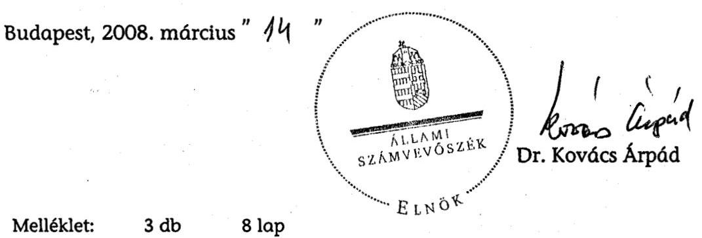

---

Mellékletek

---

# 1/a. sz. melléklet 

a V-08-056/2007-2008. sz. jelentéshez

## H-1051 BUDAPEST V., JÓZSEF NÁDOR TÉR 2-4. POSTACÍ

TELEFON: (36-1) 327-2100, (+36) 30 371-2100; FAX: (36-1) 318-2570
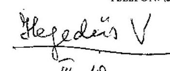

Iktató szám: 3863/1/2008.
Ügyintéző: dr. Hegedüs Judit
Hivatkozás: V-08-053/2007-2008.
Tárgy: véleményezés
dr. Kovács Árpád úr
elnök

## Állami Számvevőszék

## Budapest

## Tisztelt Elnök Úr!

A Pénzügyminisztérium fejezet müködésének ellenőrzéséről készített jelentéshez a szakértői egyeztetéseket követően három fő téma köré csoportosítható észrevételekkel kívánunk élni a következők szerint:

- állami vagyongazdálkodás,
- maradvány elszámolás,
- Államháztartás Belső Pénzügyi Ellenőrzés (ÁBPE) müködése.

A minisztérium álláspontja szerint a Jelentés az állami vagyonra vonatkozó szabályozás bemutatását és értékelését egyoldalúan végezte el. Az anyag kizárólag a vagyontörvény megalkotására koncentrál, nem tesz említést a szabályozás 2003. és 2007. közötti lényeges mozzanatairól. A vagyontörvény megalkotása egy folyamat része volt. 2003. és 2007. között évről évre szigorodott az állami tulajdonban lévő vagyontárgyak központi költségvetési szervek által történő értékesítésének szabályozása.

Ezzel párhuzamosan folyamatosan szükült a központi költségvetési szervek mozgástere a kincstári vagyon értékesítésből származó bevételek felhasználása tekintetében és a bevételek automatikus visszatartásának (visszaforgatásának) lehetősége.

A szabályozás jelentős állomásai voltak egyrészt az éves költségvetési törvénybe, illetve a költségvetést megalapozó törvénycsomagba foglalt (2003., 2005., 2007.) Áht. módosítások, másrészt a végrehajtási szabályok megfelelő módosításai. A jogszabályi környezet változása nyomán nőtt az állami vagyon értékesítéséből származó bevételek nyomon követhetősége. 2007-től a vagyonkezelők az értékesítésből realizált bevételeket, illetve a bevételek egy meghatározott részét már csupán egyedi engedély alapján használhatták fel. Mindezek mellett 2005-ben az állami vagyonnal való gazdálkodásról szóló 58/2005. (IV.4.) kormányrendelet megalkotásával átfogó felülvizsgálatra is sor került a területen.

---

Fenti szabályozások az Állami Számvevőszék korábbi jelentéseiben foglalt megállapítások figyelembe vételével kerültek megalkotásra.

Konkrét észrevételeink a következők oldalszámok szerint:

1. Az anyag 8. oldalán szerepel a következő megállapítás: „A Kormány 2000-ben, majd 2004-ben is célul tüzte ki az államháztartási reform átfogó elökészitését. A kijelölt feladatok azonban nem teljesültek, a helyszini ellenörzés lezárásáig is aktuálisak maradtak."
Megítélésünk szerint az államháztartás területén több reformértékủ lépés történt az elmúlt időszakban, ezért szükségesnek tartjuk, a szöveg pontosítását. Ennek tekinthető a vagyontörvény megalkotása, ahogy az a 10. oldalon megfogalmazásra került.
2. 12. o. (részletesen: 34-36. o. 1.2 pont) a PM az ÁBPE fejlesztésével kapcsolatos feladatait részben oldotta meg. Az elmúlt években ( a 2003-as nagy horderejű ÁBPE átalakítás után) a rendszer számos összetevőjének továbbfejlesztése, korrigálása, felülvizsgálata valósult meg (kisebb jogszabály módosítások, módszertani útmutatók); különös tekintettel a belső ellenőrzésre és a vezetői elszámoltathatóság bevezetésére és kiterjesztésére. Kormányrendeleti szinten meghatározást nyert a belső kontrollok és a belső ellenőrzés alapvető kapcsolata. Megtörtént a belső kontroll rendszerek újragondolása, az ezzel kapcsolatos Áht.módosítási javaslatot a költségvetési szervek jogállásáról és gazdálkodásáról szóló törvénytervezet tartalmazza.
3. 15. o. 3. sz. javaslat: A javaslat megvalósítása már folyamatban van, az előzetes tervezetek elkészültek és többszöri egyeztetésük megtörtént.
4. 15. o. A jelentés javaslatokat fogalmaz meg a pénzügyminiszter részére, amelyekből a 4. pont tartalmazza, hogy a pénzügyminiszter „tekintse át rendszerszerüen az elöirányzat-maradványok keletkezésének okait, annak eredményeként kezdeményezze, illetve készitse el a szükséges szabályozási változtatásokat".
Kérjük, hogy ezt a pontot a javaslatok közül töröltetni szíveskedjenek, a következők alapján.
A maradványokkal kapcsolatban a hatályos jogszabályok meghatározzák és egyben behatárolják a pénzügyminiszter jogait és kötelezettségeit:

- az államháztartásról szóló 1992. évi XXXVIII. törvény (Áht.) 93.§-a
$=$ maradvány megállapítása és jóváhagyása,
$=$ kötelezettségvállalással nem terhelt maradványrész elvonása,
$=$ előterjesztés és javaslat készítése a Kormány részére a meghiúsult maradványok más célra történő felhasználhatóságára,
$=$ meghiúsult maradványösszegre újabb kötelezettségvállalás engedélyezése;
- az államháztartás működési rendjéről szóló 217/1998. (XII.30.) Korm. rendelet (Ámr.) 66.§-a
$=$ kötelezettségvállalással nem terhelt maradvány elvonása vagy visszahagyása,
$=$ kötelezettségvállalással terhelt maradvány jóváhagyása.
A pénzügyminiszter nem felügyeli és ellenőrzi a különböző fejezetek intézményeit, illetve fejezeti kezelésű előirányzatait valamint ezek gazdálkodását, mivel ez a fejezetek felügyéletét ellátó szervek vezetőinek

---

jogosítványa és egyben kötelezettsége, továbbá különböző ellenőrző szervek ellenőrzik azokat.
Itt jegyezzük meg, hogy a részletes megállapítások 1.1.1. pontjának utolsó bekezdésével összefüggésben, hogy a maradványokról szóló pénzügyminiszteri döntés 2007-ben már határidőben megtörtént.
Az intézményi kötelezettségvállalással nem terhelt maradványok aránya 2004. és 2006. között az összes intézményi maradványhoz képest $2 \%$ és $4 \%$ között alakult. Ugyanez az intézményi kiadásokhoz hasonlítva szinte állandó $0,3 \%$ os arányszámot tartott. Ez az intézmények felelős kötelezettségvállalásait mutatja.
A fejezeti kezelésű előirányzatoknál a nem terhelt rész az összeshez képest 8 $\%$ és $20 \%$ között mozgott, míg a kiadáshoz képest $2 \%$ és $3,5 \%$ között ingadozott. 2005-2006-ban „egyszeri" maradványképződések (energiagazdálkodási céle1őirányzat) okozták a növekedést, melyre a tárcának sem volt ráhatása.
Ezeket figyelembe véve sem mondható jelentősnek (mind az előző évhez viszonyítva, mind) a kiadáshoz mért arányszámában a lekötetlen összeg.
A fentiek alapján nem látjuk szükségesnek a „rendszerszerü" áttekintést. (Az említett jogszabályhely (Ámr.) alapján ugyanakkor a pénzügyminiszter törekedett a kötelezettségvállalással nem terhelt maradványok csökkentésére azzal, hogy 2004-2006. években elvont ilyen jellegü maradványokat.)
Elkészült - az ÁSZ jelentésében is szereplő - „a költségvetési szervek jogállásáról és gazdálkodásáról" szóló törvénytervezet, amelyben a maradványok kezelésére új szabályok kerültek meghatározásra az adott intézmény jellegétől függően. (A tervezet közigazgatási egyeztetése folyamatban van.)
5. A tervezet 31 . oldalán szereplő 56 . sorszámú lábjegyzet pontosításra szorul: „Az állami vagyonról szóló, szeptember 10-én elfogadott 2007. évi CVI. törvény 2007. december 31-ével megszüntette a KVI-t, az ÁPV Zrt-t, a NFA-t, és létrehozta a Magyar Nemzeti Vagyonkezelö Zrt-t."
Valóban a vagyontörvény rendelkezett a Magyar Nemzeti Vagyonkezelő Zrt-t létrehozásáról, de az MNV Zrt. nem a jelzett időpontban, hanem 2007. november 20-án jött létre. A három elődszervezet jogait és kötelezettségeit - a szervezetek megszűnését követően - 2008. január 1-től vette át.
6. A jelentés 46. oldalán „3. A fejezet intézményei feladatellátásának és gazdálkodásának feltételrendszere" címü fejezete ismerteti a Magyar Államkincstár feladatkörének folyamatos változását. Szükségesnek tarjuk a fejezet kiegészítését az állami vagyonról szóló 2007. évi CVI. törvény 66. § (1) alapján történt feladatátadás ismertetésével.

A Vtv. hivatkozott szakasza alapján 2008. január 1-től a más személy tulajdonában lévő ingatlanon a Magyar Állam javára fennálló jelzálogjog, valamint elidegenítési és terhelési tilalom érvényesítésével, törlésével, az azzal való rendelkezéssel kapcsolatos jognyilatkozat megtételére - ha jogszabály eltérően nem rendelkezik - az állam nevében a Kincstár jogosult.
A feladatátadás előkészítése 2007. utolsó negyedében elkezdődött, a feladattal együtt az ellátáshoz szükséges létszám és előirányzat is átadásra került a Kincstár részére, ennek köszönhetően a feladatellátásban nem volt fennakadás.
7. 72. o. A képzettséggel kapcsolatban a legjelentősebb fejlesztés folyamatban van: az Európai Unió támogatásával valósul meg az ÁBPE Módszertani és Képzési Központ, mely érdemben hozzájárulhat az ÁBPE ismeretek korszerủ és

---

nagyvolumenủ oktatásához. Európai színvonalú tantermekben és e-learning oktatás keretében lesz lehetőség a belsö ellenőrök és a kontrollt végzők számára modern ismeretek átadására (2007 végén fogadták el a belső ellenőrök és a gazdasági vezetők kötelező - belső kontrollokkal kapcsolatos - továbbképzéséről szóló jogszabályokat).

Kérem Elnök urat, hogy a jelentésben a fenti észrevételeket figyelembe venni szíveskedjenek.

Budapest, 2008. február 28.
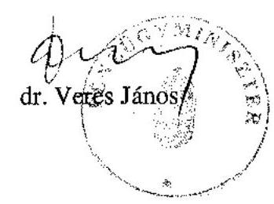

---

# Dr. Veres János úr 

miniszter
Pénzügyminisztérium

## Tisztelt Miniszter Úr!

A Pénzügyminisztérium fejezet müködésének ellenőrzéséről készített jelentésünkre adott észrevételeit köszönettel megkaptam.

Elöljáróban szeretném megjegyezni, hogy a Miniszter úrnak megküldött, általam aláirt jelentés tervezeteit több körben, az államtitkári egyeztetést követően még 2008. január utolsó hetében is egyeztették munkatársaim és a kapott észrevételeket kivétel nélkül hasznosították. Sajnálom, hogy a Miniszter úr levelében szereplő pontositó jellegü észrevételeket korábban nem ismerhettük meg.

Megjegyzem továbbá, hogy a jelentés bevezetése (6. oldal utolsó előtti bekezdés) tartalmazza az ellenőrzésünknek a PM feladatellátásán belüli hangsúlyos területeit, így például az államreform területén a Kormány által 2006 nyarán meghirdetett intézkedések előkészítésében, végrehajtásában a minisztérium szerepét. Ezen belül a miniszter szabályozási felelőssége körében a vagyongazdálkodás rendszerét alapjaiban érintő törvény előkészítését, és nem a PM vagyongazdálkodási tevékenységét kívántuk átfogóan értékelni. (Jelezni szeretném, hogy az egységes vagyonkezelő szervezet létrehozásának körülményeit az ÁPV Zrt. 2007. évi müködésének és a központi költségvetés végrehajtásához kapcsolódó tevékenységének folyamatban lévő ellenőrzése keretében tekintjük át; a tapasztalatainkat tartalmazó jelentésünket várhatóan 2008. szeptemberében hozzuk nyilvánosságra.)

A konkrét észrevételekkel kapcsolatban - azok sorrendjében - a következőkről szeretném Miniszter urat tájékoztatni:

A helyszíni ellenőrzés befejezése (2007. augusztus 23.) után, 2007. szeptember 10 -én fogadta el az OGY az állami vagyonról szóló 2007. évi CVI. törvényt. (Erre a lábjegyzetben utalunk.) Helytálló tehát az a megállapításunk, hogy a 2004-ben kijelölt feladatok ellenőrzésünk idején még nem teljesültek.

---

A 2-3. pontban tett, az ÁBPE-re vonatkozó megjegyzésekkel kapcsolatban a tervezet 15 . oldalán a 3. sz. javaslathoz egy lábjegyzetet kapcsolunk: „A pénzügyminiszter 2008. február 28-án kelt levelében adott tájékoztatása szerint a belső kontroll rendszerek újragondolását is magába foglaló jogszabályi módosításokat a költségvetési szervek jogállásáról és gazdálkodásáról szóló, államigazgatási egyeztetés alatt lévő törvényjavaslat tervezete tartalmazza."

A 4. ponttal kapcsolatban szeretném a 2006. évi zárszámadásról készített jelentésünk megállapításával összhangban megerősíteni, hogy változatlanul fontosnak tartom az előirányzat-maradványok keletkezése okainak folyamatos, rendszerszemléletủ nyomon követését. Ez túlmutat azon, hogy megtörténik-e a jogszabályilag előírt határidőre az előirányzatok jóváhagyása, illetve megfelelő mértékủ elvonása. A miniszter ugyanis a szabályozási felelőssége körében - az okok feltárása esetén - hatást gyakorolhat ezekre a folyamatokra.

Az 5. pont szerinti pontosítást, amely a Nemzeti Vagyonkezelő Zrt. létrehozásával kapcsolatos, átvezetjük.

A Magyar Államkincstárnak a Vtv-ből adódó feladatváltozását a 2008. szeptemberében kezdődő, a kincstári rendszer müködésének ellenőrzése keretében fogjuk értékelni.

A 7. pontban ismertetett, az ÁBPE kapcsán a képzettséggel összefüggő tervezett lépésekről szóló tájékoztatását a minisztériumi intézkedési terv részeként tudomásul veszem.

Kérem Miniszter urat, hogy a levelemben foglaltakat mérlegelni és tudomásul venni szíveskedjék.

Végezetül tájékoztatom, hogy az ellenőrzésről készült jelentést - kialakult gyakorlatunk szerint - az Ön észrevételeivel és az azokra adott válaszommal együtt küldöm meg az Országgyülés elnökének, az illetékes bizottságai elnökeinek és a Miniszterelnöknek.

Budapest, 2008. március „ 1 ".
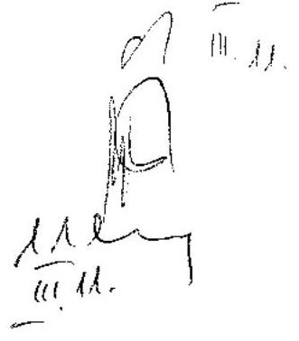

Tisztelettel:
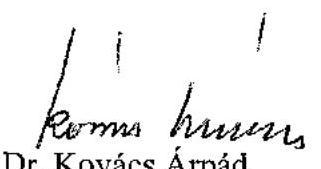

---

# A Pénzügyminisztérium fejezet intézményi struktúrája ( 2003- 2007.)

|  Cím | Alcím | 2003. | 2004. | 2005. | 2006. | 2007.  |
| --- | --- | --- | --- | --- | --- | --- |
|  Pénzügyminisztérium igazgatása |  | X | X | X | X | -  |
|   | Pénzügyminisztérium igazgatása | - | - | - | - | X  |
|  PM Informatikai Szolgáltató Központ |  | - | - | - | - | X  |
|  Felügyeletek | Szerencsejáték Felügyelet | X | X | X | X | -  |
|  Adó- és Pénzügyi Ellenőrzési Hivatal |  | X | X | X | X | X  |
|  Vám- és Pénzügyőrség |  | X | X | X | X | X  |
|  Pénzügyi Szervezetek Állami Felügyelete |  | X | X | - | - | -  |
|   | Pénzügyi Szervezetek Állami Felügyelete | X | X | X | X | X  |
|   | Fejezeti kezelésű előirányzatok | - | - | X | X | X  |
|  Kincstári Vagyoni Igazgatóság | Kincstári Vagyoni Igazgatóság | X | X | X | X | X  |
|   | Kincstári vagyonkezelés és hasznosítás | X | X | X | X | X  |
|   | Állami feladatellátással összefüggő elhelyezési feladatok | X | X | X | X | X  |
|  Államháztartási Hivatal | Államháztartási Hivatal | X | - | - | - | -  |
|  Magyar Államkincstár |  | - | X | X | X | X  |
|  Kormányzati Ellenőrzési Hivatal |  | - | - | - | - | X  |
|  Fejezeti kezelésű előirányzatok |  | X | X | X | X | X  |

---

3. sz. melléklet
a V-08-056/2007-2008. sz. jelentéshez

# Tanúsítványok és diagramok jegyzéke

---

| Tanúsítványok |  |
| :-- | :-- |
| 1. számú | A kiadási és a bevételi előirányzatok alakulása a PM fejezetnél a 2003-   2007. I. félév közötti időszakra |
| 2. számú | A fejezet intézményeinek szervezetére, létszámára vonatkozó egyes ada-   tok a 2003-2007. I. félév közötti időszakra |

| Diagramok |  |
| :-- | :-- |
| 1. számú | A PM fejezet 2003. évi eredeti és tényleges kiadási előirányzatának   megoszlása a fejezet intézményei között |
| 2. számú | A PM fejezet 2004. évi eredeti és tényleges kiadási előirányzatának   megoszlása a fejezet intézményei között |
| 3. számú | A PM fejezet 2005. évi eredeti és tényleges kiadási előirányzatának   megoszlása a fejezet intézményei között |
| 4. számú | A PM fejezet 2006. és 2007. évi eredeti kiadási előirányzatának   megoszlása a fejezet intézményei között |

---

1. sz. tanúsítvány a V-08-056/2007-2008. sz. jelentéshez

A kiadásí és a bevételi előirányzatok alakulása a PM fejezetmél a 2003-2007. I. felév közötti időszakra

|  Évek | Címelék/aimok |  |  |  |  |  |  |  |  |  |  |  |  |  |   |
| --- | --- | --- | --- | --- | --- | --- | --- | --- | --- | --- | --- | --- | --- | --- | --- |
|   |  |  |  |  |  |  |  |  |  |  |  |  |  |  |   |
|   |  |  |  |  |  |  |  |  |  |  |  |  |  |  |   |
|  Széd |  |  |  |  |  |  |  |  |  |  |  |  |  |  |   |
|  Szügy |  |  |  |  |  |  |  |  |  |  |  |  |  |  |   |
|  Szügy |  |  |  |  |  |  |  |  |  |  |  |  |  |  |   |
|  Szügy |  |  |  |  |  |  |  |  |  |  |  |  |  |  |   |
|  Szügy |  |  |  |  |  |  |  |  |  |  |  |  |  |  |   |
|  Szügy |  |  |  |  |  |  |  |  |  |  |  |  |  |  |   |
|  Szügy |  |  |  |  |  |  |  |  |  |  |  |  |  |  |   |
|  Szügy |  |  |  |  |  |  |  |  |  |  |  |  |  |  |   |
|  Szügy |  |  |  |  |  |  |  |  |  |  |  |  |  |  |   |
|  Szügy |  |  |  |  |  |  |  |  |  |  |  |  |  |  |   |
|  Szügy |  |  |  |  |  |  |  |  |  |  |  |  |  |  |   |
|  Szügy |  |  |  |  |  |  |  |  |  |  |  |  |  |  |   |
|  Szügy |  |  |  |  |  |  |  |  |  |  |  |  |  |  |   |
|  Szügy |  |  |  |  |  |  |  |  |  |  |  |  |  |  |   |
|  Szügy |  |  |  |  |  |  |  |  |  |  |  |  |  |  |   |
|  Szügy |  |  |  |  |  |  |  |  |  |  |  |  |  |  |   |
|  Szügy |  |  |  |  |  |  |  |  |  |  |  |  |  |  |   |
|  Szügy |  |  |  |  |  |  |  |  |  |  |  |  |  |  |   |
|  Szügy |  |  |  |  |  |  |  |  |  |  |  |  |  |  |   |
|  Szügy |  |  |  |  |  |  |  |  |  |  |  |  |  |  |   |
|  Szügy |  |  |  |  |  |  |  |  |  |  |  |  |  |  |   |
|  Szügy |  |  |  |  |  |  |  |  |  |  |  |  |  |  |   |
|  Szügy |  |  |  |  |  |  |  |  |  |  |  |  |  |  |   |
|  Szügy |  |  |  |  |  |  |  |  |  |  |  |  |  |  |   |
|  Szügy |  |  |  |  |  |  |  |  |  |  |  |  |  |  |   |
|  Szügy |  |  |  |  |  |  |  |  |  |  |  |  |  |  |   |
|  Szügy |  |  |  |  |  |  |  |  |  |  |  |  |  |  |   |
|  Szügy |  |  |  |  |  |  |  |  |  |  |  |  |  |  |   |
|  Szügy |  |  |  |  |  |  |  |  |  |  |  |  |  |  |   |
|  Szügy |  |  |  |  |  |  |  |  |  |  |  |  |  |  |   |
|  Szügy |  |  |  |  |  |  |  |  |  |  |  |  |  |  |   |
|  Szügy |  |  |  |  |  |  |  |  |  |  |  |  |  |  |   |
| 

---

2. sz. tanúsítvány a V-08-056/2007-2008. sz. jelentéshez

A fejezet intézménysinek szervezetére, látszámára vonatkozó egyes adatok a 2003-2007. I. félév közötti időszakra

|  Évek | Címek/számak | Szervezeti egységek* száma | Vesztilők száma* (fő) |  |  | FOGLALKOZTATOTTAK |  | Szakmai | Funkciómális***  |
| --- | --- | --- | --- | --- | --- | --- | --- | --- | --- |
|   |  |  |  |  |  | időzástviselői jogviszonyban (fő) | közzétalmasztó jogviszonyban (fő) |  |   |
|  2003. | Fejezet |  |  |  |  |  |  |  |   |
|  utódó | FM igazgatás | 28 | 140 | 542 | 442 | 101 |  | 569 | 174  |
|   | Add-és Pénzügyi Ellenőrzési Hivatal | 240 | 1160 | 12826 | 12526 | 294 |  | 10610 | 2316  |
|   | Vám- és Pénzügyőrség | 30 | 776 | 7842 |  | 1457 |  | 5913 | 1929  |
|   | Magyar Államkincstár*** | 338 | 409 | 4332 | 3964 | 50 | 216 | 3284 | 945  |
|  2004. | Fejezet |  |  |  |  |  |  |  |   |
|  utódó | FM igazgatás | 28 | 137 | 493 | 393 | 100 |  | 337 | 156  |
|   | Add-és Pénzügyi Ellenőrzési Hivatal | 237 | 1037 | 11848 | 11726 | 228 |  | 8786 | 2154  |
|   | Vám- és Pénzügyőrség | 34 | 366 | 7595 |  | 1406 |  | 5759 | 1916  |
|   | Magyar Államkincstár | 337 | 409 | 4150 | 3933 | 38 | 179 | 3173 | 977  |
|  2005. | Fejezet |  |  |  |  |  |  |  |   |
|  utódó | FM igazgatás | 24 | 126 | 422 | 260 | 82 |  | 286 | 144  |
|   | Add-és Pénzügyi Ellenőrzési Hivatal | 289 | 1126 | 11917 | 11379 | 215 |  | 6662 | 2755  |
|   | Vám- és Pénzügyőrség | 34 | 345 | 6784 |  | 1289 |  | 6130 | 1654  |
|   | Magyar Államkincstár | 322 | 371 | 3882 | 2724 | 31 | 127 | 3033 | 849  |
|  2006. | Fejezet |  |  |  |  |  |  |  |   |
|  utódó | FM igazgatás | 21 | 103 | 376 | 332 | 44 |  | 274 | 102  |
|   | Add-és Pénzügyi Ellenőrzési Hivatal | 269 | 1109 | 11781 | 11541 | 224 |  | 9619 | 2162  |
|   | Vám- és Pénzügyőrség | 34 | 410 | 6550 |  | 1256 |  | 4855 | 1694  |
|   | Magyar Államkincstár | 326 | 419 | 3848 | 3706 | 59 | 113 | 3005 | 845  |
|  2007. | Fejezet |  |  |  |  |  |  |  |   |
|  utódó | FM igazgatás (2007. 06.21.-ig) | 21 | 99 | 360 | 338 | 22 |  | 230 | 95  |
|   | Add-és Pénzügyi Ellenőrzési Hivatal | 202 | 1217 | 12869 | 12563 | 289 |  | 1100 | 2081  |
|   | Vám- és Pénzügyőrség | 41 | 387 | 6750 |  | 1306 |  | 5076 | 1679  |
|   | Magyar Államkincstár | 287 | 359 | 3388 | 3460 | 29 | 99 | 2820 | 768  |

*Készülti, önálló osztály szintig* osztályvezető besorolásig ***az igazgatási, jogi, gazdálkodási, humánpótlási és üzemeltetési feladatok*** az Államháztartási Hivatal és a Magyar Államkincstár együttesen

Tanúsított, hogy az adatok a FM fejezet nyilvántartásában szereplő adatokkal álljon az Állámháztartási Hivatal és a Magyar Államkincstár együttesen

2007. 06.21.2007.

---

# 1. sz. diagram 

a V-08-056/2007-2008. sz. jelentéshez

A PM fejezet 2003. évi eredeti kiadási előirányzatának megoszlása a fejezet intézményei között
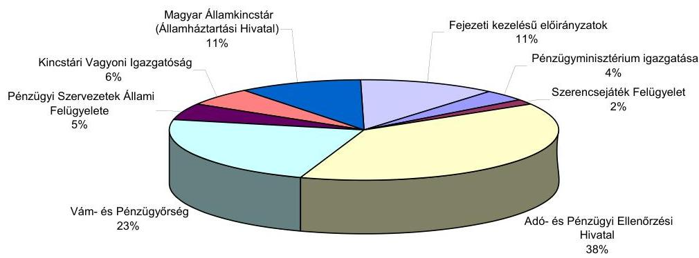

A PM fejezet 2003. évi tényleges kiadásainak megoszlása a fejezet intézményei között
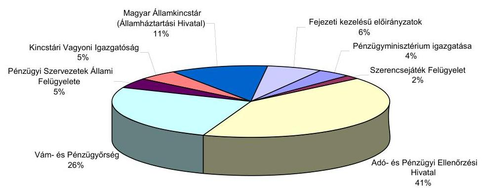

---

# 2. sz. diagram 

a V-08-056/2007-2008. sz. jelentéshez

A PM fejezet 2004. évi eredeti kiadási előirányzatának megoszlása a fejezet intézményei között
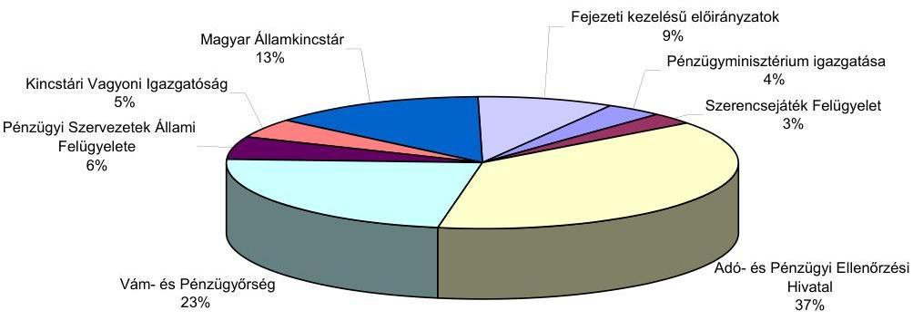

A PM fejezet 2004. évi tényleges kiadásainak megoszlása a fejezet intézményei között
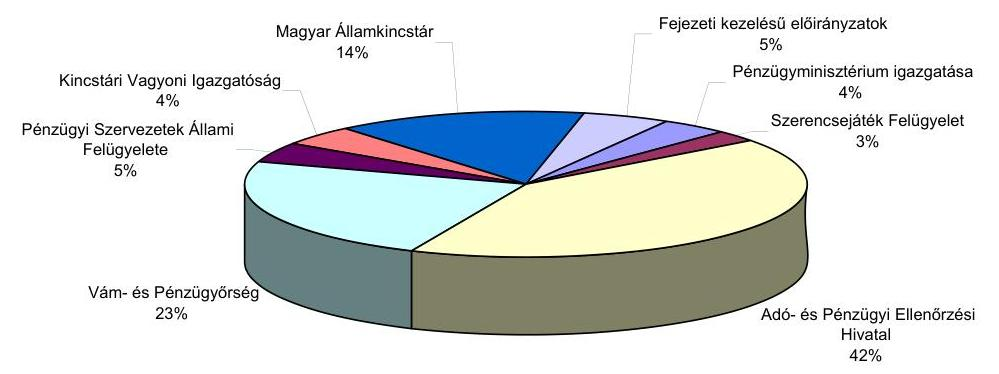

---

# 3. sz. diagram 

a V-08-056/2007-2008. sz. jelentéshez
A PM fejezet 2005. évi eredeti kiadási előirányzatának megoszlása a fejezet intézményei között
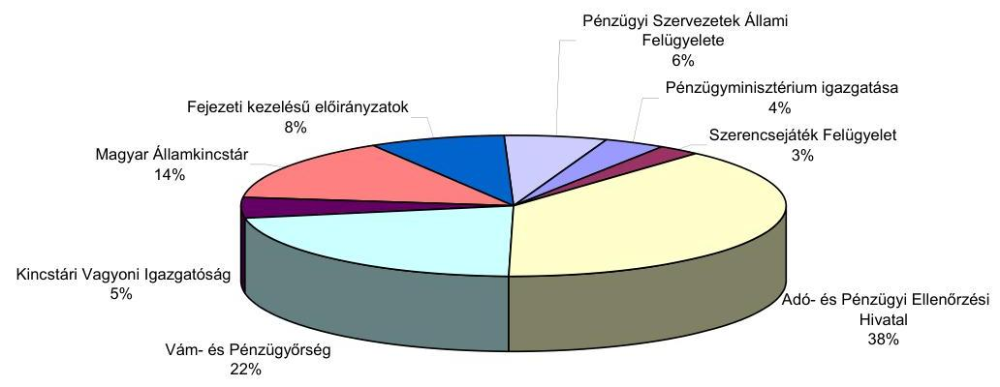

A PM fejezet 2005. évi tényleges kiadásainak megoszlása a fejezet intézményei között
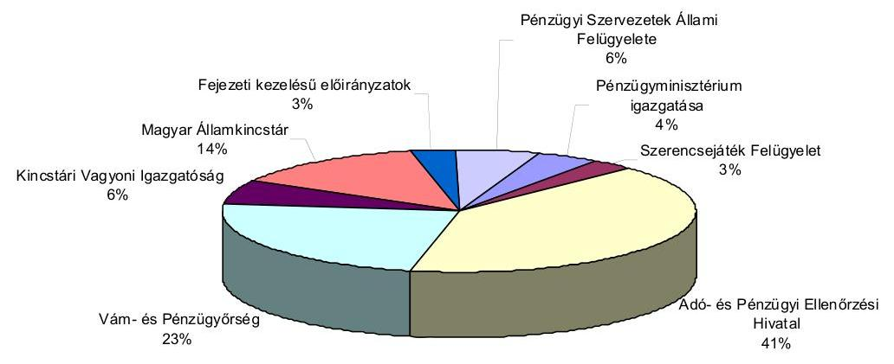

---

# 4. sz. diagram 

a V-08-056/2007-2008. sz. jelentéshez

A PM fejezet 2006. évi eredeti kiadási előirányzatának megoszlása a fejezet intézményei között
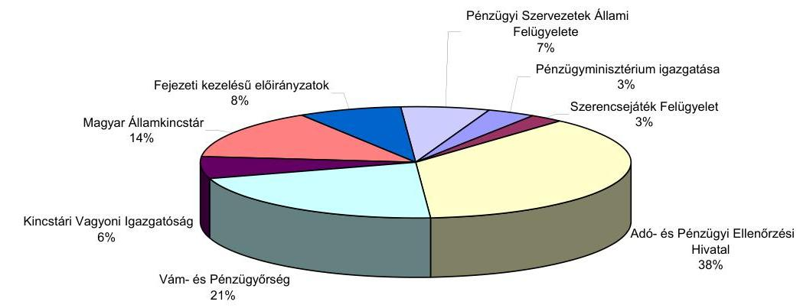

A PM fejezet 2007. évi eredeti kiadási előirányzatának megoszlása a fejezet intézményei között
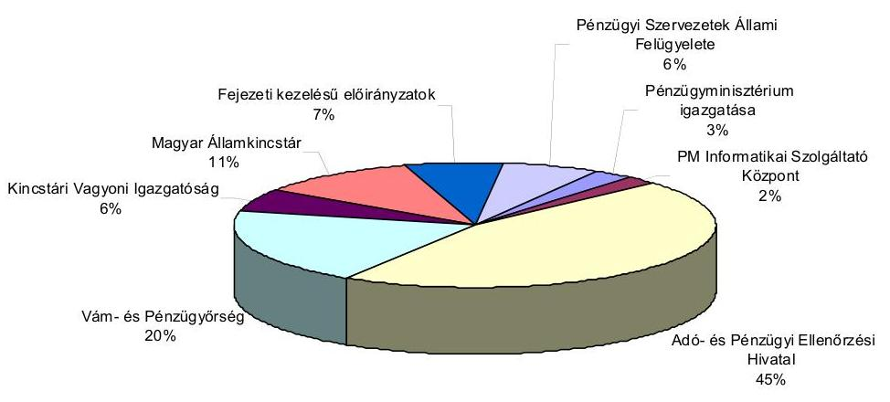

---

FÜGGELÉK

---

# A KORÁBBI SZÁMVEVŐSZÉKI VIZSGÁLATOK UTÓELLENŐRZÉSE 

## 1. A PM fejezet korábbi átfogó ellenőrzése megÁllapítÁsAI ALAPJÁN TETT JAVASLATOK HASZNOSULÁSA

A PM fejezet múködésének ellenőrzéséről szóló 0431 sz. jelentésünkben javasoltuk a Kormánynak, hogy tekintse át és értékelje az államháztartási reform kapcsán a 2064/2000. (III. 29.) Korm. határozatban, továbbá a közigazgatás továbbfejlesztése terén az 1052/1999. (V. 21.) Korm. határozatban előírt feladatok teljesítését, tárja fel az egyes feladatok elmaradásának, vagy részleges megvalósulásának okait és intézkedjen azok szükség szerinti pótlásáról. Az államreform munkálatainak keretében a javaslat részben megvalósult. Ugyanakkor nem készült elemzés az egyes feladatok elmaradásának, vagy részleges megvalósulásának okairól.

A költségvetési előirányzatok szakmai megalapozottságának növelését biztosító jogszabályi környezet kialakításáról szóló javaslatunk ugyancsak részben valósult meg. Jelentősebb változást szintén az államreform keretében már kidolgozott elgondolások megvalósítása jelenthet.

A Kormány egyáltalán nem hajtotta végre az ÁBPE rendszerének hatékony múködtetése érdekében a megfelelő képzettségű és gyakorlatú ellenőrzési kapacitás biztosításának feltételeiről tett javaslatunkat.

A fejezetek előirányzat-maradványaival kapcsolatos felülvizsgálati kötelezettség előírt határidőre történő elvégzéséről a pénzügyminiszternek tett javaslatunk részlegesen valósult meg.

A PM-nek a tárgyévet követő év május 15 -éig kellett az intézmények előirányzatmaradványát jóváhagynia. Ezzel szemben az APEH-nél a 2003. évi előirányzatmaradványt csak 2004. december 17 -én hagyta jóvá a PM, a 2004. évit pedig 2005. november 24 -én, a 2005 . évit 2006. augusztus 14 -én, a 2006 . évit 2007 . június 4-én.

Javasoltuk a pénzügyminiszternek, hogy intézkedjen a fejezeti és azzal összhangban az intézményi informatikai stratégiák kidolgozására, az informatikai szakmai irányítás koordinációjának javítására, az informatikai rendszerek magasabb szintű összekapcsolása biztonsági követelményeinek hatékonyabb érvényesítése érdekében. A javaslat megvalósult.

2007-ben háromezer PC-t szereztek be. A DSN adatbázis-kezelő rendszert felváltották egy korszerűbbre (Cache). Az elavult Alpha szervereket korszerűbb Itanium szerverekre cserélték. Ezek a fejlesztések várhatóan biztosítják a biztonságos múködést.

---

A szervezeti átalakítás során az SZF informatikai rendszere nem okozott gondot, mert ez összekapcsolható volt az APEH rendszerével. Az illetékhivatalok esetében olyan elavult volt az informatikai háttér, hogy az APEH rendszerének átvételével valósul meg az informatikai integráció.

# 2. AZ APEH MÜKÖDÉSÉNEK, FELADATELLÁTÁSÁNAK ELLENŐRZÉSEI SORÁN TETT JAVASLATOK REALIZÁLÁSA 

Az ÁSZ a „Jelentés az Adó- és Pénzügyi Ellenőrzési Hivatal múködésének ellenőrzéséről" (2006. június, 0616 sz.) jelentésben javasolta a pénzügyminiszternek, írja elő az APEH elnöke számára, hogy dolgoztassa ki egyes szakterületek - ezen belül a külső megkeresések alapján lefolytatandó behajtások, végrehajtások - feladatainak ellátásához szükséges humánerőfor-rás-kapacitás rendszeres és azonos mutatószámokon alapuló tervezésének és elemzésének módszerét, valamint készíttessen ilyen elemzéseket a humánerőforrás optimális elosztása érdekében. A javaslat megvalósult.

A Hivatal feladatainak ellátásához szükséges humánerőforrás kapacitás mutatószámokon alapuló tervezési és elemzési módszereinek kidolgozását az adóhatóság megkezdte.

Több szakterületen (pl. adóügy, ellenőrzés, stb.) elkészült a jellemző tevékenységek munkaidő szükségletének feltérképezése, más tevékenységek (pl. felszámolás és végrehajtás jogi, biztonsági) esetén a főbb jellemzők alapján a gyakorlati tapasztalatok összegzésével folyamatosan kerül sor mutatószámok kialakítására.

Az egyes szakmai területekre - adóügy, ellenőrzés, behajtás, jogi és hatósági számításokat végeztek mind a Központi Hivatal, mind a területi igazgatóságok dolgozóinak kapacitás meghatározására, a mérhető teljesítményekre és a tényleges, ösztönző többletteljesítési értékelésekre, mutatókra.

A külső megkeresések alapján indított végrehajtási cselekmények az adózók egyéb behajtandó hátralékaival együtt belépnek a szokásos eljárási rendbe. Elkülönítve tartják számon a külső megkeresésekben szereplő követeléseket és az ezekre beszedett összegeket. A végrehajtás-behajtás folyamata azonban egységes, a humán erőforrás szükséglet elkülönített nyilvántartása rendkívül nehéz, jelenleg még nem oldották meg.

A humánerőforrás kapacitás tervezési és elemzési módszerei alapján pl. az adóügyi szakterület feladatainak ellátásához szükséges kapacitás méréséhez kidolgozásra került 12 igazgatósági feladatokat jellemző mutató és egy a Központi Hivatal feladataira.

Javasoltuk a pénzügyminiszternek, hogy alakítsa át a Hivatal részére megfogalmazott érdekeltségi jutalom kifizetésének feltételeként meghatározott tel-jesítmény-elvárásokat oly módon, hogy valamennyi elvárás hatékonyabb és eredményesebb munkavégzésre, illetve többletteljesítmény elérésére ösztönözzön, valamint azok teljesítése mérhető legyen. A javaslat megvalósult.

---

Az APEH dolgozóinak 2007. érdekeltségi jutalma kifizetési feltételeinek meghatározása az újonnan kialakított teljesítmény elvárások alapján történik, amelyben a költségvetési törvényben meghatározott bevételi követelményeken túlmenően egyes kiemelt területekre mutatószámok, illetve minimum-teljesítési követelmények vannak.

A mutatószámok azonban minden esetben csak mennyiségi, időarányos, elvégzett vizsgálatokra vonatkoztak, értékhatárokat nem jelöltek meg.

Kiemelt fontosságú területek voltak pl. bevallási kötelezettség teljesítése, az általános forgalmi adó ellenőrzések száma az adóminimalizálási körben, a vagyonosodási vizsgálatok, a TB alapokat megillető járulékkötelezettségek ellenőrzése, a felszámolási és végrehajtási szakterület.

Szintén a pénzügyminiszternek javasolta az ÁSZ, hogy kezdeményezze a 2005. évi LVI. tv. módosítását annak érdekében, hogy az APEH végelszámolás alatt álló szervezetekkel szemben fennálló követeléseinek engedményezését a jogszabály ne tegye lehetővé, tekintettel arra, hogy a követelések kielégítésére szolgáló vagyon rendelkezésre áll, a megfizetés teljes összegben biztosított. A javaslat realizálódott.
2006. december 31-éig az Adó- és Pénzügyi Hivatalról szóló 2002. évi LXV. tv. 2 § (9) bekezdése, illetőleg 2007. január 1-jétől az adózás rendjéről szóló 2003. évi XCII. tv. (Art) 177/A. §-a a végelszámolás alatt álló szervezetek esetén nem teszi lehetővé az engedményezést, azaz kizárólag a felszámolási eljárás alatt álló szervezetekkel szemben fennálló követelések engedményezését teszi lehetővé az állami adóhatóság számára.

Javasoltuk a pénzügyminiszternek, hogy biztosítson pénzügyi forrást az APEH informatikai eszközállománya műszaki színvonalának megőrzéséhez, illetve fejlesztéséhez a jogszabályokban meghatározott feladatai végrehajtása érdekében. A javaslat végrehajtása a helyszíni ellenőrzés lezárásakor folyamatban volt.

A tervezés során meghatározott a szükségletekhez mérten igen alacsony eredeti előirányzatok ellenére 2006-ban (és várhatóan 2007-ben is) jelentős összegeket fordítottak informatikai fejlesztésekre és így a szakfeladatok ellátásának informatikai támogatottsága várhatóan javulni fog. A többletforrások úgy keletkeztek, hogy a Magyar Köztársaság 2007. évi költségvetéséről szóló 2006. évi CXXVII. törvény 47. §-a és a Magyar Köztársaság 2006. évi költségvetéséről szóló 2005. évi CLIII. Törvény 47. §-a alapján a pénzügyminiszter engedélyével a bevételi tervet meghaladó bevételi többlet egy részét dologi és felhalmozási kiadásokra fordíthatják.

Az informatikai beruházások teljes értéke az APEH-nél 2003-ban 1381,8 M Ft volt, 2004-ben 2 796,5 M Ft, 2005-ben 2006,3 M Ft, míg 2006-ban 4614,0 M Ft.

Az APEH a 2006-2007. időszakban közel 7000 személyi számítógépet szerzett be ezzel a személyi számítógép állományának mintegy 54\%-át megújította. A korszerűsítés eredményeként a személyi számítógép állomány az operációs rendszerek szempontjából is homogénebb lett: a számítógép állomány $90 \%$-ot meghaladó részén egységes, korszerű operációs rendszer (Ms Windowd XP) múködik. A szerverpark megújítása a helyszíni vizsgálat idején folyamatban volt. Az elavult,

---

megyei szerverek kiváltására az APEH 35 szervert szerzett be, melyek teljes körű alkalmazásba vétele várhatóan 2008. tavaszára fog befejeződni.

A pénzügyminiszternek címeztük azt a javaslatot, hogy írja elő az Adó- és Pénzügyi Ellenőrzési Hivatal elnöke számára, hogy alakíttassa ki az informatikai területen a belső erőforrások eredményes kontrollját (tervezését, mérését) biztosító eszközrendszert. A javaslat realizálódott.

A pénzügyminiszter utasításának végeredményeként 2007 júniusában állítottak munkába egy munkaidő-nyilvántartó rendszert, amely igen részletes bontásban követi nyomon az informatikai tevékenységet. Segítségével visszakereshető, hogy milyen megrendelésre (pl. főosztályi, projekt), mikor és milyen típusú (pl. szerviz, fejlesztés) feladatokat végeztek az APEH informatikusok.

A személyi jövedelemadó bevallási és visszaigénylési rendszerének ellenőrzéséről szóló ( 0434 sz.) ÁSZ jelentésében javasoltuk a pénzügyminiszternek, hogy azonnal kezdeményezze az Art., illetve az Szja tv. összehangolását annak érdekében, hogy a munkáltatón keresztül elszámoló adóalanyok egyszerűsített ellenőrzése elvégezhető legyen. A javaslatot megvalósították.
2005. január 1-jével az Art. 27. § (2) bekezdése értelmében a munkáltatói adómegállapítás az ellenőrzés és a jogkövetkezmények szempontjából a magánszemély bevallásának minősül, valamint a 107. § (1) bekezdése szerint lehetővé vált a munkáltatói adatszolgáltatások egyszerűsített ellenőrzéssel történő vizsgálata.

Kialakították a kiválasztási és ellenőrzési metodikát, a vizsgálatokat elrendelték.
A pénzügyminiszternek címeztük a javaslatot, hogy kérje fel az APEH elnökét saját hatáskörben ellenőrzés lefolytatására valamennyi igazgatóságnál a 2000-2002. adóévekre vonatkozóan az adóbevallást benyújtó és munkáltatón keresztül is elszámoló adóalanyoknál.

Az APEH az ellenőrzéseket elvégezte.
A vizsgálatok során bebizonyosodott, hogy az esetek többségében a magánszemélyek jogosan járó összegeket igényeltek vissza.

Az APEH véleménye szerint a várható adókülönbözet alapján - amint ezt később a nagyszámú vizsgálatok tapasztalatai és számadatai is alátámasztották - ez a jelenség alacsony kockázatúnak volt minősíthető, ezért nem került kiemelt feladatként meghatározásra.

Szintén a pénzügyminiszternek címezte az ellenőrzés azt a javaslatot, hogy fogalmazzon meg elvárásokat az APEH felé az ellenőrzöttségi szintre, azaz adóteljesítményi kategóriák szerinti követelményekre vonatkozóan (vizsgálandó adóteljesítmény összege, illetve adózók száma) fontosabb adónemenkénti bontásban.

A javaslat megvalósítását részben jogszabályi előírásokban biztosították, részben az ellenőrzöttségi szintet mérő mutatószámot beépítettek a teljesítményértékelési rendszerbe.

---

# 3. A VP MŰKÖDÉSÉNEK ÁtFOGÓ ELLENŐRZÉSE 

A VP múködéséről készített 2005. évi 0511. számú ÁSZ jelentésünkben javasoltuk a pénzügyminiszternek, kérje fel a Vám- és Pénzügyőrség országos parancsnokát, hogy
a. alakítsa át a VP szervezeti struktúráját, hogy biztosítva legyen a feladatok hatás- és felelősségi körének összhangja.

A javaslatot megvalósították.
Megszűntették a Nemzeti Jövedéki Központot, a feladatait a Jövedéki Kapcsolattartó és Kockázatelemzési Központ látja el. Létrehozták a VP Informatikai Üzemeltetési Központot. A jogkörrel nem rendelkező középfokú szerv elsődleges feladata a centralizált informatikai rendszerek folyamatos múködésének, rendelkezésre állásának biztosítása; a felhasználói rendszerek hardver és rendszerszoftver szintű működésének biztosítása; a decentralizált rendszerek (vám/jövedék) szervereinek üzembe helyezése, egységes múködésének biztosítása.
b. készüljön közép- és hosszú távú stratégia az eszközgazdálkodás főbb területeire, valamint az informatikai fejlesztésekre, továbbá e fejlesztéseket támogató egységes projektvezetési és minőségbiztosítási módszertan.

A Vám- és Pénzügyőrség átfogó eszköz-, illetve vagyongazdálkodási stratégiája összeállításra került, a Testület informatikai szakterületét átfogó, az aktualizált fejlesztéseket is tartalmazó IT Stratégia és Minőségbiztosítási Terv elkészült, a Fejlesztési Szabályzat - amely magában foglalja a projektvezetési és minőségbiztosítási módszertant is - aktualizálása folyamatos.
c. a VP országos parancsnoka folyamatosan ellenőrizze a VP belső ellenőrzési rendszerének múködését.

A javaslat alapján megtörtént a VP belső kontroll rendszerének fejlesztése, az egyes szakterületeken a folyamatba épített vezetői ellenőrzési rendszerek megerősítése, az ellenőrzési nyomvonalak, kockázatkezelési és a szabálytalanságok kezelését biztosító szabályzatok elkészítése, aktualizálása, valamint a kontroll rendszerek múködtetése. Az informatikai szakterületre vonatkozó kockázatkezelési és a szabálytalanságok kezelését biztosító szabályzatok kiadásra kerültek, aktualizálásuk folyamatos.
d. történjen intézkedés a váminformatikai rendszer hiányosságainak megszüntetésére, az elektronikus árunyilatkozat-adás lehetőségének megteremtésére, az eszközök nyilvántartási rendjének a vagyonvédelmi szempontoknak megfelelő kialakítására, valamint egy központosított jövedéki informatikai rendszer kialakítására, figyelembe véve a központi költségvetést megillető 2001-2002. évi jövedéki adóbevételek realizálása hatékonyságának és eredményessége ellenőrzéséről szóló 2003. évi ( 0357 sz.) ÁSZ jelentésben megfogalmazott javaslatokat.

A javaslat megvalósult.

---

A váminformatikai rendszer hiányosságainak megszüntetése keretében a vámfelügyelet alól történő jogszerútlen elvonás lehetőségének kizárása érdekében a fejlesztési ütemtervnek megfelelően - kapcsolatra vonatkozó adatátadást biztosító programmodulok elkészültek és átadásra kerültek. A fejlesztés eredményeként a vámregisztrációs rendszerek és vámáru-nyilatkozat feldolgozó rendszer elektronikus adatátviteli kapcsolata az éles alkalmazásokon is megvalósult.

Az elektronikus vámáru-nyilatkozat adás lehetőségének megteremtésére vonatkozó javaslatnak megfelelően az intézkedési tervben feladatként került megfogalmazásra a Vám- és Pénzügyőrség Rendszerfejlesztő Központja felé az elektronikus úton, interneten keresztül történő vámáru-nyilatkozat adás informatikai feltételeinek megteremtése. A kialakított adatfogadási mechanizmus biztosítja, hogy a vámkezelést indítványozók az egységes vámárunyilatkozaton szereplő adataikat az illetékes vámhatóságokhoz továbbítsák.

A központosított jövedéki informatikai rendszer kialakítására vonatkozó javaslat figyelembe vételével, a vezetői információs rendszer kialakítása, valamint az adatbiztonság megőrzését és ellenőrzését támogató alkalmazások bevezetése érdekében folyamatban van egy megújult központosított jövedéki információs rendszer tervezése.
e. kerüljön szabályozásra, hogy a hatósági tevékenységen kívüli feladatok informatikai támogatottságának kialakításához minden esetben vonják be az Informatikai Főosztály képviselőjét.

A javaslatot megvalósították.
A javaslatban megfogalmazottaknak megfelelően belső utasítás került kiadásra, amely az ügyviteli feladatok ellátását támogató informatikai rendszerek kialakításának folyamatát, a fejlesztési feladatokat és az informatikai minőségbiztosítás kérdéseit szabályozza. Az utasítás szerint a fejlesztést közvetlenül az adott rendszer szakmai felügyeletét végző VPOP szerv kezdeményezi a Vám- és Pénzügyőrség rendszerintegrációs, alkalmazásfejlesztési és adatszolgáltatási tevékenységet ellátó VP Rendszerfejlesztő Központ felé, amely a VPOP Informatikai Főosztály felügyeletével múködik.
f. a VP informatikai szervezeti besorolása feleljen meg a 1054/2004. (VI. 3.) Korm. határozat 2. pontjában meghatározottnak.

Mivel a közigazgatási informatikai feladatok kormányzati koordinációjáról szóló 1026/2007. (IV. 11.) Korm. határozattal a 1054/2004.(VI. 3.) Korm. határozat hatályát vesztette, és az új kormányhatározat a tárgyban a VP számára a javaslat tárgyában feladatot nem ír elő, ezért a javaslat aktualitását vesztette.

# 4. A FEJEZETET ÉS INTÉZMÉNYEIT ÉRINTŐ KÖLTSÉGVEtiÉSI ÉS ZÁrSZÁMADÁSI ELLENŐRZÉSEK JAVASLATAINAK MEGVALÓSULÁSA 

A Magyar Köztársaság 2003. évi költségvetési törvényjavaslatáról szóló 0241. sz. jelentésben az ÁSZ javasolta, hogy a (pénzügyminiszter) gon-

---

doskodjon a VP-nél - a korábbi évekből származó - nem beazonosítható vámbiztosíték befizetések rendezéséről, mivel az EU csatlakozás évétől a vámbiztosíték jelenlegi rendszere megszűnik. A javaslat megvalósult.

A VP felmérte, és értékelte a nem beazonosítható vámbiztosíték befizetések körét, intézkedési tervet készített az azonosítatlan befizetések feldolgozásának alakulását hónapról-hónapra nyomon követhető rendszer kialakítására.

A Pénzügyminisztérium feladatként határozta meg, hogy havonta jelentés készüljön a korábban el nem számolt biztosítékok helyzetéről, a megtett és tervezett intézkedésekről.

Fentieken túl a VPOP Vámigazgatósága heti jelentési kötelezettséget határozott meg a számlavezető vámszerv felé, amelyből folyamatosan nyomon követhető volt az évenként nyilvántartott heti vámbiztosíték feldolgozás nagyságrendje és a göngyölített maradvány.

A jelentésben javasoltuk a pénzügyminiszternek, hogy gondoskodjon az állami adóhatóság fokozott mértékű bevonásáról az adott évi költségvetés, illetve az azt követő évek irányszámainak kialakításánál. A javaslat megvalósult.

Az APEH folyamatosan bővülő adatszolgáltatással segíti a költségvetés elkészítését és évközi figyelemmel kísérést. A 2006. évi előirányzatokat a PM és az APEH közösen tekintette át, majd a minisztérium alakította ki végleges álláspontját. Az előirányzatok évközi teljesítéséről az APEH havi rendszerességgel számol be. A PM igényei alapján adatszolgáltatási rendszert működtetnek. A PM ad hoc jelleggel is megkeresi a Hivatalt törvények vagy döntések előkészítő szakaszában is.

A Magyar Köztársaság 2004. évi költségvetése végrehajtásának ellenőrzéséről szóló 0540. sz. jelentésünkben intézkedést javasoltunk a pénzügyminiszternek arra vonatkozóan, hogy a Kincstár elnöke gondoskodjon a megfelelő és hatékonyan múködő ellenőrzési (kontroll) pontok kiépítéséről a belföldi követelések kezelésének folyamatában. A javaslat megvalósult.

# A Kincstár kidolgozta a belföldi követelések kezelésének ellenőrzési nyomvonalát, valamint szabálytalanságkezelési eljárását, a 2005., illetve a 2006. évi zárszámadási jelentésünkben hasonló jellegú hiányosságot nem jeleztünk. 

A javaslatra azért került sor, mert késedelmes rögzítések miatt a belföldi követelések nyilvántartása év közben nem nyújtott naprakész, teljes körű információt. Ugyanakkor a bevételek zárszámadásban szereplő adatai a zárszámadási ellenőrzés megállapításai szerint is teljes körűek, megbízhatóak voltak.

Javasoltuk továbbá, hogy kerüljön felülvizsgálatra a 9000/1980. VPOP számú Úgyviteli és Múködési Szabályzat a korszerűsítés és a megváltozott körülményekhez való alkalmazkodás érdekében. A javaslat megvalósult.

---

A javaslatnak megfelelően kiadásra került a VP új Iratkezelési Szabályzata, új Ügyintézési Szabályzata, és az elektronikus ügyiratforgalomról szóló VPOP utasítás.

Ugyancsak intézkedést javasolt az ÁSZ annak érdekében, hogy a VP-nél kiutalás előtti és kiutalás utáni ellenőrzések számának csökkenő tendenciája - a szabályszerűség biztosítása érdekében - az elkövetkező években ne folytatódjon tovább. A javaslat megvalósult.

A mezőgazdasági jövedéki adó visszaigénylések feldolgozását támogató informatikai rendszer egy új, a kockázatelemzést hatékonyabbá tevő modul beépítésével került fejlesztésre. A modul alkalmazásával az adóbevallások rögzítésekor a rendszer automatikusan jelez amennyiben az adó-visszaigénylő kockázati szintje az átlagostól eltérő, ezáltal az ellenőrzésre kiválasztás hatékonyabbá vált.

Javasoltuk továbbá a pénzügyminiszternek, hogy az APEH-nál járuléktartozások szabályszerű általános és egységes nyilvántartási- értékelési rendszerének, illetve a nyilvántartott járulék- és hozzájárulás kintlévőségekkel kapcsolatos egységes adatszolgáltatási kötelezettség kialakítására tegyen intézkedéseket. A javaslat megvalósult.

Budapest, 2008. március