# ÁLLAMI   SZÁMVEVŐSZÉK 

## JELENTÉS

a gazdaságfejlesztés állami eszközrendszere múködésének ellenőrzéséről

---

2. Államháztartás Központi Szintjét Ellenőrző Igazgatóság
2.1. Teljesítmény Ellenőrzési Főcsoport
Iktatószám: V-09-138/2007-2008.
Témaszám: 866
Vizsgálat-azonosító szám: V0374
Az ellenőrzést felügyelte:
Bihary Zsigmond
főigazgató
Az ellenőrzés végrehajtásáért felelős:
Kemény Emil
főigazgató-helyettes
Az ellenőrzést vezette:
Dr. Zöldréti Attila
osztályvezető
Az ellenőrzést végezték:

| Bank Lajos főtanácsadó | Czácz Dénes számvevő | Fekete Gábor számvevő tanácsos |
| :--: | :--: | :--: |
| Feketéné Hajkó Andrea számvevő | Dr. Földvári Gábor számvevő | Józsa Ferencné számvevő |
| Kapronczai Gabriella tanácsadó | Koczka Róbert Lászlóné számvevő | Szepes Béla számvevő |
| Temesváry Miklós számvevő | Tóthné Kiss Katalin tanácsadó | Tukacs Éva számvevő tanácsos |
| Uram Ferenc számvevő tanácsos | Vörös Katalin számvevő |  |

A témához kapcsolódó eddig készített számvevőszéki jelentések:
címe
sorszáma
Jelentés a személyi jövedelemadó bevallási és visszaigénylési rendszerének ellenőrzéséről 0434
Jelentés az Informatikai és Hírközlési Minisztérium múködésének ellenőrzéséről 0532
Jelentés az Oktatási Minisztérium múködésének ellenőrzéséről 0534
Jelentés a Magyar Köztársaság 2004. évi költségvetése végrehajtásának ellenőrzéséről 0540
Jelentés a Foglalkoztatáspolitikai és Munkaügyi Minisztérium múködésének ellenőrzéséről 0543
Jelentés a társasági adó beszedésére kialakított rendszer múködésének ellenőrzéséről 0549

---

Jelentés a Területfejlesztés fejezet működésének ellenőrzéséről ..... 0603
Jelentés a tartósan veszteségesen működő állami tulajdonú gazda-ági társaságok gazdálkodásának ellenőrzéséről ..... 0611
Jelentés a Miniszterelnökség múködésének ellenőrzéséről ..... 0612
Jelentés az Adó- és Pénzügyi Ellenőrzési Hivatal múködésének el- lenőrzéséről ..... 0616
Jelentés a Környezetvédelmi és Vízügyi Minisztérium múködésének ellenőrzéséről ..... 0617
Jelentés a Magyar Fejlesztési Bank Részvénytársaság múködésének ellenőrzéséről ..... 0619
Jelentés a Magyar Köztársaság 2005. évi költségvetése végrehajtá- sának ellenőrzéséről ..... 0628
Jelentés a Nemzeti Fejlesztési Terv végrehajtásának ellenőrzéséről ..... 0636
Vélemény a Magyar Köztársaság 2007. évi költségvetési javaslatá- ról ..... 0641
Jelentés az autópálya beruházások finanszírozási megoldásainak összehasonlító ellenőrzéséről ..... 0645
Jelentés az Földművelésügyi és Vidékfejlesztési Minisztérium mű- ködésének ellenőrzéséről ..... 0710
Jelentés a 2006-ban befejeződő autópálya beruházások ellenőrzésé- ről ..... 0712
Jelentés az elektronikus kormányzati szolgáltatások fejlesztésének ellenőrzéséről ..... 0713
Jelentés a költségvetést megillető áfa-bevételek realizálásának el- lenőrzéséről ..... 0717
Jelentés az uniós támogatások hazai monitoring és ellenőrzési rendszere múködésének ellenőrzéséről ..... 0723
Jelentés a Magyar Köztársaság 2006. évi költségvetés végrehajtá- sának ellenőrzéséről ..... 0724
Jelentés a közmunkaprogramok támogatására fordított pénzeszközök hasznosulásának ellenőrzéséről ..... 0732

---

# TARTALOMJEGYZÉK 

BEVEZETÉS ..... 13
I. ÖSSZEGZŐ MEGÁLLAPÍTÁSOK, KÖVETKEZTETÉSEK, JAVASLATOK ..... 17
II. RÉSZLETES MEGÁLLAPÍTÁSOK ..... 34

1. A gazdaságfejlesztés feltételrendszerének helyzete ..... 34
1.1. A gazdaságfejlesztés átfogó stratégiájának kialakítása, valamint a területi, regionális és ágazati stratégiák és ezen belül a gazdaságfejlesztési célú támogatások és adókedvezmények céljainak összhangja ..... 34
1.2. A hazai gazdaságfejlesztés jogszabályi környezetének kialakítása ..... 49
1.3. A gazdaságfejlesztési célú támogatások és adókedvezmények közvetítésének intézményi feltételei ..... 52
1.4. A gazdaságfejlesztési célú támogatások és adókedvezmények tekintetében a tájékoztatás, a nyilvánosság és a partnerség érvényesítési rendszere ..... 54
2. A gazdaságfejlesztési célú támogatások hasznosulása, valamint eredményes, hatékony tervezése és célba juttatása ..... 56
2.1. A gazdaságfejlesztési célú támogatások alkalmazott tervezési gyakorlatának hozzájárulása a területi, ágazati gazdaságfejlesztési célok eléréséhez ..... 59
2.2. A gazdaságfejlesztési célú támogatások célba juttatási gyakorlatának hatékonysága és a gazdaságfejlesztési célok teljesülése ..... 67
2.3. A gazdaságfejlesztési célú támogatások célba juttatásának adminisztratív, intézményi költségei ..... 81
3. A gazdaságfejlesztési célú támogatások és adókedvezmények hasznosulását nyomon követő ellenőrzési, monitoring értékelési és jelentési rendszerek ..... 82
3.1. A gazdaságfejlesztési célú támogatások és adókedvezmények hasznosulásának ellenőrzési rendszere kialakítása és múködtetése ..... 82
3.2. A gazdaságfejlesztési célú támogatásokkal és adókedvezményekkel elérni kívánt célok teljesítésének nyomon követése, a monitoring rendszer kialakítása és múködtetése ..... 88
3.3. Az egyes gazdaságfejlesztési célú támogatások és adókedvezmények elemzése, átfogó értékelése ..... 94
3.4. A gazdaságfejlesztési célú támogatások és adókedvezmények egységes hazai jelentési rendszerének kialakítása és múködtetése ..... 98

---

3.5. A gazdaságfejlesztési célú támogatások és adókedvezmények uniós jelentési rendszer kialakítása és múködtetése

# MELLÉKLETEK 

1.a. sz. A Miniszterelnöki Hivatalt vezető miniszter észrevétele
1.b. sz. A pénzügyminiszter észrevétele
1.c. sz. A gazdasági és közlekedési miniszter észrevétele
1.d. sz. Az önkormányzati és területfejlesztési miniszter észrevétele
2. sz. Fejlesztési jellegű államháztartási kiadások 2004-2006
3. sz. A fejlesztési jellegű kiadások aránya az államháztartási kiadásokhoz viszonyítva
4. sz. Fejlesztés jellegű, strukturális kiadások előrejelzése 2011-ig
5. sz. Teljesítménymutatók és a hozzá tartozó kritériumok a gazdaságfejlesztés állami eszközrendszere múködésének értékeléséhez
6. sz. EUROSTAT jelentés az EU 27 tagállam GDP alakulásáról és az államháztartási hiányról
7. sz. Állami támogatás a GDP \%-ában 2005-ben
8. sz. Kivonat az Országos Fejlesztési Koncepcióból a felkészülés 2007-ig érvényesítendő feladatairól
9. sz. A központi költségvetés bevételi szerkezetének alakulása
10. sz. Az egyedi kormányzati döntésen alapuló támogatások évenkénti alakulása 2004-2007.
11. sz. A társasági adóalanyok által igénybevett adókedvezmények alakulása és megoszlási aránya 2004-2006.
12. sz. Beruházási/fejlesztési adókedvezményt igénybevevők költségvetési kapcsolatainak alakulása 2004-2006.
13. sz. Kimutatás a fejlesztéspolitika megvalósításának koordinálására létrehozott testületekről, bizottságokról
14. sz. Kimutatás a főbb tervezési dokumentumokról és azok elfogadásának módjáról
15. sz. A területfejlesztésre vonatkozó jogszabályok alakulása
16. sz. Az OTMR-ben évenként lekérdezett 100 legnagyobb támogatott projekt megoszlása
17. sz. A strukturális alapok végrehajtásának helyzete az EMIR 2007. november 9-i adatai alapján
18. sz. Összes igénybevett adókedvezmény megoszlása megyei bontásban
19. sz. A ROP első két prioritásának alakulása a prioritás indikátorok alakulása tükrében
20. sz. Turisztikai régiók

---

# FÜGGELÉKEK 

1. sz. Az önkéntes válaszadók vélemény-felmérésének eredményei a gazdaságfejlesztésről
2. sz. A kis- és középvállalkozások részére nyújtott társasági adókedvezmények eredményességének és hatékonyságának ellenőrzése az EUROSAI adókedvezmények témakörében folytatott párhuzamos ellenőrzése keretében
3. sz. Összefoglaló tanulmány a NATURA 2000 témájú, az EUROSAI WGEA, a Francia Számvevőszék és az ECA által koordinált nemzetközi párhuzamos ellenőrzéshez

---

.

---

# RÖVIDÍTÉSEK JEGYZÉKE 

| Áht. | Az államháztartásról szóló 1992. évi XXXVIII. tv. |
| :--: | :--: |
| AIR | Agrár Környezetvédelmi Információs Rendszer |
| APEH | Adó- és Pénzügyi Ellenőrzési Hivatal |
| ÁPV Rt. | Állami Privatizációs és Vagyonkezelő Részvénytársaság |
| ÁROP | Államreform Operatív Program |
| Art. | Az adózás rendjéről szóló 2003. évi XCII. tv. |
| AVOP | Agrár- és Vidékfejlesztési Operatív Program |
| BC | Beruházás-ösztönzési célelőirányzat |
| CÉDE | Helyi önkormányzatok fejlesztési és vis major feladatai-   nak támogatása területi kötöttség nélkül előirányzat |
| EKD | Egyedi kormánydöntésen alapuló támogatások |
| EKOP | Elektronikus Közigazgatás Operatív Program |
| eKS | Elektronikus Kormányzat Stratégia |
| EMIR | Egységes Monitoring Információs Rendszer |
| EMOGA | Európai Mezőgazdasági Orientációs Garancia Alap |
| EMVA | Európai Mezőgazdasági és Vidékfejlesztési Alap |
| ERFA | Európai Regionális Fejlesztési Alap |
| ESzA | Európai Szociális Alap |
| EU | Európai Unió |
| EU KTF | Európai Unió Kutatás és Technológiai Fejlesztés Keretprog-   ramja |
| FEUVE | Folyamatba épített előzetes és utólagos vezetői ellenőrzés |
| FMM | Foglalkoztatáspolitikai és Munkaügyi Minisztérium |
| FVM | Földművelésügyi és Vidékfejlesztési Minisztérium |
| GDP | Gross Domestic Product - Bruttó Nemzeti Termék |
| GFC | Gazdaságfejlesztési Célelóirányzat |
| GKM | Gazdasági és Közlekedési Minisztérium |
| GOP | Gazdaságfejlesztési Operatív Program |
| GVOP | Gazdasági Versenyképesség Operatív Program |
| HEFOP | Humánerőforrás-fejlesztési Operatív Program |
| IH | Irányító Hatóság |
| IHM | Informatikai és Hírközlési Minisztérium |
| IIER | Integrált Igazgatási és Ellenőrzési Rendszer |
| IIT | Infokommunikációs Irányító Testület |
| INTERREG III. | A négy közösségi kezdeményezés közül a határokon át-   nyúló, nemzetek és régiók közötti együttmüködést támo-   gatja |
| IT | Információs Társadalom |
| ITDH Kht. | Magyar Befektetési és Kereskedelemfejlesztési Kht. |
| JEREMIE program | Joint European Resources for Micro to Medium Enterprises |
| KC | Kereskedelemfejlesztési Célelóirányzat |
| KEHI | Kormányzati Ellenőrzési Hivatal |

---

| KEKKH | Közigazgatási és Elektronikus Közszolgáltatások Központi Hivatala |
| :--: | :--: |
| KEOP | Környezet és Energia Operatív Program |
| KITKH | Kormányzati Informatikai és Társadalmi Kapcsolatok Hivatala |
| KKC | Kis- és középvállalkozói Célelóirányzat |
| KKV | Mikro-, kis- és középvállalkozás |
| Kkv tv. | A kis- és középvállalkozásokról, fejlődésük támogatásáról szóló 1999. évi XCV. és a 2004. évi XXXIV. törvény |
| KMB | Központi Monitoring Bizottság |
| KMOP | Közép-magyarországi Operatív Program |
| KÖZOP | Közlekedés Operatív Program |
| KSaK | Kormányzati Stratégia-alkotási Követelményrendszer |
| KSH | Központi Statisztikai Hivatal |
| KSZ | Közremúködő Szervezet |
| KTK | Közösségi Támogatási Keret |
| KTK IH | Közösségi Támogatási Keret Irányító Hatóság |
| KvVM | Környezetvédelmi és Vízügyi Minisztérium |
| LEKI | Leghátrányosabb helyzetú kistérségek felzárkóztatásának támogatása |
| MAG Zrt. | Magyar Gazdaságfejlesztési Központ Támogatásközvetítő Zrt. |
| MÁK | Magyar Államkincstár |
| MB | Monitoring Bizottság |
| MeH | Miniszterelnöki Hivatal |
| MFB Rt. | Magyar Fejlesztési Bank Részvénytársaság |
| MITS | Magyar Információs Társadalom Stratégia |
| MPA | Munkaerőpiaci Alap |
| MTRFH | Magyar Terület- és Regionális Fejlesztési Hivatal(2005. szeptember 1-től Országos Területfejlesztési Hivatal) |
| MVf. Kht. | Magyar Vállalkozásfejlesztési Közhasznú Társaság |
| NBC | Nemzeti Beruházás-ösztönzési Célelóirányzat |
| NFH | Nemzeti Fejlesztési Hivatal (2006. július 1-től Nemzeti Fejlesztési Ügynökség) |
| NFT I. | Nemzeti Fejlesztési Terv I. |
| NFÜ | Nemzeti Fejlesztési Ügynökség |
| NKP II. program | Nemzeti Környezetvédelmi Program II |
| NVT | Nemzeti Vidékfejlesztési Terv |
| OFK | Országos Fejlesztési Koncepció |
| OGY | Országgyülés |
| OM | Oktatási Minisztérium |
| OP | Operatív Program |
| OTH | Országos Területfejlesztési Hivatal (2006. július 31.-ével megszünt) |
| OTK | Országos Területfejlesztési Koncepció |

---

| OTMR | Országos Támogatási Monitoring Rendszer |
| :--: | :--: |
| ÖTM | Önkormányzati és Területfejlesztési Minisztérium |
| ÖTM TFF | Önkormányzati és Területfejlesztési Minisztérium Területfejlesztési Főosztály |
| PEJ | Projekt Előrehaladási Jelentés |
| PIR | Pénzügyi Információs Rendszer |
| PkD | Program-kiegészítő Dokumentum |
| PM | Pénzügyminisztérium |
| Ptk. | A Polgári Törvénykönyvről szóló 1959. évi IV. tv. |
| RAT | Regionális Akció Terv |
| RFÜ | Regionális Fejlesztési Ügynökség |
| ROP | Regionális Operatív Program |
| RTK | Regionális Támogatásközvetítő Kht. |
| SzMM | Szociális és Munkaügyi Minisztérium |
| SZTP | Széchenyi Turizmusfejlesztési Program |
| SzVP | Széchenyi Vállalkozásfejlesztési Program |
| TÁMOP | Társadalmi Megújulás Operatív Program |
| Tao. | Társasági és osztalékadó |
| Tao. tv. | A társasági adóról és az osztalékadóról szóló 1996. évi LXXXI. tv. |
| TAP | Tematikus Akció Program |
| TC | Területfejlesztési céle1́óirányzat |
| TEHU | Települési hulladék közszolgáltatás fejlesztésének támogatása |
| TEKI | Területi kiegyenlítést szolgáló önkormányzati beruházások támogatása |
| TEÚT | Települési önkormányzati szilárd burkolatú belterületi közutak burkolat-felújításának támogatása |
| TIOP | Társadalmi Infrastruktúra Operatív Program |
| TKVT | Tőzsdei bevezetésre készülő vállalkozások támogatása |
| TRFC | Terület- és régiófejlesztési céle1́óirányzat |
| ÚMFT | Új Magyarország Fejlesztési Terv |
| ÚMVP | Új Magyarország Vidékfejlesztési Program |
| ÚMVST | Új Magyarország Vidékfejlesztési Stratégiai Terv |
| VT | Vállalkozásfejlesztési Tanács |

---

.

---

# ÉRTELMEZŐ SZÓTÁR 

Adóerő-képesség

Alkalmazásban álló
Foglalkoztatott
irányító hatóság
kedvezményezett
kifizető hatóság

Közösségi Támogatási Keret

A személyi jövedelemadónak és az iparűzési adóból elérhető bevétel meghatározott hányadának az egy főre eső együttes összege. (a Magyar Köztársaság 1999. évi költségvetéséről szóló 1998. évi XC. törvény 20. §)
Munkaviszonyban álló, 2004-től a további munkaviszonyban állókat is itt veszik számba
Munkaviszonyban, vagy bármilyen munkavégzéssel járó jogviszonyban álló személy
Az operatív program irányító hatóság, az EQUAL program irányító hatóság, a Közösségi Támogatási Keret (a továbbiakban: KTK) irányító hatóság és a Kohéziós Alap irányító hatóság. (A Nemzeti Fejlesztési Terv operatív programjai, az EQUAL Közösségi Kezdeményezés program és a Kohéziós Alap projektek támogatásainak fogadásához kapcsolódó pénzügyi lebonyolítási, számviteli és ellenőrzési rendszerek kialakításáról szóló 360/2004. (XII. 26.) Korm. rendelet 2. § (1) bek. 11. pontja, valamint az Európai Unió strukturális alapjaiból és Kohéziós Alapjából származó támogatások hazai felhasználásáért felelős intézményekről szóló 1/2004. (I. 5.) Korm. rendelet melléklete)
A projektet, illetve a központi programot végrehajtó, a támogatási szerződést kedvezményezettként aláíró szervezet, vagy magánszemély. (Az Európai Unió strukturális alapjaiból és Kohéziós Alapjából származó támogatások hazai felhasználásáért felelős intézményekről szóló 1/2004. (I. 5.) Korm. rendelet 2. § (1) bek. e) pontja)
kifizető hatóság: a tagállam által kijelölt egy vagy több, országos, regionális vagy helyi hatóság vagy szerv, amelynek feladata a kifizetés iránti kérelmek készítése és benyújtása, valamint a Bizottságtól érkező kifizetések fogadása. A tagállam meghatározza a kifizető hatósággal való kapcsolattartására, illetve az e szerv és a Bizottság közötti kapcsolattartásra vonatkozó részletes szabályokat. (A strukturális alapokra vonatkozó általános rendelkezések megállapításáról szóló, a Tanács 1999. június 21-i 1260/1999/EK rendelete 9. cikk o) pontja)
A Magyar Köztársaság által benyújtott Nemzeti Fejlesztési Terv alapján kidolgozott és az Európai Bizottság által jóváhagyott dokumentum, amely tartalmazza a strukturális alapok és a Magyar Köztársaság által megvalósítandó tervet és prioritásokat, azok céljait és a hazai, illetve európai uniós pénzügyi forrásait. (Az Európai Unió strukturális alapjaiból és Kohéziós Alapjából származó támogatások hazai felhasználásáért felelős intézményekről szóló 1/2004. (I. 5.) Korm. rendelet 2. § (1) bek. j) pontja

---

központi program
közreműködő szervezetek
Lisszaboni célkitűzések
maastrichti kritériumok
monitoring

Olyan program, amelynél a támogatott programok, illetve projektek kiválasztása pályáztatás nélkül, előre meghatározott feltételrendszer szerint történik. A feltételrendszer közzététele a program-kiegészítő dokumentumban megnevezett végső kedvezményezettek közvetlen megkeresésével valósul meg. (Az Európai Unió strukturális alapjaiból és Kohéziós Alapjából származó támogatások hazai felhasználásáért felelős intézményekről szóló 1/2004. (I. 5.) Korm. rendelet 2. § (1) bek. k) pontja)

A strukturális alapok és a Kohéziós Alap kezelése során eljáró szervezet, a strukturális alapok esetén az irányító hatóság által átruházott hatáskörben;
(az Európai Unió által nyújtott egyes pénzügyi támogatások felhasználásával megvalósuló, és egyes nemzetközi megállapodások alapján finanszírozott programok monitoring rendszerének kialakításáról és múködéséről szóló 102/2006. (IV. 28.) Korm. rendelet 2. § (1) bek. f) pontja)
K+F és innováció, Környezetfejlesztés, Üzleti környezet dinamizálása, Piacnyitás az energia szektorban, Infrastruktúra fejlesztése és versenyelvű szabályozás erősítése.
Az Európai Unióról Szóló Szerződés és az Európai Közösséget Létrehozó Szerződés 104. cikk
(2) a) a tervezett vagy tényleges költségvetési hiánynak a bruttó hazai termékhez viszonyított aránya túllép-e egy meghatározott referenciaértéket, kivéve ha:

- az arány jelentős mértékben és folyamatosan csökkent, és elért egy, a referenciaértékhez közeli szintet; vagy
- a referenciaérték túllépése csak kivételes és átmeneti, és az arány közel marad a referenciaértékhez;
b) az államadósságnak a bruttó hazai termékhez viszonyított aránya túllép-e egy meghatározott referenciaértéket, kivéve ha az arány elegendő mértékben csökken, és kielégítő ütemben közelít a referenciaértékhez.
A referenciaértékeket az e szerződéshez csatolt, a túlzott hiány esetén követendő eljárásról szóló jegyzőkönyv határozza meg.
A források felhasználásának (pénzügyi monitoring), az eredményeknek és a teljesítményeknek (szakmai monitoring) mindenre kiterjedő - többek között szabályossági, hatékonysági és célszerűségi - vizsgálata rendszeres jelleggel projekt, illetve program szinten (Az Európai Unió által nyújtott egyes pénzügyi támogatások felhasználásával megvalósuló, és egyes nemzetközi megállapodások alapján finanszírozott programok monitoring rendszerének kialakításáról és múködéséről szóló 102/2006. (IV. 28.) Korm. rendelet 2. § (1) bek. g) pontja)

---

monitoring rendszer

Munkanélküli

Nemzeti Fejlesztési Terv
operatív program
prioritás
program
strukturális alapok

A monitoring tevékenység folytatása céljából létrehozott intézmények, szervezetek és eszközök, valamint ezek múködtetése érdekében foganatosított intézkedések összessége. (Az Európai Unió által nyújtott egyes pénzügyi támogatások felhasználásával megvalósuló, és egyes nemzetközi megállapodások alapján finanszírozott programok monitoring rendszerének kialakításáról és múködéséről szóló 102/2006. (IV. 28.) Korm. rendelet 2. § (1) bek. j) pontja)
Munkanélküliként 2005. november 1-től nyilvántartott, álláskeresőként regisztrált személy, nem tartozik ide az, aki valamilyen okból nem regisztráltatja magát.
Helyzetelemzést, stratégiát a tervezett fejlesztési területek prioritásait, azok konkrét céljait és a hozzájuk kapcsolódó pénzügyi források megjelölését tartalmazó dokumentum, amelyet a Magyar Köztársaság készít az Európai Unió programozási irányelveinek, célkitúzéseinek megfelelően a fejlődésben lemaradó régiók fejlődésének és strukturális átalakulásának elősegítésére a kiemelt szükségletekre figyelemmel. (Az Európai Unió strukturális alapjaiból és Kohéziós Alapjából származó támogatások hazai felhasználásáért felelős intézményekről szóló 1/2004. (I. 5.) Korm. rendelet 2. § (1) bek. p) pontja
Az Európai Bizottság által jóváhagyott és a Közösségi Támogatási Keret végrehajtására vonatkozó, több évre szóló intézkedésekhez kapcsolódó prioritások egységes rendszerét tartalmazó dokumentum. (Az Európai Unió strukturális alapjaiból és Kohéziós Alapjából származó támogatások hazai felhasználásáért felelős intézményekről szóló 1/2004. (I. 5.) Korm. rendelet 2. § (1) bek. n) pontja
A közösségi támogatási kerettervben vagy támogatásban elfogadott stratégia valamely prioritása; ehhez rendelik hozzá az alapokból és egyéb pénzügyi eszközökből, valamint a tagállam megfelelő pénzügyi forrásaiból származó hozzájárulást, továbbá a meghatározott célok összességét. (A strukturális alapokra vonatkozó általános rendelkezések megállapításáról szóló, a Tanács 1999. június 21-i 1260/1999/EK Rendelete 9. Cikk h) pontja)
Meghatározott célrendszer érdekében végrehajtandó feladatok és azok végrehajtására kidolgozott keretfeltételek egysége. (Az Európai Unió által nyújtott egyes pénzügyi támogatások felhasználásával megvalósuló, és egyes nemzetközi megállapodások alapján finanszírozott programok monitoring rendszerének kialakításáról és múködéséről szóló 102/2006. (IV. 28.) Korm. rendelet 2. § (1) bek. s) pontja)
A Tanács strukturális alapokra vonatkozó általános rendelkezések megállapításáról szóló 1999. június 21-ei 1260/1999/EK rendeletében meghatározott alapok.

---

Európai Regionális Fejlesztési Alap (ERFA),
Európai Szociális Alap (ESZA),
Európai Mezőgazdasági Orientációs és Garanciaalap orientációs részlege (EMOG)A,
Halászati Orientációs Pénzügyi Eszköz (HOPE)
(Az Európai Unió strukturális alapjaiból és Kohéziós Alapjából származó támogatások hazai felhasználásáért felelős intézményekről szóló 1/2004. (I. 5.) Korm. rendelet 2. § (1) bek. r) pontja)
Új Magyarország fejlesztési Terv
végső kedvezményezett

Az Új Magyarország Fejlesztési Terv elfogadásáról szóló 1103/2006. (X. 30.) Korm. határozat mellékletében elfogadott dokumentum.
Olyan jogi személy, jogi személyiség nélküli gazdasági társaság, amely a projekt hasznosítója, és a projekt megvalósításának fizikai, múszaki vonatkozásaival foglalkozik. SAPARD esetében az a természetes vagy jogi személy, illetve jogi személyiség nélküli gazdasági társaság, egyéni vállalkozó, amely a projektek végrehajtásáért felelős. (Az Európai Uniós előcsatlakozási eszközök és az Átmeneti Támogatás felhasználásának pénzügyi tervezési, lebonyolítási, számviteli és ellenőrzési rendjéről szóló 119/2004. (IV. 29.) Korm. rendelet 2. § 27.) pontja)

---

# JELENTÉS 

## a gazdaságfejlesztés állami eszközrendszere múködésének ellenőrzéséről

## BEVEZETÉS

A gazdaságfejlesztés kifejezést a köz- és szaknyelv általánosan használja, ugyanakkor fogalmát a hazai szakirodalom és a jogszabályi környezet nem definiálja. Egyértelmú meghatározás hiányában értelmezése és tartalma nem egységes. Jelenleg nem áll rendelkezésre meghatározás (jogszabályban, stratégiában stb.) az állam, a Kormány gazdaságfejlesztési feladatairól ${ }^{1}$, illetve azok ellátásáról.

A gazdaságfejlesztés egységes definíciójának, illetve az ahhoz kapcsolódó állami feladatok meghatározásának hiánya miatt nem ismert az ellátandó állami feladatok egyértelmú tartalma és a szükséges, valamint a rendelkezésre álló források pontos mennyisége sem.

A Magyar Köztársaság éves költségvetései rendre tartalmaznak olyan kiadási előirányzatokat (pl. vállalkozások támogatásai, autópálya beruházások), amelyek vitathatatlanul gazdaságfejlesztési célokat szolgálnak. Az államháztartás múködési rendjéről szóló kormányrendelet szerint ${ }^{2}$ a fejlesztési kiadások a fejezeti kezelésű előirányzatok között találhatók, ahol ugyanakkor logikailag össze nem tartozó kiadások is találhatók.

A fejezeti kezelésű előirányzatok között a kiadások szinte minden típusa megtalálható: társadalmi szervezetek egyedi támogatása, normatív szociális támogatás, költségvetési szervek felújítási kiadásai, támogatási programok, fogyasztók támogatása stb. Ezek alapján a fejlesztési források nem azonosíthatóak teljes körűen. A költségvetésből nem derül ki, hogy mekkora hazai fejlesztési forrás áll rendelkezésre adott évben, mivel a fejlesztési és a múködési források nem különültek el, továbbá a korábbi évek kötelezettségvállalásainak determinációja és a szabad kötelezettségvállalási keret sem különült el. ${ }^{3}$

[^0]
[^0]:    ${ }^{1}$ Az ÁSZ 2007. április 11-én nyilvánosságra hozott „A közpénzügyek szabályozásának tézisei"-ből a IV. tézis indoklása szerint „A közpénzügyek szabályozásának sarokköve a közfeladatok pontos meghatározása."
    ${ }^{2}$ A 217/1998. (XII. 30.) Korm. rendelet 2. § 55. pontja szerint „szakmai fejezeti kezelésű előirányzat: a fejezet költségvetésében központosítottan megtervezett szakmai-ágazati, területfejlesztési célokat szolgáló előirányzat, melynek forrása döntő részben költségvetési támogatás;".
    ${ }^{3}$ A költségvetés tervezésének hiányosságaira mutat rá az ÁSZ a 0736 sz. véleményében a Magyar Köztársaság 2008. évi költségvetési javaslatáról a következő megállapításában: „A tervezés előkészítése során költségvetési irányelv készült, a tervezőmunkában azonban nem hasznosult."

---

A fejlesztési források felhasználásának átláthatóságát a program alapú költségvetés bevezetése fogja javítani, mivel abban - mint az Európai Unió támogatási programjainak költségvetésében - elkülönítetten jelennek meg a fejlesztési források ${ }^{4}$.

Az államháztartás információs rendszeréből - annak jellege miatt - sem nyerhetők ki a szóban forgó adatok, mivel nem áll rendelkezésre olyan egységes nyilvántartási és monitoring adatbázis, amelyből az összes fejlesztési jellegű kiadás (uniós és hazai, strukturális és mezőgazdasági kiadás, az államháztartás négy alrendszerére) teljes körűen megállapítható. A résznyilvántartások nem tartalmaznak gazdaságfejlesztés célú legyüjthetőséget.

Az egységes nyilvántartás mellett az egységes nyilvántartási elvek hiánya az, amely nem csak az átláthatóságot és nyomon követhetőséget korlátozza, hanem az eredmények számba vételére irányuló elemző, értékelő munkát is akadályozza.

Az ellenőrzés során a Pénzügyminisztériumtól kapott adatokra támaszkodtunk. Az adatokat a költségvetési tervek és a fejezeti beszámolók adatainak pótlólagos feldolgozásával állította elő a Pénzügyminisztérium. A fejlesztési jellegű kiadások körének lehatárolását az Európai Bizottsággal, majd a kiadások minisztériumonkénti megoszlását valamennyi tárcával részletekbe menően egyeztette a 2004-2006-os időszakra. A 2007-2013-as időszakhoz kapcsolódó adatgyűjtést a korábbi időszakra kialakított struktúra szerint végezte el.

A fejlesztési jellegű államháztartási kiadások 2004-ben 1280 Mrd Ft-ot, 2005ben 1490 Mrd Ft-ot, 2006-ban 1833 Mrd Ft-ot tettek ki. (2. sz. melléklet) A fejlesztési összegek az államháztartási kiadásoknak a 14,8-15,7\%-át tették ki a 2004-2006-os években. A kiadások forrását tekintve az összes fejlesztési forráson belül 2004 és 2005 években még alacsony volt az uniós támogatás aránya. Pénzforgalmi szemléletben, az elszámolt kiadásokat figyelembe véve 2004-ben a kiadások 3,4\%-a, 2005-ben 12,4\%-a származott uniós forrásból. 2006-tól az egyes években jelentősen emelkedett az uniós fejlesztési források aránya az öszszes fejlesztési forráson belül. 2006-ban a kiadások 26,8\%-a, a 2007-ben 30,2\%a és 2008-ra a kiadások 41,4\%-a származik uniós forrásból a tervek szerint. A fejlesztési jellegű kiadások arányát az államháztartási kiadásokhoz viszonyítva a 3. sz. melléklet, a 2011-ig tervezett kiadásokat a 4. sz. melléklet tartalmazza. Az uniós források tényleges és a következő évekre tervezett - az összes fejlesztési forráson belüli - arányának alakulását a következő táblázat szemlélteti.

[^0]
[^0]:    ${ }^{4}$ A PM-től a jelentéstervezet egyeztetése során kapott tájékoztatás szerint:" a Kormány 2007. december 12-én fogadta el a közfeladatok ellátásával kapcsolatos további feladatokról szóló 2233/2007. (XII. 12.) sz. Korm. határozatot, amelynek 4. pontja kimondja, hogy a pénzügyminiszternek 2008. december 31-ig ki kell dolgozni a program alapú költségvetésre való áttérés koncepcióját. A tervezetnek ki kell terjednie többek között: a tényleges és összehasonlítható ráfordításokat és bevételeket szakfeladatonként kimutató számviteli rendszer; a feladat alapú finanszírozási rendszer; a mérhető és auditálható teljesítménymutatókkal jellemzett állami programok; a szakértői személyi felelősségen alapuló programvégrehajtás; a költségvetési dokumentumok programszemléletű parlamenti prezentációja; és a mindehhez szükséges információtechnológia kérdéseire."

---

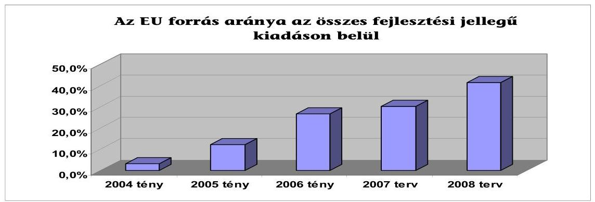

A gazdaságfejlesztés különböző területeit érintően végeztünk ellenőrzéseket az elmúlt években, de az állami támogatások és a társasági, illetve helyi iparúzési adókedvezmények együttes hatásait még nem elemeztük.

A jelenlegi ellenőrzés célja annak értékelése volt, hogy a gazdaságfejlesztés állami eszközrendszere eredményesen és hatékonyan támogatta-e Magyarország gazdaságfejlesztési célkitúzéseinek megvalósulását. Ennek során értékeltük, hogy:

- a gazdaságfejlesztés feltételrendszere lehetővé tette-e az ország gazdaságfejlesztési stratégiájának eredményes megvalósítását, ezen belül a területi, ágazati és országos gazdaságfejlesztési stratégia rendszerének egységét; a jogi-szabályozási és intézményi környezetet; a tájékoztatás, nyilvánosság és a partnerség elvének érvényesítését;
- a gazdaságfejlesztési célú támogatások és adókedvezmények hasznosultak-e, valamint azt, hogy a tervezés és célba juttatás módja hozzájárult-e a támogatások és az adókedvezmények átlátható és nyomon követhető hasznosulásához, az eredményes és hatékony gazdaságfejlesztéshez;
- kialakították-e és múködtették-e a támogatások és adókedvezmények alakulását nyomon követő ellenőrzési, monitoring és értékelési rendszereket, valamint a gazdaságfejlesztés eredményeit bemutató jelentési rendszer segittette-e a stratégiai célok teljesülésének megalapozott számba vételét.

Jelen ellenőrzésünk során a gazdaságfejlesztés állami eszközrendszere alatt a fejlesztéspolitikai célkitúzéseket és az azokhoz rendelt pénzügyi eszközöket értettük, azon belül kiemelten a fejlesztési jellegű támogatásokat és adókedvezményeket ellenőriztük.

Azokra a területekre, ahol az Állami Számvevőszék a közelmúltban önálló ellenőrzést végzett (pl. energetika, távközlés, egészségügy, autópálya programok, lakhatás, PPP programok, agrártámogatások, Munkaerőpiaci Alap, Kutatási és Technológiai Innovációs Alap), jelen ellenőrzés nem terjedt ki, de felhasználtuk a már elvégzett ellenőrzések megállapításait.

Az adórendszer, illetve kedvezményei körében a vizsgált kört leszűkítettük, így az ellenőrzés nem terjedt ki az áfa, a jövedéki adó, a személyi jövedelemadó kedvezményeire, és az egyszerúsített vállalkozói adóra sem, mert az utóbbi bevezetését követően még nem állnak rendelkezésre összehasonlítást megalapozó

---

adatok. A támogatások ellenőrzését az adókedvezmények oldaláról a társasági és a helyi iparúzési adókedvezmények ${ }^{5}$ vizsgálatával egészítettük ki.

Az ellenőrzést a teljesítmény-ellenőrzés módszerével hajtottuk végre, az értékelés alapját képező teljesítmény kritériumokat az ellenőrzöttek bevonásával határoztuk meg. (5. sz. melléklet)

Az ellenőrzés során összevetettük és elemeztük az állami gazdaságfejlesztés különböző szintű terveiben foglalt célkitűzéseit a ténylegesen realizált eredményekkel. A rendszeralapú és a közvetlen megközelítési módok kombinációjával alakítottuk ki az ellenőrzési megközelítési módot. Ennek keretében meghatároztuk az ellenőrzési szempontok azon körét, amelyek megválaszolásában felhasználtuk az elsődleges adatforrások értékelését is.

Az ellenőrzés mellett önkéntes alapú vélemény-felmérés végrehajtását is tartalmazta az ellenőrzési program. A felmérés célja az volt, hogy felmérjük és értékeljük a támogatásokat és adókedvezményeket igénylők, ill. igénybe vevők véleményét az ellenőrzött terület működéséről. A vélemény-felmérés eredményeit - amelyek nem tartalmaznak ellenőrzési megállapításokat, hanem a válaszadók véleményét tükrözi - az 1. sz. függelékben foglaltuk össze.

Az ellenőrzési időszak az uniós tagságunk kezdetét jelentő 2004. évtől 2006. december 31-ig terjedt ki, kitekintéssel a 2007-2013 időszak programozására és indulási eredményeire.

Jelen ellenőrzés eredményeit több, nemzetközi együttmúködés keretében zajló vizsgálatban hasznosítottuk. Az EUROSAI VI. kongresszusa által kezdeményezett párhuzamos ellenőrzés keretében a kis- és középvállalkozások társasági adókedvezményeinek hatékonyságát és eredményességét értékeltük. Az eredményeket - amelyeket előzetesen a Pénzügyminisztériummal egyeztettünk - a 2. sz. függelékben foglaltuk össze. A gazdaságfejlesztés környezetvédelemmel összefüggő kérdéseinek - azon belül a NATURA 2000 program - hazai értékelését az EUROSAI WEGA Környezetvédelmi Ellenőrzési Munkacsoporttal való együttmúködés keretében végeztük el. Az eredményeket, amelyeket egyeztettünk a KvVM-el, a 3. sz. függelékben foglaltuk össze.
Az ellenőrzés jogalapját az Állami Számvevőszékről szóló 1989. évi XXXVIII. törvény 2. § (4)-(5)-(6)-(9) és az államháztartásról szóló 1992. évi XXXVIII. törvény 120/A. § (1) bekezdései képezték.
A jelentést 8 napos egyeztetésre megküldtük a pénzügyminiszter, a Miniszterelnöki Hivatalt vezető, a gazdasági és közlekedési, valamint az önkormányzati és területfejlesztési miniszter uraknak. Válaszleveleik másolatát az 1.a., 1.b., 1.c. és 1.d. számú mellékletek tartalmazzák.

[^0]
[^0]:    ${ }^{5}$ A fizetendő társasági adó mértékéig, a 2004-től engedélyezett, illetve a bejelentett fejlesztési adókedvezmény esetében a fizetendő adó $80 \%$-áig, a térségi és egyéb adókedvezmények esetében annak 70\%-áig igénybe vehető társaságiadó-kedvezmény az állami támogatás egyik formája. A települések gazdasági fejlődésében játszik szerepet a helyi iparűzési adó, amelynek összegét 2004-ben 25\%-ban, 2005-ben 50\%-ban, 2006tól 100\%-ban levonhatják a vállalkozások a társasági, illetve személyi jövedelemadó alapból.

---

# I. ÖSSZEGZŐ MEGÁLLAPÍTÁSOK, KÖVETKEZTETÉSEK, JAVASLATOK 

A Magyar Köztársaság éves költségvetési törvényei az elmúl években anélkül irányoztak/irányoznak elő közel 1500 Mrd Ft összegben gazdaságfejlesztési jellegű államháztartási kiadásokat, hogy meghatározták volna hazánk közép- és hosszú távú társadalmi-gazdasági fejlesztésének átfogó stratégiáját. A társa-dalmi-gazdasági viszonyokhoz illeszkedő, az állami szerepvállalást megalapozó, az állami eszközök és fejlesztési erőforrások felhasználását rendszerező és szabályozó törvényi szintű szabályozás hiányára vezethető vissza, hogy nem megoldott a fejlesztési célokat szolgáló erőforrások összhangja, teljes körű számbavétele, felhasználásának kiértékelése. Nem valósult tehát meg a gazdaságfejlesztés területére irányuló állami eszközök és erőforrások alkalmazásának szabályozott harmonizációja, ami össztársadalmi szempontból hátrányos, mert nincs mód haszonmaximalizálásra.

A tervezés törvényi szintű szabályozásának szükségességére már az Országos Fejlesztéspolitikai Koncepcióról szóló 96/2005. (XII. 25.) OGY határozat is rámutatott. „A tárcák közötti koordinált feladatmegosztáson túl a finanszírozási párhuzamosságok kiküszöbölésére is szükség van azért, hogy egyensúlyi növekedési pályán maradjon a gazdaság, és legyen forrás az Európai Unió által nem finanszírozott célok megvalósítására is. Ehhez az összes európai uniós és hazai állami forrást figyelembe vevő, egységes fejlesztéspolitika kialakítására van szükség, s ennek megfelelően kell kidolgozni a fejlesztési források államháztartási tervezési és lebonyolítási rendjét. Ezért egységes, törvényi szinten szabályozott támogatási rendszert kell kidolgozni, ami mindenekelőtt az államháztartásról szóló törvény és végrehajtási rendeletének módosítását igényli. Az elmúlt években a magyar költségvetés több lépést tett ebbe az irányba (célelőirányzatok, elkötelezettségek bemutatása a költségvetés mellékletében, összevont támogatási elöirányzat a Közösségi Támogatási Keretterv mögött), az átláthatóság követelménye azonban további lépéseket tesz szükségessé."

A fejlesztési jellegú államháztartási kiadások a 2004-2006 közötti időszakban elérték összesen a 4603,5 Mrd Ft-ot, amelynek szektorok szerinti megoszlását az 1. sz. ábra szemlélteti. A felhasználás hasznosulása az átfogó stratégia és a cél- és eredménymutatók rendszerének hiányában nem értékelhető.
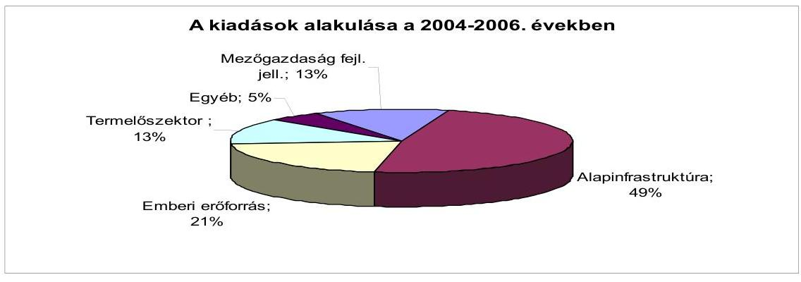

1. sz. ábra

---

Az állami fejlesztéseket az államháztartási hiányt növelve, az államadósság terhére is finanszírozták. A központi költségvetés éves hiánya a 200-as 732 Mrd Ft-ról 1962 Mrd Ft-ra emelkedett 2006-ben, majd a 2007-ben várható (előzetes tény), illetve a 2008-ra tervezett hiány már csökkenő tendenciát mutat. Eközben a GDP csökkenő mértékben nőtt. A fejlesztési jellegú kiadások és azon belül az EU források, valamint a központi költségvetés hiányának tendenciáit a 2. sz. ábra szemlélteti ${ }^{6}$.

Adatok: Mrd Ft-ban, folyó áron

| Évek | 2003. | 2004. | 2005. | 2006. | 2007. | 2008. |
| :-- | :--: | :--: | :--: | :--: | :--: | :--: |
|  | tényleges | tényleges | tényleges | tényleges | várható | tervezett |
| A központi költségve-   tés hiánya | 732,4 | 904,5 | 547,8 | 1961,6 | 1389,9 | 1117,6 |
| Fejlesztési jellegü   kiadások összes |  | 1280,2 | 1490,4 | 1832,9 | 1838,1 | 1908,3 |
| Fejlesztési jellegü   kiadásokból EU forrás |  | 43,1 | 185,4 | 492,0 | 555,7 | 790,8 |
|  |  | tényleges | tényleges | tényleges | mezőgazd.   becsült | tervezett |

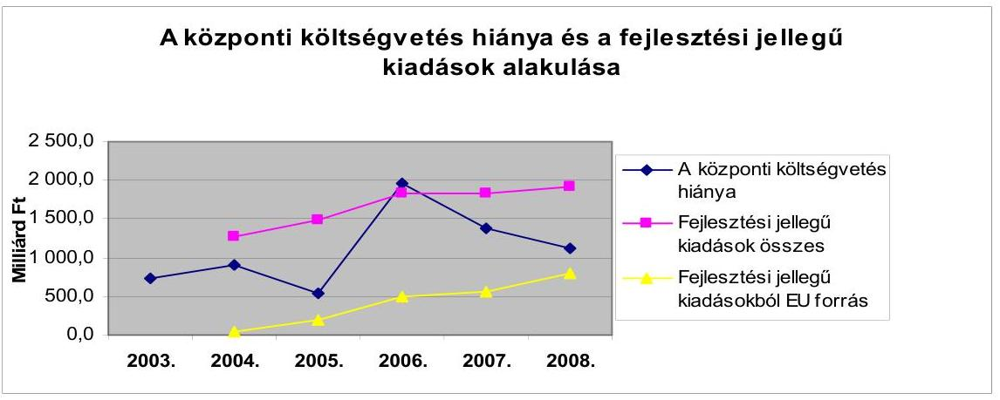
2. sz. ábra

A makrogazdasági mutatók alakulása különösen fontos ${ }^{7}$ Magyarország számára, mivel - az Európai Tanács 1084/2006. rendeletének 4. cikke alapján -

[^0]
[^0]:    ${ }^{6}$ Kimutatásaink folyó áras kiadásokat tartalmaznak, mert ezek tükrözik az adott évi tényleges kiadásokat. Az államháztartási adatokat ezért tartalmazzák a költségvetési dokumentumok folyó áron.
    ${ }^{7}$ Az EUROSTAT 2006. évi adatai alapján Magyarország - miként azt az EUROSTAT jelentése külön szövegesen is kiemeli - negatív rekordot tart a 9,2 \%-os GDP arányos államháztartási hiányával, mivel az utána következő Olaszország (4,4 \%), Portugália (3,9 \%) és Lengyelország ( 3,8\%) adataihoz képest is kiugróan magas ez az érték. A jelentés szerint Magyarország államadóssága 65,6\% volt a GDP arányában.
    Az EU országok a 2006. évben mind a GDP arányos államháztartási hiány, mind a GDP arányos államadósság tekintetében javulási folyamatot indítottak el az elmúlt években, miközben Magyarországon tovább romlott ez a két mutató. (6. sz. melléklet)

---

túlzott deficit esetén a Kohéziós Alap támogatása felfüggeszthető, illetve az államháztartási egyensúly tartós felborulása esetén részlegesen el is veszíthető.

A gazdaságfejlesztési célú állami források hasznosulásának eredményességét kedvezőtlenül befolyásolta a makrogazdaságban kialakult helyzet, amelyben az uniós források hasznosítása mellett az addicionalitás követelményéből adódó hazai forrású fejlesztési követelményt kellett a konvergencia programmal összehangolni ${ }^{8}$. Az aktualizált konvergencia program makrogazdasági célkitűzései és intézkedései ${ }^{9}$, valamint a gazdaságfejlesztésre fordított uniós és hazai források céljai, a GDP-re gyakorolt hatásuk tekintetében nem voltak koherensek.

A világgazdasági versenyben alkalmazható állami eszközöket (milyen célokra, milyen területeken nyújtható támogatás állami forrásból, beleértve az adó- és kamatkedvezményeket is) egyértelmúen meghatározza az Európai Unió versenyjoga.

A közösségi versenyjog elismeri, hogy szükség lehet a nemzeti vállalatoknak és iparágaknak nyújtott támogatásokra, de tilt minden olyan tagállami forrásból nyújtott támogatást, amely torzítja a versenyt és meghatározza azokat a területeket is ahol szabályozott szintű támogatás megengedett. Ezek pl. a foglalkoztatás javítására, képzésre, energia-megtakarításra, regionális célokra, környezetvédelemre, kutatás és fejlesztésre, valamint kis- és középvállalatok részére nyújtott támogatások lehetnek ${ }^{10}$.

Az IMD World Competitiveness Yearbook, 2000-2007. Lausanne adatai alapján a világgazdasági versenyben elfoglalt helyünk szerint, Magyarország a világ versenyképességi rangsorában 2007-ban 8 hellyel kedvezőtlenebb pozícióval rendelkezett, mint 2000-ben, és ugyanezen időszak alatt a 27 európai ország között is 3 hellyel csúszott lejjebb, miközben az EU Bizottság 2006. évre kiadott jelentése szerint Magyarország, Málta és Litvánia mögött a harmadik helyet

[^0]
[^0]:    ${ }^{8}$ A strukturális alapokból származó hozzájárulások nem helyettesíthetik a tagállam közkiadásait, vagy annak megfelelő strukturális kiadásokat. A Bizottság és a tagállamok meghatározzák a köz-, vagy azzal egyenértékű strukturális kiadások szintjét, amelyet a tagállamnak fenn kell tartania az aktuális programozási időszak folyamán. (A Tanács 1083/2006/EK rendelete, 15. cikk). Mindezekből az a feladat származott, hogy a konvergencia programot és azzal együtt a maastrichti kritériumokat a programozási időszak alatt fenntartott, hazai forrásokra épülő strukturális fejlesztési szint mellett kell megvalósítani.
    ${ }^{9}$ Az aktualizált konvergencia program szerint „nem lehet egyszerre jelentős egyensúlyjavítást és ugyanakkor az eddigiekhez hasonlóan magas növekedést elérni."
    ${ }^{10}$ Az Európai Gazdasági Közösséget létrehozó Szerződés (Római Szerződés) 87. cikkének (1) bekezdése tartalmazza az állami támogatások engedélyezésének rendjét A hazai szabályozásban az állami támogatásokkal kapcsolatos eljárásról és a regionális támogatási térképről szóló 85/2004. (IV. 19.) Korm. rendelet határozza meg az eljárási rendet.

---

foglalta el, a tagállamok által nyújtott állami támogatások GDP-hez mért aránya ${ }^{11}$ alapján (7. sz. melléklet).

A gazdaságfejlesztés feltételrendszerében tapasztalható hiányosságokat mutatja, hogy a kormányzati ciklusokon átívelő hosszú távú társadalmigazdasági stratégia hiányában az állam szerepét, eszközeit és forrásai felhasználását érintő koncepcióváltások eredményeként a fejlesztési meglódulások, megtorpanások és azok szakadásai váltogatták egymást.

A fejlesztési főirányokról, Magyarország jövőképéről folytatandó társadalmi vita elmaradása azt eredményezte, hogy nincs konszenzuson alapuló egységes elképzelés arról, hogy milyen irányba és miből lehet az országot fejleszteni a felzárkózás érdekében. Ennek eléréséhez mit kell tennie az államnak, milyen gazdasági teljesítményre van szükség, és milyen kihívásoknak kell a társadalom tagjainak szembenézni, illetve megfelelni.

Az elkészített ágazati és egyéb részstratégiák kronológiája azt mutatja, hogy azok nem a kívánatos sorrendben készültek el. A 25-50 évre szóló Nemzeti Fenntartható Fejlődési Stratégia (és célindikátorai) kormányzati szintű elfogadása nélkül készültek el pl. a 2007-2013. évekre kiterjedő Új Magyarország Fejlesztési Terv (továbbiakban: ÜMFT), az Új Magyarország Vidékfejlesztési Stratégiai Terv (továbbiakban: ÜMVST), az operatív programok és a második Nemzeti Környezetvédelmi Program ${ }^{12}$.

A részstratégiák közötti összhangot nem teremtették meg, mivel a stratégiák más időpontban, más célhierarchiával és módszertannal készültek, egymástól eltérő mutatókat alkalmazva. Az átfogó stratégia hiányában az egyes eszközök (pl. támogatások, adókedvezmények, foglalkoztatáshoz kapcsolódó kedvezmények, szakoktatási támogatások stb.) harmonizációja nem volt teljes körű.

A stratégiai megközelítés hiánya nem csak a támogatások rendszerében, hanem az adórendszerben is megmutatkozott. A vizsgált időszakban hiányzott a hosszú távú, a fejlesztési célokat támogató átfogó adóstratégia ${ }^{13}$, amelynek része az elérni kívánt célokhoz szükséges adókedvezmények köre és mértéke ${ }^{14}$.

[^0]
[^0]:    ${ }^{11}$ A magas támogatási arányt tükrözi az Eurostat 2006. évi kimutatása is, amelyben a kormányzati kiadások funkcionális osztályozásban - Magyarország kiadásai a gazdasági funkció területén meghaladják az EU átlagot.
    ${ }^{12}$ Hasonlóan alakult a helyzet a Nemzeti Akcióprogram esetében is és a stratégiai tervezés késedelme mutatkozott az alapinfrastruktúra fejlesztés területén is, ahol az állami fejlesztések az Egységes Közlekedésfejlesztési Stratégia hiánya ellenére folytak. Előrelépést mutat, hogy az Országgyűlés 100/2007. (XI. 14.) határozatában meghatározta a hosszú távú fenntartható fejlődéssel kapcsolatos tervezési és egyeztetési feladatokat.
    ${ }^{13}$ A PM álláspontja szerint „stratégia csak az adórendszer egészét érintő átalakítás mellett képzelhető el, amely a vizsgált időszakban nem volt napirenden."
    ${ }^{14}$ A MEH tájékoztatása szerint a gazdaságfejlesztési célú adókedvezmények, ezen belül kiemelten a kis- és középvállalkozások támogatásának átgondolása az adórendszer átalakításának előkészítése keretében folyamatban van. A Kormány várhatóan 2008 tavaszán foglalkozik a kidolgozott javaslatokkal.

---

Voltak kezdeményezések a fejlesztési jellegű kiadások tervezési rendszerének ${ }^{15}$ változtatására, de ezek nem jártak a kívánt eredménnyel. Az NFH egy koncepciót készített „A fejlesztési kiadások középtávú költségvetési rendszerére" 2005 áprilisában, de ez munkaanyag maradt, és nem került megtárgyalásra a Pénzügyminisztériummal, vagy más intézménnyel. A MeH készített egy módszertani útmutatót, a Kormányzati Stratégia-alkotási Követelményrendszert (KSaK) a stratégiai tervezéshez a minisztériumok számára 2004 végén, a minisztériumok tervezőmunkájának megkönnyítésére. Ennek alkalmazása azonban nem volt előírt és kikényszeríthető. Az ellenőrzési tapasztalat azt mutatta, hogy a minisztériumoknak csak szűk köre (GKM, OM, KVVM ) alkalmazta azt, és csak közel két éves késedelemmel.

A tárcáknak nem volt általános stratégiaalkotási kötelezettsége, így bár az egyes szakterületekre számos stratégiai jellegű dokumentum született, a konzisztencia hiánya miatt nem tudtak megfelelő hátteret nyújtani egy országos gazdaságfejlesztési program megalapozásához.

Az uniós tagságra való felkészülés és a tagság ideje alatt elkészültek a különböző programokhoz kapcsolódó részstratégiák ${ }^{16}$, amelyek az egyes uniós források, illetve forráscsoportok hasznosításának stratégiái, így azok nem tekinthetők az ország átfogó közép távú társadalmi-gazdasági stratégiájának. Ezek hazai elfogadására - az uniós tervezési és programozási szabályozásban előírt - társadalmi vitát követően került sor. 2005-ben elfogadták az Országos Fejlesztési Koncepciót (továbbiakban: OFK), valamint az Országos Területfejlesztési Koncepciót (továbbiakban: OTK). A rövid távú célkitűzéseket az éves költségvetési törvényekben határozták meg. A Csatlakozási Szerződésben vállalt kritériumok elérésére kidolgozták, és többször aktualizálták a konvergencia programot.

A magyar gazdaság, és különösen a közszektor az uniós tagsággal egy hét éves periódusokra tervezett környezetbe került. Ez utóbbi pozitív hatásait a követelményekhez történő igazodással lehetett volna kiaknázni. A meghirdetett és végrehajtott jogharmonizációs törekvések és eredmények ellenére a mai napig nem épült be teljes körűen a hazai tervezési módszertanba az uniós tervezés követelményrendszere és gyakorlata, annak ellenére, hogy az OFK 2007-ig elvégzendő feladatként tartalmazta azt (8. sz. melléklet).

A tervezési harmonizáció ${ }^{17}$ hiányosságai miatt a gazdaságfejlesztés állami eszközrendszere hazai tervezési gyakorlatában nem alkalmazták a forrásfelhasz-

[^0]
[^0]:    ${ }^{15}$ Az OFK 2007-ig elvégzendő feladatként határozta meg, az átfogó tervezési mechanizmus kialakítását, de ez, az OFK szerinti értelmezésben nem valósult meg jelen vizsgálat lezárásáig.
    ${ }^{16}$ Nemzeti Akcióprogram, Nemzeti Fejlesztési Terv (továbbiakban: NVTI.), Nemzeti Vidékfejlesztési Terv (továbbiakban: NVT), ÚMFT, UMVST, Nemzeti Környezetvédelmi Program stb.
    ${ }^{17}$ A jelentés egyeztetése során a PM tájékoztatása szerint „2008-tól múködik az ÖTM vezetésével egy olyan tárcaközi szakértői bizottság, ami a többi hazai forrás felhasználását is az EU források harmonizációjára készíti elő."

---

nálás hatékonyságának tervezési eszközeit ${ }^{18}$. A pénzügyi tervezéssel nincs egyensúlyban a teljesítménytervezés. Nem indult el a program alapú költségvetési tervezés gyakorlata.

A költségvetés bevételi szerkezete a vizsgált időszakban döntően nem változott (9. sz. melléklet). A szerkezeten belül nőtt a gazdálkodó szervezetek és a lakosság befizetése, valamint a fogyasztáshoz kapcsolódó adók aránya. Az EU-n belüli összehasonlításban - különösen a szomszédos EU-s országokhoz viszonyítva - az adóterhek magasak. ${ }^{19}$

A hazai tervezési gyakorlatban a központi költségvetés kiadási oldalának szerkezete és szabályozása lényegében az előző évek tendenciáját követte. A költségvetési törvényjavaslatokban évek óta nem szerepel összegző tájékoztatás a hosszú távú kötelezettségvállalások állományáról, a többéves elkötelezettséggel járó kiadási tételekről ${ }^{20}$. Nem vált általánossá a fejlesztéseket megalapozó, hatástanulmányokra és azon belül különösen a fejlesztést követő fenntartási és múködtetési költségekre irányuló elemzési tevékenység.

A közpénzek felhasználásának átláthatóságát kedvezőtlenül érintette, hogy egyes feladatok ellátása - pl. a turisztikai - követhetetlen módon, többféle jogosítvánnyal, több helyen, mindig más irányítási rendben jelentek meg ${ }^{21}$.

Az állami szerepvállalás stratégiai tervezésének szabályozási és a teljes körű uniós harmonizáció hiányosságán túl nincs egységesen kötelező előírás arra, hogy az ágazatok szakmapolitikájukat tervdokumentumok formájában rögzítsék. Az ágazati tervezés jogszabályi háttere - a normák szintjét, a tervezés szintjeit és a tervek típusait, elnevezésüket, tartalmi elemeiket tekintve - heterogén, ágazatonként és ágazatokon belül a különböző programok esetében is eltérő képet mutatott.

A tisztán hazai forrásból finanszírozott fejlesztési támogatások jogi szabályozása és ebből következően az eljárásrendje - az uniós alapokból finanszírozott támogatások jogi szabályozásától eltérően - nem egységes, programonként, illetve támogatási jogcímenként eltérő. Rontotta a szabályozás hatékonyságát, hogy voltak olyan hazai forrású támogatási területek (pl.: területfejlesztés),

[^0]
[^0]:    ${ }^{18}$ Az Európai Tanács 1605/2002/EK pénzügyi rendeletében, amely az EU költségvetés megállapítására és végrehajtására vonatkozó szabályokat írja elő, meghatározták azokat a költségvetési alapelveket, amelyekkel összhangban kell elkészíteni és végrehajtani az EU költségvetést. Ezek az alapelvek magukban foglalják a megbízható pénzügyi irányítás követelményét is. A megbízható pénzügyi menedzsment az EU költségvetési források tekintetében értelmezi az eredményesség, gazdaságosság és hatékonyság követelményeit, valamint a kiadások - ezen szempontok szerinti - értékeléséhez előírja a teljesítménymutatók tervezését és alkalmazását.
    ${ }^{19}$ A 27 EU tagállam közül Magyarországon volt a 10. legmagasabb az adóbevételek GDP-hez viszonyított aránya. Forrás: EUROSTAT News Release 89/2007. 26. June 2007.
    ${ }^{20}$ Az ÁSZ a 0736 sz. véleménye a Magyar Köztársaság 2008. évi költségvetési javaslatáról.
    ${ }^{21}$ 0724. sz. ÁSZ jelentés a Magyar Köztársaság 2006. évi költségvetés végrehajtásának ellenőrzéséről.

---

ahol a vonatkozó szabályozás minden évben változott. A végrehajtási eljárások kialakítása elmaradt, amelyben szerepet játszott az állandó változás.

A helyi iparűzési adó esetében kedvezőtlenül befolyásolta az adómorált, hogy az adónem jövőjét tekintve a jogalkotónak nem volt egységes és következetes szándéka, valamint az uniós csatlakozásunkat követően jogvita folyt az adónem fenntarthatóságát illetően. Ezek eredményeként bizonytalanság alakult ki mind a vállalkozók, mind az adóztatási feladatot ellátók körében ${ }^{22}$.

# A számos intézményi átalakulás ${ }^{23}$ következtében az intézményi feltételrendszerben jogi, szabályozási és értelmezési bizonytalanság mutatkozott az átfogó gazdaságfejlesztési stratégiák előkészítésének, kialakításának és felügyeletének intézményi felelőssége ${ }^{24}$ területén. 

Az uniós és hazai támogatási források tervezésének és felhasználásának harmonizációs hiányosságát mutatja, hogy elkülönült, párhuzamos intézményrendszerek alakultak ki. Ez egyrészt késleltette a hazai támogatási rendszer EU konformmá alakítását, másrészt rontotta a támogatásközvetítő folyamatok gazdaságosságát. Az eltérő szabályozások, az eltérő eljárásrendek nehezítették az egységesítési törekvéseket ${ }^{25}$. Kivételt képezett az FVM-hez tartozó MVH, ahol egy intézményen belül kezelték az uniós és hazai támogatási forrásokat is. A MAG Zrt. megalakulása szintén csökkentette a párhuzamosságot.

Az állami fejlesztések harmonizált (hazai és uniós) és komplex tervezésének szabályozási hiányosságai mellett az intézményi feltételek rendezése és garanciái oldhatják fel végérvényesen a jelenleg tapasztalt bizonytalanságot ${ }^{26}$.

A tájékoztatás, nyilvánosság és partnerség feltételeinek kialakításában az állami eszközök és források tervezésének uniós szabályozásától és gyakorlatától való eltérését mutatja, hogy a hazai fejlesztési, azon belül támogatási források felhasználásának tervezésében hiányzik a döntés-

[^0]
[^0]:    ${ }^{22}$ Az Európai Bíróság 2007. október 11-én hozott ítélete szerint a helyi iparűzési adó nem ellentétes a közösségi joggal, így a felfüggesztett eljárások rövid időn belül lezárulhatnak.
    ${ }^{23}$ Az EU támogatás intézményrendszerének 73\%-át érintő változásait a 0723 sz. ÁSZ jelentés elemezte. A hazai támogatás-kezelő rendszer változékonyságát jellemzi pl. a Turisztikai Célelóirányzat kezeléséért felelős szervezeti egység több minisztériumhoz is tartozott a vizsgált időszakban (MEH, GKM, önálló Magyar Turisztikai Hivatal). Jelenleg az ÖTM Turisztikai Szakállamtitkárságaként múködik.
    ${ }^{24}$ A Nemzeti Fejlesztési Úgynökségről szóló 130/2006. (VI. 15.) Korm. rendelet 2. § b) pontja szerint az NFÜ készíti el az ország átfogó fejlesztési tervét és a nemzeti fejlesztési terveket. Ennek ellenére az NFÜ ezt a feladatot csak az uniós forrásokra vonatkozóan látta el.
    ${ }^{25}$ A 2006-ban elindított intézményfejlesztési program eredményeként megindult a végrehajtási intézményrendszer koncentrációja pl. a GKM korábbi öt közremúködő szervezetből létrehozták a MAG Zrt-t.
    ${ }^{26}$ Erre az összefüggésre az ÁSZ a pénzügyminiszter úrnak 2007. szeptember 24-én megküldött, az Alkotmány közpénzügyi fejezetének szövegtervezetében is utalt.

---

előkészítés széleskörű társadalmi vitája és konszenzusa ${ }^{27}$. Az átláthatóság, nyilvánosság és partnerség uniós követelményei lassan ${ }^{28}$ épülnek be a hazai forrású támogatások és adókedvezmények rendszerébe. Mindez annak ellenére vett hosszú időt igénybe és alkalmazott gyakorlata még ma is alakulóban van, hogy ezen követelmények teljesítésének szükségességére már 2005-ben az OFK is rámutatott.

A fejlesztési források hasznosulásában a legnagyobb arányban az alapinfrastruktúra területe játszott szerepet. Az alap infrastruktúra fejlesztésen belül az autópálya fejlesztések esetében a megépítésre kerülő útszakaszokra nem készültek a megvalósításhoz rendelt finanszírozási tervek, amelyben rögzítették volna a források megoszlását, azon belül az állami hozzájárulás mértékét, a szükséges hitelek és az esetleges egyéb források bevonásának nagyságát. A finanszírozási formák változása a költségvetés mindenkori helyzetével és az autópálya fejlesztések elhatározott ütemével volt összefüggésben. Ugyanakkor kedvező, hogy 2002-2006-ban összesen 484,7 km gyorsforgalmi utat helyeztek forgalomba. (A 2001. december 31-én meglévő gyorsforgalmi úthálózat 573 km volt.)
A Nemzeti Környezetvédelmi Program II. teljesítése elmaradt a tervezettől és az időarányos teljesítés nem valószínűsíthető. A terv/tény adatok alakulását a 3. sz. ábra szemlélteti.
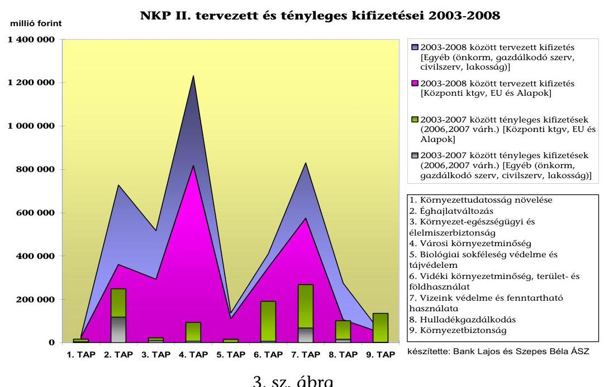
3. sz. ábra

[^0]
[^0]:    ${ }^{27}$ A 4-es metró építésének előkészítését és építését végig kísérte az alternatív közlekedési javaslatokról folytatott előzetes társadalmi viták figyelmen kívül hagyása, a szakmai konszenzusok elmaradása. A 4-es metró uniós támogatásáról még nem született döntés.
    ${ }^{28}$ A Hankook Tire Kft. esetében bírósági döntés született a támogatási szerződés megismerhetőségére. Az egyes adóalanyok által igénybevett adókedvezmények megismerhetőségét az Art. 2007. július 25 -ével hatályba lépett módosítása tette lehetővé, mert a módosítás alapján ezek az adatok nem tartoznak az adótitok körébe.

---

Az NKP II. megvalósítása során - a finanszírozási nehézségek ellenére - számos területen történt előrelépés, pl. ISPA keretből befejeződött Győr város szennyvíztisztító telepének fejlesztése. További projektek befejezéshez közeli állapotban vannak: Szeged városi szennyvíztisztító telep és csatorna beruházása, Pécs város szennyvíz csatornahálózat fejlesztése, Sopron szennyvíztisztító és csatornahálózat fejlesztés.

Az emberi erőforrás átfogó fejlesztése az ország versenyképessége javításának, a társadalmi szintű esélyteremtésnek nélkülözhetetlen és hatékony eszköze. Kedvezőtlen, hogy sem a hazai, sem pedig az uniós pályáztatási rendszerben nem kellően érvényesültek a tartósan leszakadó és periférikus térségek esélyegyenlőségi szempontjai, sőt a pályáztatási rendszer esetenként mélyítette, illetve konzerválta a kialakult területi egyenlőtlenségeket.

Eltérések mutatkoztak az egy főre jutó aktív foglalkoztatási eszközökkel kapcsolatos uniós és hazai támogatási források hatékonysága között. Az MPA ${ }^{29}$ esetében ez az érték 0,19 M Ft/fő, míg a HEFOP esetében 0,83 M Ft/fő. A különböző munkahelyteremtő támogatások egyikében sem határoztak meg előzetes norma vagy célértéket egy új munkahely támogatása tekintetében ${ }^{30}$. Az egyértelmú összehasonlítást akadályozta az aktív foglalkoztatási eszközök tartalma egységes definíciójának hiánya ${ }^{31}$.

A humán erőforrás fejlesztésére fordított támogatások hatékonyságát rontotta és az iskola-reformok és a fejlesztések összehangolásának hiányát mutatja a már támogatott intézményeket érintő megszorító intézkedések menet közbeni bevezetése. Az Irányító Hatóság adatai szerint a HEFOP 3.1 intézkedésében korábban támogatást kapott 35 iskola, illetve intézmény van bezárás, vagy öszszevonás alatt, a HEFOP 2.1 intézkedésében támogatottak közül 1 iskola szűnt meg jogutód nélkül, míg 22 iskola valamilyen módon átalakuláson megy keresztül. ${ }^{32}$

A makrogazdasági mutatók nem igazolják vissza a források eredményes hasznosulását a foglalkoztatási helyzet alakulásában. A horizontális támogatások mellett közvetlenül a HEFOP és az MPA forrásaiból a foglalkoztatás növelésére a vizsgált időszakban 261 Mrd Ft-ot, álláskeresők, munkanélküliek támogatására pedig 250,8 Mrd Ft-ot fordítottak. A foglalkoztatottak száma összesen át-

[^0]
[^0]:    ${ }^{29}$ Az MPA múködésének ellenőrzéséről szóló jelentés 2008 januárjában jelent meg.
    ${ }^{30}$ Az ÁSZ 0724 sz. jelentése a Magyar Köztársaság 2006. évi költségvetés végrehajtásának ellenőrzéséről.
    ${ }^{31}$ Az eltérések azt mutatják, hogy a munkahelyteremtés szempontjából a különböző alapok forrásaiból támogatott új munkahelyek létrehozása eltérő hatékonyságú. Az eltérések tovább nőnek, ha a közvetlen munkahelyteremtő támogatásokat, az EKD támogatásokkal vállalt munkahelyteremtéssel is összevetjük. Az EKD-ban a támogatott új munkahelyek létesítésére eső támogatások értéke 0,99 MFT/fő és 18,4 MFT/fő között mozgott. Egy új munkahelyet az EKD-vel támogatott beruházások esetében átlagosan 4,1 M Ft támogatással valósítanak meg.
    ${ }^{32}$ 3.1 intézkedés célja: az egész életen át tartó tanuláshoz szükséges készségek, képességek és kompetenciák fejlesztésének ösztönzése; 2.1 intézkedés célja:. Társadalmi kirekesztés elleni küzdelem a munkaerőpiacra történő belépés segítségével.

---

lag 9 ezer fővel nőtt a vizsgált időszakban (az uniós források felhasználása előtti utolsó, 2003. évben 3897 ezer fő, 2006. évben 3906 ezer fő volt a foglalkoztatottak száma). A különféle forrásokból származó támogatások felhasználása eredményességének nemzetgazdasági szintű értékelése elmaradt ${ }^{33}$.

A termelőszektor fejlesztésének támogatására - 2004-2007-ben - a GKM által felügyelt beruházás-ösztönzési célelóirányzat szolgált. Az egyedi kormánydöntésen alapuló (továbbiakban: EKD) támogatások kifizetési kötelezettségének súlypontja a következő évekre esik ${ }^{34}$, ami szükíti az aktualizált konvergencia program kiadáscsökkentési célkitúzéseinek szabad mozgásterét.

A 2004-2007-es időszakban az egyes EKD szerződésekben 9475 M Ft és 34531 M Ft értékhatárok között vállaltak támogatási kötelezettséget. (10. sz. melléklet) A támogatottak a megkötött 42 db EKD beruházási szerződésben - 2004-ben 5090, 2005-ben 4109, 2006-ban 7366 és 2007-ben 4801 - összesen 21366 új munkahely létrehozását vállalták.

Az EKD támogatások szinergia hatását rontja, hogy a szerződések nem tartalmaztak hazai beszállítói hányad megkötésére vonatkozó előírást. Ennek előírását a WTO tiltja és a kormányzat, illetve a GKM nem tudta ezt feloldani. Ez is szerepet játszott abban, hogy a külföldi multinacionális vállalatok hazai gazdaságba való beágyazódása alacsony ${ }^{35}$.

A hazai gazdaságfejlesztés állami eszközrendszerében a vállalkozásfejlesztési, ezen belül a kis- és középvállalkozások (továbbiakban: KKV) támogatási rendszere a vizsgált időszakban horizontális fejlesztési cél volt. A KKV-k fejlesztésével összefüggő célok megvalósítására fordítandó eszközöket összevontan, országos szinten nem tervezték meg. A meghirdetett támogatások feltétele, vagy finanszírozási forrása több esetben változott az egyes években ${ }^{36}$. A tisztán hazai támogatások gyakorlatában nem vált általánossá a pénzügyi célok rögzítése mellett az elvárt output-, eredmény- és hatásmutatók alkalmazása, így a támogatások értékelése csak a pénzügyi célokra korlátozódott.

[^0]
[^0]:    ${ }^{33}$ A HEFOP 2006. évi monitoring értékelése szerint „Foglalkoztatáshoz jutott vagy más munkaerő-piaci helyzetjavulást tapasztalt résztvevők száma" közel 91 ezer fő, az MPA jelentése szerint a hasonló adat 35 ezer fő.
    ${ }^{34}$ A 2004-2006-ban megítélt EKD támogatások közül kiválasztott 10 legnagyobb beruházás kifizetési aránya a helyszíni vizsgálat idején átlagosan 26,26\%-os volt, ami azt jelenti, hogy közel $74 \%$-ot az elkövetkező egy-két évben kell kifizetni.
    ${ }^{35}$ A KTK IH a termelő szektor helyzetét értékelve rámutatott arra, hogy „hazánkban 2001-től lelassult a befektetések dinamikája, ami különösen a multinacionális feldolgozóipari beruházásoknál érzékelhető. (A feldolgozói beruházásokból 80\%-ban a külföldi érdekeltségüek részesednek)." „Hazánkban a külföldi tulajdonú multinacionális vállalatok ritkán veszik igénybe a hazai beszállítókat, a termelési inputokat külföldről szerzik be".
    ${ }^{36}$ Például a Lánchíd Faktoring Programot a GKM 2005 közepén a költségvetési forrás csökkenése miatt megszüntette, majd kormánydöntés alapján 2006-ban új feltételekkel ismét elindult a program. Az 1999-ben indult, a magyar találmányok külföldi bejelentésének támogatását célzó pályázatokra a 2006. évi költségvetésről szóló törvény nem biztosított célelóirányzatot, ebben az évben csak a kötelezettséggel nem terhelt maradványt használták fel e célra. 2007-től pedig a GOP keretében az NFÜ írt ki e célra pályázatokat.

---

A vállalkozások támogatását szolgáló pénzügyi konstrukciók indokolatlanul sokfélék, évenként kb. 20 program keretében, programonként gyakran több termék útján nyújtottak finanszírozást a vállalkozásoknak. A programok ugyanakkor nem alkottak egységes rendszert, több párhuzamos, de eltérő feltételekkel múködő támogatási program kívánt kiszolgálni ${ }^{37}$.

A kis összegű és kisszámú tranzakciók a magas relatív tranzakciós költségeket okoztak a támogatásokat bonyolító állami intézmények számára ${ }^{38}$. Egyes támogatási programokkal - ilyen volt a Széchenyi Kártya ${ }^{39}$ - a piacon korábban nem létező finanszírozási formákat vezettek be.

Magyarországon a GDP 1\%-a körüli a K+F ráfordítások aránya, amely mintegy fele az EU átlagnak és csak mintegy harmada a 2010-re kitűzött célnak. A kiadások GDP-hez viszonyított mutatói alapján Magyarországon a kormányzati szektor ( $-0,5 \%$ ) az EU átlagtól ( $-0,65 \%$ ) alig elmaradva, az üzleti szektor ( $-0,3 \%$ ) viszont csak az EU átlag ( $-1 \%$ ) mintegy harmadával járul hozzá a kutatás-fejlesztés finanszírozásához.

A 2004-2006. években a Gazdasági és Versenyképességi Operatív Program (továbbiakban: GVOP) 23,0\%-át ( 98,7 M EUR) tervezték a kutatás-fejlesztési programok támogatására. 2007-től a K+F+I súlya növekszik, a Gazdaságfejlesztési Operatív Programnak (továbbiakban: GOP) már 33,7\%-át (990,7 M EUR $/-247,7 \mathrm{Mrd} \mathrm{Ft} /$ ) tervezik ezen prioritás támogatására.

A Kutatási és Technológiai Innovációs Alapról ${ }^{40}$ szóló törvény indoklása célként rögzíti, hogy a vállalkozásoknak legalább a befizetett járulékok összegét „vissza kell juttatni". Ez az elv a gyakorlatban nem érvényesült. A 2004-2006. években a vállalkozások az Alap forrásainak rendre $21,5,26,7$ és $33,3 \%$-át kapták, miközben az általuk befizetett járulékok rendre $45,1,60,2$ és $61,1 \%$-os részarányt képviseltek az Alap forrásai között.

Az információs társadalmat érintő fejlesztések eredményeként a háztartási Internet hozzáférés aránya több mint kétszeresére növekedett 2004-2006 között (2006-ban a háztartások $32 \%$-a fér hozzá az internethez). Az on-line vállalati beszerzés $7 \%$-ról $10 \%$-ra, a szélessávú hozzáférés $2,2 \%$-ról $7,5 \%$-ra, az e-

[^0]
[^0]:    ${ }^{37}$ Pl. az NBC-ből finanszírozza a minisztérium a „Sikeres Magyarországért" kamattámogatásos hitelprogramot a kis- és középvállalkozások támogatására, holott ennek a szektornak a támogatására önálló céleIőirányzat áll rendelkezésre a GKM fejezetében.
    ${ }^{38}$ A Corvinus Nemzetközi Befektetési Zrt. a tőkeprogram keretében 2006-ban 2 db befektetési szerződést kötött 59 millió Ft összegben. A Beszállítói Befektető Zrt. 2005-ben 2 db befektetési szerződést kötött 231 millió Ft összegben, 2006-ban pedig 3 db szerződést 213 millió Ft összegben. A Start Tőkegarancia Pénzügyi Szolgáltató Zrt. 2006-ban 2 db kérelmet hagyott jóvá, 180 millió Ft összegben, de szerződést nem kötött.
    ${ }^{39}$ A Széchenyi Kártya Program keretében - a programnak 2007-ben a negyedik múködési éve alatt - 69133 db kártya került kiadásra, amely révén a vállalkozók mintegy 330 Mrd Ft hitelkerethez jutottak.
    ${ }^{40}$ Az alap múködésének ellenőrzése folyamatban van, várhatóan 2008 júniusában hozzuk nyilvánosságra jelentésünket.

---

közigazgatás használati aránya vállalatoknál 35\%-ról 45\%-ra, az e-learninget alkalmazó vállalatok aránya 55\%-ról 85,7\%-ra növekedett.

A regionális fejlesztés forrásaiban a hazai és uniós források is szerepet játszottak. Az uniós támogatások közül az NFT I. részét képező Regionális Fejlesztés Operatív program (továbbiakban: ROP) céljait összehangolták az OTK és az OFK céljaival.

A turizmus fejlesztését oly módon támogatták, mintha horizontális célkitűzésként lett volna megfogalmazva, bár ez így nem jelent meg a különböző fejlesztési programokban. A turizmus, mint gazdaságfejlesztési cél megjelenik a területfejlesztés költségvetési fejezetén belül turisztikai célelőirányzatként, de több más fejlesztési program is tartalmazott turisztikai fejlesztési célokat.

Az ÖTM által készített, a Turisztikai Célelóirányzat 2006. évi alakulásáról szóló beszámoló szerint a 2006. évben 11091 M Ft-ot fizettek ki. Ebből 6185 M Ft-ot marketing tevékenységre, 3953 M Ft-ot támogatásokra és 953 M Ft-ot egyéb célokra. A beszámoló a célok elérésével kapcsolatos indikátorokon alapuló értékelést nem tartalmazott. A KSH gyorsjelentése szerint a vendégéjszakák alakulásában a vizsgált időszakban nem történt jelentős változás ${ }^{41}$.

A tisztán hazai finanszírozású területfejlesztési projektek a hazai területfejlesztési politika közvetlen eszközei. A támogatások odaítélési folyamatában a vonatkozó kormányrendeleteket hajtották végre, az OTK-hoz, OFK-hoz való viszonyt nem vizsgálták.

A ROP programszintű indikátora szerinti cél - amely szerint a pályázati úton biztosított támogatások értékének legalább 75\%-át a négy kevésbé fejlett régióban kell felhasználni - a 2006. december 31-ig megkötött támogatási szerződések alapján teljesül, mivel a négy régió részesedése $77,3 \%{ }^{42}$.

A tisztán hazai finanszírozású decentralizált területfejlesztési és szakmai fejlesztési programoknál naturális mutatószámokat nem terveztek, így azok végrehajtása nem értékelhető.

A törvényi előírás ellenére a középtávú agrár- és vidékfejlesztési stratégia ellenőrzésünk időpontjáig nem került elfogadásra, a 2007-2013-ra szóló ÚMVP is kevés stratégiai elemet tartalmaz. Az ÚMVST és UMVP deklarálja az EU konform agrár- és vidékfejlesztési célkitűzéseket, a műszaki-technikai korszerűsítésre, a versenyképességre koncentrálva a források felét ( 643 Mrd Ft).

A központi költségvetés bevételi szerkezetének változása az ellenőrzött időszakban a gazdálkodó szervezetek és a lakosság közvetlen befizetéseit érintően nö-

[^0]
[^0]:    ${ }^{41}$ A KSH adatok szerint 2003-ban 18 611, 2004-ben 18 899, 2005-ben 19 737, 2006-ban 19652 volt a vendégéjszakák száma.
    ${ }^{42}$ Ugyanakkor az NFTI. 4. specifikus célja a területi kiegyenlitödés mégsem tudott érvényesülni, mert az NFTI.-ből a legtöbb támogatást, az eddig is legfejlettebb KözépMagyarországi Régió kapta. ( 0636 sz. ÁSZ jelentés az NFTI végrehajtásának ellenőrzéséről.)

---

vekedést, míg az egyéb bevételeket érintően csökkentést mutatott. Ezen belül a társaságiadó-befizetések aránya 8,42\%-ról 7,16\%-ra csökkent.

A vizsgált időszakban a társaságiadó-alap meghatározásához ${ }^{43}$ a bevallást benyújtó adóalanyok mintegy $80 \%$-a módosította adózás előtti eredményét. Mind a növelő, mind a csökkentő korrekciós tételek összege folyamatosan növekedett. Ezek eredményeként az adóalanyok adózás előtti eredményüket öszszességében 2004-ben 1257 Mrd Ft-tal, 2005-ben 1368 Mrd Ft-tal, 2006-ban 1619 Mrd Ft-tal csökkentették.

A társasági adóról és az osztalékadóról szóló 1996. évi LXXXI. törvény (továbbiakban: Tao. tv.) a területi, ágazati gazdaságfejlesztési célok elérését az adókedvezményeken keresztül segíti elő. Ezek teljesülését a PM átfogóan nem értékelte, és az értékeléshez szükséges adatok beszerzésére nem intézkedett ${ }^{44}$. A társaságiadó-bevallások nem tartalmaznak információt arra vonatkozóan, hogy az adókedvezmény igénybevétele milyen térségben megvalósított beruházáson alapul. Emiatt az adókedvezményt igénybe vevő adóalanyok csak székhelyük alapján sorolhatók be az egyes megyékhez, így nem mutatható ki a társaságiadó-kedvezmények hozzájárulása a hátrányos helyzetű térségek felzárkóztatásához.

A Tao. tv. alapján az adóalanyok maguk döntenek az adókedvezmények igénybevételéről. A vizsgált időszakban a társasági adóalanyok száma viszonylag állandó volt (309 444-316 498 cég), amelynek közel 99\%-át a KKV-k tették ki. Az adókedvezményeket a társaságok egyre csökkenő számban vették igénybe. Adókedvezményt az adózók nem egész 2\%-a érvényesített, ezen belül a KKV-k évről-évre csökkenő (2004-ben 2,1\%, 2005-ben 1,9\%, 2006-ban 1,5\%), míg a nagyvállalkozások folyamatosan növekvő (2004-ben 0,9\%, 2005-ben $1,1 \%$, 2006-ben $1,4 \%$ ) arányban éltek a kedvezmény lehetőségével. Az adókedvezményt igénybevevők 92-95\%-a volt KKV, de az általuk igénybe vett adókedvezmény aránya az összes Tao. kedvezményen belül a 2004-2006-os időszakban $5,1 \%$-ról $2,1 \%$-ra csökkent (11. sz. melléklet) ${ }^{45}$.

Az igénybe vett társaságiadó-kedvezményekröl nem tudható, hogy milyen mértékben járultak hozzá a bruttó hazai össztermék (GDP) növekedéséhez, illetve a PM és az APEH nem rendelkezett statisztikai kimutatással arra vonatkozóan, hogy az igénybe vett társaságiadó-kedvezmények mennyiben járultak hozzá az adókedvezményt igénybe vevő vállalkozásoknál a foglalkoztatottság alakulásához.

[^0]
[^0]:    ${ }^{43}$ A 2004-2006-os időszakban 30-33 db eredményt növelő és 40-45 db csökkentő tétel figyelembevételével kellett a társaságiadó-alapot megállapítani.
    ${ }^{44}$ Például a társasági adóbevallásban tájékoztató adatként szerepel a foglalkoztatottak éves átlagos statisztikai állományi létszáma, de azokat az adóalanyok nem minden esetben töltik ki. A beruházási/fejlesztési adókedvezményt a vizsgált időszakban igénybe vett 84 adóalany közül 63 (71\%) vagy egyik évben sem, vagy valamelyik évben nem szerepeltetett létszámra vonatkozó adatokat. Ennek következtében az APEH rendelkezésére álló adatok nem alkalmasak tendenciák számolására és elemzések készítésére.
    ${ }^{45} \mathrm{Az}$ adatok az off-shore vállalkozások bevallásait nem tartalmazzák.

---

A vizsgált időszakban a beruházási, illetve fejlesztési adókedvezményt igénybe vevő összes (84) adóalany költségvetési kapcsolataiban (iparúzési adó nélkül) 2004-ben összesen 67,4 Mrd Ft, 2005-ben 124,1 Mrd Ft, 2006-ban 120 Mrd Ft adókedvezményt és támogatást vettek igénybe. Költségvetési befizetéseik 2004ben összesen 632,6 Mrd Ft, 2005-ben 700,7 Mrd Ft, 2006-ban 790,4 Mrd Ft öszszeget tettek ki. Az adóalanyok közül 49 vállalkozás (58\%) számára a vizsgált időszakban - a Magyar Államkincstár adatai szerint - nem folyósítottak támogatást.

A befizetések közel 50\%-át a MOL Nyrt. jövedéki adó befizetései (2004-ben 332,1 Mrd Ft, 2005-ben 330,8 Mrd Ft, 2006-ban 377,1 Mrd Ft) jelentették (12. sz. melléklet). A 84-ből 10 adóalanynál az igénybe vett támogatások és adókedvezmények összege meghaladta a költségvetési befizetéseik összegét (iparúzési adó nélkül) a vizsgált évek mindegyikében.

Az önkormányzatok gazdasági önállóságának egyik eszköze a helyi adók rendszere, mely lehetőséget teremt a helyi adóztatási jog gyakorlására, ezzel együtt a helyi adópolitika kialakítására.

Az iparúzési adót bevezető önkormányzatok száma évről évre folyamatosan nőtt ${ }^{46}$. A maximális adómértéket (2\%) az iparúzési adót bevezető önkormányzatok 23\%-a (598) alkalmazza. Az önkormányzatok 45\%-a (1178) 1,5\%$1,99 \%$ közötti adót szabott ki. Az 1-1,49 \% közötti adómértéket a települések 25\%-a (663), 1\% alatti adómértéket a települések 8\%-a (208) állapított meg.

A 2004-2006. években az iparúzési adó mintegy 95\%-át az adóalanyok 13\%-a fizette. A vizsgált időszakban az iparúzési adót fizető adóalanyok száma közel azonos volt (2004-ben 542 071, 2005-ben 570 681, 2006-ban 551752 vállalkozás). Az önkormányzatok a vizsgált időszakban az adó mértékének megállapításakor elsősorban a költségvetésük bevételi igényeit helyezték előtérbe.

A helyi iparúzési adókedvezmények 2004-ben 22 Mrd Ft-tal, 2005-ben 20 Mrd Ft-tal, 2006-ban 22 Mrd Ft-tal csökkentették a beszedhető iparúzési adó összegét. A vizsgált években az adókedvezmények a befizetett adó 7, illetve 6\%át jelentették. A kedvezményeket elsősorban a nagyvállalkozások kapták, illetve azok tudtak az önkormányzati rendeletekben meghatározott feltételeknek megfelelni. ${ }^{47}$ (2006-ban a kedvezményezettek száma 143 ezer volt, az igénybe vett kedvezmény összege 22 Mrd Ft. A kedvezmény $42 \%$-át az első három, 61\%át az első tíz, $84 \%$-át az első ötven, $89 \%$-át az első száz legnagyobb vállalkozás vette igénybe.)

A támogatások és kedvezmények ellenőrzésével, monitoringjával és értékelésével kapcsolatban az uniós támogatások hazai ellenőrzési rendszereinek kialakítása és múködtetése megfelelt az uniós előírásoknak Az irányí-

[^0]
[^0]:    ${ }^{46}$ Az önkormányzatoknak a helyi adók közül az iparúzési adó a legjelentősebb bevételi forrása, melyből az adóbevételek 85\%-a realizálódik.
    ${ }^{47}$ Az uniós csatlakozás előtt adott egyedi iparúzési adókedvezmények 2007 végén megszűnnek, Magyarországnak az unióval kötött megállapodása és a helyi adókról szóló 1990. évi C. törvény 39/C. §-a alapján.

---

tó hatóságok és a közremúködő szervezetek, valamint a KEHI az uniós támogatással megvalósuló programokat egységesen, uniós módszertan szerint ellenőrizte. A tisztán hazai támogatásokra nem volt egységes ellenőrzési rendszer, módszer és eljárásrend.

Az uniós támogatásokra vonatkozóan a csalások és szabálytalanságok kezelésével összefüggő eljárásrendeket az egyes irányító hatóságok múködési kézikönyve, valamint a közremúködői kézikönyvek megfelelően tartalmazták, azonban a hazai pályázatok esetében a csalások és szabálytalanságok kezelését nem foglalták szabályzatba a helyszíni vizsgálat lezárásáig.

A tisztán hazai forrású támogatások monitoring rendszereinek kiépítése elmaradt az uniós támogatásokétól. Az egyes intézkedések pénzügyi folyamatainak nyomon követésére többféle információs rendszert, adatbázist alkalmaztak (Pénzügyi Információs Rendszer (PIR) az egyes intézkedések sajátosságaihoz igazítva, továbbá Excel-ben kialakított adatbázisok), amelyeket egyedi eljárásrendek szerint, különböző fejlettségi szinten használták. Mivel a stratégiai célokat naturáliák alapján nem határozták meg, ezért a célok elérésének monitoringozása csak kevés kivétellel valósult meg (környezetvédelem, MPA aktív munkaerő-piaci politikája).

A tisztán hazai forrású támogatások fizikai, naturális céljainak tervezése és értékelése nem volt szabályozva. Az ágazati, területi feladatokat ellátó minisztériumok és intézményeik a költségvetés végrehajtásáról szóló éves beszámolóban adtak szöveges pénzügyi értékelést a fejezeti kezelésű előirányzatok megvalósításáról, de ezek a nem egységes értékelési gyakorlat, tartalom és forma miatt nehezen összesíthetőek.

Az uniós támogatások esetében a hazai és az EU felé teljesítendő beszámolási és jelentéstételi kötelezettség nem tér el egymástól, annak rendjét kormányrendelet ${ }^{48}$ szabályozta. Az érintett szervezetek beszámolási kötelezettségeiket teljesítették.

A fejlesztési adókedvezmény iránti igények régiónkénti és ágazati megoszlásáról a PM 2005. és 2006. években kimutatásokat készített, az adatokból azonban nem vont le makrogazdasági következtetéseket.

A helyi iparűzési adó kedvezményekkel elérni kívánt célkitűzései megvalósulását a kedvezményt megállapítók nem vizsgálták, annak mérésére nem alakították ki a megfelelő adatszolgáltatási, beszámolási és értékelési rendszert.

A PM Támogatásokat Vizsgáló Irodája a kedvezményezetteknek nyújtott támogatás teljes összegéről kumulált adatokat szolgáltat az Európai Bizottság Verseny Főigazgatóságának.

[^0]
[^0]:    ${ }^{48}$ A Nemzeti Fejlesztési Terv operatív programjai, az EQUAL Közösségi Kezdeményezés program és a Kohéziós Alap támogatásainak fogadásához kapcsolódó pénzügyi lebonyolítási, számviteli és ellenőrzési rendszerek kialakításáról szóló 360/2004. (XII. 26.) Korm. rendelet.

---

Összességében elmondható, hogy az uniós forrásból származó támogatások hazai intézményi monitoring és ellenőrzési rendszere megfelel az Európai Bizottság elvárásainak. Ugyanakkor ez nem adhat okot arra, hogy lebecsüljük a rendszer múködésében rejlő kockázatokat. Erre hívják fel a figyelmet az ún. „fejlesztési korrupció" veszélyeit felmérő és elemző különböző nemzetközi és hazai tanulmányok is ${ }^{49}$. Az ellenőrzés tárgyához kapcsolódóan végzett önkéntes alapú vélemény-felmérésünk is azt jelzi, hogy a hazai viszonyok között is a közgondolkozás része a korrupciós veszély, ugyanis a válaszadók 20\%-a az uniós, illetve 24\%-a a hazai forrású támogatások esetében valamilyen szintű korrupcióra utaló jelenséget vélelmezett válaszában. A támogatásban részesült válaszadók 4\%-kal magasabb arányban minősítették abszolút korrupciómentesnek az uniós (80\%) támogatásokat a tisztán hazai (76\%) támogatásoknál.

A válaszadók 82\% szerint közepes, illetve annál rosszabb a támogatások és az adó- és járulékkedvezmények összhangja a növekedési és foglalkoztatási célokkal.

A helyszíni ellenőrzés megállapításainak hasznosítása mellett javasoljuk:

# a Kormánynak 

1. Készítse elő az - Országos Fejlesztéspolitikai Koncepcióról szóló 96/2005. (XII. 25.) OGY határozattal összhangban - az állami fejlesztési feladatok tervezésének erősítését célzó átfogó törvényi szabályozást, amely megteremti a feladatellátás intézményi garanciáit és magába foglalja a hazai és uniós források egységes tervezési módszertanát is.
2. Készíttesse el és terjessze az Országgyűlés elé a már elfogadott programokra (részstratégiákra) épülő közép- és hosszú távú átfogó társadalmi-gazdasági fejlesztés stratégiáját, különös tekintettel a különböző forrású (hazai és uniós) támogatások és - az adóstratégiával alátámasztott - kedvezmények összehangolására.
3. Rendelje el a fejezetek felügyeletét ellátó szervezetek részére a MeH által készített módszertani útmutató - a Kormányzati Stratégia-alkotási Követelményrendszer (KSaK) - általános alkalmazását a stratégiai tervezés, a célok, eszközök és források, valamint a végrehajtó intézmények feladatainak összehangolt és átlátható megtervezése érdekében.
4. Alakítása ki, az uniós források kezelésében szerzett tapasztalatokat hasznosítva, a hazai és az uniós támogatások egységes elvű monitoring, ellenőrzési és értékelési rendszerét.
[^0]
[^0]:    ${ }^{49}$ A korrupcióról ad áttekintést Báger Gusztáv-Kovács Árpád: „Sajátos érdekérvényesítési és korrupciós jelenségek a társadalmi-gazdasági átmenetben" című munkája, amely a Svájci-Magyar Kereskedelmi Kamara szakmai rendezvényén hangzott el Budapesten, 2006 március 21-én.

---

# a pénzügyminiszternek 

1. Kezdeményezze a jogi szabályozás továbbfejlesztésével - a megbízható pénzügyi menedzsment uniós elvének megfelelően - a költségvetés kiadási tételeinek pénzügyi tervezése mellett az azokhoz kapcsolódó teljesítménycélok- és mutatók tervezését és alkalmazását.
2. Fejlessze tovább az államháztartás információs rendszerét a fejlesztési jellegű kiadások nyilvántartása és nyomon követése érdekében.

---

# II. RÉSZLETES MEGÁLLAPÍTÁSOK 

## 1. A GAZDASÁGFEJLESZTÉS FELTÉTELRENDSZERÉNEK HELYZETE

### 1.1. A gazdaságfejlesztés átfogó stratégiájának kialakítása, valamint a területi, regionális és ágazati stratégiák és ezen belül a gazdaságfejlesztési célú támogatások és adókedvezmények céljainak összhangja

Hazánkban a gazdasági rendszerváltással, a kilencvenes évek elején megszűntek a korábbi rendszerben múködött gazdaságirányító intézmények, benne elsősorban az Országos Tervhivatal. Az 1990. évi LXVIII. törvény 7. §-ával hatályon kívül helyezték a „népgazdasági tervezésről" szóló 1972. évi VII. törvényt. A tervezést a főként pénzügyi szemléletű költségvetési tervezés váltotta fel.

A magyar gazdaság, különösen a közszektor az uniós tagsággal egy tervezett környezetbe került, amelynek pozitív hatásainak kiaknázásához a szükséges feltételekben, tervezési kapacitásban hiányosság volt. Az OFK 2007-ig elvégzendő feladatként tartalmazta, de nem valósult meg az átfogó tervezési mechanizmus az OFK (3.1 pontja) szerinti értelmezésben, „az összes európai uniós és hazai állami fejlesztési forrást figyelembe vevő, egységes fejlesztéspolitika kialakítására van szükség, s ennek megfelelően kell kidolgozni a fejlesztési források államháztartási tervezési és lebonyolítási rendjét."

Korlátozottan érvényesült a stratégiai szemlélet, továbbra sincs a fejlesztések tervezését megalapozó jogszabály, az uniós pénzfelhasználási módszertant nem alkalmazták a tisztán hazai források esetében annak ellenére, hogy a pénzfelhasználás döntő részét (mintegy 85\%-át) a kötelező társfinanszírozáson túlmenő, tisztán hazai források tették ki a 2004-2006 közötti években. (8. számú melléklet, Kivonat az Országos Fejlesztési Koncepcióból, a felkészülés 2007ig érvényesítendő feladatai)

Az állam szerepe ${ }^{50}$, eszközei és forrásai felhasználásában több koncepcióváltás volt, a hosszú távú stratégia hiányában. A fejlesztési főirányok meghatározásáról, Magyarország jövőképéről nem folytattak társadalmi vitát. Ezek elmaradása azt eredményezte, hogy ma sem a társadalom széles bázisának, sem a szakembereknek nincs egységes elképzelése arról, milyen irányba és miből akarjuk az országot fejleszteni, miből akarunk és tudunk 15-20 év múlva egy

[^0]
[^0]:    ${ }^{50}$ Kornai János 2006. június 28 és 29-én jelentette meg „Egyensúly, növekedés és reform I.-II. cikkét, melyben felteszi a kérdést: "Milyen feladatok ellátását várja el a társadalom az államtól?" Cikkének „Állam és Gazdasági növekedés" című fejezetében írja: „Eléggé általános az egyetértés abban, hogy az ország felvirágzásának egyik legfontosabb feltétele a tartós és erőteljes növekedés. Viszont tisztázatlan az a kérdés, mi az állam szerepe a növekedés elősegítésére. Igazán még komoly vita sem alakult ki a kérdésről."

---

remélt európai színvonalon megélni? Ennek eléréséhez mit várunk az államtól, mit a gazdaságtól és milyen kihívásoknak kell a társadalom tagjainak megfelelni.

Az elkészített ágazati és egyéb részstratégiák nem egymásra alapozva készültek el. A 25-50 évre szóló nemzeti fenntartható fejlődési stratégia (és célindikátorai) kormányzati szintű elfogadása nélkül készült el, pl. a 2007-2013 évekre kiterjedő Új Magyarország Fejlesztési Terv (továbbiakban: ÚMFT) és az Új Magyarország Vidékfejlesztési Stratégiai Terv (továbbiakban: UMVST), valamint az operatív programok. A második Nemzeti Környezetvédelmi Program is a fenntartható fejlődési stratégia előtt készült el ${ }^{51}$.

A részstratégiák közötti összhangot nem teremtették meg, mivel a stratégiák más időpontban, más célhierarchiával és módszertannal készültek, nem összehangolt mutatókat alkalmazva.

A még meglévő hiányosságok ellenére, az utóbbi években a magyar intézményrendszer több pontján megjelentek a tervezés és a programozás elemei. Fejlődött a fejlesztési célokat, a célok megvalósításának eszközrendszerét, végrehajtó intézményeit, forrását is meghatározó stratégia készítés kultúrája és gyakorlata. A stratégiaalkotás főként az EU-val összhangban fejlesztett területeken erősödött (foglalkoztatás, környezetgazdálkodás, kutatás-fejlesztés). A stratégiák készítésében volt 1-2 év késedelem, így folyamatban van - 2007 végéig határidős, - az Egységes Közlekedésfejlesztési Stratégia összeállítása, amely ezért nem alapozhatta meg az ÚMFT előkészítését. Továbbra sem készült el ${ }^{52}$ a Középtávú Agrár- és vidékfejlesztési Stratégia.

Az OFK javaslati súlypontjai, valamint a koncepcióban 2007-ig elvégzendő feladatok a kormányzati funkcióhoz kötődő tervezésnek ${ }^{53}$ és ezen keresztül az elszámoltathatóságnak is a főbb feltételei egyben. A 2007-ig elvégzendő feladatok megvalósításának helyzete részleteiben:

Átfogó - a tisztán hazai finanszírozású és az EU által támogatott fejlesztésekre egyaránt kiterjedő, összevont - fejlesztési terv nem volt a 2004-2006-os és a 2007-2013-as programozási időszakra sem. A tervezést az ágazatok önálló, programonkénti fejlesztési elképzelései irányították, nem az átfogó fejlesztési célok, stratégiák. ${ }^{54}$

[^0]
[^0]:    ${ }^{51}$ Hasonlóan alakult a helyzet a Nemzeti Akcióprogram esetében is és a stratégiai tervezés késedelme mutatkozott alapinfrastruktúra fejlesztés területén is, ahol az állami fejlesztések az Egységes Közlekedésfejlesztési Stratégia hiánya ellenére folytak.
    ${ }^{52}$ Az ellenőrzésünk időpontjáig nem került elfogadásra.
    ${ }^{53}$ A tervezés általános fogalmán első megközelítésben a különböző gazdasági szereplők terelésének, ösztönzésének, irányításának meghatározott módját értjük, bizonyos célok elérése érdekében, más megközelítésben a tervezést, mint gazdálkodási funkciót tekintjük.
    ${ }^{54}$ Ezt megállapította már az Országos Fejlesztési Koncepcióról szóló 96/2005. (XII. 25.) OGY határozat is, a „2.2. Az I. Nemzeti Fejlesztési Terv tapasztalatai" pontjában.

---

Az alkotmány ${ }^{55}$ előírja a mindenkori kormány számára (országos középtávú) társadalmi-gazdasági tervek kidolgozásának kötelezettségét. A döntéshozók tettek kísérletet az Átfogó Fejlesztési Terv, az Előzetes Nemzeti Fejlesztési Terv és a Széchenyi-terv formájában, de ezen törekvések ellenére nemzetgazdasági vagy makrogazdasági terv nem készült, illetve nem került véglegezésre.

Az általános kormányzati fejlesztéspolitikai elképzeléseket tartalmazta Magyarország 2002 és 2003. évi középtávú gazdaságpolitikai programja, 2004-ben az ún. Cardiff jelentés, majd 2005-től a Nemzeti Akcióprogram (NAP). Meg kell jegyezni, hogy bár a NAP középtávú program (2005-2008), csak azokat az intézkedéseket tartalmazta - az Európai Bizottság elvárásával összhangban, amelyeknek a pénzügyi forrása már tervezett volt, jelen esetben az, amit a hazai államháztartás 2005 és 2006. évi költségvetés tervezete már tartalmazott. A Felülvizsgált Nemzeti Lisszaboni Akcióprogram (2006. október) a tisztán hazai finanszírozású intézkedések tekintetében még mindig csak a 2005 és 2006. évi forrásokat tüntette fel, az uniós támogatások esetében pedig az NFT I. és az ÚMFT (akkor még) tervezés alatt lévő előirányzatait.

Középtávú fejlesztési tervek (NFT I., NVT, ÚMFT, ÚMVST) az Európai Uniótól elnyerhető források fogadásához, az unió által támogatott programok tervezéséhez készültek, az Európai Bizottság tervezési előírásai szerint.

A Kormány 2006 közepétől az átfogó fejlesztési terv készítésének feladatát az NFÜ feladatává tette. ${ }^{56}$ Az NFÜ feladata jogszabály és SzMSz-e szerint is kiterjedt a tisztán hazai és az uniós támogatással megvalósuló programokra egyaránt, de alapvetően csak az uniós támogatásokhoz kapcsolódó feladatokat látta el, ennek keretében vonta be munkájába az ágazati- és a területi minisztériumokat (Tervezési Bizottság). A feladat ellátása tekintetében értelmezési problémák voltak. Az NFÜ szerint: „Az ÚMFT és az operatív programok kimunkálása egyrészt szorosan az OFK-ban és az OTK-ban megfogalmazott stratégiára alapozott, ezen túlmenően - összhangban az EU kohéziós politikájával - az ÚMFT és operatív programjai egyben a Nemzeti Lisszaboni Akcióprogram céljainak megvalósítását is szolgálja. Az átfogó tervezési mechanizmus és az átfogó stratégiai szemlélet a vonatkozó dokumentumok kialakítása során intézményi formában is érvényesült. A tárcák és a régiók a munka minden fázisába be lettek vonva ..."

A Kormány kijelölt fejlesztéspolitikáért felelős személyt, valamint a fejlesztéspolitika koordinálására különböző testületeket, bizottságokat hozott létre a vizsgált időszakban (13. sz. melléklet, Kimutatás a fejlesztéspolitika koordinálására létrehozott testületekről, bizottságokról). A koordináló testületek, bizottságok nem pótolták azt az alapvető hiányosságot, hogy a tisztán hazai és az unió által támogatott fejlesztések tervezése, ütemezése, a források felhasználása nem átfogóan, összehangoltan történt, hanem egymástól elkülönítetten.

Az NFÜ az uniós támogatással megvalósuló programok tervezését, felhasználását, nyomon követését és értékelését uniós módszertan szerint végezte, de a tisz-

[^0]
[^0]:    ${ }^{55}$ Az Alkotmány 35. § (1) bekezdésének e) pontja
    ${ }^{56}$ A Nemzeti Fejlesztési Ügynökségről szóló 130/2006. (VI. 15.) Korm. rendelet 2. § b) pontja szerint az NFÜ elkészíti az ország átfogó fejlesztési tervét és a nemzeti fejlesztési terveket.

---

tán hazai finanszírozású fejlesztések tervezési rendszere alapvetően nem változott 2004-2006 között a korábbi évekhez képest. Ágazati szinten nem honosodott meg a stratégiaalkotás, valamint a hazai költségvetési tervezés rendszere sem szolgálta a fejlesztések programok szerinti tervezését.

A fejlesztési jellegű államháztartási kiadások 87\%-át a strukturális kiadások tették ki, a mezőgazdasági fejlesztési jellegű kiadások 13\%-os részarányt képviseltek.

A kiadások funkcionális megosztása szerint szembetűnő, hogy a fejlesztések mintegy felét ( $48,5 \%$-át) az alapinfrastruktúra, azon belül is döntően a közlekedés fejlesztésére fordították. A fejlesztési jellegű államháztartási kiadások részletezését az 2. sz. melléklet mutatja.

A fejlesztések másik felét, közel egyenlő arányban az emberi erőforrás fejlesztése és a termelő szféra támogatása tette ki:

- az emberi erőforrás fejlesztése 21,3\%-ot,
- a termelő szférán belül
- az ipar, a szolgáltatás, és a turizmus-fejlesztések 12,6\%-ot,
- a mezőgazdasági fejlesztési jellegű kiadások 12,8\%-ot,
az „Egyéb" kategóriába sorolt kiadások (úgy, mint például a gazdaság- és területfejlesztési kiadások: beruházás ösztönzés, kis-és középvállalkozások céle1őirányzata, kiemelt térségek területfejlesztése) 4,8\%-ot értek el.

Voltak kezdeményezések a fejlesztési jellegű kiadások tervezési rendszerének változtatására. Az NFH egy koncepciót készített „A fejlesztési kiadások középtávú költségvetési rendszerére" 2005. áprilisában, de ez munkaanyag maradt, és nem került megtárgyalásra a Pénzügyminisztériummal, vagy más intézménynyel. A MeH készített egy módszertani útmutatót, a Kormányzati Stratégiaalkotási Követelményrendszert (KSaK) a stratégiai tervezéshez a minisztériumok számára 2004 végén, a minisztériumok tervezőmunkájának megkönnyítésére. Ennek alkalmazása azonban nem volt kötelező, a tárcáknak nem volt általános stratégiaalkotási kötelezettsége. Ellenőrzésünk azt mutatta, hogy a minisztériumoknak csak szűk köre (GKM, OM, KVVM részben) alkalmazta azt, és csak közel két éves késedelemmel.

A 2007-2013-as tervezési, programozási időszak úgy indult el, hogy a minisztériumok nem rendelkeztek a különböző szakterületek összefüggéseire koncentráló, a célokat, programokat, forrásokat és a végrehajtó intézményrendszert (szervezeteket és informatikai eszközöket) összehangoló stratégiával.

A GKM 2007 júniusában adott ki szabályzatot a minisztériumi stratégiaalkotási gyakorlat módszertanáról és eljárásrendjéről a KSaK alapján. A GKM

---

e módszertan alapján tervezi elkészíteni majd az új stratégiáit, valamint felülvizsgálni a már meglévő szakmai stratégiáit ${ }^{57}$.

Átfogó nemzeti fejlesztési terv, illetve fejlesztési stratégia hiányában nem volt biztosított az uniós támogatással és a tisztán hazai forrásokból megvalósuló fejlesztések komplementer jellegének és a két program típus közötti szinergia követelményének az érvényesülése. Ennek jelentőségét az adja, hogy a közösségi források nem helyettesítik, hanem kiegészítik a tagállamok forrásait, a közösségi támogatások a tagállami politikát hatékonyabbá tehetik.

A hosszú távú, az Uniós csatlakozást is figyelembe vevő magyar fejlesztési elképzeléseket tartalmazta az OFK, amely hosszú távú koncepció, nem felelt meg az általános stratégiai módszertan szerinti követelményeknek.

Az uniós és a nemzeti fejlesztéspolitika intézményesített összhangja, egységes fejlesztési finanszírozási rendszer nem jött létre, annak ellenére, hogy az OFK javaslatként már 2005 végén tartalmazta az alábbiakat:

- „az uniós pénz-felhasználási módszertant érdemes a hazai források esetében is alkalmazni";
- „együtt kell tervezni az uniós és a hazai fejlesztési források felhasználását";
- „egységes tervezési módszertanra is szükség van".

A fejlesztési tervek (NFT I., OFK) és a pénzügyi tervek (éves költségvetések, Konvergencia Program) összehangolása korlátozott volt.

Az OFK a stratégiai célok megvalósításának területeit három fő prioritáscsoportba rendezi: „Befektetés az emberbe", „Befektetés a gazdaságba", „Befektetés a környezetbe" és ennek megfelelően az uniós támogatásokat gazdaságfejlesztésre, humánerőforrás-fejlesztésre és környezetfejlesztésre osztja meg, a célok elérését szolgáló tisztán hazai forrásokat azonban nem osztja meg a fejlesztési prioritások között. A tisztán hazai pénzeszközök felhasználásához az OFK és más tervezési dokumentum sem határozott meg prioritást.

Az uniós források igénybevételéhez készített fejlesztési tervek programokat határoznak meg az EU által, a fejlesztésekre alkalmazott program alapú költségvetési tervezés szerint.

A költségvetési törvényben meghatározott éves költségvetési tervekből nem derült ki, hogy mekkora hazai fejlesztési forrás áll rendelkezésre adott évben,

- a fejlesztési és a múködési források nem különültek el egyértelmúen, valamint
- a korábbi évek kötelezettségvállalásainak determinációja és a szabad kötelezettségvállalási keret sem különül el.
- A fejlesztést szolgáló projektek, programok nem illeszthetők a hagyományos éves költségvetési rendszerbe, mert azok hosszabb távú (rendszerint egy évnél hosszabb) szerződések alapján kerülnek allokálásra. Továbbá a fejlesztési ki-

[^0]
[^0]:    ${ }^{57}$ A jelentésterv egyeztetése alatt a GKM jelezte, hogy 2007 végéig a 11 kiemelt, a tárca felügyelete alá tartozó intézmény 2007-2016. évekre szóló stratégiája is.

---

adásoknál élesen elkülönül egymástól a kötelezettségvállalás és a kifizetés aktusa.

Az államháztartás működési rendjéről szóló kormányrendelet szerint ${ }^{58}$ a fejlesztési kiadások a fejezeti kezelésű előirányzatok között találhatók, ahol logikailag össze nem tartozó kiadások találhatók. A fejezeti kezelésű előirányzatok között a kiadások szinte minden típusa megtalálható: társadalmi szervezetek egyedi támogatása, normatív szociális támogatás, költségvetési szervek felújítási kiadásai, támogatási programok, fogyasztók támogatása stb. Ugyanakkor a „vonal alatti tételek" (pl. helyi önkormányzatok támogatása) között is találhatók fejlesztési kiadások (pl. címzett és céltámogatás). Ezért az államháztartás működési rendjéről szóló hatályos jogszabályi előírás sem teljesül, miszerint a szakmai fejezeti kezelésű előirányzatok a szakmai-ágazati, területfejlesztési célokat szolgáló előirányzatok. Legsúlyosabb probléma az, hogy a fentiekben leírtak a költségvetés átláthatatlanságát nehezítik és szétaprózottságához vezettek.

A fejlesztési célokat szolgáló előirányzatok a felelős tárcáknál, az uniós programoktól és egymástól is elkülönülten jelennek meg. Így a tervezési rendszerből adódóan előfordulhatnak átfedések és párhuzamosságok is a fejlesztési előirányzatok között.

Az ÁSZ-nak a Magyar Köztársaság 2006. évi költségvetése végrehajtásának ellenőrzéséről szóló jelentése szerint:
„A központi költségvetés kiadási oldalának szerkezete és szabályozása lényegében az előző évek tendenciáját követte. Nem erősödött a közpénzek elöre meghatározott célok szerinti elosztásának aránya. Nem szolgálták a közpénzek felhasználásának nyomon követhetőségét és átláthatóságát, valamint az évek közötti összehasonlíthatóságot a kétévenként ismétlődő évközi kormányzati struktúraváltásból eredő, a költségvetés szerkezetét is jelentősen érintő módosítások."
„A közpénzek felhasználásának átláthatóságát kedvezőtlenül érinti, hogy pl. a turisztikai, a sport, a határon túli magyarokkal kapcsolatos feladatok követhetetlen módon, többféle jogosítvánnyal, több helyen mindig más irányítási rendben jelennek meg."

A Munkaerőpiaci Alap esetében: „A foglalkoztatáspolitika aktív eszközeinél a pénzeszközök felhasználása egyre átláthatatlanabbá vált, az aktív eszközök foglalkoztatási hatása nehezen követhető." „Az MPA Flt.-ben nevesített forrásai (alaprészei) és a Költségvetési tv. 9. sz. mellékletében szereplő kiadási jogcímei között nincs összhang, az alaprészekhez köthető közvetlen kiadások mellett mind jelentősebb szerepet játszottak az alaprészekhez nem köthető kiadások. Az MPA tervezési rendszerének, költségvetési kapcsolatainak, jogszabályi hátterének felülvizsgálatát célzó javaslataink eddig nem találtak kedvező fogadtatásra."

A GKM-ben a befektetés-ösztönzés a Kormány Gazdaságpolitikai Programjaiban (2002, 2003), az NFT I-ben, az ÚMFT-ben, és a tisztán hazai finanszírozású

[^0]
[^0]:    ${ }^{58}$ A 217/1998. (XII. 30.) Korm. rendelet 2.§ 55. pontja szerint „szakmai fejezeti kezelésű előirányzat: a fejezet költségvetésében központosítottan megtervezett szakmai-ágazati, területfejlesztési célokat szolgáló előirányzat, melynek forrása döntő részben költségvetési támogatás;".

---

programokban is kiemelt célként szerepelt a termelőszféra versenyképességének javítására.

A GKM a gazdaságpolitikai programokban foglalt elvek figyelembe vételével készítette el a „SMART Hungary beruházás-ösztönzési stratégia"-t, 2002. decemberében. A minisztérium stratégiában megfogalmazta a célokat, számszerúsítette is azokat, ugyanakkor a stratégia megvalósításának hatását nem elemezte. Kivételt képez ezen vélok alól a stratégián belül, a SMART-2004-2005-ös program, amelynél a pályázati célok értékelése megtörtént.

A GVOP 2004-2006 helyzetértékelése megerősítette, hogy a gazdasági növekedés fő motorja a feldolgozóipar, amely erős területi koncentrációt mutat, a külföldi nagyvállalatok hazai vállalatközi kapcsolatai, beágyazottsága a magyar gazdaságba nem megfelelő. A GVOP közbenső értékelését végző független szakértők rámutattak arra, hogy a GVOP nem stratégiai megközelítésú. Elkészítéséhez nem állt rendelkezésre megalapozott fejlesztéspolitikai modell, amelybe a célok, részcélok, az egyes beavatkozások betagozódhattak volna. A GVOP alapját a korábbi sikeres pályázatokon alapuló „elődprogramok" képezték.

A GKM a beruházás ösztönzési célelőirányzatokra a vizsgált időszakban, 20042006 között nem készített olyan tartalmú, és szerkezetű ágazati stratégiát, amely megfelelt volna a MEH által 2004-ben kidolgozott módszertani útmutatónak (KsaK).

2005-ben került kidolgozásra „Magyarország középtávú külgazdasági stratégiája", amely tartalmazta a fő célok, fejlesztési területek kijelölését, a célok megvalósításának eszközét (beruházások támogatása). Ezen belül is a nemzetgazdasági szempontból kiemelkedő jelentőségű, EKD beruházások szerepét emelte ki. A dokumentum tartalma, és szerkezete azonban nem felelt meg a MeH által javasolt stratéga követelményrendszernek, célmutatókat, számszerú elvárásokat nem tartalmazott. A Kormány a 2169/2005. (VIII. 3.) számú határozatával fogadta el a stratégiát, melynek megvalósítása érdekében elrendelte a határozat melléklete szerinti Cselekvési terv végrehajtását.

Pozitívan értékelhető, hogy a GKM 2007-ben már célul tűzte ki a következő évekre a stratégiára épülő, program-alapú költségvetési tervezés megalapozását és bevezetését.

Fejlesztéseket megvalósított az Állami Privatizációs és Vagyonkezelő Rt. (továbbiakban: ÁPV Rt.) is vagyonkezelési tevékenysége keretében. A portfoliójába tartozó gazdasági társaságok fejlesztését átfogó stratégia hiányában hajtotta végre. Az ÁSZ 0541 számú, az Állami Privatizációs és Vagyonkezelő Rt. 2004. évi múködésének és a központi költségvetés végrehajtásához kapcsolódó tevékenységének ellenőrzéséről készült jelentése is megállapítja, hogy az ÁPV Rt. vagyon-hasznosítási, és vagyon-gazdálkodási tevékenységét az éves költségvetési törvények szabályozták, de a Kormány által elfogadott vagyonkezelési koncepció nem született. A koncepció fő tézisei mindössze a költségvetési törvény indokolásában jelentek meg. A Magyar Köztársaság 2004. évi költségvetéséről és az államháztartás hároméves kereteiről szóló 2003. évi CXVI. törvény rögzítette először a privatizációból származó bevételek fejlesztési célú felhasználását,

---

de ez nem pótolta a hosszabb távú, több évre szóló összehangolt tervezés hiányát.

A Kormány 2003-2006-ra a KKV programjában alapvető koncepcióváltást fogalmazott meg. A Kormány a KKV-k fejlesztését a vissza nem térítendő támogatások mellett, adókedvezményekkel (versenyképesség növelése), a pénzügyi szolgáltatásokhoz és tőkepiachoz való hozzájutás segítésével és tanácsadással is kívánta támogatni.

A GKM-ben a KKV-k fejlesztését (tisztán hazai forrásból finanszírozva) több program szolgálta. A Smart Hungary: környezetvédelmi szempontú technológiaváltás támogatás, a Széchenyi Turizmusfejlesztési Program (továbbiakban: SZTP), a Széchenyi Vállalkozásfejlesztési Program (továbbiakban: SZVP). A vállalkozások hitellehetőségeinek bővítését hitelprogramok szolgálták.

A GKM-en kívül más minisztériumok, szervezetek (FVM, FMM, illetve SZMM, NKTH) kezelésében is voltak olyan programok, amelyek közvetett módon lehetőséget biztosítottak arra, hogy pályázati úton a KKV-k is támogatáshoz jussanak. A vállalkozások fejlesztésére különböző cálelőirányzatokból (KKC, SZVP, BC, TC, KC, Külgazdaság fejlesztési cálelőirányzat) biztosítottak forrást, amely mértékét minden évben a költségvetésről szóló törvényben határozták meg. Az egyes cálelőirányzatok különböző minisztériumokhoz tartoztak (GKM, Külügyminisztérium), és az egyes cálelőirányzatok kezelését a költségvetés fejezetei között is átcsoportosították (például a TC a GKM-től 2005-ben átkerült a területfejlesztéshez). Évente biztosított forrást a célok teljesítésére a KKC és a BC, a többi előirányzat különböző időszakokat ölelt fel.

A Kormány a KKV-k fejlesztési koncepcióját 2007-2013-ra vonatkozóan 2007. február 7-én jegyzőkönyvben fogadta el. A koncepció magában foglalja a GOP, a KMOP és a regionális OP-k KKV-k számára rendelkezésre álló eszközeit és forrásait. Ismerteti az egyéb programokat, amelyek a KKV-k fejlődését közvetett formában célozzák segíteni. A koncepcióban a közvetett támogatások forrásait kedvezményezett csoportok szerinti bontásban nem számszerúsítik, már ebben a tervidőszakban sem átlátható, hogy a KKV-k fejlesztésére mekkora forrás áll rendelkezésre. A koncepció nem tartalmazott SWOT-elemzést, pénzügyi tervet, megvalósítási és monitoring rendelkezéseket és Ex-ante értékelést ${ }^{59}$ sem.

A Kormány 2007. április 25 -ei ülésén fogadta el a kormányzati deregulációs programot és a vállalkozói környezet javítását szolgáló „Úzletre hangolva" program intézkedéseit, amelynek célja a vállalkozói terhek csökkentése, a vállalkozások múködési feltételeinek javítása. A program egyes intézkedéseit különböző tárcák készítik elő, illetve koordinálják, pénzügyi fedezetét pedig az Államreform OP és az Elektronikus Közigazgatás OP biztosítja.

A 2007-2013-as időszakra az uniós forrásból finanszírozott vállalkozásfejlesztési stratégiát az ÚMFT tartalmazza, amelynek végrehajtására OP-kat és Akció-

[^0]
[^0]:    ${ }^{59}$ A MEH által 2004. II. félévében közre adott Módszertani útmutatóban bemutatott kormányzati stratégiával és az uniós források felhasználásához készült stratégiával összevetve.

---

tervet dolgoztak ki. A tisztán hazai forrásból finanszírozható programokhoz stratégia nem készült ${ }^{60}$, az SZVP a kormány középtávú, 2003-2006 közötti célkitűzéseit rögzítette.

A KKV-k fejlesztésére 2007-2013-ra elfogadott koncepció meghatározta a KKV politika céljait, főbb elemeit, a beavatkozás elveit, a vállalkozások számára a tervezési időszakban elérhető forrásokat, a fejlesztés eszközeit és a szolgáltatásokat, stb ${ }^{61}$, de nem tartalmazott SWOT-elemzést, pénzügyi tervet, megvalósítási és monitoring rendelkezéseket és Ex-ante értékelést ${ }^{62}$ sem. A Kormány 2007. április 25 -ei ülésén fogadta el a kormányzati deregulációs programot és a vállalkozói környezet javítását szolgáló „Úzletre hangolva" program intézkedéseit, amelynek célja a vállalkozói terhek csökkentése, a vállalkozások múködési feltételeinek javítása. A program nem tekinthető a KKV-k fejlesztési koncepció lebontásának, ámbár szoros összefüggésben van a koncepció céljaival, mivel ez közvetett módon támogatja a vállalkozásokat. A program egyes intézkedéseit különböző tárcák készítik elő, illetve koordinálják, pénzügyi fedezetét pedig az Államreform OP és az Elektronikus Közigazgatás OP előirányzatai biztosítják.

A fentiek szerint a KKV-k fejlesztésére vonatkozóan számos részstratégiát dolgoztak ki, amelyek részcélokra irányultak, azonban ezek összhangját nem biztosították. 2004-2006 közötti időszakban az NFT-ben, a GVOP-ben, az SZVP-ben a célok és prioritások összhangban voltak. A GVOP-ben a KKV-k fejlesztését célzó tervek a Széchenyi Tervben megfogalmazott célkitűzésekre épültek. A 20072013 közötti évekre a KKV-k fejlesztési koncepciójának elfogadása megelőzte az uniós források felhasználását tartalmazó dokumentumokét, így azt hasznosítani tudták az ÜMFT kialakításában.

A kutatás-fejlesztést és innovációt a Nemzeti Lisszaboni Akcióprogram és a hazai gazdaságpolitikai célkitűzések is kiemelt célként szerepeltetik, a versenyképesség bázisának szélesítésére.

A 2005. január 1-jétől hatályos, vonatkozó törvény ${ }^{63}$ a Kormány feladatául szabja egy középtávú tudomány-, technológia- és innováció-politikai stratégia (továbbiakban: TTI stratégia) megalkotását, amely hosszas előkészítés után 2007 márciusában került elfogadásra. A vizsgált időszakban ezt megelőzően nem volt a hazai támogatásokra vonatkozó közép vagy hosszú távú stratégia. A TTI stratégia helyzetelemzésére alapozva számszerúsített cél-indikátorokat tűz ki 2010-re és 2013-ra.

A TTI stratégia prioritási területeket jelölt ki, azokhoz meghatározta a feladatokat, megjelölte a támogatási forrásokat (OTKA, KTIA, GOP, EU KTF keretprog-

[^0]
[^0]:    ${ }^{60}$ A helyszíni vizsgálat ideje alatt kidolgozása folyamatban volt.
    ${ }^{61}$ A Kormány 2007. október 10-én fogadta el az Új Magyarország Vállalkozói Programot, amely a KKV-k fejlesztésének kormányzati stratégiája 2007-2013 között.
    ${ }^{62}$ A MEH által 2004. II. félévében közre adott Módszertani útmutatóban bemutatott kormányzati stratégiával és az uniós források felhasználásához készült stratégiával összevetve.
    ${ }^{63}$ A kutatás-fejlesztésről és technológiai innovációról szóló 2004. évi CXXXIV. tv. 5. § (1) bekezdés b) pontja.

---

ram és CIP program), de nem határozta meg az elérésükhöz szükséges, illetve rendelkezésre álló források nagyságrendjét. A kitűzött célok elérése érdekében a Kormány intézkedési tervben (2007-2010-re) rögzítette az egyes részfeladatokat (szervezés, jogszabályalkotás) a hozzá kapcsolódó szervezet és határidő megjelölésével.

Az információs társadalmat érintően három stratégia volt hatályban Magyarországon a vizsgált időszakban. 2004-től a Magyar Információs Társadalom Stratégia (továbbiakban: MITS), amely a társadalomra fókuszál, továbbá a részét képező, a kormányzatot középpontba helyező eKormányzat 2005 Stratégia és Programterv, valamint az ugyancsak 2005-ben induló Nemzeti Szélessávú Stratégia.

A MITS tükrözte az EU-nak az információs társadalomra megfogalmazott elvárásait, figyelembe vette az „eEurope 2002 és 2005" célkitűzéseit a nemzeti sajátosságok érvényesítésének igényével.

A MITS részét képező eKormányzat 2005 Elektronikus Kormányzat Stratégia és Programterv (eKS) készítésének folyamata követte a stratégia-készítéssel kapcsolatos nemzetközi és hazai ajánlásokat (Közösségi Stratégiai Iránymutatások, KSaK). Az eKS azonban nem határozta meg az egyes akciótervek kapcsolatát a MITS-ben kitűzött ágazati stratégiákkal, és nem nevesítette a végrehajtásáért felelős kormányzati intézményeket. Ugyanakkor a stratégia alapján elkészített programozási munkaanyag (E-kormányzat Stratégia Programozása) tartalmazta az egyes akciók forrásigényét, továbbá a közreműködő kormányzati szervezeteket. Az elektronikus szolgáltatások biztosításában az intézmények közötti feladatmegosztást az 1044/2005. (V. 11.) Korm. határozat tovább pontosította.

A MITS - ezzel együtt az eKS - végrehajtásának elősegítéseként megjelölt szükséges ágazati intézkedések közül az IHM nem dolgozta ki a MITS programjainak végrehajtását biztosító tervezési, monitoring és értékelési rendszer szabályozását (a modern, európai Magyarország megteremtését célzó intézkedési tervről szóló 2064/2004. (III. 18.) Korm. hat. 5. a) pont).

A fejlesztési, növekedési céloknak megfelelően a MITS helyett 2007. végétől új stratégia, az un. Fehér Könyv az Információs Társadalomról elnevezésű stratégia lép életbe.

A vállalkozások rendelkezésére álló pénzügyi konstrukciók sokfélék, évenként kb. 20 program keretében, programonként gyakran több termék útján nyújtottak finanszírozást a vállalkozásoknak. A programok ugyanakkor sokszor nem alkottak egységes rendszert, azonos célokat több párhuzamos, de eltérő feltételekkel működő támogatási program kívánt kiszolgálni (például kisvállalkozói fejlesztési hitelek).

A Corvinus Nemzetközi Befektetési Zrt. a tőkeprogram keretében 2006-ban 2 db befektetési szerződést kötött 59 M Ft összegben. A Beszállítói Befektető Zrt. 2005ben 2 db befektetési szerződést kötött 231 M Ft összegben, 2006-ban pedig 3 db szerződést 213 M Ft összegben. A Start Tőkegarancia Pénzügyi Szolgáltató Zrt. 2006-ban 2 db kérelmet hagyott jóvá, 180 M Ft összegben, de szerződést nem kötött.

---

A meghirdetett programokra jellemző volt, hogy a programok feltételrendszere gyakran változott (a legtöbb hitelprogram két-három évig múködött, ez megnehezítette, hogy a programok kiszámítható módon befolyásolják a vállalkozások fejlesztéseit). Kiindulási alapként nem a programok funkciói, hanem a pénzügyi konstrukciókat végrehajtó szervezetek voltak elfogadva.

A pénzügyi eszközökben kiemelt szerepe volt a KKV-k számára nyújtott programoknak. A magyar vállalkozások 80\%-a hitel nélkül gazdálkodik, a fejlett országokban ez az arány $15-20 \%$.

Egyes támogatási programokkal, főként ilyen volt a Széchenyi Kártya, sikerült a piacon korábban nem létező olyan finanszírozási formákat bevezetni, amelyek a vállalkozások széles köréhez eljutottak. (Széchenyi kártya, porfoliójellegú garanciális „tömegtermékek").

A Széchenyi Kártya Program keretében - a programnak 2007-ben a negyedik múködési éve alatt - 69133 db kártya került kiadásra, amely révén a vállalkozók mintegy 330 Mrd Ft hitelkerethez jutottak. (A havi igénylések száma meghaladja a kétezret.) Az Európai Vállalkozási Dijat 2006-ban a Széchenyi Kártya konstrukció nyerte meg.

Az NFT I. programjai nem tartalmaztak pénzügyi eszközöket. 2007-től a Széchenyi Kártya Programmal párhuzamosan, - hasonló tartalommal - az ÚMFT GOP egyik prioritása, a JEREMIE ${ }^{64}$ hitel-program 170 Mrd Ft értékben - GOP mintegy 800 Mrd Ft-os keretének ${ }^{65}$ valamivel több, mint egy ötöde - a KKV-k forrásokhoz való hozzáférésének javítását kívánja szolgálni.

A GKM - reprezentatív kérdőíves felmérés alapján - mintegy 105 ezerre becsülte az elkövetkező években a pénzügyi közvetítő rendszerhez kapcsolódó vállalkozások számát. A JEREMI megcélzott eredményeként a pénzügyi piacokat jelenleg jellemző hiányosságok csökkenését.

A humánerőforrás átfogó fejlesztése az ország versenyképessége javításának, a társadalmi szintű esélyteremtésnek nélkülözhetetlen és hatékony eszköze az egész életen át, tartó tanulás stratégiájának megvalósítását szolgáló feladatokról szóló 2212/2005. (X. 13.) Korm. határozat szerint. A Kormány a „Felülvizsgált Nemzeti Lisszaboni Akcióprogram a Növekedésért és a Foglalkoztatásért" című programjában is megerősítette, hogy a foglalkoztatást és az aktivitás növelését tekinti az egyik legfontosabb céljának.

A külső koherencia megítélhetőségét nagyban nehezíti a kiérlelt szakágazati stratégiák általános hiánya. A HEFOP keretében meghirdetett pályázatok és kiemelt intézkedések az NFT I. céljaival, a TÁMOP, és a TIOP az ÚMFT célokkal összhangban voltak.

A stratégiai tervezés kultúrája és gyakorlata a környezetvédelem területén fejlődött. Ezt igazolta egyfelől az, hogy Magyarország a 2007-2013 időszakra szóló ÚMFT operatív programjait, beleértve a KÖZOP és KEOP programokat és az

[^0]
[^0]:    ${ }^{64}$ Joint European Resources for Micro to Medium Enterprises.
    ${ }^{65}$ Uniós és kötelező társfinanszírozás együtt.

---

ÚMVP-t az EU elfogadta. Másfelől az OFK-ban megfogalmazott feladat végrehajtása folytatódott, a horizontális tervezés és stratégiák fejlesztésével kapcsolatban. „A befektetés a környezetbe" fejlesztési területen van átfogó horizontális stratégia. Az NKP-II. horizontális keretprogram szerepét tölti be, amely meghatározza a középtávon elérendő főbb célokat, valamint megalapozza az ezen, célok elérését elősegítő eszközrendszert. Legfőbb szakterületi eredménymutatói a környezeti állapot-mutatók, a célokhoz kapcsolódó programok, intézkedések hatására bekövetkező változások, melyek nyomon követése és értékelése éves, kétéves és hatéves rendszerességgel történik.

Az NKP II. program 2003. évi ütemezett végrehajtásának realitását kockáztatta, hogy 2003 végén került elfogadásra a 132/2003.(XII.11.) OGY határozata keretében, amikor gyakorlatilag az első esztendő véget ért.

A környezetfejlesztési célrendszert tekintve a magyar közigazgatás tevékenysége az NKP II-ben meghatározott volt, ez azonban nem a rendelkezésre álló források középtávú elosztását szabályozta, hanem csak a források összehangolásának feltételeit teremtette meg, ezzel lehetőséget teremtett a szinergikus hatások felerősítésére, a szükséges forrásigények előrejelzésére.

Az alapinfrastruktúra fejlesztésen belül a közlekedési funkcióra vonatkozó, Egységes Közlekedésfejlesztési Stratégia még nem készült el, 2007 szeptemberében a társadalmi egyeztetése folyt. Határidő 2007. év vége, amikorra a dokumentumot az EU-nak is be kellett nyújtani. A hazai és az uniós források nem egyetlen szervezetnél, hanem a GKM és az NFÜ között megosztva jelennek meg, ezért önállóan egyik szervezet sem tudta bemutatni vizsgálatunkhoz teljes körűen a hazai és az uniós ráfordításokat, és ezek arányát.

Az agrár- és vidékfejlesztés területén a középtávú stratégia a törvényi előírás ${ }^{66}$ és az ÁSZ ajánlása ${ }^{67}$ ellenére ellenőrzésünk időpontjáig nem került elfogadásra, a 2007-2013-ra szóló ÚMVP is kevés stratégiai elemet tartalmaz. „Alapvető gond, hogy az AVOP célokat megalapozó, a vidékfejlesztésre vonatkozó koncepciók és stratégiák nem tekinthetők kellő mértékben kidolgozottnak." 68 A Nemzeti Vidékfejlesztési Terv (NVT) sem átfogó nemzeti agrárstratégiát takar, hanem az AVOP-hoz hasonlóan a magyarországi mezőgazdaság és vidékfejlesztés céljaira koncentráló rendszer, melynek intézkedéseihez a szükséges pénzügyi forrásokat az Európai Mezőgazdasági Orientációs és Garancia Alap (EMOGA) Garancia Részlege biztosítja. ${ }^{69}$

[^0]
[^0]:    ${ }^{66}$ Az agrárgazdaság fejlesztéséről szóló 1997. évi CXIV. törvény 2. §-a kimondta, hogy az agrárpolitika tervét a Kormánynak kell kialakítania és az Országgyúlés elé terjesztenie. A törvényt módosító 2005. évi XXVIII. törvény az előírásokat már megfeleltette az EU követelményeknek és a középtávú agrár- és vidékfejlesztési stratégia készítését írta elő. Határidőt egyik törvény sem rögzített.
    ${ }^{67} 0710$ sz. ÁSZ jelentés a Földművelésügyi és Vidékfejlesztési Minisztérium működésének ellenőrzéséről.
    ${ }^{68}$ Az AVOP részterületeinek értékelése (PWC 2006 február) - AVOP félidei értékelés 5.1./2 pont.
    ${ }^{69}$ Program-kiegészítő Dokumentum (PKD) Agrár- és Vidékfejlesztési Operatív Program (2004-2006) 2005. szeptember.

---

2007-2013 közötti programozási időszakra vonatkozó, alapvetően az AVOP és az NVT célkitűzéseire és az EMVA forrásaira építve készült el az Új Magyarország Vidékfejlesztési Stratégiai Terv (ÜMVST) és ennek gyakorlati megvalósítását részletező Új Magyarország Vidékfejlesztési Program (ÜMVP). A stratégia és a program deklarálja az EU konform agrár- és vidékfejlesztési célkitűzéseket, a minőségi élelmiszertermelés helyett a tömegtermelést helyezi előtérbe, csökkentve az élőmunka igényt, a műszaki-technikai korszerűsítésre, a versenyképességre koncentrálja a források felét (643 milliárd forint).

A területfejlesztésben az uniós támogatások közül az NFT I. részét képező Regionális Fejlesztés Operatív program (továbbiakban: ROP) programdokumentuma részletesen vizsgálja a ROP kapcsolódását az OTK-hoz és az OFK-hoz, a ROP céljai az OTK és az OFK céljaival összhangban vannak. A gazdaságfejlesztés állami eszközrendszerének vizsgálata során a ROP első két prioritását vizsgáltuk kiemelten: „A turisztikai potenciál erősítése a régiókban" és a „Térségi infrastruktúra és települési környezet" prioritást.

A turizmus fejlesztése, mint gazdaságfejlesztési cél megjelenik a területfejlesztés költségvetési fejezetén belül turisztikai célelőirányzatként (2006. évben 12 544,4 M Ft), de több más fejlesztési program is tartalmazott turisztikai fejlesztési célokat:

- a ROP, turisztikai potenciál erősítése a régiókban prioritása (27,6 Mrd Ft);
- az INTERREG III. turisztikai tárgyú projektjei;
- a 2006. év végéig futott PHARE programok turisztikai tárgyú projektjei;
- az AVOP „vidéki jövedelemszerzési lehetőségek bővítése" intézkedése (falusi turizmus);
- a Balaton, mint országos jelentőségű program projektjei a Területfejlesztés fejezeten belül (2006. évben 600 M Ft, ebből 20 M Ft a „Balaton stratégia" kidolgozása);
- a TRFC, decentralizált szakmai fejlesztési programjai közül az idegenforgalmi fejlesztések, valamint
- a TRFC, decentralizált területfejlesztési programok között is vannak turisztikai tárgyúak.

A Turisztikai Célelóirányzat kezeléséért felelős szervezeti egység több minisztériumhoz is tartozott a vizsgált időszakban (MEH, GKM, önálló Magyar Turisztikai Hivatal), jelenleg az ÖTM Turisztikai Szakállamtitkárságaként múködik. Önálló Nemzeti Turizmusfejlesztési Stratégiával rendelkezik ${ }^{70}$, amely a MEH által kidolgozott Kormányzati stratégia-alkotási követelményrendszer (KsaK) alapján készült az OTK, OFK figyelembevételével. Az ÚMFT esetében az uniós turisztikai tárgyú fejlesztéseket az NFÜ irányítja.

[^0]
[^0]:    ${ }^{70}$ A Nemzeti Turizmusfejlesztési Stratégia elfogadásáról szóló 1100/2005. (X.7.) Kormányhatározat.

---

A tisztán hazai finanszírozású területfejlesztési projektek a hazai területfejlesztési politika közvetlen eszközei. A támogatások odaítélési folyamatában a vonatkozó kormányrendeletek nem írták elő a projektek OTK-hoz, OFK-hoz való viszonyának vizsgálatát. A szakminisztérium (és korábban az MTRFH-nak, illetve az OTH-nak) külön az OTK-hoz, OFK-hoz kapcsolódó stratégiája, koncepciója nem volt. A régiók elkészítették a 2004-2006 közötti időszakhoz kapcsolódó Regionális Akció Terveiket, amelyek kapcsolódtak az OTK-hoz és az OFKhoz.

Néhány területen (Turizmus, Balaton, Tisza tó) készültek külön területfejlesztési tervek, koncepciók is, amelyek esetenként meg is előzték az OTK., illetve az OFK megjelenését, vagy egy időben készültek vele.

A tisztán hazai finanszírozású területfejlesztési támogatások egységes kezelési, eljárási rendje nem alakult ki, külön jogszabály vonatkozott az egyedi decentralizált előirányzatokra (TRFC, a TEKI, CÉDE, TEÚT, TEHU, LEKI, valamint a turisztikai céle1őirányzatra). Az eljárásra vonatkozó jogszabályok és döntési kompetenciák évről-évre változtak.

A 2006. évben Budapest beruházásaira a TEUT-ból a teljes keret 49 \%-át (10 400 M Ft-ból 5 108,9 M Ft-ot), a TEHU-ból pedig a keret $28 \%$-át ( 750 M Ft-ból 210,9 M Ft-ot) kapta. A föváros - jogszabályi előírás alapján - nem kapott támogatást a LEKI-ből és a TEKI-ből, de a teljes hazai finanszírozású területfejlesztési támogatásból ( 31020 M Ft ) 5 319,8 M Ft elnyert támogatással (17.1\%) nem kapott kevesebbet, min a támogatások $1 / 7$-e (ami 14,2\%).

A társasági adó területén a PM nem rendelkezett hosszú távú, a fejlesztési célokat támogató átfogó adóstratégiával (adóztatás szerkezete, mértéke, az elérni kívánt gazdaságfejlesztési és társadalmi célok elérése érdekében szükséges adókedvezmények köre és mértéke). Az adózásra vonatkozó jogszabályok gyakori módosításának hatásaira az ÁSZ már korábban is felhívta a figyelmet ${ }^{71}$.

A PM álláspontja szerint a társasági adóra és ezen belül az adókedvezményekre - különösen az adóztatás szerkezetére- vonatkozó stratégia csak az adórendszer egészének átalakításával képzelhető el, amely a vizsgált időszakban nem volt napirenden. Ettől függetlenül a társasági adókedvezmények feltételrendszere, illetve időtartama alapján az adókedvezmények célja a beruházások növelésének ösztönzése, valamint a foglalkoztatás bővítése.

A PM az adókedvezmények elbírálásával, illetve nyilvántartásával kapcsolatos, jogszabályban előírt feladatait teljesítette, de a társasági adókedvezmények teljes körére vonatkozóan nem készített a bevezetést megelőzően hatásvizsgálatot. Ez a gyakorlat ellentétes a jogalkotásról szóló 1987. évi XI. tv. 18. §-ban foglaltakkal, amely általános jelleggel előírja, hogy a jogszabályok megalkotása előtt meg kell vizsgálni azok várható hatását. A nemzetközi gyakorlatban a jogalkotást - így az adótörvényeket is - hatástanulmánnyal alapozzák meg, amelynek tartalmaznia kell a tervezett intézkedés indokoltságát, hatásainak

[^0]
[^0]:    ${ }^{71}$ 0616. sz. ÁSZ jelentés az Adó- és Pénzügyi Ellenőrzési Hivatal múködésének ellenőrzéséről.

---

várható mértékét és irányát, valamint becsült költségeit és várható eredményeit.

Németországban az államháztartási törvény írja elő, hogy a kormánynak minden törvényjavaslatot költségvetési hatástanulmánnyal kell megalapoznia. Az Egyesült Királyságban meghatározzák a hatástanulmány (Impact Assessment) kötelező tartalmi elemeit. Például 2006. novemberben a jövedelemadó törvény módosításának költségeit 6 M £-ra, a várható eredményét pedig évi 18-72 M £-ra becsülték.

A PM a 2007. júniusában készült „A költségvetési rendszer megújításának egyes kérdéseiről szóló koncepció" című munkaanyagában szükségesnek tartja, hogy valamennyi törvény- és módosító javaslat benyújtásához kötelezően költségvetési hatástanulmány készüljön, melynek ki kell térnie a tervezett szabályozás lényeges közvetett hatásaira, például az egyes adóbevételek alakulására vagy adott esetben a közszféra adminisztratív terheinek növekedésével járó többletköltségekre.

A PM a fejlesztési adókedvezmény bevezetése (2003. január 1.) előtt számítást készített a kedvezmény várható mértékéről. 2005. és 2006. években kimutatásokat készített a fejlesztési adókedvezmény iránti igények régiónkénti és ágazati megoszlásáról. Vizsgálta, hogy szükséges-e módosítani az adókedvezmények igénybevételének feltételeit. Ennek eredményeként 2005. július 1-től egyszerűsítette a fejlesztési adókedvezmény igénylését.

A konvergencia programból fakadóan a PM felmérte a társasági adó további egyszerűsítésének, illetve a kedvezmények és mentességek szűkítésének szükségességét, az egyes adókedvezmények igénybe vételének gyakoriságát és összegét. Az elemzés eredményeként megállapította, hogy a múemlék helyreállításhoz kapcsolódó kedvezményt 2006-ban egyetlen adóalany sem, az önkormányzati lakásbérbeadáshoz kapcsolódó kedvezményt 13 adóalany vette igénybe. A versenyképesség javítása érdekében a PM 2007-ben kezdeményezte - 2008. évi bevezetéssel - az adómentes fejlesztési tartalék feltételei közül az adózás előtti nyereség $25 \%$-os határának $50 \%$-ra történő emelését. Számításai szerint ez az intézkedés 2008-ban kb. 10 Mrd Ft bevételkiesést jelent.

Az iparúzési adó jellege miatt a bevezetése óta az egyik leginkább vitatott adónem a magyar adórendszerben és a befektetés-ösztönzést csak korlátozottan támogatta.

Az iparúzési adó bevezetéséről a települési önkormányzatok képviselő-testületei döntenek, tehát ez az önkormányzatok stratégiájába tartozik, figyelembe véve a helyi adottságokat, valamint a vállalkozások teherbíró képességét. A kedvezményekkel, mentességekkel, az adó mértékével a területi differenciálódást pozitív, illetve negatív irányba is befolyásolhatják. A gyakorlatban a területi egyenlőtlenségeket erősíti, ha a kedvezőbb gazdasági helyzetű önkormányzatok nagyobb mértékű támogatást képesek biztosítani a betelepülő vállalkozásoknak.

A tíz legnagyobb összegű adókedvezményt biztosító önkormányzat közül 2004ben 6, 2005-ben és 2006-ban 8 megyei jogú város volt.

---

# 1.2. A hazai gazdaságfejlesztés jogszabályi környezetének kialakítása 

Az átfogó nemzetgazdasági tervezés jogszabályi megalapozása, egységes és kötelező szabályainak megalkotása nem történt meg, bár az OFK előírta 2007-ig teljesítendő feladatként.

Nem létezik egységesen kötelező előírás arra vonatkozóan sem, hogy az ágazatok szakmapolitikájukat tervdokumentumok formájában rögzítsék. Az ágazati tervezés- a normák szintjét, a tervezés szintjeit és a tervek típusait, elnevezésüket, tartalmi elemeiket tekintve - ágazatonként és ágazatokon belül a különböző programok esetében is eltérő volt.

Hiányos volt a fejlesztéspolitikai fogalmak egységes rendszere (nemzetpolitika, gazdaságpolitika, fejlesztéspolitika, célok típusai, stb.). Nem definiált jelenleg, hogy az állami fejlesztéspolitika rendszerében milyen típusú dokumentumok keletkeznek (koncepció, stratégia, cselekvési program, projekt, stb.), illetve az, hogy az egyes dokumentum-fajtákat milyen testület és milyen formában fogadja el. (14. számú melléklet, Kimutatás a főbb tervezési dokumentumokról és azok elfogadásának módjáról.)

Nincs egységes szerkezetben összefoglalva a hazai támogatásokkal kapcsolatos szabályozás, továbbá hiányzik a jogi harmonizáció az uniós és a hazai támogatások szabályozásában.

A tisztán hazai finanszírozású támogatások értékelési rendszerére támogatási jogcímenként, illetve programonként eltérő a helyzet, nincs egységes jogszabályi előírás. Vannak támogatási típusok, amelyek esetében külön jogszabály, egyedi rendelkezés van az értékelési rendszer kidolgozására (az alábbi részbekezdések szerint), más támogatási típusok esetében nincs ilyen jogszabályi előírás.

A kis- és középvállalkozásokról, fejlődésük támogatásáról szóló törvény (továbbiakban: Kkvtv.) a miniszter feladatkörébe rendeli az értékelés módszertanának kidolgozását is.

2005-től önálló kormányrendelet szabályozza a közfinanszírozású támogatásban részesülő kutatás-fejlesztési és technológiai innovációs programok értékelési rendszerét és annak tartalmi követelményeit.

A tisztán hazai finanszírozású területfejlesztési célú programok felhasználásának, kezelésének jogi szabályozása - szemben az EU támogatásokkal - már egy költségvetési fejezeten belül sem volt egységes, amelyet a 15. sz. melléklet mutat be. A különféle támogatások eltérő jogi szabályozása (eljárásrendek, nyilvántartás és monitoring) nem tette lehetővé átfogó értékelési rendszer kialakítását.

Szabályozási hiányosság, hogy nem került előírásra például, hogy az uniós támogatások esetében az IH és a KSZ a honlapjaikon közzétett információkat a nyilvánosság kötelezettség teljesítése érdekében - meddig köteles fenntartani. Továbbá az 1044/2005. (V. 11.) Korm. határozat az e-kormányzás fejlesztésé-

---

nek gyakorlati irányait és kereteit adta meg, de az e körbe tartozó közigazgatás konkrét tartalmi elemeit nem határozta meg.

Nehezítette a pályázók feladatát a vonatkozó jogszabályok folyamatos változása.

Pl. a GKM 2004. március 1-jétől külön rendeletbe ${ }^{72}$ foglalta a pályáztatással öszszefüggő szabályokat, amely hatályba lépését követően a helyszíni vizsgálat végéig ( 3 és fél év alatt) tizenegyszer módosult.

Az Európai Tanács 2006 márciusában megerősítette, hogy a KKV-kra vonatkozó egyszerű, átlátható, könnyen alkalmazható jogi szabályozást kell kialakítani, ennek érdekében a közösségi előírások felülvizsgálatát is előirányozták ${ }^{73}$.

A GKM kidolgozta „Üzletre hangolva" programot, melynek egyik jelentős célja a vállalkozási környezet javítása. A programot a Kormány 2007. április 25-i ülésén a kormányzati dereguláció programmal egy időben hagyta jóvá. Az „Üzletre hangolva" program magában foglalja egyes törvények (például: a cégtörvény, egyes adótörvények) és más jogszabályok felülvizsgálatát, módosítását, illetve kidolgozását.

A vizsgált időszakban előfordult késedelem is a jogszabályalkotásban, ami rontotta a munkavégzés hatékonyságát, hozzájárult a projektek késedelmes megvalósításához.

A jogi szabályozási környezet és partnerség intézménye kialakításának folyamata nem tartott lépést az infrastrukturális fejlesztések megvalósításának tervezett ütemével és igényeivel. A nem megfelelő módon előkészített társadalmi egyeztetési folyamatok pl. ahhoz vezettek, hogy a megvalósíthatósági vizsgálat körében feltárandó alapvető érdekellentétek kényszerűen már csak a környezetvédelmi hatásvizsgálatok folyamán kerültek felszínre. Ezzel feleslegesen akadályozva azok hatékony lefolytatását, és az engedélyezési eljárást. Ez természetesen hozzájárult a projektek késedelmes megvalósításához. Extrém példák erre az MO autópálya építésének felfüggesztése, vagy a költségigényes műszaki megoldások indoklása a jogszabályi előírások következményeként a Köröshegyi hídnál az M7 autópálya beruházás kapcsán, továbbá a kisajátítási nehézségek az infrastrukturális beruházásoknál kialakultak.

Az AVOP végleges változatát Magyarország közel egy éves késedelemmel 2004. május 5.-én adta át az EB-nek. A végrehajtás szempontjából meghatározó PKD-t az AVOP IH 2004 október 28-án nyújtotta be az EB-nek, jóllehet az első pályázatok kiírására 2004 márcis31-én került sor. Jelentős fennakadásokat okozott a pályáztatás kezdeti bonyolítása során, hogy az AVOP múködtetéséhez szükséges jogszabályok, állásfoglalások rendre az eseményeket követve jelentek meg.

Jogszabályi előírás ${ }^{74}$ ellenére nem volt teljes körű a Nemzeti Kutatási nyilvántartási rendszer. Az ellenőrzés megállapításainak alátámasztására véletlensze-

[^0]
[^0]:    ${ }^{72}$ a Gazdasági és Közlekedési Minisztérium egyes támogatási programjainak részletes szabályairól szóló 19/2004. (II. 27.) GKM rendelet
    ${ }^{73}$ Európai Tanács 2006. március 23-24. Elnökségi következtetések, 7775/1/06 REV1.

---

rűen kiválasztott 14 támogatott projekt ( 7 hazai és 7 uniós) közül 10 (6 hazai és 4 uniós) hiányzott a nyilvántartásból.

A Nemzeti Kutatás-nyilvántartási Rendszert a Budapesti Műszaki és Gazdaságtudományi Egyetemen az Országos Műszaki Információs Központ és Könyvtár munkatársai múködtetik az NKTH szakmai felügyeletével.

Az iparűzési adó jövőjét tekintve a jogalkotónak nem volt egységes és következetes szándéka, így bizonytalanság alakult ki mind a vállalkozók, mind az adóztatási feladatot ellátók körében.

A 2005. évi CXIX. törvény az iparűzési adó 2007. december 31-ével történő megszűntetéséről intézkedett. Az intézkedés része volt a kormány adócsökkentési programjának. A 2006 júniusában elfogadott „Új egyensúly program" keretében megalkotott 2006. évi LXI. törvény hatályon kívül helyezte a helyi iparűzési adó eltörlésére vonatkozó korábbi kötelezettséget.
2005. márciustól kezdődően tömeges keresetindítás kezdődött Magyarországon arra hivatkozással, hogy a magyar helyi iparűzési adó ellentétes a közösségi joggal, mivel az adónem tartalmát tekintve azonos jellemzőkkel bír a hozzáadott érték típusú adókkal, bizonyos elemeiben hasonlóan az Európai Bíróságnál támadott olasz adóhoz.

Az 1977. május 17-i 77/388/EGK hatodik irányelv alapján egy ország csak egy EU szabályaival harmonizált hozzáadott-érték adórendszert alkalmazhat, Magyarországon ez az általános forgalmi adó.

A helyi iparűzési adó közösségi jogellenessége eldöntése tárgyában a Zala Megyei Bíróság és a Legfelsőbb Bíróság is az Európai Bírósághoz fordult, mely a két ügyet egyesítette. A magyar bíróságok közül néhány az előtte folyamatban lévő ügyekben hozott már ítéletet, mely ítéletek egyöntetűen az iparűzési adó közösségi joggal való összeegyeztethetőségét állapították meg. Számos bíróság azonban - tekintettel az Európai Bíróság előtt folyamatban lévő ügyekre - eljárását a döntés meghozataláig felfüggesztette. Az Európai Bíróság 2007. október 11-én hozott ítélete szerint a helyi iparűzési adó nem ellentétes a közösségi joggal, így a felfüggesztett eljárások rövid időn belül lezárulhatnak.

A PM tájékoztatása szerint az iparűzési adó közösségi jogellenessége tárgyában pereket indító vállalkozások bár az adót nem vallották be, többnyire azt határidőben megfizették. Az önkormányzatok finanszírozását így a per elhúzódása alapvetően nem befolyásolta. A helyszíni ellenőrzés során azonban több olyan vállalkozást is találtunk, amelyek az adót egyáltalán nem fizették meg, vagy megfizették ugyan az adót, de mellette úgynevezett nullás bevallást nyújtottak be, amely alapján az adóhatóság a fizetendő adóelőleg összegét nem tudta megállapítani. (Pl. Esztergomban 3 vállalkozás nem fizetett az elmaradt adó összege 7,1 M Ft, Székesfehérváron az adóelőleg elmaradása okozott likviditási problémákat.)

[^0]
[^0]:    ${ }^{74}$ A 2002. január 1-től hatályos, Nemzeti Kutatás-nyilvántartási Rendszerről szóló 160/2001. (IX. 12.) Korm. rendelet.

---

# 1.3. A gazdaságfejlesztési célú támogatások és adókedvezmények közvetítésének intézményi feltételei 

A 2004-2006 között - a jogi szabályozáshoz hasonlóan - az uniós és a tisztán hazai finanszírozású programok intézményrendszere kettős, egymástól elkülönült, bár ez az OFK (3.1 pontja) szerint sem volt indokolt. "Nincs ok arra, hogy a strukturális alapokat kezelő szervezetek elkülönüljenek a hazai fejlesztési források felett rendelkező rendszertő. A két rendszer elválasztására csak a pénzügyi kifizetések adminisztrációjában van szükség."

Az NFÜ az uniós támogatások felhasználásához szükséges intézményrendszert 2007-re felülvizsgálta, ez alapján végrehajtottak változásokat, de megállapították, hogy az intézményrendszert szükséges még továbbfejleszteni (képzési, humán erőforrás programokkal, IT rendszer fejlesztése, személyügyi központ szervezetfejlesztési és teljesítmény-értékelési projekt, közfeladatok felülvizsgálata, stb.). A továbbfejlesztés az ÜMFT két programja keretében fog megvalósulni és a tervezettek szerint 2008 végére fejeződik be.

Pozitív változások voltak 2007-től, hogy a hatályos szabályok szerint: az NFÜ kiterjesztett irányítási jogosítványokat gyakorol a KSZ-ek felett; az IH-ok és a KSZ-ek közötti feladat- és hatáskörmegosztás egyértelművé, átfedés-mentessé vált, a közreműködő szervezeti rendszer leegyszerűsödött (egy támogatási konstrukciót egy KSZ kezel), egységes működési kézikönyv a KSZ-eknél, a KSZek finanszírozását az NFÜ-ből történő egycsatornás, teljesítményalapú finanszírozás váltotta fel, a szaktárcákból történő többcsatornás finanszírozás helyett.

Pozitív változás volt továbbá, a KSZ-ek számának racionalizálása is. A MAG Zrt. megalakulásával koncentrálódott, de még mindig jelentős az uniós és a hazai támogatások rendszerében közreműködő szervezetek száma. A tervezett intézményi koncentráció nem fejeződött be. A 2006-ban megreformált és jellemzően 2007 elejétől múködő intézményrendszer átalakításának hatása, a múködési költségek alakulása még nem volt értékelhető, az eltelt időszak rövidsége miatt.

A hazai területi támogatások elosztásában meglévő döntési kompetenciák a jogszabályi környezethez hasonlóan térben és időben változtak ${ }^{75}$. Az alábbi táblázat szerint a regionális fejlesztési tanácsok (és RFÜ-k) szerepe 2007-től kezdődően a hazai támogatások esetében megnőtt a megyei területfejlesztési tanácsokkal szemben. A továbbiakban a regionális fejlesztési tanácsoknál és munkaszervezeteiknél (az RFÜ-knél) találkoznak a hazai és EU-s támogatások döntési kompetenciái, azonban ezek a regionális fejlesztési tanácsok nem a megyei területfejlesztési tanácsok összevont szervezetei (nem is abból jöttek létre), hanem a megyei területfejlesztési tanácsoktól független szervezetek.

[^0]
[^0]:    ${ }^{75}$ Rövidítések: MTT Megyei Területfejlesztési Tanács, RFT Regionális Fejlesztési Tanács, FK Fővárosi Közgyűlés, BM Belügyminisztérium, ÖTM Önk. és Területfejl. Minisztérium.

---

| Év/Elői. | TEKI | CÉDE | TEÚT | TEHU | LEKI | VIS major |  |
| :--: | :--: | :--: | :--: | :--: | :--: | :--: | :--: |
|  |  |  |  |  |  | Decentralizált | Központi |
| 2004. | MTT | FK/MTT |  |  |  | MTT | BM |
| 2005. | MTT | FK/MTT | RFT |  |  | MTT | BM |
| 2006. | MTT | FK/MIT | RFT |  |  | MTT | BM |
| 2007. | RFT |  |  |  |  | RFT | ÖTM |

Forrás: ÖTM TFF
Az uniós források felhasználásának eljárási egységesítése folytatódott, 2007. évtől az NFÜ az ÚMFT-re vonatkozóan Egységes Múködési Kézikönyvet (a továbbkiakban: EMK) hagyott jóvá, amely lehetővé teszi az intézmények, a támogatások kezelése, az informatikai fejlesztések hatékonyságának növelését.
2006. július 1-től valamennyi IH centralizált irányítással az NFÜ önálló főosztályaként múködik, kikerültek a minisztériumokból. A centralizált uniós intézményrendszerben megváltozott a szakminisztériumok feladata, lehetősége a források felhasználásának figyelemmel kísérésére, a szakpolitikáik és stratégiáik végrehajtásának értékelésére. Az uniós támogatással megvalósuló fejlesztések tervezése során különböző testületek, bizottságok kívánták megoldani a koordinációt, azonban a visszacsatolás a felelős ágazati minisztérium felé (a programok alakulásáról, a szakpolitika megvalósulásáról), a rendszer gyenge pontja volt.

A társasági adókedvezményeket kezelő PM és APEH kapcsolatában az APEH rendszeresen információkat szolgáltat a PM-nek a társasági adókedvezmények alakulásáról, a PM pedig adatot szolgáltat az APEH számára a fejlesztési adókedvezmények bejelentéseiről. Hiányosság, hogy ez utóbbi adatszolgáltatás azonban nem tartalmazza az adókedvezményt igénybevevők jogutódlását.

A Htv. szerint az önkormányzatok feladata az iparűzési adó mértékének megállapítása, beszedése (bevallás, illetve kivetés alapján). A feladatok teljesítéséhez az önkormányzatoknak a település nagyságrendjétől függetlenül biztosítaniuk kell a bevallások feldolgozását, a kapcsolódó határozathozatali munkát, a nyilvántartások vezetését, adatszolgáltatások teljesítését, az adókötelezettség teljesítésének ellenőrzését, illetve az adó esetleges behajtását. Így a 3152 önkormányzat jogilag ugyanennyi adóhatóságot jelent.

Speciális szervezeti struktúrában látják el adóztatási feladataikat a körjegyzőégeket múködtető önkormányzatok,ahol a feladatok ellátását részben,vagy egészben központosították. 2006-ban 646 körjegyzőség múködött, a körjegyző́égekhez tartozó települések száma 1642 volt. ${ }^{76}$

A helyi adóztatással kapcsolatos feladatok folyamatos bővülése mellett az önkormányzatok a pénzügyi források csökkentésével összhangban a hivatalok

[^0]
[^0]:    ${ }^{76}$ Forrás: Központi Adatfeldolgozó, Nyilvántartó és Választási Hivatal Népességnyilvántartási füzet 2006.

---

létszámát, ezen belül az önkormányzati adóhatóságok létszámát is csökkentették, amely az adóztatási tevékenység színvonalát kedvezőtlenül befolyásolta.

Például az adóhatósági feladatokat ellátó szervezeti egységek létszámát Esztergom Önkormányzata a vizsgált években 14 főről 9 főre, Székesfehérvár Önkormányzata 28 főről 22 főre, Tatabánya Önkormányzata 24 főről 22 főre csökkentette.

A Pénzügyminisztérium utoljára 2002-ben tekintette át az önkormányzati adóhatóságok személyi, tárgyi feltételeinek meglétét. Az azóta jelentősen átalakult helyi adónemek (ingatlan értékalapú adóztatása, luxusadó stb.) beszedésének feltételrendszeréről nem készült felmérés, így nem ismert az újabb helyi adókra vonatkozó jogszabályi módosítások helyi intézményi hatása.

# 1.4. A gazdaságfejlesztési célú támogatások és adókedvezmények tekintetében a tájékoztatás, a nyilvánosság és a partnerség érvényesítési rendszere 

Az uniós támogatással megvalósuló programokhoz kapcsolódó tájékoztatási, nyilvánossági feladataiknak az IH-ok és a KSZ-ek alapvetően eleget tettek a vonatkozó uniós és hazai jogszabályoknak megfelelően ${ }^{77}$. Honlapjaik a 2005. évre kialakultak, a szükséges tájékoztatást a pályázni szándékozók és a támogatottak megtalálhatták. Helyszíni vizsgálatunk idején azonban az NFÜ és az IH-k honlapja folyamatosan változott, ami nem segítette a tájékozódást.

A társadalmi partnerség érvényesülésében az NFT I-hez képest történt előrelépés. A tervezési folyamat elhúzódása miatt kevés idő maradt a tervezési folyamatban a társadalmi egyeztetés során felmerült legfontosabb észrevételek beépítésére. A partnerek bevonása a tervezésbe folyamatos volt, bár a Budapesti Kereskedelmi és Iparkamara képviselői kevésnek tartották a véleményalkotásra hagyott időt.

A tájékoztatásban és a partnerségben még meglévő hiányosságokat jelezte, hogy az NVT MB döntését vitatva a szakmai és társadalmi szervezetek a Bizottsághoz kifogást nyújtottak be, valamint a 2005. márciusában megtartott gaz-da-demonstrációt lezáró Megállapodás is. ${ }^{78}$

A hazai támogatások nyilvánosságra hozatalának kötelezettsége szabályozott az Áht.-ban ${ }^{79}$. Továbbá kormányhatározat rendelkezik a közpénzek felhasználásának nyilvánosságáról ${ }^{80}$ a potenciális kedvezményezettek, a regionális és

[^0]
[^0]:    ${ }^{77}$ A 2004-2006 közötti időszakra szóló KTK-val kapcsolatos tájékoztatás és nyilvánosság követelményét a 1159/2000/EK bizottsági rendelet írta elő. Hazánkban a strukturális alapok és Kohéziós Alap felhasználásának általános eljárási szabályairól szóló 14/2004. (VIII. 13.) TNM-GKM-FMM-FVM-PM együttes rendelet II. Fejezetének 6. §-a tartalmazza a „Tájékoztatás és nyilvánosság" követelményrendszerét.
    78 "Jelentés Magyarország NVT-nek a 2005. évi megvalósításáról" BIZOTTSÁGNAK BENYÚJTVA 2006.12.20.
    ${ }^{79}$ Az államháztartásról szóló 1992. évi XXXVIII. törvény 15/A. § (1) bekezdésében.
    ${ }^{80}$ A 2231/2002. (VIII. 2.) Korm. határozat.

---

helyi hatóságok, a gazdasági és szociális partnerek, valamint a civil szervezetek tájékoztatása, valamint az átláthatóság biztosítása érdekében.

A tisztán hazai támogatások esetében a különböző honlapokról (ÖTM, regionális fejlesztési tanácsok, Balaton Fejlesztési Tanács) ugyancsak sok hasznos információ, pályázati kiírás leolvasható, de egységesen nem található meg - egy az EMIR-hez hasonló - naprakész adatsor a különböző támogatások alakulásáról, a pályázókat nem segíti a tájékozódásban, mert nem tudják egy helyen elérni a lehetséges pályázatokat.

Hiányosság volt az uniós támogatással megvalósuló programokhoz kapcsolódóan a közzétételi kötelezettség időtartamát az eljárási szabályzat nem írta elő, úgy, mint a hazai támogatásoknál, miszerint a honlapon közzé tett adatok hozzáférhetőségét 5 évig biztosítani kell. A hazai támogatások esetében viszont a nyertes pályázóknak a honlapokon megtekinthető adatai hozzáférhetőségére vonatkozó Áht. előírás, az 5 év nem teljesült. A tárgyévi adatokon túl csak a megelőző három év (a GKM esetében csak egy év) adatait mutatják be a honlapon.

A partnerség érvényesítésének szélesítését jelentette, hogy az NFÜ 2007-től a pályázati dokumentáció tervezetét az interneten nyilvánosságra hozta, és annak módosítására bárki javaslatot tehetett. Az NFÜ honlapján partnerségi követelmények teljesítésére vonatkozó információk is megtalálhatók, mint például jelenleg zajló egyeztetések, lezárt társadalmi egyeztetések, civil delegálások, stb. Szintén a partnerség érvényesítéséhez sorolható annak a gyakorlatnak a bevezetése, hogy 2007-től kezdve az NFÜ a végleges pályázati dokumentáció megjelenése előtt nemcsak a legfontosabb partnereket kéri fel véleményezésre, hanem interneten nyilvánosságra hozzák a tervezetet is, amivel kapcsolatban bárki tehet javaslatot.

A társasági adókedvezmények igénybevétele feltételeinek nyilvánosságát segíti, hogy azok a PM, illetve az APEH honlapjáról is elérhetők. A jogszabályi szövegezés ugyanakkor nehezíti a közérthetőséget. Ezt támasztja alá, hogy a nagy adókedvezményt igénybevevő, általában adózási szakembereket alkalmazó adóalanyok is csak közepesen érthetőnek minősítették a jogszabályok szövegezését ${ }^{81}$.

Az egyes adóalanyok által igénybevett adókedvezmények adatai a vizsgált időszakban az Art. ${ }^{82}$ értelmében adótitoknak minősültek. Ez ellentétben állt azzal az elvvel, hogy a közpénzek felhasználását nyilvánosságra kell hozni ${ }^{83}$. Az adóalanyok által igénybevett adókedvezmény adózó által meg nem fizetett közpénz (hatásában támogatás). A nyilvánosságra hozatalt a társasági adókedvezmények összegének nagysága (évi 100-120 Mrd Ft) is indokolja. Az Art.

[^0]
[^0]:    ${ }^{81}$ Jelen vizsgálat keretében készített kérdőíves felmérés értékelése alapján.
    ${ }^{82}$ Art. 53-55. §.
    ${ }^{83}$ A közpénzek felhasználásával, a köztulajdon használatának nyilvánosságával, átláthatóbbá tételével és ellenőrzésének bővítésével összefüggő egyes törvények módosításáról szóló 2003. évi XXIV. tv. („Üvegzseb" törvény).

---

2007. július 25 -ével hatályba lépett módosítása ${ }^{84}$ alapján az egyes adóalanyok által igénybevett adókedvezményekre vonatkozó adatok nem tartoznak az adótitok körébe. Ezt erősíti meg a Ptk. 81.§ (3) bekezdése, miszerint a kedvezmények nem képezik az üzleti titok részét.

# 2. A GAZDASÁGFEJLESZTÉSI CÉLÚ TÁMOGATÁSOK HASZNOSULÁSA, VALAMINT EREDMÉNYES, HATÉKONY TERVEZÉSE ÉS CÉLBA JUTTATÁSA 

A fejlesztési jellegű kiadások 2004-ben 1280 Mrd Ft-ot, 2005-ben 1490 Mrd Ftot, 2006-ban 1833 Mrd Ft-ot tettek ki. A fejlesztési összegek az államháztartási kiadásoknak a 14,8-15,7\%-át tették ki a 2004-2006-os években. A kiadások forrását tekintve az összes forráson belül 2004 és 2005 években még alacsony volt az uniós támogatás aránya. Pénzforgalmi szemléletben, az elszámolt kiadásokat figyelembe véve 2004-ben a kiadások 3,4\%-a, 2005-ben 12,4\%-a származott uniós forrásból. 2006-tól az egyes években jelentősen emelkedett az uniós fejlesztési források aránya az összes fejlesztési forráson belül. 2006-ban a kiadások $26,8 \%-a$, a 2007-ben $30,2 \%$-a és 2008 -ra a kiadások $41,4 \%$-a származik uniós forrásból a tervek szerint. A fejlesztési jellegű kiadások arányát az államháztartási kiadásokhoz viszonyítva a 3. sz. melléklet tartalmazza.

A költségvetés bevételi szerkezete a vizsgált időszakban döntően nem változott (9. sz. melléklet). A szerkezeten belül nőtt a gazdálkodó szervezetek és a lakosság befizetése, valamint a fogyasztáshoz kapcsolódó adók aránya. Az EU-n belüli összehasonlításban - különösen a szomszédos EU-s országokhoz viszonyítva az adóterhek magasak. ${ }^{85}$

A hazai tervezési gyakorlatban a központi költségvetés kiadási oldalának szerkezete és szabályozása lényegében az előző évek tendenciáját követte. A közpénzek felhasználásának átláthatóságát kedvezőtlenül érintette, hogy egyes feladatok ellátása - pl. a turisztikai - követhetetlen módon, többféle jogosítvánnyal, több helyen mindig más irányítási rendben jelentek meg ${ }^{86}$.

Az állami támogatások aránya az EU átlagban magas a GDP \%-ban (7. sz. melléklet). Az OTMR nyilvántartásából a 2004-2007 időszakra lekérdezett 100 legnagyobb támogatott projekt megoszlását szemlélteti a 16. sz. melléklet, amely szerint a gazdálkodó szféra támogatása alacsonyabb, mint a nonprofit szervezeteké.

[^0]
[^0]:    ${ }^{84}$ A döntés-előkészítéshez szükséges adatok hozzáférhetőségének biztosításáról szóló 2007. évi CI. tv. 9. § egy új (4) bekezdéssel egészítette ki az Art. 53.§-át, amely szűkített az adótitok körét és így megteremtette az „Üvegzseb" törvénnyel és a Ptk.-val az összhangot.
    ${ }^{85}$ A 27 EU tagállam közül Magyarországon volt a 10. legmagasabb az adóbevételek GDP-hez viszonyított aránya. Forrás: EUROSTAT News Release 89/2007 26 June 2007.
    ${ }^{86}$ 0724. sz. ÁSZ jelentés a Magyar Köztársaság 2006. évi költségvetés végrehajtásának ellenőrzéséről.

---

Az állami fejlesztések sajátossága volt, hogy azokat a költségvetési hiányt növelve az államadósság terhére is finanszírozták. A központi költségvetés hiánya 2003-as 732 Mrd Ft-ról 200-ra 1 961,6 Mrd Ft-ra emelkedett, majd 2007-től indult meg a csökkenés. A várható hiány 2007-ben 1 389,9 MrdFt.

A gazdaságfejlesztési célú állami források hasznosulásának hatékonyságát negatívan befolyásolta a makrogazdaságban kialakult helyzet, amelyben az uniós források hasznosítása mellett az addicionalitás követelményéből adódó hazai forrású fejlesztési követelményt kellett a konvergencia programmal összehangolni. Az aktualizált konvergencia program makrogazdasági célkitűzései és intézkedései ${ }^{87}$, valamint az uniós és hazai gazdaságfejlesztésre fordított források céljai, a GDP-re gyakorolt hatásuk tekintetében nem voltak koherensek.

A központi költségvetés hiánya a vonatkozó zárszámadási és költségvetési törvények 2. sz. mellékletei alapján a 2005. évi csökkenés után 2006-2007. években erőteljesen - a 2005. évi adat több mint duplájára - emelkedett. A központi költségvetés hiánya a 2003. évi 732 Mrd Ft-ról 1962 Mrd Ft-ra emelkedett 2006-ben, majd a 2007-ben várható, illetve a 2008-ra tervezett hiány már csökkenő tendenciát mutat (2. sz. ábra)

Magyarország aktualizált konvergencia programja szerint (2006-2010) a 20072008. években „megteremtődhetnek a tartós egyensúly szükséges feltételei: az államháztartási hiány nagyarányú csökkentése, az államadóság növekedésének megállítása, a külső egyensúly javítása. Eközben a gazdasági növekedés 2-3 \% közé mérséklődik. A lakosság reáljövedelme 2007-ben csökken, 2008-ban pedig már enyhén emelkedik. 2009-től ismét tartóssá válhat a 4-5 \%-os gazdasági növekedés: egyre erőteljesebben emelkednek a reáljövedelmek, érvényesül az emelkedő fejlesztési források egyre erőteljesebb gazdaságélénkitő hatása, és a reformok kibontakozásával megszilárdult egyensúly". A konvergencia program szerint a bruttó hazai termék (GDP) növekedése a következő lesz: 2007. (2,2 \%), 2008. (2,6 \%), 2009 (4,2 \%), 2010 $(4,3 \%)$ és 2011. (kb. 4,5 \%).

A Felülvizsgált Nemzeti Lisszaboni Akcióprogram végrehajtásáról szóló 2007. októberi jelentés szerint „a gazdasági növekedés a konvergencia programban vázolt, a költségvetési konszolidációt megalapozó makrogazdasági pályával összhangban alakul 2006-ban, és a jelenlegi információk alapján ez várható 2007-ben is. Ugyanakkor az infláció átmeneti megnövekedése 2007-ben nagyobb lesz a konvergencia programban tervezettnél".

A Központi Statisztikai Hivatal adatai szerint ugyanakkor a 2007. I. negyedévben a GDP 2,7\%, a II. negyedévben 1,2\% volt (két negyedév átlagában 1,95 \%), így a konvergencia program szerinti $2,2 \%$ betartása nagymértékben függ a III. és IV. negyedévi teljesítéstől. A KSH 2007. III. negyedévi előrejelzése $1 \%$, amely azt jelenti, hogyha a 2007. IV. negyedévben nem lesz jelentős javulás, a 2007. évre kitűzött cél nem lesz tartható. A Központi Statisztikai Hivatal adatai alapján a GDP tehát csökkenő tendenciát mutat, míg a konvergencia program szerint 2008-tól erőteljesen nőni fog, majd beáll egy szintre a következők szerint.

[^0]
[^0]:    ${ }^{87}$ Az aktualizált konvergencia program szerint „nem lehet egyszerre jelentős egyensúlyjavítást és ugyanakkor az eddigiekhez hasonlóan magas növekedést elérni."

---

|  | 2004 | 2005 | 2006 | 2007 | 2008 | 2009 | 2010 | 2011 |
| :-- | :--: | :--: | :--: | :--: | :--: | :--: | :--: | :--: |
| GDP (KSH) | 4,8 | 4,1 | 3,9 | 1,9 |  |  |  |  |
| Konvergencia program |  |  |  | 2,2 | 2,6 | 4,2 | 4,3 | 4,5 |

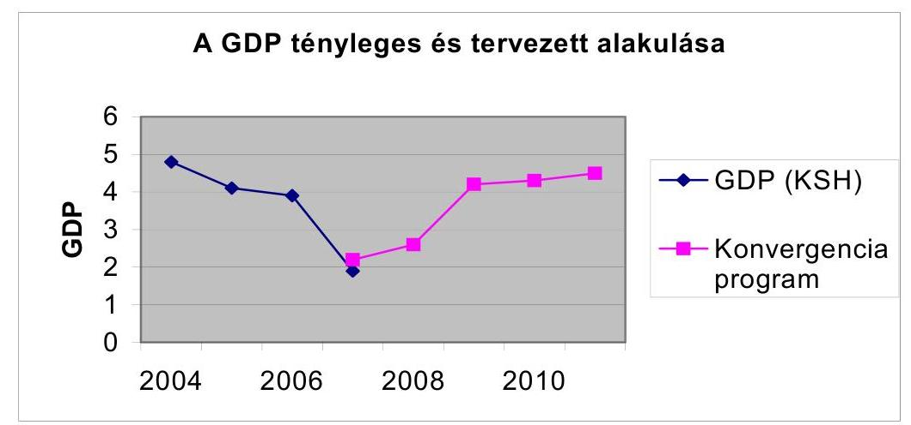
4. sz. ábra

A csökkenő GDP és a növekvő államháztartási hiány együttes hatására ${ }^{88} \mathrm{az}$ adósságszolgálat költségvetésen belüli aránya folyamatosan emelkedett. A világgazdasági versenyben elfoglalt szerepünket tükrözi, hogy Magyarország a világ versenyképességi rangsorában 2007-ban 8 hellyel kedvezőtlenebb pozícióval rendelkezett, mint 2000-ben, és ugyanezen időszak alatt a 27 európai ország között is 3 hellyel csúszott lejjebb ${ }^{89}$.

Magyarország versenyképességi rangsorbeli helyzete

| Év | 51 ország | 27 európai ország |
| :--: | :--: | :--: |
| 2000 | 27 | 17 |
| 2001 | 30 | 17 |
| 2002 | 30 | 17 |
| 2003 | 30 | 16 |
| 2004 | 35 | 19 |
| 2005 | 32 | 16 |
| 2006 és 2007 | 35 | 20 |
| Változás, 2000-2007 | -8 | -3 |

Forrás: IMD World Competitiveness Yearbook, 2000-2007. Lausanne

[^0]
[^0]:    ${ }^{88}$ Az EUROSTAT 2006. évi adatai alapján Magyarország - miként azt az EUROSTAT jelentése külön szövegesen is kiemeli - negatív rekordot tart a - 9,2 \%-os GDP arányos költségvetési hiányával, mivel az utána következő Olaszország (- 4,4 \%), Portugália (3,9 \%) és Lengyelország (- 3,8\%) adataihoz képest is kiugróan magas ez az érték. A jelentés szerint Magyarországon államadóssága 65,6\% volt a GDP arányában.
    Az EU országoknál a 2006. évben mind a GDP arányos költségvetési hiány, mint a GDP arányos költségvetés adóssága tekintetében javulási folyamat indult el az elmúlt években, miközben Magyarországon tovább romlott ez a két mutató. (7. sz. melléklet)
    ${ }^{89}$ A World Economic Forum 2007. szeptemberi jelentése alapján Magyarország a 2006os 35. helyről a 41. helyre került 2007-ben.

---

Magyarország a világ versenyképességi rangsorában 2006-ban kedvezőtlenebb pozícióval rendelkezett, mint 2000-ben, a 27 európai ország között is lejjebb csúszott. Magyarország pozíciójának alakulását makroszinten főleg az alacsony szintű foglalkoztatás, a fizetési mérleg és az államháztartás magas hiánya magyarázza.

# 2.1. A gazdaságfejlesztési célú támogatások alkalmazott tervezési gyakorlatának hozzájárulása a területi, ágazati gazdaságfejlesztési célok eléréséhez 

A rendelkezésre álló adatok szerint az NFTI. ben meghirdetett programokra volt elegendő pályázat a programok végrehajtására 2004-2006-os időszakban, a felhasználható keretet szerződéssekkel lekötötték és a kifizetetések a kezdeti gondok után felgyorsultak. (17. sz. melléklet, A strukturális alapok végrehajtásának helyzete az EMIR 2007. november 9-i adatai alapján)

A beruházás-ösztönzését szolgálta az EKD támogatások rendszere (beruházási, képzési és foglalkoztatási támogatás, a társasági adókedvezmény, mint közvetett támogatás), az egyablakos ügyintézési rendszer bevezetése és a jogszabályok (pl. adójogszabályok) stabilitásának biztosítása, illetve a jogszabályok változásából adódó esetleges hátrányok kompenzálása.

2006-ra kialakult helyzetet jellemzi, hogy hazánkban meghatározó volt a nemzetközi vállalatok szerepe. A nagyvállalatok adják az export több, mint 75\%át. Árnyalja a képet, hogy a külföldi nagyvállalatok hazai vállalatközi kapcsolatai, beágyazottsága a magyar gazdaságba nem megfelelő.

Ezek a vállalkozások (főként medium-high-tech és high-tech ágazatokban) többnyire betanított munkásokat alkalmazó összeszerelő üzemek, amelyeknek kevés a kapcsolata magyar beszállító vállalkozásokkal, továbbá hazai K+F szolgáltatóval közös tevékenységet nem folytatnak. A GOP ex ante értékelési jelentése szerint a GOP helyzetelemzése nem tért ki arra, hogy az ilyen külföldi tulajdonú vállalkozások mennyire, milyen területeken folytatnak interakciót magyar vállalatokkal, mi ösztönzi őket erre.

Az EKD támogatási szerződésekben nem kötötték ki a hazai beszállítói hányad igénybevételét, bár erre a GKM észrevétele alapján az import feletti hányadot meghaladó mértékben a WTO megállapodás 3. cikk 3. 1. szakasz b) pontja értelmében nincs lehetőség.

Magyarország az EK Szerződés 88. cikke szerint bejelentette a Hankook Tire Hungary Kft. nagy beruházási projektjéhez nyújtott támogatást az Európai Bizottságnak. A bizottság 2006. június 23 -án úgy határozott, hogy a Hankook Hungary Kft. részére az összesen 23,4 Mrd Ft összegű támogatás az EK Szerződéssel összeegyeztethető.

Az EK Szerződés 88. cikke alapján került bejelentésre az Európai Bizottság részére az IBIDEN Hungary Gyártó Kft. részére nyújtott egyedi támogatás is. A társaság 41,9 Mrd Ft összegű beruházási projekt költsége 22,4 \%-os támogatási intenzitásnak felel meg, a támogatás összegének jelen értéke 9,8 Mrd Ft. Ennek a támogatásnak az összeegyeztethetőségére az Európai Bizottság vizsgálatot kezdeményezett (2007. július 10-i értesítés szerint). Felhívta Magyarországot, hogy a levél

---

kézhezvételétől számított egy hónapon belül nyújtsa be észrevételeit, és bocsásson rendelkezésre minden olyan információt, amely segíthet az intézkedés értékelésében és emlékeztette Magyarországot, hogy a 659/1999/EK tanácsi rendelet 14. cikke alapján a jogellenes támogatás visszavehető a kedvezményezettől.

A helyszíni ellenőrzés során tíz EKD típusú nagyberuházás támogatási szerződés került részletes ellenőrzésre. A vizsgált támogatások mindegyikére bemutatásra került a GKM részéről a jogszabályi megalapozottság, a Kormánydöntés.

Az EKD szerződésekben a felek többek között rögzítették a szerződés-szegés eseteit és kikötötték a szerződést biztosító mellékkötelezettségeket is. Ezek leggyakrabban alkalmazott formája az azonnali beszedési megbízás, a bankgarancia, a kézfizető kezesség volt. A Magyar Állam ugyanakkor nem élt a fedezet biztosítás legelterjedtebb formájával, a jelzálog érvényesítésével.

A Pénzügyminisztérium a fejlesztési adókedvezmény bevezetésével kapcsolatban évi több, mint 60 Mrd Ft adókiesést prognosztizált, míg a közvetlen támogatáshoz 2003-ban 65,3 Mrd Ft, 2004-ben 71 Mrd Ft, 2005-ben 77 Mrd Ft, és 2006-ban 82 Mrd Ft, összesen 295,3 Mrd Ft többletforrás biztosítását irányozta elő a GKM beruházás-ösztönzési célelőirányzat terhére.

A GKM által meghirdetett pályázatok céljai megfeleltek a vállalkozásfejlesztési, kiemelten a KKV fejlesztési stratégia céljainak. A kiírt pályázatok 2004-től minden évben megismétlődtek, kivéve a KKV-k Interneten való megjelenésének támogatását, 2006-tól e cél támogatása megszűnt. 2007-ben viszont egy új pályázatot is kiírnak a versenyképes vállalkozói tudás támogatására, a vállalkozói kultúra és a versenyképesség javítása, a KKV-k széleskörű, strukturált szolgáltatások nyújtásának elősegítése céljából.

A hazai forrásból megvalósított támogatások hosszú távú pénzügyi tervezésére vonatkozó jogszabály a vizsgált időszakban nem volt hatályban, minden évben a pénzügyminiszter által kiadott tervezési körirat szerint kellett eljárni a támogatások tervezése során. A KKV-k fejlesztését célzó támogatások több fejezeti kezelésű előirányzatban szerepeltek, így azok tervezését több minisztérium végezte. A költségvetési, illetve annak végrehajtásáról szóló törvényekből vizsgálatunkhoz nem lehet meghatározni, hogy KKV fejlesztési stratégiában kijelölt célok, prioritások megvalósítása érdekében hazai forrásból mekkora összeget tervezett, illetve fordított a kormány. A törvényekből az sem derült ki, hogy az egyes években a tervezett kiadásokból mekkora a szabad kötelezettségvállalási keret, mennyi volt az előző évek kötelezettség vállalása.

A kormány kiemelt célul tűzte ki a vállalkozások, kiemelten a KKV-k fejlesztését. A célok megvalósítására számos tisztán hazai forrás állt rendelkezésre, az azonos célú pénzügyi támogatások tervezése, a célok elérésének értékelése azonban nem összevontan történt.

Az uniós támogatások tervezése során az egyes OP-kon belül nincs meghatározva kedvezményezettként, hogy a KKV-k mekkora összegű támogatásban részesülhetnek. Egyedül a GVOP tartalmaz címzetten a KKV-k fejlesztésére vonatkozó prioritást. A GVOP pénzügyi tervében a KKV fejlesztésére mintegy 28,0\% jutott.

---

Az egy vállalkozásra jutó átlagos támogatás mintegy 1 M Ft volt, ami csökkentette a támogatás közvetítő rendszer hatékonyságát.

A 2007-2013 tervezési időszakra vonatkozóan egyedül a KMOP 1. prioritási tengelyében a főbb beavatkozási területek között szerepel a KKV-k fejlesztése, azonban a finanszírozási terv nem számszerűsíti az e cél megvalósítására fordítható összeget.

A hazai vállalkozásfejlesztési célkitűzések 2004. január 1-jétől számos tisztán hazai finanszírozású és uniós támogatással megvalósuló program keretében kerültek finanszírozásra. Ez utóbbi meghatározó szerepet tölt be a támogatási keretösszeg szempontjából. A hazai gazdaságfejlesztés állami eszközrendszerében a vállalkozásfejlesztési, ezen belül a KKV-k fejlesztési rendszere a vizsgált időszakban horizontálisan helyezkedett el.

A tisztán hazai forrású K+F és innovációnál a 2004-2006. években nem létezett a tervezést megalapozó középtávú stratégia; a támogatások céljainak, nagyságrendjének és ütemezésének meghatározása az alap felügyeletét ellátó Kutatási és Technológiai Innovációs Tanács (továbbiakban: Tanács) döntéseinek megfelelően, programszinten történt. A vizsgált időszakban annak ellenére nem készült - a hatáskörrel rendelkező miniszter által is jóváhagyott - az alap pénzeszközeinek felhasználásáról szóló középtávú stratégia, hogy ezt a 133/2004. (IV. 29.) Korm. rendelet 3. § (1) bekezdése előírja.
2004. év végén a Tanács tárgyalta az Alap 2005-2006. évi felhasználására vonatkozó stratégiai koncepciót, azonban azt nem fogadta el és új tervezet kidolgozását kérte. Az újbóli előterjesztés elmaradt és azt a Tanács sem kérte számon.

A Tanács a több évet átfogó támogatási programok indításakor meghatározta a támogatási keretösszeget, valamint abból, az indítás évében felhasználható összeget. A Kutatási és Technológiai Innovációs Alapról szóló 2003. évi XC. törvény 8. § (7) bekezdése szerint az Alap tárgyévi kiadási előirányzatának 25\%-át regionális innovációs célokra kell fordítani. Ez 2004-2006. években rendre a teljes előirányzat $11,5,17,7$ és $34,4 \%$-a, a tényleges kifizetéseknek pedig 1,7, 21,7, $24,9 \%$-a volt.

Az Európai Unió 2007. január 1-jétől hatályba lépett új kutatás- fejlesztési és innovációs Keretszabályának megfelelően a Kormány a Kutatási és Technológiai Innovációs Alapból nyújtott állami támogatások szabályairól szóló 146/2007. (VI.26.) számú rendeletét alkotta meg. Ez a rendelet szolgálja továbbá a regionális beruházási és a kis- és középvállalkozásoknak nyújtott támogatásokról, valamit a csekély összegű támogatásokról szóló - tagállamokra nézve kötelező - uniós szabályozásnak való megfelelést is.

Az informatikai célú támogatások esetében annak ellenére, hogy az ekormányzás központi szabályozási tevékenysége a 2002-2005 közötti időszakban célirányos és teljességre törekvő volt, a MITS végrehajtásának elősegítéseként megjelölt szükséges ágazati intézkedések közül egyes feladatok teljesítése elmaradt. Nem teljesült a pénzügyminiszter és az informatikai és hírközlési miniszter feladatkörébe utaltan a MITS-ben foglalt feladatok finanszírozásának költségvetési rendszerbe illeszkedő - 2005. január 1-től érvényes - rendjének ki-

---

alakítása (a Magyar Információs Társadalom Stratégiáról és annak végrehajtásáról szóló 1126/2003. (XII. 12.) Korm. hat. 5. pont).

A MITS-re támaszkodó Központi Kiemelt Programok végrehajtásához a források szűkössége miatt a keretet nem tudták biztosítani, a programfelelősök nem voltak kijelölve, feladat- és hatáskörük nem volt rendezett, és nem készült el a projekt megvalósításához szükséges hatástanulmány sem, emellett forrás hiányában a szakmai előkészítés, illetve a szakértői háttér megteremtése is késett.

Az Oktatási és Kulturális Minisztérium adatkérő tanúsítványunkra küldött válasza szerint „a minisztérium hatáskörébe tartozó stratégiák - az Oktatási Minisztérium középtávú közoktatás-fejlesztési stratégiája (2004. április), Universitas Program (2004. június) - nem feltétlenül mutatnak azonosságot az oktatás fejlesztését szolgáló legjelentősebb forrásokat meghatározó Nemzeti Fejlesztési Tervvel."

A humánerőforrás fejlesztés horizontális céljai beépültek a támogatott projektek célrendszerébe a pályázatok és a központi programok kidolgozásakor. A támogatások hatékonyságát nem javítja a különböző operatív programok egymást erősítő fejlesztéseinek összehangolása. Az erre tervezett ún. zászlóshajó projekteknek azonban a helyszíni vizsgálat idején sem felelőse, sem elkülönített költségvetése, sem ütemezése nem volt.

A foglalkoztatás elősegítéséről szóló 1991. évi IV. tv. 39. §.(2) bekezdése sorolja fel az Munkaerő-piaci Alap (továbbiakban: MPA) forrásai terhére megvalósítandó célokat, a (3) bekezdése pedig nevesíti az MPA nyolc alaprészét (2005. évben új a vállalkozói alaprész). Változatlan az ÁSZ 2005. évi zárszámadási jelentésének megállapítása, hogy a költségvetési törvény mellékletében már húszféle kiadási jogcím szerepel. Ezek már csak részben és az Alap egészéhez viszonyítva csökkenő arányban kötődnek az egyes alaprészekhez. A költségvetési törvénnyel (összefüggésben az egyes foglalkoztatáspolitikai, szociálpolitikai indíttatású döntésekkel, illetve állami költségek áthárításával) új kiadási jogcímek kerülnek az MPA-ba (2005-ben pl. Kincstári szolgáltatási díjak).

Az aktív foglalkoztatáspolitikai célok támogatásának összege és aránya csökken. A tisztán aktív eszköznek tekinthető foglalkoztatási és képzési alaprész kiadási főösszeghez viszonyított aránya 2003-ban 31,3\% volt. Ez a szám 2004ben már nem éri el a $25 \%$-ot. Az aktív foglalkoztatáspolitikai eszközöket tágabban értelmezve, a rehabilitációs célú munkahelyteremtés, a non-profit szektorbeli munkavállalás, a közmunkavégzés támogatására, a terület kiegyenlítésre, valamint az EU-s társfinanszírozásra átadott pénzeszközökkel együttesen az arány $29 \%$ volt 2005 . évben.

Az Állami Számvevőszék a közmunkaprogramok támogatására fordított pénzeszközök hasznosulásának ellenőrzéséről készített jelentése ${ }^{90}$ szerint a tisztán hazai források esetében az azonos jellegű, de eltérő finanszírozási alapokra épült közfoglalkoztatási formákban a támogatáshoz való hozzájutás feltételei különbözőek. Tudatos, a közfoglalkoztatás valamennyi formáját áttekintő és

[^0]
[^0]:    ${ }^{90}$ 0732. sz. ÁSZ jelentés a közmunkaprogramok támogatásra fordított pénzeszközök hasznosulásának ellenőrzéséről.

---

alkalmazó gyakorlat a vizsgált körben nem volt jellemző. A vizsgált önkormányzatoknak csak a harmada elemezte, hogy milyen előnyökkel jár a különböző támogatott programok keretében való foglalkoztatás. Nem vizsgálták azok összehangolt alkalmazásának lehetőségeit sem. A rendelkezésre álló adatok az önkormányzatoknál nem képeztek olyan egységes információs bázist, amelyek alapján a foglalkoztatási forma kiválasztására megalapozott döntéseket hozhattak volna.

Sem a hazai, sem pedig az uniós pályáztatási rendszerben nem érvényesültek kellő mértékben a tartósan leszakadó és periférikus térségek esélyegyenlőségi szempontjai, sőt a pályáztatási rendszer esetenként mélyítette, illetve konzerválta a kialakult területi egyenlőtlenségeket.

ÁSZ 2005. évről zárszámadási jelentés kifogásolta, hogy a szakképzési hozzájárulásról és a képzés fejlesztésének támogatásáról szóló 2003. évi LXXXVI. törvény egyes feladatok ellátásánál kifejezetten megnevezi a potenciális támogatottat, ezzel teljes mértékben kizárja a pályáztatás lehetőségét, s egyben lehetőséget teremt évek óta nem szerződésszerűen teljesítő intézmény további támogatására. Hiányzott a központi keretből finanszírozott fejlesztési tevékenységek összehangolása, követése, eredményeinek ésszerű felhasználása, és nem tapasztaltuk a központi és decentralizált keret felhasználásának összehangoltságát sem.

A „beruházás az emberbe" célú támogatások keretében vizsgáltuk a felnőttképzés és a szakképzés támogatására felhasznált hazai és uniós források felhasználásának feltételrendszerét, hatékonyságát. Fenti célok hazai forrása az MPA, amely egyben az uniós támogatások társfinanszírozásának forrása is mind az NFT, mind pedig az ÜMFT esetében. Uniós források erre a célra a 2004-2006. években a Humánerőforrás Fejlesztési Operatív Program (HEFOP) 1. Aktív munkaerő-piaci politikák támogatása és a 3. Az élethosszig tartó tanulás és al-kalmazkodó-képesség javítása prioritások között, a 2007-2013. években a Társadalmi megújulás operatív program (TÁMOP), illetve a Társadalmi Infrastruktúra Operatív Program keretében lesznek hozzáférhetőek.

A vizsgált 2004-2006 évek között az MPA teljes felhasználása 776 Mrd Ft volt, amelyből a fenti két célra közel 197 Mrd Ft, a HEFOP keretéből 15 Mrd forint hazai támogatást nyújtottak társfinanszírozásként.

Az infrastruktúra fejlesztések és agrár-környezetvédelem esetében a kockázatok a projekt kiválasztási fázisban a nemzetgazdasági és EU hozzáadott érték mérlegelése során projektszinten jelentkeztek és jelentkeznek a jövőben. Ennek kezelésére az intézményrendszer nem rendelkezett a projektek kiválasztása során elegendő humán erőforrással. Ugyanakkor a stratégiákban a preferenciák hiányos meghatározásai, vagy a hiányzó (közlekedési) ágazati stratégia miatt korábban nem volt elégséges támpont a projektek kiválasztásához. A több éves stratégiák, programok és az éves költségvetés közti összehangolás nem volt összhangban a középtávú tervezés követelményével a csak tisztán haza támogatású forrásokat tekintve.

Az EU stratégiák alakulása, prioritásai hatással voltak az EU és hazai támogatási források allokációjára. A 2005-ben, félidejében megújult 10 éves Lisszabo-

---

ni stratégia két legfontosabb célkitűzése - a gazdasági teljesítmény és a foglalkoztatás növelése -, összhangban áll a Magyar Köztársaság 2006. decemberi Aktualizált Konvergencia programjával. A Kormány a Konvergencia programot és az Új Magyarország Fejlesztési Tervet a lisszaboni akcióterv részének tekinti. Ugyanakkor - a jogszabályi környezet és a stratégiai tervezés időbeni alakulását tekintve - nem kapott kellő hangsúlyt az, hogy az Európai Tanács állásfoglalása alapján a rövid és középtávú lisszaboni stratégiának a fenntartható fejlődés hosszú távú, átfogó keretébe kell illeszkednie, ugyanis a „beruházás a környezetbe" lehet gazdaságélénkitő, munkahelyteremtő jellegű is egyben, nem tartható fenn ugyanakkor tartósan a fejlődés, ha az a természeti és társadalmi környezet erőforrásainak kihasználását eredményezi. A fenntartható fejlődés átfogó értelmezését az Európai Tanács Göteborgban fogalmazta meg és a lisszaboni stratégia korábban kitűzött céljait környezeti vetületekkel egészítette ki.

#### Abstract

A stratégiai tervdokumentumok, programok - az EU operatív programok kivételével - finanszírozási stratégiájuk szempontjából aktualitásukat vesztették. A tervdokumentumokban szereplő finanszírozási stratégiák nem voltak tarthatók az ország gazdasági állapota, a stabilitásra törekvő intézkedések miatt. Ugyanakkor az ágazati és horizontális stratégiáknak (például NKP II) aktualizálására nem került sor, tekintettel arra, hogy szakmai szempontból nem avultak el, azonban a szakmai célkitűzések, kötelezettségek (pl. Vásárhelyi Terv Továbbfejlesztése) a költségvetési megszorítások korlátozták a finanszírozási lehetőségeket. A programok „áramvonalasítása" ellen szólt az is, hogy a középtávú programok esetén az időközben beinduló (bár a vártnál a gyakorlatban lassabban felfutó) EU-forrásokból történő végrehajtás növelte az esélyét annak, hogy a forráshiány miatt halmozódó elmaradások egy része pótolható. Az EU részéről és az OFK mérhetőség elvéből is következően, a tervdokumentumokban nem állították rangsorba az elvégzendő feladatokat, kimutatva az évi forrásigényeket és forrásösszetételüket is.

A stratégiák módosulásának specialitását jelentette az, amikor a környezetvédelmi szempontok vagy a partnerség miatt akár időben, akár költségben kényszerhelyzetek alakultak ki. Így például a korábban említetteken kívül a KIOPban a közlekedési intézkedéscsomagok közötti arányok kedvezőtlenül megváltoztak, vagy több hulladéklerakó helyének a megválasztásánál az egyeztetések elhúzódtak. A Kohéziós Alapok kifizetésének 2006 évi kifizetésének 20\% körüli alakulása a stratégia elévülését eredményezte a vasúti és környezetvédelmi projektek nem megfelelő előkészítettsége miatt.

A stratégiai fejlesztési dokumentumok műszaki és gazdasági előkészítési hiányosságai fennmaradtak az infrastruktúra fejlesztésekkel kapcsolatban. A 2004 -2006 évi időszakra a jelen vizsgálat, figyelembe véve a korábbi ÁSZ vizsgálatok eredményeit, az állami forráshiányban és a kedvezményezettek felkészületlenségében (a műszaki és gazdasági előkészítés, a költségirányítás hiányosságaiban) tárta fel annak fő okait. Ezt erősítette meg a GKM-nek a 2007 évi közlekedési infrastruktúrafejlesztés stratégiája során készült helyzetelemzés, amelyben a veszélyek első két helyén ez a két tényező áll.

Önmagában a 2004-2006 évi dinamikus autópálya hálózat fejlesztés, a költségvetésből erre a célra juttatott források magas aránya mellett, a költségvetési korlátokkal a jövőben erőteljesebben számolni kell. Például 2007-től csak a

---

KÖZOP-ból és PPP konstrukciós alapon lehet majd finanszírozni az autópálya építéseket.

A tervezés és a végrehajtás közti koordinációs mechanizmusok kiépítettsége hiányos. A horizontális stratégiának, az NKP-II végrehajtását szolgáló évenkénti tervezési, értékelési mechanizmus (irányelv, végrehajtási terv, előrehaladási jelentés, Tárcaközi Bizottság és albizottságai) tehát egyfelől a programozott végrehajtás „tanulóalgoritmusaként", másfelől a koordinált és hatékony szakmai tervezést segítő eszközként szolgáltak. Ugyanakkor hatókörük révén e tervek csak a költségvetési törvény által biztosított források mértékéig terjedő végrehajtást, ill. annak nyomon követését tették lehetővé. A monitoring, értékelési és ellenőrzési tevékenység végzésének feltételei eltérőek voltak a különböző ágazati és horizontális stratégiai dokumentumok esetében, egyrészt a stratégiák forráshiány miatti gyakori elévülés, másrészt a végrehajtó intézményrendszer kapacitásgondjai miatt. A tevékenységek folytatásának feltételei csak az NFT Iben, ÚMFT-ben teremtődtek meg.

A finanszírozási stratégiát tekintve az ÁSZ jelentése az autópálya beruházások finanszírozási megoldásainak összehasonlító ellenőrzéséről (2006. december) megállapította a következőket. Egy adott évre vonatkozóan és a megépítésre kerülő útszakaszok esetében nem készültek a megvalósításhoz rendelt finanszírozási tervek, amelyben rögzítették volna a források megoszlását, azon belül az állami hozzájárulás mértékét, a szükséges hitelek és az esetleges egyéb források bevonásának nagyságát, ami nem segítette elő a finanszírozás átláthatóságát. A finanszírozási formák változása a költségvetés mindenkori helyzetével és az autópálya fejlesztések elhatározott ütemével volt összefüggésben ${ }^{91}$.

Az agrárgazdálkodás fejlesztésében a koncepció hiányosságai a gazdaságfejlesztési célú támogatások alkalmazott tervezési gyakorlatában is megnyilvánultak. Egyik véglet a források elaprózottsága volt, rontva a felhasználás hatékonyságát és koordinálását a központi költségvetésben, amint azt az ÁSZ korábbi ellenőrzése során feltárta.

Másik véglet a Top-up ${ }^{92}$, melynek 2007-ben sem tervezték önálló törvényi soron a kiadásait annak ellenére, hogy az ÁSZ az éves zárszámadások jelentéseiben, illetve az éves költségvetési javaslatok véleményezésében ezt két éve kifogásolja, valamint a PM tervezési körirata ellenére. Ennek hiányában, 2007-ben sem látszik biztosítottnak a pénzfelhasználások átláthatósága.

A stratégia hiánya olyan ellentétes tendenciákat is eredményezett, miszerint az élelmiszeripar belföldi értékesítése lassuló mértékben, de csökken, míg a termelése 2005 óta dinamikus növekedésbe fordult, amit 2001-től az élelmiszer export dinamikus növekedése is generált és ez az élelmiszervertikum versenyképességét is jelzi. Ezzel egyidejúleg az élelmiszer import csaknem hasonló dinamikájú növekedése egyben a gazdaságfejlesztés ez irányú tartalékát is mutatja, valamint a stratégia olyan elemeinek hiányosságát, mint a termelői érdekér-

[^0]
[^0]:    ${ }^{91} 0645$ sz. ÁSZ jelentés az autópálya beruházások finanszírozási megoldásainak összehasonlító ellenőrzéséről.
    ${ }^{92}$ Top-up: az EU területalapú támogatását kiegészítő nemzeti támogatás.

---

vényesítő képesség alacsony színvonala, ami megnyilvánul a piacvédelem lehetőségeinek kihasználatlanságában, a termelők hiányos piacgazdasági és erodálódott szakismereteiben is.

Az Önkormányzati és Területfejlesztési Minisztérium által kezelt tisztán hazai finanszírozású támogatások forrásai egyre szűkülnek és ennek következtében a tervezés jelentősége háttérbe szorult. A TRFC esetében a 2007. évi előirányzatot teljes egészében leköti az előző évekről megmaradt determináció és múködési költség, így új területfejlesztési programok indítására - a Vásárhelyi Terv továbbfejlesztése - kivételével nem került sor. A TRFC, valamint a TEKI, CÉDE, TEUT, TEHU, LEKI előirányzatok regionális szintű felosztását, tervezését az ÖTM TFF-n végezték a pénzügyminisztérium, illetve az ÖTM által megküldött sarokszámok ismeretében.

A társasági adó területén a területi, ágazati gazdaságfejlesztési célok elérését az adókedvezményeken keresztül segíti elő ${ }^{93}$. Ezek teljesülését azonban a PM nem értékelte, és nem intézkedett annak érdekében, hogy az ehhez szükséges adatok rendelkezésére álljanak.

Például a társasági adóbevallásban tájékoztató adatként szerepel a foglalkoztatottak éves átlagos statisztikai állományi létszáma, de azokat az adóalanyok nem minden esetben töltik ki. A beruházási/fejlesztési adókedvezményt a vizsgált időszakban igénybe vett, és általunk ellenőrzött 84 adóalany közül 63 (71\%) vagy egyik évben sem, vagy valamelyik évben nem szerepeltetett létszámra vonatkozó adatokat. Ennek következtében az APEH rendelkezésére álló adatok nem alkalmasak tendenciák számolására és elemzések készítésére.

A rendelkezésre álló adatok alapján nem értékelhető, hogy a társasági adókedvezmények mennyiben járultak hozzá a hátrányos helyzetű térségek felzárkóztatásához. A társasági adóbevallások nem tartalmaznak információt arra vonatkozóan, hogy az adókedvezmény igénybevétele milyen térségben megvalósított beruházáson alapul. Emiatt az adókedvezményt igénybevevő adóalanyok csak székhelyük alapján sorolhatók be az egyes megyékhez.

A társasági adóbevallások általunk feldolgozott adatai szerint 2004-ben az összes adókedvezmény $55 \%$-át, 2005-ben $75 \%$-át budapesti és Pest megyei székhelyú adóalanyok vették igénybe. Ezt követik a Komárom-Esztergom megyei ( $14 \%$ és $8 \%$ ), majd a Hajdú-Bihar megyei ( $9 \%$ és $6 \%$ ) székhelyú vállalkozások. 19 megyéből 10 esetében az adókedvezmény mértéke megyénként nem érte el az összes adókedvezmény $1 \%$-át sem (lásd 18. sz. melléklet).

Az önkormányzatok a vizsgált időszakban az adó mértékének megállapításakor elsősorban a költségvetésük bevételi igényeit helyezték előtérbe. A helyi iparűzési adó mentességeinek és kedvezményeinek célja az infrastruktúra, a helyi gazdaság fejlesztése, a foglalkoztatás bővítése, ehhez azonban elemzéseket, hatástanulmányokat nem készítettek a vizsgált önkormányzatok.

Az ellenőrzött 500 M Ft adósságállománnyal rendelkező önkormányzat közül 2004-ben mindössze 3, 2005-ben 4, 2006-ban 7 önkormányzat nem állapította

[^0]
[^0]:    ${ }^{93}$ Az adókedvezmények igénybevételének feltételeit részletesen a 2.1 fejezet tartalmazza.

---

meg a maximum mértékben kiszabható adókulcsot. A fenti önkormányzatok közül egy kivételével az adómaximálás sem jelentette volna az adósságállomány megszűnését, érdemi csökkentését. Budaörs Önkormányzata 2004-ben 756 M Ft múködési költségvetési hiánnyal rendelkezett, amely összeg meghaladta az adó mérsékelt összegéből ( $1,7 \%$ ) adódó veszteséget.

A települési önkormányzatok elsősorban vállalkozást ösztönző, egyes tevékenységeket előnyben részesítő mentességeket, kedvezményeket biztosítottak (pl. ipari parkok területén beruházást megvalósító vagy a kezdő vállalkozások mentessége, meghatározott adóalaphoz kötött mentesség, mezőgazdasági őstermelő, ipari termék-előállító, szolgáltató tevékenységet végzők adókedvezménye, beruházásokhoz és foglalkoztatás bővítéséhez kapcsolódó kedvezmények). Szociális szempontokat figyelembe vevő (pl. csökkent munkaképességűek foglalkoztatásához kapcsolódó, vagy társadalmi rétegek felzárkóztatását segítő) kedvezményeket a vizsgált önkormányzatoknál nem találtunk.

A helyi iparűzési adó bevallásának benyújtási határideje nem támogatja a makroszintű tervezést, mivel a bevallási adatok feldolgozása a vonatkozó APEH előírás szerint minden év szeptember 15-ével fejeződik be, ezzel szemben a költségvetés makroszintű tervezése ezt az időpontot megelőzően már lezárul.

Az államháztartásról szóló 1992. évi XXXVIII. törvény 50. § (1) alapján a költségvetési tervezés főbb kereteit meghatározó költségvetési irányelveket az államháztartásért felelős miniszter április 15-ig , a választások évében június 30-ig kell elkészítenie és a Kormány elé terjesztenie.

A kérdőívekkel megkeresett települési önkormányzatok 48\%-a úgy alakította ki a helyi adókról szóló rendeletét, hogy az egyes kedvezményeket csak néhány vállalkozás tudta igénybe venni.

# 2.2. A gazdaságfejlesztési célú támogatások célba juttatási gyakorlatának hatékonysága és a gazdaságfejlesztési célok teljesülése 

Nem valósult meg a gazdaságfejlesztés területére irányuló állami eszközök és erőforrások alkalmazásának szabályozott harmonizációja, ami össztársadalmi szempontból a haszonmaximalizálást nem tette lehetővé.

A beruházás ösztönzési támogatások (uniós és hazai) célba juttatásának gyakorlata szabályozott volt a GKM-ben. A helyszíni vizsgálat során részletes ellenőrzésre kiválasztott szerződésekben meghatározott feladatok, a megvalósítandó beruházások, és az elérni kívánt célok, valamint a célok számszerúsítésére alkalmazott indikátorok összességében összhangban álltak a beruházásösztönzési célkitűzésekkel.

A beruházásösztönző uniós támogatások eljuttatásának eredményét mutatja, hogy GVOP beruházás-ösztönzési prioritás 35850,5 M Ft összegű támogatási keretét sikerült lekötni, a maximális keretfelhasználás összesen 36905 M Ft a tényleges lekötések összege 3\%-kal meghaladta a tervezett keretet az esetlegesen meghiúsuló szerződések ellensúlyozására. A KTK IH 2006. évi jelentése 5,2\%-os keret túllépést mutat a KTK szintjén. A kifizetett és a szerződött támo-

---

gatások aránya kedvező a GVOP beruházás-ösztönzés prioritás tekintetében ( $82 \%$ az EMIR adatai szerint).

A GKM a SMART 2004-5 környezetvédelmi szempontú technológiai váltásra 3685,7 M Ft keretet biztosított a BC terhére. Ebből 40-50 db pályázatot kívánt támogatni vissza nem térítendő támogatás formájában. A pályázati eljárásban a GKM meghatározta a számszerúsített célokat (a támogatást elnyert pályázatok száma, a technológiaváltó beruházások teljes értéke, a technológiaváltó beruházások teljesítményértéke, a támogatott cégek által kimutatott környezetszennyező anyag csökkenés). A beruházás kiválasztásához meghatározott kritériumok összhangban álltak a kitűzött célokkal. A pályázati eljárás 2004-évi eredményeiről 2005. január 10-én készült elemzés szerint a nyertes pályázatok száma 47 db , a jóváhagyott támogatás összege 2979,5 M Ft, amely közel 20\%-kal volt alacsonyabb a tervezettnél.

A termelőszektor fejlesztésére 2004-2007-ben, a GKM által felügyelt beruházásösztönzési célelőirányzatból finanszírozott EKD támogatások kifizetési kötelezettségének súlypontja a következő évekre esik ${ }^{94}$, ami szűkíti az aktualizált konvergencia program kiadáscsökkentési célkitűzéseinek szabad mozgásterét. A MAG Zrt. monitoring rendszerét helyszíni vizsgálatunkat követően alakítja ki.

A 2004-2007-es időszakban az egyes EKD szerződésekben 9475 M Ft és 34531 M Ft értékhatárok között vállaltak támogatási kötelezettséget. A támogatások évenkénti alakulását a 10. sz. melléklet tartalmazza. A támogatottak a megkötött 42 db EKD beruházási szerződésben - 2004-ben 5090, 2005-ben 4109, 2006ban 7366 és 2007-ben 4801 - összesen 21366 új munkahely létrehozását vállalták. ${ }^{95}$.

A GKM minisztere 2005. december 23-án az MFB Rt-vel kötött Megbízási Szerződést az NBC terhére a „Sikeres Magyarországért" Vállalkozásfejlesztési Hitelprogram mikro-, kis- és középvállalkozások részére, a beszállítói háttérípari tevékenység fejlesztését szolgáló beruházási támogatásokhoz kapcsolódó kamattámogatási program lebonyolítására. Ehhez a miniszter 2005-2008 évekre az 1/2001. (I. 5.) GM rendelet 18. § (1) bekezdés b) pontja alapján 750 M Ft támogatási keret felhasználást biztosított.

A tisztán hazai támogatások gyakorlatában nem vált általánossá a pénzügyi célok rögzítése mellett az elvárt output, eredmény és hatásmutatók alkalmazása, így a támogatások értékelése csak a pénzügyi célokra korlátozódott.

A hazai múködő vállalkozások jellemzően KKV-k. Ez a szektor foglalkoztatja az alkalmazásban állók közel háromnegyedét, állítja elő a bruttó hazai termék-

[^0]
[^0]:    ${ }^{94}$ A 2004 - 2006-ban megítélt EKD támogatások közül kiválasztott 10 legnagyobb beruházás kifizetési aránya a helyszíni vizsgálat időpontjában átlagosan 26,26\%-os volt, azaz közel $74 \%$-ot az elkövetkező egy-két évben kell kifizetni.
    ${ }^{95}$ A KTK a termelő szektor helyzetét értékelése szerint hazánkban 2001-től lelassult a befektetések dinamikája, különösen a multinacionális feldolgozóipari beruházásoknál. (A feldolgozói beruházásokból $80 \%$-ban a külföldi érdekeltségűek részesednek), akik ritkán veszik igénybe a hazai beszállítókat.

---

nek több mint, felét, az árbevétel majdnem kétharmadát. Részesedésük az exportból alacsony, nem éri el az árukivitel egynegyedét.

A hazai vállalkozások helyzetét 2006-ban jellemző mutatókat a következő táblázat szemlélteti:

| Megnevezés | Mennyiségi egység | 2006 |  |
| :--: | :--: | :--: | :--: |
|  |  | KKV-k | 250 fó felett |
| Bruttó hazai termék elöállítása | \% | 52,0 | 48,0 |
| Árbevétel | \% | 59,4 | 40,6 |
| Árukivitel (export) | \% | 23,0 | 77,0 |
| Közbeszerzési eljárások nyertes pályázatainak száma | \% | 67,4 | 32,6 |
| Közbeszerzés eljárás nyertes pályázatainak összege | \% | 34,4 | 65,6 |
| Müködő vállalkozások száma | \% | 99,9 | 0,1 |
| A KKV-knál alkalmazásban állók aránya | \% | 72,5 | 27,5 |

Adatforrás: KSH (A 2006. évi adatok előzetes adatok.), Közbeszerzési Tanács, GKM
A vizsgált időszakban a foglalkoztatottak száma közel azonosan alakult. Az alkalmazásban állók száma viszont minden évben csökkent 2004-ről 2006-ra 79,3 ezer fővel, ami 2,7\%-os csökkenést jelentett. Mindhárom évben a KKV-k foglalkoztatták az alkalmazásban állók közel 73,0\%-át, ahol a létszámcsökkenés mértéke meghaladta az országosat $3,2 \%$ volt. Ebben a szektorban az alkalmazásban állók száma 2004-hez képest 66,9 ezer fővel csökkent. A munkanélküliek száma $25,4 \%$-kal emelkedett.

# A foglalkoztatottak, az alkalmazásban állók, valamint a munkanélküliek számának alakulása 

Adatok: ezer fö

| Megnevezés | 2004 | 2005 | 2006 | 2007   várható |
| :-- | --: | --: | --: | --: |
| Népesség | 10116,7 | 10097,5 | 10076,6 | 10066,2 |
| Munkavállalási korú népesség | 6374,8 | 6373,0 | 6421,4 | 6418,3 |
| Foglalkoztatottak** | 3874,7 | 3878,6 | 3906,0 | 3897,0 |
| Alkalmazásban állók* | 2789,6 | 2786,6 | 2790,2 |  |
| ebből KKV-k | 2104,6 | 2066,7 | 2037,7 |  |
| Munkanélküliek** | 252,4 | 303,1 | 316,5 | 311,7 |

Adatforrás: KSH
**15-64 éves
Munkavállalási kor: 2004-2005: férfi 15-61, nő 15-59; 2006-2007: férfi 15-61, nő 15-60.

---

*Intézményi munkaügy-statisztika évközi adatgyűjtéséből származó végleges adatok.
A KKV-k által a közbeszerzési eljárásokon elnyert pályázatok száma és összege - 2005 kivételével - növekedett, azonban részesedésük az elnyert pályázatok száma alapján 2004-ről 2006-ra 5,1\%-kal, összege pedig 11,7\%-kal csökkent.

A KKV-k által elnyert közbeszerzések* 2004-2006

| Vállalkozás megnevezése | 2004. év |  | 2005. év |  | 2006. év |  |
| :--: | :--: | :--: | :--: | :--: | :--: | :--: |
|  | Eljárás   szám | Összeg | Eljárás szám | Összeg | Eljárás szám | Összeg |
|  | db | Mrd Ft | Db | Mrd Ft | db | Mrd Ft |
| Mikro- | 355 | 21,5 | 416 | 30,5 | 495 | 46,6 |
| Kis- | 830 | 83,8 | 909 | 110,1 | 1216 | 164,0 |
| Közép- | 1468 | 416,0 | 1204 | 388,8 | 1631 | 368,6 |
| KKV összesen | 2653 | 521,3 | 2529 | 529,4 | 3342 | 579,3 |
| Egyéb | 1006 | 608,4 | 1253 | 608,4 | 1614 | 1106,5 |
| Összesen | 3659 | 1129,7 | 3782 | 1291,3 | 4957 | 1685,8 |
| KKV-k részesedése (\%) | 72,5 | 46,1 | 66,9 | 41,0 | 67,4 | 34,4 |

Adatforrás: Közbeszerzések Tanácsa
*az adatok az egyszerű eljárásokat nem tartalmazzák
A Közbeszerzések Tanácsa 2006. évről szóló beszámolója szerint a hazai KKV-k nem kellően tőkeerősek és versenyképesek főleg a tízmilliárdos értéket meghaladó projektek esetében. A közbeszerzési eljárások között a tárgyalásos eljárások értéke növekszik, ami vonzza a külföldi vállalkozásokat, viszont a magyar vállalkozások esélyeit csökkenti.

A Kormánynak 2004. május 1-től hatályos jogszabályi előírás ${ }^{96}$ szerint kétévente (korábban évente) beszámolási kötelezettsége volt a KKV-k helyzetéről, a fejlesztésük érdekében megtett intézkedésekről és a részükre nyújtott állami támogatásokról. A 2006 évről szóló beszámoló készítése a helyszíni ellenőrzése idején folyamatban volt.

Magyarországon a GDP 1\%-a körüli a K+F ráfordítások aránya, amely mintegy fele az EU átlagnak és csak mintegy harmada a 2010-re kitűzött célnak. A kiadások GDP-hez viszonyított mutatói alapján Magyarországon a kormányzati szektor ( $-0,5 \%$ ) az EU átlagtól ( $-0,65 \%$ ) alig elmaradva, az üzleti szektor $(-0,3 \%)$ viszont csak az EU átlag ( $-1 \%$ ) mintegy harmadával járul hozzá a ku-tatás-fejlesztés finanszírozásához.

[^0]
[^0]:    ${ }^{96}$ A kis- és középvállalkozásokról, fejlődésük támogatásáról szóló 1999. évi XCV. törvény, majd e törvény hatályon kívül helyezését követően a tartalmában jelentősen megújult 2004. évi XXXIV. törvény.

---

A 2004-2006. években a GVOP 23,0\%-át (98,7 M EUR) tervezték K+F programok támogatására. 2007-től a K+F+I (Innováció) súlya növekszik, a GOP már 33,7\%-át (990,7 M EUR / 247,7 Mrd Ft/) tervezik ezen prioritás támogatására.

A K+F+lesetében miután a Tanács döntést hozott egy támogatási program elindításáról, az NKTH felelős a pályázati stratégia kidolgozásáért. A KPI ez alapján tette közzé pályázati felhívását, azonban a pályázati felhívások nem minden esetben tartalmazták a vonatkozó kormányrendelet ${ }^{97}$ szerinti kötelező elemeket.

A Jedlik Ányos program esetében például a támogatási szerződések megszegésének szankciói hiányoztak. ${ }^{98}$. Az ÁSZ hivatkozott vizsgálata a Jedlik Ányos programmal összefüggésben megállapította továbbá, hogy a jogszabályi előírás ellenére 41 esetben hiányzott a bíráló szakértők összeférhetetlenségi és titoktartási nyilatkozata, valamint 7 esetben ( $329,8 \mathrm{M} F \mathrm{t}$ összegben) a meghatározott céltól eltérő pályázatoknak ítéltek meg támogatást.

A Kutatási és Technológiai Innovációs Alapról szóló törvény indoklása célként rögzíti, hogy a vállalkozásoknak legalább a befizetett járulékok összegét „vissza kell juttatni". Ez a cél azonban nem érvényesült.

2004-2006. években a vállalkozások az Alap forrásainak rendre 21,5, 26,7 és 33,3\%-át kapták, miközben az általuk befizetett járulékok rendre 45,1, 60,2 és $61,1 \%$-os részarányt képviseltek az Alap forrásai között.

A MITS átfogó céljai között szerepel az IT infrastrukturális alapjainak megteremtése, valamint az IT kialakítását megalapozó társadalmi innovációs tevékenység ösztönzése. E céloknak megfelelő megvalósítási programok a NFT minden operatív programjában megjelentek. A GVOP-ban meghatározott információs társadalom prioritás kulcsfontosságú tényezői: internet-hozzáférés, szélessávú Internet-hozzáférés, Internet használata a KKV szektorban, üzleti vonatkozású digitális tartalom, e-közigazgatási szolgáltatások.

Az ÚMFT elfogadásáról szóló 1103/2006. (X. 30.) Korm. határozat biztosítja a MITS és az eKS folytonosságát, a 2007-2013-ig tartó időszakra az államreform OP keretében. Az elektronikus ügyintézési rendszerek finanszírozása 2007-2013 közötti időszakra az EKOP tartalmaz 104,6 Mrd Ft-ot.

Az információs társadalmat érintő fejlesztések eredményeként 2004-2006 között az on-line vállalati beszerzés 7\%-ról 10\%-ra, a szélessávú hozzáférés 2,2\%-ról 7,5\%-ra, az e-közigazgatás használati aránya vállaltoknál 35\%-ról 45\%-ra, az e-learninget alkalmazó vállalatok aránya 55\%-ról 85,7\%-ra növekedett.

Az emberi erőforrás átfogó fejlesztésére fordított források esetében eltérő volt az egy főre jutó aktív foglalkoztatási eszközökkel kapcsolatos uniós és hazai tá-

[^0]
[^0]:    ${ }^{97}$ A Kutatási és Technológiai Innovációs Alap kezeléséről és felhasználásáról szóló 133/2004. (IV. 29.) sz. Korm. rendelet 13. §.
    ${ }^{98}$ 0628. sz. ÁSZ jelentés a Magyar Köztársaság 2005. évi költségvetése végrehajtásának ellenőrzéséről.

---

mogatási források hatékonysága. Az MPA esetében ez az érték 189049 Ft/fő, míg a HEFOP esetében pedig $827175 \mathrm{Ft} / \mathrm{fő}^{99}$.

Az adatok egyértelmú összehasonlítását akadályozta az aktív foglalkoztatási eszközök egységes definíciójának hiánya ${ }^{100}$.

A hazai és az uniós források hatékonyságának összehasonlítására a két rendszer együttes értékelése választ tudna adni az alábbi táblázatban bemutatott, egy főre jutó aktív foglalkoztatási eszközökkel kapcsolatos támogatás eltérésére:

|  |  |  |  |
| --: | --: | --: | --: |
|  |  | MPA |  |
| 14550000000 | Ft | 6612000000 | Ft |
| 17590 | fő | 34975 | fő |
| 827175 | Ft/fő | 189049 | Ft/fő |

Az aktív foglalkoztatási eszközök definíciójának hiányában az azonos elnevezés eltérő tartalmat takar a HEFOP illetve az MPA támogatásaiban. Forrás: HEFOP 2006. éves értékelése, az ÁSZ 2006. évi zárszámadási jelentése

A makrogazdasági mutatók nem igazolják a források eredményes hasznosulását a foglalkoztatási helyzet alakulásában. A horizontális támogatások mellett közvetlenül a HEFOP és az MPA forrásaiból a foglalkoztatás növelésére a vizsgált időszakban 261 Mrd Ft-ot fordítottak. A foglalkoztatottak száma összesen 9 ezer fővel nőtt a vizsgált időszakban (az uniós források felhasználása előtti utolsó, 2003. évben 3897 ezer fő, 2006. évben 3906 ezer fő volt a foglalkoztatottak száma).

A passzív ellátásokra (álláskeresők, munkanélküliek) támogatására fordított öszszeg 2004-ben 78,2 Mrd Ft, 2005-ben 86,7 Mrd Ft, 2006-ban 85,9 Mrd Ft volt, a vizsgált három évben összesen 250,8 Mrd Ft.

Mind a hazai, mind pedig az uniós - emberi erőforrás átfogó fejlesztési célú támogatásokat központosított és pályázatos úton lehetett elnyerni. Az uniós források esetében nincs korlátozva a központi és a pályázatos keretek aránya. A központosított felhasználás közel azonos nagyságrendú volt, ami közel kétszerese az MPA központi/pályázatos forrás-arányának, és közel háromszorosa az MPA felhasználására érvényes előírásoknak.

A strukturális alapok keretében a központi és a pályázatok keretében kiválasztott projektek arányának meghatározása nem volt egyértelmú a KTK monitoring jelentésben. Az eltérések EMIR értelmezési vagy összesítési gondokra vezethetőek

[^0]
[^0]:    ${ }^{99}$ A különböző munkahelyteremtő támogatások egyikében sem határoztak meg előzetes norma, vagy célértéket egy új munkahely támogatására.
    ${ }^{100}$ A munkahelyteremtés szempontjából a különböző alapok forrásaiból támogatott új munkahelyek létrehozása eltérő hatékonyságú. Az eltérések tovább nőnek, ha a közvetlen munkahelyteremtő támogatásokat, az EKD támogatásokkal vállalt munkahelyteremtéssel is összevetjük. Az EKD-ban az új munkahelyek létesítésére eső támogatások értéke 0,99MFT és 18,4MFT között mozgott, egy új munkahelyet átlagosan $4,1 \mathrm{M}$ Ft támogatással valósítanak meg.

---

vissza az IH szerint. 66,6\%-a nyilvános pályázat keretében kiválasztott projekteket finanszíroz, 29,4\%-a pályázat nélkül kiválasztott, közvetlenül az állami szervek által végrehajtott központi intézkedések (programok vagy projektek) megvalósítását szolgálja. 4\%-a a programok hatékony megvalósítását elősegítő szakmai támogatási (technikai segítségnyújtás) projektekre került elkülönítésre. Ezzel szemben a 11. oldalon a KTK keretének 25\%-át kitevő központi projektekről írnak.

A HEFOP pályázatos és központi programokra megítélt támogatás megoszlása

|  | Központi programok   megitélt támogatása |  | Pályázatos programok   megítélt támogatása | Pályázatos pros-   ramok a teljes   megitélt támoga-   tás arányában |  |
| :-- | :--: | :--: | :--: | :--: | :--: |
|  | M euró | Mrd Ft | M euró | Mrd Ft | $\%$ |
| ESZA projektek | 253,13 | 64,55 | 214,20 | 54,62 | 45,82 |
| ERFA projektek | 42,35 | 10,80 | 182,51 | 46,54 | 81,16 |
| Technikai segítség-   nyújtás | 29,91 | 7,63 | - | - | - |
| Összesen | $\mathbf{3 2 5 , 3 9}$ | $\mathbf{8 2 , 9 8}$ | $\mathbf{3 9 6 , 7 1}$ | $\mathbf{1 0 1 , 1 6}$ | $\mathbf{5 4 , 9 4}$ |

Forrás: HEFOP értékelés, EMIR, NFÜ.
Nem lehetett elkülöníteni a HEFOP és az MPA aktív foglalkoztatási eszközeinek hatásából eredő pozitív munkaerő piaci változásokat. Ez ellentmond a strukturális alapokra vonatkozó általános rendelkezések megállapításáról szóló Tanács 1999. június 21-i 1260/1999/EK Rendelete 37. cikk (2) b) pontjának.

Például a HEFOP 1.2 intézkedés: Az Állami Foglalkoztatási Szolgálat fejlesztése Eredmény indikátora a havonta bejelentett új álláshelyek átlagos száma, hatásindikátora a bejelentett üres álláshelyek átlagos élettartama (napokban). Ezek a mutatók mind a HEFOP, mind pedig az MPA hazai támogatásainak eredményeképpen változhatnak.

A HEFOP támogatásainak hatékonyságát korlátozta a megszorító intézkedések menet közbeni bevezetése. Helyszíni vizsgálatunk végén az Irányító Hatóság ismeretei szerint a HEFOP 3.1 intézkedésben egyelőre 35 iskola, illetve intézmény érintett iskola bezárásban, vagy összevonásban. A HEFOP 2.1 intézkedésben 1 iskola szűnt meg jogutód nélkül, míg 22 iskola valamilyen módon átalakuláson megy keresztül. A bejelentések feldolgozása folyamatban volt a helyszíni vizsgálat idején.

Az alap infrastruktúra fejlesztésén ${ }^{101}$ belül nem segítette az átláthatóságot, hogy az autópálya fejlesztéseknél nem készültek a megvalósításhoz finanszíro-

[^0]
[^0]:    ${ }^{101}$ Az átfogó közlekedésfejlesztési stratégia hiányában az egyes infrastruktúra fejlesztési projektek prioritásai és időbeli ütemezései nem segítették a felhasznált források hatékonyabb össztársadalmi hasznosulását. A szekszárdi és dunaújvárosi hidak felvezető utak nélküli megépítése és az országhatárig nyúló autópálya programok végrehajtása megelőzte az M0-as kiépítését, így az országos átmenő teherforgalom még inkább a fővárosra terhelődött.

---

zási tervek a források megoszlásáról (állami hozzájárulás, hitelek egyéb források). Az államháztartási hiányt, illetve az államadósságot növelték a gazdaságfejlesztési célú, hitelből finanszírozott infrastruktúra fejlesztések, amelyet az alábbi GKM adatszolgáltatás is alátámaszt.

A közúti hálózat fejlesztésén belül a Nemzeti Infrastruktúra Fejlesztési Zrt. irányításával 2002-2006 időszakban $362,3 \mathrm{~km}$ új gyorsforgalmi utat helyeztek forgalomba nettó 610,3 Mrd Ft-os bekerülési költségen, amelynek finanszírozásából 528,4 Mrd Ft volt hitel. Ugyanezen időszak alatt 144 km új út forgalomba helyezésére került sor nettó 102 Mrd Ft , amelynek finanszírozásából 37 Mrd Ft volt hitel. A Közlekedésfejlesztési Koordinációs Központ közremúködésével a 2002-2006 időszakban $122,4 \mathrm{~km}$ gyorsforgalmi utat helyeztek forgalomba 232,152 Mrd Ft nettó kivitelezési költségen, amely finanszírozásában 232,152 Mrd FT, tehát a teljes összeg volt magán forrás, továbbá $454,06 \mathrm{~km}$ új út építése és korszerűsítése nettó 47,6 Mrd Ft volt, amelyből 15,593 Mrd Ft volt EU forrás.

A fenntartható fejlődés, a környezetvédelem, természetvédelem és vízgazdálkodás fejlesztése területén a Nemzeti Környezetvédelmi Program II. (NKP II.) horizontális keretprogramként meghatározza a középtávú célokat, valamint megalapozza az ezen célok elérését segítő eszközrendszert. Legfőbb szakterületi eredménymutatói a környezeti állapot-mutatók, melyek nyomon követése és értékelése éves, kétéves és hatéves rendszerességgel történik. Az NKP II. program pénzügyi teljesítése elmaradt a tervezettől és időarányos teljesítése nem valószínűsíthető. Tisztán hazai forrásból 415 Mrd Ft, uniós forrásból (kötelező társfinanszírozással együtt) 406 Mrd Ft állt rendelkezésre 2003-2006-ban. A kiadások $34 \%$-a a KvVM-nél, $25 \%$-a a GKM-nél és $17 \%$-a az FVM-nél jelentkezett.

A NKP II. program fő célját a környezet állapotának javítását a szakmai mutatók többsége igazolt. Az EU környezeti szabályozó rendszerének átvétele előrelépést hozott. Ezért a Program végrehajtásának eredményességét nem lehet csupán a ráfordítások alapján értékelni. A KvVM álláspontja szerint a finanszírozási helyzet EU követelmények teljesítését egy kivétellel nem veszélyezteti, a 2008. év végéig teljesítendő célok elérése valószínűsített. Ugyanakkor pl. a VKI és az EU városi szennyvízkezelési irányelvének teljesítési véghatárideje 2015, amit már majd az ÚMFT keretében rendelkezésre álló forrásokból kell támogatni. Magyarország a Csatlakozási Szerződésben kötelezettséget vállalt többek között az ivóvízminőség-javítására. Ezt a kötelezettségét az ország a kezdeti nehézségek, elsősorban finanszírozási gondok miatt, nem tudta teljesíteni.

A Csatlakozási Szerződésben foglalt lehetőséggel élve az ország további halasztás iránti kérelmet nyújtott be az EU Bizottsághoz, a kérelem elfogadásáról döntés nem született vizsgálatunk végéig.

A nagyprojektek múszaki és gazdasági előkészítésének és költségirányításának hiányosságai egyaránt késleltették a hazai és EU támogatású infrastrukturális fejlesztések előrehaladását. Pénzforgalmi szemléletben ez a körülmény akadályozta a költségvetések évi kiadásainak hibahatárokon belüli megtervezését. A monitoring jelentések szerint az uniós források felhasználásának tervezett ütemtől való elmaradása, így a KIOP, KA környezetvédelmi, közlekedési (vasúti) projektek késedelmei is hozzájárultak az NKP II. program ütemének tarthatatlanságához.

---

A tisztán hazai forrásokból megvalósuló intézkedések és projektek társadalmi hozamának, a hozzáadott értéknek a követése és megvalósításuk rangsorolása nem kapott megfelelő súlyt. A projektek többsége a nemzetközi elkötelezettségek, un. EU elvárások (például TEN-T közlekedési folyosók, Natura 2000) kényszerpályáján valósultak meg.
Az EU-s pályázati értékelési kritériumokban az NKP II.-höz mért hozzájárulás értékeléséhez a monitoring rendszerben nem épült ki a szükséges mértékben. Az OP-k által alkalmazott értékelési kritériumok elsősorban a projektek előkészítettségét mérték. A társadalmi és szakmai időpreferenciák kezelése is eltérő az EU operatív programok végrehajtásáért felelős intézmények és a szakmai felelősséget viselő intézmények között. Az N+2 elv miatt kényszerpályára került az EU támogatási források allokációja. A környezetvédelmet szolgáló infrastrukturális beruházások esetében az abszorpciós kapacitás nem volt elégséges. Az allokáció a projektek előkészítettségétől és nem az NKP II stratégia céljaihoz való hozzájárulástól függött. Ugyanakkor a nagyszámú és elégséges, az NKP II stratégiai céljaihoz illeszkedő projektjavaslatok/pályázatok kidolgozását forrás hiányában a közigazgatás - és az EU támogatásokat közvetítő intézményrendszer - nem volt képes érdemben segíteni. (KvVM észrevétel szerint)
Az a körülmény, hogy önmagában minden EU projektet tervszinten gazdaságosnak és illeszkedőnek mutattak be az NKP II.-höz, nem igazolta azt, hogy az operatív program elérte az optimális támogatási portfoliót ${ }^{102}$. Az ÁSZ erre már korábbi jelentéseiben felhívta a figyelmet.
A ROP Program-kiegészítő Dokumentuma csak egyetlen operatív program szintű indikátort tartalmaz, nincsenek prioritás szintű indikátorok, mivel a prioritások nem homogének. A programszintű indikátora - a pályázati úton biztosított támogatások értékének legalább 75\%-át a négy kevésbé fejlett régióban kell felhasználni -, a 2006. december 31-ig megkötött támogatási szerződések alapján teljesült $(77,3 \%)$.

A támogatási összeg megoszlása az egyes régiók között
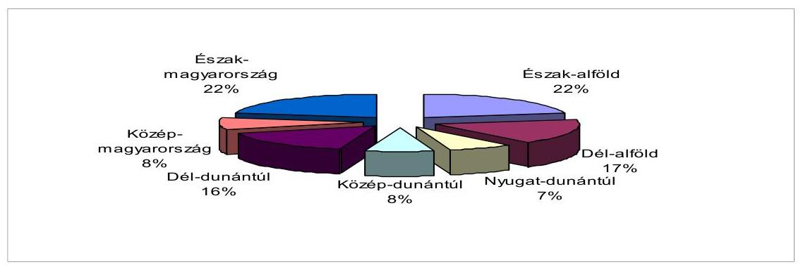

Forrás: Jelentés a ROP 2006. évi megvalósításáról
5. sz. ábra

[^0]
[^0]:    ${ }^{102}$ Az optimális támogatási portfolión mindazon gazdaság-, ill. környezet-fejlesztési projektek összességét értjük, amelyek, szinergikus hatásuk révén is, együttesen a társadalmi hozzáadott érték maximumát közelítik meg. Ennek egyik tervezési eszközeként tekintettük jelen ellenőrzésünk szempontjából az NKP II-t és általában a második szintű magyar horizontális stratégiákat.

---

Az öt operatív program szintjén viszont ugyanez az arány nem teljesült. Az NFT I. 4. specifikus célja a területi kiegyenlítődés nem teljesült, az NFTI. összes támogatásából a legtöbbet az eddig is legfejlettebb Közép-Magyarországi Régió kapta. ${ }^{103}$

Az EU támogatású ROP prioritás szintű indikátorainak alakulását a 19. sz. melléklet mutatja. A támogatott alapfokú nevelési-oktatási intézmények tanulóinak számában van jelentős ( $50 \%$-nál) nagyobb mértékű lemaradást tovább rontotta az iskolák 2007. szeptembertől történt bezárása, amely a hátrányos helyzetű térségeket érintette a legjobban.

A tisztán hazai finanszírozású területfejlesztési projektek támogatásainak odaítélési folyamatában az OTK-hoz, OFK-hoz való viszonyt nem vizsgálták. Naturális mutatószámokon alapuló monitoring értékelési rendszer nem alakult ki, így a programok céljai elérésének objektív értékelése, a pénzügyi ráfordítások és az időarányos teljesítés összevetése, a tisztán hazai támogatásokra vonatkozó elemzése nem lehetséges.

A 2006. évtől a TEKI, CÉDE, LEKI és TEUT támogatások esetében már bekért naturális adatok összesítése, számítógépes feldolgozása azonban nem megoldott.

A hazai támogatásokkal szemben a vizsgált ROP-2.3.1.-2004-06-0022/35. számú „Ceglédberceli óvoda bővítése" és a ROP-1.1.5.-2004-08-0001/35. számú „Kerékpárút és kiszolgáló létesítmények építése a budakalászi Duna parton" című projektek esetében naturáliákon alapuló indikátorokat is tartalmazott, lehetővé téve a pályázó vállalt kötelezettségeinek nyomon-követését.

A turizmus fejlesztése, mint gazdaságfejlesztési cél megjelenik a területfejlesztés költségvetési fejezetén belül turisztikai célelőirányzatként, de több más fejlesztési program is tartalmazott turisztikai fejlesztési célokat.

Az ÖTM által készített, a Turisztikai Célelóirányzat 2006. évi alakulásáról szóló beszámoló szerint a 2006. évben 11092 M Ft -ot fizettek ki. Ebből 6185 M Ft-ot marketing tevékenységre, 3953 M Ft-ot támogatásokra és 953 M Ft-ot egyéb) célokra (pl. kutatás,közremüködői tevékenység,célfeladatok). A beszámoló a célok elérésével kapcsolatos indikátorokon alapuló értékelést nem tartalmazott. A KSH gyorsjelentése szerint a vendégéjszakák alakulásában a vizsgált időszakban jelentős változás ${ }^{104}$ nem történt.

A gazdaságfejlesztési célok elérése szempontjából a társasági adókedvezmények eredményességét csökkentette, hogy azokat a vállalkozások fejlesztéseikhez alacsony arányban vették igénybe. A PM álláspontja szerint az adókedvezményt igénybe vevők arányának változása nem minősíti érdemben a kedvezmény hatékonyságát, illetve nem utal annak hiányára.

A központi költségvetés bevételeiben a 2004-2006 években a társasági adóbefizetések aránya 8,42\%-ról, a 2005. évi visszaesést követően, 7,16\%-ra csökkent.

[^0]
[^0]:    ${ }^{103} 0636$ sz. ÁSZ jelentés a Nemzeti Fejlesztési Terv végrehajtásának ellenőrzéséről
    ${ }^{104}$ A KSH adatok szerint 2003-ban 18 611, 2004-ben 18 899, 2005-ben 19 737, 2006ban 19652 volt a vendégéjszakák száma.

---

A vizsgált időszakban a társasági adóalap meghatározásához ${ }^{105}$ a bevallást benyújtó adóalanyok mintegy $80 \%$-a módosította adózás előtti eredményét. Mind a növelő, mind a csökkentő korrekciós tételek ${ }^{106}$ összege folyamatosan növekedett. Ezek eredményeként az adóalanyok adózás előtti eredményüket összességében 2004-ben 1257 Mrd Ft-tal, 2005-ben 1368 Mrd Ft-tal, 2006-ban 1619 Mrd Ft-tal csökkentették. ${ }^{107}$

A Tao. tv. alapján az adóalanyok maguk döntenek az adókedvezmények igénybevételéről. A vizsgált időszakban a társasági adóalanyok száma viszonylag állandó volt (309.444 - 316.498 cég), amelynek közel 99\%-a volt KKV. Az adókedvezményeket a társaságok egyre csökkenő számban vették igénybe. Adókedvezményt az adózók nem egész 2\%-a érvényesített, ezen belül a KKV-k évről-évre csökkenő (2004-ben 2,1\%, 2005-ben 1,9\%, 2006-ban 1,5\%), míg a nagyvállalkozások folyamatosan növekvő (2004-ben 0,9\%, 2005-ben 1,1\%, 2006-ben 1,4\%) arányban éltek a kedvezmény lehetőségével. Az adókedvezményt igénybevevők 92-95\%-a volt KKV, de az általuk igénybe vett adókedvezmény aránya az összes Tao. kedvezményen belül a 2004-2006-os időszakban 5,1\%-ról 2,1\%-ra csökkent (11. sz. melléklet).

A beruházási adókedvezményt felváltó fejlesztési adókedvezmény ösztönzi a vállalkozásokat fejlesztések végrehajtására.

A kérdőíves megkeresésünkre válaszoló 27 adóalany közül 24 -en ismételten tervezik a társasági adókedvezmény igénybevételét, 20 véleménye szerint az adókedvezmény jelentős mértékben hozzájárult vállalkozásuk versenyképességének javításához.

A vizsgálat során a 2004-2006 között 100 legnagyobb támogatásban részesülő vállalkozások közül annak a 7 adóalanynak teljes költségvetési kapcsolatát tekintettük át, amelyek ugyanezen időszak alatt társasági adókedvezményt is igénybe vettek. A 7 adóalany 2004-ben összesen 21 Mrd Ft, 2005-ben 17,3 Mrd Ft, 2006-ban 25,8 Mrd Ft adókedvezményt (helyi iparűzési adóval együtt) és támogatást vett igénybe. 2004-ben a különböző adó- és egyéb befizetési kötelezettségeik összesen 32,5 Mrd Ft-os negatív egyenleget mutattak a költségvetés szempontjából, amely jelentős összegű ( 67 Mrd Ft ) áfa-visszaigénylés következménye. Költségvetési befizetéseik 2005-ben 13 Mrd Ft, 2006-ban 38,2 Mrd Ft összeget tettek ki

[^0]
[^0]:    ${ }^{105}$ A 2004-2006-os időszakban 30-33 db eredményt növelő és 40-45 db csökkentő tétel figyelembevételével kellett az társasági adó alapot megállapítani.
    ${ }^{106}$ Mind a növelő, mind a csökkentő tételek közül az értékcsökkentéshez kapcsolódó korrekciók jelentik a legnagyobb arányt (48-75\%). Az ilyen címen elszámolt csökkentő tételek 2004-ben 103 Mrd Ft-tal, 2005-ben 142 Mrd Ft-tal, 2006-ban 84 Mrd Ft-tal haladták meg a növelő tételeket. Az elszámolt összes növelő és csökkentő tételek egyenlegének 2004-ben $8 \%$-át, 2005-ben $10 \%$-át, 2006-ban $5 \%$-át jelentették.
    A másik jelentős adóalap csökkentő tétel a vállalkozások veszteségelhatárolása. A vesz-teség-elhatárolás összege az adóalapot csökkentő tételeknek 2004-ben 29,6\%-a (1292,3 Mrd Ft), 2005-ben 36,3\%-a (1659,3 Mrd Ft), 2006-ben 31,8\%-a (1896,2 Mrd Ft) volt.
    ${ }^{107}$ Az adatok az off-shore vállalkozások bevallásait nem tartalmazzák.

---

| Beruházási/fejlesztési adókedvezményt igényvevő, részletes elemzésre kiválasztott adóalanyok költségvetési kapcsolatainak alakulása 2004-2006 |  |  |  |  |
| :--: | :--: | :--: | :--: | :--: |
|  |  |  |  | Mrd Ft |
|  | 2004 | 2005 |  | 2006 |
| Adókedvezmények | 6,58 | 10,25 |  | 11,63 |
| Támogatások | 13,00 | 3,06 |  | 13,12 |
| Helyi iparűzési adó támogatás | 1,41 | 4,02 |  | 1,02 |
| Adókedvezmények és támogatások összesen | 20,99 | 17,33 |  | 25,77 |
| Költségvetési befizetés APEH-on keresztül | $-43,07$ | $-2,81$ |  | 16,77 |
| Költségvetési befizetés VP-én keresztül | 9,21 | 13,72 |  | 18,64 |
| Helyi iparűzési adó | 1,39 | 2,04 |  | 2,75 |
| Költségvetési befizetések összesen | $-32,47$ | 12,95 |  | 38,16 |

APEH, VPOP által kitöltött tanúsítványok adatai, valamint a MÁK és önkormányzatok adatai alapján

A beruházási, illetve fejlesztési adókedvezményt a vizsgált időszakban összesen 84 adóalany 2004-ben összesen 67,4 Mrd Ft, 2005-ben 124,1 Mrd Ft, 2006-ban 120 Mrd Ft adókedvezményt és támogatást vett igénybe. Költségvetési befizetéseik 2004-ben összesen 632,6 Mrd Ft, 2005-ben 700,7 Mrd Ft, 2006-ban 790,4 Mrd Ft volt. Az adóalanyok közül 49 db (58\%) számára a vizsgált időszakban a MÁK adatai szerint - nem folyósítottak támogatást.

# Beruházási/fejlesztési adókedvezményt igénybevevők költségvetési kapcsolatainak alakulása 2004-2006. 

Mrd Ft

|  | 2004. |  | 2005. |  | 2006. |  |
| :--: | :--: | :--: | :--: | :--: | :--: | :--: |
|  | Összes | MOL Nyrt.   nélkül | Összes | MOL Nyrt.   nélkül | Összes | MOL Nyrt.   nélkül |
| Adókedvezmények | 49,44 | 49,44 | 118,93 | 82,43 | 105,82 | 72,82 |
| Támogatások | 17,94 | 17,94 | 5,13 | 5,13 | 14,14 | 14,14 |
| Adókedvezmények és támogatások összesen | 67,38 | 67,38 | 124,06 | 87,56 | 119,96 | 86,96 |
| Költségvetési befizetés APEH-on keresztül | 287,44 | 53,24 | 352,70 | 121,70 | 390,42 | 137,52 |
| Költségvetési befizetés VPOP-én keresztül | 345,22 | 12,52 | 347,97 | 16,67 | 399,94 | 22,54 |
| Költségvetési befizetések összesen | 632,66 | 65,76 | 700,67 | 138,37 | 790,36 | 160,06 |

Az APEH, VPOP által kitöltött tanúsítványok adatai és a MÁK adatai alapján.

---

A befizetések közel 50\%-át a MOL Nyrt. jövedéki adó befizetései (2004-ben 332,1 Mrd Ft, 2005-ben 330,8 Mrd Ft, 2006-ban 377,1 Mrd Ft) jelentették. A 84 adóalany közül 10 esetében (12\%) a vizsgált évek mindegyikében a támogatások és az adókedvezmények összege meghaladta a költségvetési befizetéseik összegeit, amely részben az export tevékenység áfa-mentességével indokolható.

A KKV-k által igénybevett adókedvezmények összege évről-évre kis mértékben, az adókedvezményeken belüli aránya pedig 5\%-ra 2\%-ra csökkent, miközben a társasági adóbevételek közel fele tőlük származik.

# A KKV-k részesedése a társasági adóból és adókedvezményből 2004-2006 

|  | Társasági adó |  |  |  |  |  |
| :-- | :--: | :--: | :--: | :--: | :--: | :--: |
|  | Bevallott   társasági adó   összege   Mrd Ft | Ebből KKV-k   által bevallott   társ. adó össze-   ge Mrd Ft | Aránya az   összes bevall   lott adóhoz   viszonyitva   \%-ában | Összes   adóked-   vezmény   összege   Mrd Ft | Ebből KKV-   k által   elszámolt   adóked-   vezmény   összege   Mrd Ft | Aránya az   összes   bevallott   adóhoz   viszonyitva   \%-ában |
| 2004. | 336 | 159,0 | 47,3 | 50,4 | 2,6 | 5 |
| 2005. | 352 | 170,7 | 48 | 121,5 | 2,4 | 2 |
| 2006. | 373 | 203,7 | 55 | 112,9 | 2,4 | 2 |

Az APEH által kitöltött tanúsítványok és az APEH Gyorsjelentés adatai alapján
A térségi és egyéb adókedvezményeknél a PM nem vizsgálata, hogy az igénybevett adókedvezmények összege és az igénybevevők száma alapján szükségese a jogintézmény aktualizálása, illetve fenntartása.

Foglalkoztatottak megoszlása vállalkozási típusok szerint 2004-2006.

|  | Az összes vállalkozásnál foglalkoztatottak   száma KSH adatok alapján (fő) |  |  | Az összes vállalkozásnál foglalkoztatottak   száma APEH adatok alapján (fő) |  |  |
| :-- | :--: | :--: | :--: | :--: | :--: | :--: |
|  | 2004. | 2005. | 2006. | 2004. | 2005. | 2006. |
| Mikro | 204023 | 220087 | 225493 | 489267 | 482926 | 501366 |
| Kis | 473792 | 488477 | 502279 | 458222 | 470203 | 484504 |
| Közép | 448116 | 442634 | 435097 | 418947 | 416527 | 423888 |
| Nagy | 792960 | 771997 | 771669 | 839268 | 785779 | 807630 |
| Összesen | 1918891 | 1923195 | 1934538 | 2205704 | 2155435 | 2217388 |

Az APEH és a KSH adatai alapján.
A 84 adóalany költségvetési kapcsolataiban (iparűzési adó nélkül) 2004-ben összesen 67,4 Mrd Ft, 2005-ben 124,1 Mrd Ft, 2006-ban 120 Mrd Ft adókedvez-

---

ményt és támogatást vettek igénybe. Költségvetési befizetéseik 2004-ben összesen 632,6 Mrd Ft, 2005-ben 700,7 Mrd Ft, 2006-ban 790,4 Mrd Ft volt.

Nem mutatható ki, hogy az igénybevett társasági adókedvezmények milyen mértékben járultak hozzá a bruttó hazai össztermék (GDP) növekedéséhez, mert az adóalanyok alacsony arányban érvényesítettek adókedvezményt. A mikro vállalkozások a GDP 12\%-át, a kis- és középvállalkozások kategóriánként 14-16\%-át állították elő 2004. és 2005. években. A nagyvállalkozások 2004-ben 58,9\%-kal, 2005-ben 57,7\%-kal járultak hozzá a bruttó hazai össztermék előállításához ${ }^{108}$.

Az önkormányzatok gazdasági önállóságának egyik eszköze a helyi adók rendszere, mely lehetőséget teremt a helyi adópolitika kialakítására. Az iparűzési adót bevezető önkormányzatok száma évről évre folyamatosan nőtt ${ }^{109}$. A maximális adómértéket (2\%) az iparűzési adót bevezető önkormányzatok 23\%-a (598) alkalmazza. Az önkormányzatok 45\%-a (1.178) 1,5\%-1,99\% közötti adót szabott ki. Az 1-1,49 \% közötti adómértéket a települések 25\%-a (663), 1\% alatti adómértéket a települések 8\%-a (208) állapított meg.

2004-2006 években az iparűzési adó mintegy 95\%-át az adóalanyok 13\%-a fizette be. A vizsgált időszakban az iparűzési adót fizető adóalanyok száma közel azonos volt (2004-ben 542 071, 2005-ben 570 681, 2006-ban 551752 vállalkozás).

Az önkormányzatok a vizsgált időszakban az adó mértékének megállapításakor elsősorban a költségvetésük bevételi igényeit helyezték előtérbe. A kedvezményekkel elérni kívánt célkitűzések megvalósítását a kedvezményt megállapítók (kormányzat, települési önkormányzatok) nem vizsgálták, annak mérésére nem alakították ki a megfelelő adatszolgáltatási, beszámolási és értékelési rendszert.

A helyi iparűzési adókedvezmények 2004-ben 22,5 Mrd Ft-tal, 2005-ben 20 Mrd Ft-tal, 2006-ban 22 Mrd Ft-tal csökkentették a beszedhető iparűzési adó összegét, a befizetett adó 7 , illetve $6 \%$-ával. A kedvezményeket elsősorban a nagyvállalkozások kapták, illetve azok tudtak az önkormányzati rendeletekben meghatározott feltételeknek megfelelni. ${ }^{110}$

2006-ban a kedvezményezettek száma 143 ezer volt, az igénybe vett kedvezmény összege 22 Mrd Ft. A kedvezmény $42 \%$-át az első három, $61 \%$-át az első

[^0]
[^0]:    ${ }^{108}$ Forrás: Pitti Zoltán: A hazai társasvállalkozások helyzetének elemzése, a vállalkozásfejlesztési programok forrásszükségletének prognosztizálása, illetve nemzetközi gyakorlatban alkalmazott finanszírozási technikák adaptációs lehetőségeinek vizsgálata (2006. november 15.) - kutatói jelentés.
    ${ }^{109}$ Az önkormányzatoknak a helyi adók közül az iparűzési adó a legjelentősebb bevételi forrása, melyből az adóbevételek 85\%-a realizálódik.
    ${ }^{110}$ Az uniós csatlakozás előtt adott egyedi iparűzési adókedvezmények 2007 végén megszűnnek, Magyarországnak az unióval kötött megállapodása és a helyi adókról szóló 1990. évi C. törvény 39/C. § alapján.

---

tíz, 84 \%-át az első ötven, 89 \%-át az első száz legnagyobb vállalkozás vette igénybe.

Az iparűzési adó jellegéből adódó kedvezőtlen hatások mérséklését szolgálta, hogy 2004-ben az adó 25\%-ával, 2005-ben 50\%-ával, 2006-tól már 100\%-ával volt csökkenthető a társasági adó (egyéni vállalkozók esetében a személyi jövedelemadó) alapja. Az elszámolással azonban csak a nyereséges vállalkozások élhettek, így az adónem elsősorban az amúgy is nehéz gazdasági helyzetben lévő vállalkozásokat sújtotta.

# 2.3. A gazdaságfejlesztési célú támogatások célba juttatásának adminisztratív, intézményi költségei 

A támogatásközvetítő intézményrendszer múködési költségeinek meghatározása - az intézményrendszer erőfeszítései ellenére - az összes intézményi költségen belül becslésen alapulnak ${ }^{111}$.

Egy külső tanácsadó cég 2006. március - május során a KTK IH megbízásából felmérte a KTK intézményrendszer, amely szerint a 2004-2005. években operatív programonként eltérő költségek merültek fel.

A 2004-2005. közötti időszakban felmerülő, az egyes operatív programokra fordított költségeket a megkötött szerződések értékével is összevetve a GVOP és az AVOP forrásainak a felhasználása jár az eddigi költségek alapján a legnagyobb fajlagos ráfordítással.

A tisztán hazai finanszírozású területfejlesztési programok esetében az egyes eljárásra vonatkozó rendeletek tartalmazzák a pályázati rendszer működtetéséhez rendelkezésére álló keretek. A keretek a 2006. évben a következők voltak:

| TRFC decentralizált szakmai és területfej-   lesztési programok pályázati rendszer mű-   ködtetése | Az előirányzatokon rendelkezésre álló   keret legfeljebb 4 \%-a |
| :-- | :-- |
| TRFC központi fejlesztési feladatok | Pályázati keret 2 \%-áig |
| TEKI, CÉDE, LEKI, TEHU, TEÚT pályázati   rendszerek múködtetése | Pályázati keretek 2 \%-áig a TRFC decent-   ralizált területfejlesztési program terhére |

A TRFC-ből finanszírozták a TRFC- n kívül a TEKI, CÉDE, LEKI, TEHU, TEÚT támogatások pályázati rendszerének működtetését is ${ }^{112}$, ami azt jelenti, hogy a TRFC-ben - nevével ellentétben - nem csak fejlesztési célú kiadások vannak.

Az APEH múködése területén az ÁSZ korábbi vizsgálatában ${ }^{113}$ megállapította, hogy az APEH által beszedett költségvetési nettó bevételek, valamint az adóbe-

[^0]
[^0]:    ${ }^{111} 0723$ sz. ÁSZ jelentés az uniós támogatások hazai monitoring és ellenőrzési rendszere múködésének ellenőrzéséről.
    ${ }^{112}$ A Magyar Köztársaság 2006. évi költségvetéséről szóló 2005. évi CLIII. törvény.
    ${ }^{113}$ 0616. sz. ÁSZ jelentés az Adó- és Pénzügyi Ellenőrzési Hivatal múködésének ellenőrzéséről.

---

szedésre fordított kiadások arányát tekintve az adóbeszedés hatékonysága öszszességében javult. A beszedett adók és adó jellegű bevételek növekedési üteme jelentős mértékben meghaladta a kiadások növekedési ütemét. A kiadások $13 \%$-kal, a beszedett költségvetési nettó bevételek $60 \%$-kal, ezen belül az önadózáson kívüli bevételek $23 \%$-kal nőttek.

A helyi iparűzési adó kedvezmények nyilvántartásához valamint a kedvezmények hasznosulásához kapcsolódó adminisztratív, intézményi költségekről a települési önkormányzatok nem vezetnek nyilvántartást.

# 3. A GAZDASÁGFEJLESZTÉSI CÉLÚ TÁMOGATÁSOK ÉS ADÓKEDVEZMÉNYEK HASZNOSULÁSÁT NYOMON KÖVETŐ ELLENŐRZÉSI, MONITORING ÉRTÉKELÉSI ÉS JELENTÉSI RENDSZEREK 

### 3.1. A gazdaságfejlesztési célú támogatások és adókedvezmények hasznosulásának ellenőrzési rendszere kialakítása és múködtetése

Az uniós támogatások hazai ellenőrzési rendszereinek kialakítása és múködtetése megfelelt az uniós előírásoknak Az irányító hatóságok és a közreműködő szervezetek, valamint a KEHI az uniós támogatással megvalósuló programokat egységesen, uniós módszertan szerint ellenőrizte. A tisztán hazai támogatásokra azonban nem volt egységes ellenőrzési rendszer, módszer és eljárásrend. Az uniós támogatások ellenőrzési rendszerének múködését a korábbi számvevőszéki vizsgálat ${ }^{114}$ alapvetően megfelelőnek találta.

Kifogásolta azonban, hogy az intézményrendszer által elvégzett ellenőrzéseknél a hatékonyság és eredményesség elvű ellenőrzések háttérbe szorultak, az átszervezésekkel párhuzamosan nem aktualizálták az ellenőrzési terveket (tervezett ellenőrzések maradtak el), nem alakították ki az ellenőrzés módszertanát a nagyprojekt profilt jellemző kockázatokra, szükséges az ellenőrzések összehangolásának erősítése.

A gazdaságfejlesztési támogatásokban érintett NFÜ, a GKM, az SZMM a MÁK, valamint a közreműködő szervezetek a jogszabályoknak ${ }^{115}$ megfelelően kialakították és működtették független belső ellenőrző szervezetüket. Az FVM belső ellenőrzési rendszerének hiányát korábbi ÁSZ jelentésekben ${ }^{116}$ már kifogásoltuk.

[^0]
[^0]:    ${ }^{114} 0723$ sz. ÁSZ jelentés az uniós támogatások hazai monitoring és ellenőrzési rendszere működésének ellenőrzéséről.
    ${ }^{115}$ A Nemzeti Fejlesztési Terv operatív programjai, az EQUAL Közösségi Kezdeményezés program és a Kohéziós Alap projektek támogatásainak fogadásához kapcsolódó pénzügyi lebonyolítási, számviteli és ellenőrzési rendszerek kialakításáról szóló 360/2004. (XII. 26.) Korm. rendelet 54. § (1) bekezdése, A költségvetési szervek belső ellenőrzéséről szóló 193/2003. (XI. 26.) Korm. rendelet.
    ${ }^{116} 0710$ sz. Ász jelentés a Földművelésügyi és Vidékfejlesztési Minisztérium működésének ellenőrzéséről és a 0723 sz. ÁSZ jelentés az uniós támogatások hazai monitoring és ellenőrzési rendszere müködésének ellenőrzéséről.

---

Az ÖTM belső ellenőrzési szervezete Ellenőrzési Titkársága Szakállamtikársághoz tartozott, ami nem biztosította az ellenőrzési feladatokhoz előírt funkcionális és szervezeti függetlenséget.

A gazdaságfejlesztési feladatok minisztériumok közötti 2006. évi átszervezésével az uniós és hazai támogatások kezelésére létrejött MAG Zrt, hátrányosan módosította a GKM felügyelete alá tartozó ellenőrzési rendszerek múködését, mivel nem múködtette függetleníttett belső ellenőrzését, az alkalmazásában álló belső ellenőrök munkaviszonya 2007. július 31-ig megszűnt, azóta belső ellenőrzési tevékenységet nem folytatnak ${ }^{117}$. A belső ellenőrzés hiánya jogszabályellenes, ellentétes kormányrendeletekkel ${ }^{118}$ és az Áht.-val.

A MAG Zrt. a jogszabályoknak megfelelően elkészítette Helyszíni Ellenőrzési Szabályzatát, beszámolót készített az elődszervezetek által, 2006 év során lefolytatott ellenőrzésekről. A belső ellenőrzési munkatervek aláírással ellátott példányai nem voltak fellelhetők, kivéve a 2006. évit. A belső ellenőrzés éves tevékenységéről szóló beszámolók közül csak a 2005. évi volt meg.

Az ÚMFT egyes operatív programjaiból kifizetendő támogatásokra az NFÜ Múködési Kézikönyve a vonatkozó jogszabályoknak megfelelően szabályozza az ellenőrzések rendszerét és lebonyolításának módját.

A KEHI különböző típusú ellenőrzései az uniós előírásoknak ${ }^{119}$ megfelelően betöltötték szerepüket. A Hivatal rendszerellenőrzései és szabályszerűségi ellenőrzései összehangoltak voltak és egymásra épültek, illetve egymást kiegészítették. A 2007-2013. közötti programozási időszakra felállított Ellenőrzési Hatóság feladatait a KEHI látja el a Kormányzati Ellenőrzési Hivatalról szóló 312/2006. (XII.23.) Korm. rendelet szerint.

A 2004-2006. évek között mind a tisztán hazai, mind pedig az uniós beruházásösztönző támogatásokat az MFB Rt. kezelte. „Az MFB Rt-nél - a banki gyakorlatot követve nem volt szükség véletlenszerü kockázatalapú mintavételezéses ellenőrzésre. A GVOP többi közremüködő szervezeteinél kidolgozták a kockázatalapú mintavételezés szabályait, de a 2007-2013-ig terjedő programozási időszakban az új EU előírásoknak megfelelő véletlenszerú mintavételezési eljárás módszertanának kialakítása és alkalmazása vált szükségessé."120

Az ITDH Kht. a GVOP beruházás-ösztönzés 1. 3. prioritás végrehajtója (amelynek elvégzéséhez jogszabályi felhatalmazás alapján pályáztatás nélkül jutott uniós támogatásokhoz), 2007-től az EKD szerződések kezelője, valamint a GKM egyes célelőirányzatai forrásának felhasználója is. A társaság a fent hivatko-

[^0]
[^0]:    ${ }^{117}$ 2007. szeptember 21-én a feladat ellátására megbízási szerződést kötöttek egy társasággal.
    ${ }^{118}$ 360/2004. (XII. 26.) Korm. rendelet, a 193/2003. (XI. 26.) Korm. rendelet.
    ${ }^{119}$ A Strukturális Alapok esetében a 1260/1999/EK Tanácsi rendelet, a 438//2001/EK Bizottsági rendelet és a 448/2001/EK Bizottsági rendelet. A Kohéziós Alap esetében a 1164/1994/EK Tanácsi rendelet és a 1386/2002/EK Bizottsági rendelet.
    ${ }^{120} 0723$ sz. ÁSZ jelentés az uniós támogatások hazai monitoring és ellenőrzési rendszere múködésének ellenőrzéséről.

---

zott jogszabályok ellenére nem alakított ki és nem múködtetett belső ellenőrzési szervezetet. Ennek hiányát jelezte a társaság Felügyelő Bizottságának elnöke, valamint könyvvizsgálója is a Kht. 2006. évi éves beszámolójának auditálása kapcsán.

Az ITDH Kht. 2006. évi éves beszámolója alapján 2006-ban 130 főt foglalkoztatott. A költségvetés különböző célelóirányzataiból és a strukturális alapokból 2006-ban összesen 2720 M Ft Egyéb bevétellel rendelkezett.

A MAG Zrt. mellett a MÁK az NBC-ből megvalósított tisztán hazai beruházásösztönzési támogatások megbízás alapján elvégzett pénzügyi lebonyolításáról a 2006. évi ellenőrzési tevékenységéről, az ellenőrzések jellemző tapasztalatairól beszámolót készített a GKM részére. A GKM ellenőrzési tevékenységéről éves ellenőrzési jelentésekben adott számot.

A KKV-k uniós támogatásának folyamatba épített előzetes és utólagos ellenőrzése (FEUVE) 2004-2006. években a MVf Kht., 2007-től a MAG Zrt. feladata volt. A korábbi ÁSZ ${ }^{121}$ jelentésben szereplő ide vonatkozó megállapításokat jelen vizsgálat is megerősítette.

A GKM hazai forrásból (KKC) finanszírozott SZVP programjának keretében meghirdetett pályázatokat és az uniós támogatásokat ellenőrző szervezete az MVf Kht. 2004 és 2005 években meghirdetett, s hazai forrásból finanszírozott pályázatok ellenőrzéseit nem végezte el, a korábbi években meghirdetett pályázatok támogatott projektjeit vizsgálta ebben az időszakban. Erre az időszakra vonatkozóan éves ellenőrzési tervet és éves beszámolót azonban nem mutattak be. A záró ellenőrzéseket az MFB Rt.-től átvett képviseleti hálózat végezte.

A vizsgált szervezet tájékoztatása szerint ezekben az években kizárólag uniós forrásból finanszírozott támogatások ellenőrzését végezték a rendelkezésre álló humán erőforrás szűkössége miatt. 2006-ban eseti ellenőrzéseket végeztek ( 42 db -ot) felkérés alapján, amelyek többnyire előzetes ellenőrzések voltak.

A K+F támogatásokra vonatkozó 133/2004. (IV. 29.) Korm. rendelet 8. § (1) bekezdése szerint az Alap múködtetésének, pénzforgalmának és felhasználásának belső ellenőrzése az NKTH feladata. A Hivatalnál a jogszabályi előírás ellenére nem végeztek ilyen ellenőrzést a vizsgált időszakban. 1 fő belső ellenőrt alkalmaztak, kivéve a 2005. április 15 -től 2006. január 1-jéig terjedő időszakot, amikor nem volt belső ellenőr.

Az NKTH belső ellenőrzésének mind a 2006., mind a 2007. évi munkatervében szerepelt az Alappal kapcsolatos pályázatkezelési rendszer döntés-előkészítési, döntési, pályázatkezelési feladatainak rendszervizsgálata, de kapacitáshiány következtében ezek a vizsgálatok elmaradtak.

A vizsgált időszakban a Kutatás-fejlesztési Pályázati és Kutatáshasznosítási Iroda (KPI) ellenőrzési rendszerének kereteit a hazai és az uniós jogszabályi előírásokkal összhangban alakították ki, amelyet a pályázatok ellenőrzési kézikönyvében foglaltak össze. A helyszíni ellenőrzéseket ellenőrzési tervek alapján

[^0]
[^0]:    ${ }^{121}$ 0723. sz. ÁSZ jelentés az uniós támogatások hazai monitoring és ellenőrzési rendszere múködésének ellenőrzéséről.

---

végzik, és azok eredményeiről nyilvántartást vezetnek. Az ellenőrzések eredményeiről minden évben beszámolót készítettek. A szabálytalanságok kezelését a KPI szabálytalanságok kezeléséről szóló eljárásrendje tartalmazta.

A Kutatási és Technológiai Innovációs Alap ellenőrzési rendszerét az ÁSZ korábban már értékelte ${ }^{122}$ amely szerint: „Az ellenörzések negatív tapasztalatai azt igazolták, hogy a közpénzek szabályszerü felhasználásának biztositásához nem elegendő a nyilatkozattal történő elszámolás."

2005-ben és 2006-ban összesen 46 vizsgálatot végzett a KPI, amelyek 187 db támogatási szerződést érintettek, összesen 16,5 Mrd Ft támogatási értékben. (2004ben az egyes vizsgálatok megállapításait is tartalmazó összesítő kimutatás nem készült.) „A vizsgált projektek döntő hányadánál a kedvezményezettek a nyilatkozattal történő elszámolási módot választották. Az ellenőrzés tapasztalatai szerint a benyújtott nyilatkozatban közölt adatok az esetek döntő többségében nem egyeztek meg a számvitelileg elkülönített nyilvántartással." A 46 vizsgálat közül csak 12 esetben rögzítették az ellenőrök a költségek szabályszerű elszámolását.

Az informatikai fejlesztéseket kezelő IT Kht. 2004. év elején elkészítette a pályázatok ellenőrzésére vonatkozó eljárásrendjét. Az IT Kht. MAG Zrt-be integrálása után egységesített eljárás keretében tovább folytatódtak az IT Kht. által megkezdett ellenőrzések. Az IT Kht. Ellenőrzési Irodája rendszeresen végzett helyszíni ellenőrzéseket, amelyekről az IHM, majd később a GKM szakmai főosztályát tájékoztatták. Az IT Kht. Ellenőrzési Irodája 2004-ben összesen 34 helyszíni ellenőrzést végzett.

Az informatikai célú, tisztán hazai támogatások céljai teljesítésének nyomon követésére vonatkozó ellenőrzési és beszámolási rendszere a nyertes pályázó által írásos formában küldött pénzügyi és szakmai beszámolóiból valamint a kapcsolódó monitoring jelentésekből állt. A MITS programjainak végrehajtását biztosító tervezési, monitoring és értékelési rendszer szabályozatlansága miatt a pályázati célok teljesülésének mérési, elemzési és értékelési eljárásrendje nem volt kidolgozott. Ez utóbbi hiányt egy korábbi számvevőszéki ellenőrzés ${ }^{123}$ - javaslattétel mellett - már feltárta, azonban az információs társadalomra vonatkozó stratégia alkotás módosuló folyamatában aktualitását vesztette.

Mind az uniós, mind pedig a tisztán hazai forrásokból megvalósított infrastrukturális beruházások ellenőrzésének legnagyobb hiányossága az ellenőrzési kockázatok korlátozott feltárása volt.

A fenntartható fejlődés, a Natura 2000 program teljesülésének ellenőrzése új kihívás, amelyet a jogszabályi környezet és ellenőrzési módszertan még nem támogatott kellő módon. Az agrár-környezetgazdálkodási támogatások a KVvM mellett az FVM felügyelete alá tartoztak.

Az FVM tisztán hazai forrásból megvalósuló 2004. évi fejezeti kezelésű előirányzatainak ellenőrzésére kockázatelemzés alapján 4 előirányzat esetében sor került.

[^0]
[^0]:    ${ }^{122}$ 0724. sz. ÁSZ jelentés a Magyar Köztársaság 2006. évi költségvetés végrehajtásának ellenőrzéséről.
    ${ }^{123}$ 0532. sz. ÁSZ jelentés az Informatikai és Hírközlési Minisztérium múködésének ellenőrzéséről.

---

Az FVM belső ellenőrző szervezete 2006-ban is megkezdte a 2005. évi fejezeti kezelésű előirányzatok vizsgálatának előkészítését, azonban a 2006. évi átszervezésnek, illetve létszám- és kapacitáscsökkenés eredményeként a módosított munkatervből kikerültek ezen ellenőrzések. Kapacitáshiány miatt ilyen típusú vizsgálatot már nem is tervezett 2007-ben az FVM.

Az MVH végezte az NVT I. esetében az ellenőrzéseket. Az MVH a belső ellenőrzés eljárásrendje szerint rendelkezett az 1663/95/EK Bizottsági Rendelet mellékletének 3. (i) és 10. pontjai szerinti belső ellenőrzési egységgel. Helyszíni ellenőrzéseit kockázatelemzéssel és véletlen mintavétellel határozták meg. Az MVH végzett rendszerellenőrzést az AKG jogcímben a 2006.június 09.-i jelentése szerint.

A tisztán hazai területfejlesztési támogatások ellenőrzési szabályait a vonatkozó eljárási rendeletek tartalmazták. A helyszíni ellenőrzéskor kapott tájékoztatás szerint a folyamatba épített ellenőrzést a hazai támogatások esetében elvégezték, belső ellenőrzés működött az érintett szervezeteknél.

Az OTH megszűnésével az ellenőrzések iratanyagai (ellenőrzési jelentések, tervek, intézkedési tervek végrehajtásának nyomon-követése) és a feladatok átadásátvétele a jogutód ÖTM felé nem történt meg, ezért a belső ellenőrzés folyamatossága megszakadt. Az NFÜ Belső Ellenőrzési Főosztálya tájékoztatása szerint az OTH Belső Ellenőrzési Főosztálya által folyamatban lévő 1 db EU támogatással kapcsolatos vizsgálat átvételre, lezárásra és beszámoltatásra került.

Az APEH a társasági adókedvezmények ellenőrzésére - a hatékonysági és célszerűségi szempontok figyelembevételével - az Art.-ban ${ }^{124}$ meghatározott ellenőrzési fajták (pl.: utólagos ellenőrzés, egyes adókötelezettségek teljesítésére irányuló ellenőrzés, adatok gyűjtését célzó ellenőrzés) keretében, elsősorban utólagosan ellenőrizte az adóalanyokat.

Korábbi vizsgálatunk megállapította ${ }^{125}$, hogy az APEH a társasági adó ellenőrzése során - az irányelvekben meghatározott prioritást figyelembe véve - kiemelten ellenőrizte a különböző jogcímeken igénybe vehető adókedvezmények, illetve az adóalap korrekciós tételek elszámolását. Nem határozható meg azonban, hogy a Hivatal hány ellenőrzést végzett adókedvezményt igénybevevő adóalanynál és ezeknél mekkora összegű adóhiányt tárt fel az adókedvezmény jogosulatlan igénybevétele miatt.

A jelenlegi ÁSZ ellenőrzés számára az APEH kigyűjtötte a vizsgált időszakban beruházási, illetve fejlesztési adókedvezményt igénybe vevő összes adóalany ( 84 db ) ellenőrzésének adatait. Ezen adózók vették igénybe az összes társasági adókedvezmény több mint $90 \%$-át. Az APEH közülük 37 adóalanyt (44\%) ellenőrzött társasági adót is érintően (átfogó, illetve adónem ellenőrzés keretében). Az ellenőrzések $92 \%$-a ( 34 db ) zárult megállapítással, ebből $16 \mathrm{db}(43 \%)$ érintett társasági adónemet. A feltárt adókülönbözet $1602,4 \mathrm{M} \mathrm{Ft}$, ezen belül a társasági adókülönbözet $309,6 \mathrm{M} \mathrm{Ft}(19 \%)$ volt.

A kérdőíves megkeresésünkre válaszoló adóalanyok (84-ból 27) közül 12 jelezte, hogy az APEH ellenőrizte nála az adókedvezmények igénybevételének jogszerú-

[^0]
[^0]:    ${ }^{124}$ Az adózás rendjéről szóló 2003. évi XCII. törvény
    ${ }^{125}$ 0549. sz. ÁSZ jelentés a társasági adó beszedésére kialakított rendszer múködésének ellenőrzéséről.

---

ségét, közülük 2, hogy erre vonatkozóan a Hivatal ellenőrzése megállapítással zárult. Az adóalanyok az APEH ellenőrzési gyakorlatát jónak, az ötös skálán 4-re minősítették.

A KKV-k által igénybevett társasági adókedvezmények ellenőrzéséről és azok eredményéről az APEH nem rendelkezik kimutatással.

Az iparűzési adóról rendelkező önkormányzati adóhatóságok elsősorban szervezeti és személyi hiányosságok miatt csak korlátozottan képesek a rendeleteikben foglalt adózási kötelezettségek betartását kikényszeríteni. Az utólagos ellenőrzések gyakorisága az adóalanyok számára ellenőrzési fenyegetettséget nem jelent. Utólagos adóellenőrzéshez csak néhány település rendelkezett önálló létszámmal. Az ellenőrzések alacsony száma nem javította az adómorált.

Az önkormányzatok ellenőrzései legtöbbször szúrópróbaszerűek voltak, elsősorban a bevallás be nem nyújtásának okát vizsgálták. A kérdőíveinkre adott válaszok szerint további ellenőrzésre nincs lehetőségük. (A bevallások benyújtási határideje május 31, a teljes feldolgozottságot augusztus 15-ig kell a települési önkormányzatoknak elérniük.)

A Fővárosi Önkormányzat Adó Ügyosztályának Revizori Alosztályának revizori létszáma 2004-ben 16, 2005-ben 15, 2006-ban 16 fő volt, ami 6-8 ellenőr pár kiállítását teszi lehetővé. (A Fővárosi Önkormányzat szedi be az iparűzési adó 43\%át - az összes 380 milliárd forintból 164 milliárd forintot - az adóalanyok száma 2004 -2006 években 265 -290 ezer db volt). 2004-ben 1614, 2005-ben 1652, 2006ban 1260 utólagos adóellenőrzést végeztek. Az ellenőrzöttségi szint a fenti években $0,6 \%$-ról $0,4 \%$-ra csökkent. Az ellenőrzések a főváros esetében is csak a bevallást benyújtókra, illetve a bevallási kötelezettséget elmulasztókra terjedtek ki, nem irányultak a be nem jelentett ideiglenes tevékenységet folytató vállalkozások adókötelezettségének feltárására.

A Székesfehérvári Önkormányzat adóhatósága annak ellenére, hogy 2004-ben a negyedik, 2005-ben a második, 2006-ban a az ország harmadik legnagyobb öszszegű iparűzési adót szedte be ( 5,8 Mrd Ft, 6,4 Mrd Ft, 7 Mrd Ft összegben) nem rendelkezett önálló ellenőri feladatokat ellátó munkatársakkal. 2004-ben nem, 2005-ben 3, 2006-ban 15 vizsgálatot folytattak le, a megállapított adóhiány 2005-ben 2,2 M Ft, 2006-ban 6 M Ft volt.

Az adóellenőrzések szempontjait és szabályait a települési önkormányzatok többsége nem rögzítette, a kérdőívben megkérdezett adóhatóságok közel 95\%-a. Éves adóellenőrzési ütemtervet 20\% készített.

Párhuzamosságok tapasztalhatók az állami adóhatóság és a helyi adóhatóság ellenőrzési munkájában. Nincs együttműködés sem az önkormányzatok között, sem az önkormányzatok és az APEH között az ellenőrzések összehangolásában, valamint a megállapítások realizálásában sem.

Az APEH ellenőrzi a vállalkozások azon számviteli bizonylatait, alapadatait, amelyek a helyi iparűzési adóalap megállapításához is szükségesek. Az APEH vonatkozó megállapításairól az illetékes önkormányzati adóhatóságoknak nincs tudomásuk. Az önkormányzati adóhatóságok sem tájékoztatják az állami adóhatóságot hasonló jellegű megállapításaikról.

Egy önkormányzat ellenőrzési megállapításai nem kötelezőek másik települési önkormányzat adóhatóságára ugyanazon vállalat két telephelyére vonatkozóan.

---

Az adómegosztást érintő megállapítás esetén az érintett önkormányzatok tájékoztatása nem történt meg, erre jogszabály nem kötelezte az önkormányzatokat.

A helyszíni vizsgálatunkba bevont önkormányzatok a fővárost kivéve közös ellenőrzést nem végeztek. A Fővárosi Önkormányzat a vizsgált időszakban 2 önkormányzattal folytatott együttes ellenőrzést; 4 önkormányzat élt megkereséssel, kérve székhelyáthelyezés miatti ellenőrzést.

Az uniós támogatásokra vonatkozóan a csalások és szabálytalanságok kezelésével összefüggő eljárásrendeket az egyes irányító hatóságok Müködési Kézikönyve, valamint a közreműködői kézikönyvek megfelelően tartalmazták.

A MAG Zrt. 2007. július 31-én készítette el a GVOP programjaira vonatkozó szabálytalanságkezelési szabályzatát. A társaságnál a GOP szabálytalanságkezelési szabályzat a helyszíni vizsgálat idején még nem állt rendelkezésre. A GOP IH ugyanakkor a szabálytalanságkezelési szabályzat tervezetét 2007. augusztus 10én már elfogadta.

Az uniós támogatásokra alkalmazott csalás és szabálytalanság-kezelési eljárásokkal ellentétben a hazai támogatási rendszerre a szabálytalanságok kezelését nem foglalták szabályzatba a helyszíni vizsgálat lezárásáig.

# 3.2. A gazdaságfejlesztési célú támogatásokkal és adókedvezményekkel elérni kívánt célok teljesítésének nyomon követése, a monitoring rendszer kialakítása és múködtetése 

A hazai monitoring rendszerek egy része a makro-gazdasági hatások vizsgálatát, más része egyes programok, intézkedések eredményeinek és hatásainak értékelését szolgálta.

A PM-ben több makrogazdasági előrejelző modell múködött. Egyik a költségvetés és a konvergencia program háttérszámításához, a másik modell a makrogazdasági változók rövid- és középtávú előrejelzéséhez. A makrogazdasági hatások vizsgálatát teszi lehetővé az a modell, amelyet az NFÜ alkalmazott a 2007-2013as programozási időszak fejlesztéspolitikai programcsomagjai közötti választás szakmai támogatására. Az elmúlt időszakban nem látszott szoros együttmúködés az NFÜ és a PM makrogazdasági hatásvizsgálati csoportja között.

Az uniós támogatásokat összefoglaló NFT I. elsősorban a pénzügyi tervezésre fókuszálva elhanyagolta a célrendszer output, eredmény és hatás mutatóinak egymásra épülő tervezését. Az uniós támogatásokra alkalmazott monitoring mutatók csak részben alkalmasak az eredmények, a stratégiai célok teljesülésének - a projektek szintjétől kiindulva az operatív programon keresztül az NFT által kitűzött célok - vizsgálatára. A célok teljesítésének nyomon követése az uniós és azzal összhangban lévő hazai jogszabályi előírásokban ${ }^{126}$ foglaltak szerint Egységes Monitoring Információs Rendszerben (EMIR) történt. Kivételt jelentettek az Interreg és a vidékfejlesztési támogatások.

[^0]
[^0]:    ${ }^{126}$ Az Európai Unió által nyújtott egyes pénzügyi támogatások felhasználásával megvalósuló programok monitoring rendszerének kialakításáról szóló 124/2003. (VIII. 15.) Korm. rendeletet, valamint a helyébe lépő 102/2006. (IV. 28.) Korm. rendelet.

---

Az INTERREG programok adatait a speciálisan kifejlesztett IMIR rendszerben rögzítik. A magyar nyelvű EMIR erre nem alkalmas, mert az Interreg nyilvántartási rendszerének angol nyelvűnek kellett lennie és alkalmasnak a többi ország hasonló rendszerével kapcsolásra. Az Interreg III adatait: Ausztria és Magyarország együttműködése esetében a már működő osztrák rendszerben is rögzíteni kellett, a szlovén rendszerbe a magyar adatszolgáltatás alapján Szlovéniában viszik be az adatokat.

Az AVOP utódja, az ÚMVP monitoring funkciói - mint az NVT esetében korábban - az Integrált Igazgatási és Ellenőrzési Rendszer (IIER) zárt rendszerében integrálódtak. Az AVOP monitoring adatigényeit ellenben a 2008-at követő lezárásáig továbbra is az EMIR rendszer szolgálja ki. Az IIER rendszerhez kapcsolódó Agrár-környezetvédelmi Információs Rendszer (AIR) a környezet állapotával kapcsolatos mutatókat tartalmazza. Az AIR feladata többek között a hazai és uniós forrásból támogatott programok hatás-értékelésének, - ellenőrzésének támogatása. A kapcsolódó rendszerek kiépítése nem végleges és nem teljes, megítélése a költségessége és az esetleges párhuzamosságok miatt nem egységes.

Az EMIR folyamatos fejlesztés után vált alkalmassá az indikátor adatok fogadására, a programok indítását követően véglegesítették a mutatószámrendszereket. „A monitoring rendszer kialakítása és müködtetése teljesítette az uniós források lehívásának és felhasználásának e rendszerekhez kapcsolódó feltételeit, hiányosságok csak a rendszer müködésének eredményességében, az indikátorok megfelelő használatában voltak még."127
„Az EMIR 2006-ban tovább fejlődött, szolgáltatásai bővültek, az üzemeltetés biztonsága nőtt. Ugyanakkor a szolgáltatás színvonalának további emelésére van szükség, a rendszer megbízhatóságát fokozni kell." Az EMIR részét képező számviteli nyilvántartási rendszer „a Kifizető Hatóságtól származó információk szerint 2006 végén még nem tudta biztosítani a számvitel zárt rendszerétől elvárható követelményeket ${ }^{-128}$

Korábbi számvevőszéki ${ }^{129}$ megállapításokhoz képest előrelépést jelentett, hogy a kedvezményezettek által megküldött pénzügyi beszámolók ellenőrzése 2007. január 1-jétől az EMIR-ben is megvalósult. 2007. évet megelőzően a projekt előrehaladási jelentések és a pénzügyi beszámolók adattartalmát a rendszerben nem rögzítették, azok papír alapon álltak rendelkezésre. A 2007-ben beérkező Projekt Előrehaladási Jelentések és beszámolók rögzítésével egy időben a megelőző beszámolókat is feltöltik az informatikai rendszerbe.
„Az EMIR és az OTMR ${ }^{130}$ közötti elektronikus adatcsere technikailag 2006-ban nem ütközött akadályba, de az adatok megbízhatósága nem nőtt." ${ }^{131}$

[^0]
[^0]:    ${ }^{127}$ 0723. sz. ÁSZ jelentés az uniós támogatások hazai monitoring és ellenőrzési rendszere működésének ellenőrzéséről.
    ${ }^{128} 0724$ sz. ÁSZ jelentés a Magyar Köztársaság 2006. évi költségvetés végrehajtásának ellenőrzéséről.
    ${ }^{129}$ 0723. számú jelentés az uniós támogatások hazai monitoring és ellenőrzési rendszere működésének ellenőrzéséről.
    ${ }^{130}$ A Magyar Államkincstár által működtetett pénzügyi monitoring rendszer, Országos Támogatási Monitoring Rendszer.

---

Az OTMR pénzügyi nyilvántartás, indikátorokat nem tartalmaz, adattartalma a legszélesebb körű, de nem tartalmazza a támogatások teljes körét. Nem tartalmazza többek között a kormányzati szintű döntések alapján, valamint a miniszteri keretekből, a Nemzeti Kulturális Alapból, a Nemzeti Civil Alapból nyújtott támogatásokat. Az OTMR adatszolgáltatóinak körét, adattartalmát kormányrendelet ${ }^{132}$ szabályozza. Az OTMR-t üzemeltető szervezet tájékoztatása szerint az adatbeküldés nem teljes körű (például az EMIR II.-ből (GOP) még nem érkeztek adatok), továbbá az éves adattisztítás sem múködött zavartalanul.

Az OTMR múködése kapcsán a helyszíni vizsgálatkor azt tapasztaltuk, hogy a TRFC/KP/MPA/1200002/2006 sz. „Munkahelyteremtéssel járó kapacitásbővítés a Bombardier Transportation Hungary Kft-nél" elnevezésű projekt esetében a támogatás összegét három nagyságrenddel elírták, így az egyébként 80 M Ft TRFC támogatásban részesült projekt a MÁK-tól kapott listán 80 Mrd Ft-tal szerepelt.

A helyszíni ellenőrzés idején folyamatban volt az EMIR alkalmassá tétele az ÚMFT támogatásainak nyilvántartására, kezelésére. Az ÚMFT-hez kötődő EMIR-2 rendszer gyakorlati múködését számos hiba gátolta, ami a felhasználók részéről esetenként jelentős többletmunkát, vagy az EMIR-2-n kívüli saját nyilvántartás vezetését tett szükségessé.

Az EMIR-2-t- hasonlóan az EMIR-hez - a használatba vétellel párhuzamosan fejlesztették, 2007 májusában mutatták be a felhasználóknak, akik júniusban már élesben használták. A fejlesztés folyamatos volt. Helyszíni vizsgálatunk idején az EMIR-2 nyomon követés modulok tesztelése megtörtént.

Az átfogó nemzetgazdasági pénzügyi monitoring kritikáját jelentette az 1995. évi LIII. törvény 41. § (3) bekezdése szerint elkészített első kétéves beszámoló összesített pénzügyi táblázatának lábjegyzetében található megjegyzés: „A kormányzaton kívüli jövedelemtulajdonosok 2003. és 2004. évi ráfordításainak felmérése a minisztériumi adatszolgáltatások mellett a támogatási rendszerek adatainak feldolgozásával és elemzésével, valamint szakértői becslés alapján történt. Az adatok tájékoztató jellegüek."

A tisztán hazai finanszírozású intézkedések monitoring rendszereinek kiépítése elmaradt az uniós támogatásokétól. Az egyes intézkedések pénzügyi folyamatainak nyomon követésére többféle információs rendszert, adatbázist alkalmaztak (Pénzügyi Információs Rendszer (PIR) az egyes intézkedések sajátosságaihoz igazítva, továbbá Excel-ben kialakított adatbázisok), amelyeket egyedi eljárásrendek szerint használtak.

A MAG Zrt. a hazai támogatásokra a PIR nyilvántartási rendszert alkalmazza, múködteti továbbá az UNIT nyilvántartási rendszert, amelyben rögzítik a szerződéseket és a kifizetéseket. A rendszer szolgáltatja az analitikus nyilvántartáshoz szükséges adatokat.

[^0]
[^0]:    ${ }^{131}$ 0724. sz. ÁSZ jelentés a Magyar Köztársaság 2006. évi költségvetés végrehajtásának ellenőrzéséről.
    ${ }^{132}$ Az államháztartás múködési rendjéről szóló 217/1998. (XII. 30.) Korm. rendelet.

---

A K+F támogatások monitorozására - az NKTH tájékoztatása szerint - folyamatban van egy EMIR-hez hasonló informatikai rendszer bevezetése, amely képes lesz a monitoring rendszert támogatni.

A KKV-kat támogató hazai SZVP program keretében megkötött támogatási szerződések a vizsgált szervezet tájékoztatása szerint jellemzően nem tartalmaztak a támogatások makrogazdasági hatásait mérő indikátorokat. A KKV-k támogatását és azok gazdaságfejlesztésre gyakorolt hatását bemutató adatokat több, az intézményi rendszeren belül múködő nyilvántartásból, valamint külső adatszolgáltatásból lehetett összeállítani. (EMIR, OTMR a KSZ-eknél múködő informatikai rendszerek, a GKM önállóan előállított adatbázisa), azonban egyik sem kezelte összevontan a KKV részére az uniós és a tisztán hazai forrásból nyújtott támogatások adatait.

Az informatikai támogatások esetében sem a MITS, sem az eKS megvalósulásának nyomon követésére nem volt megfelelő eszköz és mód, ami a további tervezési folyamatok és célkitúzések, illetve szorosan az e-kormányzást illetően a szolgáltatásokat nyújtó intézmények szempontjából kockázati tényező ${ }^{133}$.

Az IHM-HHÁT2 pályázat esetében a Támogatási Szerződés alapján az indikátorok teljesítéséről jelentés készült, amelyet minden év június 30 -ig teljesítettek. A Támogató a kedvezményezettektől kérte a Jelentés kiegészítését az indikátorok alakulásáról, és szöveges kiegészítést illetve magyarázatot. Az összesen 27 kedvezményezettből 19 teljesítette a kérést.

A HEFOP-ban tervezett naturális mutatók alakulásáról a HEFOP 2006. évi megvalósításáról készített, és a HEFOP Monitoring Bizottsága által jóváhagyott Jelentés olyan eredmény és hatásmutatók alapján (pl. KSH adatok) is értékelt, amelyek nem csak a támogatott projektek, programok eredményességétől, hatásaitól függenek.

Az NFÜ értékelése szerint „Az alkalmazott indikátorok egy-két intézkedéstől eltekintve illeszkednek a támogatott projektekhez, de nem képesek teljes körüen lefedni a projekt során megvalósult tevékenységeket, illetve mérni az elért eredményeket." Az indikátor rendszer felülvizsgálata időbeni és kapacitásbeli korlátok, valamint a projektek előrehaladottsága miatt nem tudott az OP összes pályázati kiírására vonatkozóan megvalósulni.
„A TIOP indikátorok továbbra sem kielégítők. Az OP esetében hiányoznak azok a modellek, amelyek összekapcsolnák a célokat az indikátorokkal. Ez ellentétben áll a Draft Working Papers of Ex-ante evaluation indicators for monitoring and evaluation c. anyag javaslataival". (Az OP ex-ante értékelése) „A TÁMOP javasolt indikátorai az egyes prioritások tartalmát csak részlegesen tükrözik, és gyakran csak durva közelítéssel alkalmasak arra, hogy segítségükkel követni lehessen az OP céljainak megvalósulását". (Az OP ex-ante értékelése) A Kormány által elfogadott - az ÜMFT részét képező TÁMOP, TIOP - Akciótervben szereplő indikátorrendszer felülvizsgálatára részben az addig megjelentetett pályázati felhívások, részben a szaktárcák által felülvizsgált részletes Akciótervek alapján - az IH tervei szerint - 2007 novemberében kerül sor.

[^0]
[^0]:    ${ }^{133} 0713$ sz. ÁSZ jelentés az elektronikus kormányzati szolgáltatások fejlesztésének ellenőrzéséről.

---

A tisztán hazai támogatások közül a foglalkoztatási intézkedések egy részének, az aktív munkaerő-piaci politikák eredményességének nyomon követését tette lehetővé az Állami Foglalkoztatási Szolgálat (ÁFSZ) monitoring rendszere.

Az EKD támogatások felhasználásáról készített beszámolókról a 2003. évi LXXXVI. törvény alapján 2006. január 1-jétől az OSZT-nek állást kell foglalnia. 2006-ban az OSZT részére átadott 13 szerződés közül csak 1 db szerződés teljesítéséről született állásfoglalás.

A fenntartható fejlődés céljaira fordított támogatások monitorozására felelős még nincs kijelölve, az NFT I környezetvédelmi célú horizontális programjának és Magyarország Nemzeti Környezetvédelmi Programjának monitorozása a KVvM hatáskörébe tartozik, és kiterjed az összes pénzügyi forrásra (uniós, központi költségvetési, önkormányzati).

A vizsgált időszakban az NKP II előrehaladásának követése mellett külön intézményrendszerben történt az NFT-I végrehajtása és nyomon követése, illetve az ÚMFT tervezése. Az alkalmazott környezeti mutatók köre is részben különbözött (mutatók egymásba ágyazottságából eredő hiányosságok). Az NKP-II céljaiból következő különböző szakterületi kötelezettségek végrehajtásának nyomon követése ezért nehézségbe ütközött, így csak részlegesen állapítható meg az NFT I és ÚMFT hozzájárulása az NKP II céljainak teljesüléséhez.

Az NKP II előrehaladás értékelése az éves zárszámadás figyelembe vételével történik. Az NFT I-nek és az ÚMFT-nek az NKP-II céljaihoz való hozzájárulása nyomon követése érdekében az NKP-II éves tervei és jelentései a vonatkozó NFT-I, ÚMFT terv- és tényadatait tartalmazzák. A szakmai monitoring alkalmazásának lehetőségeit, amely a kiadások eredményének és hatásainak a követését szolgálja, költségigényessége befolyásolta.

A KvVM szakmai álláspontja szerint általános környezeti folyamatok feltárásakor figyelembe kell venni, hogy minden környezeti folyamatnak megvan a maga jellemző ideje, amely megszabja az értelmes adatgyűjtés gyakoriságát.

A korábbi ÁSZ vizsgálatok során feltárt indikátorok kezelésével kapcsolatos hiányosságokat a KIOP-ban kiküszöbölték.

Az EMIR rendszer az NKP II megfelelő részletességű indikátorainak adatait 2007. év elejéig nem tudta biztosítani. Ennek részben oka volt az AVOP indikátorok nem kielégítő volta is.

Az ÁSZ ellenőrzések a korábbi években is feltárták (2003, 2007), hogy az FVM tisztán hazai forrást jelentő fejezeti kezelésű előirányzatainak értékelése nem volt megoldott előzetes mutatók hiányában, az agrárgazdasági középtávú fejlesztési terv (kiindulási pontok és kitűzött célok) hiánya miatt nem érvényesülhetett a teljesítmény-szemlélet.

Az adókedvezmények igénybevételének alakulását, hatásait, eredményességét, aktualizálását, esetleges megszüntetését a PM a vizsgált időszakban csak részben elemezte, nem értékelte, hogy az adókedvezmények felhasználásával az azt igénybe vevő vállalkozások milyen mértékben járultak hozzá a kitűzött célok eléréséhez és nem is alakította ki az értékelés feltételrendszerét. Nem hatá-

---

rozta meg, hogy mely mutatószámokkal mérhetők az egyes célok (mint pl. versenyképesség növelése, az elmaradott térségek felzárkóztatása) teljesülése, továbbá azt sem, hogy azok mely értékei mellett lehet, illetve kell az adott adókedvezményt eredményesnek minősíteni. Az ÁSZ ezt a hiányosságot korábbi ellenőrzése során már feltárta, és erre vonatkozóan javaslatot tett ${ }^{134}$.

Az adókedvezmények rendszeres felülvizsgálatát, elemzést, értékelést indokolja a gazdaságfejlesztési célok változása, a gazdasági környezetben bekövetkező változások és ezzel összefüggésben a költségvetés hosszú távú érdekei, a különböző adókedvezmények költségvetésre gyakorolt hatása, továbbá a nemzetközi gyakorlat. Németországban 2000-től az államháztartási törvény előírja, hogy a kormánynak utólag értékelnie kell a jogalkotás hatásait. Az Egyesült Királyságban meghatározzák, hogy a jogszabályokat a bevezetésüket követően mennyi idő elteltével kell felülvizsgálni.

A PM azzal indokolta az adókedvezmények hatása és eredményessége elemzésének elmaradását, hogy a fejlesztési adókedvezmény, valamint a kutatás és szoftverfejlesztés adókedvezménye esetében a 2003., illetve 2005. évi bevezetés és a beruházások megvalósításának időigénye, továbbá az adókedvezmény igénybevételének ütemezése miatt a tényleges igénybevétel a vizsgált időszakban még nem volt jelentős.

A KKV-k által igénybevett adókedvezmények alacsony összege és az igénybevevők 1,5-2\%-os aránya indokolttá teszi a szabályozás hatásának értékelését, felülvizsgálatát. A beruházási, illetve a fejlesztési adókedvezmények esetében a PM és a GKM nem alakított ki olyan monitoring rendszert, amelynek segítségével nyomon tudná követni, hogy a kedvezmények mennyiben járultak hozzá a foglalkoztatottság növeléséhez, az elmaradott térségek felzárkóztatásához, valamint hogy azok mekkora költségvetési bevétel-növekedést eredményeztek. Az adókedvezmények évközi figyelemmel kísérésére egyrészt az éves elszámolás miatt nincs lehetőség.

Az iparűzési adó kedvezményekkel elérni kívánt célkitűzéseinek megvalósulását a kedvezményt megállapító települési önkormányzatok nem vizsgálták, annak mérésére nem alakították ki a megfelelő adatszolgáltatási és beszámolási, értékelési rendszert.

A Htv.-ben előírt foglalkoztatási adóalap-kedvezmény esetében csak az igénybe vett kedvezmény összege állapítható meg, a kedvezményt igénybe vevő vállalkozások számát, valamint a kedvezmény hatására elért foglalkoztatotti létszám változását a MÁK részére benyújtott adatszolgáltatások nem tartalmazzák.

A települési önkormányzatok általában nem értékelik, hogy a beruházási, valamint a foglalkoztatást segítő adókedvezmények miként járultak hozzá a település fejlődéséhez, a kedvezmények biztosításával a kitűzött célok (pl. munkanélküliség csökkentése) megvalósultak-e.

Kérdőíves felmérésünkre a megkérdezettek 82\%-a nyilatkozott arról, hogy az alkalmazott iparűzési adó kedvezmények hozzájárultak a település fejlődéséhez,

[^0]
[^0]:    ${ }^{134}$ 0549. sz. ÁSZ jelentés a társasági adó beszedésére kialakított rendszer múködésének ellenőrzéséről.

---

ezt adatokkal azonban a megkérdezettek 36\%-a tudta csak alátámasztani. A foglalkoztatotti létszámra a bevallások adatot nem tartalmaznak, így arról csak ellenőrzéssel szerezhetnek információt az önkormányzatok.

Az adókedvezmény alapjául szolgáló foglalkoztatás-növelés elsősorban a határ közeli településeknél nem mindig a hazai települések foglalkoztatási gondjainak enyhítését jelentették.(PI. Esztergom)

# 3.3. Az egyes gazdaságfejlesztési célú támogatások és adókedvezmények elemzése, átfogó értékelése 

Átfogó gazdasági stratégia hiánya miatt az uniós és a hazai támogatások hasznosulása nem értékelhető átfogóan.

A fejlesztési támogatások hozzájárulását a tervezett cél megvalósításához a várható, illetve a mért eredmények alapján az uniós szabályok szerint ${ }^{135}$ előzetesen, továbbá a programok megvalósítása közben és utólagosan is értékelni kell (outputok, eredményesség, a hatékonyság és a hatásosság). A fenti szabályozásnak megfelelő beszámolókat, értékeléseket az érintett szervezetek elkészítették.

A makrogazdasági mutatók folyamatosan rendelkezésre álltak, előállításra kerültek a makrogazdasági modellek alkalmazásával, azonban a fejlesztési célok és a folyamatosan megvalósuló eredmények összevetése rendszerszerűen nem volt biztosított nemzetgazdasági szinten, átfogóan.

Az uniós szabályok szerint a vizsgált időszakban az NFT I. előzetes és közbenső értékelésére, valamint az ÚMFT előzetes értékelésére került sor. Az értékelés nem volt kötelező ${ }^{136}$, de az Európai Bizottság is javasolta az értékelési tapasztalatok erősítése érdekében. Az értékelések az egyes OP-k részterületeire fókuszáltak ${ }^{137}$.

A KTK IH elkészítette a KTK 2006. évi megvalósításáról szóló jelentést a programok pénzügyi előrehaladásáról és a célok teljesítéséről, indikátorokkal számszerűsítve. A KTK célkitűzései mellett - egy kivétellel ${ }^{138}$ - az output alapmutatók is rendelkezésre álltak. A támogatások egy részének eredménye és hatása a következő években lesz csak mérhető.

[^0]
[^0]:    ${ }^{135}$ 1260/1999., 1083/2006. EK rendelet III. Fejezet 40. cikk (1) bekezdése.
    ${ }^{136}$ Az NFT I. előzetes értékelése kötelező volt, de a közbenső értékelés az újonnan csatlakozott országok számára még nem volt kötelező, mivel a 2004-2006-os programozási időszak a hétéves periódusnak csak tört időszaka volt. Az NFÚ értékelte az NFT I. operatív programjait, a KTK intézményrendszerének müködését, valamint a forráselosztási mechanizmust és a végrehajtás tapasztalatait 7 kistérségben 2005 végén, illetve 2006 elején.
    ${ }^{137}$ A monitoring rendszerben rendelkezésre álló és még hiányzó adatokat figyelembe véve.
    ${ }^{138}$ „A termelőszektor versenyképességének javítása" prioritás indikátorai közül az „Új és biztosított munkahelyek száma a támogatott vállalkozásoknál" output alapmutató hiányzott (GVOP és AVOP). Ennek okát a hivatkozott jelentés nem tartalmazta.

---

Az éves megvalósítási jelentés szerint több mutató (foglalkoztatási, útépítési, KKV-k támogatása) esetében szembetúnő volt a terv-tény adat közötti eltérés, azonban a jelentés hiányossága, hogy a célok teljesítésének, alakulásának értékelését, indokolását nem tartalmazta.

Pl. az újonnan teremtett, vagy biztosított munkahelyek tervezett száma 28,5 ezer volt, a megkötött szerződések 99,3 ezer munkahelyről szóltak (GVOP, AVOP, HEFOP, KIOP, ROP együttesen). A KSH adatai szerint azonban évről-évre csökkent az alkalmazottak száma, 2004-ről 2006-ra összesen 79,3 ezer fővel (2,7\%-kal).

Mindhárom évben a KKV-k foglalkoztatták az alkalmazásban állók közel 73,0\%át, az alkalmazásukban állók száma 2004-hez képest 66,9 ezer fővel csökkent.

Az NFÜ által az operatív programok hatására, a hazai gazdasági folyamtok egészétől függetlenül kimutatott alkalmazotti létszámnövekedéssel éppen ellentétes folyamat ment végbe országos szinten.

A vállalati beruházások esetében a beruházásoknak csupán 10-20\%-a nem valósult volna meg a GVOP támogatása nélkül, a már hivatkozott független GVOP közbenső értékelők által a pályázók körében végzett kérdőíves felmérés eredményei szerint. (Bár az értékelők megállapították, hogy további empirikus vizsgálatokra van szükség.)

A támogatott KKV-k száma 11.713 volt, a tervezett 59.290 vállalkozással szemben, ami a tervezettnek közel 20\%-a „A termelőszektor versenyképességének javítása" prioritásból. Az eltérés elemzése a jelentésben elmaradt. A támogatott KKVk száma az idegenforgalmi ágazatban, regionális megosztásban ténylegesen csak a töredéke (2-6 \%-a) lett a tervezettnek az egyes régiókban. Az új vagy korszerűsített közutak hossza 101 km volt, a tervezett 260 km-rel szemben „A közlekedési infrastruktúra javítása és környezetvédelem" prioritásból.

Az NFT I. független értékelői szerint az NFT I. stratégiájának kialakításakor kevés tapasztalat állt rendelkezésre a csatlakozás előtti programok hasznosulásáról, értékeléséről, ezért szükségesnek tartották a tisztán hazai finanszírozású közösségi programok területén is kialakítani egy, az uniós gyakorlathoz hasonló programértékelési rendszert. Erre az OFK is rámutatott 2005 végén, de a jelenlegi ellenőrzés végéig erre nem került sor annak ellenére, hogy az NFT I. programjai kialakításánál elsőbbséget élveztek a hagyományos, a korábbi hazai támogatáspolitikában megszokott konstrukciók.

A tisztán hazai finanszírozású intézkedések céljainak számszerűsítésére és a célértékek tényleges alakulására, értékelésére nem volt egységes módszertan, egységes nyilvántartás. A támogatások hasznosulásának értékelése minisztériumonként, azon belül akár támogatási típusonként eltérő volt. Ugyanazon célok több minisztérium fejezeti kezelésű előirányzatában szerepeltek, és ugyanazon célú támogatások tervezési, értékelési rendszerét a minisztériumok egyedileg és nem programszemléletben alakították ki. (Pl.: KKV-k fejlesztése, turizmus fejlesztése, stb.). Ezért nemcsak az ellenőrzés, hanem a társadalom számára is nehezen átlátható az évente mintegy 1500 Mrd Ft hasznosulása, a támogatottak és a kormányzati, társadalmi célok teljesülése.

Nem értékelték a hazai támogatások hatásának átfogó, valamint a hazai és uniós támogatások hatásait együttesen egyik támogatási cél esetében sem.

---

A csatlakozást megalapozó gazdaságpolitikai programok (2002, 2003), a Nemzeti Lisszaboni Akció Program az Európai Bizottsággal történt koordináció, a Bizottság elvárása alapján, egyre inkább számszerúsítették az elvárt eredményt. A kiindulási adatokat és a célértékeket ezek a dokumentumok nem tartalmazták úgy, mint az NFT I., vagy az ÚMFT. A célok teljesülésének nyomon követése, az elért eredmények, vagy hatások számbavétele szétaprózott, nehezen áttekinthető, nincs rendszerbe foglalva, mert a tervezés nem horizontálisan (az azonos célú intézkedéseket a különböző ágazati- és területi szervek szintjén összegyűjtve) és nem program szemléletben történt.

A Nemzeti Lisszaboni Akcióprogram (2005. december) már horizontálisan gyűjtötte össze az azonos célokat szolgáló intézkedéseket, függetlenül a finanszírozási forrástól és a megtett intézkedés jellegétől. Ez a dokumentum azonban csak a gazdaságfejlesztés strukturális reformlépéseit mutatja be a Lisszaboni célkitűzésekhez kapcsolva, de nem tartalmaz minden fejlesztést.

A helyszínen vizsgált tíz EKD nagyberuházások 2004-2005-ben indultak, a vizsgált időszak végéig még nem fejeződtek be, így a támogatással elérni kívánt célok teljesülésének értékelésére nem került sor. A szerződések monitoringozását az ITDH Kht. fogja végezni.

A Kormánynak 2004. május 1-től hatályos jogszabályi előírás ${ }^{139}$ szerint két évente (korábban évente) beszámolási kötelezettsége volt a KKV-k helyzetéről, a fejlesztésük érdekében megtett intézkedésekről és a részükre nyújtott állami támogatásokról. A 2006 évről szóló beszámoló készítése a helyszíni ellenőrzése idején folyamatban volt. A törvényi előírásnak megfelelő ${ }^{140}$ beszámolók elkészültek. A vonatkozó törvény 2004. május 1-je előtt, az új törvény szerint már csak kétévente kell az OGY felé beszámolni többek között a KKV-knak nyújtott állami támogatások eredményeiről. A beszámolók nem tartalmaztak információkat a kitűzött célok megvalósulásáról, az esetleges eltérések indoklásáról. Elő, közbenső és utólagos elemzések nem készültek, ez nem volt kötelező.

2005 végétől kormányrendelet ${ }^{141}$ határozta meg a $\mathrm{K}+\mathrm{F}$ támogatások hazai beszámolási rendszerének kereteit, a hatálybalépését (2005. szeptember 30.) követően meghirdetett államilag támogatott programokra. A jogszabály már a támogatási program kidolgozásával egyidejűleg előírja a célok, és azok elérését mérő ismérvek meghatározását, valamint értékelési terv készítését.

Az egyes programokhoz kapcsolódó - jogszabály által előírt ${ }^{142}$ - értékelési terveket az NKTH a helyszíni ellenőrzés végéig nem tudta bemutatni. Az NKTH 2004. szeptember 2-án elfogadott programértékelési stratégiája meghatározta a prog-

[^0]
[^0]:    ${ }^{139}$ A kis- és középvállalkozásokról, fejlődésük támogatásáról szóló 1999. évi XCV. törvény, majd e törvény hatályon kívül helyezését követően a tartalmában jelentősen megújult 2004. évi XXXIV. törvény.
    ${ }^{140}$ A kis- és középvállalkozásokról, fejlődésük támogatásáról szóló 1999. évi XCV. törvény, valamint a helyébe lépő 2004. évi XXXIV. Törvény.
    ${ }^{141}$ A közfinanszírozású támogatásban részesülő kutatás-fejlesztési és technológiai innovációs programok értékelése rendszeréről és tartalmi követelményeiről szóló 198/2005. (IX. 22.) számú Korm. rendelet.
    ${ }^{142}$ A Kutatási és Technológiai Innovációs Alap kezeléséről és felhasználásáról szóló 133/2004. (IV. 29.) számú Korm. rendelet 22. § (2).

---

ramértékelés célját, jellemzőit és a 2004-2006. évekre tervezett értékelések ütemtervét. Ennek alapján 2004-re 2, 2005-re 3, 2006-ra 1 program utó- és további 2 program közbenső értékelését tűzte ki célul.

A két 2004-re tervezett értékeléseket 2005-ben elvégezték. A 2005-re tervezettek közül egy értékelése elmaradt, egyet - a feladatok átrendeződése következtében a GVOP-val együtt értékeltek, egyet pedig 2007-re halasztottak. Ez utóbbinak a helyszíni vizsgálat végéig csak a megbízott külső tanácsadó indító jelentése készült el, amely - többek között - megállapítja, hogy: „A müszerpályázatok értékelésébe bevont pályázati kiírások közül csak a GVOP intézkedésekhez kerültek meghatározásra a tervezés során indikátorok. A vizsgált pályázatok jellegükben nem stratégiai alapokon álló tervezési dokumentumok, többnyire az abszorpcióra a rendelkezésre álló források lekötésére koncentráltak." A 2006-ban az NKTH nem végzett programértékelést: a két tervezett közbenső értékelés elmaradt (nem készült a meghatározott célokat és az elért eredményeket együttesen bemutató értékelő dokumentum), a tervezett egy utóértékelést pedig 2007 végére halasztották. Helyszíni vizsgálatunk idején a projektek előrehaladását csak támogatási szerződésenként, az azokban meghatározott mérföldkövek elérésekor értékelték.

A GKM informatikai célú HHÁT-2 pályázathoz kapcsolódó előzetes elemzéseket hatástanulmány formájában végezte. Közbenső értékelésnek az elszámolások részeként kezelt pénzügyi-szakmai beszámolót nevesítették, amelyet ellenőriztek.

A HEFOP Irányító Hatóság 2006. májusára elkészítette a HEFOP végrehajtásáról időközi értékelését, amelynek - vizsgálatunk szempontjából - legfontosabb megállapításai a monitoring tevékenység hiányosságaira vonatkoztak. Ezzel egybehangzó megállapításokat tett az ÁSZ korábbi vizsgálata is. ${ }^{143}$

A hazai területfejlesztési és a decentralizált támogatások alakulásáról ${ }^{144}$ az OTK végrehajtásához kapcsolódóan négyévente készült részletes jelentés. Az utolsó 2005. februárjában készült. Évente készítettek jelentéseket a decentralizált támogatások alakulásáról az Országos Területfejlesztési Tanács (OTT) részére.

Az OTT számára készült 2006. évi jelentés szerint voltak átfedések a TRFC, TEKI, CÉDE, TEUT, TEHU és LEKI előirányzatok között és a dokumentum javaslatot tett a célok szétválasztására, illetve a döntési kompetenciák további decentralizálására. Néhány szakterület intézményrendszerének egyes szereplői külön is készítettek jelentéseket (pl. a Balaton Fejlesztési Tanács, a Dél-dunántúli RFÜ, a turisztikai célelőirányzat felhasználásáról a turisztikai célelőirányzat felhasználásával megbízott szervezet (vagy szervezeti egység). A Balaton régió turisztikai tárgyú fejlesztéséről az ÁSZ is készített egy tanulmányt ${ }^{145}$, amelyben az EU-s és hazai fejlesztési források egyaránt megjelennek.

[^0]
[^0]:    ${ }^{143} 0723$ sz. ÁSZ jelentés az uniós támogatások hazai monitoring és ellenőrzési rendszere múködésének ellenőrzéséről
    ${ }^{144}$ Jelentés az Országos Területfejlesztési Koncepció felülvizsgálatáról (2005. február), Jelentés a területi folyamatok alakulásáról és a területfejlesztési politika érvényesüléséről (2005. február).
    ${ }^{145}$ ÁSZ Fejlesztési és Módszertani Intézet tájékoztatója a Balaton Régió turisztikai tárgyú tanulmányainak költségei, ezek indokoltsága és hasznosulása a rendszerváltás óta eltelt 17 esztendőben (2007. szeptember).

---

A fejlesztési adókedvezmény iránti igények régiónkénti és ágazati megoszlásáról a PM 2005. és 2006. években kimutatásokat készített, az adatokból azonban nem vont le makrogazdasági következtetéseket.

A települési önkormányzatok a kedvezmények értékelésére nem készítettek elő és közbenső elemzéseket. A Pénzügyminisztérium a kedvezmények alakulásáról és eloszlásáról elemzéseket nem készít, mivel álláspontja szerint az önkormányzatok által nyújtott kedvezmények, mentességek gazdasági hatása csak települési szinten értékelhető.

# 3.4. A gazdaságfejlesztési célú támogatások és adókedvezmények egységes hazai jelentési rendszerének kialakítása és müködtetése 

Az uniós támogatások hazai és uniós beszámolási és jelentéstételi kötelezettsége nem tér el egymástól.

A Felülvizsgált Nemzeti Lisszaboni Akcióprogram 2006. évi végrehajtásáról szóló jelentés összeállítása a helyszíni ellenőrzés lezárásakor folyamatban volt, az intézkedések bemutatásában, az adatokban még hiányosság volt, így annak értékelésére nem tudott kitérni az ellenőrzés.

A 2007. évi ellenőrzési jelentések közül kiemelendő az ÁSZ-nak a Magyar Köztársaság 2006. évi költségvetése végrehajtásának ellenőrzéséről szóló jelentésének megállapítása, miszerint ${ }^{146}$ : „Az ÖTM és az EU Integráció fejezeti beszámolói összességében nem feleltek meg a megbizhatóság és valódiság követelményének. Jelentésüket elutasitó véleménnyel láttuk el."
„az EU integráció fejezet által készített fejezeti beszámolók összességében nem feleltek meg a megbizhatóság és a valódiság követelményeinek. A központi költségvetésböl kiutalt, illetve vegyes finanszirozásban (központi költségvetés és EU forrás) folyósitott és el nem számolt támogatási elólegek mérlegben történő téves, illetve elmaradt bemutatása, valamint a fejezeti kezelésú elöirányzatok felhasználásával összefüggő elszámoltatás elmaradása vezetett oda, hogy a beszámoló jelentést elutasitó véleménnyel láttuk el."

A kormánybiztos ${ }^{147}$ (2007. június 25 -től az ÖTM minisztere) - a KTK Irányító Hatóság és az Operatív Programokat Irányító Hatóságok jelentései alapján évente, február 28-ig beszámolt, illetve beszámol a Kormánynak a KTK megelőző naptári évi megvalósításáról.

Az uniós támogatások felhasználásához kapcsolódó beszámolók rendjét kormányrendelet ${ }^{148}$ szabályozta.

[^0]
[^0]:    ${ }^{146}$ 0724. sz. ÁSZ jelentés a Magyar Köztársaság 2006. évi költségvetés végrehajtásának ellenőrzéséről.
    ${ }^{147}$ Az Európai Unió strukturális alapjaiból és a Kohéziós Alapjából származó támogatások hazai felhasználásáért felelős intézményekről szóló 1/2004. (I. 5.) Korm. rendelet III. Fejezet 30. § (2) bekezdése.
    ${ }^{148} 360 / 2004$. (XII. 26.) Korm. rendelet.

---

A kormányrendeletnek megfelelően megküldték az irányító hatóságok, illetve az NFÜ a kifizető hatóság részére a tárgyévre és a következő évre vonatkozó kifizetési előrejelzéseket, a szabálytalansági, illetve a behajtási eljárásokkal kapcsolatos jelentéseket. A kifizető hatóság összevont jelentést küldött az OLAF Koordinációs Iroda részére a szabálytalanságokról vagy visszaélésekről, stb.

A MÁK éves beszámolót készített a költségvetési fejezetekkel kapcsolatban a szaktárcák részére az OTMR adatai alapján. A KEHI, az általa elkészített éves összesített ellenőrzési jelentést megküldte a pénzügyminiszternek minden év május 31ig.

Az uniós támogatásokról az 1/2004. (I. 5.) Korm. rendelet ${ }^{149}$ 30-31. §-ai szerint az operatív program irányító hatóságai negyedéves és éves jelentéseiket elkészítették.

Az uniós csatlakozás óta még egyetlen pénzügyi év számviteli lezárására és ennek alapján a beszámoló elkészítésére nem került sor.

Mivel az egyes éveket csak egymást követően lehet lezárni, elsőként a 2004. évről kellett nyilatkozatot kiállítani. Ez a nyilatkozat a HEFOP IH-tól a vizsgálat idejéig nem érkezett be. Az EMIR számviteli moduljának alkalmazásával az érintett szervezetek (IH-k, KSZ-ek) egy része a számviteli feladatokat nem végezte el, ezért a Kifizető Hatóság a kitűzött zárási és beszámoló készítési feladatokat még 2006ban sem tudta végrehajtani.

Egyes közremúködő szervezetek az EMIR-től független nyilvántartás vezetésére kényszerültek adatszolgáltatási kötelezettségeik miatt (pl. negyedéves kincstári jelentés a követelésekről és a kötelezettségekről a 240/2003. (XII. 17.) Korm. rendelet 12. § (4) bekezdés szerint). Az ÁSZ 2006. évről készített zárszámadási jelentése szerint azonban az uniós támogatásokra vonatkozó, elkülönített, eredményszemléletű könyvvezetés leírt hiányosságai a zárszámadás végrehajtását nem befolyásolják, az államháztartási beszámoló teljességét és megbízhatóságát nem érintik.

Az ágazati-, területi feladatokat ellátó minisztériumok és intézményeik a költségvetés végrehajtásáról szóló éves beszámolóban adnak értékelést a fejezeti kezelésű előirányzatok megvalósításának helyzetéről, de ezek a nem egységes elvek, tartalom és forma miatt nehezen összesíthetőek.

A vizsgált időszakban két alkalommal készült és két-két évet fogott át a GKM munkatársai által összeállított „Éves jelentés a kis- és középvállalkozások helyzetéről" ${ }^{150}$, 2003-2004 és 2005-2006 évekre. A jelentés tájékoztat a makrogazdasági környezet változásáról, a KKV-król (vállalkozások száma és összetétele, regionális elhelyezkedésük, stb.), a fejlesztésüket támogató szervezetekről, a fejlesztést szolgáló támogatásokról és hitelekről.

A támogatások gazdaságra gyakorolt hatását bemutató táblázatok jellemzően nem fedték le a beszámolási időszakot. A jelentés a tisztán hazai forrásból fi-

[^0]
[^0]:    ${ }^{149}$ 1/2004. (I. 5.) Korm. rendelet.
    ${ }^{150}$ 1996. óta szerkesztőbizottság által felügyelten, meghatározott tematika szerint készült a jelentés, amelyet 2002-ig évente adtak ki.

---

nanszírozott támogatásokat nem mutatja be, összevont adatokat csak a hazai társfinanszírozás mellett uniós forrásból nyújtott támogatásokról tartalmaz.

Évente készült beszámoló a SZVP keretében a KKC-ból finanszírozott pályázatokról, az egyes pályázati felhívások eredményességéről, a KKV-k részesedéséről a pályázati támogatásokból és a pályázattal kapcsolatos tapasztalatokról

A Kormánynak szóló éves beszámolók minden évben elkészültek, amelyek bemutatják a K+F és innováció helyzetét, az Alap éves múködését, összegzik az egyes támogatási programok állását és az NKTH-t érintő főbb változásokat.

A hazai informatikai támogatások beszámolási rendszere igazodva az uniós szabályozáshoz, éves beszámolási kötelezettséget ír elő. A folyamatos beszámolás fóruma a Monitoring Bizottság, melyen az érintett közigazgatási szervek mellett a régiók és a társadalmi szervezetek képviselői is jelen vannak. A projektgazdák negyedévente számoltak be a projekt előrehaladásáról az NFÜ Múködési Kézikönyvében foglaltak szerint.

A hazai és az uniós források együttes hatásának, a pénzügyi rendszerek közös ellenőrzésének hiánya miatt fordulhatott elő, hogy pl. a 2004. évben az MPA forrásából EU társfinanszírozásra 5,4 Mrd forintot utaltak át, azonban a HEFOP tényleges kifizetése csak 1,1 Mrd Ft volt. A különbözetet sem a strukturális alapok, sem pedig az MPA ellenőrzésekor nem értékelték.

Az NKP II. a „beruházás a környezetbe", mint a gazdaságfejlesztés egyik fő prioritáscsoportjának tárcaközi programja TAP-okba rendszerezve évente adott számot az elért eredményekről. Mivel az NKP II. más időhorizontú programokat is szintetizált, a jelentés - az áttekinthetőséget segítve - a kapcsolódó programok előrehaladása szempontjából is és a TAP-ok célkitűzéseinek alakulása szerint is áttekintette a tárgyéveket. A területfejlesztési célú hazai támogatások beszámolási kötelezettségüket a az érintettek teljesítették. Külön beszámoló készült a decentralizált TRFC és a helyi önkormányzatok fejlesztési támogatásairól, a turisztikai céle1őirányzat felhasználásáról, és készítenek beszámolókat a regionális RFÜ-k a regionális fejlesztési tanácsok részére.

A tisztán hazai forrású gazdaság- és területfejlesztési támogatások egységes értékelését akadályozta, hogy a régiók az egyes szakterületeken nem azonosak. A turisztikai régiók (20. sz. melléklet) mások, mint az EU tagságunkkal kapcsolatban kialakított régiók. (Pl. a Balaton, mint turisztikai régió önállóan jelenik meg.)

A települési önkormányzatok adóhatóságai a 13/1991. (V.21.) PM rendeletnek megfelelően szolgáltattak adatokat. A MÁK a rendelet alapján összeállított listája az alapja a támogatások monitorozására alkalmazott adatbázisnak. A PM ez alapján állítja össze és küldi meg az adatokat az EU részére.

Az adóbevallások formai és tartalmi kellékei a 13/1991. (V.21) PM rendelet előírásai ellenére önkormányzatonként eltérőek, azok kialakítását központilag nem ellenőrzik, ezért az adatok összesítéséből származó információk megbízhatósága kockázatos.

---

A vizsgálatunk szúrópróbaszerű ellenőrzése szerint pl. a Fővárosi Önkormányzat, illetve Pécsvárad Önkormányzata eltért a nyomtatvány sorrendiségétől. A MÁK adatfeladása során az eltérés manuálisan korrigálható. A Fővárosi Önkormányzat adatszolgáltatását ellenőriztük, abban a szükséges korrekciók megtörténtek. A MÁK által a vizsgálathoz közölt adatok a nemzetgazdasági összesítések pontosságát az összes önkormányzatra vonatkozóan azonban nem támasztják alá.

A bevallások iktatása és megőrzése nem rendezett. (A helyszíni ellenőrzés során egy milliárdos nagyságrendet érintő adókedvezmény alapdokumentumait a vizsgálat számára selejtezés miatt nem tudták bemutatni. ${ }^{151)}$

# 3.5. A gazdaságfejlesztési célú támogatások és adókedvezmények uniós jelentési rendszer kialakítása és múködtetése 

Az Európai Bizottság a 2000-2006-os és a 2007-2013-as időszakra is szabályozta az éves és záró jelentések tartalmi és formai követelményét. Mindegyik irányító hatóság eleget tett beszámolási kötelezettségének. A KTK 2006. évi megvalósításáról szóló éves jelentését a KTK Irányító Hatóság összeállította, Monitoring Bizottsága 2007. június 14-én jóváhagyta. A jelentés az előírt tartalmi követelményeknek összességében megfelelt, de nem értékelte a prioritások intézkedéseinek végrehajtását.

A 360/2004. (XII. 26.) Korm. rendeletben előírt beszámolási kötelezettségeinek a Kifizető Hatóság eleget tett. A KEHI elnöke a 63. § alapján minden év június 30-ig megküldte az éves ellenőrzési jelentését az Európai Bizottságnak.

A Csatlakozási okmány X. melléklet 4. Versenypolitikai fejezet 1 c) pontja második albekezdése alapján a PM Támogatásokat Vizsgáló Irodája (TVI) a kedvezményezetteknél ténylegesen felmerülő elszámolható beruházási költségekről, és a nekik nyújtott támogatás teljes összegéről 2006. októberében a 20032005. évekre vonatkozó kumulált adatokat szolgáltatott az EU Bizottság Verseny Főigazgatóságának.

Minden évben a GVOP IH összegezte az egyes K+F prioritásokkal kapcsolatos ismereteket és éves végrehajtási jelentések keretében tájékoztatta a Bizottságot. A jelentés kitért mind a pénzügyi mind a naturális folyamatok bemutatására, beszámolt az elért eredményekről.

2007-től az ÚMFT Gazdaságfejlesztési Operatív Programja keretében a JEREMIE típusú eszközökről kell majd számot adni az Európai Bizottság rendelete szerinti éves jelentésben (célokat, eredményeket és indikátorokat feltüntetve).

A GOP dokumentumában az eredményességet mérő indikátorok - a hazai rendszerben is fellehetőek voltak korábban. Így a GOP esetében gyűjteni kell a program hatására finanszírozáshoz jutók arányát; a hitelállomány növekedését, a visszafizetési kötelezettségeiket időben teljesítők arányát, és a tőketámogatást kapott induló vállalkozások közül a nyereségesek számát 3 évvel a támogatás után.

[^0]
[^0]:    ${ }^{151}$ Az adóalanyt nem neveztük meg az esetlegesen ebből származó károk elkerüléséért.

---

Az Európai Bizottság részletes vizsgálatot indított a KKV-k részére tervezett ex-porthitel-garancia nyújtásával összefüggésben. A Bizottság az EK-Szerződés állami támogatások szabályai alapján aggályosnak tartja, mert „Az export támogatás szigorúan tilos a közösségen belüli kereskedelemben, mivel az közvetlen hatással van a tagállamok közötti versenyre." A költségvetési hátterú garanciát az Export-import Bank Zrt. szolgáltatná. A helyszíni ellenőrzés végéig a vizsgálat még nem fejeződött be.

A kormányjelentések hasznosulását rontotta, hogy egy éves késedelemmel készülhettek el a költségvetés NKP II szempontjait mellőző tervezési- és monitoring rendszere miatt, a zárszámadási adatokra épülően.

A KvVM-nek a helyszíni ellenőrzés során adott szakmai álláspontja szerint az adatkezelőnek rendszeresen (általában évente) kellene összefoglalnia, értékelnie az adatgyűjtések módszertanát, az adatgyűjtési rendszert, müködési jelentést, szakmai elemzéseket kellene közzétenni, segítve a tájékozódást, ami alkotmányos alapjog.

A helyszíni vizsgálati során végzett összehasonlító elemzések szerint a környezet védelmében történő előrehaladás mérését szolgáló egyes ágazati indikátorok minőségbiztosítása nem volt teljes körű.

Az NKP II. a célkitűzéseihez az alapállapotot az 1999/2000 évi mért adatokhoz határozták meg, amelyet 8 esetben már a 2003-2008 időszakának induló évében meghaladt a gyakorlat. Ezek többsége esetében a célállapot Magyarország nemzetközi egyezményben vállalt kötelezettsége, így szakmailag indokolt. Nem reális célkitűzés is megjelent. (pl. az előírásoknak meg nem felelő lerakók mindegyikének bezárása, felszámolása, utógondozása, miközben a lerakók 73\%-a nem volt megfelelő 2003-ban.) Esetenként nem egyértelmú a cél meghatározása. („A jelenlegi felhasználás $20 \%$-os csökkentése" - lásd 14. célkitúzés, kémiai kockázat csökkentése.), ill. a célállapot 2008 helyett 2015-re, 2020-ra vonatkozik. Ez utóbbi esetekben kötelezettségeinkhez derogáció kapcsolódik, ugyanakkor célszerű lett volna az ütemezés megadása. 14 esetben évek óta nincs pénz mérésre, vagy más okból nincs tényadat.

A hazai regionális támogatásokról nem készül éves jelentés annak ellenére, hogy az addicionalitás elvét követve az operatív programok indításakor és zárásakor be kell számolnunk az EU felé arról, hogy az EU támogatások nem helyettesítették, hanem csak kiegészítették a hazai támogatásokat. Az utolsó ilyen vizsgálat az ÚMFT tervezéséhez készült.

Budapest, 2008. március " 20 "

| Melléklet: | 20 db | 28 lap |
| :-- | --: | --: |
| Függelék: | 3 db | 71 lap |

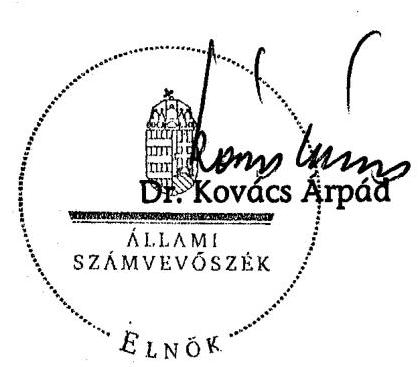

---

MELLÉKLETEK

---

MiniszTERELNÖKI HivatalT VEZETŐ MinisZTER

Ikt.sz.: I-I/1587/2008.

Dr. Kovács Árpád úrnak, az Állami Számvevőszék elnöke

Budapest

Tisztelt Elnök Úr !

A gazdaságfejlesztés állami eszközrendszere működésének ellenőrzéséről készített jelentésre nem teszek észrevételt.

Budapest, 2008. február 26.
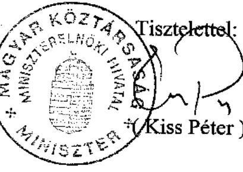

---

# 119512008. 

1.b. sz. melléklet
a V-09-138/2007-2008. sz. jelentéshez

H-1051 BUDAPEST V., JÓZSEP NÁDOR TÉR 2-4. POSTACIM: 1369 BUDAPEST. POSTAFIÓK 481.

TELEFON: (36-1) 327-2159, (36-1) 327-2141
FAX: (36-1) 318-0738

PÉNZÜGYMINISZTER

Dr. Kovács Árpád úr
elnök
Állami Számvevőszék
Budapest

E-MAIL: janos.veres@pm.gov.hu
T5D 10G 12088
$1-00-137 / 2007-06$
Iktatószám: 1370/2008/16
Hiv. szám: V-09-131/2007-2008.
Tárgy: a gazdaságfejlesztés állami eszközrendszere müködésének ellenőrzése
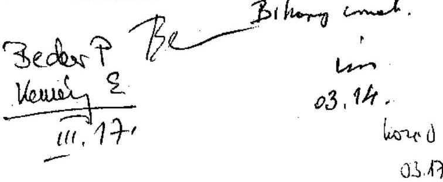

Tisztelt Elnök Úr!

A gazdaságfejlesztés állami eszközrendszere müködésének ellenőrzéséről szóló jelentést köszönettel megkaptam. A jelentés megállapításaira vonatkozóan észrevételt nem teszek.

A pénzügyminiszternek címzett javaslatokkal kapcsolatos intézkedésekről a következő tájékoztatást adom:

1. A teljesítménycélok és -mutatók tervezésével és alkalmazásával kapcsolatos jogszabálymódosítások kidolgozása folyamatban van. A vonatkozó törvényi szabályozás tervezetét a költségvetési szervek jogállásáról és gazdálkodásáról szóló törvénytervezetről szóló előterjesztés tartalmazza, mely jelenleg államigazgatási egyeztetés alatt áll.
2. Az államháztartás információs rendszerének továbbfejlesztésében jelentős lépésnek tartom az európai uniós támogatással megvalósuló Költségvetési Gazdálkodási Rendszer projektjét, mely szintén már beindult.

Felelősségteljes munkájához további sikereket kívánok!

Budapest, 2008. március 11.
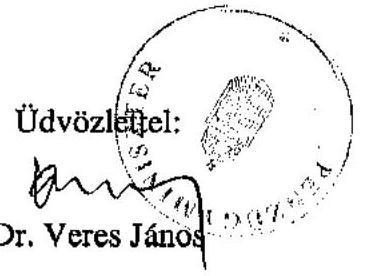

---

# 249/02 

a V-09-138/2007-2008. sz. jelentéshez

## Brhany in.

## GAZDASÁGI ÉS KOZLEKEDÉSI MINISZTÉRIUM

dr. Kovács Árpád
Elnök Úr
Állami Számvevőszék

Budapest

Tisztelt Elnök Úrl

Köszönettel vettem „a gazdaságfejlesztés állami eszközrendszere müködésének ellenőrzéséről" szóió jelentést.

Tájékoztatom, hogy a jelentésre észrevételt nem teszek, egyben köszönöm, hogy munkájukkal hozzájárultak a minisztérium hatékonyabb müködéséhez.

Budapest, 2008. február „24.,

Tisztelettel:
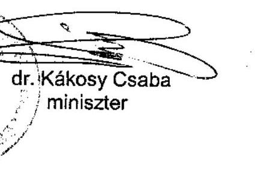

---

# ÖNKORMÁNYZATI ÉS TERŰLETFEJLESZTÉSI MINISZTÉR 

Dr. Kovács Árpád úr
Elnök
Állami Számvevőszék
Budapest
Apáczai Csere János utca 10.
1052
Tárgy: A Gazdaságfejlesztés állami eszközrendszere müködésének vizsgálata

Tisztelt Elnök Úr!
Közsönettel megkaptam a Gazdaságfejlesztés állami eszközrendszere müködésének ellenőrzéséről készített számvevőszéki jelentést. A jelentéssel kapcsolatban további észrevételeket nem kívánok tenni.

Budapest, 2008. február 23.
Tisztelettel:
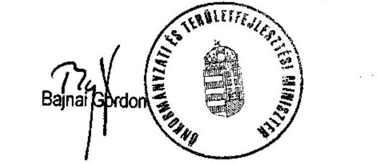

---

# Fejlesztési jellegű államháztartási kiadások* 2004-2006

|  Megnevezés | 2004
tény | 2005
tény | 2006
tény | 2004-2006
összesen | Kiadások
aránya  |
| --- | --- | --- | --- | --- | --- |
|  Strukturális kiadások |  |  |  |  |   |
|  Alapinfrastruktúra | 658,9 | 743,5 | 829,4 | 2231,8 | 48,5\%  |
|  Emberi erőforrás | 289,1 | 328,5 | 362,0 | 979,6 | 21,3\%  |
|  Termelőszektor | 197,1 | 184,9 | 199,8 | 581,8 | 12,6\%  |
|  Egyéb | 50,7 | 99,9 | 68,2 | 218,8 | 4,8\%  |
|  Strukturális kiadások összesen: | 1195,8 | 1356,8 | 1459,4 | 4012,0 | 87,2\%  |
|  Ebből: |  |  |  |  |   |
|  EU forrás | 30,6 | 105,3 | 194,7 | 330,6 | 8,2\%  |
|  Összes hazai kiadás** | 1165,2 | 1251,5 | 1264,7 | 3681,4 | 91,8\%  |
|  Mezőgazdasági fejl.jellegű kiadások |  |  |  |  |   |
|  Strukturális Alapból AVOP | 0,0 | 18,4 | 51,8 | 70,2 | 1,5\%  |
|  SAPARD | 14,9 | 29,7 | 9,2 | 53,8 | 1,2\%  |
|  Nemzeti Vidékfejlesztési Terv | 0,0 | 49,7 | 65,9 | 115,6 | 2,5\%  |
|  PHARE / Átmeneti támogatás | 6,7 | 3,7 | 218,1 | 228,5 | 4,9\%  |
|  Tisztán hazai programok finanszírozása | 62,8 | 32,1 | 28,5 | 123,4 | 2,7\%  |
|  Mezőgazdasági fejl.jell. kiadások összesen: | 84,4 | 133,6 | 373,5 | 591,5 | 12,8\%  |
|  Ebből: |  |  |  |  |   |
|  EU forrás | 12,5 | 80,1 | 297,3 | 389,9 | 65,9\%  |
|  Összes hazai kiadás** | 71,9 | 53,5 | 76,2 | 201,6 | 34,1\%  |
|  Fejl. jell. államháztartási kiadások mindösszesen: | 1280,2 | 1490,4 | 1832,9 | 4603,5 | 100,0\%  |
|  Ebből: |  |  |  |  |   |
|  EU forrás | 43,1 | 185,4 | 492,0 | 720,5 | 15,7\%  |
|  Összes hazai kiadás** | 1237,1 | 1305,0 | 1340,9 | 3883,0 | 84,3\%  |

## Forrás:

a 2004. évi tény adatok a 2005 . évi CXVIII. tv., a 2005. évi tény adatok a 2006. évi XCIX. tv., a 2006. évi tény adatok a 2007.évi CXXXVIII. tv. (az un. zárszámadási törvények) alapján kerültek meghatározásra.

## Megjegyzés:

- A Pénzügyminisztérium az államháztartási kiadásokból a kiadások funkcionális osztályozása és a közgazdasági besorolása szerinti tőke jellegű és egyes folyó kiadások legyűjtésével készítette a kimutatást. **Tartalmazza a hazai társfinanszírozás és a tisztán hazai fejlesztések kiadásait.

---

# A fejlesztési jellegű kiadások aránya az államháztartási kiadásokhoz viszonyítva

|  Kiadás megnevezése | 2004 tény | 2005 tény | 2006 tény | 2007 terv | 2008 terv  |
| --- | --- | --- | --- | --- | --- |
|  Államháztartás összes kiadása ${ }^{(1)}$ | 8631,8 | 9651,2 | 11675,9 | 11824,4 | 12457,7  |
|  Fejlesztési jellegű kiadások ${ }^{(2)}$
Összesen EU+hazai | 1280,2 | 1490,4 | 1832,9 | $1838,1^{(3)}$ | $1908,3^{(3)}$  |
|  Fejlesztési jellegű kiadások aránya az összes kiadáshoz képest (\%) | $14,8 \%$ | $15,4 \%$ | $15,7 \%$ | $15,5 \%$ | $15,3 \%$  |
|  Ebből: |  |  |  |  |   |
|  EU forrás | 43,1 | 185,4 | 492,0 | 555,7 | 790,8  |
|  EU forrás aránya az összes fejlesztési jellegü kiadáshoz | $3,4 \%$ | $12,4 \%$ | $26,8 \%$ | $30,2 \%$ | $41,4 \%$  |
|  Összes hazai forrás | 1237,1 | 1305,0 | 1340,9 | 1282,4 | 1117,5  |

(1) Az államháztartás konszolidált kiadása, adósságtörlesztés és hitelfelvételi kiadások nélkül (2) Tisztán hazai finanszírozású programokra és kötelező társfinanszírozás az Európai Uniós programokhoz (3) A fejlesztési jellegű kiadások közül a mezőgazdasági fejlesztési jellegű kiadások értéke a 2006. évi tény adatok alapján becsült adat

---

# Fejlesztési jellegű, strukturális kiadások előrejelzése 2011-ig*

|  Megnevezés | 2004
tény | 2005
tény |  | 2006
tény |  | 2007
várható |  | 2008
terv |  | 2009
terv |  | 2010
terv |  | 2011
terv |   |
| --- | --- | --- | --- | --- | --- | --- | --- | --- | --- | --- | --- | --- | --- | --- | --- |
|   | Mrd Ft | Mrd Ft | Előző év
\%-ában | Mrd Ft | Előző év
\%-ában | Mrd Ft | Előző év
\%-ában | Mrd Ft | Előző év
\%-ában | Mrd Ft | Előző év
\%-ában | Mrd Ft | Előző év
\%-ában | Mrd Ft | Előző év
\%-ában  |
|  Alapinfrastruktúra | 658,9 | 743,6 | 112,9\% | 829,4 | 111,5\% | 848,4 | 102,3\% | 828,8 | 97,7\% | 727,2 | 87,7\% | 763,7 | 105,0\% | 795,7 | 104,2\%  |
|  Közlekedés** | 487,8 | 557,7 | 114,3\% | 627,7 | 112,6\% | 660,2 | 105,2\% | 506,4 | 76,7\% | 416,7 | 82,3\% | 435,1 | 104,4\% | 452,9 | 104,1\%  |
|  Távközlés | 16,4 | 4,6 | 28,0\% | 3,5 | 76,1\% | 4,7 | 134,3\% | 6,0 | 127,7\% | 6,0 | 100,0\% | 6,1 | 101,7\% | 6,1 | 100,0\%  |
|  Energia | 0,5 | 0,4 | 80,0\% | 0,4 | 100,0\% | 0,2 | 50,0\% | 0,9 | 450,0\% | 0,8 | 88,9\% | 0,7 | 87,5\% | 0,7 | 100,0\%  |
|  Környezetvédelem és vízgazd. | 97,0 | 125,1 | 129,0\% | 134,5 | 107,5\% | 141,2 | 105,0\% | 241,2 | 170,8\% | 235,7 | 97,7\% | 257,5 | 109,2\% | 273,5 | 106,2\%  |
|  Egészségügy | 45,4 | 45,2 | 99,6\% | 56,3 | 124,6\% | 42,1 | 74,8\% | 63,7 | 151,3\% | 62,4 | 98,0\% | 58,7 | 94,1\% | 56,9 | 96,9\%  |
|  Lakhatás | 11,8 | 10,6 | 89,8\% | 7,0 | 66,0\% | 0,7 | 10,0\% | 10,6 | 1514,3\% | 5,6 | 52,8\% | 5,6 | 100,0\% | 5,6 | 100,0\%  |
|  Emberi erőforrás | 289,1 | 328,5 | 113,6\% | 362,0 | 110,2\% | 337,0 | 93,1\% | 381,7 | 113,3\% | 383,6 | 100,5\% | 418,1 | 109,0\% | 486,2 | 116,3\%  |
|  Termelőszektor | 197,1 | 184,9 | 93,8\% | 199,8 | 108,1\% | 183,4 | 91,8\% | 187,9 | 102,5\% | 179,9 | 95,7\% | 194,4 | 108,1\% | 208,8 | 107,4\%  |
|  Ipar | 38,5 | 39,4 | 102,3\% | 42,8 | 108,6\% | 38,9 | 90,9\% | 43,9 | 112,9\% | 45,0 | 102,5\% | 49,0 | 108,9\% | 51,2 | 104,5\%  |
|  Szolgáltatások | 139,3 | 132,4 | 95,0\% | 144,7 | 109,3\% | 135,3 | 93,5\% | 136,6 | 101,0\% | 127,6 | 93,4\% | 138,1 | 108,2\% | 150,3 | 108,8\%  |
|  Turizmus | 19,3 | 13,1 | 67,9\% | 12,3 | 93,9\% | 9,2 | 74,8\% | 7,4 | 80,4\% | 7,3 | 98,6\% | 7,3 | 100,0\% | 7,3 | 100,0\%  |
|  Egyéb | 50,7 | 99,9 | 197,0\% | 68,2 | 68,3\% | 95,0 | 139,3\% | 136,4 | 143,6\% | 147,3 | 108,0\% | 159,7 | 108,4\% | 224,2 | 140,4\%  |
|  Összesen strukturális kiadások: | 1195,8 | 1356,9 | 113,5\% | 1459,4 | 107,6\% | 1463,8 | 100,3\% | 1534,8 | 104,9\% | 1438,0 | 93,7\% | 1535,9 | 106,8\% | 1714,9 | 111,7\%  |
|  Ebből: |  |  |  |  |  |  |  |  |  |  |  |  |  |  |   |
|  EU forrás | 30,6 | 105,4 | 344,4\% | 194,7 | 184,7\% | 258,4 | 132,7\% | 493,5 | 191,0\% | 611,3 | 123,9\% | 718,7 | 117,6\% | 999,7 | 139,1\%  |
|  Összes hazai kiadás: | 1165,2 | 1251,5 | 107,4\% | 1264,7 | 101,1\% | 1205,4 | 95,3\% | 1041,3 | 86,4\% | 826,7 | 79,4\% | 817,2 | 98,9\% | 715,2 | 87,5\%  |

Forrás: a Magyar Köztársaság 2008. évi költségvetéséről szóló 2007. évi CLXIX. tv. alapján, valamint a 2011-ig terjedő kitekintő rész a költségvetési törvényjavaslat szerint.

## Megjegyzés:

**Tartalmazza a PPP konstrukcióban építendő autópályákra fordított kiadásokat is.

---

# Teljesítménymutatók és a hozzá tartozó kritériumok a gazdaságfejlesztés állami eszközrendszere müködésének értékeléséhez 

| Vizsgálati kérdések | Kritériumok és teljesítménymu-   tatók | Adatforrások |
| :--: | :--: | :--: |
| A gazdaságfejlesztés állami eszközrendszerének müködése eredményesen és hatékonyan szolgálta-e a stratégiai célok elérését? |  |  |
| 1. Kialakították-e a gazdaságfejlesztés átfogó feltételrendszerét? |  |  |
| 1.1. Kialakították-e a gazdaságfejlesztés átfogó stratégiáját, a területi, regionális és ágazati stratégiák és ezen belül a gazdaságfejlesztést szolgáló uniós és hazai támogatások, valamint adókedvezmények céljainak és tervezett forrásainak összhangját? | Az átfogó gazdaságfejlesztési stratégia megléte.   A területi és ágazati stratégiák és koncepciók céljainak összhangja. | Átfogó gazdaságfejlesztési stratégia, területi, ágazati stratégiák, koncepciók. |
| 1.2 Kialakították-e a hazai gazdaságfejlesztés jogi szabályozási környezetét? Megteremtették-e a gazdaságfejlesztési célú támogatások (uniós és hazai) és adókedvezmények egységes rendszerben történő tervezésének, hasznosításának és értékelésének szabályozási feltételeit? | A gazdaságfejlesztés hazai jogi szabályozása.   A gazdaságfejlesztési célú támogatások (uniós és hazai) és adókedvezmények hazai és uniós szabályozásának összhangja. | Hazai és uniós szabályozás. |
| 1.3 Kialakították-e folyamatosan fenn-tartották-e a gazdaságfejlesztési célú támogatások (uniós és hazai) és adókedvezmények közvetítésének intézményi feltételeit? | Az intézményrendszer gyakorlati müködésének és jogi szabályozásának összhangja. | Jogszabályok, alapító okiratok, SZMSZ-ek. |
| 1.4. Kialakították és müködtették-e a gazdaságfejlesztési célú támogatások (uniós és hazai) és adókedvezmények tekintetében a tájékoztatás, a nyilvánosság és a partnerség érvényesítési rendszerét? | A tisztán hazai forrásokra és adókedvezményekre vonatkozó szabályozás harmonizáltsága az uniós szabályozással a tájékoztatás, a nyilvánosság és a partnerség területén.   A tájékoztatás, a nyilvánosság és a partnerség elvének gyakorlati érvényesítése. | Hazai és uniós jogszabályok.   Érdekképviseletekkel való együttmüködések dokumentumai, tájékoztatók, hirdetések, felhívások dokumentumai. |
| 2. A gazdaságfejlesztési célú támogatások (uniós és hazai) és adókedvezmények hasznosulása, tervezése és célba juttatásának módja eredményesen és hatékonyan járult-e hozzá a gazdaságfejlesztési célok eléréséhez? |  |  |
| 2.1. A gazdaságfejlesztési célú támogatások (uniós és hazai) és adókedvezmények alkalmazott tervezési gyakorlata segítette-e a területi, | A hosszú távú/éves gazdaságfejlesztési célok összhangja a gyakorlatban elérhető a gazdaságfejlesztési célú támogatásokkal (uniós és hazai) és adó- | Stratégiák, koncepciók, jogszabályok, pályázati felhívások. |

---

|  ágazati gazdaságfejlesztési célok elérését? | kedvezményekkel. | Monitoring nyilvántartások.  |
| --- | --- | --- |
|  2.1.1. Megtervezték-e a gazdaságfejlesztési célú támogatásokkal (uniós és hazai) és adókedvezményekkel elérni kívánt gazdaságfejlesztési célokat? | A terv- tény kedvezmények összhangja. | Jogszabályok, nyilvántartások.  |
|  2.1.2. A pénzügyi terv mellett elkészítették-e a gazdaságfejlesztési célú támogatásokkal (uniós és hazai) és adókedvezményekkel elérni kívánt naturális és horizontális célok output, eredmény és hatás mutatóit is? | A pénzügyi és naturális, illetve a teljesítmény és hatástervezés összhangja. | Jogszabályok, stratégiák, koncepciók.  |
|  2.1.3. Az egyes gazdaságfejlesztési célterületekre összehangoltan és koncentráltan tervezték-e meg a felhasználható támogatások és adókedvezmények körét? | A célok és eszközök koncentrációjának összhangja. | Jogszabályok, stratégiák, költségvetés.  |
|  2.2. A gazdaságfejlesztési célú támogatások (uniós és hazai) és adókedvezmények célba juttatásának alkalmazott gyakorlata hatékonyan szolgálta-e a gazdaságfejlesztési célok teljesítését? | A jogi szabályozásban előírt teljesítési normák betartása a müködés során. | Nyilvántartási, monitoring adatok, jelentések elemzése  |
|  2.2.1. Kialakították, írásban rögzítették és annak megfelelően müködtetik-e az egyes eseti gazdaságfejlesztési célú támogatások (uniós és hazai) és adókedvezmények hozzájárulásának értékelését a kitűzött gazdaságfejlesztési célokhoz? | Pénzügyi naturális és horizontális célok időarányos teljesítési aránya a tervezett értékekhez. | Nyilvántartások, időarányos teljesítési igazolások, elemzések.  |
|  2.2.2. Kialakították, írásban rögzítették és annak megfelelően müködtetik-e az egyes eseti gazdaságfejlesztési célú támogatások (uniós és hazai) és adókedvezmények kiválasztási, jóváhagyási és szerződéskötési rendszerét? | A szabályozás és a gyakorlat összhangja. | Nyilvántartások, időarányos teljesítési igazolások, elemzések.  |
|  2.2.3. Kialakították és müködtetik-e gazdaságfejlesztési célú támogatások (uniós és hazai) és adókedvezmények összehangolási rendszerét? | Támogatásintenzitási maximumok és támogatások összhangja. | Jogszabályok, OTMR  |
|  2.3. Megtervezték és értékelik-e a gazdaságfejlesztési célú támogatások (uniós és hazai) és adókedvezmények célba juttatásának adminisztratív, intézményi költségeit? | Az adminisztratív, intézményi költségek terv-tény adatainak összhangja. | Az intézményfinanszírozás dokumentumai.  |

---

# 3. Kialakították és müködtetik-e a gazdaságfejlesztési célú támogatások (uniós és hazai) és adókedvezmények hasznosulását nyomon követő ellenőrzési, monitoring és értékelési rendszert? 

| 3.1. Kialakították és müködtetik-e a gazdaságfejlesztési célú támogatások (uniós és hazai) és adókedvezmények hasznosulásának ellenőrzési rendszerét? | A támogatások ellenőrzésére vonatkozó uniós standardok. | Jogszabályi előírások, APEH ellenőrzési eljárások, SZMSZ-ek, ellenőrzési kézikönyvek, ellenőrzési tervek, a Belső Ellenőrzés által végzett vizsgálatok dokumentumai. |
| :--: | :--: | :--: |
| 3.2. Létrehozták és müködtetik-e gazdaságfejlesztési célú támogatásokkal (uniós és hazai) és adókedvezményekkel elérni kívánt célok teljesítésének nyomon követését, a terv tény adatok elemzését szolgáló monitoring rendszert? | Pénzügyi naturális és horizontális célok időarányos teljesítési aránya a tervezett értékekhez. | EMIR, IMIR, hazai támogatások monitoring rendszerei, az adókedvezmények alakulására vonatkozó APEH, ill. PM adatok |
| 3.2.1.. Nyomon követik-e a monitoring rendszerben az egyedi támogatás/adókedvezmény szerződésben vállalt kötelezettségek teljesülését és a kívánt gazdaságfejlesztési célok alakulását? | Kialakítottak-e az EMIR-hez hasonló monitoring információs rendszert és vannak-e beépített garanciák a szerződésszegés esetén visszakövetelhető összeg behajtására? | Monitoring rendszer, előrehaladási jelentések |
| 3.2.2. Nyomon követik-e a monitoring rendszerben az egyedi támogatás/adókedvezmény megvalósítását követően a fenntarthatóságra, a tulajdonviszonyok fenntartására stb. a szerződésben vállalt kötelezettségek teljesülését? | A szerződési feltételek és az alkalmazott gyakorlat összhangja. | Monitoring rendszer, időszaki jelentések. |
| 3.3. Készítenek-e elő, közbenső és utólagos, vagy éves elemzéseket az egyes gazdaságfejlesztési célú támogatások (uniós és hazai) és adókedvezmények átfogó értékelésére? | A gazdaságfejlesztési célok és az elért eredmények összhangja. | Értékelési jelentések. |
| 4. A gazdaságfejlesztés állami eszközrendszerének eredményeit bemutató jelentési rendszer segítette-e a stratégiai célok teljesülésének megalapozott számbavételét? |  |  |
| 4.1 Kialakították és müködtetik-e a gazdaságfejlesztési célú támogatások (uniós és hazai) és adókedvezmények alakulásáról beszámoló egységes hazai jelentési rendszert ? | Jogszabályi előírások. | Éves vagy más időszakra vonatkozó rendszeres jelentések.   A tendenciák elemzéséhez készített kimutatás. |
| 4.2. Kialakították és müködtetik-e a gazdaságfejlesztési célú támogatások (uniós és hazai) és adókedvezmények alakulásáról beszámoló uniós jelentési rendszert? | Uniós előírások. | Éves jelentések. |

---

# 6. sz. melléklet 

a V-09-138/2007-2008. sz. jelentéshez

## EUROSTAT jelentés ${ }^{1}$ az EU 27 tagállam GDP alakulásáról és az államháztartási hiányról

|  | 2003 | 2004 | 2005 | 2006 |
| :--: | :--: | :--: | :--: | :--: |
| EU országok (EU13) |  |  |  |  |
| GDP (piaci áron) (millió euro) | 7500988 | 7804371 | 8074684 | 8454544 |
| (millió euro) (millió euro) | -229355 | -219253 | -229355 | -129 171 |
| (GDP \%-ában) | $-3,1 \%$ | $-2,8 \%$ | $-3,1 \%$ | $-1,5 \%$ |
| (millió euro) (GDP \%-ában) | 5186542 69,1 | 5427970 69,6 | 5677221 70,3 | 5801886 68,6 |
| EU országok (EU27) |  |  |  |  |
| GDP (piaci áron) (millió euro) | 10104261 | 10605311 | 11045938 | 11642686 |
| (millió euro) (millió euro) | -312460 | -294997 | -270252 | -188 249 |
| (GDP \%-ában) | $-3,1 \%$ | $-2,8 \%$ | $-2,4 \%$ | $-1,6 \%$ |
| (millió euro) (GDP \%-ában) | 6240795 61,8 | 6588090 62,1 | 6929011 62,7 | 7151270 61,4 |
| Magyarország |  |  |  |  |
| GDP (piaci áron) (millió forint) | 18940742 | 20717110 | 22055093 | 23757230 |
| (millió forint) (millió forint) | -1365187 | -1336355 | -1715713 | -2188165 |
| (millió forint) (GDP \%-ában) | $-7,2 \%$ | $-6,5 \%$ | $-7,8 \%$ | $-9,2 \%$ |
| (GDP \%-ában) | 10981849 | 12296209 | 13582512 | 15592502 |
| (millió euro) (GDP \%-ában) | 58,0 | 59,4 | 61,6 | 65,6 |

Magyarország - miként azt az EUROSTAT jelentése külön szövegesen is kiemeli - negatív rekordot tart a $-9,2 \%$-os GDP arányos államháztartási hiánnyal, mivel az utána következő Olaszország ( $-4,4 \%$ ), Portugália ( $-3,9 \%$ ) és Lengyelország ( $-3,8 \%$ ) adataihoz képest is kiugróan magas ez az érték. A fentiek alapján az EU országoknál a 2006. évben mind a GDP arányos államháztartási hiány, mint a GDP arányos államadósság tekintetében javulási folyamat indult el, miközben Magyarországon tovább romlott ez a két mutató.

[^0]
[^0]:    ${ }^{1}$ Készült: 2007. 10. 22.

---

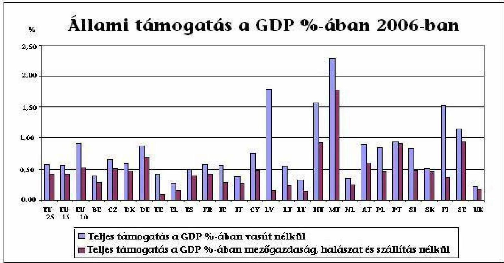

Forrás: EU Bizottság Versenypolitikai Fölgazgatóság

---

# Kivonat   az Országos Fejlesztési Koncepcióból a felkészülés 2007-ig érvényesítendő feladatairól 

## A 2007-ig elvégzendő feladatok:

- átfogó tervezési mechanizmus - a stratégiai szemlélet meghonosítása
- markáns, erős kormányzati koordináció kiépítése
- horizontális/ágazatközi és regionális koordináció
- a miniszteriális szint stratégiai tevékenységének megerősítése
- decentralizációs lépések a fejlesztéspolitikában
- ki kell építeni az új végrehajtási intézményrendszert
- kormányzati és regionális érdekegyeztetési mechanizmus kiépítése, erős partnerség
- az uniós és nemzeti fejlesztéspolitika intézményesített összhangja egységes fejlesztési finanszírozási rendszer
- a tervezés jogszabályi megalapozásának szükségessége
- az első NFT végrehajtási rendszerének áttekintése, a szükséges konzekvenciák levonása.

A Kormány programja a középtávú gondolkodást és a stratégiai tervezés megvalósítását tűzte ki célul. A tervezés az állami irányítás meglehetősen erős eszközévé válhat, ami azt is jelenti, hogy a központi koordináció súlypontja a tervek végrehajtásáról, a támogatási rendszer múködtetéséről áthelyeződne a stratégiai tervezésre. Ennek megalapozására jött létre 2004 őszén a miniszterelnök vezetésével a Fejlesztéspolitikai Kabinet, amely folyamatosan irányítja a tervezést.

---

# 9. sz. melléklet   a V-09-138/2007-2008. sz. jelentéshez 

## Központi költségvetés bevételi szerkezetének alakulása

| Bevételek | 2004. |  | 2005. |  | 2006. |  | 2007. |  |
| :-- | :--: | :--: | :--: | :--: | :--: | :--: | :--: | :--: |
|  | Összege   Mrd Ft | Aránya   $\%$ | Összege   Mrd Ft | Aránya   $\%$ | Összege   Mrd Ft | Aránya   $\%$ | Összege   Mrd Ft | Aránya   $\%$ |
| Gazdálkodó   szervezetek   befizetései | 596,2 | 10,7 | 849,4 | 13,2 | 996,8 | 15,2 | 1131,8 | 17,0 |
| Fogyasztáshoz   kapcsolt adók | 2443,9 | 43,7 | 2524,3 | 39,1 | 2681,2 | 40,9 | 2792,6 | 41,9 |
| Lakosság   befizetése | 894,1 | 16,0 | 1113,0 | 17,2 | 1237,4 | 18,9 | 1387,4 | 20,8 |
| Egyéb bevéte-   lek összesen | 1661,8 | 29.7 | 1970.6 | 30,5 | 1633,7 | 24,9 | 1357,7 | 20,4 |
| Bevételi fö-   összeg | 5596,0 | 100,0 | 6457,3 | 100,0 | 6549,1 | 100,0 | 6669,5 | 100,0 |

A Magyar Köztársaság éves költségvetése végrehajtásáról szóló törvények, valamint a Magyar Köztársaság 2007. évi költségvetéséről szóló tv. alapján

---

10. sz. mellékle a V-09-138/2007-2008. sz. jelentéshez

Az egyedi kormányzati döntésen alapuló támogatások évenkénti alakulása 2004-2007.

|  Vállalat | Helyszín | Támogatás (M HUF) | Munkahely (fó) | 1 új munkahely létesítésének értéke M Ft  |
| --- | --- | --- | --- | --- |
|  2007-ben aláírt támogatási szerződések |  |  |  |   |
|  Robert Bosch Elektronika Kft. | Hatvan (Heves) | 2277,00 | 900 | 2,53  |
|  Samsung Electronics | Jászfényszaru (Jász-Nagykun-Szolnok) | 3600,00 | 1000 | 3,6  |
|  Payer | Ajka (Veszprém megye) | 140,00 | 50 | 2,8  |
|  Denso2 | Székesfehérvár (Fejér) | 653,00 | 1100 | 0,59  |
|  RÁBA | Győr (GYMS) | 142,00 | 52 | 2,73  |
|  Delphi | Balassagyarmat (Nógrád megye) | 126,00 | 51 | 2,47  |
|  Vodafone | Budapest | 1337,00 | 746 | 1,79  |
|  Európai Divat Szolg. Kft. | Pápa (Veszprém) | 900,00 | 600 | 1,5  |
|  Citibank | Budapest | 300 | 302 | 0,99  |
|  Összesen: |  | 9475,00 | 4801 | 1,97  |
|  2006-ban aláírt támogatási szerződések |  |  |  |   |
|  1 | Borsodchem |  |  |   |
|  2 | Linde | Kazincbarcika (BAZ) | 1000,00 | 95  |
|  3 | Bridgestone | Tatabánya (KomáromEsztergom) | 2000,00 | 185  |
|  4 | GSK | Gödöllő (Pest) | 810,00 | 102  |
|  5 | LUK Savaria (Schaeffler) | Debrecen (Hajdú-Bihar), | 1200,00 | 556  |
|  6 | FAG (Schaeffler) | Szombathely (Vas) |  |   |
|  7 | Grundfos | Tatabánya, Székesfehérvár(KomáromEsztergom) | 1960,00 | 667  |
|  8 | Elcoteq | Pécs (Baranya) | 1800,00 | 688  |
|  9 | Zoltek | Nyergesújfalu (KomáromEsztergom) | 2900,00 | 389  |
|  10 | Coloplast | Tatabánya (KomáromEsztergom) | 5000,00 | 1200  |
|  11 | GE | Budapest | 321,00 | 125  |
|  12 | Hartmann | Ács(Komárom) | 320,00 | 110  |
|  13 | Diageo | Budapest | 1154,00 | 302  |
|  14 | SAP | Budapest | 979,00 | 310  |
|  15 | Getronics (Cisco) | Budapest | 1166,00 | 510  |
|  16 | Convergys | Budapest | 350,00 | 282  |
|  17 | EDS | Budapest, Vasvár, Rábahídvég, Miskolc, DélAlföldi régió | 2376,00 | 1150  |
|  18 | IBM II. | Budapest | 490,00 | 245  |
|  19 | Morgan Stanley | Budapest | 1000,00 | 450  |
|   | Összesen |  | 24826,00 | 7366  |

---

|  Vállalat | Helyszín | Támogatás (M HUF) | Munkahely (fó) | 1 új munkahely létesítésének értéke M Ft  |
| --- | --- | --- | --- | --- |
|  2005-ben aláírt támogatási szerződések |  |  |  |   |
|  1 Michelin | Nyíregyháza (SZSZB) | 1450,00 | 217 | 6,7  |
|  2 Hankook Tire | Rácalmás (Fejér) | 15881,00 | 1508 | 10,5  |
|  3 Asahi Glass | Tatabánya (KomáromEsztergom) | 7343,00 | 400 | 18,4  |
|  4 Ibiden1 | Dunavarsány (Pest) | 2142,00 | 700 | 3,1  |
|  5 Suzuki | Esztergom (KomáromEsztergom) | 3500,00 | 400 | 8,8  |
|  6 Alcoa | Székesfehérvár (Fejér) | 2415,00 | 184 | 13,1  |
|  7 IBM | Budapest | 1800,00 | 700 | 2,6  |
|  Összesen |  | 34531,00 | 4109 | 8,4  |

|  2004-ben aláírt támogatási szerződések |  |  |  |  |   |
| --- | --- | --- | --- | --- | --- |
|  Bosch (4 db) |  |  |  |  |   |
|  1 | Bosch Rexroth |  |  |  |   |
|  2 | Robert Bosch Energy and | Miskolc(BAZ), Hatvan |  |  |   |
|   | Bodysystems | (Heves), Eger (Heves) | 3762,00 | 2040 | 1,8  |
|  3 | Robert Bosch Elektronika |  |  |  |   |
|  4 | Robert Bosch Power Tool |  |  |  |   |
|  5 Denso 1 |  | Székesfehérvár (Fejér) | 2800,00 | 1100 | 2,5  |
|  6 Electrolux |  | Nyíregyháza (SZSZB) | 8000,00 | 1050 | 7,6  |
|  7 ExxonMobil |  | Budapest | 3906,00 | 900 | 4,3  |
|   | Összesen |  | 18468,00 | 5090 | 3,6  |

---

# 11. sz. melléklet a V-09-138/2007-2008. sz. jelentéshez 

A társasági adóalanyok által igénybevett adókedvezmények alakulása és megoszlási aránya 2004-2006

| Adókedvezmény | 2004 |  | 2005 |  | 2006 |  |
| :--: | :--: | :--: | :--: | :--: | :--: | :--: |
|  | M Ft | \% | M Ft | \% | M Ft | \% |
| Beruházási adókedvezmények ebből: | 46606 | $92,5 \%$ | 111785 | $92,0 \%$ | 100155 | $88,7 \%$ |
| - elmaradott térségben üzembehelyezett legalább 3 Mrd Ft értékủ termelő beruházás utáni kedvezmény | 11458 | $22,7 \%$ | 12784 | $10,5 \%$ | 15356 | $13,6 \%$ |
| - legalább 10 Mrd Ft értékủ termékelőállítást szolgáló kedvezmény | 35148 | $69,8 \%$ | 99001 | $81,5 \%$ | 84799 | $75,1 \%$ |
| Térségi és egyéb adókedvezmények | 1116 | $2,2 \%$ | 3904 | $3,2 \%$ | 4652 | $4,1 \%$ |
| Kis és középvállalkozások adókedvezménye | 2582 | $5,1 \%$ | 2431 | $2,0 \%$ | 2414 | $2,1 \%$ |
| Fejlesztési adókedvezmény | 86 | $0,2 \%$ | 3358 | $2,8 \%$ | 5664 | $5,0 \%$ |
| Összesen | 50390 | $100 \%$ | 121478 | $100 \%$ | 112885 | $100 \%$ |

APÉH által kitöltött tanúsítványok adatai alapján

---

# 12. sz. melléklet a V-09-138/2007-2008. sz. jelentéshez 

## Beruházási/fejlesztési adókedvezményt igénybevevők költségvetési kapcsolatainak alakulása 2004-2006

|  | 2004 |  | 2005 |  | 2006 |  |
| :--: | :--: | :--: | :--: | :--: | :--: | :--: |
|  | Összes | Mol Nyrt. nélkül | Összes | Mol Nyrt. nélkül | Összes | Mol Nyrt. nélkül |
| Adókedvezmények | 49,44 | 49,44 | 118,93 | 82,43 | 105,82 | 72,82 |
| Támogatások | 17,94 | 17,94 | 5,13 | 5,13 | 14,14 | 14,14 |
| Adókedvezmények és támogatások összesen | 67,38 | 67,38 | 124,06 | 87,56 | 119,96 | 86,96 |
| Költségvetési befizetés APEH-on keresztül | 287,44 | 53,24 | 352,70 | 121,70 | 390,42 | 137,52 |
| Költségvetési befizetés VPén keresztül | 345,22 | 12,52 | 347,97 | 16,67 | 399,94 | 22,54 |
| Költségvetési befizetések összesen | 632,66 | 65,76 | 700,67 | 138,37 | 790,36 | 160,06 |

Az APEH, VPOP által kitöltött tanúsítványok adatai és a MÁK adatai alapján

---

|  Kimutatás
A fejlesztéspolitika megvalósításának koordinálására létrehozott testületekről, bizottságokról |  |  |  |  |   |
| --- | --- | --- | --- | --- | --- |
|  Korm.határozat | Testület, bizottság megnevezése | Testület, bizottság létrehozásának időpontja (év, hó) | Testület, bizottság átalakításának, vagy tervezett átalakításának ideje | Feladata | A testület, bizottság elé terjesztett, általa elfogadott, vagy véleményezett főbb dokumentumok, meghozott döntések  |
|  1064/2006.
(VI. 29.) | Nemzeti Fejlesztési
Tanács (NFT)
Titkárság: Miniszterelnöki
Kabinet | 2006.06 |  | Értékeli a fejlesztéspolitikai célok megvalósulását, nyomon követi az OFK-ban, valamint az NFT-ben rögzített célok teljesülését | Nemzeti szintű stratégiai tervdokumentumok (NAP, OFK, ÜMFT, komplex programok, kiemelt projekt javaslatok)  |
|  1065/2006.
(VI. 29.) | Fejlesztéspolitikai irányító
Testület (FIT)
Titkárság: ÖTM miniszteri kabinet | 2006.06 |  | A fejlesztéspolitika területén hozandó kormányzati döntésekhez, javaslattevő, véleményező, döntés-előkészítő, koordináló szerv. | Nemzeti szintű stratégiai tervdokumentumok (NAP, OFK, ÜMFT, OP-k, AT-k, komplex programok, kiemelt projekt javaslatok  |
|  2171/1999.
(VII.8.) Korm.
határozat | Fejlesztéspolitikai
Koordinációs Tárcaközi
Bizottság (FKTB)
Titkárság: NFÜ FEP | 1999.07 | 2006.06 | Fejlesztéspolitikai tervezés és végrehajtás ágazati és regionális koordinációja | NFT I. stratégia, operatív programok, programkiegészítő dokumentumok; Országos Fejlesztéspolitikai Koncepció (OFK); ágazati és regionális stratégiák, intézményrendszer fejlesztési koncepciók  |
|  1065/2006.
(VI. 29.)
Korm.
határozat | Tervezési Operatív
Bizottsága (TOB)
korábban az FKTB
albizottsága (TAB)
Titkárság: NFÜ FEP | 2002.09 | 2006.06 | Az NFT II. és az OP-okhoz kapcsolódó tervezési, a végrehajtást nyomon követő és értékelő tevékenység megalapozása, a minisztériumokban történő tervezési tevékenység összehangolása, koordinálása | NFT II. - Új Magyarország Fejlesztési Terv (ÜMFT/NSRK), operatív programok (OP), akciótervek (AT)  |
|  1065/2006.
(VI. 29.)
Korm.
határozat | Operatív Program
Tervezési Koordinációs
Bizottság (OPTKB)
Titkárság: NFÜ IH-k | 2006.07 |  | A TOB az NFT II.-höz kapcsolódó egy-egy OP elkészítésére albizottságként OPTKB-t hoz létre. . | Ágazati és regionális operatív programok (OP), akciótervek (AT)  |

---

| 1123/2006 | Európai Koordinációs | 2004. |  | A kormányzati integrációs politika, valamint az európai uniós tagságból fakadó feladatok előkészítésének, végrehajtásának koordinálása és ellenőrzése, továbbá a képviselendő tárgyalási álláspontok előkészítése, kidolgozása és annak meghatározása. Az EKTB főszabály szerint hetente ülésezik, és előkészíti a magyar tárgyalási álláspontokat az Állandó Képviselők Bizottsága (COREPER) és a Miniszteri Tanács soros üléseire, illetve az egyéb tanácsi döntés-előkészítő bizottságok üléseire, valamint áttekinti az európai uniós tagsággal kapcsolatos aktuális kérdéseket. | A heti COREPER I és COREPER II ülések napirendjén szereplő uniós tervezetekre vonatkozó tárgyalási mandátum jóváhagyása. Az uniós döntéshozatali rendben különböző szinteken felmerülő kérdésekre adanadó magyar válaszok kialakítása,Magyarország és az Európai Bíróság között zajló ügyek megvitatása, magyar álláspont elfogadása stb. |
| --- | --- | --- | --- | --- | --- |
|  | határozat |  |  |  |   |

---

# 14. számú melléklet   a V-09-138/2007-2008. sz. jelentéshez 

## Kimutatás

a főbb tervezési dokumentumokról és azok elfogadásának módjáról

| Tervezési dokumentumok   (Az ország társadalmi gazdasági tervei) | Időtáv | Elfogadó   szerv/személy | Elfogadás formája |
| :-- | :-- | :-- | :-- |
| Nemzetpolitikai célok (koncepció)* | Hosszú távú | Az Országgyűlés   javaslata alapján a   köztársasági elnök | Köztársasági elnöki   határozat |
| Gazdaságpolitikai koncepció | Hosszú távú | Orgyágyülés | Ogy.hat. |
| Konvergencia program (stratégia)* | Középtávú | Kormány | Korm. rendelet |
| Éves költségvetés | Rövid távú | Orgyágyülés | Törvény |
| Országos Fejlesztéspolitikai Koncepció | Hosszú távú | Orgyágyülés | Ogy.hat. |
| Nemzeti Fejlesztési Terv* | Középtávú | Orgyágyülés | Törvény |
| Új Magyarország Fejlesztési Terv   (ÜMFT)* | Középtávú | Orgyágyülés | Törvény |
| ÜMFT 2 éves Akciótervei* | Rövid távú | Kormány | Törvény vagy   Korm. rendelet |
| Nemzeti Akcióprogram (NAP)*   (nemzeti válasz a Lisszaboni Stratégiára) | Rövid távú | Kormány | Korm. határozat |
| Fenntartható Fejlődési Stratégia*   (nemzeti válasz a Göteborgi Stratégiára) | Hosszú távú | Orgyágyülés | Ogy.hat. |
| Országos Területfejlesztési Koncepció | Hosszú távú | Orgyágyülés | Ogy.hat. |
| Egyes régiók fejlesztési koncepciói | Hoszú távú | Regionális Fejlesztési   Tanács (RFT) | RFT határozata |
| Egyes régiók stratégiái* | Középtávú | Regionális Fejlesztési   Tanács (RFT) | RFT határozata |
| Egyes régiók cselekvési programjai* | Rövid távú | Regionális Fejlesztési   Tanács (RFT) | RFT határozata |
| Ágazati típusú koncepcók* | Hosszú távú | Kormány | Korm. határozat |
| Ágazati típusú stratégiák* | Közép távú | Miniszter | Miniszteri utasítás |
| Ágazati típusú cselekvési programok* | Rövid távú | Miniszter | Miniszteri utasítás |
| Horizontális típusú koncepciók* | Hosszú távú | Kormány | Korm. határozat |
| Horizontális típusú stratégiák* | Közép távú | Miniszter | Miniszteri utasítás |
| Horizontális típusú cselekvési programok* | Rövid távú | Miniszter | Miniszteri utasítás |

Megjegyzés: a *-gal jelölt tervezési dokumentumok elfogadásának formája csak egy lehetséges koncepció.

Készítette: az ÁSZ Fejlesztési és Módszertani Intézete

---

# A területfejlesztésre vonatkozó jogszabályok ${ }^{1}$ alakulása 

| Támogatások | 2004 | 2005 | 2006 | 2007 |
| :--: | :--: | :--: | :--: | :--: |
| TRFC | 66/2004.   Korm.rend. | 90/2004. (IV. 25) Korm. rendelet |  |  |
| Országos jelentőségű területfejlesztési programok (pl. Balaton, Tisza tó stb.) |  | 75/2004. (IV. 15.) Korm. rendelet |  |  |
| TEKI | 32/1998.   (II.5) Korm.   rendelet | 27/2005. (II.14.)   Korm.rendelet | 295/2005. (XII.   23.)   Korm.rendelet | 12/2007. (II.6.)   Korm.rendelet |
| CÉDE | 9/1998   (I.23.)   Korm.rendel   et |  |  |  |
| TEUT |  |  |  |  |
| TEHU |  |  |  |  |
| LEKI |  |  |  | 12/2007. (II.6.)   Korm.rendelet |
| VIS MAJOR | 9/1998   (I.23.)   Korm.rendel   et | 27/2005. (II.14.)   Korm.rendelet |  |  |
| Turizmus |  | 14/2002. (XI. 16.) MeHVM rendelet |  |  |

Forrás: ÖTM TFF

[^0]
[^0]:    ${ }^{1}$ A regionális fejlesztési tanácsok döntési hatáskörébe utalt fejezeti kezelésű előirányzatok régiók közötti felosztásának elvéről, a régiók forrásairól, a támogatások odaítélésének és felhasználásának szabályairól és a közmunkaprogramok támogatási rendjéről szóló 49/1999. (III. 26.) Korm. rendelet módosításáról szóló 66/2004. (IV. 15.) Korm. rendelet, a terület- és régiófejlesztési célelőirányzat felhasználásának részletes szabályiról szóló 90/2004. (IV. 25.) Korm.rendelet, az országos jelentőségű területfejlesztési programokra szolgáló fejezeti kezelésű előirányzatok felhasználásának részletes szabályairól szóló 75/2004. (IV. 15.) Korm. rendelet, a Turisztikai Célelóirányzat felhasználásának és kezelésének részletes szabályairól szóló 14/2002. (XI. 16.) MeHVM rendelet, a helyi önkormányzatok címzett és céltámogatásának, a céljellegú decentralizált támogatások igénybejelentési, döntéselőkészítési és elszámolási rendjéről, valamint a Magyar Államkincstár finanszírozási, elszámolási és ellenőrzési feladatairól, továbbá a Magyar Államkincstár Területi Igazgatóságai feladatairól szóló 9/1998. (I. 23.) Korm. rendelet, a területi kiegyenlítést szolgáló fejlesztési célú támogatások felhasználásának részletes szabályairól szóló 32/1998. (II. 25.) Korm. rendelet, a decentralizált helyi önkormányzati fejlesztési támogatási programok előirányzatai, valamint a vis major tartalék felhasználásának részletes szabályairól szóló 27/2005. (II. 14.), 295/2005. (XII. 23.) és a 12/2007. (II. 6.) Korm. rendeletek.

---

Az OTMR-ben évenként lekérdezett 100 legnagyobb támogatott projekt megoszlása

|   | 2004. | 2005. | 2006. | 2007.  |
| --- | --- | --- | --- | --- |
|  1. Belföldi természetes magánszemély |  |  |  |   |
|  2. Mikrovállalkozás |  |  | 1 | 1  |
|  3. Kisvállalkozás |  |  | 3 | 3  |
|  4. Középvállalkozás |  | 3 | 5 | 21  |
|  5. Támogatási szempontból kedvezmé-
nyezett és az 1-4. kategóriákba nem
tartozó vállalkozás | 8 | 3 | 16 | 20  |
|  6. Nonprofit szervezet államháztartáson
belül | 87 | 93 | 72 | 39  |
|  7. Nonprofit szervezet államháztartáson
kivül | 5 | 1 | 3 | 16  |
|  Összesen: | 100 | 100 | 100 | 100  |

---

# A strukturális alapok végrehajtásának helyzete az EMIR 2007. november 9-i adatai alapján 

| Ssz. | Megnevezés | Aktuális állapot 2007. 11. 09-én |  |  |  |  |  |  |
| :--: | :--: | :--: | :--: | :--: | :--: | :--: | :--: | :--: |
|  |  | AVOP | GVOP | HEFOP | KIOP | ROP | Össz. | ME |
| 1. | Beérkezett pályázatok | 11159 | 21348 | 6051 | 375 | 2307 | 41240 | db |
| 2. | Igényelt támogatás | 183259 | 340206 | 411014 | 265591 | 344537 | 1544607 | mFt |
| 3. | IH által támogatott | 5983 | 10891 | 2676 | 191 | 761 | 20502 | db |
| 4. | Megítélt támogatás | 118337 | 176307 | 196903 | 117310 | 124971 | 733828 | mFt |
| 5. | Hatályos szerződések | 4641 | 9756 | 2250 | 181 | 758 | 17586 | db |
| 6. | Hatályos szerződések | 108772 | 161313 | 190260 | 116701 | 125555 | 702601 | mFt |
| 7. | Kifizetett összeg | 85789 | 106645 | 118696 | 83290 | 84166 | 478586 | mFt |
| 8. | Kifizetések száma | 3893 | 7536 | 1853 | 158 | 724 | 14164 | db |
| Operatív programok szerinti (tervezett) pénzügyi keretek |  |  |  |  |  |  |  |  |
| ezer euro-ban |  | 422836 | 606448 | 750430 | 440294 | 475984 | 2695992 |  |
| Millió Ft-ban* |  | 105286 | 151006 | 186857 | 109633 | 118520 | 671302 |  |
| A tényadatok alakulása a tervezetthez képest |  |  |  |  |  |  |  |  |
| 2. | Igényelt támogatás | 176,06 | 225,29 | 219,96 | 242,25 | 290,70 | 230,09 | \% |
| 4. | Megítélt támogatás | 112,40 | 116,76 | 105,38 | 107,00 | 105,44 | 109,31 | \% |
| 6. | Hatályos szerződések | 103,31 | 106,83 | 101,82 | 106,45 | 105,94 | 104,66 | \% |
| 7. | Kifizetett összeg | 81,48 | 70,62 | 63,52 | 75,97 | 71,01 | 71,29 | \% |

Forrás: EMIR nyilvános adatok, az operatív program-dokumentumok angol nyelvű változatai, mivel a hiteles magyar nyelvű változatot az NFÜ honlapjára 2004. év óta nem tették fel. *Az árfolyamot a 2008. évi PM tervezési körirat szerinti $249 \mathrm{Ft} /$ euro árfolyamon számoltuk.

---

1. sz. melléklet a V-09-138/2007-2008. sz. jelentéshez

Összes igénybevett adókedvezmény megoszlása megyei bontásban

|   | 2004 |  | 2005 |   |
| --- | --- | --- | --- | --- |
|   | M Ft | Összesenhez
viszonyatott
aránya (\%) | M Ft | Összesenhez
viszonyatott
aránya (\%)  |
|  Budapest és Pest megye együtt | 28008,74 | 55,59\% | 91135,97 | 75,02\%  |
|  Komárom-Esztergom | 7240,66 | 14,37\% | 9143,54 | 7,53\%  |
|  Hajdú-Bihar | 4572,46 | 9,07\% | 7625,18 | 6,28\%  |
|  Borsod-Abauj-Zemplén | 2448,23 | 4,86\% | 2440,39 | 2,01\%  |
|  Szabolcs-Szatmár-Bereg | 1943,15 | 3,86\% | 1021,31 | 0,84\%  |
|  Jász-Nagykun-Szolnok | 1930,29 | 3,83\% | 2025,39 | 1,67\%  |
|  Fejér | 1440,71 | 2,86\% | 3982,99 | 3,28\%  |
|  Győr-Moson-Sopron | 883,41 | 1,75\% | 868,36 | 0,71\%  |
|  Heves | 779,43 | 1,55\% | 1977,49 | 1,63\%  |
|  Nógrád | 236,61 | 0,47\% | 175,17 | 0,14\%  |
|  Békés | 202,42 | 0,40\% | 413,28 | 0,34\%  |
|  Bács-Kiskun | 149,73 | 0,30\% | 144,70 | 0,12\%  |
|  Csongrád | 103,84 | 0,21\% | 101,07 | 0,08\%  |
|  Veszprém | 97,99 | 0,19\% | 104,40 | 0,09\%  |
|  Vas | 87,68 | 0,17\% | 67,29 | 0,06\%  |
|  Zala | 78,09 | 0,15\% | 69,94 | 0,06\%  |
|  Baranya | 71,29 | 0,14\% | 78,68 | 0,06\%  |
|  Somogy | 60,60 | 0,12\% | 50,41 | 0,04\%  |
|  Tolna | 54,49 | 0,11\% | 53,37 | 0,04\%  |
|  Összesen: | 50389,82 | 100,01\% | 121478,93 | 100,00\%  |

APEH tanúsítványok adatai alapján

---

# A ROP első két prioritásának alakulása a prioritás indikátorok alakulása tükrében 

(Forrás: ROP 2006. évi éves jelentés)

1. Prioritás: Turisztikai potenciál erősítése a régiókban
1.1. Intézkedés: Turisztikai vonzerők fejlesztése

| Típus | Mutató |  | Célkitúzés   (2008) | Tényadat |
| :--: | :--: | :--: | :--: | :--: |
|  | Meghatározás | Mértékegység |  |  |
|  | A támogatás hatására   létrejött munkahelyek száma | db | $50-200$ | 22 |
|  | A támogatás hatására   létrejött munkahelyek száma   a 4 legfejletlenebb régióban | db | $30-140$ | 15 |
|  | A támogatott turisztikai   vonzerők látogatói számának   változása | $\%$ | $8-12 \%$   növekedés | $12,24 \%$ |
|  | Támogatott turisztikai   vonzerők száma | db | $42-55$ | 48 |

1.2. Turisztikai fogadóképesség javítása

| Típus | Mutató |  | Célkitúzés   (2008) | Tényadat |
| :--: | :--: | :--: | :--: | :--: |
|  | Meghatározás | Mértékegység |  |  |
|  | A támogatás hatására létrejött   munkahelyek száma | db | $1200-1800$ | 73 |
|  | A támogatás hatására létrejött   munkahelyek száma a 4   legfejletlenebb régióban | db | $700-1300$ | 23 |
|  | A támogatott szálláshely vagy   szolgáltatás igénybevevői   számának változása | $\%$ | $6-10 \%$   növekedés | $13,15 \%$ |
|  | A vendégéjszakák számának   változása a támogatott   turisztikai projektekben | $\%$ | $6,5-12,5 \%$ | $165,08 \%$ |
|  | Támogatott kis- és   középvállalkozások száma | db | $200-250$ | 70 |
|  | Támogatott projektek száma | db | 60 | 85 |

2. Prioritás: Térségi infrastruktúra és települési környezet fejlesztése
2.1. Hátrányos helyzetú régiók és kistérségek elérhetőségének javítása

---

|  | Mutató |  |  |  |
| :-- | :-- | :--: | :--: | :--: |
| Típus | Meghatározás | Mértékegység | Célkitüzés (2008) | Tényadat |
|  | Az elérési idők változása a   támogatott területeken | $\%$ | $10 \%$ csökkenés | $5 \%$ |
|  | Utak építésével vagy felújításával   közvetlenül érintett települések   összlakossága | fő | $300000-400000$ | 426237 |
|  | A fejlesztett viszonylatok átlagos   napi forgalma | fő | $300000-400000$ | 112667 |
|  | A megépített vagy felújított négy-   és ötszámjegyű állami vagy az   ezekkel azonos funkciójú   önkormányzati utak hossza | km | $120-160$ | 245,74 |
|  | Az ipari területekhez vagy   turisztikai vonzerőkhöz vezető   megépített vagy felújított utak   hossza | km | $40-60$ | 10,22 |
|  | A támogatott tömegközlekedési   projektek száma | db | $20-30$ | 18 |

2.2. Intézkedés: Városi területek rehabilitációja: város-, és barnamezős rehabilitáció Az intézkedés céljainak teljesülése:

|  | Mutató |  |  |  |
| :-- | :-- | :--: | :--: | :--: |
| Típus | Meghatározás | Mértékegység | Célkitüzés   (2008) | Tényadat |
|  | A rehabilitált városi terület lakossága | fő | $250000-$   400000 | 81218 |
|  | A támogatás hatására létrejött   munkahelyek száma | db | $305-500$ | 167 |
|  | A támogatás hatására létrejött   munkahelyek száma a 4 legfejletlenebb   régióban | db | $200-350$ | 63 |
|  | A rehabilitált városi területek nagysága | $\mathrm{m}^{2}$ | $10000000-$   12000000 | 3836825 |
|  | A rehabilitált barnamezős területek   nagysága | $\mathrm{m}^{2}$ | $3000000-$   5000000 | 0 |
|  | A rehabilitált városi területek száma | db | $35-55$ | 32 |
|  | A rehabilitált barnamezős területek száma | db | $5-20$ | 4 |

2.3. Intézkedés: Az óvodai és alapfokú nevelési-oktatási intézmények infrastrukturális fejlesztése Az intézkedés céljainak teljesülése:

|  | Mutató |  |  |  |
| :-- | :-- | :--: | :--: | :--: |
| Típus | Meghatározás | Mértékegység | Célkitüzés   (2008) | Tényadat |
|  | A támogatott óvodai intézmények   ellátottainak száma | fő | $2500-3000$ | 1.729 |
|  | A támogatott alapfokú nevelési-   oktatási intézmények tanulóinak száma | fő | $18000-22000$ | 8.880 |
|  | A támogatás hatására létrejött   munkahelyek száma a 4 legfejletlenebb   régióban | db | $120-200$ | 59 |
|  | A támogatott óvodai és alapfokú   nevelési- oktatási intézmények száma   a hátrányos helyzetű térségekben és   településeken (64/2004. (IV. 15.)   Korm. Rendelet alapján) | db | $70-90$ | 128 |
|  | A támogatott óvodai intézmények   száma | 40-50 | 63 |  |
|  | A támogatott alapfokú nevelési-   oktatási intézmények száma | 50-60 | 91 |  |

---

# Turisztikai régiók 

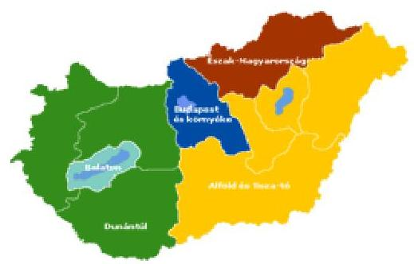

Budapest és környéke
Balaton
Alföld és Tisza-tó
Dunántúl
Észak-Magyarország

---

F Ü G G E L É K E K

---

1. sz. függelék a V-09-138/2007-2008. jelentéshez

# Az önkéntes válaszadók vélemény-felmérésének eredményei a gazdaságfejlesztésről

---

# Az önkéntes válaszadók vélemény-felmérésének eredményei a gazdaságfejlesztésről 

## 1. A VÉLEMÉNY-FELMÉRÉS VÁLASZAINAK ÖSSZEFOGLALÓ ÉRTÉKELÉSE

A gazdaságfejlesztés állami eszközrendszere múködésének ellenőrzéséhez kapcsolódóan önkéntes alapú vélemény-felmérés végrehajtását is tartalmazta az ellenőrzési program. A Nemzeti Fejlesztési Terv időarányos végrehajtásához kapcsolódóan 2006-ban elvégzett vélemény-felmérés módszertani tapasztalatait hasznosítva, jelen vélemény-felmérést is elektronikusan kiküldött és az önkéntes válaszok formájában beérkező e-mailos levelezés keretében bonyolítottuk le.

A felmérés célja az volt, hogy - önkéntes válaszadás keretében - felmérjük és értékeljük a támogatásokat és adókedvezményeket igénylők, ill. igénybe vevők véleményét az ellenőrzött terület múködéséről. A vélemények megismerésére kérdőívet dolgoztunk ki (1. sz. melléklet), amelyet az NFÜ-től kapott címlistára kísérőlevél (2. sz. melléklet) mellékleteként küldtük ki. A válaszadók az ÁSZ levelezési rendszerében külön erre a célra kialakított címre küldhették vissza a kitöltött kérdőívet.

Az összes válaszadó véleményének feldolgozása alapján az alábbi összefoglaló következtetések vonhatók le:

- A válaszadók véleménye szerint a támogatási rendszer területén (uniós és hazai források) kedvezőbb az összhang a gazdaságfejlesztési célokkal és szükségletekkel, mint az adó- és járulékfizetési rendszer és kedvezményeinek összhangja a meghirdetett gazdaságfejlesztési célokkal.
- A támogatást kapott válaszadók elégedettsége a támogatásigénylés és felhasználás részfolyamataiban eltérő értékeket mutat. Magasabb az elégedettség a pályázati információk hozzáférhetősége (3,91-es elégedettség) és a támogatási célok megismerhetősége (3,89-es elégedettség) területein.

Az elégedettség hiánya a támogatási folyamat túlzott időigényét jelentő fázisaiban és az elszámolások terén mutatkozik. Ilyen például a döntés és szerződéskötés elhúzódása (2,3-es elégedettség), vagy a részkifizetések folyamata (2,34-es elégedettség), illetve a teljes támogatási összeg elszámolásának folyamata (2,52-es elégedettség).

A támogatást kapott válaszadók elégedettségi értékei szerint a támogatási folyamat egyik tényezője sem érte el a „jó" minősítést, ami a folyamatellátás továbbfejlesztésének szükségességére mutat rá.

- A támogatásban részesült válaszadók 4\% ponttal magasabb arányban minősítették abszolút korrupciómentesnek az uniós (80\%) támogatásokat a tisztán hazai (76\%) támogatásoknál. A témával való foglalkozás kiemelt szükségességét mutatja, hogy a válaszadók 20\%-a az uniós, il-

---

letve $24 \%$-a a hazai forrású támogatások esetében valamilyen szintű korrupcióra utaló jelenséget vélelmezett és azt minősítette válaszában.

- A vélemény-felmérés eredménye visszatükrözi az ellenőrzési jelentés azon megállapítását, hogy a társasági adókedvezmények jelenlegi rendszerével csak kevesen tudnak élni.
- A válaszadók $82 \%$ szerint közepes, illetve annál rosszabb a támogatások és az adó- és járulékkedvezmények összhangja növekedési és foglalkoztatási célokkal.

# 2. A VÉLEMÉNY-FELMÉRÉS MÓDSZERE ÉS VÉGREHAJTÁSA 

A vélemény-felmérésre a hatályos törvények biztosítanak lehetőséget az Állami Számvevőszék részére ${ }^{1}$. A kérdések összeállításában figyelembe vettük a Magyar Kereskedelmi és Iparkamara, a Munkaadók és Gyáriparosok Országos Szövetsége, a Vállalkozók és Munkáltatók Országos Szövetsége és a Magyar Közgazdasági Társaság javaslatait is.

Az elektronikus e-mail keretében kiküldött kérdőívre beérkezett válaszok értékelését számítógépes összesítés adatai alapján végeztük úgy, hogy a megállapításokat elsődlegesen az összes válasz adatainak felhasználásával tettük meg, de bemutatásra kerültek az átlagostól eltérő kedvező, illetve kedvezőtlen jellegű vélemények is.

A címlista felülvizsgálata után (hibás címek, ismétlődések szűrése) 4213 címre küldtük ki 2007. december 7-én a leveleket és a kérdőívet. A válaszokat 2007. december 15 -ig vártuk. Összesen 297 db olyan kitöltött kérdőív érkezett vissza, amelyek teljes körűen értékelhetőek voltak. A válaszadási arány 7,5\%-os volt, ami megfelel a megkeresés módszerének és a válaszadás hangsúlyozottan önkéntes jellegének. A válaszok mennyiség elegendő nagyságú volt az értékelés elvégzéséhez.

A megkérdezést zárt, többváltozós, direkt kérdéseket tartalmazó önkitöltő kérdőívre adott, vélemény (preferencia) jellegű válaszadással végeztük. A kitöltéssel kapcsolatos kérdésekre telefonon, illetve e-mailben válaszoltunk.

A megkérdezés az e-mail címes elérhetőség miatt, az ezzel rendelkezők körére terjedt ki. A válaszadás önkéntes volt. A válaszokat titkosan kezeltük és csak aggregált adatok formájában dolgoztuk fel, illetve értékeltük azokat.

[^0]
[^0]:    ${ }^{1}$ Az Állami Számvevőszékről szóló 1989. évi XXXVIII. törvény 16. §-ának (1) bekezdése, 18. §-ának (1) bekezdése, a 21. §-ának (1) és (3) bekezdései, a 21/A. §-ának (1) bekezdése, valamint a személyes adatok védelméről és a közérdekú adatok nyilvánosságáról szóló 1992. évi LXIII. törvény 30. §-ának d) és f) pontjai.

---

A kérdőív összeállításánál abból indultunk ki, hogy a pályázók összessége nem homogén csoport. Ezért a kérdőív elején - a foglalkoztatottak száma alapján a válaszadók nagyság szerinti besorolását végeztük el.

# A kérdőív a következő főbb kérdéscsoportokat tartalmazta: 

- a gazdaságfejlesztési célú támogatások és szükségletek egybeesésének véleményezése, illetve a tényleges igénylők véleményének beépítése a támogatási rendszerbe (1. és 2. sz. kérdések);
- az elégedettség mérése a támogatási rendszer folyamatairól (3. és 4. sz. kérdések);
- a támogatási rendszerben tapasztalt korrupció minősítése (5. sz. kérdés);
- a támogatás-felhasználás elmaradásának indokai (6. sz. kérdések);
- az adó- és járulékfizetési rendszer és kedvezményeinek összhangja a meghirdetett gazdaságfejlesztési célokkal és a társasági adókedvezmények hatása a válaszadó vállalkozására (7. és 8. sz. kérdések);
- a társasági adókedvezmények igénybevételének, illetve az igénybevétel akadályának elemzése (9., 10. és 11. sz. kérdések);
- a támogatások és az adó- és járulékkedvezmények összhangjának értékelése a növekedési és foglalkoztatási célokkal (12. sz. kérdés).

A kérdőívet úgy szerkesztettük, hogy az előre tervezett kombinatív elemzéshez szükséges kérdéseket tartalmazzák és az elérni kívánt cél minimális számú kérdés megválaszolásával legyen elérhető.

A megkérdezések szubjektív minőségi ismérvekre (vagyis nem megszámolható mennyiségi adatokra) vonatkoznak. A skálakérdéseknél - ahol a válasz valamilyen vélemény, tapasztalat vagy tényező intenzitására vonatkozik - a válasz lehetőségek fokozatosan vannak felépítve.

Az ügyfél elégedettség színvonalát öt fokozatú - 1, 2, 3, 4, és 5-ös számjegyekkel jelölt - skála által állapítottuk meg, az elégedetlentől az elégedett felé haladva.

A kérdések többségére egy válasz volt adható. Két- vagy több válasz a - nem skálafokozatú - felsorolás jellegű kérdéseknél volt lehetséges. A kérdések zártak. Kiemelt figyelmet fordítottunk a kérdések érthető nyelvezetére, szabatos, egyértelmú megfogalmazására, továbbá, hogy minden lehetséges válasz besorolható legyen a kategóriák valamelyikébe.

A válaszok befolyásolásának elkerülése érdekében döntő fontosságúként kezeltük a kérdések irányultságánál a semlegesség, a pártatlanság és a kiegyensúlyozottság követelményének érvényesítését.

A kérdőívek kiküldését és a beérkezett válaszok feldolgozását informatikus szakértő bevonásával végeztük.

---

A válaszokat számítógépes táblázatok eredményei alapján értékeltük. A lehetséges válaszokra érkezett válaszokat darabszám szerint összegeztük, majd meghatároztuk százalékos megoszlásukat, illetve szükség szerint súlyozott átlagukat. Az önkéntes válaszok aggregált adatait a kérdésekkel összevetve értékeltük ki.

# 3. A VÉLEMÉNY-FELMÉRÉS VÁLASZAINAK ÉRTÉKELÉSE 

## A válaszadók nagyság szerinti megoszlása

A válaszadók 93\%-a KKV volt és 7\% volt a 250 fő foglalkoztatottat meghaladók aránya. A válaszadók foglalkoztatottak szerinti megoszlását, azon belül a közepes, kis és mikro vállalkozások arányát az 1. sz ábra mutatja.

1. sz. ábra

A kérdőívre válaszoló cégek összetétele létszámnagyaság szerint
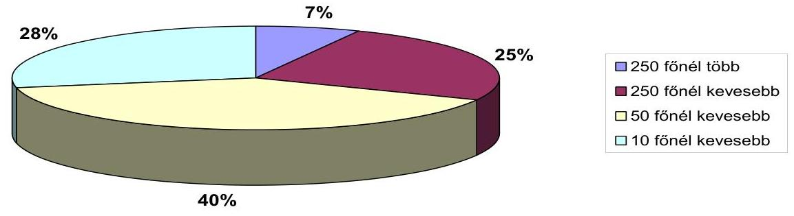

A megkérdezettek véleménye a valós szükségletek és az elérhető uniós és hazai támogatási források összhangjáról, valamint a tervezés során tett javaslataik hasznosulásáról

A válaszadók 65\%-a szerint az elérhető támogatási források átlagosan (közepes) mértékben esnek egybe a hazai valós gazdaságfejlesztési szükségletekkel. $8 \%$-uk szerint teljes az egybe esés és $15 \%$-uk pedig ennek hiányát vélelmezi. A vélemények megoszlását a 2. sz. ábra szemlélteti.

---

2. sz. ábra

Hazai és uniós támogatások céljainak és forrásainak egybeesése a gazdaságfejlesztési célokkal és szükségletekkel
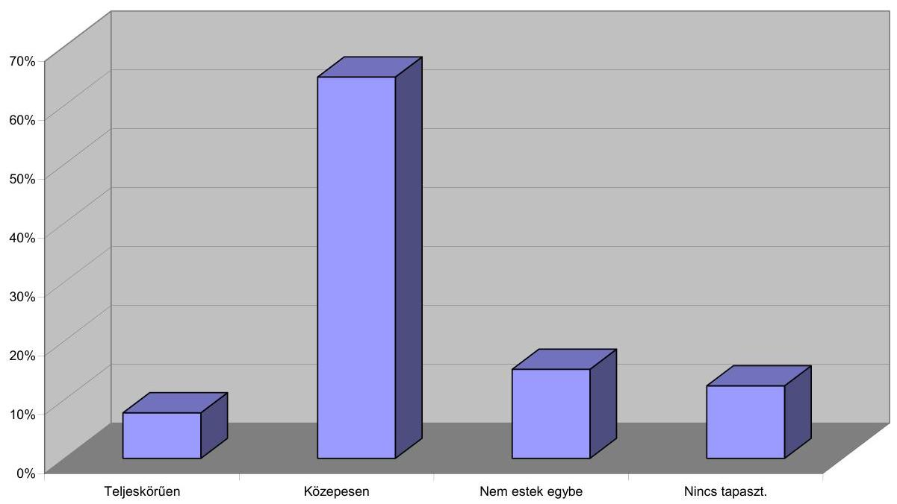

A válaszadók 78\%-a a tisztán hazai forrású támogatások esetében a „nem" választ adta arra a kérdésre, hogy a támogatások rendszerének tervezése során kikérték és hasznosították-e javaslatait. Ezzel szemben 22\% választotta az „igen" válasz lehetőségét. Az uniós forrású támogatások esetében még kedvezőtlenebb, $82 \%$ „nem" és $18 \%$ az „igen" válaszok aránya.

# Az elégedettség mérése a támogatási rendszer folyamatairól 

A válaszadók 72\%-a kapott és használt fel támogatást a 2004-2007-es időszakban. A támogatásban részesülők $77 \%$-a kapott tisztán uniós forrású, $68 \%$ tisztán hazai forrású támogatást. A támogatásban részesülő válaszadók $45 \%$ részesedett mindkét rendszer támogatásában.

A támogatást kapott válaszadóknak a támogatásigénylési és felhasználási folyamatok (uniós és hazai) egyes fázisaihoz, illetve a hasznosuláshoz kapcsolódó elégedettség megoszlását szemlélteti a 3. ábra. Az 1= legrosszabbtól az 5=legjobbig terjedő skálán az elégedettség súlyozott átlag szerinti rangsorát pedig a 4. ábra mutatja.

---

3. sz. ábra
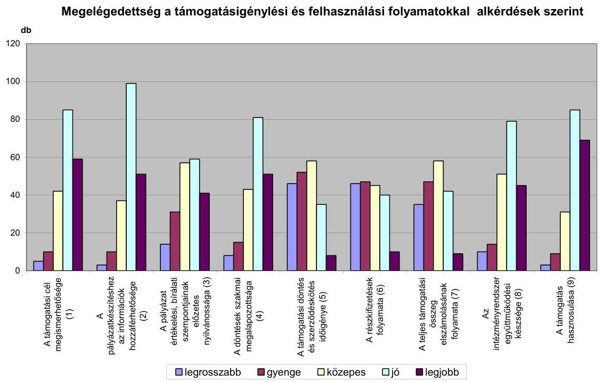

A válaszadóknak a támogatás hasznosulására utaló 4,04-es elégedettsége szükségszerű, hiszen ez a pályázatokban is szereplő támogatási célok realizálását igazolja vissza. Az elégedettség hiánya a támogatási folyamat túlzott időigényét jelentő fázisaiban és az elszámolások terén mutatkozik. Ilyen például a döntés és szerződéskötés elhúzódása (2,3-es elégedettség), vagy a részkifizetések folyamata (2,34-es elégedettség), illetve a teljes támogatási összeg elszámolásának folyamata (2,52-es elégedettség). A minősítésben - a hasznosuláson kívül - a legjobb elégedettséget a támogatási cél megismerhetősége (3,89-es elégedettség) és a pályázatkészítéshez szükséges információk hozzáférhetősége (3,91es elégedettség) kapta, ugyanakkor már kevésbé voltak elégedettek a döntések szakmai megalapozottságával (3,73-as elégedettség), az intézményrendszer együttműködési készségével (3,63-as elégedettség) és a pályázat értékelési, bírálati szempontjainak előzetes nyilvánosságával (3,34-es elégedettség). Az elégedettségi eredmények rámutatnak, hogy a hasznosulás mellett egyetlen további tényező sem érte el a „jó" elégedettségi minősítést.
4. sz. ábra

| A 4. kérdés alkérdései | súlyozott átlag   1-5 pont között |
| :-- | :--: |
| A támogatás hasznosulása (9) | 4,04 |
| A pályázatkészítéshez az információk hozzáférhetősége (2) | 3,91 |
| A támogatási cél megismerhetősége (1) | 3,89 |
| A döntések szakmai megalapozottsága (4) | 3,73 |
| Az intézményrendszer együttmüködési készsége (8) | 3,63 |
| A pályázat értékelési, bírálati szempontjainak elözetes nyilvánossága (3) | 3,34 |
| A teljes támogatási összeg elszámolásának folyamata (7) | 2,52 |
| A részkifizetések folyamata (6) | 2,34 |
| A támogatási döntés és szerződéskötés időigénye (5) | 2,30 |

---

# A támogatási rendszerben tapasztalt korrupció minősítése 

A támogatásban részesült válaszadók 80\%-a a tisztán uniós, 76\%-a pedig a tisztán hazai forrású támogatások esetén abszolút semmilyen korrupcióra utaló jelet nem tapasztalt. Ugyanakkor a témával való foglalkozás kiemelt szükségességét mutatja, hogy a válaszadók 20\% az uniós és 24\% a hazai forrású támogatások esetében valamilyen szintű korrupcióra utaló jelenséget vélelmezett és azt minősítette válaszában. A válaszoknak az „abszolút nincs" és az „igen erős" 5 fokozatú skála szerinti megoszlását szemlélteti az 5. sz. ábra.
5. sz. ábra

A korrupció megítélése a válaszadók részéről
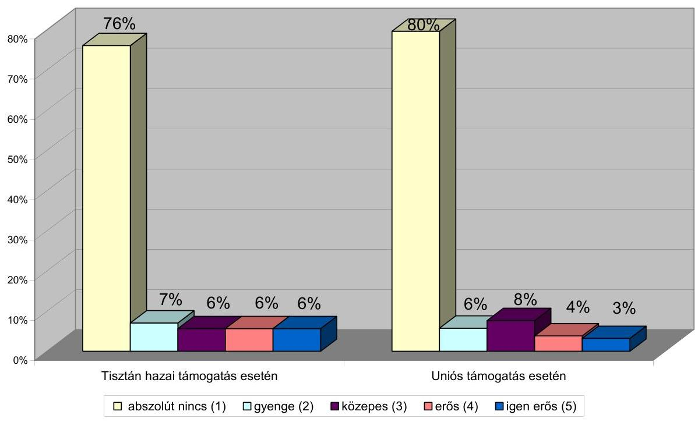

## A támogatás-felhasználás elmaradásának indokai

Azok a válaszadók, akik nem részesültek támogatásban (az összes válaszadó 28\%-a) a válaszban felsorolt indoklást a támogatás elmaradásának magyarázatára, a következő megoszlásban jelölték meg:

- 32\%-uk szeretett volna igényelni, de nem talált számára megfelelő támogatást,
- 28\%-uk a meghirdetett támogatási feltételeket nem tudta teljesíteni,
- 23\%-uk igényelt, de pályázatukat elutasították,

---

- $17 \%$-uk nem is szándékozott igényelni, mert
- $19 \%$-uk szerint nem volt szüksége a támogatásra,
- $81 \%$-uk pedig nem pályázott, mert az igénylés adminisztratív nehézségei és költségei elriasztották ettől.

# Az adó- és járulékfizetési rendszer és kedvezményeinek összhangja a meghirdetett gazdaságfejlesztési célokkal és a társasági adókedvezmények hatása a válaszadó vállalkozására 

A válaszadók 33\%-ának véleménye szerint adó- és járulékfizetési rendszer és kedvezményeinek semmilyen összhangját nem tapasztalják a meghirdetett gazdaságfejlesztési célokkal. 30\%-uk szerint gyenge (közepesnél rosszabb), $33 \%$-uk szerint pedig közepes az összhang, tehát az összes válaszadó $96 \%$-a közepesnek, vagy annál gyengébbnek jelölte meg az összhangot az adórendszer és a gazdaságfejlesztés célrendszere között. A válaszadók csupán 4\%-a minősítette jónak ezt az összhangot. A „teljes összhangot" egyetlen válaszadó sem jelölt meg. A megoszlást a 6. sz. ábra szemlélteti.
6. sz. ábra

A hazai adó- és járulékrendszer, kedvezményeik és a gazdaságfejlesztési célok rendszerének összhangja
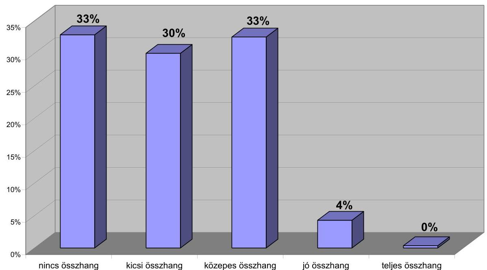

Az a társasági adókedvezmények hatása a válaszadók vállalkozására 16\% szerint teljesen negatív, $25 \%$ szerint közepesnél rosszabb és $42 \%$ szerint közepes összhatást gyakorol. Jó hatást $15 \%$ jelölt meg és a válaszadók $2 \%$ szerint „teljesen pozitív" összhatást gyakorolnak a társasági adókedvezmények a vállalkozásukra.

---

7. sz. ábra

A társasági adóalapot módosító tételekösszhatása a vállalkozás fejlesztésére
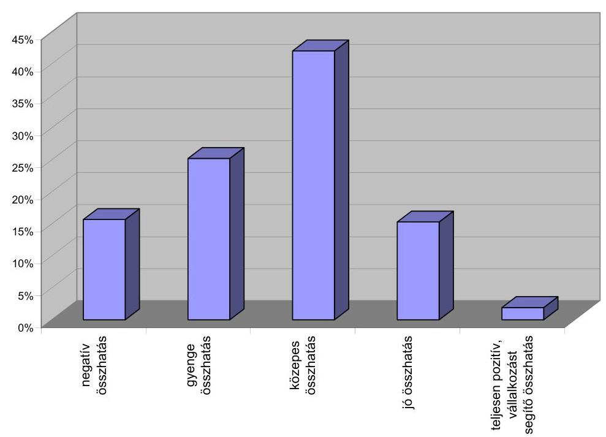

# A társasági adókedvezmények igénybevételének, illetve az igénybevétel akadályának elemzése 

A válaszadók 67\%-a nem vett igénybe a 2004-2006-os időszakban semmilyen társasági adókedvezményt. A társasági adókedvezményt igénybe vevő $33 \%$ válaszadó $40 \%$-a szerint segítette a kedvezmény a vállalkozását, sőt $9 \%$ szerint ezzel javult a versenyképességük. 35\%-uk a jövőben is számít hasonló adókedvezményre. A támogatási adókedvezményt igénybe vevő válaszadók 14\%-a nyilatkozott úgy, hogy az APEH ellenőrizte a vállalkozásánál a kedvezmény igénybe vételének jogszerűségét és $1 \%$-a jelezte, hogy az APEH az igénybevétellel kapcsolatban valamilyen megállapítást tett.

A válaszadók 67\%-a, akik nem tudták a társasági adókedvezményt igénybe venni, az indoklás $34 \%$-ban azt a választ adták, hogy vállalkozásuk nem felelt meg a kedvezmény igénybevételének feltételeinek. 19\% szerint a meghirdetett kedvezményeknek nem lett volna fejlesztési hatása a vállalkozásukra. 15\% esetében a vállalkozás eredménye nem tette lehetővé a társasági adókedvezmény igénybe vételét. A szabályozás problémáira utal, hogy $13 \%$ nem ismerte az adókedvezményt, $11 \%$-uk szerint pedig a jogszabályok nem voltak egyértelműek és közérthetőek. A válaszadók 8\%-a a feltételek és az adminisztratív többletterhek miatt nem tartotta célszerűnek a kedvezmény igénybe vételét.

---

# A támogatások és az adó- és járulékkedvezmények összhangjának értékelése a növekedési és foglalkoztatási célokkal 

A válaszadók 12\%-a szerint teljesen negatív az összhatás, 23\%-a szerint gyenge (közepesnél rosszabb), 47\%-a szerint közepes, 17\%-a szerint jó és 1\%-a szerint teljesen pozitív az összhatás. A válaszok megoszlását a 8. ábra szemlélteti.
8. ábra

A támogatások, adó- és járulékkedvezmények összhatása a gazdaság és foglakoztatás növekedésére
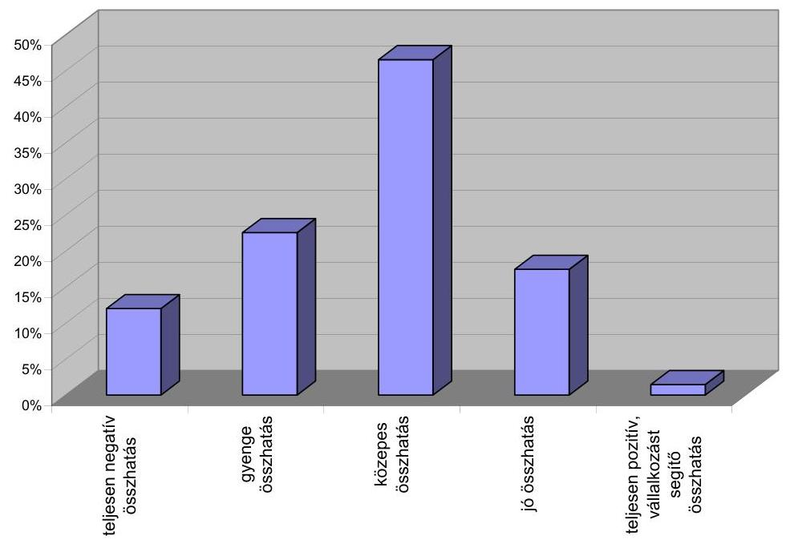

---

# 1.sz.melléklet 

A válaszadás önkéntes!
Visszaküldési határidő:

## KÉRDŐÍV

a gazdaságfejlesztés állami eszközrendszere müködésének vélemény-felméréséhez
Jelen kérdőívünk esetében a gazdaságfejlesztés állami eszközrendszerét szűken értelmezzük, és alatta a transzfer típusú gazdaságfejlesztési támogatásokat és adókedvezményeket érjük.

A válaszoknak a foglalkoztatottak száma szerinti feldolgozásához kérjük válassza ki a vállalkozását jellemző mezőt.

## Kérem válasszon!

1. A 2004-2007-es időszakban meghirdetett hazai és uniós támogatások céljai és az általuk elérhető források véleménye szerint hogyan estek egybe a hazai gazdaságfejlesztés valós szükségleteivel?
1.1. Teljeskörűen egybeestek
1.2. Átlagos (közepes) mértékben egybeestek
1.3. Nem estek egybe
1.4. Nincs tapasztalatom
2. A támogatások rendszerének tervezése során kikérték és hasznosították-e az Ön, vagy az Ön képviseletét ellátó szervezet véleményét:
2.1. a hazai támogatási célok és prioritások, valamint az azokat támogató források nagyságrendjének meghatározásakor?

## Kérem válasszon!

2.2. az uniós támogatási célok és prioritások, valamint az azokat támogató források nagyságrendjének meghatározásakor?

Kérem válasszon!

---

3. Használt-e fel a vállalkozása fejlesztéséhez a 2004-2007-es időszakban hazai és/vagy uniós forrásokra épülő támogatást? (Igen esetén kérjük megjelölni, hogy hazai, vagy uniós támogatást kapott. Ha mindkettőben részesült, mindkét mezőt kérjük bejelölni. Nem válasz esetén ugorjon a 6. kérdésre.)
3.1. Igen
3.1.1. tisztán hazai forrásra épülő támogatást
3.1.2. uniós forrásra épülő támogatást
3.2. Nem
4. Ha igennel válaszolt a 3. kérdésre, akkor minősítse a támogatásigénylési és felhasználási folyamatokat megelégedettsége szerint 1-től 5-ig ( $1=$ a legrosszabb, $5=$ a legjobb)!
4.1. a támogatás céljának és feltételének egyértelműsége és megismerhetősége

Kérem válasszon!
4.2. a pályázat elkészítéséhez szükséges külső információk és dokumentációk megszerzési lehetősége

Kérem válasszon!
4.3. a pályázat értékelési, bírálati szempontjainak előzetes nyilvánossága

Kérem válasszon!
4.4. a támogatási döntés szakmai megalapozottsága

Kérem válasszon!
4.5. a támogatási döntés és szerződéskötés időigénye

Kérem válasszon!
4.6. a támogatási részösszegek kifizetési folyamata

Kérem válasszon!
4.7. a teljes támogatási összeg elszámolásának folyamata

Kérem válasszon!
4.8. a támogatást közvetítő intézményrendszer együttműködő készsége és ügyfélbarát magatartása

Kérem válasszon!
4.9. a felhasznált támogatás hozzájárulása a vállalkozása árbevételének és versenyképességének növeléséhez és a remélt sikerek eléréséhez

Kérem válasszon!
5. Ha igennel válaszolt a 3. kérdésre, akkor minősítse a támogatásigénylési és felhasználási folyamatokban Ön által tapasztalt korrupció mértékét 1-től 5-ig ( $1=$ abszolút nem tapasztalt korrupciót, $5=$ igen erős korrupciót tapasztalt) (Kérjük, hogy csak arról a támogatásról nyilatkozzon, amelyre vonatkozóan saját tapasztalata van, mindkettőről csak abban az esetben nyilatkozzon, ha mindkét támogatási fajtából részesült.)
5.1. tisztán hazai forrásra épülő támogatás esetén

Kérem válasszon!
5.2. uniós forrásra épülő támogatás esetén

Kérem válasszon!

---

1. Ha nemmel válaszolt a 3. kérdésre, válasszon az alábbi indokok közül (több válasz is lehetséges)!
6.1 szeretett volna igényelni, de nem talált olyan támogatást, amely az Ön vállalkozásához illett volna
6.2. a meghirdetett támogatási feltételeket nem tudta teljesíteni, így nem tudott támogatásokra pályázni
6.3. igényelt, de pályázatát elutasították
6.4. nem is szándékozott támogatást igénybe venni, mert:

- nem volt rá szüksége vállalkozása fejlesztéséhez
- az igénylés és felhasználás adminisztrációs nehézségei és költségei elriasztották a pályázattól

7. Minősítse 1-től 5-ig a magyarországi adó- és járulékfizetési-rendszer, valamint azok kedvezményeinek és a gazdaságfejlesztési célok rendszerének összhangját! ( $1=$ abszolút nincs összhang, $5=$ teljes az összhang)

# Kérem válasszon! 

8. A vállalkozása fejlesztésére gyakorolt összhatása tekintetében minősítse 1-től 5ig a társasági adóalapot módosító tételeket! ( $1=$ teljesen negatív az összhatás, $5=$ teljesen pozitív és segíti a vállalkozás fejlődését az összhatás)

## Kérem válasszon!

9. Vett-e igénybe 2004-2006 között társasági adókedvezményt?

Kérem válasszon!

---

10. Amennyiben 2004-2006. között igénybe vett társasági adókedvezményt, jelölje meg a vállalkozására jellemző állításokat (több válasz is lehetséges):
a. A vállalkozás fejlesztését az adókedvezmény igénybevétele segítette.
b. Az adókedvezmény jelentős mértékben hozzájárult a vállalkozás versenyképességének növeléséhez.
c. A vállalkozás adótervezésében a jövőben is számol társasági adókedvezmény igénybevételével.
d. Az APEH a vállalkozásnál ellenőrizte az adókedvezmények igénybevételének jogszerüségét.
e. Az APEH a vállalkozás ellenőrzése során megállapítást tett az adókedvezmények igénybevételének jogszerüségével kapcsolatban.
11. Amennyiben 2004-2006. között nem vett igénybe társasági adókedvezményt, mi volt ennek az oka (több válasz is lehetséges)?
a. Nem tudott a társasági adókedvezmények lehetőségéről.
b. A társasági adókedvezményekről szóló jogszabályok nem voltak egyértelműek és közérthetőek.
c. A meghirdetett adókedvezményeknek nem volt fejlesztési hatása a vállalkozására nézve.
d. A vállalkozás nem felelt meg a társasági adókedvezmények igénybevételéhez előírt feltételeknek.
e. A vállalkozás eredménye nem tette lehetővé társasági adókedvezmények igénybevételét.
f. Jogosult lehetett volna társasági adókedvezmény igénybevételére, de a feltételek és az adminisztrációs többletterhek miatt nem tartotta célszerűnek annak igénybevételét.
12. Minősítse 1-től 5-ig a Magyarországon elérhető uniós és/vagy hazai támogatások, valamint az adó- és járulékkedvezmények összhatását a gazdaság és foglalkoztatás növekedésére. ( $1=$ teljesen negatív az összhatás, $5=$ teljesen pozitív az összhatás)

# Kérem válasszon! 

## KÖSZÖNJÜK A KÖZREMÜKÖDÉSÉT ÉS A VÁLASZOKAT!

A VÁLASZOKAT CSAK AGGREGÁLT ADATOK FORMÁJÁBAN ÉRTÉKELJÜK!

---

# 2. sz. melléklet 

Állami Számvevőszék
2. Államháztartás Központi Szintjét Ellenőrző Igazgatóság
2.1. Teljesítmény Ellenőrzési Főcsoport
2.1.1. Európai Uniós Támogatások Ellenőrzési Osztálya

## Tisztelt Pályázó!

Az Állami Számvevőszék a gazdaságfejlesztés állami eszközrendszere működésének ellenőrzését végzi, amelynek célja annak értékelése, hogy a hazai és uniós fejlesztési források, valamint a társasági és helyi iparűzési adók, illetve kedvezményei hogyan hasznosulnak a magyar gazdaságban.

Az ellenőrzés témájához kapcsolódva szeretnénk - önkéntes válaszadás keretében - felmérni és értékelni a támogatásokat és adókedvezményeket igénylők, ill. igénybe vevők véleményét az ellenőrzött terület működéséről. A vélemények megismerésére kérdőívet dolgoztunk ki, amelyet mellékelten megküldünk. A kérdőív kitöltése és visszaküldése önkéntes.

A vélemény-felmérésre a jelenleg hatályos törvények biztosítanak lehetőséget (az Állami Számvevőszékről szóló 1989. évi XXXVIII. törvény 16. §-ának (1) bekezdése, 18. §-ának (1) bekezdése, a 21. §-ának (1) és (3) bekezdései, a 21/A. §-ának (1) bekezdése, valamint a személyes adatok védelméről és a közérdekủ adatok nyilvánosságáról szóló 1992. évi LXIII. törvény 30. §-ának d) és f) pontjai).

A válaszokat titkosan kezeljük, azokat egyedileg nem használjuk fel és nem adjuk át harmadik személynek. Az elemzést és értékelést az ellenőrzés nyilvános jelentésének részeként, aggregált információk formájában hozzuk nyilvánosságra.

A kérdések összeállításában figyelembe vettük a Magyar Kereskedelmi és Iparkamara, a Munkaadók és Gyáriparosok Országos Szövetsége, a Vállalkozók és Munkáltatók Országos Szövetsége és a Magyar Közgazdasági Társaság javaslatait is.

Kérjük a tapasztalatait, véleményét tükröző válaszadással az elektronikusan kitöltött kérdőívet 200. december 15-ig küldje vissza „gazdvelemeny@asz.hu" E-mail címünkre, ha az automatikus válaszküldési funkció valamilyen beállítási eltérés miatt nem működik kérjük, hogy az űrlap adatfájlját, csatolt fájl formájában küldje vissza a megadott levelezési címre.

Segítő együttműködését előre is köszönjük.
Budapest, 200.december 5.
Dr. Zöldréti Attila
osztályvezető
az ellenőrzés vezetője

---

2. sz. függelék a V-09-138/2007-2008. sz. jelentéshez

A kis- és középvállalkozások részére nyújtott társasági adókedvezmények eredményességének és hatékonyságának ellenőrzése az EUROSAI adókedvezmények témakörében folytatott párhuzamos ellenőrzése keretében

---

# TARTALOMJEGYZÉK 

ÖSSZEGZŐ MEGÁLLAPÍTÁSOK ..... 7
I. RÉSZ: TÉNYEK ÉS ADATOK BEMUTATÁSA ..... 8

1. az ellenőrzés tárgya és indokoltsága ..... 8
1.1. A költségvetési bevételek ellenőrzésének jelentősége ..... 8
1.2. Korábbi társasági adóval kapcsolatos ellenőrzés legfontosabb megállapításai ..... 9
1.3. Ellenőrzési ütemterv ..... 10
2. Ellenőrzés célja és területei ..... 10
2.1. Társasági adókedvezmények jogszabályi környezete ..... 10
2.2. Ellenőrzési kérdések ..... 10
2.3. Ellenőrzési kérdések és mutatók ..... 11
3. Ellenőrzött szervezetek és az ellenőrzés módszere ..... 11
4. Adóterhek alakulása Európában ..... 12
II. RÉSZ: BEVEZETÉS A NEMZETI ELLENŐRZÉSHEZ ..... 13
5. Társasági adó Magyarországon ..... 13
1.1. Történeti háttér ..... 13
1.2. A társasági adó alanyai ..... 13
1.3. Társaságiadó-kötelezettség és adóalap ..... 14
6. Társasági adókedvezmények Magyarországon ..... 14
2.1. Beruházási adókedvezmény ..... 15
2.2. Térségi és egyéb adókedvezmények ..... 15
2.3. Kis- és középvállalkozások adókedvezménye ..... 15
2.4. Fejlesztési adókedvezmény ..... 16
III. RÉSZ: ELLENŐRZÉSI MEGÁLLAPÍTÁSOK ..... 16
7. Törvényhozás ..... 16
1.1. Mi az ellenőrzött adókedvezmények jogalapja? ..... 16
1.1.1. Jogszabályokkal határozták-e meg a társasági adókedvezményeket? ..... 16
1.1.2. Vannak-e külön jogszabályok a kis- és középvállalkozások (kkv) társasági adókedvezményeire vonatkozóan? ..... 18
1.1.3. A jogszabály-tervezetekhez készített-e a PM előzetes felméréseket? ..... 18

---

1.1.4. A vizsgált időszakban hány alkalommal változtak a jogszabályok és mi volt a módosítások magyarázata? ..... 19
1.1.5. A vizsgált időszakban helyeztek-e hatályon kívül vonatkozó jogszabályokat? ..... 20
1.2. A jogszabályokban meghatározták-e az adókedvezmények célját? ..... 20
1.2.1. A jogszabályokban meghatározták-e a társasági adókedvezmények és ezen belül a kkv-knak nyújtott adókedvezmények célját? ..... 20
1.2.2. Ha nem, meghatározták-e más dokumentumokban? ..... 21
1.2.3. A megfogalmazott célok egyértelműek-e és azok teljesítése mérhető-e? ..... 21
1.2.4. Változtak-e a célok a vizsgált időszak ideje alatt? ..... 21
1.2.5. Ha igen, hogyan változtak? ..... 21
1.3. Helyettesíthetőek-e az adókedvezmények közvetlen pénzügyi támogatásokkal? ..... 21
1.3.1. Készített-e a PM elemzéseket, számításokat annak értékelésére, hogy lehetőség van-e célszerűbb jogi szabályozásra a célok elérése érdekében? ..... 21
1.4. Vannak-e korlátozások a kkv-knak nyújtott kedvezmények igénybevételére vonatkozóan (időbeli, összegszerű vagy egyéb feltételre vonatkozó)? ..... 22
1.4.1. A korlátozásokra vonatkozó jogszabályokat módosították-e a vizsgált időszak alatt? Ha igen, mi volt a változtatások indoka? ..... 22
1.4.2. Van-e időhatár a kkv-k számára a társasági adókedvezmények igénybevételére vonatkozóan? ..... 22
1.4.3. Van-e összeghatár az egy kkv által igénybe vehető társasági adókedvezményre? ..... 22
1.4.4. Van-e korlát az adókedvezményen felül igénybe vehető bármilyen fajta közvetlen pénzügyi támogatásra vonatkozóan? ..... 22
1.4.5. Vannak-e egyéb korlátozások (pl. jogi feltételek, eszközbeszerzés)? ..... 23
1.4.6. Szükséges-e a feltételek teljesítésének meghatározott intézmények (pl. bankok, minisztériumok) általi igazolása? ..... 23
2. A társasági adókedvezmények összege és az érintett társaságok száma ..... 23
2.1. Hogyan becsülik meg a társasági adókedvezményeket igénybe vevő adózók számát és az adókedvezmények összegét? ..... 23
2.1.1. Készít-e a PM előzetes becslést arról, hogy várhatóan hány adózó és mekkora összegben veszi igénybe a társasági adókedvezményeket? ..... 23
2.1.2. Ha igen, a PM utólag értékeli-e a becslés helyességét? ..... 24
2.1.3. Értékeli-e a PM a tervezett és a tényleges adatok közötti különbségek okait? ..... 24
2.2. Hány társaság és alkalmazott érintett? ..... 24

---

2.2.1. Hogyan alakult a társasági adókedvezményeket (ezen belül a kkv-knak nyújtott adókedvezményeket) igénybe vevő társaságok száma a vizsgált időszakban? ..... 24
2.2.2. A PM figyelemmel kísérte-e és értékelte-e ezt a tendenciát? ..... 26
2.3. Mekkora a kkv-k által igénybe vett adókedvezmények összege és költségvetésen belüli aránya? ..... 26
2.3.1. Mekkora adóbevétel kiesést jelentenek a társasági adókedvezmények? ..... 26
2.3.2. Mekkora adóbevétel kiesést jelentenek a kkv-knak nyújtott társasági adókedvezmények? ..... 27
2.3.3. A PM készít-e előrejelzést az éves költségvetési terv keretében a társasági adókedvezmények várható összegéről? ..... 27
2.3.4. Figyelemmel kíséri-e a PM vagy az adóhatóság a költségvetés végrehajtását követően a társasági adókedvezmények összegének alakulását? ..... 27
2.3.5. Mekkora a társasági adókedvezmények és a kkv-knak nyújtott társasági adókedvezmények aránya a költségvetés teljes összegéhez és az adóbevételekhez viszonyítva? ..... 28
2.3.6. Hogyan alakultak ezek az arányok a vizsgált időszakban? ..... 28
3. Adatbázis, társasági adókedvezményekhez kapcsolódó adóhatósági költségek ..... 29
3.1. Milyen adatbázist alkalmaznak (ezen belül a szoftver, biztonság, hatékonyság)? ..... 29
3.1.1. Az informatikai feldolgozással kapcsolatban merültek-e fel problémák? ..... 29
3.1.2. Ha igen, milyen jellegűek a problémák és megoldották-e őket? ..... 29
3.1.3. Az (adóbevallások feldolgozásához használt) informatikai rendszerek megbízható adatokat szolgáltatnak-e az értékelésekhez? ..... 30
3.1.4. Milyen kockázati tényezőket alkalmaznak az ellenőrzésre történő kiválasztáshoz használt informatikai rendszerben a társasági adókedvezményeket igénybe vevő adóalanyok ellenőrzésénél? ..... 31
3.2. Az adókedvezményekhez kapcsolódó adminisztrációs költségek mérhetők-e és elkülöníthetők-e? ..... 31
3.2.1. A PM vagy az adóhivatal rendelkezik-e adatokkal a társasági adókedvezményekkel kapcsolatban felmerült adminisztrációs költségek - teljes vagy részbeni - összegéről (pl. adatfeldolgozással, az adózók ellenőrzésével kapcsolatban)? ..... 31
3.2.2. Ha igen, az adminisztratív költségek hozzárendelhetők-e az egyes adókedvezményekhez és mérhetőek-e? ..... 32
3.2.3. Ha igen, milyen módszerrel mérik és különítik el a költségeket (becslések, számítások)? ..... 32
4. Eredményesség, hatékonyság ..... 32

---

4.1. Hogyan méri a PM az adókedvezmények eredményességét? ..... 32
4.1.1. Rendszeresen méri-e a PM a társasági adókedvezmények felhasználásának eredményességét figyelembe véve az adókedvezményt igénybe vevő adóalanyok számát és az adókedvezmények összegét? ..... 32
4.1.2. Rendszeresen méri-e a PM a kkv-knak nyújtott társasági adókedvezmények felhasználásának eredményességét figyelembe véve az adókedvezményt igénybe vevő adóalanyok számát és az adókedvezmények összegét? ..... 33
4.1.3. Milyen módszerrel mérik az eredményességét? Ehhez milyen paramétereket vesznek figyelembe? ..... 33
4.1.4. Mik a felmérés következményei? Milyen jogszabályi változásokat eredményezett? ..... 33
4.1.5. Nyomon követik és folyamatosan értékelik-e a kitűzött célok elérését? ..... 33
4.1.6. Az adókedvezmény adminisztrációjához felhasznált erőforrások összhangban álltak-e az előzetes becslésekkel? ..... 34
4.1.7. Hatékony volt-e az adókedvezmény a célokat figyelembe véve? ..... 34
4.1.8. Eredményes-e az adókedvezmény a célok elérése szempontjából figyelembe véve a fenti értékeléseket? ..... 34
4.1.9. A PM figyelemmel kíséri-e a társasági adókedvezmények hatásait? ..... 34
4.1.10. Milyen következményekkel jár a jogszabályok figyelemmel követése? ..... 34
4.2. Eredményes-e az adókedvezmény, azaz ténylegesen elérték-e a kitűzött célokat? ..... 34
4.2.1. Vannak-e módszerek annak értékelésére, hogy az adókedvezmények a kitűzött célokat elérték-e? ..... 34
4.2.2. Melyek az adókedvezmények mérhető céljai és hatásai (pl. a foglalkoztatottság, beruházások növelése)? ..... 35
4.2.3. Mely célokat érték el és melyeket nem? ..... 35
4.3. Hatékony-e az adókedvezmény, azaz megfelelő-e a költségek és hasznok aránya? ..... 36
4.3.1. Milyen arányban állnak a társasági adókedvezmények adminisztratív költségei a hasznokkal? ..... 36
4.3.2. A vizsgált időszakban hogyan alakult a hatékonyság? ..... 36
5. Ellenőrzési eljárások ..... 36
5.1. Milyen ellenőrzési eljárásokat alkalmaznak? Feltártak-e visszaéléseket? ..... 36
5.1.1. Milyen kontrollokat alkalmaznak annak érdekében, hogy elkerüljék, illetve csökkentsék az adókedvezmények igénybevételével kapcsolatos hibákat? ..... 36
5.1.2. Előírnak-e a jogszabályok kötelező jellegű ellenőrzéseket? ..... 36
5.1.3. Ha igen, mire terjednek ki ezek az ellenőrzések? ..... 36

---

5.1.4. Tártak-e fel jogszabálysértéseket a társasági adókedvezményekkel kapcsolatban, különös tekintettel az adóval kapcsolatos bűncselekményekre, illetve hivatali visszaélésekre? ..... 37
5.1.5. Milyen jellegű jogszabálysértéseket tártak fel (főbb típusok)? ..... 37
5.1.6. Ennek következtében mekkora összegű társasági adókedvezményt kellett a társaságoknak visszafizetniük, és ebből ténylegesen mekkora összeget fizettek vissza? ..... 37

---

# ÖSSZEGZŐ MEGÁLLAPÍTÁSOK 

A német számvevőszék által az EUROSAI VI. Kongresszusán (2005. május) kezdeményezett párhuzamos ellenőrzés keretében 11 tagország 3 al-munkacsoportban végezett ellenőrzéseket adókedvezmények témakörben. A magyar számvevőszék - az orosz, a lett, a német és a szlovák számvevőszékekkel közösen - a 2. sz. al-munkacsoportban vett részt, amelynek egyeztetett ellenőrzési területe a kis- és középvállalkozások részére nyújtott, társasági adóhoz kapcsolódó adókedvezmények hatékonysága és eredményessége. Az ellenőrzést a résztvevők mintegy 70 azonos kérdés alapján végezték el, a hatékonyság és eredményesség értékeléséhez azonos teljesítmény-mutatókat alkalmaztak.

A vizsgált időszakra ${ }^{1}$ vonatkozóan az ellenőrzés főbb megállapításai a következők:

- A vállalkozások jövedelem típusú adója a társasági adó, amelynek szabályait a társasági adóról és osztalékadóról szóló 1996. évi LXXXI. törvény (továbbiakban: Tao tv.) tartalmazza. A társasági adóhoz kapcsolódó - beleértve a kis- és középvállalkozások (továbbiakban: kkv) által igénybe vehető - adókedvezmények feltételeit is e törvény szabályozza. Azt, hogy milyen vállalkozás minősül kkv-nak, a kis- és középvállalkozásokról, fejlődésük támogatásáról szóló 2004. évi XXXIV. tv határozza meg.
- A Tao. tv-ben az adókedvezmények igénybevétele feltételeinek meghatározása egyben cél-meghatározást is jelent, ezek megfogalmazásukban egyértelműek. Valamennyi adókedvezmény típusnál a feltételek számszerú előírásokat is magukban foglalnak. Ilyen számszerú előírás például a foglalkoztatottság esetében a létszámnövekmény, annak ütemezése, a beruházás esetében a minimál-érték meghatározása.
- A PM - a makroszintű elemzéseken túlmenően - a társasági adókedvezmények teljes körére vonatkozóan nem készített a bevezetést megelőzően hatásvizsgálatot annak ellenére, hogy ezt a jogalkotásról szóló törvény előírja számára. A jogszabály-módosításokat megelőzően felmérte a társasági adó egyszerűsítésének, illetve a kedvezmények és mentességek szűkítésének, illetve bővítésének lehetőségeit. Elemezte, hogy az egyes adókedvezményeket az adóalanyok milyen gyakorisággal és összeggel vették igénybe. Ennek eredményeként 2 jogcímen megszüntette az adóalap-csökkentő kedvezmény lehetőségét.
- A PM nem értékelte, hogy az adókedvezmények felhasználásával az azt igénybe vevő vállalkozások milyen mértékben járultak hozzá a kitűzött célok eléréséhez és nem is alakította ki az értékelés feltételrendszerét. Nem határozta meg, hogy mely mutatószámokkal mérhetők az egyes célok (mint pl. versenyképesség növelése, az elmaradott térségek felzárkóztatása) teljesülése, továbbá azt sem, hogy azok mely értékei mellett lehet, illetve

[^0]
[^0]:    ${ }^{1}$ A vizsgálat a2004-2006. évekre terjedt ki.

---

kell az adókedvezmény jogintézményét eredményesnek minősíteni. Nem dolgozott ki monitoring és értékelő rendszert, és nem is határozott meg elvárásokat az APEH felé az értékeléshez szükséges adatok nyilvántartására.

- Az APEH a társasági adókedvezmények elszámolásának ellenőrzését jogszabályok alapján végzi. A jogszabály értelmében a legnagyobb éves adóteljesítménnyel rendelkező 3000 adóalany minden gazdasági évét, illetve évente az adóalanyok 2\%-át is ellenőriznie kell. Az ellenőrzésre kiválasztás kockázati paramétereként veszik figyelembe, ha az adóalany elszámolt adókedvezményt. Az APEH nem rendelkezik arról adattal, hogy az ellenőrzött adóalanyokból hányan számoltak el adókedvezményt. Az adóhivatal tárt fel jogszabálysértéseket, de a társasági adókedvezményt érintő megállapításokról nem rendelkezik számadatokkal azok számáról és összegéről. A jogszabálysértések közül egyiket sem minősítette bűncselekménynek.
- Az adókedvezményekhez kapcsolódó adminisztrációs költségeket nem különítik el és nem mérik.
- Az ÁSZ a korábbi ellenőrzései során vizsgálata az informatikai alkalmazások területét. Az alkalmazás területén feltárt hiányosságokat és szabálytalanságokat (beleértve a különböző adatbázisok közötti kapcsolatokat) az adóhivatal az informatikai rendszerek és a szabályzatok továbbfejlesztésével megszüntette.

# I. RÉSZ: TÉNYEK ÉS ADATOK BEMUTATÁSA 

## 1. AZ ELLENŐRZÉS TÁRGYA ÉS INDOKOLTSÁGA

### 1.1. A költségvetési bevételek ellenőrzésének jelentősége

Az ÁSZ a feladatait az Állami Számvevőszékről szóló 1989. évi XXXVIII. tv. felhatalmazása alapján végzi.

Az ÁSZ a tv. 2.§-a alapján évente ellenőrzi az államháztartás gazdálkodását, ennek keretében a központi költségvetési javaslat megalapozottságát, a bevételi előirányzatok teljesíthetőségét, az állami kötelezettségvállalással járó beruházási előirányzatok felhasználásának törvényességét és célszerűségét, a költségvetés hitelfelvételeit, azok felhasználását és törlesztését. Ellenőrzi a központi költségvetés végrehajtásáról készített zárszámadást, továbbá az adóhatóság és a helyi önkormányzatok adóztatási tevékenységét, valamint a vámhatóság tevékenységét.

Az ÁSZ a tv. 16. §-a alapján az ellenőrzéseit célszerűségi, eredményességi és törvényességi szempontok szerint végzi.

A központi költségvetés 2004-2006. évi adóbevételeinek alakulását az alábbi táblázat mutatja:

---

| Központi költségvetés adóbevételeinek alakulása |  |  |  |  |  |  |
| :--: | :--: | :--: | :--: | :--: | :--: | :--: |
| 2004 |  |  | 2005 |  | 2006 |  |
|  | M HUF | M EUR | M HUF | M EUR | M HUF | M EUR |
| GAZDÁLKODÓ SZERVEZETEK BEFIZETÉSEI |  |  |  |  |  |  |
| Társasági adó | 448708 | 1795 | 430051 | 1720 | 468679 | 1775 |
| Hitelintézetek és pénzügyi vállalkozások különadója |  | 0 | 35574 | 142 | 35326 | 134 |
| Egyszerűsitett vállalkozói adó | 67005 | 268 | 91365 | 365 | 143115 | 542 |
| Tarsas vállalkozások különadója |  | 0 |  | 0 | 50947 | 193 |
| Energia adó | 10922 | 44 | 12732 | 51 | 12504 | 47 |
| Környezetterhelési díj | 6482 | 26 | 3155 | 13 | 5573 | 21 |
| Bányajáradék | 19737 | 79 | 23825 | 95 | 33590 | 127 |
| Játékadó-bevétel | 60409 | 242 | 66377 | 266 | 71468 | 271 |
| FOGYASZTÁSHOZ KAPCSOLT ADÓK |  |  |  |  |  |  |
| Általános forgalmi adó | 1727745 | 6911 | 1785316 | 7141 | 1831998 | 6939 |
| Jövedéki adó | 651569 | 2606 | 670673 | 2683 | 760804 | 2882 |
| Regisztrációs/fogyasztási adó | 64601 | 258 | 68279 | 273 | 88412 | 335 |
| LAKOSSÁG BEFIZETÉSEI |  |  |  |  |  |  |
| Személyi jövedelemadó | 904587 | 3618 | 997841 | 3991 | 1119092 | 4239 |
| Magánszemélyek különadója | 5845 | 23 | 3401 | 14 | 7255 | 27 |
| Adóbevételek összesen | 3967610 | 15870 | 4188590 | 16754 | 4628764 | 17533 |

# 1.2. Korábbi társasági adóval kapcsolatos ellenőrzés legfontosabb megállapításai 

Az Állami Számvevőszék 2005-ben ellenőrizte a társasági adó beszedésére kialakított rendszer múködését. A társasági adó keretében elszámolt kedvezmények ellenőrzésével kapcsolatban az alábbi megállapítást tette:
„A PM az adókedvezmények igénybevételével, elbírálásával kapcsolatos, jogszabályban előírt feladatait teljesítette. Nem készített azonban elemzést, illetve értékelést arra vonatkozóan, hogy a különböző adókedvezmények igénybevétele mennyiben segítette a kitűzött gazdaságpolitikai célok elérését."

Az ellenőrzés eredményeként az ÁSZ javasolta a pénzügyminiszter részére, hogy készíttessen értékelést arra vonatkozóan, hogy az igénybe vett adókedvezmények milyen mértékben járultak hozzá a kitűzött gazdaságpolitikai célok eléréséhez.

A PM a javaslat alapján 2007. évi ellenőrzésig nem tett intézkedést.

---

# 1.3. Ellenőrzési ütemterv 

Az al-munkacsoportban részt vevő számvevőszékek az ellenőrzéseiket az alábbi ütemterv szerint végzik:

| Ország | Előkészítés | Helyszíni ellenőrzés | Jelentésírás |
| :-- | :--: | :--: | :--: |
| Németország | 2006 július - 2006   szeptember | 2006 október - 2006   december | 2007 május |
| Lettország | 2007 március 15 -   2007 június 15 -   2007 augusztus 15 | 2007 október 1 -   2007 december20 |  |
| Oroszország | 2006 szeptember -   2006 december | 2007 március - 2007   június | 2007 szeptember |
| Szlovákia | 2006 május - 2006   július 31 | 2006 augusztus -   2006 október | 2007 február |
| Magyarország | 2007 március 15 -   2007 július 20 | 2007 július 23 - 2007   szeptember20 | 2007 szeptember21 -   2007 december20 |

Az al-munkacsoport tagjainak közös ellenőrzési jelentése 2008. február végéig készül el.

## 2. ELLENŐRZÉS CÉLJA ÉS TERÜLETEI

### 2.1. Társasági adókedvezmények jogszabályi környezete

### 2.2. Ellenőrzési kérdések

Az ellenőrzési kérdéseket az al-munkacsoport a 2006. május 3-i pozsonyi megbeszélésen egységesítette és az alábbiak szerint hagyta jóvá:

1. Mi az ellenőrzött társasági adókedvezmények jogalapja?
2. Mekkora a társasági adókedvezmények összege és aránya a központi költségvetésben?
3. Mekkora a kkv-k által igénybe vett adókedvezmények összege és költségvetésen belüli aránya?
4. Milyen adatbázist alkalmaznak (ezen belül a szoftver, biztonság, hatékonyság)?
5. A jogszabályokban meghatározták-e az adókedvezmények célját?
6. Az adókedvezményekhez kapcsolódó adminisztrációs költségek mérhetőek és elkülöníthetőek-e?
7. Hogyan méri a kormány (PM) az adókedvezmények eredményességét?

---

8. Helyettesíthetőek-e az adókedvezmények közvetlen pénzügyi támogatásokkal?
9. Vannak-e korlátozások a kkv-knak nyújtott kedvezmények igénybevételére vonatkozóan (időbeli, összegszerű vagy egyéb feltételre vonatkozó)?
10. Hány társaság és alkalmazott érintett?
11. Milyen ellenőrzési eljárásokat alkalmaznak? Feltártak-e visszaéléseket?
12. Eredményes-e az adókedvezmény, azaz ténylegesen elérték-e a kitűzött célokat?
13. Kialakítottak-e folyamatos és megfelelő monitoring rendszert a célok elérésének értékeléséhez?
14. Hatékony-e az adókedvezmény, azaz megfelelő-e a ráfordítások és hasznok aránya?

# 2.3. Ellenőrzési kérdések és mutatók 

2006. november 2-án az ÁSZ megküldte az al-munkacsoport tagjainak az ellenőrzési kérdések és a lehetséges mutatók részletes listáját. Ez a javaslat összesen 70, a fenti 14 kérdésen alapuló ellenőrzési kérdést és mutatót tartalmazott. Az ellenőrzési kérdéseket ekkor az al-munkacsoport átstrukturálta és újabb kérdésekkel kiegészítette. Az al-munkacsoport 2006. november 15-i budapesti megbeszélésen az ÁSZ javaslatot tett valamennyi társasági adókedvezmény elemzésére és ezt követően - amikor az adatok rendelkezésre állnak - kkv-knak nyújtott adókedvezmények vizsgálatára.

## 3. ELLENŐRZÓTT SZERVEZETEK ÉS AZ ELLENŐRZÉS MÓDSZERE

Ellenőrzésünk során a társasági adókedvezményekhez kapcsolódóan vizsgáltuk a Pénzügyminisztérium, valamint az APEH és igazgatóságai tevékenységét. A szükséges adatokat tanúsítványokon adták meg.

Ellenőrzési megállapításaink megalapozásához strukturált kérdőívet küldtünk ki valamennyi, a beruházási/fejlesztési adókedvezményt igénybe vevő adóalanynak (84), amelyek közül 27-en (32\%) válaszoltak megkeresésünkre. Ugyancsak kérdőíves formában kerestük meg a Magyar Könyvvizsgálói Kamarát, valamint az ITDH Magyar Befektetési és Kereskedelemfejlesztési Kht.-t.

A beruházási/fejlesztési adókedvezményt igénybe vevő 84 adóalany közül mintaként 13 vállalkozás (15\%) iratanyagát vizsgáltuk meg.

Ellenőrzésünket előtanulmánnyal alapoztuk meg, vizsgálatunk során a telje-útmény-ellenőrzés módszerét alkalmaztuk.

---

# 4. Adóterhek alakulása Európában 

Nemzetközi összehasonlításban az adóterhek magasnak minősülnek, a 27 EU tagállam közül - 2005. évi adatok alapján - Magyarországon volt a 10. legmagasabb az adóbevételek GDP-hez viszonyított aránya (lásd alábbi grafikon).
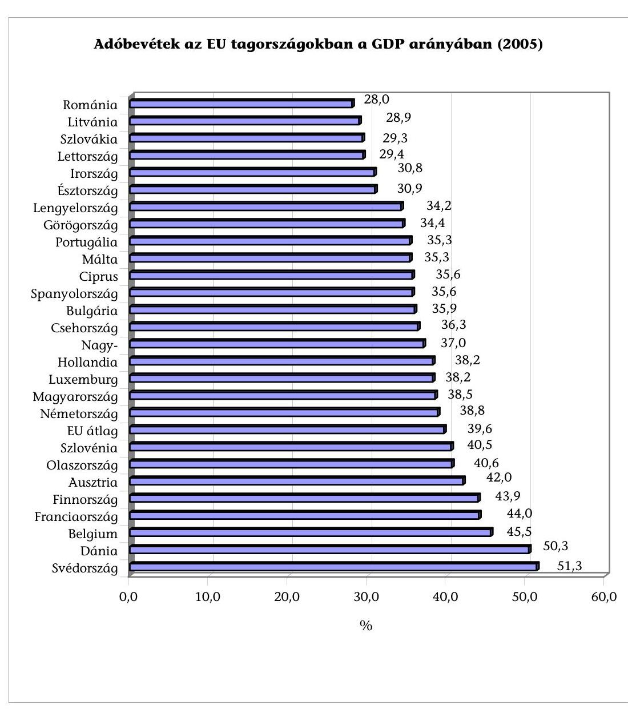

Forrás: EUROSTAT News Release - 89/2007 - 26 June 2007
A vállalkozásokat terhelő adók kulcsfontosságú tényezők abban a versenyben, hogy az egyes vállalkozások hova telepítik müködésüket. A globalizáció növekedésével az egyes országok nem tekinthetnek el a társasági adót érintő versenytől. Biztosítaniuk kell továbbá az általuk meghatározott adómérték versenyképességét, amennyiben nem akarnak lemaradni és nem akarják, hogy a vállalkozások más országokba települjenek át.

1984-ben az EU-ban a társasági adó átlagos mértéke $47 \%$ volt. Az elmúlt években, néhány tagállam jelentősen csökkentette a társasági adó mértékét,

---

Németország például 25\%-ra. Az újonnan csatlakozott országok is ezt a példát követték, gyakran az adó mértékét a korábbi tagállamok szintje alatt határozták meg. Például Magyarország a társasági adó mértékét 2004-ben 18\%-ról $16 \%$-ra, Szlovákia pedig $25 \%$-ról $19 \%$-ra mérsékelte.

# II. RÉSZ: BEVEZETÉS A NEMZETI ELLENŐRZÉSHEZ 

## 1. TÁrsasÁGi adó MaGyarORSZÁGON

Az ellenőrzési megállapítások értelmezéséhez bizonyos mértékig szükséges az adott országban kialakított társasági adórendszer ismertetése. Ezért az alábbiakban a magyar jogi szabályozás legfontosabb elemeinek rövid bemutatása következik.

### 1.1. Történeti háttér

A vállalkozási nyereségadóról szóló 1988. évi IX. tv vezette be Magyarországon a vállalkozási nyereségadót, amelyet 1992. január 1-től, a társasági adóról szóló 1991. évi LXXXVI tv. váltott fel a társasági adó bevezetésével. Ez a szabályozás 1997. január 1-ig, a társasági adóról és az osztalékadóról szóló 1996. évi LXXXI tv. hatályba lépéséig volt érvényben.

A Tao. tv-t többször módosították, így 2006. január 1-től az osztalékadóra vonatkozó rendelkezéseket hatályon kívül helyezték. A társasági adó mértéke bevezetése óta folyamatosan csökkent, a kezdeti $40 \%$-ról $16 \%$-ra.

### 1.2. A társasági adó alanyai

A Tao. tv. az alábbi társasági adóalanyokat határozza meg:

- a gazdasági társaság, (ideértve a nonprofit gazdasági társaságot is) az egyesülés és az európai részvénytársaság (ideértve az európai holding részvénytársaságot is) és az európai szövetkezet,
- a szövetkezet,
- az állami vállalat, a tröszt, az egyéb állami gazdálkodó szerv, az egyes jogi személyek vállalata, a leányvállalat,
- az ügyvédi iroda, a végrehajtói iroda, a szabadalmi ügyvivői iroda, a közjegyzői iroda, az erdőbirtokossági társulat,
- a Munkavállalói Résztulajdonosi Program szervezete,
- a közhasznú társaság, a vízitársulat,
- az alapítvány, a közalapítvány, a társadalmi szervezet, a köztestület, az egyház (ideértve e szervezetek alapszabályában, illetve alapító okiratában

---

jogi személyiséggel felruházott szervezeti egységeket is), a lakásszövetkezet és az önkéntes kölcsönös biztosító pénztár,

- a felsőoktatási intézmény (ideértve az általa létrehozott intézményt is), továbbá a diákotthon,
- európai területi együttmúködési csoportosulás.

Külföldi illetőségű adózó a külföldi személy, ha belföldi telephelyen végez vállalkozási tevékenységet, feltéve, hogy az üzletvezetésének helyére tekintettel nem tekinthető belföldi illetőségű adózónak.

A törvény felsorolja azon szervezetek listáját, amelyek nem alanyai a társasági adónak (pl. a Magyar Nemzeti Bank, az Állami Privatizációs és Vagyonkezelő Részvénytársaság, a közszolgálati műsorszolgáltatók, pártok).

# 1.3. Társaságiadó-kötelezettség és adóalap 

Az adózókat jövedelmük után társasági adókötelezettség terheli. A társasági adó alapja a Tao. tv-ben meghatározott módon (adóalapot csökkentő és növelő tételekkel) korrigált adózás előtti eredmény. Az adóalapot csökkentő tételek száma az egyes években 40-45, a növelő tételeké 30-33 között alakult.

Néhány példa az adózás előtti eredményt csökkentő legfontosabb jogcímekre:

- a korábbi adóévek elhatárolt veszteségéből az adózó döntése szerinti öszszeg,
- a várható kötelezettségekre és a jövőbeni költségekre képzett céltartalék felhasználása,
- az adózó által a helyi adókról szóló törvény rendelkezései szerint megállapított helyi iparűzési adó alapján adóévi ráfordításként elszámolt összeg.

Néhány példa az adózás előtti eredményt növelő legfontosabb jogcímekre:

- a várható kötelezettségekre és a jövőbeni költségekre képzett céltartalék, céltartalékot növelő összeg következtében az adóévben elszámolt ráfordítás,
- az adóévben követelésre elszámolt értékvesztés összege,
- a támogatás, juttatás, végleges pénzeszközátadás, térítés nélküli eszközátadás, kötelezettség átvállalás

A társasági adó a pozitív adóalap 16 százaléka, de bizonyos feltételek mellett az adó mértéke a pozitív adóalap 5 millió forintot meg nem haladó összegéig 10 százalék, az e feletti összegre 16 százalék.

## 2. TÁRSASÁGI ADÓKEDVEZMÉNYEK MAGYARORSZÁGON

A Tao. tv. az adókedvezményeket négy kategóriába sorolja:

---

- beruházási adókedvezmény,
- térségi és egyéb adókedvezmények,
- kis- és középvállalkozások adókedvezménye,
- fejlesztési adókedvezmény.

# 2.1. Beruházási adókedvezmény 

Az adókedvezmény legalább 10 Mrd Ft értékű, vagy társadalmi-gazdasági szempontból elmaradott térségben legalább 3 Mrd Ft értékű termék-előállítást szolgáló beruházás után vehető igénybe. Az adózók az adókedvezményt az 1996. december 31-ét követően megkezdett beruházás után az üzembe helyezést követő 10 naptári évben vehetik igénybe a jogszabályban meghatározott feltételek mellett.

Az EU harmonizáció keretében ezt az adókedvezmény a fejlesztési adókedvezmény váltotta fel (részletesen ld. 2.4. fejezet), ezért az adókedvezmény csak a 2002. december 31-ig megkezdett beruházások alapján, utoljára a 2011. évi adóalap utáni adóból vehető igénybe.

### 2.2. Térségi és egyéb adókedvezmények

A Tao. tv. térségi és egyéb adókedvezmények cím alatt különböző típusú adókedvezményeket tartalmaz. Ezek összege és az igénybe vevő adózók száma egyaránt alacsony, ezért alább csak felsorolásuk következik:

- filmgyártás támogatásának kedvezménye,
- szövetkezetek vagy jogutódja(i)nak kedvezménye,
- alapkutatás, alkalmazott kutatás vagy kísérleti fejlesztés kedvezménye.

### 2.3. Kis- és középvállalkozások adókedvezménye

A kis- és középvállalkozásnak minősülő a 2000. december 31-ét követően megkötött hitelszerződés alapján tárgyi eszköz beszerzéséhez, előállításához pénzügyi intézménytől igénybe vett, és kizárólag e célra felhasznált hitel kamata után adókedvezményt vehetnek igénybe. Az adókedvezmény mértéke az adóévben fizetett kamat $40 \%$-a, de adóévenként nem haladhatja meg a 6 M Ft -ot.

Az adózó az adókedvezményt abban az adóévben - utoljára abban az adóévben, amelyben a hitelt az eredeti szerződés szerint vissza kell fizetnie - veheti igénybe, amelynek utolsó napján a tárgyi eszköz nyilvántartásában szerepel. Az adózónak az igénybe vett adókedvezményt késedelmi pótlékkal növelten vissza kell fizetnie, ha a hitelszerződés megkötésének évét követő négy éven belül a beruházást nem helyezi üzembe, kivéve, ha az üzembe helyezés elháríthatatlan külső ok miatti megrongálódás következtében maradt el, vagy ha a tárgyi eszközt üzembe helyezésének adóévében vagy az azt követő három évben elidegeníti.

---

# 2.4. Fejlesztési adókedvezmény 

Ezt az adókedvezményt 2003 január 1-től, az EU szabályozásának való megfelelés céljából vezették be. Az adókedvezmény meghatározott értékű beruházások után (a beruházás jellegétől függően 100 M Ft, 1 Mrd Ft és 3 Mrd Ft) számolható el. Az adózók az adókedvezményt a beruházás üzembe helyezését követő adóévben - vagy döntésük szerint a beruházás üzembe helyezésének adóévében - és az azt követő kilenc adóévben, legfeljebb a bejelentés, illetve a kérelem benyújtásának adóévét követő tizennegyedik adóévben vehetik igénybe.

Az adókedvezmény igénybevételének részletes szabályait kormányrendelet tartalmazza. Az adókedvezmény igénybevételének feltétele, hogy az adózó a beruházás megkezdése előtt a pénzügyminiszternek bejelentse a kormányrendeletben meghatározott valamennyi adatot, illetve az adókedvezmény iránti kérelmet a kormányrendeletben meghatározott tartalommal és formában benyújtsa a miniszterhez, ha az adókedvezmény a miniszter határozata alapján vehető igénybe (a beruházás költségének nagyságától függően).

## III. RÉSZ: ELLENŐRZÉSI MEGÁLLAPÍTÁSOK

## 1. TÖRVÉNYHOZÁs

### 1.1. Mi az ellenőrzött adókedvezmények jogalapja?

### 1.1.1. Jogszabályokkal határozták-e meg a társasági adókedvezményeket?

A vállalkozások jövedelem típusú adója a társasági adó, amelynek szabályait a társasági adóról és osztalékadóról ${ }^{2}$ szóló 1996. évi LXXXI. törvény (továbbiakban: Tao tv.) tartalmazza. A társasági adó mértéke 2002-2003-ban 18\%, 2004től 16\%, 2006-tól kezdődően (bizonyos feltételekhez kötötten) a pozitív adóalap 5 M Ft-ot meg nem haladó összegéig 10\%, az e feletti összegre 16\%.

A Tao. tv. az adókedvezményeket négy kategóriába sorolja:

- A beruházási adókedvezmény a legalább 3 Mrd Ft értékű, illetve a legalább 10 Mrd Ft értékű, termék-előállítást szolgáló beruházás esetében vehető igénybe.
- A térségi és egyéb adókedvezmények többféle jogcímen érvényesíthetők. Ezek a filmalkotáshoz kapcsolódó adókedvezmény; a szövetkezet ill. jogutódja adókedvezménye; kutatás, kísérleti fejlesztés, szoftverfejlesztés utáni adókedvezmény.

[^0]
[^0]:    ${ }^{2}$ Az osztalékadó a Tao tv. módosítása következtében 2006. január 1-től megszűnt.

---

- A kis- és középvállalkozások adókedvezménye a tárgyi eszköz beszerzéseikhez, előállításához felhasznált hitel kamatai után vehető igénybe.
- A fejlesztési adókedvezmény kiemelten támogatja a munkahelyteremtéssel, környezetvédelemmel, szélessávú Internettel, kutatással, filmgyártással kapcsolatos beruházásokat.

A Tao. tv. alapján az adóalanyok maguk döntenek az adókedvezmények igénybevételéről.

A törvény részletesen meghatározza az adókedvezmények igénybevételének feltételeit, de a jogcímek felsorolásának (21.-23. §) sorrendje nem felel meg az áttekinthetőség követelményének, ezáltal nehezíti a jogszabályban való eligazodást, illetve a jogalkalmazást. Az adókedvezmények tárgyalása nem azok tartalmának vagy céljának megfelelő sorrendet követ, ezen felül a térségi és egyéb adókedvezmények (22. §) alcím nincs összhangban annak tartalmával. A PM álláspontja szerint, a törvény szerkezetét jelentősen befolyásolta, hogy egyes kedvezmények (így például a fejlesztési adókedvezmény) az alaptörvény megalkotását követően váltak a törvény részévé.

A törvényben a hasonló célokat szolgáló, illetve egymást felváltó beruházási és fejlesztési adókedvezmények tárgyalása nem egymást követően szerkesztett, továbbá a térségi és egyéb adókedvezmények szabályozása megelőzi a kis- és középvállalkozások adókedvezménye és a fejlesztési adókedvezmény szakaszait. A térségi és egyéb adókedvezmények alcím nem tartalmaz térségi adókedvezményeket, hanem a filmgyártást támogató, a szövetkezeti, illetve kutatás-fejlesztésre vonatkozó adókedvezményeket szabályozza. Ezek az egymástól eltérő jellegű adókedvezmények egy szakaszon belül, egymástól nem elválasztva szerepelnek.

A Magyar Könyvvizsgálói Kamara ${ }^{3}$ megítélése szerint a Tao. tv. szövegezése bonyolult. A kérdőívvel megkeresett beruházási, illetve fejlesztési adókedvezményt igénybe vevő adóalanyok közepesnek (5-ös skálán 3,3-nak) minősítették a kedvezmény igénybevételéhez kapcsolódó előírások érthetőségét és alkalmazási feltételeit.

A vizsgált időszakban beruházási, illetve fejlesztési adókedvezményt összesen 84 adóalany vett igénybe, ezek mindegyikének megküldtük kérdőívünket. Erre 27 adóalany válaszolt.

A Tao. tv. felhatalmazása alapján a kormány rendeletben ${ }^{4}$ szabályozta a fejlesztési adókedvezmény igénybevételéhez az engedélyezés szabályait és eljárásrendjét, valamint az adókedvezménnyel összefüggő adatszolgáltatási kötelezettség teljesítésének részletes szabályait. A szabályozás nem teljes körű, mivel nem ír elő adatszolgáltatási kötelezettséget jogutódlás esetén sem a fejlesztési adókedvezményt igénybe vevő jogelődnek, sem a jogutódnak. A PM nyilvántartása nem pontos, nincs arról információja, hogy egyes adóalanyok melyik vállalkozás kérelme alapján veszik igénybe az engedélyezett, illetve bejelentett

[^0]
[^0]:    ${ }^{3}$ Kérdőíves megkeresésünkre adott válasz alapján
    ${ }^{4}$ 275/2003. (XII.24.) Korm. rendelet a fejlesztési adókedvezményről, valamint az azt 2007. január 1-i hatállyal felváltó 206/2006. (X. 16.) Korm. rendelet a fejlesztési adókedvezményről

---

adókedvezményt. Ennek következtében a PM által az Adó- és Pénzügyi Ellenőrzési Hivatal (továbbiakban: APEH, Hivatal) részére átadott adatok nem teljes körűen megbízhatóak és hasznosíthatóak kontroll-adatként az adókedvezmények igénybevételének ellenőrzéseihez.

A PM és az APEH által a vizsgálat számára a beruházási és fejlesztési adókedvezményt igénylők, illetve igénybe vevők adatairól rendelkezésre bocsátott kimutatások összehasonlítása során megállapítottuk, hogy a társasági adóbevallásban ilyen címen adókedvezményt a vizsgált időszakban összesen 84 adóalany vett igénybe, amelyből 27 nem szerepelt a PM nyilvántartásában. Az APEH a kimutatásait a társasági adóbevallások adatai alapján készítette el. A 27 adóalany által igénybe vett adókedvezmény összege 2004-ben 125 M Ft (az összes ilyen típusú adókedvezmény $0,25 \%-a)$, 2005-ben 144 M Ft ( $0,76 \%$ ), 2006-ban pedig 2012 M Ft (1,9\%) volt. A 2006. évi összegből 1600 M Ft-ot (79,5\%) egy, a PM nyilvántartásában nem szereplő vállalkozás vette igénybe.

# 1.1.2. Vannak-e külön jogszabályok a kis- és középvállalkozások (kkv) társasági adókedvezményeire vonatkozóan? 

A kkv-k által igénybe vehető társasági adókedvezmény feltételeit a Tao. tv. szabályozza. A kis- és középvállalkozásokról, fejlődésük támogatásáról szóló 2004. évi XXXIV. tv határozza meg, hogy milyen vállalkozás minősül kkv-nak. E szerint kkv-nak minősül az a vállalkozás, amelynek

- összes foglalkoztatotti létszáma 250 főnél kevesebb, és
- éves nettó árbevétele legfeljebb 50 millió eurónak megfelelő forintösszeg, vagy mérlegfőösszege legfeljebb 43 millió eurónak megfelelő forintösszeg.

A törvény nem minősíti kkv-nak azt a vállalkozást, amelyben az állam vagy az önkormányzat közvetlen vagy közvetett tulajdoni részesedése - tőke vagy szavazati joga alapján - külön-külön vagy együttesen meghaladja a $25 \%$-ot.

### 1.1.3. A jogszabály-tervezetekhez készített-e a PM előzetes felméréseket?

A Pénzügyminisztérium a vizsgált időszakban nem rendelkezett közép-, illetve hosszú távú, a gazdaságfejlesztési és társadalmi célokat támogató, átfogó adóstratégiával, amely az adóztatás szerkezetére, mértékére, az adók mértékének időbeni ütemezésére, valamint az adókedvezmények körére és feltételeinek meghatározására terjedne $\mathrm{ki}^{5}$. Az adóstratégia hiányára utal az adójogszabályok gyakori módosítása, amelyet az ÁSZ a korábbi vizsgálatai során már megállapított ${ }^{6}$.

[^0]
[^0]:    ${ }^{5}$ A PM álláspontja szerint adóstratégia csak az adórendszer egészét érintő átalakítás mellett képzelhető el, amely témakört a vizsgált időszakban a kormány nem tűzte napirendre.
    ${ }^{6}$ Részletes megállapításokat az Adó- és Pénzügyi Ellenőrzési Hivatal múködésének ellenőrzéséről (0616), valamint a Társasági adó beszedésére kialakított rendszer múködésének ellenőrzéséről (0549) készített ÁSZ jelentések tartalmazzák.

---

A PM az egyes jogszabály-módosításokat számításokkal megalapozta, amelyek elsősorban a költségvetési hatásokra terjedtek ki. A társasági adókedvezmények teljes körére vonatkozóan azonban nem készített a bevezetést megelőzően hatásvizsgálatot. Ezzel megsértette a jogalkotásról szóló 1987. évi XI. tv-t, amely előírja, hogy az egyes jogszabályok megalkotása előtt meg kell vizsgálni azok várható hatását.

A PM a 2007. júniusában készült „A költségvetési rendszer megújításának egyes kérdéseiről szóló koncepció" című munkaanyagában ugyanakkor szükségesnek tartja, hogy valamennyi törvény- és módosító javaslat benyújtásához kötelezően költségvetési hatástanulmány készüljön, melynek ki kell térnie a tervezett szabályozás lényeges közvetett hatásaira, például az egyes adóbevételek alakulására vagy adott esetben a közszféra adminisztratív terheinek növekedésével járó többletköltségekre.

A nemzetközi tapasztalatok szerint is az EU egyes tagállamaiban a jogalkotást így az adótörvények bevezetését és módosítását is - hatástanulmánnyal alapozzák meg. Ennek tartalmaznia kell a tervezett intézkedés indokoltságát, hatásainak várható mértékét és irányát, valamint becsült költségeit és várható eredményeit. Németországban például az államháztartási törvény írja elő, hogy a kormánynak minden törvényjavaslatot költségvetési hatástanulmánnyal kell megalapoznia. Az Egyesült Királyságban előírják a hatástanulmány (Impact Assessment) kötelező tartalmi elemeit. Például 2006. novemberben a jövedelemadó törvény módosításának költségeit 6 M £-ra, a várható eredményét pedig évi 18-72 M £-ra becsülték.

A filmgyártás támogatásához kapcsolódó adókedvezmény bevezetését megelőzően 2003-ban a PM vizsgálta a brit, az ausztrál és az ír gyakorlatot. A külföldi tapasztalatok összegzéseként azt a következtetést vonta le, hogy a filmgyártáshoz nyújtandó adókedvezmény közvetett hatásaként (például foglalkoztatás, idegenforgalom növelésével) hosszabb távon növelhető a költségvetés bevétele. Ez azonban nem tekinthető hatásvizsgálatnak.

A PM a versenyképesség javítása érdekében 2007-ben a Tao. tv. módosítását ${ }^{7}$ kezdeményezte, amely szerint a vállalkozások 2008-tól az adózás előtti nyereségük 50\%-át (korábban 25\%-át) különíthetik el adómentes fejlesztési tartalék címén. A jogszabály-módosítás a kis- és középvállalkozások számára is többlet beruházási forrás képzését teszi lehetővé. A PM számításai szerint ez az intézkedés 2008-ban várhatóan 10 Mrd Ft költségvetési bevétel-elmaradást okoz. Nem vizsgálta ugyanakkor, hogy a tervezett intézkedés 2008. évet követően milyen mértékű és ütemű költségvetési bevétel-növekedést eredményezhet.

# 1.1.4. A vizsgált időszakban hány alkalommal változtak a jogszabályok és mi volt a módosítások magyarázata? 

A Tao. tv. 2006. évi módosítását az EU Bizottság által 2007-2013 évekre kiadott nemzeti regionális támogatásokra vonatkozó iránymutatások indokolták. A módosítás célja, hogy a fejlesztési adókedvezmények igénybevételének nemzeti feltételei megfeleljenek a közösségi támogatási előírásoknak.

[^0]
[^0]:    ${ }^{7}$ Az egyes adótörvények módosításáról szóló 2007. évi CXXVI. törvény

---

A fejlesztési adókedvezmény esetében a közösségi iránymutatásnak történő megfelelés érintette a támogatás mértékét, az elszámolás alapját képező költségek tartalmát, a beruházás kezdetének meghatározását, a támogatható célokat, az üzemeltetési kötelezettségre, valamint a foglalkoztatottság növelésére vonatkozó előirásokat.

A jogszabály-módosításokat megelőzően a PM felmérte a társasági adó egyszerűsítésének, illetve a kedvezmények és mentességek szűkítésének, illetve bővítésének lehetőségeit. Elemezte, hogy az egyes adókedvezményeket az adóalanyok milyen gyakorisággal és összeggel vették igénybe. Ennek eredményeként 2 jogcímen megszüntette az adóalap-csökkentő kedvezmény lehetőségét.

Az elemzés eredményeként megállapította, hogy a múemlék helyreállításhoz kapcsolódó kedvezményt 2006-ban egyetlen adóalany sem, az önkormányzati lakásbérbeadáshoz kapcsolódó kedvezményt összesen 13 adóalany vette igénybe.

A kkv-k adókedvezménye esetében 2004-ben az adókedvezmény felső határa 5 M Ft-ról (20,000 EURO) 6 M Ft-ra (24,000 EURO) emelkedett. 2007-től a fejlesztési adókedvezmény szabályai, így például az adókedvezmény alapjául szolgáló elszámolható költségek köre, illetve a támogatási intenzitás mértéke több régióban módosultak, továbbá az üzemeltetési kötelezettség a korábbi 5 évről 3-ra csökkent.

# 1.1.5. A vizsgált időszakban helyeztek-e hatályon kívül vonatkozó jogszabályokat? 

A vizsgált időszakban nem helyeztek hatályon kívül társasági adókedvezményekre vonatkozó jogszabályt.

### 1.2. A jogszabályokban meghatározták-e az adókedvezmények célját?

### 1.2.1. A jogszabályokban meghatározták-e a társasági adókedvezmények és ezen belül a kkv-knak nyújtott adókedvezmények célját?

A Tao. tv. az adókedvezmények teljes körére indirekt módon - az adókedvezmények igénybevétele feltételeinek rögzítésével - határozza meg azok célját.

A beruházási, illetve a fejlesztési adókedvezmény igénybevételére meghatározott feltételek az alábbi célok elérését szolgálják: a versenyképesség javítása a beruházások megvalósítása révén, a foglalkoztatottság növelése, különösen a hátrányos térségekben. A foglalkoztatottság növelésének célja megvalósulásához a jogszabály előírja, hogy a beruházások nagyságától függően hány fővel kell az átlagos állományi létszámot növelni. A K+F tevékenység, továbbá a szoftverfejlesztők bére alapján érvényesíthető adókedvezmény szintén a versenyképesség javítását és az innovatív tevékenység fejlesztését célozza.

A kkv-knak nyújtott adókedvezmény célja a termék előállítását szolgáló technikai eszközök színvonalának emelése azáltal, hogy az ezek beszerzéséhez felvett

---

hitel kamatának jogszabályban meghatározott részét adókedvezmény formájában elszámolhatják.

# 1.2.2. Ha nem, meghatározták-e más dokumentumokban? 

A társasági adókedvezmény, ezen belül a kkv-knak nyújtott adókedvezmény céljaként a Tao. tv-ben meghatározott feltételeken felül más jogszabály, illetve egyéb dokumentum ilyet nem határoz meg.

### 1.2.3. A megfogalmazott célok egyértelmúek-e és azok teljesítése mérhetö-e?

A Tao. tv-ben az adókedvezmények igénybevétele feltételeinek meghatározása egyben cél-meghatározást is jelent, ezek megfogalmazásukban egyértelműek. Valamennyi adókedvezmény típusnál a feltételek számszerú előírásokat is magukban foglalnak. Ilyen számszerú előírás például a foglalkoztatottság esetében a létszámnövekmény, a beruházás esetében a minimál-érték meghatározása. Az adókedvezmény igénybevételének jogszerúsége ezáltal ellenőrizhető.

### 1.2.4. Változtak-e a célok a vizsgált időszak ideje alatt?

A vizsgált időszakban az adókedvezmények céljai, azaz a támogatni szándékozott területek nem változtak.

### 1.2.5. Ha igen, hogyan változtak?

Lásd 1.2.4 pont.

### 1.3. Helyettesíthetőek-e az adókedvezmények közvetlen pénzügyi támogatásokkal?

### 1.3.1. Készített-e a PM elemzéseket, számításokat annak értékelésére, hogy lehetőség van-e célszerúbb jogi szabályozásra a célok elérése érdekében?

A gazdaságpolitika a vállalkozások fejlesztését egyrészt közvetlen pénzügyi támogatásokkal, másrészt az adórendszeren keresztül, az adóelvonás mértékének mérséklésével segíti.

Az adókedvezmények előnye a közvetlen támogatásokkal szemben, hogy segítségével célzottabb ösztönző hatás érhető el úgy, hogy egyben javítja az adóbevallási és -fizetési morált. Ösztönzőleg hat a teljesítményre, jövedelemszerzésre, az adóalap „megtermelésére", hozzájárul a gazdaság kifehérítéséhez, mivel az adórendszerben adott kedvezmények csak akkor vehetők igénybe, ha a vállalkozás nyereséges és adófizetési kötelezettsége keletkezik. Hátránya ugyanakkor, hogy ellentmond az egységes adóterhelés elvének, az adórendszer egyszerűsítése célkitúzésnek, továbbá bizonyos gazdaságpolitikai célok (pl.: induló vállalkozások, kkv-k támogatása, elmaradott térségek felzárkóztatása) elérésére csak korlátozottan alkalmas.

---

A PM - a makroszintű elemzéseken túlmenően - nem készített elemzéseket arra vonatkozóan, hogy az adókedvezmények mennyiben járultak hozzá a gazdaságfejlesztési célok eléréséhez. Ugyancsak nem értékelte, hogy a vállalkozásoknál adókedvezmények formájában hagyott, illetve támogatásként kiutalt közpénz, mint ráfordítás hosszabb távon mekkora költségvetési bevételt (járulékok, adók, stb.) eredményezhet.

# 1.4. Vannak-e korlátozások a kkv-knak nyújtott kedvezmények igénybevételére vonatkozóan (időbeli, összegszerű vagy egyéb feltételre vonatkozó)? 

### 1.4.1. A korlátozásokra vonatkozó jogszabályokat módosították-e a vizsgált időszak alatt? Ha igen, mi volt a változtatások indoka?

A törvényben a kkv-k által igénybe vehető adókedvezmények elszámolhatóságának mértékét annak érdekében módosították, hogy növeljék az adókedvezményt igénybe vevő vállalkozások számát. 2004-ben az igénybe vehető adókedvezmény felső határát 5 M Ft-ról 6 M Ft-ra emelték.

### 1.4.2. Van-e időhatár a kkv-k számára a társasági adókedvezmények igénybevételére vonatkozóan?

A törvény előírásai szerint a kkv-k adókedvezményt tárgyi eszköz beszerzéseikhez, -előállításaikhoz pénzügyi intézménytől igénybe vett, és kizárólag e célra felhasznált hitel kamata után vehetnek igénybe 2000. december 31-ét követően megkötött hitelszerződés alapján. (A felhasznált hitel magában foglalja a hitel visszafizetésére igazoltan felvett más hitelt is). Az adózó az adókedvezményt a kamatfizetés időtartama alatt, annak ütemezése szerint veheti igénybe. Ennek feltétele, hogy a tárgyi eszköz az adóév utolsó napján a nyilvántartásában szerepeljen.

### 1.4.3. Van-e összeghatár az egy kkv által igénybe vehető társasági adókedvezményre?

A Tao tv. alapján a kkv-k által igénybe vehető adókedvezmény maximumösszege az adóévben a hitel után fizetett kamat $40 \%$-a lehet, de ez adóévenként nem haladhatja meg a 6 M Ft -ot.

### 1.4.4. Van-e korlát az adókedvezményen felül igénybe vehető bármilyen fajta közvetlen pénzügyi támogatásra vonatkozóan?

Az EU-s rendelkezésekkel összhangban az adózó által igénybe vett adókedvezmény összege az állami támogatásokra vonatkozó rendelkezések alkalmazásában az adózó választása szerint csekély összegű (de minimis) támogatásnak, vagy az EK-Szerződés 87. és 88. cikkének a kis- és középvállalkozásoknak nyújtott állami támogatásra történő alkalmazásáról szóló 70/2001/EK rendelet 4. cikkében foglalt támogatásnak minősül.

---

# 1.4.5. Vannak-e egyéb korlátozások (pl. jogi feltételek, eszközbeszer- 

zés)? $\square$

A kkv-k adókedvezményt csak tárgyi eszköz beszerzéséhez, előállításához pénzügyi intézménytől igénybe vett, és kizárólag e célra felhasznált hitel kamata után vehetnek igénybe. Ezen kívül a Tao tv. meghatározza azon tevékenységek körét, amelyekre adókedvezmény nem vehető igénybe.

Például a 2004-től hatályos jogszabály szerint nemzetközi szállítási tevékenységhez használt hitelszerződés alapján beszerzett tárgyi eszköz után adókedvezményt nem lehetett igénybe venni.

### 1.4.6. Szükséges-e a feltételek teljesítésének meghatározott intézmények (pl. bankok, minisztériumok) általi igazolása?

A társasági adókedvezmény elszámolásakor a vállalkozónak az igénybevételt alátámasztó dokumentumokat nem kell a társasági adóbevallás mellékleteként benyújtania az adóhatósághoz, azokat csak az adóhivatali ellenőrzés során kell az adóellenőrnek bemutatnia. A Hivatal a társasági adó bevallások feldolgozását követően kockázati szempontokat figyelembe véve választ ki adóalanyokat ellenőrzése.

A fejlesztési adókedvezmények esetében a kormányrendelet alapján az APEHnak az adókedvezmény első igénybevételét követő negyedik adóév végéig legalább egyszer ellenőriznie kell a kedvezmény feltételeinek teljesítését. Az adóhivatal a négy év lejártát megelőzően is végezhet ellenőrzést, de ellenőrzési kötelezettséget számára legkorábban csak 2008-ban jelent.

## 2. A TÁRSASÁGI ADÓKEDVEZMÉNYEK ÖSSZEGE ÉS AZ ÉRINTETT TÁRSASÁGOK SZÁMA

### 2.1. Hogyan becsülik meg a társasági adókedvezményeket igénybe vevő adózók számát és az adókedvezmények öszszegét?

2.1.1. Készít-e a PM előzetes becslést arról, hogy várhatóan hány adózó és mekkora összegben veszi igénybe a társasági adókedvezményeket?

A PM a vizsgált időszakban a költségvetési törvényjavaslat részeként előzetes becsléseket készített az adókedvezmények jogcím szerint várható összegéről, de ez a becslés nem terjedt ki az igénybevevők várható számára.

A társasági adóbevallások feldolgozását követően (kb. az adóévet követő év augusztusában) éves adatokkal tájékoztatja az adóhivatal a PM-et a bevallott adó és az igénybe vett adókedvezmény összegéről, valamint az igénybe vevő adóalanyok számáról. A PM ezeket az adatokat csak a társasági adó költségvetési bevételi előirányzatának bázis-szemléletű tervezéséhez használja. Az ada-

---

tok azonban a tervezés évét megelőző éves adatok, ezért felhasználhatóságuk korlátozott.

A fejlesztési adókedvezményre vonatkozóan a PM az adóalanyok fejlesztési program-bejelentései alapján rendelkezik adatokkal a tervezett fejlesztések megvalósulásának és az adókedvezmények tervezett igénybevételének üteméről és összegéről. Ezeket az adatokat azonban a tervezés során dokumentáltan nem hasznosította.
2005. július 1-től az adózók a PM-nek történő bejelentéssel vehetik igénybe a fejlesztési adókedvezményt. A bejelentést a beruházás megkezdése előtt kell megtenni, amelyhez meg kell adni a beruházás adatait (kezdetét, befejezését, helyét, értékét és célját), az adózó adatait és a tervezett fejlesztési adókedvezmény összegét és ütemezését.

Az ÁSZ minden évben ellenőrzi a Magyar Köztársaság költségvetése végrehajtását. Az ellenőrzésekről készített jelentéseiben ${ }^{8}$ megállapította, hogy a PM - mint a költségvetés tervezéséért felelős minisztérium - a 2004. és 2005. évi központi költségvetést meghatározó bevételi előirányzatait fölültervezte. Ezen belül a társasági és osztalékadó esetében 2004-ben az eredeti előirányzatnál ( $459,9 \mathrm{Mrd} \mathrm{Ft}$ ) 11,2 Mrd Ft-tal ( $2,4 \%$-kal), 2005-ben ( $467,8 \mathrm{Mrd} \mathrm{Ft}$ ) 37,8 Mrd Ft-tal ( $8,1 \%$-kal) alacsonyabb összegű bevétel teljesült. 2006-ban viszont az előirányzatnál (455,9 Mrd Ft) 12,8 Mrd Ft-tal ( $2,8 \%$-kal) magasabb összegű bevétel realizálódott ${ }^{9}$.

# 2.1.2. Ha igen, a PM utólag értékeli-e a becslés helyességét? 

Tekintettel arra, hogy a PM előzetes becslést nem készített, így a becslések helyességét utólag nem értékeli.

### 2.1.3. Értékeli-e a PM a tervezett és a tényleges adatok közötti különbségek okait?

Lásd 2.1.1 pont

### 2.2. Hány társaság és alkalmazott érintett?

### 2.2.1. Hogyan alakult a társasági adókedvezményeket (ezen belül a kkv-knak nyújtott adókedvezményeket) igénybe vevő társaságok száma a vizsgált időszakban?

A vizsgált időszakban a társasági adóalanyok száma, ezen belül a kkv-k száma folyamatosan nőtt. A növekedést a elsősorban a kkv-k számának emelkedése jelentette. Az összes adóalanynak közel 99\%-át a kkv-k tették ki.

[^0]
[^0]:    ${ }^{8}$ Részletes megállapításokat a Magyar Köztársaság 2004. évi költségvetés végrehajtásának ellenőrzéséről (0540) és a Magyar Köztársaság 2005. évi költségvetése végrehajtásának ellenőrzéséről (0628) készített ÁSZ jelentések tartalmazzák.
    ${ }^{9}$ Részletes megállapításokat a Magyar Köztársaság 2006. évi költségvetés végrehajtásának ellenőrzéséről (0724) készített ÁSZ jelentés tartalmazza.

---

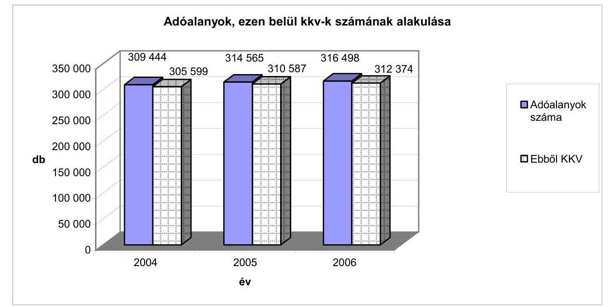

Az APEH által kitöltött tanúsítványok adatai alapján

Adókedvezményeket az összes társasági adóalany (309 444 - 316498 db) közel 2\%-a számolt el. Ennek a 2\%-nak a 92-95\%-a volt kkv, miközben az összes elszámolt adókedvezménynek mindössze 2,1-5,1\%-át érvényesítették ezen adóalanyok. A vizsgált időszakban a kkv-knak is átlag 2\%-a vett igénybe adókedvezményt (2004-ben 2,1\%-a, 2005-ben 1,9\%-a, 2006-ban 1,5\%-a).

Miközben a vizsgált időszakban az adóalanyok száma 2,3\%-kal, ezen belül a kkv-k száma 2,2\%-kal nőtt, az adókedvezményeket igénybe vevő adóalanyok száma folyamatosan csökkent. Az adókedvezményt igénybe vevő adóalanyok száma $22 \%$-kal, ezen belül a kkv-k száma $24 \%$-kal esett vissza.
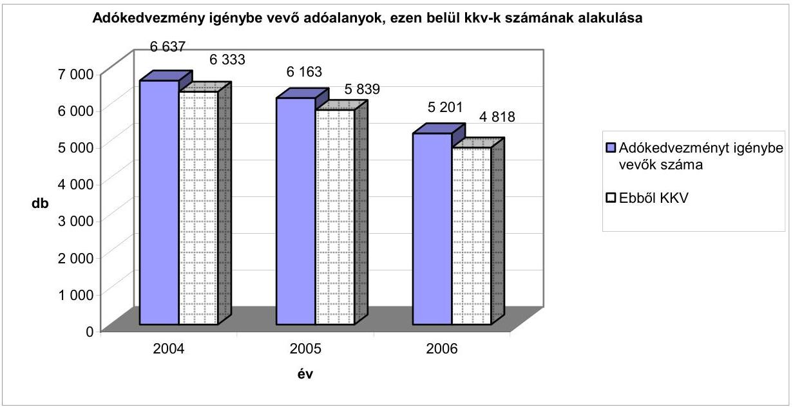

Az APEH által kitöltött tanúsítványok adatai alapján

---

A társasági adókedvezményeket igénybe vevő társaságok alkalmazottainak számáról az adóhivatal nem vezet nyilvántartást. Ennek oka, hogy a PM nem fogalmazott meg elvárást ilyen adatszolgáltatásra és az adóhivatal az adóalanyok által az adóbevallásukban megadott létszámadatokat nem ellenőrzi, így nem is tekinti azt megbízhatónak.

A társasági adókedvezményt igénybe vett adóalanyok számának és az adókedvezmény összegének alakulása 2004-2006

|  | 2004 |  | 2005 |  | 2006 |  |
| :--: | :--: | :--: | :--: | :--: | :--: | :--: |
|  | Összesen | Ebből KKv | Összesen | Ebből KKv | Összesen | Ebből KKv |
| Adókedvezményt igénybe vevő adóalanyok száma (db) | 6637 | 6333 | 6163 | 5839 | 5201 | 4818 |
| Elszámolt adókedvezmény összege (M Ft) | 50390 | 2582 | 121479 | 2431 | 112884 | 2414 |
| T adózóra jutó adókedvezmény összege (M Ft/db) | 7,59 | 0,41 | 19,71 | 0,42 | 21,70 | 0,50 |

Az APEH által kitöltött tanúsítványok adatai alapján

A kkv-k által igénybevett adókedvezmény összege folyamatosan csökkent a vizsgált időszakban. Az egy vállalkozásra jutó adókedvezmény összege nominálértéken 2004-ben 410 E Ft, 2005-ben 420 E Ft, 2006-ban pedig 500 E Ft volt.

# 2.2.2. A PM figyelemmel kísérte-e és értékelte-e ezt a tendenciát? 

A PM dokumentáltan nem vizsgálta és nem értékelte a változás okait annak ellenére, hogy az adókedvezményt igénybe vevő vállalkozások száma csökkenésének mértéke ezt indokolta volna.

### 2.3. Mekkora a kkv-k által igénybe vett adókedvezmények öszszege és költségvetésen belüli aránya?

### 2.3.1. Mekkora adóbevétel kiesést jelentenek a társasági adókedvezmények?

Az összes társasági adóhoz kapcsolódó adókedvezmények éves összegeit a következő táblázat mutatja:

---

| Adókedvezmény | 2004 |  | 2005 |  | 2006 |  |
| :--: | :--: | :--: | :--: | :--: | :--: | :--: |
|  | M Ft | \% | M Ft | \% | M Ft | \% |
| Beruházási adókedvezmények | 46606 | $92,5 \%$ | 111785 | $92,0 \%$ | 100155 | $88,7 \%$ |
| Térségi és egyéb adókedvezmények | 1116 | $2,2 \%$ | 3904 | $3,2 \%$ | 4652 | $4,1 \%$ |
| Kis és középvállalkozások adókedvezménye | 2582 | $5,1 \%$ | 2431 | $2,0 \%$ | 2414 | $2,1 \%$ |
| Fejlesztési adókedvezmény | 86 | $0,2 \%$ | 3358 | $2,8 \%$ | 5664 | $5,0 \%$ |
| Összesen | 50390 | $100 \%$ | 121479 | $100 \%$ | 112884 | $100 \%$ |

Az összes adókedvezmény összege 2004. évről 2005-re közel a két és félszeresére növekedett, aminek oka, hogy az EU csatlakozást követően az elszámolt beruházási adókedvezmény közel két és félszeresére, a fejlesztési adókedvezmény pedig mintegy 40 -szeresére nőtt.

# 2.3.2. Mekkora adóbevétel kiesést jelentenek a kkv-knak nyújtott társasági adókedvezmények? 

A kkv-k által igénybe vett adókedvezmény összege a vizsgált időszakban közel azonos szinten alakult, azonban az összes elszámolt adókedvezményen belüli aránya 2004-ről 2005-re kevesebb mint a felére csökkent. Ennek oka, hogy az EU csatlakozást követően a fejlesztési adókedvezmény igénybevétele 2004-ről 2005-re ugrásszerűen megnövekedett.

### 2.3.3. A PM készít-e előrejelzést az éves költségvetési terv keretében a társasági adókedvezmények várható összegéről?

A PM a költségvetési terv készítése során a társasági adókedvezmények várható összegét jogcímek szerint tervezi, figyelembe veszi az előző évek tényadatait (bázisszemléletű tervezés) a társasági adóbevétel előirányzatának meghatározásánál (részletesen lásd 2.1.1 pontban).

### 2.3.4. Figyelemmel kíséri-e a PM vagy az adóhatóság a költségvetés végrehajtását követően a társasági adókedvezmények összegének alakulását?

A PM a vizsgált időszakban rendszeres időközönként - kimutatás jellegétől függően hetente, illetve havonta - adatokat kér az APEH-tól a költségvetési bevételi előirányzatok, ezen belül a társasági adóbevételek teljesüléséről. Amennyiben az időarányos teljesülés eltér az előirányzattól, vizsgálja annak okait.

Az adókedvezmények igénybevételének alakulásáról az adóhivatal éves adatokat ad át a PM részére.

---

# 2.3.5. Mekkora a társasági adókedvezmények és a kkv-knak nyújtott társasági adókedvezmények aránya a költségvetés teljes összegéhez és az adóbevételekhez viszonyítva? 

Az adatokat és az arányokat az alábbi táblázat tartalmazza:
A társasági adó és az igénybe vett adókedvezmények alakulása 2004-2006

|  | 2004 | 2005 | 2006 |
| :--: | :--: | :--: | :--: |
| Központi költségvetés bevételi főösszege (Mrd Ft) | 5333 | 6457 | 6549 |
| Központi költségvetés társasági adóbevétele (Mrd Ft) | 449 | 430 | 469 |
| Igénybe vett összes társasági adókedvezmény (Mrd Ft) | 50,4 | 121,5 | 112,9 |
| Igénybe vett összes társasági adókedvezmény és a   központi költségvetés bevételi főösszegének aránya | $0,95 \%$ | $1,88 \%$ | $1,72 \%$ |
| Igénybe vett összes társasági adókedvezmény és a   központi költségvetés társasági adóbevételének aránya | $11,22 \%$ | $28,26 \%$ | $24,07 \%$ |
| Kkv-k által igénybe vett adókedvezmény (Mrd Ft) | 2,6 | 2,4 | 2,4 |
| Kkv-k által igénybe vett társasági adókedvezmény és a   központi költségvetés bevételi főösszegének aránya | $0,05 \%$ | $0,04 \%$ | $0,04 \%$ |
| Kkv-k által igénybe vett társasági adókedvezmény és a   központi költségvetés társasági adóbevételének aránya | $0,58 \%$ | $0,56 \%$ | $0,51 \%$ |
| Kkv-k által igénybe vett adókedvezmény és az igénybe   vett összes társasági adókedvezmény aránya | $5,16 \%$ | $1,98 \%$ | $2,13 \%$ |

APEH által kitöltött tanúsítványok adatai alapján
A táblázat „kkv-k által igénybe vett adókedvezmény" sora csak a beruházási hitel kamata alapján érvényesített adókedvezmény összegét (Tao tv. 22/A §) tartalmazza. Ez nem fedi le teljesen a kkv-k által igénybe vett adókedvezmény összegét, mivel a térségi és egyéb adókedvezményekből is részesülnek. Erre az APEH az egyes adóalanyokra vonatkozóan rendelkezik adatokkal, azonban összesített adatokat nem tudott az ellenőrzés rendelkezésére bocsátani.

### 2.3.6. Hogyan alakultak ezek az arányok a vizsgált időszakban?

A központi költségvetés bevételeinek évente átlagosan 7-8\%-a származik a társasági adóbefizetésekből. A bevételek folyamatos és egyenletes biztosítása érdekében az adóalanyok év közben adóelőleget fizetnek, amelynek alapja az előző évi bevallott társasági adó összege. Az adózóknak az adóelőleget az adóév december 20 -áig a becsült éves társasági adó összegére kell kiegészíteniük (előlegfeltöltési kötelezettség). A rendszerből adódóan a befizetett adó összege nem egyezik meg a bevallott adó összegével, mivel a tárgyévi társasági adó-bevétel tartalmazza az előző évi kötelezettséghez kapcsolódó elszámolást, a tárgyévre fizetett előlegeket és a becsült kötelezettségre való kiegészítést.

---

A táblázatban az adókedvezmények adatai a társasági adóbevallásokból összesített (az adóalanyok által elszámolt) adatok. Az APEH a vállalkozás mérete szerinti bontásban nyilvántartja a bevallott adó összegét, azonban arra vonatkozóan, hogy a kkv-k milyen összegű társasági adót fizetnek meg évente, az adóhivatal nem rendelkezik összesített adatokkal. Így nem mutatják ki a kkv-k által fizetett társasági adó és az összes társasági adó aránya, illetve a kkv-k által fizetett társasági adó és az általuk igénybe vett adókedvezmény aránya.

Az igénybe vett adókedvezményeknek a központi költségvetés bevételeihez, valamint a társasági adóbevételekhez viszonyított aránya 2004-ről 2005-re kétszeresére, illetve két és félszeresére növekedett (lásd részletesen 2.3.1 pont).

A kkv-k által igénybe vett adókedvezmény a vizsgált időszakban közel azonos szinten alakult mind összegében, mind a központi költségvetés bevételeihez, valamint a társasági adóbevételekhez viszonyított arányában. Az igénybe vett összes adókedvezményeken belül a kkv-k által elszámolt adókedvezmény aránya 2004-ről 2005-re kevesebb mint a felére csökkent, majd 2006-ban közel azonos szinten alakult. Az arányváltozás oka, hogy az összes igénybe vett adókedvezmény összege két és félszeresére nőtt (lásd részletesen 2.3.1 pont).

# 3. AdatbÁzis, TÁrsasÁGi adÓKEDVEZMÉNYEKHEZ KAPCSOLÓDÓ ADÓHATÓSÁGI KÖLTSÉGEK 

### 3.1. Milyen adatbázist alkalmaznak (ezen belül a szoftver, biztonság, hatékonyság)?

### 3.1.1. Az informatikai feldolgozással kapcsolatban merültek-e fel problémák?

Az adóhatósági szakfeladatok ellátásának informatikai támogatottsága kielégíti a szakterületek igényeit. Az ÁSZ a korábbi ellenőrzései során ${ }^{10}$ vizsgálta az informatikai alkalmazások területét és hiányosságokat tárt fel az informatikai alkalmazások közötti együttmúködés, a napi feladatellátást támogató szolgáltatások színvonala tekintetében, valamint hogy az informatikai rendszer egyrészt nem terjedt ki valamennyi feldolgozási szakaszra, másrészt egyes szakaszok informatikailag támogatottak voltak, ennek ellenére egyes részfeladatokat manuális hajtották végre.

### 3.1.2. Ha igen, milyen jellegúek a problémák és megoldották-e őket?

Az ÁSZ által feltárt hiányosságokat az adóhivatal az ellenőrzéseket követően az informatikai rendszerei továbbfejlesztésével megszüntette.

[^0]
[^0]:    ${ }^{10}$ Részletes megállapításokat az Adó- és Pénzügyi Ellenőrzési Hivatal múködésének ellenőrzéséről (0616), valamint a Társasági adó beszedésére kialakított rendszer múködésének ellenőrzéséről (0549) készített ÁSZ jelentések tartalmazzák.

---

A Hivatal az adóbevallások benyújtásának és feldolgozásának egyszerűsítése, minőségének javítása és a költségek csökkentése érdekében a vizsgált években folyamatosan fejlesztette egyrészt az elektronikus bevallás lehetőségét, másrészt nyomtatványkitöltő programmal segíti az adóalanyokat adóbevallásaik elkészítésében.

A kitöltő program az APEH honlapjáról letölthető. 2004-ben a vállalkozások 68\%-a, a teljes adóalanyi kör 60\%-a a társasági adó-bevallását a nyomtatványkitöltő program segítségével nyújtotta be. Az Art. 2005-től hatályos módosítása kötelezővé tette az adóalanyok számára az elektronikus adóbevallás alkalmazását.

# 3.1.3. Az (adóbevallások feldolgozásához használt) informatikai rendszerek megbízható adatokat szolgáltatnak-e az értékelésekhez? 

A felhasználói programok szoftvervédelme biztosított, az adatokban ellenőrizetlenül módosítások nem hajthatók végre. Az adatok mentése és biztonságos tárolása szabályozott, a végrehajtás a szabályzatok betartásának megfelelően történik, az adatállományokat naponta mentik ${ }^{11}$.

Az adóhivatal a társasági adókedvezmények ellenőrzéséhez csak a társasági adóbevallásokból nyer adatokat, külső szervezettől származó kontrollinformációk elektronikus úton nem állnak rendelkezésére. Más adónemek (áfa, járulékok) bevallásainak feldolgozása során keletkezett adatokat az adóhivatal nem integrált, hanem egymástól különálló adatállományokban tartja nyilván. Az ezekben rendelkezésre álló adatokat nem használja fel az ellenőrzéseihez rendszerjellegűen kontrolladatként (pl. az adóalany egyéb adóbevallásainak illetve a Hivatal más adónemre vonatkozó ellenőrzési megállapításainak adatai). ${ }^{12}$

Informatikai alapú kontrollal ellenőrizhető lenne az adóbevallások egyes adatsorainak megbízhatósága. E kontroll elvégzésével az adatok eltérései feltárhatók. A bevallás feldolgozás informatikai rendszere az adózó adatait a törzsadatbázissal veti össze, valamint elvégzi a társasági adó-bevallás egyes sorainak a bevalláson belüli, számszaki-logikai összefüggéseinek vizsgálatát, az adott feldolgozási folyamatban az adózó más bevallásának adatait a feldolgozási rendszer nem vizsgálja.

[^0]
[^0]:    ${ }^{11}$ Részletes megállapításokat az APEH múködésének ellenőrzéséről készített 2006. évi ÁSZ jelentés (0616) tartalmazza.
    ${ }^{12}$ Részletes megállapításokat a Társasági adó beszedésére kialakított rendszer múködésének ellenőrzéséről (0549) készített ÁSZ jelentés tartalmazza.

---

# 3.1.4. Milyen kockázati tényezőket alkalmaznak az ellenőrzésre történő kiválasztáshoz használt informatikai rendszerben a társasági adókedvezményeket igénybe vevő adóalanyok ellenőrzésénél? 

Az informatikai rendszer lehetővé teszi, hogy az ellenőrzési kockázatokat az adóhivatal kiválasztási paraméterként határozza meg. A legfontosabb kockázati tényezőket - mint pl. köztartozás, nagy összegű visszaigénylés, kifogásolható magatartást tanúsító adózók - kötelező kiválasztási szempontként veszi figyelembe a rendszer.

Az APEH az ellenőrzési stratégiájának megfelelően - a jogszabályokban előírt kötelezettségeit, illetve a korábbi évek ellenőrzési tapasztalatait figyelembe véve - irányelvekben fogalmazta meg az éves ellenőrzési prioritásokat. Ezek közé tartozik az adókedvezményt, illetve támogatást igénybe vevő, valamint a veszteséges, továbbá az elszámolt költségek árbevételhez viszonyított magas arányt kimutató vállalkozások ellenőrzésre kiválasztása.

Az APEH a társasági adó-bevallást benyújtó adóalanyoknak átlagosan 2\%-át ellenőrzi évente. A legnagyobb éves adóteljesítménnyel rendelkező 3000 adóalanyt kiemelt adózói kategóriába sorolva (ide tartoznak a legnagyobb összegű társasági adókedvezményt igénybe vevő adóalanyok is) 2006-ig kétévente, 2006-tól három évente kötelező ellenőriznie.

Az adóhivatal nem vezet nyilvántartást arról, hogy az általa elvégzett összes ellenőrzésből hány irányult adókedvezményt igénybe vevő vállalkozásra, illetve ezek közül hány darab volt kkv, így azt sem tudja kimutatni, hogy ezeknél mekkora összegű adóhiányt tárt fel az adókedvezmény jogosulatlan igénybevétele miatt. Az ÁSZ ellenőrzés számára az APEH kigyűjtötte a vizsgált időszakban beruházási, illetve fejlesztési adókedvezményt igénybe vevő összes adóalany ( 84 db ) ellenőrzési adatait. (Ezen adózók vették igénybe az összes társasági adókedvezmény több mint $90 \%$-át). Ezek közül 37 adóalany ( $44 \%$ ) esetében terjedt ki az ellenőrzés a társasági adóra is. A 37 ellenőrzésből 34 (92\%) zárult megállapítással, ebből 16 db (43\%) érintett társasági adónemet. A feltárt összes adókülönbözet 1602,4 M Ft, ezen belül a társasági adókülönbözet $309,6 \mathrm{M} \mathrm{Ft}(19 \%)$ volt.

### 3.2. Az adókedvezményekhez kapcsolódó adminisztrációs költségek mérhetők-e és elkülöníthetők-e?

3.2.1. A PM vagy az adóhivatal rendelkezik-e adatokkal a társasági adókedvezményekkel kapcsolatban felmerült adminisztrációs költségek - teljes vagy részbeni - összegéről (pl. adatfeldolgozással, az adózók ellenőrzésével kapcsolatban)?

Sem a PM, sem az adóhivatal nem rendelkezik adatokkal a társasági adókedvezményekkel kapcsolatban felmerült adminisztrációs költségek összegéről. Az APEH az adóbeszedés költségeit a szervezet egésze szintjén mutatja ki, nem osztja meg azokat feladat-típusok szerint. Ezáltal a társasági adóval, illetve

---

ezen belül az adókedvezményekkel kapcsolatos ellenőrzéseinek a költségeit sem különíti el.

Az APEH által beszedett költségvetési nettó bevételek, valamint az adóbeszedésre fordított kiadások arányát tekintve az adóbeszedés hatékonysága az elmúlt időszakban összességében javult ${ }^{13}$.

A beszedett adók és adó jellegű bevételek növekedési üteme jelentős mértékben meghaladta a kiadások növekedési ütemét. A kiadások 13\%-kal, a beszedett költségvetési nettó bevételek $60 \%$-kal, ezen belül az önadózáson kívüli bevételek $23 \%$-kal nőttek.

# 3.2.2. Ha igen, az adminisztratív költségek hozzárendelhetők-e az egyes adókedvezményekhez és mérhetőek-e? 

Lásd 3.2.1 pont

### 3.2.3. Ha igen, milyen módszerrel mérik és különítik el a költségeket (becslések, számítások)?

Lásd 3.2.1 pont

## 4. EREDMÉNYESSÉG, HATÉKONYSÁG

### 4.1. Hogyan méri a PM az adókedvezmények eredményességét?

4.1.1. Rendszeresen méri-e a PM a társasági adókedvezmények felhasználásának eredményességét figyelembe véve az adókedvezményt igénybe vevő adóalanyok számát és az adókedvezmények összegét?

A PM nem értékeli, hogy az adókedvezmények felhasználásával az azt igénybe vevő vállalkozások milyen mértékben járultak hozzá a kitűzött célok eléréséhez és nem is alakította ki az értékelés feltételrendszerét. Nem határozta meg, hogy mely mutatószámokkal mérhetők az egyes célok (mint pl. versenyképesség növelése, az elmaradott térségek felzárkóztatása) teljesülése, továbbá azt sem, hogy azok mely értékei mellett lehet, illetve kell az adott adókedvezményt eredményesnek minősíteni.

Nem méri a társasági adókedvezmények felhasználásának eredményességét, nem mutatja ki, hogy az adókedvezmények igénybevételével növekedett-e a foglalkoztatottság, hány beruházás, illetve fejlesztés valósult meg az elmaradott térségekben. Ez a gyakorlat ellentétes a jogalkotásról szóló 1987. évi XI. tv. 44.§-ával, amely előírja, hogy egy jogszabály a bevezetését követően a jogalko-

[^0]
[^0]:    ${ }^{13}$ Részletes megállapításokat az APEH múködésének ellenőrzéséről készített 2006. évi ÁSZ jelentés (0616) tartalmazza.

---

tó és a jogalkalmazó szerveknek figyelemmel kell kísérniük azok alkalmazásának hatását, fel kell tárniuk az érvényre juttatásukat gátló körülményeket és a tapasztalatokat a jogalkotásban is hasznosítani kell. Az ÁSZ ezt a hiányosságot korábbi ellenőrzése során már feltárta, és erre vonatkozóan javaslatot tett ${ }^{14}$. Intézkedést a PM azonban azóta sem tett.

Az adózók által bevallott adókedvezmények összegéről, az adókedvezményeket igénybevevő adóalanyok számáról a PM statisztikai összesítéseket készít. Az éves költségvetés végrehajtásáról szóló törvényjavaslat tartalmazza az adóalanyok által érvényesített adókedvezmények összegét. A fejlesztési adókedvezményre vonatkozó igényeknél a PM vizsgálta azok régiónkénti megoszlását. Megállapította, hogy a beruházás értéke alapján a befektetések mintegy 30-30\%-a az Észak-Magyarországi és a Közép-Dunántúli régióban, közel 15\%-a az Észak-Alföldi régióban, nem egészen 10\%-a a Nyugat-Dunántúli régióban valósul meg. A fennmaradó 3 régióban 2-5\% körül a részesedés.

# 4.1.2. Rendszeresen méri-e a PM a kkv-knak nyújtott társasági adókedvezmények felhasználásának eredményességét figyelembe véve az adókedvezményt igénybe vevő adóalanyok számát és az adókedvezmények összegét? 

Nem. Lásd részletesen a 4.1.1 pontnál leírtakat.

### 4.1.3. Milyen módszerrel mérik az eredményességét? Ehhez milyen paramétereket vesznek figyelembe?

Lásd részletesen a 4.1.1 pontnál leírtakat.

### 4.1.4. Mik a felmérés következményei? Milyen jogszabályi változásokat eredményezett?

Lásd részletesen a 4.1.1 pontnál leírtakat.

### 4.1.5. Nyomon követik és folyamatosan értékelik-e a kitűzött célok elérését?

Lásd részletesen a 1.2.3 és a 4.1.1 pontokban leírtakat. Tekintettel az említett pontokban megfogalmazottakra, a PM így azt sem értékeli, hogy az adókedvezmények céljainak megvalósulása milyen hatást gyakorol a gazdaságra, illetve a költségvetésre.

[^0]
[^0]:    ${ }^{14}$ A részletes megállapításokat „a társasági adó beszedésére kialakított rendszer múködésének ellenőrzéséről" 2005. októberében megjelent ÁSZ jelentés (0549) tartalmazza. Az ÁSZ javasolta a pénzügyminiszternek, hogy „készíttessen értékelést arra vonatkozóan, hogy az igénybe vett adókedvezmények milyen mértékben járultak hozzá a kitűzött gazdaságpolitikai célok eléréséhez".

---

# 4.1.6. Az adókedvezmény adminisztrációjához felhasznált erőforrások összhangban álltak-e az előzetes becslésekkel? 

A társasági adókedvezményekkel kapcsolatos adminisztrációhoz felhasznált erőforrásokról adatok nem állnak rendelkezésre, mivel a PM és az APEH azokat az adóztatással kapcsolatos feladataik részeként végzik.

### 4.1.7. Hatékony volt-e az adókedvezmény a célokat figyelembe véve?

Az adókedvezmény azáltal jelent hatékony eszközt a vállalkozások számára, hogy egyrészt ösztönzi őket a nyereséges működésre (csak nyereséges vállalkozás számolhatja el), másrészt a befizetendő adó csökkenti a vállalkozások költségeit, így javítja likviditásukat.

Ellenőrzési megállapításaink megalapozásához strukturált kérdőívet küldtünk meg valamennyi, beruházási/fejlesztési adókedvezményt igénybevevő adóalanynak (84), amelyek közül 27 -en (32\%) válaszoltak megkeresésünkre. A válaszoló adóalanyok közül 20 (74\%) nyilatkozta, hogy az adókedvezmény hozzájárult a vállalkozásuk versenyképességének növeléséhez.

A PM nem méri és nem értékeli az adókedvezmények céljai megvalósulását, így nem mutatható ki, hogy az adókedvezmények makrogazdasági szinten menynyiben jelentenek hatékony eszközt a gazdaságfejlesztési célok eléréséhez.

### 4.1.8. Eredményes-e az adókedvezmény a célok elérése szempontjából figyelembe véve a fenti értékeléseket?

A PM nem méri és nem értékeli az adókedvezmények céljai megvalósulását, így nem mutatható ki annak eredményessége sem.

### 4.1.9. A PM figyelemmel kíséri-e a társasági adókedvezmények hatásait?

A PM nem végez ilyen jellegű méréseket és elemzéseket.

### 4.1.10. Milyen következményekkel jár a jogszabályok figyelemmel követése?

Lásd részletesen 4.1.1

### 4.2. Eredményes-e az adókedvezmény, azaz ténylegesen elér-ték-e a kitüzött célokat?

4.2.1. Vannak-e módszerek annak értékelésére, hogy az adókedvezmények a kitüzött célokat elérték-e?

Lásd részletesen a 4.2.2 pontnál leírtakat.

---

# 4.2.2. Melyek az adókedvezmények mérhető céljai és hatásai (pl. a foglalkoztatottság, beruházások növelése)? 

Az adókedvezmények valamennyi céljának teljesülése elvileg mérhető lenne, azonban ilyen kimutatások - a foglalkoztatottság területét kivéve - nem készülnek (lásd részletesen 1.2.3 pont).

A foglalkoztatottság alakulására mind a KSH, mind APEH nyilvántart adatokat, 2004. és 2006. között mindkét forrás szerint nőtt ( $0,81 \%$-kal, illetve $0,53 \%$ kal). A növekedés hatásának értékelésére az adatok felhasználhatósága több szempontból korlátozott és nem mutatható ki, hogy a növekmény mekkora hányada származtatható az adókedvezmények igénybevételének hatásaként.

A KSH által nyilvántartott adatok nem csak az adókedvezményt igénybe vevőkre vonatkoznak, hanem az 5 fő feletti magyarországi vállalkozásokra, továbbá a számadatok mintavétellel vett adatfelvételből és nem teljes körű nyilvántartásból származnak. Az APEH az adatokat a társasági adóbevallásokból nyeri, de a hivatal kimutatása sem teljes körű, mivel a foglalkoztatottságra vonatkozó adatot nem minden vállalkozás adja meg, ugyanis ez az adat indifferens a fizetendő adó összegének meghatározása szempontjából, és ezért az adóhivatal ezt az adatot nem ellenőrzi.
8. sz. táblázat

Foglalkoztatottak megoszlása vállalkozási típusok szerint 2004-2006

|  | Az összes vállalkozásnál foglalkoztatottak   száma KSH adatok alapján (fő) |  |  | Az összes vállalkozásnál   foglalkoztatottak száma APEH adatok   alapján (fő) |  |  |
| :-- | :--: | :--: | :--: | :--: | :--: | :--: |
|  | 2004 | 2005 | 2006 | 2004 | 2005 | 2006 |
| Mikro | 204023 | 220087 | 225493 | 489267 | 482926 | 501366 |
| Kis | 473792 | 488477 | 502279 | 458222 | 470203 | 484504 |
| Közép | 448116 | 442634 | 435097 | 418947 | 416527 | 423888 |
| Nagy | 792960 | 771997 | 771669 | 839268 | 785779 | 807630 |
| Összesen | 1918891 | 1923195 | 1934538 | 2205704 | 2155435 | 2217388 |

Az APEH és a KSH adatai alapján

### 4.2.3. Mely célokat érték el és melyeket nem?

Lásd részletesen a 4.2.2 pontnál leírtakat

---

# 4.3. Hatékony-e az adókedvezmény, azaz megfelelő-e a költségek és hasznok aránya? 

### 4.3.1. Milyen arányban állnak a társasági adókedvezmények adminisztratív költségei a hasznokkal?

Egyik szervezet sem különíti el az adókedvezmények adminisztrációjával összefüggő költségeit. Nem készítenek előzetes számításokat arra vonatkozóan sem, hogy az adókedvezmények várhatóan milyen mértékű költségvetési bevételi többletet eredményezhetnek.

### 4.3.2. A vizsgált időszakban hogyan alakult a hatékonyság?

Lásd 4.3.1 pontnál.

## 5. ELLENŐRZÉSI ELJÁRÁSOK

### 5.1. Milyen ellenőrzési eljárásokat alkalmaznak? Feltártak-e visszaéléseket?

5.1.1. Milyen kontrollokat alkalmaznak annak érdekében, hogy elkerüljék, illetve csökkentsék az adókedvezmények igénybevételével kapcsolatos hibákat?

Lásd részletesen 5.1.2 pontnál leírtakat.

### 5.1.2. Előírnak-e a jogszabályok kötelező jellegű ellenőrzéseket?

Az APEH a társasági adó-bevallást benyújtó adóalanyoknak átlagosan 2\%-át ellenőrzi. Ezen belül a legnagyobb éves adóteljesítménnyel rendelkező 3000 adóalanyt (kiemelt adózói kategória) 2006-ig kétévente, 2006-tól három évente kötelező a Hivatalnak ellenőriznie. Ennek következtében a nagy összegű társasági adókedvezményt igénybe vevő adóalanyokat az APEH rendszeresen ellenőrzi.

A fejlesztési adókedvezmények esetében a kormányrendelet alapján az APEHnak az adókedvezmény első igénybevételét követő negyedik adóév végéig legalább egyszer ellenőriznie kell a kedvezmény feltételeinek teljesítését. Az adóhivatal a négy év lejártát megelőzően is végezhet ellenőrzést, de ellenőrzési kötelezettséget számára legkorábban csak 2008-ban jelent.

### 5.1.3. Ha igen, mire terjednek ki ezek az ellenőrzések?

Az adóhatóság az adóellenőrzései során - az irányelvekben meghatározott prioritást figyelembe véve - kiemelten ellenőrizte a különböző jogcímeken igénybe vett adókedvezmények, illetve az adóalap korrekciós tételek elszámolását. Nem mutatja ki a Hivatal, hogy hány ellenőrzést végzett adókedvezményt igénybe

---

vevő adóalanynál és mekkora összegű adóhiányt tárt fel az adókedvezmény jogosulatlan igénybevétele miatt.

# 5.1.4. Tártak-e fel jogszabálysértéseket a társasági adókedvezményekkel kapcsolatban, különös tekintettel az adóval kapcsolatos büncselekményekre, illetve hivatali visszaélésekre? 

Az adóhivatal tárt fel jogszabálysértéseket a társasági adókedvezmények ellenőrzései során, de egyiket sem minősítette bűncselekménynek, illetve hivatali visszaélésnek.

### 5.1.5. Milyen jellegú jogszabálysértéseket tártak fel (főbb típusok)?

Az igazgatóságok a beruházási adókedvezmények vizsgálata során megállapították, hogy egyes vállalkozások nem a jogszabályban meghatározott feltételek mellett megvalósított beruházásra vettek igénybe kedvezményt. Az APEH ezekben az esetekben intézkedett az adókedvezmények visszafizettetéséről.

A térségi adókedvezmények igénybevételénél három típushiba fordult elő: nem a kedvezményezett térségben (vállalkozási övezet, kiemelt térség) történt a beruházás; nem a társasági adótörvény szerint számolta el az adózó az értékcsökkenési leírást; illetve „a korábban még használatba nem vett eszköz" törvényi megfogalmazást az adózó úgy értelmezte, hogy az általa még nem használt, de nem új beszerzésű eszközre is vonatkoznak a törvényi feltételek.

A kis- és középvállalkozások adókedvezménye igénybevételekor jellemző hiba volt, hogy egyrészt az adózó a folyószámlahitel kamata után vette igénybe a kedvezményt, másrészt ugyanazon hitel után az adóalap csökkentő lehetőségét is és a hitel kamatai utáni adókedvezményt is elszámolta.

### 5.1.6. Ennek következtében mekkora összegű társasági adókedvezményt kellett a társaságoknak visszafizetniük, és ebből ténylegesen mekkora összeget fizettek vissza?

Az adóhivatal a társasági adó ellenőrzései során vizsgálja az adókedvezmények igénybevételének jogszerúségét is, de a megállapított adókülönbözeten belül nem különíti el, hogy abból mekkora összeg érint adókedvezményt. Ennek következtében az APEH nem mutatja ki, hogy az adókedvezmények helytelen elszámolása miatt az adóalanyoknak mekkora összegű adófizetési kötelezettségük keletkezett. Az egyes adóalanyokra vonatkozó konkrét esetekben az ellenőrzésekről készített jegyzőkönyvek a részletes adatokat tartalmazzák.

Az ÁSZ ellenőrzés számára az APEH kigyűjtötte a vizsgált időszakban beruházási, illetve fejlesztési adókedvezményt igénybe vevő összes adóalany ( 84 db ) ellenőrzésének adatait. Ezen adózók vették igénybe az összes társasági adókedvezmény több mint $90 \%$-át. Az APEH közülük 37 adóalanyt (44\%) ellenőrzött társasági adót is érintően (átfogó, illetve adónem ellenőrzés keretében). Az ellenőrzések $92 \%$-a ( 34 db ) zárult megállapítással, ebből 16 db ( $43 \%$ ) érintett társasági adónemet. A feltárt adókülönbözet 1602,4 M Ft, ezen belül a társasági adókülönbözet $309,6 \mathrm{M} \mathrm{Ft}(19 \%)$ volt.

---

A helyszíni ellenőrzés megállapításainak hasznosítása mellett javasoljuk:

# a pénzügyminiszternek 

1. Gondoskodjon arról, hogy a jogalkotásról szóló 1987. évi XI. tv.18.§-a alapján készüljön a jogszabályok bevezetését, illetve módosítását megelőzően hatásvizsgálat, valamint a tv. 44. §-ában előírtak szerint kísérje figyelemmel és értékelje a jogszabályok alkalmazásának hatásait, tárja fel az érvényre juttatásokat gátló körülményeket és hasznosítsa a tapasztalatokat a jogalkotásban.
2. Kezdeményezze a Tao. tv. módosítását annak érdekében, hogy a fejlesztési adókedvezmények nyilvántartásának pontosítása érdekében írjon elő adatszolgáltatási kötelezettséget jogutódlás esetén mind a jogelődnek, mind a jogutódnak.

Budapest, 2008. február

---

# 1. sz. melléklet 

11-1051 BUDAPLST V. IOZSEF NADOR TEX 2 4. POSTACIM 136" BUDAPEST. POSTAFIOK 481.

TFI FFON: (36-1) 337-2106, 1.36) 30 371-2106
FAX (36-1) 337-2479

SZAKÁLLAMTITKÁR

Bihari Zsigmond úr föigazgató

Állami Számvevőszék BUDAPEST

## Tisztelt Föigazgató Úr:

A gazdaságfejlesztés eszközrendszere müködésének ellenőrzése keretében a kis- és középvállalkozások részére nyújtott társasági adókedvezmények credményességének és hatékonyságénak ellenőrzésre vonatkozó Részjelentést köszönettel megkaptam. Köszönöm, hogy a véglegezésnél munkatársaim észrevételeit felhasználták, illetve utalnak a külön álláspontra. A Részjelentésben foglaltakhoz további észrevételt nem teszek.

Budapest, 2008. január 28.

Üdvözlettel:
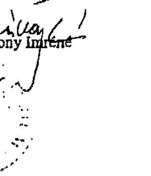

---

# ÖSSZEFOGLALÓ TANULMÁNY 

## A NATURA 2000 TÉMÁJÚ, az EUROSAI WGEA, a Francia Számvevőszék és az ECA által koordinált nemzetközi párhuzamos ellenőrzéshez

## BEVEZETÉS

A környezeti fenntarthatóság korunk egyik legnagyobb kihívása, amely megköveteli a gazdaságfejlesztés modern és etikus felfogását. Ez azt jelenti, hogy az államnak a gazdaság szabályozását úgy kell kialakítania és folytonosan felügyelnie, hogy valóban hosszú távon fenntarthatónak bizonyuljanak az ember és a természet, a gazdaság és a környezet kölcsönkapcsolatai. ${ }^{1}$ Ezt a követelményt a Magyar Országgyúlés által hozott határozat az Országos Fejlesztéspolitikai Koncepcióról (96/2005. (XII.25.) OGY határozat a magyar fejlesztéspolitika alapelveként előírta. Többek között alapelvként fogalmazta meg a fenntartható fejlődést, a mérhetőség elvét, hogy a fejlesztéspolitikai beavatkozások hatása követhető és számon kérhető legyen, a programozás, integrálás elvét, hogy a tervezés során a fejlesztéspolitika építsen a programok kölcsönhatásaira. A magyar fejlesztéspolitika középtávú -15 évre szóló - célkitűzései figyelembe vették az európai uniós fejlesztéspolitikai irányokat. A stratégiai célok megvalósításának területeit a Koncepció három fő prioritáscsoportba rendezte, „Befektetés az emberbe", „Befektetés a gazdaságba" és „Befektetés a környezetbe". Ugyanezen súlypontokra építve alakította ki ellenőrzési programját az Állami Számvevőszék a 2007 évi „Gazdaságfejlesztés eszközrendszere ellenőrzésével" kapcsolatban, amelyhez jelen értékelés a „Befektetés a környezetbe prioritás csoporton belül a „természeti értékek és erőforrások megőrzésére" elemre fókuszál. Az OFK céljainak elérését szolgáló eszközöket és forrásokat tekintve egyrészt az EU irányelvek érvényesítése, másrészt az EU-s támogatási források hasznosításának hatékonysága meghatározóvá vált a gazdaság és környezetfejlesztésben. Jelen ellenőrzésben a szabályozási eszközöket tekintve a Madárvédelmi és az élőhely-védelmi irányelv érvényesítése ${ }^{2}$, a Natura 2000 hálózat kijelölése ${ }^{3}$, fenntartása volt a vizsgálat

[^0]
[^0]:    ${ }^{1}$ Pezzey, J.: Sustainable Developments Concepts. An Economic Analisis World Bank Environment Paper, Number 2. 1992.
    ${ }^{2}$ A Natura 2000 hálózat az Európai Unió két természetvédelmi irányelve alapján kijelölendő területeket - az 1979-ben megalkotott madárvédelmi irányelv (79/409/EGK) végrehajtásaként kijelölendő különleges madárvédelmi területeket és az 1992-ben elfogadott élőhely-védelmi irányelv (43/92/EGK) alapján kijelölendő különleges természetmegőrzési területeket foglalja magába.
    ${ }^{3}$ Az Európai Unió által létrehozott Natura 2000 egy olyan összefüggő európai ökológiai hálózat, amely a közösségi jelentőségű természetes élőhely típusok, vadon élő állat- és növényfajok védelmén keresztül biztosítja a biológiai sokféleség megóvását és hozzájárul kedvező természetvédelmi helyzetük fenntartásához, illetve helyreállításához.

---

fő területe. Forrás oldalról tekintve az uniós források közül a KIOP, KEOP, a LIFE III program, az INTERREG IIIA/B programok természetvédelmi komponenseit és az agrárkörnyezetvédelmi támogatások természetmegőrző elemeit tekintettük át, értékeltük és vontunk le következtetéseket. A jelen értékelésben felhasználtuk azokat a korábbi ÁSZ vizsgálati tapasztalatokat, amelyeket például a Környezetvédelmi és Vízügyi Minisztérium fejezet átfogó ellenőrzése, az ISPA, az NFT I, továbbá az EU támogatással megvalósuló projektekre kiterjedő monitoring és ellenőrzési rendszer vizsgálatok során szereztünk.

A jelen értékelést az Európai Unió Számvevőszékeinek Környezetvédelmi Ellenőrzési Munkacsoportja által elfogadott stratégiával összehangoltan és a Munkacsoport Elnöke részvételre történt felkérésének megfelelően, ÁSZ elnöki döntés alapján valósítottuk meg. A nemzetközi összehasonlíthatóság biztosítása érdekében az EUROSAI WGEA által javasolt ellenőrzési célok és kérdéslista figyelembevételével hajtottuk végre az értékelést és készítettük el az összefoglaló tanulmányt. A magyar összefoglaló tanulmányt, ill. tájékoztatót - hozzájárulva az EUROSAI Natura 2000 nemzetközi párhuzamos ellenőrzéshez - angolul megküldjük az európai számvevőszékek értékeléseit koordináló és öszszegző Francia Számvevőszéknek, másolatban az ECA-nak, és az EUROSAI WGEA lengyel koordinátorának. A nemzetközi párhuzamos ellenőrzések összefoglalását és eredményeit megküldjük a jelen vizsgálatban közremúködő szervezeteknek.

---

# VEZETŐI ÖSSZEFOGLALÓ 

Magyarország az EU előírásokkal összhangban Európa élővilága sokszínűségének megőrzése céljából eredményesen továbbfejlesztette a természetvédelemmel kapcsolatos magyar jogszabályi környezetet. Ennek keretében 2007 első félévig bezárólag az EU Madárvédelmi és Élőhely-védelmi irányelveit átültette a magyar jogszabályokba, ugyanakkor a gazdasági, államigazgatási környezet változásával azok aktualizálása, pontosítása egy folyamatos feladatot jelent.

Magyarország a magas színvonalú szakmai tevékenység biztosításával, az EU TA segítségével jelölte ki a Natura 2000 területeket. A Natura 2000 hálózat az ország területének $21 \%$-kát teszi ki, amely $1 \%$ ponttal meghaladja az EU átlagot. A kijelölésnek és használatot korlátozó feltételeknek a mértéke szükségessé tette a mintegy 2 millió ha területen - a területek művelési jellegéből és földrajzi elhelyezkedésétől függően - az EU támogatási források és a célrendszer közti egyensúlynak a folyamatos elemzését és fenntartását.

A Natura 2000 hálózat múködtetésével és a Natura 2000 hálózathoz kapcsolódó egyéb közösségi iránymutatásokkal, szabályozásokkal kapcsolatos többlet-feladatok ellátása a meglévő, de struktúrájában változó környezetvédelmi és természetvédelmi államigazgatási intézmények tevékenységén alapul. Ez a körülmény megbízható szakmai hátteret biztosít a Natura 2000 hálózat múködtetéséhez. Ugyanakkor az államigazgatási költségek csökkentésének jelenlegi prioritása miatt nem volt lehetőség arra, hogy a humánerőforrások célrendszerből következő fejlesztése megvalósuljon a tervezett mértékben és a csatlakozási feltételekkel összhangban.

Az IT és a szakmai fejlesztések során a területek kijelölésének és az adatbázisok közti kapcsolatok kiépítésének időszükségletét alulbecsülték. Ezért még folynak az ingatlannyilvántartásba történő bejegyzést biztosító hatósági eljárások, valamint a támogatási források allokálását támogató térinformatikai fejlesztések.

A Natura 2000 területeken, a különlegesen védett területeken a kezelési tervek, és a több oltalom alatt álló Natura 2000 területeken a fenntartási tervek elkészítése elkezdődött, melyet támogatási forrásokból is ösztönöz a Kormány.

Célszerű értékelni a kutatások eredményeit a biodiverzitással kapcsolatos indikátorok vonatkozásában. Az elszámolhatóság és a hatékonyság mérhetősége céljából indokolt azokat beépíteni az EU támogatások monitoring rendszerébe, különös tekintettel azok felhasználóbarát jellegére.

A magyar közigazgatás az EU környezetvédelmi politikájának érvényesítését, és annak egyik eszközének, a Natura 2000 hálózatnak a fejlesztését az EU támogatási források nélkül nem tudta volna elindítani. A csatlakozást követő 3 év mérlege pozitív, mivel a projektek széles skálája bizonyította az EU támogatási források hasznosulását, amelyek hozzájárultak a madárvédelmi és az élőhely-védelmi irányelvek gyakorlatba történő átültetéséhez. Ugyanakkor fokozni szükséges az EU támogatási források allokációjának és felhasználásának térbeni és időbeni, továbbá szakmai teljesítmény paramétereken alapuló összehangolását. Egy célra orientált Natura 2000 támogatási intézkedéscsomag kialakítása időszerűvé vált a környezetvédelmi és az agrártárca által működtetett esz-

---

közök figyelembevételével. Ugyanis a Natura 2000 célrendszer szakmai tervezési és ellenőrzési felelőssége elsősorban a KvVM feladata. A tények viszont azt mutatták, hogy az FVM rendelkezik nagyobb EU támogatási forrásokkal. Ezáltal a Natura 2000 területek jövőbeni sorsa az ENVA-ban tervezett EU támogatási forráselosztási stratégiától és gyakorlattól vált erősen függővé.

A tapasztalatok szerint a természetvédelmi szakigazgatás területén a biodiverzitás fenntartása céljából indokolttá vált a helyi társfinanszírozási források szintjének fenntartása, ill. egyes területeken a növelése.

Az EUROSAI WGEA, a Francia Számvevőszék és az ECA koordinálásával, közös ellenőrzési szempontrendszer alapján készült értékelés szándékaink szerint hozzájárul az EU és a magyar biodiverzitás fenntartásának ügyéhez. A nemzetközi párhuzamos ellenőrzés az európai országok közös eredményeinek és problémáinak összegzésével zárul. A nemzetközi audit eredményeinek nyilvánosságra hozatalában, a tapasztalatok cseréjében és az eredmények hasznosulásában Európa minden polgára érdekelt.

---

# 1. Az európai jogszabályok átvétele 

### 1.1. A jogszabályi környezet fejlesztése

1.1.1. A jogszabályi előírások megfelelősége az EU irányelveknek

Magyarország az EU irányelvekkel összhangban, az európai polgároknak és a jövő nemzedékének érdekében, Európa élővilága sokszínűségének megőrzése céljából továbbfejlesztette a természetvédelemmel kapcsolatos magyar jogszabályi környezetet. A magyar jogszabályok 2007-ben megfelelően lefedik az EU Madárvédelmi és Élőhely-védelmi irányelvekben foglalt előírásokat. Ezt támasztják alá a két EU irányelvre vonatkozó EU-nak megküldött notifikációs jegyzékek. Ebben az eredményben szerepe volt a nemzetközi szinten elismert magyar természetvédelmi szakigazgatásnak, az EU technikai segítségnyújtásának ${ }^{4}$, továbbá tudományos műhelyeknek (MTA, egyetemek) és a civil szervezetek (például MME, Natura 2000 munkacsoport, Védegylet) tevékenységének.

Magyarország a KvVM szakmai irányítása mellett alapvetően két kormányszintű rendeletben határozta meg a Natura 2000 hálózat kijelölésére és fenntartására vonatkozó feladatokat, jogokat és kötelezettségeket, beleértve a kijelölt területeken a főbb használati jogokat korlátozó feltételeket is. Ezen kívül a két EU irányelv átültetése kapcsán a jogalkotói munka a notifikációs jegyzék szerint kiterjedt 8 törvényre, 5 kormányrendeletre és 12 miniszteri rendeletre, ill. módosításaikra, valamint egy országgyűlési határozatra. Az FVM-ben a földhasználatot érintő és a földhasználat használatának kompenzálására vonatkozó FVM támogatási rendeletek elkészültek, a belső és külső, EU szintű szakértői egyeztetések fázisában vannak.

Az intézményrendszer szervezeteinek belső utasításai, SzMSz-ei a jogszabályoknak és ezáltal az EU irányelveknek megfelelő működtetést, beleértve a hatósági engedélyezési eljárásokat, kezelési tervek készítését, természeti értékek őrzését, a felügyelőségeknél és a Nemzeti Parkok Igazgatóságainál előírták.

### 1.1.2. A kijelölés helyzete

Az EU irányelveknek megfelelően Magyarország kijelölte az ún. Natura 2000 területeket, amelyet 2004-ben kormányrendeletben hirdetett ki. A Natura 2000 területnek jelölt területek helyrajzi számos jegyzékét az európai közösségi jelentőségű természetvédelmi rendeltetésű területekkel érintett földrészletekről szóló 45/2006. (XII. 8.) KvVM rendelet tartalmazza. A Natura 2000 területekkel kapcsolatos kijelölési eljárás, hatósági munkák és a támogatások kifizetési feltételeinek megteremtése folyt 2004. év óta. A jogszabályokat a közösségi követelményeknek megfelelően folyamatosan kiigazították és módosították. A 2006. évi kihirdetéssel ingatlan-tulajdonosi szinten váltak a

[^0]
[^0]:    ${ }^{4}$ A „Felkészülés az élőhely-védelmi irányelv magyarországi végrehajtására" megnevezésű PHARE projekt során 171 botanikus és zoológus szakértő közreműködésével Intenzív Botanikai Adatgyűjtés (IBOA) folyt, valamint megtörtént az élőhely-védelmi irányelv mellékleteiben szereplő élőhelyek, növény- és állatfajok országos értékelése az aktuális terepi ismeretek, szakirodalmi és elterjedési adatok alapján

---

hatósági és engedélyezési munkában érvényesíthetővé azok az előírások, amelyek az EU ökológiai hálózatának védelmét szolgálják. A gazdák, tulajdonosok név szerinti kiértesítése a kihirdetett Natura 2000 területek helyrajzi számos listájának térinformatikai eszközökkel történő pontosítása (felmérések és vázrajzok készítése alapján) ill. tematikus fedvénnyé alakítása után valósítható meg.

Magyarországon a Natura 2000 területek az ország területének 21\%kátteszik ki, amelyek $1 \%$ ponttal meghaladják az EU átlagot.

Hazánk csatlakozásával az EU eddigi területén található 6 biogeográfiai régió kiegészült a pannon régióval, amely legnagyobb részt Magyarország területén található. Figyelembe véve hazánk egyedülálló természeti adottságait és a természeti értékeknek a legtöbb nyugat-európai országénál jobb megőrzöttségét, a hazai területkijelölés nagysága az EU átlag fölött alakult. A közösségi jelentőségű élőhely típusok közül 46, a növényfajok közül 36, madarak közül 91, egyéb állatfajok közül 105 fordul elő Magyarországon számottevő állományban, melyek hazai állományai kapcsán jelölte ki Magyarország a Natura 2000 területeket. ${ }^{5}$

A kijelölt Natura 2000 területek - a különleges madárvédelmi területek és a különleges természet-megőrzési területek - mintegy 1,95 millió hektárt tesznek ki. A két területtípus átfedése közel 42\%. A Natura 2000 hálózat részben a védett természeti területek már meglévő hálózatára épül. A csatlakozás feltételeként támasztott Natura 2000 hálózat kiépítése kapcsán további 1,2 millió ha terület került természetvédelmi oltalom alá.

| 10. Natura 2000 terïlet | NATURA 2000 terïletek aránya az ország terïlletéból | $\%$ | 20,6 |
| :-- | :-- | :-- | :-- |
|  | NATURA 2000 mezőgazdasági terïlet aránya | $\%$ | 17,2. |
|  | NATURA 2000 erdő terïlet aránya | $\%$ | 43,6 |

A Natura 2000 területéből 1334379 ha támogatható az Agrárkörnyezetgazdálkodás intézkedésből.

| Múvelési ág | Összes terület (ha) | Támogatható terület (ha) |
| :-- | :-- | :-- |
| szántó | 522605 | 522605 |
| gyep | 537554 | 537554 |
| erdő | 774819 | (magánerdő) 210070 |
| halastó | 15615 | 15615 |
| nádas | 48535 | 48535 |
| Összesen | $\mathbf{1 8 9 9 1 2 8}$ | $\mathbf{1 3 3 4 3 7 9}$ |

A pannon biogeográfiai szeminárium alapján az EU Bizottság Magyarországtól további területek kijelölését várja el, egyes fajok és élőhely típusok megfelelő reprezentáltságának biztosítása érdekében.

[^0]
[^0]:    ${ }^{5}$ A CORINE Biotóp projekt keretében 156 terület természetvédelmi adatait tartalmazó adatbázis készült, amelynek az élőhely-védelmi irányelv szempontjából való elemzését is elvégezték.

---

A központi szakigazgatás feladatellátását tekintve ez további adminisztratív terhet jelentett. A különleges természet-megőrzési területek listáját az EU még nem hagyta jóvá, de ez évben a jóváhagyási eljárás befejeződik. ${ }^{6}$

A tagállamoknak a madárvédelmi területeket tekintve ugyan kijelölési joga volt, azonban az EU Bizottsága 2007-ben úgy Magyarországtól, mint még a többi más tagállamtól kérte a területek kijelölésének a Madárvédelmi irányelvek szerint (2 hónapon belüli) felülvizsgálatát.

# 1.2. Az átvétel fő problémái, a késedelmes teljesités okai 

A jogalkotási, a területkijelölési és a hálózat fenntarthatósági feltételek főbb tanulságok a jelenlegi készültségi fok mellett is három csoportba rendezhetők.

- A Natura 2000 hálózat kijelölésének ütemezését tekintve a csatlakozás előtt és azt követően is, a kormányzati szervek, minisztériumok alulbecsülték azokat az egyeztetési időszükségleteket, amelyek a Natura 2000 területek helyrajzi szám szintű kijelöléséhez szükségesek voltak. Alulbecsülték a térinformatikai fejlesztések időszükségletét is. Az ingatlan-nyilvántartási adatbázisok naprakészségével, pontosságával kapcsolatos feltételezések viszont túl optimistának bizonyultak.
- A Natura 2000 hálózat fejlesztéséhez szükséges IT feltételek biztosítása vonatkozásában szükségesek voltak még Magyarországon a nagyléptékű természetvédelmi térképek, a helyrajzi számon alapuló ingat-lan-nyilvántartás, a biodiverzitási monitoring rendszer adatbázisa és az agrár-környezetvédelmet kezelő MEPAR (parcella szintű) közti rendszerkapcsolatoknak a kiépítése. ${ }^{7}$ Megállapítható volt, hogy a fejlesztések csak 2007-ben gyorsultak fel. Okai egyes esetekben visszavezethetők a rendszerelemekért felelős és múködtető intézmények profitérdekeltségére az elkülönült adatbázisok fenntartásában, amely biztosíthatja múködési költségeiknek a kigazdálkodását.
- Az irányelvek átvételének harmadik problematikus vagy tanulságos csoportjához tartoznak mindazon jogszabályi és belső előirások, amelyek a hálózat fenntarthatóságával, a földhasználati korlátozásokkal, azok kihirdetésével függnek össze. A kijelölés ugyanis csak az érme egyik oldala. A másik oldalról viszont teljes körűen még nem látható az EU támogatási források megfelelő szintű és ütemezett rendelkezésre állása. Az indokolt kompenzációt tekintve kérdéses az, hogy a támogatási források 7 év távlatában alkalmasak-e - a Natura 2000 rendszer magyarországi 1,3 millió ha-os területén - a motiváción és nem bírságolási technikán alapuló hatékony múködtetéséhez.

[^0]
[^0]:    ${ }^{6}$ A különleges természet-megőrzési területek esetében a Bizottság szakértők bevonásával az ún. biogeográfiai szemináriumokon a nemzeti javaslatot áttekintette minden egyes fajra és élőhely típusra.
    ${ }^{7} 2007$ júliusában is folyt a fenti feladat elvégzéséről a tárca- és intézményközi egyeztetés a Környezetvédelmi és Vízügyi Minisztérium, a Földművelésügyi és Vidékfejlesztési Minisztérium, a Mezőgazdasági és Vidékfejlesztési Hivatal, illetve a Földmérési és Távérzékelési Intézet között.

---

# 2. A természetvédelmi igazgatás Magyarországon 

### 2.1. A Natura 2000 intézményrendszer kialakítása

A Natura 2000 alapfeladatok a KvVM-ben beintegrálódtak a meglévő természetvédelmi rendszerbe. Ez egyaránt következett a szakmai felkészültség biztosítása és költségtakarékossági célokból. Ugyanakkor a Natura 2000 feladatok bővülésével, a növekvő jogszabályi kötelezettségek ellátásával nem járt együtt a KvVM-ben és a felügyelete alá tartozó intézményeknél a kapacítások növelése. Például a természetvédelmi őrök száma az őrzött terület háromszorosára növelésével nem növekedett.

A Natura 2000 az FVM-ben a Közösségi ügyekért felelős szakállamtitkár szervezetében az Agrár-vidékfejlesztési Főosztály felelősségi körébe tartozik, de a hatályos SZMSZ nevesítetten nem tartalmazza a Natura 2000-rel kapcsolatos feladatok előírását egyik szervezeti egységnél, vagy munkakörnél sem. A Natura 2000 ügyeket önálló ügyintéző koordinálja.

A közigazgatásban a Natura 2000 intézményrendszer továbbfejlesztése kiterjed a célrendszer és az intézményrendszer jobb összehangolására, a múködtetés feltételeinek fejlesztésére, továbbá a támogatási források elosztásában a szakmai monitoring szerepének növelésére. A fejlesztés ütemét elsősorban az EU támogatási források elosztásának gyakorlata befolyásolja a jövőben. Az EU élőhely-védelmi és madárvédelmi irányelve előírja a tagállamok számára az irányelvek mellékleteiben szereplő fajok és élőhelyek kedvező védelmi helyzetének fenntartását. E cél megvalósításának egyik legfontosabb eleme a fenti irányelveknek megfelelően kijelölt Natura 2000 területek természetvédelmi kezelése. A 2006. évi EU átmeneti támogatásból finanszírozott projekt ezen a téren a források célirányos és hasznos felhasználásának egyik pozitív példáját mutatta. ${ }^{8}$

### 2.2. A nemzeti hatóság müködtetése az élőhelyek védelmét tekintve

A nemzeti szervezet a Natura 2000-re vonatkozó élőhelyek védelmét szolgáló jogszabályi előírásoknak megfelelően működött. A jogi eszközök alkalmasak voltak arra, hogy az engedélyezési folyamatban a környezetvédelmi hatóságok tulajdonosi szinten eljárjanak. Magyarországon a területek védelme alapvetően jogszabályi tiltással valósult meg. A hatósági védelem esetében a Natura 2000 területeken meghatározott tevékenységekhez a természetvédelmi hatóság engedélye volt szükséges. ${ }^{9}$ A beruházások esetében a környezeti feltételek kötelező vizsgálatát Magyarország a környezeti hatásvizsgálatról szóló a 20/2001. (2001.II.14.) Korm. rendeletben előírta.

[^0]
[^0]:    ${ }^{8}$ Például a KvVM „A madárvédelmi (79/409/EGK) és az élőhely-védelmi 92/43/EGK) irányelveknek megfelelő monitorozás és területkezelés előkészítése" c. Átmeneti Támogatás pályázata 2006-ban, 1 millió euró költségvetéssel.
    ${ }^{9}$ Ilyen lehet például a nád- és vízinövényzet levágása, a növényvédőszerek felhasználása vagy bármely vadászati, halászati és turisztikai tevékenység.

---

#### Abstract

A Környezet- és Természetvédelmi Főfelügyelőség másodfokú hatósági jogkörrel bír. A környezetvédelmi igazgatás rendszerében az elsőfokú hatósági jogkört a 10 Környezetvédelmi, Természetvédelmi és Vízügyi Felügyelőség gyakorolja. A 9 Nemzeti Park Igazgatóság a természetileg védett területek kezelési feladatait látja el és az egész országra kiterjedő természet-megőrzési hálózatot múködtet szabálysértési bírságolási jogosultsággal.

A Natura 2000 terület kedvező természetvédelmi helyzetének megőrzése vagy elérése érdekében hozott intézkedéseket vagy korlátozásokat a természetvédelmi hatóság a védett területeken a területről készített, a jogszabályban kihirdetett kezelési tervekben határozza meg. A kezelési tervek az összes védett területnek mintegy egyharmadára terjednek ki.

Amint a védett természeti területeken az elkészült kezelési terv, a mezőgazdasági gazdálkodás alatti Natura 2000 területeken az „F" (fenntartási/fejlesztési) tervek célozzák a különleges természet-megőrzési területek védelmét az élőhely-védelmi irányelv 6. cikk (1) bekezdése alapján. Az „F" tervek kidolgozása a KvVM szerint nem volt EU követelmény. Ugyanakkor mind a szakfelügyeleti tevékenység, mind a forrásallokáció hatékonysága fejlesztésének ez egyik feltétele. A fenntartási tervek elkészítését az FVM a tervezettek szerint a „Natura 2000 fenntartási/fejlesztési tervek készítése" önálló intézkedésként támogatja a jövőben.

Az irányelvek a Natura 2000 területekre monitorozási és kutatási feladatokat is előírtak. A közösségi jelentőségű fajok és természetes élőhelyek védelmi helyzetének rendszeres ellenőrzése céljából azok állományát, hazai elterjedését és természetvédelmi állapotát rendszeresen ellenőrizték. A hazánkban 1997 óta múködő Nemzeti Biodiverzitás-monitorozó Rendszer keretében kidolgozott mintavételi eljárások jó alapot nyújtottak a Natura 2000 területek monitorozásához. Különleges figyelmet fordítottak a közösségi jelentőségű fajok és élőhely típusok kutatására. A kutatási eredményekről a 2007 augusztusában az EU Bizottságnak készülő Natura 2000 országjelentés ad számot.

# 2.3. Egyensúlyi problémák és érdekkülönbségek 

Az EU szintű jogi eszközök alkalmazásával Magyarországon a területek kijelölése megfelelő védőernyőt jelent Európa polgárainak, élővilágának a természeti erőforrások bölcs használatát elősegítve. Ugyanakkor nehézségekbe ütközik az, hogy el kell fogadtatni a lakossággal, a tártárcákkal, a beruházókkal, a gazdaság összes szereplőjével, hogy a Natura 2000 területeken korlátozott a használat és bármiféle beruházás. A hatósági tapasztalatok szerint a fejlesztők egy része a Natura 2000 területeket továbbra is fejlesztési tartaléknak tekinti, főleg az állami területeket tekintve, mivel azok könynyebben megszerezhetők, mint a magántulajdonban lévő területek.

Az EU Környezetvédelmi Biztosa, Stavros Dimas úr által megfogalmazottak szerint a gazdasági és a környezetvédelmi érdekek összeegyeztetése az a terület, ahol egy jobb egyensúlyt kell találni. ${ }^{10}$ Szerinte „az a felfogás terjedt el

[^0]
[^0]:    ${ }^{10}$ Az Élőhely-védelmi Irányelv egyértelműen kifejezi, hogy a Natura 2000 területek kijelölésével nem a gazdasági fejlődés leállítása, nem zárt rezervátumok létrehozása a cél, ahol minden tevékenység tiltott. A gazdálkodás bizonyos formái a területen továbbra is folytathatók, ha az összeegyeztethető a védelemmel.

---

szélesen, amely teljesen téves, hogy a természetvédelem a gazdaságfejlesztés költségeinek terhére fejlődik."

Magyarországon az egyes területeken kialakult egyensúlyi problémák, érdekkülönbségek jelenlétére a civil szervezetek is felhívták a figyelmet. Feltárták 2007-ben a kritikus keresztmetszeteket a természetvédelmi államigazgatásban. A következtetések és javaslatok többek között összefüggésben voltak a természetvédelem szakterületén az államigazgatásban kialakult kapacitáshiányokkal, a hatósági engedélyezési tevékenység során tapasztalt hiányosságokkal.

A jelzett érdekkülönbségek és egyensúlyi zavarok nem ismerik a határokat sem, amelyre sajnos több példa is hozható. Ezek hatással vannak az EU ökológiai hálózatára, a kijelölt Natura 2000 területekre. Konfliktusforrást okozhatnak például az EU ökológiai hálózatát tekintve a határon túli tervezett ipari nagyberuházások (például a tervezés alatt álló szénerőmú építése Szlovákiában), vagy a már meglévők múködtetése is (például a bőrgyárak hatása a Rába folyó és környezetének ökológiai egyensúlyára az osztrákmagyar viszonylatban, ill. egy aranybánya szabályozatlan múködtetése által okozott ökológiai károk Romániában és Magyarországon). A tervezett beruházások hatástanulmányainak elemzése folyamatban van, és nemzetközi tárgyalások folynak a környezetet károsító hatások csökkentéséről, akár a beruházás jelentős átalakításával vagy megszüntetésével.

A kialakult érdekütközések rávilágítottak arra, hogy a környezetvédelem szoros kapcsolatát, mind hazai, mind nemzetközi viszonylatban, a területrendezési és engedélyezési tervezéssel meg kell erősíteni, amely az egyik legalkalmasabb eszköz a konfliktusok megelőzésére. Ennek egyik jó példája Magyarországon a KvVM Természetvédelmi Hivatal által kiadott kézikönyv, amely a szélerőművek engedélyezéséhez készült és összefoglalja a táj és természetvédelmi szempontokat a szélerőművek helyének megválasztásához, beleértve az élővilágvédelmi szempontokat.

# 3. A Natura 2000 hálózat fejlesztésének és fenntartásának finanszírozása és hatékonysága 

### 3.1. Az EU támogatási források összetétele és felhasználásának menedzselése

Magyarország a Natura 2000 hálózat összefüggő feladatainak ellátására az EU költségvetésének felépítése szerint az Előcsatlakozási Alapokból (Phare), az Átmeneti Támogatás Alapból, az SA-ból és NVT-ből (FVM) részesült támogatásban. Nem volt követelmény, igény, hogy az EU vagy a hazai költségvetési struktúra mellett a Natura 2000 hálózat fejlesztésére fordított pénzeszközöket külön nyilvántartsák és értékeljék. Az adatgyűjtést megnehezítette a Natura 2000 horizontális jellege, továbbá az, hogy egy önálló EU vagy tagállami szintű Natura 2000 prioritás, vagy intézkedési csomag kidolgozása hiányzott. Ez a körülmény nem tette lehetővé annak a teljes körű értékelését, hogy mi az ára a Natura 2000 rendszer kialakításának. A tervezés kö-

---

zéppontjában az a szemlélet volt az uralkodó mind az EU, mind a tagállami szinten, hogy mi a társadalmi értéke a Natura 2000-nek Magyarországon és Európában, ill. a fenntartható fejlődésben. A közgazdasági elemzések készítése háttérbe szorult.

Az EU támogatási forrásoknak Magyarországon a Natura 2000-el kapcsolatban alapvetően két gazdája volt, a KvVM és az FVM. Ez megfelelt annak a feladatmegosztásnak, amely a két tárca felügyeletével mind a stratégia kidolgozási, mind az operatív felügyeleti funkciók ellátását biztosította. A KvVM az EU támogatási forrásokat elsősorban a célrendszer kialakítására és a hatósági engedélyezés, a biodiverzitási monitoring és ellenőrzési területeken történő fejlesztésekre fordította. Térségi viszonylatban a támogatások főleg azokra a területekre irányultak ahol a viszonylagosan értékesebb természeti értékek kezelése, megőrzése, illetve az egész országra kiterjedő őrzése (Nemzeti Park Igazgatóságoknál) vált szükségessé a Natura 2000 hálózat kiépítésével. A Natura 2000 területeken gazdálkodók 25\%-a részesült támogatásban 2004-2006 között az FVM által menedzselt EU támogatási forrásokból, az NVT-nek az Agrár-környezetvédelmi Intézkedés keretéből.

Az EU ERFA támogatási forrásból megvalósuló KIOP és a tervezett KEOP projektek teljes összhangban valósultak, valósulnak meg a Magyarország környezetvédelmi stratégiáját tartalmazó II környezetvédelmi programjával, amely figyelembe vette az EU 6. környezetvédelmi programját. A 2004-2006. programozási időszakban a KIOP környezetvédelemre fordítható EU támogatási források 7\%-a a „Természetvédelem erősítése intézkedés" céljainak megvalósítását szolgálta. A támogatásban részesült 11 projekt megvalósítása Natura 2000 élőhelyek rekonstrukcióját, Natura 2000 területek vásárlását, erdei iskola programok megvalósítását és szabadvezetékek kiváltását eredményezi. A támogatás mértéke 3 év átlagában mintegy 3 millió euró volt évente.

Az ÚMFT keretében megvalósuló KEOP programon belül a „Természeti értékeink jó kezelése intézkedés" aránya 3\%-ban tervezett. (Az arányeltolódást az is okozza, hogy korábban a Kohéziós Alap nem volt a KIOP része.) A támogatási források felhasználásának ütemét az első kétéves időszakban 15 millió euró/év, a második 2 éves időszakban 7 millió euró/év irányozták elő. Ez azt mutatja, hogy a természetvédelem fejlesztését szolgáló pénzügyi eszközök az első két évben ötszörösére nőhetnek. Az intézkedésen belül a közösségi jelentőségű és védett természeti értékek, valamint területek megőrzése, helyreállítása céloknak a megvalósítása kapja a források 70\%át. A második kétéves időszakban külön intézkedés katalizálja a természetközeli mezőgazdálkodás bevezetését.

Az INTERREG III/A támogatások a természetvédelem határokat nem ismerő jellemzőiből fakadó feladatok ellátását segítették országonként eltérő súlypontokkal és mértékben. Összességében mintegy 43 Natura 2000 célokhoz szorosan kapcsolódó projektre 12,3 millió euróra történt szerződéskötés 2007 júniusáig, elsősorban a határ-menti természetvédelmi együttmúködés fejlesztésére. Magyarország-Ausztria relációban az arány 3\%, Magyarország Szlovákia-Ukrajna határtérségben az arány $34 \%$, a magyar- román komponens $25 \%$-ot, a magyar-szerb komponens $12 \%$-ot és a Magyarország-Szlovénia-Horvátország viszonylatban az arány $26 \%$ körül alakult.

---

Az arányok alakulását jelentősen befolyásolta az, ha a Vízkeret irányelv megvalósítását is célozták a projektek a határmenti térségekben. A biodiverzitás ügyét tekintve kiemelt projektek például a következők: Az Ökológiai folyosó kialakítása az Ipoly folyón (HUSKUA); A Bodrogköz természeti értékeinek, a természetvédelem és a gazdálkodás konfliktusainak bemutatása (HUSKUA); Természeti értékeink, örökségünk határok nélkül (HURO); A természeti értékek megőrzésének és az árvízi biztonság növelésének komplex programja (HURO); A környezet fenntarthatóság érvényesülésének elősegítése a magyar-román határmenti térségben (HURO); Természetes eutróf vizes élőhelyek monitoring előkészítése (HUSER); A Dráva, mint határfolyó menti területek biodiverzitásának fenntartását biztosító természetvédelmi kapcsolatok kiépítése, a monitorozási tapasztalatok átadása az Európai Ökológiai Hálózat fejlesztése érdekében.

Az INTERREG IIIB CADSES-ban a természetvédelemre irányuló innovációs kutató munka felkarolása, az EU szintű erőfeszítések összehangolása kimagasló színvonalú volt, amelynek eredményei hozzájárultak a Natura 2000 politika teljesítéséhez. A második és a negyedik felhívásban Magyarország összesen 196 ezer euró ERDF finanszírozást nyert el.

A magyarországi LIFE projektek 2002-től történt indulása óta a magyar pályázók 12,7 millió eurót támogatási forrást nyertek el. A 16 projektből még 12 van folyamatban, amelyek tervezett befejezési határidői a 2008-2011 időszakra esnek. A LIFE pénzügyi eszköz az európai szinten modellértékű és a legjobb gyakorlatot bemutató és terjesztő természetvédelmi projektek megvalósítását segítette elő az EU Bizottság közvetlen döntése és folyamatos felügyelete mellett.

Az FVM által felügyelt EU támogatási források (NVT, 2007-től EMVA) allokációja szolgálja a göteborgi törekvéseknek megfelelően a mezőgazdasági biodiverzitás megőrzését. A Natura hálózat szempontjából két kiemelt mutató alakulását vizsgáltuk meg az NVT támogatások értékelésekor; mekkora Natura területet érint 2004-2006-ban az allokált forrás, és hogyan alakult a támogatás mértéke a nem Natura területre eső gazdálkodók támogatásához képest. A rendelkezésre bocsátott adatok alapján a Natura területek 25\%-ára terjedt ki a támogatás.

A Bizottság 2006.12.29-i határozata alapján az NVT módosított keretösszegei szerint az NVT-n belül az Agrár-környezetgazdálkodás intézkedés súlya (451.126.289/754.140.000») 59,8\%-kal meghatározó volt. Az Agrárkörnyezetgazdálkodás intézkedés által érintett területekből a Natura 2000 által érintett parcellák területének aránya mintegy ( 368 e ha/1486 e ha) $25 \%$ volt.

A támogatás mértékét tekintve a Natura 2000 által oltalom alatt álló területek $25 \%$-án gazdálkodók az agrár-környezetvédelmi támogatás teljes összegének mintegy $50 \%$-át megkapták, amely a jogszabályok által előírt használati korlátozó feltételekből adódott. Ugyanakkor 2004-2006. években a Natura 2000 területeknek csak 25\%-ára kiterjedő támogatottság mértéke azt mutatta, hogy a támogatási mód csak részben volt alkalmas a Natura 2000 társadalmi-gazdasági elfogadottságának szélesebb körű eléréséhez a bevezetési szakaszban.

---

A szakminisztériumok álláspontja szerint az eddig alkalmazott támogatási stratégia egy fejlődési folyamat első szakaszát jelentette, mivel a második szakaszban 2007-2013 (érdemi mértékben a 2009-2013) között az UMVT-ben már előirányozták újabb Natura 2000 területek támogatását. Az erre vonatkozó, 2007-2013. évre szóló finanszírozási konstrukció három finanszírozási szintet különböztet meg.

- Az első szinten a támogatás mértéke $0 \%$. Az 1. szinten a támogatás elmaradása egyrészt azon a hipotézisen alapul, hogy gazdálkodók ösztönösen jogkövető ${ }^{11}$ magatartást tanúsítanak a Natura 2000 területeken. Amennyiben nem, akkor azt a természetvédelmi szakhatóságok bírságokkal kikényszerítik. Ez együtt jár azzal a szakmai állásponttal, hogy az eddigi, természet közeli gazdálkodást kell folytatni, ezért kompenzáció nem jár. Továbbá számításba kellett venni az allokálható támogatási forráskorlátokat.

Ebbe a 0\%-os körbe kerültek be az EU Bizottság előírásai hivatkozással azok az értékes állami területek (NPI-knél), ahol jelentős gazdálkodási tevékenység folyik Magyarországon. Az állami területen gazdálkodók megkülönböztetését (pl. bérleti alapon) a támogatási források allokálásakor nem tartjuk megalapozottnak. A szántóföldi művelés alatt álló állami területeken ugyanis a biodiverzitás fenntartásához a gazdálkodás versenyképes fenntartása szükséges. Ez megkívánja az EU támogatási források elosztásánál - indokolt estekben - az állami és nem állami művelési területek közti megkülönböztetés megszüntetését. Az EU támogatási források hatékony felhasználásának követelménye és védelme szempontjából, ezért az eddigi gyakorlat felülvizsgálatát tartjuk szükségesnek. Minél értékesebb és minél veszélyeztetettebb területeken folytatnak gazdálkodási tevékenységet, annál jobban indokolt a prioritási szintek alkalmazása a kompenzáláskor, tekintettel a korlátozott támogatási források elosztásának hatékonysági kritériumaira.

A második szintben kifizetés illeti meg a Natura 2000 területen gazdálkodókat az 1968/2005/EK Rendelet 36 (a)(iii) és 38. cikk alapján. Erre a hazai szabályozás 2006. év végéig lehetőséget nem biztosított. 2007. évtől kezdődően az ÚMVP nyomán életbe lépő szabályozások és kiírások megjelenését követően - várhatóan 2007 őszén - születik igénylési lehetőség a gazdálkodók részére a „Natura 2000 kifizetések mezőgazdasági területeken" intézkedés keretében.

A harmadik szintü kifizetések köre azokat a gazdálkodókat érinti, akik a gyakorlatban már működő rendszer kedvezményezettjei 2004 - 2009 közötti időszakban.

Jelenleg a Nemzeti Vidékfejlesztési Terv agrár környezetgazdálkodási programjában 2004. szeptember 1. óta csaknem 25 ezer gazdálkodó vesz részt, majd' másfél millió hektárnyi területtel, mely - lévén a környezetkímélő gazdálkodási program 5 éves kötelezettségvállalást jelent - 2009. augusztus 31-ig jelentős pénzügyi forrásokat köt le (évi csaknem 44 milliárd Ft nagyságban).

[^0]
[^0]:    ${ }^{11}$ A 275/2004. (X.8.) Kormányrendelet tartalmazza az irányelveknek megfelelő alapkövetelményeket.

---

Az agrár-környezetgazdálkodási kifizetések eddigi rendszere úgy módosul, hogy a Natura 2000 területeken gazdálkodók konkrétan a „Natura 2000 támogatások" igénybevételével további támogatást kaphatnak, amennyiben teljes körűen vállalják a korábbi kötelezettségeket meghaladó korlátozásokat a Natura 2000 területeken.

A 2007-2013-as időszakra a harmadik szinten az Új Magyarország Vidékfejlesztési Program (ÜMVP) a meghatározó, mely az Európai Mezőgazdasági Vidékfejlesztési Alapból (EMVA) nyújtott vidékfejlesztési támogatásokról szóló 1698/2005/EK Tanácsi Rendelet 15. § (1) bekezdése alapján készült.

A Natura 2000 gyepterületekre vonatkozó - tervezett - földhasználati előírások és az AKG gyepgazdálkodási célprogramok előírásai részben vagy egészben átfednek egymással. Az erdészeti területek fenntartható használatát célzó intézkedések kapcsán a Natura 2000 területek elsőbbséget élveznek. Ezt a Natura 2000 erdőterületeken belüli 43,6\%-os magas aránya is indokolta.

# 3.2. Indikátorok és kritériumok kialakítása és alkalmazása 

A biodiverzitást mérő indikátorok alkalmazási nehézségeit és nemzetközi összefüggéseit mutatta az a körülmény is, hogy a 2006. évi zöld héten külön szekcióban tárgyalták meg a „Monitoring az életben maradáshoz témakört"12.

A szekció összefoglalásában az EU Bizottság részéről elhangzott az a megállapítás, hogy sürgős feladat összehangolni az EU-ban a mérőskálákat, továbbá egyesíteni a szakmai tudást és az erőfeszítéseket, hogy ellensúlyozni lehessen a biodiverzitás szakmai potenciáljának, valamint a fejlesztésre fordítható pénzügyi eszközöknek a szétaprózódását egész Európában.

Az ÁSZ ellenőrzési tapasztalatok szerint ez az igény hazai szinten is jelentkezett, mivel még az EU monitoring fejlesztések eredményeit nem vezették be általánosan a gyakorlatba. A támogatási forrásonként elkülönülő monitoring (EMIR, IMIR, LIFE, IIER) miatt az audit kritériumok kialakítása a forrásonként és típusonként eltérő pénzügyi eljárásrendhez, elsősorban szabályossági és átfogó statisztikai kimutatások szempontjából igazodott. Például a főbb mutatók közé tartozott a megvásárolt földterület nagysága ha-ban, a projekttel érintett védett területek nagysága vagy az utak hossza, ahol a támogatott beavatkozások miatt védetté váltak az ökológiai folyosók.

A rendszerszemléletű és teljesítménytípusú ellenőrzés feltételei a programok és projektek teljes életciklusára ${ }^{13}$ a természetvédelmi projektek esetében ezáltal nem teremtődtek meg.

Ebből a szempontból célszerűnek látszik az EU és hazai Natura 2000 támogatási források elosztásával kapcsolatos döntéshozói folyamatokat a Streamlining European 2010 Biodiversity Indicators (SEBI2010) folyamattal

[^0]
[^0]:    ${ }^{12}$ Az EU Környezetvédelmi Igazgatóság Environment for EUROPEANS magazin 2006. szeptemberi száma
    ${ }^{13}$ Dixon et al (1994) alapján a projektciklusok szerint a környezeti hatások elemzése az állami pénzek elosztásánál a leggyakoribb.

---

összekapcsolni. Például a szakirodalom szerint a szakértők 16 db felhasználóbarát fő indikátorban egyeztek meg.

# 3.3. A Natura 2000 finanszírozásának hasznosulása a direktívákban lefektetett célok szempontjából 

A hálózat felállításának legnagyobb előnye az volt, hogy az EU és Magyarország természeti értékei az eddiginél magasabb szintű, európai uniós jogi védelmet kaptak. Ez a körülmény nagymértékben támogatta a hazai természetvédelmi törekvéseket és munkákat, elősegítve a páratlanul gazdag természeti értékeink hatékonyabb védelmét. Annak megítélése, hogy a Natura 2000-be beinvesztált hazai és EU források hatékonyan járultak-e hozzá a direktívákban lefektetett célok eléréséhez, elsősorban a környezetben és természetben bekövetkező változások értékelésén alapulhat. ${ }^{14}$

Az EU források felhasználásának áttekintése azt igazolta, hogy a KIOP és INTERREG III, LIFE III eszközöket tekintve a projektértékelés teljes körűen megvalósult. Az EU pályáztatási rendszer jellemzőiből következően a támogatásban részesülő projektek egyedenként hatékonyan járultak hozzá a direktívákban lefektetett célok teljesüléséhez. A projektek költséghatékonysági mutatóinak alakulása a hatékonysági követelményeknek hiánytalanul megfelelt.

A szinergikus hatások kialakulása szempontjából lényeges tényező volt az, hogy a Natura 2000 hálózaton az EU támogatási források a vidékfejlesztési stratégia alapján lokálisan hozzájárultak a vidék fenntartható fejlődéséhez, a vidéki munkaerő foglalkoztatásának növelésével, alternatív jövedelemszerzési lehetőségek teremtésével, a vidék turisztikai vonzerejének növelésével, biotermékek kereskedelmével és az agrár-környezetvédelmi intézkedésekkel. A természeti értékek megőrzése és gondozása így gazdasági előnyökkel is járt.

A természetvédelmi szabályozók hatáselemzése részben megtörtént az új Natura 2000 szabályozás, jogszabályi előkészítés során, ex ante leírásként a KvVM-ben. Ugyanakkor az intézményrendszert érintő változások, a támogatási források bizonytalanságai, az aktualizálás elmaradása miatt ennek eredményei részben hasznosultak a döntéshozói folyamatokban.

A „zöld elszámolás" ${ }^{15}$ folyamatban volt a KvVM-ben. Az EU számára készülő KvVM jelentés 2007 augusztusában - építve a biodiverzitási monitoring rendszerre - a zöld elszámolási elvet is figyelembe veszi.

[^0]
[^0]:    ${ }^{14}$ Ezzel kapcsolatban Navrud és Pruckner (1997) szerint az értékelés végrehajtásához szükség lehet projektértékelés, környezetvédelmi szabályozók hatáselemzése (Regulatory Impact Assesment, RIA), a természeti erőforrásokban bekövetkező károk becslése, megfelelő árképzés az externáliák értékelésével, továbbá a „zöld„ elszámolás során.
    ${ }^{15}$ „Zöld elszámolás" az, amikor folyamatosan nyomon követjük a természeti értékeinkben (felmért élőhely, veszélyeztetett fajok és állománya) bekövetkező változásokat.

---

A Natura 2000 fejlesztése során a folyamatokban kialakult kompromisszumok hatásai az időtáv rövidsége miatt még nem ítélhetők meg. Ugyanakkor a vizsgálati tapasztalatok azt mutatták, hogy hiányzott egy integráló funkciót betöltő Natura 2000 EU támogatási intézkedéscsomag. Nem alakult ki a tárcák között a gyakorlata annak, hogy a helyi természeti sajátosságokat jobban követő - a biodiverzitási monitoring rendszerre épülő - mélyebb kockázatelemzés vezérelje a forrásallokációt. Így még nem teljesültek teljes körűen azok az egyébként 15 évre szóló követelmények, amelyek elősegítették volna az OFK-ban célként megfogalmazott integrációt. Ebből eredően nem volt biztosított a jobb átláthatóság abból a szempontból, hogy milyen költségei és hozamai vannak a Natura 2000 hálózatba történt hazai és EU befektetéseknek.

# 3.4. A Natura 2000 irányítási rendszer müködtetése és költséghatékonysága 

A közel 2 millió hektárra kiterjedő Natura 2000-re az irányítási és intézményrendszer fejlesztése az érintett tárcáknál nem fejeződött be.

Az EU és a magyar környezetvédelmi politikának, azon belül a biodiverzitás ügyének átfogó stratégiai céljait az OFK és a NKP II és a tárcák feladatait és forrásait integrálóan meghatározta. Az EU források hatékony felhasználása érdekében integráló szerepet töltött be az NFT I, az NVT az ÜMFT és az ÜMVT. Az agrárgazdálkodás és környezetvédelem stratégiai céljainak összehangolását a NAKP biztosította, amelyet jogfolytonosan a Nemzeti Vidékfejlesztési Program követett 2007-2013 között.

A Natura 2000 célrendszere, az intézményrendszere és a támogatási források közti egyensúly fenntartását részben szolgálja az UMVT és UMFT 2007-től. A két program kölcsönkapcsolatainak gyakorlatba átültetése, folyamatos továbbfejlesztése a Natura 2000 hálózat múködtetése szempontjából azonban további erőfeszítéseket igényel, amely nélkül a Natura 2000 társadalmi elfogadottsága, a biodiverzitás összehangolt fenntartása nem megoldható. A biodiverzitásra koncentráló szakmai feladatok és felelősségek kijelölése a kidolgozás alatt álló biodiverzitási stratégiában valósul meg a jövőben. Az EU által kialakított jelentéstételi rendszer három és hatévente biztosítja az irányítási rendszerbe beépített szakmai kontrollt EU szinten.

Az intézmények kommunikációs tevékenységét vizsgálva a tapasztalatok megerősítették az EU környezetvédelmi biztosának azon megállapítását, hogy "miközben a médiákban az éghajlatváltozásra irányul leginkább a figyelem, bár annak egyik fő okozója a biodiverzitási veszteség, az jelentőségéhez mérten nem kapja meg a kellő figyelmet."

Ebben az összefüggésben fokozni szükséges az erőfeszítéseket a támogatási források PR-jénél, figyelembe véve az EU Bizottság elfogadott kommunikációs programját a „Halting the Loss of Biodiversity by 2010 and Beyond" ${ }^{16}$ vonatkozásában.

Budapest, 2007. július 24.

[^0]
[^0]:    ${ }^{16}$ „A biodiverzitási veszteség megállítása 2010-ig és azon túl"