# ÁLLAMI   SZÁMVEVŐSZÉK 

## JELENTÉS

az Állami Számvevőszék 2007. évi tevékenységéről
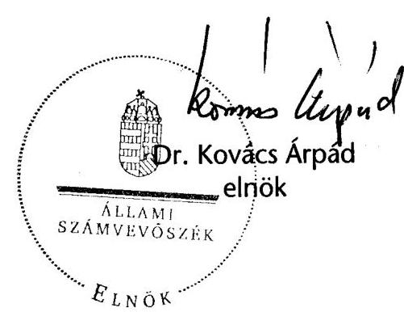

---

## Eierlikör (1)

Menge: 1 Drink

2 Zentiliter Zitronensaft
2 Zentiliter Zuckersirup
1 Zentiliter Zuckersirup
1 Zentiliter Zuckersirup
etwas Zitronensaft
etwas Zuckersirup
etwas Zuckersirup
etwas Zuckersirup
etwas Zuckersirup
etwas Zuckersirup
etwas Zuckersirup
etwas Zuckersirup
etwas Zuckersirup
etwas Zuckersirup
etwas Zuckersirup
etwas Zuckersirup
etwas Zuckersirup
etwas Zuckersirup
etwas Zuckersirup
etwas Zuckersirup
etwas Zuckersirup
etwas Zuckersirup
etwas Zuckersirup
etwas Zuckersirup
etwas Zuckersirup
etwas Zuckersirup
etwas Zuckersirup
etwas Zuckersirup
etwas Zuckersirup
etwas Zuckersirup
etwas Zuckersirup
etwas Zuckersirup
etwas Zuckersirup
etwas Zuckersirup
etwas Zuckersirup
etwas Zuckersirup
et

---

# TARTALOMJEGYZÉK 

BEVEZETÉS ..... 3
ÖSSZEGZÉS ..... 4

1. AZ ÁSZ 2007. ÉVI FELADATAI ..... 6
1.1. Az ÉVES ELLENŐRZÉSI TERV TELJESÍTÉSE ..... 6
1.2. EGYÉB SZÁMVEVŐSZÉKI FELADATOK ..... 9
2. AZ ÁSZ ELLENŐRZÉSI TAPASZTALATAI ..... 12
2.1. FŐBB TAPASZTALATOK ÁLLAMHÁZTARTÁSI ALRENDSZERENKÉNT ..... 12
2.1.1. A központi költségvetés ..... 13
2.1.2. Az elkülönített állami pénzalapok ..... 19
2.1.3. A társadalombiztosítás pénzügyi alapjai ..... 21
2.1.4. A helyi önkormányzatok ..... 23
2.2. AZ ÁLLAMI ÉS AZ ÖNKORMÁNYZATI FELADATELLÁTÁSRA IRÁNYULÓ ELLENŐRZÉSEK FŐBB TAPASZTALATAI ..... 32
2.3. ÁLLAMHÁZTARTÁSON KÍVÜLRE JUTTATOTT TÁMOGATÁSOK ..... 42
2.4. ÁLLAMI VAGYONGAZDÁLKODÁS ..... 43
2.5. UNIÓS FORRÁSOK FELHASZNÁLÁSA ..... 44
3. AZ ELLENŐRZÉSEK HASZNOSÍTÁSA ..... 46
3.1. A JELENTÉSEK ORSZÁGGYŰLÉSI TÁRGYALÁSA, HATÁROZATOK ÉS AZ ORSZÁGGYŰLÉSI KAPCSOLATOK ..... 46
3.2. SZÁMVEVŐSZÉKI JAVASLATOK ÉRVÉNYESÜLÉSE ..... 47
3.2.1. Javaslatok az Országgyűlés szintjén ..... 48
3.2.2. Javaslatok kormányzati szinten ..... 50
3.2.3. Javaslatok a vizsgált szervezeteknél ..... 56
3.3. KEZDEMÉNYEZETT BÜNTETŐ ELJÁRÁSOK ..... 58
3.4. A SZÁMVEVŐSZÉKI TEVÉKENYSÉG NYILVÁNOSSÁGA ..... 59
4. AZ ELLENŐRI MUNKA MINŐSÉGÉNEK FEJLESZTÉSE ..... 62
4.1. HUMÁN ERŐFORRÁS GAZDÁLKODÁS ÉS FEJLESZTÉS ..... 62
4.2. AZ ELLENŐRZÉSEK MINŐSÉGBIZTOSÍTÁSA ..... 66
4.3. NEMZETKÖZI KAPCSOLATOK ..... 67
5. A SZÁMVEVŐSZÉKI TEVÉKENYSÉGHEZ KAPCSOLÓDÓ KUTATÓ ÉS MÓDSZERTANI MUNKA ..... 72
6. AZ INTÉZMÉNY MŰKÖDÉSE ÉS GAZDÁLKODÁSA ..... 75
6.1. KÖLTSÉGVETÉSI GAZDÁLKODÁS ..... 75
6.2. AZ INFRASTRUKTÚRA MŰKÖDTETÉSE, FEJLESZTÉSEK ..... 77
6.3. AZ INFORMATIKA ÉS A TELEKOMMUNIKÁCIÓ MŰKÖDTETÉSE, FEJLESZTÉSE ..... 77
6.4. BELSŐ ELLENŐRZÉS ..... 80

---

# MELLÉKLETEK 

1. számú A 2007. évi jelentések jellemzői ..... 3
2. számú ÁSZ jelentések az országgyűlési bizottságok/plenáris ülések napirendjén 2007-ben
3. számú Az ÁSZ 2007. évi jelentéseiben a fejezetek vezetőinek megfogalmazott javaslatok és az azokra adott válaszok ..... 21
4. számú Összefoglalók a 2007-ben befejezett ellenőrzések tapasztalatairól ..... 81

---

VE-1-15/2008.

# Bevezetés 

Az Állami Számvevőszék (ÁSZ) - az Országgyűlés pénzügyi-gazdasági ellenőrző szerve - évente beszámol tevékenységéről. A jelentést több országgyűlési bizottság napirendre tűzi, és a plenáris ülés is megtárgyalja. Az éves tevékenységről szóló jelentés megvitatását követően az Országgyűlés határozatot hoz a munka értékeléséről, illetve a jövőbeni fejlesztési irányokról. Ezen országgyűlési határozatokat figyelembe véve állítjuk össze éves ellenőrzési tervünket, folytatjuk a számvevői munkát kiegészítő kutató-tanácsadó tevékenységünket.

Az Országgyűlés határozatával ${ }^{1}$ megerősített stratégiánknak megfelelően a zárszámadás megbízhatóságát a központi költségvetés kiadási főösszegének 83%-ára kiterjedő konkrét ellenőrzés alapján minősítettük. Korszerűsített ellenőrzési program alapján végeztük el 2007-ben 5 megyei, 5 megyei jogú városi, 6 fővárosi kerületi, 66 városi, 9 nagyközségi és 76 községi önkormányzat gazdálkodási rendszerének ellenőrzését.

2007-ben 59 jelentést² készítettünk. Az országgyűlési bizottságok az előző évihez hasonlóan 9 jelentésről 51 alkalommal tárgyaltak. A korábbi gyakorlatnak megfelelően néhány jelentést - a költségvetés végrehajtásának ellenőrzése, a költségvetési javaslat véleményezése, illetve az ÁSZ éves jelentése - több bizottság is napirendjére tűzte. 2007-ben közreadott jelentéseinkben összesen 895 javaslatot tettünk, amelyeket 1082 szervezetnél végzett helyszíni ellenőrzés lefolytatásával alapoztunk meg.

Az államháztartási modernizáció és az azzal járó kockázatok nem hagyják érintetlenül a pénzügyi ellenőrzést sem, új igényeket támasztanak irányában. Ma már a világban a számvevőszéki ellenőrzések alapvető tartalma és célja a közfinanszírozás biztonságának szolgálata és erősítése. Az ellenőrzések mellett ezen indíttatással, céllal készült el 2007-ben - kutatóintézetünkre is támaszkodva - a közpénzügyi rendszer átfogó megújításához szükséges változásokat rendszerbe foglaló téziseket tartalmazó összeállítás, valamint a 2008. évi költségvetési törvényjavaslat megalapozottságának néhány főbb jellemzőjét elemző tanulmány.

A számvevőszéki tevékenység sajátosságából adódóan ellenőrzési munkánk a múltra irányul, de a jelenben közreadott ajánlásainkkal, tapasztalatainkkal a jövő feladatait célozzuk. Éves jelentésünk lehetőséget ad az ellenőrzési tapasztalataink rendszerszemléletű értékelésére, a javaslataink alapján kibontakozó intézkedések és azok befolyásoló tényezőinek áttekintésére. Emellett beszámolónk szervezetünk működésének, gazdálkodásának és fejlesztésének bemutatását is szolgálja.

A számvevőszéki törvény előírásának megfelelően az Országgyűlés elnöke által pályázat útján megbízott független könyvvizsgáló ellenőrzi az intézmény gazdálkodását.

[^0]
[^0]:    ${ }^{1} 47 / 2006$. (X. 27.) OGY határozat.
    ${ }^{2}$ Ebből 55 ellenőrzésről, 1 az éves tevékenységünkről szóló jelentés, 3 pedig főigazgatói aláírással készült jelentés.

---

# Összegzés 

Az államháztartás helyzetét, vitelét és működését előző évi ellenőrzéseink tapasztalataiból kiindulva - sok tekintetben a szakmai fórumokon, szaksajtóban megjelentekkel egybehangzóan - értékelhetjük.

Zárszámadási ellenőrzésünk azzal a korábbiakból ismerős problémával szembesült, hogy a tervezett hiánycélt 2006-ban sem sikerült tartani, öt ízben kellett változtatni a finanszírozási tervet. A költségvetési törvényt az Országgyűlés két alkalommal módosította, ami érintette az állami költségvetés főösszegeit és hiányát. A tervezettet felülmúló hiány elsősorban a kiadási előirányzatok túllépéséből adódott. A folyamatos feszültségek ellenére a központi költségvetés kiadási oldalának szerkezete és szabályozása 2006-ban is lényegében az előző évek tendenciáját követte. Az államháztartás nagy ellátórendszereire fordított kiadások nemcsak 2006-ban emelkedtek, hanem 2007-ben is, annak ellenére, hogy 2006 második felében az államháztartás egyensúlyi helyzetét javító (bevételnövelő és kiadást mérséklő) intézkedések történtek. Nem erősödött a közpénzek előre meghatározott célok szerinti elosztásának aránya.

Az ismétlődő évközi kormányzati intézményi struktúraváltásból eredő, a költségvetés szerkezetét is jelentősen érintő módosítások nem szolgálták a közpénzek felhasználásának nyomon követhetőségét és átláthatóságát, a közvagyonnal való felelős gazdálkodást, valamint az évek közötti összehasonlíthatóságot. Késleltetve jelennek meg egyes hibás stratégiai, vezetői döntések (intézményi, regionális átszervezések) következményei.

A 2008. évi költségvetési törvényjavaslat véleményezése kapcsán ellenőrzésünk kénytelen volt 2007 után ismételten rávilágítani arra, hogy kevés a jele, illetve az eredménye a költségvetést megalapozó makrogazdasági előrejelzések módszertani továbbfejlesztésének, így hiányoznak a megbízható kormányzati prognózisok. Hasonlóképpen a költségvetési törvényjavaslatok hiányosságaként kellett értékelni, hogy nem voltak követhetőek a javaslatokban a konvergencia program intézkedéseinek számszerűsített hatásai. A tervezett hatások mellett a program alapján addigra már megvalósult intézkedések és az azok alapján kibontakozó folyamatok várható eredményeinek bemutatása is hiányzott, holott a Kormány a 2007-2009. évek költségvetésének fenntarthatóságát -az adó- és támogatási rendszer mellett - a nagy közösségi ellátórendszerek átfogó átalakításával kívánta biztosítani.

A foglalkoztatási helyzet alakulásában a források eredményes hasznosulását a makrogazdasági mutatók nem igazolják vissza. A foglalkoztatottak száma évek óta alig bővül, a munkaképes korban lévők gazdasági aktivitásának aránya alacsony. Az adóbázis szélesítésére irányuló kísérletek kevés eredményt hoztak. A szakmastruktúra nem igazodik a növekedés igényeihez, a munkaerőállomány szakképzettsége - a javulás ellenére - nem megfelelő.

Többéves tapasztalataink szerint a helyi önkormányzatok rendszere megérett a reformra, mert ott egyre nagyobb mértékben összpontosulnak a magyar államháztartás fiskális kockázatai. Ellentmondásban áll a szinte teljes körű jogi függetlenség és a sok tekintetben „gúzsba kötött" finanszírozási, fejlesztési képesség, miközben - figyelemmel az EU-források felhasználására is - mindinkább növekszik e szektor jelentősége, de pénzügyei és vagyongazdálkodása az államháztartás egészét (is) potenciálisan fenyegető kockázatokkal terheltek. Felgyorsult a szektor eladósodása. Erre az önkormányzati feladatok és a finanszírozási rendszer áttekintése nélkül nem adható valódi megoldás.

Az uniós források, támogatások szabályszerű és „jól célzott" felhasználása a felzárkózás, a reál-konvergencia szempontjából fontos, de az ebben rejlő lehetőségeket még nem sikerült maradéktalanul kiaknázni. Mindezideig nem készült egységes nemzeti szintű stratégia a felhasználásra, s így a hazai és az uniós források összehangolásából nyerhető szinergikus hatások - a környezetvédelem és a közlekedési infrastruktúra fejlesztésétől eltekintve - nem igazán jutnak érvényre. Az uniós támogatások kezelésének intézményrendszere kiépült, a projektek előkészítése és megvalósítása az utóbbi időkben rendezett, nagyobb gondot kell azonban fordítani a kifizetési és monitoring tevékenységre, hogy jobban kihasználhassuk az európai forrásokat, támogatásokat.

A számvevőszéki ellenőrzések visszatérően azt kénytelenek hangsúlyozni, hogy a sürgető szerkezeti reformok, az adórendszer és a nagy közösségi ellátórendszerek megújítása nehezen haladnak, a reformlépések nem megfelelően előkészítettek, nem képeznek konzisztens rendszert. Sok esetben helyettük - több-kevesebb sikerrel - csak takarékossági, megszorító jellegű intézkedésekre kerül, került sor. Több ellenőrzésünk is rámutatott a hosszú távú, fenntartható megoldások, a fejlesztési tervek és stratégiák hiányára. Arra, hogy a feladatkijelöléseket, megoldásokat általában nem előzik, alapozzák meg helyzetfelmérések, megvalósíthatósági tanulmányok. E hiányosságok egyik következménye, hogy a felhasznált pénzeszközök nem kellő hatékonysággal hasznosulnak. A végrehajtó apparátus munkáját megnehezíti a gyakran változó jogszabályok nagy száma, esetenkénti diszharmóniája.

Költségvetési rendszerünk áttekintése kapcsán az OECD és más nemzetközi szervezetek szakértői is hangsúlyozták, hogy hiányoznak a költségvetési fegyelem világos szabályai. A közelmúltban „Téziseinkben" felhívtuk a figyelmet a közpénzügyek szabályozásának halaszthatatlanságára. Az így megfogalmazottakra volt fogadókészség, s jelenleg az Országgyűlés előtt van az a törvényjavaslat-csomag, amely - noha alapos megvitatásra és több helyen pontosításra, kiegészítésre szorul - érvényesíti a téziseinkben lefektetett kritériumok egy részét. A közszektor reformja, a közpénzügyek korszerű szabályozása kulcskérdés, aminek megoldását nemzetközileg elfogadott, hazai politikai konszenzussal megerősített elvekre kell alapozni.

Olyan szabályozásra van szükség, ami átfogja a közpénzekkel gazdálkodók, a közpénzügyi gazdálkodás teljes körét, biztosítja az Országgyűlés költségvetési jogának gyakorlását és a végrehajtó hatalom felelősségét, érvényre juttatja a fenntarthatóságot és az egyensúlyt. Rögzíteni kell bizonyos paramétereket, amelyeket a költségvetés tervezésénél be kell tartani. Ki kell dolgozni azt a módszertant, amelynek alapján makrogazdasági elemzések, hatástanulmányok készülhetnek, segítséget adva a törvényhozás számára az éves költségvetési törvények elfogadásához vagy bármely szaktörvény véglegesítéséhez.

---

Az új, korszerű szabályozásnak támogatnia kell a közpénzek beszedésének és felhasználásának átláthatóságát, az „értéket a pénzért" elv dominanciáját. A közpénzügyi szabályozásnak kiszámíthatónak kell lennie, ezért elmaradhatatlan - lehetőleg új, önálló fejezetben - az alapvető szabályok, követelmények és garanciák Alkotmányba foglalása is.

Az államháztartás működési mechanizmusa 1990 óta megmerevedett politikai kompromisszumok által determinált (önkormányzati és közigazgatási rendszer, társadalombiztosítás, politikai-választási rendszer és az ahhoz köthető érdekeltségek). E kompromisszumok a társadalmi és gazdasági működés stabilitását adták, mára azonban rugalmatlanná és az adott politikai erőviszonyok között mozdíthatatlanná tették a rendszert. Ezért új kompromisszumra és párbeszédre van szükség az állam feladatainak meghatározásában, az ország sorsát, jövőjét érintő alapvető kérdésekben. A felzárkózási esélyt nyújtó növekedési irány valóra váltása közmegegyezésre épülő stratégiát, új közpolitikát, államháztartási reformot igényel és szükségessé teszi a gazdasági szerkezet modernizálását, a hazai tudásbázis mobilizálását.

# 1. Az ÁSZ 2007. ÉVI FELADATAI 

Az ÁSZ tevékenységét meghatározott, nyilvános stratégia mentén végzi. Célunk, hogy a folytonosság és a változó környezethez történő igazodás egységének jegyében fogalmazzunk meg válaszokat a kihívásokra, úgy súlyozva a teendőket, hogy erőforrásaink hatékony hasznosításával eredményesen teljesíthessük törvényi kötelezettségeinket. Alapvető stratégiai törekvésünk, hogy ellenőrzéseink, elemzéseink, javaslataink még inkább segítsék a közszféra, az államháztartás szabályszerű, hatékony és kiegyensúlyozott működését, eszközeinkkel kezdeményezzük, támogassuk a szükségszerű átalakítási folyamatokat. Az intézmény szerepe a figyelemfelhívás a közpénzfelhasználás érzékeny területeire, azonban az előrelépés az Országgyűlés, a kormányzati szervek döntésén múlik.

Az ÁSZ
 független működéséhez és ellenőrzési tevékenységéhez szükséges jogi feltételeket, garanciákat az Alkotmány és más törvények biztosítják. Ellenőrzési tevékenységünket érintően 27 törvény határoz meg feladatokat. Az ÁSZ felhatalmazásai azonban nem közvetlenül és kizárólag ellenőrzési jogosultságokat és kötelezettségeket jelentenek, hanem olyan tevékenységeket is, amelyek a közpénzekkel való gazdálkodás átláthatóságát erősítik.

### 1.1. Az éves ellenőrzési terv teljesítése

Az ÁSZ 2007-ben is elnöke által jóváhagyott - az Országgyűlés Költségvetési, pénzügyi és számvevőszéki bizottsága által megtárgyalt - ellenőrzési tervben foglaltak szerint végezte tevékenységét.

---

A 2007. évi ellenőrzési tervben összesen 80 téma szerepelt. Év közben az ÁSZ ellenőrzési terve 4 vizsgálattal kiegészült, 3 feladat pedig törlésre került. ${ }^{3}$

Két 2006. évi befejezéssel tervezett ellenőrzés 2007-re húzódott át${ }^{4}$, ezzel a közzétett számvevőszéki ellenőrzési jelentések száma 57 volt.

Ellenőrzési tevékenységünkre 2007-ben 59540 közvetlen ${ }^{5}$ ellenőri napot fordítottunk, 5017 nappal kevesebbet, mint az előző évben. A csökkenés létszámkorlátozó intézkedésekkel összefüggésben és a megnövekedett nyugállományba vonulás hatásaként adódik.

Az ÁSZ ellenőrzési kötelezettségeiben meghatározóak a törvényekben különféle rendszerességgel előírt (évenkénti, kétévenkénti, illetve rendszeres) feladatok. Ezek teljesítéseként összesen 41 ellenőrzésről készült jelentés, ami az előző évivel megegyezően az ÁSZ ellenőrzési kapacitásának 65%-át vette igénybe.

Az ÁSZ ellenőrzési feladatai között alapvető fontosságúak az évenkénti ellenőrzési kötelezettségek. Tárgyévben 5 ilyen jelentés készült (az állami költségvetés megalapozottságának véleményezése, zárszámadásának ellenőrzése, az ÁPV Zrt. és az MTI Zrt. működésének, valamint a fővárosi önkormányzatot és a kerületi önkormányzatokat osztottan megillető bevételek megosztásának ellenőrzése). Az évenkénti ellenőrzési kötelezettségek közül a legnagyobb kapacitást igénylő feladat a 2006. évi költségvetés végrehajtásának ellenőrzése volt, amely az előző évhez hasonlóan az ÁSZ ellenőrzési kapacitásának 25%-át kötötte le.

Kétévenkénti ellenőrzési kötelezettség keretében 2007-ben 5 párt és 3 pártalapítvány gazdálkodásának ellenőrzéséről készült jelentés.

Rendszeres ellenőrzési feladatok teljesítéseként 28 számvevőszéki jelentést adtunk közre.

A törvények által megszabott rendszeres feladatok meghatározó részét a helyi önkormányzatok gazdálkodásának átfogó ellenőrzése képezte. A közel 600 helyi és települési önkormányzat átfogó helyszíni ellenőrzésénél szerzett tapasztalato-

[^0]
[^0]:    ${ }^{3}$ Év közben a terv kiegészült: A 2006. októberi időközi országgyűlési képviselőválasztási kampányra fordított pénzeszközök elszámolásának, a Főv. Önkormányzatot és a kerületi önkormányzatokat osztottan megillető bevételek 2007. évi megosztásáról szóló önkormányzati rendelet felülvizsgálatának, a Duna Bizottság 2006. évi pénzügyi beszámolójának, a Tempus Közalapítványnak juttatott központi költségvetési támogatás felhasználásának ellenőrzésével.
    Törölt, illetve halasztott ellenőrzések: Bp. Főváros Önkormányzata átfogó ellenőrzésének I. üteme, a Fogyatékosok Esélye Közalapítvány gazdálkodásának ellenőrzése, a MIÉP 2005-2006. évi gazdálkodása törvényességének ellenőrzése.
    ${ }^{4}$ A Magyar Demokrata Fórum 2004-2005. évi gazdálkodása és az Antall József Alapítvány 2003-2005. évi gazdálkodása törvényességének ellenőrzése.
    ${ }^{5}$ Közvetlen ellenőrzési nap: az ellenőrzésre fordított kapacitás, valamint az arra közvetlenül elszámolható jogi, minőségbiztosítási és informatikai támogatás.

---

kat összefoglaló jelentésen kívül 16 jelentős nagyságrendű költségvetéssel, illetve vagyonnal rendelkező önkormányzatról önálló számvevőszéki jelentés készült (5 megyei, 5 megyei jogú városi és 6 fővárosi kerületi önkormányzat).

Az ÁSZ 2007-ben 2 központi költségvetési fejezet több évre kiterjedő átfogó ellenőrzéséről készített jelentést (Földművelésügyi és Vidékfejlesztési Minisztérium, Külügyminisztérium).

Rendszeres feladatként került megvalósításra a Munkaerőpiaci Alap, a Magyar Nemzeti Bank működésének ellenőrzése, a Polgári Nemzetbiztonsági Szolgálatok pénzügyi-gazdasági ellenőrzése, a 2006. évi országgyűlési választásra, az önkormányzati és nemzeti etnikai kisebbségi képviselőválasztások lebonyolításához felhasznált pénzeszközök ellenőrzése, valamint 3 országos kisebbségi önkormányzat (lengyel, ruszin, szerb) ellenőrzése.
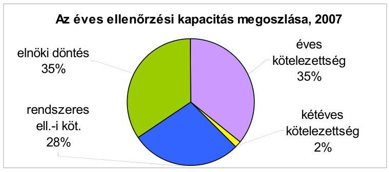

# Az ÁSZ elnökének döntése alapján végzett ellenőrzésekről 16 jelentés 

készült. 2007-ben az Országgyűlés, illetve a Kormány részéről felkérés az ÁSZ-hoz nem érkezett, ezért az ellenőrzési kapacitás előző évnél nagyobb hányada kerülhetett felhasználásra elnöki hatáskörben (2006-ban ez az arány 27% volt).

Az ÁSZ stratégiai céljaihoz illeszkedően az ÁSZ elnökének döntése alapján megvalósult az állami és önkormányzati kórházak gyógyszergazdálkodásának, a munkaképesség megőrzésére és a közmunkaprogramok támogatására fordított pénzeszközök hasznosulásának, az önkormányzatok szociális alapellátási tevékenységének, vízrendezési és csapadékvíz elvezetési feladatai ellátásának ellenőrzése.

Az állami fejlesztési források hatékony felhasználása, az államháztartás és a magángazdaság újszerű beruházás-fejlesztési együttműködése kockázati tényezőinek feltárása érdekében sor került a villamosenergia-ellátás rendszerének, a 2006-ban befejeződő autópálya beruházások, a felsőoktatás kollégium beruházás programjának ellenőrzésére.

---

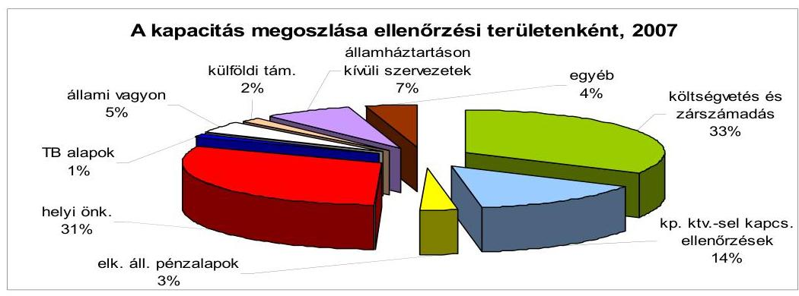

Az ÁSZ az ellenőrzéseit három fő típusba sorolja. Az ÁSZ az államháztartás egyensúlyi követelményeire, a nagy ellátó rendszerek korszerűsítésére kiemelt figyelmet fordítva, a korábbiaknál több teljesítmény-ellenőrzést tervezett.
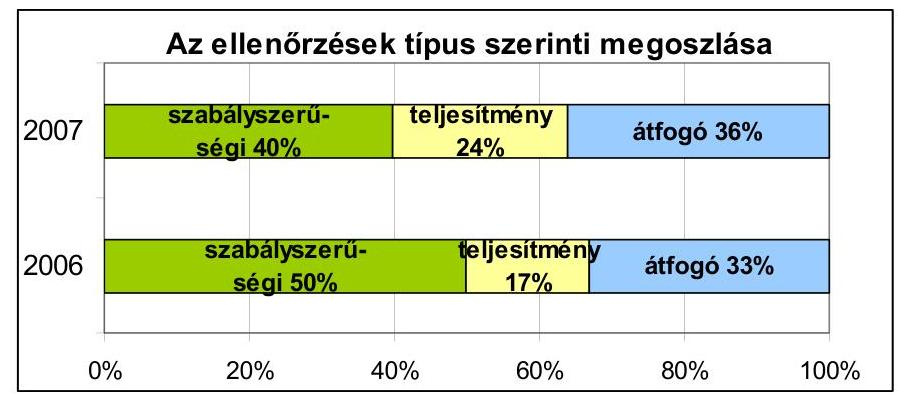

A 2007-ben elkészült jelentések jellemzőit (a jelentés tárgya, száma, a jelentést készítő igazgatóság, az ellenőrzés jogszabályi alapja és indoka, célja, a költségvetési nagyságrend) az 1. sz. melléklet tartalmazza.

# 1.2. Egyéb számvevőszéki feladatok 

A szervezet egyéb tevékenységi körébe számos - a szorosan vett ellenőrzési kötelezettségen és jogosítványon túlmutató - felhatalmazás, illetve feladat tartozik, amelyeket az Alkotmány, a számvevőszéki törvény és egyéb törvények írnak elő.

Az ÁSZ elnöke ellenjegyzi a költségvetés hitelfelvételeire vonatkozó szerződéseket, véleményezi az államháztartás számviteli rendjének, belső pénzügyi ellenőrzési rendszer működésének továbbfejlesztésére vonatkozó javaslatokat. Javaslatot tesz az állami vagyonkezelő szervezet ellenőrző bizottsága elnökének személyére, továbbá az elkülönített állami pénzalapok könyvvizsgálóira, valamint véleményt nyilvánít a jegybank és az MFB könyvvizsgálójával kapcsolatban, előzetesen véleményezheti az APEH elnökének kinevezését.

Az államháztartási törvény értelmében az állam legalább többségi befolyása alatt álló gazdálkodó szervezet esetében - ha a jegyzett tőke meghaladja a kétszáz millió forintot - a felügyelő bizottság elnökének személyére is az ÁSZ tesz javaslatot, a gazdálkodó szervezet vezetőjének megkeresése alapján.

---

Panasszal és közérdekű bejelentéssel bárki - szóban, írásban vagy elektronikus úton - fordulhat a tárgykörben eljárásra jogosult szervhez. A közérdekű bejelentések, javaslatok és kérelmek intézésének jogi alapját a 2004. évi XXIX. törvény közérdekű kérelmekkel, panaszokkal és bejelentésekkel kapcsolatos eljárásra vonatkozó szakaszai (141-143. §-ok) képezik.

# Ellenjegyzési, véleményezési jogkör 

A Magyar Köztársaság nevében a pénzügyminiszter felhatalmazta az Államadósság Kezelő Központ Zrt. vezérigazgatóját, hogy a swap ügyletek miatti fedezetbiztosítás érdekében 500 millió euró összegben rulírozó hitelkeret szerződéseket kössön. A szerződések megkötésére négy bankkal került sor 250, 100, 100 és 50 millió euró összegekre. Megtörtént továbbá a 450 millió euró összegű készenléti hitelkeret szerződés meghosszabbítása 2007 novemberében. Az öt hitelszerződéssel kapcsolatos dokumentációk szabályszerűségére vonatkozó áttekintés alapján a hitelszerződések ÁSZ elnöki ellenjegyzése minden esetben megtörtént.

A számviteli rend változásával összefüggésben biztosított véleményezési jogkörünket 2007-ben az „Egyes adótörvények módosításáról" c. előterjesztésben, valamint „A Magyar Könyvvizsgálói Kamaráról, a könyvvizsgálói tevékenységről, valamint a könyvvizsgálói közfelügyeletről" c. előterjesztésben szereplő számviteli törvény módosítás, továbbá az államháztartás szervezetei beszámolási és könyvvezetési kötelezettségének sajátosságairól szóló 249/2000. (XII. 24.) Korm. rendelet, valamint a kincstári elszámolások beszámolási és könyvvezetési kötelezettségének sajátosságairól szóló 240/2003. (XII. 17.) Korm. rendelet módosításai kapcsán gyakoroltuk.

## Javaslattételi jogkör

Az ÁSZ elnöke 2007-ben a Magyar Nemzeti Bank és a Magyar Fejlesztési Bank könyvvizsgálójának kiválasztásával kapcsolatban adott véleményt.

A pénzügyminiszter megkeresésére történt az Állami Privatizációs és Vagyonkezelő Zrt. FB elnöke személyére, majd az állami vagyonról szóló törvény rendelkezésére figyelemmel a Magyar Nemzeti Vagyonkezelő Zrt. Ellenőrző Bizottság elnöke személyére történő - soron kívüli - javaslattétel.

A felsoroltakon kívül az ÁSZ - az állami gazdálkodó szervezetektől érkezett megkeresésekre - főtitkári hatáskörben tett FB elnök jelölési javaslatokat, kizárólag a névjegyzékbe bekerült, eredményes pályázók köréből. (Pályázatok alapján 2007. december 31-én a jelölésre alkalmas személyek száma 680 fő.)

2007-ben 60 gazdálkodó szervezettől érkezett kérelemmel foglalkoztunk. A hiánypótlási felhívások teljesítése után az ÁSZ főtitkára 56 gazdálkodó szervezet részére tett jelölési javaslatot.

---

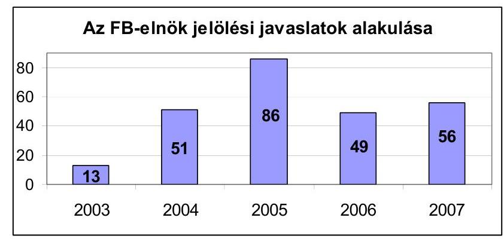

Az ÁSZ által jelölésre javasolt és FB elnöknek megválasztott személy visszahívására vonatkozó javaslat 2007-ben sem volt.

Jelölésünk alapján 2007. december 31-én 135 személy töltött be FB elnöki megbízatást.

# Közérdekű bejelentések, javaslatok és kérelmek 

Az államháztartás központi és helyi szerveivel történő együttműködés mellett fontos számunkra az állampolgárokkal, a különböző feladatkörű, hozzánk forduló szervekkel való kapcsolattartás, a közönségkapcsolatok bővítése és fejlesztése, mindaz, ami a szélesebb tájékoztatást szolgálhatja. A 2007. év tapasztalata, hogy az állampolgárok egyre jobban kihasználják a bővülő technikai lehetőségeket kérdéseik feltételére, javaslataik és kéréseik megfogalmazására.

Az ÁSZ-hoz 2007-ben 267 db közérdekű bejelentés, 75 db , állami és önkormányzati hivatalos szervektől származó megkeresés érkezett, valamint 92 db telefonos kapcsolatfelvétel történt. Az elmúlt 9 év adatai alapján az állapítható meg, hogy a bejelentések száma évenként ingadozást, de alapvetően emelkedő tendenciát mutat.
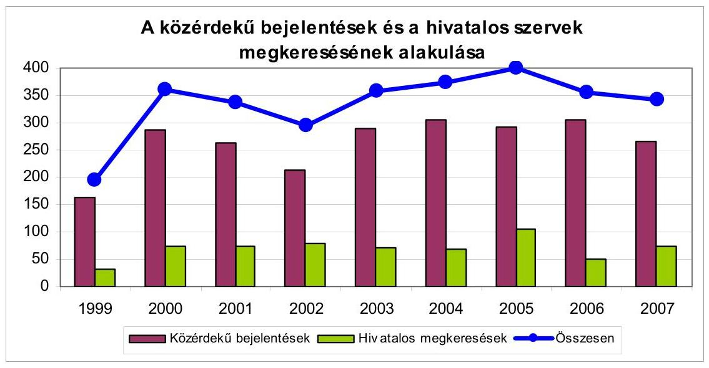

---

A bejelentések, megkeresések 56%-a köthető a helyi önkormányzatok gazdálkodásához és működéséhez, 4%-a kisebbségi önkormányzatokhoz, 40%-a pedig különféle tárgykörbe tartozik (lakásügy, távfűtés, állami támogatás, a kormány, állami intézmény, szervezet eljárása, gazdasági társaság, párt, alapítvány, egyesület működése, valamint állásfoglalás, jogértelmezés, tanács, információ kérése). A bejelentők az esetek túlnyomó részében az ÁSZ ellenőrzését, vagy az ügy intézésében való közreműködését kérték.
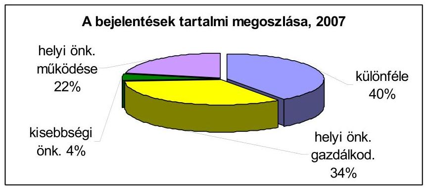

A közérdekű bejelentést tevő személyek közül 14% önkormányzati képviselő, tisztségviselő (polgármester, jegyző), 18% névtelen bejelentő, 44% magánszemély, 24% különféle bejelentő (szervezet képviselője, vállalkozó, állami szervezet munkatársa). 2006-hoz viszonyítva növekedett a helyi önkormányzati tisztségviselőktől származó bejelentések száma, jellemzően az újonnan tisztségbe kerültek köréből. Emelkedett a helyi önkormányzatok pénzügyi bizottságaitól érkező megkeresések száma is.

A tárgyévi vagy tervezett ellenőrzések témaköréhez illeszthető bejelentéseket ellenőrzési igazgatóságaink kapacitásuk függvényében hasznosítják az ellenőrzési program kialakítása és az ellenőrzés lefolytatása során. Az ÁSZ jogértelmezésre, jogsegély nyújtására, állásfoglalásra felhatalmazással nem rendelkezik, erről korrekt módon tájékoztatjuk a levélírókat.

# 2. Az ÁSZ ELLENŐRZÉSI TAPASZTALATAI 

### 2.1. Főbb tapasztalatok államháztartási alrendszerenként

A 2007-ben végzett zárszámadási ellenőrzésünk megállapította, hogy az államháztartás központi szintjének törvényben rögzített 2006. évi hiánya 1545,8 Mrd Ft volt. A költségvetési törvényt az Országgyűlés az év során két alkalommal módosította és a hiányt jelentősen (33%-kal) megnövelve fogadta el. Az államháztartás központi szintjének tényleges hiánya 2042,5 Mrd Ft volt, amely az önkormányzatok hiányával együtt az államház-

---

tartás egészét tekintve 2199,0 Mrd Ft hiányt eredményezett. Így a GDP-arányos 6,8%-os hiány 9,3%-ra emelkedett. ${ }^{6}$

Az államháztartás eredetileg jóváhagyott hiányához képest a növekedés 39,1% volt. Ennek mintegy kétharmada a központi költségvetés nem tervezett kiadásnövekedésével volt összefüggésben (adósságszolgálat, a TB alapoknak átadott pénzeszközök, a világpiaci gázárnövekedés miatti kompenzáció, valamint az előirányzat-módosítás nélkül túlléphető kiadások). A TB alapok együttes hiánya 99,0 Mrd Ft-tal, a helyi önkormányzatok hiánya majd ötszörösére emelkedett és 121,7 Mrd Ft-tal haladta meg az eredeti hiánycélt. Az elkülönített állami pénzalapok egyenlege 32,9 Mrd Ft-tal javította az államháztartás pozícióját.

Az államháztartás nagy ellátórendszereire fordított kiadások 2006-ban is emelkedtek annak ellenére, hogy az év második felében az államháztartás egyensúlyi helyzetét javító (bevételnövelő és kiadást mérséklő) intézkedések történtek.

# 2.1.1. A központi költségvetés 

## A 2006. év zárszámadásának ellenőrzése

A központi költségvetés hiánya 2006-ban 28,1%-kal haladta meg az eredetileg tervezettet, ami 8,3%-os GDP-arányos költségvetési hiányt jelentett annak ellenére, hogy a döntő súlyú adóbevételi előirányzatok nemcsak teljesültek, de a tervezett összegeket is valamivel meghaladták.
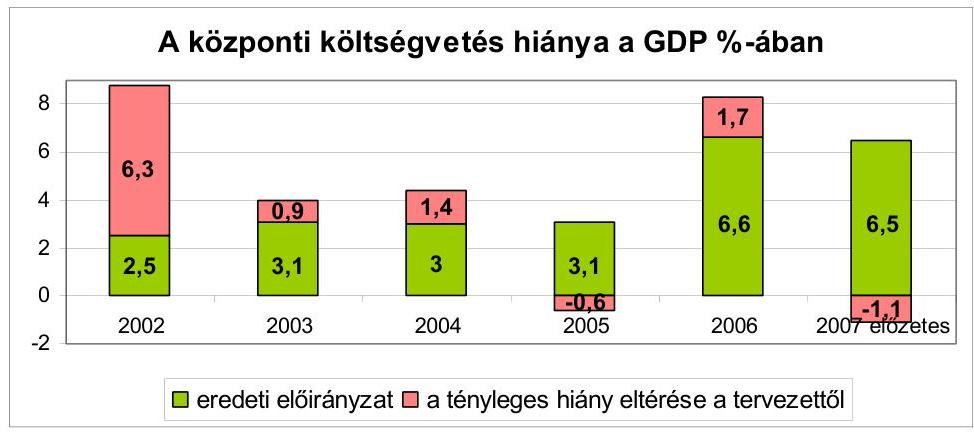

Forrás: költségvetési és zárszámadási törvényjavaslatok, PM 2008.
 január 17-i tájékoztatója
A költségvetési törvény módosításai, a tervezettet jelentősen meghaladó kiadás és hiány a tervezés problémáira hívják fel a figyelmet. A költségvetési törvényben vállalt elkötelezettségek hozzájárultak a hiány mértékének alakulásához, és ily módon az adósságállomány elmúlt években tapasztalt gyorsuló növekedéséhez is. Jelzik továbbá a költségvetési politika igen szűk

[^0]
[^0]:    ${ }^{6}$ A korábbi években, és a 2006. évi költségvetési törvényjavaslat véleményezésénél is jeleztük, hogy az államháztartási hiány és a bruttó államadósság GDP-hez viszonyított arányának megvalósulása kockázatot hordoz.

---

mozgásterét, rámutatva egyúttal az elsődleges egyenleg nullszaldós megvalósítását korlátozó tényezőkre.

Egyes előirányzatok módosítása, illetve teljesítése jól szemlélteti a tervezés megalapozottságának problémáit.

Hiánynövelő tényezőként jelentkezett egyes nagy összegű kiadások szabályszerű elszámolásának követelménye. A költségvetés 177,8 Mrd Ft NA Zrt. által 2005-ben felvett hitelt vállalt át és fizetett ki (az EUROSTAT jelzése alapján már 2005-ben sem lehetett költségvetésen kívül kezelni az autópálya építéssel összefüggő állami kiadásokat). A költségvetési törvény további, 415,9 Mrd Ft összegű adósságátvállalásra adott felhatalmazást a Kormánynak az NA Zrt. autópálya építéssel összefüggő hitelfelvételével kapcsolatban, holott a jelzett kiadásokat a 2006. évi költségvetésben meg kellett volna tervezni.

A garancia és hozzájárulás a társadalombiztosítási ellátásokhoz előirányzatot jelentősen (112,7 Mrd Ft-tal) módosították az évközi folyamatok következtében.

A központi költségvetés céltartalék előirányzatának több mint háromszorosát meghaladó kifizetés azt jelzi, hogy a költségvetési tervezés időszakában nem került megfelelően átgondolásra a 2006-ban végrehajtott létszámcsökkentés és annak forrásigénye.

A Kincstári vagyonkezeléssel és -hasznosítással kapcsolatos bevételek alcím előirányzata és a tényleges teljesítés között lényeges eltérés mutatkozik, amely azzal függ össze, hogy az előirányzat tervezése évek óta nem szolgál a teljesítés alapjául.

A bevételi és kiadási előirányzatok többsége a módosított költségvetési törvényben rögzítettekkel közel azonos összegben teljesült. Ez azonban nem a költségvetési törvényben meghatározott hiányösszeg betartását szem előtt tartó kiegyensúlyozott tervezés, fegyelmezett költségvetési gazdálkodás eredménye. A központi költségvetés hiányát 390,3 Mrd Ft-tal növelő törvényi módosítás 2006. december 22-én lépett hatályba. Ez azt jelenti, hogy a költségvetési folyamatok évközi alakulásának következményeit a törvénymódosítás legalizálta.

A költségvetés „kézbentartásának" hiányosságára utal, hogy az államháztartás fizetőképességének biztosítását szolgáló finanszírozási tervet a pénzügyminiszter öt alkalommal módosította. Az elmúlt három évben nem került sor a finanszírozási terv ilyen gyakori és jelentős mértékű módosítására.

Évről évre visszatérően felhívtuk a figyelmet, hogy a költségvetési törvény bevételi és kiadási főösszegének és ez által a hiány összegének jelentős, a költségvetési év végéhez közeli módosítása a tervezés lényegével ellentétesen a tervet igazítja a tényleges pénzügyi folyamatokhoz. A költségvetési törvény betartásához nincsenek szankciók rendelve, az éves zárszámadási törvényjavaslat elfogadásával az Országgyűlés tudomásul veszi az eltéréseket.

A központi költségvetés adósságának növekedése 2002-2006 között folyamatos volt, a megelőző évhez viszonyított növekedések üteme 9-15%-pont között alakult. 2007-re a növekedés 6%-ra csökkent. Míg a korábbi időszakban a társadalombiztosítási alapok hiánya jelentősen hozzájárult az adós-

---

ságnövekedéshez, annak 25%-át jelentette, addig 2007-ben a társadalombiztosítási alapok többlete is szerepet játszott az adósság növekedési ütemének csökkenésében.
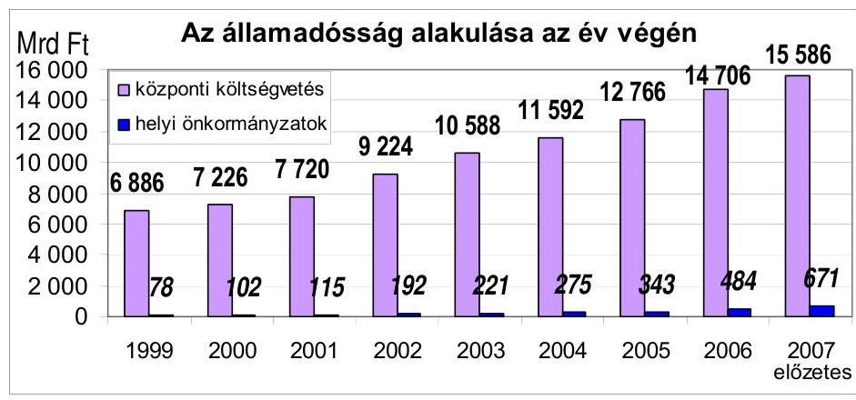

Forrás: PM, ÁKK Zrt.
A központi költségvetés egyre növekvő adóssága következtében az adósság után fizetett kamat abszolút összege is rendre emelkedett, a 2002-2006. évek közötti időszakban 4-10%-pontnyi mértékben. Többek között az adósság növekedési ütemének csökkenése eredményeként 2007-re közel harmadára mérséklődött a kifizetett bruttó kamatok növekedésének üteme.
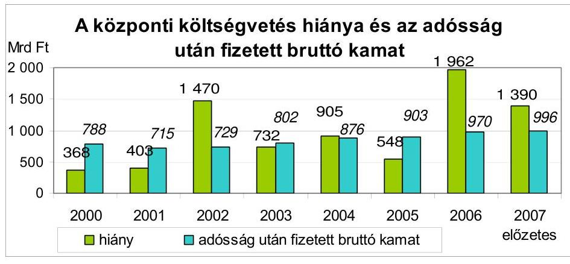

Forrás: ÁKK Zrt.

# A 2008. évi költségvetés véleményezése 

A 2008. évi költségvetési törvényjavaslat a tervezett makrogazdasági tendenciák teljesülése mellett végrehajthatónak látszik. A bevételek és a kiadások kockázatait a 170 Mrd Ft-os tartalék elháríthatja.

A központi költségvetés keretéül szolgáló makrogazdasági pálya egyes meghatározó elemeivel kapcsolatosan fenntartásokat fogalmaztunk meg. Kiemeltük, hogy a 2008-ra tervezett 2,8%-os GDP-növekedéshez magas kockázat társul, ami az infláció lassúbb csökkenésével, a reálkeresetek és a lakossági fogyasztás 2007. évi jelentős visszaesésén alapuló mérsékelt bővülésével, valamint a beruházási aktivitás fellendülésének bizonytalanságával kapcsolatos. Jeleztük, hogy a költségvetési törvényjavaslat nem tartalmaz olyan intézkedéseket, amelyek a 2007. évi rendkívül mérsékelt ütemű gazdasági fejlődés gyorsulását eredményezhetnék.

2008-ban és a következő években magas kockázatot jelenthet a kormányzati körbe tartozó gazdálkodó szervezetek, illetve az állami garanciavállalás mellett felvett hitelek (MÁV Zrt., BKV Zrt.) miatti esetleges adósságátvállalások mértéke.

A központi költségvetés 2008. évi vám- és adóbevételi előirányzatai megalapozottságát teljes körűen nem tudtuk megítélni. Az ellenőrzésnek nem volt módjában értékelni az előirányzat 45%-át, mivel a véleményalkotáshoz szükséges számítások nem álltak rendelkezésre.

A 2008. évi költségvetési törvényjavaslatban szereplő hiányt - az előző évekkel ellentétben - betarthatónak ítéltük meg. Az államháztartási hiány mérséklésére elindított és a Konvergencia Programban is szereplő kormányzati intézkedések (közszféra, oktatás, egészségügy) hatásai a benyújtott költségvetési törvényjavaslatból, illetve más kormányzati forrásokból azonban nem látszanak. Ezen rendszerek esetében a szakmai és ellátási oldalról várható eredmények, és ezáltal a jövő megítélése bizonytalanságot hordoz. Erre is tekintettel felhívtuk a figyelmet arra, hogy a 2008-2010-es időszak költségvetési politikáját összetett és ellentétes irányba ható tényezők determinálják, amelyek jelzik annak szűk mozgásterét.

A költségvetés végrehajtásának egyik lényeges garanciális eleme a stabil intézményrendszer megteremtése. A közigazgatásban évek óta tartó, nem kellően átgondolt létszámcsökkentés, intézményi átszervezések mellett még 2008-ban sem látszik kialakulni egy olyan - megfelelő szakemberekkel rendelkező - stabil intézményrendszer, amelynek működése megalapozná a pénzeszközökkel való átlátható és szabályos elszámolást, illetve beszámolást.

# A fejezetek ellenőrzésének főbb tapasztalatai ${ }^{7}$ 

A számvevőszéki zárszámadási ellenőrzés minden évben valamennyi fejezetet érinti. E mellett a központi költségvetés alrendszerébe tartozó fejezetek gazdálkodását, működését meghatározott időközönként, rendszeresen ismétlődő átfogó ellenőrzésekkel is értékeljük.

A kormányzati struktúrában 2006-ban bekövetkezett változások a kormányzati működés kereteit alapvetően átalakították, a fejezetek jelentős részét valamilyen módon érintették.

[^0]
[^0]:    ${ }^{7}$ A megállapítások a 2007-ben végzett zárszámadási ellenőrzésünk, illetve a Földművelésügyi és Vidékfejlesztési Minisztérium fejezet működésének ellenőrzése, a Külügyminisztérium fejezet működésének ellenőrzése, a Polgári Nemzetbiztonsági Szolgálatok pénzügyi-gazdasági ellenőrzése, a költségvetést megillető áfabevételek realizálásának ellenőrzése során tapasztaltakon alapulnak.

---

A kormányzati struktúraváltás és a szervezet-átalakítások nem kidolgozott koncepció mentén valósultak meg. A fejezetek közötti feladatátrendezések jellemzően 2006 végéig sem fejeződtek be. Ennek következtében nem minden tárcánál sikerült teljes körűen az új tárca feladatainak megfelelően összehangolni a szabályozást.

A központi költségvetési szervek tartozásállománya, köztartozásai tekintetében az elmúlt évben tapasztalt kedvezőtlen jelenségek (az adósságállomány növekedése, a tartozások emelkedő összegű átütemezése, az adóssággal érintett intézmények számának növekedése) 2006-ban is folytatódtak. A meghatározó mértékű szállítói tartozás mellett - a megtett intézkedések és az állami adóhatósággal közös tartozásfigyelő rendszer működése ellenére - jelentősen nőtt az intézmények köztartozása. A tartozásállomány alakulását a központi költségvetési szervek likviditási problémái határozták meg. Ezek csak részben függnek össze a tartalékolási és maradványképzési kötelezettség teljesítésével, ebben - az előző években tapasztaltakkal egyezően - az intézmények gazdálkodási hiányosságai is szerepet játszottak.

A zárszámadási ellenőrzés keretében minősítő véleménnyel záruló pénzügyi szabályszerűségi ellenőrzést végzünk. 2006-ban jelentősen bővült ezen ellenőrzések fejezeti szintű köre, így ennek eredményeként a központi költségvetés 2006. évi kiadási főösszegének 83%-áról mondtunk megbízhatósági szempontból véleményt. A központi költségvetés közvetlen bevételei, kiadásai mellett az alkotmányos, az egyintézményes fejezetek, a fejezeti jogosítványú költségvetési címek mellett elvégeztük öt fejezet megbízhatósági ellenőrzését, azok minden intézményére kiterjedően. A jelzett ellenőrzési lefedettség alapján nagy biztonsággal levonható az a következtetés, hogy a központi költségvetés vonatkozásában a zárszámadási törvényjavaslatban szereplő pénzforgalmi adatok összességében megbízhatóak. Az ÁSZ és a fejezetek belső ellenőrei által 2006-ban végzett pénzügyi-szabályszerűségi ellenőrzések tapasztalatai azt mutatják, hogy a fennmaradó 17%-ot kitevő intézményi kör statisztikailag nem jelenthet olyan kockázatot, ami a központi költségvetés főösszegének megbízhatóságát befolyásolhatná.

Két minisztérium több éves működésének átfogó ellenőrzését végeztük el. Az ellenőrzés keretében megvizsgáltuk a minisztérium és a fejezethez sorolt intézmények feladatainak alakulását. Értékeltük a súlyponti feladatok működtetésének feltételeit, összefüggésben a források felhasználásának hatékonyságával.

A Külügyminisztérium intézményeinek feladatait - esetenként átfedésekkel - jogszabályokban meghatározták, amelyeket a feladatok át- és visszarendezései miatt gyakran módosítottak. A jogszabályokat, azok változását nem támasztották alá hatástanulmányok, a háttérintézmények megszüntetését, alapítását, összevonását tartalmi indokolás nélkül rendelték el. Ellenőrzésünk idején folyamatban volt a prioritásokat meghatározó külpolitikai stratégia kidolgozása.

A Földművelésügyi és Vidékfejlesztési Minisztérium alapfeladatai a vizsgált években lényegében nem változtak, ugyanakkor új kiemelt feladatként jelentkezett az EU-csatlakozással járó feladatbővülés és ehhez kapcsolódó szervezeti,

---

szabályozási, ellenőrzési rendszer kiépítése, valamint az EU-forrásokra támaszkodó támogatási rendszer kiépítése.

A vizsgált időszakban a szervezetkorszerűsítést és a feladatokhoz igazodást megcélozva létrejött egy új hivatal, amelynek fő feladatát az EU-forrásokhoz kapcsolódó pályázatok kezelése képezte. A szervezeti és létszámhelyzetet döntően befolyásolta, hogy 2006-ban kormánydöntés alapján a fejezeti létszámot mintegy harmadával csökkenteni kellett. A fejezet költségvetési gazdálkodását a központi költségvetési megszorítások korlátozták. Jellemző volt egyes támogatások késedelmes kifizetése, valamint a kifizetéseket teljesítő MÁK-kal és APEH-hel, valamint a Nyugdíjfolyósító Igazgatósággal szemben fennálló többmilliárdos tartozás.

A forrásszűke következtében a szakmai támogatás lehetősége a fejezetnél jelentősen romlott, továbbá egyes feladatok nem, vagy nem teljes körűen teljesültek. A támogatások súlypontja az EU-támogatásokra helyeződött át, a nemzeti támogatások aránya a korábbi 95%-ról 36%-ra csökkent, átalakult a fejezeti címrend. A források célszerű felhasználását megalapozó hosszú távú stratégia a törvényi előírás ellenére - nem készült, a legfontosabb stratégiai feladatokat az Operatív Programban nevesítették. Az EU-csatlakozásból fakadó pénzügyi előnyt a gazdaság nem tudta időben kihasználni, mert késett a pályázatokat kezelő mechanizmus kialakítása, és előfordultak - a hazai források szűkössége miatt - pályázati felfüggesztések.

# A Polgári Nemzetbiztonsági Szolgálatnál végezett átfogó ellenőrzés 

megállapította, hogy Magyarországon a NATO-hoz, majd az EU-csatlakozáshoz illeszkedően módosított Nemzeti Biztonsági Stratégia 2004. évi elfogadását nem követte a Kormány által meghatározott ágazati - a nemzetbiztonsági és a terrorizmus elleni küzdelemmel foglalkozó - stratégiák elkészítése. A Nemzeti Biztonsági Stratégia aktualizált tervezete elkészült, de nem került a Kormány napirendjére.

A 2006-2007. években az államreformmal összefüggésben megfogalmazott kormányzati elvárásokban, valamint a nemzetbiztonsági stratégia aktualizált és a nemzetbiztonsági szolgálatokról szóló törvény módosítására készített javaslat tervezetében is a nemzetbiztonsági szolgálatok tevékenysége és struktúrája átgondolásának igénye tükröződött. A tervezetek csak a polgári és katonai szolgálatok funkcionális összevonását szorgalmazták, annak ellenére, hogy a kormányhatározat más alternatívák párhuzamos vizsgálatáról is rendelkezett. Az alternatívák közül mindössze ezt az egy változatot javasló előterjesztéshez kapcsolódott - nem minden területre kiterjedő - ún. hatáselemzés. A törvény módosítását az előtt tervezték napirendre tűzni, mielőtt az alternatívákról döntés született volna. (A Kormány utóbb a törvénymódosítást törölte a feladatok közül.)

Továbbra is érvényesek a fejezetekre vonatkozó korábbi megállapításaink, miszerint az átszervezéseket, változtatásokat nem támasztották alá olyan dokumentumok, amelyekből egyértelműen megállapítható lett volna a kormányzati munka hatékonyságára, a költségek csökkentésére irányuló törekvés. A kiforrott, előkészített kormányzati döntések hiánya, a változtatások

---

kockázatokat növelő hatása ennél a három ellenőrzött szervezetnél is érzékelhető volt.

A költségvetést megillető áfabevételek realizálásának ellenőrzése során megállapítottuk,
 hogy a pénzügyminiszter a vizsgált időszakban felügyeleti jogkörében eljárva rendszeresen beszámoltatta az adóhatóságokat (APEH és VP) a költségvetés bevételi előirányzatainak időarányos teljesüléséről, az ellenőrzések eredményeiről, a hátralékállomány, valamint a felszámolási, csőd- és végelszámolási eljárások alakulásáról. Az adóhatóságok folyamatosan adatokat, prognózisokat szolgáltattak az egyes szakterületeiket érintő folyamatokról és eredményekről. Ezeket a PM – a bevételi előirányzatok alakulásának értékelését kivéve – nem használta fel elemzések, értékelések készítéséhez, a jogszabályok előkészítéséhez.

Megállapítottuk, hogy az EU-tagországok többségének gyakorlatától eltérően az induló vállalkozások esetében a regisztrációs eljárások jogi szabályozása nem foglal magában kötelező kontrollokat. Az APEH-nak joga van megtagadni a regisztrációt az adózó által bejelentett adatok valótlansága vagy hiányossága miatt, ilyen ellenőrzéseket azonban nem végez, mivel a jogszabályok által meghatározott határidők nem is teszik ezt lehetővé számára.

Az APEH a korábbi ellenőrzések tapasztalatai és az EU-tagállamok gyakorlatának megfelelően elrendelte az áfa-kötelezettségüket minimalizálók, a bevallást nem vagy késedelmesen teljesítők, valamint a nyugtaadási kötelezettség teljesítésének vizsgálatát. Növekvő számban végzett regisztrációt követő preventív ellenőrzést, amelynek célja elsősorban az adóhatósági jelenlét fokozása, ezáltal az adóalanyok jogkövető magatartásának elősegítése. Az APEH ellenőrzésekkel feltárt adókülönbözet 2005-ben a 2004. évihez képest számottevően nem változott, azonban 2006-ban jelentős mértékben javult.

# 2.1.2. Az elkülönített állami pénzalapok 

Az alapok pénzügyi helyzete 2006-ban alaponként és összességében is kiegyensúlyozott volt. Az alrendszer szintjén a bevételek a vártnál kedvezőbben alakultak, a kiadások a tervezettől elmaradtak, s ez javította az államháztartás egészének egyensúlyi helyzetét.

A költségvetés nagyságrendjét tekintve az alrendszert alkotó alapok közül változatlanul a Munkaerőpiaci Alap a meghatározó, amely a foglalkoztatás elősegítésével és a munkanélküliség kezelésével kapcsolatos állami feladatokat az országosan kiépített munkaerőpiaci szervezeten keresztül látja el.

Ellenőrzéseink évek óta jelzik, hogy a kiadások belső szerkezetében bekövetkezett változások egy része kedvezőtlen tendenciákat mutat. Az aktív foglalkoztatáspolitikai célok megvalósítását szolgáló támogatások összege és aránya 2006-ban a megelőző évekhez képest kedvezőbben alakult, de még így is elmarad a 2003. évi szinttől. A foglalkoztatáspolitika aktív eszközeinél a pénzeszközök felhasználása egyre átláthatatlanabbá vált, nehezen lehet követni az aktív eszközök foglalkoztatási hatását.

---

Az MPA Flt.-ben nevesített forrásai (alaprészei) és a Költségvetési tv. mellékletében szereplő kiadási jogcímei között nincs összhang, az alaprészekhez köthető közvetlen kiadások mellett mind jelentősebb szerepet játszanak az alaprészekhez nem köthető kiadások. Az MPA tervezési rendszerének, költségvetési kapcsolatainak, jogszabályi hátterének felülvizsgálatát célzó javaslataink eddig nem találtak kedvező fogadtatásra. Az MPA-ból mind többet fordítanak a hozzá kötődő szervezetek működési kiadásainak finanszírozására.

A Központi Nukleáris Pénzügyi Alap előirányzatai az előírások szerint teljesültek. Felhalmozott egyenlege tovább emelkedett, 2006 végére megközelítette a 100 Mrd Ft-ot. A működési és felhalmozási kiadások aránya kedvezőbb, mint 2005-ben. A KNPA költségvetésének törvényi előirányzatai a 2004-2006. években (és 2007-ben is) lényegesen alacsonyabbak a közép- és hosszú távú szakmai tervekben kialakított összegeknél. A forráshiány feladatok elmaradását, késedelmét okozhatja. A kis- és közepes aktivitású hulladéktároló létesítése esetében 2006-ban már pótlólagos forrásra volt szükség (az erre szolgáló előirányzatot az egyenleg terhére 3,3 Mrd Ft-tal emelték meg).

A Wesselényi Miklós Ár- és Belvízvédelmi Alap érdemi működése 2004-ben kezdődött meg. A korábbi évek zárszámadási jelentéseiben felvetett – alapvetően a működés célszerűségét, eredményességét érintő – kételyeinket a 2006. évi tapasztalatok is igazolni látszanak. Az Alap államháztartáson kívüli forrásai elenyészőek, kártalanítási igények kielégítésére csak szűk körben biztosítható fedezet. A bevételek meghatározó része költségvetési támogatás. 2006-ban emelkedés következett be a WMA-val kötött szerződések számában, de ez is messze elmarad az Alap létrehozásakor várt, nagyságrendileg magasabb szerződésszámtól. Az Alapot tekintve az előző években említett észrevételeink továbbra is érvényesek: a maradvány felhasználására nincs mód, az alapként való működés formális.

A Kutatási és Technológiai Innovációs Alap pénzügyi helyzete 2006-ban stabil volt, a tárgyévet 11,2 Mrd Ft-os többlettel zárta. A kifizetések egyharmada vállalkozások részére történt, a költségvetési intézmények részesedése 50% feletti. A támogatások kifizetésének ciklikus alakulása az előző évekkel azonos tendenciát mutatott, az éves kiadási összeg 31%-a decemberben realizálódott. A KTIA „tartaléka” jelenleg a költségvetési hiányt finanszírozza és az Alap eredeti céljának megfelelően nem használható fel. Így a Költségvetési tv. előírása korlátozza az alapszerű működést, amelynek következtében évről-évre kevesebb összeg fordítható új pályázati programok beindítására.

A Szülőföld Alap 2005-ben jött létre új elkülönített állami pénzalapként, 1 Mrd Ft induló tőkével. A kiadási előirányzat 2006-ban is azonos összeg volt. A megkötött támogatási szerződések alapján 845,5 M Ft folyósítására került sor. A külügyi tárca költségvetésén kívül több fejezet előirányzatai között is szerepelnek a határon túli magyarokkal kapcsolatos előirányzatok, alapítványi, közalapítványi támogatások, amelyeknek nagyságrendje 2006-ban is sokszorosan meghaladta a Szülőföld Alap költségvetését. Az Alap létrehozását kezdeményező kormányhatározatban megfogalmazott szándék (a hasonló célú források összevonása) mindeddig nem valósult meg. Az Alapkezelő működési költségeire átutalt összeg 100%-ban felhasználásra került. A vonatkozó kor-

---

mányrendelet alapján az SZA kezelésével kapcsolatosan átadott előirányzat összege nem haladta meg a tárgyévben teljesített bevétel 5%-át.

A Nemzeti Kulturális Alap elkülönített állami pénzalapként 1999. január 1-jéig működött, majd 2006. január 1-jétől ismételten önálló alapként funkcionál. Az Alap részére 2006. évre a Költségvetési tv. a kiadási és bevételi előirányzatokat azonos összegben hagyta jóvá, a tárgyév többlettel zárult. Bevételének legjelentősebb forrása 2006-ban a kulturális járulék volt. Kifizetéséből a gazdálkodási forma szerint legnagyobb részarányt (22,7%) képvisel a költségvetési szervek részére utalt összeg (beleértve az NKA Igazgatóságának működési kiadásait is). Az önkormányzatok és intézményeinek juttatott forrás összege 15,4%-nak felel meg, amelyeket a sorban a gazdasági társaságok, az alapítványok, egyesületek, magánszemélyek, egyházak és külföld követnek. A Nemzeti Kulturális Alapprogram 2005. évi maradványa teljes egészében az Alapot illette. Az Alap 2006. évi előirányzat-maradványában a kiadási elmaradásnak volt meghatározó szerepe, és elenyésző hányadot tett ki a módosított előirányzathoz viszonyított bevételi többlet.

# 2.1.3. A társadalombiztosítás pénzügyi alapjai 

Az államháztartás társadalombiztosítási alrendszerének 2006. évi összevont hiánya 130,8 Mrd Ft. A hiányfinanszírozás, valamint az a tény, hogy a két biztosítási alap bevételeit a központi költségvetés – különféle jogcímeken 964,1 Mrd Ft-tal egészítette ki, azt jelenti, hogy az államháztartás hiányának kialakulásához a társadalombiztosítás 1094,9 Mrd Ft-tal járult hozzá. Ilyen megközelítésben az alapok pénzügyi helyzetét kedvezőtlennek láttuk.

Az Ny. Alap 2006. évi hiánya az előző évinél kisebb, az alacsonyabb szint a központi költségvetés magasabb közvetlen támogatásának az eredménye. A hiány oka – évek óta változatlanul – mind bevételi, mind kiadási oldalon alapvetően a gazdasági folyamatok tervezettől eltérő alakulására, ennek következtében kiegészítő nyugdíjemelés megvalósítására és a nyugdíjkiadás növekedését meghatározó automatizmusok vártnál nagyobb hatására vezethető vissza. Már negyedik éve negatív előjelű az Ny. Alap saját tőke értéke, ami a járulék-kintlévőség értékvesztésének következménye.

Az Ny. Alappal szembeni járulék tartozás az APEH adatközlése szerint 2006-ban a 2005. évi szintet 92,8%-kal haladja meg. A járuléktartozásból év végén – az értékvesztés elszámolásra vonatkozó, a zárszámadási jelentésekben évek óta kifogásolt szabályok szerint – a járuléktartozás 47,3%-át kitevő értékvesztést számoltak el. Ezen elszámolási szabályok, valamint a bevallások feldolgozatlansága olyan értékeket keletkeztettek, amelyekre nem lehet közgazdasági értékelést adni.

A bevételi előirányzat teljesítésének összege a módosított előirányzatnál 0,7%-kal kevesebb, a 2005. évi teljesítéshez viszonyítva 14,9%-os növekedést mutat. A teljesítésen belül meghatározó (az összes bevétel 71,5%-a) a járulékbevételek és hozzájárulások összege.

Az Ny. Alapot terhelő nyugellátások eredeti kiadási előirányzata a Költségvetési tv. módosításával minimálisan emelkedett, az eredeti előirányzathoz viszonyított eltérés ugyanakkor jelentős, 5,9%, ami a nyugdíjkiadások alultervezését igazolta. (Az ÁSZ ezt a költségvetési törvényjavaslatról készített véleményében jelezte.)

Az Alap napi likviditását, az ellátási kiadások teljesítésének zavartalanságát a KESZ-ről igénybevett kamatmentes hitel biztosítja. Az év folyamán minden naptári napon volt az Ny. Alapnak hitelállománya. A hitelfelvételek alapvetően a likviditási terv szerint alakultak.

Az E. Alap pénzügyi helyzete évek óta nincs egyensúlyban, és 2006-ban sem állt helyre, bár a hiány összege alacsonyabb lett a módosított összegnél. A korábbi évekénél alacsonyabb hiány a 2006. január 1-jétől bevezetett új költségvetési hozzájárulás, a nemzeti kockázatközösség címen szereplő összeg miatt keletkezett. A központi költségvetés a járulékfizetésre nem kötelezettek, vagy nem kötelezhetők után járulékot fizet az E. Alapnak.

Az előző évi bevételhez képest a 2006. évben realizált bevétel 130,1%-os teljesítést mutat. A jelentős emelkedést a 2006. évben bevezetett „nemzeti kockázatközösség” címen juttatott központi költségvetési hozzájárulás okozta. E nélkül a bevételi oldal növekedése csak 4,9%-os.

Az E. Alap költségvetési hiányának fokozatos emelkedése, a hitelszükséglet állandósulása és növekedése a pénzügyi helyzet folyamatos romlását jelentette. Az elmúlt hat évben a tényleges hiány minden esetben meghaladta a költségvetési törvényben meghatározott eredeti előirányzatot. A 2006. évi bevételnövelő és a kiadások növekedésének mérséklését célzó intézkedések ellenére a hiány összege meghaladta az eredetileg tervezettet.

Az E. Alap napi likviditását, az ellátási kiadások teljesítésének zavartalanságát a Kincstár a Költségvetési tv. alapján kamatmentes hitel nyújtásával biztosította. A 2005. évi hiánnyal korrigált számlaforgalom tekintetében is minden naptári napon szükség volt hitelre. A hitelfelvételek alapvetően a likviditási terv szerint alakultak.

A 2006. évi költségvetésről szóló számvevőszéki vélemény megfogalmazásakor az előirányzatot a tervezés időszakában ismert, illetve (a kormányprogramban) elhatározott intézkedések tükrében is kockázatosnak tartottuk. A működőképesség fenntartása érdekében már január 1-jén belső átcsoportosításra került sor, de e mellett is nyilvánvaló volt, hogy a 2006. évi keretösszeg nem lesz elegendő. A hiány legerősebben az összevont szakellátás és a krónikus fekvőbeteg ellátás kiadásain jelentkezett. Júliustól kezdődően – a Költségvetési tv. szerint a finanszírozás havi összegeit kormányhatározatokban rögzítették. Elkerülhetetlen volt a Költségvetési tv. módosítása, amely a gyógyító-megelőző ellátás jogcímcsoport eredeti előirányzatát növelte. A teljesítés ezzel közel azonos volt.

A társadalombiztosítási kiadások visszafogására vonatkozó új, és hatásában jelentős szabályozás 2006 végére született meg, az év folyamán tett intézkedések a racionalizálást és a szükségtelen költekezés megakadályozását szolgálták, a jogcím növekedési ütemét mérsékelték, de nem voltak alkalmasak a 2006-os kiadások jelentős mértékű csökkentésére.

---

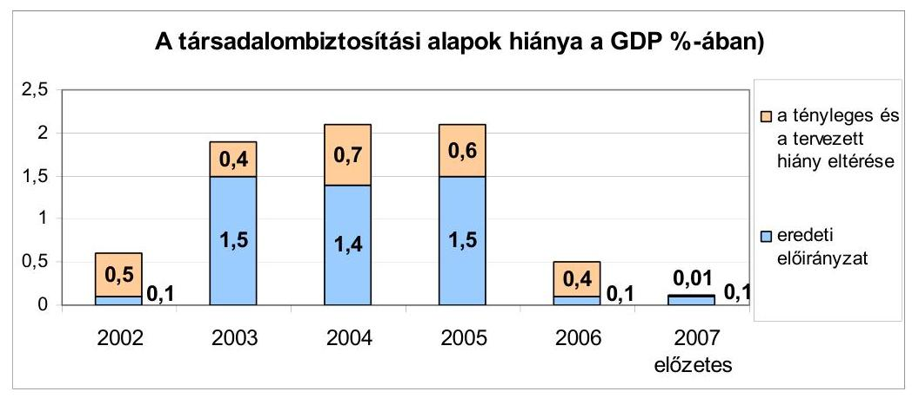

Forrás: költségvetési és zárszámadási törvényjavaslatok
A társadalombiztosítási alapok 2008. évi költségvetési előirányzatai bevételi és kiadási oldalon továbbra is hordoznak kockázatokat, de a bevételek és a kiadások 2008. évi előirányzatait megalapozottabbnak tartjuk a megelőző évekénél. A Konvergencia programban megfogalmazott követelmények elvi szinten a 2008. évi költségvetési javaslatokban érvényesültek. Az E. Alapnál a gyógyító-megelőző egészségügyi ellátás, a gyógyszertámogatási, valamint a gyógyászati segédeszköz előirányzat betartása, teljesíthetősége nagymértékben függ a 2006 végén meghozott intézkedések – 2007-ben érvényesülő – hatásaitól. Az Ny. Alapnál a nyugdíjkiadások teljesülése az elvárt makrogazdasági mutatók alakulásától függ. A már megismert intézkedés-sorozat elindíthatja azt az átalakulási folyamatot, amely arra kényszeríti az egészségügyi szolgáltatókat, hogy belső tartalékalkat feltárják, gazdálkodásukat racionalizálják, és a központi ösztönzőket is felhasználva strukturális átalakításokat hajtsanak végre, felesleges
 kapacitásokat építsenek le. Eredményeket hozhat az intézmények területi elvű (regionális) együttműködése is.

# 2.1.4. A helyi önkormányzatok 

Az államháztartás önkormányzati alrendszerének bevétele-kiadása az elmúlt négy évben emelkedett, a 2006. évi konszolidált bevétele-kiadása a 2002. évinél megközelítően 50%-kal magasabb, az évenkénti növekedési ütem 6-12% közötti volt. Ezen időszak alatt a személyi kiadások - elsősorban központi bérintézkedések miatti - 50%-os növelésére, valamint a dologi és a felhalmozási célú kiadások 66-42%-os emelésére a helyi adóbevételek 50%-os, a személyi jövedelemadó bevételek 38%-os, továbbá a kapott támogatásokból, illetve a hitelfelvételekből származó bevételek együttesen 46%-os növekménye nyújtott fedezetet.

---

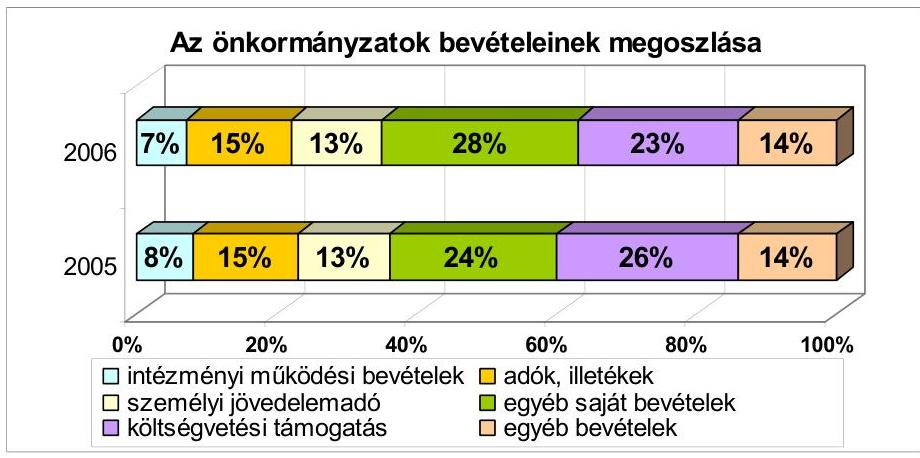

A helyi önkormányzatok könyvviteli mérleg szerinti vagyona a 2006. év végére a 2002. évihez viszonyítva 60%-kal nőtt. A 2002-2003 közötti kiugróan magas arányú növekedést elsősorban a korábban érték nélkül nyilvántartott ingatlanok értékének megállapítása okozta. Kedvező, hogy a 2003. évtől történő növekedést jellemzően a beruházások, felújítások eredményezték. Kedvezőtlen, hogy a beruházásokra fordított kiadások bővülése mellett növekedett a kötelezettségek év végi állománya, ugyanakkor a pénzügyi likviditást elősegítő forgóeszközök aránya mérséklődött. A költségvetési egyensúlyt javító önkormányzati intézkedések következtében csökkent az önkormányzatok tulajdonában lévő értékpapírok állománya, míg a kötelezettségek az emelkedő összegű hitelfelvételekből eredő visszafizetési kötelezettség miatt növekedtek.

Adatok: milliárd Ft-ban

| A HELYI ÖNKORMÁNYZATOK KÖNYVVITELI MÉRLEG SZERINTI VAGYONA |  |  |  |  |  |
| :--: | :--: | :--: | :--: | :--: | :--: |
| Eszközök | 2002 | 2003 | 2004 | 2005 | 2006 |
| Immateriális javak | 9 | 11 | 16 | 21 | 25 |
| Tárgyi eszközök | 4350 | 6833 | 7021 | 7238 | 7576 |
| Befektetett pénzügyi eszközök | 564 | 566 | 575 | 556 | 558 |
| Üzemeltetésre, kezelésre átadott eszközök | 930 | 1254 | 1396 | 1482 | 1587 |
| Forgóeszközök | 570 | 571 | 610 | 564 | 554 |
| Eszközök összesen | 6423 | 9235 | 9618 | 9861 | 10300 |
| Kötelezettségek | 490 | 518 | 589 | 697 | 925 |
| Saját vagyon | 5933 | 8717 | 9029 | 9164 | 9375 |

Az éves beszámoló kapcsán előzetes figyelem felhívásként szólnunk kell arról is, hogy az elmúlt három esztendőben dinamikusan nőttek az önkormányzatok rövid és hosszúlejáratú hitelfelvételek miatti kötelezettségei. A 2007. év során közel másfélszeresére nőtt a helyi önkormányzatok és a többcélú kistérségi társulások hosszú lejáratú adósság állománya a Magyar Államkincstár adatszolgáltatása szerint. A hosszú távú kötelezettségek év végi állománya a múlt esztendőben 192,1 Mrd Ft-tal (46,7%-kal) nőtt. A különböző típusú hitelek és kölcsönök közül az önkormányzatok a kötvénykibocsátást részesítették előnyben: a kötvényállomány 2005 végén még alig 4 Mrd Ft, 2006. év végén már 24 Mrd Ft, míg 2007 végén 211 Mrd Ft-ot meghaladó volt.

---

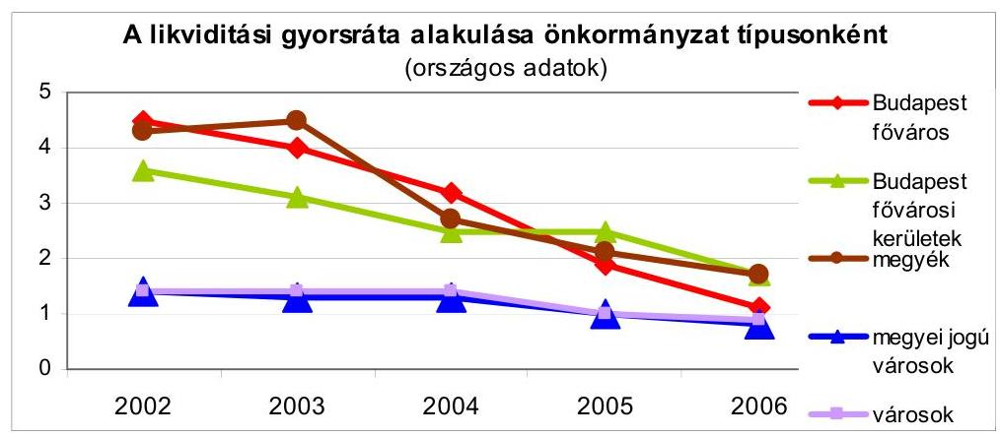

A 2007. évi átfogó ellenőrzések eddig feldolgozott jelentéseiből is levonható az a következtetés, hogy tovább nőtt az önkormányzati alrendszer adóssága. A kötelezettségek mindegyik önkormányzat-típusban emelkedtek, így az önkormányzatok gazdasági helyzete 2002-2006 között romlott, kiugróan a Budapest Főváros kerületi, a megyei, a megyei jogú városi és a városi önkormányzatoknál.

A pénzügyi helyzet alakulásában a likviditási gyorsráta ${ }^{8}$ az önkormányzat típusok között jelentős különbségeket mutat, mely különbség a 2006. évben csökkent. A likviditási gyorsráta jelzi a pénzügyi helyzet folyamatos rosszabbodását: azt, hogy a pénzeszközök, forgatási célú értékpapírok és a követelések egyre csökkenő mértékben nyújtanak fedezetet a rövidlejáratú kötelezettségek teljesítésére és azt, hogy a likvid hitelt felvevő önkormányzatok egyötöde egyik évben sem fizette vissza a hitel teljes összegét év végén, így az folyamatosan szolgálta a fizetőképesség fenntartását.

# Az államháztartás önkormányzati alrendszerének gazdálkodását befolyásoló szabályozó rendszer alakulása 

Az állami és önkormányzati feladatok, a kistérségek és régiók által ellátott feladatok felülvizsgálata, pontosabb meghatározása, a finanszírozási rendszer korszerűsítése, a forrásszabályozás továbbfejlesztése, a támogatási jogcímek számottevő csökkentése, egyszerűsítése, a hitelfelvételi korlát újraszabályozása 2007-ben sem valósult meg. A normatív állami hozzájárulás jogcímeinek száma ugyan nem emelkedett, de egy-egy jogcímen belül a feladatok részletezettebbé váltak (pl. szociális és gyermekjóléti feladatok) és külön fajlagos hozzájárulást rendeltek hozzájuk, így az elszámolást összesen 156 kódszámon kellett elkészíteni. A közigazgatási szolgáltatások korszerűsítési programjáról szóló kormányhatározat rendelkezései nem érvényesültek, a szabályozás részletezőbbé vált, a normatív hozzájárulások elszámolása és annak ellenőrzése a feladatellátásra vonatkozó szakmai jogszabályok egyre szélesebb körének alapos ismeretét igényelték.

[^0]
[^0]:    ${ }^{8}$ Követelések+ értékpapírok+ pénzeszközök/ rövid lejáratú kötelezettségek

---

A normatív hozzájárulás ellenőrzésébe bevont 72 önkormányzat közül az előző évhez hasonlóan öt nyújtott be hibátlan elszámolást. A 2% feletti hibát tartalmazott a beszámolók 15%-a (ez az arány 2005-ben 3%, 2006-ban 9% volt). Mind a 2%-ot meghaladó hibát tartalmazó elszámolások, mind az elszámolásokban megállapított hiba arányának az utóbbi években tapasztalt növekedése jelzi, hogy romlik az elszámolások szabályszerűsége és megbízhatósága.

Az önkormányzati szabályozásban pénzügyi eszközökkel, ösztönzéssel próbálták elérni a közszolgáltatások hatékonyabb szervezését, színvonalának növelését - az államháztartás egyensúlyi helyzetének javítása érdekében - reálértéken csökkenő működési támogatásokból. A költségvetési egyensúly javításával összefüggő központi forráscsökkentésre a helyi önkormányzatok a 2007. évi költségvetés jóváhagyása és a végrehajtása során ellentmondásosan - részben tényleges megtakarítást eredményező helyi szervezési intézkedésekkel, létszámcsökkentéssel, részben a hiány kölcsönforrásokból történő finanszírozásával, növekvő eladósodással - reagáltak.

A közoktatás finanszírozás támogatási rendszerének változása - összhangban a közoktatási törvényben meghatározott különféle iskolai átlaglétszámok, időkeretek, valamint a pedagógusok heti óraszámának előírásával - felmenő rendszerben a közoktatás racionálisabb megszervezésére ösztönzött.

A szociális törvény módosításával, a családtámogatási és segélyezési rendszer átalakításával - összhangban ellenőrzéseink megállapításaival és javaslataival - prioritást kapott a szociális ellátásokban a rászorultság elvének érvényesülése, ennek előtérbe helyezését biztosító támogatási rendszer és szabályozás kialakítása, valamint a pénzbeli ellátások átalakítása a segélyből élők munkába állásának ösztönzése érdekében.

A többcélú kistérségi társulások nyolcféle feladathoz igényelhettek hozzájárulást, a támogatási feltételeik rendkívül összetettek, bonyolultak, ezért nehezen követhetők. 2006-ban nőtt azon feladatok támogatottsága, melyekhez pályázati úton központosított előirányzatot biztosított a költségvetés. Az egyes jövedelempótló támogatások kiegészítésére biztosított normatív, kötött felhasználású támogatások összege és részaránya is csökkent a gyermeknevelési támogatásnak az önkormányzati finanszírozási körből való kikerülését követően.

Mind az igénylés alapján biztosított, mind a pályázatos központosított előirányzatok nagy részének igénylési és elszámolási rendszere továbbra is bonyolult. A pályázati úton odaítélt támogatások egyenkénti utólagos elszámolásának felülvizsgálata egyes támogatási jogcímeknél - elsősorban szabályozási hiányosságok miatt - nem, vagy csak részben felelt meg a követelményeknek. Tapasztalataink szerint ez arra is visszavezethető, hogy az önkormányzatok a kötött felhasználású támogatások igénybevételét, célszerinti felhasználását és elszámolását nem ellenőrizték.

A fejlesztési támogatások meghatározó elemét továbbra is a cél- és címzett támogatások jelentették, azonban az Európai Unió által nyújtott támogatások bővülésével folyamatosan csökkent a cél- és címzett támogatások nagyságrendje. 2006-ban a támogatások mintegy 10%-a volt fordítható új beruházásra (a

---

2007. évtől címzett támogatás induló beruházásra nem nyújtható). A támogatás szerepét a hazai forrásokat felváltó, az ÚMFT Operatív Programjaiban meghatározott fejlesztési célok megvalósításához kapcsolódó uniós támogatások vették át.

A fővárosi önkormányzatot és a kerületi önkormányzatokat osztottan megillető bevételek 2007. évi megosztásáról szóló önkormányzati rendelet felülvizsgálatakor megállapítottuk, hogy a 2006. évi forrásmegosztási törvény nem felel meg az Ötv. követelményének, mert nem határozta meg a forrásmegosztás számításánál figyelembe veendő feladatokat. Jogszabályi előírás hiányában bizonytalan, hogy a kiadási oldalon mely szakfeladatok működési kiadásait, a bevételi oldalon a normatív hozzájárulások és támogatások mely feldolgozási kódszámain elszámolt bevételeket kell figyelembe venni. A 2006. évi forrásmegosztási törvény a fővárosi önkormányzatot megillető bevételek 47-53%-os megosztásával korlátozta a Közgyűlés Ötv. felhatalmazásán alapuló rendeletalkotási jogkörét. A 2007. évi forrásmegosztási rendelet is törvénysértő, mivel a kerületi helyi adókat a kerületek bevételeként határozta meg. Az egyéb központi adók körébe tartozó gépjárműadót a 2007. évi forrásmegosztási rendelet - az Ötv. előírását megsértve - nem osztotta meg a főváros és a kerületi önkormányzatok között ${ }^{9}$, a 2006. évtől bevezetett, ebbe a körbe tartozó luxusadó megosztása megtörtént.

A fővárosi önkormányzat által, valamint az ÁSZ észrevételei alapján számított működési kiadási forráshiány egyaránt meghaladta a megosztható bevételek összegét, ezért nem maradt forrás a kerületek sajátosságait figyelembe vevő szabályozás szerinti megosztásra.

Ellenőriztük az önkormányzatok központi költségvetési kapcsolatokból származó forrásai igénybevétele és elszámolása felülvizsgálati tevékenységét. A Kincstár 2006. évi felülvizsgálati tevékenysége az önkormányzatoknak a központi költségvetési kapcsolatokból származó 2005. évi 1321,3 milliárd Ft állami támogatás és átengedett személyi jövedelemadó elszámolására, a 2006. évi 1289,3 milliárd Ft állami támogatás és átengedett személyi jövedelemadó előirányzat igénylésére, valamint a 2007. évi költségvetési tervezéssel összefüggő mutatószám felmérésére irányult.

A Kincstár megyei igazgatóságain dolgozók a felülvizsgálatot egyéb munkájuk mellett - többletlétszám nélkül - látják el 2002-től. Az igazgatóságok önállóan és elkülönülten alakították, formálták a felülvizsgálatot segítő adatállományukat, mivel a Kincstár szintjén egységes, rendszerbe foglalt és közvetlen elérést biztosító felülvizsgálati adatbázist nem hoztak létre. A 2007. évi központi költségvetés tervezéséhez a normatív állami hozzájárulások, a normatív kötött fel-

[^0]
[^0]:    ${ }^{9}$ Az Országgyűlés a 2007. december 30-án hatályba lépett, az egyes önkormányzatokat érintő törvények módosításáról szóló 2007. évi CLXXXII. törvénnyel módosította a 2006. évi forrásmegosztási törvényt, ezért a felülvizsgálat alapján megfogalmazott korrekciós javaslatunkban már a kerületi önkormányzat által beszedett adóbevétel (gépjárműadó és a kerületi önkormányzatok által kivetett helyi adók) egészét a kerületi önkormányzat bevételeként vettük figyelembe.

---

használású támogatások mutatószám felmérésének felülvizsgálatára rendelkezésre álló időtartam nem tette lehetővé az Áht.-ban foglalt eljárási rend betartását, az írásbeli felhívások kibocsátását.

Az önkormányzatok központi költségvetési kapcsolataiból származó forrásai igénybevételének előzetes felülvizsgálati tevékenysége eredményes volt, mert megakadályozta az állami hozzájárulások, támogatások jogtalan igénybevételét. Az önkormányzatok központi költségvetési kapcsolataiból származó forrásai igénybevételének utólagos felülvizsgálati tevékenysége részben volt eredményes, mert a felülvizsgálat jogszabályban meghatározott módszere nem biztosította a jogtalanul igénybe vett állami támogatások teljes körű feltárását.

A Kincstári igazgatóságokon a támogatások utólagos felülvizsgálata nyomán feltárt jogosulatlan igénybevétel azonban - mivel vannak olyan jogcímek, amelyek vizsgálatára csak a helyszínen megtalálható dokumentumok egyeztetése nyújt lehetőséget - nem éri el a helyszíni ellenőrzés eredményességét. ${ }^{10}$

# A helyi önkormányzatok gazdálkodási rendszerének ellenőrzési tapasztalatai 

A számvevőszéki jelentések nyilvánosságra hozatala jelentős mértékben növelte az önkormányzatok önkéntes jogkövető magatartását, s lehetővé tette, hogy a közel 3200 önkormányzat vezetése tudomást szerezhessen azokról a hiányosságokról - akár szabályozási, akár döntéshozatali, vagy a gazdálkodási jogkörök gyakorlásával összefüggő területeken - melyek tipikusnak mondhatók az önkormányzati alrendszerben.

Megállapítottuk, hogy a gazdasági programmal rendelkező önkormányzatok aránya 2002-2006 között - az előző évekhez viszonyítva - növekedett. Az elfogadott
 gazdasági programokban a célkitűzések között szerepelt a pénzügyi stabilitás biztosítása, az intézményi struktúra átalakítása, a pályázati lehetőségek maximális kihasználása.

Az önkormányzati hivatalok több mint felénél a jegyzők az Áht. előírásait megsértve nem, vagy nem megfelelően gondoskodtak a FEUVE megszervezéséről, nem alakították ki a kockázatkezelés rendjét, közel felénél nem készítették el az ellenőrzési nyomvonalat. Az önkormányzatok hivatalainál az Ámr-ben előírt folyamatba épített ellenőrzési feladatok hiányos elvégzése miatt a könyvviteli elszámolásokat megalapozó pénzforgalmi bizonylatok közel fele nem felelt meg a Számv. tv-ben foglalt alaki és tartalmi követelményeknek. A kötelezettségvállalás és az utalványozás jóváhagyott előirányzat nélkül történt az önkormányzatok egyharmadánál.

[^0]
[^0]:    ${ }^{10}$ Az ÁSZ-nak a 2005. és a 2006. évi zárszámadás keretében a normatív állami hozzájárulások elszámolásával és a normatív kötött felhasználású támogatások elszámolásával kapcsolatban végzett vizsgálata minden megyében összességében 18,4 százalékponttal nagyobb arányban tárt fel az előírástól eltérő igénybevételt, mint a Kincstár felülvizsgálata.

---

Az előző ellenőrzések tapasztalatai alapján magas kockázatúnak minősített belső kontrollok működésének ellenőrzését a 2006. évben kiterjesztettük azok részterületeire is, mert a folyamatba épített ellenőrzések elmaradása, a jogszabályban előírt ellenőrzési feladatok végrehajtásának teljes, vagy részleges elmulasztása következtében a bizonylatokon halmozottan jelentkeztek a hiányosságok. A kiterjesztés következtében az előző évekhez képest kiugróan magas hibaarányt állapítottunk meg a FEUVE rendszer működtetésében.

Az önkormányzatok szinte teljes köre szabályozta rendeletben a vagyongazdálkodással kapcsolatos hatásköröket és a vagyonértékesítéssel kapcsolatos feladatokat, hatásköröket. Ugyanakkor az önkormányzatok közel felénél nem rendelkeztek a korlátozottan forgalomképes vagyon átsorolási feltételeiről. Az elidegenítések, vagyonhasznosítások során a versenytárgyalási kötelezettségre vonatkozó előírást az önkormányzatok fele megsértette. A versenytárgyalás nélkül történt elidegenítések nem tették lehetővé az önkormányzati vagyonnal történő gazdálkodás nyilvánosságára, átláthatóságára vonatkozó követelmény érvényesülését. A korlátozottan forgalomképes törzsvagyon részét képező víziközművek tulajdonjogának gazdasági társaságok részére történő átadásával 2003-2006 között 24 önkormányzat sértette meg az Ötv. és a vízgazdálkodásról szóló törvény előírásait. Az önkormányzatok törzsvagyonába tartozó forgalomképtelen ingatlan értékesítése és földhivatali bejegyzése is megtörtént - a Ptk. forgalomképtelen ingatlanok elidegenítésére vonatkozó semmisségi előírását megsértve - 9 önkormányzatnál. Az önkormányzatok közel felénél történt úgy vagyonértékesítés, hogy a forgalmi érték megállapítására értékbecslés nem készült, vagy az abban foglaltakat nem vették figyelembe az értékesítési ár meghatározásakor. Ingyenes vagy kedvezményes helyiségbérlet biztosításával - az Alkotmány és az Ötv. előírásait megsértve - évente csökkenő arányban támogattak közvetetten politikai pártokat az önkormányzatok.

Az önkormányzatok a 2006. évben 277,3 milliárd Ft-ot adtak át céljellegű nem szociális ellátásként - támogatásként államháztartáson kívülre pénzeszközöket működési és felhalmozási célra (alapítványoknak, közalapítványoknak, egyéb non-profit szervezeteknek, vállalkozásoknak, háztartásoknak, saját intézményeiken kívüli költségvetési szerveknek és külföldi közösségeknek). A helyi önkormányzatok a céljellegű támogatások közel felét működési, a többit felhalmozási célra nyújtották. A támogatás összegét, a támogatott célt, a támogatás felhasználásáról történő számadási kötelezettség teljesítésének módját, határidejét az előző évekhez viszonyítva növekvő arányban meghatározták. A számadások ellenőrzését az Áht. előírása ellenére az önkormányzatok közel egytizede nem végezte el, további 40% pedig hiányosan gondoskodott a számadások ellenőrzéséről. A támogatások rendeltetésszerű felhasználására vonatkozóan az önkormányzatok mintegy nyolctizede a célszerinti felhasználást nem ellenőrizte ${ }^{11}$.

A támogatások és a nettó ötmillió Ft-ot elérő vagy azt meghaladó szerződésekkel kapcsolatos, Áht-ban előírt közzétételi kötelezettségének évek óta az önkormányzatok több mint fele nem, vagy csak részben tett eleget. A közzététel

[^0]
[^0]:    ${ }^{11}$ Az átadott pénzeszközök felhasználását 17 támogatott szervezetnél ellenőriztük a helyszínen, amelyek során hat esetben jogosulatlan felhasználást állapítottunk meg.

---

elmulasztása nem tette lehetővé a közpénzfelhasználás átláthatóságára, nyilvánosságára vonatkozó követelmény érvényesülését. Az önkormányzatok mintegy harmadánál történt követelés elengedés és ingyenes vagyonátruházás. A követelést elengedő önkormányzatok közel fele, a vagyont ingyenesen átruházó önkormányzatok harmada nem határozta meg rendeletben a követelés elengedés módját és eseteit, valamint az ingyenes vagyonátruházás eseteit.

Az ellenőrzött kiemelt körbe tartozó, valamint a városi önkormányzatok képviselő-testületei meghatározták a közbeszerzések helyi szabályait, azonban az önkormányzatok tizede nem rendelkezett a közbeszerzési eljárások előkészítéséről, az ajánlatkérő nevében eljáró, illetve az eljárásba bevont személyek felelősségi köréről és az eljárások dokumentálásának rendjéről. A Kbt.-ben foglaltak ellenére az ellenőrzött önkormányzatok egynegyede a közbeszerzési eljárások belső ellenőrzésének felelősségi rendjét nem határozta meg, mintegy tizede nem készítette el az éves összesített közbeszerzési tervét. A lefolytatott közbeszerzési eljárásokban az ajánlatkérő nevében eljáró személyek megfelelő szakértelemmel rendelkeztek, az ajánlatok elbírálása megfelelt a Kbt.-ben foglaltaknak, a bíráló bizottságok - három eljárás kivételével - a kizáró okokat vizsgálták. A szerződést az ajánlati dokumentáció, felhívás és az ajánlat alapján határidőben megkötötték.

Az ellenőrzés során a Kbt. megsértése miatt az ÁSZ 21 jogorvoslati eljárást kezdeményezett, amelyek közül 19-nél a Közbeszerzési Döntőbizottság megállapította a jogsértést és 13,5 millió Ft összegű bírság kiszabásáról határozott ${ }^{12}$.

Az önkormányzatok tervezett költségvetési bevételeinek-kiadásainak egyensúlya az elmúlt években folyamatosan romlott. A tervezett bevételek az önkormányzatok kilenctizedénél nem nyújtottak fedezetet a tervezett kiadásokra, ezen belül háromnegyedénél a működési feladatokra, felénél a tervezett felhalmozási feladatokra. A költségvetésben tervezett hiány növekedésében változatlanul szerepet játszott a feladatellátás módjának gazdaságtalan megszervezése, az intézményi kapacitások alacsony kihasználása, a teherbíró képességet meghaladó önként vállalt feladatok elvégzése, tervezési hibák, a működési bevételek alultervezése, valamint a felhalmozási célú költségvetési bevételeket meghaladó mértékű felhalmozási célú költségvetési kiadás tervezése.

Az önkormányzatok egyensúly javítására tett intézkedéseinek hatására ténylegesen az ellenőrzött önkormányzatoknak az elmúlt két évben közel egyharmadánál volt költségvetési hiány. A tervezett költségvetési hiányt a költségvetés végrehajtása során csökkentették a terven felüli saját bevételek, a vagyonértékesítésből, a nem megalapozott tervezésből származó többletbevételek, a támogatások és pályázatok révén megszerzett pénzeszközök, a pénzmaradvány tervezett igénybevételének háromszorosát meghaladó - a tervezett hiány kétharmadának megfelelő nagyságú - igénybevétele, valamint az önkormányzatok mintegy kétharmadánál a feladatok átütemezése, elhalasztása, esetleg elhagyása.

A saját bevételek között változatlanul meghatározó volt a helyi adóbevétel, amelynek az összes bevételen belüli aránya meghaladta az egytizedet. A helyi adóbevételek között az iparűzési adó továbbra is a legjelentősebb, a helyi adóbevételek 84%-át biztosította. Az önkormányzatok háromnegyede a helyi adókból különböző jogcímen a törvényben biztosítottakon túlmenően további kedvezményeket, mentességeket is adott.

Adósságot keletkeztető kötelezettségvállalásról az ellenőrzött önkormányzatok kétharmada döntött, ennek leggyakoribb módja a hitelfelvétel volt. A felvett hitelekkel és kötvénykibocsátásokkal, (melyek mértéke 2007-ben jelentősen nőtt) részben a korábbi hiteleket fizették vissza. Az adósságot keletkeztető kötelezettségvállalások összegének meghatározásakor az önkormányzatok 96%-ánál betartották az Ötv.-ben előírt felső határt. A folyószámlahitel keretek és a felvett likvid hitelek összege, időtartama 2002-2006 között folyamatosan emelkedett, annak teljes összegét a megyei önkormányzatok háromnegyede, a megyei jogú városi önkormányzatok egyharmada, a Budapest fővárosi kerületi önkormányzatok fele, a városi önkormányzatok 38%-a év végén nem fizette vissza.

Az önkormányzatoknál a pénzügyi-számviteli tevékenység informatikai támogatottsága az elmúlt évek alatt egyre elterjedtebb és korszerűbb lett, azonban a pénzügyi-számviteli feladatok ellátására számítógépes programokat és manuális, analitikus nyilvántartást egyaránt használtak. Az informatikai felkészültség fejlesztése keretében az önkormányzatok döntő többsége ma már rendelkezik internetes honlappal, melyen a 2007. évben az ellenőrzött megyei, megyei jogú városi, fővárosi kerületi és városi önkormányzatok közel kétharmada az ügyek intézésével kapcsolatos általános információkon túlmenően a vonatkozó kormányhatározat szerinti 2. elektronikus szolgáltatási szintnek megfelelve a szükséges dokumentumokról tájékoztatást nyújt, valamint lehetővé tette nyomtatványok letöltését és azok elektronikus kitöltését. A 2007. évi ellenőrzési tapasztalatunk szerint az önkormányzatok mintegy tizede ezen túlmenően a 3. elektronikus szolgáltatási szint követelményének megfelelve kialakította az elektronikus ügyintézés kezdeményezésének feltételeit, biztosítva azt, hogy az adott ügyek indításához, intézéséhez személyes megjelenés már nem szükséges.

A kisebbségi önkormányzatok a települési önkormányzatoktól feladatot nem vettek át és intézményt nem alapítottak, így költségvetésükben meghatározó részarányt a működési kiadások és azon belül évente növekvő arányban a dologi kiadások képviseltek.

A belső ellenőrzési feladatok ellátásában a korábbi évekhez képest előrelépés történt a belső ellenőrzési szervezet és a személyi feltételek kialakítása, a működéséhez szükséges feltételek biztosítása, a feladat ellátásának szabályozottsága területén. Az önkormányzatok többsége kialakította a belső ellenőrzés

---

szervezeti kereteit, azonban a városok több mint fele, a nagyközségek, községek mintegy négyötöde nem szabályozta a belső ellenőrzést végzők jogállását, feladatait. A belső ellenőrzés szervezeti rendszerét az önkormányzatok négyötöde belső ellenőrzési társulás keretében biztosította. Előrelépés történt a belső ellenőrzést ellátók feladatköri és szervezeti függetlensége terén, mivel az önkormányzatok mintegy kilenctizedénél a belső ellenőrök közvetlenül a jegyző alárendeltségében végezték munkájukat. Az önkormányzatok kilenctizede rendelkezett belső ellenőrzési kézikönyvvel, ugyanakkor még mindig nem kellően megalapozott az ellenőrzések tervezése, a társulások munkaterve és az önkormányzatok igénye közötti összhang az érintettek közel harmadánál nem valósult meg. Az elvégzett ellenőrzések háromnegyed részében megfelelő tartalmú jelentések készültek. A képviselő-testületek továbbra is kevés figyelmet fordítottak a belső ellenőrzési tevékenység éves eredményének megismerésére.

# 2.2. Az állami és az önkormányzati feladatellátásra irányuló ellenőrzések főbb tapasztalatai 

## Az infrastruktúra fejlesztés és működtetés ellenőrzése

Stratégiai célkitűzéseinkkel összhangban - a már lefolytatott és kapcsolódó ellenőrzések eredményeit felhasználva - ellenőriztük a 2006-ban befejeződő autópálya beruházásokat. A 2006-ban átadott 137,2 km gyorsforgalmi utak - 117,7 km autópálya, 19,5 km főút - megvalósítása 2006 végéig 143,4 Mrd Ft-ba került, a koncesszióban megvalósult autópálya szakaszoknál a szerződés szerinti 136 Mrd Ft építési költséget a Magyar Állam 2030-ig fizeti meg rendelkezésre állási díjként.

Az állami beruházásokra vonatkozó, egységesen alkalmazandó jogi szabályozás hiányában az állami beruházások kormányzati szinten nem koordináltak, a megvalósításuk a piaci körülmények hatásai alapján esetleges, szervezetfüggő, elsősorban finanszírozási és nem rendszerszemléletű.

A hatályos törvény szerint az ellenőrzött gyorsforgalmi útszakaszokat 2006 végéig kellett átadni. A megkötött kivitelezési szerződésekben a befejezési határidőt 9 hónappal előrehozták, a határidő-módosításnak szakmai indoka nem volt, meghatározásakor nem vették figyelembe a beruházások előkészítésének tényleges helyzetét és a kivitelezés időszükségletét. Ennek következményeként a kitűzött határidő célok nem, vagy úgy teljesültek, hogy a munkák befejezését szakaszolták, illetve többletköltséget okozóan a műszaki tartalmat megváltoztatták. A beruházások során a határidő prioritása mellett a gazdaságossági szempontok nem érvényesültek, a minőségi követelmények teljesülése kockázati tényezőket tartalmaz. A kivitelezők kiválasztására kiírt ajánlati felhívás behatárolta a lehetséges
 vállalkozók körét. Ebből, és a 2004-2006-ban átadni tervezett gyorsforgalmi utak volumenéből az következett, hogy a megépítendő útszakaszok száma meghaladta a lehetséges kivitelezők számát a hazai piacon, ami az építési piac felosztásának irányába hatott, és a potenciális kivitelezőknek az ajánlati áraik kialakításánál „versenynyomással” nem kellett számolniuk. Mindez nem ösztönzött a kivitelezési árak csökkentésére.

---

A villamosenergia-ellátás rendszerét korábban nem vizsgáltuk. A téma aktualitását az adta, hogy az EU-előírások alapján 2007-től teljesen liberalizálni kellett az árampiacot. A szabályozási és támogatási rendszer elsősorban a kis erőművek létrehozását segítette, tartalékot is adó nagy erőmű pedig nem létesült. Mindezek következtében a terhelési változások vagy üzemzavarok szabályozhatósága 2005-től egyre kevésbé volt biztosított. A rendszerirányító MAVIR 2007. évi elemzése szerint az év mintegy 40%-ában a rendszer nem elégíti ki a minőségi ellátás biztonsági követelményeit. A hálózati veszteség magas (10%), ennek csökkentése megtérülési szempontból nem vonzó, ugyanis a veszteség áramdíjban elszámolható költség. A villamosenergia ára az energiahordozók, a termelői árak és az árképzési rendszer változása következtében 4 év alatt jelentősen megemelkedett, a lakossági ár például 45%-kal nőtt. Az árakat növelte a kötelező átvétel alá eső villamos energia kiemelt átvételi ára, ugyanakkor kedvezően befolyásolta a Paksi Atomerőmű által termelt olcsó áram. Ez viszont a magasabb árak keresztfinanszírozását biztosította, aminek következtében a drágán termelő erőművek is versenyben maradtak.

Az EU-irányelveknek megfelelően 2003. január 1-jétől megtörtént a kettős piaci modellre $^{13}$ való átállás. Az 1990-es évek közepén végrehajtott erőmű privatizáció során kötött hosszú távú szerződések révén a villamosenergia közel kétharmada biztosított volt, de ez a piaci szegmens mozgásterét szűkítette. Az árakra a versenypiac, korlátozott jellege miatt, nem tudott lényeges hatást gyakorolni. A kettős piaci modell negatív megítélését jelzi, hogy az Európai Bizottság három, egymástól független eljárást indított. Az EU által 2007 közepétől elvárt teljes piacnyitás késett, mert az állami irányítás mind a szabályozás kialakítása, mind a hosszú távú szerződések rendezésében késlekedett.

A hosszú távú és fenntartható megoldások kialakítását biztosító intézkedések megtétele érdekében a települési önkormányzatok vízrendezési és csapadékvíz elvezetési feladatai ellátásának ellenőrzése keretében tártuk fel a szabályozás és feladatellátás problémáit, eredményeit. A vízrendezés és csapadékvíz elvezetés a települési önkormányzatok kötelező közszolgáltatási feladata, azonban a törvényekben megfogalmazott, az önkormányzatok közigazgatási területére kiterjedő vízrendezés keretében ellátandó feladatok meghatározására - figyelemmel az eltérő tulajdoni viszonyokra - jogszabályi előírások nem voltak. Nem készültek komplex vízrendezési tervek, kül- és belterületen nem összehangolt fejlesztések valósultak meg. Az önkormányzatok közötti együttműködés az ösztönzés ellenére nem volt jellemző. A feladatok ellátásának helyi szabályozása részben felelt meg a jogszabályi előírásoknak, az önkormányzatok 26%-a feladatai között a vízrendezést helyi szabályzatában egyáltalán nem nevesítette. A képviselő-testületek által jóváhagyott vízrendezési és csapadékvíz elvezetési feladatok ellátásának helyi szabályai, a programok, koncepciók, a területrendezési terv és az egyes településrészekre vonatkozó vízrendezési tervek közötti összhangot az önkormányzatok 29%-a biztosította. A vagyonkataszteri-nyilvántartásban kimutatott, a vizekre és vízilétesítményekre vonatkozó naturális és érték adatok - kormányrendelet előírásai ellenére - az önkormányzatok harmadánál továbbra sem feleltek meg a valóságnak.

[^0]
[^0]:    $^{13}$ Egyszerre működött az ún. közüzemi és a frissen megnyílt versenypiac.

---

A települési önkormányzatok vízrendezési célú fejlesztési és rekonstrukciós feladataihoz 2001-2006. években összesen 23,9 milliárd Ft támogatást nyújtott a központi költségvetés címzett támogatás, területi kiegyenlítő támogatás, céljellegű decentralizált támogatás, vízügyi célelőirányzat keretében, azonban a KvVM által végzett felmérés szerint országosan az önkormányzatoknak - 2003. évi árszinten - 224 milliárd Ft-ra lenne szükség vízrendezési célú rekonstrukciókra és fejlesztésekre. A települések vízelvezető rendszereinek, valamint műtárgyainak karbantartásához és fenntartáshoz foglalkoztatást segítő támogatások, közhasznú, közcélú és közmunka keretében juthattak forrásokhoz az önkormányzatok.

A belterületi vízrendezéshez nyújtott sokcsatornás támogatás és az ehhez kapcsolódó vízrendezési célra fordított kiadások elkülönítésének hiánya kedvezőtlenül befolyásolta az átláthatóságot. A felhalmozási és fenntartási célú támogatási igények, pályázatok nem tükrözték az önkormányzatok valós szükségleteit, mivel a pályázatok több célhoz kötődtek, és a célok kiválasztását, ennek megfelelően a pályázat benyújtását befolyásolta az önkormányzatok szemlélete, a település lakosainak értékrendje alapján kialakított önkormányzati feladatok megvalósításának felállított sorrendje. Kedvező volt azonban, hogy a decentralizált források más céloktól elérően 100%-ban támogatták a belterületi vízrendezést. Az önkormányzatok a feladat ellátására a szükségesnél kevesebb pénzeszközt fordítottak, a kiadások részesedése éves költségvetésükből alacsony, átlagosan 1,9% volt. A vízrendezési kiadások 66%-át központi támogatás finanszírozta. Állami támogatás nélkül az ellenőrzött önkormányzatok 44%-a végzett el egy-egy kisebb költségigényű feladatot 1,3 milliárd Ft értékben.

A 84 helyszínen lefolytatott ellenőrzés megállapítása szerint az önkormányzatok felkészültsége a belterületi vízrendezésre - főleg a fejlesztések következtében - az 1998. évi ÁSZ vizsgálattól eltelt időszak alatt javult, de a vízilétesítmények folyamatos karbantartásában, a védekezési tervek elkészítésében csak minimális előrelépés történt. Átfogó vízkár elhárítási stratégiát mindössze öt önkormányzat készített, a veszélyeztetett területek feltérképezése 25 településen történt meg. A kötelezően előírt védekezési tervet 41 önkormányzat készítette el, ez azonban a vizek okozta károk és a védekezés költségeinek állami támogatással történő finanszírozásában semmilyen hátrányt nem jelentett.

Az önkormányzati beruházások jellemzője volt, hogy a hazai finanszírozású, nagyrészt decentralizált területfejlesztési célú támogatási rendszer a korábbi évek determinációi mellett a régiók versenyképességének növelésére, az EU által nem támogatott munkahelyteremtő beruházásokra, az önkormányzati, részben turisztikai fejlesztések támogatására koncentrált. A fejlesztési célú költségvetési támogatások döntéshozatala átrendeződött, a különböző szintű fejlesztési célú támogatások döntési jogköre régiós szintre koncentrálódott, amely segítette a fejlesztési célok összehangolását, fokozta a források felhasználásának hatékonyságát. Ezzel egyidejűleg a megyei területfejlesztési tanácsok döntési körébe tartozó források nagyságrendje minimális szintre csökkent.

A fejlesztési célú támogatásokból megvalósuló települési önkormányzati beruházások szakmai-műszaki előkészítése a beruházások közel felénél volt csak megfelelő a műszaki dokumentációk, tervek, építésre jogosító engedélyek hiányosságai, a műszaki tervezői tevékenység hibái, illetve a műszaki dokumentációk késedelmes rendelkezésre állása miatt. Részben ennek következtében, részben pedig a kivitelezés során felmerült műszaki szükségszerűség miatt a beruházások több mint felénél a megvalósítás során különböző pótmunkák végzésére és elszámolására került sor. A pótmunkákat részben szükségessé tevő hiányosságok miatt a beruházások lebonyolítását végző vállalkozók, műszaki ellenőrök felelősségének érvényesítését az önkormányzatok nem kezdeményezték.

A beruházások szolgáltatóinak kiválasztásában az önkormányzatok döntő része alkalmazta ugyan a közbeszerzési törvény előírásait, azonban a közbeszerzési eljárások eredményeként megkötött szerződések közel felét módosították. A szerződések módosításával, gyakran a közbeszerzés bírálati szempontjainak is részét képező szerződéses feltételek megváltoztatásával sérült a verseny tisztaságának követelménye. Ennek során az önkormányzatok pótmunkákra hivatkozva magasabb szerződéses árat, hosszabb kivitelezési határidőt, illetve a kivitelezők számára kedvezőbb szerződéses mellékkötelezettségeket határoztak meg. Összességében az önkormányzatok 30%-ánál tartották be a közbeszerzési törvény előírásait.

A címzett és céltámogatások felhasználása a vizsgált beruházásoknál eredményes volt, mert a beruházási célok megvalósultak és a létesítményeket a támogatott célnak megfelelően használják. A beruházások az érintett települések, térségek közmű, valamint egészségügyi, oktatási, kulturális infrastruktúra ellátottságának bővülését és színvonal javulását eredményezték.

A felsőoktatási kollégium beruházási program 2007. évi ellenőrzése a PPP-konstrukcióban történő megvalósítás teljesítményszemléletű vizsgálatára irányult. A felsőoktatási kollégiumi helyzetkép - férőhely-hiány, épületek műszaki állaga, minőségi szolgáltatások hiánya, ellátatlan hallgatói létszám motiválta a kollégiumi fejlesztéseket. A diákotthon építési és a kollégium rekonstrukciós programokról a 2003. és 2004. évben csak mennyiségi célkitűzéseket tartalmazó kormányhatározatok születtek. A célkitűzések kialakítását nem előzte meg kollégiumfejlesztési stratégia és felsőoktatási szintű megvalósíthatósági tanulmány. Költségvetési forrás hiányában a fejlesztések megoldásának eszköze a PPP-konstrukció lett.

A fejlesztéseket nem támasztották alá regionális oktatáspolitikai tervek, hosszabb távú képzési elképzelések, demográfiai előrejelzések. Az állami és magánszféra együttműködését elősegítő jogszabályi környezet nem volt kielégítő. Ma is hiányzik a PPP lebonyolítását rögzítő egységes állami eljárásrend, valamint a projektek gazdaságosságának megállapítását szolgáló számítások módszertana. Az Oktatási és Kulturális Minisztérium alapos előkészítő tevékenységet végzett a PPP-konstrukció kockázati és garanciális elemeinek kialakításában. A felsőoktatási intézmények által végzett, előzetes gazdasági számítások a PPP-konstrukció előnyeit igazolták.

A felsőoktatási kollégiumi beruházási program a tervezett időszakhoz képest késedelmesen és részlegesen teljesült. A befejezett diákotthon építési projekteknél hosszú távon - a jellemzően 20 éves futamidő végén - a szolgáltatásvásárlás jelenértéke több mint kétszerese, nominálértéke közel három és félszerese a nettó bekerülési költségeknek.

Rövid távon a kollégiumi projektek kivitelezése és működtetése eredményes, gazdaságos és hatékony. Az egyedi projektcélok teljesültek, a korábbinál alacsonyabb üzemeltetési ráfordítások, a minőségi színvonal növekedése és a teljes kapacitáskihasználtság alapján. A bérleti-szolgáltatási díj nagysága és ennek alakulására ható kockázati tényezők miatt - EUR/Ft árfolyam alakulása, közüzemi díjak emelkedése, kollégiumi és lakhatási normatíva, a hallgatói létszám alakulása, állami tulajdonba vételnél a maradványérték meghatározása - a kollégium beruházási program hosszú távú gazdaságossága egyértelműen nem ítélhető meg.

# Egészségügy, szociális gondoskodás 

A kórházak gyógyszerfelhasználásával korábban már több ellenőrzésünk foglalkozott, 2007-ben önálló témaként ellenőriztük az állami és önkormányzati kórházak gyógyszergazdálkodását. Az elmúlt években a közfinanszírozott gyógyszerkiadások növekedése megállíthatatlannak bizonyult. A megoldási javaslatok és a hozott intézkedések az orvosok gyógyszerfelírási és a betegek gyógyszerszedési szokásaira, valamint a gyógyszergyártókkal kötött megállapodásokra koncentráltak. A kórházak gyógyszergazdálkodásában a jogszabályok nagy száma, esetenkénti diszharmóniája, folyamatos módosítása vagy annak elmaradása, nem segítette a jogalkalmazást, rendelkezései betartásának ellenőrzését, szükség szerinti szankcionálását.

A rendszeres ágazati adatgyűjtések az ágazatirányító megfelelő informáltságát célozzák, de az egymásnak ellentmondó adatok, párhuzamosságok, a nem egységes szerkezet, valamint az alacsony adatszolgáltatási fegyelem miatt nem alkalmasak a folyamatok megismerésére, a döntések előkészítésére, megalapozására. Az ágazati adatgyűjtés eredményét befolyásolja, hogy az intézmények gyógyszergazdálkodásának adatai nem pontosak és nem egységesek, például a gyógyszerbeszerzések intézményi nyilvántartására vonatkozó jogszabályok hiányosak és ellentmondóak.

Az intézeti gyógyszertárak működéséhez szükséges szakmai minimumfeltételek folyamatos felülvizsgálatának hiánya nem szolgálja a betegellátás biztonságát. A jogszabályban előírt minimumfeltételek teljesítése alól a hatályba lépése óta - ellátási érdekre hivatkozással - ideiglenes, majd végleges felmentést kaptak az intézmények.

A kórházak törekedtek a gyógyszerfelhasználásban a szakmai és gazdálkodási feladatok összhangjának megteremtésére. Belső szabályzataik szem előtt tartották az intézmény működőképességének fenntartásához szükséges folyamatos alkalmazkodást, és általában megfeleltek a jogszabályi előírásoknak. A kórházak gyógyszerbeszerzése a közbeszerzési törvény hatálya alá tartozik, de azt az intézmények nagy számban mellőzik. Indokként az eljárással járó többletfeladatokat és költséget, a soron kívüli igények kielégítését és az akciós ajánlatok igénybevételének elmaradását, továbbá a közbeszerzéssel vagy az anélkül elérhető feltételek hasonlóságát említették. A felügyeleti ellenőrzések - egy kivételével - sem kifogásolták a közbeszerzés elmulasztását.

A gyógyszergyártók és gyógyszerforgalmazók marketing tevékenysége a kórházakban jelentős, hatása a kórházak gyógyszergazdálkodására egyértelműen kiadáscsökkentő. A marketing tevékenység hatását a járóbeteggyógyszerfelhasználásra (a gyógyszer kasszára) nem vizsgálta sem az ágazatirányító, sem a finanszírozó. A kórházak eladósodásában a gyógyszerkiadások növekedése nem játszik meghatározó szerepet.

A szociális gondoskodással
 és támogatással szemben támasztott igények és a lehetőségek közötti „olló" egyre tovább nyílik, így a szűkös anyagi erőforrások hatékonyabb, eredményesebb felhasználása társadalmi érdek. Ennek figyelembevételével 333 településen (döntően községekben) ellenőriztük a szociális törvényben meghatározott kötelező alapszolgáltatások érvényesülését.

A szociális alapszolgáltatások és az intézményrendszer kereteit meghatározó Szoctv. 1993. évi megalkotását nem előzte meg a lakosság szociális helyzetének, ellátási szükségleteinek felmérése, az ellátások átalakítására nem készült közép- és hosszú távú koncepció. Jelenleg sincs olyan nyilvántartási rendszer, amely naprakész adatokat tartalmaz a működő szolgáltatások típusát, az ellátottak számát és az egyes szolgáltatások iránti szükségleteket illetően, a statisztikai jelentések adatai utólag, jó kétéves késéssel válnak hozzáférhetővé. A szociális alapszolgáltatások számosságából adódóan az ellátórendszer szétaprózott, a szabályozás bonyolult. A Szoctv. az alapszolgáltatások között a települési és a fővárosi kerületi önkormányzatok részére kötelező ellátásként az étkeztetést és a házi segítségnyújtást határozta meg. A további alapszolgáltatások biztosítását a település állandó lakosságszámától függően tette kötelezővé. Az önkormányzatok sok esetben mulasztásos törvénysértést követnek el, nem működtetnek minden kötelezően biztosítandó személyes gondoskodást nyújtó szociális szolgáltatást. A törvényben előírt ellátási kötelezettség nem teljesítése nem jár valós szankciókkal az önkormányzatok részére.

Az ellátások az ország egyes területein különbözőek, az önkormányzatok eltérő mennyiségű és minőségű szolgáltatás biztosítása mellett látják el feladatukat, melynek oka, hogy nincsenek meghatározva a szolgáltatások minimális ellátottsági mutatói és az önkormányzatok adottságai (népesség, pénzügyi helyzet) nem azonosak. Az ellátásokhoz kapcsolódó normatív állami hozzájárulás előirányzati kerete 2006. december 31-ig „felülről nyitott" volt. Az alapszolgáltatások és a szakosított bentlakásos intézményi ellátások kapacitásnövekedését nagymértékben a normatívához való hozzájutás határozta meg az ellátási szükségletek koordinálása nélkül befogadott igényekből adódóan, aminek eredményeképpen országosan növekvő ellátottság mellett az ellátottsági mutatókban egyenlőtlenségek alakultak ki. A finanszírozott kapacitások bővülésének nem volt korlátja. Ezért 2007-től bevezetésre került a nem állami fenntartókra vonatkozóan az irányított területi kiegyenlítési rendszer. A többcélú kistérségi társulások keretében történő feladatellátás a kiegészítő normatív állami hozzájárulások ösztönző hatására bővült.

---

# Munkaerőpiaci szabályozás, támogatás, közmunka 

A költségvetéshez és annak végrehajtásához kapcsolódó ellenőrzések mellett, átfogóan ellenőriztük az Munkaerőpiaci Alap (MPA) működését a 2004-2006 közötti évekre, kitekintve 2007. első félévére is. A kiadásoknak az Alap különböző felhasználási területei közötti megoszlása hosszabb távon jelentősen megváltozott, és az egyes célokra a megfelelő alaprészeken kívül is, egyre több jogcímen (pl. uniós foglalkoztatási programok társfinanszírozása, normatív járulékkedvezmények, tranzakciós díj) merültek fel kiadások. A kiadási tételek szakmai tartalmát figyelembe véve, az álláskeresők ellátásait fedező passzív kiadások aránya 57%-ról (1999) 33%-ra (2003) csökkent, ami együtt járt az álláskeresők képzésére, foglalkoztatási támogatásaira fordított aktív kiadások részarányának 28%-ról 40%-ra növelésével. A passzív és aktív kiadások részaránya 2003 és 2006 között 1-2%-kal változott.

A munkaerőpiaci szervezet a változó működési feltételek között több intézkedést hozott a feladatok hatékonyabb ellátására. A munkaügyi központok megyei hálózatának régiós átalakításánál kialakított intézményi rendszert a tapasztalatok alapján egyszerűsítették. A kötelező létszámcsökkentések végrehajtásánál a kirendeltségek leterheltségében feltárt különbségeket figyelembe vették. A működés informatikai kockázatai a 2004-től beindított fejlesztések nyomán sem csökkentek, és a számítógépes rendszerek 2007-ben sem támogatták valamennyi foglalkoztatáspolitikai eszköz alkalmazását. A kirendeltségi adatokat is tartalmazó, a pénzügyi és kontrolling folyamatokat lefedő informatikai rendszer kialakítása 10 éve várat magára. A támogatások odaítélését, az igénybevétel jogszerűségét ellenőrzők létszáma az általunk javasolttal ellentétesen, tovább csökkent.

A munkaerőpiacon tartóssá vált strukturális - területi, kor és végzettség szerinti - egyenlőtlenségek felszámolására és a munkanélküliség csökkentésére a kormányzat elsősorban a szakmai szabályozást módosító döntéseket hozott, amelyek részlegesen fejtettek ki a várt hatást. A munkanélküliek aktivitásának növelésére, a munkahely keresésére ösztönzött az ellátórendszerbe kerülés feltételeként az álláskeresés vállalásának előírása. A kötelezettség azonban éppen a magas munkanélküliséggel sújtott térségekben nem volt teljesíthető. Az ellátások folyósítási időszak alatti, kétszeri csökkentése elsősorban a magasabb keresetűeket érintette hátrányosan, ezért álláskeresésre ösztönző hatása is a körükben érvényesült. A munkaerőpiac kínálati oldalára koncentráló, rövid távon hatásos foglalkoztatáspolitikai eszközök alkalmazása a munkaerőpiacot befolyásoló tendenciák és egyéb intézkedések ellensúlyozására nem volt elegendő. A hátrányos helyzetű rétegek (pl. pályakezdők, 45, illetve 50 éven felüliek, nyugdíj előtt állók) munkaerőpiaci pozíciójában érdemi javulás nem mutatható ki.

A munkaképesség megőrzésére fordított pénzeszközök hasznosulásának ellenőrzése a 2004-2006. évekre terjedt ki, a folyamatokat a vizsgálat lezárultáig kísértük figyelemmel, hangsúllyal a komplex rehabilitációs rendszer átalakítására, amely az ellenőrzéssel egyidejűleg zajlott.

A 90-es évek elején Magyarországon másfél millióval csökkent a foglalkoztatottak száma, de ennek csak egy része jelent meg a munkanélküliség emelkedésében. Az akkori szabályozás tág teret engedett a „rokkantosításnak", amely így lehetőséget nyújtott a munkaerőpiaci helyzetében (is) alapvetően meggyengült rétegeknek alacsony szintű, de megélhetést biztosító ellátások megszerzésére. A lehetőség igénybevételét a lakosság rossz egészségi állapota, valamint az orvosi és a foglalkoztatási rehabilitáció intézményrendszerének kiépítetlensége is lehetővé tette. A folyamat következtében az állam ezzel egyre növekvő szerepvállalásra kényszerült a passzív ellátás területén. Az aktív korú rokkantsági nyugdíjas létszám 2006-ban 454 ezer fő volt. A munkaképesség csökkenésén alapuló ellátásokra - a rendszeres szociális segélyt nem számítva - a korhatár alatti megváltozott munkaképességűeknek 2004-2006 között 1103,9 Mrd Ft-ot folyósítottak, amelyből 954,6 Mrd Ft jutott a nem teljesen munkaképtelenek ellátására.

A kormányzati és az európai uniós célkitűzések, intézkedések iránya egyértelműen a megváltozott munkaképességűek társadalmi reintegrációját kívánja elősegíteni. A vizsgált időszakban az orvosi rehabilitációs ellátásban lényegi változások nem voltak, de 2007. március-áprilisban a rehabilitációs fekvőbeteg kapacitás jelentősen nőtt, ugyanakkor a rehabilitációs szolgáltatásoknak sem a személyi, sem a tárgyi minimumfeltételeit pontosan nem rögzítették. A kapacitásnövekedés szakmai megoszlásáról, illetve a döntés megalapozásáról az Egészségügyi Minisztérium dokumentumot nem bocsátott az ellenőrzés rendelkezésére. A megváltozott munkaképességű munkavállalók foglalkoztatása támogatási rendszerének átalakítása az ellenőrzés ideje alatt befejeződött. A célok megvalósításához pénzügyi forrásokat allokálnak, amelynek túlnyomó részét a Strukturális Alapokon belül az Európai Szociális Alap (ESZA), kisebb részét az Európai Regionális Fejlesztési Alap (ERFA) biztosítja.

A munkaképesség orvos-szakértői minősítési rendszere sem elveiben (jogszabályi felhatalmazás), sem gyakorlatában nem járul hozzá a megváltozott munkaképességűek rehabilitációjához. A középtávú feladatellátás szempontjából kockázatot hordoz, hogy az intézményben a minősítő orvosok 51%-a nyugdíjas, további 16%-a 5 éven belül nyugdíjjogosult lesz, utánpótlásuk nem látszik megoldottnak. Az Országos Orvosszakértői Intézet informatikai rendszere korszerűtlen.

Növekedett az igény a különböző társadalmi rétegek munkába történő fokozottabb bevonására, a foglalkoztatási szempontból hátrányos helyzetű térségek és a kellő anyagi feltételek hiányában elhanyagolt közszolgáltatások megvalósításának egyidejűleg programszerű keretet adó, - a „segély helyett munkát" elvet érvényesítő - közmunkaprogramok szervezésére. Közmunkára a költségvetésen kívüli külső forrásokkal és a pályázók önrészével együtt 24,9 milliárd Ft állt rendelkezésre, ami 2003-2006 között évente átlagosan közel 15000 fő foglalkoztatására biztosított fedezetet.

Az alacsony gazdasági aktivitás növeli az önkormányzatok szociális terheit, a helyi foglalkoztatási viszonyok aktív befolyásolása érdekében kevés önkormányzat fogalmazott meg feladatokat, a beavatkozásra alkalmas lépéseket a munkaügyi szervezetektől várták.

A tudatos, a közfoglalkoztatás valamennyi formáját áttekintő önkormányzati koncepció megalkotását nem tartották fontosnak és ezek alkalmazásának gyakorlata sem volt jellemző a közmunkaprogramok támogatására fordított pénzeszközök hasznosulásának ellenőrzése során vizsgált önkormányzati körben. A közmunkaprogramok pályázati rendszerében ugyan érvényesültek a térségi ösztönzés elemei, a foglalkoztatás tényleges megvalósítása során azonban nem használták ki az önkormányzatok a kistérségi összefogásban rejlő előnyöket, erőteljes volt a települések önállósági törekvése. Az önkormányzatoknál a közmunkákat jellemzően a településüzemeltetés olyan területein szervezték, amelyek az anyagi források szűkössége miatt kényszerűségből általánosan elhanyagoltak voltak.

Korábbi javaslataink és a megfogalmazott foglalkoztatáspolitikai célkitűzések ellenére a közfoglalkoztatások egységes rendszerének kialakítására, racionalizálására, egyes elemeinek összehangolására nem került sor. A közmunkaprogramok történetében kiemelkedő volt a 2005. év, amikor a forrásokat összevontan kezelő pályázati eljárásban 352 pályázónak összesen 6479 millió Ft-ot ítéltek oda. Az ország minden harmadik (összesen 1024) települését érintő program 7 hónapos foglalkoztatási időkeretében 24550 fő számára biztosítottak kereső foglalkozást. A pályázati rendszer működtetése során az elsődleges cél a foglalkoztatási és szociális feszültségek enyhítése volt, annak társadalmi és mentális hatásait tartották szem előtt. A pályázati rendszer hatékony és eredményes működtetésére, az értékteremtő munka teljesítménykövetelményeinek meghatározására, a vállalt továbfoglalkoztatási kötelezettség teljesítésére, a képzési programok eredményességének értékelésére azonban már nem irányult megfelelő figyelem. Ehhez a költségvetésben rendelkezésre álló források egységes kezelésére, a szakmai és pénzügyi adatok összehasonlításra és elemzésre alkalmas adatbázissá alakítására lett volna szükség.

# Tájékoztatás 

A nemzeti hírügynökségről szóló törvényben (Nhtv.), valamint a rádiózásról és televíziózásról szóló törvényben (médiatörvény) meghatározott közszolgálati feladatellátás rendszere ellenőrzésének alapvető célja a két törvény által meghatározott szabályozás, szakmai felügyelet, finanszírozási keretek, közszolgálati feladatellátás vizsgálata volt. A médiatörvény és az Nhtv. által létrehozott tulajdonosi, ellenőrzési és szakmai feladatot ellátó szervezeti rendszer fenntartása, működtetése 1997-2006 között 550 Mrd Ft ráfordítást igényelt. Ebből a közvetlen és közvetett állami támogatások 404 Mrd Ft-ot tettek ki. A feladatellátáshoz kapcsolódó 30,4 Mrd Ft induló vagyon a 10 év alatt - a többszöri, összesen 32 Mrd Ft tőkejuttatás ellenére - 29,7 Mrd Ftra csökkent.

A jelentősnek minősíthető erőforrás-felhasználás indokoltságának, eredményességének egyértelmű megítélését nem tették lehetővé a két törvény szabályozási hiányosságai és ellentmondásai. Hiányos a közszolgálati feladatellátás, valamint a feladatokhoz kötött források összehangolt meghatározása. Ellentmondásos a kialakított szervezeti struktúra szereplőinek egymás közti viszonya. A közalapítványi forma - amely az alapító eredeti szándékával ellentétben nem független a politikától - a gyakorlatban nehézkessé tette a kuratóriumok feladatellátását. A nagy létszámú testületek tevékenysége - elsősorban a döntések elhúzódása miatt - alacsony hatékonyságú volt, az intézkedések számonkérés, ellenőrzése formális volt, vagy elmaradt. A társadalmi kontroll megvalósulása ellen hatott, hogy a civil kurátorok megbízása egy évre szólt, ami túl rövid idő ahhoz, hogy érdemben tudjanak hozzájárulni a döntések meghozatalához. A szabályozási gondokat tovább növelte, hogy a testületek működéséből hiányzott a konszenzusra való törekvés, és az Országgyűlés sem fordított megfelelő figyelmet a problémák kezelésére. Mindez a szabályozás és a szervezeti struktúra rendszerszemléletű újragondolását, és ehhez igazodóan az Európai Bizottság versenysemleges működést szorgalmazó ajánlására is figyelemmel lévő finanszírozási rendszer kialakítását igényelné, amelyre 2003 óta folyamatosan felhívtuk a törvényalkotók és a Kormány figyelmét.

Megállapítottuk, hogy a finanszírozás nem normatív alapon, hanem az éves költségvetési törvényekben jóváhagyott forrásokból és az ORTT által kezelt Műsorszolgáltatási Alapból előre meghatározott felosztás alapján, illetve pályáztatás útján történt. A közmédia finanszírozását hátrányosan befolyásolta a lakosság üzembentartási díjának költségvetési átvállalása, amelynek mértéke lényegesen elmaradt az infláció növekedési ütemétől. Az ebből is származó finanszírozási hiányt az Országgyűlés eseti támogatásokkal pótolta. A különböző jogcímeken és egyenlőtlen elosztásban juttatott támogatásokból jellemzően nem a célszerűen és eredményesen gazdálkodók részesültek. Mindhárom
 közalapítvány gazdálkodását általában kiegyensúlyozottnak ítéltük. A jelenleginél nagyobb figyelmet érdemelne a Zrt.-k archívumaiban őrzött, a kulturális örökség fontos elemeit képező dokumentumok megőrzése, felújítása, digitalizálása. Ehhez szükséges a megfelelő szabályozás, továbbá elengedhetetlen a tevékenység kiszámítható finanszírozása.

# E-közigazgatás 

Az elektronikus kormányzati szolgáltatások fejlesztésének ellenőrzése szerint az ellenőrzött időszak fejlesztései elsősorban a szolgáltatások kommunikációs felületei biztosításában eredményeztek érdemi előrelépést, az e-kormányzati közmű kiépítése rendkívül dinamikus fejlesztéssel a megfelelő irányba haladt. A rendszer alapelemei (pl. Elektronikus Kormányzati Gerinchálózat, Kormányzati Portál, Ügyfélkapu) 2005 közepétől összességében eredményesen funkcionáltak. Az e-kormányzati szolgáltatások hasznosulása - elsősorban a lakossági vonatkozásokat tekintve - még alacsony fokú. Ennek okaiban ugyanúgy szerepet játszott a felhasználói oldal elmaradottsága (közel $60 \%$-os digitális írástudatlanság), mint a közigazgatás elektronizálástól való idegenkedése, az e-aláírás és az e-fizetés újszerűsége a tranzakciós szolgáltatások esetében.

A célok teljesülését szolgáló konkrét gyakorlati módszerek meghatározásában, előírásában számos hiányosság volt tapasztalható. Az IHM és a MeH feladatkörében ilyen volt a finanszírozási rendet, a monitoringot és az informatikai biztonságot érintő előírások, egyes ajánlások, valamint az interoperabilitási keretrendszer ${ }^{14}$ hiánya. A közigazgatási reform és az e-kormányzat megvalósításának koordinált és egymást kölcsönösen támogató megközelítése érdemben csak az Új Magyarország Fejlesztési Tervben jelent meg. A stratégiai célok megvalósításához kialakított szabályozási környezet ellentmondásos képet mutatott. Különösen kockázatosnak tartottuk az e-szolgáltatások költségvetési vonatkozásainak szabályozatlanságát.

Az e-kormányzati fejlesztésekben érintett intézmények általában nem végeztek gazdaságossági számításokat és kockázatelemzéseket, a projektek hiányos dokumentáltsága pedig - kevés kivétellel - a kapcsolódó felelősségi viszonyok rendezetlenségét hozta magával. Kiforratlan, de jogszabályi kötelezettséggel járó megoldási koncepciók következtében előfordultak utólag feleslegesnek minősíthető kiadásokat okozó lépések is, amire példa az APEH hosszú távra szánt, de mindössze egy évig hasznosított beruházása a chipkártyás azonosításhoz.

# 2.3. Államháztartáson kívülre juttatott támogatások 

Magyarországon a civil társadalom fejlődésére jellemzően a non-profit szervezetek bevételi szerkezetében az állami támogatások aránya $40 \%$ fölé, uniós szintre emelkedett. A fejlesztési támogatások dinamikus növekedésével az állami támogatások összege 2006. évben 429 milliárd Ft-tal teljesült, 2007. évben becslések szerint elérhette az 500 milliárd Ft-ot. A non-profit szervezetek társadalomban betöltött közcélú szerepének fokozódása, kiszélesedése következtében számuk 75 ezerre emelkedett. Ellenőrzési tapasztalataink azt mutatják, hogy a dinamikus növekedéshez nem igazodott, elmaradt a költségvetési támogatások szabályszerű engedélyezésének, felhasználásának korszerű törvényi, rendeleti szabályozása. A civil szervezetek jelentősebb költségvetési támogatásával a minőségi változások nem következtek be: nem érvényesült a „támogatásért értéket a köz számára" elve, valamint nem került kialakításra a rendeltetésszerű felhasználás garanciális feltételét jelentő auditálási és monitoring rendszer.

A közalapítványok gazdálkodása törvényességének és célszerűségének ellenőrzése körében a tárgyévben végzett vizsgálataink során megállapítottuk, hogy a közalapítványok kuratóriuma a kapott állami és egyéb támogatásokat, valamint a közalapítvány saját bevételeit szabályosan, rendeltetésszerűen használták fel az alapító okiratban meghatározott céljainak megvalósítása érdekében. A közalapítványok eleget tettek a közpénzek felhasználása átláthatóságának feltételeként törvényekben előírt nyilvánosságra hozatali kötelezettségnek. A közalapítványok rendelkeztek a törvényes gazdálkodást megalapozó belső szabályzatokkal, azonban azok nem teljes körűen és nem a közalapítványi sajátosságokat figyelembe véve szabályozták a számviteli elszámolás rendjét. A kuratóriumok ellenőrzésére a Kormány - mint alapító - által felkért felügyelő bizottságok ellátták feladatukat. A közalapítványoknál a folyamatba épített ellenőrzés a könyvelési alapbizonylatok teljesítésigazolása és utalványozása, valamint a házipénztár kezelése során hiányosan működött.

A pártellenőrzések törvényi szabályozása szerint 2007-ben tervszerűen befejeztük négy párt gazdálkodásának törvényességi vizsgálatát, továbbá határidőre elvégeztük a 2006. évi országgyűlési, illetve időközi választásra fordított pénzeszközök elszámolásának ellenőrzését. Tapasztalataink ismételten megerősítették, hogy elengedhetetlenül fontos a pártok működésének és gazdálkodásának korszerűbb alapokra helyezése, a választási eljárás törvényi szabályozásának megújítása. Utóbbi 1998 óta hatályos rendelkezései a harmadik választási ciklusra sem biztosították a feltételeket a választási kampánypénzek eredetének és felhasználásának átláthatóságához, ellenőrizhetőségéhez. Az Országgyűlésnek a Kormány 2006-ban eredménytelenül nyújtotta be a módosításra vonatkozó T/237. számú törvényjavaslatot, mivel a kétharmados többséget igénylő elfogadáshoz szükséges konszenzus nem alakult ki a frakciók között.

A pártellenőrzésekkel szinkronban végeztük a parlamenti pártok által létrehozott, költségvetési támogatásra jogosult alapítványok gazdálkodása törvényességének ellenőrzését. Az ellenőrzött két pártalapítvány kuratóriuma törvényesen működött, az általuk nyújtott támogatások, valamint a saját szervezeti keretek között megvalósított programok megfeleltek az alapító okiratban megfogalmazott céloknak.

Az országos kisebbségi önkormányzatok pénzügyi-gazdasági tevékenységét három önkormányzatnál ellenőriztük, amelynek tapasztalatai szerint ellentmondásosan értékelhető a nemzeti és etnikai kisebbségekről szóló törvény 2005 végén hatályba lépett módosításainak végrehajtása. A nemzeti identitás megőrzésére, a hagyományőrzésre fordítható források fokozatos beszűkülést mutatnak, az országos feladatokkal szemben a hivatali működésre koncentrálódott a költségvetési források mintegy 80-90\%-a.

# 2.4. Állami vagyongazdálkodás 

Éves rendszerességgel ellenőrizük az MTI Zrt. gazdálkodását, valamint az ÁPV Zrt. működését és a központi költségvetés végrehajtásához kapcsolódó tevékenységét.

A Magyar Távirati Iroda Zrt. működésében és gazdálkodásában - sajátos jogi környezete miatt - a szabályozás hiányosságaira visszavezethető kockázatok a társaság megalakulása óta fennállnak. A Társaság az elmúlt öt év első három évében keletkezett jelentős vesztesége az utóbbi két évben a költségtakarékosságnak, az ésszerűbb humánerőforrás gazdálkodásnak és az évről évre növekvő összegű állami támogatásnak köszönhetően szerény mértékű nyereségre változott. Az árbevétel korábban több mint a felét kitevő saját bevétel folyamatosan csökkent, amit az állami támogatások pótoltak.

A működésre adott támogatások jelenlegi rendszere nincs összhangban az uniós szabályokkal, a közszolgálati tevékenységek meghatározásának és az ellátásukhoz szükséges állami támogatás mértékének, felhasználásának átláthatósága nem megfelelő, az ellenőrzés garanciái hiányoznak. A probléma megoldását célzó korábbi javaslatainkat a jogszabályokban még nem, az alapító okiratban részben érvényesítették.

Az Állami Privatizációs és Vagyonkezelő Zrt. hozzárendelt állami vagyonának 2006. évi nyitó értéke 760,7 Mrd Ft, év végi záró összege 825,2 Mrd Ft volt. A hozzárendelt vagyonba tartozó társaságok száma az év elején 245 volt, amelyből 178 gazdasági társaság, 67 állami vállalat. Az év végére a társaságok száma 221-re csökkent. A Társaság a hozzárendelt vagyonnal kapcsolatos bevételi tervét és a tartalékfeltöltést az előírt kötelezettségeknek megfelelően teljesítette.

Az ÁPV Zrt. tevékenysége általában a törvényekben és szabályzatokban előírtaknak megfelelt, de egyes esetekben kifogásolható volt. A legnagyobb privatizációs tranzakció a MOL Nyrt. részvények értékesítése volt, amelyben az önkötések kizárásának hiánya miatt több mint 5 Mrd Ft-tal kevesebb bevételt realizáltak. A kárpótlási jegyek bevonására létrehozott Forrás Rt.-nél mintegy 4 Mrd Ft-tal kisebb volt a megtérülés a 15 Mrd Ft befektetett vagyonhoz képest. A MAHART Szabadkikötő Zrt. tulajdonában lévő csepeli kikötő működtetését privatizálták, a kikötő területének tisztább jogi helyzetet és egyértelműbb feltételeket jelentő koncesszióba adása helyett. A MALÉV Zrt. privatizációjánál a közbeszerzési törvénytől eltérően alkalmaztak szakértőt.

A Bábolna csoporttal kapcsolatos eredménytelen reorganizáció, az ellentmondásos döntések, a számonkérés és folyamatkövetés hiánya növelte az állami veszteségeket, amelyek csökkentése érdekében a döntéseket a Kormány utólag jóváhagyta. Az ÁPV Zrt. a felelősség megosztására a saját hatáskörébe tartozó ügyeket is elfogadtatta a Kormánnyal. A megszüntetett végelszámolás utáni újabb megalapozatlan, kockázatos elemeket tartalmazó privatizációs stratégia tovább növeli az állami veszteségeket.

A privatizációs tartalékból történt néhány kifizetésnél voltak hiányosságok: egy Részvényesi Jogok Gyakorlója határozat korlátozta mintegy 15 Mrd Ft kezességvállalás megtérülését; bírósági ítélet alapján több mint 300 M Ft késedelmi pótlékot fizettek ki egy önkormányzatnak. A privatizációs tartalék egyenlege 2006. január 1-jén 98 Mrd Ft volt, az év végére pedig 82,3 Mrd Ft-ra csökkent.

# 2.5. Uniós források felhasználása 

Az ÁSZ - összhangban a 43/2005. (V. 26.) OGY határozatban előírtakkal ${ }^{15}$ - a második alkalommal készítette el az Európai Uniós támogatások felhasználásának ellenőrzéséről szóló Tájékoztatót (Trend Report), amely bemutatta Magyarország európai uniós pénzügyi kapcsolatait és a támogatásokkal kapcsolatos ellenőrzések 2006-os tapasztalatait. A Tájékoztató elemezte Magyarország támogatás felhasználását - abszorpciós képességét -, amely szerint a 2004-ben csatlakozott új tagországok között a strukturális alapok kifizetései esetében Magyarország a 37\%-os értékével az élmezőnyben helyezkedik el és a Kohéziós Alap 25\%-os értékével is kedvező pozíciót foglal el.

Mivel az EU a 2006. év forráslekötés vonatkozásában lezárta a 2000-2006-os (új tagországok részére 2004-2006-os) költségvetési periódusát, ezért a Tájékoztató e lezáródó időszak tapasztalatait is összegezte: az uniós támogatások felhasználásának végrehajtását végző intézményrendszert kialakították, működése folyamatos, a projektek előkészítése és megvalósítása az újonnan csatlakozottakat figyelembe véve jónak ítélhető. Különös gondot kell azonban fordítani a kifizetési és monitoring tevékenységre annak érdekében, hogy a kivívott viszonylagosan jó pozíciónk az EU következő - 2007-2013 közötti - költségvetési periódusban is tartható legyen.

Az uniós támogatások hazai monitoring és ellenőrzési rendszerei működésének ellenőrzése megállapította, hogy azok kialakítása és működtetése teljesítette az uniós források lehívásának és felhasználásának e rendszerekhez kapcsolódó feltételeit, de működésük eredményessége és hatékonysága támogatásonként eltérő képet mutatott.

A monitoring tevékenységben kimutatható eredményességi és hatékonysági eltérések a monitoringra vonatkozó egységes működési standardok hiányából, a különböző támogatások lebonyolításához kapcsolódó problémákból, a tervtől való eltérések feltárási időszükségletének különbözőségeiből, valamint a beavatkozási döntések eltérő következményeiből származtak. Az EU-források összehangolt felhasználására nem készült egységes nemzeti szintű stratégia, így a hazai és uniós források összehangolásából eredő szinergikus hatások kevésbé érvényesültek.

A tervezés során nem alakították ki a pénzügyi és naturális tervezés egyensúlyát és a monitoring indikátorok projekt és program szintű mutatóinak egymásra épülését, több esetben azok utólagos áttervezése vált szükségessé. A hazai monitoring tevékenység a pénzügyi folyamatok nyomon követésével megfelelően segítette a támogatási célok teljesítését, de az egyes támogatások esetében a naturális célok teljesülésének monitorozása eltérő mértékben teljesült. Az ellenőrzés megállapította, hogy nem alakítottak ki a támogatások hasznosulását nyomon követő egységes jelentési rendszert, viszont kedvezően értékelte, hogy az elemző tevékenység erősödött.

# Megállapodás alapján végzett ellenőrzések 

Az ÁSZ 2007-ben már csak a 2006. év lezárásának feladatait látta el mind a SAPARD, mind pedig az EMOGA Garancia Részleg igazoló szervi ellenőrzése vonatkozásában.

A SAPARD Igazoló Szervként elkészített - Jelentéssel alátámasztott - Igazolásban megállapítottuk, hogy a Mezőgazdasági és Vidékfejlesztési Hivatal (MVH) a SAPARD támogatások kifizetéséről készített és az Európai Bizottságnak megküldött 2006. pénzügyi évre vonatkozó elszámolásai hitelesek, hiánytalanok és pontosak voltak.

Az Európai Bizottság a 2006-os pénzügyi év tekintetében elfogadta a SAPARD Igazoló Szerv Jelentését, illetve Igazolását, ezáltal Magyarország 2006. évi SAPARD pénzügyi elszámolását. A SAPARD Program - igazoló szervi tevékenysége tekintetében való - lezárását az Európai Bizottság deklarálta, de a SAPARD Program zárása után elvégzendő (a megvalósítást
 követő 5 évig tartó monitorozási kötelezettség és az ezen időszak alatt folytatott pénzforgalmi folyamatok, valamint az előző évi ajánlások nyomon követésének ellenőrzése)

---

feladatokat fogalmazott meg. Ezen feladatok ellátását 2007-től az EMOGA igazoló szerv feladatait ellátó könyvvizsgáló cég látja el.

Az EU Bizottság 2007. december 10-i C/2006/6047 számú határozatával elfogadta Magyarország 2000-2006. SAPARD Terve teljesítésére vonatkozó végső végrehajtási jelentését és pénzügyi elszámolását, amelynek alapján kerül sor a Program végső pénzforgalmi elszámolására, a végső átutalásra.

Az EMOGA Garancia Részleg Igazoló Szerveként megállapítottuk, hogy az Európai Bizottsághoz a 2006. EMOGA Garancia Részleg pénzügyi évre vonatkozóan továbbított beszámolók megfelelnek a valóságnak, teljes körűek és pontosak.

Az ÁSZ a Földművelésügyi és Vidékfejlesztési Minisztériummal az EMOGA Garancia Részlegből finanszírozott támogatások felhasználásának igazoló szervi feladatainak ellátására kötött megállapodást közös megegyezéssel, a 2006. EMOGA pénzügyi év végével megszüntette. Ezt a feladatot a 2007. pénzügyi évtől a közbeszerzési eljárás során kiválasztott könyvvizsgáló cég végzi el.

# 3. AZ ELLENŐRZÉSEK HASZNOSÍTÁSA 

A számvevőszéki ellenőrzések tapasztalatait a közzétett jelentésekből ismerhetik meg az Országgyűlés képviselői, az ellenőrzött szervezetek vezetői, valamint az érdeklődők. Az ellenőrzések eredményeinek hasznosításában kiemelt az Országgyűlés szerepe, mivel a számvevőszéki jelentésekben megfogalmazott javaslatok és megállapítások közvetetten, az Országgyűlés törvényalkotási tevékenységének eredményeként jelenhetnek meg a gyakorlatban.

A kormányzat által 2007-ben meghirdetett reformok megvalósítása miatt nagyobb figyelem kísérte az ÁSZ tevékenységét, jelentéseit, tanulmányait. A közpénzügyi felelősségről és a Törvényhozási Költségvetési Hivatalról szóló T/4319 számú törvényjavaslat, a kormányzati negyed megvalósítási elgondolása és az egészségbiztosítási pénztárakról szóló törvényjavaslat mind olyan téma volt, melyekkel összefüggésben megfogalmazódott a szakmailag hitelesnek elfogadott számvevőszéki véleményalkotás szükségessége.

### 3.1. A jelentések országgyűlési tárgyalása, határozatok és az országgyűlési kapcsolatok

Az ÁSZ a jogszabályokban megállapított határidőkre tett eleget jelentéstételi kötelezettségeinek. A költségvetési vélemény, a zárszámadás, az ÁSZ beszámoló, az ÁPV Zrt. és az MTI Zrt. gazdálkodásáról és tevékenységéről készített éves jelentések mellett 2007-ben második alkalommal nyújtotta be az Országgyűlésnek az ÁSZ az európai uniós támogatások felhasználásának ellenőrzéséről készült tájékoztatóját (Trend Report).

A Számvevőszék éves tevékenységének kereteit kijelölő - 2007-re vonatkozó ellenőrzési tervről az ÁSZ elnöke részletesen tájékoztatta a Költségvetési, pénz-

---

ügyi és számvevőszéki bizottságot 2006 decemberében. Az ellenőrzési tervben szereplő témákból az országgyűlés bizottságai 9 számvevőszéki jelentést és 1 ÁSZ-tanulmányt tűztek napirendjükre. A bizottságok napirendjén szereplő 9 jelentésből 5-öt az Országgyűlés plenáris ülésen is megtárgyalt (a 2006. évi ÁSZ beszámolót, a zárszámadási jelentést, a költségvetési véleményt, valamint az MTI 2005. és 2006. évi gazdálkodásáról szóló jelentéseket).

Az ÁSZ 2006. évi tevékenységéről szóló jelentést 8 kijelölt bizottság tárgyalta és ajánlotta általános vitára. A 2006. évi költségvetés végrehajtásának ellenőrzéséről szóló jelentést és a 2008. évi költségvetési javaslatról szóló számvevőszéki véleményt - a Mentelmi bizottság kivételével - valamennyi bizottság megtárgyalta.

A 43/2005. (V. 26.) OGY határozat alapján - az európai uniós támogatások felhasználásának ellenőrzéséről - benyújtott tájékoztatóra a képviselők mind a bizottsági, mind a plenáris üléseken többször is hivatkoztak, az iromány plenáris tárgyalást nem igényelt, szavazás nem történt.

A „Közpénzügyek szabályozásának tézisei" c. tanulmányt az ÁSZ 2006. évi beszámolójával együtt vitatta meg a Költségvetési, pénzügyi és számvevőszéki bizottság. A 2008. évi költségvetési törvényjavaslat véleményezéséhez kapcsolódott a törvényjavaslat makrogazdasági megalapozottságának néhány összefüggéséről szóló értékelő tanulmány.

2007-ben 17 bizottság 51 ülésének napirendjén szerepelt számvevőszéki jelentés. Mintegy 70 bizottsági ülésen vettek részt az ÁSZ munkatársai. A Számvevőszék elnöke közel 20 bizottsági ülés aktív résztvevője volt és 5 alkalommal tartott expozét az Országgyűlés plenáris ülésén. 2007 februárjában két alkalommal intéztek képviselői kérdést az ÁSZ elnökéhez, aki mindkét esetben a rendelkezésre álló határidőn belül küldte meg válaszát.

Az Országgyűlés a 112/2007. (XII. 19.) sz. határozatában felkérte a Számvevőszéket, hogy törvényességi szempontból vizsgálja meg a Budapest VIII., Köztársaság tér 27. szám alatti, kincstári vagyon részét képező épület értékesítésére vonatkozó szerződést, valamint állapítsa meg, hogy az elidegenítés okozott-e a Magyar Államnak vagyonvesztést. Az ÁSZ elnöke a határozati javaslat bizottsági tárgyalásán jelezte, hogy a javaslat elfogadása esetén az elvégzett vizsgálat eredményéről a zárszámadás keretében adunk majd tájékoztatást.

A jelentések parlamenti/bizottsági tárgyalásainak adatairól a 2. sz. melléklet ad tájékoztatást.

# 3.2. Számvevőszéki javaslatok érvényesülése 

Ellenőrzéseink során törekszünk arra, hogy megalapozott javaslatokkal segítsük az ellenőrzött szervezetek, rendszerek, folyamatok kockázatainak feltárását és kiküszöbölését, a szabályszerűség érvényesülését, a hatékonyság javítását. Ezeken túlmenően javaslataink jogszabályok módosítását, összehangolását, betartását is célozzák.

---

A számvevőszéki ellenőrzés feladatokat, folyamatokat vizsgál. A megállapítások és javaslatok hasznosítása sokszor már az ellenőrzés lefolytatása alatt megkezdődik, így ezen ajánlások egy része a végleges jelentésünkben nem szerepel. Az ellenőrzött szervezetek tennivalóikat intézkedési tervben összegzik, s azt tájékoztatásul megküldik. A felvetett ajánlások számos esetben a jogi szabályozási környezet újragondolásának megkezdésével, illetve a jogszabályok módosításával valósulnak meg.

Korábbi megállapításaink, ajánlásaink hasznosulását, ellenőrzéseink javaslataival kapcsolatos intézkedéseket nyomon követjük. Ennek érdekében a korábbi évek gyakorlatának megfelelően 2007-ben is tájékoztatást kértünk a Kormánytól és a tárcák vezetőitől az ajánlások hasznosulásáról. A megkereséseknek az érintettek kivétel nélkül eleget tettek, a tárcák által adott válaszok évről évre teljesebbé válnak.

Több év tapasztalata alapján elmondható, hogy a pénzügyi ellenőrzés közvetlen hatásaként a korrekciós jellegű módosításokra vagy egyes, különállóan is megvalósítható szabályozási kérdésekre vonatkozó javaslataink jellemzően megvalósulnak. A belső szabályozási, nyilvántartási, elszámolási rendszerekre vonatkozó, a célszerűséget, hatékonyságot javító intézkedéseket célzó ajánlásaink fogadtatása is kedvező. Ezzel szemben a pénzügyi biztonságot szolgáló, a rendszer-szemléletű változásokat igénylő felvetéseink megvalósítása szerényebb.
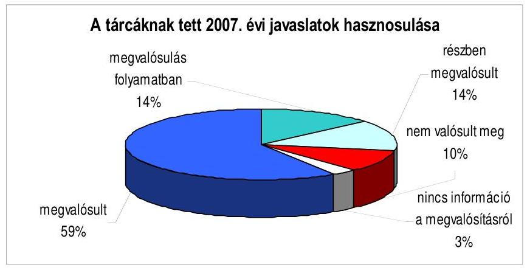

# 3.2.1. Javaslatok az Országgyűlés szintjén 

Az Országgyűlésnek címzett vagy a törvényalkotási tevékenység tartalmát érintő javaslataink nagy részre, hasonlóan a korábbi évekhez, 2007-ben is megvalósult.

Az ellenőrzések eredményeképp megfogalmazott javaslatoknak megfelelően több helyen módosult, illetve kiegészült az államháztartás törvényi szabályozása, megszületett az állami vagyonról szóló törvény, és elérhető közelségbe került az új közpénzügyi törvénycsomag megalkotása is, amelynek egyik eleme a költségvetési szervek jogállásáról és gazdálkodásáról szóló törvénytervezet.

---

A Magyar Köztársaság 2006. évi költségvetése végrehajtásának ellenőrzéséről készített jelentés javaslata alapján a pénzügyminiszter kezdeményezésére a 2006. évi költségvetés végrehajtásáról szóló törvénybe beépítették a helyi önkormányzatok támogatásainak ellenőrzése során megállapított eltéréseket.

Az Áht. szabályai a 2007. év végi módosítás során kiegészítésre kerültek az önkormányzatok részére biztosított költségvetési támogatások elszámolása kötelező helyszíni ellenőrzésének előírásával.

Az Áht. 2007. év végi módosítása során a 64. § (9) bekezdésében rögzítették, hogy a helyi önkormányzat a normatív állami hozzájárulások és támogatások igénylésére, év közbeni lemondására, illetve pótlólagos igénylésére vonatkozó adatszolgáltatását - 2008. július 31-től - elektronikus úton teljesíti.

Javaslatunknak megfelelően változott az Áht. 36. § (1) bekezdés c) pontja annak érdekében, hogy a középtávú költségvetési tervezésnek (a törvényben foglalt két éves helyett három éves kitekintés) megfelelő törvényi háttere legyen.

A helyi önkormányzatok gazdálkodási rendszere ellenőrzésének tapasztalatai alapján 2003-2007 között a Kormánynak egy, a minisztereknek negyven javaslatot tettünk, amelyek eredményeként az Országgyűlés meghatározta a gazdasági program tartalmi követelményeit, a versenyeztetési kötelezettség egységes értékhatárát, a helyben központosított közbeszerzésekre vonatkozó szabályokat, a nem normatív céljellegű működési támogatások közzétételi kötelezettségét, teljessé tette a pénzügyi ellenőrzési rendszer szabályait, kiegészítette a kisebbségi önkormányzatokkal kötött megállapodások tartalmi követelményeit.

Jelenleg az Országgyűlés előtt van az Ötv. módosítására vonatkozó törvényjavaslat a hitelfelvételi korlát (adósságkorlát) szabályozásának módosításáról. A pénzügyminiszter jelezte, hogy az Ötv. következő módosítása során kezdeményezik a korlátozottan forgalomképes vagyontárgyakról történő rendelkezésre vonatkozó törvényi előírások pontosítását.

Folyamatban van a Kbt. módosítása, amelynek célja a közbeszerzésekhez kapcsolódó jogorvoslati rend felülvizsgálata. E felülvizsgálat keretében - az 2007/66/EK európai parlamenti és tanácsi irányelv átültetési kötelezettségéből fakadóan is - áttekintésre kerültek a Közbeszerzési Döntőbizottság eljárásának kérelmezésére, illetve kezdeményezésére nyitva álló határidők.

A KvVM-nél jelenleg előkészítés alatt áll az ún. „víziközmű törvény", amely foglalkozik az ÁSZ által felvetett probléma megoldásával, miszerint a jelenleg hatályos vízgazdálkodási törvény egyértelmű abból a szempontból, hogy az önkormányzati törzsvagyonba tartozó víziközmű vagyon tulajdonjoga kizárólag az önkormányzatot illeti meg, az önkormányzat azt csak üzemeltetésre adhatja át.

Az államháztartáson kívülre juttatott támogatások fokozottabb átláthatóságának megteremtése érdekében az Országgyűlés 2007. december 17-én elfogadta a közpénzekből nyújtott támogatások átláthatóságáról szóló 2007. évi CLXXXI. törvényt. A jogszabály a fejlesztési támogatások odaítéléséről és

---

felhasználásáról döntő intézményrendszer átlátható működését célozza azzal a jogos igénnyel, hogy „a közpénzekből származó források felhasználásával és befektetésével megvalósuló fejlesztések ügye jogi-politikai védelmet kapjon a pártpolitikai vitáktól, illetve a kormányzati ciklusváltásoktól egyaránt". A törvénnyel összhangban a Kormány a Nemzeti Civil Alapprogramról szóló 2003. évi L. törvény végrehajtásáról rendelkező 160/2003. (X. 7.) Korm. rendelet módosításáról kiadta a 21/2008. (II. 7.) Korm. rendeletet, amelyben hasznosította a számvevőszéki ellenőrzési megállapításokat, javaslatokat is.

Az ÁSZ pártellenőrzési javaslataira is figyelemmel, a kormányzati szándékokkal összhangban az Országgyűlésnek benyújtásra került a pártfinanszírozás átláthatóbbá tételét célzó T/4190. számú törvényjavaslat. Az önálló képviselői indítvány a politikai élet tisztasága érdekében szigorítaná a párt- és kampányfinanszírozás kereteit, jobban szankcionálná a pártok törvénysértő gazdálkodását, tiltott kampányszervezését, jelentősen kibővítené a számvevőszéki ellenőrzés törvényességi hatáskörét, javaslatunkra összhangot teremtene a hatályos számviteli törvénnyel. Ellenőrzéseinkhez kapcsolódóan a Pénzügyminisztérium jelezte, hogy 1,3 millió Ft-tal csökkentette az MDF 2007. évi állami támogatását.

# 3.2.2. Javaslatok kormányzati szinten 

A javaslataink hasznosulásáról a tárcáktól kapott tájékoztatás fontos információ számunkra, mert a számvevőszéki javaslatok figyelembevételére - a törvényesség helyreállítására irányuló jogi realizálás kezdeményezésén túl - nincs általános érvényű törvényi előírás. Válaszlevelében több tárca is jelezte, hogy ellenőrzéseink során a szakmai feladatellátásukat és gazdálkodásukat javaslatainkkal nagyban segítettük, munkánk nyomán több területen értek el a szabályszerűség, a szabályozottság és a hatékonyság tekintetében előrehaladást.
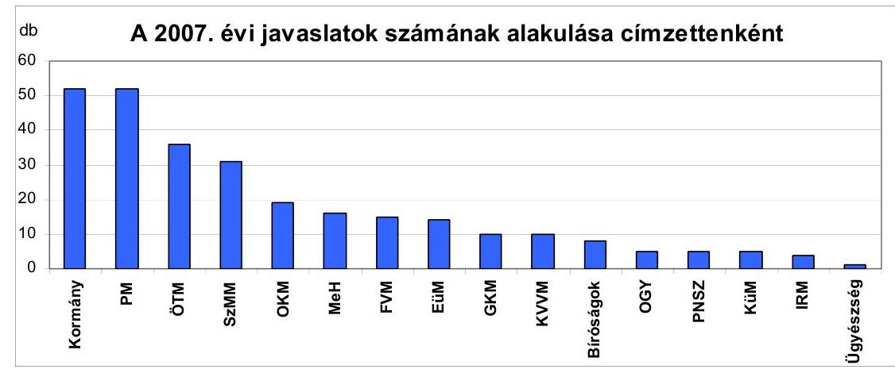

Javaslataink megítélése 2006-hoz hasonlóan 2007-ben is kedvezően alakult, 87% volt azon javaslataink aránya, amelyek eljutottak a megvalósítás különféle fokozataiba.

Az előző évi tendenciát folytatva tovább növekedett a célszerűséget, hatékonyságot, eredményességet javító intézkedésre, illetve a feltárt hibák, hiányosságok megszüntetésére vonatkozó javaslataink aránya.

---

A jogszabályi változtatásokra vonatkozó kezdeményezéseink részaránya az előző évihez hasonlóan alakult. A kedvező fogadtatásuk aránya, illetve a javaslatokkal való érdemi foglalkozás aránya növekedett.

A további, a szervezeti működés szabályozottságával kapcsolatos javaslataink aránya csökkent. Ezen javaslattípusok fogadtatása továbbra is kedvező arányú.
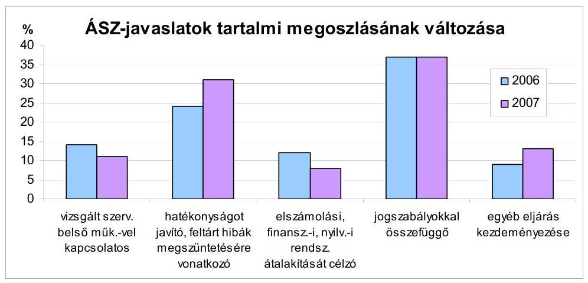

A jogi szabályozásra irányuló javaslataink 54%-a megvalósult, a javaslatok 15%-ára nemleges válasz érkezett, ezek a javaslataink jellemzően törvények, illetve egyéb, már meglévő jogszabályok módosításaira vonatkoztak, néhány esetben a fennálló szabályozást megfelelőnek tartották, illetve nem tartották kompetensnek magukat a tárcák. A jogszabályok betartását szorgalmazó javaslataink szinte kivétel nélkül megvalósultak.

A célszerűséget, hatékonyságot, eredményességet javító intézkedésre, illetve a feltárt hibák, hiányosságok megszüntetésére vonatkozó javaslataink 87%-a talált kedvező fogadtatásra, ezekből 74% már meg is valósult.

A belső szabályozási rendszer, illetve a fejezeti és a belső ellenőrzés működésének felülvizsgálatát, továbbfejlesztését célzó javaslatok 88%-ával kapcsolatban konkrét intézkedések történtek, illetve az érintettek megkezdték a javaslatok hasznosításának előkészítését. Ezen típusú javaslataink között
 elutasítással nem találkoztunk, a válaszok 13%-ban nem adtak számot egyértelműen a javaslat megvalósításáról.

A számviteli, nyilvántartási szabálytalanságok javítását, elszámolási, finanszírozási és nyilvántartási rendszerek korszerűsítését célzó javaslatokra beérkezett válaszok alapján azok 30%-a már megvalósult. A továbbiak realizálása folyamatban van, illetve részben valósult meg.

Az egyéb, egyedi jellegüknél fogva nem rendszerezhető és az előző csoportokba nem sorolható ajánlások 13%-ot tettek ki. Elfogadottságuk több mint 92%-os, és a jelentés összeállításáig 62%-uk már megvalósult.

Az ÁSZ a tárcák vezetői által tett intézkedések végrehajtását további ellenőrzései során figyelemmel kíséri, jelentéseiben rendre kitér ezek megvalósítására.

---

Az ÁSZ által tett ajánlásokat és az ezekre adott válaszokat a 3. sz. melléklet foglalja össze.

# Javaslataink hasznosításaként - többek között - a következő konkrét intézkedések valósultak meg az elmúlt évben: 

A Magyar Köztársaság 2006. évi költségvetése végrehajtásának ellenőrzéséről készült jelentésben az ÁSZ a Kormány és az egyes fejezetek vezetői számára 122 javaslatot fogalmazott meg. A javaslatok részben meglévő jogszabályok módosítását, új jogszabályok megalkotását, törvényjavaslatok előkészítését célozták, másrészt a gazdálkodás, a pénzügyi beszámolás területén tapasztalt hibák, hiányosságok felszámolására vonatkoztak. Több javaslatot adtunk a hatékonysági, célszerűségi követelmények fokozottabb figyelembe vétele érdekében is. Javaslatainkra az egyes fejezetek vezetői részben az elkészült intézkedési tervek megküldésével, részben a közvetlenül megtett intézkedésekről szóló írásbeli tájékoztatás útján értesítették az ÁSZ-t.

A megtett intézkedések javaslataink 77%-ánál elfogadhatóaknak minősíthetők. Részben elfogadhatónak, illetve nem elfogadhatónak minősülő intézkedések olyan szabályozási, jogalkotási, a költségvetési tervezéssel összefüggő javaslatokkal kapcsolatosak, amelyeknél az egyes fejezetek vezetői nem azonosultak az ÁSZ álláspontjával.

A kincstári vagyonkezeléssel és -hasznosítással kapcsolatos, a költségvetést megillető 2006. évi bevételek ellenőrzésekor a korábban megállapított nyilvántartási szabálytalanságokat nem tapasztalta a számvevőszéki ellenőrzés.

A központi költségvetés általános tartalékával összefüggésben a forrásigények alapján készített kormány-előterjesztések tartalmi-formai kidolgozását és dokumentáltságát az ÁSZ már kifogásolta, mivel az az Ámr. vonatkozó előírásaival az esetek jelentős hányadánál ellentétes volt. A kormányrendelet 2007. január 1-jétől módosult.

A Polgári Nemzetbiztonsági Szolgálatok ellenőrzése kapcsán megfogalmazott számvevőszéki javaslatok figyelembevételével a szolgálatokat irányító miniszter, valamint a szolgálatok (IH, NBH, NBSZ) intézkedési terveket készítettek. A szervezetkorszerűsítés érdekében tett intézkedések a hatékonyabb működés és a felügyelet erősödése irányába hatnak.

A nemzetbiztonsági szolgálatok 2006-2007. években az államreformmal összefüggésben 2008. január 1-jével tervezett átalakítása, összevonása nem került végrehajtásra. A Kormány a nemzetbiztonsági szolgálatok átalakításával kapcsolatos határozatát (2010/2007. (I. 30.) Korm. határozat) 2007. év végén, további feladat meghatározása nélkül hatályon kívül helyezte (2236/2007. (XII. 15.) Korm. határozat). A nemzetbiztonsági szolgálatok tevékenységüket a korábbi szervezeti rendben végzik.

A Földművelésügyi és Vidékfejlesztési Minisztérium fejezet működésének ellenőrzése megállapításai alapján javaslatot tettünk a Kormánynak a kutatóintézetek privatizációjának felülvizsgálatára és a kiemelt feladatok finanszírozásának kezelésére. A miniszter felé javasoltuk az ellenőrzési rendszer

---

és a falugazdász hálózat megerősítését, valamint az állattenyésztés támogatásának kiemelt kezelését. A jelentés kiadását követően a kancellária miniszter úr tájékoztatta az ÁSZ-t, hogy a mezőgazdasági kutatóintézetek privatizációját a Kormány levette napirendjéről.

A villamos energiáról szóló 2007. évi LXXXVI. törvény végrehajtását biztosító kormányrendeletek kiadását, illetve módosítását kérő javaslatunk hatására - annak érdekében, hogy 2008. január 1-vel a villamosenergia-piac EU által előírt átalakítása megtörténjen - 2008. január 1-jei hatállyal 5 kormányrendelet és 7 miniszteri rendelet lépett életbe, amelyek figyelembe vették a javaslatban foglaltakat.

Az e-kormányzati fejlesztések, szolgáltatások jogszabályi környezetének teljes körűvé tételét (az elektronikus fizetéssel, valamint a korlátozottan cselekvőképes személyek ügyfélkapu használatával kapcsolatos szabályozások kiadása) szorgalmazó javaslatunk tárgykörében kiadásra került a 182/2007. (VII.10.) Korm. rendelet, melynek 18. §-ának (1) bekezdése vonatkozik a javaslatra.

A helyi önkormányzatok és a helyi kisebbségi önkormányzatok központi költségvetési kapcsolatokból származó forrásai igénybevétele és elszámolása felülvizsgálati tevékenységének ellenőrzéséről készített jelentésben szereplő javaslatok többsége teljesült. A Kincstár részére a 2146/2007. (VII. 27.) Korm. határozat 335 fő létszámfejlesztést biztosított az állami hozzájárulások helyszíni ellenőrzéséhez.

A pénzügyminiszter tájékoztatása szerint előkészületben van a 16/2002. (IV. 12.) PM rendelet módosítása a kötelező helyszíni ellenőrzéssel kapcsolatos részletszabályok beépítése miatt. Ezzel együtt kerül sor az ÁSZ javaslata alapján a központi költségvetésből származó támogatások előzetes felülvizsgálata „minimum” szempontrendszerének előírására.

A PM kezdeményezi az oktatási és kulturális miniszternél a normatív állami hozzájárulások és a KIR statisztika adatai közötti egyeztetési lehetőség megteremtését, javaslatot téve ennek a Kincstár bevonásával 2008. első negyedévében történő elvégzésére.

A kötött felhasználású előirányzatok ellenőrzése kapcsán tett javaslataink alapján a lakossági közműfejlesztési támogatás működésének zavarai a jogszabályváltozások és ellenőrzéseink hatására csökkentek, a támogatás módosított igénylőlapja követi a szabályozórendszer változását. A hivatásos önkormányzati tűzoltóságok működésének támogatási rendszerére vonatkozó javaslataink jórészt megvalósultak, mivel részben megtörtént a tartaléklétszám felülvizsgálata, a túlórákat, valamint a túlszolgálatot kiváltó létszámbővítés kiadásainak finanszírozását éven belül biztosították, intézkedtek a rendkívüli tűzoltó-nyugállományba vonulók részére járó juttatások és egyéb kiadások megtérítésére. Közzétették a közoktatási intézmények informatikai eszközeinek műszaki követelményrendszerét, feloldották javaslataink alapján az egyes célokra meghatározott merev előírásokat, lehetővé téve a támogatás rugalmasabb felhasználását. Javaslatunk alapján a települési önkormányzati si-

---

lárd burkolatú belterületi közutak burkolat-felújításának ellenőrzése során feltárt problémák felszámolására is történtek intézkedések.

A közmunkaprogramok támogatására fordított pénzeszközök hasznosulásának ellenőrzéséről készült jelentésünk javaslatai nyomán - a közfoglalkoztatások egységes rendszerének kialakítása és a forráskoordináció egységes gyakorlata érdekében - a szaktárca kidolgozta a közfoglalkoztatás szabályainak új koncepcióját, egységessé tette a pénzügyi lebonyolítás és monitorizálás szervezeteinek ellenőrzését, kialakította a rendelkezésre álló információk adatbázisát, kistérségi szinten előírta a teljesítménykövetelmények összehasonlíthatóságát.

A települési önkormányzatok vízrendezési és csapadékvíz elvezetési feladatainak ellenőrzésekor javasoltak alapján az Új Magyarország Fejlesztési Terv operatív programjainak végrehajtását szolgáló akciótervekben és pályázati konstrukciókban megjelentek helyi vízrendezést szolgáló fejlesztések. A pályázati úton vízrendezési és csapadékvíz elvezetési célú létesítmények fejlesztéséhez, felújításához elérhető költségvetési források felhasználása és az ehhez szükséges önkormányzati pályázati ösztönző rendszer bővítése a konkrét döntésekben folyamatosan megjelenik. A támogatási igények elbírálásánál a vízkárok megelőzését is szolgáló vízrendezési célú feladatok tervezésére, ütemezésére vonatkozó törvényi előírások betartására, a települések ár- és belvíz veszélyeztetettségének figyelembevételére a vízügyért felelős szakmai tárca javaslatot tett. Az Országos Katasztrófavédelmi Főigazgatóság - javaslatunk alapján - a helyi önkormányzatok védekezési terveit fokozottabban ellenőrzi. Az önkormányzatok helyi vízrendezési feladatainak meghatározása a kötelező önkormányzati feladatok felülvizsgálatához kapcsolódóan várható.

Az önkormányzatok szociális alapszolgáltatási tevékenységének ellenőrzése alapján tett javaslatok több mint kétharmada teljes egészében hasznosult. Kormányrendeletben írták elő a szociális intézmények, szolgáltatások adatait tartalmazó országos nyilvántartási rendszer kiépítését és működtetését. Az önkormányzatok pénzügyi információs rendszere a feladatellátás átláthatóságát továbbra sem biztosítja, a Szoctv.-ben nevesített szolgáltatások ráfordításai abból nem állapíthatók meg, költségbecslések megalapozottan nem végezhetők. Folyamatban van az új szolgáltatási törvény kidolgozása, ezzel a jogalkotási tevékenység során megvalósul a szociális tárgyú jogszabályok egységes fogalomhasználata, a még meglévő ellentmondások feloldása. A minisztérium részben javaslatainkkal megegyezően meghatározta a szociális szolgáltatások átalakításának fő irányait.

A hajléktalanokat ellátó intézményrendszer 2005. évi ellenőrzése során javasoltuk a témára vonatkozóan hosszú távú koncepció kidolgozását. Ezzel is összefüggésben a Kormány elfogadta a hajléktalan ellátás fejlesztését célzó hétéves stratégiát, amely felöleli a problémakör összes fázisát, a megelőzéstől az ellátás hatékonyabbá tételén át a hajléktalan lét elhagyásáig, az önálló életvitel megteremtéséig. Kiemelt célkitűzésként jelölte meg, hogy 2013-ra az utcán élő hajléktalan emberek száma 3000 fővel csökkenjen (ez a jelenleg utcán élők becsült számának a fele), valamint 3500 fő számára a foglalkoztatáshoz kötött önálló lakhatás kerüljön biztosításra.

---

Az államháztartáson kívülre juttatott támogatásokhoz kapcsolódóan a 2233/2007. (XII. 12.) Korm. határozat a közpénzek hatékony felhasználása érdekében feladatul szabta a civil szervezetek támogatási rendszereinek összehangolását, a megítélt támogatások és felhasználásuk átláthatóbbá, a civil szervezetek támogatási kritériumainak egzaktabbá tételét. A kormányzat korábbi javaslatainkra figyelemmel ismételten határozott a hatáskörében alapított közalapítványok továbbműködésének felülvizsgálatáról. Ellenőrzési javaslatunkra a Kormány az 1073/2007. (IX. 26.) Korm. határozattal módosította a Betegjogi, Ellátottjogi és Gyermekjogi Közalapítvány alapító okiratát. A 2008. január 1-jétől költségvetési szervként működő országos kisebbségi önkormányzatok pénzügyi-gazdasági tevékenységénél tapasztalt hiányosságokra is figyelemmel határozott az Országgyűlés a nemzeti és etnikai kisebbségek helyzetét érintő kritikai észrevételek megoldásáról a 16/2007. (III. 7.) OGY határozatban.

A helyi önkormányzatok gazdálkodási rendszerének ellenőrzésekor tett javaslataink alapján a Kormány módosította az Ámr. és a Vhr. előírásait, szigorította az érvényesítési feladatokat ellátók szakmai képzettségi követelményeit, meghatározta a közvetett támogatások képviselő-testület elé terjesztésének részletezettségét. A pénzügyminiszter kiegészítette a belső ellenőrzési kézikönyv-mintát a céljelleggel nyújtott támogatások ellenőrzésének egységes szempontjaival. Nem történt intézkedés az önkormányzatok kötelező feladatainak, a hiány számításánál a hitel visszafizetési kötelezettség figyelembevétele módjának a meghatározására.

Az ÁSZ javaslata kapcsán az Ámr. 2007. év végi módosítása során a 134. § (3) bekezdésébe bekerült, hogy az 50 ezer Ft-ot el nem érő kötelezettségvállalásokra vonatkozó nyilvántartásnak tartalmaznia kell legalább a kötelezettségvállalás tárgyát, összegét, időpontját, a kötelezettségvállaló nevét. A 135. § (2) bekezdésében rögzítésre került, hogy a szakmai teljesítést az igazolás dátumának és az igazolási kötelezettség végrehajtásának megjelölésével, az arra jogosult személy aláírásával kell igazolni.

A 2006. évi országgyűlési, valamint önkormányzati és nemzeti, etnikai kisebbségi képviselőválasztások lebonyolításához felhasznált pénzeszközök ellenőrzésének alapján tett javaslataink alapján került kiadásra a 2008. évi országos népszavazások költségeinek normatíváiról, tételeiről, elszámolási és belső ellenőrzési rendjéről szóló 7/2008. (I. 28.) ÖTM rendelet, amelynek pontos betartására a miniszter felhívta a Közigazgatási és Elektronikus Közszolgáltatások Központi Hivatala elnökének figyelmét. A miniszter felhívta a KEKKH elnökének figyelmét arra is, hogy a választási feladatok ellátása során a kötelezettségvállalás az Áht. rendelkezéseinek megfelelően történjen.

---

# 3.2.3. Javaslatok a vizsgált szervezeteknél 

Számvevőszéki ellenőrzés 2003-2006 között valamennyi helyi önkormányzatnál $^{16}$ volt. Az önkormányzatok gazdálkodási rendszerének átfogó ellenőrzésekor közel ötvenezer javaslatot fogalmaztunk meg. Javaslataink közel háromnegyedét az önkormányzatok hasznosították, amely hatására előrelépés történt a költségvetési tervezés, előirányzat-módosítás, a zárszámadás összeállítása során az Áht. és az Ámr.-ben előírtak betartásában. Ennek eredményeként javult a költségvetési gazdálkodás szabályozottsága, fokozottabban figyelembe vették a helyi és a központi előírásokat, a munkafolyamatba épített ellenőrzési feladatok ellátását a korábbiaknál szélesebb körben biztosították.
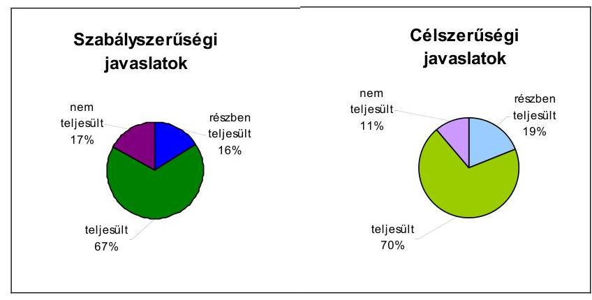

Kedvező, hogy a gazdálkodási rendszer átfogó ellenőrzésével érintett megyei, megyei jogú városi, Budapest fővárosi kerületi önkormányzatoknak tett javaslatok rövid időn belül hasznosultak. Elfogadták a jogszabályi előírások betartásával, a gazdasági tevékenység ellátásával, a gazdálkodás átláthatóságával, célszerűségével kapcsolatos javaslatokat és intézkedési terveket készítettek azok realizálására. 2007-ben sok esetben tapasztaltuk, hogy az ellenőrzött önkormányzat a helyszíni ellenőrzés lefolytatása alatt kijavította a feltárt szabálytalanságot, hiányosságot, így bár a jelentés rögzíti annak múltbeli fennállását, a jövőre nézve a marasztaló megállapítás már nem volt helytálló. Előfordult több esetben, hogy az interneten közzétett jelentésünket olvasva - mivel egységes a program, és az ÁSZ elnöke négy évre előre kijelölte a vizsgálandó önkormányzatokat - az adott önkormányzat vezetése már az ellenőrzés megkezdése előtt feltárta és kijavította a tipikus szabálytalanságokat.

Az államháztartáson kívül működő, rendszeres
 állami támogatás alapján ellenőrzött közalapítványok, pártalapítványok, pártok, valamint országos kisebbségi önkormányzatok az ÁSZ által javasolt törvényességi, szabályszerűségi intézkedéseket részben végrehajtották, részben jóváhagyott intézkedési tervbe foglalták. A helyszíni ellenőrzés megállapításait hasznosítva jellemzően megszüntették a működési, számviteli szabályozási mulasztásokat, önellenőrzéssel kijavították a könyvvezetés és az éves beszámolók lényeges hi-

[^0]
[^0]:    ${ }^{16}$ Ezen követelmény teljesítését rögzíti az ÁSZ 2005. évi tevékenységének elfogadásáról szóló 47/2006. (X. 27.) OGY számú határozat 2. b) alpontja.

---

báit, rendelkeztek a kötelező tájékoztatási követelmények betartásáról. Az országos kisebbségi önkormányzatoknál közgyűlési határozatot hoztak a hivatali szervezet - legkésőbb 2008. január 1-jei hatályú - létrehozására, a belső ellenőrzési rendszer törvényben előírt megerősítésére (pénzügyi bizottság, belső ellenőr, könyvvizsgáló).

A 2006. évi zárszámadási ellenőrzéssel érintett fejezeteknél 30 esetben tettünk javaslatot a gazdálkodás szabályszerű lebonyolításának, a pénzügyi folyamatok zártságának, illetve a számviteli és egyéb jogi szabályozás naprakészségének megteremtésére.

Korábbi zárszámadási ellenőrzésünk megállapította, hogy az APEH-nál fizetéskönnyítési kedvezményeknél előfordult, hogy az előírt kötelezettségek határidőre nem kerültek teljesítésre. Ezen esetekben nem történt meg a kedvezmény megvonása - az Art. 133. § (9) bekezdésében foglaltak szerint - és visszarendezése a vonatkozó adóhatósági határozatokban foglaltaknak megfelelően. Erre vonatkozóan az APEH intézkedési tervet készített és megvizsgálta a nem teljesített fizetéskönnyítési kedvezmények automatikus visszarendezésének lehetőségeit. Ennek alapján folyamatban van egy olyan informatikai rendszer létrehozása, amely alkalmas az azonnali és automatikus visszarendezésre.

Az ÁSZ által javasolt, több évet visszamenőleg érintő, célirányos ellenőrzést a hitelintézeteknél - a lakástámogatások folyósítási költségei speciális jogcímcsoportját illetően - az APEH 2006-ban nem végzett, 2007-re azonban kiemelt vizsgálati célként jelölte meg a lakástámogatások folyósítási költségének hitelintézeteknél történő vizsgálatát a teljes elévülési időn belül.

A 2005. évi költségvetés végrehajtásának ellenőrzéséről készített jelentésben tett javaslatok végrehajtásaként a VP-nél intézkedések megtételére került sor. A szakmai igazgatóságok a VP számlavezető szervénél bővítették ellenőrzéseiket. A számvevőszéki ellenőrzés már a 2004. és a 2005. évek zárszámadásának ellenőrzésekor is megállapította, hogy a VP-nél a bevétel elszámolásnál használt (előírás, befizetés lapok, korrekciós bizonylatok) dokumentumokat nem szigorú számadásúként kezelik, annak ellenére, hogy azt a Szt. 168. § (1) bekezdése szerint annak kellene minősíteni. A 2007. évben részben intézkedés történt azzal, hogy a 9/2007. (VI. 13) VPSZP utasítással elrendelték a korrekciós bizonylatok és az érvényesítő betétlapok szigorú számadás alá vonását.

Az ÁPV Zrt. 2006. évi működésének ellenőrzésekor javaslatot fogalmaztunk meg a pénzügyminiszternek a MOL részvényeinek értékesítésénél elkövetett hibából keletkezett bevételkiesés körülményeinek kivizsgálására, a Forrás Rt. feltőkésítéséből és privatizációjából keletkezett vagyonvesztés indokoltságának feltárására, a Bábolna Rt. szükségtelen végelszámolása miatti kifizetések okozóinak személyes felelősségre vonásának kezdeményezésére, a privatizációs tartalékból és saját vagyonból történt indokolatlan kifizetések felülvizsgálatára, valamint a közbeszerzések figyelmen kívül hagyásával történt kifizetések növekedési okainak vizsgálatára. Javaslataink részben hasznosultak. A pénzügyminiszter megbízta az ÁPV Zrt. felügyelő bizottságát, hogy az ajánlásoknak megfelelően a vizsgálatot végezze el.

---

Az uniós támogatások hazai monitoring és ellenőrzési rendszere működésének ellenőrzése során tett javaslataink eredményképp a tervezési és a szabályozási feladatok lezárultak. Az Intézményi feladatok közül megvalósult az intézményrendszer felállítása, a Közreműködő Szervezetekkel a finanszírozási szerződéseket megkötötték, az intézményrendszer megfelelőségi vizsgálatára ütemterv készült. A Kormány és az NFÜ munkaterve alapján a feladatok végrehajtása folyamatosan nyomon követhető. A monitoring és ellenőrzési feladatokra, valamint a humánerőforrás szakmai összetételének összhangjára, a feladatellátás szakmai szempontjainak erősítésére vonatkozó javaslataink nyomán az eljárási újítások bevezetése a kézikönyvben a kockázatelemzés erősítése érdekében megtörtént, így az ellenőrzések a nagy kockázatú területekre koncentrálnak és rugalmasabbá váltak a kisebb kockázatú területeken. A Képzési program elkészült az érintett szervezetek munkatársai számára az eljárási újításokról, továbbá a speciális szaktudást igénylő belső ellenőrzési feladatok ellátásába külső szakembereket is bevonnak.

A közreműködő szervezetek működési költségeit részletesen felmérték, finanszírozásukat egycsatornássá tették, így a korábban másoknál magasabb egységköltségekkel dolgozó közreműködő szervezetek költségeit csökkentették. Az NFÜ a Közreműködő Szervezetekkel kötött szerződéseiben előírta a közreműködői feladatok ellátásával kapcsolatos költségeinek elkülönített és megfelelő részletezettségű nyilvántartását.

# 3.3. Kezdeményezett büntető eljárások 

Az ÁSZ a közpénzek felhasználását ellenőrizve az Országgyűlés, a társadalom számára szolgáltat adatokat, jelzéseket a felhasználás szabályszerűségét illetően. Az elsődleges cél nem a büntető eljárás megalapozása, de amennyiben bűncselekmény elkövetésének (megalapozott) gyanúja áll fenn - az Állami Számvevőszékről szóló 1989. évi XXXVIII. törvény 25. §-ának (2) bekezdésében, valamint a büntetőeljárásról szóló 1998. évi XIX. törvény 171. §-ának (2) bekezdésében foglaltakra figyelemmel - az ÁSZ feljelentést tesz.

2007-ben 8 feljelentést tettünk 12 ismert tettes ellen. Az elkövetési magatartással érintett pénzeszközök összege mintegy 322 millió Ft volt, amely szinte egészében jogosulatlan gazdasági előny megszerzése bűncselekmény elkövetésére vonatkozik. Az összeg nagysága a szennyvíz- és közműberuházások magas költségigényével - és ezáltal a magas összegű támogatás igényléssel -, továbbá a rendszer támogatásokat halmozó hatásával magyarázható. A 8 feljelentésben megfogalmazott büntetőjogi felelősség felvetése 4 számvevőszéki vizsgálat során feltárt tényeken, megállapításokon alapult, valamennyi feljelentés az önkormányzati gazdálkodás vizsgálati területét érintette. A 8 feljelentés összesen 3 bűncselekmény törvényi tényállását (jogosulatlan gazdasági előny megszerzése, számvitel rendjének megsértése, sikkasztás) merítette ki.

Az ellenőrzések során 16 esetben került sor személyi felelősség felvetésére.

---

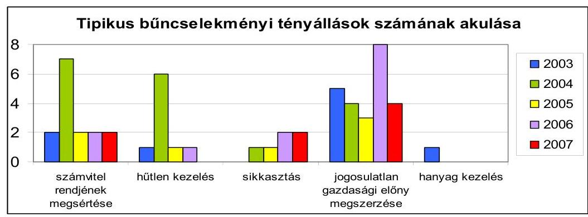

Megjegyzés: Egy adott feljelentés több büncselekményi tényállás elkövetésének alapos gyanújára is vonatkozhat, ezért az egy évben tett feljelentések és az elkövetett büncselekményi tényállások száma nem feltétlenül egyezik meg.

A számvitel rendjének megsértése és a jogosulatlan gazdasági előny megszerzése tényállások elkövetésének gyanúja miatt tett feljelentések kapcsán - amelyek az ÁSZ gyakorlatának meghatározó részét képviselik - a büntetőeljárások a korábbiaknál gyorsabban és hatékonyabban zajlanak, így a feljelentések utóéletéről pontos és naprakész információk állnak rendelkezésünkre. A tárgyévben tett 8 feljelentésből 7 esetben a nyomozó hatóság már megindította a nyomozást, 1 esetben a feljelentés elbírálása még folyamatban van. A nyomozó hatóság 3 esetben szüntette meg a nyomozást, de ebből 2 vonatkozásában eredményes panaszunk következtében - az ügyészség a nyomozás folytatását rendelte el, 1 feljelentésünk kapcsán indított eljárás vádemelési javaslattal már bírósági szakaszba lépett.

A tárgyévben az ÁSZ-hoz összesen 16 nyomozó hatósági megkeresés érkezett, amelyek már folyamatban lévő büntetőeljáráshoz kapcsolódtak. Szolgáltató szerepkörünkből is következően az esetek túlnyomó többségében (14 eset) a lefolytatott ellenőrzés során tudomásunkra jutott tényeket tartalmazó dokumentumok megküldésével eleget tudtunk tenni az adatszolgáltatási kötelezettségünknek, 2 esetben - számvevőszéki ellenőrzés hiányában - nem állt módunkban a kért tájékoztatást megadni.

A fentieken túl a büntetőjogi felelősség fennállásával kapcsolatos információkat tartalmazó közérdekű bejelentéseket az ÁSZ - nyomozati jogkör hiányában - átteszi az illetékes nyomozó hatósághoz. A tárgyévben 3 ilyen áttételre került sor, valamennyi az önkormányzatok gazdálkodásával kapcsolatban. Ezek közül 1 esetben a nyomozás elrendelése már megtörtént.

# 3.4. A számvevőszéki tevékenység nyilvánossága 

A nyilvánosság hozzájárul az ellenőrzési tevékenység eredményességének növeléséhez, segítheti az ellenőrzöttek meggyőzését, a szabálytalanságok megelőzését. Az Országgyűlésnek adott információk mellett fontosnak tartjuk a közvélemény tájékoztatását és a párbeszédet a pénzügyi ellenőrzési szakma szereplőivel, valamint szorgalmazzuk az együttműködést a felsőoktatási intézményekkel. Kommunikációnk szervezésének, tevékenységünk és eredményeink minél

---

szélesebb körű megismertetésének alapja, hogy jelentéseink, szakmai kiadványaink teljes terjedelmükben nyilvánosak és bárki által hozzáférhetőek.

Az Országgyűlés tájékoztatása, ellenőrző és törvényhozó munkájának segítése 2007-ben is kiemelt feladatunk volt. Az országgyűlési képviselőkhöz - elsősorban elektronikus úton - eljuttattuk jelentéseinket, illetve a jelentések legfontosabb megállapításait, javaslatait összegző képviselői leveleket. Ezen dokumentumok már nyilvánosságra hozataluk napján az internetes honlapunkon is hozzáférhetők. Munkatársaink rendszeresen részt vettek az országgyűlési bizottságok ülésein.

A médiával, a szerkesztőségekkel és az újságírókkal való szoros kapcsolattartás kommunikációs tevékenységünk szerves részét képezi. A jelentésekről készített sajtó-összefoglalókat közvetlenül megküldtük a sajtó számára, valamint a Nemzeti Hírügynökségnek. A szervezet életének fontosabb eseményeiről sajtóközleményt adtunk ki.

2007-ben kiemelkedően sok publikáció látott napvilágot az ÁSZ-szal kapcsolatban: az Observer Médiafigyelő és a saját feldolgozásunk alapján 246 különböző médiumból több mint 5000 hírt, interjút, cikket és említést regisztráltunk.
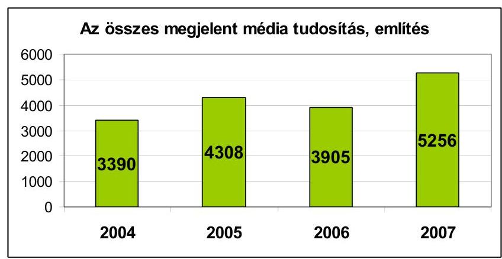

Elnöki sajtótájékoztatót ötször, főigazgatói sajtótájékoztatót háromszor tartottunk Budapesten, hét alkalommal pedig a megyei, illetve a megyei jogú városi önkormányzatokkal közösen rendeztünk sajtótájékoztatót.

Januárban az ÁSZ 2007. évi ellenőrzési tervéről, márciusban a közpénzügyekről folytatott megbeszélésekről kérdezhettek az újságírók. Áprilisban az éves jelentésünk és a közpénzügyi tézisek, szeptemberben a zárszámadási jelentés, októberben pedig a 2008. évi költségvetési törvényjavaslatról szóló véleményünk, valamint a törvényjavaslat makrogazdasági megalapozottságáról készített értékelő tanulmány volt az elnöki sajtótájékoztató témája.

Májusban az ÁSZ Fejlesztési és Módszertani Intézete a „Köz- és magánszféra együttműködésével kapcsolatos nemzetközi és hazai tapasztalatok" című tanulmányát, júniusban a „Közszféra és a gazdaság versenyképessége" című tanulmányát mutatta be a sajtó képviselőinek, júliusban pedig az Önkormányzati és Területi Ellenőrzési Igazgatóság három jelentéséről kérdezhettek a média képviselői.

---

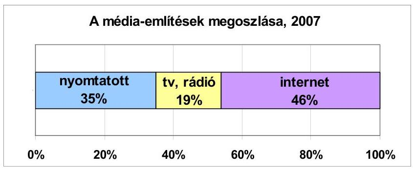

A korábbi évek gyakorlatának megfelelően jelentés-összefoglalóinkat, valamint az ÁSZ-szal kapcsolatos személyügyi híreket megjelentettük a Magyar Közlöny mellékletét képező Hivatalos Értesítőben.

A megújult arculatnak megfelelően átalakítottuk honlapunkat, amelynek során felhasználóbarát fejlesztéseket is végrehajtottunk a könnyebb kezelhetőség, az információk egyszerűbb elérhetősége érdekében. Megújítottuk elégedettségmérő űrlapunkat is, amely 2005-ben került ki internetes oldalunkra, és elsődleges célja az volt, hogy a honlap szolgáltatásairól visszajelzést kapjunk. Az új űrlap segítségével a számvevőszéki tevékenységet, jelentéseinket és azok megállapításait is értékelni tudják a válaszadók.

Honlapunkról a munkánk iránt érdeklődők 2007-ben 100580 alkalommal töltöttek le jelentést (külső IP címről). Egyre népszerűbb az ÁSZ weboldalának angol nyelvű változata is: míg 2006-ban 380-szor nyitottak meg angol nyelvű jelentés-összefoglalót, addig 2007-re 1339-re nőtt ez a szám.

Honlapunkon az „ÁSZ Fórum" és az „Elnöki fogadóóra" várja az érdeklődők kérdéseit. Az „ÁSZ Fórum" folyamatosan fogadja a kérdéseket, észrevételeket, és legfeljebb 8 napon belül az észrevételre adott válasz megjelenik a honlapon. Az „Elnöki fogadóóra" lehetőséget kínál arra, hogy a honlapra látogatók az őket érdeklő kérdésekről élő párbeszédet folytassanak az ÁSZ vezetőjével.

Az elmúlt évben az „ÁSZ Fórumra" 69 kérdés érkezett. A leggyakrabban felmerült témák: az önkormányzatok belső ellenőrzése, SzMSz és az önkormányzati költségvetés kialakítása, csatornaberuházás, többcélú kistérségi társulások, normatív iskolai támogatások. Több bejelentés érkezett visszaélésekről, valamint jogszabályok értelmezésével kapcsolatban is megkerestek minket. Az „Elnöki fogadóóra" az elmúlt évben kétszer került megrendezésre. A rovatot mindkét esetben a fogadóóra előtt egy héttel nyitottuk meg. Ettől az időponttól kezdődően lehetett a kérdéseket feltenni, amelyekre a meghirdetett időpontban válaszoltunk.

Az előző két lehetőségnél mind a kérdések, mind a válaszok nyilvánosak, az ÁSZ központi e-mail címére érkezett kérdések esetében a válasz csak a kérdést feltevő számára elérhető. Az elmúlt évben 282 elektronikus levél érkezett. Mind a három kommunikációs lehetőséggel kapcsolatban elmondható, hogy 2007-ben nőtt a hozzánk fordulók aktivitása.

---

# 4. Az ELLENŐRI MUNKA MINŐSÉGÉNEK FEJLESZTÉSE 

### 4.1. Humán erőforrás gazdálkodás és fejlesztés

## Személyi feltételek

Az ÁSZ állományi létszáma 2007. december 31-én 577 fő volt. Az év során
 34 alkalmazottnak szűnt meg a jogviszonya, és a megüresedő munkakörök részleges feltöltéséből adódóan csak 24 új munkatárs lépett be szervezetünkhöz.
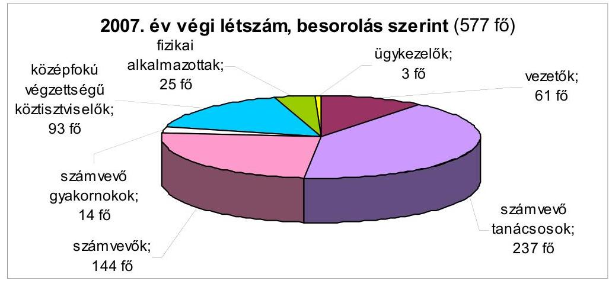

A tavalyi évhez hasonlóan folytatódott a nagyobb arányú nyugdíjazás, 19 számvevő vonult tényleges nyugállományba. További 4 főnek felmentéssel, 7 főnek közös megegyezéssel szűnt meg a foglalkoztatása, de volt példa a köztisztviselő lemondására, áthelyezésére is. Két aktív korban lévő kollégánknak elhalálozás folytán szűnt meg a jogviszonya. A belépők közül 17-en számvevői, 5-en középfokú végzettségű köztisztviselői kinevezést kaptak, 2 fizikai alkalmazottal munkaszerződést kötöttünk.

A huzamosabb - gyakran az ÁSZ-szal egyidős - ellenőri működés után nyugdíjba vonuló vezetők és munkatársak pótlása fokozott körültekintést igényel. Olyan számvevői karra van szükség, amely a korszerű közgazdasági-pénzügyi szakmai, a modern informatikai és idegen nyelvi felkészültség mellett kellően érzékeny az ellenőrzések társadalmi-közösségi és humán aspektusainak megértésére és kezelésére is. A helyben működő felvételi bizottság személyes interjú során a szakmai-képzettségi mutatók értékelésén túl a kinevezésre jelölt számvevők egyéni adottságaira és karakter-tulajdonságaira nézve is tájékozódik. A beilleszkedés menetét az egyes vizsgálatokat követő teljesítmény-értékelések mérik: minden évben, így tavaly is előfordult, hogy a számvevőt el kellett tanácsolnunk.

Szakember-állományunk stabil. (A közigazgatás egészére kiható létszám- és bérkorlátozó intézkedések önmagukban is csökkentik a munkahely-változtatási szándékot, a szakmai mobilizációt.) A bérfejlesztési lehetőségek beszűkülése nem kedvez az előmeneteli esélyeknek. A 4-5 évvel ezelőtt gyorsított létszámfejlesztéssel bekerült 100-120 - többnyire a fiatalabb generációhoz tartozó - ellenőr előmenetelének üteme elmarad a korábbi szakember-generáció lehetőségeihez képest. Keressük azokat a módokat és forrásokat, amelyek az állomány gerincét (38\%) jelentő 30-50 év közötti korosztálynak, nem kevésbé a 30 évnél fiatalabb kollégáknak kiszámítható előmeneteli, jövedelmi perspektívát biztosítanak.

A sok tekintetben szakértő-típusú, fokozott szakmai felelősséggel működő ellenőrző szervezetnél a viszonylag magasabb átlagéletkort természetesnek kell tekintenünk, így elfogadhatónak ítéljük, hogy állományunk 59\%-a 50 év feletti. Közülük 150 munkatársunk már elérte vagy megközelíti a nyugdíjra jogosító életkort. A nyugdíjreform bevezetéseként hozott intézkedések 2007-ben felgyorsították a nyugdíjazásokat, s mivel a további szabályozás folytán a nyugdíjak csökkenésével kell számolni, erősödnek a nyugdíjba vonulási szándékok.
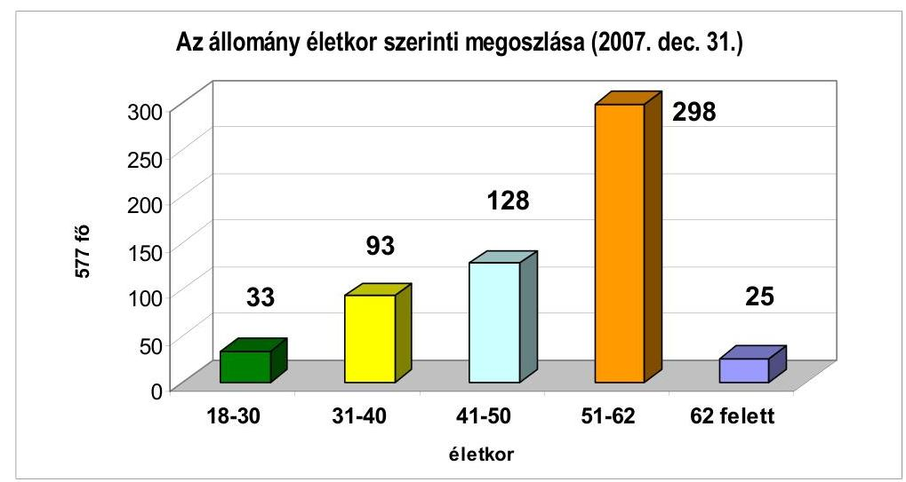

A tapasztalt idősebb ellenőreink nyugdíjazását követően is közel azonos maradt a többdiplomások és a legmagasabb számviteli-ellenőrzési képesítéssel rendelkezők, az okleveles könyvvizsgálók aránya. A természetes fiatalítással folyamatosan nő az idegen nyelvet ismerők száma.
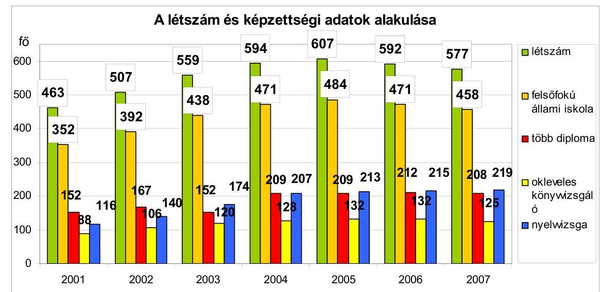

---

A szolgáltatói és versenyszféra szervezési-működési mintái nyomán a közszolgálatban is erős a törekvés az egyéni munkateljesítmények rendszeres értékelésére, valamint az ezzel összhangban lévő jövedelem-ösztönzők bevezetésére. Szervezeti sajátosságainknak megfelelően az egyéni teljesítmények értékelése az ellenőröknél a vizsgálatok lezárását követően, a nem ellenőr munkatársak esetében évenként történik. Az ellenőri munka értékelését részben segíti, hogy különböző vizsgálatok esetén közvetlenül más-más vizsgálatvezető értékel (objektivitás), másfelől viszont az egyéni hozzáállás változásait, tendenciáit több vizsgálatvezető nehezen érzékeli, kevésbé tudja értékelni. Természetesen a vizsgálatvezetők szempontrendszere sem azonos. Az értékelési rendszer - gyengéi ellenére is - fontos mutató, különösen a szélső (legjobb, leggyengébb) teljesítmények esetében. A teljesítményértékelések lényegében összhangban állnak a hosszabb, több éves munkaperiódust átívelő módon értékelő egyéni minősítések összképével.

# Továbbképzési munka 

Az ÁSZ 2007. évi továbbképzési terve tartalmilag a stratégiai célkitűzéseket és a humánpolitikai tervezési irányokat követte. Figyelemmel volt a növekvő, illetve változó szakmai követelményekre, az éves ellenőrzési tervre, a személyi állomány változásának sajátos aktualitásaira, valamint a pénzügyi keretek korlátosságára. Legnagyobb jelentősége és látogatottsága az ellenőrzési munkát közvetlenül segítő belső szakmai képzéseknek volt. Az elmúlt évben összesen 34 témakörben 46 alkalommal rendeztünk foglalkozásokat 85 oktatási napon.

Az oktatási év az adó, a TB, a számviteli törvények változásait bemutató előadásokkal indult, melyre munkatársaink évről évre növekvő számban tartanak igényt. Sikeres elemként jelent meg a „Belső kontroll rendszer az államháztartásban. A kontroll rendszerek ellenőrzése" téma, amelyen a közszféra ellenőrzésével, a kockázatok mérésével, a kontrollok ellenőrzésének EU-s gyakorlatával foglalkoztunk. Szintén újdonság volt az Európai Számvevőszék működését, vizsgálati módszereit, tapasztalatait bemutató előadás. A vizsgálatvezetők az ellenőrzések előtt, vagy azok bevezető szakaszában praktikus vizsgálati ismereteket adó előadások keretében készítik fel a számvevőket a hatékony ellenőri munkára.

Népszerűek tréningprogramjaink, amelyek közé újonnan került a „Meggyőzés iskolája - intenzív kommunikáció napjainkban" téma, mely ráépülve a már bevezetett „Hatékony szóbeli- és írásbeli kommunikáció" tematikájára, szintén hasznos a vizsgálati együttműködésben. Folytatódott a gyorsolvasási tréning, amely hozzásegít ahhoz, hogy egyedi technikák alkalmazásával - a megértés hatékonyságának egyidejű növekedése mellett - hogyan növelhető az olvasási sebesség. Tanfolyamot szerveztünk az ügyviteli munkatársaknak a korszerűsített iratkezelési szabályzat alkalmazására, ahol bemutattuk az ÁSZ új megjelenési arculatának megfelelően elkészült sablonokat is.

A számítástechnika és informatika terén jellemzően egy-egy speciális területet segítő informatikai alkalmazás megismerésére, az ismeretek felelevenítésére van nagyobb igény. Az IDEA program használata egyes ellenőrzéseknél elengedhetetlen, a képzési igények felmérése alapján visszakerült a programba a „Kérdőívszerkesztés" témája.

---

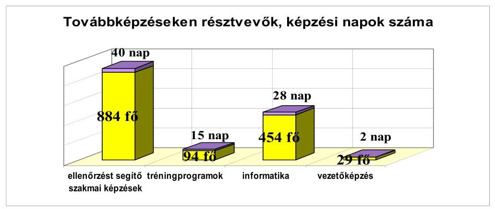

Az előző évek gyakorlatának megfelelően mozgósítjuk kollégáinkat a külső nyelvi intézeteknél (Goethe Intézet, Francia Intézet) köztisztviselők számára szervezett nyelvoktatásokra. 2007-ben jelentősen emelkedett a nyelvoktatásra felhasznált keretösszeg (2006-ban 1,6 M Ft, 2007-ben 3,4 M Ft). Ez részben a kormány által támogatott angol nyelvi képzésben való részvételünkkel függ össze, illetve azzal, hogy folyamatosan emelkedő költségek mellett tudjuk támogatni az uniós ellenőrzésekben résztvevő kollégák szakmai nyelvi továbbfejlődését.

A Kormányzati Személyügyi Szolgáltató és Közigazgatási Képzési Központtal, akárcsak korábban a Magyar Közigazgatási Intézettel szakmai kapcsolatot tartunk. Figyelemmel kísérjük oktatási programját, így bekapcsolódtunk az általuk meghirdetett e-learninges nyelvi képzési programba is. Ennek keretében 31 munkatársunkkal kötöttünk tanulmányi szerződést nyelvtanfolyami részvételre.

Évről évre jelentős munkatársaink részvétele különféle szakmai napokon, konferenciákon és egyéb külső oktatási és továbbképzési rendezvényeken (2007-ben közel száz alkalommal). A vezetők - ellenőrzési kapacitás-, illetve költségkímélés miatt - csak a szakmailag megalapozott jelentkezéseket támogatják.

A munkaköri alkalmasság és a felkészültségi szint emelése érdekében munkatársaink szakmai továbbképzéseit lehetőség szerint támogatjuk.
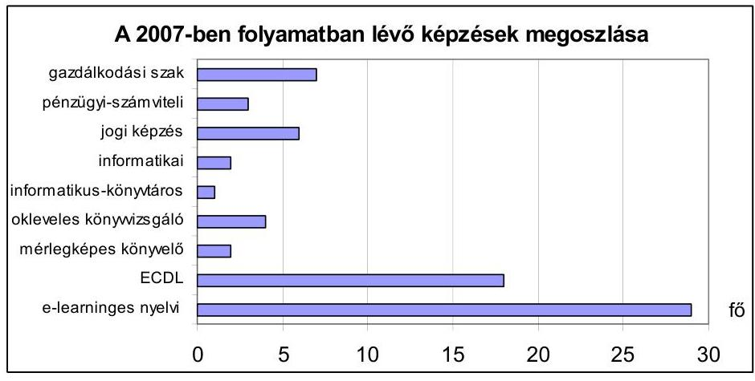

---

2007-ben az ÁSZ már meglévő távoktatási tananyagai közé felkerült a „Teljesítmény-ellenőrzés e-tananyaga" is, így e téma általános elmélete és módszertana minden szakmabeli kolléga számára hozzáférhető. Elektronikus tananyagaink egyre népszerűbbek, folyamatosan biztosítunk hozzáféréseket az érdeklődőknek.

Az év során hozzánk érkező külföldi számvevőszéki szakmai delegációk elismeréssel nyilatkoztak a rendszerről és a tananyagról, érdeklődtek az angol nyelvű hozzáférés lehetőségeiről.

Folyamatos az együttműködésünk a Magyar Könyvvizsgálói Kamarával. Ennek eredményeképpen 2007-ben belső képzéseink közül a Kamara 13 témakört ítélt alkalmasnak arra, hogy az ÁSZ könyvvizsgálói ezeken szerezzék meg a kötelező szakmai továbbképzéshez előírt kreditpontok felét.

Belső képzéseinkhez az előadókat igyekszünk elsősorban saját munkatársaink közül kiválasztani, és a tanfolyamokat az ÁSZ saját épületeiben lebonyolítani. Vannak azonban speciális szakmai területek, amelyek külső előadók, tréningvezetők szakmai tapasztalatait, illetőleg külső helyszínek igénybevételét igénylik.

# 4.2. Az ellenőrzések minőségbiztosítása 

A számvevőszéki ellenőrzés minőségirányítási rendszerét szabályozó, 2006. január 1-jén hatályba lépett elnöki utasítás a 2007. évben már valamennyi elemében érvényesítésre került. Az ÁSZ szakmai szabályozási rendszeréhez (a Magatartásszabály-gyűjteményhez, az Ellenőrzési elvek és Standardokhoz és az Ellenőrzési Kézikönyvhöz, illetve a módszertanokhoz) szorosan kapcsolódó minőségirányítási rendszer - amely kiemeli, egységes rendszerbe foglalja, és keretjelleggel szabályozza azokat az elemeket, amelyek alapvetően hozzájárulnak az ellenőrzési munka és a jelentések jó minőségéhez - megfelelően működött.

Az ÁSZ ellenőrzési véleményének megbízhatósága, az ellenőrzési megállapítások, következtetések és javaslatok megalapozottsága szempontjából 2007-ben is hatásosnak bizonyult a belső minőségkontroll és minőségbiztosítási rendszer. A jelentések felhasználói, illetőleg az ellenőrzöttek részéről nem merültek fel a jelentések minőségét bíráló kritikák.

Az ellenőrzési tevékenység folyamataiba épített vezetői felügyelet és az egyes munkaszakaszok lezárásaként végzett szakmai felülvizsgálatok folyamatos kontroll alatt tartották a számvevők ellenőrzési tevékenységét, és a helyszíni ellenőrzések eredményeiről készített számvevői jelentéseket. Valamennyi számvevőszéki jelentés tervezete - az ellenőrzött szervezetekkel folytatott egyeztetésekkel párhuzamosan - kétszeri ellenőrzés-szakmai és jogi felülvizsgálaton is átesett. Azok a számvevői jelentéstervezetek, amelyek személyes felelősséget vetettek fel, a megnevezett személyeknek történő átadást megelőzően megalapozottsági felülvizsgálat alá - és szükség szerint módosításra - kerültek.

A számvevőszéki jelentések elnöki aláírására csak - a helyszíni ellenőrzéseket végző igazgatóságoktól függetlenített - Minőségbiztosítási önálló osztály eredményes felülvizsgálatát igazoló tanúsítványok birtokában kerülhetett sor. Ez a

---

gyakorlat nemzetközi összehasonlításban is egyedülálló, és élenjárónak tekinthető.

A közvetlen elnöki felügyelet alá tartozó Minőségbiztosítási önálló osztály a 2007-ben lezárt ellenőrzések egyhetedének utólagos minőségbiztosítási felülvizsgálatával értékelte az ellenőrzési tevékenység teljes folyamatát, mind a három fő ellenőrzési típusra vonatkozóan. Az értékelés - az ellenőrzések előkészítésétől a számvevőszéki jelentések elkészítéséig - a szakmai követelmények teljesítésére, az elvárt magas szintű ellenőrzési bizonyosság elérésére vonatkozott. Az utólagos felülvizsgálat egészében megnyugtató eredménnyel zárult, igazolta a szakmai előírások teljesítését.

# 4.3. Nemzetközi kapcsolatok 

Nemzetközi kapcsolatrendszerünk alakítása során, stratégiai céljainkkal összhangban, 2007-ben arra törekedtünk, hogy a nemzetközi ellenőrzési közösségen belül vállalt vezetői feladatok maradéktalan ellátásával ösztönözzük a számvevőszékek közötti hatékony együttműködési formák fejlesztését, illetve - szakértői szinten - aktív szerepvállalással járuljunk hozzá az ellenőrzési módszertanok, technikák korszerűsítéséhez, és mi magunk is alkalmazzuk ezeket.

Két- és többoldalú nemzetközi együttműködésünk fő színtere 2007-ben is a Legfőbb Ellenőrző Intézmények Nemzetközi Szervezete (INTOSAI) volt. Az ÁSZ elnöke a 2004-2007 közötti időszakban látta el a Kormányzótanács elnöki feladatait, és az alapszabálynak megfelelően e funkcióját a 2007 novemberében rendezett kongresszuson adta át mexikói kollégájának.

Továbbra is meghatározó jelentőséggel bír az Európai Unió tagországainak nemzeti legfőbb ellenőrző intézményei és az Európai Számvevőszék (ECA) közös tevékenysége mind elnöki szinten, mind pedig a különböző szakmai területre létrehozott munkacsoportok keretein belül.

## Az ÁSZ elnöke az INTOSAI Kormányzótanácsának élén (2004-2007)

A 2004 novemberében Budapesten megtartott XVIII. Kongresszus házigazdájának minőségében - az INTOSAI ügyrendjének megfelelően - az ÁSZ elnöke viselte a világszervezet elnökének tisztségét a Kongresszust követő három évben. A jelzett időszakban számos, az INTOSAI jövőjét meghatározó folyamat indult el, így indokolt áttekinteni a hároméves elnöki ciklus eredményeit.

Az elnöki feladat ellátása két szempontból volt kiemelkedő jelentőségű. Az INTOSAI több mint 50 éves története során először került sor arra, hogy az elnökséget egy kelet-közép-európai ország számvevőszéke látta el, a térségben bekövetkezett politikai és gazdasági átalakulást követően viszonylag rövid időn belül. Másrészt, az elnöki feladatoknak külön jelentőséget adott az a tény, hogy éppen erre az időszakra esett az INTOSAI budapesti kongresszusán elfogadott, a szervezet életében mérföldkövet jelentő Stratégiai Terv (2005-2010) gyakorlati beindítása és megvalósításának első szakasza.

---

A XVIII. Kongresszuson jóváhagyott Stratégiai Terv szervezeti kereteinek kialakításában aktív, kezdeményező szerepet játszottunk, amennyiben az INTOSAI Főtitkársággal együttműködve kidolgoztunk egy módszertani irányelv-tervezetet a témafelelősök feladatait összegezve, felvázoltuk az INTOSAI új kommunikációs politikájának követelményeit és felmértük az INTOSAI nemzetközi pénzügyi támogató szervezetekkel kialakítandó kapcsolatának lehetőségeit. Az ÁSZ elnöke, az INTOSAI Kormányzótanács elnökeként részt vett a stratégia alapján létrehozott új bizottságok alakuló ülésein (Szakmai Sztenderdek Bizottsága, Kapacitásfejlesztési Bizottság).

A zsúfolt nemzetközi rendezvény-naptár lehetőségein belül a Kormányzótanács elnöke
 hangsúlyt helyezett arra, hogy az INTOSAI közösséget képviselje fontos, regionális eseményeken, így a szervezet regionális munkacsoportjai közötti együttműködés úttörőnek mondható – EUROSAI-ARABOSAI, illetve EUROSAI-OLACEFS – konferenciáin.

Az ÁSZ elnöke az INTOSAI elnöki pozíciójából adódóan az elmúlt három éves időszakban többször kapott meghívót protokolláris jellegű rendezvényekre. Ezek közé tartoztak például a török, a spanyol, illetve a kazah számvevőszék jubileumi rendezvényei, vagy a Független Államok Szövetsége legfőbb ellenőrző intézményei vezetőiből álló Vezetői Tanács ülése.

Az ÁSZ, az elnöki tisztséggel járó feladatokon túl, intézményi és szakértői szinten is aktív szerepet vállalt az INTOSAI újonnan kialakuló szervezeti egységeiben. Folyamatosan részt veszünk a Privatizációs Munkacsoport, a Szakmai Sztenderdek Bizottság, valamint a Belső Kontroll Sztenderdek Albizottság munkájában.

Az elnökség ideje alatt igen szoros, harmonikus és zökkenőmentes munkakapcsolatot tartottunk fenn az INTOSAI Főtitkárságával (osztrák számvevőszék), személyesen Dr. Josef Moser úrral, a szervezet főtitkárával.

Az INTOSAI megújhodásának kezdeti szakaszában, a magyar elnökség irányításával és együttműködésével sikerült létrehozni az új szervezeti struktúrát, és megteremteni a személyi feltételeket, amelyek biztos alapjául szolgálnak a szervezet azon törekvéseinek, hogy sikerrel válaszoljon a XXI. század pénzügyi, gazdasági és ellenőrzés-szakmai kihívásaira.

# Többoldalú szakmai együttműködés 

Kezdeményező és vezető szerepeket vállaltunk az INTOSAI európai regionális munkacsoportjának (EUROSAI) tevékenységében. A szervezet következő kongresszusát lengyel partnerintézményünk rendezi meg Krakkóban, 2008 júniusában. E rendezvény I. témájának („Minőségirányítási rendszer létrehozása a számvevőszéken belül”) levezető elnöke, lengyel kollégájának felkérésére, az ÁSZ elnöke lesz. A kongresszus I. témájának alapos előkészítése érdekében segítőket kértünk fel (a dán, máltai, orosz legfőbb ellenőrző intézmény, illetve az Európai Számvevőszék munkatársait), akik a téma kidolgozásáért felelős ÁSZ munkáját támogatták. Vállalt feladatainkat teljesítettük, azaz a 33 tagországból érkezett tanulmányok alapján

---

összeállítottuk, és határidőre megküldtük a kongresszusi vitaindító dokumentumot a lengyel szervezőknek. A munka a kongresszust követően is folytatódik, mivel egy útmutatót is kidolgozunk a szóban forgó témában.

Fokoztuk részvételünk intenzitását az EUROSAI szakmai munkacsoportjaiban (pl. IT, környezetvédelem), továbbá sikeres szemináriumot rendeztünk Budapesten, az ellenőrzés minőségi követelményei témájában a kelet-európai, nyugat-balkáni EUROSAI tagországok számvevőszékeinek munkatársai számára.

Munkatársunk előadást tartott az európai regionális ellenőrző intézményeket tömörítő EURORAI svájci kongresszusán a közszféra és a magánszféra együttműködésének (PPP) aktuális kérdéseiről.

A Kapcsolattartó Bizottság (Contact Committee) az Európai Unió legfőbb ellenőrző intézményei vezetőinek együttműködési hálózata, mind éves elnöki értekezletén, mind a munkacsoportokban, az EU alapok számvevőszéki ellenőrzésével, valamint egyéb, a Közösség működéséhez kapcsolódó ügyekkel összefüggő szakmai tapasztalatcserére fókuszált 2007-ben is. Intézményünk valamennyi, kiemelt feladattal foglalkozó munkacsoport (Strukturális Alapok, ÁFA, közbeszerzés ellenőrzése, stb.) tevékenységében képviseltette magát. Ugyanakkor megkezdődött a szakértői csoportok munkájának értékelése is. Megtiszteltetésnek és munkánk elismerésének tekintjük, hogy az ÁSZ képviselője is részt vesz a szűk értékelő team tevékenységében. A munka célja annak feltérképezése, hogy a nemzeti számvevőszékek miként tudják hasznosítani a munkacsoportok által prezentált szakmai eredményeket. Tekintettel arra, hogy a Kapcsolattartó Bizottság 2009-ben Budapesten rendezi meg éves elnöki értekezletét, már megkezdtük az előkészületeket a lehetséges helyszín és a technikai feltételek feltérképezésével.

Részt vettünk a NATO Nemzetközi Számvevő Testülete által rendezett brüsszeli értekezleten is, ahol a tagországok nemzeti számvevőszékeinek képviselői megvitatták a Testület éves beszámoló jelentését.

Az ÁSZ elnöke előadást tartott a közszféra pénzügyi gazdálkodásának fejlesztésével foglalkozó nemzetközi szervezet (ICGFM) 2007. évi rendezvényén az Egyesült Államokban.

Az Interparlamentáris Unió elnöke meghívta az ÁSZ elnökét a szervezet „A parlamentek és a költségvetési folyamat, különös tekintettel a nemek közötti egyenlőségre” címmel rendezett genfi szemináriumára. A szeminárium munkájában nagy figyelem irányult az elszámoltathatóság és az átláthatóság költségvetési folyamatban betöltött jelentőségére. Az ÁSZ elnökének előadása részletesen kitért az INTOSAI vonatkozó prioritásaira, az elszámoltathatóság és az átláthatóság érvényesítésével kapcsolatban szerzett főbb nemzetközi és hazai tapasztalatokra. A kiutazással összefüggő valamennyi kiadást a meghívó fél viselte.

A visegrádi országcsoport számvevőszéki elnökei 2007-ben, Szlovéniában tartott értekezletükön jóváhagyták egy olyan párhuzamos ellenőrzés ütemtervét és programját, amely az EU Strukturális Alapjainak

---

felhasználásában érintett nemzeti intézmények belső kontrollrendszerére irányul, és amelyben négy ország számvevőszéke vesz részt. Az ÁSZ által vezetett munka eredményéről, az ellenőrzések tapasztalatairól 2008-ban tájékoztatjuk a Kapcsolattartó Bizottságot.

# Kétoldalú nemzetközi kapcsolatok 

A 2007. évi bilaterális kapcsolataink közül az elnöki szintű megbeszélések alkalmat kínáltak az egyes ellenőrzési területek szakértői együttműködéseinek megalapozására, adott esetben kétoldalú, írásba foglalt megállapodások alapján. Ilyen megállapodást kötött 2007-ben az ÁSZ elnöke moldovai és albán kollégájával. A brit és észt számvevőszékkel kötött megállapodások keretében körvonalazódik egy hármas együttműködés lehetősége a nagy ellátó rendszerek (egészségügy, oktatás) átalakulásának ellenőrzését illetően. Elnöki szintű küldöttségek érkeztek tavaly Norvégiából, Kolumbiából, Lengyelországból, Spanyolországból és Németországból.

Szakértői szinten előadásokat tartottunk, többek között a bosnyák számvevőszéki munkatársaknak a teljesítményellenőrzésről, az ukrán kollégáknak humánerőforrás gazdálkodás témában. A szlovák kollégákkal jogi témában folytattunk tapasztalatcserét, egy kínai delegációnak pedig a költségvetési tervezés és ellenőrzés kérdéseiről adtunk tájékoztatást.

A Külügyminisztérium támogatásával szoros és rendszeresnek ígérkező kapcsolatot alakítottunk ki a vietnami partnerintézménnyel. Egyhetes szemináriumot tartottunk Budapesten a vietnami számvevőszék képviselőinek a költségvetés tervezésének ellenőrzéséről. Felkérésükre az ÁSZ munkatársai egy hetet töltöttek a vietnami számvevőszéknél, ahol ugyancsak a költségvetés tervezésének gyakorlati ellenőrzési eljárásait mutatták be a számvevőszék illetékes munkatársainak.

Az EU által támogatott ikerintézményi megállapodás keretében, a holland számvevőszék munkatársainak közreműködésével dolgozza fel a FEMI a korrupció elleni küzdelem aktuális kérdéseit.

## A nemzetközi kapcsolattartás költségvetési összefüggései

A nemzetközi kapcsolattartási terv célkitűzése szerint, 2007-ben a kiutazásokra fordítható összeg nem növekedhetett az előző évi tényleges kiadások összege, azaz 48 millió Ft fölé. Összesen 40 millió Ft-ot szántunk a külföldre utazás, szállás és biztosítás költségeire, 8 millió Ft-ot külföldi napidíjra irányoztunk elő. A kiutazások tényleges költségei az elvárásoknak megfelelően alakultak. Az éves teljesítés összege 39 millió Ft lett, amely a 2006. évi kiutazási kiadások 81%-a.

---

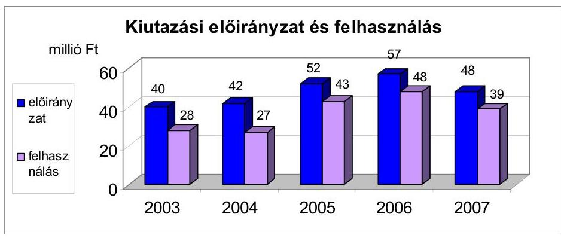

Az elmúlt évben az ÁSZ munkatársai 63 külföldi úton vettek részt, és azokon 124 kiküldött 440 napot töltött el. (A tervben 66 utazás és 137 fő kiküldése szerepelt.) Két külföldi kiküldetés kapcsolódott hosszabb időtartamú képzésen való részvételhez, összesen 204 napban. Az egy külföldi útra eső átlag munkanapszám – a hosszú időtartamú képzések nélkül – 4 nap/út volt. Egy külföldi kiküldetésben töltött munkanap átlagos költsége 2007-ben 136 ezer Ft volt (2006-ban: 131 ezer Ft).

Terven felül 25 kiutazásra került sor, amelyek költsége összesen 8 millió Ft-ot tett ki. Fedezetüket abból az év közben folyamatosan képződő tartalékból biztosítottuk, amely az elmaradt utakra fel nem használt összegekből keletkezett.

Az ÁSZ elnöke 15 alkalommal utazott külföldre 2007-ben, ott összesen 62 napot töltött. Ezen belül 6 alkalommal tett eleget az INTOSAI Kormányzótanács elnökeként külföldi kötelezettségének, amely utak összesen 32 napot vettek igénybe. Egy elnöki út átlagos költsége 2007-ben 490 ezer Ft, egy napra eső átlagos költsége 104 ezer Ft volt. (2006-ban 550 ezer, illetve 149 ezer Ft.) Az elnöki utak átlagos költségének szembetűnő csökkenését egyrészt a gépjárművel történő utazás következetes előnyben részesítése, másrészt a repülőjegyek idejekorán történő lefoglalásakor érvényesíthető árelőny révén sikerült elérni.
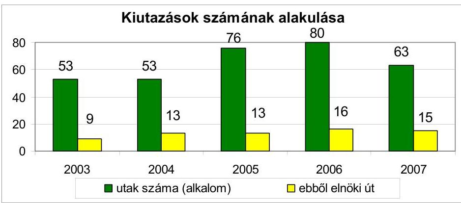

A költségek alakulását nagyban befolyásolják a tengeren túli kiutazások. Tavaly ismét delegálhattunk egy munkatársunkat az Egyesült Államok számvevőszéke 5 hónapos képzési programjába. A 171 napos képzés költsége

---

6,7 millió Ft volt, az összes kiutazási kiadás 17%-a. Tengeren túli utazásra további 7 alkalommal került sor 2007-ben, 16 fő részvételével. Ezen kiküldetésekre fordítottuk a kiutazási kiadások 25%-át, összesen 9,8 millió Ft-ot (2006-ban 17,8 millió Ft-ot). Ezeken belül 2 tengeren túli kiutazás 6 fő részvételével kapcsolódott az INTOSAI Kormányzótanács elnöki tisztségéhez.
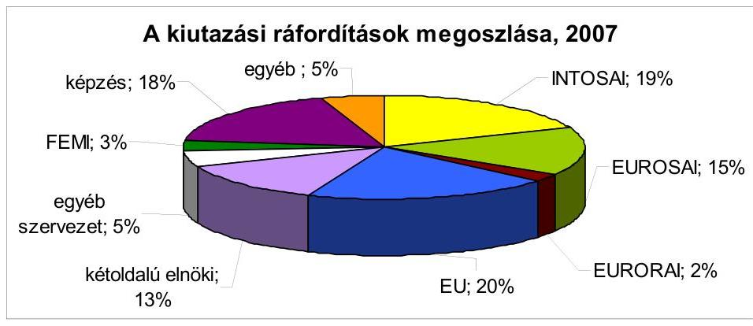
5. A SZÁMVEVŐSZÉKI TEVÉKENYSÉGHEZ KAPCSOLÓDÓ KUTATÓ ÉS MÓDSZERTANI MUNKA

A Fejlesztési és Módszertani Intézet (FEMI) az ÁSZ stratégiájának céljait szem előtt tartva 2007-ben is arra törekedett, hogy elősegítse átfogó értékelő vélemény formálását a közpénzek felhasználásáról, valamint hozzájáruljon az ellenőrzés módszereinek a nemzetközi standardokkal összhangban történő korszerűsítéséhez és a legjobb nemzetközi gyakorlat alkotó adaptációjához. A fentiekkel összhangban a FEMI 2007-ben több témakörben folytatott kutatást.

Ezek közül kiemelendők: A tudástársadalom és -gazdaság kiépülésének helyzete és feladatai Magyarországon; Az államháztartás pénzügyi reformjának irányai a 20. század végén és a 21. század elején; A közpénzügyi szabályozás korszerűsítése; A közszféra és a gazdaság versenyképessége; A köz- és magánszféra együttműködésével kapcsolatos nemzetközi és hazai tapasztalatok; A rendszerváltás óta a Balaton régió turisztikai tárgyú kutatására fordított támogatások hatékonyságának elemzése; A hazai önkormányzati rendszer pénzügyi kockázatai; A magyarországi cigányság helyzetének javítására és felemelkedésére a rendszerváltás óta fordított támogatások mértéke és hatékonysága.

Az Intézet számára új típusú feladatot jelentett „a korrupció-ellenes intézkedések továbbfejlesztésének és a korrupció-ellenes kormánystratégia végrehajtásának elősegítése” címen az Európai Unió Átmeneti Támogatási keretében elkülönített Intézményfejlesztési Alap program pályázatán benyújtott projekt előkészítése és megvalósításának megkezdése.

Külön kiemelést érdemel a közpénzügyek szabályozási téziseinek kidolgozása érdekében végzett munka. Az ÁSZ stratégiai céljaival összhangban, tanácsadói szerepének keretein belül vállalta egy új szemléletű és tartalmú köz-

---

pénzügyi szabályozást megalapozó tézisek meghatározását. E feladat megvalósítása érdekében több megalapozó résztanulmány készült. Ezek belső és szakértői megvitatását követően elkészült a közpénzügyi törvény szabályozási koncepciója főbb vonásait bemutató tanulmány. Erre építve kidolgoztuk a közpénzügyek szabályozásának téziseit. A téziseket az ÁSZ elnöke 2007 áprilisában terjesztette az Országgyűlés elé, amely azt határozattal elfogadta és felkérte a Kormányt, hogy hasznosítsa az államháztartást korszerűsítő munkában.

A tézisek parlamenti jóváhagyását követően felgyorsult a közpénzügyi szabályozás megújítására irányuló kormányzati törvény-előkészítő tevékenység. A Pénzügyminisztériumban elkészített munkaanyagról széles körű konzultáció eredményeképpen kialakítottuk álláspontunkat. Ennek lényege: legelőször a költségvetés-politikai szakmai előírások kimunkálására van szükség, azután el kell dönteni, hogy a Kormány költségvetési tevékenységét szükség esetén milyen jellegű és erősségű elemek korlátozzák, és legvégül a kialakult hatás- és jogkörökből következően kell modellezni az intézményi feltételt.

A közpénzügyi szabályozás előkészítésének segítésére alakult munkacsoportunk az egyeztetési folyamatban teljes értékű szereplővé vált, az MNB és az IRM szakembereivel közösen sikerült elősegíteni azokat a törekvéseket, amelyek a közpénzügyi biztonságot, a közpénzek átlátható és hatékonyabb felhasználását tartották szem előtt.

A törvényjavaslatok szövegtervezeteinek véleményezése során – tekintettel arra, hogy az ÁSZ feladatköre is közvetlenül érintett lehet a szabályozás eredményeképpen – az elvi megközelítés mellett részletesen megfogalmaztuk konkrét észrevételeket is. Kidolgoztuk továbbá a szabályozás időtállóságát biztosító, a közös felelősség érvényesülésére garanciát adó alapdokumentumot, az Alkotmányt egy új közpénzügyi fejezettel kiegészítő törvény tervezetét. Ezzel egy, az európai normáknak is megfelelő, a témának olyan hangsúlyt adó anyagot adtunk át a közvetlen kidolgozóknak – és a parlamenti pártok szakértőinek, valamint az Országgyűlés illetékes bizottságainak –, amely az egész alaptörvényt tekintve is konzisztensen, a jelenlegi szabályokhoz képest jóval részletesebben jelenítette meg a legfontosabb előírásokat. Álláspontunk szerint ez a javaslat kell legyen kiinduló pontja a majdani törvényalkotási lépéseknek.

Ezzel párhuzamosan a munkacsoport –
 a nemzetközi kitekintés tapasztalatait is hasznosítva - belső használatú tanulmányokban modellezte a készülő szabályozásnak az ÁSZ további tevékenységére gyakorolt hatását, az esetlegesen felmerülő teendőket és az azokkal kapcsolatos lehetséges megoldási módokat.

A közpénzügyi szabályozás korszerűsítésére vonatkozó javaslatokra is tekintettel, az Intézet önálló értékelő tanulmányt készített a 2008. évi költségvetési törvényjavaslat makrogazdasági megalapozottságának néhány összefüggéséről, amelyet az ÁSZ elnöke a Magyar Köztársaság 2008. évi költségvetési javaslatáról szóló véleményhez csatolva benyújtott az Országgyűlés részére. A tanulmány a költségvetési folyamatok elemzésén túl új módszertant tartalmazott a makrogazdasági kockázatok és hatások elemzésére. Ennek segítségével a tanulmány rámutatott több, a gazdasági növekedéssel, az árak és a bérek alakulásával, az önkormányzatok eladósodásával, az EU-támogatások felhasználásával, az adóterheléssel, az egészségügyben hozott intézkedésekkel kapcsolatos kockázatra, illetve nem kívánt hatásra.

---

A módszertani fejlesztési tevékenységünk alapvető célja az alkalmazott ellenőrzési módszertanok, segédletek, vizsgálati módszerek és eljárások nemzetközi fejlesztési eredményeken és a saját gyakorlati és fejlesztési tapasztalatokon alapuló továbbfejlesztése. A szakmai-módszertani belső szabályozás fejlesztése keretében elindult „A számvevőszéki ellenőrzés szakmai szabályai" című, 2004-ben kiadott belső szabályozási dokumentum felülvizsgálata és korszerűsítése. E munka átnyúlik a 2008. évre is. A számvevőszéki ellenőrzés alapvető elveit, követelményeit meghatározó dokumentum felülvizsgálatával párhuzamosan folyt a fő ellenőrzési típusok korábbi években elkészített módszertanainak korszerűsítése és az azokhoz kapcsolódó segédletek felülvizsgálata.

Az Országgyűlés továbbra is fontosnak tartja és támogatja, hogy az ÁSZ fejlődő civil kapcsolatainak keretében befolyást gyakoroljon a szakmai közvéleményre. Ennek részeként - stratégiájának megfelelően - a Számvevőszék vezetői és munkatársai több szakmai rendezvényen, konferencián vettek részt, és ismertették az ellenőrzési tapasztalatokat, következtetéseket, az ÁSZ kutató műhelyének szakmai eredményeit. Különböző szakfolyóiratokban jelentek meg az ÁSZ és kutatóintézete munkatársainak publikációi. Az ÁSZ maga is több konferenciát rendezett, együttműködve például a Magyar Közgazdasági Társasággal, a Magyar Jogász Egylettel, valamint az "Új rend és szabadság" program kormánybiztosával.

Szakmai közéleti tevékenysége részeként szerkeszti és teszi közzé az ÁSZ a magyar és angol nyelven megjelenő közpénzügyi szakfolyóiratot. 2007-ben 43 tanulmány, szakcikk és 10 szakkönyv-recenzió jelent meg a Pénzügyi Szemlében, amelyek - egyebek mellett - foglalkoztak a közpénzügyi rendszer korszerűsítésével, a konvergencia programmal, valamint a társadalom, a politika és a gazdaság kölcsönhatásaival is. Az egyensúly teremtést és a felzárkózást előmozdító szakmai gondolatcserét szolgálta, hogy a szerkesztőség a Magyar Közgazdasági Társasággal közösen szimpóziumot rendezett, ahol a „Hogy jutottunk ide: a magyar költségvetés, 2000-2006" című, a költségvetéssel foglalkozó tematikus számban megjelent tanulmány szolgált vitaalapul. A határainkon túl is mindinkább ismertté váló, külföldi szakíróknak is publikációs lehetőséget nyújtó szakfolyóirat által felkeltett figyelem is közrejátszott abban, hogy az ÁSZ elnökét felkérték a hazai államháztartás modernizációját és versenyképességünket bemutató elemzésre, ami az OECD Journal on Budgeting 2007. évi 1. számában jelent meg.

Az ÁSZ elnökének stratégiai tevékenységét segítő konzultatív munkaszervezet, az Elnöki Tanácsadó Testület 2007-ben is éves üléstervének megfelelően működött, rendszeresen ülésezett és általában írásba foglalt előterjesztések, elemzések, (rész)tanulmányok feldolgozásával, megvitatásával teljesítette programját. Kiemelt súlyt helyezett a hazai közpénzügyi rendszer és az államháztartás fejlesztésével, a számvevőszéki ellenőrzés korszerűsítésével, annak részeként a módszertani fejlesztéssel, valamint a közszféra működéséhez és a számvevőszéki ellenőrzéshez kapcsolódó jogszabályi környezet elemzésével, s egyes összetevői megújításának megalapozásával összefüggő feladatokra.

---

# 6. Az intézmény működése és gazdálkodása 

### 6.1. Költségvetési gazdálkodás

A számvevőszéki törvény 2004. évi módosítása óta az ÁSZ maga állítja össze az állami számvevőszéki fejezet költségvetésére és a költségvetés végrehajtására vonatkozó javaslatát. E javaslatot a Kormány - változtatás nélkül - a központi költségvetési, illetve a zárszámadási törvényjavaslat részeként terjeszti elő az Országgyűlésnek.

Az Országgyűlés elnöke által közbeszerzési pályázat útján kiválasztott független könyvvizsgáló elvégezte az ÁSZ költségvetési fejezet 2007. december 31-i fordulónapra elkészített költségvetési beszámolójának könyvvizsgálatát. A könyvvizsgálatot a magyar Nemzeti Könyvvizsgálati Standardok és a könyvvizsgálatra vonatkozó törvények és egyéb jogszabályok alapján, valamint az ÁSZ Financial Audit típusú módszerének alkalmazásával hajtották végre. Az elvégzett könyvvizsgálat magába foglalta az éves költségvetési beszámoló tényszámait alátámasztó bizonylatok mintavételen alapuló vizsgálatát, emellett tartalmazta az alkalmazott számviteli alapelvek, valamint az éves költségvetési beszámoló bemutatásának értékelését. Véleményük szerint az éves költségvetési beszámoló az ÁSZ költségvetési fejezet 2007. december 31-én fennálló vagyoni és pénzügyi helyzetéről megbízható és valós képet ad.

A törvény adta felhatalmazásból eredő nagyobb felelősség okán szükségesnek tartottuk és tartjuk a jövőben is, hogy a fejezet költségvetési javaslata részletesen mutassa be az ÁSZ stratégiájának alapvető céljait, az abból fakadó szakmai feladatait, külön kiemelve az ÁSZ éves ellenőrzési tervében szereplő meghatározott gyakoriságú, illetve rendszeresen teljesítendő, törvényekben előírt ellenőrzési feladatokat. Ezen túlmenően megtervezésre kerültek az elnöki döntés alapján, valamint a Kormány felkérésére végzett ellenőrzések. Önálló programként mutattuk be mindazon egyéb szakmai, valamint működési feladatokat, amelyek jól körülhatárolható csoportokba sorolhatók és meghatároztuk a végrehajtáshoz szükséges erőforrásokat.

Mindezek alapján az Országgyűlés részére - a Pénzügyminisztérium útján - részletes, átlátható, többszörösen egyeztetett költségvetési tervjavaslatot készítettünk, amelynek kialakításakor a Pénzügyminisztérium tervezési köriratában foglaltakon túl figyelembe vettük az ellenőrzési és egyéb feladatokat alapvetően befolyásoló törvények előírásait, a vonatkozó OGY határozatokat. Arra törekedtünk, hogy az ÁSZ kellő körültekintéssel, takarékosan, az ország gazdasági helyzetének figyelembe vételével igyekezzen törvényi kötelezettségeinek - lehetőségeihez képest - maradéktalanul eleget tenni.

Az Országgyűlés az ÁSZ 2007. évi feladatainak ellátására a költségvetési törvényben 7.616,4 M Ft-ot hagyott jóvá, melynek fedezetét 7.596,4 M Ft támogatás és 20,0 M Ft saját bevétel biztosította. Ez a megelőző év eredeti előirányzatához képest több mint 1%-os csökkenést jelentett. A költségvetési forrásokkal való gazdálkodás mozgásterét ez évben is csökkentette az ÁSZ előtt álló szakmai feladatok 65%-ának törvényi, illetve az országgyűlési határozatok általi

---

kötöttsége, ezzel összefüggésben a személyi juttatások és a közterhek, valamint a dologi kiadások automatizmusaiból következő determináció.

Mindezek megkövetelték, hogy a szakmai és az intézményi fenntartási, üzemeltetési feladatok ellátása során érvényesítésre kerüljenek a takarékossági, gazdasági szempontok. Ennek megvalósítása érdekében törekedtünk a központosított és a saját hatáskörben lefolytatott közbeszerzési eljárások nyújtotta kedvező lehetőségek maximális kihasználására.

A kiadási főösszegből a személyi juttatások előirányzatai 4.747,5 M Ft-ot, a munkaadókat terhelő járulékok 1.483,7 M Ft-ot, a dologi kiadások 955,9 M Ft-ot, az intézményi beruházási kiadások 161,9 M Ft-ot, a felújítási előirányzatok 13,7 M Ft-ot, a fejezeti egyensúlyi tartalék 253,7 M Ft-ot jelentettek.

A jóváhagyott előirányzatot az évközi módosítások 778,3 M Ft-tal növelték, melyből 565,7 M Ft az előző évi előirányzat-maradvány igénybevétele; 181,5 M Ft a 2117/2007. (VI.25.) Korm. határozat alapján biztosított pótelőirányzat; 10,9 M Ft az EU intézményében foglalkoztatott nemzeti szakértővel kapcsolatos többlet kiadások fedezete; 1,0 M Ft az OTKA pályázat tárgyévi részlete; 1,9 M Ft az EUROSAI Kormányzó Tanácsának támogatása az ÁSZ által megrendezett szemináriumhoz; 13,6 M Ft az ellenérték fejében végezhető ellenőrzési tevékenységből, tanulmányok készítéséből, eszközértékesítésből befolyt bevétel; 0,7 M Ft a továbbképzési tervben szereplő programok támogatása; 3,0 M Ft a befolyt törlesztő részletek terhére biztosított lakásvásárlási kölcsönök miatti módosítás.

A módosítások után 8.394,7 M Ft állt rendelkezésre.
A felhasználás 8.040,4 M Ft volt, amely a módosított előirányzat 95,8%-a. A személyi juttatások és a munkaadókat terhelő járulékok együttes összege (6.519,9 M Ft) a kiadások 81,1%-át tették ki, a dologi kiadások aránya 14,4%, a felhalmozási kiadásoké pedig 4,5%.

A tervezett 20,0 M Ft saját bevétellel szemben a teljesítés 35,9 M Ft volt. A többletbevétel több mint 30%-át a brit partnerintézménnyel 2006-ban megvalósított tadzsikisztáni együttműködéssel összefüggésben az ÁSZ-t megillető szakértői díj, illetve költségtérítés tette ki. A további rész a FEMI által készített tanulmányok díjaiból, ellenőrzési feladat ellátásából és feleslegessé vált eszközök értékesítéséből tevődik össze.

A maradvány összege 354,7 M Ft, melyből 354,3 M Ft a kiadási megtakarítás, 0,4 M Ft a bevételi többlet. Az előirányzat-maradvány 92,8%-a kötelezettségvállalással lekötött, a feladatok, a teljesítések (főként a maradvány-képzési kötelezettség miatt) 2008. évre való átütemezésének, áthúzódásának következménye, 25,6 M Ft a szabad maradvány összege.

A rendelkezésre álló előirányzatok (nem csekély odafigyeléssel, takarékoskodással) összességében biztosították az intézmény zavartalan feladatellátásához szükséges működési, üzemeltetési feltételeket.

---

# 6.2. Az infrastruktúra működtetése, fejlesztések 

A 2007. évben a munkafeltételek megfelelő színvonalú biztosítása, az irodaépületek állagának megőrzése, illetve javítása, valamint az eszközellátottság fejlesztése mellett kiemelt feladatként kezeltük a székházakban és a telephelyeken a biztonsági rendszerek (beléptető, tűzjelző, CO-érzékelő) kiépítését.

A 2007. év legjelentősebb munkája az Apáczai Csere János utcai székház tetőszigetelése, a tetőfeljárat és a zöldtető építése volt, mely a beázások megszüntetése mellett a hőszigetelést is megoldotta.

Sor került továbbá az Apáczai Csere János utcai székház nyílászáróinak részleges cseréjére és felújítására, belsőudvari redőnyözésére, a bejárat fölötti előtető elkészítésére, a lapostetőn - a Kulturális Örökségvédelmi Hivatal előírásai alapján - a klímagépek áthelyezésére.

Elkészült a Lónyay utcai irodaház fűtés-hűtés rendszerének automatizálása, a VIII. emelet elektromos felújítása és az irodák festése, mázolása.

A Garibaldi utcai garázs őrzésének korszerűsítése érdekében megtörtént a bejárati ajtók cseréje, az elektromos vezeték teljes átépítése, a tűzjelző és a CO érzékelők kiépítése.

Elkészíttettük a Bécsi utcai irodaegyüttes teljes felújításának kiviteli tervét.
Befejeződött a miskolci Megyei Ellenőrzési Iroda felújításának I. üteme az elektromos vezetékhálózat, a világítótestek cseréjével, az aljzat és a burkolat átépítésével, festés-mázolással, a vizesblokk teljes felújításával.

Az ingatlanok felújítási és rekonstrukciós munkáira a tárgyévben 164,9 M Ft-ot használtunk fel.

A feladatellátás biztosításához szükséges eszközrendszer megfelelő színvonalon tartása érdekében 55,0 M Ft-ot fordítottunk fénymásolók, nyomdai vágógépek és bútorok beszerzésére.

2007-ben összesen 16,5 M Ft értékben került sor gépjármű alkatrészek és tartozékok beszerzésére, valamint a gépjárműpark tervszerű megújítása érdekében 1 db gépjármű lecserélésére.

### 6.3. Az informatika és a telekommunikáció működtetése, fejlesztése

Az ÁSZ IT-tevékenységének alapvető célja, hogy sokoldalúan és hatékonyan támogassa az ÁSZ stratégiai küldetését és feladatainak ellátását. Az informatikai és telekommunikációs fejlesztések 2007-ben is az évente aktualizált, elnöki értekezleten jóváhagyott részletes IT-stratégiában meghatározott projekttervek szerint történtek.

Az ÁSZ - az elmúlt évek dinamikus fejlesztésének köszönhetően - a változó kommunikációs igényeket rugalmasan követni képes infrastruktúrával, egysé-

---

ges hálózati telekommunikációs rendszerrel, korszerű oktatóteremmel rendelkezik. A 2007. évre jóváhagyott IT-költségvetés biztosította a stratégiában és az éves tervben rögzített projektek, fejlesztési feladatok végrehajtását.

Az ÁSZ kiemelt informatikai projektje a számvevői munkavégzés dokumentálásának támogatására, a vizsgálatok során keletkezett, illetve begyűjtött dokumentumok nyilvántartására, tárolására szolgáló elektronikus rendszer fejlesztése (VIDOR), melynek megvalósításához az ÁSZ 2006-ban sikeresen pályázott EU Átmeneti Támogatásra. A Phare Management Committee 2006. július 3-i ülésén hagyta jóvá a projektet. A program megvalósításának első része a szoftverfejlesztés, melyre - az EU Átmeneti Támogatásra vonatkozó szabályok szerint - a CFCU az ÁSZ közreműködésével 2007-ben nyílt közbeszerzési eljárást folytatott le. A pályázat nyertese a Bull Magyarország Számítástechnikai Kft. lett, a fejlesztés költsége
 195.836,- Euro (50 millió Ft). A szerződést 2008. január 21-én írta alá a CFCU, a Bull Kft. és az ÁSZ. A projekt befejezésének határideje 2009. február vége. A rendszer fejlesztésének eredményeként az ellenőrzések - különösen az előkészítés - hatékonyságának javulása, az ellenőrzések előkészítésére fordított munkaidő csökkenése, az ellenőrzési bizonyítékok on-line elérhetőségével a vezetői minőségkontroll és a minőségbiztosítás hatékonyságának javulása várható.

Az ÁSZ IT szolgáltatásokhoz kapcsolódó hibák, problémák bejelentésére, dokumentálására és kezelésére 2007-ben bevezettünk egy számítógépes HelpDesk rendszert. Ennek eredményeképpen gyors és dokumentált problémakezelést és hibaelhárítást tudunk megvalósítani. A rendszer hatékonyan támogatja az üzemeltetésben résztvevők teljesítményértékelését is. A rendszert összekapcsoltuk a hálózati aktív eszköz-menedzselő szoftverrel, így a hálózat felügyeleti rendszerből érkező hibajelzések és azok kezelése is dokumentált.

Intézményünk az irat-nyilvántartási feladatok támogatására 2000 óta számítógépes ügykövetési és iktatási rendszert alkalmaz. 2007-ben előkészítettük és bevezettük a közfeladatot ellátó szerveknél alkalmazható iratkezelési szoftverekkel szemben támasztott követelményekről szóló 24/2006. (IV. 29.) BM-IHM-NKÖM együttes rendeletnek megfelelő elektronikus ügykövetési és iratkezelési rendszer akkreditált verzióját (OFFICE.GOV), összhangban a módosított és a Magyar Országos Levéltár által jóváhagyott iratkezelési szabályzattal.

Az elmúlt évben az ÁSZ honlapján működési, szerkezeti, tartalmi és formai szempontból jelentős fejlesztést végeztünk. A honlap működési módja alapvetően megváltozott, ezzel egyidejűleg a megjelenítést - formai szempontból - a 2007-ben megújult ÁSZ arculatnak megfelelően alakítottuk ki. Teljessé tettük az ÁSZ honlapjának szolgáltatásait az elektronikus információszabadságról szóló törvénynek megfelelően. A honlapunkon külön menüpontban, teljeskörűen jelenítjük meg a törvény által előírt dokumentumokat, információkat ${ }^{17}$. A vonatkozó jogszabályok szerint a Gazdasági és Közlekedési Minisztérium által működtetett Közadatkereső rendszerben is folyamatosan, automatikusan frissítjük a dokumentumokat.

[^0]
[^0]:    ${ }^{17}$ Az Eötvös Károly Alapítvány az elektronikus információszabadság gyakorlatát vizsgáló tanulmányában példaszerűnek minősítette az ÁSZ honlapját és annak informativitását.

---

rium által működtetett Közadatkereső rendszerben is folyamatosan, automatikusan frissítjük a dokumentumokat.

2007-ben - a honlap fejlesztéssel párhuzamosan - az ÁSZ Intranet rendszerének fejlesztése során az információk hatékony kezelése érdekében új, tematikus adatbázisokat alakítottunk ki. Így - hasonlóan a 2005-ben bevezetett Elnöki értekezlet rendszerünkhöz - a dokumentumok nyomtatására a jövőben nem lesz szükség. A 2008-ban fokozatosan bevezetésre kerülő új rendszer egy strukturális navigációs felülettel és keresőmotorral is rendelkezni fog, amely segíti az egyre növekvő számú, különböző típusú dokumentumok közötti gyors keresést.

Folyamatosan fejlesztjük, a vezetői igényeknek megfelelően módosítjuk a SZEKRETER vizsgálat-nyilvántartó és nyomonkövető rendszerünket, amely 2002 óta a tervezéstől az ellenőrzésekre fordított erőforrások kimutatásán keresztül a javaslatok realizálásáig minden lényeges információt tartalmaz az ÁSZ által végzett ellenőrzésekről. Ebből a rendszerből az ÁSZ Ellenőrzési terve, valamint a jelentéseinkben megfogalmazott javaslatok és az arra érkezett válaszok az ÁSZ Internetes honlapján is megtekinthetők.

Az infrastruktúra fejlesztés keretében 2006-ban az ÁSZ valamennyi telephelyén csatlakoztunk az Elektronikus Kormányzati Gerinchálózathoz (EKG). 2007-ben tovább bővítettük az egyes telephelyeken a sávszélességeket. A komplex hálózat igénybevétele lényegesen magasabb színvonalú és tartalmú szolgáltatásokat tesz lehetővé minden telephelyen, miközben a szolgáltatásért fizetett költségeink nem növekedtek. Az EKG-n logikailag elkülönített és titkosított virtuális magánhálózat (VPN) rendszert az ÁSZ szakemberei felügyelik.

Az IT infrastruktúra másik fontos eleme az ÁSZ hardver eszközparkjának megfelelő színvonalú kialakítása és folyamatos fejlesztése, a munkatársaknak a feladataik hatékony elvégzéséhez szükséges hardver eszközök - elsősorban asztali és/vagy notebook számítógépek - biztosítása. Stratégiai céljainknak megfelelően a notebook gépet használók aránya - a helyszíni ellenőrzésben résztvevők körében - évről évre növekszik.

2007-ben összesen 88 db asztali PC, valamint 35 db notebook számítógépet vásároltunk központosított közbeszerzési eljárással. Az eszközeink tervszerű cseréje keretében 20 db közepes teljesítményű, valamint 1 db színes, közepes teljesítményű nyomtatót telepítettünk az ÁSZ különböző telephelyeire. A dinamikusan növekvő számítógépes szolgáltatások megfelelő színvonalú kiszolgálása érdekében egy új szervergépet vásároltunk. A cserét elsősorban az új, saját fejlesztésű portál rendszerünk (honlap) nagyobb hardver-erőforrás igénye indokolta. A beszerzések mellett a szervergépek funkcióinak további átszervezésével az erőforrások optimalizálása érdekében jelentős előrelépést tettünk.
2007. első félévében mobil telefonszolgáltatások igénybevételére nyílt közbeszerzési eljárást folytattunk le. Ennek eredményeként havonta átlagosan 35%-al tudtuk csökkenteni a kiadásokat. Az eljárás során a szolgáltatásokra a központosított közbeszerzésben elérhető áraknál is kedvezőbbet tudtunk elérni. A vezetékes telefonszolgáltatásra 2007. októberében kiírt közbeszerzési eljárás eredményeként 2007. december 1-től a szolgáltatásokért fizetendő díj várhatóan havonta átlagosan 40%-al fog csökkeni.

2007-ben szoftverbeszerzésre 66,1 M Ft-ot, számítástechnikai, telekommunikációs eszközök, gépek vásárlására 60,2 M Ft-ot fordítottunk. A december hónapban megrendelt gépek, eszközök ellenértéke 2007-ben kötelezettségvállalással terhelt maradványként jelentkezik, annak könyvelésére, kifizetésére, valamint a gépek üzembe-helyezésére 2008-ban kerül sor.

# 6.4. Belső ellenőrzés 

Az ÁSZ belső ellenőrzési feladatait 2007-ben egy fő belső ellenőr látta el. A belső ellenőr tevékenységét a vonatkozó jogszabályi előírásoknak, valamint az ÁSZ Belső Ellenőrzési Kézikönyvének megfelelően, a főtitkár által jóváhagyott éves munkaterv alapján végezte. Az éves munkatervben előirányzott feladatok teljesítése maradéktalanul megtörtént.

A belső ellenőrzés személyi és tárgyi feltételei biztosítottak voltak, a tevékenységben érvényesült a funkcionális függetlenség.

A beszámolási időszakban a belső ellenőr fontosabb megállapításai a következők voltak:

- az ÁSZ gazdálkodása az ellenőrzött területeken - az előző évekhez hasonlóan - a jogszabályi és belső előírásokkal összhangban, az ésszerű takarékossági szempontok figyelembevételével történt;
- az ellenőrzések kapcsán büntető-, szabálysértési, kártérítési illetve fegyelmi eljárás megindítására okot adó cselekmény, mulasztás vagy hiányosság gyanúja nem merült fel;
- az ellenőrzések során feltárt, kisebb jelentőségű hiányosságok megszüntetése, a gazdálkodási kockázatok további csökkentése érdekében a belső szabályozás néhány részterületen kiegészítésre, aktualizálásra szorul.

A belső ellenőri jelentésekben szereplő javaslatok felének realizálása 2007 végéig megtörtént, a többi javaslat a jóváhagyott intézkedési tervek alapján 2008 közepéig valósul meg.

---

# Mellékletek

---

.

---

# 1. számú melléklet 

2007. évi jelentések jellemzői

---

.

---

# 2007. évi jelentések jellemzői

|  Sorszám | A jelentés tárgya, száma, az ellenőrzés típusa | Az ellenőrzés alapja | Az ellenőrzés célja | Az ellenőrzött költségvetési nagyságrend  |
| --- | --- | --- | --- | --- |
|  I. 2006-BAN MEGKEZDETT, 2007-RE ÁTHÚZÓDÓ ELLENŐRZÉSEK |  |  |  |   |
|  A KÖLTSÉGVETÉS VÉGREHAJTÁSÁNAK ELLENŐRZÉSÉVEL ÉS A KÖLTSÉGVETÉS ELŐIRÁNYZATAINAK VÉLEMÉNYEZÉSÉVEL KAPCSOLATOS ELLENŐRZÉSEK |  |  |  |   |
|  1. | A Magyar Köztársaság 2006. évi költségvetése végrehajtásának ellenőrzése (pénzügyi-szabályszerüségi) | törvényekben előírt évenkénti ellenőrzési kötelezettség | annak értékelése, hogy a 2006. évi törvényjavaslat valósághűen tükrözi-e a pénzügyi folyamatokat, a költségvetés végrehajtásában jog-, és hatáskörrel rendelkezők eleget tettek-e kötelezettségeiknek; a költségvetés végrehajtása során érvényesültek-e a törvényi, az egyéb vonatkozó jogszabályi előírások; a helyi önkormányzatokat megillető hozzájárulások, támogatások előirányzatainak módosítását, folyósítását szabályszerűen hajtották-e végre; a vizsgált önkormányzatok szabályosan igényelték, használták fel és számolták-e el a hozzájárulásokat és a támogatásokat; a pályázati kiírások tartalma és a hozott döntés összhangban van-e a jogszabályokkal; a zárszámadási dokumentum előterjesztése megfelel-e a vonatkozó törvényi előírásoknak, adattartalma segíti-e a szükséges döntések meghozatalát. | A központi költségvetés tényleges kiadási főösszege: 8 510,8 Mrd Ft bevételi főösszege: 6 549,2 Mrd Ft hiánya: 1 961,6 Mrd Ft  |
|  0724 |  |  |  |   |
|  A KÖZPONTI KÖLTSÉGVETÉSSEL KAPCSOLATOS ELLENŐRZÉSEK |  |  |  |   |
|  2. | A Földművelésügyi és Vidékfejlesztési Minisztérium működésének ellenőrzése (átfogó) | törvényekben előírt rendszeres ellenőrzési kötelezettség | annak értékelése, hogy az irányítási, felügyeleti, kontroll tevékenység, kockázatkezelő képesség és a támogatási monitoring rendszer biztosították-e a hatékony működést és az eredményes fejlesztést; a gazdálkodási, szervezeti, működési, informatikai rendszere összhangban volt-e a szakmai feladatokkal; a támogatási rendszert, a stratégiájában kijelölt, illetve az EU források által elérhető célokhoz igazodva alakították-e ki, biztosították-e a források igénybevételéhez szükséges feltételeket, teljesültek-e a kitűzött célok, megfeleltek-e a követelményeknek; hasznosították-e a korábbi ÁSZ ellenőrzések megállapításait és javaslatait. | teljesített kiadási előirányzat:
2003-ban: 110,5 Mrd Ft
2004-ben: 111,3 Mrd Ft
2005-ben: 117,2 Mrd Ft
2006-ban: 124,1 Mrd Ft  |
|  0710 |  |  |  |   |
|  3. | A Külügyminisztérium fejezet működésének ellenőrzése (átfogó) | törvényekben előírt rendszeres ellenőrzési kötelezettség | annak értékelése, hogy a feladatok ellátásának szervezeti, működési feltételei, forrásai összhangban voltak-e; a feltételrendszer hozzájárult-e a források hatékony felhasználásához; a külképviseletek működtetésénél érvényesültek-e kritériumrendszerek; a határon túli magyarok pályázati támogatási rendszere eredményesen működött-e, segítette-e a feladatok ellátását a belső kontroll környezet, hasznosították-e a korábbi ellenőrzéseink megállapításait, javaslatait. | teljesített kiadási előirányzat:
2002-ben: 45,7 Mrd Ft
2003-ban: 57,1 Mrd Ft
2004-ben: 58,0 Mrd Ft
2005-ben: 57,7 Mrd Ft
2006-ban: 50,5 Mrd Ft  |

---

|  Sorszám | A jelentés tárgya, száma, az ellenőrzés típusa | Az ellenőrzés alapja | Az ellenőrzés célja | Az ellenőrzött költségvetési nagyságrend  |
| --- | --- | --- | --- | --- |
|  4. | A költségvetést megillető áfa bevételek realizálásának ellenőrzése (teljesítmény) | az ÁSZ elnökének döntése alapján végzett egyéb ellenőrzések | annak értékelése, hogy a pénzügyminiszter érvényesítette-e a törvényességi, célszerűségi és szakmai szempontokat, meghatározott-e követelményeket, az áfa beszedési tevékenység javítása érdekében; az APEH és a VP eljárásrendje, ellenőrzései biztosították-e az áfa bevételek beszedését, a csalások feltárását, a jogosulatlan kifizetések megakadályozását; eredményes volt-e a hátralékkezelés, hasznosították-e a korábbi ÁSZ ellenőrzések megállapításait, javaslatait. | Ellenőrzéssel megállapított adókülönbözet: 2004-ben: 188,4 Mrd Ft 2005-ben: 203,1 Mrd Ft 2006-ban: 303,5 Mrd Ft  |
|  5. | Az elektronikus kormányzati szolgáltatások fejlesztésének ellenőrzése (teljesítmény) | az ÁSZ elnökének döntése alapján végzett egyéb ellenőrzések | annak értékelése, hogy a fejlesztések a nemzeti célkitűzésekkel és az európai uniós előírásokkal összhangban, valós kormányzati és fejezeti stratégiákon alapultak-e; a kormányzati szintű koordináció, a források felhasználása, az eljárási és biztonsági előírások betartása eredményesen működött-e; hatékonyan segíti-e a magyar közigazgatás infokommunikációs fejlődését; a korábbi ÁSZ megállapításokat, javaslatokat hasznosították-e. | Az elektronikus szolgáltatásokra fordított intézményi kiadás: 2005-ben: 4,1 Mrd Ft 2006-ban: 1,3 Mrd Ft  |
|  6. | A közmunkaprogramok támogatására fordított pénzeszközök hasznosulásának ellenőrzése (teljesítmény) | az ÁSZ elnökének döntése alapján végzett egyéb ellenőrzések | annak értékelése, hogy a programok működtetése, a pénzeszközök hasznosulása, a tárca irányító, ellenőrző tevékenysége eredményes volt-e; milyen intézkedések történtek a korábbi számvevőszéki ellenőrzések megállapításai alapján; a támogatásra fordított pénzeszközök összhangban voltak-e a foglalkoztatáspolitikai célokkal, jogszabályokkal, javította-e a munkaerő-piaci esélyeket, foglalkoztatási feltételeket; a közmunkaprogram kormányzati szereplői hogyan, milyen eredményesen vettek részt a támogatási eszköz működtetésében; az eszközrendszer célszerűsége, a felhasználás törvényessége hogyan érvényesült. | A vizsgált önkormányzatoknál a támogatott közmunka program összértéke: 2003-ban: 298,5 Mrd Ft 2004-ben: 850,8 Mrd Ft 2005-ben: 3 228,0 Mrd Ft 2006-ban: 443,0 Mrd Ft 

 |
|  7. | A kulturális közgyűjtemények kezelésére fordított pénzeszközök hasznosulásának ellenőrzése (teljesítmény) | az ÁSZ elnökének döntése alapján végzett egyéb ellenőrzések | annak értékelése, hogy a felügyeleti irányítás segítette-e a feladatok megvalósulását; a kulturális közgyűjtemények részére biztosított támogatásokat megfelelően hasznosították-e; a források megosztása, tervezése, a gazdálkodás célszerűen valósult-e meg; az egyes közgyűjteményi szakterületekre fordított források felhasználása a vizsgált időszakban biztosította-e az intézmények eredményesebb működését és feladatellátását; a korábbi ÁSZ javaslatok megvalósultak-e. | Közgyűjteményi célú kiadás: 2003-ban: 51,5 Mrd Ft 2004-ben: 62,7 Mrd Ft 2005-ben: 64,8 Mrd Ft  |
|   | 0701 |  |  |   |
|  A HELYI ÉS HELYI KISEBBSÉGI ÖNKORMÁNYZATOKKAL KAPCSOLATOS ELLENŐRZÉSEK |  |  |  |   |
|  8. | A helyi és a helyi kisebbségi önkormányzatok gazdálkodási rendszerének 2006. évi átfogó és egyéb szabályszerűségi ellenőrzése (átfogó) | törvényekben előírt rendszeres ellenőrzési kötelezettség | annak értékelése, hogy törvényes és szabályos volt-e a tervezés, a költségvetés végrehajtása, a vagyongazdálkodás és a zárszámadás; a feladatok és a források összhangja biztosított volt-e, különös tekintettel egyes kiemelt feladatokra; a gazdálkodás szabályszerűségét biztosító kontrollok megfelelően segítették-e a végrehajtást; érvényesítették-e az Áht. és a kormányrendeletek előírásait. | Az ellenőrzött önkormányzatok teljesített kiadásai: 2002-ben: 372,8 Mrd Ft 2003-ban: 408,9 Mrd Ft 2004-ben: 450,3 Mrd Ft 2005-ben: 492,5 Mrd Ft 2006-ban: 525,5 Mrd Ft  |

---

|  Sorszám | A jelentés tárgya, száma, az ellenőrzés típusa | Az ellenőrzés alapja | Az ellenőrzés célja | Az ellenőrzött költségvetési nagyságrend  |
| --- | --- | --- | --- | --- |
|  9. | Az önkormányzatok szociális alapszolgáltatási tevékenységének ellenőrzése (egyéb szabályszerűségi) 0719 | az ÁSZ elnökének döntése alapján végzett egyéb ellenőrzések | annak megállapítása, hogy a jogszabályi előírások és módosításai segítették-e és hozzájárultak-e a szociális alapszolgáltatások bővüléséhez, a források felhasználásának átláthatóságához; biztosítják-e a törvényben meghatározott alapszolgáltatásokat; az alapszolgáltatási feladatellátásoknál éltek-e a társulás lehetőségével. | Az ellenőrzött önkormányzatok szociális alapszolgáltatási kiadásai: 2004-ben: 2005-ben: 2006. I. félévben: 1,1 Mrd Ft  |
|  10. | A települési önkormányzatok vízrendezési és csapadékvíz elvezetési feladatai ellátásának ellenőrzése (teljesítmény) 0708 | az ÁSZ elnökének döntése alapján végzett egyéb ellenőrzések | annak megállapítása, hogy a jogszabályi előírások, és a támogatási rendszer biztosítja-e a feladatok ellátását; a települési önkormányzatok eleget tettek-e feladataiknak, rendelkeztek-e a létesítmények fejlesztéséhez, fenntartásához szükséges pénzügyi eszközökkel, a megelőzésre biztosított támogatások segítették-e a feladatok megoldását; az önkormányzatok felkészültsége a vízrendezésre, vízelvezetési feladat ellátására, és a vízkárok elkerülésére tett intézkedéseik biztosítják-e a hatékony védekezést, rendelkezésre állnak-e az eszközök, védelmi tervek; a korábbi ÁSZ ellenőrzés javaslatai hasznosultak-e. | A vizsgált önkormányzatok vízrendezési és csapadékvíz elvezetési feladatainak kiadásai: 2003-ban: 2004-ben: 2005-ben: 2006. I. félévben: 1,8 Mrd Ft 2,0 Mrd Ft 1,6 Mrd Ft  |
|  A TÁRSADALOMBIZTOSÍTÁSI ALAPOKKAL KAPCSOLATOS ELLENŐRZÉSEK |  |  |  |   |
|  11. | Az állami és önkormányzati kórházak gyógyszergazdálkodásának ellenőrzése (teljesítmény) 0707 | az ÁSZ elnökének döntése alapján végzett egyéb ellenőrzések | annak értékelése, hogy az irányítás elősegítette-e a gazdaságos, eredményes, és hatékony gyógyszergazdálkodást, a szakmai és a gazdálkodási szempontok összhangja érvényesült-e; a gyógyszerbeszerzések megfeleltek-e a gazdaságosság követelményének; az intézeti gyógyszertár gazdaságosan oldotta-e meg feladatait; a kórházak gyógyszerkiadásai arányban álltak-e az OEP-től származó bevételeikkel, jelentős volt-e a gyógyszerkiadások növekedése. | Az egészségügyi intézmények (országos adatok) gyógyszer felhasználása: 2002-ben: 45,2 Mrd Ft 2003-ban: 46,4 Mrd Ft 2004-ben: 50,6 Mrd Ft 2005-ben:  |
|  AZ ÁLLAM VÁLLALKOZÓI ÉS KINCSTÁRI VAGYONÁVAL KAPCSOLATOS ELLENŐRZÉSEK |  |  |  |   |
|  12. | A Magyar Távirati Iroda Rt. 2006. évi gazdálkodásának ellenőrzése (átfogó) 0709 | törvényekben előírt évenkénti ellenőrzési kötelezettség | annak értékelése, hogy szervezeti felépítése, működése, belső szabályozása, információs rendszere, gazdálkodási tervei összhangban voltak-e a feladatokkal és a jogszabályokkal; törvényesen, célszerűen és eredményesen gazdálkodott-e az erőforrásokkal, a működési célú és egyéb céltámogatásokkal; hasznosította és a 2005. évi ÁSZ-jelentés megállapításait, ajánlásait. | Összes támogatás és költség: 2003-ban: 1,4 Mrd Ft 4,1 Mrd Ft 2004-ben: 2,3 Mrd Ft 4,8 Mrd Ft 2005-ben: 2,2 Mrd Ft 4,1 Mrd Ft 2006-ban: 2,3 Mrd Ft 4,3 Mrd Ft  |
|  A KÜLFÖLDI TÁMOGATÁSOKKAL KAPCSOLATOS ELLENŐRZÉSEK |  |  |  |   |
|  13. | Az uniós támogatások hazai monitoring és ellenőrzési rendszere működésének ellenőrzése (teljesítmény) 0723 | az ÁSZ elnökének döntése alapján végzett egyéb ellenőrzések | annak értékelése, hogy az ellenőrzési rendszer eredményesen és hatékonyan szolgálta-e a stratégiai célok elérését. A kialakított hazai feltételrendszer, ezen belül az intézményrendszer kiépítettsége és felkészültsége lehetővé tette-e a monitoring- és ellenőrzési célok teljesítését; a tevékenység hozzájárult-e a támogatások átlátható, eredményes, hatékony és költségtakarékos felhasználásához; eredményesen és hatékonyan szolgálta-e a szabálytalanságok és csalások megelőzését, felderítését, következményeik felszámolását; megfelelően felkészültek-e a 2007-2013. programozási időszak rendszermódosításaira. | Uniós támogatások összesen: 2005-ben: 76,9 Mrd Ft 2006-ban: 130,5 Mrd Ft 2007-ben: 151,9 Mrd Ft  |

---

|  Sorszám | A jelentés tárgya, száma, az ellenőrzés típusa | Az ellenőrzés alapja | Az ellenőrzés célja | Az ellenőrzött költségvetési nagyságrend  |
| --- | --- | --- | --- | --- |
|  AZ ÁLLAMHÁZTARTÁSON KÍVÜLI SZERVEZETEKKEL KAPCSOLATOS ELLENŐRZÉSEK |  |  |  |   |
|  14. | A 2006-ban befejeződő autópálya beruházások ellenőrzése (teljesítmény) | az ÁSZ elnökének döntése alapján végzett egyéb ellenőrzések | annak értékelése, hogy a szerződések előkészítése, a feltételek kialakítása összhangban volt-e a jogszabályokban előírtakkal, gazdaságossági célokkal; a megvalósulás során a határidő, minőség és költségcélok a jogszabályokban, a szerződésekben foglaltakkal összhangban teljesültek-e; az elszámolások módja, a teljesítések nyomon követése, a monitoring, kontrolling és az ellenőrzések biztosították-e a kifizetések és a teljesítések összhangját; a megvalósításban részt vevő szervezetek és intézmények együttműködésének szabályozottsága megfelelt-e a jogszabályi követelményeknek és hatékonysági céloknak. | Az ellenőrzött beruházások összes finanszírozása 2002-2006. között: 134,1 Mrd Ft  |
|  15. | A Magyar Nemzeti Bank 2006. évi működésének ellenőrzése (átfogó) | törvényekben előírt rendszeres ellenőrzési kötelezettség | annak értékelése, hogy időarányosan teljesítette-e intézményi célkitűzéseit, működése megfelelt-e a törvényi előírásoknak, az irányítási, döntéshozatali, ellenőrzési rendszere hatékonyan működött-e; a szabályosan és hatékonyan gazdálkodott-e, kiemelten a működési költségek, célok megvalósulására, a létszám- és bérgazdálkodás, és a belső ellenőrzés területein; befektetett eszközeivel törvényesen és szabályszerűen, a tulajdonosi stratégiával, éves célkitűzéseivel összhangban gazdálkodott-e; hasznosította-e az előző évi ÁSZ ellenőrzés megállapításait. | Működési költségek: 2003-ban: 12,7 Mrd Ft 2004-ben: 13,5 Mrd Ft 2005-ben: 14,9 Mrd Ft 2006-ban: 14,8 Mrd Ft  |
|  16. | A CENTRUM Összefogás Magyarországért 2004-2005. évi gazdálkodása törvényességének ellenőrzése (pénzügyi-szabályszerűségi) | törvényekben előírt kétévenkénti ellenőrzési kötelezettség | annak megállapítása, hogy a Párt éves beszámolói a törvényi előírásoknak megfelelnek-e, a könyvvezetéssel és a valósággal megegyező adatokat tartalmaznak-e; betartották-e a számviteli és egyéb jogszabályi rendelkezéseket és belső előírásokat; működéséhez szabályszerűen igénybe vehető forrásokat használt-e fel, folytatott-e tiltott gazdálkodó tevékenységet, elfogadott-e tiltott vagyoni hozzájárulást, illetőleg adományt. | 2004-ben: 70,9 MFt 72,2 MFt  |
|  17. | A Magyar Kommunista Munkáspárt 2004-2005. évi gazdálkodása törvényességének ellenőrzése (pénzügyi-szabályszerűségi) | törvényekben előírt kétévenkénti ellenőrzési kötelezettség | annak megállapítása, hogy a Párt éves beszámolói a törvényi előírásoknak megfelelnek-e, a könyvvezetéssel és a valósággal megegyező adatokat tartalmaznak-e; betartották-e a számviteli és egyéb jogszabályi rendelkezéseket, belső előírásokat; működéséhez szabályszerűen igénybe vehető forrásokat használt-e fel, folytatott-e tiltott gazdálkodó tevékenységet, elfogadott-e tiltott vagyoni hozzájárulást, illetőleg adományt. | 2004-ben: 72,1 MFt 78,8 MFt  |

---

|  Sorszám | A jelentés tárgya, száma, az ellenőrzés típusa | Az ellenőrzés alapja | Az ellenőrzés célja | Az ellenőrzött költségvetési nagyságrend  |
| --- | --- | --- | --- | --- |
|  |   |   |   |   |

## II. 2007-BEN INDULÓ, 2007-BEN BEFEJEZNI TERVEZETT ELLENŐRZÉSEK

### A KÖLTSÉGVETÉS VÉGREHAJTÁSÁNAK ELLENŐRZÉSÉVEL ÉS A KÖLTSÉGVETÉS ELŐIRÁNYZATAINAK VÉLEMÉNYEZÉSÉVEL KAPCSOLATOS ELLENŐRZÉSEK

|  18. | Vélemény a Magyar Köztársaság 2008. évi költségvetési javaslatáról (egyéb szabályszerűségi) 0736 | törvényekben előírt évenkénti ellenőrzési kötelezettség | annak megállapítása, hogy a 2008. évi költségvetésről szóló törvényjavaslat és a 2009-2011. évekre szóló irányzámok során érvényesültek-e az előírások, irányelvek, a tervezési köriratban foglaltak; a törvényjavaslat és az irányzámok harmonizálnak-e a konvergencia programmal; megfelelően megalapozzák-e azt a makrogazdasági prognózisok, a tervezési módszerek, az állami feladatrendszer és a szabályozók módosításai; a törvényjavaslat és az irányzámok kiemelten vették-e számításba Magyarország EU-tagságának pénzügyi-gazdasági hatásait, részletesen és megalapozottan számszerűsítették-e az EU-tól származó forrásokat és a társfinanszírozási követelményeket, valamint az EU költségvetési befizetési kötelezettségünket. | A központi költségvetés tényleges kiadási főösszege: 9 018,0 Mrd Ft bevételi főösszege: 7 900,0 Mrd Ft hiánya: 1 118,0 Mrd Ft  |
| --- | --- | --- | --- | --- |
|  |   |   |   |   |

### A KÖZPONTI KÖLTSÉGVETÉSSEL KAPCSOLATOS ELLENŐRZÉSEK

|  19. | A nemzeti hírügynökségről szóló törvényben, valamint a rádiózásról és televiziózásról szóló törvényben meghatározott közszolgálati feladatellátás rendszerének ellenőrzése (átfogó) 0743 | az ÁSZ elnökének döntése alapján végzett egyéb ellenőrzések | annak értékelése, hogy a szabályozás, a szervezeti, finanszírozási keretek és szakmai felügyelet megfelelő-e; az ORTT, a közalapítványok és kuratóriumaik, valamint a részvénytársaságok irányító, döntéshozó és ellenőrző szerepe segítette-e a feladatellátás, a belső kontrollrendszer eredményes működését; az ÁSZ korábbi vizsgálatainak javaslatai megfelelően hasznosultak-e. | Közmédia kapott támogatásai: 2001-ben: 58,6 Mrd Ft 2002-ben: 40,7 Mrd Ft 2003-ban: 39,5 Mrd Ft 2004-ben: 60,4 Mrd Ft 2005-ben: 50,4 Mrd Ft 2006-ban: 58,6 Mrd Ft 2006-ban: 58,6 Mrd Ft | | 20. | A polgári nemzetbiztonsági szolgálatok pénzügyi-gazdasági ellenőrzése (átfogó) 0739 | törvényekben előírt rendszeres ellenőrzési kötelezettség | annak értékelése, hogy a szolgálatok igazgatási, gazdálkodási tevékenységének irányítása és felügyelete, a működés rendje és szervezete biztosította-e a törvényekben meghatározott feladatok teljesítési feltételeit; az irányítás és felügyelet kontroll, kockázatkezelés hogyan szolgálta a törvényes működést; költségvetési gazdálkodási rendszere lehetővé tette-e a feladatok ellátását, az erőforrások és a vagyon védelmét; a belső kontrollrendszerük fejlesztésében hasznosították-e a korábbi számvevőszéki ellenőrzések megállapításait, ajánlásait. | Kiadási előirányzat: 2003-ban: 28,5 Mrd Ft 2007-ben: 34,8 Mrd Ft | | 21. | A munkaképesség megőrzésére fordított pénzeszközök hasznosulásának ellenőrzése (teljesítmény) 0731 | az ÁSZ elnökének döntése alapján végzett egyéb ellenőrzések | annak értékelése, hogy a foglalkoztatás elősegítésére kitűzött kormányzati és uniós célok megvalósulása szolgálta-e a társadalmi reintegrációt; az orvosi rehabilitáció szabályozása, intézményrendszere, forrásai, ellenőrzése segíti-e a munkaképesség helyreállítását; a foglalkozási rehabilitáció szabályozása, intézményrendszere, forrásai, ellenőrzése segíti-e a munkába

 való visszatérést; az orvosszakértői minősítés, a passzív ellátások rendszere hozzájárul-e a rehabilitációhoz. | Megváltozott munkaképességű személyek ellátási összege:
2004-ben: 348,1 Mrd Ft
2005-ben: 370,4 Mrd Ft
2006-ban: 385,4 Mrd Ft |

---

|  Sorszám | A jelentés tárgya, száma, az ellenőrzés típusa | Az ellenőrzés alapja | Az ellenőrzés célja | Az ellenőrzött költségvetési nagyságrend  |
| --- | --- | --- | --- | --- |
|  A HELYI ÉS HELYI KISEBBSÉGI ÖNKORMÁNYZATOKKAL KAPCSOLATOS ELLENŐRZÉSEK |  |  |  |   |
|  22. | A Borsod-Abaúj-Zemplén Megyei Önkormányzat gazdálkodási rendszerének 2007. évi átfogó ellenőrzése (átfogó) 0733 | törvényekben előírt rendszeres ellenőrzési kötelezettség | annak értékelése, hogy az Önkormányzat a pénzügyi egyensúlyt milyen módon biztosította, a teljesített bevételek és kiadások évek közötti eltérése feladatváltozáshoz kapcsolódott-e; felkészült-e az uniós források igénylésére és felhasználására, az e-közigazgatás bevezetésére; kialakította-e a gazdálkodás kontrollrendszerét, a tervezést, végrehajtást és zárszámadást segítette-e a folyamatba épített, előzetes és utólagos vezetői ellenőrzés, a belső ellenőrzés; hasznosították-e a korábbi számvevőszéki ellenőrzések megállapításait, javaslatait. | 2006. évi kiadás: bevétel: vagyon:  |
|  23. | A Fejér Megyei Önkormányzat gazdálkodási rendszerének 2007. évi átfogó ellenőrzése (átfogó) 0744 | törvényekben előírt rendszeres ellenőrzési kötelezettség | annak értékelése, hogy az Önkormányzat a pénzügyi egyensúlyt milyen módon biztosította, a teljesített bevételek és kiadások évek közötti eltérése feladatváltozáshoz kapcsolódott-e; felkészült-e az uniós források igénylésére és felhasználására, az e-közigazgatás bevezetésére; kialakította-e a gazdálkodás kontrollrendszerét, a tervezést, végrehajtást és zárszámadást segítette-e a folyamatba épített, előzetes és utólagos vezetői ellenőrzés, a belső ellenőrzés; hasznosították-e a korábbi számvevőszéki ellenőrzések megállapításait, javaslatait. | 2006. évi kiadás: bevétel: vagyon:  |
|  24. | A Hajdú-Bihar Megyei Önkormányzat gazdálkodási rendszerének 2007. évi átfogó ellenőrzése (átfogó) 0734 | törvényekben előírt rendszeres ellenőrzési kötelezettség | annak értékelése, hogy az Önkormányzat a pénzügyi egyensúlyt milyen módon biztosította, a teljesített bevételek és kiadások évek közötti eltérése feladatváltozáshoz kapcsolódott-e; felkészült-e az uniós források igénylésére és felhasználására, az e-közigazgatás bevezetésére; kialakította-e a gazdálkodás kontrollrendszerét, a tervezést, végrehajtást és zárszámadást segítette-e a folyamatba épített, előzetes és utólagos vezetői ellenőrzés, a belső ellenőrzés; hasznosították-e a korábbi számvevőszéki ellenőrzések megállapításait, javaslatait. | 2006. évi kiadás: bevétel: vagyon:  |
|  25. | A Komárom-Esztergom Megyei Önkormányzat gazdálkodási rendszerének 2007. évi átfogó ellenőrzése (átfogó) 0753 | törvényekben előírt rendszeres ellenőrzési kötelezettség | annak értékelése, hogy az Önkormányzat a pénzügyi egyensúlyt milyen módon biztosította, a teljesített bevételek és kiadások évek közötti eltérése feladatváltozáshoz kapcsolódott-e; felkészült-e az uniós források igénylésére és felhasználására, az e-közigazgatás bevezetésére; kialakította-e a gazdálkodás kontrollrendszerét, a tervezést, végrehajtást és zárszámadást segítette-e a folyamatba épített, előzetes és utólagos vezetői ellenőrzés, a belső ellenőrzés; hasznosították-e a korábbi számvevőszéki ellenőrzések megállapításait, javaslatait. | 2006. évi kiadás: bevétel: vagyon:  |
|  26. | Érd Megyei Jogú Város Önkormányzata gazdálkodási rendszerének 2007. évi átfogó ellenőrzése (átfogó) 0730 | törvényekben előírt rendszeres ellenőrzési kötelezettség | annak értékelése, hogy az Önkormányzat a pénzügyi egyensúlyt milyen módon biztosította, a teljesített bevételek és kiadások évek közötti eltérése feladatváltozáshoz kapcsolódott-e; felkészült-e az uniós források igénylésére és felhasználására, az e-közigazgatás bevezetésére; kialakította-e a gazdálkodás kontrollrendszerét, a tervezést, végrehajtást és zárszámadást segítette-e a folyamatba épített, előzetes és utólagos vezetői ellenőrzés, a belső ellenőrzés; hasznosították-e a korábbi számvevőszéki ellenőrzések megállapításait, javaslatait. | 2006. évi kiadás: bevétel: vagyon:  |

---

|  Sorszám | A jelentés tárgya, száma, az ellenőrzés típusa | Az ellenőrzés alapja | Az ellenőrzés célja | Az ellenőrzött költségvetési nagyságrend  |
| --- | --- | --- | --- | --- |
|  27. | A Tolna Megyei Önkormányzat gazdálkodási rendszerének 2007. évi átfogó ellenőrzése (átfogó) 0754 | törvényekben előírt rendszeres ellenőrzési kötelezettség | annak értékelése, hogy az Önkormányzat a pénzügyi egyensúlyt milyen módon biztosította, a teljesített bevételek és kiadások évek közötti eltérése feladatváltozáshoz kapcsolódott-e; felkészült-e az uniós források igénylésére és felhasználására, az e-közigazgatás bevezetésére; kialakította-e a gazdálkodás kontrollrendszerét, a tervezést, végrehajtást és zárszámadást segítette-e a folyamatba épített, előzetes és utólagos vezetői ellenőrzés, a belső ellenőrzés; hasznosították-e a korábbi számvevőszéki ellenőrzések megállapításait, javaslatait. | 2006. évi kiadás: bevétel: vagyon:  |
|  28. | Eger Megyei Jogú Város Önkormányzata gazdálkodási rendszerének 2007. évi átfogó ellenőrzése (átfogó) 0755 | törvényekben előírt rendszeres ellenőrzési kötelezettség | annak értékelése, hogy az Önkormányzat a pénzügyi egyensúlyt milyen módon biztosította, a teljesített bevételek és kiadások évek közötti eltérése feladatváltozáshoz kapcsolódott-e; felkészült-e az uniós források igénylésére és felhasználására, az e-közigazgatás bevezetésére; kialakította-e a gazdálkodás kontrollrendszerét, a tervezést, végrehajtást és zárszámadást segítette-e a folyamatba épített, előzetes és utólagos vezetői ellenőrzés, a belső ellenőrzés; hasznosították-e a korábbi számvevőszéki ellenőrzések megállapításait, javaslatait. | 2006. évi kiadás: bevétel: vagyon:  |
|  29. | Győr Megyei Jogú Város Önkormányzata gazdálkodási rendszerének 2007. évi átfogó ellenőrzése (átfogó) 0757 | törvényekben előírt rendszeres ellenőrzési kötelezettség | annak értékelése, hogy az Önkormányzat a pénzügyi egyensúlyt milyen módon biztosította, a teljesített bevételek és kiadások évek közötti eltérése feladatváltozáshoz kapcsolódott-e; felkészült-e az uniós források igénylésére és felhasználására, az e-közigazgatás bevezetésére; kialakította-e a gazdálkodás kontrollrendszerét, a tervezést, végrehajtást és zárszámadást segítette-e a folyamatba épített, előzetes és utólagos vezetői ellenőrzés, a belső ellenőrzés; hasznosították-e a korábbi számvevőszéki ellenőrzések megállapításait, javaslatait. | 2006. évi kiadás: bevétel: vagyon:  |
|  30. | Kecskemét Megyei Jogú Város Önkormányzata gazdálkodási rendszerének 2007. évi átfogó ellenőrzése (átfogó) 0742 | törvényekben előírt rendszeres ellenőrzési kötelezettség | annak értékelése, hogy az Önkormányzat a pénzügyi egyensúlyt milyen módon biztosította, a teljesített bevételek és kiadások évek közötti eltérése feladatváltozáshoz kapcsolódott-e; felkészült-e az uniós források igénylésére és felhasználására, az e-közigazgatás bevezetésére; kialakította-e a gazdálkodás kontrollrendszerét, a tervezést, végrehajtást és zárszámadást segítette-e a folyamatba épített, előzetes és utólagos vezetői ellenőrzés, a belső ellenőrzés; hasznosították-e a korábbi számvevőszéki ellenőrzések megállapításait, javaslatait. | 2006. évi kiadás: bevétel: vagyon:  |
|  31. | Szombathely Megyei Jogú Város Önkormányzata gazdálkodási rendszerének 2007. évi átfogó ellenőrzése (átfogó) 0752 | törvényekben előírt rendszeres ellenőrzési kötelezettség | annak értékelése, hogy az Önkormányzat a pénzügyi egyensúlyt milyen módon biztosította, a teljesített bevételek és kiadások évek közötti eltérése feladatváltozáshoz kapcsolódott-e; felkészült-e az uniós források igénylésére és felhasználására, az e-közigazgatás bevezetésére; kialakította-e a gazdálkodás kontrollrendszerét, a tervezést, végrehajtást és zárszámadást segítette-e a folyamatba épített, előzetes és utólagos vezetői ellenőrzés, a belső ellenőrzés; hasznosították-e a korábbi számvevőszéki ellenőrzések megállapításait, javaslatait. | 2006. évi kiadás: bevétel: vagyon:  |

---

|  Sorszám | A jelentés tárgya, száma, az ellenőrzés típusa | Az ellenőrzés alapja | Az ellenőrzés célja | Az ellenőrzött költségvetési nagyságrend  |
| --- | --- | --- | --- | --- |
|  32. | Budapest Főváros I. kerület (Budavári) Önkormányzata gazdálkodási rendszerének 2007. évi átfogó ellenőrzése (átfogó) 0745 | törvényekben előírt rendszeres ellenőrzési kötelezettség | annak értékelése, hogy az Önkormányzat a pénzügyi egyensúlyt milyen módon biztosította, a teljesített bevételek és kiadások évek közötti eltérése feladatváltozáshoz kapcsolódott-e; felkészült-e az uniós források igénylésére és felhasználására, az e-közigazgatás bevezetésére; kialakította-e a gazdálkodás kontrollrendszerét, a tervezést, végrehajtást és zárszámadást segítette-e a folyamatba épített, előzetes és utólagos vezetői ellenőrzés, a belső ellenőrzés; hasznosították-e a korábbi számvevőszéki ellenőrzések megállapításait, javaslatait. | 2006. évi kiadás: bevétel: vagyon:  |
|  33. | Budapest Főváros VI. kerület (Terézváros) Önkormányzata gazdálkodási rendszerének 2007. évi átfogó ellenőrzése (átfogó) 0728 | törvényekben előírt rendszeres ellenőrzési kötelezettség | annak értékelése, hogy az Önkormányzat a pénzügyi egyensúlyt milyen módon biztosította, a teljesített bevételek és kiadások évek közötti eltérése feladatváltozáshoz kapcsolódott-e; felkészült-e az uniós források igénylésére és felhasználására, az e-közigazgatás bevezetésére; kialakította-e a gazdálkodás kontrollrendszerét, a tervezést, végrehajtást és zárszámadást segítette-e a folyamatba épített, előzetes és utólagos vezetői ellenőrzés, a belső ellenőrzés; hasznosították-e a korábbi számvevőszéki ellenőrzések megállapításait, javaslatait. | 2006. évi kiadás: bevétel: vagyon:  |
|  34. | Budapest Főváros IX. kerület (Ferencváros) Önkormányzata gazdálkodási rendszerének 2007. évi átfogó ellenőrzése (átfogó) 0758 | törvényekben előírt rendszeres ellenőrzési kötelezettség | annak értékelése, hogy az Önkormányzat a pénzügyi egyensúlyt milyen módon biztosította, a teljesített bevételek és kiadások évek közötti eltérése feladatváltozáshoz kapcsolódott-e; felkészült-e az uniós források igénylésére és felhasználására, az e-közigazgatás bevezetésére; kialakította-e a gazdálkodás kontrollrendszerét, a tervezést, végrehajtást és zárszámadást segítette-e a folyamatba épített, előzetes és utólagos vezetői ellenőrzés, a belső ellenőrzés; hasznosították-e a korábbi számvevőszéki ellenőrzések megállapításait, javaslatait. | 2006. évi kiadás: bevétel: vagyon:  |
|  35. | Budapest Főváros XIII. kerület Önkormányzata gazdálkodási rendszerének 2007. évi átfogó ellenőrzése (átfogó) 0759 | törvényekben előírt rendszeres ellenőrzési kötelezettség | annak értékelése, hogy az Önkormányzat a pénzügyi egyensúlyt milyen módon biztosította, a teljesített bevételek és kiadások évek közötti eltérése feladatváltozáshoz kapcsolódott-e; felkészült-e az uniós források igénylésére és felhasználására, az e-közigazgatás bevezetésére; kialakította-e a gazdálkodás kontrollrendszerét, a tervezést, végrehajtást és zárszámadást segítette-e a folyamatba épített, előzetes és utólagos vezetői ellenőrzés, a belső ellenőrzés; hasznosították-e a korábbi számvevőszéki ellenőrzések megállapításait, javaslatait. | 2006. évi kiadás: bevétel: vagyon:  |
|  36. | Budapest Főváros XVI. kerület Önkormányzata gazdálkodási rendszerének 2007. évi átfogó ellenőrzése (átfogó) 0729 | törvényekben előírt rendszeres ellenőrzési kötelezettség | annak értékelése, hogy az Önkormányzat a pénzügyi egyensúlyt milyen módon biztosította, a teljesített bevételek és kiadások évek közötti eltérése feladatváltozáshoz kapcsolódott-e; felkészült-e az uniós források igénylésére és felhasználására, az e-közigazgatás bevezetésére; kialakította-e a gazdálkodás kontrollrendszerét, a tervezést, végrehajtást és zárszámadást segítette-e a folyamatba épített, előzetes és utólagos vezetői ellenőrzés, a belső ellenőrzés; hasznosították-e a korábbi számvevőszéki ellenőrzések megállapításait, javaslatait. | 2006. évi kiadás: bevétel: vagyon:  |

---

|  Sorszám | A jelentés tárgya, száma, az ellenőrzés típusa | Az ellenőrzés alapja | Az ellenőrzés célja | Az ellenőrzött költségvetési nagyságrend  |
| --- | --- | --- | --- | --- |
|  37. | Budapest Főváros XVIII. Kerület (Pestszentlőrinc-Pestszentimre) Önkormányzata gazdálkodási rendszerének 2007. évi átfogó ellenőrzése (átfogó) 0746 | törvényekben előírt rendszeres ellenőrzési kötelezettség | annak értékelése, hogy az Önkormányzat a pénzügyi egyensúlyt milyen módon biztosította, a teljesített bevételek és kiadások évek közötti eltérése feladatváltozáshoz kapcsolódott-e; felkészült-e az uniós források igénylésére és felhasználására, az e-közigazgatás bevezetésére; kialakította-e a gazdálkodás kontrollrendszerét, a tervezést, végrehajtást és zárszámadást segítette-e a folyamatba épített, előzetes és utólagos vezetői ellenőrzés, a belső ellenőrzés; hasznosították-e a korábbi számvevőszéki ellenőrzések megállapításait, javaslatait. | 2006. évi kiadás: bevétel: vagyon:  |
|  38. | A 2006. évi országgyűlési választásra fordított pénzeszközök elszámolásának ellenőrzéséről a jelölő szervezeteknél és független jelölteknél (átfogó) 0718 | törvényekben
 előírt rendszeres ellenőrzési kötelezettség | annak megállapítása, hogy a jelölő szervezetek betartották-e a Választási eljárásról szóló törvény előírásait, ezen belül a választás második fordulóját követő 60 napon belül nyilvánosságra hozták-e a pénzeszközök, támogatások összegét, forrását és felhasználását; a költséghatárnak érvényt szereztek-e. | Választásokra fordított összeg:
FIDESZ és KDNP:
MDF:
MSZP:
SOMOGYÉRT Szöv.:
SZDSZ:  |
|  IV. ELKÜLÖNÍTETT ÁLLAMI PÉNZALAPOKKAL KAPCSOLATOS ELLENŐRZÉSEK |  |  |  |   |
|  39. | A Munkaerőpiaci Alap működésének ellenőrzése (átfogó)
0750 | törvényekben előírt rendszeres ellenőrzési kötelezettség | annak értékelése, hogy jogszabályi feladatai teljesítéséhez - a források felhasználásával - az Alap szabályozási, szervezeti és költségvetési háttere biztosította-e a feltételeket; az Alap felett rendelkező minisztérium(ok) kontrollrendszere, a munkaerőpiaci szervezet intézményi, személyi, informatikai és pénzügyi feltételei hozzájárultak-e az MPA működtetéséhez, a feladatok ellátásához; hasznosultak-e a korábbi számvevőszéki ellenőrzések megállapításai, javaslatai. | Az Alap teljesített kiadásai:
2003-ban:
2004-ben:
2005-ben:
2006-ban:  |
|  AZ ÁLLAM VÁLLALKOZÓI ÉS KINCSTÁRI VAGYONÁVAL KAPCSOLATOS ELLENŐRZÉSEK |  |  |  |   |
|  40. | A felsőoktatás kollégium beruházási programjának ellenőrzése (teljesítmény)
0741 | az ÁSZ elnökének döntése alapján végzett egyéb ellenőrzések | annak értékelése, hogy az állami és a vállalkozási szektor együttműködésében 2005-2008-ban megvalósult és folyamatban lévő beruházások összhangban voltak-e a felsőoktatás hosszú távú fejlesztési céljaival, a kollégiumi igényekkel; a programok előkészítése megalapozottan, a közérdek figyelembevételével történt-e; a kivitelezés és működtetés során a közpénzek felhasználása eredményes volt-e. | Az ellenőrzött intézményeknél a szerződés szerinti nettó bekerülési költség: 39,6 Mrd Ft  |
|  41. | A Állami Privatizációs és Vagyonkezelő Rt. 2006. évi működésének és a központi költségvetés végrehajtásához kapcsolódó tevékenységének ellenőrzése (átfogó)
0725 | törvényekben előírt évenkénti ellenőrzési kötelezettség | annak értékelése, hogy a Társaság szervezeti és működési rendszere összhangban volt-e a feladatokkal, biztosította-e a kitűzött célok ellátását; költségvetési törvénynek megfelelően teljesültek-e az előirányzatok, kötelezettségek, garanciavállalások, célszerű és eredményes volt-e a hozzárendelt vagyon változása és az egyes portfoliók kezelése; üzleti tervének megfelelően teljesültek-e a bevételek és ráfordítások, gazdálkodása szabályos és takarékos volt-e; a 2006-ban végrehajtott ÁSZ ellenőrzések megállapításai hasznosultak-e. | Hozzárendelt vagyon 2006. évi bevétele:
17,2 Mrd Ft
Költségvetési befizetése: 268,7 Mrd Ft  |

---

|  Sorszám | A jelentés tárgya, száma, az ellenőrzés típusa | Az ellenőrzés alapja | Az ellenőrzés célja | Az ellenőrzött költségvetési nagyságrend  |
| --- | --- | --- | --- | --- |
|  AZ ÁLLAMHÁZTARTÁSON KÍVÜLI SZERVEZETEKKEL KAPCSOLATOS ELLENŐRZÉSEK |  |  |  |   |
|  42. | A Holocaust Dokumentációs Központ és Emlékgyűjtemény Közalapítvány gazdálkodásának ellenőrzése
(egyéb szabályszerűségi)
0721 | az ÁSZ elnökének döntése alapján végzett egyéb ellenőrzések | annak értékelése, hogy a vagyonát, a kapott támogatást szabályosan, az alapító okiratában meghatározott céljaira használta-e fel. A kuratórium a kapott támogatásokat, valamint a saját bevételeit az alapító okiratban meghatározott céljaira törvényesen és szabályosan használta-e fel; az alapító okirata és belső szabályzatai megteremtették-e a vagyon és a hozadéka, a központi költségvetési támogatás felhasználásának törvényes kereteit; a gazdálkodás és a könyvvezetés törvényes volt-e. | A közalapítvány eszközeinek / forrásainak alakulása:
2004-ben:
171,5 MFt
2005-ben:
181,1 MFt
2006-ban:
154,6 MFt  |
|  43. | A 2006. évi országgyűlési, valamint önkormányzati és nemzeti, etnikai kisebbségi képviselőválasztások lebonyolításához felhasznált pénzeszközök ellenőrzése
(pénzügyi-szabályszerűségi)
0722 | törvényekben előírt rendszeres ellenőrzési kötelezettség | annak megállapítása, hogy a központi szerveknél, a közigazgatási hivataloknál, az önkormányzatoknál a kiadások tervezése megalapozottan történt-e; a pénzeszközöket az előírásoknak megfelelően használták-e fel; az elszámolásokat határidőben, a jogszabályban meghatározott módon teljesítették-e; hasznosultak-e a korábbi számvevőszéki ellenőrzés megállapításai a választások során. | Az országgyűlési választások kiadásai: 5,3 Mrd Ft 2006-ban: 5,4 Mrd Ft Az önkormányzati és kisebbségi választások kiadásai: 4,0 Mrd Ft 2006-ban: 4,3 Mrd Ft  |
|  44. | A Betegjogi, Ellátottjogi és Gyermekjogi Közalapítvány gazdálkodásának ellenőrzése
(egyéb szabályszerűségi)
0720 | az ÁSZ elnökének döntése alapján végzett egyéb ellenőrzések | annak megállapítása, hogy a kuratórium a vagyont és hozadékát, a támogatásokat, valamint a saját bevételeit szabályosan, rendeltetésszerűen használta-e fel céljainak megvalósítása érdekében; az alapító okirat és belső szabályzatok megteremtették-e a vagyon és hozadéka, és a támogatás felhasználása törvényes kereteit; a kuratórium biztosította-e a könyvvezetés, éves beszámolók, és a gazdálkodása törvényességét. | A közalapítvány bevételei költségei és ráfordításai: 2004-ben: 227,1 MFt 198,7 MFt 2005-ben: 362,6 MFt 339,4 MFt 2006-ban: 308,7 MFt 376,8 MFt  |
|  45. | A Táncsics Mihály Alapítvány 2005-2006. évi gazdálkodása törvényességének ellenőrzése
(egyéb szabályszerűségi)
0751 | törvényekben előírt kétévenkénti ellenőrzési kötelezettség | annak megállapítása, hogy gazdálkodása, az éves beszámolói, könyvvezetése törvényes volt-e; a számviteli és egyéb jogszabályi rendelkezések, belső előírások betartása, a kuratórium intézkedései eredményesek voltak-e; az előző ÁSZ ellenőrzés észrevételeit hogyan hasznosították. | eszközei/forrásai eredménye: 2005-ben: 833,3 MFt 252,9 MFt 2006-ban: 768,6 MFt -29,2 MFt  |
|  46. | Az Országos Lengyel Kisebbségi Önkormányzat 2002-2005. évi pénzügyi-gazdasági tevékenységének ellenőrzése
(pénzügyi-szabályszerűségi)
0714 | törvényekben előírt rendszeres ellenőrzési kötelezettség | annak megállapítása, hogy az Önkormányzat a támogatást a Nek. tv-ben meghatározott feladatokra, jogszabályok betartása mellett használta-e fel, törvényesen, szabályszerűen gazdálkodott-e; a tervezés, az operatív gazdálkodás, a beszámolás, a számviteli bizonylati rend teljesítése során érvényesültek-e a jogszabályi és a belső szabályzati követelmények; a kialakított kontrollmechanizmusok segítették-e a feladatok végrehajtását. | bevételek és kiadások: 2003-ban: 92,2 MFt 2004-ben: 61,0 MFt 2005-ben: 82,9 MFt 2006-ban: 93,1 MFt 2006-ban: 92,2 MFt 2003-ban: 92,2 MFt 2004-ben: 61,0 MFt 2005-ben: 82,9 MFt 2006-ban: 93,1 MFt 2006-ban: 92,2 MFt 2006-ban: 92,2 MFt  |

---

|  Sorszám | A jelentés tárgya, száma, az ellenőrzés típusa | Az ellenőrzés alapja | Az ellenőrzés célja | Az ellenőrzött költségvetési nagyságrend  |
| --- | --- | --- | --- | --- |
|  47. | A Szabó Miklós Tudományos, Isme- retterjesztő, Kutatási és Oktatási Szabadelvű Alapítvány 2005-2006. évi gazdálkodása törvényességének ellen- őrzése (egyéb szabályszerűségi) 0749 | törvényekben előírt kétévenkénti ellenőrzé- si kötelezettség | annak megállapítása, hogy az alapítvány gazdálkodása, az éves beszámolói, könyvvezetése törvényes volt-e; a számviteli és egyéb jogszabályi rendelkezése- ket, belső előírásokat betartották-e; az előző ÁSZ ellenőrzés észrevételeit hogyan hasznosították. | eszközei/forrásai eredménye: 2005-ben: 75,8 MFt -9,8 MFt 2006-ban: 18,4 MFt -52,6 MFt  |
|  48. | Az Országos Ruszin Kisebbségi Önkormányzat 2002-2005. évi pénzügyigazdasági tevékenységének ellenőrzése (pénzügyi-szabályszerűségi) 0715 | törvényekben előírt rendszeres ellenőrzési kötelezettség | annak megállapítása, hogy az Önkormányzat a támogatást a Nek. tv-ben megha- tározott feladatokra, jogszabályok betartása mellett használta-e fel, törvényesen, szabályszerűen gazdálkodott-e; a tervezés, az operatív gazdálkodás, a beszámo- lás, a számviteli bizonylati rend teljesítése során érvényesültek-e a jogszabályi és a belső szabályzati követelmények; a kialakított kontrollmechanizmusok segítették-e a feladatok végrehajtását. | bevételek és kiadások: 2003-ban: 37,4 MFt 37,2 MFt 2004-ben: 43,5 MFt 37,8 MFt 2005-ben: 39,4 MFt 30,9 MFt 2006-ban: 45,8 MFt 44,3 MFt  |
|  49. | Az Szerb Országos Önkormányzat 2003-2006. évi pénzügyigazdasági tevékenységének ellenőrzése (pénzügyi-szabályszerűségi) 0735 | törvényekben előírt rendszeres ellenőrzési kötelezettség | annak megállapítása, hogy az Önkormányzat a támogatást a Nek. tv-ben megha- tározott feladatokra, jogszabályok betartása mellett használta-e fel, törvényesen, szabályszerűen gazdálkodott-e; a tervezés, az operatív gazdálkodás, a beszámo- lás, a számviteli bizonylati rend teljesítése során érvényesültek-e a jogszabályi és a belső szabályzati követelmények; a kialakított kontrollmechanizmusok segítették-e a feladatok végrehajtását. | bevételek és kiadások: 2003-ban: 81,6 MFt 74,5 MFt 2004-ben: 113,8 MFt 110,1 MFt 2005-ben: 95,2 MFt 85,4 MFt 2006-ban: 103,7 MFt 100,1 MFt  |
|  50. | A Magyar Szocialista Párt 2005-2006. évi gazdálkodása törvényességének ellenőrzése (pénzügyi-szabályszerűségi) 0747 | törvényekben előírt kétévenkénti ellenőrzé- si kötelezettség | annak megállapítása, hogy a Párt éves beszámolói a törvényi előírásoknak meg- felelnek-e, a könyvvezetéssel és a valósággal megegyező adatokat tartalmaznak- e; betartották-e a számviteli és egyéb jogszabályokat, belső előírásokat; szabály- szerűen igénybe vehető forrásokat használt-e fel, folytatott-e tiltott gazdálkodó tevékenységet, elfogadott-e el tiltott vagyoni hozzájárulást, adományt. | bevételek és kiadások: 2005-ben: 1,4 Mrd Ft 1,6 Mrd Ft 2006-ban: 1,8 Mrd Ft 1,9 Mrd Ft  |
|  51. | Az SZDSZ - a Magyar Liberális Párt 2005-2006. évi gazdálkodása törvényességének ellenőrzése (pénzügyi-szabályszerűségi) 0748 | törvényekben előírt kétévenkénti ellenőrzési kötelezettség | annak megállapítása, hogy a Párt éves beszámolói a törvényi előírásoknak meg- felelnek-e, a könyvvezetéssel és a valósággal megegyező adatokat tartalmaznak- e; betartották-e a számviteli és egyéb jogszabályokat, belső előírásokat; szabály- szerűen igénybe vehető forrásokat használt-e fel, folytatott-e tiltott gazdálkodó tevékenységet, elfogadott-e el tiltott vagyoni hozzájárulást, adományt. | bevételek és kiadások: 2005-ben: 615,1 MFt 551,6 MFt 2006-ban: 967,7 MFt 974,1 MFt  |
|  52. | A villamosenergia-ellátás rendszerének ellenőrzése (átfogó) 0740 | az ÁSZ elnökének döntése alapján végzett egyéb ellenőrzések | annak értékelése, hogy a villamosenergia-rendszer működése, jogszabályi háttere, az állami irányítás módja, feladatok megosztása, a rendszerirányítás, a szerződések, a tulajdonosi szerkezet biztosítja-e a biztonságos működtetést; a kettős, szabályozott közüzemi, a versenypiaci ármechanizmus, a termelők részére biztosított nyereség segítette-e a fogyasztói árak reális alakulását, az áramveszteségek minimális szintre való csökkentését; a kialakított részbeni szabad piac és a tervezett liberalizált piac milyen változásokat jelent a tulajdonosi szerkezetben és az árakban; az ÁSZ korábbi megállapításai hogyan hasznosultak. |   |

---

|  Sorszám | A jelentés tárgya, száma, az ellenőrzés típusa | Az ellenőrzés alapja | Az ellenőrzés célja | Az ellenőrzött költségvetési nagyságrend  |
| --- | --- | --- | --- | --- |
|  EGYÉB ELLENŐRZÉSEK |  |  |  |   |
|  53. | A helyi önkormányzatok és a helyi kisebbségi önkormányzatok központi költségvetési kapcsolatokból származó forrásai igénybevétele és elszámolása felülvizsgálati tevékenységének ellenőrzése (teljesítmény) 0738 | az ÁSZ elnökének döntése alapján végzett egyéb ellenőrzések | annak értékelése, hogy a felülvizsgálati tevékenység megakadályozta-e az állami hozzájárulások, a támogatások jogtalan igénybevételét, felhasználását. Elvégezték-e a jogtalan igénybevétel kiszűrésére irányuló felülvizsgálatot, erre alkalmas módszerrel hajtották-e végre, a belső kontrollok biztosították-e a felülvizsgálat elvégzését, az igazgatóságok megállapításainak realizálását a jogszabályi előírások betartásával biztosították-e. | A Kincstár felülvizsgálati tevékenysége: 2005. évi: 1321,3 Mrd Ft 2006. évi: 1289,3 Mrd Ft  |
|  2006. évről áthúzódó, 2007. évi ellenőrzési tervben nem szerepel |  |  |  |   |
|  54. | Magyar Demokrata Fórum 2004-2005.
 évi gazdálkodása törvényességének ellenőrzéséről (pénzügyi-szabályszerűségi) 0703 | törvényekben előírt kétévenkénti ellenőrzési kötelezettség | annak megállapítása, hogy a Párt éves beszámolói a törvényi előírásoknak megfelelnek-e, a könyvvezetéssel és a valósággal megegyező adatokat tartalmaznak-e; betartották-e a számviteli és egyéb jogszabályokat, belső előírásokat; szabályszerűen igénybe vehető forrásokat használt-e fel, folytatott-e tiltott gazdálkodó tevékenységet, elfogadott-e el tiltott vagyoni hozzájárulást, adományt. | bevétel és kiadás 2004-ben: 30,7 MFt 2005-ben: 305,5 MFt 224,7 MFt  |
|  55. | Az Antall József Alapítvány 2003-2005. évi gazdálkodása törvényességének ellenőrzése (pénzügyi-szabályszerűségi) 0702 | az ÁSZ elnökének döntése alapján végzett egyéb ellenőrzések | annak értékelése hogy a kuratórium az induló vagyonnal, költségvetési és egyéb támogatással, egyéb bevételeivel, a pártkörvénynek és a pártalapítványi törvénynek megfelelően gazdálkodott-e, az alapító okirat és a belső szabályzatok megteremtették-e a vagyon és a támogatások felhasználásának törvényes kereteit, biztosított volt-e a könyvvezetés és beszámoló törvényessége. | eszközei/forrásai eredménye 2004-ben: 20,8 MFt 2005-ben: 29,7 MFt 6,2 MFt  |
|  TERVEN FELÜLI |  |  |  |   |
|  56. | A Fővárosi Önkormányzatot és a kerületi önkormányzatokat osztottan megillető bevételek 2007. évi megosztásáról szóló önkormányzati rendelet felülvizsgálata (egyéb szabályszerűségi) 0756 | törvényekben előírt évenkénti ellenőrzési kötelezettség | annak megállapítása, hogy a 2007. évi rendelet a 2006. évi forrásmegosztási törvény előírásainak megfelelően határozta-e meg a megosztható bevételeket; az alapadatok megalapozottak, és a számítási eljárások helyesek voltak-e; kell-e korrekciót elvégezni a következő évi forrásmegosztásnál. | Forrásmegosztásba vont bevételek: kerületek: 112,6 Mrd Ft 88,5 Mrd Ft 201,1 Mrd Ft  |
|  57. | A 2006. októberi időközi országgyűlési képviselő-választási kampányra fordított pénzeszközök elszámolásának ellenőrzése a képviselethez jutott jelölő szervezetnél (egyéb szabályszerűségi) 0737 | törvényekben előírt rendszeres ellenőrzési kötelezettség | annak megállapítása, hogy a jelölő szervezet a Választási eljárásról szóló törvény 92. § (2) bekezdésének rendelkezése alapján a választás második fordulóját követő 60 napon belül a Magyar Közlönyben nyilvánosságra hozta-e a választásra fordított állami és más pénzeszközök, anyagi támogatások összegét, forrását és felhasználásának módját, gondoskodott-e azok szabályszerű nyilvántartásáról és bizonylatolásáról; betartotta-e a költséghatárt. | a KDNP és a FIDESZ közös jelöltjének választásra fordított pénzeszközei: 881,0 E Ft  |

---

# 2. számú melléklet 

ÁSZ jelentések az országgyűlési bizottságok/plenáris ülések napirendjén 2007-ben

---

.

---

ÁSZ jelentések az országgyűlési bizottságok/plenáris ülések napirendjén 2007-ben*

|  Sorszám | ÁSZ
szám | OGY szám | A jelentés címe | Bizottság | A bizottsági tárgyalás dátuma | A plenáris tárgyalás dátuma | Megjegyzés  |
| --- | --- | --- | --- | --- | --- | --- | --- |
|  1. | 0610 | J/49 | Jelentés a Magyar Távirati Iroda Rt. 2005. évi gazdálkodásának ellenőrzéséről | Költségvetési
Kulturális | $\begin{aligned} & 03.13. \\ & 03.13. \end{aligned}$ | $\begin{aligned} & 03.19. \\ & 03.26. \end{aligned}$ | A jelentést együtt tárgyalta az OGY az MTI 2005. évi jelentésével (J/7), a jelentés elfogadására vonatkozó OGY határozati javaslattal (26/2007. (III. 28.) OGY hat.), valamint az MTI létrehozásáról szóló OGY határozat módosítására vonatkozó javaslattal (27/2007. (III. 28.) OGY hat.).  |
|  2. | 0705 | J/2623 | Jelentés az Állami Számvevőszék 2006. évi tevékenységéről | Emberi jogi
Költségvetési
Oktatási
Önkorm.-i
Gazdasági
Honvédelmi
Mezőgazd.-i
Körny.véd.-i | $\begin{aligned} & 04.17. \\ & 04.17. \\ & 04.17. \\ & 04.18. \\ & 04.18. \\ & 04.18. \\ & 04.23. \end{aligned}$ | $\begin{aligned} & 04.24. \\ & 05.21. \end{aligned}$ | A jelentést, illetve a Költségvetési bizottság által benyújtott határozati javaslatot (H/2804) az Országgyűlés - tartózkodás és nem szavazat nélkül - 315 igen szavazattal fogadta el. (41/2007. (V.23.) OGY hat.)  |
|  3. | 0709 | J/3121 | Jelentés a Magyar Távirati Iroda Rt. 2006. évi gazdálkodásának ellenőrzéséről | Kulturális
Költségvetési | $\begin{aligned} & 06.12. \\ & 06.14. \end{aligned}$ | $\begin{aligned} & 06.19. \\ & 06.25. \end{aligned}$ | A jelentést együtt tárgyalta az OGY az MTI 2006. évi jelentésével (J/2625), valamint a jelentés elfogadására vonatkozó OGY határozati javaslattal (64/2007. (VI. 27.) OGY hat.).  |
|  4. | 0720 |  | Jelentés a Betegjogi, Ellátottjogi és Gyermekjogi Közalapítvány gazdálkodásának ellenőrzéséről | Egészségügyi | 09.05. |  | Az Egészségügyi bizottság közös napirendi pontban tárgyalta a jelentést az Egészségbiztosítási Felügyelet és a Betegjogi, Ellátottjogi és Gyermekjogi Közalapítvány tájékoztatójával.  |

---

|  5. | 0724 | T/3578/1 | Jelentés a Magyar Köztársaság 2006. évi költségvetése végrehajtásának ellenőrzéséről | 17 bizottság | 09.12.-09.19. | $\begin{aligned} & 09.25. \\ & 10.02. \\ & 10.15. \\ & 10.16. \\ & 10.29. \\ & 11.05. \end{aligned}$ | 2007. évi CXXVIII. törvény a Magyar Köztársaság 2006. évi költségvetésének végrehajtásáról  |
| --- | --- | --- | --- | --- | --- | --- | --- |
|  6. | 0725 | J/3594 | Jelentés az Állami Privatizációs és Vagyonkezelő Rt. 2006. évi működésének és a központi költségvetés végrehajtásához kapcsolódó tevékenységének ellenőrzéséről | Körny.véd.-i | 10.09. |  | A jelentést négy kijelölt bizottság közül (Költségvetési, Gazdasági, Környezetvédelmi, Mezőgazdasági) a Környezetvédelmi bizottság tárgyalta.  |
|  7. | 0731 |  | Jelentés a munkaképesség megőrzésére fordított pénzeszközök hasznosulásának ellenőrzéséről | Foglalkoztatási | 12.03. |  |   |
|  8. | 0732 |  | Jelentés a közmunkaprogramok támogatására fordított pénzeszközök hasznosulásának ellenőrzéséről | Foglalkoztatási | 12.03. |  |   |
|  9. | 0736 | T/3860/1 | Vélemény a Magyar Köztársaság 2008. évi költségvetési javaslatáról | 17 bizottság | 10.16.-10.24. | $\begin{gathered} 10.25. \\ 10.30. \\ 11.12.-11.13. \\ 11.27. \\ 12.03.-12.04. \\ 12.11. \\ 12.17. \end{gathered}$ | 2007. évi CLXIX. törvény a Magyar Köztársaság 2008. évi költségvetéséről  |
|  10. |  |  | A közpénzügyek szabályozásának tézisei | Költségvetési | 04.17. |  | Az ÁSZ 2006. évi tevékenységéről szóló jelentés elfogadásáról szóló OGY határozat alapján 41/2007. (V.23.) - az OGY "elismerését fejezi ki "A közpénzügyek szabályozásának tézisei" címü dokumentum elkészítéséért és felkéri a Kormányt, hogy azokat az államháztartás újraszabályozása során hasznosítsa".  |

*a jelentések ÁSZ számának sorrendjében

---

# 3. számú melléklet 

Az ÁSZ 2007. évi jelentéseiben a fejezetek vezetőinek megfogalmazott javaslatok és az azokra adott válaszok

---

.

---

# Az Állami Számvevőszék 2007. évi jelentéseiben a fejezetek vezetőinek megfogalmazott javaslatok és az azokra adott válaszok 

## Bíróságok fejezet vezetője

## Jelentés a Magyar Köztársaság 2006. évi költségvetése végrehajtásának ellenőrzéséről (0724)

| Javaslat: | 1. Kezdeményezzék a bíróságok szervezetéről és igazgatásáról szóló 1997. évi LXVI. tv. és a költségvetési szervek belső ellenőrzéséről szóló 193/2003. (XI. 26.) Korm. rendelet harmonizálását, valamint készítsék el a megyei bíróságok Alapító Okiratát. |
| :--: | :--: |
| Válasz: | Az OIT határozatnak megfelelően a Hivatal jogszabály harmonizálást kezdeményez, illetve folyamatosan együttműködik e tárgyban az Igazságügyi és Rendészeti Minisztériummal.   A megyei bíróságok Alapító Okiratai 2007. évben kiadásra kerültek. |
| Javaslat: | 2. Az intézmények egészítsék ki a gazdálkodási szabályzatokat, készítsék el a kötelezettségvállalási nyilvántartás kiegészítését és pontosítását. A kinevezések, előléptetések legyenek pénzügyi ellenjegyzéssel ellátva (Pest Megyei Bíróság). |
| Válasz: | Az OIT belső határozattal elfogadta az intézmények vezetőinek intézkedéseit a fenti hiányosságok megszüntetésére. |
| Javaslat: | 3. A külföldi kiküldetések elszámolása során olyan számlát fogadjanak el az intézmények, amelynek kiállítása az intézmény nevére történt (OIT Hivatal, Legfelsőbb Bíróság). |
| Válasz: | Az intézmények vezetői intézkedtek a fenti javaslat végrehajtására. |
| Javaslat: | 4. Az intézmények vizsgálják felül és módosítsák a bírósági gépjárműveik üzemeltetési és igénybevételi rendjéről szóló szabályzataikat, hogy érvényesüljenek a 60/1992. (IV. 1.) Korm. rendelet szerint elszámolható üzemanyagnormák (OIT Hivatal, Jász-Nagykun-Szolnok Megyei Bíróság). |
| Válasz: | Az intézmények vezetői intézkedtek a fenti javaslat végrehajtására. |
| Javaslat: | 5. Az önálló bírósági végrehajtók a költségelőleg kiutalásáról adjanak bevételi bizonylatot (Borsod-Abaúj-Zemplén Megyei Bíróság, Nógrád Megyei Bíróság, Pest Megyei Bíróság, Zala Megyei Bíróság). |
| Válasz: | Az intézmények vezetői intézkedtek, hogy 2007-ben bevételi bizonylat alapján történjen a költségelőleg kiutalása. |
| Javaslat: | 6. Az előző évhez hasonlóan ismételten javasoljuk:   a) Aktualizálják az Informatikai Stratégiát, mérjék fel az informatikai rendszer fenyegetettségeit, készítsék el az Informatikai Biztonsági Szabályzatot, a szervezet valamennyi lényeges működési folyamatára kiterjedő Működésfolytonossági Tervet (Business Continutiy Plan) és a Katasztrófa elhárítási Tervet. |
| Válasz: | Az Informatikai Stratégia aktualizálása megtörtént. Az informatikai rendszer fenyegetettségének felmérésére a vállalkozó kiválasztása, közbeszerzés keretén belül, folyamatban van. Az Informatikai Biztonsági Szabályzat véglegesítését 2008. második |

---

félévében tervezik. A Működésfolyamatossági Terv és a Katasztrófa elhárítási Terv elkészítése folyamatban van, a vállalkozó kiválasztása közbeszerzési eljárás része.
Javaslat: b) Dolgozzák ki részletesen a teljes GIIR rendszerre vonatkozó informatikai jogosultsági rendszert, a modulokon belüli, és közötti kontrollok, a bevitt adatok ellenőrzöttségének rendszerét, és fontolják meg a GIIR egységes idősoros adatbázisokra építését.

Válasz: A GIIR informatikai jogosultsági rendszere kidolgozásra került. A modulokon belüli, és a modulok közötti kontrollok a Forrás programokon belül megoldott, a Bér rendszer és a Forrás programok között nincs megoldva. A bevitt adatok ellenőrzöttségét a programok biztosítják. A GIIR rendszer egységes idősoros adatbázisra építése az évek közötti számviteli változások miatt, jelenleg nem látszik megoldható feladatnak.
Javaslat: c) A GIIR rendszer használatának megkönnyítése, illetve a megbízhatósága érdekében képezzenek ki olyan a felhasználókat támogató munkatársakat, akik a modulokat részleteiben és összefüggéseiben is ismerik, így segítséget tudnak nyújtani, működtetik, monitorozzák a rendszert, elemzik a naplófájlokat, ill. szükség esetén meghatározzák a továbbfejlesztési igényeket.

Válasz: Az informatikai munkatársak a rendszer működtetéséhez szükséges alap kiképzése megtörtént, és továbbképzésük jelenleg is folyamatos.

# Egészségügyi miniszter 

## Jelentés az állami és önkormányzati kórházak gyógyszergazdálkodásának ellenőrzéséről (0707)

Javaslat: 1. Kezdeményezze az intézményi gyógyszerellátás területén a közbeszerzésről szóló törvény alkalmazásához szükséges speciális eljárási rendek kialakítását, megalkotását; gondoskodjon arról, hogy a felügyelt intézmények a gyógyszerbeszerzéseknél a közbeszerzési törvény rendelkezései szerint járjanak el.

Válasz: A közforgalmú, fiók- és kézigyógyszertárak, továbbá intézeti gyógyszertárak működési, szolgálati és nyilvántartási rendjéről szóló EüM rendelet szabályozza az intézeti gyógyszertár működéséhez szükséges minimumfeltételeket.
Javaslat: 2. Szabályozza a gyógyszerellátással kapcsolatos országos adatgyűjtések olyan átalakítását, amely egységes rendszerével segíti az ágazati döntések megalapozását.

Válasz: Az OEP javaslatot készített a témában melynek megvalósítása folyamatban van.
Javaslat: 3.
 Vizsgálja felül és szabályozza az intézeti gyógyszertár működéséhez szükséges minimumfeltételeket, valamint szerezzen érvényt a hatályos szakmai minimumfeltételek betartásának.

Válasz: A gyógyszertárak – köztük az intézeti gyógyszertárak – működésének szabályait a biztonságos és gazdaságos gyógyszer- és gyógyászatisegédeszköz-ellátás, valamint a gyógyszerforgalmazás általános szabályairól szóló törvény tartalmazza. Az intézeti gyógyszertárak működését részletesen (köztük a minimumfeltételeket is) a közforgalmú, fiók- és kézigyógyszertárak, továbbá intézeti gyógyszertárak működési, szolgálati és nyilvántartási rendjéről szóló EüM rendelet 22-36. §-a határozza meg.

---

| Javaslat: | 4. Gondoskodjon – a kórházak finanszírozását megalapozó – HBCS súlyszámok   folyamatos karbantartásáról a szükséges költséggyűjtések alapján. |
| :--: | :--: |
| Válasz: | Az átfogó kódkarbantartáshoz szükséges országos ráfordítási adatgyűjtés előkészítő   munkálatai már 2007. év második félévében elkezdődtek.   A miniszter tanácsadó testületeként működő Finanszírozási Kódkarbantartó Bizottság   (Munkabizottság) feladatai között a finanszírozási díjparaméterek karbantartását, ezen   belül a HBCS súlyszámok folyamatos karbantartását is végzi.   Az Egészségügyi Minisztériumban 2007. második félévében munkacsoport alakult „A   költségfelmérésen alapuló átfogó kódkarbantartás megszervezése" és a módszertan   kidolgozása céljából. |
| Javaslat: | 5. Szorgalmazza – a kórházi gyógyszerellátás tervezhetősége és a betegellátás   minősége ellenőrzésének céljából – a kórházi gyógyszerfelhasználás egységes tartalmú,   tételes nyilvántartását. |
| Válasz: | Az OEP javaslatot készített a témában az EüM részére, ennek megvalósítása   folyamatban van. |
| Javaslat: | 6. Biztosítsa, hogy a kemoterápiás ellátások protokolljaiban csak az adott indikációban   törzskönyvezett gyógyszerek szerepeljenek. |
| Válasz: | Finanszírozásra csak a „Nyilvántartott – és az E. Alapból a 959A-L, illetve a 9511-9514   HBCS-k szerint finanszírozott – daganatellenes terápiák" Kézikönyvében meghatározott   protokollok kerülnek, ez egyben a szakmai kontroll fenntartását, az új gyógyszereknek,   eljárási rendeknek a betegellátásba történő mielőbbi bevezetését szolgálja. A protokollok   egy része mind a nemzetközi, mind a hazai gyógyászatban hosszú évek óta alkalmazott   szereket tartalmaz. Az ún. off label kezelést szabályozó jogszabály véglegesítés előtt áll. |
| Javaslat: | 7. Vizsgálja meg a szolid tumorok kemoterápiás ellátásában mutatkozó betegszám   csökkenés okait, és annak eredményei alapján hozza meg a szükséges intézkedéseket. |
| Válasz: | A szolid tumorok kemoterápiás ellátásában mutatkozó betegszám csökkenés – a   rendelkezésre álló adatok alapján – nem számottevő mértékű, ezért különleges   intézkedések bevezetése, illetve meghozása nem indokolt. |

# Jelentés a Magyar Köztársaság 2006. évi költségvetése végrehajtásának ellenőrzéséről (0724) 

az Igazgatást érintően:
Javaslat: 1. Intézkedjenek az üzembe helyezések, valamint a térítésmentes átadások dokumentálásának jogszabályoknak megfelelő kialakítására.

Válasz: Az eszközök és források értékelési szabályzata 2007.-ben módosításra került.
a fejezeti kezelésű előirányzatokat érintően:
Javaslat: 2. Alapítói hatáskörben intézkedjenek a Magyar Koraszülött Mentők Közalapítvány 2006. évi támogatásának elszámoltatásáról és a 2118/2006. (VI. 30.) Korm. határozat végrehajtásáról.

Válasz: A Közalapítvány 2006. évi támogatás felhasználásának szakmai és pénzügyi beszámolója elfogadásra került. A Közalapítvány megszüntetésének jogi lezárása folyamatban van.
Javaslat: 3. A belső szabályok betartása érdekében intézkedjenek arról, hogy a szakmai főosztályok tegyenek eleget a követelésekkel kapcsolatos nyilvántartási-, jelentési kötelezettségüknek.

---

| Válasz: | A szakmai főosztályoktól minden negyedévben kör e-mail-ben történik az adatbekérés,   hivatkozva az érvényes Gazdálkodási Szabályzatban leírtakra. |
| :-- | :-- |
| Javaslat: | 4. Biztosítsák a belső ellenőrzés szervezeti függetlenségét a 193/2003. (XI. 26.) Korm.   rendeletnek megfelelően, és intézkedjenek az SzMSz ennek megfelelő módosítása   érdekében. |
| Válasz: | Az SzMSz módosítása az ÁSZ javaslatának megfelelően már megtörtént és ennek során   a belső ellenőrzés jogszabályszerű működése rendeződött. |
| J |  |
| ellenőrzéséről (0731) |  |
| Javaslat: | 1. Intézkedjen a döntések, intézkedések megalapozását szolgáló anyagok, elemzések,   folyamatok nyomon követhető dokumentálásáról. |
| Válasz: | Államtitkári körlevél került kiadásra 2007. októberében a nyomon követhető   dokumentálás érdekében. |
| Javaslat: | 2. Határozza meg az orvosi rehabilitáció szakmánkénti kapacitás-szükségletét, illetve a   szolgáltatások személyi és tárgyi minimumfeltételeit. |
| Válasz: | Intézkedési terv készült, melynek ide vonatkozó pontjának határideje 2008. augusztus   31. |
| Javaslat: | 3. Határozza meg a fekvőbeteg rehabilitációs ellátás szakmánkénti – költséggyűjtésen   alapuló – szorzóit, illetve a fekvő- és járóbeteg rehabilitációs kapacitás szükséges arányát. |
| Válasz: | Intézkedési terv készült, melynek ide vonatkozó pontjának határideje 2008. augusztus   31. Az Egészségügyi Minisztériumban 2007. második félévében munkacsoport alakult   „A költségfelmérésen alapuló átfogó kódkarbantartás megszervezése" és a módszertan   kidolgozása céljából. |

# Földművelésügyi és vidékfejlesztési miniszter 

| J | Földművelésügyi és Vidékfejlesztési Minisztérium fejezet működésének ellenőrzéséről (0710) |
| :--: | :--: |
| J | 1. Intézkedjen az agrárpolitika középtávú tervének elkészítéséről és az Országgyűlés elé terjesztéséről. |
| Válasz: | Az Európai Bizottság 2007. szeptember 19-én jóváhagyta a 2007-2013-as időszakra vonatkozó Új Magyarország Vidékfejlesztési Programot, amely meghatározza a magyar agrárpolitika középtávú tervét. |
| J | Vizsgálja felül és szüntesse meg a falugazdászok tevékenységéhez kapcsolódó szervezetek feladataiban mutatkozó átfedéseket, valamint a falugazdászok iránt növekvő elvárások ellátása érdekében gondoskodjon a szükséges feladatarányos kapacitások, valamint eszközök biztosításáról és költségvetésében tervezze be ezek fedezetét. |
| Válasz: | A Magyar Agrárkamara államtól átvállalt közfeladatainak finanszírozására megkötendő támogatási szerződés kidolgozása során az FVM szakfőosztályaival történő egyeztetéskor a szervezet és a falugazdászok által ellátandó feladatok közötti esetleges átfedések feltárása és azok megszüntetése kiemelt feladat. |

---

| Javaslat: | 3. Vizsgálja felül a hazai termelés támogatása érdekében az állattenyésztést célzó   stratégiákat és súlypontokat. |
| :--: | :--: |
| Válasz: | Az Európai Bizottság 2007. szeptember 19-én jóváhagyta a 2007-2013-as időszakra   vonatkozó Új Magyarország Vidékfejlesztési Programot, amely meghatározza a magyar   agrárpolitika középtávú tervét, azon kívül magában foglalja az állattenyésztési ágazat   stratégiáját és súlypontjait. |
| Javaslat: | 4. Gondoskodjon a támogatási rendszeren belül a tárca, illetve a külső szervezetek   közötti statisztikai adatszolgáltatás szakmai jellegű kibővítéséről. |
| Válasz: | A Mezőgazdasági Szakigazgatási Hivatal létrehozásáról és működéséről szóló   kormányrendelet 2007. január 1-jén lépett hatályba, ezzel több, mint 10 korábbi   különálló országos hivatali rendszerrel rendelkező hivatal olvadt egybe.   A tárca vezetése döntött az egységes támogatási monitoring rendszer felállításáról, ami   azt jelenti, hogy a jelen gyakorlat szerint a Mezőgazdasági és Vidékfejlesztési   Hivatalnál, az Adó és Pénzügyi Ellenőrzési Hivatalnál, a Magyar Államkincstárnál,   illetve az FVM-nél történő kifizetésekről összevont, egységes adatbázis jön létre, amely   az ÁSZ által megkívánt feladat teljesítésén túl gazdaságpolitikai elemzésekre is   lehetőséget ad.   Az egységes támogatási monitoring rendszer működtetéséhez szükséges adatok   átvételéhez, a jogi- és technikai feltételek tisztázásához az érintett intézményekkel a   szakmai egyeztetések folyamatban vannak, előreláthatólag 2008. februárjában (az   FVM-hez tartozó koordinációs munkák ellátójaként az MVH felelősségével)   befejeződnek. |
| Javaslat: | 5. Intézkedjen az informatikai, valamint az adatok kezelését biztosító szabályzatok   elkészítéséről, és az adatkezelés ellátását célzó külsős szerződések felülvizsgálatáról. |
| Válasz: | A tárcán belül 2007. januárjától az informatikai szolgáltatásokat a Központi   Szolgáltatási Főigazgatóság (KSZF) látja el, ezért informatikai szabályzat   kidolgozására a központi igazgatás tekintetében nem kerül sor.   Ugyanakkor az informatikai tárgyú feladatok koordinálására 2007. június 18-án új   szervezet jött létre Informatikai Bizottság elnevezéssel, amely felelős mind az FVM,   mind az annak felügyelete alá tartozó intézmények informatikájának (informatikai   stratégia, koncepció, működés, fejlesztés, tervezés stb.) működéséért.   A Költségvetési és Vagyongazdálkodási Főosztályon működő 8 munkahelyes   informatikai önálló hálózatnak az FVM számítástechnikai rendszerébe integrálása, az   adatkezelés ellátását célzó külsős szerződések felülvizsgálata megtörtént. |
| Javaslat: | 6. Gondoskodjon a költségvetési gazdálkodási tevékenységén belül a „központosított   bevételekből finanszírozott intézményi feladatok előirányzat" intézményi költségvetésbe   integrálásáról, a top-up előirányzat önálló költségvetési soron történő megjelenítéséről,   a fejezeti kezelésű előirányzatok teljesítményszemléletű, a támogatási célok teljesülését   tartalmazó jogcímenkénti értékeléséről. |
| Válasz: | A „Központosított bevételekből finanszírozott intézményi feladatok" előirányzat a tárca   intézményrendszere átalakítása során előre nem látható, gyakran a tárcán kívüli okok   miatt felmerülő többlet-kiadások fedezetét biztosítja. Az intézményrendszer stabilizálását   követően szerepe csökken. Ez a tendencia már a 2008. évi költségvetésben is érvényesül.   A területalapú (top-up) támogatás külön törvényi soron történő feltüntetése elsősorban   a rendelkezésre álló források ésszerű felhasználása, az évközi átcsoportosítások   elkerülése miatt nem volt teljesíthető a 2008. évi költségvetési tervezésben. Ugyanakkor |

---

|  | minden évben kormányhatározattal kerül kihirdetésre a tárgyévben top-up célra felhasználható támogatási összeg felső határa. A támogatás forrása több törvényi sort is érinthet, a tárgyévi tényleges kifizetés összegét az ellenőrzött, jogszerű igények szabják meg. |
| :--: | :--: |
| Javaslat: | 7. Vizsgálja felül és erősítse meg a Minisztérium belső ellenőrzési rendszerét, intézkedjen a FEUVE rendszer teljes körű kiépítettségéről és szabályzatainak teljessé tételéről, a belső ellenőrzés függetlenségének biztosításáról, a kifizetések kontrolljának teljes körűvé tételéről, a támogatások külső ellenőrzési tapasztalatainak teljes körű bekéréséről és hasznosításáról. |
| Válasz: | Az FVM 2007. november 26-tól hatályos Szervezeti és Működési Szabályzata szerint: az Ellenőrzési Osztály önálló szervezeti egység, amely „a miniszter közvetlen irányítása alatt működik, a munkáltatói jogkört az osztály vezetője és az osztály állományába tartozó köztisztviselők felett a kabinetfőnök gyakorolja, a vezetői megbízás adása és visszavonása a miniszter hatáskörébe tartozik" (SZMSZ; 37.§).   A FEUVE-rendszer kiépítése teljes körűen megtörtént. A FEUVE-szabályzat (kockázatelemzés, ellenőrzési nyomvonal, szabálytalanságkezelési útmutató) az SZMSZ mellékletét képezi. |
| Jelentés az uniós támogatások hazai monitoring és ellenőrzési rendszere működésének ellenőrzéséről (0723) |  |
| Javaslat: | 1. Dolgoztassa ki a 2007-2013-as időszak támogatásainak indítási ütemtervét és az ahhoz tartozó feladatok (tervezési, szabályozási, intézményi, informatikai) részletes ütemtervét. Ellenőrizze a feladatok végrehajtását és a pályázók felkészülése érdekében gondoskodjon annak nyilvánosságáról. |
| Válasz: | Az Agrár-vidékfejlesztési Főosztály a 2007-2013-as időszak támogatásainak indítását illetően rendelkezik/rendelkezett ütemtervvel, melynek alapján történt a program tervezése. |
| Javaslat: | 2. Gondoskodjon a támogatásközvetítő intézményrendszer minden egyes szervezeténél az uniós támogatásokkal összefüggő intézményi működési költségek elkülönített és megfelelő részletezettségű (források, költséghely, tevékenységek szerinti) vezetéséről, a költséghatékonyság mérhetősége érdekében. |
| Válasz: | Az Agrár-vidékfejlesztési Főosztály felügyelete alá tartozó Mezőgazdasági és Vidékfejlesztési Hivatal (MVH) rendelkezik az uniós támogatásokkal összefüggő intézményi működési költségek megfelelően részletezett nyilvántartásával. |
| Jelentés a Magyar Köztársaság 2006. évi költségvetése végrehajtásának ellenőrzéséről (0724) |  |
| Javaslat: | 1. Intézkedjenek, hogy az FVM Mezőlap Kft.-vel kapcsolatos éven túli követelésének biztosítékául szolgáló bankgaranciák összegét, valamint az ezzel kapcsolatos jövőbeli kötelezettségvállalás kihatásait szerepeltessék az FVM számszaki és szöveges beszámolójában. |
| Válasz: | A jelenleg készülő 2007. évi beszámoló a

 fentieket már tartalmazni fogja. |
| Javaslat: | 2. Kezdeményezzék, hogy a 2008. évi költségvetési tervezés során a Top-up önálló törvényi soron jelenjen meg. |
| Válasz: | A területalapú (top-up) támogatás külön törvényi soron történő feltüntetése elsősorban a rendelkezésre álló források ésszerű felhasználása, az évközi átcsoportosítások elkerülése miatt nem volt teljesíthető. |

---

Ugyanakkor minden évben kormányhatározattal kerül kihirdetésre a tárgyévben top-up célra felhasználható támogatási összeg felső határa.
A támogatás forrása több törvényi sort is érinthet, a tárgyévi tényleges kifizetés összegét az ellenőrzött, jogszerű igények szabják meg.
A Mezőgazdasági és Vidékfejlesztési Hivatalt érintően intézkedjenek:
Javaslat: 3. A pénzügyi igazgatóság által szolgáltatott adatok pontosságának, megbízhatóságának és határidőre történő teljesítésének a helyreállítására.

Válasz: A VHK és a 3 oldalú megállapodás alapján a jelentések pontosak, ellenőrzöttek, és mindig határidőre készek.
Javaslat: 4. A követelésekre befolyt összegekről a minisztérium költségvetési és vagyonkezelési főosztálya negyedévenkénti rendszeres tájékoztatásáról.

Válasz: A VHK és a 3 oldalú megállapodás alapján az MVH minden negyedévben küld ilyen jellegű tájékoztatást.
Javaslat: 5. A tárolt intervenciós gabona mennyiségének és minőségének a megőrzéséről, a veszteségek mérsékléséről.

Válasz: A tárca elrendeli, hogy a tárolt gabona helyszíni ellenőrzése heti rendszerességgel történjen. Ennek kapcsán fokozottan figyelik az áru minőségének alakulását is, hogy a gyors árukezelés elrendelésével csökkentsék a veszteségkezelések számát. Az ellenőrzésekről heti jelentés készül.
Javaslat: 6. Az intervenciós gabona felvásárlása kapcsán fizetendő késedelmi kamat okainak, körülményeinek, az érintett dolgozók munkaköri mulasztásának a kivizsgálásáról.

Válasz: Az MVH Intervenciós Intézkedések Igazgatósága az ÁSZ korábbi észrevételeire reagálva egyszer már felülvizsgálta a késedelmi kamattal kapcsolatos ügyeket, de kirívó szabálytalanságra nem derült fény.
Az ÁSZ kérésére az ügyeket az MVH újra áttekintette.
A tételes ügyek egyedi átvizsgálása alapján nem állapítható meg olyan egyértelmű személyi felelősség, mely fegyelmi eljárás kezdeményezését vonná maga után. Mindig több esemény láncreakciószerű kölcsönhatása eredményezte a határidőn túli kifizetést.

# Gazdasági és közlekedési miniszter 

## Jelentés a 2006-ban befejeződő autópálya beruházások ellenőrzéséről (0712)

Javaslat: 1. Rendelje el alapítói határozattal, hogy a beruházás kivitelezőjének kiválasztására irányuló közbeszerzési eljárás csak a megfelelő - a beruházást akadályozó területátadási problémákat minimalizáló - előkészítést követően induljon és kiviteli terveken alapuljon.

Válasz: A NIF Zrt. a Projekt Szervezeti és Működési Kézikönyvét felülvizsgálta, és az ÁSZ javaslatoknak megfelelően módosította.
Javaslat: 2. Kezdeményezze a Pénzügyminisztériumnál az állami tulajdonban lévő földterületek vagyonkezelői jogának közcélból történő térítésmentes átvételére vonatkozó eljárási rend kidolgozását, különös tekintettel a gyorsforgalmi úthálózat fejlesztésekre.

---

| Válasz: | A NIF Zrt. kidolgozta az állami földterületek térítésmentes átvételére az eljárási rendet,   amit a tárcának jóváhagyásra felterjesztett. |
| :-- | :-- |
| Javaslat: | 3. Rendelje el alapítói határozattal, hogy az NA Zrt. alakítsa ki a minőségirányítási   rendszert, szabályozza a minőségbiztosításának folyamatát, és követelje meg annak   hatékony működtetését. |
| Válasz: | A NIF Zrt. beruházások megvalósításának minőségbiztosítási folyamatának   szabályozásaként a MIR rendszer kiépítése megtörtént. A rendszert egy külső független   tanúsító szervezet auditálta. |
| Javaslat: | 4. Intézkedjen, hogy az NA Zrt. Igazgatósága   a) biztosítsa a területszerzési tevékenység átláthatóságát a lebonyolítási költségek   csökkentése céljából és szüntesse meg azok szétaprózottságát; |
| Válasz: | A NIF Zrt. elkészítette az egységes szerkezetű ügyvédi megbízási szerződést. A   területszerzési tevékenység eljárásrendjével a Projekt Szervezeti Működési Kézikönyvet   kiegészítette. |
| Javaslat: | b) gyorsítsa fel a megfelelő monitoring és kontrolling rendszer kialakítását a   beruházások költségirányításához szükséges naprakész és megbízható információk,   adatok biztosítása érdekében. |
| Válasz: | A NIF Zrt. az SAP projektrendszer funkcióinak bővítését megkezdte. |

# Jelentés a Magyar Köztársaság 2006. évi költségvetése végrehajtásának ellenőrzéséről (0724) 

Javaslat: 1. Tegye meg a szükséges intézkedéseket - a számvevői jelentésben foglalt megállapítások alapján - az IHM-től történt átadás-átvétel során feltárt hibák és egyéb elszámolási hiányosságok jogszabályban foglaltaknak megfelelő rendezése, illetve a felelősség megállapítása érdekében.

Válasz: A Tárca a szükséges intézkedéseket megtette.
Javaslat: 2. Alakítsa át a helyi közösségi közlekedés támogatási feltételeit az EU követelményrendszerének való megfelelés érdekében:
a) rendelkezzen egységesen, normatív módon a veszteségalapú támogatás mértékéről, a központi és a helyi teherviselésről, illetve forrásbiztosításról (több szolgáltató esetére is), határozza meg normatív módon a tervezhető, illetve elismerhető veszteségek számítási módját, az ehhez kapcsolódó kalkulációs irányelveket;

Válasz: A veszteségalapú támogatás szabályozásra került a 2008. évi költségvetési törvény 5. mellékletének 13. pontjában. A tervezhető és elismerhető költségek köre, a kapcsolódó kalkulációs irányelv meghatározására végrehajtási rendelet előkészítése van folyamatban.
Javaslat: b) rendelkezzen a szolgáltatóval kötendő támogatási szerződés tartalmáról, ezen belül a támogatás elszámoltatásával kapcsolatos kérdésekről, az elszámolás alátámasztásához szükséges okmányokról és nyilatkozatokról.

Válasz: A kapcsolódó végrehajtási rendelet előkészítése folyamatban van.

## Jelentés a villamosenergia-ellátás rendszerének ellenőrzéséről (0740)

Javaslat: 1. Gondoskodjon - kiemelten a hazai elemzésekre, és az EU liberalizáció tapasztalataira támaszkodva - a hatáskörébe tartozó a villamos energiáról szóló 2007. évi LXXXVI. törvény végrehajtását biztosító rendeletek kiadásáról, illetve módosításáról annak érdekében, hogy 2008. január 1.-vel a villamosenergia-piac EU

---

|  | által előírt átalakítása megtörténjen; a szabályok kialakítása során törekedjen az ellátásbiztonsági szempontok szem előtt tartására. |
| :-- | :-- |
| Válasz: | Több kormányrendelet, valamint GKM rendelet is hatályba lépett a témában. |
| Javaslat: | 2. Gondoskodjon arról, hogy a kapcsolt és a megújuló energiaforrások   felhasználásával történő villamosenergia-termelés ösztönzésének jogi szabályozása   összhangban legyen az európai uniós követelményekkel, valamint a környezet- és   természetvédelmi szempontokkal |
| Válasz: | Több kormányrendelet, valamint GKM rendelet is hatályba lépett a témában. |

# Igazságügyi és rendészeti miniszter 

## Jelentés az elektronikus kormányzati szolgáltatások fejlesztésének ellenőrzéséről (0713)

Javaslat: 1. Gondoskodjon az Országos Cégnyilvántartó és Céginformációs rendszer üzembiztos működtetési feltételeinek kialakításáról, valamint az e-cégeljárás belső ellenőrzésének hatékony megszervezéséről.
Válasz: Az EKOP pályázat elfogadása júliusban ismertté vált, így az EKOP-ban végrehajtandó feladatok valamint az említett feladatok párhuzamos feladat-végrehajtást eredményeztek volna. Az önálló audit részeredményei az EKOP-ban felhasználhatóak lettek volna, ennek ellenére célszerűnek és gazdaságosabbnak tartotta a minisztérium az EKOP megvalósítása folyamán az IT biztonsági ajánlások követelményeinek figyelembevételét és az EKOP megvalósítást követően - várhatóan 2009. második félévében - egy teljes körű audit végrehajtását.
Javaslat: 2. Intézkedjen a Cégszolgálat működéséhez szükséges külső szolgáltatások szerződési hátterének, továbbá a szolgáltatások igénybevételéért fizetendő illetékek és költségtérítések átfogó felülvizsgálatáról.
Válasz: A külső szolgáltatási szerződések 2006. őszén felülvizsgálatra kerültek, melynek eredményeként a szolgáltatóval közös megegyezés alapján egyes szerződések térítési díjai és fizetési feltételei átalakításra kerültek. A céginformációs szolgáltatások igénybevételéért fizetendő költségtérítések felülvizsgálatára a Céginformációs Osztály 2007. decemberében határidő módosítást kezdeményezett arra való tekintettel, hogy hatályba lépett az ingyenes céginformációról szóló IRM rendelet. A rendelet hatálybalépésének 2008. I. félévi tapasztalatai alapján a költségtérítések felülvizsgálatára sort kerít a tárca.
Jelentés a Magyar Köztársaság 2006. évi költségvetése végrehajtásának ellenőrzéséről (0724)
Javaslat: Kezdeményezze a fejezet alaptevékenységgel összefüggő egyéb bevételei közül a mérleg közzétételi díjaknak a költségvetés központosított bevételként történő elszámolását és költségvetési támogatással való kiváltását.
Válasz: A közfeladat felülvizsgálat során a javaslatok tartalmazták a mérleg közzétételi díj költségvetési támogatással történő kiváltását. A 2008. évi költségvetés Pénzügyminisztériumi tárgyalása során ez nem került napirendre.

---

# Jelentés a helyi és a helyi kisebbségi önkormányzatok gazdálkodási rendszerének 2006. évi átfogó és egyéb szabályszerűségi ellenőrzéséről (0726) 

Javaslat: Kezdeményezze a Kbt. 327. § (2) bekezdése alapján az ÁSZ részére eljárás kezdeményezésére nyitva álló 15 napos jogvesztő határidő legalább 30 napra történő módosítását.

Válasz: Jelenleg folyamatban van a Kbt. módosítása, amelynek célja a közbeszerzésekhez kapcsolódó jogorvoslati rend felülvizsgálata. E felülvizsgálat keretében - az irányelv átültetési kötelezettségéből fakadóan is - áttekintésre kerültek a Közbeszerzési Döntőbizottság eljárásának kérelmezésére, illetve kezdeményezésére nyitva álló határidők.

## Kormány

## Jelentés az állami és önkormányzati kórházak gyógyszergazdálkodásának ellenőrzéséről (0707)

Javaslat: Számoltassa be az egészségügyi minisztert a kórházi gyógyszergazdálkodással, illetve a gyógyszerek támogatási és finanszírozási rendszerével, a fogyasztás helyzetével kapcsolatos ÁSZ javaslatok megvalósítására tett intézkedésekről.

Válasz: Az egészségügyi miniszter rendszeresen tájékoztatja a Kormányt, valamint jelentések formájában az Országgyűlés Egészségügyi és Szociális Bizottságát a gyógyszerek támogatásáról és finanszírozásáról, továbbá a gyógyszerfogyasztás helyzetéről. A gyógyszertámogatás rendszerét átfogóan szabályozza a biztonságos és gazdaságos gyógyszer- és gyógyászatisegédeszköz-ellátás, valamint a gyógyszerforgalmazás általános szabályairól szóló törvény. A jogi szabályozásnak és a támogatási rendszer hosszú távú fenntarthatósága érdekében hozott más intézkedéseknek köszönhetően 2007-ben - a korábbiaktól eltérően - a gyógyszerkassza előirányzatának kiegészítésére nem volt szükség, annak túllépésére nem került sor.
Jelentés a települési önkormányzatok vízrendezési és csapadékvíz elvezetési feladatai ellátásának ellenőrzéséről (0708)
Javaslat: 1. Kezdeményezze a Vgtv. módosítását annak érdekében, hogy az - a település közigazgatási területén meglévő eltérő tulajdonviszonyok figyelembevételével - szabályozza az önkormányzatok helyi vízrendezési feladatait.

Válasz: A törvény módosítása előkészítés alatt áll, ennek keretében az önkormányzatok helyi vízrendezési feladatainak szabályozását is várhatóan újragondolja a Kormány.
Javaslat: 2. Biztosítsa, hogy a pályázati úton a fejlesztésekhez, felújításokhoz elérhető költségvetési források felhasználása során kapjon nagyobb hangsúlyt a vízrendezési és csapadékvíz elvezetési létesítmények megvalósítása.

Válasz: A javaslattal a Kormány egyetért, végrehajtása a konkrét döntésekben folyamatos.
Javaslat: 3. Bővítse az ösztönző rendszert annak érdekében, hogy növekedjen a vízrendezési célú önkormányzati pályázatok aránya.

Válasz: A javaslattal a Kormány egyetért, végrehajtása a konkrét döntésekben folyamatos.

---

| Javaslat: | 4. Vegyék figyelembe a támogatási igények elbírálásánál a vízkárok megelőzését is   szolgáló vízrendezési célú feladatok tervezésére, ütemezésére vonatkozó törvényi   előírások betartását (programok, szabályzatok). |
| :-- | :-- |

# Jelentés a Magyar Távirati Iroda Rt. 2006. évi gazdálkodásának ellenőrzéséről (0709) 

Javaslat: 1. Kezdeményezze a 68/2002. (X. 4.) OGY határozatban az MTI Rt. támogatásával kapcsolatban megfogalmazott átláthatósági követelmény érvényre juttatása érdekében szükséges jogalkotási és egyéb intézkedéseket, különös figyelemmel a közösségi jog előírásaira; az Nht. 2. § (1) bekezdése h) pontjában megjelölt - a választási időszak feladataira vonatkozó - külön törvény megalkotását.

Válasz: A törvény megalkotását a 2008. I. félévi törvényalkotási program nem tartalmazza.
Javaslat: 2. Fontolja meg a következő évi költségvetési törvényjavaslat összeállításánál a TTT működési költségei támogatásának elkülönítését az MTI Rt. előirányzatától.

Válasz: A PM a vizsgálatot elvégezte és megállapította, hogy egyrészt az Nht. nem ad lehetőséget az elkülönítésre, másrészt számszaki oldalról sem lenne megalapozható a szétválasztás, mivel az MTI Országgyűlés által elfogadott pénzügyi dokumentumai nem tartalmaznak információt a TTT működési költségeiről.

## Jelentés a Földművelésügyi és Vidékfejlesztési Minisztérium fejezet működésének ellenőrzéséről (0710)

Javaslat: 1. Függessze fel az agrárium szellemi értékeinek és tárgyi vagyonának állami kezelésben történő megőrzése érdekében a kutatóintézetek privatizációjára vonatkozó határozatok végrehajtását, és intézkedjen a végleges döntés megalapozó hatástanulmány készítéséről, ennek során vegye figyelembe a törvényi előírásokban rögzített előírásokat, illetve a nemzetközi egyezményekben vállaltakat. ${ }^{1}$

Válasz: Az állami vagyonról szóló 2007. évi CVI. törvény szerint a társaságok tulajdonosi joga a Nemzeti Vagyongazdálkodási
 Tanácshoz került. A kht-k által kezelt génbankok és törzsültetvények állami megőrzését számos nemzetközi és hazai jogszabály előírja. A szőlészeti és borászati kutatóintézeteket a felsőoktatási intézményeknek kell átadni a törzsvagyon értékesítésének tilalmával. Rendezni kell az intézmények adósságait, létszám- és gazdálkodási viszonyaikat. Az átadás előkészítése folyamatban van.
Javaslat: 2. Kiemelten kezelje az éves költségvetés tervezésekor a kormányhatározatokban vállalt, a törvényekben előírt, illetve a nemzeti programokban rögzített feladatokhoz szükséges források biztosítását.

Válasz: A költségvetés tervezésekor a nemzeti programokban rögzített, illetve a törvényekben előírt források folyamatosan prioritást élveznek.

[^0]
[^0]:    ${ }^{1}$ A jelentés-tervezet egyeztetése során - 2007 áprilisában - a Miniszterelnöki Hivatal észrevételében jelezte, hogy folyamatban van a kormányhatározat módosításának tárcaközi egyeztetése. Az előterjesztés szerint a kutatóintézetek privatizációja mellett más fenntartónak való átadást jelölték meg alternatívaként. Gazdasági társasággá alakításhoz a szükséges források nem állnak a tárca rendelkezésére.

---

# Jelentés a Külügyminisztérium fejezet működésének ellenőrzéséről (0711) 

Javaslat: Intézkedjen a külképviseleteken folyó, több minisztérium felelősségi körébe tartozó külkapcsolati szakmai tevékenységek összehangolt szabályozása érdekében.

Válasz: A KüM javaslata alapján a közfeladatok felülvizsgálatát kormányhatározat írja elő az egységes külképviseleti rendszerben. A Kormány által meghatározott feladat végrehajtása folyamatban van, a KüM jelenleg egyeztetéseket folytat az érintett tárcákkal.

## Jelentés a 2006-ban befejeződő autópálya beruházások ellenőrzéséről (0712)

Javaslat: 1. Kezdeményezze az Aptv. módosítását annak érdekében, hogy a törvény írja elő a gyorsforgalmi útfejlesztések megvalósítása előtt azok költséghatékonyságát megalapozó gazdaságossági számítások készítését.

Válasz: A Magyar Köztársaság gyorsforgalmi közúthálózatának közérdekűségéről és fejlesztéséről szóló törvény előírja, a műszaki tanulmányterv kötelező tartalmát, így további törvénymódosítást nem tartunk szükségesnek.
Javaslat: 2. Tekintse át komplex módon az állami beruházások megvalósításának szabályozását, irányítását, valamint ellenőrzését és a szükséges intézkedéseket tegye meg.

Válasz: Az úthálózat fejlesztésére vonatkozó beruházások tekintetében a GKM több szabályozást készített, az állami beruházások összességére vonatkozó szabályozás komplex áttekintése további vizsgálatot igényel.
Jelentés az elektronikus kormányzati szolgáltatások fejlesztésének ellenőrzéséről (0713)
Javaslat: 1. Gondoskodjon az e-kormányzati fejlesztések, szolgáltatások jogszabályi környezetének
a) teljes körűvé tételéről (az elektronikus fizetéssel, valamint a korlátozottan cselekvőképes személyek ügyfélkapu használatával kapcsolatos szabályozások kiadásáról);

Válasz: A korlátozottan cselekvőképes személyek ügyfélkapu használatához szükséges jogalkotás megvalósult. Az elektronikus fizetési rendszer kialakításának jogi szabályozása folyamatban van. A feladat teljesítésének uniós forrásai rendelkezésre állnak.
Javaslat: b) összehangolásáról, különös tekintettel a Központi Elektronikus Szolgáltató Rendszer működtetésének (ezek között a kötelező adatkezelés) szabályozási környezetére, valamint az e-cégeljárás és az e-felvételi szolgáltatások jogszabályi hátterére.

Válasz: A Központi Elektronikus Szolgáltató Rendszer működtetésének, ezen belül a kötelező adatkezelésnek a szabályozása megtörtént. A feladat tehát a központi rendszer vonatkozásában végrehajtásra került, a többi elektronizálási feladatot illetően az előkészítés rendszeréből következik az egyes részletszabályozások összehangoltsága.
Javaslat: 2. Gondoskodjon az e-kormányzati szolgáltatások fejlesztésére és működtetésére fordított kiadások teljes körű kimutatására, valamint a közszolgálat eredményességének teljesítménymérésére alkalmas információs rendszer és az ellenőrzést is magába foglaló monitoring rendszer kialakításáról.

Válasz: A kiadások teljes körű kimutatásához szükséges adatokat a közigazgatási informatikáért felelős kormánybiztos eljuttatja a PM-nek.

---

Javaslat: 3. Gondoskodjon az elektronikus közszolgáltatások fejlesztéséért felelős központi szervezet megfelelő jogosítványokkal történő felruházásáról, hogy a szolgáltató állam megvalósítására irányuló intézményi folyamatok irányításához, koordinációjához, felügyeletéhez - az uniós irányelvek és a hazai jogszabályi előírások ${ }^{2}$ érvényesítéséhez - hatékony jogi eszközökkel rendelkezzenek.

Válasz: A MeH Elektronikuskormányzat-Központja, illetve a kormánybiztos hatásköre a szolgáltató állam koordinációjával kapcsolatos feladatok ellátása. Ennek gyakorlati érvényesítése jelenleg még nem minden esetben akadálytalan, azonban a Közigazgatási Informatikai Bizottság létrehozásával továbbá a 44/2005. (III. 11.) Korm. rendelet módosításának előkészítésével a koordináció várhatóan megerősödik.
Jelentés a 2006. évi országgyűlési választásra fordított pénzeszközök elszámolásának ellenőrzéséről a jelölő szervezeteknél és a független jelölteknél (0718)
Javaslat: Ismételten kezdeményezze a választási eljárásról szóló törvény módosítását figyelemmel az Állami Számvevőszék korábbi jelentéseiben megfogalmazott javaslataira is - annak érdekében, hogy a választási kampány finanszírozása átlátható, ellenőrizhető legyen.

Válasz: 2006-ban benyújtásra került az Országgyűléshez az ezt szabályozó törvényjavaslat, amelynek politikai egyeztetése folyamatban van, a Kormány a maga részéről mindent meg kíván tenni elfogadása érdekében.
Jelentés a Magyar Köztársaság 2006. évi költségvetése végrehajtásának ellenőrzéséről (0724)
Javaslat: 1. Követelje meg a kormányzati struktúraváltozásokkal összefüggő feladatok szabályszerű végrehajtását, a személyi feltételek biztosítását és az érintett tárcák vezetőit számoltassa be ezek végrehajtásáról.

Válasz: A kormányzati struktúraváltozás végrehajtásáról a tárcák havonta monitoring jelentésben számolnak be a Miniszterelnöki Hivatalnak, ezáltal mind a feladatok végrehajtásának időszerűsége, mind azok jogszabályokkal és a Kormány döntéseivel való összhangja folyamatosan figyelemmel kísérhető.
Javaslat: 2. Számoltassa be az egészségügyi minisztert az egészségügyi intézmények finanszírozásának, a teljesítményvolumen korlát alkalmazásának tapasztalatairól, az egészségügyi kapacitások alakulásáról, a struktúra átalakítás végrehajtásáról.

Válasz: Az EüM a teljesítményvolumen korlát alkalmazásának tapasztalatait folyamatosan figyelemmel kíséri és javaslatot tesz a szükségessé váló korrekciókra. A Miniszterelnök által vezetett heti egészségügyi koordinációs értekezleten több alkalommal került sor ilyen tárgyú jelentések megtárgyalására. Az egészségügyi ellátórendszer fejlesztéséről törvény szerinti beszámolót idén május 31-ig az egészségügyi miniszter benyújtja az Országgyűlés Egészségügyi Bizottságához. 2007. december 12-én a fenti beszámoló előkészítéseként a miniszter már tájékoztatta a Bizottságot az egészségügyi ellátórendszer működéséről. Az egészségügyi intézmények pénzügyi helyzetéről elrendelt negyedéves adatszolgáltatás alapján részletes elemzés készült az egyes intézmények helyzetéről.

[^0]
[^0]:    ${ }^{2}$ Köztük a közfeladatot ellátó szervek iratkezelésének általános követelményeiről szóló 335/2005. (XII. 29.) Korm. rendelet előírásai.

---

| Javaslat: | 3. Tekintse át az elkülönített állami pénzalapok működtetésének általános gyakorlatát, különös tekintettel az előirányzat-maradványok felhasználására és az alapok cél- és eszközrendszere összhangjának megteremtésére. Új alap létrehozására csak akkor kerüljön sor, ha a feladatellátás, a finanszírozás és a pénzfelhasználás oldaláról egyaránt a céloknak megfelelő, hatékonyabb működési rend alakítható ki. |
| :--: | :--: |
| Válasz: | Az elkülönített állami pénzalapok működtetésének gyakorlatával, különösen új alapok létrehozásával kapcsolatban szabályozási hiányosság nincsen. A Kormány áttekintette az alapok működésének indokoltságát. |
| Javaslat: | 4. Intézkedjen, hogy a pénzügyminiszter kezdeményezze az Áht. 26. § (4) bekezdésében foglaltak módosítását úgy, hogy valamennyi, az általános tartalékból nyújtott támogatás a felhasználást követő 60 napon belüli elszámolási és - az igényelt célra fel nem használt része tekintetében, illetve nem az igényelt célra történő felhasználás esetén - egyidejű visszatérítési kötelezettséggel kerüljön a fejezetekhez átcsoportosításra. |
| Válasz: | Az Áht. jelenleg lehetőséget nyújt arra, hogy az általános tartalékból visszatérítési kötelezettség mellett nyújtson a Kormány támogatást. A visszapótlásnak azonban csak akkor van értelme, ha azzal a Kormány meg kívánja emelni a tartalék tárgyévi előirányzatát. Az ÁSZ által javasolt törvénymódosítás indokolatlanul megnehezítené a tartalék előirányzat kezelését, nyilvántartását, elszámolását. Az említettek miatt a javaslatot nem támogatjuk. |
| Javaslat: | 5. Vizsgálja meg a központi költségvetés céltartalékának felhasználásával kapcsolatos /Költségvetési tv. 4. § (1) bekezdés b) és c) pontjai/ KEHI ellenőrzések kiterjesztési lehetőségeit és intézkedjen annak megvalósítása érdekében. |
| Válasz: | A KEHI jogosultsága ma is fennáll az említett területek ellenőrzésére, azonban jelenleg a KEHI kapacitásai nem teszik lehetővé az ellenőrzések ilyen irányú kiterjesztését, bár azzal elvileg egyetértünk. |
| Javaslat: | 6. Gondoskodjon a Budapest 4-es metró beruházásával kapcsolatos szakmai és pénzügyi kontrolljának kiépítéséről, figyelemmel az EU-források - meghatározó mértékű - várható igénybevételére. |
| Válasz: | A Kohéziós Alap forrásainak várható bevonása nyomán a pénzügyi ellenőrzés minősége, dokumentumokkal történő alátámasztottsága és a késedelmek szankcionálása szigorúbbá válik, így érdemi előrelépés várható a szakmai és pénzügyi kontroll terén. Az uniós finanszírozásba be nem vonható projektrész tekintetében a PM a közeljövőben kiírja az állami szakértő megbízására vonatkozó tendert, valamint tárgyalások folynak a Magyar Államkincstárral is további kontroll-mechanizmusok beépítéséről. |
| Javaslat: | 7. Intézkedjen a megváltozott munkaképességű munkavállalókat foglalkoztató munkáltatók akkreditációjának, továbbá az akkreditált munkáltatók ellenőrzésének szabályairól szóló 176/2005. (IX. 2.) Korm. rendelet kiegészítéséről úgy, hogy az APEH értesítse a Foglalkoztatási és Szociális Hivatalt a lejárt esedékességű, az adatszolgáltatást megelőző hónap utolsó napján fennálló adótartozásról. |
| Válasz: | A kormányrendelet javasolt módosítását az SZMM kezdeményezni fogja, az egyeztetések során felmerült azonban az is, hogy az adózás rendjéről szóló törvény legközelebbi módosítása során a törvénybe kerüljön beépítésre az adatszolgáltatási kötelezettség. |

---

| Javaslat: | 8. Biztosítsa, hogy a települési önkormányzatok szilárd burkolatú belterületi közutak burkolat-felújítására szolgáló támogatás kiutalásának időtartama lerövidüljön, és a szabályozás egyértelműbbé tétele érdekében határozza meg a decentralizált helyi önkormányzati fejlesztési támogatási programok előirányzatai, valamint a vis maior tartalék felhasználásának részletes szabályairól szóló 12/2007. (II. 6.) Korm. rendelet mellékletében az egységes pályázati és elszámolási űrlapokat, írja elő a nem támogatott műszaki tartalomba tartozó felújítási munkák költségeinek elkülönített kezelését. |
| :--: | :--: |
| Válasz: | A javaslatot a 2009. évi költségvetési törvényben figyelembe lehet venni, ennek kapcsán sor kerülhet a kormányrendelet javasolt módosítására is. |
| Jelentés a munkaképesség megőrzésére fordított pénzeszközök hasznosulásának ellenőrzéséről (0731) |  |
| Javaslat: | Kísérje figyelemmel az ellenőrzés megállapításainak, javaslatainak hasznosítását. |
| Válasz: | Az ÁSZ jelentés megállapításai nyomán a tárca intézkedési tervet készített a hiányosságok kiküszöbölésére. A további intézkedés 2008. augusztus 31-ei határidejű. A Kormány módosította az egészségügyi szolgáltatások Egészségbiztosítási Alapból történő finanszírozásának részletes szabályairól szóló kormányrendeletnek a rehabilitációs fekvőbeteg-ellátás finanszírozására vonatkozó szabályait. A rehabilitációs szorzók költség alapú teljes körű felülvizsgálatára az átfogó kódkarbantartás keretében kerül sor. |
| Jelentés a közmunkaprogramok támogatására fordított pénzeszközök hasznosulásának ellenőrzéséről (0732) |  |
| Javaslat: | Gondoskodjon a közfoglalkoztatások egységes rendszerének kialakítására vonatkozó kormányzati 100 lépés program keretében vállalt - foglalkoztatáspolitikai célkitűzés mielőbbi megvalósításáról. |
| Válasz: | A szaktárca kidolgozta a közfoglalkoztatás szabályainak új koncepcióját, amelynek egyeztetésére és a döntés meghozatalára ezt követően kerülhet sor. |
| Vélemény a Magyar Köztársaság 2008. évi költségvetési javaslatáról (0736) |  |
| Javaslat: | 1. Kezdeményezze az Áht. 36. § (1) bekezdés c) pontjának módosítását, hogy a középtávú költségvetési tervezésnek (a törvényben foglalt két éves helyett három éves kitekintés) megfelelő törvényi háttere legyen. Tegyen javaslatot a fejezeti keretszámok további évek költségvetéseibe való beépülésének törvényi szabályozására. |
| Válasz: | A javaslatnak megfelelően módosításra került az Áht. |
| Javaslat: | 2. Intézkedjen, hogy a társadalombiztosítási alapok pénzügyi önállóságának és a bevételek átláthatóságának biztosítása érdekében a befolyó járulékok önálló számlákra kerüljenek elszámolásra, ezzel biztosítva hogy a zárszámadásban a számlák állományértéke alapján közvetlenül megállapítható legyen az adott címen befolyt járulékok valós összege. |
| Válasz: | Az adózás rendjéről szóló törvény szerint a járulékok nyilvántartása külön számlákon történik. |
| Javaslat: | 3. Kezdeményezze, hogy a járulékbevételek címrendjét a befizetési rendnek megfelelően alakítsák ki, illetve a magán-nyugdíjpénztárak átutalásainak tervezett összegét önálló alcímen, vagy jogcímcsoporton szerepeltessék. |

---

| Válasz: | A 2008. évi költségvetés címrendi pontosításokat tartalmaz a befizetési rendhez
 igazodóan. A magánnyugdijpénztárak átutalásainak tervezett összege a költségvetési törvényben a LXXI. Nyugdíjbiztosítási Alap fejezetnél önálló soron szerepel. A LXXII. Egészségbiztosítási Alap fejezetnél a 8. Jogcímcsoport szám pontosításra került. |
| :--: | :--: |
| Javaslat: | 4. Kísérje figyelemmel az egészségügyi intézmények finanszírozását, a teljesítményvolumen korlát alkalmazásának tapasztalatait, a struktúraátalakítás helyzetét, a betegellátás színvonalát, a biztosítási rendszer átalakításának lépéseit és erről rendszeresen tájékoztassa a nyilvánosságot. |
| Válasz: | A tárca folyamatosan gondoskodik szakmai fórumokon, valamint rendszeres sajtótájékoztatókon és tájékoztató kiadványokon keresztül is a nyilvánosság megfelelő tájékoztatásáról. |
| Javaslat: | 5. Gondoskodjon   a) közpénzügyi törvény előkészítésének felgyorsításával a helyi önkormányzatok adósságot keletkeztető kötelezettségvállalásának - az eladósodást megakadályozó újraszabályozásáról; |
| Válasz: | A helyi önkormányzatok eladósodásának megakadályozására a Kormány 2007. novemberében az Országgyűlés elé terjesztette a helyi önkormányzatokról szóló törvény módosítását. Ezen kívül szintén benyújtásra került Alkotmány módosításáról, valamint a költségvetési felelősségről és a törvényhozási költségvetési hivatalról szóló törvényjavaslat. |
| Javaslat: | b) a helyi önkormányzatok feladatainak és azok forrásainak felülvizsgálatát követően a köztük lévő összhang javítása érdekében a forrásszabályozás szükséges módosításának kidolgozásáról. |
| Válasz: | A Kormány kezdeményezésére a Kormány-Önkormányzatok Érdekegyeztető Fórum a január 30-ai ülésén munkacsoportot állított fel a helyi önkormányzatok feladatainak felülvizsgálatára és a forrásszabályozás módosítására. |
| Javaslat: | 6. Határozza meg a helyi önkormányzati alrendszert érintő, a költségvetési törvényjavaslatban tervezett intézkedések hatásvizsgálatának követelményrendszerét. |
| Válasz: | A helyi önkormányzati alrendszert érintő ágazati törvénymódosítások folyamatosan, a költségvetési megoldásokkal kölcsönhatásban kerülnek előkészítésre. Ennek során a hatásvizsgálatok keretében modellszámításokkal és más módszerekkel alapozzák meg a tervezett intézkedéseket. |
| Javaslat: | 7. Gyorsítsa fel a hazai területfejlesztési támogatások rendszerének az ÜMFT Operatív Programjaihoz, valamint a területfejlesztési támogatásokról és a decentralizáció elveiről, a kedvezményezett térségek besorolásának feltételrendszeréről szóló 67/2007. (VI. 28.) OGY határozatban foglaltak végrehajtását. |
| Válasz: | A 217/1998. (XII. 30.) Korm. rendeletnek megfelelően jelenleg folyik a teljes pályázati adatbázis felülvizsgálata. Az adott közreműködő szervezetek bevonásával kell elvégezni az egyes pályázatok felülvizsgálatát. Az ÜMFT alrendszer fejlesztési projekt októbertől teljes körűen fog adatokat szolgáltatni és fogadni a MÁK, az APEH és a VPOP vonatkozásában. |
| Jelentés a 2006. októberi időközi országgyűlési képviselő-választási kampányra fordított pénzeszközök elszámolásának ellenőrzéséről a képviselethez jutott jelölő szervezetnél (0737) |  |
| Javaslat: | Ismételten kezdeményezze a választási eljárásról szóló törvény módosítását figyelemmel az Állami Számvevőszék korábbi jelentéseiben megfogalmazott |

---

javaslataira is - annak érdekében, hogy a választási kampány finanszírozása átlátható, ellenőrizhető legyen.

Válasz: 2006-ban benyújtásra került az Országgyűléshez az ezt szabályozó törvényjavaslat, amelynek politikai egyeztetése folyamatban van, a Kormány a maga részéről mindent meg kíván tenni elfogadása érdekében.
Jelentés a polgári nemzetbiztonsági szolgálatok pénzügyi-gazdasági ellenőrzéséről (0739)
Javaslat: Gondoskodjon
a) az államháztartás hatékony működését elősegítő szervezeti átalakítások nemzetbiztonsági szolgálatokat érintő feladatainak végrehajtási irányáról szóló 2010/2007. (I. 30.) Korm. határozatban elrendelt párhuzamos vizsgálatok tapasztalatainak figyelembevételével az alternatív megoldások gazdasági összefüggéseinek költség-haszon elemzésen alapuló kimunkálásáról, a szakmai prioritások mellett ezek következtetéseinek kellő figyelembevételéről az átalakítás irányára vonatkozó döntés meghozatalánál;

Válasz: A Kormány a hivatkozott kormányhatározatot hatályon kívül helyezte. A szolgálatoknál mind a korszerűsítés, mind a hatékonyság növelése változatlanul kiemelt prioritást élvez, ezzel összhangban a szolgálatoknál belső szervezetkorszerűsítésre, új állománytáblák bevezetésére került sor.
Javaslat: b) a szakmai és gazdasági megfontolások alapján egyaránt legcélszerűbbnek értékelt átalakítási koncepció megjelenítésével a nemzetbiztonsági stratégia tervezetének aktualizálásáról, szükség szerint az Nbtv. módosító javaslatának korrekciójáról.

Válasz: A javaslat végrehajtásával kapcsolatban a fenti válasz irányadó.

# Jelentés a villamosenergia-ellátás rendszerének ellenőrzéséről (0740) 

Javaslat: 1. Gondoskodjon a villamos energiáról szóló 2007. évi LXXXVI. törvény végrehajtását biztosító kormányrendeletek kiadásáról, illetve módosításáról annak érdekében, hogy 2008. január 1-jével a villamosenergia-piac EU által előírt átalakítása megtörténjen, ennek során kiemelten kezelje a hosszú távú hatások optimális kezelése érdekében a hazai elemzéseket, illetve az EU országokban már végbement liberalizáció tapasztalatait.

Válasz: A javaslat végrehajtása megtörtént, 2008. január 1-jén a tárgyat érintően 5 kormányrendelet és 7 miniszteri rendelet lépett hatályba, amelyek a javaslatban foglalt szempontok figyelembevételével készültek.
Javaslat: 2. Tegyen eleget a 21/1993. (IV. 19.) OGY határozatban előírt beszámolási kötelezettségének.

Válasz: A beszámolási kötelezettségnek a Kormány folyamatosan eleget tett.
Javaslat: 3. Tűzze napirendjére az ország hosszú távú energiapolitikájának és stratégiájának aktualizálását, és elfogadását, gondoskodjon arról, hogy a stratégiában komplexen jelenjenek meg a villamosenergia-termeléshez, elosztáshoz, felhasználáshoz kapcsolódó ellátási, üzleti, társadalmi, környezet- és természetvédelmi szempontok, valamint az állami tulajdon védelme.

Válasz: A Kormány 2007. december 14-én benyújtotta a 2007-2020 közötti időszakra vonatkozó energiapolitikai koncepcióról szóló határozati javaslatát. Erre figyelemmel nem készül

---

|  | az előbbi pontban kért új beszámoló, a határozati javaslat elfogadása esetén hatályon kívül fogja helyezni az előző pontban hivatkozott országgyűlési határozatot. |
| :--: | :--: |
| Javaslat: | 4. Kísérje fokozott figyelemmel a hosszú távú megállapodások rendezését azért, hogy a szerződések felbontását, illetve módosítását célzó tárgyalások során egy EU konform, ugyanakkor az állami költségvetést kímélő és a fogyasztók érdekeit is szem előtt tartó döntések szülessenek. |
| Válasz: | A MeH kormányzati munka stratégiai irányításáért felelős államtitkárának vezetésével munkabizottság alakult az érdekelt államigazgatási szervek bevonásával a tárgyalások folytatására. Az ÁSZ által javasolt szempontokat folyamatosan figyelembe veszik. |
| Jelentés a felsőoktatás kollégium beruházási programjának ellenőrzéséről (0741) |  |
| Javaslat: | Intézkedjen a PPP Tárcaközi Bizottság koordinálásában előirányzott állami eljárásrend kialakításának gyorsításáról a PPP-konstrukció alkalmazásának egységes értelmezése, előkészítése és végrehajtása érdekében; az eljárásrend térjen ki a PSC-számítás egységes módszertani előírásaira, és követelményként jelenjen meg az, hogy a PPP- konstrukció gazdaságilag előnyösebb legyen az állam számára a csak költségvetési forrásból megvalósuló beruházásnál. |
| Válasz: | A feladatot a Kormány a gazdasági és közlekedési miniszter felelősségével meghatározta. A végrehajtás érdekében a PPP Tárcaközi Bizottság útmutatót készített az eljárásrendről. A további feladatok végrehajtásáról a március 31-éig benyújtandó beszámolóban tájékoztatják a Kormányt, ennek alapján határozhatók meg a még szükséges intézkedések. A Kormány valamennyi, PPP-konstrukciót tartalmazó döntése során hangsúlyosan mérlegeli, hogy az gazdaságilag előnyösebb legyen, mintha költségvetési forrásból valósulna meg. |
| Jelentés a nemzeti hírügynökségről szóló törvényben, valamint a rádiózásról és televíziózásról szóló törvényben meghatározott közszolgálati feladatellátás rendszerének ellenőrzéséről (0743) |  |
| Javaslat: | 1. Intézkedjen a közmédia rendszer szabályozásának előkészítése során:   a) a jelenlegi szervezeti rendszer működése célszerűségének, eredményességének áttekintéséről és tegyen javaslatokat egy hatékonyabb működésre; |
| Javaslat: | b) az európai uniós elvárásoknak, a nemzeti sajátosságoknak megfelelően a közfeladatellátás fogalmának, tartalmának, a hozzá rendelhető szükséges normatív finanszírozási forrásoknak meghatározásáról, a felhasználás átláthatóságát és ellenőrizhetőségét biztosító rendszer kialakításáról. |
| Javaslat: | c) a médiaszabályozás döntési rendszerében a kétharmados és az ún. „feles” szavazati arányhoz tartozó területek rendezéséről. |
| Válasz: | Az audiovizuális médiaszolgáltatásokról szóló törvényjavaslat előkészítése során - amely tervezet hamarosan szakmapolitikai egyeztetésre kerül - az előkészítésért felelős kormánybiztos ezeket a szempontokat is figyelembe veszi. |
| Javaslat: | 2. Fordítson fokozott figyelmet az új médiatörvény előkészítése során a széles körű társadalmi nyilvánosság bevonására és a tapasztalatok hasznosítására. |
| Válasz: | A javaslatban foglaltakat az új törvény társadalmi vitája során a Kormány teljesíteni fogja. |
| Javaslat: | 3. Fordítson fokozott figyelmet arra, hogy a digitális átállás végrehajtásához szükséges intézkedések megtörténjenek, a 2012-es határidő teljesüljön. |

---

| Válasz: | Az audiovizuális médiapolitikáért felelős kormánybiztos 2008-ban előkészíti a   műsorszóró és a digitális átállás szabályairól szóló törvény végrehajtási rendeleteit,   intézkedik a Nemzeti Hírközlési Hatóság hatáskörébe tartozó, sikeres digitális   földfelszíni televiziós pályáztatás esetén az 1014/2007. (III. 13.) Korm. határozat   végrehajtásáról, sikertelen pályáztatás esetén a határozat felülvizsgálatáról. |
| :--: | :--: |
| Javaslat: | 4. Készítse elő az OGY számára a közalapítványok közhasznú szervezetként történő   bejegyzését. |
| Válasz: | A közmédiumok közalapítványai feletti felügyeletet közvetlenül az Országgyűlés   gyakorolja, az intézkedés előkészítése az Országgyűlés Hivatalának a feladata. |
| Jelentés a Munkaerőpiaci Alap működésének ellenőrzéséről (0750) |  |
| Javaslat: | 1. Kezdeményezze az Flt. kiegészítését, mely szerint a foglalkoztatási feszültségeket, a   munkanélküliséget kezelő eszközök szabályozása más törvények útján is megvalósul. |
| Válasz: | Egyetértünk a javaslattal, amire a törvény legközelebbi módosítása során a tárca   javaslatot kíván tenni. |
| Javaslat: | 2. Kezdeményezze a munkaügyi nyilvántartási adatok szélesebb körű felhasználását, a   munkaerőpiaci szervezet hozzáférését a nyilvántartás adataihoz, az ellátások és   támogatások megítélése, ellenőrzése és nyomon követése érdekében. |
| Válasz: | Az Állami Foglalkoztatási Szolgálat modernizációja keretében jelentős informatikai   fejlesztések valósulnak meg. Folyamatosan bővül az interneten hozzáférhető   nyilvántartási adatok köre, folyik az adatok egységes integrált adatbázisban történő   összegyűjtése és megjelenítése. A Munkatudományi Adatbank továbbfejlesztésével a   munkaügyi nyilvántartási adatok hasznosulása tovább javul. Az SZMM kezdeményezte   a PM-nél, hogy a jelenleg az APEH által kezelt adatbázis foglalkoztatási adatai a   munkaügyi szervezet számára is legyenek hozzáférhetőek. Ennek vizsgálata folyamatban   van. |
| Javaslat: | 3. Vizsgálja meg a Nemzeti Szakképzési és Felnőttképzési Intézet hatósági jogkörrel   felruházását, a szakképző iskolák által fogadott fejlesztési támogatások ellenőrzésére   figyelemmel. |
| Válasz: | Az SZMM március 31-ig megvizsgálja, hogy milyen intézkedéssel lehetséges a szakképző   iskolák által a befizetőktől fogadott fejlesztési támogatások ellenőrzési rendszerének   kialakítása. |

# Külügyminisztérium

## Jelentés a Külügyminisztérium fejezet működésének ellenőrzéséről (0711)

Javaslat: 1. Készítsen a Kormány által meghatározott külpolitikai prioritások középtávú végrehajtására, konkrét feladatokra, fejlesztésekre lebontott - az érintett tárcákkal egyeztetett - intézkedési tervet.

Válasz: A külügyminiszter irányításával, a Külügyminisztérium szakmai koordinálásával és végleges megfogalmazásában elkészült a külkapcsolati stratégia. A külkapcsolati stratégiát megelőzően készítette el a Külügyminisztérium az Európa-politikai stratégiát, amelyet a Kormány 2007. augusztusában fogadott el.

---

| Javaslat: | 2. Intézkedjen annak érdekében, hogy a KüM-nek a külképviseleteken folyó   gazdálkodását is zárt rendszert biztosító, egységes informatikai rendszer(ek)   támogassák. |
| :--: | :--: |
| Válasz: | A pénzügyi, gazdasági folyamatok egységes (zárt) költségvetési és pénzügyi nyilvántartó   rendszerben történő kezelésének megteremtése a központban kezelt MANNA rendszer   moduljaiban megtörtént. |
| Javaslat: | 3. Gondoskodjon a KüM nyílt informatikai rendszerein kezelt adat(bázis)ok biztonsági   osztályba sorolásáról, azok teljes körű, naprakész nyilvántartásáról. |
| Válasz: | A KüM adatbázisainak biztonsági osztályokba történő besorolása megtörtént. Az   osztályba sorolás még további pontosításra szorul, melyet a KüM 2008-ban végrehajt. |
| Jelentés a Magyar Köztársaság 2006. évi költségvetése végrehajtásának ellenőrzéséről (0724) |  |
| Javaslat: | 1. Gondoskodjanak a minisztérium Alapító Okiratának szükséges módosításáról. |
| Válasz: | A 166/2006.(VII.28.) sz. a külügyminiszter feladat -és hatásköréről szóló

   kormányrendelet, valamint az SzMSz is tartalmazza ezt a feladatot. Az Alapító Okiratba   történő beemelés folyamatban van. |
| Javaslat: | 2. Dolgoztassák ki az AMEX kártyák analitikus nyilvántartási rendszerét. |
| Válasz: | Az AMEX kártyák tekintetében a kért analitikus nyilvántartás bevezetése megtörtént. |

# Környezetvédelmi és vízügyi miniszter 

## Jelentés a települési önkormányzatok vízrendezési és csapadékvíz elvezetési feladatai ellátásának ellenőrzéséről (0708)

Javaslat: 1. Kezdeményezze olyan adatszolgáltatási rendszer kialakítását, amely kiterjed a települési önkormányzatok tulajdonában lévő vízrendezési és csapadékvíz elvezetési művek állapotára, valamint a fejlesztésükre és fenntartásukra fordított pénzeszközökre.

Válasz: A tárca a helyi önkormányzatok tulajdonában lévő vízügyi célokat szolgáló ingatlanvagyon nyilvántartási és adatszolgáltatási rendjét meghatározó kormányrendelet alapján gyűjtött adatok, valamint azok kiegészítésére, a fejlesztésre és fenntartásra fordított pénzeszközökre vonatkozó adatok hozzáférése érdekében, megkereste az érintett tárcák - Önkormányzati és Területfejlesztési Minisztérium, Földművelésügyi Minisztérium - vezetőit, hogy a vízügyi adatbázis részére azokat küldjék meg.
Javaslat: 2. Kezdeményezze, hogy a védekezés követelményeinek meghatározása, a támogatások megítélése során a települések ár- és belvíz veszélyeztetettségét vegyék figyelembe.

Válasz: A belterületi csapadékvíz elvezetés, gyűjtés, kármegelőző helyszíni vízelvezetés az Európai Uniós támogatásokon belül a Regionális Operatív Programok között szerepel. A tárca vezetője a régiók vezetőihez fordult, hogy a támogatások odaítélése során a települések ár-belvíz veszélyeztetettségét vegyék figyelembe, amelynek megítéléséhez a helyi környezetvédelmi és vízügyi igazgatóságok biztosítsanak segítséget.

---

| Javaslat: | 3. Tegyen intézkedéseket a komplex vízrendezési tervek elkészítésének felgyorsítására az európai uniós források hatékony felhasználása érdekében. |
| :--: | :--: |
| Válasz: | A tárca vezetője a munka felgyorsítására javaslatot tett. |
| Javaslat: | 4. Gondoskodjon a helyi önkormányzati védekezési tervek elkészítésének ellenőrzéséről. |
| Válasz: | A tárca vezetője felkérte az Országos Katasztrófavédelmi Főigazgatóságot, hogy a védekezési tervek fokozott ellenőrzésére tegyen intézkedéseket. |
| Jelentés a Magyar Köztársaság 2006. évi költségvetése végrehajtásának ellenőrzéséről (0724) |  |
| Javaslat: | 1. Tegye meg a szükséges intézkedéseket - a számvevői jelentésben foglalt megállapítások alapján - a feltárt hibák, hiányosságok jogszabályban foglaltaknak megfelelő rendezése, illetve a felelősség megállapítása érdekében. |
| Válasz: | A KvVM Igazgatásnál a feltárt hibák, hiányosságok jogszabályban foglaltaknak megfelelő rendezése érdekében intézkedési terv készült, a minősített véleménnyel ellátott beszámolóért a felelősségre vonás megtörtént a pénzügyi és számviteli főosztályvezetőhelyettes leváltásával. |
| Javaslat: | 2. Alakítsa át a lakossági víz- és csatornaszolgáltatás támogatási rendszerét annak érdekében, hogy az ösztönözze a szolgáltatókat a költségtakarékosságra. |
| Válasz: | A tárca véleménye szerint a támogatási rendszer jelenleg is ösztönzi a szolgáltatókat a költségtakarékosságra. A 2008. évi támogatást szabályozó rendelet tervezetében a költségtakarékosságot ösztönző elemek köre bővül. A rendelettervezet munkaanyagát várhatóan a 2008. február 13-i Miniszteri Értekezlet tárgyalja. |
| Javaslat: | 3. Egészítse ki a 2007. évi lakossági víz- és csatornaszolgáltatás támogatás igénylésének és elbírálásának részletes feltételeiről, valamint az egészséges ivóvízzel való ellátás ideiglenes módozatainak ellentételezéséről szóló 6/2007. (II. 28.) KvVM rendeletet elszámolási adatlappal és az elszámolás részletes szabályaival annak érdekében, hogy a 2007. évről már a tényleges mennyiségi és fajlagos költség adatokat szolgáltassák a támogatottak. |
| Válasz: | A 2008. évi támogatást szabályozó rendelettervezetének záró rendelkezései között szerepel a 2007. évi rendeletet módosító jogszabályhely, amely az elszámolási kötelezettség módosított változatát írja elő. A rendelettervezet munkaanyagát várhatóan a 2008. február 13-i Miniszteri Értekezlet tárgyalja. |
| Javaslat: | 4. Tegye egyértelművé a támogatott szolgáltatás tartalmát, a szolgáltatónak a gesztor önkormányzat felé történő elszámolásához biztosítandó dokumentálási, visszafizetési, elszámolási szabályokat és határidőket annak érdekében, hogy az önkormányzat a támogatás felhasználásáról a tényadatok alapján elszámolhasson. |
| Válasz: | A 2008. évi támogatást szabályozó rendelettervezet a javaslatnak megfelelően szabályozza az elszámolási kötelezettségét. A rendelettervezet munkaanyagát várhatóan a 2008. február 13-i Miniszteri Értekezlet tárgyalja. |
| Javaslat: | 5. Intézkedjenek az analitikus nyilvántartás rendszerének a felülvizsgálatára a főkönyvi könyvelés jogszabályi előírásoknak megfelelő alátámasztása, valamint a kötelezettségvállalási jogkör megfelelő gyakorlásának biztosítása érdekében. |
| Válasz: | Az analitikus nyilvántartás rendszerének felülvizsgálata, a főkönyvi könyvelési |

---

jogszabályi előírásoknak megfelelő alátámasztása, valamint a kötelezettségvállalási jogkör megfelelő gyakorlásának biztosítása érdekében a KvVM Igazgatásnál megtörtént.
Javaslat: 6. Tegyenek intézkedést a KvVM vagyonkezelésében lévő ingatlanok teljes körű, naprakész nyilvántartásának elkészítése, és indokolt esetben a KVI-vel kötött vagyonkezelési szerződés kiegészítése érdekében.

Válasz: A KvVM vagyonkezelésében lévő ingatlanok teljeskörű, naprakész nyilvántartása elkészült, az esetleges változásokról az értesítés a KVI részére megtörtént.

# Miniszterelnöki Hivatalt vezető miniszter 

## Jelentés az elektronikus kormányzati szolgáltatások fejlesztésének ellenőrzéséről (0713)

Javaslat: 1. Gondoskodjon az e-kormányzati szolgáltatások költség-hatékony megvalósítását segítő elemzési módszerek és módszertanok kidolgozásáról.

Válasz: A feladat végrehajtásra került, a tanulmány elkészült és rendelkezésre áll.
Javaslat: 2. Gondoskodjon az elektronikus közigazgatási szolgáltatások fejlettségének érdemi mérésére alkalmas értékelési szempontrendszer kidolgozásáról és monitoring rendszer kialakításáról.

Válasz: A feladat végrehajtásra került, a tanulmány elkészült és rendelkezésre áll.
Javaslat: 3. Gondoskodjon az elektronikus szolgáltatások minőségének és informatikai biztonságának fejlesztése érdekében a kormányrendelettel ${ }^{3}$ előírt ajánlások kidolgozásáról, kiadásáról, a meglevő ajánlások összehangolásáról, az elektronikus szolgáltatások biztonsági ellenőrzésének végrehajtásáról.

Válasz: Az ajánlások egy része tervezetként elkészült, más ajánlások előkészítés alatt állnak. Egyes konkrét feladatok határideje még nem járt le.
Javaslat: 4. Gondoskodjon a Központi Elektronikus Szolgáltató Rendszer biztonságos működtetéséhez és felügyeletéhez szükséges kontrollrendszer teljes körű kialakításáról (adatvédelmi szabályzat kidolgozása és adatvédelmi felelős kinevezése, belső biztonsági szabályzatok kialakítása és hatályba helyezése, a katasztrófa-elhárítási terv végleges kialakításához szükséges felkészülési szakasz végrehajtása, a belső biztonsági ellenőrzési rendszer kialakítása).

Válasz: Az adatvédelmi felelős, illetve a biztonsági felügyelő kinevezése és az adatfeldolgozási megállapodás elkészítése megtörtént, a többi feladat végrehajtása folyamatban van.
Javaslat: 5. Gondoskodjon a közigazgatás informatikai rendszereinek átjárhatóságát biztosító interoperabilitási szabványtár aktualizálásáról, hatályba helyezéséről, folyamatos karbantartásáról.

[^0]
[^0]:    ${ }^{3}$ Az elektronikus ügyintézést lehetővé tevő informatikai rendszerek biztonságáról, együttműködési képességéről és egységes használatáról szóló 195/2005. (IX. 22.) Korm. rendelet.

---

| Válasz: | A feladat finanszírozása az e-közigazgatási keretrendszer kiemelt projekten belül uniós forrásból történik, a teljesítés várhatóan 2008. szeptemberére fejeződhet be. |
| :--: | :--: |
| Javaslat: | 6. Gondoskodjon az e-szolgáltatások használatát szorgalmazó program kidolgozásáról, különös figyelemmel az ösztönző, illetve kockázati tényezők feltárására, a marketing központi koordinációjára, az ügyfélközpontú megközelítés erősítésére. |
| Válasz: | Az ügyfélkapu és a Kormányzati Portál szolgáltatásainak népszerűsítésére és ismertségének növelésére irányuló kommunikációs terv belső anyagként elkészült. Jelenleg az egyeztetések folynak a közigazgatási informatikáért felelős kormánybiztos és a Kormányzati Kommunikációs Központ között. A feladat folyamatos munkát igényel. |
| Jelentés az uniós támogatások hazai monitoring és ellenőrzési rendszere működésének ellenőrzéséről (0723) |  |
| Javaslat: | 1. Dolgoztassa ki a 2007-2013-as időszak támogatásainak indításához tartozó feladatok (tervezési, szabályozási, intézményi, informatikai) részletes ütemtervét. Ellenőrizze a feladatok végrehajtását és a pályázók felkészülése érdekében gondoskodjon annak nyilvánosságáról. |
| Javaslat: | 2. Gondoskodjon a monitoring és ellenőrzési feladatok, valamint a humánerőforrás szakmai összetételének összhangjáról, a feladatellátás szakmai szempontjainak erősítése érdekében. |
| Javaslat: | 3. Fejlessze tovább a szakmai monitoring előrejelző, terv-tényadat és költséghatékonyság elemző funkcióit és gondoskodjon ezen funkciók ellátásának informatikai támogatásáról az eredményszemlélet erőteljesebb érvényesítése érdekében. |
| Javaslat: | 4. Elfogadott stratégia alapján készíttesse el az EMIR-t használó intézmények informatikai, biztonsági és informatikai üzemeltetési szabályzatait, valamint a működésfolytonossági terveket az EMIR biztonságos működése érdekében. |
| Javaslat: | 5. Dolgoztassa ki a nagyprojekt profil sajátosságait figyelembe vevő ellenőrzési eljárásokat és azok alkalmazási gyakorlatát, a kiemelt kockázatok kezelése érdekében. |
| Javaslat: | 6. Gondoskodjon arról, hogy az ellenőrzések alapján tervezett intézkedések nyomon követése és arról a KEHI-nek adott tájékoztatás megfeleljen a PM által kiadott Belső Ellenőrzési Kézikönyvnek (kövessék nyomon az intézkedések eredményességét, időszerűségét, helytállóságát és a szükség szerint végrehajtott pénzügyi korrekciókat) az ellenőrzések eredményessége, hasznosulása, és a tájékoztatás hatékonysága érdekében. |
| Javaslat: | 7. Gondoskodjon a támogatásközvetítő intézményrendszer minden egyes szervezeténél az uniós támogatásokkal összefüggő intézményi működési költségek elkülönített és megfelelő részletezettségű (források, költséghely, tevékenységek szerinti) vezetéséről, a költséghatékonyság mérhetősége érdekében. |
| Válasz: | A kormányzati szerkezet időközben történt átalakítása miatt a javaslatok az önkormányzati és területfejlesztési miniszter hatáskörébe kerültek. |
| Jelentés a Magyar Köztársaság 2006. évi költségvetése végrehajtásának ellenőrzéséről (0724) |  |
| Javaslat: | Gondoskodjon a fejezetek közötti feladatváltozásokhoz kötődő létszám átadás-átvételek költségvetési engedélyezett létszámban való átvezetéséről az Ámr. 59. § (8) bekezdésének betartása érdekében. |
| Válasz: | A központi közigazgatás létszámkereteinek meghatározására kormányhatározatokban került sor, melyek több ízben módosultak. A fejezetek közötti feladatváltozásokhoz kötődő létszámmozgásokat is figyelembe vette a Kormány, így az ÁSZ jelentés szerinti javaslatnak megfelelően jártunk el. |

---

Miniszterelnökség fejezet vezetése számára a Miniszterelnöki Hivatal Igazgatását érintően:
Javaslat: Gondoskodjanak az üres álláshelyek és az álláshelyre jutó személyi juttatások összhangjának megteremtéséről az Ámr. 59. § (4) bekezdésének való megfelelés érdekében.

Válasz: A hivatkozott jogszabályhelynek megfelelően a MeH üres álláshelyei az év folyamán bármikor betölthetőek, az üres álláshelyekhez szükséges személyi juttatási előirányzat az Igazgatás alcím költségvetésében rendelkezésre áll.
Miniszterelnökség fejezet vezetése számára a Központi Szolgáltatási Főigazgatóságot érintően:
Javaslat: Intézkedjenek a vállalkozói szerződésekben a megrendelt eszközök és szolgáltatások értékének - az elszámolások megbízhatósága érdekében történő - elkülönítésére, illetve a folyamatban lévő beruházások, felújítások év végi állományának felülvizsgálatára.

Válasz: A javaslat végrehajtására a KSZF módosította azokat a vállalkozói szerződéseket, ahol a korábbiakban nem különültek el az eszközök, szolgáltatások és az eszközök értékére nem aktiválható szolgáltatások értékei, továbbá az új szerződésekben kiemelt figyelmet fordítanak ezek szétválasztására.

# Oktatási és kulturális miniszter 

## Jelentés a kulturális közgyűjtemények kezelésére fordított pénzeszközök hasznosulásának ellenőrzéséről (0701)

Javaslat: 1. Alakítsa ki az ágazati irányítás működését segítő adatbázist, amely szaktevékenységenként bontva biztosítja az előirányzatok és a tényleges felhasználások nyomon követhetőségét.

Válasz: A szaktevékenységek szerinti bontásban való előirányzat tervezés ott valósult meg, ahol azt az OKM célszerűnek látta. Véleménye szerint számos esetben indokolatlan a könyvtár, levéltár, múzeum szétválasztása a közművelődéstől, mert a tevékenységek egymással összefüggésben kerülnek megvalósításra.
Javaslat: 2. Fejlessze tovább a terület szakmai belső kontrollrendszere elemeinek működését annak érdekében, hogy a vezetői döntések megalapozottabbá váljanak; biztosítsa az ágazati szakfelügyeleti ellenőrzés színvonalának, hatékonyságának emelése érdekében a szakfelügyelők szakigazgatási és jogi felkészültségének növelését; tekintse át a múzeumi szakterületen a szakfelügyeleti rendszer szervezeti átalakításának lehetséges változatait.

Válasz: A közgyűjteményi terület szakmai kontrollrendszere elemeinek működése érdekében már hatályba lépett a felügyeleti, tulajdonosi, alapítói jogok gyakorlásáról szóló miniszteri utasítás. Az ágazati szakfelügyeleti ellenőrzés színvonalának és hatékonyságának emelése érdekében a szakfelügyelők szakigazgatási és jogi felkészültségét növelő, belső továbbképzés megvalósult. Múzeumi szakterületen a szervezeti átalakítás lehetséges irányait meghatározó vizsgálat lezajlott, a szükségessé váló rendeletmódosítás a tárca I. félévi jogalkotási munkatervében szerepel.
Javaslat: 3. Vizsgálja felül a

 minisztérium felügyelete alá tartozó országos intézményeknél megbízás alapján lefolytatott átvilágítások megállapításai és javaslatai hasznosításának lehetőségét, különös tekintettel a 2118/2006. (VI. 30.) kormányhatározatban foglaltakra.

Válasz: A gesztoráló szervezet bevonására a vizsgálat elkészült. A kimutatott várható alacsony

---

|  | haszon további vizsgálat lefolytatását teszi szükségessé. Erre 2008. I. félévében kerül sor. |
| :--: | :--: |
| Javaslat: | 4. Kísérje figyelemmel a MOKKA és az ODR párhuzamos nyilvántartásának megszüntetését és adatbázisainak egyesítését; vizsgálja meg az ODR szolgáltatások igénybevételénél a postai díjszabások emelkedése miatt a szolgáltatás postaköltségei áthárításának lehetőségét a szolgáltatást igénybevevőkre. |
| Válasz: | A két rendszer integrálására szolgáló szakmai koncepció kidolgozásra került. Ennek végrehajtásához szükséges források a 2008. II. félévében lesznek elérhetőek, várhatóan EU-s pályázatokból. A postaköltség áthárításának lehetőségére a felülvizsgálat folyamatban van. |
| Javaslat: | 5. Kezdeményezze a Magyar Nemzeti Filmarchívumnál a kép- és hangrögzítés országos nyilvántartási rendszerének, a dokumentumok védelmének, kezelésének és kutatásának törvényi szabályozását; az MNFA-ba integrált Magyar Filmtörténeti Fotógyűjtemény Alapítvány megszüntetését; az MNFA gyűjtőkörének az alapító okiratban való pontos meghatározását a Filmtörvénnyel és a Kpr. szabályozásával összhangban. |
| Válasz: | A törvényi szabályozás megvalósítása az OKM véleménye szerint a tárca hatáskörén túlmutató kormányzati szintű összehangolást és intézkedéseket igényel. A tárca könyvtári területe felkérte az OSZK-t a kötelespéldányok beszolgáltatását szabályozó rendelet módosító javaslatára. |
| Javaslat: | 6. Kísérje figyelemmel az Állami Számvevőszék által, a minisztériumnál lefolytatott átfogó, valamint a múzeumi rekonstrukcióra előirányzott pénzeszközök hasznosításának ellenőrzési megállapításai, javaslatai alapján készült intézkedési tervek teljes körű megvalósítását. |
| Válasz: | A kulturális szakterület a Beruházási Főosztállyal közösen figyelemmel kíséri az ÁSZ vizsgálat alapján készült intézkedési tervek teljes körű megvalósítását. |
| Jelentés az elektronikus kormányzati szolgáltatások fejlesztésének ellenőrzéséről (0713) |  |
| Javaslat: | Gondoskodjon a felsőoktatási intézmények felvételi eljárásairól szóló szabályozás korszerűsítési folyamatában annak pontosításáról, hogy a felsőoktatási információs rendszer, egyben az e-felvételi működtetéséért felelős szerv milyen feladatokban jár el „Ket. szerinti hatóságként". |
| Válasz: | A 327/2007(XII.23.)Korm. rendelet szerint az Oktatási Hivatal jár el hatóságként az e-felvételi során.. |
| Jelentés a Holocaust Dokumentációs Központ és Emlékgyűjtemény Közalapítvány gazdálkodásának ellenőrzéséről (0721) |  |
| Javaslat: | Tegyen javaslatot a Kormánynak az alapító okirat módosítására a közlevéltárak nyilvántartásába történő bejelentkezési kötelezettségre vonatkozó alapító okiratbeli ellentmondás megszüntetése, és az alapítót megillető jogkör gyakorlásáért felelős miniszternek a Kormány (köz)alapítványaiért felelősökről szóló 1081/2006. (VIII. 14.) Korm. határozat I. f) 16. pontjával összhangban történő megjelölése érdekében. |
| Válasz: | A Kormány előterjesztés államigazgatási egyeztetése megtörtént. A beérkezett észrevételek további egyeztetése és átvezetése folyamatban van, ezt követően kerül a Kormány elé benyújtásra. |

---

| Jelentés a Magyar Köztársaság 2006. évi költségvetése végrehajtásának ellenőrzéséről (0724) |  |
| :--: | :--: |
| Javaslat: | 1. Kezdeményezze a Közokt. tv. 95/A. § (9) bekezdés szerinti engedély kérelmezése jogvesztő határidejének, illetve az engedély megadásánál figyelembe vehető oktatásszervezési okok jogszabályban való előírását. |
| Válasz: | A tárca szakmai álláspontja szerint az engedély kérelmezésének jogvesztő határidőhöz kötése sértené a Kt. 13. § (1) bekezdésében meghatározott szabad iskolaválasztás jogát, valamint a gyermek mindenek felett álló érdekét [Kt. 4. § (7) bek] is.   Szintén nem tartja indokoltnak a közoktatási szakterület azoknak az oktatás-szervezési okoknak a jogszabályban történő meghatározását, amelyek alapján a maximális létszám túllépését az Oktatási Hivatal engedélyezheti. |
| Javaslat: | 2. Egyszerűsítse a közoktatási intézmények szakmai és informatikai fejlesztésének támogatási feltételeit, a létszámokat egyértelműen, pontosan határozza meg, tegye lehetővé a szükségletekhez igazodó felhasználást, ennek érdekében az éven belüli támogatás-felhasználást lehetővé tévő időpontig tegye közzé a műszaki követelményeket. |
| Válasz: | A tárca közzétette a közoktatási intézmények informatikai eszközeinek műszaki követelményrendszerét, feloldotta az egyes felhasználási célokra meghatározott merev előírásokat, lehetővé téve a támogatás rugalmasabb felhasználását. |
| Javaslat: | 3. Biztosítsa, hogy a nemzetiségi nevelési, oktatási feladatok kiegészítő támogatási jogcímnél a felhasználás határidejét pontosan határozzák meg, továbbá, hogy a beérkezett pályázatok pénzügyi és szakmai felülvizsgálatát végezzék el. |
| Válasz: | A jogszerű felhasználás határidejét a 8/2007. (II. 15.) OKM rendelet pontosan meghatározza, az igénylések pénzügyi felülvizsgálatát a MÁK igazgatóságok szakmailag a MEH, a PM, az ÖTM és az OKM szakértőiből álló bíráló bizottság vizsgálja felül. |
| Javaslat: | 4. Intézkedjenek a részesedések egységes elvek alapján való értékelési rendszerének kialakítására, a tartósan veszteséges társaságokkal kapcsolatos alapítói intézkedések meghatározására. |
| Válasz: | Az OKM Igazgatás mérlegében szereplő részesedések értékelési rendszerének egységesítése, az értékelési szabályzat aktualizálásának előkészítése érdekében az erre felkért könyvvizsgáló szakértői anyagát elkészítette, melyet a szabályzat aktualizálásakor a tárca figyelembe vesz.   A felügyeleti, tulajdonosi, alapítói jogok gyakorlásának rendjéről szóló OKM szabályzat alapítói jogok gyakorlásával kapcsolatos fejezete, valamint a javaslattételi, döntés előkészítői és döntési kompetenciákat meghatározó melléklete alkalmazása felfüggesztésre került az állami vagyonról szóló 2007. évi CVI. törvény és a 254/2007. (X. 4.) Korm. rendelet hatályba lépése miatt. A törvény új helyzetet teremtett, a tartósan veszteséges társaságokkal kapcsolatos alapítói intézkedések meghozatalára a Nemzeti Vagyongazdálkodási Tanács jogosult. |
| Javaslat: | 5. Intézkedjenek az 5/2006. számú miniszteri utasításhoz kapcsolódó Intézkedési terv 6. pontja szerinti összesített jelentés - az átszervezések és a létszámleépítés végrehajtásáról - elkészítéséről a 140/2006. (VI. 29.) Korm. rendeletben előírtaknak megfelelően. |
| Válasz: | Megkezdődött az 5/2006. számú miniszteri utasítás végrehajtásának értékelése, a befejezés 2008. február 29-re várható a 2007. évi mérlegadatok alapján. |

---

| Javaslat: | Az Oktatási és Kulturális Minisztérium fejezeti kezelésű előirányzatait érintően:   6. Intézkedjenek, hogy a mérlegben - a Beruházások, felújítások soron befejezetlen állományként - kimutatott befejezett beruházások szabályszerű átadási dokumentumok alapján 2007. év végéig kivezetésére kerüljenek. |
| :--: | :--: |
| Válasz: | A kivezetésekhez az átadás-átvételi jegyzőkönyvek összeállítására, majd ez alapján a kivezetésre történő intézkedésre a Beruházási Főosztály jogosult. Az átadott állományi kimutatás alapján, a mérlegzárás időszakáig a kivezetésre a tárca az intézkedéseket megteszi. |
| Javaslat: | 7. Intézkedjenek arról, hogy a fejezeti kezelésű előirányzatokból juttatott közpénzek elszámoltatását végző szakmai szervezeti egységek a Megállapodásban (Szerződésben) foglaltakat maradéktalanul és következetesen tartassák be a támogatottakkal, és gondoskodjanak a céltól eltérő és a fel nem használt támogatás visszafizettetéséről. |
| Válasz: | A 2007. évi elszámolások előkészítése során a tárca figyelembe veszi az ÁSZ megállapításait. Konkrét probléma a társaságok elszámolásainál nem merült fel. Céltól eltérő és fel nem használt támogatás a társaságoknál nem volt. |
| Javaslat: | 8. Intézkedjenek, hogy a támogatások odaítélése a Gazdálkodási szabályzatban meghatározott felosztási módon történjen. |
| Válasz: | A szakmai javaslattevők a feladatkörükbe tartozó támogatási előirányzatokat a fejezeti kezelésű előirányzatok gazdálkodási, kötelezettségvállalási és utalványozási szabályzat által előírt felosztási mód szerint használták fel. A támogatási szerződések forrása tekintetében a mindenkori költségvetési törvényben, valamint a Gazdálkodási Szabályzatban meghatározott felosztási módhoz igazodik.   Az állami vagyonról szóló 2007. évi CVI. törvény és a 254/2007. (X. 4.) Korm. rendelet új helyzetet teremtett a társaságok finanszírozása terén. A tárca kidolgozta a Fejezeti kezelésű előirányzatok gazdálkodási, kötelezettségvállalási és utalványozási szabályzata szerint a szükséges szerződésmódosításokat. |
| Javaslat: | 9. Tegyenek intézkedést, hogy a fejezeti kezelésű előirányzatokból származó követelések egységes analitikus nyilvántartása a fejezetnél megvalósuljon, a követelés állomány értékelése a jogszabályokban foglaltak szerint történjen. |
| Válasz: | A fejezeti kezelésű előirányzatok Számviteli Politikája és a hozzá kapcsolt Értékelési Szabályzat rögzíti a követelések elszámolásának, értékelésének szabályait. A 2007. évi beszámoló keretében végrehajtandó követelésleltározás, valamint értékelés keretében az oktatási és kulturális előirányzatokra vonatkozó követelések megállapítása és értékelése már egységes rendszerben történik meg. Ennek érdekében a tárca a fejezeti nyilvántartó rendszerből a lekérdezési formátumot, illetve az adattartalmat ennek megfelelően határoztatja meg. |
| Jelentés a felsőoktatás kollégium beruházási programjának ellenőrzéséről (0741) |  |
| Javaslat: | 1. Gondoskodjon - a felsőoktatás fejlesztési koncepcióval összhangban - a tárcaszintű programok, a fejezeti finanszírozással megvalósuló beruházások esetén a gazdaságossági és hatékonysági teljesítménykövetelmények megfogalmazásáról és azok érvényre juttatásáról. |
| Válasz: | A FEUVE rendszeren belül alkalmazott kockázatkezelő és értékelő rendszert felhasználva az egyes kockázatok azonosításra és nyilvántartásra kerültek. |

---

A 2008. évben közbeszerzésre indított PPP konstrukciójú fejlesztéseknél ezeket már az előkészületi szakaszban alkalmazza a tárca.
Javaslat: 2. Kísérje figyelemmel folyamatosan a felsőoktatási kollégium beruházási program teljesítését, ellenőrizze és értékelje a tárca területén folyó PPP-fejlesztéseket.

Válasz: A PPP programokat a helyszínen a tárca folyamatosan ellenőrizte, és jegyzőkönyvet vett fel. Az OM- Intézményi Megállapodásban foglaltaknak megfelelően az Intézmények évente egy alkalommal, február 15-ig részletesen beszámolnak az előző évben tapasztaltakról. Az éves írásbeli beszámolás és a helyszíni ellenőrzés közösen biztosítja a PPP programok megvalósulásának és működésének ellenőrzését.
A Beruházási Főosztály folyamatosan figyelemmel kíséri a programok teljesítését, ellenőrzi azokat. Az intézményeknél történő beruházások esetén, az intézmények számításokat végeznek, amelyekben a gazdaságos működtetést igazolják vissza.

# Országgyűlés 

## Jelentés a Magyar Távirati Iroda Rt. 2006. évi gazdálkodásának ellenőrzéséről (0709)

Javaslat: 1. Tekintse át és módosítsa a 68/2002. (X. 4.) OGY határozatban megfogalmazott jogalkotási feladatnak megfelelően a nemzeti hírügynökségről szóló 1996. évi CXXVII. törvényt és az MTI Rt. Alapító Okiratát a teljes körűen összehangolt szabályozás kialakítása, a közszolgálati feladatok és az azok ellátásához szükséges állami támogatás egyértelműbb és pontosabb meghatározása, a jelenlegi alapítói és részvényesi joggyakorlás és ellenőrzés felülvizsgálata és hatékonyabbá tétele érdekében.

Válasz: Az Országgyűlés határozattal hajtotta végre a legfontosabb technikai jellegű módosításokat az MTI alapító okiratán. Jelenleg komoly előkészítő munka folyik a médiaszabályozás jogi rendszerének újraszabályozására.
Javaslat: 2. Gondoskodjon az MTI Rt. működését befolyásoló középtávú stratégiai, illetve éves tervre vonatkozó tulajdonosi döntés és kontroll megteremtéséről.

Válasz: A javaslat hasznosítására a tájékoztatás nem tér ki.

## Vélemény a Magyar Köztársaság 2008. évi költségvetési javaslatáról (0736)

Javaslat: 1. Kérje fel a Kormányt, hogy gyorsítsa fel a konvergencia program végrehajtását támogató garanciális szabályok kialakítását, a költségvetési és gazdálkodási rendszer megújítását, a költségvetés felépítésének, prezentációjának újragondolását.

Válasz: Az Országgyűlés a konvergencia program végrehajtását támogató garanciális szabályok kialakításának első lépéseként elfogadta a Magyar Köztársaság 2008. évi költségvetését megalapozó egyes törvények módosításáról szóló törvényt.
Javaslat: 2. Kérje fel a Kormányt, hogy a mindenkori költségvetést érintő ágazati (szakmai) törvényeket olyan időütemezésben terjessze az Országgyűlés elé, hogy azokat az Országgyűlés az adott tervév költségvetési irányelveinek kiadása előtt elfogadhassa, így azok hatásai érvényesülhessenek a tervezőmunkában.

Válasz: Az Országgyűlés elnöke levélben fordult a Miniszterelnök úrhoz, melyben felhívta a figyelmét az ÁSZ javaslatára.

---

Javaslat: 3. Fordítson figyelmet arra, hogy a költségvetési törvényjavaslat vitájának teljes fázisában csak olyan módosító javaslatokat fogadjon be, amelyek eredményeként a költségvetés pozíciója
 nem módosul.

Válasz: A javaslat hasznosítására a tájékoztatás nem tér ki.

# Önkormányzati és területfejlesztési miniszter 

## Jelentés a települési önkormányzatok vízrendezési és csapadékvíz-elvezetési feladatai ellátásának ellenőrzéséről (0708)

Javaslat: Hívja fel az önkormányzatok (fő)jegyzőinek, körjegyzőinek figyelmét az önkormányzatok tulajdonában lévő ingatlanvagyon nyilvántartási és adatszolgáltatási rendjéről szóló 147/1992. (XI. 6.) Korm. rendeletben foglalt előírások betartására annak érdekében, hogy az ingatlanvagyon-kataszteri nyilvántartásban szereplő adatok feleljenek meg a valóságnak.

Válasz: 2008. év folyamán az Önkormányzati Tájékoztatón keresztül kerül sor a javaslat megvalósítására.
Jelentés az elektronikus kormányzati szolgáltatások fejlesztésének ellenőrzéséről (0713)
Javaslat: Gondoskodjon az elektronikus szolgáltatásokért felelős intézményeknél az iratkezelési előírások betartásának hatáskörébe utalt ellenőrzéséről.

Válasz: Az iratkezelési szabályzat és irattári terv módosítása, aktualizálása megtörtént.
Jelentés a 2006. évi országgyűlési, valamint önkormányzati és nemzeti, etnikai kisebbségi képviselő-választások lebonyolításához felhasznált pénzeszközök ellenőrzéséről (0722)
Javaslat: 1. Gondoskodjon arról, hogy a választás lebonyolításához jóváhagyott előirányzatok az országgyűlési határozatban rögzített módon kerüljenek nyilvántartásra és felhasználásra.

Válasz: A 2008. március 9-re kitűzött országos népszavazás lebonyolításához jóváhagyott előirányzatok a pénzügyi fedezetet biztosító országgyűlési határozatnak megfelelően kerülnek felhasználásra.
Javaslat: 2. Hívja fel a KEKK Hivatal vezetőjének a figyelmét, hogy a választási feladatok ellátása során a kötelezettségvállalás minden esetben írásban, az Áht. 98. § (2) bekezdésében előírtaknak megfelelően történjen.

Válasz: A tárca felhívta a KEKKH elnökének figyelmét arra, hogy a választási feladatok ellátása során a kötelezettségvállalás az Áht. rendelkezéseinek megfelelően történjen.
Javaslat: 3. Gondoskodjon arról, hogy a KEKK Hivatal vezetője az ÖTM rendelet 1. § (5) bekezdés c) pontjában előírtaknak megfelelően gyakorolja az utalványozási jogát, annak átruházására ne kerüljön sor.

Válasz: A 2008. évi országos népszavazások költségeinek normatíváiról, tételeiről, elszámolási és belső ellenőrzési rendjéről szóló ÖTM rendelet a fentieknek megfelelően került kiadásra, annak pontos betartására a tárca felhívta a KEKKH elnökének figyelmét.
Javaslat: 4. Intézkedjen annak érdekében, hogy a választások lebonyolításához (a nyomtatványok, szolgáltatások) kapcsolódó megrendelésekre tett kötelezettségvállalások összege ne haladja meg a tervezett és a szükséges mértéket.

---

| Válasz: | A 2008. március 9-re kitűzött országos népszavazás lebonyolításához kapcsolódó   megrendelések nem fogják meghaladni a pénzügyi költségtervben tervezett és szükséges   mértéket. |
| :--: | :--: |
| Javaslat: | 5. A következő választások előkészítése és végrehajtása során:   a) biztosítsa, hogy a választások kiadásainak tervezése során a pénzügyi tervekben   csak a feltétlenül indokolt ráfordításokat vegyék figyelembe; |
| Válasz: | A 2008. március 9-re kitűzött országos népszavazás költségvetési tervezése során   kizárólag a lebonyolításhoz szükséges ráfordításokat vette figyelembe a tárca. |
| Javaslat: | b) intézkedjen, hogy a HVI vezetők részére járó díjazás kifizetésére - a nyilatkozat   mellett - csak az ellenőrzési kötelezettség dokumentált módon történő elvégzésének   igazolása után kerüljön sor. |
| Válasz: | Az országos népszavazás lebonyolítását követően a HVI vezetők részére járó díjazás   kifizetésére csak az ellenőrzési kötelezettség dokumentált módon történő elvégzésének   igazolása után kerül majd sor. |
| Javaslat: | 6. A pénzügyminiszterrel közösen:   Kezdeményezzék, hogy az országgyűlési választás kampányára biztosított központi   támogatás kiutalásának határideje a Ve. 91. § (3) bekezdésében úgy kerüljön   megállapításra, hogy az betartható legyen. |
| Válasz: | A 2008. március 9-re kitűzött országos népszavazás során a fenti központi támogatásra   nem kerül sor. |
| Jelentés a Magyar Köztársaság 2006. évi költségvetése végrehajtásának ellenőrzéséről (0724) |  |
| Javaslat: | 1. Intézkedjen a lakástámogatásoknál jogtalanul igénybe vett költségtérítések és a   támogatások kamatai mielőbbi visszafizetéséről, továbbá arról, hogy a hitelintézeteknél   ne kerülhessen sor új szerződés nélkül a költségvetési támogatás folyósítására. |
| Válasz: | Az érintett hitelintézetek már 2006. évben visszafizették a jogtalanul igénybe vett   költségtérítést.   A jogosulatlanul igénybe vett költségtérítések kamatai visszaigénylésének jogalapja   nem tisztázott, ezért ehhez a tárca írásban segítséget kért a Pénzügyminisztériumtól.   A feladat végrehajtását a PM álláspontjától függően folytatódik.   A lakáscélú állami támogatásokról szóló kormányrendelet legutóbbi módosítása szerint   2008. április 30-ig minden, a lakástámogatásokat folyósító hitelintézettel új szerződést   kell kötni. |
| Javaslat: | 2. Gondoskodjon arról, hogy - a teljesség és zártság biztosítása érdekében - a IX.   Helyi önkormányzatok támogatásai fejezet előirányzatainak, teljesítési adatainak   nyilvántartását egységes informatikai rendszer kezelje. |
| Válasz: | 2007-ben elindult egy fejlesztés, amely első körben a normatív állami hozzájárulások   és támogatások igénylésével összefüggő feladatokhoz kapcsol informatikai támogatást:   Ennek alapján elektronikus úton történt 2007. novemberében a 2008-as költségvetési   törvényjavaslatot megalapozó, önkormányzatok és többcélú kistérségi társulások által   teljesítendő mutatószám-felmérés.   E rendszer segítségével később lehetőség lesz arra, hogy előirányzatok kezeléséhez is   informatikai támogatás álljon rendelkezésre. A következő ütem arra irányul, hogy   egyéb, nem normatív alapon biztosított támogatási jogcímeket, pályázatokat és   előirányzatokat is informatikai rendszer kezeljen. |

---

| Javaslat: | 3. A működésképtelen önkormányzatok egyéb támogatásaira vonatkozóan:   a) intézkedjen az utasításában és az ahhoz kiadott Útmutatóban meghatározott   szempontok érvényesítésének szabályozásáról annak érdekében, hogy a támogatási   összeg kialakítása egységes és szakmailag megalapozott legyen; |
| :--: | :--: |
| Javaslat: | b) intézkedjen a méltánylást érdemlő körülmények egyértelmű szabályozásáról az   utasítással ellentétes gyakorlat megszüntetése érdekében. |
| Válasz: | A tárca véleménye szerint a jogalkotó az egyedi működési problémákat kívánja e   támogatással megoldani, ezért a részletekbe menő szabályozást nem tartja   szerencsésnek. |
| Javaslat: | 4. Kezdeményezze a szabályozórendszer-változás hatásának nyomon követhetősége   érdekében a lakossági közműfejlesztési támogatás-igénylések - feltétlenként, közmű   fajtánként és támogatási mértékenként elkülönített - országos összesítése szabályozási   feltételeinek kialakítását. |
| Válasz: | Az önkormányzatok negyedévente, a három feltételrendszernek megfelelően, valamint   közmű fajtánként az erre kialakított adatlapokon nyújtják be támogatási igényeiket.   Ezen adatlapok rögzítését a MÁK illetékes Regionális Igazgatóságai megyénként   rögzítik, egy zárt informatikai rendszerben (MELOIR programban). A programban   közmű fajtánként kerül rögzítésre az önkormányzatok igénye, ebből állítható elő az   országos adatbázis.   A tárca véleménye szerint az országos összesítésre vonatkozó jogszabályi feltételek   megteremtése a Pénzügyminisztérium, és nem az ÖTM hatáskörébe tartozik, azonban   nem indokolt a jelenlegi igénylési adatlapok módosítása. |
| Javaslat: | 5. Alakítsa ki - az egyértelmű törvényi szabályozáshoz - egységes elvek szerint,   komplex módon a hivatásos önkormányzati tűzoltóságok működésének támogatási   rendszerét:   a) úgy határozza meg a hivatásos önkormányzati tűzoltóságok legkisebb létszámát,   hogy az álljon arányban az ellátandó feladatokkal, lehetővé váljon a szabadságok,   szabadnapok kiadása, a rendszeres túlórák elkerülése; |
| Válasz: | Részben teljesült, mivel a szolgálatteljesítés idő csökkentését csak részben követte a   létszám bővítése, részben pedig továbbra is túlmunkával valósul meg. |
| Javaslat: | b) biztosítsa kiegészítő támogatással a nagyarányú nyugdíjba vonulások és a további   munkaidő csökkentés miatt szükséges létszámok kiképzését, az emiatt keletkező   túlórák, valamint a nyugdíjazások miatt soron kívül kifizetendő jubileumi jutalmak   normatívával nem fedezett részét; |
| Válasz: | A nyugdíjtörvény változása miatt a 2007-ben nagyarányú nyugdíjba vonuló tűzoltók   száma jelentős terhet rótt a hivatásos önkormányzati tűzoltóságokra. A szolgálat   ellátásánál, egyes tűzoltóságoknál komoly létszámhiány keletkezett, melyet csak   túlszolgálattal tudtak megoldani. A túlszolgálat pénzbeli megváltása, valamint a Hszt.   által előírt kötelező járandóságok (jubileumi jutalom, szabadság megváltás, felmentési   díj. stb.) igen nagy mértékű kifizetésekkel terhelte meg a tűzoltóságokat fenntartó helyi   önkormányzatokat.   A nyugállományba vonulással kapcsolatos 2007. II. félévi 631,7 millió forint kiadás   nem került megfinanszírozásra az érintett önkormányzatok részére. A kiadásokat az   önkormányzatok többsége ráterhelte a tűzoltóságokra, mely összegek hiányként   jelentkeznek a tűzoltóságok 2007. évi költségvetésében. A kiadás utólagos   finanszírozása elkerülhetetlen, ahhoz a jogi és pénzügyi feltételeket biztosítani kell. |

---

| Javaslat: | c) gondoskodjon - a Költségvetési tv. módosításának kezdeményezésével, illetve a hivatásos önkormányzati tűzoltóságok kiegészítő támogatásának igénylési, folyósítási és elszámolási rendjéről szóló 3/2007. (II. 13.) ÖTM rendelet módosításával - arról, hogy a túlórák ellenértékének törvényes határidőn belüli kifizetéséhez szükséges fedezetet az önkormányzatok, illetve tűzoltóságaik időben megkapják; |
| :--: | :--: |
| Válasz: | A tűzoltók rendkívüli nyugállományba vonulásával kapcsolatos kiadások rendezésére a Költségvetési törvény módosítására nem volt szükség, mert kiadásra került a 36/2007. (XII. 6.) ÖTM rendelet, mely szabályozta a kiadás igénybevétel, felhasználás rendjét. A 2007. II. félévben felmerült költségek ellentételezése, folyósítása vonatkozásában új ÖTM rendelet kiadása szükséges. |
| Javaslat: | d) határozza meg tűzoltóságonként a feladatellátáshoz szükséges, fűtéssel és világítással ellátott, valamint az egyéb elismerhető tűzoltólaktanya-területeket. |
| Válasz: | A tűzoltólaktanyák 2000. év óta a 26/2000. (BK 16.) BM utasítás - Tűzoltóságok elhelyezési irányelvei - alapján épültek, illetve épülnek. A laktanyák az adott városok önkormányzatának tulajdonában vannak (a 2000. év előtt épültek is). A feladatellátáshoz szükséges fűtéssel és világítással ellátott, valamint az egyéb elismerhető tűzoltólaktanya-területek pontos adatait az illetékes önkormányzatok adják meg, a helyszíni adottságokhoz igazodva. |
| Javaslat: | 6. Kezelje egységesen a csapadékvíz-elvezetés módjától függetlenül a fővárosi kerületek burkolatlan útállományát a szilárd burkolattal való ellátás támogatási feltételeinek meghatározásánál és a rendelkezésre álló támogatási keret szétosztásánál. |
| Válasz: | A 2008. évi költségvetési törvény 5. sz. mellékletében a Belterületi utak szilárd burkolattal való ellátásának támogatása jogcímnél a támogatási feltételek meghatározása és a rendelkezésre álló támogatási keret szétosztására vonatkozó szabályok a 2007. évi költségvetési törvénnyel azonos módon kerültek rögzítésre. Ennek megfelelően az idei évi költségvetési törvény alapján az ÁSZ javaslata várhatóan nem valósul meg. A 2009. évi költségvetési törvény tervezésekor figyelembe lehet venni a fenti javaslatot. |
| Javaslat: | 7. Gondoskodjon - a szociális és munkaügyi miniszterrel együttműködve - a kormányzati 100 lépés közfoglalkoztatási program támogatási előirányzat maradványával, a támogatási szerződésben vállalt társfinanszírozási arány helyreállítása érdekében a pályázók részére közvetlenül kiutalt összeggel való elszámolás rendezéséről. |
| Válasz: | A tárca többször kezdeményezte, hogy az SZMM Közmunka Tanács a nyertesek által felhasznált támogatás összegét juttassa el számára. Ezeket az adatokat a mai napig nem kapták meg az SZMM-től, így egyelőre nincs lehetőség az önkormányzatok elszámoltatását végrehajtani. |
| Javaslat: | 8. Fordítson figyelmet arra, hogy az önkormányzatok eleget tegyenek a támogatási szerződésben előírt elszámolási kötelezettségüknek. |
| Válasz: | A tárca az ÁSZ javaslatának megfelelően a szükséges intézkedéseket megtette. |
| Javaslat: | 9. Tegye meg a szükséges intézkedéseket a fejezet beszámoló-jelentésében feltárt hibák, hiányosságok rendezése, illetve a felelősség megállapítása érdekében. |
| Válasz: | A szükséges intézkedéseket a tárca megtette, a hibajavítások megtörténtek. |

---

| Javaslat: | 10. Intézkedjen a személyes felelősség érvényesítéséről.
 |
| :--: | :--: |
| Válasz: | A munkáltatói jogkör gyakorlója lefolytatta a fegyelmi eljárást, amely határozattal   lezárult. |
| Javaslat: | 11. Intézkedjen az Igazgatási cím 2006. évi leltárhiányai okainak feltárására, az adatok   helyesbítésére, indokolt esetben a felelősség megállapítására. |
| Válasz: | A 2006. évi leltározással összefüggő leltáreltérések pontosítására érdekében a szervezeti   egységek vezetői által visszaküldött tényfeltáró levelek táblázatos formában   feldolgozásra, elemzésre kerültek, a levont következtetések a tárgyévi leltározás   előkészítése során a tárca hasznosította. |
| Javaslat: | 12. Intézkedjen a 2006. évi maradvány-elszámolás felülvizsgálatára és a hatályos   jogszabályoknak megfelelő rendezésére. |
| Válasz: | Az ÖTM Igazgatása 2006. évi előirányzat maradvány felülvizsgálata megtörtént. A   maradvány elszámolása során az ÁSZ által kifogásolt tételek összegét a tárca a   Pénzügyminisztériumtól visszahagyásra kérte. A Pénzügyminisztérium a maradvány   visszahagyását jóváhagyta. |
| Javaslat: | 13. Gondoskodjon az Áht. és az Ámr. előírásainak megfelelően a fejezeti kezelésű   előirányzatok eljárásrendjének teljes körű szabályozásáról. |
| Válasz: | A fejezeti kezelésű előirányzatok szabályozására vonatkozó szabályzat, eljárásrend   kiadásra került. |
| Javaslat: | 14. Gondoskodjon arról, hogy pótolják, illetve aktualizálják a minisztérium szakmai   főosztályainak ügyrendjeit és a munkaköri leírásokat. |
| Válasz: | A gazdálkodási ügyrend aktualizálásra került, a munkaköri leírások a jogszabályoknak   megfelelnek. |
| Javaslat: | 15. Vizsgáltassa felül a sportcélú megbízási szerződéseket. |
| Válasz: | Az ÖTM - Ifjúsági és Sportkommunikációs Kft. közötti megbízási szerződés közös   megegyezéssel történő felbontása 2007. július 31-i nappal megtörtént.   A 2007. szeptember 20-tól hatályba lépett vagyontörvény alapján a tulajdonosi jogokat   a Magyar Nemzeti Vagyonkezelő Zrt. gyakorolhatja. 2007. december 20-ra a Sportfőnö   Kht. - az ISK Kft. tagjaként - taggyülést hívott össze, napirendre véve az ISK Kft.   végelszámolással történő megszüntetését. A fő tulajdonosi döntéshozó testület, a Nemzeti   Vagyongazdálkodási Tanács képviselete a taggyülésen nem jelent meg, így határozat a   végelszámolást illetően nem született, további tulajdonosi egyeztetés szükséges. |
| Javaslat: | 16. Követelje meg a sport-kommunikációs feladatok ellátására a közbeszerzési eljárás   lefolytatását. |
| Válasz: | A kifogásolt szerződés megszüntetésre került, a továbbiakban az eljárások a Kbt.   előírásainak megfelelően folynak. |
| Jelentés a helyi és a helyi kisebbségi önkormányzatok gazdálkodási rendszerének 2006. évi   átfogó és egyéb szabályszerűségi ellenőrzéséről (0726) |  |
| Javaslat: | 1. Kezdeményezze az Ötv. 79. § (2) bekezdés b) pontjában előírtak módosítását annak   érdekében, hogy előírásra kerüljön a korlátozottan forgalomképes törzsvagyonként   meghatározott vagyon törzsvagyonon kívüli egyéb forgalomképes vagyonkategóriába   történő átsorolásának önkormányzati rendelettel történő módosítási kötelezettsége. |

---

| Válasz: | A tárca véleménye szerint is szükséges a vagyongazdálkodás biztonsága érdekében az Ötv. hivatkozott szakaszának pontosítása. Ezt a tárca az Ötv. következő módosítása során kezdeményezni kívánja. |
| :--: | :--: |
| Javaslat: | 2. Kezdeményezze az Ötv. 88. § (2) bekezdésének módosítását annak érdekében, hogy a folyamatosan megújított folyószámla-hitelek összege is figyelembevételre kerüljön az adósságot keletkeztető kötelezettségvállalások megállapításánál. |
| Válasz: | Jelenleg az Országgyűlés előtt áll az Ötv. módosítására vonatkozó törvényjavaslat a hitelfelvételi korlát (adósságkorlát) szabályozásának módosításáról. A javaslat szerint az önkormányzatok csak fejlesztési célra vállalhatnának kötelezettséget. Működési célra kizárólag likvid hitelt vehetnének fel, amelyet naptári éven belül vissza kell fizetniük. A törvényjavaslat elfogadása esetén követhetővé válna az önkormányzatok működési célú hitelfelvétele, és elkerülhetővé válna a folyamatos megújítás jelenlegi gyakorlata. |
| Javaslat: | 3. Kezdeményezze az Ötv. 8. § (2) bekezdésében foglalt önkormányzati feladat miszerint meg kell határozniuk, hogy a lakosság igényei alapján, anyagi lehetőségeiktől függően, mely feladatokat, milyen mértékben és módon látnak el - pontosítását annak előírásával, hogy ezt milyen szabályozási módon, milyen tartalmi részletezettséggel kell megoldaniuk. |
| Válasz: | A tárca véleménye szerint a javaslat szakmai szempontból nem támogatható. |
| Javaslat: | 4. Kezdeményezze, hogy a közigazgatási hivatalok az Ötv. 79. § (2) bekezdésének b) pontját, valamint a vízgazdálkodásról szóló törvény 6. § (3) bekezdésének előírását sértő, az önkormányzati tulajdonban lévő víziközművek önkormányzati tulajdonjogának megszüntetésére vonatkozó képviselő-testületi döntések esetében hívja fel az Ötv. 98. § (2) bekezdésének a) pontja alapján a képviselő-testület figyelmét a tapasztalt jogszabálysértés miatt a döntés módosítására. |
| Válasz: | A jelenleg hatályos vízgazdálkodási törvény egyértelmű abból a szempontból, hogy az önkormányzati törzsvagyonba tartozó víziközmű vagyon tulajdonjoga kizárólag az önkormányzatot illeti meg, az önkormányzat azt csak üzemeltetésre adhatja át.   A KvVM-nél jelenleg előkészítés alatt áll az ún. „víziközmű törvény”, amely foglalkozik a fenti problémák rendezésének kérdésével. |
| Jelentés a munkaképesség megőrzésére fordított pénzeszközök hasznosulásának ellenőrzéséről (0731) |  |
| Javaslat: | Intézkedjen arról, hogy a 2007-2013. évek új programozási időszakra a megváltozott munkaképességűek célcsoportjához kapcsolódó intézkedések aktuális állapotáról információt biztosító monitoring indikátorokat határozzanak meg. |
| Válasz: | A „monitoring indikátorok” meghatározása folyamatban van. |
| Jelentés a közmunkaprogramok támogatására fordított pénzeszközök hasznosulásának ellenőrzéséről (0732) |  |
| Javaslat: | 1. Gondoskodjon - a szociális és munkaügyi miniszterrel együttműködve - a kormányzati 100 lépés közfoglalkoztatási program támogatási előirányzat maradványával, a támogatási szerződésben vállalt társfinanszírozási arány helyreállítása érdekében a pályázók részére közvetlenül kiutalt összeggel való elszámolás rendezéséről. |
| Válasz: | A tárca többször kezdeményezte, hogy az SZMM Közmunka Tanács a nyertesek által |

---

felhasznált támogatás összegét juttassa el számára. Az adatokat a mai napig nem kapták meg az SZMM-től, így egyelőre nincs lehetőség az önkormányzatok elszámoltatásának végrehajtására.
Javaslat: 2. Szorgalmazza, hogy a települési önkormányzatok határozzák meg a helyi foglalkoztatáspolitikára vonatkozó céljaikat, és azokat építsék be az önkormányzati gazdasági programjukba.

Válasz: E javaslatra vonatkozóan az önkormányzatok részére tájékoztató megjelentetéséről intézkedett a tárca az Önkormányzati Tájékoztató januári számában.

# Pénzügyminiszter 

## Jelentés a Magyar Demokrata Fórum 2004-2005. évi gazdálkodása törvényességének ellenőrzéséről (0703)

Javaslat: A vizsgálat során megállapított 1305409 Ft értékű névtelen adománynak megfelelő összeggel a párttörvény 4. § (4) bekezdés előírása szerint csökkentse a Párt 2007. évi költségvetési támogatását.

Válasz: A tárca a névtelen adománynak megfelelő összeggel csökkentette a Párt 2007. évi költségvetési támogatását.

## Jelentés a költségvetést megillető áfabevételek realizálásának ellenőrzéséről (0717)

Javaslat: 1. Kezdeményezze az adójogszabályok módosítását annak érdekében, hogy a használt személygépkocsik Közösségen belüli beszerzése utáni áfát az adóalanyok a forgalomba helyezés előtt megfizessék.

Válasz: A tárca véleménye szerint az adójogszabályok fenti elvárásnak megfelelő átalakítása a közösségi joggal összeegyeztethető módon nem megvalósítható. Szakmai álláspontunk szerint jogalkotási szempontból nincs több lehetőség arra, hogy a használt személygépkocsik Közösségen belüli beszerzése utáni áfa megfizetésére a forgalomba helyezés előtt sor kerüljön.
Javaslat: 2. Alakítsa át a VP részére megfogalmazott, az érdekeltségi jutalom kifizetésének feltételeként meghatározott teljesítmény-elvárásokat oly módon, hogy azok hatékonyabb és eredményesebb munkavégzésre, illetve többletteljesítmény elérésére ösztönözzenek és teljesítésük mérhető legyen, továbbá írjon elő teljesítmény követelményeket az export és import forgalom terén a tételes ellenőrzések arányának növelésére.

Válasz: A megfogalmazott érdekeltségi jutalom feltételek mindig az adott időszakban a VP előtt álló megoldandó feladatok egyes kritikus elemeire koncentráltan kerültek meghatározásra. A feladatok meghatározásánál a tárca mindig figyelembe vette az EU Költségvetési Igazgatóság, az Európai Számvevőszék és az Állami Számvevőszék javaslatait is. A korábbi évekhez képest azonban szélesebb körben, a 2007. évi érdekeltségi feltételek minden egyes eleménél szem előtt tartotta az ÁSZ által javasolt azon szempontot, amely a mérhetőségre vonatkozott. A Vám és Pénzügyőrség 2007. évi testületi tevékenysége e feladatok teljesítését, sok esetben túlteljesülését eredményezte.
Javaslat: 3. Írja elő az Adó- és Pénzügyi Ellenőrzési Hivatal elnöke számára, hogy:
a) alakítsa át a hátralékok beszedésére kialakított eljárásrendet annak érdekében, hogy

---

a Hivatal a végrehajtási eljárásokat az Art. 150. § (3) bekezdésében előírtakkal összhangban a hátralékok teljes körének figyelembevételével kezdeményezze;

Válasz: A hivatkozott jogszabály szerint az adóhatóság a végrehajtható okirat alapján a végrehajtás iránt „haladéktalanul” intézkedik. A „haladéktalan” végrehajtás előfeltétele a hátralék egyeztetése, a végrehajtás esetleges törvényi akadályainak ellenőrzése. A felszámolási és végrehajtási feladatok 2008. évi ellátásáról szóló 2010/B/2007. APEH irányelv kiemelt feladatként kezeli a hátralékállomány feltárását, végrehajtás alá vonását és mindezek informatikai támogatottságát. Az Irányelv II. rész első bekezdése foglalkozik az adótartozások kimutatásával, egyeztetésével, a VII. rész harmadik bekezdése az informatikai támogatottsággal.
Javaslat: b) tegyen intézkedést annak érdekében, hogy az informatikai rendszer alkalmas legyen a fizetési kedvezménnyel érintett hátralékok esetében a részletfizetések teljesítésének naprakész figyelésére és nem-fizetés esetén azok visszarendezésére.

Válasz: Az adóhatóság - az ÁSZ észrevételei alapján - megteremtette a fizetési könnyítéssel rendelkező adózók bármely időpontban, bármely időszakra történő leválogatásának lehetőségét. A fizetéskönnyítési kedvezmények kezelését támogató, jelenleg működő informatikai rendszer paraméterezési lehetőségekkel támogatja különböző listák készítését, a nem teljesített kedvezmények figyelését, visszarendezését. A fizetési kedvezmények támogatására új informatikai rendszer kialakítása van folyamatban, ezért a jelenlegi rendszer további fejlesztése nem indokolt. Az új rendszer (2008. évi várható) indulását követően a nem teljesített kedvezmények visszarendezésére további fejlesztések várhatók.
Jelentés a 2006. évi országgyűlési, valamint önkormányzati és nemzeti, etnikai kisebbségi képviselőválasztások lebonyolításához felhasznált pénzeszközök ellenőrzéséről (0722)
Javaslat: Az önkormányzati és területfejlesztési miniszterrel közösen:
Kezdeményezzék, hogy az országgyűlési választás kampányára biztosított központi támogatás kiutalásának határideje a Ve. 91. § (3) bekezdésében úgy kerüljön megállapításra, hogy az betartható legyen.

Válasz: A tárca véleménye szerint nem PM kompetencia.
Jelentés a Magyar Köztársaság 2006. évi költségvetése végrehajtásának ellenőrzéséről (0724)
Javaslat: 1. Kezdeményezze az Áht. 49. § o) pontjának módosítását annak érdekében, hogy a jogszabály egyértelműen határozza meg a fejezeti kezelésű előirányzatok évközi változása esetén - az államháztartásért felelős miniszterrel egyetértésben - a szabályzat módosításának kötelezettségét, továbbá a jogszabály pontosítását annak érdekében, hogy előleg csak azoknál a fejezeti kezelésű előirányzatoknál legyen folyósítható, ahol ezt a hatályos belső szabályzat egyértelműen tartalmazza.

Válasz: Az Áht. 24. §-ának (9) bekezdése értelmében az előleg folyósításának rendjét tartalmaznia kell a rendeletnek vagy ennek hiányában a belső szabályzatnak. Az Ámr. 47. §-ának (4) bekezdése részben rendezi a kérdést: „az általános tartalék terhére történő igényhez- ha az a fejezeti kezelésű előirányzat felhasználására vonatkozó szabályozás megváltoztatását igényli- a benyújtáskor csatolni kell e szabályozás módosításának tervezetét. "
Javaslat: 2. Kezdeményezze az Áht. 117. és 118/A. §-ai előírásainak összehangolását a költségvetés, illetve zárszámadás tárgyalásakor tájékoztatásul bemutatandó mérlegeket, kimutatásokat felsoroló 116. §-sal.

---

| Válasz: | Megvalósult. A 117. és a 118/A §-ok 2008. január 1-től módosultak. |
| :--: | :--: |
| Javaslat: | 3. Tegyen intézkedéseket - a felszámolási, illetve a végelszámolás alatt álló szervezetekkel szemben fennálló, a központi költségvetést, az elkülönített állami pénzalapokat, a Nyugdíjbiztosítási és az Egészségbiztosítási Alapokat megillető követelések megvásárlására vonatkozó, az állam számára előnytelen

 engedményezési eljárások megszüntetésére - az állami követelések értékesítésének APEH hatáskörébe történő visszahelyezésére, és kezdeményezze az Art. 177/A. §-ának ezirányú módosítását. |
| Válasz: | Ezen javaslat végrehajtását, illetve ezzel összefüggésben az adózás rendjéről szóló 2003. évi XCII. Törvény 177.§-ának módosítását a tárca nem kezdeményezte. |
| Javaslat: | 4. Gondoskodjon a Magyar Állam adósság-átvállalásra vonatkozó szabályozásának felülvizsgálatáról és esetleges módosításáról annak érdekében, hogy az átvállalt adósság egyes elemeinek, illetve tételeinek a számbavétele egyértelművé váljon. |
| Válasz: | Az Áht. 14. §-ának 2008. január 1.-től hatályba lépett módosítása rendezi a felvetett javaslatot. |
| Javaslat: | 5. Gondoskodjon a kincstári vagyonkezeléssel és -hasznosítással kapcsolatos központi költségvetést megillető bevételek esetében az előirányzat megalapozottságáról, továbbá az előirányzat és a teljesítés összhangjának megteremtéséről. |
| Válasz: | Az államháztartás működési rendjéről szóló 217/1998. (XII. 30.) Korm. rendelet 63/B. § (1), (2), (5), és (8) bekezdéseinek a 356/2006. (XII. 27.) Korm. rendelet szerinti módosítása elősegítette az ellenőrzési javaslatban foglaltak megvalósíthatóságát, amennyiben feltételhez kötötten, ellenőrzött módon kerülhetett sor 2007. január 1-től a központi költségvetési szerv által vagyonkezelt, értékesített ingatlanból származó bevétel „visszaforgatására”. |
| Javaslat: | 6. Gondoskodjon arról, hogy a 2008. évi költségvetésben valamennyi európai uniós integrációs előirányzat a XIX. EU integráció fejezet előirányzatai között szerepeljen. |
| Válasz: | A 2008. évi költségvetési törvényben az ÁSZ javaslatának megfelelően egy fejezetben XIX. Uniós fejlesztések (korábbi EU integráció)-szerepelnek a Nemzeti Fejlesztési Ügynökség (NFÜ) szakmai illetékességébe tartozó uniós előirányzatok. (Azon uniós támogatások, amelyek felhasználásáért nem az NFÜ felelős, továbbra is az illetékes szaktárcánál kerültek megtervezésre.) |
| Javaslat: | 7. Számoltassa be az APEH elnökét a beszedett járulék és hozzájárulás bevételi adatok, az alapok költségvetési beszámolóinak követelés- és kötelezettség adatainak pontossá tétele, a teljes körű feldolgozás érdekében tett intézkedéseiről. |
| Válasz: | Az APEH elnökének beszámoltatása megtörtént. A hiányosságok pótlására intézkedéseket tettek. |
| Javaslat: | 8. Kezdeményezze, hogy az Országgyűlés hagyja jóvá a Magyar Köztársaság 2006. évi költségvetésének végrehajtásáról szóló törvény elfogadása során:   a) az önkormányzatok által jogtalanul igénybe vett 375007365 Ft normatív hozzájárulás központi költségvetésbe való visszafizetését, illetve az önkormányzatoknak 27105825 Ft pótlólagos kiutalását; |
| Javaslat: | b) a megyei önkormányzatok által fenntartott intézményekben ellátottak után jogtalanul elszámolt 3252172 Ft személyi jövedelemadó visszafizetését |
| Javaslat: | c) az önkormányzatok jövedelem-differenciálódás mérséklésének elszámolásában szereplő jogtalanul igénybe vett 17012452 Ft személyi jövedelemadó visszafizetését, illetve 3691033 Ft pótlólagos kiutalását; |

---

| Javaslat: | d) az önkormányzatok jövedelem-differenciálódás mérséklés elszámolásában megállapított eltérések következményeként a beruházásuk után jogtalanul visszaigényelt 46361 Ft személyi jövedelemadó visszafizetését, illetve a még jogszerűen járó 14600 Ft kiutalását; |
| :--: | :--: |
| Javaslat: | e) a helyszíni vizsgálat által feltárt, az éves költségvetési beszámolókban jogtalanul elszámolt kötött felhasználású támogatások - a központosított előirányzatok és egyéb kötött felhasználású támogatások jogcímen 41277 ezer Ft visszafizetendő, a normatív kötött felhasználású támogatások jogcímen 169957 Ft visszafizetendő és 587140 Ft kiutalandó, az előző évi kötelezettségvállalással terhelt normatív, kötött felhasználású támogatás jogcímen 83197 Ft visszafizetendő támogatás - pénzügyi rendezését; |
| Javaslat: | f) az önkormányzatok által jogtalanul igénybe vett 14410 ezer Ft címzett támogatás és 64370 ezer Ft céltámogatás visszafizettetését, figyelemmel az önkormányzatok által időközben visszafizetett címzett és céltámogatásokra. |
| Válasz: | Az a.)-f.) pontokban tett ajánlásoknak megfelelően a Magyar Köztársaság 2006. évi költségvetésének végrehajtásáról szóló 2007. évi CXXVIII. Törvény 7.§ (4)-(15) bekezdései tartalmazzák az ÁSZ önkormányzatokkal szemben javasolt visszafizetési kötelezettségeinek törvényi „rangra” emelését. Az önkormányzat soros teljesítési kötelezettséget a 26/2007. (XII. 28.) PM-ÖTM együttes rendelet tartalmazza. |
| Javaslat: | 9. Kezdeményezze a jövedelem-differenciálódás szabályozásának módosítását annak érdekében, hogy az elősegítse a települési önkormányzatok nem kötelező térségi feladatellátásának többcélú kistérségi társulás keretében való teljesítését. |
| Válasz: | A tárca a javaslatot a 2008. évi költségvetés tervezése során mérlegelte és úgy ítélte meg, hogy az említett feladatok döntően nem tartoznak a kistérségi társulás ösztönzőkkel támogatott feladatai közé. Így nem indokolt intézkedés. |
| Javaslat: | 10. Kezdeményezze az Áht. módosítását, hogy a Kincstár elnökének jóváhagyásával indokolt esetben devizaszámla nyitható legyen a növekvő számú és összegű deviza alapú kifizetések devizában történő teljesíthetősége érdekében. |
| Válasz: | Megtörtént. Áht. 18/B § (11) bekezdés, amely alapján indokolt esetben a Kincstár elnökének jóváhagyásával devizaszámla nyitható a jelentős összegű és nagy devizaforgalom lebonyolítására. |
| Javaslat: | 11. Kezdeményezze az előirányzatok kezelőinél az önkormányzatok által jogtalanul igénybe vett 412 ezer Ft VICE támogatás, 547 ezer Ft Kövice támogatás, 1224 ezer Ft CÉDE támogatás és 121 ezer Ft BFT támogatás visszafizettetését. |
| Válasz: | Az érintett miniszterek részére a pénzügyminiszter levelet írt, melyben felkéri őket, hogy a jogtalanul lehívott támogatási összegeket fizettessék vissza az önkormányzatokkal. |
| Javaslat: | 12. Kezdeményezze a Magyar Államkincstár elnökénél:   a) a jogosulatlanul igénybe vett családi és szociális támogatásoknál a követelésállomány csökkentését, valamint a folyamatba épített ellenőrzés hatékonyabbá tételét; |
| Válasz: | Az adók módjára behajtandó köztartozások esetében - tekintettel arra, hogy szinte kizárólag természetes személyekről van szó - az önkormányzati adóhatóságok járnak el. A behajtás hatékonysága a Kincstár álláspontja szerint növelhető lenne, ha e tevékenység az önkormányzati adóhatóságok helyett az APEH feladatkörébe kerülne. Ehhez azonban jogszabály módosítás szükséges. Az adósok egy részének hátrányos szociális és jövedelmi helyzete a behajtást nagymértékben nehezíti. |

---

|  | Várhatóan 2009-re készül el a családtámogatás rendszerének egy új, egységes, a jelenleginél korszerűbb és megbízhatóbb adatbázisa, amely meggátolja az egymást kizáró ellátások egyidejű folyósítását, illetve a párhuzamos utalásokat. Az új adatbázis a jelenleginél magasabb szintű folyamatba épített ellenőrzési lehetőséget is biztosít. A nagyobb kockázattal járó ügyekben - belső ügyviteli szabályozás alapján - 2007. közepe óta szigorúbb ellenőrzési szabályok érvényesülnek.   A jogosulatlanul igénybe vett családi és szociális támogatások csökkentését eredményezi várhatóan 2008.-tól a munkáltatói családtámogatási kifizetőhelyek megszüntetése, illetve ezzel összefüggésben: egy országosan egységes, TAJ számon vagy adóazonosító jelen alapuló informatikai bázis kialakítása és többféle ütköztetési rendszer (adatbázison belüli, valamint a TES és GYED folyósítását végző szervek és a Kincstár területi szervei közötti együttműködésen alapuló ütköztetés) működtetése. |
| :--: | :--: |
| Javaslat: | b) a Budapest 4-es - Budapest Kelenföldi pályaudvar-Bosnyák tér közötti metróvonal építése finanszírozásánál tapasztalt hiányosságok megszüntetését. |
| Válasz: | Várhatóan ez évben Kohéziós Alap források lesznek bevonva a 4-es metró beruházás I. szakaszának megvalósításába. Az uniós rendszerben a pénzügyi ellenőrzés minősége, a támogatás dokumentumokkal történő alátámasztása, és a projekt megvalósításának ellenőrzése (így a késedelmek szankcionálása) sokkal szigorúbb lesz, mint azt a jelenlegi finanszírozási struktúra lehetővé teszi. Így mindenképp érdemi előrelépést lehet tenni az ÁSZ által kifogásoltak tekintetében.   Az uniós finanszírozásba be nem vonható projektrész tekintetében az állami finanszírozás hatékonyabb kontrollja érdekében a PM a közeljövőben folytatja (a korábban már megkezdett) állami szakértő igénybevételét célzó közbeszerzési eljárás előkészítését és kiírja a tendert. A szakértő bevonása a projektbe erősíteni fogja az állami kontrollt és az átláthatóságot a metróprojekt állami pénzeinek felhasználása kapcsán.   A beruházás szabályszerű finanszírozásának biztosítása érdekében elkészült és 2007. november 13-án hatályba lépett a Budapest 4-es metróvonal beruházás finanszírozásának eljárásrendje, amely tartalmazza a deviza átutalás esetén bekövetkező árfolyam-emelkedés korrekciójára vonatkozó eljárást is. |
| Javaslat: | 13. Kezdeményezze az APEH elnökénél, hogy:   a) alakítson ki egységes eljárást a kezességérvényesítés jogosságának és összegszerűsége helyességének megállapításánál, különös tekintettel az óvadéki szerződéssel biztosított hitelszerződések alapján történő kezességbeváltási kérelmek vizsgálatára; |
| Válasz: | Módosításra került - az APEH Központi Hivatal főosztályainak és az igazgatóságoknak észrevételeit tartalmazó módon - az állam által vállalt kezesség, garancia és viszontgarancia érvényesítéssel kapcsolatos adóhatósági feladatokról szóló Elnöki utasítás. Ezt követően az APEH aktualizálta a vonatkozó módszertani útmutatót is. |
| Javaslat: | b) vizsgálja felül az APEH bevallás feldolgozás rendszerének működését, az elkülönített állami pénzalapok és a társadalombiztosítási alapok felé teljesített éves adatszolgáltatási kötelezettség megbízhatóságát, valódiságát, az adósságállomány értékvesztése megállapításának jelenleg alkalmazott módszerét. Biztosítsa a feldolgozási hibák minimalizálását, illetve változatlanul tartsa fenn az önálló számlákra történő befizetést; |
| Válasz: | Az ajánlásokkal kapcsolatban az APEH több intézkedést tett. A Kincstár beszámolója alapján a 2007-es évre vonatkozó bevallások feldolgozásában javulás tapasztalható, a |

---

|  | 2008. január 1-jei állapot szerint 36 Mrd Ft Egészségbiztosítási Alapot és 53 Mrd Ft Nyugdíjbiztosítási Alapot illető olyan kötelezettség van, amely az adatszolgáltatási táblákban nem szerepel. |
| :--: | :--: |
| Javaslat: | c) vizsgálja felül és módosítsa az engedményezett követelések és azok pénzügyi teljesítésének nyilvántartási rendszerét, valamint a vonatkozó belső szabályozást; |
| Válasz: | Az Állami Számvevőszéknek az engedményezett követelések nyilvántartási rendszerének megváltoztatására vonatkozó javaslatát az APEH nem látja megvalósíthatónak, mivel az nem egyeztethető össze az adófolyószámlák vezetésének rendjével, egyebekben pedig az ÁSZ elvárásainak megfelelő nyilvántartás kialakítása és vezetése csak olyan mértékű többletmunkával volna elérhető, ami a felszámolás és végelszámolás körébe tartozó alapfeladatok ellátását nagymértékben veszélyeztetné. |
| Javaslat: | d) gondoskodjon az állam által vállalt kezesség és viszontgarancia érvényesítésével kapcsolatos adóhatósági feladatokról rendelkező belső utasítás aktualizálásáról a hatályos, vonatkozó kormányrendelet alapján; |
| Válasz: | Módosításra került - az APEH Központi Hivatal főosztályainak és az igazgatóságoknak észrevételeit tartalmazó módon - az állam által vállalt kezesség, garancia és viszontgarancia érvényesítéssel kapcsolatos adóhatósági feladatokról szóló Elnöki utasítás. Ezt követően az APEH aktualizálta a vonatkozó módszertani útmutatót is. |
| Javaslat: | e) biztosítsa az egységes eljárást a kezességérvényesítés jogosságának és összegszerűsége helyességének megállapításánál, különös tekintettel az óvadéki szerződéssel biztosított hitelszerződések alapján történő kezességbeváltási kérelmek vizsgálatára. |
| Válasz: | Módosításra került - az APEH Központi Hivatal főosztályainak és az igazgatóságoknak észrevételeit tartalmazó módon - az állam által vállalt kezesség, garancia és viszontgarancia érvényesítéssel kapcsolatos adóhatósági feladatokról szóló Elnöki utasítás. Ezt követően az APEH aktualizálta a vonatkozó módszertani útmutatót is. |
| Javaslat: | 14. Gondoskodjanak a kincstári és az intézményi beszámolók közötti eltérések megelőzése érdekében a beszámolók elkészítési határidejének összehangolásáról. |
| Válasz: | Mivel a kincstári költségvetéssel rendelkező költségvetési szervnek a pénzforgalmi információkon kívül egyéb vagyoni adatok egyeztetését és értékelését is el kell végeznie a mérleg fordulónapra vonatkozóan, a tárca nem tartja indokoltnak és lehetségesnek, hogy az elemi költségvetési beszámoló határideje és a kincstári beszámoló határideje egybeessen, annál is inkább mivel véleményeltérés esetén a különbség a határidő egybeesése esetén is megmaradna. |
| Javaslat: | 15. Dolgozzák ki az alaptevékenységbe tartozó szakmai feladatok értékelésének szempontjait.

 |
| Válasz: | A költségvetési szervek jogállásáról és gazdálkodásáról szóló törvényjavaslat megteremti a jogszabályi kereteket. |
| Javaslat: | 16. Munkálják ki az Áht. 49. § q) pontjának teljesítése érdekében a Kormánynak történő negyedéves jelentési kötelezettség alaki és tartalmi követelményeit. |
| Válasz: | A fejezeti bevételek és kiadások negyedéves teljesüléséről készítendő jelentés alaki és tartalmi követelményeit a 2038/2007.(III. 13.) Korm. határozat tartalmazza. A tárcák negyedéves jelentési kötelezettsége teljesítéséhez a Kincstár az információs táblákat elektronikus úton a PM rendelkezésére bocsátja. |

---

| Javaslat: | 17. Intézkedjenek, hogy a tárca felügyelete alá tartozó intézmények a folyamatba épített, előzetes és utólagos vezetői ellenőrzési, valamint belső ellenőrzési rendszerek kialakításáról és működtetéséről az Áht. 97. § (2) bekezdésének megfelelően adjanak számot. |
| :--: | :--: |
| Válasz: | A tárca kialakít egy egységes útmutatót az Áht. 97. § (2) bekezdésében meghatározott és az Ámr. 23. számú mellékletében előírt módon elvégzendő feladat ellátásával kapcsolatban. Az útmutató megküldésével egyidejűleg a tárca felhívja a tárcák figyelmét a kötelezettség teljesítésére mind a felügyelt intézmények, mind a fejezet felügyeletét ellátó szerv szintjén. A tárca természetesen a saját fejezetébe tartozó intézményektől is megköveteli a beszámolást. |
| Javaslat: | 18. Intézkedjenek arról, hogy a Fejezeti kezelésű előirányzatok felhasználásának rendjéről szóló szabályzat a jogszabályban előírt határidőre elfogadásra kerüljön, és az teljes körűen tartalmazza a fejezeti kezelésű előirányzatokat. |
| Válasz: | A Fejezeti kezelésű előirányzatok felhasználásának rendjéről szóló szabályzat 2007. február 8-án került elfogadásra, (a függelék az akkori aktuális előirányzatokat tartalmazta.) |
| Javaslat: | 19. Tegyenek intézkedést annak érdekében, hogy az éves beszámoló Fejezeti indokolása valamennyi fejezeti kezelésű előirányzatot tartalmazza. |
| Válasz: | Az informatikai rendszer jelenleg nem teszi lehetővé, hogy valamennyi – az év során keletkezett és felhasznált – fejezeti kezelésű előirányzat szerepeljen a Fejezeti indoklásban, azonban a beszámoló tartalmazza azokat. |
| Javaslat: | 20. Intézkedjenek, hogy a Kárrendezési célelőirányzatokhoz kapcsolódó személyi jövedelemadó előleg késedelem nélküli utalásra kerüljön, továbbá kezdeményezzék az előirányzat előrehozási engedély időbeni kérelmezését. |
| Válasz: | A tárca intézkedett a késedelem nélküli utalással és az előirányzat előrehozás időbeni kérelmezésével kapcsolatban. |
| Javaslat: | 21. Tegyék meg a szükséges intézkedéseket annak érdekében, hogy a fejezeti kezelésű előirányzatokból fedezett projektekkel való elszámolási kötelezettség megvalósuljon. |
| Válasz: | A fejezeti kezelésű előirányzatokból fedezett projektekre a feladatfinanszirozási szabályok vonatkoznak, mely szerint költségvetési évhez és a feladat lezárásához kapcsolódóan is kell beszámolót készíteni. Továbbá a beszámoló keretében a tárca előírja az intézmények részére a fejezeti kezelésű előirányzatokkal történő részletes számszaki és szöveges beszámoló készítését. |
| Jelentés az Állami Privatizációs és Vagyonkezelő Rt. 2006. évi működésének és a központi költségvetés végrehajtásához kapcsolódó tevékenységének ellenőrzéséről (0725) |  |
| Javaslat: | 1. Vizsgáltassa ki az ellenőrzés során feltárt a MOL részvényeinek értékesítésénél elkövetett hibából keletkezett 5,4 Mrd Ft bevételkiesés körülményeit. |
| Válasz: | A Pénzügyminiszter Úr levélben kérte fel az ÁPV Zrt. Felügyelő Bizottságának elnökét, hogy a fenti jelentésben foglalt ajánlások tekintetében folytassák le a megfelelő vizsgálatokat, illetve a Felügyelő Bizottság által esetleg szükségesnek ítélt személyi felelősségre vonás kérdésében tegyenek javaslatokat.   A Nemzeti Vagyongazdálkodási Tanács elnöke levélben adott tájékoztatást az FB elnökének arról, hogy a Tanács 176/2007. (XII. 19.) sz. határozata értelmében az |

---

ellenőrzési jelentés megállapításaival kapcsolatosan észrevételt nem tesz, ugyanakkor az abban foglalt ajánlást - azaz, az „önkötés" jövőbeni kizárását - a jövőre nézve figyelembe veszi.
Javaslat: 2. Tárja fel a Forrás Rt. feltőkésítéséből és privatizációjából keletkezett 3,8 Mrd Ft vagyonvesztés indokoltságát, figyelemmel arra, hogy a vagyonvesztés nem az alanyi kárpótlási jeggyel rendelkezőknél jelentkezett.

Válasz: A Felügyelő Bizottság által e tárgykörben lefolytatott vizsgálatai nem állapítottak meg jogellenességet, így a személyi felelősség a vizsgálat rendelkezésére álló információk alapján nem állapítható meg.
Javaslat: 3. Kezdeményezze a Bábolna Rt. szükségtelen végelszámolása miatti veszteségek (Reorg Rt.-nek kifizetett díj) okozóinak személyes felelősségre vonását, tárja fel a végelszámolás alatt érdemi munkát nem végző igazgatóság tagjainak indokolatlanul kifizetett megbízási díjak okait, a végelszámolás alatt felhalmozott 1,2 Mrd Ft-os lejárt kétes követelés felhalmozásának és a végelszámolást végző társaság leányvállalatának 175 M Ft értékű eladása körülményeit.

Válasz: A Felügyelő Bizottság által lefolytatott vizsgálat nem tárt fel olyan jogellenességet, felróható indokot, illetve a kimutatható gazdálkodási veszteség és a felróható tevékenység okozati összefüggését, amely megalapozana bármiféle felelősség személyre szóló megállapítását.
Javaslat: 4. Kezdeményezze a szükséges felelősségre vonást a privatizációs tartalék (költség 5 M Ft, sportingatlan 25,7 M Ft) és saját vagyon terhére (egyéb díj 5 M Ft) indokolatlanul kifizetett mintegy 35,7 M Ft esetében.

Válasz: A privatizációs tartalékból a Tesco Kft. számára teljesített 5M Ft + ÁFA kifizetés a társaság könyvvizsgálója által ellenőrzött költségek alapján, az ÁPV Zrt. és a Kft. között létrejött érvényes szerződés szerint került kifizetésre. A kifizetés teljesítésével kapcsolatosan a Felügyelő Bizottság szabálytalanságot nem állapított meg.
A privatizációs tartalékból a sportingatlanok 2005. július 1-augusztus 30-i időszakra megfizetett 25,7 M Ft-os üzemeltetési alapköltség szerződéses kötelezettségen - mivel a Zárási Jegyzőkönyv a privatizációs szerződés elválaszthatatlan részét képezi - alapult. Az ÁPV Rt. a Dunaferr részvényértékesítési szerződésben vállalta a sportlétesítmények alapköltségének az ingatlanok KVI részére történő átadásáig történő finanszírozását, így az nem tekinthető térítés nélküli pénzeszköz átadásának.
A saját vagyon terhére teljesített 5 M Ft összeg tekintetében megállapítható, hogy a társaság Igazgatósága elnökének megbízása során az ÁPV Zrt. vezérigazgatójának eljárása megfelelt az ÁPV Zrt. SZMSZ-ében, illetve a Ptk-ban rögzített előírásoknak. A teljesítés igazolására és a közreműködői díj kifizetésére az utalványozás rendjéről szóló 3/2004. számú vezérigazgatói utasításban előírtaknak megfelelően került sor.
Javaslat: 5. Vizsgáltassa meg a közbeszerzési szabályok figyelmen kívül hagyásával történt szerződéskötéseket és a szerződések megkötése utáni költségek növekedésének indokait.

Válasz: A Felügyelő Bizottság az ellenőrzést lefolytatta.
Javaslat: 6. Intézkedjen a Hajógyári Sziget Vagyonkezelő (HSZV) Kft.-ben lévő műemlékingatlan állami tulajdonba vétele érdekében.

Válasz: A Hadrianus Palota kiemelt műemléki ingatlan megvásárlása 2008. március 19-én - a Nemzeti Vagyongazdálkodó Tanács elfogadott 2008. I. negyedéves munkaterve alapján

---

- a Tanács ülésén előterjesztésre kerül. A szükséges fedezetet a vagyonfejezet tartalmazza.
Jelentés a helyi és a helyi kisebbségi önkormányzatok gazdálkodási rendszerének 2006. évi átfogó és egyéb szabályszerűségi ellenőrzéséről (0726)
Javaslat: 1. Kezdeményezze az Ámr. módosítását annak érdekében, hogy:
a) a kötelezettségvállalás rendjének belső szabályozására vonatkozó követelmények konkrét meghatározásával az 50 ezer Ft-ot el nem érő kifizetéseket megelőzően is biztosított legyen a folyamatba épített belső ellenőrzési feladatok elvégzésének feltétele, elvégezhető legyen az ellenjegyzés az Ámr. 134. § (8) bekezdésében foglaltak szerint és teljesíthesse ellenőrzési feladatát a szakmai teljesítést igazoló az Ámr. 135. § (1) bekezdésében, az érvényesítő az Ámr. 135. § (3) bekezdésében foglaltaknak megfelelően;
Válasz: Az ÁSZ javaslata kapcsán az Ámr. 2007. év végi módosítása során a 134. § (3) bekezdésébe bekerült, hogy az 50 ezer forintot el nem érő kötelezettségvállalásokra vonatkozó nyilvántartásnak tartalmaznia kell legalább a kötelezettségvállalás tárgyát, összegét, időpontját, a kötelezettségvállaló nevét.
Javaslat: b) szerepeljen abban a szakmai teljesítés igazolás záradékban történő rögzítésének kötelezettsége, valamint a szakmai teljesítés igazolás elvégzési idejének és igazolásának követelménye annak érdekében, hogy jogszabályi előírások segítsék az igazolás módjának meghatározása vonatkozó, az Ámr. 135. § (2) bekezdésében szereplő előírás végrehajtását;
Válasz: Az Ámr. 2007. évi módosítása során – az ÁSZ javaslata alapján – a 135. § (2) bekezdésében rögzítésre került, hogy a szakmai teljesítést az igazolás dátumának és az igazolási kötelezettség végrehajtásának megjelölésével, az arra jogosult személy aláírásával kell igazolni.
Javaslat: c) a felelősség egyértelmű meghatározása érdekében tartalmazza a Számv. tv. 167. § (1) bekezdés a)-j) pontjaiban foglalt alaki és tartalmi követelményekkel összhangban az egyéb gazdasági események bizonylataira is a vezetői elrendelés és az érvényesítés kötelezettségét, ezáltal biztosítva a számviteli nyilvántartásban elszámolt vagyonváltozások elrendelésének dokumentálását, a számviteli elszámolás szabályszerűségét.
Válasz: A vagyonváltozásokat eredményező egyéb (nem pénzforgalmi) gazdasági események elrendelésének szabályozása, a számviteli törvényben meghatározottak mellett a költségvetési szervek gazdálkodási szabályaiba illő kialakítására vonatkozó egyeztetés jelenleg még folyamatban van.
Jelentés a helyi önkormányzatok és a helyi kisebbségi önkormányzatok központi költségvetési kapcsolatokból származó forrásai igénybevétele és elszámolása felülvizsgálati tevékenységének ellenőrzéséről (0738)
Javaslat: 1. Kezdeményezze az Áht. 64/D. § kiegészítését az önkormányzatok részére biztosított költségvetési támogatások elszámolása utólagos helyszíni ellenőrzésének előírásával, valamint a helyszíni ellenőrzéshez szükséges humán erőforrás bővítés lehetőségét ezzel egyidejűleg a Kincstár részére.
Válasz: Az Áht. szabályai a 2007. év végi módosítása során kiegészítésre kerültek az önkormányzatok részére biztosított költségvetési támogatások elszámolása kötelező helyszíni ellenőrzésének előírásával. A Kincstár részére a helyszíni ellenőrzésekhez

---

szükséges humán erőforrás bővítés 2007. évben megvalósult. A 2146/2007.(VII.27.) Korm. határozat 335 fő létszámfejlesztést biztosított a feladat ellátásához.
Javaslat: 2. Módosítsa a 16/2002. (IV. 12.) PM rendeletet az előzetes felülvizsgálat azonos ellenőrzési szempontok szerinti végrehajtása érdekében azzal, hogy a központi költségvetési támogatásokra vonatkozó jogi szabályozás (költségvetési törvény és az abban kapott felhatalmazás alapján kiadott miniszteri rendeletek) hatálybalépését követően a Kincstár elnöke olyan időpontban határozza meg a felülvizsgálati szempontokat, hogy a felülvizsgálat annak alapján a jogszabályokban előírt határidőre elvégezhető legyen.

Válasz: Előkészületben van a 16/2002. (IV. 12.) PM rendelet módosítása a kötelező helyszíni ellenőrzéssel kapcsolatos részletszabályok beépítése miatt. Ezzel együtt kerül sor az ÁSZ javaslata alapján a központi költségvetésből származó támogatások előzetes felülvizsgálata „minimum” szempontrendszerének olyan határidőben történő előírására, hogy ezekben az esetekben azonos ellenőrzési szempontrendszer működjön.
Javaslat: 3. Kezdeményezze az oktatási és kulturális miniszternél a normatív állami hozzájárulások jogcímeinek tartalma és a KIR statisztika adatai közötti egyeztetési lehetőség megteremtését.

Válasz: A tárca kezdeményezi az oktatási és kulturális miniszternél a normatív állami hozzájárulások és a KIR statisztika adatai közötti egyeztetési lehetőség megteremtését, javaslatot téve ennek a Kincstár bevonásával 2008. első negyedévében történő elvégzésére.
Javaslat: 4. Vizsgálja meg, hogy az önkormányzatok költségvetési kapcsolatokból származó forrásai igénylésénél, milyen módon és anyagi feltételek mellett lehet azt a 1044/2005. (V. 11.) Korm. határozatban megfogalmazott 3. elektronikus szolgáltatási szinten megteremteni.

Válasz: Az Áht. 2007. év végi módosítása során meghatározásra került, hogy a helyi önkormányzat a normatív állami hozzájárulások és támogatások igénylésére, év közbeni lemondására, illetve pótlólagos igénylésére vonatkozó adatszolgáltatását 2008. július 31-től elektronikus úton teljesíti.
Javaslat: 5. Kezdeményezze Áht. 64/A. § (1) bekezdésében előírt eljárási rend módosítását, hogy annak írásbeli felhívásra vonatkozó hatálya ne terjedjen ki a normatív állami hozzájárulások és a normatív kötött felhasználású támogatások mutatószám felmérésének, valamint kiegészítő igénylésének felülvizsgálatára.

Válasz: A tárca továbbra is fenntartja, hogy a normatív hozzájárulások és támogatások esetén az írásbeli felszólítás előírása a további felülvizsgálat jogi megalapozottságát biztosítja. Vizsgálja azonban azt, hogy az írásbeli felszólítás előírását mely feltételek mellett lehetne korlátozni, ennek milyen hatása
 várható az év végi elszámolás felülvizsgálatára. A vizsgálat eredményét az Áht. soron következő módosításakor érvényesítik.
Jelentés a Munkaerőpiaci Alap működésének ellenőrzéséről (0750)
Javaslat: Gondoskodjon az Ámr. - OTMR köteles felhasználási jogcímek kiterjesztését célzó módosításáról és az OTMR szükség szerinti továbbfejlesztéséről annak érdekében, hogy a csekély összegű támogatásokra vonatkozó közösségi feltételek fennállása ellenőrizhető legyen az MPA-ból csekély összegűként nyújtható támogatások odaítélésénél.

---

Válasz: Az egyeztetés folyamatban van. Az SZMM-től kapott tájékoztatás szerint a MPA kezelője részéről az elektronikus adatszolgáltatási és az informatikai feltételek megteremtéséig nem biztosított az OTMR köteles jogcímek kiterjesztési lehetősége.

# Polgári nemzetbiztonsági szolgálatokat irányító tárca nélküli miniszter 

## Jelentés a polgári nemzetbiztonsági szolgálatok pénzügyi-gazdasági ellenőrzéséről (0739)

| Javaslat: | 1. Készítse elő az Nbtv.-ben meghatározott jogkörében eljárva - a szervezetkorszerűsítési alternatívák összehasonlító elemzésével - a szakmai és gazdasági szempontok együttes mérlegelésén alapuló kormányzati döntést (az Nbtv. 11. $\S$ (1) bekezdés a) pontjában és a (6) bekezdésben foglaltak alapján). |
| :--: | :--: |
| Válasz: | Intézkedési terv készült, végrehajtása időarányosan teljesül. Az előző évben szervezetkorszerűsítésre, új állománytáblák bevezetésére került sor, mely intézkedések a hatékonyabb működés irányába hatnak. |
| Javaslat: | 2. Gondoskodjon a működés (gazdálkodás) jogszabályi környezetének változásait követően a belső szabályozások aktualizálásáról (speciális működési kiadások), szükség szerint azok kiegészítéséről (KVI adatszolgáltatás, informatikai biztonsági követelmények), illetve a jogszabályi környezet pontosításának kezdeményezéséről (belső ellenőrzés közvetlen alárendeltsége). |
| Válasz: | Intézkedési terv készült. Informatikai fórum jött létre az informatikai fejlesztések koordinálása érdekében. |
| Javaslat: | 3. Gondoskodjon a létszám- és személyi juttatás gazdálkodás terén az Ámr. előírásának betartásáról (Ámr. 58. §. (9) bekezdés). |
| Válasz: | Intézkedési terv készült, végrehajtása időarányosan teljesül. A gazdálkodási szabályokról szóló kormányrendelet és miniszteri utasítás felülvizsgálata folyamatban van. |
| Javaslat: | 4. Vizsgáltassa felül a felügyeleti szerv mozgásterének bővítési lehetőségeit (a koordinációban, a költségvetési gazdálkodásban, az informatikai fejlesztéseknél, a legjobb gyakorlat elterjesztésében) a titokvédelmi előírások, valamint a szolgálatok indokolt mértékű önállóságának függvényében. |
| Válasz: | Intézkedési terv készült. Informatikai fórum jött létre az informatikai fejlesztések koordinálása, biztonsági elvek egyeztetése, a legjobb gyakorlat átadása céljából. |
| Javaslat: | 5. Határozza meg az irányítás és felügyelet kontrolltevékenységeinek erősítése érdekében a szakmai ellenőrzések és a gazdálkodással kapcsolatosan hatáskörébe utalt célszerűségi és eredményességi ellenőrzések hatékonyságnövelő feltételrendszerét. |
| Válasz: | Koncepció készült a felügyeleti ellenőrzés erősítése, hatékonyságának növelése tárgyában. |

---

# Szociális és munkaügyi miniszter 

| Jelentés az önkormányzatok szociális alapszolgáltatási tevékenységének ellenőrzéséről (0719) |  |
| :--: | :--: |
| Javaslat: | 1. Dolgozza ki a személyes gondoskodást nyújtó szociális alapszolgáltatások hosszú távú átalakítási koncepcióját a szükséges források és prioritások meghatározásával. |
| Válasz: 2006. év során megtörtént a hasonló szolgáltatási formák összerendezése és az alapszolgáltatásokra vonatkozó szabályozás teljes áttekintése, 2007. év során a kötelező önkormányzati feladatot jelentő alapszolgáltatási formák szükséges körben történő átalakítása. Jelenleg a tárca e téren nem tervez átalakítást. |  |
| Javaslat: | 2. Gondoskodjon arról, hogy az irányítása alá tartozó szociális és gyámhivatalok eleget tegyenek a Szoctv. 90/A §-ában meghatározott feladatkörük teljesítésének. |
| Válasz: A tárca a szociális és gyámhivatalokkal történő folyamatos kapcsolattartása során folyamatosan törekedett arra, hogy a jogszabályokban foglaltak helyes értelmezését és az egységes jogalkalmazást elősegítse. |  |
| Javaslat: | 3. Kezdeményezze a Szoctv. módosítását annak érdekében, hogy a szociális alapszolgáltatások iránti igények és szükségletek felmérésre kerüljenek. |
| Válasz: A tárca álláspontja szerint az igények felmérésének az eszköze nem a törvénymódosítás. |  |
| Javaslat: | 4. Vizsgálja felül az ágazati szakmai statisztikák adattartalmát, és kezdeményezze módosítását az ellátórendszer egészére vonatkozó lényeges információ biztosítása érdekében. |
| Válasz: A Foglalkoztatási és Szociális Hivatal által kezelt országos nyilvántartási rendszer kiépült, a szolgáltatók, intézmények adatbázisa elkészült, a rögzített adatok ellenőrzése megtörtént. |  |
| Javaslat: | 5. Jelezze az államháztartásért felelős miniszter felé az önkormányzatok pénzügyi információs rendszerére vonatkozó jogszabályi módosítások szükségességét annak érdekében, hogy a feladatellátás átlátható, a Szoctv.-ben nevesített szolgáltatások ráfordításai pedig kimutathatóak legyenek. |
| Válasz: A hatályos jogszabályi (számviteli) előírások betartásával a szükséges pénzügyi információk rendelkezésre állnak tekintettel arra, hogy az egyes normativához elkülönített szakfeladat került meghatározásra. Külön intézkedés nem történt. |  |
| Javaslat: | 6. Vizsgálja felül a Szoctv. és az ahhoz kapcsolódó végrehajtási jogszabályok fogalommeghatározásai közt fennálló ellentmondásokat, rendeletalkotási jogkörében gondoskodjon azok feloldásáról, illetve kezdeményezze a szükséges jogszabályi módosításokat. |
| Válasz: Az új szolgáltatási törvény 2008. évi előkészítésének célja az egyszerűbb, egységesebb jogi szabályozás kialakítása, amelynek során lehetőség lesz a fogalomrendszer teljes körű áttekintésére és a fennálló ellentmondások kiküszöbölésére. |  |
| Javaslat: | 7. Kezdeményezze a Szoctv. módosítását, annak érdekében, hogy az igényeknek megfelelő szociális alapszolgáltatások minden településen elérhetők legyenek. |
| Válasz: A szociális szolgáltatások kiépülésének hiányai csak részben kezelhetők a jogi |  |

---

szabályozással, ezen felül szükség van arra is, hogy a létrehozáshoz a fenntartó megfelelő támogatást kapjon.
Javaslat: 8. Az önkormányzati és területfejlesztési miniszterrel együttműködésben vizsgálja felül a Szoctv. lakossági igénytől független feladat-ellátási kötelezettséget előíró rendelkezései és az Ötv. 8. §-ának (2) bekezdésében foglaltak közti összhang megteremtésének lehetőségét.

Válasz: A tárca véleménye szerint az összhang jelenleg is fennáll.
Javaslat: 9. Kezdeményezze a Szoctv. módosítását annak érdekében, hogy az egyes szolgáltatások igénybevételénél a szociális rászorultság feltételei egységesen kerüljenek meghatározásra.

Válasz: A szociális rászorultság feltételei - tekintettel az eltérő ellátotti körökre - nem határozhatók meg egységesen. Nem alkalmazható szakmailag megalapozottan olyan feltételrendszer, amely minden ellátotti csoport rászorultságának mérésére egyaránt alkalmas lenne.
Javaslat: 10. Gondoskodjon a pályázati támogatások felhasználásával kapcsolatos monitoring rendszer folyamatos működéséről.

Válasz: A pályázati támogatások monitorozása külső szakértő bevonásával megkezdődött.
Javaslat: 11. Gondoskodjon a kidolgozás alatt álló standardok és az egységes ellenőrzési szempontok bevezetéséről, valamint biztosítsa - a működést engedélyező szervek (jegyzők, szociális és gyámhivatalok) révén - a szociális intézményeknek és szolgáltatóknak a Szoctv. 92/K. §-ának (3) bekezdésében és az Szmr. 14. §-ában meghatározott rendszeres ellenőrzését.

Válasz: A Fokozott Ellenőrzési Program és a Szociális Szolgáltatások Ellenőrzésfejlesztési Programjának célja az ellenőrzések egységes eljárásrendjének és eszköztárának kidolgozása volt. A rendszeres és hatékony szakmai ellenőrzés biztosítását szolgálja a 2008. évben az FSZH erre irányuló létszámfejlesztése.

# Jelentés a Betegjogi, Ellátottjogi és Gyermekjogi Közalapítvány gazdálkodásának ellenőrzéséről (0720) 

Javaslat: 1. Tegyen javaslatot a Kormánynak az alapító okiratnak a közérdekű önkéntes tevékenységről szóló 2005. évi LXXXVIII. törvény szerinti foglalkoztatás lehetőségével való kiegészítésére.

Válasz: Az alapító okirat javaslat szerinti módosítása megtörtént.
Javaslat: 2. Vizsgálja felül a betegjogi, ellátottjogi és a gyermekjogi képviselő működésének feltételeiről szóló 1/2004. (I. 5.) EszCsM rendelet
a) 6. § (1) bekezdésében foglalt előírást, a közalapítvány által működtetett területi irodában hetente legalább egy alkalommal tartandó képviselői fogadóórák megtartásának szükségességéről;

Válasz: A jogszabály javaslat szerinti módosítását a tárca 2008. év során tervezi.
Javaslat: b) 3. § (1) bekezdésben foglaltakat, a közalapítvány által továbbfoglalkoztatott betegjogi képviselőkre vonatkozóan, az egységes képzettségű képviselői rendszer kialakítása céljából, a jogvédelmi képviselői tanfolyami végzettség megszerzésének szükségességét.

Válasz: A Pécsi Tudományegyetem Továbbképző Intézetében folyamatban van az egységes szakirányú továbbképzések nyilvántartásba vétele. Várható kezdete 2009. év.

---

# Jelentés a Magyar Köztársaság 2006. évi költségvetése végrehajtásának ellenőrzéséről (0724) 

Javaslat: 1. Módosítsa az 1/2000. (I. 7.) SzCsM rendelet 10. számú mellékletét képező látogatási és eseménynaplót, a gondozásban részesülők naponkénti névszerinti nyilvántartása céljából.

Válasz: A módosítás megtörtént.
Javaslat: 2. Tegye közzé az előírt határidőig a gyermek- és ifjúsági feladatok támogatására vonatkozó végrehajtási rendeletet, abban a pályáztatásról, szerződéskötésről és támogatás kiutalásról olyan határidőket határozzon meg, hogy a támogatás tárgyévi felhasználása - de legalább a pénzügyi kötelezettségvállalás - az év végéig lehetővé váljon, elkerülhető legyen a szabálytalan támogatás-kiutalás.

Válasz: A javaslat a kapcsolódó SZMM utasítás összeállításakor figyelembe vételre került.
Javaslat: 3. Intézkedjenek annak érdekében, hogy a fejezeti kezelésű előirányzatok gazdálkodási szabályzatában egyértelműen kerüljön meghatározásra azon előirányzatok köre, amelyekre az Áht. 49. § o) pont alapján előleg folyósítására és elszámolására kerül sor.

Válasz: Az intézkedés megtörtént, a vonatkozó SZMM rendelet módosításra került.
Javaslat: 4. Intézkedjenek, hogy az SZMM fejezeti kezelésű előirányzatok számviteli politikája feleljen meg az Áhsz. 22. § 26. § és 31. § (2) bekezdésében foglaltaknak. A számviteli szabályozás keretében biztosítsa, hogy a hivatkozott rendelet 49. § (2) bekezdésének megfelelően kerüljön szabályozásra az analitikus nyilvántartások vezetésének rendje.

Válasz: A fejezet számviteli politikája a javaslatnak megfelelően módosításra került.
Javaslat: 5. Intézkedjenek annak érdekében, hogy a fejezeti kezelésű előirányzatok költségvetési beszámolója elkészítésénél maradéktalanul érvényesüljön az Szt.15. § (3) bekezdésében meghatározott valódiság számviteli alapelv a követelésekre és a saját tőkére is.

Válasz: Az intézkedés folyamatban van. A fejezeti kezelésű előirányzatok 2007. évi költségvetési beszámolója az ÁSZ javaslatának figyelembe vételével kerül összeállításra.
Javaslat: 6. Hozzanak intézkedést, hogy a fejezeti kezelésű előirányzatokról készített költségvetési beszámoló aktív függő elszámolások tételei a lehető legrövidebb időn belül rendezésre kerüljenek.

Válasz: Az aktív függő elszámolások tételeinek rendezéséről 2007.-ben az intézkedés megtörtént.
Javaslat: 7. Intézkedjenek, hogy a fejezetek közötti előirányzat átcsoportosítások feleljenek meg az Áht. és az Ámr. vonatkozó szabályainak, különös tekintettel az előirányzat átcsoportosításra vonatkozó hatásköri előírásra.

Válasz: A javaslat a vonatkozó SZMM utasítás összeállításakor figyelembe vételre került.

## Jelentés a munkaképesség megőrzésére fordított pénzeszközök hasznosulásának ellenőrzéséről (0731)

Javaslat: 1. Határozza meg az Állami Foglalkoztatási Szolgálaton belül a megváltozott munkaképességűeket érintő egyes szolgáltatások személyi és tárgyi minimumfeltételét.

Válasz: Az intézkedés megtörtént. A javaslatokkal összhangban a Foglalkoztatási és Szociális Hivatal, valamint a regionális munkaügyi központok egyes többletfeladataihoz kapcsolódó létszám biztosításáról miniszteri utasítás született.
Javaslat: 2. Fontolja meg a támogatási rendszerben a minősítési rendszer (akkreditáció) általánossá tételét.

---

| Válasz: | A tárca véleménye szerint az akkreditáció kiterjesztése nem indokolt. |
| :--: | :--: |
| Jelentés a közmunkaprogramok támogatására fordított pénzeszközök hasznosulásának ellenőrzéséről (0732) |  |
| Javaslat: | 1. Alakítsa ki a közmunkaprogramok forráskoordinációjának egységes gyakorlatát a közmunkaprogramok finanszírozásába bevonható források teljes körű, átlátható számbavétele és egységes kezelése érdekében. |
| Válasz: | A koncepció 2007 októberében elkészült, a szakmai egyeztetése folyamatban van, a bevezetésre várhatóan 2008. évben kerül sor. |
| Javaslat: | 2. Kezdeményezze a közmunkaprogramok pályázati rendszerének átalakítását, a továbbfejlesztés során az értékelhető és összehasonlításra alkalmas teljesítménykövetelmények (normák) kialakítását, a foglalkoztatottak képzését, elhelyezkedési esélyeit fokozottan támogató programok megvalósítását és a tényleges kistérségi szerepvállalás ösztönzését helyezzék a középpontba. |
| Válasz: | A közmunka programok pályázati rendszerének átalakításáról szakmai egyeztetések folynak. |
| Javaslat: | 3. Tegye egységessé a közmunkaprogramok pénzügyi lebonyolításában és monitorizálásában résztvevő szervezetek közreműködését, gondoskodjon azok tevékenységének és adatszolgáltatásának rendszeres felügyeletéről és ellenőrzéséről. |
| Válasz: | Megtörtént, folyamatosan végrehajtva. |
| Javaslat: | 4. Gondoskodjon a

 közmunkaprogramok szakmai és pénzügyi megvalósításának együttes figyelemmel kíséréséről, a Közmunka Tanács Titkárságánál rendelkezésére álló információk átlátható, összehasonlításra és értékelésre alkalmas adatbázissá való alakításáról. |
| Válasz: | 2006. novemberétől kísérleti jelleggel, 2007-től folyamatosan működik. |
| Javaslat: | 5. Kezdeményezze a közfoglalkoztatások országos jellemzőinek figyelemmel kísérhetősége érdekében az egyes foglalkoztatási formáknak az államháztartás alrendszerén belül erre önállóan kijelölt szakfeladaton való elszámolásának lehetőségét. |
| Válasz: | A javaslat teljesülése folyamatban van. |
| Jelentés a Munkaerőpiaci Alap működésének ellenőrzéséről (0750) |  |
| Javaslat: | 1. Intézkedjen az MPA működésénél fennálló informatikai biztonsági kockázatok csökkentéséről, az informatikai fejlesztéseknél a biztonsági követelmények teljesítéséről. |
| Válasz: | Az intézkedési terv elkészítése folyamatban van. |
| Javaslat: | 2. Biztosítsa korszerű, a kötelezettségvállalásokat és a kifizetéseket teljes körűen, országos elektronikus nyilvántartásban tartalmazó, a főkönyv és az analitika összhangját automatikusan biztosító pénzügyi informatikai rendszer bevezetését. |
| Válasz: | Az intézkedési terv elkészítése folyamatban van. |
| Javaslat: | 3. Gondoskodjon arról, hogy az OTMR felé előírt adatszolgáltatás elektronikusan teljesíthető legyen. |
| Válasz: | Az intézkedési terv elkészítése folyamatban van. |

---

# Magyar Köztársaság Ügyészsége fejezet vezetője 

| Jelentés a Magyar Köztársaság 2006. évi költségvetése végrehajtásának ellenőrzéséről (0724) |  |
| :-- | :-- |
| Javaslat: | Intézkedjenek a Pénzkezelési szabályzat, a kötelezettség-vállalások szabályozásának, a   Leltározási szabályzat, az Értékelési szabályzat és az Önköltség-számítási szabályzat   kiegészítéséről, valamint az Informatikai biztonsági rendszerekkel kapcsolatos   szabályozások elkészítéséről. |
| Válasz: | A gazdálkodás szabályozásának aktualizálását folyamatosan végzik, jelentős   szabályozási hiányosságot az ellenőrzés nem állapított meg.   Az informatikai szabályozások teljes körű kialakításához 2006-ban elkészültek a   bevezetendő normativák alapját képező Informatikai Biztonsági Dokumentációs   rendszer főbb elemei. A 2007. évre meghatározott intézkedések megvalósításához, a   kapcsolódó eljárásrendek kialakításához az eszköz- és forrásigényt a jelzett év   költségvetésének tervezésénél a tárca számításba vette.   A pénzügyi informatikai rendszerek adatvédelme és üzemeltetési rendje eljárási   szabályainak kialakítása megtörtént. |

## A fejezetek, fejezeti jogosultságú költségvetési szervek felügyeletét ellátó szervek vezetői

## Jelentés a Magyar Köztársaság 2006. évi költségvetése végrehajtásának ellenőrzéséről (0724)

Javaslat: 1. Tegyék meg a szükséges intézkedéseket az ÁSZ ellenőrzések megállapításai alapján, különös tekintettel a minősített véleménnyel ellátott jelentésekre, annak érdekében, hogy a hibák, szabálytalanságok ne ismétlődjenek meg.

| EÜM: | Az Igazgatást érintően az ÁSZ ellenőrzés megállapításait a 2007. évi költségvetési   gazdálkodás során figyelembe vették, a hibák, szabálytalanságok nem ismétlődtek   Az ÁSZ ellenőrzések megállapításai a fejezeti kezelésű előirányzatok gazdálkodását   érintő szabályzatokban átvezetésre kerülnek. |
| :-- | :-- |
| FVM: | Az ÁSZ-ellenőrzések megállapításai nyomán a tárca (az érintett szervezeti egységek   bevonásával) minden esetben Intézkedési tervet dolgozott ki. Ezekben az egyes feladatok   teljesítésének határideje pontosan megjelölt. |
| GKM: | A tárca minden szükséges lépést megtett a beszámoló összeállításának megbízhatósága   érdekében. |
| IRM: | A fejezet írásban hívta fel a fejezet felügyelete alá tartozó intézmények figyelmét a   megállapított hibák, szabálytalanságok megszüntetésére. |
| MeH: | A Miniszterelnöki Hivatal az ÁSZ jelentések feldolgozása során - ha azokból feladat   adódik - intézkedési terv alapján gondoskodik a megállapításoknak megfelelő   intézkedések megtételéről. |
| KüM: | A minősített véleménnyel ellátott jelentésekkel kapcsolatban a Gazdálkodási Főosztály   minden olyan intézkedést megtesz, ami szükséges ahhoz, hogy a korábbi hibák,   szabálytalanságok ne ismétlődjenek meg. |
| KvV: | A KvVM Igazgatásnál a feltárt hibák, hiányosságok jogszabályban foglaltaknak |

---

|  | megfelelő rendezése érdekében intézkedési terv készült, a minősített véleménnyel ellátott beszámolóért a felelősségre vonás megtörtént a pénzügyi és számviteli főosztályvezetőhelyettes leváltásával. |
| :--: | :--: |
| OKM: | Az ÁSZ vizsgálati megállapításai és javaslatai hasznosulása érdekében minden esetben intézkedési terv kerül kiadásra az elvégzendő feladatok, felelősök és határidők elrendelésével, melyekről a felelős vezetők beszámolni kötelesek. |
| ÖTM: | A szabályozás, korrekciók és kontrollok végrehajtására a tárca a szükséges intézkedéseket megtette. |
| PM: | A fejezet intézményei éves beszámolóit 2007. évben az ÁSZ nem látta el minősített véleménnyel. |
| SZMM: | A tárca Belső Ellenőrzési Osztálya kiemelt figyelmet fordít az ÁSZ által tett megállapításokra, javaslatokra történt intézkedések megvizsgálására. |
| Ügyész-   ség: | A fejezet 2006. évi fejezeti és intézményi beszámolóját a számviteli törvényben foglaltak és a végrehajtására kiadott Kormány rendelet előírásai szerint készítette el.   Az ÁSZ jelentés alapján a beszámolók a költségvetési szerv vagyoni, pénzügyi helyzetéről megbízható valós képet adnak. |
| Javaslat: | 2. Intézkedjenek a felügyeletük alá tartozó költségvetési szerveknél a működés (SzMSz, ügyrend, munkaköri leírások stb.), a gazdálkodás (számviteli politika, számlarend, leltározás, értékelés, önköltség-számítás, kötelezettségvállalás stb.) szabályozásának aktualizálására, a beszámolás (számszaki, szöveges beszámoló, kiegészítő melléklet) jogszabályok által meghatározott időben és tartalommal való elkészítésére. |
| EÜM: | Az Igazgatást érintően: valamennyi, a Gazdasági Igazgatóság hatáskörébe tartozó szabályzat aktualizálásra került. A 2007. évi számszaki, szöveges beszámoló és kiegészítő mellékletei határidőre történő elkészül. A fejezeti kezelésű előirányzatok leltározási és pénzkezelési szabályzata a tavalyi év során elkészült. Az intézetek SzMSz-ének elfogadása a tárca szakmai főosztályainak feladata. |
| FVM: | A tárca felügyelete alá tartozó intézmények ellenőrzését egyrészt a szakmai felügyeletet gyakorló főosztály, másrészt az Ellenőrzési Osztály végzi.   A szakmai irányítás keretében történő ellenőrzés a FEUVE-rendszer szerint történik. |
| GKM: | A tárca a felügyelete alá tartozó intézményeket felhívta szabályzataik aktualizálására. |
| IRM: | A tárca minden évben felhívja a felügyelete alá tartozó költségvetési szervek figyelmét a működés, a gazdálkodás, a beszámolás szabályzatainak jogszabályok által meghatározott időben és tartalommal való elkészítésére, aktualizálására. Ugyancsak levélben hívta fel a fejezet az érintett intézményeket a megállapított hiányosságok, hibák megszüntetésére. |
| MeH: | A felügyelt költségvetési szerveknél a belső szabályozások időben aktualizálásra kerültek és a költségvetési beszámolási rend a jogszabályoknak megfelelően működött. |
| KüM: | A működési (SzMSz, ügyrend, munkaköri leírások stb.), illetve a gazdálkodási (számviteli politika, számlarend, leltározás, értékelés, kötelezettségvállalás stb.) szabályok aktualizálásra, a beszámolás a jogszabályok által előírt időben és tartalommal elkészítésre kerültek. |
| KvvM: | A tárca Igazgatásnál és a tárca felügyelete alá tartozó intézményeknél a Gazdálkodási Szabályzatok jogszabályi megfeleltetésének felülvizsgálata, a szabályzatok aktualizálása folyamatos. |
| OKM: | A tárca felügyelete, illetve fenntartói irányítása alá tartozó központi költségvetési szervek vezetői számára kiadásra kerülő 2007. évi zárszámadási köriratban a tárca felhívja az intézményvezetők figyelmét a működés, a gazdálkodás szabályozásának |

---

|  | aktualizálására, a beszámolás jogszabályok által meghatározott időben és tartalommal való elkészítésére. A körirat kiadása folyamatban van. |
| :--: | :--: |
| ÖTM: | A tárca Igazgatása tekintetében a felsorolt szabályozók jogszabályoknak megfelelően rendelkezésre állnak. |
| PM: | A tárca rendszeresen felhívja az intézmények figyelmét szabályzataik aktualizálására. A beszámoláshoz részletes tájékoztatást kapnak az intézmények, hogy a számszaki és a szöveges beszámolónak milyen adatszolgáltatást, elemzéseket kell tartalmaznia. |
| SZMM: | A tárca intézkedett a felügyelete alá tartozó költségvetési szervek felé a működés, a gazdálkodás szabályozásának aktualizálása érdekében. |
| Ügyész-   ség: | A tárca a gazdálkodás szabályozásának aktualizálásában esetenként előforduló elmaradások felszámolásában - a javaslatok alapján - folyamatos és eredményes munkát végzett. |
| Javaslat: | 3. Gondoskodjanak - a működés, gazdálkodás és elszámolás során bekövetkezett hibák kiszűrése, a feltárt hiányosságok időben való kijavítása érdekében - a belső ellenőrzés jogszabályi előírásoknak megfelelő működéséről. Intézkedjenek, hogy a belső ellenőrzés munkatervébe valamennyi gazdálkodási terület kontrolljainak ellenőrzése felvételre kerüljön és a vizsgálatok megállapításai alapján a realizálások időben, és maradéktalanul megvalósuljanak. |
| FVM: | A belső ellenőrzés tevékenységét az Áht., a költségvetési szervek belső ellenőrzéséről szóló kormányrendelet és a minisztérium hatályos Szervezeti és Működési Szabályzata határozza meg. Az ellenőrzési jelentések javaslatai realizálásának ellenőrzése az ellenőrzött szervezeti egység beszámolója alapján történik: az ellenőrzött szerv az időben legkésőbbi feladat határidejének letelte után köteles beszámolni a Jelentésben megfogalmazott feladatok teljesítéséről. |
| GKM: | A tárca éves ellenőrzési terve kockázatelemzés szerint kerül összeállításra. Az ellenőrzési tervben kockázatelemzés alapján felállított prioritások szerint, illetve a mindenkor rendelkezésre álló erőforrásokkal végrehajtható ellenőrzések szerepelnek. |
| IRM: | A Belső Ellenőrzési Osztály létszáma nincs szinkronban az ellátandó feladatokkal, mivel a közigazgatási átszervezést követően a feladatok jelentős növekedése mellett a létszám markánsan csökkent (9 főről 3 főre). Ennek következtében 2006. évben nem történt ellenőrzés az Igazgatás cím gazdálkodásával kapcsolatban, azaz az ellenőrzési lefedettség nem valósult meg. |
| MeH: | A Miniszterelnöki Hivatalban a belső ellenőrzés a költségvetési szervek belső ellenőrzéséről szóló 193/2003. (XI. 26.) Korm. rendeletnek megfelelően működik. Az ellenőrzési terv alapján 2008-ban az ellenőrzések valamennyi gazdálkodási területre kiterjednek (Igazgatás költségvetési cím, fejezeti kezelésű előirányzatok, felügyelt költségvetési szervek, közalapítványok). |
| KüM: | Az Ellenőrzési Önálló Osztály a költségvetési szervek belső ellenőrzéséről szóló kormányrendelet, a Külügyminisztérium Szervezeti és Működési Szabályzatáról szóló KüM utasítás, a vonatkozó jogszabályi előírások, valamint a Belső Ellenőrzési Kézikönyv rendelkezéseinek figyelembe vételével végzi feladatát. |
| KvvM: | A KvVM Ellenőrzési Főosztály 2008. évi Belső Ellenőrzési Tervében kiemelt szempont volt a KvVM Igazgatás ellenőrzésének fokozása, ezért a terv ezzel kapcsolatban több területet érintően, több ellenőrzés lefolytatását irányozza elő. |
| OKM: | A Szervezeti és Működési Szabályzat melléklete az államháztartásról szóló törvényben, valamint a költségvetési szervek belső ellenőrzéséről szóló kormányrendeletben foglaltaknak megfelelően szabályozza a belső ellenőrzés folyamatát.   A 2008. évi ellenőrzési terv összeállításakor ellenőrzési feladatként felvételre kerültek a gazdálkodási terület kontrolljainak kockázatelemzés alapján kiválasztott elemei. A |

---

|  | vizsgálatok megállapításai alapján tett javaslatok hasznosítása az ellenőrzött szervezet/szervezeti egységek intézkedési terveiben szerepeltek, realizálásuk az intézkedési tervről történő beszámolók szerint megtörténtek, illetve folyamatban vannak. A szakterületek a FEUVE során a fejezeti kezelésű előirányzatok vonatkozásában az Ellenőrzési Főosztály által küldött kockázatértékelési űrlapokat kitöltve, azokat értékelve javaslatot tettek a szakterületet érintő, magas kockázatúnak ítélt pénzügyi irányítási és gazdálkodási folyamatok 2008. évi ellenőrzési tervbe való felvételére. A konkrét ellenőrzési feladatok kockázatelemzés alapján kerültek meghatározásra. |
| :--: | :--: |
| ÖTM: | A belső ellenőrzések végrehajtása során a gazdálkodási terület kontrolljainak ellenőrzése kiemelt szempontként szerepel, figyelmet fordítanak az ellenőrzési megállapítások realizálására, annak megvalósulására. |
| PM: | A fejezet intézményeinél a belső ellenőrzés a jogszabályi előírásoknak megfelelően működik. |
| SZMM: | A belső ellenőrzés a jogszabályi előírásoknak megfelelően működik. |
| Ügyész-   ség: | A fejezet belső ellenőrzése a jogszabályi előírásoknak megfelelően működik.   Az éves ellenőrzési munkaterv a kockázatelemzés alapján beazonosított valamennyi kockázatosnak ítélt gazdálkodási terület kontrolljainak vizsgálatát

 tartalmazta.   A belső ellenőrzés javaslatainak nyomon követése folyamatos tevékenység. |
| Javaslat: | 4. Növeljék a folyamatba épített, előzetes és utólagos vezetői ellenőrzések hatékonyságát, valamint fejezeti kezelésű előirányzatok ellenőrzését. |
| EÜM: | A FEUVE szabályzat felülvizsgálata minden évben megtörténik, mely során a szükséges módosítások átvezetésre kerülnek. A szabályzat az éves beszámoló részeként a Pénzügyminisztérium részére benyújtásra kerül. |
| FVM: | A FEUVE-rendszer kiépítése teljes körűen megtörtént. A FEUVE-szabályzat (kockázatelemzés, ellenőrzési nyomvonal, szabálytalanságkezelési útmutató) az SZMSZ mellékletét képezi.   Az ÁSZ-nak a fejezeti kezelésű előirányzatok ellenőrzésére vonatkozó megállapítása nyomán az Ellenőrzési Osztály 2007. végén kezdeményezte a „Halgazdálkodási tevékenység támogatása" című fejezeti kezelésű előirányzat ellenőrzésének elindítását. |
| GKM: | A tárca a FEUVE elvárásainak jobb megfelelése érdekében számviteli ellenőr munkakört alakított ki, amit belső humán erőforrás átcsoportosítással oldott meg. |
| IRM: | A folyamatba épített előzetes és utólagos vezetői ellenőrzések, valamint a fejezeti kezelésű előirányzatok ellenőrzése hatékonyságának növelésére különös figyelmet fordít a minisztérium. |
| MeH: | A MeH Ellenőrzési Főosztálya prioritásként kezeli a FEUVE rendszer működését és továbbfejlesztését. A MeH 2008. évi ellenőrzési terve kockázatelemzés alapján felállított prioritásokon és a belső ellenőrzés rendelkezésre álló erőforrásokon alapul. A belső ellenőrzési tevékenység prioritásai a szervezeti célokkal összhangban vannak. 2008-ban 15 ellenőrzési típusvizsgálatra kerül sor 7 vizsgálati tárgyban, ezen belül két fejezeti kezelésű előirányzat ellenőrzésére kerül sor. |
| KüM: | A belső ellenőrzés egyik kiemelt feladatának tekinti a fejezeti kezelésű előirányzatok ellenőrzését. A 2008. évi munkatervben két nagy témában is sor kerül a fejezeti kezelésű előirányzatok vizsgálatára. |
| KvvM: | A tárca 2008. évi Ellenőrzési Tervében megjelenített vizsgálatok alkalmasak a FEUVE folyamatok hiányosságainak feltárására, hozzájárulnak a hatékonyság növeléséhez.   Az Ellenőrzési Főosztály kapacitása függvényében végzi a fejezeti kezelésű előirányzatok ellenőrzését, törekszik azok számának növelésére. |
| OKM: | A fejezeti kezelésű előirányzatok felhasználása keretében a pénzügyi teljesítmények, előirányzat változások végrehajtásánál az érvényesítési, ellenjegyzési és utalványozási |

---

|  | feladatok végrehajtása keretében fokozott figyelmet fordítottunk és fordítunk a jogszabályi és belső szabályzatokban előírtak ellenőrzésére. |
| :--: | :--: |
| ÖTM: | A FEUVE szervezetrendszerre vonatkozó módosítása megtörtént, az ellenőrzési pontok a folyamatokba beépítésre és folyamatos alkalmazásra kerültek. |
| PM: | A tárca Ellenőrzési Főosztálya az elmúlt években rendszeresen ellenőrizte a fejezet intézményei FEUVE rendszerének kiépítettségét, mely során felhívta az intézmények első számú vezetőinek figyelmét a rendszer hatékony működtetésének fontosságára. A Főosztály éves ellenőrzési terve általában tartalmaz fejezeti kezelésű előirányzattal kapcsolatos vizsgálatot. |
| SZMM: | Az éves kockázatelemzést követően a 2008. évi ellenőrzési fókusz kialakítása során a javaslat figyelembevételre kerül. |
| Ügyész-   ség: | A FEUVE működésének ellenőrzését az éves ellenőrzési munkaterv a kockázatelemzésre alapozva tartalmazta. |
| Javaslat: | 5. Vizsgáltassák felül a megbizási szerződéssel foglalkoztatott külső munkatársak szerződéseit a jogszabályoknak megfelelő foglalkoztatás érdekében. |
| EÜM: | A megbizási jogviszony keretében történő foglalkoztatás felülvizsgálatra került. Minden évben az igényformáló szakfőosztályok tekintik át, hogy mely feladatok ellátásához szükséges „külső munkatársak" igénybevétele. Ezt követően történik a szerződéskötés határozott időtartamra, a hatályos jogszabályok és belső utasítások figyelembevételével. A tárca a jogszabályoknak megfelelő megbizási szerződéssel történő feladatellátást a szerződések ellenjegyzésével biztosítja. |
| FVM: | A megbizási szerződéseket - megkötésük előtt - a Humánpolitikai Főosztály felülvizsgálatra megküldi a Jogi Főosztályra is.   A teljesítést, illetve a megbizási szerződés lejártának határidejét a szakmai főosztály folyamatosan figyelemmel kíséri. |
| IRM: | A megbizási szerződések felülvizsgálata megtörtént. |
| MeH: | A MeH megbizási szerződései felülvizsgálatra kerültek. A vonatkozó belső szabályozásban 2005. novembere óta olyan garanciális szabályok szerepelnek, amelyek biztosítják, hogy jogellenes megbizási szerződés megkötésére a Hivatalban ne kerülhessen sor. A színlelt szerződések elkerülésén kívül kiemelt gondot fordítunk a közbeszerzési előírások érvényesítésére is. |
| KüM: | 2006 első negyedévében valamennyi megbizási szerződés felülvizsgálatra került, döntő hányaduk munkaszerződéssé lett átalakítva, ill. a megbizási szerződés megszüntetésre került. |
| KvvM: | A megbizási szerződések munkáltatók által történő felülvizsgálata és a szükségessé váló szerződések megszüntetése megtörtént. |
| OKM: | A szakterületeken megbizási szerződéssel foglalkoztatott külső munkatársak szerződéseinek felülvizsgálata megtörtént, ennek alapján készülnek a megbizási szerződések.   A külső munkatársak foglalkoztatásával kapcsolatos szerződések a hatályos jogszabályok messzemenő figyelembevételével kerülnek megkötésre, törekedve a jogszabályoknak megfelelő foglalkoztatás biztosítására. |
| ÖTM: | A megbizási szerződések megkötése a vonatkozó jogszabályoknak megfelelően történt. |
| PM: | A fejezet rendelkezik valamennyi intézményére vonatkozóan egységes érvényes szabályzattal. |
| SZMM: | Koordinációs szakállamtitkári szinten az intézkedés megtörtént. |
| Ügyész-   ség: | A fejezetnél vizsgált megbizásos szerződéseket az ellenőrzés szabályosnak találta. |

---

| Javaslat: | 6. Gondoskodjanak a teljesítményhez kötött jutalmazás jogcímén kifizetett összegek jogszabálynak megfelelő alátámasztásáról. |
| :--: | :--: |
| EÜM: | A teljesítményhez kötött jutalmazás jogcímén kifizetett összegek 2007. évben az OEP-nél a köztisztviselők jogállásáról szóló törvényben meghatározottak szerint kerültek kifizetésre. |
| FVM: | A tárcánál 2007. évben bevezetésre került új típusú köztisztviselői teljesítményértékelő rendszer (TÉR) előírásainak megfelelően november hónapban 356 fő vezető, illetve köztisztviselő szakmai tevékenységéről, a 2007. évre meghatározott kiemelt feladatok teljesítéséről készült értékelés.   Az értékelés eredményeképpen 351 fő részére - a teljesítményértékelési szintnek megfelelően, differenciálva, a jogszabálynak megfelelő - jutalom került kifizetésre 2007. december hónapban. |
| GKM: | 2006. évben a minisztériumban dolgozó köztisztviselők jutalmazására a köztisztviselők jogállásáról szóló törvény rendelkezéseinek maradéktalan betartásával került sor. |
| IRM: | A köztisztviselői teljesítményértékelés és jutalmazás szabályairól szóló kormányrendelet alapján jutalom kifizetésére évente egy alkalommal, minden minisztériumnál egyidejűleg, a tárgy év végéig kerül sor, az év végi komplex teljesítményértékelést követően a köztisztviselő, a szakállamtitkár által elért teljesítményhez kötötten. Ettől a szabályozástól eltérni nem lehet.   2006-ban a jóváhagyott szempontrendszer és jutalmazási lista/listák alapján történt a kifizetés. |
| MeH: | A 2007. évben a MeH-ben teljesítményalapú jutalmazásra a 301/2006. (XII. 23.) Korm. rendelet hatálya alá tartozó alkalmazottak körében kizárólag e rendeletnek megfelelően került sor, a szabályozási körbe tartozó foglalkoztatottak jutalom címén egyéb kifizetésben nem részesültek. Az előírt teljesítményértékelések megtörténtek, ennek dokumentumai rendelkezésre állnak. A kormányrendelet hatálya alá nem tartozó alkalmazottak is teljesítményhez kötött jutalomban részesültek, ennek során a munkáltatói jogkört gyakorló vezetők határozták meg a jutalmak összegét. |
| KüM: | A teljesítményhez kötött jutalmazás jogcíme és mértéke a Ktv. 49/N §-ban foglaltaknak megfelelően szabályozásra került. |
| KvvM: | A tárcánál a teljesítményhez kötött jutalmazás jogcímén kifizetett összegek jogszabállyal alátámasztottak voltak. Az ÁSZ erre vonatkozóan észrevételt nem tett. |
| OKM: | A tárca gondoskodott a teljesítményhez kötött jutalmazási jogcímeken kifizethető összegek jogszabályok szerinti alátámasztásáról. |
| ÖTM: | A teljesítményértékelési rendszer alkalmazásba vétele megtörtént. |
| PM: | A minisztériumban a teljesítményértékelések 2007. évben a vonatkozó jogszabályban előírtak szerint, teljesítményértékelő lap kitöltésével és aláírásával megtörténtek, az ez alapján kifizetésre került jutalmak alátámasztására ezen dokumentumok szolgálnak. A TÉR rendszer a felügyelt szervekre (központi hivatalokra) 2008. január 1-től került kiterjesztésre. |
| SZMM: | A TÉR rendszer bevezetésével a javaslatban foglaltak teljesültek. |
| Javaslat: | 7. Kezdeményezzék a KIR rendszer hibájának mielőbbi megszüntetését, az adó és járulék bevallási fizetési kötelezettség egyezőségének megteremtése érdekében. |
| EÜM: | A tárca írásban és telefonon folyamatosan jelezi az általa észlelt hibákat. A MÁK az esetek jelentős részében hosszabb-rövidebb idő elteltével korrigálta az eltéréseket.   A fejezet felügyelete alá tartozó intézetek írásban jelzik a Magyar Államkincstár felé a rendszer hibáiból adódó eltéréseket. |

---

| FVM: | A tárca nem tagja a Központosított Illetményszámfejtési Rendszernek. |
| :--: | :--: |
| GKM: | A tárca a KIR rendszer hibáit a MÁK-nak jelezte. A hibák javítása a MÁK részéről   folyamatos. |
| IRM: | A fejezet több alkalommal kezdeményezte a KIR rendszer hibáinak megszüntetését, és   jelezte a Magyar Államkincstár felé a felmerült hiányosságokat.   Az adó- és járulék bevallási kötelezettségüknek az intézmények eleget tettek. Az   egyeztetések jelenleg is folyamatban vannak. |
| MeH: | A MeH számtalanszor kezdeményezte a Magyar Államkincstárnál a meglévő problémák   megszüntetését, azonban az alapprobléma a mai napig fennáll. Az elektronikus úton   előállított havi bevallások adatai nem egyeznek meg a KIR által előállított   finanszírozási összesítővel, mely a munkatársak részére számfejtett járandóságok   közterheit és levonásait tartalmazza. Az egyezőséget a fejezetek megteremteni nem   képesek, ennek megoldása a Magyar Államkincstár, illetőleg a felügyeletet gyakorló   pénzügyminiszter feladatát képezi. |
| KüM: | A KIR programhibáiról a KüM folyamatosan adott és ad jelzést a MÁK szakembereinek,   minden lehetséges szintet és fórumot felhasználva erre. Sajnos a programhibák - mind a   több intézményt érintő általános jellegűek, mind a KüM-öt érintő speciális hibák - az   utóbbi időben egyre gyakoribbak. |
| KvvM: | Az intézkedésre jogosult szervezet a XXII. Pénzügyminisztérium fejezet, amely a Magyar   Államkincstár fejezeti felügyeleti szerve. |
| OKM: | Az Oktatási Hivatal 2007 év végétől folyamatos tárgyalásokba kezdett az OEP, NYFI   stb. közigazgatási szervekkel annak érdekében, hogy az egyes adatrendszerek   alkalmasak legyenek a szükséges, és engedélyezett adatok továbbküldésére. |
| ÖTM: | A rendszer finomítása folyamatos. |
| PM: | A Kincstár - az APEH illetékes szervezeti egységeivel együttműködve - biztosította, hogy   a központosított illetményszámfejtési rendszerben az Art. 31. § (2) bekezdés szerinti adó-   és járulékbevallás az előírásoknak megfelelően előállítható legyen.   A Kincstár területi szervei a 2007. évi bevallásaikat teljes egészében (bevallás,   helyesbítés, önrevízió) teljesítették és fizetési kötelezettségüknek eleget tettek.   A fejezeti illetményszámfejtő helyek számára a bevallás elkészítéséhez szükséges   program rendelkezésre áll. A bevallások teljesítése folyamatban van |
| SZMM: | Az intézmények az egyeztetést folyamatosan végrehajtják, azonban a tárcának nincs   ráhatása a rendszer módosítására. |
| Javaslat: | 8. Kezdeményezzék a gazdasági társaságoknál, - amelyekben tulajdoni részesedéssel   rendelkeznek - olyan beszámolási határidő megállapítását, és olyan adatszolgáltatási   rend kialakítását, amely lehetővé teszi a minisztériumnak, mint tulajdonosnak, a   részesedések valós értékén való megjelenítését a mérlegben. |
| EÜM: | Gazdasági társaságaink részére a „számvitelről" szóló 2000. évi C. törvény 153-154. §-   ban előírt - az adott üzleti év mérleg-fordulónapjától számított 150 napos - határidőnél   szorosabb határidő megállapítására kezdeményezés nem történt.   A 2007. szeptember 26-ával hatályba lépett új vagyontörvényre tekintettel az ügyben   intézkedés nem történt. |
| FVM: | A Vagyontörvény értelmében 2008. évtől az állami tulajdonú társasági részesedések   kikerülnek a minisztériumok könyveiből és azok
 az MNV Zrt. vagyonában kerülnek   kimutatásra. Így a részesedések minisztériumi nyilvántartása aktualitását veszíti. |
| GKM: | A Tárca a Tulajdonosi Információs rendszer bevezetésével és az adattartalmak   folyamatos bővítésével a javaslatnak megfelelő adatszolgáltatási rendszert hozott létre. |
| IRM: | A büntetés-végrehajtási gazdasági társaságok részesedése a Büntetés-végrehajtás   Országos Parancsnoksága, mint az alapítói jogok gyakorlója, mérlegében kerül |

---

|  | kimutatásra. A BvOP a mérlegkészítés előtt - minden év februárjában - írásban megkeresi a gazdasági társaságokat a részesedések valós értékének meghatározása végett. Amennyiben határidőig nem érkezik adat, akkor az előző évi érték kerül felvételre a mérlegbe. |
| :--: | :--: |
| MeH : | A beszámolási határidő és az adatszolgáltatási rend terén a MeH-et illetően nem merültek fel problémák. |
| KüM: | A minisztérium kezdeményezte egyetlen tulajdoni részesedésének átadását a Magyar Nemzeti Vagyonkezelő Zrt.-nek. |
| KvvM: | A KvVM Igazgatásnál a Befektetett pénzügyi eszközök között az államháztartás szervezetei beszámolási és könyvvezetésének sajátosságairól szóló kormányrendeletben foglaltaknak megfelelően történt a részesedések elszámolása. |
| OKM: | Az állami vagyonról szóló törvény szerint az állami vagyon felett a tulajdonosi jogok és kötelezettségek összességét a Magyar Állam nevében a Nemzeti Vagyongazdálkodási Tanács gyakorolja. A törvény 59. §-a szerint a Tanács a tulajdonosi jogok gyakorlását 2007. december 31-ig a kincstári vagyon kezeléséért felelős szerv, a földalapkezelő szerv, és az Állami Privatizációs és Vagyonkezelő Zrt. útján is elláthatja. Ugyancsak e törvényi hely alapján a központi költségvetési szervekkel kötött szerződések - a törvény hatályba lépésével - megszüntek. |
| ÖTM: | A tárcának - az állami vagyonról szóló 2007. évi CVI. törvény alapján - 2007. szeptember 25-től nincs a vagyonkezelésében gazdasági- és közhasznú társaság, így a beszámolási határidő összehangolására nem volt szükség. |
| PM: | A tárca véleménye szerint MNV Zrt. hatáskör. |
| SZMM: | A tárca az ÁMR 149/A. §-ának figyelembevételével állapítja meg a beszámolási határidőt, mely biztosítja a javaslat teljesülését. |
| Javaslat: | 9. Gondoskodjanak a belső ellenőrzés szervezeti függetlenségének az Áht. 121/A. § (3) bekezdése valamint a költségvetési szervek belső ellenőrzéséről szóló 193/2003. (XI. 26.) Korm. rendelet 6. §-ban foglaltak szerinti megteremtéséről. |
| EÜM: | Az SzMSz módosítása az ÁSZ javaslatának megfelelően már megtörtént és ennek során a belső ellenőrzés jogszabályszerű működése rendeződött.   A módosítás során önálló, a Költségvetési Főosztálytól teljesen független, a Miniszter alá rendelt Belső Ellenőrzési Szervezeti Egység került kialakításra. |
| FVM: | A tárca 2007. november 26-tól hatályos Szervezeti és Működési Szabályzata szerint az Ellenőrzési Osztály a miniszter közvetlen alárendeltségében működő, önálló szervezeti egység. |
| GKM: | A tárcánál az Ellenőrzési Főosztály függetlensége biztosított mind az Áht. mind Ber. szerint. |
| IRM: | Az ÁSZ ellenőrzését követően a funkcionális függetlenség jogszabály szerinti biztosítása nem történt meg. |
| MeH : | A MeH-ben a belső ellenőrzési szervezeti egység, az Ellenőrzési Főosztály funkcionális függetlensége biztosított, tevékenységét a miniszternek közvetlenül alárendelten végzi, az ellenőrzési tevékenységen kívül más feladatot nem lát el. |
| KüM: | Az ÁSZ ellenőrzése óta eltelt időszakban a Külügyminisztérium új Szervezeti és Működési Szabályzata alapján a belső ellenőrzés vezetője, ellenőrei és a szakértők funkcionális (feladatköri és szervezeti) függetlenséget élveznek, mivel közvetlenül a Miniszter irányítása alatt tevékenykednek (az Áht. 121/A.§-a, a valamint a 193/2003. (XI.26.) Korm. Rendelet előírásainak megfelelően). |
| KvvM: | A tárca Igazgatásnál a belső ellenőrzés szervezeti függetlensége a jogszabályi előírásoknak megfelelően biztosított. |

---

| OKM: | A tárca a felügyelt költségvetési szervek SZMSZ-ének elfogadása során kiemelt   figyelmet fordít arra, hogy a belső ellenőrzés feltételrendszere a vonatkozó   jogszabályokkal összhangban legyen. |
| :-- | :-- |
| ÖTM: | A belső ellenőrzés szervezeti függetlenségét biztosító SZMSZ módosítással egybekötött   intézkedés elkészült, a szervezeti változás jóváhagyása folyamatban van. |
| PM: | A PM fejezeten belül biztosított a belső ellenőrzés szervezeti függetlensége. 2006. év óta   a PM Ellenőrzési Főosztálya közvetlenül a miniszternek alárendelve végzi munkáját. |
| SZMM: | A tárca hatályos SZMSZ-e biztosítja a javaslat érvényesülését, vagyis a belső ellenőrzés   szervezeti függetlenségét. |
| Javaslat: | 10. Tekintsék át a fejezeti kezelésű előirányzatok követelés állományának belső   szabályozását és tegyék meg a szükséges intézkedéseket, annak érdekében, hogy a   követelések értékelése a jogszabályi előírásoknak megfeleljen. |
| EÜM: | A tavalyi év során átdolgozott Számviteli politika tartalmazza a részletes szabályozást. |
| FVM: | A fejezeti kezelésű előirányzatok követelésállománya belső szabályozása aktualizálásra   került. |
| GKM: | A fejezeti kezelésű előirányzatok számviteli szabályozása az ÁSZ javaslatának   megfelelően megtörtént. |
| IRM: | Az ellenőrzés az IRM fejezeti kezelésű előirányzatai követelésállománya vonatkozásában   nem állapított meg szabálytalanságot. |
| KüM: | A támogatási programra kiadott előlegek az elszámolásig követelésként   nyilvántartandók. Egyedi értékeléssel megállapított értékük (a le nem zárt folyamat   miatt) megegyezik az eredeti főkönyvi értékkel.   A folyósított turistakölcsönök teljes értékben követelésként kerülnek nyilvántartásba.   Egyedi értékeléssel megállapított értékük megegyezik az eredeti bekerülési értékkel.   Amennyiben a minisztérium behajtási kísérletei nem járnak sikerrel, a 2001. évi XLVI.   sz. a konzuli védelemről szóló törvény értelmében - mely kimondja, hogy a   turistakölcsönök adók módjára behajtandó köztartozásnak minősülnek - átadásra   kerülnek a megfelelő jegyzőnek (mint elsődleges adóhatóság), és így kikerülnek a   követelések állományából. |
| KvvM: | A KvVM fejezetnél „Adósok" címen a KAC termékdíj követelésállomány 10,6 MFt   összege (behajthatatlan követelés)hitelezési veszteségként történő leírása megtörtént,   illetve a behajthatatlan követelésállomány a 2007. II. negyedévi mérlegjelentés   elkészítésénél a mérlegből kivezetésre került. |
| OKM: | A fejezeti kezelésű előirányzatok Számviteli Politikája és a hozzá kapcsolt Értékelési   Szabályzat rögzíti a követelések elszámolásának, értékelésének szabályait. A 2007. évi   beszámoló keretében végrehajtandó követelésleltár, valamint értékelés keretében az   oktatási és kulturális előirányzatokra vonatkozó követelések megállapítása és értékelése   egységes rendszerben történik meg. Ennek érdekében a fejezeti nyilvántartó rendszerből   a lekérdezési formátumot, illetve az adattartalmat kell ennek megfelelően meghatározni. |
| ÖTM: | A szabályozást áttekintették, és a követelések értékelését a jogszabályoknak megfelelően   elvégezték. |
| PM: | A számviteli politikánkban megtalálható a fejezeti kezelésű előirányzatok követelés   állományának belső szabályozása. |
| SZMM: | A belső szabályozás felülvizsgálatra került, ennek eredményeképpen a fejezet számviteli   politikája módosításra került. |

---

# 4. számú melléklet 

## ÖSSZEFOGLALÓK   a 2007-ben befejezett ellenőrzések tapasztalatairól

---

.

---

# I. A KÖLTSÉGVETÉS VÉGREHAJTÁSÁVAL ÉS A KÖLTSÉGVETÉS ELŐIRÁNYZATAINAK VÉLEMÉNYEZÉSÉVEL KAPCSOLATOS ELLENŐRZÉSEK 

## 1. A Magyar Köztársaság 2006. ÉVI KÖLTSÉGVETÉSE VÉGREHAJTÁSÁNAK ELLENŐRZÉSE

A 2006. évben jelentősen bővült a fejezeti szintű pénzügyi szabályszerűségi ellenőrzések köre és ennek eredményeként a központi költségvetés 2006. évi kiadási főösszegének 83%-áról mondtunk megbízhatósági szempontból véleményt. A jelzett ellenőrzési lefedettség alapján nagy biztonsággal levonható az a következtetés, hogy a központi költségvetés vonatkozásában a zárszámadási törvényjavaslatban szereplő pénzforgalmi adatok összességében megbízhatóak. A fennmaradó 17% tekintetében a tapasztalatok azt mutatják, hogy az ide tartozó intézményi kör statisztikailag nem jelenthet olyan kockázatot, ami a központi költségvetés főösszegének megbízhatóságát befolyásolhatná.
Ellenőrzéseink során feltártunk olyan jelenségeket is, amelyek oda vezettek, hogy egyes tárcák beszámolóját egészében, vagy részterületeiben elutasító véleménnyel láttuk el, illetve olyan figyelmet érdemlő hibát tártunk fel, amely a beszámoló korlátozásokkal történő minősítését vonta maga után.
A központi költségvetés közvetlen kiadásainak adatai - a korlátozottan megbízható Lakástámogatások és K-600 hírrendszer elszámolásai kivételével - teljes körűek és megbízhatóak. Az ún. alkotmányos és egyintézményes fejezetek és fejezeti jogosítványú költségvetési szervek törvényjavaslatban szereplő adatai megbízható és valós képet nyújtanak.
Az államháztartás 2006. évi hiánya 618,4 Mrd Ft-tal 2199,0 Mrd Ft-ra nőtt az eredetileg tervezettel szemben (ez 39%-os növekedést jelent), így a GDP-arányos 6,8%-os hiány 9,3%-ra emelkedett (pénzforgalmi szemléletben). A központi költségvetés hiánya 430,6 Mrd Ft-tal, a TB alapok együttes hiánya 99 Mrd Ft-tal, a helyi önkormányzatoké 121,7 Mrd Ft-tal haladta meg az eredeti hiánycélt. Az elkülönített állami pénzalapok egyenlege 32,9 Mrd Ft-tal javította az államháztartás pozícióját. A központi költségvetés tekintetében a Költségvetési tv. módosítása 25,5%-kal nagyobb összegű hiányt tartalmazott az Országgyűlés által eredetileg elfogadott törvényben rögzítettől, de az év végi hiány ezt 2,6 százalékponttal meghaladó (1961,6 Mrd Ft-os) deficitet ért el.
A központi költségvetés kiadási oldalának szerkezete és szabályozása lényegében az előző évek tendenciáját követte. Nem szolgálták a közpénzek felhasználásának nyomon követhetőségét és átláthatóságát, valamint az évek közötti összehasonlíthatóságot a kétévenként ismétlődő évközi kormányzati struktúraváltásból eredő, a költségvetés szerkezetét is jelentősen érintő módosítások.
A kormányzati struktúraváltás és a szervezet-átalakítások nem kidolgozott koncepció mentén valósultak meg. A fejezetek közötti feladatátrendezések jellemzően 2006 végéig sem fejeződtek be. Ennek következtében nem minden tárcánál sikerült teljes körűen az új tárca feladatainak megfelelően összehangolni a szabályozást.
A Költségvetési tv. alapján a helyi önkormányzatokat 2006-ban állami támogatás és hozzájárulás, valamint személyi jövedelemadó részesedés címén összesen 1290 Mrd Ft illette meg, ami a 2005. évinél 4,5%-kal alacsonyabb. Az előirányzat-módosítások Kormány és fejezeti hatáskörben az Áht.-ban és a Költségvetési tv.-ben meghatározott szabályoknak megfelelően történtek. Év végére az előirányzat 1339 Mrd Ft-ra változott, a pénzügyi teljesítés ennek 99%-a, és a 2005. évit közelíti.
A helyi önkormányzatok finanszírozási rendszerének átalakítása tekintetében sem látszik érdemi előrelépés, a közigazgatási rendszer korszerűsítésével kapcsolatos feladatokról szóló kormányhatározat rendelkezései csak részben érvényesültek. Ennek következtében az önkormányzatok forráshoz jutásának rendszere továbbra is elaprózott. A jogcímek állandóan változnak, a szabályozás sokszor nem egyértelmű, így változatlanul magas a kockázat a pénzeszközök szabályszerű igénylése és felhasználása tekintetében.
Az ellenőrzés alapján a helyi önkormányzatok 375 M Ft normatív hozzájárulást jogtalanul vették igénybe és számoltak el, illetve 27 M Ft pótlólagosan jár részükre. Az ellenőrzésbe bevont ön-

---

kormányzatoknál feltárt eltérések egyenlege -348 M Ft, ami az önkormányzatok által elszámolt és általunk ellenőrzött normatív hozzájárulások 0,79%-a, ez az előző években 0,34%, illetve 0,54% volt.

A normatív hozzájárulás ellenőrzésébe bevont 72 önkormányzat közül 5 nyújtott be hibátlan elszámolást. A 2% feletti hibát tartalmazó beszámolók száma 11 volt, ami az ellenőrzött önkormányzatok 15%-a. (Ez az arány 2005-ben 3%, 2006-ban 9% volt.) Mind a 2%-ot meghaladó hibát tartalmazó elszámolások, mind az elszámolásokban megállapított hiba arányának az utóbbi években tapasztalt növekedése jelzi, hogy romlik az elszámolások szabályszerűsége és megbízhatósága.

A feladatot a 2007. évi ellenőrzési terv 01. pontja tartalmazta. A jelentés nyilvánosságra hozatalának ideje 2007. augusztus hónap, sorszáma: 0724 A jelentést 17 bizottság tárgyalta meg.
A vizsgálat előkészítésétől a jelentés-tervezet elkészítéséig ráfordított ellenőri napok száma:
 16965

# 2. Vélemény a Magyar Köztársaság 2008. évi költségvetéséről

A törvényjavaslat általános indokolása szerint az előterjesztő is fontosnak tartja a költségvetés felépítésének, prezentációjának megújítását. Ez a munka lehetőséget adna a törvényjavaslat tartalmi és formai követelményeinek teljes körű rendezésére és rögzítésére.

A költségvetési dokumentummal kapcsolatban megállapítható, hogy a törvényjavaslat normaszövege, törvényi mellékletei és általános indokolásának alapvetően jellemző tartalmi összhangja mellett továbbra sem szerepel a dokumentumban összefoglaló bemutatás a hosszú távú kötelezettségvállalásokról, a közvetett támogatásokról, illetve a középtávú tervezés szempontjából fontos 2 évre kitekintő főbb előirányzatokról.

A 2008. évi költségvetési törvényjavaslatnak az Európai Unió által elfogadott 2006. decemberi konvergencia program középtávú gazdaságpolitikai célkitűzéseire kellett épülnie. A költségvetési javaslat a tervezett makrogazdasági tendenciák teljesülése mellett végrehajthatónak látszik. A törvényjavaslatban szereplő makropálya mutatók a konvergencia program adatainak tendenciáit tükrözik. (A 2007. évi reálfolyamatok alapján számolni kell azonban a 2008. évi prognózis és a 2007. évi várható adatok tekintetében kockázatokkal is.)

A dokumentációk alapján véleményezhető vám- és adóbevételi előirányzatok - az összes adó- és vámbevétel 55%-át, (3479,7 Mrd Ft-ot) - alacsony kockázat mellett teljesíthetőnek értékelte az ellenőrzés.

Az adó- és vámbevételként előirányzott összeg 45%-át az ellenőrzésnek nem volt módjában értékelni, mivel a véleményalkotáshoz szükséges adatok és anyagok nem álltak rendelkezésre. Egyes adónemek részletes indokolásait a PM 2007. október 11-én - véleményünk lezárását közvetlenül megelőzően - bocsátotta rendelkezésünkre.

Több évet érintő probléma, hogy egyes kormányzati döntések késedelme miatt nem tartották be a PM munkaprogramjában rögzített határidőket. Néhány adónemnél a részletes számításokba, háttér- és munkaanyagokba az ellenőrzés ezúttal sem tekinthetett be (áfa, egyéb befizetések). Így az előirányzat teljesíthetőségére adott vélemény kizárólag az általános és a fejezeti indoklások tervezetein alapult.

A 2008. évre tervezett közvetlen kiadások a kiadási főösszeg közel 30%-át jelentik. A kiadási előirányzatok - a helyszíni ellenőrzés lezárásakor rendelkezésre álló adatok alapján - megalapozottnak és reálisnak, betarthatónak minősültek.

A 2008. évi költségvetési törvényjavaslatban prioritást élvezett az unióból érkező források és a támogatások igénybevételét biztosító hazai társfinanszírozások előirányzatainak megtervezése. A rendelkezésünkre álló adatok szerint a támogatások igénybevételének fedezete a költségvetési törvényjavaslatban biztosított.

A létszámcsökkentésekkel nem tartott lépést az állami feladatok, az intézményrendszer átalakítása, ezért a kiadásokban elérhető megtakarítások üteme a konvergencia program teljesülése szempontjából kockázatot hordoz.

A 2008-2010-es időszak költségvetési mozgásterét több tétel determinálja, többek közt az adósságszolgálattal kapcsolatos kiadások növekvő tendenciája, a garancia és hozzájárulás a társadalombiztosítási ellátásokhoz, hozzájárulás az EU költségvetéséhez, az EU-források társfinanszírozása. A 2008-at követően magas kockázatot jelenthet a kormányzati körbe tartozó gazdálkodó szervezetek, illetve az állami garanciavállalás mellett felvett hitelek (MÁV Zrt., BKV Zrt.) miatti esetleges adósságátvállalások mértéke is. Mindezekre figyelemmel kiemelt jelentőséggel bír a további évek költségvetési biztonságát garantáló közpénzügyi fegyelem szabályrendszerének teljes körű megalkotása, a garanciális szempontok kiépítése, amelyek biztosíthatják az éves költségvetési terv konvergencia program által kijelölt pályán maradását.
A társadalombiztosítási alapok bevételi előirányzatainak számításai a makro paraméterek teljesülése esetén - összességében - nem kérdőjelezhetőek meg.
A kiadási előirányzatai közül a nyugdíjkiadások és az E. Alap pénzbeli ellátásainak meghatározása az előírt makro paraméterek alapján, alacsony kockázattal tervezettek. A természetbeli ellátások esetében folytatódik a konvergencia programban megfogalmazott kiadás-szűkítés. A természetbeli ellátások előirányzatát megalapozó (további) intézkedések ismerete nélkül a megalapozottságot bizonyító számítások nem voltak végezhetők.
Az egészségügyi reformként meghatározott lépések tartalmát, célrendszerét sem a Kormányprogram, sem pedig a konvergencia program részleteiben nem tartalmazza, elmaradt a tervezett intézkedések időbeni ütemezésének és a finanszírozás forrásának a kifejtése is.
A nyugdíjrendszer fenntartásának érdekében a korai nyugdíjazás feltételei, a nyugdíjszámítás módja változik, ez azonban csak arra alkalmas, hogy a kiadások emelkedésének ütemét mérsékelje, érdemi hatása a kiadások kordában tartására a 2008. évet meghaladóan várható.
A költségvetési törvényjavaslat az önkormányzati forrásszabályozásban alapvető változásokat nem tartalmaz. A szabályozás egyes részleteit érintő változások a célzottabb, ésszerübb feladatellátást szolgálják, azonban az önkormányzati feladatok és a finanszírozási rendszer (a Kormány által korábban elrendelt és az ÁSZ által is indokoltnak tartott) felülvizsgálatára, átalakítására 2008-ban sem kerül sor.
A javaslat alapján a központi költségvetési támogatás, hozzájárulás helyi önkormányzati bevételeken belüli aránya a 2007. évi közel 44%-ról 2008. évben 40%-ra csökken.
A normatív hozzájárulások, támogatások fajlagos értékei az igénylési jogcímek többségében nominálértéken változatlanok, így összességében a működési célú központi költségvetési támogatások reálértéke csökken, a fejlesztési források - elsősorban az EU-s támogatások és a hazai társfinanszírozás eredményeként - bővülnek.
A hazai fejlesztési támogatásokat két és félszeresen meghaladó források tervezése a teljesíthetőség szempontjából - annak ellenére, hogy 2008-ban a beruházások ütemének felgyorsulása várható - közepes kockázatot hordoz.
Az önkormányzatok saját folyó bevételeinek - a költségvetési törvényjavaslat általános indokolásában bemutatott - 2008. évi előirányzatát megfelelő számítások, hatástanulmányok nem támasztják alá, ezért a tervezés szempontjából kockázatot jelentenek.
A törvényjavaslat a helyi önkormányzati költségvetések egyensúlyát jellemző hiánymutató alapján a pénzügyi egyensúly romlását jelzi. Új jelenség, hogy az önkormányzatok zártkörű kötvénykibocsátása élénkül, az 5-10 év múlva esedékes törlesztési kötelezettség fedezete (a jelenleg ismert feltételek mellett) nem tervezhető kellő biztonsággal.
A költségvetési egyensúly javításával összefüggő központi forráscsökkentésre a helyi önkormányzatok részben tényleges megtakarítást eredményező helyi szervezési intézkedésekkel, létszámcsökkentéssel, részben a hiány kölcsönforrásokból történő finanszírozásával, növekvő eladósodással reagáltak. A finanszírozási feszültségek és az EU-s támogatással megvalósuló fejlesztések fenntarthatóságára vonatkozó információk hiánya 2008. évben is növelik az önkormányzati költségvetések tervezésének és végrehajtásának előző évi költségvetéssel kapcsolatos ÁSZ véleményben is jelzett kockázatát.

A feladatot a 2007. évi ellenőrzési terv 20. pontja tartalmazta. A jelentés nyilvánosságra hozatalának ideje 2007. október hónap, sorszáma: 0736. A jelentést 17 bizottság tárgyalta meg.
A vizsgálat előkészítésétől a jelentés-tervezet elkészítéséig ráfordított ellenőri napok száma: 2669

---

# II. A KÖZPONTI KÖLTSÉGVETÉSSEL KAPCSOLATOS ELLENŐRZÉSEK

## 3. A Földművelésügyi és Vidékfejlesztési Minisztérium működésének ellenőrzése

Megállapítottuk, hogy a Minisztérium működését 2004-től a kormányzati akarat határozta meg, mozgástere - kezdeményezései ellenére - főként a végrehajtásra korlátozódott. A hatékony működés érdekében megalakult az EU forrásokat kezelő szervezet, illetve az egységes élelmiszerbiztonsági hatóság. Ugyanakkor 2006-ban egy kormányhatározat a szervezeti struktúra átalakításáról, és a fejezeti létszám csökkentéséről döntött, amit elemzéssel nem alapoztak meg, így nem ismert a feltételezett megtakarítás összege. A középfokú iskolák tervbe vett megszüntetése, valamint a kutatóintézetek privatizációja veszélyeztetheti az agrárium szellemi tőkéjét, illetve a pótolhatatlan nemzeti értéket képviselő génbankok és vagyontárgyak megtartását. Ezért javasoltuk a Kormánynak a döntés felülvizsgálatát.

Az ellenőrzési rendszer kapacitása, szabályozottsága, működése hiányos. A Minisztérium egyes támogatások elszámolásánál szakmai kontrollt nem gyakorolt, és a kifizetők ellenőrzéseinek tapasztalatait csak esetenként kérte be. A Minisztérium belső ellenőrzésének függetlensége 2006-tól nem biztosított, ezért javaslatot tettünk ennek visszaállítására. A hatósági ellenőrzési rendszer megfelelően támogatta a mezőgazdaságot. Kockázatos, hogy a feladatokhoz kapcsolódó létszám 2006-ra 20%-kal csökkent, különösen egy 2003. évi - és 2005-ben felülvizsgált - EU jelentés tükrében, ami ezen a téren 15%-os növelést ajánlott.

A fejezet gazdálkodását 2004-től költségvetési megszorítások korlátozták. Kifogásoltuk, hogy az EU területalapú támogatást kiegészítő Top-up előirányzatot évek óta nem önálló költségvetési soron tervezték, emiatt a kezelése nem átlátható. Egy fejezeti kezelésű előirányzatból működést finanszíroztak, ezért javasoltuk az intézményi előirányzatokba integrálását. A források csökkenését egyes közhasznú társaságoknál a vállalkozás fejlesztésével, vagy a veszteséges tevékenységek leépítésével ellensúlyozták. A középfokú oktatás támogatása 34%-kal csökkent, a kutatáson belül K+F célú pályázatot utoljára 2003-ban hirdettek meg, összege 2004-től 20%-kal csökkent, és már csak determinációt fedezett.

Az agrártámogatások súlypontjait, prioritásait a csatlakozás után alapvetően az EU források céljai határozták meg. A nemzeti támogatásoknál hiányoztak a súlypontok és nem volt elfogadott koncepció az EU, illetve a nemzeti támogatások összehangolására. Törvényi előírás ellenére nem készült agárpolitikai középtávú terv, illetve középtávú agrár- és vidékfejlesztési stratégia, ezért javasoltuk ezek elkészítését. Ehelyett az AVOP-ban nevesítették a legfontosabb stratégiai feladatokat, dokumentumokat, jogszabályokat. A nemzeti támogatások aránya 95%-tól 36%-ra csökkent, összegét a költségvetés helyzete és a társfinanszírozás fenntartása befolyásolta, új támogatási formák elvétve indultak. A mezőgazdaság támogatása az EU forrásaival nőtt, de összegszerűen csak 2006-ban érte el a 2004. évi szintet.

Az agrártámogatások kapcsán megállapítottuk, hogy az EU csatlakozás pénzügyi előnyét az ország nem tudta időben kihasználni, mivel a források késve jutottak el az agrárgazdaságba, ezért az EU támogatások hatása nem mutatkozhatott meg 2005-ben, a kifizetések csak 2006-tól gyorsultak fel. Ezért a hatásokról vizsgálatunk nem tudott teljes körű értékelést adni, csak pozitív, illetve negatív tényekről számolhatunk be. Az okok sokrétűek. A nemzeti programok nem kaptak kellő kormányzati támogatást, a központi források szűkültek, az FVM nem tudta érvényesíteni elképzeléseit. A pályázatkezelő szervezet akkreditációja egy évet késett, a pályázati mechanizmus a kapacitások elégtelensége miatt lassú volt. A késedelmek és a hazai források szűkössége miatt előfordult több hónapos, esetenként egy éven túli késedelmes kifizetés, ami nehéz pénzügyi helyzetbe hozta a beruházást már elkezdett gazdálkodókat. Az FVM a kifizetéseket teljesítő MÁK és APEH felé gyakran 5 milliárd Ft-os késedelemben volt. A Nemzeti Földalap működésén belül a járadékokat fizető Nyugdíjfolyósító Igazgatósággal szemben a központi költségvetés 2006-ra 2 milliárd Ft hátralékot halmozott fel.

Az agrár- és vidékfejlesztési támogatásokat összefogó AVOP, illetve a Nemzeti Vidékfejlesztési Terv iránti érdeklődés nem minden esetben igazolta vissza a terveket. Elsősorban az azonnali eredményt hozó támogatások (pl. idegenforgalom) és a környezetgazdálkodás iránt volt érdeklődés. Az állattenyésztés háttérbe szorult, az állatállomány 7%-kal, ezen belül az egyéni gazdálkodók esetében 20%-kal csökkent. Ugyanakkor a hús- és tejtermékek importja nőtt, ezért javasoltuk a támogatások súlypontjainak felülvizsgálatát. Sikeres volt az agrárhitelek átalakítása, mert a rövid lejáratú hiteleket, a kisebb terhet jelentő hosszú lejáratú kölcsönnel váltották fel, ami növelte a termelők gazdálkodásának likviditását. A területalapú és a kiegészítő támogatások sikeresek voltak annyiban, hogy normatív jellegük révén a kérelmet követően kifizethetőek.
A források csökkenése korlátozta egyes alapfeladatok és speciális programok ellátását. Ez veszélyezteti, pl. a belvízvédelmi feladatok teljesítését, és a gyakran 20-25 éves vízkárelhárítási létesítmények korszerűsítését. A KvVM által kezelt Vásárhelyi-terv 43%-kal alacsonyabb kerete miatt a kivitelezés üteme eltolódott, ezzel a mezőgazdasági feladatok háttérbe szorultak. A főbb erdőtelepítési programok az eredeti ütemtől elmaradnak. Csökkent az elemi károk kompenzálása, a biztosítási díjak hozzájárulása megszűnt. A gazdatársadalom szakmai támogatottsága romlott, mert a marketing tevékenység visszaszorult, a falugazdászok létszáma 20%-kal, a területközpontok száma 15%-kal csökkent, és eszközhátterét sem korszerűsítették.

A feladatot a 2007. évi ellenőrzési terv 02. pontja tartalmazta. A jelentés nyilvánosságra hozatalának ideje 2007. június hónap, sorszáma: 0710.
A vizsgálat előkészítésétől a jelentés-tervezet elkészítéséig ráfordított ellenőri napok száma: 1641

# 4. A Külügyminisztérium fejezet működésének ellenőrzése

Az ellenőrzött öt évben összesen 269 Mrd Ft-ot használtak fel a Külügyminisztérium és intézményei feladataira, az összes létszám 1,8-2
 ezer fő közötti volt.

A fejezet intézményeinek feladatait - esetenként átfedésekkel - jogszabályokban meghatározták, amelyeket a feladatok át- és visszarendezései miatt gyakran módosítottak. A jogszabályokat, azok változását nem támasztották alá hatástanulmányok. Háttérintézmények megszüntetését, alapítását, összevonását tartalmi indokolás nélkül rendelték el.

A feladatellátásban az erőforrások egyre nagyobb részét a külképviseleti hálózat (nagykövetségek, főkonzulátusok) működtetésére fordították. A külképviseletek kiadásai évente a kiadási előirányzat 56-70%-át tették ki, 2006-ra a létszám közel két-harmadát a külképviseleteken foglalkoztatták. Az ellenőrzött időszakban a külképviseletek száma összességében nem változott (108-113 külképviselet).
A külképviseleti hálózatot a KüM 2003-ban és 2005-ben átfogóan felülvizsgálta. Annak alapján 8 képviseletet megszüntettek, 12-t megnyitottak, gazdasági és logisztikai szempontból összevonták a párizsi, a bécsi és a genfi nagykövetséget az ottani multilaterális missziókkal, valamint a moszkvai nagykövetséget a kereskedelmi kirendeltséggel. A külképviseletek mintegy 60%-ánál működtek a diplomáciai tevékenységben más tárcák szakmai irányítása alá tartozó szakdiplomaták, néhány kivételtől eltekintve együttes utasításokban szabályozott formában. Ahová nem delegáltak szakdiplomatákat, az ágazati feladatokat is a KüM kiküldöttei látták el, az együttműködés azonban ezekben az esetekben nem volt szabályozott.
A képviseletek elhelyezésére 2006-ban összesen 227 ingatlan állt a KüM rendelkezésére, ebből 136 volt bérelt. A bérleti díjra fordított kiadás évi 3 Mrd Ft körül alakult. A KüM 2001-2002-ben készített átfogó helyzetfelmérése szerint az épületek egy része nem felelt meg a külpolitikai biztonsági, gazdasági és műszaki szempontoknak. Az ingatlangazdálkodási program szerint a leromlott állapotú épületek évi 1,6 Mrd Ft-os felújítási igényéhez képest a rendelkezésre álló keret évi 1 Mrd Ft körül alakult. Évente 19-23 külképviseleten került sor épület-rekonstrukciós, részleges felújítási, karbantartási munkák elvégzésére. Az indokolt felújítások, karbantartások elmaradása hosszú távon többletkiadásként jelentkezik.
A szakmai feladatellátáson belül az euro-atlanti feladatok tartalma, támogatása az uniós csatlakozásunkkal összhangban változott. A KüM a nem kormányzati szintű szomszédságpolitika elmélyítésével, illetve a két- és többoldalú magyar kisebbségpolitika tudományos megalapozásával kapcsolatos feladatokat végző négy közalapítványt és egy alapítványt támogatott összesen mintegy 1,6 Mrd Ft-tal. A Teleki Intézet működésének támogatására létrehozott Teleki László Alapítvány (TLA) esetében ugyanakkor a gazdálkodási, működési folyamatokat az alapító Kormány és az alapítói jogot gyakorlók nem felügyelték megfelelően, ez gazdálkodási és működési szabálytalanságokhoz, célszerűtlen megoldásokhoz vezetett. A Kormány 2007. január 1-jével a TLA-t megszüntette, tevékenységét, munkatársainak nagy részét az újonnan alapított Külügyi Intézet vette át. Az átalakítás kimutatható megtakarítással nem járt. A határon túli magyarokkal kapcsolatos feladatok összkormányzati ellátása szempontjából kiemelt jelentősége volt a Határon Túli Magyarok Hivatalának (HTMH) és a közreműködésével lebonyolított támogatásoknak.

---

A vizsgált időszakban a HTMH felváltva tartozott a KüM, illetve az ME fejezethez, a szakmai feladatellátásban azonban megtartotta az önállóságát, ennek ellenére 2007-ben megszüntették, beolvasztották a MeH-be. 2005-ben a Szülőföld Alap létrehozásával a hazai (köz)alapítványok támogatásokat közvetítő szerepe megszűnt, feladataik, forrásaik integrálódtak. Az Alap forrásai felhasználásához kialakított, túlbonyolított pályázati rendszer is hozzájárult a tárgyévi támogatásoknál a jelentős (30% feletti) maradványképződéshez.
Az ÁSZ korábbi vizsgálatai által feltárt szabálytalanságok, hiányosságok megszüntetésére tett javaslatokat többnyire - kivéve az ellenőrzési kapacitás növelését - eredményesen hasznosították.

A feladatot a 2007. évi ellenőrzési terv 03. pontja tartalmazta. A jelentés nyilvánosságra hozatalának ideje 2007. június hónap, sorszáma: 0711
A vizsgálat előkészítésétől a jelentés-tervezet elkészítéséig ráfordított ellenőri napok száma: 832

# 5. A KÖLTSÉGVETÉST MEGILLETŐ ÁFA BEVÉTELEK REALIZÁLÁSÁNAK ELLENŐRZÉSE 

A pénzügyminiszter a vizsgált időszakban felügyeleti jogkörében eljárva rendszeresen beszámoltatta mindkét adóhatóságot a költségvetés bevételi előirányzatainak időarányos teljesüléséről, az ellenőrzések eredményeiről, a hátralékállomány, valamint a felszámolási, csőd- és végelszámolási eljárások alakulásáról. Az adóhatóságok folyamatosan adatokat, prognózisokat szolgáltatnak az egyes szakterületeiket érintő folyamatokról és eredményekről. Ezeket a PM - a bevételi előirányzatok alakulásának értékelését kivéve - nem használta fel elemzések, értékelések készítéséhez, a jogszabályok előkészítéséhez. Az APEH értékelte, hogy az EU Igazgatási Együttműködés Állandó Bizottsága (SCAC) által az áfa-csalások feltárására és megelőzésére kidolgozott ajánlásai (Good Practice Guide) mennyiben építhetők be a magyar adózás jogrendszerébe. A PM azonban nem tartja lehetségesnek, illetve célszerűnek azok megvalósítását a jelenlegi hazai jogszabályi környezetben. Nem mérte fel, hogy a vállalkozás-alapítás eljárásrendjének liberalizálása mely területeken és milyen mértékben sértheti a költségvetés érdekét. Az elemzések, értékelések elvégzésének szükségességét indokolja, hogy a közösségen belüli áruforgalom ellenőrzése terén az EU által kialakított VIES rendszer alkalmazhatósága korlátozott, a potenciális nettó áfa bevétel és a ténylegesen, pénzforgalomban is realizált áfa bevétel közötti különbözet becsült értéke (költségvetési bevétel-elmaradás) az éves nettó áfa bevétel 14-15%-a, ami kb. 250 Mrd Ft. Ennek több mint kétharmada kapcsolható áfa-csalásokhoz.
Az EU tagországok többségének gyakorlatától eltérően az induló vállalkozások esetében a regisztrációs eljárások jogi szabályozása nem foglal magában kötelező kontrollokat. Az Art. rendelkezései szerint a Hivatalnak joga van megtagadni a regisztrációt az adózó által bejelentett adatok valótlansága, vagy hiányossága miatt, ilyen ellenőrzéseket azonban nem végez, mivel a jogszabályok által meghatározott határidők nem is teszik ezt lehetővé számára. Az Art. szabályozása szerint az APEH az általa kockázatosnak minősíthető adóalanyok számára nem rendelhet el soron kívüli és/vagy gyakoribb adó-bevallást, illetve nem írhat elő pénzügyi biztosítékot.
A hatályos jogi szabályozás szerint a közösségen belül beszerzett használt személygépkocsik forgalomba helyezésének nem feltétele, hogy az adóalany - a regisztrációs adóhoz hasonlóan - az áfát is megfizesse. Az ellenőrzésekkel már feltárt adóhiány összege közel 0,6 Mrd Ft és az APEH a folyamatban lévő ellenőrzésekkel további 6,5 Mrd Ft adóhiányt prognosztizált.
Az adóhatóságok kidolgozták az ellenőrzésének módszertanát, amelyet a gyakorlatban is alkalmaznak. Kialakították az ellenőrzésre kiválasztás kockázatkezelési informatikai rendszereit, amelyekben folyamatosan bővítik a kockázati paraméterek számát és körét. A kapott adatokat általában hasznosítják az ellenőrzéseikhez kontroll-adatként, ezek azonban csak korlátozottan állnak rendelkezésre, vagy nem teljes körűen megbízhatóak.
A vizsgált időszakban az APEH közzé tette éves ellenőrzési irányelveit, amelyekben a törvényben előírt kötelező ellenőrzési feladatokon túl kiemelt vizsgálati célokat is meghatározott. A korábbi ellenőrzések tapasztalatai és az EU tagállamok gyakorlatának megfelelően elrendelte az áfa kötelezettségüket minimalizálók, a bevallást nem, vagy késedelmesen teljesítők, valamint a nyugtaadási kötelezettség teljesítésének vizsgálatát. Növekvő számban végez regisztrációt követő preventív ellenőrzést, amelynek célja elsősorban az adóhatósági jelenlét fokozása, ezáltal az adóalanyok jogkövető magatartásának elősegítése. Az ellenőrzésekkel feltárt adókülönbözet alapján az APEH áfát érintő ellenőrzéseinek eredményessége 2005-ben a 2004. évihez képest számottevően nem változott, 2006-ban azonban jelentős mértékben javult. Az egy ellenőrzésre jutó adókülönbözet az utólagos átfogó ellenőrzéseknél 2006-ban több mint 60%-kal, a kiutalás előtti áfa ellenőrzéseknél 143%-kal nőtt.

---

Az APEH nem mutatja ki, hogy az ellenőrzései mennyiben eredményeztek tényleges költségvetési bevételt. Az Art. nem írja elő - ugyanakkor nem is zárja ki - az APEH számára ilyen nyilvántartás vezetését. A különböző ellenőrzési típusok portfolión belüli arányának meghatározásához szükséges lenne annak ismerete is, hogy az adóalanyok az adóhiányként megállapított összegeket milyen arányban fizetik meg. A Hivatal ugyanis egy részüket az utólagos ellenőrzései során már nem éri el. A vizsgált időszakban a meghiúsult ellenőrzések száma a 2004. évi 12951 db-ról 2006. évre 13888 db-ra nőtt.

A költségvetést megillető áfa bevételek beszedésében magas kockázatot jelent a VIES rendszer hiányosságai mellett, hogy az import és export forgalom ellenőrzése terén a VP által végrehajtott tételes ellenőrzések száma alacsony, egyik esetében sem éri el az áru értékének 1%-át. Ennek következtében egyrészt az APEH részére átadott import forgalmi adatok nem teljes körűen megbízhatóak, másrészt a VP nem tudja eredményesen feltárni a fiktív export miatti csalásokat. A VP egy utólagos ellenőrzéssel a költségvetés áfa bevételeit 2,7 Mrd Ft-tal megrövidítő fiktív exportot tárt fel, az APEH egy ellenőrzése során 1 Mrd Ft áfa-hiányt állapított meg fiktív export kiléptetés miatt.

A VP-nek a hátralékok behajtására kialakított eljárásrendje biztosítja a feladatok eredményes ellátását. Az APEH eljárásrendje azonban nem felel meg az Art. előírásainak, intézkedéseit nem haladéktalanul és nem a hátralékok teljes körének figyelembe vételével teszi meg.
A feladatot a 2007. évi ellenőrzési terv 04. pontja tartalmazta. A jelentés nyilvánosságra hozatalának ideje 2007. július hónap, sorszáma: 0717
A vizsgálat előkészítésétől a jelentés-tervezet elkészítéséig ráfordított ellenőri napok száma: 643

# 6. AZ ELEKTRONIKUS KORMÁNYZATI SZOLGÁLTATÁSOK FEJLESZTÉSÉNEK ELLENŐRZÉSE 

A szolgáltató állam már korábban is létező koncepciójára épülve a „Magyar Információs Társadalom Stratégia" alapelveiben igazodott az európai programokhoz, kiemelt célként kezelve a közigazgatás modernizálását. Ennek rész-stratégiája, az „e-Kormányzat 2005 Stratégia és Programterv" a közigazgatási szolgáltatások minőségének javítását hatékonyabb, olcsóbb, működésében átláthatóbb állam jövőképében vázolta fel, 2005-re célul tűzte ki az állampolgárok és vállalkozások számára elektronikus úton nyújtandó kiemelt közszolgáltatások (EU20) megvalósítását. Ugyanakkor a megvalósítás akciótervei elsősorban a szolgáltató állam technikai feltételeinek létrehozására fókuszáltak, a központi irányításban, koordinációban érintettek munkamegosztása mellett a végrehajtás is főként az elektronizálási folyamatra koncentrált.

A közigazgatás tartalmi és informatikai fejlesztésének szerves összekapcsolásában a stratégiai célok megvalósítását támogató szervezeti megoldások (MeH Elektronikuskormányzat Központ, Informatikai és Hírközlési Minisztérium létrehozása, illetve koordinációs bizottságok működése) sem eredményeztek hatékony előrelépést. A közigazgatási reform és az e-kormányzat megvalósításának koordinált és egymást kölcsönösen támogató megközelítése érdemben csak az Új Magyarország Fejlesztési Tervben jelent meg.
A stratégiai célok megvalósításához kialakított szabályozási környezet ellentmondásos képet mutatott. Az információs társadalom kiépítését támogató, a hiányosságok, akadályozó tényezők felszámolására irányuló jogalkotói tevékenység a versenyszférában és a közigazgatásban következetesnek és teljességre törekvőnek volt értékelhető, azonban a részletek szabályozása több ponton hiányosságot mutatott (elektronikus fizetés, korlátozottan cselekvőképes személyek ügyfélkapu használata). Az informatikai biztonság szabályozásában lényegi előrelépést jelentett, hogy a legfontosabb követelményeket kormányrendelet határozta meg, ezzel azonban az informatikai biztonság kontroll-környezete még nem vált teljes körűvé. Különösen kockázatosnak ítélhető az e-szolgáltatások költségvetési vonatkozásainak szabályozatlansága, mivel ez az elfogadott, vállalt európai célok, az átláthatóság és elszámoltathatóság érvényesülése ellen hat.
Az eltelt időszak fejlesztései elsősorban a szolgáltatások kommunikációs felületei biztosításában eredményeztek érdemi előre lépést, az e-kormányzati közmű kiépítése rendkívül dinamikus fejlesztéssel a megfelelő irányba haladt. A rendszer alapelemei - az Elektronikus Kormányzati Gerinchálózat, a Kormányzati Portál, az Ügyfélkapu, a Kormányzati Ügyfél-tájékoztató Központ -

---

2005 közepétől összességében eredményesen funkcionáltak. Azzal együtt, hogy az állam szolgáltató jellegének vonásai még nem váltak jellemzővé, és az uniós célkitűzések tükrében az e-kormányzás kritikus pontja még a háttérrendszerek, a közszolgálati intézmények eltérő fejlettségi színvonala, a stratégiai célok közt szereplő e-kormányzati szolgáltatások (kormányhatározatban nevesített 27 közszolgáltatás) döntő többsége jelentős erőfeszítésekkel és ráfordításokkal az előírt szinteken megvalósult. A forrásfelhasználás - 2006 végéig, központi és intézményi szinten - összességében mintegy 20-24 Mrd Ft-ra tehető (mivel megbízható összesített adat nem állt rendelkezésre).
Az e-kormányzati szolgáltatások intézményi fejlesztései - a korábbi korszerűsítések keretében - a technikai színvonal javításának prioritást adva és kevésbé
 az ügyfél központú közszolgáltatás igényét szem előtt tartva indultak. Ennek pozitív következménye volt, hogy az elektronikus eljárások szélesebb körét valósították meg, mint amit a kormányzat - az EU kiemelt közszolgáltatásai alapján - a hazai viszonyokhoz igazítva kijelölt (pl. APEH, Cégszolgálat, KNYVH, OFIK szolgáltatásainál). Ezzel szemben nem volt érzékelhető olyan törekvés, amely a szolgáltatásokhoz kapcsolódó informatikai kiadásokat - az államigazgatás egyéb költségeivel összevetve - kezelte volna, illetve ilyen megfontolásokra alapozná a takarékosabb, olcsóbb állam kibontakozását.
Az e-szolgáltatások költségvetési összefüggései rávilágítottak arra, hogy a közigazgatás tartalmi változása szükségszerűen magával vonja a költségvetési információs rendszer módosítását is, az alapvető célkitűzések - az állam tevékenységének átláthatósága, a közvagyonnal való elszámoltathatóság - érvényesíthetősége érdekében. Az államháztartás nyilvántartási rendje e célok elérését eddig korlátozottan tette lehetővé, mert a fiskális adatok bemutatásán túl, kevéssé alkalmas az állami tevékenység eredményességének („outcome") megítélésére, a szakmai fejlesztések teljesítménymérésére, végső fokon a célkitűzések teljesülésének értékelésére. Előremutató már, hogy az Új Magyarország Fejlesztési Terv az államreform során a közigazgatás működésének eredményességét hangsúlyozza, melyhez szükségesnek tartja a közreműködők teljesítményének mérését.
Az e-kormányzati szolgáltatások hasznosulása - elsősorban a lakossági vonatkozásokat tekintve - még alacsony fokú. Ennek okaiban ugyanúgy szerepet játszott a felhasználói oldal elmaradottsága (közel 60\%-os digitális írástudatlanság), mint a közigazgatás elektronizálástól való idegenkedése, az e-aláírás és az e-fizetés újszerűsége a tranzakciós szolgáltatások esetében. Az alacsony felhasználói érdeklődést az is magyarázta, hogy az elektronikus szolgáltatások többsége a közelmúltban vált elérhetővé, az állampolgárok egyelőre jobban kötődtek a személyes ügyintézéshez, ugyanakkor - többek között a hatásos marketing tevékenység hiányában - nem érzékelték az elektronikus eljárások előnyeit.
A feladatot a 2007. évi ellenőrzési terv 05. pontja tartalmazta. A jelentés nyilvánosságra hozatalának ideje 2007. júniushónap, sorszáma: 0713
A vizsgálat előkészítésétől a jelentés-tervezet elkészítéséig ráfordított ellenőri napok száma: 1205

# 7. A KÖZMUNKAPROGRAMOK TÁMOGATÁSÁRA FORDÍTOTT PÉNZESZKÖZÖK HASZNOSULÁSÁNAK ELLENŐRZÉSE 

A foglalkoztatáspolitika az elmúlt években fokozottan törekedett arra, hogy különböző ösztönzőkkel az álláskeresési intenzitás növekedését, a munkavállalási korú népesség gazdasági aktivitásának növelését támogassa. A gazdasági aktivitás növelésére irányuló törekvésekben és a szociális feszültségek enyhítésében három közfoglalkoztatási forma - közhasznú, közcélú és közmunkaprogram - tölt be szerepet. Az azonos jellegű, de eltérő finanszírozási alapokra épült közfoglalkoztatási formákban a támogatáshoz való hozzájutás feltételei különbözőek. Tudatos, a közfoglalkoztatás valamennyi formáját áttekintő és alkalmazó gyakorlat a vizsgált körben nem volt jellemző. Mindez azzal is összefügg, hogy - korábbi javaslataink, valamint a Kormány 100 lépés programjában megfogalmazott foglalkoztatáspolitikai célkitűzések ellenére - a közfoglalkoztatások rendszerének racionalizálására, egyes elemeinek összehangolására nem került sor.
A központi költségvetés a közfoglalkoztatás különböző formáihoz 2003 - 2006 között összességében 125,6 milliárd Ft támogatást biztosított, melyből átlagosan 103 ezer fő részére tudtak átmeneti munkajövedelmet biztosítani. Közmunkára ebből a költségvetésen kívüli külső forrásokkal és a pályázók önrészével együtt 24,9 milliárd Ft állt rendelkezésre, ami a jelzett időszakban évente átlagosan közel 15000 fő foglalkoztatására biztosított fedezetet. A közmunkaprogramok szervezésére biztosított költségvetési előirányzatok az ellenőrzött időszakban több minisztérium fejezeti kezelésű előirányzataiban álltak rendelkezésre. A finanszírozásban érintett fejezetek közötti

---

együttműködés elmaradása miatt a 100 lépés közmunka programban nem történt intézkedés a pályázóknál keletkezett maradványok elszámolásáról, melynek rendezésére javaslatot tettünk.
Növekedett az igény a különböző társadalmi rétegek munkába történő fokozottabb bevonására, a foglalkoztatási szempontból hátrányos helyzetű térségek és a kellő anyagi feltételek hiányában elhanyagolt közszolgáltatások megvalósításának egyidejűleg programszerű keretet adó, a „segély helyett munkát" elvet érvényesítő közmunkaprogramok szervezésére. A közmunkaprogramok szerepének, arányának növelése érdekében 2003. január 1-jével létrehozták a Közmunka Tanácsot.

A pályázati rendszert működtető Közmunka Tanács és annak Titkársága, valamint a pénzügyi ellenőrzés és a szakmai monitorizálás ellátásába bevont külső szakértő szervezetek kompromisszumkészek voltak a pályázók részéről felmerülő - szerződéses kötelezettséget érintő módosítási igények kezelésében, a pályázók érdekeit elsődlegesnek tekintve keresték azokat a jogszabályi előírásoknak és szerződéses kötelezettségeknek megfelelő megoldásokat, amelyek a projektek pénzügyi megvalósítását támogatták. Gyakoriak voltak az utólagosan jóváhagyott szerződésmódosítások, elhúzódó, - esetenként a dokumentumok formális ellenőrzésére hagyatkozó elszámolások. Nem biztosították a közmunkapályázatok pénzügyi és szakmai mutatóinak egységes elvű, de számvitelben elkülönített kezelését. A pályázóbarát szervezési magatartást tanúsító szervezetek a foglalkoztatási és szociális feszültségek enyhítését, annak társadalmi és mentális hatásait tekintették elsődleges célnak. Az értékteremtő munka teljesítménykövetelményeinek meghatározására, a vállalt továbbfoglalkoztatási kötelezettség teljesítésére, a képzési programok eredményességének értékelésére azonban már nem irányult megfelelő figyelem.
A közmunkaprogramok történetében kiemelkedő volt a 2005. év, amikor a Kormány „új, modellértékű közmunkaprogram indításáról" határozott az úgynevezett kormányzati 100 lépés program keretében. A forrásokat összevontan kezelő pályázati eljárásban 352 pályázónak összesen 6479 millió Ft-ot ítéltek oda. Az ország minden harmadik (összesen 1024) települését érintő program 7 hónapos foglalkoztatási időkeretében 24550 fő számára biztosítottak keresőfoglalkozást
A közmunkaprogramok társadalmi hasznossága annak fő célkitűzésében, a foglalkoztatást érintő esély- és értékteremtésben, valamint egyes közszolgáltatások ellátási feltételeinek javításában nyilvánul meg. Az önkormányzatoknál a közmunkákat jellemzően a településüzemeltetés olyan területein - belvízelvezető rendszerek, járdák, parkok, közterek, köztemetők, önkormányzati intézmények karbantartása, napi rendszerességű tisztítása - szervezték, amelyek az anyagi források szűkössége miatt kényszerűségből általánosan elhanyagoltak voltak. Az önkormányzati forrásokat ezen a jogcímen 12,7 milliárd Ft-tal egészítették ki. A cigánytelepek köztisztasági programja, az évenkénti parlagfű mentesítési és védekezési, a vasúttisztasági, a kiemelt üdülőhelyek köztisztasági programjai közvetlen környezetvédelmi és népegészségügyi célok szolgálatában álltak, e feladatok támogatására 2,6 milliárd Ft-ot fordítottak. A természeti katasztrófák, környezeti károk, közegészségügyi veszélyhelyzetek, a megváltozott éghajlati tényezők kedvezőtlen hatásainak megelőzését és elkerülésének támogatását szolgáló programokra mintegy 4 milliárd Ft támogatási forrás állt rendelkezésre. Az ökológiai környezet megőrzésében, védelmében és fejlesztésében kaptak szerepet az erdőművelési és nemzeti parki programok, e célok támogatására 2,5 milliárd Ft, míg a közlekedési infrastruktúra-fejlesztés környezetében végzett közmunkák forrásának kiegészítésére több mint 1,2 milliárd Ft irányult.
A feladatot a 2007. évi ellenőrzési terv 06. pontja tartalmazta. A jelentés nyilvánosságra hozatalának ideje 2007. szeptember hónap, sorszáma: 0732 A jelentést a Foglalkoztatási bizottság tárgyalta meg. A vizsgálat előkészítésétől a jelentés-tervezet elkészítéséig ráfordított ellenőri napok száma: 1296

# 8. A kulturális közgyűjtemények kezelésére fordított pénzeszközök hasznosulásának ellenőrzése 

A kulturális örökség részét képező közgyűjtemények a magyar kultúra alapértékei közé tartoznak. Megismerésük, gyarapításuk, működési feltételeinek biztosítása alapvetően állami feladat. A megfelelő törvényi szabályozás mellett a minisztérium közgyűjteményi adatbázisa nem volt alkalmas az előirányzatok és a felhasználások teljes körű nyomon követésére, átláthatóságára.
A fenntartói felügyelet és a vezetői döntések megalapozásához részben hiányzott a szakmai terület belső kontrollrendszere, egyes elemeinek kialakítása és működtetése. A fenntartói felügyelet szerepét csökkentette, hogy az intézményeknél a komplex ellenőrzések megszűntek, illetve a

---

szakfelügyeleti ellenőrzések csak az intézmények egy részére terjedtek ki. Az ágazati irányítást segítő szakfelügyeleti ellenőrzések szakterületenként eltérő színvonalon és eredményességgel valósultak meg.

Az ellenőrzés több problémát tárt fel a Magyar Nemzeti Filmarchívum (MNFA) működésével kapcsolatban. A könyvtárakkal és levéltárakkal ellentétben nem alkották meg az MNFA működését szabályozó jogszabályban a törzsanyag kezelésével, a gyűjtemények egyesítésével, a gyűjtőkör pontosításával kapcsolatos szabályozást. Nincs összhang a filmtörvény és a sajtótermékek köteles példányairól szóló kormányrendelet és az MNFA SZMSZ-e, valamint a Gyűjtőköri Szabályzata között. Törvényi rendelkezés ellenére nem szüntették meg a Magyar Filmtörténeti Fotógyűjtemény Alapítványt.
Az országos intézményeket 2004-ben külső cégek 84,3 M Ft díjazás mellett átvilágították. Ennek alapján meg kellett volna határozni a teljesítmény mérésére alkalmas mutatókat és a tervezési normatívákat. Érdemi döntés azóta sem született.

Az államháztartás hatékony működését elősegítő szervezeti átalakításokról és azokat megalapozó intézkedésekről szóló kormányhatározat a közgyűjteményi intézményekre is kiterjed. A 2007. január hónapban meghozott intézkedések részben a kormányhatározat szerint, részben attól eltérően valósultak meg. Az Országos Idegen nyelvű Könyvtár önálló maradt, de bekerült a gesztor intézmények közé, az Országos Pedagógiai Könyvtár és Múzeum pedig átkerül egy oktatási háttérintézménybe. Az OKM január 1-jével az Országos Mezőgazdasági Könyvtár és Dokumentációs Központ kivételével a megjelölt országos múzeumokat átvette. A Hagyományok Háza önálló maradt, a Magyar Művelődési Intézet és Képzőművészeti Lektorátus néven új kulturális háttérintézetet, gesztor intézményként Közgyűjteményi Ellátó Szervezetet hoztak létre.
A közgyűjtemények támogatási forrásainak jelentős részét a pályázatoknál a fejezeti kezelésű előirányzatok biztosították. A szponzori támogatások, adományok, örökségek marginális jelentőségűek voltak. A pályázati támogatások felhasználását az önkormányzati intézményeknél hátráltatta, hogy az átutalások a tervezettnél lassúbb ütemben valósultak meg.
A szakterületek és intézményeik differenciáltan részesültek a támogatásokból, így működési feltételeik is eltérően alakultak. A fejlesztések a múzeumi rekonstrukció megvalósítására összpontosultak, amely azonban lassúbb ütemű volt a tervezettnél. Az állománygyarapításra csökkenő pénzügyi forrás felhasználására nyílt lehetőség. Az állományvédelem, a veszélyeztetett anyagok megmentése - különösen a levéltári területen - nem a tervezett és szakmailag indokolt pénzügyi források biztosításával történt. A szakterületekre előirányzott fejezeti kezelésű források a szakmailag indokolt mértéknél alacsonyabb összegűek voltak, de azokat a célokkal összhangban használták fel. Az elfogadott programok ütemezésének megfelelően így a kitűzött célok csak részben teljesültek, amely a nemzeti értéket képviselő közgyűjtemények védelmét nem biztosította a kellő mértékben. Az intézmények különböző színvonalú működését az is befolyásolta, hogy a vezetők milyen szakmai elhivatottsággal, kapcsolatteremtő készséggel képviselték a szakterület, az intézmények szakmai érdekeit, a működés feltételeinek javítását.
A tárca intézményeinél a teljesítményadatok, mutatók összességében kedvezően alakultak. A múzeumok látogatóinak száma a 2003. évi 1,7 M főről 2005-ben 2,6 M főre, a kiállítási terület 154 ezer m-ről 182 ezer m-re emelkedett.
A közgyűjteményeket érintő korábbi számvevőszéki javaslatok csak részben valósultak meg. A múzeumi rekonstrukciók című fejezeti kezelésű előirányzatot nem nevesítették az érintett intézményekre és nem alakították ki a múzeumszakmai értékelés módszertanát és eredményességi mutatóit. A képzőművészeti alkotások visszaadásának egyértelmű követelményeit meghatározó jogi szabályozás nem született meg.
A feladatot a 2007. évi ellenőrzési terv 07. pontja tartalmazta. A jelentés nyilvánosságra hozatalának ideje 2007. február hónap, sorszáma: 0701
A vizsgálat előkészítésétől a jelentés-tervezet elkészítéséig ráfordított ellenőri napok száma: 512

---

# 9. A NEMZETI HÍRÜGYNÖKSÉGRŐL SZÓLÓ TÖRVÉNYBEN, VALAMINT A RÁDIÓZÁSRÓL ÉS TELEVÍZIÓZÁSRÓL SZÓLÓ TÖRVÉNYBEN MEGHATÁROZOTT KÖZSZOLGÁLATI FELADATELLÁTÁS RENDSZERÉNEK ELLENŐRZÉSE 

A rádiózásról és televíziózásról szóló. 1996. évi I. törvény (médiatörvény) és a nemzeti hírügynökségről szóló 1996. évi CXXVII. törvény (Nhtv.) határozta meg azt a sajátos tulajdonosi struktúrát és finanszírozási rendszert, amely a sajtószabadságot, szólásszabadságot és a tájékozódási jog érvényesülését hivatott biztosítani.
Az Állami Számvevőszék (ÁSZ) megalakulása óta megkülönböztetett figyelmet fordít a közszolgálati műsorszolgáltatói és a nemzeti hírügynökségi feladatokat ellátó szervezetek ellenőrzésére. A médiatörvény megalkotását követően értékeltük annak érvényesülését, törvényi kötelezettségünknél fogva évente ellenőriztük az MTI Zrt. gazdálkodását és az elmúlt 5 évben a közmédia többi szereplőjénél is lefolytattunk gazdálkodásukra irányuló ellenőrzéseket.
Jelenlegi ellenőrzésünk alapvető célja a két törvény által létrehozott rendszer működésének, ezen belül pl.
 szabályozás, szakmai felügyelet, finanszírozási keretek, közszolgálati feladatellátás ellenőrzése volt.

A médiatörvény és az Nhtv. által létrehozott tulajdonosi, ellenőrzési és szakmai feladatot ellátó szervezeti rendszer fenntartása, működtetése 1997-2006 között (az OGY kapcsolódó költségei nélkül) 550 Mrd Ft ráfordítást igényelt. Ebből a közvetlen és közvetett állami támogatások 404 Mrd Ft-ot tettek ki. A feladatellátáshoz kapcsolódó $30,4 \mathrm{Mrd}$ Ft induló vagyon a 10 év alatt - a többszöri, összesen 32 Mrd Ft tőkejuttatás ellenére - 29,7 Mrd Ft-ra csökkent.
A jelentősnek minősíthető erőforrás-felhasználás indokoltságának, eredményességének egyértelmű megítélését nem teszik lehetővé a két törvény szabályozási hiányosságai és ellentmondásai. Hiányos a közszolgálati feladatellátás, valamint a feladatokhoz kötött források összehangolt meghatározása. Ellentmondásos a kialakított szervezeti struktúra szereplőinek egymás közti viszonya. A közalapítványi forma - amely az alapító eredeti szándékával ellentétben nem független a politikától - a gyakorlatban nehézkessé tette a kuratóriumok feladatellátását. A nagy létszámú testületek tevékenysége - elsősorban a döntések elhúzódása miatt - alacsony hatékonyságúnak minősíthető, az intézkedések számon kérése, ellenőrzése formális volt, vagy elmaradt. A társadalmi kontroll megvalósulása ellen hatott, hogy a civil kurátorok megbízása egy évre szól, ami túl rövid idő ahhoz, hogy érdemben tudjanak hozzájárulni a döntések meghozatalához. Az ORTT-t felügyeleti, ellenőrzési feladatainak ellátásában a médiatörvény és az Nhtv. alapján a Panaszbizottság, mint az állampolgárok egyetlen közvetlen panasztételi fóruma segíti. A szankciók ellenére azonban a jogsértések rendszeresen ismétlődtek.
Az említett szabályozási gondokat tovább növelte, hogy a testületek működéséből hiányzott a konszenzusra való törekvés és az OGY sem fordított megfelelő figyelmet a problémák kezelésére. Mindez a szabályozás és a szervezeti struktúra rendszerszemléletű újragondolását, és ehhez igazodóan az Európai Bizottság versenysemleges működést szorgalmazó ajánlására is figyelemmel lévő finanszírozási rendszer kialakítását igényelné, amire 2003 óta folyamatosan felhívtuk a törvényalkotók és a Kormány figyelmét.
Az ellenőrzéssel érintett szervezetek gazdálkodásával kapcsolatban a következők emelhetők ki:

- A finanszírozás nem normatív alapon, hanem az éves költségvetési törvényekben jóváhagyott forrásokból és az ORTT által kezelt Műsorszolgáltatási Alapból előre meghatározott felosztás alapján, illetve pályáztatás útján történik. A közmédia finanszírozását megítélésünk szerint hátrányosan befolyásolta a lakosság üzemben tartási díjának költségvetési átvállalása, amelynek mértéke lényegesen elmaradt az infláció növekedési ütemétől. Az ebből is származó finanszírozási hiányt az OGY eseti támogatásokkal pótolta. A különböző jogcímeken és egyenlőtlen elosztásban juttatott támogatásokból általában nem a célszerűen és eredményesen gazdálkodók részesültek.
- Mindhárom közalapítvány gazdálkodása általában kiegyensúlyozott volt.
- A jelenleginél nagyobb figyelmet érdemelne a Zrt.-k archívumaiban őrzött, a kulturális örökség fontos elemeit képező dokumentumok megőrzése, felújítása, digitalizálása. Ehhez szükséges a megfelelő szabályozás, továbbá elengedhetetlen a tevékenység kiszámítható finanszírozása. Tájékoztatásul megemlítem, hogy a témához kapcsolódóan terveink szerint 2008-ban -

---

2009-re áthúzódóan - ellenőrizzük a nemzeti audiovizuális vagyon működtetésére fordított pénzeszközök hasznosulását.

- Az MTV Zrt. székháztörténete számos tanulsággal szolgálhat. Az új székház és gyártóbázis bérleti szerződésének megkötésére kiírt és lefolytatott közbeszerzési eljárás több aggályos elemet tartalmazott (pl. téves jogszabályi hivatkozás; a bérleti időtartam változó, nem egyértelműen dokumentált meghatározása).
A feladatot a 2007. évi ellenőrzési terv 21. pontja tartalmazta. A jelentés nyilvánosságra hozatalának ideje 2007. december hónap, sorszáma: 0743
A vizsgálat előkészítésétől a jelentés-tervezet elkészítéséig ráfordított ellenőri napok száma: 1150

# 10. A Polgári Nemzetbiztonsági Szolgálatok Pénzügygazdasági Ellenőrzése 

Magyarország NATO tagságával, majd EU csatlakozásával, illetve biztonsági helyzetének alakulásával összefüggésben módosított Nemzeti Biztonsági Stratégia 2004. évi elfogadásával egyidejűleg rendelkezett a Kormány az ágazati - a nemzetbiztonsági és a terrorizmus elleni küzdelemmel foglalkozó - stratégia elkészítéséről. Ennek 2005-ben elfogadásra ajánlott változata, majd az időközben bekövetkezett változásokra, kormányzati átalakításokra és átszervezésekre tekintettel ez évben aktualizált tervezete még nem került a Kormány napirendjére, mivel a megtárgyalását a nemzeti biztonsági stratégia alapján készülő más ágazati stratégiákkal együtt tervezik. A Szolgálatok - a Kormány által elfogadott nemzetbiztonsági stratégia hiányában is - a megszokott rendben, a hatályos törvényi szabályozás keretei között folytatták a tevékenységeiket, ugyanis a miniszteri feladatszabásokban megjelentek azok a konkrét tevékenységi irányok, amelyeket az aktuális biztonságpolitikai helyzetből fakadó kockázatok, vagy a kormányzati információs igény teljesítése indokolttá tettek.
A nemzetbiztonsági szolgálatokról működésében irányadó 1995. évi törvényi szabályozás (Nbtv.) nagyobb hányada időtállónak bizonyult, azonban - a hatályba lépése óta felhalmozódott tapasztalatokra alapozva, az újonnan jelentkező kihívásokra tekintettel - évek óta időszakosan felmerült a nemzetbiztonsági szolgálatok tevékenységének és struktúrájának átgondolása. Ez tükröződött a 2006-2007 években államreformmal összefüggésben megfogalmazott kormányzati elvárásokban, valamint a nemzetbiztonsági stratégia aktualizált tervezetében és az Nbtv. módosítására készített javaslat tervezetében is. E tervezetek a polgári és katonai szolgálatok funkcionális összevonását szorgalmazták annak ellenére, hogy a kormányhatározat más alternatívák - katonai szolgálatok összevonása, illetve hatékonyságot növelő szervezeti átalakítások a szolgálatok önállóságának megtartása mellett - párhuzamos vizsgálatáról is rendelkezett.
A polgári nemzetbiztonsági szolgálatok önállóságának megtartása esetén a hatékonyságot növelő átalakításokra vonatkozóan külön előterjesztés nem készült, a kormányhatározat ez irányú célkitűzései a Szolgálatok - működésük ésszerűsítésére, szervezeti átalakítására, a vezetői szintek számának csökkentésére, feladatátcsoportosításra vonatkozó - miniszteri jóváhagyással, illetve a felügyeleti szerv egyetértésével készített anyagaiban jelentek meg. A honvédelmi tárca a katonai nemzetbiztonsági szolgálatok összevonási lehetőségére vonatkozó - alapvetően szakmai szempontokra épülő - előterjesztését elkészítette, amiben a gazdasági megfontolások az általánosságok szintjén maradtak.
Az új szervezetrendszer kialakítására vonatkozó alternatívák közül mindössze a polgári és katonai szolgálatok funkcionális összevonására készített előterjesztéshez kapcsolódott ún. hatáselemzés. Ez sem tartalmazott az összevonás kizárólagossága mellett szóló gazdaságossági összefüggéseket (számításaik szerint a feltételezett összevonás csak négy év után jelentene tényleges megtakarítást, az addig jelentkező megtakarításokat viszont felemésztenék, sőt a központi költségvetésnek többletkiadást eredményeznének a személyi állomány leépítésével és elhelyezési feltételei kialakításával kapcsolatos költségek, a hatáselemzés nem tért ki továbbá az infrastrukturális háttér működtetésének és a technikai fejlesztések összevonások révén gazdaságosabbá válásának bemutatására sem).
Az államreform keretében, általánosságban az államháztartás konvergencia követelményének is megfelelő egyensúlyi helyzet megalapozása, a közfeladat-ellátás hatékony szervezeti keretének kialakítása, konkrétan a nemzetbiztonsági feladatok leghatékonyabb ellátásának igénye indokoltan jelent meg a Kormány intézkedéseiben. Végeredményben szakmai megfontolások a

---

mérvadók abban, hogy hosszabb távon milyen struktúrában működhetnek leghatékonyabban a nemzetbiztonsági szolgálatok. Ugyanakkor a struktúraátalakítás egyik indítékaként hangoztatott párhuzamosságok kiküszöbölésének a megfelelő koordináció is eszköze lehet, legyen az a feladatmegosztás, a humán és anyagi erőforrás-felhasználás vagy a technikai fejlesztés területe.
A feladatot a 2007. évi ellenőrzési terv 22. pontja tartalmazta. A jelentés nyilvánosságra hozatalának ideje 2007. október hónap, sorszáma: 0739
A vizsgálat előkészítésétől a jelentés-tervezet elkészítéséig ráfordított ellenőri napok száma: 578

# 11. A Munkaképesség Megőrzésére Fordított Pénzeszközök Hasznosulásának Ellenőrzése 

A 90-es évek elején Magyarországon másfél millióval csökkent a foglalkoztatottak száma, de ennek csak egy része jelent meg a munkanélküliség emelkedésében. Az akkori szabályozás tág teret engedett a „rokkantosításnak", amely így lehetőséget nyújtott a munkaerőpiaci helyzetében (is) alapvetően meggyengült rétegeknek alacsony szintű, de megélhetést biztosító ellátások megszerzésére. A lehetőség igénybevételét a lakosság rossz egészségi állapota, valamint az orvosi és a foglalkoztatási rehabilitáció intézményrendszerének kiépítetlensége is lehetővé tette. A folyamat következtében az állam ezzel egyre növekvő szerepvállalásra kényszerült a passzív ellátás területén. Az aktív korú rokkantsági nyugdíjas létszám 2006-ban 454000 fő volt. A munkaképesség csökkenésén alapuló ellátásokra - a rendszeres szociális segélyt nem számítva - a korhatár alatti megváltozott munkaképességűeknek 2004-2006 között 1103,9 Mrd Ft-ot folyósítottak, amelyből 954,6 Mrd Ft jutott a nem teljesen munkaképtelenek ellátására.
A vizsgált időszak (2004-2006) kormányprogramjainak mindegyike foglalkozott a kérdéskörrel. A 2006-2010. évek kormányprogramja és az Új Magyarország Fejlesztési Terv - igazodva az Európa Tanács irányelveihez - feladatként jelölte meg a rehabilitációs célú egészségügyi intézmények fejlesztését, az integrált foglalkoztatási és szociális szolgáltató-rendszer infrastrukturális feltételeinek megteremtését, az aktív foglalkoztatási eszközök alkalmazásának támogatását, kiemelten segítve a megváltozott munkaképességűeket.
A kormányzati és az Európai Uniós célkitűzések, intézkedések iránya egyértelműen a megváltozott munkaképességűek társadalmi reintegrációját kívánja elősegíteni. A vizsgált időszakban az orvosi rehabilitációs ellátásban lényegi változások nem voltak, de 2007 március-áprilisban a rehabilitációs fekvőbeteg kapacitás jelentősen ( $18,2 \%$ ) nőtt, ugyanakkor a rehabilitációs szolgáltatásoknak sem a személyi, sem a tárgyi minimumfeltételeit pontosan nem rögzítették. A kapacitás-növekedés szakmai megoszlásáról, illetve a döntés megalapozásáról az Egészségügyi Minisztérium dokumentumot nem bocsátott az ellenőrzés rendelkezésére. A megváltozott munkaképességű munkavállalók foglalkoztatása támogatási rendszerének átalakítása az ellenőrzés ideje alatt befejeződött. Az ÁFSZ szervezeteinek megerősítése a tárgyi feltételek tekintetében folyamatos volt, a személyi feltételek javítása esetében ellentmondásosan valósult meg. 2007. június 18-án az Országgyűlés elfogadta a rehabilitációs járadékról szóló törvényt, amelynek alapvető célja ösztönözni a rehabilitálható megváltozott munkaképességűek foglalkoztatását a sikeres rehabilitációt követően. Az Európai Unió célkitűzései, irányelvei a megváltozott munkaképességűek életminőségének javítását, munkaerőpiacra visszatérésük elősegítését célozzák, a szociális, munkaügyi és egészségügyi szektor részvételével létrejövő integrált ellátó rendszer kiépítésével. A célok megvalósításához pénzügyi forrásokat allokálnak, amelynek túlnyomó részét a Strukturális Alapokon belül az Európai Szociális Alap (ESZA), kisebb részét az Európai Regionális Fejlesztési Alap (ERFA) biztosítja. A monitoring indikátorok teljesülése várható minden vizsgált intézkedésben.

A munkaképesség orvosszakértői minősítési rendszere sem elveiben (jogszabályi felhatalmazás), sem gyakorlatában nem járul hozzá a megváltozott munkaképességűek rehabilitációjához. A minősítés az egyén munkaképességének csökkenésére és annak jogszabályban rögzített mértékére irányul, mert ez a pénzbeli ellátások folyósításának egyik feltétele. A minősítéseket végző orvosi gárda jól képzett. A középtávú (5 év) feladatellátás szempontjából kockázatot hordoz, hogy az intézményben a minősítő orvosok 51%-a nyugdíjas, további 16%-a 5 éven belül nyugdíjjogosult lesz, utánpótlásuk nem látszik megoldottnak. Az Országos Orvosszakértői Intézet informatikai rendszer korszerűtlen, központi adatbázisa a véleményezésekről nincs, a telephelyek on-line összeköttetéssel nem rendelkeznek, bevételei a vizsgált időszakban folyamatosan csökkentek.
A foglalkozási rehabilitáció intézményrendszere elősegítette a megváltozott munkaképességűek munkaerőpiaci reintegrációját, a hazai és uniós források szolgálták a munka világába visszaté-

---

résük lehetőségét. Az átalakított munkaadói ösztönző rendszer, foglalkoztatásra gyakorolt hatása, a jelen vizsgálatban, még nem volt megítélhető. A munkaügyi központokban, kirendeltségeken és regionális képző központokban fizikai és kommunikációs akadálymentesítő beruházások valósultak meg, fejezeti kezelésű előirányzatokból, valamint az MPA rehabilitációs alaprésze központi keretéből. A foglalkoztatást elősegítő, munkaadókat ösztönző, a megváltozott munkaképességű személyek foglalkozási támogatásának korábbi meghatározó eszköze a munkáltatók normatív alapú támogatása, az ún. dotáció volt. A dotációs rendszert 2005-2007 során fokozatosan átalakították. A korábbi normatív támogatást szigorúbb elszámoltatású finanszírozás, részben pályáztatás váltotta fel 2006-ban. Új elem a normatív alapú bér-, illetve a pályázattal elnyerhető költségkompenzációs támogatás. A támogatás alapja az akkreditációs rendszer, amelynek célja, hogy az állami támogatás elnyeréséhez minőségi követelményeket érvényesítsen a foglalkoztatóknál. A rehabilitációs költségtámogatást olyan védett szervezeti szerződéssel rendelkező munkáltató kaphatja, amely közhasznú társaságként működik és a nyílt munkaerőpiacon nem foglalkoztatható megváltozott munkaképességű dolgozókat alkalmaz. A rehabilitációs költségtámogatás
 elnyeréséhez akkreditáció nem kötelező. Nem indokolt, hogy a jogalkotó a védett szervezeti szerződést kötő szervezeteknél ettől eltekint.

A feladatot a 2007. évi ellenőrzési terv 23. pontja tartalmazta. A jelentés nyilvánosságra hozatalának ideje 2007. szeptember hónap, sorszáma: 0731 A jelentést a Foglalkoztatási bizottság tárgyalta meg.
A vizsgálat előkészítésétől a jelentés-tervezet elkészítéséig ráfordított ellenőri napok száma: 572

# III. A HELYI ÉS A HELYI KISEBBSÉGI ÖNKORMÁNYZATOKKAL KAPCSOLATOS ELLENŐRZÉSEK 

## 12. A HELYI ÉS HELYI KISEBBSÉGI ÖNKORMÁNYZATOK GAZDÁLKODÁSI RENDSZERÉNEK 2006. ÉVI ÁTFOGÓ ÉS EGYÉB SZABÁLYSZERŰSÉGI ELLENŐRZÉSE

Az államháztartás önkormányzati alrendszerét 2006-ban 3187 helyi önkormányzat és 2045 települési kisebbségi önkormányzat alkotta. A helyi önkormányzatok könyvviteli mérlegben kimutatott vagyona 2002-2006 között 6423 milliárd Ft-ról 10300 milliárd Ft-ra nőtt, a növekedés mintegy kétharmadát a korábban érték nélkül nyilvántartott ingatlanok 2003. évben elvégzett értékmegállapítása okozta. Az önkormányzatok a 2002. évben 2570 milliárd Ft, a 2006. évben ennél 45%-kal magasabb összegű, 3719 milliárd Ft konszolidált költségvetési bevétellel gazdálkodtak.
Az ÁSZ a 2006. évben 493 helyi önkormányzat (az önkormányzatok 15,5%-a) és 71 települési kisebbségi önkormányzat (a kisebbségi önkormányzatok 3,5%-a) gazdálkodási rendszerének átfogó és egyéb szabályszerűségi ellenőrzését végezte el. Az ellenőrzés során alapvetően a 2005. évi gazdálkodásra koncentráltunk, de a helyszíni vizsgálat befejezéséig figyelemmel kísértük a pénzügyi-gazdasági folyamatokat és egyes gazdálkodási tendenciák megítélésénél a 2002-2004 közötti időszak gazdasági eseményeit, adatait is értékeltük.
Az elmúlt négy évben Budapest Főváros Önkormányzatánál, valamint az összes megyei, megyei jogú városi, Budapest fővárosi kerületi és városi önkormányzatnál a gazdálkodási rendszer átfogó ellenőrzését, valamint ennek ellenőrzési programjához kapcsolódóan a nagyközségi és községi önkormányzatok 59,7%-ánál egyéb szabályszerűségi ellenőrzést végeztünk. Az ellenőrzést - az ellenőrzési program 2007. évi megújítása előtt - már több éve közel azonos program alapján végeztük, ezáltal a helyszíni ellenőrzések megállapításai lehetőséget adtak arra, hogy több évet összehasonlító elemzésre vállalkozhassunk, valamint az arányokat, a trendeket és a tendenciákat is bemutassuk. A jelentésben az ellenőrzött önkormányzatoknál tapasztaltak összegzése mellett - mely statisztikai jellegű adatfeldolgozáson is alapul - az önkormányzatok gazdálkodásának országosan jellemző tendenciáit és főbb adatait, mutatószámait is szemléltetjük, a 2003-2006 között történt változás bemutatásához bázisnak a 2002. év adatait tekintettük.
A kiemelt körbe tartozó (megyei, megyei jogú városi, Budapest fővárosi, fővárosi kerületi) és a városi önkormányzatok körében az elmúlt négy évben a gazdasági programmal rendelkező ön-

---

kormányzatok aránya pozitív irányban változott. A költségvetési koncepcióban foglaltakat figyelembe vevő költségvetések évről évre nagyobb arányban feleltek meg a jogszabályi előírásoknak. A gazdálkodás szabályozottsága javult, melyet jelez, hogy nőtt az előírt szabályzatokkal rendelkező önkormányzatok aránya, a számlarend kivételével javult a szabályozások minősége is. A munkafolyamatba épített ellenőrzés elvégzésének rendszere, színvonala azonban kevésbé javult az elmúlt négy évben.

Az önkormányzatok több mint harmadánál a vagyongazdálkodási rendeletben lehetővé tették a versenytárgyalás mellőzését, és az elidegenítések során a versenytárgyalási kötelezettségre vonatkozó előírást az önkormányzatok fele nem vette figyelembe. Az „üvegzsebről" szóló törvény előírása ellenére az ellenőrzött önkormányzatok mintegy fele évek óta nem, vagy csak részben tett eleget a támogatások, és az 5 millió Ft értékhatár feletti szerződések közzétételi kötelezettségének. A vagyongazdálkodás szabályozási hiányosságai, a versenytárgyalás nélkül történt elidegenítések, és a közzététel elmulasztása nem segítette a vagyonnal történő gazdálkodás nyilvánosságát, átláthatóságát. Az önkormányzatok évente növekvő számú közbeszerzési eljárást folytattak le. Az ellenőrzött kiemelt körbe tartozó és a városi önkormányzatok ötödénél állapítottuk meg, hogy nem folytatta le minden indokolt esetben a közbeszerzési eljárást.

Az államháztartás önkormányzati alrendszere támogatásként (nem szociális ellátásként) évente növekvő összeget - a 2006. évben 277 milliárd Ft-ot - adott át különböző szervezeteknek és a háztartásoknak. A támogatások összegét, a támogatott célt, a számadási kötelezettség teljesítésének módját, határidejét az előző évhez viszonyítva növekvő arányban meghatározták, azonban a számadások ellenőrzését a törvényi előírás ellenére az önkormányzatok közel tizede nem végezte el, a rendeltetésszerű felhasználást pedig közel nyolctizednél nem ellenőrizték.

Az önkormányzatok költségvetésben kimutatott egyensúlyi helyzete nem javult. Az ellenőrzött önkormányzatok kilenctizedénél a tervezett költségvetési bevételek nem nyújtottak fedezetet a tervezett költségvetési kiadásokra. A költségvetési hiány kialakulásában a feladatellátás módjának gazdaságtalan megszervezése, az intézményi kapacitások alacsony kihasználtsága, valamint a tervezési hibák is szerepet játszottak. A költségvetési és a pénzügyi egyensúly javítására tett önkormányzati intézkedések hatására az év végére az ellenőrzöttek mintegy harmadánál a működési célú, közel kétharmadánál a felhalmozási célú költségvetési kiadásoknál volt hiány. A hiányzó bevételt részben hitelfelvétellel pótolták, különösen a folyószámlahitel összege, tartóssága növekedett az elmúlt négy év alatt, növelve az eladósodást. Az önkormányzatok fele a kötelező és önként vállalt feladatait, valamint azok ellátásának módját, mértékét nem határozta meg, ehhez a jogszabályi előírások sem nyújtottak számukra megfelelő segítséget. A kisebbségi önkormányzatok kiadásaikat évek óta jellemzően az önkormányzati testületi működés feltételeinek biztosítására, valamint a településen élő kisebbségek érdekeinek képviseletére és a nemzetiségi hagyományok ápolására fordítják.
A belső ellenőrzési területen előrelépés történt a belső ellenőrzési szervezet kialakítása és szabályozottsága, valamint a belső ellenőrzési kézikönyvek készítése területén. A korábbi számvevőszéki ellenőrzések során tett javaslatok háromnegyedét hasznosították. A kormánynak és az egyes minisztereknek tett javaslataink hatására érezhető javulás figyelhető meg az önkormányzatok gazdálkodásának kereteit meghatározó szabályozásoknál.

A feladatot a 2007. évi ellenőrzési terv 8. pontja tartalmazta. A jelentés nyilvánosságra hozatalának ideje 2007. augusztus hónap, sorszáma: 0726
A vizsgálat előkészítésétől a jelentés-tervezet elkészítéséig ráfordított ellenőri napok száma: 9366

# 13. AZ ÖNKORMÁNYZATOK SZOCIÁLIS ALAPSZOLGÁLTATÁSI TEVÉKENYSÉGÉNEK ELLENŐRZÉSE 

A szociális alapszolgáltatások és az intézményrendszer kereteit meghatározó Szoctv. 1993. évi megalkotását nem előzte meg a lakosság szociális helyzetének, ellátási szükségleteinek felmérése, az ellátások átalakítására nem készült közép- és hosszú távú koncepció. Jelenleg sincs olyan nyilvántartási rendszer, amely naprakész adatokat tartalmaz a működő szolgáltatások típusát, az ellátottak számát és az egyes szolgáltatások iránti szükségleteket illetően.
A szociális alapszolgáltatások számosságából adódóan az ellátórendszer szétaprózott, a szabályozás bonyolult. A Szoctv. 1993. évi megjelenésekor még csak négy alapellátást nevesített, ugyanakkor a 2006. évi módosítása már 10 alapszolgáltatást határozott meg. A Szoctv. előírásai megjelenése óta 49 alkalommal módosultak.

---

A Szoctv. az alapszolgáltatások között a települési és a fővárosi kerületi önkormányzatok részére kötelező ellátásként az étkeztetést és a házi segítségnyújtást határozta meg. A további alapszolgáltatások biztosítását a település állandó lakosságszámától függően tette kötelezővé. A lakosságszámhoz kötött szabályozás is hozzájárult ahhoz, hogy a szociális alapszolgáltatások biztosításával kapcsolatosan az önkormányzati felelősség nem érvényesült, a vizsgált 333 önkormányzat (70%-ában 1000 lakosúnál kisebb település) közül csupán 44 mérte fel a szociális alapszolgáltatások iránti igényeket.
A szolgáltatások igénybevételéhez a jogosultsági kritériumok nincsenek valamennyi alapszolgáltatásra egységesen és egyértelműen meghatározva, a szociális alapszolgáltatások keretében nyújtott ellátások az ország egyes területein különbözőek, az önkormányzatok eltérő mennyiségű és minőségű szolgáltatás biztosítása mellett látják el feladatukat, melynek oka, hogy nincsenek meghatározva a szolgáltatások minimális ellátottsági mutatói és az önkormányzatok adottságai (népesség, pénzügyi helyzet) nem azonosak.
A feladatellátáshoz nyújtott állami támogatások, hozzájárulások rendszere bonyolult, nehezen áttekinthető. A 2004-2006. évek között országosan a szociális alapszolgáltatások normatív állami hozzájárulása 96765 millió Ft-ot tett ki, ennek 86,3%-át a települési önkormányzatok részére folyósították, 13254 millió Ft-ot a humánszolgáltatók (civil szervezetek, egyházak) vettek igénybe a szolgáltatások biztosításához.
Az egyes önkormányzati feladatokat a központi költségvetés nem azonos elvek szerint (lakosságszám, feladatmutatóhoz kötött, szolgáltatások száma) támogatja. Az ellátásokhoz kapcsolódó normatív állami hozzájárulás előirányzati kerete 2006. december 31-ig „felülről nyitott" volt, az ellátási szükségletek koordinálása nélkül befogadott igényekből adódóan a tényleges mutatószámok alapján történő elszámolás előre nem tervezhető többletkiadásokkal terhelte a központi költségvetést. A szolgáltatások kapacitásnövekedését nagymértékben a normatívához való hozzájutás határozta meg, aminek eredményeképpen az ellátottsági mutatókban egyenlőtlenségek alakultak ki, továbbá a finanszírozott kapacitások bővülésének nem volt korlátja.
Az önkormányzatok pénzügyi információs rendszerének hiányosságai a szociális alapszolgáltatások ráfordításainak átláthatóságát nem biztosítja, a döntéshozók számára nem állnak rendelkezésre információk a fejlesztési célkitűzések megalapozásához, a feladatellátás hatékonyabb, eredményesebb, gazdaságosabb megszervezéséhez.
A vizsgálatra kijelölt önkormányzatok feladatellátása a többcélú kistérségi társulások létrejöttével átrendeződött, keretében egyre több településen került megszervezésre egy-egy hiányzó ellátási forma. A többcélú kistérségi társulások megalakításakor célként fogalmazódott meg, hogy az integrált ellátás eredményeként a szakmai és költséghatékonysági mutatók javuljanak, ugyanakkor ilyen mutatók nincsenek. A gyakorlati tapasztalatok azt mutatták, hogy a szociális alapszolgáltatások szervezeti keretei esetenként nem, vagy alig változtak. A többcélú kistérségi társulások keretében történő feladatellátás a kiegészítő normatív állami hozzájárulások ösztönző hatására bővült.
A feladatot a 2007. évi ellenőrzési terv 9. pontja tartalmazta. A jelentés nyilvánosságra hozatalának ideje 2007. július hónap, sorszáma: 0719
A vizsgálat előkészítésétől a jelentés-tervezet elkészítéséig ráfordított ellenőri napok száma: 3272

# 14. A TELEPÜLÉSI ÖNKORMÁNYZATOK VÍZRENDEZÉSI ÉS CSAPADÉKVÍZ ELVEZETÉSI FELADATAI ELLÁTÁSÁNAK ELLENŐRZÉSE 

Az utóbbi évek rendkívüli, csapadék okozta helyi vízkár eseményei irányították rá a figyelmet arra, hogy az emberi élet és a településeken felhalmozódó egyre növekvő nemzeti vagyon értékének a védelme, az élhető környezet biztosítása érdekében az önkormányzati vízgazdálkodási feladatokon belül nagyobb hangsúlyt kell adni a települési vízrendezési feladatoknak és ezen belül a megelőzést szolgáló fejlesztéseknek, illetve a rekonstrukciós munkáknak.
A vízrendezés és csapadékvíz elvezetés az Ötv. és a Vgtv. alapján a települési önkormányzatok kötelező közszolgáltatási feladata. A törvényekben megfogalmazott, az önkormányzatok közigazgatási területére kiterjedő vízrendezés keretében ellátandó feladatok meghatározására - figyelemmel az eltérő tulajdoni viszonyokra - nincsenek jogszabályi előírások, a vízrendezési célú művek összehangolt működésének gyakorlati megvalósítására nem voltak kialakított normarendszerek, nem készültek komplex vízrendezési tervek, kül- és belterületen nem összehangolt fej-

---

lesztések valósultak meg. Az önkormányzatok közötti együttműködés az ösztönzés ellenére nem volt jellemző. A vízelvezetési rendszerek összehangolt működése érdekében az önkormányzatok és a vízitársulatok között alakult ki együttműködés, azonban az igen eltérő volt.
A vízrendezési és csapadékvíz elvezetési feladatok ellátásának helyi szabályozása részben felelt meg a jogszabályi előírásoknak. Figyelmen kívül hagyva az Ötv.-ben és a Vgtv.-ben foglaltakat az önkormányzatok 26%-a feladatai között a vízrendezést helyi szabályzatában egyáltalán nem nevesítette. Az ellenőrzött önkormányzatok fele nem rendelkezett gazdasági programmal, 36%-a környezetvédelmi programmal. A képviselő-testületek által jóváhagyott vízrendezési és csapadékvíz elvezetési feladatok ellátásának helyi szabályai, a programok, koncepciók, a településrendezési terv és az egyes településrészekre vonatkozó vízrendezési tervek közötti összhangot az önkormányzatok 29%-a biztosította.
A vagyonkataszteri-nyilvántartásban kimutatott, a vizekre és vízilétesítményekre vonatkozó naturális és érték adatok - a kormányrendelet előírásai ellenére - az önkormányzatok harmadánál továbbra sem valósak. Az önkormányzatok tulajdonában lévő vizek és vízilétesítmények vízelvezető képessége csak részben felelt meg eredeti funkciójának, a vízfolyások 87%-a, a zárt csapadékcsatornák 66%-a kisebb karbantartást igényel. A legnagyobb mértékű fejlesztésre a nyílt csapadékcsatorna esetében lenne szükség. A KvVM által végzett felmérés szerint - 2003. évi árszinten -
 224 milliárd Ft-ot igényelne az önkormányzati vízilétesítmények rekonstrukciója és fejlesztése.
A települési önkormányzatok vízrendezési célú fejlesztési és rekonstrukciós feladataihoz az elmúlt hat évben összesen 23,9 milliárd Ft támogatást nyújtott a központi költségvetés címzett támogatás, területi kiegyenlítő támogatás, céljellegű decentralizált támogatás, vízügyi célelőirányzat keretében. A 2001. és 2006. évek között országosan az önkormányzatok által címzett támogatásra benyújtott 338 igénybejelentésével szemben 28 önkormányzat belterületi vízrendezését támogatták 15,7 milliárd Ft-tal, ami az országosan megítélt összes címzett támogatásnak csak 6%-a, a vízgazdálkodási ágazat részére nyújtott címzett támogatásnak 22%-a volt. A vízügyi célelőirányzatból 2 milliárd Ft, decentralizált forrásokból 6 milliárd Ft összegű támogatást fordítottak belterületi vízrendezésre a vizsgált időszakban. Kedvező volt, hogy a decentralizált források más céloktól elérően 100%-ban támogatták a belterületi vízrendezést, amennyiben az önkormányzat a pályázat benyújtását megelőző két évben belvíz elleni védekezéshez állami forrásból támogatásban részesült.
A települések vízelvezető rendszereinek, valamint műtárgyainak karbantartásához és fenntartásához foglalkoztatást segítő támogatások, közhasznú, közcélú és közmunka keretében juthattak forrásokhoz az önkormányzatok. A 2005. évben a csapadékvíz elvezető rendszerek karbantartására szervezett közhasznú munkavégzéshez szükséges saját forrás kiegészítésére elkülönített keret létrehozásáról döntött a Kormány, amelynek felhasználása a pályázat benyújtása és a megítélt támogatás elszámolása közötti rendelkezésre álló rövid időtartam miatt alacsony volt. A belterületi vízrendezéshez nyújtott sokcsatornás támogatás és az ehhez kapcsolódó vízrendezési célra fordított kiadások elkülönítésének hiánya kedvezőtlenül befolyásolta az átláthatóságot.
Az önkormányzatok a vízrendezési és a csapadékvíz elvezetési feladatok végrehajtására a 2001-2006. I. félévi időszakban költségvetési kiadásaiknak átlagosan 1,9%-át, összesen 11,2 milliárd Ft-ot fordítottak, aminek háromnegyedét felhalmozási és fejlesztési célú munkákra használták fel. A kiadások 66%-át központi támogatás finanszírozta. Állami támogatás nélkül az ellenőrzött önkormányzatok 44%-a végzett el egy-egy kisebb költségigényű feladatot 1,3 milliárd Ft értékben.
A felhalmozási célú támogatások szabályszerű felhasználásával megvalósított fejlesztések célszerűek voltak, mert a beruházások hozzájárultak a vízelvezető rendszerek kiépítettségének javításához, nőtt a csapadékvíz elvezető csatornák hossza, javult a vízelvezetést szolgáló létesítmények műszaki állaga, ezáltal nőtt az érintett települések ár- és belvizekkel szembeni védettsége. A támogatások felhasználásának hatékonyságát csökkentette, hogy a megvalósult belterületi vízelvezető rendszerek fejlesztésével, felújításával nem egyidejűleg történtek meg, vagy elmaradtak a nem önkormányzati tulajdonban lévő vízilétesítmények szükséges fejlesztései, ami akadályozta a csapadékvíz eljutását a befogadóig.
A 84 helyszínen lefolytatott ellenőrzés megállapítása szerint az önkormányzatok felkészültsége a belterületi vízrendezésre - főleg a fejlesztések következtében - az 1998. évi ÁSZ vizsgálattól eltelt időszak alatt javult, de a vízilétesítmények folyamatos karbantartásában, a védekezési tervek elkészítésében csak minimális előrelépés történt. Átfogó vízkár elhárítási stratégiát mindössze öt önkormányzat készített, a veszélyeztetett területek feltérképezése 25 településen történt meg. A kötelezően előírt védekezési tervet 41 önkormányzat készítette el, közülük 12 tett eleget éves felülvizsgálati kötelezettségének, ez azonban a vizek okozta károk és a védekezés költségeinek állami támogatással történő finanszírozásában semmilyen hátrányt nem jelentett.
A vizsgált öt és fél év alatt 34 önkormányzatnál fordult elő 2,3 milliárd Ft-os vízkár, ennek 57,9%-a önkormányzati tulajdonban lévő ingatlanokban, közutakban és műtárgyaikban, vízelvezető létesítményekben következett be. A védekezési kiadásoknak kisebb hányada terhelte az önkormányzatokat, a vízkárok helyreállításának költségeit is 69-93%-ban állami forrásokból finanszírozták, ezért az önkormányzatok nem kellően érdekeltek abban, hogy eleget tegyenek a vízelvezetéshez kapcsolódó karbantartási kötelezettségüknek.
A vízrendezési célú művek összehangolt működésének megvalósítása érdekében nincsenek olyan garanciális szabályok, amelyek biztosítanák a kül- és belterületek összehangolt, - a területfejlesztési célokkal és feladatokkal integrált - fejlesztéseket. A rendelkezésre álló források hatékony felhasználásához nem állnak rendelkezésre a vizek, vízilétesítmények naturális adatait, azok állagát, a vízrendezésre fordított kiadásokat tartalmazó, a tulajdonviszonyoktól független országos statisztikai adatok. A vízrendezési és csapadékvíz elvezetési feladatokra fordított pénzeszközök felhasználásának kimutatására az önkormányzatoknál egységes információs rendszer nincs.
A feladatot a 2007. évi ellenőrzési terv 10. pontja tartalmazta. A jelentés nyilvánosságra hozatalának ideje 2007. április hónap, sorszáma: 0708
A vizsgálat előkészítésétől a jelentés-tervezet elkészítéséig ráfordított ellenőri napok száma: 1176

# 15. A Borsod-Abaúj-Zemplén Megyei Önkormányzat Gazdálkodási Rendszerének 2007. Évi Átfogó Ellenőrzése 

Az Önkormányzatnál a tervezett költségvetési bevételek és kiadások egyensúlya 2004-2006 között nem volt biztosított. Az Önkormányzat tervezett költségvetési bevételei és kiadásai 2004-2007 között növekedtek, de a tervezett kiadások mindegyik évben meghaladták a tervezett bevételeket. A költségvetések végrehajtásakor a tervezettől eltérően a bevétel fedezte a kiadást, amit az eredeti előirányzatként nem tervezett pénzmaradvány igénybevétel, az év közben elnyert pályázati pénzösszegek és egyes működési célú költségvetési bevételek alultervezése eredményezett. A kiadások csökkentése, a gazdálkodás áttekinthetőbbé tétele érdekében a Közgyűlés a gyermekvédelmi szakellátás szervezeti rendszerének átalakításáról, valamint a nevelési-oktatási intézmények szervezeti korszerűsítéséről döntött, az intézmények számát 64-ről 53-ra csökkentette. Az Önkormányzat hivatala a fizetési kötelezettségeit egyre nagyobb mértékű folyószámlahitel igénybevételével teljesítette, a 2006. évben működési célú költségvetési kiadásokra felhalmozási célú költségvetési bevételt is fordítottak.
Az európai uniós források igénybevételére és felhasználására a belső szabályozottság tekintetében az Önkormányzat eredményesen felkészült, mivel a pályázatfigyelés, a pályázatkészítés, valamint a lebonyolítás rendjét szabályozták, valamint meghatározták ezek ellenőrzési kötelezettségét, feladatait és felelőseit. A projektötletekkel és a pályázatokkal kapcsolatos információk rögzítésére pályázat-nyilvántartó rendszert működtettek, valamint pályázati szabályzatban előírták a feladatokat. Hét fejlesztési célkitűzés megvalósításához pályáztak európai uniós forrásra, amelyből négy pályázati célkitűzés megvalósult, illetve megvalósítása folyamatban van, három pályázatot elutasítottak. Az Önkormányzat által működtetett elektronikus ügyintézési és tájékoztató rendszer lehetővé tette a szociális-gyermekvédelmi és oktatás-igazgatási hatósági ügyekben az ügyfelek számára a hatósági formanyomtatványok, adatlapok elektronikus kitöltését. A Közgyűlés 2006. decemberében az e-közigazgatási feladatok további fejlesztéséről döntött. A közérdekű adatok közül a többségi tulajdonában álló, illetve részvételével működő gazdálkodó szervezetek, és az általa alapított közalapítványok adatait, valamint a tevékenységére, működésére vonatkozó adatkörből az önként vállalt feladatait, továbbá a működési és fejlesztési támogatások adatait nem tették közzé.
A költségvetési tervezési és a zárszámadás készítési folyamatok, valamint a gazdálkodási, a pénzügyi-számviteli és a folyamatba épített ellenőrzési feladatok szabályozottsága összességében alacsony kockázatot jelentett a feladatok szabályszerű végrehajtásában, mivel meghatározták a költségvetési és zárszámadási javaslat összeállításával kapcsolatos követelményeket, rendelkeztek az előírt szabályzatokkal, előírták a kapcsolódó ellenőrzési feladatokat. A kialakított kontrollok működésének megbízhatósága összességében kiváló volt, mert az előírt egyeztetési, ellenőrzési feladatokat elvégezték, a szakmai teljesítés igazolása és az utalvány ellenjegyzés megfelelő biztosítékot adott a gazdálkodási feladatok szabályszerű ellátására.
A belső ellenőrzés szervezeti és szabályozási kerete összességében alacsony kockázatot jelentett, mivel az ellenőrzést végzők szervezeti függetlenségét biztosították, valamint szabályozták működésük feltételeit. A 2006. évben a belső ellenőrzés működésének megbízhatósága összességében kiváló volt, mert a hibák feltárásával, megfelelő intézkedések kezdeményezésével, a realizálás ellenőrzésével megfelelt a szabályozásnak. A főjegyző készített beszámolót a folyamatba épített előzetes és utólagos vezetői ellenőrzés, valamint a belső ellenőrzés működtetéséről, továbbá a Közgyűlés áttekintette a költségvetési szervek ellenőrzésének tapasztalatait. Az ÁSZ az Önkormányzat gazdálkodását átfogó jelleggel a 2004. évben ellenőrizte, a javaslatok hasznosítására intézkedési tervben határozták meg a feladatokat, melyek 92%-át részben vagy teljes mértékben hasznosították.

A feladatot a 2007. évi ellenőrzési terv 24. pontja tartalmazta. A jelentés nyilvánosságra hozatalának ideje 2007. szeptember hónap, sorszáma: 0733
A vizsgálat előkészítésétől a jelentés-tervezet elkészítéséig ráfordított ellenőri napok száma: 177

# 16. A Fejér Megyei Önkormányzat gazdálkodási rendszerének 2007. Évi Átfogó Ellenőrzése 

Az Önkormányzat tervezett költségvetési bevételei és kiadásai 2004-2007. évek között folyamatosan növekedtek, de a tervezett költségvetési bevételek és kiadások egyensúlya nem volt biztosított, a tervezett költségvetési bevételek nem nyújtottak fedezetet a tervezett költségvetési kiadásokra. A költségvetés végrehajtása során a teljesített költségvetési bevételek és kiadások meghaladták az eredeti előirányzatot, a teljesített összes költségvetési bevétel fedezte a teljesített összes költségvetési kiadást. A költségvetési bevételi eredeti előirányzatok túlteljesítéséhez a működési célú költségvetési bevételeknél az eredeti előirányzatként nem tervezett pénzmaradvány igénybevétel, és az intézményi működési célú költségvetési bevételek alultervezése járult hozzá. A működési célú költségvetési kiadások túlteljesítése főként az intézményi dologi és egyéb folyó kiadások alultervezésére vezethető vissza.
Az Önkormányzat felkészülése az európai uniós források igénybevételére és felhasználására a belső szabályozottság, a szervezettsége terén nem volt eredményes. A ciklusprogramban, gazdasági programban megfogalmazott fejlesztési célkitűzésekhez kapcsolódtak az európai uniós támogatások, azonban az Önkormányzat szabályozása nem tartalmazta az európai uniós forrásokkal összefüggésben a pályázatfigyelés, a pályázatkészítés, és a támogatott fejlesztések lebonyolítási feladatainak rendjét, döntési hatásköröket. Nem határozták meg az önkormányzati szintű pályázat-koordinálás feladatait, felelőseit. Az Önkormányzat hivatalában egyedi megbízásokkal, feladatra történő kijelölésekkel, valamint külső szervezet bevonásával megszervezték a pályázatfigyelési, a fejlesztés-lebonyolítási feladatok ellátását, azonban nem szabályozták a pályázatfigyeléssel kapcsolatos információ-szolgáltatási és továbbadási kötelezettséget, felelősséget, a pályázatok nyilvántartásával összefüggő feladatokat, a folyamatba épített és belső ellenőrzési kötelezettségeket.
Az Önkormányzat az NFT keretében a munkaerő-foglalkoztatási helyzet javításával összefüggő fejlesztési feladat megvalósítására elnyert európai uniós támogatás mintegy felét használta fel, a projekt befejezési határidejét tekintve jelentős a lemaradás, aminek munkaszervezési okai voltak. A támogatott fejlesztési feladat ellenőrzései során az elszámolásra benyújtott bizonylatok alaki követelményeinek betartására hívták fel a figyelmet, valamint rögzítették, hogy a projekt ütemezett megvalósítását hátráltatják a partnerek közötti együttműködési hiányosságok, észrevételezték a fizetési kérelmek, a projekt előrehaladási jelentések késedelmes benyújtását az iratanyagok hiányos irattározását. Az Önkormányzat hivatala nem rendelkezett informatikai, valamint e-közigazgatási stratégiával, a működtetett informatikai rendszer csupán tájékoztató szolgáltatást nyújtott. Az Önkormányzat nem teljesítette a közérdekű adatok közzétételére vonatkozó kötelezettségét, törvényi előírás ellenére a 2006. évben nyújtott fejlesztési célú támogatások adatait, illetve a 2007. I. negyedévében nyújtott működési és fejlesztési támogatások adatait, valamint a vagyonnal való gazdálkodással összefüggő, nettó ötmillió Ft-ot elérő vagy azt meghaladó értékű szerződések adatait nem tette közzé.
Az Önkormányzat hivatalában a költségvetés tervezési és a zárszámadás-készítési folyamatok és azok ellenőrzésének szabályozottsága alacsony, a gazdálkodási, a pénzügyi-számviteli folyamatok és azok ellenőrzési feladatainak szabályozottságánál meglévő hiányosságok közepes kockázatot jelentettek a feladatok megfelelő és szabályszerű végrehajtásában. A költségvetési tervezés és a zárszámadás készítés folyamatára kialakított kontrollok működésének megbízhatósága kiváló volt, azonban a gazdasági eseményekkel kapcsolatos kifizetések során a kontrollok nem működtek megbízhatóan, a szakmai teljesítés igazolás és az utalvány ellenjegyzés működésének megbízhatósága gyenge volt. A belső ellenőrzés szervezeti kereteinek kialakítása és szabályozási szintje a belső ellenőrzés végrehajtásában alacsony kockázatot jelentett, a belső ellenőrzés működésének megbízhatósága jó volt.

A feladatot a 2007. évi ellenőrzési terv 25. pontja tartalmazta. A jelentés nyilvánosságra hozatalának ideje 2007. november hónap, sorszáma: 0744
A vizsgálat előkészítésétől a jelentés-tervezet elkészítéséig ráfordított ellenőri napok száma: 189

# 17. A Hajdú-Bihar Megyei Önkormányzat Gazdálkodási Rendszerének 2007. Évi Átfogó Ellenőrzése 

Az Önkormányzatnál a 2004-2006. évi költségvetésben tervezett bevételek-kiadások egyensúlya nem volt biztosított. A költségvetésben az önkormányzati vagyon értékesítéséből származó felhalmozási célú költségvetési bevételek növelésével tervezték a hiány
 mérséklését. A 2004-2006. évi költségvetési rendeletekben a költségvetés bevételi és kiadási főösszegének megállapításakor az Áht. előírásai ellenére finanszírozási célú pénzügyi műveleteket vettek figyelembe költségvetési hiányt módosító költségvetési bevételként, illetve költségvetési kiadásként. Az Önkormányzat a korábbi években felhalmozódott pénzmaradvány igénybevételével, az értékpapírok értékesítésével, a vagyonértékesítésből származó bevételeinek növelésével, a feladatok egyre bővülő körének közhasznú és gazdasági társaságok részére történő átadásával, energiatakarékossági intézkedésekkel, valamint a foglalkoztatott létszám csökkentésével 2004-2006 között a költségvetés egyensúlyát biztosította.

Az Önkormányzat felkészülése az európai uniós források igénybevételére és felhasználására a belső szabályozottság és munkamegosztás, az információáramlás szervezettsége terén nem volt eredményes. A stratégiai fejlesztési tervben és a gazdasági programban megfogalmazott fejlesztési prioritásokhoz, célkitűzésekhez kapcsolódtak az európai uniós támogatások, azonban az Önkormányzat szabályozása nem tartalmazta az európai uniós forrásokkal összefüggésben a döntési hatásköröket, a pályázatfigyelést, a pályázatkészítést, és a lebonyolítási feladatokat, az ellenőrzés kötelezettségét, feladatait, felelőseit, továbbá a pályázatok nyilvántartásával kapcsolatos követelményeket. Az Önkormányzati hivatal szervezetén belül eseti megbízásokkal, egyedi kijelölésekkel szervezték meg ezen feladatok ellátását. Az európai uniós források esetében a költségvetés előkészítésénél, a számviteli nyilvántartások vezetésénél, a pályázatok nyilvántartásánál a folyamatba épített ellenőrzés nem működött. Az e-közigazgatási feladatok előkészítésére, folyamatos bevezetésére felkészültek, kereteit biztosították, az ügyek intézéséhez szükséges nyomtatványok letöltését, azok elektronikus úton történő kitöltését lehetővé tették. Az Önkormányzat az előírt közérdekű adatok honlapon történő közzétételi kötelezettségének eleget tett.

A költségvetés tervezési és a zárszámadás készítési folyamatok, valamint a gazdálkodási, a pénz-ügyi-számviteli és a folyamatba épített ellenőrzési feladatok szabályozottsága összességében alacsony kockázatot jelentett a feladatok szabályszerű végrehajtásában, mivel meghatározták a követelményeket, rendelkeztek a feladatok végrehajtásához szükséges szabályzatokkal, és előírták a kapcsolódó ellenőrzési feladatokat. Annak ellenére összességében alacsony volt a kockázat, hogy az év végi értékelések ellenőrzésének feladatait és a könyvelési feladatok, helyesbítések belső bizonylatainak tartalmi és formai követelményeit nem szabályozták. A működésbeli hibák megelőzésére, feltárására, kijavítására kialakított kontrollok működésének megbízhatósága összességében jó volt, mivel az előírt ellenőrzési, egyeztetési feladatokat elvégezték, a kötelezettségvállalásoknál és azok ellenjegyzésénél előfordult hiányosságok nem veszélyeztették a hibák megelőzését és kijavítását.

A belső ellenőrzés szervezeti és szabályozási kerete a belső ellenőrzés szabályszerű végrehajtásában összességében alacsony kockázatot jelentett, mivel az ellenőrzést végzők szervezeti függetlenségét biztosították, valamint szabályozták működésük feltételeit. A 2006. évben a belső ellenőrzés működésének megbízhatósága összességében kiváló volt, mivel a hibák feltárásával, megfelelő intézkedések kezdeményezésével, a realizálás ellenőrzésével megfelelt a szabályozásnak. A főjegyző készített beszámolót a folyamatba épített előzetes és utólagos vezetői ellenőrzés, valamint a belső ellenőrzés működtetéséről, továbbá a Közgyűlés áttekintette a költségvetési szervek ellen-

---

őrzésének tapasztalatait. Az ÁSZ az Önkormányzat gazdálkodását átfogó jelleggel a 2004. évben ellenőrizte, a javaslatok négyötödét hasznosították.
A feladatot a 2007. évi ellenőrzési terv 26. pontja tartalmazta. A jelentés nyilvánosságra hozatalának ideje 2007. szeptember hónap, sorszáma: 0734
A vizsgálat előkészítésétől a jelentés-tervezet elkészítéséig ráfordított ellenőri napok száma: 192

# 18. A Komárom-Esztergom Megyei Önkormányzat gazdálkodási rendszerének 2007. évi átfogó ellenőrzése 

Az Önkormányzat a 2004-2007. évekre vonatkozó költségvetéseket a költségvetési kiadások forráshiányával tervezte, a tervezett költségvetési bevételek egyik évben sem biztosítottak fedezetet a költségvetési kiadásokra. A 2004-2006. években a költségvetés egyensúlyát azonban összességében biztosították, a teljesített összes költségvetési bevétel fedezte a teljesített összes költségvetési kiadást, amit az év közben elnyert pályázati pénzösszegek, az eredeti előirányzatként nem tervezett pénzmaradvány igénybevétel, egyes költségvetési bevételek alultervezése, valamint a kiadások csökkentésére irányuló intézkedések, a pályázati lehetőségek kihasználása és a Kórház bevételi többletei eredményezett. Az Önkormányzat hivatala év közben a pénzügyi egyensúly biztosításához a 2004. és a 2005. évben rövid lejáratú, működési célú hiteleket, 2005. májusától egyre nagyobb mértékű napi folyószámlahitelt is igénybe vett, valamint a 2006. évben 500 millió Ft hosszú lejáratú működési célú hitelt is felvett a Kórház nélkül számított működési célú költségvetési kiadások forráshiánya miatt.
Az Önkormányzat a belső szabályozottság és szervezettség terén összességében nem készült fel eredményesen az európai uniós források igénybevételére és felhasználására, mivel nem szabályozták az európai uniós forrásokkal összefüggésben az önkormányzati szintű döntési jogköröket, pályázatfigyelési, pályázatkészítési, nyilvántartási, információáramlási feladatokat, valamint az európai uniós forrásokkal támogatott fejlesztések lebonyolítási rendjét. Az Önkormányzat hivatalában működő e-közigazgatási feladatokat ellátó informatikai rendszer csupán az önkormányzati ügyintézésekkel kapcsolatos információs, tájékoztató szolgáltatást tett lehetővé. Az Önkormányzat nem teljesítette a közérdekű adatok közzétételére vonatkozó kötelezettségét, törvényi előírás ellenére a 2006. évben nyújtott fejlesztési célú támogatások adatait, illetve a 2007. I. félévben az önként vállalt feladatok ellátásához nyújtott működési és fejlesztési támogatások adatait (kivéve a Közgyűlés elnöke által adottakat), valamint a 2005. és a 2006. évi költségvetési beszámolók szöveges indoklását nem tette közzé.
Az Önkormányzat hivatalában a költségvetés tervezési és a zárszámadás-készítési folyamatok szabályozottsága összességében alacsony kockázatot jelentett, a gazdálkodási, a pénzügyi-számviteli és a folyamatba épített ellenőrzési feladatok szabályozottsága - a feladatok hiányos szabályozása miatt - közepes kockázatot jelentett a feladatok szabályszerű végrehajtásában. A költségvetés és zárszámadás készítés folyamatában a kialakított kontrollok működésének megbízhatósága összességében kiváló volt, mert az előírt egyeztetési, ellenőrzési feladatokat elvégezték. A pénzügyi gazdálkodás folyamatában a kialakított kontrollok működésének megbízhatósága gyenge volt, mivel a szakmai teljesítésigazolás és az utalvány ellenjegyzés nem adott megfelelő biztosítékot a gazdálkodási feladatok megfelelő, szabályszerű ellátására.
A belső ellenőrzés szervezeti kereteinek kialakítása és szabályozása a belső ellenőrzés végrehajtásában összességében alacsony kockázatot jelentett, valamint a belső ellenőrzés működésének megbízhatósága a 2006. évben jó volt, mert az előforduló hiányosságok nem veszélyeztették az ellenőrzés működésének megbízhatóságát. Az Önkormányzat gazdálkodásának 2004. évi átfogó ellenőrzéséről készített, valamint a zárszámadáshoz kapcsolódó ellenőrzések során tett megállapítások, javaslatok hasznosítására készített intézkedési tervben meghatározták az elvégzendő feladatokat, a javaslatok mintegy négyötödét hasznosították.
A feladatot a 2007. évi ellenőrzési terv 27. pontja tartalmazta. A jelentés nyilvánosságra hozatalának ideje 2007. január hónap, sorszáma: 0753
A vizsgálat előkészítésétől a jelentés-tervezet elkészítéséig ráfordított ellenőri napok száma: 154

---

# 19. Érd Megyei Jogú Város Önkormányzata gazdálkodási rendszerének 2007. évi átfogó ellenőrzése 

Az Önkormányzatnál a tervezett költségvetési bevételek és kiadások egyensúlya 2004-2006 között nem volt biztosított. A költségvetés végrehajtása során csak a 2004. évben nyújtottak a teljesített költségvetési bevételek fedezetet a költségvetési kiadásokra. A pénzügyi egyensúlyi helyzet biztosításához felvett hitelek miatt az adósságállomány 2004-2006 között háromszorosára emelkedett. A bevételek növelése érdekében az Önkormányzat értékpapírt, önkormányzati üzletrészeket értékesített, valamint felhalmozási célú költségvetési bevételeket is fordított működési célú költségvetési kiadásokra. A városi rendezvénycsarnok és uszoda építése céljára értékesített terület ellenértéke és az e-közigazgatási feladatok megoldásához kapott európai uniós támogatás további jelentős bevételi forrást jelentett. Az Önkormányzatnál a tervezett bevételi-kiadási eredeti előirányzatokat évente növekvő arányban túlteljesítették, amelyhez hozzájárult, hogy a tervezésnél a pénzmaradvány igénybevételének lehetőségét figyelmen kívül hagyták, valamint az intézményi működési bevételeket alultervezték, továbbá a 2006. évben az üzletrészek értékesítési bevételeinek tervezése indokolatlanul elmaradt.
Az Önkormányzat hiányosan készült fel az európai uniós források igénybevételére és felhasználására a belső szabályozottság és szervezettség terén, mivel nem szabályozta a pályázatfigyelési-, készítési- és lebonyolítási feladatokat. Pénzügyi zavarokat okozott a támogatás utólagos, késedelmes finanszírozása. A Polgármesteri hivatalban működtetett informatikai rendszer csupán tájékoztató szolgáltatást nyújtott, a közérdekű és gazdálkodási adatok közzétételét hiányosan biztosították.

A Polgármesteri hivatalban a költségvetés tervezési és a zárszámadás-készítési folyamatok és azok ellenőrzésének szabályozottságánál meglévő hiányosságok, valamint a gazdálkodási, a pénzügyi-számviteli folyamatok és azok ellenőrzési feladatainak szabályozottságánál meglévő hiányosságok magas kockázatot jelentettek a feladatok megfelelő és szabályszerű végrehajtásában, valamint ezek működésének megbízhatósága is gyenge volt.
A Polgármesteri hivatalnál a kontrollok működésének hiányosságai következtében a 2006. évben a dologi, a felújítási, valamint a beruházási kiadások teljesítése során előirányzat nélkül vállaltak kötelezettséget. A belső ellenőrzés szervezeti kereteinek kialakítása és szabályozása a belső ellenőrzés végrehajtásában összességében alacsony kockázatot jelentett, azonban a kialakított kontrollok nem működtek megbízhatóan, mivel magas kockázatú területek ellenőrzése maradt el, valamint a végrehajtott ellenőrzéseket követően nem ellenőrizték a javaslatok realizálását. A jegyző jogszabályi előírás ellenére nem készített beszámolót a folyamatba épített, előzetes és utólagos vezetői ellenőrzés, valamint a belső ellenőrzés működtetéséről. Az ÁSZ az Önkormányzat gazdálkodását átfogó jelleggel a 2003. évben ellenőrizte, a javaslatainak hasznosítására intézkedési terv nem készült, a javaslatok fele nem hasznosult.
Az ÁSZ jelentésekben foglalt javaslatok realizálásának elmaradásáért, a tervezési, gazdálkodási és zárszámadási feladatok szabályozatlanságáért, ennek következtében a belső kontrollok működésének hiányosságaiért a jegyző felelős, melynek megállapítását azért nem kezdeményeztük, mert a jegyző közszolgálati jogviszonya az Önkormányzatnál a helyszíni ellenőrzés ideje alatt megszűnt.
A feladatot a 2007. évi ellenőrzési terv 28. pontja tartalmazta. A jelentés nyilvánosságra hozatalának ideje 2007. szeptember hónap, sorszáma: 0730
A vizsgálat előkészítésétől a jelentés-tervezet elkészítéséig ráfordított ellenőri napok száma: 202

## 20. A Tolna Megyei Önkormányzat gazdálkodási rendszerének 2007. évi átfogó ellenőrzése

Az Önkormányzatnál a tervezett költségvetési bevételek a 2004. évben meghaladták a tervezett költségvetési kiadásokat, ezt követően a 2005-2007. években a tervezett költségvetési bevételek nem nyújtottak fedezetet a tervezett költségvetési kiadásokra, ezért a pénzügyi egyensúlyt külső források igénybevételének tervezésével biztosították. A teljesített költségvetési bevételek a 2004-2005. években fedezetet nyújtottak a költségvetési kiadásokra, a 2006. évben a felhalmozási célú kiadások közel felét azonban hitelből biztosították. A költségvetési bevételek eredeti előirányzat-

---

hoz viszonyított túlteljesítését az illetékbevétel emelkedése, az előző évi pénzmaradvány nem tervezett igénybevétele, az év közben nyert pályázati és az államháztartáson kívülről átvett pénzeszközök és a realizált intézményi többletbevételek okozták. Az Önkormányzat anyagi helyzete 2004-2007 között romlott, a költségvetési és a pénzügyi egyensúly biztosításához növekvő összegű működési és felhalmozási célú hiteleket, valamint folyószámlahitelt vettek igénybe.
Az Önkormányzat a belső szabályozottság és szervezettség terén összességében nem készült fel eredményesen az európai uniós források igénybevételére és felhasználására, mivel nem szabályozták a pályázatkészítés rendjét, az európai uniós forrásokkal támogatott fejlesztési feladatok lebonyolításával kapcsolatos eljárási rendet, valamint nem határozták meg az európai uniós forrásokra irányuló pályázatfigyelés, pályázatkészítés, valamint a támogatott fejlesztések lebonyolításának ellenőrzési kötelezettségét, feladatait, felelőseit. Az Önkormányzat a gazdálkodási, támogatási adatokkal kapcsolatos közzétételi kötelezettségének eleget tett.
Az Önkormányzati hivatalban a költségvetés tervezési és a zárszámadás készítési folyamatok szabályozottságának hiányosságai összességében alacsony kockázatot jelentettek a feladatok szabályszerű végrehajtásában, mivel a belső szabályzatokban meghatározták a költségvetési javaslat összeállításával kapcsolatos követelményeket, és előírták a kapcsolódó ellenőrzési feladatokat. A költségvetés tervezés és a zárszámadás készítés folyamatában a működésbeli hibák megelőzésére, feltárására, kijavítására kialakított kontrollok működésének megbízhatósága összességében kiváló volt, mivel a vonatkozó jogszabályokban és a belső szabályozásokban foglalt ellenőrzési, egyeztetési feladatokat elvégezték. Az Önkormányzati hivatalban a pénzügyi-számviteli tevékenységek végrehajtásában a gazdálkodási, a pénzügyi-számviteli és a folyamatba épített ellenőrzési feladatok szabályozottságának hiányosságai közepes kockázatot jelentettek. A pénzügyi gazdálkodás folyamatában a kontrollok
 működésének megbízhatósága összességében kiváló volt, mivel a szakmai teljesítésigazolás és az utalvány ellenjegyzés megfelelő biztosítékot adott a gazdálkodási feladatok szabályszerű ellátására.
A belső ellenőrzés szervezeti kereteinek kialakítása és szabályozása a belső ellenőrzés végrehajtásában összességében alacsony kockázatot jelentett, mivel a belső ellenőrzési kötelezettség teljesítéséhez szükséges függetlenített belső ellenőrzési szervezetet kialakították, és szabályozták működésének feltételeit. A belső ellenőrzéshez kialakított kontrollok működésének megbízhatósága összességében jó volt, mivel az intézményeknél tervezett ellenőrzések négyötödét ellenőrzési program alapján végrehajtották, azonban az Önkormányzati hivatalnál belső ellenőrzést a 2006. évben nem, csak a 2007. évben végeztek átmeneti létszámhiány, illetve tartós távollét miatt. Az Önkormányzat gazdálkodásának 2004. évi átfogó ellenőrzése, valamint a 2005. évi zárszámadáshoz kapcsolódó ellenőrzések során tett megállapítások, javaslatok hasznosítására készített intézkedési tervben meghatározták az elvégzendő feladatokat, a javaslatok háromnegyedét hasznosították. Az ellenőrzések javaslatai eredményeként javult a költségvetés készítés rendje, a gazdálkodási és a pénzügyi-számviteli feladatok ellátásának szabályozottsága, a kialakított belső kontrollok működése.

A feladatot a 2007. évi ellenőrzési terv 29. pontja tartalmazta. A jelentés nyilvánosságra hozatalának ideje 2007. január hónap, sorszáma: 0754
A vizsgálat előkészítésétől a jelentés-tervezet elkészítéséig ráfordított ellenőri napok száma: 176

# 21. Győr Megyei Jogú Város Önkormányzata gazdálkodási RENDSZERÉNEK 2007. ÉVI ÁTFOGÓ ELLENŐRZÉSE 

Az Önkormányzatnál a 2004-2007 közötti időszakban a költségvetés egyensúlya nem volt biztosított, mivel a tervezett költségvetési bevételek nem nyújtottak fedezetet a tervezett költségvetési kiadásokra. A tervezett eredeti költségvetési bevételi és kiadási előirányzatokat túlteljesítették, amelyet a bevételeknél az előző évi pénzmaradvány nem tervezett igénybevétele, az intézményi működési bevételek, a kapott támogatások, és a 2004-2005. években a helyi adó bevételek alultervezése, a 2006. évben pedig az előző évben vásárolt értékpapír nem tervezett értékesítése tett lehetővé. A teljesített költségvetési bevételek a 2004-2005. években fedezték, a 2006. évben azonban már nem a teljesített költségvetési kiadásokat. A 2004. évben tervezett működési és felhalmozási célú hitel felvételére az iparűzési adónál és az illetékbevételeknél elért többletbevételek miatt nem került sor, azonban az Önkormányzat a 2005. évben 15 éves futamidőre 5,5 milliárd Ft, a 2006. évben hat éves futamidőre 1,6 milliárd Ft hitelkeret szerződést kötött a törlesztés hét, illetve másfél évvel későbbi kezdési kötelezettségével, mely keretekből 2007. I. félév végéig 3,9 milliárd Ft hitelt vett fel a nagyberuházások folytatásához.

---

Az európai uniós forrásokkal összefüggő fejlesztési feladatok a gazdasági programokban, fejlesztési tervben foglaltakkal összhangban voltak. Az Önkormányzat azonban a belső szabályozottság és szervezettség terén összességében nem készült fel eredményesen az európai uniós források igénybevételére és felhasználására, mivel nem szabályozták a pályázatokkal kapcsolatos önkormányzati szintű feladatokat és azok végrehajtásának ellenőrzési rendjét. Az Önkormányzat a gazdálkodási, támogatási adatokkal kapcsolatos közzétételi kötelezettségének eleget tett.
A költségvetés tervezési és a zárszámadás készítési folyamatoknál a szabályozás alacsony kockázatot jelentett a feladatok szabályszerű végrehajtásában, valamint a kialakított kontrollok működésének megbízhatósága összességében kiváló volt, mivel a belső szabályozások előírásainak megfelelően elvégezték a költségvetési és zárszámadási javaslat összeállításával kapcsolatos feladatokat. A pénzügyi-számviteli feladatok szabályszerű végrehajtásában a gazdálkodási, a pénzügyi-számviteli és a folyamatba épített ellenőrzési feladatok szabályozottságának hiányosságai közepes kockázatot jelentettek, mivel az utalványozásra felhatalmazott, valamint a szakmai teljesítés igazolására kijelölt személyek az előírások ellenére további felhatalmazást adtak, illetve más személyeket is kijelöltek. A Polgármesteri hivatalnál a gazdasági eseményekkel kapcsolatos kifizetések során a kontrollok működése nem adott megfelelő biztosítékot a gazdálkodási feladatok megfelelő, szabályszerű ellátására. Az operatív gazdálkodás során a szakmai teljesítés igazolását nem a jegyző által kijelölt személyek végezték el. Az utalvány ellenjegyzés jogszabályban meghatározott feladatait nem látták el azoknál a gazdasági eseményeknél, amelyeknél a szakmai teljesítés igazolását nem a jegyző által kijelölt személy végezte, valamint a megrendelés nem tartalmazta a kötelezettségvállalás összegét.
A belső ellenőrzés szervezeti és szabályozási kerete az ellenőrzés szabályszerű végrehajtásában összességében alacsony kockázatot jelentett, mivel annak szervezeti kereteit kialakították, működésének szabályait meghatározták. A belső ellenőrzés működésének megbízhatósága összességében kiváló volt, mivel annak működése a hibák feltárásával, valamint a szükséges intézkedések kezdeményezésével és a javaslatok megvalósításának ellenőrzésével megfelelt az előírásoknak. Az Önkormányzat gazdálkodásának 2004. évi átfogó ellenőrzése, valamint a zárszámadásokhoz kapcsolódó ellenőrzések során tett megállapítások, javaslatok hasznosítására készített intézkedési tervben meghatározták az elvégzendő feladatokat, a javaslatok háromnegyedét hasznosították. Az ellenőrzések javaslatai eredményeként javult a költségvetés készítés rendje, a gazdálkodási és a pénzügyi-számviteli feladatok ellátásának szabályozottsága, a kialakított belső kontrollok működése.
A feladatot a 2007. évi ellenőrzési terv 31. pontja tartalmazta. A jelentés nyilvánosságra hozatalának ideje 2007. január hónap, sorszáma: 0757
A vizsgálat előkészítésétől a jelentés-tervezet elkészítéséig ráfordított ellenőri napok száma: 157

# 22. KECSKEMÉT Megyei JOGÚ VÁRos ÖNKORMÁNYZATA GAZDÁLKO. DÁSI RENDSZERÉNEK 2007. ÉVI ÁTFOGÓ ELLENŐRZÉSE 

Az Önkormányzatnál a 2004-2006. évek között a tervezett költségvetési bevételek nem nyújtottak fedezetet a tervezett költségvetési kiadásokra. A tervezett költségvetési hiány a 2006. évre a 2004. évinek csaknem hatszorosára nőtt. A költségvetés végrehajtása során a 2004. és a 2005. évben a költségvetési bevételek fedezetet nyújtottak a költségvetési kiadásokra, a 2006. évben alakult ki költségvetési hiány. Az Önkormányzatnál a költségvetési hiány finanszírozását szolgáló hitelek állománya 2006. december 31-én a 2004. év végi hitelállománynak több mint kétszerese volt.
Az Önkormányzat felkészülése az európai uniós források igénybevételére és felhasználására 2004-2006 között a belső szabályozottság, a belső munkamegosztás, valamint az információáramlás szervezettsége terén összességében nem volt eredményes. A gazdasági programban meghatározták a valós szükségleteken alapuló, több évre vonatkozó fejlesztési célkitűzéseiket, azok költségigényét és lehetséges pénzügyi forrásait, amelyekhez kapcsolódtak az európai uniós támogatások. Szabályozták az európai uniós pályázatok figyelésének, készítésének és a lebonyolításának önkormányzati szintű feladatait, a feladatok ellátásának rendjét, gondoskodtak a szervezeti, személyi feltételek kialakításáról. Nem terjedt ki azonban a szabályozás az európai uniós forrásokra irányuló pályázatfigyelés, pályázatkészítés és az európai uniós forrással támogatott fejlesztés lebonyolításának ellenőrzési kötelezettségére, ellenőrzési feladataira, az ellenőrzések végrehajtásáért felelősök meghatározására. A Polgármesteri hivatalban a 2007. évben megszüntették a pályázatok koordinálását, a pályázatfigyelési és pályázatkészítési feladatokat ellátó szer-

---

vezeti egységet. A feladatokat más szervezeti egységhez nem telepítették. Az Önkormányzat három európai uniós forrással megvalósuló fejlesztési feladatra a 2004-2007. évek között benyújtott pályázataival összesen 1018 millió Ft támogatást nyert el.
A Polgármesteri hivatalban az e-közigazgatás keretében biztosították az ügyek intézéséhez szükséges nyomtatványok elektronikus kitöltésének lehetőségét. Az informatikai stratégiában a 2007. évtől az e-közigazgatási feladatok széles körére a 3. elektronikus szolgáltatási szint elérését tűzték ki célul. Az Önkormányzat a közérdekű adatok közzétételére vonatkozó kötelezettségei közül maradéktalanul teljesítette a 2006. évben nyújtott fejlesztési célú támogatások, a 2007. évben nyújtott fejlesztési és működési célú támogatások, valamint az önkormányzati pénzeszközök felhasználásával, a vagyonnal történő gazdálkodással összefüggő, az árubeszerzésre, a beruházásra, a szolgáltatás megrendelésre vonatkozó, nettó 5 millió Ft-ot elérő, vagy azt meghaladó szerződések adatainak közzétételét. Az Önkormányzat nem tette közzé a 2005. évi költségvetési beszámoló szöveges indokolását, a 2006. évi költségvetési beszámoló szöveges indokolásának közzététele hiányos volt.
A Polgármesteri hivatalban a költségvetés tervezési és a zárszámadás-készítési folyamatok és azok ellenőrzésének szabályozottságánál meglévő hiányosságok, valamint a gazdálkodási, a pénzügyi-számviteli folyamatok és azok ellenőrzési feladatainak szabályozottságánál meglévő hiányosságok összességében alacsony kockázatot jelentettek a feladatok megfelelő és szabályszerű végrehajtásában. A költségvetés és a zárszámadás készítés feladatainak végrehajtása és a gazdasági eseményekkel kapcsolatos kifizetések során azonban a folyamatba épített ellenőrzés működésének megbízhatósága gyenge volt. A belső ellenőrzés szervezeti kereteinek kialakítása és szabályozása a belső ellenőrzés végrehajtásában összességében alacsony kockázatot jelentett.
Az ÁSZ az Önkormányzat gazdálkodását átfogó jelleggel a 2004. évben ellenőrizte, a zárszámadáshoz kapcsolódóan a normatív és a normatív kötött felhasználású támogatások felhasználásának ellenőrzéséről a 2004. és a 2005. években készültek jelentések. Javaslataink hasznosítására intézkedési terveket készítettek, a javaslatok több mint négyötöde részben, vagy teljesen hasznosult.
A feladatot a 2007. évi ellenőrzési terv 32. pontja tartalmazta. A jelentés nyilvánosságra hozatalának ideje 2007. november hónap, sorszáma: 0742
A vizsgálat előkészítésétől a jelentés-tervezet elkészítéséig ráfordított ellenőri napok száma: 170

# 23. Szombathely Megyei Jogú Város Önkormányzata gazdálKODÁSI RENDSZERÉNEK 2007. ÉVI ÁTFOGÓ ELLENŐRZÉSE 

Az Önkormányzat tervezett költségvetési bevételei és kiadásai 2004-2007 között folyamatosan növekedtek, de a tervezett költségvetési bevételek és kiadások egyensúlya nem volt biztosított, mivel a tervezett költségvetési bevételek nem nyújtottak fedezetet a tervezett költségvetési kiadásokra. A költségvetés teljesítése során a 2004. évben az Önkormányzat költségvetési többlettel, a 2005. és a 2006. években növekvő összegű költségvetési hiánnyal zárta az évet. A tervezett költségvetési hiányt mérsékelte a teljesített költségvetési kiadások tervezettől való elmaradása, a működési célú költségvetési bevételek tervezettet meghaladó emelkedése. A pénzügyi egyensúly biztosításához folyószámlahitelt vettek igénybe, ennek keretösszegét 2004-2006 között a háromszorosára emelték, valamint a felvett felhalmozási célú hosszú lejáratú hitelek állománya a 2004. év végi 1934 millió Ft-ról a 2006. év végére 5583 millió Ft-ra nőtt.
Az Önkormányzat a belső szabályozottság tekintetében összességében nem készült fel eredményesen az európai uniós források igénylésére és fogadására, mivel az európai uniós forrásokkal támogatott fejlesztési feladatok lebonyolításával kapcsolatos folyamatba épített és belső ellenőrzés kötelezettségét, eljárási rendjét nem határozták meg. A Polgármesteri hivatalban szabályozták a pályázatfigyelési, a pályázatkészítési és a fejlesztés-lebonyolítási feladatokat. Az Önkormányzat az európai uniós források igénylésére és fogadására a pályázatfigyelési, a pályázatkészítési és a fejlesztés lebonyolítási feladatok ellátását összességében eredményesen szervezte meg, ezen feladatok szervezeti feltételeit kialakították.
A Polgármesteri hivatalban e-közigazgatási feladatokat ellátó informatikai rendszert működtettek, az adózás területén elérték a 3. elektronikus szolgáltatási szintet. A fejlesztési célú támogatások adatait, valamint a vagyonnal való gazdálkodással összefüggő, nettó ötmillió Ft-ot elérő vagy azt meghaladó értékű szerződések adatait a 2006. évben közzétették, azonban ezt a kötele-

---

zettséget nem teljesítették a 2007. évben a működési célú támogatások, és az éves költségvetési beszámolók szöveges indoklása esetében.
A Polgármesteri hivatalnál a költségvetés tervezési és a zárszámadás készítési folyamatok szabályozottsága a 2006. évben alacsony kockázatot jelentett, a belső kontrollok működésének megbízhatósága összességében kiváló volt, mivel a költségvetési tervezés és zárszámadás készítés folyamatában az előírt ellenőrzési, egyeztetési feladatokat elvégezték. A gazdálkodási, a pénzügyi-számviteli és a folyamatba épített ellenőrzési feladatok szabályszerű végrehajtásában a feladatok szabályozottsága a 2006. évben összességében alacsony kockázatot jelentett az elvégezendő feladatok szabályszerű végrehajtásában. A kialakított kontrollok működésének megbízhatósága összességében kiváló volt, annak ellenére, hogy az utalvány ellenjegyzés nem adott megfelelő biztosítékot az állományba nem tartozók megbízási díjával kapcsolatos gazdálkodási feladatok szabályszerű ellátására. A belső ellenőrzés szervezeti kereteinek kialakítása és szabályozása az ellenőrzések végrehajtásában összességében magas kockázatot jelentett, mivel a törvényi előírások ellenére az intézmények ellenőrzését végzők esetében nem biztosított az ellenőrök szervezeti függetlensége, tevékenységükhöz nem készült belső ellenőrzési kézikönyv, stratégiai terv.
Az ÁSZ az elmúlt négy évben
 ellenőrizte az Önkormányzat gazdálkodását átfogó jelleggel, továbbá a szennyvízközmű fejlesztési és működtetési feladatok ellátását, az út- és szennyvízcsatorna beruházásokra igénybe vett közműfejlesztési támogatások, a normatív és kötött felhasználású állami hozzájárulások igénylésének és elszámolásának szabályszerűségét. Javaslataink hasznosítására intézkedési tervet készítettek, összességében a javaslatok mintegy négyötöd része hasznosult. A javaslatok eredményeként javult a költségvetés készítés rendje, a gazdálkodási és a pénzügyi-számviteli feladatok ellátásának szabályozottsága, a belső kontrollrendszer működése.
A feladatot a 2007. évi ellenőrzési terv 33. pontja tartalmazta. A jelentés nyilvánosságra hozatalának ideje 2007. január hónap, sorszáma: 0752
A vizsgálat előkészítésétől a jelentés-tervezet elkészítéséig ráfordított ellenőri napok száma: 176

# 24. BUDAPEST FÖVÁROS I. KERÜLET BUDAVÁRI ÖNKORMÁNYZATA GAZDÁLKODÁSI RENDSZERÉNEK 2007. ÉVI ÁTFOGÓ ELLENŐRZÉSE 

Az Önkormányzatnál a 2004-2006. években a költségvetési egyensúly tervezési szinten nem volt biztosított. A költségvetés végrehajtása során ugyanakkor költségvetési hiány nem alakult ki, a költségvetési bevételek mindhárom évben fedezetet nyújtottak a költségvetési kiadásokra. A költségvetési többlet ellenére az első évben felhalmozási célú forráshiány volt, amit működési célú bevételekből fedeztek. A 2005. és a 2006. évben a felhalmozási célú költségvetési bevételeknél többlet képződött. Az Önkormányzat a költségvetési kiadások eredeti előirányzatát mindhárom évben 90% fölött teljesítette. A költségvetési bevételek eredeti előirányzatai túlteljesültek.
Az Önkormányzat nem készült fel eredményesen az európai uniós források igénybevételére, felhasználására a belső szabályozottság terén. A pályázatkészítés és a támogatott fejlesztések lebonyolítási feladatainak rendjét, az ellenőrzés, valamint a pályázatok nyilvántartásával kapcsolatos feladatokat önkormányzati szinten nem szabályozta. Az e-közigazgatási feladatokat ellátó informatikai rendszert kialakították és működtették. A gazdálkodási adatokra vonatkozó közzétételi kötelezettségének az Önkormányzat eleget tett.
A Polgármesteri hivatalban a költségvetés tervezési és a zárszámadás-készítési folyamatok, valamint a gazdálkodási, a pénzügyi-számviteli és a folyamatba épített ellenőrzési feladatok szabályozottsága összességében alacsony kockázatot jelentettek a feladatok megfelelő és szabályszerű végrehajtásában, továbbá ezek működésének megbízhatósága kiváló volt. A Polgármesteri hivatalban az informatikai rendszer szabályozottsága alacsony kockázatot jelentett az informatikai feladatok biztonságos végrehajtásában, továbbá a kialakított kontrollok működésének megbízhatósága kiváló volt.
A belső ellenőrzés szervezeti kereteinek kialakítása és szabályozása összességében alacsony kockázatot jelentett a belső ellenőrzés végrehajtásában, a belső ellenőrzés működésének megbízhatósága szintén kiváló volt. A jegyző a jogszabályi előírás alapján eleget tett beszámoló készítési kötelezettségének a folyamatba épített előzetes és utólagos vezetői ellenőrzés működéséről. A polgármester a Képviselő-testület elé terjesztette az Önkormányzat által fenntartott költségvetési szervek ellenőrzési tapasztalatairól készített éves összefoglaló ellenőrzési jelentést.

---

Az ÁSZ az Önkormányzat gazdálkodását átfogó jelleggel a 2004. évben, a zárszámadáshoz kapcsolódóan a normatív állami hozzájárulások igénylését és elszámolását, valamint a felhalmozási célú támogatások felhasználását és elszámolását a 2005. évben ellenőrizte. Javaslataink hasznosítására mindegyik esetben intézkedési tervet készítettek. A javaslatok részben, vagy teljesen hasznosultak, melyek eredményeként javult a költségvetés készítésének rendje, a gazdálkodási és a pénzügyi-számviteli feladatok ellátásának szabályozottsága, a belső kontrollrendszer működésének megbízhatósága, a céljelleggel nyújtott támogatások szabályszerűsége, valamint a belső ellenőrzés működése.

A feladatot a 2007. évi ellenőrzési terv 34. pontja tartalmazta. A jelentés nyilvánosságra hozatalának ideje 2007. január hónap, sorszáma: 0745
A vizsgálat előkészítésétől a jelentés-tervezet elkészítéséig ráfordított ellenőri napok száma: 179

# 25. BUDAPEST FÖVÁROS VI. KERÜLET TERÉZVÁROS ÖNKORMÁNYZATA GAZDÁLKODÁSI RENDSZERÉNEK 2007. ÉVI ÁTFOGÓ ELLENŐRZÉSE

Az Önkormányzatnál a tervezett költségvetési bevételek és kiadások egyensúlya a 2004. évben biztosított volt, a 2005. és a 2006. évben azonban a tervezett költségvetési kiadások meghaladták a költségvetési bevételeket. A költségvetés végrehajtása során ugyanakkor költségvetési hiány nem alakult ki, a költségvetési bevételek mindhárom évben fedezetet nyújtottak a költségvetési kiadásokra. A költségvetési többlet ellenére a működési célú költségvetési kiadásokat nem fedezték a működési célú költségvetési bevételek, a hiányzó forrásra a felhalmozási célú költségvetési bevételek többlete nyújtott fedezetet. Az önkormányzati ingatlanok, lakások és egyéb helyiségek értékesítéséből elért felhalmozási célú költségvetési bevételek működési célra történt felhasználása vagyonfeléléshez, a könyvviteli mérleg szerinti vagyon csökkenéséhez vezetett. A 2004-2006. évek költségvetési rendeleteiben tervezett költségvetési bevételek és kiadások egyik évben sem teljesültek, a költségvetési bevételek 2-5%-kal, a költségvetési kiadások 10-14%-kal maradtak el a tervezettől.

Az Önkormányzat nem készült fel eredményesen az európai uniós támogatások igénybevételére és felhasználására, mert a belső szabályozás nem tartalmazta a pályázatfigyelési, pályázatkészítési, a fejlesztés lebonyolítási feladatokat, továbbá nem gondoskodtak a pályázatok elkészítésének megszervezéséről. Az e-közigazgatási feladatokat ellátó informatikai rendszert kialakították. Az elektronikus ügyintézési és tájékoztató rendszer lehetővé tette a személyi okmányokkal, a lakcímváltozásokkal, a gépjármű regisztrációval, az egyéni vállalkozói engedélyezésekkel kapcsolatos ügykörökben a formanyomtatványok, adatlapok elektronikus kitöltését, továbbá a hatósági igazolásokkal, a szociális támogatásokkal, a helyi adózással, a lakásgazdálkodási feladatokkal kapcsolatos ügyekben a nyomtatványok letöltését. A közérdekű adatok közül hiányosan tették közzé a nem normatív, céljellegű, működési és fejlesztési támogatásokkal kapcsolatos adatokat.
A költségvetés tervezési és a zárszámadás készítési folyamatok, valamint a gazdálkodási, a pénzügyi-számviteli és a folyamatba épített ellenőrzési feladatok szabályozottsága összességében alacsony kockázatot jelentett a feladatok szabályszerű végrehajtásában, mivel meghatározták a költségvetési és a zárszámadási javaslat összeállításával kapcsolatos követelményeket, rendelkeztek az előírt szabályzatokkal, előírták a kapcsolódó ellenőrzési feladatokat. A kialakított kontrollok működésének megbízhatósága összességében kiváló volt, mivel az előírt egyeztetési, ellenőrzési feladatokat elvégezték, a szakmai teljesítés igazolása és az utalvány ellenjegyzés megfelelő biztosítékot adott a gazdálkodási feladatok szabályszerű ellátására. A gazdálkodás belső kontrollrendszerében az informatikai rendszer szabályozottsága összességében alacsony kockázatot jelentett a biztonságos működésben, és az informatikai rendszer működtetésénél a hibák megelőzésére, feltárására, kijavítására kialakított kontrollok működésének megbízhatósága összességében kiváló volt, mivel hatékonyan segítette a munkafolyamatba épített ellenőrzést. A belső ellenőrzés szervezeti kereteinek kialakítása és szabályozása összességében alacsony kockázatot jelentett, mivel meghatározták az ellenőrzést végző szervezeti egység jogállását, feladatait, és szabályozták a működési feltételeket. A belső ellenőrzés működésénél a kialakított kontrollok megbízhatósága azonban gyenge volt, mivel az ellenőrzési tervben foglaltakat csak részben hajtották végre, a rendelkezésre álló ellenőri kapacitás nem volt elégséges a tervezett belső ellenőri feladatok ellátására. A jegyző a 2006. évi költségvetési beszámoló keretében tájékoztatást adott a folyamatba épített előzetes és utólagos vezetői ellenőrzés, valamint a belső ellenőrzés működtetéséről, és a Képviselő-testület elfogadta a polgármester által előterjesztett éves összefoglaló jelentést az ellenőrzések tapasztalatairól.

---

Az ÁSZ az Önkormányzat gazdálkodását átfogó jelleggel a 2004. évben, a normatív állami hozzájárulások igénylését és elszámolását, valamint a kötött felhasználású támogatásokat a 2006. évben ellenőrizte. Javaslataink hasznosítására intézkedési terveket készítettek, és összességében a javaslatok 85%-a részben, vagy teljesen hasznosult.

A feladatot a 2007. évi ellenőrzési terv 35. pontja tartalmazta. A jelentés nyilvánosságra hozatalának ideje 2007. szeptember hónap, sorszáma: 0728
A vizsgálat előkészítésétől a jelentés-tervezet elkészítéséig ráfordított ellenőri napok száma: 183

# 26. BUDAPEST FÖVÁROS IX. KERÜLET FERENCVÁROS ÖNKORMÁNYZATA GAZDÁLKODÁSI RENDSZERÉNEK 2007. ÉVI ÁTFOGÓ ELLENŐRZÉSE

Az Önkormányzatnál a 2004-2006. években a költségvetés egyensúlyának biztosítására felhalmozási célú hitelfelvételt terveztek. A költségvetési rendeletek végrehajtása során azonban költségvetési hiány nem alakult ki, a költségvetési bevételek mindhárom évben fedezetet nyújtottak a költségvetési kiadásokra. Az Önkormányzat - a realizált költségvetési bevételek és a teljesített költségvetési kiadások egyensúlya mellett - mindhárom évben fejlesztési célú, kedvezményes kamatozású hitelt vett fel, így a felhalmozási célú hitelek állománya a 2004. évi 993 millió Ft-ról a 2007. évre megkétszereződött. Az Önkormányzatnál az eredeti előirányzatokat túlteljesítették, amelyhez hozzájárult a felhalmozási célú költségvetési bevételek (ingatlanértékesítések) terven felüli teljesítése, az intézményi működési bevételek alultervezése, valamint az előző évi pénzmaradvány igénybevételének zárszámadást követő tervezése.
Az Önkormányzat az európai uniós források igénybevételére, felhasználására a belső szabályozottság terén nem készült fel eredményesen. A támogatott fejlesztések lebonyolítási feladatainak rendjét, a felelősség személyre szóló meghatározását, valamint az ellenőrzési feladatok megosztását a Polgármesteri hivatalnál, illetve a feladatokkal megbízott külső szervezetek részére nem szabályozták. Az e-közigazgatási feladatokat ellátó informatikai rendszert kialakították és működtették. A közérdekű és a gazdálkodási adatok közzétételi kötelezettségének hiányosan tettek eleget.
A Polgármesteri hivatalban a költségvetés tervezési és a zárszámadás-készítési folyamatok szabályozottsága alacsony kockázatot jelentett a feladatok megfelelő és szabályszerű végrehajtásában, az előírásoknak megfelelően kialakított belső kontrollok működésének megbízhatósága összességében kiváló volt. A gazdálkodási, a pénzügyi-számviteli és a folyamatba épített ellenőrzési feladatok, valamint az informatikai rendszer szabályozottságának hiányosságai közepes kockázatot jelentettek a gazdálkodási, illetve az informatikai feladatok végrehajtásában, a kontrollok működésének megbízhatósága összességében kiváló volt.
A belső ellenőrzés szervezeti kereteinek kialakítása és szabályozása összességében alacsony kockázatot jelentett az ellenőrzési feladatok végrehajtásában, a belső ellenőrzés működésének megbízhatósága jó volt. A jegyző a jogszabályi előírásoknak megfelelően beszámolt a folyamatba épített előzetes és utólagos vezetői ellenőrzés, valamint a belső ellenőrzés működéséről. A Képviselő-testület áttekintette az Önkormányzat által fenntartott költségvetési szervek ellenőrzési tapasztalatairól készített éves összefoglaló ellenőrzési jelentést.
Az ÁSZ az Önkormányzat gazdálkodását átfogó jelleggel a 2004. évben, a zárszámadáshoz kapcsolódóan a normatív állami hozzájárulások igénylését és elszámolását a 2005. évben ellenőrizte. Javaslataink hasznosítására intézkedési tervet készítettek, amelynek végrehajtása során három javaslat nem, 61 javaslat részben, vagy teljesen hasznosult, ennek eredményeként javult a költségvetés készítésének rendje, a gazdálkodási és a pénzügyi-számviteli feladatok ellátásának szabályozottsága, a belső kontrollrendszer működésének megbízhatósága, a céljelleggel nyújtott támogatások szabályszerűsége, valamint a belső ellenőrzés működése.
A feladatot a 2007. évi ellenőrzési terv 36. pontja tartalmazta. A jelentés nyilvánosságra hozatalának ideje 2007. február hónap, sorszáma: 0758
A vizsgálat előkészítésétől a jelentés-tervezet elkészítéséig ráfordított ellenőri napok száma: 173

---

# 27. BUDAPEST FÖVÁROS XIII. KERÜLET ÖNKORMÁNYZATA GAZDÁLKODÁSI RENDSZERÉNEK 2007. ÉVI ÁTFOGÓ ELLENŐRZÉSE

Az Önkormányzatnál a 2004-2006. években a költségvetési egyensúly tervezési szinten nem volt biztosított, a költségvetés végrehajtása során ugyanakkor költségvetési hiány nem alakult ki, a költségvetési bevételek mindhárom évben fedezetet nyújtottak a költségvetési kiadásokra. Az Önkormányzat pénzügyi egyensúlyi helyzete a 2004-2006. évek között stabil volt, az éves költségvetések végrehajtása során a bevételek és kiadások éven belüli eltérő ütemezése miatt szükségessé váló finanszírozást saját forrásaival biztosította. A működési célú kiadások teljesítésének folyamatos nyomon követésével, a Polgármesteri hivatal, illetve az intézmények irányában érvényesülő kiadáscsökkentő intézkedések tervezettnek megfelelő végrehajtásával biztosították a teljesített működési célú költségvetési bevételek többletét, melyet a felhalmozási célú kiadások, elsősorban a kerületi beruházások finanszírozására fordítottak.
Az Önkormányzat 2007. I. negyedévéig összességében nem készült fel eredményesen az európai uniós források igénybevételére, felhasználására a belső szabályozottság és szervezettség tekintetében, mivel az önkormányzati szintű feladatok közül csak a pályázatfigyelést szabályozták. A pályázatkészítés és a támogatott fejlesztések lebonyolítási feladatainak rendjét, az ellenőrzés, valamint a pályázatok nyilvántartásával kapcsolatos feladatokat önkormányzati szinten 2007. márciusában szabályozták. Az e-közigazgatási feladatokat ellátó informatikai rendszert kialakították és működtették. A gazdálkodási és a közérdekű adatokra vonatkozó közzétételi kötelezettségének az Önkormányzat eleget tett.
A Polgármesteri hivatalban a költségvetés tervezési és a zárszámadás-készítési folyamatok, valamint a gazdálkodási, a pénzügyi-számviteli és
 a folyamatba épített ellenőrzési feladatok szabályozottsága összességében alacsony kockázatot jelentett a feladatok megfelelő és szabályszerű végrehajtásában, azonban ezek működésének megbízhatósága gyenge volt, mivel a szakmai teljesítésigazolás a gazdálkodás folyamatában - a szabályozás hiánya miatt - nem megfelelően működött. A Polgármesteri hivatalban az informatikai rendszer szabályozottsága alacsony kockázatot jelentett az informatikai feladatok biztonságos végrehajtásában, a kialakított kontrollok működésének megbízhatósága kiváló volt.
A belső ellenőrzés szervezeti kereteinek kialakítása és szabályozása összességében alacsony kockázatot jelentett a belső ellenőrzés végrehajtásában, a belső ellenőrzés működésének megbízhatósága kiváló volt. A jegyző a jogszabályi előírásoknak megfelelően beszámolt a folyamatba épített előzetes és utólagos vezetői ellenőrzés, és a belső ellenőrzés működéséről. A polgármester a Képviselő-testület elé terjesztette az Önkormányzat által fenntartott költségvetési szervek ellenőrzési tapasztalatairól készített éves összefoglaló ellenőrzési jelentést.
Az ÁSZ az Önkormányzat gazdálkodását átfogó jelleggel a 2004. évben, a zárszámadáshoz kapcsolódóan a normatív állami hozzájárulások igénylését és elszámolását a 2005. évben ellenőrizte. Javaslataink hasznosítására intézkedési tervet készítettek. A javaslatok 98%-a teljesen, 2%-a részben hasznosult, melyek eredményeként javult a költségvetés készítésének rendje, a gazdálkodási és a pénzügyi-számviteli feladatok ellátásának szabályozottsága, a belső kontrollrendszer működésének megbízhatósága, a céljelleggel nyújtott támogatások szabályszerűsége, valamint a belső ellenőrzés működése.
A feladatot a 2007. évi ellenőrzési terv 37. pontja tartalmazta. A jelentés nyilvánosságra hozatalának ideje 2007. február hónap, sorszáma: 0759
A vizsgálat előkészítésétől a jelentés-tervezet elkészítéséig ráfordított ellenőri napok száma: 163

## 28. BUDAPEST FÖVÁROS XVI. KERÜLET ÖNKORMÁNYZAT GAZDÁLKODÁSÁNAK 2007. ÉVI ÁTFOGÓ ELLENŐRZÉSE

Az Önkormányzatnál a 2004-2006. években a költségvetési egyensúly tervezési szinten nem volt biztosított. A költségvetés végrehajtása során ugyanakkor költségvetési hiány nem alakult ki, a költségvetési bevételek mindhárom évben fedezetet nyújtottak a költségvetési kiadásokra. A költségvetési többlet ellenére az első két évben felhalmozási célú forráshiány volt, amit részben a működési célú bevételekből fedeztek, illetve a 2005. évben felhalmozási célú hitelfelvétel is történt az egyensúly biztosítása érdekében. Az Önkormányzat a költségvetési kiadások eredeti előirányzatát mindhárom évben 80% fölött teljesítette, a felhalmozási kiadásoknál azonban a 2006. évben jelentős elmaradás volt, elsősorban az Erzsébet-ligeti szabadidő központ beruházás elhúzódása miatt. A költségvetési bevételek teljesítése csak a 2005. évben maradt el az eredeti előirányzattól. A működési bevételek túlteljesítését az intézményi és az adóbevételek tervezettel szembeni növekménye eredményezte. A felhalmozási célú bevételek alacsony teljesítési mutatója az ingatlan értékesítések elhúzódásával, valamint a támogatásértékű felhalmozási bevételek alakulásával függött össze.
Az Önkormányzat nem készült fel eredményesen az európai uniós források igénybevételére, felhasználására a belső szabályozottság és szervezettség terén. A pályázatfigyelési-, készítési- és lebonyolítási feladatokat nem szabályozta, nem szervezte meg a különböző szervezeti egységek együttműködését a fejlesztési feladatok lebonyolítására, valamint a folyamatba épített ellenőrzés és a belső ellenőrzés rendjét. Az e-közigazgatási feladatokat ellátó informatikai rendszert kialakították és működtették, a közérdekű, illetve a gazdálkodási adatok közzétételét azonban hiányosan biztosították.
A Polgármesteri hivatalban a költségvetés tervezési és a zárszámadás-készítési folyamatok, valamint a gazdálkodási, a pénzügyi-számviteli és a folyamatba épített ellenőrzési feladatok szabályozottságának hiányosságai magas kockázatot jelentettek a feladatok megfelelő és szabályszerű végrehajtásában, továbbá ezek működésének megbízhatósága gyenge volt.
A belső ellenőrzés szervezeti kereteinek kialakítása és szabályozása közepes kockázatot jelentett a belső ellenőrzés végrehajtásában, a belső ellenőrzés működésének megbízhatósága ugyanakkor jó volt. A polgármester a Képviselő-testület elé terjesztette az Önkormányzat által fenntartott költségvetési szervek ellenőrzési tapasztalatairól készített jelentést, a jegyző azonban jogszabályi előírás ellenére nem készített beszámolót a folyamatba épített előzetes és utólagos vezetői ellenőrzés működéséről.
Az ÁSZ az Önkormányzat gazdálkodását átfogó jelleggel a 2004. évben, a normatív állami hozzájárulások igénylését és elszámolását, valamint a kötött felhasználású támogatásokat a 2006. évben ellenőrizte. Javaslataink hasznosítására mindegyik esetben intézkedési tervet készítettek, összességében a javaslatok több mint háromnegyede részben, vagy teljesen hasznosult.
A feladatot a 2007. évi ellenőrzési terv 38. pontja tartalmazta. A jelentés nyilvánosságra hozatalának ideje 2007. szeptember hónap, sorszáma: 0729
A vizsgálat előkészítésétől a jelentés-tervezet elkészítéséig ráfordított ellenőri napok száma: 190

# 29. BUDAPEST FÖVÁROS XVIII. KERÜLET PESTSZENTLŐRINCPESTSZENTIMRE ÖNKORMÁNYZATA GAZDÁLKODÁSI RENDSZERÉNEK 2007. ÉVI ÁTFOGÓ ELLENŐRZÉSE 

Az Önkormányzatnál a tervezett költségvetési bevételek és kiadások egyensúlya 2004-2005 évek között nem, a 2006. évben azonban biztosított volt. A költségvetés végrehajtása során csak a 2004. évben nyújtottak a teljesített költségvetési bevételek fedezetet a költségvetési kiadásokra. A pénzügyi egyensúlyi helyzet biztosításához felvett hitelek miatt az adósságállomány 2004-2006 között hatszorosára emelkedett. A 2006. évben felhalmozási célú költségvetési bevételeket is fordítottak működési célú költségvetési kiadásokra. Az európai uniós forrással támogatott fejlesztési feladatokból származó bevételek további forrást jelentettek. Az Önkormányzatnál a tervezett bevételi eredeti előirányzatokat a 2004-2005. években alulteljesítették. A 2006. évben a bevételi túlteljesítést a helyi adók - a forrásmegosztásban tervezettnél magasabb, és a megszüntetett kommunális adó eredményes behajtásából adódó - többlet bevétele okozta. Az Önkormányzatnál a kiadási előirányzatokat mindhárom évben alulteljesítették, ami a felhalmozási kiadások túltervezéséből fakadt.
Az Önkormányzat az európai uniós források igénybevételére és felhasználására nem készült fel eredményesen a belső szabályozottság és szervezettség terén. A gazdasági programban, szakmai fejlesztési tervekben foglalt fejlesztési célkitűzésekhez kapcsolódtak az európai uniós támogatások, amelyekre vonatkozóan azonban az Önkormányzat szabályozása nem tartalmazta az európai uniós forrásokkal összefüggésben a pályázatkészítés, valamint a fejlesztési feladatok lebonyolításának rendjét. A Polgármesteri hivatalon belül gondoskodtak a pályázatfigyelési feladatok ellátásáról köztisztviselő, illetve külső szervezet munkájának igénybevételével, valamint a pályázatkészítési feladat ellátásáról külső szervezet megbízásával. Az Önkormányzat gondoskodott az európai uniós forrással támogatott fejlesztési feladatok lebonyolításáról, mivel azt köztisztviselők, közalkalmazottak és külső munkatársak megbízásával szervezte meg. Az európai uniós forrásokkal támogatott fejlesztési feladatokhoz kapcsolódó támogatások kifizetésének igénylését hátráltatta a közreműködő szervezet ellenőrzésének elhúzódása. Az e-közigazgatási feladatokat ellátó informatikai rendszert kialakították és működtették, a gazdálkodási adatokra vonatkozó közzétételi kötelezettségének az Önkormányzat nem a jogszabályi előírásoknak megfelelően tett eleget.
A Polgármesteri hivatalban a költségvetés tervezési és a zárszámadás-készítési folyamatok és azok ellenőrzésének szabályozottságánál meglévő hiányosságok magas kockázatot, a gazdálkodási, a pénzügyi-számviteli folyamatok és azok ellenőrzési feladatainak szabályozottságánál meglévő hiányosságok közepes kockázatot jelentettek a feladatok megfelelő és szabályszerű végrehajtásában. Ezek működésének megbízhatósága összességében kiváló, illetve gyenge volt. A Polgármesteri hivatalban a gazdálkodási, a pénzügyi-számviteli és azok ellenőrzési feladatainál a belső kontrollok nem működtek megbízhatóan, mivel a szakmai teljesítésigazolás és az utalvány ellenjegyzés nem adott megfelelő biztosítékot a gazdálkodási feladatok megfelelő, szabályszerű ellátására. A Polgármesteri hivatalban az informatikai rendszer szabályozottságának hiányosságai közepes mértékű kockázatot jelentettek az informatikai feladatok biztonságos végrehajtásában, a kialakított kontrollok működésének megbízhatósága kiváló volt.
A belső ellenőrzés szervezeti kereteinek kialakítása és szabályozása a belső ellenőrzés végrehajtásában közepes kockázatot jelentett, a belső ellenőrzés működésének megbízhatósága összességében jó volt. Az ÁSZ a 2005. évben az Önkormányzat gazdálkodását átfogó jelleggel, valamint a zárszámadáshoz kapcsolódóan a helyi önkormányzatok beruházásaihoz és rekonstrukcióihoz nyújtott 2004. évi felhalmozási célú támogatások felhasználását és elszámolását ellenőrizte. A javaslatok hasznosítására mindkét vizsgálathoz kapcsolódóan intézkedési terv készült, a javaslatok háromnegyede összességében hasznosult, azonban a szabályszerűségi javaslatok közel egyharmada nem, vagy csak részben teljesült.
A feladatot a 2007. évi ellenőrzési terv 35. pontja tartalmazta. A jelentés nyilvánosságra hozatalának ideje 2007. január hónap, sorszáma: 0746
A vizsgálat előkészítésétől a jelentés-tervezet elkészítéséig ráfordított ellenőri napok száma: 189

# 30. A 2006. ÉVI ORSZÁGGYŰLÉSI, VALAMINT ÖNKORMÁNYZATI ÉS NEMZETI, ETNIKAI KISEBBSÉGI KÉPVISELŐVÁLASZTÁSOK LEBONYOLÍTÁSÁHOZ FELHASZNÁLT PÉNZESZKÖZÖK ELLENŐRZÉSE 

A 2006. évi országgyűlési képviselőválasztások kiadásainak előirányzatára az Országgyűlés a 89/2005. (XII. 7.) határozatában 6610 millió Ft-ot, az önkormányzati képviselők, továbbá a nemzeti és etnikai kisebbségek helyi önkormányzatainak 2006. évi, valamint területi és országos önkormányzataik 2007. évi megválasztásának szervezési és lebonyolítási feladatainak végrehajtására a 30/2006. (VII. 11.) határozatában 4340 millió Ft-ot hagyott jóvá. A tervezett kiadások a 2002. évi választások kiadásait az országgyűlési választásnál 4%-kal, az önkormányzati választásnál 9%-kal haladták meg. Az országgyűlési választás kiadásaiból a helyi kiadások 36%-ot, a központi kiadások 23%-ot, az informatikai kiadások 37%-ot képviseltek, a külképviseleti szavazás (új tételként) részaránya 4%-os volt. Az önkormányzati választás kiadásaiból a helyi kiadások 39%-os, a központi kiadások 27%-os, az informatikai kiadások 34%-os részarányt tettek ki. A 2002. évi választásokhoz képest a személyi juttatások növekedése az országgyűlési választásnál 61%-os, az önkormányzati választásnál 15%-os volt, ami a választási feladatokat ellátók díjazásának emeléséből alakult ki.
A BM Központi Hivatal a 2006. évi választások lebonyolítása érdekében 11 közbeszerzési eljárást bonyolított le, az informatikai eszközöket és szolgáltatásokat központosított közbeszerzés keretében szerezte be. Az országgyűlési választásnál a közbeszerzések szerződés szerinti összege 2390 millió Ft, az önkormányzati választásnál 2106 millió Ft volt. A 2006. évi választások lebonyolításához kapcsolódó informatikai feladatok tervezése során az országgyűlési választásnál 26%-os túlbiztosítás volt, ami a végrehajtást követően 512 millió Ft összegű előirányzatmaradványt eredményezett. Az informatikai kiadások összege a tervezettel azonos részarányú volt, az országgyűlési választás teljes kiadásának 37%-át, 1981 millió Ft-ot, az önkormányzati választás kiadásainak 34%-át, 1425 millió Ft-ot tett ki.

A Külügyminisztérium az előírt összesítő és külképviseleti választási irodánkénti elszámolást határidőre elkészítette, az átadott pénzeszközök 95%-át használták fel. A helyi választási irodák a feladattípusú, a területi választási irodák a feladat típusú és összegző jellegű feladat típusú elszámolási kötelezettségüknek határidőn belül eleget tettek. Az országgyűlési választások után a községi önkormányzatok 12%-ánál, az önkormányzati választás után a községi önkormányzatok 8%-ánál a helyi választási iroda vezető díjazásának kifizetése az előírások ellenére történt, mivel az ellenőrzési kötelezettségét nem teljesítette, a területi választási iroda vezetője nyilatkozat alapján döntött a kifizetésről. Az országgyűlési választás pénzeszközeinek felhasználását a BM Központi Hivatal 36 választási szervezetnél, az önkormányzati választásnál az Önkormányzati és Területfejlesztési Minisztérium Ellenőrzési Titkársága 10 szervezetnél vizsgálta.
Az OVB által hitelesített, összesített adatok alapján az országgyűlési választás I-II. fordulóján belföldön 8703738 fő, a külföldön megtartott szavazás két fordulóján 11184 fő, az önkormányzati választáson 4327664 fő jelent meg. Az elszámolt kiadások és a szavazásra megjelentek száma alapján a belföldi országgyűlési választás egy főre jutó kiadása 594 Ft, a külképviseleti szavazás egy főre jutó kiadásának összege 20905 Ft volt, ami a belföldön lebonyolított szavazás egy főre jutó kiadásának harmincötszörösét tette ki, amit a külképviseleten történő szavazáshoz kapcsolódó többlet kiadások (utazási, szállítmányozási, napi díj) okoztak. Az önkormányzati választáson az egy választóra jutott kiadás összege 984 Ft volt.
A BM Központi Hivatal vezetője a 2006. évi választások esetében az előírt határidőben elkészítette és felterjesztette a belügyminiszter, illetve az önkormányzati és területfejlesztési miniszter részére az elszámolást. A feladatsoros elszámolások szerint az országgyűlési választásnál a módosított előirányzat összege 6657 millió Ft, a teljesített kiadások összege 5405 millió Ft
 (81%-os teljesítés), a maradvány 1252 millió Ft volt, ami az önkormányzati választás feladataira került felhasználásra. Az önkormányzati választás kiadásainak módosított előirányzati összege 4342 millió Ft, a teljesített kiadások összege 4258 millió Ft-ot (98%-ot) tett ki és 84 millió Ft maradvány keletkezett.
A feladatot a 2007. évi ellenőrzési terv 40. pontja tartalmazta. A jelentés nyilvánosságra hozatalának ideje 2007. július hónap, sorszáma: 0722
A vizsgálat előkészítésétől a jelentés-tervezet elkészítéséig ráfordított ellenőri napok száma: 634

# 31. A FŐVÁROSI ÖNKORMÁNYZATOT ÉS A KERÜLETI ÖNKORMÁNYZATOKAT OSZTOTTAN MEGILLETŐ BEVÉTELEK 2007. ÉVI MEGOSZTÁSÁRÓL SZÓLÓ ÖNKORMÁNYZATI RENDELET FELÜLVIZSGÁLATA 

A 2006. évi forrásmegosztási törvény a fővárosi önkormányzatot és a kerületi önkormányzatokat osztottan megillető bevételek körét az Ötv. szabályozására való hivatkozással állapította meg, továbbá a bevételek nagyságának meghatározásához a fővárosi költségvetési koncepcióban szereplő tervszámok kerületekkel történő egyeztetési kötelezettségét írta elő. Az Ötv. szerint a megosztott bevételek körébe tartozik a magánszemélyek jövedelemadójából az állami költségvetésről szóló törvény alapján a települési önkormányzatokat megillető rész; az egyéb központi adó; az állandó népességhez kapcsolódó normatív állami hozzájárulás, kivéve a fővárosi önkormányzatot megillető igazgatási és közművelődési feladatokhoz kapcsolódókat; valamint a helyi adókból származó bevétel.
A 2006. évi forrásmegosztási törvény nem felel meg az Ötv. követelményének, mert nem határozta meg a forrásmegosztás számításánál figyelembe veendő feladatokat. Jogszabályi előírás hiányában bizonytalan, hogy a kiadási oldalon mely szakfeladatok működési kiadásait, a bevételi oldalon a normatív hozzájárulások és támogatások mely feldolgozási kódszámain elszámolt bevételeket kell figyelembe venni.
A 2006. évi forrásmegosztási törvény a fővárosi önkormányzatot megillető bevételek 47%-53%-os megosztásával korlátozta a Közgyűlés Ötv. felhatalmazásán alapuló rendeletalkotási jogkörét.
A 2007. évi forrásmegosztási rendelet nem a 2006. évi forrásmegosztási törvénynek megfelelően tartalmazta a megosztott bevételek körét. A helyi adókból származó bevételek megosztásánál a fővárosi önkormányzat iparűzési és idegenforgalmi adóbevételét vették figyelembe, a 2006. évi forrásmegosztási törvény előírása ellenére a kerületi önkormányzatok által kivetett és beszedett helyi adókat azonban nem. A 2007. évi forrásmegosztási rendelet törvénysértő módon a kerületi

---

helyi adókat a kerületek bevételeként határozta meg. Az egyéb központi adók körébe tartozó gépjárműadót a 2007. évi forrásmegosztási rendelet - az Ötv. előírását megsértve - nem osztotta meg a főváros és a kerületi önkormányzatok között, a 2006. évtől bevezetett, ebbe a körbe tartozó luxusadó megosztása megtörtént.

A megosztandó bevételek között az állandó népességhez kapcsolódó normatív állami hozzájárulással kapcsolatos félreértések okozója az Ötv. és a költségvetési törvények eltérő forgalomhasználata, az állandó népesség, vagy annak egésze, valamint a „normatív központi hozzájárulás", a „központi hozzájárulás" és a normatív állami hozzájárulás vonatkozásában. A költségvetési törvények nem külön határozták meg a fővárosi önkormányzat kizárólagos bevételét képező igazgatási és közművelődési feladatokhoz kapcsolódó normatív állami hozzájárulást, hanem azt összevonták a sport- és közgyűjteményi feladatok után járóval, ami megosztandó bevétel. Ezzel megakadályozták az Ötv. szabályozásának érvényesíthetőségét. A forrásmegosztási rendelet nem vette figyelembe az állandó népességszám alapján juttatott összes normatív állami hozzájárulást, hanem csak a településüzemeltetési, igazgatási és sportfeladatokhoz kapcsolódó normatív állami hozzájárulást osztotta meg a fővárosi és a kerületi önkormányzatok között.

A 2006. évi forrásmegosztási törvény számítási előírása nem egyértelmű, mert nem határozta meg a normatív állami hozzájárulások és a működési kiadások egymásnak megfeleltethető adatait.

A „központi hozzájárulás" összegének meghatározása megfelel a 2006. évi forrásmegosztási törvény előírásának, az ÁSZ véleménye szerinti adatok - állandó népesség egészéhez kapcsolódó normatív állami hozzájárulások - figyelembevételével a fővárosi önkormányzat háttérszámításához viszonyítva az eltérés 1,8%-os növekedést eredményezett. Az ÁSZ véleménye szerint a településüzemeltetési, illetve igazgatási feladatokhoz további szakfeladat számok teljesítési adatai is figyelembe veendők, amelyek a működési kiadás összegét 15,3%-kal növelik.
Az Országgyűlés a 2007. december 30-án hatályba lépett, az egyes önkormányzatokat érintő törvények módosításáról szóló 2007. évi CLXXXII. törvénnyel módosította a 2006. évi forrásmegosztási törvényt. A módosított előírások egy részét már a 2007. évi forrásmegosztás felülvizsgálatánál is alkalmazni kellett. Ezért a felülvizsgálat alapján megfogalmazott korrekciós javaslatunk kidolgozásakor a kerületi önkormányzat által beszedett adóbevétel (gépjárműadó és a kerületi önkormányzatok által kivetett helyi adók) 100%-át a kerületi önkormányzat bevételeként vettük figyelembe.
A feladatot a 2007. évi ellenőrzési terv nem tartalmazta. A jelentés nyilvánosságra hozatalának ideje 2008. január hónap, sorszáma: 0756

A vizsgálat előkészítésétől a jelentés-tervezet elkészítéséig ráfordított ellenőri napok száma: 489

# IV. A TÁRSADALOMBIZTOSÍTÁSI ALAPOKKAL KAPCSOLATOS ELLENŐRZÉSEK 

## 32. AZ ÁLLAMI ÉS ÖNKORMÁNYZATI KÓRHÁZAK GYÓGYSZERGAZDÁLKODÁSÁNAK ELLENŐRZÉSE

Az elmúlt években a közfinanszírozott gyógyszerkiadások növekedése megállíthatatlannak bizonyult. A megoldási javaslatok és a hozott intézkedések az orvosok gyógyszerfelírási és a betegek gyógyszerszedési szokásaira, valamint a gyógyszergyártókkal kötött megállapodásokra koncentráltak. A kórházak gyógyszergazdálkodásában a jogszabályok nagy száma, esetenkénti diszharmóniája, folyamatos módosítása vagy annak elmaradása, nem segítette a jogalkalmazást, rendelkezései betartásának ellenőrzését, szükség szerinti szankcionálását.
Az aktív fekvőbeteg-ellátás működését az Országos Egészségbiztosítási Pénztár a teljesítmény díjban (homogén betegségcsoport súlyszám) biztosítja úgy, hogy az ellátás átlagos költségeit - benne az átlagos gyógyszerköltséget - téríti meg. A költség meghatározása/kialakítása rendszeres, megalapozott karbantartást igényel, amelyre utoljára 1998/99-ben került sor.
A rendszeres ágazati adatgyűjtések az ágazatirányító megfelelő informáltságát célozzák, de az egymásnak ellentmondó adatok, párhuzamosságok, a nem egységes szerkezet, valamint az alacsony adatszolgáltatási fegyelem miatt nem alkalmasak a folyamatok megismerésére, a dönté-

---

sek előkészítésére, megalapozására. Az ágazati adatgyűjtés eredményét befolyásolja, hogy az intézmények gyógyszergazdálkodásának adatai nem pontosak és nem egységesek, például a gyógyszerbeszerzések intézményi nyilvántartására vonatkozó jogszabályok hiányosak és ellentmondóak. A rabatt fogalma nem definiált, az adomány és a térítésmentes orvosi minta nyilvántartásának tartalma a számviteli és a szakmai szabályokban nincs összhangban. Az így beszerzett gyógyszerek nyilvántartása a kórházaknál nem egységes, 16 kórház gyakorlata jogszabálysértő. A rabattra vagy annak értékére a kórházak 25%-ánál nincs nyilvántartott adat. A nyilvántartások jelzett problémái a gyógyszerfelhasználásról gyűjtött költségadatokat is torzítják.
Az intézeti gyógyszertárak működéséhez szükséges szakmai minimumfeltételek folyamatos felülvizsgálatának hiánya nem szolgálja a betegellátás biztonságát. A jogszabályban előírt minimumfeltételek teljesítése alól a hatályba lépése óta - ellátási érdekre hivatkozással - ideiglenes, majd végleges felmentést kaptak az intézmények. A kérdőívvel megkeresett 121 kórház intézeti gyógyszertárának több mint a fele, a 15 helyszínen vizsgáltnak több mint kétharmada nem felelt meg az 1997 óta változatlan minimumfeltételeknek. A működtetésbe adott intézeti gyógyszertárak esetén mentesítés nem fordult elő. A helyszínen vizsgált 11 onkológiai kemoterápiás ellátást végző intézményből 5 (a 44 kijelölt intézményből 18) rendelkezett a citosztatikus keverékinfúziók készítéséhez szükséges ÁNTSZ engedéllyel, miközben az intézmények mindegyike készítette azokat. [Megfelelő felszerelés hiányában a citosztatikus keverékinfúzió készítése az egészségügyi szakdolgozókra is veszélyes.]
A kórházak törekedtek a gyógyszerfelhasználásban a szakmai és gazdálkodási feladatok összhangjának megteremtésére. A kórházak belső szabályzatai szem előtt tartották az intézmény működőképességének fenntartásához szükséges folyamatos alkalmazkodást, és általában megfeleltek a jogszabályi előírásoknak.
A kórházak gyógyszerbeszerzése a közbeszerzési törvény hatálya alá tartozik, de azt az intézmények nagy számban mellőzik. A vizsgált időszakban a 121 kórházból 31 (25,6%), a 44 onkológiai centrumból 32 intézmény (72,3%) egyáltalán nem folytatott le közbeszerzést. Indokként az eljárással járó többletfeladatokat és -költséget, a soron kívüli igények kielégítését és az akciós ajánlatok igénybevételének elmaradását, továbbá a közbeszerzéssel vagy a nélkül elérhető feltételek hasonlóságát említették. A közbeszerzés céljának - nyilvánosság, átláthatóság, kiszámíthatóság - elmaradását ugyanakkor nem hiányolták. A felügyeleti ellenőrzések - egy kivételével - sem kifogásolták a közbeszerzés elmulasztását.
A gyógyszergyártók és gyógyszerforgalmazók marketing tevékenysége a kórházakban jelentős, hatása a kórházak gyógyszergazdálkodására egyértelműen kiadás csökkentő. A marketing tevékenység hatását a járóbeteg-gyógyszerfelhasználásra (a gyógyszer kasszára) nem vizsgálta sem az ágazatirányító, sem a finanszírozó. Jelen ellenőrzés az összefüggést, azaz a gyógyszergyártók térítésmentesen adott készítményeinek továbfogyasztását a támogatott járóbeteggyógyszerforgalomban, bizonyította.
A kórházak gyógyszerkiadásai, az Országos Egészségbiztosítási Pénztártól származó bevételhez viszonyítva csökkenő tendenciát mutatnak. A kórházak eladósodásában a gyógyszerkiadások növekedése nem játszik meghatározó szerepet.
A kemoterápiás ellátások átalakítása ellenőrzésekor két - a vizsgálat szorosan vett tartalmához nem kapcsolódó, de jelentőségénél fogva rögzítendő - téma merült fel. Az egyik, hogy a különböző számítások szerint 4233 fővel (6,2%) csökkent az ellátott betegek száma, amit okozhat az, hogy az intézmények kevesebb „lelkiismereti" ellátást végeztek, vagy a teljesítmény volumen korlát miatt szigorítják az elindítható kemoterápiás kezelések számát, vagy pontosabbá vált a teljesítmények jelentése. A másik, hogy egyes gyógyszerek adott daganat típus ellátására nincsenek törzskönyvezve. A jelenleg nyilvántartott 315 érvényes protokollból 136 felel meg az indikációs körnek. Klinikai vizsgálat végzésére vonatkozó engedély hiányában egy gyógyszerkészítmény jóváhagyott indikációján kívüli rendelése és alkalmazása, engedély nélkül végzett klinikai vizsgálatnak minősül.
A feladatot a 2007. évi ellenőrzési terv 13. pontja tartalmazta. A jelentés nyilvánosságra hozatalának ideje 2007. május hónap, sorszáma: 0707
A vizsgálat előkészítésétől a jelentés-tervezet elkészítéséig ráfordított ellenőri napok száma: 1362

---

# 33. A MAGYAR TÁVIRATI IRODA RT. 2006. ÉVI GAZDÁLKODÁSÁNAK ELLENŐRZÉSE 

Az Állami Számvevőszék kilencedik alkalommal ellenőrizte az MTI Rt. gazdálkodását. A működés törvényessége, szabályozottsága és az MTI Rt. gazdálkodása évenkénti ellenőrzése mellett, a szervezetben és a működésben bekövetkezett változások hatását, valamint a kiemelt feladatokra kapott állami támogatások célszerű felhasználását ellenőriztük.
Az MTI Rt. sajátos jogi környezete társasággá alakulása óta lényegében nem változott, a szabályozás hiányosságaira visszavezethető kockázatok továbbra is fennállnak. A társaság az elmúlt öt év első három évében keletkezett jelentős vesztesége az utóbbi két évben a költségtakarékosságnak, az ésszerű humánerőforrás gazdálkodásnak és a növekvő összegű állami támogatásnak köszönhetően szerény mértékű nyereségre változott. A korábbi árbevétel több mint a felét kitevő saját bevétel csökkent, amit az állami támogatások pótoltak. A működésre adott támogatások jelenlegi rendszere nincs összhangban az uniós követelményekkel. A probléma megoldását célzó javaslatainkat a jogszabályokban még nem érvényesítették, a társaság azonban jórészt figyelembe vette azokat.
Az MTI Rt. működését meghatározó hírügynökségi törvény és az alapító okirata felülvizsgálata, illetve módosítása 2006-ban elmaradt. Az alapító okirat módosítását a 2005 és 2006-ban meghozott társasági és cégjogi törvények is indokolták, 2007-ben a legfontosabb technikai jellegű módosítás (pl. Zrt. feltüntetése a cégnévben) OGY határozattal megtörtént. Az Országgyűlés alapítói, részvényesi és közgyűlési jogait 2006-ban nem gyakorolta. Az MTI Rt. 2005. évi tevékenységéről szóló éves beszámolójáról, a társaság mérleg- és eredménykimutatásának jóváhagyásáról, a 2005. évi 6,5 M Ft-os nyereség felosztásáról az OGY 2007. március 26-án döntött.
Az MTI Rt. tevékenységében a közfeladatok ellátásához alapvetően kapcsolható szabályokat - az állami támogatások (működési támogatás közszolgálati feladatokra) igénylésével és felhasználásával kapcsolatos szabályzatok kivételével - az Rt. aktualizálta. A közszolgálati és az új, piaci feladatok pontos megfogalmazása, a feladatok elvégzését biztosító szervezeti formák kijelölése, működésük összehangolása, a feladatok létszámigényének, személyi és tárgyi feltételeinek meghatározása 2006-ban nem valósult meg, de két szakértői
 megbízással elkezdődtek a munkák, illetve folytatódtak.
Az MTI Rt. gazdálkodása 2006-ban eredményes volt, mérleg szerinti eredménye ( $8,4 \mathrm{M}$ Ft) az előzetesen tervezett adatok szerint realizálódott. A társaság a közszolgálati feladatainak ellátásához minden évben a költségvetési törvényben meghatározott mértékű támogatásban részesül, melynek folyósítása az uniós normákkal nincs összhangban, a támogatás felhasználása feltételekhez nem kötött. 2006-ban a költségvetési törvény szerint 2267 M Ft - az előző évi támogatási összegnél 217 M Ft-tal nagyobb - működési jellegű céltámogatásban részesült. A társaság 2006-ban 468 M Ft-tal alacsonyabb bevételt realizált, mint 2004-ben, jelentős megtakarítást nem ért el a költségek és ráfordítások terén, ezért a 2007. évi negatív eredmény elkerülése érdekében a támogatás növelése, vagyonértékesítés vagy a létszámot illetve a bérköltséget érintő költségracionalizálás válik szükségessé.
Az MTI Rt. 2006. évi - munkaviszony keretében - foglalkoztatottainak létszáma 377 fő volt, ami 45 fővel magasabb, mint 2005-ben. A külsős foglalkoztatottak száma 130-ról 86 főre csökkent. A korábbi években több szempontból kritizált - 2005-ben még 51 - megbízási és vállalkozási szerződéseket 2006. év végére az év közben bevezetett színlelt szerződéseket megszüntető jogszabályi változás hatására megszüntették. A 2006-ra tervezett bérjárulékok - a rendszeres jövedelem növekedése ellenére - nem érték el még a tervezett szintet sem, a munkavállalók által választható adózási jogszabályváltozás következtében.
A társaság tulajdonában álló épületek a hírügynökség feladatainak ellátásához szükségesnél több ezer négyzetméterrel nagyobb irodaterületet foglalnak magukba. Az értékcsökkenés a helyiségek bérbeadásából származó bérleti díjbevétellel együtt ( 151 M Ft) sem fedezi az MTI Rt. tulajdonában álló ingatlanok állagmegőrzésére fordított ( 195 M Ft ) éves kiadásokat.

---

Az ÁSZ 2006-ban készített jelentésében az Országgyűlésnek, a Kormánynak, a TTT, és az FB elnökének fogalmazott meg ajánlásokat. Az Országgyűlésnek, a Kormánynak tett, jogalkotással és szabályozással kapcsolatos megismételt ÁSZ javaslatok lényegében nem hasznosultak.
A feladatot a 2007. évi ellenőrzési terv 12. pontja tartalmazta. A jelentés nyilvánosságra hozatalának ideje 2007. május hónap, sorszáma: 0709 A jelentést a Kulturális és a Költségvetési bizottság tárgyalta meg.
A vizsgálat előkészítésétől a jelentés-tervezet elkészítéséig ráfordított ellenőri napok száma: 382

# 34. A FELSŐOKTATÁSI KOLLÉGIUM BERUHÁZÁSI PROGRAMJÁNAK ELLENŐRZÉSE 

A felsőoktatási kollégiumi helyzetkép - férőhely-hiány, épületek műszaki állaga, minőségi szolgáltatások hiánya, ellátatlan hallgatói létszám - motiválta a kollégiumi fejlesztéseket. A diákotthon építési és a kollégium rekonstrukciós programokról 2003. és 2004. évben csak mennyiségi célkitűzéseket tartalmazó kormányhatározatok születtek. (10 455 új diákotthoni férőhely létesítése, valamint 20000 kollégiumi férőhely korszerűsítése.) A célkitűzések kialakítását nem előzte meg kollégiumfejlesztési stratégia és felsőoktatási szintű megvalósíthatósági tanulmány.
Költségvetési forrás hiányában a fejlesztések megoldásának eszköze a PPP-konstrukció lett. A projektek megalapozását az intézményfejlesztési tervekben szereplő kollégiumfejlesztési elképzelések jelentették. A fejlesztéseket nem támasztották alá regionális oktatáspolitikai tervek, hosszabb távú képzési elképzelések, demográfiai előrejelzések.
Az együttműködést elősegítő jogszabályi környezet nem volt kielégítő. Ma is hiányzik a PPP lebonyolítását rögzítő egységes állami eljárásrend, valamint a projektek gazdaságosságának megállapítását szolgáló PSC-számítás módszertana. Az OKM alapos előkészítő tevékenységet végzett a PPP-konstrukció kockázati és garanciális elemeinek kialakításában.
A felsőoktatási intézmények által végzett, előzetes gazdasági számítások a PPP-konstrukció előnyeit igazolták. A számításokat az intézmények nem korrigálták a közbeszerzési pályázaton nyertes vállalkozói szerződéses ajánlatoknak megfelelően. Így azok a döntések megalapozását nem segítették.
A projektek lebonyolításánál a közbeszerzési versenyfeltételek biztosítottak voltak. Az intézmények és a magánpartnerek közötti szerződésekben a kockázatok megosztása megfelelt az Eurostat előírásainak. A szerződésekben pontosan rögzítették a létesítménnyel, valamint a nyújtandó szolgáltatásokkal szembeni követelményeket, a szerződésmódosítás, a teljesítés értékelés és a szankcionálás eljárási módozatait. A beruházások kivitelezése megfelelt a szerződéses műszaki és tervelőírásoknak, a megrendelői igényeknek. A hallgatók egyetértettek a kollégiumfejlesztési tervekkel, egyedül a közösségi igényeik kielégítésére vonatkozó javaslataik mellőzését kifogásolták.
A bérleti-szolgáltatási díjat és annak elemeit - beruházási, üzemeltetési és közüzemi díjrészek - piaci alku keretében alakították ki a szerződő partnerek. Az új diákotthonok és a korszerűsített kollégiumok fajlagos üzemeltetési költségei alacsonyabbak a hagyományos módon működtetett kollégiumok fajlagos üzemeltetési ráfordításainál. A férőhelyek feltöltöttsége közel 100%-os.
A havi intézményi bruttó bérleti díj átlagos összege az új diákotthonokban 44669 Ft/fő/férőhely, a korszerűsített kollégiumokban 36651 Ft/fő, melynek 18-27%-át térítik a hallgatók. A diákotthon építésnél 59%-os, a rekonstrukciónál 77%-os az állami támogatás aránya a bérleti díjon belül (ez utóbbinál az OKM által vállalt 50%-os mértékű rekonstrukciós térítés következtében). A hallgatói térítési díjak versenyképesek az albérleti díjakkal.
A felsőoktatási kollégiumi beruházási program a tervezett 2004-2006 közötti időszakhoz képest késedelmesen és részlegesen teljesült. A diákotthon építési program 58%-osan, a kollégium rekonstrukciós program 94%-ban valósul meg, várhatóan 2009. év végéig. A helyszíni ellenőrzés zárásakor a kollégiumi férőhelyek száma 1217-el kevesebb a 2004. évi induló helyzethez képest, a rekonstrukciós korszerűsítések miatt. A KSH előzetes véleménye szerint teljesül a programok államháztartáson kívüli elszámolhatósága. A befejezett diákotthon építési projekteknél hosszú távon - a jellemzően 20 éves futamidő végén - a szolgáltatásvásárlás jelenértéke több mint kétszerese, nominálértéke közel három és félszerese a nettó bekerülési költségeknek.

---

Összegezve a projektek kivitelezése és működtetése - az egyedi projektcélok teljesülése, a korábbinál alacsonyabb üzemeltetési ráfordítások, a minőségi színvonal növekedése és a teljes kapacitáskihasználtság alapján - rövidtávon eredményes, gazdaságos és hatékony. Hosszú távon a bérleti-szolgáltatási díj nagysága és ennek alakulására ható kockázati tényezők miatt (EUR/Ft árfolyam alakulása, közüzemi díjak emelkedése, kollégiumi és lakhatási normatíva, a hallgatói létszám alakulása, állami tulajdonba vételnél a maradványérték meghatározása) a kollégium beruházási program gazdaságossága jelenleg nem ítélhető meg.
A feladatot a 2007. évi ellenőrzési terv 43. pontja tartalmazta. A jelentés nyilvánosságra hozatalának ideje 2007. október hónap, sorszáma: 0741
A vizsgálat előkészítésétől a jelentés-tervezet elkészítéséig ráfordított ellenőri napok száma: 829

# 35. Az Állami Privatizációs és Vagyonkezelő Rt. 2006. Évi MŰKÖDÉSÉNEK ÉS A KÖZPONTI KÖLTSÉGVETÉS VÉGREHAJTÁSÁHOZ KAPCSOLÓDÓ TEVÉKENYSÉGÉNEK ELLENŐRZÉSE 

A Társaság az aktuális vagyonpolitikai irányelvekben megfogalmazott követelmények szerint látta el a hozzárendelt vagyonnal kapcsolatos tevékenységét, amely alapján a 2006. évre vonatkozóan az intézményi privatizációt lezártnak tekintette, és a vagyonelemek számszerű csökkenése miatt előtérbe kerültek a vagyongazdálkodási feladatok. Ennek megfelelően a Társaság csak azokkal a tranzakciókkal számolt, amelyek előkészítése 2005-ben megkezdődött. Az ÁPV Zrt. saját döntése alapján az új vagyonkezelési feladatok befogadására készült fel, a tulajdonosi jogok gyakorlójának felhatalmazása nélkül. Az Országgyűlésnek benyújtott és megtárgyalt törvényjavaslat szerint viszont új vagyonkezelő szervezetet kell létrehozni. Az ÁPV Zrt. Felügyelő Bizottsága szerint a Társaságnál 2006-tól a dolgozói létszám mérséklése már nem követte a feladatok csökkenését. A szervezet és az infrastruktúra még a tömeges privatizáció időszakának felelt meg.
A Társaság a hozzárendelt vagyonnal kapcsolatos bevételi tervét és a tartalékfeltöltést az előírt kötelezettségeknek megfelelően teljesítette. Összes bevétele 325,3 Mrd Ft-ra teljesült, a központi költségvetésbe - osztalékbevételek nélkül - 268,7 Mrd Ft-ot fizetett be. A 2006. évi költségvetési előirányzat szerinti 8,95 Mrd Ft osztalékbevétellel szemben 14,7 Mrd Ft-ot fizetett be a költségvetésbe.
Az ÁPV Zrt. tevékenysége igazodott a törvényekben és szabályzatokban előírtakhoz, egyes esetekben azonban kifogásolható módon járt el. A 277,1 Mrd Ft MOL Nyrt. részvényeinek értékesítése volt a legnagyobb privatizációs tranzakció, de az önkötések kizárásának hiánya miatt több mint 5 Mrd Ft-tal kevesebb bevételt realizáltak. A kárpótlási jegyek bevonására létrehozott Forrás Rt.-nél mintegy 4 Mrd Ft-tal kisebb volt a megtérülés a 15 Mrd Ft befektetett vagyonhoz képest, miközben a veszteség nem az alanyi kárpótlási jegyekkel rendelkezőknél jelentkezett. A MAHART Szabadkikötő Zrt. tulajdonában lévő csepeli kikötő működtetésének privatizációja valósult meg, a kikötő területének tisztább jogi környezetet és egyértelműbb feltételeket jelentő koncesszióba adása helyett. A MALÉV Zrt. privatizációjánál a közbeszerzési törvénytől eltérően alkalmaztak szakértőt.
A Bábolna csoporttal kapcsolatos eredménytelen reorganizáció, az ellentmondásos döntések, a számonkérés és folyamatkövetés hiánya növelte az állami veszteségeket, melyek csökkentése érdekében a döntéseket a Kormány utólag jóváhagyta. Az ÁPV Zrt. a felelősség megosztására a saját hatáskörébe tartozó ügyeket is elfogadtatta a Kormánnyal. A megszüntetett végelszámolás utáni újabb megalapozatlan, kockázatos elemeket tartalmazó privatizációs stratégia tovább növeli az állami veszteségeket.
A privatizációs tartalékból történt kifizetések összességében megfeleltek az előírásoknak, néhány esetben azonban hiányosságok is előfordultak: egy RJGY határozat korlátozta mintegy 15 Mrd Ft kezességvállalás megtérülését; bírósági ítélet alapján több mint 300 M Ft késedelmi pótlékot fizettek ki egy önkormányzatnak. A privatizációs tartalék egyenlege 2006. január 1-jén 98 Mrd Ft volt, az év végére pedig 82,3 Mrd Ft-ra csökkent.
Az ÁPV Zrt. saját tőkéje 2006. év végén 11,9 Mrd Ft-ra emelkedett. A mérleg szerinti eredmény 156,8 M Ft volt, amely az előző évhez viszonyítva 67,4%-kal mérséklődött. A Társaság 2006. évi gazdálkodása során a saját vagyon működési költségeire a költségvetési törvényben meghatározott, és a hozzárendelt vagyon privatizációs bevételeiből átutalt forrás, valamint a saját gazdálkodásból származó bevételek nyújtottak fedezetet. A tényleges felhasználás 5,8 Mrd Ft volt.

---

A feladatot a 2007. évi ellenőrzési terv 44. pontja tartalmazta. A jelentés nyilvánosságra hozatalának ideje 2007. augusztus hónap, sorszáma: 0725 A jelentést Környezetvédelmi bizottság tárgyalta meg.
A jelentést a Környezetvédelmi bizottság tárgyalta meg.
A vizsgálat előkészítésétől a jelentés-tervezet elkészítéséig ráfordított ellenőri napok száma: 816

# VI. ELKÜLÖNÍTETT ÁLLAMI PÉNZALAPOKKAL KAPCSOLATOS ELLENŐRZÉSEK 

## 36. A Munkaerőpiaci Alap működésének ellenőrzése

Az ellenőrzés alá vont időszakban a munkanélküliség kedvezőtlenül alakult, szintje magas volt (a KSH 2004-ben 6,1%, 2006 elején 7,8% és 2007. május-júliusban 7%-os rátát mért), a strukturális (pl. a területi, kor és végzettség szerinti) egyenlőtlenségek tartóssá váltak. A kormányzat a munkaképes korúak aktivitásának, foglalkoztatásának növelésére elsősorban a szakmai szabályozást módosító intézkedéseket hozott, a jogszabályi változások részben fejtettek ki a várt hatást. A munkanélküliek aktivitását fokozta, hogy 2005. novembertől az ellátórendszerben való nyilvántartás, 2007-től a passzív ellátás feltételeként kötelező volt állást keresniük, ugyanakkor ez a követelmény éppen a magas munkanélküliséggel sújtott térségekben nehezen volt teljesíthető. Az ellátásoknak a folyósítás alatti kétszeri csökkentése elsősorban a magasabb keresetűeket ösztönözte elhelyezkedésre.
A bér- és járulékkedvezmények bővülő, egyben új módon (alanyi jogon) történő igénybevételének 2005-től megnyílt lehetőségei hozzájárultak a hátrányos helyzetűek (pl. 50 év felettiek, pályakezdők) foglalkoztatásának növeléséhez, ugyanakkor a lehetőségeket megállapító új jogszabályokkal a támogatási rendszer nehezen volt átlátható. Az igénybevevőknek a támogatások közötti eligazodását 2007-től segítette, hogy egyszerűsítették az Alapot meghatározó alaptörvényben (az Flt.-ben) szabályozott eszközöket.
Az Alap működését ellentmondásosan befolyásolták a befizetési kötelezettségeket megállapító előírások és a kiadásokat meghatározó költségvetési törvények. A kötelezettségek emelése pótlólagos forrásokat biztosított a foglalkoztatáspolitikai eszközök fokozott alkalmazásához, a többletforrásokból azonban az Alapot terhelő, szociális és egyéb célú költségvetési befizetéseket is emelték, a szakmai kiadások részaránya nem emelkedett. Az Alapból működtetett, a munkaerőpiac kínálati oldalára ható és jellemzően rövidtávon hatásos eszközök alkalmazása a
 munkaerőpiacot befolyásoló tendenciák (lassuló gazdasági növekedés) és egyéb intézkedések (sorkatonai szolgálat eltörlése) ellensúlyozására nem volt elegendő.
Az Alap bevételei 2004 és 2006 között 28,9\%-kal 311,5 Mrd Ft-ra, kiadásai 18,4\%-kal 289,5 Mrd Ft-ra nőttek. A kiadások szerkezete a fenti időszakban kis mértékben, hosszabb időszakot tekintve jelentősen módosult. A kiadások növekvő részét (1999-ben 7\%-át, 2004-ben 31\%-át és 2006-ban 33\%-át) alaprészeken kívüli tételekre fordították. Az aktív eszközök kiadásokon belüli aránya az új, a foglalkoztatási és a rehabilitációs alaprészen kívüli tételekkel (pl. EU-s társfinanszírozás) az 1999. évi 28\%-ról 2004-2006-ban 41-42\%-ra emelkedett. A passzív kiadásoké 57\%-ról az ellenőrzött időszakban mintegy egyharmadra csökkent.
A foglalkoztatási alaprész felhasználása három év során (147,7 Mrd Ft) mintegy 630 ezer főt érintett. A foglalkoztatási célokra is tekintettel, a központi keret felhasználásánál emelkedett a munkahelyteremtő és munkahelymegőrző programok támogatásának aránya. A decentralizált keret mintegy 80\%-ából a munkaügyi központok ugyanazon néhány eszközt (pl. közhasznú munka, pályakezdők támogatása) alkalmazták a helyi igények alapján. A foglalkoztatásra hosszabb távon ható aktív eszközökre, a munkaerőpiaci képzésekre és a munkahelyteremtő beruházásokra az alaprész 31\%-át fordították. A képzési alaprészből fedezett támogatások, a képzések és a munkaerőpiac igényei közötti összhang kialakításához szükséges, a képzés és a gazdaság igényeinek változására vonatkozó információk nem álltak rendelkezésre.
A munkaügyi szervezet a változó működési feltételek mellett több intézkedést hozott a feladatok hatékonyabb ellátására. A munkaügyi központok megyei hálózatának régiós átszervezésénél, a létszámcsökkentés végrehajtásánál a kirendeltségek leterheltségében feltárt különbségeket figye-

---

lembe vették. 2007-ben sem támogatta valamennyi eszköz működtetését megfelelő informatikai rendszer, és a működés informatikai kockázatai sem csökkentek.
Az Alap ellenőrzési rendszerét kialakították, a támogatások odaítélését és az igénybevétel jogszerűségét ellenőrző belső ellenőrzés, illetve munkaerőpiaci ellenőrzés korábban is szűkös kapacitása csökkent, a 2007. évi létszám a 2004. évinek mintegy háromnegyede.
A feladatot a 2007. évi ellenőrzési terv 42. pontja tartalmazta. A jelentés nyilvánosságra hozatalának ideje 2007. január hónap, sorszáma: 0750
A vizsgálat előkészítésétől a jelentés-tervezet elkészítéséig ráfordított ellenőri napok száma: 1231

# VII. A KÜLFÖLDI TÁMOGATÁSOKKAL KAPCSOLATOS ELLENŐRZÉSEK 

## 37. AZ UNIÓS TÁMOGATÁSOK HAZAI MONITORING ÉS ELLENŐRZÉSI RENDSZERE MŰKÖDÉSÉNEK ELLENŐRZÉSE

A 2006. évre tervezett uniós támogatás meghaladta a 300 Mrd Ft-ot, az ehhez kapcsolódó központi költségvetési társfinanszírozás pedig a 130 Mrd Ft-ot, valamint 170 Mrd Ft-ot meghaladó agrárpiaci és közvetlen termelői támogatás realizálásával számolt az éves költségvetési törvény. A 2007. évi költségvetési törvényben már 470 Mrd Ft-ot meghaladó EU támogatás és az ahhoz kapcsolódó 150 Mrd Ft hazai költségvetési társfinanszírozás, valamint az agrárpiaci és közvetlen termelői támogatás területén 190 Mrd Ft-ot elérő támogatás felhasználását tervezték meg.
A Magyarországra 2006-ban érkező uniós támogatások hazai monitoring és ellenőrzési rendszereinek kialakítása és működtetése teljesítette az uniós források lehívásának és felhasználásának e rendszerekhez kapcsolódó feltételeit, de működésük eredményessége és hatékonysága támogatásonként eltérő képet mutatott.
A 2004-2006-os időszakban az EU források összehangolt felhasználására nem készült egységes nemzeti szintű stratégia, a hazai és uniós források összehangolásából eredő szinergikus hatások kevésbé érvényesültek. (Kivétel a környezetvédelem és a közlekedési infrastruktúrafejlesztés.) Az egyes támogatások monitoringjának eredményességében és hatékonyságában eltérések mutatkoztak. Ezek a különbségek a lebonyolítási folyamatok időtúllépéseire és a tervtől való eltérések kezelésére tett beavatkozások hatásaiban mutatkoztak meg.
Az ajánlások ellenére nem tudták a támogatásközvetítési folyamat időszükségletét a jogszabályokban előírt keretek között tartani. Költségtúllépések miatt lecsökkent egyes ISPA, illetve Kohéziós Alap projektek EU támogatási aránya, ami költségvetési és önkormányzati többletráfordítást igényel. A programcélok teljesítése néhány támogatás esetében elmaradt (a területi kiegyenlítődés és a kistérségek közötti megoszlásának aránytalansága), és az időbeli késedelmek a forrásfelhasználás kockázatát növelik. A 2006 júliusától megindított intézményfejlesztés elhúzódása és az abból fakadó bizonytalanság hatásaként egyes területeken nőtt a kifizetések időszükséglete.
A támogatások hasznosulását nyomon követő egységes jelentési rendszer hiánya hátráltatta az uniós források felhasználásának áttekinthetőségét. Az értékeléseket nem támogatta egységes informatikai rendszer. A jelentésekben az adatbázisokból készített statisztikák alapján levont következtetés nem minden esetben volt megalapozott. Az informatikai rendszer az egységes fejlesztési stratégia hiánya, a monitoring indikátorok korlátozott alkalmassága, valamint fejlesztési és alkalmazási késedelmek miatt nem vált a naturális folyamatokat nyomon követő és értékelő eszközzé, korlátozottan segítette az ellenőrzést. Hiányzó szabályzatok jelentettek kockázatot az informatikai biztonság területén.
Az uniós támogatások hazai ellenőrzési rendszere kiépült a 2004-2006-os időszakra az uniós és hazai szabályozás alapján. Az egyes támogatások ellenőrzési rendszereinek eredményességében eltérések mutatkoztak. Ezek az eltérések a módszertan alkalmazásának hiányosságaiból, a lebonyolító intézményrendszer ellenőrzési szerveinek instabilitásából és az intézményfejlesztés során az ellenőrzési tevékenység eredményességi és hatékonysági szempontjainak háttérbe szorulásából származtak. Nem vált gyakorlattá az ellenőrzési eredmények hasznosulásának gazdasági elemzése. Nem alakult ki a kockázatelemzés és mintavétel megalapozott, jól rekonstruálható gyakorlata, nem vették figyelembe a nagyprojekt profil kiemelt kockázati sajátosságait.
A 2007-2013-as évek változó feladataihoz a monitoring és ellenőrzési rendszerek működéséhez megfelelő időben módosították a hazai szabályozórendszert. 2007-ben sem az NFÜ, sem az FVM

---

nem készített a felkészülési feladatok ellátására részletes ütemtervet. Ennek hiányában a feladatok végrehajtásának tervszerűsége nem számon kérhető és a pályázók sem tudják felkészülésüket tervezni. Nem tervezték meg az új intézményrendszer működési költségvetését olyan részletezésben, amely lehetővé tenné a költséghatékonyság mérését.

A feladatot a 2007. évi ellenőrzési terv 14. pontja tartalmazta. A jelentés nyilvánosságra hozatalának ideje 2007. július hónap, sorszáma: 0723
A vizsgálat előkészítésétől a jelentés-tervezet elkészítéséig ráfordított ellenőri napok száma: 966

# VIII. AZ ÁLLAMHÁZTARTÁSON KÍVÜLI SZERVEZETEKKEL KAPCSOLATOS ELLENŐRZÉSEK 

## 38. A 2006-BAN BEFEJEZŐDŐ AUTÓPÁLYA BERUHÁZÁSOK ELLENŐRZÉSE

Az állami beruházásokra vonatkozó, normatívákat tartalmazó, egységesen alkalmazandó jogi szabályozás hiányában az állami beruházások kormányzati szinten nem koordináltak, a megvalósításuk a piaci körülmények hatásai alapján esetleges, szervezetfüggő, elsősorban finanszírozási és nem rendszerszemléletű. A gyorsforgalmi úthálózat fejlesztésének koncepcióját 2003 végéig kormányhatározatok tartalmazták, amely nem volt időtálló, a fejlesztési célok összetétele és prioritása folyamatosan változott (autópályává fejleszthető autóút, majd autópálya építés, a beruházások eltérő szakaszolása, a kezdési és befejezési határidő módosulása). 2004. január 1-je óta a gyorsforgalmi közúthálózat közérdekűségéről és fejlesztéséről, a megvalósítandó beruházásokról és azok határidejéről törvény rendelkezik (Aptv.), amely hatályba lépése óta 8 alkalommal módosult, ami nem segítette a törvényi szabályozás kiszámíthatóságát, növelte a végrehajtás kockázatát. Mindez szerepet játszott abban, hogy a 2006 végéig átadni tervezett útszakaszok (313 km) 68\%-át helyezték ideiglenes forgalomba.
A 2006-ban átadott és az ÁSZ által ellenőrzött 117,7 km autópálya és 19,5 km főút megvalósítása 2006. december 31-ig 143,4 milliárd Ft-ba került. Ezen felül a koncesszióban megvalósult M5 és M6 autópálya szakaszok építési költsége a koncessziós szerződés szerint 136 milliárd Ft volt, amelyet a Magyar Állam a rendelkezésre állási díj részeként a koncessziós időszak alatt fizet meg a koncessziós társaság részére.
A beruházások előkészítésével kapcsolatos feladatokat az NA Zrt. végezte. A területszerzési feladatok lebonyolítására két társaság és egy ügyvédi iroda kapott párhuzamosan megbízást, a résztvevők tevékenysége egymástól függött, szétaprózott és nehezen átlátható volt. Ez, valamint a földterületek egy részének kisajátítás útján való megszerzése megnövelte a területszerzés időigényét és a befejezési határidő betartását is veszélyeztette. A beruházásokhoz szükséges állami földterületeket az NA Zrt. piaci értéken tudta igénybe venni a vagyonkezelésre kijelölt állami szervezetektől, a megszerzésére fordított pénzeszközök állami tulajdonosi körön belül maradtak úgy, hogy a hitelből történő finanszírozás miatt kamatfizetési kötelezettség keletkezett. Az autópályák nyomvonalát minden esetben környezeti hatástanulmány alapján jelölték ki, amelynek során figyelembe vették az illetékes hatóságok és az érintett önkormányzatok elvárásait.
A Program utak esetében a kivitelezők kiválasztása nyílt közbeszerzési eljárás keretében történt. Az ajánlati felhívások feltételei - az a pályázó felett meg a kiírásnak, aki az utóbbi 5 évben már épített 10 km 2x2 sávos újonnan átadott autópályát - behatárolták a lehetséges kivitelezők körét. Ebből és az Aptv. szerint 2004-2006-ban átadni tervezett gyorsforgalmi utak volumenéből az következett, hogy a megépítendő útszakaszok száma meghaladta a lehetséges kivitelezők számát a hazai piacon, ami az építési piac felosztásának irányába hatott és a kivitelezőknek versenynyomással nem kellett számolniuk. Az ellenőrzött három Program út esetében ugyanaz az öt kivitelező pályázott, az árak között minimális volt az eltérés. A kivitelezői pályázatokat minden esetben a legalacsonyabb árat ajánló pályázó nyerte, ugyanakkor önmagában a legalacsonyabb ár nem jelenti a leggazdaságosabbat. Az NA Zrt.-nél nem készültek - a tulajdonosi jogokat gyakorló sem követelte meg - olyan előzetes számítások, amelyek alapján a beruházások gazdaságossága megítélhető lenne. Az NA Zrt. által kialakított egységár adatbázis erre nem alkalmas, mert az abban szereplő árak képzése és elemei nem ismertek, egységes árképzési elv a mélyépítésekre - köztük az autópálya építésekre - országos szinten nem áll rendelkezésre.

---

Az NA Zrt. a kivitelezésre vonatkozó pályázati felhívását engedélyezési terv alapján hirdette meg, a pályázati szakaszban átadott kiviteli mélységű tendertervek alapján az elvégzendő feladatokat pontosították. A végleges kiviteli tervek a szerződéskötés pillanatában nem álltak rendelkezésre. Mindez szerepet játszott abban, hogy az ajánlati ár és az átalányáras árforma kockázati tartalma árnövelő hatású volt.

Az Aptv. alapján az ellenőrzött gyorsforgalmi útszakaszokat 2006. végéig kellett átadni. A befejezési határidőket a gazdasági és közlekedési miniszter által jóváhagyott, illetve aláírt beruházási szerződésekben 2006. március 30-ban, az M7 autópályánál 2006. április 30-ban jelölték meg, amelyeknek szakmai indoka nem volt, annak meghatározásakor a beruházások előkészítettségének tényleges helyzetét, a kivitelezés időszükségletét nem vették figyelembe. Ennek következtében a Program utaknál a szerződéses határidőket az eredetileg vállalt határidőhöz képest meghosszabbították. (Az M3 beruházásnál 2,5 hónappal, az M35 beruházásnál 8 hónappal. Az M7 beruházásnál a határidő betartása érdekében a műszaki tartalmat megváltoztatták, amelynek többletköltsége nettó 987,4 millió Ft volt.)
Az NA Zrt.-nél nem szabályozott a beruházások megvalósításának minőségbiztosítási folyamata, az abban résztvevő szervezetek együttműködése, az NA Zrt. hatásköre és felelőssége. A minőségi követelmények érvényre juttatását célzó előírásokat a kivitelezési és a mérnöki szerződések tartalmazták. A beruházások műszaki előírásai konkrétan meghatározták a minőségi követelményeket, a minősítés rendjét, ugyanakkor a műszaki átadás-átvételi eljárások során a minősítési követelményeknek csak részben tettek eleget. A beruházások megvalósítása során a tervtől, illetve a vonatkozó előírásoktól több esetben eltértek, ami a szigorú minőségi követelmények miatt kockázati tényező. Az NA Zrt. utólag a jótállási időszakot meghosszabbítja, illetve minőségi levonást eszközöl.

A feladatot a 2007. évi ellenőrzési terv 16. pontja tartalmazta. A jelentés nyilvánosságra hozatalának ideje 2007. június hónap, sorszáma: 0712
A vizsgálat előkészítésétől a jelentés-tervezet elkészítéséig ráfordított ellenőri napok száma: 1332

# 39. A MAGYAR NEMZETI BANK 2006. ÉVI MŰKÖDÉSÉNEK ELLENŐRZÉSE 

Az ÁSZ korábbi javaslatait hasznosítva az MNB 2006-ban új közbeszerzési eljárás kiírását rendelte el a szerződéses alapon működő fegyveres őrség alkalmazására; a Bank felülvizsgálattal alátámasztotta,
 hogy a jegybanki ellenőrzési tevékenység átszervezését követően az MNB törvényben előírt jegybanki ellenőrzési feladatok teljesítése nem sérül. Az elnöki utasítások igazgatósági jóváhagyását azonban belső szabályzatában nem rögzítette.

Az MNB a 2006. évben is a törvényi előírásoknak, az alapszabálynak és a közgyűlés határozatainak megfelelően végezte tevékenységét. Az igazgatóság és a felügyelő bizottság működése a jogszabályoknak, az alapszabályban foglaltaknak és az ügyrendjük rendelkezéseinek megfelelő volt, a munkaterveikben rögzített feladatokat elvégezték. Döntöttek a hatáskörükbe tartozó ügyekben, meghatározták a belső ellenőrzési szervezet munkatervét, figyelemmel kísérték annak végrehajtását, valamint rendszeresen megtárgyalták a gazdálkodást és a működést érintő kérdéseket.

Az MNB a 2001-ben elfogadott stratégiájával összhangban az elmúlt hat év alatt szervezetét és működését több lépcsőben korszerűsítette. A működés hatékonyságának további növelése érdekében a 2005-ben elindított működésfejlesztési program keretében új munkakultúrát honosított meg, a szabályvezérelt működést a vezetői felhatalmazáson alapuló irányítás váltotta fel. Ehhez illeszkedően a Bank belső szabályozási rendszerét átalakította, az ÁSZ pedig javaslatot tett a szabályozási rendszer átfogó felülvizsgálatára annak érdekében, hogy az új szabályozási rendszer biztosítja-e a Bank kitűzött céljainak megfelelő, ellenőrizhető és költségtakarékos működést. Az MNB 2006-ban szervezetét is egyszerűsítette, a korábbi hat helyett négy vezetési szintet határozott meg, amelynek eredményeként a vezetői munkakörök száma 36,4%-kal csökkent.

A működési költségek tervezése és felhasználása 2006-ban is teljes körűen szabályozott volt, a folyamatba épített ellenőrzés megvalósult. A pénzügyi kereteket a belső utasítások betartásával használták fel, az elszámolásokat szabályszerűen végezték. 2006-ban a működési költségek felhasználása 14,8 Mrd Ft volt, amely az előző évivel (14,9 Mrd Ft) közel azonos szinten alakult. A

---

személyi költségek 8,6 Mrd Ft-os ráfordítása - elsősorban a működésfejlesztéssel összefüggő 46 fős létszámcsökkentés hatására - mintegy 10%-kal alatta maradt az előző évinek.
Az MNB beruházási tevékenységet a hatályos jogszabályok és a belső utasítások betartásával készítette el, amelynek 2006. évi előirányzata 10,2 Mrd Ft, a pénzügyi teljesítés pedig 6,5 Mrd Ft volt. Az előirányzathoz viszonyított mintegy 36%-os elmaradást döntően az Emissziós, logisztikai és számítástechnikai központ kivitelezési határidejének csúszása és az azzal összefüggő beruházások átütemezése okozta. Az MNB a 2006. évi beruházási kiadásainak mintegy 80%-át stratégiai célú, 20%-át pedig a működési környezet megtartására irányuló fejlesztések képezték. A beruházások megvalósítása, a pénzügyi keretek felhasználása a szabályzatoknak megfelelő volt. Az MNB a főépületében egy 100-150 fő befogadására alkalmas, többfunkciós konferencia és rendezvénytermet hozott létre. A beruházást szabályszerűen, a tervezett határidőre, keretösszegen belül 0,3 Mrd Ft-ból, a szerződés szerinti műszaki tartalommal valósították meg.
2006 végén a befektetett eszközök állományának nettó értéke 32,4 Mrd Ft volt, ami - döntően a beruházások értékének növekedése miatt - 2,8 Mrd Ft-tal magasabb az előző évinél. Az állomány mintegy 54%-át az MNB befektetései képezték. A belföldi társaságok gazdálkodása 2006-ban is eredményes volt, amelyektől az MNB - az előző évinél 0,3 Mrd Ft-tal több - összesen 2,4 Mrd Ft osztalékot vár. Az MNB 2006. évi mérleg szerinti eredménye 14,6 Mrd Ft nyereség, amelyre legnagyobb hatással a devizaárfolyam változásból származó realizált nettó árfolyamnyereség volt.
A feladatot a 2007. évi ellenőrzési terv 17. pontja tartalmazta. A jelentés nyilvánosságra hozatalának ideje 2007. július hónap, sorszáma: 0716
A vizsgálat előkészítésétől a jelentés-tervezet elkészítéséig ráfordított ellenőri napok száma: 364

# 40. A Centrum Összefogás Magyarországért 2004-2005. Évi GAZDÁLKODÁSÁNAK TÖRVÉNYESSÉGÉNEK ELLENŐRZÉSE 

A Párt a 2004. évi pénzügyi beszámolóját a párttörvényben meghatározott formában és az előírt határidőn belül tette közzé a Magyar Közlönyben. A nyilvánosságra hozott beszámolót, a számvevőszéki ellenőrzést megelőzően módosították, azt a 2005. évi beszámolóval egyidejűleg ismételten megjelentették. A korrekciót az indokolta, hogy a könyvvizsgáló a bruttó elszámolás elvét sértő, a kiadási főösszeg 4,1%-át jelentő, lényeges hibát tárt fel. A módosítást a 2004. évi főkönyvi könyvelés és zárlat helyesbítése nélkül, az alap- és korrekciós adatok hibás közlésével végezték. A 2005. évi beszámolót - a párttörvényben előírt határidőt egy hónappal túllépve - 2006. május 31-én tették közzé, amelynek összeállításánál érvényesítették a számviteli elveket, így az megbízható képet nyújtott a gazdálkodásról. A Párt mindkét évi beszámolóját internetes honlapján is nyilvánosságra hozta.
A Párt az ÁSZ felhívására 2004. január 1-jei hatállyal kialakította a számviteli törvényben meghatározott számviteli szabályozásának rendszerét. A számviteli politika és a hozzákapcsolódó kötelező számviteli előírások tartalmazták a szabályzat tárgyával kapcsolatos fogalmakat, az elvégzendő feladatokat, az alkalmazott bizonylatokat, a főkönyvi és az analitikus nyilvántartások kapcsolatát. Az ellenőrzés észrevételére a számviteli politikában aktualizálták az alkalmazott könyvelő program nevét, pótolták a pénzkezelési szabályzatban az utalványozók aláírás mintáját, pontosították a pénztár helyét. Továbbá megszüntették a számlarend hiányosságait. A kiegészítésekkel együtt a belső szabályozás összhangba került a törvényi előírásokkal, a Párt gazdálkodási adottságaival.
A könyvvezetést a kettős könyvvitel rendszerében, a vizsgált időszakban két könyvelési szolgáltató, más-más könyvelési programmal teljesítette. A Párt az új könyvelési szolgáltató megbízásával egyidejűleg nem biztosította a számviteli nyilvántartások és könyvelési bizonylatok szabályszerű, dokumentált átadását. Az ellenőrzéshez a bizonylatok rendelkezésre álltak, azonban az előző számítógépes könyvelési rendszerből a kért kimutatások hiányosan és késve kerültek kinyomtatásra, átadásra. A váltással összefüggésben két hónapig nem volt könyvelés, így a jogszabályi és belső határidők nem teljesültek. Hibás könyvelés miatt 2004-ben a valódiság és a bruttó elszámolás számviteli alapelve sérült. A könyvvizsgáló javaslata ellenére a könyvelést nem módosították a lényegességi szintet meghaladó hibával, ennek következtében a 2004. évi korrigált beszámoló módosított jogcím sorait a számviteli törvény előírása ellenére főkönyvi kivonat nem támasztotta alá.

---

A főkönyvi számlákhoz kapcsolódóan szabályszerűen nyilvántartották a tárgyi eszközöket és a szállítókat. Nem tartották nyilván az elszámolásra kiadott előlegeket és a szigorú számadású nyomtatványokat. A pénztárjelentést a pénzmozgástól térben és időben elszakadva utólagosan vezették. A nyilvántartás nem felelt meg a számviteli törvényben rögzített naprakészség követelményének. A kialakult gyakorlat nem biztosította a készpénzállomány szabályszerű egyeztetését. A Párt leltározási kötelezettségét a leltározási szabályzatával összhangban - a készpénzállományt és a követeléseket kivéve - mindkét évben teljesítette, leltári eltérést nem állapítottak meg. Az éves zárások, a követelések és a pénztárszámla kivételével, a számviteli politikában meghatározott módon, szabályszerűen teljesültek.

A bizonylati rendre és okmányfegyelemre vonatkozó előírásokat a jogszabállyal összhangban szabályozták. A gazdálkodási jogköröket a hatáskörrel rendelkezők gyakorolták. A készpénzforgalomban és az év végi rendező tételeknél előfordultak bizonylat nélküli könyvelések, ezzel sérült a számviteli törvényben rögzített bizonylati elv és fegyelem. Hiányzott a bizonylatolás alaki és tartalmi követelményének érvényesítése is. A bizonylatolási szabálytalanságok ellenére a gazdasági tranzakciók közvetetten nyomon követhetők voltak a könyvelésben.

A Párt gazdálkodó és bevételszerző tevékenységgel kapcsolatos rendelkezéseit az alapszabály rögzítette a párttörvény előírásaival összhangban. Az elszámolt bevételek a vizsgált időszakban költségvetési támogatásból, pénzügyi műveletek bevételeiből és mobiltelefon-használat költségtérítéséből származtak. A Párt nyilvántartásai szerint a párttörvényben tiltott tevékenységet nem végzett, meg nem engedett bevételt nem szerzett. A Párt központosított gazdálkodást folytatott.

A személyi jellegű kifizetések szabályszerű munka- és alkalmi megbízási szerződéseken alapultak. A Párt likviditási helyzetétől függően teljesítette adó- és járulékfizetési kötelezettségét. Megszüntette 2005 végére a 2004. évben és a korábbi években keletkezett adóhátralékot. Kifizetőként a költségtérítést szabályszerűen folyósították, a nyújtott kölcsön utáni adót önellenőrzéssel pótolták.

A belső ellenőrzés rendszere, átfogó szabályozottsága ellenére, hiányosan működött. Az Országos Számvizsgáló Bizottság az előírt ügyrend nélkül, csak 2005. évben működött, javaslataira intézkedés nem történt. A vezetői ellenőrzés a kötelezettségvállaláson és utalványozáson keresztül érvényesült. A Párt irodavezetőjének pénztárosi tevékenysége utalványozási jogkörével összeférhetetlen volt. A vezetői és munkafolyamatba épített kontroll nem tárta fel és nem javította ki a bizonylatolási, nyilvántartási, könyvvezetési és adózási hibákat. A hibák az előző ÁSZ ellenőrzés felhívása ellenére ismétlődtek.
A feladatot a 2007. évi ellenőrzési terv 18. pontja tartalmazta. A jelentés nyilvánosságra hozatalának ideje 2007. március hónap, sorszáma: 0704
A vizsgálat előkészítésétől a jelentés-tervezet elkészítéséig ráfordított ellenőri napok száma: 124

# 41. A Magyar Kommunista Munkáspárt 2004-2005. Évi GAZDÁLKODÁSÁNAK TÖRVÉNYESSÉGÉNEK ELLENŐRZÉSE 

A Párt határidőn belül, előírt formában megjelentette a Magyar Közlönyben éves pénzügyi beszámolóit, de a párttörvény rendelkezése ellenére internetes honlapján nem hozta nyilvánosságra. A 2004. és a 2005. évi beszámolók a Párt gazdálkodásáról nem mutattak megbízható és valós képet. A számviteli elvek megsértésével összefüggésben feltárt hibák mindkét évben lényegesnek minősültek; 2004-ben a bevételeknél és kiadásoknál legalább 4,7%, 2005-ben legalább 3,7% illetve 4,1% mértékű eltérést mutattak.

A beszámolási hibák a 2004. január 1-jei hatállyal megújított számviteli rend hiányosságaiból eredtek. A számviteli politikában nem szabályozták teljes körűen a beszámolósorokhoz tartozó főkönyvi számlák körét, nem rögzítették a könyvvezetés és beszámolás során érvényesítendő számviteli elveket. A számlarend csak részben felelt meg a gazdálkodási sajátosságoknak. A Párt számlarendje és értékelési szabályzata nem rendelkezett a nem pénzbeli hozzájárulások párttörvényben előírt értékeléséről. A hiányosság következtében az ellenőrzés időszakában pótolták a helyi önkormányzatoktól, kedvezményes ingatlanhasználat formájában kapott nem pénzbeli vagyoni hozzájárulások értékének megállapítását, amelynek összegét 2004. évre 3140 ezer Ft-tal, 2005. évre 2852 ezer Ft-tal számszerűsítették. A párttörvény szerint nevesítendő értékhatárt egy önkormányzat 741 ezer Ft összegű hozzájárulása haladta meg.

---

A beszámolás alapjául szolgáló könyvvezetési kötelezettséget számítógépes, kettős könyvviteli programmal, külső szolgáltató megbízásával teljesítették. A főkönyvi könyvelést idősorosan végezték, a zárlati munkálatokat az ellátmányok kivételével szabályszerűen végrehajtották. A számlakijelölés hibáit a könyvelés során korrigálták. A számvevői jelentés alapján a beszámolókban feltárt eltéréseket kijavították, a helyszíni ellenőrzés lezárásáig főkönyvi kivonattal igazolták.

A főkönyvi számlákhoz előírt analitikus nyilvántartást teljes körűen vezették. Az immateriális javakat és a tárgyi eszközöket egyedileg tartották nyilván. A belső előírás aktualizálása nélkül, 2006-tól a 100 ezer Ft alatti tárgyi eszköz beszerzéseket egy összegben, költségként leírták. A mennyiségi nyilvántartással a vagyonvédelmi követelmények teljesültek. A követelések és a kötelezettségek nyilvántartásának a szintetikus könyveléssel való egyezőségét biztosították. Az elszámolási előlegek kifizetése, nyilvántartása és elszámolása a belső szabályozásnak megfelelően történt. A szigorú számadású nyomtatványok, valamint a készpénzforgalom nyilvántartását előírás szerint vezették. A pénzkezelési szabályzat értékkezelési rendelkezésének hiányában az értékek nyilvántartásáról gondoskodtak. A Párt eszközeit és forrásait a leltározási szabályzat hiányosságai ellenére, szabályszerűen leltározta, a felvett leltárakat kiértékelte, ennek eredményeként leltári különbözetet nem tártak fel. A leltárkészítéssel kapcsolatos szabályozásból hiányzott a leltározás módszerének, dokumentálásának, értékelésének ellenőrzésének meghatározása. A bizonylati és okmányfegyelem betartására vonatkozó előírásokat a számlarend részeként meghatározták. Ennek ellenére 2004-2005. időszakában nem érvényesültek a számviteli törvény bizonylatolásra meghatározott alaki és tartalmi követelményei. Általános hibaként fordult elő, hogy a kontírozást nem időtálló módon, ceruzásan végezték. A könyvviteli bizonylatokról hiányzott a rögzítés időpontja, a könyvelő aláírása. E hibákat 2006-ra megszüntették. A pénztári bizonylatok 40%-án az ellenőrzés tényét továbbra sem igazolták.

A Párt bevételszerző gazdálkodó tevékenysége összhangban állt
 a párttörvény rendelkezéseivel. Saját bevételei szabályozott tagdíj befizetésből, egyéb hozzájárulásokból és adományokból, a tulajdonában álló ingatlan díj ellenében történő hasznosításából, tárgyi eszközök értékesítéséből, költségtérítésekből, kártérítésből, valamint kamatbevételekből származtak. A könyvelési nyilvántartásai szerint betartotta a párttörvényben előírt gazdálkodási tilalmakat és forrásszerzési korlátokat. A Pártnak a saját tulajdonú, egyszemélyes kft-jétől - nyereség hiányában - bevétele nem származott, a pénzügyi kapcsolatok a könyvelésben nyomon követhetők voltak.

A személyi jellegű kifizetések szabályszerű munka- és alkalmi megbízási szerződéseken, valamint választott párttisztségeken alapultak. A Párt likviditási helyzetétől függően teljesítette adó- és járulékfizetési kötelezettségét. A kizárólagos hivatali célú használat igazolásának és szabályozásának hiányában a vizsgált időszakra cégautóadó kötelezettsége keletkezett, mert a tulajdonát képező személygépkocsi futásteljesítményéről vezetett menetlevél adattartalma nem felelt meg a törvényi követelményeknek. Hasonlóan szabályozási hibából eredően a törvénytől eltérően bizonylatolták a saját gépjármű hivatalos célú költségelszámolását. A külföldi kiküldetéseknél folyósított napidíj után a jövedelemadót elmulasztották bevallani és befizetni. A költségtérítéseket, természetbeni juttatásokat az adómentességi mértékre figyelemmel biztosították.

A gazdálkodási tevékenység belső ellenőrzésének rendszerét összehangoltan szabályozták. A Párt a szervezeti szabályzatának megfelelően kétszintű, választott ellenőrző testületet működtetett. A központi PEB évente elfogadott munkaterve alapján végezte el a központba beküldött elszámolások, pénzügyi okmányok tételes ellenőrzését. A megállapításokat írásba foglalták és javaslatot tettek a hibák kijavítására, amelynek eredményeként a feltárt hibák megszüntetésére intézkedtek. A 2004-2006 között végzett tevékenységről készült kongresszusi beszámoló szerint folyamatosan segítették a Párt szervezeti rendszerének átalakítását, továbbá likviditásának megőrzését. A budapesti PEB a kerületek gazdálkodását rendszeresen ellenőrizte, ennek tényét jegyzőkönyvileg dokumentálta. A területileg választott PEB elnökök a pénztárellenőri feladatokat igazoltan teljesítették. A Párt belső szabályzatban meghatározta a gazdálkodás szintjeit és hatásköreit, a kötelezettségvállalási és utalványozási jogkör gyakorlásának feltételeit. A vezetői ellenőrzés a kötelezettségvállalásra és utalványozásra korlátozódott. A hatáskört a jogosult személyek gyakorolták, a meghatározott értékhatárok betartásával. A belső számviteli szabályzatok előírták a munkafolyamatba épített ellenőrzés pontjait, az egyeztetések módját, gyakoriságát. A bizonylatolás tartalmi és alaki követelményeinek betartása érdekében a megyei pénztárosokat és pénzügyekkel foglalkozókat szakmai továbbképzésben részesítették. Az intézkedések nyomán a belső ellenőrzés segítette a jogszabályok betartását. A Párt intézkedési tervvel alapozta meg az előző ellenőrzés törvényességi felhívásának végrehajtását, amely a számviteli szabályozás területén jelzett hiányosságok miatt részben nem teljesült.

---

A feladatot a 2007. évi ellenőrzési terv 19. pontja tartalmazta. A jelentés nyilvánosságra hozatalának ideje 2007. márciushónap, sorszáma: 0706
A vizsgálat előkészítésétől a jelentés-tervezet elkészítéséig ráfordított ellenőri napok száma: 153

# 42. A Holocaust Dokumentációs Központ és Emlékgyűjtemény Közalapítvány Gazdálkodásának Ellenőrzése 

A közalapítvány az ellenőrzött időszakban összesen 874 millió Ft bevételt számolt el, amelynek 88,5%-a származott költségvetési forrásból, az éves költségvetési törvények alapján 758 millió Ft címzett és 15 millió Ft pályázati támogatást kapott. A közalapítvány a költségvetési támogatások felhasználásáról a támogatási szerződés előírásainak megfelelően szakmai és pénzügyi beszámoló benyújtásával elszámolt. A költségvetésen kívüli bevételek (101 millió Ft) 76%-át a korábban fejlesztésre kapott támogatások időarányos része, további hányadát a magán- és jogi személyek adománya, a szabad pénzeszközök lekötéséből származó kamatbevétel, valamint az SZJA felajánlás és a múzeumi belépődíj és egyéb bevételek tették ki. A kuratórium a költségvetési és egyéb támogatásokat, valamint a közalapítvány saját bevételeit az alapító okiratban meghatározott céljainak megvalósítása érdekében használta fel. A közalapítványi vagyon felhasználásáról az éves pénzügyi terv keretében, a munkaterv elfogadásával, illetve egyedi határozattal döntött, határozatait az alapító okirat előírásának megfelelően határozatképes ülésen, az előírt szavazataránnyal hozta meg.
A HDKE céljai elérése érdekében gyűjteményt hozott létre, azt folyamatosan fejlesztette (a tárgyi anyagok gyűjteménye 239, a dokumentációk gyűjteménye 6800 darabbal gyarapodott), továbbá állandó és tizenegy időszakos kiállítást rendezett meg (a múzeumi látogatók száma évente átlagosan 39 ezer fő volt), tudományos kutatási tevékenysége eredményeként 90 ezer áldozat nevét tárta fel és állított emlékfalat tiszteletükre. A kuratórium kiemelt feladatként végezte a holocaust valós történetének, következményeinek, tanulságainak oktatását (az ellenőrzött időszak alatt az oktatásban résztvevők száma tízszeresére emelkedett).
A 2004. évben az Emlékközpont üzemeltetésén túl a cél szerinti költségek egynegyedét a kiállítás előkészítésével és megnyitásával kapcsolatos feladatok tették ki. A 2004-2006. évek között a kutatásra, publikálásra fordított összeg a tizenhétszeresére, a nevelési, oktatási költségek a tizennégyszeresére, az áldozatok névlistájára fordított kifizetések a nyolcszorosára emelkedtek. Az Emlékközpont üzemeltetésének tárgyi feltételeit épület beruházás és felújítás keretében az NKÖM, az üzemeltetés személyi feltételeit pedig a közalapítvány biztosította.
Az állandó kiállítást a közalapítvány műszakilag a kiállítás kivitelezésére felkért Magyar Nemzeti Múzeumtól 2006. év elején vette át, február 21-én ünnepélyesen megnyitotta, ezzel az eszközök rendeltetésszerű használatba vétele megtörtént. A helyszíni ellenőrzés lezárásáig az állandó kiállítás vagyontárgyait, vagyoni értékű jogait a közalapítvány nem aktiválta, mivel a kiállítás beruházással létrejött 511,8 millió Ft értékű kincstári vagyontárgyai vagyonkezelői jogának térítésmentes átvétele teljes körűen csak a használatbavételt követő több mint egy év elteltével valósult meg. Az ideiglenes kiállításokhoz a tárgyi és személyi feltételeket egyaránt a közalapítvány biztosította. A kuratórium a Ptk.-ban és az alapító okiratban előírt beszámolási kötelezettségének a költségvetési támogatások felhasználásáról szóló elszámolás, valamint az NKÖM által előírt kötelező adatszolgáltatás megküldésével tett eleget.
A közalapítvány alapító okirata a vonatkozó törvényi előírásoknak megfelelően szabályozta a közalapítvány működését, gazdálkodását, valamint a törzsvagyonon felüli induló vagyon és a központi költségvetési támogatás felhasználását. A nemzeti kulturális örökség minisztere az alapító okirat módosításait a törvényi előírásnak megfelelően nyilvánosságra hozta. Az alapító okirat és módosításai a közalapítvány által kezelt és fenntartott gyűjteményre vonatkozó belső ellentmondást tartalmaztak, mivel a gyűjteményt közlevéltárinak minősítette és előírta a közlevéltárak nyilvántartásába történő bejelentkezési kötelezettséget, ugyanakkor a köziratok gyűjtését csak másolatban engedélyezte. Az Emlékközpont megnyitásától kezdve rendelkezett az alapító okirat által előírt működési engedéllyel, amely szerint a gyűjtemény közérdekű muzeális gyűjtemény. A kuratórium a közalapítvány működésének rendjét a Szervezeti és Működési Szabályzatban határozta meg, amely nem tartalmazta a közalapítványi Titkárság szakmai szervezeti egységei feladatait, működési elveit.
A közalapítvány rendelkezett a számviteli törvényben előírt, a kuratórium által elfogadott szabályzatokkal, amelyek azonban nem teljes körűen, és nem az alapítványi sajátosságok figyelembe vételével szabályozták a számviteli elszámolás rendjét. A szabályzatok előírásai csak részben érvényesültek a gyakorlatban. A közalapítvány az ellenőrzött évekre elkészítette a kettős könyvvitel szerinti könyvvezetéssel alátámasztott közhasznú egyszerűsített éves beszámolóit és az éves közhasznúsági jelentéseket, azokat a könyvvizsgáló hitelesítő záradékkal látta el. A beszámolókat főkönyvi kivonattal és analitikus nyilvántartásokkal, a mérleget leltárral támasztották alá. A közalapítvány az éves beszámolóját 2005-ben az alapító okirat előírásának megfelelően országos sajtó útján közzétette, a 2004. évre ezt a kötelezettséget nem teljesítette. A könyvvezetés a feltárt hiányosságok ellenére megfelelő alapot teremtett az éves beszámolók alátámasztásához. A Kormány a közalapítvány működésének és gazdálkodásának ellenőrzésére felügyelő bizottságot jelölt ki, működését az alapító okirat a törvényi előírásoknak megfelelően szabályozta. A bizottság az alapító okiratban foglalt ellenőrzési tevékenységét ellátta, véleményezte a közalapítvány éves közhasznúsági jelentéseit, benne az éves egyszerűsített beszámolókat, szorgalmazta a belső szabályzatok elkészítését és véleményezte azokat, tevékenységéről évente beszámolt az alapítónak.
A feladatot a 2007. évi ellenőrzési terv 45. pontja tartalmazta. A jelentés nyilvánosságra hozatalának ideje 2007. július hónap, sorszáma: 0721
A vizsgálat előkészítésétől a jelentés-tervezet elkészítéséig ráfordított ellenőri napok száma: 223

# 43. A 2006. Évi Országgyűlési Választásra Fordított Pénzeszközök Elszámolásának Ellenőrzése a Jelölő Szervezeteknél és a Független Jelölteknél 

A választásra fordított pénzeszközök elszámolásának ellenőrzésére a 2006. évi országgyűlési választáson képviselethez jutott jelölő szervezeteknél került sor hivatalból: Fidesz és KDNP, MDF, MSZP, SOMOGYÉRT Szövetség, SZDSZ. Az ellenőrzés feltételeiről és körülményeiről szükséges rögzíteni, hogy a választási eljárásról szóló törvény 1998 óta hatályos rendelkezései, valamint a pártok működéséről és gazdálkodásáról szóló törvény előírásai a harmadik választási ciklusra sem biztosították a feltételeket a választási kampánypénzek eredetének és felhasználásának teljes átláthatóságához, így az ÁSZ továbbra sem tudta teljes mértékben betölteni a választási kampány átláthatóságával kapcsolatos alkotmányos szerepet.
Az ÁSZ 1998 óta visszatérően javasolta a Kormánynak a választási eljárásról szóló törvény módosításának kezdeményezését annak érdekében, hogy az biztosítsa a kampány-finanszírozás átláthatóságát, ellenőrizhetőségét. Szüntesse meg a fogalmi, az elszámolási, a nyilvántartással kapcsolatos szabályozási hiányosságokat, szabályozza közös jelöltállítás esetén a nyilvántartásra és az elszámolásra vonatkozó megállapodás tartalmi elemeit, a határidős elszámolási és beszámolási kötelezettségek elmulasztása esetén alkalmazandó szankciókat, a költségvetési támogatáson felüli egy jelöltre átlagosan fordítható kiadás reális értékhatárát. A jogalkotó szervek és az ÁSZ többszöri egyeztetése, valamint a szakmai javaslatok elfogadása ellenére a mai napig nem született döntés politikai konszenzus hiányában a kérdés rendezésére. Általánossá vált az a nézet, hogy a jogalkotási hiányosságok jogértelmezési, ellenőrzési eszközökkel kezelhetők, megoldhatók. Az ÁSZ-hoz folyamatosan érkeznek a kampánypénzek túllépésével kapcsolatos bejelentések. A bejelentők olyan vizsgálatot igényelnek, amelyek nem a jogrendszeri megoldásokat szorgalmazzák. Az ÁSZ egyértelmű álláspontja, hogy jogállami eszközökön túllépő megoldásokkal a kialakult anomáliákat, átláthatatlan helyzetet nem lehet, a jogállamiság megtartása érdekében, nem szabad „kezelni”. Az ÁSZ, mint jogalkalmazó szerv csak a jelenlegi jogszabályban biztosított keretek között végezhette ellenőrzését. Így a jelen vizsgálatnál is - a korábbiakhoz hasonlóan - tudomásul vette, hogy a jelölő szervezetnél dokumentális ellenőrzést végezhet, csak azt veheti figyelembe kampányköltségként az elszámolásban, amit a jelölő szervezet annak minősít, továbbá amely az elszámolási határidőig megjelent a számviteli nyilvántartásaiban.
A választási törvény a jelölő szervezetek számára továbbra is azt írja elő, hogy az állami támogatáson felüli kampányköltség nem haladhatja meg a jelöltenkénti legfeljebb egymillió forintot. Mivel ez a szabály sem változott, az ÁSZ nem vizsgálhatja egy jelölő szervezeten belül az egyes jelöltek kampányára fordított költség alakulását. A jelöltenkénti egymillió forintos összeg a jelölő szervezet részére a felhasználható maximális keretösszeget jelenti, így az, jelöltenként csak átlagosan érthető. A jelölő szervezet tudtán kívül, a jelölt érdekében, a jelölt népszerűsítésére szolgáló, más által fizetett kampányköltségek nem tartoznak ebbe az összeghatárba, mivel ez a korlát csak a jelölő szervezetre vonatkozik, másra nem.

---

A hivatalból ellenőrzött jelölő szervezetek törvényes határidőben teljesítették beszámolási kötelezettségüket az országgyűlési képviselő-választással kapcsolatos forrásokról és ráfordításokról. A Magyar Közlönyben nyilvánosságra hozott beszámolókat megalapozó számviteli nyilvántartásokban a választásra fordított pénzeszközök forrásainak jogcímeiről, egy jelölő szervezet kivételével az ellenőrzött szervezetek nem vezettek a beszámoló jogcímek szerint elkülönített nyilvántartást. A Fidesz-KDNP jelölő szervezet a kampány célú bevételeket és kiadásokat ún. kampányszámlán vezette, azokat ezzel a működéssel összefüggő pénzforgalomtól elkülönítette. Az SZDSZ egy 2006. évi országgyűlési választással kapcsolatos előleg számlát hibásan számolt el 2005-ben ráfordításként, így az országgyűlési választásokkal kapcsolatos ráfordítások főkönyvének 2006. évi egyenlege alacsonyabb volt a beszámolóban megjelent összegtől. A hiba mértéke kevesebb, mint fél ezrelék volt. Az MDF
 371 fő jelölt helyett 680, az SZDSZ 376 fő helyett 380 fővel tette közzé jelöltjeinek számát, azonban a jelöltekre felhasznált kampányráfordításokat nem lépték túl a nyilvántartásuk és a beszámolójuk szerint. A jelöltarányos költségvetési támogatást a jelölő szervezetek szabályszerűen, dologi kiadásokra használták fel, arról határidőben elszámoltak a Belügyminisztérium felé.

Belső szabályozást vagy utasítást léptettek hatályba a választásokkal kapcsolatos speciális nyilvántartási és gazdálkodási teendők ellátásához a helyszínen ellenőrzött jelölő szervezetek. Ezek az előírások a jelölő szervezeten belül egységesen, azonban egymástól eltérően, továbbá nem teljes körűen szabályozták a hatályos törvényben nem definiált kampányköltség és kampányidőszak fogalmát; a kampányelszámolás, valamint a források és ráfordítások elkülönítésének feladatait.

A nyilvántartott kampánybevételek és költségek bizonylatolása - két szervezetnél feltárt hiba kivételével - megfelelt a számviteli törvényben és belső előírásokban meghatározott alaki és tartalmi követelményeknek. A bevételek utalványozását és az ellenőrzés dokumentálását az MSZP jelölő szervezet hiányosan teljesítette, a számvevői jelentésre adott észrevételben a hibák kijavításának intézkedéséről adott tájékoztatást. A SOMOGYÉRT jelölő szervezetnél a belső előírásban rögzített összeférhetetlenség követelményét sértette, hogy az egyetlen adománybevételnél a pénztári bevételi bizonylaton befizetőként és utalványozóként ugyanaz a személy aláírása szerepelt.
A szankció nélkül felhasználható keretösszeget a rendelkezésre bocsátott dokumentációk szerint, az ellenőrzött jelölő szervezetek nem lépték túl, annál kevesebbet költöttek. Két jelölt kérelmet nyújtott be az ÁSZ-hoz a Fidesz-KDNP jelölő szervezet, valamint az MSZP egy-egy jelöltje kampányráfordításainak törvényben meghatározott mértékének túllépése miatt. A bejelentést a jelölő szervezeteknél a törvényben biztosított ellenőrzési hatásköri jogosultság alapján az ÁSZ kivizsgálta, a rendelkezésre bocsátott gazdálkodási dokumentumok alapján megállapította, hogy a bejelentésben szereplő mindkét jelölő szervezet betartotta a törvényes keretösszeget.
A párttörvényben rögzített, forrásszerzést korlátozó előírásokat a jelölő szervezetek nyilvántartásai szerint, a kampánybevételek vonatkozásában - egy eset kivételével - betartották. A Fidesz KDNP jelölő szervezet, a bevételei között elszámolt háromezer forint összegű névtelen adomány kétszeresét a helyszíni ellenőrzés időszakában befizette a központi költségvetésbe.
A feladatot a 2007. évi ellenőrzési terv 46. pontja tartalmazta. A jelentés nyilvánosságra hozatalának ideje 2007. július hónap, sorszáma: 0718
A vizsgálat előkészítésétől a jelentés-tervezet elkészítéséig ráfordított ellenőri napok száma: 148

# 44. A Betegjogi, Ellátottjogi és Gyermekközalapítvány gazdálkodásának ellenőrzése 

A közalapítvány bevétele az ellenőrzött időszakban összesen 898,4 millió Ft volt, amelynek 87,9%-át az éves költségvetési törvények alapján a központi költségvetésből kapott címzett támogatás tette ki. A kuratórium a kapott állami és egyéb támogatásokat, valamint a közalapítvány saját bevételeit szabályosan, rendeltetésszerűen használta fel az alapító okiratban meghatározott céljainak megvalósítása érdekében. A közalapítvány támogatási szerződésekben megjelölt szakmai beszámolói megfeleltek a szerződéses követelményeknek, azonban a pénzügyi elszámolásait a címzetten kapott támogatásoknál nem a szerződésekben előírt szerkezetben készítette el. A pályázati és egyéb költségvetési támogatások elszámolása során benyújtott számlákon nem tüntette fel a támogatás forrását. A kuratórium bevételszerző tevékenységének eredménye-

---

képpen pénzügyi bevétel az átmenetileg szabad pénzeszközök lekötéséből, rendkívüli bevétel a térítésmentesen átvett eszközök után realizálódott.

A közalapítvány az ellenőrzött időszakban összesen 915 millió Ft-ot fordított közhasznú feladataira. A közalapítvány az alapító okirat szerinti céljainak és a jogvédelemmel kapcsolatos szakmai, jogszabályi előírásoknak megfelelően végezte tevékenységét. A közalapítvány az alkalmazási és a pályázati kiírások tartalmára vonatkozó előírásoknak, a foglalkoztatott képviselők a vonatkozó jogszabályokban meghatározott feladataiknak és dokumentációs kötelezettségeiknek az adatvédelemre vonatkozó szabályok figyelembevételével eleget tettek. A közalapítvány 11 helyen működtetett területi irodát, ahol a gyermekjogi és ellátottjogi képviselők hetente fogadóórát tartottak. A betegjogi képviselők az egészségügyi intézményekben biztosították a területi ellátást. A közalapítvány az alapító okiratban előírtakkal összhangban ellátta a képviselők tevékenységével kapcsolatos ellenőrzési, szervezési és szakmai irányítási feladatait, a jogvédelmi munka során szerzett tapasztalatok összegzését, az egységes jogértelmezés és -alkalmazás segítését. A közalapítvány az előírt képzéseket és továbbképzéseket megszervezte. Az alapító okiratban foglaltaktól eltérően a meghatározott létszámhoz képest a betegjogi területen a 2004. és 2005. évben, a gyermekjogi területen a 2004. évben 7,7-7,7%-kal kevesebb létszámot foglalkoztatott, amely a feladatellátást nem veszélyeztette. Az alapító okiratban foglaltaktól eltérően a hat pályázati felhívásból - minisztériumi közlönyben való közzétételén túl - a megjelölt két országos napilapban csak egyet jelentetett meg, a megjelölt foglalkoztatási formákon túl 2006-ban önkénteseket is foglalkoztatott. Az önkéntesek foglalkoztatására a vonatkozó jogszabály előírásainak megfelelően, a kuratórium jóváhagyása, a szakmai, alkalmazási feltételek betartása mellett, díjazás nélkül került sor.

Az alapító okirat megteremtette a közalapítvány működésének törvényes kereteit, az abban foglaltak megfeleltek a jogszabályi előírásoknak. Az alapító az alapító okirattal kapcsolatos közzétételi kötelezettségének eleget tett. A közalapítványnál a képviseleti jogot az alapító okirattal összhangban a kuratórium elnöke gyakorolta, a bankszámla feletti rendelkezésre bejelentett és a bankszámla felett rendelkező személyek köre megfelelt az alapító okirat előírásának. Az SZMSZ az alapító okirattal összhangban rögzítette a közalapítvány szervezeti és irányítási rendszerét, a feladat- és hatásköröket, a vezető tisztségviselők részére nyújtott költségtérítések körét és mértékét, azonban nem szabályozta a kuratóriumon belüli, szakmai területek közti munkamegosztás rendjét, továbbá a három alelnök tevékenységét. Az ellenőrzött időszakban a kuratórium eleget tett a kuratóriumi ülések gyakoriságára vonatkozó előírásának, gazdasági döntéseit határozatképes üléseken hozta meg, amelyekről jegyzőkönyvet készített. A kuratórium által vezetett nyilvántartásokban az alapító okirat előírásától eltérően, a kuratóriumi ülésen szavazó tagok száma, személye és a szavazati arány az ellenőrzött években, a döntések 56,4%-ánál nem volt megállapítható.

A közalapítvány rendelkezett számviteli szabályzatokkal, amelyek nem teljes körűen és nem az alapítványi sajátosságokat figyelembe véve szabályozták a számviteli elszámolás rendjét. A könyvvezetésben fellelhető hibák részben a szabályzatok és az aktualizálás hiányosságaira, továbbá az alapítványi sajátosságoktól eltérő szabályozásra vezethetők vissza. A közalapítvány a 2004. és 2005. évre közhasznúsági jelentését a vonatkozó jogszabályi előírásokkal összhangban elkészítette, azokat a kuratórium a könyvvizsgálói hitelesítő záradék és az FB elfogadásra tett javaslata alapján elfogadta. A kuratórium a Ptk. és az alapító okirat előírásának megfelelően évente beszámolt az alapítónak a közalapítvány működéséről. A mérleg sorok adatai a leltárakban szereplő adatokkal megegyeztek. A könyvvezetés a feltárt hiányosságok ellenére megfelelő alapot teremtett az éves beszámolók alátámasztásához. A téves könyvvezetésből származó hibák a kimutatott eredmény, a saját tőke és a mérleg főösszegét nem érintették. Az alapító a kuratórium tevékenységének ellenőrzésére háromtagú FB-t hozott létre, amely az alapító okirattal összhangban véleményezte az éves költségvetést, a közhasznú jelentést, azonban annak előírásaitól eltérően az alapító felé történő éves beszámolási kötelezettségének nem tett eleget.

A feladatot a 2007. évi ellenőrzési terv 47. pontja tartalmazta. A jelentés nyilvánosságra hozatalának ideje 2007. július hónap, sorszáma: 0720 A jelentést az Egészségügyi bizottság tárgyalta meg. A vizsgálat előkészítésétől a jelentés-tervezet elkészítéséig ráfordított ellenőri napok száma: 219

---

# 45. A Táncsics Mihály Alapítvány 2005-2006. évi gazdálkodásának törvényességének ellenőrzése 

A kuratórium az ellenőrzött időszakban betartotta az alapító okirat előírásait, törvényesen működött. Döntéseit az alapító okiratban előírtak szerinti határozatképes ülésen, a jelen lévő kurátorok egyszerű szótöbbségével hozta meg, amelyek a pártalapítványi törvényben és az alapító okiratban rögzített célok megvalósítását szolgálták. A képviseleti jog és a bankszámla feletti rendelkezés alapító okiratbeli szabályozása megfelelt a törvényi előírásoknak, gyakorlása pedig az alapító okiratnak. Az alapító az előző ellenőrzésünk javaslata ellenére az alapító okiratban nem rögzítette a kuratóriumi határozatok érvényességéhez szükséges szótöbbség viszonyítási alapját. Az SZMSZ - korábbi ellenőrzésünk javaslatától eltérően - nem szabályozta az információs központ, a 2006-ban létrehozott kutató-, és nemzetközi kapcsolattartásért felelős munkacsoportok működésének rendjét és szabályait.
Az alapítvány összes bevétele az ellenőrzött 2005-2006. években összesen 1012420 ezer Ft volt, ebből a központi költségvetési támogatás 89,7%-ot képviselt. Az éves költségvetési támogatás mértéke mindkét évben megfelelt a párttörvény által meghatározott alap- és mandátumarányos kiegészítő támogatás együttes értékének. Magánszemélyektől 3466 ezer Ft (0,3%) pénzbeli adományt kapott az alapítvány. Az adományozók a törvényi előírásoknak megfelelően, adományukat az alapítvány pénzforgalmi számlájára teljesítették. A TMA az adományokat a pártalapítványi törvény előírásának megfelelően, saját honlapján közzétette. A kuratórium az alapító okirat előírásától eltérően, 2006-ban két belföldi adományról nem hozott elfogadó határozatot.
A kuratórium az ellenőrzött években realizált összes bevételének 78%-át (788 749 ezer Ft) használta fel, a ráfordítások 93%-át célszerinti feladatokra, 7%-át az alapítvány működésére fordította. Az alapítványi célokat részben a TMA szervezeti keretei között (44%), másrészt külső szervezetek és magánszemélyek támogatásával (56%) valósította meg. Az alapítványi keretek között megvalósított szakmai programokról és rendezvényekről előzetes szakmai javaslat és pénzügyi terv alapján döntött. A támogatásokat egyedi kérelemre, saját kezdeményezésre és pályázati úton nyújtotta. Az ellenőrzött időszakban egy pályázati felhívást tett közzé, ennek keretében 145 pályázót 72100 ezer Ft támogatásban részesített. A kuratórium - a támogatás felhasználásáról benyújtott elszámolások ellenőrzése során - 25 pályázót szólított fel hiánypótlásra, ebből kilenc a helyszíni ellenőrzés befejezéséig nem tett eleget a felszólításnak. Ehhez hozzájárult az is, hogy a támogatási szerződések nem írtak elő szankciót a hiánypótlás elmulasztása miatt. A kuratórium elnöke mind a pályázati, mind az egyedi kérelem alapján támogatottakkal szerződést kötött. A támogatási szerződések tartalmazták az elszámolás határidejét, az elszámoláshoz csatolandó dokumentumok körét, nem írták elő azonban az elszámolási határidő elmulasztásának szankcióit, a hiánypótlás szabályait, a támogatás visszakövetelésének eseteit, mindezek hiánya az elszámolások elhúzódását eredményezte. Az alapítvány által elfogadott elszámolások 24%-a hiányos volt, a támogatottak a hiányosságokat a helyszíni ellenőrzés ideje alatt pótolták.
A TMA az ellenőrzött időszak mindkét évére elkészítette az egyszerűsített éves beszámolókat, a számviteli politikában rögzített formában, határidőben, és a jogszabályi előírásoknak megfelelően. A beszámolókat a felügyelő bizottság (FB) véleményezte, a könyvvizsgáló hitelesítő záradékkal látta el, és a kuratórium érvényes határozattal elfogadta. A beszámolók elkészítésénél érvényesítették a számviteli törvényben megfogalmazott alapelveket. Az éves beszámolók az alapítvány gazdálkodásáról megbízható és valós képet mutattak. Az éves mérlegekben kimutatott eszközök és források értékadatait a leltározási szabályzat előírása szerinti leltárakkal, az eredménykimutatásban kimutatott bevételeket és ráfordításokat könyvelési alapbizonylatokkal támasztották alá. Az eszközbeszerzések és a ráfordítások elszámolásánál érvényesítették a kötelezettségvállalás, a teljesítésigazolás és utalványozás, valamint a banki aláírás szabályait. A TMA rendelkezett a kuratórium által jóváhagyott, a könyvvezetés és a beszámoló elkészítésének rendjét meghatározó számviteli politikával, és ahhoz kapcsolódó szabályzatokkal. A könyvvezetésben érvényesítették a bizonylatok számviteli törvény által előírt alaki és tartalmi követelményeit a könyvviteli nyilvántartásokban való rögzítés időpontjának igazolása kivételével. A belső szabályzatokban előírt egyedi nyilvántartásokat vezették, és azoknak a főkönyvi adatokkal való egyeztetését elvégezték. A készpénz kiadási bizonylatokhoz minden esetben csatolták az utalványozott alapbizonylatokat. A 2005-2006. években a házipénztár záró pénzkészlete a havi pénztárzárások felénél meghaladta a pénzkezelési szabályzatban előírt mértéket, a felvett előlegek 35%-át az elszámolási határidőt meghaladóan
 számolták el, 2%-ánál a korábban felvett előleg elszámolása nélkül folyósítottak újabb előleget. Az ellenőrzés nem állapított meg jogosulatlan kifizetést.

---

A TMA az ellenőrzött években munkáltatói és kifizetői jogkörében eleget tett az adózási és társadalombiztosítási jogszabályok rendelkezéseinek, az előírt nyilvántartásokat vezette, az adatszolgáltatást határidőben teljesítette. A bér- és bérjellegű kifizetésekből a magánszemélyek adóelőlegeit és járulékait levonta, a munkáltatót, illetve kifizetőt terhelő költségvetési befizetési kötelezettséget határidőben teljesítette. A hivatali személygépkocsi magáncélú használata utáni cégautó adót, az adómentes mértéket meghaladó természetbeni juttatás utáni személyi jövedelemadót megfizették.

Az FB az alapító okirat előírásával összhangban rendszeresen ellenőrizte a kuratórium működésének törvényességét, az alapítvány gazdálkodásának szabályosságát a támogatási rendszer ellenőrzése kivételével, a belső szabályozottságot, a pénzügyi terveket és beszámolókat. Az ellenőrzött két évben a belső ellenőrzés folyamatba épített, előzetes és utólagos vezetői ellenőrzéssel valósult meg. A vezetői ellenőrzés a képviseleti jog, a kötelezettségvállalás és utalványozás, a munkáltatói jogkör gyakorlása, a bankszámla feletti rendelkezés során valósult meg. A folyamatba épített ellenőrzés nem működött teljes körűen a támogatások elszámoltatásánál és a házipénztár vezetésénél.

A kuratórium a TMA céljaival összhangban, 2006-ban Kapcsolat.hu Kommunikációs és Szolgáltató Korlátolt Felelősségű Társaságot hozott létre, kapcsolatépítő és kommunikációs program megvalósítására. A kuratórium a törvényi előírásokkal összhangban gyakorolta a tulajdonosi jogokat. A Kft. 150 000 ezer Ft kamatmentes fejlesztési támogatási kölcsönt kapott az alapítványtól. A kölcsönről a kuratórium határozott, a felek az erre vonatkozó írásbeli szerződést a kuratórium határozatával összhangban, de késedelmesen kötötték meg, ezzel megsértették az alapító okirat előírását.

A feladatot a 2007. évi ellenőrzési terv 48. pontja tartalmazta. A jelentés nyilvánosságra hozatalának ideje 2007. január hónap, sorszáma: 0751
A vizsgálat előkészítésétől a jelentés-tervezet elkészítéséig ráfordított ellenőri napok száma: 163

# 46. Az Országos Lengyel Kisebbségi Önkormányzat 2002-2005. évi pénzügyi-gazdasági tevékenységének ellenőrzése 

Az Országos Lengyel Kisebbségi Önkormányzat (Önkormányzat) a nemzetiségi összefogást, fejlődést célzó feladatait a szervezeti és működési szabályozási hiányosságok ellenére eredményesen szervezte. A közgyűlés a nemzeti és etnikai kisebbségi törvény (Nek. tv.) előírásaival összhangban megállapított hatáskörében a pénzügyi és gazdasági tevékenységet érintő döntéseket határozatképesen hozta. A közgyűlés feladatainak hatékonyabb ellátását és törvényességének biztosítását szakmai, pénzügyi és ellenőrzési bizottságok segítették. Az Önkormányzatnál hatályos SZMSZ nem szabályozta a kisebbségi feladatok körét és a feladatellátás rendszerét.

Az országos kisebbségi feladatok fejlesztését szolgálta 2004-ben a Magyarországi Lengyelség Múzeuma és Levéltára, valamint az Országos Lengyel Nyelvoktató Iskola alapítása. Az Önkormányzat mindkét intézmény vonatkozásában megsértette a költségvetési szervek alapításának és működtetésének kormányrendeletben meghatározott rendelkezéseit. Az Önkormányzat - egyesülettel közösen - részt vállalt a Lengyel Ház fenntartási feladataiban is.

A gazdálkodási tevékenység szabályszerű ellátásához nem gondoskodtak az iroda hivatali szervezetté fejlesztéséről, a törvénnyel összhangban álló feladatairól és személyi feltételeiről, a hivatalvezető kinevezéséről. Nem volt megoldott az önkormányzati és intézményi pénzügyek ellenőrzése, mivel a törvény rendelkezése ellenére a belső ellenőr foglalkoztatását 2005 után nem tartották fenn. A közgyűlés nem határozta meg a vagyonleltár tartalmi-szerkezeti követelményeit, a törzsvagyon körét. Az Önkormányzat nem rendelkezett a hatályos számviteli törvény alapján kiadott számviteli szabályozással.

Az Önkormányzat közgyűlése 2002-2005 között minden évben jóváhagyta az éves költségvetést, zárszámadást. A közgyűlés kizárólagos hatáskörébe utalt költségvetés és zárszámadás összeállításának tartalmi követelményeit nem szabályozták, a közgyűlés által elfogadott 2006. évi költségvetés törvényben meghatározott közzétételéről nem gondoskodtak. A költségvetésben és a zárszámadásban a bevételeket és kiadásokat főbb jogcímek szerint csoportosították, az alapvető kisebbségi feladatok forrásigényét és felhasználását elkülönítetten határozták meg. A takarékossági intézkedésekkel oldották meg a pénzügyi egyensúly folyamatos megőrzését, ezen belül az ér-

---

tékpapírok értékesítéséből befolyt bevételből egyenlítették ki a vizsgálati időszakot megelőzően felhalmozott központi költségvetési kötelezettségeket.
Az Önkormányzat 2002-2006. években összesen 352 885 ezer Ft pénzforgalmi bevételből gazdálkodott, amelynek 79,2%-a a központi költségvetésből teljesült. A költségvetési és pályázati támogatások rendeltetésszerű felhasználását a bizonylatok, a pénzügyi és szakmai beszámolók igazolták. Az Önkormányzat minden évben határidőre teljesítette a támogatási szerződésben megállapított elszámolási kötelezettséget. A 2004. évtől fenntartott intézmények költségvetési támogatását szabálytalanul nem bevételként, hanem kötelezettségként könyvelték. A hibás elszámolás következtében 64 840 ezer Ft támogatás kimaradt az elszámolt bevételekből. Az elszámolási hiba ellenére az Önkormányzat a saját intézményei fenntartására kapott támogatásokat az intézményeknek rendeltetésszerűen továbbadta, fenntartóként határidőben teljesítette a támogatások dokumentált elszámolását. Az Önkormányzat összes kiadásának 65,7%-át működésre, 25,7%-át felhalmozásra, 8,6%-át lengyel kisebbségi szervezetek támogatására fordította. Az intézménybővüléssel megvalósult ingatlan-beruházások eredményeként az Önkormányzat eszközállománya megháromszorozódott. A törzsvagyont tovább növeli a 45 199 ezer Ft értékű székház ingyenes vagyonjuttatásként történt átvétele. A lengyel kisebbségi szervezetek közül évente 13-15 szervezetet 4500 ezer Ft-6400 ezer Ft közötti összeggel, szerződéssel támogattak. A pályázati támogatások több mint felét kisebbségi lap megjelentetésére, 15%-át vasárnapi iskolák működésére biztosították.

A könyvvezetési kötelezettségét az Önkormányzat kettős könyvvitellel, az időszakban cserélődött, regisztrált számviteli szolgáltató igénybevételével teljesítette. A könyvvezetésben feltárt hibák a számviteli szabályozás, illetve a jogszabályok betartásának hiányából következtek. A számlarend nélkül történt könyvelésben lényeges hibát okozott az intézményi költségvetési támogatások szabálytalan könyvelése. A 2004-2006. évi könyvvezetésben sérült a teljesség, valódiság, következetesség és időbeli elhatárolás elve. A könyvvezetési szabálytalanságokból eredően a hiba mértéke 2004-ben 37,2%, 2005-ben 31,2% volt. A lényegességi szintet meghaladó hiba folytán a 2004. és 2005. évi beszámoló nem mutatott megbízható és valós képet. Az éves beszámolókhoz biztosították a ráfordítások kisebbségi feladatonkénti kimutatását, a főkönyvvel való egyezőségét; a jogszabályban meghatározott formában, határidőre elkészítését. Az éves mérlegadatokat a korszerűtlen leltározási, értékelési szabályok alapján összeállított leltár támasztotta alá. A kiküldetések, útiköltség térítések bizonylatolása és a pénztárjelentés ellenőri aláírása kivételével érvényesültek a törvényben meghatározott bizonylatolási előírások.
Az Önkormányzat belső ellenőrzési rendszere a Gazdasági, Pénzügyi és Jogi Bizottság tevékenységén, a vezetői és a munkafolyamatba épített ellenőrzésen keresztül - hiányos személyi feltételekkel és feladatellátással - működött.
A feladatot a 2007. évi ellenőrzési terv 49. pontja tartalmazta. A jelentés nyilvánosságra hozatalának ideje 2007. június hónap, sorszáma: 0714
A vizsgálat előkészítésétől a jelentés-tervezet elkészítéséig ráfordított ellenőri napok száma: 118

# 47. A Szabó Miklós Tudományos, Ismeretterjesztő, Kutatási és Oktatási Szabadelvű Alapítvány 2005-2006. évi gazdálkodása törvényességének ellenőrzése 

A kuratórium az ellenőrzött időszakban törvényesen működött, az alapítvány vagyonkezelését és a gazdálkodást érintő döntéseit a 2005-2006. években az alapító okiratában előírtak szerinti határozatképes ülésen hozta meg. A határozatok tára a határozatok tartalmát, időpontját tartalmazta, de az alapító okirattól eltérően nem tartalmazta a döntést támogatók, ellenzők arányát, személyét. A korábbi ellenőrzés alapján tett ÁSZ javaslatoktól eltérően az alapító okiratot az alapító nem módosította, így az továbbra sem tartalmazta a kuratóriumi határozat érvényességéhez előírt szavazati arányt. A kuratórium az ellenőrzött években az alapítvány költségvetéseit elkészíttette, határozattal elfogadta. A korábbi ellenőrzés javaslataival összhangban a kuratórium a határozatait 2006-tól a támogatási összeg megjelölésével hozta meg. A képviseleti és a bankszámla feletti rendelkezési jog alapító okiratbeli szabályozása megfelelt a Ptk.-ban foglaltaknak. Az alapítvány a képviseleti jog gyakorlása során betartotta az alapító okiratban foglalt szabályokat, a képviseleti jogot az alapítvány ügyvezető igazgatója gyakorolta. A banki aláírási címpéldány az alapító okiratban meghatározottakkal nem volt összhangban, mivel azon az alapító által fel nem jogosított személy is szerepelt.

---

Az ellenőrzött években az alapítvány összes bevétele 220 955 ezer Ft volt, ennek 97,6%-át a központi költségvetési támogatás, 2,4%-át a pénzügyi és egyéb bevételei tették ki. Az alapítvány által kapott költségvetési támogatás összege az ellenőrzött években megfelelt a párttörvényben meghatározott mértékű alap-, és mandátumarányos kiegészítő támogatás együttes értékének. Eseti támogatásban az alapítvány nem részesült. Az alapítvány a 2005-2006. években a bevételei és az előző évekről áthozott maradványa terhére a cél szerinti tevékenységével és működésével kapcsolatban költségként és ráfordításként összesen 283 362 ezer Ft-ot számolt el. Az alapítvány céljait egyrészt a kuratórium által megítélt, továbbadott támogatások útján, másrészt saját szervezeti keretei között végzett tevékenységével valósította meg.
A kuratórium az alapító okiratban megfogalmazott célokkal összhangban nyújtott támogatást pályázati úton, egyedi kérelmekre, kuratóriumi kezdeményezésre szervezeteknek és magánszemélyeknek különféle programok (rendezvény, kutatási tevékenység, kiadvány, könyv- és lapkiadás stb.) megvalósításához. A kuratórium az alapító okirattal összhangban a támogatásokról határozattal döntött. A támogatás rendszere a 2006. évtől szabályozott volt, de a szabályzat nem határozta meg, hogy az elszámolások ellenőrzése és elfogadása kinek a feladata. A támogatottakkal az alapítvány képviselője támogatási szerződést kötött, melyben rögzítették a támogatás célját, a felhasználás és elszámolás határidejét, az elszámolási kötelezettséget. A támogatások felhasználása az alapító okiratban meghatározott céloknak megfelelően történt. Az ellenőrzött időszakban a támogatásokkal a támogatottak 16,1%-a nem, vagy csak részben számolt el a helyszíni ellenőrzés lezárásáig. Ehhez hozzájárult az, hogy a támogatási szerződés nem írt elő a késedelmes elszámolás miatt szankciót. A kuratórium határozattal döntött az alapítvány saját szervezeti keretein belül végzett tevékenységeiről, azok az alapító okirat céljaival összhangban álltak. A cél szerinti tevékenységekre vonatkozóan az alapítvány képviseletében az ügyvezető igazgató a határozattal összhangban álló szerződést kötött.
Az alapítvány a jogszabályban előírt számviteli szabályzatokkal rendelkezett, azokat az ellenőrzött időszakban módosította, de a korábbi ellenőrzés javaslatait csak részben vette figyelembe. A szabályzatok nem teljes körűen, és nem az alapítványi sajátosságok figyelembevételével szabályozták a számviteli elszámolás rendjét, továbbá előírásaik nem érvényesültek maradéktalanul a gyakorlatban, mindezek a könyvvezetési és az egyszerűsített éves beszámoló összeállítása során elkövetett hibákhoz vezettek.
Az alapítvány az ellenőrzött időszakban beszámoló-készítési kötelezettségének eleget tett, a kettős könyvviteli rendszernek megfelelő egyszerűsített éves beszámolókat a kuratórium határozattal elfogadta. Az alapítvány az éves beszámolók elkészítése és könyvvezetése során 2005. évben a valódiság, 2006. évben a valódiság és lényegesség kivételével érvényesítette a számviteli alapelveket. A honlaphoz kapcsolódó kiadások immateriális javak közti nyilvántartása helyett igénybevett szolgáltatásként való téves elszámolása miatt, az éves beszámolóban feltárt hiba mértéke a 2005. évben (bevételek 0,4%-a) nem érte el, a 2006. évben (bevételek 5,2%-a) azonban meghaladta a lényegességi szint (bevételek 2%-a) mértékét, továbbá az alapítvány számviteli politikájában meghatározott jelentős összegű hiba határát. Az ellenőrzés megállapításai alapján az alapítvány a 2006. évre vonatkozóan a lényegességi szintet érintő hibát helyesbítette. A kuratórium a módosított beszámolót határozattal elfogadta. Az alapítvány egyszerűsített éves beszámolójának adatai a főkönyvi kivonatból levezethetők, a mérleg tételei leltárakkal alátámasztottak. A házipénztári nyilvántartás során a bizonylati elv és fegyelem szabályai sérültek, mert az ellenőrzött időszakban a forint pénztári nyilvántartás vezetése során a tételek 6,3%-ánál a kifizetés tényleges időpontja, sorrendje eltért a pénztári bizonylatokon feltüntetett dátumtól, hibás sorrendben került a pénztárjelentésbe, továbbá a valuta forgalomról pénztári bizonylat nem került kiállításra, a pénzmozgást csak főkönyvi nyilvántartásban rögzítették, jogosulatlan kifizetés nem volt.
Az alapítvány, mint munkáltató, eleget tett a személyi jövedelemadóról,
 a társadalombiztosítás ellátásaira és a magánnyugdíjra jogosultakról, valamint e szolgáltatások fedezetéről, az egészségügyi hozzájárulásról és az adózás rendjéről szóló hatályos törvényi előírásoknak. Vezette a jogszabályok által előírt munkáltatói és a kifizetői feladatokhoz rendelt nyilvántartásokat, ellátta az előírt adatszolgáltatási kötelezettségét. Levonta a kifizetett bér- és bérjellegű jövedelmekből a magánszemélyeket terhelő levonásokat, a központi költségvetéssel szembeni bevallási és befizetési kötelezettségét határidőre teljesítette.
Az ellenőrzés személyi feltételei nem voltak biztosítottak, mivel az alapító nem jelölt ki a kuratórium ellenőrzésére jogosult szervet, a kuratórium nem bízott meg könyvvizsgálót az egyszerűsített éves beszámolók ellenőrzésével és hitelesítésével, a vezetői ellenőrzést nem szabályozta. Az alapítvány és a megbízott könyvelő cég közötti szerződés az alapítvány ellenőrzési jogosultságát

---

nem kötötte ki. A folyamatba épített, előzetes és utólagos ellenőrzés csak részben működött, nem volt zárt rendszerű, mivel a támogatási döntések végrehajtását, a pénztárat a 2005-2006. években nem ellenőrizték. Az ellenőrzési hiányosságok hozzájárultak a számviteli szabályzatokban foglaltaktól eltérő gyakorlat alkalmazásához, a könyvvezetés és a beszámoló összeállítása során feltárt, a lényegességi szintet meghaladó hibához.

A feladatot a 2007. évi ellenőrzési terv 50. pontja tartalmazta. A jelentés nyilvánosságra hozatalának ideje 2008. január hónap, sorszáma: 0749
A vizsgálat előkészítésétől a jelentés-tervezet elkészítéséig ráfordított ellenőri napok száma: 154

# 48. Az Országos Ruszin Kisebbségi Önkormányzat 2002-2005. évi pénzügyi-gazdasági tevékenységének ellenőrzése 

Az Országos Ruszin Kisebbségi Önkormányzat (ORKÖ) a vizsgált időszakban nem teremtette meg működésének a nemzeti és etnikai kisebbségi törvényben (Nek. tv.) előírt szabályszerű feltételeit. A Nek. tv. 2005. november 25-i hatályú módosítására nem hozták létre a hivatalt, belső ellenőrt nem foglalkoztattak. Az ORKÖ hatályos SZMSZ-e nem szabályozta a kisebbségi feladatok körét, a választott tisztségviselőkre és testületekre átruházható feladat- és hatásköröket. A közgyűlés, az elnökség és a bizottságok tevékenységéhez kapcsolódó, hiányosan meghatározott feladatmegosztás, valamint a gazdasági döntési jogkörök nem megfelelő összehangolása gyengítette a kisebbségi feladatok ellátásának eredményességét.
A közművelődési feladatok ellátására 2004-ben részben önálló költségvetési szervként alapította a Magyarországi Ruszinok Könyvtárát, valamint a Magyarországi Ruszinok Közérdekű Muzeális Gyűjteményét és Kiállítóhelyet. Az ORKÖ nem jelölt ki az intézményei pénzügyi-gazdálkodási feladatainak ellátására önállóan gazdálkodó költségvetési szervet, az intézmények beszámolóit nem vizsgálta felül és nem fogadta el, 2006. novemberéig elmulasztotta az intézmények vezetőinek kinevezését. Az önkormányzati feladatok személyi feltételeihez hiányzott a hivatalvezetői, a pénztárellenőri, illetve 2003. II. felétől a pénztárosi funkció betöltése. A pénzkezelési feladatokat a közgyűlés felhatalmazása nélkül, az összeférhetetlenségi szabályokat megsértve az ORKÖ elnöke látta el. Az ORKÖ működésének tárgyi feltételeit a 2006. végén forgalomképtelen törzsvagyonként tulajdonába került székház állagmegóvásával, továbbá az iroda-berendezések korszerűsítésével biztosították.

A közgyűlés a jogszabályi és SZMSZ előírástól eltérően nem döntött a törzsvagyon köréről, a vagyonleltárról és nem fogadott el szabályzatot a vagyongazdálkodásra. Az egyszeri ingyenes vagyonjuttatásból vásárolt kötvényt 2003-ban beváltották és a bevételt az ORKÖ működésére teljes összegben felhasználták, ezáltal az eszközállomány felére csökkent. A költségvetés és zárszámadás összeállításának szerkezeti, tartalmi és határidő követelményeit nem szabályozták. A Nek. tv. szabályozása ellenére 2002-ben és 2003-ban költségvetés, zárszámadás nem készült. A kisebbségi feladatok ráfordításait 2004. évtől megtervezték, azt a közgyűlés elfogadta. A módosított Nek. tv. rendelkezésére az ORKÖ elnöke nem gondoskodott a 2006. évi költségvetés közzétételéről. A 2002-2006. évek átlagában a bevételek 86,5%-a a központi költségvetésből teljesült. Az ORKÖ az éves költségvetési törvényekben meghatározott 132340 ezer Ft és a pályázatokon elnyert 30701 ezer Ft költségvetési támogatást rendeltetésszerűen, kisebbségi feladatainak ellátására használta fel. Az ellenőrzött időszakban az ORKÖ összes kiadásának (171 279 ezer Ft) 69%-át működési kiadásokra, intézmények működtetésére és újság kiadásaira 18%-át, többi részt saját rendezvények kiadásaira, felhalmozási célra fordították, kisebbségi szervezeteknek adták tovább. Az ORKÖ 2006. évben a támogatás odaítélésekor nem tartotta be a hatályos Nek. tv. támogatási lehetőségek nyilvánosságra hozatalára vonatkozó előírását. A közpénzek és felhasználásuk elkülönített nyilvántartási kötelezettségét nem teljesítették.
Az ORKÖ számviteli szabályzatait - a törvényben előírt határidőhöz képest - hároméves késedelemmel, hiányosan és nem a hatályos számviteli törvényi előírásoknak megfelelően készítette el. A szabályozási mulasztások miatt a kettős könyvvezetésben sérült a számviteli törvény valódiság alapelve, mivel 2003-2005. években 8333 ezer Ft költségvetési támogatást hibásan egyéb bevétel helyett kötelezettségként számolták el. A bevételi és kiadási pénztárbizonylatokat, valamint az időszaki pénztárjelentést szabálytalanul utólag, havonta egy alkalommal állították ki. Az adó- és járulékfizetési kötelezettséget likviditási helyzettől függően teljesítették, 2003-2005. év zárlatai több hónapos adó- és járuléktartozást mutattak. Az ORKÖ - természetbeni juttatásokat és megbízási díjakat kivéve - határidőben eleget tett a jogszabályokban előírt bejelentési, nyilvántartási és bevallási kötelezettségeknek. Két alkalmazott határozott idejű munkaviszonyát 2003-ban,

---

közgyűlési döntéssel határidő előtt megszüntették. A munkaügyi hatóság egy külföldi munkavállaló jogellenes, engedély nélküli foglalkoztatásából eredő 700 ezer Ft pénzbüntetést szabott ki. A késedelmi pótlék, perköltség és pénzbüntetés kifizetése az ORKÖ-nek 860 ezer Ft többletkiadást jelentett. Továbbá 2004. évre kiállított kiadási pénztárbizonylatok alapján 355 ezer Ft-ot 2006. évben helyezte kiadásba. Ennek személyi és anyagi felelősségének vizsgálatát a közgyűlés hatáskörében javasoltuk megállapítani.

A vizsgált évek egyszerűsített éves beszámolóit a közgyűlés nem a végrehajtási rendeletben meghatározott formában és nem a jogszabályokban előírt határidőben fogadta el. A 2002. évi beszámolóban az előző időszak adatainak hiánya, a 2002-2005. évi beszámolókban a könyvvezetési hibák, a mérleg és az azt alátámasztó főkönyvi kivonat adatainak eltérése, valamint a mérlegtételek - tárgyi eszközök kivételével - leltárral való alátámasztásának hiánya miatt sérült a teljesség, a valódiság és a folytonosság elve. Mindezek a 2003-2005. évi beszámolókban lényeges hibát okoztak, amelyek következtében a beszámolók nem mutattak megbízható, valós képet. A belső ellenőrzési rendszer szabálytalanul, eredménytelenül funkcionált. A PEB feladatkörét, munkarendjét nem szabályozták, a testület kontroll tevékenysége az éves költségvetés és beszámoló formális véleményezésére korlátozódott. A Nek. tv. módosított rendelkezésére hivatalvezetőt, belső ellenőrt nem foglalkoztattak. A vezetői és munkafolyamatba épített ellenőrzés a személyi feltételek hiányában az önkormányzatnál ellenmondásosan funkcionált. Az ÁSZ előző jelentésének javaslataira intézkedési terv nem készült, 13 javasolt intézkedésből mindössze kettőt hajtottak végre.

A feladatot a 2007. évi ellenőrzési terv 51. pontja tartalmazta. A jelentés nyilvánosságra hozatalának ideje 2007. június hónap, sorszáma: 0715
A vizsgálat előkészítésétől a jelentés-tervezet elkészítéséig ráfordított ellenőri napok száma: 89

# 49. Az Országos Szerb Önkormányzat 2003-2006. évi pénzügyi-gazdasági tevékenységének ellenőrzése 

A Szerb Országos Önkormányzat a működési, gazdálkodási feladatait a szabályozási hiányosságok ellenére eredményesen szervezte. A közgyűlés a Nek. tv-vel összhangban szabályozott hatáskörében érvényesen határozott az intézményalapításról, a vagyonbefektetésről, az önkormányzati éves költségvetés és zárszámadás elfogadásáról. A döntések előkészítését, végrehajtását az elnökség irányította az oktatási, kulturális bizottság közreműködésével. Az Önkormányzat működési hatóköre 2003-ban közös alapítású, önállóan gazdálkodó költségvetési szerv fenntartásával bővült. A Dokumentációs Központ a tömegtájékoztatáshoz kapcsolódó szerb nyelvű dokumentáció feldolgozását, megőrzését végzi. Az önkormányzati vagyon mutatói 2003-2006 között kedvezően alakultak: a saját tőke 15%-kal, a befektetett eszközök aránya 79,4%-ról 89,4%-ra nőtt. Az egyszeri ingyenes részvényjuttatásból származó értékpapír befektetést, a gazdálkodás biztonságát szolgáló tartalékként kezelték, amelynek értéke 2006 végére 57765 ezer Ft-ra emelkedett. A székhelyül szolgáló társasházi ingatlant rendeltetésszerűen az önkormányzati, intézményi működtetés érdekében használták. A Nek. tv. módosítása alapján az ingyenes használatú, 35049 ezer Ft nettó értékű ingatlan az Önkormányzat forgalomképtelen törzsvagyonának minősül, aktiválására 2007-ben került sor.

A gazdálkodási feladatok szabályozása nem tükrözte az önkormányzati sajátosságokat, nem érvényesítette a hatályos jogszabályokkal való teljes összhangot. Ennek következtében nem volt meghatározott a költségvetés és zárszámadás összeállításának rendje, kontrollja; a törvényben nevesített költségvetési támogatás felhasználásának elvei. A Nek. tv. rendelkezése ellenére nem állapították meg a törzsvagyont, ezen belül a forgalomképtelen, illetve a korlátozottan forgalomképes vagyon körét. A közgyűlés 2005. november 25-étől nem léptette hatályba a hivatali szabályozást, ezáltal a hivatalvezető kinevezésére sem került sor. A gazdálkodási és foglalkoztatási jogkör a főfoglalkozású elnök hatáskörében maradt, aki 8 fős apparátussal szervezte tevékenységét. A székhelyen kialakított irodák korszerű berendezései, felszerelései biztosították a folyamatos munkavégzést. A kisebbségi feladatok forrásigényét és felhasználását a tervben nem határozták meg, a költségvetési törvényben megállapított támogatás felosztását költségnem részletezéssel hagyták jóvá. A Nek. tv. új előírását megsértve a 2006. évi költségvetést a Magyar Közlönyben nem tették közzé, a 2007. évi költségvetést az előírt határidőt követően csak a honlapon hozták nyilvánosságra. A költségvetést évente egy alkalommal, a pályázati forrásokra figye-

---

lemmel módosították. A költségvetés végrehajtása a kötelezettségvállalási előírások betartásával történt, ennek eredményeként mindvégig kiegyensúlyozott gazdálkodást folytattak.
Az Önkormányzat 2003-2006 között 393728 ezer Ft bevételből gazdálkodott, amelynek 75,7%-a költségvetési forrásból realizálódott. Az Önkormányzat az éves működési támogatásokat a Nek. tv-ben meghatározott feladatokra fordította, de az elszámolási kötelezettség szabályszerű teljesítését csak 2006. évben dokumentálta. Az eredményes pályázatokkal központi költségvetési szervektől, közalapítványtól 94098 ezer Ft többlet támogatást nyertek el, amelynek 60,8%-a kulturális, 27%-a intézmény-beruházási, fennmaradó hányada oktatási célokat szolgált. A szerződött támogatásokból 90360 ezer Ft összegben rendeltetésnek megfelelően teljesültek a feladatok. Az elszámolási késedelemmel kapcsolatos kamatfizetési kötelezettséget teljesítették. A támogató szervezetek az elszámolások szabályszerűségét az Önkormányzatnál nem ellenőrizték. A vizsgált időszak együttes kiadásai 370113 ezer Ft-ot tettek ki, amelyből az önkormányzati működés személyi és dologi kiadásai 70,2% részarányt képviseltek. Az intézményi működésre a 2004-2006 közötti években 94500 ezer Ft támogatást rendeltetésszerűen továbbadta. Felhalmozásra a kiadások fél százalékát fordították, a szerb kisebbségi önkormányzatokat és civil szervezeteket 13727 ezer Ft-tal támogatták. A fizetőképességet folyamatosan, hitel felvétel nélkül biztosították.
A számviteli szabályozás Számv. tv-ben előírt aktualizálásáról, teljes körű hatályba léptetéséről az Önkormányzat elnöke nem gondoskodott. A számviteli politikában nem vezették át a jogszabályok módosulásával, valamint az önálló intézményi gazdálkodással összefüggő változásokat. Az ÁSZ korábbi javaslata ellenére sem léptették hatályba a számlarendet, amelynek részeként meghatározott bizonylati szabályzattal külön rendelkeztek. A pénzkezelési szabályzat a banki pénzforgalom rendjét nem rögzítette. Az értékelési, leltározási szabályzat a jogszabályi előírásokkal összhangban, a gazdálkodási sajátosságokhoz igazodóan tartalmazta a feladatokat.
Az Önkormányzat a számviteli politikában meghatározott - számítógéppel támogatott - kettős könyvvitelt vezetett, amelyhez hivatalos könyvelési programot használt. A könyvvezetést szolgáltatási szerződés alapján külső társaság végezte. A könyvelésben hibásan, az intézményi támogatásokat nem egyéb bevételként, illetve egyéb ráfordításként számolták el: 2004. évben 40000 ezer Ft, 2005. évben 27500 ezer Ft, 2006. évben 27000 ezer Ft összegben. A kontírozási szabálytalanság következtében sérült a Számv. tv-ben foglalt teljesség és valódiság elve. A számlarend hiányában történt könyvelés hozzájárult a beszámoló lényeges hibájához. A központi költségvetésből címzetten kapott támogatást felhasználási jogcímenként nem különítették el, az értékpapírokról nyilvántartást nem vezettek. A beszámolót megelőző zárlati munkálatokat határidőn belül végrehajtották, az eszközök és források leltározását szabályszerűen végezték. A könyvvezetési és beszámolási
 hibából eredően az Önkormányzat 2003–2006. évi beszámolói nem mutattak valós képet. A Nktv. rendelkezése ellenére elmulasztották közzétenni a Magyar Közlönyben és az internetes honlapon a 2006. évi beszámolót.
Az Önkormányzat belső ellenőrzési rendszerét a Nktv. módosítása, illetve az ÁSZ korábbi javaslata ellenére elmulasztotta kialakítani. A pénzügyi bizottság megválasztásának és működési feladatainak követelményét nem szabályozták, valamint a saját és intézményi pénzügyi ellenőrzés megoldása érdekében belső ellenőrt nem foglalkoztattak. Az éves beszámolót közgyűlési jóváhagyás előtt auditáltatták, de a könyvvizsgáló a szabályozási hiányosságokat nem jelezte, illetve a lényeges hibákat nem tárta fel. A vezetői ellenőrzés szabályozása a törvényi előírástól eltért. A munkafolyamatba épített ellenőrzés eredményességéhez a számviteli szolgáltató kontroll kötelezettségét a szerződésben nem rögzítették, a pénztárellenőrzésre nem adtak megbízást. Az ÁSZ megelőző jelentésében javasoltak végrehajtására összeállított intézkedési terv jogszabályi rendelkezésen alapuló feladatai sem teljesültek.
A feladatot a 2007. évi ellenőrzési terv 52. pontja tartalmazta. A jelentés nyilvánosságra hozatalának ideje 2007. október hónap, sorszáma: 0735
A vizsgálat előkészítésétől a jelentés-tervezet elkészítéséig ráfordított ellenőri napok száma: 126

# 50. A Magyar Szocialista Párt 2005–2006. évi gazdálkodásának törvényességének ellenőrzése 

A Párt a vizsgált időszak éves gazdálkodási beszámolóit a párttörvényben előírt határidőn belül, meghatározott formában és tartalommal közzétette. A 2005. évi beszámolót a helyszíni ellenőrzés észrevételére ismételten megjelentette, mivel egy belföldi magánszemély 3418 ezer Ft hozzájárulását nem nevesítette, amely összeg a beszámolósorban szerepelt. A beszámolókat a Párt internetes honlapján is nyilvánosságra hozta. A 2005. évi módosított, és 2006. évi beszámolók a szabályozásnak megfelelően és a főkönyvi kivonattal egyezően, megbízható és valós képet adtak a gazdálkodásról.

A Párt könyvvezetési és beszámolási szabályozásának rendszere 2005. január 1-jével megújított számviteli szabályozásokon alapult. A számviteli politika és kapcsolódó szabályzatai érvényesítették a számviteli törvény hatályos előírásait, tükrözte a szervezet gazdálkodási sajátosságait. A szabályozást az előző ÁSZ ellenőrzés felhívására kiegészítették az önkormányzati tulajdonú ingatlanok kedvezményes használatának értékelési szabályaival. A gazdálkodási változásokra figyelemmel kiadott számlarendjében összehangoltan szabályozta a párttörvény szerinti beszámolósorok és főkönyvi számlák kapcsolati megfeleltetését.

A könyvvezetés a kettős könyvvitel rendszerében központilag, az alapbizonylatok számítógépes feldolgozásával, mindkét vizsgált évben azonos számítógépes program alapján történt. A könyvelési feladatokat szervezetten, szakmai kontrollal a központi főkönyvelőség végezte. A könyvvezetés idősorosan, a zárlati munkálatok végrehajtása szabályszerűen, határidőben teljesült. A főkönyvi számlákhoz kapcsolódó analitikus nyilvántartások körét, tartalmát és vezetési rendjét meghatározták, a részletező nyilvántartásokat teljes körűen, a főkönyvvel egyezően vezették. A könyvviteli zárlathoz előírt leltározást a leltározási és selejtezési szabályzatnak megfelelően szervezték, dokumentálták és értékelték.

A bizonylatolás követelményei érvényesítéséhez bizonylati szabályzattal és bizonylati albummal rendelkeztek. A könyvelt gazdasági műveleteket, eseményeket számviteli bizonylatokkal alátámasztották. A bizonylatolás alaki és tartalmi előírásaihoz kapcsolódóan a pénzkezelés szabályait betartották, a könyvelést és pénztári ellenőrzést rendszeresen dokumentálták.

A gazdálkodó és bevételszerző tevékenységet a párttörvény alapján kialakított, hatályos gazdálkodási szabályzatban rögzítették. A Párt bevételei a költségvetési törvényben megállapított állami támogatáson felül tagdíjakból, magán- és jogi személyektől kapott hozzájárulásokból, a párttörvényben engedélyezett egyéb bevételekből származtak. Az egyéb bevételek a 2005. évi 66696 ezer Ft-ról 2006. évben 305658 ezer Ft-ra emelkedtek. Az ugrásszerű növekedés a pártszékház eladására külföldi gazdasági társasággal kötött opciós megállapodás 251231 ezer Ft vételi opciós díjából eredt, amely a Pártot illette meg és szabályszerűen megjelent a 2006. évi beszámolóban.

A 2006-ban meghiúsult szerződés miatt intézkedtek a székház nyilvános pályázattal történő eladásáról, amelynek alapján a kiírásban meghatározott 10000 ezer Ft pályázati biztosíték befizetését 2007-ben egy pályázó teljesítette. A Párt vevőként a biztosítékot befizető – a szerződésben jogelődként jelzett társaság – helyett az újonnan alakult ingatlanfejlesztő társasággal kötött szerződést. Az adás-vételi szerződés nemcsak a Párt tulajdonát képező székház eladását tartalmazta, hanem a Köztársaság tér 27. szám alatti, részvénytársasági tulajdonú ingatlan értékesítését is. Az együttes szerződéskötésre – a Párt nyilatkozata szerint – a közös közmű rendszerre figyelemmel került sor. A vevő a Pártnak az épületállag, illetve hasznos terület alapján meghatározott 950000 ezer Ft-ot határidőre teljesítette. A Párt a könyvviteli nyilvántartásai szerint betartotta a párttörvényben előírt gazdálkodási tilalmakat és forrásszerzési korlátokat. A tulajdonában álló egyszemélyes kft-k nyereségéből bevétele nem származott.

A személyi jellegű kifizetések rendjét hatályos belső szabályzatban rögzítették. A Párt munkáltatói, kifizetői jogkörében szabályszerű szerződéseket kötött, szabályozott költségtérítéseket folyósított. A személyi jellegű kifizetések a jogszabályokban és szabályzatokban előírtaknak megfelelően, szabályszerűen, adómentesen teljesültek. A Párt mindkét évben eleget tett a társadalombiztosításról és az egészségügyi ellátásról szóló, valamint a személyi jövedelemadóról és az adózás rendjéről szóló törvények rendelkezéseinek. A kötelező nyilvántartásokat vezették, a kifizetett munkabérekből és bérjellegű jövedelmekből az adóelőlegeket és járulékokat levonták, bevallották.

A belső ellenőrzést a hatályos belső szabályzatok összehangoltan szabályozták. A Párt alapszabálya értelmében a KPEB és a PEB-ek éves munkatervek alapján végezték ellenőrzési tevékenységüket. A 2005–2006. évi testületi ellenőrzések eredményéről 2007-ben számoltak be a Kongreszszusnak, illetve a megyei küldöttgyűléseknek. A testületek ellenőrző tevékenységükkel a gazdálkodás szabályszerűségét, a törvényes működést segítették. A vizsgált időszakban szabálytalanságot, mulasztást nem tártak fel.

A folyamatba épített, előzetes és utólagos vezetői ellenőrzés szabályait a gazdálkodási-számviteli szabályzatok határozták meg. A belső ellenőrzés a pénztárnok irányításával, a kötelezettségvállalási és utalványozási jogkör szabályozott gyakorlásával, a központi főkönyvelőség felülvizsgálatával és egyeztetésével eredményesen működött. A belső ellenőrzési rendszer összehangolt működésével biztosították a szabályszerű gazdálkodást.
A feladatot a 2007. évi ellenőrzési terv 54. pontja tartalmazta. A jelentés nyilvánosságra hozatalának ideje 2008. január hónap, sorszáma: 0747
A vizsgálat előkészítésétől a jelentés-tervezet elkészítéséig ráfordított ellenőri napok száma: 239

# 51. Szabad Demokraták Szövetsége – Magyar Liberális Párt 2005–2006. évi gazdálkodásának törvényességének ellenőrzése 

A Párt a vizsgált évek gazdálkodási beszámolóit a párttörvényben előírt határidőn belül és formában, a Magyar Közlönyben és internetes honlapján nyilvánosságra hozta. A közzétett beszámolók lényeges hibák miatt nem adtak megbízható és valós képet a Párt 2005–2006. évi gazdálkodásáról. A beszámolókban értékelés hiányában nem tüntették fel a kedvezményes önkormányzati ingatlanhasználatból adódó nem pénzbeli vagyoni hozzájárulás értékét, nem szerepeltették a könyvvezetéssel egyezően a kapott és visszafizetett tagi kölcsönök összegét. A Párt az éves beszámolók összeállítása során megsértette a számviteli törvényben szabályozott teljesség, valódiság és lényegesség számviteli alapelveket. Az éves beszámolók bevételei és kiadásai a főösszegre vetítve 2005-ben 7,3% illetve 7,8%, 2006-ban 4,1% illetve 4,4% hibát tartalmaztak. A Párt a helyszíni ellenőrzés megállapításai alapján a hibákat kijavította, a 2005. és 2006. évi beszámolókat ismételten elkészítette és a Magyar Közlöny 148. számában, valamint az internetes honlapján közzétette.

A Párt a számviteli törvény előírásai alapján kiadott számviteli szabályzatait az ÁSZ felhívására módosította 2006. január 1-jei hatállyal, de a módosítás hiányosan, ellentmondásosan történt. A számviteli politika csak részben tartalmazta az egyes beszámoló sorokhoz tartozó főkönyvi számlák megjelölését; az amortizáció elszámolását a törvény előírásaitól eltérően szabályozta. A pénzkezelési szabályzat nem rendelkezett a területi irodák bankszámlái, valamint az elkülönített bankszámlák forgalmának szabályozásáról. Az eszközök és források értékelési szabályzata továbbra sem határozta meg a részletes értékelési eljárásokat, módszereket; a nem pénzbeli vagyoni hozzájárulás értékelési szabályait. A számlarend nem felelt meg a törvény követelményeinek, mivel nem jelölt ki számlát a nem pénzbeli vagyoni hozzájárulások nyilvántartására; nem határozta meg a kerületi és területi irodákkal szembeni követelés számláinak tartalmát; nem érvényesítette maradéktalanul a költségnemenkénti könyvelés követelményét; hibásan rendelkezett az árvízkárok enyhítésére, továbbadási céllal gyűjtött adományoknak, adományok helyett egyéb bevételek közötti elszámolásáról.
A szabályozási hiányosságok a könyvvezetésben lényeges beszámolási hibákhoz vezettek. A kettős könyvvitelben nem érvényesítették a számviteli törvényben előírt teljesség, valódiság és következetesség elvét. A zárlati munkálatokat sem végezték szabályszerűen a főkönyvi és analitikai egyeztetések, leltárkiértékelési hiányosságok, valamint a záró mérleg számla használatának mellőzése miatt. A Párt vagyoni helyzetére volt hatással, hogy a tárgyi eszközök után terv szerinti értékcsökkenést és az értékhatár alatti tárgyi eszközök egyösszegű leírását nem számolták el, valamint a 2005-ben leselejtezett számítástechnikai eszköz, továbbá korábban beváltott értékpapír nyilvántartásból való kivezetését elmulasztották. A helyszíni ellenőrzést követően a feltárt hibákat, a számviteli szolgáltatást végző, képesítéssel rendelkező külső vállalkozó önellenőrzéssel helyesbítette.

Az analitikus nyilvántartások hibái a szabályozás elégtelenségéből, a belső előírások figyelmen kívül hagyásából eredtek. Az immateriális javak és tárgyi eszközök nyilvántartásából hiányoztak kötelezően előírt adatok. A pénzkezelési szabályzat előírása ellenére négy helyi szervezet nem vezetett időszaki pénztárjelentést. Az elszámolási előlegek analitikus nyilvántartását hiányosan vezették. A repülőjegyeket nem vették szigorú számadású nyilvántartásba.
A bizonylati elv és fegyelem számviteli törvénnyel összhangban meghatározott előírásai az ÁSZ előző felhívása ellenére hiányosan érvényesültek. A könyvelésben összességében 182 ezer Ft pénzforgalmat bizonylatok nem igazoltak, a nem pénzbeli vagyoni hozzájárulásokat elmulasztották bizonylatolni. A bizonylatolás alaki és tartalmi követelményei közül az utalványozás 2005-ben a bizonylatok 16,6%-án, 2006-ban 10,7%-án nem volt szabályszerű. A bizonylatok 12%-áról hiányzott az ellenőr, a pénztáros, a befizető aláírása, teljes körűen elmaradt a könyvelés időpontjának feltüntetése. A kiküldetési rendelvények 81%-a, az útnyilvántartások 30%-a nem felelt meg az Szja-törvényben előírt adattartalomnak. Az ellenőrzés jogosulatlan kifizetést nem tapasztalt.

A Párt gazdálkodó bevételszerző tevékenysége során könyvviteli nyilvántartásai szerint betartotta a párttörvényben előírt gazdálkodási tilalmakat és forrásszerzési korlátozásokat. A gazdálkodó tevékenység jogszerűségét a vizsgált dokumentumok igazolták.

A személyi jellegű kifizetések körében a jövedelmeket szabályszerű munkaszerződések alapján központilag számfejtették. Az alkalmazottak részére adómentes értékhatárig étkezési utalványt biztosítottak. Az előző ÁSZ ellenőrzés felhívása alapján a magántulajdonú gépkocsik hivatali célú használatának szabályozását 2006. január 1-jétől az Szja-törvénnyel összhangba hozták, de a költségelszámolást a korábban kifogásolt elrendelési és adat hibákkal bizonylatolták. A kiküldetési rendelvényeken és útnyilvántartásokon elszámolt futásteljesítményt az országos szervező utólag hivatalos útnak igazolta. A hivatalos célú költségtérítés az igazolás nélkül elszámolható, adómentes értékhatárra figyelemmel teljesült.
A költségvetési kötelezettségeket szabályszerűen előírták, havi rendszerességgel bevallották és befizették. A Párt munkáltatói jogkörében folyamatosan eleget tett a társadalombiztosításról és az egészségügyi ellátásról, valamint a személyi jövedelemadóról és az adózás rendjéről szóló hatályos törvényi előírásoknak. A Párt a tulajdonában álló gépkocsik után az Szja-törvényben előírt cégautóadót és a kapcsolódó járulékokat szabályszerűen bevallotta és megfizette. A külföldi kiküldetések napi díját a személyi jövedelemadó és az egészségügyi hozzájárulás bevallásával, illetve befizetésével folyósította. A hiteles folyószámla kivonatok szerint a Pártnak adó- és járuléktartozása nem volt. A külföldi utazásokkal összefüggő 80 ezer Ft természetbeni juttatást terhelő adót és járulékot a helyszíni ellenőrzés észrevételére önellenőrzéssel megállapították.

A belső ellenőrzési rendszert a Párt hatályos alapszabálya, számviteli szabályzatai a gazdálkodási sajátosságokkal összhangban szabályozták. A választott Számvizsgáló Bizottság munkatervi feladatait ügyrendjének megfelelően tervezte, közzététel előtt véleményezte az előző évi gazdálkodásról szóló beszámolót és a költségvetést. A munkaterveiben szereplő célvizsgálatok végrehajtását az ügyrendben előírt dokumentumok nem igazolták. A szabályozott folyamatba épített
 ellenőrzés hiányosan valósult meg. A pénzkezelési szabályzat előírása ellenére pénztárellenőrt nem jelöltek ki, szabályszerű pénztárellenőrzést nem dokumentáltak. A belső kontroll tevékenység elégtelen működése nem tárta fel a lényeges hibákat, a hatályos jogszabályok érvényesülésének hiányát, nem követték nyomon az előző ÁSZ jelentés felhívásának végrehajtását.
A feladatot a 2007. évi ellenőrzési terv 55. pontja tartalmazta. A jelentés nyilvánosságra hozatalának ideje 2008. január hónap, sorszáma: 0748
A vizsgálat előkészítésétől a jelentés-tervezet elkészítéséig ráfordított ellenőri napok száma: 203

# 52. A VILLAMOSENERGIA-ELLÁTÁSI RENDSZERÉNEK ELLENŐRZÉSE 

Hazánk az európai irányelvekhez igazodva vállalta a villamosenergia-ipar liberalizációját. Első lépésként 2003-tól megtörtént a részben kettős piaci modellre való átállás. Megállapítottuk, hogy a villamosenergia-rendszer egyes műszaki, gazdasági elemének kialakítása hátrányosan hatott a kettős piaci modell működésére. A villamosenergia-rendszer működését alapvetően a nagykereskedő - Magyar Villamos Művek Zrt. (MVM Zrt.) - és az erőművek között, az 1990-es évek közepén kötött hosszú távú áramvásárlási szerződések (HTM) határozták meg. Ezekben a termelés 70%-át kötötték le, ami hozzájárult az ellátás biztonságához, viszont alapvetően befolyásolta a villamos energia árakat, és korlátozta a versenypiac lehetőségeit. A kettős piaci modell kapcsán az Európai Bizottság három, egymástól független, vizsgálatunk idején még folyamatban levő eljárást indított.

A hazai fogyasztást és a szükséges tartalékokat a termelés és az import biztonságosan fedezte, de 2006-tól az ellátást már csak magasabb import részarány biztosította. Az energiatermelés meghatározó eleme volt, hogy hazánk primer energiahordozókban szegény és az, hogy az állami intézkedések és a gazdasági folyamatok következtében egyoldalú, földgáz orientált szerkezet alakult ki. Pozitívum, hogy növekedett a megújuló energiaforrások, ezen belül a biomassza és a szélenergia hasznosítása. Negatívum viszont, hogy a váratlan terhelési változások, vagy üzemzavarok szabályozhatósága 2005-től kevésbé volt biztosított.

---

A 2003/54/EK irányelv Magyarországra is kötelezően kimondta 2007. július 1. bevezetéssel a teljes piacnyitást. Ennek előkészítésével az állami irányítás késlekedett. Az új villamos energia törvény csak 2007. október 15-én lépett hatályba, és a szolgáltatók közötti választás lehetősége csak 2008-tól lép életbe. A törvény megjelenésekor még nem történt meg a HTM-ek újra tárgyalása, pedig ez hatással lehet a költségvetést terhelő kárigényre, illetve a fogyasztói árakra. Aggályos, hogy a részleges piacnyitás, a HTM-ek megítélése, a beruházások ösztönzése kapcsán megismert - az állami és piaci szereplők esetenként ellentétes - vélemények és elemzések egyeztetésére nem történtek kellő lépések. Véleményünk szerint a nyitott piac - pl. az árak karbantarthatósága, a rendszerirányítás szempontjából - igényli a nemzeti tulajdonú társaságok részvételét, és gondoskodni kell a szociálisan rászoruló fogyasztókról. A kapacitások várható csökkenése, az eszközök elöregedése, illetve a tartalékok biztosítása új kapacitások építését igénylik, vitatott viszont az állami, illetve a piaci szerepvállalás kérdése. Mindezek körültekintő kezelésére EU tapasztalatok is utalnak, így pl. a beruházások alakulása, az árak emelkedése, illetve a nyitott energiapiac működőképessége, és a rendszerirányítás függősége kapcsán. Ez utóbbi hazánkban is fontos kérdés, mert a rendszerirányító Magyar Villamos-ipari Rendszerirányító Zrt. tulajdonosa az MVM Zrt., ezért függetlensége vitatható.

A feladatot a 2007. évi ellenőrzési terv 56. pontja tartalmazta. A jelentés nyilvánosságra hozatalának ideje 2007. október hónap, sorszáma: 0740
A vizsgálat előkészítésétől a jelentés-tervezet elkészítéséig ráfordított ellenőri napok száma: 844

# 53. Az Antall József Alapítvány 2003-2005. ÉVI GAZDÁLKODÁSÁNAK TÖRVÉNYESSÉGÉNEK ELLENŐRZÉSE 

A 2003-2005. évekre vonatkozóan az Antall József Alapítvány (AJA) éves költségvetési támogatásának mértéke megfelelt a párttörvény által meghatározott alap-, és mandátumarányos kiegészítő támogatás együttes értékének. Az ellenőrzött időszakban az alapítványhoz csatlakozó szervezetek és magánszemélyek támogatásának elfogadásáról a törvényi, és az alapító okirat előírásától eltérően a kuratórium előzetesen nem döntött, a csatlakozás tényét csak utólagosan vette tudomásul. A támogatást minden esetben az alapítvány pénzforgalmi számlájára folyósították. A támogatók azonosításához szükséges adatok az alapítványnál megtalálhatóak voltak, az alapítvány a törvény szerinti közzétételi kötelezettségét teljesítette, vállalkozási tevékenységet nem folytatott az alapítvány.

Az alapítvány az ellenőrzött időszakban rendelkezett a számviteli törvény által előírt gazdálkodási szabályzatokkal, azonban a törvényi előírástól eltérően a képviseletre jogosult kuratórium elnöke nem írta alá azokat. A számviteli politika, a számlarend, valamint az eszközök és források értékelési szabályzata nem igazodott az alapítvány gazdálkodásának sajátosságaihoz, az eszközök és források értékelési szabályzata téves jogszabályi hivatkozást tartalmazott. A számviteli politika nem határozta meg az értékcsökkenés elszámolásának szabályait, a számlarend nem volt összhangban az alkalmazott számlatükörrel, a főkönyvi számlacsoportok és főkönyvi számlák számjele eltérő volt. A pénzkezelési szabályzat nem rendelkezett a banki átutalások utalványozásának rendjéről.

Az alapítvány 2003-ra nem készítette el az egyszerűsített éves beszámolót annak ellenére, hogy az induló vagyont és a központi költségvetési támogatás időarányos részét az alapítvány a 2003. évben megkapta. A téves könyvvezetés miatti - eredményt, saját tőkét növelő-csökkentő - hibák mérleg főösszegre vetített értéke a 2004. évi beszámolóban (1,6%) nem érte el, míg a 2005. évi beszámolóban (2,3%) meghaladta a 2%-os lényegességi küszöböt. A 2004. évben az éves beszámoló teljes egészében, a 2005. évben az éves beszámoló a pénzeszközök és a tárgyi eszközök sorok kivételével, megbízható és valós képet nyújtott az alapítvány vagyoni és jövedelmi helyzetéről. Az alapítvány könyvvezetésében és éves beszámolóiban nem érvényesítette következetesen a valódiság, a teljesség és az egyedi értékelés számviteli alapelveit. A 2004. évi beszámolóban passzív időbeli elhatárolásként mutatták ki a tárgyévben felmerült és a mérleg fordulónapjáig kiszámlázott költségeket, valamint a térítésmentesen átvett szoftvert és számítógépet nem értékelték fel, nem vették nyilvántartásba. A 2005. évi beszámolóban az 50 ezer Ft egyedi beszerzési értéket meghaladó tárgyi eszközöket költségként számolták el. Mindkét évben eltért a beszámolókban kimutatott pénzeszközök értéke az analitikus nyilvántartás adataitól. Az AJA egyszerűsített éves beszámolóinak mérlegsorai a főkönyvi kivonat, továbbá a főkönyvi számlák adataiból levezethetők voltak, de a beszámoló sorokat alátámasztó leltáraknál hiányosságokat állapítottunk meg. Az immateriális javakról, a tárgyi eszközökről, a készletekről leltárkiértékelést, a követelé-

---

sek elfogadásáról szóló dokumentumot nem készítettek, a pénzeszközök értékét mennyiségi leltár nem támasztotta alá.

A könyvvezetést a kettős könyvvitel rendszerében végezték, a gazdasági eseményeket azonban 2004-ben és 2005. első negyedévében a pénztári kifizetések esetében nem az Szt. előírásainak megfelelő alapbizonylatokkal alátámasztva rögzítették. A pénztári kiadási bizonylatok esetében a bizonylati rend és okmányfegyelem nem érvényesült az alaki és tartalmi törvényi előírások betartásában, és a bizonylatok feldolgozásának időrendiségében. Az AJA a vonatkozó kormányrendelettől eltérően számviteli nyilvántartásában nem különítette el az alapítvány cél szerinti tevékenysége közvetlen, az alapítvány kezelő szervének közvetett, és az egyéb közvetett költségeit. A főkönyvi nyilvántartásban esetenként - téves számlakijelölés miatt - a tartalmukban azonos gazdasági eseményeket eltérően számolták el (pl. egy azonos szerződés esetében a részszámlákat eltérő főkönyvi számlákra, azonos tartalmú szolgáltatást eltérő tartalommal rögzítettek, támogatásként könyveltek szolgáltatást). A kötelezettségvállalási és utalványozási jogot az arra felhatalmazottak gyakorolták, az utalványozás módja azonban eltért a pénzkezelési szabályzat előírásától, mivel a kifizetés alapbizonylata helyett a kiadási pénztárbizonylaton utalványoztak. Az utalványozott pénzforgalmi bizonylatokhoz minden esetben csatolták az alapbizonylatokat, amelyek alapján minden kifizetés beazonosítható volt.

A kuratórium - mint az alapítvány döntéshozó és kezelő szerve - a vagyont érintő gazdasági döntéseit az alapító okirattal és az SZMSZ-szel összhangban, határozatképes üléseken hozta meg, a kuratóriumi ülésekről készített jegyzőkönyvek, és a határozatok tára megfelelt az alapító okirat és az SZMSZ jegyzőkönyv készítési, hitelesítési és nyilvántartási előírásainak. A kuratórium - az alapító okirat előírásának megfelelően - éves költségvetés alapján gazdálkodott, az alapítványi vagyon kezeléséről és felhasználásáról évente beszámolt az alapítónak.

Az alapítvány céljait a kuratórium által megítélt, továbbadott támogatások útján, másrészt saját szervezeti keretei között végzett tevékenységével valósította meg. Az ellenőrzött években realizált bevételeinek 93,8%-át használta fel 2005 végéig a célok megvalósítása érdekében és az alapítványi működés költségeire. A támogatások odaítéléséről és a cél szerinti tevékenységekről - a határozathozatal módjára és a határozatképességre vonatkozó, alapító okiratban rögzített előírások betartásával - minden esetben a kuratórium döntött. A kuratórium három esetben nem érvényesítette a közbeszerzési törvény előírásait annak ellenére, hogy a megbízások értéke egyenként meghaladta a szolgáltatás megrendelésére előírt nemzeti közbeszerzési értékhatárokat. A támogatottakkal az alapító okirat előírásával ellentétben nem a képviseletre jogosult kuratórium elnöke, hanem a főigazgató kötött támogatási szerződést. A 2004-ben megkötött támogatási szerződések 46%-a nem tartalmazta a jóváhagyott támogatás összegét, 2005-ben egy támogatási szerződésben nem írtak elő elszámolási határidőt. A benyújtott elszámolásokat az alapítványi iroda ellenőrizte, és fogadta el. Szerződés felbontására, vagy egyéb jogkövetkezmény alkalmazására egyetlen esetben sem került sor.
A feladatot a 2006. évi ellenőrzési terv 64 pontja tartalmazta. A jelentés nyilvánosságra hozatalának ideje 2007. február hónap, sorszáma: 0702
A vizsgálat előkészítésétől a jelentés-tervezet elkészítéséig ráfordított ellenőri napok száma: 165

# 54. A Magyar Demokrata Fórum 2004-2005. ÉVI GAZDÁLKODÁSÁNAK TÖRVÉNYESSÉGÉNEK ELLENŐRZÉSE 

A Párt 2004. és 2005. évi pénzügyi beszámolóit a Magyar Közlönyben és internetes honlapján határidőben nyilvánosságra hozta. A beszámolók összeállításánál nem érvényesítették a számviteli törvényben meghatározott valódiság, teljesség, következetesség és lényegesség elvét, melynek következtében a Párt gazdálkodásáról közölt adatok összességében nem feleltek meg a valós tájékoztatás követelményének. Könyvvezetési és bizonylatolási hibákból eredően az éves beszámolók nem tartalmazták az önkormányzati kedvezményes ingatlanhasználathoz kapcsolódó nem pénzbeli vagyoni hozzájárulás évente 2600 ezer Ft-ot meghaladó értékét, néhány helyi szervezet gazdálkodásának adatait; egyes adománybevételeket más jogcímen mutatták ki. A hibákkal összefüggésben nem teljesült a belföldi jogi személyektől származó, 500 ezer Ft értékhatárt meghaladó adományok és hozzájárulások párttörvényben előírt nevesítése. A megjelentetett beszámolóhoz képest kimutatott, a bevételi és kiadási főösszegre vetített hiba mértéke - a 2004. évi kiadások kivételével - mindkét évben meghaladta az ÁSZ-nál elfogadott 2%-os lényegességi küszöböt.

---

A hiba a 2004. évi bevételeknél 3%-os, a 2005. évi bevételeknél és kiadásoknál 2,2%-os, illetve 4,1%-os mértéket ért el.

A beszámolási hibák a belső szabályozási rendszer összehangolatlanságából eredtek. Az alapszabály korábbi rendelkezésére intézkedtek a helyi pártszervek önálló jogi személyiségének megszüntetésére, de a központosításhoz szükséges hivatali gazdasági szervezet felállításáról, országosan egységbe foglalt számviteli szabályozásról és az eredményes kontrollt biztosító elszámolási kötelezettségről nem gondoskodtak. A Párt az előző ÁSZ jelentés felhívására nem hozta szinkronba számviteli szabályozásait a vonatkozó jogszabályokkal, a megváltozott gazdálkodási sajátosságokhoz igazodva nem aktualizálta a vizsgált időszakot megelőzően hatályba helyezett számviteli politikáját és kapcsolódó értékelési, pénzkezelési, leltározási, pénzügyi és gazdálkodási szabályzatait. A számviteli politikában ellentmondásos a könyvvezetés szabályozása, mert a Párton belül központilag kettős, helyi szinten egyszeres könyvvezetést írtak elő. A könyvvezetés kombinált gyakorlata nem felelt meg a számviteli törvény és végrehajtási rendelete előírásának.
A központi könyvvezetéshez kialakított számlarend nem a számviteli törvénnyel összhangban rögzítette a Párt sajátosságait tükröző főkönyvi számlákat és azok kapcsolatait. Az Országos
 Hivatal gazdasági eseményeit közvetlenül a kettős könyvvitel főkönyvi számláira könyvelték. A területi irodák negyedévenkénti feladást teljesítettek egyszeres könyveléssel, amelynek pénzforgalmi adatai az éves beszámolósoroknak megfelelő jogcímen, vegyes feladással kerültek a főkönyvi könyvelésbe. A helyi szervezetek hasonlóan az éves beszámoló jogcímei szerint, évente egy alkalommal teljesítették pénzügyi adatszolgáltatásukat. Ennek könyvelése megyei szinten összevont adatokkal történt, amely nem felelt meg a szervezetenkénti elszámoltatás követelményeinek. A beszámoló alapjául szolgáló könyvvezetési szabálytalanságokkal összefüggésben sérültek a számviteli törvényben meghatározott elvek. A pénztári forgalom könyvelésében negatív pénztári egyenlegek is előfordultak, mivel a tagi kölcsönöket, központi ellátmányokat nem, vagy csak a felhasználás után bizonylatolták. A kettős könyvvitelt és a beszámolók összeállítását azonos számítógépes programmal, ugyanaz a könyvelő cég végezte, évente megújított megbízási szerződés alapján.
A főkönyvi könyveléshez kapcsolódó analitikus nyilvántartások körét és tartalmát a számlarendben meghatározták, de teljes körű vezetését nem biztosították. A hatályos szabályozásnak mindössze a vevők és szállítók főkönyvi programba illesztett nyilvántartása felelt meg. Az eszközök és források leltározását az Országos Hivatalnál végezték szabályszerűen, a vizsgált időszakban leltári eltérést nem állapítottak meg. A helyi szervezetek mintegy ötödénél a leltározás tényét dokumentumokkal nem igazolták. A 2005. évi leltározás nem terjedt ki a Párttal egyesült MDNP vagyonelemeire. A Párt vagyoni helyzetét érintette az MDNP-vel való, 2005. április 9-én hatályossá vált egyesülése, amely a törvényi előírások figyelmen kívül hagyásával történt. A párttörvény előírása szerint a megszűnő párt vagyona a jogutód párt tulajdonába kerül. A Pártba integrálódott MDNP vagyonát bizonyító vagyonmérleg nem került átadásra. A számviteli törvény szerint megőrzendő számviteli nyilvántartások és bizonylatok szabályszerű átadását a megszűnt MDNP korábbi vezetése megtagadta.
A bizonylati elv és fegyelem érvényesüléséhez nem rendelkeztek átfogóan a kötelezettségvállalás módjáról; az utalványozás és érvényesítés rendjéről, a pártigazgató nem adott megbízást az utalványozási és ellenjegyzési jogkör gyakorlására, a pénztárak ellenőrzésére. A szabályszerűségi rendelkezések hiányosságai, valamint a hatékony vezetői és a munkafolyamatba épített ellenőrzés hiányában sérült a bizonylatolás alaki és tartalmi követelménye.
A gazdálkodó tevékenység bevételeit a párttörvénnyel összhangban szabályozták. Ennek nyomán a tagdíjak, egyéb hozzájárulások, hasznosítások és értékesítések, továbbszámlázott költségek, kamatbevételek szabályszerűen teljesültek. A sajátos gazdálkodási előírások betartásának hiányából fakadt, hogy a párttörvény rendelkezése ellenére a vizsgált években összesen 1305409 Ft értékben névtelen adományt fogadott el. Vagyonvédelmi kockázatot jelentett, hogy a párttagok megbízásával magánszemélyeknek forgalmazott, fix kamatozású értékpapírokat is vásároltak.
A Párt munkáltatóként eleget tett az adózási, társadalombiztosítási jogszabályokban foglaltaknak, de kifizetőként csak részben teljesítette kötelezettségeit. A munkabérekből levont személyi jövedelemadót, a munkaadót és a munkavállalót terhelő járulékokat bevallotta, költségvetési befizetési kötelezettségét határidőben teljesítette. A költségtérítéseket, juttatásokat adómentes normatív mértékkel folyósították, az ellenőrzés időszakában a cégautóadót önellenőrzéssel pótolták.
A Párt gazdálkodásának belső ellenőrzési rendszere a szabályozástól eltérően, elégtelen hatásfokkal működött. Az Országos Számvizsgáló Bizottság tevékenysége az éves költségvetések és beszámolók véleményezésére korlátozódott, amelynek eredményéről évente beszámolt. A vezetői és

---

munkafolyamatba épített ellenőrzés korszerűtlenné vált előírásai a szervezeti és személyi feltételek hiányában nem teljesülhettek. Az ÁSZ felhívására nem történt intézkedés a gazdálkodási rend fokozására, a számviteli szabályozás kiegészítésére és összehangolására, így a gazdálkodási szabálytalanságok ismétlődtek.
A feladatot a 2006. évi ellenőrzési terv 61. pontja tartalmazta. A jelentés nyilvánosságra hozatalának ideje 2007. február hónap, sorszáma: 0703
A vizsgálat előkészítésétől a jelentés-tervezet elkészítéséig ráfordított ellenőri napok száma: 207

# IX. EGYÉB ELLENŐRZÉSEK 

## 55. A HELYI ÖNKORMÁNYZATOK ÉS HELYI KISEBBSÉGI ÖNKORMÁNYZATOK KÖZPONTI KÖLTSÉGVETÉSI KAPCSOLATOKBÓL SZÁRMAZÓ FORRÁSAI IGÉNYBEVÉTELE ELSZÁMOLÁSA FELÜLVIZSGÁLATI TEVÉKENYSÉGÉNEK ELLENŐRZÉSE

Az Áht. előírásai közé a 2001. évi módosítása során iktatták be az önkormányzatok központi költségvetési kapcsolataiból származó forrásai igénybevétele és elszámolása Kincstár általi felülvizsgálati tevékenységét, 2002. január 1-jei hatállyal. A Kincstár területi szervei, az igazgatóságok által ellátott felülvizsgálati tevékenység adott évre vonatkozóan magában foglalta az önkormányzatok és a többcélú kistérségi társulások központi költségvetési kapcsolataiból származó

- állami hozzájárulások és támogatások igényléseinek, pályázatainak,
- a megelőző évi központi költségvetési kapcsolatokból származó források elszámolása szabályszerűségének, valamint
- a következő évi költségvetés elkészítéséhez a mutatószám felmérés felülvizsgálatát.

Az önkormányzatok a központi költségvetésben tervezett támogatási előirányzatokból az igazgatóságokhoz benyújtott igénylés és pályázat útján részesednek. A benyújtott támogatási igényléseket, pályázatokat az igazgatóságoknak szabályszerűségi szempontból meg kell vizsgálni. Az önkormányzatok az igényelt és a pályázatokon elnyert támogatások felhasználásáról az éves költségvetési beszámolás keretében adnak számot. Az év végi elszámolások szabályszerűségét az igazgatóságok a tárgyévet követő év végéig felülvizsgálják. A felülvizsgálat eredményeként az igazgatóságoknak - az Áht.-ban meghatározott eljárás alkalmazásával, és az ott rögzített követelmények teljesítésével - módja volt az állami hozzájárulások, támogatások jogtalan igénybevételének megakadályozására, illetve a nem szabályszerű év végi elszámolások kiszűrésére.
A Kincstár 2006. évi felülvizsgálati tevékenysége az önkormányzatoknak a központi költségvetési kapcsolatokból származó 2005. évi 1321,3 milliárd Ft állami támogatás és átengedett személyi jövedelemadó elszámolására, a 2006. évi 1289,3 milliárd Ft állami támogatás és átengedett személyi jövedelemadó előirányzat igénylésére, valamint a 2007. évi költségvetési tervezéssel összefüggő mutatószám felmérésére irányult.
A felülvizsgálatot - melynek elvégzéséhez többletlétszámot nem kaptak - az igazgatóságokon a dolgozók egyéb munkájuk mellett a 2002. évtől látják el. A feladatot végrehajtó államháztartási irodák létszáma a helyi lehetőségek függvényében alakult ki, de a rendelkezésre álló létszámmal a felülvizsgálat elvégzése a jogszabályokban meghatározott azonos pályázat beadási határidők, esetenként a végrehajtására rendelkezésre álló rövid határidő, illetve a normatív állami hozzájárulások és normatív kötött felhasználású támogatási jogcímeknél a felülvizsgálati tevékenység összetettsége miatt csak túlmunkával volt lehetséges. Az igazgatóságok és az önkormányzatok közötti kapcsolattartásban, a támogatások igénybevétele és év végi elszámolása felülvizsgálatának elvégzése során még nem használták ki az elektronikus közigazgatás által nyújtott lehetőségeket.
A felülvizsgálat Áht.-ban történt előírását követően az igazgatóságok fokozatosan alakították ki és fejlesztették a rendelkezésre álló iratok, dokumentumok és a saját nyilvántartások alkotta olyan adatállományt, amely szükséges az előzetes felülvizsgálat elvégzéséhez. Az igazgatóságok önállóan és elkülönülten alakították, formálták a felülvizsgálatot segítő adatállományukat, mivel a Kincstár szintjén egységes, rendszerbe foglalt és közvetlen elérést biztosító felülvizsgálati

---

adatbázist nem hoztak létre. Az előzetes felülvizsgálat során az igényjogosultság megítélése kiemelten fontos ellenőrzési feladat volt, és ennek ellenőrzésére alkalmasak voltak a rendelkezésre álló iratok, nyilvántartások. Az igénybevétel mértékének előzetes felülvizsgálata az egyes jogcímek esetében a maximálisan figyelembe vehető mutatószám, valamint a jelentős mérvű változások megalapozottságának ellenőrzését célozta, amelynek megítélésére korlátozott mértékben voltak alkalmasak az igazgatóságokon rendelkezésre álló iratok, nyilvántartások.

Az igazgatóságok az önkormányzatok és a többcélú kistérségi társulások 2006. évi igényléseinek előzetes felülvizsgálata során átlagosan az esetek 53%-ában, azaz minden második igénylésnél, lemondásnál, pályázatnál állapítottak meg eltéréseket, hibákat és hiányosságokat. Az eltérések, hiányosságok a legnagyobb gyakorisággal az állami hozzájárulások, támogatások új, illetve az évente változó tartalmú jogcímeinél fordultak elő. A 2006. évi állami hozzájárulások és támogatások előzetes felülvizsgálata kapcsán az igazgatóságok 6293 darab írásbeli felhívást bocsátottak ki. Az igazgatóságok az előzetes felülvizsgálat során feltárt eltérések, hibás esetek, hiányosságok 45,4%-ára küldtek írásbeli felhívást az érintett önkormányzatok, többcélú kistérségi társulások részére. A kibocsátott írásbeli felhívások száma összefüggött a felülvizsgálatra rendelkezésre álló időtartammal, a 2007. évi központi költségvetés tervezéséhez a normatív állami hozzájárulások, a normatív kötött felhasználású támogatások mutatószám felmérésének felülvizsgálatára rendelkezésre álló időtartam nem tette lehetővé az Áht.-ban foglalt eljárási rend betartását, az írásbeli felhívások kibocsátását.

Az önkormányzatok központi költségvetési kapcsolataiból származó forrásai igénybevételének előzetes felülvizsgálati tevékenysége eredményes volt, mert megakadályozta az állami hozzájárulások, támogatások jogtalan igénybevételét, ennek érdekében az igazgatóságok

- az állami hozzájárulásoknál, támogatásoknál elvégezték a jogtalan igénybevétel kiszűrésére irányuló felülvizsgálatot,
- a felülvizsgálatot az állami támogatás, hozzájárulás jogtalan igénybevételének megakadályozására alkalmas módszerrel hajtották végre,
- a felülvizsgálat belső kontrolljai biztosították a tevékenység megfelelő elvégzését,
- megállapításaik realizálását a jogszabályi előírások betartásával hajtották végre.

Az önkormányzatok központi költségvetési kapcsolataiból származó forrásai igénybevételének utólagos felülvizsgálati tevékenysége csak részben volt eredményes, mert

- az igazgatóságok a felülvizsgálatot az Áht. előírásának megfelelően, a rendelkezésre álló adatok, dokumentumok és logikai összefüggések alapján vizsgálható valamennyi jogcímre elvégezték,
- az Áht. előírása szerinti módszer alkalmazásával megtalálható hibákat, jogosulatlan támogatás igénybevételeket a belső kontroll biztosítása mellett feltárták,
- a megállapításaik realizálását a jogszabályi keretek között hajtották végre,
azonban a felülvizsgálat jogszabályban meghatározott módszere nem biztosította a jogtalanul igénybe vett állami támogatások teljes körű feltárását.
Az igazgatóságokon a támogatások utólagos felülvizsgálata nyomán feltárt jogosulatlan igénybevétel - mivel vannak olyan jogcímek, amelyek vizsgálatára csak a helyszínen megtalálható dokumentumok egyeztetése nyújt lehetőséget - nem éri el a helyszíni ellenőrzés eredményességét. Ezt bizonyítja, hogy az ÁSZ-nak a 2005. évi és a 2006. évi zárszámadás keretében a normatív állami hozzájárulások elszámolásával és a normatív kötött felhasználású támogatások elszámolásával kapcsolatban végzett vizsgálata minden megyében nagyobb (összességében 18,4 százalékponttal) arányban tárt fel az előírástól eltérő igénybevételt, mint az igazgatóságok felülvizsgálata.

A feladatot a 2007. évi ellenőrzési terv 57. pontja tartalmazta. A jelentés nyilvánosságra hozatalának ideje 2007. november hónap, sorszáma: 0738
A vizsgálat előkészítésétől a jelentés-tervezet elkészítéséig ráfordított ellenőri napok száma: 909
