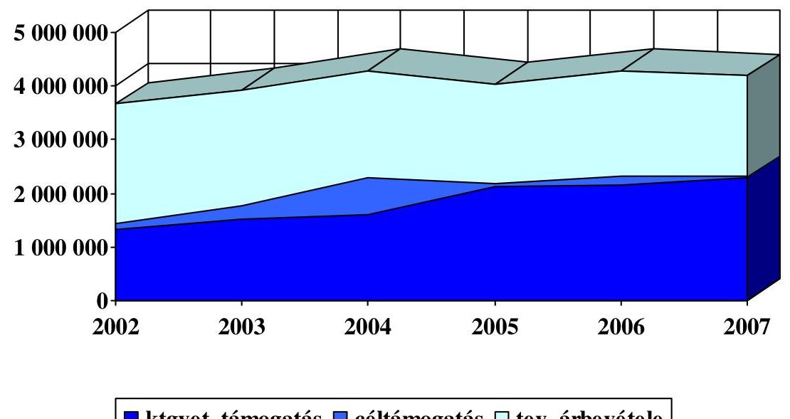
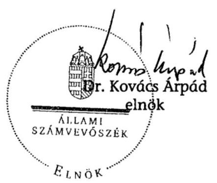
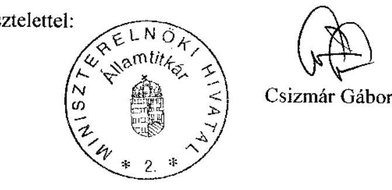
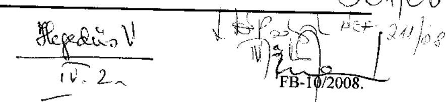
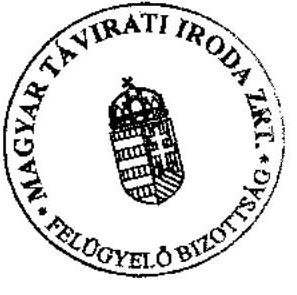
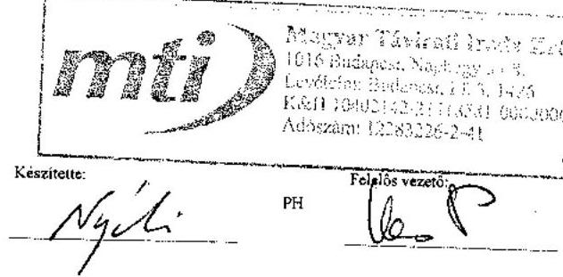
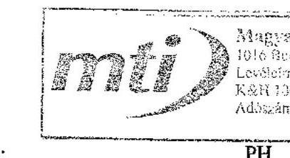
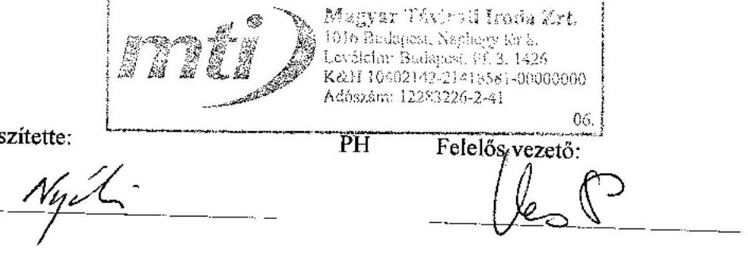
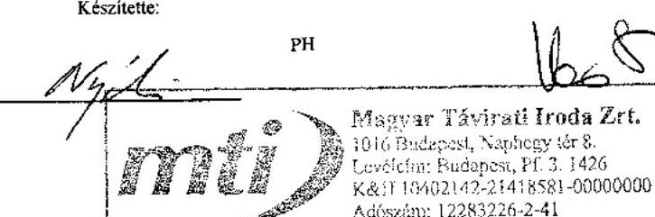

# ÁLLAMI   SZÁMVEVŐSZÉK 

## JELENTÉS

a Magyar Távirati Iroda Zrt. 2007. évi gazdálkodásának ellenőrzéséről

---

2. Államháztartás Központi Szintjét Ellenőrző Igazgatóság
2.3. Átfogó Ellenőrzési Főcsoport

Iktatószám: V-17-31/2007-2008.
Témaszám: 885
Vizsgálatazonosító szám: V0369
Az ellenőrzést felügyelte:
Bihary Zsigmond
főigazgató
Az ellenőrzés végrehajtásáért felelős:
Hegedúsné dr. Müllern Veronika
főcsoportfőnök
Az ellenőrzést vezette:
Dr. Podonyi László
igazgatóhelyettes
Az ellenőrzést végezték:
Koós Lászlóné
számvevő tanácsos, főtanácsadó

Fülöppné Nagy Marianna
számvevő
A témához kapcsolódó eddig készített számvevőszéki jelentések:
címe
sorszáma
Jelentés a Magyar Távirati Iroda költségvetési fejezet és a Magyar ..... 9829
Távirati Iroda Részvénytársaság pénzügyi-gazdasági ellenőrzéséről
Jelentés a Magyar Távirati Iroda Részvénytársaság múködésének ..... 9924
pénzügyi-gazdasági ellenőrzéséről (1998.)
Jelentés a Magyar Távirati Iroda Rt. 1999. évi gazdálkodásának ..... 0029
ellenőrzéséről
Jelentés a Magyar Távirati Iroda Rt. 2000. évi gazdálkodásának ..... 0124
ellenőrzéséről
Jelentés a Magyar Távirati Iroda Rt. 2001. évi gazdálkodásának ..... 0236
ellenőrzéséről
Jelentés a Magyar Távirati Iroda Rt. 2002. évi gazdálkodásának ..... 0326
ellenőrzéséről
Jelentés a Magyar Távirati Iroda Rt. 2003. évi gazdálkodásának ..... 0425
ellenőrzéséről
Jelentés a Magyar Távirati Iroda Rt. 2004. évi gazdálkodásának ..... 0520
ellenőrzéséről
Jelentés a Magyar Távirati Iroda Rt. 2005. évi gazdálkodásának ..... 0610
ellenőrzéséről
Jelentés a Magyar Távirati Iroda Rt. 2006. évi gazdálkodásának ..... 0709
ellenőrzéséről

---

# TARTALOMJEGYZÉK 

BEVEZETÉS ..... 5
I. ÖSSZEGZŐ MEGÁLLAPÍTÁSOK, KÖVETKEZTETÉSEK, JAVASLATOK ..... 7
II. RÉSZLETES MEGÁLLAPÍTÁSOK ..... 14

1. A Társaság múködésének törvényessége, szabályozottsága, az üzleti
tervek megalapozottsága ..... 14
1.1. A Társaság múködésének szabályozása ..... 14
1.2. A közfeladatok ellátását biztosító társasági szabályzatok ..... 19
1.3. A Társaság belső információs rendszere ..... 21
1.4. A TTT és az FB múködését biztosító társasági szabályozás ..... 24
1.5. A Társaság 2007. évi üzleti tervének megalapozottsága, a stratégia,
elnöki pályázat, éves üzleti tervek összhangja ..... 26
2. Az MTI Zrt. 2007. évi gazdálkodása ..... 28
2.1. A múködési célú támogatás felhasználásának célszerűsége és
hatékonysága ..... 28
2.2. Az év közben folyósított egyéb célú támogatások ..... 31
2.3. Az MTI Zrt. vagyon-, létszám- és bérgazdálkodása ..... 32
2.3.1. A vagyoni helyzet, a mérleg szerinti eredmény alakulása ..... 32
2.3.2. A Társaság ingatlangazdálkodása ..... 34
2.3.3. A piacvesztés okai, a termékek és szolgáltatások szerkezeti
változtatásának árbevételre gyakorolt hatása ..... 36
2.3.4.A korábbi évek létszámleépítéseinek múködési költségekre
gyakorolt hatása és eredményessége ..... 38
2.4. A Társaság díjszabása ..... 40
3. Az ÁSZ javaslatai alapján tett intézkedések ..... 41

## MELLÉKLETEK

1. A jelentésre és a jelentéstervezetre tett észrevételek
2. ÁSZ-javaslatokkal összefüggő OGY határozatok
3. Előző számvevőszéki ellenőrzés javaslatai
4. A Társaság árbevétel adatai
5. Tanúsítványok

---

.

---

# RÖVIDÍTÉSEK JEGYZÉKE 

| ÁSZ | Állami Számvevőszék |
| :-- | :-- |
| AO | Alapító Okirat |
| ekho | Az egyszerűsített közteherviselési hozzájárulásról szóló |
|  | 2005. évi CXX. törvény |
| EU | Európai Unió |
| FB | Felügyelő Bizottság |
| Gt. | A gazdasági társaságokról szóló 2006. évi IV. törvény |
| MeH | Miniszterelnöki Hivatal |
| Mt. | A Munka Törvénykönyvéről szóló 1992. évi XXII. törvény |
| MTI Zrt., Zrt., Társaság, | Magyar Távirati Iroda Zártkörűen múködő Részvénytár- |
| Szervezet, Részvénytársa- | saság |
| ság |  |
| Nht., hírügynökségi tör- | A nemzeti hírügynökségről szóló 1996. évi CXXVII. tör- |
| vény | vény |
| OGY | Országgyúlés |
| OTS-OS | Original Text Service |
| PM | Pénzügyminisztérium |
| Szja. | A személyi jövedelemadóról szóló 1995. évi CXVII. tör- |
|  | vény |
| Sztv. | A számvitelről szóló 2000. évi C. törvény |
| SZKTSZ | Szakmai és Közszolgálati Tájékoztatási Szabályzat |
| SZMSZ | Szervezeti és Múködési Szabályzat |
| TTT | Tulajdonosi Tanácsadó Testület |

---

.

---

# JELENTÉS 

## a Magyar Távirati Iroda Zrt. 2007. évi gazdálkodásának ellenőrzéséről

## BEVEZETÉS

A nemzeti hírügynökségi tevékenység ellátására az Állam nevében az Országgyúlés egyszemélyes részvénytársaságként 1997. július 15 -én megalapította a Magyar Távirati Iroda Részvénytársaságot. Az MTI Zrt. 2006. február 1-jétől cégnevében használta a Zártkörűen múködő Részvénytársaság (Zrt.) jelölést, amelyet a Társaság tulajdonosi jogait gyakorló Országgyúlés 2007. március 26ai jóváhagyása után a Cégbíróság 2007. június 21-i hatállyal bejegyzett. A Társaság a nemzeti hírügynökségről szóló 1996. évi CXXVII. törvény (Nht.) 2. § (1) bekezdésében felsorolt közszolgálati feladatokat látja el, amelyhez állami támogatásban részesül. Az MTI Zrt. az ország egyetlen állami tulajdonban lévő hírügynöksége, amelynek gyűjtött és feldolgozott hírei hozzájárulnak a társadalom széles rétegei, a média, a kormányzati szervek, 2005-től közvetlenül a lakosság politikailag semleges és hiteles információellátásához. Közszolgálati feladata, hogy szolgáltassa mindazokat a híreket és tudósitásokat, illetve információkat, amelyek ismerete nélkülözhetetlen a nyilvánosság számára.

A Magyar Távirati Iroda Zrt. egyszemélyes - 100\%-ban állami tulajdonú részvénytársaság. Tevékenységét budapesti Naphegy tér 8. sz. alatti székhelyén kívül négy telephelyen ${ }^{1}$ és egy fióktelepen ${ }^{2}$ végzi, a tulajdonosi jogokat az Országgyúlés gyakorolja. Az Nht. 9. §-a és az MTI Zrt. alapító okiratának 5.7. pontja szerint a Társaság elnöke évente beszámol az Országgyúlésnek a Társaság tevékenységéről, amelynek keretében sor kerül a mérleg és eredménykimutatás jóváhagyására, valamint a nyereség felosztására. Az elnök beszámolóját a Társaság Felügyelő Bizottságának véleményével együtt kell az Országgyúlés elé terjeszteni, amihez mellékelni kell az Állami Számvevőszék elnökének jelentését a Társaság tevékenységéről. (Nht. 9. §-a)

Az MTI Zrt. 2007-re 1940 M Ft értékesítési árbevétellel, 33 M Ft céltámogatással, és a központi költségvetésből - közszolgálati feladatok ellátásának költségeire 2150 M Ft múködési célú támogatással számolt. A II. negyedévben, az egyéb bevétellel nem fedezett közszolgálati feladatok finanszírozásához további 133 M Ft állami támogatást igényelt - a 2007. évi központi költségvetés általános tartalékának terhére - amiről a Kormány 2007. október 4-én döntött. A Társaság 2007-ben 24 M Ft céltámogatással rendelkezett.

[^0]
[^0]:    ${ }^{1}$ Budapest I. Naphegy tér 1., Budapest I. Fém u. 8., Budapest I., Krisztina krt. 24., Budapest VII., Károly krt. 19-21.
    ${ }^{2}$ Gödöllő, Hegy u. 1.

---

Az ellenőrzés célja annak értékelése volt, hogy

- az MTI Zrt. szervezeti felépítése, működése, belső szabályozási és információs rendszere, a gazdálkodás kereteit meghatározó tervek összhangban voltak-e a feladataival és a hatályos jogszabályokkal;
- törvényesen, célszerűen és eredményesen gazdálkodott-e a rendelkezésére bocsátott erőforrásokkal, ezen belül a központi költségvetésből a közszolgálati feladatai ellátásához nyújtott múködési célú és egyéb céltámogatásokkal;
- hasznosultak-e az MTI Zrt. 2006. évi tevékenységének ellenőrzéséről készült ÁSZ-jelentés megállapításai, ajánlásai.

Az ellenőrzés elemezte a 2002-2007. évek közötti időszak főbb mutatóinak alakulását, mivel a közszolgálati feladatellátás, a támogatás szükséges mértékének meghatározása nem megfelelően részletezett. A 2006-ban készített külső szakértői vélemények szerint az MTI Zrt. jelenlegi állami finanszírozásának jogszerűsége nem biztosított, az állami támogatás nem fedezte a közfeladat máshonnan meg nem térülő költségeit. A Társaságnál öt év alatt - elsősorban a 2003-2004. évi mérleg szerinti veszteség miatt - a saját tőke 210 M Ft-os csökkenése következett be, a működési támogatás 961 M Ft-os növekedése mellett.

Az ellenőrzés társasági szintű átfogó jellegű vizsgálat volt, amely az MTI Zrt. múködésének egyes tevékenységeire terjedt ki, nem volt feladata a Társaság teljes körű átvilágítása, szakmai tevékenységének értékelése. A múködés azon területeire, ahol a teljesítmények mérhetők, kritériumok meghatározhatók, a tel-jesítmény-ellenőrzés módszerét is alkalmaztuk. Ebben a vizsgálatban célszerűségen azt értettük, hogy a különböző döntési szinteken meghozott intézkedések összhangban voltak-e a kitűzött célokkal. Az eredményesség kritériuma azt jelentette, hogy a központi költségvetési támogatás felhasználása a kitűzött céloknak és az elvárt eredményeknek megfelelően valósult-e meg.

Az MTI Zrt. székházában végzett helyszíni ellenőrzés módszere dokumentális vizsgálat, elemzés volt. Az ellenőrzés alkalmával a helyszíni vizsgálat hamarabb befejeződött, mint az éves beszámoló könyvvizsgálati ellenőrzése. Emiatt az ellenőrzés figyelemmel kísérte az addig bekövetkezett változásokat is.

Az ellenőrzés végrehajtására az Állami Számvevőszékről szóló 1989. évi XXXVIII. törvény 1. §-ának (2) bekezdése, 2. §-ának (5), (6), (9) bekezdése, 16. §ának (1) bekezdése, 21. §-ának (3) bekezdése, az Nht. 29. §-a, továbbá az államháztartásról szóló 1992. évi XXXVIII. törvény (Áht.) 104. §-ának (3) bekezdése és 120/A. §-ának (1) bekezdése adtak jogszabályi alapot.

A jelentést egyeztettük az MTI Zrt. Tulajdonosi Tanácsadó Testülete elnökével, a jelentéstervezetet a MeH államtitkárával, az MTI Zrt. Felügyelő Bizottsága és a Társaság elnökével. Az észrevételeket az 1. sz. melléklet tartalmazza.

---

# I. ÖSSZEGZŐ MEGÁLLAPÍTÁSOK, KÖVETKEZTETÉSEK, JAVASLATOK 

Az MTI Zrt. sajátos jogi környezete, társasággá alakulása óta, lényegében nem változott, a szabályozás hiányosságaira visszavezethető kockázatok 2007-ben is fennálltak. A legnagyobb kockázatot a közfeladatok jelenlegi állami finanszírozása jelenti, mert az az állami költségvetést hátrányosan érintheti és nincs összhangban az uniós szabályokkal. Az uniós szabályok megsértésének megállapítása vagy a Társaságnak, vagy a költségvetésnek okozhat további - a szabályok módosításával elkerülhető - többlet terheket. Kockázatot hordoz, hogy az MTI Zrt. stratégiai és éves üzleti tervezése az alapító, közgyűlési jogokat gyakorló jóváhagyása, a gazdálkodással kapcsolatos elvárásainak megfogalmazása nélkül történt.

Az MTI Zrt. 2007-ben nyereséges volt. A Társaságnak az elmúlt öt év első két évében jelentős vesztesége keletkezett, az utóbbi három évben a költségtakarékosságnak, a csoportos létszámleépítésnek, legfőképpen a növekvő összegű állami támogatásnak köszönhetően szerény mértékű nyeresége volt. 2002-ben az összes bevétel $60 \%$-át kitevő költségvetési támogatás nélküli saját bevétele 2007-ben $45 \%$-ra csökkent, amit a növekvő összegű állami támogatások pótoltak. A probléma megoldását célzó javaslatainkat a jogszabályokban még nem érvényesítették, a Társaság részben figyelembe vette azokat.

2007-ben a nemzeti hírügynökségi törvény, illetve a Társaság Alapító Okirata módosítása/újragondolása, a rendszerbeli hibák megszüntetése - pl. a közfeladatok állami finanszírozásának jelenlegi formája - nem valósult meg. A múködtetés feladat- és hatásköri, illetve felelősségi szabályozása, a közszolgálati tevékenységek meghatározásának és az ellátásukhoz szükséges állami támogatás mértékének, felhasználásának szabályozása nem változott, az ellenőrzés viszonyítási alapjai részben hiányoznak. Az MTI Zrt. múködtetésére 1996-97-ben kialakított tulajdonosi megoldás nem ösztönöz a nyereséges gazdálkodásra, de a veszteséges gazdálkodásnak sincs tulajdonosi döntéssel meghozott következménye. A 2002-es OGY határozatban rögzített jogszabály felülvizsgálati és jogalkotási cél nem valósult meg, a hatékonyabb tulajdonosi joggyakorlás, múködtetés és ellenőrzés nem érvényesült.

A közszolgálati feladatok pontos - tevékenység szerinti - meghatározása, a hozzá tartozó kritériumrendszer kidolgozása a támogatás igénylésének és felhasználásának átláthatósága, ellenőrizhetősége a tulajdonosnak és a mindenkori Kormánynak érdeke és felelőssége. Az Országgyűlés és a Kormány nem szabályozta és nem követelte meg, hogy a Társaságnak adott támogatás összege igazolható, felhasználása átlátható legyen. Az MTI Zrt. a Társaság érdekei szerint a költségvetésből kapott - az igényeltnél általában kevesebb - múködési támogatást minden évben elégtelennek tartotta, állami támogatási igénye folyamatosan nőtt. A Társaság ez irányú tevékenységének eredménye az volt, hogy a kért támogatást az utóbbi években nagyrészt, 2007-2008-ban teljes öszszegben megkapta.

---

Az EU elsősorban versenysemlegességi és átláthatósági követelmények miatt a közszolgálat/közfeladat máshonnan meg nem térülő költségeit engedi állami támogatásból finanszírozni. Az EU szabályoknak való megfeleltetéshez a finanszírozás átlátható rendszerének és a támogatás felhasználása monitoring rendszerének kialakítása hiányzik. Az elmúlt években sem a szabályozásban, sem a gyakorlatban nem született a problémát kiküszöbölő megoldás, bár a múködési támogatással kapcsolatos EU-előírások betartása érdekében az MTI Zrt. szakértő céget bízott meg 2005-2007-ben közel 40 M Ft értékben. A szakértő által kidolgozott számítási mód és a kapcsolódó informatikai megoldás (modell) az MTI Zrt. pénzügyi és számviteli kimutatásaiban használt költséghelyekre, termék/szolgáltatás és projektstruktúrára épült. A figyelembe vett adatok bázis alapúak, az éves mérlegkészítést követően utókalkulációra adnak lehetőséget. Hatékonysági elemekkel a modell nem kalkulált.

A szakértői munkák részben hasznosultak. A javaslatok hasznosításának további lépéseiben (pl. a támogatási igény szakértői modell szerinti megalapozása, a közszolgálati szerződés megkötése) a Társaság testületei, vezetése a helyszíni vizsgálat befejezéséig nem alakított ki egységes álláspontot. A támogatást a korábbi évek gyakorlata szerint igényelték 2006-2007-ben is, és közszolgálati szerződés megkötésére sem került sor.

Az SZMSZ-ben, a munkaköri leírásokban, a társasági szabályzatokban néhány ponton 2007-ben is összehangolási hiányosságok voltak. Pl. a Számítástechnikai Védelmi Szabályzatban az informatikai igazgató számítástechnikai helyettese olyan feladatot kapott, ami munkaköri leírásában nem szerepel. A Társaság belső információs rendszere 2007-ben sem biztosította a különböző alkalmazások közötti egységes adatforgalmat (pl. Marketing Manager rendszer, szerződés nyilvántartó rendszer), nem szüntették meg a párhuzamos adatszolgáltatást. A jelenlegi rendszer nem hatékony, az eltérő tartalmú adatok kockázatot hordoznak az irányításban és az ellenőrzésben.

Az MTI Zrt. stratégiai és éves üzleti tervezése az alapító, közgyűlési jogokat gyakorló jóváhagyása nélkül történt/történik a Társaság megalakulása óta. ${ }^{3} \mathrm{~A}$ kockázatot a gazdálkodással kapcsolatos elvárások megfogalmazásának hiánya jelenti. Az alapító okiratban a stratégiai tervek készítéséről nincs, az éves tervek bemutatásáról azonban van előírás. Ez utóbbit a Társaság minden évben május 31-éig az éves beszámolóval együtt az OGY elé terjesztette, akinek módjában állt a tervet megvitatatni, de határozat az éves tervek elfogadásáról, módosításáról vagy elutasításáról nem született. Az éves tervek megvalósítását sem kérte számon az OGY.

A Zrt. birtokában lévő a részvénytársaság jegyzett tőkéjét megtestesítő, egy darab 1750 M Ft névértékű, névre szóló, forgalomképtelen részvény tartós állami részesedés, az állami vagyon része, de nem biztosított annak nyilvántartása. Az MTI Zrt. részesedés nyilvántartásáról az Nht. nem rendelkezik.

[^0]
[^0]:    ${ }^{3}$ Jelentés a Magyar Távirati Iroda Rt. 2004. 2005. 2006. évi gazdálkodásának ellenőrzéséről (0520), (0610), (0709).

---

Az MTI Zrt. - közfeladatot ellátó szerv - a személyes adatok védelméről és a közérdekű adatok nyilvánosságáról szóló törvényben foglaltakat részben teljesíti, mert nem teszi közzé teljes körűen a tevékenységével kapcsolatos adatokat.

2004-2007-re a Zrt.-nek volt stratégiai terve, amelyben a 2002-ben készített elnöki pályázat alapján szakmai, gazdasági, szervezeti és humánerőforrás célokat fogalmaztak meg. Fő célként fogalmazták meg: a reálértéken változatlan állami támogatás megszerzését, az állami támogatás normatív és szerződéses alapra helyezését, a saját bevételek arányának emelését, a marketing és értékesítési munka megerősítését. Hiba volt, hogy nem készült középtávú üzleti vagy pénzügyi terv ${ }^{4}$, ingatlangazdálkodási stratégia, ez utóbbit később sem pótolták.

Az öt éves elnöki megbízási időszakban állami támogatásból megvalósult az MTI Zrt. átlagos állományi létszámának 20\%-os csökkenése (2002-ben 460 fő, 2007-ben 363 fő), ami a szervezeti struktúra széttagoltságának csökkenésével a Társaság hatékonyabb, rugalmasabb múködését eredményezte. Elkészült az állami finanszírozás szabályosságát és átláthatóságát eredményező közszolgálati szerződés tervezete. Nem sikerült megvalósítani néhány kitűzött fő célt. A saját bevételek csökkentek, 2002-2007 között a saját bevételek és az állami támogatás aránya 60-40\%-ról 45-55\%-ra változott. Az állami támogatás finanszírozása nem volt normatív, illetve szerződésalapú. Összege a reálértéknél magasabb, a halmozott infláció $32 \%$, a támogatásnövekedés $73 \%$-os volt. A humánerőforrás gazdálkodásban a kitűzött célok elérését szolgáló feladatok elvégzése (a humánerőforrás gazdálkodás elvei, kritériumrendszere, erre épülő tervezése) elmaradt.

Az MTI Zrt. éves üzleti terveit 2003-2004 kivételével a középtávú stratégia mérleg szerinti eredményre vonatkozó tervszámaival összhangban határozták meg. Az Országgyűlésnek 2007. május végén bemutatott 2007. évi üzleti terve a bevételek $4 \%$-os, a költségek és ráfordítások $3 \%$-os csökkenését tartalmazta. A mérleg szerinti nyereség 2006-ban 8,4 M Ft volt, 2007-re ennél kevesebb, 3,2 M Ft nyereség elérését tűzték ki célul. A Társaság 2007-re a belföldi értékesítés árbevétele $1 \%$-os emelését, az exportbevételek $12 \%$-os növelését, az egyéb bevételek (működési és más célú állami támogatással együtt) $8 \%$-os csökkenését tervezte.

A Társaság vezetése a 2007. évi költségvetési törvényben jóváhagyott 2150 M Ft, a megelőző évivel azonos mértékű költségvetési támogatással számolt, ami kevesebb volt az általuk 2006 októberében igényelt 2283 Ft-nál. A hiányzó 133 M Ft-ot a Zrt. a 2007. évi központi költségvetés általános tartalékának terhére, a Kormány 2007. október 4-ei döntése után megkapta.

A költségek és ráfordítások 2007-re tervezett összege ( 4134 M Ft) 144 M Ft-tal (3\%) volt kevesebb a 2006. évi tényleges ( 4278 M Ft) értéknél. A 2007. évi tervben az anyagköltség $22 \%$-os csökkentését, a - legnagyobb értéket képviselő személyi jellegű ráfordítások $2 \%$-os növekedését tervezték. 2007-ben a belföldi és az export árbevétel is kevesebb volt mind a tervezett ( 97 M Ft-tal), mind a megelőző év ( 56 M Ft-tal) árbevétele. A költségek és ráfordítások együttes össze-

[^0]
[^0]:    ${ }^{4}$ Jelentés a Magyar Távirati Iroda Rt. 2004. évi gazdálkodásának ellenőrzéséről (0520).

---

ge 63 M Ft-tal volt több a tervezettnél és 81 M Ft-tal kevesebb a megelőző évi összegnél. A bevételek terv alatti teljesítése a költségek és ráfordítások tervezett szintet meghaladó mértékű növekedésével járt együtt. Gyakorlatilag a költségvetési támogatás év közbeni 133 M Ft-os emelése biztosította a pozitív gazdálkodási eredmény fedezetét, ellensúlyozta (fele-fele arányban) a saját bevételek csökkenését és az év végén 2007. július 1-jétől visszamenőleg adott 6\%-os béremelést. A mérleg szerinti nyereség $4,9 \mathrm{M}$ Ft volt.

Az elmúlt öt évben az MTI Zrt. gazdálkodásában lényeges változás volt a 2003-2004. évek mintegy 230 M Ft-os vesztesége, egy nagy értékű ingatlan értékesítése 2004-ben - amelyet a Társaság veszteségének csökkentésére, illetve gazdasági stabilitásának, finanszírozhatóságának megteremtésére használtak -, illetve a 2004. évi 111 fős csoportos létszámleépítés. 2005-től a Társaság korábbi jelentős vesztesége megszűnt, az eredmény 10 M Ft alatti, szolid mértékű mérleg szerinti nyereségben stabilizálódott.

A Társaságnál öt év alatt a saját tőke 210 M Ft-tal csökkent, a múködési támogatás 961 M Ft-tal nőtt. A Társaság tőkeszerkezete stabil maradt. A megalakulás óta 2001-ig a mérleg szerinti nyereségek az eredménytartalékot 584 M Ft-tal növelték, a 2002-2004 közötti időszak veszteségei 370 M Ft-tal csökkentették. Az eredménytartalék 2007. december 31-én 395 M Ft volt.

A saját bevételek csökkenését 2002-2007 között a támogatások folyamatos emelésével pótolta. A Zrt. összes bevétele 17\%-kal nőtt, az árbevételen belül az értékesítés nettó árbevétele 13\%-kal, - a halmozott infláció figyelembevételével 34\%-kal - csökkent. A költségvetésből juttatott támogatások együttes összege 2002-2007 között 62\%-kal, a múködésre kapott támogatás 73\%-kal, ez utóbbi a halmozott inflációt jelentősen - 31\%-kal - meghaladó mértékben nőtt.

Az MTI Zrt. saját bevételei (értékesítési és egyéb) 2002-2007 között folyamatosan ( $13 \%$-kal) csökkentek a marketing és értékesítési munka szervezeti megerősítése ellenére. A Társaság saját bevételei utóbbi években történt csökkenésének

---

okait a hagyományos médiaszolgáltatások iránti igény visszaesésében, az újabb versenytársak megjelenésében, a médiumok közötti hírcsere együttműködésben látja. Az MTI Zrt. 2005-től az árbevétel kiesések ellensúlyozására fejleszti és bővíti termékei és szolgáltatásai kínálatát, de ezek árbevétele 20052007 között még nem volt jelentős, egy nagyobb média megrendelő kieséséből származó veszteséget tudta pótolni.

A Társaság összes költségének és ráfordításainak értéke 2002 és 2007 között 12\%-kal nőtt, reálértéken 15\%-kal csökkent. Ezen belül az anyagjellegú ráfordítások csökkenése 14\% (reálértéken 35\%), a személyi jellegű ráfordítások növekedése 35\% (reálértéken 2\%) volt. A Társaság az anyagjellegú ráfordításokat csökkentette, ebben költségtakarékos volt, míg a személyi jellegú ráfordításokat növelte. Az átlagos bérkifizetés 2002-ben 184 E Ft/hó/fő, 2007-ben ennek a duplája, 370 E Ft volt.

A Zrt.-nek az elmúlt öt évben nem volt a szükséges forrásokat évekre lebontva tartalmazó jóváhagyott középtávú - az épületek felújítására, korszerűsítésére, hasznosítására vonatkozó - ingatlangazdálkodási terve. A Társaság az ingatlangazdálkodásban lévő gazdálkodási lehetőségeit/tartalékait nem tárta fel.

A Zrt. 2007. december 31-ei ingatlanállománya könyvszerinti értéke 2457 M Ft volt. Ingatlan fejlesztésre 2002-ben összesen 82 M Ft-ot használt fel, 2007-ben 96 M Ft-ot költött. 2002-2007 között a Zrt. egy év (2005) kivételével az értékcsökkenésnél magasabb összeget fordított fejlesztésre.

A Társaság karbantartásra 2003-2007 között is folyamatosan csökkenő összeget - 2002-ben 94 M Ft-ot, 2007-ben 55 M Ft - költött. Vagyonértékelés hiányában, a valós piaci értéket nem ismerve, az ingatlanokra fordított költségek és ráfordítások a könyv szerinti értékből kiindulva abszolút értékben hasonlíthatók öszsze, és nem tükrözik a tényleges ingatlanértékhez viszonyított reális adatokat.

A Társaság tulajdonában álló épületek a hírügynökségi feladatok ellátásához szükségesnél több ezer négyzetméterrel nagyobbak. Az MTI Zrt. bérbeadás útján (a saját tulajdonú ingatlanok több mint 20\%-át adják tartósan bérbe) hasznosítja a kihasználatlan ingatlanrészeket. Az ingatlanhasznosítás eredményei 2007 kivételével az elmúlt 5 évben romlottak. A Társaság bérbeadásból származó bevétele 2007-ben 176 M Ft volt. A bérbeadás útján nem hasznosítható ingatlanok fenntartása indokolatlan kiadást jelent a Társaság számára.

Az MTI Zrt. csoportos létszámleépítésre az elmúlt tíz évben kétszer kapott állami támogatást. Mindkettőnek csak rövid távon volt múködési költségeket (személyi jellegű ráfordításokat) csökkentő eredménye. Az első csoportos létszámleépítés 1998-ban volt, 195 M Ft-os állami támogatást vettek igénybe, de 2002-2003-ban az átlagos állományi létszám már meghaladta az 1998. évi szintet. A második csoportos létszámleépítés 2004-ben volt, a Társaság 418 M Ft állami támogatást kapott, 111 fővel csökkent a létszám. A támogatási szerződésben létszámstopot nem írtak elő, 2007. december 31-én a létszám - lényegében a kettős foglalkoztatás megszüntetése miatt - 34 fővel volt több, mint 2004. december 31-én. A létszámleépítésből származó személyi jellegű megtakarítás 2007-ben már nem volt.

---

A humánpolitika területén eddig fel nem tárt tartalékok kihasználása az MTI Zrt. és az állami költségvetés hosszú távú gazdálkodási érdeke. ${ }^{5}$ A szabályozás kialakítását, a feladathoz igazított optimális szervezet, létszámigény meghatározását 2004 óta tervezi a Társaság - szakértőket is foglalkoztatott -, a feladat elvégzése kis mértékben (színlelt szerződések megszűntetése) volt eredményes.

Hosszabb távon az éves szerény mértékű ( 10 M Ft alatti) pozitív eredmény érdekében a Társaság gazdasági lehetőségei a támogatás növelésében, vagyonértékesítésben, vagy újabb létszám-racionalizálásban maradtak. Ez utóbbinak állami támogatás igénybevétele esetén csak szigorú feltételek kikötése (pl. létszámstop) mellett lesz garantált eredménye.

A Társaság, a 2004-2007-es stratégiai tervével összhangban rugalmasabb árrendszert alakított ki. Az egyes termékek, szolgáltatások árképzése és számított önköltsége között kapcsolat nem mutatható ki. Az MTI Zrt. 2007. évi díjszabása nem teljes körűen kidolgozott árképzési elvekre épül, mert utóbbi nem ad tájékoztatást a hírcsomag-bontás esetén alkalmazandó árképzési kulcsokról.

Az ÁSZ 2007-ben készített jelentésében az Országgyűlésnek, a Kormánynak, a TTT elnökének fogalmazott meg ajánlásokat. A jogalkotással és szabályozással kapcsolatos megismételt ÁSZ javaslatok lényegében nem hasznosultak, pedig az EU szabályoknak való megfeleltetés további évekre nem halasztható. A nemzeti hírügynökségi törvény felülvizsgálata, összehangolása - a törvény módosításának előkészítése - elkezdődött, a törvénymódosításra még nem került sor. A MeH tájékoztatása szerint a szükséges jogalkotási és egyéb intézkedések megtételére a médiaszabályozás jogi rendszerének újraszabályozása keretében kerül sor.

Javaslatot tettünk a TTT működési költségeinek és az MTI Zrt. előirányzatának a költségvetési törvényben történő elkülönítésére. A MeH minisztere a PM-mel egyetértésben a testület múködési költségeinek szabályozását az Alapító Okirat módosításával oldaná meg.

Az ÁSZ évenkénti ellenőrzési tapasztalatai, megállapításai, javaslatai alapján ugyan mindig készültek intézkedési tervek, de a feladatok nagy részét (60\%) határidőre (1998-2003 között) nem hajtották végre, vagy nem teljes körűen. 2007-ben az intézkedési tervek végrehajtásában tovább romlott az eredményesség.

Az MTI Zrt. elnöke részére 2007-ben az ÁSZ három javaslatot fogalmazott meg, mindegyik a korábbi évekből megismételt javaslat volt. Ezek az SZMSZ-szel, a humánerőforrás gazdálkodással, a tervezéssel, ezen belül az ingatlangazdálkodással (a nem használt ingatlanok értékesítése, a Károly krt.-i bérelt ingatlan hasznosítása), illetve a terv hiányával voltak összefüggésben. A megismételt ÁSZ javaslatok hasznosítására, a vonatkozó intézkedési tervpontok végrehajtására a megadott határidőre nem került sor.

[^0]
[^0]:    ${ }^{5}$ Jelentés az MTI Rt. 2005. évi gazdálkodásának ellenőrzéséről

---

A helyszíni ellenőrzés megállapításainak hasznosítására - a korábbi évek megállapításainak határozott megerősítésével - javasoljuk:

# az Országgyülésnek 

1. tekintse át és módosítsa a 68/2002. (X. 4.) OGY határozatban megfogalmazott jogalkotási feladatnak megfelelően a nemzeti hírügynökségről szóló 1996. évi CXXVII. törvényt és az MTI Zrt. Alapító Okiratát a teljes körűen összehangolt szabályozás kialakítása, a közszolgálati feladatok és az azok ellátásához szükséges állami támogatás egyértelműbb és pontosabb meghatározása, az EU szabályok betartása, a jelenlegi alapítói és részvényesi joggyakorlás és ellenőrzés felülvizsgálata és hatékonyabbá tétele érdekében;
2. gondoskodjon az MTI Zrt. múködését befolyásoló középtávú stratégiai, illetve éves tervre vonatkozó tulajdonosi döntés és kontroll megteremtéséről, hozzon határozatot a bemutatott éves tervekről.

## a Kormánynak

1. kezdeményezze a 68/2002. (X. 4.) OGY határozatban az MTI Zrt. támogatásával kapcsolatban megfogalmazott átláthatósági követelmény érvényre juttatása érdekében szükséges jogalkotási és egyéb intézkedéseket, különös figyelemmel az Európai Unió közösségi előírásaira, illetve ezeknek a betartására; az Nht. 2. § (1) bekezdése h) pontjában megjelölt - a választási időszak feladataira vonatkozó - külön törvény megalkotását; a TTT müködési költségeinek teljes körű szabályozását;
2. gondoskodjon az MTI Zrt. jegyzett tőkéje összegének, az állami pénzügyi részesedésnek a nyilvántartásáról.

## a TTT elnökének

gondoskodjon a szakértői modell hasznosításáról.

## az MTI Zrt. elnökének

1. vizsgálja felül a személyes adatok védelméről és a közérdekű adatok nyilvánosságáról szóló törvény rendelkezéseinek teljes körű érvényesítését;
2. teremtse meg az összhangot az SZMSZ, az elnöki, alelnöki utasítások és a munkaköri leírások között, biztosítsa a díjszabás megállapításának és az áralkalmazásnak az ellenőrizhetőségét, valamint az összhangot a cégnél működő különböző szoftverek között;
3. intézkedjen a humánerőforrás-gazdálkodás elveinek, kritériumrendszerének és szabályainak megalkotásáról, a teljesítmények méréséről, a szervezeti egységekre lebontott létszámterv elkészítéséről;
4. alkossa meg a társaság egységes ingatlangazdálkodási szabályzatát, készítesse el az egységes középtávú ingatlangazdálkodási tervet, amely a szükséges forrásokat évekre lebontva tartalmazza; fontolja meg a nem használt ingatlanok értékesítését, intézkedjen a Károly krt.-i bérelt ingatlan hasznosítása érdekében.

---

# II. RÉSZLETES MEGÁLLAPÍTÁSOK 

## 1. A TÁRSASÁG MÚKÖDÉSÉNEK TÖRVÉNYESSEGE, SZABÁLYOZOTTSÁGA, AZ ÜZLETI TERVEK MEGALAPOZOTTSÁGA

### 1.1. A Társaság múködésének szabályozása

Az MTI Zrt. múködését alapvetően a nemzeti hírügynökségről szóló 1996. évi CXXVII. törvény és a Társaság Alapító Okirata (AO) határozza meg. 2007-ben az Nht. nem változott, az AO technikai jellegű módosítását a társasági és cégjogi törvények változása kényszerítette ki. Az Nht. és a Társaság Alapító Okiratának módosítását az ÁSZ évek óta szorgalmazza. ${ }^{6}$

Az ÁSZ minden évben kifogásolta a múködtetés feladat- és hatásköri, illetve felelősségi szabályozását, a közszolgálati tevékenységek meghatározásának, az ellátásukhoz szükséges állami támogatás mértékének, felhasználása átláthatósági szabályozásának, az ellenőrzés garanciáinak hiányát. Megállapította, hogy az MTI Zrt. múködtetésére 1996-97-ben kialakított tulajdonosi megoldás nem ösztönöz a nyereséges gazdálkodásra, de a veszteséges gazdálkodásnak sincs tulajdonosi döntéssel meghozott következménye. Az Országgyúlés, az MTI Zrt. alapítója, részvényesi és közgyűlési jogainak gyakorlója a Társaság éves beszámolója keretében megismeri a Részvénytársaság éves gazdálkodási tervét (AO 5.7. pont), de nem dönt annak elfogadásáról.

Az Országgyűlés 68/2002. (X. 4.) OGY határozata 4. pontjában - az ÁSZ javaslatai alapján - jogalkotási feladatot fogalmazott meg a hírügynökségi törvény és az MTI Zrt. Alapító Okirata áttekintésére, a teljes körű összehangolt szabályozás kialakítására, a közszolgálati feladatok és azok ellátásához szükséges állami támogatás egyértelmúbb és pontosabb meghatározására határidő és felelős megjelölése nélkül. Az OGY határozatban rögzített felülvizsgálati és jogalkotási cél az elmúlt öt évben nem valósult meg, így a hatékonyabb tulajdonosi joggyakorlás, múködtetés és ellenőrzés nem érvényesült.

Az OGY alapítói, részvényesi és közgyűlési jogait 2007-ben - nem teljes körűen - gyakorolta. Napirendjére tűzte és tárgyalta az MTI Zrt. 2006. évi tevékenységéről szóló éves beszámolóját, jóváhagyta a társaság mérleg- és eredmény kimutatását, és hozzájárult a 2006. évi 8,4 M Ft mérleg szerinti eredménynek a korábbi évek eredménytartalékával szembeni elszámolásához. (64/2007. (VI. 27.) OGY hat.)

Az Országgyűlés, az alapítói, közgyűlési jogok gyakorlója nem biztosítja az MTI Zrt.-ben meglévő pénzügyi részesedésnek, illetve az azt megtestesítő forgalom-

[^0]
[^0]:    ${ }^{6}$ Jelentés a Magyar Távirati Iroda Rt. 2004. évi gazdálkodásának ellenőrzéséről (0520), Jelentés a Magyar Távirati Iroda Rt. 2005. évi gazdálkodásának ellenőrzéséről (0610), Jelentés a Magyar Távirati Iroda Rt. 2006. évi gazdálkodásának ellenőrzéséről (0709).

---

képtelen részvénynek a nyilvántartását. Az MTI Zrt. birtokában van a részvénytársaság jegyzett tőkéjét megtestesítő, egy darab 1750 M Ft névértékű, névre szóló, forgalomképtelen részvény, amelyet az Országgyúlés, mint alapító 1997-ben bocsátott a Társaság rendelkezésére. A Társaság 100\%-ban állami tulajdonban van. A jegyzett tőkét képviselő 1750 M Ft névértékű részvény - mint tartós állami részesedés - az állami vagyon része, nyilvántartása állami kötelezettség. E társasági részesedést az Nht. nem tartalmazza, az MTI Zrt. részvény az állami vagyonnak része, de nyilvántartása jelenleg nincs szabályozva. Így az állami vagyon összetétele és annak nagysága nem tükrözi a valós helyzetet.

Az MTI Zrt. a személyes adatok védelméről és a közérdekú adatok nyilvánosságáról szóló 1992. évi LXIII. törvény 20. § (8) bekezdésében előírt, a közérdekú adatok megismerésére irányuló igények teljesítésének rendjét rögzítő belső szabályzatot nem készített, és nem teszi közzé teljes körűen a tevékenységével kapcsolatos, a törvény 19. § (2) bekezdésében meghatározott legfontosabb adatokat. Az MTI Zrt. közfeladatot ellátó szerv, így a személyes adatok védelméről és a közérdekú adatok nyilvánosságáról szóló törvény szerinti közzétételi kötelezettsége fennáll.

Az államháztartásról szóló 1992. évi XXXVIII. törvény 95/A. § (7) bekezdése értelmében az olyan közfeladat vagy közszolgáltatás ellátásával összefüggő tevékenység folytatására alapított egyszemélyes gazdálkodó szervezetnél, amely közfeladat, illetve, közszolgáltatás ellátásáért vagy ellátásának megszervezéséért az alapító felelős, és amelyben kizárólag az állam rendelkezik tulajdonosi részesedéssel, a vezető tisztségviselő a közfeladatról, illetve a közszolgáltatás ellátásáról való gondoskodás követelményét figyelembe véve köteles eljárni.

A személyes adatok védelméről és a közérdekú adatok nyilvánosságáról szóló 1992. évi LXIII. törvény 2. § 4. pontja közérdekú adatként határozza meg - többek között - az állami feladatot, valamint jogszabályban meghatározott egyéb közfeladatot ellátó szerv - az Nht. 2. § (1) bekezdése alapján az MTI Zrt. - kezelésében lévő, valamint a tevékenységére vonatkozó információkat, adatokat.

Az Nht. 21. § (1) bek. g) pontja és a Társaság AO 8.1/ b) pontja szerint a TTT feladata és jogköre az MTI Zrt. Alapító Okirata módosításának előkészítése. 2005-2006-ban nem készült ezzel összefüggő TTT javaslat. A 2006. évi törvényi változások kényszerítő hatására a TTT - 2007. I. félévi munkaterve szerint elkészítette az AO aktualizálására, technikai jellegú módosítására vonatkozó javaslatát, amelynek elfogadásáról az OGY 2007. március 26 -ai ülésén döntött. A módosítás határidőben megtörtént.

A gazdasági társaságokról szóló 2006. évi IV. törvény 336. § (2) bek. előírta az AO e törvény szerinti módosítását (pl. a társaság cégnevének Rt.-ről Zrt.-re történő módosítása), a törvény hatályba lépése előtt a cégjegyzékbe bejegyzett társaságokra legkésőbb 2007. szeptember 1-jéig. E határidőig kellett a kötelező AO módosítást végrehajtani ahhoz, hogy a Részvénytársaság cégjegyzékből való törlésére ne kerüljön sor.

A TTT véleménye szerint a testület azért szorítkozott csak a legszükségesebb változtatásra, mert el akarta kerülni, hogy a kezdeményezés a politikai konszenzus hiánya miatt megbukjon az Országgyúlésben.

---

A társasági múködés szabályozása (a különböző törvényeken) ${ }^{7}$ az Nht-n, az Alapító Okiraton kívül alapvetően a Szervezeti és Múködési Szabályzatra (SZMSZ), elnöki és alelnöki utasításokra, szakmai kézikönyvekre épül. Ezek előírják a Társaság tevékenységével, gazdálkodásával kapcsolatos magasabb szintű jogszabályok alkalmazásának végrehajtási rendjét is.

2007-ben 10 elnöki, 5 gazdasági alelnöki utasítást adtak ki. Az elnöki utasítások 70\%-a meglévő szabályozók felülvizsgálatát jelentették. Az elnök 17 esetben döntött elnöki utasítások 2007. évi hatályon kívül helyezéséről, ebből 3 esetben a feladat gazdasági alelnöki hatáskörbe utalásáról.

Szakmai alelnöki utasítást 2007-ben nem adtak ki. Az MTI Zrt. a Központi Szerkesztőségi Kézikönyvet, valamint a szerkesztőségi kézikönyveket felülvizsgálta, de az elkészített kézikönyvek jóváhagyása - a szakmai alelnök alá tartozó, szervezeti egységeket érintő 2008-ra tervezett átalakítás miatt - nem történt meg.
2007. május 15 -én hatályba lépett a módosított Iratkezelési Szabályzat és a módosított Szakmai és Közszolgálati Tájékoztatási Szabályzat (SZKTSZ). A szabályzatok kidolgozását és hatályba lépését követően rendelkezett a 2007. július 15 -étől hatályos $8 / 2007$. számú elnöki utasítás a belső szabályozók kidolgozásának tartalmi és formai követelményeiről.

A 2007. szeptember 15-étől hatályos Számítástechnikai Védelmi Szabályzat gazdasági alelnöki jóváhagyása, valamint a 2001-től hatályos Számítástechnikai Védelmi Szabályzat hatályon kívül helyezésének elmaradása ellentmond a 8/2007. számú elnöki utasításban foglaltaknak. Hivatkozott szabályzat kiadása elnöki hatáskörbe tartozik, mert a szervezet egészét érintő kulcsfontosságú feladatokat, eljárásrendet tartalmaz.

A szabályzatok néhány pontjában - a korábban is meglévő - összehangolási hiányosságok megmaradtak. Pl. az Archiválási Szabályzatban megjelölt Hangtár és Archívum az SZMSZ-ben továbbra sem szerepel. 2007-ben nem készült el a Társaság tervezési folyamatának - SZMSZ-ben meghatározott - szabályzata. Az OTS-OS Hírvonal szolgáltatás múködési szabályzata az MTI Zrt. 2007. évi díjszabása mellékleteként a TTT elé került, de a szabályzatot elnöki utasítás formájában nem léptették életbe.

Szabályozási hiányosság volt a szabadságok kiadási rendjében. A Társaságnak éves szabadságolási ütemterve nincs. A munkavállalók szabadságát keret, kiadott, fel nem használt napok bontásban nyilvántartja -, de a nyilvántartás nem biztosítja a Munka Törvénykönyvében foglaltak maradéktalan betartását. Az MTI Zrt. nem vette figyelembe az Mt. 1999. január 1-jétől hatályos 134. § (3) bekezdésében foglalt - a szabadság esedékesség évében történő kiadásáról szóló - rendelkezését, valamint nem teljesítette teljes körűen az Mt. 2006. évre járó szabadság 2007. szeptember 30-ig történő kiadásának kötelezettségéről szóló - 2007. április 1-jétől hatályos előírását. A szabadságra vonat-

[^0]
[^0]:    ${ }^{7}$ A gazdasági társaságokról szóló 2006. évi IV. törvény, a számvitelről szóló 2000. évi C. törvény, a Munka Törvénykönyvéről szóló 1992. évi XXII. törvény, stb.

---

kozó rendelkezések megsértése a munkaügyi ellenőrzésről szóló 1996. évi LXXV. törvény alapján munkaügyi bírság kiszabását vonhatja maga után.

Az MTI Zrt. munkavállalói 2007. január 1-jén 3858 nap - 2006-ról és előző évekről áthúzódó - szabadsággal rendelkeztek, amely átlag 10,84 nap szabadságot jelent dolgozónként. A 3858 nap szabadság nagy részét 2007. szeptember 30-áig kiadták, de 2007. október 1-je után is maradt 57 nap áthúzódó szabadság.

2007-ben az SZMSZ nem módosult, a 2008. január 1-jétől hatályos módosítás a stratégiai alelnök (új alelnöki beosztás) feladat- és hatáskörének szabályozására terjed ki. A 2006. november 14-étől hatályos SZMSZ és a szervezet múködése néhány ponton nincs összhangban. A 2005-ös SZMSZ készítésénél célul tűzték ki az igazgatói beosztásokban a munkaköri leírások elkészítéséért és folyamatos karbantartásáért való felelősség egységes és következetes megjelenítését. A megkötött munkaszerződések több esetben (igazgatók, jogtanácsos) munkaköri leírásra hivatkoznak, amelyek 2007-ben sem voltak. Az SZMSZ nem rendelkezik az igazgatók munkaköri leírása elkészítésének felső vezetői felelősségéről.

2007-ben pl. az elnöki tanácsadó, a jogtanácsos, a Nemzetközi Tájékoztatási Szolgálat (NOTESZ) dolgozói (8 fő) nem rendelkeztek munkaköri leírással. Az Adatbázisok és Archívumok dolgozóinak (2006.12.31. 37 fő) munkaköri leírását 2007. I. negyedévben módosították.

Összehangolási hiányosság van a Kontrolling Csoport dolgozójának SZMSZ szerinti feladatai és munkaköri leírása között, az informatikai igazgató számítástechnikai helyettesének a Számítástechnikai Védelmi Szabályzatban és a munkaköri leírásában meghatározott feladatai és hatásköre között, az elnöki tanácsadó $1 / 2007$. számú elnöki utasításban és munkaköri leírásában foglalt feladatai között.

Az MTI Zrt. elnöke 2002. évi pályázatában a szervezeti struktúrával kapcsolatban alapos vizsgálat utáni racionalizálási változtatásokat ígért. Az ötéves elnöki periódus alatt megközelítőleg 20\%-os létszámcsökkenést tervezett.

Az MTI Zrt. 2004-2007 közötti időszakra vonatkozó stratégiai terve szintén a szervezet-átalakítás igényét fogalmazta meg, amelynek megvalósítását - hatékony - emberierőforrás-gazdálkodás eszközeivel látta biztosíthatónak. A szervezetfejlesztési fő cél a piac igényeihez és a feladataihoz igazodó rugalmas szervezet kialakítása volt. A terv elérendő célként fogalmazta meg a Társaság méretének, szervezetének a feladatokhoz igazított csökkentését.

A célok elérése érdekében az MTI Zrt. vezetése 2003 és 2007 között három szakértőt bízott meg a meglévő szervezeti rend teljes körű áttekintésére, a múködés átvilágítására és az erőforrások felmérésére.

A Társaság, a 2004-ben megvalósított csoportos létszámleépítésnél részben figyelembe vette, a felülvizsgált külsős szerződések 2006-os módosításánál hasznosította a szakértő által megfogalmazott javaslatokat.

A 2006 decemberében készült szakértői jelentés kimutatta az MTI Zrt. SZMSZ szerinti feladatainak humánerőforrás igényét, az azt fedező munkaköröket, azonban az e tárgykörben tett megállapításokat és javaslatokat a Társaság

---

2007-ben nem hasznosította, nem módosította a szervezet létszámát. E megbízás keretében a 2007-re vállalt feladatokat - társasági döntés hiányában - a szakértő nem tudta elvégezni, így elmaradt a munkahelyek munkaerőigényének meghatározása.

A Társaság nem végezte el a 2007. évi feladatterve szerinti meghatározó feladatokat, így a munkaköri leírások koncepcionális átalakítását, a humánerő-forrás-gazdálkodás elveinek és kritériumrendszerének végleges kidolgozását. Nem került sor a - munkaerő gazdálkodás alapját is jelentő - teljesítményértékelési rendszer bevezetésére. A közfeladatok és a Társaság mérete, szervezete közötti összhang megteremtése nem valósult meg, így 2007-ben sem volt biztosított az optimális - közfeladatok ellátásához szükséges - szervezetnagyság.

Összegezve 2002-2007 között a szervezeti struktúrában csökkent a széttagoltság, változott a szervezeti hierarchia, ami az MTI Zrt. hatékonyabb, rugalmasabb múködését eredményezte, de önmagában nem vezetett a feladatokhoz mért szervezetnagyság kialakításához. Az elnöki pályázatban kitűzött 20\%-os létszámcsökkentés megvalósult (2002. évi 460 fơről 2007. évi 363 főre), azonban azt - a szervezeti rend egyszerűsítése mellett - elsősorban a szervezetben meglévő tartalékok eredményezték, nem tervszerű létszámgazdálkodáson alapult. A Társaság méretének, szervezetének csökkentése nem egy átgondolt koncepció keretében valósult meg.

Az ÁSZ, a Társaság 2003., 2004., 2005. és 2006. évi gazdálkodásának ellenőrzésekor hiányolta, hogy a szervezetváltozást nem előzte meg a korábbi szervezet múködésének elemzése, a közszolgálati és az új, piaci feladatok pontos megfogalmazása, a feladatok elvégzését biztosító szervezeti formák kijelölése, múködésük összehangolása, a feladatok létszámigényének, személyi és tárgyi feltételei meghatározásának várható költségtervezése. ${ }^{8}$

2002-2007 között a szervezeti struktúra vertikális volt. A szervezet átalakítás a függelmi viszonyokban, - az osztály- és csoportvezetői szint megszűnése mellett - az igazgatók számának növelésében, a gazdasági alelnökhöz tartozó területen a szervezeti egységek számának jelentős csökkenésében, az elnökhöz rendelt új szervezeti egységek számának növekedésében jelentkezett. A szakmai alelnökhöz tartozó szervezeti egységek száma nem változott.

A Társaság munkaviszony keretében foglalkoztatott dolgozóinak létszáma - a 2004. évi, állami támogatásból finanszírozott csoportos létszámleépítést követően - 2005-re 25\%-kal csökkent, míg 2006-ban 33 külsős foglalkoztatott munkaviszony keretében történő foglalkoztatásával 10\%-kal növekedett. 2002-2007 között az összlétszám 20\%-kal csökkent, ami a gazdasági alelnökhöz tartozó területen $48 \%$-os, a szakmai alelnökhöz tartozó területen $17 \%$-os csökkenést, az elnökhöz tartozó egységeknél 300\%-os növekedést jelentett.

[^0]
[^0]:    ${ }^{8}$ Jelentés a Magyar Távirati Iroda Rt. 2003. évi gazdálkodásának ellenőrzéséről (0425), a 2004. évi gazdálkodásának ellenőrzéséről (0520), a 2005. évi gazdálkodásának ellenőrzéséről (0610), a 2006. évi gazdálkodásának ellenőrzéséről (0709).

---

Fajlagos mutatók ${ }^{9}$

|  | 2004 | 2005 | 2006 | 2007 | Index \%   2007/2004 | Index \%   2007/2006 |
| :-- | :--: | :--: | :--: | :--: | :--: | :--: |
| a) 1 fő átl. létszámra   jutó árbevétel (saját   bevétel)(M Ft) | 5,06 | 5,46 | 5,71 | 5,17 | 102 | 91 |
| b) 1 fő átl. létszámra   jutó költség és ráfor-   dítás (M Ft) | 11,69 | 11,83 | 12,47 | 11,56 | 99 | 93 |
| Fajlagos költség és   ráfordítás árbevétel   fedezettsége \% (b/a) | 43 | 46 | 46 | 45 | 105 | 98 |
| 1 fő átl. létszámra   jutó hír- és fotókiadás   (darab) | 1082 | 1217 | 1127 | 1022 | 94 | 91 |

A fajlagos költség és ráfordítás árbevétel fedezettsége 2004-2007 között nem érte el az 50\%-ot, 2007-ben a fedezettség mutató $45 \%$-on volt. A költség és ráfordítás árbevétel fedezettségének szintje és a fajlagos hír- és fotókiadás csökkenése - a közszolgálati feladatok ellátásához biztosított költségvetési támogatás mellett is - abba az irányba mutat, hogy a tervszerű létszámcsökkentés elmaradása esetén veszteséges lesz a Társaság gazdálkodása.

# 1.2. A közfeladatok ellátását biztosító társasági szabályzatok 

Az MTI Zrt. tevékenységében a közfeladatok ellátásához alapvetően a közbeszerzés rendje, a személyes adatok védelme, az archiválás szabályai, a közszolgálati tájékoztatás szabályozása, a közszolgálati hír- és fotószolgáltatáshoz kapcsolódó szerkesztőségi kézikönyvek, illetve az állami támogatások (működési támogatás közszolgálati feladatokra) igénylése és felhasználása kapcsolható.

A Társaság a 8/2007. számú elnöki utasítással meghatározta a belső szabályzatok kidolgozásának tartalmi és formai követelményeit, felülvizsgálta és részben aktualizálta a közfeladatok ellátását biztosító társasági szabályzatokat.

Az MTI Zrt. a közbeszerzés rendjét a 16/2003., majd a 3/2004. sz. elnöki utasításban szabályozta, az abban foglalt törvényi hivatkozás azonban nem módosult.

A személyes adatok védelméről és a közérdekű adatok nyilvánosságáról szóló, többször módosított 1992. évi LXIII. törvény betartására vonatkozó előírások a Társaság különböző szabályzataiban - így a 2005. október 6-tól hatályos archiválási szabályzatban - megtalálhatók. A 2007. május 15 -én hatályba léptetett 2005. január 24-én kiadott szabályzatot módosító - Szakmai és Közszolgálati Tájékoztatási Szabályzat többek között rendelkezik a közérdekű hírek hozzáférhető-

[^0]
[^0]:    ${ }^{9}$ A fajlagos mutatók az adott évi gazdálkodás - tanúsítványban dokumentált - tény adatain alapulnak, a számítás nominál értéken történt.

---

ségéről, a közérdekű közlemények sajtóhoz továbbításáról, a hivatalos tájékoztatás rendjéről, azonban nem tartalmazza teljes körűen a személyes adatok védelmével összefüggő szabályozást.

A Társaság szabályozta a céltámogatások felhasználásának rendjét. Az állami költségvetésből közszolgálati feladatokra kapott múködési támogatás igénylésével és felhasználásával kapcsolatos szabályzat megalkotását az ÁSZ évek óta szorgalmazza. ${ }^{10} \mathrm{Az}$ ÁSZ javaslatát is figyelembe véve a működési támogatással kapcsolatos szabályozásra fókuszálva az MTI Zrt. szakértői céget bízott meg, így kezdeményező szerepet vállalt a nemzeti hírügynökségi törvény módosításának előkészítésében.

Az Nht. 30. § (1) bekezdésében és az MTI Zrt. Alapító Okiratának 10.3. pontjában megfogalmazott közszolgálati feladatok ellátásához szükséges mértékű országgyűlési céltámogatásban való részesítés meghatározás nem ad eligazítást a tekintetben, hogy mit kell szükséges mértéknek (kritériumrendszer, a számítás módja, a támogatás felhasználásának ellenőrizhetősége, az uniós szabályok betartása) tekinteni. Ennek hiányában a kiszabható bírság az állami költségvetés kiadásait növelheti.

Az MTI Zrt. megbízására a szakértő elkészítette a nemzeti hírügynökségi tevékenység ellátására vonatkozó közszolgáltatási szerződés tervezetét, amelyet a TTT és az FB 2007. november 22-ei ülésén megismert. A testületek azonban nem foglaltak egyértelműen állást a szerződéstervezet továbbvitelének kérdésében, és a TTT sem hozott határozatot a tervezet Kulturális és sajtóbizottság elé viteléről. A TTT Elnöke az Állami Számvevőszéket 2008. január 29-én arról tájékoztatta, hogy a TTT támogatja az állami finanszírozás közszolgálati szerződésen keresztül történő megvalósítását. Ez elősegítheti az átlátható, az EU jogszabályoknak megfelelő finanszírozást.

A TTT azon az állásponton van, hogy a közszolgálati szerződésre történő hivatkozás a nemzeti hírügynökségről szóló törvényben külön pontként jelenjen meg. A TTT-nek az a terve, hogy 2008 májusában az Országgyűlés Kulturális és sajtóbizottsága tárgyalja az Nht. módosítását.

Az MTI Zrt. működési támogatási kérelmében fogalmazza meg támogatási igényét. A Pénzügyminisztériumnak küldött 2007. és 2008. évi múködési támogatási igényben nem támaszkodott az elkészült szakértői anyagokra, a közszolgálati feladatok ellátásához szükséges költségvetési támogatás mértéke nem a „Deloitte" modell segítségével történő számításon - a közszolgálati tevékenységekkel összefüggő bevételek és kiadások kimutatásán - alapult.

A szakértő - az MTI Zrt. megbízására, a jelenlegi helyzetből kiindulva - 2006. október 19-én elkészítette a közszolgálati és nem közszolgálati tevékenységek számviteli szétválasztásának modelljét, ami lehetővé teszi az MTI Zrt. által közszolgálati tevékenységgel összefüggő bevételek és kiadások elkülönítését, a tevékenységek eredményének meghatározását. A modellhez kapcsolódó programot a Társa-

[^0]
[^0]:    ${ }^{10}$ Jelentés a Magyar Távirati Iroda Rt. 2004. évi gazdálkodásának ellenőrzéséről (0520), Jelentés a Magyar Távirati Iroda Rt. 2005. évi gazdálkodásának ellenőrzéséről (0610), Jelentés a Magyar Távirati Iroda Rt. 2006. évi gazdálkodásának ellenőrzéséről (0709).

---

ság használja, azonban annak eredményeit - a helyszíni ellenőrzés befejezéséig nem hasznosította.

2007-re az igény 2283 M Ft, a 2007. évi költségvetési törvényben biztosított öszszeg 2150 M Ft volt, de a 2007. évi központi költségvetés általános tartalékának terhére további 133 M Ft -ot kapott, így a Társaság megkapta az igényelt összeget. 2008-ra az igény 2479 M Ft, a 2008. évi költségvetési törvényben biztosított összeg 2475 M Ft.

Az MTI Zrt. Alapító Okirata 10.3. pontja alapján a 2007. évi támogatási kérelmet az FB és a könyvvizsgáló is véleményezte, a Társaság igényének beterjesztését támogatták.

A Társaság támogatási igényének indoklása általában: a közszolgálati tevékenységet ellátó szervezeti egységek működési költségei, a műszaki fejlesztés várható ráfordításai, az archívumok történeti értéket képviselő anyagának digitalizálása, a médiapiac beszűkülésének bevételre gyakorolt hatása, a határon túli hírszolgáltatás finanszírozása. 2008-ban az említetteken kívül a kérelem az olimpiai közvetítések miatti többletfeladatok költségeinek megtérítését is tartalmazta.

Az állami költségvetésből igényelt múködési támogatás összege tartalmazza a 2006. július 19-étől tíztagú - TTT múködési költségeit is. Az ÁSZ korábban, és 2006-ban is - a költségvetési törvényjavaslat elkészítésénél - javasolta a TTT múködési költségeinek elhatárolását az MTI Zrt. támogatásától, mert ezek a költségek (pl. a testületi tagok díjazása) a Társaság tevékenységétől függetlenül alakulnak. A javaslat nem hasznosult.

Az Nht. 22. § szerint a TTT tagjait az országgyűlési képviselők alapdíjának megfelelő összegű díjazás illeti meg, amely a mindenkori köztisztviselői illetményalap hatszorosa. A törvény a költségtérítésről nem rendelkezik. Az MTI Zrt., az FB és a TTT között 2006. április 20-án létrejött megállapodás a díjazáson felül az FB és a TTT tagjainak, tisztségviselőinek költségtérítést állapít meg, ami után az MTI Zrt. mind a munkaadói járulékot és adót, mind a tagok és tisztségviselők után a különadót megfizeti. Az Nht. azonban nem rendelkezik a TTT tagjai és tisztségviselői költségtérítése mértékének megállapításáról. A megállapodást követően a költségtérítés átalány jellegűvé vált, így annak mértéke nincs alátámasztva.

A járulékkal számított - tisztségviselői pótlék nélküli - költségtérítés 2007. évre az FB esetében 9 M Ft, a TTT esetében 18 M Ft, összesen 27 M Ft volt.

# 1.3. A Társaság belső információs rendszere 

Az MTI Zrt. belső információs rendszere (belső kommunikációja: a vezetői irányítás és ellenőrzés rendszere, az írásos információs rendszer, a számítógépes információs rendszer) 2007-ben is alapvetően az SZMSZ-ben rögzített funkcionális szervezeti hierarchiára épült.

A belső információs rendszerben megvalósult fejlesztések ellenére 2007-ben nem biztosított a különböző alkalmazások közötti egységes adatforgalom (pl. Marketing Manager rendszer, szerződés nyilvántartó rendszer), ami egyrészt a feladatellátás hatékonyságát csökkenti, másrészt nem teszi lehetővé

---

a párhuzamosságok kiküszöbölését. A kommunikációs csatornák - egyes területeken - nem megbízható működése miatt romlik a feladatellátás minősége és megakadályozza a munkaköri leírásokban foglaltak maradéktalan betartását.

Az SZMSZ szabályozza az irányítás, a tájékoztatás rendjét, ezen belül a vezetők szabályozási, utasítási jogát, a vezetői értekezlet múködését. A Társaságon belüli tájékoztatás formáiként az értekezleteket, a körleveleket, az MTI Zrt.-n belüli intranetes hirdető és üzenetkezelő rendszert határozza meg.

Az SZMSZ az általános, szakmai alelnök feladataként rögzíti az MTI-n belüli tájékoztatás szervezését és koordinálását, a gazdasági alelnök hatáskörébe rendeli az MTI Zrt. informatikai rendszere fejlesztésének felügyeletét, a pénzügyi és számviteli információs rendszer megszervezését és felügyeletét, az elnöki iroda feladatkörébe sorolja a vezetői információs rendszer múködtetését.

A Társaság elfogadott stratégiai tervének (2004-2007) tárgyévi pontosítása az éves feladattervekben jelent meg. A 2007. évi feladatterv tartalmazza a szervezeti egység vezetők beszámoltatását, a stratégiai terv 2007. évi intézkedési tervében meghatározott feladatok végrehajtásának rendszeres figyelemmel kísérését.

A Társaságon belüli tájékoztatás nem teljes mértékben megbízható. Pl. Az MTI Zrt. - 2008. január 16-án az Intraneten lévő - SZMSZ-e a stratégiai alelnök feladataival kibővített, 2008. január 1-jétől hatályos módosítását a 2006. november 14-étől hatályos SZMSZ-ben - a módosításra történő utalás nélkül jeleníti meg. További példa, hogy az SZMSZ mellékletét képező cégjegyzési, kötelezettségvállalási és utalványozási rend szabályzat - 4. számú, az FB hatáskörébe tartozó szerződéses értékhatárokat rögzítő - mellékletének információtartalma eltérő.

A 2003-ban bevezetett felsővezetői jelentési rendszer (FVIR) 2004-2007 között nem biztosította a más rendszerekből történő adatátvétel és összesítő kimutatások készítésének lehetőségét. A rendszer csak egyes részterületeken működött pl. kontrolling, így nem valósult meg az információk zárt rendszerben történő kezelése.

A 2006. november 14-étől hatályos SZMSZ mellékletét képező cégjegyzési, kötelezettségvállalási és utalványozási rend szabályzata feladat- és hatásköri kérdések szabályozásán túl, a megbízható információ létrehozásáról és kezeléséről is rendelkezik. A szabályzatban a jogosultsági körök meghatározása és engedélyezése, valamint az aláírási jogosultság bizonylatai nincsenek összhangban, így nem biztosított a megbízható információ alapján történő adatrögzítés.

Az aláírási jogosultság bizonylatai pl. munkakörváltozás miatt felülvizsgálatra szorulnak. Az ellenőrzött 34 engedély $40 \%$-a nem tartalmazta vagy az aláírási jogot jóváhagyó vagy az azt ellenjegyző aláírását. Az aláírási jog nyilvántartása nem teljes körű (pl. a Médiafigyelő osztály vezetőjének, a Belpolitikai főszerkesztőség vezetőjének jogosultsága), rendszeres egyeztetése nem biztosított.

---

A szabályzat megfelelően rögzíti az utalványozás rendjét, az utalványozó feladatait, de a kialakult gyakorlat a szabályzattal nincs összhangban, így ellenőrzése bizonytalan.

Az utalványozásra feljogosítottak körének meghatározása eltérő (az aláírásra jogosultság dokumentumai és a Pénz- és Értékkezelési Szabályzat mellékletében foglaltak), az utalványozás ténye egyes esetekben nem egyértelműen állapítható meg (pl. 2007. november 9-ei és 30 -ai banki utalások bizonylatai).

Az információáramlás informatikai megoldásai: a CIC belső intranetes felület, az MTI Zrt. levelezőrendszere; a - már részletezett - vezetői információs rendszer (FVIR), a központi iktatórendszer, az integrált ügyviteli rendszer, a marketing információs rendszer. Az informatikai rendszerek minden felhasználói aktivitást naplóznak, az egyes rendszereket csak az arra feljogosítottak használhatják munkájukkal összhangban.

Az informatikai rendszerek közül a legfontosabbak:

- A Társaság az „ArchiWare 2000" iktatórendszerben és - ezzel párhuzamosan - szervezeti egység szinten is regisztrál szerződéseket, így nyilvántartása nem egységes.

Az „Archiware" központi szerződés nyilvántartó program - a szerződések rögzítése ellenére - nem szolgáltat elegendő és teljes körű információt a szerződésállomány pontos nagyságának megítéléséhez. A rendszer adatállományából nem lehet pontos információt legyűjteni pl. a 2007. évben élő szerződésekről, a szerződések bevételt vagy kiadást érintő tartalmáról. Nem különül el egymástól a szerződéses időszak és a szerződött összeg, így nem biztosítható az Nht. 27. § (2) bekezdésében foglalt egyazon naptári évben ugyanazon szerződő féllel kötött szerződések értékelése.

- A „Scala" pénzügyi rendszer helyett a 2005-ben bevezetett Vectory for Windows felhasználóbarát ügyviteli rendszerben pl. az analitika és a főkönyvi adatok rendszeres - havonta történő - egyeztetése megvalósul, a kontírozás nélküli tételekről a program azonnal hibalistát küld, így garantálja az ellenőrzés lehetőségét. A Kontrolling csoport a Vectory rendszeren keresztül lehívott főkönyvi adatokból a Humán Reform segédprogram és a 2007 novemberétől bevezetett - ekho-s jövedelmeket is számításba vevő - nexON kiegészítő program segítségével előállítja az adott évi terv-tény adatokat. A programok alkalmazásával lehetőség van a zárt adatkezelésre, megbízható összesítő kimutatások készítésére.
- 2007-ben a pénzügyi igazgatóságon alkalmazott „Bérenc" rendszert felváltotta a nexONBER bérszámfejtő rendszer, majd e program kiegészült a humánerőforrás igazgatóság használatában lévő nexONHR humánpolitikai modullal. A két rendszer között biztosított az adatforgalom, a felvitt adatok egységes kezelése megvalósul.
- A kereskedelmi igazgatóság rendszeres információval rendelkezik a Vectory rendszerből számára lekérdezés szintjén biztosított vevőanalitikáról. A kereskedelmi igazgatóságon múködő Marketing Manager rendszer és a Vectory rendszer között azonban 2007-ben nincs adatátviteli kapcsolat.

---

- A munkaidő-nyilvántartás területén a munkaügyi ellenőrzést végző szakértő hiányosságokat tárt fel, amelyek megszüntetésére a Társaság előreláthatólag - 2008 II. negyedévében bevezeti a nexONTime programot.

# 1.4. A TTT és az FB múködését biztosító társasági szabályozás 

Az Országgyúlés a 61/2005. (VI. 28.) OGY határozattal megválasztotta a TTT nyolc tagját, valamint megbízatásuk lejárta miatt az FB elnökét és egy tagját. Az FB-nek az Nht. szerint öt tagja van. A jelenleg tízfős TTT-be az Országgyúlés a 36/2006. (VII. 19.) OGY határozattal választott további két tagot.

A Társaságnak a TTT-vel és az FB-vel való kapcsolattartási és együttmúködési feladatait, a kapcsolattartás területeit, módját, rendszerességét, a testületek működési (személyi és tárgyi) feltételeit, a feltételek biztosításának garanciáit a 2006. január 1-jén kiadott SZMSZ-ben rögzítették. Pontosításra szorul a Társaság elnökének pályázatában foglalt célkitűzései megvalósításának - évenkénti értékelésén túl - folyamatos TTT ellenőrzése.

Az együttmúködés eredményeként nőtt az érdemi, a TTT feladat- és hatáskörével összefüggő határozatok száma. Amíg a 2003-2005 közötti időszakban a TTT nem fogadta el éves munkatervét, nem döntött a Társaság díjszabásáról (2005ben késve), addig az együttmúködés a határidők pontosabb betartását, a TTT feladatainak teljesebb körű ellátását eredményezte. 2007-ben a testületek és a Társaság együttmúködése zavartalan volt.

A szabályozás szükségességét a TTT és a Társaság közötti együttműködésben meglévő zavarok megszűntetése érdekében az ÁSZ korábbi jelentéseiben hangsúlyozta. A 2002-es elnökválasztás pályázatának egyik kritériuma volt a TTT-vel való kölcsönös együttmúködés szabályozása.

A TTT 2007-ben 21 határozatot hozott, amelyek közel fele a 2007. évi elnöki pályázat lebonyolításához kapcsolódott. A további határozatok az Nht.-ban, az alapító okiratban, a Társaság elnökének megbízási szerződésében foglalt legfontosabb testületi feladatokkal foglalkoztak.

A TTT-nek az Nht. 17. § (1) bekezdése és az MTI Zrt. alapító okirata szerint döntési, javaslattételi, véleményezési, tanácsadói hatáskörben végzett feladatai vannak:

- A TTT 2007. december 6-án véleményezte a Társaság 2008. január 1-jével hatályos - a stratégiai alelnök feladataival kibővített - SZMSZ-ét. A testület 2007. június 7-én elfogadta az MTI Zrt. elnöke 2006. évi pályázati céljai teljesítésének értékeléséről szóló éves beszámolóját és a 2006. évi prémiumfeladatok teljesítését.
- A TTT 2007. április 26-án - ezt módosítva október 18-án - elfogadta az MTI Zrt. elnöke 2007. évi prémiumfeladatainak kitűzéséről szóló határozatot. A 2007. évi prémiumfeladatok teljesítésének egyik kritériuma az állammal kötendő 2008-ra érvényes közszolgálati szerződés tervezetének 2007. október 30-áig történő elkészítése. A tervezet elkészült, azt a TTT és az FB 2007. november 22-ei ülésén megvitatta. Az ülésen döntés nem született, a tervezetet a TTT az állammal szembeni kedvező tárgyalási pozíció zálogának tekinti.

---

- A TTT határidőben jóváhagyta az MTI Zrt. 2008. évi díjszabását. A 2007. évben lejáró elnöki mandátum miatt, a testület meghatározta az MTI Zrt. elnöki tisztségére a pályázati szempontokat, nyilvános pályázati felhívást tett közzé, értékelte a pályázatokat, és javaslatot tett a miniszterelnök részére az elnök személyére.
- A TTT-nek feladata és jogköre az MTI Zrt. alapító okirata módosításának előkészítése. Az Alapító Okirat módosításáról TTT javaslat 2006-ban nem készült, a 2007. évi módosító javaslatot a 2006-os törvényi változások kényszeríttették ki.

Az FB feladatait és hatáskörét az Nht. 16. §-a és az MTI Zrt. alapító okirata határozza meg. Az FB 2007. április 24-ei ülésén tudomásul vette az MTI Zrt. 2007. évi üzleti tervét, májusi ülésén véleményezte a Társaság 2006. évi tevékenységéről készített beszámolóját és azt, a tulajdonosnak elfogadásra javasolta.

A 2007. évi gazdálkodással kapcsolatban a pénzügyi egyensúly és a gazdálkodás eredményességének megtartását, a kormányzati múködési és céltámogatások hatékony felhasználását hangsúlyozta. Az FB tárgyalta a Társaság 2007. évi üzleti tervének teljesítéséről készített előterjesztéseket, azonban nem tárgyalta és nem döntött az egyéb bevétellel nem fedezett közszolgálati feladatok finanszírozásához kapcsolódó további 133 M Ft támogatás igényléséről. Az ÁSZ véleménye szerint az FB nem képviseli kellő hangsúllyal, hogy az MTI Zrt. vezetősége a tőle elvárható gondossággal járjon el a működési céltámogatás igénylése terén.

Az FB a 2007. évre elfogadott munkatervével összhangban végezte tevékenységét, az év során összesen 39 határozatot hozott. Az FB - kiemelten az ingatlan értékesítések esetében - a nem kellő alapossággal kidolgozott előterjesztések miatt nem tudott érdemben dönteni.

Az FB-nek 2006-tól fokozott igénye a határozatok megalapozottságának biztosítása, végrehajtásuk nyomon követése. 2007-ben az FB és az irányítása alá tartozó függetlenített belső ellenőr utóellenőrzés keretében vizsgálta a határozatok alapján a Társaság vezetése által megtett intézkedéseket, az ellenőri megállapítások hasznosulását. Így a Társaság marketing- és reklámköltségek felülvizsgálatához kapcsolódó FB-18/2006. (V. 23.) számú határozatának teljesülését, „a tanácsadói, szakértői díjak indokolt szintű mérséklése" tárgyában a vezetés által megtett intézkedéseket.

2007-ben a belső ellenőr vizsgálta az ÁSZ 2005. évi pénzügyi-gazdasági ellenőrzéséről készült jelentése alapján foganatosított - az 1/2006. számú elnöki utasításban kiadott - intézkedéseket, utóellenőrzés keretében értékelte az MTI Zrt.-nél a 2006. II. félévben és a 2007. I. félévben készített belső ellenőri jelentésekben rögzített megállapítások, javaslatok hasznosulását.

A belső ellenőr kiemelte, hogy a vizsgálatok megállapításait a Társaság nagyobb részben hasznosította. Az FB megállapította, hogy az 1/2006. számú elnöki utasításban kiadott intézkedési terv 11 feladata közül a Társaság négyet nem, illetve részben teljesített.

---

# 1.5. A Társaság 2007. évi üzleti tervének megalapozottsága, a stratégia, elnöki pályázat, éves üzleti tervek összhangja 

Az elmúlt 10 évben az Országgyúlés nem döntött a Társaság stratégiai és éves terveinek elfogadásáról. Az Nht.-ben és az AO-ban a stratégiai tervekről nincs, az éves tervekről van előírás. Az AO előírja, hogy az éves terveket a Társaságnak az éves beszámolóval együtt kell az OGY elé terjeszteni. Ez minden évben (legkésőbb május 31-éig) megtörtént, határozat azonban - az éves tervek elfogadásáról, módosításáról vagy elutasításáról - nem született. A tervezés az alapító jóváhagyása nélkül történt/történik, az éves tervek teljesítését sem kérik számon. ${ }^{11}$ Az Nht. 6.§ (1) bek. alapján a Társaság irányítását a Miniszterelnök javaslatára a Köztársasági Elnök által kinevezett elnök látja el. Az elnöki pályázatokat a TTT írja ki, értékeli, illetve javaslatot tesz az elnök személyére. Az Nht. 21. § (1) bek. f) pontja és a Társaság elnöke megbízási szerződése értelmében az elnök évente beszámol a TTT előtt a pályázati célok teljesítéséről, illetve, az eredeti célok szükséges módosításáról. (Amennyiben a Társasági stratégia az elnöki pályázatra, az éves tervek pedig a stratégiai tervekre épülnek az összhang meglétének ellenőrzését az alapítói/közgyűlési jogok gyakorlója a TTT-re bízta.) 2003-2007 között a TTT-ben az évenkénti értékelések megtörténtek, a testület (egy év kivételével) elfogadta a pályázati célok megvalósításáról szóló elnöki beszámolókat.

Az MTI Zrt.-nek megalakulása óta két - öt évre megválasztott - elnöke volt, a második elnök megbízási időszaka 2007. november 30 -án járt le, aki az elnöki poszt betöltésére kiírt pályázat alapján 2007. december 1-jétől újabb öt évre kapott megbízást. Az elnökök készítettek középtávú stratégiai tervet, az első 2000-2003 időszakra szólt. A 2002-ben megválasztott elnök 2004-2007 évekre az elnöki pályázatában foglalt célok (közszolgálatra vonatkozók is) figyelembe vételével - új stratégiai tervet készített. Egyik stratégiai terv sem fedte le az elnöki megbízások időtartamát. (Az elmúlt 5 évben a stratégiai tervek és az éves üzleti tervek összhangját 2004-2007 években lehetett ellenőrizni, 2003-ban stratégiai terv nem volt.)

A 2002-ben készített elnöki pályázatban leegyszerűsítve szakmai, gazdasági, szervezeti célok szerepeltek. Gazdasági cél volt például: reálértéken változatlan állami támogatás megszerzése, a saját bevételek arányának további emelése, az állami támogatás normatív és szerződéses alapra helyezése, a marketing és értékesítési munka megerősítése, néhány ponton a szervezeti felépítés változtatása.

A 2004-2007-es stratégia célja a szélesebb, a modern információs technológiát igénybe vevő szolgáltatás, a marketingszemlélet megerősítése, és a költségracionalizálás volt. Ezek a 2002-ben készített elnöki pályázatban is szerepeltek. A stratégiai tervezés keretében nem készült középtávú üzleti vagy pénzügyi terv ${ }^{12}$ és nem készült ingatlangazdálkodási stratégia. Humánerőforrás stratégia készült, de a kitűzött célok elérését szolgáló feladatokat (a humánerő-

[^0]
[^0]:    ${ }^{11}$ Jelentés a Magyar Távirati Iroda Rt. 2004. évi, 2005. évi, 2006. évi gazdálkodásának ellenőrzéséről (0520), (0610), (0709).
    ${ }^{12}$ Jelentés a Magyar Távirati Iroda Rt. 2004. évi gazdálkodásának ellenőrzéséről (0520).

---

forrás gazdálkodás elvei, kritériumrendszere, erre épülő tervezése) az elnöki periódusban nem végezték el. Nem készült el a középtávú ingatlangazdálkodási terv sem. Nem sikerült a saját bevételek arányát emelni. Olyan mértékben csökkentek, hogy 2002-öt bázisnak tekintve a saját bevételek és az állami támogatás aránya 60-40\%-ról 45-55\%-ra változott. Az állami támogatás ugyanebben az időszakban a reálértéknél magasabb összegű (a halmozott infláció $32 \%$, a támogatásnövekedés $73 \%$-os), nem normatív és nem szerződéses alapra helyezett volt.

Az éves üzleti terveket általában a középtávú stratégia eredményre vonatkozó tervszámaival összhangban határozták meg. A feladatok végrehajtására éves feladattervek is készültek. Az MTI Zrt. tervezési gyakorlatáról az éves ellenőrzések tapasztalata alapján megállapítható volt, hogy a 2003-2004-es évek kivételével általában reálisan mérték fel és csoportosították a rendelkezésre álló eszközeiket és forrásaikat, illetve a szükséges forrásokat az állami költségvetésből pótolták. (2003-ban 0,7 M Ft mérleg szerinti nyereséget terveztek a teljesítés 138 M Ft veszteség volt. 2004-ben 51 M Ft veszteséget terveztek, a veszteség ténylegesen 92 M Ft volt.)

Az állami feladat ellátásához szükséges források/bevételek tervezése, a múködési céltámogatás igénylése a tervezés folyamatában minden évben bizonytalanságot okoz a jelenlegi szabályozás miatt. Az igényeket az előző év III.-IV. negyedévében kell meghatározni, amikor még csak az előző év várható adataival lehet kalkulálni. Az igényléshez készített tervek számai általában eltérnek a bevételek tervezésében lényegesen eltérnek - az adott évre készített végleges terveknél. 2007-re az értékesítési árbevételek és bevételekre a támogatási igény megfogalmazásakor $11,1 \%$-kal, 197 M Ft-tal kevesebbet, a múködési céltámogatásokra 6,2\%-kal 133 M Ft-tal többet, a költségek és ráfordításokban 1,7\%kal, 71 M Ft-tal kevesebbet terveztek. Az igény tervezésekor a mérleg szerinti eredményt 9,9 M Ft-ban, a végleges tervben 3,2 M Ft nyereségben határozták meg.

Az MTI Zrt. 2007. évi - az OGY-nek is bemutatott - üzleti terve a bevételek 4\%-os, a költségek és ráfordítások 3\%-os csökkenését tartalmazta. 2006-ban 8,4 M Ft volt a mérleg szerinti nyereség, az MTI Zrt. 2007-re ennél kevesebb, 3,2 M Ft nyereség elérését tűzte ki célul.

A 2007. évre tervezett belföldi értékesítés árbevétele ( 1771 M Ft ) 1\%-kal volt magasabb, a 2006. évi értékesítés során realizált árbevételnél ( 1748 M Ft ). Az exportbevételek 12\%-os növelését ( 169 M Ft-ra), az egyéb bevételek 8\%-os csökkenését ( 2183 M Ft-ra) tervezte a Társaság. ${ }^{13}$ (A tervben az egyéb bevételekben szerepel a múködési és más célú állami támogatás is.)

A Társaság vezetése a 2007. évi költségvetési törvényben jóváhagyott 2150 M Ft költségvetési támogatással számolt az üzleti tervben, ez azonos volt a megelőző évre jóváhagyott támogatási összeggel, de elmaradt a Társaság által 2006 októberében igényelt 2283 Ft-tól. A hiányzó 133 M Ft-ot a 2007. évi központi költségvetés általános tartalékának terhére, a Kormány 2007. október 4-ei döntése

[^0]
[^0]:    ${ }^{13}$ Lásd. 5. sz. melléklet

---

után megkapta. Ugyanez a döntési mechanizmus működött a támogatás 2005. évi igénylése, költségvetésben történő biztosítása, illetve a támogatás költségvetési általános tartalékból történő pótlása megoldással. (2005-ben a támogatási igény 2200 M Ft , a megkapott $2050+80 \mathrm{M}$ Ft a tartalékból, összesen 2130 M Ft . A 2008-as támogatási igény 2479 M Ft (ebből olimpiai közvetítésre 32 M Ft ), amelyet a költségvetési törvényben majdnem teljes összegben ( 2475 M Ft ) figyelembe vettek.)

A 2007. évi üzleti terv várható bevételeit összességében a 2004-2007. évekre vonatkozó stratégiai terv számaitól $-9 \%-+5 \%$-os eltéréssel állapították meg. (Múködési céltámogatásra a 2007. évi tervben $9 \%$-kal kevesebbet, a saját bevételekben (értékesítési árbevételekben és egyéb bevételekben) 5\%-kal többet terveztek.)

2007-ben a stratégiai tervhez képest az anyagjellegú ráfordításokat 18\%-kal alacsonyabb értéken tervezték, míg a személyi jellegű ráfordításokra közel 19\%-kal magasabb kiadást terveztek.

A költségek és ráfordítások 2007-re tervezett értéke 143 M Ft-tal (3\%) volt kevesebb a 2006. évi tényleges értéknél. Az egyes költségnemek között jelentősek az eltérések. A 2007. évi tervben az anyagköltség ( 284 M Ft ) 22\%-os, a marketing költségek ( 32 M Ft ) 19\%-os, a tanácsadói, szakértői díjak ( 13 M Ft ) 72\%os csökkentését tervezték. (Ez utóbbi megnövelését az előző évi tervben az FB túlzónak tartotta.) A legnagyobb értéket képviselő személyi jellegű ráfordításokban ( 2447 M Ft ) 2\%-os növekedést terveztek 2007-re. Ezen belül a munkavállalók részére kifizetett rendszeres jövedelmet ( 964 M Ft ) 1\%-kal, 6,1 M Ft-tal kevesebbre, az ekho szerint adózó jövedelmeket ( 472 M Ft ) 21\%-kal, 80 M Ft-tal magasabb értékre tervezték a 2006. évi kifizetésekhez képest.

A bevételek valamint a költségek és ráfordítások egyenlege, a 2007. évre tervezett mérleg szerinti eredmény 3,2 M Ft, kevesebb, mint a fele a 2006. évben elért 8,4 M Ft-os eredménynek. (A stratégiai tervben 8 M Ft nyereség volt tervezve.) A tényleges eredmény $4,9 \mathrm{M}$ Ft lett.

A 2007. évi üzleti terv értékelése során látható, hogy a belföldi és az export árbevétel is kevesebb volt mind a tervezett ( 97 M Ft-tal), mind a megelőző év (56 M Ft-tal) árbevételi adatainál. A költségek és ráfordítások együttes összege 63 M Ft-tal több lett a tervezettnél és 81 M Ft-tal kevesebb a megelőző évi összegnél. A bevételek terv alatti teljesítése a költségek és ráfordítások értékének tervezett szintet meghaladó mértékű növekedésével járt együtt. A költségvetési támogatás mértékének 133 M Ft-os - az eredetileg igényelt szintre - emelése javította a Társaság mérlegadatait.

# 2. Az MTI ZRT. 2007. ÉVI GAZDÁlKODÁSA 

### 2.1. A múködési célú támogatás felhasználásának célszerűsége és hatékonysága

Az MTI Zrt. múködésének kereteit az 1996-ban megalkotott - a nemzeti hírügynökségről szóló - CXXVII. törvény, illetve a Társaság Alapító Okirata határozza meg. Az ÁSZ többször (a Társaság megalakulásától gyakorlatilag évente) felhívta a törvényalkotók figyelmét a törvény újragondolásának szükséges-

---

ségére, a rendszerbeli hibák megszüntetése érdekében, amivel az OGY is egyetértett, a feladat elvégzésére 2002-ben határozatot is hozott. A határozat végrehajtása elmaradt.

A rendszerbeli hibák közül a közfeladatok jelenlegi állami finanszírozása jelentős kockázatot hordoz, az állami költségvetést hátrányosan érinti, és nincs összhangban az EU szabályokkal. ${ }^{14}$

A Társaság közszolgálati feladata az Nht. alapján áll fenn, de a törvényben a közszolgálati feladat/tevékenység jogszabályi meghatározása pontatlan. Mivel az Nht.-ban és az AO-ban sincsenek meghatározva a közszolgálati feladatok/tevékenységek és az ellátásukhoz szükséges állami támogatás mértéke, igénylésének eljárási rendje, ezért nem átlátható azok igénylése és felhasználása. Célszerűsége és hatékonysága nem mérhető, ellenőrzése csak korlátozott módon végezhető el.

Az ÁSZ minden évben hangsúlyozta, hogy a közszolgálati feladatok pontos - tevékenység szerinti - meghatározása, a kritériumrendszer kidolgozása, a számítás módjának a meghatározása, a támogatás felhasználásának átláthatósága, ellenőrizhetősége a tulajdonosnak, a mindenkori kormánynak érdeke és felelőssége. Az Országgyűlés és a kormányok nem igényelték és nem követelték meg, hogy a Társaságnak adott támogatás összege igazolható, felhasználása átlátható legyen. Az MTI Zrt. a Társaság érdekeit képviselve a költségvetésből kapott, az általa igényeltnél általában kevesebb múködési támogatást minden évben elégtelennek tartotta, állami támogatási igénye évről évre nőtt. Az MTI Zrt. eredményes volt abban, hogy a kért támogatást az utóbbi években nagyrészt, 2007-2008-ban teljes összegben megkapta.

A támogatás folyósításának és felhasználásának átláthatóságát uniós szabályok is előírják. (Az EU a közszolgálat/közfeladat máshonnan meg nem térülő költségeit engedi állami támogatásból finanszírozni, az ún. keresztfinanszírozást az EU tiltja. Ehhez azonban az átlátható finanszírozás rendszerének és a támogatás felhasználása monitoring rendszerének kialakítása hiányzik.)

Az elmúlt években sem a szabályozásban, sem a gyakorlatban nem született döntés a probléma megoldására.

A közszolgálati feladatok és az ezekhez biztosított források összhangja, a működési támogatással kapcsolatos EU-előírások betartása, illetve a megfelelő szabályozás előkészítése érdekében az MTI Zrt. szakértő céget bízott meg. 2005-2006-2007-ben Deloitte szakértői anyagok készültek, közel 40 M Ft értékben.

A közszolgálati feladatok és az ezekhez biztosított források összhangja, a múködési támogatással kapcsolatos EU-előírások betartása érdekében megrendelt szakértői munkák részben hasznosultak. A szakértői javaslatok hasznosításának további lépéseiben (pl. a támogatási igény szakértői modell szerinti megalapozása, a közszolgálati szerződés megkötése) a Társaság testületei, vezetése

[^0]
[^0]:    ${ }^{14}$ Jelentés a Magyar Távirati Iroda Rt. 2003. évi gazdálkodásának ellenőrzéséről (0425) 2.3. pontja és a Magyar Távirati Iroda Rt. 2004. évi gazdálkodásának ellenőrzéséről (0520) 2.3.1. pontja

---

a 2007. november 22-ei együttes ülésen nem alakított ki egységes álláspontot, határozatot nem hozott. A támogatás igénylése a korábbi évek gyakorlata szerint történt 2006-2007-ben is, közszolgálati szerződés megkötésére nem került sor. Egyelőre nincsenek meg a belső kontrollrendszer kialakításának, az aktuális és tervezett eredmények összevetésének, kontrolleljárások múködtetésének a feltételei az állami támogatások igénylésének és felhasználásának folyamatában. A Társaság tájékoztatása szerint a szakértői modell alapján a közszolgálati és nem közszolgálati tevékenységek bevételének valamint költség és ráfordításainak napi szintű szétválasztása nem lehetséges, csak az éves mérlegkészítés után utókalkulációra ad lehetőséget.

A szakértők véleménye az, hogy az MTI Zrt. jelenlegi állami finanszírozásának jogszerűsége EU szabályozási szempontból vitatható. A szakértői vélemény szerint az állami támogatás 2006-ban nem fedezte a közfeladat máshonnan meg nem térülő költségeit, nem volt túlfinanszírozás miatti visszafizetési kötelezettség. A szakértő az Állam és az MTI Zrt. között - a nemzeti hírügynökségi tevékenység ellátására vonatkozó - közszolgáltatási szerződés megkötésével javasolja az EU szabályoknak való megfelelést megvalósítani. E szerződésben biztosítani lehetne az állami támogatások igénylésének, felhasználása átláthatóságának a feltételeit, lehetővé tenni annak ellenőrzését is. A modell az MTI Zrt. pénzügyi és számviteli kimutatásaiban használt költséghelyekkel, termék/szolgáltatás és projektstruktúrával számolt. A gazdálkodás hatékonyságát javító lehetőségekkel (pl. optimális létszám meghatározása) a modell nem kalkulált.

A szakértői anyagok a Zrt. gyakorlatának az uniós követelményeknek való megfeleltetésére, a közszolgálati tevékenység máshonnan meg nem térülő költségei és az állami támogatások összehasonlítására készültek. Uniós követelmény, hogy az állami támogatás mértéke nem haladhatja meg a közszolgálati tevékenység máshonnan meg nem térülő költségeit, ne kapjon a Társaság burkolt támogatást sem, pl. a különböző adók, illetékek megfizetésére adott kedvezmények alapján. Meghatározták a közszolgálati és nem közszolgálati tevékenységeket, kialakították az egyes termékekre vetített költségallokációs modellt, aminek segítségével nyomon követhető az egyes termékekre jutó költségek és bevételek összehasonlítása, elvégezték a számviteli szétválasztást, több változatban elkészült az állam és az MTI Zrt. között megkötendő finanszírozási szerződéstervezet.

Az MTI Zrt. 2007-ben a Magyar Köztársaság 2007. évi költségvetéséről szóló 2006. évi CXXVII. törvény szerint közszolgálati feladatokra 2100 M Ft , a határon túli magyarok sajtóhír ellátására 50 M Ft , összesen 2150 M Ft - az előző évi támogatási összeggel azonos - múködési jellegű céltámogatásban részesült. A költségvetési támogatáson felül további 8 esetben (előző évekről áthúzódókat beleértve, illetve EU támogatással együtt) összesen 24 M Ft értékű különböző célú támogatást vettek igénybe 2007-ben. (8. sz. tanúsítvány)

---

# A Társaság árbevétel, költség és ráfordítás adatai 

M Ft-ban

|  | $\mathbf{2 0 0 2}$ | $\mathbf{2 0 0 3}$ | $\mathbf{2 0 0 4}$ | $\mathbf{2 0 0 5}$ | $\mathbf{2 0 0 6}$ | $\mathbf{2 0 0 7}$ |
| :-- | --: | --: | --: | --: | --: | --: |
| Árbevétel (tám. nélkül) | 2165 | 2278 | 1969 | 1873 | 1958 | 1878 |
| Múködési jellegú céltámo-   gatás | 1322 | 1522 | 1607 | 2130 | 2267 | 2283 |
| Egyéb támogatás | 102 | 236 | 697 | 37 | 51 | 24 |
| Támogatás összesen | 1424 | 1727 | 2304 | 2167 | 2318 | 2307 |
| Anyagjellegú ráfordítások | 1467 | 1594 | 1521 | 1484 | 1467 | 1256 |
| Személyi jellegú ráfordítá-   sok | 1899 | 2128 | 2436 | 2012 | 2390 | 2558 |
| Költségek és ráfordítások   összesen | 3758 | 4085 | 4548 | 4059 | 4278 | 4197 |
| Mérleg szerinti eredmény | -142 | -138 | -92 | 7 | 8 | 5 |

Az MTI Zrt. gazdálkodását a közszolgálati feladatok ellátásának költségeit ellensúlyozó, évente növekvő mértékú költségvetési támogatás határozta meg. 2006-ban az összes bevétel 53\%-a, 2007-ben 55\%-a volt költségvetési támogatás. A Társaság a 2007. évi költségnövekedést a tevékenységből származó saját bevételek növelésével nem tudta ellensúlyozni, a bevételek a tervhez képest csökkentek. Az éves pozitív gazdálkodási eredmény fedezetét a 2007. évi támogatásnövekmény, a költségvetés általános tartalékából kapott 133 M Ft biztosította. Ez ellensúlyozta (fele-fele arányban) a saját bevételek csökkenését, és tette lehetővé az év végén - a 2007. július 1-jétől visszaható hatállyal - adott 6\%-os béremelést. A Társaság 2007-ben elért 4,9 M Ft mérleg szerinti eredménye - a tervet 1,7 M Ft-tal meghaladta - a 2006. évinek 59\%-a lett.

### 2.2. Az év közben folyósított egyéb célú támogatások

Az MTI Zrt. 2002-től ún. projekt elszámolásokat (önálló költséghelyek kialakítása) alkalmaz többek között azokra az új termékekre, szolgáltatásokra, technológiai fejlesztésekre, amelyek megvalósításához célzott állami forrásokat, céltámogatásokat pályáz, illetve kap. Ezt az elszámolási módot alkalmazza a saját forrásból finanszírozottakra is, ha a Társaság indokoltnak tartja a külön nyilvántartást.

2002-2007 között a projektelszámolások minden évben - évenként növekvő számú projekt, növekvő összegű - veszteséget mutatnak. A nyilvántartott projektek számában a korábbi évekből a beruházások értékcsökkenésének elszámolása miatt áthúzódó projektek is szerepelnek, így a projektek száma nem azonos az adott évben indítottakkal, és a kimutatott veszteség sem ad valóságos képet a projektek eredményeiről.

---

2002-ben a projektek száma 7, vesztesége 57 M Ft, 2006-ban a projektek száma 21, vesztesége 103 M Ft, 2007-ben 22 projekt (ebből 9 előző évekből áthúzódó) vesztesége 118 M Ft volt. ( A veszteség a projektigazgatóság költségeit is tartalmazza.) 2007-ben a 22 projektből 8-at állami (EU-s forrással együtt) támogatás igénybevételével finanszíroztak. A projektek között 8 kiadvány volt.

2002-2006 között elsősorban a közszolgálati szolgáltatások területén végrehajtott, költségvetési források felhasználásával megvalósított fejlesztések önmagukban nem hoztak jelentős többletbevételt a Társaságnak, nem javították számottevően a Társaság eredményességét, de esetleges elmaradásuk a piaci versenyben okozna lemaradást, amivel nagyobb mértékű veszteséget eredményezne az MTI Zrt.-nek. ${ }^{15}$

2007-ben 3 új projektet - kiadványokat - indítottak (Fotós Szem, Kor-képek 1948-1955, Film-Színház-Muzsika sorozat: Darvas Iván kötet). A Társaság állami támogatást a Fotós Szem kiadványhoz kapott ( 2 M Ft -ot), illetve a Korképek 1948-1955 kiadványhoz ( 1 M Ft-ot) a Nemzeti Kulturális Alaptól, a harmadikat egészében saját forrásból finanszírozta.

A Fotós Szem - negyedévente megjelentetett (2007-ben 3) fotóképes magazin bevételei a kiadások 39,3\%-t fedezték a Zrt. kimutatása szerint. Járulékos hatásként értékelik a Társaság elismertségének növelését, a fotókiadás széles szakmai körben való bemutatását. A saját forrás ( $10,7 \mathrm{M} \mathrm{Ft}$ ) felhasználását marketing célúnak tekintik. A Zrt. 2008. január 18-án számolt be az NKA-nak a vissza nem térítendő állami támogatás felhasználásáról.

A kiadványra a Zrt. 2006. november 30-án pályázott, a támogatási szerződést 2007. február 27-én írták alá. (A társasági projektjavaslatot 2007. május 4-én tárgyalták.) A pályázatban a Zrt. 2,6 M Ft támogatást kért, mert a várható bevételek ( 12 M Ft ) és a kiadások ( $14,6 \mathrm{M}$ Ft) egyenlege ekkora forráshiányt mutatott. Az elszámolás/beszámoló szerint az elért bevétel $6,9 \mathrm{MFt}$, beleértve a megkapott 2 M Ft-os céltámogatást is, az összes költség 16,5 M Ft volt. A tényleges költség a Zrt. kimutatása szerint összesen $17,6 \mathrm{M}$ Ft volt. A tervhez képest kedvezőtlen megvalósulás $2,9 \mathrm{M}$ Ft-os saját erő növekményt igényelt.

A Kor-képek 1948-1955 kiadvány kimutatott eredménye -1,3 M Ft, a Film-Színház-Muzsika sorozat: Darvas Iván kötet eredménye 0,4 M Ft volt 2007-ben. Az eredményt a zárókészleten lévő példányok 2008. évi értékesítése javíthatja.

# 2.3. Az MTI Zrt. vagyon-, létszám- és bérgazdálkodása 

### 2.3.1. A vagyoni helyzet, a mérleg szerinti eredmény alakulása

Az 1996-os hírügynökségi törvény az MTI-t, mint szervezetet tekintette a szabályozás tárgyának. Nem határozták meg a feladat elvégzéséhez szükséges vagyonelemeket és a feladatellátás szervezeti rendszerét, optimális létszámát sem. A Társaság megalakításakor meglévő költségvetési intézményi vagyon került a Zrt. tulajdonába.

[^0]
[^0]:    ${ }^{15}$ Jelentés a Magyar Távirati Iroda Rt. 2006. évi gazdálkodásának ellenőrzéséről (0709).

---

Az elmúlt öt éves elnöki időszakban az MTI Zrt. eszközállományában, forrásaiban lényeges változás volt a 2003-2004 évek mintegy 230 M Ft-os vesztesége. Ezen túlmenően - az FB jóváhagyásával - egy nagy értékű ingatlant értékesítettek 2004-ben, amelyet a Társaság veszteségének csökkentésével, illetve gazdasági stabilitásának, finanszírozhatóságának megteremtésével és a fejlesztési források igényével indokoltak. (Egy kis értékű ingatlan értékesítése - 7,3 M Ft-os bevétellel - nem okozott számottevő változást a Társaság eszközállományában.)

A nagy értékű ingatlan nyilvántartási értéke 291 M Ft, eladási ára 461 M Ft volt. A nyilvántartási érték és az értékesítési ár közötti különbözetből 45 M Ft-ot használtak fel ingatlanhasznosítási céllal, míg a fennmaradó részt a Felügyelő Bizottság jóváhagyásával rövidlejáratú forgóeszközök, illetve az EPA Nemzetközi Fotóügynökség tulajdoni hányadának a megvásárlását és az eszközbeszerzést szolgálta.

A Társaságnak a befektetett eszközök között kimutatott - az értékesített ingatlan után megmaradt - ingatlanállománya (a befektetett eszközök több mint $80 \%-a$ ) meghaladja a tevékenységéhez szükséges mértéket. Az MTI Zrt.-nek bérbe adott ( $22 \%$ ) és használaton kívüli ( $21 \%$ ) ingatlanja is van.

A Társaság követelései csökkentek, kötelezettségei nőttek, de a vizsgált időszak alatt kiegyensúlyozott arányban álltak egymással. A Társaságnak hosszú lejáratú kötelezettségei nincsenek. A Társaság tőkeszerkezete stabil maradt, mert a megalakulás és 2001 közötti időszakban mérleg szerinti nyereségei az eredménytartalékot 584 M Ft-tal növelték, a 2002-2004 közötti időszak mérleg szerinti veszteségei 370 M Ft-tal csökkentették, a 2005-2007 évek nyereségei 20 M Ft-tal növelték azt.

Az elnöki periódusban az első 2 év (2003-2004) veszteséges gazdálkodása után az utolsó 3 év szerény, 10 M Ft alatti mérleg szerinti nyereséget produkált. A 2 év veszteséges gazdálkodása részben a médiapiac válsága által előidézett kiélezett piaci versenyre és a külső szabályozásban meglévő hiányosságokra, részben a piacvesztésre valamint a költségek és támogatások változó arányaira (a bevételcsökkenést nem követő szervezeti és költségracionalizálási feladatok elmaradására) vezethetők vissza.

A Társaságnál öt év alatt a saját tőke 210 M Ft-os csökkenése következett be, a múködési támogatás 961 M Ft-os növekedése mellett.

A jelenlegi múködtetési forma nem ösztönzi a nyereséges gazdálkodást, a veszteséges gazdálkodásnak sincs tulajdonosi döntéssel meghozott következménye. Döntések csak az eredmények tudomásulvételéről és a mérleg szerinti eredmény eredménytartalékba helyezéséről születnek.

A költségvetésből juttatott támogatások együttes éves összege 2002-2007 között, közel öt év alatt nominálértéken $62 \%$-kal, a múködésre kapott támogatás $73 \%$ kal nőtt. Ez alatt az időszak alatt a saját bevételek és a támogatások aránya 60-40\%-ról 45-55\%-ra változott, ami jól jellemzi a gazdálkodási függőséget a támogatások éves mértékének alakulásától, a támogatások folyamatos emelésével biztosított gazdálkodási egyensúlyt.

---

A Társaság összes bevétele a vizsgált időszak alatt - 2002-2007 - 17\%-kal nőtt, az árbevételen belül az értékesítés nettó árbevétele 13\%-kal - a halmozott infláció figyelembevételével 34\%-kal - csökkent. (A Társaság egyéb bevételként szerepelteti az éves költségvetési törvényben kimutatott állami támogatások összegét, amely a vizsgált időszakban - létszámleépítésre kapott támogatással együtt $62 \%$-kal nőtt. Ezen belül a múködésre kapott támogatás $\mathbf{7 3 \% - k a l}$ - a halmozott inflációt jelentősen ( $31 \%$-kal) meghaladó mértékben - nőtt, az egyéb célra kapott támogatás $77 \%$-kal csökkent.)

Az egyéb címen folyósított, költségvetést érintő támogatások, a támogatott célok a Társaság múködésére pozitív hatásúak, döntően informatikai, illetve az utóbbi 2 évben könyv és folyóirat támogatások voltak.

A Társaság költségeinek és ráfordításainak értéke 12\%-kal nőtt - reálértéken 15\%-kal csökkent - 2002 és 2007 között. Az anyagjellegú ráfordítások csökkenése 14\% (reálértéken 35\%), a személyi jellegű ráfordítások növekedése 35\% (reálértéken 2\%) volt. A Társaság az anyagjellegú ráfordításokban igen, míg a személyi jellegú ráfordításokban nem volt takarékos.

A Társaság mentesül a társasági adófizetés alól, ezért mérleg szerinti eredménye az adózás előtti eredménnyel megegyező. A Zrt. illetéket és iparűzési adót sem fizet. Az EU szabályai szerint ezek a mentesítések támogatásnak minősülnek.

# 2.3.2. A Társaság ingatlangazdálkodása 

A Zrt.-nek nem volt a szükséges forrásokat évekre lebontva tartalmazó jóváhagyott középtávú ingatlangazdálkodási terve, amit az ÁSZ előző kétévi jelentésében is kifogásolt. (A terv hiányát a Zrt. 2005-ben forráshiánnyal indokolta. 2006-ban és 2007-ben az indok az elnöki mandátum 2007. november 30-ai lejárata, illetve egy új elnöki és stratégiai időszak kezdete volt.) Középtávú ingatlangazdálkodási terv hiányában a Társaság nem rendelkezik az épületek felújítására, korszerűsítésére, hasznosítására vonatkozó tervvel. A hatékony ingatlangazdálkodás iránti igény 2006-ban a Felügyelő Bizottság részéről is megfogalmazódott a belső ellenőr ingatlangazdálkodásról készített jelentése alapján.

Az MTI Zrt. ingatlangazdálkodása a meglévő ingatlanvagyon fenntartását és a kihasználatlan területek bérbeadását jelenti. A Társaság az 1997. évi alapításakor 2384 M Ft könyv szerinti értékű ingatlanvagyonnal rendelkezett. A megalakulás óta eltelt időszakban a közszolgálati feladat ellátásához közvetlenül nem kapcsolódó ingatlanok egy része értékesítésre került, míg az Nht. alapján közszolgálati feladatnak minősített vidéki hálózat bővítése érdekében ingatlanokat vásárolt és bérelt a Társaság. 2002-2007 között egy nagy értékű és egy kisebb értékű ingatlant értékesített a Zrt. Az elsőt 461 M Ft-ért, a másodikat 7,3 M Ft-ért. Egy jóléti ingatlan értékesítésével próbálkozott a Társaság 2007ben, de ez nem járt eredménnyel. Ebben az időszakban ingatlant nem vásároltak.

A 2007. december 31-ei ingatlanállomány könyvszerinti értéke 2457 M Ft volt az ingatlanokhoz kapcsolódó vagyoni értékű jogokkal együtt. (A vagyonértékű

---

jogok könyv szerinti értéke 0 Ft volt, a bérleti jogok 2007-ben 0 értékre amortizálódtak.) Az ingatlanokon álló építmények az épület kora, a használat jellege és a műszaki állapota szerint eltérő.

A számviteli adatoktól eltérő tényleges vagyonérték nem határozható meg pontosan vagyonértékelés nélkül, ezért az ingatlangazdálkodással kapcsolatos költségek és ráfordítások értékei csak abszolút értékben hasonlíthatók össze és nem tükrözik a tényleges ingatlanértékhez viszonyított reális adatokat. ${ }^{16}$

Az értékcsökkenési leírás 2002-ben összesen 331 M Ft, 2006-ban 379 M Ft volt. 2007-ben 328 M Ft értékcsökkenési leírást terveztek. Ezen belül az ingatlanok (vagyonértékű jogot is beleértve) értékcsökkenése 2002-ben 59 M Ft, 2006-ban 83 M Ft, 2007-ben 84 M Ft volt.

A Zrt. ingatlan fejlesztésre 2002-ben 82 M Ft-ot, 2006-ban 125 M Ft-ot költött. Ez a 2002. évinek 152\%-a, 2007-re erre a célra 120 M Ft-ot terveztek, és 96 M Ftot költöttek. 2002-2007 között a Zrt. egy év (2005) kivételével az értékcsökkenésnél magasabb összeget költött.

A Társaság karbantartásra 2002-2007 között folyamatosan csökkenő összeget -2002-ben 94 M Ft-ot, 2006-ban 63 M Ft-ot - költött. A 2007. évi terv 56 M Ft, a teljesítés 55 M Ft volt.

Az MTI Zrt. vezetése 2007. október 30-án az FB-nek arról számolt be, 2007-ben a Társaság visszafogta a beruházásokat és a fejlesztéseket, a 133 M Ft állami támogatás év közbeni hiánya miatt. Az év első 8 hónapjában csak a zavartalan múködéshez szükséges fejlesztéseket hajtották végre. (A terv 300 M Ft volt, informatikai fejlesztésekre 180, üzemeltetési beruházásokra 120 M Ft-ot terveztek.)

A Társaság tulajdonában álló épületek - a hírügynökségi feladatok ellátásához szükségesnél - több ezer négyzetméterrel több irodaterületet foglalnak magukba. Az MTI Zrt. bérbeadás útján hasznosítja a kihasználatlan ingatlanrészeket, ezáltal saját bevételeit növeli (pl. Naphegy téri ingatlan). Az ingatlanhasznosítás eredményei az elmúlt 5 évben romlottak. A bérbeadás útján nem hasznosítható ingatlanok fenntartása indokolatlan kiadást jelent a Társaság számára (Károly krt. és Gödöllő). A Társaságnak az ingatlangazdálkodásban eddig még ki nem használt gazdálkodási lehetőségei/tartalékai vannak, amelyet nem tártak fel, az elérendő célokat nem fogalmazták meg, a célok eléréséhez szükséges eszközöket és forrásokat nem számszerűsítették.

A Társaságnak 2007 elején összesen 15,7 ezer m2 alapterületű (saját tulajdonú és bérelt) ingatlanja volt. Az ingatlanok $93 \%$ saját tulajdonú, $7 \%$-ot bérelt az MTI Zrt. A saját tulajdonú ingatlanokból $10 \mathrm{E} \mathrm{m}^{2}$ (70\%) irodai célra, 1,1 ezer $\mathrm{m}^{2}$ (8\%) szociális célra, illetve egyéb célra használatban, 3 ezer $\mathrm{m}^{2}$ (21\%) használaton kívül volt. A saját tulajdonú ingatlanok $22 \%$-át tartósan bérbe adják, főleg (89\%) irodai célokra. Az irodai célokra bérbe adott alapterület 2,9 ezer $\mathrm{m}^{2}$, az ugyanilyen célra bérbevett terület 0,6 ezer $\mathrm{m}^{2}$ 2006-ban összesen $3208 \mathrm{~m}^{2}$-t, 2007-ben $3733 \mathrm{~m}^{2}$-t adtak bérbe.

[^0]
[^0]:    ${ }^{16}$ Jelentés a Magyar Távirati Iroda Rt. 2006. évi gazdálkodásának ellenőrzéséről (0709).

---

A helyiségek bérbeadásából származó bevétel (tartalmazza pl. a közüzemi költségek és egyéb költségek továbbszámlázását a bérlőknek) 2002 és 2006 között folyamatosan csökkenő, a közüzemi költség folyamatosan növekvő összegű volt. 2002-ben 244 M Ft, 2006-ban 158 M Ft volt a bérbeadásból származó bevétel. 2007-ben a terv 167 M Ft , a teljesítés 176 M Ft volt. A közüzemi költség 2002-ben 87 M Ft, 2007-ben 114 M Ft volt. Az igénybe vett üzemeltetési szolgáltatások értéke 2002-ben 73 M Ft, 2006-ban 80 M Ft, 2007-ben 90 M Ft volt.

Az MTI Zrt. saját maga is bérel ingatlanokat (vidéki tudósítók elhelyezésére szolgáló) nagyrészt irodai célokra. 2002-ben a kifizetett bérleti díj 93 M Ft , 2006-ban 80 M Ft , a 2007. évi terv 70 M Ft , a teljesítés 69 M Ft volt.

A helyiségek bérbeadásából származó bérleti díj 78 M Ft , az üzemeltetési díj 37 M Ft bevételt eredményezett 2007-ben. Az ingatlanok és a hozzájuk kapcsolódó vagyoni értékű jogok után elszámolt értékcsökkenés ( 84 M Ft ) és a bérleti díjak ( 78 M Ft ) együttes összege ( 162 M Ft ) fedezte az ingatlanok állagmegőrzésére (beruházás, felújítás, karbantartás együttes értéke) fordított éves kiadásokat ( 130 M Ft ). A bérbeadás érdekében beruházások, átalakítások ellenértéke 12 M Ft volt. Az MTI Zrt. által alkalmazott értékcsökkenési szabályok szerint a képződő amortizáció és bérleti díj együtt 2006-ban nem, 2007-ben elégséges volt a fenntartáshoz szükséges kiadások fedezetére.

# 2.3.3. A piacvesztés okai, a termékek és szolgáltatások szerkezeti változtatásának árbevételre gyakorolt hatása 

A 2002-ben készített elnöki pályázatban gazdasági cél volt a saját bevételek arányának további emelése, a marketing és értékesítési munka megerősítése, néhány ponton a szervezeti felépítés változtatása. A gazdasági cél megvalósítása érdekében a marketing és értékesítési feladatokat (korábban együtt 19 fő) szervezetileg is különválasztották. A marketingigazgatóság elnöki irányítás alá került, az értékesítési igazgatóság gazdasági alelnöki irányítás alatt maradt. 2005-től mindkét igazgatóságot az elnök irányítja, az értékesítési igazgatóság neve kereskedelmi igazgatóságra változott.

Ez utóbbi létszámát összesen 3+4 fővel növelték, 2007-re 24 fő lett. A két igazgatóság együttes létszáma 2007-ben 28 fő volt, ebből 4 fő (médiafigyelési feladatok) szervezeti átcsoportosítással került a kereskedelmi igazgatósághoz.

Az MTI Zrt. saját bevételei (értékesítési és egyéb) 2002-2007 között folyamatosan csökkentek a szervezeti megerősítés ellenére. 2006-ban a 2002. évinek 90\%a 2007-ben $87 \%$-a volt.

Az MTI Zrt. alaptevékenysége hagyományosan hírek gyártása, fotók készítése. Ezeken kívül több egyéb - pl. könyv formában megjelenő - terméket készít.

A Társaság 2007. október 30-án beszámolt az FB-nek a saját bevételei utóbbi években történt csökkenésének okairól. A beszámolóban a 2000-2007 közötti folyamatokat mutatták be. A beszámoló szerint a saját bevételek a hagyományos médiaszolgáltatások iránti igény visszaesése (az ún. nagy vevők számának csökkenése), az újabb versenytársak megjelenése, a médiumok közötti hírcsere együttműködés következtében csökkentek jelentősen. Az MTI Zrt. a piac-

---

vesztésre késve reagált, de 2005-től az árbevétel kiesések ellensúlyozására - a változó piaci igényekkel összhangban - folyamatosan fejleszti és bővíti termékei és szolgáltatásai kínálatát.

A beszámoló szerint az MTI Zrt. kereskedelmi árbevétele (bérleti díjak és egyéb bevételek nélkül) 2002-ben 1,6 Mrd Ft, 2007-ben 1,53 Mrd Ft volt. Ebben az időszakban ugyan az összes előfizető száma közel megduplázódott (2007-ben 490 db ), de a közepes ( $2 \mathrm{MFt} /$ év bevétel felett) és nagyvevők ( $12 \mathrm{MFt} /$ év bevétel felett) száma stagnált vagy csökkent. A 20 legnagyobb vevőn belül fokozatosan csökkent (2005-ben 64\%, 2007-ben 60,5\% volt) a média megrendelők aránya. (Pl. 2006-ban már nem volt megrendelő az RTL televízió, 2007-ben pedig a Hír Televízió).

A 2005-ben elkezdett és 2006-ban folytatott termékfejlesztés célja a meglévő vevőkör elégedettségének a javítása valamint új piaci szereplők és piaci területek megszerzése. A Társaság szerint az új termékek piaci fogadtatása és árbevételre gyakorolt hatása egyaránt kedvezően alakult.

A Társaság tájékoztatása szerint a 2005-ben indított szolgáltatások 2006-ban 57 M Ft-tal, a 2006-ban indított szolgáltatások 2007-ben 58 M Ft-tal növelték a Társaság árbevételét. Az MTI Zrt. 2007-ben sem rendelkezett az egy termék bevezetésével járó költségek utókalkulációjával, ezért a termékek bevezetésének árbevétel növelő hatásán kívül az eredményre, illetve megtérülésre vonatkozó következtetést nem lehet levonni.

A Deloitte szakértői által javasolt rendszer bevezetésével megteremtődtek a termékek és szolgáltatások tényleges és tervezett eredményei összevetésének a feltételei. (2006 végéig ez a rendszer kísérleti formában múködött. A társaság kontrolling szervezete a terveket a tényleges adatokkal nem termékek, hanem szervezeti egységek szerint vetette össze.) 2007-re vetítve 2008-ban kimutatható lesz az új termékek/szolgáltatások bevezetésének haszna, értékelhetővé válik azok fenntartása vagy megszüntetése.

Az újonnan kifejlesztett termékek elsősorban a szűkebb érdeklődésre számító piaci szegmensek kiszolgálását teszik lehetővé, ez rontja a hírértékesítés lehetőségeit és gazdaságosságát. Az éleződő piaci verseny miatt a növekvő költségek nem érvényesíthetők, ami az új termékek, illetve szolgáltatások fejlesztése során a gazdaságossági, megtérülési szempontok figyelembe vételét indokolja. ${ }^{17}$

Az újonnan bevezetett termékek közül a mobilszolgáltatóknak nyújtott tartalomszolgáltatás 2006-ban 23 M Ft, 2007-ben 23 M Ft, a szerkesztett rövidhírek 2006ban ( 16 M Ft ), 2007-ben 18 M Ft éves árbevétele összegszerűségében egy országos napilaptól vagy egy jelentősebb médiumtól származó árbevételnél kisebb nagyságrendú.

2006-ban elsősorban az archivált hír és képanyagokból másodlagosan előállítható termékek fejlesztését helyezték előtérbe az élőmunka igényes munkafolyamatok felhasználásával szemben. 2007-ben a Médiamix, a Fotóbank, a magyar közélet kézikönyve karbantartó fejlesztése valósult meg. Fejlesztette a Társaság az e-

[^0]
[^0]:    ${ }^{17}$ Jelentés a Magyar Távirati Iroda Rt. 2006. évi gazdálkodásának ellenőrzéséről (0709).

---

adatbázist, ami az egykapus üzleti modellt megelőlegező, több adatbázist egybenyitó, az előfizetést dokumentum alapú fizetéssel szolgáltatás.

Az újonnan bevezetésre került termékek árbevétele 2005-2007 között még nem volt jelentős, azok együttes árbevétele egy nagyobb média megrendelő kieséséből származó veszteséget tudta pótolni.

# 2.3.4. A korábbi évek létszámleépítéseinek múködési költségekre gyakorolt hatása és eredményessége 

Az MTI Zrt. csoportos létszámleépítésre az elmúlt tíz évben kétszer kapott állami támogatást. Mindkettőnek csak rövid távon (3 évnél rövidebb időtáv) volt múködési költségeket (létszámot, személyi jellegű ráfordításokat) csökkentő eredménye.

Az első csoportos létszámleépítés 1998-ban volt, és a kapott 195 M Ft-os állami támogatást a megalakulást követő két évben használták fel. Az 1998-ban létszámleépítésre kapott állami támogatás felhasználása után 2002-2003-ban nőtt a létszám, az átlagos állományi létszám meghaladta az 1998. évi szintet.

A második csoportos létszámleépítés 2004-ben volt, a Társaság 418 M Ft állami támogatást kapott, felhasználásának feltételeit a pénzügyminiszterrel kötött megállapodás rögzítette. Összességében 111 fővel csökkent a létszám. A felhasználást a KEHI ellenőrizte. Az állami támogatási szerződésben létszámstopot nem írtak elő, 2007-ben a létszámleépítésből származó személyi jellegű ráfordítás megtakarítás már nem volt. 2007. december 31-én a létszám 34 fővel volt több, mint 2004. december 31-én. (A kettős foglalkoztatás - a színlelt szerződések - megszűntetése miatt a létszám 33 fővel nőtt.)

2004-ig a költségtételek között meghatározó összegű személyi jellegű kiadások változása nem követte a bevételekben bekövetkezett visszaesést, a Társaság a korábbi szervezetet és létszámot megtartotta, ezért 2002-2004 között veszteséges volt. A 2004-2007-es stratégia célja a hatékonyság növelés mellett a létszámgazdálkodásban rejlő tartalékok kiaknázása volt, szervezeti változás, létszám racionalizálás, minőségi létszámcsere megvalósításával. A 2004. év végi csoportos létszámleépítést ez indokolta.

2006-ban a Társaság szakértői szerződést írt alá a munkaerőgazdálkodással kapcsolatos 2004-ben elhatározott feladatok elvégzése érdekében. (A szabályozás kialakítását, a feladathoz igazított optimális szervezet, létszámigény meghatározását 2004 óta tervezi a Zrt.) A szakértői foglalkoztatás részben volt eredményes. A humánpolitika területén eddig fel nem tárt tartalékok kihasználása az MTI Zrt. és az állami költségvetés hosszú távú gazdálkodási érdeke. ${ }^{18}$

A szakértői feladat az MTI Zrt. munkaügyi tevékenységének teljes átvilágítása (munkaviszony, foglalkoztatásra irányuló egyéb jogviszony MTI Zrt. és gyakorlatának törvényi megfeleltetése) az MTI Zrt. munkaidő rendszere, a munkakörök felülvizsgálata, a humánerőforrás igény, az optimális üzemidő megállapítása

[^0]
[^0]:    ${ }^{18}$ Jelentés az MTI Rt. 2005. évi gazdálkodásának ellenőrzéséről

---

volt. (A munkaviszony, a foglalkoztatásra irányuló egyéb jogviszony törvényi megfeleltetése, és a szerződések módosítása 2006. június 30-ig megtörtént. Ez 33 fős létszámnövekedéssel járt. Az MTI Zrt. e feladat elvégzésére - az ún. színlelt szerződések megszüntetésére vonatkozó - jogszabályi változás miatt kényszerült.)

A 2004. évi létszámleépítés 418 M Ft állami támogatás felhasználásával valósult meg. A 2004. januári állományi létszám 458 fő volt, ami a 111 fős leépítést követően 2005. januárra 334 főre csökkent (nem tartalmazza a felmentésüket töltő munkavállalókat). A leépítéssel 308 M Ft megtakarítást ért el éves szinten a Társaság. A létszámleépítéssel együtt megvalósított költségracionalizálási intézkedések együttes hatására a költségek és ráfordítások 490 M Ft-tal csökkentek 2005-ben. ${ }^{19}$

2006-ban jogszabályi változás miatt - színlelt szerződések megszüntetése - az MTI Zrt. 33 külsős foglalkoztatottal kötött munkaszerződést és 15 új munkavállalóval létesített munkaviszonyt. A 2006. december 31-ei létszám 377 főre nőtt. A létszámnövekedés hatására a személyi jellegű ráfordítások összege 2390 M Ft volt 2006-ban, ami mindössze 46 M Ft-tal volt alacsonyabb a 2004. évi személyi jellegű ráfordítások értékénél. A Társaság 2006-ban 1\%-kal alacsonyabb bevételt realizált, mint 2004-ben és jelentős megtakarítást nem ért el a személyi jellegű ráfordításokban.

A 2007-re tervezett 2447 M Ft-os személyi jellegű ráfordítások meghaladták a 2004. évit ( 2436 M Ft ), csoportos létszámleépítésből származó költségmegtakarítás ebben az évben már nem volt.

A Társaság személyi ráfordításainak összege 2002-ben 1899 M Ft, 2006-ban 2390 M Ft, a növekedés nominál értéken 26\%-os volt. A 2007. évi tervben 2447 Ft-tal, 2,4\%-os növekedéssel számoltak, és 2558 M Ft-ot, 5\%-kal terven felül teljesítettek. A rendszeres jövedelmek 51\%-kal, a megbízási díjak (külsős) 26\%-kal voltak magasabbak, mint 2002-ben. A külső vállalkozók díja 55\%-kal volt kevesebb, mint 2002-ben. Az átlagos állományi létszám 2002-ben 460, 2007-ben 363 fő volt. Az átlagos bérkifizetés ugyanebben az időszakban 184 E Ft/hó/főről 370 E Ft-ra, több mint a duplájára változott. (A változás jelentősebb növelő tényezői: létszámcsökkentésnél az alacsonyabb bérűek távoztak, minőségi létszámcsere, színlelt szerződések megszüntetése. Csökkentő tényezője az ekho választásából adódó lehetőség volt.) 2002-2007 között az 1 fő átlaglétszámra vetített saját bevétel $10 \%$-kal, a költség és ráfordítás $42 \%$-kal nőtt.

A 2007. évi tervhez képest az állományba nem tartozók megbízási díja 68 M Ftról 77 M Ft-ra, 14\%-kal nőtt, a külső vállalkozók részére kifizetett díj a tervezett 201 M Ft helyett 186 M Ft, 7\%-kal kevesebb volt. A 2007-re tervezett bérjárulékok összege 509 M Ft, a tényleges 538 M Ft, a növekedés 6\% volt.

A 2007. évi adó- és járulékintézkedéseknek - ÁFA, SZJA, szolidaritási adó, stb. a Társaság 2007. évi gazdálkodását nem befolyásolták, ezekből adódó többletterhei nem voltak.

[^0]
[^0]:    ${ }^{19}$ Jelentés az MTI Rt. 2006. évi gazdálkodásának ellenőrzéséről

---

Az egyszerűsített közteherviselési hozzájárulásról (ekho) szóló 2005. évi CXX. törvény lehetővé tette, hogy a törvényben meghatározott foglalkozásnak megfelelő tevékenységet munkaviszonyban vagy vállalkozási, megbízási szerződés alapján folytató magánszemély és a magánszeméllyel e szerződéses kapcsolatban álló munkáltató az említett tevékenység ellenértékeként fizetett bevétel után a közteherviselési kötelezettségeit egyszerúsített közteherviselési hozzájárulás által teljesítse. A 2006. január 1-jétől hatályos kedvezőbb, összesen 15\% mértékű - adó és járulékfizetés lehetőséget az év végére 179 fő (a létszám fele) választotta. Ez az intézkedés a bérrel kapcsolatos kiadásokat csökkentette, mert a Zrt. TB. járulékfizetési kötelezettsége 29\% helyett 20\% lett. A Társaság közel 100 főt figyelembe véve az éves megtakarítást 27,4 M Ft-ra prognosztizálta. 2006-ban a tényleges megtakarítás 56,1 M Ft volt.

Az ekho szabályai 2007-ben változtak, de csak a fizetési kötelezettség belső arányaiban, így a többletterhek a Társaságot nem érintették. Volt azonban a szabályozásnak 2007-re áthúzódó, költségcsökkentő hatása is 37 M Ft , mert egyre többen, 2007-ben 190 fő, választották ezt, a dolgozók számára is kedvező adó és járulékfizetési módot.

# 2.4. A Társaság díjszabása 

A Társaság - a 2004-2007 közötti időszakra elfogadott stratégiai tervével összhangban - rugalmasabb árrendszert alakított ki. Az egyes termékek, szolgáltatások árképzése és - számított és tényleges - önköltsége között kapcsolat nem mutatható ki. Az éves díjszabás az egyes termékek és szolgáltatások piaci keresletének - és nem azok számított önköltségének vagy utókalkulációja ismeretének - függvényében változik. Az alkalmazott szolgáltatások díjkialakításának ellenőrzése nem biztosított, ami kedvezőtlen irányba befolyásolja az MTI Zrt. gazdálkodását.

Az MTI Zrt.-nek van önköltségszámítási szabályzata (6/2001. sz. gazdasági alelnöki utasítás), amelyet a 2007. szeptember 18-án készített - hatályba nem léptetett - „Deloitte-féle" modellen alapuló önköltségszámítás hivatott felváltani. A modell segítségével utókalkuláció módszerével megállapítható a Társaság által előállított egyes termékek/szolgáltatások teljes önköltsége.

Az MTI Zrt. 2007. évi díjszabása nem teljes körűen kidolgozott árképzési elvekre épült, mert utóbbi nem nyújt tájékoztatást a csomagbontás esetén alkalmazandó árképzési kulcsokról. A nagyobb (éves szinten nettó 12 M Ft-ot meghaladó előfizetési díjon szerződő) vevők esetében a hírszolgáltatási díjakat - a díjszabásban jóváhagyott - ármaximum alatt, ártárgyalásokon alakítják ki. A hírszolgáltatási díjak egyedi árkialakításának ellenőrizhetősége nem biztosított, mert egyrészt nincs elfogadott csomagbontáshoz kapcsolódó árképzési kulcs, másrészt a megkötött kereskedelmi szerződések nem minden esetben tartalmazzák a - hírszolgáltatás előfizetési díját is meghatározó lefedettségi szintet, illetve a terjesztett példányszámot.

Az MTI Zrt. új árpolitikáját 2006-ban alakította ki a változó piaci körülményekhez való alkalmazkodás érdekében. Az MTI Zrt. a piaci liberalizációt követő időszakban fokozatosan vesztette el egyeduralkodó szerepét. A magyar hírszolgáltatási piacon tapasztalható éleződő verseny mellett csökkent az infor-

---

máció igény és elindult a hagyományos hírügynökségi tevékenység leértékelődése.

A 2004-2007 közötti időszakra jellemző, hogy az alaptevékenységhez (hír- és fotókiadás) kapcsolódó vevőállományon belül mind az éves 2 M Ft árbevétel feletti ( $28 \%$-ról $18 \%$-ra), mind az éves 12 M Ft árbevétel feletti ( $7 \%$-ról $4 \%$-ra) előfizetők (nagyvevők) száma csökkent. A média előfizetők árbevételből való részesedésére is e csökkenő tendencia jellemző. (2004-ben 71\%, 2007-ben 60,5\%)

A Társaság vevőinek jelentős részét a médiaszolgáltatók alkotják. A hírszolgáltatáshoz kapcsolódó szerződéses belföldi vevőállomány $53 \%$-a tartozik az említett körbe, a 2007. évi árbevételen belüli részesedésük meghaladja a $60 \%$-ot. A Társaság árpolitikája meghatározásakor figyelembe vette e vevőcsoportok piaci magatartását. A Társaság célja a megrendelői kör stabilizálása.

A 2006. évi új díjszabás alapelveinek meghatározása során a termék/szolgáltatás szerkezetének megváltoztatására összpontosítva a piacon elérhető árbevételek maximalizálása volt a cél, figyelembe véve az Nht. közszolgáltatásra vonatkozó előírásait is. A szerkezeti váltás, a szolgáltatások területén végrehajtott változások és a külső piaci hatások által kényszerített lépések együttesen e célt szolgálták.

A 2006-ban bevezetett új díjszabás a termékek/szolgáltatások felhasználói jogosultsága alapján alakította ki az egyes árkategóriákat. Előbbi körbe a média felhasználók (a televíziók, rádiók, nyomtatott médiumok), utóbbi csoportba a nem média felhasználók (a kormányzati, önkormányzati, non-profit és az üzleti szervezetek) tartoznak. A 2007. évi díjszabást jellemzi a vevők helyzetéhez árnyaltabban igazodó vevő besorolási rendszer, valamint a degresszív árképzés, amely az előfizetési díj emelkedésével csökkenő fajlagos díjtételeket jelent.

A vevőmegtartás érdekében a díjszabás irányadó mértéket határoz meg. A TTT által elfogadott díjszabás - százalékos mérték nélkül - rögzíti a konkrét árak eltéríthetőségét, így ártárgyalásokon alacsonyabb áron is létrejöhet a két fél között megállapodás.

Az elfogadott díjszabás rendelkezik a nem-média felhasználók számára kialakított termékek és szolgáltatások díjáról, a fotóértékesítés, az elektronikus kiadványok, a sajtó adatbanki, valamint az OTS-OS szolgáltatások árainak kialakításáról, de nem tartalmazza az archívumokból történő értékesítést, mint kapcsolódó szolgáltatás díjtételeit.

# 3. Az ÁSZ JAVASLATAI ALAPJÁN TETT INTÉZKEDÉSEK 

Az ÁSZ 2007-ben készített jelentésében az Országgyülésnek, a Kormánynak, az MTI Zrt. elnökének fogalmazott meg ajánlásokat. Az Országgyúlésnek, a Kormánynak a jogalkotással és a szabályozással kapcsolatos ÁSZ javaslatok - a korábbi években is megfogalmazott megállapítások - lényegében nem hasznosultak. Az állami támogatás folyósításának, felhasználása ellenőrzésének versenysemleges és átláthatósági - EU szabályokkal összehangolt szabályozása további évekre nem halasztható.

---

Az ÁSZ az MTI Zrt. megalakulása óta minden évben megállapította, hogy az Nht. és a Társaság Alapító Okirata felülvizsgálatra szorul, ami - az Alapító Okirat technikai jellegű módosítását leszámítva - nem történt meg.

Részben volt eredményes a 68/2002. (X. 4.) OGY határozatban megfogalmazott feladat végrehajtása - a nemzeti hírügynökségi törvény felülvizsgálata, összehangolása - a törvény módosításának előkészítése (szakértői anyagok készítése) elkezdődött, azonban a törvény nem módosult.

Az Országgyűlés elnöke 2004 decemberétől szorgalmazta az OGY határozatban megjelölt feladat elvégzését. Kérésére a TTT, az FB és a Társaság is készített véleményt, javaslatot. 2005. szeptember 27-én az OGY Kulturális és sajtóbizottsága létrehozta a nemzeti hírügynökségről szóló törvény módosítását előkészítő albizottságot. Az albizottságban folyó munka 2006-2007-ben nem folytatódott.

Az Országgyűlés, a Társaság alapítója és közgyűlési jogainak gyakorlója nem döntött a Társaság stratégiai és az éves üzleti terveinek elfogadásáról. Az Országgyűlés 2007-ben sem gondoskodott az MTI Zrt. múködését befolyásoló középtávú stratégiai, illetve éves tervre vonatkozó tulajdonosi döntés és kontroll megteremtéséről.

A közgyűlési jogokat gyakorló Országgyűlés 2006-ban nem tűzte napirendjére az MTI Zrt. 2005. évi tevékenységéről szóló éves beszámolóját, így a 2006. évi üzleti tervben foglaltakat sem ismerte meg. 2007-ben a tulajdonos megismerte a Társaság 2007. évi üzleti tervét, azonban határozat 2007. június 27-én a Társaság 2006. évi beszámolójáról született.

Az Országgyűlés főtitkára az ÁSZ elnökét 2008. február 13-ai levelében arról tájékoztatta, hogy komoly előkészítő munka folyik a médiaszabályozás jogi rendszerének újraszabályozására.

A Miniszterelnöki Hivatalt vezető miniszter, a Kormánynak címzett ajánlások alapján tett kormányzati intézkedésekről, az ÁSZ elnökét 2008. február 6-i levelében arról tájékoztatta, hogy a 68/2002. (X. 4.) OGY határozatban az MTI támogatásával kapcsolatban megfogalmazott átláthatósági követelmény érvényre juttatása érdekében szükséges jogalkotási és egyéb intézkedéseket különös figyelemmel a közösségi jog előírásaira, és az Nht. 2. § (1) bekezdése h) pontjában megjelölt - választási időszak feladataira vonatkozó külön törvény megalkotását a 2008. I. félévi törvényalkotási program nem tartalmazza.

A TTT működési költségeinek és az MTI Zrt. előirányzatának a költségvetési törvényben történő elkülönítése javaslatra adott MeH miniszteri válasz szerint, a MeH a PM-mel egyetértésben a testület múködési költségeinek szabályozását az Alapító Okirat módosításával oldaná meg.

Az ÁSZ évenkénti ellenőrzési tapasztalatai, megállapításai, javaslatai alapján az MTI Zrt.-nél készültek intézkedési tervek, azonban a feladatok egy részét nem hajtották végre határidőre, vagy a végrehajtás nem volt teljes körű.

Az MTI Zrt. elnöke részére 2007-ben az ÁSZ három javaslatot fogalmazott meg, amelyek a korábbi évekből megismételt javaslatok voltak. Ezek az SZMSZszel, a humánerőforrás gazdálkodással, az ingatlangazdálkodás szabályozásával és tervezésével összefüggésben fogalmazódtak meg. Az elnök 2007. július

---

11-én a 9/2007. számú elnöki utasításban szabályozta az Állami Számvevőszék jelentése alapján foganatosítandó intézkedéseket.

Az MTI Zrt. által készített intézkedési terv nyolc feladathoz kapcsolódó tervpontja közül kettő teljes körűen határidőben, kettő részben és határidőn túl teljesült. Négy feladat végrehajtása az intézkedési tervben vállalt kötelezettség ellenére nem valósult meg, ebből három tervezett feladat határideje 2008. első és második félévre módosult.

Az elnök nyolc feladat elvégzésére készített intézkedési tervet. A megismételt javaslatok hasznosítására vonatkozó négy intézkedési tervpont végrehajtása a megadott határidőre nem történt meg.

A foganatosítandó intézkedések sorából négy feladat az MTI Zrt. SZMSZ-e és az elnöki, alelnöki utasítások, szabályzatok, a munkaköri leírások felülvizsgálatával, összehangolásával függött össze. Az SZMSZ és a munkaköri leírások, továbbá az SZMSZ és egyes szabályzatok között nem minden esetben sikerült az összhangot megteremteni. (ÁSZ jelentés 1.1. pont)

A humánerőforrás gazdálkodással összefüggő átfogó szabályozást és tervezést, illetve az ehhez kapcsolódó részfeladatot az intézkedési tervben meghatározták. Ebből a szervezeti egységekre lebontott (bázis időszakból kiinduló) létszámterv határidőben elkészült. Elmaradt a humánerőforrás gazdálkodás szabályaira és kritériumrendszerére vonatkozó elnöki utasítás kiadása, bár az azt megalapozó munkálatok folynak, a szabályrendszer kidolgozása elkezdődött.

Az MTI Zrt. feladattervében évek óta szerepel a humánerőforrás gazdálkodás megújítása (feladat, szervezet, létszám, munkakör összhangja), mivel változtak a piaci viszonyok, csökkentek a bevételek, megszűntek munkakörök. A változáshoz igazított szervezet kialakításának az igénye is megfogalmazódott. A feladat fontosságára az ÁSZ már több alkalommal felhívta a társaság figyelmét.

A humánerőforrás gazdálkodásnak a középtávú (2004-2007.) tervét - az MTI Zrt. 2004. II. féléví munkaterve szerint - 2004. augusztus 31-éig kellett volna elkészíteni. A humánerőforrás gazdálkodásban meghatározó feladatokat (létszámterv, elvek kidolgozása, teljesítményértékelési rendszer) 2006 első félévére, 2007 első félévére, majd 2008. augusztus 31-ére ütemezték át.

Budapest, 2008. április 2/3.

---

# Mellékletek jegyzéke 

1. A jelentésre és a jelentéstervezetre tett észrevételek
2. ÁSZ-javaslatokkal összefüggő OGY határozatok
3. Előző számvevőszéki ellenőrzés javaslatai
4. A Társaság árbevétel adatai
5. Tanúsítványok

---

# A jelentésre és a jelentéstervezetre tett észrevételek 

1. MTI Zrt. Tulajdonosi Tanácsadó Testülete elnöke
2. Miniszterelnöki Hivatal államtitkára
3. MTI Zrt. Felügyelő Bizottsága elnöke
4. MTI Zrt. elnöke

---

# ÁLLAMI SZÁMVEVŐSZÉK

Dr. Kovács Árpád elnök úrnak

3431/2008

Cenek az ázvotlestően

Bihany 2, főgyvet

V-17-32/07-28 K

Regentis, Venc

04.25

apr. 29.

dr. Kovács

Köszönettel megkaptam az MTI Zrt. számvevőszéki vizsgálatának véglegesnek szánt változatát.

Miután a jelentés korábbi változatait a testület megtárgyalta és észrevételezte, mint a TTT elnöke, felhatalmazást kaptam, hogy a jelentés végleges változatát véleményezzem.

A TTT elnökhelyettesével és több testületi taggal konzultálva, elégedetten nyugtázzuk a jelentés végleges változatában megjelenő pontosításokat.

A számvevőszéki jelentés végleges változatához ezért további észrevételeket nem kívánunk fűzni.

Budapest, 2008. április 22.

Munkájukat segítően ne, tisztelettel:

Bayer József

a TTT elnöke

mtj

Magyar Távirati Iroda Rt.

1016 Budapest, Naphogy tőr 6. • Telefon: 441-9004 • Telefax: 212-3852 • E-mail: vasre@mtj.hu • Internet: www.mtj.hu

---

# Miniszterelnöki Hivatal   Államtitkár 

Bihary Zsigmond úrnak, föigazgató

Állami Számvevőszék

Budapest
Apáczai Csere János u. 10.

## Tisztelt Föigazgató Úr!

Miniszter úr nevében is megköszönöm a Magyar Távirati Iroda Zrt. (továbbiakban MTI Zrt.) 2007. évi gazdálkodásának ellenőrzéséről szóló ÁSZ-jelentés megküldését.

A jelentésben foglaltak tükrözik az MTI Zrt. gazdálkodási nehézségeit és a feladatellátással kapcsolatos problémákat.

Ami a vizsgálatban foglalt konkrét megállapításokat illeti, engedje meg, hogy néhányra közvetlenül is reagáljak.

A 68/2002. (X. 4.) OGY határozatban megfogalmazott jogszabályi előírások áttekintése és összehangolása érdekében az Országgyülés Kulturális Bizottságának tájékoztatása már megtörtént. Ezzel az MTI Zrt. kezdeményezte az egységes szabályozás kialakítását.

Az MTI jegyzett tőkéje összegének ( 1750 millió forint), az állami pénzügyi részesedésnek tulajdonosi nyilvántartására még valóban nem született döntés és nem alakult ki a megfelelő gyakorlat sem. Egyetértek azzal, hogy az állami vagyonnyilvántartás teljessé tétele érdekében a nyilvántartástól nem lehet eltekinteni.

Fontosnak tartom, a TTT takarékos gazdálkodásának ösztönzését és támogatás igénybevételének ésszerű korlátok közé szorítását. Ugyanakkor a TTT müködési költségeinek a költségvetési törvényben külön soron történő szerepeltetését azért nem tartom szükségesnck, mert az a költségvetés címrendjének strukturális rendszerébe rendszeridegen elemként jelenne meg. A költségvetési törvény 1. számú mellékletében az államháztartás alrendszereibe tartozó költségvetési szervek vonatkozásában jelenik meg részletes előirányzat-bontás. A nem költségvetési rend szerint gazdálkodó

---

szervezetek esetében ilyen megbontás nincsen. Továbbá a müködési költségek analitikus nyilvántartása is megoldott a hatályos számviteli előírások szerint.
A fentiek alapján egyetértek azzal a felvetéssel, amely a Jelentésben is megfogalmazásra került, hogy az MTI Zrt. az Alapitó okirat módosításával oldja meg a TTT müködési költségeinek szabályozását.

Segitő észrevételeit köszönöm. A 2008. évi jogalkotási munka során törekszünk a lehető legteljesebb mértékben figyelembe venni a hivatkozott jelentésükben foglalt megállapításokat és javaslatokat.

Budapest, 2008. április 3.

---

1. sz. melléklet
a V-17-31/2007-2008. sz. jelentéshez

Állami Számvevőszék
Bihary Zsigmond
Fölgazgató részére

ÁLLAMI SZÁMVEVŐSZÉK
ÖCVVITELI IRODA
2786/2008
Érkezés: 2008 AFR Ü B
Iktatásí szám: 00318/2008
Iktatásí szám: 00318/2008

Melléklet:

Tárgy: Észrevételek a V-17-17/2007-2008. számú jelentéstervezetre

Tisztelt Fölgazgató úr!

Az MTI Zrt. 2007. évi gazdálkodásának ellenőrzéséről készített tárgyi számú jelentésüket köszönettel megkaptuk. Kollégáival folytatott személyes egyeztetéseinket követően a jelentéstervezethez észrevételünk nincs.

Budapest, 2008. április 3.

Tisztelettel:

Vince Mátyás
MTI elnöke

mti

Magyar Távirati Iroda Rt.
1015 Budapest, Naglhegy tér 8. • Telefon: 441-5004 • Telefax: 212-3852 • E-mail: vasrevi@mti.hu • Internet: www.mti.hu

---

# 125 éves $m t i$ 

## MAGYAR TÁVIRATI IRODA ZRT. - FELÜGYELŐ BIZOTTSÁG

Állami Számvevőszék
Főigazgatójának

Bihary Zsigmond Úrnak

Tisztelt Főigazgató Úr!

ÁLLAMI SZÁMVEVŐSZÉK
DOVVITELI IRODA
2.65912 esp

Érkeret: 2008 APR 02
Iktatósrár: $1 /-14-24107-08$
Melléklet!
A Magyar Távirati Iroda Zrt. 2007. évi gazdálkodásának ellenőrzéséről készített V-17-22/2007-2008. számú jelentéstervezetüket köszönettel kézhez vettük, azt a Felügyelő Bizottság tagjai megismerték.

Köszönettel nyugtázzuk, hogy a Felügyelő Bizottság tagjai által tett észrevételeket átvezették, s a Felügyelő Bizottság ajánlására a megállapításokat alátámasztó tényadatokat reálértéken is elemezték.

A leírtakra tekintettel a jelen jelentéstervezethez további észrevételt nem teszünk.
Budapest, 2008. április 2.

Tisztelettel:
dr. Halasi Tibor

Magyar Távirati Iroda Zrt. - Felügyelő Bizottság Elnöke
1016 Budapest, Naphegy tér 8.
Tel.: 441-9036, tel./fax: 356-9538,
mobiltelefon: 06-30-211-3111, 06-30-515-4007
E-mail: fb@mti.hu

---

# ÁSZ-javaslatokkal összefüggő OGY határozatok 

| 7/1998. (II. 18.) OGY határozat | a Magyar Távirati Iroda Rt. Létrehozásáról szóló 70/1997. (VII. 15.) OGY határozat módosításáról |
| :--: | :--: |
| 64/2002. (X. 4.) OGY határozat | a Magyar Távirat Iroda Részvénytársaság 1997. évi tevékenységéről szóló beszámolójáról |
| 65/2002. (X. 4.) OGY határozat | a Magyar Távirat Iroda Részvénytársaság 1998. évi tevékenységéről szóló jelentés elfogadásához |
| 66/2002. (X. 4.) OGY határozat | a Magyar Távirat Iroda Részvénytársaság 1999. évi tevékenységéről szóló jelentés elfogadásához |
| 67/2002. (X. 4.) OGY határozat | a Magyar Távirat Iroda Részvénytársaság 2000. évi tevékenységéről szóló beszámolójáról |
| 68/2002. (X. 4.) OGY határozat | a Magyar Távirat Iroda Részvénytársaság 2001. évi tevékenységéről szóló beszámolójáról |
| 10/2003. (II. 19.) OGY határozat | a közszolgálati műsorszolgáltatók és a nemzeti hírügynökség európai uniós csatlakozással kapcsolatos tájékoztatási feladatainak költségvetési többlettámogatásról |
| 99/2004. (X. 13.) OGY határozat | a Magyar Távirati Iroda Részvénytársaság 2002. évi tevékenységéről szóló beszámolójáról |
| 100/2004. (X. 13.) OGY határozat | a Magyar Távirati Iroda Részvénytársaság 2003. évi tevékenységéről szóló beszámolójáról |
| 73/2005. (IX. 22.) OGY határozat | a Magyar Távirati Iroda Részvénytársaság 2004. évi tevékenységéről szóló beszámolójáról |

---

26/2007. (III. 28.) OGY határozat a 125 éves MTI - Éves jelentés 2005. címú beszámolójáról
27/2007. (III. 28.) OGY határozat a Magyar Távirati Iroda Részvénytársaság létrehozásáról szóló 70/1997. (VII. 15.) OGY határozat módosításáról
64/2007. (VI. 27.) OGY határozat a Magyar Távirati Iroda Zrt. 2006. évi tevékenységéről szóló beszámoló elfogadásáról

---

# Előző számvevőszéki ellenőrzés javaslatai 

## 0709. Jelentés a Magyar Távirati Iroda Rt. 2006. évi gazdálkodásának ellenőrzéséről

A helyszíni ellenőrzés megállapításainak hasznosítása mellett javasoljuk:

## az Országgyülésnek

1. tekintse át és módosítsa a 68/2002. (X. 4.) OGY határozatban megfogalmazott jogalkotási feladatnak megfelelően a nemzeti hírügynökségről szóló 1996. évi CXXVII. törvényt és az MTI Rt. Alapító Okiratát a teljes körűen összehangolt szabályozás kialakítása, a közszolgálati feladatok és az azok ellátásához szükséges állami támogatás egyértelműbb és pontosabb meghatározása, a jelenlegi alapítói és részvényesi joggyakorlás és ellenőrzés felülvizsgálata és hatékonyabbá tétele érdekében;
2. gondoskodjon az MTI Rt. múködését befolyásoló középtávú stratégiai, illetve éves tervre vonatkozó tulajdonosi döntés és kontroll megteremtéséről;

## a Kormánynak

1. kezdeményezze a 68/2002. (X. 4.) OGY határozatban az MTI Rt. támogatásával kapcsolatban megfogalmazott átláthatósági követelmény érvényre juttatása érdekében szükséges jogalkotási és egyéb intézkedéseket, különös figyelemmel a közösségi jog előírásaira; az Nht. 2. § (1) bekezdése h) pontjában megjelölt - a választási időszak feladataira vonatkozó - külön törvény megalkotását;
2. fontolja meg a következő évi költségvetési törvényjavaslat összeállításánál a TTT múködési költségei támogatásának elkülönítését az MTI Rt. előirányzatától.

## az MTI Rt. elnökének

3. hozza összhangba az SZMSZ-t, az elnöki, alelnöki utasításokat és a munkaköri leírásokat;
4. intézkedjen a humánerőforrás-gazdálkodás elveinek, kritériumrendszerének és szabályainak megalkotásáról, a szervezeti egységekre lebontott létszámterv elkészítéséről;
5. alkossa meg a társaság egységes ingatlangazdálkodási szabályzatát, készítesse el az egységes középtávú ingatlangazdálkodási tervet, amely a szükséges forrásokat évekre lebontva tartalmazza; fontolja meg a nem használt ingatlanok értékesítését, intézkedjen a Károly krt.-i bérelt ingatlan hasznosítása érdekében.

---

# A Társaság árbevétel adatai 

M Ft-ban

|  | 2006   Tény | 2007   Terv | 2007   Tény | 2007/2006   Különbség | 2007/2007   Tény Terv   Különbség |
| :-- | --: | --: | --: | --: | --: |
| Belföldi értékesítés árbev. | 1748 | 1771 | 1707 | -41 | -64 |
| Export értékesítés árbev. | 150 | 169 | 136 | -14 | -33 |
| Egyéb bevételek | 59 | - | 35 | -24 | +35 |
| Összes értékesítési bevétel | $\mathbf{1 9 5 7}$ | $\mathbf{1 9 4 0}$ | $\mathbf{1 8 7 8}$ | $\mathbf{- 7 9}$ | $\mathbf{- 6 2}$ |
| Aktivált saját teljesítmény | -5 | - | 5 | +10 | +5 |
| költségvetési tv. szerint | 2150 | 2150 | 2150 | - | - |
| céltámogatás | 168 | 33 | 24 | -144 | -9 |
| költségvetési tartalékból | - | - | 133 | +133 | +133 |
| Költségvetési támogatás | $\mathbf{2 3 1 8}$ | $\mathbf{2 1 8 3}$ | $\mathbf{2 3 0 7}$ | $\mathbf{- 1 1}$ | $\mathbf{+ 1 2 4}$ |
| Összes árbevétel | $\mathbf{4 2 7 0}$ | $\mathbf{4 1 2 3}$ | $\mathbf{4 1 9 0}$ | $\mathbf{- 8 0}$ | $\mathbf{+ 6 7}$ |
| Összes költség és ráfordítás | $\mathbf{4 2 7 8}$ | $\mathbf{4 1 3 4}$ | $\mathbf{4 1 9 7}$ | $\mathbf{- 8 1}$ | $\mathbf{+ 6 3}$ |

Megjegyzés: 2006-ban a céltámogatás összegéből 116,8 M Ft-ot választási feladatok elvégzésére kapott a Zrt.

---

# Tanúsítványok jegyzéke 

| 1/a. sz. tanúsítvány | Árbevétel és eredményterv kimutatása 2002-2007. év |
| :--: | :--: |
| 1/b. sz. tanúsítvány | Költség- és ráfordításterv kimutatása 2002-2007. év |
| 2. sz. tanúsítvány | A társaság vagyoni helyzetének alakulása (Eszközök) |
| 3. sz. tanúsítvány | A társaság vagyoni helyzetének alakulása (Források) |
| 4. sz. tanúsítvány | Bevételek alakulása |
| 5. sz. tanúsítvány | Költségek és ráfordítások alakulása |
| 6. sz. tanúsítvány | Eredmény alakulása |
| 7. sz. tanúsítvány | Főbb költségvetési befizetési kötelezettségek (adók, járulékok) |
| 8. sz. tanúsítvány | Költségvetési juttatások (közvetlen és közvetett támogatások) |
| 9. sz. tanúsítvány | Az MTI Zrt. létszámmegoszlása |

---

Magyar Távirati Iroda Zrt. Budapest

J./a. sz. tanúsítvány a V-17- 34 /2007-2008. sz. jelentéshez

|  Megnevezés | Tény 2002 | Tény 2003 | Tény 2004 | Terv 2005 | Tény 2005 | Index (%) 2005 tény/tény | Terv 2006 | Tény 2006 | Index (%) 2006 tény/terv | Terv 2007 | Tény 2007 | Index (%) 2007 tény/terv  |
| --- | --- | --- | --- | --- | --- | --- | --- | --- | --- | --- | --- | --- |
|   |  |  |  | 1 | 2 | 3 | 4 (3/2) | 5 | 6 | 7 (6/5) | 8 | 9  |
|  Belföldi értékesítés nettó árbevétele | 1 998 857 | 2 040 869 | 1 836 034 | 1 767 182 | 1 732 040 | 98,01% | 1 681 422 | 1 747 818 | 103,95% | 1 770 504 | 1 707 184 | 96,42%  |
|  Export értékesítés nettó árbevétele | 118 818 | 102 091 | 124 811 | 119 500 | 125 803 | 105,27% | 117 100 | 150 987 | 128,94% | 169 200 | 135 669 | 80,18%  |
|  Egyéb bevételek | 47 287 | 20 720 | 7 858 | 59 067 | 15 144 | 25,64% | 0 | 50 330 | 0 | 0 | 35 024 |   |
|  Árbevétel összesen | 2 164 962 | 2 163 680 | 1 968 703 | 1 945 749 | 1 872 507 | 96,26% | 1 790 522 | 1 957 135 | 108,82% | 1 939 784 | 1 877 879 | 96,81%  |
|  Költségvetési támogatás | 1 424 153 | 1 757 970 | 2 304 186 | 2 217 300 | 2 167 458 | 97,75% | 2 314 694 | 2 318 872 | 100,18% | 2 183 328 | 2 307 411 | 105,68%  |
|  intézményi támogatás | 1 322 200 | 1 522 200 | 1 607 200 | 2 000 000 | 2 050 000 | 102,56% | 2 150 000 | 2 150 000 | 100,00% | 2 150 000 | 2 283 000 | 106,19%  |
|  céltámogatások | 101 953 | 235 770 | 696 986 | 117 380 | 37 458 | 31,91% | 164 694 | 168 872 | 102,54% | 33 328 | 24 411 | 73,24%  |
|  intézményi támogatás kiegészítése | 0 | 0 | 0 | 100 000 | 80 000 | 80,00% | 0 | 0 | 0 | 0 | 0 |   |
|  Aktivált saját teljesítmény | 0 | 0 | 0 | 0 | 14 336 |  | 0 | -5 478 | 0 | 0 | 5 257 |   |
|  B. Bevételek összesen | 3 589 115 | 3 921 650 | 4 272 889 | 4 163 129 | 4 054 781 | 97,40% | 4 113 216 | 4 270 520 | 103,82% | 4 123 112 | 4 190 547 | 101,64%  |
|  V. Költségek és ráfordítások összesen | 3 757 907 | 4 084 717 | 4 547 895 | 4 171 871 | 4 058 829 | 97,29% | 4 108 628 | 4 277 686 | 104,11% | 4 134 436 | 4 197 420 | 101,52%  |
|  A Üzleti eredmény (II-V) | -168 792 | -163 067 | -275 006 | -5 742 | -4 048 | 46,31% | 8 589 | -7 158 | -155,97% | -11 324 | -6 873 | 60,69%  |
|  Pénztigyi műveletek bevétele | 47 224 | 38 260 | 36 130 | 0 | 35 611 |  | 0 | 30 205 | 27000 | 20 906 |  |   |
|  Pénztigyi műveletek ráfordítása | 17 664 | 15 330 | 5 074 | 0 | 15 324 |  | 0 | 13 476 | 12476 | 8 283 |  |   |
|  B Pénztigyi műveletek eredménye | 29 560 | 22 930 | 31 056 | 14 000 | 20 207 | 144,91% | 9 000 | 16 729 | 185,68% | 14 524 | 12 623 | 86,91%  |
|  C Szokásos vállalkozói eredmény | -139 232 | -140 137 | -243 950 | 5 258 | 16 239 | 308,85% | 13 589 | 9 571 | 76,4% | 3 200 | 5 750 | 179,7%  |
|  D Rendkívüli eredmény | -3 150 | 2 181 | 152 152 |  | -9732 |  | -5 000 | -1135 |  | 0 | -815 |   |
|  E Mérleg szerinti eredmény | -142 382 | -137 956 | -91 798 | 5 258 | 8 507 | 123,76% | 8 589 | 8 436 | 98,2% | 3 200 | 4 935 | 154,2%  |
|  Adatlovás: 2007. kontrolling jelentés |  |  |  |  |  |  |  |  |  |  |  |   |
|  Budapest, 2008. csúrolva 28. |  |  |  |  |  |  |  |  |  |  |  |   |

Magyar Távirati Iroda Zrt. Budapest, Napfegy 10/8. Levételek: Budapest, FV. 3. 1426 Káll 10402143-21418581-00000000 Adószám: 12283226-2-41

Feltéfe vezető: 06

Készítette:

---

Magyar Távirati Iroda Zrt. Budapest

Költség-és ráfordításterv kimutatása 2002-2007. év

1/b. sz. tanúsítvány a V-17- 31 /2007-2008. sz. jelentéshez

|  Megnevezés | Tény 2002 | Tény 2003 | Tény 2004 | Terv 2005 | Tény 2005 | Index (%) 2005 tény/tény | Terv 2006 | Tény 2006 | Index (%) 2006 tény/terv | Terv 2007 | Tény 2007 | Tény 2007 | Tény 2007 tény/terv  |
| --- | --- | --- | --- | --- | --- | --- | --- | --- | --- | --- | --- | --- | --- |
|   |  |  |  | 1 | 2 | 3 | 4 (3/2) | 5 | 6 | 7 (6/5) | 8 | 9 | 10 (9/8)  |
|  IV. Anyagjellegű ráfordítások | 1 360 834 | 1 448 462 | 1 477 552 | 1 522 217 | 1 376 662 | 90,44% | 1 369 328 | 1 345 793 | 98,28% | 1 230 963 | 1 153 294 | 93,69% |   |
|  V. Személyt jellegű ráfordítások | 1 861 622 | 2 040 848 | 2 005 753 | 1 956 612 | 1 981 502 | 101,27% | 2 149 364 | 2 283 069 | 106,22% | 2 424 976 | 2 535 640 | 104,56% |   |
|  VI. Értékesökkenés összesen | 306 690 | 312 377 | 301 883 | 361 449 | 320 026 | 88,54% | 290 229 | 309 515 | 106,65% | 293 654 | 309 659 | 105,45% |   |
|  VII. Egyéb költség és ráford. össz. | 40 474 | 19 388 | 233 859 | 331 593 | 202 071 | 60,94% | 10 804 | 41 396 | 383,15% | 18 309 | 39 268 | 214,47% |   |
|  * Céltámogatás elszámolt költségei | 188 288 | 263 642 | 528 848 |  | 178 569 |  | 288 903 | 297 913 |  | 166 534 | 159 559 | 95,81% |   |
|  * Költség és ráfordítások összesen | 3 757 907 | 4 084 717 | 4 547 895 | 4 171 871 | 4 058 829 | 97,29% | 4 108 628 | 4 277 686 | 104,11% | 4 134 436 | 4 197 420 | 101,52% |   |

Adatforrás: 2007. kisztrálhatá jelentés Budapest, 2008. számúsz 28.

- A IV. V. VI. VII. sorokban csak Alaptevékenység terv és tény adatai

Céltámogatás elszámolt költségei: Projekt költségek= 159,559

---

# Magyar Távirati Iroda Zrt. Budapest

## A társaság vagyoni helyzetének alakulása (ESZKÖZÖK) (2002-2007. év)

|  Megnevezés | 2002 | 2003 | 2004 | 2005 | 2006 | 2007  |
| --- | --- | --- | --- | --- | --- | --- |
|  Befektetett Eszközök | 3 067 162 | 3 136 963 | 3 080 876 | 2 906 577 | 2 928 427 | 2 793 142  |
|  ebből: Immateriális javak | 132 612 | 105 656 | 148 651 | 138 606 | 129 707 | 96 313  |
|  tárgyi eszközök | 2 896 471 | 2 998 015 | 2 862 112 | 2 707 058 | 2 732 080 | 2 629 953  |
|  befektetett pü. eszközök | 38 079 | 33 292 | 70 113 | 60 913 | 66 640 | 66 876  |
|  Forgóeszközök | 537 031 | 431 964 | 676 359 | 599 370 | 551 087 | 673 304  |
|  ebből: készletek | 20 362 | 15 651 | 11 040 | 22 386 | 19 240 | 9 998  |
|  követelések | 234 503 | 269 904 | 263 873 | 286 162 | 219 795 | 225 653  |
|  értékpapírok | 205 777 | 0 | 0 | 0 | 0 | 0  |
|  pénzeszközök | 76 389 | 146 409 | 401 446 | 290 822 | 312 052 | 437 653  |
|  Aktív időbeli elhatárolások | 105 226 | 31 461 | 44 605 | 18 417 | 32 763 | 27 449  |
|  ESZKÖZÖK ÖSSZESEN: | 3 709 419 | 3 600 388 | 3 801 840 | 3 524 364 | 3 512 277 | 3 493 895  |

Adatforrás: 2007. kontrolling jelentés

Budapest, 2008. március 28.

Magyar Távirati Iroda Zrt. 2816 Budapest, Budapest, 21. 3. 1434 KSH 13607-43-21414/61 00050000 Adószám: 12323726-2 41 06

Készítette: PH Felelős vezető: *M. A.*

---

Magyar Távirati Iroda Zrt. Budapest

A társaság vagyoni helyzetének alakulása a V-17- 31 /2007-2008. sz. jelentéshez

(FORRÁSOK) (2002-2007. év)

|  Megnevezés | 2002 | 2003 | 2004 | 2005 | 2006 | 2007  |
| --- | --- | --- | --- | --- | --- | --- |
|  Saját tőke | 3 252 510 | 3 114 101 | 3 022 303 | 3 028 810 | 3 037 246 | 3 042 181  |
|  ebből: jegyzett tőke | 1 750 000 | 1 750 000 | 1 750 000 | 1 750 000 | 1 750 000 | 1 750 000  |
|  tőketartalék | 892 396 | 892 396 | 892 396 | 892 396 | 892 396 | 892 396  |
|  eredménytartalék | 752 497 | 609 660 | 471 705 | 379 907 | 386 414 | 394 850  |
|  mérleg szerinti eredmény | -142 383 | -137 955 | -91 798 | 6 507 | 8 436 | 4 935  |
|  Céltartalék | 26 533 | 15 536 | 16 712 | 16 712 | 13 000 | 0  |
|  Kötelezettségek | 231 327 | 297 165 | 567 427 | 346 476 | 363 464 | 364 923  |
|  Passzív időbeli elhatárolások | 199 049 | 173 586 | 195 398 | 132 366 | 98 567 | 86 791  |
|  FORRÁSOK ÖSSZESEN: | 3 709 419 | 3 600 388 | 3 801 840 | 3 524 364 | 3 512 277 | 3 493 895  |

Adatforrás: 2007. kontrolling jelentés

Budapest, 2008. március 28.

Készítette:

PH

Felelős vezető:

M. K.

---

Magyar Távirati Iroda Zrt. Budapest

Bevételek alakulása (2002-2007. év)

4. sz. tanúsítvány 4. sz. tanúsítvány

|  Megnevezés | 2002 | 2003 | 2004 | 2005 | 2006 | 2007  |
| --- | --- | --- | --- | --- | --- | --- |
|  Belföldi értékesítés nettó árbevétele | 1 998 857 | 2 040 869 | 1 836 034 | 1 732 040 | 1 747 818 | 1 707 184  |
|  Export értékesítés nettó árbevétele | 118 818 | 102 091 | 124 811 | 125 803 | 150 987 | 135 669  |
|  Egyéb bevételek | 1 471 440 | 1 778 690 | 2 312 044 | 2 182 602 | 2 377 202 | 2 342 437  |
|  Aktivált saját teljesítmények | 0 | 0 | 0 | 14 336 | -5 478 | 5 257  |
|  Pénzügyi műveletek bevételei | 47 224 | 38 260 | 36 130 | 35 611 | 30 205 | 20 906  |
|  Rendkívüli bevételek | 24 199 | 8 091 | 460 820 | 1 946 | 1 517 | 397  |
|  BEVÉTELEK ÖSSZESEN: | 3 660 538 | 3 968 001 | 4 769 839 | 4 092 338 | 4 302 251 | 4 211 850  |

Adatforrás: 2007. kontrolling jelentés

Budapest, 2008. március 28.

Készítette: *M. G.*

PH

Felelős vezető: *M. G.*

1016 Budapest, 1016 Budapest, 1016 Budapest, 1016 Budapest, 1016 Budapest, 1016 Budapest, 1016 Budapest, 1016 Budapest, 1016 Budapest, 1016 Budapest, 1016 Budapest, 1016 Budapest, 1016 Budapest, 1016 Budapest, 1016 Budapest, 1016 Budapest, 1016 Budapest, 1016 Budapest, 1016 Budapest, 1016 Budapest, 1016 Budapest, 1016 Budapest, 1016 Budapest, 1016 Budapest, 1016 Budapest, 1016 Budapest, 1016 Budapest, 1016 Budapest, 1016 Budapest, 1016 Budapest, 1016 Budapest, 1016 Budapest, 1016 Budapest, 1016 Budapest, 1016 Budapest, 1016 Budapest, 1016 Budapest, 1016 Budapest, 1016 Budapest, 1016 Budapest, 1016 Budapest, 1016 Budapest, 1016 Budapest, 1016 Budapest, 1016 Budapest, 1016 Budapest, 1016 Budapest, 1016 Budapest, 1016 Budapest, 1016 Budapest, 1016 Budapest, 1016 Budapest, 1016 Budapest, 1016 Budapest, 1016 Budapest, 1016 Budapest, 1016 Budapest, 1016 Budapest, 1016 Budapest, 1016 Budapest, 1016 Budapest, 1016 Budapest, 1016 Budapest, 1016 Budapest, 1016 Budapest, 1016 Budapest, 1016 Budapest, 1016 Budapest, 1016 Budapest, 1016 Budapest, 1016 Budapest, 1016 Budapest, 1016 Budapest, 1016 Budapest, 1016 Budapest, 1016 Budapest, 1016 Budapest, 1016 Budapest, 1016 Budapest, 1016 Budapest, 1016 Budapest, 1016 Budapest, 1016 Budapest, 1016 Budapest, 1016 Budapest, 1016 Budapest, 1016 Budapest, 1016 Budapest, 1016 Budapest, 1016 Budapest, 1016 Budapest, 1016 Budapest, 1016 Budapest, 1016 Budapest, 1016 Budapest, 1016 Budapest, 1016 Budapest, 1016 Budapest, 1016 Budapest, 1016 Budapest, 1016 Budapest, 1016 Budapest, 1016 Budapest, 1016 Budapest, 1016 Budapest, 1016 Budapest, 1016 Budapest, 1016 Budapest, 1016 Budapest, 1016 Budapest, 1016 Budapest, 1016 Budapest, 1016 Budapest, 1016 Budapest, 1016 Budapest, 1016 Budapest, 1016 Budapest, 1016 Budapest, 1016 Budapest, 1016 Budapest, 1016 Budapest, 1016 Budapest, 1016 Budapest, 1016 Budapest, 1016 Budapest, 1016 Budapest, 1016 Budapest, 1016 Budapest, 1016 Budapest, 1016 Budapest, 1016 Budapest, 1016 Budapest, 1016 Budapest, 1016 Budapest, 1016 Budapest, 1016 Budapest, 1016 Budapest, 1016 Budapest, 1016 Budapest, 1016 Budapest, 1016 Budapest, 1016 Budapest, 1016 Budapest, 1016 Budapest, 1016 Budapest, 1016 Budapest, 1016 Budapest, 1016 Budapest, 1016 Budapest, 1016 Budapest, 1016 Budapest, 1016 Budapest, 1016 Budapest, 1016 Budapest, 1016 Budapest, 1016 Budapest, 1016 Budapest, 1016 Budapest, 1016 Budapest, 1016 Budapest, 1016 Budapest, 1016 Budapest, 1016 Budapest, 1016 Budapest, 1016 Budapest, 1016 Budapest, 1016 Budapest, 1016 Budapest, 1016 Budapest, 1016 Budapest, 1016 Budapest, 1016 Budapest, 1016 Budapest, 1016 Budapest, 1016 Budapest, 1016 Budapest, 1016 Budapest, 1016 Budapest, 1016 Budapest, 1016 Budapest, 1016 Budapest, 1016 Budapest, 1016 Budapest, 1016 Budapest, 1016 Budapest, 1016 Budapest, 1016 Budapest, 1016 Budapest, 1016 Budapest, 1016 Budapest, 1016 Budapest, 1016 Budapest, 1016 Budapest, 1016 Budapest, 1016 Budapest, 1016 Budapest, 1016 Budapest, 1016 Budapest, 1016 Budapest, 1016 Budapest, 1016 Budapest, 1016 Budapest, 1016 Budapest, 1016 Budapest, 1016 Budapest, 1016 Budapest, 1016 Budapest, 1016 Budapest, 1016 Budapest, 1016 Budapest, 1016 Budapest, 1016 Budapest, 1016 Budapest, 1016 Budapest, 1016 Budapest, 1016 Budapest, 1016 Budapest, 1016 Budapest, 1016 Budapest, 1016 Budapest, 1016 Budapest, 1016 Budapest, 1016 Budapest, 1016 Budapest, 1016 Budapest, 1016 Budapest, 1016 Budapest, 1016 Budapest, 1016 Budapest, 1016 Budapest, 1016 Budapest, 1016 Budapest, 1016 Budapest, 1016 Budapest, 1016 Budapest, 1016 Budapest, 1016 Budapest, 1016 Budapest, 1016 Budapest, 1016 Budapest, 1016 Budapest, 1016 Budapest, 1016 Budapest, 1016 Budapest, 1016 Budapest, 1016 Budapest, 1016 Budapest, 1016 Budapest, 1016 Budapest, 1016 Budapest, 1016 Budapest, 1016 Budapest, 1016 Budapest, 1016 Budapest, 1016 Budapest, 1016 Budapest, 1016 Budapest, 1016 Budapest, 1016 Budapest, 1016 Budapest, 1016 Budapest, 1016 Budapest, 1016 Budapest, 1016 Budapest, 1016 Budapest, 1016 Budapest, 1016 Budapest, 1016 Budapest, 1016 Budapest, 1016 Budapest, 1016 Budapest, 1016 Budapest, 1016 Budapest, 1016 Budapest, 1016 Budapest, 1016 Budapest, 1016 Budapest, 1016 Budapest, 1016 Budapest, 1016 Budapest, 1016 Budapest, 1016 Budapest, 1016 Budapest, 1016 Budapest, 1016 Budapest, 1016 Budapest, 1016 Budapest, 1016 Budapest, 1016 Budapest, 1016 Budapest, 1016 Budapest, 1016 Budapest, 1016 Budapest, 1016 Budapest, 1016 Budapest, 1016 Budapest, 1016 Budapest, 1016 Budapest, 1016 Budapest, 1016 Budapest, 1016 Budapest, 1016 Budapest, 1016 Budapest, 1016 Budapest, 1016 Budapest, 1016 Budapest, 1016 Budapest, 1016 Budapest, 1016 Budapest, 1016 Budapest, 1016 Budapest, 1016 Budapest, 1016 Budapest, 1016 Budapest, 1016 Budapest, 1016 Budapest, 1016 Budapest, 1016 Budapest, 1016 Budapest, 1016 Budapest, 1016 Budapest, 1016 Budapest, 1016 Budapest, 1016 Budapest, 1016 Budapest, 1016 Budapest, 1016 Budapest, 1016 Budapest, 1016 Budapest, 1016 Budapest, 1016 Budapest, 1016 Budapest, 1016 Budapest, 1016 Budapest, 1016 Budapest, 1016 Budapest, 1016 Budapest, 1016 Budapest, 1016 Budapest, 1016 Budapest, 1016 Budapest, 1016 Budapest, 1016 Budapest, 1016 Budapest, 1016 Budapest, 1016 Budapest, 1016 Budapest, 1016 Budapest, 1016 Budapest, 1016 Budapest, 1016 Budapest, 1016 Budapest, 1016 Budapest, 1016 Budapest, 1016 Budapest, 1016 Budapest, 1016 Budapest, 1016 Budapest, 1016 Budapest, 1016 Budapest, 1016 Budapest, 1016 Budapest, 1016 Budapest, 1016 Budapest, 1016 Budapest, 1016 Budapest, 1016 Budapest, 1016 Budapest, 1016 Budapest, 1016 Budapest, 1016 Budapest, 1016 Budapest, 1016 Budapest, 1016 Budapest, 1016 Budapest, 1016 Budapest, 1016 Budapest, 1016 Budapest, 1016 Budapest, 1016 Budapest, 1016 Budapest, 1016 Budapest, 1016 Budapest, 1016 Budapest, 1016 Budapest, 1016 Budapest, 1016 Budapest, 1016 Budapest, 1016 Budapest, 1016 Budapest, 1016 Budapest, 1016 Budapest, 1016 Budapest, 1016 Budapest, 1016 Budapest, 1016 Budapest, 1016 Budapest, 1016 Budapest, 1016 Budapest, 1016 Budapest, 1016 Budapest, 1016 Budapest, 1016 Budapest, 1016 Budapest, 1016 Budapest, 1016 Budapest, 1016 Budapest, 1016 Budapest, 1016 Budapest, 1016 Budapest, 1016 Budapest, 1016 Budapest, 1016 Budapest, 1016 Budapest, 1016 Budapest, 1016 Budapest, 1016 Budapest, 1016 Budapest, 1016 Budapest, 1016 Budapest, 1016 Budapest, 1016 Budapest, 1016 Budapest, 1016 Budapest, 1016 Budapest, 1016 Budapest, 1016 Budapest, 1016 Budapest, 1016 Budapest, 1016 Budapest, 1016 Budapest, 1016 Budapest, 1016 Budapest, 1016 Budapest, 1016 Budapest, 1016 Budapest, 1016 Budapest, 1016 Budapest, 1016 Budapest, 1016 Budapest, 1016 Budapest, 1016 Budapest, 1016 Budapest, 1016 Budapest, 1016 Budapest, 1016 Budapest, 1016 Budapest, 1016 Budapest, 1016 Budapest, 1016 Budapest, 1016 Budapest, 1016 Budapest, 1016 Budapest, 1016 Budapest, 1016 Budapest, 1016 Budapest, 1016 Budapest, 1016 Budapest, 1016 Budapest, 1016 Budapest, 1016 Budapest, 1016 Budapest, 1016 Budapest, 1016 Budapest, 1016 Budapest, 1016 Budapest, 1016 Budapest, 1016 Budapest, 1016 Budapest, 1016 Budapest, 1016 Budapest, 1016 Budapest, 1016 Budapest, 1016 Budapest, 1016 Budapest, 1016 Budapest, 1016 Budapest, 1016 Budapest, 1016 Budapest, 1016 Budapest, 1016 Budapest, 1016 Budapest, 1016 Budapest, 1016 Budapest, 1016 Budapest, 1016 Budapest, 1016 Budapest, 1016 Budapest, 1016 Budapest, 1016 Budapest, 1016 Budapest, 1016 Budapest, 1016 Budapest, 1016 Budapest, 1016 Budapest, 1016 Budapest, 1016 Budapest, 1016 Budapest, 1016 Budapest, 1016 Budapest, 1016 Budapest, 1016 Budapest, 1016 Budapest, 1016 Budapest, 1016 Budapest, 1016 Budapest, 1016 Budapest, 1016 Budapest, 1016 Budapest, 1016 Budapest, 1016 Budapest, 1016 Budapest, 1016 Budapest, 1016 Budapest, 1016 Budapest, 1016 Budapest, 1016 Budapest, 1016 Budapest, 1016 Budapest, 1016 Budapest, 1016 Budapest, 1016 Budapest, 1016 Budapest, 1016 Budapest, 1016 Budapest, 1016 Budapest, 1016 Budapest, 1016 Budapest, 1016 Budapest, 1016 Budapest, 1016 Budapest, 1016 Budapest, 1016 Budapest, 1016 Budapest, 1016 Budapest, 1016 Budapest, 1016 Budapest, 1016 Budapest, 1016 Budapest, 1016 Budapest, 1016 Budapest, 1016 Budapest, 1016 Budapest, 1016 Budapest, 1016 Budapest, 1016 Budapest, 1016 Budapest, 1016 Budapest, 1016 Budapest, 1016 Budapest, 1016 Budapest, 1016 Budapest, 1016 Budapest, 1016 Budapest, 1016 Budapest, 1016 Budapest, 1016 Budapest, 1016 Budapest, 1016 Budapest, 1016 Budapest, 1016 Budapest, 1016 Budapest, 1016 Budapest, 1016 Budapest, 1016 Budapest, 1016 Budapest, 1016 Budapest, 1016 Budapest, 1016 Budapest, 1016 Budapest, 1016 Budapest, 1016 Budapest, 1016 Budapest, 1016 Budapest, 1016 Budapest, 1016 Budapest, 1016 Budapest, 1016 Budapest, 1016 Budapest, 1016 Budapest, 1016 Budapest, 1016 Budapest, 1016 Budapest, 1016 Budapest, 1016 Budapest, 1016 Budapest, 1016 Budapest, 1016

---

Magyar Távirati Iroda Zrt. Budapest

Költségek és ráfordítások alakulása (2002-2007. év)

5. sz. tanúsítvány a V-17- 31 /2007-2008. sz. jelentéshez

|  Megnevezés | 2002 | 2003 | 2004 | 2005 | 2006 | 2007  |
| --- | --- | --- | --- | --- | --- | --- |
|  Anyagjellegű ráfordítások | 1 467 083 | 1 594 208 | 1 521 194 | 1 484 010 | 1 467 149 | 1 255 671  |
|  Személyi jellegű ráfordítások | 1 898 949 | 2 128 317 | 2 436 206 | 2 011 604 | 2 390 401 | 2 558 193  |
|  Értékcsökkenési leírás | 331 278 | 342 804 | 356 636 | 361 144 | 378 741 | 343 797  |
|  Egyéb költségek és ráfordítások | 60 597 | 19 388 | 233 859 | 202 071 | 41 396 | 39 759  |
|  Pénzügyi műveletek ráfordításai | 17 664 | 15 330 | 5 074 | 15 324 | 13 476 | 8 283  |
|  Rendkívüli ráfordítások | 27 349 | 5 910 | 308 668 | 11 677 | 2 652 | 1 212  |
|  **KÖLTSÉGEK ÉS RÁFORD. ÖSSZESEN:** | 3 802 920 | 4 105 957 | 4 861 637 | 4 085 831 | 4 293 815 | 4 206 915  |

Adatforrás: 2007. kontrolling jelentés

Budapest, 2008. március 28.

Készítette: PH Felelős vezető: *M. P.*

2007. 10. 10. 10. 10. 10. 10. 10. 10. 10. 10. 10. 10. 10. 10. 10. 10. 10. 10. 10. 10. 10. 10. 10. 10. 10. 10. 10. 10. 10. 10. 10. 10. 10. 10. 10. 10. 10. 10. 10. 10. 10. 10. 10. 10. 10. 10. 10. 10. 10. 10.

---

Magyar Távirati Iroda Zrt. Budapest

# Eredmény alakulása (2002-2007. év)

6 sz. tanúsítvány a V-17- 34 /2007-2008. sz. jelentéshez

|  Megnevezés | 2002 | 2003 | 2004 | 2005 | 2006 | ezer Ft-ban  |
| --- | --- | --- | --- | --- | --- | --- |
|  1.Üzemi(üzleti)tevékenység eredménye | -168 793 | -163 066 | -275 006 | -4 048 | -7 158 | 2007  |
|  2. Pénzügyi műveletek eredménye | 29 560 | 22 930 | 31 056 | 20 287 | 16 729 | 12 623  |
|  3. Szokásos vállalkozási eredmény (1+2) | -139 233 | -140 136 | -243 950 | 16 239 | 9 571 | 5 750  |
|  4. Rendkívüli eredmény | -3 150 | 2 181 | 152 152 | -9 732 | -1 135 | -815  |
|  5. Adózás előtti eredmény (3+4) | -142 383 | -137 955 | -91 798 | 6 507 | 8 436 | 4 935  |

Adatforrás: 2007. kontrolling jelentés

Budapest, 2008. március 28.

---

Magyar Távirati Iroda Zrt.

Költségvetési befizetési kötelezettségek (adók, járulékok) (2002-2007. év)

|  Megnevezés | 2002 | 2003 | 2004 | 2005 | 2006 | ezer Ft-ban  |
| --- | --- | --- | --- | --- | --- | --- |
|  Személyi jövedelemadó | 401 319 | 441 679 | 505 783 | 411 558 | 346 977 | 673 462  |
|  Általános forgalmi adó | 171 976 | 113 490 | 360 630 | 255 728 | 76 147 | 210 644  |
|  Munkaadói járulék | 15 510 | 38 264 | 46 818 | 36 018 | 36 942 | 34 324  |
|  Munkavállalói járulék | 15 392 | 11 075 | 12 185 | 10 927 | 13 389 | 15 760  |
|  Mindösszesen: | 604 197 | 604 508 | 925 416 | 714 230 | 473 455 | 934 190  |

Adatforrás: 2007. kontrolling jelentés

Budapest, 2008. március 28.

Készítette:

PH

Felelős vezető:

Megval Távirati Iroda Zrt. 1015 Budapest, Szabados út 3. Készítette: Budapest, 17. 1. 1456 K&H 103021/13-21416381-00000000 Árászám. 13./1 1226-2-11 06

Készítette: PH Felelős vezető:

---

Magyar Távirati Iroda Zrt. Budapest

Költségvetési juttatások (közvetlen és közvetett támogatások)

a V-17- 31 /2007-2008. sz. jelentéshez ezer Ft-ban 2007

|  Megnevezés | 2002 | 2003 | 2004 | 2005 | 2006 | 2007  |
| --- | --- | --- | --- | --- | --- | --- |
|  Bevételt növelő támogatások (kp. költségvetés) |  |  |  |  |  |   |
|  Közzedgátelt feladatok céltámogatása | 1 322 200 | 1 522 200 | 1 607 200 | 2 080 000 | 2 100 000 | 2 233 000  |
|  Határon túli magyar sajtó hírellátása |  |  |  | 50 000 | 50 000 | 50 000  |
|  Működési támogatás összesen: | 1 322 200 | 1 522 200 | 1 607 200 | 2 130 000 | 2 150 000 | 2 283 000  |
|  ÖSSZESEN: | 1 322 200 | 1 522 200 | 1 607 200 | 2 130 000 | 2 150 000 | 2 283 000  |
|  Saját töké/ növelő támogatások |  |  |  |  |  |   |
|  Egyéb, bevételt növelő támogatások |  |  |  |  |  |   |
|  Céltámogatás: |  |  |  |  |  |   |
|  Választási feladatok |  |  |  |  | 116 800 | 0  |
|  Európai unió komor feladatok |  | 87 679 | 4 625 |  | 3 071 | 0  |
|  Illyés Közalapítvány | 12 264 | 10 889 | 715 | 694 | 438 | 0  |
|  Struktúraváltási támogatás |  |  | 190 000 | 1 880 | 8 120 | 0  |
|  Létszámbépátési támogatás |  |  | 410 669 |  |  |   |
|  IKH-IHM MTI Nét projekt* | 76 770 | 85 498 | 14802 | 3 202 | 2 504 | 113  |
|  IHM önkormányzatok hírellátása |  |  | 9000 |  |  |   |
|  IHM - MTI DAK projekt* |  |  | 47233 | 11 456 | 11 444 | 3 449  |
|  NKOM Digitalis Fotóarchív pr.* | 11 119 | 34 775 | 8024 | 420 | 118 | 0  |
|  SINTAGMA |  |  |  | 9 201 | 2 758 | 3 545  |
|  Környezetvédelmi Minisztérium - Zöld Forrás |  | 10 000 |  | 3 053 | 323 | 323  |
|  Oktatási Minisztérium | 1 800 | 3 174 |  |  |  |   |
|  EU delegáció |  | 3 755 |  |  |  |   |
|  Ki Kicsoda |  |  |  |  | 2 393 | 347  |
|  Fotósszem |  |  |  |  |  | 2 000  |
|  MEI1 - EU Adatbank / "Kor-Képek 1956" |  |  | 1462 |  | 7 000 | 0  |
|  Nemzeti Kulturális Alap - "Kor-Képek 45-47" |  |  | 3000 |  |  |   |
|  Nemzeti Kulturális Alap - "Kor-Képek 48-55" |  |  |  |  |  | 1 000  |
|  Nemzeti Kulturális Alap - MTI Fotó 50 éve |  |  |  |  |  | 0  |
|  Európai unió tám |  |  | 7 456 | 7 552 | 13 903 | 13 634  |
|  ÖSSZESEN: | 101 953 | 235 770 | 696 986 | 37 458 | 168 872 | 24 411  |
|  MINDÖSSZESEN: | 1 424 153 | 1 757 970 | 2 304 186 | 2 167 458 | 2 318 872 | 2 307 411  |

- A céltámogatások tárgyévben elszámolt összegei nem tartalmazzák a beruházások miatt a következő évekre az amortizációval arányosan elhatárolt támogatási fedezetet.

Budapest, 2008. március 28.

Készítette:

1016 Budapest, Neuhaus tő 8. 14200 KSH 104021-1-21410521-00000000 A. Jószó: 12283 Felségs vezető: PH

---

Magyar Távirati Iroda Zrt. Budapest Az MTI Zrt. létszámmegoszlása (2000-2007. év) 9. sz. tanúsítvány a V-17- 31 /2007-2008. sz. jelentéshez

|  Foglalkoztatottak | 2000.12.31 | 2001.12.31 | 2002.12.31 | 2003.12.31 | 2004.12.31
a hótn. elekti. tárola
márcot | 2005.12.31
a hótn. elekti. tárola
márcot | 2006.12.31
a hótn. elekti. tárola
márcot | 2007.12.31
a hótn. elekti. tárola
márcot  |
| --- | --- | --- | --- | --- | --- | --- | --- | --- |
|  Munkaviszony keretében foglalkoztatott aktív
munkavállalók | 411 | 415 | 444 | 433 | 320 | 321 | 359 | 346  |
|  Munkaviszony keretében foglalkoztatott
nyudíjások | 16 | 13 | 19 | 25 | 8 | 11 | 18 | 22  |
|  Összesen | 427 | 428 | 463 | 458 | 334 | 332 | 377 | 358  |
|  Határozott időben foglalkoztatott nyugdíjások | 2 | 1 | 1 | 0 | 0 | 0 | 0 | 0  |
|  Határozatlan időben foglalkoztatott
nyugdíjások | 14 | 12 | 18 | 25 | 8 | 11 | 18 | 22  |
|  Mellékfoglalkozás | 3 | 3 | 3 | 2 | 1 | 1 | 1 | 0  |
|  Másodállás | 1 | 1 | 0 | 0 | 0 | 0 | 0 | 0  |
|  Munkaszerzödéssel és vállalkozási
szerződéssel foglalt. | 95 | 76 | 87 | 89 | 65 | 51 | 0 | 0  |
|  Külsős foglalkoztatottak |  |  |  |  |  |  |  |   |
|  Határozott | 38 | 42 | 80 | 187 | 44 | 55 | 64 | 50  |
|  Határozatlan | 58 | 67 | 126 | 118 | 82 | 75 | 22 | 30  |
|  Összesen | 96 | 106 | 206 | 305 | 126 | 130 | 86 | 80  |
|  Munkaszerződés és vállalkozási
szerződéssel foglalkoztatottak bontása
szerződés megnevezése szerint | 2000.12.31 | 2001.12.31 | 2002.12.31 | 2003.12.31 | 2004.12.31 | 2005.12.31 | 2006.12.31 | 2007.12.31  |
|  Megalkotási felhasználási szerződés | 24 | 0 | 0 | 0 | 0 | 0 | 0 | 0  |
|  Megbízási szerződés | 11 | 0 | 0 | 0 | 0 | 0 | 0 | 0  |
|  Vállalkozási szerződés | 60 | 76 | 87 | 89 | 65 | 51 | 0 | 0  |
|  Összesen: | 95 | 76 | 87 | 89 | 65 | 51 | 0 | 0  |

Budapest, 2008. március 28.

Készítette:

PH

