# ÁLLAMI   SZÁMVEVŐSZÉK 

## JELENTÉS

az egyes onkológiai szűrési programokra fordított pénzeszközök hasznosulásának ellenőrzéséről

---

# 2. Államháztartás Központi Szintjét Ellenőrző Igazgatóság 

2. 1. Teljesítményellenőrzési Főcsoport

Iktatószám: V-12-81/2007-2008.
Témaszám: 874
Vizsgálat-azonosító szám: V0367

## Az ellenőrzést felügyelte:

Bihary Zsigmond
főigazgató
Az ellenőrzés végrehajtásáért felelős:
Kemény Emil
főigazgató-helyettes
Az ellenőrzést vezette:
Winter Zsuzsa
mb. osztályvezető főtanácsos
Az ellenőrzést végezték:

| Bravics Barbara | Federics Adrienn | Ganter Ildikó |
| :-- | :-- | :-- |
| számvevő gyakornok | számvevő | számvevő |
| Kriston-Vizi János | Dr. Székely Edit | Tóth Árpád |
| számvevő tanácsos | számvevő | számvevő tanácsos, |
|  |  | tanácsadó |

## Zachár Péterné

számvevő tanácsos

A témához kapcsolódó eddig készített számvevőszéki jelentések:
címe
sorszáma

---

# TARTALOMJEGYZÉK 

BEVEZETÉS ..... 9
I. ÖSSZEGZŐ MEGÁLLAPÍTÁSOK, KÖVETKEZTETÉSEK, JAVASLATOK ..... 14
II. RÉSZLETES MEGÁLLAPÍTÁSOK ..... 23

1. Az onkológiai szűrések irányítása és szervezése ..... 23
1.1. A szűrések szabályozottsága ..... 23
1.2. Az ágazatirányító szerepe a programok irányításában és szervezésében ..... 24
1.3. Az ÁNTSZ szerepe a szűrések szervezésében és összehangolásában ..... 26
1.4. A szűrések információs rendszere, informatikai támogatottsága ..... 28
1.5. Az adatkezelés ellentmondásainak hatása a szűrővizsgálatok eredményességének mérésére ..... 29
1.6. A szűrőprogramok eredményessége az országos adatgyűjtések tükrében ..... 30
2. A szervezett emlőszűrés hatékonysága ..... 34
2.1. Az emlőszűrő centrumok kapacitása és kiválasztása ..... 35
2.2. Az emlőszűrések ellenőrzése ..... 36
2.3. A szervezett emlőszűrés részvételi mutatói ..... 37
2.4. A szűrés és a diagnosztika aránya ..... 39
3. A szervezett méhnyak szűrés hatékonysága ..... 42
3.1. Elérhetőség, területi eloszlás, egyenlő hozzáférés ..... 44
3.2. Citopatológiai laboratóriumok kiválasztása ..... 45
3.3. A méhnyakszűrés részvételi, megbetegedési mutatói ..... 46
3.4. A kenetvétel gyakorisága ..... 49
4. A vastagbélszűrés hatékonysága ..... 50
5. A szűrésekre rendelkezésre álló források ..... 52
5.1. A szűrővizsgálatok szervezésének és kommunikációjának forrásai ..... 53
5.2. A népegészségügyi célú szervezett onkológiai szűrések OEP forrásai ..... 55
5.2.1. A szűrések költséghatékonysága ..... 59
5.3. A szűrésekre fordított EU források ..... 60

---

# MELLÉKLETEK 

1. sz. melléklet Észrevétel
2. sz. melléklet Kérdések, kritériumok és adatforrások
3. sz. melléklet Program célkitűzései
4. sz. melléklet Méhnyak, emlő és kolorektális szűrés besorolásának változása 1998-2008 között
5. sz. melléklet Emlőszűrő munkahelyek elhelyezkedése
6. sz. melléklet Méhnyakszűrést végző szakrendelések Budapesten
7. sz. melléklet Szűrő- és diagnosztikai vizsgálatok finanszírozása
8. sz. melléklet Tanúsítványok jegyzéke
9. sz. melléklet Táblázatok jegyzéke

## FÜGGELÉKEK

1. sz. függelék A szűrések infrastruktúrájára fordított EU források

---

# RÖVIDÍTÉSEK JEGYZÉKE 

| ÁNTSZ | Állami Népegészségügyi és Tisztiorvosi Szolgálat |
| :--: | :--: |
| ÁSZ | Állami Számvevőszék |
| BNO | Betegségek Nemzetközi Osztályozása |
| E. Alap | Egészségbiztosítási Alap |
| ESzCsM | Egészségügyi, Szociális és Családügyi Minisztérium |
| EU | Európai Unió |
| EüM | Egészségügyi Minisztérium |
| FOBT | (Faecal Occult Blood Test) Rejtett székletvér vizsgálat |
| GOP | Gazdaságfejlesztési Operatív Program |
| HBCS | Homogén Betegség Csoport |
| HEFOP | Humán Erőforrás Fejlesztés Operatív Program |
| IARC | Nemzetközi Rákkutatási Ügynökség |
| IBR | Irányított Betegellátási Rendszer |
| ISH Kft. | International System House Kft. |
| IR | Ideiglenes Rendszer |
| KMK | Komplex Mammográfiás Központ |
| KSH | Központi Statisztikai Hivatal |
| MeH | Miniszterelnöki Hivatal |
| MOK | Magyar Orvosi Kamara |
| MRI | Mágneses Rezonancia Vizsgálat |
| MSZÁ | Mammográfiás Szűrőállomás |
| MSZSZ | Mozgó Szakorvosi Szolgálat |
| NFT I. | Nemzeti Fejlesztési Terv (2004-2006) |
| NFT II. | Nemzeti Fejlesztési Terv (2007-2013) |
| NM | Népjóléti Minisztérium |
| OENO | Orvosi Eljárások Nemzetközi Osztályozása |
| OEP | Országos Egészségbiztosítási Pénztár |
| OGY | Országgyúlés |
| OOI | Országos Onkológiai Intézet |
| OSZR | Országos Onkológiai Szűréseket Támogató Informatikai Rendszer |
| OTH | Országos Tisztifőorvosi Hivatal |
| PIB | Népegészségügyi Programirányító Bizottság |
| ROP | Regionális Operatív Program |
| SZÉP | Szűréssel az Életért Program |
| TAJ | Társadalombiztosítási Azonosító Jel |
| TÁMOP | Társadalmi Megújulás Operatív Program |
| TIOP | Társadalmi Infrastruktúra Operatív Program |
| TVK | Teljesítmény volumen korlát |
| UH | Ultrahang |
| UICC | Nemzetközi Rákellenes Unió |
| ÚMFT | Új Magyarország Fejlesztési Terv (2007-2013) |
| WHO | (World Health Organisation) Egészségügyi Világszervezet |

---

# ÉRTELMEZŐ SZÓTÁR 

| Átszűrtség | A céllakosságból szűrési célú vizsgálaton részt vettek aránya. |
| :--: | :--: |
| Átvizsgáltság | A céllakosságból diagnosztikus célú vizsgálaton részt vettek aránya. |
| C53 | Méhnyak igazolt rosszindulatú daganata. |
| Carcinoma | Rák, rákos daganat. |
| Céllakosság | A szervezett területi szűrőprogram által kiszolgált, meghatározott közigazgatási egységben (megye, város, kerület stb.) lakó, az életkor alapján veszélyeztetettnek minősülő, ezért a szűrési programba bevonandó személyek összessége. (Népegészségügyi onkológiai szűrések, Minőségbiztosítási kézikönyv és módszertani útmutató, ÁNTSZ 2005) |
| Cervix szűrés | Méhnyakrák, méhnyakrák megelőző állapotok szűrése. |
| Citológia | Sejttan a sejtek működésével, szerkezetével foglalkozó tudományág (www.vitalitas.hu). |
| Compliance | Lakossági részvétel, együttműködés. |
| D06 | (In situ rák) Kialakulásának kezdeti szakaszában lévő méhnyakdaganat. |
| Fekvőbeteg-szakellátás | A betegnek a lakóhelye közelében, fekvőbeteggyógyintézeti keretek között végzett egészségügyi ellátása. Ennek igénybevétele a beteg folyamatos ellátását végző orvos, a kezelőorvos vagy az arra feljogosított más személy beutalása, valamint a beteg jelentkezése alapján történik. A finanszírozás módja szerint lehet aktív és krónikus fekvőbeteg-ellátás. |
| Incidencia | Valamely betegség azon új eseteinek száma, amelyek a népességben egy adott időszakban, általában egy naptári évben következik be, 100 ezer lakosra vonatkoztatva. |
| In situ rák | Kialakulásának kezdeti szakaszában lévő daganat. |
| Intervallum rák | Két egymást követő szűrővizsgálat közötti időben klinikai úton felfedezett daganat, és ezt a szövettani vizsgálat, vagy a kórlefolyás igazolja. (Szervezett szűrés az onkológiában Minőségbiztosítási kézikönyv és módszertani útmutató, EüM 2000) |
| Intervenciós beavatkozás | Képalkotó eljárással támogatott beavatkozás (például ultrahang vezérelt biopszia). |
| Járóbeteg-szakellátás: | A beteg folyamatos ellátását, gondozását végző orvos beutalása vagy a beteg jelentkezése alapján, szakorvos által végzett egyszeri, illetve alkalomszerű egészségügyi ellátás, továbbá fekvőbeteg-ellátást nem igénylő krónikus betegség esetén a folyamatos szakorvosi gondozás. |
| Kolonoszkópia | Vastagbéltükrözés. |
| Kolorektális rák | A vastagbelet (colon) és/vagy a végbelet (rectum) érintő rák (www.springmed.hu). |
| Költséghatékonyság elemzés | Az azonos célú gyógyszereket, beavatkozásokat vagy egészségügyi programokat (pl. vérnyomáscsökkentés) összehasonlító elemzés, amikor adott forrásszint mellett a döntéshozó maximalizálni kívánja az adott populáció számára kínálkozó egészségügyi hasznot (www.healtharget.sph.dote.hu). |
| Költséghatékonysági ráta | Egy program összköltsége osztva az egészségügyi eredménnyel (pl. a megnyert életévek költsége). A költséghatékonysági elemzésben használják az egészségügyi programok közti szelekcióra. (www.healtharget.sph.dote.hu) |
| Lefedtség | Átszűrtség+átvizsgáltság. |
| Malignus | Rosszindulatú. A daganatok egyik csoportja, amelyekre jellemző az állandó sejtszaporodás, a környezetbe történő beterjedés és a távoli áttétképzés (www.springmed.hu). |
| Megismételt szűrővizsgálat | A mammográfiás felvételkészítés (pozicionálás, kompreszszió, exponálás), vagy a filmelőhívás tökéletlensége, tehát valamely technikai ok következtében véleményalkotásra alkalmatlanság miatt a vizsgált személy visszahívása, a vizsgálat megismétlése, új felvétel készítése szükséges. (Népegészségügyi onkológiai szűrések, Minőségbiztosítási kézikönyv és módszertani útmutató, ÁNTSZ 2005) |
| Megjelenési arány | A megjelentek száma viszonyítva a kiküldött behívólevelek számához. |
| Nem-negatív szűrővizsgálati eredmény | Bizonytalan, gyanús, vagy rosszindulatú elváltozásra utaló lelet, amely a rosszindulatú elváltozás gyanújának kizárása, vagy megerősítése céljából további tisztázó vizsgálatok elvégzését teszi szükségessé. (Népegészségügyi onkológiai szűrések, Minőségbiztosítási kézikönyv és módszertani útmutató, ÁNTSZ 2005) |
| Opportunisztikus/ alkalomszerű szűrés | A rejtett kóros állapotok felderítésére szolgáló, egyéni rizikót mérlegelő orvosi tevékenység egyéb okból bekövetkező, vagy célzott orvosi megkereséshez kapcsoltan. |
| Országos Szűrési Koordinátor (OSZK) | Az Országos Tisztifőorvos (OTF) által kinevezett köztisztviselő, aki az OTH SzMSz által meghatározott körben gyakorol kiadmányozási és kötelezettségvállalási jogokat. Felelős a népegészségügyi szűrőprogramok működtetéséért, szakmai minőségéért, a hatékony forrásfelhasználásért. Felhatalmazása és felelőssége mindhárom szűrési módozatra és az ország egész területére kiterjed. Tevékenységét az OTH szervezeti keretében, a helyettes országos tisztifőorvos (HOTF) irányítása és felügyelete alatt látja el (www.springmed.hu). |
| Polyp | Rákmegelőző állapot. |
| Populációs/ népegészségügyi szűrések | Az egészségügyi ellátórendszer által központilag kezdeményezett, közpénzből finanszírozott, a veszélyeztetettnek minősülő lakosságcsoportokra kiterjedő, szakmailag indokolt gyakorisággal folytatott program. |
| Prevalencia | Valamely betegség összes eseteinek száma egy adott időpontban, vagy időszakban, naptári évben. |
| Prevenció/megelőzés | A betegségek keletkezésének megelőzését, az egészség fenntartását, a krónikus állapotok lehető legkorábbi felismerését jelenti. Célja az egészségi állapot és az életminőség védelme, illetve helyreállítása. Két formája ismert: primer és szekunder prevenció. Közös tulajdonságukként említhető, hogy egyik se valósítható meg a még egészséges, vagy már beteg személy elfogadó magatartásának hiányában. |
| Primer/elsődleges megelőzés/prevenció | A daganatos betegségek kialakulásában szerepet játszó oki, vagy kockázati tényezőnek ismert vagy feltételezett hatások kiiktatását jelenti az egyes emberek mesterséges, illetve természetes környezetéből vagy életmódjából. (Nemzeti Rákellenes Program) |
| Rákregiszter | Az egyes daganatos megbetegedések megelőzésének, gyógykezelésének, a betegek utógondozásának, valamint - az epidemiológiai vizsgálatok tervezése, szervezése, irányítás és értékelése céljából az egyes daganatos megbetegedéseket és a daganatos betegek ápolásának, kezelésének adatait be kell jelenteni, amelyet a Nemzeti Rákregiszterben tartanak nyilván. (24/1999. (VII. 6.) EüM rendelet az egyes daganatos megbetegedések bejelentésének rendjéről.) |
| Részvételi arány | A szűrővizsgálaton megjelentek aránya a szűrővizsgálatra meghívottak számának százalékában kifejezve. (Népegészségügyi onkológiai szűrések, Minőségbiztosítási kézikönyv és módszertani útmutató, ÁNTSZ 2005) |
| Szekunder/másodlagos prevenció/megelőzés | A tüneteket és panaszokat még nem okozó daganatok és daganat előtti állapotok felismerése a későbbi, súlyosabb következmények megelőzése érdekében. Módszere a szűrővizsgálat. (Nemzeti Rákellenes Program) |
| Szervezett szűrés | Az egészségügyi ellátórendszer által központilag kezdeményezett, közpénzből finanszírozott, veszélyeztetettnek minősülő lakosságcsoportokra kiterjedő, szakmailag indokolt gyakorisággal végrehajtott népegészségügyi program (vega.medinfo.hu). |
| Szűrési munkacsoportok | Operatív jellegű interdiszciplináris munkacsoportok, amelyekben képviselve van az egyes szűrővizsgálati módozatok (emlőszűrés, méhnyakszűrés, vastagbélszűrés) végrehajtásához szükséges szakértelem. Kidolgozzák a szakmai protokollokat, elemző, monitoring és értékelő tevékenységet folytatnak, teljesítménymutatókat dolgoznak ki a szűrőtevékenységek minőségellenőrzésére, a területi lefedettség egyenetlensége esetén javaslatot tesznek a korrekcióra. Véleményezik a szűrőmunkahelyek megfelelőségét, a szakmai protokollban előírt módon havi, negyedévi, évi jelentések alapján, szükség szerint helyszíni ellenőrzés útján (www.springmed.hu). |
| Szűrővizsgálat | A preklinikai (panaszt még nem okozó) kimutathatóság szakaszában tünet és panaszmentes személyeknek a rejtett betegség kimutatására alkalmas módszerrel végzett vizsgálata. |
| Szűrővizsgálatra meghívottak | A területi lakosságlista alapján személyre szóló meghívólevél útján vagy egyéb szervezett módon szűrővizsgálatra meghívott személyek. (Népegészségügyi onkológiai szűrések, Minőségbiztosítási kézikönyv és módszertani útmutató, ÁNTSZ 2005) |
| Szűrővizsgálaton megjelentek | Személyes meghívásra vagy spontán megjelent, szűrővizsgálatban részesült személyek. (Népegészségügyi onkológiai szűrések, Minőségbiztosítási kézikönyv és módszertani útmutató, ÁNTSZ 2005) |
| Teljesítmény volumen korlát | A Teljesítmény Volumen Korlát (TVK), meghatározza, hogy egy kórházi osztályon, adott idő alatt mennyi beteget láthatnak el az állam által biztosított százszázalékos költségfinanszírozással. Az e fölött érkező betegek ellátását nem finanszírozza az egészségbiztosító. |
| Tévesen negatív lelet | Szövettanilag ráknak bizonyult esetek, amelyekben a korábbi vizsgálat nem jelezte rosszindulatú daganat lehetőségét, azaz negatív volt. (Szervezett szűrés az onkológiában Minőségbiztosítási kézikönyv és módszertani útmutató, EüM 2000) |
| Tévesen pozitív lelet | A szövettani vizsgálat és a kórlefolyás nem igazolja a feltételezett rosszindulatú daganat jelenlétét. (Szervezett szűrés az onkológiában Minőségbiztosítási kézikönyv és módszertani útmutató, EüM 2000) |
| Visszahívási arány | Nem-negatív mammográfiás lelet miatt további tisztázó vizsgálatok elvégzése céljából visszahívottak aránya a szűrővizsgálaton megjelentek százalékában. (Népegészségügyi onkológiai szűrések, Minőségbiztosítási kézikönyv és módszertani útmutató, ÁNTSZ 2005) |

---

.

---

# JELENTÉS

   az egyes onkológiai szűrőprogramokra fordított pénzeszközök hasznosulásának ellenőrzéséről 

## BEVEZETÉS

Magyarországon 2005-ben a születéskor várható élettartam 75,8 év volt, ezzel az OECD tagállamok között majdnem az utolsó helyen állt, csak Törökország követte a rangsorban. Az OECD országok összlakosságra vonatkozó átlagos értéke elérte a 78,6 évet, sőt az országok mintegy egyharmadánál meghaladta a 80 évet. 1960 óta 30 ország mindegyikében növekedett a várható élettartam, de ez Magyarországon nem számottevő. A daganatok okozta halálozási mutatók tekintetében Magyarország a legrosszabb helyen áll. A 100000 főre jutó korstandardizált halálozás 346 fő, míg az OECD átlag 227 fő. ${ }^{1}$
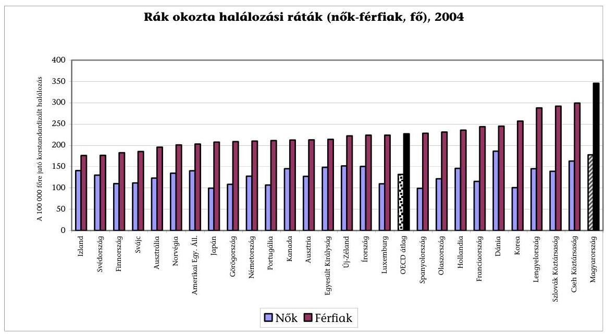

Összességében 1980 óta a rákos megbetegedések okozta halálozás az OECD országok többségében a férfiak és nők körében egyaránt csökkent. Ez alól a tendencia alól csak 4 ország kivétel: Magyarország, Görögország, Lengyelország és Spanyolország (2004).

[^0]
[^0]:    ${ }^{1}$ Health at a Glance 2007: OECD Indicators „age-standardised to the 1980 OECD population structure", (a grafikonban 27 ország adatait publikálták).

---

Hazánkban évente mintegy 32 ezer ember rosszindulatú daganatos betegség következtében hal meg, és közülük több mint 7 ezer fő emlő-, méhnyak-, vas-tag- és végbéldaganat miatt. A tüdőrák, a vastag- és végbél rosszindulatú megbetegedései miatt kétszer magasabb a halandóság, mint az EU többi tagállamában. A férfiaknál és nőknél egyaránt vezető halálok a tüdődaganat. A nőknél ezt követi az emlő- és vastagbélrák, míg a férfiaknál a vastag- és végbélrák, valamint a szájüregi daganatok. ${ }^{2}$ Az okok között a környezetszennyezés, az egészségtelen életmód, a gazdasági fejlettség hiányosságai, és a társadalmi egyenlőtlenség szerepel.

Az Egészségügyi Világszervezet 1998-as nyilatkozata szerint az egészségi állapot javítása nem képzelhető el megalapozott nemzeti és regionális politikai stratégiák nélkül. Ezt felismerve 2001 nyarán a Kormány elfogadta ${ }^{3}$ az „Egészséges Nemzetért Népegészségügyi Programot 2001-2010", majd 2003-ban az Országgyűlés az „Egészség Évtizede Johan Béla Nemzeti Program"-ot. A programok a népegészségügyi helyzet gyökeres javítását, ezen belül a daganatos eredetű halálozás csökkentését fogalmazták meg.

A népegészségügyi programokon túl a Kormány 2005-ben a „21 lépés a magyar egészségügy megújításáért"4 című programjában is a daganatos halálozások növekvő trendjének megállítását tűzte ki célul és Nemzeti Rákellenes Programot indított.

Az alábbi táblázat a programok céljait összefoglalóan mutatja be:

| Program megnevezése | Általános cél megfogalmazása | Emlőrák elleni célkitűzés | Méhnyakrák elleni célkitűzés | Vastagbélrák elleni célkitűzés |
| :--: | :--: | :--: | :--: | :--: |
| 2001-2010   Egészséges Nemzetért Népegészségügyi Program | 65 évnél fiatalabb lakosság daganatos halálozásának 10\%-os csökkentése. | A halálozás 20\%-os csökkentése. | A halálozás 50\%-os csökkentése. | A halálozás 10\%-os csökkentése. |
| 2003-2012   Egészség Évtizedének (Johan Béla) Nemzeti Népegészségügyi Programja | 70 évnél fiatalabb lakosság daganatos halálozásának 5-10\%-os csökkentése. | A halálozás 30\%-os csökkentése és a szűrő részvétel 70\%-os elérése a céllakosságban. | A halálozás 60\%-os csökkentése és a szűrő részvétel 70\%-os elérése a céllakosságban. | A halálozás 20\%-os csökkentése és szűrő rendszer megszervezése. |
| 2005   Kormány 21   lépés az egészségügyért   program | 10 év alatt a daganatos betegek száma csökkenjen 15\%-kal. | 2005 végéig 65\%-ra növekedjen a szűrésen résztvevők aránya. | Több száz nő idő előtti halálának megakadályozása. | szűrő program kiterjesztése. |

[^0]
[^0]:    ${ }^{2}$ KSH 2006. évi Statisztikai Évkönyv, kézirat.
    ${ }^{3}$ A 2001-2010. évekre szóló Egészséges Nemzetért Népegészségügyi Program alapelveiről szóló 1066/2001. (VII. 10.) Korm. hat.
    ${ }^{4}$ 100 lépés program keretében került meghirdetésre 2005. V. hóban.

---

A daganatos halálozás mérséklésének - rövid és középtávon - eszköze a lakosság szűrővizsgálata, azaz a magukat egészségesnek vélő, tünet- és panaszmentes személyek időről-időre megismételt vizsgálata a még rejtett betegség kimutatására alkalmas módszerrel, a betegség feltárása vagy kizárása céljából. A korai felismerés a teljes gyógyulás ígéretét hordozza, illetve a költséghatékonyságnak is alappillérét képezi.

A szakmapolitika megkülönböztet alkalomszerű szűrést, ami egyéni rizikót mérlegelő orvos/betegtalálkozáshoz kötött, továbbá népegészségügyi szervezett szűrést, amelynek lényege, hogy központilag kezdeményezett, közpénzből finanszírozott, a veszélyeztetett célcsoportra terjed ki, szakmailag indokolt gyakorisággal ismételt program. A szűrővizsgálati eljárás hatásossága már bizonyított, a célbetegségből származó halálozás csökkenésével mérhető, tömeges szűrésre költségei és hozzáférhetősége miatt alkalmas.

A népegészségügyi célú onkológiai szűrővizsgálatok bevezetéséhez és eredményességének megítéléséhez nemzetközi szakmai szervezetek ajánlásokat fogalmaztak meg pl. az Európai Unió Tanácsa 2003/878/EC számú ajánlásában. Ezen kívül az Egészségügyi Világszervezet (WHO) és annak Nemzetközi Rákkutatási Ügynöksége (IARC), valamint a Nemzetközi Rákellenes Unió (UICC) epidemiológiai bizonyítékokon alapuló ajánlásai mértékadók.

A nemzetközi ajánlások értelmében szervezett lakosságszűrés a következő területeken javasolt:

- emlőszűrés mammográfiás vizsgálattal az 50-69 éves nők számára, a mammográfiás vizsgálatokra vonatkozó európai irányelveknek való megfeleléssel, (az IARC szerint 2-3 éves gyakoriság hatékonysága a legjobb, a WHO az 50 év feletti korosztály legalább 70\%-ának a szűrését javasolja);
- a méhnyak szűrése kenet vételével, 20-30 éves életkortól kezdve (a WHO szerint 3 évnél gyakrabban szűrni nem indokolt);
- vastagbélszűrés székletbeli rejtett vér kimutatással (FOBT teszttel) 50-74 éves férfiak és nők számára (a WHO szerint évente-kétévente, a kétévente végzett tesztek kb. 20\%-kal csökkentik a mortalitást, az évenkénti gyakoriság nagyobb arányú csökkenést eredményez).

A vizsgálatunk tárgyát képező emlő-, méhnyak- és kolorektális szűrés életkorhoz kötött, alkalomszerű szűrésként jogszabályban biztosított volt 1998. január 1-jétől. A szervezett szűrővizsgálatot 2001 júliusától törvények ${ }^{5}$ határozzák meg, mint az egészségügyi ellátórendszer keretében végzett, népbetegségek felderítésére irányuló tevékenységet, amely az életkor alapján veszélyeztetettnek minősülő lakosságcsoportokra terjed ki. A korábbi, az életkorhoz kötött alkalomszerű szűrésektől az különbözteti meg a szervezett szűrővizsgálatot, hogy a célszemélyek személyes meghívását alkalmazza szakmailag indokolt gyakorisággal. Szervezését, koordinálását és minőségellenőrzését az ÁNTSZ végzi.

[^0]
[^0]:    ${ }^{5}$ Az egészségügyről szóló 1997. évi CLIV. törvény 81-82. §-ai, valamint a kötelező egészségbiztosítás ellátásairól szóló 1997. évi LXXXIII. törvény 10. §-a.

---

A szervezett szűrővizsgálatokat mindegyik népegészségügyi program kiemelt kérdésként kezelte. A szervezett emlőszűrés 2002 januárjában indult. A szűrési célcsoport a 45-65 év közötti nőkre terjedt ki kétéves gyakorisággal, mammográfiás készülékkel végzett röntgenvizsgálattal. A méhnyak szűrést 2003. VII. 24-én minősítette át a jogszabály ${ }^{6}$ szervezett szűréssé. A szűrési célcsoport a 25-65 év közötti nőkre terjedt ki háromévenkénti kenetvétellel. A kolorektális szervezett szűrés az 50-70 éves korcsoportra terjed ki, amely jogszabály ${ }^{7}$ szerint 1 napig volt hatályban (2005. XII. 31.), 2006. január 1-je óta pedig kísérleti programként szerepel. Az intézkedésektől a leggyakoribb halálozást okozó onkológiai betegségek visszaszorítását, korai felismerését várják. A program irányítója az Egészségügyi Minisztérium, végrehajtásában kiemelt szerepe van az ÁNTSZ-nek és az OEP-nek.

A rákellenes küzdelem eredményessége döntően az elsődleges (életmódváltás, környezeti tényezők) és másodlagos megelőzéstől (szervezett szűréstől) függ, mindkettő szervezése és irányítása speciális állami feladat.
„Nemzetközi tapasztalatok és a hazai becslések alapján a népegészségügyi szűrővizsgálatoktól - a működtetés 5-7 évétől - a célbetegségből származó halálozás mintegy 30\%-os csökkenése várható, éspedig az emlőrák miatti halálozás 20\%-kal, a méhnyakrák miatti halálozás 50\%-kal, a kolorektális rák miatti halálozás 10\%-kal csökkenhet". ${ }^{8}$

A népesség nagyfokú együttműködése alapfeltétele a szűrések eredményességének, befolyásolja a szűrés költséghatékonyságát és megmutatja azt is, mennyire volt sikeres a mozgósításra irányuló szervezés. Az ÁSZ vizsgálat záró munkálataival egyidőben 2007 novemberében és 2008 februárjában a Kormány a Miniszterelnökségen keresztül országos tájékoztatási és felvilágosítási kampányba kezdett a lakossági szűrések hatékonyságának növelése érdekében.

Az ellenőrzés célja annak értékelése volt, hogy

- megfelelően hasznosultak-e a szűrésekre tervezett és ráfordított költségvetési források;
- a programok végrehajtásában érvényesült-e az egyenlő hozzáférés, a morbiditási adatokkal összhangban;
- a szűrési programok eredménye megmutatkozott-e a regisztrált új betegek számában és az ellátásuk költségeiben.

[^0]
[^0]:    ${ }^{6}$ A kötelező egészségbiztosítás keretében igénybe vehető betegségek megelőzését és korai felismerését szolgáló egészségügyi szolgáltatásokról és a szűrővizsgálatok igazolásáról szóló 51/1997. (XII. 18.) NM rendelet.
    ${ }^{7}$ A kötelező egészségbiztosítás keretében igénybe vehető betegségek megelőzését és korai felismerését szolgáló egészségügyi szolgáltatásokról és a szűrővizsgálatok igazolásáról szóló 51/1997. (XII. 18.) NM rendelet.
    ${ }^{8}$ Nemzeti Rákellenes Program/ Daganatos betegségek megelőzése, OTH 2007. január (5. old.)

---

Korábbi ÁSZ ellenőrzések az onkológiai szűrővizsgálatokkal elkülönülten nem foglalkoztak.

Az ellenőrzést teljesítmény-ellenőrzési módszerrel hajtottuk végre. Az ellenőrzés szempontjainak megalapozására összeállított kritériumokat a 2. sz. melléklet tartalmazza. Az ellenőrzés alapvetően a 2001-2006 közötti időszakra irányult, de az egyeztetési folyamat lezárásáig figyelemmel kísértük a változásokat.

Az ellenőrzés az Egészségügyi Minisztériumra (illetve jogelődjére), az Országos Egészségbiztosítási Pénztárra, az ÁNTSZ-re és a Nemzeti Rákregiszterre terjedt ki.

Az ellenőrzés végrehajtására az Állami Számvevőszékről szóló 1989. évi XXXVIII. törvény 2. §-ának (3), (5), és (9) bekezdése, a 16. §-ának (1) bekezdése, a 21. §-ának (3) bekezdése, továbbá az államháztartásról szóló 1992. évi XXXVIII. törvény (Áht.) 104. §-ának (3) bekezdése és 120/A. §-ának (1) bekezdése rendelkezései adnak alapot.

Az ellenőrzés során kísérletet tettünk a szűrés eredményességének mérésére az egészségügyi és személyes adatok összekapcsolásával, mivel az adatkezelők elemzései erre nem terjednek ki, de az OEP a személyazonosító jel helyébe lépő azonosítási módokról és az azonosító kódok használatáról szóló 1996. évi XX. törvényre hivatkozva az ellenőrzés számára nem tette lehetővé az adatok TAJ-szintű megismerését, ellenőrzését.

A jelentést egyeztetésre megküldtük az egészségügyi miniszternek. Észrevételét az 1. sz. melléklet tartalmazza.

---

# I. ÖSSZEGZŐ MEGÁLLAPÍTÁSOK, KÖVETKEZTETÉSEK, JAVASLATOK 

Az elsődleges és másodlagos prevenció megvalósításának döntő feltétele a biztos finanszírozási bázis. A szervezett szűrőprogramokat úgy vezették be, hogy finanszírozásuk nem volt előre kidolgozva. A kiadások döntő része maga a szűrési szolgáltatás költsége, amelyet többletforrás bevonása nélkül a járóbetegszakellátás (korábban is létező) előirányzata terhére vezették be.

Az E. Alap emlőszűrési kiadása 2002-2007 között 4778,5 M Ft, a méhnyak szűrésé 892,1 M Ft volt. A vastagbélszűrés ráfordításai szűrőkód hiányában nem elkülöníthetőek, így csak a székletvér vizsgálatok együttes adatai állnak rendelkezésre, amelyek 2002-2007 között 249,9 M Ft-ot tettek ki.

A népegészségügyi programok forrásainak fokozatos szűkülése ellenére 2003-2007 között az ÁNTSZ évente közel azonos összeget, 200,0-250,0 M Ft-ot, összesen 1127,3 M Ft-ot fordított onkológiai szűrés-szervezésére a központi költségvetésből.

A cervix és emlőszűrés 2006. július óta nem tartozik TVK korlátozás alá. A teljesítmény-finanszírozás mégsem segíti, hanem korlátozza a szűrés bővítését. Azok az egészségügyi szolgáltatók, amelyek rendszeresen túllépik az OEP-pel kötött teljesítmény volumen korlátjukat nem érdekeltek a szűrésben, azaz teljesítményük növelésében, mert a feltárt esetek ellátásának költségét (az ún. következményes kezeléseket) nem téríti meg számukra az OEP (2006 közepéig részben, degresszív módon kifizette). A vastagbélszűrés finanszírozás szempontjából az előzőekhez képest még hátrányosabb helyzetben van, mert nincs a
 diagnosztikától elkülönült finanszírozási kódja, nincs a korlátozás alól maga a szűrés sem mentesítve, ezért országos kiterjesztésének ez is akadálya (és a szűréseket követő gyógyító eljárások sem mentesek a TVK alól).

Az OEP 2005-ben 850 M Ft keretösszeggel pályázatot írt ki betegségmegelőző tevékenység végzésére háziorvosok részére (IBR-en kívül). A pályázatnak csak közvetett és nem mérhető kapcsolata volt a szervezett szűrővizsgálatokkal (348 szerződésre 210 M Ft-ot fizettek ki). A pályázat sikertelenségét az alacsony érdeklődés, a pályázattal megszerezhető többletforrás alacsony összege, illetve az érte nyújtandó jelentős adminisztrációs ráfordítás aránytalansága okozta.

A szűrés infrastruktúráját javították az NFT I. kapcsán hazánkban felhasznált, uniós forrásokból megvalósult beruházások. A NFT II.-vel összhangban a 2008-tól érkező mintegy 2,0 Mrd Ft-ot elsődlegesen a szűrések népszerűsítésére és egészségmonitorozásra tervezik felhasználni.

2007 november-december hónapban a Miniszterelnökség 7 városban szervezett Szűréssel az Életért Programot (SZÉP), melyre 300 M Ft-ot fordított. A programot 2008 februárjában további 25 városban folytatják. A programnak része volt a daganatos megbetegedések megelőzésére irányuló tevékenységek támogatása,

---

ezen belül figyelemfelhívás a szervezett szűrőprogramokra. A program hatását nem mérték.

A népegészségügyi és a szervezett szűrés kommunikációjára fordított források nem különíthetők el az EüM költségvetésében. A kommunikáció szűrési részvételre gyakorolt hatásának mérésére szolgáló kritériumrendszert nem dolgozták ki, az eredményesség nem mérhető. Az ÁNTSZ és a prevenciós szakemberek véleménye szerint a szűrővizsgálatok népszerűsítése nem megfelelő.

Az emlő-, méhnyak- és vastagbél szűrővizsgálatok eredményességének legfontosabb mutatója - a szakmapolitika szerint - a halálozás csökkenése, ami a szűrés bevezetését követő 5-7 évvel mutatható ki, amennyiben a részvételi arány megfelelően magas. A vizsgált időszakban, 2001-2006 között mindhárom szűréssel megcélzott daganattípus esetén kis mértékben csökkent a halálozás, de ebből a szűrővizsgálatok eredményességére nem vonható le következtetés. Ez a csökkenés a KSH haláloki statisztikai módszertanának változtatásával indokolható. A csökkenés mind az életmódváltással, mind a szűréssel, mind a KSH haláloki statisztikájának változásával indokolható, de ezek hatása a jelenlegi információs rendszerben nem mérhető, nem különíthető el.
„A gépi haláloki kódolásra történt áttérés okozta a tendenciaváltozást. Természetesen daganattípusonként eltérő mértékben jelentkezik hatása. A 2005. évi gépi kódolású statisztika árnyaltabban és pontosabban tükrözi a hazai daganatos morbiditás és mortalitás valódi helyzetét, mint a hagyományos kézi kódolás". ${ }^{9}$

A szűrési tevékenység eredményességének nemzetközileg alkalmazott főbb indikátorai: a részvételi arány, a szűrést követő diagnosztika, illetve ellátás gyorsasága és az intervallum rákok aránya. Az új betegek száma (és ennek 100000 főre számított aránya az incidencia) a daganatos betegségeknek szintén gyakran alkalmazott mutatója.

A szűrőprogramok eredményességének megítéléséhez rendelkezésre álló országos adatbázisok (OEP, ÁNTSZ, Rákregiszter, KSH) elkülönítetten működnek, köztük az adatok összekapcsolása nem valósítható meg. A szűrések eredményessége és hatékonysága az egyes adatbázisokból külön-külön nem mérhető és nem igazolható, mivel a szűrésre vonatkozó mutatók, a megbetegedések, az egészségügyi ellátások és ezek finanszírozási adatai „nem futnak össze" egy kézbe, nincs ellenőrzött, integrált információs rendszer, nem épült ki a szűrés minőségbiztosítási monitoring része, és az adatok validitása sem biztosított.

A szűrőprogramok eredményességének mérésére az ÁNTSZ-OEP-Rákregiszter adatainak összekapcsolásával kísérletet tettünk, de az OEP - adatvédelmi okokra hivatkozva ${ }^{10}$ - az ellenőrzés számára sem tette lehetővé a hozzáférést a TAJ-szintű adatokhoz, az elemzés elvégzéséhez. Az egyének egészségügyi ada-

[^0]
[^0]:    ${ }^{9}$ Változások a haláloki statisztikában, KSH Demográfiai évkönyv 2005
    ${ }^{10}$ A személyazonosító jel helyébe lépő azonosítási módokról és az azonosító kódok használatáról szóló 1996. évi XX. törvény.

---

tait védő szabályozás megakadályozza, hogy az egyén, illetve az állam tájékozódhasson a szűrővizsgálatok eredményességéről és hatékonyságáról.

A lakossági célzott szűrővizsgálatok összehangolása, szervezése és felügyelete az ÁNTSZ feladata. ${ }^{11}$ A feladat ellátása érdekében szükség van az érintett lakosság személyes adataira (név, életkor, lakcím, TAJ-szám stb.), valamint a célbetegségekkel kapcsolatos egészségügyi adataira (az érintett állapotára, megbetegedésére, az egészségügyi szolgáltatók által észlelt, vizsgált, mért adatra, továbbá a halál okára vonatkozó adatra) és azok együttes kezelésére. Törvény ${ }^{12}$ csak 2005-től teszi lehetővé az ÁNTSZ számára a TAJ-szám használatát, de a szervezett szűréssel kapcsolatban egészségügyi adatot nem gyűjthet, és nem kezelhet, ezért az ÁNTSZ felügyeleti feladatait - részben adatvédelmi okok miatt - nem tudja teljes körűen ellátni.

Az egészségügyi szolgáltatók ellenőrzése, minősítése miatt szükséges a TAJ-számra visszakövethető egészségügyi adatok (az elváltozás minőségének, méretének) ismerete. A szűrési és az ellátási adatok összekapcsolása és együttes vizsgálata szükséges a szűrést követő ellátás gyorsaságának méréséhez (napok száma), továbbá a szűrés sikerességének legfontosabb mérőszáma a program érzékenységét jelző intervallumrákok gyakoriságának megállapításához.

Az ÁNTSZ rendelkezhetne megbízható információval a szűrésen részt vettek számáról és arányáról, de a jelenlegi informatikai rendszerből nyert adatok nem hitelesek. Az onkológiai szűrések szervezését-nyilvántartását támogató országos informatikai és információs rendszer megvalósítására (Országos Szűrési Informatikai Rendszerfejlesztés, továbbiakban: OSZR) az ÁNTSZ pályázatot írt ki. Az informatikai rendszer a kitűzött célokhoz képest csökkentett tartalommal és csak részben valósult meg. A pályázat szerinti 21 fő funkció közül 13 részben, 8 egyáltalán nem készült el. A rendszerben lévő megjelenési adatok validitása nem biztosított, mivel TAJ-szintű adatokat csak részben tartalmaz, annak ellenére, hogy 2005 óta az ÁNTSZ-nek erre jogszabályi felhatalmazása van, másrészt az egészségügyi szolgáltatók adatjelentési mulasztása nem szankcionált. Az ÁNTSZ által gyűjtött kumulált adatok megbízhatatlanságát jelzi, hogy a szűrésen résztvevők számáról rendelkezésre álló adatok az ÁNTSZ és az OEP nyilvántartásaiban nem egyeznek meg. (Melynek csak részben oka a teljesítés és finanszírozás időpontjának eltérése.) Az adatok különbözőségét az alábbi táblázat mutatja be.

[^0]
[^0]:    ${ }^{11}$ Az ÁNTSZ-ről szóló 1991. évi XI. törvény 5.§ (1) bek. e) pontja.
    ${ }^{12}$ Az egészségügyi és a hozzájuk kapcsolódó személyes adatok kezeléséről és védelméről szóló 1997. évi XLVII. törvény 4. §

---

| Megnevezés | Forrás | $\mathbf{2 0 0 2}$ | $\mathbf{2 0 0 3}$ | $\mathbf{2 0 0 4}$ | $\mathbf{2 0 0 5}$ | $\mathbf{2 0 0 6}$ |
| :-- | :--: | :--: | :--: | :--: | :--: | :--: |
| Emlőszűrés | OEP | 323036 | 226372 | 219889 | 249384 | 232707 |
|  | ÁNTSZ | 323858 | 220552 | 221561 | 245654 | 222734 |
| Méhnyakszűrés | OEP | 34968 | 349910 | 154348 | 127867 | 148531 |
|  | ÁNTSZ | - | - | $24217^{*}$ | 40520 | 45314 |

* A 2003-2004. év adatait összevontan tartalmazza (2003 októberében indult a szűrés).

Az OEP jogosult személyes és egészségügyi adatok kezelésére, azonban nem ismeri az egészségügyi adatok minőségét, pl. azt, hogy a kiszűrt és ellátott elváltozás mekkora méretű volt.

Az új betegek számáról közvetlenül a Rákregiszter nyilvántartásából és közvetetten a szűrővizsgálatok OSZR-éből (ÁNTSZ) lehet adatokat nyerni. A Nemzeti Rákregiszterbe a daganatos eredetű betegségek észlelése esetén a betegellátó az érintett egészségügyi és személyazonosító adatait továbbítja, ahol ezeket az adatokat gyűjtik és elemzik. ${ }^{13}$ Ez az adatbázis azonban halmozódást tartalmaz, mivel egy beteg kettő vagy több daganatos betegséggel is szerepelhet, és ezen túl az esetek egy részét ${ }^{14}$ szövettani kóddal alá nem támasztott daganatok képezik. A Rákregiszter nem gyűjt adatot arról, hogy a betegséget szűrési vagy diagnosztikai vizsgálattal tárták fel, ezért a rákregiszter nem rendelkezik információval a szűrővizsgálatokkal kiszűrt új megbetegedések számáról.

Az alábbi táblázat a Rákregiszter új emlődaganatos betegeinek számát valamint az ÁNTSZ-nél szűrésen megjelentek közül műtétre javasoltak számát mutatja be.

| Megnevezés | $\mathbf{2 0 0 1}$ | $\mathbf{2 0 0 2}$ | $\mathbf{2 0 0 3}$ | $\mathbf{2 0 0 4}$ | $\mathbf{2 0 0 5}$ | $\mathbf{2 0 0 6}$ |
| :-- | :--: | :--: | :--: | :--: | :--: | :--: |
| Rákregiszter   Összes új emlőrák   megbetegedett | 7220 | 8342 | 8360 | 7815 | 7894 | 7710 |
| Ebből szűrési   korcsoportba tartozó | 3771 | 4727 | 4447 | 4095 | 4174 | 3948 |
| ÁNTSZ műtétre java-   solt emlőrák beteg |  | 2411 | 1643 | 1180 | 1238 | 1115 |

Az OGY határozat, valamint a Nemzeti Rákellenes Program onkológiai adatkezelésre és informatikai rendszer kialakítására (a szűrési tevékenység és a Rákregiszter összehangolt működtetésére) vonatkozó része nem valósult meg az OSZR kudarca és az adatkezelési jogosultság hiánya miatt.

[^0]
[^0]:    ${ }^{13}$ Az egészségügyi és a hozzájuk kapcsolódó személyes adatok kezeléséről és védelméről szóló 1997. évi XLVII. törvény 16. § (5) bek.
    ${ }^{14}$ Daganattípusonként eltérő arány, 2006-ban az emlőrákok esetében 41,9\%-ban nem szerepel szövettani kód.

---

Az EüM a népegészségügyi program éves előrehaladásáról, ezen belül a szűrőprogramok eredményességéről beszámolási kötelezettséggel tartozik az Országgyűlésnek. A beszámolók - a fent említett információs rendszer hiányosságai miatt - nem a szűrési tevékenység eredményességének megbízható nemzetközi mutatóira épülnek és szubjektív, évenként össze nem hasonlítható, nem megbízható adatokat tartalmaznak, így téves képet mutatnak a programok előrehaladásáról.

A népegészségügyi célú szervezett szűrőprogramok szabályozása ${ }^{15}$ a szűrési jogosultságot kezdetektől fogva biztosítási jogviszonyhoz köti. Az OGY ${ }^{16}$ határozat az ország lakosságának egészségi állapot javítását célozza, és nem tesz különbséget biztosított és nem biztosított polgárai között, így a két jogforrás között ellentmondás van. A két jogforrás célja közötti különbség a szigorodott biztosítási jogviszony ellenőrzése következtében okoz problémát, tekintettel arra, hogy a célcsoport egy része a TAJ nyilvántartás rendezését követően nem jogosult a szűrésre.

A szervezett emlőszűrési program 2002 januárjában indult el. Az OGY határozat a halálozás 30%-os csökkenését valamint a céllakosság 70%-os átszűrtségét fogalmazta meg. A program első évében - az OEP adatai szerint - a résztvevők száma háromszorosára emelkedett és ezt követően a céllakosságnak mintegy 40%-át érte el. A jelenlegi szervezési és részvételi hajlandóság mellett nem várható a kitűzött cél elérése, ezért a program hatékonysága mérsékelt.

A hazai gyakorlatban összekeveredik a szűrési és a diagnosztikus mammográfiás tevékenység. A céllakosságból szűrésen és diagnosztikán megjelentek együttes aránya 50% körüli lefedettséget mutat, ami megfelel az OECD átlagnak. ${ }^{17}$ Ez a mutató Norvégiában 98%, Finnországban 87,7% és Svédországban 83,6%.

Az ÁNTSZ az emlőszűrő kapacitás intézményi feltételeit túlkínálattal alakította ki. Országosan 45 szűrőközpont van, ami 60%-kal több mint amennyit szakmai ajánlás (27) ${ }^{18}$ tartalmaz. A központok kiválasztásánál nem vették figyelembe az egyenlő hozzáférést, a területi lefedettséget és a helyi morbiditási adatokat. A mammográfiás emlőszűrés szakmai feltételeit protokollban rögzítették és az a pályázati és akkreditációs eljárás részét képezte, de azt az ágazatirányító nem hirdette ki.
 Az akkreditált szűrőhelyekkel szemben a diagnosztikus vizsgálati helyeken végzett „szűrések” alacsonyabb minőségi követelményeknek felelnek meg.

[^0]
[^0]:    ${ }^{15}$ Az egyes, az egészségügyet érintő törvényeknek az egészségügyi reformmal kapcsolatos módosításáról szóló 2006. évi CXV. törvényben meghatározták a biztosítási jogviszonytól független ellátások körét, amely a szervezett szűréseket nem tartalmazza.
    ${ }^{16}$ Az Egészség Évtizedének Népegészségügyi Programja 46/2003. (IV. 16.) OGY határozat.
    ${ }^{17}$ Health at a Glance 2007, OECD Indicators 111. p.
    ${ }^{18}$ Nemzeti Rákellenes Program/ Daganatos betegségek megelőzése OTH 2007. január (12. old.)

---

A méhnyak megbetegedési és halálozási adatainak kis mértékű csökkenése és az alacsony részvételi arány (2004-2006 között a 70%-os célhoz képest 5% körüli az OSZR szerint) nem igazolja a 2003-ban elindult szűrési program hatásosságát. Az OEP szűrés finanszírozási adatai szerint a részvételi arány 16-26% közötti, de a diagnosztikai vizsgálatokkal együtt a tényleges lefedettség ennél nagyobb arányú, 50% körüli. (A magánrendelések során végzett „szűrésekről” és azok elszámolásáról nincs információnk.)

Nyugat-Európában az elérhetőséget és hozzáférhetőséget priorizálva a szűrés tartalmát a citológiai kenetvételre és vizsgálatra redukálták és a mintavételt az alapellátás feladatává tették, szakasszisztens végzi. A hazai eljárásban a magasan kvalifikált szakorvos, komplex nőgyógyászati vizsgálat részeként kenetet vesz. Ez a szűrési módszer költséges, nem felel meg a tömegszűrés nemzetközi módszertanának, nem tudományos bizonyítékokra alapozott.

A szűrés területi elérhetősége megfelelő, de területi eloszlása nem egyenletes. A levett kenetek vizsgálatára akkreditált citopatológiai laborok nem mindegyike rendelkezik a minősítés alapjául szolgáló vizsgálatszámmal.

Az Országgyűlés és a Kormány vastag-, illetve végbéldaganat-szűrés kiterjesztésre vonatkozó céljai nem teljesültek, (a szűrési rendszer országos megszervezése és az egyenlő hozzáférés nem valósult meg és ennek következtében 2012-re kitűzött 20%-os halálozáscsökkentés időarányosan elmaradást mutat). A szűrés fokozatos bevezetése helyett csupán kísérleti és modellprogramokat bonyolítottak le. 2003-tól 2006-ig a 2,4 milliós célpopuláció kb. 2%-a (összesen 95 ezer fő) vett részt szűrésen. A kiterjesztést orvosszakmai konszenzus, a szaktárca döntéseinek hiánya és az egészségügyi szolgáltatók érdektelensége gátolta. A kísérlet alatt és azt követően sem alakítottak ki egységes szervezési (beleértve értékelési, adatfeldolgozási) munkamódszert, és – bár elkészítették – nem tették közzé a szűrési protokollt.

A vastagbélszűrés megszervezése 2001-től Kormány, majd 2003-tól Országgyűlési határozatban megfogalmazott elvárás volt. A miniszteri rendelet 2005. december 31-ig az életkorhoz kötött ajánlott szűrések között szerepeltette. 2006. január 1-jétől a népegészségügyi célzott szűrővizsgálatok között kísérleti programként határozták meg a vastagbélszűrést. 2008-tól az EüM nem finanszírozza a kolorektális szűrések szervezését és felfüggesztette a programot. A kísérleti szűrések hatása, a kis területi és rövid időbeli kiterjedése, valamint adatkezelési problémák miatt nem mutatható ki. Az elvégzett szűrések módszere összhangban volt a nemzetközi ajánlásokkal, illetve az európai uniós elvárásokkal.

A szűrések hatékonyságának egyik mutatója a részvételi arány, mert a mutató folyamatos magas szintje esetén várható a halálozás csökkenése. E mutató alapján egyik program sem hatékony, mert nem érték el, illetve tendenciájukban nem mutatnak folyamatosan magas részvételi arányt, ezért egyik program sem fogja teljesíteni az „Egészség Évtizede” program által kitűzött célt.

Az OGY határozatban kitűzött célok elérése érdekében az ágazatirányító nem tette meg a szükséges intézkedéseket, ezért a szűrésekre fordított költségvetési források nem hasznosultak megfelelően. Hiányzott a szűrővizsgálatok stratégiai és évekre lebontott operatív tervezése, a végrehajtás során összemosódtak a döntési és végrehajtási szintek, a szűrővizsgálatok meghatározása során nem hirdették ki, és nem ellenőrizték a szűrési protokollokat és azok végrehajtását.

---

ai és évekre lebontott operatív tervezése, a végrehajtás során összemosódtak a döntési és végrehajtási szintek, a szűrővizsgálatok meghatározása során nem hirdették ki, és nem ellenőrizték a szűrési protokollokat és azok végrehajtását.

A programok közös jellemzője, hogy sem a célok meghatározása előtt, sem azt követően nem készültek (évekre lebontott) megvalósíthatósági számítások/ütemtervek a tevékenységekre, a rendelkezésre álló és szükséges erőforrásokra, költségekre. Egy-egy betegszűrés számokban megfogalmazott célkitűzése a három időpontban készült programban eltérő volt, mind az életkori határokat, mind a halálozást, mind a várható részvételi arányt nézve.

A szűrés szervezeti háttérében nem egyértelműek az irányítási, szervezési és végrehajtási szintek, ami a feladatellátás és a felelősség kérdésének rendezetlenségét okozza. Az ágazatirányító a szűrések irányításához szükséges döntéseket – adatkezelés, módszertan, információs rendszer – nem teljes körűen hozta meg. Az elmaradt döntések a mindenkori ágazatirányító felelősségébe tartoznak.

A népegészségügyi program az egészségpolitikán belül fokozatosan háttérbe szorult, amit tükröz a végrehajtó szervezet létszámának csökkenése. A szűrés országos szervezését az ÁNTSZ irányító szervén belül az Országos Szűrési Koordinációs Osztály végzi. A régiós, megyei feladatokat a területi szűrési koordinációs osztályok látták el, amelyek létszáma a vizsgált időszakban felére csökkent. A szűrési koordinátorok feladatait az ÁNTSZ dokumentumában határozták meg. Néhány megyében (pl. Szabolcs-Szatmár-Bereg megye, emlőszűrés) elérték a kitűzött célokat, de a megyék többsége nem.

Az OTH a feladat végrehajtása érdekében szűrési típusonként munkacsoportokat alakított, amelyek – kivéve a méhnyak csoport – a statisztikai adatokat rendszeresen értékelték és javaslataikat, megállapításaikat a Szűrési Koordinációs Osztálynak továbbították. A javaslatok egy részéből olyan operatív intézkedések születtek, amelyek hozzájárultak a szűrési részvétel növeléséhez (pl. utazási költségtérítés).

A szűrések szakmai feltételeit, minőségbiztosítását a tárca nem szabályozta. A szűrések szakmai tárgyi feltételeinek folyamatos megfelelőségét az ÁNTSZ nem ellenőrzi. A szűrések szakmai és finanszírozási teljesítményeinek rendszeres ellenőrzése részben szakember hiánya miatt, részben az információs rendszer hiányosságai miatt, továbbá a személyes és egészségügyi adatok összekapcsolásának tiltása miatt nem valósul meg.

---

A helyszíni ellenőrzés megállapításainak hasznosítása mellett javasoljuk:

# a Kormánynak 

1. Számoltassa be az ágazatirányítót az onkológiai szűrőprogramok Országgyűlés ${ }^{19}$ által meghatározott céljainak teljesítéséről.
2. Módosítsa az egészségügyi szolgáltatások Egészségbiztosítási Alapból történő finanszírozásának részletes szabályairól szóló 43/1999. (III. 3.) Korm. rendeletet a szűréseket követő kezelések finanszírozási korlátozásának megszüntetésével (TVK alóli mentesítésével).
3. Gondoskodjon a szűrési programok mérhetőségéről, átláthatóságáról és a betegutak követhetőségéről. Ezért kezdeményezze – az egészségügyi és a hozzájuk kapcsolódó személyes adatok kezeléséről és védelméről szóló 1997. évi XLVII. számú törvény módosítását.
4. Kezdeményezze az ÁSZ felhatalmazását az egészségügyi adatok ellenőrizhetőségének biztosítása érdekében az adatkezelők körének bővítését a személyazonosító jel helyébe lépő azonosítási módokról és azonosító kódok használatáról szóló 1996. évi XX. törvényben 23. §-a, illetve az egészségügyi és a hozzájuk kapcsolódó személyes adatok kezeléséről és védelméről szóló 1997. XLVII. törvényben 3. §-a módosítását.

## az egészségügyi miniszternek

1. Szerezzen érvényt a 46/2003. (IV. 16.) számú OGY határozatnak, ennek keretében
a) hozza létre az onkológiai szűrés és a betegkövetés információs rendszerét, és kezdeményezze az ehhez szükséges adatkezelési jogszabályok módosítását; az időről-időre való kontroll érdekében;
b) szervezze újra a méhnyak- és a vastagbél szűrés rendszerét;
c) a méhnyak szűrés módszertanát igazítsa a nemzetközi gyakorlathoz.
2. Vizsgálja felül a mammográfiás munkahelyek és citopatológiai laboratóriumok kapacitását, kezdeményezze a felesleges kapacitások felszámolását.
3. Dolgozza ki, rendelje el és ellenőrizze szűrési típusonként az egységes szűrési eljárást.
4. Az Országgyűlésnek szóló népegészségügyi beszámolóiban a szűrőprogramok eredményességét nemzetközileg alkalmazott mutatókra alapozza.
[^0]
[^0]:    ${ }^{19}$ Az Egészség Évtizedének Népegészségügyi Programja 46/2003. (IV. 16.) OGY határozat.

---

5. Biztosítsa a szűrések kommunikációjára rendelkezésre álló uniós források eredményes, hatékony, gazdaságos felhasználását.

---

# II. RÉSZLETES MEGÁLLAPÍTÁSOK 

## 1. AZ ONKOLÓGIAI SZŰRÉSEK IRÁNYÍTÁSA ÉS SZERVEZÉSE

### 1.1. A szűrések szabályozottsága

## Az egészségügyről szóló 1997. évi CLIV. sz. törvény kiindulópontját képezi a további szabályozásnak és elveket fektet le.

#### Abstract

A törvény 3. § a) pontja határozza meg a szűrővizsgálatot: „olyan vizsgálat, amelynek célja a betegség tüneteit nem mutató (tünetmentes) személy esetleges betegségének vagy körmegelőző állapotának – ideértve a betegségre hajlamosító kockázati tényezőket is – korai felismerése”. A törvény 81. §-a szerint a „szűrővizsgálatok célja a lakosság egészségének védelme és az egyén életminőségének, illetve élettartamának növelése a rejtett betegségek, az egyes betegségeket megelőző körállapotok, valamint az arra hajlamosító kockázati tényezők korai – lehetőleg panaszmentes – szakaszban történő aktív felkutatásával és felismerésével”.

A törvény 82. § (3) bek. a más ellátáshoz kötődő rutinszerű (vagy más szóval opportunisztikus) szűrés mellett meghatározza a célzott (szervezett) szűrővizsgálat fogalmát is: „célzott a szűrővizsgálat, ha a lakosság egyes kor, nem vagy egyes kockázati tényezők által meghatározott veszélyeztetett csoportjainak szűrésére, illetve egyes népbetegségek felderítésére irányul”.

Az egészségbiztosítási törvény, az arra épülő rendelet és annak melléklete határozza meg a szervezett szűrések körét, szervezőjét, irányítóját, felelősét.

Az 1997. évi LXXXIII. törvény a kötelező egészségbiztosítás ellátásairól (a 10. § (1) bekezdése) definiálja azokat a szűréseket, melyeket az egyes korosztályoknál a társadalombiztosítás fedezete mellett az állampolgár térítésmentesen vehet igénybe. Az életkornak és nemnek megfelelő rizikófaktorok által indukált betegségek tekintetében az egészségügyi miniszter rendeletében nevesített szűrővizsgálatok az ott meghatározott gyakorisággal.

Kijelöli az egészségügyi rendszer azon szereplőit, akik elrendelhetik a szűrővizsgálatokat, továbbá megnevezi a szűrés szervezőit: „A népegészségügyi célú, célzott szűrővizsgálatok esetében az értesítést a szűrővizsgálatot végző egészségügyi szolgáltató vagy az Állami Népegészségügyi és Tisztiorvosi Szolgálat küldi ki”. [10. § (4)]

A szűrési tevékenység leírására 51/1997. (XII. 18.) NM rendeletben ${ }^{20}$ került sor. A rendelet célja, hogy meghatározza az egyes életkorokban a biztosítottak által térítésmentesen igénybe vehető, az életkori sajátosságokhoz igazodó betegségek megelőzését és korai felismerését célzó szűrővizsgálatokat,

[^0]
[^0]:    ${ }^{20}$ Az 51/1997. (XII. 18.) NM rendelet a kötelező egészségbiztosítás keretében igénybe vehető betegségek megelőzését és korai felismerését szolgáló egészségügyi szolgáltatásokról és a szűrővizsgálatok igazolásáról.

---

(továbbá a szűrővizsgálatokat végző egészségügyi szolgáltatókat és az igénybevételükkel kapcsolatos eljárásrendet). A rendelet mellékletének I. fejezete tartalmazza a kötelező szűrővizsgálatokat újszülött kortól 18 éves korig, melléklet II. fejezet az életkorhoz kötött önkéntesen igénybe vehető szűrővizsgálatokat és 2003. július 24-től kibővült a III. fejezettel, amely tartalmazza a népegészségügyi célú, célzott szűrővizsgálatokat.

A vizsgálatunk tárgyát képező méhnyak, emlő és kolorektális szűrés életkorhoz kötött, önkéntes formában, 1998. január 1-jétől lehetőségként adott volt. A szervezett emlőszűrési program 2002 januárjában indult, azonban csak 2003. július 24-től, a méhnyakszűréssel együtt minősült át népegészségügyi célú, célzott, szervezett szűréssé. A kolorektális szűrés 2006 januárjától kísérleti jelleggel került át ebbe a csoportba Nemzeti Rákellenes Program keretében és a jogszabály szintjén még ma is köteles az ÁNTSZ szervezni, de támogatási forrását a minisztérium átcsoportosította egy a jogszabályban nem szereplő szűrésre. (A szűrési gyakoriságban, módszerben történt változásokat mutatja a 4. sz. melléklet, illetve részletesebben a 2. és 3. pontokban.)

Az „Egészség Évtizedének Népegészségügyi Programja” – 46/2003. (IV. 16.) OGY határozat – stratégiai programot ad, melynek célja a lakosság egészségi állapotának javítása. Népegészségügyi szűrővizsgálatok címszó alatt célokat, feladatokat és várható eredményeket fogalmaz meg az emlő-, méhnyak- és vastagbélszűréssel kapcsolatban, valamint évenkénti beszámolási kötelezettséget határoz meg az egészségügyi tárcának az Országgyűlés felé a program előrehaladásáról.

# 1.2. Az ágazatirányító szerepe a programok irányításában és szervezésében 

Az EüM a népegészségügyi program fontosságát szervezeti struktúrájában is kifejezésre jutatta, 2002-ben 12
 fős Népegészségügyi Főosztály irányította a programot, amelyen belül az onkológiai szűrésekkel 1-2 munkatárs foglalkozott. Többszöri átszervezést, leépítést követően a Főosztályt megszüntették, jelenleg az Egészségpolitikai Főosztály keretében az egész népegészségügyi programmal kapcsolatos feladatot 1-2 fő látja el.

A Nemzeti Népegészségügyi Program Népegészségügyi Szűrővizsgálatok szervezeti felépítését és feladatmeghatározását az ÁNTSZ dolgozta ki 2003 áprilisában. E dokumentum szerint a szűrővizsgálatok egészségpolitikai irányításának a minisztérium felső vezetése, a Népegészségügyi Programirányító Bizottság (PIB), a Népegészségügyi Főosztály, valamint egy Szakmaközi Szakértői Testület közreműködésével kellett volna megvalósulnia.

Az egészségügyi miniszter az alábbi döntéseket nem hozta meg:

- az egészségpolitikai döntéseknél - cervix szűrés módszertanának meghatározásánál; a kolorektális szűrés felfüggesztésénél, forrásainak szájüregi daganatok alkalomszerű szűrésére való átcsoportosításánál; a prosztata-szűrés népegészségügyi, célzott szűrési listára történő felvételénél - nem vették figyelembe a nemzetközi szervezetek lakosságszűrésre vonatkozó ajánlásait;

---

- elmaradt mindhárom - emlő, méhnyak, kolorektális - szűrővizsgálati protokoll ágazatirányító általi elfogadása, kihirdetése;
- hiányoznak a szűrőprogram működtetésének adatkezelésre vonatkozó jogszabályi feltételei;
- a szűrések minőségbiztosítása, a szükséges szakemberképzés, valamint továbbképzés feltételeinek biztosítása elmaradt;
- nem hozták létre az Országgyűlési határozatban ${ }^{21}$ előírt onkológiai Adattárházat, amely a szűrések eredményességének megítéléséhez lenne szükséges. Így nem valósulhatott meg a szűrési tevékenység és a Nemzeti Rákregiszter összehangolt működtetése, és nem alakult ki az onkológiai szűrések információs rendszere;
- az EÜM, sem az OSZR projekt elindításakor, sem később nem integrálta a Népegészségügyi Onkológiai szűrések információs rendszerét az ágazati informatikai stratégiába;
- 2007-tel kezdődően a miniszter elvonta az ÁNTSZ-tól a vastagbélszűrés szervezésének fejezeti pénzforrásait, miközben az ÁNTSZ-t törvény ${ }^{22}$ kötelezi az érvényes népegészségügyi szűrések közé jogszabály ${ }^{23}$ szerint tartozó vastagbélszűrések szervezésére, a miniszternek pedig Országgyűlési határozat ${ }^{24}$ írja elő az eszközök biztosítását a vastagbélszűrés megvalósítására.

A népegészségügyi program onkológiai szűrések alprogram szervezeti hátterében összemosódtak a döntési és a végrehajtási szintek, ezáltal rendezetlenné váltak a feladat és felelősségi szintek. Az onkológiai szűrések szervezésére irányuló cselekvési tervet és stratégiát az ÁNTSZ készítette el. Az ÁNTSZ egyidejűleg töltött be irányítási és végrehajtási szerepet.

2007-től miniszteri megbízott irányítja a népegészségügyi program megvalósítását, feladata a népegészségügyi programok hatékony koordinálása, a népegészségügyi célkitűzések érdekében összehangolt stratégia végrehajtása.

[^0]
[^0]:    ${ }^{21}$ Az Egészség Évtizedének Johan Béla Nemzeti Programjáról szóló 46/2003. (IV. 16.) OGY határozat.
    ${ }^{22}$ 1991. évi XI. törvény az egészségügyi hatósági és igazgatási tevékenységről 5. §-a.
    ${ }^{23}$ 51/1997. (XII. 18.) NM rendelet a kötelező egészségbiztosítás keretében igénybe vehető betegségek megelőzését és korai felismerését szolgáló egészségügyi szolgáltatásokról és a szűrővizsgálatok igazolásáról III. fejezet 4. pont.
    ${ }^{24}$ 46/2003. (IV. 16.) OGY határozat az Egészség Évtizedének Johan Béla Nemzeti Programjáról 2. b) pontja.

---

# 1.3. Az ÁNTSZ szerepe a szűrések szervezésében és összehangolásában 

2001. július 12-től lakossági célzott szűrővizsgálatok szervezése, összehangolása és felügyelete az ÁNTSZ feladata. ${ }^{25}$ Központi irányítószervén, az Országos Tisztifőorvosi Hivatalon (továbbiakban: OTH) belül az Országos Szűrési Koordinációs Osztály feladata a cél lakosság minél teljesebb részvételét szolgáló informatikai behívó-követő rendszer működtetése, a szűrőállomásokkal való kapcsolattartás, a tevékenységek monitorozása és értékelése, valamint a lakossági kommunikáció koordinálása.

A lakossági szűrővizsgálatok összehangolását, szervezését és a végrehajtás felügyeletét az - ÁNTSZ-ről szóló 1991. évi XI. törvény 2001. június 12-én kihirdetett módosítása - az ÁNTSZ feladatává teszi, miközben a szűrővizsgálatok fajtáit csak 2003 nyarán tették közzé jogszabályban. Az ÁNTSZ feladata a szűrés szervezése, aminek a módszertan szerint része a betegút követés, a személyes és egészségügyi adatok kezelése. Az 1997. évi XLVII. törvény az egészségügyi és a hozzájuk kapcsolódó személyes adatok kezeléséről és védelméről szóló törvény 2004. évi módosítása emelte az ÁNTSZ-t az adatkezelők körébe a szervezett szűrési feladatainak megvalósításához szükséges TAJ adatok kezelése céljából, mely lehetővé teszi, hogy az ÁNTSZ jogszerűen küldhesse ki a szűrési behívókat, de nem rendelkezik az egészségügyi adatok kezelésének jogával, ami szükséges a szűrés minőségbiztosítási rendszerének kialakításához.

Az ÁNTSZ létrehozta a „népegészségügyi szűrővizsgálatok szervezeti felépítése és feladat meghatározása" szerinti szervezetet, amelyet az alábbi ábra szemléltet.
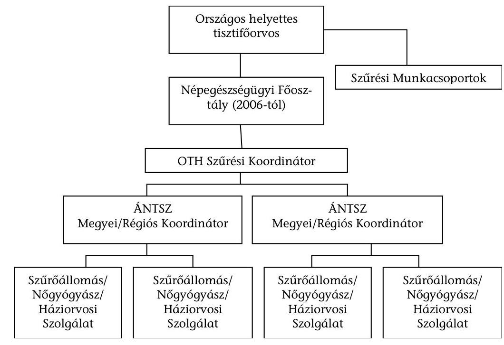

[^0]
[^0]:    ${ }^{25}$ Az egészségügyi hatósági és igazgatási tevékenységről szóló 2001. évi XXXIV. törvénnyel módosított 1991. évi XI. törvény.

---

Az Országos Szűrési Koordinációs Osztály a helyettes országos tisztifőorvos közvetlen irányítása alá tartozott 2006-ig, ekkor az osztályt vezető országos szűrési koordinátor és a helyettes tisztifőorvos közé a Népegészségügyi főosztályvezető, mint újabb irányítási szint integrálódott. Az országos szűrési koordinátor munkáját egy asszisztens és egy informatikus (összesen 3 főállású munkatárs), és megbízási szerződéssel dolgozó tanácsadók és a munkacsoportok is segítik.

A 2003. szeptember 1-jétől foglalkoztatott szűrési munkacsoportok feladata a szakmai protokollok, teljesítménymutatók kidolgozása, karbantartása, minőségellenőrzés. A munkacsoportokban az egyes szűrővizsgálati típusok szakértőit foglalkoztatják. A három szűréstípus (emlő, méhnyak és vastagbél) támogató munkacsoport mellé a szájüregi rosszindulatú daganatok okozta halálozás utóbbi években történő nagyfokú előretörése miatt, a szájüregi daganatok opportunisztikus szűrések 2006. évi bevezetésének kidolgozására megalakult a Szájüregszűrési munkacsoport.

A szűrés országos szervezését az ÁNTSZ kijelölt megyei (régiós) intézeteinél a Területi Onkológiai Szűrési Koordinációs Osztályok végzik. Az osztályok munkáját a területi onkológiai szűrési koordinátorok irányítják, egy asszisztens és egy szűrési nyilvántartó asszisztens segítségével. 2002-ben 61 fő látta el főállásban országosan a feladatot. 2003 második felében létszámleépítés következtében egyes osztályokat integráltak a megyei egészségfejlesztési osztályokba. A folyamatos létszámleépítés és a regionális átszervezés miatt 2007-ben már csak 30 fő látta el főállásban a feladatot, és 2004-től a munkatársak csak részfeladatként kapták a szűrésszervezést (1. sz. táblázat).

Az ÁNTSZ készítette el a szűrések feladattervét, a szükséges szervezeti felépítés tervét, az évenkénti cselekvési programokat, valamint jogszabálymódosítást is kezdeményezett, és olyan javaslatokat is tett, amelyek tárca szintű intézkedéseket igényeltek. Ezekből megvalósult pl. a TAJ-szám kezelésre, az 51/1997. (XII. 18.) NM rendelet módosítására, és nem valósult meg az országos elemző egység felállítására, valamint a szakmaközi szakértő testület felállítására tett javaslat.

Az ÁNTSZ javaslatainak egyik eredménye volt az ÁNTSZ felhatalmazása a TAJ-szám használatára.

Az ÁNTSZ javasolta egy Szakmaközi Szakértői Testület létrehozását azért, mert az egyes hazai szakmai kollégiumok szakmai álláspontja nem esett egybe szakterületnek a mértékadó nemzetközi testületek ajánlásaiban kifejezett álláspontjával. Ezt a javaslatot a minisztérium több esetben elutasította, így a döntés nem született meg. A hazai szűrési gyakorlat nem egyezik meg a nemzetközileg alkalmazottal, például Magyarországon a kenet levételét (szűrés) asszisztensek helyett magasan kvalifikált nőgyógyászok végzik, kiegészítve számos a méhnyak szűréshez nem szorosan kapcsolódó tevékenységgel, mint kolposzkópos vizsgálat, méh és függelékeinek betapinása, manuális emlővizsgálat. Ez a gyakorlat a szűrővizsgálat gazdaságosságát is megkérdőjelezi. Az ÁNTSZ javasolta a citológiai előszűrő asszisztensek rendszeres képzésének kibővítését, annak érdekében, hogy a méhnyak szűrését a nemzetközi gyakorlathoz lehessen közelíteni.

Az ÁNTSZ 2005-ben, (az EüM 2000-ben) a Minőségbiztosítási és Módszertani kézikönyvben meghatározta a minőségbiztosítási elveket, amelyek a gyakorlatban nem érvényesültek, és mint szabályozás nem léptek életbe.

---

Az ÁNTSZ létrehozta és folyamatosan működtette a „Szűrővizsgálatok szervezeti felépítése és feladat meghatározásá"-ban rögzített szervezetet. Ágazatirányítói döntések hiányában azonban a döntéshozatali és a végrehajtási szintek összemosódtak, amelyet a fenti példák is mutatnak.

# 1.4. A szűrések információs rendszere, informatikai támogatottsága 

A szervezett szűrések szervezésének, nyilvántartásának, az elért eredmények értékelésének elengedhetetlen feltétele olyan komplex információs rendszer kiépítése, amely képes a meghívottak és a megjelentek adatainak tárolására, kezelésére és a kiszűrt esetek személy szerinti követésére. ${ }^{26}$

A vizsgált időszakban a szűrések informatikai támogatására két egymást váltó informatikai rendszer működött: 2001-2005-ig az ún. Ideiglenes Rendszer (IR), majd ezt követően az Országos Onkológiai Szűréseket Támogató Informatikai Rendszer (OSZR).

Az IR csak egy szűréstípus szolgált ki az akkori elvárásoknak megfelelően, az adatgyűjtés számítógépes adatrögzítéssel, az adatok továbbítása off-line módon történt. Az ÁNTSZ szerint ezzel szemben egy komplex informatikai rendszerre volt szükség, amely több szűréstípust tud kiszolgálni, a szűrési listákat on-line módon juttatja el a megyei, később régiós koordinátorokhoz és szintén on-line módon kapja vissza az adatokat a szűrőállomásoktól, valamint kialakít egy központi adatbázist, amely alapját képezi a későbbi orvos-szakmai elemzéseknek, és a minőségbiztosításnak.

A komplex rendszer megvalósítására az Országos Tisztifőorvosi Hivatal nyílt közbeszerzési felhívást tett közzé 2002 májusában. Az OSZR projekt kapcsán fejlesztési, üzemeltetési, információs és informatikai problémák merültek fel, amelyek alapvetően befolyásolták a szűrések eredményességének és hatékonyságának mérését.

A szerződéskötésre a nyertes kihirdetését (2002. augusztus 1.) követően nyolc hónappal került sor (2003. április 17.), és a jegyzőkönyvben elismert teljesítés is jelentős késedelmet szenvedett (amely 2004. október 5-e volt). A szerződésben a teljesítés feltételeként meghatározott éles üzemi (2005. január) tesztelést megelőzően a szerződés szerinti teljes összeget átutalták a szállító részére (2004. november). A komplex informatikai és információs rendszer, a kitűzött célokhoz képest csökkentett információtartalommal, csak részben valósult meg, a pályázat szerinti 21 fő funkció közül 13 részben, 8 egyáltalán nem.

Az OSZR-ben lévő megjelenési adatok validitása nem biztosított. A szűrő szervezet a nála megjelentek kumulált adatait (papíron, EXCEL vagy CSV formátumban) adja át a regionális koordinátoroknak, akik ezeket az összesített adatokat gépelik be az OSZR-be. A koordinátorok - TAJ-szintű adatok hiányában - nem győződnek meg az általuk bevitt adatok helyességéről, azaz a szűrésen megjelentek tényleges száma nincs ellenőrizve. Részben ez az oka annak, hogy az OEP és az ÁNTSZ adatbázisában szereplő szűrési betegszám adatok eltérést mutatnak.

Az OSZR beruházás összértéke 78 millió forint volt, amelyhez az ágazatirányító 67 millió forinttal járult hozzá, ezt az ÁNTSZ 11 millió forinttal egészítette ki.

# 1.5. Az adatkezelés ellentmondásainak hatása a szűrővizsgálatok eredményességének mérésére 

Törvény ${ }^{27}$ értelmében az ÁNTSZ feladatul kapta a szűrővizsgálatok felügyeletét. Ezt a felügyeletet az adatkezelésre vonatkozóan akkor lenne képes ellátni, ha szűrőhelyenként/orvosonként/betegenként képes lenne biztosítani és ellenőrizni az ellátás minőségét. Erre azonban nincs módja, részben informatikai okokból (nincs betegkövetés), részben az egészségügyi adatkezelésre feljogosító jogszabályi felhatalmazás hiányában.

Az OSZR nem tartalmaz TAJ-szintű adatokat a szűrésen megjelentekről. A pályázati kiírásban és a minőségbiztosítási kézikönyvben megfogalmazott célokkal ellentétben nem állítható elő a szervezett szűrési programban szereplő egyik szűréstípusra sem a megjelentek és a meg nem jelentek listája.

Az adatfeldolgozás hiányosságai átláthatatlanná teszik azt a fajta betegkövetési követelményt, amelyet a szervezett szűrések módszertana megkövetel. Betegkövetés hiányában nem mérhető sem az egyes szűrőállomások, sem az országos szűrési rendszer hatásossága, és nem készülhetnek olyan elemzések, amelyek a lakossági szűrés elért eredményeit és fejlődési irányvonalát mutatják be. Már az OSZR megvalósítására kiírt közbeszerzési kiírás is (amely a
 megvalósítására megkötött szerződés melléklete is lett) olyan betegkövetéssel egybekötött adatbázis kiépítését célozták, amelyre a mai napig nincs jogszabályi felhatalmazása. Az OSZR eredeti elképzeléseknek megfelelő megvalósítása esetén az ÁNTSZ olyan adatbázissal rendelkezne, amelyre jelenleg nincs jogszabályi felhatalmazása, mivel a szűrési tevékenység szervezése kapcsán nem kezelhet egészségügyi adatot, így sem az állami szervezetek, sem az adófizetők számára nem mérhetőek az országos szűrési program minőségi és eredményességi mutatói.

A több telephellyel rendelkező egészségügyi szolgáltatók szűrőhelyeinek informatikai rendszere kezeli és összesíti a szűrőállomásokon keletkező részletes egészségügyi adatokat, amelyek elengedhetetlenül szükségesek a minőségirányítási és menedzseri feladataik ellátásához. Az egészségügyi szolgáltatókat feljogosítja a jogszabály az egészségügyi adatok kezelésére.

Az adatkezelési jogszabályok értelmében további ellentmondás, hogy az ÁNTSZ ugyan 2005 óta kezelhet TAJ-hoz kapcsolt személyes adatokat, de nem

[^0]
[^0]:    ${ }^{27}$ Az egészségügyi hatósági és igazgatási tevékenységről szóló 2001. évi XXXIV. törvénnyel módosított 1991. évi XI. törvény.

---

tárolhatja azokat. (Az ellentmondásos álláspontokra jellemző például, hogy az ÁNTSZ-nek a kiküldött meghívók adatainak nyilvántartására az OEP szerint nincs joga.)

Az ÁNTSZ központosított patológiai adatbázis - Patobank - létrehozására tett javaslatot, ami a patológiai intézményekben keletkező kórszövettani vizsgálatokból származó adatokat gyűjtenek. Ez álláspontjuk szerint jelentős segítséget nyújtana az OSZR működéséhez, hiszen alkalmas lenne a daganatos betegekre vonatkozó szövettani adatok visszacsatolására. Jelenleg folyik a projekt pályázata. A Patobank működtetéséhez szükséges szervezeti és jogszabályi háttér hiányában ugyanúgy nem oldható meg az onkológiai adatok gyűjtése és központi kezelése, mint ahogy ez jelenleg az OSZR esetében sem rendezett.

Az országos onkológiai szűrési informatikai rendszerfejlesztés (OSZR) kudarca és az adatkezelési jogosultság hiánya miatt az OGY határozat és a Nemzeti Rákellenes Program onkológiai adatkezelésre és informatikai rendszer kialakítására vonatkozó céljai nem valósultak meg. Az OGY határozat ${ }^{28}$ várható eredményként jelölte meg: „Adatbázis létrehozását a magyarországi onkológiai ellátás helyzetéről, szűrési tevékenység és Nemzeti Rákregiszter összehangolt működtetésére". A Nemzeti Rákellenes Program 2006-ban a daganatos betegellátás informatikai helyzetéről megfogalmazta, hogy olyan országos méretű és integrált információs rendszer fokozatos kialakítására van szükség, amely a betegadatokat és a betegellátásra vonatkozó összes szükséges és lehetséges információt képes kezelni. A program megvalósítására koncepció nem készült.

Az OSZR program funkciói, az adatkezelési jogosultság szélesítése és a Patobank létrehozása, működtetése szükségesek az ÁNTSZ népegészségügyi feladatainak ellátásához. Az OSZR-ben - az eredetileg célul kitűzött funkciók széles skálájának hiánya miatt (21 fő funkcióból 13 részben, 8 egyáltalán nem valósult) csak a szűrésre meghívottak adataiból létrehozott adatbázis értékes. ${ }^{29}$

# 1.6. A szűrőprogramok eredményessége az országos adatgyűjtések tükrében 

A szűrőprogramok eredményességének megítéléséhez rendelkezésre álló országos adatbázisok elkülönítetten működnek, köztük az adatok összekapcsolása nem valósul meg. Külön-külön egyik adatbázisból sem ítélhető meg a szűrőprogramok eredményessége.

- Az OEP a finanszírozással összefüggésben keletkező adatokból arról rendelkezik információval, hogy ki vett részt szűrővizsgálaton és mikor;

[^0]
[^0]:    ${ }^{28}$ 46/2003. (IV. 16.) OGY határozat az Egészség Évtizedének Johan Béla Nemzeti Programjáról 2. b) pontja.
    ${ }^{29}$ Az OTH az ÁSZ helyszíni vizsgálatát követően intézkedési terv kidolgozását kezdeményezte az OSZR funkciók technikai hiányosságainak pótlására.

---

- a Rákregiszternek vannak adatai az új daganatos megbetegedésekről, stádium besorolásról, de azt nem tudja, hogy szűrésen részt vett-e a beteg, vagy sem;
- a KSH a daganatos eredetű halálozásokról gyűjt adatokat;
- az ÁNTSZ a szűrővizsgálaton megjelentek kumulált adatairól rendelkezik információval.

A rosszindulatú daganatos megbetegedések megelőzése, gyógykezelése, a betegek utógondozása értékelésének céljából hozták létre az Országos Rákregisztert, ami jogszabály ${ }^{30}$ alapján 1999 óta gyűjti a daganatos betegek diagnosztikájával és kezelésével kapcsolatos hazai adatokat. A szűrés szervezés jogi, informatikai és információs rendszere a vizsgálat időpontjáig nem került teljes körűen kialakításra. A jelenlegi jogi szabályozás nem teszi lehetővé, hogy a Rákregiszterben a TAJ azonosítású adatokat a minőségbiztosítás, az eredményesség vagy terápia hatékonyság céljából az elemzők lekérdezhessék. A jelentésben vizsgált három daganattípus esetén a szűrési korcsoportba tartozók megbetegedési adatait a Rákregiszter adatai alapján az alábbi grafikon mutatja be.
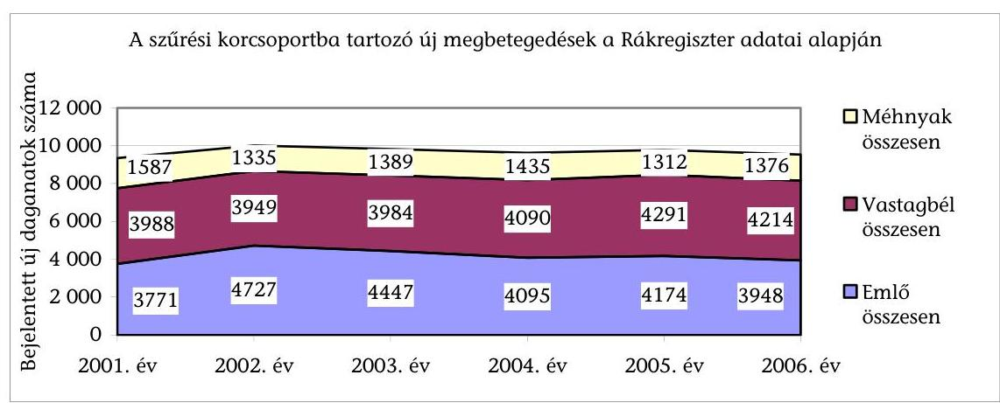

Eredményes szervezett szűrővizsgálatok szükségszerű következménye - a nemzetközi tapasztalat alapján - a Rákregiszterbe jelentett új betegek számának növekedése (a tünetmentesen felfedezett új esetek száma miatt), különösen a szűrővizsgálatok bevezetésének kezdeti időszakában. Ez a jelenség egyedül a vastagbél daganatoknál volt megfigyelhető, ennél a daganattípusnál viszont a szűrővizsgálat alacsony kiterjedtsége nem magyarázhatja azt. Az emlő- és a méhnyakrák esetén az esetszámok csökkenését a Rákregiszterben zajló folyamatos adattisztító tevékenység okozza.

A Rákregiszter általános problémája a „túljelentés". Az adatgyűjtés módszertana lehetővé teszi, hogy szövettanilag nem igazolt esetek kerüljenek a nyilvántartásba, ezért például a Rákregiszterben 2006-ban újonnan jelentett emlőrákos diagnózisok 41,9%-ában nem szerepel szövettani kód, ennek egy részét betegkövetés

[^0]
[^0]:    ${ }^{30}$ Az egészségügyi hatósági és igazgatási tevékenységről szóló 2001. évi XXXIV. törvénnyel módosított 1991. évi XI. törvény.

---

hiányában nem teljes körű és pontatlan adatszolgáltatás okozza, illetve egy részét a szakirodalom ${ }^{31}$ a teljesítményarányos finanszírozás hatásának vélelmezi.

A Rákregiszter adatait szövettanon alapuló, orvos által ellenőrzött jelentések alapozhatják meg. Jelenleg a jelentett és az igazolt betegek között nincs meg az egyezőség.

A Rákregiszter hármas feladatából - incidencia, prevalencia, túlélés kiszámítása - a harmadik nem valósul meg, mivel a Rákregiszternek nincs információja a daganatos betegségben elhunyt betegek haláláról, amelyet a személyazonosítás hiánya okoz. A hiányzó információ a kezelések hatásossága és a túlélés számítása szempontjából alapvető.

A szűrővizsgálatok célja a még tünetmentes, kis (in situ) daganatok feltárása. Az in situ daganatok arányának növekedése a szűrővizsgálatok eredményességének közvetett bizonyítéka. Az alábbi ábra az in situ daganatok arányát mutatja a szűrt korosztályban.
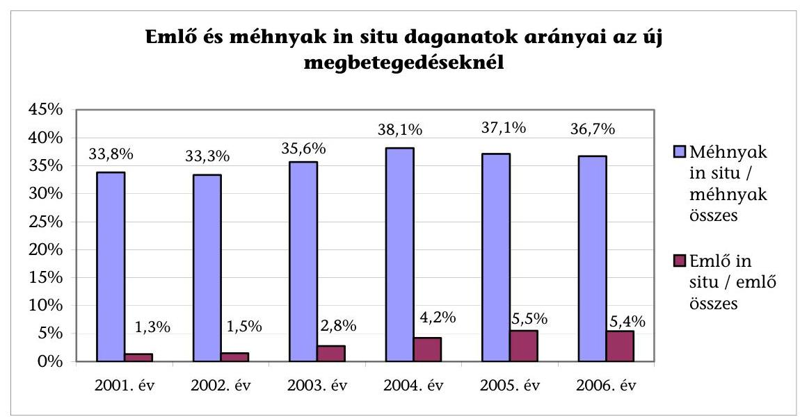

A felfedezett daganatokon belül a korai stádiumú megbetegedések aránya az adatok alapján mind az emlő-, mind a méhnyakrák esetén növekedett a szűrővizsgálatok bevezetésének időszakában. Azonban a Rákregiszter nem tartalmaz szűrési adatokat így nem állapítható meg, hogy a korai stádiumú felfedezés aránya a szűrés hatására nőtt-e.

A szakma a szűrővizsgálatok hatásossága legmegbízhatóbb bizonyítékának a célbetegségből eredő halálozás csökkenését tartja, a szűrőtevékenység által lefedett (tehát nem csak a szűrővizsgálattal érintett) lakosság körében.

[^0]
[^0]:    ${ }^{31}$ Az onkoterápiás gyakorlat, valamint hatékonyságának irodalmának elemzése, a Nemzeti Rákellenes Programhoz kapcsolódóan. (ESKI Bp. 2006. május 8.) 17 és 21. oldala.

---

A halálozás csökkenésének megítéléséhez a szakmai standardok szerint 5-7 évnek kell eltelni a szűrővizsgálatok megkezdésétől számítva. Az adatok alapján a szűrővizsgálatok bevezetése óta mindhárom daganattípusban csökkent a célbetegségből eredő halálozás (2. sz. táblázat). Az adatok későbbi megítélését azonban torzítja, hogy a vizsgált időszakban 2005-től a Központi Statisztikai Hivatal a halálozás oki tényezőjének statisztikai feldolgozására a korábbi kézi kódolás helyett gépi kódolást vezetett be. A halálozási statisztika megbízhatóságának további javítására ezzel párhuzamosan 2005-től szerződést kötött az ÁNTSZ-szel a halotti bizonyítványok (részleges) felülvizsgálatára. A módszertani változás a daganatos megbetegedések minden területén csökkentette a halálozás értékét, amelyet a statisztikai hivatal kiadványa a módszertani változás következményének tekint.
„Az adatok elemzése azt mutatja, hogy a 2005-évi országos haláloki statisztikában nem a tényleges daganatos halálozás csökkenése következett be, hanem elsősorban a gépi haláloki kódolásra történt áttérés okozta a tendencia változást. Természetesen daganattípusonként eltérő mértékben jelentkezik a gépi kódolás befolyása. A 2005-ik évi gépi kódolású statisztika árnyaltabban és pontosabban tükrözi a hazai daganatos morbiditás és mortalitás valódi helyzetét, mint a hagyományos kézi kódolás". ${ }^{32}$

Nem állapítható meg, hogy a halálozás csökkenés mekkora része tudható be a szűrővizsgálatok kiterjesztésének. A módszertani változás a tájékoztató szerint javítja a haláloki statisztika minőségét, és nemzetközi szinten jobban összehasonlíthatóvá teszi a hazai adatokat, azonban a szűrővizsgálatok értékelési idejét 2005-től kezdődően legalább 7 évvel megnyújtja.

A szűrőprogramokkal érintett daganattípusokra vonatkozó valós hazai népegészségügyi helyzet és a szűrésprogram hatásának megítélését a vonatkozó adatgyűjtések izoláltsága, az összekapcsolás hiánya, pontatlansága (Rákregiszter) és módszertanban bekövetkezett változás (KSH) nem teszi lehetővé.

Az EüM a népegészségügyi program éves előrehaladásáról, ezen belül a szűrésprogramok eredményességéről beszámolási kötelezettséggel tartozik az Országgyűlésnek. A beszámolók - a fent említett információs rendszerbeli hiányosságok miatt - nem a szűrési tevékenység eredményességének megítéléséhez szükséges mutatószámokra épülnek, úgymint: részvételi arány, nem negatív eredményt hordozó szűrés és a tisztázó diagnosztikai vizsgálatok elvégzése, illetve a gyógyító célzatú beavatkozás megkezdése között eltelt idő, a szűrési eljárás szenzitivitását tükröző intervallumrákok aránya. A beszámolókban bemutatott mutatószámok olyan összesített adatokat tartalmaznak, amelyek alapján nem ítélhető meg a szűrésre fordított pénzeszközök hasznosulása, mert összemosódnak a szűrésen és diagnosztikán megjelentek adatai.

Az ÁSZ ellenőrzés az adatok összekapcsolásával kívánta bemutatni a szűrővizsgálatok eredményességét. A Rákregiszter és az OEP adatbázisának összekapcsolásával válhatott volna megválaszolhatóvá a kérdés, hogy a Rákregisz-

[^0]
[^0]:    ${ }^{32}$ Változások a haláloki statisztikában, KSH Demográfiai évkönyv 2005.

---

terben szereplő daganatos betegek közül a szűrővizsgálaton részt vett sokaság megbetegedési mutatója (daganat stádiuma) jobb-e, mint a szűrővizsgálatra nem járóké. Az adatokat az ÁNTSZ listáival összevetve lehetett volna megválaszolható, hogy a nem szűrt daganatos betegek mekkora része kapott meghívást szűrővizsgálatra.

A vizsgálat során a betegsoros adatokat TAJ-szám alapján lehetett volna összekapcsolni a két adatbázis (OEP és Rákregiszter) között. Az ellenőrzés során kísérletet tettünk az elemzés elvégzésére, de az OEP - az adatvédelemre hivatkozva ${ }^{33}$ - az ÁSZ számára sem tette lehetővé a hozzáférést az adatokhoz. ${ }^{34}$

Az ÁSZ által kezdeményezett fenti elemzés elvégzésének lehetősége hiányában és az országos adatgyűjtések problémái miatt nem válaszolható meg az a kérdés, hogy milyen mértékben eredményesek (vagy eredménytelenek) a népegészségügyi szűrővizsgálatok. Sem az ÁSZ-nak sem más államigazgatási szervnek nem állnak rendelkezésére olyan adatok, amelyekből megítélhető lenne a szűrővizsgálatok eredményessége.

# 2. A SZERVEZETT EMLŐSZŰRÉS HATÉKONYSÁGA 

Életkorhoz kötött (45-65 év) önkéntes - az emlő lágyrész röntgenvizsgálatán alapuló - emlőszűrést már a rendelet ${ }^{35}$ kétévente lehetővé tette. A területileg szervezett lakosságszűrés bevezetésére szakmai konszenzus a 90-es években, a Világbanki modellprogramok hatására alakult ki. Az országos kiterjedésű, szervezett emlőszürési program 2002 januárjában indult el. Jogszabályban 2003. július 24-től minősítette az ágazatirányító népegészségügyi célú, célzott szűréssé (az önkéntes szűrési feltételekkel megegyező célcsoporttal, szűrési gyakorisággal és szűrési eljárással). Ennek megfelelően a mammográfiás emlőszűrés két éves ciklusokban történik és a 45-65 éves nőket érinti.

## Az emlőszűrési protokoll a nemzetközi szakmai szervezetek ajánlásait követi.

A 2001. évi program célkitűzése 2010-ig az emlődaganatok miatti halálozás 20%-os csökkentése. A 2003. évi célkitűzés 2012-re a halálozás 30%-os csökkentését és a célpopuláció 70%-os átszűrtségét, a 2005. évi célkitűzés pedig az adott év végéig a 65%-os részvételt fogalmazta meg.

[^0]
[^0]:    ${ }^{33}$ Az OEP főigazgatója az egészségügyi ombudsman állásfoglalását kérte e tárgyban, melyre a válasz ez idáig

 nem érkezett meg.
    ${ }^{34}$ A személyazonosító jel helyébe lépő azonosítási módokról és az azonosító kódok használatáról szóló 1996. évi XX. törvény.
    ${ }^{35}$ A kötelező egészségbiztosítás keretében igénybe vehető betegségek megelőzését és korai felismerését szolgáló egészségügyi szolgáltatásokról és a szűrővizsgálatok igazolásáról szóló 51/1997. (XII. 18.) NM rendelet, III. fejezetének 2. pontja alapján.

---

„Nemzetközi tapasztalatok és hazai becslések alapján a népegészségügyi szűrővizsgálatoktól a célszerű működés 5-7. évétől .... az emlőrák miatti halálozás 20\%-os csökkenése várható". ${ }^{36}$

2001-ben 2342 fő és 2006-ban 2081 fő halt meg emlőrákban, ami 11\%-os csökkenésnek felel meg, azonban ez nem a szervezett szűrővizsgálatok pozitív hatásának, hanem a statisztikai módszertan 2005. évi változásának tudható be elsődlegesen.

Az OEP finanszírozási adatai szerint az alkalomszerű, önkéntes szűrésről a népegészségügyi szervezett szűrésre történő átállás a kezdeti évben eredményesnek ígérkezett, mert a részvétel az előző évhez képest 220\%-kal 100 ezerről 323 ezerre emelkedett. 2003 és 2006 között azonban jelentősen visszaesett a részvétel és 220-250 ezer/fő/év körül állandósult, ami 39-42\%-os részvételi aránynak felel meg a kívánatos 70\%-hoz képest, azaz számottevő a lemaradás.

Az emlővizsgálati betegszám a 2001. évi 359 ezerről 2002-re 620 ezerre emelkedett és 2003-2006 között évi 562-572 ezerre nőtt, ami 2001-hez képest 60\%-os emelkedés.

A szervezett emlőszűrés bevezetése nagyságrenddel megnövelte a szűrésen történő részvételt, hatékonysága azonban mérsékelt, mert a részvételi arány a program kezdete óta nem javult, 40\% körüli, emellett nem várható a kitűzött cél elérése, az emlődaganatok miatti halálozás 30\%-os csökkenése.

# 2.1. Az emlőszűrő centrumok kapacitása és kiválasztása 

2001. évben - a Magyar Radiológusok Társasága Emlődiagnosztikai Szekciója a svédországi emlőrák szűrési gyakorlatot figyelembe véve ajánlást készített a népegészségügyi célú mammográfiás szűrő munkahelyek optimális számáról, kapacitásáról. Az ajánlás szerint a nők rendszeres és ismételt átvizsgálásához 19 megyei és 8 budapesti, azaz 27 szűrőcentrum elegendő.

## Az ÁNTSZ az emlőszűrő kapacitást, az ajánláshoz képest túlkínálattal alakította ki.

A program végrehajtásához szükséges mammográfiás szűrőállomásokat pályázat útján választották ki. A diagnosztikus és terápiás háttérrel is bíró Komplex Mammográfiás Központokat (továbbiakban: KMK), és csak szűrési kapacitással rendelkező Mammográfiás Szűrőállomásokat (továbbiakban: MSZÁ) - a két alkalommal kiírt - nyilvános pályázaton, valamint egy alkalommal pályázaton kívül választották ki.

A szűrőhelyek, centrumok száma a vizsgált időszakban folyamatosan nőtt. Számuk már az első pályázati kiírás után meghaladta (38) az ajánlásban javasoltat, ami 2007-re tovább növekedett, a helyszíni ellenőrzés

[^0]
[^0]:    ${ }^{36}$ Népegészségügyi onkológiai szűrések „Minőségbiztosítási kézikönyv és módszertani útmutató" ÁNTSZ 2005. 10. o.

---

időszakában 45 volt, a Magyar Radiológiai Társaság Emlődiagnosztikai szekciója által ajánlottnál 60\%-kal több.

| Mammográfiás munkahelyek száma |  |  |
| :-- | :--: | :--: |
| Megnevezés/Évek | $\mathbf{2 0 0 1}$ | $\mathbf{2 0 0 7 .}$ november |
| ÁNTSZ szerződések száma | 32 | 38 |
| Szűrőhelyek száma | 38 | 45 |

Az ÁNTSZ-szel kötött szerződés alapján a szűrőmunkahelyeknek naponta 100-120, évente legalább 15000 személy szűrővizsgálatára elegendő üzemidőt kell biztosítaniuk. A 15000 -es vizsgálatszámot a szűrési tevékenység keretében egyik szűrőhely sem teljesítette. A szűrésre vonatkozó „szerződött" kapacitás kihasználtsága 2006. évben a mammográfiás munkahelyek többségénél 50\% alatti, 6 szűrőhely kapacitáskihasználtsága 50\% fölötti.

A területi lefedettség áttekintésére készített térkép mutatja, hogy a szűrőközpontok jellemzően a megyeszékhelyeken, valamint a nagyobb városokban működnek (5. sz. melléklet).

Az ország 8 megyéjében, jellemzően a Dél-, Közép-, és a Nyugat-Dunántúlon egy helyen - a megyeszékhelyeken - működik szűrőcentrum. ${ }^{37}$ További 8 megyében ${ }^{38}$ 2, vagy ennél több szűrő munkahely, míg 4 megyében ${ }^{39}$ egy városban több szűrő munkahely működik. Az ugyanabban a városban működő több szűrőállomás a megyei hozzáférést nem javítja.

# 2.2. Az emlőszűrések ellenőrzése 

A mammográfiás szűrővizsgálatok végzéséhez szükséges technikai és szakmai feltételeket a Magyar Radiológusok Társaságának Emlődiagnosztikai Szekciója - a Radiológiai Szakmai Kollégium jóváhagyásával - dolgozta ki, ${ }^{40}$ ez szolgált alapul a pályáztatás során a szűrőközpontok kiválasztásánál, „akkreditálásánál". További feltétel volt a minimumfeltételeknek ${ }^{41}$ való megfelelés (a berendezésekre vonatkozóan), és az ME 823/1993. sz. szabványban előírt alapterületű helyiség biztosítása.

A mammográfiás emlőszűrés szakmai feltételeit protokollban rögzítették és az a pályázati és akkreditációs eljárás részét képezte. A szakmai protokollok a minimum feltételeknél szigorúbb feltételeket tartalmaznak az ellátásnak a személyi és tárgyi feltételeire vonatkozóan. A magasabb szintű felté-

[^0]
[^0]:    ${ }^{37}$ Komárom-Esztergom; Vas; Veszprém; Somogy; Fejér; Tolna; Nógrád; Heves megye.
    ${ }^{38}$ Győr-Moson-Sopron; Zala; Bács-Kiskun; Csongrád; Békés; Szabolcs-Szatmár-Bereg; Pest megye, és Budapest.
    ${ }^{39}$ Borsod-Abaúj-Zemplén megyében, Miskolcon 4, Hajdú-Bihar megyében, Debrecenben 4, Baranya megyében, Pécsett 3, Jász-Nagykun-Szolnok megyében, Szolnokon 2.
    ${ }^{40}$ Magyar Radiológia 73:29-30., 1999. (Ezt azonban a minisztérium máig nem tette közzé.)
    ${ }^{41}$ 21/1998. (VI. 3.) NM rendelet 18. sz. mellékletében meghatározott.

---

telek meglétét a szerződéskötés előtt az első pályázatértékelés kapcsán kizárólag a feltételekkel elfogadott pályázóknál ellenőrizték. A második pályázat 3 nyertesénél szerződéskötés előtt végeztek helyszíni ellenőrzést.

Az ÁNTSZ 2003. évtől kezdődően megbízási szerződést kötött - a daganatos emlőbetegségek népegészségügyi szűrővizsgálatai, a szűrőállomások szakmai működésének félévenkénti felülvizsgálatára, a havi és negyedéves értékelés és jelentés készítésére, valamint a minőségbiztosításhoz szükséges szakmai tanácsadásra - az Emlőszűrési Munkacsoport tagjaival. Az emlőszűrő egységek ellenőrzése az Emlőszűrési Munkacsoport feladata, aki a szűrést végző munkahelyek felét a vizsgált időszakban a helyszínen nem ellenőrizte. Éves ellenőrzési tervet nem készített. 45 szűrőállomásból 2005-ben 10, 2006-ban 1 helyszínen végzett ellenőrzést. Az akkreditációs szempontoknak való folyamatos megfelelés ellenőrzése a szűrőközpontokban és az együttműködő intézményekben nem érvényesült.

A szűrőközpontok negyedévente összeállított statisztikai adatlapjaiból származó adatokat a Szűrési munkacsoport központonként negyedévente értékelte, javaslatait, megállapításait az Szűrési Koordinációs Osztálynak továbbította, azonban a hiányosan jelentő intézményeket nem szankcionálta.

Az ellenőrzött 11 intézmény közül 9-ben nem történt jogszabály által ${ }^{42}$ előírt röntgen-dozimetriai ellenőrzés, 2 intézménynél igen, azonban csak az egyik felelt meg az előírásoknak.

# A központok tevékenységének, valamint az akkreditáció szempontjainak való megfelelés folyamatos ellenőrzése nem valósult meg. 

### 2.3. A szervezett emlőszűrés részvételi mutatói

Az OGY határozat ${ }^{43}$ célként rögzítette, hogy „A 45-65 év közötti asszonyok 70\%-a vegyen részt a kétévenként megismételt mammográfiás emlőszűrésen", mert „Egy kellően hatásos és költség-hatékony szűrési program az egyes területek lakosságlistáján szereplő céllakosság legalább 60\%-os, ideálisan pedig 75-80\%-os részvételét tételezi fel". ${ }^{44}$ A részvételi arány 43 és 35\% között mozgott. ${ }^{45}$

[^0]
[^0]:    ${ }^{42}$ Az egészségügyi szolgáltatások nyújtása során ionizáló sugárzásnak kitett személyek egészségének védelméről szóló 31/2001. (X. 3.) EüM rendelet 13. § (2) bek.
    ${ }^{43}$ Az Egészség Évtizedének Johan Béla Nemzeti Programjáról szóló 46/2003. (IV. 16.) OGY határozat.
    ${ }^{44}$ Népegészségügyi onkológiai szűrések; Minőségbiztosítási kézikönyv és módszertani útmutató (ÁNTSZ, 2005).
    ${ }^{45}$ Ezek az adatok a szervezett szűrés részvételi arányait mutatják. Emellett még kb. a célpopuláció 20\%-a vesz részt nem szervezett emlővizsgálaton.

---

Az évenkénti adatokat az alábbi grafikon mutatja be:
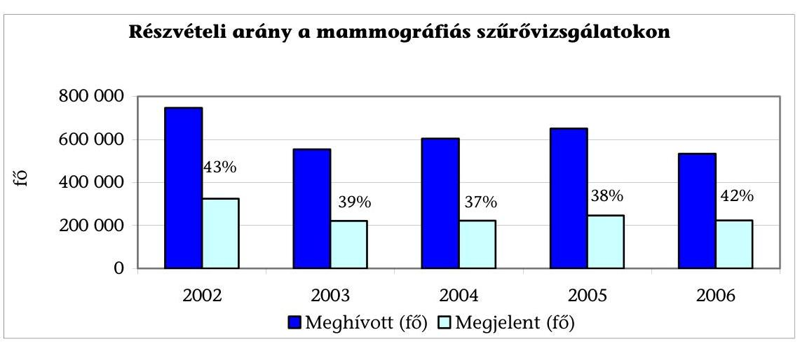

A megjelenési arányokban megyénként nagy különbségek figyelhetők meg (1., 2. sz. tanúsítvány). A megjelenési arányokat tekintve (behívott-megjelent) 2003-2006. évek között a legjobb eredményeket Szabolcs-Szatmár-Bereg megye (61-76\%) és Vas megye (60-70\%), a legrosszabbat Budapest (36,69\%) érte el. A vizsgált időszakban a megjelenési arány tág határok között - 25-76\% - mozgott.

Jó gyakorlatnak minősül a Szabolcs-Szatmár-Bereg megyei szervezés, ahol a magas részvételi arányt a szervezők hatékony munkájával érték el a háziorvosokon és az önkormányzatokon segítségével.

A szűrésen való részvétel egyéni költségeinek csökkentésére három intézkedést is hozott a tárca, egyrészt 2003. január 1-je óta van lehetőség a lakóhelyről a szűrőközpontba jutás útiköltségének megtérítésére, másrészt 2006. január 1-je óta a mammográfiás vizsgálatra csoportosan érkező nők számára szervezett buszok költségeihez a biztosító 60\%-os támogatást nyújt a települési önkormányzatoknak. Megyei szinten jelentős különbség van abban, hogy a fenti szervezési módszert milyen mértékben alkalmazzák, 2006-ban az összes így szállított nő 95\%-a, 2007-ben 61\%-a Szabolcs-Szatmár megyéből került ki. A harmadik költségcsökkentő tényező 2007-ben a szervezett szűrésre érkezők vizitdíj-mentesítése.

Az ANOVA Szolgáltató és Oktató Betéti Társaság - az ÁNTSZ megbízásából - 2003-ban felmérést végzett a szűréseken történő részvételéről, motivációjáról.

A kutatás célja a szervezett, célzott lakossági emlőszűrés hatékonyságának fokozása, a szűrendő célpopuláció egyes rétegei eltérő részvételének javítása, az esélyegyenlőtlenség csökkentése volt. A jelentés többek között az alábbi tapasztalatokat tartalmazta: Mind az egyén demográfiai jellemzői, mind a társadalmi jellemzői szerint kimutathatók a különbségek a mammográfiás emlőszűrésen részt vett és részt nem vett nők csoportja között. A szűrőprogramban való részvételi arány növelésében, a szűrőprogram hatékonyságának emelésében döntő szerepet játszik a nők mellrákkal, mammográfiás szűréssel, a szűrés menetével, lehetséges kimeneteivel, saját lehetőségeikkel kapcsolatos ismereteinek bővítése. Döntően hat a részvételi szándékra a háziorvosok hozzáállása, javaslatai, segítőkészsége.

---

A felmérés tapasztalatait és a tanulmányban megfogalmazottakat nem hasznosították. Egységes, közös kommunikációs stratégiát a programokhoz nem rendelt az ágazat irányító. A regionálisan bevált szűrésszervezési gyakorlatot nem alkalmazzák országosan. A szakemberek szerint a regionális jó gyakorlatok országos elterjesztése és az egységes kommunikációs stratégia szükséges a népegészségügyi szűrőprogram céljaként kitűzött 70\%-os részvételi arány eléréséhez.

# 2.4. A szűrés és a diagnosztika aránya 

Az OEP-nek 105 mammográfiás egységgel van finanszírozási szerződése, ebből 38 szerződés alapján 45 helyen végeznek emlőszűrést. (A Radiológiai Szakmai Kollégium Emlődiagnosztikai Szekciójának ajánlása szerint a lakosságszám figyelembe vételével elegendő lenne 27 szűrőcentrum.)$^{46}$

A többletkapacitással kapcsolatban azonban nemcsak mennyiségi, hanem minőségi problémák is vannak: további 60 olyan mammográfiás munkahely működik, ahol nem tanúsították, hogy megfelelnek a szűrésre előírt szakmai és technikai minimum feltételeknek. Ezeken a helyeken diagnosztikus vizsgálatokat végeznek, amelyeket az OEP ugyanúgy finanszíroz, mint a szűréseket, de a vizsgálatok eredményének megbízhatósága nem éri el az akkreditált szűrőközpontokét.

A hazai gyakorlatban összekeveredik a szűrési és diagnosztikus mammográfiás tevékenység. Szűrési mammográfiát kétévente (szűrési ciklusonként) egyszer, akkor számolhat el egy intézmény, ha erre az ÁNTSZ által kiírt pályázat során szerződést kötött, és a behívólevélben megszólított nő jelenik meg akkreditált mammográfiás centrum egyikében vizsgálatra. Ha a vizsgálatra nem szűrőcentrumban kerül sor vagy a szűrőcentrumban vizsgálatra jelentkező nem rendelkezik behívólevéllel, akkor a vizsgálat - finanszírozástechnikai szempontból - diagnosztikus célú mammográfiának minősül.

Nem negatív mammográfiai vizsgálati eredményt követően, a talált elváltozás vizsgálatához további diagnosztikus célú mammográfiás felvételeket, intervenciós beavatkozást, UH vizsgálatot végeznek. A diagnosztikus célú mammográfiai vizsgálatok ezért együtt tartalmazzák a „tisztázó" mammográfiás tevékenységet és a panaszmentes betegek eseteit. Ezért nem állapítható meg
 egyértelműen, hogy mennyi a célpopulációból panaszmentesen - mammográfiás vizsgálaton megjelent személyek száma, azaz mekkora a valódi átszűrtség.

[^0]
[^0]:    ${ }^{46}$ Nemzeti Rákellenes Program Daganatos Betegségek Megelőzése Alprogram (OTH, 2007. január) 12. oldala.

---

A szűrő- és a diagnosztikus emlővizsgálat betegszámait az OEP adatai alapján az ábra mutatja be:
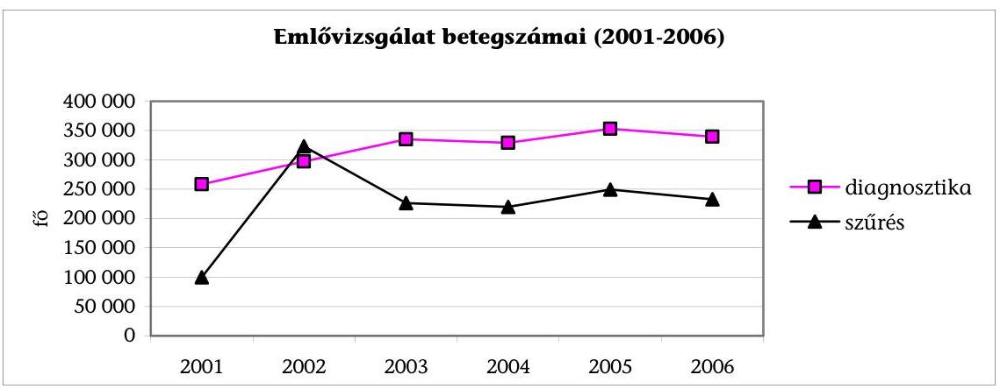

A részletezett adatok alapján a folyamatosan növekvő, diagnosztikán megjelent betegszám mellett a szűrővizsgálatok betegszáma 2004-ig csökkenő, majd enyhén emelkedő tendenciát mutat. A szűrés 2001. év végén indult, az első év alacsony betegszámát ez indokolja.

A szerződéssel rendelkező szűrőállomások - a jó kapacitáskihasználtság érdekében - a szűrővizsgálatok mellett nagyszámú diagnosztikus vizsgálatot végeznek, amelyből nem különíthetők el a panaszmentesen vizsgált esetek (valójában szintén szűrtek).

Hazai viszonylatban a szűrési és diagnosztikai vizsgálatok párhuzamos jelenléte miatt az átszűrtség négy mutatója különböztethető meg: részvételi/megjelenési arány, átszűrtség, átvizsgáltság, lefedettség, amelyek folyamatos szakmai elemzés tárgyát képezik, azokról rendszeresen cikkek jelennek meg. ${ }^{47}$

[^0]
[^0]:    ${ }^{47}$ A szervezett emlőszűrési program 2002-2003. évi részvételi arányai és a program hatása a diagnosztikus és szűrési célú mammográfiák számára: Dr. Boncz Imre, Péntek Z. Kovács A, Dózsa Cs., Budai A., Ember I. - Orvosi Hetilap 2005, 146(38): 1963-2970.
    A szervezett emlőszűrési program 2004-2005. évi részvételi arányai: Boncz Imre dr, Sebestyén Andor dr., Döbrőssy Lajos dr., Péntek Zoltán dr., Kovács Attila dr., Budai András dr., Kövi Rita dr. és Ember István dr.

---

A vizsgált időszakról publikált adatokat az alábbi táblázat tartalmazza:

| Szűrési ciklus | 2000-2001 | 2002-2003 | 2004-2005 |
| :-- | --: | --: | --: |
| 1. célpopuláció | nincs adat | 1178112 | 1284400 |
| 2. részvételi arány | nem értékelhető | $45,1 \%$ | $37,2 \%$ |
| 3. átszűrtség | $7,26 \%$ | $33,95 \%$ | $29,6 \%$ |
| 4. átvizsgáltság | $19,67 \%$ | $22,05 \%$ | $23,2 \%$ |
| 5. lefedettség | $25,85 \%$ | $53,46 \%$ | $50,8 \%$ |
| 6. hány nőnek végeztek   vizsgálatot (fő) | 393924 | 820057 | nincs adat |
| 7. mindkét ciklusban   részt vettek száma | 220528   $(55,98 \%)$ |  | nincs adat |

A népegészségügyi célú szervezett szűrés eredményessége jól látható pl. az átszűrtségen, miszerint a program indulása előtti 7,3\%-os arányhoz képest az első kétéves szűrési ciklussal közel 34\%-ra emelkedett az átszűrtség és a következő két évben visszaesett közel 30\%-ra. Ugyanezt a változást mutatja a lefedettségi mutató is, így az a következtetés adódik, hogy a részvétel növelése érdekében beavatkozásra van szükség.

A hazai helyzetet az jellemzi, hogy a céllakosság 30\% körüli (népegészségügyi) átszűrtsége mellett az érintett asszonyok további 20\%-a vesz részt (diagnosztikai célú) mammográfiás vizsgálaton szűrőciklusonként, ezzel a céllakosság 50\%-a lefedett mammográfiás vizsgálattal.

A népegészségügyi célú 30\% körüli ,,átszűrtség" és „megjelenési arány" adatok alapján nemzetközi viszonylatban Magyarország a sereghajtók közé, míg az 50\% körüli „lefedettségi" arány alapján a hasonló szervezett vizsgálatok között a középmezőnybe, az OECD átlagnak ${ }^{48}$ megfelelő körbe tartozik. Ez a mutató Norvégiában 98\%, Finnországban 87,7\% és Svédországban 83,6\%.

[^0]
[^0]:    ${ }^{48}$ Healt hat a Glance 2007, OECD Indicators 111. p.

---

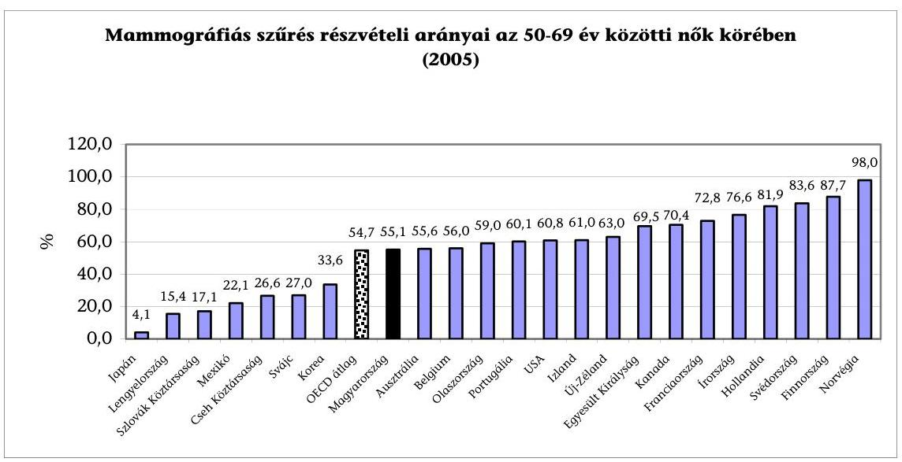

Forrás: HEALTH AT A GLANCE 2007; OECD INDICATORS
A finanszírozó nem tesz különbséget az akkreditált és nem akkreditált mammográfiás munkahelyen végzett diagnosztikus vizsgálat finanszírozása között. 2006-ban az összes diagnosztikai beavatkozásszám 40\%-át, összesen 554315 beavatkozást végeztek 60, nem szűrőközponthoz kapcsolódó diagnosztikus emlővizsgálati munkahelyen. A mammográfiás felvétel értékelése szakmai jártasságot feltételez, amelyet megfelelő esetszámú mammográfiás vizsgálattal és megfelelő technikai feltételekkel lehet elérni.

A szűrési és a diagnosztikai vizsgálatok megbízhatóságának javítását az OTH, - Radiológiai Szakmai Kollégiummal együtt - a mammográfiás szolgáltatások egységesítésében, a minimumfeltételek megszigorításában és a nem megfelelő, felesleges egységek OEP finanszírozási szerződésének felbontásában látják.

A javaslatot benyújtották a minisztériumnak. A módosítási javaslat egyrészről tartalmazza az egyes ellátóhelyeken végzendő minimális vizsgálatszámot. A 2006-os vizsgálati számok alapján a klinikai emlődiagnosztikát végző 60 ellátóhely közül 11 nem éri el a rendelettervezetben meghatározott minimális beavatkozásszámot, míg 45 emlőszűrést végző intézményből 12 nem éri el a tervezett minimális szűrésszámot. A rendelettervezet ezen felül az emlődiagnosztika végzését szakmai jártassághoz köti, a jártassági igazolás megszerzésére vonatkozó első vizsgát 2008 januárjában tervezi lebonyolítani a szakmai kollégium.

A szűrőközpontokra vonatkozó magas szintű „akkreditációs" feltételek teljesülését az ÁNTSZ a vizsgált időszakban nem ellenőrizte teljes körűen. A szűréssel nem foglalkozó diagnosztikus központokra nem vonatkoznak a szűrőhelyek akkreditációs kritériumai.

# 3. A SZERVEZETT MÉHNYAK SZŰRÉS HATÉKONYSÁGA 

Magyarországon a méhnyak szűrésre fél évszázada tesznek erőfeszítéseket. Míg Európában és számos fejlett országban sikerült a betegség halálozási adatainak csökkentése, addig nálunk nincs elmozdulás. Közel azonos számban évente át-

---

lagosan 500-an halnak meg ebben a betegségben. 2004-ben 493 halott volt, kb. annyi, mint 1971-ben. A fentieket támasztja alá a következő grafikon.
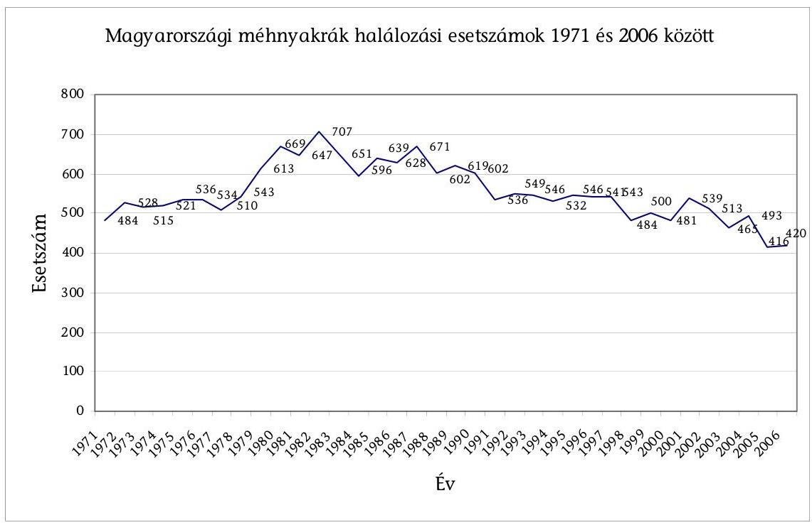

Az életkorhoz kötött opportunisztikus méhnyak szűrést már az 51/1997. (XII. 18.) NM rendelet lehetővé tette a 25-55 éves nőknek évente, 55-65 év közöttieknek pedig kétévente. A szűrési eljárást „nőgyógyászati onkológiai szűrés, különös figyelemmel a méhnyak-elváltozások szűrésére" formában határozta meg a jogalkotó, a szűrés végzésére pedig a nőgyógyászati szakrendelést jogosította fel. Népegészségügyi célú szervezett szűréssé 2003. július 24-től minősítette át a jogszabály. A szűrés gyakorisága változott - az éves gyakoriságról háromévenkéntire - a szűrési eljárás változatlan maradt, nevezetesen: „egyszeri negatív eredményű szűrővizsgálatot követően háromévenként, nőgyógyászati onkológiai méhnyakszűrés, különös figyelemmel a méhnyakelváltozások sejtvizsgálatára (citológia) és kolposzkópos vizsgálatára".

A Népegészségügyi Programban a daganatos halálozás 10\%-os csökkentését tűzték ki célul, ezen belül a méhnyakrák miatti halálozás 50\%-os (250 fő) csökkentése volt a cél 2010-ig. A cél eléréséhez nem készült olyan stratégia, akcióterv, amiben lépésről lépésre, évenkénti lebontásban kidolgozta volna az egészségügyi tárca, hogy időbeli ütemezés szerint mikor, milyen intézkedésekre van szükség az eredmények eléréséhez.

A szervezett méhnyak-szűrés vizsgálati módszere részben követi a nemzetközi szakmai szervezetek által ajánlott protokollt. Az alkalmazott szűrési eljárás a hazai hagyományokra épül, amely nem felel meg a nemzetközi gyakorlatnak, mert Magyarországon a szűrést nőgyógyász szakorvosok végzik komplex nőgyógyászati vizsgálat keretében. Ez a módszer nem költség-hatékony, mert a vizsgálat drágább mintha egy erre a feladatra kiképzett szakasszisztens végezné el.

A nemzetközi szervezetek szakmai ajánlása és az európai országok gyakorlata szerint a mintavételt képzett asszisztensek végzik. A kenetet patológiai laborban értékelik és, ha ebben eltérés mutatkozik a negatív állapottól, akkor kerül a beteg a nőgyógyászhoz. Ez a szűrési típus felel meg a szűréssel szemben támasztott követelményeknek: olcsó, gyors és hatékony a betegség felismerésében. A szűrés az epidemiológiai bizonyítékon alapuló méhnyakszűrést célozza. Egyéb szervek szűrővizsgálatának (méhtest, petefészek) hatásossága nem bizonyított. A hazai módszertan nemzetközi gyakorlathoz való igazítását az ÁNTSZ többször javasolta az ágazatirányítónak, de ebben nem született döntés.

A méhnyakszűrés, az országos részvételi arányok - 4,02\% és 6,57\% - ismeretében, mint szervezett népegészségügyi szűrés nem eredményes, nem hatékony, beavatkozást igényel.

# 3.1. Elérhetőség, területi eloszlás, egyenlő hozzáférés 

Nőgyógyászati szűrőtevékenység csak olyan szakrendelésen végezhető el, amelynek az OEP-pel finanszírozási szerződése van és a Nőgyógyászati Szakmai Kollégium szerint e tevékenységre alkalmas. A rendszerben a magánnőgyógyászok - minthogy OEP szerződéssel nem rendelkeznek - nem vehetnek részt, bár az OTH ismeretei szerint ${ }^{49}$ „a szűrendő célcsoport mintegy 30\%-át rendszeresen szűrik".

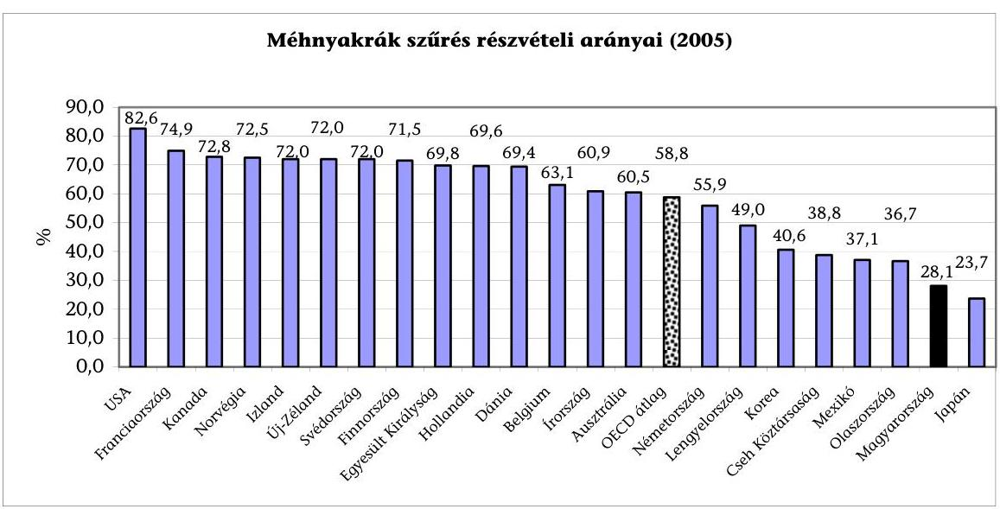

Forrás: HEALTH AT A GLANCE 2007; OECD INDICATORS

[^0]
[^0]:    ${ }^{49}$ Nemzeti Rákellenes Program/ Életkorhoz kötött szűrővizsgálatok 2007. január (15. o.)

---

A kenetvételre gyakorlatilag valamennyi járóbeteg-ellátást végző intézetben lehetőség van. A női lakosság jelentős része nem jelenik meg a szervezett szűrésen, hanem saját orvosát magánrendelésen keresi fel. Az itt végzett vizsgálatok és vizsgálati eredmények nem kerülnek rögzítésre sem az OEP, sem az ÁNTSZ rendszerében, mivel sem a nőgyógyásznak, sem az általa foglalkoztatott patológusnak nincs jogszabályi kötelezettsége, nincs anyagi érdekeltsége a megjelenés, illetve a vizsgálati eredmény jelentésében.

A magánrendelésen végzett vizsgálatok jelentési kötelezettségének hiánya okozza, hogy az átszűrtségi adatokban nincs tisztánlátás.

Országosan 336 kenetvételi hely, nőgyógyászati szakrendelés van. A kiadott működési engedélyek alapján 1710 a magán nőgyógyászati rendelések száma. ${ }^{50} \mathrm{~A}$ behívottak számát és a megyénkénti rendelések, illetve nőgyógyászok számát a 3. számú táblázat mutatja. A tábla képzett mutatói arra a feltételezésre épülnek, hogy valamennyi behívott megjelenik a szűrésen, vagyis $100 \%$-os a részvétel. Budapesten 61 kenetvételi munkahely van (6. sz. melléklet), 2006-ban 90,2 ezer nő kapott meghívót, ha mindenki elmenne, 1475 vizsgálat jutna átlagosan egy munkahelyre évente, ami napi 6-7 vizsgálatot jelenthet. Ténylegesen a behívottakból 3439-en jelentek meg, ez 3,8\%-os megjelenési arány (2006).

# A fenti adatok alapján az elérhetőség nem akadálya a szűrésen való megjelenésnek. ${ }^{51}$ 

### 3.2. Citopatológiai laboratóriumok kiválasztása

Az ÁNTSZ Országos Tisztifőorvosi Hivatala, citodiagnosztikai kapacitás lekötésére meghirdetett pályázatára 86 db pályázat érkezett, ebből 44 intézet, illetve 1 vállalkozó felelt meg a kiírás feltételeinek. A nyertesekkel az OEP szerződés kiegészítést kötött a népegészségügyi célú nőgyógyászati citológiai szűrő vizsgálatokra.

Az ÁNTSZ a kiválasztott laborokkal határozatlan idejű szerződést kötött, ami közös megegyezéssel bármikor felbontható, a rendes felmondás szabályai szerint. Ebben kikötötte a szervezési és szakmai protokoll alkalmazását, a módszertan és minőségbiztosítás alkalmazásának követelményét. Az ÁNTSZ szerződésbe foglalt megbízói kötelezettsége volt a protokollok hathavonkénti ellenőrzése, ezzel nem éltek.

Az akkreditált laborokból 2006-ban 42 jelentett a finanszírozónak 58026 db szűrést. A működő laborokban az összes diagnosztikai célú citológiai vizsgálatszám pedig 918268 db volt. Az OEP-nek jelentett citológiáknak mindössze 5,9\%-a kapcsolódik a szervezett szűréshez (4. sz. táblázat).

[^0]
[^0]:    ${ }^{50}$ ÁNTSZ 2007. évi adata.
    ${ }^{51}$ Az OGY Egészségügyi Bizottság 2008. március 12-i ülésén szorgalmazta az európai gyakorlatnak jobban megfelelő szakdolgozói cervix szűréseket, azaz a hozzáférést bővítené.

---

Annak az akkreditációs feltételnek, hogy legalább évi 6000-10 000 közötti minta vizsgálatát kell ellátni, számos patológiai labor nem felelt meg (4. sz. táblázat).

Vannak laborok, amelyeknek minimális az éves szűrési, illetve diagnosztikus kódon jelentett citológiai vizsgálatszáma. Az itt ellátott betegek mintáinak megítéléséhez rendelkezésre álló feltételek és szakértelem nem egyenértékű az akkreditált laborokéval. Ez kétségessé teszi az adott vizsgálati eredmény helyességét, illetve tévedésben tarthatja a beteget. A citopatológiai laboratóriumokban, a vizsgálati eredmények korrektségének biztosítása érdekében azonos követelmények szerinti működést kell biztosítani. Van olyan akkreditációval rendelkező labor, ahonnan egyáltalán nem jelentettek szűrési kenet vizsgálatot 2006-ban (pl. Szent István, Szent János Kórházak) patológiai laborok centralizálására, ismételt akkreditálása szükséges a kapacitások optimalizálása és a minőségbiztosítás érdekében. Az OEP nyilvántartása szerint 2007-ben 91 laboratóriumban 153 citopatológus működik országosan.

# 3.3. A méhnyakszűrés részvételi, megbetegedési mutatói 

A szűrés hatékonyságát
 a részvételi arányok mutatják. A vizsgált időszakban az országos részvételi arány 4,02% és 6,57% közötti volt, ami rendkívül alacsony és a program kudarcát jelenti az ÁNTSZ adatok alapján.

Az OEP finanszírozási adatai alapján, a jelentett esetszám a diagnosztikánál és a szűrésnél egyformán 2003-ban, a szűrés induló évében volt a legmagasabb, vagy a szűrés esetszáma a 2002. évinek tízszerese volt, ami a további években felére esett vissza. A diagnosztika esetszáma 2003-ban 37%-kal volt magasabb, mint 2002-ben, 40%-kal, mint 2004-ben, 45,2%-kal, mint 2005-ben, 45,3%-kal, mint 2006-ban. A diagnosztikai esetszámának csökkenése 259-288 ezerrel, 2003-hoz képest. Az okok vizsgálatáról nem készültek elemzések.

A diagnosztika esetszáma valamennyi vizsgált évben sokszorosa a szűrésének, ami az átszűrtség megítélésében lényeges szempont.

A részvételi arány megyénként és évenként jelentős különbséget mutat (4. 5. sz. tanúsítvány). A megyei beszámolók alapján ott volt nagyobb a részvétel, ahol időlegesen extra szervezési intézkedések történtek.

A részvétel fokozására több megye élt a mozgó szakorvosi szolgálat (MSZSZ) igénybevételével. Jelenleg az OEP adatszolgáltatása alapján 13 megyében 62 MSZSZ működik. Az MSZSZ - egy község, egy nőgyógyász - elvére alapozott szűrés lakossági igényként is felmerült, ez a forma azokat a nőket éri el, akik kis településeken élnek és egyébként nem mennének el a szűrésre. A MSZSZ pozitív tapasztalatainak figyelembevételével, a Szakmai Kollégium véleménye szerint szükség volna feladatainak és a meglévő kapacitás bővítésére és szűrési feladatokba való bevonására. Ehhez a finanszírozás tényleges költségekre támaszkodó változtatása is szükséges.

Az alacsony részvételi adatokat indokolják még az adatgyűjtés hiányosságai.

---

Hibaforrások:

- a célpopuláció meghívólevél nélkül keresi fel a nőgyógyászt, aki így diagnosztikus citológiai vizsgálatként számolja el a vizsgálatot;
- a nőgyógyász figyelmen kívül hagyja a meghívó vizsgálatkérő szelvényének laborba küldését;

A nőgyógyász a levett mintát az OEP-pel szűrővizsgálatra szerződött citológiai laboratórium valamelyikébe küldi. A vizsgálat eredményéről a laboratórium a beküldő nőgyógyászt értesíti, aki közli a pácienssel az eredményt. Nem-negatív eredmény esetén a nőgyógyász gondoskodik a további vizsgálatokról, teendőkről.

- a kenetet az orvos nem az akkreditált citológiai laborba küldi, így az nem szűrőkóddal jelenik meg.

A jelenleg működő informatikai rendszer nem alkalmas a betegkövetési adatok gyűjtésére, így a betegkövetés a kezelőorvos felelőssége, illetve a szükséges vizsgálatokon való további megjelenés a betegek felelőssége. A citológiai lelet tartalmazza a vizsgált kenet általános minősítését. Ha a kenet technikai fogyatékosságai miatt értékelhetetlen, a kenetvételt és a sejtvizsgálatot meg kell ismételni, a visszahívást az informatikai rendszer nem tudja kezelni.

A nyilvántartás hiányossága miatt nincs adat arról, hogy a nem negatív eredmény miatt visszahívottak mekkora hányada vész el a követés számára. A tévesen negatív eredményeket sem tudják nyilvántartani, mivel az ÁNTSZ nem jogosult az egészségi állapotra vonatkozó adatok személyhez kötött kezelésére, a szűrővizsgálati adatok és a klinikai, patológiai diagnózisok adatkapcsolásának jogszabályi feltételei nem adottak.

Újdonságként került meghirdetésre a védőnői Modell Program, amelynek célja, a védőnők kenetvételbe történő bevonása volt - az európai gyakorlat szerint. A védőnők bevonására előkészületek voltak Nógrád, Zala megyében és a Dél-Dunántúlon, Baranya, Tolna, Somogy megyében. Győrben citopatológus által tartott 2 napos elméleti képzésen 29 védőnő, részletes gyakorlati képzésben pedig 20 védőnő vett részt. A védőnői Modell Program azonban a gyakorlatban nem indult el. ${ }^{52}$

Az alábbi tábla mutatja a C53-as kóddal regisztrált új betegek számát valamennyi korosztály figyelembe vételével. A 25-65 év közöttiek száma az összes megbetegedettnek átlagosan 76%-a volt. Az in situ méhnyakrákban megbetegedettek száma az induló évhez képest nőtt az összes korcsoportban. Ebből a 25-65 év közötti korosztály a vizsgált időszakban körülbelül 90%-ot képviselt.

[^0]
[^0]:    ${ }^{52}$ Hivatkozás az országos vezető védőnő 154-56/2007. sz. (2007. 07. 17.) levele az Országos Szűrési Koordinátorhoz írt feljegyzése.

---

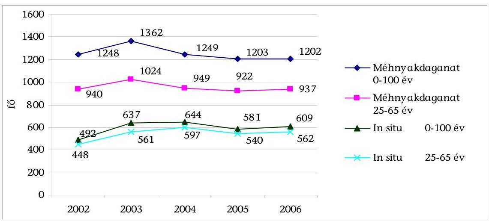

Az OEP adatszolgáltatása alapján elemeztük a 70 év felettieket abból a szempontból, hogy a Rákregiszterbe való bekerülésüket megelőző 10 évben vettek-e részt szűrésen vagy diagnosztikus vizsgálaton. Ezt az alábbi tábla mutatja:
fő

| 70 év felettiek adatai, 2002-2006 |  |  |  |  |  |  |
| :--: | :--: | :--: | :--: | :--: | :--: | :--: |
| Megnevezés | Új beteg | Szűrésen |  | Diagnosztikán |  | Nincs adat |
|  |  | 42700 | 42600 | 14720 | 29602 |  |
| C53 | 2067 | 11 | 105 | 509 | 562 | 880 |
| In situ | 382 | 3 | 24 | 146 | 175 | 34 |
| Összesen | 2449 | 14 | 129 | 655 | 737 | 914 |

Az elemzés azt mutatja, hogy a C 53-as kóddal regisztrált 2067 főből szűrésen 11 fő vett részt, az in situval regisztráltak közül pedig 3 fő. A 42600-as kóddal, amin a járóbeteg-ellátás jelenti a nőgyógyászati szűrővizsgálatot 105, illetve 24 fő vett részt.

A Rákregiszterben méhnyakrák diagnózissal szereplő 70 év feletti nők 37,32%-ának nem volt méhnyak kenetvétele. A betegek diagnózisáról teljes körű és szövettanon alapuló orvos által ellenőrzött jelentések adhatnak valós adatot. A hazai megbetegedési és halálozási adatok pontossága a folyamatos korrekciók mellett is kétséges. A Rákregiszter az intézeteket folyamatos ellenőrzésre kéri és szólítja fel az ellenőrizetlen, hiányzó szövettani kódú betegek adatainak pótlására, pontosítására. A Rákregiszterben gyűjtött adatok validitásának kiemelkedő szerepe van a KSH éves jelentései szempontjából, hiszen a megbetegedési adatokat a Rákregiszter szolgáltatja, a vonatkozó Országos Statisztikai Adatgyűjtésről szóló Kormányrendeletek alapján. Ezen túl számos kutatáshoz, nemzetközi és hazai publikáláshoz szolgáltat adatot a Rákregiszter.

---

# 3.4. A kenetvétel gyakorisága 

A méhnyak vizsgálatának gyakoriságát az OEP annak igazolására mérte fel, hogy bemutassa, hogy minden évben szinte ugyanaz a női sokaság jár vizsgálatra. Ez azokra a szűrési és diagnosztikai adatokra vonatkozik, amit a finanszírozás mutat. Ez nem tartalmaz adatokat a magán praxisban vizsgált asszonyokról.

A méhnyak citológiai vizsgálata kb. 1 millió vizsgálat évente, ami kb. 850000 nő vizsgálatát jelenti. Szűrővizsgálatot 3 évente vehet igénybe az, akinek nem volt diagnosztikus vizsgálata a három éves periódusban. A diagnosztikus vizsgálatnak nincs időbeli korlátja, vagyis bármikor elvégzi az ellátórendszer, ha panasszal fordul a beteg a rendeléshez és ezt akár több, földrajzilag is egymástól független helyen kérheti.

A táblázat szűrési adatait úgy állították össze, hogy minden 3 éves periódusban egy TAJ-szám csak egyszer szerepeljen. Ezt a következő tábla foglalja össze. ${ }^{53}$

A kenetvételen részt vett nők vizsgálati gyakorisága ${ }^{54}$

|  | WHO | DB1 | DB2 | DB3 | DB4 | DB5 | 5 Felett |  |
| :--: | :--: | :--: | :--: | :--: | :--: | :--: | :--: | :--: |
| $\begin{aligned} & \text { ㅈ } \\ & \text { ㅇ } \\ & \text { ㅇ } \end{aligned}$ | Diagnosztika 29602 | 411897 | 322293 | 82254 | 22853 | 6723 | 4810 |  |
|  | Szűrés 42700 | 21582 | 334 | 12 | 0 | 0 | 0 |  |
|  | Összesen | 414003 | 325692 | 85312 | 23538 | 6886 | 4908 | 860339 |
|  |  |  |  |  |  |  |  |  |
| $\begin{aligned} & \text { ㅇ } \\ & \text { ㅇ } \\ & \text { ㅇ } \end{aligned}$ | Diagnosztika 29602 | 285679 | 290766 | 187977 | 55268 | 16944 | 14446 |  |
|  | Szűrés 42700 | 47853 | 303 | 12 | 0 | 0 | 0 |  |
|  | Összesen | 304163 | 293443 | 192009 | 56983 | 17373 | 14696 | 878667 |
|  |  |  |  |  |  |  |  |  |
| $\begin{aligned} & \text { ㅇ } \\ & \text { ㅇ } \\ & \text { ㅇ } \\ & \text { ㅇ } \end{aligned}$ | Diagnosztika 29602 | 264836 | 273828 | 206480 | 66751 | 19663 | 16694 |  |
|  | Szűrés 42700 | 75683 | 276 | 11 | 0 | 0 | 1 |  |
|  | Összesen | 284488 | 280975 | 211241 | 68092 | 20007 | 16840 | 881643 |

Látható, hogy több mint 120644 nő háromszor vagy annál többször vett részt vizsgálaton 2004-2006 között, 2003-2005 között 281061 és 2002-2004 között 316 180. Feltételezve, hogy 2 millió fő az átvizsgálandó célpopuláció háromévente, az a következtetés vonható le, hogy 1,1 millióan közülük sem diagnosztikán, sem szűrésen nem vettek részt.

Mivel a szakmai ajánlásokra alapozott szűrési periódus 3 év, az ennél gyakrabban végzett vizsgálatok az OEP-nél felesleges kifizetést gerjesztenek.

A kenetvételen részt nem vett nők megbetegedési mutatóit a jelentés az OEP adatszolgáltatásának hiányában nem mutatja be.

[^0]
[^0]:    ${ }^{53}$ Dr. Kövi Rita OEP.
    ${ }^{54}$ A táblázat nem tartalmazza 14720 és 42600 kódokon jelentett eseteket.

---

# 4. A VASTAGBÉLSZŰRÉS HATÉKONYSÁGA 

## Az Országgyűlés és a Kormány vastag-, illetve végbéldaganat-szűrés kiterjesztésre vonatkozó céljai nem teljesültek.

2001-ben a népegészségügyi program ${ }^{55}$ célul tűzte ki a vastagbél-, végbél daganatok miatti halálozás 10%-os csökkentését 2010-ig.

2003-ban OGY határozat ${ }^{56}$ célul tűzte ki a 45-65 év közötti nők és férfiak korosztálya részére a széklet vér laboratóriumi kimutatásán alapuló vastag- és végbélszűrés rendszerének megszervezését, valamint a vastagbél-, végbélrák okozta halálozás 20%-os csökkentését 2012-ig.

A vastagbélszűrés 2005. december 30-ig nem szerepelt a népegészségügyi célú szűrővizsgálatok között a miniszteri rendelet ${ }^{57}$ az életkorhoz kötött szűrővizsgálatok között szerepeltette. 2005. december 31-én mindössze 1 napra szervezett népegészségügyi célú szűrővizsgálattá minősítette.
2006. január 1-jétől a népegészségügyi célú, célzott szűrővizsgálatok között, már csak kísérleti programként határozták meg a gyomor-bélrendszeri eredetű vérzés szűrését.

2008-tól az EüM nem finanszírozza a vastagbélszűrések szervezését, és felfüggesztette a programot. Az Országgyűlésnek a népegészségügyi programban a vastagbél daganatos halálozás csökkentésére megfogalmazott célkitűzései nem változtak, de beszűkített programmal nem érhetők el a kitűzött célok. A vizsgált időszakban nem születettek meg a program országos kiterjesztéséhez szükséges döntések és intézkedések.

2006-ot megelőzően négy „modell” szűrési projektet bonyolítottak le: Ajkán (és később csatlakozva Lovászpatonán), Balatonfüreden (két, egymást követő ciklusban is), valamint a főváros IX. és XIV. kerületében.

Az eredményeket nem naptári évenként értékelték a modellterületeken, hanem a programonként változó projekt-időtartamok végén. Az egyes
 modellszűrések folytatását a teljesítmény-volumenkorlátozás miatti ellenérdekeltség akadályozta. Az érintett korosztály ismételt meghívására egyedül Balatonfüreden került sor 2005-ben, a többi esetben a kétéves ciklusidőtartamot nem érték el. Nagyatádon és környékén a 2007-ben lefutott projekt 2008-as ismétlését tervezik. Mindezek következtében a bevezető, 2004. évre tervezett 180 000 fős népesség szűréssel történő elérése az azóta eltelt 3,5 év alatt sem sikerült.

[^0]
[^0]:    ${ }^{55}$ A 2001-2010. évekre szóló Egészséges Nemzetért Népegészségügyi Program alapelveiről szóló 1066/2001. (VII. 10.) Korm. határozat.
    ${ }^{56}$ Az Egészség Évtizedének Johan Béla Nemzeti Programjáról szóló 46/2003. (IV. 16.) OGY határozat.
    ${ }^{57}$ A kötelező egészségbiztosítás keretében igénybe vehető betegségek megelőzését és korai felismerését szolgáló egészségügyi szolgáltatásokról és a szűrővizsgálatok igazolásáról szóló 51/1997. (XII. 18.) NM rendelet.

---

A szűrések módszere - FOBT teszt - összhangban volt a nemzetközi ajánlásokkal, illetve az európai uniós elvárásokkal. A szűrések bevezetésének elhatározása óta változatlan a laboratóriumi alaptechnológia: rejtett székletvér vizsgálat, annak is egy sajátos, kétfázisú formája. Az Orvosi Laboratóriumi Szakmai Kollégium 2005 ősz óta nem tartja alkalmasnak a vizsgálati eljárást. A Kollégium véleménye miatt a minisztérium elhalasztotta az országos kiterjesztést és helyette 2006-ra a „kísérleti jellegű" folytatás mellett döntött. A vastagbélszűrési munkacsoport ezzel szemben a módszert megfelelőnek tartja. Az ellentmondó szakmai álláspontok, valamint a minisztérium határozott döntésének hiánya miatt a vastagbélszűrést máig nem terjesztették ki országosan. Az Országgyűlés által 2003-ban kitűzött 20%-os halálozáscsökkentési cél 2012-ig az eddigi gyakorlat alapján nem fog teljesülni.

A vastag- és végbélszűrések módszertana a nemzetközi ajánlások szerint a rejtett vérzés székletbeli kimutatása. Egyes szakmai csoportok a szűrés kolonoszkópiás módszerét támogatják, ami szintén alkalmas a vastag- és végbéldaganatok korai stádiumának megállapítására, de a tömegszűréssel szemben támasztott követelményeknek (gyors, olcsó, fájdalommentes) nem felel meg.

Az ÁNTSZ értékelése szerint a modellterületeken összesen 110 000 fő részére juttattak el szűrési meghívást. A megszólított lakosságcsoport részvételi aránya $\mathbf{32\%}$-os volt, amely nem esik messze a $\mathbf{40\%}$-os állami elvárástól (ez a mutató Finnországban $\mathbf{71\%}$ volt).

A vastagbélszűrésben részt vettek adatait az ÁNTSZ a következő táblázatban mutatta be. A szűrések eredményeként polypot (rákmegelőző állapotot) 312 főnél, rosszindulatú daganatot 50 főnél állapítottak meg.

---

| Megnevezés | Világ-   banki   csoport | Ajka,   Lovász-   patona | Bp. IX.   kerület | Bp. XIV.   kerület | Békés-   csaba   2006. | Balaton-   füred | Kecskemét | Nagyatád |
| :--: | :--: | :--: | :--: | :--: | :--: | :--: | :--: | :--: |
| Vizsgálandó   populáció | 21950 | 8686 | 11978 | 25134 | 10753 | 3450 | 25033 | 5000 |
| Kiküldött levelek száma |  |  | 11978 | 25134 | 10753 | 3450 | 3227 | 2507 |
| Kiadott kazetták száma |  |  |  |  | 3834 | 2485 | 3089 | 2507 |
| Beérkezett   székletminták   száma | 6805 | 3996 | 4013 | 10216 | 2763 | 2010 | 3089 | 2507 |
| Kolonoszkópiára javasolt | 377 | 321 | 213 | 475 | 157 | 121 | 401 | 206 |
| Kolonoszkópiát elutasítók | 134 | 23 |  |  | 25 | 24 | 38 | 112 |
| Folyamatban lévő kolonoszkópia |  |  |  |  |  |  |  | 20 |
| Elvégzett kolonoszkópia | 243 | 298 | 56 | 200 | 108 | 97 | 197 | 74 |
| Negatív kolonoszkópos eredmény | 35 | 90 | 5 | 76 | 31 | 41 | 124 | 18 |
| Nem negatív kolonoszkópia | 208 | 208 | 51 | 124 |  | 56 | 38 | 56 |
| Polyp | 59 | 67 | 19 | 50 | 40 | 25 | 36 | 16 |
| Rosszindulatú daganat | 12 | 13 | 4 | 2 | 8 | 2 | 1 | 8 |
| Egyéb | 137 | 128 | 28 | 72 | 31 | 29 | 1 | 32 |

A minisztérium 2000-ben készített „megvalósíthatósági tanulmánya" szerint a tömegszűrés klinikai vonzatainak ellátásához szükséges technikai háttér biztosított. A megállapítást évi 25 000 többlet kolonoszkópos kivizsgálási igény kalkulálásával, a rendelkezésre álló ellátóhelyek és eszközpark számbavételével tették. Ezzel szemben a vastagbélszűrési munkacsoport szűrések országos kiterjesztését gátló tényezőként állapította meg, hogy a kolonoszkópos kapacitás „jelentős" bővítésére lenne szükség.

A kísérleti szűrési programok eredményeinek újraértékelésével lehetőség lesz szükség esetén - a szűrési módszer pontosítására, módosítására és országos megszervezésére.

# 5. A SZŰRÉSEKRE RENDELKEZÉSRE ÁLLÓ FORRÁSOK 

A prevenciós tevékenységek megvalósításának feltétele a biztos finanszírozási bázis kialakítása. A szervezett szűrőprogramokat úgy vezették be, hogy finanszírozásuk nem volt előre kidolgozva. A szűrési vizsgálat finanszírozását az E. Alap gyógyító-megelőző ellátások éves keretének terhére vezették be, a szervezés költségeit központi költségvetési támogatásból fedezik.

---

Az elsődleges és a másodlagos prevenció finanszírozása nem kidolgozott, nincsenek prioritások, s nincsenek előre, a feladatokhoz meghatározott források sem. Az onkológiai szűrések szervezési kiadásait az EüM költségvetésében biztosítják, amit forrásátadással az ÁNTSZ használ fel. A szűrés és a következményes ellátások költségeit az OEP finanszírozás biztosítja. Ezen túlmenően a szűrés infrastruktúráját javították az EU-s forrásból megvalósult beruházások. Elsődleges prevencióra és részben szűrésre is a MeH, valamint egyéb tárcák költségvetése is tartalmaz kiegészítő forrásokat.

# 5.1. A szűrővizsgálatok szervezésének és kommunikációjának forrásai 

Az ÁNTSZ részére fejezeti kezelésű előirányzatból az onkológiai szervezett szűrések lebonyolítására átadott pénzeszköz 2002-2007 között évi 200 244 M Ft. Ezek a források szolgáltak a szakértők, szűrési munkacsoportok, posta költség, informatikai beszerzések, szolgáltatások finanszírozásának forrásául. Az ÁNTSZ-en belül a szűrést szervező szervezeti hátteret az ÁNTSZ költségvetése biztosította.

Az alábbi diagram a népegészségügyi szűrés és az ÁNTSZ-nek az onkológiai szűrések szervezésére átadott forrásokat mutatja.
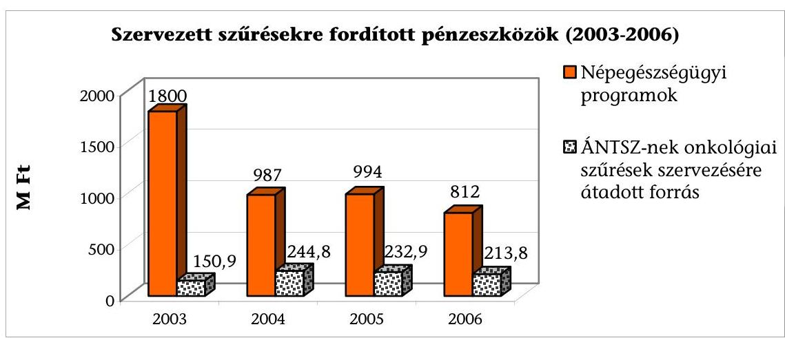

A Népegészségügyi Program megvalósítása a „21 lépés az egészségügy megújításáért" előirányzaton belüli előirányzatból a népegészségügyi szűrővizsgálatok alprogramra 2006-ban 346,5 M Ft-ot költöttek (pl. rizikó és cardiovascularis prevenció, dohányzás, AIDS Világnap stb.). Az előirányzatból eredetileg 150 M Ft-ot az ÁNTSZ kapott az onkológiai szűrések szervezésére, majd ezt az összeget később a 213,8 M Ft-ra egészítették ki. A 213,8 M Ft-ot a minisztérium 2007 márciusában utalta az ÁNTSZ-nek, és a beszámolási határidő július 31. volt. A 2006-ban felmerült szűrési költségeket az ÁNTSZ finanszírozta.

A 2007-re előirányzott összegről (237 M Ft) a megállapodást a minisztériummal 2007. november 15-én írták alá. 2007. szeptember 25-i feljegyzés szerint a minisztérium döntött a vastagbélszűrés finanszírozásának megszüntetéséről és helyette 2008. januártól a szájüregi szűrés bevezetéséről. Döntést megalapozó

---

dokumentum nem készült. Az ÁNTSZ-nek a 2007 folyamán felmerült, vastagbélszűréssel kapcsolatos költségei 15 M Ft értékben megtérítette a minisztérium.

Az ÁNTSZ-nál informatikai beruházásra fordított forrás 2002-ben 57 M Ft volt, amelyből számítógépeket, fénymásolókat és a mammográfiás szűrőállomásokon használt szoftvert vásárolták meg. 2006-ban 6,2 M Ft és 2007-ben 4,8 M Ft informatikai célú kifizetés történt a szűrési célú támogatás terhére, ezeket az eszközöket azonban nem a szűrési koordinációs osztály használta fel.

2002 áprilisában írták ki az Országos Szűrési Rendszerre a pályázatot. A projekt keretében 2003-ban 23,4 M Ft-ot, 2004 novemberében 43,6 M Ft-ot támogatásból és 11 M Ft-ot az ÁNTSZ saját költségvetéséből fizettek ki a közbeszerzési pályázaton nyertes International System House Kft.-nek, összesen 78 M Ft értékben. A támogatás forrása a 2002. évi Egészségfejlesztés és mentálhigiénés célok elnevezésű fejezeti kezelésű előirányzat, onkológiai szűrővizsgálatok alprogram 56 M Ft-ja és a tartalékalap alprogram 11 M Ft-ja volt.

A szűrőprogramok kommunikációját a népegészségügyi program fejezeti kezelésű előirányzatában tervezték meg, az egyes években eltérő nagyságú és nem rendszeres forrásokkal. A szűrési programok népszerűsítésébe bevonható szponzorok, támogatók lehetséges szerepére terv nem készült.

2004-ben a McCann-Erickson cég bevonásával a népegészségügyi program kommunikációjára indult kampány 150 M Ft értékben. Ennek keretében dohányzás ellenes program, egészséges ifjúság program és a méhnyakrákkal kapcsolatos szűrőprogram népszerűsítése volt a cél. A teljes összegből a méhnyakrák elleni kampány $31,5 \mathrm{M} \mathrm{Ft}+$ áfa összegben valósult meg. A kampány keretében televízió reklámfilm, rádiószpot, sajtóhirdetésre alkalmas fotó készült, valamint a média megjelenés díjait és a jogdíjakat is tartalmazta az összeg. Még ugyanebben az évben 1,7 M Ft-ot sajtófigyelésre költöttek.

A méhnyak szűrésen történő megjelenési arány javítására indította el a Népegészségügyi Kormánymegbízotti Hivatal és külső támogatók 2004-ben a Liliom programot, amelynek során összetett kommunikációval és nyereményjátékkal tették vonzóbbá a szűrővizsgálaton történő megjelenést. A szponzorok által finanszírozott kampányhoz a minisztérium 4 M Ft-tal járult hozzá. A Liliom program minden évben folytatódott.

A megállapodás a Lilly Hungária Kft. által felajánlott 20 M Ft közvetlen anyagi támogatáson túl magában foglalja a kommunikáció szervezését és megvalósítását. A részvétel fokozására szponzori felajánlásból nyereményautót is sorsoltak a résztvevők között. A kommunikációs kampány első üteme 2005 őszén indult, és 2006 februárjában a nyereményautó TV show-n történő sorsolásával zárult, majd 2006 májusától folytatódott.

A 2006-ban sorsolt autó a Renault Hungária felajánlása volt, amelyről 3 122 842 Ft értékű számlát nyújtott be az ÁNTSZ-nek. Az ellentételezést a Renault cég kampányban való reklámozása adta. A nyereményautó szponzori szerződésébe foglalt feltételeinek számviteli bonyolítása az ÁNTSZ-nek többletkiadást okozott, ugyanis az autó ellenértékének megfelelő, a Renault Hungária reklámozásáról kibocsátott számla áfa tartalmát be kellett fizetni az APEH részére (624 568 Ft).

---

2006 és 2007 augusztusában újabb együttműködési megállapodások születtek a Liliom Program folytatásáról, újabb 20-20 M Ft-os támogatással az országos programok megvalósításának érdekében. A Lilly Hungária Kft. a programok közvetlen finanszírozását vállalta.

A méhnyak szűrés eredményesebbé tétele érdekében 2005-ben a Szerencsejáték Rt. 45,9 M Ft-ot adott át 20 db gépkocsi beszerzésére, amit a megyei szűrési koordinátorok használatába adtak. Az autók kihasználtságáról, az eredményesség javulásáról a megyei beszámolók nem szólnak, célnak megfelelő használatot nem ellenőrizték.

2007-ben a Miniszterelnökség költségvetésében 300 M Ft állt rendelkezésre a SZÉP - Szűréssel az Életért Program - lebonyolítására. 2008 februárjában a programot a MeH folytatja. A rendezvénysorozat célja, hogy felhívja a lakosság figyelmét a szűrővizsgálatokra és az egészségmegőrzés fontosságára, ugyanakkor rendezvényein keveredik az alkalomszerű és a szervezett (népegészségügyi stratégia részeként) szűrés, ami rontja a szervezett onkológiai szűrések - behívás, betegkövetés - hatékonyságát. A SZÉP program alprogramja a daganatos megbetegedések megelőzésére irányuló tevékenységek támogatása, ezen belül a szervezett szűrőprogramokra való figyelem felhívása, illetve a Liliom program népszerűsítése. A
 MeH felvette a kapcsolatot az ÁNTSZ-szel a program rendezvényein való közreműködésre.

A 2004-től működik az ÁNTSZ honlapján lakossági szűrések fejezet. A nyomtatott sajtóban cikkek országos és helyi megjelenésével támogatták a szűrésen való részvételt. Az ÁNTSZ közreműködésével az elektronikus médiában (pl. RTL Klub, TV2, Hír TV,) ingyenesen népszerűsítették a szűréseket. Ezen túlmenően az ÁNTSZ szórólapokat készített, 2004-ben 7,3 M Ft értékben, 2006-ban a források szűkössége miatt erre nem volt lehetősége.

# 5.2. A népegészségügyi célú szervezett onkológiai szűrések OEP forrásai 

A népegészségügyi szűrések minél szélesebb körű végzése érdekében - finanszírozási szinten - nem teremtették meg a szűrési tevékenység végzésében a szolgáltatói érdekeltséget.

A TVK bevezetését követően, 2004 óta közvetítették a tárca felé a szűrési munkacsoportok a szűrővizsgálatok teljesítménynövelő hatása és a TVK közötti ellentmondást.

A teljesítményt növelik a nem negatív szűrési eredményeket követő további diagnosztikai vizsgálatok, a rákmegelőző állapotok kezelése, a műtéti beavatkozások, a rehabilitáció költségei.

Az emlő és a méhnyak szűrővizsgálatok kikerültek ${ }^{58}$ a teljesítményvolumen korlát alól. Az intézkedéssel javult a szűrőcentrumok helyzete, de a centrumok-

[^0]
[^0]:    ${ }^{58}$ 43/1999. (III. 3.) Korm. rendelet 2006. decemberi módosítása.

---

hoz kapcsolódó ellátó egységeké nem. A Kormányrendelet ${ }^{59}$ további módosítása ad lehetőséget arra, hogy azoknál, akik a szervezett szűrés keretében behívólevéllel jelentkezők közül kerülnek kiemelésre, a további kivizsgálás, műtét költsége ne essen a TVK korlát alá. Ez egyszerű TAJ azonosítással megoldható lenne, amihez valamennyi információ az OEP-nél rendelkezésre áll. A szűrést szervezők véleménye szerint a TVK a vastagbélszűrés esetében az országos kiterjesztés egyik legfőbb akadálya.

A szervezett emlő- és méhnyak szűrésen való részvétel ingyenes. A térítésmentes vastagbélszűréshez való hozzáférés a vizsgált időszakban jelentősen korlátozódott.

A térítésmentesen igénybe vehető vastagbélszűrési ellátást a minisztérium fokozatosan szűkítette. 2006-ig a 45-65 évesek kétévente jogosultak voltak rá, majd 2006. január 1-je óta szabályosan csak a néhány modellterület székletvér szűrései voltak igénybe vehetők hazánkban térítésmentesen. Vagyis a „kísérlet" azzal, hogy még nem országos kiterjesztésű, mintegy szűkítette az igénybe vehető egészségügyi ellátási kört.

A szűrővizsgálatok igénybevétele vizitdíj mentes. ${ }^{60}$ A társadalombiztosító a szűrővizsgálat helyére jutás útiköltségét kifizeti vagy ahhoz támogatás nyújt, azonban az útiköltség elszámolásában 2006 elején történt módosítás bonyolítja az egyén számára az összeg megtérítését és ezzel negatívan hat a szűrővizsgálatokon való részvételre.

A mammográfiás vizsgálatra szervezetten érkező nők számára 2006. január 1-je óta a buszköltséghez a biztosító 60%-os támogatást nyújt a települési önkormányzatok számára. 2006-ban 3,371 E Ft-ból 5051 fő (667 Ft/fő) 2007-ben 3,339 E Ft-ból 6026 fő (554 Ft/fő) vett részt mammográfiás szűrésen ilyen típusú szervezés és finanszírozás keretében.

Az OEP-nél nem volt biztosított plusz forrás a szűrések következményes kezelésének finanszírozásához. Az OEP forrásain belül a népegészségügyi szűrésre fordított források elkülönítése - a hasonló célú diagnosztikai tevékenységtől az emlőszűrés és a méhnyak szűrés esetén „szűrőkódokkal" megoldott. A vastagbélszűrés esetén ez a megkülönböztetés - szűrési kód hiányában - nem lehetséges.

A finanszírozó a szűréseken való részvétel fokozását 2005-ben pályázat formájában is támogatta - háziorvosokon keresztül - közvetetten.

Az OEP 2005-ben írt ki pályázatot egészségmegőrző, egészségfejlesztő és betegségmegelőző tevékenység végzésére háziorvosok részére (IBR-en kívül) 850 M Ft keretösszeggel. Ez a pályázat a primer prevenció területére szólt, kapcsolata az országos, szervezett szűrővizsgálatokkal csak közvetett, 348 szerződésre 210 M Ftot fizettek ki. A szakmai beszámolók alapján a szűréssel összefüggő tevékenység

[^0]
[^0]:    ${ }^{59}$ Az egészségügyi szolgáltatások Egészségbiztosítási Alapból történő finanszírozásának részletes szabályairól szóló 43/1999. (III. 3.) Korm. rendelet.
    ${ }^{60}$ A kötelező egészségbiztosítás ellátásairól szóló 1997. évi LXXXIII. törvény 18/A. § (6) c) bekezdés.

---

nem mérhető, mivel a pályázati kiírás nem írt elő egységes, összehasonlítható beszámolási struktúrát.

Az emlővizsgálatokra fordított kiadások egy év (2004) kivételével folyamatosan növekedtek, de az emlővizsgálatokon belül a szűrésre fordított pénzeszközök aránya a 2002. évi 40%-ról 2003-ra 33%-ra csökkent, és az ezt követő években ezen a szinten stagnált. Azaz a növekvő kifizetéseken belül a diagnosztikus mammográfiás és egyéb emlővizsgálatokra (UH, MRI, intervenció) fordított források növekedtek erőteljesebben. Ez összefügg a szűrt betegek számának csökkenésével.

A diagram a diagnosztikai és szűrési célú emlővizsgálatokra, intervencióra, UH és MRI vizsgálatokra fordított pénzeszközöket mutatja be (6. sz. tanúsítvány).
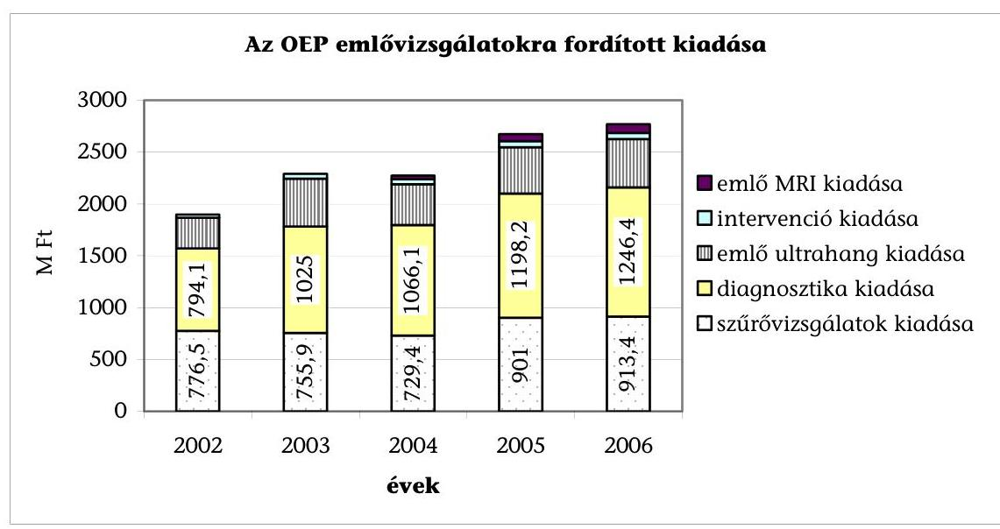

Forrás: OEP tanúsítvány
A mammográfiás szűrésre a társadalombiztosító által fordított összeg a 2002. évi 776,5 M Ft-ról 2006-ra 913,4 M Ft-ra növekedett, nem egyenletes ütemben. Az összeg emelkedésében az egy vizsgálatra jutó finanszírozás növekedése nagyobb mértékben játszott szerepet, mint a betegszám emelkedése.

Egy szűrővizsgálattal azonos tartalmú diagnosztikai vizsgálat finanszírozása a vizsgált időszak egy hónapjában - 2003 augusztusában - haladta meg a mammográfiás szűrését. Az ezt követő időszakban egy szűrővizsgálat finanszírozási összege magasabb volt, mint a diagnosztikai vizsgálaté, a megelőző időszakban a két vizsgálat finanszírozása azonos volt (7. sz. melléklet).

A méhnyak szűrés beavatkozásainak kiadásai 1,4 Mrd Ft és 1,3 Mrd Ft közöttiek voltak. A szűrésre fordított kiadás ennek 19,3%/2003, 10,7%/2004, 10,2%/2005, 12,4%-a volt (3. sz. tanúsítvány).

2003-tól 2004. május 1-jéig 1200 ponttal, míg ettől az időponttól 1093 ponttal finanszírozódott mind a szűrési, mind a diagnosztikai célú citológiai vizsgálat. A pont azonosság miatt a szűrésért és a diagnosztikáért közel azonos, 1000 Ft körüli összeget kapnak az intézetek. Tekintve a szűrések alacsony számát az ér-

---

dekeltség nem számottevő, az elszámolásba ösztönzők beépítésére nem került sor.

A vastagbélszűrések immunkémiai labor vizsgálatához nincs elkülönített szűrési kód, így nem különíthető el az egyéb okból végzett székletvér vizsgálatoktól. Elkülönítés hiányában az OEP nem tudja kimutatni a vastagbélszűrésre fordított kiadásokat.

Az OEP finanszírozási adatai szerint az elvégzett székletvizsgálatok száma összességében csökkent 2007-re (7. sz. tanúsítvány). A kevesebb ilyen laborvizsgálat bármilyen céllal végeztették is - potenciálisan kevesebb daganatos eset felfedezésére nyújt lehetőséget. A még panaszmentes időszak szűréseinek ritkulása az idejekorán fel nem fedezett, illetve súlyosabb stádiumú daganatok gyakoriságát és ezzel együtt a drágább/hosszadalmasabb terápiák, a kisebb túlélési esélyek arányát növeli.

A vastagbélszűrés országos kiterjesztése kezdetben költségnövekedéssel járna, amelyhez az E. Alapban nem biztosítottak a szükséges források. Az OEP és a MOK már 2004-ben javasolta a minisztériumnak, a szükséges többletforrások biztosítását. Erre azonban további minisztériumi intézkedést az ellenőrzés csak 2005-ben tapasztalt. A rendelet ${ }^{61}$ módosítása keretében kidolgozták a kísérleti mértékű, illetve az országos kiterjesztésű szűrés állami költségigényét, továbbá az E. Alapra gyakorolt költséghatást különböző részvételi arányok mellett, amelyet az alábbi táblázat mutat be.

|  | Célcsoport/2 évente | 2400000 |  |
| :--: | :--: | :--: | :--: |
|  | Megnevezés | Részvételi arány | 40% |
|  | Vizsgálati módszer |  |  |
|  | Székletvér meghat. immunológiai módszerrel | Egység érték |  |
|  | Vizsgálati szám | 1200000 | 480000 |
|  | Német pont (716*3 vizsgálat) | 2148 | 1031040000 |
|  | Ft/német pont | 1,48 | 1505318400 |
|  | Széklet albumin meghat. immunológiai módszerrel |  |  |
|  | Vizsgálati szám | 1200000 | 480000 |
|  | Német pont (716*3 vizsgálat) | 2148 | 1301040000 |
|  | Ft/német pont | 1,46 | 1505318400 |
|  | Éves szűrési költség összesen |  | 3010636800 |
|  | Kolonoszkópiás vizsgálatszám (a szűrtek 6%-a) | 6% | 28800 |
|  | Sima kolonoszkópia (75%) | 75% | 21600 |
|  | Német pont (716*3 vizsgálat) | 446 | 67393600 |
|  | Ft/német pont | 1,46 | 127594656 |
|  | Kolonoszkópia+polypectomia (25%) | 25% | 7200 |
|  | Német pont | 20655 | 148716000 |
|  | Ft/német pont | 1,46 | 217125360 |
|  | Műtét |  |  |
|  | Műtetszám (kolonoszkópia 6%-a) | 6% | 1728 |
|  | HBCS | 3 | 5376 |
|  | Ft/HBCS | 146000 | 784845262 |
|  | Összesen E. Alapra gyakorolt hatás | Kolonoszkópia | 3138231456 |
|  |  | Polipectomia | 3227762160 |
|  |  | Műtét | 3923076718 |

[^0]
[^0]:    ${ }^{61}$ A kötelező egészségbiztosítás keretében igénybe vehető betegségek megelőzését és korai felismerését szolgáló egészségügyi szolgáltatásokról és a szűrővizsgálatok igazolásáról szóló 51/1997. (XII. 18.) NM rendelet.

---

A számítás szerint 40%-os részvételi arány mellett a vastagbélszűrések országos kiterjesztése hozzávetőleg 4 Mrd Ft többletterhet jelentene. A szűréssel megelőzhetőek lennének viszont az előrehaladott, drága kezelési költségű vastagbéldaganatok, az így keletkező megtakarításokat a becslési eljárás nem tartalmazza.

Ennél kevesebb többletterhet okoznának a szűrések az E. Alapnak, mivel az elvégzett kolonoszkópos beavatkozásoknak csak akkora hányadát okozzák a szűrések, amennyi negatív diagnózist eredményeznek (szűrés nélkül ugyanis nem végeznék el ezeket). A pozitív szűrési eredményt követő beavatkozásokat egy későbbi stádiumban, a panaszok jelentkezésekor amúgy is elvégeznék. Igaz ez a műtéti beavatkozásokra is, a szükséges műtétek később felmerültek volna.

A Pénzügyminisztérium nem támogatta sem a szűrésekkel összefüggő többletkapacitások külön eljárásban történő befogadását, sem pedig a szűrések bevezetését, amelyet a következő módon indokolt: „A nagyobb költségvetési kihatással járó szűrések tervezett 2006. év augusztusi bevezetésével a 2007. évi költségvetésre vállal a szaktárca kötelezettséget, amelyhez nincs Kormányfelhatalmazás". A hatályos parlamenti határozat ${ }^{62}$ ellenére a Kormány nem intézkedett a feltételek biztosításáról.

A szűrésben elszámolható kódok pontszámértékei jelenleg nagyobbak (4296 pont) annál, mint amit az ÁNTSZ javasolt (1000-1070 pont). A magasabb pontértékekkel számolt eddigi szűrő beavatkozások így (becsülhetően millió forintos nagyságrendben) többszörösükbe kerültek az E. Alapnak, mint amennyit a szűrési szakemberek szükségesnek tartottak.

# 5.2.1. A szűrések költséghatékonysága 

Az szűrővizsgálatok közvetett és közvetlen költségvonzatának bemutatását az ÁSZ a vizsgálati program szerint, már megjelent kutatások és publikációk alapján végezte.

A szervezett szűrővizsgálatok országos kiterjesztése előtt tanulmány ${ }^{63}$ vizsgálta a három daganat típus gyógykezelésére költött társadalombiztosítási források értékét, ez az összeg 2001-ben az emlődaganatok esetén 8,6 Mrd Ft, a méhnyakrák esetén 1,043 Mrd Ft a vastagbéldaganatok esetén 9,978 Mrd Ft volt. Hasonló költséggyűjtést a finanszírozó 2001 óta nem végzett.

A 2001. évi kezelési költségekbe az OEP kifizetéseiben figyelembe vették a járó, fekvő, krónikus ellátást, a táppénz kifizetést, a gyógyszer kiadásokat.

Kutatás vizsgálta a szűrővizsgálatok egészség-gazdaságtani hatását eltérő részvételi arányok mellett. Nemzetközi összehasonlításban megállapították, hogy az egy megmentett életévre eső magyar költségek mérsékeltek (emlő: 19876 - 62047 USD, méhnyak: 21671 - 44285 USD, vastagbél: 1074 - 4381 USD kö-

[^0]
[^0]:    ${ }^{62}$ 46/2003. (IV.
 16.) OGY határozat az Egészség Évtizedének Johan Béla Nemzeti Programjáról 2. b) pontja.
    ${ }^{63}$ Az emlő, méhnyak és colorectalis daganatok kezelési költségeinek összehasonlító elemzése - Dr. Boncz Imre - megjelent IME 2006, 4 (10): 16-19.

---

zöttiek) a külföldi értékekhez képest. Összességében megállapították: „A megfelelő szűrési stratégia és a jó gyakorlati kivitelezés esetén elfogadható költséghatékonysági értéket érhetünk el, bár hangsúlyozzuk, hogy jelenleg nincs erre vonatkozó küszöbértékünk". A számításokat végző közlése szerint ezek a kalkulációk, az ilyen szemléletű értékelések Magyarországon még nem honosodtak meg, nem terjedtek el és nincs tudomása arról, hogy az elkészített egészséggazdaságtani elemzéseket döntéseknél alkalmazták volna.

# 5.3. A szűrésekre fordított EU források 

Az NFT I. kapcsán hazánkban felhasznált Uniós források a szűrési tevékenységet közvetetten, annak infrastrukturális hátterét fejlesztve szolgálták, míg az NFT II.-vel összhangban a jövőben érkező forrásokat a szűrések népszerűsítésére fogják felhasználni a tervek szerint.

A Nemzeti Fejlesztési Terv I. Humán Erőforrás Fejlesztés Operatív Programja által támogatott egészségügyi infrastruktúra fejlesztési célokat (HEFOP 4.3. és 4.4.) az alábbi tábla mutatja be.

| Név | Támogatás (Ft) | Elfogadott számlák összesen 2007. novemberig (Ft) |
| :--: | :--: | :--: |
| Debreceni Egyetem, Orvos- és Egészségtudományi Centrum | 10800000000 | 8957928610 |
| Egészségügyi Kht. - Fonyód | 181870000 | 0 |
| Jász-Nagykun-Szolnok Megyei Hetényi Géza Kórház és Rendelőintézet | 1151526000 | 589927750 |
| Kaposi Mór Oktató Kórház | 390000000 | 0 |
| Miskolc Megyei Jogú Város Önkormányzata Semmelweis Kórház-rendelőintézet és Egyetemi Oktató Kórház | 1784303580 | 984496005 |
| Pécsi Tudományegyetem | 2046377667 | 2041631213 |
| Szabolcs-Szatmár-Bereg Megyei Önkormányzat Jósa András Kórháza | 1221499460 | 257670041 |
|  | 17575576707 | 12831653619 |

Az intézményfejlesztések közvetett módon támogatják az onkológiai szűréseket javítva az ellátás technikai feltételeit. Ezek a beruházások jellemzően épület, illetve eszköz beszerzések voltak nagyobb vidéki ellátó helyekhez kapcsolódóan. (Függelék)

Az Új Magyarország Fejlesztési Tervnek nevezett II. Nemzeti Fejlesztési Terv részeként a Társadalmi Megújulás Operatív Program 6. prioritása az Egészségmegőrzés és egészségügyi humán erőforrás fejlesztése. A program elsődleges célja a lakosság egészségi állapotának javításához való hozzájárulás, melynek révén növekszik az egészségben eltöltött életévek száma.

A prioritáshoz meghatározott indikátorok a jelenlegi három szervezett szűrési program átszűrtségi mutatói. Kitűzött célok az emlőszűrésben: 70\%-os átszűrtség

---

elérése 2013-ig, a méhnyak szűrésben szintén 70\%-os átszűrtség 2015-ig, a vastagbél és végbélszűrésben 40\% 2015-ig.

A program keretében a TÁMOP 6.1.3. pont a Szűrőprogramok országos kommunikációja címen 3,3 M eurót, azaz 900 M Ft-ot irányoz elő az Országos Tisztifőorvosi Hivatal számára a 2008. I-II. negyedév és a 2010. július közötti időszakra. Ebből 786 M Ft országos kommunikációs kampányt fog szolgálni, 97,6 M Ft-ot pedig „érzékenyítő tréningre" fordítanak a tervek szerint. A projekt keretében országos kommunikációs tervet kell készíteni, amely az egészségtudatos magatartás kialakítására, egészséggel kapcsolatos ismeretek, készségek fejlesztésére, valamint a szűréssel kapcsolatos attitűd befolyásolására kell, hogy irányuljon. Az országos kommunikációs kampány részeként olyan standardizált adathordozót kell készíteni, ami egyúttal alkalmas az egyén szűrésen való megjelenésének rögzítésére. Az érzékenyítő tréning pedig kommunikációs és motivációs készségek fejlesztésre szolgál szakemberek részére. A TÁMOP 6.1.2. pont az egészségre nevelő és szemléletformáló életmód programok kistérségi/helyi szűrés mobilizálására 1-10 M Ft közötti összeget tervez.

Budapest, 2008. május 14.
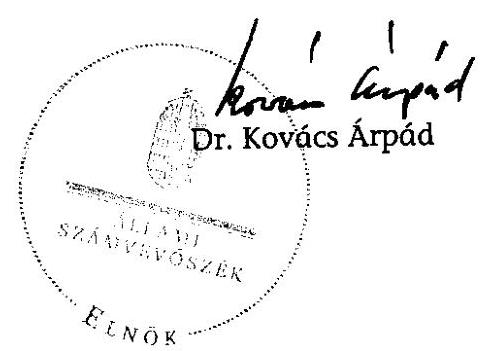

| Melléklet: | 9 db | 29 lap |
| :-- | --: | --: |
| Függelék: | 1 db | 2 lap |

---

# MELLÉKLETEK

---

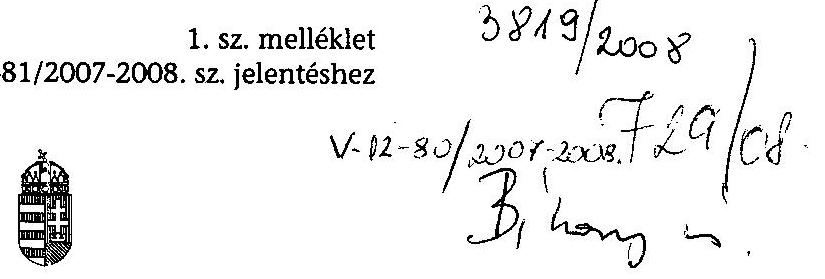

EGÉSZSÉGÜGYI MINISZTÉRIUM MINISZTER

Ikt.sz.: 1020-14/2008-0003EGP
Dr. Kovács Árpád
elnök
Állami Számvevőszék
Budapest

Tisztelt Elnök Úr!
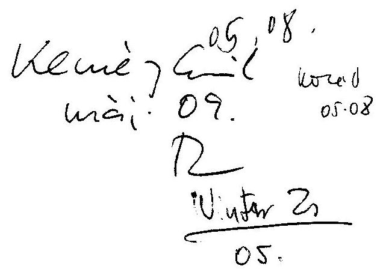

A V-12-78/2007-2008. számú, az egyes onkológiai szűrési programokra fordított pénzeszközök hasznosulásának ellenőrzéséről készített jelentésükben foglaltakat tudomásul veszem, észrevételt nem teszek.

Budapest, 2008. április 2....".
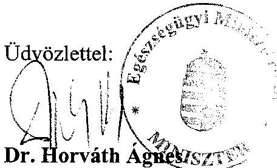

---

# KÉRDÉSEK, KRITÉRIUMOK ÉS ADATFORRÁSOK

|  Kérdések |  | Kritériumok, mutatók | Adatforrás  |
| --- | --- | --- | --- |
|  1. | Megvalósultak-e a szervezett onkológiai szűrővizsgálatra tett kormányzati és ágazatirányítói intézkedések? |  |   |
|  1.1. | Megteremtették-e és szabályozták-e a szűrések szervezeti hátterét, a szűrés típusait és az elérni kívánt népességet? | A szűrések szervezeti és jogszabályi feltételeit megteremtették. A szabályozás megfelel a szűréssel szemben támasztott elvárásoknak (panaszmentes állapot, eredményes, olcsó, egyszerűen kivitelezhető) | 1997. évi CLIV. törvény az egészségügyről
51/1997.(XII. 18.) NM. rendelet
Szakmai anyagok, tanulmányok  |
|  1.1.1. | A szűrések szervezésének, lebonyolításának szervezeti és technikai feltételeit megteremtették-e? A szűrési folyamatok szakmai szabályozottsága, ellenőrzése megvalósul-e? A szakmaközi szakértői bizottságok és a szűrési munkacsoportok elősegítik-e, értékelik-e a szűrési tevékenységet? | A szűrések szervezésének, lebonyolításának szervezeti és technikai feltételeit megteremtették. A szűrés folyamata szabályozott.
A szakmaközi szakértői bizottságok és a szűrési munkacsoportok elősegítik, értékelik a szűrési tevékenységet. Tevékenységüket dokumentálták. | Népegészségügyi onkológiai szűrések-Minőségbiztosítási kézikönyv és módszertani útmutató, ÁNTSZ 2005
1063/2005. (VI. 23.) Korm. hat. a Népegészségügyi Tárcaközi Bizottságról
1066/2001. (VII. 10.) Korm. hat. a 2001-2010. évekre szóló Egészséges Nemzetért Népegészségügyi Program alapelveiről
1063/2005. (VI. 23.) Korm. hat. a Népegészségügyi Tárcaközi Bizottságról
1142/2004. (XII. 15.) Korm. hat. a népegészségügyi program végre-  |

---

|   |  |  | hajtásának koordinálásáért felelős kormánymegbízott feladat- és hatásköréről
Szakmaközi szakértői bizottságok és szűrési munkacsoportok elemzései, döntés előkészítő anyagai, bizottsági jegyzőkönyvek  |
| --- | --- | --- | --- |
|  1.1.2. | Biztosítottak-e a szűrések szervezésének, a behívásnak, a visszahívásnak, a betegkövetésnek, az információáramlásnak a személyi és tárgyi feltételei? A szűrés szervezése informatikailag támogatott-e? | A szűrések szervezésének, lebonyolításának személyi, tárgyi feltételeit megteremtették. A szűrések lebonyolítása, adminisztrációja informatikailag támogatott. | ÁNTSZ informatikai rendszerének program leírása, tartalma
60/2003. (X. 20.) ESzCsM rendelet az egészségügyi szolgáltatások nyújtásához szükséges szakmai minimumfeltételeiről
Népegészségügyi onkológiai szűrések-Minőségbiztosítási kézikönyv és módszertani útmutató, ÁNTSZ 2005  |
|  1.2. | Biztosítottak-e az egyes szűrésekre a szükséges központi források az ágazatirányítónál, az ÁNTSZ-nél és az uniós pályázatokban? | A szűrések központi forrásai biztosítottak. | Beszámolók
ÁSZ tanúsítvány  |
|  1.2.1. | Különítettek-e el a szűrések lebonyolítására, kommunikációjára forrásokat az ágazatirányítónál, valamint az ÁNTSZ-nél? | A szűrések lebonyolítására, kommunikációjára a forrásokat elkülönítették és azok elegendőek a szűrési tevékenység lebonyolítására. Ezek elszámolása ellenőrzött. A kommunikációra átvett pénzeszközök felhasználása gazdaságos. | ÁSZ tanúsítvány
ÁNTSZ dokumentumok
Kommunikációs célú szerződések
Beszámolók a hasznosulásról  |
|  1.2.2. | Biztosítottak-e források a szűrések támogatására az uniós pályázatokban? | Rendelkezésre álltak uniós források a szűrésekre és azokat a céloknak megfelelően | EU-s pályázatok dokumentumai  |

---

|   |  | használták fel. | ÁSZ tanúsítvány  |
| --- | --- | --- | --- |
|  1.2.3. | A célnak megfelelően használták-e fel a háziorvosok a prevenciós tevékenység végzésére kiírt pályázat onkológiai szűrésekre fordított forrásait? | A pályázati összegek felhasználása nem tér el a céloktól. | A pályázat szempontrendszere, elbírálása, elszámolása, beszámolók, értékelések az OEP-nél  |
|  1.3. | Megfelelő-e a szűrővizsgálatok népszerűsítése? | A szűrővizsgálatok népszerűsítése széles körű és növeli a részvételi arányt. | EüM, ÁNTSZ dokumentumai, szerződések, beszámolók  |
|  1.3.1. | A kommunikációs módszerek alkalmasak-e a behívottak mozgósítására? Történtek-e intézkedések a régiónkénti részvétel kiegyenlítésére? A költségvetésen belüli és kívüli források hozzájárultak-e a szűrések népszerűsítéséhez? | A kommunikáció hatására növekedett a részvételi arány. Történtek intézkedések az alacsony részvételű régiók részvételi arányának növelésére. | ÁSZ tanúsítványok
Kommunikációs szerződések
Beszámolók a források felhasználásáról  |
|  1.4. | A szűrővizsgálatok és a daganatos betegek nyilvántartási rendszere alkalmas-e a szűrt és a daganatos népesség adatainak kezelésére, nyomon követésére? Van-e adatcsere a különböző adatgyűjtések között? | A szűrővizsgálatok és a daganatos betegek nyilvántartási rendszere alkalmas a szűrt és a daganatos népesség adatainak kezelésére, nyomon követésére. A rendszerek közötti adatcsere rendszeres. | ÁNTSZ, OEP, Nemzeti Rákregiszter rendszer leírásai, beszámolói  |
|  1.4.1. | Elemezték-e, és az ágazatirányító döntéseiben felhasználják-e az ÁNTSZ-nél, az OEP-nél, és a Nemzeti Rákregiszterben gyűjtött adatokat? | A gyűjtött adatokat elemzik, a döntéshozatalban felhasználják. | Elemzések, beszámolók  |
|  1.5. | Az ÁNTSZ ellenőrzi-e a szűrőközpontok szakmai teljesítményét? | Az ÁNTSZ rendszeresen ellenőrzi a szakmai teljesítményt, az akkreditációs feltételek meglétét. | Ellenőrzési jegyzőkönyvek, jelentések  |
|  2. | Eredményes és hatékony-e az emlőszűrési program? |  |   |
|  2.1. | Kialakították-e a mammográfiás szűrővizsgálatok szervezeti feltételeit? | A szervezeti feltételeket kialakították. | Pályázatok értékelésének, a működés feltételeinek ellenőrzési  |

---

|   |  |  | dokumentumai, jegyzőkönyvek  |
| --- | --- | --- | --- |
|  2.1.1. | A szűrőközpontok kiválasztását megalapozó pályázat értékelési szempontjainál a szakmai mutatókat figyelembe vették-e? Az akkreditációnak való megfelelést folyamatosan ellenőrzik-e? | A mammográfiás szűrőközpontok tevékenységét folyamatosan ellenőrzik, az akkreditáció szempontjainak figyelembe vételével. | Az akkreditáció dokumentumai
Ellenőrzési dokumentumok  |
|  2.1.2. | A szűrőközpontok kiválasztásánál figyelembe vették-e a területi lefedettséget és az egyenlő hozzáférést? | A központok kiválasztása során az egyenlő hozzáférés elvét érvényesítették. Az ellátásban érvényesül az egyenlő hozzáférés. | A területi lefedettség számításokkal való megalapozottságának dokumentumai.  |
|  2.1.3. | Felkészültek-e a központok a behívottak és a diagnosztikára megjelentek fogadására, ellátására? A nem akkreditált mammográfiás munkahelyek megfelelő számú vizsgálatot végeznek-e? | A központok kapacitása igazodik az elvégzendő vizsgálatok számához. A nem akkreditált helyen végzett vizsgálatokat a finanszírozó ne finanszírozza. | OEP és ÁNTSZ elemzések és ellenőrzések  |
|  2.1.4. | A behívásra megjelentek száma növekedett-e? Az ÁNTSZ ellátja-e szervezési és ellenőrzési szerepét a jogszabályban előírt szerint? | A behívásokból a megjelenések aránya növekvő. Az ÁNTSZ szervezi és ellenőrzi a központok tevékenységét. | ÁSZ tanúsítványelemzés  |
|  2.2. | Biztosítottak-e a mammográfiás szűrések forrásai? | A források biztosítottak. | ÁSZ tanúsítványelemzés  |
|  2.2.1. | Biztosított-e az utazási költségek megtérítése a szűrések eléréséhez? | Az utazási költségeket megtérítik. | ÁSZ tanúsítványelemzés???  |
|  2.2.2. | Befolyásolja-e volumenkorlát a szűrések lebonyolítását és a szűrések utáni definitív ellátást? | A volumenkorlát sem a szűrést sem a definitív ellátást nem befolyásolja. | 43/1999. (III. 3.) Korm. rendelet az egészségügyi szolgáltatások Egészségbiztosítási Alapból történő finanszírozásának részletes szabályairól  |
|  2.3. | Feldolgozzák-e és hasznosítják-e a szűrésből származó adatokat? | Az adatokat feldolgozzák és hasznosítják. | Elemzések, beszámolók  |
|  2.3.1. | Elemezték-e a megbetegedésről, halálozásról és átszűrtségről gyűjtött adatokat nemzetközi összehasonlításban? | A hazai adatok közelítik a nemzetközi adatokat, és folyamatosan javuló tendenciát mutatnak. | Nemzetközi statisztikai kiadványok, adatok (WHO, EU, Népességtudományi Intézet)  |

---

 | ciát mutatnak. | egészségügyi jelentések)  |
| --- | --- | --- | --- |
|  2.3.2. | Informatikailag támogatott-e a szűrőközpontok szűrési nyilvántartása, a központok eleget tesznek-e jelentési kötelezettségüknek az ÁNTSZ felé? Megbízhatóak-e a gyűjtött, tárolt adatok? Hasznosítják-e a nyilvántartásból kinyerhető információkat. | Informatikailag támogatott a szűrőközpontok nyilvántartása. A jelentett, gyűjtött és tárolt adatok megbízhatóak és teljes körűek és hasznosulnak. | Informatikai rendszerleírás, beszámolók, értékelések  |
|  2.3.3. | A nem szűrt és a diagnosztikai esetszámban sem szereplő népesség megbetegedési mutatói rosszabbak-e, mint az átszűrt népességé? Az átszűrt korcsoport stádiummutatói javulnak-e a nem szűrt népességhez viszonyítva? | A szűrt népesség körében a daganatos betegek stádiummutatói jobbak, mint a nem szűrtek körében. | ÁSZ lekérdezés
ÁSZ tanúsítvány  |
|  3. | Eredményes és hatékony-e a méhnyak szűrés? |  |   |
|  3.1. | Kialakították-e a méhnyak szűrővizsgálatok szervezeti feltételeit? | A szervezeti feltételeket kialakították. | Kenetvételi helyek és a patológiai laboratóriumok száma
A működés feltételeinek ellenőrzési dokumentumai, jegyzőkönyvek  |
|  3.1.1. | A szűrőközpontok kiválasztásánál figyelembe vették-e a területi lefedettséget és az egyenlő hozzáférést? | Az ellátásban érvényesül az egyenlő hozzáférés, a vizsgálati helyek száma elegendő. | A területi lefedettség számításokkal való megalapozottságának dokumentumai.  |
|  3.1.2. | A citológiai laborok kiválasztását megalapozó pályázat értékelési szempontjainál a szakmai mutatókat figyelembe vették-e és folyamatosan ellenőrzik-e? | A patológiai laborok kiválasztásában megjelentek a szakmai szempontok és azok meglétét folyamatosan ellenőrzik. | Pályázati értékelési szempontok, bizottsági jegyzőkönyvek, ellenőrzés dokumentumai  |
|  3.1.3. | A szűrési és diagnosztikai minták száma megfelel-e a nemzetközi átszűrtségi ajánlásoknak? A személyi és tárgyi feltételek megfelelnek-e a módszertani útmutatóba foglaltaknak? | Az átszűrtség közelít a nemzetközi ajánlásokban meghatározottakhoz. A feltételek megfelelnek az útmutatóban foglaltaknak. | Nemzetközi ajánlások, módszertani útmutatók, ellenőrzési dokumentumok  |
|  3.2. | Biztosítottak-e a méhnyakszűrések forrásai? | A forrásokat biztosították. | Beszámolók  |

---

|   |  |  | ÁSZ tanúsítvány  |
| --- | --- | --- | --- |
|  3.2.1. | Biztosított-e az utazási költségek megtérítése a szűrések eléréséhez? Befolyásolja-e volumenkorlát a szűrések lebonyolítását és a szűrések utáni definitív ellátást? | Az utazási költségeket megtérítik. A volumenkorlát sem a szűrést sem a definitív ellátást nem befolyásolja. | ÁSZ tanúsítvány (?)
43/1999. (III. 3.) Korm. rendelet az egészségügyi szolgáltatások Egészségbiztosítási Alapból történő finanszírozásának részletes szabályairól  |
|  3.3. | Feldolgozzák-e és hasznosítják-e a kenetvételből származó adatokat? | Az adatokat feldolgozzák és hasznosítják. | Elemzések, szűrési nyilvántartás  |
|  3.3.1. | Elemezték-e a megbetegedésről, halálozásról és átszűrtségről gyűjtött adatokat nemzetközi összehasonlításban? | A hazai adatok közelítik a nemzetközi adatokat, és folyamatosan javuló tendenciát mutatnak. | Nemzetközi és hazai statisztikák  |
|  3.3.2. | Informatikailag támogatott-e a citológiai vizsgálatok nyilvántartása? A laborok eleget tesznek-e jelentési kötelezettségüknek az ÁNTSZ felé? Megbízhatóak-e a gyűjtött, tárolt adatok? Hasznosítják-e a nyilvántartásból kinyerhető információkat? | Informatikailag támogatott a vizsgálatok nyilvántartása. A jelentett, gyűjtött és tárolt adatok megbízhatóak, teljes körűek és hasznosulnak. | Szűrési nyilvántartás, beszámolók, elemzések  |
|  3.3.3. | A nem szűrt és a diagnosztikai esetszámban sem szereplő népesség megbetegedési mutatói rosszabbak-e, mint az átszűrt népességé? | A korai stádiumban felismert daganatok száma növekszik. | ÁSZ lekérdezések
ÁSZ tanúsítvány  |
|  4. | Alkalmasak voltak-e a pilot projektek olyan tapasztalatok szerzésére, amely megalapozza a vastagbélszűrések kiterjesztését? Adottak-e a laboratóriumi feltételek, vizsgálati módszerek a minták fogadásához? Megfelelően tájékozottak-e a résztvevők? |  |   |

---

|  |   |   |   |
| --- | --- | --- | --- |
|  4.1. | Megegyezik-e a hazai és nemzetközi módszertan? | A hazai és nemzetközi módszertanok megegyeznek. A hazai szűréseket a nemzetközi ajánlások alapján végzik. | Módszertani ajánlások  |
|  4.2. | Feldolgozzák-e és hasznosítják-e a pilot projektből származó adatokat? Az ágazatirányítónál és az ÁNTSZ-nél elemezték-e a megbetegedésről, halálozásról és átszűrtségről gyűjtött adatokat? | Az ágazatirányító a projekt adatait feldolgozta és elemezte. | Pilot projekt tapasztalatainak elemzése  |
|  4.3. | Adottak-e a laboratóriumi feltételek, vizsgálati módszerek a minták fogadásához? | A laboratóriumi háttér biztosított, a vizsgálati módszertan kidolgozott és elfogadott. | Vizsgálati módszertan, ellenőrzés, megfelelés dokumentumai  |
|  4.4. | Biztosítottak-e szűrések forrásai? | A szűrések forrásait biztosították. | Beszámolók
ÁSZ tanúsítvány  |

---

# Program célkitűzései 

A 2001. évi „Egészséges Nemzetért" népegészségügyi program a 65 évnél fiatalabb lakosság rosszindulatú daganatok miatti halálozásának 10\%-os csökkentését kívánta elérni 2010-ig. (Ezen belül a vastagbél, végbél daganatok miatti halálozás 10\%-os, az emlődaganatok miatti halálozás 20\%-os, a méhnyak daganatok miatti halálozás 50\%-os csökkentését tűzi ki.)

Az Egészség Évtizedének Népegészségügyi Programja 2003-ban fogalmazódott meg és 2012-ig a 70 éves kor alatti daganatos betegségek okozta halálozás 5-10\%-os mérséklődését célozta meg. (Az emlődaganatok okozta halálozás 30\%-kal csökkenjen és a célzott lakosság 70\%-a vegyen részt kétévenként megismételt szűrésen. A méhnyakrák okozta halálozás 60\%-kal csökkenjen a céllakosság körében és legalább 70\%-ára terjedjen ki a szűrővizsgálat. A vastagbél okozta halálozás 20\%-kal csökkenjen és a szűrési rendszer megszervezése a cél.)

A 2005. évi 21 lépés program tervezete szerint 10 év alatt 15 százalékkal csökkenjen a daganatos betegek száma. („Ennek keretében szűrőbuszokkal, szervezett utazással év végéig 65\%-ra növeljük az emlőszűrésen résztvevők arányát. A méhnyakrák szűrés kiterjesztésével, ingyenes szűrő szettek biztosításával, személygépkocsik rendszerbeállításával több száz nő idő előtti halálát akadályozhatjuk meg. A férfiakat fenyegető rákbetegségek időben történő felismerése érdekében kísérleti jelleggel elindítjuk a prosztatarák szűrést és kiterjesztjük a vastagbélrák szűrési programot.")

---

# Méhnyak, emlő és kolorektális szűrés besorolásának változása 1998-2008. között

|  Szűrés fajtája | Dátum | Életkorhoz kötött önkéntes szűrés |  |  | Népegészségügyi célú, célzott szűrés |  |   |
| --- | --- | --- | --- | --- | --- | --- | --- |
|   |  | célcsoport korosztály | szűrési gyakoriság | szűrési eljárás | célcsoport korosztály | szűrési gyakoriság | szűrési eljárás  |
|  Méhnyak- | 1998. I.1-től 2003.VII.23-ig | 25-55 évesek | évente | méhnyak elváltozás szűrése, nincs meghat. a citológia és kolposzkóp |  |  |   |
|   |  | 55-65 évesek | kétévente |  |  |  |   |
|   | 2003.VII.24-től napjainkig | - | - |  | 25-65 évesek | háromévente (egyszeri neg. eredményű szűrővizsgálat után) | különös figyelemmel a méhnyak sejtvizsgálatára (citológia) és kolposzkópos vizsgálatára  |
|  Emlő- | 1998.I.1-től 2003.VII.23-ig | 45-65 évesek | kétévente | emlő lágyrész röntgenvizsgálatán alapul |  |  |   |
|   | 2003.VII.24-től |  |  |  | 45-65 évesek | kétévente | mammográfia  |
|  Colorectalis | 1998. I.1-től 2005.XII.30-ig | 45-65 évesek | kétévente | gyomor-bélrendszeri eredetű vérzés szűrése székletvizsgálattal |  |  |   |
|   |  | 65 év felett | évente |  |  |  |   |
|   | 2005.XII.31-én 1 napig hatályos | 65 év felett | évente |  | 50-70 évesek | kétévente | népegészségügyi céllal kétévente gyomor-bélrendszeri eredetű, humánspecifikus vérzés laboratóriumszűrése székletvizsgálattal a háziorvos kezdeményezésére és általa biztosított székletgyűjtő tartállyal  |
|   | 2006.I.1-től | - | - |  | 50-70 évesek | kétévente | a Nemzeti Rákellenes program keretében kísérleti programként a gyomor-bélrendszeri eredetű vérzés szűrése  |
|   | 2008-től | finanszírozása felfüggesztve |  |  |  |  |   |

Az 51/1997.(XII:18.) NM rendelet alapján, a kötelező egészségbiztosítás keretében igénybe vehető betegségek megelőzését és korai felismerését szolgáló egészségügyi szolgáltatásokról és a szűrővizsgálatok igazolásáról, melléklet II. és III. fejezet

---

# Emlőszűrő munkahelyek elhelyezkedése 

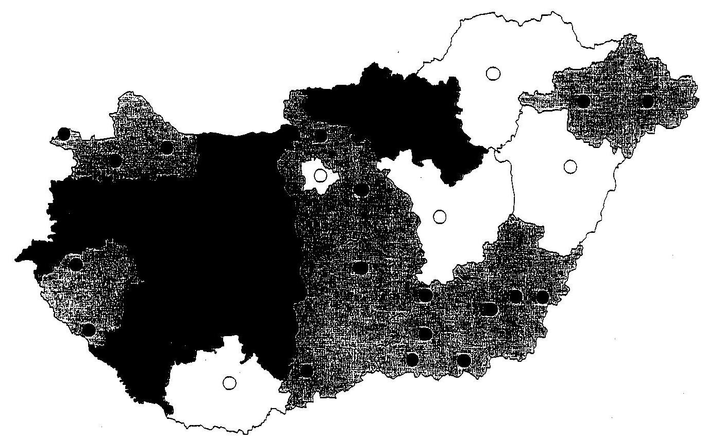

■ 1 szűrőközpont 1 megyében
$\square$ 2-7 szűrőközpont 1 városban
a 2-4 szűrőközpont 1 megyében

---

# Méhnyakszűrést végző szakrendelések Budapesten* 

Bajcsy-Zsilinszky Kórház és Rendelőintézet
Cím: 114 Budapest, Főherceg utca 95.
Egyéb:
Tel: (1) 257-2445
Bajcsy-Zsilinszky Kórház és Rendelőintézet
Cím: 1101 Budapest, Kőbányai út 45.
Egyéb:
Tel: (1) 261-1699
Bajcsy-Zsilinszky Kórház és Rendelőintézet
Cím: 1173 Budapest, Egészségház utca 40.
Egyéb:
Tel: (1) 256-9762
Bajcsy-Zsilinszky Kórház és Rendelőintézet
Cím: 1106 Budapest, Maglódi út 89-91.
Egyéb:
Tel: (1) 432-7722
Belváros-Lipótváros Egészségügyi Szolgálat
Cím: 1051 Budapest, Hercegprimás utca 14-16.
Egyéb:
Tel: (1) 428-8162
Béke téri Háziorvosi Szövetkezet
Cím: 1182 Budapest, Üllői út 761.
Egyéb:
Tel: (1) 294-6339, (1) 294-6342
BM Központi Kórház és Intézményei
Cím: 1071 Budapest, Városligeti fasor 9-11.
Egyéb:
Tel: (1) 462-5600 / 25238 mellék
Budai Irgalmasrendi Kórház
Cím: 1023 Budapest, Árpád fejedelem útja 7.
Egyéb:
Tel: (1) 438-8590
Budapesti Szent Ferenc Kórház
Cím: 1021 Budapest, Széher utca 71-73.
Egyéb:
Tel: (1) 392-8207
Budavári Önkormányzat Szakrendelő
Cím: 1122 Budapest, Maros utca 16/b.
Egyéb:
Tel: (1) 356-5044
Csepeli Egészségügyi Szolgálat Szakorvosi Rendelőintézet
Cím: 1212 Budapest, Áruház tér 8.
Egyéb:
Tel: (1) 427-5124
Dél-Budai Egészségügyi Szolgálat Kht.
Cím: 1221 Budapest, Káldor A. utca 5-9.
Egyéb:
Tel: (1) 229-1777/181 mellék
Észak-Pesti Kórház-Rendelőintézet
Cím: 1152 Budapest, Rákos út 58.
Egyéb:
Tel: (1) 307-2222
Ferencvárosi Egészségügyi Szolgálat
Cím: 1095 Budapest, Mester utca 45-49.
Egyéb:
Tel: (1) 455-4505, (1) 455-4500
Ferencvárosi Egészségügyi Szolgálat
Cím: 1091 Budapest, Üllői út 105.
Egyéb:
Tel: (1) 219-5520
Józsefvárosi Egészségügyi Szolgálat
Cím: 1088 Budapest, Trefort utca 3.
Egyéb:
Tel: (1) 318-0544
Józsefvárosi Egészségügyi Szolgálat
Cím: 1089 Budapest, Konányi Sándor utca 3/b.
Egyéb:
Tel: (1) 314-1210
Központi Honvéd Kórház
Cím: 1122 Budapest, Királyhágó utca 1-3
Egyéb:
Tel: (1) 356-6522
Központi Honvéd Kórház
Cím: 1135 Budapest, Róbert Károly körút 44.
Egyéb:
Tel: (1) 350-0611
MÁV Kórház és Központi Rendelőintézet
Cím: 1062 Budapest, Rippl-Rónai utca 37.
Egyéb:
Tel: (1) 475-2600
MÁV Kórház és Központi Rendelőintézet
Cím: 1062 Budapest, Podmaniczky utca 109.
Egyéb:
Tel: (1) 475-2600
Országos Gyógyintézeti Központ
Cím: 1135 Budapest, Szobolcs utca 33-35.
Egyéb:
Tel: (1) 350-4760/1804 mellék, (1) 350-0305/ 1804 m.
Országos Onkológiai Intézet
Cím: 1122 Budapest, Róth György utca 7-9.
Egyéb:
Tel: (1) 224-8600/1461 v. 1462 mellék
Országos Reumatológiai és Fizioterápiás Intézet
(ORFI)
Cím: 1023 Budapest, Frankel Leó út 62.
Egyéb:
Tel: (1) 438-8300/1061 mellék
Országos Sportegészségügyi Intézet
Cím: 1123 Budapest, Alkotmány utca 48.
Egyéb:
Tel: (1) 488-6155
Óbuda-Békásmegyer Önk. Egészségügyi Szolgálat
Cím: 1039 Budapest, Csobánka tér 6.
Egyéb:
Tel: (1) 454-7500/146 mellék
Óbuda-Békásmegyer Önk. Egészségügyi Szolgálat
Cím: 1032 Budapest, Vörösvári út 88-96.
Egyéb:
Tel: (1) 388-9180
Schöpf-Mérei Ágoston Kórház és Anyavédelmi
Központ
Cím: 1092 Budapest, Bakáts tér 10.
Egyéb:
Tel: (1) 476-4425, (1) 476-4400
Semmelweis Egyetem II. sz. Szülészeti és Nőgyógyászati Klinika
Cím: 1082 Budapest, Üllői út 78/a.
Egyéb:
Tel: (1) 210-0290/3360 mellék
Semmelweis Egyetem I. sz. Szülészeti és Nőgyógyászati Klinika
Cím: 1088 Budapest, Baross utca 27.
Egyéb:
Tel: (1) 266-0773

---

Fővárosi Önk. Károlyi Sándor Kórház-Rendelőintézet
Cím: 1043 Budapest, Gözgey A. utca 30.
Egyéb:
Tel: (1) 369-4777 / 1661 mellék
Fővárosi Önk. Nyirő Gyula
 Kórház
Cím: 1135 Budapest, Lehel u. 59.
Egyéb:
Tel: (1) 451-2647, (1) 451-2648
Fővárosi Önk. Nyírő Gyula Kórház
Cím: 1134 Budapest, Dévai u. 15/a.
Egyéb:
Tel: (1) 349-8379, (1) 340-8721
Fővárosi Önk. Péterfy Sándor utcai Kórház-Rendelőintézet
Cím: 1076 Budapest, Péterfy S. u. 8.
Egyéb:
Tel: (1) 461-4700/1139 mellék
Fővárosi Önk. Szent István Kórház
Cím: 1096 Budapest, Nagyvárad tér 1.
Egyéb:
Tel: (1) 455-8542
Fővárosi Önk. Szent István Kórház
Cím: 1097 Budapest, Gyáli út 17-19.
Egyéb:
Tel: (1) 347-3800
Fővárosi Önk. Szent János Kórház és Rendelőintézet
Cím: 1125 Budapest, Dűlő árok u. 1-3.
Egyéb:
Tel: (1) 458-4500/4118 mellék
Fővárosi Önk. Szent László Kórház
Cím: 1097 Budapest, Gyáli út 5-7.
Egyéb:
Tel: (1) 455-8100
Fővárosi Önk. Szent Margit Kórház-Rendelőintézet
Cím: 1032 Budapest, Bélai út 132.
Egyéb:
Tel: (1) 250-2420/277 v. 190 v. 366 v. 324 mellék

Fővárosi Önk. Uzsoki utcai Kórháza
Cím: 1145 Budapest, Uzsoki u. 29.
Egyéb:
Tel: (1) 251-7333/3764
Fővárosi Önk. Uzsoki utcai Kórháza
Cím: 1145 Budapest, Amerikai út 50.
Egyéb:
Tel: (1) 222-1827
HT Medical Center
Cím: 1173 Budapest, Pesti út 177.
Egyéb:
Tel: (1) 256-4655, (1) 256-0679
II. ker. Önkormányzat Egészségügyi Szolgálat

Cím: 1027 Budapest, Kapás u. 22.
Egyéb:
Tel: (1) 448-7542
II. ker. Önkormányzat Egészségügyi Szolgálat

Cím: 1028 Budapest, Közepesház u. 12.
Egyéb:
Tel: (1) 391-6940
Jahn Ferenc Kórház Szakorvosi Rendelőintézet
Cím: 1201 Budapest, Ady E. u. 1.
Egyéb:
Tel: (1) 284-4555
Józsefvárosi Egészségügyi Szolgálat
Cím: 1084 Budapest, Auróra u. 22-28.
Egyéb:
Tel: (1) 333-6730

Szent Imre Kórház
Cím: 1115 Budapest, Tétényi út 12-16.
Egyéb:
Tel: (1) 464-8776
Terézvárosi Egészségügyi Szolgálat
Cím: 1074 Budapest, Csengery u. 25.
Egyéb:
Tel: (1) 321-2200/114 v. 115 mellék
Univerzmed Szakorvosi Kft.
Cím: 1111 Budapest, Műegyetem rkp. 3.
Egyéb:
Tel: (1) 463-1104
XIII. ker. Önkormányzat Egészségügyi Szolgálat
Cím: 1139 Budapest, Szegedi út 17.
Egyéb:
Tel: (1) 452-4212
XIII. ker. Önkormányzat Egészségügyi Szolgálat
Cím: 1132 Budapest, Visegródi u. 47/c.
Egyéb:
Tel: (1) 452-4233
XI. ker. Önkormányzat Szakorvosi Rendelő

Cím: 1115 Budapest, Tétényi út 18. (Bártfai
u. sarok)

Egyéb:
Tel: (1) 203-2876
XI. ker. Önkormányzat Szakorvosi Rendelő

Cím: 1117 Budapest, Fehérvári út 12.
Egyéb:
Tel: (1) 279-2100
XIX. ker. Önkormányzat Kispesti Egészségügyi

Intézet
Cím: 1195 Budapest, Ady E. u. 1.
Egyéb:
Tel: (1) 347-5900
XVIII. ker. Önkormányzat Egészségügyi Szolg. Cím: 1183 Budapest, Thököly u. 3.
Egyéb:
Tel: (1) 297-1210
XVI. ker Önkormányzat Szakrendelő

Cím: 1163 Budapest, Jókai u. 3.
Egyéb:
Tel: (1) 407-0001
XVI. ker Önkormányzat Szakrendelő

Cím: 1165 Budapest, Hunyadvár u. 43/b.
Egyéb:
Tel: (1) 402-4564
XV. ker. Önkormányzat Egészségügyi Intézménye
Cím: 1152 Budapest, Rákos út 77/a.
Egyéb:
Tel: (1) 307-6262/134 v. 135 mellék
XXIII. ker. Önkormányzat Szakorvosi rendelő

Cím: 1238 Budapest, Táncsics M. u. 104.
Egyéb:
Tel: (1) 286-0113/146 mellék
Zuglói Egészségügyi Szolgálat
Cím: 1146 Budapest, Hermina út 7.
Egyéb:
Tel: (1) 469-3800
Zuglói Egészségügyi Szolgálat
Cím: 1148 Budapest, Örs vezér tér 23.
Egyéb:
Tel: (1) 469-4626

---

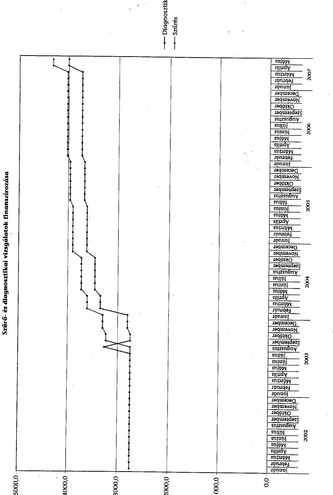

# Szűrő- és diagnosztikai vizsgálatok finanszírozása

---

# Tanúsítványok jegyzéke 

| 1. sz. tanúsítvány | Emlőszűrésre behívottak adatai |
| :-- | :-- |
| 2. sz. tanúsítvány | Megyénkénti bontás a behívottakról (emlőszűrés) |
| 3. sz. tanúsítvány | Méhnyakszűrés és diagnosztika adatai |
| 4. sz. tanúsítvány | Méhnyakszűrésre behívottak adatai |
| 5. sz. tanúsítvány | Megyénkénti bontás a behívottakról (méhnyakszűrés) |
| 6. sz. tanúsítvány | Emlőszűrés adatai |
| 7. sz. tanúsítvány | Vastagbélvizsgálat adatai |

---

|   | 2002 | 2003 | 2004 | 2005 | 2006 | 2007  |
| --- | --- | --- | --- | --- | --- | --- |
|  Meghívott (fő) | 747163 | 553537 | 603811 | 650814 | 533693 | 262370  |
|  Megjelent (fő) | 323858 | 220552 | 221561 | 245654 | 222734 | 91852  |
|  Megjelent aránya | 43,35 | 39,84 | 36,69 | 37,75 | 41,73 | 35,01  |
|  Visszahívott (fő) | 21733 | 16608 | 16228 | 15347 | 13241 | 5012  |
|  Visszahívott aránya (megjelenthez) | 6,71 | 7,53 | 7,32 | 6,25 | 5,94 | 5,46  |
|  Szűrésből műtétre (megjelenthez) (fő) | 2411 | 1643 | 1180 | 1238 | 1115 | 397  |
|  Műtétes arány | 0,74 | 0,74 | 0,53 | 0,5 | 0,5 | 0,43  |
|  1-9 mm (fő) | 290 | 157 | 134 | 136 | 126 | 35  |
|  1-9 mm aránya* | 12,03 | 9,56 | 11,36 | 10,99 | 11,3 | 8,82  |
|  10-14 mm (fő) | 264 | 197 | 142 | 193 | 166 | 58  |
|  10-14 mm aránya* | 10,95 | 11,99 | 12,03 | 15,59 | 14,89 | 14,61  |
|  15-20 mm (fő) | 253 | 180 | 147 | 170 | 120 | 48  |
|  15-20 mm aránya* | 10,49 | 10,96 | 12,46 | 13,73 | 10,76 | 12,09  |
|  20 mm felett (fő) | 96 | 176 | 107 | 124 | 108 | 30  |
|  20 mm aránya* | 3,98 | 10,71 | 9,07 | 10,02 | 9,69 | 7,56  |

- Összes műtéthez

Igazolom, hogy a tanúsítványban szereplő adatok nyilvántartásainkkal megegyeznek.

Dátum: 2007.11.12

---

# Megvénkénti bontás a behívottakról (emlőszűrés)

|  Megye | Behívott létszám | Megjelent létszám | Részvételi arány \% | Behívott létszám | Megjelent létszám | Részvételi arány \% | Behívott létszám | Megjelent létszám | Részvételi arány \% | Behívott létszám | Megjelent létszám | Részvételi arány \%  |
| --- | --- | --- | --- | --- | --- | --- | --- | --- | --- | --- | --- | --- |
|  Budapest | 105708 | 27407 | 25,93 | 127520 | 32943 | 25,83 | 98955 | 29773 | 30,09 | 99762 | 30247 | 30,32  |
|  Baranya megye | 17278 | 6559 | 37,96 | 22433 | 7636 | 34,04 | 22596 | 9240 | 40,89 | 18391 | 8334 | 45,32  |
|  Bács-kiskun megye | 31472 | 7464 | 23,72 | 37440 | 13627 | 36,40 | 38025 | 12401 | 32,61 | 27673 | 13472 | 48,68  |
|  Békés megye | 11137 | 2831 | 25,42 | 14905 | 5917 | 39,70 | 29966 | 13671 | 45,62 | 28531 | 14323 | 50,20  |
|  Borsod-Abaúj-Zemplén megye | 30111 | 9018 | 29,95 | 30870 | 14690 | 47,59 | 56295 | 24348 | 43,25 | 32948 | 18642 | 56,58  |
|  Csongrád megye | 28620 | 12655 | 44,22 | 37794 | 12722 | 33,66 | 23668 | 9614 | 40,62 | 19133 | 8031 | 41,97  |
|  Fejér megye | 27600 | 14301 | 51,82 | 17378 | 6730 | 38,73 | 19680 | 9476 | 48,15 | 23950 | 12567 | 52,47  |
|  Győr-Moson-Sopron megye | 21085 | 9192 | 43,59 | 42083 | 11218 | 26,66 | 50660 | 15612 | 30,82 | 32622 | 11696 | 35,85  |
|  Hajdú-Bihar megye | 20444 | 14958 | 73,17 | 36930 | 13119 | 35,52 | 40992 | 15549 | 37,93 | 43702 | 16298 | 37,29  |
|  Heves megye | 35965 | 15451 | 42,96 | 23516 | 7576 | 32,22 | 14501 | 7854 | 54,16 | 18843 | 6467 | 34,32  |
|  Komárom-Esztergom megye | 0 | 0 | 0,00 | 3792 | 1278 | 33,70 | 11577 | 4493 | 38,81 | 10341 | 3677 | 35,56  |
|  Nögrád megye | 5164 | 3119 | 60,40 | 8660 | 4412 | 50,95 | 17063 | 5954 | 34,89 | 10800 | 4438 | 41,09  |
|  Pest megye | 79352 | 23831 | 30,03 | 65262 | 23546 | 36,08 | 79836 | 17552 | 21,99 | 49100 | 12802 | 26,07  |
|  Somogy megye | 16766 | 9241 | 55,12 | 24648 | 9309 | 37,77 | 15550 | 5997 | 38,57 | 13223 | 6196 | 46,86  |
|  Szabolcs-Szatmár-Bereg megye | 26445 | 20097 | 76,00 | 23101 | 14117 | 61,11 | 24112 | 15603 | 64,71 | 23010 | 14171 | 61,59  |
|  Jász-Nagykun-Szolnok megye | 26402 | 6655 | 25,21 | 22834 | 9236 | 40,45 | 17028 | 5227 | 30,70 | 17703 | 6881 | 38,87  |
|  Tolna megye | 10378 | 4613 | 44,45 | 13482 | 6736 | 49,96 | 13684 | 6754 | 49,36 | 15939 | 8695 | 54,55  |
|  Vas megye | 16883 | 11877 | 70,35 | 17473 | 10452 | 59,82 | 16650 | 10125 | 60,81 | 14689 | 9218 | 62,75  |
|  Veszprém megye | 22054 | 12009 | 54,45 | 21835 | 10887 | 49,86 | 19951 | 9868 | 49,46 | 19975 | 8231 | 41,21  |
|  Zala megye | 20673 | 9274 | 44,86 | 11855 | 5410 | 45,63 | 24253 | 10760 | 44,37 | 13358 | 8348 | 62,49  |
|  Összesen: | 747163 | 323858 | 43,35 | 553537 | 220552 | 39,84 | 603811 | 221561 | 36,69 | 650814 | 245654 | 37,75  |

Igazolom, hogy a tanúsítványban szereplő adatok nyilvántartásainkkal megegyeznek.

---

# Méhnyakszűrés és diagnosztika adatai

|   | 2002 | 2003 | 2004 | 2005 | 2006 | 2007  |
| --- | --- | --- | --- | --- | --- | --- |
|  Beavatkozások száma összesen | 1 144 859 | 1 569 071 | 1 114 272 | 1 080 098 | 1 079 218 | 708 360  |
|  Jelentett esetszám diagnosztika (db) | 1 109 891 | 1 219 161 | 959 924 | 952 231 | 930 687 | 619 094  |
|  Jelentett esetszám szűrés (db) | 34 968 | 349 910 | 154 348 | 127 867 | 148 531 | 89 266  |
|  Beavatkozások kiadása (M Ft) | 373,3 | 1 420,9 | 1 359,6 | 1 431,1 | 1 439,8 | 975,2  |
|  Méhnyakszűrés kiadásai (M Ft) | 34,5 | 275,1 | 145,5 | 146,6 | 179,3 | 111,1  |
|  Méhnyak diagnosztika kiadásai (M Ft) | 338,8 | 1 145,8 | 1 214,1 | 1 284,5 |  |  |

 | 1 260,5 | 864,1  |

**A 2007. évi adatok a szeptemberi kifizetéssel utalandóig, 9 havi adat.**

Igazolom, hogy a tanúsítványban szereplő adatok nyilvántartásainkkal megegyeznek.

Dátum: 2007. november 14.

---

|   | 2001 | 2002 | 2003 | 2004 | 2005 | 2006 | 2007  |
| --- | --- | --- | --- | --- | --- | --- | --- |
|  Meghívott (fő) |  |  | 10,11 | 602806 | 805852 | 689781 | 177070  |
|  Megjelent (fő) |  |  | 12 hónapok adatai | 24217 | 40520 | 45314 | 9100  |
|  Megjelent aránya % |  |  | 2004-es adatokban | 4,02 | 5,03 | 6,57 | 5,14  |
|  Visszahívott (fő) |  |  |  | 695 | 2746 | 2431 | 592  |
|  Visszahívott aránya (megjelenthez) % |  |  | vannak | 2,87 | 6,78 | 5,36 | 6,51  |
|  Szűrésből műtétre (megjelenthez) (fő) |  |  |  |  |  |  |   |
|  Műtétes arány (visszahívotthoz) % |  |  |  |  |  |  |   |
|  In situ (fő) |  |  |  |  |  |  |   |
|  Nem in situ (fő) |  |  |  |  |  |  |   |

Igazolom, hogy a tanúsítványban szereplő adatok nyilvántartásainkkal megegyeznek.

Dátum: 2001.11.12.

---

5. sz. tanúsítvány a V-12-81/2007-2008. sz. jelentéshez

# Megyénkénti bontás a behívottakról (méhnyakszűrés)

|  Megye | 2003 |  |  | 2004 |  |  | 2005 |  |  | 2006 |  |   |
| --- | --- | --- | --- | --- | --- | --- | --- | --- | --- | --- | --- | --- |
|   | Behívott létszám | Megjelent létszám | Részvételi arány % | Behívott létszám | Megjelent létszám | Részvételi arány % | Behívott létszám | Megjelent létszám | Részvételi arány % | Behívott létszám | Megjelent létszám | Részvételi arány %  |
|  Budapest |  |  |  | 116 695 | 1 928 | 1,65 | 120 350 | 3 319 | 2,76 | 90 216 | 3 439 | 3,81  |
|  Baranya megye |  |  |  | 11 521 | 440 | 3,82 | 18 816 | 724 | 3,85 | 33 545 | 1 870 | 5,57  |
|  Bács-kiskun megye |  |  |  | 28 966 | 1 207 | 4,17 | 44 574 | 1 248 | 2,80 | 38 335 | 3 036 | 7,92  |
|  Békés megye |  |  |  | 20 660 | 1 244 | 6,02 | 58 727 | 4 800 | 8,17 | 38 605 | 7 773 | 20,13  |
|  Borsod-Abaúj-Zemplén megye |  |  |  | 27 123 | 678 | 2,50 | 81 710 | 3 556 | 4,35 | 30 112 | 2 307 | 7,66  |
|  Csongrád megye |  |  |  | 64 891 | 1 268 | 1,95 | 16 521 | 1 819 | 11,01 | 32 105 | 1 172 | 3,65  |
|  Fejér megye | 2003.09.30-án indítottuk az első adag meghívót, amelyre a laborjelentések a kezdeti |  |  | 17 511 | 1 618 | 9,24 | 19 849 | 923 | 4,65 | 37 685 | 2 758 | 7,32  |
|  Győr-Moson-Sopron megye |  |  |  | 11 429 | 1 343 | 11,75 | 25 683 | 377 | 1,47 | 31 269 | 1 426 | 4,56  |
|  Hajdú-Bihar megye |  |  |  | 34 300 | 1 824 | 5,32 | 58 423 | 2 455 | 4,20 | 35 940 | 2 747 | 7,64  |
|  Heves megye |  |  |  | 15 720 | 590 | 3,75 | 41 043 | 962 | 2,34 | 8 894 | 1 422 | 15,99  |
|  Komárom-Esztergom megye |  |  |  | 23 067 | 1168 | 5,06 | 15 536 | 1 033 | 6,65 | 13 276 | 397 | 2,99  |
|  Nógrád megye |  |  |  | 10 576 | 561 | 5,30 | 12 427 | 969 | 7,80 | 12 268 | 655 | 5,34  |
|  Pest megye |  |  |  | 41 668 | 801 | 1,92 | 61 861 | 2 278 | 3,68 | 77 242 | 2 950 | 3,82  |
|  Somogy megye | 2004-es adatokhoz, és így alakult ki: a 2004 oszlopban feltüntetett adatsor |  |  | 39 065 | 3 866 | 9,90 | 45 626 | 4 429 | 9,71 | 33 106 | 3 010 | 9,09  |
|  Szabolcs-Szatmár-Bereg megye |  |  |  | 26 500 | 2 043 | 7,71 | 58 644 | 3 773 | 6,43 | 27 767 | 3 255 | 11,72  |
|  Jász-Nagykun-Szolnok megye |  |  |  | 14 457 | 200 | 1,38 | 4 783 | 92 | 1,92 | 40 468 | 519 | 1,28  |
|  Tolna megye |  |  |  | 18 592 | 517 | 2,78 | 29 542 | 1 294 | 4,38 | 19 870 | 1 298 | 6,53  |
|  Vas megye |  |  |  | 23 258 | 1 450 | 6,23 | 30 616 | 2 119 | 6,92 | 20 336 | 1 675 | 8,24  |
|  Veszprém megye |  |  |  | 25 133 | 998 | 3,97 | 46 617 | 2 757 | 5,91 | 49 913 | 1 547 | 3,10  |
|  Zala megye |  |  |  | 31 674 | 473 | 1,49 | 14 504 | 1 593 | 10,98 | 18 829 | 2 058 | 10,93  |
|  Összesen: |  |  |  | 602 806 | 24 217 | 4,02 | 805 852 | 40 520 | 5,03 | 689 781 | 45 314 | 6,57  |

Igazolom, hogy a tanúsítványban szereplő adatok nyilvántartásainkkal megegyeznek.

Dátum: 2001.11.12.

---

|   |  | 2002 | 2003 | 2004 | 2005 | 2006 | 2007  |
| --- | --- | --- | --- | --- | --- | --- | --- |
|  1 | Beavatkozások száma (db) | 1 717 758 | 2 044 145 | 2 092 202 | 2 218 492 | 2 254 066 | 1 585 143  |
|  3 | - ebből diagnosztika (db) | 1 156 058 | 1 326 368 | 1 356 775 | 1 425 689 | 1 458 959 | 1 022 805  |
|  2 | - ebből szűrés (db) | 282 953 | 242 866 | 207 748 | 245 253 | 234 200 | 170 572  |
|  4 | - ebből Intervenció (db) | 27 723 | 47 041 | 34 954 | 36 536 | 34 604 | 22 842  |
|  5 | - ebből emlő Ultrahang (db) | 251 024 | 427 870 | 491 724 | 508 858 | 523 973 | 367 259  |
|  6 | - ebből emlő MR vizsgálat (db) * |  |  | 1 001 | 2 156 | 2 330 | 1 665  |
|  7 | Beavatkozások kiadása (M Ft) | 1 898,5 | 2 289,2 | 2 272,5 | 2 672,5 | 2 768,2 | 2 040,1  |
|  8 | - ebből diagnosztika (M Ft) | 794,1 | 1 025,0 | 1 066,1 | 1 198,2 | 1 246,4 | 896,7  |
|  9 | - ebből szűrés (M Ft) | 776,5 | 755,9 | 729,4 | 901,0 | 913,4 | 702,3  |
|  10 | - ebből intervenció (M Ft) | 32,7 | 45,6 | 48,6 | 57,3 | 58,4 | 42,2  |
|  11 | - ebből ultrahang (emlő) (M Ft) | 295,3 | 462,8 | 395,4 | 447,7 | 466,1 | 334,3  |
|  12 | - ebből emlő MR vizsgálat kiadása (M Ft) |  |  | 33,0 | 68,4 | 83,9 | 64,6  |

- Emlő MR vizsgálatok 2004. júliusi kifizetéstől állnak rendelkezésre, ebben az évben 6 havi adat. A 2007-es évből a szeptemberi utalással fizetendőig, 9 havi adat.

Igazolom, hogy a tanúsítványban szereplő adatok nyilvántartásainkkal megegyeznek.

Dátum: 2007. november 14.

---

|   | 2002 | 2003 | 2004 | 2005 | 2006 | 2007  |
| --- | --- | --- | --- | --- | --- | --- |
|  Összes székletvizsgálat (db) | 114 554 | 138 854 | 162 455 | 199 490 | 168 061 | 134 791  |
|  Összes colonoskopia (db) | 44 845 | 49 142 | 55 569 | 62 779 | 63 219 | 65 930  |
|  Összes biopszia (db) | 13 363 | 8 503 | 9 376 | 12 420 | 12 559 | 12 534  |
|  Összes székletvizsgálat kiadása (M Ft) | 28,3 | 20,5 | 36,4 | 61,4 | 57,7 | 58,1
 |
|  Összes colonoskopia kiadása (M Ft) | 116,6 | 172,7 | 230,5 | 282,3 | 291,6 | 328,9  |
|  Összes biopszia kiadása (M Ft) | 37,0 | 11,7 | 60,6 | 145,9 | 200,4 | 245,4  |

Igazolom, hogy a tanúsítványban szereplő adatok nyilvántartásainkkal megegyeznek.

Dátum: 2002. május 15.

---

|  Csoport | OENO |  | Év | Beavatk. | MFt  |
| --- | --- | --- | --- | --- | --- |
|  Széklet vizsgálat | 22630 | Széklet vér kimutatása | 2002 | 67001 | 3,50  |
|  Széklet vizsgálat | 22630 | Széklet vér kimutatása | 2003 | 66992 | 1,74  |
|  Széklet vizsgálat | 22630 | Széklet vér kimutatása | 2004 | 79875 | 2,84  |
|  Széklet vizsgálat | 22630 | Széklet vér kimutatása | 2005 | 78837 | 3,73  |
|  Széklet vizsgálat | 22630 | Széklet vér kimutatása | 2006 | 63447 | 3,34  |
|  Széklet vizsgálat | 22630 | Széklet vér kimutatása | 2007 | 45535 | 2,86  |
|  Széklet vizsgálat | 22631 | Széklet vér kimutatása, immunkémiai módszerrel | 2002 | 47553 | 24,85  |
|  Széklet vizsgálat | 22631 | Széklet vér kimutatása, immunkémiai módszerrel | 2003 | 67034 | 17,87  |
|  Széklet vizsgálat | 22631 | Széklet vér kimutatása, immunkémiai módszerrel | 2004 | 76070 | 31,02  |
|  Széklet vizsgálat | 22631 | Széklet vér kimutatása, immunkémiai módszerrel | 2005 | 100696 | 48,47  |
|  Széklet vizsgálat | 22631 | Széklet vér kimutatása, immunkémiai módszerrel | 2006 | 91787 | 49,74  |
|  Széklet vizsgálat | 22631 | Széklet vér kimutatása, immunkémiai módszerrel | 2007 | 76923 | 50,55  |
|  Széklet vizsgálat | 22632 | Széklet humán albumin kimutatása immunkémiai módszerrel | 2003 | 4167 | 0,93  |
|  Széklet vizsgálat | 22632 | Széklet humán albumin kimutatása immunkémiai módszerrel | 2004 | 5808 | 2,54  |
|  Széklet vizsgálat | 22632 | Széklet humán albumin kimutatása immunkémiai módszerrel | 2005 | 19219 | 9,08  |
|  Széklet vizsgálat | 22632 | Széklet humán albumin kimutatása immunkémiai módszerrel | 2006 | 8393 | 4,22  |
|  Széklet vizsgálat | 22632 | Széklet humán albumin kimutatása immunkémiai módszerrel | 2007 | 6733 | 4,20  |
|  Széklet vizsgálat | 42150 | Széklet vér kimutatása (szűrő jellegű) | 2003 | 661 | 0,02  |
|  Széklet vizsgálat | 42150 | Széklet vér kimutatása (szűrő jellegű) | 2004 | 702 | 0,05  |
|  Széklet vizsgálat | 42150 | Széklet vér kimutatása (szűrő jellegű) | 2005 | 738 | 0,07  |
|  Széklet vizsgálat | 42150 | Széklet vér kimutatása (szűrő jellegű) | 2006 | 4434 | 0,41  |
|  Széklet vizsgálat | 42150 | Széklet vér kimutatása (szűrő jellegű) | 2007 | 5600 | 0,53  |

---

7. sz. tanúsítvány a V-12-81/2007-2008. sz. jelentéshez

|  Csoport | OENO |  | Év* | Beavatk. | MFt  |
| --- | --- | --- | --- | --- | --- |
|  Colonoscopia | 16410 | Colonoscopia | 2002 | 36967 | 108,89  |
|  Colonoscopia | 16410 | Colonoscopia | 2003 | 40089 | 160,51  |
|  Colonoscopia | 16410 | Colonoscopia | 2004 | 46261 | 215,10  |
|  Colonoscopia | 16410 | Colonoscopia | 2005 | 53460 | 265,42  |
|  Colonoscopia | 16410 | Colonoscopia | 2006 | 55054 | 276,90  |
|  Colonoscopia | 16410 | Colonoscopia | 2007 | 57882 | 313,24  |
|  Colonoscopia | 16420 | Rectosigmoideoscopia (flexibilis) | 2002 | 7878 | 7,73  |
|  Colonoscopia | 16420 | Rectosigmoideoscopia (flexibilis) | 2003 | 9053 | 12,19  |
|  Colonoscopia | 16420 | Rectosigmoideoscopia (flexibilis) | 2004 | 9308 | 15,40  |
|  Colonoscopia | 16420 | Rectosigmoideoscopia (flexibilis) | 2005 | 9319 | 16,85  |
|  Colonoscopia | 16420 | Rectosigmoideoscopia (flexibilis) | 2006 | 8165 | 14,74  |
|  Colonoscopia | 16420 | Rectosigmoideoscopia (flexibilis) | 2007 | 8048 | 15,68  |
|  Biopszia | 14510 | Biopsia sigmae per endoscopiam | 2002 | 5586 | 1,36  |
|  Biopszia | 14510 | Biopsia sigmae per endoscopiam | 2003 | 3633 | 0,86  |
|  Biopszia | 14510 | Biopsia sigmae per endoscopiam | 2004 | 2825 | 0,85  |
|  Biopszia | 14510 | Biopsia sigmae per endoscopiam | 2005 | 2878 | 1,03  |
|  Biopszia | 14510 | Biopsia sigmae per endoscopiam | 2006 | 2548 | 0,94  |
|  Biopszia | 14510 | Biopsia sigmae per endoscopiam | 2007 | 2005 | 0,79  |

---

7. sz. tanúsítvány a V-12-81/2007-2008. sz. jelentéshez

|  Csoport | OENO |  | Év | Beavatk. | MFt  |
| --- | --- | --- | --- | --- | --- |
|  Biopszia | 14520 | Biopsia recti per rectoscopiam | 2002 | 4184 | 1,02  |
|  Biopszia | 14520 | Biopsia recti per rectoscopiam | 2003 | 2612 | 0,61  |
|  Biopszia | 14520 | Biopsia recti per rectoscopiam | 2004 | 2708 | 0,71  |
|  Biopszia | 14520 | Biopsia recti per rectoscopiam | 2005 | 3005 | 0,89  |
|  Biopszia | 14520 | Biopsia recti per rectoscopiam | 2006 | 2085 | 0,64  |
|  Biopszia | 14520 | Biopsia recti per rectoscopiam | 2007 | 1566 | 0,53  |
|  Biopszia | 54523 | Polypectomia colontos per colonoscopiam | 2002 | 2928 | 28,74  |
|  Biopszia | 54523 | Polypectomia colontos per colonoscopiam | 2003 | 1582 | 7,89  |
|  Biopszia | 54523 | Polypectomia colontos per colonoscopiam | 2004 | 3129 | 58,16  |
|  Biopszia | 54523 | Polypectomia colontos per colonoscopiam | 2005 | 5877 | 142,29  |
|  Biopszia | 54523 | Polypectomia colontos per colonoscopiam | 2006 | 7025 | 176,88  |
|  Biopszia | 54523 | Polypectomia colontos per colonoscopiam | 2007 | 7760 | 211,87  |
|  Biopszia | 54693 | Polypectomia sigmae, sigmoidoscopos | 2002 | 665 | 5,87  |
|  Biopszia | 54693 | Polypectomia sigmae, sigmoidoscopos | 2003 | 676 | 2,32  |
|  Biopszia | 54693 | Polypectomia sigmae, sigmoidoscopos | 2004 | 714 | 0,86  |
|  Biopszia | 54693 | Polypectomia sigmae, sigmoidoscopos | 2005 | 660 | 1,67  |
|  Biopszia | 54693 | Polypectomia sigmae, sigmoidoscopos | 2006 | 901 | 21,91  |
|  Biopszia | 54693 | Polypectomia sigmae, sigmoidoscopos | 2007 | 1203 | 32,25  |

Igazolom, hogy a tanúsítványban szereplő adatok nyilvántartásainkkal megegyeznek.

Dátum: 2008.03.18.

---

# Táblázatok jegyzéke 

1. sz. táblázat Az ÁNTSZ országos és területi, szervezett szűréssel foglalkozó munkatársainak létszáma
2. sz. táblázat Új megbetegedések és halálozások száma a Rákregiszter adatai alapján
3. sz. táblázat Méhnyakszűrés képzett mutatói megyénként
4. sz. táblázat Patológia mátrix

---

Az ÁNTSZ országos és területi, szervezett szűréssel foglalkozó munkatársainak létszáma

|  Megnevezés | 2002 | 2003 | 2004 | 2005 | 2006 | 2007  |
| --- | --- | --- | --- | --- | --- | --- |
|   | 10 | 11 | 10 | 11 | 10 | 11  |
|  Országos | 3 | 7 429 200 | 3 | 9 294 000 | 3 | 9 294 000  |
|  HIV-azot | 3 | 6 376 210 | 3 | 8 485 485 | 3 | 8 536 198  |
|  Pest megye | 1 | 4 437 966 | 1 | 4 088 847 | 2 | 4 688 434  |
|  XMPI |  |  |  |  |  |   |
|  Borsod-Abaúj-Zemplén megye | 3 | 5 559 060 | 3 | 7 322 600 | 2 | 3 278 600  |
|  Nógrád megye | 4 | 6 038 200 | 3 | 6 285 500 | 3 | 6 106 300  |
|  Heves megye | 4 | 6 566 800 | 3 | 6 284 200 | 3 | 7 885 800  |
|  Veszprém megye | 3 | 6 942 434 | 3 | 7 179 092 | 3 | 5 844 137  |
|  Komárom-Esztergom megye | 2 | 6 886 100 | 3 | 8 184 800 | 1 | 3 234 400  |
|  Fejér megye | 3 | 5 973 700 | 3 | 6 120 928 | 3 | 4 594 351  |
|  Bács-Kiskun megye | 3 | 6 480 000 | 3 | 5 760 000 | 3 | 6 072 000  |
|  Békés megye | 3 | 6 600 000 | 3 | 5 664 000 | 3 | 6 024 000  |
|  Csongrád megye | 3 | 7 208 000 | 3 | 7 392 000 | 3 | 7 440 000  |
|  Jász-Nagykun-Szolnok megye | 2 | 5 386 800 | 2 | 5 269 200 | 2 | 6 349 600  |
|  Hajdú-Bihar megye | 4 | 8 851 200 | 4 | 10 345 200 | 4 | 10 345 200  |
|  Szabolcs-Szatmár-Bereg megye | 3 | 6 042 024 | 4 | 799 236 | 4 | 8 811 648  |
|  Vas megye | 3 | 6 737 110 | 3 | 6 280
 182 | 3 | 6 597 409  |
|  Zala megye | 3 | 4 765 458 | 3 | 5 459 205 | 3 | 7 270 151  |
|  Győr-Moson-Sopron megye | 1 | 1 680 085 | 1 | 1 692 551 | 1 | 1 726 595  |
|  Baranya megye | 3 | 5 369 900 | 3 | 5 255 900 | 3 | 7 529 600  |
|  Szombogy megye | 3 | 5 593 038 | 3 | 4 572 270 | 3 | 6 770 370  |
|  Tolna megye | 3 | 6 250 800 | 2 | 4 625 800 | 3 | 7 151 280  |
|  **Összesen:** | **61** | **123 324 134** | **56** | **126 641 296** | **57** | **135 750 073**  |

2004-68 a megyékben nem kizárólagosan a szűrésekkel foglalkoznak. A szűrések szervezése csupán részben volt a feladatok.

---

2. sz. táblázat a V-12-81/2007-2008. sz. jelentéshez

Új megbetegedések és halálozások száma a Rákregiszter adatai alapján

|  S. sz. | Lokalizáció | 2001 |  | 2002 |  | 2003 |  | 2004 |  | 2005 |  | 2006 |   |
| --- | --- | --- | --- | --- | --- | --- | --- | --- | --- | --- | --- | --- | --- |
|   |  | Új meg-betegedés | Halál | Új meg-betegedés | Halál | Új meg-betegedés | Halál | Új meg-betegedés | Halál | Új meg-betegedés | Halál | Új meg-betegedés | Halál*  |
|  1 | Emlő összes | 7 220 | 2 342 | 8 382 | 2 270 | 8 360 | 2 349 | 7 815 | 2 285 | 7 894 | 2 085 | 7 710 | 2 081  |
|  2 | Emlő korcsoportos | 3 771 |  | 4 727 |  | 4 447 |  | 4 095 |  | 4 174 |  | 3 948 |   |
|  3 | Méhnyak összes | 1 996 | 539 | 1 703 | 513 | 1 800 | 465 | 1 777 | 493 | 1 617 | 416 | 1 686 | 420  |
|  4 | Méhnyak korcsoportos | 1 587 |  | 1 335 |  | 1 389 |  | 1 435 |  | 1 312 |  | 1 376 |   |
|  5 | Vastagbél, végbél összes | 8 626 | 4 852 | 8 439 | 4 790 | 8 428 | 5 098 | 8 634 | 4 979 | 8 858 | 4 557 | 8 855 | 4 681  |
|  6 | Vastagbél, végbél korcsoportos | 3 988 |  | 3 949 |  | 3 984 |  | 4 090 |  | 4 291 |  | 4 214 |   |
|  7 | Összesen (1+3+5) | 17 842 | 7 733 | 18 524 | 7 573 | 18 588 | 7 912 | 18 226 | 7 757 | 18 369 | 7 058 | 18 251 | 7 182  |
|  8 | Összes halálozás |  | 132 183 |  | 132 833 |  | 135 823 |  | 132 330 |  | 135 732 |  | 131 603  |
|  9 | ebből daganatos halálozás |  | 33 757 |  | 33 537 |  | 34 062 |  | 34 051 |  | 32 057 |  | 32 396  |
|  10 | Összes halálozásból daganatos (%) |  | 25,5% |  | 25,2% |  | 25,1% |  | 25,7% |  | 23,6% |  | 24,6%  |
|  11 | Összes daganatosból emlő+méhnyak+ vastagbél (%) |  | 22,9% |  | 22,6% |  | 23,2% |  | 22,8% |  | 22,0% |  | 22,2%  |

- Forrás: KSH

---

|  Megye | Méhnyakszűrés képzett mutatói megyénként |  |  |  |   |
| --- | --- | --- | --- | --- | --- |
|   |  |  | 2006 |  |   |
|   | Behívottak szám | Kenetvételre alkalmas szakrendelések száma* | Naponta egy szakrendelésre jutó behívottak száma | Részvételi arány | Nőgyógyászati magánrendelések száma**  |
|  Budapest | 90216 | 61 | 7 | 3,81 | 541  |
|  Baranya megye | 33545 | 13 | 13 | 5,57 | 68  |
|  Bács-Kiskun megye | 38335 | 18 | 11 | 7,92 | 76  |
|  Békés megye | 38605 | 12 | 16 | 20,13 | 43  |
|  Borsod-Abaúj-Zemplén megye | 30112 | 32 | 5 | 7,66 | 87  |
|  Csongrád megye | 32105 | 19 | 8 | 3,65 | 90  |
|  Fejér megye | 37685 | 14 | 13 | 7,32 | 86  |
|  Győr-Moson-Sopron megye | 31269 | 13 | 12 | 4,56 | 66  |
|  Hajdú-Bihar megye | 35940 | 16 | 11 | 7,64 | 57  |
|  Heves megye | 8894 | 16 | 3 | 15,99 | 33  |
|  Komárom-Esztergom megye | 13276 | 10 | 7 | 2,99 | 65  |
|  Nógrád megye | 12268 | 6 | 10 | 5,34 | 20  |
|  Pest megye | 77242 | 26 | 15 | 3,82 | 142  |
|  Somogy megye | 33106 | 11 | 15 | 9,09 | 56  |
|  Szabolcs-Szatmár-Bereg megye | 27767 | 7 | 20 | 11,72 | 56  |
|  Jász-Nagykun-Szolnok megye | 40468 | 18 | 11 | 1,28 | 58  |
|  Tolna megye | 19870 | 9 | 11 | 6,53 | 36  |
|  Vas megye | 20336 | 11 | 9 | 8,24 | 44  |
|  Veszprém megye | 49913 | 13 | 19 | 3,1 | 51  |
|  Zala megye | 18829 | 11 | 9 | 10,93 | 34  |

- ÁNTSZ meghívólevél melléklete alapján  ÁNTSZ működési engedélyek alapján

---

# Patológia mátrix* 

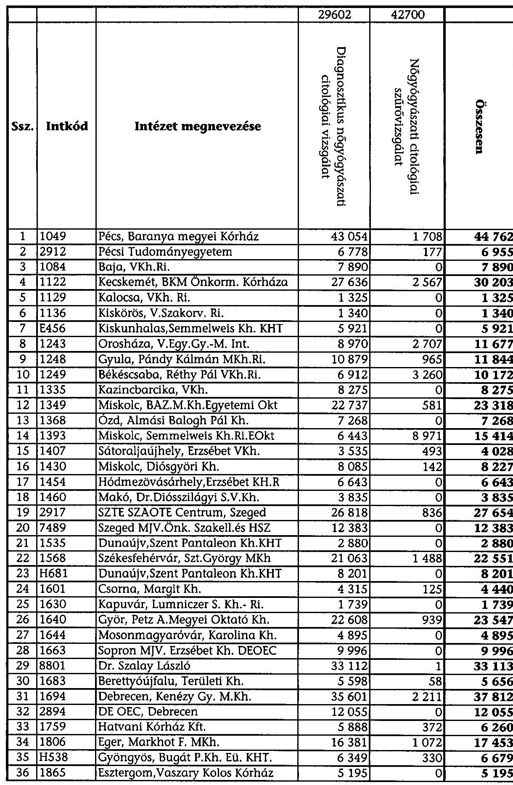

---

|  37 | 1876 | Tatabánya, Szt. Borbála Kórház | 32075 | 0 | 32075 |
| :--: | :--: | :--: | :--: | :--: | :--: |
| 38 | 1903 | Balassagyarmat,Dr.Kenessey Vkh | 4951 | 0 | 4951 |
| 39 | 1928 | Salgótarján,Szent Lázár M.Kh. | 6537 | 647 | 7184 |
| 40 | 1945 | Pásztó, Margit Kórház | 2406 | 0 | 2406 |
| 41 | 1974 | Cegléd, Toldy F.Kh.Ri. | 15556 | 494 | 16050 |
| 42 | 2010 | Kerepestarcsa, Flór F. Kh. | 22099 | 1792 | 23891 |
| 43 | 2049 | Szent Rókus Kórház, Bp. | 20035 | 645 | 20680 |
| 44 | 2095 | Vác, Jávorszky Ödön Városi Kh. | 7048 | 185 | 7233 |
| 45 | 2137 | Kaposvár, Kaposi Mór Oktató Kh | 7691 | 2655 | 10346 |
| 46 | 2146 | Marcali, VKh. | 4925 | 0 | 4925 |
| 47 | 2152 | Nagyatád, VKh. | 3130 | 0 | 3130 |
| 48 | E115 | Mosdós, MRE Tüdő- és Szívkh. | 39 | 0 | 39 |
| 49 | 2224 | Nyíregyháza, Jósa A. Megyei Kh | 28221 | 3971 | 32192 |
| 50 | 2230 | Kisvárda, Felső-Szabolcsi Kh. | 3710 | 0 | 3710 |
| 51 | 2242 | Mátészalka, Területi Kórház | 12487 | 0 | 12487 |
| 52 | 2324 | Szolnok, Hetényi G. MKh. | 21078 | 364 | 21442 |
| 53 | 2377 | Jászberény, Erzsébet Kh.Ri. | 4481 | 0 | 4481 |
| 54 | 2378 | Karcag, Kátai Gábor Kh.-Ri. | 2586 | 0 | 2586 |
| 55 | 2425 | Szekszárd, Balassa J. M.-i Kh. | 14460 | 570 | 15030 |
| 56 | 4712 | Dombóvári Szent Lukács Eü. KHT | 4148 | 435 | 4583 |
| 57 | 2493 | Szombathely, Markusovszky M.Kh | 17382 | 1457 | 18839 |
| 58 | E966 | Körmend, Dr.Batthyányi Kh. KFT | 598 | 0 | 598 |
| 59 | 2535 | Ajka, Magyar Imre Kórház | 4549 | 0 | 4549 |
| 60 | 2572 | Veszprém, Csolnoki F.M.Kh.Ri. | 11368 | 1997 | 13365 |
| 61 | 2586 | Pápa, Gr.Esterházy Kh.-Szakamb | 2904 | 0 | 2904 |
| 62 | 2599 | Dr. Deák J.Kh.Gyógybarlang KHT | 6123 | 0 | 6123 |
| 63 | H920 | Dr. Deák J.Kh.Gyógybarlang KHT | 1371 | 0 | 1371 |
| 64 | 2703 | Keszthely, V.Kh.Ri. | 4405 | 0 | 4405 |
| 65 | 2734 | Zalaegerszeg, M.-i jogú Kórház | 4827 | 6380 | 11207 |
| 66 | 2747 | Nagykanizsa, V.Kh.Ri. | 9991 | 0 | 9991 |
| 67 | 0765 | HT MEDICAL CENTER KFT. | 2158 | 0 | 2158 |
| 68 | 2873 | Bajcsy-Zsilinszky Kórház, Bp. | 13763 | 0 | 13763 |
| 69 | 2877 | Heim Pál Gyermekkórház-Rend.I. | 616 | 0 | 616 |
| 70 | 2878 | Szent István Kh.-Ri., Bp. | 4195 | 13 | 4208 |
| 71 | 2879 | Jáhn Ferenc Dél-Pesti Kh., Bp. | 23127 | 0 |

 | 23127 |
| 72 | 2880 | Szent János Kórház Rt., Bp. | 10732 | 0 | 10732 |
| 73 | 2883 | Szent László Kórház, Bp. | 122 | 0 | 122 |
| 74 | 2886 | Péterfy Sándor u. Kórház, Bp. | 6066 | 88 | 6154 |
| 75 | 2887 | Nyírő Gyula Kórház, Bp. | 5756 | 3848 | 9604 |
| 76 | 2889 | Szent Imre Kórház, Fővárosi Önk | 12668 | 0 | 12668 |
| 77 | 2890 | Károlyi Sándor Kórház, Bp. | 12077 | 1893 | 13970 |
| 78 | 2891 | Uzsoki u. Kórház, Bp. | 9838 | 469 | 10307 |
| 79 | 2901 | Országos Gyógyintézeti Központ | 8042 | 0 | 8042 |
| 80 | 2906 | ONKI | 11586 | 245 | 11831 |
| 81 | 2915 | Semmelweis Egyetem | 37132 | 9 | 37141 |
| 82 | 4810 | MH KHK | 2802 | 0 | 2802 |
| 83 | 5004 | BM.KKI. | 6231 | 0 | 6231 |
| 84 | 6107 | Bp. XIX. Kispesti Eü. Intézet | 4733 | 0 | 4733 |
| 85 | 8001 | MÁV Kórház és Közp. Rendelőint. | 7725 | 76 | 7801 |
| 86 | 8800 | Sejtdiagnosztika Kft. | 19229 | 790 | 20019 |
| 87 | B439 | Vasútegészségügyi Kht | 6545 | 0 | 6545 |
| 88 | C069 | Budai Irgalmas Rend Kórház Kht | 662 | 0 | 662 |
| 89 | H420 | Schöpf-M. Kh. és Anyavéd. Kp. Kht | 8679 | 0 | 8679 |
| Összesen: |  |  | 918268 | 58026 | 976294 |

---

# FÜGGELÉK

---

# A szűrések infrastruktúrájára fordított EU források 

A Nemzeti Fejlesztési Terv I. Humán Erőforrás Fejlesztés Operatív Programja támogatja egészségügyi infrastruktúra fejlesztési célokat (HEFOP 4.3. és 4.4.). A 4.3. intézkedésen belül két komponens volt. Az első komponens központi projektként valósult meg, azaz nem pályázati úton nyerte el a támogatást a regionális egészségcentrum modellintézmény létrehozására a Debreceni Orvos- és Egészségtudományi Centrum (DEOEC). Az intézmény két régió lakosságát egyetemi szinten látja el, szív- és érrendszeri, daganatos megbetegedések teljes vertikumát és az egyes betegségek kezelésének minden fázisát felölelve, beleértve a szűrést is. A kitűzött feladatok között szerepelt, hogy az intézmény célzott programot indít a hátrányos helyzetű lakosság egészségtudatos magatartásra való nevelésére. A projekt keretében több épület rekonstrukciója és új épület valósult meg, amelyek többek között helyet adnak onkológiai sebészetnek, az Onkológia Tanszéknek és a sugárterápiás fektetőnek. Az intézményt 2007 decemberében adták át.

A második komponens tartalmazta rehabilitációs központok, valamint diagnosztikai és szűrőközpontok kialakítását az ország három, gazdaságilag leghátrányosabb régiójában (Észak-Magyarország, Észak-Alföld, Dél-Dunántúl). A minimum-maximum támogatás mértéke 900 M Ft és 2164 M Ft között volt meghatározva, a pályázóknak önerőt kellett biztosítani (6,38%). A projektek összköltségét 75% uniós támogatás és 25% hazai forrás (hazai költségvetés + önerő) tette ki.

A nyertes pályázók a következők: a Jász-Nagykun-Szolnok Megyei Hetényi Géza Kórház és Rendelőintézet, 1152 M Ft-tal, amelynek célja térségi diagnosztikai és szűrőközpont kialakítása volt. A projekt tervezett zárása 2007. október 31. volt, de határidőt módosítani kellett.

A Szabolcs-Szatmár-Bereg Megyei Jósa András Kórház 1221 M Ft támogatást nyert és célja egy térségi diagnosztikai és szűrőközpont létrehozása volt. Ennek keretében épületrekonstrukció valósul meg és eszközök beszerzése folyik. A szakmai program keretében módszertani központ jön létre a térség betegeinek az egészségügyi adatai feldolgozására, valamint egy szűrőbusz beszerzésével kardiológiai ultrahang és tüdőszűrésre vállalkoznak. Az épület műszaki átadása megtörtént.

A Pécsi Tudományegyetemen egyik szakambulancia épületének felújítása valósult meg. A projektre eredetileg tervezett összeg 2046 M Ft volt. A projekt a helyszíni vizsgálat idejéig lezárult, az épület műszaki átadása megtörtént, a zárójelentést bemutatták. Kiemelt jelentőségű a betegségcsoportokra és hátrányos helyzetű népességcsoportokra koncentráló járóbeteg szűrő és diagnosztikus központ. Mobilszűrést 2007 közepén elkezdték.

Miskolc Megyei Jogú Város Önkormányzata Semmelweis Kórház Rendelőintézet a tervezett felújításra 1,8 Mrd Ft támogatást nyert. A megvalósult célok: Központi Diagnosztikai Centrum és szűrő decentrumok felszerelése történt. A funkciók között kiemelték a méhnyakrákszűrés, vastagbél daganatszűrés, valamint mozgó szűrő decentrumok kialakítását, ahol a képek továbbítására PACS rendszert hoztak létre, így a leletezés egy központban megtörténhet. A szűrőbuszban a mellkas szűrés mellett a méhnyakrák szűrésre alkalmas eszközök vannak. A projekt fizikailag lezárult, a tervezett célkitűzéseket teljesítették. A mozgó decentrumok is működnek.

Az Egészségügyi Ellátást Szervező és Működtető Kht. Fonyód 2007-ben kötött szerződést, térségi feladatokat ellátó diagnosztikai és szűrőközpont kialakítására, erre 181 M Ft összegű támogatást nyert. Az intézmény primer és szekunder prevenciós programok beindítását tervezi. A projekt zárójelentésének beadási határideje 2008. május 30.

Kaposi Mór Oktató Kórház szintén 2007 októberében kötött szerződést a kórház eszköz- és műszer infrastruktúrájának fejlesztésére, ezen belül telepített szűrési-diagnosztikai eszközök fejlesztésére, ehhez 390 M Ft támogatást nyert. A projekt zárójelentésének beadási határideje 2008. május 30.
