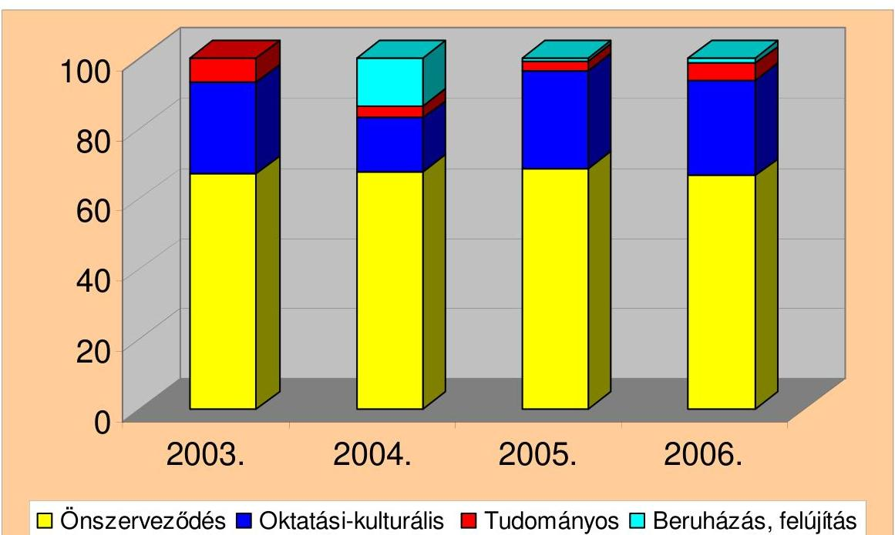
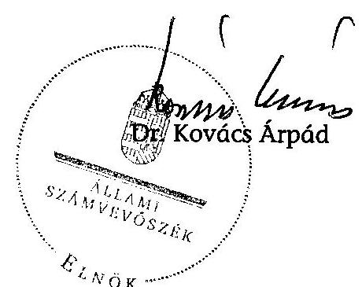
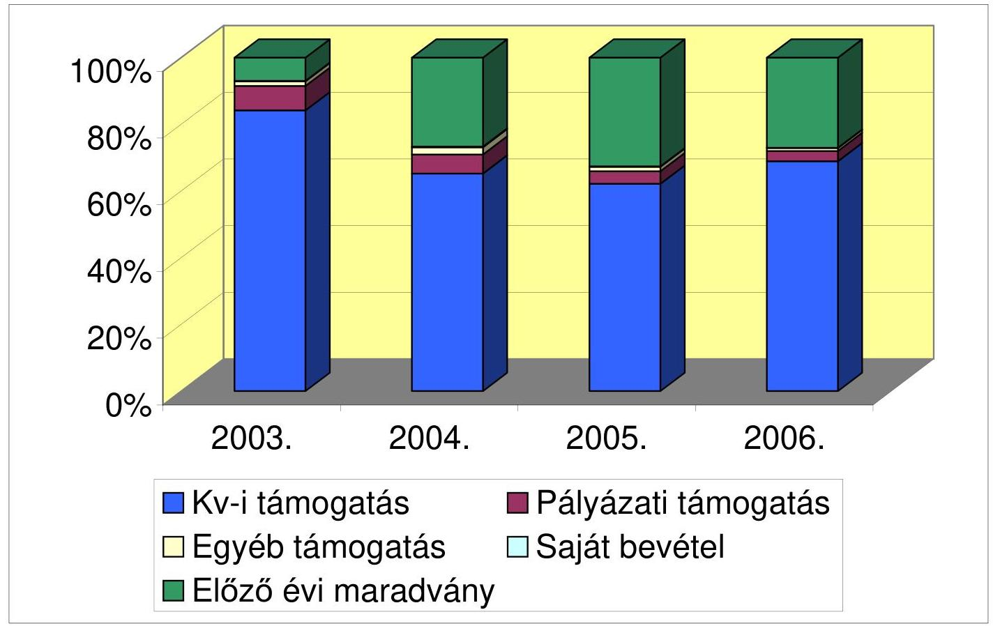
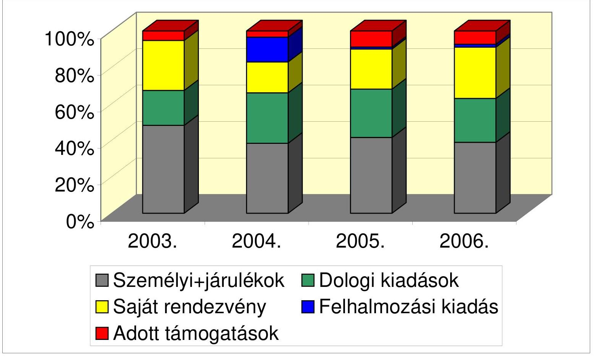
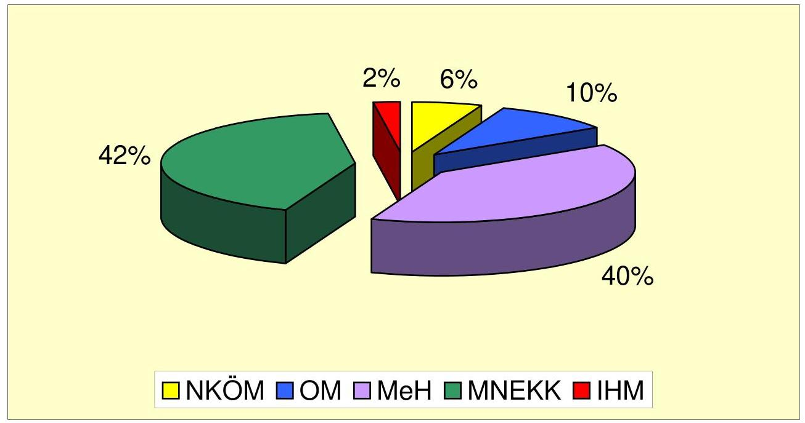

# ÁLLAMI   SZÁMVEVŐSZÉK 

## JELENTÉS

az Ukrán Országos Önkormányzat 2003-2006. évi pénzügyigazdasági tevékenységének ellenőrzéséről

---

3. Önkormányzat és Területi Ellenőrzési Igazgatóság
3.1. Szabályszerűségi Ellenőrzési Főcsoport
Iktatószám: V-3002-029/2008.
Témaszám: 896
Vizsgálat-azonosító szám: V-404.

# Az ellenőrzést felügyelte: 

Dr. Lóránt Zoltán
főigazgató
Az ellenőrzés végrehajtásáért felelős:
Dr. Elek János
általános főigazgató-helyettes
Az ellenőrzést vezette:
Horváth Balázs
főcsoportfőnök-helyettes
Az összefoglaló jelentést készítette:
Tóth István
tanácsadó
Az ellenőrzést végezték:
Tóth István Szendrey Lajos
tanácsadó számvevő

A témához kapcsolódó eddig készített számvevőszéki jelentések:
címe
sorszáma
Jelentés az Ukrán Országos Önkormányzat pénzügyi-gazdasági 0212 tevékenységének ellenőrzéséről
Jelentés a magyarországi nemzeti és etnikai kisebbségek támogatási 0468 rendszereinek ellenőrzéséről

---

# TARTALOMJEGYZÉK 

BEVEZETÉS ..... 5
I. ÖSSZEGZŐ MEGÁLLAPÍTÁSOK, KÖVETKEZTETÉSEK, JAVASLATOK ..... 6
II. RÉSZLETES MEGÁLLAPÍTÁSOK ..... 11

1. A FELADATELLÁTÁS SZERVEZETTSÉGE, SZABÁLYOZOTTSÁGA ..... 11
1.1. A feladatellátás szervezettsége és szabályozása ..... 11
1.2. Az önkormányzati működés szervezeti háttere, a gazdálkodási tevékenység feltételrendszere ..... 12
1.3. Az intézményalapítás és felügyelet szabályszerűsége ..... 13
2. AZ ÖNKORMÁNYZAT MŰKÖDÉSÉNEK ÉS GAZDÁLKODÁSI RENDJÉNEK SZABÁLYSZERŰSÉGE ..... 13
2.1. Az Önkormányzat gazdálkodási feladatainak szabályozása, összhangja a jogszabályi előírásokkal ..... 13
2.2. Az Önkormányzat belső szabályozási rendszere ..... 14
2.3. A vagyongazdálkodás és vagyonvédelem ..... 15
3. A KÖLTSÉGVETÉS KÉSZÍTÉSE, VÉGREHAJTÁSA ÉS PÉNZÜGYI TELJESÍTÉSE ..... 16
3.1. Az éves költségvetések elkészítése, elfogadása ..... 16
3.2. A költségvetés végrehajtása, zárszámadása ..... 16
3.3. Az Önkormányzat bevételi forrásainak alakulása ..... 17
4. A KÖZPONTI KÖLTSÉGVETÉSI TÁMOGATÁS FELHASZNÁLÁSA ÉS ELSZÁMOLÁSA ..... 17
4.1. A központi költségvetési támogatás felhasználásának elve ..... 17
4.2. A központi költségvetési támogatás hatása a vagyon alakulására ..... 18
4.3. A költségvetési támogatásból finanszírozott kiadások felhasználási jogcímek szerinti elemzése ..... 19
4.4. A pályázati támogatásból ellátott feladatok megvalósítása, elszámolásának szabályszerűsége ..... 20
4.5. A központi költségvetésből kapott támogatás továbbadása nemzeti és etnikai kisebbségi szervezeteknek ..... 21
5. A KÖNYVELÉSI ÉS BESZÁMOLÁSI KÖTELEZETTSÉG TELJESÍTÉSE ..... 21
5.1. A könyvvezetési kötelezettség teljesítése ..... 21
5.2. Az éves beszámolók összeállítása, jóváhagyása ..... 22
5.3. A bizonylati rend és fegyelem érvényesítése ..... 22
5.4. A személyi jövedelemadóról, a társadalombiztosításról és az adózás rendjéről szóló jogszabályok előírásainak betartása ..... 23

---

6. AZ ÖNKORMÁNYZAT BELSŐ ELLENŐRZÉSI RENDSZERE ..... 24
6.1. A belső ellenőrzési rendszer szabályozottsága ..... 24
6.2. A belső ellenőrzési rendszer működése ..... 24
MELLÉKLETEK
6. számú Az Önkormányzat 2003-2006. évi bevételei és megoszlása
7. számú Az Önkormányzat 2003-2006. évi kiadásai és megoszlása
8. számú Kisebbségi feladatokra elnyert központi támogatások támogatónkénti részletezése 2003-2007. évekre

---

# RÖVIDÍTÉSEK JEGYZÉKE 

| ÁSZ | Állami Számvevőszék |
| :-- | :-- |
| APEH | Adó és Pénzügyi Ellenőrzési Hivatal |
| Ámr. | 217/1998. (XII. 30.) Korm. rendelet az államháztartás |
|  | működési rendjéről |
| IHM | Informatikai és Hírközlési Minisztérium |
| Hivatal | Ukrán Országos Önkormányzat Hivatala |
| Kulturális Központ | Magyarországi Ukrán Kulturális és Dokumentációs Központ |
|  |  |
| MeH | Miniszterelnöki Hivatal |
| MNEKK | Magyarországi Nemzetiségi és Etnikai Kisebbségi Közalapítvány |
|  |  |
| Nek. tv. | 1993. évi LXXVII. törvény a nemzeti és etnikai kisebbségek jogairól |
|  |  |
| NKÖM | Nemzeti Kulturális Örökség Minisztériuma |
| OM | Oktatási Minisztérium |
| Önkormányzat | Ukrán Országos Önkormányzat |
| Számviteli törvény | 2000. évi C. törvény a számvitelről |
| SZMSZ | Az Ukrán Országos Önkormányzat 2007. május 10-ig hatályban volt Szervezeti és Működési Szabályzata |
|  |  |
| Új SZMSZ | Az Ukrán Országos Önkormányzat 2007. május 11-től hatályos Szervezeti és Működési Szabályzata |
|  |  |

---

.

---

# JELENTÉS 

## az Ukrán Országos Önkormányzat 2003-2006. évi pénzügyi-gazdasági tevékenységének ellenőrzéséről

## BEVEZETÉS

Az Ukrán Országos Önkormányzat (Önkormányzat) a magyarországi ukránok képviseleti szerve. Az anyanyelvi oktatás fejlesztése és a nyelv széleskörű használata, valamint az ukrán kulturális hagyományok őrzése és ápolása érdekében közreműködik a kisebbségeket érintő állami döntések előkészítésében, a megfelelő oktatási és kulturális intézményrendszer létrehozásában, működtetésében. Elősegíti és támogatja a magyarországi ukránok múltjának, jelen társadalmi helyzetének és fejlődésének tudományos kutatását.

Az ellenőrzés jogalapja: A nemzeti és etnikai kisebbségek jogairól szóló többször módosított - 1993. évi LXXVII. törvény 39/G. § (1) bekezdése, valamint az Állami Számvevőszékről szóló - többször módosított - 1989. évi XXXVIII. törvény 2. § (5) bekezdésében kapott felhatalmazás alapján vizsgáltuk az Ukrán Országos Önkormányzat 2003-2006 közötti éves beszámolókkal lezárt gazdálkodását. Az ellenőrzés kiterjedt az aktuális szabályozásokra, a 2007. évi költségvetés tervezésére és a pályázati támogatások elszámolására is.

Az ellenőrzés célja annak megállapítása volt, hogy

- az Önkormányzat a központi költségvetési támogatást a Nek. tv-ben meghatározott feladatokra használta-e fel, felhasználása és elszámolása során betartotta-e a vonatkozó jogszabályi előírásokat;
- a gazdálkodás törvényessége biztosított volt-e: a tervezés, az operatív gazdálkodás, a beszámolási kötelezettség és a számviteli, bizonylati rend teljesítése során érvényesültek-e a jogszabályokban és a belső szabályzatokban megfogalmazott követelmények;
- a szabályszerű gazdálkodás érdekében kialakított kontroll mechanizmusok megfelelően segítették-e a feladatok végrehajtását;
- a gazdálkodási rend kialakításánál figyelemmel voltak-e a Nek. tv. 2005. november 25-étől hatályos módosításaira.

Az ellenőrzés ideje és helye: 2008. január 21. - március 3. között, az Önkormányzat székhelyén történt.

---

# I. ÖSSZEGZŐ MEGÁLLAPÍTÁSOK, KÖVETKEZTETÉSEK, JAVASLATOK 

Az Önkormányzat a Nek. tv. 2005. november 25-én hatályba lépett módosítása ellenére 2007. május 10-ig hatályban tartotta elavult Szervezeti és Működési Szabályzatát. A közgyűlés 2007. május 11-i hatállyal fogadta el új SZMSZ-ét, amely több szabályozási kérdésben nem érvényesítette a megváltozott törvénnyel való teljes összhangot, abból lényeges szabályozási elemek kimaradtak.

A gazdálkodási feladatok körében nem határozták meg a költségvetés és a zárszámadás elfogadásának rendjét, a címzett költségvetési támogatás felhasználásának elveit. A Nek. tv. rendelkezése ellenére nem állapították meg az Önkormányzat törzsvagyonát, a forgalomképtelen és a korlátozottan forgalomképes vagyon elemeit.

Az Önkormányzat a Nek. tv. előírása ellenére az új SZMSZ nyilvánosságra hozatalával kapcsolatos kötelezettségét az ellenőrzés észrevételére, csak 2008 márciusában teljesítette. A közgyűlés át nem ruházható hatáskörét a Nek. tv. előírásaival összhangban szabályozták. A közgyűlés határozatait a Nek. tv. és az SZMSZ előírásai szerint, szabályszerűen hozta, azokat az előírásoknak megfelelően nyilvántartásba vették. A döntések előkészítését és végrehajtását az elnök és az alelnökök a bizottságok aktív közreműködésével irányították. A bizottságok feladatait és hatáskörét az új SZMSZ-ben nem határozták meg.

Az Önkormányzat a kulturális és tömegtájékoztatási feladatok eredményesebb ellátása érdekében 2007. július 1-jei hatállyal megalapította Kulturális Központját. A részben önálló gazdálkodású költségvetési szervet szabályszerűen nyilvántartásba vették. Az alapító okirat elfogadásával egy időben az Önkormányzat az Ámr. előírása ellenére nem jelölte ki azt az önállóan gazdálkodó költségvetési szervet, amely a gazdálkodással kapcsolatos feladatokat ellátja. Ezt a hiányosságot észrevételünkre 2008. március 1-jén az intézményi SZMSZ, valamint a gazdálkodási feladatok és felelősség megosztásáról szóló megállapodás elfogadásával együtt pótolták. A gazdálkodási feladatok ellátására az Önkormányzat az időközben megalapított Hivatalt jelölte ki.

A közgyűlés csak 2008. január 8-i hatállyal hozta létre Hivatalát, nevezte ki vezetőjét. A Hivatalt részben önálló gazdálkodású költségvetési szervként alapították. Ilyen formában a Hivatal nem tudta volna ellátni a Nek. tv. 39/B. §-ában előírt feladatait, ezért észrevételünkre 2008. február 9-én önálló gazdálkodású költségvetési szervre módosították az Alapító Okiratát. Addig a foglalkoztatási és gazdálkodási jogkör teljes egészében az elnök hatáskörében maradt.

Az Önkormányzat tevékenységét a képviselők és külső szervezetek bevonásával oldotta meg társadalmi munkában, illetve megbízási szerződések kötésével. A 2004 márciusában birtokba vett székhelyen kialakított irodák korszerű berendezésükkel, felszerelésükkel biztosították a folyamatos munkavégzés feltételeit.

---

Az önkormányzati vagyonnal az előírásoknak megfelelően a közgyűlés rendelkezett, mely határozatait a jogszabályi előírások figyelembevételével hozta. Az Önkormányzat vagyoni mutatói 2003-2006. között kedvezően alakultak. A saját tőke 16,4 %-kal, az eszközállomány 90 %-kal nőtt. A 15000 ezer Ft egyszeri ingyenes vagyonjuttatásból származó értékpapírt, a gazdálkodás biztonságát célzó tartalékként kezelték, melynek értéke 2006. év végére 29623 ezer Ft-ra emelkedett. A székhelyként kapott ingatlant rendeltetésszerűen használták, ebben helyezték el a 2007-ben alapított intézmény központját is. A Nek. tv. módosítása alapján a 2006. december 29-én kelt szerződéssel az Önkormányzat tulajdonába került a 82200 ezer Ft értékű székház, melyet a forgalomképtelen törzsvagyon körébe nem soroltak be. Az ingatlan biztosítással és rendőrségre bekötött riasztóberendezéssel védett.

A számviteli szabályozás nem felelt meg teljesen a Számviteli törvény előírásainak. A számviteli politikában nem írták elő a számviteli törvény szerinti egyéb szervezetek beszámoló-készítési és könyvvezetési kötelezettségéről szóló kormányrendelet előírásainak alkalmazását, valamint nem határozták meg a törvényi előírások szerint a lényeges és a jelentős összegű hiba tartalmát (2008. január 1-jétől az országos kisebbségi önkormányzatok beszámolási és könyvvezetési szabályait nem a hivatkozott rendelet írja elő). A számlarendben nem szabályozták megfelelően a főkönyvi számlákhoz kapcsolódó analitikák rendszerét és ellenőrzési pontjait. A pénzkezelési szabályzat nem határozta meg a napi készpénz záró állomány értékét.

Az Önkormányzat minden évben érvényes határozattal fogadta el az összehasonlítható szerkezetben készült költségvetését és zárszámadását. A kisebbségi feladatok forrásigényét viszont a tervben nem határozták meg, a költségvetési törvényben megállapított támogatás felhasználását külön nem tervezték, azt a saját bevétellel együtt, költségnem részletezéssel hagyták jóvá. A Nek. tv. 2005. november 25-én hatályba lépett előírását megsértve a 2006. és 2007. évi költségvetést, valamint a 2006. évi zárszámadást a Magyar Közlönyben és az Önkormányzat honlapján nem tették közzé. A költségvetés végrehajtása a kötelezettségvállalási előírások betartásával történt, ennek eredményeként mindvégig kiegyensúlyozott gazdálkodást folytattak.

Az Önkormányzat 2003-2006 között 156925 ezer Ft bevételből gazdálkodott, melynek 74,1 %-a költségvetési forrásból származott. A költségvetési törvényben nevesített támogatást 2005. évben 10 %-kal csökkentett összegben kapták. A vizsgált időszakban központi költségvetés összesen 108740 ezer Ft-tal finanszírozta az önkormányzati feladatellátást. Az Önkormányzat az éves működési támogatásokat a Nek. tv-ben meghatározott feladatokra fordította. A 2003-2007. években eredményes pályázatokkal központi költségvetési szervektől, közalapítványtól 15056 ezer Ft többlettámogatást nyertek el. A szerződött támogatásokból 14433 ezer Ft összegben a rendeltetésnek megfelelően teljesültek a feladatok. A különbözet szabályszerűen visszafizetésre került.

Az elszámolási késedelemmel, a felhasználás elmaradásával kapcsolatos kötelezettségét az Önkormányzat előírásszerűen teljesítette. A támogató szervezetek a támogatás felhasználását dokumentáltan nem ellenőrizték.

---

A vizsgált időszak együttes kiadásai 116692 ezer Ft-ot tettek ki, melyből az önkormányzati működés személyi és dologi kiadásai 66 %-os részarányt képviseltek. Saját rendezvényekre 27425 ezer Ft-ot, felhalmozásra 4956 ezer Ft-ot fordítottak, települési ukrán kisebbségi önkormányzatokat és ukrán civil szervezeteket 6206 ezer Ft-tal támogattak. A támogatások továbbadása szerződés alapján szabályszerűen, a közgyűlés döntése alapján történt. Az Önkormányzat kiadásainak több mint felét önszerveződésre, mintegy negyedét kulturális és oktatási célokra fordította. A kiadások minden évben a bevételeknél alacsonyabb összegben teljesültek, ennek eredményeként az Önkormányzatnak minden évben jelentős pénzmaradványa keletkezett, ami a fizetőképességet minden évben hitelfelvétel nélkül biztosította.

Az Önkormányzat a számviteli politikájában meghatározott - számítógéppel támogatott - kettős könyvvitelt vezetett. A könyvvezetést szolgáltatási szerződés alapján külső vállalkozó végezte, melynek feladatkörébe tartozott a számviteli, adózási, munkaügyi és bérszámfejtési, valamint az állami támogatás elszámolásával
 kapcsolatos feladatok ellátása. A számlakijelölés gyakorlata összhangban volt a jogszabályi és belső előírásokkal. A gazdasági események könyvelése időrendben történt, a könyvelés rendszere zárt volt, biztosította a megbízható adatszolgáltatást. A zárlati munkák végrehajtása szabályszerűen történt, a főkönyvi számlák és az analitikus nyilvántartások egyezőséget mutattak, kapcsolatuk szabályozatlansága ellenére. A közgyűlés által elfogadott éves beszámolók az Önkormányzat vagyoni, pénzügyi és jövedelmi helyzetéről, illetve azok változásáról megbízható és valós képet mutattak. A Nek. tv-ben előírtak szerint a 2006. évi beszámoló közzétételéről nem gondoskodtak. A bizonylati rendet érintően előfordult eseti bizonylatolási hibák nem minősültek lényegesnek. A szigorú számadási kötelezettségre és a bizonylatok megőrzésére vonatkozó előírásokat betartották. Az Önkormányzat a munkaerő foglalkoztatási jogkörében eleget tett a társadalombiztosításról és az egészségügyi ellátásról, valamint a személyi jövedelemadóról és az adózás rendjéről szóló hatályos jogszabályi előírásoknak.

Az Önkormányzat belső ellenőrzési rendszere a vizsgált időszakban három elemből állt. A függetlenített belső ellenőr szerepét a Pénzügyi Bizottság töltötte be, melynek feladatait és működési rendjét az SZMSZ határozta meg. A vezetői ellenőrzés feladatait a kötelezettségvállalási és utalványozási rend, a folyamatba épített ellenőrzés szabályait a pénzkezelési szabályzat írta elő. A Nek. tv. 2005. november 25-én hatályba lépett módosítása ellenére az SZMSZ-ben a belső ellenőr és a könyvvizsgáló feladatait nem szabályozták, a Pénzügyi Bizottság eljárási rendjét pedig nem a bizottsági SZMSZ-ben írták elő.

A Pénzügyi Bizottság a jogszabályi előírások, az SZMSZ és saját munkaterve szerint végezte munkáját. A költségvetés és a zárszámadás véleményezése mellett a bizottság rendszeresen ellenőrizte egy-egy feladat elszámolásának szabályszerűségét. A gazdálkodási feladatok irányítása, valamint a kötelezettségvállalás és az utalványozás során érvényesültek a vezetői ellenőrzés szempontjai. A pénztárellenőrzés gyakorlata megfelelt a belső előírásoknak. Működési hiányosság, hogy a Nek. tv. 2005. november 25-én hatályba lépett módosítása ellenére csak a 2007. évi zárszámadás véleményezésére kötöttek először könyvvizsgálati megbízást, belső ellenőrt pedig a helyszíni ellenőrzés befejezéséig nem bíztak meg.

---

A helyszíni ellenőrzés megállapításainak hasznosítása mellett javasoljuk:

# az Önkormányzat közgyűlésének: 

1. Egészítse ki az SZMSZ-t
a) a Hivatal működési rendjének részletes szabályozásával, figyelemmel a Nek. tv. 39/B. § (1) bekezdésében foglaltakra;
b) a költségvetés és a zárszámadás elfogadásának folyamatában érintett bizottságok feladatainak és jogainak, az Önkormányzat beszámolási rendjének meghatározásával, valamint a számviteli beszámoló, a költségvetés és a zárszámadás elfogadási határidejének a Nek. tv. 39/G. § (4) bekezdésének figyelembevételével történő meghatározásával;
c) a Nek. tv. 39/G. § (1) és (3) bekezdései előírásainak megfelelően a belső ellenőr és a könyvvizsgáló jogainak és kötelezettségeinek meghatározásával;
d) a Nek. tv. 39/G. § (2) bekezdésére tekintettel a Pénzügyi Bizottság jelentésének megtárgyalásával kapcsolatos eljárásrend szabályozásával;
e) az intézményalapítás, átvétel és felügyelet szabályainak, valamint a bizottságok feladatainak és hatáskörének megállapításával.
2. Sorolja be az Önkormányzat forgalomképtelen törzsvagyona körébe az ingyenes vagyonjuttatásként kapott, 1065 Budapest, Hajós u. 1. szám alatti ingatlant.
3. A Nek. tv. 30/L. § (1) bekezdésének megfelelően bizottsági SZMSZ-ben szabályozza a Pénzügyi bizottság működési rendjét.

## az Önkormányzat elnökének:

1. Gondoskodjon a jövőben az Önkormányzat SZMSZ-ének, költségvetésének és zárszámadásának a Nek. tv. 39/G. § (4) bekezdésében előírt határidőben és módon történő közzétételéről.
2. Gondoskodjon a jövőben az Önkormányzat számviteli beszámolójának a Nek. tv. 39/G. § (3) bekezdésében előírt módon történő közzétételéről.
3. Gondoskodjon a Nek. tv. 39/G. § (1) bekezdésében előírt belső ellenőr foglalkoztatásáról.
4. Intézkedjen:
a) a számviteli politikában a beszámolási és könyvvezetési kötelezettségnek az államháztartás szervezetei beszámolási és könyvvezetési kötelezettségének sajátosságairól szóló 249/2000. (XII. 24.) Korm. rendelet előírásaival összhangban lévő meghatározására;

---

b) a számviteli politikában a Számviteli törvény 3. § (3) bekezdés 3. pontjára, valamint a 16. § (4) bekezdésére figyelemmel a lényeges és a jelentős összegű hiba meghatározására;
c) a számlarendben az alkalmazott számláknak, a hozzájuk kapcsolódó analitikus nyilvántartásoknak és azok ellenőrzési pontjainak a Számviteli törvény 161. § szerinti meghatározására;
d) a pénz- és értékkezelési szabályzatban a záró pénzkészletnek a Számviteli törvény 14. § (8) bekezdése szerinti meghatározására.

---

# II. RÉSZLETES MEGÁLLAPÍTÁSOK 

## 1. A feladatELLÁTÁS SZERVEZETTSÉGE, SZABÁLYOZOTTSÁGA

### 1.1. A feladatellátás szervezettsége és szabályozása

Az Önkormányzat szervezeti és működési rendjét a vizsgált időszakban érvényesen jóváhagyott SZMSZ határozta meg. A vizsgált időszak nagy részében a közgyűlés által 1999. április 17-én elfogadott SZMSZ volt hatályban. A közgyűlés a Nek. tv. 2005. november 25-étől hatályos módosítása alapján csak 2007. május 11-ével fogadta el és léptette hatályba a törvényi változások alapján az új SZMSZ-t.

Az SZMSZ az általános rendelkezéseken túlmenően meghatározta az Önkormányzat jogállását, feladatait, szervezeti felépítését és működési rendjét, a képviselők jogállását, továbbá rendelkezett önkormányzati intézmények alapításáról, megszüntetéséről, átszervezéséről. Külön fejezet tartalmazta az Önkormányzat vagyonát és gazdálkodási szabályait. Az SZMSZ szabályozta a közgyűlés, a bizottságok működését; az elnökség és a képviselők jogait, kötelességeit. Az Önkormányzat feladat- és hatáskörét a közgyűlés gyakorolta. Az SZMSZ a közgyűlés hatásköréből át nem ruházható hatásköröket a Nek. tv. előírásaival összhangban állapította meg. A közgyűlés által irányított, felügyelt személyek, szervezeti egység: az elnök, az elnökhelyettesek, a bizottságok és a titkár. A döntések előkészítését és végrehajtását az elnök, illetve helyettesei a bizottságok közreműködésével irányították. A bizottságok feladatait és működési szabályait az SZMSZ VII. fejezetében szabályozták. A bizottságok részére közgyűlési hatáskör nem került átadásra. A bizottságok éves munkatervek alapján végezték tevékenységüket, az SZMSZ-ben előírt számú ülést megtartották.

Az új - a Budapest Főváros Közigazgatási Hivatalától 2006. januárjában kapott mintának megfelelő tartalmú - SZMSZ elfogadása során csak részben voltak tekintettel a Nek. tv. módosításaira, néhány kérdésben a korábbi SZMSZ-hez képest visszalépést jelentett az új szabályozás.

- A szabályozás nem határozta meg a költségvetés és a zárszámadás folyamatában érintett bizottságok feladatait és jogait, valamint a Nek. tv. 39/G. § (4) bekezdésében foglaltak ellenére a költségvetés és a zárszámadás elfogadásának határidejét, a költségvetés módosításának szabályait. Nem rögzítette az Önkormányzat számviteli beszámolási rendjét, a beszámoló elkészítési határidejét.
- A Nek. tv. 39/A. § (2) bekezdése előírásának megfelelően nevesíti az Önkormányzat szervei között a Hivatalt, de működésével kapcsolatban nem szabályozta a hivatali munkakörökhöz tartozó feladatokat, valamint a hivatalvezetővel szemben támasztott képesítési követelményt. A Nek. tv. 39/G. §-ában foglaltak ellenére nem rendelkezett a belső ellenőr és a könyvvizsgáló foglalkoztatásáról, nem határozta meg azok jogait és kötelezettségeit.

---

- A közgyűlés át nem ruházható hatáskörébe tartozik többek között az intézmény alapításáról, átvételéről szóló döntés, melyhez kapcsolódóan nem rendelkeztek az alapítás, átvétel és felügyelet szabályairól.
- A Nek. tv. 39/G. § (2) és 39/H. § (3) bekezdésében előírt pénzügyi, valamint vagyonnyilatkozat vizsgáló bizottságokat nevesíti, de nem határozta meg a Pénzügyi Bizottság jelentéseinek megtárgyalásával kapcsolatos közgyűlési eljárási rendet, valamint az egyes bizottságok feladatait. A létrehozott bizottságok: Pénzügyi Ellenőrző; Vagyonnyilatkozat Vizsgáló és Ügyrendi; Kulturális és Oktatási; Ifjúsági, Média és Informatikai Bizottság.

Az Önkormányzat az új SZMSZ-t a Nek. tv. 60/I. § (1) bekezdés figyelembe vételével megküldte az országos kisebbségi önkormányzatok törvényességi felügyeletére kijelölt Közép-magyarországi Regionális Közigazgatási Hivatalnak. A közzétételről a Nek. tv. 39/G. § (4) bekezdés rendelkezés ellenére nem gondoskodott.

# 1.2. Az önkormányzati működés szervezeti háttere, a gazdálkodási tevékenység feltételrendszere 

Az Önkormányzat közgyűlése tagjainak száma 2003. márciusáig 13 fő, 2003. március és 2007. március között 21 fő volt, jelenleg 19 fő az érvényes előírásoknak megfelelően. Az Önkormányzat közgyűlése az SZMSZ előírása szerinti üléseit - évente legalább négy alkalommal - megtartotta.

Az Önkormányzat közgyűlése üléseiről magyar nyelvű jegyzőkönyvek készültek. A közgyűlés döntéseit szabályszerű határozatokba foglalta, melyeket évente folyamatos sorszámmal láttak el. Az Önkormányzat gazdasági tárgyú döntéseit az SZMSZ előírásának megfelelően minden esetben a közgyűlés hozta, a többségi határozatképességi követelmények betartása mellett. A közgyűlés, az elnök és a bizottságok közötti munkamegosztás módja, gyakorlata a vizsgált időszakban megfelelt a Nek. tv. 39/A. § (2) bekezdésben foglaltaknak. A működés tárgyi feltételeit illetően a kialakított iroda berendezése, számítástechnikai felszereltsége megfelelő feltételeket nyújtott a feladatellátáshoz, biztosítottak voltak a folyamatos munkavégzés keretei. Az Önkormányzat székháza 2004 márciusáig a Magyarországi Ukrán Kulturális Egyesület székházában volt, 2004. márciusától a Kincstári Vagyoni Igazgatóságtól ingyenes használatba kapott, Budapest VI. kerület, Hajós utca 1. szám alatti $379 \mathrm{~m}^{2}$ alapterületű ingatlan, amely a 2005. évi CXIV. törvény 59. és 72. §-aira hivatkozással a 2006. december 29-én kelt szerződéssel tulajdonukba került. A tulajdonjognak az ingatlan nyilvántartásba való bejegyzése 2007. január 25-én megtörtént. Az Önkormányzat gazdálkodásában érvényesültek az összeférhetetlenségi szabályok, melyeket a pénzgazdálkodással kapcsolatos kötelezettségvállalás, utalványozás, érvényesítés és ellenjegyzés hatásköri rendjében határozták meg. Az önkormányzati feladatok előkészítésére, a közgyűlési határozatok végrehajtására a vizsgált időszakban hivatali szervezetet nem hoztak létre, csupán egy titkárt foglalkoztattak az adminisztratív feladatok elvégzésére. Az Önkormányzat tevékenységét képviselők és külső szervezetek bevonásával oldotta meg társadalmi munkában, illetve megbízási szerződések kötésével.

---

# 1.3. Az intézményalapítás és felügyelet szabályszerűsége 

A közgyűlés 2007. július 1-i hatállyal alapította a Magyarországi Ukrán Kulturális és Dokumentációs Központot (Kulturális Központ), a kulturális és tömegtájékoztatási feladatok eredményesebb ellátására. Az Alapító Okirat értelmében részben önállóan gazdálkodó, országos kisebbségi önkormányzati költségvetési szervként. Az alapítással egy időben az Ámr. 14. § (5) bekezdésében előírtak ellenére az Önkormányzat nem jelölte ki azt az önállóan gazdálkodó költségvetési szervet, amely a Kulturális Központnak az Ámr. 17. § (1) bekezdése alapján meghatározott pénzügyi-gazdasági feladatait ellátja. A Kulturális Központot a Magyar Államkincstár 2007. június 29-én az 598822100 Pir - azonosító számon nyilvántartásba vette.

Az intézményalapítás időpontjában az Önkormányzat nem rendelkezett olyan önállóan gazdálkodó költségvetési szervvel, melyhez hozzárendelhette volna a részben önállóan gazdálkodó Kulturális Központ gazdálkodását. Az alapítás évében az Önkormányzat látta el az intézmény gazdálkodásával kapcsolatos pénzügyi-gazdasági feladatokat.

Az Önkormányzat a Nek. tv. 39/A. § (2) bekezdése és a 2007. május 11-én elfogadott SZMSZ-e előírásai alapján 2008. január 8-i hatállyal hozta létre Hivatalát. Az elfogadott Alapító Okirat szerint a Hivatal országos kisebbségi önkormányzati, részben önállóan gazdálkodó költségvetési szervként való bejegyzése nem volt megalapozott, mivel a Nek. tv. 39/B. §-ban előírt feladatok ellátására nem alkalmas. Észrevételünkre az Önkormányzat közgyűlése 2008. február 9-én önállóan gazdálkodó költségvetési szervre módosította a Hivatal Alapító Okiratát.

A Kulturális Központnak az Ámr. 10. § (4) bekezdésében előírtaknak megfelelő tartalmú SZMSZ-ét és a gazdálkodási feladatok ellátásával kapcsolatos megállapodást a közgyűlés 2008. március 1-jén fogadta el. E szerint a gazdálkodással kapcsolatos feladatokat a Hivatal önálló költségvetési jogkörében látja el, amelynek vezetőjét a közgyűlés a képesítési követelmények figyelembe vételével nevezte ki.

## 2. AZ ÖNKORMÁNYZAT MŰKÖDÉSÉNEK ÉS GAZDÁLKODÁSI RENDJÉNEK SZABÁLYSZERŰSÉGE

### 2.1. Az Önkormányzat gazdálkodási feladatainak szabályozása, összhangja a jogszabályi előírásokkal

A költségvetés és a vagyonleltár belső tartalmát, felépítését sem az SZMSZ-ben, sem más szabályzatban nem határozták meg. Az éves
 költségvetések és zárszámadások elfogadásának rendjével kapcsolatban az SZMSZ 8. §/1/ bekezdés c) pontja értelmében a közgyűlés kizárólagos hatáskörébe tartozik a költségvetésről és a zárszámadásról való döntés; a 22. §/3/ és /4/ bekezdése értelmében az Önkormányzat költségvetésében meghatározza a bevételeket és a kiadásokat, az elnök a testület elé a bizottságok által megtárgyalt, a Pénzügyi Bizottság által véleményezett költségvetési tervezetet terjesztheti.

---

Az új SZMSZ VIII. fejezetében határozta meg az Önkormányzat a vagyonát, a gazdálkodás pénzügyi forrásait, valamint a költségvetés összeállításának rendjét. A költségvetés elkészítésével kapcsolatosan az új SZMSZ csak annyit írt elő, hogy a testület évente köteles az Önkormányzat költségvetését megállapítani; a költségvetés tervezetének elkészítéséről, a tervezetnek a testület elé terjesztéséről az elnök a jogszabályban előírt határidőben gondoskodik. A Nek. tv. 39/G. § (4) bekezdése azonban nem a költségvetés elkészítésére, hanem a költségvetés és a zárszámadás közzétételére ír elő határidőt. A zárszámadás elkészítésére az új SZMSZ nem tartalmaz előírásokat.

# 2.2. Az Önkormányzat belső szabályozási rendszere 

A vizsgált időszakban a gazdálkodás folyamatát, annak részterületeit érintő szabályzatok fő problémája az volt, hogy a Számviteli törvénnyel, illetve a 224/2000. (XII. 19.) Korm. rendelettel csak részben harmonizáltak.

A Számviteli Politika nem felelt meg a Számviteli törvény 14. § (3) bekezdés követelményeinek, mert az Önkormányzat gazdálkodási sajátosságainak figyelembevételével nem írta elő a számviteli törvény szerinti egyéb szervezetek beszámoló-készítési és könyvvezetési kötelezettségéről szóló 224/2000. (XII. 19.) Korm. rendelet előírásainak alkalmazását.

A Nek. tv. módosított rendelkezése alapján 2008. januártól az országos kisebbségi önkormányzatok az államháztartás szervezetei beszámolási és könyvvezetési kötelezettségének sajátosságairól szóló 249/2000. (XII. 24.) Korm. rendelet hatálya alá tartoznak.

A Számviteli Politikában a számviteli elveket részletesen kifejtették, azonban hiányosan szabályozták a Számviteli törvény 16. § (4) bekezdésében, továbbá a 3. § (3) bekezdés 3. pontjára figyelemmel azt, hogy mit tekintenek lényegesnek, nem lényegesnek, jelentős összegűnek az értékelésnél, valamint az ellenőrzés, önellenőrzés által feltárt, előző évet érintő jelentősebb hibák minősítését (37. § (5) bekezdés, 70. § (1) bekezdés), illetve a megbízható és valós képet lényegesen befolyásoló hiba nagyságát.

A Számlarendben a számlaosztályok tartalma a törvényben megfogalmazott általános jellemzőivel szerepeltek. A szabályzatban nem szerepelt a Számviteli törvény 161. § (2) bekezdés szerint az értelmezendő számlák működtetésének leírása. Nem tért ki a továbbadott támogatások könyvelésének szabályozására, az alapított intézmény gazdálkodásának nyilvántartására. Nem határozták meg az analitika rendszerét, főkönyvi kapcsolatát, ellenőrzési pontjait a Számviteli törvény 161. § (2) bekezdés c) pontjának és (3) bekezdésének megfelelően.

A Pénz és Értékkezelési Szabályzat egy hiányosság kivételével megfelelt a törvényi előírásoknak. A szabályozásban 2007. január 1-jét követő 90 napon belül meg a Számviteli törvény 14. § (8) bekezdése szerint nem határozták meg a napi készpénz záróállomány maximális értékét.

Az Eszközök és Források Értékelésének Szabályzata megfelelt az előírásoknak. A Leltárkészítési és Leltározási Szabályzata tartalmazta a leltározás

---

szabályszerű lebonyolítására vonatkozó rendelkezéseket, amely Selejtezési Szabályzattal is kiegészült.

A gazdálkodási és bizonylatolási jogköröket a kötelezettségvállalás, utalványozás, érvényesítés és ellenjegyzés hatásköri rendje határozta meg. A szabályozás megfelelt a vonatkozó jogszabályi rendelkezéseknek, eleget tett az összeférhetetlenséggel kapcsolatos követelményeknek. Az ellenjegyzéssel a közgyűlés által jóváhagyott személy élhetett.

# 2.3. A vagyongazdálkodás és vagyonvédelem 

Az önkormányzati vagyongazdálkodást a hatályos SZMSZ szabályozta. A vagyongazdálkodással kapcsolatos döntések a közgyűlés át nem ruházható hatáskörébe tartoztak a Nek. tv-vel összhangban. A vagyongazdálkodási döntések bizottsági előterjesztések alapján, közgyűlési határozatok révén születtek.

A törzsvagyon fogalmát, annak megállapítási szempontjait a Nek. tv. 60/A. §-ában előírtakkal összhangban az Önkormányzat szabályozta az SZMSZ 25. §-ában, azonban törzsvagyonát konkrétan nem állapította meg, nem részletezte a forgalomképtelen és korlátozottan forgalomképes vagyoni elemek szerint.

A Budapest VI. ker. Hajós u. 1. sz. alatti $379 \mathrm{~m}^{2}$ alapterületű ingatlan a 2005. évi CXIV. tv. 59. és 72. §-ai alapján 2006. december 29-én kelt szerződéssel került az Önkormányzat tulajdonába, aktiválása 2007-ben, nettó 82200 ezer Ft értéken realizálódott. A székházat az irodai funkció mellett kulturális és oktatási célokra is hasznosították.

A Nek. tv. 63. § (4) bekezdésben az állam - egyszeri vagyonjuttatásként 15000 ezer Ft-ot biztosított az Önkormányzat működési feltételeinek fedezésére. A korábban eladott MOL Rt részvényeiért kapott bevételt 2004-ben hosszú lejáratú állampapírokra konvertálták, majd 2006-ban újra rövid lejáratú értékpapírokra váltották. Az árfolyamnyereséggel növelt 2007. évi főkönyvi záró értéke 32220 ezer Ft, amely biztonságos tartalékot garantál az Önkormányzat feladatainak eredményes szervezéséhez.

A vizsgált időszakban minden évben belső szabályozás szerint végezték az eszközök és források leltározását. A leltározást megelőzően jegyzőkönyvileg alátámasztott és a selejtezési szabályozásnak megfelelő selejtezésre került sor. A szabályszerűen végrehajtott leltározásról felvett jegyzőkönyvek eltéréseket nem mutattak ki. A leltárak értékei az egyszerűsített beszámolóval, illetve főkönyvi számlákkal egyezőséget mutattak.

A székházra és a berendezésekre vonatkozó vagyonbiztosítással rendelkeztek, a székházat a rendőrséghez bekötött riasztóval védik.

---

# 3. A KÖLTSÉGVETÉS KÉSZÍTÉSE, VÉGREHAJTÁSA ÉS PÉNZÜGYI TELJESÍTÉSE 

### 3.1. Az éves költségvetések elkészítése, elfogadása

A költségvetés elkészítésénél minden ellenőrzött évben az előző évi költségadatokat, valamint a jóváhagyott költségvetési támogatást vették figyelembe. A költségvetések alapjául az Önkormányzat, a bizottságok éves szakmai tervei, pénzügyi tervek és a könyvelő által végzett számítások szolgáltak. A költségvetésekben a folyamatos likviditás biztosítása érdekében 7,0-32,6% közötti pénzmaradvánnyal számoltak. Az Önkormányzat éves költségvetéseit egymással összehasonlítható szerkezetben készítették el. A pénzügyi tervezésnél a konkrét feladatok forrásigényét és felhasználását nem határozták meg elkülönítetten. Az egyes évek költségvetésében nem különültek el az oktatásra, kulturális tevékenységre, társadalmi integrációs feladatokra tervezett kiadások.

Az elkészített költségvetési tervet az elnökség megtárgyalta, majd a Pénzügyi Bizottság által véleményezett javaslat került a közgyűlés elé elfogadásra. A költségvetések elfogadása az SZMSZ előírásának megfelelően minden ellenőrzött évben érvényes közgyűlési határozattal történt. Az Önkormányzat a 2005. november 25-i hatállyal, a Nek. tv. 39/G. § (4) bekezdésében előírt kötelezettségét nem teljesítette. A 2006. illetve 2007. évi közgyűlés által elfogadott költségvetését a tárgyév február 28-ig a Magyar Közlönyben, honlapján nem jelentette meg.

### 3.2. A költségvetés végrehajtása, zárszámadása

A költségvetés végrehajtása során érvényesültek a Kötelezettségvállalás, Utalványozás, Érvényesítés és Ellenjegyzés Hatásköri Rendjének előírásai. A költségvetési kötelezettségvállalások a forráslehetőségekkel összhangban teljesültek, amelynek eredményeként a vizsgált időszakban az Önkormányzat pénzügyi helyzete, fizetőképessége stabilnak minősült.

Az elfogadott költségvetési előirányzatokat a közgyűlés egyik évben sem módosította, mivel az évközi változások, valamint a terv-tény adatok kis mértékű eltérése nem tette szükségessé. A bevételeknél meghatározóak voltak az állami források, amelyek körében kapott címzett támogatások felhasználásának elveit közgyűlési határozatban rögzítették.

Az Önkormányzat gazdálkodásáról szóló zárszámadásokat, a gazdasági évet követő áprilisban terjesztették elfogadásra a közgyűlés elé. A közgyűlés az éves zárszámadásokat mindegyik évben az SZMSZ előírásának megfelelően, a Pénzügyi Bizottság ajánlásával, határozatban fogadta el. Az éves zárszámadások adatai az adott év főkönyvi könyveléséből levezethetők voltak. A zárszámadások a költségvetéssel azonos tartalommal, összehasonlítható módon tartalmazták a bevételi és kiadási adatokat.

---

# 3.3. Az Önkormányzat bevételi forrásainak alakulása 

Az Önkormányzat működésének feltételeit az SZMSZ szerint a következő forrásokból biztosíthatja: állami költségvetési támogatás, saját bevételek, alapítványi támogatások, hazai és külföldi intézményektől, jogi személyektől, magánszemélyektől és természetes személyektől kapott támogatás, rendelkezésre bocsátott vagyontárgyak hozadéka, adományok.

Az Önkormányzatnál az összes pénzforgalmi bevétel 91,6%-át tette ki az évenkénti működési célú, költségvetési törvényben biztosított központi támogatás. Az éves költségvetési törvényekben meghatározott működési támogatáson felül a kisebbségi célok megvalósítását különböző pályázatokon elnyert pénzeszközök, egyéb támogatások és saját bevételek segítették (1. számú melléklet).

Az Önkormányzat 2003-2006. években - pénzmaradvány nélkül - összesen 118821 ezer Ft-tal gazdálkodott, melyből a költségvetési törvény alapján 108740 ezer Ft-ot, a központi költségvetési szervektől és közalapítványi pályázatokból 7556 ezer Ft-ot kapott, amely együttesen a pénzforgalmi bevétel 97,9%-át tette ki. A fennmaradó hányad egyéb jogcímeken belföldi támogatásból, saját bevételből teljesült. Az Önkormányzat éves bevételében az előző évi pénzmaradvány részaránya 7,1-32,6% között mozgott.

## 4. A KÖZPONTI KÖLTSÉGVETÉSI TÁMOGATÁS FELHASZNÁLÁSA ÉS ELSZÁMOLÁSA

### 4.1. A központi költségvetési támogatás felhasználásának elve

A költségvetési törvényben meghatározott 2003-2005. évi támogatás felhasználására megkötött támogatási szerződések úgy rendelkeztek, hogy a támogatás az Önkormányzat működésének és a Nek. tv. 36-39. §-aiban meghatározott feladatok végrehajtásának finanszírozására fordítható. A 2006. évben a Magyar Köztársaság 2006. évi költségvetéséről szóló 2005. évi CLIII. tv. alapján már támogatási szerződés nélkül került a címzett támogatás folyósításra.

A költségvetési törvényben meghatározott támogatás felhasználásának elveit belső szabályzat nem rögzítette. A költségvetés készítése során a költségeket nem feladatokra, hanem csak költségnemek szerint tervezték. Az Önkormányzat költségvetésében a költségvetési törvényben meghatározott támogatás felhasználása a többi tervezett bevétellel együtt, a főkönyvi könyvelésben szereplő költségnemek szerinti bontásban teljesült, feladatok szerinti lekérdezési lehetőséggel. Rendeltetésellenes pénzfelhasználást az ellenőrzés nem állapított meg. A szerződések határidőben, a mindenkor hatályos jogszabályok előírásainak megfelelően teljesültek. Az Önkormányzat beszámolási kötelezettségének az Ámr. 147-149/A. §-ai előírásainak figyelembevételével tett eleget.

Az Önkormányzat a központi költségvetésből címzetten kapott támogatás felhasználási jogcímeit és a kapcsolódó összegeket nem tartotta elkülönítetten nyilván, figyelmen kívül hagyta a 2004. január 1-jei hatállyal módosult 224/2000. (XII. 19.) Korm. rendelet 17. § (8) bekezdésének előírását.

---

A rendelet hatálya a 357/2006. (XII. 27.) Korm. rendelet 25. § (2) bekezdés előírása szerint 2008. január 1-jétől az országos kisebbségi önkormányzatokra nem terjed ki.

Az Önkormányzat minden évben elkülönítette jogcím szerint a pályázati úton elnyert és célszerinti felhasználásra kapott összegeket. Minden céltámogatás felhasználásáról analitikus nyilvántartást vezetett. Az elkülönített nyilvántartások vezetése megfelelt a jogszabályok és a támogatók által támasztott követelményeknek.

# 4.2. A központi költségvetési támogatás hatása a vagyon alakulására 

A költségvetési törvény alapján kapott támogatást az Önkormányzat működési költségeire és a Nek. tv. 36-39. §-aiban meghatározott feladatokra rendeltetésnek megfelelően használta fel.
Az Önkormányzat eszközállománya a vizsgált időszakban az alábbiak szerint alakult:

| Megnevezés | 2003. évi   nyitó | 2003. évi   záró | 2004. évi   záró | 2005. évi   záró | 2006. évi   záró |
| :-- | :--: | :--: | :--: | :--: | :--: |
| Immateriális javak: | 135 | 74 | 254 | 157 | 71 |
| Egyéb berendezések: | 814 | 907 | 3841 | 4411 | 2866 |
| Befektetett pü-i eszk. | 0 | 0 | 24910 | 24910 | 0 |
| Értékpapírok | 21641 | 23147 | 0 | 2308 | 29623 |
| Készpénz | 186 | 288 | 733 | 490 | 245 |
| Betétszámla | 2065 | 10847 | 12760 | 10735 | 8636 |
| Összesen: | $\mathbf{2 4 8 4 1}$ | $\mathbf{3 5 2 6 3}$ | $\mathbf{4 2 4 9 8}$ | $\mathbf{4 3 0 1 1}$ | $\mathbf{4 1 4 4 1}$ |

Az Önkormányzat eszközállománya a vizsgált időszak alatt
 67%-kal nőtt.

- Az Önkormányzat 2004-ben költözött a jelenlegi székházba, annak az igényeknek megfelelő technikai felszerelése eredményezte a mintegy 2000 ezer Ft-os pályázati támogatásból és saját forrásból finanszírozott tárgyi eszköz és immateriális javak állomány emelkedését.
- Az ingyenes vagyonjuttatást felváltva rövid, illetve hosszú lejáratú értékpapírokba fektették és a jóváírt árfolyamnyereséggel értéke 21641 ezer Ft-ról 2006-ra 29623 ezer Ft-ra növekedett.
- A pénzmaradványt képező betét- és készpénzállomány a vizsgált időszakban 8881 ezer Ft és 13493 ezer Ft között alakult, amely négy-hatszorosa volt a 2003. évi nyitóállománynak.

A saját tőke nagysága a 2003. évi 34675 ezer Ft-ról 2006. év végére 40346 ezer Ft-ra változott, ami 16,4%-os növekedést jelentett.

---

# 4.3. A költségvetési támogatásból finanszírozott kiadások felhasználási jogcímek szerinti elemzése 

Az Önkormányzat a vizsgált időszakban a költségvetési támogatásból finanszírozott kiadásait költségnemenként nem tartotta nyilván, ezért csak az összes kiadás jogcímek szerinti elemzésére volt lehetőség (2. számú melléklet). Az Önkormányzat bevételeinek átlagosan 74,1%-a a vizsgált időszakban költségvetési forrásból származott, az év végi pénzmaradvány pedig minden évben meghaladta a saját bevételek és a nem költségvetésből származó támogatások összegét, mindez az összes kiadás elemzését indokolta, amely a vizsgált időszakban 66,1%-kal nőtt. A személyi és járulékos kiadások együttes növekedése elmaradt az összes kiadás növekedésétől (34,1%). A saját rendezvények kiadásai és adott támogatások növekedése az átlagot meghaladta (70,2%, illetve 131,7%).

A személyi kiadások és járulékaik összes kiadáshoz viszonyított mértéke 48,3%-ról 39,1%-ra csökkent. Az alkalmazottak munkabérét, a testületi tagok és tisztségviselők tiszteletdíjait a közgyűlési határozatokban előírt összegben számfejtették. A megbízási díjak számfejtésére megbízási szerződés alapján, az abban megállapított díjtétel figyelembe vételével került sor. A számfejtési bizonylatokat teljes körűen utalványozták.

A dologi kiadások részaránya 19,2%-27,7% között mozgott, 2005-2006. évi hányada a takarékossági intézkedésekkel összefüggésben mérséklődött.

Saját rendezvényekre az Önkormányzat a 2004. évi visszaesés után évente növekvő összeget fordított, ami 2006-ra e kiadások összes kiadáshoz viszonyított kis mértékű növekedését is eredményezte (27,4%-ról 28,3%-ra). A 2004. évi kiadáscsökkenés oka, hogy az Önkormányzat néhány tervezett rendezvényét érdeklődés hiányában nem tudta megtartani.

A felhalmozási kiadásokra a 2004. év kivételével számottevő összeget nem fordított. A 2004. évben az új székház technikai felszerelése eredményezte a 13,6%-os arányú felhalmozási kiadást.

Az adott támogatások összkiadásokból való részesedése a 2004. évi visszaesése után 2005. és 2006. években 3,6%-kal, illetve 2,1%-kal meghaladta a 2003. évi szintet.

Az Önkormányzat könyvelésében kódszámok alapján elkülönítetten tartotta nyilván az egyes feladatokra felhasznált kiadásokat. Ennek alapján a zárszámadás elkülönítetten tartalmazta az egyes felhasználások jogcímeit és a kapcsolódó kiadásokat.

A központi költségvetésből kapott támogatásokból nemzeti és etnikai kisebbségi feladatokra jogcímenként kifizetett összegek évenkénti százalékos megoszlását a következő ábra szemlélteti:

---

4.4. A pályázati támogatásból ellátott feladatok megvalósítása, elszámolásának szabályszerűsége

Az Önkormányzat a 2003-2007. években öt támogatóval 26 szerződés alapján 15056 ezer Ft összegű pályázati támogatás felhasználására kötött megállapodást (3. számú melléklet).

Az elnyert támogatást a pályázatban és a támogatási szerződésben megfogalmazott célra használták fel. A támogatási szerződésekben megfogalmazott jogok és kötelezettségek megfeleltek az Ámr. 87-89. §-ban előírt követelményeknek. A támogatások felhasználása a szerződésekben foglalt előírások figyelembevételével történt. A támogatások felhasználásának elszámolása a támogatási szerződések előírásának megfelelt. Az elszámolás 2003. évben egy, 2004. évben két esetben késedelmesen történt, melynek folytán összességében 12 ezer Ft késedelmi kamatot fizettek. A tervezett programokból 2004-ben és 2005-ben egy-egy elmaradt, ezért az arra elnyert támogatás 376 ezer Ft, illetve 200 ezer Ft támogatást visszafizették. A 2006. évben egy programhoz a megítéltnél 47 ezer Ft-tal kevesebb támogatást használtak fel, a különbözetet az Önkormányzat az elszámolással egy időben visszafizette a támogatónak.

A korábbi évekhez képest kiugró 2007. évi támogatási összeg magyarázata, hogy az Önkormányzat ebben az évben alapította a Kulturális Központot, melynek működtetéséhez a MeH-től 6000 ezer Ft összegű pályázati támogatást nyert el.

A támogatást nyújtó szervezetek a támogatás felhasználását a helyszínen dokumentált módon nem ellenőrizték.

---

# 4.5. A központi költségvetésből kapott támogatás továbbadása nemzeti és etnikai kisebbségi szervezeteknek 

Az Önkormányzat 2007. május 11-i ülésén szabályozta a helyi kisebbségi önkormányzatok támogatásának rendjét. A központi költségvetésből kapott támogatás továbbadása a nemzeti és etnikai kisebbségi szervezeteknek szabályszerűen történt.

Az Önkormányzat egyedi támogatási kérelmek alapján döntött a támogatások odaítéléséről. A kérelemhez csatolták az ukrán kisebbségi szervezet költségvetését, munkatervét, a program leírását és költségvetését, valamint megjelölték a saját források összegét. A támogatásokra a Pénzügyi Bizottság elnöke az Önkormányzat elnökével és az érintett szakbizottságokkal egyeztetve tett döntési javaslatot. A közgyűlés által megítélt támogatás utalása támogatási szerződés alapján történt. Az Ámr. 87-89. §-aiban előírt követelményeknek megfeleltek a támogatási szerződésben rögzített jogok és kötelezettségek. Az Önkormányzat a támogatott szervezeteket a szerződésben előírtaknak megfelelően elszámoltatta a támogatás felhasználásáról. A vizsgált időszakban a nemzeti és etnikai kisebbségi szervezeteknek 6206 ezer Ft-ot folyósított, amely a teljesített összes kiadás 6,3%-a volt. Évenként 9-10 szervezetet támogattak a költségvetésből kapott források terhére. Ezen túlmenően az adott támogatások körében 1200 ezer Ft ösztöndíjat teljesítettek nemzetiségi felsőfokú tanulmányok támogatására.

## 5. A KÖNYVELÉSI ÉS BESZÁMOLÁSI KÖTELEZETTSÉG TELJESÍTÉSE

### 5.1. A könyvvezetési kötelezettség teljesítése

Az Önkormányzat a Számviteli Politikájában előírtak szerint a kettős könyvvitel rendszerében teljesítette könyvvezetési kötelezettségét.

Az Önkormányzat az ellenőrzött időszakban a számviteli, az adózással, a munkaügyi és bérszámfejtéssel kapcsolatos, valamint az állami támogatás elszámolás elkészítésével összefüggő feladatok ellátására számviteli szolgáltatást végző magánszeméllyel kötött megállapodást. A számviteli szolgáltatást végző magánszemély a Számviteli törvény 151. §-ában előírt képesítési követelményeknek megfelelt. A szolgáltatást a magánszemély az Önkormányzat székházában nyújtotta. Az operatív információáramlás, valamint a bizonylatok megőrzésének feltételei biztosítottak voltak.

A számlakijelölés gyakorlata összhangban volt a jogszabályi és belső előírásokkal. Az ellenőrzött főkönyvi számlákon csak a jogcím szerint elszámolható tételek voltak. A gazdasági események könyvelése időrendben történt, a számítógépes könyvelés rendszere zárt volt, a program biztosította a megbízható adatszolgáltatást. A rendelkezésre álló dokumentumok alapján a zárlati munkálatok végrehajtása szabályszerűen történt, a belső előírások határidejét betartották, a leltározási szabályzatnak megfelelően teljes körűen elvégezték az eszközök és források leltározását. A főkönyvi számlák és az analitikus nyilvántartások egyezőséget mutattak, kapcsolatuk szabályozatlanságától függetlenül.

---

A vevő, illetve a szállító analitika feladása automatikus, zárt volt a főkönyvi könyvelési rendszerrel. Az egy összegben elszámolható kis értékű tárgyi eszközöket a Számviteli Politikában rögzített, 50 ezer Ft-os értékhatár figyelembevételével számolták el. A tárgyi eszközök analitikájában az egyedi, műszaki azonosítási adatok a nyilvántartásban hiányosak voltak. A készpénz és bankszámla forgalommal kapcsolatos szigorú számadást képező okmányokról a belső előírásoknak megfelelő nyilvántartást vezettek.

# 5.2. Az éves beszámolók összeállítása, jóváhagyása 

Az Önkormányzat betartotta - a beszámoló formájára vonatkozóan - a Számviteli törvény, valamint a számviteli törvény szerinti egyes egyéb szervezetek éves beszámoló-készítésének és könyvvezetési kötelezettségének sajátosságairól szóló 224/2000. (XII. 19.) Korm. rendelet előírásait. Utóbbi jogszabály 6. § (7) bekezdése szerint elkészítette egyszerűsített éves beszámolóját a Korm. rendelet 4-5. számú mellékletében szabályozott tartalommal, december 31-i fordulónappal. A 20. § (5) bekezdésében szabályozott határidőig a közgyűlés minden évben érvényes határozatot hozott az éves beszámoló elfogadásáról. Az Önkormányzat a Nek. tv. 2005. november 25-étől hatályos 39/G. § (3) bekezdésében előírt közzétételi kötelezettségének nem tett eleget, a 2006. évi beszámolóját a Belügyi Közlönyben, a Cégközlönyben nem hozta nyilvánosságra.

Az év végi mérlegekhez az eszközök és források számbavétele a főkönyvi könyvelésben, illetve az analitikus nyilvántartásban szereplő adatok alapján történt. A mérleg adatainak alátámasztására minden évben elvégezték az eszközök és források leltározását, az ezzel kapcsolatos zárlati munkákat. A leltározás lebonyolításában részt vett a Pénzügyi Bizottság tagja is és annak eredményét jegyzőkönyvben rögzítették. Az egyszerűsített mérlegbeszámoló a főkönyvi kivonat adatainak csoportosítására épült, melynek metodikáját sem a Számviteli Politikában, sem a Számlarendben nem szabályozták. A közgyűlés által elfogadott beszámolók az Önkormányzat vagyoni, pénzügyi és jövedelmi helyzetéről és azok változásáról megbízható és valós képet mutattak. A 2005-2006. évi egyszerűsített beszámoló kivételével betartották a számviteli alapelveket. A 2005. évi helyesbítés nem érintette a mérleg forrásainak főösszegét, illetve az eredmény-kimutatás tárgyévi eredményének összegét. A 2006. évi eredménykimutatásban 200 ezer Ft-tal eltért a bevételek és ráfordítások főösszege. A nem jelentős hibát a bruttó elszámolás elvének megsértése okozta, mivel azonos összegű költségvetési támogatás visszafizetését az egyéb ráfordítások helyett, egyéb bevétel csökkenésként könyvelték.

### 5.3. A bizonylati rend és fegyelem érvényesítése

A bizonylati rend a Kötelezettségvállalási, Bizonylati, valamint a Pénz és Értékkezelési Szabályzatban került meghatározásra a jogszabályoknak megfelelő módon. A szabályozás által előírt pénztárellenőri tevékenység a pénztári bizonylatokon és a pénztárkönyvben érvényesült. Eseti hibáktól eltekintve érvényt szereztek a Számviteli törvény 165-167. §-aiban meghatározott bizonylati előírásoknak. A szabálytalanságok nem befolyásolták az éves beszámolók valóságtartalmát.

---

Az utalványozás 2003-ban 3 esetben, 2004-ben 10 esetben, 2005-ben 10 esetben, 2006-ban 2 esetben nem teljesült. A könyvelés rögzítési időpontja nem került jelzésre 2003-ban 1, 2004-ben 12, 2005-ben 33, 2006-ban 2 esetben.

A szigorú számadási kötelezettségre és a bizonylatok megőrzésére vonatkozó Számviteli törvény 168-169. § rendelkezéseit betartották. A könyvvezetéshez kapcsolódó dokumentumok, szerződések és az azokat előkészítő, jóváhagyó közgyűlési határozatok magyar nyelven rendelkezésre álltak.

# 5.4. A személyi jövedelemadóról, a társadalombiztosításról és az adózás rendjéről szóló jogszabályok előírásainak betartása 

Az Önkormányzat munkáltatói jogkörében folyamatosan eleget tett a társadalombiztosításról és az egészségügyi ellátásról, valamint a személyi jövedelemadóról és az adózás rendjéről szóló hatályos törvényi előírásoknak. A munkaerő foglalkoztatásához és a kifizetői feladatokhoz rendelt nyilvántartásokat áttekinthetően vezette, a kötelező adatszolgáltatásokat teljes körűen teljesítette.

Az APEH adófolyószámla kivonatai szerint az Önkormányzatnak a vizsgált időszakban lejárt adó- és járulék tartozása nem volt. A vizsgált időszakban az APEH Kelet-budapesti Igazgatósága a 2004. évi adóbevallással összefüggő adatszolgáltatási kötelezettség késedelmes teljesítése miatt 2005-ben 5 ezer Ft összegű mulasztási bírságot állapított meg, melyet az Önkormányzat határidőn belül megfizetett.

Az Önkormányzatnál a vizsgált időszakban a kifizetett személyi jellegű keresetekből és bérjellegű jövedelmekből a munkavállalót terhelő levonásokat, valamint a munkáltatót terhelő költségvetési kötelezettségeket szabályszerűen előírták, havi rendszerességgel bevallották és befizették. Az Önkormányzat reprezentációs és rendezvényekhez kapcsolódó étkezési kiadásai együttesen nem haladták meg a személyi jövedelemadóról szóló 1995. évi CXVII. törvény 69. § (7) bekezdése b) pontjában rögzített adómentes mértéket. Az Önkormányzat a kifizetett bérek, bérjellegű, valamint egyéb személyi jellegű kifizetésekkel összefüggésben a gazdasági évet követően a személyi jövedelemadó bevallás elkészítéséhez szükséges adatszolgáltatási kötelezettségét teljes körűen teljesítette, a társadalombiztosítási befizetésekről szóló adatszolgáltatásokat az érintettek részére kiadta.

Az Önkormányzat utazási költségtérítést döntően vonatjegy ellenében, néhány esetben magántulajdonú gépkocsi hivatali célú használatára tekintettel, útnyilvántartás alapján fizetett. Az elszámolások megfeleltek az 1995. évi CXVII. törvény 25. § (2) bekezdés b) pontja és 5. sz. melléklet II/7.
 pontja útnyilvántartásokra vonatkozó előírásainak. Külföldi kiküldetésekkel összefüggésben, szabályszerűen szállás és egyéb dologi kiadásokat térítettek számla alapján.

---

# 6. AZ ÖNKORMÁNYZAT BELSŐ ELLENŐRZÉSI RENDSZERE 

### 6.1. A belső ellenőrzési rendszer szabályozottsága

Az SZMSZ határozta meg a Pénzügyi Bizottság feladatait, valamint eljárási rendjét. Az SZMSZ 17. §/1/ bekezdés d/ pontja szerint a Bizottság gondoskodik az Önkormányzat költségvetésének tervezéséről és annak végrehajtása ellenőrzéséről. A 18. §/1/ bekezdése értelmében a bizottság munkaterv alapján végzi feladatait; üléseiről az Önkormányzatra vonatkozó előírások szerint jegyzőkönyvet kell felvenni.

A Nek. tv. 2005. november 25-én hatályba lépett 39/G. §-a az Önkormányzat ellenőrzési kötelezettségeit alapvetően módosította. Az Önkormányzat csak 2007. május 11-én fogadta el új SZMSZ-ét, amelynél részben voltak tekintettel a Nek. tv. 39/G. §-a előírásaira. Az új SZMSZ nem tartalmazta a belső ellenőr és a könyvvizsgáló foglalkoztatására vonatkozó előírásokat, valamint a Pénzügyi Ellenőrző Bizottság feladatait. Nem határozta meg továbbá az SZMSZ a Nek. tv. 39/G. § (2) bekezdésében a bizottsági megállapítások megtárgyalására előírtakhoz kapcsolódó eljárási rendet.

Az Önkormányzat a Pénzügyi Ellenőrző Bizottság hatáskörét, feladatait és eljárási rendjét a Nek. tv. 39/G. § (2) bekezdés előírásainak figyelembe vételével 2007. december 7-én, 92/2007. számú határozatával elfogadott Pénzügyi Ellenőrző Bizottsági Ügyrendben állapította meg. Az Ügyrend azonban nem tartalmazta a Pénzügyi Ellenőrző Bizottság azon kötelezettségét, hogy jelentését a közgyűlés egyet nem értése, vagy a döntés elmaradása esetén megküldje az ÁSZ-nak.

A Nek. tv. 30/L. § (1) bekezdése értelmében a bizottság működésének részletes szabályait szervezeti és működési szabályzatba kellett volna foglalni. A munkafolyamatba épített ellenőrzés szabályait a Kötelezettségvállalás, Utalványozás, Érvényesítés és Ellenjegyzés Hatásköri Rendje tartalmazta. A hatásköri rend az egyes ellenőrzési feladatokat az összeférhetetlenségi szabályok figyelembe vételével határozta meg. A hatásköri rend a mindenkori címzett állami támogatások 5%-át meg nem haladó kifizetések és bevételek esetében csak utalványozási kötelezettséget írt elő.

A pénztárellenőrzéssel kapcsolatos feladatokat a Pénz és Értékkezelési Szabályzat tartalmazta. A szabályzat szerint a pénztárellenőr feladata: az alapbizonylatok ellenőrzése a számviteli törvényben előírt alaki és tartalmi követelmények alapján; a pénztárbizonylatok adatainak egyeztetése az alapbizonylatokkal; a pénztárzárás, a pénzkészlet meglétének utólagos ellenőrzése. A pénztárellenőrnek az ellenőrzés tényét az ellenőrzött bizonylatokon, valamint a pénztárkönyvben a kézjegyével kell igazolnia.

### 6.2. A belső ellenőrzési rendszer működése

A vizsgált időszakban a Pénzügyi Bizottság az SZMSZ előírásainak megfelelően, éves munkaterv alapján végezte ellenőrzési tevékenységét. A Bizottság minden évben véleményezte az Önkormányzat költségvetési tervét és előző évi gazdálkodásáról szóló zárszámadását, ellenőrizte a zárszámadás helyességét.

---

Ezen kívül évente két-három, az éves munkatervében szereplő célellenőrzést végzett. A célellenőrzések egy-egy az Önkormányzat által megvalósított szakfeladat szabályszerű bizonylatolására és elszámolására terjedtek ki. A Bizottság a célellenőrzések tapasztalatait jegyzőkönyvben rögzítette. A jegyzőkönyvek szerint az ellenőrzések során hiányosságot, szabálytalanságot nem állapítottak meg.

A előzetes és utólagos vezetői ellenőrzés a beszámoltatási és kiadmányozási jog, valamint a kötelezettségvállalás és utalványozás az elnöki hatáskör szabályszerű gyakorlásával valósult meg. A munkafolyamatba építve a pénzkezelést a megbízott pénztárellenőr, a számviteli szabályok betartását a könyvviteli szolgáltató ellenőrizte.

A pénztárellenőri feladatokat a Pénzügyi Bizottság egy tagja látta el. A pénztárellenőrzés azonban nem teljesen a Pénz és Értékkezelési Szabályzat előírásai szerint valósult meg. A pénztárellenőr az ellenőrzés tényét a pénztárbizonylatokon aláírásával igazolta, de az időszaki pénztárjelentésen nem. További hiányosság volt, hogy a záró pénzkészlet ellenőrzését az év végi zárás kivételével nem dokumentálták.

A Nek. tv. 2005. november 25-én hatályba lépett 39/G. § (3) bekezdésében előírtak ellenére az Önkormányzat csak 2007. december 19-én, a 2007. évi gazdálkodásról szóló egyszerűsített éves beszámolójának könyvvizsgálatára kötött szerződést.

Az Önkormányzat saját gazdálkodása és intézménye pénzügyi ellenőrzésére jogszabályban meghatározott képesítésű belső ellenőrt a helyszíni ellenőrzés befejezéséig nem foglalkoztatott. Az Önkormányzat elnökének nyilatkozata szerint azért tekintettek el a belső ellenőr foglalkoztatásától, mert úgy ítélték meg, hogy a Pénzügyi Ellenőrző Bizottság tevékenysége pótolja a belső ellenőr foglalkoztatásának hiányát. Ezzel az Önkormányzat megsértette a Nek. tv. 39/G. § (1) bekezdésének 2005. november 25-én hatályba lépett, a belső ellenőr foglalkoztatására vonatkozó előírását.

Budapest, 2008. május " 8 "

Melléklet: $\quad 3 \mathrm{db}$

---

# Az Önkormányzat 2003-2006. évi bevételei és megoszlása 

## A/ A bevételek alakulása

| Bevételi jogcímek | 2003. év | 2004. év |  | 2005. év |  | 2006. év |  | 2003-2006. összesen |  |
| :--: | :--: | :--: | :--: | :--: | :--: | :--: | :--: | :--: | :--: |
|  | ezer Ft | ezer Ft | előző év   \% | ezer Ft | előző év   \% | ezer Ft | előző év   \% | ezer Ft | megoszlás   \% |
| Kv-i támogatás | 27200 | 27200 | 100,0 | 25740 | 94,6 | 28600 | 111,1 | 108740 | 69,3\% |
| Pályázati támogatás | 2350 | 2376 | 101,1 | 1550 | 65,2 | 1280 | 69,7 | 7556 | 4,8\% |
| Egyéb támogatás | 470 | 918 | 195,1 | 542 | 59,0 | 390 | 72,0 | 2320 | 1,5\% |
| Saját bevétel | 40 | 72 | 180,0 | 68 | 94,0 | 25 | 36,8 | 205 | 0,1\% |
| Előző évi maradvány | 2251 | 11135 | 494,7 | 13493 | 121,2 | 11225 | 83,2 | 38104 | 24,3\% |
| Összes bevétel | 32311 | 41701 | 129,1 | 41393 | 99,3 | 41520 | 99,8 | 156925 | 100,0\% |

B/ Forrásonkénti megoszlása

---

# Az Önkormányzat 2003-2006. évi kiadásai és megoszlása 

## A/ A kiadások alakulása

Adatok: ezer Ft-ban

| Kiadási jogcímek | 2003. év | 2004. év |  | 2005. év |  | 2006. év |  | 2003-2006. összesen |  |
| :--: | :--: | :--: | :--: | :--: | :--: | :--: | :--: | :--: | :--: |
|  | ezer Ft | ezer Ft | előző év   \% | ezer Ft | előző év   \% | ezer Ft | előző év   \% | ezer Ft | megoszlás   \% |
| Személyi+járulékok | 10134 | 11393 | 112,4 | 12903 | 113,3 | 13591 | 105,3 | 48021 | 41,2\% |
| Dologi kiadások | 4034 | 8208 | 203,5 | 8238 | 100,4 | 8404 | 102,0 | 28884 | 24,8\% |
| Saját rendezvény | 5768 | 5020 | 87,0 | 6818 | 135,8 | 9819 | 1440,0 | 27425 | 23,5\% |
| Felhalmozási kiadás | 0 | 4046 |  | 338 | 8,4 | 572 | 169,2 | 4956 | 4,2\% |
| Adott támogatások | 1100 | 1010 | 91,8 | 2747 | 272,0 | 2549 | 92,4 | 7406 | 6,3\% |
| Összes kiadás | 21036 | 29677 | 141,1 | 31044 | 104,6 | 34935 | 112,5 | 116692 | 100,0\% |

B/ Jogcímenkénti megoszlása

---

# Kisebbségi feladatokra elnyert központi támogatások támogatónkénti részletezése 2003-2007. évekre 

## A/ A pályázatok alapján kapott támogatások alakulása

| Adatok: ezer Ft-ban |  |  |  |  |  |  |
| :--: | :--: | :--: | :--: | :--: | :--: | :--: |
| Támogatók | 2003. év | 2004. év | 2005.év | 2006. év | 2007. év | 2003-2007. összesen |
| Összesen |  |  |  |  |  |  |
| NKÖM | 200 | 376 | 300 | 0 | 0 | 876 |
| OM | 300 | 1200 | 0 | 0 | 0 | 1500 |
| MeH | 0 | 0 | 0 | 0 | 6000 | 6000 |
| MNEKK | 1850 | 800 | 900 | 1280 | 1500 | 6330 |
| IHM | 0 | 0 | 350 | 0 | 0 | 350 |
| Összesen | 2350 | 2376 | 1550 | 1280 | 7500 | 15056 |

B/ Pályázati támogatások támogatást nyújtó szervezetenkénti megoszlása

