# JELENTÉS 

az Oktatási és Kulturális Minisztérium fejezetnél a közoktatási feladatok finanszírozására fordított pénzeszközök hasznosulásának ellenőrzéséről

---

2. Államháztartás Központi Szintjét Ellenőrző Igazgatóság
2.1 Teljesítmény Ellenőrzési FőcsoportIktatószám: V-10-130/2007-2008.Témaszám: 59
Vizsgálat-azonosító szám: V0354
Az ellenőrzést felügyelte:
Bihary Zsigmond
főigazgató
Az ellenőrzés végrehajtásáért felelős:
Kemény Emil
főigazgató-helyettes
Az ellenőrzést vezette:
Bittó Zoltán
számvevő igazgatóhelyettes
Az ellenőrzést végezték:
Deák Tamásné
számvevő tanácsos,
főtanácsadó
Dr. Kevevári Edit
számvevő gyakornok

Eötvös Magdolna számvevő tanácsos

Dr. Novák Zsuzsanna Csilla számvevő tanácsos

Horváthné Herbáth Mária számvevő tanácsos

A témához kapcsolódó eddig készített számvevőszéki jelentések:
címe
sorszáma
Jelentés az alapfokú oktatásra fordított pénzeszközök felhasználásának ellenőrzéséről
Jelentés az általános iskolai oktatás minőségének javítását szolgáló intézkedések ellenőrzésének tapasztalatairól
Jelentés a középfokú oktatás feltételei alakulásának ellenőrzéséről 0445
Jelentés a kistelepülések iskola-előkészítési, általános iskolai oktatási feltételeinek ellenőrzési tapasztalatairól
Jelentés a Magyar Köztársaság 2005. évi költségvetése végrehajtásának ellenőrzéséről
Jelentés a Magyar Köztársaság 2006. évi költségvetése végrehajtásának ellenőrzéséről

---

# TARTALOMJEGYZÉK 

BEVEZETÉS ..... 9
I. ÖSSZEGZŐ MEGÁLLAPÍTÁSOK, KÖVETKEZTETÉSEK, JAVASLATOK ..... 13
II. RÉSZLETES MEGÁLLAPÍTÁSOK ..... 22

1. Az OKM fejezet közoktatási finanszírozási rendszerének hozzájárulása a közoktatáspolitika céljainak megvalósításához ..... 22
1.1. Közoktatási stratégiai célok ..... 22
1.2. A közoktatás állami támogatásának és kiadásainak alakulása ..... 23
1.3. A közoktatási rendszer eredményessége ..... 25
1.4. Az OKM szakmai értékelő és ellenőrző tevékenysége ..... 27
2. A fejezet közoktatási feladat-támogatási rendszerének hozzájárulása a közoktatási célok teljesüléséhez ..... 29
3. A közoktatási célú humánszolgáltatás finanszírozása és hasznosulása az egyházi szervezeteknél ..... 33
3.1. Az egyházi közoktatási intézmények állami támogatásának szabályozása, finanszírozása ..... 33
3.2. A Magyar Államkincstár szerepe az egyházi közoktatás finanszírozásában ..... 39
3.3. Az egyházi intézményfenntartók feladatellátása ..... 40
3.4. Az egyházi közoktatási intézmények működési feltételei és feladatellátása ..... 43
4. Az állami gyakorlóiskolák támogatásának hasznosulása ..... 49
4.1. Az állami felsőoktatási intézmények által fenntartott gyakorló közoktatási intézmények költségvetési finanszírozása ..... 49
4.2. A fenntartó felsőoktatási intézmény által biztosított feltételek, irányítás és szakmai felügyelet ..... 52
4.3. A gyakorló közoktatási intézmények feladatellátása ..... 54

---

# MELLÉKLETEK 

1. sz. melléklet: Észrevételek
2. sz. melléklet: Az OKM fejezetnél a közoktatási feladatok finanszírozási útjának bemutatása
3. sz. melléklet: Az ellenőrzésbe vont előirányzati jogcím-támogatásokat felhasználó szervezetek közül az ellenőrzésre kiválasztott intézmények jegyzéke
4. sz. melléklet: A közoktatási feladatok finanszírozására fordított pénzeszközök az Oktatási és Kulturális Minisztérium fejezetnél
5. sz. melléklet: Összegző táblázatok a közoktatás adatairól és az ellenőrzésbe vont intézmények tanúsítványi adataiból
6. sz. melléklet: Diagramok a közoktatási feladatok finanszírozására fordított pénzeszközök hasznosulásáról
7. sz. melléklet: Az egyházi fenntartású közoktatási intézmények kiegészítő támogatásának zárszámadási egyenlegrendezése (2004-2006. évek)
8. sz. melléklet: Az egyházi fenntartású közoktatási intézmények kiegészítő támogatása számításának levezetése
8/a. sz. melléklet: A helyi önkormányzatok 2005. évi összegezett működési és felújítási közoktatási kiadásai
8/b. sz. melléklet: A helyi önkormányzatok 2005. évi összegezett intézményi saját bevételei
8/c. sz. melléklet: A helyi önkormányzatok 2006. évi összegezett működési és felújítási közoktatási kiadásai
8/d. sz. melléklet: A helyi önkormányzatok 2006. évi összegezett intézményi saját bevételei
9. sz. melléklet: Pénzügyminisztériumi állásfoglalás az egyházi kiegészítő támogatás számítási adatbázisáról
10. sz. melléklet: A 2008. április 10-i szakértői záró egyeztetés emlékeztetője
11. sz. melléklet: Összesített kérdőíves felmérés a közoktatási feladatok finanszírozására fordított pénzeszközök hasznosulásáról, az állami gyakorló közoktatási intézmények fenntartóinál
12. sz. melléklet: Kérdések, kritériumok, adatforrások - az Oktatási és Kulturális Minisztérium fejezetnél a közoktatási feladatok finanszírozására fordított pénzeszközök hasznosulásának ellenőrzéséhez

---

# RÖVIDÍTÉSEK JEGYZÉKE 

| AEE | Alberti Evangélikus Egyházközség |
| :--: | :--: |
| Áht. | Az államháztartásról szóló 1992. évi XXXVIII. törvény |
| Ámr. | Az államháztartás működési rendjéről szóló 217/1998. (XII. 30.) Korm. rendelet |
| ÁNTSZ | Állami Népegészségügyi és Tisztiorvosi Szolgálat |
| Apertus Kht. | Apertus Távoktatás-fejlesztés Módszertani Központ Tanácsadó és Szolgáltató Közhasznú Társaság |
| ÁSZ | Állami Számvevőszék |
| BDF | Berzsenyi Dániel Főiskola |
| BME | Budapesti Műszaki és Gazdaságtudományi Egyetem |
| E Ft | ezer forint |
| EKIF | Esztergom-Budapesti Főegyházmegye Egyházmegyei Katolikus Iskolai Főhatóság |
| ELTE | Eötvös Loránd Tudományegyetem |
| Evangélikus Egyház | Magyarországi Evangélikus Egyház |
| GDP | Gross Domestic Product, Bruttó hazai termék |
| GMF | Gazdasági és Műszaki Főigazgatóság |
| GYFK | Gyógypedagógiai Főiskolai Kar |
| HACCP | Hazard Analysis Critical Controll Point, élelmiszerbiztonsági kockázat-kezelő rendszer |
| HEFOP | Humánerőforrás Fejlesztési Operatív Program |
| Hivatal | Oktatási Hivatal |
| HOP | Helyi Óvodai Nevelési Program |
| IES | International Education Society, oktatásügyi intézmények és pedagógusok minősítésére szakosodott nemzetközi szervezet |
| IFT | Intézmény-fejlesztési Terv |
| IKT | Információ-kommunikációs technológia |
| IMIP | Intézményi minőségirányítási program |
| Katolikus Egyház | Magyar Katolikus Egyház |
| KELLÓ | Könyvtárellátó Kht. |
| Ket. | A közigazgatási hatósági eljárás és szolgáltatás általános szabályairól szóló 2004. évi CXL. törvény |
| Kincstár | Magyar Államkincstár |
| KIR | Közoktatási Információs Rendszer |
| KKFS | Középtávú Közoktatás-fejlesztési Stratégia |
| KPSZTI | Katolikus Pedagógiai Szervezési és Továbbképző Intézet |
| Kt. | A közoktatásról szóló 1993. évi LXXIX. törvény |
| Kvtv. | Éves költségvetési törvények |
| LFZE | Liszt Ferenc Zeneművészeti Egyetem |
| M Ft | millió forint |
| MeH | Miniszterelnöki Hivatal |

---

| MKE | Magyar Képzőművészeti Egyetem |
| :--: | :--: |
| MKM | Művelődési és Közoktatási Minisztérium |
| Mrd Ft | milliárd forint |
| MTF | Magyar Táncművészeti Főiskola |
| n.a. | nincs adat |
| NAT | Nemzeti Alaptanterv |
| NFT | Nemzeti Fejlesztési Terv |
| NYF | Nyíregyházi Főiskola |
| NYME | Nyugat-Magyarországi Egyetem |
| OECD | Organisation for Economic Co-operation and Development, Gazdasági Együttműködési és Fejlesztési Szervezet |
| OKÉV | Országos Közoktatási Értékelési és Vizsgaközpont |
| OKI | Országos Közoktatási Intézet, 2007. január 1-jétől Oktatáskutató és Fejlesztő Intézet |
| OKM | Oktatási és Kulturális Minisztérium |
| OM | Oktatási Minisztérium |
| PISA | Programme for International Student Assessment, az olvasási-szövegértési, matematikai és természettudományos műveltség teljesítménymérésének nemzetközi programja |
| PM | Pénzügyminisztérium |
| PPK | Pedagógiai és Pszichológiai Kar |
| PTE | Pécsi Tudományegyetem |
| Református Egyház | Magyarországi Református Egyház |
| SAP | Integrált gazdálkodási szoftverrendszer |
| SE | Semmelweis Egyetem |
| SZTE | Szegedi Tudományegyetem |
| TF | Testnevelési Főiskola/Testnevelési Egyetem |
| TIMSS | Trends in International Mathematics and Science Study, a matematika és a természettudomány nemzetközi összehasonlító teljesítménymérése |
| TÓFK | Tanító- és Óvóképző Főiskolai Kar |
| TSF PFK | Tessedik Sámuel Főiskola Pedagógiai Főiskolai Kar |

---

# ÉRTELMEZŐ SZÓTÁR 

Egyház-finanszírozási törvény:
Egyházi kiegészítő támogatás:

## Fenntartó:

## Helyi tanterv:

## Közoktatás:

## Közoktatási megállapodás:

Az egyházak hitéleti és közcélú tevékenységének anyagi feltételeiről szóló 1997. évi CXXIV. törvény
Az egyházak hitéleti és közcélú tevékenységének anyagi feltételeiről szóló 1997. évi CXXIV. törvény rendelkezései alapján a központi költségvetés az állami és helyi önkormányzati intézményekkel azonosan járó normatív és egyéb állami hozzájáruláson túl, ún. kiegészítő támogatást nyújt az egyházak részére a közoktatási feladatok ellátásához. Ennek alapja a közszolgáltatásban részesülők azon döntése, ahogyan az adott egyház által fenntartott intézmények közszolgáltatásait igénybe veszik.
Az a jogi személy (helyi önkormányzat, állami szerv, egyházi jogi személy, felsőoktatási intézmény, vállalat, szövetkezet, alapítvány, társadalmi szervezet, nemzeti és etnikai kisebbségi érdek-képviseleti szervezet, kisebbségi önkormányzat, egyesület és más jogi személy), illetőleg természetes személy (mint egyéni vállalkozó), amely, illetve aki a közoktatási szolgáltató tevékenység folytatásához szükséges jogosítvánnyal rendelkezik és a közoktatási intézmény működéséhez szükséges feltételekről gondoskodik. (Kt. 121. §)
A közoktatási intézmény tantervét a Nemzeti alaptanterv, vagy az oktatásért felelős miniszter által kiadott kerettantervek alapján készíti el. A helyi tanterv tartalmazza többek között az iskola egyes évfolyamain tanított tantárgyakat, azok óraszámait, az előírt tananyagot és követelményt.
A közoktatás rendszerét a közoktatásról szóló 1993. évi LXXIX. törvény szabályozza. A közoktatás magában foglalja az óvodai nevelést, az iskolai nevelést és oktatást, valamint a kollégiumi nevelést. (Kt. 1. §)
Az intézmény fenntartója és az adott feladat ellátásáért felelős által kötött megállapodás, amely a fenntartó intézményét bevonja az állami, illetve az önkormányzati feladatok ellátásába. Ha az oktatási intézményt nem helyi önkormányzat, illetve nem állami szerv tartja fenn, az intézmény a közoktatási megállapodás keretei között részt vehet az önkormányzati feladatok megvalósításában. A nevelés és az oktatás a tanulók számára ingyenessé válik, illetve egyes szolgáltatásokat olyan feltételek mellett kell biztosítani, mintha az adott intézmény önkormányzati fenntartásban működne. (Kt. 81. §)

---

## Közoktatási teljesítménymutató:

## Közoktatási normatív támogatás:

## Minőségirányítási program:

Nemzeti Alaptanterv (NAT):

Nevelési és pedagógiai program:

Komplex mutató, amely figyelembe veszi a közoktatási törvény osztály és csoport alakításáról szóló elveit, előírásait (átlaglétszám, foglalkoztatási időkeret), a pedagógusok kötelező heti óraszámát, továbbá az egyes intézménytípusok társadalmi költségigényességét kifejező intézménytípus együtthatót. A költségvetés 2007. szeptember 1-jétől ez alapján finanszírozza a közoktatási intézményeket.
A közoktatás feladatainak ellátását szolgáló költségvetési hozzájárulások és támogatások összegei. Az éves költségvetési törvények 3. számú melléklete tartalmazza az alap (pl. óvodai nevelés, iskolai oktatás) és a hozzájuk kapcsolódó esetleges kiegészítő hozzájárulásokat, valamint bizonyos feladatok támogatását (pl. napközi, óvodai/iskolai étkeztetés, bejáró gyermekek/tanulók). Az 5. számú mellékletben a központosított támogatások (pl. szakmai vizsgák lebonyolítása, informatikai fejlesztési feladatok), a 8. számú mellékletben pedig a kötött felhasználású támogatások (pl. pedagógus szakvizsga) szerepelnek. (Kvtv. 3., 5. és 8. sz. melléklet)
A közoktatási intézmény feladatai hatékony és szakszerű végrehajtásának folyamatos javítása, fejlesztése céljából meghatározza minőségpolitikáját. A minőségpolitika végrehajtása érdekében minőségfejlesztési rendszert épít ki és működtet, melyet minőségirányítási programjában határoz meg. Az intézményi minőségirányítási program határozza meg az intézmény működésének folyamatát, ennek keretei között a vezetési, tervezési, ellenőrzési, mérési, értékelési feladatok végrehajtását. (Kt. 40. § 10-11. pont) A Nemzeti Alaptantervet a Kormány a 243/2003. (XII. 17.) Korm. rendelettel adta ki. A Kt. Rendelkezéseinek megfelelően a kormányrendelet meghatározza a tanórai foglalkozások iskolai megszervezésére vonatkozó előírásokat, a tanítási órákon való részvétel rendjét. A kormányrendelet mellékleteként került kiadásra a Nemzeti Alaptanterv, amelynek legfontosabb oktatáspolitikai célja az általános műveltséget megalapozó szakaszban biztosítani az iskolai nevelés-oktatás tartalmi egységét és az iskolák közötti átjárhatóságot. (Kt. 8. §)
A közoktatási intézményben a nevelő és oktató munka nevelési, illetve pedagógiai program szerint folyik, mely többek között meghatározza a nevelőoktató munka alapelveit, céljait, feladatait, eszközeit, eljárásait, iskola esetében tartalmazza a helyi tantervet, szak- és szakközépiskola esetében pedig a szakmai programot is. (Kt. 44. §)

---

PISA:

A tanulói teljesítmények mérésére az OECD az 1990-es évek második felében újfajta mérést kezdeményezett. A PISA (Programme for International Student Assessment) vizsgálatokban a következő, hétköznapi életben felhasználható képességeket értékelték: matematika, természettudományos műveltség, olvasásszövegértés, problémamegoldó gondolkodás.

# Felhasznált források: 

- A közoktatásról szóló 1993. évi LXXIX. törvény
- Az oktatás nagy kézikönyve (szerkesztő-lektor: Dr. Szüdi János, Complex Kiadó Jogi és Üzleti Tartalomszolgáltató Kft., Budapest 2006.)
- A Magyar Köztársaság éves költségvetéséről szóló törvények (2004. évi CXXXV. törvény, 2005. évi CLIII. törvény, 2006. évi CXXVII. törvény)

---

# 8

---

# JELENTÉS 

## az

 Oktatási és Kulturális Minisztérium fejezetnél a közoktatási feladatok finanszírozására fordított pénzeszközök hasznosulásának ellenőrzéséről

## BEVEZETÉS

A közoktatást az 1993. évi LXXIX. törvény, az annak végrehajtásáról szóló 20/1997. (II. 13.) Korm. rendelet, valamint a kapcsolódó miniszteri rendeletek szabályozzák alapvetően. A közoktatási feladatok törvényi szabályozása kiterjed az óvodai nevelésre, az iskolai és kollégiumi nevelésre-oktatásra, továbbá az ezekkel összefüggő szolgáltató és igazgatási tevékenységre, függetlenül attól, hogy azt milyen intézményben, szervezetben látják el, illetve ki az intézmény fenntartója.

A közoktatás rendszerének működtetését az állam feladata. A humánszolgáltatók sajátos feladatellátásukkal kiegészítik az állami feladat ellátási rendszert. ${ }^{1}$ A működéshez szükséges fedezetet az állami költségvetés és a fenntartó hozzájárulása biztosítja, amelyet a tanuló által igénybe vett szolgáltatás díja és a közoktatási intézmény más saját bevétele egészíthet ki. A közoktatás feladatainak ellátását szolgáló költségvetési hozzájárulás összegét az éves költségvetési törvényekben határozzák meg. A fenntartó kötelezettsége a közoktatási intézmény fenntartása, a jogszabályokban meghatározott oktatási paraméterektől a fenntartó döntése alapján el lehet térni.

A közoktatás finanszírozási rendszere többcsatornás, iskolafenntartók szerint a következő finanszírozási forrásokat foglalja magában:

- állami és önkormányzati iskolák: központi költségvetés által nyújtott normatív-, címzett- és céltámogatások; fenntartói saját hozzájárulás; tanulói térítési díjak; intézményi egyéb bevételek;
- egyházi közoktatás: központi költségvetés által nyújtott normatív-, címzett és céltámogatások; egyházi kiegészítő támogatás; fenntartói hozzájárulás; tanulói térítési díjak; intézményi egyéb bevételek;

[^0]
[^0]:    ${ }^{1}$ Közoktatási intézményt az állam, a helyi önkormányzat, a települési, területi kisebbségi önkormányzat, az országos kisebbségi önkormányzat, a Magyar Köztársaságban nyilvántartásba vett egyházi jogi személy, továbbá a Magyar Köztársaság területén alapított és itt székhellyel rendelkező, jogi személyiséggel rendelkező gazdálkodó szervezet, alapítvány, egyesület és más jogi személy, továbbá természetes személy alapíthat és tarthat fenn.

---

- non-profit ${ }^{2}$ és for-profit ${ }^{3}$ szervezetek által fenntartott iskolák: központi költségvetés által nyújtott normatív-, címzett- és céltámogatások; fenntartói hozzájárulás; tanulói térítési díjak; intézményi egyéb bevételek.

A különböző iskolafenntartókat megillető állami támogatás eltérő módon jut el a kedvezményezettekhez.

A közoktatásról szóló törvény 118. § (3) bekezdése szerint a központi költségvetés az állami szervek és a helyi önkormányzatok, valamint a nem állami, nem helyi önkormányzati intézményfenntartók részére az általuk fenntartott nevelési-oktatási intézmények működéséhez normatív költségvetési hozzájárulást biztosít. Az önkormányzatok közoktatási feladatainak ellátásához nyújtott állami támogatás összegeit az éves költségvetési törvényekben a IX. Helyi önkormányzatok támogatásai fejezet tartalmazza.

Az Oktatási és Kulturális Minisztérium (OKM) közoktatás támogatási rendszere biztosítja a nem önkormányzati fenntartású közoktatási intézmények és a közoktatás szakmai feladatainak állami finanszírozását.

Az OKM közoktatási támogatási rendszerének részét képezi a fejezet normatív finanszírozási alcímei között a „Közoktatási célú humánszolgáltatás és kiegészítő támogatás" és a „Gyakorlóiskolák normatív támogatása" jogcímcsoport (kiegészítő hozzájárulásként), valamint a „Közoktatási feladatok támogatása" fejezeti kezelésű előirányzat. A felsőoktatás közoktatási intézményeinek ténylegesen előirányzott normatív támogatása nevesítetten nem jelenik meg a költségvetési törvényben, ezt az egyetemek, főiskolák cím tartalmazza. (A fejezet közoktatási finanszírozási folyamatábráját a 2. sz. melléklet mutatja be.)

Az Állami Számvevőszék önálló ellenőrzési témaként eddig még nem vizsgálta az OKM fejezet közoktatás finanszírozási rendszerét. A felsorolt előirányzatokból nyújtott támogatások 95-98%-át az egyházi fenntartású és a non-profit szervezetek által fenntartott közoktatási intézmények, valamint az állami gyakorlóiskolák kapják.

A közoktatási intézményeket fenntartó egyházi jogi személyek a normatív hozzájárulást és támogatást a Magyar Államkincstár Területi Igazgatóságánál igénylik. Az egyházi fenntartók a normatív hozzájáruláson és támogatáson túl az egyházak hitéleti és közcélú tevékenységének anyagi feltételeiről szóló 1997. évi CXXIV. törvény 6. §-ában meghatározottak szerint kiegészítő támogatásra jogosultak. A 2004/2005. tanévben 4,7%, a 2005/2006. tanévben 5%, míg a 2006/2007. tanévben 5,2% volt az egyházi fenntartásban működő közoktatási intézmények aránya az összes intézményen belül.

[^0]
[^0]:    ${ }^{2}$ Non-profit szervezetek: alapítványok, társadalmi szervezetek.
    ${ }^{3}$ For-profit szervezetek: gazdasági társaságok, egyéni vállalkozók.

---

# Közoktatási intézmények száma fenntartók szerint 

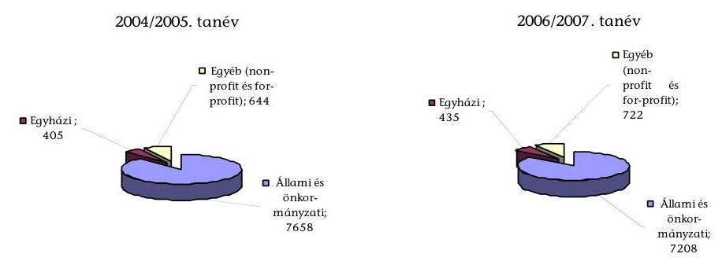

Forrás: OKM Statisztikai Tájékoztató Oktatási Évkönyv 2006/2007.
Az éves költségvetési törvények szerint 2005. évben az Oktatási Minisztérium, illetve 2006. közepétől az Oktatási és Kulturális Minisztérium fejezetnél - az „Egyetemek, főiskolák" címen belül biztosított állami gyakorlóiskolai támogatásokkal együtt - 89,5 Mrd Ft-ot, a „Helyi önkormányzatok támogatásai" fejezetben 514,0 Mrd Ft-ot terveztek közoktatási intézmények támogatására. 2006. évben ugyanezen célra 94,0 Mrd Ft-ot, illetve 489,0 Mrd Ft-ot, 2007. évben 98,7 Mrd Ft-ot és 476,4 Mrd Ft-ot irányoztak elő.

Az ellenőrzés célja annak értékelése volt, hogy

- az Oktatási és Kulturális Minisztérium fejezetnél a nem önkormányzati fenntartású közoktatási intézmények és a közoktatási feladatok finanszírozási rendszere, az előirányzott költségvetési támogatások eredményesen járultak-e hozzá a közoktatás-politika céljainak megvalósításához;
- a fejezet közoktatási feladat támogatási céljai eredményesen és hatékonyan teljesültek-e;
- a fejezet által nyújtott közoktatási támogatások felhasználása az előirányzott céloknak megfelelően történt-e.

Az ellenőrzés a 2004/2005. és 2006/2007. tanévek által átfogott időszak fejezeti közoktatási pénzeszközei felhasználásának ellenőrzésére irányult. A vizsgálat kiterjedt a helyszíni ellenőrzés időszaka (2007. II. félév) tendenciáinak értékelésére is. Az ellenőrzés a közoktatás ágazati felügyeletét ellátó Oktatási és Kulturális Minisztériumra (OKM) és közoktatási háttérintézményeire, az ellenőrzés hatókörébe vont költségvetési jogcímek előirányzatait hasznosító - rétegzett mintavételezési eljárással kiválasztott - egyházi és állami közoktatási intézményekre ${ }^{4}$ és fenntartó szervezeteikre terjedt ki, valamint kapcsolódó jelleggel a

[^0]
[^0]:    ${ }^{4}$ A támogatási összeget figyelembe véve az ellenőrzésbe vont egyházi fenntartású közoktatási intézmények támogatási aránya a közoktatási célú humánszolgáltatás normatív támogatása előirányzatból 13,1%-ot, az egyházi és kisebbségi közoktatási intézmények kiegészítő támogatása előirányzatból 9%-ot képviselt. A felsőoktatási intézmények közoktatási intézményeinek normatív támogatásából az ellenőrzésbe vont szervezetek támogatási aránya 60,6%.

---

Pénzügyminisztériumra és a Magyar Államkincstárra ${ }^{5}$. (A non-profit szervezeteknek biztosított közoktatási támogatások vizsgálatát a jelen ellenőrzéssel párhuzamos, „A közoktatási intézményeket fenntartó non-profit szervezetek normatív hozzájárulásának és támogatásának ellenőrzése" című 2008. évi ÁSZ-ellenőrzés végzi.)

Az ellenőrzés a teljesítmény-ellenőrzés módszerével történt, amelynek során az értékelés az eredményesség és hatékonyság megvalósulására irányult ${ }^{6}$. Az ellenőrzési eljárások között alkalmaztuk a kérdőíves felmérést, a tanúsítványi adatszolgáltatást, helyszíni interjú és összehasonlító elemzések készítését. Az ellenőrzés szempontrendszerét előtanulmánnyal alapoztuk meg.

Az ellenőrzés végrehajtására az Állami Számvevőszékről szóló 1989. évi XXXVIII. törvény 2. § (3), (5) bekezdéseiben foglaltak adnak jogszabályi alapot.

A jelentés-tervezetet egyeztettük az oktatási és kulturális miniszterrel, továbbá a pénzügyminiszterrel és a MEH államtitkárával, valamint a Katolikus, Református és Evangélikus Egyházak vezetőivel. Észrevételező leveleiket és az arra adott válaszainkat az 1. sz. melléklet tartalmazza.

[^0]
[^0]:    ${ }^{5}$ Az ellenőrzött szervezetek névsora a 3. sz. mellékletben szerepel.
    ${ }^{6}$ A teljesítmény ellenőrzési kérdéseket, kritériumokat, adatforrásokat a 12. sz. melléklet tartalmazza.

---

# I. ÖSSZEGZŐ MEGÁLLAPÍTÁSOK, KÖVETKEZTETÉSEK, JAVASLATOK 

Az OKM ágazati-szakmai irányító tevékenysége - a hatályos közoktatási törvény mellett - a 2004-ben nyilvánosságra hozott Középtávú Közoktatásfejlesztési Stratégián (KKFS) és a 2005-ben jóváhagyott hosszú távú közoktatási stratégián alapult. A középtávú közoktatási stratégiában megfogalmazott általános jellegű középtávú fejlesztési célokhoz célprogramokat rendelt a minisztérium, amelyekben konkrét határidők megjelölése nélkül rögzítette a szükséges intézkedéseket. Ezek végrehajtásáról minisztériumi összegzés még nem készült.

A 2005-2015 közötti időszakra kidolgozott hosszú távú stratégia a versenyképességhez és a társadalmi kohézió erősítéséhez kapcsolódóan fogalmazott meg minőségi és eredményességi közoktatási célokat. Az eredményességi célok között szerepel a tanulók versenyképes tudásának kialakítása, az oktatási egyenlőtlenségek csökkentése. A hosszú távú stratégia mindehhez mérési időpontokat és mérőszámokat rendelt.

A közép- és hosszú távú oktatáspolitikai célok megvalósítását támogatta a közoktatás szabályozási környezetének változása. A szabályozási feltételek biztosítását a közoktatásról és a szakképzésről szóló törvények módosításai, valamint a kapcsolódó kormány- és miniszteri rendeletek szolgálták. A költségvetési törvényekben meghatározott közoktatási normatívák összege, azok adott költségvetési évenkénti változása és a közoktatási kiadások alakulása között nem volt közvetlen kapcsolat. Az ellenőrzött időszakban a normatívák megállapításakor a kiindulási alap az előző évi normatív támogatások mértéke volt. A 2007. szeptember 1-jétől működő új normatív rendszerben a költségvetés az ún. „közoktatási teljesítménymutató" alapján finanszírozza a közoktatási intézményeket, amely a korábbinál szorosabb kapcsolatot teremt a támogatás összege és a közoktatási szolgáltatás ráfordításai között ${ }^{7}$.

A költségvetési törvények évente csökkenő összegű állami támogatást - 2005: 603,5 Mrd Ft, 2006: 583,0 Mrd Ft, 2007: 575,1 Mrd Ft - irányoztak elő a közoktatás támogatására a gyermeklétszám mérséklődése és a finanszírozási változások alapján. Az állami támogatás 83-85%-át a „Helyi önkormányzatok támogatásai" fejezetben az önkormányzati iskolák normatív támogatására, címzett- és céltámogatására biztosított állami finanszírozás képezte. A központi költségvetésből nyújtott további közoktatási állami támogatást az OKM fejezet biztosította.

[^0]
[^0]:    ${ }^{7}$ Magyarország 2006-2010 közötti Konvergencia Programja szerint az új közoktatási teljesítménymutató alkalmazása a központi költségvetésben a 2007. évre 7,6 Mrd Ft, 2008-ra 34,2 Mrd Ft megtakarítást eredményez. Az új mutató alapján számított normatív támogatás összege a 2006. évi normatív hozzájárulás 91-95%-át teszi ki. A közoktatási támogatás csökkenését, azaz a megtakarítást alapvetően az átlagosan 10%-kal megemelt pedagógus heti kötelező óraszám okozza.

---

A helyi önkormányzati közoktatási intézményeknél az állami támogatás 2004-2006 között a működési költségek 40-70%-át fedezte átlagosan - intézménytípusonként és intézményenként - eltérő mértékben ${ }^{8}$. Az önkormányzatoknál, az ellenőrzött időszakban növekvő mértékű volt - 2004.: 32,7%, 2006.:39,3% - a saját forrásokból való intézménytámogatás mértéke ${ }^{9}$.

A Helyi önkormányzatok támogatásai és az OKM fejezetek együttes közoktatási kiadásai
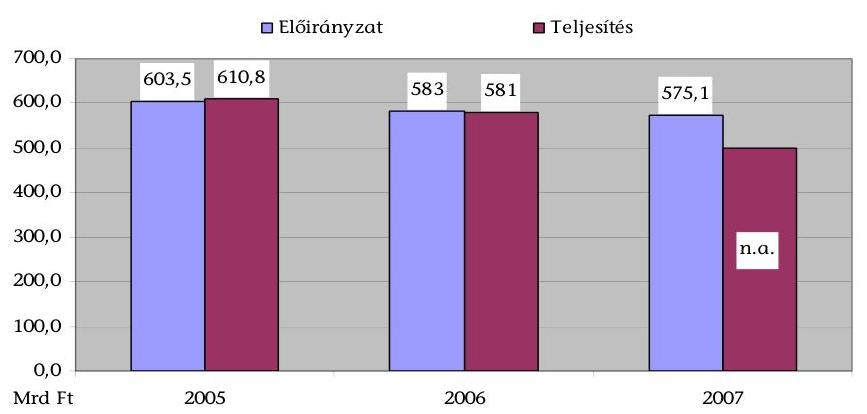

Forrás: Az éves költségvetési és zárszámadási törvények
Hazánk gazdasági teljesítőképességének megfelelően költött közoktatásra, amely nemzetközi összehasonlításban megfelel a hasonló fejlettségű országok átlagának ${ }^{10}$. A nemzetközi tanulói teljesítményméréseken a magyar diákok a problémamegoldást értékelő felmérésekben (PISA) az átlagnál gyengébb eredményt értek el. A magyar iskolarendszer nem egyenlítette ki az iskolák tanulóinak összetételéből adódó társadalmi különbségeket. Az országos kompetenciamérések során a gyenge teljesítmények stagnálása, az érettségi vizsgadolgozatok átlageredményeinek romlása is eredményességi problémát jelez. A közoktatásban a diák-tanár arány csökkenését, a fajlagos közoktatási kiadások növekedését nem kísérte a tanulói teljesítmények javulása és - az ellenőrzött állami gyakorlóiskolák és egyházi közoktatási intézmények átlag feletti eredményessége kivételével - a közoktatás hatékonyságának erősödése.

A vizsgált időszakban a közoktatásban részt vevő gyermekek és tanulók száma az országos demográfiai helyzet következtében nagyobb arányban (2,8%)

[^0]
[^0]:    ${ }^{8}$ Az Állami Számvevőszék önkormányzati közoktatással részletesen foglalkozó korábbi jelentései: „Jelentés az alapfokú oktatásra fordított pénzeszközök felhasználásának ellenőrzéséről" ( 9818 sz.), „Jelentés az általános iskolai oktatás minőségének javítását szolgáló intézkedések ellenőrzésének tapasztalatairól" ( 0219 sz.), „Jelentés a középfokú oktatás feltételei alakulásának ellenőrzéséről" ( 0445 sz.), „Jelentés a kistelepülések iskola-előkészítési, általános iskolai oktatási feltételeinek ellenőrzési tapasztalatairól" (0625 sz.).
    ${ }^{9}$ Forrás: az éves költségvetések végrehajtásáról szóló törvények indoklásai.

 ${ }^{10}$ Lásd: 1. táblázat adatai (A költségvetés közoktatási kiadásainak aránya a GDP %-ában az OECD-országokkal összehasonlításban).

---

csökkent, mint a pedagógusok száma (0,6%). Az egy óvodásra jutó kiadás 13,2%-kal, az egy általános és középiskolás tanulóra jutó kiadás 17,4%-kal emelkedett, alapvetően a közoktatás személyi juttatásainak és járulékainak növekedése miatt.

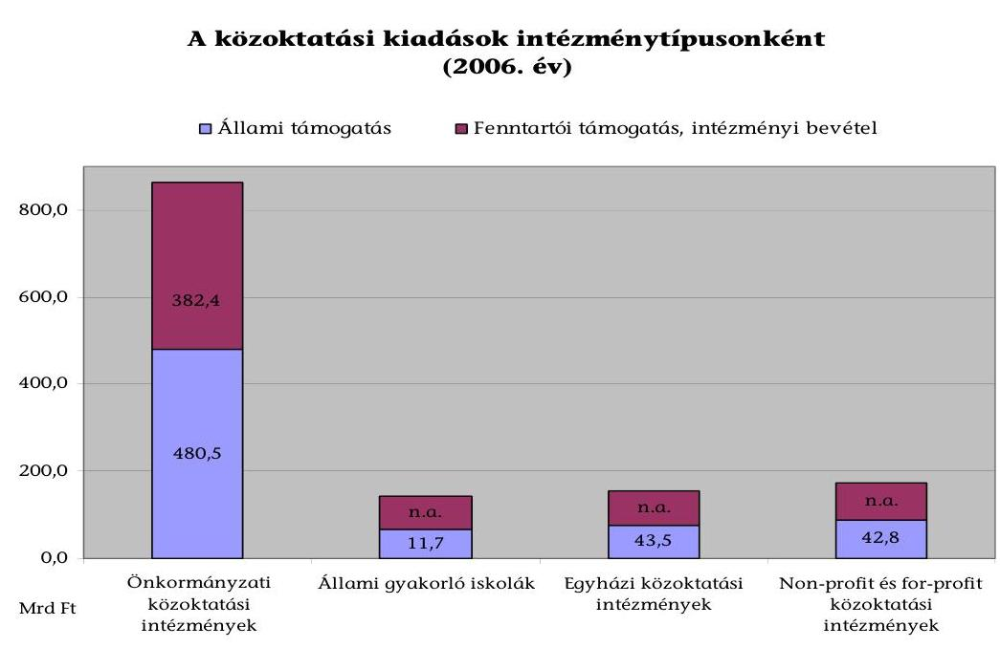

Forrás: A Magyar Köztársaság 2006. évi költségvetésének végrehajtásáról szóló 2007. évi CXXVIII. törvény előirányzati teljesítései, valamint a 4. sz. melléklet szerinti OKM fejezeti adatszolgáltatás. A közoktatási feladatok támogatása fejezeti kezelésű előirányzat 2,5 Mrd Ft összegű teljesítését intézménytípusok szerint nem lehetett felosztani.

A közoktatási költségvetési támogatások számbavétele mellett az ellenőrzés kísérletet tett a különböző fenntartású közoktatási intézmények számának, valamint ezekben a közoktatásra fordított pénzeszközök teljes összegének megjelenítésére. A jelenlegi közoktatási információs rendszerben csak az önkormányzati fenntartású intézményekre vonatkozóan szerezhetők meg a közoktatási kiadásokról megbízható adatok. Az információs rendszer hiányosságai miatt a közoktatási pénzeszközök teljes körű átláthatósága, nyomon követése nem biztosított. A közoktatási pénzek felhasználása és eredményessége között nincsen egyértelmű, szoros kapcsolat.

Az OKM fejezet a magyar közoktatás állami támogatásából évi 15-17%-ot képviselt 2005-ben 89,5 Mrd Ft-os, 2007-ben 98,7 Mrd Ft-os előirányzattal az ellenőrzött időszakban ${ }^{11}$. A fejezet támogatási rendszere biztosítja a nem önkormányzati fenntartású közoktatási intézmények normatív támogatását (az egyházi, non-profit ${ }^{12}$ és for-profit szervezetek részére), az egyházi intézmény-

[^0]
[^0]:    ${ }^{11}$ Az OKM-nél a közoktatási célú támogatás tényleges összege az ellenőrzött időszakban évenként 100 Mrd Ft-ot tett ki a finanszírozott intézmények gyermeklétszámának növekedése és a finanszírozási változások együttes hatására.
    ${ }^{12}$ A non-profit szervezetek közoktatási támogatásának vizsgálatát a 2008. márciusában megkezdett „A közoktatási intézményeket fenntartó non-profit szervezetek normatív hozzájárulásának és támogatásának ellenőrzése" c. ÁSZ-ellenőrzés végzi.

---

fenntartók, kisebbségi önkormányzatok kiegészítő támogatását, a gyakorlóiskolák normatív kiegészítő jellegű támogatását, valamint az egyetemek, főiskolák címen belül a gyakorló közoktatási intézmények normatív támogatását. Ugyancsak az OKM fejezet biztosítja a közoktatás szakmai feladatainak konkrét intézményhez nem kötődő támogatását. A közoktatási feladatok finanszírozásában az OKM fejezeti pénzeszközök kiegészítő szerepet töltöttek be.

# A közoktatási feladatok finanszírozására fordított pénzeszközök megoszlása az OKM fejezetnél* 

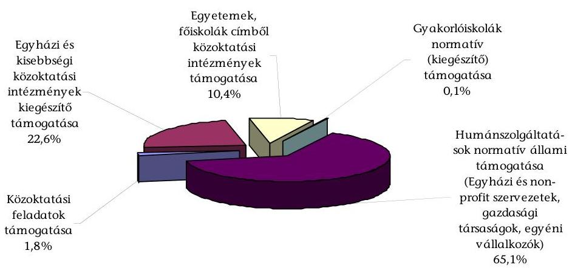

* 2007. évi teljesítés alapján

A közoktatási feladatok támogatására fordított fejezeti kezelésű előirányzat - 7-12 jogcím - összege a költségvetési korlátok miatt az ellenőrzött időszakban fokozatosan csökkent, 2006-ban az országos közoktatási ráfordítások 0,2%-át tette ki. A fejezeti Gazdálkodási Szabályzatban meghatározott támogatási jogcímek nem tartalmazták kellő részletességgel a támogatni kívánt feladatokat, valamint az azok költségigényén alapuló támogatási szükségletet. Az egyes támogatási jogcímekhez, illetve a heterogén jellegű részfeladatokhoz nem párosult eredménykövetelmény, teljesítménymutató. A pénzeszközöket a minisztérium - a Gazdálkodási Szabályzat előírásai szerint - alapvetően egyedi döntéssel osztotta el, amely így nem biztosította az esélyegyenlőséget és a nyilvánosságot. A feladattámogatások 2-3%-áról döntöttek pályáztatással.

A fejezet közoktatási feladattámogatási céljai alapvetően összhangban voltak a kitűzött szakmai célokkal. Azok végrehajtása - a támogatások elosztási módja és a felhasználási követelmények hiánya miatt - részlegesen segítette a közoktatás eredményességét és hatékonyságát. A hasznosulás hatékonyságának megítélését nehezítette, hogy nem történt meg a közoktatási feladatokat ellátó, támogatásban részesült háttérintézmények működési költségeinek és a konkrétan támogatott feladatellátás ráfordításigényének egyértelmű elválasztása.

A közoktatási célú humánszolgáltatás és kiegészítő támogatás fejezeti kezelésű előirányzat finanszírozza az egyházak normatív és kiegészítő támogatását, a non-profit és for-profit szervezetek normatív támogatását. A közokta-

---

tási célú humánszolgáltatás és kiegészítő támogatás összegének 55,7%-át tették ki az egyházak számára 2007-ben kiutalt humánszolgáltatási támogatások. A közoktatási törvény és az egyház-finanszírozási törvény az egyházi fenntartású közoktatási intézmények normatív támogatásának állami és önkormányzati intézményekkel azonos mértékét rögzíti. A 2005. évi költségvetési törvény azonban nem biztosított fedezetet az egyházi fenntartóknak a bejáró gyermekek/tanulók utáni és a településtípusú normatív támogatásra. Az egyházak igényét a Kormány - az egyházak kezdeményezésére - 2006. decemberében hozott határozatával ${ }^{13}$ ismerte el.

Az egyház-finanszírozási törvény ${ }^{14}$ alapján 1998 óta az egyházak az általuk fenntartott közoktatási intézmények közszolgálati feladatellátásban való részvételük alapján - az állami normatív támogatás és hozzájárulás kiegészítéseként - kiegészítő támogatást kapnak ${ }^{15}$. Ez az önkormányzatok fenntartói támogatásával azonos arányú, „átlagos" mértékű kiegészítésként funkcionál, az iskolaszerkezet különbözőségeit nem veszi figyelembe. Az ellenőrzés álláspontja szerint, a 2005. és a 2006. években az egyházak kevesebb összegű kiegészítő támogatásban ${ }^{16}$ részesültek, ${ }^{17}$ mint ami az egyház-finanszírozási törvény alapján és a számításokban az államháztartás működési rendjéről szóló kor-

[^0]
[^0]:    ${ }^{13}$ A 2237/2006. (XII. 23.) Korm. határozat az egyházi közoktatási feladatok, beruházások, felújítások, rekonstrukciók támogatásáról döntött. Ennek keretében 948,4 M Ft-ot tett ki az egyházi közoktatási intézmények támogatására fordítható összeg, ami az OKM Jogi Főosztályának tájékoztatása szerint megegyezett a településtípusú normatívák számított összegével. A kormányhatározattal jóváhagyott összeget „Támogatási Szerződés" megkötésével nem egyházi kiegészítő támogatásként utólagosan, jogszerűen biztosította a Kormány az OKM fejezet 2006. évi államháztartási tartaléka terhére.
    ${ }^{14}$ Az egyházak hitéleti és közcélú tevékenységének anyagi feltételeiről szóló 1997. évi CXXIV. törvény, amely a Magyar Köztársaság és az Apostoli Szentszék között a Katolikus Egyház magyarországi közszolgálati és hitéleti tevékenységének finanszírozásáról, valamint néhány vagyoni természetű kérdésről 1997. június 20-án Vatikánvárosban aláírt - s az 1999. évi LXX. törvénnyel kihirdetett - Megállapodáson alapul, s minden Magyarországon jogi személyként működő, bíróság által nyilvántartásba vett egyházra vonatkozik.
    ${ }^{15}$ 22/1997. (IV. 25.) Alkotmánybírósági határozat: a kiegészítő támogatás, amely az állami vagy önkormányzati feladat vállalásával arányos.
    ${ }^{16}$ Az 1997. évi CXXIV. törvény 6. § (3) bekezdés előírása szerint a kiegészítő támogatás számítása: „Az önkormányzatok adott ágazati működési kiadásainak és felújítási költségeinek összegét csökkenteni kell az intézményi saját bevételekkel, továbbá a közoktatásra központosított előirányzatból adott olyan külön támogatással, amelyhez pályázat útján az önkormányzati és egyházi fenntartó, illetve intézményei egyaránt hozzájuthatnak. Az így megállapított összegből határozandó meg a normatív támogatás aránya és a kiegészítő támogatás összege."
    ${ }^{17}$ Az ÁSZ számítása szerint (lásd a 8. és 8/a-d. sz. mellékleteket) a 2005. évi egyházi kiegészítő támogatás összege 3891,1 M Ft, a 2006. évi összeg 7871,5 M Ft, az egyenlegrendezés során elfogadott 1840,5 M Ft-os, illetve 7268,5 M Ft-os összegekkel szemben. Mindez 2653,6 M Ft-os elmaradt állami támogatást jelent.

---

mányrendelet előírásait figyelembe véve ${ }^{18}$, megillette volna őket ${ }^{19}$.Az OKM és PM által képviselt kormányzati álláspont szerint ${ }^{20}$ - a korábbi gyakorlat továbbviteleként - a jogszabályi rendelkezések módot adnak más, a jogszabályoktól eltérő jogértelmezésre ${ }^{21}$.

Az egyházi fenntartók a normatív hozzájárulás és támogatás teljes összegét átadták közoktatási intézményeiknek, az egyházi kiegészítő támogatást közokta-

[^0]
[^0]:    ${ }^{18}$ 217/1998. (XII. 30.) Korm. rendelet (Ámr.) 8. § (3) bekezdés szerint a saját bevétel „hatósági jogkörhöz köthető - a költségvetési szervet a külön jogszabályban meghatározott mértékben megillető - bevételekből (igazgatási szolgáltatási díj, felügyeleti díj, bírság), egyéb saját bevételként a költségvetési szerv tevékenysége során keletkező működési és felhalmozási célú bevételekből, származik. Az 57. § (2) bekezdése szerint „a költségvetési szerv saját bevételei különösen a következők: a.) az igazgatási, szolgáltatási díj, b) a felügyeleti jellegű tevékenység díja, c) a bírságból származó bevétel, d) az áru-és készletértékesítés ellenértéke, e) a szolgáltatások ellenértéke, f) bérleti és lízingdíj, g) az intézményi ellátási díjak, h) az alkalmazottak térítése, i) az alkalmazott, hallgató, tanuló stb. kártérítése és egyéb térítése, j) a felhalmozási és tőke jellegű bevételek.
    A 2005. évben hatályos Ámr. szerint a saját bevétel, amely a költségvetési szerv tevékenységével összefüggően lehet: 1. az e rendelet 57. § (2) bekezdésében megjelölt, elsősorban alaptevékenységből, továbbá a fejezeti kezelésű előirányzat saját bevétellel fedezett részéből származó bevétel; 2. a köztestülettől, egyéb szervezettől származó juttatás; 3. a vállalkozási tevékenységből származó bevétel; 4. belföldi adomány; 5. külföldi segély adomány."
    Az 57. § (2) bekezdése ide sorolja a hatósági díjbevételeket és azon működési és felhalmozási célra átvett pénzeszközöket, amelyek a fejezeti kezelésű előirányzatok saját bevétellel fedezett részéből származnak.
    ${ }^{19}$ A Polgári Törvénykönyvről szóló 1959. évi IV. törvény 324. § (1)-(2) bekezdései szerint a követelések és az attól függő mellékkövetelések 5 év alatt évülnek el, ha a jogszabály másként nem rendelkezik.
    ${ }^{20}$ A kormányzat által képviselt álláspont szűkíti az önkormányzati közoktatási kiadások körét, az intézményi saját bevétel fogalmi kategóriát pedig bővíti. Az intézményi saját bevételek körébe tartozóan veszi figyelembe - az Ámr. szerint az intézményi bevétel fogalomba tartozó - átvett pénzeszközöket, támogatásértékű bevételeket, pénzügyi befektetések bevételeit, támogatási kölcsönöket.
    ${ }^{21}$ Az OKM és a MEH tájékoztatása értelmében folyamatban van az egyházi közoktatási intézmények kiegészítő támogatásáról szóló kormányrendelet előkészítése. Ezzel összefüggésben felhívjuk a figyelmet arra, hogy az egyház-finanszírozási törvény nem ír elő végrehajtásról szóló kormányrendelet kiadását és a tárgykörben előkészítés alatt levő kormányrendelet-tervezet előírásai nem mondhatnak ellent az egyház-finanszírozási törvény és az államháztartás működési rendjéről szóló hatályos kormányrendelet előírásainak. Az egyház-finanszírozási törvényben meghatározott egyházi kiegészítő támogatás számításának alapadatait - a felújítási kiadások és a pályázati összegek kivételével - az éves zárszámadási törvények indoklásai jelenleg is tartalmazzák. Az Áht. 124. § (2) bekezdésének zsf. pontja 2008. január 1-jétől felhatalmazást ad a Kormánynak az egyházi kiegészítő támogatásra vonatkozó részletező szabály megalkotására.

---

tási intézményeik támogatására fordították ${ }^{22}$. A normatív hozzájárulás közoktatási törvényben előírt mértékének nyilvánosságra hozataláról nem a fenntartók, hanem az intézmények gondoskodtak.

Az egyházi közoktatási intézmények és fenntartóik biztosították a feladatok ellátásához szükséges személyi, tárgyi és pénzügyi feltételeket. Az egyházi fenntartók a kiegészítő támogatásból az intézményeik számára juttatott pénzeszközöket egyházi fenntartói támogatásként kezelték, így ez az intézményeknél nem állami kiegészítő támogatásként jelentkezett ${ }^{23}$.

Az egyházi közoktatási intézményekben a vizsgált tanévekben erkölcsi alapú, értékközpontú eredményes nevelési-oktatási munka folyt. Az egyházi iskolai oktatás és a pedagógusok eredményességét a kiemelkedően jó tanulmányi átlag, az országos versenyeken elért helyezések száma, a sikeres érettségi- és nyelvvizsgát tevők száma, valamint a felsőoktatásban továbbtanulók száma mutatja. Az egyházi közoktatási intézmények tanulói az országos kompetenciaméréseken magasan az országos átlag felett teljesítettek. Az egyházi közoktatási intézményekben az átlagosnál alacsonyabb az egy pedagógusra jutó gyermek/tanuló arány, amely az OKI adatai alapján eredményességet növelő tényező.

A Magyar Államkincstár biztosította a közoktatási célú humánszolgáltatások normatív támogatásának ügymenetét az egyházi fenntartóknál. A Kincstár jogszerűségi és szabályszerűségi ellenőrzést végzett az igénylés és elszámolás során a rendelkezésére álló dokumentációk alapján. Helyszíni
 ellenőrzésre az ellenőrzött időszakban csak egy alkalommal került sor.

Az állami gyakorló iskolák támogatása előirányzatainál nem érvényesült az átláthatóság elve, mivel a felsőoktatási intézmények közoktatási intézményeinek normatív támogatását az „Egyetemek, főiskolák" cím tartalmazza évtizedes tervezési gyakorlat szerint - a felsőoktatási normatív támogatással együtt. A „Gyakorló iskolák normatív támogatása" fejezeti kezelésű előirányzat - nevével ellentétben - csak az évközi változások miatt felmerülő többletfedezetet jeleníti meg.

A felsőoktatási intézmények gyakorló intézményei részére a költségvetési törvények 1998 óta a közoktatási alap-normatíva kétszeresét biztosítják a közoktatásra fordított időkeret 70%-át kitevő felsőoktatási hallgatói gyakorlati felkészítés ellentételezéseként. A normatíva kétszeres összegének megalapozottságát 2000. évben mérték utoljára, az ellenőrzött időszakban nem készült ezirányú számítás. A felsőoktatási intézmények és az általuk fenntartott gyakorló iskolák az előírás szerinti normatív támogatást megkapták, amelyet teljes egészében közoktatási célra használtak fel. A gyakorló intézmények 11-12%-os mértékű bevételei pályázatokból, szakképzési hozzájárulásból és terem bérbeadásból származtak. A helyszínen ellenőrzött intézmények közoktatási kiadásainak 86-96%-át - évente növekvő mértékben - a személyi kiadások és járulékaik képezték.

A felsőoktatási fenntartók döntő többsége (12 intézményből 10) meghatározott szakmai, pedagógiai elvárásokat, követelményeket gyakorló iskoláival szemben. Az elvárások között eredményszemléletű követelmények nem jelentek meg. A gyakorló közoktatási intézmények gazdálkodásának, működésük törvényességének fenntartói ellenőrzése megfelelő volt.

A gyakorló közoktatási intézményekben a nevelő-oktató munkához szükséges személyi feltételek biztosítottak voltak, az intézmények a gyakorló iskolákra vonatkozó előírásoknak eleget tettek. A gyakorló közoktatási intézményekben az iskolai munka eredményességének mutatói magasan az országos átlag felettiek. Az OKM fejezet által finanszírozott, állami gyakorló iskolák eredményesen látták el közoktatási feladataikat.

A közoktatási célokra fordított pénzeszközök felhasználásának ellenőrzését a szaktárca - belső szabályzatai előírásainak megfelelően - beszámoltatás és helyszíni ellenőrzés formájában elvégezte. A helyszíni ellenőrzések között a pénzügyi-szabályszerűségi és rendszer-ellenőrzések mellett helyet kaptak a teljesítmény-ellenőrzések, de az ellenőrzési jegyzőkönyvek a szabályszerűségi értékelés mellett nem minősítették a pénzfelhasználás gazdaságosságát és hatékonyságát.

# A közoktatási támogatások felhasználása az ellenőrzött egyházi szervezeteknél és állami gyakorló iskoláknál az előirányzott céloknak megfelelően történt. 

A helyszíni ellenőrzés megállapításainak hasznosítása mellett javasoljuk:

## a Kormánynak:

Intézkedjen annak érdekében, hogy az egyházi kiegészítő támogatás megállapítása mindenkor feleljen meg az egyház-finanszírozási törvény hatályos előírásainak.

## az oktatási és kulturális miniszternek:

1. Gondoskodjon a fejezeti Gazdálkodási Szabályzatban a közoktatási feladattámogatásoknál a jogcímek céljainak egyértelmű meghatározásáról, a pályáztatási rendszer szélesebb körű alkalmazásáról, a felhasználások hatékonyságának ellenőrzéséről és értékeléséről.

---

2. Kezdeményezze, hogy a költségvetési törvényben a felsőoktatási intézmények közoktatási támogatás előirányzatainál érvényesüljön az átláthatóság elve, továbbá vizsgálja felül a gyakorló közoktatási intézményeknek járó normatíva megalapozottságát.
3. Vizsgálja meg a személyi felelősséget a 2005. és 2006. évi egyházi kiegészítő támogatás jogszabálytól eltérő megállapítása miatt.

# az oktatási és kulturális miniszternek és a pénzügyminiszternek: 

Gondoskodjanak arról, hogy a zárszámadási törvények indoklásában az egyházi kiegészítő támogatás számításának alapadatai teljes körűen, az egyház-finanszírozási törvényben meghatározottak szerint szerepeljenek.

## a Magyar Államkincstár elnökének:

Intézkedjen a humánszolgáltatások finanszírozásához kapcsolódóan a helyszíni ellenőrzések rendszeressé tételéről.

## a Magyar Katolikus Egyház, a Magyarországi Református Egyház és a Magyarországi Evangélikus Egyház vezetőinek:

Gondoskodjanak arról, hogy az egyházi szervezetek - fenntartók és közoktatási intézmények - nyilvántartásaiban és elszámolásaiban az állami támogatások - különös tekintettel a kiegészítő támogatásokra - egyértelműen és elkülönítetten jelenjenek meg.

---

# II. RÉSZLETES MEGÁLLAPÍTÁSOK 

## 1. Az OKM FEJEZET KÖZOKTATÁSI FINANSZÍROZÁSI RENDSZERÉNEK HOZZÁJÁRULÁSA A KÖZOKTATÁSPOLITIKA CÉLJAINAK MEGVALÓSÍTÁSÁHOZ

### 1.1. Közoktatási stratégiai célok

Az OKM, mint a közoktatás ágazati-szakmai irányítója az Európai Unió oktatáspolitikai célkitűzéseit, a tanulók teljesítménymérésére vonatkozó nemzetközi vizsgálatok eredményeit, valamint az államháztartás egyensúlyi követelményeit figyelembe véve alakította ki a közoktatás-politika stratégiai céljait.

A Középtávú Közoktatás-fejlesztési Stratégia (KKFS), amely 2004-ben került nyilvánosságra, szorosan kapcsolódott a Nemzeti Fejlesztési Terv, azon belül is a Humánerőforrás Fejlesztési Program (HEFOP) cél- és eszközrendszeréhez.

A KKFS-ben megfogalmazott középtávú fejlesztési célok - többek között - az élethosszig tartó tanulás megalapozására a kulcskompetenciák fejlesztése révén, az oktatási egyenlőtlenségek mérséklésére, az oktatás minőségének fejlesztésére, a pedagógus szakma fejlődésének támogatására, az információs és kommunikációs technológiák alkalmazásának fejlesztésére, az oktatás tárgyi feltételeinek javítására, a közoktatás költséghatékonyságának javítására irányultak.

A stratégia készítése során felmérték a célok elérését segítő, illetve hátráltató tényezőket.

A középtávú közoktatási stratégia kidolgozásakor 24 célprogramban rögzítették a fejlesztési célokat és az azok eléréséhez szükséges intézkedéseket. Az egyes célprogramok megvalósításának határideje, felelősei, a célprogramok költségigénye és a forrásszükséglet biztosításának módja azonban a KKFS-ben nem került rögzítésre. A programok tervezése során nem dolgoztak ki az értékelés alapjául szolgáló eredménymutatókat. Nem történt meg annak pontos meghatározása, hogy melyek a stratégia megvalósításának állami feladatai, forrásai, és hogyan kapcsolódnak ehhez a - döntően uniós forrásokból megvalósítandó - fejlesztések.

A 2005-2015 közötti időszakra kidolgozott hosszú távú közoktatás fejlesztési stratégia eredményességi céljai között szerepel a tanulók versenyképes tudásának kialakítása, valamint az oktatási egyenlőtlenségek csökkentése. A hosszú távú stratégiához kapcsolódóan kialakították a stratégia eredményességi céljaihoz rendelt mérőszámokat, a mérési időpontokat, a rendelkezésre álló indikátorok segítségével számszerűen is rögzítették az elérendő célokat.

---

# A közép- és hosszú távú stratégiai célok a közoktatási rendszer eredményességének, hatékonyságának, a közoktatásra fordított pénzeszközök gazdaságos felhasználásának javítására irányultak. 

A közoktatás-fejlesztési célok szabályozási feltételeinek biztosítását a közoktatásról szóló 1993. évi LXXIX. törvény (továbbiakban Kt.) és a szakképzésről szóló 1993. évi LXXVI. törvény módosításai, valamint a kapcsolódó kormány- és miniszteri rendeletek szolgálták. A közoktatás szabályozási környezetének változásai - elsősorban a Kt. változásai - olyan feladatokat, intézkedéseket határoztak meg az irányítók, a szakmai szervezetek, a fenntartók valamint a közoktatási intézmények számára, amelyek megalapozták és elősegítették a stratégiai célkitűzések megvalósítását.

Az élethosszig tartó tanulás megalapozását és a kulcskompetenciák fejlesztését szolgálta az ötödik és hatodik évfolyamon a nem szakrendszerű oktatás időkeretének tanulói készségek fejlesztését segítő növelése, a szakképzésben térségi integrált szakképző központok létrehozása és a moduláris felépítésű, kompetenciaelvű szakmai és vizsgakövetelmények kidolgozása.

Az oktatási egyenlőtlenségek mérsékléséhez járult hozzá a halmozottan hátrányos helyzetű gyermekek óvodai elhelyezési kötelezettségének szabályozása, az egymás melletti iskolai körzetekben a halmozottan hátrányos helyzetű tanulók jelentős aránytalanságának megakadályozása.

Az oktatás minőségének fejlesztését szolgálta a közoktatási intézmények teljesítményértékelési kötelezettségének előírása, a pályakezdő pedagógusok gyakornoki foglalkoztatása, az országos tanulói teljesítménymérés adatainak hozzáférhetővé tétele, az országos tanulói teljesítménymérések során tartósan eredménytelen intézmények fenntartói számára az okokat is feltáró intézkedési terv készítésének előírása.

A közoktatás hatékonyságának javítását célozta a pedagógusok kötelező óraszámának 2 órával történő növelése, a pedagógusok kereset-kiegészítésénél a teljesítményértékelés figyelembevételének előírása.

### 1.2. A közoktatás állami támogatásának és kiadásainak alakulása

A Kt. 118. §-ának (1) bekezdése alapján a közoktatás rendszerének működéséhez szükséges pénzügyi fedezetet az állami költségvetés és a fenntartó hozzájárulása biztosítja, amelyet a tanuló által igénybe vett szolgáltatás díja és egyéb saját intézményi bevételek egészíthetnek ki.

A közoktatás feladatainak ellátását szolgáló költségvetési hozzájárulás - közte a közoktatási feladatokat ellátó intézmények fenntartóját megillető normatívák - összegét az éves költségvetési törvényekben rögzítik.

A PM szerint vannak olyan feladatok a közoktatásban (pl. nem iskolarendszerű képzések stb.), amelyek ágazati szempontból ide sorolhatók, de nem tartoznak az önkormányzati kötelező feladatok közé (önként vállalhatók), ezért nincs kapcsolódó állami forrásuk.

---

A normatívák mértéke és a közoktatási kiadások alakulása között nem volt közvetlen kapcsolat. A PM álláspontja szerint az önkormányzati szabályozás nem ágazat specifikus és nem feladat-finanszírozást szolgál, továbbá az évek között feladatváltozások történtek. A költségvetési törvényekben a közoktatási alapnormatívák közé sorolt támogatások fajlagos összege a vizsgált időszakban változatlan maradt, ami nem fedezte az infláció okozta áremelkedést. A 2007. évi normatívák összege reálértékben a 2004. évi támogatás 86,0%-át éri el.

A 2007. szeptemberétől működő új rendszer szerint a költségvetés az ún. „közoktatási teljesítménymutató" alapján finanszírozza a közoktatási intézményeket. A módszer figyelembe veszi a közoktatási törvénynek az osztály és csoport alakításáról szóló elveit, előírásait (átlaglétszám, foglalkoztatási időkeret), a pedagógusok kötelező heti óraszámát, továbbá az egyes intézménytípusok (óvoda, általános iskola, középiskola) költségigényességét kifejező intézménytípus együtthatót. Az új finanszírozási rendszer a korábbinál jobban figyelembe veszi a közoktatás egyes részterületeinek ráfordításbeli különbségeit.

Magyarország az OECD országok gazdasági teljesítőképességének átlagához viszonyítva azonos szinten költött közoktatásra. A 2004-2006 közötti időszakban a költségvetés közoktatási kiadásai a hazai GDP 4,2-4,3%-át tették ki, ami megfelelt a hasonló fejlettségű országok átlagának (1. táblázat és 1. sz. diagram).

2004-ben az óvodai nevelésre az OECD országok átlagánál többet, az alap- és középfokú oktatásra annál kevesebbet költöttünk. A közoktatási kiadások jelentős részét - több mint háromnegyedét - az OECD országokhoz hasonlóan a személyi jellegű ráfordítások tették ki.

A költségvetési szervezetek közoktatási szakfeladatai szerinti kiadásai a 2004. évi 883,9 Mrd Ft-ról 2006-ra 991,6 Mrd Ft-ra emelkedtek (3. táblázat), ami folyó áron 12,2%, változatlan áron 4,3%-os növekedésnek felelt meg.

A közoktatási kiadások 85-92%-a az ellenőrzött időszakban az önkormányzati intézményeknél teljesült. Az önkormányzatok közoktatási kiadásai 2004-ről 2006-ra folyó áron 12,4%-kal emelkedtek. A közoktatási kiadások növekedése alapvetően a fenntartói hozzájárulás emelkedéséből adódott.

A fenntartó önkormányzatok közoktatásra fordított kiadásai meghaladták a központi költségvetéstől e célra kapott támogatások összegét. Az önkormányzatok összes központi költségvetési támogatása 2004-ről 2006-ra 485 781,7 M Ft-ról 485 185,6 M Ft-ra változott, ami folyó áron 0,1%-os, változatlan áron 7,2%-os csökkenést jelentett. A központi költségvetési támogatás aránya 2005-ben az önkormányzatok költségvetési kiadásainak 58,3%-a, 2006-ban 53,3%-a volt. Ez azt jelenti, hogy a kiadások növekedését az önkormányzati saját bevételek alapozták meg.

A nem állami fenntartású közoktatási intézmények költségvetési támogatása 2004-ről 2006-ra 79 792 M Ft-ról 86 821 M Ft-ra folyó áron 8,8%-kal, változat-

---

lan áron 1,1%-kal emelkedett a gyermek/tanuló létszám növekedése következtében (4. és 5/a. táblázat).

A központi költségvetésben az Oktatási és Kulturális Minisztérium, valamint a „Helyi önkormányzatok támogatásai" fejezetekben a közoktatás állami támogatásának előirányzata 2005-2007 között 4,7%-kal csökkent, a kedvezőtlen demográfiai helyzet, egyes normatívák megszűnése, valamint 2007. utolsó harmadától a közoktatási teljesítménymutató bevezetése miatt. 2005-2006-ban a teljesített közoktatási támogatások 16,4-17,2%-át az OKM biztosította.

Az OKM fejezet támogatási
 rendszerén keresztül történik a nem önkormányzati fenntartású közoktatási intézmények, az állami felsőoktatási intézmények közoktatási intézményei és a közoktatási szakmai feladatok finanszírozása. A fejezet teljesített közoktatási támogatási összege a 2007. évben 112,7 Mrd Ft volt, ami 11,8%-kal haladta meg az előző évi adatot. Az ellenőrzött időszakban a fejezetnél közoktatási feladatok finanszírozására fordított pénzeszközök nagyságának és összetételének alakulását a 4. sz. melléklet, valamint a 2. és 3. sz. diagram szemlélteti.

A fejezet közoktatás támogatási rendszerének része a normatív finanszírozási alcímek között a „Közoktatási célú humánszolgáltatások állami támogatása”, az „Egyházi és kisebbségi közoktatási intézmények kiegészítő támogatása”, a „Gyakorló iskolák normatív támogatása” jogcímcsoport, a „Közoktatási feladatok támogatása” fejezeti kezelésű előirányzat, valamint az „Egyetemek, főiskolák” címből a közoktatási intézmények támogatása.

A közoktatási feladatokat ellátó nem állami intézmények fenntartóit megillető humánszolgáltatások normatív állami támogatása - a fenntartó székhelye szerint illetékes kincstári területi igazgatóságon keresztül - történik.

Az alap és kiegészítő normatív költségvetési hozzájárulások összegét a pénzügyminisztériumi előterjesztés alapján fogadta el az Országgyűlés. Az ellenőrzött időszakban a normatívák megállapításakor kiindulási alap az előző évi normatív támogatások mértéke volt, amelyhez képest jelentős változást a szaktárca nem tudott érvényre juttatni.

# 1.3. A közoktatási rendszer eredményessége 

A magyar diákok a lexikális tudást értékelő vizsgálatokban az átlag feletti, a gyakorlati tudást, problémamegoldást értékelő felmérésekben az átlag alatti eredményt érték el, a 2003-2006 között elvégzett négy nemzetközi és három hazai országos szintű teljesítményvizsgálat alapján.

A főleg lexikai ismeretekre épülő, a felmérésben részt vevő országok tanterveit figyelembe vevő TIMSS (Trends in International Matematics and Science Study) vizsgálatokban matematikából és természettudományokból a nemzetközi átlag felett teljesítettek a magyar diákok. A 8. évfolyamos tanulók eredményei alapján hazánk a legjobban teljesítő európai államként szerepelt a természettudományos műveltség terén.

---

A hétköznapi életben hasznosítható képességeket értékelő PISA (Programme for International Student Assesment) vizsgálatokban hazánk tanulói 2003-ban és 2006-ban vettek részt. A magyar diákok a természettudományok terén 2003-ban valamivel az átlag feletti, 2006-ban átlagos teljesítményt értek el. Matematikából és szövegértésből mindkét évben az OECD országok átlagánál alacsonyabb teljesítményt produkáltak.

Az OECD PISA felmérése rávilágított arra, hogy a magyar iskolarendszer nem egyenlítette ki az iskolák tanulóinak összetételéből adódó társadalmi különbségeket. A 2003. évi PISA jelentés szerint a különböző iskolatípusok diákjainak teljesítménye között 66% volt a különbség, kétszerese az OECD országok átlagának, amely 33,6%. 2006. évi PISA-jelentés információi szerint a tanulók közötti képességkülönbség 70%-a az iskolák átlageredménye közötti eltérésből fakad.

A nemzetközi felmérések mellett 2001 óta országos kompetenciaméréseket is folytatnak hazánkban a tanulói teljesítmények értékelése és a tapasztalatok hasznosítása céljából. A 2003. és 2006. évi országos felmérések szerint a 6., illetve 10. évfolyamon tanulók nagy hányada csak a legalapvetőbb matematikai műveletek elvégzésére képes. Az olvasás-szövegértés eredményei 2006-ra kismértékben javultak.

Matematikából 2003-ban a 6. évfolyamos diákok 45,6%-a, 2006-ban 49,1%-a a kettes szint alatt teljesített. A 10. évfolyamon ez az arány 34,7% illetve 34,1% volt.

Olvasás-szövegértésből 2003-ban a 6. évfolyamon 21,9%, a 10. évfolyamon 30,5% volt az egyes szinten, vagy az alatt teljesítők aránya. 2006-ban a 6. évfolyamon tanulók 20,3%, a 10. évfolyamosok 29,1%-a ért el kettes szint alatti eredményt.

Az Oktatáskutató és Fejlesztő Intézet adatai szerint - a felvételi keretszám függvényében - a felsőoktatási felvételi arány 2004-ben érte el a csúcspontját, akkor a 12. évfolyamos tanulók 45,6%-át vették fel felsőoktatási intézménybe. 2006-ra ez a mutató 39,3%-ra csökkent (7. táblázat).

Az emelt szinten megírt érettségi vizsgadolgozatok száma a 2005. évi 14304-ről 2006-ra 31990-re emelkedett, miközben a vizsgák átlageredményei 72,7%-ról 66,8%-ra csökkentek.

A felsőoktatási felvételre jelentkezők nyelvvizsgaarányai 2002-2006 között folyamatosan javultak. A felsőoktatási intézménybe jelentkezők nyelvvizsgáinak száma a jelentkezők számához viszonyítva 2002-ben 39,8%, 2006-ban pedig 55,2% volt (9. táblázat).

A 2004-2006 közötti időszakban, a közoktatásban részt vevő gyermekek és tanulók száma az országos demográfiai helyzet következményeként 2,8%-kal, ezen belül az állami (önkormányzati) intézményekben tanulók száma 4,5%-kal csökkent (5/a. táblázat). A gyermek, illetve tanulói létszám csökkenését nem követte a pedagóguslétszám azonos arányú csökkenése. Ugyanebben az időszakban, a közoktatásban dolgozó pedagógusok száma összességében 0,6%-kal, az állami (önkormányzati) intézményeknél pedig 2,6%-kal csökkent (5/b. táblázat).

---

A költségeket meghatározó diák-tanár arány az OECD országok átlagában 2004-ben az óvodákban 14,8 gyermek/pedagógus, az alapfokú oktatásban 16,9 tanuló/pedagógus és a középfokú oktatásban 13,3 tanuló/pedagógus volt. A magyarországi diák/tanár arány (2. táblázat), különösen az óvodai és az alapfokú oktatásban az OECD átlagnál alacsonyabb (óvoda 10,6, alapfokú oktatás 10,2, középfokú oktatás 13,8).

Egy gyermekre, illetve tanulóra (az állami, önkormányzati fenntartású intézményekben) 2004-ben 471,6 E Ft-ot, 2006-ban 550,2 E Ft-ot fordítottak, ami 16,7%-os növekedésnek felel meg (6. táblázat). Az egy óvodásra jutó kiadás 13,2%-kal, az általános és középiskolai tanulókra jutó fajlagos kiadás pedig 17,4%-kal emelkedett. A fajlagos kiadások növekedéséhez hozzájárult a személyi jellegű ráfordítások emelkedése, valamint a gyermek, illetve tanulói létszám csökkenése.

A diák-tanár arány csökkenését, a fajlagos közoktatási kiadások növekedését azonban nem követte a tanulói teljesítmények javulása, a közoktatás hatékonyságának erősödése. A ráfordításokat az eredményességhez viszonyítva megállapítható, hogy a magyar közoktatásban a rendelkezésre álló erőforrásokat alacsony hatékonysággal használták fel.

# 1.4. Az OKM szakmai értékelő és ellenőrző tevékenysége 

Az ágazati mérési, értékelési politika, a tanulói teljesítmények folyamatos értékelésére, az intézményi minőségirányítási programokra, az értékelések nyilvánosságára vonatkozó szabályozás hozzájárult a kiemelt stratégiai célok nyomon követéséhez.

Az országos és nemzetközi teljesítménymérések előkészítése, a mérések, ellenőrzésének lebonyolítása, az eredmények értékelése és azokról beszámolás küldése a miniszternek, tájékoztatás küldése a fenntartónak az Oktatási Hivatal (korábban az Országos Közoktatási Értékelési és Vizsgaközpont, továbbiakban OKÉV) feladata. A mérés, értékelés eredményeinek ismerete és nyilvánossága információt nyújt és ezáltal hozzájárul a szabályozás, valamint az oktatási folyamatok és feltételek szükséges korrekciójához.

A nem önkormányzati intézményfenntartóknál (illetve intézményeiknél) a költségvetési támogatás igénylésére vonatkozó rendelkezések megtartását az Oktatási Hivatal (illetve az OKÉV) ellenőrizte24 hatósági ellenőrzés keretében. Az ellenőrzések végrehajtását az OKÉV (illetve a Hivatal) részletesen kidolgozott módszertani útmutató, munkaterv és ellenőrzési program alapján megfelelően végezte.

A 2005. évben összesen 140 nem önkormányzati intézményfenntartó normatív költségvetési támogatását ellenőrizte az OKÉV. Az ellenőrzések 288,3 M Ft jogosulatlan többletigénylést tártak fel és 4,5 M Ft aluligénylést állapítottak meg.

[^0]
[^0]:    24 Az 1993. évi LXXIX. törvény, a 20/1997. (II. 13.), a 105/1999. (VII. 6), illetve a 307/2006. (XII. 23.) Korm. rendelet alapján.

---

A 2006. évben az ellenőrzés 259 alapfokú művészetoktatási intézményt és 70 kollégiumot érintett. Az alapfokú művészetoktatási intézményeknél az ellenőrzések alapján 140 esetben (az intézmények 54%-ában) kezdeményezte az OKÉV a Kincstárnál a normatíva folyósításának felülvizsgálatát. 133 esetben az intézmény fenntartója magasabb létszámra igényelte a normatív állami hozzájárulást, mint azt az ellenőrzés megalapozottnak találta (ez 5256 tanulót érintett, a keletkezett többletigénylés 292,6 MFt). 81 intézmény fenntartója viszont kevesebb állami hozzájárulást vett igénybe, mint azt tehette volna (aluligénylés történt 731 tanuló esetében 39,6 M Ft értékben).

A szabálytalanság megszüntetése érdekében az OKÉV főigazgatója a szükséges intézkedéseket megtette.

2007-ben a nem állami, nem önkormányzati fenntartású óvodák hatósági ellenőrzését végezte el a Hivatal, amely 63 óvodát érintett. A vizsgálat eredményeként az intézmények 24%-ában állapították meg a normatív állami hozzájárulás többletigénylését, 8%-nál aluligénylést. A vizsgálat megállapításai alapján 33 óvodára összesen 1,84 M Ft felügyeleti bírságot szabtak ki.

Az OKM (OM) Ellenőrzési Főosztálya szabályszerűségi, pénzügyi, rendszer- és teljesítményellenőrzéseket egyaránt végzett az érintett időszakban. Az Ellenőrzési Főosztálynak a hiányosságok megszüntetésére vonatkozó javaslatai a Gazdálkodási Szabályzat 2007. évi módosításakor alapvetően hasznosultak.

Az OKM Gazdálkodási Szabályzatában részletesen rögzítették a fejezeti kezelésű előirányzatok kiutalásáról és felhasználásáról készítendő évenkénti szakmai és számszaki értékelés határidejét és szempontjait.

A támogatási szerződésekben a kedvezményezettek számára meghatározták a szakmai és pénzügyi beszámoló elkészítésének kötelezettségét és határidejét. A szakmai beszámolók készítéséhez olyan szempontokat, teljesítménymutatókat, amelyek lehetővé teszik a felhasználás gazdaságosságának, hatékonyságának megítélését a támogatási szerződésekben nem határozták meg. A beküldött beszámolókat az OKM szakmai és pénzügyi szempontból ellenőrizte, de beszámolási késedelem esetén nem történt meg a támogatásban részesült szervezet írásbeli felszólítása.

A közoktatási feladattámogatásokra vonatkozóan az OM 2005. évi ellenőrzési terve 14, a 2006. évi ellenőrzési terv 20 helyszíni vizsgálatot tartalmazott. A 2005. évben 10, 2006-ban pedig 9 támogatási szerződés megvalósulásának helyszíni ellenőrzése történt meg, amely a teljes támogatási összeg 19,7%-át, illetve 11,8%-át érintette.

Az OKM szakmai és pénzügyi ellenőrzési tevékenysége a támogatások felhasználásának szabályszerűségére vonatkozóan alapvetően megfelelően működött. A beszámoltatás, valamint a helyszíni ellenőrzések során azonban nem történt meg a felhasználások gazdaságosságának és hatékonyságának értékelése.

---

# 2. A FEJEZET KÖZOKTATÁSI FELADAT-TÁMOGATÁSI RENDSZERÉNEK HOZZÁJÁRULÁSA A KÖZOKTATÁSI CÉLOK TELJESÜLÉSÉHEZ 

Az ellenőrzés időszakában a közoktatási feladatok támogatására fordított fejezeti összeg - költségvetési korlátok miatt - a tényleges teljesítés alapján 2005-ről 2006-ra 46,1%-kal (4658,5 M Ft-ról 2509,4 M Ft-ra) fokozatosan csökkent. A 2007. évi módosított előirányzat (2386,9 M Ft) pedig 4,9%-kal alacsonyabb a 2006. évi teljesítésnél (4. sz. melléklet). A közoktatási feladatok támogatása 2006-ban az OKM közoktatási kiadásainak 2,2%-át, az országos közoktatási ráfordítások 0,2%-át tette ki.

A költségvetésben, 2005-ben 12 jogcímre 5033,0 M Ft-ot, 2006-ban 10 jogcímre 1794,0 M Ft-ot, 2007-ben 7 jogcímre 2341,0 M Ft-ot terveztek.

A közoktatási feladatok támogatására meghatározott jogcímek részfeladatai, az előirányzatok céljai összhangban voltak a közép- és hosszú távú közoktatás stratégiai célokkal.

A feladattámogatás jogcímeinek tartalma, feladat-meghatározása általános volt. A költségvetési törvényben tervezett részfeladatok évenként eltérő részletezettséggel, 7-12 jogcímen - heterogén tevékenységet foglaltak magukban.

A közoktatási feladatok támogatásán belül, a 18. jogcímen szerepelt 2005-ben és 2006-ban az emelt szintű érettségi vizsga lebonyolításának támogatása, 2007-ben pedig a kétszintű érettségi vizsga lebonyolítása. 2005-ben, a Gazdálkodási Szabályzatban jól elkülöníthető részfeladatokra bontották a felhasználásra tervezett összeget. 2006-ban és 2007-ben már egy részfeladatként került meghatározásra az érettségi vizsgadíj visszatérítés, az érettségihez kapcsolódó pedagógus továbbképzés, a vizsgafeladatok felülvizsgálata és a monitoring feladatok támogatása. Esetenként az előirányzat olyan feladatokat is tartalmazott, amely nem kötődött közvetlenül a kiemelt célhoz. Az emelt szintű érettségi vizsga lebonyolításának támogatása szolgált pl. 2006-ban a Köznevelés című lap megjelentetése forrásául.

A közoktatási feladatok támogatásának egyes jogcímeihez, illetve részfeladataihoz eredménykövetelményeket, teljesítménymutatókat a minisztérium nem határozott meg.

A különböző feladatok előirányzatai részben azonos célok megvalósulását segítették elő, ami hátráltatta a rendszer átláthatóságát, a források koncentrált felhasználását.

2006-ban a pedagógusok emelt szintű érettségi vizsgáztatásra történő felkészítésére támogatást biztosított a 4/18 előirányzat mellett a 4/29 előirányzat is. A kétszintű érettségivel kapcsolatos tájékoztatási és egyéb kommunikációs feladatok költségeinek fedezetét biztosította a 4/18 előirányzaton belül.
 a miniszteri keret, emellett a vizsga lebonyolításának részfeladata is tartalmazta ezt a tevékenységet. A közoktatási szakterülethez kapcsolódó kutatások, tanulmányok készítésének támogatása számos előirányzatnál szerepelt (pl.: 4/18, 4/22, 4/21, 4/23) a kutatási cél konkrét megjelölése nélkül.

---

A Gazdálkodási Szabályzatban meghatározott közoktatás támogatási jogcímek (különösen a 2006. és 2007. évben), nem tartalmazták kellő részletességgel a támogatni kívánt feladatokat, valamint azok költségigényére alapuló támogatási szükségletet. Ez rugalmasabb pénzfelhasználást tett lehetővé, de nehezítette a támogatások hatékony felhasználásának megítélését.

Az államháztartás működési rendjéről szóló 217/1998 (XII. 30.) Korm. rendelet (Ámr.) feladatfinanszírozási szabályai a közoktatási feladatok támogatásán belül két jogcímet (oktatási nyilvántartások korszerűsítése, oktatási infokommunikációs technológia) érintettek 2005-ben és 2006-ban. Ezek felhasználására és elszámolására vonatkozó OKM szabályozás összhangban volt az Ámr. rendelkezéseivel.

# A közoktatási feladatok támogatására előirányzott pénzeszközök elosztása 97-98%-ban egyedi döntéssel, kisebb részben - 2-3%-ban pályáztatással történt. 

2005-ben mindössze 4 esetben (a 4/22, 4/23, 4/27 és 4/29 jogcím egy-egy részfeladatánál) határozta meg a Gazdálkodási Szabályzat, hogy a pénzeszközök elosztása részben pályázat útján történik.

A 2006. évben 10 támogatási jogcímből egy esetben (4/30) pályázati úton irányozták elő a támogatás elosztását, négy további jogcímen belül (4/18, 4/22, 4/28, 4/29) pedig egy-egy részfeladatra vonatkozóan határozták meg az egyedi döntés és pályáztatás együttes alkalmazását.

2007-ben 7 támogatási jogcímből egy esetben teljes mértékben (4/30) további három jogcím (4/18, 4/27, 4/29) egy-egy részfeladatánál tervezték a pályázat útján történő elosztást is.

A 2005. évben a közoktatási feladatok támogatására fordított 5033,0 M Ft-ból 155,7 M Ft (3,1%), 2006-ban 1794,0 M Ft-ból 60,5 M Ft (3,4%) került pályázati úton elosztásra. A 2007-re előirányzott 2341,0 M Ft-ból pályázat útján kiosztott összeg 55,75 M Ft (2,4%). A közoktatási feladattámogatások egy része valamely háttérintézmény konkrét feladatellátásához, kiemelt programok megvalósításához kapcsolódott. A források azonos eséllyel történő igénybevétele, illetve a háttérintézmények működési és feladat támogatásának elválasztása a pályáztatási rendszer szélesebb körű alkalmazását indokolja.

Az ellenőrzésbe vont intézmények számára 2006-ban összesen 177,6 M Ft támogatást ítéltek meg, amely a fejezet adott évi közoktatási feladattámogatási összegének (2509,4 M Ft) 7,1%-át tette ki.

Az Országos Közoktatási Intézet (továbbiakban: OKI) 2007. január 1-jétől Oktatáskutató és Fejlesztő Intézet, 2006-ban a 4/29 Közoktatás-fejlesztési stratégia célprogramjainak támogatása jogcímen 18,8 M Ft támogatásban részesült. A támogatás felhasználásával a szerződés szerinti célok eredményesen megvalósultak, de nem a teljes támogatási összeg hasznosult az eredeti cél érdekében, ugyanis engedéllyel 2 M Ft-ot működési ráfordítások fedezetére használtak fel.

---

A támogatás felhasználásával megjelentetett kiadványok, az intézet nemzetközi kapcsolatai, a honlapján közzétett információk a közoktatás-politikai célok megvalósításához kapcsolódtak. A könyvtárfejlesztés közvetetten, a kutatási feltételek javítása révén segítette elő a stratégiai célok elérését.

A támogatási szerződésben szereplő 18,8 M Ft-ból azonban csak 16,8 M Ft-ot használtak fel közvetlenül a fenti célokra. 2,0 M Ft a feladatok ellátása során felmerült általános költségek (postaköltség, telefon, irodaszer), valamint - engedély alapján - az átszervezéshez kapcsolódó kiadások fedezetét biztosította, ami nem az eredeti célt szolgálta. Az intézet a támogatás felhasználásáról szóló szakmai és pénzügyi beszámolóját - két és fél hónapos késéssel - benyújtásra előkészítette. Az előkészített anyagot az ellenőrzés rendelkezésére bocsátották, de az a helyszíni ellenőrzés befejezéséig nem érkezett meg az OKM-hez.

# Az Apertus Távoktatás-fejlesztés Módszertani Központ Tanácsadó és 

Szolgáltató Közhasznú Társaság (továbbiakban Apertus Kht.) a Digitális középiskola projekt 10 db akkreditált tananyagának feldolgozása és nyilvánossághoz közvetítése céljából 2006-ban 20,0 M Ft összegű támogatást kapott, a 4/21 számú infokommunikációs technológia jogcímen.

A támogatás felhasználása a szerződésnek megfelelő, szabályszerű bizonylatokkal alátámasztott volt. A szakmai beszámoló, valamint az ellenőrzés tapasztalatai alapján a támogatás felhasználásával a kitűzött szakmai cél teljesült.

A feldolgozott tananyagok és a digitális középiskola feladatgyűjteményei az Apertus Kht. portálján elérhetők. A szabadon hozzáférhető digitális tananyagok, a digitális iskolahálózat kiterjesztésével, továbbfejlesztésével megteremtik a lehetőséget az oktatási egyenlőtlenségek mérsékléséhez, az információs és kommunikációs technológiák alkalmazásának kiszélesítéséhez.

Az OKM Gazdálkodási Főosztálya által 4/18 jogcímen felhasznált támogatás a Köznevelés című oktatási hírmagazin megjelentetésének fedezetét szolgálta.

A 2006. évre e feladat megvalósítására előirányzott 54,0 M Ft-os keretösszeget év közben a szerződés szerinti árváltozásnak megfelelően felemelték. A 2006. évi előirányzat keretösszege így 56,5 M Ft volt, melyből 56,3 M Ft-ot használtak fel, a 2006. évi lapok megjelentetésére, a fennmaradó összeg a következő év első megjelenéséhez járult hozzá.

A Köznevelés című lap kiadása nem kapcsolódik közvetlenül az emelt szintű érettségi vizsga lebonyolításához, részben azonban hozzájárult a Szabályzatban megfogalmazott tájékoztatási cél megvalósulásához.

A Könyvtárellátó Kht. (továbbiakban KELLÓ) a 4/18 Emelt szintű érettségi vizsga lebonyolítása jogcímű fejezeti kezelésű előirányzat terhére 2006-ban 12,0 M Ft támogatásban részesült.

A támogatás felhasználása nem járult hozzá a Gazdálkodási Szabályzatban meghatározott eredeti cél megvalósulásához. Az átcsoportosítás következtében a szerződéses összeg kötött felhasználású normatív támogatás kiegészítéseként a határon túli pedagógusok és oktatók tankönyvvásárlását szolgálta.

Az Educatio Társadalmi Szolgáltató Közhasznú Társaság (továbbiakban: Educatio Kht.) az érettségi lebonyolítását támogató informatikai rendszer továbbfejlesztése és karbantartása céljából 20,0 M Ft összegű támogatást kapott.

A támogatás felhasználása a szerződésnek megfelelő, szabályszerű bizonylatokkal alátámasztott volt. A szakmai beszámoló alapján a támogatás felhasználásával a kitűzött szakmai cél teljesült. A projekt eredményeként létrejött a Közoktatási Információs Iroda és az Országos Felsőoktatási Információs Központ közötti közvetlen elektronikus adatátvitel.

Az OM Gazdálkodási Főosztálya a 4/20. oktatási nyilvántartások korszerűsítése jogcímcsoportból 60,0 M Ft-ot használt fel az Educatio Kht-val kötött vállalkozási szerződés szerinti feladatok finanszírozására.

Az Educatio Kht-val kötött szerződés egyes részfeladataira vonatkozóan azonban részletes kalkulációval alátámasztott költségtervek nem álltak rendelkezésre.

A teljesítésigazolás és a helyszíni ellenőrzés tapasztalatai alapján az oktatási azonosítószámhoz kötődő személyi és intézményi nyilvántartás integrált rendszere - a szerződésnek megfelelően - elkészült. A vállalkozási díj szabályszerűen kiállított bizonylattal alátámasztva került kiegyenlítésre.

A támogatás felhasználása hozzájárult az oktatási intézmények hatékony adatkezelésének kialakításához, mivel az azonosító számok alapján történő naprakész nyilvántartás egyszerűsíti az adminisztrációt, és megakadályozza a normatívák jogosulatlan igénylését.

A közoktatási feladatok támogatását szolgáló előirányzatok hozzájárultak a közoktatási stratégia célkitűzéseinek megvalósulásához. A felhasználás az ellenőrzött projektek egyharmadánál nem szolgálta teljes mértékben a Gazdálkodási Szabályzatban meghatározott célt. A hasznosulás hatékonyságának megítélését nehezítette, hogy nem történt meg a közoktatási feladatokat ellátó, támogatásban részesült háttérintézmények működési költségeinek és a konkrét feladatellátás költségigényének egyértelmű elválasztása. A szerződéseket - az ellenőrzéssel érintett hat szerződés közül négy esetben - visszamenőleges hatállyal kötötték meg, amely akadályozta a támogatások felhasználásának tervezhetőségét.

---

# 3. A KÖZOKTATÁSI CÉLÚ HUMÁNSZOLGÁLTATÁS FINANSZÍROZÁSA ÉS HASZNOSULÁSA AZ EGYHÁZI SZERVEZETEKNÉL 

### 3.1. Az egyházi közoktatási intézmények állami támogatásának szabályozása, finanszírozása

Az egyházi közoktatási intézmények állami támogatását a lelkiismereti és vallásszabadságról, valamint az egyházakról szóló 1990. évi IV. törvény, és a Vatikáni megállapodást kihirdető 1999. évi LXX. törvény alapozza meg. A támogatásra vonatkozó konkrét szabályozást alapvetően a közoktatásról szóló 1993. évi LXXIX. törvény (ágazati törvény), az annak végrehajtásáról szóló 20/1997. (II. 13.) Korm. rendelet, valamint a kapcsolódó miniszteri rendeletek tartalmazzák.

A törvényi szabályozás kiterjed az óvodai nevelésre, az iskolai, a kollégiumi nevelésre-oktatásra, az ezekkel összefüggő szolgáltató és igazgatási tevékenységre, függetlenül attól, hogy azt milyen intézményben látják el, illetve ki az intézmény fenntartója${ }^{25}$.

Az ágazati törvény mellett egy speciális törvény - az egyházak hitéleti és közcélú tevékenységének feltételeiről szóló 1997. évi CXXIV. törvény (un. egyházfinanszírozási törvény) - is rendelkezik az egyházi közoktatás feladatellátásának állami támogatásáról.

Mind a két törvény vonatkozó szakaszai${ }^{26}$ az egyenlő elbírálás elvét fogalmazzák meg, ezáltal megteremtve az esélyegyenlőséget az állami és helyi önkormányzati, illetve a nem állami és nem helyi önkormányzati (köztük az egyházi) fenntartású közoktatási intézmények finanszírozása között.

## Az ágazati törvény és az egyház-finanszírozási törvény szabályozási szinten megfelelően biztosítják a nem állami és nem helyi önkormányzati (egyházi) fenntartású közoktatási intézmények állami normatív támogatását.

A központi költségvetés normatív költségvetési hozzájárulást biztosít az állami szervek és a helyi önkormányzatok, valamint a nem állami, nem helyi önkormányzati intézményfenntartók részére az általuk fenntartott nevelési-oktatási intézmények működéséhez${ }^{27}$, amelynek összegét az éves költségvetési törvényekben határozzák meg${ }^{28}$.

Az éves költségvetési törvények vonatkozó szakaszai felsorolják a nem állami intézmény fenntartóját - a törvények 3., 5., 8. melléklete szerint - megillető

[^0]
[^0]:    ${ }^{25}$ A közoktatásról szóló 1993. évi LXXIX. törvény 1. §.
    ${ }^{26}$ Az 1993. évi LXXIX. törvény 4. § (6) bekezdés, 118. § (3) és (4) bekezdés, valamint az 1997. évi CXXIV. törvény 4. § (1) és (2) bekezdése.
    ${ }^{27}$ 1993. évi LXXIX. törvény 118. § (3) bekezdés.
    ${ }^{28}$ 1993. évi LXXIX. törvény 118. § (2) bekezdés.

---

normatív hozzájárulás és támogatás jogcímeit. A mellékletek tartalmazzák a jogcím szerinti normatív hozzájárulás és támogatás fajlagos összegeit${ }^{29}$.

A normatív támogatás elemei (alap hozzájárulás, kiegészítő hozzájárulás, központosított támogatás, kötött felhasználású támogatás) az ellenőrzött időszakban nem változtak, az összetételük és igénybevételi lehetőségük viszont változott.

PI.: 2006. évtől megszűnt a kulturális, szabadidős és egészségfejlesztési tevékenység, a diáksport és a kiegészítő hozzájárulás normatívája. Ugyancsak 2006-ban megszűnt az általános tankönyvtámogatás, helyére az ingyenes tankönyvtámogatásra jogosultak normatívája került, majd 2007-től ismét megjelent az általános tankönyvtámogatás.
2006. évtől megszűnt a szakmai informatikai fejlesztési feladatok normatívája, helyette pályázati keret áll rendelkezésre.

A minőségfejlesztési, minőségirányítási feladatok normatívája megszűnt, 2007. évtől pályázati keret áll rendelkezésre.

A közoktatás normatív finanszírozásának a 2005. évi költségvetési törvényben rögzített szabályozása nem biztosított az önkormányzati fenntartású intézményekkel azonos finanszírozási feltételeket az egyházi közoktatási intézmények számára, mivel kizárólag az önkormányzatok vehették igénybe a bejáró gyermekek/tanulók után a normatív hozzájárulást és a településtípusú normatívákat${ }^{30}$. A kormány a 2237/2006. (XII. 23.) Korm. határozattal - 2007. évben kötött támogatási szerződések alapján - 948,4 M Ft-ot fizetett ki az egyházi közoktatási intézmények településtípusú normatíváknak megfelelő összegű támogatására.

A 2006. és 2007. évi költségvetési törvények szabályozása alapján az egyházi intézményfenntartók a helyi önkormányzatok normatív hozzájárulásaival és támogatásaival azonos jogcímeken és jogosultsági feltételek mellett, az egyházakra megállapított feltételek teljesülésével igényelhették a támogatásokat${ }^{31}$.

Az ellenőrzött időszak változó jogszabályi környezete az állami, az önkormányzati és az egyházi fenntartóktól folyamatos alkalmazkodást igényelt.

A költségvetési törvények 3., 5., 8. mellékletei és kiegészítő szabályai évente, az ágazati törvény, a végrehajtási rendelet és a miniszteri rendeletek a közoktatási feladatellátás változásával összefüggésben módosultak.

[^0]
[^0]:    ${ }^{29}$ 2004. évi CXXXV. törvény 30. §, 2005. évi CLIII. törvény 30. §, 2006. évi CXXVII. törvény 31. § és a törvények 3., 5., 8. mellékletei.
    ${ }^{30}$ 2004. évi CXXXV. törvény 30. § (1) bekezdés a.) pont és 3.

 sz. melléklet.
    ${ }^{31}$ 2005. évi CLIII. törvény 30. § (1) bekezdés a.) pont, 2006. évi CXXVII. törvény 31. § (1) bekezdés a.) pont.

---

A közoktatási célú alap-hozzájárulás normatív finanszírozási rendszere 2007. szeptember 1-jétől átalakult, a finanszírozás közoktatási teljesítmény-mutató alapján történik ${ }^{32}$.

A teljesítménymutató az óvodai/iskolai évfolyam csoportokra/osztályokra meghatározott átlaglétszámok, a foglalkoztatási időkeretek, a pedagógusok kötelező óraszáma figyelembevételével kerül meghatározásra.

Az új mutató alapján számított normatív támogatás összege nem éri el a korábbi fajlagos számítás alapján járó hozzájárulás összegét. A közoktatási alap-hozzájárulás tervezett összege a 2006. évi normatív hozzájárulás 91-95%-át teszi ki. A közoktatási támogatás csökkenését, azaz a megtakarítást alapvetően az átlagosan 10%-kal megemelt pedagógus heti kötelező óraszám okozza.

A közoktatási közfeladatot ellátó egyházak a rájuk vonatkozó speciális jogszabály ${ }^{33}$ és annak indoklása ${ }^{34}$ szerint kiegészítő támogatásra jogosultak.

# A törvény normaszövege és annak indoklása szerint a kiegészítő támogatás biztosításával az állam az egyházi közoktatási tevékenységet a helyi önkormányzatok hasonló tevékenységével azonos támogatásban részesíti. 

A törvény szabályozza a kiegészítő támogatás meghatározását, számítását, valamint a tervezett és tényleges adatok ismeretében az eltérés rendezését ${ }^{35}$.

Az ellenőrzött időszakban a kiegészítő támogatás előzetes összegének meghatározása a törvényi előírásnak megfelelően minden évben a költségvetés tervezésekor ismert adatok alapján, az éves költségvetésről szóló törvényben történt.

A támogatás összege ténylegesen csak az adott tárgyévi költségvetés végrehajtása után állapítható meg, így a meghatározott összeg előlegnek tekinthető. A kiegészítő támogatás, azaz az előleg összege 2005. évben 128000 Ft/fő/év, 2006. évben 128970 Ft/fő/év, 2007. évben 145000 Ft/fő/év, majd év végén - a költségvetési törvény módosításával - 190000 Ft/fő/év.

Az ellenőrzött időszakban a kiegészítő támogatás tervezett és tényleges adatokon nyugvó eltérését - az illetékes tárcák (OM/OKM és PM) egyeztették az egyházakkal. Az egyeztetések és az álláspontok közelítése az OM/OKM koordinálásával zajlottak.

[^0]
[^0]:    ${ }^{32}$ 2006. évi CXXVII. törvény 3. sz. melléklet: Kiegészítő szabályok.
    ${ }^{33}$ 1997. évi CXXIV. törvény 6. § (1) bekezdés.
    ${ }^{34}$ 1997. évi CXXIV. törvény Általános Indokolás „A közszolgálati tevékenységet (közoktatás...) végző egyházi intézmények megkapják ugyanazt a normatív támogatást, ezen felül pedig azt a kiegészítő támogatást, amelyet az önkormányzati intézmények ezen tevékenységük után - közvetlenül, illetve az önkormányzati összforrásokból a kialakuló szint alapján - átlagosan kapnak."
    ${ }^{35}$ 1997. évi CXXIV. törvény 6. § (2), (3), (5) bekezdés.

---

A 2024/2006. (II. 21.) Korm. határozat ${ }^{36}$ alapján „Egyházi kiegészítő támogatások" rendezése címen biztosított 1000 M Ft pótlólagos összeggel az ellenőrzés a 2004. évi kiegészítő támogatást rendezettnek tekinti.

A 2005-2006. évi kiegészítő támogatás összegének megállapítása nem az egyház-finanszírozási törvény előírásának, az érintett egyházakkal történő egyeztetésnek megfelelően került rendezésre. A fent említett időszakban a kiegészítő támogatás összegének meghatározását, a tervezett és tényleges adatok közötti eltérések rendezését a számítás egyes fő tételeinél (a helyi önkormányzatok közoktatási működési kiadásainak és az intézményi saját bevételek meghatározása) eltérő álláspontok, viták jellemezték.

Az egyházak az egyenlegrendezési levezetésnél alkalmazott önkormányzati alapadatok birtokába kerültek, de az adatok, és azok zárszámadási törvényektől való eltérésének ellenőrzési lehetősége nem volt biztosított számukra, az egyeztetésekről készült emlékeztetők, az ahhoz tett észrevételek, valamint az egyházi képviselők ezirányú nyilatkozatai szerint.

Az egyeztetések során 2005. évre vonatkozóan egyáltalán nem, 2006. évre vonatkozóan közeledtek az álláspontok a kormány és az egyházak képviselői között. Közös álláspont egyik évben sem jött létre ${ }^{37}$. A kiegészítő támogatás korrekciós összege mindkét évben a kormányzati álláspontnak megfelelően került elfogadásra a zárszámadási törvényekben ${ }^{38}$, és nem érvényesült az egyházfinanszírozási törvény vonatkozó bekezdése ${ }^{39}$. Az ellenőrzés megállapítása szerint a kiegészítő támogatás végleges összegének meghatározását nem előzték meg hivatalos előterjesztések, a szakértői számítások váltak gyakorlattá.

[^0]
[^0]:    ${ }^{36}$ A kiegészítés eredeti összegének megállapítása nem a hatályos jogszabályoknak megfelelően történt. A Pénzügyminisztérium fejezet 2005. évi előirányzat-maradványának átcsoportosításáról szóló fenti kormányhatározat 1000 M Ft-ot biztosított az „Egyházi kiegészítő támogatások rendezése" címen. A kormányhatározat konkrét érvet és indoklást nem tartalmaz. Az ellenőrzés rendelkezésére bocsátott 2006. február 24-i keltezésű - a történelmi egyházak vezetőinek megküldött - pénzügyminiszteri levél rögzítette azt, hogy „az összeg a 2004. és az azt megelőző évek közoktatási támogatásainak rendezésére szolgál".
    ${ }^{37}$ A 2006. évi egyenlegrendezésről szóló 2007. szeptember 21-i egyeztetésről nem készült emlékeztető, a közeledő álláspontokról belső feljegyzések tanúskodnak. A következő, 2007. október 10-i egyeztetés OKM által készített emlékeztetőjében az szerepel, hogy „a jelenlévő egyházi képviselők a Katolikus Egyház szakértőinek javaslatára - a Hit Gyülekezete képviselőjének tartózkodásával - a 2007. szeptember 21-i megbeszélés óta birtokukba került adatokra hivatkozva egyes adatok pontosítását, további egyeztetést kérnek". Ennek megtörténtét ellenőrzési dokumentumok nem bizonyítják.
    Az OKM tájékoztatása szerint a 2007. október 16-i vatikáni vegyes bizottsági ülésen a Katolikus Egyház részéről felmerült egy 2 Mrd Ft fölötti többletigény, és ott a többletigény írásbeli levezetésére, annak megküldésére kérte a kormányzati oldal a katolikus felet. Ez azóta sem történt meg, a pótlólagos igény nem került felterjesztésre. Ezen igény az ellenőrzés álláspontja szerint nem volt megalapozott, a zárszámadási indoklásban foglalt adatok téves értelmezésén alapult.
    ${ }^{38}$ 2006. évi XCIX. törvény 10. § (1) bekezdés, 2007. évi CXXVIII. törvény 10. § (1) bekezdés.
    ${ }^{39}$ 1997. évi CXXIV. törvény 6. § (5) bekezdés.

---

Az egyházak ellenőrzés számára tett nyilatkozatai is egyértelműsítik, hogy az OKM az egyenlegrendezéshez az OKM-PM háttérszámításhoz felhasznált adatokat bocsátotta rendelkezésükre az egyenlegrendezési egyeztetésekhez (a 7. és 8. sz. mellékletben foglaltak szerint). Az önkormányzati költségvetési beszámolók 21. és 22. sz. űrlapja közoktatásra vonatkozó 2005. és 2006. évi kincstári adatokon nyugvó összegezett háttéradatait nyilatkozataik szerint nem kapták meg (8/a-d. mellékletek adatsorai). Az egyház-finanszírozási törvényben rögzített egyenlegrendezés helyességének ellenőrzése csak e teljes körű adatok birtokában lehetséges. Az egyházak tájékoztatása szerint 2006. évre kaptak, 2005. évre vonatkozóan azonban nem kaptak közigazgatási határozatot a kiegészítő támogatás végleges összegéről.

A kormányzati álláspontot - benne *-gal jelölve az egyházak által vitatott számadatokat - a PM által az ellenőrzés rendelkezésére bocsátott zárszámadási egyenlegrendezést tartalmazó 7. sz. mellékletben mutatjuk be.

Az egyházak a 2005. évi tényszámok közül vitatták a működési és felújítási kiadás (832,0 Mrd Ft), a saját bevétel (77,3 Mrd Ft) és a normatív hozzájárulás (510,7 Mrd Ft) összegeit, mivel véleményük szerint azok nem egyeztek a 2005. évi költségvetés végrehajtásáról szóló törvény adataival. A hivatkozott törvény indoklása 825,0 Mrd Ft működési kiadást tartalmaz, a felújítási kiadás az önkormányzatok költségvetési beszámolói alapján összesített adatok szerint - 21. űrlap - 16,5 Mrd Ft, így az összes kiadás az egyházak álláspontja szerint 841,5 Mrd Ft. A törvény indoklásában 47,2 Mrd Ft saját bevétel szerepel, az egyházak ezt a bevételi összeget tekintették irányadónak a kiegészítő támogatás számításánál. Ezt az összeget egészíti ki az ellenőrzés álláspontja értelmében a 2005. évben hatályos Ámr. szerinti saját bevétellel fedezett, működési célú pénzeszközátvétel önkormányzati költségvetési szervektől, amelynek összege 5,7 Mrd Ft, valamint a 0,2 Mrd Ft-os felhalmozási és tőke jellegű saját bevétel. A közoktatási normatív hozzájárulás összege a 2005. évi költségvetés végrehajtásáról szóló törvény melléklete (IX. Helyi önkormányzatok támogatásai) szerint 510,7 Mrd Ft volt, ezzel az egyházak nem értettek egyet. Ugyanis, az egyházak - a korábbi évek elszámolási gyakorlatának megfelelően - a 2005. évi önkormányzati közoktatási támogatások zárszámadási törvény szerinti normatív hozzájárulási összegébe a településtípusú normatíváknak megfelelő támogatási összeg beszámítását is indokoltnak tartották. Így ez - a 2005. évi szabályozással ellentétben - a kiegészítő támogatás alapját növelte volna.

A 2006. évi tényszámok közül a Katolikus Egyház képviselői a működési és felújítási kiadások összegét megalapozó számításokat hiányolták, mivel a zárszámadási törvény tervezetéből nem derül ki, hogy az 53,3 Mrd Ft összegű felhalmozási kiadásból mennyi volt a felújítás.

A 2005. és 2006. évi kiegészítő támogatás számításának levezetését és az ahhoz kapcsolódó számvevőszéki álláspontot az éves költségvetés végrehajtásáról szóló törvények indoklása alapján, valamint az ellenőrzés rendelkezésére bocsátott PM adatok figyelembevételével a 8., 8/a-d. sz. mellékletben mutatjuk be. Eszerint a 2005. évi egyházi kiegészítő támogatás összege 3891,1 M Ft, a 2006. évi összeg 7871,5 M Ft - a zárszámadási egyenlegrendezés során elfogadott 1840,5 M Ft-os, illetve 7268,5 M Ft-os összegekkel szemben. A kormányzati háttérszámítások és az ellenőrzés álláspontját tükröző számítások azonos kincstári adatbázison alapulnak (9. sz. melléklet).

---

Az egyházi kiegészítő támogatás megállapításánál figyelembe veendő intézményi saját bevétel fogalmának a kormányzati álláspont - a jogszabályok szövegétől eltérő - közgazdasági értelmezést ad, amely szerint az intézményi saját bevételek között a működő kiadások forrását is képező átvett pénzeszközöknek is meg kell jelenniük. Ez az álláspont a hatályos jogi szabályozás alapján, csak a 2005. évi fejezeti kezelésű előirányzatok saját bevétellel fedezett részéből származó működési célú pénzeszközátvételnél állja meg a helyét. A 2005. évi egyenlegrendezésről, az OKM-ben készített emlékeztető is a következőket tartalmazza a PM-szakértő álláspontjaként: „A kormányzat tágabban értelmezi a saját bevételek fogalmát, mint az egyházi szakértők."

A levezetés alapján mutatkozó eltérést az okozza, hogy az OM/OKM-PM háttérszámítás nem az éves költségvetés végrehajtásáról szóló törvények önkormányzati közoktatási működési kiadási és intézményi saját bevételek összegeit vette figyelembe, továbbá a helyi önkormányzatok intézményi saját bevételeit nem a vonatkozó kormányrendelet ${ }^{40}$ alapján állapította meg. Mindezt alátámasztotta a helyi önkormányzatok közoktatási kiadásainak és bevételei - az éves zárszámadási törvények szerinti - kincstári adatainak számvevőszéki kigyűjtése is (8/a-d. sz. mellékletek).

A kormányzati háttérszámítás összegeiben szerepelnek a támogatásértékű bevételek, az államháztartáson kívülről átvett működési pénzeszközök, a pénzügyi befektetések bevételei és a támogatási kölcsönök, amelyek az éves költségvetés végrehajtásáról szóló törvények indoklása és a vonatkozó kormányrendelet szerint nem részei az intézményi saját bevételeknek (kivéve a 2005. évi saját bevétellel fedezett működési célú pénzeszközátvételt). Az intézményi saját bevételek között a háttérszámítás szerint 2005. évben összesen 29,4 Mrd Ft összegű támogatások, kiegészítések és átvett pénzeszközök - melyből 5,7 Mrd Ft a jogszabály szerinti -, 2006. évben pedig 11,0 Mrd Ft-os támogatásértékű működési bevételek szerepelnek.
${ }^{40}$ 217/1998. (XII. 30.) Korm. rendelet 8. § (3) bekezdés szerint a saját bevétel "hatósági jogkörhöz köthető - a költségvetési szervet a külön jogszabályban meghatározott mértékben megillető - bevételekből (igazgatási szolgáltatási díj, felügyeleti díj, bírság), egyéb saját bevételként a költségvetési szerv tevékenysége során keletkező működési és felhalmozási célú bevételekből, származik.. Az 57. § (2)
 bekezdése szerint „a költségvetési szerv saját bevételei különösen a következők: a.) az igazgatási, szolgáltatási díj, b) a felügyeleti jellegű tevékenység díja, c) a bírságból származó bevétel, d) az áru-és készletértékesítés ellenértéke, e) a szolgáltatások ellenértéke, f) bérleti és lízingdíj, g) az intézményi ellátási díjak, h) az alkalmazottak térítése, i) az alkalmazott, hallgató, tanuló stb. kártérítése és egyéb térítése, j) a felhalmozási és tőke jellegű bevételek.
A 2005. évben hatályos Ámr. szerint a saját bevétel, amely a költségvetési szerv tevékenységével összefüggően lehet: 1. az e rendelet 57. § (2) bekezdésében megjelölt, elsősorban alaptevékenységből, továbbá a fejezeti kezelésű előirányzat saját bevétellel fedezett részéből származó bevétel; 2. a köztestülettől, egyéb szervezettől származó juttatás; 3. a vállalkozási tevékenységből származó bevétel; 4. belföldi adomány; 5. külföldi segély adomány.
Az 57. § (2) bekezdése ide sorolja a hatósági díjbevételeket és azon működési és felhalmozási célra átvett pénzeszközöket, amelyek a fejezeti kezelésű előirányzatok saját bevétellel fedezett részéből származnak.

---

A kormányzati háttérszámítások közel 10 Mrd Ft-os egyéb kiadással csökkentették az önkormányzatok 2005. évi tényleges közoktatási működési kiadásait. Ezek az egyéb kiadások a 2005. évi költségvetés végrehajtásáról szóló törvény indoklásában a 825,0 Mrd Ft működési kiadások között szerepelnek. Az „egyéb kiadások" tételt a 2006. évi önkormányzati közoktatási működési kiadások összege is tartalmazza (mind a 2006. évi költségvetés végrehajtásáról szóló törvény indoklása, mind az OKM-PM háttérszámítás szerint).

Az egyház-finanszírozási törvényben meghatározott kiegészítő támogatás összege számításának alapadatait az éves költségvetés végrehajtásáról szóló törvények indoklásában bemutatott közoktatásra fordított önkormányzati adatok nyomán - a felújítási kiadások és a pályázati összegek kivételével, amely tételeket jelenleg nem tartalmazza a zárszámadási törvény előterjesztése - lehet kialakítani.

Az OKM észrevételezte az önkormányzati és egyházi iskolák állami támogatása összehasonlításának hiányát a megállapítások köréből. Az ellenőrzésnek nem volt feladata az önkormányzati fenntartású közoktatási intézményeknél az állami támogatás hasznosulásának ellenőrzése. Ezért nem kapott helyet az ellenőrzési szempontok között az önkormányzati és egyházi fenntartású iskolák állami támogatása és azok fajlagos mutatóinak összehasonlítása. Ez utóbbiak megalapozott értékeléséhez - többek között - szükséges a fenntartói szektorok oktatási szerkezetének, az egyes iskolatípusok normatívájának pontos ismerete és elemzése.

# 3.2. A Magyar Államkincstár szerepe az egyházi közoktatás finanszírozásában 

A Kincstárnál a humán szolgáltatások normatív támogatásának eljárásrendjét az éves költségvetési törvényekben és a vonatkozó kormányrendeletben foglalt előírások figyelembevételével alakították ki. A Kincstár megfelelően biztosította a közoktatási célú humánszolgáltatások normatív támogatásának ügymenetét az egyházi fenntartóknál.

A finanszírozás ügymenete tartalmazta a közoktatási célú normatív alap hozzájárulás és támogatás igénylésének, megállapításának, folyósításának valamint elszámolásának módját. Az egyházi fenntartók igényelték a normatív hozzájárulást és támogatást intézményeik részére. A Kincstár határozatban állapította meg az igénylés időszakára a normatíva egy hónapra járó összegét, melyet havi finanszírozásban folyósított. A fenntartók a támogatások elszámolására vonatkozó előírások szerint a tárgyévet követően, illetve az évközi megszűnéskor 30 napon belül elszámoltak az igénybevett támogatásokkal.

A Kincstár a meglévő iratanyagok alapján a támogatás igénylésénél előzetes jogszerűségi ellenőrzést, az elszámolások elfogadásánál szabályszerűségi ellenőrzést végzett. A Kincstár ellenőrző szerepe a dokumentális ellenőrzések során az igénylések elbírálásakor, az elszámolások elfogadásában és a jogosulatlanul igénybe vett támogatások kiszűrésében megfelelően érvényesült.

A jogszabály lehetőséget adott a támogatások helyszíni ellenőrzésére is, azonban erre - megfelelő személyi kapacitás hiányában - 2005-2006. években a

---

vizsgálatba vont egyházak által működtetett intézményeknél egy alkalommal került sor.

Az ellenőrzések erősítése érdekében - az állami forrásokkal való gazdálkodás átláthatóbbá és hatékonyabbá tételével összefüggő 2146/2007. (VII. 27.) Kormányhatározat alapján - 2008. évtől a Kincstár jelenlegi ellenőrzési tevékenységének személyi feltételrendszere országos szinten 335 fő ellenőri létszámmal bővül. A számvevőszéki vizsgálat időpontjában a munkaerő felvétel folyamatban volt.

# 3.3. Az egyházi intézményfenntartók feladatellátása 

A lelkiismereti és vallásszabadságról, valamint az egyházakról szóló 1990. évi IV. törvény alapján az egyházi jogi személy elláthat nevelési-oktatási tevékenységet, ennek keretében intézményt létesíthet és tarthat fenn.

A 2007. I félévben a számvevőszéki ellenőrzésbe vont három történelmi egyháznál összesen 137 intézményfenntartó - a Magyar Katolikus Egyháznál (továbbiakban: Katolikus Egyház) 43, a Magyarországi Református Egyháznál (továbbiakban: Református Egyház) 76, a Magyarországi Evangélikus Egyháznál (továbbiakban: Evangélikus Egyház) 18, - 312 (ebből 187 katolikus, 94 református, 31 evangélikus) közoktatási intézményt működtetett. Az ÁSZ helyszíni vizsgálata 6 fenntartóra terjedt ki.

A helyszíni ellenőrzés a Katolikus Egyháznál az Esztergom-Budapesti Főegyházmegye Egyházmegyei Katolikus Iskolai Főhatóság (EKIF) és az Egri Főegyházmegye, a Református Egyháznál a Református Egyház Dunamelléki Egyházkerülete és Budapest Fasori Református Egyházközség, az Evangélikus Egyháznál az Országos Presbitérium és az Alberti Evangélikus Egyházközség intézményfenntartókra vonatkozott.

Az ellenőrzött egyházi fenntartók a helyi önkormányzatokkal nem kötöttek közoktatási megállapodásokat, mert a Kt. 81. § (11) bekezdése előírásának értelmében a történelmi egyházak a Kormánnyal kötöttek megállapodást közoktatási feladatok ellátására. A megállapodások feljogosították az egyházakat egyoldalú nyilatkozatok megtételére, amelyben vállalták a közoktatási feladatellátásban való közreműködést.

## Az ellenőrzött időszakban a vizsgált egyházi intézményfenntartók biztosították a közoktatási intézményeik feladatellátásához szükséges tárgyi feltételeket. A közoktatási intézmények elhelyezését szolgáló ingatlanok jellemzően a fenntartó egyház tulajdonában vannak.

Az Egri Főegyházmegyénél egy intézmény az önkormányzattól közoktatási megállapodás alapján tartós használatba kapott ingatlanban működik. Az Evangélikus Egyház országos fenntartónál a közoktatási intézmények elhelyezése - két kivétellel, ahol önkormányzati épületet használtak - egyházi tulajdonú ingatlanban történt. Az egyházi ingatlantulajdon megoszlik az országos fenntartó és a gyülekezetek között.

A helyszínen ellenőrzött intézményeknél a közoktatási feladatok ellátásához két kivétellel - megfelelő épület állt rendelkezésre.

---

A helyszíni ellenőrzésbe vont egyházi közoktatási intézmények közül egy óvoda elhelyezési gondok (Gyökössy Endre Református Óvoda) miatt egynél több csoportot nem tudott kialakítani, így egy vegyes csoporttal működött.

Az Érseki Szent József Kollégium épületében a lakószobák mérete nem optimális (8-12 fős), az átalakítási lehetőség - forrás hiányában - csak hosszabb távon várható.

Az ellenőrzött időszakban a normatív hozzájárulás és támogatás igénylését a fenntartók a 20/1997. (II. 13.) Korm. rendelet előírásai szerint végezték el. A támogatás folyósítása a Kincstár Igazgatóságai által havi ütemezésben történt a fenntartók részére.

Az éves Kvtv-k úgy rendelkeztek, hogy a nem állami intézmény fenntartójának a normatív hozzájárulás és támogatás teljes összegét át kell adnia annak az intézménynek, amelyre tekintettel megállapításra került. Az ellenőrzött intézményfenntartók - a vonatkozó egyházi szabályozás szerint központi gazdálkodást végző EKIF kivételével - a megállapított normatív támogatás teljes összegét átadták az arra jogosultaknak a Kincstár átutalását követő napokban.

Az EKIF a vizsgált időszakban működtetett 21, illetve 2007. augusztus 1-jétől 18 intézménye számára központosítottan végezte a bérszámfejtést, teljesítette a kifizetéseket, a társadalombiztosítási járulék, személyi jövedelemadó és egyéb kötelezettségeket a normatív alap-hozzájárulás terhére, így azt nem utalta át az intézményeknek. A kötött felhasználású normatívák (étkeztetés, eszközfejlesztés, tankönyvtámogatás stb.) teljes összegét átadta az arra jogosultaknak.

Az EKIF gyakorlatában sajátos belső gazdálkodási és elszámolási rendje következtében nem történt meg a normatív támogatás közvetlen átadása a fenntartó intézmények részére.

Az egyházak hitéleti és közcélú tevékenységének anyagi feltételeiről szóló 1997. évi CXXIV. törvény 6. §-ában előírtak értelmében a közoktatási feladatot ellátó egyházak kiegészítő támogatásra jogosultak. Az igénylés a 20/1997. (II. 13.) Korm. rendelet előírása szerint az egyházak által történik, a Kvtv. előírása rendelkezik a felhasználásról, ami azt mondja ki, hogy a fenntartó köteles a kiegészítő támogatást a humánszolgáltatást ellátó intézmény szolgáltatásaira fordítani. Az egyházi kiegészítő támogatás igénylését az egyházak nyújtották be az OKM-hez. Az egyházak felé történő kiutalást az OKM határozata alapján a Kincstár végezte el. Az egyházi kiegészítő támogatás tényleges felhasználása az ellenőrzött egyházi fenntartóknál az előírt célnak megfelelően, a közoktatási intézmények feladatait szolgálta.

A támogatás továbbutalása és ezáltal a felhasználás módja az egyházi fenntartóknál eltért egymástól.

A Katolikus Egyháznál az egyházi kiegészítő támogatás igénylése a Katolikus Pedagógiai Szervezési és Továbbképző Intézet (továbbiakban: KPSZTI) által történt, aki továbbutalta a fenntartóknak. Az ellenőrzött fenntartók közül az EKIF nem adta át intézményei részére az egyházi kiegészítő támogatást. Ebből teljesítette a bér és járulékok kifizetését, az egyes intézményeknek - gazdálkodási nehézségek-

---

től függően - ún. havi ellátmányt utalt át a működési költségek fedezetére. Az Egri Főegyházmegye az egyházi kiegészítő támogatás teljes összegét átutalta az intézményeknek.

A Református Egyház az egyházi kiegészítő támogatás teljes összegét kiutalta a fenntartóknak, a helyszíni ellenőrzésben részt vett fenntartók továbbutalták azt az intézmények részére.

Az Evangélikus Egyház az Országos Iroda Oktatási Osztálya közreműködésével igényelte az egyházi kiegészítő támogatást. Annak meghatározó részét (90% felett) évközben a jóváírást követően kiutalták az intézményeknek. A fennmaradó részből - időszakonként változóan, 10%-os részarány alatt - a MEE Országos Presbitériuma tartalékot képzett az oktatási intézmények rendkívüli beruházási, felújítási és likviditási gondjaira. A tartalékot közoktatási célra, az intézmények támogatására használták fel az ellenőrzött időszakban.

Az egyházi fenntartók a vizsgált időszakban határidőre elszámoltak a normatív hozzájárulás, továbbá az egyházi kiegészítő támogatás létszám szerinti felhasználásával a Kincstár, illetve az OKM felé. Az elszámolás szerint előírt visszafizetési kötelezettséget teljesítették.

A Kt. 118. § (4) bekezdés előírása szerint, az intézményfenntartó köteles a szolgáltatást igénybe vevő részére közölni a normatív támogatás egy főre jutó összegét. Továbbá, - a helyben szokásos módon - nyilvánosságra kell hoznia, hogy az adott intézmény feladatainak ellátásához igénybe vett normatív hozzájárulás a teljes intézményi költségvetés hány százalékát fedezi. A jogszabályi előírásnak az intézmények és nem a fenntartók tettek eleget, ami annak tulajdonítható, hogy a támogatás felhasználása az intézményeknél történik.

A számvevőszéki vizsgálathoz kapcsolódó intézményi tanúsítványok tartalmazták a normatív hozzájárulás és támogatáson túl az egyházi kiegészítő támogatás, így az egyéb állami támogatás összegét is. A szolgáltatott adatok azonban pontatlanok, mert a fenntartók nem jelölték meg az átadott támogatás forrását. Az intézményeknek - dokumentált kimutatás hiányában - jellemzően nem volt tudomásuk a fenntartótól kapott támogatáson belül a költségvetési forrásból származó egyházi kiegészítő támogatás mértékéről. Az intézmények a fenntartótól kapott teljes támogatást egyházi támogatásként kezelték. Néhány intézmény szóbeli tájékoztatást kapott a támogatás forrásáról.

A számvitelről szóló 2000. évi C. törvény 161/A. § (1) bekezdése többek között úgy rendelkezik, hogy a közpénzek felhasználásának nyilvánossága és ellenőrizhetősége érdekében a gazdálkodó szervezetnek úgy kell részleteznie nyilvántartási rendszerét, hogy a beszámolási kötelezettségről szóló külön jogszabályban meghatározott adatok (így a költségvetési támogatás összege) is rendelkezésre álljanak. A fent részletezett módon továbbadott állami támogatás a közoktatási intézmény nyilvántartásában nem a megfelelő jogcímre került.

Az egyházi jogi személyek beszámolókészítési és könyvvezetési kötelezettségének sajátosságairól szóló 218/2000. (XII. 11.) Korm. rendelet nem rendelkezik célzottan az állami támogatás elkülönített kezeléséről és nyilvántartásáról. A jogszabály mellékletében meghatározott egyszerűsített beszámoló eredmény levezetésé-

---

nek előírt tagolása azonban elkülönítetten tartalmazza a központi költségvetésből származó támogatás összegét.

# Az egyházi fenntartók meghatározták a közoktatási
 intézményeik számára a pedagógiai célokat, szakmai elvárásokat. Ellenőrizték és értékelték a célok teljesítését, az intézmények nevelési és oktatási tevékenységét, amelynek középpontjában az erkölcsi alapú, értékközpontú nevelés és oktatás állt. A szakmai programok meghatározása, a folyamatos ellenőrzés, az intézményi beszámoltatás és a tevékenység értékelésének módja, színvonala az egyes fenntartóknál változó volt, függött a fenntartó szervezet nagyságrendjétől, pénzügyi helyzetétől, személyi állományától. 

Az EKIF és az Egri Főegyházmegye meghatározta elvárásait, amelyek elsődlegesen a keresztény hit értékeinek megismertetésére, a keresztény normáknak megfelelő életvitel elsajátítására vonatkoztak. A MKE Katolikus Pedagógiai Szervezési és Továbbképzési Intézet (KPSZTI) négyévenként ellenőrizte az intézményekben folyó oktató-nevelő munkát a fenntartók megbízásából. Az EKIF és az Egri Főegyházmegye fenntartók által megadott szempontok szerint az intézmények elkészítették szakmai beszámolóikat, azok írásos értékelését nem végezték el a MKE ellenőrzött fenntartói.

A Református Egyház Dunamelléki Egyházkerülete elkészítette minőségirányítási programját intézményei számára, melyben meghatározta szakmai elvárásait. A tanév végén az intézmények részletes beszámolót készítettek. A fenntartó rendszeresen értékelte az intézmények tevékenységét, a célok teljesítését. A Budapest Fasori Református Egyházközség fenntartói elvárásait a 2004-ben elfogadott intézményi minőségirányítási programban határozta meg, a követelmények a 2007. évi új programban nem változtak. Az intézményi beszámolás a vizsgált időszakban csak szóban történt, a nevelés-oktatási tevékenységet a presbitériumi üléseken értékelték.

Az Evangélikus Egyház VIII. törvénye alapján az evangélikus közoktatási intézmények szakmai koordinálása és felügyelete az országos fenntartó hatáskörébe tartozik. Az országos fenntartó megfelelően meghatározta a közoktatási intézményeivel szembeni pedagógiai, szakmai elvárásait, ellenőrizte és folyamatosan értékelte a szakmai célok teljesítését, közoktatási intézményei nevelési és oktatási tevékenységét. Évente meghatározták a szakmai beszámolók elkészítésének szempontjait. A tanév végi beszámolók alapján értékelték az intézmények feladatellátását. Iskolatípusonként összegezték és országos szinten írásban is értékelték az evangélikus közoktatási intézmények éves munkáját. Az országos fenntartó megbízásából, rendszeres gazdasági, illetve szakmai helyszíni vizsgálatokat végeztek közoktatási szakértők.

### 3.4. Az egyházi közoktatási intézmények működési feltételei és feladatellátása

A közoktatási feladatellátásban erősödött az egyházak szerepe, amelyet az intézményi kör növekedése tükröz. Az egyházak és felekezetek 2007. évben összesen 431 közoktatási intézményt tartottak fenn. Valamennyi közoktatási intézménytípusnál nőtt az intézmények, feladatellátási helyek száma, ezen belül a tanulók és a pedagógusok száma is (10. táblázat).

---

Az egyházi közoktatásban a 2004/2005. és a 2006/2007. tanévek között a legnagyobb mértékben az óvodai intézmények, valamint a gyermekek és a pedagógusok száma (7,6-11,0-11,8%-kal) emelkedett.

Az általános iskolai intézmények, a tanulók és pedagógusok létszámának - 3,6-5,7-3,6 %-os - növekedése visszafogottabb fejlődést mutat ugyanezen időszakban.

A gimnáziumi intézmények és a tanulók számának emelkedése 7,6-6,8-4,6%-kal volt magasabb az ellenőrzési időszak végén.

A szakközépiskolák és szakiskolák szintén nagyobb arányú gyarapodást tükröznek. Az intézmények számát illetően 17,4 %-os és 16,7 %-os növekedés tapasztalható. A tanulók száma a szakközépiskolákban 1%-kal csökkent, míg a szakiskolákban 13,23%-kal emelkedett. A pedagógus létszám szintén egymástól eltérő mértéket mutat, a szakközépiskolákban 7,7%-kal, a szakiskolákban 27,9%-kal nőtt a 2006/2007. tanévben a 2004/2005-ös tanévhez képest.

Az ellenőrzésbe vont Magyar Katolikus Egyház, a Magyarországi Református Egyház és a Magyarországi Evangélikus Egyház 2006/2007. tanévben összesen 312 közoktatási intézményt működtetett. Az ellenőrzés szempontjainak értékeléséhez 33 intézménytől (10,6%) gyűjtöttünk adatokat (ebből 12 intézmény többcélú volt) és összesen 10 intézménynél végeztünk helyszíni vizsgálatot.

A közoktatási intézmények a működési engedélyükben feltüntetett létszámon belüli gyermek, illetve tanuló létszámmal végezték az oktatási, nevelési tevékenységüket.

Az óvodai létszám a vizsgált három egyház - adatkérésbe bevont - intézményeinél 696 fő, illetve 711 fő volt a 2004/2005, illetve a 2006/2007. tanévben (12. táblázat).

Az általános iskolai tanulók létszáma ugyanezen időszakban 4568 fő, illetve 4630 fő volt (14. táblázat). A gimnáziumi tanulók létszáma 3143 főt, illetve 3299 főt tett ki (16. táblázat). Az egyházi kollégiumi ellátottak létszáma 708 fő, illetve 734 fő volt (18. táblázat).

Az óvodai intézmények kihasználtsága az ellenőrzött három egyháznál átlagosan 90 %-os volt (12. táblázat). Az általános- és középiskolai intézményekben a túljelentkezés - a vizsgált időszak elején és végén - átlagosan 11-14%, illetve 63-68% volt (14-16. táblázat).

Az óvodák pedagógus létszáma csoportonként 2 fő volt. A 2004/2005. tanévben átlagosan 10,2 gyermek, a 2006/2007. tanévben átlagosan 10,6 gyermek jutott egy óvodapedagógusra (12. táblázat). Az egy pedagógusra jutó tanulók száma az általános iskoláknál a 2004/2005. tanévben 10,2 fő, a 2006/2007. tanévben 9,9 fő, a gimnáziumoknál 11,6, illetve 11,5 fő volt (14., illetve 16. táblázat), amely létszámmal minőségi oktatás-nevelési tevékenység volt végezhető. Az egyházi közoktatási intézményekben az átlagosnál alacsonyabb az egy pedagógusra jutó gyermek/tanuló arány (2. táblázat), amely oktatási feladatok eredményességét pozitívan, a költségvetési támogatások hatékonyságát negatívan érinti.

---

# A személyi feltételek biztosították az eredményes feladatellátást valamennyi közoktatási intézmény típusnál (óvoda, általános iskola, gimnázium, kollégium), mindhárom egyház intézményeinél. 

A pedagógusok az előírt szakképzettséggel, a további alkalmazottak megfelelő képesítéssel rendelkeztek.

A helyszínen ellenőrzött intézményeknél - egy kivétellel - a pedagógusok és a további feladatokhoz szükséges alkalmazottak létszáma elegendő volt az alaptevékenységek ellátásához.

Az Érseki Szent József Kollégium a személyi feltételeket csak az előírásnak megfelelő legszükségesebb feladatokhoz tudta biztosítani. A sokféle iskolatípusból elhelyezett diákok életkori megoszlásához és a differenciált nevelési feladat ellátásához szükséges optimális pedagógus létszám alkalmazására - fedezet hiányában nem volt mód. Az egyéb alkalmazotti létszám esetében is a prioritások meghatározásával látták el a szükséges teendőket.

Az adatkérésbe vont intézményeknél a Kt. 38. § (1) bekezdésében foglaltakat - amely szerint az alkalmazottak állományának 70%-a határozatlan idejű foglalkoztatott kell, hogy legyen - két intézmény kivételével érvényesítették.

Két intézménynél ez az előírás nem teljesült, részben a felmenő rendszerben folyamatosan bővülő tanulólétszám miatt, részben azért, mert a GYES-en lévő pedagógusok helyére csak határozott munkaidejű alkalmazásra volt mód, valamint a pályakezdők esetében a határozatlan idejű foglalkoztatást nem alkalmazták.

Az ellenőrzött időszakban az ellátottak létszáma egyik intézménytípusban sem változott lényegesen, amely alapján megállapítható, hogy a gyermeklétszám csökkenést mutató demográfiai folyamat nem éreztette hatását, inkább a túljelentkezés volt a jellemző.

## Az intézményi tárgyi feltételek lehetővé tették a közoktatás-politikai célok megvalósulását, a szakmai feladatellátást, ezzel együtt az intézményi minőségirányítási, illetve a pedagógiai program teljesítését.

## A tanterem és taneszköz állomány valamennyi helyszínen ellenőrzött intézményben biztosította az oktatási-nevelési feltételeket.

Az épületek karbantartásához, felújításához, informatikai eszközpark bővítéséhez, valamint a könyvtárfejlesztések végrehajtásához az eredményes pályázatok útján szerzett pénzeszközök járultak hozzá.

Az ellenőrzött intézmények eszközellátottsága megfelelő feltételeket biztosított az eredményes feladatellátáshoz. A nevelési-oktatási intézmények működéséről szóló 11/1994. (VI. 8.) MKM rendeletben kötelezően előírt felszerelések és eszközök beszerzését az - OKÉV jóváhagyásával 2008. augusztus 31-ig - az intézmények az ütemterv szerint folyamatosan teljesítik.

---

Az Evangélikus Egyház évenként 20 M Ft összeget biztosított az intézmények eszközfejlesztésének támogatására az egyház költségvetéséből. Az elkülönített keretet pályázati úton, 50 %-os önrész előírása mellett használták fel.

Az egy tanulóra jutó alapterület az ellenőrzött időszakban alapvetően nem változott, minimálisan javult. Az általános iskoláknál 3,1-3,3 m² (14. táblázat), a gimnáziumok esetében 5,3-5,4 m² (16. táblázat) az egy kollégiumi ellátottra jutó hálószobai terület 5,0-5,2 m² volt (18. táblázat) az egyházi intézményeknél.

Az egy hálószobára jutó ellátottak száma átlagosan 5,7-6,2 fő volt az ellenőrzött két tanévben. Az átlagtól jelentősen eltérő mutató (7,3-7,2 fő) egy intézménynél, az Érseki Szent József Kollégiumban alakult ki, ahol az ellátottak kedvezőbb elhelyezése - pénzügyi források hiányában - csak hosszabb távon várható.

Az egy számítógépre jutó tanulók száma valamennyi iskolatípusnál kedvező (csökkenő) tendenciát mutat. Az általános- és középiskolákban azonos, átlagosan 21 főről 18 főre csökkent az elmúlt két tanévben az egy számítógépre jutó tanulók száma. A kollégiumok ellátottsági mutatója jóval kedvezőbb, 7,7 fő/db, illetve 10,1 fő/db volt átlagosan (14., 16., 18. táblázatok).

Az intézmények könyvtári ellátottsága az ellenőrzött tanévekben javult. Az rendelkezésre álló könyvállomány intézményenként változó volt a 2004/2005. tanévben 746 és 21452 kötet, a 2006/2007. tanévben 1384 és 24000 kötet között mozgott.

# Az egyházi közoktatási intézmények működési feltételeit a közoktatási feladatok ellátását alapvetően állami források, a normatív és az egyházi kiegészítő támogatás finanszírozták. 

Az alap és címzett (kötött felhasználású) normatívák egyetlen intézménynél sem fedezték a teljes közoktatási kiadásokat. Az alapító okiratban meghatározott feladatok az egyházi kiegészítő támogatással, a pályázati és önkormányzati források, valamint saját bevételek igénybevételével voltak elláthatóak.

Az ellenőrzésbe vont egyházi intézményi költségvetések bevételi forrásai közül a normatív hozzájárulás aránya - az ellenőrzött három történelmi egyház intézményeinél - az óvodáknál 32-35%, a nagyobb létszámú általános iskola és középfokú intézményekben 50-80%-os mértékű volt. Az egyházi kiegészítő és egyéb állami támogatás (önkormányzati, OKM pályázat) aránya 20-30% - óvodák esetében 20-50% - között alakult. Az intézményi saját bevétel és a fenntartói támogatások 5-20%-os mértéket képviseltek.

A három egyház adatkérésbe bevont intézményeinek átutalt normatív hozzájárulás és a kötött felhasználású normatívák összege 2005. évben 2505,3 M Ft, 2006. évben 2518,0 M Ft volt (11. táblázat).

Az intézmények az ellátottak létszáma és a hozzá tartozó normatíva alapján részesültek támogatásban. Az intézményi költségvetésekben a normatív hozzájárulás aránya - az ellenőrzött három történelmi egyház intézményeinél 2005. évben 35,0%-75,0%, 2006. évben 32,0%-80,0% szélsőértékek között ala-

---

kult (11. táblázat). Az alacsony hányad a kis létszámú óvodai és kollégiumi intézményeket jellemezte.

A nagyobb létszámú és ezáltal magasabb összegű normatív támogatásra jogosult közoktatási intézményeknél (általános iskolák, gimnáziumok) ez az arány magasabb (2005. évben 50,4%-75,0%, illetve 2006-ban 47,0%-80,0%), ugyan, de a működésükhöz szükség volt az egyházi kiegészítő támogatáson túl az intézményi saját bevételekre és az önkormányzati, alapítványi, illetve pályázati forrásokra is.

Az esetenként nyújtott egyházi pénzeszközök jellemzően felújítási beruházási feladatokat finanszíroztak. A helyszíni ellenőrzésbe vont 10 intézmény közül egyházi forrásokból nyújtott fenntartói támogatás 7 intézmény (2 katolikus, 2 református, 3 evangélikus közoktatási intézmény) pénzügyi feltételeit kis mértékben segítette, intézményenként 1,5-5,0 M Ft közötti összegekkel.

Az ellenőrzött két egyházi kollégium esetében a működési feltételek biztosításához is szükség volt fenntartói támogatásra, mivel egyházi kiegészítő támogatásra a kollégiumi tanulók létszáma után nem jogosultak. A PM álláspontja szerint a kollégiumi tanulók létszáma nem szerepel külön a kiegészítő támogatás vetítési alapjában, de a kiegészítő támogatás számítási alapjában (az ágazati kiadásokban és bevételekben) igen. Így a kiegészítő támogatás egy főre jutó összege az egyházi kollégiumi kiadásokhoz is kiegészítést biztosít.

A helyszíni ellenőrzésbe vont intézmények többsége - 6 intézmény - önkormányzati támogatási forrásokhoz is jutott. Négy intézmény (Szent Anna Óvoda, Érseki Szent József Kollégium, MEE Budapesti Kollégiuma, Alberti Evangélikus Óvoda) nem részesült önkormányzati támogatásban az ellenőrzött időszakban.

# A helyszíni ellenőrzésbe vont közoktatási intézmények költségvetésének összetételét tekintve megállapítható, hogy a személyi juttatás és járulékai kifizetését követően a működési költségek fedezete intézményenként változó arányban, jellemzően 20-30%-ban állt rendelkezésre. 

Az intézmények a költségvetésük 70,0%-80,0%-át a személyi juttatásra
 és annak járulékára fordították. A dologi kiadások aránya 17,6% és 46,0% között szóródott. A felújításra fordított pénzeszközök aránya az intézményeknél jellemzően 4,0%-6,0%-ot tett ki.

Az Érseki Szent József Kollégium intézménynél előfordult, hogy a felújítási kiadásokat a fenntartó közvetlenül finanszírozta, így az intézményi költségvetésben nem jelent meg.

A fenntartók megítélése szerint az ellenőrzött óvodák ellátták a Pedagógiai Programban megfogalmazott feladataikat. Az általános feladatokon túl (gondozás és egészséges életmód-, érzelmi nevelés és a szocializáció biztosítása, értelmi nevelés és fejlesztés megvalósítása) a program kiegészült a keresztény nevelés sajátosságaival, a hagyományőrzéssel, gyermekvédelmi feladatokkal, a családdal való együttműködéssel.

---

Az egyházak és felekezetek által fenntartott középiskolai közoktatási intézmények tanulói által nyújtott teljesítmények számos tekintetben meghaladták az országos átlagot.

A felsőoktatási intézménybe jelentkezett és felvételt nyert diákok aránya 2005. évben 62,3%, 2006. évben 59,2% volt, szemben a 41,5%-os, illetve 39,3%-os országos átlaggal.

A 2005-2006. évek kétszintű érettségi vizsga átlagai az egyházak és felekezetek középiskoláiban emelt szinten 69,2%-os, középszinten 68,5%-os, míg az országos átlag 68,6%-os, illetve 60,8%-os volt.

A nyelvvizsgával rendelkező, felsőoktatási felvételre jelentkező tanulók aránya az egyházak és felekezetek által fenntartott középiskoláknál 62,0%-os volt az 55,2%-os országos átlaghoz viszonyítva.

# Az adatkérésbe és a helyszíni ellenőrzésbe bevont intézményeknél az általános- és középiskolai feladatellátás minőségét az országos kompetenciaméréseken nyújtott, országos átlag feletti teljesítmények, a tanulmányi és sportversenyeken elért eredmények juttatták kifejezésre. 

A helyszíni ellenőrzésbe vont intézményeknél:

- A 2006. évi országos kompetenciamérés eredményei szerint az egyházi általános iskolák 4. osztályos tanulói körében az olvasáskészség, az elemi számolási készség, az elemi gondolkodási képesség gyakorlottságának fejlődése, az elemi gondolkodási, rendszerező és kombinatív képesség felmérése tárgyában az iskolai átlag 10,0-20,0%-kal haladta meg az országos átlagot.
- A 8. és 10. évfolyamos tanulók körében a mérés a szövegértésre és a matematika tárgyra irányult. A 8. évfolyam szövegértési szintje 14,0-17,5%-kal, a matematika tudásszintje 10,0-22,5%-kal haladta meg az országos átlagot. A 10. évfolyam tanulóinál ugyanez 19,0-20,0%-kal, illetve 17,4-26,8%-kal volt magasabb.

Az adatkérésbe bevont intézményeknél:

- Az egyházi általános iskolák végzős tanulóinak a középiskolai továbbtanulási aránya minimális csökkenés mellett magasnak minősül, amely átlagosan 86,7%-os, illetve 84,6%-os mutatókat eredményezett a 2004/2005., illetve a 2006/2007. tanévekben. Mindössze 3 fő, illetve 4 fő nem tanult tovább.
- A 19 egyházi általános iskola tanulói közül a 2005/2006. tanévben és a 2006/2007. tanévben az országos tanulmányi versenyeken 56 fő, illetve 47 fő, a sportversenyeken 37 fő, illetve 32 fő jutott az I-X. helyezettek közé (14. táblázat).
- A gimnáziumok tanulói közül 367 fő, illetve 354 fő tett sikeres nyelvvizsgát a 2004/2005., illetve a 2006/2007. tanévekben, amely a nyitó létszám 11,7%-a, illetve 10,7%-a volt.
- Az érettségi vizsgát tett tanulók létszámához viszonyítva a továbbtanulók aránya az egyházi közoktatásban 2004/2005. tanévben 62,8%-ot, a 2006/2007. tanévben átlagosan 64,3%-ot képviselt, amely a 42,4%-os országos arányhoz viszonyítva jónak minősül.

---

- A 9 egyházi gimnázium tanulói közül az országos tanulmányi versenyeken 44 fő, illetve 35 fő tanuló, az országos sportversenyeken 27 fő, illetve 32 fő tanuló szerepelt kiemelkedő (I-X. helyezés) eredménnyel (16. táblázat).

Az ellenőrzött intézmények rendelkeztek a Kt. LXXIX. tv. 40. § (11) bekezdésében előírt Intézményi Minőségirányítási Programmal (továbbiakban: IMIP), amely megfelelő feltételeket teremt az intézmények minőségirányítási rendszerének működtetésére.

A dokumentumok tartalmazták az önértékelés alapját képező mérési, értékelési, ellenőrzési feladatok rendszerbe szervezett, standardizált szabályozását. Az IMIP elkészítésénél a közoktatási intézmények alapul vették a fenntartói IMIP elvárásokat (nevelési célkitűzések, feladatok az erkölcsi nevelés területén, oktatási célok).

A Budapest-Fasori Gimnáziumban 2004. évben elkészített IMIP nem a fenntartó elvárásaira épült, mivel az intézmény már korábban elkészítette minőségirányítási programját. A programban megfogalmazott méréseket, önértékeléseket nem végezték el. Ugyanakkor a 2007. évben elkészített IMIP már megfelelő feltételeket teremtett az intézmény minőségirányítási rendszerének működtetésére.

A minőségi célok megvalósulását a tanév végi nevelőtestületi értekezleteken is értékelték, évente a fenntartóknak megküldött beszámolókban kifejezésre juttatták.

A Pedagógiai Programokban megfogalmazott feladatokat az intézmények folyamatosan végrehajtották. A személyi, pénzügyi, tárgyi feltételek rendelkezésre álltak, amellyel eredményes pedagógiai munkát végeztek.

A közoktatási intézmények tevékenységének eredményességét, a személyi erőforrások hatékonyságát a szülők és fenntartó elégedettsége, az intézményi mutatók, a gazdasági és törvényességi vizsgálatok eredményei, a felvételi túljelentkezések alátámasztják.

# 4. AZ ÁLLAMI GYAKORLÓISKOLÁK TÁMOGATÁSÁNAK HASZNOSULÁSA 

A 2004/2005. tanévben az OKM felügyelete alá tartozó 29 állami felsőoktatási intézmény 39 gyakorló közoktatási intézményt működtetett. 2007-re a gyakorló intézmények száma 40-re nőtt.

### 4.1. Az állami felsőoktatási intézmények által fenntartott gyakorló közoktatási intézmények költségvetési finanszírozása

A közoktatásra vonatkozó jogszabályok egyértelműen meghatározták az állam, a fenntartó és a közoktatási intézmények feladatait, valamint a gyakorló intézmények működési feltételeit. A gyakorló közoktatási intézmények alapításának feltételeit a felsőoktatásról szóló 2005. évi CXXXIX. törvény egyes rendelkezéseinek végrehajtásáról szóló 79/2006. (IV. 5.) Korm. rendelet 3. számú melléklete szabályozza.

---

Az alapítás feltételei között szerepel többek között, hogy tanévenként legalább 200 fő hallgató vegyen részt a gyakorlati képzésben; egy vezető tanárra az óvodapedagógus és tanítóképzésben átlagosan legalább 20 hallgató, tanárképzésben átlagosan legalább 5 hallgató jusson.

A gyakorló közoktatási intézmény működési feltétele, hogy az adott intézményben a tanterv közismereti tantárgyainak és az ahhoz kapcsolódó tanórán kívüli iskolai tevékenységnek, valamint az óvodai nevelési, a készség- és képességfejlesztési és tanórán kívüli tevékenységeknek legalább 70%-ában a hallgatók gyakorlati felkészítése történjék, továbbá az intézményi tanítási, illetve foglalkozási időkeret 25%-át gyakorlóiskolai, óvodai feladatokra fordítsák. Az ellenőrzött gyakorló intézmények minden évben nyilatkoztak a 70%-os mérték teljesítéséről.

# A központi költségvetésben a gyakorlóiskolák fenntartására fordított támogatások előirányzatainál nem érvényesült az átláthatóság 

elve. A felsőoktatási intézmények közoktatási intézményeinek normatív támogatása nevesítetten nem jelenik meg a költségvetési törvényben. A támogatást az egyetemek, főiskolák cím tartalmazza, a felsőoktatási normatív támogatással együtt.

A gyakorló közoktatási intézmények önálló jogi személyiséggel rendelkeznek, de a felsőoktatási intézmények szervezeti egységeiként működnek, így költségvetési előirányzataik is az egyetemi költségvetéseken belül értelmezhetők. Ebből a sajátos fenntartói viszonyból ered, hogy az éves költségvetési törvényekben nem különül el a gyakorló intézmények közoktatási feladatainak költségvetési támogatási összege.
2005. évben összesen 11,5 Mrd Ft, 2006. évben összesen 11,7 Mrd Ft volt az elszámolt támogatás, 2007. évre összesen 11,8 Mrd Ft-ot terveztek. Az ellenőrzésre kiválasztott 20 gyakorlóiskola támogatása a teljes támogatási összeg 60,0-61,7%-át tette ki.

Az OKM fejezetben szereplő „Gyakorlóiskolák normatív támogatása" fejezeti kezelésű előirányzat - kiegészítő jelleggel - csak a költségvetési törvények 5. és 8. számú melléklete alapján a gyakorlóiskolák által igénybe vehető támogatások fedezetét biztosítja.

Az előirányzat összege a 2005. évben 380,0 M Ft, a 2006. évben 97,0 M Ft, a teljesítés 2005-ben 378,4 M Ft, 2006-ban 91,2 M Ft volt. A költségvetés végrehajtásáról szóló törvényekben a teljesítés oszlopban 1,6 M Ft és 5,8 M Ft jelent meg, ami a maradvány összege volt.

Az OKM fejezetnél tervezett „Gyakorlóiskolák normatív támogatása" előirányzat teljesítése a költségvetés végrehajtásáról szóló törvényekben az „Egyetemek, főiskolák" cím alatt szerepelt. A minisztérium a támogatást előirányzat átadással adta át az intézményeknek. Az Ámr. 73. § (6) bekezdés alapján a zárszámadási törvényekben az előirányzat teljesítéseként a fejezeti kezelésű előirányzatra év végén visszavezetett maradvány összege szerepel, ami nem biztosítja az áttekinthetőség és a valódiság elvét, mert technikailag a maradvány összege a kiadási oszlopban jelenik meg.

---

A költségvetési törvények alapján 1998 óta a központi költségvetési szervként működő felsőoktatási intézmények gyakorló intézményei részére a közoktatási alap normatíva, valamint a 2007-től kiegészítő normatívába sorolt 13-ból 9 jogcím tekintetében a normatív hozzájárulások kétszerese jár.

Az állami gyakorló közoktatási intézményeknek járó normatíva mértékére a vizsgált időszakban nem készült megalapozó számítás, a normatíva kétszeres értékének megfelelőségét a 2000. évben mérték fel utoljára. Azóta a normatívák meghatározásában történő 2007. évi változás új helyzetet teremtett.

Az OM-nek a pedagógusjelöltek gyakorlati képzésének finanszírozásáról szóló 2000. évi javaslata szerint az egyszeres normatíva az egy tanulóra jutó átlagos költségek 70-75%-át biztosítja, a fennmaradó részre a fenntartó támogatása nyújt fedezetet. A gyakorló közoktatási intézmények kiadásait jelentősen növeli a pedagógusjelöltek gyakorlati képzésének költsége, amely ezen intézmények költségvetésének átlagosan 30%-át teszi ki.

A kétszeres normatíva a közoktatási intézmény fenntartói támogatásának pótlását - ugyanis a gyakorlóiskolák fenntartói nem önkormányzatok, amelyek kiegészíthetik a költségvetési támogatást, hanem központi költségvetési szervek -, valamint a gyakorlati képzés fedezetét biztosítja.

A közoktatási intézményekben folyó gyakorlati pedagógusképzési feladatokat saját fenntartású gyakorlóintézményben vagy külső gyakorlóhelyen bonyolították le.

A külső gyakorlóhelyen folyó gyakorlati képzés költségeit a külön megállapodás alapján hallgatói létszámarányban biztosított képzési és fenntartási normatívából fedezték.

A költségvetési törvényekben a közoktatási alapnormatívák fajlagos összege a vizsgált időszakban változatlan maradt. Az intézmények költségvetésén belül emelkedett a személyi juttatások és járulékaik aránya.

Például az ELTE-n a személyi juttatások és járulékaik a közoktatási kiadások 86,2-88,7%-át, ezen belül a Trefort Ágoston Gyakorlóiskolánál az intézményi költségvetés 90,0-96,1%-át, a Radnóti Miklós Gyakorló Általános Iskola és Gyakorló Gimnáziumban 83,9-86,7%-át, az Apáczai Csere János Gyakorlógimnázium és Kollégiumnál 88,9-91,9%-át tették ki egyre növekvő mértékben.

A személyi juttatások és járulékaik arányának növekedése miatt egyre kevesebb forrás - a helyszínen vizsgált közoktatási intézmények költségvetésének 3,9-13,3%-a - állt rendelkezésre dologi kiadásokra és felújításra. A felújítások elmaradása a nevelő-oktató munkát is nehezítette.

Az OKM szervezetén belül a felsőoktatási intézmények közoktatási egységeivel a Felsőoktatási Főosztály tartotta a kapcsolatot. Az OKM az éves beszámolókban alapvetően a költségvetés szempontjából értékelte az előirányzatok teljesítését, a gyakorló és nem gyakorló intézmények helyzetét, a beszámolók szakmai elemzést nem tartalmaztak.

---

# 4.2. A fenntartó felsőoktatási intézmény által biztosított feltételek, irányítás és szakmai felügyelet 

A vizsgálatba vont 12 fenntartó kérdőíves válasza alapján a fenntartók döntő többsége (10 intézmény) meghatározott szakmai pedagógiai elvárásokat, követelményeket gyakorló iskoláival szemben (11. sz. melléklet). Kivételt jelent az MTF, amely nem minden tanévre és az ELTE, amely nem a gyakorlóiskolákra vonatkozóan, hanem a vezető tanárok rendszeres szakmai értékelése során határozott meg elvárásokat. Az elvárások között eredményszemléletű, konkrét követelmények nem jelentek meg.

A helyszíni ellenőrzésbe vont ELTE Intézmény-fejlesztési Tervében (IFT) fogalmazta meg távlati célkitűzéseit, így a közoktatási intézményekkel kapcsolatos céljait. Az IFT-ben eredményszemléletű, mérhető célok nem jelentek meg.

A 2007. évi IFT-ben az ELTE kinyilvánította, hogy fenn kívánja tartani közoktatási intézményeit a következő évtizedben, továbbiakat nem tervez létrehozni. Célkitűzésként jelent meg, hogy az ELTE-hez kapcsolódó közoktatási intézmények az évtized végére a közép-európai térségben is elismert szakmai műhelyek legyenek.

A kérdőíves felmérés, valamint a helyszíni ellenőrzés tapasztalatai szerint a vizsgálatba vont 12 fenntartó közül 9 felsőoktatási intézmény biztosította közoktatási intézményei működéséhez szükséges személyi, tárgyi és pénzügyi feltételeket. A felújítási források hiánya a felsőoktatási intézmények közoktatási intézményeit
 is érintette.

Az ELTE Apáczai Csere János Gyakorlógimnázium és Kollégiumnál a 2005/2006. tanévben beázott és használhatatlanná vált a földrajz előadó. A Trefort Ágoston Gyakorlóiskola éttermét a 2005. évben az ÁNTSZ bezáratta, emellett az elektromos hálózat bejövő fővezetékének melegedése és füstképződés miatt azonnali beavatkozásra volt szükség.

Az SE Diana utcai Általános Iskola és Gimnáziuma 2006. szeptember 1-jén kapta meg a gyakorló státuszt. A PTE és az SZTE csak részben tudott eleget tenni fenntartói kötelezettségének.

A PTE a normatív támogatás mellett saját fenntartói támogatást nem tudott biztosítani, így a költségvetés nem tette lehetővé többfunkciós közösségi helyiség megépítését. Az SZTE intézményénél a normatív támogatás nem minden esetben biztosított elegendő fedezetet.

A felsőoktatási intézmények - az SZTE kivételével - a megállapított normatív támogatás teljes összegét átadták a közoktatási intézményeknek. Ezen túl az ELTE átvállalta a közoktatási intézmények közüzemi díjainak kifizetését is.

Az SZTE-n intézményi hatáskörben a közoktatási célú normatív támogatás teljes összegéből levonásra került a központban kezelt feladatokhoz történő hozzájárulás - a Szenátus tárgyévi költségvetésről hozott döntésének megfelelően -, és a fennmaradó összeg került átadásra a közoktatási intézmények részére.

A helyszíni ellenőrzésbe vont ELTE részben centralizált, részben decentralizált keretgazdálkodást folytat. Közoktatási intézményei önálló számlával nem rendelkeznek, mint önálló költséggazdák vesznek részt a gazdálkodásban. Az Egyetem a költségvetési támogatást, ezen belül a közoktatási célú forrásokat is 1/12-ként kapja meg. A fenntartó a teljes támogatási összeget a közoktatási intézmények rendelkezésére bocsátotta, megfelelő ütemezésben. A közoktatási intézmények és az ELTE Gazdasági és Műszaki Főigazgatósága (GMF) együttesen alakították ki a normatív támogatás alapján járó éves költségvetést.

A GMF a 2005. évben bevezetett integrált gazdálkodási szoftverrendszer (SAP) és lekérdező rendszerei segítségével tájékoztatja a költséggazdákat költségvetési előirányzataikról, azok teljesítéséről, valamint eszközállományuk alakulásáról.

Az információszolgáltatás tartalmazza a saját bevétel, személyi juttatás, munkaadót terhelő járulékok, dologi kiadások és egyéb kiemelt előirányzatok alakulását. Az adatok tetszőleges részletezettséggel lekérdezhetők. A rendszer egyidejűleg tájékoztatja a költséggazdákat az előirányzat-módosulásokról és ezek levezetéséről. A közoktatási intézmények gazdasági vezetőinek problémát okozott a lekérdezés bonyolultsága.

A közoktatási intézmények az integrált gazdálkodási rendszerben a kötelezettségvállalások bejegyzésére és a számlák előrögzítésére való jogosultsággal nem rendelkeztek, így az intézmények kötelezettségvállalásait, gazdálkodáshoz kapcsolódó pénzügyi és számviteli nyilvántartásait a GMF vezette.

# A gyakorló közoktatási intézmények gazdálkodásának, működésük törvényességének fenntartói ellenőrzése megfelelő volt. A közoktatási intézmények feletti törvényességi felügyeletet az oktatási rektor-helyettes látta el, a szakmai munka eredményességének ellenőrzője a Közoktatási Bizottság volt. 

A gazdálkodás ellenőrzése az Egyetem éves belső ellenőrzési munkaterve alapján történt. A rektor közvetlen irányítása alatt álló függetlenített ellenőrzési osztály feladatait, hatáskörét, eljárási szabályait a Belső Ellenőrzési Szabályzat tartalmazta.

Az ELTE Rektori Ellenőrzési Osztálya a 2005. évben vizsgálta az Apáczai Csere János Gyakorlógimnázium és Kollégium, valamint a Radnóti Miklós Gyakorló Általános Iskola és Gyakorló Gimnázium 2004. évi működését, költségvetési gazdálkodását, a jogszabályok és a belső szabályok betartását. A javaslatok megvalósulását a 2006. évben utóvizsgálattal ellenőrizték.

Az utóellenőrzés megállapította, hogy az ellenőrzési javaslatok hasznosultak: a gyakorlóiskolák kezdeményezték az ELTE Kollektív Szerződésének kiterjesztését a közoktatási intézmények sajátos körülményeire; a Radnóti Miklós Gyakorló Általános Iskola és Gyakorló Gimnázium a javaslatoknak megfelelően módosította alapító okiratát, 2005. évben megtakarította az előző évek hiányának rendezéséhez szükséges összeget, így az év lezárásakor hiány már nem jelentkezett.

A tanév befejezése után minden felsőoktatási intézmény közoktatási egysége részletes beszámolót készített, amelyek a fenntartók értékelése alapján alkalmasak voltak a közoktatási szervezetek szakmai feladatellátásának értékelésére. A közoktatási intézmények szakmai tevékenységeit minden tanévet követően 8 fenntartó értékelte, négy felsőoktatási intézmény (DE, EKF, ELTE, PE) ezt nem rendszeresen valósította meg.

A gyakorló iskolákban 8 fenntartó végzett ellenőrzést a vizsgált időszakban, az OKÉV, illetve az Oktatási Hivatal három helyen tartott helyszíni ellenőrzést (BDF, NYF, PTE), egyedül az SZTE-n nem volt vizsgálat.

Az ellenőrzések négy helyszínen tártak fel hiányosságokat, szabálytalanságokat (ELTE, PTE, SE, TSF), ennek szankcionálására a TSF-n került sor.

Az ELTE-n az alapító okirat és a szabályzatok összehangolatlansága, illetve hiánya, személyi juttatási előirányzat túllépése, diákétkeztetés megoldatlansága szerepelt a hiányosságok között. A PTE-n az épület csúszásmentességének hiánya, a sportpálya botlásveszélyessége, az SE-n a munkabiztonsággal kapcsolatos hiányosságok okoztak problémát. A TSF-n az alapító okiratot nem az arra jogosult adta ki, az óvoda és az iskola együttes SZMSZ-e nem volt szabályos.

# 4.3. A gyakorló közoktatási intézmények feladatellátása 

A helyszíni ellenőrzés, valamint a tanúsítványi adatszolgáltatás alapján megállapítható, hogy a gyakorló közoktatási intézmények a csökkenő reálértékű költségvetési támogatás mellett is eredményesen látták el feladataikat.

Az intézmények nevelő-oktató munkájának pedagógiai alapelveit, céljait, feladatait, eszközeit Pedagógiai Programban rögzítették, amit a fenntartó jóváhagyott. A programokban eredményszemléletű, mérhető célok nem jelentek meg.

A Minőségfejlesztési Programokban meghatározásra kerültek az intézmények hosszú távra szóló elvei és elképzelései. A minőségirányítási rendszer keretében az intézmények megfogalmazták alapelveiket, továbbá az iskolai vezetés szerepét, az ellenőrzés folyamatait, az éves tervezés értékelés menetét, a belső együttműködés formáit, az emberi erőforrások biztosítását és fejlesztését. A vezetők és a pedagógus munkakörben foglalkoztatottak teljesítményértékelési szempontjait a helyszínen ellenőrzött intézmények kialakították.

Az éves értékelés dokumentuma a tantestület által elfogadott tanév végi beszámoló. A beszámolót az intézmények a vizsgált években elkészítették, azokat a fenntartó elfogadta.

## A gyakorló közoktatási intézményekben a feladat ellátásához szükséges személyi feltételek biztosítottak voltak.

A minőségi tanítást és gyakorlati képzést szolgáló vezető tanárok aránya az ellenőrzött intézményekben 2005-2007 között a pedagógusok 48-59%-a között mozgott. Az intézmények tanúsították, hogy a közismereti tantárgyak 70%-ában gyakorlati képzést folytattak. Az alaptevékenység ellátáshoz szükséges alkalmazotti létszám 73-95%-át határozatlan időre szóló munkaviszony keretében foglalkoztatták. A létszám 71-84%-át képviselték a pedagógusok, akik közül mindenki rendelkezett szakirányú felsőfokú végzettséggel. Egy vezetőtanárra 4-5 tanárjelölt jutott.

Az alapító okiratban és a működési engedélyben 2005 előtt nem jelölték meg a maximális tanulói létszámot. Az alapító okiratok módosítása alkalmával a fenntartó meghatározta a maximális létszámot, a teljes tanulói létszám az intézményekben a maximális határon belül volt. Az átlagos osztálylétszám a közoktatási törvényben megjelölt felső határ közelében mozgott (30-36 fő/osztály).

A vizsgált időszakban a gyakorló közoktatási intézményeknél jellemző volt a túljelentkezés, így a kedvezőtlen demográfiai helyzet, az országos szinten csökkenő gyermekszám nem éreztette hatását.

Az ellenőrzésbe vont gyakorló általános iskolákban egy pedagógusra a 2004/2005. tanévben 10,1, a 2006/2007. tanévben 9,9 tanuló, a gyakorló középiskolákban átlagosan mindkét időszakban 9 tanuló jutott (14. és 16. táblázat). A gyakorló középiskolákban a diák/tanár arány alacsonyabb volt az ellenőrzött középiskolák átlagánál, mivel a pedagógusok 22 órája mellett a vezetőtanárok kötelező óraszáma 12 óra, így a gyakorlóiskolákban több pedagógus van alkalmazásban a tanulók létszámához képest, mint a tanárképzéssel nem foglalkozó iskolákban. Egy pedagógusra a gyakorló óvodákban 2004/2005. tanévben 10,4, a 2006/2007. tanévben 10,8 gyermek jutott, valamivel több az ellenőrzött óvodák átlagánál (12. táblázat).

Az ELTE Apáczai Csere János Gyakorlógimnázium kollégiumában 93-ról 79 főre csökkent a jelentkezők száma - a 2007/2008. tanévben 87 volt a jelentkezők és felvettek száma - a 2005-2006. tanévet követően minden jelentkezett hallgató felvételt nyert.

Az állami gyakorló intézményeknél az ellenőrzött időszakban a pénzügyi erőforrások, azon belül a normatív támogatás összege nominálértékben kismértékben növekedett. Az ellenőrzésbe vont gyakorló intézményeknél (összehasonlítható adatok alapján) az SE nélkül, a normatív támogatás a 2005. évi 7037,1 M Ft-ról 2006-ra 7 040,0 M Ft-ra, 0,4%-kal növekedett, amely reálértékben - 6,5%-os infláció figyelembevételével - 6,1%-os csökkenést jelentett (11. táblázat).

Az ELTE Gazdálkodási Szabályzata alapján a közoktatási intézmények, mint költséggazdák a különböző feladataikra költségvetési támogatásból biztosított működési és felhalmozási kereteikkel, valamint a saját bevételek jogszabályi előírások szerint csökkentett részével önállóan, felelősséggel gazdálkodtak.

A tanúsítványi adatok alapján a normatív támogatás aránya az ellenőrzött intézmények költségvetésében 2005-ben 89,3%, 2006-ban 89,4% volt. Az intézmények saját bevételei szakképzési hozzájárulásból, pályázatokból, valamint terem bérbeadásból származtak.

A jogszabályi környezet 2007. évi változása kedvezőtlenül érintette az intézményeket, mivel az új teljesítménymutató alapján számított normatív támogatás alacsonyabb, mint a korábbi számítás alapján járó összeg.

Az Apáczai Csere János Gyakorlógimnázium és Kollégium a szeptember-decemberi időszakra 5,2 M Ft, éves szinten 15,5 M Ft támogatástól, a Radnóti Miklós Gyakorló Általános Iskola és Gyakorló Gimnázium a szeptember-decemberi időszakra 7,5 M Ft, éves szinten 22,6 M Ft támogatással kap kevesebbet. A Trefort Ágoston Gyakorlóiskola a szeptember-decemberi időszakra 2,5 M Ft, éves szinten 7,5 M Ft támogatással kap kevesebbet.

A helyszíni ellenőrzésbe vont gyakorló közoktatási intézmények állandó saját székhelyének határozatlan időre történő rendelkezésre állása biztosított. Az intézmények épületei a Magyar Állam tulajdonában vannak, a vagyonkezelői jogokat az ELTE gyakorolja. Az ingatlanok használati joga, a vagyoni értékű jogok, és a tárgyi eszközök használata a közoktatási intézményeket illeti meg.

A férőhelyek kihasználtsága a gyakorló óvodákban a 2004/2005. tanévben átlagosan 80%, a 2006/2007. tanévben 100%-os volt. A gyakorló általános iskolák férőhelyeinek kihasználtsága a két időszak között 90%-ról átlagosan 80%-ra csökkent (12. és 14. táblázat).

A helyszíni ellenőrzésbe vont intézmények közül a Trefort Ágoston Gyakorlóiskola, valamint a Radnóti Miklós Gyakorló Általános Iskola és Gyakorló Gimnázium férőhely-kihasználtsága magas 2006/2007-ben 97,0%-os, illetve 100,0%-os volt. Az Apáczai Csere János Gyakorlógimnázium és Kollégium férőhelyeinek kihasználtsága 91,0%-os volt.

A személyi számítógépek száma a gyakorló általános iskolákban átlagosan 28,2%-kal, a gyakorló középiskolákban 19,9%-kal növekedett. A tanulók számára szabadon hozzáférhető gépek száma a tanulói létszámnál nagyobb mértékben emelkedett, ami a számítógép-ellátottság javulását eredményezte. A gyakorló általános iskolákban a 2004/2005. tanévben 28,1 tanuló jutott egy számítógépre, a 2006/2007. tanévben 21,9 tanuló. A gyakorló középiskolákban a tanulói számítógép-ellátottság a 2004/2005. tanévben 17,3 fő/gép, 2006/2007-ben 14,9 fő/gép volt (14. és 16. táblázat).

A gyakorló iskolák kollégiumaiban a számítógépek száma a kollégiumi ellátottak számához viszonyítva - a jelentős javulás ellenére - nagyon alacsony volt. 2004/2005-ben 140,3 kollégistára, 2006/2007-ben 55,7 ellátottra jutott egy számítógép (18. táblázat).

Az ellenőrzésbe vont gyakorló közoktatási intézményekben a könyvtári egységek száma 23500 darabbal, 5,4%-kal emelkedett a vizsgált időszakban. Az egy tanulóra jutó könyvtári egységek száma átlagosan 4,0%-kal nőtt (14. és 16. táblázat).

Az osztálytermek száma a gyakorló általános iskolákban 5,8%-kal, a középiskolákban 4,8%-kal nőtt, a nettó alapterület 6,1%-os, valamint 5,7%-os emelkedése mellett. Az egy tanulóra jutó osztálytermi és szaktantermi alapterület a gyakorló általános iskolákban 2,3 fő/m², illetve 2,5 fő/m², a középiskolákban mind a két évben 2,6 fő/m² volt, ami megfelelt az új építésű közoktatási intézmények elhelyezésének és kialakításának építészeti-műszaki követelményeiről szóló 19/2002. (V. 8.) OM rendeletben előírtaknak is.

# Az iskolai munka eredményességének mérhető mutatói alapján a gyakorlóiskolák tanulóinak teljesítménye magas színvonalú volt. 

A gyakorló általános iskolákba jelentkezett tanulók száma a 2004/2005., valamint a
 2006/2007. tanévben egyaránt 1,3-szorosa volt a felvehető tanulók számának. A gyakorló középiskolákban 3,4-szeres, illetve 3,1-szeres volt a túljelentkezés (14. és 16. táblázat). A gyakorló általános iskolákban az ellenőrzött időszakban nem volt olyan tanuló, aki tanulmányait az általános iskola elvégzésével befejezte.

Az OKI által készített tanulmány alapján 2006-ban a közoktatásban végző diákok 26%-a tett emelt szintű érettségi vizsgát a középszintű vizsgái mellett. A helyszíni ellenőrzésbe vont gyakorló közoktatási intézményekben az emelt szintű érettségi vizsgát tevők aránya jóval az országos átlag felett 85,9-99,0% közötti volt.

Az Apáczai Csere János Gimnázium és Kollégium az elmúlt 5 év alatt minden évben a legjobb 6%-ba tartozott a 394 gimnázium közül. A 2005-2007. közötti időszakban a tanulók teljesítménye valamelyest visszaesett. Az emelt szintű érettségi vizsgán a 2005-2006. években 78,8%-os teljesítményt értek el az iskola tanulói, az országos tanulmányi versenyeken az I-X. helyezést elért diákok száma 2030 fő között mozgott. A kompetencia felmérések alapján a gimnázium tanulói magasan az országos átlag felett teljesítettek.

A Radnóti Miklós Gyakorló Általános Iskola és Gyakorló Gimnáziumban a tanulók teljesítménye javult a 2005-2007. években. Az emelt szintű érettségi eredményeinek 2005-2006. évi rangsorában az intézmény a gimnáziumok között 83,1%-os teljesítménnyel a 2. helyet érte el. Az országos tanulmányi versenyeken az I-X. helyezést elért diákok száma kiemelkedő mértékű volt, 33-51 fő között váltakozott.

A Trefort Ágoston Gyakorlóiskola az emelt szintű érettségi eredmények 2005-2006. évi rangsorában 77,8%-os eredménnyel a 16. helyet érte el. 2002-2006 között a felsőoktatásba felvett tanulók aránya 85,4%-ra emelkedett, ami a 23. legjobb eredmény volt. Az intézményben egyik évben sem volt évismétlő diák. Az országos tanulmányi versenyeken az I-X. helyezést elért tanulók száma 4-11 fő között változott.

Az eredményességi mutatók alapján megállapítottuk, hogy a helyszíni ellenőrzésbe vont gyakorlóiskolák eredményessége országos viszonylatban kiemelkedő volt.

Budapest, 2008. május 4.

Melléklet: 12 db 63 lap
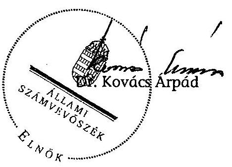

---

# MELLÉKLETEK

---

# ÉSZREVÉTELEK

---

# Oktatási és Kulturális Minisztérium 

Miniszter

Ugyiratszám: 5353-4/2008.
Hiv. szám: V-10-127/2007-2008.
Melléklet: 2 db.

Dr. Kovács Árpád úr részére, elnök
Állami Számvevőszék

## Budapest

## Tisztelt Elnök Úr!

Köszönettel vettem a részemre megküldött jelentést, amelyet áttekintve - a megadott határidőn belül - az alábbi általános észrevételeket teszem:

- A vizsgálat érintette tárcánk kiemelt jelentőségű, társadalmilag is érzékeny területét, az egyházi közoktatási intézmények támogatását. Elnök Úr előtt is ismeretes, hogy az utóbbi években a mindenkori zárszámadási törvények elfogadásával összefüggésben az érintett területek között élénk viták folytak.
- A vizsgálat rendkívül alapos volt, a többszöri egyeztetés miatt hosszabb ideig elhúzódott, de sajnálatos módon az egyházi közoktatási intézmények kiegészítő támogatásának kiszámításával kapcsolatban nem sikerült az Állami Számvevőszéknek, illetve tárcánknak egyetértésre jutni, noha reméltem, hogy a vizsgálat során erre sor kerül.

A Jelentés megállapításaival kapcsolatosan az alábbi lényeges - még fennmaradt - problémákat emelem ki:

- A korábbi, februári keltezésű Jelentés-tervezetben az ÁSZ - érzékelve a számítással kapcsolatos problémákat - a következő véleményt alakította ki:
„Az eltérő álláspontok mögött a számítási tételek tartalmára vonatkozó pontos, egyértelmű szabályozás hiánya húzódik meg."
Ezzel összefüggésben javasolta a Kormánynak, hogy „tekintse át az egyház finanszírozás témakörön belül az egyházi kiegészítő támogatásokkal összefüggő kérdéseket és gondoskodjon - az egyházakkal egyeztetett módon - a támogatási tételek egyértelmű, pontos meghatározásáról." Az oktatási és kulturális miniszternek azt javasolta, hogy „kezdeményezze az egyházak közoktatási kiegészítő támogatásának meghatározására vonatkozó eljárási, végrehajtási szabályozás kialakítását, amely az egyházakkal egyeztetett módon tartalmazza a támogatás számítási tételeinek pontos meghatározását, évenkénti egyeztetési rendjét."

---

A Jelentés-tervezet ezen megállapításaival egyetértettünk, fentiekkel összefüggésben a kérdéskört szabályozó kormányrendelet-tervezete elkészült, azzal kapcsolatban az iskolafenntartó egyházakkal több egyeztetés történt.

- A márciusi keltezésű Jelentés-tervezetben azonban - változatlan jogszabályi környezet mellett - a megállapítások általunk nem értelmezhető okok miatt megszigorodtak, az ÁSZ elállt a szabályozásra vonatkozó javaslatától, ehelyett az egyház-finanszirozási törvény betartására hívja fel a Kormányt, az oktatásért és kultúráért felelős minisztert pedig felszólítja a személyi felelősség megvizsgálására a tárcán belül, az egyházfinanszirozási törvény megsértésére való hivatkozással. A 21. sz. lábjegyzetben a Jelentés egyenesen megkérdőjelezi a külön rendeletben történő szabályozás indokoltságát, amely a tárca ezirányú erőfeszítései kritikájának is tekinthető.
Ezzel összefüggésben szeretném felhívni Elnök Úr szíves figyelmét arra, hogy jelenleg is folyamatban van tárcánk fejezeti kezelésű előirányzatainak a 2005-2006. évekre vonatkozó rendszervizsgálatának ÁSZ ellenőrzése. Ennek előzetes megállapításai arra utalnak, hogy közvetlenül a törvényekből (pl. a közoktatási törvényből) nem vezethetők le egyértelműen a támogatások. Véleményünk szerint ez érvényes jelen esetre is.
- Ismételten utalni kívánok arra, hogy a jogszabályi környezet nem változott, álláspontunk szerint az ugyanolyan összetett, mint az ÁSZ novemberi és februári jelentés tervezeteinek kibocsátásakor volt (véleményünk szerint erre utal az is, hogy a vizsgálat során folyamatosan - a legutóbbi időkig - csökkenő mértékben változott az ÁSZ által megállapított, az egyházakat megillető, de részükre ki nem fizetett zárszámadási kiegészítő támogatások nagysága), a szabályozás szüksége továbbra is fennáll, többek között a pénzügyi folyamatok átláthatóságának EU által megkövetelt elvére tekintettel is.
- Nem vitatjuk, hogy az ÁSZ is ad a Jelentésben egy értelmezhető jogszabályi levezetést az egyház-finanszirozási törvény és az államháztartás működési rendjéről szóló 217/1998. (XII.30.) Korm. rendelet (Ámr.) összevetése alapján. Álláspontunk szerint azonban továbbra sem egyértelmű ebben az esetben az Ámr. „végrehajtási rendeletként" történő alkalmazása az egyházi közoktatási kiegészítő támogatás kiszámításának megállapításánál. Amennyiben viszont elfogadjuk az Ámr. alkalmazását, akkor is vitatható az ÁSZ értelmezésének kizárólagossága, figyelemmel pl. az Ámr. folyamatos változásaira a vizsgált 2005-2006-os évek vonatkozásában.
- Ezzel összefüggésben szeretném felhívni Elnök Úr figyelmét, hogy a Jelentés tévesen tulajdonít a kormányzati szerveknek olyan álláspontot, mely szerint „a jogszabályi rendelkezések módot adnak más, a jogszabályoktól eltérő jogértelmezésre". Az OKM kifejtett álláspontja mindig is arra vonatkozott, hogy a jogszabályoknak lehetséges az ÁSZ állásponttól eltérő értelmezése, de véleményünk szerint a PM által az egyenlő finanszirozás elvére hivatkozó, a pénzügyi, közgazdasági szempontokat előtérbe helyező értelmezés is a jogszabályi keretek között maradt. Amennyiben az ÁSZ a szabályozást másként értelmezi, álláspontját annak megfelelően kell megjelenítenie; ez azonban nem történt meg.
- Ezzel kapcsolatban ismételten szeretném leszögezni azt a tárca által a vizsgálat során megfogalmazott álláspontot, hogy - figyelembe véve a kormányzati szervek közötti együttműködés szabályait is - az egyházi közoktatási intézmények kiegészítő támogatása kiszámításánál a PM által szolgáltatott államkincstári adatokra kellett az OKM-nek támaszkodnia, s nem feladata tárcánknak ezen adatok ellenőrzése. Hasonlóképpen, az Ámr. rendelkezéseinek értelmezése kapcsán is kiemelt szerepe van a

---

PM-nek, mint az államháztartásért és a zárszámadás benyújtásáért is felelős minisztériumnak.

- Természetesen tudom, hogy az ÁSZ - mint azt Elnök Úr levelében jelezte - jogalkalmazó szerv, és a hatályos jogszabályokat kell alkalmaznia, csakúgy mint az oktatási és kulturális tárcának. Ebben az esetben azonban arra is hivatkoznom kell, hogy az ÁSZ részéről nem történt meg az egyház-finanszirozási törvény egyházi közoktatási támogatásra vonatkozó szabályainak összehasonlító elemzése. A Jelentés szövegében utalás történik arra, hogy a törvény az állami-önkormányzati és az egyházi oktatási intézmények azonos finanszírozását írja elő, s meghatározza a kiegészítő támogatás kiszámításának szabályait. Ezt az Ámr-rel összevetve jut a Jelentés arra az általunk vitatott következtetésre, hogy a 2005. és 2006. évekre „törvénysértő módon" alacsonyabb zárszámadási kiegészítő támogatás került megállapításra az egyházak részére. (2005-ben 2 mrd. forinttal, 2006-ban 600 millió Ft-tal. Ezzel kapcsolatban felhívom Elnök Úr szíves figyelmét, hogy a Jelentésben nem szerepel: 2005-re vonatkozóan az egyházak ehhez képest 1 mrd. Ft-tal, 2006-ra pedig a Magyar Katolikus Egyház 1,6 mrd. Ft-tal magasabb zárszámadási kiegészítő támogatási igényt jelentettek be).
- A fentiekkel összefüggésben az ÁSZ által is elfogadott államkincstári adatok alapján megvizsgálva a 2006. évre az önkormányzati és az egyházi iskolákban egy tanulóra jutó állami támogatás mértékét, azt kellett megállapítanunk, hogy ez az önkormányzati iskolák esetében - az OKM és a PM által végzett zárszámadási számítások szerint - **519.000 Ft**, az ÁSZ által meghatározott szempontok (önkormányzati és működési kiadások, illetve intézményi saját bevételek értelmezése) figyelembevételével **526.000 Ft**, az egyházi iskolák esetében pedig **552.000 Ft**. Az ÁSZ azon megállapítása alapján - amelyet továbbra is vitatunk - hogy a két évre ténylegesen a törvényben előirtakhoz képest alacsonyabb kiegészítő támogatást kaptak az egyházak, álláspontunk szerint az következik, hogy az egyház-finanszirozási törvény rendelkezései ellentétben állnak egymással. A már korábban bemutatott OKM felmérési tapasztalatok hasznosítása esetén az ÁSZ-nak mérlegelnie kellett volna, hogy javasolja a Kormánynak: a törvényi ellentmondás feloldása érdekében törvénymódosító javaslatot nyújtson be az Országgyűlésnek.
- Ezt a problémát a korábbi OKM-ÁSZ levélváltások során felvetettük, az ÁSZ azonban arra az álláspontra helyezkedett, hogy az önkormányzati és egyházi iskolák állami támogatásának összevetése nem képezte a vizsgálat tárgyát, és a teljes körű megítéléshez szükséges lenne „a fenntartói szektorok oktatási szerkezetének, az egyes iskolatípusok normativájának pontos ismerete és elemzése." Ezekkel a kijelentésekkel összefüggésben el kell mondanunk, hogy - bár álláspontunk szerint az egyházi kiegészítő támogatás megállapításának jogszerűsége nem képezte a vizsgálat tárgyát - ezzel összefüggésben a vizsgálat során az ÁSZ alaposan megvizsgálta az önkormányzati oktatási intézmények finanszirozására vonatkozó adatbázist is. A rendelkezésre álló adatok alapján tehát az összehasonlító elemzést meg lehetett volna tenni, amely kellően megalapozhatta volna az objektívabb helyzetértékelést. Hozzátesszük továbbá, hogy az iskolatípusok szerinti normatíva elkülönítése a 2005-2006. év vonatkozásában nem indokolt, mivel a kiegészítő támogatás szakmacsoportonkénti bontása még nem került bevezetésre.
- Az ÁSZ megállapítása szerint az ellenőrzött egyházi iskolák többsége önkormányzati támogatást is kapott. Észrevételezzük, hogy ezeket is állami támogatásként kellene az

---

ÁSZ-nak beszámítania, amely nem történt meg, pedig az azonos finanszírozás megvalósulásának vizsgálata enélkül nem lehet teljes.

- A Jelentés az egyházakkal történő zárszámadási egyeztetéseket is kifogásolja a tekintetben, hogy megítélése szerint nem jött létre megállapodás a résztvevők között. Ezzel kapcsolatban utólag még két igen jelentős, a vizsgálat által fel nem tárt körülményre hívom fel Elnök Úr szíves figyelmét:
A 2005. évi zárszámadási törvény elfogadása után - 2006 végén - sor került a négy nagy egyház vezetőinek, valamint az oktatási és kulturális miniszternek, illetve a pénzügyminiszternek a találkozására, ahol - nem a zárszámadáshoz kötve - felajánlottuk az egyházaknak a településtípusú normatíváknak megfelelő 948,4 millió Ft kifizetését (amely az ÁSZ által is hivatkozott kormányhatározat alapján - támogatásként - meg is történt). Az egyházak ezen a tárgyaláson a 2005. évi zárszámadási kiegészítést tudomásul vették azzal, hogy kérik annak utólagos levezetését. Ez 2007-ben megküldésre került részükre, a továbbiakban az egyházi vezetők erre hivatkozással kormányzati szervnél nem emeltek
 kifogást.
A 2006. év zárszámadásával összefüggésben az október 16-ai vatikáni vegyes bizottsági ülésen a katolikus egyház részéről felmerült a 2 mrd. Ft fölötti többletigény, és ott annak írásbeli levezetésére, ennek a minisztérium részére történő megküldésére kértük a katolikus oldalt. Ez azóta sem történt meg, álláspontunk szerint tehát a pótlólagos igény nem került megfelelően előterjesztésre, így annak nem teljesítése a kormányzati szerveknek nem felróható. (Az ilyen volumenű többletigényt a Jelentés sem támogatja.)

# Tisztelt Elnök Úr! 

Miközben megköszönöm azt a jelentős erőfeszítést, szakmai munkát, amelyet munkatársai a témakör kibontása és egyeztetése során végeztek, legnagyobb sajnálatomra a Jelentésben foglalt, az egyházi kiegészítő támogatás kiszámításával összefüggésben megállapított folyamatos törvénysértésre vonatkozó álláspontjukat - a rendelkezésre álló, és a vizsgálat által feltárt adatokat is figyelembe véve - nem tudom elfogadni, ezzel összefüggésben továbbra sem látom megalapozottnak a személyi felelősség felvetésére vonatkozó javaslatot. A továbbiakban is szükségesnek tartom az egyházi kiegészítő támogatás kiszámítási szabályainak kormányrendeletben történő szabályozását. A fentiek előrebocsátása mellett a megadott határidőn belül az ellenőrzés alapján elrendelt intézkedésekről Elnök Urat a megadott határidőn belül tájékoztatni fogom.

Végezetül arra kérem Elnök Urat, hogy levelemet és az annak szerves részét képező, a Jelentés egyes megállapításaira vonatkozó tételes OKM álláspontot tartalmazó mellékleteket a Jelentés mellékletei közé beilleszteni szíveskedjék, valamint arra is felhívom szíves figyelmét, hogy a mellékletek közül hiányzik az OKM államtitkárának a márciusi Jelentés-tervezetre adott részletes írásbeli észrevétele, amely tárcánk hivatalos álláspontját tartalmazta. Kérem ennek szíves pótlását is.

Budapest, 2008. április 25.
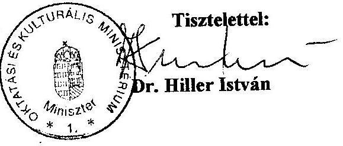

---

# Észrevételek az ÁSZ jelentéshez 

17. o. utolsó - 18. o. 1. bek.: az ÁSZ fenntartja a márciusi tervezetben megfogalmazott azon álláspontját, mely szerint 2005-2006-ban az egyházak kisebb összegű támogatásban részesültek, mint amely az egyház-finanszírozási törvény (a továbbiakban Eft.) alapján, illetve az államháztartás működési rendjéről szóló 217/1998. (XII.30.) Korm. rend. (a továbbiakban Ámr.) megillette volna őket. Ezt kiegészíti azzal, hogy az OKM-PM által képviselt kormányzati álláspont szerint „a jogszabályi rendelkezések módot adnak más, a jogszabályoktól eltérő jogértelmezésre".

OKM álláspont: a kiegészítés nem fogalmaz pontosan. Az OKM álláspont mindig is arra vonatkozott, hogy a jogszabályoknak lehetséges más értelmezése (pl. az Ámr. 57.§ (2) bekezdése az intézményi saját bevételeket úgy sorolta fel, hogy előtte a „különösen" kifejezést használta, amely lehetővé tette ennek kiterjesztő értelmezését.) A PM ugyan többször is hivatkozott a pénzügyi, közgazdasági szempontokon alapuló értelmezésre, éppen az egyenlő finanszírozás elvére tekintettel, álláspontunk szerint azonban ez is jogszabályértelmezési kereteken belül maradt.

Javaslat: „a jogszabályi rendelkezések módot adnak más, eltérő jogértelmezésre".
Uo. 18. sz. lábjegyzet: az ÁSZ a 2006-ban hatályos szöveget idézi.
OKM álláspont: Tekintettel arra, hogy a vizsgálat a 2005. évre is kiterjedt, indokolt lenne a 2005-ös eltérő szövegezést is idézni (ez pl. egyértelműen az intézményi saját bevételek közé sorolja a hatósági díjbevételeket, valamint a működési és felhalmozási célú átvett pénzeszközöket is).

Uo. 21. sz. lábjegyzet: az ÁSZ arra az álláspontra helyezkedik, hogy az egyház-finanszírozási törvény nem írja elő végrehajtási kormányrendelet kiadását. Megjegyzi, hogy a tervezett rendelet nem írhat elő az Eft-nek és Ámr-nek ellentmondó előírásokat. Ugyanakkor megállapítja, hogy az Áht. módosítása 2008. január 1-től felhatalmazást ad a Kormánynak a vonatkozó rendelet kiadására.

OKM álláspont: a lábjegyzetben az ÁSZ lényegében meg akarja határozni a kormány szabályozási kereteit. Ezzel nem értünk egyet. A lábjegyzetben foglaltak élesen ellentétben állnak az ÁSZ korábbi - szabályozást sürgető - álláspontjával, és negatív kihatással lehetnek a rendelet-tervezettel kapcsolatos további egyeztetésekre.

Javaslat: a lábjegyzet elhagyása
20-21. o., javaslatok: az ÁSZ fenntartja az először márciusban megjelenő javaslatait (az egyház-finanszírozási törvény hatályos előírásainak betartása az egyházi kiegészítő támogatás megállapításánál, személyi felelősség megvizsgálása a 2005-2006. évi egyházi kiegészítő támogatás „jogszabálytól eltérő megállapítása miatt"). A februári tervezet még azt javasolta a Kormánynak, hogy „tekintse át az egyház finanszírozás témakörön belül az egyházi kiegészítő támogatásokkal összefüggő kérdéseket és gondoskodjon - az egyházakkal egyeztetett módon - a támogatási tételeinek egyértelmű, pontos meghatározásáról." Az oktatási és kulturális miniszternek azt javasolta, hogy „kezdeményezze az egyházak

---

közoktatási kiegészítő támogatásának meghatározására vonatkozó eljárási, végrehajtási szabályozás kialakítását, amely az egyházakkal egyeztetett módon tartalmazza a támogatás számítási tételeinek pontos meghatározását, évenkénti egyeztetési rendjét."

OKM álláspont: a tárca korábban is kifejtette azon véleményét, hogy a jogszabályok eltérő értelmezése nem indokolja az ÁSZ megváltozott álláspontját, annál inkább a korábbi javaslatokban foglaltakat a szabályozás szükségességéről. A Jelentés-tervezet februári változatának 15. oldal 1. bekezdése utolsó mondata még a következőket tartalmazza: „Az eltérő álláspontok mögött a számítási tételek tartalmára vonatkozó pontos, egyértelmű szabályozás hiánya húzódik meg." Álláspontunk szerint ez pontosan fogalmazta meg a probléma lényegét, a szabályozás szükségességét. Február óta tudomásunk szerint a tényállást illetően semmiféle olyan változás nem történt, amely a nagymértékű ÁSZ álláspontmódosulást indokolta volna.

Ennek megfelelően továbbra is úgy látjuk, hogy a végrehajtási, magyarázó, fogalomtisztázó szabályozás kiadása indokolt és szükséges, elfogadásával pedig számos olyan probléma lesz kiküszöbölhető, amit az elmúlt időszakban az ÁSZ hiányosságként értékelt. Az egyházfinanszírozási törvény elfogadása óta az államháztartásról szóló törvény ugyanis számos alkalommal módosult, a végrehajtási kormányrendelete helyett pedig 1998-ban újat fogadtak el. A törvény és végrehajtási rendelete szóhasználata, fogalmai tehát a hatályos jogszabályok tükrében nehezen értelmezhetőek, amin az új kormányrendelet elfogadása nagymértékben segíthet.

Azáltal, hogy a jogszabály a Kormány számára is kötelezően meghatározza a számítások forrásául használt dokumentumokat (ezzel kapcsolatban megjegyzem, hogy a zárszámadási törvényjavaslatokból a számításhoz szükséges adatok a szakmacsoportok szerinti számításhoz szükséges bontásban csak a normatívák esetében állnak rendelkezésre) kizárja a számításokkal kapcsolatos viták minden fajtáját a kormányzati és az egyházi oldal között, ezáltal is elősegítve az átláthatóság és a korrektség követelményét.

A 34. o. 3. bekezdése továbbra is tartalmazza azon álláspontot, mely szerint a 2005. évi költségvetési törvény nem biztosított azonos finanszírozási feltételeket az egyházi közoktatási intézmények számára, mivel nem vehették igénybe a bejáró normatívát, illetve a településtípusú normatívákat. Megjegyzi ugyanakkor, hogy az utóbbi normatíváknak megfelelő 948,4 millió Ft-ot a kormány utólag 2007-ben - egy 2006 végi kormányhatározat alapján - támogatási szerződések megkötésével az iskolafenntartó egyházaknak kifizette.

OKM álláspont: a PM írásban is rögzített álláspontja szerint 2005-ben a kiegészítő támogatás keretében jutottak az egyházak az őket meg nem illető normatíváknak megfelelő forrásokhoz, így az azonos finanszírozási feltételek - más csatornán keresztül, de - biztosítottak voltak. Egyébként a 2005. évi költségvetési törvényjavaslatot az ÁSZ véleményezte, és ennek során nem kifogásolta ezen rendelkezéseket.

A 35. o. 4. bekezdése hivatkozik az Eft-nek az állami, önkormányzati, illetve egyházi oktatási intézmények azonos támogatására vonatkozó rendelkezésére. Arra is utal, hogy ezzel összefüggésben a kiegészítő támogatás kiszámításának a módját a törvény tételesen meghatározza (az önkormányzati ráfordítások átlaga).

A 36. o. 2. bekezdése azt állapítja meg, hogy a 2005. és 2006. évi kiegészítő támogatások nem az Eft. előírásainak, az egyházakkal egyeztetetésnek megfelelően kerültek rendezésre (az

---

önkormányzati ágazati működési kiadások és felújítási költségek összegét csökkenteni kell az intézményi bevételekkel, illetve azon pályázati külön támogatásokkal, amelyekhez az egyházi fenntartók, illetve intézményeik is hozzáférhetnek). A vita alapvetően az önkormányzati közoktatási működési kiadások, illetve intézményi saját bevételek értelmezése körül folyt.

OKM álláspont: az Eft. egyrészt az állami, önkormányzati, illetve egyházi oktatási intézmények azonos támogatását célozza, másrészt meghatározza az egyházi kiegészítő támogatás kiszámítási módját. A rendelkezésre álló államkincstári adatbázis alapján készült egy olyan kimutatás, amely szerint 2006-ban az egy főre jutó állami, önkormányzati támogatás összege egy önkormányzati tanuló után 519.000 Ft volt, az ÁSZ által meghatározott szempontok (önkormányzati és működési kiadások, illetve intézményi saját bevételek értelmezése) figyelembe vételével 526.000 Ft, egy egyházi iskolai tanuló után pedig 552.000 Ft. Az egyházi iskolák támogatása tehát még meg is haladta az azonos mértéket. Másrészt a Jelentés-tervezet 47. o. 2. bekezdése azt is tartalmazza, hogy a tíz ellenőrzött egyházi intézmény közül hat még külön önkormányzati költségvetési támogatást is kapott, amely szintén állami támogatásnak minősül, azonban az ÁSZ ezeket nem számolta el. Ugyanakkor az ÁSZ álláspontja szerint a kormányzati oldal törvénysértő módon szűkítette az önkormányzati közoktatási és működési kiadásokat, illetve oda nem tartozó tételekkel növelte az intézményi saját bevételeket, és ezzel a két költségvetési év vonatkozásában mintegy 2,6 mrd. Ft-tal csökkentette az egyházi oktatási intézményeket megillető kiegészítő támogatás összegét (ld. 37. o. 2 bek.). Az ÁSZ levezetése értelmezhető a jogszabályok (Eft., Ámr.) összevetése alapján, ugyanakkor van olyan álláspont is, amely megkérdőjelezi, hogy ebben az esetben egyáltalán alkalmazható-e az Ámr. Eszerint a számvitelről szóló 2000. évi C. törvény kiterjed a gazdaság minden olyan résztvevőjére, melynek működéséről a nemzetgazdaság más szereplői tájékoztatást igényelnek. Előírásai tehát az államháztartási és egyházi szervezetekre is kiterjednek. Rögzíti azokat a szervezeteket, amelyekre vonatkozó részletszabályokat - sajátosságaiknak megfelelően - külön kormányrendeletben kell meghatározni. Ennek megfelelően külön kell kezelni az államháztartás szervezeteit és az egyéb szervezeteket, így az egyházi jogi személyeket is. Az egyházak beszámoló készítési és könyvvezetési kötelezettségeinek sajátosságait a 224/2000. (XII.19.) Korm. rendelet határozza meg, esetükben tehát a 217/1998. (XII. 30.) Korm. rendelet nem alkalmazható.
Amennyiben viszont az Ámr. alkalmazásra kerül (figyelemmel arra az ÁSZ álláspontból levezethető szempontra, hogy az önkormányzati intézmények esetében ennek szabályai használatosak, az egyházi oktatási intézmények kiegészítő támogatásának megállapításánál pedig az önkormányzati támogatásokból kell kiindulni), álláspontunk szerint a vonatkozó jogszabályi rendelkezések - különös tekintettel pl. az Ámr. változásaira - megengednek más értelmezést is. (Az ÁSZ is folyamatosan változtatta álláspontját a különbözeti összegek nagyságát illetően, még az április 10-ei szakértői egyeztetésen is egy jelentős tételt elismertek intézményi saját bevételként.) Amennyiben viszont elfogadjuk kizárólagosnak az ÁSZ jogszabály-értelmezését, úgy azt kell megállapítanunk, hogy az Eft. 6.§ (1) bekezdése (azonos finanszírozás elve), illetve 6.§ (3) bekezdése (kiegészítő kiszámítás módja) ellentétben állnak egymással. Ebben az esetben viszont az ÁSZ-nak a törvényi inkoherencia feloldására kellett volna javaslatot tenni, úgy, hogy a kormány terjesszen az Országgyűlés elé olyan törvényjavaslatot, ami ezt kiküszöböli. (Ugyanakkor az ÁSZ a későbbiekben elutasítja, hogy az önkormányzati iskolák finanszírozásával - tehát áttételesen a tárca által felvetett problémával - is foglalkozzon, erről részletesen majd ott.)

Ami az egyeztetés kérdését illeti: az ÁSZ elismeri, hogy történtek egyeztetések, ugyanakkor burkoltan kifogásolja, hogy nem került elfogadásra az egyházi álláspont.

---

OKM álláspont: Ez azért nem megalapozott, mivel az ÁSZ által a későbbiekben megállapított zárszámadási kiegészítési összegek alatta maradnak mindkét év vonatkozásában az egyházi igényeknek (2005 esetében kb 1 mrd. Ft-tal, 2006 vonatkozásában pedig 1,6 mrd. Ft-tal utólagos katolikus igény). Ez azt jelenti, hogy az egyházi álláspontok
 ÁSZ által javasolt elfogadása az ÁSZ számítások szerint is mintegy 2,6 mrd. Ft többletkifizetést okozott volna az állami költségvetésnek.

A 3. bekezdés megállapítja, hogy az egyházak az alapadatok birtokába kerültek, de ezek ellenőrzése nem volt biztosított számukra.

OKM álláspont: mint a korábbiakban is jeleztük, nem értelmezhető az egyházak ellenőrzési jogosultsága a Magyar Államkincstár által szolgáltatott önkormányzati adatok vonatkozásában.

A 4. bekezdés szerint a 2005. év vonatkozásában egyáltalán nem volt konszenzus, a 2006. év esetében az álláspontok közeledtek egymáshoz, de megállapodás ekkor sem jött létre. (A Jelentés-tervezet 2007. novemberi változata a 2006. év vonatkozásában még többségi konszenzusról beszélt.) Ezzel kapcsolatban az Eft. 6.§ (5) bek. szerinti egyeztetési kötelezettség sérelmére utal. (Erre kitértünk a korábbiakban.) Ezzel összefüggésben a 37. sz. lábjegyzet a 2007. szeptember 21-ei egyeztetést illetően szól a közeledő álláspontokról, az október 10-ei egyeztetés kapcsán (amelynek a témája nem a zárszámadási kiegészítés, hanem a kormányrendelet-tervezet egyeztetése volt) ismerteti a katolikus egyházi szakértő álláspontjának módosulását, adatpontosítás, illetve további egyeztetés kérését - amelyet a jelenlévő egyházi szakértők többsége tudomásul vett. Az ÁSZ szerint további egyeztetés nem történt.

OKM álláspont: a 2005. évi zárszámadási kiegészítés megállapításával összefüggésben tartott szakértői egyeztetéseken konszenzus valóban nem alakult ki. Ugyanakkor - már a zárszámadási törvény elfogadása után - 2006 végén sor került a négy nagy egyház vezetőinek, valamint az oktatási és kulturális miniszternek, illetve a pénzügyminiszternek a találkozására, ahol a két miniszter felajánlotta - nem a zárszámadáshoz kötve - az egyházaknak a településtípusú normatíváknak megfelelő 948,4 millió Ft kifizetését (amely az ÁSZ által is hivatkozott kormányhatározat alapján - támogatásként - meg is történt). Az egyházak ezen a tárgyaláson a 2005. évi zárszámadási kiegészítést tudomásul vették azzal, hogy kérik annak utólagos levezetését. Ez 2007-ben megküldésre került részükre, a továbbiakban az egyházi vezetők ezzel összefüggésben kormányzati szervnél nem emeltek kifogást. A teljes konszenzushiányra történő ÁSZ utalás tehát itt is vitatható.

A 2006. év zárszámadásával összefüggésben viszont tény, a 2007. szeptember 21-ei egyeztetésen konszenzus alakult ki az előterjesztett összegről. Ettől utólag - október 10-én - a katolikus egyház szakértője tért el egyoldalúan. Ekkor valóban elhangzott egy további adategyeztetés szükségessége, amelyet a jelenlévő egyházi szakértők többsége tudomásul vett. Az október 16-ai vatikáni vegyes bizottsági ülésen a katolikus egyház részéről felmerült egy 2 mrd. Ft fölötti többletigény, és ott a többletigény írásbeli levezetésére, annak megküldésére kérte a kormányzati oldal a katolikus felet. Ez azóta sem történt meg, álláspontunk szerint tehát a pótlólagos igény nem került megfelelően előterjesztésre, így annak nem teljesítése a kormányzati szerveknek nem felróható.

Javaslat: vagy a hivatkozott szöveg és lábjegyzet kiegészítése az általunk közöltek szerint, vagy annak lényeges lerövidítése, és közelítése a korábbi „többségi konszenzus” megfogalmazáshoz.

A 36. o. 5. - 37. o. 1. bekezdése megállapítja, hogy a háttérszámításokhoz szükséges adatokat az OKM az egyházak rendelkezésére bocsátotta, kifogásolta ugyanakkor, hogy „az önkormányzati költségvetési beszámolók 21. és 22. sz. űrlapja közoktatásra vonatkozó 2005. és 2006. évi kincstári adatokon nyugvó összegezett háttéradatait” nem kapták meg.

Az ezt követő apró betűs rész az ÁSZ álláspont szerint értelmezi az önkormányzati működési kiadások, illetve intézményi saját bevételeket. Megjegyzendő, hogy a korábbi ÁSZ állásponthoz képest a 2005. év vonatkozásában egy 5,7 mrd. Ft-os tételt (saját bevétellel fedezett működési célú pénzeszköz átvétel önkormányzati költségvetési szervektől), valamint a 0,2 mrd. Ft-os felhalmozási és tőke jellegű saját bevételt utólag elismeri intézményi saját bevételnek.

OKM álláspont: a 2005-ös zárszámadási egyeztetésekkel összefüggésben az egyházak azokat az adatokat kapták meg, amelyeken a számítások alapultak, a 2006-os évre vonatkozóan pedig a teljes önkormányzati oktatási intézményekre vonatkozó államkincstári adatbázist - amelyet a PM-től a tárca megkapott - az intézményfenntartó egyházak rendelkezésére bocsátottuk. Ez az egyházi kiegészítő támogatás kiszámításához szükséges adatokat teljes körüen tartalmazta, amit az egyházi szakértők az egyeztetésen elismerően nyugtáztak. Az az apró betűben említett tény, hogy az ÁSZ még a vizsgálat utolsó stádiumában is kénytelen volt korábbi számszaki állításait korrigálni, ismét csak arra utal, hogy egy nehezen átlátható, bonyolult folyamattal van dolgunk, amelynek az átlátható leszabályozása egyetemes érdek lenne. (Lásd a korábbi tervezet: „Az eltérő álláspontok mögött a számítási tételek tartalmára vonatkozó pontos, egyértelmű szabályozás hiánya húzódik meg.”) Sajnálatos módon ezt hátráltatják a Jelentés utólagosan megváltoztatott elemei.

A 37. o. 2. bekezdése rögzíti, hogy az ÁSZ által elvégzett számítások szerint a 2005-ben elfogadott 1840,5 mrd. Ft helyett 3891,1 mrd. Ft (különbözet több mint 2 mrd. Ft), a 2006-ban elfogadott 7268,5 mrd. Ft helyett 7871,5 mrd. Ft (különbözet több mint 600 millió Ft) illette volna meg az egyházakat.

OKM álláspont: jelezzük, hogy a Jelentés-tervezet legkorábbi változata még kritikátlanul átvette 2005 vonatkozásban az egyházi álláspontokat az összességében 5 mrd. Ft kiegészítő támogatásról (különbözet több mint 3 mrd. Ft), illetve 2006 esetében az utólagos katolikus álláspontot a további 2,2 mrd. Ft-os igényre vonatkozóan. Ez csökkent le az ismertetetteknek megfelelően - ismételten igazolva a kérdés bonyolultságát, miközben a javaslatok viszont jelentősen - és az előbbiek miatt értelmezhetetlenül - szigorodtak.

A 38. o. 1. bekezdése szerint az eltérést az okozza, hogy a kormányzati háttérszámítás nem a zárszámadási törvények önkormányzati közoktatási működési kiadási és intézményi saját bevételek összegét vette figyelembe, illetve a „helyi önkormányzatok intézményi saját bevételeit nem a vonatkozó kormányrendelet alapján állapította meg”. Az utána következő apró betűs bekezdésben az elszámolással kapcsolatos ismertetett álláspontját részletezi.

OKM álláspont: az államháztartási fogalmak korábban említett változása indokolná az Állami Számvevőszék saját, illetve a PM-OKM számítások összevetése során feltárt eltérés magyarázatául szánt - a jelentéstervezet 38. oldalán szereplő - kommentárjának, valamint az azt alátámasztani hivatott 40. sorszámozású lábjegyzetben foglaltaknak a felülvizsgálatát.

Amennyiben ugyanis a számításokhoz a 2005, vagy 2006. évi beszámoló adatai kerülnek felhasználásra, akkor ezen adatok értelmezését is a megfelelő jogszabályok, így az államháztartás működési rendjéről szóló kormányrendeletnek az adott beszámolási időszakban hatályos szövegváltozata kell, hogy adja. Ehhez képest a 40. számú lábjegyzet az államháztartás működési rendjéről szóló kormányrendelet 2006. január 1-jétől hatályos szövegére hivatkozik.

Nyilvánvaló, hogy a jogalkotó az egyházak hitéleti és közcélú tevékenységének anyagi feltételeiről szóló 1997. évi CXXIV. törvény elfogadásakor a saját bevételen mást értett, mint ami a most hatályos fogalomhasználatból következik.

A költségvetési szervek tervezésének, gazdálkodásának, beszámolásának rendszeréről szóló 156/1995. (XII. 26.) kormányrendelet 1997. évben hatályos szövegéből levezethető, hogy a hatályos szabályozással szemben saját bevételként voltak értelmezhetőek az államháztartáson kívülről átvett pénzeszközök is.

Így, ha az eredeti jogalkotói szándékot vesszük figyelembe, az államháztartáson kívülről átvett pénzeszközök saját bevételben történő szerepeltetése az eredeti finanszírozási elvet nem sérti. Ebből adódóan a 8. számú melléklet 4. sorszámú lábjegyzetében a 2005. évre vonatkozóan a PM-OKM és ÁSZ számítások különbözeteként kimutatott összeget csökkenti az államháztartáson kívülről átvett pénzeszközök értéke.

A 38. o. utolsó bekezdésében az ÁSZ leszögezi, hogy az egyházi oktatási intézmények kiegészítő támogatása kiszámításának alapadatait a „zárszámadási törvények indokolásában” bemutatott önkormányzati adatok nyomán lehet kialakítani, megjegyezve, hogy a felújítási kiadásokat, illetve a pályázati összegeket jelenleg nem tartalmazza a „zárszámadási törvény előterjesztése”.

OKM álláspont: itt értelemszerűen a törvényjavaslatok indokolásáról van szó, amellyel kapcsolatban meg kell jegyeznünk, hogy az nem jogforrás. Megjegyzendő, hogy amennyiben egy már az Országgyűlés előtt lévő törvényjavaslathoz módosító indítvány érkezik, azt is indokolni kell, a zárszámadás vonatkozásában számszakilag is. A javaslatok között is szerepel az oktatási és kulturális miniszter, illetve a pénzügyminiszter közös feladataként „a zárszámadási törvények” indokolásában az egyházi kiegészítő támogatás számítási alapadatainak a teljes körű szerepeltetése. Álláspontunk szerint ez elsősorban a PM-et érinti.

A 39. o. 1. kisbetűs bekezdése hivatkozik arra a korábbi OKM észrevételre, amely kifogásolta az önkormányzati és egyház iskolák állami támogatásának összevetésének a hiányát. (A rendelkezésre álló államkincstári adatok szerint ugyanis a 2006-os adatok figyelembe vételével ebben az évben az egyházi iskolákban az egy főre jutó állami támogatás összege még meg is haladta az önkormányzati iskolában tanulókét - ld. a 36. o. 2. bekezdéséhez írottakat. Ezeket az adatokat az ÁSZ még mellékletben sem közölte.) Az ÁSZ álláspont szerint ez nem képezte a vizsgálat tárgyát. Másrészt ehhez szükséges lenne „a fenntartói szektorok oktatási szerkezetének, az egyes iskolatípusok normatívájának pontos ismerete és elemzése.”

OKM álláspont: nem értünk egyet az ÁSZ álláspontjával. Véleményünk szerint ugyanis az egyházi kiegészítő támogatás megállapításának jogszerűsége sem képezte a vizsgálat tárgyát. Az ugyanis a közoktatási feladatok finanszírozására fordított pénzeszközök hasznosulásának ellenőrzése volt az OKM fejezetnél. Tekintettel arra, hogy a vizsgálat mégis részletesen érintette az egyházi kiegészítő támogatás megállapításának jogszerűségét, ezzel összefüggésben alaposan megvizsgálták az önkormányzati oktatási intézmények finanszírozására vonatkozó adatokat is. (Az ÁSZ is elfogadta a számítások alapjául szolgáló államkincstári adatbázist.) Mivel pedig a Jelentésben súlyos megállapításokat tesznek az egyházi közoktatási intézmények jogszabálysértő alulfinanszirozásáról, mindenképpen szükség lett volna a tárca által felvetett szempontok vizsgálatára az azonos támogatás szempontjából. Ennek hiányában nem lehet kellően megalapozottnak tekinteni az ÁSZ kifogásolt megállapításait. A korábbiakban arra is utaltunk, hogy az ÁSZ megállapítása szerint az ellenőrzött egyházi iskolák többsége önkormányzati támogatást is kapott. Értelemszerűen ezeket is állami támogatásként kellene elszámolni, amely nem történt meg. Az iskolatípusok szerinti normatíva elkülönítése pedig a 2005-2006. év vonatkozásában nem indokolt, mivel a kiegészítő támogatás szakmacsoportonkénti bontása még nem került bevezetésre.

A Jelentés mellékletei összeállításának a szempontjai értelmezésre szorulnak. Így pl. hiányzik belőle Arató államtitkár úr levele a márciusi Jelentés-tervezettel kapcsolatban, ami részletesen kifejtette a tárca szakmai álláspontját, és olyan mellékleteket is tartalmazott (pl. az önkormányzati és egyházi iskolák tanulóira jutó 2006. évi támogatásának mértéke), amely ellentmondott a Jelentés-tervezetben foglaltaknak. A március 19-ei emlékeztetőt egyeztetettnek tüntetik fel, ugyanakkor ez nem tartalmazza az OKM és PM képviselőinek ehhez utólag füzött észrevételeit (az OKM vonatkozásában ezek legalább részben megjelennek Arató államtitkár április 3-ai levelében, a PM észrevételekre viszont utalás sincs).

---

# Kimutatás az egy tanulóra eső közoktatási költségekről az önkormányzati és egyházi fenntartók vonatkozásában 

2006. év

Egyházi fenntartóknak kiutalt közoktatási támogatások adatok eFt-ban

| 1. | Normatív támogatás | 30141413 |
| :-- | :-- | --: |
| 2. | Kiegészítő támogatás | 11598477 |
| 3. | Pedagógiai szakmai szolgáltatások támogatása | 70539 |
| 4. | Pedagógiai szakszolgálat támogatása | 4800 |
| 5. | Zárszámadás keretében kifizetett támogatás | 7268500 |
| 6. | Tárgyévre vonatkozó elszámolási különbözet | -60368 |
| 7. | Összesen $(1+2+3+4+5+6)$ | 49023361 |
| 8. | Egyházi oktatott létszám (mutatószám) | 88788 |
| 9. | Egy főre jutó költség (7/8) | 552 |

 |

Önkormányzati fenntartók közoktatási költségei (PM-OKM számítás alapján)
adatok eFt-ban

| 1. | Működési és felújítási közoktatási kiadás | 878750708 |
| :--: | :--: | :--: |
| 2. | Intézményi saját bevételek | 58391561 |
| 3. | Nettó kiadás (1-2) | 820359147 |
| 4. | Önkormányzati oktatott létszám (mutatószám) | 1580025 |
| 5. | Egy főre jutó költség (3/4) | 519 |

Önkormányzati fenntartók közoktatási költségei (ÁSZ számítás alapján)
adatok eFt-ban

| 1. | Működési és felújítási közoktatási kiadás | 878491361 |
| :--: | :--: | :--: |
| 2. | Intézményi saját bevételek | 47388917 |
| 3. | Nettó kiadás (1-2) | 831102444 |
| 4. | Önkormányzati oktatott létszám (mutatószám) | 1580025 |
| 5. | Egy főre jutó költség (3/4) | 526 |

Budapest, 2008. 04. 23.

---

# Dr. Hiller István úr 

miniszter
Oktatási és Kulturális Minisztérium

## Budapest

## Tisztelt Miniszter Úr!

Köszönettel megkaptam az Oktatási és Kulturális Minisztérium fejezetnél a közoktatási feladatok finanszírozására fordított pénzeszközök hasznosulásának ellenőrzéséről készített jelentésünkre adott észrevételeit és azokkal kapcsolatban a következőkről tájékoztatom:

Miniszter úr is megemlíti levelében, hogy hosszadalmas egyeztetést követően készült el a jelentés jelenlegi változata. Éppen ezért kifejezetten sajnálom, hogy nem járt eredménnyel azon erőfeszítésünk, hogy konszenzus jöjjön létre az egyházi intézmények finanszírozása kérdésében.

Kétségtelen tény, hogy az Állami Számvevőszék álláspontja érdemben módosult, amikor a korábban joganyag értelmezésként kezelt kérdést már úgy fogalmazta meg, hogy a jogszabályok nem tették lehetővé a tárca által kidolgozott számítási módszer alkalmazását. Álláspontunk változása a belső minőségbiztosítás keretében végzett jogi és szakmai felülvizsgálat eredménye.

A kezdeményezésünkre 2008. március 19-én megtartott szakértői egyeztetésre éppen e megváltozott számvevői álláspontra tekintettel került sor. A szakértői egyeztetések bizonyossá tették, hogy az egyház-finanszírozási törvény és az államháztartás működési rendjéről szóló hatályos kormányrendelet (Ámr.) teljes körű és egyértelmű szabályozást adnak a témakörben. Ebből következően, amint arra 2008. április 15-i levelemben utaltam, az Állami Számvevőszék nincs abban a helyzetben, hogy a jogszabályoktól eltérő gyakorlat esetén mérlegeljen.

---

Megjegyzem, hogy az államtitkári egyeztetést követő újabb szakértői megbeszélés sem járt olyan eredménnyel, ami tényszerűen alátámasztotta volna a jogszabályok eltérő értelmezésének lehetőségét. A tárca képviselője mindössze egyetlen - korábban nem ismert - kisebb tételt talált, amelyet indokolt a számításoknál figyelembe venni, ez azonban nem változtatott azon a tényen, hogy a tárca által alkalmazott számítási módszer nem felel meg a jogi előírásoknak.

A finanszírozás elveit és konkrét számítási gyakorlatát az egyház-finanszírozási törvény, a számítási tételeket pedig az Ámr. határozza meg. Ebből adódóan, amennyiben a Kormány más gyakorlatot kíván folytatni az egyházak finanszírozásában, nem elegendő a kormányrendelet megalkotása, ehhez szükséges a hatályos törvény módosítása. Ennek kezdeményezése kizárólag a Kormány hatásköre és felelőssége, ezért az ÁSZ nem tesz, illetve nem is tehet ilyen javaslatot.

Félreértésre adhat okot Miniszter úr levelének azon kitétele, miszerint jelentésünkben az egyházak igényeit meghaladó mértékű támogatást szorgalmaztunk. Hangsúlyozni szeretném, hogy ellenőrzésünk kizárólag a jogszabályi előírások alapján alakította ki véleményét és ezt nem befolyásolta egyik fél álláspontja sem, amennyiben azt tárgyszerűen nem támasztották alá. Erről a jelentés mellékleteit képező, egyházi észrevételezésekre adott válaszleveleink tanúskodnak.

A levelemben kifejtettek szellemében ismételten átvizsgáltuk mindazokat az észrevételeket, amelyeket Miniszter úr levelében említett. A pontosító, kiegészítő és módosító észrevételeit beépítettük a jelentésbe, de a jogszabályok eltérő értelmezésére alapozó észrevételeket nem áll módomban érvényesíteni.

Végezetül tájékoztatom Miniszter urat, hogy az ellenőrzésről készült jelentést - kialakult gyakorlatunk szerint - az Ön észrevételeivel és az azokra adott válaszommal együtt küldöm meg az Országgyűlés elnökének, az illetékes bizottságai elnökeinek és a Miniszterelnöknek.

Budapest, 2008. május 7.
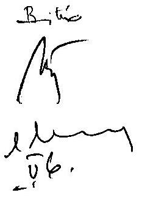

Tisztelettel:
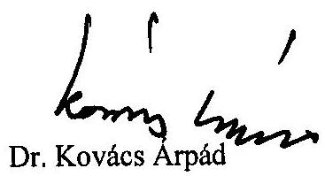

---

# Számvevőszéki válaszok   az 5353-4/2008. OKM számú miniszteri észrevételező levél mellékleteiben foglaltakhoz 

## 1. A jelentésbe beépített pontosító, kiegészítő és módosító észrevételek:

- A 18. sz. és a 40. sz. lábjegyzet kiegészül a következő szövegrésszel: „A 2005. évben hatályos Ámr. szerint a saját bevétel, amely a költségvetési szerv tevékenységével összefüggően lehet: 1. az e rendelet 57. § (2) bekezdésében megjelölt, elsősorban alaptevékenységből, továbbá a fejezeti kezelésű előirányzat saját bevétellel fedezett részéből származó bevétel; 2. a köztestülettől, egyéb szervezettől származó juttatás; 3. a vállalkozási tevékenységből származó bevétel; 4. belföldi adomány; 5. külföldi segély adomány."
Az 57. § (2) bekezdése ide sorolja a hatósági díjbevételeket és azon működési és felhalmozásra átvett pénzeszközöket, amelyek a fejezeti kezelésű előirányzatok saját bevétellel fedezett részéből származnak.
- A 37. számú lábjegyzet az OKM javaslatnak megfelelően kiegészül a következő szövegrésszel: „Az OKM tájékoztatása szerint a 2007. október 16-i vatikáni vegyes bizottsági ülésen a Katolikus Egyház részéről felmerült egy 2 Mrd Ft fölötti többletigény, és ott a többletigény írásbeli levezetésére, annak megküldésére kérte a kormányzati oldal a katolikus felet. Ez azóta sem történt meg, a pótlólagos igény nem került felterjesztésre. Ezen igény az ellenőrzés álláspontja szerint nem volt megalapozott, a zárszámadási indoklásban foglalt adatok téves értelmezésén alapult."
- A mellékletek között új, 10. sz. mellékletként szerepel: „A 2008. április 10-i záró szakértői egyeztetés emlékeztetője".

## 2. Az eltérő értelmezésekre adott válaszok

## a.) A jogszabálytól eltérő álláspontokkal kapcsolatban:

- A jogszabályi rendelkezések egyértelműek, nem adnak módot más eltérő értelmezésre. Az egyházfinanszírozási törvény 6. § (3) bekezdése rögzíti tételesen a kiegészítő támogatás összegének meghatározását. A számításhoz szükséges négy összegezett önkormányzati adat közül három tételt - helyi önkormányzatok közoktatási működési kiadási, helyi önkormányzatok közoktatási felújítási kiadásai, helyi önkormányzatok közoktatási célú intézményi saját bevételei - az államháztartás rendjéről szóló, többször módosított 217/1998. (XII. 30.) kormányrendelet előírásai alapján a helyi önkormányzatok összegezett közoktatási költségvetési beszámolójának „Kiadások tevékenységenként" 21. űrlapja és a „Bevételek tevékenységenként" 22. űrlapja kincstári összegezése szerint kell meghatározni.

A számításhoz szükséges adatok közül jelenleg az éves zárszámadási törvények indoklása két adatot tartalmaz az önkormányzatok közoktatási szakfeladati funkcionális értékelése során (működési kiadások, intézményi saját bevételek). A zárszámadási előterjesztésbeli indoklást a másik két adat szerepeltetésével (felújítási kiadások, az önkormányzati közoktatás pályázati összegei) teljes körűvé lehet tenni.

- A jelentés azt tartalmazza, hogy a 2005. évi bejáró gyermekek/tanulók utáni normatíva és a településtípusú normatívák utólagos, kormányhatározattal történt rendezése nem biztosította a közoktatási törvényben és egyházfinanszírozási törvényben foglalt szabályozási esélyegyenlőséget, az azonos támogatási szintet rögzítő előírásokat és nem azonos a költségvetési törvényben foglalt normatív szabályozással. (Az ÁSZ a 2005. évi törvényjavaslatot ilyen részletezettséggel nem véleményezte.) A normatíva pótlólagos biztosítása csak az elmaradt normatív támogatást, s nem a kiegészítő támogatás elmaradását kompenzálta.

Az ellenőrzés nem tárt fel olyan problémát, amely szerint az egyházfinanszírozási törvény 6. § (1) bekezdése - az azonos finanszírozás elve - és a 6. § (3) bekezdése - az egyházi kiegészítő támogatás kiszámítási módja, azaz az önkormányzatok állami támogatáson felüli közoktatásra fordított átlagos ráfordításának megfelelő egyházi támogatás biztosítása - ellentétben állnak egymással. Az OKM által bemutatott, egyszerű számtani átlaggal számított, szerkezeti összetételt figyelembe nem vevő 2006. évi átlagszámok az önkormányzati iskoláknál az intézményi saját bevételekkel csökkentett egy főre eső közoktatási kiadást, az egyházi iskoláknál az egy főre eső 2006. évi kiutalt állami támogatást mutatják be (ez utóbbi esetben pontatlanul). Ezen számok egybevetésével szakszerű, megalapozott megállapítást és következtetést nem lehet elvégezni.

A levél 2. sz. mellékletében szereplő önkormányzati ráfordítások megbontása nem történik meg állami támogatásra, önkormányzati fenntartói támogatásra és intézményi bevételekre az összehasonlíthatóság érdekében. Az egyházi közoktatási költségek nem tartalmaznak - információs adatok hiányában nem tartalmazhatnak - fenntartói támogatást, intézményi bevételt, s a 2006. évi pénzügyileg teljesített (kiutalt) támogatások között nem szerepel az 1,9 Mrd Ft-os, előző évről áthúzódó kötelezettség teljesítése, viszont feltüntetik a 2007. év végén kifizetett 7,3 Mrd Ft-os összeget. (A teljesség kedvéért megemlítendő, hogy a jelentésben szereplő - OKM tanúsítványi adatszolgáltatással alátámasztott - 43,5 Mrd Ft-os pénzügyi teljesítésű egyházi közoktatási támogatás mellett az egyházi iskolák egy tanulójára jutó tényleges állami támogatása 2006. évben 490 E Ft-ot tett ki.

- Az ellenőrzés álláspontja szerinti egyházi kiegészítő támogatás megállapítása az egyeztetési folyamat során, a PM és az OKM szakértőivel folytatott jogszabályokon alapuló egyeztetések nyomán alakult ki. A jelentés-tervezet 2008. januári változata 2,53 Mrd Ft-os, a 2008. áprilisi végleges változata 2,66 Mrd Ft-os elmaradt támogatást rögzít az ellenőrzött 2005-2006. évekre az ellenőrzés álláspontjaként. Alapvetően tévedésen alapul az 5 Mrd Ft-os elmaradt támogatás-igény megállapításáról szóló minisztériumi álláspont, s benne a 2,2 Mrd Ft-os utólagos katolikus támogatási igény elismerése. Ez a jelentés-tervezet egyetlen változatában sem szerepelt.

# b.) Félreértésen alapuló véleményekkel összefüggésben: 

- Az ÁSZ nem kívánja meghatározni a kormány egyházi kiegészítő támogatással összefüggő szabályozási tevékenységét, de jelzi a tapasztalt ellentmondást. A lábjegyzet utal az előkészítés alatt levő kormányrendeletre, ezzel összefüggésben az Áht. által biztosított felhatalmazásra. Egyidejűleg felhívja a figyelmet arra, hogy a készülő kormányrendelet előírásai nem mondhatnak ellent az egyházfinanszírozási törvény és az államháztartás működési rendjéről szóló hatályos kormányrendelet előírásainak.
- A jelentés nem ellenőrzési jogosultságról, hanem ellenőrzési lehetőségről tesz említést. Ez utóbbi az egyeztetéseken biztosítható a zárszámadási törvények indoklásában foglalt számítási alapadatokkal és az azok alátámasztását szolgáló - az 1. pontban jelzett - a szakfeladatonként összegezett önkormányzati közoktatási költségvetési beszámoló 21. és 22. sz. űrlapja megfelelő adatainak bemutatásával.
- A jelentés rögzíti, hogy az OKM az egyenlegrendezésekhez az OKM-PM háttérszámításokhoz felhasznált - 7. és 8. sz. mellékletben foglaltak szerinti - adatokat bocsátotta az egyházak rendelkezésére. A 2005. évi kiegészítő támogatás 2006. év őszi egyenlegrendezésével összefüggő kormányzati álláspontot rögzítő részletes adatokat az OKM Jogi Főosztálya utólagosan 2007. márciusi levelében közölte az érintett egyházi intézményekkel azok ismételt kérésére. A 2006. évi kincstári adatbázis számsorok nélküli felépítését a tárca a készülő kormányrendelet 2007. szeptember 20-21-i egyeztetése előtt küldte meg az egyházak képviselőinek. Ha a tényleges 2006. évi „kincstári adatbázis" a 2007. október 10-i egyeztetésen rendelkezésre állt, akkor nem kerülhetett volna sor a 2006. évi egyenlegrendezéssel kapcsolatban újabb egyházi adatpontosítási, egyeztetési igény felvetésére.

---

# Oktatási és Kulturális Minisztérium Miniszter 

Dr. Kovács Árpád úr elnök

Állami Számvevőszék
Budapest
Apáczai Csere J. u. 10. 1052

Hiv.szám: V-10-129/2007-2008. Iktatószám: 5353-6/2008. Tárgy: A közoktatási feladatok finanszírozására fordított pénzeszközök hasznosulásának ÁSZ ellenőrzése

## Tisztelt Elnök Úr!

Köszönettel vettem a Jelentést észrevételező levelemre adott válaszát és annak mellékletét. Természetesen tudomásul vesszük azt, hogy az ÁSZ vizsgálat a legutóbb megküldött Jelentéssel már lezárult. Miután azonban a válaszlevélben és mellékleteiben az előzőek előrebocsátása mellett további pontatlanságokat találtunk, valamint tévedésként említenek egy általunk záradékolt ÁSZ Jelentésre történő hivatkozást, ezért indokoltnak és szükségesnek tartottam összefoglalni azokat a vitapontokat és megjegyzéseimet, amelyek továbbra is fennmaradtak.
A válaszlevélben Elnök Úr olyan új állásfoglalást is tesz - pl. 2008. március 19-ei szakértői

 egyeztetés -, amely vonatkozásában előző válaszlevelemben észrevételt, vagy megállapítást nem tettem, de jelzem, hogy az egyeztetésről készített emlékeztető tartalmával az azon résztvevő szakértőink nem tudtak teljes mértékben azonosulni. Az előzőek előrebocsátása mellett a még fennmaradt észrevételeim az alábbiakban összegezhetők:

- Levele 1. oldala 4. bekezdésével ellentétben a kormányzati álláspont szerint a 2008. március 19-ei - általam külön is kért - szakértői egyeztetés egyáltalán nem tette egyértelművé azt, hogy az egyház-finanszírozási törvény és az Ámr. teljes körű és egyértelmű szabályozást adnak az egyházi közoktatási intézmények kiegészítő támogatása témakörében. Így továbbra sem értünk egyet azzal a kategorikus megállapítással, hogy ebben az esetben jogszabályoktól eltérő gyakorlat történt.
- A 2. oldal 1. bekezdésében a hivatkozott államtitkári egyeztetést követő szakértői megbeszélést illetően nem értek egyet az Elnök Úr levelében foglalt értelmezéssel. Ténylegesen itt nem az történt, hogy a tárca képviselője csak egy - „korábban nem ismert" - kisebb tételt talált, amelyet indokolt a számításoknál figyelembe venni. Valójában ezen az egyeztetésen az ÁSZ képviselője elismerte, hogy egy korábban is ismert tétel - az ÁSZ által korábban figyelembe nem vett jogszabályi változásokra tekintettel - elszámolható intézményi saját bevételként, egyebekben pedig mindkét fél

---

fenntartotta szervezeteik álláspontját. Erre az egyeztetésre tehát nem lehetett érdemben alapítani a Jelentésben megjelenő álláspontot.

- A 2. oldal 2. bekezdés utolsó mondatában a szükséges jogszabály-módosítás és pontosítás vonatkozásában Elnök Úr azt írja: „Ennek kezdeményezése kizárólag a Kormány hatásköre és felelőssége, ezért az ÁSZ nem tesz, illetve nem is tehet ilyen javaslatot." Ezt a megjegyzést azért találjuk furcsának, mert az ÁSZ által 2008. február 11-én megküldött jelentés-tervezetben azt javasolták még a Kormánynak, hogy: „Tekintse át az egyház-finanszírozási témakörön belül az egyházi kiegészítő támogatásokkal összefüggő kérdéseket és gondoskodjon - az egyházakkal egyeztetett módon - a támogatás számítási tételeinek egyértelmű, pontos meghatározásáról." Ezzel mi egyetértettünk, és ennek végleges formája nyilvánvalóan egy kormányrendelet kiadása lett volna.
- A 2. oldal 3. bekezdésében Elnök Úr arra az álláspontra helyezkedik, hogy levelemből az a következtetés vonható le, miszerint az ÁSZ az egyházak igényeit meghaladó támogatást szorgalmazott volna. Ez természetesen nem állt szándékomban. Levelemben pusztán tájékoztatni kívántam Elnök urat azon miniszteri és egyház vezetői találkozókról, illetve ezek eredményeiről, amelyet az ellenőrzés tájékoztatásom hiányában eddig nem tudott figyelembe venni.

# A melléklettel kapcsolatban a következőkre hívom fel Elnök Úr szíves figyelmét: 

- Az 1. pontban foglalt kiegészítések, pontosítások tárgyszerűek. Ezzel kapcsolatban kiemeljük a második francia bekezdésben foglaltakat, amelyben az ÁSZ jelzi azt a - a vatikáni vegyes bizottsági ülésen felmerült - katolikus igényt is, amelyet nem tartott megalapozottnak.
- A 2. pont a.) bekezdés első francia bekezdése ismételten leszögezi a jogszabályi rendelkezések egyértelműségét, amellyel - a korábbi hosszas egyeztetés tapasztalatait is figyelembe véve - továbbra sem értünk egyet.
- A 2. pont a.) bekezdés harmadik francia bekezdése szerint az ellenőrzés nem tárt fel olyan problémát, hogy az egyház-finanszírozási törvényben foglalt azonos finanszírozás elve, illetve a kiegészítő támogatás kiszámításának módja ellentétes lenne egymással. A tárca által az egy tanulóra jutó támogatás összegét kimutató táblázattal kapcsolatban ismételten kritikaként fogalmazza meg az ÁSZ, hogy az a szerkezeti összetételt nem veszi figyelembe. Ezzel kapcsolatban megjegyezzük, hogy jelenleg a kiegészítő támogatás kiszámításánál sem kerül figyelembe vételre a szerkezeti összetétel, ezt akarja orvosolni a készülő kormányrendelet-tervezet. Az ÁSZ kritikáját e tekintetben tehát nem tartjuk megalapozottnak. Az ÁSZ tévesnek vélelmezi az egyházi iskolák tanulóira jutó támogatás 2006-ra általunk megadott összegét. Az ÁSZ ugyanis a 2007-ben elfogadott 2006. évi zárszámadási törvényben meghatározott pótlólagos kiegészítés összegét nem számolja el 2006-ra (ehelyett a 2005-re megállapított zárszámadási kiegészítés összegét veszi figyelembe), ami azért is meglepő, mivel az ÁSZ a vizsgálat során alaposan érintette a 2005-2006. évi zárszámadási elszámolásokat, s a vonatkozó zárszámadási kiegészítéseket a Jelentés mellékletei is az adott tárgyévre számolják el (8. sz. melléklet).
- A 2. pont a.) bekezdés negyedik francia bekezdés a Jelentés januári tervezetéről és áprilisi végső változatáról beszél, megállapítva, hogy nincs olyan tervezet, amely cca. 5 mrd. Ft-os elmaradt egyházi támogatási igény megállapítását, illetve $2,2 \mathrm{mrd}$. Ft-

---

os utólagos katolikus támogatási igény elismerését tartalmazná. Ténylegesen azonban ezeket az adatokat tartalmazza a „Kivonat a jelentésből" című dokumentum (ami tulajdonképpen számvevői részjelentés), amely 2007. novemberében hivatalosan (záradékolásra) átadásra került a tárca részére. (Ez a válaszlevél előkészítése során vélhetően elkerülte Elnök Úr, illetve munkatársai figyelmét, így ezt másolatban levelemhez csatolom.) A részjelentés 6. oldalán található táblázatban a 2005. év vonatkozásában megjelenik egy 4952,8 millió Ft-os egyházi igény (ami 3 mrd. Ft-ot meghaladó különbözetet jelent), 2006-ra pedig a katolikus egyház azon álláspontja, mely szerint a zárszámadási kiegészítés reális összege 9400 millió Ft (2 mrd. Ft-ot meghaladó különbözet). Az ÁSZ ezekhez a következő megállapításokat füzi:

# „A PM a törvényi helytől eltérően más számítási alapot vett figyelembe. 

Az ellenőrzés álláspontja szerint a kiegészítő támogatás összegének megállapításánál az Egyházak - törvényekből levezett - számítása a megalapozott és helytálló."

Ehhez képest a Jelentés - utólagos észrevételezésem alapján - elismeri ennek a katolikus igénynek a nem megalapozott voltát.
A bekezdésben hivatkoznak egy januári tervezetre - amely nem áll rendelkezésünkre -, a februári és a márciusi jelentés-tervezet azonban 2962,4 millió Ft (7. sz. melléklet), az áprilisi véglegesített jelentés pedig 2653,6 millió Ft (8. sz. melléklet) elmaradt zárszámadási támogatást állapít meg, a mellékletben megadott ÁSZ adatok tehát pontatlanok.
Mindezek alapján le kell szögeznem, továbbra is fenntartom, hogy az ÁSZ többször - csökkenő irányba - változtatta a támogatási összegeket, amely egyértelműen az összetett jogszabályi helyzetnek tudható be, s így nem indokolja a Jelentés súlyos, minisztériumi jogszabálysértésre irányuló megállapításait, annál inkább alátámasztja a korábbi, a szabályozás szükségességét hangsúlyozó javaslatokat.

- A 2. pont b.) bekezdés utolsó francia bekezdésében nem egyértelmű az adatszolgáltatásra vonatkozó ÁSZ kitétel. Megismételjük, hogy a teljes, a PM által rendelkezésünkre bocsátott önkormányzati iskolai ráfordításokat tartalmazó államkincstári adatbázis az iskolafenntartó egyházak részére megküldésre került. Az október 10-ei egyeztetésen a katolikus egyház részéről felvetett igényt - amelyet október 17-én a vatikáni vegyes bizottsági ülésen fejtettek ki - utólag az ÁSZ is alaptalannak minősítette.

## Tisztelt Elnök Úr!

Kérem, hogy jelen levelemben foglaltakat áttekinteni és - ha ez még lehetséges - a Jelentéshez mellékletként csatolni is szíveskedjék.

Budapest, 2008. május 26.
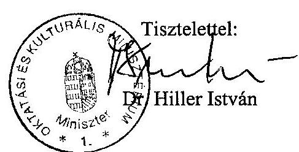

---

# Dr. Hiller István úr 

miniszter
Oktatási és Kulturális Minisztérium

## Budapest

## Tisztelt Miniszter Úr!

Meglepetéssel vettem kézhez 2008. május 26-án kelt utólagos észrevételező levelét, amely az Oktatási és Kulturális Minisztérium fejezetnél a közoktatási feladatok finanszírozására fordított pénzeszközök hasznosulásának ellenőrzéséről szóló jelentésünk, és a hivatalos egyeztetési eljárás lezárását követően érkezett. A 2008. május 7-i levelemmel kapcsolatos, pontatlanságoknak és tévedésnek vélt észrevételeire a következőket válaszolom.

Ellenőrzésünk megállapította azt, hogy az egyházfinanszírozási törvény az egyházi kiegészítő támogatás számítását tételesen szabályozza, a helyi önkormányzatok közoktatási kiadásait és saját bevételeit rögzítő számítási tételeket pedig az államháztartás működési rendjéről szóló kormányrendelet határozza meg. Jelentésünk pontosan tartalmazza azt a tényt - amit a szakértői egyeztetések is tükröztek -, hogy véleménykülönbség maradt fenn az ÁSZ hatályos jogszabályokon alapuló álláspontja és az OKM és a PM által képviselt, jogszabályoktól eltérő értelmezésen alapuló kormányzati álláspont között. Az eltérő értelmezés a vizsgált időszakban - a jelentés mellékleteiben bemutatott tételes levezetés alapján - az önkormányzati kiadások szűkebb, az intézményi saját bevételek bővebb számításba vételét (támogatásértékű bevételek, átvett pénzeszközök, pénzügyi befektetések bevételei, támogatási kölcsönök) valósította meg, és a jogszabályi előírásnál alacsonyabb összegű támogatást eredményezett.

Az államtitkári egyeztetést követő, 2008. április 9-i záró szakértői megbeszélés témáját a 2005. és 2006. évi egyházi kiegészítő támogatás megállapításában egyik alaptételnek számító „intézményi saját bevételek" jogszabályi fogalomkörének és számításának tisztázása képezte. Az egyeztetésen a felek - az OKM és az ÁSZ erre felhatalmazott képviselői - megállapodtak a témakörbeli ÁSZ-jogalkalmazás és számítás helyességében, amint azt a jelentés mellékletében

---

szereplő közös emlékeztető rögzíti. Az említett, egyetlen tétel-változás is az ÁSZ következetes, hatályos jogszabályon alapuló álláspontját bizonyítja.

Mint azt korábbi levelem tartalmazta, az tény, hogy az Állami Számvevőszék álláspontja az egyeztetési folyamatban alapvetően a javaslatokat illetően módosult. Ezirányú álláspontunk változása a belső minőségbiztosítás keretében végzett jogi és szakmai felülvizsgálat eredménye. Ez alapján foglaltunk úgy állást, hogy az egyházi kiegészítő támogatás számítása teljes körűen a zárszámadási törvény indoklásában egyértelműsíthető újabb szabályozás nélkül. Az egyházi kiegészítő támogatásról előkészítés alatt álló kormányrendelettel kapcsolatban azt közöljük jelentésünkben, hogy arra az államháztartási törvény 2008. január 1-jétől felhatalmazást ad a Kormánynak, ugyanakkor azt is rögzítjük, hogy annak előírásai nem mondhatnak ellent az egyházfinanszírozási törvény és az államháztartás működési rendjéről szóló hatályos kormányrendelet előírásainak.

Az önkormányzati és egyházi iskolák fajlagos finanszírozásának összehasonlító elemzése - az önkormányzati iskolák ellenőrzésének, az intézmények szerkezeti összetételének és a közoktatási ráfordítások teljes körére vonatkozó információk hiányában - nem képezte ellenőrzésünk tárgyát. Megjegyzem, hogy a tárca által bemutatott számításban az összehasonlító adatok nem szakszerűen jelentek meg (önkormányzati közoktatási kiadások, egyházi intézményeknek kiutalt állami támogatás). Ismételten megemlítem, hogy a 2006. évi tényleges pénzügyi teljesítések között nem szerepeltethetők a 2006. évet megillető, 2007. év végén teljesített kifizetések.

Nagyon sajnálom, hogy nem áll Miniszter úr rendelkezésére az a jelentés-tervezetünk, amit 2008. január 4-én dr. Szüdi János szakállamtitkár úr részére megküldtünk, és amelyre Szakállamtitkár úr 2008. január 15-i levelében közölte észrevételeit. Ebben a válaszlevélben a 2005. és 2006. évi egyházi kiegészítő támogatás számításával kapcsolatban tárca-észrevétel nem jelent meg. Ez a januári első tervezetünk tartalmazta az előző levelemben jelzett 2,53 Mrd Ft-os elmaradt támogatási különbözetet az ellenőrzött 2005-2006. évekre vonatkozóan. A jelentés-tervezet márciusi adata a PM szakértőivel, a végleges 2,65 Mrd Ft-os adat az OKM képviselőjével folytatott jogszabályi egyeztetésnek megfelelően alakult ki.

Ismételten rögzítem azt is, hogy a hivatalos számvevőszéki jelentés-tervezet elkészülte és 2008. januári egyeztetése óta egyetlen változat sem volt, amelyben elismertük bármely egyház megalapozatlan igényét, köztük a szóba hozott 2006. évi 2,2 Mrd Ft-os katolikus egyházi igényt.

Az ÁSZ jelentés-tervezet nem azonos a helyszíni ellenőrzésekről készített számvevői jelentésekkel. A hivatkozott és észrevételezésre átadott novemberi „számvevői jelentéskivonat" az egyházi kiegészítő támogatás számítása eltéréseinek tényszerű bemutatását végezte el, köztük a katolikus egyház akkori - tévedésen alapuló - álláspontjával. A fenti, OKM-mel, PM-mel egyeztetett és véglegesített számvevői jelentés sem a jelzett igény, sem az egyházi számítások megalapozottságának elismerésére vonatkozó megállapítást nem tartalmazott.

---

Az egyházi kiegészítő támogatás háttérszámítási adataival kapcsolatban eddig sem vitattuk azt, hogy az OKM az egyházak rendelkezésére bocsátotta a
 PM által átadott adatokat. Ezek a táblázati anyagok ugyanakkor - amint azt jelentésünk tartalmazza - az ellenőrzés során feltárt dokumentumok alapján nem feleltek meg az államháztartás működési rendjéről szóló kormányrendeletben előírt „Kiadások tevékenységenként" és „Bevételek tevékenységenként" részletezésnek, ezért az adatok ellenőrzési lehetősége az egyházak részére nem volt biztosított.

Tájékoztatom Miniszter urat, hogy utólagosan érkezett levelét és az arra adott válaszomat a jelentéshez mellékletként csatoljuk.

Budapest, 2008. május 29.

Tisztelettel:
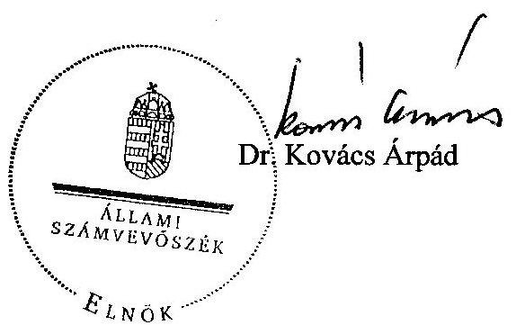

---

H-1051 BUDAPEST V., JÓZSEF NÁDOR TÉR 2-4. POSTACIM: 1369 BUDAPEST, POSTAFIÓK 481.

TELEFON: (36-1) 327-2159, (36-1) 327-2141
FAX: (36-1) 318-0738

PÉNZÜGYMINISZTÉRIUM
$3625 / 2008 / 4$

Dr. Kovács Árpád úrnak
elnök
Állami Számvevőszék

## Budapest

Tisztelt Elnök Úr!
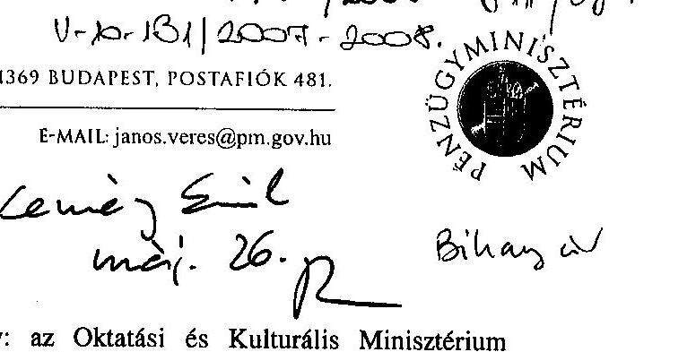

Tárgy: az Oktatási és Kulturális Minisztérium fejezetnél a közoktatási feladatok finanszírozására fordított pénzeszközök hasznosulásának ellenőrzéséről készített Jelentés tervezete
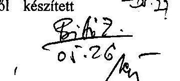

T. Kotezoh
Ketem népen téggénien myollenolin, totolion. Sagindlom, hogy nagy kithol 104 my. a valemol gyut novul myllwhonabra.

Kononet:
Az Oktatási és Kulturális Minisztérium fejezetnél a közoktatási feladatok finanszírozására fordított pénzeszközök hasznosulásának ellenőrzéséről készített Jelentés tervezete különböző változatainak több hónapja tartó egyeztetése során kialakult helyzetről és álláspontomról - melyet Bihary Zsigmond főigazgató úrnak és Kemény Emil főigazgató-helyettes úrnak korábban már jeleztünk -, továbbá javaslataimról az alábbiakban tájékoztatom. A Pénzügyminisztérium konkrét észrevételeit a tervezet általunk ismert legutolsó, március 10-én megküldött változatához (ikt. sz.: V-10-109/2007-2008.) fogalmaztuk meg.

Az Állami Számvevőszék „az Oktatási és Kulturális Minisztérium fejezetnél a közoktatási feladatok finanszírozására fordított pénzeszközök hasznosulásának ellenőrzése" címmel 2007 végén egy olyan témakör vizsgálatát kezdte el, mely már az érintettek számából adódóan is rendkívül nagy terjedelmű, átfogó ellenőrzést, elemzést vetített előre. Ezért is vett részt abban igen nagy várakozásokkal mind az Oktatási és Kulturális Minisztérium, mind a Pénzügyminisztérium.

Az elkészült Jelentés tervezete végül részben szűkebb, részben tágabb tartalommal bír, mint amit címe és az ellenőrzés céljaként megjelöltek alapján logikusan feltételezhet az olvasó. Éppen ezért érthetetlen helyzet állt elő azzal, hogy a tárgybeli pénzeszközöknek éppen egy olyan szűkebb köre - az egyházak közoktatási kiegészítő támogatása - kapott kiemelt hangsúlyt, melynek felhasználását illetően mindössze a közoktatási célt rögzíti jogszabály, de hasznosulásának vizsgálata a viszonyítási alap hiánya miatt már nem könnyű feladat. Vélhetően ez az akadály vezetett oda, hogy a hasznosulás (elköltés) tudomásulvétele, annak esetenkénti, formainak tűnő hibái

---

(néhány fenntartó nem tájékoztatja e támogatás forrásáról az intézményt) felvetése mellett lényegében a támogatás fajlagos összege megállapításának módszerét vizsgálták mélyrehatóan a Jelentést készítő számvevők.

A módszer körül - mint az nyilvánvalóan az Állami Számvevőszék előtt is ismert - az elmúlt években vita keletkezett a nagy egyházak és a kormányzat között. Az egyeztetések során egyértelművé vált, a vonatkozó jogszabályok szövege többféle értelmezésre ad módot. A megbeszélések legjelentősebb előre mutató eredménye a rendszert rögzítő jogszabály elkészítésének szükségességében való egyetértés volt.
A Jelentés tervezetének a márciusi változások miatt elhúzódó egyeztetése visszavetette a Korm. rendelet előkészítésének folyamatát: a nagy érintett egyházak képviselői javasolták az egyeztetések felfüggesztését - elsősorban azzal a nem titkolt várakozással (sőt, meglepő módon: ismerettel), hogy a vitás „saját bevétel" kérdésében az ÁSZ jogértelmezése döntő lesz.

E kérdésben a Jelentés tervezetének februári változatában szereplő megállapítások némelyikét - zömmel az egyházaknak, a kormányzat által korábbról már ismert álláspontját részben/egészben ÁSZ álláspontként leíró részeket - illetően vita maradt közöttünk. Az előbb említett folyamattal összhangban a Kormány részére megfogalmazott javaslat azonban előremutató volt. A kérdés jogszabályi szintű rendezésének szükségességét a Jelentés tervezetének megállapításai, a feltárt bizonytalanságok, az ÁSZ-nak esetenként az egyházakétól is eltérő értelmezései alátámasztották.

Mindezek alapján váratlanul érte a Pénzügyminisztériumot (és az Oktatási és Kulturális Minisztériumot is) a Jelentés tervezetének márciusi változata, mely ugyanazon vizsgálati eredményre új megközelítésben fogalmaz meg javaslatokat. Ennek a - Bihary Zsigmond főigazgató úr által kezdeményezett - változtatásnak az apropóján szóbeli egyeztetésen módunk volt megvitatni Kemény Emil főigazgató-helyettes úrral és munkatársaival a tervezet megállapításait és javaslatait. A megbeszélésről készített emlékeztető alapján is egyértelmű, hogy a vonatkozó jogszabályok - különösen a saját rendelkezései kifejtésében nem számon kérhető törvények - szövege eltérő értelmezésekre ad módot (ellenkező esetben nem is lett volna vita). Így a Kormánynak megfogalmazott javaslat, miszerint „Intézkedjen annak érdekében, hogy az egyházi kiegészítő támogatás megállapítása mindenkor feleljen meg az egyház-finanszírozási törvény hatályos előírásainak.", teljesíthetősége minden igyekezet ellenére is kétséges /az eltérő értelmezés lehetősége ad absurdum az érdekelt egyházak álláspontját ellenkezőjére is fordíthatja az önkormányzati adatok aktuális alakulásának függvényében/.

Általánosságban nem vitatható az ÁSZ azon törekvése, mely a jogszabályok szó szerinti alkalmazására irányul. Az egyházi közoktatási kiegészítő támogatás megállapításának vizsgálatát azonban ennél tágabb viszonyrendszerben célszerű - mert szakmailag teljes körűen csak így lehetséges - lefolytatni, hiszen a jogszabályi környezet meglehetősen „speciális" és hiányos, alapjaiban állandó, „segédszabályaiban" változó. Az egyházak hitéleti és közcélú tevékenységének anyagi

---

feltételeiről szóló 1997. évi CXXIV. törvény (egyház-finanszírozási tv.) alapjául döntően - így a kiegészítő támogatást illetően - egy már aláírt, de törvényben később kihirdetett nemzetközi egyezmény, a Vatikáni Megállapodás szövege szolgált. Egyik dokumentum múfaja sem ad ugyanis lehetőséget arra, hogy részletesen megjelöljön adathalmazokat, kalkulációs folyamatokat, eljárási rendeket stb., ugyanakkor olyan fogalmakat használt, melyekre nem volt (és részben nincs) egyértelműen megfeleltethető, jogszabályi szintű definíció, továbbá e probléma feloldására szolgáló végrehajtási rendeletre felhatalmazást nem adott.
Ezért nem lehet eltekinteni a jogalkotó szándékától, a törvény hatálybalépésekor hatályos egyéb jogszabályi rendelkezésekből levezethető (és vita nélkül alkalmazott!) tartalmaktól. Különösen igaz ez az „intézményi saját bevételek" tartalmát illetően, mely fogalomhoz a mindkét fél által elfogadott, alkalmazott módszer a törvény hatálybalépésekor a költségvetési szervek tervezésének, gazdálkodásának, beszámolásának rendszeréről szóló 156/1995. (XII. 26.) Korm. rendelet szerinti bevételeket rendelte (tartalmilag /közgazdaságilag/ helyesen és a jogalkotó szándékával összhangban), mely tartalmazta az átvett pénzeszközöket is.
Az államháztartás intézményrendszerének működésében, forrásaiban, ezzel összefüggő ágazati szabályrendszerében stb. azonban a mintegy egy évtized alatt jelentős változás volt tapasztalható, s emiatt az államháztartás működési rendjéről szóló 217/1998. (XII. 30.) Korm. rendelet (Ámr.) szabályaiban is módosításokra volt szükség (pl. az átvett pénzeszközök fogalmi megosztására).

Fentiek alapján konkrét javaslataim az alábbiak:
I. Az összegző megállapításokhoz:

1. 12. o. 5. sz. lábjegyzet: a közoktatási jogcímű támogatások csökkenésének oka pontosítandó, helyesen: a 2007. évi 7,6 milliárd forint (és ennek következtében a 2008. évi 34,2 milliárd forint) megtakarítást kifejezetten a közoktatási törvény módosítása - az átlagosan 10%-kal megemelt pedagógus heti kötelező óraszám - okozza.
2. 14. o. negyedik bekezdés: félreérthető az a megállapítás, miszerint a 2005. évi költségvetési törvényben nem volt biztosított az azonos finanszírozási feltétel. Ez az alábbi kiegészítéssel orvosolható:
„... településtípusú normatív támogatására. Az egyházakat meg nem illető e normatíváknak megfelelő forrásokat az egyházak részére a kiegészítő támogatás biztosította."
3. 15. o. második bekezdés: az ellenőrzés a 2005. és 2006. évek kiegészítő támogatását és elszámolását vizsgálta, ezért a 2004. évet illető - egyébként pontatlan és a Jelentés tervezetében nem megalapozott - megállapítását törölni javaslom.
4. 15. o. 12. sz. lábjegyzet: a hatályos jogszabályok alapján az első mondatot az alábbiak szerint szükséges kiegészíteni, egyúttal a második mondat törlendő:
„... kormányrendelet előkészítése, melyhez az államháztartásról szóló 1992. évi XXXVIII. törvény 124. §-a (12) bekezdésének zsf) pontja ad felhatalmazást."

---

II. A részletes megállapításokhoz:

1. 31. o. harmadik bekezdés: összefüggésében hibás, szakmai tévedés az a megjegyzés, hogy a Korm. határozat alapján folyósított 948,4 millió forint támogatás „a településtípusú normatíváktól eltérően kötött felhasználású, elszámolási kötelezettséggel járó támogatás volt". Az egyházak közfeladataihoz kapcsolódó finanszírozás szempontjából ez nem releváns megjegyzés, hiszen a normatívák az egyházi fenntartók számára kötött felhasználással bíró támogatások, ugyanúgy, mint az idézett kormányhatározattal kapott összeg. Ennek megfelelően a bekezdés utolsó (idézett) mondata törlendő.
2. A Jelentés tervezetének 8. sz. mellékleteként közölt PM e-mail - az ÁSZ-szal folytatott 2008. január 31-ei személyes egyeztetés után - kizárólag azt igazolja vissza, hogy a bevételek és a kiadások egyes részadatai ugyanabból a kincstári adatbázisból származnak, a számítások módszerét illetően nem tartalmaz állásfoglalást. Tekintettel arra, hogy az e-mail szövege a tervezet megalapozását nem szolgálja (önmagában érdemi információtartalommal nem bír), mellékletként való megtartását szükségtelennek tartom.

# III. A javaslatokhoz

1. A Jelentés tervezetének megállapításai a Kormánynak tett javaslat teljesíthetetlenségét igazoló helyzetet mutatnak be. Alapvető érdek az egyértelmű szabályozás, ezért fontosnak tartom az eddigi munkák hasznosítását, ehhez az alábbi javaslat megfogalmazását:
„Folytassa és mielőbb zárja le az egyházi kiegészítő támogatás számításának kormányrendeleti szintű egyértelmű és részletes - az egyházakkal egyeztetett - szabályozását."
Határozott álláspontom, hogy a zárszámadási törvény indokolását és az egyházi kiegészítő támogatás számítását - mint eltérő rendeltetésű dokumentumokat - szét kell választani.
a) A mindenkori zárszámadási törvény részletes indoklása funkcionális csoportosításban (EUROSTAT szerint) ad tájékoztatást a közoktatás és a szociális ellátás adott évi adatairól, a más témakörökben is érvényesülő korlátozott értelmezéssel.
b) Az egyházi kiegészítő támogatás tervezése és elszámolása a feladatok (szakfeladatok) azon részhalmazát veszi figyelembe - mind a közoktatásnál mind a szociális ellátásnál -, amelyet a központi költségvetés állami hozzájárulással, támogatással (tehát nemcsak tájékoztatási, hanem finanszírozási céllal) ismer el a helyi önkormányzatoknak és az egyházaknak egyaránt.
Ez utóbbit éppen az említett kormányrendelet hivatott megoldani (a zárszámadástól függetlenül is). Az oktatási és kulturális miniszternek és a pénzügyminiszternek tett javaslat ennek megfelelően törlendő.
2. A fentiekből egyértelműen következik, hogy nem látom szükségességét az oktatási és kulturális miniszter felé megfogalmazott személyi felelősség vizsgálatának, javasolom annak elhagyását.

---

Kérem Elnök urat, hogy észrevételeim és javaslataim alapján a tervezet felülvizsgálatát és korrekcióját kezdeményezni szíveskedjék. Bízom benne, hogy közös törekvésünk e tekintetben is eredményes lesz, az Állami Számvevőszék tárgybeli jelentésével egy újabb segítséget jelenthet abban a folyamatban, mely az államháztartás pénzügyei, a kapcsolódó jogszabályi háttér rendezettségére, konzekvens kialakítására, az állami feladatellátás működtetésének, finanszírozásának javítására irányul.

Budapest, 2008. május 29.
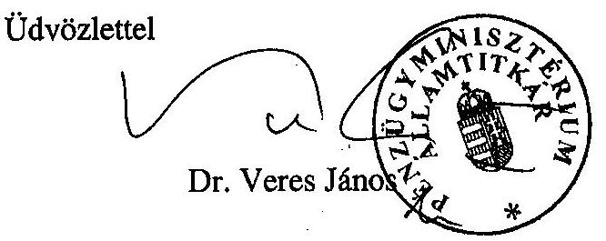

---

# Dr. Veres János úr

miniszter
Pénzügyminisztérium

## Budapest

## Tisztelt Miniszter Úr!

Köszönettel megkaptam 2008. május 21-én keltezett levelét, amelyben tájékoztat az Oktatási és Kulturális Minisztérium fejezetnél a közoktatási feladatok finanszírozására fordított pénzeszközök hasznosulásának ellenőrzéséről készített jelentésünkkel kapcsolatos álláspontjáról és észrevételeiről.

Miniszter úr is megemlíti levelében, hogy több hónapos egyeztetés előzte meg jelentésünk elkészítését. Éppen ezért sajnálom, hogy nagy késéssel érkezett levele, továbbá azt, hogy véleménykülönbség maradt fenn az egyházi finanszírozás témakörében az ÁSZ hatályos jogszabályokon alapuló álláspontja és a jogszabályoktól eltérő értelmezést alkalmazó kormányzati álláspont között.

Ellenőrzésünk az OKM fejezet közoktatási pénzeszközei teljesítményszemléletű hasznosítására irányult, mely vizsgálati célt nemzetközi és országos közoktatási kitekintéssel együtt oldottunk meg. Az ellenőrzés egyik részterületét képezte az egyházi közoktatási intézmények állami támogatásának biztosítása és hasznosítása. Tájékoztatom Miniszter urat arról, hogy intézkedésem alapján nem kapott kiemelt hangsúlyt a jelentésben az egyházi finanszírozás kérdése. Az összegző megállapítások között mindössze két bekezdés szól e témakörről, tekintettel
 az elmúlt évek egyházak és kormányzat közötti vitájára.

Az egyházi kiegészítő támogatás megállapításával összefüggésben megerősítem azt, hogy az Állami Számvevőszék a hatályos jogszabályok alapján alakítja ki ellenőrzési álláspontját. A 2008. március 19-én és április 9-én a kormányzati képviselőkkel folytatott szakértői egyeztetések bizonyossá tették, hogy az egyházfinanszírozási törvény és az államháztartás

---

működési rendjéről szóló hatályos kormányrendelet (Ámr.) teljes körű és egyértelmű szabályozást adnak a témakörben, s a kormányzati álláspont eltér a fenti jogszabályoktól.

Kétségtelen tény, hogy az egyeztetési folyamatban főként a javaslatokat illetően az Állami Számvevőszék álláspontja módosult. Álláspontunk változása a belső minőségbiztosítás keretében végzett jogi és szakmai felülvizsgálat eredménye. Egyidejűleg megemlítem, hogy a témakörben a Kormánynak tett javaslatunkkal a Miniszterelnöki Hivatal államtitkára elviekben egyetértett. Az egyházi finanszírozás alapelveit és az egyházi kiegészítő támogatás konkrét számítási gyakorlatát az egyházfinanszírozási törvény, a számítási tételeket (egy kivételével) az Ámr. határozza meg. Ebből adódóan, amennyiben a Kormány más gyakorlatot kíván folytatni az egyházak finanszírozásában, nem elegendő új kormányrendelet megalkotása, ehhez szükséges a hatályos törvény módosítása.

Az ellenőrzés az egyházi kiegészítő támogatás 2005. és 2006. évi megállapításának szabályszerűségét értékelte, a hatályos jogszabályok alapján. Az egyházfinanszírozási törvény és a Vatikáni Megállapodás megkötése időszakában valóban más kormányrendelet szabályozta az intézményi (saját) bevételek fogalmi körét, de ellenőrzéseinket a vizsgált időszakban hatályos kormányrendeleti előírások szerint kell elvégeznünk. 2005. évben a hatályos kormányrendelet csak a fejezeti kezelésű előirányzatok saját bevétellel fedezett részéből származó átvett pénzeszközt minősíti saját bevételnek, a 2006. évi Ámr. az átvett pénzeszközöket nem sorolja az intézményi saját bevételek közé.

Konkrét észrevételeivel kapcsolatban tájékoztatom, hogy jelentésünkben szerepel az a megállapítás, amely szerint a közoktatási támogatás csökkenését alapvetően az átlagosan 10%-kal megemelt pedagógus heti kötelező óraszám okozza (13. oldal 5. sz. lábjegyzet).

Az egyházi fenntartású közoktatási intézmények - állami és önkormányzati intézményekkel azonos mértékű, közoktatási törvényben és egyházfinanszírozási törvényben rögzített normatív támogatásáról jelentésünk egyértelműen megállapítja, hogy a 2005. évi költségvetési törvény nem biztosított fedezetet az egyházi fenntartóknak a bejáró gyermekek/tanulók utáni és településtípusú normatív támogatásra. Az egyházak ezirányú igényét a Kormány utólagosan az egyházak kezdeményezésére - 2006. decemberében hozott határozatával (2237/2006. (XII. 23.) Korm. határozat) ismerte el.

A jelentés összegző részében - az egyházfinanszírozási rész rövidítéseként - csak a 2005. és 2006. évi egyházi kiegészítő támogatásra vonatkozó megállapítást teszünk közzé.

Az egyházi kiegészítő támogatásról előkészítés alatt álló kormányrendelettel kapcsolatban azt közöljük, hogy az Áht. 124. § (2) bekezdésének zsf. pontja 2008. január 1-jétől felhatalmazást ad a Kormánynak az egyházi kiegészítő támogatásra vonatkozó részletező szabály megalkotására (18. oldal 21. sz. lábjegyzet). Egyidejűleg rögzítjük azt is, hogy az előkészítés alatt levő kormányrendelet-tervezet előírásai nem mondhatnak ellent az egyházfinanszírozási törvény és az államháztartás működési rendjéről szóló hatályos kormányrendelet előírásainak.

A részletes megállapítások között jelentésünkben az szerepel, a korábbi egyeztetések nyomán (34. oldal), hogy a Kormány a 2237/2006. (XII. 23.) Korm. határozattal - 2007. évben kötött

---

támogatási szerződések alapján - 948,4 M Ft-ot fizetett ki az egyházi közoktatási intézmények településtípusú normatíváknak megfelelő összegű támogatására.

A jelentés 9. sz. melléklete igazolja azt, hogy az egyházi kiegészítő támogatás számításának kormányzati (OKM-PM) és számvevőszéki levezetése, a számítás alapelemeit képező 2005. és 2006. évi önkormányzati működési és felújítási kiadások, s az intézményi saját bevételek adatai azonos kincstári adatbázison alapulnak.

Az oktatási és kulturális miniszternek és a pénzügyminiszternek tett közös javaslattal kapcsolatban fenntartom álláspontunkat, hogy az egyházi kiegészítő támogatás számítását és rendezését a zárszámadási törvény indoklásában kell megoldani. A kiegészítő támogatás egyenlegrendezése a zárszámadási folyamat része, a hiteles és egyértelmű számítási alapadatok teljes körének a zárszámadási törvény előterjesztésében meg kell jelennie, hogy azt a döntéshozó parlamenti képviselők és az érintett egyházak illetékesei is megismerhessék. A törvény indoklása most is tartalmazza a helyi önkormányzatok adatait funkcionális csoportosításban, ezen belül az önkormányzatok működési kiadásait és intézményi saját bevételeit. (Mindez kiegészítendő a felújítási kiadásokkal és a pályázati támogatásokkal.)

Végül tájékoztatom Önt arról, amennyiben az ellenőrzés jogszabálytól eltérő gyakorlatot állapít meg, úgy nem tekinthetünk el a személyi felelősség felvetésétől. Természetesen a fegyelmi eljárás lefolytatása már a munkáltató - jelen esetben az oktatási és kulturális miniszter - hatásköre és felelőssége.

Kérem Miniszter urat, hogy a levelemben foglaltakat tudomásul venni szíveskedjék.
Budapest, 2008. május 27.
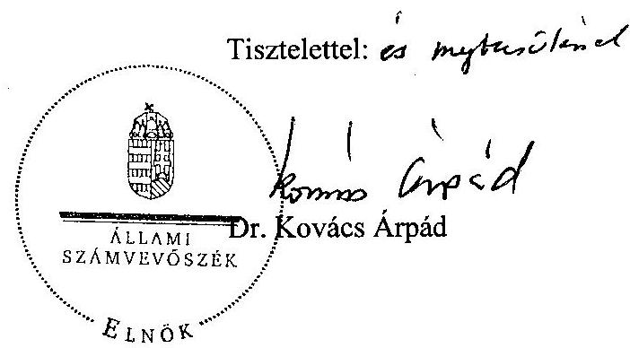

---

# Miniszterelnöki Hivatal   Államtitkár 

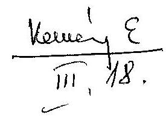

Iksz: VIII/603/2/2008
Hiv.sz.: V-10-111/2007-2008.

## Bihary Zsigmond úr részére főigazgató

## Állami Számvevőszék

## Budapest

## Tisztelt Főigazgató Úr!

Az Oktatási és Kulturális Minisztérium fejezetnél a közoktatási feladatok finanszírozására fordított pénzeszközök hasznosulásának ellenőrzéséről készített módosított jelentés-tervezetüket megkaptuk, eddig tett észrevételeink átvezetését köszönjük.

A módosított jelentés-tervezetben a Kormány számára megfogalmazott feladattal elviekben továbbra is egyetértünk, azonban a jogállamiság elvéből kiindulva megjegyezzük, hogy az egyházi oktatási intézmények kiegészítő támogatásának számítása során a mérték meghatározása tekintetében illetékes tárcák (PM, OKM) - tájékoztatásuk szerint - az elmúlt években is a hatályos jogszabályi rendelkezések követelményeinek megfelelően számították ki a kiegészítő támogatás konkrét összegét.

Ugyanakkor az Állami Számvevőszék által lefolytatott vizsgálat is - feltárva az egyes támogatásokra és kiszámításukra vonatkozó néhány problematikus kérdést - alátámasztotta, hogy szükséges az egyházfinanszírozás, ezen belül a kiegészítő támogatások felülvizsgálata és szükség esetén az erre vonatkozó szabályozás módosítása. Az egyházfinanszírozás felülvizsgálata a Kormány 2008. évi I. félévi munkatervében feladatként szerepel.

Budapest, 2008. március 11.
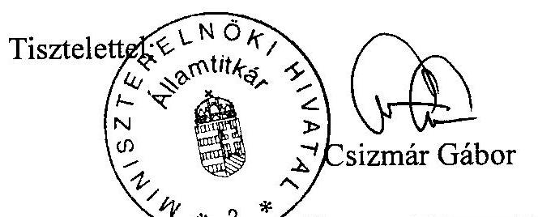

---

# Bihary Zsigmond úrnak 

főigazgató
Állami Számvevőszék
Budapest 4.
Pf. 54.
1364
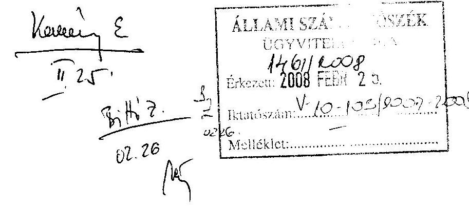

Tisztelt Főigazgató Úr!
V-10-99/2007-2008. számú levelét, s vele az Oktatási és Kulturális Minisztérium fejezetnél a közoktatási feladatok finanszírozására fordított pénzeszközök hasznosulásának ellenőrzéséről készített jelentéstervezetüket köszönettel megkaptam.

Ezúton is megköszönöm az Állami Számvevőszék munkatársainak a magas szakmai színvonalú, alapos és korrekt munkáját, segítőkészségét, amelyet az ellenőrzés folyamán tapasztalhattunk.

A jelentéstervezet tartalmával alapvetően egyetértve ahhoz az alábbi, a jelentéstervezet egyházi kiegészítő támogatásra vonatkozó megállapításait pontosító észrevételeket fűzöm.

1) Köszönjük, hogy a jelentéstervezet rámutat az egyházi kiegészítő támogatás számításával kapcsolatos problémákra, s alapos háttérmunkával részletesen bemutatja, hogy a jogszabályoktól eltérő közgazdasági értelmezés alapján - 2005-2006. évekre vonatkozóan - elmaradt közel 3 milliárd Ft összegű állami támogatás kifizetése az egyházaknak.
2) A jelentéstervezet 33. oldalán szereplő megállapítás szerint a 2004. évi kiegészítő támogatást az ellenőrzés rendezettnek tekinti. Bár a hivatkozott kormányhatározat alapján biztosított összeg megegyezik a 2004-re járó pótlólagos kiegészítés összegével, ezzel a megállapítással abban az esetben tudnánk egyetérteni, ha a jelentés bemutatná, hogy a rendezés nem a hatályos jogszabályoknak megfelelően történt meg, emellett a pótlólag folyósított összeg a kormányhatározat indoklása szerint nem is csupán 2004. évi, hanem az azt megelőző évek hiányainak kompenzálását tartalmazza.
3) A jelentéstervezet a 2005. évi normatívák és kiegészítő normatívák kapcsán megállapítja egyrészt azt, hogy a településtípusú normatívákat az egyházak 2005-ben nem kapták meg, azonban a 2237/2006. (XII.23.) Korm. határozat alapján a normatíváknak megfelelő összegű támogatásban részesültek (14. és 31. old.), másrészt viszont azt, hogy az egyházi kiegészítő támogatás számításával kapcsolatban az egyházak álláspontja a normatíva összegének megállapítása tekintetében nem volt helytálló (33. old.). Ezzel kapcsolatban az alábbiakat kívánjuk megjegyezni.

- Az egyházak által számított normatíva a településtípusú normatívák összegével tér el a költségvetés végrehajtási törvényben szereplő és a jelentéstervezet által is elfogadott normatívák összegétől. Mivel az egyházak ebben a normatívában év

---

közben nem részesülhettek, ezért a korábbi évek gyakorlatának megfelelően ezek összegét az egyházak a normatívából kérték levonni és - ugyancsak a korábbi évek gyakorlatának megfelelően - a kiegészítő támogatásnál ellensúlyozni az eltérő finanszírozást.

- A kormányhatározat alapján biztosított összeg - a településtípusú normatíváktól eltérően - kötött felhasználású, elszámolási kötelezettséggel járó támogatás volt.

3) A jelentéstervezet a tényleges helyzetnek megfelelően rögzíti, hogy az egyházaknak nem volt módjuk ellenőrizni a háttérszámításokat megalapozó elszámolásokat, mivel az nem rendelkeznek a zárszámadás körébe tartozó önkormányzati közoktatási adatokkal. A 2005-2006. évi kiegészítő támogatás rendezésére vonatkozó résznél (33. old.) ugyanakkor az a megállapítás szerepel, hogy a 2006. évi rendezés tekintetében többségi konszenzus született. Ezzel kapcsolatban megjegyezni szükséges, hogy az egyházak az adatok hiányában nem voltak döntési helyzetben. Így amennyiben a téves kormányzati adatszolgáltatás alapján valóban többségi konszenzus született volna, az ÁSZ jelentésben bemutatott valós számok fényében az elszámolás korrekciója akkor is szükséges lenne.

Öszinte tisztelettel
Budapest, 2008. február 21.
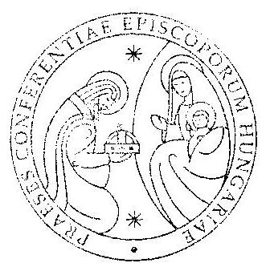

Dr. Erdő Péter
bíboros, prímás, esztergom-budapesti érsek, az MKPK elnöke

---

# Dr. Erdő Péter úr 

bíboros, prímás
a Magyar Katolikus Püspöki Konferencia elnöke

Budapest

## Tisztelt Bíboros Úr!

Köszönettel megkaptam levelét, amely az Oktatási és Kulturális Minisztérium fejezetnél a közoktatási feladatok finanszírozására fordított pénzeszközök hasznosulásának ellenőrzéséről készített jelentés-tervezettel kapcsolatos észrevételeit foglalja össze.

A levélben tett javaslatok figyelembevételét és hasznosítását az alábbiakban összegzem:

1. Észrevételét figyelembe véve a 33. oldal 31. lábjegyzetét a következők szerint módosítottuk: ,,A kiegészítés eredeti összegének megállapítása nem a hatályos jogszabályoknak megfelelően történt. A Pénzügyminisztérium fejezet 2005. évi előirányzat-maradványának átcsoportosításáról szóló fenti kormányhatározat 1000 M Ft-ot biztosított az ,,Egyházi kiegészítő támogatások rendezése" címen. A kormányhatározat konkrét érvet és indoklást nem tartalmaz. Az ellenőrzés rendelkezésére bocsátott 2006. február 24-i keltu a történelmi egyházak vezetőinek megküldött - pénzügyminiszteri levél rögzítette azt, hogy ,,az összeg a 2004. és az azt megelőző évek közoktatási támogatásainak rendezésére szolgál".
2. A 2005. évi településtípusú normatíváknak az egyházi kiegészítő támogatás kiszámításánál történő figyelembevételével összefüggésben rögzítem, hogy a jelentéstervezet megállapításait a hatályos jogszabályokra alapoztuk. A közoktatási feladatot ellátó nem állami intézmények fenntartóit a Magyar Köztársaság 2005. évi költségvetéséről szóló 2004. évi CXXXV. törvény 30. § 1/(a) pontja szerint a településtípusú normatívák 2005. évre nem illették meg, szemben a 2004. évi és 2006. évi szabályozással. Emiatt nem indokolt ennek figyelembevétele a kiegészítő támogatás elszámolásánál.

---

Jelentés-tervezetünk korábbi változata is tartalmazta azt (14. és 31. oldal), hogy ezt a szabályozási eltérést utólagos támogatás biztosításával - kötött felhasználású támogatási szerződések formájában - a 2237/2006. (XII. 23.) Korm. határozat rendezte. Észrevételei alapján a következő pontosításokat végezzük el:

- A 33. oldal második bekezdését, valamint a 6. sz. melléklet megjegyzéseit kiegészítjük a következő szövegrésszel az előzőekben foglalt álláspontunk alapján: „Az egyházak - a korábbi évek elszámolási gyakorlatának megfelelően - a 2005. évi önkormányzati közoktatási támogatások zárszámadási törvény szerinti normatív hozzájárulási összegébe a településtípusú normatíváknak megfelelő támogatási összeg beszámítását is indokoltnak tartották. Így ez a - 2005. évi szabályozással ellentétben - a kiegészítő támogatás alapját növelte volna.
- A 14. oldal 8. lábjegyzetében és a 31. oldal vonatkozó bekezdésében feltüntetjük azt, hogy a kormányhatározat alapján biztosított összeg - „a településtípusú normatíváktól eltérően" - kötött felhasználású, elszámolási kötelezettséggel járó támogatás volt.

3. A zárszámadási egyenlegrendezésről készült emlékeztetőket és a hozzájuk füzött észrevételeket ismételten áttekintettük. Bíboros úr pontosító javaslata értelmében a jelentéstervezet 33. oldalának 2. bekezdésének 2. mondatát az alábbiak szerint változtattuk meg:
 ,,Az egyeztetések során 2005. évre vonatkozóan egyáltalán nem, 2006. évre vonatkozóan közeledtek az álláspontok a kormányzati és egyházi képviselők között. Közös álláspont egyik évben sem jött létre".

Az átdolgozott jelentés-tervezetet szíves tájékoztatásul mellékelem.

Budapest, 2008. március
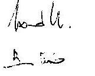

Tisztelettel:

Bihary Zsigmond

Melléklet: 1 pld. jelentéstervezet

---

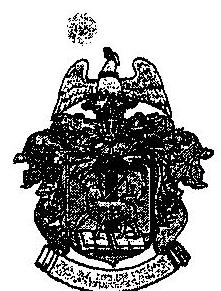

# MAGYARORSZÁGI REFORMÁTUS EGYHÁZ ZSINATÁNAK ELNÖKSÉGE 

$\boxtimes: 1440$ Budapest, 70. Pf.: 5
e-mail: zsinat.elnokseg@zsinatiiroda.hu
$\mathbf{0 : 4 6 0 7 1 2 , Fax:} 4600751$
1146 Budapest, Abonyi u. 21.

## 29508

Iktatószám: ..130139./A../2008. EÉu.
Tárgy: jelentés észrevételezése

## Bihary Zsigmond főigazgató-úr részére Állami Számvevőszék Budapest   Apáczai Csere János u. 10. 1052

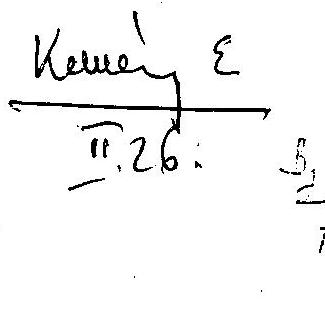

ÁLLAMI SZÁMVEVŐSZÉK
DOY 132422003
Érksz: 2008 FEBR 26
Iktatószám: U-10-10/2008/2008.
Melléklet:

## Tisztelt Főigazgató Úr!

A Magyarországi Református Egyház a „Jelentés az Oktatási és Kulturális Minisztérium fejezetnél a közoktatási feladatok finanszírozására fordított pénzeszközök hasznosításának ellenőrzéséről" című jelentés-tervezetet kézhez kapta, s a megállapításokhoz a következő észrevételeket kívánjuk tenni.
1.) Kimarad az oktatási és kulturális miniszternek tett ajánlások közül az, hogy „kezdeményezze az egyházakat megillető 2005. és 2006. évi elmaradt jogos kiegészítő támogatási összegek rendezését" (januári jelentés 17. oldal). Fontosnak ítéljük, hogy ne bírósági úton, hanem a kormányzat kezdeményezésére kerüljön sor a visszásságok rendezésére. Szeretnénk remélni, hogy az Állami Számvevőszék is hasonló álláspontot képvisel.
2.) A jelentés a 14. oldalon a következő megállapítást teszi: „Ugyanakkor a Kormány 2237/2006. (XII.23.) határozatával 948,4 MFt-os összegű pótlólagos közoktatási támogatást biztosított az egyházak részére". Az a tény azonban, hogy a 31. oldalon a jelentés rögzíti, hogy ,,az egyházi közoktatási intézmények településtípusú normatíváknak megfelelő összegű támogatására" kötöttek támogatási szerződéseket, ill. hogy a 7. melléklet a 948,4 MFt-ot rendezettnek tekinti (nem vonja le az önkormányzatok normatív juttatásaiból), egyértelműen jelzi, hogy az ÁSZ lezártnak tekinti a 2005. évi településtípusú támogatások ügyét.

Álláspontunk szerint az önkormányzatok által igénybe vett 17.574,9 MFt településtípusú támogatás összegét a 2005. évi közoktatási kiegészítő támogatás korrigált elszámolásánál figyelembe kell venni, így a 7. számú melléklet 5. sorában is meg kell jeleníteni. Mindez maga után vonja a 6., 8., 10. és 12. sorok módosítását is.

---

3.) Nem értünk egyet azzal a megállapítással, miszerint „néhány intézmény szóbeli tájékoztatást kapott a támogatás forrásáról" (38. oldal), mivel egyrészt azt sugallja, hogy az egyházi intézmények vezetői nem ismerik a jogszabályi hátteret (így a mindenkori költségvetési törvényt), másrészt az egyházak szándékosan meg akarnák téveszteni a fenntartókat és az intézményeket a kiegészítő támogatás forrásáról.

Az igazság ezzel szemben az, hogy a közoktatási kiegészítő támogatás az intézményfenntartó egyháznak jár. Az egyházak belső rendjüknek megfelelően határoznak az összeg felhasználásáról (a jelentés 42. oldalának utolsó előtti bekezdésébe betoldott PM álláspont is rögzíti az egyházak ezen jogát). A fenntartók változatlan (közoktatási kiegészítő támogatás) jogcímen juthatnak hozzá a támogatáshoz, viszont már egyházi jogi személytől érkezik hozzájuk a támogatás. Néhány intézményvezető hézagos jogszabályismerete nem árnyékolhatja be az állami támogatások kezelésének tisztaságát.

Tisztelettel:
Budapest, 2008. február 21.
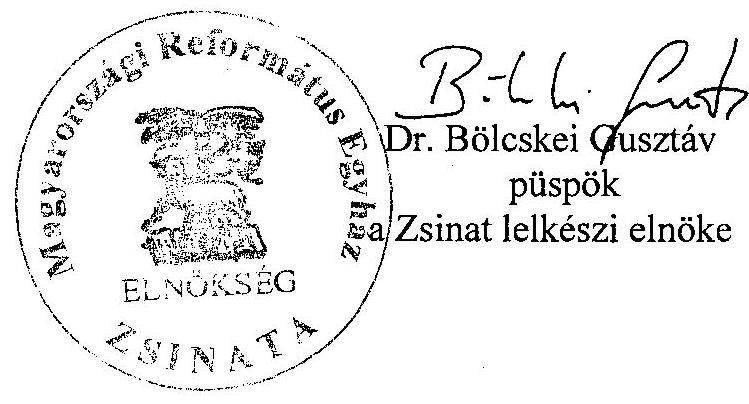

---

# Dr. Bölcskei Gusztáv 

püspök
a Magyar Református Egyház Zsinatának lelkészi elnöke

## Budapest

## Tisztelt Püspök Úr!

Köszönettel megkaptam levelét, amely az Oktatási és Kulturális Minisztérium fejezetnél a közoktatási feladatok finanszírozására fordított pénzeszközök hasznosulásának ellenőrzéséről készített jelentés-tervezettel kapcsolatos észrevételeit foglalja össze.

A levélben tett javaslatok figyelembevételét és hasznosítását az alábbiakban összegzem:

1. Az egyházi kiegészítő támogatás elmaradt összegének rendezésére - az oktatási és kulturális miniszternek - tett javaslatot és annak megoldását a számvevőszéki jogi szakértők állásfoglalása figyelembevételével módosítottuk. Az egyeztetési folyamat során a témakörhöz kapcsolódó ajánlásainkat a Kormány felé tett következő javaslattal bővítettük: ,,Intézkedjen annak érdekében, hogy az egyházi kiegészítő támogatás megállapítása mindenkor feleljen meg az egyházfinanszirozási törvény hatályos előírásainak".
2. A jelentéstervezet megállapításait a hatályos jogszabályokra alapoztuk. A közoktatási feladatot ellátó nem állami intézmények fenntartóit a Magyar Köztársaság 2005. évi költségvetéséről szóló 2004. évi CXXXV. törvény 30. § 1/(a) pontja szerint a településtípusú normatívák 2005. évre nem illették meg, szemben a 2004. évi és 2006. évi törvényi szabályozással. Emiatt nem indokolt ennek figyelembevétele a kiegészítő támogatás elszámolásánál, így a 7. sz. melléklet hivatkozott 5. sorában sem. Összegző és részletező megállapításaink között rögzítjük annak tényét - amint arról levelében Ön is említést tesz -, hogy a 2005. évi településtípusú támogatásokat a Kormány utólagosan külön kormányhatározattal rendezte az egyházak részére.

---

3. Észrevételét figyelembe véve a jelentéstervezet 38. oldalán a második bekezdés utolsó mondatát elhagyjuk.

Az átdolgozott jelentés-tervezetet szíves tájékoztatásul mellékelem.
Budapest, 2008. március
$1-16$.

Tisztelettel:

Bihary Zsigmond

Melléklet: 1. pld. jelentéstervezet

---

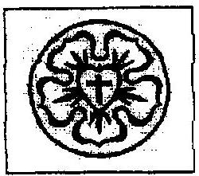

# MAGYARORSZÁGI EVANGÉLIKUS EGYHÁZ ORSZÁGOS IRODA 

HAFENSCHER KAROLF LELESSZ, ORSZÁGOS IRODARAIZGATO H-1083 BUDAPEST, ÖSZOK UT 24. TEL: 483-22-60 FAX: 486-35-54 E-MAIL: ORSZAGOS@AUTERRAULIIU

IKT. SZÁM:151/2008

Tárgy: V-10-99/2007-2008. számú
jelentés észrevételezése

## Bihary Zsigmond

főigazgató úrnak

Állami Számvevőszék
Budapest 4.
Pf. 54.
1364
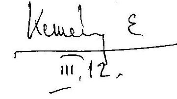

ÁLLAMI SZÁMVEVŐSZÉK
ÜGYVITELI IRODA
200812008
Érkeze: 2008 MARC 12
Iktatószám: 410-101/2009-2008
Melléklet:

Tisztelt Főigazgató Úr!

A Magyarországi Evangélikus Egyház nem kíván észrevételt tenni a V-10-99/2007-2008 iktatószámú jelentéstervezettel kapcsolatban.

Budapest, 2008. február 25.

Üdvözlettel:

## 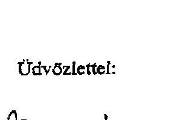

Elnök püspök
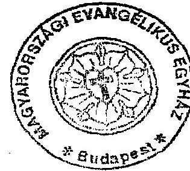

---

# Az OKM fejezetnél a közoktatási feladatok finanszírozási útjának bemutatása 

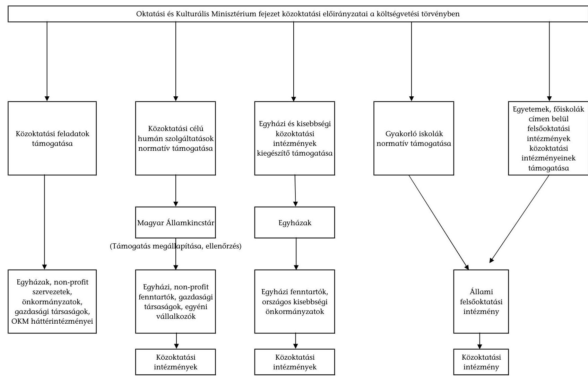

---

# Az ellenőrzésbe vont előirányzati jogcím-támogatásokat felhasználó szervezetek közül az ellenőrzésre kiválasztott intézmények jegyzéke

## Közoktatási feladatok támogatása

|  Sorsz. | Kedvezményezett neve | Kedvezményezett címe | Jogcím megnevezése | 2006. évi támogatás összege  |
| --- | --- | --- | --- | --- |
|  1 | Oktatási Minisztérium | 1055 Budapest, Szulay u. 10-14. | Oktatási nyilvántartások korszerűsítése | 60000000  |
|  2 | EDUCATIO Társadalmi Szolgáltató Közhasznú Társaság | 1134 Budapest, Váci út 37. | Oktatási nyilvántartások korszerűsítése | 14013000  |
|  3 | APERTUS Távoktatás-fejlesztési Módszertani Központ
Tanácsadó és Szolgáltató Közhasznú Társaság | 1088 Budapest, Múzeum u. 17. | Oktatási infokommunikációs technológia | 20000000  |
|  4 | Oktatási Minisztérium | 1055 Budapest, Szulay u. 10-14. | Emelt szintű érettségi vizsga lebonyolítása | 54000000  |
|  5 | Könyvtárellátó Kht. | 1054 Budapest, Honvéd u. 5. | Emelt szintű érettségi vizsga lebonyolítása | 10840000  |
|  6 | Országos Közoktatási Intézet (2007. január 1-jétől Oktatáskutató és Fejlesztő Intézet) | 1051 Budapest, Dorottya u. 8. | Közoktatás-fejlesztési stratégia célprogramjainak támogatása | 18800000  |

## Közoktatási célú humánszolgáltatások normatív támogatása

|  Sorsz. | Intézmény neve | Intézmény címe | Fenntartó neve | A fenntartó 2006. évi
támogatásának összege *  |
| --- | --- | --- | --- | --- |
|  1 | Budapesti Ward Mária Gimnázium (központi intézmény) | 1056 Budapest, Molnár u. 4. | Esztergom-Budapesti Főegyházmegye | 1255780943  |
|  2 | Szent András Általános Iskola (központi intézmény) | 2000 Szentendre, Bajcsy-Zs. u. 4. | Esztergom-Budapesti Főegyházmegye | 1255780943  |
|  3 | Szent Lőrinc Katolikus Általános Iskola (központi
intézmény) | 1183 Budapest, Gyöngyvirág u. 41. | Esztergom-Budapesti Főegyházmegye | 1255780943  |
|  4 | Szent Imre Katolikus Általános Iskola (központi
intézmény) | 2300 Ráckeve, Szent István tér 22. | Székesfehérvári Egyházmegye | 726804634  |
|  5 | Sík Sándor Római Katolikus Általános Iskola, Zalaszabur
(központi intézmény) | 8743 Zalaszabur, Újtelep u. 1/a. | Kaposvári Egyházmegye | 282163358  |
|  6 | Szent Benedek Katolikus Általános Iskola (központi
intézmény) | 9500 Celldömölk, József Attila u. 1. | Szombathelyi Egyházmegye | 351391418  |
|  7 | Nagyboldogasszony Római Katolikus Általános Iskola
(központi intézmény) | 8300 Tapolca, Templomdomb 6. | Veszprémi Főegyházmegye | 926324782  |
|  8 | Liliomkert Katolikus Óvoda (központi intézmény) | 1181 Budapest, Wlassics Gy. u. 66. | Esztergom-Budapesti Főegyházmegye | 1255780943  |
|  9 | Szent Anna Katolikus Óvoda (központi intézmény) | 1047 Budapest, Liszt Ferenc u. 18. | Esztergom-Budapesti Főegyházmegye | 1255780943  |

---

|  10 | Kis Szent Teréz Óvoda (központi intézmény) | 6440 Jánoshalma, Bernáth u. 12. | Kalocsa-Kecskeméti Főegyházmegye | 368334549  |
| --- | --- | --- | --- | --- |
|  11 | Római Katolikus Óvoda, Gerendás (központi intézmény) | 5925 Gerendás, Petőfi u. 1. | Szeged-Csanádi Egyházmegye | 1008319109  |
|  12 | Füli Szent Vince Katolikus Szakiskola (központi intézmény) | 1043 Budapest, Tanoda tér 6. | Esztergom-Budapesti Főegyházmegye | 1255780943  |
|  13 | Szent Gellért Általános Iskola és Gimnázium (központi intézmény) | 1016 Budapest, Gellérthegy u. 7. | Esztergom-Budapesti Főegyházmegye | 1255780943  |
|  14 | Szent Imre Keresztény Általános Iskola és Gimnázium | 2660 Balassagyarmát, Szabó Lőrinc u. 1. | Váci Egyházmegye | 857055723  |
|  15 | Éreki Szent József Kollégium (központi intézmény) | 3300 Eger, Foglár u. 1. | Egri Főegyházmegye | 674804353  |
|  16 | Budapest-Fasori Evangélikus Gimnázium (központi intézmény) | 1071 Budapest, Városligeti fasor 17-21. | Magyarországi Evangélikus Egyház | 2045276177  |
|  17 | Kisdeák Evangélikus Óvoda (központi intézmény) | 1052 Budapest, Deák Ferenc tér 4. | Pesti Evangélikus Egyház Deák Téri Gyülekezet | 2045276177  |
|  18 | Alberti Evangélikus Óvoda (központi intézmény) | 2730 Albertirsa, Pesti út 104. | Alberti Evangélikus Egyházközség | 67287339  |
|  19 | Evangélikus Mezőgazdasági, Kereskedelmi, Informatikai Szakképző Iskola és Kollégium (központi intézmény) | 9730 Kőszeg, Árpád tér 1. | Magyarországi Evangélikus Egyház | 2045276177  |
|  20 | Magyarországi Evangélikus Egyház Budapesti Kollégiumai (központi intézmény) | 1077 Budapest, Rózsák tere 1. | Magyarországi Evangélikus Egyház | 2045276177  |
|  21 | Julianna Református Általános Iskola (központi intézmény) | 1071 Budapest, Városligeti fasor 5. | Budapest-Fasori Református Egyházközség | 53785991  |
|  22 | Szenczi Molnár Albert Református Általános Iskola (központi intézmény) | 1188 Budapest, Nagykőrösi út 55-57. | Budapest-déli Református Egyházmegye, Budapest-Pestszentimrei Református Egyházközség | 87101738  |
|  23 | Tóldi Miklós Református Általános Iskola (központi intézmény) | 4100 Berettyóújfalu, Kálvin tér 4. | Berettyóújfalui Református Egyházközség | 72306571  |
|  24 | Debreceni Református Kollégium Általános Iskolája (központi intézmény) | 4026 Debrecen, Füvészkert u. 2. | Tiszántúli Református Egyházkerület | 617551478  |
|  25 | Ceglédi Református Általános Iskola (központi intézmény) | 2700 Cegléd, Szabadság tér 4. | Ceglédi Református Egyházközségek | 134310350  |
|  26 | Csajági Református Általános Iskola (központi intézmény) | 8163 Csajág, Szabadság u. 1-3. | Csajági Református Egyházközség | 23209789  |
|  27 | Gyökössy Endre Református Óvoda (központi intézmény) | 1022 Budapest, Lorántffy Zs. u. 3. | Dunamelléki Református Egyházkerület | 229982457  |
|  28 | Rákoscsabai Református Egyházközség Betlehem Óvodája (központi intézmény) | 1171 Budapest, Rákoscsaba u. 1. | Budapest-Rákoscsabai Református Egyházközség | 23578008  |

  |
|  29 | Harangvirág Református Óvoda (központi intézmény) | 2119 Pécel, Eszperantó köz 1. | Péceli Református Egyházközség | 23814830  |
|  30 | Géza Fejedelem Református Általános Iskola, Óvoda és Bölcsőde (központi intézmény) | 2621 Verőce, Garam u. 8-10. | Verőcei Református Egyházközség | 62505507  |
|  31 | Baár-Madas Református Gimnázium, Általános Iskola és Kollégium (központi intézmény) | 1022 Budapest, Lorántffy Zs. u. 3. | Dunamelléki Református Egyházkerület | 229982457  |
|  32 | Kunszentmiklósi Református Kollégium Fördős Lajos Általános Iskolája és Baksay Sándor Gimnáziuma (központi intézmény) | 6090 Kunszentmiklós, Kálvin tér 5/17. | Kunszentmiklósi Református Egyházközség | 159644466  |
|  33 | Sárospataki Református Kollégium Gimnáziuma és Általános Iskolája (központi intézmény) | 3950 Sárospatak, Rákóczi u. 1. | Tiszáninneni Református Egyházkerület | 684021816  |

[^0] [^0]: * A fenntartó által működtetett összes közoktatási intézmény után kapott normatív támogatás összege

---

Egyházi és kisebbségi közoktatási intézmények kiegészítő támogatása

|  Sorsz. | Intézmény neve | Intézmény címe | Fenntartó neve | Egyház megnevezése  |
| --- | --- | --- | --- | --- |
|  1 | Budapesti Ward Mária Gimnázium (központi intézmény) | 1056 Budapest, Molnár u. 4. | Esztergom-Budapesti Főegyházmegye | Katolikus  |
|  2 | Szent András Általános Iskola (központi intézmény) | 2000 Szentendre, Bajcsy-Zs. u. 4. | Esztergom-Budapesti Főegyházmegye | Katolikus  |
|  3 | Szent Lőrinc Katolikus Általános Iskola (központi intézmény) | 1183 Budapest, Gyöngyvirág u. 41. | Esztergom-Budapesti Főegyházmegye | Katolikus  |
|  4 | Sik Sándor Római Katolikus Általános Iskola, Zalaszabar (központi intézmény) | 8743 Zalaszabar, Újtelep u. 1/a. | Kaposvári Egyházmegye | Katolikus  |
|  5 | Szent Benedek Katolikus Általános Iskola (központi intézmény) | 9500 Celldömölk, József Attila u. 1. | Szombathelyi Egyházmegye | Katolikus  |
|  6 | Liliomkert Katolikus Óvoda (központi intézmény) | 1181 Budapest, Wlassics Gy. u. 66. | Esztergom-Budapesti Főegyházmegye | Katolikus  |
|  7 | Szent Anna Katolikus Óvoda (központi intézmény) | 1047 Budapest, Liszt Ferenc u. 18. | Esztergom-Budapesti Főegyházmegye | Katolikus  |
|  8 | Római Katolikus Óvoda, Gerendás (központi intézmény) | 5925 Gerendás, Petőfi u. 1. | Szeged-Csanádi Egyházmegye | Katolikus  |
|  9 | Szent Gellért Katolikus Általános Iskola és Gimnázium (központi intézmény) | 1016 Budapest, Gellérthegy u. 7. | Esztergom-Budapesti Főegyházmegye | Katolikus  |
|  10 | Szent Imre Keresztény Általános Iskola és Gimnázium (telephely) | 2660 Balassagyarmat, Köztársaság tér 9. | Váci Egyházmegye | Katolikus  |
|  11 | Budapest-Fasori Evangélikus Gimnázium (központi intézmény) | 1071 Budapest, Városligeti fasor 17-21. | Magyarországi Evangélikus Egyház | Evangélikus  |
|  12 | Kísérő Evangélikus Óvoda (központi intézmény) | 1052 Budapest, Deák Ferenc tér 4. II/1. | Pesti Evangélikus Egyház Deák Téri Gyülekezet | Evangélikus  |
|  13 | Magyarországi Evangélikus Egyház Budapesti Kollégiumai (központi intézmény) | 1077 Budapest, Rózsák tere 1. | Magyarországi Evangélikus Egyház | Evangélikus  |
|  14 | Jallozma Református Általános Iskola (központi intézmény) | 1071 Budapest, Városligeti fasor 5. | Budapest-Fasori Református Egyházközség | Református  |
|  15 | Szenczi Molnár Albert Református Általános Iskola (központi intézmény) | 1188 Budapest, Nagykőrösi út 55-57. | Budapest-déli Református Egyházmegye, Budapest-Pestlőrinci Református Egyházközség | Református  |
|  16 | Toldi Miklós Református Általános Iskola (központi intézmény) | 4100 Berettyóújfalu, Kálvin tér 4. | Berettyóújfalui Református Egyházközség | Református  |
|  17 | Debreceni Református Kollégium Általános Iskolája (központi intézmény) | 4026 Debrecen, Füvészkert u. 2. | Tiszántúli Református Egyházkerület | Református  |
|  18 | Ceglédi Református Általános Iskola (központi intézmény) | 2700 Cegléd, Szabadság tér 4. | Ceglédi Református Egyházközségek | Református  |
|  19 | Gyökösy Endre Református Óvoda (központi intézmény) | 1022 Budapest, Lorántffy Zs. u. 3. | Dunamelléki Református Egyházkerület | Református  |
|  20 | Harangvirág Református Óvoda (központi intézmény) | 2119 Pécel, Eszperantó köz 1. | Péceli Református Egyházközség | Református  |
|  21 | Géza Fejedelem Református Általános Iskola, Óvoda és Bölcsőde (központi intézmény) | 2621 Verőce, Garam u. 8-10. | Verőcei Református Egyházközség | Református  |
|  22 | Kunszentmiklósi Református Kollégium Fördős Lajos Általános Iskolája és Baksay Sándor Gimnáziuma (központi intézmény) | 6090 Kunszentmiklós, Kálvin tér 5/17. | Kunszentmiklósi Református Egyházközség | Református  |

---

|  Sorsz. | Intézmény neve | Intézmény címe | Fenntartó neve | 2006. évi támogatás összege  |
| --- | --- | --- | --- | --- |
|  1 | Eötvös Loránd Tudományegyetem Ápáczai Csere János Gyakorlógimnázium és Kollégium | 1053 Budapest, Papnövelde u. 4-6. | Eötvös Loránd Tudományegyetem | 369 051 080  |
|  2 | Magyar Táncművészeti Főiskola Nádasi Ferenc Gimnáziuma | 1145 Budapest, Columbus u. 87. | Magyar Táncművészeti Főiskola | 377 716 220  |
|  3 | Szegedi Tudományegyetem Ságvári Endre Gyakorlógimnázium | 6722 Szeged, Szentháromság u. 2. | Szegedi Tudományegyetem | 375 007 720  |
|  4 | ELTE Trefort Ágoston Gyakorlóiskola | 1088 Budapest, Trefort u. 8. | Eötvös Loránd Tudományegyetem | 289 955 920  |
|  5 | Eötvös Loránd Tudományegyetem Radnóti Miklós Gyakorló Általános Iskola és Gyakorló Gimnázium | 1146 Budapest, Cházár András u. 10. | Eötvös Loránd Tudományegyetem | 448 847 220  |
|  6 | Debreceni Egyetem Arany János Gyakorló Iskola | 4026 Debrecen, Hajó u. 18-20. | Debreceni Egyetem | 288 148 420  |
|  7 | Ápáczai Csere János Gyakorló Általános Iskola | 4400 Nyíregyháza, Erdő sor 7. | Nyíregyházi Főiskola | 373 632 300  |
|  8 | Nyugat-Magyarországi Egyetem Ápáczai Csere János Főiskolai Kar Gyakorló Általános Iskolája | 9022 Győr, Gárdonyi Géza u. 2-4. | Nyugat-Magyarországi Egyetem | 210 471 420  |
|  9 | Pécsi Tudományegyetem 1. sz. Gyakorló Általános Iskola | 7624 Pécs, Alkotmány u. 38. | Pécsi Tudományegyetem | 249 074 500  |
|  10 | Szegedi Tudományegyetem Ságvári Endre Gyakorló Általános Iskola | 6722 Szeged, Boldogasszony sgt. 3-5. | Szegedi Tudományegyetem | 252 161 100  |
|  11 | Aranykapu Gyakorló Óvoda | 9400 Sopron, Ferenczy János u. 5. | Nyugat-Magyarországi Egyetem | 45 500 700  |
|  12 | Nyíregyházi Főiskola Eötvös József Gyakorló Általános Iskola és Gimnázium | 4400 Nyíregyháza, Ungvár st. 12. | Nyíregyházi Főiskola | 531 394 426  |
|  13 | Pécsi Tudományegyetem Deák Ferenc Gyakorló Gimnázium és Általános Iskola | 7624 Pécs, Öz u. 2. | Pécsi Tudományegyetem | 362 813 580  |
|  14 | Semmelweis Egyetem Gyakorló Általános Iskola és Gimnázium | 1125 Budapest, Diana u. 35-37. | Semmelweis Egyetem | 62 197 073  |
|  15 | Eszterházy Károly Főiskola Gyakorló Általános Iskola, Középiskola és Alapfokú Művészeti Oktatási Intézmény | 3300 Eger, Eszterházy tér 1. | Eszterházy Károly Főiskola | 705 273 913  |
|  16 | Bolyai János Gyakorló Általános Iskola és Gimnázium | 9700 Szombathely, Bolyai János u. 11. | Berzsenyi Dániel Főiskola | 551 561 620  |
|  17 | Pécsi Tudományegyetem Babits Mihály Gyakorlógimnázium és Szakközépiskola | 7633 Pécs, dr. Veress Endre u. 15. | Pécsi Tudományegyetem | 478 766 660  |
|  18 | NYME Both Gyula Szakközépiskola és Kollégium | 9400 Sopron, Szent György u. 9. | Nyugat-Magyarországi Egyetem | 533 750 000  |
|  19 | Tessedik Sámuel Főiskola Pedagógiai Főiskolai Kar Gyakorló Óvoda és Gyakorló Általános Iskola | 5540 Szarvas, Szabadság út 4. | Tessedik Sámuel Főiskola | 118 238 033  |
|  20 | Képző- és Iparművészeti Szakközépiskola | 1093 Budapest, Török Pál u. 1. | Magyar Képzőművészeti Egyetem | 446 479 000  |

- Helyszíni ellenőrzésbe vont közoktatási intézmények és fenntartóik

---

## **A közoktatási feladatok finanszírozására fordított pénzeszközök az Oktatási és Kulturális Minisztérium fejezetnél**

|  Szé | Előirányzat, cím száma | Előirányzat megnevezése | 2001. év |  |  | 2006. év |  |  | 2007. év |  |   |
| --- | --- | --- | --- | --- | --- | --- | --- | --- | --- | --- | --- |
|   |  |  | Eredeti | Módosított |  | Eredeti | Módosított |  | Eredeti | Módosított | Teljesítés  |
|   |  |  | előirányzat |  |  | előirányzat |  |  | előirányzat |  |   |
|  1 | 2 |  | Egyetemek, főiskolák címből közoktatási intézmények támogatása | 11 170,0 | 11 348,4 | 11 343,7 | 11 802,0 | 11 893,2 | 11 666,2 | 11 772,0 | 11 967,1  |
|  2 | 11/02/03 |  | Közoktatási célú humánszolgáltatás és kiegészítő támogatás (3+10) | 72 948,0 | 84 860,4 | 83 923,4 | 80 320,0 | 86 834,3 | 86 671,2 | 84 500,0 | 100 373,6  |
|  3 | 11/02/03/01 |  | Humánszolgáltatások normatív állami támogatása (4-9) | 59 988,0 | 72 384,7 | 71 573,9 | 66 410,0 | 72 921,7 | 72 899,6 | 70 590,0 | 74 817,4  |
|  4 | 11/02/03/01/01 (2005) |  | Kincstári szolgáltatási díj | 47,0 | 47,0 | 51,4 |  |  |  |  |   |
|  5 | 11/02/03/01/02 (2005) |  | Oktatási célú humánszolgáltatások normatív állami támogatása | 58 202,0 | 71 508,5 | 70 711,5 |  |  |  |  |   |
|   | 11/02/03/01/01 (2004-2006-2007) |  | Oktatási célú humánszolgáltatások normatív állami támogatása |  |  |  | 64 210,0 | 71 115,3 | 71 098,4 | 68 080,0 |

 71 416,1  |
|  6 | 11/02/03/01/03 (2005) |  | Közoktatási megállapodások | 798,0 | 827,7 | 827,7 |  |  |  |  |   |
|   | 11/02/03/01/02 (2004-2006-2007) |  | Közoktatási megállapodások |  |  |  | 2 000,0 | 1 779,0 | 1 771,7 | 2 000,0 | 2 933,0  |
|  7 | 11/02/03/01/04 (2005-2007) |  | Érkező év elszámolások alapján kiutalandó támogatás | 890,0 | 0,0 | 0,0 |  |  |  | 100,0 | 34,3  |
|   | 11/02/03/01/03 (2004-2006) |  | Érkező év elszámolások alapján kiutalandó támogatás |  |  |  | 100,0 | 13,4 | 13,4 |  |   |
|  8 | 11/02/03/01/03 (2007) |  | Közoktatási megállapodások lebonyolításának támogatása |  |  |  |  |  |  | 350,0 | 350,0  |
|  9 | 11/02/03/01/04 (2004-2006) |  | Könyvvizsgálói díjra adott támogatás |  |  |  | 100,0 | 14,1 | 14,1 |  |   |
|   | 11/02/03/01/05 (2005-2007) |  | Könyvvizsgálói díjra adott támogatás | 50,0 | 1,5 | 1,5 |  |  |  | 60,0 | 62,0  |
|  10 | 11/02/03/02 |  | Egyházi és kisebbségi közoktatási intézmények kiegészítő támogatása (11-15) | 12 960,0 | 12 475,7 | 12 351,5 | 13 910,0 | 13 912,6 | 13 771,6 | 13 910,0 | 25 558,2  |
|  11 | 11/02/03/02/01 (2005) |  | Kincstári szolgáltatási díj | 10,1 | 10,1 | 7,5 |  |  |  |  |   |
|  12 | 11/02/03/02/02 (2005) |  | Egyházi közoktatási intézmények kiegészítő támogatása | 11 550,9 | 11 066,6 | 11 060,1 |  |  |  |  |   |
|  12.1 |  |  | Magyar Katolikus Egyház |  |  | 6 538,3 |  |  |  |  |   |
|  12.2 |  |  | Magyarország Református Egyház |  |  | 2 827,9 |  |  |  |  |   |
|  12.3 |  |  | Magyarország Evangélikus Egyház |  |  | 1 175,7 |  |  |  |  |   |
|  12.4 |  |  | Egyéb egyházak |  |  | 514,3 |  |  |  |  |   |
|   | 11/02/03/02/01 (2004-2006-2007) |  | Egyházi közoktatási intézmények kiegészítő támogatása |  |  |  | 12 580,4 | 11 647,9 | 11 516,8 | 13 020,5 | 17 313,9  |
|  12.1 |  |  | Magyar Katolikus Egyház |  |  |  |  |  | 6 661,5 |  |   |
|  12.2 |  |  | Magyarország Református Egyház |  |  |  |  |  | 3 013,1 |  |   |
|  12.3 |  |  | Magyarország Evangélikus Egyház |  |  |  |  |  | 1 221,6 |  |   |
|  12.4 |  |  | Egyéb egyházak |  |  |  |  |  | 621,6 |  |   |
|  13 | 11/02/03/02/03 (2005) |  | Országos kisebbségi önkormányzatok kiegészítő támogatása | 345,0 | 345,0 | 283,7 |  |  |  |  |   |
|   | 11/02/03/02/02 (2004-2006-2007) |  | Országos kisebbségi önkormányzatok kiegészítő támogatása |  |  |  | 310,0 | 315,1 | 315,1 | 367,0 | 480,9  |
|  14 | 11/02/03/02/04 (2005) |  | Érkező év elszámolásokból adódó kötelezettségek | 934,0 | 934,0 | 922,0 |  |  |  |  |   |
|   | 11/02/03/02/03 (2004-2006-2007) |  | Érkező év elszámolásokból adódó kötelezettségek |  |  |  | 950,0 | 1 880,0 | 1 877,4 | 100,0 | 7 340,9  |
|  15 | 11/02/03/02/05 (2005) |  | Nyilvántartási, ellenőrzési, monitoring feladatok | 100,0 | 100,0 | 78,5 |  |  |  |  |   |
|   | 11/02/03/02/04 (2006-2007) |  | Nyilvántartási, ellenőrzési, monitoring feladatok |  |  |  | 69,6 | 69,6 | 62,3 | 422,5 | 422,4  |
|  16 | 11/02/03/02/05 (2004) |  | Egyházakat a zárszámolási törvény alapján megillető kiegészítő támogatás |  |  |  |  |  |  |  |   |
|  16.1 |  |  | Magyar Katolikus Egyház |  |  |  |  |  |  |  |   |
|  16.2 |  |  | Magyarország Református Egyház |  |  |  |  |  |  |  |   |
|  16.3 |  |  | Magyarország Evangélikus Egyház |  |  |  |  |  |  |  |   |
|  16.4 |  |  | Egyéb egyházak |  |  |  |  |  |  |  |   |
|  17 | 11/02/17 |  |  |  |  |  |  |  |  |  |   |
|  18 | 11/04 |  |  |  |  |  |  |  |  |  |   |

---

|  Szám-
ozom | Előirányzat, cím száma | Előirányzat megnevezése | 2005. év |  |  | 2006. év |  |  | 2007. év |  |   |
| --- | --- | --- | --- | --- | --- | --- | --- | --- | --- | --- | --- |
|   |  |  | Eredeti | Módosított |  | Eredeti | Módosított |  | Eredeti | Módosított |   |
|   |  |  | előirányzat |  |  | előirányzat |  |  | előirányzat |  |   |
|  19 | 11/04/01 | Közoktatási feladatok és szakmai programok |  |  |  |  |  |  |  |  |   |
|  20 | 11/04/02 | Közoktatási tankönyvellátás |  |  |  |  |  |  |  |  |   |
|  21 | 11/04/03 | Közoktatási fejlesztés és számítógépes hálózat kialakítása |  |  |  |  |  |  |  |  |   |
|  22 | 11/04/04 | Pedagógus szakvizsga és továbbképzés |  |  |  |  |  |  |  |  |   |
|  23 | 11/04/08 | Kormányzati testületek |  |  |  |  |  |  |  |  |   |
|  24 | 11/04/09 | Nem önkormányzati fenntartású közoktatási intézmények központi előirányzata | 170,0 | 170,0 | 170,0 | 143,0 | 133,0 | 133,0 | 100,0 | 108,3 | 99,6  |
|  25 | 11/04/10 | Egyházi közoktatási feladatok támogatása |  |  |  | 0,0 | 948,4 | 948,4 |  |  |   |
|  26 | 11/04/12 | Értékelési és minőségbiztosítási programok |  |  |  |  |  |  |  |  |   |
|  27 | 11/04/17 | Komplexiskolai tehetséggondozó program |  |  |  |  |  |  |  |  |   |
|  28 | 11/04/18 | Emelt szintű érettségi vizsga lebonyolítása | 1 680,0 | 1 340,0 | 1 339,7 | 291,0 | 305,0 | 305,0 | 1 019,0 | 1 019,0 | 980,5  |
|  29 | 11/04/19 | Közoktatási vizsgamódszerek fejlesztése | 100,0 | 100,0 | 99,9 |  |  |  |  |  |   |
|  30 | 11/04/20 | Oktatási nyilvántartások korszerűsítése | 1 050,0 | 945,0 | 894,0 | 369,0 | 319,0 | 319,0 |  |  |   |
|  31 | 11/04/21 | Oktatási informatikai kommunikációs technológia | 760,0 | 685,2 | 668,0 | 97,0 | 75,0 | 73,4 |  |  |   |
|  32 | 11/04/22 | Országos szövetségek, testületek támogatása | 73,0 | 73,0 | 72,7 | 78,0 | 83,1 | 83,1 |  |  |   |
|  33 | 11/04/23 | Közoktatási hatékonyságát javító mérés, értékelés | 270,0 | 270,0 | 269,3 | 281,0 | 281,0 | 281,0 | 281,0 | 281,0 | 255,6  |
|  34 | 11/04/24 | Nemzeti Alaptanterv megvalósulásának támogatása | 100,0 | 130,0 | 148,6 |  |  |  |  |  |   |
|  35 | 11/04/26 | Sajátos nevelési igényű gyermekek támogatása | 380,0 | 530,0 | 530,0 |  |  |  |  |  |   |
|  36 | 11/04/27 | Gyógypedagógiai tankönyvellátás támogatása | 120,0 | 120,0 | 119,9 | 68,0 | 68,0 | 68,0 | 141,0 |

 186,9 | 163,4  |
|  37 | 11/04/28 | Sajátos nevelési igényű gyerekek fejlesztésének segítése | 150,0 | 150,0 | 149,2 | 68,0 | 68,0 | 68,0 |  |  |   |
|  38 | 11/04/29 | Közzétételi fejlesztési stratégia célprogramjainak támogatása/Közoktatás speciális feladatainak
tárgyalgatása | 180,0 | 198,0 | 196,9 | 97,0 | 230,9 | 230,5 | 300,0 | 307,6 | 305,1  |
|  39 | 11/04/30 | Közzétételi fejlesztési előirányzat |  |  |  | 300,0 | 300,0 | 0,0 | 200,0 | 200,0 | 0,0  |
|  40 | 11/04/31 | Közzétételi ellenőrzési, pályázat-lebonyolítási feladatok |  |  |  |  |  |  | 300,0 | 300,0 | 267,9  |
|  41 |  | Összesen (1+17+18) | 89 531,0 | 101 139,9 | 100 130,0 | 94 013,0 | 101 538,9 | 100 846,9 | 98 733,0 | 114 745,5 | 112 717,9  |

Készítette: 2008. február 15-én fejezeti adatszolgáltatásként az ORM Szociális és Nemzetiségi Főosztálya és Költségvetési Főosztálya.

---

5. sz. melléklet

a V-10-130/2007-2008. sz. jelentéshez

# **ÖSSZEGZŐ TÁBLÁZATOK**

## **a közoktatás adatairól és az ellenőrzésbe vont intézmények tanúsítványi adataiból**

---

# Táblázatok jegyzéke 

| 1. táblázat: | A költségvetés közoktatási kiadásainak aránya a GDP %-ában az OECD-országokkal összehasonlításban |
| :--: | :--: |
| 2. táblázat: | Diák/tanár (gyermek/nevelő) arány képzési szintenként és fenntartók szerint a magyar közoktatásban |
| 3. táblázat: | Az állami (önkormányzati) fenntartású intézmények közoktatási kiadásai 2004-2006. (folyó áron) |
| 4. táblázat: | Az állami (önkormányzati) fenntartású intézmények közoktatási kiadásainak és a nem állami intézményeknek nyújtott közoktatási támogatások változása 2004-2006. (folyóés változatlan áron) |
| 5/a. táblázat: | Óvodás gyermekek és tanulók száma képzési szintenként és fenntartók szerint |
| 5/b. táblázat: | Pedagógusok száma képzési szintenként és fenntartók szerint |
| 6. táblázat: | A fajlagos közoktatási kiadások alakulása az állami (önkormányzati) intézményekben |
| 7. táblázat: | Iskolafenntartónkénti felsőoktatási felvételi arányok 2002-2006 között |
| 8. táblázat: | A kétszintű érettségi vizsgák átlagai iskolafenntartók szerint 2005-2006-ban |
| 9. táblázat: | A felsőoktatási felvételre jelentkezők nyelvvizsgaarányai iskolafenntartók szerint 2002-2006 között |
| 10. táblázat: | Az egyházi oktatás aránya intézménytípusonként a 2004/2005. és a 2006/2007. tanévek között |
| 11. táblázat: | Közoktatási célú normatív támogatások alakulása az ellenőrzésbe vont közoktatási intézményeknél |
| 12. táblázat: | Összegző táblázat az ellenőrzésbe vont óvodák közoktatási adatairól |
| 13. táblázat: | Táblázat az ellenőrzésbe vont óvodák létszám adatairól |
| 14. táblázat: | Összegző táblázat az ellenőrzésbe vont általános iskolák közoktatási adatairól |
| 15. táblázat: | Táblázat az ellenőrzésbe vont gyakorló általános iskolák és az egyházi általános iskolák létszám adatairól |
| 16. táblázat: | Összegző táblázat az ellenőrzésbe vont középiskolák közoktatási adatairól |
| 17. táblázat: | Táblázat az ellenőrzésbe vont gyakorló középiskolák és az egyházi középiskolák létszám adatairól |
| 18. táblázat: | Összegző táblázat az ellenőrzésbe vont kollégiumok közoktatási adatairól |

---

# A költségvetés közoktatási kiadásainak aránya a GDP %-ában az OECD-országokkal összehasonlításban

|  Év | Óvoda |  | Alap- és középfok |  | Összesen |   |
| --- | --- | --- | --- | --- | --- | --- |
|   | OECD | Magyarország | OECD | Magyarország | OECD | Magyarország  |
|  2000 | 0,4 | 0,8 | 3,5 | 2,9 | 3,9 | 3,7  |
|  2001 | 0,4 | 0,7 | 3,8 | 3,1 | 4,2 | 3,8  |
|  2002 | 0,5 | 0,7 | 3,8 | 3,3 | 4,3 | 4,1  |
|  2003 | 0,5 | 0,8 | 3,9 | 3,7 | 4,4 | 4,5  |
|  2004 | 0,5 | 0,8 | 3,8 | 3,5 | 4,3 | 4,3  |
|  2005 |  | 0,8 |  | 3,5 |  | 4,3  |
|  2006 |  | 0,8 |  | 3,4 |  | 4,2  |

## Forrás:

Education at a Glance 2004., 2005., 2006., 2007.

---

# Diák/tanár (gyermek/nevelő) arány képzési szintenként és fenntartók szerint a magyar közoktatásban

|  Tanév | Óvoda |  |  |  | Alapfokú oktatás |  |  |  | Középfokú oktatás |  |  |  | Közoktatás összesen |  |  |   |
| --- | --- | --- | --- | --- | --- | --- | --- | --- | --- | --- | --- | --- | --- | --- | --- | --- |
|   | Állami | Egyházi | Egyéb | Összesen | Állami | Egyházi | Egyéb | Összesen | Állami | Egyházi | Egyéb | Összesen | Állami | Egyházi | Egyéb | Összesen  |
|  2001/2002 | 10,6 | 10,0 | 9,2 | 10,6 | 10,5 | 9,9 | 8,3 | 10,5 | 13,8 | 12,0 | 26,8 | 14,4 | 11,4 | 10,8 | 18,8 | 11,6  |
|  2004/2005 | 10,7 | 10,2 | 9,1 | 10,6 | 10,3 | 10,2 | 8,3 | 10,2 | 13,1 | 11,6 | 22,0 | 13,8 | 11,1 | 10,5 | 16,8 | 11,3  |
|  2005/2006 | 10,7 | 10,6 | 9,1 | 10,7 | 10,2 | 9,4 | 8,0 | 10,1 | 12,9 | 11,9 | 20,9 | 13,5 | 11,0 | 10,5 | 16,4 | 11,2  |
|  2006/2007 | 10,8 | 10,6 | 9,3 | 10,7 | 10,0 | 9,9 | 8,2 | 9,9 | 12,7 | 11,5 | 16,8 | 13,1 | 10,9 | 10,6 | 14,2 | 11,1  |

## Forrás:

OKM Statisztikai Tájékoztató Oktatási Évkönyv 2006/2007 adatai alapján saját számítások.

---

# Az állami (önkormányzati) fenntartású intézmények közoktatási kiadásai 2004-2006. (folyó áron)

|  Év | Közoktatási kiadások (állami, önkormányzati) |  |  |  |  |  |  |  |  |  |  |  |  |   |
| --- | --- | --- | --- | --- | --- | --- | --- | --- | --- | --- | --- | --- | --- | --- |
|   | Óvoda |  |  | Alapfokú oktatás* |  |  | Középfokú oktatás |  |  | Egyéb oktatás |  |  | Mindösszesen |   |
|   | Központi | Önkormányzati | Összesen | Központi | Önkormányzati | Összesen | Központi | Önkormányzati | Összesen | Központi | Önkormányzati | Összesen | Központi | Önkormányzati  |
|  2004 | 1416 | 161232 | 162648 | 21372 | 610723 | 632095 |  |  |  | 45591 | 43577 | 89168 | 68379 | 815532  |
|  2005 | 1458 | 174112 | 175570 | 10798 | 431732 | 442530 | 10556 | 224735 | 235291 | 50217 | 49951 | 100168 | 73029 | 880530  |
|  2006 | 1466 | 182547 | 184013 | 10321 | 440259 | 450580 | 11094 | 239804 | 250898 | 51883 | 54217 | 106100 | 74764 | 916827  |

- 2004-ben alap-és középfokú oktatás együtt

## Forrás:

OKM Statisztikai Tájékoztató Oktatási Évkönyv 2004/2005., 2005/2006.

---

# Az állami (önkormányzati) fenntartású intézmények közoktatási kiadásainak és a nem állami intézményeknek nyújtott közoktatási támogatások változása 2004-2006. (folyó- és változatlan áron)

|  Év | Állami
közoktatási
intézmények
közoktatási
kiadásai | Nem állami
közoktatási
intézmények
közoktatási
támogatása | Összesen | Fogyasztói
árindex
(előző
év=100\%) | Összes kiadás növekedési üteme
(előző év = 100\%) |  | Összes kiadás változása
(2004 év = 100\%) |   |
| --- | --- | --- | --- | --- | --- | --- | --- | --- |
|   | folyó áron (M Ft) |  |  |  | Folyó áron | Összehasonlító áron | Folyó áron | Összehasonlító áron  |
|  2004 | 883911 | 79792 | 963703 |  |  |  | 100,0 | 100,0  |
|  2005 | 953559 | 83308 | 1036867 | 103,6 | 107,6 | 103,9 | 107,6 | 103,9  |
|  2006 | 991591 | 86821 | 1078412 | 103,9 | 104,0 | 100,1 | 111,9 | 104,0  |

## Forrás:

OKM Statisztikai Tájékoztató Oktatási Évkönyv 2004/2005., 2005/2006. KSH tájékoztató (árindex). Kigyűjtés költségvetési zárszámadási törvényekből.

---

5/a. táblázat

# **Óvodás gyermekek és tanulók száma képzési szintenként és fenntartók szerint**

|  Tanév | Óvoda | Alapfokú oktatás | Középfokú oktatás | Közoktatási gyermek létszám összesen | Összes gyermek/tanuló létszám változása  |
| --- | --- | --- | --- | --- | --- |
|   | Állami | Egyházi | Egyéb | Összesen | Állami  |
|  2001/2002 | 328 776 | 5 988 | 7 521 | 342 285 | 901 428  |
|  2004/2005 | 310 490 | 7 992 | 7 517 | 325 999 | 837 421  |
|  2005/2006 | 310 657 | 8 302 | 7 646 | 326 605 | 807 439  |
|  2006/2007 | 310 136 | 8 875 | 8 633 | 327 644 | 774 426  |

**Forrás:**

OKM Statisztikai Tájékoztató Oktatási Évkönyv 2006/2007.

---

5/b. táblázat

# **Pedagógusok száma képzési szintenként és fenntartók szerint**

|  Tanév | Óvoda | Alapfokú oktatás | Középfokú oktatás | Pedagógusok száma összesen | Összes pedagógus létszám változása  |
| --- | --- | --- | --- | --- | --- |
|   | Állami | Egyházi | Egyéb | Összesen | Állami  |
|  2001/2002 | 30 911 | 597 | 819 | 32 327 | 85 490  |
|  2004/2005 | 29 122 | 755 | 827 | 30 704 | 81 289  |
|  2005/2006 | 28 909 | 781 | 841 | 30 531 | 79 448  |
|  2006/2007 | 28 776 | 844 | 930 | 30 550 | 77 422  |

  |

## **Forrás:**

OKM Statisztikai Tájékoztató Oktatási Évkönyv 2006/2007.

---

# A fajlagos közoktatási kiadások alakulása az állami (önkormányzati) intézményekben

Adatok: E Ft/fő

|  Tanév | Óvoda | Alap- és középfokú oktatás | Összesen  |
| --- | --- | --- | --- |
|  $\mathbf{2 0 0 4}$ | 523,8 | 459,9 | 471,6  |
|  $\mathbf{2 0 0 5}$ | 565,2 | 505,3 | 516,5  |
|  $\mathbf{2 0 0 6}$ | 593,3 | 539,9 | 550,2  |

Forrás: 3. és 5/a. táblázat adatai

---

# Iskolafenntartónkénti felsőoktatási felvételi arányok 2002-2006 között

|  Iskolafenntartó szervezet | Felsőoktatási felvételi arány (F/L) mutató |  |  |  |  |  |  |  | Fejlődés 2002-2006-ra |   |
| --- | --- | --- | --- | --- | --- | --- | --- | --- | --- | --- |
|   | 2002 | 2003 | 2004 | 2005 | 2006 | 1991-1995 | 1996-2000 | 2002-2006 | 1996-2000-hez képest | 1991-1995-höz képest  |
|  Megyei önkormányzat | 27,9 | 28,5 | 30,8 | 28,3 | 24,5 | 17,4 | 21,5 | 28 | 6,5 | 10,6  |
|  Települési önkormányzat | 45,7 | 47,8 | 49,3 | 44,1 | 42,9 | 29 | 36,8 | 45,9 | 9,1 | 16,9  |
|  Központi költségvetési szerv | 51,4 | 52,4 | 54,6 | 51 | 47,1 | 38,8 | 39,6 | 51,2 | 11,6 | 12,4  |
|  Egyház, felekezet | 63,8 | 64,8 | 65,3 | 62,3 | 59,2 | 40 | 55,9 | 63 | 7,1 | 23,0  |
|  Alapítvány | 33,9 | 33,3 | 36,8 | 33,5 | 33,8 | 26,9 | 30,2 | 34,3 | 4,1 | 7,4  |
|  Egyéb | 30,6 | 28,5 | 36 | 23,1 | 29,9 | 20,7 | 23,5 | 29,5 | 6,0 | 8,8  |
|  Országos átlag | 42,2 | 43,7 | 45,6 | 41,5 | 39,3 | 26,7 | 33,6 | 42,4 | 8,8 | 15,7  |

Forrás: A középiskolai munka néhány mutatója, Oktatáskutató és Fejlesztő Intézet 2007

---

# A kétszintű érettségi vizsgák átlagai iskolafenntartók szerint 2005-2006-ban

|  Iskolafenntartó szervezet | Emelt szint |  | Középszint |  | Emelt szint |  | Középszint |  | Emelt szint |  | Középszint |   |
| --- | --- | --- | --- | --- | --- | --- | --- | --- | --- | --- | --- | --- |
|   | 2005 |  |  |  | 2006 |  |  |  | 2005-2006 |  |  |   |
|   | Dolgozat | Átlag (%) | Dolgozat | Átlag (%) | Dolgozat | Átlag (%) | Dolgozat | Átlag (%) | Dolgozat | Átlag (%) | Dolgozat | Átlag (%)  |
|  Megyei önkormányzat | 1657 | 69,7 | 65959 | 57,4 | 4370 | 63,8 | 80879 | 56 | 6027 | 65,4 | 146838 | 56,6  |
|  Települési önkormányzat | 9475 | 72,6 | 167101 | 62,3 | 20956 | 67,1 | 199335 | 60,9 | 30431 | 68,8 | 366436 | 61,5  |
|  Központi költségvetési szerv | 930 | 78,8 | 7493 | 64,2 | 1378 | 73,4 | 9174 | 61,7 | 2308 | 75,6 | 16667 | 62,8  |
|  Egyház, felekezet | 1935 | 73,2 | 20897 | 70 | 4131 | 67,3 | 23951 | 67,3 | 6066 | 69,2 | 44848 | 68,5  |
|  Alapítvány | 286 | 68,8 | 9128 | 60,2 | 1027 | 64 | 13214 | 58,3 | 1313 | 65,1 | 22342 | 59,1  |
|  Egyéb | 21 | 61,1 | 1248 | 56,7 | 128 | 57,8 | 2109 | 57,9 | 149 | 58,3 | 3357 | 57,4  |
|  Összesen | 14304 | 72,7 | 271826 | 61,7 | 31990 | 66,8 | 328662 | 60,1 | 46294 | 68,6 | 600488 | 60,8  |

Forrás: A középiskolai munka néhány mutatója, Oktatáskutató és Fejlesztő Intézet 2007

---

# A felsőoktatási felvételre jelentkezők nyelvvizsgaarányai iskolafenntartók szerint 2002-2006 között

|  Iskolafenntartó szervezet | Jelentkezők nyelvvizsgáinak száma/jelentkezők száma |  |  |  |  |  | Felvettek nyelvvizsgáinak száma/felvettek száma |  |  |  |  |   |
| --- | --- | --- | --- | --- | --- | --- | --- | --- | --- | --- | --- | --- |
|   | 02-06 | 2002 | 2003 | 2004 | 2005 | 2006 | 02-06 | 2002 | 2003 | 2004 | 2005 | 2006  |
|  Megyei önkormányzat | 37,2 | 30,1 | 35,9 | 36,9 | 38,6 | 45,2 | 47,9 | 40,1 | 45,6 | 47,2 | 49,5 | 58,4  |
|  Települési önkormányzat | 48,8 | 40,9 | 46,8 | 48,6 | 51,2 | 56,4 | 57,2 | 49 | 53,2 | 56,8 | 60,5 | 66,8  |
|  Központi költségvetési szerv | 61,7 | 51,4 | 60,8 | 62,2 | 65,6 | 68,1 | 71,4 | 61,4 | 70 | 71,2 | 74,9 | 79,3  |
|  Egyház, felekezet | 54,9 | 46,8 | 50,1 | 55,4 | 58,4 | 62 | 61,3 | 53,4 | 55,4 | 61,6 | 64,3 | 71,1  |
|  Alapítvány | 51,2 | 43,8 | 55,1 | 51,8 | 50,6 | 54,7 | 59,2 | 50,3 | 59,1 | 59,9 | 59,6 | 65,3  |
|  Egyéb | 47,8 | 54,8 | 46,8 | 52 | 45,5 | 41,3 | 51,3 | 55,9 | 45,7 | 50 | 50 | 54,3  |
|  Összesen | 47,6 | 39,8 | 45,7 | 47,5 | 49,9 | 55,2 | 56,6 | 48,4 | 52,8 | 56,2 | 59,5 | 66,3  |

Forrás: A középiskolai munka néhány mutatója 2006, Oktatáskutató és Fejlesztő Intézet 2007

---

# Az egyházi oktatás aránya intézménytípusonként a 2004/2005. és a 2006/2007. tanévek között

|  Iskolatípus | Megnevezés | Összes |  |  | Egyházi fenntartásban működő intézmények |  |  | Az adott intézménykategória %-ában |  |  | Az egyházi adatok %-ában |  |   |
| --- | --- | --- | --- | --- | --- | --- | --- | --- | --- | --- | --- | --- | --- |
|   |  | 2004/2005
tanév | 2005/2006
tanév | 2006/2007
tanév | 2004/2005
tanév | 2005/2006
tanév | 2006/2007
tanév | 2004/2005
tanév | 2005/2006
tanév | 2006/2007
tanév | 2004/2005
tanév | 2005/2006
tanév | 2006/2007
tanév  |
|  Óvoda | Intézmény | 3405 | 3294 | 3223 | 105 | 107 | 113 | 3,08 | 3,25 | 3,51 | 26,05 | 25,48 | 26,22  |
|   | Tanuló | 325999 | 326605 | 327644 | 7992 | 8302 | 8875 | 2,45 | 2,54 | 2,71 | 8,91 | 8,84 | 9,30  |
|   | Pedagógus | 30704 | 30531 | 30550 | 755 | 781 | 844 | 2,46 | 2,56 | 2,76 | 8,88 | 8,77 | 9,41  |
|  Általános Iskola | Intézmény | 3293 | 3141 | 3064 | 165 | 171 | 171 | 5,01 | 5,44 | 5,58 | 40,94 | 40,71 | 39,68  |
|   | Tanuló | 890551 | 861858 | 831262 | 39811 | 42139 | 42076 | 4,47 | 4,89 | 5,06 | 44,39 | 44,89 | 44,10  |
|   | Pedagógus | 87116 | 85469 | 83606 | 4225 | 4477 | 4378 | 4,85 | 5,24 | 5,24 | 49,70 | 50,25 | 48,79  |
|  Gimnázium | Intézmény | 614 | 620 | 627 | 92 | 96 | 99 | 14,98 | 15,48 | 15,79 | 22,83 | 22,86 | 22,97  |
|   | Tanuló | 238850 | 243878 | 246267 | 32895 | 34177 | 35129 | 13,77 | 14,01 | 14,26 | 36,68 | 36,41 | 36,82  |
|   | Pedagógus | 17816 | 18213 | 19284 | 2944 | 3044 | 3081 | 16,52 | 16,71 | 15,98 | 34,63 | 34,17 | 34,34  |
|  Szakközépiskola | Intézmény | 794 | 797 | 807 | 23 | 24 | 27 | 2,90 | 3,01 | 3,35 | 5,71 | 5,71 | 6,26  |
|   | Tanuló | 290139 | 287290 | 288156 | 5919 | 5908 | 5848 | 2,04 | 2,06 | 2,03 | 6,60 | 6,29 | 6,13  |
|   | Pedagógus | 20756 | 20871 | 21254 | 337 | 351 | 363 | 1,62 | 1,68 | 1,71 | 3,96 | 3,94 | 4,05  |
|  Szakiskola | Intézmény | 475 | 496 | 507 | 18 | 22 | 21 | 3,79 | 4,44 | 4,14 | 4,47 | 5,24 | 4,87  |
|   | Tanuló | 126908 | 126211 | 124466 | 3071 | 3350 | 3475 | 2,42 | 2,65 | 2,79 | 3,42 | 3,57 | 3,64  |
|   | Pedagógus | 8577 | 8938 | 8947 | 240 | 256 | 307 | 2,80 | 2,86 | 3,43 | 2,82 | 2,87 | 3,42  |

Forrás: OKM Statisztikai Tájékoztató, Oktatási Évkönyv 2006/2007

---

# Közoktatási célú normatív támogatások alakulása az ellenőrzésbe vont közoktatási intézményeknél

|  Sorszám | Intézmények megnevezése | Normatív
hozzájárulás és
támogatás ${ }^{a}$ | Normatív hozzájárulás
aránya az intézményi
költségvetésben (\%) | Normatív
hozzájárulás és
támogatás ${ }^{a}$ | Normatív

 hozzájárulás
aránya az intézményi
költségvetésben (%)  |
| --- | --- | --- | --- | --- | --- |
|   |  | 2005. év |  | 2006. év |   |
|  Magyar Katolikus Egyház |  |  |  |  |   |
|  1 | Szent Imre Katolikus Általános Iskola | 83077 | 58,2% | 84624 | 59,0%  |
|  2 | Szent András Általános Iskola | 98605 | 64,0% | 100687 | 62,0%  |
|  3 | Liliomkert Katolikus Óvoda | 17115 | 35,0% | 18919 | 36,0%  |
|  4 | Páll Szent Vince Katolikus Szakiskola | 12478 | 50,5% | 12845 | 48,6%  |
|  5 | Szent Gellért Katolikus Általános Iskola és
Gimnázium | 112696 | 65,0% | 112899 | 66,0%  |
|  6 | Kis Szent Teréz Óvoda | 15681 | 53,3% | 16295 | 55,8%  |
|  7 | Sik Sándor Római Katolikus Általános Iskola | 49190 | 49,9% | 50096 | 53,6%  |
|  8 | Római Katolikus Óvoda Gerendás | 8818 | 48,3% | 10298 | 51,5%  |
|  9 | Szent Benedek Katolikus Általános Iskola | 44339 | 50,3% | 43984 | 49,5%  |
|  10 | Szent Imre Keresztény Általános Iskola és
Gimnázium | 103749 | 61,0% | 109946 | 64,0%  |
|  11 | Nagyboldogasszony Római Katolikus Általános
Iskola | 44674 | 73,0% | 48459 | 80,0%  |
|  12 | Érseki Szent József Kollégium | 33141 | 40,0% | 32689 | 40,0%  |
|  13 | Budapesti Ward Mária Általános Iskola | 77838 | 52,0% | 75379 | 47,0%  |
|  14 | Budapesti Ward Mária Gimnázium | 32134 | 75,0% | 40757 | 78,0%  |
|  15 | Szent Lőrinc Katolikus Általános Iskola | 71011 | 51,9% | 66208 | 45,4%  |
|  16 | Szent Anna Katolikus Óvoda | 13537 | 36,3% | 12731 | 32,0%  |
|  Magyarországi Református Egyház |  |  |  |  |   |
|  1 | Toldi Miklós Református Általános Iskola | 75500 | 58,0% | 71037 | 60,0%  |
|  2 | Szenczi Molnár Albert Református Általános
Iskola | 86495 | 66,0% | 89328 | 63,0%  |
|  3 | Ceglédi Református Általános Iskola | 131728 | 50,4% | 134306 | 51,0%  |
|  4 | Csujági Református Általános Iskola | 5058 | 67,0% | 23210 | 65,0%  |
|  5 | Kunszentmiklósi Református Kollégium Fördös
Lajos Általános Iskolája és Bakssy Sándor
Gimnáziuma | 153864 | 59,5% | 159644 | 59,7%  |
|  6 | Harangvirág Református Óvoda | 22426 | 40,7% | 23814 | 41,7%  |
|  7 | Rákoscsabai Református Egyházközség Betlehem
Óvodája | 24606 | 46,0% | 23655 | 42,0%  |
|  8 | Sárospataki Református Kollégium Gimnáziuma
és Általános Iskolája és Diákotthona | 327950 | 65,0% | 316956 | 66,0%  |
|  9 | Debreceni Református Kollégium Általános
Iskolája | 118402 | 59,7% | 114417 | 59,2%  |
|  10 | Géza Fejedelem Református Általános Iskola,
Óvoda és Bölcsőde | 63805 | 50,0% | 62506 | 47,0%  |
|  11 | Julianna Református Általános Iskola | 54713 | 58,9% | 54720 | 61,0%  |
|  12 | Gyökössy Endre Református Óvoda | 6657 | 45,7% | 7068 | 40,6%  |
|  13 | Baár-Mudas Református Gimnázium, Általános
Iskola és Diákotthon | 206749 | 55,0% | 202186 | 50,0%  |
|  Magyarországi Evangélikus Egyház |  |  |  |  |   |
|  1 | Kisdeák Evangélikus Óvoda | 5549 | 43,0% | 4768 | 36,0%  |
|  2 | Evangélikus Mezőgazdasági, Kereskedelmi,
Informatikai Szakképző Iskola és Kollégium | 196835 | 51,1% | 188319 | 41,6%  |
|  3 | Alberti Evangélikus Óvoda | 23420 | 49,1% | 21453 | 53,0%  |

---

|  4 | Budapest-Ferencvárosi Evangélikus Gimnázium | 147375 | 59,0% | 145760 | 51,0%  |
| --- | --- | --- | --- | --- | --- |
|  5 | Magyarország Evangélikus Egyház Budapesti
Kollégiumai | 36079 | 42,7% | 38064 | 53,3%  |
|  I. Egyházi intézmények összesen: |  | 2505294 | 56,3% | 2518027 | 54,6%  |
|  Állami gyakorló intézmények |  |  |  |  |   |
|  1 | MTF Nádasi Ferenc Gimnáziuma | 370153 | 76,8% | 362385 | 79,0%  |
|  2 | SZTE Ságvári Endre Gyakorlógimnázium | 391426 | 96,5% | 380423 | 96,0%  |
|  3 | DE Arany János Gyakorló Iskola | 304001 | 92,8% | 290104 | 92,6%  |
|  4 | NYF Apáczai Csere János Gyakorló Általános
Iskola | 383521 | 94,2% | 376221 | 94,1%  |
|  5 | NYME Öveges Kálmán Gyakorló Általános Iskola | 213542 | 92,0% | 210063 | 90,5%  |
|  6 | PTE 1. számú Gyakorló Általános Iskola | 254825 | 93,8% | 250860 | 94,1%  |
|  7 | SZTE Ságvári Endre Gyakorló Általános Iskola | 268346 | 93,6% | 253960 | 93,6%  |
|  8 | NYME Aranykapu Gyakorló Óvoda | 43250 | 84,9% | 46123 | 72,0%  |
|  9 | NYF Eötvös József Gyakorló Általános Iskola és
Gimnázium | 513050 | 96,8% | 535915 | 95,9%  |
|  10 | PTE Deák Ferenc Gyakorló Gimnázium és
Általános Iskola | 358722 | 95,6% | 365737 | 96,3%  |
|  11 | SE Gyakorló Általános Iskola és Gimnázium
(Osana u.) |  |  | 121990 | 50,0%  |
|  12 | EKF Gyakorló Általános Iskola, Középiskola és
Alapfokú Művészetoktatási Intézmény | 742340 | 78,5% | 711141 | 86,1%  |
|  13 | BDF Bolyai János Gyakorló Általános Iskola és
Gimnázium | 532787 | 95,0% | 550496 | 95,0%  |
|  14 | PTE Bafels Mihály Gyakorlógimnázium és
Szakközépiskola | 485479 | 83,0% | 484494 | 81,6%  |
|  15 | NYME Roth Gyula Gyakorló Szakközépiskola és
Kollégium | 440173 | 86,7% | 533472 | 81,0%  |
|  16 | TSF PFK Gyakorlóóvodája és Gyakorló Általános
Iskolája | 111046 | 100,0% | 118431 | 100,0%  |
|  17 | MKE Képző- és Iparművészeti Szakközépiskola | 477512 | 100,0% | 449240 | 100,0%  |
|  18 | ELTE Apáczai Csere János Gyakorlógimnázium és
Kollégium | 383415 | 77,9% | 373826 | 83,5%  |
|  19 | ELTE Trefort Ágoston Gyakorlóiskola | 296787 | 90,8% | 293712 | 90,6%  |
|  20 | ELTE Radnóti Miklós Gyakorló Általános Iskola és
Gyakorló Gimnázium | 466723 | 87,8% | 453394 | 85,0%  |
|  II. Gyakorlóiskolák összesen |  | 7037098 | 89,3% | 7161987 | 88,3%  |

- A közoktatásról szóló 1993. évi LXXIX. törvény 118. §-a alapján a mindenkori költségvetési törvény 3., 5. és 8. sz. melléklete szerint.  A SE Gyakorló Általános Iskola és Gimnázium (Osana u.) 2006. szeptember 1-jétől gyakorlóiskola

Forrás: Intézményi tanúsítványok

---

# Összegző táblázat az ellenőrzésbe vont óvodák közoktatási adatairól

|  Sorszám | Megnevezés | Mértékegység | Egyházi óvodák |  | Állami gyakorló óvodák |   |
| --- | --- | --- | --- | --- | --- | --- |
|   |  |  | 2004/2005.
tanév | 2006/2007.
tanév | 2004/2005.
tanév | 2006/2007.
tanév  |
|  I. Személyi feltételek |  |  |  |  |  |   |
|  1 | Gyermekek nyitó létszáma összesen | fő | 696 | 711 | 250 | 249  |
|  2 | Alaptevékenység ellátásához szükséges összes alkalmazott nyitóállománya | fő | 125 | 123 | 40 | 39  |
|   | ebből: határozatlan időre foglalkoztatottak száma | fő | 102 | 105 | 36 | 38  |
|  3 | Pedagógusok nyitóállománya | fő | 68 | 67 | 24 | 23  |
|   | ebből: szakirányú felsőfokú végzettséggel rendelkezők száma | fő | 66 | 63 | 23 | 20  |
|  4 | Egy pedagógusra jutó gyermekek száma (1 sor/3 sor) | fő | 10,2 | 10,6 | 10,4 | 10,8  |
|  5 | Évfolyamok száma | db | 25 | 25 | 7 | 7  |
|  6 | Csoport szám összesen | db | 30 | 30 | 11 | 10  |
|  7 | Intézményi átlagos csoport létszáma (1 sor/6 sor) | fő/db | 23,2 | 23,7 | 22,7 | 24,9  |
|  II. Tárgyi feltételek |  |  |  |  |  |   |
|  8 | Gyermek férőhelyek száma | db | 765 | 775 | 300 | 250  |
|  9 | Egy férőhelyre jutó gyermekek száma (1 sor/8 sor) | fő/db | 0,9 | 0,9 | 0,8 | 1,0  |
|  10 | Óvodai csoportszoba | db | 31 | 31 | 11 | 10  |
|  11 | Egy óvodai csoportszobára jutó gyermekek száma (1 sor/10 sor) | fő/db | 22,5 | 22,9 | 22,7 | 24,9  |

Forrás: Intézményi tanúsítványok

---

### **Táblázat**

### **az ellenőrzésbe vont óvodák létszám adatairól**

|  Sorszám | Intézmény neve | Gyermekek nyitó
létszáma (fő) |  | Pedagógusok
nyitóállománya (fő) |  | Egy pedagógusra jutó
gyermekek száma (fő) |  | Intézményi átlagos
csoportlétszáma (fő/db) |  | Gyermek férőhelyek
száma (db) |  | Egy férőhelyre jutó gyermekek
száma (fő/db) |  | Egy óvodai csoportszobára jutó
gyermekek száma (fő/db) |   |
| --- | --- | --- | --- | --- | --- | --- | --- | --- | --- | --- | --- | --- | --- |

 | --- | --- | --- | --- |
|   |  | 2004/2005.
tanév | 2006/2007.
tanév | 2004/2005.
tanév | 2006/2007.
tanév | 2004/2005.
tanév | 2006/2007.
tanév | 2004/2005.
tanév | 2006/2007.
tanév | 2004/2005.
tanév | 2006/2007.
tanév | 2004/2005.
tanév | 2006/2007.
tanév | 2004/2005.
tanév | 2006/2007.
tanév  |
|  1 | Litomkert Katolikus Óvoda | 82 | 82 | 0 | 9 | 9,1 | 9,1 | 20,5 | 20,5 | 100 | 100 | 0,8 | 0,8 | 20,5 | 20,5  |
|  2 | Kisz Szent Unió Óvoda | 63 | 60 | 6 | 6 | 10,5 | 10,0 | 21,0 | 20,0 | 75 | 75 | 0,8 | 0,8 | 21,5 | 20,0  |
|  3 | Római Katolikus Óvoda, Garendás | 38 | 42 | 4 | 4 | 9,5 | 10,5 | 19,0 | 21,0 | 70 | 70 | 0,3 | 0,4 | 19,0 | 21,0  |
|  4 | Szent Anna Katolikus Óvoda | 60 | 60 | 7 | 7 | 8,6 | 8,6 | 20,0 | 20,0 | 60 | 60 | 1,0 | 1,0 | 20,0 | 20,0  |
|  5 | Harangreng Református Óvoda | 92 | 106 | 9 | 9 | 10,2 | 11,8 | 23,0 | 26,5 | 100 | 110 | 0,9 | 1,0 | 23,0 | 26,5  |
|  6 | Rákoszabai Református Egyházközség Belső Óvodája | 107 | 106 | 9 | 9 | 11,9 | 11,8 | 26,8 | 26,5 | 100 | 100 | 1,1 | 1,1 | 26,8 | 26,5  |
|  7 | Lázis Nyolcadik Református Általános Iskola, Óvoda és Bölcsőde | 97 | 108 | 9 | 9 | 10,8 | 12,0 | 24,7 | 27,0 | 100 | 100 | 1,0 | 1,1 | 24,7 | 27,0  |
|  8 | Gyökér Endre Református Óvoda | 29 | 30 | 3 | 3 | 9,7 | 10,0 | 29,0 | 30,0 | 30 | 30 | 1,0 | 1,0 | 29,0 | 30,0  |
|  9 | Kodály Evangélikus Óvoda | 25 | 22 | 3 | 2 | 8,3 | 11,0 | 25,0 | 22,0 | 30 | 30 | 0,8 | 0,7 | 12,5 | 11,0  |
|  10 | Alberti Evangélikus Óvoda | 103 | 95 | 9 | 9 | 11,4 | 10,6 | 25,8 | 23,8 | 100 | 100 | 1,0 | 1,0 | 25,8 | 23,8  |
|  Egyházi óvodák összesen |  | 696 | 711 | 68 | 67 | 10,2 | 10,6 | 23,2 | 23,7 | 765 | 775 | 0,9 | 0,9 | 22,5 | 22,9  |
|  11 | NYME Aranykapu Gyakorló Óvoda | 100 | 100 | 9 | 9 | 11,1 | 11,1 | 25,0 | 25,0 | 100 | 100 | 1,0 | 1,0 | 25,0 | 25,0  |
|  12 | TSI TFE Gyakorlóóvodája és Gyakorló Általános Iskolája | 150 | 149 | 13 | 14 | 10,0 | 10,6 | 21,4 | 24,8 | 200 | 150 | 0,8 | 1,0 | 21,4 | 24,8  |
|  Gyakorló óvodák összesen |  | 210 | 249 | 24 | 23 | 10,4 | 10,8 | 22,7 | 24,9 | 300 | 210 | 0,8 | 1,0 | 22,7 | 24,9  |

**Forrás:** Intézményi tanúsítványok

---

# Összegző táblázat az ellenőrzésbe vont általános iskolák közoktatási adatairól

|  Sorszám | Megnevezés | Mértékegység | Egyházi iskolák |  | Állami gyakorló iskolák |   |
| --- | --- | --- | --- | --- | --- | --- |
|   |  |  | 2004/2005.
tanév | 2006/2007.
tanév | 2004/2005.
tanév | 2006/2007.
tanév  |
|  I. Személyi feltételek |  |  |  |  |  |   |
|  1 | Tanulók nyitó létszáma összesen | fő | 4568 | 4630 | 6130 | 5932  |
|  2 | Osztály/csoport szám összesen | db | 208 | 217 | 234 | 229  |
|  3 | Intézményi átlagos osztály/csoport létszáma (1 sor/2 sor) | fő/db | 22,0 | 21,3 | 26,3 | 25,9  |
|  4 | Alaptevékenység ellátásához szükséges alkalmazott nyitóállomány | fő | 584 | 592 | 728 | 690  |
|  4.1 | ebből: határozatlan időre foglalkoztatott | fő | 418 | 437 | 679 | 630  |
|  5 | Pedagógusok nyitóállománya | fő | 450 | 470 | 608 | 602  |
|  5.1 | ebből: szakirányú felsőfokú végzettséggel rendelkezők száma | fő | 443 | 463 | 606 | 595  |
|  6 | Egy pedagógusra jutó tanulók száma (1 sor/5 sor) | fő | 10,2 | 9,9 | 10,1 | 9,9  |
|  7 | Ilenített tanulók száma | fő | 1012 | 1032 | 1727 | 1671  |
|  8 | Intézménybe felvett tanulók száma | fő | 910 | 909 | 1300 | 1239  |
|  9 | Ilenített/felvett tanulók aránya (7 sor/8 sor) | fő | $111 \%$ | $114 \%$ | $133 \%$ | $135 \%$  |
|  10 | Évfolyamismétlők száma | fő | 59 | 34 | 11 | 18  |
|  11 | Általános iskolai tanulmányait be nem fejezők száma | fő | 3 | 5 | 0 | 0  |
|  12 | Középfokú oktatásba továbbtanulók száma | fő | 593 | 612 | 781 | 715  |
|  12.1 | ebből: gímnáziumban, szakközépiskolában | fő | 505 | 505 | 745 | 686  |
|  12.2 | ebből: szakiskolában | fő | 88 | 107 | 36 | 29  |
|  13 | Nem tanult tovább | fő | 3 | 4 | 0 | 0  |
|  14 | Országos tanulmányi versenyen I-X. helyezések száma | db | 56 | 47 | 70 | 99  |
|  15 | Országos sportversenyen I-X. helyezések száma | db | 37 | 32 | 226 | 264  |
|  II. Tárgyi feltételek |  |  |  |  |  |   |
|  16 | Tanulói férőhelyek száma | db | 5292 | 5502 | 6820 | 7194  |
|  17 | Egy férőhelyre jutó tanulók száma (1 sor/16 sor) | fő/db | 0,9 | 0,8 | 0,9 | 0,8  |
|  18 | Személyi számítógépek összesen | db | 362 | 438 | 408 | 523  |
|  18.1 | ebből: több, mint 3 éves színvonalnak megfelelő | db | 224 | 285 | 192 | 170  |
|  18.2 | ebből: tanulók számára szabadon hozzáférhető | db | 215 | 261 | 219 | 271  |
|  19 | Egy számítógépre jutó tanulók száma (1 sor/18.2 sor) | fő/db | 21,2 | 17,7 | 28,1 | 21,9  |
|  20 | Könyvtári egységek száma (könyv, kötet, e-dokumentum, stb.) | db | 102423 | 132033 | 167929 | 168629  |
|  20.1 | ebből: könyvek száma | db | 97448 | 122042 | 150925 | 152228  |
|  21 | Egy tanulóra jutó könyvtári egységek száma (20 sor/1 sor) | fő/db | 22,4 | 28,5 | 27,3 | 28,4  |
|  22 | Egy tanulóra jutó könyvek száma (20.1 sor/1 sor) | fő/db | 21,3 | 26,4 | 24,5 | 25,7  |
|  23 | Oktatási helyiségek összesen | db | 308 | 337 | 339 | 349  |
|  24 | Osztálytermek száma | db | 185 | 195 | 172 | 182  |
|  25 | Osztálytermek nettó alapterülete | $\mathrm{m}^{2}$ | 9740,4 | 10371,0 | 9268,4 | 9832,3  |
|  26 | Szaktantermek száma | db | 79 | 88 | 93 | 93  |
|  27 | Szaktantermek nettó alapterülete | $\mathrm{m}^{2}$ | 4225,9 | 4745,8 | 4995,6 | 4951,5  |
|  28 | Egy tanulóra jutó osztálytermi+szaktantermi alapterület ( $(25 \mathrm{sor}+27 \mathrm{sor}) / 1 \mathrm{sor}$ ) | $\mathrm{m}^{2} / \mathrm{fő}$ | 3,1 | 3,3 | 2,5 | 2,5  |
|  29 | Tanulócsiportos foglalkozásra kialakított kisterem | db | 19 | 20 | 49 | 50  |
|  30 | Egyéb, az oktatás célját szolgáló helyiség | db | 25 | 34 | 25 | 23  |

Forrás: Intézményi tanúsítványok

---

### **Táblázat az ellenőrzésbe vont gyakorló általános iskolák és az egyházi általános iskolák létszám adatairól**

|  Sorszám | Intézmény neve | Tanulók nyitó létszáma
összesen (fő) |  | ebből: 1-4. évfolyamon
(fő) |  | ebből: 5-8. évfolyamon
(fő) |  |  |  |  |  |  |  |  |  |  |   |
| --- | --- | --- | --- | --- | --- | --- | --- | --- | --- | --- | --- | --- | --- | --- | --- | --- | --- |
|   |  | 2004/2005.
tanév | 2006/2007.
tanév | 2004/2005.
tanév | 2006/2007.
tanév | 2004/2005.
tanév | 2006/2007.
tanév | 2004/2005.
tanév | 2006/2007.
tanév | 2004/2005.
tanév | 2006/2007.
tanév | 2004/2005.
tanév | 2006/2007.
tanév | 2006/2007.
tanév | 2006/2007.
tanév | 2006/2007.
tanév | 2006/2007.
tanév  |
|  1 |  |  |  |  |  |  |  |  |  |  |  |  |  |  |  |  |   |
|  2 |  |  |  |  |  |  |  |  |  |  |  |

  |  |  |  |  |   |
|  3 |  |  |  |  |  |  |  |  |  |  |  |  |  |  |  |  |   |
|  4 |  |  |  |  |  |  |  |  |  |  |  |  |  |  |  |  |   |
|  5 |  |  |  |  |  |  |  |  |  |  |  |  |  |  |  |  |   |
|  6 |  |  |  |  |  |  |  |  |  |  |  |  |  |  |  |  |   |
|  7 |  |  |  |  |  |  |  |  |  |  |  |  |  |  |  |  |   |
|  8 |  |  |  |  |  |  |  |  |  |  |  |  |  |  |  |  |   |
|  9 |  |  |  |  |  |  |  |  |  |  |  |  |  |  |  |  |   |
|  10 |  |  |  |  |  |  |  |  |  |  |  |  |  |  |  |  |   |
|  11 |  |  |  |  |  |  |  |  |  |  |  |  |  |  |  |  |   |
|  12 |  |  |  |  |  |  |  |  |  |  |  |  |  |  |  |  |   |
|  13 |  |  |  |  |  |  |  |  |  |  |  |  |  |  |  |  |   |
|  14 |  |  |  |  |  |  |  |  |  |  |  |  |  |  |  |  |   |
|  15 |  |  |  |  |  |  |  |  |  |  |  |  |  |  |  |  |   |
|  16 |  |  |  |  |  |  |  |  |  |  |  |  |  |  |  |  |   |
|  17 |  |  |  |  |  |  |  |  |  |  |  |  |  |  |  |  |   |
|  18 |  |  |  |  |  |  |  |  |  |  |  |  |  |  |  |  |   |
|  19 |  |  |  |  |  |  |  |  |  |  |  |  |  |  |  |  |   |
|  20 |  |  |  |  |  |  |  |  |  |  |  |  |  |  |  |  |   |
|  21 |  |  |  |  |  |  |  |  |  |  |  |  |  |  |  |  |   |
|  22 |  |  |  |  |  |  |  |  |  |  |  |  |  |  |  |  |   |
|  23 |  |  |  |  |  |  |  |  |  |  |  |  |  |  |  |  |   |
|  24 |  |  |  |  |  |  |  |  |  |  |  |  |  |  |  |  |   |
|  25 |  |  |  |  |  |  |  |  |  |  |  |  |  |  |  |  |   |
|  26 |  |  |  |  |  |  |  |  |  |  |  |  |  |  |  |  |   |
|  27 |  |  |  |  |  |  |  |  |  |  |  |  |  |  |  |  |   |
|  28 |  |  |  |  |  |  |  |  |  |  |  |  |  |  |  |  |   |
|  29 |  |  |  |  |  |  |  |  |  |  |  |  |  |  |  |  |   |
|  30 |  |  |  |  |  |  |  |  |  |  |  |  |  |  |  |  |   |
|  31 |  |  |  |  |  |  |  |  |  |  |  |  |  |  |  |  |   |
|  32 |  |  |  |  |  |  |  |  |  |  |  |  |  |  |  |  |   |
|  33 |  |  |  |  |  |  |  |  |  |  |  |  |  |  |  |  |   |
|  34 |  |  |  |  |  |  |  |  |  |  |  |  |  |  |  |  |   |
|  35 |  |  |  |  |  |  |  |  |  |  |  |  |  |  |  |  |   |
|  36 |  |  |  |  |  |  |  |  |  |  |  |  |  |  |  |  |   |
|  37 |  |  |  |  |  |  |  |  |  |  |  |  |  |  |  |  |   |
|  38 |  |  |  |  |  |  |  |  |  |  |  |  |  |  |  |  |   |
|  39 |  |  |  |  |  |  |  |  |  |  |  |  |  |  |  |  |   |
|  40 |  |  |  |  |  |  |  |  |  |  |  |  |  |  |  |  |   |
|  41 |  |  |  |  |  |  |  |  |  |  |  |  |  |  |  |  |   |
|  42 |  |  |  |  |  |  |  |  |  |  |  |  |  |  |  |  |   |
|  43 |  |  |  |  |  |  |  |  |  |  |  |  |  |  |  |  |   |
|  44 |  |  |  |  |  |  |  |  |  |  |  |  |  |

  |  |  |   |
|  45 |  |  |  |  |  |  |  |  |  |  |  |  |  |  |  |  |   |
|  46 |  |  |  |  |  |  |  |  |  |  |  |  |  |  |  |  |   |
|  47 |  |  |  |  |  |  |  |  |  |  |  |  |  |  |  |  |   |
|  48 |  |  |  |  |  |  |  |  |  |  |  |  |  |  |  |  |   |
|  49 |  |  |  |  |  |  |  |  |  |  |  |  |  |  |  |  |   |
|  50 |  |  |  |  |  |  |  |  |  |  |  |  |  |  |  |  |   |
|  51 |  |  |  |  |  |  |  |  |  |  |  |  |  |  |  |  |   |
|  52 |  |  |  |  |  |  |  |  |  |  |  |  |  |  |  |  |   |
|  53 |  |  |  |  |  |  |  |  |  |  |  |  |  |  |  |  |   |
|  54 |  |  |  |  |  |  |  |  |  |  |  |  |  |  |  |  |   |
|  55 |  |  |  |  |  |  |  |  |  |  |  |  |  |  |  |  |   |
|  56 |  |  |  |  |  |  |  |  |  |  |  |  |  |  |  |  |   |
|  57 |  |  |  |  |  |  |  |  |  |  |  |  |  |  |  |  |   |
|  58 |  |  |  |  |  |  |  |  |  |  |  |  |  |  |  |  |   |
|  59 |  |  |  |  |  |  |  |  |  |  |  |  |  |  |  |  |   |
|  60 |  |  |  |  |  |  |  |  |  |  |  |  |  |  |  |  |   |
|  61 |  |  |  |  |  |  |  |  |  |  |  |  |  |  |  |  |   |
|  62 |  |  |  |  |  |  |  |  |  |  |  |  |  |  |  |  |   |
|  63 |  |  |  |  |  |  |  |  |  |  |  |  |  |  |  |  |   |
|  64 |  |  |  |  |  |  |  |  |  |  |  |  |  |  |  |  |   |
|  65 |  |  |  |  |  |  |  |  |  |  |  |  |  |  |  |  |   |
|  66 |  |  |  |  |  |  |  |  |  |  |  |  |  |  |  |  |   |
|  67 |  |  |  |  |  |  |  |  |  |  |  |  |  |  |  |  |   |
|  68 |  |  |  |  |  |  |  |  |  |  |  |  |  |  |  |  |   |
|  69 |  |  |  |  |  |  |  |  |  |  |  |  |  |  |  |  |   |
|  70 |  |  |  |  |  |  |  |  |  |  |  |  |  |  |  |  |   |
|  71 |  |  |  |  |  |  |  |  |  |  |  |  |  |  |  |  |   |
|  72 |  |  |  |  |  |  |  |  |  |  |  |  |  |  |  |  |   |
|  73 |  |  |  |  |  |  |  |  |  |  |  |  |  |  |  |  |   |
|  74 |  |  |  |  |  |  |  |  |  |  |  |  |  |  |  |  |   |
|  75 |  |  |  |  |  |  |  |  |  |  |  |  |  |  |  |  |   |
|  76 |  |  |  |  |  |  |  |  |  |  |  |  |  |  |  |  |   |
|  77 |  |  |  |  |  |  |  |  |  |  |  |  |  |  |  |  |   |
|  78 |  |  |  |  |  |  |  |  |  |  |  |  |  |  |  |  |   |
|  79 |  |  |  |  |  |  |  |  |  |  |  |  |  |  |  |  |   |
|  80 |  |  |  |  |  |  |  |  |  |  |  |  |  |  |  |  |   |
|  81 |  |  |  |  |  |  |  |  |  |  |  |  |  |  |  |  |   |
|  82 |  |  |  |  |  |  |  |  |  |  |  |  |  |  |  |  |   |
|  83 |  |  |  |  |  |  |  |  |  |  |  |  |  |  |  |  |   |
|  84 |  |  |  |  |  |  |  |  |  |  |  |  |  |  |  |  |   |
|  85 |  |  |  |  |  |  |  |  |  |  |  |  |  |  |  |  |   |
|  86 |  |  |  |  |  |  |  |  |  |  |  |  |  |  |  |

  |   |
|  87 |  |  |  |  |  |  |  |  |  |  |  |  |  |  |  |  |   |
|  88 |  |  |  |  |  |  |  |  |  |  |  |  |  |  |  |  |   |
|  89 |  |  |  |  |  |  |  |  |  |  |  |  |  |  |  |  |   |
|  90 |  |  |  |  |  |  |  |  |  |  |  |  |  |  |  |  |   |
|  91 |  |  |  |  |  |  |  |  |  |  |  |  |  |  |  |  |   |
|  92 |  |  |  |  |  |  |  |  |  |  |  |  |  |  |  |  |   |
|  93 |  |  |  |  |  |  |  |  |  |  |  |  |  |  |  |  |   |
|  94 |  |  |  |  |  |  |  |  |  |  |  |  |  |  |  |  |   |
|  95 |  |  |  |  |  |  |  |  |  |  |  |  |  |  |  |  |   |
|  96 |  |  |  |  |  |  |  |  |  |  |  |  |  |  |  |  |   |
|  97 |  |  |  |  |  |  |  |  |  |  |  |  |  |  |  |  |   |
|  98 |  |  |  |  |  |  |  |  |  |  |  |  |  |  |  |  |   |
|  99 |  |  |  |  |  |  |  |  |  |  |  |  |  |  |  |  |   |
|  100 |  |  |  |  |  |  |  |  |  |  |  |  |  |  |  |  |   |
|  101 |  |  |  |  |  |  |  |  |  |  |  |  |  |  |  |  |   |
|  102 |  |  |  |  |  |  |  |  |  |  |  |  |  |  |  |  |   |
|  103 |  |  |  |  |  |  |  |  |  |  |  |  |  |  |  |  |   |
|  104 |  |  |  |  |  |  |  |  |  |  |  |  |  |  |  |  |   |
|  105 |  |  |  |  |  |  |  |  |  |  |  |  |  |  |  |  |   |
|  106 |  |  |  |  |  |  |  |  |  |  |  |  |  |  |  |  |   |
|  107 |  |  |  |  |  |  |  |  |  |  |  |  |  |  |  |  |   |
|  108 |  |  |  |  |  |  |  |  |  |  |  |  |  |  |  |  |   |
|  109 |  |  |  |  |  |  |  |  |  |  |  |  |  |  |  |  |   |
|  110 |  |  |  |  |  |  |  |  |  |  |  |  |  |  |  |  |   |
|  111 |  |  |  |  |  |  |  |  |  |  |  |  |  |  |  |  |   |
|  112 |  |  |  |  |  |  |  |  |  |  |  |  |  |  |  |  |   |
|  113 |  |  |  |  |  |  |  |  |  |  |  |  |  |  |  |  |   |
|  114 |  |  |  |  |  |  |  |  |  |  |  |  |  |  |  |  |   |
|  115 |  |  |  |  |  |  |  |  |  |  |  |  |  |  |  |  |   |
|  116 |  |  |  |  |  |  |  |  |  |  |  |  |  |  |  |  |   |
|  117 |  |  |  |  |  |  |  |  |  |  |  |  |  |  |  |  |   |
|  118 |  |  |  |  |  |  |  |  |  |  |  |  |  |  |  |  |   |
|  119 |  |  |  |  |  |  |  |  |  |  |  |  |  |  |  |  |   |
|  120 |  |  |  |  |  |  |  |  |  |  |  |  |  |  |  |  |   |
|  121 |  |  |  |  |  |  |  |  |  |  |  |  |  |  |  |  |   |
|  122 |  |  |  |  |  |  |  |  |  |  |  |  |  |  |  |  |   |
|  123 |  |  |  |  |  |  |  |  |  |  |  |  |  |  |  |  |   |
|  124 |  |  |  |  |  |  |  |  |  |  |  |  |  |  |  |  |   |
|  125 |  |  |  |  |  |  |  |  |  |  |  |  |  |  |  |  |   |
|  126 |  |  |  |  |  |  |  |  |  |  |  |  |  |  |  |  |   |
|  127 |  |  |  |  |  |  |  |  |  |  |  |  |  |  |  |  |   |
|  128 |  |  |  |  |  |  |  |  |  |  |  |  |  |  |  |  |  

 |
|  129 |  |  |  |  |  |  |  |  |  |  |  |  |  |  |  |  |   |
|  130 |  |  |  |  |  |  |  |  |  |  |  |  |  |  |  |  |   |
|  131 |  |  |  |  |  |  |  |  |  |  |  |  |  |  |  |  |   |
|  132 |  |  |  |  |  |  |  |  |  |  |  |  |  |  |  |  |   |
|  133 |  |  |  |  |  |  |  |  |  |  |  |  |  |  |  |  |   |
|  134 |  |  |  |  |  |  |  |  |  |  |  |  |  |  |  |  |   |
|  135 |  |  |  |  |  |  |  |  |  |  |  |  |  |  |  |  |   |
|  136 |  |  |  |  |  |  |  |  |  |  |  |  |  |  |  |  |   |
|  137 |  |  |  |  |  |  |  |  |  |  |  |  |  |  |  |  |   |
|  138 |  |  |  |  |  |  |  |  |  |  |  |  |  |  |  |  |   |
|  139 |  |  |  |  |  |  |  |  |  |  |  |  |  |  |  |  |   |
|  140 |  |  |  |  |  |  |  |  |  |  |  |  |  |  |  |  |   |
|  141 |  |  |  |  |  |  |  |  |  |  |  |  |  |  |  |  |   |
|  142 |  |  |  |  |  |  |  |  |  |  |  |  |  |  |  |  |   |
|  143 |  |  |  |  |  |  |  |  |  |  |  |  |  |  |  |  |   |
|  144 |  |  |  |  |  |  |  |  |  |  |  |  |  |  |  |  |   |
|  145 |  |  |  |  |  |  |  |  |  |  |  |  |  |  |  |  |   |
|  146 |  |  |  |  |  |  |  |  |  |  |  |  |  |  |  |  |   |
|  147 |  |  |  |  |  |  |  |  |  |  |  |  |  |  |  |  |   |
|  148 |  |  |  |  |  |  |  |  |  |  |  |  |  |  |  |  |   |
|  149 |  |  |  |  |  |  |  |  |  |  |  |  |  |  |  |  |   |
|  150 |  |  |  |  |  |  |  |  |  |  |  |  |  |  |  |  |   |
|  151 |  |  |  |  |  |  |  |  |  |  |  |  |  |  |  |  |   |
|  152 |  |  |  |  |  |  |  |  |  |  |  |  |  |  |  |  |   |
|  153 |  |  |  |  |  |  |  |  |  |  |  |  |  |  |  |  |   |
|  154 |  |  |  |  |  |  |  |  |  |  |  |  |  |  |  |  |   |
|  155 |  |  |  |  |  |  |  |  |  |  |  |  |  |  |  |  |   |
|  156 |  |  |  |  |  |  |  |  |  |  |  |  |  |  |  |  |   |
|  157 |  |  |  |  |  |  |  |  |  |  |  |  |  |  |  |  |   |
|  158 |  |  |  |  |  |  |  |  |  |  |  |  |  |  |  |  |  |   |
|  159 |  |  |  |  |  |  |  |  |  |  |  |  |  |  |  |  |  |   |
|  160 |  |  |  |  |  |  |  |  |  |  |  |  |  |  |  |  |  |   |
|  161 |  |  |  |  |  |  |  |  |  |  |  |  |  |  |  |  |  |   |
|  162 |  |  |  |  |  |  |  |  |  |  |  |  |  |  |  |  |  |   |
|  163 |  |  |  |  |  |  |  |  |  |  |  |  |  |  |  |  |  |   |
|  164 |  |  |  |  |  |  |  |  |  |  |  |  |  |  |  |  |  |   |
|  165 |  |  |  |  |  |  |  |  |  |  |  |  |  |  |  |  |  |   |
|  166 |  |  |  |  |  |  |  |  |  |  |  |  |  |  |  |  |  |   |
|  167 |  |  |  |  |  |  |  |  |  |  |  |  |  |  |  |  |  |   |
|  168 |  |  |  |  |  |  |  |  |  |  |  |  |  |  |  |  |  |   |
|  169 |  |  |  |  |  |  |  |  |  |  |  |  |  |  |  |  |  |   |
|  170 |  |  |  |  |  |  |  |

  |  |  |  |  |  |  |  |  |  |   |
|  171 |  |  |  |  |  |  |  |  |  |  |  |  |  |  |  |  |  |   |
|  172 |  |  |  |  |  |  |  |  |  |  |  |  |  |  |  |  |  |   |
|  173 |  |  |  |  |  |  |  |  |  |  |  |  |  |  |  |  |  |   |
|  174 |  |  |  |  |  |  |  |  |  |  |  |  |  |  |  |  |  |   |
|  175 |  |  |  |  |  |  |  |  |  |  |  |  |  |  |  |  |  |   |
|  176 |  |  |  |  |  |  |  |  |  |  |  |  |  |  |  |  |  |   |
|  177 |  |  |  |  |  |  |  |  |  |  |  |  |  |  |  |  |  |  |   |
|  178 |  |  |  |  |  |  |  |  |  |  |  |  |  |  |  |  |  |  |   |
|  179 |  |  |  |  |  |  |  |  |  |  |  |  |  |  |  |  |  |  |   |
|  180 |  |  |  |  |  |  |  |  |  |  |  |  |  |  |  |  |  |  |   |
|  181 |  |  |  |  |  |  |  |  |  |  |  |  |  |  |  |  |  |  |  |   |
|  182 |  |  |  |  |  |  |  |  |  |  |  |  |  |  |  |  |  |  |  |   |
|  183 |  |  |  |  |  |  |  |  |  |  |  |  |  |  |  |  |  |  |  |   |
|  184 |  |  |  |  |  |  |  |  |  |  |  |  |  |  |  |  |  |  |  |   |
|  185 |  |  |  |  |  |  |  |  |  |  |  |  |  |  |  |  |  |  |  |   |
|  186 |  |  |  |  |  |  |  |  |  |  |  |  |  |  |  |  |  |  |  |   |
|  187 |  |  |  |  |  |  |  |  |  |  |  |  |  |  |  |  |  |  |  |   |
|  188 |  |  |  |  |  |  |  |  |  |  |  |  |  |  |  |  |  |  |  |  |   |
|  189 |  |  |  |  |  |  |  |  |  |  |  |  |  |  |  |  |  |  |  |  |   |
|  190 |  |  |  |  |  |  |  |  |  |  |  |  |  |  |  |  |  |  |  |  |   |
|  191 |  |  |  |  |  |  |  |  |  |  |  |  |  |  |  |  |  |  |  |  |   |
|  192 |  |  |  |  |  |  |  |  |  |  |  |  |  |  |  |  |  |  |  |  |   |
|  193 |  |  |  |  |  |  |  |  |  |  |  |  |  |  |  |  |  |  |  |  |   |
|  194 |  |  |  |  |  |  |  |  |  |  |  |  |  |  |  |  |  |  |  |  |   |
|  195 |  |  |  |  |  |  |  |  |  |  |  |  |  |  |  |  |  |  |  |  |   |
|  196 |  |  |  |  |  |  |  |  |  |  |  |  |  |  |  |  |  |  |  |  |   |
|  197 |  |  |  |  |  |  |  |  |  |  |  |  |  |  |  |  |  |  |  |  |   |
|  198 |  |  |  |  |  |  |  |  |  |  |  |  |  |  |  |  |  |  |  |  |   |
|  199 |  |  |  |  |  |  |  |  |  |  |  |  |  |  |  |  |  |  |  |  |  |   |
|  200 |  |  |  |  |  |  |  |  |  |  |  |  |  |  |  |  |  |  |  |  |  |   |
|  201 |  |  |  |  |  |  |  |  |  |  |  |  |  |  |  |  |  |  |  |  |  |   |
|  202 |  |  |  |  |  |  |  |  |  |  |  |  |  |  |  |  |  |  |  |  |  |  |   |
|  203 |  |  |  |  |  |  |  |  |  |  |  |  |  |  |  |  |  |  |  |  |  |  |  |   |
|  204 |  |  |  |  |  |  |  |  |  |  |  |  |  |  |  |  |  |  |  |  |  |  |   |
|  205 |  |  |  |  |  |  |  |  |  |  |  |  |  |  |  |  |  |  |  |  |  |  |  |   |
|  206 |  |  |

  |  |  |  |  |  |  |  |  |  |  |  |  |  |  |  |  |  |  |  |  |   |
|  207 |  |  |  |  |  |  |  |  |  |  |  |  |  |  |  |  |  |  |  |  |  |  |  |   |
|  208 |  |  |  |  |  |  |  |  |  |  |  |  |  |  |  |  |  |  |  |  |  |  |  |   |
|  209 |  |  |  |  |  |  |  |  |  |  |  |  |  |  |  |  |  |  |  |  |  |  |  |  |   |
|  210 |  |  |  |  |  |  |  |  |  |  |  |  |  |  |  |  |  |  |  |  |  |  |  |  |   |
|  211 |  |  |  |  |  |  |  |  |  |  |  |  |  |  |  |  |  |  |  |  |  |  |  |  |   |
|  212 |  |  |  |  |  |  |  |  |  |  |  |  |  |  |  |  |  |  |  |  |  |  |  |  |   |
|  213 |  |  |  |  |  |  |  |  |  |  |  |  |  |  |  |  |  |  |  |  |  |  |  |  |   |
|  214 |  |  |  |  |  |  |  |  |  |  |  |  |  |  |  |  |  |  |  |  |  |  |  |  |   |
|  215 |  |  |  |  |  |  |  |  |  |  |  |  |  |  |  |  |  |  |  |  |  |  |  |  |  |   |
|  216 |  |  |  |  |  |  |  |  |  |  |  |  |  |  |  |  |  |  |  |  |  |  |  |  |  |   |
|  217 |  |  |  |  |  |  |  |  |  |  |  |  |  |  |  |  |  |  |  |  |  |  |  |  |  |   |
|  218 |  |  |  |  |  |  |  |  |  |  |  |  |  |  |  |  |  |  |  |  |  |  |  |  |  |   |
|  219 |  |  |  |  |  |  |  |  |  |  |  |  |  |  |  |  |  |  |  |  |  |  |  |  |  |   |
|  220 |  |  |  |  |  |  |  |  |  |  |  |  |  |  |  |  |  |  |  |  |  |  |  |  |  |   |
|  221 |  |  |  |  |  |  |  |  |  |  |  |  |  |  |  |  |  |  |  |  |  |  |  |  |  |   |
|  222 |  |  |  |  |  |  |  |  |  |  |  |  |  |  |  |  |  |  |  |  |  |  |  |   |
|  222 |  |  |  |  |  |  |  |  |  |  |  |  |  |  |  |  |  |  |  |  |  |  |  |   |
|  223 |  |  |  |  |  |  |  |  |  |  |  |  |  |  |  |  |  |  |  |  |  |  |  |   |
|  224 |  |  |  |  |  |  |  |  |  |  |  |  |  |  |  |  |  |  |  |  |  |  |  |   |
| 225 |  |  |  |  |  |  |  |  |  |  |  |  |  |  |  |  |  |  |  |  |  |  |  |  |   |
| 226 |  |  |  |  |  |  |  |  |  |  |  |  |  |  |  |  |  |  |  |  |  |  |  |  |   |
| 227 |  |  |  |  |  |  |  |  |  |  |  |  |  |  |  |  |  |  |  |  |  |  |   |
| 227 |  |  |  |  |  |  |  |  |  |  |  |  |  |  |  |  |  |  |  |  |  |  |   |
| 228 |  |  |  |  |  |  |  |  |  |  |  |  |  |  |  |  |  |  |  |  |   |
| 228 |  |  |  |  |  |  |  |  |  |  |  |  |  |  |  |  |  |  |  |  |   |
| 230 |  |  |  |  |  |  |  |  |  |  |  |  |  |  |  |  |  |  |  |  |   |
| 231 |  |  |  |  |  |  |  |  |  |  |  |  |  |  |  |  |  |  |  |  |   |
| 232 |  |  |  |  |  |  |  |  |  |  |  |  |  |  |  |  |  |  |   |
| 233 |  |  |  |  |  |  |  |  |  |  |  |  |  |  |  |  |  |  |  |  |   |
| 233 |  |  |  |  |  |  |  |  |  |  |  |  |  |  |  |  |  |  |  |   |
| 234 |  |  |  |  |  |

  |  |  |  |  |  |  |  |  |  |  |  |  |   |
| 234 |  |  |  |  |  |  |  |  |  |  |  |  |  |  |  |  |  |   |
| 235 |  |  |  |  |  |  |  |  |  |  |  |  |  |  |  |  |  |  |   |
| 235 |  |  |  |  |  |  |  |  |  |  |  |  |  |  |  |  |  |  |  |   |
| 236 |  |  |  |  |  |  |  |  |  |  |  |  |  |  |  |  |   |
| 236 |  |  |  |  |  |  |  |  |  |  |  |  |  |  |  |  |  |   |
| 237 |  |  |  |  |  |  |  |  |  |  |  |  |  |  |  |  |  |  |   |
| 238 |  |  |  |  |  |  |  |  |  |  |  |  |  |  |   |
| 238 |  |  |  |  |  |  |  |  |  |  |  |  |  |  |  |   |
| 239 |  |  |  |  |  |  |  |  |  |  |  |  |  |   |
| 240 |  |  |  |  |  |  |  |  |  |  |  |  |  |  |  |   |
| 241 |  |  |  |  |  |  |  |  |  |  |  |  |  |   |
| 242 |  |  |  |  |  |  |  |  |  |  |  |  |  |  |  |  |   |
| 243 |  |  |  |  |  |  |  |  |  |  |  |  |  |  |  |  |   |
| 243 |  |  |  |  |  |  |  |  |  |  |  |  |  |  |  |  |  |  |  |  |  |  |  |  |  |  |  |  |  |  |  |  |  |  |  |  |  |  |  |  |  |  |  |   |   |    |    |      |           |          30 |  |  |           31 |  |  |           32 |  |  |  |  |  |  |  |  |  |  |  |  |  |  |  |  |  |  |     334 |  |  |  |          335 |  |  |            336 |  |  |  |  |        336 |  |  |  |  |       34 |  |  |  |  |  |  |  |  |  |  |  |  |  |    |      37 |  |  |  |  |       37 |  |  |         37 |  |  |       37 |  |  |      38 |  |  |  |  |    38 |  |  |  |  |  |  |   39 |  |  |  |  |  |  |  |  |  |     39 |  |  |    39 |  |    |     39 |  |    39 |  |   39  |  |   39 |  |  |   39 |  |  |  |  |   310 |  |  |  |  |  |  |  |  |  |  |  |  |  |  |  |  |   310 |  |  |   311 |  |  |  |  311  |  |  |  |  |   3234 |  |  | 33234 |  | 335 |  | 340  |  |  |  | 335 |  | 34235  |  | 34411  |  |  |  |  |  |  |  | 35 |  | 35 |  | 35 |  | 35 |  | 35 |  | 35 |  | 36 |  | 35 |  | 35 |  | 36 |  | 36 |  | 36 |  | 36 |  | 36 |  | 36 |  | 36 |  | 36 |  | 36 |  | 37 |  | 37 |  | 37 |  | 37 | 37 |  | 37 | 37 |  | 37 |  | 38 |  | 38 |  | 38 |  | 38 | 38 |  | 39 |  | 38 |  | 39 | 38 |  | 39 | 39 | 39 | 39 | 39 | 39 | 39 | 39 | 39 | 39 | 39 | 39 | 39 | 31212 313 |  | 31312 |  | 3132 | 3133 | 313 | 313 | 313 | 324 |  | 3234 |  | 324 |  | 324 |  | 324 |  | 334 |  | 3334 |  | 3334 |  | 3344 |  | 3344 |  | 3344 |  | 335 | 335 | 335 | 335 | 335 | 335 | 335 | 345 | 35 | 35 | 35 | 35 | 35 | 35 | 35 | 35 | 36 | 35 | 36 | 36 | 36 | 36 | 36 | 36 | 36 | 37 | 36 | 37 | 37 | 37 | 37 | 37 | 37 | 37 | 37 | 38 | 37 | 37 | 38 | 37 | 38 | 38 | 37 | 38 | 38 | 39 | 39 | 39 | 39 | 39 | 39 | 39 | 3138 | 39 | 3138 | 313 | 39 | 313 | 3139 | 31313 | 313 | 313 | 325 | 3132 | 32 | 313 | 320 | 32 | 320 | 32132 | 333213 | 3213 | 3334 | 32223 | 33334 | 333333 | 3334 | 3334 | 3334 | 33334 | 3334 | 334 | 3344 | 334 | 334 | 335 | 334 | 335 | 335 | 335 | 344 | 335 | 345 | 35 | 345 | 35 | 35 | 35 | 35 | 35 | 35 | 35 | 35 | 35 | 35 | 35 | 35 | 35 | 35 | 36 | 35 | 36 | 36 | 36 | 36 | 36 | 36 | 36 | 36 | 37 | 37 | 36 | 37 | 37 | 37 | 37 | 37 | 38 38 | 38 37 | 38 38 | 39 | 38 39 | 39 | 39 | 39 310 | 3110

 | 31110 | 3111 | 32238 | 31110 | 31111 | 3239 | 32239 | 32324 | 324 | 3240 | 324111 | 32324 | 3334111 | 324 | 33340 | 333412 | 333424 | 333424 | 3335 | 335 | 335 | 335 | 335 | 33442 | 335 | 335 | 335 | 335 | 34425 | 34435 | 35 | 345 | 35 | 35 | 35 | 35 | 35 | 35 | 35 | 35 | 35 | 35 | 36 | 36 | 36 | 36 | 36 | 36 | 36 | 36 | 36 | 36 | 37 | 36 | 37 | 37 | 37 | 37 | 37 | 3837 | 3837 | 3837 | 3838 | 39 | 3839 | 39 | 3939 | 39 | 3121325 | 39 | 31111 | 3242 | 39 | 312213 | 3242 | 326 | 3121212 | 33112 | 3340 | 336 | 3341222334 | 3341213 | 334122

---

# Összegző táblázat az ellenőrzésbe vont középiskolák közoktatási adatairól

|  Sor-
szám | Megnevezés | Mértékgység | Egyházi iskolák |  | Állami gyakorló iskolák |   |
| --- | --- | --- | --- | --- | --- | --- |
|   |  |  | 2004/2005.
tanév | 2006/2007.
tanév | 2004/2005.
tanév | 2006/2007.
tanév  |
|  I. Személyi feltételek |  |  |  |  |  |   |
|  1 | Tanulók nyitó létszáma összesen | fő | 3143 | 3299 | 6237 | 6647  |
|  2 | Évfolyamok száma | db | 52 | 53 | 74 | 78  |
|  3 | Osztály/csoport szám összesen | db | 116 | 125 | 201 | 215  |
|  4 | Intézményi átlagos osztály/csoport létszáma (1 sor/3 sor) | fő/db | 27,1 | 26,4 | 31,0 | 30,9  |
|  5 | Alaptevékenység ellátásához szükséges alkalmazott nyitóállomány | fő | 437 | 447 | 849 | 900  |
|  5.1 | ebből: határozatlan időre foglalkoztatott | fő | 351 | 352 | 641 | 682  |
|  6 | Pedagógusok nyitóállománya | fő | 272 | 288 | 703 | 740  |
|  7 | Egy pedagógusra jutó tanulók száma (1 sor/6 sor) | fő | 11,6 | 11,5 | 8,9 | 9,0  |
|  8 | Jelenlévő tanulók száma | fő | 1973 | 1929 | 4515 | 4366  |
|  9 | Intézménybe felvett tanulók száma | fő | 1172 | 1185 | 1326 | 1399  |
|  10 | Jelenlévő/felvett tanulók aránya (8 sor/9 sor) | % | 168% | 163% | 340% | 312%  |
|  11 | Évfolyamismétlők száma | fő | 18 | 19 | 30 | 51  |
|  12 | Felsőoktatásba továbbtanulók száma | fő | 416 | 407 | 937 | 953  |
|  13 | Nem tanult tovább | fő | 106 | 98 | 118 | 122  |
|  14 | Országos tanulmányi versenyen 1-X. helyezések száma | db | 44 | 35 | 124 | 130  |
|  15 | Országos sportversenyen 1-X. helyezések száma | db | 27 | 32 | 63 | 90  |
|  II. Tárgyi feltételek |  |  |  |  |  |   |
|  16 | Tanulói férőhelyek száma | db | 3596 | 3763 | 7550 | 8058  |
|  17 | Egy férőhelyre jutó tanulók száma (1 sor/16 sor) | fő/db | 0,9 | 0,9 | 0,8 | 0,8  |
|  18 | Személyi számítógépek összesen | db | 401 | 519 | 778 | 933  |
|  18.1 | ebből: több, mint 3 éves színvonalnak megfelelő | db | 153 | 216 | 423 | 357  |
|  18.2 | ebből: tanulók számára szabadon hozzáférhető | db | 152 | 181 | 361 | 445  |
|  19 | Egy számítógépre jutó tanulók száma (1 sor/18.2 sor) | fő/db | 20,7 | 18,2 | 17,3 | 14,9  |
|  20 | Könyvtári egységek száma (könyv, kötet, e-dokumentum, stb.) | db | 129461 | 143891 | 263534 | 286334  |
|  20.1 | ebből: könyvek száma | db | 126519 | 139473 | 244834 | 272854  |
|  21 | Egy tanulóra jutó könyvtári egységek száma (20 sor/1 sor) | fő/db | 41,2 | 43,6 | 42,3 | 43,1  |
|  22 | Egy tanulóra jutó könyvek száma (20.1 sor/1 sor) | fő/db | 40,3 | 42,3 | 39,3 | 41,0  |
|  23 | Oktatási helyiségek összesen | db | 234 | 244 | 391 | 428  |
|  24 | Osztálytermek száma | db | 122 | 128 | 186 | 195  |
|  25 | Osztálytermek nettó alapterülete | $\mathrm{m}^{2}$ | 13754,9 | 14242,8 | 9889,7 | 10450,7  |
|  26 | Szakhattermek száma | db | 52 | 56 | 111 | 118  |
|  27 | Szakhattermek nettó alapterülete | $\mathrm{m}^{2}$ | 3238,2 | 3360,4 | 6532,3 | 6879,3  |
|  28 | Egy tanulóra jutó osztálytermi+szakhattermi alapterület ( $(25 \mathrm{sor}+27 \mathrm{sor}) / 1 \mathrm{sor}$ ) | $\mathrm{m}^{2} / \mathrm{fő}$ | 5,4 | 5,3 | 2,6 | 2,6  |
|  29 | Tanulócsoportos foglalkozásra kialakított kisérő helyiség | db | 29 | 24 | 67 | 83  |
|  30 | Egyéb, az oktatás célját szolgáló helyiség | db | 31 | 36 | 27 | 32  |

Forrás: Intézményi tanúsítványok

---

# **Táblázat az ellenőrzésbe vont gyakorló középiskolák és az egyházi középiskolák létszám adatairól**

|  Sor-
szám | Intézmény neve | Tanulók nyitó létszáma
összesen (fő) |  | ebből: 1-4. évfolyamon
(fő) |  | ebből: 5-8. évfolyamon
(fő) |  | Intézményi átlagos
osztály/csoport létszám (fő/db) |  | Pedagógusok nyitó
állománya (fő) |  | Egy pedagógusra jutó
tanulók száma (fő) |  | Jelenlévő/felvett
tanulók aránya % (fő) |   |
| --- | --- | --- | --- | --- | --- | --- | --- | --- | --- | --- | --- | --- | --- | --- | --- |
|   |  | 2004/2005.
tanév | 2006/2007.
tanév | 2004/2005.
tanév | 2006/2007.
tanév | 2004/2005.
tanév | 2006/2007.
tanév | 2004/2005.
tanév | 2006/2007.
tanév | 2004/2005.
tanév | 2006/2007.
tanév | 2004/2005.
tanév | 2006/2007.
tanév  |
|  1 | MTF Nádasi Ferenc Gimnázium | 285 | 295 | 159 | 136 | 126 | 159 | 19,0 | 17,4 | 24 | 33 | 11,9 | 8,9 | 283% | 212%  |
|  2 | SZTE Sápvári Endre Gyakorlógimnázium | 705 | 689 |  |  | 705 | 689 | 35,3 | 34,5 | 81 | 76 | 8,7 | 9,1 | 228% | 241%  |
|  3 | VSV István József Gyakorló Általános Iskola és Gimnázium | 398 | 387 | 181 | 240 | 215 | 347 | 24,9 | 28,0 | 58 | 36 | 13,3 | 16,3 | 448% | 499%  |
|  4 | FTE Deák Ferenc Gyakorló Gimnázium és Általános Iskola | 146 | 273 |  |  | 146 | 273 | 29,2 | 30,6 |  |  |  |  | 332% | 276%  |
|  5 | IS Gyakorló Általános Iskola és Gimnázium (Diana u.) | 133 | 151 |  |  | 133 | 151 | 22,2 | 21,6 | 13 | 26 | 10,2 | 5,8 | 130% | 144%  |
|  6 | IKF Gyakorló Általános Iskola, Középiskola és Alapfokú Művészetoktatási Intézmény | 300 | 326 |  |  | 300 | 326 | 33,3 | 29,5 | 31 | 31 | 9,7 | 10,5 | 221% | 251%  |
|  7 | BDF Bolyai János Gyakorló Általános Iskola és Gimnázium | 669 | 679 | 268 | 264 | 401 | 415 | 33,5 | 34,0 | 48 | 42 | 13,9 | 16,2 | 214% | 205%  |
|  8 | FTE Balitis Mihály Gyakorlógimnázium és Szakközépiskola | 843 | 826 |  |  | 843 | 826 | 35,1 | 35,8 | 74 | 77 | 11,4 | 10,7 | 318% | 311%  |
|  9 | VFME Bethlen Gyula Gyakorló Szakközépiskola és Kollégium | 370 | 413 |  |  | 370 | 413 | 30,8 | 31,8 | 42 | 36 | 8,8 | 7,4 | 188% | 140%  |
|  10 | MKF Ápoló- és Egészségügyi Szakközépiskola | 403 | 415 |  |  | 403 | 415 | 26,9 | 27,7 | 90 | 104 | 4,2 | 4,0 | 383% | 408%  |
|  11 | ELTE Apáczai Csere János Gyakorlógimnázium és Kollégium | 627 | 623 | 60 | 89 | 567 | 534 | 33,0 | 32,8 | 80 | 72 | 7,8 | 8,7 | 559% | 479%  |
|  12 | ELTE Trefort Ágoston Gyakorlóiskola | 570 | 575 | 194 | 194 | 376 | 381 | 31,7 | 31,9 | 77 | 82 | 7,4 | 7,0 | 443% | 453%  |
|  13 | ELTE Radnóti Miklós Gyakorló Általános Iskola és Gyakorló Gimnázium | 788 | 797 | 366 | 366 | 422 | 431 | 35,8 | 36,2 | 107 | 105 | 7,4 | 7,6 | 457% | 386%  |
|  Gyakorlóiskolák összesen |  | 6237 |  |  |  |  |  |  |  |  |  |  |  |  |  |

 | 6 647 | 1 230 | 1 289 | 5 007 | 5 358 | 31,0 | 30,9 | 703 | 740 | 8,9 | 9,0 | 340% | 312%  |
|  14 | Fidi Szent Vince Katolikus Szakiskola | 61 | 56 |  |  | 61 | 56 | 15,3 | 11,2 | 4 | 5 | 15,3 | 11,2 | 100% | 100%  |
|  15 | Szent Gellért Általános Iskola és Gimnázium | 230 | 234 |  |  | 230 | 234 | 28,8 | 29,3 | 22 | 23 | 10,5 | 10,2 | 240% | 260%  |
|  16 | Szent Imre Keresztény Általános Iskola és Gimnázium | 183 | 199 | 69 | 60 | 116 | 139 | 30,5 | 24,9 | 10 | 17 | 11,4 | 11,7 | 122% | 123%  |
|  17 | Budapest-Viard Mária Gimnázium | 100 | 150 |  |  | 100 | 150 | 25,0 | 25,0 | 10 | 20 | 10,0 | 7,5 | 183% | 202%  |
|  18 | Kunadertői Református Kollégium Fazekas Lajos Általános Iskolája és Bárczy Szeder Gimnáziuma | 361 | 406 | 126 | 126 | 237 | 280 | 27,8 | 27,1 | 28 | 32 | 12,9 | 12,7 | 192% | 184%  |
|  19 | Iskolakert Református Kollégium Gimnáziuma és Általános Iskolája és Diákotthon | 648 | 644 | 55 | 55 | 593 | 589 | 27,0 | 26,8 | 50 | 48 | 13,0 | 13,4 | 262% | 230%  |
|  20 | Buzs-Madaras Református Gimnázium, Általános Iskola és Diákotthon | 515 | 538 | 129 | 123 | 386 | 415 | 32,2 | 31,0 | 50 | 48 | 10,3 | 11,2 | 247% | 219%  |
|  21 | Evangélikus Mezőgazdasági, Kereskedelmi, Informatikai Szakképző Iskola és Kollégium | 511 | 514 |  |  | 511 | 514 | 25,6 | 24,5 | 38 | 41 | 13,4 | 12,5 | 197% | 193%  |
|  22 | Budapest-Esztergom Evangélikus Gimnázium | 534 | 558 | 239 | 233 | 295 | 325 | 25,4 | 26,0 | 54 | 34 | 9,9 | 10,3 | 116% | 112%  |
|  Egyházi közoktatási intézmények összesen |  | 3 143 | 3 299 | 616 | 597 | 2 527 | 2 702 | 27,1 | 26,4 | 272 | 288 | 11,6 | 11,5 | 168% | 163%  |

---

# Összegző táblázat az ellenőrzésbe vont kollégiumok közoktatási adatairól

|  Sorszám | Megnevezés | Mértékegység | Egyházi kollégiumok |  | Állami gyakorló kollégiumok |   |
| --- | --- | --- | --- | --- | --- | --- |
|   |  |  | 2004/2005. tanév | 2006/2007. tanév | 2004/2005. tanév | 2006/2007. tanév  |
|  I. Személyi feltételek |  |  |  |  |  |   |
|  1 | Alapító okiratban megjelölt maximális kollégiumi létszám | fő | 1019 | 1024 | 470 | 470  |
|  2 | Működési engedélyben megjelölt maximális kollégiumi létszám | fő | 1019 | 1024 | 470 | 470  |
|  3 | Alaptevékenység ellátásához szükséges összes alkalmazott nyitóállomány | fő | 87 | 84 | 70 | 69  |
|  3.1 | ebből: határozatlan időre foglalkoztatottak száma | fő | 64 | 59 | 57 | 56  |
|  4 | Pedagógusok nyitóállománya | fő | 43 | 40 | 24 | 23  |
|  5 | Kollégiumi ellátást kérelmezők száma | fő | 708 | 734 | 424 | 501  |
|  6 | Kollégiumi ellátottak (tanulók) nyitó létszáma összesen | fő | 708 | 734 | 421 | 501  |
|  7 | Ellátottak száma/ellátást kérelmezők száma (6 sor/5 sor) | fő | 1,0 | 1,0 | 1,0 | 1,0  |
|  II. Tárgyi feltételek |  |  |  |  |  |   |
|  8 | Kollégiumi férőhelyek száma összesen | db | 992 | 1006 | 456 | 516  |
|  9 | Ellátottak száma/kollégiumi férőhely (6 sor/8 sor) | fő/db | 0,7 | 0,7 | 0,9 | 1,0  |
|  10 | Személyi számítógépek összesen | db | 132 | 191 | 11 | 23  |
|  10.1 | ebből: több mint 3 éves színvonalnak megfelelő | db | 69 | 109 | 10 | 22  |
|  10.2 | ebből: kollégiumi ellátottak számára szabadon hozzáférhető | db | 92 | 73 | 3 | 9  |
|  11 | Egy számítógépre jutó tanulók száma (6 sor/10.2 sor) | fő/db | 7,7 | 10,1 | 140,3 | 55,7  |
|  12 | Hálószobák/hálótermek száma | db | 161 | 177 | 106 | 112  |
|  13 | Egy hálószobára/hálóteremre jutó kollégiumi ellátottak száma (8 sor/12 sor) | fő/db | 6,2 | 5,7 | 4,3 | 4,6  |
|  14 | Hálószobák/hálótermek nettó alapterülete | $\mathrm{m}^{2}$ | 3566,1 | 3786,2 | 2015,8 | 2284,1  |
|  15 | Egy kollégiumi ellátottra jutó hálószobai/hálótermi alapterület (14 sor/6 sor) | $\mathrm{m}^{2} /$ fő | 5,0 | 5,2 | 4,8 | 4,6  |

Forrás: Intézményi tanúsítványok

---

# DIAGRAMOK 

a közoktatási feladatok finanszírozására fordított pénzeszközök hasznosulásáról

---

# Diagramok jegyzéke 

1. diagram: A költségvetés közoktatási kiadásainak aránya a GDP %-ában
2. diagram: A közoktatási feladatok finanszírozására fordított pénzeszközök az OKM fejezetnél
3. diagram: A közoktatás finanszírozására fordított pénzeszközök megoszlása az OKM fejezetnél
4. diagram: Egyházi közoktatási humánszolgáltatások normatív támogatása 2006-ban jogcímenként
5. diagram: Egyházi közoktatási humánszolgáltatások normatív támogatása 2006-ban egyházanként

---

1. diagram a V-10-130/2007-2008. sz. jelentéshez

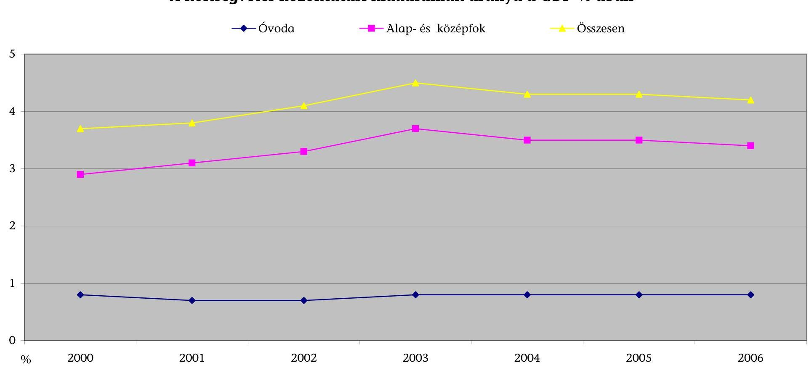

---

# A közoktatási feladatok finanszírozására fordított pénzeszközök az OKM fejezetnél 

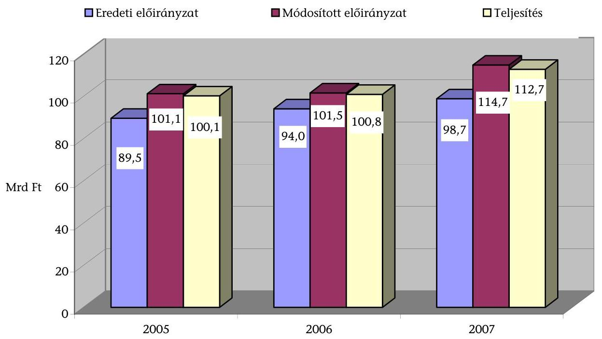
3. diagram
a V-10-130/2007-2008. sz. jelentéshez

## A közoktatási feladatok finanszírozására fordított pénzeszközök megoszlása az OKM fejezetnél*

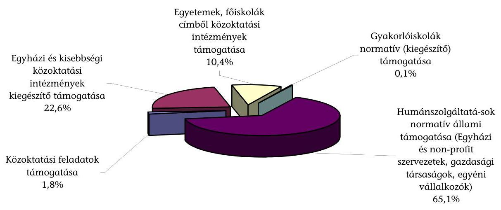
*A 2007. évi teljesítés alapján

---

# Egyházi közoktatási humánszolgáltatások normatív támogatása 2006-ban jogcímenként 

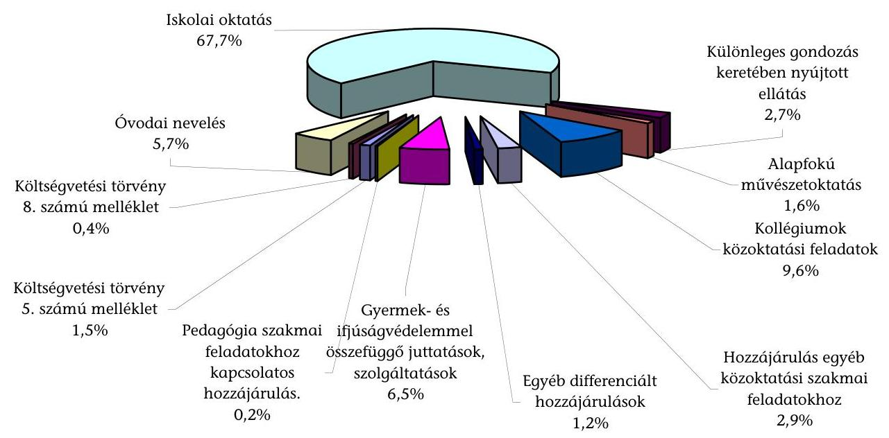
5. diagram
a V-10-130/2007-2008. sz. jelentéshez

## Egyházi közoktatási humánszolgáltatások normatív támogatása 2006-ban egyházanként

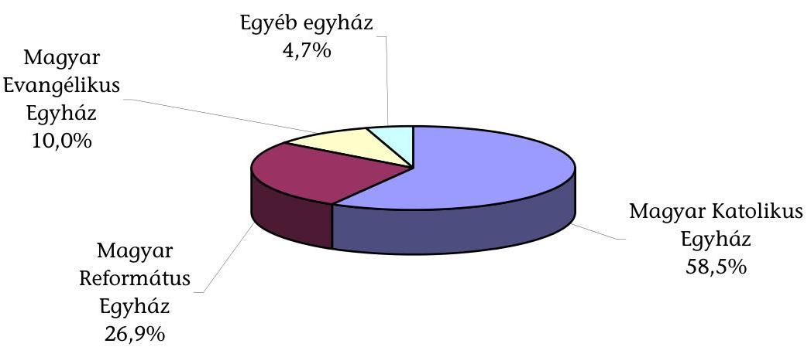

---

# Az egyházi fenntartású közoktatási intézmények kiegészítő támogatásának zárszámadási egyenlegrendezése (2004-2006. évek)

|  Ssz. | Megnevezés | Hivatkozás | 2004. évi OKM-PM számításnál figyelembevett adatok | 2005. évi OKM-PM számításnál figyelembevett adatok | 2006. évi OKM-PM számításnál figyelembevett adatok  |
| --- | --- | --- | --- | --- | --- |
|  1. | Helyi önkormányzatok összes működési és felújítási kiadása |  | 784 003,1 | 831 972,3 ${ }^{1}$ | 878 750,7 ${ }^{4}$  |
|  2. | Saját bevétel |  | 49 516,8 | 77 297,8 ${ }^{2}$ | 58 391,6  |
|  3. | Pályázati források |  | 4 000,0 | 4 464,8 | 1 763,3  |
|  4. | Önkormányzatok nettó kiadásai | 1. - 2. - 3. | 730 486,3 | 750 209,7 | 818 595,8  |
|  5 | Normatív hozzájárulások összesen |  | 483 489,8 | 510 715,5 ${ }^{3}$ | 483 936,3  |
|  6. | Egyházi kiegészítő támogatás alapja | 4. - 5. | 246 996,5 | 239 494,2 | 334 659,5  |
|  7. | Önkormányzati valós oktatott gyermeklétszám (fő) |  | 1710345 | 1604574 | 1580025  |
|  8. | Egy főre jutó kiegészítő támogatás (forint/fő/év) | 6. / 7. | 144 413,3 | 149 257,2 | 211 806,5  |
|  9. | Egyházi valós oktatott gyermeklétszám (fő) |  | 86417 | 86585 | 88694  |
|  10. | Évközben kifizetett kiegészítő támogatás |  | 11 567,8 | 11 082,9 | 11 517,5  |
|  11. | Zárszámadási egyenlegrendező kifizetési kötelezettség | (9. * 8.) - 10. | 912,0 | 1840,5 | 7268,5  |

Forrás: Pénzügyminisztérium Megjegyzés Az egyházak által vitatott számadatok: ${ }^{1}$ Az egyházak álláspontja szerint a 2005. évi önkormányzati működési- és felújítási kiadások összege 841,5 Mrd Ft, mivel a 2005. évi zárszámadási törvény indoklásában 825,0 Mrd Ft működési kiadás jelent meg és ezt egészíti ki a 16,5 Mrd Ft-os felújítási összeg. ${ }^{2}$ A zárszámadási törvény indoklásában 47,2 Mrd Ft szerepel intézményi saját bevételként, az egyházak ezt az összeget tekintették irányadónak. ${ }^{3}$ Az egyházak - a korábbi évek elszámolási gyakorlatának megfelelően- a 2005. évi önkormányzati közoktatási támogatások zárszámadási törvény szerinti normatív hozzájárulási összegébe a településtípusú normatíváknak megfelelő támogatási összeg beszámítását is indokoltnak tartották. Így ez - a 2005. évi szabályozással ellentétben - a kiegészítő támogatás alapját növelte volna. ${ }^{4}$ A 2006. évi működési- és felújítási kiadások összegét a Katolikus Egyház képviselői azért vitatták, mert az ehhez kapcsolódó részletes megalapozó számításokat hiányolták és a zárszámadási törvény indoklásából nem derült az ki, hogy az 53,3 Mrd Ft-os felhalmozási kiadásból mennyi volt a felújítás összege.

---

# Az egyházi fenntartású közoktatási intézmények kiegészítő támogatása számításának levezetése

|  Sorszám | Tételek megnevezése |  | 2005. évi tény |  |  | 2006. évi tény |  |   |
| --- | --- | --- | --- | --- | --- | --- | --- | --- |
|   |  |  | OKM-PM háttérszámítás (M Ft) | A 2005. évi háttértörvény végrehajtásáról szóló tv. indoklása szerint (M Ft) | Az ÁSZ ellenőrzés álláspontja (M Ft) | OKM-PM háttérszámítás (M Ft) | A 2006. évi háttértörvény végrehajtásáról szóló tv. indoklása szerint (M Ft) | Az ÁSZ ellenőrzés álláspontja (M Ft)  |
|  1. | Helyi önkormányzatok közoktatási működési kiadásoknak és felújítási költségeinek összege eltérő: a.) működési kiadások b.) felújítási kiadások |  | 831 973,3 | 825,0 | 845 748,9 | 878 750,7 | 857,2 | 878 491,3  |
|   |  |  | 815 462,3 |  | 829 237,9 | 861 193,3 |  | 861 193,3  |
|   | 

 |  | 16 511,0 |  | 16 511,0 | 17 298,0 |  | 17 298,0  |
|  2. | Helyi önkormányzatok intézményi saját bevételét |  | 77 297,8 | 47,2 | 53 073,8 | 58 391,6 | 48,2 | 47 388,9  |
|  3. | Pályázati források |  | 4 464,8 |  | 4 464,8 | 1 763,3 |  | 1 763,3  |
|  4. | Önkormányzatok nettó kiadásai | 1-2-3 | 750 209,7 |  | 788 210,3 | 818 595,8 |  | 829 339,1  |
|  5. | Önkormányzati normatív támogatások összesen |  | 510 715,5 | 510,7 | 510 715,5 | 483 936,3 | 483,9 | 483 936,3  |
|  6. | Egyházi kiegészítő támogatás telepje | 4-5 | 239 494,2 |  | 277 494,8 | 334 659,5 |  | 345 402,8  |
|  7. | Önkormányzati valós oktatott gyermeklétszám (II) |  | 1 604 574,0 |  | 1 604 574,0 | 1 580 025,0 |  | 1 580 025,0  |
|  8. | Egy főre jutó kiegészítő támogatás (Ft/SI/ev) | 6/7 | 149 257,2 |  | 172 939,9 | 211 806,5 |  | 218 605,9  |
|  9. | Egyházi valós oktatott gyermeklétszám (II) |  | 86 585,0 |  | 86 585,0 | 88 694,0 |  | 88 694,0  |
|  10. | Egyházakat megillető kiegészítő támogatás | 8 x 9 | 12 923,4 |  | 14 974,0 | 18 786,0 |  | 19 389,0  |
|  11. | Érkezben kifizetett egyházi kiegészítő támogatása |  | 11 082,9 |  | 11 082,9 | 11 517,5 |  | 11 517,5  |
|  12. | Zárszámadási egyenlegrendező kifizetési kötelezettség | 10-11 | 1 040,5 | 1,0405 | 3 091,1 | 7 268,5 | 7,2685 | 7 871,5  |

Forrás: Magyar Államkincstár önkormányzati adatbázisa, Pénzügyminisztérium

${ }^{1}$ A zárszámadási törvény önkormányzati közoktatási funkcionális indoklása a működési kiadások között - az indoklás szövegében foglaltakkal szemben - ténylegesen nem tartalmazza "az ellátottak pénzbeli juttatási" kiadási sor 4,2 Mrd Ft -os összegét. ${ }^{2}$ Az OKM-PM háttérszámítás a működési kiadások részeként nem tartalmazza az iskolarendszeren kívüli szakmai és nem szakmai oktatás, vizsgáztatás kiadásait, a működési célú pénzeszközátadásokat, valamint az ellátottak pénzbeli juttatásait. ${ }^{3}$ A zárszámadási törvény önkormányzati közoktatási funkcionális indoklása a működési bevételek között nem szerepelteti a saját bevételek részeként figyelembe veendő felhalmozási és tőke jellegű bevételek 157,3 M Ft-os összegét. ${ }^{4}$ Az OKM-PM háttérszámítások az intézményi saját bevételek között tartalmazzák - a jogszabály szerint nem ide tartozó - támogatások, kiegészítések, átvett pénzeszközök 24381,2 M Ft összegét, de nem veszik figyelembe a felhalmozási és tőke jellegű bevételeket 157,2 M Ft összegben. Ezek együttes hatásaként a saját bevételek összege 24224,0 M Ft-tal magasabb a jogszabályi előírás szerinti összegnél. ${ }^{5}$ Az OKM-PM háttérszámításokban a kiegészítő támogatás számításánál a működési kiadásokba nem tartozó kölcsönnyújtás és törlesztés, valamint a pénzügyi befektetések kiadásának együttesen 259,3M Ft-os összegét is figyelembe vették. ${ }^{6}$ E saját bevétel összeg a zárszámadási törvény indoklásában szereplő 47,2 Mrd Ft-os összegen felül, a hatályos Ámr. értelmében tartalmazza a saját bevételből fedezett 5,7 Mrd Ft-os működési célú pénzeszközátadást az önkormányzati költségvetési szerveknek és a 0,2 Mrd Ft-os felhalmozási és tőke jellegű saját bevételt. ${ }^{7}$ Az OKM-PM háttérszámításokban a saját bevételek részeként nem szerepel a hatósági jogkörhöz köthető működési bevételek, az ÁFA bevételek, visszatérülések, a hozam és kamatbevételek, valamint a tárgyi eszközök, immateriális javak értékesítésének bevétele összesen 7233,7 M Ft összegben, szerepel viszont a saját bevételek részét nem képező támogatásértékű bevételek, átvett működési pénzeszközök, valamint támogatási kölcsönök együttesen 18236,3 M Ft-os összege. Ezek együttes hatásaként a saját bevételek összege 11002,7 M Ft-tal magasabb a jogszabályi előírás szerinti összegnél.

---

# A helyi önkormányzatok 2005. évi összegezett működési és felújítási közoktatási kiadásai 

| Megnevezés | A költségvetési beszámoló 21. úrlap |  | ÁSZ háttérszámítás alapadatai (E Ft) | OKM-PM háttérszámításhoz felhasznált adatok ( E Ft) |
| :--: | :--: | :--: | :--: | :--: |
|  | sor- száma | összege (E Ft) |  |  |
| Rendszeres személyi juttatások | 01 | 394587250 | 394587250 | 394381236 |
| Nem rendszeres személyi juttatások | 02 | 80890917 | 80890917 | 80777248 |
| Külső személyi juttatások | 03 | 16375921 | 16375921 | 16008575 |
| Munkaadókat terhelő járulékok | 04 | 160326891 | 160326891 | 160160651 |
| Anyagi és kisértékű tárgyi eszköz beszerzése | 05 | 7151440 | 7151440 | 7118671 |
| Dologi kiadások (05 sor nélkül) | 06 | 154963972 | 154963972 | 154096274 |
| Egyéb folyó kiadások | 07 | 2934125 | 2934125 | 2919656 |
| 01-07. sorok összesen |  | 817230516 | 817230516 | 815462311 |
| Működési célú pénzeszközátadás államháztartáson kívülre | 22 | 2333684 | 2333684 |  |
| Működési célú pénzeszközátadás államháztartáson belülre | 29 | 5436925 | 5436925 |  |
| Ellátottak pénzbeli juttatásai | 57 | 4236804 | 4236804 |  |
| Ebből: Működési kiadások * (01-07. sorok +22+29+57 ) |  | 829237929 | 829237929 | 815462311 |
| Felújítás | 59 | 16510961 | 16510961 | 16510961 |
| Kiegészítő támogatás számításánál figyelembe vett kiadások |  |  | 845748890 | 831973272* |

[^0]
[^0]:    * Az OKM-PM háttérszámítás 2005. évben a helyi önkormányzatok működési kiadásai között (01-07. sor) az iskolarendszeren kívüli szakmai és nem szakmai vizsgáztatás kiadásait, valamint a működési célú pénzeszközátadásokat és az ellátottak pénzbeli juttatásait nem vette figyelembe.

---

# A helyi önkormányzatok 2005. évi összegezett intézményi saját bevételei

|  Megnevezés | A költségvetési beszámoló 22. úrlap |  | ÁSZ háttérszámítás alapadatai (E Ft) | OKM-PM háttérszámításhoz felhasznált adatok (E Ft)  |
| --- | --- | --- | --- | --- |
|   | sor- száma | összege (E Ft) |  |   |
|  Intézményi működési bevételek | 01 | 47193127 | 47193127 | 47193127  |
|  01-ből Alaptevékenység bevételei | 02 | 26246171 | 26246171 | 26246171  |
|  01-ből Alaptevékenységgel összefüggő bevételek | 03 | 7423635 | 7423635 | 7423635  |
|  01-ből Intézmények egyéb sajátos bevételei | 04 | 7579296 | 7423296 | 7423296  |
|  Intézmények és önkormányzatok működési bevételei (01 + 05) | 06 | 47193127 | 47193127 | 47193127  |
|  Felhalmozási és tőke jellegű bevételek | 07 | 157290 | 157290 |   |
|  Intézményi saját bevételek (06 + 07) |  | 47350417 | 47350417 | 47193127  |
|  Támogatások, kiegészítések és átvett pénzeszközök | 08 | 31399787 | 5723393 | 29409011  |
|  Támogatási kölcsönök igénybevétele és visszatérülése | 51 | 43495 |  | 695623  |
|  Kiegészítő támogatás számításánál figyelembe vett saját bevételek |  |  | 53073810 | 77297761 *  |

- Az OKM-PM háttérszámítás 2005-ben az intézményi saját bevételek között a támogatások, kiegészítések és átvett pénzeszközök tételsort - az iskolarendszeren kívüli szakmai és nem szakmai oktatás bevételei kivételével - és a támogatási kölcsönök igénybevételét teljes körűen figyelembe vette.

Az államháztartás működési rendjéről szóló, 2005. évben hatályos 217/1998. (XII.30.) Korm. rendelet 8. § és 57. § -a előírásai szerint a költségvetési szerv saját bevételei a tevékenységével, azon belül elsősorban az alaptevékenységével összefüggő saját bevételekből, adományokból, juttatásokból, vállalkozási bevételekből, valamint a fejezeti kezelésű előirányzatok saját bevétellel fedezett részéből származó átvett pénzeszközökből származnak.  A 2005. évben hatályos Ámr. 57. § 2/e. pontja szerinti működési célú átvett pénzeszköz - a 2005. évi önkormányzati bevételek tevékenységének összegezését tartalmazó költségvetési beszámoló 22. úrlapja 24. soru (Működési célú pénzeszközátadás önkormányzati költségvetési szervtől) - amely a fejezeti kezelésű előirányzatok saját bevétellel fedezett részéből származik.

---

# A helyi önkormányzatok 2006. évi összegezett működési és felújítási közoktatási kiadásai 

| Megnevezés | A költségvetési beszámoló 21. úrlap |  | ÁSZ háttérszámítás alapadatai (E Ft) | OKM-PM háttérszámításhoz felhasznált adatok (E Ft) |
| :--: | :--: | :--: | :--: | :--: |
|  | sor- száma | összege (E Ft) |  |  |
| Rendszeres személyi juttatások | 01 | 412424366 | 412424366 | 412424366 |
| Nem rendszeres személyi juttatások | 02 | 81635862 | 81635862 | 81635862 |
| Külső személyi juttatások | 03 | 17575209 | 17575209 | 17575209 |
| Személyi juttatások összesen | 04 | 511635437 | 511635437 | 511635437 |
| Munkaadókat terhelő járulékok | 05 | 161967542 | 161967542 | 161967542 |
| Dologi kiadások | 06 | 171551777 | 171551777 | 171551777 |
| Egyéb folyó kiadások | 07 | 2932214 | 2932214 | 2932214 |
| 04-07. sorok összesen |  | 848086970 | 848086970 | 848086970 |
| Támogatásértékű működési kiadás | 14 | 6115974 | 6115974 | 6115974 |
| Működési célú pénzeszközátadás államháztartáson kívülre | 39 | 2169897 | 2169897 | 2169897 |
| Társadalompolitikai juttatás | 61 | 707582 | 707582 | 707582 |
| Ellátottak pénzbeli juttatásai | 62 | 4112905 | 4112905 | 4112905 |
| Ebből: Teljes működési kiadás (04-07. sorok +14+39+61+62 ) |  | 861193328 | 861193328 | 861193328 |
| Felújítás | 63 | 17298033 | 17298033 | 17298033 |
| Pénzügyi befektetések kiadásai * | 67 | 52238 |  | 52238 |
| Kölcsönök nyújtása és törlesztése * | 68 | 207109 |  | 207109 |
| Kiegészítő támogatás számításánál figyelembe vett kiadások |  |  | 878491361 | 878750708 |

[^0]
[^0]:    * Az OKM-PM számítások során figyelembe vették a 67. és 68. sorok 259347 E Ft összegű adatát.

---

# A helyi önkormányzatok 2006. évi összegezett intézményi saját bevételei

|  Megnevezés | A költségvetési beszámoló 22. úrlap |  | ÁSZ háttérszámítás alapadatai (E Ft) | OKM-PM háttérszámításhoz felhasznált adatok (E Ft)  |
| --- | --- | --- | --- | --- |
| 

  | sor-
száma | összege
(E Ft) |  |   |
|  Hatósági jogkörhöz köthető működési bevétel | 01 | 48479 | 48479 |   |
|  Egyéb saját bevétel | 02 | 40155226 | 40155226 | 40155226  |
|  ÁFA-bevételek - visszatérülések | 03 | 6518046 | 6518046 |   |
|  Hozam- és kamatbevételek | 04 | 416076 | 416076 |   |
|  Támogatásértékű működési bevétel | 11 | 11829973 |  | 11829973  |
|  Államháztartáson kívülről átvett működési pénzeszközök | 23 | 6253747 |  | 6253747  |
|  Működési bevételek összesen $(01+02+03+04+11+23)$ | 26 | 65221547 |  |   |
|  Tárgyi eszközök, immateriális javak értékesítése | 27 | 251090 | 251090 |   |
|  Támogatási kölcsönök | 55 | 152615 |  | 152615  |
|  Kiegészítő támogatás számításánál figyelembe vett saját bevételek |  |  | 47388917 | 58391561 *  |

- Az OKM-PM háttérszámításban az intézményi saját bevételek között a támogatásértékű működési bevételek és az államháztartáson kívülről átvett működési pénzeszközök is szerepelnek. Az államháztartás működési rendjéről szóló 217/1998. (XII.30.) Korm. rendelet 8. § és 57. § -a előírásai szerint a költségvetési szerv saját bevételei a tevékenységével, azon belül az alaptevékenységével összefüggő saját bevételek, amelyek hatósági jogkörhöz köthető bevételekből és egyéb saját bevételként a költségvetési szerv tevékenysége során keletkező működési és felhalmozási célú bevételből származnak.

---

# Pénzügyminisztériumi állásfoglalás az egyházi kiegészítő támogatás számítási adatbázisáról 

| "Bencze Péterné" | Címzett | horvathnehm@asz.hu |
| :--: | :--: | :--: |
| *Marta.Bencze@pm.gov.hu |  | Másolat |
| 2008.02.01 09:41 | Titkos másolat |  |
|  | Tárgy | Válasz: egyházi közoktatási kiegészítő támogatás |

Kedves Csilla!
Tegnapi megbeszélésünk szerint Szelényi Úrral áttekintettük az általatok készített adatgyűjtést.

A válasz IGEN, a Tietekkel azonos adatbázisra épültek a mi számításaink is.
Üdvözlettel: Bencze Márta

---

# EMLÉKEZTETŐ 

„Az OKM fejezetnél a közoktatási feladatok finanszírozására fordított pénzeszközök hasznosulásának ellenőrzése" c. téma jelentés-tervezetének tárgyában az Állami Számvevőszék 2. Államháztartás Központi Szintjét Ellenőrző Igazgatóság, Budapest IX. kerület, Soroksári út 3/a. (Dunaház) III. emeleti hivatali helyiségében 2008. április 10-én folytatott egyeztető megbeszélésről

Jelen vannak: az Oktatási és Kulturális Minisztérium (OKM EKT) képviseletében Dr. Fedor Tibor főosztályvezető-helyettes
az Állami Számvevőszék (ÁSZ) képviseletében
Bittó Zoltán számvevő igazgatóhelyettes, vizsgálatvezető

A megbeszélés napirendjén a tárgyban jelzett jelentés-tervezet egyházi kiegészítő támogatás megállapításában szerepet játszó „intézményi saját bevételek" 2005. évi és 2006. évi jogszabályi fogalomkörének és ez alapján történt számításának egyeztetése szerepelt.

Felek megállapították, hogy a „Helyi önkormányzatok 2005. évi intézményi saját bevételei" tételnél, az államháztartás működési rendjéről szóló 217/1998. (XII. 30.) Korm. rendelet (2005. évben hatályos Ámr.) 57. § 2/e pontja alapján a „Működési célú pénzeszközátvétel önkormányzati költségvetési szervtől" tétel 5723393 E Ft-os összege - mint saját bevétellel fedezett átvett pénzeszköz - teljes összegében figyelembe veendő az ÁSZ ellenőrzési álláspontját képező intézményi saját bevételek összegében, ezzel megnövelve a 2005. évre számított 47350400 E Ft-os összeget. Az ÁSZ képviselője kijelentette, hogy ezt a változást a jelentés-tervezeten átvezetik. A 2005. évi számításokat más, jogszabályi alapú változás nem érinti.

A 2006. évi intézményi saját bevételekkel kapcsolatos ÁSZ-álláspontot az OKM EKT képviselője tudomásul vette, megjegyezve, hogy jogszabály-értelmezési kérdések továbbra is felmerülhetnek.

Felek rögzítik, hogy az intézményi saját bevételekkel kapcsolatos fenti egyeztetés nem befolyásolja a jelentés-tervezettel összefüggő eddigi kormányzati, illetve számvevőszéki álláspontot.

Kmf.
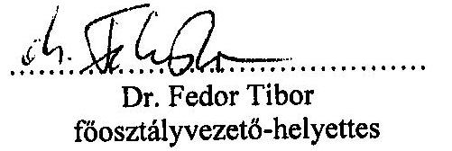

Bittó Zoltán
számvevő igazgatóhelyettes

---

# Összesített kérdőíves felmérés a közoktatási feladatok finanszírozására fordított pénzeszközök hasznosulásáról, az állami gyakorló közoktatási intézmények fenntartóinál 

1 Berzsenyi Dániel Főiskola
2 Debreceni Egyetem
3 Eszterházy Károly Főiskola
4 Eötvös Loránd Tudományegyetem
5 Magyar Képzőművészeti Egyetem
6 Magyar Táncművészeti Főiskola
7 Nyíregyházi Főiskola
8 Nyugat-Magyarországi Egyetem
9 Pécsi Tudományegyetem
10 Semmelweis Egyetem
11 Szegedi Tudományegyetem
12 Tessedik Sámuel Főiskola

---

# ÖSSZESÍTETT KÉRDŐÍVES FELMÉRÉS 

a közoktatási feladatok finanszírozására fordított pénzeszközök hasznosulásáról, az állami gyakorló közoktatási intézmények fenntartóinál

1. A fenntartó által működtetett közoktatási intézmény(ek) típusa

- óvoda ..... 6
Debreceni Egyetem ..... 1
Eötvös Loránd Tudományegyetem ..... 1
Nyugat-Magyarországi Egyetem ..... 1
Nyugat-Magyarországi Egyetem ..... 1
Szegedi Tudományegyetem ..... 1
Tessedik Sámuel Főiskola ..... 1
- általános iskola ..... 11
Berzsenyi Dániel Főiskola ..... 1
Debreceni Egyetem ..... 1
Eszterházy Károly Főiskola ..... 1
Eötvös Loránd Tudományegyetem ..... 1
Magyar Táncművészeti Főiskola ..... 1
Nyíregyházi Főiskola ..... 1
Nyugat-Magyarországi Egyetem ..... 1
Pécsi Tudományegyetem ..... 1
Semmelweis Egyetem ..... 1
Szegedi Tudományegyetem ..... 1
Tessedik Sámuel Főiskola ..... 1
- szakiskola ..... 0
- gimnázium ..... 9
Berzsenyi Dániel Főiskola ..... 1
Debreceni Egyetem ..... 1
Eszterházy Károly Főiskola ..... 1
Eötvös Loránd Tudományegyetem ..... 1
Magyar Táncművészeti Főiskola ..... 1
Nyíregyházi Főiskola ..... 1
Pécsi Tudományegyetem ..... 1
Semmelweis Egyetem ..... 1
Szegedi Tudományegyetem ..... 1
- szakközépiskola ..... 5
Magyar Képzőművészeti Egyetem ..... 1
Magyar Táncművészeti Főiskola ..... 1
Nyugat-Magyarországi Egyetem ..... 1
Pécsi Tudományegyetem ..... 1
Szegedi Tudományegyetem ..... 1
- alapfokú művészetoktatási intézmény ..... 3
Eszterházy Károly Főiskola ..... 1
Magyar Táncművészeti Főiskola ..... 1

---

Szegedi Tudományegyetem ..... 1

- gyógypedagógiai nevelési-oktatási intézmény ..... 1
Eötvös Loránd Tudományegyetem ..... 1
- diákotthon és kollégium ..... 1
Eötvös Loránd Tudományegyetem ..... 1
- többcélú intézmény ..... 2
Eszterházy Károly Főiskola ..... 1
Eötvös Loránd Tudományegyetem ..... 1
(Több válasz is lehetséges!)
2. A fenntartó teljes mértékben biztosította-e a közoktatási intézmény(ek) működésé- hez szükséges személyi, tárgyi és pénzügyi feltételeket?
2005. ..... 2006.
- igen, teljes mértékben biztosította ..... 9 ..... 9
Berzsenyi Dániel Főiskola ..... 1 ..... 1
Debreceni Egyetem ..... 1 ..... 1
Eszterházy Károly Főiskola ..... 1 ..... 1
Eötvös Loránd Tudományegyetem ..... 1 ..... 1
Magyar Képzőművészeti Egyetem ..... 1 ..... 1
Magyar Táncművészeti Főiskola ..... 1 ..... 1
Nyíregyházi Főiskola ..... 1 ..... 1
Nyugat-Magyarországi Egyetem ..... 1 ..... 1
Tessedik Sámuel Főiskola ..... 1 ..... 1
- csak részben tudta biztosítani ..... 3 ..... 3
Pécsi Tudományegyetem ..... 1 ..... 1
Semmelweis Egyetem ..... 1 ..... 1
Szegedi Tudományegyetem ..... 1 ..... 1
4. A fenntartó a megállapított normatív támogatás teljes összegét, megfelelő üteme- zésben átadta-e a közoktatási intézménynek?
2005. ..... 2006.
- igen ..... 11 ..... 11
Berzsenyi Dániel Főiskola ..... 1 ..... 1
Debreceni Egyetem ..... 1 ..... 1
Eszterházy Károly Főiskola ..... 1 ..... 1
Eötvös Loránd Tudományegyetem ..... 1 ..... 1
Magyar Képzőművészeti Egyetem ..... 1 ..... 1
Magyar Táncművészeti Főiskola ..... 1 ..... 1
Nyíregyházi Főiskola ..... 1 ..... 1
Nyugat-Magyarországi Egyetem ..... 1 ..... 1
Pécsi Tudományegyetem ..... 1 ..... 1
Semmelweis Egyetem ..... 1 ..... 1
Tessedik Sámuel Főiskola ..... 1 ..... 1

---

- nem ..... 1 ..... 1
Szegedi Tudományegyetem ..... 1 ..... 1

5. A fenntartó meghatározott-e szakmai pedagógiai elvárásokat, követelményeket a gyakorló közoktatási intézményeivel szemben?

- igen, minden tanévre meghatározott ..... 10
Berzsenyi Dániel Főiskola ..... 1
Debreceni Egyetem ..... 1
Eszterházy Károly Főiskola ..... 1
Magyar Képzőművészeti Egyetem ..... 1
Nyíregyházi Főiskola ..... 1
Nyugat-Magyarországi Egyetem ..... 1
Pécsi Tudományegyetem ..... 1
Semmelweis Egyetem ..... 1
Szegedi Tudományegyetem ..... 1
Tessedik Sámuel Főiskola ..... 1
- igen, de nem minden tanévre határozott meg ..... 1
Magyar Táncművészeti Főiskola ..... 1
- nem határozott meg ..... 1
Eötvös Loránd Tudományegyetem ..... 1

7. A gyakorló közoktatási intézmények készítettek-e részletes szakmai beszámolót?

- igen, minden tanév befejezése után részletes beszámolót készítettek ..... 12
Berzsenyi Dániel Főiskola ..... 1
Debreceni Egyetem ..... 1
Eszterházy Károly Főiskola ..... 1
Eötvös Loránd Tudományegyetem ..... 1
Magyar Képzőművészeti Egyetem ..... 1
Magyar Táncművészeti Főiskola ..... 1
Nyíregyházi Főiskola ..... 1
Nyugat-Magyarországi Egyetem ..... 1
Pécsi Tudományegyetem ..... 1
Semmelweis Egyetem ..... 1
Szegedi Tudományegyetem ..... 1
Tessedik Sámuel Főiskola ..... 1
- nem készítettek ..... 0

8. A beszámolók tartalma alkalmas volt-e az intézmények szakmai feladatellátásának értékelésére?

- igen, alkalmas volt ..... 12
Berzsenyi Dániel Főiskola ..... 1
Debreceni Egyetem ..... 1

---

Eszterházy Károly Főiskola ..... 1
Eötvös Loránd Tudományegyetem ..... 1
Magyar Képzőművészeti Egyetem ..... 1
Magyar Táncművészeti Főiskola ..... 1
Nyíregyházi Főiskola ..... 1
Nyugat-Magyarországi Egyetem ..... 1
Pécsi Tudományegyetem ..... 1
Semmelweis Egyetem ..... 1
Szegedi Tudományegyetem ..... 1
Tessedik Sámuel Főiskola ..... 1

- nem volt alkalmas ..... 0
- részben volt alkalmas ..... 0

9. A fenntartó értékelte-e rendszeresen a gyakorló közoktatási intézményei szakmai tevékenységét, az elvárások teljesítését?

- igen, rendszeresen minden tanév befejezése után értékelt ..... 8
Berzsenyi Dániel Főiskola ..... 1
Magyar Képzőművészeti Egyetem ..... 1
Magyar Táncművészeti Főiskola ..... 1
Nyíregyházi Főiskola ..... 1
Nyugat-Magyarországi Egyetem ..... 1
Semmelweis Egyetem ..... 1
Szegedi Tudományegyetem ..... 1
Tessedik Sámuel Főiskola ..... 1
- nem értékelt rendszeresen ..... 4
Debreceni Egyetem ..... 1
Eszterházy Károly Főiskola ..... 1
Eötvös Loránd Tudományegyetem ..... 1
Pécsi Tudományegyetem ..... 1

1. A gyakorló közoktatási intézményekben sor került-e ellenőrzésre?

- fenntartói ellenőrzésre ..... 10
Berzsenyi Dániel Főiskola ..... 1
Debreceni Egyetem ..... 1
Eszterházy Károly Főiskola ..... 1
Eötvös Loránd Tudományegyetem ..... 1
Magyar Képzőművészeti Egyetem ..... 1
Magyar Táncművészeti Főiskola ..... 1
Nyugat-Magyarországi Egyetem ..... 1
Pécsi Tudományegyetem ..... 1
Semmelweis Egyetem ..... 1
Tessedik Sámuel Főiskola ..... 1

---

- OKÉV, illetve Oktatási Hivatal helyszíni ellenőrzésére ..... 3
Berzsenyi Dániel Főiskola ..... 1
Nyíregyházi Főiskola ..... 1
Pécsi Tudományegyetem ..... 1
- nem volt ellenőrzés ..... 1
Szegedi Tudományegyetem ..... 1

1. Az ellenőrzések tártak-e fel hiányosságokat, szabálytalanságokat?

- igen ..... 4
Eötvös Loránd Tudományegyetem ..... 1
Pécsi Tudományegyetem ..... 1
Semmelweis Egyetem ..... 1
Tessedik Sámuel Főiskola ..... 1
- nem ..... 6
Berzsenyi Dániel Főiskola ..... 1
Debreceni Egyetem ..... 1
Magyar Képzőművészeti Egyetem ..... 1
Magyar Táncművészeti Főiskola ..... 1
Nyíregyházi Főiskola ..... 1
Nyugat-Magyarországi Egyetem ..... 1

1. A fenntartó szankcionálta-e a feltárt hiányosságokat, szabálytalanságokat?

- igen ..... 1
Tessedik Sámuel Főiskola ..... 1
- nem ..... 6
Berzsenyi Dániel Főiskola ..... 1
Eszterházy Károly Főiskola ..... 1
Eötvös Loránd Tudományegyetem ..... 1
Magyar Képzőművészeti Egyetem ..... 1
Pécsi Tudományegyetem (A figyelmet felhívta.) ..... 1
Semmelweis Egyetem ..... 1

---

# Kérdések, kritériumok és adatforrások - az Oktatási és Kulturális Minisztérium fejezetnél a közoktatási feladatok finanszírozására fordított pénzeszközök hasznosulásának ellenőrzéséhez

Fő kérdés: Az OKM fejezetnél a közoktatási feladatok finanszírozási rendszere, a nem önkormányzati intézményeknél a támogatások felhasználása eredményesen járultak-e hozzá a közoktatás-politika céljainak megvalósításához?

|  Kérdések |  | Teljesítménykövetelmények (kritériumok) | Adatforrások  |
| --- | --- | --- | --- |
|  1. | Az OKM ágazati, szakmai irányító tevékenysége és közoktatás támogatási rendszere elősegítette a közoktatás eredményességének, hatékonyságának biztosítását? |  |   |
|  1.1. | Az OKM közoktatás-fejlesztési stratégiai célkitűzései, azok megvalósulása érdekében tett intézkedései, valamint a fejezet közoktatás feladatfinanszírozási rendszere hozzájárultak-e a közoktatás eredményességének, hatékonyságának biztosításához? |  |   |
|  1.1.1 | A nemzetközi és hazai tanulói teljesítménymérések értékelése alapján megállapítható volt-e a magyar közoktatás eredményessége a vizsgált időszakban? A közoktatásra fordított kiadások, felhasznált erőforrások igazodtak-e a demográfiai folyamatokhoz? |  |   |
|  1.1.2 | A hosszú- és középtávú közoktatás-fejlesztési stratégia céljai hozzájárultak-e a közoktatási rendszer eredményességének, hatékonyságának, valamint a közoktatásra fordított pénzeszközök gazdaságos felhasználásának javításához? Felmérték-e a célok elérését segítő, illetve azokat hátráltató tényezőket? A közoktatás-fejlesztési stratégiai célokat mérhető eredménykategóriákban határozták-e meg? A stratégiai célkitűzések alapján

 készültek-e intézkedési tervek, fejlesztési programok konkrét, mérhető célokkal, azok eléréséhez szükséges módszerekkel, |  |   |

Nemzetközi tanulói teljesítménymérések adatai, dokumentumai. A magyar oktatási rendszer főbb mutatói nemzetközi összehasonlításban (OKM, KSH). OKI jelentések, tanulmányok a közoktatás helyzetéről. Közoktatási statisztikák. Az OM (OKM) hosszú és középtávú közoktatás-fejlesztési stratégiái. A közoktatási stratégiához kapcsolódó intézkedési tervek, fejlesztési programok. Közoktatási törvény (1993. évi LXXIX. tv). A közoktatási stratégia megvalósulásához kapcsolódó jogszabályok. Országos Közoktatási Értékelési és Vizsgaközpont (OKÉV) dokumentumai. KSH, OKM adatbázisai.

---

|  Kérdések |  | Teljesítménykövetelmények (kritériumok) | Adatforrások  |
| --- | --- | --- | --- |
|   | határidők és felelősök megjelölésével? Meghatározták-e a kiemelt célok megvalósításának költségkihatásait? |  |   |
|  1.1.3. | Az irányítási, szabályozási eszközök elősegítették-e a stratégiai célkitűzések megvalósulását? A szabályozás egyértelműen meghatározta-e az irányítók, a szakmai szervezetek, a fenntartók és a közoktatási intézmények céljainak megvalósulása érdekében ellátandó feladatait? |  |   |
|  1.1.4. | A közoktatás központi költségvetési finanszírozása - a fenntartóra való tekintet nélkül - minden résztvevő számára azonos pénzügyi feltételeket biztosított-e? |  |   |
|  1.1.5. | Az OKM fejezet finanszírozási rendszerén keresztül nyújtott támogatások összegének meghatározása és annak változása megalapozott volt-e, igazodott-e az ellátandó feladatok nagyságrendjéhez, hozzájárult-e a közoktatási stratégia céljainak megvalósulásához? |  |   |
|  1.2 | A fejezet közoktatási feladat-támogatási rendszere eredményesen és hatékonyan járult-e hozzá a közoktatáspolitikai célok megvalósulásához? |  |   |
|  1.2.1 | Az OKM közoktatás feladat-támogatási céljai, jogcímei elősegítették-e a hosszú és középtávú stratégiai célok teljesítését? Egyértelműen meghatározták-e a közoktatási feladat-támogatás egyes jogcímeinek tartalmát, céljait? Voltak-e átfedések az előirányzatok között? A feladattámogatási előirányzatokhoz rendelt pénzeszközök igazodtak-e a feladatok költségigényéhez? |  |   |
|   |  |  | Költségvetési törvények. A fejezeti kezelésű előirányzatok gazdálkodási szabályzatai. Közoktatási törvény (1993. évi LXXIX. tv.). A nem önkormányzati fenntartású közoktatási intézmények finanszírozására vonatkozó jogszabályok. Tanúsítványi adatszolgáltatás és közoktatási statisztikák a különböző fenntartású közoktatási intézmények költségvetési támogatásáról és közoktatási teljesítményéről.  |
|   |  |  | A fejezeti kezelésű előirányzatok gazdálkodási szabályzatai. A fejezeti kezelésű előirányzatok felhasználását szabályozó OM(OKM) rendeletek. Finanszírozási okmányok. Pályázati kiírások, ismertetők, a pályázati eljárás dokumentációja.  |

---

|  Kérdések |  | Teljesítménykövetelmények (kritériumok) | Adatforrások  |
| --- | --- | --- | --- |
|  1.2.2 | Meghatározták-e a közoktatási feladatok támogatására előirányzott pénzeszközök elosztásának, az igények elbírálásának elveit? Az igények elbírálásához, a programok értékeléséhez meghatároztak-e teljesítménymutatókat, eredményességi követelményeket? Megfelelő volt-e az előirányzatok felhasználásának szabályozottsága? Kidolgoztak-e típusszerződéseket, abban meghatározták-e a teljesítés és elszámolás módját, a megvalósítás határidejét? | A támogatások felhasználásával a stratégiában meghatározott közoktatás-politikai célok teljesülése: korszerű vizsgarendszerek kialakítása, az oktatásban az infokommunikációs technológia alkalmazásának fejlődése, a közoktatásból kikerülő ECDL vizsgával, nyelvvizsgával rendelkező tanulók számarányának növekedése, a közoktatásból kikerülő hátrányos helyzetű, vagy sajátos nevelési igényű tanulók elhelyezkedési esélyeinek javulása, a közoktatás eredményességének javulása. A közoktatási feladat támogatás előirányzataihoz rendelt pénzeszközök igazodása a feladatok költségigényéhez. Hatékonyság: A feladatfinanszírozás lebonyolításához típusszerződések, hatékony módszerek, eljárások kidolgozása. Az egyedi elbírálású támogatások számának és arányának csökkentése. | A kedvezményezettekkel kötött szerződések. A közbeszerzési eljárások dokumentációja. A támogatások felhasználásának bizonylatai. A támogatásban részesülők szakmai és pénzügyi beszámolói. Hosszú- és középtávú közoktatási stratégia. Közoktatási jelentések, statisztikák.  |
|  1.3. | Az OKM szakmai értékelő és ellenőrző tevékenysége megfelelően segítette-e a fejezet által finanszírozott közoktatási tevékenység eredményességét, a támogatások felhasználásának hatékonyságát? |  |   |
|  1.3.1 | Kialakított-e az OKM olyan monitoring rendszert, mely alkalmas a közoktatási stratégia célkitűzéseinek nyomon követésére, és szükség esetén lehetővé teszi a szabályozás korrekcióját? A fenntartók és a közoktatási intézmények kaptak-e megfelelő visszajelzést az értékelés eredményéről a szükséges intézkedések megtételéhez? |  |   |
|  1.3.2 | Megtörténik-e a finanszírozási rendszer egyes elemeinek felülvizsgálata, a közoktatási feladatokhoz történő igazítása? Megfelelő ellenőrzési rendszer működött-e a jogosulatlanul igénybe vett támogatások felderítésére? A jogtalanul igénybevett támogatások felhasználóit szankcionálták-e? |  |   |

---

|  Kérdések |  | Teljesítménykövetelmények (kritériumok) | Adatforrások  |
| --- | --- | --- | --- |
|  1.3.3 | Folyamatosan értékelte-e a minisztérium a közoktatási feladatfinanszírozásra fordított pénzeszközök hasznosulását? Kidolgozták-e a szakmai értékelés módszereit? Az ellenőrzések megállapításai alapján megtették-e a szükséges intézkedéseket? A közoktatási feladatfinanszírozás beszámolási rendszere alkalmas volt-e a felhasználás eredményességének, hatékonyságának megítélésére? Az értékelésből megállapítható volt-e a közoktatási feladattámogatás hozzájárulása a stratégiai célok megvalósulásához? |  |   |
|  2. | A közoktatási célú humánszolgáltatás normatív támogatása és a kiegészítő támogatás megfelelően hasznosult-e az egyházak által fenntartott intézményekben? |  |   |
|  2.1 | Az egyházi fenntartású közoktatási intézmények állami támogatásának szabályozása hozzájárult-e a közoktatási feladatok eredményes ellátásához? |  |   |
|  2.1.1 | A közoktatásra vonatkozó jogszabályok megfelelően biztosították-e az egyházi közoktatási intézmények finanszírozását? A szabályozás változása okozott-e bizonytalanságot a fenntartók és az intézmények számára? A közoktatás finanszírozási rendszere az önkormányzati fenntartású intézményekkel azonos pénzügyi feltételeket biztosított-e az egyházi közoktatási intézmények számára? |  |   |
|  2.1.2 | Az egyházi kiegészítő támogatás összegének meghatározása megalapozottan történt-e? Az egyházak a kiegészítő támogatást megfelelő ütemezésben kapták-e meg? A kiegészítő támogatás tervezett és tényleges adatokon nyugvó eltérését egyeztették-e az érintett egyházakkal? Megtörtént-e a kiegészítő támogatás utólagos rendezése? Az egyházak a kiegészítő támogatás teljes összegét átutalták-e az intézményfenntartóknak? A kiegészítő támogatás nagyságrendje biztosította-e az egyházi közoktatási intézmények számára az önkormányzati intézményekkel azonos színvonalú feladatellátás feltételeit? |  |   |
|   |  | Eredményesség: Az egyházi közoktatási intézmények számára stabil jogszabályi környezet kialakítása. A fenntartótól függetlenül azonos pénzügyi feltételek biztosítása. Az egyházi fenntartású közoktatási intézmények kiegészítő támogatásának megalapozott meghatározása. A közoktatási feladatok zavartalan ellátását biztosító finanszírozási folyamat kialakítása és lebonyolítása. A jogosulatlan támogatások igénybevételét megakadályozó ellenőrzési, értékelési folyamatok kialakítása. | Közoktatási törvény (1993. évi LXXIX. tv). 20/1997. (II. 13.) Korm. rendelet a közoktatásról szóló 1993. évi LXXIX. tv. végrehajtásáról. 11/1994. (VI. 8.) MKM rendelet. 1997. évi CXXIV. tv. az egyházak hitéleti és közcélú tevékenységének anyagi feltételeiről. Az egyházi közoktatás finanszírozását érintő egyéb jogszabályok az ellenőrzési program 1. sz. melléklete szerint.  |

---

|  Kérdések |  | Teljesítménykövetelmények (kritériumok) | Adatforrások  |
| --- | --- | --- | --- |
|  2.1.3 | A Magyar Államkincstár (MÁK) hivatali szervezete megfelelően biztosította-e a közoktatási célú humánszolgáltatások normatív támogatásának ügymenetét (igénylés elbírálása, jogosultság megállapítása, határozathozatal, a támogatási összeg folyósítása)? A MÁK és az OKM szervezeti egységeinek ellenőrző, értékelő tevékenysége hozzájárult-e a jogosulatlanul igénybe vett támogatások kiszűréséhez? A jogszerűtlen felhasználókat szankcionálták-e? |  | Éves költségvetési és zárszámadási törvények. A PM adatszolgáltatása. A Kincstár belső szabályzatai. Kincstár, OKM ellenőrzési dokumentumai.  |
|  2.2 | Az egyházi közoktatási intézmények fenntartói megfelelő feltételeket, szakmai irányítást és felügyeletet biztosítottak-e a közoktatási feladatok eredményes ellátásához? |  |   |
|  2.2.1 | Az egyházi fenntartók biztosították-e közoktatási intézményeik feladatellátásához szükséges személyi, tárgyi és pénzügyi feltételeket? Az egyházi közoktatási intézmények elhelyezése oktatási célú épületekben történt-e? A fenntartók kötöttek-e közoktatási megállapodásokat? |  | Az egyházi közoktatási intézmények zavartalan működéséhez szükséges feltételek biztosítása, a normatív és kiegészítő támogatások teljes összegű, megfelelő ütemezésű átadása. Az intézményi minőségirányítási programok és a fenntartói minőségirányítási rendszer összhangja.  |
|  2.2.2 | A fenntartó a megállapított normatív támogatás teljes összegét átadta-e a közoktatási intézményeinek? A fenntartó meghatározta-e a normatív támogatás átadásának ütemezését? A fenntartó a kiegészítő támogatást közoktatási intézményei, szolgáltatásai támogatására fordította-e? |  |   |
|  2.2.3 | Meghatároztak-e az egyházi fenntartók közoktatási intézményeikkel szembeni pedagógiai, szakmai elvárásokat, követelményeket? Folyamatosan ellenőrizték és értékelték-e az egyházi fenntartók az elvárások teljesítését, közoktatási intézményeik nevelési és oktatási tevékenységét? A fenntartó szakmai elvárásai összhangban voltak-e az intézményi minőségirányítási programokkal? |  |   |

Az egyházi közoktatási intézmények alapító okiratai, működési engedélyei. Közoktatási megállapodások. Közoktatási törvény 3. sz. melléklete. 11/1994. (VI. 8.) MKM rendelet 7. sz. melléklete. Költségvetési törvények. Az egyházi fenntartók és közoktatási intézményeik pénzügyi kimutatásai. Az egyházi fenntartók közoktatási programja, ellenőrzési tervei. Az egyházi közoktatási intézmények minőségirányítási programjai. A feldolgozott kérdőívek.

---

|  Kérdések |  | Teljesítménykövetelmények (kritériumok) | Adatforrások  |
| --- | --- | --- | --- |
|  2.3 | Az egyházi közoktatási intézmények rendelkeztek-e a feladatok eredményes ellátásához szükséges személyi, tárgyi és pénzügyi feltételekkel? |  |   |
|  2.3.1 | Az egyházi közoktatási intézményekben az alaptevékenység ellátásához szükséges alkalmazotti létszám biztosított volt-e? A pedagógusok létszáma elegendő volt-e az ellátandó feladatokhoz? A foglalkoztatott pedagógusok megfelelő szakképzettséggel rendelkeztek-e? Az intézményekben foglalkoztatottak (pedagógusok, valamint a nevelő és oktató munkát segítők) létszáma alkalmazkodott-e az ellátandó feladatokhoz és a demográfiai folyamatokhoz? | Eredményesség: A közoktatási feladatok ellátását magas színvonalon biztosító, megfelelő képesítésű pedagógusok foglalkoztatása. Az alaptevékenység ellátásához szükséges alkalmazotti létszám legalább 70\%-ának határozatlan időre szóló munkaviszonyban foglalkoztatása. A közoktatási feladatok ellátásához megfelelő épület, tanterem, taneszközállomány rendelkezésre állása. Az intézmény megfelelő informatikai felszereltsége. A normatív és kiegészítő támogatások teljes összegének átutalása, a folyósítás megfelelő ütemezése. | Közoktatási törvény (1993. évi LXXIX. tv). Tanúsítványi adatszolgáltatás. Az egyházi közoktatási intézmények tanügyi és munkaügyi dokumentumai. Intézményi létszámadatok. Leltárak. A feldolgozott kérdőívek. Intézményi minőségirányítási, nevelési és pedagógiai programok és azok értékelése. Intézményi beszámolók, számviteli bizonylatok, pénzügyi kimutatások.  |
|  2.3.2 | Az egyházi közoktatási intézmények feladatellátásához biztosítottak voltak-e a tárgyi feltételek (épületek, tantermek, taneszközök, könyvállomány, informatikai eszközök)? A tárgyi feltételek lehetővé tették-e a közoktatás-politikai célok megvalósulását, a fenntartó által elvárt követelmények, az intézményi minőségirányítási illetve a nevelési, pedagógiai program teljesítését? |  |   |
|  2.3.3 | Az egyházi közoktatási intézmények részére megfelelő ütemezéssel történt-e a normatív és kiegészítő támogatások folyósítása? A közoktatási feladatok ellátásához rendelkezésre álló pénzeszközök biztosították-e a kiegyensúlyozott működést? |  |   |
|  2.4 | Az egyházi fenntartású közoktatási intézményeknél megfelelő eredményességgel és hatékonysággal történt-e a közoktatási feladatok ellátása? | Eredményesség: Az egyházi közoktatási intézmények teljesítménymutatói nemzetközi összehasonlításban, valamint az önkormányzati fenntartású közoktatási intézményekhez viszonyítva megfelelőek. A minőségirányítási programban előirányzott teljesítmények teljesülnek. | Tanügyi dokumentációk. Intézményi kimutatások, statisztikák. Tanúsítványok. Tanulói teljesítménymérések és azok értékelése.  |
|  2.4.1 | A nevelési-oktatási teljesítménymutatók alapján megfelelő eredményességű volt-e

 az egyházi közoktatási intézmények feladatellátása? Csökkent-e tanévenként az évismétlők száma? Nőtt-e a tanulmányaikat nyelvvizsgával és ECDL vizsgával befejező tanulók számaránya? Az iskolai szintfelmérések eredményei jelentősen eltértek-e az országos átlagtól? |  |   |

---

|  Kérdések |  | Teljesítménykövetelmények (kritériumok) | Adatforrások  |
| --- | --- | --- | --- |
|   | A tanulói teljesítménymérések, valamint a minőségirányítási programban meghatározott intézményi értékelés alapján - szükség esetén - megtették-e a szükséges intézkedéseket? |  |   |
|  2.4.2 | Megfelelő-e volt a rendelkezésre álló személyi erőforrások hatékonysága a feladatteljesítés hatékonyságát kifejező fajlagos mutatók alapján? Megfelelő-e a rendelkezésre álló tárgyi feltételek kihasználtsága, hatékonysága? | Hatékonyság:
A személyi és dologi erőforrások kihasználtsága a fajlagos mutatók alapján megfelelő. | Intézkedési tervek.
Oktatási statisztikák.
Feldolgozott kérdőívek.  |
|  2.4.3 | Az egyházi közoktatási intézmények normatív és kiegészítő támogatása - a fenntartók által rendelkezésre bocsátott forrásokkal együtt - biztosította-e a feladatok eredményes ellátását? Előfordultak-e intézményi minőségirányítási és pedagógiai programokban megfogalmazott olyan feladatok, melyeket forráshiány miatt nem tudtak megvalósítani? |  |   |
|  3. | Az állami gyakorló iskolák támogatása az előirányzott célok szerint, eredményesen és hatékonyan hasznosult-e? |  |   |
|  3.1 | Az állami felsőoktatási intézmények által fenntartott gyakorló közoktatási intézmények költségvetési finanszírozásának szabályozása és lebonyolítása biztosította-e a közoktatási feladatok eredményes, zavartalan ellátását? | Eredményesség:
Az állami felsőoktatási intézmények által fenntartott gyakorlóiskolák számára stabil jogszabályi környezet kialakítása. A gyakorló iskolai feladatok ellátását biztosító pénzügyi feltételek.
A gyakorlóiskolákat megillető normatív támogatás feladathoz igazodó, megalapozott meghatározása. | Felsőoktatási törvény (1993. évi LXXX. tv. és a 2005. évi CXXXIX. tv).
Közoktatási törvény (1993. évi LXXIX. tv).
A közoktatás finanszírozását érintő egyéb jogszabályok.
Éves költségvetési törvények.  |
|  3.1.1 | Az állami gyakorló közoktatási intézmények finanszírozására vonatkozó jogszabályok egyértelműen meghatározják-e az állam, a fenntartó, valamint az intézmények feladatait? A szabályozás az ellátandó feladatokkal arányos pénzügyi feltételeket biztosított-e az intézmények számára? A központi költségvetésben a gyakorló iskolák fenntartására fordított támogatások előirányzatainál érvényesült-e az átláthatóság elve? |  |   |

---

|  Kérdések |  | Teljesítménykövetelmények (kritériumok) | Adatforrások  |
| --- | --- | --- | --- |
|  3.1.2 | Az állami gyakorló közoktatási intézményeknek járó kétszeres alapnormatíva összegének meghatározása megalapozott számításokon alapult-e, összhangban állt-e a ténylegesen felmerült költségekkel? A támogatások nagyságrendje biztosította-e a pedagógusjelöltek színvonalas, korszerű gyakorlati felkészítésének feltételeit? Az évközi változások miatti többlet fedezetére az OKM fejezetnél előirányzott támogatás összege megalapozott-e? | A közoktatási feladatok zavartalan ellátását biztosító, átlátható finanszírozási folyamat kialakítása és lebonyolítása.
A jogosulatlan támogatások igénybevételét megakadályozó ellenőrzési, értékelési folyamatok kialakítása. | A PM és az OKM adatszolgáltatása.
A Kincstár belső szabályzatai.
Az OKM ellenőrzési dokumentumai.  |
|  3.1.3 | A finanszírozás pénzügyi ütemezése és lebonyolítása biztosította-e a közoktatási feladatok zavartalan ellátását? A támogatási jogosultság ellenőrzéséhez megfelelő adatbázis és informatikai háttér áll-e a finanszírozó rendelkezésére? Az OKM ellenőrző, értékelő tevékenysége megakadályozta-e a jogosulatlan támogatások igénybevételét? |  |   |
|  3.2 | A fenntartó felsőoktatási intézmények megfelelő feltételeket, irányítást és szakmai felügyeletet biztosította-e a gyakorló iskolák feladatainak eredményes ellátásához? |  |   |
|  3.2.1 | A fenntartók készítettek-e közép vagy hosszú távú közoktatási stratégiát? A stratégiai tervek célkitűzései megalapozottak voltak-e? Meghatároztak-e a fenntartók a gyakorló iskoláikkal szemben mérhető pedagógiai, szakmai elvárásokat, követelményeket? A fenntartó értékelte-e az elvárások megvalósítását, az éves teljesítménymutatók alakulását? |  |   |
|  3.2.3. | Ellenőrizte-e a fenntartó a gyakorló közoktatási intézmény gazdálkodását, működésének törvényességét, hatékonyságát, a szakmai munka eredményességét? A fenntartó értékelte-e a nevelési illetve pedagógiai programban meghatározott feladatok végrehajtását, a szakmai munka eredményességét? |  |   |

A gyakorló közoktatási intézményeket fenntartó felsőoktatási intézmények közoktatási stratégiái.

A gyakorló közoktatási intézmények alapító okiratai, működési engedélyei.

Közoktatási törvény 3. sz. melléklete. 11/1994. (VI. 8.) MKM rendelet 7. sz. melléklete.

Költségvetési törvények. A fenntartók ellenőrzési tervei, ellenőrzési dokumentumai.

A gyakorló közoktatási intézmények minőségirányítási és pedagógiai programjai.

---

|  Kérdések |  | Teljesítménykövetelmények (kritériumok) | Adatforrások  |
| --- | --- | --- | --- |
|  3.3 | Az állami gyakorló közoktatási intézmények megfelelő feltételek mellett, eredményesen és hatékonyan látták-e el a feladataikat? |  | A fenntartók és közoktatási intézményeik pénzügyi kimutatásai.
A feldolgozott kérdőívek.  |
|  3.3.1 | Az állami gyakorló közoktatási intézmények elkészítették-e minőségirányítási programjukat? Ebben meghatározták-e az intézmény működésének hosszú távra szóló elveit és a megvalósítást szolgáló elképzeléseket? Rögzítették-e az intézmény működésének folyamatát, ennek keretei között a vezetési, tervezési, ellenőrzési, mérési és értékelési feladatok végrehajtását? A program tartalmazza-e a vezetői feladatokat ellátók, valamint a pedagógus munkakörben foglalkoztatottak teljesítményértékelésének szempontjait? Rögzítették-e a teljes körű intézményi önértékelés periódusait, módszereit? | Eredményesség:
A minőségirányítási programban a hosszú távú célok és azok eléréséhez szükséges intézkedések kidolgozása. A teljesítményértékelés, intézményi önértékelés periódusainak és módszereinek rögzítése. | Az állami gyakorló közoktatási intézmények minőségirányítási, nevelési és pedagógiai programjai.
Közoktatási törvény (1993. évi LXXIX. tv).
Tanúsítványi adatszolgáltatás.
A gyakorló közoktatási intézmények tanügyi és munkaügyi dokumentumai.  |
|  3.3.2 | A gyakorló közoktatási intézmények rendelkeztek-e a feladat ellátáshoz szükséges személyi feltételekkel? A foglalkoztatott pedagógusok megfelelő szakképzettséggel rendelkeztek-e? Az intézményekben foglalkoztatottak (pedagógusok, valamint a nevelő és oktató munkát segítők) létszáma alkalmazkodott-e az ellátandó feladatokhoz és a demográfiai folyamatokhoz? Az állami gyakorló intézmények gondoskodtak-e a vezető tanárok utánpótlásáról? Megfelelő volt-e a rendelkezésre álló személyi erőforrások hatékonysága a fajlagos mutatók alapján? Az egy pedagógusra jutó hallgatók száma megfelelő volt-e? | Eredményesség:
A közoktatási és felsőoktatási feladatok ellátását magas színvonalon biztosító, megfelelő képesítésű pedagógusok foglalkoztatása. Az alaptevékenység ellátásához szükséges alkalmazotti létszám legalább 70\%-ának határozatlan időre szóló munkaviszonyban foglalkoztatása. A pedagógusok felének vezetőtanári megbízása. A gyakorlati képzésben részt vevő hallgatók, és az egy vezetőtanárra jutó hallgatók számának megfelelése az előírásoknak.
Hatékonyság:
A személyi erőforrások kihasználtsága a fajlagos mutatók alapján megfelelő. | Intézményi létszámadatok.
A feldolgozott kérdőívek.
Intézményi minőségirányítási, nevelési és pedagógiai programok és azok értékelése.  |

---

|  Kérdések |  | Teljesítménykövetelmények (kritériumok) | Adatforrások  |
| --- | --- | --- | --- |
|  3.3.3 | Rendelkezésre álltak-e az oktatáshoz szükséges pénzügyi erőforrások és oktatási infrastruktúra? Az intézmények rendelkeztek-e állandó saját székhellyel, ami határozatlan időre a kizárólagos használatukban állt? A szükséges források megfelelő időben a közoktatási intézmények rendelkezésére álltak-e? Készítettek-e intézményi szakmai és pénzügyi beszámolókat a támogatások felhasználásáról? Megfelelő volt-e a rendelkezésre álló tárgyi feltételek kihasználtsága, hatékonysága? |  |   |
|  3.3.4 | A nevelési-oktatási teljesítménymutatók alapján megfelelő volt-e az állami gyakorlóiskolák eredményessége? Változott-e az intézményekbe jelentkezők száma? Csökkent-e a tanulmányaikat általános iskolával befejezők létszáma és aránya? Az emelt szintű érettségi vizsgát tett tanulók száma és aránya, a továbbtanulók száma, ezen belül a magasabb szintű közép, illetve felsőoktatási intézménybe jelentkezők száma változott-e? Növekedett-e a sikeres idegen nyelvvizsgát és ECDL vizsgát tett tanulók száma? Az iskolai szintfelmérések eredményei jelentősen eltértek-e az országos átlagtól? A tanulói teljesítménymérések, valamint a minőségirányítási programban meghatározott intézményi értékelés alapján - szükség esetén - megtették-e a szükséges intézkedéseket? |  |   |
|   |  | Eredményesség:
A gyakorlóiskolai feladatok ellátásához megfelelő épület, tanterem, taneszközállomány rendelkezésre állása. Az intézmény megfelelő informatikai felszereltsége. A könyvtári egységek számának növekedése. A számítógép ellátottság javulása.
Az átlagos osztály/csoport létszám eléri a közoktatás törvényben meghatározott átlaglétszámot. Óvodákban minden gyermekcsoportra jut egy csoportszoba. A gyermekcsoportok létszáma 25 fő alatt van. Az iskolákban minden osztályra jut egy tan-, illetve szakterem. A tantermek alapterülete eléri-e a $2,0 \mathrm{~m} /$ fő értéket.
A gyakorló közoktatási intézmények teljesítménymutatói nemzetközi összehasonlításban, valamint az önkormányzati fenntartású közoktatási intézményekhez viszonyítva megfelelőek.
A minőségirányítási programban előirányzott teljesítmények teljesülnek.
Hatékonyság:
A dologi erőforrások mennyisége és kihasználtsága a fajlagos mutatók alapján megfelelő. | Leltárak.
Tanúsítványi adatszolgáltatás.
Intézményi létszámadatok.
Intézményi beszámolók, számviteli bizonylatok, pénzügyi kimutatások.
Intézményi minőségirányítási, nevelési és pedagógiai programok és azok értékelése.
Tanügyi dokumentációk.
Intézményi kimutatások, statisztikák.
Tanulói teljesítménymérések és azok értékelése.
Intézkedési tervek.
Oktatási statisztikák.
A feldolgozott kérdőívek.  |

Budapest, 2008. május
