# ÁLLAMI   SZÁMVEVŐSZÉK 

## JELENTÉS

a központi költségvetés intézményrendszerének ellenőrzéséről

---

2. Államháztartás Központi Szintjét Ellenőrző Igazgatóság
2.3. Átfogó Ellenőrzési Főcsoport

Iktatószám: V-15-115/2007-2008.
Témaszám: 879
Vizsgálat-azonosító szám: V0355

# Az ellenőrzést felügyelte: 

Bihary Zsigmond
föigazgató
Az ellenőrzés végrehajtásáért felelős:
Hegedúsné dr. Müllern Veronika
főcsoportfőnök
Az ellenőrzést vezette:
dr. Kuti Anna
osztályvezető
Az ellenőrzést végezték:
Bánkné Simon Judit Czmarkó Frigyes számvevő

Hajkó Andrea
számvevő
Salamin Viktor
számvevő
Vásárhelyi Zoltán
számvevő tanácsos

## Domonkosné Kurilla Edit   számvevő tanácsos

Dr. Király László
számvevő tanácsos, tanácsadó
Szólya Ildikó
számvevő tanácsos

## Dr. Pataki Magdolna

számvevő tanácsos, tanácsadó
Trenovszki István
számvevő tanácsos, főtanácsadó

## A témához kapcsolódó eddig készített számvevőszéki jelentések:

| címe | sorszáma |
| :-- | :-- |
| Jelentés a központi költségvetés területén múködő belső kontroll | 0115 |
| mechanizmusok ellenőrzéséről |  |
| Jelentés a Külügyminisztérium fejezet múködésének ellenőrzéséről | 0314 |
| Jelentés a Nemzeti Kulturális Örökség Minisztériuma fejezet múkö-   désének ellenőrzéséről | 0316 |
| Jelentés a Földmúvelésügyi és Vidékfejlesztési Minisztérium fejezet   múködésének ellenőrzése | 0320 |
| Jelentés a Központi Statisztikai Hivatal fejezet múködésének ellen-   őrzéséről | 0334 |
| Jelentés a Gyermek-, Ifjúsági és Sportminisztérium fejezet múködé- | 0341 |

---

sének ellenőrzéséről
Jelentés a Gazdasági és Közlekedési Minisztérium fejezet működé- ..... 0350
sének ellenőrzése
Jelentés a Pénzügyminisztérium fejezet múködésének ellenőrzéséről ..... 0431
Vélemény a Magyar Köztársaság 2005. évi költségvetési javaslatá- ..... 0449
ról
Jelentés a Egészségügyi Minisztérium fejezet múködésének ellenőr- ..... 0522
zéséről
Jelentés az Informatikai és Hírközlési Minisztérium fejezet működé- ..... 0532
sének ellenőrzéséről
Jelentés az Oktatási Minisztérium fejezet múködésének ellenőrzésé- ..... 0534
ről
Jelentés a Honvédelmi Minisztérium fejezet múködésének ellenőr- ..... 0535
zéséről
Jelentés a Magyar Köztársaság 2004. évi költségvetése ..... 0540
végrehajtásának ellenőrzéséről
Jelentés a Foglalkoztatáspolitikai és Munkaügyi Minisztérium feje- ..... 0543
zet múködésének ellenőrzéséről
Vélemény a Magyar Köztársaság 2006. évi költségvetési javaslatá- ..... 0550
ról
Jelentés az Igazságügyi Minisztérium fejezet múködésének ellenőr- ..... 0567
zéséről
Jelentés az Ifjúsági, Családügyi, Szociális és Esélyegyenlőségi Mi- ..... 0568
nisztérium fejezet múködésének ellenőrzéséről
Jelentés a Miniszterelnökség fejezet múködésének ellenőrzéséről ..... 0612
Jelentés a Környezetvédelmi és Vízügyi Minisztérium fejezet ..... 0617
működésének ellenőrzéséről
Jelentés a Belügyminisztérium fejezet múködésének ellenőrzéséről ..... 0618
Jelentés a Magyar Köztársaság 2005. évi költségvetése végrehajtá- ..... 0628
sának ellenőrzéséről
Vélemény a Magyar Köztársaság 2007. évi költségvetési javaslatá- ..... 0641
ról
Jelentés a minisztériumok és országos hatáskörú szervek ..... 0642
elhelyezésének és tárgyieszköz-ellátottságának ellenőrzéséről
Jelentés a Földművelésügyi és Vidékfejlesztési Minisztérium fejezet ..... 0710
működésének ellenőrzéséről
Jelentés a Külügyminisztérium fejezet múködésének ellenőrzéséről ..... 0711
A Magyar Köztársaság 2006. évi költségvetése végrehajtásának ..... 0724
ellenőrzéséről
A Magyar Köztársaság 2008. évi költségvetési javaslatáról ..... 0736

---

# TARTALOMJEGYZÉK 

BEVEZETÉS ..... 9
I. ÖSSZEGZŐ MEGÁLLAPÍTÁSOK, KÖVETKEZTETÉSEK, JAVASLATOK ..... 12
II. RÉSZLETES MEGÁLLAPÍTÁSOK ..... 20

1. A központi költségvetés intézményrendszerének átalakítása ..... 20
1.1. Az intézményrendszer felülvizsgálatára, átalakítására 2006 nyaráig tett kormányzati intézkedések ..... 20
1.2. Közfeladat felülvizsgálat ..... 24
1.3. Az államháztartás hatékony működését elősegítő szervezeti átalakításokról és az azokat megalapozó intézkedésekről szóló 2118/2006. (VI. 30.) Korm. határozat végrehajtása ..... 25
1.3.1. A Kormányhatározat tartalma, célja, jelentősége ..... 25
1.3.2. A Kormányhatározat végrehajtása ..... 27
1.3.3. Minisztériumok infrastrukturális feladatainak központi szervezetbe integrálása ..... 35
1.3.4. Az átalakítás folyamatának nyomon követése és költségvetési összefüggései ..... 39
2. Az intézményi rendszer nyilvántartása és összetétele ..... 43
2.1. Az intézményi rendszer nyilvántartása, azonosítása ..... 43
2.2. A központi költségvetési intézmények száma, összetétele ..... 48

---

# MELLÉKLETEK 

1. Észrevételek
2. Az intézményrendszer átalakításához kapcsolódó, több fejezetet érintő kormányhatározatok
3. A 2118/2006. (VI. 30.) Korm. határozat módosításai
4. Az egyes nyilvántartásokban alkalmazott azonosítók
5. Fejezetek feladat- és intézményi jellemzői 2006. június 30 -án
6. Fejezetek feladat- és intézményi jellemzői 2007. június 30 -án
7. A fejezetekhez rendelt szakfeladatok jellemzői
8. Több fejezet több intézményében ellátott szakfeladatok jellemzői (2006. évi intézményi beszámolóból gyüjtött példák)
9. A központi költségvetés intézményeiben foglalkoztatottak létszámadatai, 2006. június
10. A központi költségvetés intézményeiben foglalkoztatottak létszámadatai, 2007. június
11. A költségvetési szervek száma (a Tb. szervei nélkül) gazdasági ág és gazdálkodási forma szerinti bontásban)

## FÜGGELÉK

1. A 2118/2006. (VI. 30.) Korm. határozat feladatainak végrehajtása

---

# RÖVIDÍTÉSEK JEGYZÉKE 

| Áht. | 1992. évi XXXVIII. törvény az államháztartásról |
| :--: | :--: |
| Ámr. | 217/1998. (XII. 30.) Korm. rendelet az államháztartás működési rendjéről |
| ÁNTSZ | Állami Népegészségügyi és Tisztiorvosi Szolgálat |
| APEH | Adó- és Pénzügyi Ellenőrzési Hivatal |
| ÁrB | Államreform Bizottság |
| EKK | Elektronikus Közszolgáltatások Központja |
| ESKI | Egészségügyi Stratégiai Kutatóintézet |
| EüM | Egészségügyi Minisztérium |
| FVM | Földművelésügyi és Vidékfejlesztési Minisztérium |
| GKM | Gazdasági és Közlekedési Minisztérium |
| HM | Honvédelmi Minisztérium |
| IM | Igazságügyi Minisztérium |
| IRM | Igazságügyi és Rendészeti Minisztérium |
| KEHI | Kormányzati Ellenőrzési Hivatal |
| Kht. | Közhasznú társaság |
| KSH | Központi Statisztikai Hivatal |
| KSZF | Központi Szolgáltatási Főigazgatóság |
| KSzK | Kormányzati Személyügyi Szolgáltató és Közigazgatási Képzési Központ |
| Kszt. | 2006. évi LVII. törvény a központi államigazgatási szervekről, valamint a Kormány tagjai és az államtitkárok jogállásáról |
| KüM | Külügyminisztérium |
| KVI | Kincstári Vagyoni Igazgatóság |
| KvVM | Környezetvédelmi és Vízügyi Minisztérium |
| MÁV | Magyar Állami Vasutak |
| MeH | Miniszterelnöki Hivatal |
| MeHVM | Miniszterelnöki Hivatalt Vezető Miniszter |
| MNV Zrt. | Magyar Nemzeti Vagyonkezelő Zrt. |
| MTA | Magyar Tudományos Akadémia |
| NCSSZI | Nemzeti Család- és Szociálpolitikai Intézet |
| NKÖM | Nemzeti Kulturális Örökség Minisztériuma |
| OEP | Országos Egészségbiztosítási Pénztár |
| OIT | Országos Igazságügyi Tanács |
| OGY | Országgyúlés |
| OKM | Oktatási és Kulturális Minisztérium |
| OM | Oktatási Minisztérium |
| ONYF | Országos Nyugdíjbiztosítási Főigazgatóság |
| OTH | Országos Tisztifőorvosi Hivatal |
| OVSZ | Országos Vérellátó Szolgálat |
| ÖTM | Önkormányzati és Területfejlesztési Minisztérium |

---

| Ötv. | 1990. évi LXV. törvény a helyi önkormányzatokról |
| :-- | :-- |
| PM | Pénzügyminisztérium |
| SZMM | Szociális és Munkaügyi Minisztérium |
| Tb | társadalombiztosítás |
| Vtv. | 2007. évi CVI. törvény az állami vagyonról |

---

# ÉRTELMEZŐ SZÓTÁR 

| Államigazgatási (közigazgatási) szerv | Elkülönült szervezettel rendelkező jogi személy, amely jogsza-   bályban meghatározott feladat és hatáskörrel, igazgatási jo-   gosítvánnyal, önálló döntési jogkörrel rendelkezik, rendszerint hivatali formában múködő államigazgatási szerv, élén egyszemélyi felelős vezető áll, önálló költségvetéssel rendelkezik. |
| :--: | :--: |
| Benchmark | Az adott területen viszonyítási alapként elfogadott, alkalmazott irányadó egyed jelzője (pl. benchmark intézmény, benchmark hozam). |
| COFOG   (Classification of the | Az államháztartás és részei folyó, tőke- és pénzügyi múveleteinek társadalmi-gazdasági célok szerinti osztályozására kidol- |
| Functions of | gozott, a kormányzati funkciók mérésére alkalmazott nemzetközi |
| Government) | közi szabvány. (Nemzeti Számlák Rendszere SNA 1993, 18.9.) |
| Feladatkataszter | Az állami feladatoknak a közfeladatok felülvizsgálatáról szóló 2229/2006. (XII. 20.) Korm. határozat alapján összeállított, több szinten részletezett listája, tematikus felsorolása. |
| Funkciócsoportok | A költségvetési beszámolóban a létszám feladatok jellege szerinti bontására alkalmazott csoportosítás. Az I. funkciócsoportba az intézménynek a statútum, az SZMSZ szerinti szakmai profilja(i)hoz tartozó, szakmai feladatokat végzők tartoznak. A II. funkciócsoportot a szakmai feladatok ellátását funkcionálisan segitő létszám (a szervezet múködéséhez szükséges humánpolitikai, gazdálkodási-költségvetési, jogi, nemzetközi, ellenőrzési, koordinációs, informatikai, kommunikációs feladatokat ellátók) adja. A III. funkciócsoportba tartozó létszám a szakmai és a funkcionális feladatok ellátását technikailag segitő létszám (adminisztratív-titkársági, protokolláris, kézbesítési, szállítási, jóléti, üzemeltetési, rendészeti, raktározási feladatokat ellátók és vezetöik). (217/1998. (XII. 30.) Korm. rendelet 2. sz. melléklet 36. úrlap kitöltési útmutatója) |
| Gazdálkodási forma | A tevékenység folytatásának szervezeti formájára és a tevékenységet ellátóra, annak tulajdonosára utaló kód (pl. költségvetési szerv vagy vállalkozás, az utóbbin belül egyéni vagy |
| szerinti osztályozás | társas vállalkozás, ezen belül gazdasági társaság, non-profit szervezet). (A KSH elnökének 9001/2002. (SK 3.) KSH közleménye a statisztikai számjel elemeiről és nómenklatúráiról 3. sz. melléklet) |
| Gesztor intézmény | A gesztor más intézmények számára standard szolgáltatásokat nyújtó költségvetési szerv. Kidolgozza az intézmény, mint általános felhasználó számára nyújtandó szolgáltatás / ellátás normáit (azaz milyen eszközöket, milyen szolgáltatásokat, milyen minőségi paraméterek mentén biztosít). A gesztor létrehozásának célja a szolgáltatások központosításával a méretgazdasági hatásokból, valamint a legjobb gyakorlat megvalósításából származó hatékonyságjavítási lehetőségek kihasználása. |

---

Költségvetési szerv

Középirányító szerv

Önállóan gazdálkodó költségvetési szerv

Részben önállóan gazdálkodó költségvetési szerv

Részjogkörrel rendelkező költségvetési szerv

Az államháztartás részét képező olyan jogi személy, amely a társadalmi közös szükségletek kielégítését szolgáló jogszabályban, határozatban, alapító okiratban (a továbbiakban együtt: alapító okirat) meghatározott állami feladatokat alaptevékenységként, nem haszonszerzés céljából, az alapító okiratban megjelölt szerv szakmai és gazdasági felügyelete mellett, az alapító okiratban rögzített illetékességi és múködési körben, feladatvégzési és ellátási kötelezettséggel végzi (1992. évi XXXVIII. tv. 87. § (1) bekezdés).
Országos illetékességi körű, illetve más, kiterjedt intézményhálózattal rendelkező költségvetési szerv, amely külön jogszabályban meghatározottak szerint irányítja, szervezi a területi szerveit, illetve a közvetlen irányítása alá tartozó költségvetési szerveket, és meghatározott jogosítványokkal rendelkezik a szakmai feladatellátás, valamint a költségvetési gazdálkodás tekintetében (217/1998. (XII. 30.) Korm. rendelet 2. § 54. pont).
Önállóan gazdálkodó költségvetési szerv:
a) a központi költségvetési szerv felügyeleti szerve,
b) az önkormányzati hivatal,
c) a többcélú kistérségi társulás önálló munkaszervezete,
d) az, amelyet az alapító vagy a felügyeleti szerv annak sorol be (217/1998. (XII. 30.) Korm. rendelet 14. § (2) bek.).
Részben önállóan gazdálkodó költségvetési szervnek azt a jogi személyiséggel rendelkező költségvetési szervet kell besorolni, amelynél az önálló gazdálkodói besoroláshoz rögzített feltételek nem vagy csak részben állnak fenn, saját gazdasági szervezettel nem rendelkezik. Ez a besorolás a költségvetési szerv szakmai önállóságát nem érinti (217/1998. (XII. 30.) Korm. rendelet 14. § (4) bek.).
A költségvetési szerv egyes - felügyeleti szerv által megállapított - múködési kiadásai és bevételei
a) előirányzatát más önállóan gazdálkodó költségvetési szerv költségvetése tartalmazza, vagy
b) előirányzatai felett más önállóan gazdálkodó költségvetési szerv rendelkezik.
A múködési előirányzat feletti rendelkezési jog megszabása a költségvetési szerv jogi személyiségét és szakmai önállóságát nem érinti (217/1998. (XII. 30.) Korm. rendelet 15. § (4) bek.).
TEÁOR
A gazdasági tevékenységek nemzetközileg egységes ágazati osztályozási rendszere. A 2007. január 19-én hatályba lépett, és 2008. január 1-től az EU tagországok számára kötelezően alkalmazandó tevékenységi osztályozás, a NACE Rev.2. magyar nyelvű megfelelője a TEÁOR’08. (Tájékoztatás a gazdasági tevékenységek új osztályozási rendszeréről, Statisztikai Közlöny 2007/2)

---

Teljes jogkörrel rendelkező költségvetési szerv
a) az önállóan gazdálkodó költségvetési szerv, amely a saját előirányzatai, valamint a hozzá rendelt, részjogkörrel rendelkező, részben önállóan gazdálkodó költségvetési szerv - felügyeleti szerv által - meghatározott előirányzatai felett rendelkezni jogosult,
b) az a) részben önállóan gazdálkodó költségvetési szerv, amely valamennyi előirányzata felett rendelkezési jogosultsággal bír (217/1998. (XII. 30.) Korm. rendelet 15. § (3) bek.).

---

# 8

---

# JELENTÉS   a központi költségvetés intézményrendszerének ellenőrzéséről 

## BEVEZETÉS

Magyarországon 2005-ben az állami múködésre ${ }^{1}$ fordított - az államadósság kezelésével kapcsolatos kiadásokat is magába foglaló - kiadások GDP-hez mért aránya közel 13\% volt, míg az EU országokban átlagosan 10\% körül alakult².

Az állami működés modernizációja keretében a kisebb és hatékonyabb állam megteremtése, azon belül a központi költségvetés szervezeti korszerűsítése évek óta, kormányokon túlmutatóan napirenden lévő feladat. A rendszerváltást követően a kormányok számos, a párhuzamosságok szűkítését, a kapacitások jobb kihasználását, a költségvetési források elosztásának és felhasználásának átláthatóbbá tételét szolgáló döntést hoztak. A 90-es években megvalósult szervezeti intézkedések következtében a központi költségvetési intézmények száma az 1992. év decemberi 1488-ról az 1999. év végére 806-ra csökkent ${ }^{3}$. A szervezetek száma 2006. januárban 823 volt, a foglalkoztatott létszám 2006 elejére az 1992. évi 321 ezer főről 274 ezerre mérséklődött ${ }^{4}$.

A szervezeti intézkedések az államháztartás hosszabb távú pénzügyi egyensúlya szempontjából nem voltak elegendőek. 2004-től határozott kormányzati szándék jelent meg az intézményrendszer modernizálására. A Kormány e tárgykörben 2004. és 2006. között több határozatban rendelt el feladatokat. Átfogó javaslat kidolgozására kormánybiztost neveztek ki 2004 nyarán ${ }^{5}$. A kormánybiztos a kormányzati szervezetrendszerre, a költségvetési szervezetekre, köztestületekre és közalapítványokra, valamint az állami vagyon kezelésére vonatkozó tervezeteit benyújtotta a Kormánynak.

[^0]
[^0]:    ${ }^{1}$ Az államháztartási kiadások funkcionális osztályozásában - az ún. COFOG szabványt követve - az állami múködési funkciók csoportjába az igazgatás, a külügyek, a védelem, a rend- és jogbiztonság és az igazságszolgáltatás tartoznak.
    ${ }^{2}$ Forrás: Államreform, közpénzügyi reform. Nemzetközi trendek és hazai kihívások ÁSZ FEMI tanulmány, 2007. április.
    ${ }^{3}$ Forrás: a költségvetési szervekről a Kincstár által vezetett törzskönyvi nyilvántartás.
    ${ }^{4}$ Forrás: Az államháztartás hatékony múködését elősegítő szervezeti átalakításokról és az azokat megalapozó intézkedésekről szóló 2118/2006. (VI. 30.) Korm. határozat előterjesztése.
    ${ }^{5}$ 1064/2004. (VI. 28.) Korm. határozat a kormányzati szervezeti decentralizációsderegulációs programról.

---

Az ÁSZ ellenőrzései alapján megállapította, hogy a 90-es évek második felében a tárcák nem vállaltak kezdeményező szerepet a szervezet- és intézményrendszer korszerűsítésében, az egyes szervezetek átalakításában, megszüntetésében ${ }^{6}$. Az intézményi rendszernek a fejezetek vezetőitől elvárt, további szűkítése a következő években sem valósult meg, a létszámgazdálkodás nem igazodott a feladatokhoz ${ }^{7}$. A 2006. évi kormányváltást követő minisztériumi feladatújraelosztást, átszervezéseket a kormányzati munka hatékonyságára, a költségek csökkentésére irányuló törekvésre utaló dokumentumok nem támasztották alá, az évközi feladat- és előirányzat-átadások problémát okoztak a feladatok folyamatos, jó minőségű ellátásában ${ }^{8}$.

A jelen ellenőrzés célja annak értékelése volt, hogy:

- kimutathatók-e rendezőelvek a költségvetési szervek lehetséges (a jogszabályok által megengedett) típusainak előfordulásaiban, és az elvek kifejez-nek-e a feladatok jellegéből adódó követelményeket;
- a központi költségvetés intézményi rendszerének átalakítását célzó intézkedéseket mennyiben alapozta meg a jogszabályban rögzített állami feladatok, valamint a meglévő intézményi struktúra felülvizsgálata, az intézkedések hozzájárultak-e a feladatok és a szervezetrendszer összhangjához, meg-valósult-e az általános jellegű, funkcionális tevékenységek intézményi kereteken átnyúló végrehajtása.

Ellenőrzésünk a 2004-2007. években a központi költségvetés intézményi rendszere egészének átalakítására hozott kormányzati intézkedések és végrehajtásuk, valamint a 2007 nyarára kialakult intézményrendszer jellemzőinek értékelésére irányult. A szervezeti változások 2007. II. félévében is folytatódtak, ezért jelezzük a helyszíni vizsgálat lezárását követő eseményeket is. Az ellenőrzés keretében áttekintettük - az ún. alkotmányos fejezetek kivételével, a kijelölt fejezetek vizsgálatán keresztül - a kialakult központi költségvetési intézményrendszert és a bekövetkezett változásokat azon kockázatok feltárása érdekében, amelyek az átalakítás céljainak megvalósítását veszélyeztethetik. Az intézkedések igen különböző összetettségű feladatokat írtak elő (egy kijelölt intézmény átalakításától kezdve a valamennyi minisztériumot érintő feladatközpontosításig). A végrehajtott átalakítások alapját képező 2118/2006. (VI. 30.) Korm. határozat (Kormányhatározat) ${ }^{9}$ intézkedései végrehajtásáról az 1. számú függelék tartalmaz összeállítást.

A folyamat lezáratlansága, illetve az intézményi feltételek változása óta eltelt idő rövidsége miatt az átalakításnak a feladatok ellátásában, annak minőségében, mennyiségében, hatékonyságában megnyilvánuló következményei még nem voltak ellenőrizhetők. A fenti okok miatt a tevékenység során felhasznált

[^0]
[^0]:    ${ }^{6}$ Vélemény a Magyar Köztársaság 1999. évi költségvetéséről (9839, 2. sz. füzet).
    ${ }^{7}$ Vélemény a Kormány takarékossági intézkedéseinek megalapozásához, ÁSZ 2004. január.
    ${ }^{8}$ Jelentés az Állami Számvevőszék 2006. évi tevékenységéről (0705).
    ${ }^{9}$ 2118/2006. (VI. 30.) Korm. határozat az államháztartás hatékony működését elősegítő szervezeti átalakításokról és az azokat megalapozó intézkedésekről.

---

erőforrások - pl. a személyi jellegű ráfordításokon belül a megbízási díjak nagyságának, összetételének alakulását sem vizsgáltuk. A szervezeti változásoknak a közigazgatás múködésére, teljesítményére gyakorolt hatását egy későbbi ellenőrzés során fogjuk értékelni.

A 2006-2007. években elrendelt szervezeti és egyéb intézkedések végrehajtásának értékelése érdekében - a vizsgálat előkészítése keretében - kérdőíves felmérést végeztünk a minisztériumoknál. A kérdések érintették a feladatok és szervezetek fejezetek közötti átadás-átvételét, a fejezeten belüli átalakításokat (alapítás, megszűnés, összevonás, tevékenység több intézménybe szervezése), és azok lebonyolítását. Az intézkedések előkészítéséhez kapcsolódó kérdéscsoportnál arra kerestük a választ, hogy megalapozta-e az elrendelt átszervezéseket a fejezetekhez tartozó intézményrendszer felülvizsgálata. A fejezetekhez tartozó költségvetési, valamint költségvetésen kívüli gazdálkodó szervezetek és feladataik feltérképezését tanúsítványok szolgálták.

Megkeresésünkre az adatszolgáltatást a kérdőív és a tanúsítványok beküldésével valamennyi minisztérium teljesítette. A válaszadást egyes tárcáknál a változásokra vonatkozó - a kormányzati struktúra-átalakítás miatt még a jogelódnél keletkezett - információk hiánya akadályozta.

Helyszíni ellenőrzést a MeH és a PM mellett az állami feladatok minisztériumok közötti, a 2006. évi kormányváltást követő újraelosztásában érintett minisztériumoknál (GKM, IRM, OKM, ÖTM, SZMM) tartottunk, ezen kívül bevontuk a vizsgálatba az EüM-et és a KvVM-et is.

Az ellenőrzés lefolytatásának jogszabályi alapját az Állami Számvevőszékről szóló 1989. évi XXXVIII. törvény, különösen annak 1. § (2) bekezdése, a 2. § (3), (5), (6) bekezdése, a 16. § (1) bekezdése, valamint a 21. § (3) bekezdésében foglaltak együttesen képezték.

A jelentést az Állami Számvevőszékről szóló 1989. évi XXXVIII. törvény 25. § (1) bekezdésének megfelelően észrevételezésre megküldtük az Egészségügyi Minisztériumot, a Földművelésügyi és Vidékfejlesztési Minisztériumot, a Gazdasági és Közlekedési Minisztériumot, a Honvédelmi Minisztériumot, az Igazságügyi és Rendészeti Minisztériumot, a Környezetvédelmi és Vízügyi Minisztériumot, a Külügyminisztériumot, a Miniszterelnöki Hivatalt, az Oktatási és Kulturális Minisztériumot, az Önkormányzati és Területfejlesztési Minisztériumot, a Pénzügyminisztériumot, valamint a Szociális és Munkaügyi Minisztériumot felügyelő miniszternek. Korábbi észrevételük fenntartását a pénzügyminiszter jelezte, egyéb észrevételt a miniszterek nem tettek. A pénzügyminiszter eltérő álláspontjára a jelentésben utalunk. A miniszteri leveleket az 1/a - 1/l. számú mellékletek tartalmazzák.

---

# I. ÖSSZEGZŐ MEGÁLLAPÍTÁSOK, KÖVETKEZTETÉSEK, JAVASLATOK 

A szakmai közgondolkodásban folyamatosan jelen volt az állami szerepvállalás újragondolásának és az állami feladatok hatékonyabb ellátásának igénye, ami az államháztartás egyensúlyi helyzetének függvényében változó erősséggel fogalmazódott meg. Határozott előrelépést jelentettek ebben a folyamatban az intézményi rendszer átalakítására 2006 nyarán hozott kormányzati döntések. Nem hagyható figyelmen kívül, hogy a döntéseket és az azt követő intézkedéseket rendkívüli körülmények, a kritikus szintet elérő államháztartási hiány, a költségvetés finanszírozhatósága, a konvergencia program teljesíthetősége kényszerítették ki.

Stratégiai célként a 2004. évi kormányprogramban ${ }^{10}$ jelent meg a kisebb és hatékonyabb állam megteremtése. A kormányprogrammal összhangban hozott kormánydöntések elrendelték az állami feladatok és intézmények felülvizsgálatát, a tipikus feladatokhoz célszerű intézményi formák meghatározását („benchmark" szervezettípusok kialakítását), a múködés gazdaságosságának és hatékonyságának értékelését, a kiadások csökkenését eredményező fejezeti javaslatok, intézkedési tervek kidolgozását és végrehajtását. A feladatok többségének végrehajtása azonban elmaradt, a várt költségvetési megtakarítások nem jelentkeztek.

Az állami feladatok felülvizsgálata, a központi költségvetés intézményi struktúrája átalakításának feladatával együtt már 2004 nyarán felmerült, a minisztereknek címzetten ${ }^{11}$. A tárcák vezetőinek feladat- és hatáskörébe tartozó közfeladatok egységes szempontok szerinti, teljes körű és egyben a tevékenységet végzőkre is kiterjedő, központi áttekintése és rendszerezése ${ }^{12} 2007$-ben történt meg.

A pénzügyminiszternek 2004. április végére kellett kidolgoznia az intézményrendszer átalakításának elveit, szempontjait ${ }^{13}$. A minisztereknek ugyanerre az időpontra már a - még el nem készült - szempontokat figyelembe vevő intézkedési tervet kellett készíteniük az irányításuk, felügyeletük alatt álló költségvetési intézmények és államháztartáson kívüli szervezetek átalakítására. Az intézkedési tervek megalapozásához a meglévő szervezeti struktúra felül-

[^0]
[^0]:    ${ }^{10}$ Lendületben az ország! A Köztársaság kormányának programja a szabad és igazságos Magyarországért 2004-2006. A kormányprogram önálló cím alatt tartalmazza a kisebb és hatékonyabb állam megteremtésének célkitűzéseit.
    ${ }^{11}$ A Kormány 2004. június 2-i jegyzőkönyvi határozatával együtt kiadott útmutatóban.
    ${ }^{12}$ A közfeladatoknak a 2229/2006. (XII. 20.) Korm. határozattal elrendelt felülvizsgálata keretében a feladatokat tevékenységi bontásban tartalmazó feladatkatasztert a minisztériumok közreműködésével állították össze. A feladatkataszter a www.allamreform.hu/index.html honlapon megtekinthető.
    ${ }^{13}$ 2050/2004. (III. 11.) Korm. határozat az államháztartás egyensúlyi helyzetének javításához szükséges rövid és hosszabb távú intézkedésekről.

---

vizsgálatát a Kormány csak 2004. júniusban írta elő ${ }^{14}$. A PM szintén 2004 nyarán határozta meg a felülvizsgálathoz az átalakítások szempontjait, rendező elveit (optimális üzemméret kialakítása, kis létszámú szervezetek megszüntetése, intézményhálózathoz tartozó szervezetek számának csökkentése, megyei szervezésű területi egységek régiós szintűvé alakítása, profiltisztítás). A szervezeti javaslatok kidolgozásához és megítéléséhez nem álltak rendelkezésre általánosan ismert és alkalmazott kritériumok.

A tárcák intézkedéseinek elmaradása miatt 2005 márciusában újabb kormányhatározat rendelkezett az intézkedési tervek megújításáról ${ }^{15}$, majd a legnagyobb kiadási előirányzattal rendelkező szervek átalakításához javaslatok kidolgozásáról 2006. május végén ${ }^{16}$.

A Kormány 2004 nyarán rendelte el - jegyzőkönyvi határozatában - a meglévő intézmények átvilágítása alapján szervezeti modellek szakértői kialakítását, kritériumok megállapítását, de a feladat végrehajtása elmaradt ${ }^{17}$. A költségvetési intézmények körén belül a központi államigazgatási szervek típusait, azok irányításának, felügyeletének jellegzetességeit 2006 nyarán állapította meg az Országgyúlés ${ }^{18}$, ennek keretében szervezeti sémát a minisztériumokra határoztak meg. A közfeladatok jellegéhez illeszkedő szervezeti típusokra a PM által kidolgozott törvényjavaslat egyeztetése 2007 végén is folyamatban volt ${ }^{19}$.

A kormányhatározatok a kijelölt szervezetek átalakítását, megszüntetését, valamint felülvizsgálatok elvégzését és azok eredményeitől függő intézkedések (pl. kisméretű intézmények összevonása) megtételét írták elő a tárcák számára. A konkrét, nevesített szervezeti intézkedéseket végrehajtották (például az IM-nél az Igazságügyi Hivatal létrehozása, közalapítványok megszüntetése). A felülvizsgálatok elvégzése, a feladat többszöri előírása ellenére, jellemzően elmaradt, 2005 februárjáig ${ }^{20}$ a 93, Kormány által felülvizsgálatra megjelölt szervezet-megszüntetésből 5 valósult meg. Az előírások határidőbeni végrehaj-

[^0]
[^0]:    ${ }^{14}$ A Kormány 2004. VI. 2-ai jegyzőkönyvi határozata az államháztartás hatékony múködését elősegítő szervezeti átalakításokról és az azt megalapozó intézkedésekről.
    ${ }^{15}$ 2044/2005. (III. 23.) Korm. határozat az államháztartás egyensúlyi helyzetének javításához szükséges rövid és hosszabb távú intézkedésekről szóló 2050/2004. (III. 11.) Korm. határozat módosításáról, továbbá a közszférát érintő szervezeti átalakítások folytatásáról.
    ${ }^{16}$ 1054/2006. (V. 26.) Korm. határozat a közigazgatás átalakításának előkészítésével kapcsolatos egyes feladatokról.
    ${ }^{17}$ A szakértő kiválasztását célzó közbeszerzési eljárást elindították, de az FVM-nek az ajánlati felhívás egyik területét (állategészségügy és élelmiszerellenőrzés) érintő tervezett saját felülvizsgálatára, konkrét szervezeti elképzeléseire (pl. regionalizáció, agrár szakigazgatási szervek létrehozása) hivatkozással leállították.
    ${ }^{18}$ 2006. évi LVII. törvény a központi államigazgatási szervekről, valamint a Kormány tagjai és az államtitkárok jogállásáról.
    ${ }^{19}$ A költségvetési intézmények típusairól az ún. státusztörvény tervezete rendelkezik.
    ${ }^{20}$ Előterjesztés a Kormány részére a közszféra szervezeti átalakítása helyzetéről és folytatásáról (2005. február).

---

tását a teljesítésre nyitva álló időszak rövidsége (az intézkedési tervek 1-2 hónapos határideje) eleve kétségessé tette.

Az intézményrendszer átalakítását előíró, felsorolt kormányhatározatok előtérbe helyezték, fenntartották a szervezeti rendszer célszerűségének kérdéskörét. A kormányhatározatokat előkészítő (PM és MeH) és végrehajtó szervek (minisztériumok) átalakításokkal kapcsolatos tevékenysége hozzájárult a lehetséges változások szempontjainak kikristályosodásához, egyes fejezeteken belül (pl. EüM, KvVM) feladatátrendezések, szervezeti változások megvalósításához.

Az államháztartási hiány elodázhatatlan, már rövidtávon elérendő csökkentésére, a múködés hatékonyságának javítására a Kormány 2006. júniusban a központi költségvetés intézményi rendszerének átalakításáról határozott (Kormányhatározat ${ }^{21}$ ). A korábbi döntések végrehajtásának kedvezőtlen tapasztalatai, a tárcák javaslatainak hiánya is közrejátszott abban, hogy a Kormány intézményeket nevesítő, határidőzött (döntően 2007. január 1-je) szervezeti intézkedéseket ${ }^{22}$, a további múködésre vonatkozó vizsgálatok és javaslatok, valamint a változások feltételeit megteremtő törvényjavaslatok elkészítését írta elő, és a végrehajtás folyamatos figyelemmel kísérését rendelte el.

A magyar közigazgatásban ilyen nagyságrendú, a központi és a helyi, területi államigazgatási szervek, valamint az irányításuk alá tartozó alapítványok, közalapítványok, közhasznú társaságok, gazdasági társaságok százait érintő szervezeti átalakítás az utóbbi évtizedben nem volt ${ }^{23}$. Az előírt 264 feladat $51 \%$-át a fejezetek intézményei 2007. novemberig végrehajtották, és további 106 feladat végrehajtása folyamatban volt. ${ }^{24}$ Feladatok átcsoportosítása, szervezetek megszüntetése, országos hálózatok összevonása, az országos hálózatban múködő intézmények regionális átszervezése, költségvetésen kívüli szervezetek feladatköreinek költségvetési intézményi körbe vonásának eredményeként a fejezetek intézményrendszere kisebb, a múködés, a létszám koncentráltabb lett. A Kormányhatározatban előírt, és a kapcsolódó átalakítások, átszervezések végrehajtása még 2008 tavaszán is folyamatban volt.

A valamennyi tárcát és intézményeit érintő előírások következtében az intézmények száma mintegy negyedével (200) csökkent. Az intézkedések vég-

[^0]
[^0]:    ${ }^{21}$ 2118/2006. (VI.30.) Korm. határozat az államháztartás hatékony múködését elősegítő szervezeti átalakításokról és az azokat megalapozó intézkedésekről.
    ${ }^{22}$ A regionalizációval a Kormány erősíteni kívánta egyben a statisztikai-tervezési régióknak a társadalmi-gazdasági folyamatokban betöltött szerepét (Jelentés a Pénzügyminisztérium fejezet múködésének ellenőrzéséről - ÁSZ 0801, 2008 március, 51. o.).
    ${ }^{23}$ Az államháztartás hatékony müködését elősegitő szervezeti átalakításokról és az azokat megalapozó intézkedésekről szóló 2118/2006. (VI. 30.) Korm. határozat végrehajtásáról és módosításáról címú határozat 2007. decemberi előterjesztése szerint a Kormányhatározatban elrendelt intézkedéscsomag 264 - szervezeti változással összefüggő - feladatot fogalmazott meg, amelyek megvalósítása 2007 novemberéig 415 költségvetési intézményt és 96 államháztartáson kívüli szervezetet érintett. (Áttekintő kimutatást tartalmaz a - tartalmuk alapján összevont - feladatokról az 1. számú függelék.)
    ${ }^{24}$ Az adatok forrása: lásd az előző lábjegyzetet.

---

rehajtása az államigazgatás folyamatos múködésének biztosítása, illetve a tárcákat érintő reform, koncepció előkészítése és megvalósítása közepette zajlott. A nagyságrendjében példa nélküli változások figyelembe vételével a 2007. évi költségvetési kiadások meghatározásánál 50 Mrd Ft-os - létszámcsökkentésből ${ }^{25}$ adódó, a központi költségvetési szervek 2006. évi 1821 Mrd Ft-os kiadási előirányzatának ${ }^{26}$ 2,7\%-át jelentő - megtakarítást érvényesített a PM. A változások hosszú távon ható, tartós megtakarításai a helyszíni ellenőrzés zárásakor nem mutathatók ki, a pénzügyminiszternek először 2008. március 31-re ${ }^{27}$ (majd évente) kell jelentést készítenie a költségvetési hatásokról ${ }^{28}$.
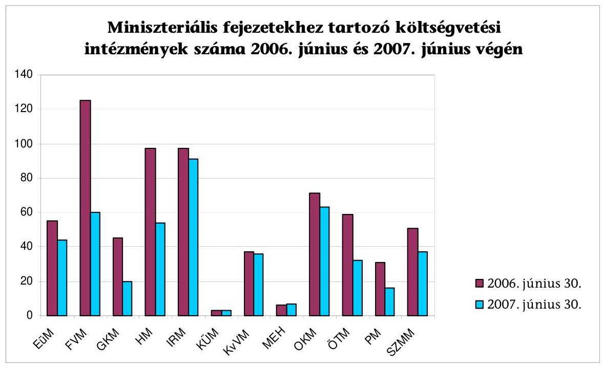

Forrás: ÁSZ tanúsítványok
A fejezeti feladatokat - a tanúsítványok szerint - 2006 nyarán 677, 2007 nyarán 463 intézmény végezte. Radikálisan csökkentették az intézmények számát a GKM-nél ( $44 \%$-ra) is, az FVM-nél ( $48 \%$-ra), a PM-nél ( $52 \%$-ra), az ÖTM-nél ( $54 \%$-ra) és a HM-nél ( $56 \%$-ra). Megyei intézményeket régiókba szervezett az EüM, a GKM, a PM és az SZMM. A hálózatok összevonásával például az FVMnél a párhuzamosan múködő szakterületekből (állategészségügy, növény- és talajvédelem, földművelésügy, erdészet) közös szakigazgatási intézmény jött létre.

[^0]
[^0]:    ${ }^{25}$ A létszámcsökkentéshez kapcsolódó végkielégítésekre a költségvetési törvényekben meghatározott céltartalék nyújtott fedezetet.
    ${ }^{26}$ 2005. évi CLIII. törvény a Magyar Köztársaság 2006. évi költségvetéséről.
    ${ }^{27}$ A PM 2008. 04. 21-i tájékoztatása szerint az adatok összegzése folyamatban van, a jelentés a zárszámadás keretében készül el.
    ${ }^{28}$ 2236/2007. (XII. 15.) Korm. határozat az államháztartás hatékony múködését elősegítő szervezeti átalakításokról és az azokat megalapozó intézkedésekről szóló 2118/2006. (VI. 30.) Korm. határozat módosításáról, 2. pont).

---

A foglalkoztatottak összlétszáma 2006-ban 240580 fő, 2007-ben 227766 fő volt. Az átalakítások következtében a legfeljebb 200 főt foglalkoztató intézmények részaránya alacsonyabb, a legalább 201 főt foglalkoztatóké pedig magasabb lett 10 százalékponttal. 2007-ben a létszám $91 \%$-át (2006 nyarán a $85 \%$ át) a 200 főnél magasabb létszámú intézmények foglalkoztatták.

A minisztériumok által kitöltött kérdőívek és a helyszíni tapasztalataink szerint a tárcák - a végrehajtott átalakításoknál - a feladatok és az intézmények át-adását-átvételét, a szervezet-átalakításokat megszervezték, a módosult intézményi rendszer szabályozási környezetét kialakították (pl. a megszüntető, alapító okiratokat kiadták, az új SZMSZ-eket számon kérték).

A központi költségvetés intézményi rendszerét átfogóan érintő, több száz intézményre kiterjedő átalakításra úgy került sor, hogy elmaradt az állami feladatok körének, terjedelmének ${ }^{29}$, finanszírozásának előzetes felülvizsgálata ${ }^{30}$, intézményi modellek, feladat- és teljesítménymutatók, kritériumok meghatározása. Mindezek hiányában a döntően a PM tapasztalatain alapuló intézkedések magukban hordozzák a visszarendeződés veszélyét ${ }^{31}$, ami kockázatot jelenthet a tartós kiadáscsökkenés megvalósulása, az intézményi struktúra és a költségvetés hosszabb távú stabilitása szempontjából. ${ }^{32}$

A Kormányhatározatot 2007 végéig 19 alkalommal módosították, a változások mind a feladatokat, mind pedig a határidőket érintették. A Kormányhatározat dokumentált államigazgatási egyeztetése elmaradt, bár az egyeztetés megelőzhette volna az elrendelt intézkedések módosításait, kiszűrhette volna a szakmai vagy hatásköri feltételek hiányában végre nem hajtható feladatokat, az irreális határidőket ${ }^{33}$.

Előfordult végre nem hajtható intézkedés előírása (például kétharmados parlamenti támogatást igénylő intézkedést írtak elő a megyei katasztrófavédelmi igazgatóságok regionális átszervezésére ${ }^{34}$; egészségügyi intézmény helyi önkormányzati szervnek - vizsgálat alapján történő - átadását rendelte el a Kormányhatározat a felügyeletet ellátó miniszter felelősségi körében, az ön-

[^0]
[^0]:    ${ }^{29}$ „A közfinanszírozás parttalanná és átláthatatlanná válik, ha az állam nem dönt egyértelmüen arról, hogy konkrétan melyek azok a javak, szolgáltatások, amelyekről maga kiván gondoskodni." - A közpénzügyek szabályozásának tézisei (ÁSZ, 2007. április).
    ${ }^{30}$ A PM nem tartja indokoltnak az állami feladatok előzetes felülvizsgálatának hiányolását.
    ${ }^{31}$ A MeH és a PM nem tart a visszarendeződés veszélyétől.
    ${ }^{32}$ A kockázatok kezelésére a Kormány a közfeladatok felülvizsgálatával kapcsolatos további feladatokról rendelkezett a 2233/2007. (XII. 12.) Korm. határozatban.
    ${ }^{33}$ A PM tájékoztatása szerint számos szóbeli egyeztetés történt a tárcákkal, azonban ezek dokumentumai (jegyzőkönyv, emlékeztetők) az ellenőrzés számára nem álltak rendelkezésre.
    ${ }^{34}$ A közigazgatási hivatalok regionális átalakítására elfogadott törvénymódosítást az Alkotmánybíróság a döntéshozatal módja (egyszerú parlamenti többségű elfogadás) miatt alkotmányellenesnek ítélte (kétharmados törvényt kétharmados többséggel kell módosítani), és a változtatást 2008. június 30 -ai hatállyal törölte. Az ÖTM tájékoztatása szerint 2008. áprilisban ötpárti egyeztetések folytak a szabályozás újabb tervezetéről.

---

kormányzat azonban az átvétellel nem értett egyet, és az intézményt nem vette át); nem megfelelő́ határidő kitúzése (például kulturális közgyűjtemények központosított, gesztor általi ellátása, a munkaegészségügyi feladatok EüM-ből SZMM-hez átcsoportosítása); végrehajtott szervezeti változás visszarendezése (az OM Alapkezelő Igazgatóság SZMM-be átadása, majd visszahelyezése az OKM-hez).

A felülvizsgálatra, javaslattételre előírt, vagy a tárcák által szükségesnek tartott esetekben a vizsgálatok jellemzően a tárcák szakmai álláspontjával összhangban álló eredményekre jutottak, aminek következtében esetenként a tárcák javaslatokat tettek a Kormány javaslatának törlésére (a földhivatalok régiós szintre átszervezése) vagy attól eltérő változásra, egyben a Kormányhatározat módosítására. (Például az SZMM a regionális képző központoknak a regionalizálódó munkaügyi központokba olvadása helyett a területi integrált szakképzési központokkal történő legszorosabb együttműködésüket, a KvVM a környezetvédelmi, természetvédelmi és vízügyi felügyelőségek pénzügyi, könyvelési feladatainak központi ellátása helyett a gazdasági irányító feladatok öszszevonását javasolta.)

Az ellenőrzés során láttunk példát a Kormányhatározat tárca által kezdeményezett, olyan megalapozatlan módosítására is, ahol utóbb a végrehajtott szervezeti változás visszamódosítását kérték (az Őrségi Nemzeti Park Igazgatóság összevonása a Fertő-Hansági Nemzeti Park Igazgatósággal, majd önálló költségvetési szervként történő ismételt létrehozása).

Az előírt feladat-átcsoportosítás a Kormány közvetlen irányítása alatti szervezeteknél nem valósult meg határidőre (2007. január 1.). A humánerőforrás-menedzsment feladatok központi ellátásának szabályozási, szervezeti feltételeit folyamatosan alakították ki, ami a helyszíni vizsgálat idején is tartott. A minisztériumok könyvelésének Kincstárhoz telepítéséről rendelkező pontot 2006 végén hatályon kívül helyezték. A KVI megbízásának határidejét az ingatlanvagyon kezelésével - felkészültségének hiányában - módosították, majd a KVI a megszüntetését kimondó, időközben elfogadott vagyontörvény hatására már nem vette át a minisztériumi ingatlangazdálkodási feladatokat.

Az iroda-ellátási, ingatlan-üzemeltetési, alapvető informatikai és kommunikációs, gépjárművekkel kapcsolatos szolgáltatások nyújtását 2007 tavaszán vette át a KSZF. A feladatok központosított végzésének költségvetési hatásaira számítások nem készültek, a szolgáltatások indokolt mértékét és megfelelő színvonalát meghatározó módszereket nem dolgozták ki. A 2007 végén is hatályos szabályozás ${ }^{35}$ a szolgáltatások körének, terjedelmének meghatározását a KSZF és a minisztériumok szerződéses megállapodására bízta ${ }^{36}$. A kétoldalú szerződések

[^0]
[^0]:    ${ }^{35}$ 272/2003. (XII. 24.) Korm. rendelet a Központi Szolgáltatási Főigazgatóságról és 7/2007. (III. 19.) MeHVM rendelet a Központi Szolgáltatási Főigazgatóság által nyújtott ellátási szolgáltatások köréről, terjedelméről, valamint az igénybevétel rendjéről.
    ${ }^{36}$ A KSZF által nyújtott szolgáltatások terjedelme, mennyiségi és minőségi szintjének kétoldalú szerződésekben történő meghatározását az ÁSZ nem tartotta hosszabb távon fenntarthatónak a 2007. évi költségvetés véleményezéséről készített jelentésében (0641).

---

rendszere nem garantálja a feladatok takarékosabb elvégzését. A tervezett normatívákon alapuló, integrált ellátási rendszer bevezethetőségét, annak jogi feltételeit a hatályos szabályozás 2007 végén még nem teremtette meg ${ }^{37}$.

A Kormányhatározat az elrendelt szervezeti átalakítások végrehajtásának figyelemmel kíséréséről is rendelkezett. A MeH a beszámolás és értékelés egységes rendszerét kialakította, a minisztériumok havi beszámolói alapján a (rész)feladatok teljesítését nyomon követte, és rendszeresen tájékoztatta a Kormányt, az Államreform Bizottságot. A MeH ösztönözte a minisztériumok illetékes vezetőit a végrehajtásban mutatkozó lemaradások valós okainak feltárására, a problémák megoldására.

A beszámoltatás rendszere az intézkedésekkel elérhető egyszeri és tartós megtakarításokról nem eredményezett megbízható adatokat. A havonta beküldött adatok az időközben meghozott döntések miatt változtak, és helyszíni tapasztalataink szerint a minisztériumok 2007 novemberéig sem munkálták ki valamennyi szervezeti intézkedés pénzügyi hatását. A hiányos minisztériumi adatok egyszerű összesítésének torzító hatását (pl. a fejezetek közötti feladat- és intézmény átadások összesített hatásaként féloldalas, csak az egyik tárcánál kimutatott hatás figyelembevételét) a MeH nem szűrte ki. A Kormánynak készített tájékoztatók a megtakarítások alakulását részleteiben nem értékelték ${ }^{38}$.

Az intézkedések eredménye az elvárt költségvetési előnyök bekövetkezte szempontjából csak egy területen állapítható meg, mivel konkrétan megtakarításokat a létszám csökkentésére határoztak meg ( 50 Mrd Ft ). Az intézményrendszer átalakítása költségvetési összefüggéseinek évközi megítéléséhez a minisztériumoknál (esetenként az intézményeknél) hiányoztak az intézményi átszervezések miatt fölmerült kiadások adatai.

A nyilvánosság számára elérhető egyéb információs források adataiból (törzskönyv és statisztikai adatok) az intézményrendszer változásának hatásai (az intézmények számának csökkenésén kívül) nem mutathatók ki. Az információk előállításának ráfordításai korlátozottan hasznosultak. Összehangoltabb adatközléssel a nyilvánosság számára is követhetők lennének a közszféra változásai.

A miniszteriális fejezetekhez tartozó központi költségvetési szervek száma a költségvetési intézmények közhiteles nyilvántartása, a törzskönyv szerint 2006. június végén 553, 2007. június végén 444 volt. A törzskönyvi nyilvántartás a változások határidőn túli bejelentése miatt nem volt naprakész, ami a közhite-

[^0]
[^0]:    ${ }^{37}$ A Központi Szolgáltatási Főigazgatóság által nyújtott szolgáltatások normarendszer keretében történő biztosításáról szóló MeHVM rendelet tervezetét a MeH elkészítette, egyeztetése folyamatban van.
    ${ }^{38}$ A Kormány 2007 decemberében a PM feladataként előírta, hogy készítsen átfogó elemzést és jelentést a Kormányhatározat költségvetési hatásairól. (2236/2007. (XII. 15.) Korm. határozat az államháztartás hatékony múködését elősegítő szervezeti átalakításokról és az azokat megalapozó intézkedésekről szóló 2118/2006. (VI. 30.) Korm. határozat módosításáról, 2. pont).

---

lességét is csorbította. A pénzügyminiszter az adatszolgáltatás részletes szabályait nem határozta meg.

A költségvetési intézményekről és múködésükről a nyilvánosság számára a szervezetekhez és a fejezetekhez kapcsolódó információk (törzskönyv, költségvetés, szervezeti dokumentumok, beszámolók), valamint statisztikai adatok állnak rendelkezésre. Az államháztartási és statisztikai információk rendszerezettsége különbözik, az eltérő forrásokból származó adatok nem kapcsolhatók öszsze, nem összevethetők. A költségvetés egyes szervezeti típusainak (Kszt. szerinti központi államigazgatási szervek) szervezeti, múködési jellemzői egyik információs rendszerből sem gyüjthetők ki közvetlenül, mivel a nyilvántartásokat nem készítették fel e típusok megkülönböztetésére.

A helyszíni ellenőrzés megállapításainak hasznosítása mellett javasoljuk:

# a Kormánynak: 

1. tegyen javaslatot az Országgyűlés számára az állami szerepvállalás tartalmára, mértékére, az állam által tartósan ellátandó, finanszírozandó feladatokra;
2. dolgoztassa ki az állami feladatok célszerű ellátásának szervezeti modelljeit, teljesítmény kritériumait;
3. intézkedjen a költségvetési szerveket és tevékenységüket jellemző államigazgatási és statisztikai információk összehasonlítható adattartalmának kialakítása érdekében.

## a pénzügyminiszternek:

gondoskodjon a törzskönyvi nyilvántartás naprakészségéről, a nyilvántartásba vétel és az adatszolgáltatás részletes szabályainak meghatározásáról.

---

# II. RÉSZLETES MEGÁLLAPÍTÁSOK 

## 1. A KÖZPONTI KÖLTSÉGVETÉS INTÉZMÉNYRENDSZERÉNEK ÁTALAKÍTÁSA

### 1.1. Az intézményrendszer felülvizsgálatára, átalakítására 2006 nyaráig tett kormányzati intézkedések

Az ellenőrzött időszakban a Kormány több, tartalmában és a végrehajtás időszakában egymást átfedő intézkedést hozott az intézményrendszer átalakítására. (Az intézményrendszer átalakításához kapcsolódó, több fejezetet érintő kormányhatározatok listáját az 2. számú melléklet tartalmazza.)
2004. márciusban az EU elvárásoknak (átláthatóság, elszámoltathatóság, takarékosság, fenntarthatóság) történő megfelelés, valamint a konvergencia program teljesítésének megalapozására a Kormány az államháztartás egyensúlyi helyzetének javításához szükséges rövid és hosszabb távú intézkedésekről hozott határozatot ${ }^{39}$. A határozat többek között a hatékonyabb feladatellátás, koncentráltabb szervezetrendszer megteremtésére a központi intézményrendszer átalakításával összefüggő konkrét és általános intézkedéseket rendelt el. A konkrét feladatok kijelölt központi költségvetési szervek és alapítványok, közalapítványok stb. átalakítására, megszüntetésére, összevonására vonatkoztak. Általános feladatként intézkedési tervek kidolgozását írta elő a miniszterek részére 2004. április végi határidővel, a fejezethez tartozó költségvetési és egyéb szervezetek átalakítására, feladatellátásuk hatékonyabbá tételére, a múködési költségek csökkentésére.

A végrehajtás alakulását értékelve, 2004. júniusban - a Pénzügyminisztérium (PM) előkészítésével - a Kormány úgynevezett jegyzőkönyvi határozatban ${ }^{40}$ rögzítette a feladatokat. Az előkészítés és megvalósítás személyi, tárgyi és pénzügyi feltételeit is tartalmazó, felülvizsgálatra alapozott fejezeti intézkedési tervek elkészítését 2004. augusztus 31-ei határidővel írta elő, egyúttal a pénzügyminiszter az intézkedési terv tartalmára és a felülvizsgálat szempontjaira vonatkozó útmutató kiadására kapott felhatalmazást. Az útmutatót a PM a jegyzőkönyvi határozattal egy időben kiadta.

Az útmutató a közfeladat-ellátás szervezeti formájának és szervezetének meghatározásához egyrészt javasolta figyelembe venni a jogalkotásban e területen részben azóta is - kidolgozás alatt álló jogszabályi változások tervezett irányultságát (pl. a menedzservezetés előírása, az eltérő tevékenységet végző intézmé-

[^0]
[^0]:    ${ }^{39}$ 2050/2004. (III. 11.) Korm. határozat az államháztartás egyensúlyi helyzetének javításához szükséges rövid és hosszabb távú intézkedésekről.
    ${ }^{40}$ A Kormány 2004. VI. 2-ai jegyzőkönyvi határozata az államháztartás hatékony múködését elősegítő szervezeti átalakításokról és az azt megalapozó intézkedésekről.

---

nyekre bizonyos elemeiben különböző gazdálkodási szabályozás). Másrészt az optimális üzemméret kialakítását, a takarékos állam feltételei között nem vállalható közfeladatok körének szűkítését, profiltisztítást, a kis létszámú szervezetek megszüntetését, összevonását, valamint a megyei szintű intézmények és gazdálkodó szervezetek regionális szintű szervezetekké alakítását.

Egyes gazdálkodó szervezeteknél a feladat (pl. támogatás-elosztás, intézményfenntartás, vagyonhasznosítás, beszerzés) költségvetési szerv keretében történő ellátását a szervezet megszüntetésével egyidejűleg, míg más gazdálkodó szervezeteknél a költségvetési források túlsúlya (közalapítványoknál 80\%, gazdasági és közhasznú társaságoknál 70\% felett) esetén azok megszüntetését, az előirányzat és a (közalapítványi) munkaszervezet feladatainak költségvetési szervhez telepítését javasolta az útmutató. A PM indokoltnak tartotta a 2002-ben és 2003-ban veszteséges gazdasági társaságok megszüntetését is.

A Kormány a jegyzőkönyvi határozatban kiválasztott, 4 intézmény szervezeti átvilágítását, illetve annak eredményeként más szervezeteknél is hasznosítható szervezeti modellek kialakítását rendelte el. A PM a külső szakértők kiválasztására a közbeszerzési eljárást elindította. Arra való hivatkozással, hogy az FVM saját intézményrendszerének 2005. évre tervezett felülvizsgálata a jegyzőkönyvi határozatban kiválasztott intézményeket is érintett, az eljárást leállították. A tevékenységhez illeszkedő optimális szervezet, a „benchmark" intézményi modellek kialakítása elmaradt.

A tárgyalásos eljárásra történő - közbeszerzési eljárások lebonyolítására szakosodott cég bevonásával készített - ajánlati felhívás szerint a szerződés tárgya 4 központi költségvetési szerv ( 1 db egyetem, 1 db megyei állategészségügyi és élelmiszerellenőrző állomás, 1 db ÁNTSZ megyei intézet és 1 db múzeum) teljes átvilágítása, javaslattétel a változtatásokra, valamint az intézményrendszer megismerésével intézményi modellek kialakítása volt.

Az átvilágítás részét képezte volna a szervezet, a szakmai múködés és a gazdálkodás teljes spektrumának a vizsgálata, illetve javaslattétel a feladatellátási kötelezettséghez optimális szervezetre, takarékos és hatékony múködésre, gazdálkodásra, valamint a hálózathoz tartozó intézményrendszer megismerésén keresztül „benchmark" intézményi modell kialakítása.

# A határozatokban konkrétan előírt szervezeti intézkedések döntően 

megvalósultak, ugyanakkor a tárcahatáskörú felülvizsgálaton alapuló intézkedések nagyrészt elmaradtak. A minisztériumoknál végzett kérdőíves felmérés adatai alapján az egyes fejezeteknél intézményi felülvizsgálatokra alig került sor, azok megvalósítását - a helyszíni vizsgálat tapasztalatai alapján - szervezési és kapacitás problémák hátráltatták. 2005 februárjáig a korábban 93, vizsgálatra megjelölt szervezet-megszüntetésből 5 realizálódott, a folyamat lényegében megállt. Az intézkedési tervek jellemzően nem voltak teljes körüek sem a szervezeti kört, sem a vizsgálandó szempontokat illetően, az eltéréseket a tárcák ugyanakkor nem indokolták, hiányzott a költségvetési hatások bemutatása, és intézkedés helyett az elutasítás indokait tartalmazták.

Például az EüM a határozatok előírásai nyomán készített intézkedési tervet, amit azonban az intézményi kör és a feladatellátás egészére kiterjedő, a kapacitáskihasználtságra, a költségmegtakarításra vonatkozó intézményi felülvizsgálatok nem alapoztak meg. Vizsgálatok alapvetően csak a megszüntetés-fenntartás kér-

---

désére helyezték a hangsúlyt. A komplex intézményi átvilágítás elvégzését a rendelkezésre álló határidő rövidsége, financiális és humán kapacitás hiánya, a szakmai főosztályok nem megfelelő együttműködése hátráltatta.

A tárca törekvései az infrastrukturális és egyes szakmai feladatok központosítása irányába hatottak. A Semmelweis Orvostörténeti Múzeum, Könyvtár és Levéltár gazdasági önállósága a 2004. év végével megszűnt, a működés technikai feltételeit az Egészségügyi Stratégiai Kutatóintézet (ESKI) biztosította. 2005-ben az ÁNTSZ 5, központi szakmai feladatokat ellátó országos hatáskörű szervezetének üzemeltetési feladatait az Országos Tisztifőorvosi Hivatal (OTH) szervezeti keretében vonták össze. 2005-ben a korábban klinikai és más intézeti bázison működő 13 országos intézetet (pl. Országos Érsebészeti Intézet, Országos Röntgen- és Sugárfizikai Intézet) megszüntettek. A megszűnő intézetek szakmai, módszertani feladatait az ÁNTSZ keretén belül létrehozott Országos Szakfelügyeleti Módszertani Központhoz telepítették.

A 2006. január 1-jétől működő Igazságügyi Hivatal az IM Pártfogó Felügyelői és Jogi Segítségnyújtó Szolgálat Országos Hivatala, valamint a Központi Kárrendezési Iroda bázisán jött létre, így a 2006. évi szervezeti intézkedések már nem érintették.

A szervezeti intézkedések elhúzódását, végre nem hajtását tapasztalva, a Kormány 2005. márciusban és 2006. májusban újabb határozatokban ${ }^{41}$ utasította a szervezeti átalakításokkal kapcsolatos feladatok végrehajtására a fejezetek felügyeletét ellátó szervek vezetőit. Az utóbbi határozatban határidőként 2006. augusztus 31 -ét tűzte ki.

A Kormány 2005. márciusban az átalakítással kapcsolatos intézkedési tervek megújítására szólított fel, 2006. májusban a legnagyobb kiadási előirányzattal rendelkező központi költségvetési szervek (intézmények, intézményhálózatok) körében indokolt konkrét szervezeti intézkedésekre és a múködés átalakítására vonatkozó - szervezetfejlesztési szakértők bevonásával készítendő - javaslatok elkészítését írta elő.

A Kormányt a PM tájékoztatta a fejezetek szervezeti intézkedéseiről. A PM a tárcáktól bekért adatokat összegezve, alkalomszerűen (pl. kormányhatározatot megalapozó előterjesztés mellékleteként) számolt be a Kormánynak a végrehajtás állásáról és az elmaradásokról.

A szervezeti átalakítások megtorpanása mellett a fiskális eszközök (pl. támogatáscsökkentés, évközi és év végi zárolások) alkalmazása sem vezetett a kívánt eredményhez. A költségvetési egyensúly megbomlása tartósnak mutatkozott, ami folyamatosan napirenden tartotta a kiadások remélt vagy elvárt csökkentéséhez vezető szervezeti változások iránti igényt. A Kormány a fejezeti intézkedések kikényszerítésére - 2006 nyarán több száz intéz-

[^0]
[^0]:    ${ }^{41}$ 2044/2005. (III. 23.) Korm. határozat az államháztartás egyensúlyi helyzetének javításához szükséges rövid és hosszabb távú intézkedésekről szóló 2050/2004. (III. 11.) Korm. határozat módosításáról, továbbá a közszférát érintő szervezeti átalakítások folytatásáról és 1054/2006. (V. 26.) Korm. határozat a közigazgatás átalakításának előkészítésével kapcsolatos egyes feladatokról, a) pont.

---

ményt nevesítő intézkedéscsomagról ${ }^{42}$ (Kormányhatározat) rendelkezett, és rendszeres beszámoltatást is előírt.

A szervezeti átalakításokhoz nem álltak rendelkezésre mérceként alkalmazható, a tevékenység és a szervezet jellemzőire vonatkozó mutatók (pl. az ügy- és ügyfélforgalomtól függően szükséges létszám). A költségvetési szervezetek intézményi típusainak kialakítására, átfogó szabályozására 2007 végéig nem került sor, az ún. státusztörvény tervezetének egyeztetése 2008 elején is folyamatban volt. A központi költségvetés sajátos intézményi típusait időközben a központi közigazgatás területén szabályozták. Az Országgyúlés (OGY) a kormányzati szervezetrendszer múködésének hatékonyabbá tétele érdekében - 2006. május 30-i ülésnapján - elfogadta a központi államigazgatási szervekről, valamint a Kormány tagjai és az államtitkárok jogállásáról szóló 2006. évi LVII. törvényt (Kszt.). A törvény meghatározta a központi államigazgatási szervek körét, pontosította a kormányhivatalok, a központi hivatalok és a rendvédelmi szervek fogalmát, jogállását, szervezetét.

A törvény célul tűzte ki, hogy - egységesen határozva meg a Kormányra, a központi kormányzati szervezetre és az állami vezetőkre vonatkozó alapvető rendelkezéseket - a modern kormányzati szervezet kódexe legyen. A minisztériumok szervezetére kötelezően alkalmazandó sémát alkotott, korlátozta a tárca nélküli miniszterek számát.

Az egyes szervezeti típusok előnyeinek és hátrányainak áttekintése nélkül, egy meghatározott szervezeti típus alkalmazására intézkedett a Kormány 2007. június közepén ${ }^{43}$. A közszolgáltató intézmények állami (önkormányzati) tulajdonú nonprofit gazdasági társasággá átalakításának vizsgálatát folyamatban lévő szervezeti átalakítási intézkedések és a közfeladat felülvizsgálata közepette írta elő. A határozat előzetes egyeztetése nem történt meg, az előterjesztés a vizsgálat főfelelőseként megjelölt PM-ben a helyszíni ellenőrzés idején nem volt fellelhető. A feladat végrehajtása során a PM az eredetileg rendkívül szűk, irreális, június 30-i határidőt nem tudta tartani. A feladatok pénzügyi igazgatási szempontból történő vizsgálatán alapuló, 2007 augusztusában elkészült PM részjelentés ${ }^{44}$ elsősorban fiskális szemszögú hátteret biztosít a közszolgáltatást végző szervek nonprofit gazdasági társasággá történő átalakítása komplex vizsgálatának lefolytatásához. A komplex vizsgálat elvégzésére a helyszíni ellenőrzés végéig nem került sor.

[^0]
[^0]:    ${ }^{42}$ 2118/2006. (VI. 30.) Korm. határozat az államháztartás hatékony működését elősegítő szervezeti átalakításokról és az azokat megalapozó intézkedésekről.
    ${ }^{43}$ 2112/2007. (VI. 15.) Korm. határozat egyes költségvetési szervek átalakulásával öszszefüggő feladatokról.
    ${ }^{44}$ Részjelentés a költségvetési szervek átalakításával összefüggő feladatokról szóló 2112/2007. (VI. 15.) Korm. határozat 1. pontjában foglalt vizsgálathoz.

---

# 1.2. Közfeladat felülvizsgálat 

Az állam által ellátandó feladatok és finanszírozási módjuk, eszközük felülvizsgálatának eredményei nem álltak rendelkezésre a kormányzati szervezeti döntések megalapozásához ${ }^{45}$.

A közfeladatok felülvizsgálatáról szóló 2229/2006. (XII. 20.) Korm. határozat alapján 2007 februárjában valamennyi tárcánál elindult a felülvizsgálati munka, melynek célja az volt, hogy az állam a megfelelő tevékenységeket optimális szinten és a leghatékonyabban végezze el. A mélyreható és tartós szerkezeti reformok végrehajtásának feltétele annak tisztázása, hogy az állam hol, mekkora mértékben és milyen formában vállaljon szerepet, és mit finanszírozzon. A felülvizsgálat folyamatában, a javaslatok kidolgozásában - közbeszerzési eljárás keretében kiválasztott, és az Államreform Operatív Programból finanszírozott - külső tanácsadó cégek konzorciuma múködött közre. A vizsgálat módszerét az Államreform Bizottság (ÁrB) titkársága a határozatban előírt határidőre kidolgozta és közzétette (A módszertani útmutatót, tanulmányokat, az elkészült részeredményeket - az elkészített feladatkatasztert - az államreform honlapján ${ }^{46}$ is folyamatosan közzétette).

Bár az államigazgatásban újszerű felülvizsgálat végrehajtása az előírt határidőkhöz képest csúszással történt meg, az állam által ellátott feladatok kataszterének felállításával rendszerezetten, szisztematikusan áttekintették azokat a feladatokat, amelyekért az állam és/vagy az önkormányzat valamilyen (szabályozási, ellátási, finanszírozási) felelősséget vállal ${ }^{47}$. A közfeladat felülvizsgálat során a feladatokat végző intézményrendszer múködését azonban abból a szempontból nem értékelték, hogy a Kormányhatározatban megjelölt szervezeti intézkedések nyomán kialakult új struktúrában a központi költségvetési szervek milyen hatásfokkal látják el a feladatokat.

A felülvizsgálat első lépésében a minisztériumok - a külső tanácsadókkal együttműködve - összegyűjtötték és egységes módszertani elvek alapján ún. feladatkataszterbe rendezték az ágazati feladat- és hatáskörükbe tartozó valamenynyi, közszektort érintő tevékenységet, feladatot és funkciót. A feladatkataszter alapján azonosított 760 feladatcsoportot előre meghatározott módszertan alapján, hat kérdéscsoportból álló teszt segítségével vizsgálták felül.

A felülvizsgálat alapján közel 150 javaslat született az egyes közfeladatok terjedelmének, elvégzése módjának vagy finanszírozásának módosítására. Számos területen további vizsgálat elvégzését tartotta indokoltnak az ÁrB, az erről, valamint a folyamatban lévő feladatokról szóló előterjesztés 2007. október végén el-

[^0]
[^0]:    ${ }^{45}$ A PM nem tartja indokoltnak az állami feladatok előzetes felülvizsgálatának hiányolását.
    ${ }^{46}$ http://www.allamreform.hu/index.html.
    ${ }^{47}$ A felülvizsgálat nem terjedt ki az állam szerepvállalásának újragondolására (Előterjesztés a Kormány részére a közfeladatok felülvizsgálatával kapcsolatos további feladatokról, 2007. november 23.).

---

készült, azt a Kormány megtárgyalta. A kiadott határozatban ${ }^{48} 55$ kijelölt területen vizsgálat elvégzését rendelte el a Kormány, mintegy 30 területre vonatkozóan előterjesztés készítését vagy saját hatáskörben megteendő intézkedést rendelt el a miniszterek számára.

A felülvizsgálat fontos eleme volt az egyes közfeladatok ellátása kiadásainak meghatározása, amelynek célja annak modellezése volt, hogy a jövőben milyen módszer alkalmazásával lehetséges egy feladatalapú költségvetés elkészítése. A 2007. évi költségvetés (eredeti előirányzat) felosztása a feladatkataszterben szereplő feladatcsoportokra megtörtént, a MeH várakozásai ${ }^{49}$ alapján az előállt adatbázis kiindulást jelenthet egy programalapú költségvetés tervezéséhez. Az ÁSZ megítélése szerint a programköltségvetés irányába mutató kezdeti lépések megtétele a 2008. évi költségvetési törvényjavaslatban nem tükröződött ${ }^{50}$.

# 1.3. Az államháztartás hatékony múködését elősegítő szervezeti átalakításokról és az azokat megalapozó intézkedésekről szóló 2118/2006. (VI. 30.) Korm. határozat végrehajtása 

### 1.3.1. A Kormányhatározat tartalma, célja, jelentősége

A Kormány a 2004-2005. évek kormányhatározataiban foglalt feladatok végrehajtásának elmaradása - az 1054/2006. (V. 26.) Korm. határozatban előírt szervezeti javaslatok augusztus végi határidejét nem megvárva -, az államháztartás helyzete miatt és a konvergencia program teljesítése érdekében tételes szervezet-átalakítási feladatokat írt elő a miniszterek részére, valamint további szervezeti intézkedéseket megalapozó rövid határidejú felülvizsgálatokat rendelt el.

A Kormányhatározat döntően 2007. január 1-jei határidőt szabott meg, és előírta a minisztériumoknak a végrehajtásról történő folyamatos beszámolást és tájékoztatást (havi monitoring jelentések formájában).

A Kormányhatározat a miniszterek számára - mind a központi intézményrendszer, mind a feladatkörükhöz tartozó, költségvetési körön kívüli szervezetek (alapítvány, közalapítvány, közhasznú társaság, gazdasági társaság) vonatkozásában - határidőzött, konkrét szervezeti intézkedéseket jelölt ki. A határozat minősített és egyszerű többségű elfogadásra irányuló törvényjavaslatok elkészítése mellett - későbbi intézkedések megalapozására - vizsgálatokat rendelt el, illetve a további múködésre vonatkozóan javaslattételt írt elő, jellemzően 2006. augusztus, szeptember végi és december 31-ei határidőkkel.

[^0]
[^0]:    ${ }^{48}$ 2233/2007. (XII. 12.) Korm. határozat a közfeladatok felülvizsgálatával kapcsolatos további feladatokról.
    ${ }^{49}$ Előterjesztés a Kormány részére a közfeladatok felülvizsgálatával kapcsolatos további feladatokról (A kormányzati igazgatás összehangolásáért felelős tárca nélküli miniszter, 2007. október 24.).
    ${ }^{50}$ Vélemény a Magyar Köztársaság 2008. évi költségvetési javaslatáról (0736, 2007. október).

---

A Kormányhatározatban elrendelt szervezeti változások alapvető rendezési elve és kormányzati szándéka a múködési költségekben elérhető megtakarítások realizálása, a meglévő intézményi rendszerből adódó kényszerpályák leépítése, azaz - az indoklás szerint - „a kiadások szervezetfenntartáshoz kötődő determinációjának csökkentése" volt. A Kormányhatározat - gyakorlatilag megismételve a már 2004-2005-ben is kitűzött célokat és szempontokat - a hatékonyabb szervezeti keretekben történő közfeladat-ellátás megalapozását kívánta elérni. A Kormányhatározat döntő arányban a PM-ben folyó sokéves szakmai munka tapasztalataira építő intézkedéscsomagot tartalmazott, és a Kormány programjában foglaltakkal ${ }^{51}$ összhangban került kidolgozásra. A Kormány a korszerűbb intézményi struktúra kialakításával párhuzamosan a minisztériumok, igazgatási és igazgatás jellegű központi költségvetési szervek összlétszámának felső határáról ${ }^{52}$ is rendelkezett.

Az intézkedések a központi költségvetési szervek körében a következő elvek mentén alakultak ki: feladatellátás indokolatlansága esetén megszüntetés, intézményi működés üzemméretének növelése összevonással, új költségvetési szerv létrehozásával, helyi önkormányzatnak átadással, területi koncentráció, horizontális összevonás, illetve regionalizáció, pénzügyi, szakmai, fizikai ellátó szervezetek összevonása, gazdálkodó szervezetté alakítás vagy visszaszervezés költségvetési szervvé.

A megtakarításokat a párhuzamos tevékenységek megszüntetése, a feladat jellegéhez jobban igazodó múködési-irányítási forma kialakítása, a méretgazdaságosság kialakítása és a profiltisztítás révén kívánta elérni a Kormányhatározat. Kiemelt feladatként fogalmazódott meg az államháztartáson kívüli, azaz a nem költségvetési szerv által végzett állami feladatellátás visszaszorítása is.

Közvetlen hatásként optimális intézmény-, illetve szervezeti egység méretek létrehozását, ezzel a döntési szintek számának csökkentését, az indokolatlan tevékenységi-, kapacitás párhuzamosságok megszűnését remélték. A nem költségvetési szervezeti feladatellátás körében a cél a forráshoz igazodó szervezeti megol-

[^0]
[^0]:    ${ }^{51}$ Új Magyarország - a Magyar Köztársaság Kormányának programja a sikeres, modern és igazságos Magyarországért 2006-2010., „Reformok az új Magyarországért" fejezet „Államreform" alfejezet, valamint „Kisebb, szolgáltató közigazgatás" alfejezet (regionális koncentráció, dekoncentrált hivatalok számának csökkentése, az állami részvétellel működő gazdasági társaságok és alapítványok hatékonyabb múködését célzó intézkedések). Előterjesztés a Kormány részére az államháztartás hatékony múködését elősegítő szervezeti átalakításokról és az azt megalapozó intézkedésekről (Miniszterelnöki Hivatalt Vezető Miniszter, Budapest, 2006. június). Ez utóbbi szerint „A 2004-2008ra vonatkozó konvergencia program teljesitésének alapvető feltétele a kisebb, takarékosabb állam, szükebb állami feladatkör, hatékonyabb feladatellátás és koncentráltabb szervezetrendszer létrehozása."
    ${ }^{52}$ 2117/2006. (VI. 30.) Korm. határozat a Miniszterelnöki Hivatalban, a minisztériumokban, az igazgatási és az igazgatás jellegű tevékenységet ellátó központi költségvetési szerveknél foglalkoztatottak létszámáról; 2131/2006. (VII. 26.) Korm. határozat az igazgatási és igazgatás jellegű tevékenységet ellátó központi költségvetési szerveknél foglalkoztatottak létszámáról (hatályon kívül helyezte a Miniszterelnöki Hivatalban, a minisztériumokban, az igazgatási és az igazgatás jellegű tevékenységet ellátó központi költségvetési szerveknél foglalkoztatottak létszámáról szóló 2229/2007. (XII. 5.) Korm. határozat).

---

dás ${ }^{53}$ (privatizálás, veszteséges cégek felszámolása) volt. Ezzel a 90-es években nagy számban, a létszámleépítések nyomán létrejött alapítványok, közalapítványok, közhasznú társaságok visszaszorítására intézkedett a kormányzat.

A magyar közigazgatásban ilyen nagyságrendú, a központi és a helyi, területi államigazgatási szervek (415-öt), valamint az irányításuk alá tartozó alapítványok, közalapítványok, közhasznú társaságok, gazdasági társaságok (96-ot) ${ }^{54}$ százait érintő szervezeti átalakítás az utóbbi évtizedben nem volt. A Kormányhatározat előkészítéseként azonban nem vizsgálták felül az állami feladatok körét, terjedelmét, finanszírozásuk forrásait, nem épültek egymásra a jelentős strukturális átalakítást megalapozó lépések, és hiányzott a feladatok végrehajtásának folyamatos nyomon követése. Mindez nem zárja ki a visszarendeződés lehetőségét ${ }^{55}$, ami kockázatot jelenthet az intézményi struktúra és a költségvetés hosszabb távú stabilitása szempontjából ${ }^{56}$.

# 1.3.2. A Kormányhatározat végrehajtása 

A Kormányhatározat tervezetének egyeztetése a kormányprogram készítésével párhuzamosan, majd az előterjesztés első változatakor felső vezetői szinten megtörtént, dokumentált államigazgatási egyeztetés azonban nem volt ${ }^{57}$. Az érintett szakapparátusok és intézmények a Kormányhatározat véleményezésében nem vettek részt. Az egyeztetés az elrendelt intézkedések számos későbbi módosításának elkerülését és teljesíthető határidők kitűzését tette volna lehetővé.

A Kormányhatározat a tárcák egyes szakmai, gazdasági, ellátó funkcióinak átcsoportosítását írta elő, egyebek mellett a könyvelési tevékenységét a Magyar Államkincstárba. A feladat előkészítetlenül, általános megfogalmazással került kijelölésre, nem tisztázták milyen könyvelésről (pl. főkönyvi, analitikus) rendelkezik a Kormányhatározat. A rendelkezés 2006 végén hatályát vesztette ${ }^{58}$. Nem volt egyértelmú, hogy milyen feladatok átadását írta elő a Kormányhatározatnak az „egyes" informatikai feladatok MeH Elektronikus Közszolgáltatások Központjába való átcsoportosításáról szóló rendelkezése.

[^0]
[^0]:    ${ }^{53}$ Pl. döntően államháztartási forrás esetén fejezeti kezelésű előirányzattá alakítás és a szervezet végelszámolása, közalapítványi forma visszaszorítása, jelentős saját forrásszerző képesség esetén gazdálkodó szervezetté alakítás, kht-k állami támogatásának csökkentésével a valós piaci múködésre való ösztönzéssel.
    ${ }^{54}$ Az adatok forrása: Előterjesztés a Kormány részére az államháztartás hatékony múködését elősegítő szervezeti átalakításokról és az azokat megalapozó intézkedésekről szóló 2118/2006. (VI. 30.) Korm. határozat végrehajtásáról és módosításáról, 2007. november.
    ${ }^{55}$ A MeH és a PM nem tart a visszarendeződés veszélyétől.
    ${ }^{56}$ A kockázatok kezelésére a Kormány a közfeladatok felülvizsgálatával kapcsolatos további feladatokról rendelkezett a 2233/2007. (XII. 12.) Korm. határozatban.
    ${ }^{57}$ A PM tájékoztatása szerint számos szóbeli egyeztetés történt a tárcákkal, azonban ezek dokumentumai (jegyzőkönyv, emlékeztetők) az ellenőrzés számára nem álltak rendelkezésre.
    ${ }^{58}$ 2255/2006. (XII. 25.) Korm. határozat az államháztartás hatékony múködését elősegítő szervezeti átalakításokról és az azokat megalapozó intézkedésekről szóló 2118/2006. (VI. 30.) Korm. határozat módosításáról.

---

A helyszíni tapasztalatok alapján a vizsgált tárcák egyes feladatoknak a Kormányhatározat szerinti intézkedéstől eltérő megvalósítását, és a Kormányhatározat módosításának kezdeményezését tartották szakmailag indokoltnak. Az SZMM kezdeményezésére 2006 decemberében - egyebek mellett - a Nemzeti Család- és Szociálpolitikai Intézet egyes feladatai átcsoportosításának célszervezetét módosították, és törölték az ESZA Kht. megszüntetésére vonatkozó rendelkezést. Ugyancsak az érintett tárca (EüM) előterjesztése nyomán a megszüntetésre kerülő Hungarotransplant Kht. feladatai és eszközei a Kormányhatározatban eredetileg megjelölt OTH helyett az Országos Vérellátó Szolgálathoz (OVSZ) kerültek.

A fejezeteknél végzett ellenőrzések tapasztalatai alapján nem tartották be a határidőt azokban az esetekben, amikor a szervezeti intézkedések végrehajtása több minisztérium vagy intézmény együttes döntését igényelte. Valamennyi érintett szerepével a Kormányhatározat nem számolt, előzetes egyeztetés az érintettekkel nem volt (a Kormányhatározat egyes feladatainak végrehajtását foglalja össze az 1. sz. függelék).

A Magyar Mezőgazdasági Múzeumnak a FVM-től az OKM-be történő átadása (határidő 2007. január 1.) az előzetesen kialakított megállapodás tervezet ellenére sem történt meg, mivel az OKM az FVM által a költségvetési tervben szerepeltetett több mint 70 M Ft-os támogatáscsökkentést szakmailag nem tartotta elfogadhatónak. Az FVM-mel tárgyalások kezdődtek, de a két tárca között nem alakult ki közös álláspont az ügy megoldására. Az FVM végül a múzeumot nem kívánta átadni. A Kormányhatározat ennek megfelelő módosítását előkészítette, a feladatot 2007 végén törölték.

Az ÁNTSZ feladatkörét érintő egyes feladatok és a feladatokat ellátó intézmények más fejezetnek (SZMM, FVM) történő átadása zökkenőmentes lebonyolítását is az érintett intézmények közötti - részben az egészségügyi tárcának és az ÁNTSZ-nek a feladatátadás indokoltságát alapjaiban megkérdőjelező szakmai álláspontjából adódó - együttmúködési, egyeztetési problémák akadályozták. A munkaegészségügy 2007. január 1-jétől a szociális és munkaügyi miniszter, az élelmiszerbiztonsági feladatok a földművelésügyi és vidékfejlesztési miniszter feladat- és hatáskörébe kerültek. Az egyeztetések az érintettek között a helyszíni vizsgálat idején még folyamatban voltak, mert nem született megállapodás az átadásra kerülő előirányzatok mértékében, sőt összetételében sem (munkaegészségügy) ${ }^{59}$. Az élelmiszerbiztonság FVM-mel közösen előterjesztett szabályozására csak többszöri egyeztetés után született többé-kevésbé kompromisszumos megoldás. A munkaegészségügyi feladatok kapcsán az ÁNTSZ kémiai laboratóriumának átadását a tárcák között felmerült vita előzte meg, amely a MeH közremúködésével zárult le.

Egyes feladatok végrehajtásához a szükséges jogszabályi feltételek, alkotmányos törvényi alapok nem voltak biztosítottak, a 2006-2007. évre kitűzött határidők intervallumában több, az átalakítások szempontjából lényeges szabályozási koncepció még nem volt tisztázott (pl. az államháztartási rendszer és közfeladat-ellátás újraszabályozása, a költségvetési szervek jogállásáról és gazdálkodásáról szóló törvény, vagyontörvény).

[^0]
[^0]:    ${ }^{59}$ Az EüM és az SZMM közötti - a munkaegészségügyi feladatok átadásával kapcsolatos - megállapodást 2007. december 13-án írták alá.

---

A Kormányhatározat előírta a megyei katasztrófavédelmi igazgatóságok regionális átszervezését. A katasztrófavédelemről szóló törvényt ${ }^{60}$ módosító javaslatot az OGY kétharmados támogatottság hiányában nem fogadta el, ezért a feladat nem volt végrehajtható. Az ÖTM kezdeményezte a határozatnak a végrehajtás elhalasztását célzó módosítását a szükséges jogi feltételek biztosításáig.

Ugyancsak regionalizációs szándékkal írta elő a Kormányhatározat az ÖTM részére a fővárosi és megyei közigazgatási hivatalok átalakítását. A Kormány előterjesztésére az OGY egyszerú többséggel módosította az Ötv. ${ }^{61}$ közigazgatási hivatalokról szóló 98. § (1) bekezdését (törölte a fővárosi, megyei jelzőt). A módosítást az Alkotmánybíróság alkotmányellenesnek minősítette ${ }^{62}$ (kétharmados törvény módosítása szintén kétharmados többséget igényelt volna), és a változtatást 2008. június 30 -ai hatállyal törölte. Az Alkotmánybíróság a döntésével a szabályozás módját kifogásolta, a regionális hivatalok létjogosultságát nem kérdőjelezte meg ${ }^{63}$.

A tárcák gazdasági, ellátó funkcióinak átcsoportosítását célzó feladatok végrehajtásában az előírt határidők be nem tartása a tárcákon kívül eső okra, a kormányzati szinten összevont központi ellátó, szolgáltató szervezetek teljes körú kiépülésének hiányára vezethető vissza.

A humánerőforrás-menedzsment feladatok központosított ellátása szervezeti és szabályozási feltételeinek megvalósítása a helyszíni vizsgálat idején is folyamatban volt. A minisztériumok a helyszíni vizsgálat idején sem rendelkeztek arról információval, hogy az informatikai üzemeltetési feladatok KSZF-nek történő átadásán túl milyen további feladatok átadását rendelte el a tárcák számára a Kormányhatározatnak az egyes informatikai feladatoknak a MeH Elektronikus Közszolgáltatások Központjába való átcsoportosítását előíró, a helyszíni vizsgálat idején is hatályos rendelkezése.

A Kormányhatározatban elrendelt egyes konkrét intézményátszervezések szakmai és gazdaságossági kérdések tisztázását, adott esetben külső szakértők bevonását - költségvetési többletkiadást - igényelte, ezért az előírt határidő nem volt tartható, illetve a vizsgálatok eredménye alapján az előírás esetenként módosult.

Az eredeti kormányzati elképzelésekhez képest ilyen okok miatt várat magára a Nemzeti Színház Zrt. és a Magyar Nemzeti Filharmonikus Zenekar, Énekkar és Kottatár Kht., illetve a Nemzetközi Pető András Közalapítvány költségvetési intézménnyé történő átalakítása is (OKM). Az intézményi átalakítás lehetséges módjai előnyeinek és hátrányainak kimutatásáról szakértői anyag készült.

A Kormányhatározat 2006. szeptember 30-i határidővel írta elő a Vasútegészségügyi Kht. központi egészségügyi szolgáltató szervezetbe történő in-

[^0]
[^0]:    ${ }^{60}$ 1999. évi LXXIV. törvény a katasztrófák elleni védekezés irányításáról, szervezetéről és a veszélyes anyagokkal kapcsolatos súlyos balesetek elleni védekezésről.
    ${ }^{61}$ 1990. évi LXV. törvény a helyi önkormányzatokról.
    ${ }^{62}$ 90/2007. (XI. 14.) AB határozat.
    ${ }^{63}$ Az ÖTM tájékoztatása szerint 2008. áprilisban ötpárti egyeztetések folytak a közigazgatási hivatalok szabályozására készített újabb tervezetről.

---

tegrálását, vagy szervezetének alternatív módon való racionalizálását. A Gazdasági és Közlekedési Minisztériumban (GKM) alakult szakértői team vizsgálata alapján nem indokolt a Kht-t beintegrálni, az alternatív szervezetracionalizálás az állami tulajdon csökkentése vagy megszüntetése lehet. Az üzletrész értékesítése a helyszíni vizsgálat lezárásáig sem került napirendre, mert az - a kapott tájékoztatás szerint - a MÁV szakszervezetekkel jelenleg több területen is zajló vitákat újabb konfliktusforrással növelné.

A Kormányhatározatot, mind a feladatokat, mind a határidőket illetően többször (2007. végéig 19 alkalommal) módosították, a döntések tartalma a végrehajtás szakaszában is változott (a megjelent módosításokat a 3. sz. melléklet tartalmazza ${ }^{64}$ ). A módosítások tárca elő́terjesztéseken és a MeH felé teljesített havi monitoring jelentéseken alapultak.

A Kormányhatározat a pénzügyi, könyvelési tevékenységnek a nemzeti park igazgatóságoktól (KvVM) egy új alapítású költségvetési szervhez történő átcsoportosítását írta elő. Az elrendelt felülvizsgálat eredményeként megállapították, hogy az átszervezés a feladatellátás megnehezítése mellett a múködési költségek növekedésével járna, ezért más szervezeti megoldást (az Örségi Nemzeti Park integrálása) terjesztettek elő. Ugyancsak felülvizsgálat alapján tett a tárca javaslatot egy megszüntetésre ítélt közhasznú társaság (Energia Központ Kht.) további múködtetésére, arra hivatkozva, hogy a Kht. által kezelt és elszámolt, 2008. évben befejeződő projektek pályázatait még öt évig ellenőrizheti az EU, így a szervezetnek jogilag fenn kell maradnia.

A Kormányhatározat a Bányászati Utókezelő és Éjjeli Szanatórium helyi önkormányzat részére történő átadásának vizsgálatáról rendelkezett. A GKM Komló Város Önkormányzata részére felajánlotta átvételre a szanatóriumot, az önkormányzat azonban - tekintettel arra, hogy az intézmény fenntartójaként csak a múködtetéshez kapna támogatást, a fenntartáshoz és a fejlesztéshez nem - nem kívánta átvenni. Az intézmény hatékonyabb múködése feltételeinek elemzésére irányuló vizsgálat megállapította, hogy szakmai és finanszírozási szempontból jobb megoldást jelentene az üzemeltetés SZMM részére történő átadása. Az érintettek és a MeH szakmai egyeztetése a helyszíni ellenőrzés időszakában folyamatban volt.

Az IRM szakmai, biztonsági, gazdasági és finanszírozási okokból nem támogatta a speciális büntetés-végrehajtási egészségügyi intézmények integrációját az újonnan létrehozott központi egészségügyi szolgáltató szervezetbe. Így az integrált szervezet létrehozásáról szóló Kormányhatározat ${ }^{65}$ a tárcát érintően már csak a BM Központi Kórházat és Intézményeit nevesítette. Hasonló elvek alapján, eltérő jellegük és a büntetés-végrehajtás speciális igénye miatt indokolatlannak tartotta ellátó intézeteinek a rendőrséggel és más rendvédelmi szervekkel közös központi ellátó szervezetbe integrálását.

A szervezeti változtatások folyamatában és a végrehajtást követően egy-egy fejezet (pl. KvVM) vezetése értékelte az elrendelt szervezeti átalakítások érdemi, szakmai feladatellátásban mutatkozó hatásait, illetve a feladatellátás új

[^0]
[^0]:    ${ }^{64}$ A Kormányhatározatot a Kormány 2006. december 22-én két jegyzőkönyvi határozattal is módosította.
    ${ }^{65}$ 2009/2007. (I. 30.) Korm. határozat a központi egészségügyi szolgáltató szervezetek létrehozásáról.

---

szervezeti megoldásainak addigi tapasztalatait, és a korábbi, saját kezdeményezésú szervezeti változtatásokkal lényegében ellentétes, visszarendeződést eredményező javaslatokat is tettek. Az átszervezések indokoltságát is megkérdőjelezi egyes feladatok és/vagy intézmények fejezetek közötti átadás-átvétele, majd rövid időn belül ugyanazon fejezethez történő visszatelepítése ${ }^{66}$.

A szaktárca módosítási javaslata nyomán az Őrségi Nemzeti Park Igazgatóság integrálását a Fertő-Hansági Nemzeti Park Igazgatóság szervezetébe a Kormányhatározat 2007. február 1-jei határidővel írta elő a KvVM fejezet számára. Az érintett szervezetek tevékenységének vezetői értékelése alapján az összevonás célja (az olcsóbb és hatékonyabb szervezetrendszer kialakítása) nem teljesült, a költségvetési kiadások nem csökkentek. A szakmai feladatok ellátásának színvonala viszont - az eltelt néhány hónap tapasztalatai alapján - az irányítást ellátó apparátus földrajzi távolsága miatt a kívánt mértékben nem volt biztosított. Mindezek alapján a tárca az Igazgatóság önálló költségvetési szervként történő ismételt létrehozását tartotta indokoltnak.

A Kormányhatározat az OKM Támogatáskezelő (korábban OM Alapkezelő) Igazgatóságnak és a Nemzeti Szakképzési Intézetnek az OKM fejezettől az SZMMbe történő átadásáról rendelkezett. A 2 intézmény felügyeleti szervi irányítására 22 fő létszám és kapcsolódó múködési előirányzat ( 166,6 M Ft) került átcsoportosításra. Időközben a Kormány döntése értelmében az Alapkezelő Igazgatóság 2007. január 1-jével visszakerült az OKM fejezetbe, OKM Támogatáskezelő Igazgatósága néven.

A 2003-ban az FVM fejezetben létrehozott Magyar Élelmiszer-biztonsági Hivatal felügyelete 2005. január 1-jével átkerült az EüM-be. A Kormány a 2243/2006. (XII. 23.) határozatában döntött az egységes élelmiszer-biztonsági szervezet létrehozásáról. A döntés nyomán a Hivatal irányítását 2007. július 1jétől újból a földmúvelésügyi és vidékfejlesztési miniszter látta el.

A fejezeteknél végzett helyszíni ellenőrzés tapasztalatai, és a kitöltött kérdőívek tanúsága szerint a minisztériumok a végrehajtott intézményátalakításokat, a feladatok átadás-átvételét megszervezték, a módosult intézményi rendszer szabályozási környezetét időben kialakították, a szükséges szabályok kiadásáról gondoskodtak (pl. megszüntető határozatok, alapító okiratok kiadása, személyi intézkedések, új intézményi SZMSZ-ek számonkérése). Egyes konkrét intézkedések végrehajtása ütemterv alapján történt (pl. a büntetés-végrehajtási intézmények átszervezésének lebonyolítására országos parancsnoki intézkedés és ütemterv került kiadásra). A kormányzati döntések alapján és fejezeti hatáskörben elrendelt, fejezeten belüli szervezeti átalakítások, valamint a fejezetek közötti intézmény- és feladatátadások intézkedési terven alapuló ütemezett lebonyolítására is láttunk példát. Költségkalkulációt elsősorban az átszervezések költségvetési hatásainak (az intézkedés végrehajtásától várt egyszeri és tartós megtakarítás, többletbevétel, vagy -kiadás) kimunkálásához a feladatok végrehajtásáról történő beszámoláshoz készítettek.

[^0]
[^0]:    ${ }^{66}$ Hasonló problémára a kormányzati struktúraváltozások kapcsán az ÁSZ-nak a Miniszterelnökség fejezet múködésének ellenőrzéséről szóló jelentése is felhívta a figyelmet (2006. június, 0612).

---

Az átalakítási folyamatot nehezítette, hogy több intézmény feladata jelentősen bővült (APEH, Kincstár, ONYF), továbbá valamennyi közigazgatási szervnek folyamatosan biztosítania kellett a közszolgáltatásokat. A kormányzati struktúra átalakítása következtében az irányító szerveknek a határozatban elrendelt szervezeti intézkedések megvalósításával egyidejúleg kellett megszervezni a minisztériumok (OKM, ÖTM, IRM, SZMM) - átalakítással, létszámcsökkentéssel járó - új szervezetének kialakítását is.

A végrehajtott szervezeti intézkedések és a folyamatban lévő feladatok alapján megállapítható, hogy az elrendelt szervezeti átalakítások több mint fele megvalósult. A helyszíni vizsgálat lezárásáig befejeződött szervezeti átalakítások eredményeként - elsősorban szervezetek összevonása, megszüntetése, az országos hálózatban múködő intézmények regionális átszervezése révén - a fejezetek intézményrendszere összességében kisebb, átláthatóbb lett, és a folyamatban lévő intézkedések is ebbe az irányba mutatnak. Az átszervezések következtében, a feladatok változatlansága mellett - egyes fejezeteknél jelentősen - csökkent a költségvetési szervek száma ${ }^{67}$. A fejezetek többségénél a helyszíni vizsgálat idején a költségvetési szerveken kívüli gazdálkodó szervezetek száma is alacsonyabb volt, mint 2006ban, egyes feladatok piacosítására is volt példa (pl. a légiforgalmi irányítás és az ahhoz kapcsolódó támogató tevékenység a GKM fejezetnél). (A költségvetésen kívüli szervezetekre a Kormányhatározat 6. q) és 8. pontjában, valamint a 2. és 3. számú mellékletében foglalt feladatok alakulását a függelék utolsó táblázata foglalja össze.)

A minisztériumok és a fejezetekhez tartozó intézmények 2007 novemberéig a Kormányhatározatban szereplő 264 feladat 51\%-át, 135 feladatot végrehajtottak, további 106 végrehajtása folyamatban volt. 23 feladatot törölt a Kormány (9\%).

A Kormányhatározat rendelkezései által érintett 96 államháztartáson kívüli szervezetből 19 megszűnt (20\%), 34 megszüntetés előtt állt (35\%), 29 tovább múködik (részben más fejezet irányítása alatt) (30\%), 13 müködésének vizsgálata folyamatban volt (14\%), 1 új közalapítvány jött létre. Az OKM alapítói jogköréhez tartozó gazdálkodó szervezetek közül pl. három beolvadással megszűnt, két kft. a helyszíni vizsgálat idején végelszámolással történő megszüntetésre várt. Az átszervezésben érintett öt közalapítvány közül egy jogutód nélkül megszűnt, három más fejezetek hasonló feladatú/célú alapítványaiba olvadt bele, egynek a megszüntetése és közfeladatainak átadása egy másik OKM felügyeletű közalapítvány részére 2008. elején folyamatban volt. Az EüM fejezet alapítói, vagyonkezelői körébe tartozó Koraszülött Mentő Közalapítvány és a Hungarotransplant Kht. tevékenysége beépült az azonos szakmai feladatot ellátó költségvetési intézmények (Országos Mentőszolgálat és Országos Vérellátó Szolgálat) tevékenységébe.

A GKM fejezetnél 23 költségvetési szerv jogutódjaként hozták létre a Nemzeti Közlekedési Hatóságot. A tanúsítványok szerint az ÖTM-hez tartozó költségvetési szervek száma 2006. június 30 -án 59 volt, ez a szám 2007 nyarára közel felére,

[^0]
[^0]:    ${ }^{67}$ A 2118/2006. (VI. 30.) Korm. határozat módosításáról szóló 2007. decemberi Előterjesztés adatai szerint 2006. februárban a központi költségvetési szervek száma 823 volt, ami 2007 augusztusában 611-re (26\%-kal) csökkent. A tanúsítványok szerint a 12 minisztériumhoz 2006 nyarán 677 intézmény, 2007 nyarán 463 intézmény tartozott (lásd 2.2. pontot és a 5 . és 6 . számú mellékletet).

---

32-re csökkent. A GKM fejezethez 2006. június 30-án 45 db, 2007 azonos időszakában 20 db költségvetési intézmény tartozott. A hálózatok összevonásával az FVM-nél a párhuzamosan múködő szakterületekből (állategészségügy, növényés talajvédelem, földművelésügy, erdészet) közös szakigazgatási intézmény jött létre.

Az állami feladatok körében, volumenében érdemi - az Alkotmány, a statútumok összessége szintjén megjelenő - változás nem történt. Az egyes fejezetek feladatstruktúráját, a fejezetekhez tartozó szakmai feladatkörök számát alapvetően a fejezetek közötti feladat-, illetve szervezetátadások befolyásolták (pl. az ÁNTSZ munkaegészségügyi feladatainak az EüM fejezetből az SZMM-be történő átadásával a fejezet intézményei pályaalkalmassági vizsgálatokat, a Semmelweis Orvostörténeti Múzeum, Könyvtár és Levéltár OKM fejezetbe történő átadásával múzeumi tevékenységet már nem végeznek). Egyes feladatok ellátása kikerült (részlegesen vagy egészen) a költségvetési intézményi körből, mert az ellátandó feladat az adott tárca vagy az érintett intézmény szakmai megítélése szerint más módon vagy más szervezetben hatékonyabban teljesíthető. Feladatellátásnak, annak indokolatlansága, illetve a szolgáltatás iránti igény megszűnése miatti megszüntetésére nem került sor.

A Mentőszolgálatnál megtörtént a mentési és betegszállítási feladatok szétválasztása és ez utóbbi alternatív betegszállító szervezeteknek történő részleges átadása. A 2008. január 1-jétől hatályos módosításokat a 61/2007. (XII. 29.) EüM rendelet írta elő. Egyes, miniszteriális fenntartói körben lévő országos gyógyító intézményekben (pl. Svábhegyi Gyermekgyógyintézet, Országos Pszichiátriai és Neurológiai Intézet) törvény ${ }^{68}$ erejénél fogva, illetve egyedi közigazgatási határozattal megszüntették az aktív fekvőbeteg-szakellátási tevékenységet.

Az igazgatási és igazgatás jellegű tevékenységet ellátó központi költségvetési szervekre a 2006. évi kormányhatározatokban előírt létszámcsökkentések ${ }^{69}$ megalapozásához nem vizsgálták felül az intézmények tevékenységét, a feladatok változásait. A helyszíni tapasztalatok alapján a minisztériumok és intézményeik saját hatáskörében (a költségvetési lehetőségek és szakmai szempontok alapján, illetve az elrendelt szervezeti változásokhoz kapcsolódóan) végrehajtott leépítések azonban a feladatok felülvizsgálatán és a racionálisabb feladatátrendezés szándékán alapultak.

A KvVM a 2117/2006. (VI. 30.) és a 2131/2006. (VII. 26.) Kormányhatározatban meghatározott létszámcsökkentési feladatokat a felügyelőségek területén az egységes létszámleépítés helyett szervezeti átalakítással oldotta meg. Két zöldhatóság (felügyelőség) létszámát $80-80 \%$-kal csökkentve integrálták két másik felügyelőség szervezetébe, ezért a többi felügyelőségnél csupán 0-6\%-os létszámleépítést érvényesítettek.

Az Országos Mentőszolgálatnak (EüM fejezet) az egyszerű betegszállítási feladatoktól való tehermentesítésével (a tevékenység részleges kiszervezésével) összefüggő létszámváltozást 2006-ban az intézmény tevékenységének felülvizsgálata ala-

[^0]
[^0]:    ${ }^{68}$ 2006. évi CXXXII. törvény az egészségügyi ellátórendszer fejlesztéséről.
    ${ }^{69}$ A 2117/2006. (VI. 30.) és 2131/2006. (VII. 26.) Korm. határozatok az egyes tárcáknál és központi költségvetési szerveknél foglalkoztatottak összlétszámának felső határáról rendelkeztek.

---

pozta meg. Az OVSZ 2006. évre engedélyezett létszáma egyes feladatok (pl. takarítási tevékenység) kiszervezésével és a szállítási tevékenység centralizálásával az intézmény saját kérésére csökkent 266 fővel.

A Bevándorlási és Állampolgársági Hivatal (IRM fejezet) engedélyezett létszáma a 2006. évi létszámcsökkentési intézkedések következtében a 2006. évi 995 fơről (amit a felügyeleti ellenőrzések a befogadó állomások 24 órás múködtetése és a területi ügyfélfogadási irodák szükséges nyitva tartása miatt eleve alultervezettnek minősítettek) 2007 júniusára 881 fơre csökkent. Az ellátandó feladatok 2007ben sem csökkentek: új feladatként jelentkezett 2007. április 1-jétől a hazai anyakönyvek vezetése, amit Budapest Főváros Polgármesteri Hivatalától vettek át.

Az előző struktúrához (OM és NKÖM) képest is lényegesen alacsonyabb létszámú OKM központi igazgatás 2007-re tovább karcsúsodott, az engedélyezett létszám 2007 júniusában 2006-hoz képest 13\%-kal (525 fơre) csökkent, miközben az igazgatás területén megbízási szerződéssel foglalkoztatottak száma a 2006. évi 32 -röl 50 fơre emelkedett.

A 2006 közepétől a helyszíni ellenőrzés lezárásáig végrehajtott átszervezések döntő többsége a Kormányhatározatban előírtak szerint, kisebb részben ágazati kezdeményezésre történt. A Kormány által meghirdetett más progra$\mathbf{m o k}^{70}$ alapján egyes fejezeteknél további, az intézményrendszert is érintő intézkedéseket hajtottak végre.

A KvVM fejezetnél 2006. szeptember 1. napjával megszűnt két felügyelőség feladatkörét a szomszédos felügyelőségekhez csoportosították át úgy, hogy a megszűnő felügyelőségek székhelyén - az ügyfél-közeliség biztosítása érdekében - a feladatot átvevő felügyelőség szervezeti egységeként ügyfélcentrikus, a hatóság területi jelenlétét biztosító kirendeltségeket hoztak létre.

Több esetben az OKM is kezdeményezett szervezetracionalizáló intézkedéseket. Racionalizáló törekvései következtében módosult például a Hagyományok Háza feladatszerkezete, a Kulturális Örökségvédelmi Hivatal profiltisztítása ment végbe, specializált feladatokra alakították ki a korábbi OM Alapkezelő Igazgatóság helyett múködő OKM Támogatáskezelő Igazgatóságot, az Állami Múemlékhelyreállítási és Restaurálási Központ bázisán létrehoztak egy profiltisztított régészeti szakszolgálatot (Kulturális Örökségvédelmi Szakszolgálat) stb.

A kormányprogram azonnali feladatként rendelte el az egészségügy átalakítását. A struktúraátalakítás keretében az egészségügyi ellátórendszer fejlesztéséről szóló 2006. évi CXXXII. törvény 1. számú melléklete, illetve a törvény felhatalmazása alapján a 2. számú mellékletben foglalt kapacitások tekintetében az egészségügyi miniszter gyógyító-megelőző intézményenként egyedi közigazgatási határozatok formájában rendelkezett az aktív- és krónikus fekvőbeteg kapacitásokról. Az EüM felügyelete alá tartozó azon intézményeknél (pl. Svábhegyi Gyermekgyógyintézet, Országos Pszichiátriai és Neurológiai Intézet), ahol a fekvőbeteg szakellátás esetében a közfinanszírozott kapacitások megszűntek, - járóbeteg szakellátási kapacitásaik más egészségügyi szolgáltatóknak történő átadását követően - sor kerül az intézmények megszüntetésére is.

[^0]
[^0]:    ${ }^{70}$ Új Magyarország - a Magyar Köztársaság Kormányának programja a sikeres, modern és igazságos Magyarországért 2006-2010, Az Új Egyensúly programja 2006-2008.

---

# 1.3.3. Minisztériumok infrastrukturális feladatainak központi szervezetbe integrálása 

A Kormányhatározat a párhuzamos tevékenységek felszámolása, a kapacitások jobb kihasználása érdekében intézkedéseket tartalmazott a közigazgatás központi intézményeire, azon belül a minisztériumokra is. Előírta a szakmai tevékenységet támogató infrastrukturális (funkcionális) feladatok, szolgáltatások központi ellátását.

Az irodai-ellátási és rendezvényszervezési feladatokat a Központi Szolgáltatási Főigazgatósághoz (KSZF), a humánerőforrás-menedzsment feladatokat a Kormányzati Személyügyi Szolgáltató és Közigazgatási Képzési Központba (KSzK), az informatikai feladatokat az Elektronikus Közszolgáltatások Központjához (EKK), a minisztériumi ingatlanvagyon kezelését és üzemeltetését a Kincstári Vagyoni Igazgatósághoz (KVI), valamint a könyvelési tevékenységet a Kincstárba kellett átcsoportosítani 2006. december 31-éig.

A feladatok átadása-átvétele a Kormány közvetlen irányítása alá tartozó intézmények körében is részlegesen, határidőn túl valósult meg. A teljesítés elmaradása, illetve az előírt határidők be nem tartása az új típusú feladatellátási koncepció kidolgozatlanságára ${ }^{71}$, a központi ellátó, szolgáltató szervezetek teljes körú kiépülésének hiányára vezethető vissza.

A humánerőforrás-menedzsment feladatok átvételének előkészítő munkálatai a helyszíni vizsgálat idején is folytak, a határidőt 2007 végén 2009. március 31ben jelölték ki ${ }^{72}$. A minisztériumok könyvelésének Kincstárhoz telepítéséről rendelkező pontot 2006 végén hatályon kívül helyezték. Az ingatlanok vagyongazdálkodási, kezelési feladatainak átadása a KVI részére a módosított határidőre (2007. április 1.) sem teljesült. Az iroda-ellátási, ingatlan-üzemeltetési, alapvető informatikai és kommunikációs, gépjármúvekkel kapcsolatos szolgáltatások nyújtását 2007 tavaszán vette át a KSZF.

A tevékenység központosítására, az új szervek felállítására gazdaságossági számítások, hatástanulmányok nem készültek. Megfogalmazódott ugyanakkor a kisebb, hatékonyabban múködő kormányzati apparátus, a minisztériumok új kormányzati negyedben történő elhelyezésére irányuló szándék ${ }^{73,74}$, amelynek megvalósulása esetén az ellátási feladatokat várhatóan

[^0]
[^0]:    ${ }^{71}$ Az ÁSZ a Magyar Köztársaság 2007. évi költségvetési javaslatáról szóló véleményében (0641, 2006. november), 2006 őszén kifejezte fenntartásait a funkcionális feladatok centralizált ellátásának 2007. évi indulásával kapcsolatban. Az indulás évét korainak tartotta a feladat előkészítetlensége, a szolgáltatások központosított nyújtására vonatkozó koncepció kidolgozatlansága miatt.
    ${ }^{72}$ 2236/2007. (XII. 15.) Korm. határozat az államháztartás hatékony múködését elősegítő szervezeti átalakításokról és az azokat megalapozó intézkedésekről szóló 2118/2006. (VI. 30.) Korm. határozat módosításáról.
    ${ }^{73}$ A közigazgatás átalakításának előkészítésével kapcsolatos egyes feladatokról szóló 1054/2006. (V. 26.) Korm. határozat javaslat kidolgozását írta elő a kisebb, hatékonyabban múködő kormányzati apparátus költséghatékony új elhelyezésére, a jelenleg

---

az ingatlan üzemeltetői biztosítják. A minisztériumok korábban kialakult, a tárcák szerint ${ }^{75}$ jól múködő ellátó rendszerei helyett a feladatokat egy rövid a kormányzati apparátus tervezett új elhelyezéséig tartó - átmeneti időszakra központi szervezetbe összevonni többletkiadásokkal járó, a minisztériumok és a központi szervezet számára egyaránt jelentős többletmunkát okozó döntés volt.

Az összevonást nem előzte meg arra vonatkozó elemzés, hogy milyen költségekkel és milyen eredményekkel, megtakarítással lehet számolni. A MeH részére készített tanulmány (egy tanácsadó cég által összeállított „Előkoncepció a Kormányzati Megosztott Szolgáltatások Központ megvalósíthatóságára") a Kormány által elrendelt intézkedések célszerűségét, előnyeit, megvalósíthatóságát nem elemezte. A központosítani kívánt feladatokat ellátó központi szervek (KSzK, EKK, KSZF) egységes irányítás alatti létrehozásának, múködtetésének üzemgazdasági és egyéb előnyeit bemutatva dolgozott ki javaslatot annak létrehozására, megszervezésének ütemezésére.

A Kormányhatározat a minisztériumi ingatlanok vagyonkezelési- és üzemeltetési feladatait a KVI-hez rendelte. A Kormány az intézkedésénél nem volt tekintettel az állami vagyonnal való gazdálkodás újraszabályozási folyamatára. A KVI egységes vagyonkezelő szervezetté alakítására, ennek keretében a minisztériumok, majd az igazgatási jellegű szervek vagyonkezelési és üzemeltetési feladatainak átvételére vonatkozó javaslatot 2006 végére kellett elkészíteni. A minisztériumi ingatlanok vagyonkezelői feladatainak végleges rendezésére - a vagyonkezelői jog KVI részére történő átadására - a helyszíni ellenőrzés lezárásáig sem került sor.

Az intézkedés nem garantálta az ingatlangazdálkodási, kezelési feladatok ellátásának feltételeit. A KVI - az ÁrB kormánybiztosa részére készített tájékoztató ${ }^{76}$ szerint - 2007. január 1-jétől a személyi és tárgyi feltételek hiányában nem volt képes e feladatokat ellátni. A vagyongazdálkodás, üzemeltetés biztosítására a KVI és a KSZF még 2006-ban megállapodott, eszerint a KVI „pusztán vagyongazdálkodási feladatot lát el", az üzemeltetést a
használt épületállomány hasznosítására, az egységes kormányzati létesítménygazdálkodás és -fenntartás kialakítására.
${ }^{74}$ „A mainál takarékosabb elhelyezés és a minisztériumok közötti szorosabb szakmai együttműködés érdekében kialakításra kerül az új kormányzati negyed. A minisztériumok ma mintegy 350 ezer négyzetméter nettó hasznos alapterületű irodát használnak, amelyek szétszórt, jórészt nem korszerű épületekben találhatók. Az új kormányzati negyedben - amely magántőkéből épül fel - 160 ezer négyzetméteren helyezhető el korszerű körülmények között a csökkenő létszámú államapparátus." (2006. június 10., Az Új Egyensúly programja 2006-2008. Minisztériumok múködési költségeinek csökkentése c. fejezet, 4. oldal).
${ }^{75}$ A minisztériumok 2007 októberében a MeH által kért tájékoztatóban több szolgáltatás esetében a korábbi, jól múködő ellátáshoz viszonyítva határozták meg a központosított ellátás múködésével szembeni aggályaikat, illetve elégedetlenségüket.
${ }^{76}$ A Kormányhatározat végrehajtásának helyzetéről szóló tájékoztató 2006. november 13-án az ÁrB részére készült.

---

KSZF végzi. A megállapodásra a Kormányhatározat nem hatalmazta fel a két szervezetet. A Kormányhatározat 2006. év végi módosításának rendelkezése ${ }^{77}$, az ingatlanok gazdálkodásának KSZF részére, majd a KSZF-től a KVI részére történő átadása sem valósult meg.

A módosítás a vagyonkezelési feladatok KVI-nek történő átadásának határidejét 2007. április 1-jére változtatta, és az év első három hónapjára a feladatokkal a KSZF-et bízta meg. A minisztériumonkénti feladatszabást részleteiben tárgyaló melléklet azonban változatlan maradt, így a hatályos Kormányhatározat formálisan egymásnak ellentmondó intézkedéseket tartalmazott. A PM, a KSZF és a KVI 2007. április 25 -én tartott egyeztetése eredményeként a KVI és a KSZF vezetői 2007 májusában ütemtervet fogadtak el, az abban meghatározott feladatok többségének végrehajtása azonban elmaradt. A KSZF vagyonkezelői jogának ingatlan-nyilvántartási bejegyzését egyes minisztériumi ingatlanok bejegyzésének rendezetlensége akadályozta, majd ezek rendezését követően az új vagyontörvény (a KVI megszüntetése) teremtett új helyzetet.

Az Országgyúlés által 2007. szeptember 10-én elfogadott, az állami vagyonról szóló 2007. évi CVI. törvény (a továbbiakban: Vtv.) megszüntette a KVI-t. A 2008. január 1-jétől megszűnő KVI már nem hozott döntéseket, mint vagyonkezelői joggyakorló. A PM a Kormányhatározat végrehajtásáról szóló, 2007 novemberében elkészült, annak módosítását is célzó előterjesztésben javasolta a Kormányhatározat 7. h.) pontjának hatályon kívül helyezését, mivel a törvény a vagyonkezelésre alapvetően más szabályokat állapított meg.

A Vtv., valamint az állami vagyonnal való gazdálkodásról szóló 254/2007. (X. 4.) Korm. rendelet rendelkezései alapvető módon megváltoztatták az állami vagyon kezelésére vonatkozó szabályozást. A KSZF a feladatai ellátását érintő változásokat áttekintve megállapította, hogy a Magyar Nemzeti Vagyonkezelő Zrt. (MNV Zrt.) létrejöttéig, szervezeti struktúrája kialakításáig, illetve az egyes ügytípusokra vonatkozó belső szabályanyagok kidolgozásáig egyes eljárásfajták kapcsán fennakadások várhatók.

A KSZF-re háruló új szakmai-gazdasági ellátó funkciók a költségvetés tervezésekor szakmai és pénzügyi oldalról is kidolgozatlanok voltak. A KSZF 2007. évi tevékenységére kockázatot jelentett, hogy a tevékenység kiadási előirányzatait a gazdálkodás felelősségét már nem viselő minisztériumok tervezték meg. A KSZF múködése során az előirányzatok nagyságrendje és az ellátással foglalkozók átadott létszáma vitára adott okot.

A KSZF véleménye szerint a minisztériumok többsége a 2006 nyarán elrendelt létszámcsökkentést aránytalanul az átadásra kerülő állomány terhére hajtotta végre, és az e területet irányító vezetőket, más területre áthelyezve, kivonták az átadás alól.

A KSZF tevékenységének, szolgáltatásainak szükséges mértékét, színvonalát - a minisztériumok feladatai, létszáma stb. alapján - meghatározó eljárásokat 2007-re nem alkalmaztak. A szolgáltatásokat ugyanis az igénybevevő szervek-

[^0]
[^0]:    ${ }^{77}$ 2255/2006. (XII. 25.) Korm. határozat az államháztartás hatékony múködését elősegítő szervezeti átalakításokról és az azokat megalapozó intézkedésekről szóló 2118/2006. (VI. 30.) Korm. határozat módosításáról.

---

nél 2006. december 31-én érvényben lévő szabályzatok és egyéb előírások érvényesítése mellett kellett nyújtani. A szolgáltatások körére, terjedelmére, rendjére vonatkozó szabályozás ${ }^{78}$ a 2008-tól tervezett, normatívákon alapuló integrált ellátási rendszer bevezetésének jogi feltételeit nem teremtette meg. A központosítással hosszabb távon elérni kívánt takarékosabb üzemeltetés, múködés, ellátás megvalósításához jogszabályok, valamint a KSZF és a tárcák közötti szolgáltatási szerződések módosítása egyaránt szükséges ${ }^{79}$.

A KSZF-re vonatkozó Kormányrendelet módosítása szerint a minisztériumok számára nyújtott szolgáltatások körét, terjedelmét, az igénybevétel rendjét a minisztériumokkal kötendő megállapodásokban kell meghatározni. A rendeletben kapott felhatalmazás ${ }^{80}$ alapján a kancellária miniszter ezekről csak március 19én rendelkezett.

Az ellátási feladatok átcsoportosítása 2007. I. negyedév végére a KSZF és valamennyi minisztérium (a HM kivételével) között megtörtént, kétoldalú szolgáltatási és költségvetési megállapodások megkötésével.

A feladatok átvételéhez kapcsolódóan 851 fő munkatárs került át a Főigazgatóságra, fejezetenként igen eltérő arányban. Míg az ÖTM-ből a feladatok átadásával párhuzamosan 1 fő közszolgálati jogviszonyban, 2 fő megbízási jogviszonyban foglalkoztatott, ezen kívül 2 üres státusz ${ }^{81}$, addig az OKM-ből 94, az IRM-ből 355 fő került átadásra a KSZF részére.

A HM a sajátos helyzetére hivatkozva - az ellátást a Magyar Honvédség végzi a HM részére - kivonta magát a KSZF által nyújtott, központosított szolgáltatások alól. A HM többszöri próbálkozása ellenére ugyanakkor sem a Kormányhatározat ilyen irányú módosítására nem került sor, sem a KSZF feladatait szabályozó kormányrendeletben nem kapott felmentést a HM. A Kormány 2006. december 1-2. napján tartott ülésén született jegyzőkönyvi határozat 5. pontjában előírt egyeztetés eredménytelenül zárult. A HM kabinetfőnökének a MeH államtitkárához (2007. október 5-én) küldött tájékoztatása szerint a MeH-t vezető miniszter tudomásul vette a HM sajátos helyzetéről közölt tényeket, azonban a helyzet megnyugtató, végleges rendezésére a helyszíni ellenőrzés lezárásáig nem került sor.

A szolgáltatási szerződések részleteiben szabályozták a szolgáltató és a minisztériumok kapcsolatát, mindemellett a napi munkában folyamatosan merültek fel problémák. A kezdeti nehézségek után (az előirányzatok átadásának esetenként késedelmes kezdeményezése, a KSZF által szükségesnek tartott elői-

[^0]
[^0]:    ${ }^{78}$ 272/2003. (XII. 24.) Korm. rendelet a Központi Szolgáltatási Főigazgatóságról, a rendeletet módosító 298/2006. (XII. 23.) Korm. rendelet, valamint a 7/2007. (III. 19.) MeHVM rendelet a Központi Szolgáltatási Főigazgatóság által nyújtott ellátási szolgáltatások köréről, terjedelméről, valamint az igénybevétel rendjéről.
    ${ }^{79}$ A Központi Szolgáltatási Főigazgatóság által nyújtott szolgáltatások normarendszer keretében történő biztosításáról szóló MeHVM rendelet tervezetét a MeH elkészítette, egyeztetése 2008. márciusban folyamatban volt.
    ${ }^{80}$ 272/2003. (XII. 24.) Korm. rendelet a Központi Szolgáltatási Főigazgatóságról, 9. § (4) bekezdés c) pontja.
    ${ }^{81}$ Az ÖTM-ből azért került átadásra kis létszám, mert az elődszervezet BM-től a gazdasági feladatokat korábban ellátó igazgatóság a BM megszűnésével az IRM-hez került.

---

rányzatnál kevesebb átadása például az OKM-ből) az intézmények együttmüködése biztosította a technikai feltételeket a minisztériumok szakmai feladatellátásához. Az új típusú ellátási forma megnövelte ugyanakkor a beszerzésekhez, szolgáltatásokhoz kapcsolódó adminisztrációt, másrészt a KSZF feladatellátásának egyes hiányosságai - elsősorban a minisztériumok működését érintő információk nyújtásának elmulasztása - a gazdálkodási folyamatban fennakadásokat idéztek elő.

A KSZF-et irányító államtitkár ${ }^{82} 2007$ októberében tájékoztatást kért a minisztériumoktól a központosított ellátás helyzetéről. A minisztériumok élve a lehetőséggel, számba vették és jelezték az addig felmerült, meg nem oldott problémákat. A KSZF a közel 60 db észrevétel $40 \%$-át a kommunikáció hiányára vezette vissza. Számos észrevétel mögötti probléma forrásának a minisztériumok és a KVI vagyonnyilvántartásai, valamint az elszámolási és ellenőrzési rendszerek rendezetlenségét és hiányosságát tekintette.

Az ÖTM jelzése szerint rendszeres problémát jelentett az egyes szolgáltatások pénzügyi fedezetének tisztázása. A KSZF a megállapodásban előírt, az átadott előirányzatok felhasználásáról szóló rendszeres havi adatszolgáltatási kötelezettségének nem tett eleget, ami a tárca számára megnehezítette a pénzeszközök észszerű felhasználásának tervezését. A havi kontrolling jelentéseket az OKM is hiányolta. Az OKM és a KSZF közötti elszámolási vita 2008 elején még nem zárult le.

Fejezeti szinten is voltak koncentrált funkcionális/támogató tevékenységet végző szervezetek (pl. OKM fejezetben a Műemlékek Nemzeti Gondnoksága), illetve azok létrehozását rendelte el a Kormányhatározat (pl. KvVM fejezetnél a pénzügyi, könyvelési tevékenység átcsoportosítását a nemzeti park igazgatóságokból egy új költségvetési szervbe, a rendőrség és más fegyveres testületek közös központi ellátását végző szerv vagy szervezeti egység létrehozását az IRM fejezetben).

Az OKM fejezetnél a közgyűjteményeket gondozó költségvetési intézmények funkcionális feladatainak fejezeten belüli központosított ellátására ún. gesztorintézmény létrehozását írta elő a Kormányhatározat. A gesztorintézményt megalapították, a korábbi, az OM Szolgáltató Intézményének bázisán létrejött Közgyűjteményi Ellátó Szervezetet jelölték ki a koncentrált funkcionális feladatok ellátására. A Kormányhatározat 2007. dec. 15-től hatályos változata szerint a feladat határideje ütemterv szerint, 2009. jan. 1-jéig.

# 1.3.4. Az átalakítás folyamatának nyomon követése és költségvetési összefüggései 

A tárcák az intézményi struktúra 2006-2007-es átalakításának folyamatát alapvetően a MeH felé történő - a Kormányhatározatban elrendelt - rendszeres beszámolók előkészítésével és összeállításával követték nyomon. Felügyeleti ellenőrzés (jellemzően terven felül, miniszteri elrendelés alapján) egy-egy eset-

[^0]
[^0]:    ${ }^{82}$ 1/2006. (MK 94.) ME utasítás a Miniszterelnöki Hivatal Szervezeti és Működési Szabályzatának kiadásáról: 7. § (2) Az államtitkár irányítja a Kormánytitkárságot vezető szakállamtitkárt, a kisebbség- és nemzetpolitikáért felelős szakállamtitkárt, valamint a Költségvetési Főcsoportot alkotó Költségvetési Főosztályt, Pénzügyi és Számviteli Főosztályt, továbbá a Központi Szolgáltatási Főigazgatóságot.

---

ben volt és konkrét intézkedések végrehajtásához kapcsolódott (pl. az EüM fejezetben az Állami Egészségügyi Központba integrált, önálló intézményként megszüntetésre kerülő Országos Gyógyintézeti Központ egyes eszközei tulajdonjogának tisztázását célozta), de a Kormányhatározat végrehajtásának célellenőrzésére is volt példa (az ÖTM fejezetnél).

A MeH a beszámolás egységessé tételéről, átláthatóságáról, azonos szempontrendszer szerinti értékelhetőségéről az érintett szakállamtitkároknak megküldött táblázattal és kitöltési útmutatóval gondoskodott. A szervezeti változások, a Kormányhatározatban szereplő részfeladatok teljesítésének nyomon követését a MeH végezte, a minisztériumok beszámolóit különböző szempontok szerint feldolgozta, értékelte. Új intézkedésekre vonatkozó javaslatok előterjesztésénél a PM is közreműködött. A fejezetek felügyeletét ellátó szervek vezetőivel személyes konzultációkat is tartottak, ahol áttekintették a Kormányhatározatból adódó feladataik végrehajtásának helyzetét, a felmerült problémákat egyeztették.

A Kormányhatározat a fejezetek felügyeletét ellátó szervek vezetői, valamint az OEP és ONYF vezetője részére előírta, hogy havonta számoljanak be a Miniszterelnöki Hivatalt vezető miniszternek az előírt feladatok ütemezéséről és végrehajtásáról, azok következményeiről, és az egyéb kapcsolódó döntésekről. A Miniszterelnöki Hivatalt vezető miniszter feladatává tette, hogy az elrendelt intézkedések végrehajtását - az Államreform Bizottsággal és az államreform előkészítő munkáinak operatív irányításával megbízott kormánybiztossal együttmúködve koordinálja, ellenőrizze, és a végrehajtásról, valamint a további teendőkről rendszeresen készítsen jelentést a Kormány számára.

A kezdetben különböző színvonalú minisztériumi beszámolók arra késztették a monitoringot végzőket, hogy ráirányítsák a minisztériumok figyelmét a beszámolók hibáira, hiányosságaira, valamint a feladatok végrehajtásában mutatkozó lemaradások valós indokainak feltárására, és azok megoldására ösztönözzék a minisztériumok illetékes vezetőit.

# A MeH felső vezetése, az Államreform Bizottság (ÁrB), valamint a Kormány folyamatos tájékoztatást kapott a végrehajtás helyzetéről, 

rendszeresen készültek jelentések, tájékoztatók, statisztikák, különböző szempontú kimutatások.

A Kormányhatározat végrehajtásáról és módosításáról utoljára 2007 decemberében készült előterjesztés, melynek nyomán a Kormányhatározatot átfogóan módosították és átszerkesztették. Kikerültek a végrehajtott és törölt feladatok.

Az elért, illetve várható egyszeri és tartós költségvetési megtakarítások nyomon követéséhez szükséges minisztériumi adatok tartalmi ellenőrzése elmaradt a szakmai követelményektől. A hiányos minisztériumi adatok egyszerű összesítésének torzító hatását (pl. a fejezetek közötti feladat- és intézményátadások összesített hatásaként féloldalas, csak az egyik tárcánál kimutatott hatás figyelembe vételét) a MeH nem szűrte ki. A Kormány 2007.

---

decemberben írta elő a PM-nek ${ }^{83}$, hogy készítsen átfogó elemzést és jelentést a Kormányhatározat költségvetési hatásairól ${ }^{84}$. A monitoring adatok megbízhatatlansága miatt a Kormány részére készült tájékoztatók a megtakarításokat részleteiben nem érintették, és nem vették számításba a felszabaduló ingatlanvagyon költségvetési hatásait.

A Kormányhatározat végrehajtásának eredményessége, az elvárt megtakarítások elérése csak a létszámváltozás területén ítélhető meg, mert előzetes hatástanulmány, költségkalkuláció, számszerú becslések - kormányzati szinten - a létszámcsökkentésre és az abból adódó várható éves megtakarításra készültek. A 2007. évi költségvetés tervezésekor az alacsonyabb létszám miatt összesen 50 Mrd Ft-os - a központi költségvetési szervek 2006. évi 1821 Mrd Ft-os kiadási előirányzatának ${ }^{85}$ 2,7\%-át jelentő - kiadáscsökkentést érvényesített a PM.

A PM a Kormányhatározat végrehajtásával összefüggésben a költségmegtakarítást - a létszámcsökkentéssel kapcsolatosan - mintegy 50 Mrd Ft-ra becsülte. A létszámcsökkentésekkel összefüggésben a központi költségvetési szerveknél felmerülő egyszeri többletkiadások fedezetére az éves költségvetési törvényekben jóváhagyott céltartalék terhére a PM, illetve a Kormány előirányzat-módosítást engedélyezett. A PM a költségvetés céltartaléka terhére a létszámcsökkentés kiadásaira a központi költségvetési szerveknél 2006-ban 14 367,9 M Ft kifizetésére biztosított előirányzatot, 2007. évben 29725 M Ft kifizetés történt.

A tárcák által a szervezeti intézkedések költségvetési hatásaként havonta jelzett adatok - az időközben meghozott döntések miatt - az intézkedések végrehajtásának folyamatában is változtak. A költségvetési hatások kidolgozása a helyszíni vizsgálat lezárásáig sem történt meg valamennyi szervezeti intézkedésre, ami az intézményrendszer átalakításával elérhető megtakarítás kimutatását fejezeti szinten is megnehezítette.

A 2007. szeptemberi monitoring beszámoló adatai alapján az EüM fejezetet érintő, hatályban lévő 21 nevesített intézkedés harmada esetében nem készült kalkuláció, tekintettel arra, hogy az intézkedés kapcsán még nem született döntés (pl. a Semmelweis Egyetem klinikai bázisán múködő Országos Igazságügyi Orvostani Intézet további múködtetéséről), vagy a költségvetési hatások kidolgozása még nem történt meg (pl. mert az egyeztetések egyelőre szakmai jellegűek voltak az egységes élelmiszerbiztonsági szervezet létrehozása kapcsán). A feladatok ugyancsak harmada esetében az intézkedésnek nem volt költségvetési vonzata, vagy tárca szinten nem járt megtakarítással.

A költségvetési összefüggések teljes körű megítéléséhez az intézményi átszervezések költségadatai (költözések, átalakítások, szállítások, informatikai rendszer-

[^0]
[^0]:    ${ }^{83}$ 2236/2007. (XII. 15.) Korm. határozat az államháztartás hatékony múködését elősegítő szervezeti átalakításokról és az azokat megalapozó intézkedésekről szóló 2118/2006. (VI. 30.) Korm. határozat módosításáról, 2. pont.
    ${ }^{84}$ A PM 2008. 04. 21-i tájékoztatása szerint az adatok összegzése folyamatban van, a jelentést a zárszámadás keretében készítik el.
    ${ }^{85}$ 2005. évi CLIII. törvény a Magyar Köztársaság 2006. évi költségvetéséről.

---

rek kialakítása stb.) is hiányoztak, azokat nem minden intézmény mérte fel, vagy arról a minisztériumok nem rendelkeztek információval.

A fejezeti szinten jelzett megtakarítások alapvetően feladatok más fejezethez történt átcsoportosításából fakadtak. A más fejezethez átadott feladat és létszám miatti fejezeten belüli létszámcsökkenés államháztartási szintű hatásáról az ellenőrzés lezárásáig összesített adat nem állt rendelkezésre.

A fejezeteken belüli feladatátrendezések, intézményi összevonások csak azokban az esetekben vezettek tényleges megtakarításhoz, amelyekben az intézményi átszervezés egyúttal a feladatvégzés racionalizálásával, ezen keresztül valóságos létszámcsökkenéssel párosult (pl. a felsőoktatásban, a közlekedés hatósági feladatainak átszervezésénél, vagy a környezetvédelmi felügyelőségek szervezeti racionalizációjánál). Ellenkező esetben a végrehajtott létszámleépítés, átszervezés, annak költségvetési vonzatával együtt egyes címeken belül ugyan kimutatható, az egyik cím megtakarítása ugyanakkor megjelent egy másik cím előirányzati többletében. Mivel a szervezeti módosítások közfeladat megszüntetéssel alapvetően nem jártak, csak a feladat elvégzésének szervezeti helye, ezzel együtt finanszírozási helye változott, költségvetési finanszírozási szükséglete nem.

A Nemzeti Közlekedési Hatóságot (GKM fejezet) 23 intézmény jogutódjaként hozták létre 2007. január 1-jével. Az átszervezés hatásaként jelentkező létszámcsökkenés összesen 516 fő (a jogelőd intézmények engedélyezett létszámának 22\%-a) volt. A létszámcsökkentés eredményeként a személyi juttatások és a munkaadókat terhelő járulékok előirányzatainál összesen 1,7 Mrd Ft számított megtakarítás keletkezett, amit a PM elvont.

A 2006-ban az EüM fejezet 3. címében (Szak- és továbbképző intézmények, könyvtárak, dokumentációs központok, kutatóintézetek) szereplő Országos Alapellátási Intézet költségvetése a 2007. évi költségvetésben már az OTH-nál (2.1. alcím) került megtervezésre. Az intézkedés kapcsán költségvetési érdemi hatás nem tapasztalható. A nonprofit kft-be szerveződött Honvéd Együttes és Múcsarnok OKM fejezet 4. címén mutatkozó megtakarítása a fejezeti kezelésű előirányzatokban jelent meg, mint kiadási többlet (11/15/8 Kulturális közhasznú és gazdasági társaságok által ellátott feladatok).

Átmenetinek bizonyult a kimutatott megtakarítás, ha a korábban végrehajtott létszámcsökkentési folyamatban fordulat következett be (pl. KvVM), tekintettel arra, hogy a bővülő állami feladatok ellátásához kényszerűen lecsökkentett létszám nem volt elegendő.

A KvVM fejezetnél a 2008. évre az állami feladatbővülések elismeréseként 337 fő, elsősorban a környezetvédelmi, természetvédelmi és vízügyi felügyelőségeket és a nemzeti park igazgatóságokat érintő létszámfejlesztéssel, és 1502,5 M Ft költségvetési támogatási többlettel számolhattak. A 2006. évben elrendelt kormányzati létszámcsökkentési intézkedések a felügyelőségeket 358, a nemzeti park igazgatóságokat 169 fővel érintették.

Az átszervezések és a jelen ellenőrzés lezárása között eltelt idő rövidsége miatt az intézményi múködési költségek tényleges megtakarításairól még nem álltak rendelkezésre összesíthető adatok, és a nyújtott szolgáltatá-

---

sok színvonala, valamint a tevékenységek hatékonysága változásának elemzése is csak a későbbiekben lehetséges.

A Rendőrség és a Határőrség integrációjának (IRM fejezet) közvetlenül tervezhető megtakarításai, mint amilyenek a kiüresedő határőrségi objektumok értékesítése, az üzemeltetési költségek megszűnése, az új logisztikai rendszerből adódó „nagyfogyasztói kedvezmények" érvényesülése legkorábban 2009-től jelennek meg, a helyszíni vizsgálat idején még nem voltak számszerúsíthetők.

Várhatóan ugyancsak több év után, az intézmények és a gesztor együttműködési gyakorlatának kicsiszolódása és a tapasztalatok hasznosítása után realizálódhat a közgyűjteményeket gondozó intézmények funkcionális feladatainak ellátására létrehozott gesztorintézmény múködésének tényleges megtakarítási hatása (OKM fejezet). A gesztorálásra vonatkozó javaslatot megalapozó elemzés szerint a gesztor szervezet múködése kezdetben jellemzően jobb minőségű és egységesebb színvonalú szolgáltatást hozhat, költségcsökkenést nem. Normák alkalmazása azonban kézzel fogható költségcsökkenést eredményezhet, ennek becsült éves összege mintegy 84-200 M Ft. A bevételek terén szintén elérhető növekedés, ennek becsült éves mértéke 7-14 M Ft. Ugyanakkor a gesztorintézmény első időszakára 300 M Ft működési előirányzatot tervezett a tárca.

Az infrastrukturális feladatok központi szervezetbe integrálásának hatását az eltelt idő rövidsége okán a tárcák nem értékelték. Az intézkedésektől várt, az állami feladatok hatékonyabb ellátására és a költségvetési kiadások csökkentésére irányuló kormányzati szándék megvalósulása (az tehát, hogy összességében hatékonyabban múködik-e az egyes infrastrukturális feladatok központosított ellátása) a központi költségvetés szintjén egyelőre nem mutatható ki. A KSZF megkezdte ugyan az egyes ellátási területek megtakarítási, hatékonysági tartalékainak feltárását, de sem a 2007. évben, sem a 2008. évi költségvetés tervezésekor konkrét megtakarítást eddig nem tudott kimutatni.

Az államreformért felelős kormánybiztosnak a Kormány számára 2006. november 30-án készített jelentése szerint a méretgazdaságosságból származó előnyök az ingatlan és eszköz kapacitás kihasználás növelése, a kisebb létszámigény, az alacsonyabb beszerzési ár, a készletek csökkentése - nemzetközi tapasztalatok alapján 20-30\%-os megtakarítást eredményezhetnek. A központi ellátási norma és az egységes infrastruktúra alapján történő szolgáltatásnyújtás a nemzetközi tapasztalatok alapján további 5-10\%-os kiadáscsökkentést tesz lehetővé. A költségtudatos múködés a jelentés szerint a jövőben folyamatos, évi 2-3\%-os költségcsökkentést eredményezhet.

# 2. AZ INTÉZMÉNYI RENDSZER NYILVÁNTARTÁSA ÉS ÖSSZETÉTELE 

### 2.1. Az intézményi rendszer nyilvántartása, azonosítása

A költségvetési szervezetek lehetséges intézményi formáiról, az egyes formák tartalmi jellemzőiről, a hozzájuk tartozó jogosítványokról önálló jogszabály nem rendelkezik, az Áht. ${ }^{86}$ és Ámr. ${ }^{87}$, valamint a Kszt. ${ }^{88}$ tartalmaz ide vonatko-

[^0]
[^0]:    ${ }^{86}$ 1992. évi XXXVIII. törvény az államháztartásról.

---

zó előírásokat. Az Áht. költségvetési szervre adott meghatározása ${ }^{89}$ szerint a költségvetési szervek jogi személyiséggel rendelkező intézmények. Az Áht. és az Ámr. elsősorban a finanszírozás forrása, az államháztartás alrendszerei oldaláról határozza meg a költségvetési szervek fajtáit ${ }^{90}$. A központi költségvetés államháztartási alrendszer a központi és a fejezeti kezelésű előirányzatokat kezelő szerveket, a köztestületi és a központi költségvetési szerveket ${ }^{91}$ foglalja magában.

Az állami feladatok elvégzéséért való felelősség kormánytagok közötti megosztása határozza meg a fejezetek körét, és az egyes feladatokat ellátó intézmények fejezetekhez sorolását.

A központi költségvetési szervekhez tartoznak a Kormány, a Kormány kijelölt tagja, a minisztériumok, a központi költségvetésben fejezettel vagy fejezeti jogosítvánnyal rendelkező szervek, valamint a felügyeletük alatti költségvetési szervek. Az Áht-ban szabályozott területek alapján egy (központi) költségvetési szervre a következő szempontok jellemzők:

- az alapító személye (Országgyúlés, Kormány, a fejezet felügyeletét ellátó szerv vezetője (miniszter), önkormányzatok és azok társulása, köztestület) és az alapítás módja (jogszabállyal - törvénnyel, kormányrendelettel, egyéb rendelettel - vagy egyéb döntéssel),
- a felette irányítást vagy a felügyeletet gyakorló szerv (kormány, minisztérium, középirányító szerv),
- a gazdálkodás megszervezésének módja (önálló vagy részben önállóan gazdálkodó),
- az előirányzatai feletti rendelkezés terjedelme (teljes jogkörrel vagy részjogkörrel rendelkező),
- a múködés, fejlesztés forrása (támogatás vagy támogatásértékű bevétel, illetve hatósági jogkörhöz köthető vagy egyéb saját bevétel),
- az alaptevékenységet tükröző szakágazati besorolása.

A Kszt. a közigazgatás központi szerveinek különböző típusait határozza meg, a kormányzati hatásköri struktúrában elfoglalt helyük alapján. A miniszteriális fejezeteket vezető miniszterek irányítási és felügyeleti jogköre (a fejezeti alapítású intézmények mellett) központi közigazgatási szervekre is kiterjed.

A törvény a központi államigazgatási szervek körét az egyes típusok felsorolásával adja meg, és típusonként - a Kormány irányítása alá nem tartozó autonóm államigazgatási szervek kivételével - szabályozza az alapításra, megszün-

[^0]
[^0]:    ${ }^{87}$ 217/1998. (XII. 30.) Korm. rendelet az államháztartás múködési rendjéről.
    ${ }^{88}$ 2006. évi LVII. törvény a központi államigazgatási szervekről, valamint a Kormány tagjai és az államtitkárok jogállásáról.
    ${ }^{89}$ Áht. 87. § (1). bek.
    ${ }^{90}$ Áht. 87. §, Ámr. 12. §.
    ${ }^{91}$ Ámr. 3. § (1). bek.

---

tetésre, az irányításra és felügyeletre, az első számú vezető megbízására, a szervezeti tevékenységet és hatásköröket megszabó SZMSZ kiadására, az előirányzatok és a létszámkeret megállapítására jogosult személyét. A szabályozást egyértelművé teszi, hogy a jogszabály az irányítás és a felügyelet tartalmát is meghatározza.

Központi államigazgatási szerv az általános hatáskörrel rendelkező Kormány, a Kormány kabinetjei, az eseti jelleggel múködő kormánybizottságok. A Kormány irányítása alá tartoznak a miniszterek munkaszervezetei, a minisztériumok, a Miniszterelnöki Hivatal és a törvénnyel létrehozott, a Kszt-ben név szerint felsorolt kormányhivatalok. Egyes kormányhivatalok felett a kijelölt miniszter gyakorol felügyeletet. A minisztériumok és a kormányhivatalok SZMSZ-ét a miniszterelnök jóváhagyását követően a miniszter normatív utasításban adja ki. A kormányrendelettel létrehozott központi hivatalokat miniszterek irányítják. A nem önálló fejezetet alkotó kormányhivatalok és a központi hivatalok a felügyeletet, irányítást ellátó miniszter által vezetett minisztérium költségvetésében önálló címet képeznek. A kormányhivatal létszámkeretét (az SZMSZ-ben) a miniszterelnök, a központi hivatalét - az államháztartásért felelős miniszterrel egyetértésben - a miniszter állapítja meg. A hivatalok területi szervekkel akkor rendelkezhetnek, ha az őket létrehozó törvény vagy kormányrendelet arra lehetőséget ad. A központi államigazgatási szervekhez tartoznak még a rendvédelmi szervek országos parancsnokságai.

A kormányhivatalok országos illetékességgel látnak el hatósági, piacvédelmi, szabályozási feladatokat (pl.: Nemzeti Hírközlési Hatóság, Országos Atomenergia Hivatal, Magyar Energia Hivatal, Magyar Szabadalmi Hivatal, Pénzügyi Szervezetek Állami Felügyelete, Egészségbiztosítási Felügyelet, Központi Statisztikai Hivatal). A központi hivatalok szervezeti formája változatos, jellemző a hivatal és hatóság elnevezés.

A költségvetési szervek körének ismerete elengedhetetlen az államháztartás pénzügyi folyamatainak viteléhez, a nagy elosztó rendszerek (adó és társadalombiztosítás) múködtetéséhez, a gazdasági-társadalmi folyamatok megfigyeléséhez, méréséhez. Az adóhatóság, a társadalombiztosítás hivatali szervei és a foglalkoztatási szervek, valamint a Központi Statisztikai Hivatal (KSH) országos nyilvántartásokat vezetnek a hatáskörükbe tartozó ügyekben érintett - a közszférához vagy a magánszférához tartozó - szervezetekről. A regiszterek karbantartásához a költségvetési szervek közhiteles ${ }^{92}$ nyilvántartását, a törzskönyvet is felhasználják. A törzskönyvet az államháztartásért felelős miniszter, a pénzügyminiszter irányítása alatt a Kincstár vezeti. A törzskönyv nyilvános, abból bárki kérhet adatot.

A költségvetési intézmények a törzskönyvbe való bejegyzéssel jönnek létre, illetve az onnan való törléssel szűnnek meg ${ }^{93}$, a bejegyzés, a módosítások és a

[^0]
[^0]:    ${ }^{92}$ Áht. 88/A. §, Ámr. 158. §. A közhitelesség követelményét a közpénzek felhasználásával, a köztulajdon használatának nyilvánosságával, átláthatóbbá tételével és ellenőrzésének bővítésével összefüggő egyes törvények módosításáról szóló 2003. évi XXIV. törvény (a továbbiakban: üvegzseb törvény) építette be 2003. június 9-től, a nyilvántartásban 2004-től kellett teljesíteni a feltételeket.
    ${ }^{93}$ Kivéve a jogszabályi alapítás és megszüntetés esetét, de a változást ekkor is be kell jegyeztetni a törzskönyvbe.

---

törlés az alapító, a felügyeletet ellátó szerv okiratán alapul. Az intézmények törzskönyvbe vételükkor egyedi azonosító számot (PIR szám) kapnak. Az azonosító felépítését, adattartalmát jogszabály, utasítás nem szabályozta. A PIR szám az intézmény gazdálkodásának módjára (önállóan vagy részben önállóan gazdálkodó) és a Kincstárnál vezetett számla létére (van vagy nincs kincstári számla) ad információt. (A költségvetési szervezetek különböző regiszterekben alkalmazott azonosítóit és azok logikai összefüggéseit a 4. számú melléklet mutatja be.)

A törzskönyv tartalmazza az intézmény azonosító adatait (nevét, székhelyét, telephelyét, a PIR számot és egyéb - adó, tb, statisztikai - azonosítóit), az alapító nevét és az alapítás időpontját, a múködés és a tevékenység jellemzőit (gazdálkodási jogkörét, alaptevékenységét, vállalkozási tevékenységét), vezetőjét, a felügyeleti szervet és az intézmény által felügyelt (tulajdonolt, alapított) költségvetési és államháztartáson kívüli szerveket.

A részben önállóan gazdálkodó, a kincstári számlával nem rendelkező intézmények törzskönyvi azonosító száma megváltozott az anya intézmény változásakor.

A közszféra teljesítményének nemzetközi adatokkal összehasonlítható elszámolásához a tevékenységében közremúködő, államháztartáson kívüli szervezetekről is információ szükséges. A törzskönyvi nyilvántartás bejelentő lapján a költségvetési szervnek a hozzá tartozó, a feladatellátásban résztvevő, jogilag a magánszférához tartozó szervezetekre is kiterjed. A törzskönyv ugyanakkor nem tartalmaz az intézmények Kszt. szerinti státuszára vonatkozó adatot.

A közpénzek felhasználásának átlátásához, a kormányzati szektor teljesítményének megállapításához - a nemzetközi számbavételi elvekkel összhangban - a költségvetési szervek tulajdonában, többségi részesedésében lévő, vagyonkezelői jogával, nagyobbrészt közpénzből múködő szervezeteket is nyilván kell tartani, tevékenységüket figyelembe kell venni. A szervezetek éves tevékenységéről a felügyeletet ellátó költségvetési szervnek a pénzügyminiszter számára adatszolgáltatást és értékelést kell készítenie ${ }^{94}$.

A törzskönyvhöz szükséges adatszolgáltatás módja és tartalma szabályozott ${ }^{95}$, de az adatszolgáltatás és a nyilvántartott adatok lekérdezésének részletes rendjét az államháztartásért felelős miniszter - az Áht ${ }^{96}$ és az Ámr. előírásával ellentétesen - rendeletben nem állapította meg. A változások bejelentésére megszabott jogszabályi határidők elmulasztása szankcióval nem járt, a változások határidőn túli bejelentése miatt a nyilvántartás nem volt naprakész és közhiteles. Ennek következtében a más szerveknél vezetett nyilvántartások naprakészségét a törzskönyv alapján történt frissítés nem garantálta, az adatok hitelességét külön eljárások hivatottak biztosítani ${ }^{97}$.

[^0]
[^0]:    ${ }^{94}$ Ámr. 164/A. §, 20. sz. melléklet.
    ${ }^{95}$ Ámr. 158. § (2) bek.
    ${ }^{96}$ Áht. 88/B. §.
    ${ }^{97}$ Például a változások APEH-hez történő bejelentésének külön szabályai vannak, betartásukra szigorú szankciók ösztönöznek.

---

A Kincstár tapasztalata szerint 2006 júniusától több hónapig tartott, amíg a rendvédelmi szervek IRM-hez kerülését követően az alapító okiratokat módosították, és a módosított okiratokat benyújtották.

A pénzügyminiszter a gazdálkodás, a költségvetési kapcsolatok lebonyolítása, a tartozások és követelések vezetése érdekében külön adminisztratív nyilvántartásban, a törzskönyvitől eltérő egyedi azonosítókkal tartja számon a kincstári ügyfeleket ${ }^{98}$. Az intézményekről vezetett államháztartási nyilvántartások és a törzskönyv automatikus összhangja nem biztosított.

A 36/1999. (XII. 27.) PM rendelet ${ }^{99}$ alapján a PM az előirányzatok és a kincstári számlák nyilvántartása keretében államháztartási azonosítóval (ÁHTT és ÁHTI) látja el a kincstári alanyokat. (A nyilvántartás a központi költségvetésből, szervektől, alapoktól támogatásban részesített államháztartáson kívüli szervezetekre is kiterjed (Áht. 48. § h) bek.).

A törzskönyv számítástechnikai rendszere 2007 novemberéig nem volt alkalmas a bejelentőlap valamennyi adatának rögzítésére és nyilvántartására. Így pl. az államháztartáson kívüli szervezetekre vonatkozó információkat még 2007 őszén is csak papíron őrizték. A számítástechnikai háttér a nyilvántartott adatok közvetlen lekérdezhetőségét, az adatok, szervezetek csoportosítását, összesítések, kimutatások készítését (pl. a főtevékenységük, alapvető szakfeladatuk alapján) nem támogatta. Új számítástechnikai rendszert 2007 novemberében vezettek be.

A törzskönyv nyilvánosságát biztosították, a költségvetési szervek alapadatai, státuszuk (működő vagy megszüntetett) a Kincstár honlapján megtekinthetők, illetve azokról a Kincstár igazolást ad ki. A költségvetési intézmények száma az államháztartás alrendszerei és a gazdálkodás módja szerinti bontásban hosszabb időszakra is megtalálható.

A KSH-nak a gazdasági szervezetekre és működésükre vonatkozó adatgyűjtései a költségvetési intézményekre is kiterjednek, ezért az utóbbiak jellemzéséhez statisztikai adatok is felhasználhatók. A költségvetési szervek gazdasági szervezeteken belüli megkülönböztetését a szervezeteket azonosító statisztikai számjel biztosítja.

A KSH rendszeresen adatot közöl a költségvetési intézmények számáról, a foglalkoztatottak létszámáról, kereseti adatairól. A valamennyi gazdálkodó szervezetre megállapított - lényegében az adószámot is magában foglaló ${ }^{100}$ - statisztikai számjel a gazdasági szektort (közszféra vagy magánszféra) is tükröző gazdálkodási (szervezeti) formát, a fő tevékenység szakágazati besorolását és a földrajzi elhelyezkedést (a székhely szerinti megyét) fejezi ki.

[^0]
[^0]:    ${ }^{98}$ Ámr. 160. §.
    ${ }^{99}$ 36/1999. (XII. 27.) PM rendelet a kincstári rendszer múködésével kapcsolatos pénzügyi szolgáltatások teljesítésének rendjéről.
    ${ }^{100}$ az áfa alanyiságra és az illetékes adóhatóságra utaló kód kivételével.

---

A gazdálkodási forma meghatározásánál a KSH a költségvetési szerveken belül az Áht-val összhangban 6 alcsoportot ${ }^{101}$ (pl. a központi, a helyi önkormányzati, a társadalombiztosítási, a köztestületi költségvetési szerveket), a központi költségvetésen belül a felügyeletet ellátó és a felügyelt szervezeteket különbözteti meg. A felügyeletet ellátó szervezetekhez tartoznak pl. a minisztériumok. A törzskönyv a statisztikai számjelet is tartalmazza, ami lehetőséget teremt a törzskönyvi adatoknak a számjelbe foglalt szempontok szerinti csoportosítására, kigyűjtésére.

A központi államigazgatási szervek típusai szerint a KSH sem különbözteti meg az intézményeket, a típusokra utaló adatot (pl. kormányhivatal, központi hivatal) nem is gyűjt. Az egyes típusok és adataik a gyüjtött, nyilvántartott adatok alapján közvetlenül nem válogathatók le, ami megnehezíti sajátosságaik megállapítását.

Az intézmények tevékenységük révén különböző állami feladatok ellátásában működnek közre, a fejezeti rend maga is feladatok szerinti csoportosítást fejez ki. Az államháztartás pénzügyi információs rendszerében a tevékenysége(ke)t az állami feladatok osztályozási rendszere, az ún. szakfeladati rend szerint sorolják be. A KSH a tevékenységek rendszerezésére nemzetközi osztályozást (TEÁOR) alkalmaz, és a szervezeteket főtevékenységük kódja alapján ágazati rendbe sorolja. A tevékenységek szakágazati és szakfeladati besorolása közötti összhang 2007 őszén nem mindig teljesült, ami eltérést okozhat ugyanazon tevékenység államháztartáson belüli és a nemzetgazdasági szintü értékelése között.

Az állami feladatok bontására, a szakfeladatok kódolására a PM a négyjegyű szakágazati kódhoz további két számjegyet illesztett. A hat számjegyű szakfeladat kód első négy jegye ezért megegyezett a KSH számjelben található négyjegyű szakágazati kóddal. A 2003. után meghatározott szakfeladat kódoknál nem mindig teljesül az egyezőség (pl. a 7514 szakágazati kódhoz tartozó intézmény szakfeladati besorolása 751713 ).

# 2.2. A központi költségvetési intézmények száma, összetétele 

A gazdaság állapotát, múködését a gazdálkodó szervezetek számának, életciklusának, típusok közötti megoszlásának alakulása is jellemzi. A vállalkozásokkal szemben a közszférára általában az intézményi kör stabilitása jellemző. A költségvetési intézményrendszer szűkítésére hozott, valamint az intézményrendszert érintő más intézkedések hatása azonban az elmúlt egy-két évben az intézmények számának, körének változását eredményezte. Az intézményekről nyilvántartást vezető Kincstár 2006. június végén 685 központi költségvetési intézményt tartott nyilván, számuk 2007. június végén 654 volt (október végén 644). A központi költségvetési szervek számának a honlapon keresztül lekérdezhető idősora a társadalombiztosítási, köztestületi, országos kisebbségi önkormányzati szervek számát is tartalmazza.

[^0]
[^0]:    ${ }^{101}$ Áht. 87. § (2). bek.

---

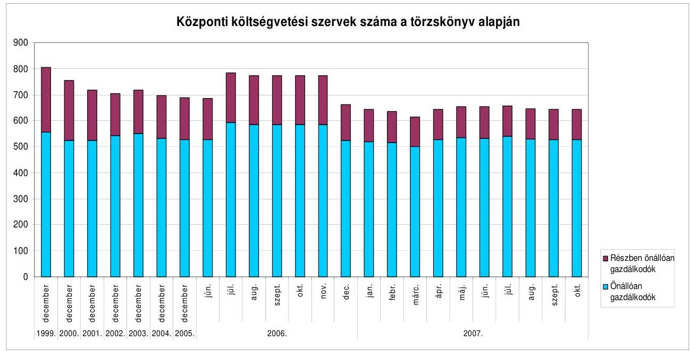
forrás: Kincstár honlap
Az adatok a tényleges szervezeti összevonásokon, megszüntetéseken, alapításokon kívüli hatásokat is tükröznek. A korábban csak a BM nyilvántartásában szereplő rendvédelmi szervek a BM megszűnésével 2006 nyarától bekerültek a törzskönyvbe. A többféle hatást összesítő adatok a Kormányhatározat következményeinek bemutatásához önmagukban nem elegendők.

A rendvédelmi szervezetek (rendőrség, határőrség) nyilvántartását korábban a BM vezette. A BM megszüntetését követően ezen szervezetek, több hónap alatt kerültek be a törzskönyvbe ${ }^{102}$. A hó végi adatok ingadozását az alapító okiratok módosításának elhúzódása, az adatszolgáltatások beérkezése is befolyásolta.

A fejezetek intézményrendszerét jellemző, 2006 nyarára és 2007 nyarára (június vége) vonatkozó - a minisztériumi kör változása miatti fel-adat- és szervezet-átrendezések hatását nem tartalmazó - tanúsítványok adatai a 2006. júniustól érvényes fejezeti tagolásban tartalmazzák az adato-

[^0]
[^0]:    ${ }^{102}$ A Honvédelmi Minisztérium és a Polgári Nemzetbiztonsági Szolgálatok jogszabály által meghatározott törzskönyvezési joggal rendelkeznek, adataikat a Kincstár törzskönyvi nyilvántartása nem tartalmazza. A honvédelmi szervek múködésének az államháztartás múködési rendjétől eltérő szabályait a 226/2004. (VII. 27.) Korm. rendelet határozza meg. A 13. § (3) bekezdése alapján a honvédelmi szervek teljes körű törzskönyvi nyilvántartását a pénzügyi és számviteli feladatok központosított végrehajtására kijelölt honvédelmi szerv végzi.
    A polgári nemzetbiztonsági szolgálatok költségvetési tervezésének, pénzellátásának, előirányzat-felhasználásának, kincstári gazdálkodásának és nyilvántartásának egyes szabályairól szóló 32/2004. (III. 2.) Korm. rendelet szabályozza a nyilvántartás vezetését, meghatározza a szolgálatokról nyilvántartható adatok körét.

---

kat ${ }^{103}$. A változások a Kormányhatározat hatását tükrözik. A tanúsítványok szerint a 12 minisztériumhoz 2006 nyarán 677 intézmény, 2007 nyarán 463 intézmény tartozott. Drasztikusan csökkent az intézmények száma a GKM-nél ( $44 \%$-ra), az FVM-nél ( $48 \%$-ra), a PM-nél ( $52 \%$-ra), az ÖTM-nél ( $54 \%$-ra) és a HM-nél ( $56 \%$-ra).

# A területi szervek 2007 nyarán koncentráltabb struktúrát mutattak, 

mint 2006-ban, több minisztériumban létrehoztak regionális intézményeket (EüM, GKM, PM, SZMM). Az intézmények között található önállóan gazdálkodó és részben önállóan gazdálkodó szervezet is. Arra is volt példa, hogy azonos szakmai feladatkört különböző gazdálkodási jogosítványú területi szervezetek láttak el.

A Szociális és Munkaügyi Minisztérium fejezeten belül a regionális illetékességű munkaügyi központok önállóan, az Egészségügyi Minisztérium fejezetben a - 20 megyei ÁNTSZ intézetből létrehozott - 7 regionális intézet részben önállóan gazdálkodik. Az ÖTM-hez tartozó katasztrófavédelmi igazgatóságok regionális átszervezése alkotmányossági okokból meghiúsult. A régiós központnak szánt igazgatóságok önállóan, a többi megyei igazgatóság részben önállóan gazdálko$\operatorname{dik}^{104}$.

[^0]
[^0]:    ${ }^{103}$ Az IRM tanúsítványa kivételt képez, mivel a minisztérium alapításával kapcsolatos intézményi átrendezések a tárcánál 2007. júliustól valósultak meg. Az adatok összehasonlíthatósága céljából az IRM adatai 2007. július 1-jére vonatkoznak.
    ${ }^{104}$ A Kormányhatározat előírta a megyénként múködő szervezetek regionalizálását. A katasztrófavédelemről szóló törvényt módosító törvényjavaslatot az Országgyűlés kétharmados támogatottság hiányában nem fogadta el, ezért a regionalizálási feladat nem volt végrehajtható. Az ÖTM kezdeményezte a határozat módosítását, a feladat törlését, illetve végrehajtása elhalasztását a szükséges jogi feltételek biztosíthatóságáig. A régiós központok kialakítására való felkészülés, bizonyos feladatok régiónkénti központosítása, egyes megyei szervezetek részjogkörűvé minősítése megtörtént, illetve megkezdődött.

---

forrás: ÁSZ tanúsítványok
A feladatstruktúra és az intézményi struktúra kapcsolatának, az intézményi struktúra feladatokból adódó jellegzetességeinek megállapításához a feladatok általános jellegú tartalmi csoportosítása (pl. szabályozási, szakmai, infrastrukturális) nem ad elegendő információt. Mivel a feladatokra és az intézményekre fejezeti bontásban álltak rendelkezésre az adatok, ezért a jellegzetességeket a fejezetekhez kötötten vizsgáltuk.

Az egyes fejezetek feladatainak - tartalmuktól független - intézmények közötti megoszlását a feladatok különböző csoportosításaiban vizsgáltuk. A feladatok mennyiségét a minisztériumok statútuma, a közfeladatok feladatkataszterének második, szakterületi szintje, valamint a szakfeladati rend alapján vettük számba. A háromféle feladatkiosztás a fejezetekhez különböző számú feladatot rendelt.

A 2006 nyarán alakult kormány minisztereinek feladat- és hatásköréről szóló kormányrendeletek ${ }^{105}$ (statútumok) rögzítették az egyes miniszterek feladatait. A kormány határozatban ${ }^{106}$ rendelte el a közfeladatok felülvizsgálatát. Az állam által ellátott feladatok rendszerezett áttekintése alapján elkészült a feladatkataszter. Az ellenőrzés során a feladatkataszter második, ún. szakterületi szintjét vettük figyelembe.

[^0]
[^0]:    105 161-170/2006. (VII. 28.) Korm. rendeletek az egyes miniszterek feladat- és hatásköréről.
    ${ }^{106}$ 2229/2006. (XII. 20.) Korm. határozat a közfeladatok felülvizsgálatáról.

---

A minisztériumok és a fejezetekhez tartozó intézmények (a MeH és a HM kivételével ${ }^{107}$ ) 2007. július 1-jén a statútumok szerint összesen 86, a feladatkataszter szerint összesen 92 különféle feladatot láttak el. Az egy fejezetre jutó feladatok átlagos száma a statútumok szerint 9, a feladatkataszter szerint 10. Az egyes minisztériumok feladatszámában mindkét mutató szerint nagy különbségek voltak, a statútumok szerint 2 (EüM) és 16 (IRM), a feladatkataszter szerint pedig 2 (EüM) és 19 (GKM) között változtak. (Az egyes fejezetekhez rendelt feladatokat, a fejezetekhez tartozó intézmények számát, a foglalkoztatottak létszámát és az ezek kapcsolatát elemző mutatókat 2006. és 2007. évekre az 5. és 6. számú melléklet, a fejezetekhez rendelt szakfeladatok jellemzőit a 7. számú melléklet tartalmazza.)

Azonos számú feladatért felelős fejezetek közötti, az intézmények számában és a foglalkoztatott létszámban megmutatkozó nagy eltéréseket a feladatok tartalmi különbségei is okozhatják. Konkrét feladatokra (tartalomra tekintettel) vizsgálható a feladat és az azt ellátó intézmények megfelelősége, de az intézményrendszer szintjén a feladatok tartalmától elvonatkoztatva nem.

A statútum szerint pl. a KvVM és az OKM ugyanúgy 4-4 fő feladatért felelős, a költségvetési szervek száma azonban 2007 nyarán KvVM-nél 36, OKM-nél 63, a foglalkoztatott (betöltött) létszám KvVM-nél 6651, OKM-nél 55570 fő volt. A feladatkataszter szerint a KvVM-nek 15, az OKM-nek 5 feladata van, a feladatok nagyságrendjét (az azokat ellátó intézmények és foglalkoztatottak számát) ez a felosztás sem tükrözi.

A szakfeladatrend az állami feladatokat és a végrehajtásukhoz szükséges kisegítő feladatokat (pl. jogi tevékenység, számítástechnikai tevékenység, művese kezelés) szakmai résztevékenységekre bontja. Az osztályozás részletezettsége következtében egy-egy intézmény általában több szakfeladatot is végez, illetve ugyanazt a szakfeladatot több fejezet intézménye(i) is ellátják. Az egyes fejezetekhez tartozó intézmények által ellátott feladatok „összetettsége" az ellátott - az állami feladatokat tartalmilag részletező - szakfeladatok száma alapján eltérő, és szóródik a számtanilag egy intézményre jutó - különböző - szakfeladatok száma is a 2006. évről készített beszámolók szerint.

A KüM tevékenységét három szakfeladat, az OKM-ét 81 szakfeladat jellemezte. A PM tevékenységét 11, az ÖTM-ét és a HM-ét 19, az FVM-ét 46, az EüM-ét 39 szakfeladatba sorolták. A 2006. évi beszámolók szerint (a 21. űrlap adatai alapján) 86 olyan szakfeladat volt, amelyet nem csak egy fejezet intézményei láttak el.

A feladatok jellege (szakmai vagy azt segítő) szerint a beszámolók a létszámról nyújtanak információt. A 2006. évi beszámolók szerint a fejezetek között nem voltak számottevő eltérések a létszám ${ }^{108}$ funkciócsoportok ${ }^{109}$

[^0]
[^0]:    ${ }^{107}$ A MeH és HM statútumának szerkezete eltér a többi minisztériumétól, ezért az öszszehasonlíthatóság érdekében azok kimaradtak az összesítésből.
    ${ }^{108}$ A beszámoló funkciócsoportok szerint részletezett létszám adatot csak az engedélyezett létszámra tartalmaz.
    ${ }^{109}$ Az I. funkciócsoportba az intézménynek a statútum, az SZMSZ szerinti szakmai profilja(i)hoz tartozó, szakmai feladatokat végzők tartoznak. A II. funkciócsoportot a szakmai feladatok ellátását funkcionálisan segítő létszám (a szervezet működéséhez

---

szerinti megoszlásában. A létszám 69\%-a szakmai, 12\%-a szellemi és 19\%a technikai segítő tevékenységet folytatott. A szakmai létszám legmagasabb aránya $80 \%$ (MeH), a legalacsonyabb 60\% (HM, OKM). Arányában a legtöbb szellemi segítő a KüM-ben, technikai segítő a HM-ben volt ${ }^{110}$.

A miniszteriális fejezetekhez tartozó 484 központi költségvetési szervezet 2006. évi beszámolójának 36. űrlapja adatai alapján a szakmai feladatokat (az I. funkciócsoportba tartozó) összesen 172001 fő látta el. A szakmai feladatok ellátását segítő (II. funkciócsoportba sorolt) létszám összesen 30888 fő volt. A szakmai és az őket segítő szellemi dolgozók mellett 48455 fő technikai jellegű feladatokat végzett (III. funkciócsoportba tartozó létszám). A három funkciócsoportban összesen 20632 fő vezető és 230712 nem vezetői beosztású fő dolgozott.
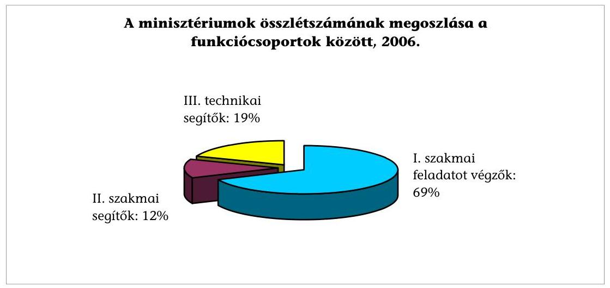
forrás: leválogatás a 2006. évi fejezeti beszámolókból
Az egyazon szakfeladatokra jutó szakmai és üzemeltetési létszámarányok eltérései a különböző tárcákhoz tartozó intézményeknél a teljesítés mértékére utaló adat hiányában nem ítélhetők meg, ezért e feladatokból sem szűrhetők le sajátosságok az azokat végző intézményekre ${ }^{111}$ (a több fejezetben is ellátott szakfeladatokra példát a 8 . számú melléklet tartalmaz).

A feladatokat tartalmuk alapján három kategóriába soroltuk, tanúsítványban megkülönböztettük a szabályozási, irányítási, a szakmai, valamint az infrast-
szükséges humánpolitikai, gazdálkodási-költségvetési, jogi, nemzetközi, ellenőrzési, koordinációs, informatikai, kommunikációs feladatokat ellátók) adja. A III. funkciócsoportba tartozó létszám a szakmai és a funkcionális feladatok ellátását technikailag segítő létszám (adminisztratív-titkársági, protokolláris, kézbesítési, szállítási, jóléti, üzemeltetési, rendészeti, raktározási feladatokat ellátók és vezetőik).
${ }^{110}$ Az eltérő arányokat mutató intézmények sajátosságai, illetve megadott intézményeknél, kiválasztott tevékenységeket végzőknél jellemző létszámarányok fennállása ellenőrizhető.
${ }^{111}$ A fajlagos létszámszükséglet, mint mutató megállapításához nem áll rendelkezésre a teljesítés mértékét kifejező adatok szakfeladatonkénti részletezése.

---

rukturális (gazdálkodási, informatikai és humán) feladatokat ${ }^{112}$. Összességében az intézmények $23 \%$-a ellát szabályozási, irányítási, $94 \%$-a szakmai, és $59 \%$-a infrastrukturális feladatot (az intézmények többsége egyszerre több feladattípust is ellát, ilyenek pl. maguk a minisztériumok is).

2007 nyarán a miniszteriális fejezetek intézményeiben foglalkoztatottak összlétszáma (betöltött, tényleges létszám) 227766 fó, 2006 nyarán 240580 fő volt. Egy intézmény átlagos dolgozói létszáma 500 fő volt (2007ben). Az egyes intézmények foglalkoztatotti létszáma nagy szórást mutatott, a néhány főtől a többezres nagyságrendig.

Az IRM dolgozóinak száma 2007 nyarán 57528 volt, ugyanekkor a KüM-nél 1712-en dolgoztak. Az intézményi átlagos dolgozói létszám legkisebb értéke 134 (ÖTM), legnagyobb értéke 1535 fő (PM) volt.

Az intézmények száma valamennyi létszám-kategóriában csökkent. (Az intézmények számának és létszámának létszám-kategóriák szerinti, 2006. és 2007. nyári adatait a 9. és 10. számú mellékletek tartalmazzák). Az 51-200 főt foglalkoztató intézmények aránya az összes intézményen belül 10 százalékponttal ( $48 \%$-ról $38 \%$-ra) csökkent, és ezen intézmények az összlétszám mindössze $8 \%$ át foglalkoztatták (2006-ban a létszám 14\%-a esett ebbe a körbe). Az intézményi struktúrában a 200-nál több főt foglalkoztató intézmények aránya megemelkedett 10 százalékponttal ( $37 \%$-ról $47 \%$-ra), amelyek az összlétszám $91 \%$ át (2006-ben $85 \%$-át) foglalkoztatták.

A különböző állami feladatok (hatósági, közszolgáltatási stb.) ellátásából keletkező saját bevétel összbevételen belüli aránya az azonos feladatokat ellátóknál is szélsőséges (pl. a Katasztrófavédelmi Igazgatóságoknál 2007 első felében előfordult $15 \%$-os és $65 \%$-os arány is). Az arány magas vagy alacsony értékéből nem következik, hogy a gyakorlatban milyen szervezeti forma célszerú a múködéshez. A GKM-nél pl. a Közlekedésfejlesztési Koordinációs Központ (az úthálózat vagyonkezelői jogát hasznosítja) költségvetési szervként, a Nemzeti Hírközlési Hatóság kormányhivatalként nem kap állami támogatást.

A fejezetek alapítói, vagyonkezelői felügyelete alá tartozó, államháztartáson kívüli szervezetek száma a fejezetek többségénél a helyszíni vizsgálat idején alacsonyabb volt, mint 2006-ban. Az állami feladatok költségvetési forrásokat felhasználó ellátását költségvetési körbe vonták, a tevékenység átvételével, vagy a feladatra költségvetési szervezet alapításával. A tanúsítványok szerint a szervezetek többsége 2007-ben is szakmai feladatokat látott el, de infrastrukturális jellegú feladatokra is múködtek szervezetek.

Az EüM-nél költségvetési intézményhez (OMSZ) rendelték az államháztartáson kívüli szervezet (Magyar Koraszülött Mentő Közalapítvány) feladatait. Az SZMM a kutatással foglalkozó közalapítványának tevékenységét vonta költségvetési körbe. Ugyanakkor alapvető állami feladat államháztartáson kívüli - állami felügyelettel történő - ellátására is van példa: a GKM az országos közúthálózat nyilvántartását a Nemzeti Infrastruktúra Fejlesztő Zrt., a Magyar Közút Kht. és az

[^0]
[^0]:    ${ }^{112}$ A tanúsítványban a fejezetek minden intézményére megkérdeztük, hogy feladataik melyik kategóriá(k)ba sorolhatók.

---

Állami Autópálya Kezelő Zrt. (ÁAK Zrt.) közreműködésével működteti. Az OKMnél államháztartáson kívüli szervezet gondoskodik színészotthon, pedagógus otthon, óvoda fenntartásáról.

A költségvetési szektor intézményi rendszerében 2006-2007-ben bekövetkezett változásokról a nyilvánosság a statisztikai adatközlésekből is tájékozódhat. A KSH a gazdálkodó szervezetek, intézmények számának, létszámának, termelésének, fogyasztásának alakulását nem az államháztartás alrendszerei és fejezeti besorolási rendje, hanem a tevékenységek ágazati csoportosítási rendszere szerinti besorolásban közli.

A költségvetési intézmények számát a teljes közszférára adja meg, az államháztartás alrendszerei szerinti bontásban nem. Regisztere 2006. június 30 -án 15130 és 2077. június 30 -án 14664 költségvetési és társadalombiztosítási szervezetet tartalmazott ${ }^{113}$.

A KSH által költségvetési szervekről és tevékenységükről gyűjtött információk és vezetett nyilvántartások rendszeresen közzétett adatai együttesen nem teszik lehetővé a kormányintézkedések hatásainak folyamatos nyomon követését. A fejezeti és a szakágazati csoportosítások eltérnek az államháztartás pénzügyi információs rendszerében (beszámolók, költségvetés) és a statisztikákban. Az adatok összekapcsolásának, megfeleltethetőségének hiánya miatt a rendelkezésre álló információk, az információk előállításának ráfordításai a kormányzati munka során korlátozottan hasznosulnak.

Az ÁSZ részére készített kimutatás ${ }^{114}$ szerint (lásd a 11. számú mellékletet) a fenti időpontokban 533, illetve 359 központi költségvetési szervezet volt a nyilvántartásban. Az egy év alatti csökkenés $80 \%$-a a közigazgatás, kötelező társadalombiztosítás terén múködő szervezeteknél következett be.

[^0]
[^0]:    ${ }^{113}$ A regisztrált gazdasági szervezetek száma, 2007. I. félév - KSH Gyorstájékoztató, 2007. július 27.
    ${ }^{114}$ A KSH-nál (is) nyilvántartott gazdálkodási forma kód alapján az alrendszerek szerinti információk leválogathatók.

---

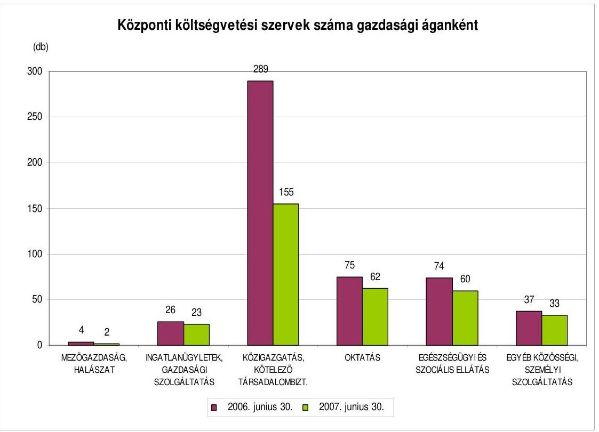
forrás: KSH
A beszámolók a nyilvánosság számára évente nyújtanak új információkat. A statisztikai adatokból például a létszám alakulása havonta, a teljesítési (termelési, fogyasztási) adatok negyedévente új adatokkal követhetők. A kormányzati intézkedések hatásait a múködés szokásos, rendszeres megfigyelésével keletkező információknak is tükrözniük kell, és a havi gyakoriságú statisztikák kiválthatják a külön adatszolgáltatás elrendelését.

A költségvetésben alkalmazásban állók létszámának, keresetének havi alakulásáról a tárgyhót mintegy 50 nappal követve, havonta jelennek meg több szempont - az ágazati bontás mellett szellemi-fizikai, a jogviszony típusa stb. - szerint részletezett adatok. A 2007. december 19-én megjelent gyorstájékoztató (Létszám és kereset a nemzetgazdaságban 2007. január - október, KSH 2007. dec. 19.) szerint a költségvetésben 2007. októberében 739000 főt alkalmaztak, ami 5,4\%-kal volt alacsonyabb az előző év azonos időszaki adatánál.

Budapest, 2008. május 27.
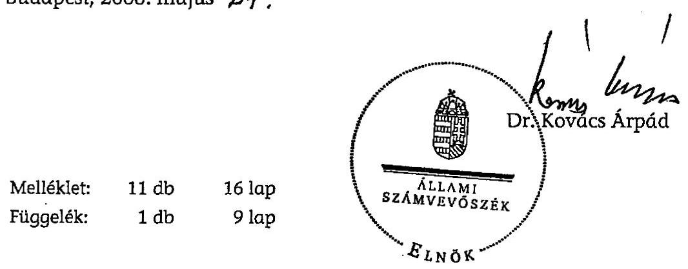

---

# MELLÉKLETEK

---

E GÉ́SZSÉ GÜGYIMNISZTÉRUM MINISZTER

Eihoy wrobe
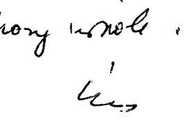

Dr. Kovács Árpád
elnök úr részére

Állami Számvevőszék
Budapest

Tisztelt Elıök Úr!
Az Állami Számvevőszék Állambáztartás Központi Szintjét Ellenirző Igazgatóság, Atfogó Ellenőrzési Fő̉soport által, a cözponti költségvités intézmény:endszerének ellenőrzéséríl (Iktatíszám: V-15-094/2007-2008.; Témaszám: 879; Vizagálat-azonosító szám: V0355) készített jelentést megkaptarı.

Az Állami Számvevôszékről szólo 1989. éri XXXVIII. tv. III. fejezet 25. § (1) vekezdése sze int meg határozott jogommal élve a jelentesre vonatkozóan észrevétel: nem teszek.

A jelentésben foglalt megállaplások alapján a vizsgálat a kermány és a pénzügym niszier számára fogalmaz meg konkrét javaslatokat, ezért az Egészségügyi Minisztérium - helyszini ellenőrzés tapasztalatainak hasznosíása mellett - intézkedési terv kés:ítésére nem kitélezett.

Budapest, 2008. május „24,,
Üdvö:lettel:
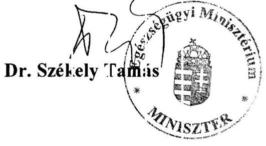

---

# 1/b. 12. melléklet 

a V-15-115/2007-2008. 12. jelentéshez

1ÖLDMÖVELÉSÜGYI IS VIDÉKFIJLES:TÉSI MINISZTE:t

$$
3 \in 0 \text { T } 1 \quad 12008
$$

Hiv: szám: V-15-102/2007-2008.

Dr. Kovács Árpád
elnök úr
részére
Állami Számvesöszéi:
Budapest

## Tisztelt Elnök Úr!

A cözponti költségvetés intéznényrendszerének ellenőrzéséről kés:ített jelentést készön ettel vettem. A jelentés megállapítáaina a hasznositása a mir iszté:ium jövöbeli munkáját segíteni fogja.

A jelentésben ogla takkal kapcsolatban észrevételt nent teszek.
Budapest, 2008. májt s ," ${ }^{4}$."

## Üdvözlettel:

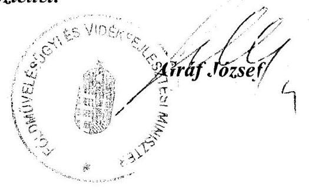

---

# 1/c. sz. melléklet   a V-15-115/2007-2008. sz. jelentéshez 

## 7-8/08   NEE 345/2007.

## GazzaláGi É: KÖzI EKEDÍSI MINISZTÉRIUM

Jr. Kcvács Árpád Iktatószám: Gt M/9103/3/2008. Elnök Úr Hiv. szám: V-15-102/2007-2008. Állami Számve vöszék 3udapest Tisztelt Elnök Úrl

Köszönettel vettem „a központi költségvetés intézményrendszerének ellenćrzéséről" szólo jelentést

A jelentésre észrevételt nem tészek, egyben köszönćm, rogy munkájukkal hozzájárultak a ninisztérium hatékonyab o mũ södéséhez.

Tájékoztatom, hogy javaslat hiányátian a tárca intézkedési tervet nem készít.

Budapest, 2008. május „ ${ }^{15}$ ".

Tisztelettel:

Dr Szabó Pál miniszter

---

# 1/d. sz melléklet   a V-15-115/2007-2008. sz jelentéshez 

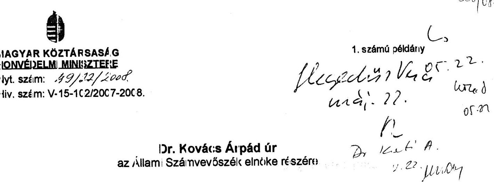

## Budapest

## Tisstelt Elnök. Úrl

Elnők Úr részriről fenti hivatkczási szárron megküldött, a „Kozponti költségvetés intézményrendszerénuk ellenörzéséröl" s:ólo jelentás-te:vezetet kiszorrettel megxap'am.

Tájikoztatom Elnök Urat, horyy a jelentás-te:vezettel kapcsolatban a Honvidelni Minisztérium részéröl észrevételt rem tuszek.

Bulapest, 2008. május 16 -ch
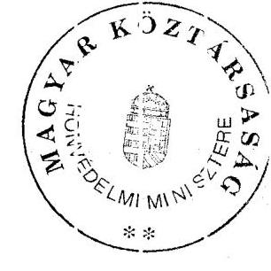

Tiszteletel:
Dr. Szakenis Imre

---

GAZSJ.GÜGYI ÉS RENDÉSZETI MINISZTÉRIUM Igazságügyi és ren dészet: miniszter

Igyinté ơ: dr. Pintér Ferencie
telef: n: +36 (1) 441-397:
telef: x: +36 (1) 441-379
e-mail: Pin erF@irm.gov.hu
hiv. szá n: V-15-102/2007-2008.
Ugy intézőj: k: -
MellékIst:
Tárgy: Központi lioltségvetés i titézményrenclszerének ellcnörzéséről késztett ÁSZ jelentés

## Tisztelt Elnök Úr!

Az Állami Számvevõszék részéről hivatkozott szimon megküldöt „A központi kö tségvetés i itézm ényrenclszerének ellenőrzésérơ." szóló jelentést köszönettel megkapta n.

A jclentésre a XIV. Içazsáçügyi és Rendészeti Minisztérium fejezet részéről észrevételt nem 'eszünk. Tájékoztatom. Elnck Urzt, hoçy az Állami Számvevõszék szám vevőnek a jelertésben tett szakmai magállapítá aait a minisztériun szakterülutei a müködéstük során hasz nositják.

# Tiztelettel: 

Bucapest, 2008. máj 1 s , 22 ,
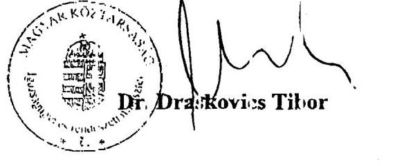

---

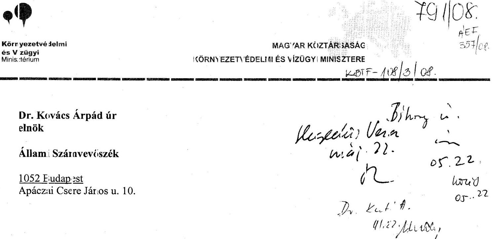

Tisztel: Elnck Úr!

A V-15-102/2007-2008, számú levele mellcklete cént megkildött, a kizponti kö tségvités intézményrendszerének ellenörzéséről készí ett jelentésükben foglaltal:ra észrevetelt nem teszek.

A helyszini ellenörzés a XVI. Körıyezetvédelmi is Vzüge Miniszté ium (KvVM) vonatkozásában nem tartalmaz elmarasztcló észrevetelekst, anelyck intézkedési terv készitését, illetve intézkedésck megtételét indokolnik.

A Jelentés a Kormá ynak és a pénzüg, miniszterrek tusz - a helyszini ellenözés megállapításainak hasznosítása mellett - javaslatokat.

A KvVM f́jezetnél az ellenörzc sben résztvevő munlatársai segitőkész eqyüttmüködését köszönöm.

Budapest, 2008. 05. 07.
Ödvözlettel:
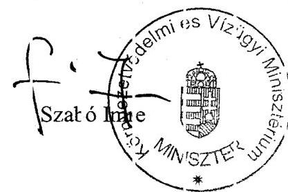

---

# MAGYAR KÖZTÁRSASÁG KÜLÜGYIAINI:ZTERE 

Dr. Kovács Árpád úr elnök

Állami Szá:nvevószék
BUDAPEST

Tisztelt Elrök Ú:!

A kö:ponti költségvetés intézményrendszerének ellenirzéséről készíte:t jelentést köszénette megkaptan..
Tájékoztatom, hogy a jelentéssel kapcsolatban észrevételt ne n tes:ek.
Budapest, 2008. május 15.

Üdvözlettel:
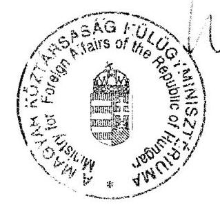

---

# 1/h. sz. melléklet   a V-15-115/2007-2008. sz. jelentéshez 

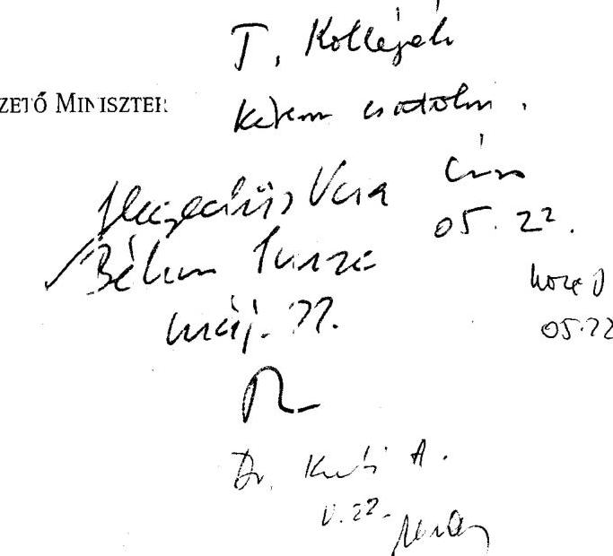

Tisztelt Eltök Úr!

Hivatkozva a V-15- 02/2007-2008. számú megkeresésére tájékoztatom, hogy a köaponti költségvetés intézményrendszerének ellenörzéséről szóló jelenlés te rvezetével egyetértek, abban legutóbbi pontositó eszrevételeink nagy része szerepe..

Amint azt koribban is jeleztiik, a 2111/2006. (VI. 30) Kcrm. határczat végrehajtása összességeben pozitívabb megitélésben részesil a jelentésber.. Ugyanakkor továbbra is fontosnak tartoın hangsúlyozni, hogy az ÁSz által jel cett, cs a reszben általunk is elfogadott hián/ossátok, kritikák ellenére az átalakulási fol/amatot rer dkívili jelentősé gủnel értécelem, az elért eredmények tükrözik az intézményrendszer átalakítása érciekében tet eröfeszítéseket.

Az ellenürzési jelentés megálapítcisait tudorásul veszem. A Miniszterelnoki Hivatal természetesen a Kermány számára tett javaslatok végrehajtásához minden szükséges segitséget biztosit.

A javaslat okkal kapcsolatban az alábłi meşjegyzéseket teszem:

- az 1. szimú javaslathoz: amirt az a jelentésben is szererel, a Kormany határozata alapjá 2007. évt en az ÁRB titkírság koordínálésában és külső szakértők bevonásával lezajlott a közfelada ok felülviisgálatára rányuló szakértäi munka, amelynek alapján a Kormány a 2233/2007. (XII. 12.) Korm. határozattal számos területer rendelt el további v zsgálatokai, illetve irta elő döntés: támogató előterjesztćsek készítését. Az állami szerepvállalás tartalmára, méretére, finanszirozására vonatkozó javaslatok e vizs gálatok eredmér yére tekintettel tehetők meg az O:szággyúlés számára a továbbiakban. Ugyanakkor azt is meş kell jegyezni, hogy az állami szerepvállalással kspcsolatos l:érdések döntöen poli ikai értékválasztáson alapulnak, s a változó körr yezethez (társacalmi, gazdasági, technikai, környezeti) térténő folyimatcs alka mazkodás tárgyát képezik, zyakran több éves, évtizedes idótávon kialakuló foly unatként;

---

- a 2 szánú javaslathoz: kidolgozásra került a költségvetési szervek jogállásról és gazdálkodásáról szóló törvéayjav islat, amely alapján az ellátand: közfeladatokhoz jobban illeszkedő differenciál: szervezei formák kerülhetnek hozzáreıdelésre, továbá a már hivatkozott 2233/2007. (XII. 12.) számú Kcrm. határozat 4 pontja alipján a teljesítményinformációkra is ipitő, programszemléletủ költségvetési rendszer levezetésének kencepciója 2008. decenber 31 -ig kerül a Kormáry elé. Az ÁSz javaslat vé greha tása - a nemzetközi tapasztalatok alapján is - fokozatosan, több éves munka credményelént s:ülethet meg.

Elnök Úr és munkatárs a együttmúködését ez iton is kös:tönönı.
2008. :nájus „45"
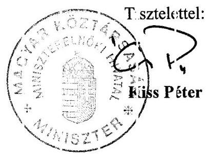

---

# 1/i. s:t. melléklet   c. V-15-115/2007-2008. sz. jelentéshez 

## 0litatíisi és Kulturális Minisztérium Miniszter

Ikt. sz.: 13-142-1/2008
Hiv. szám: V-15-102.2007-2008
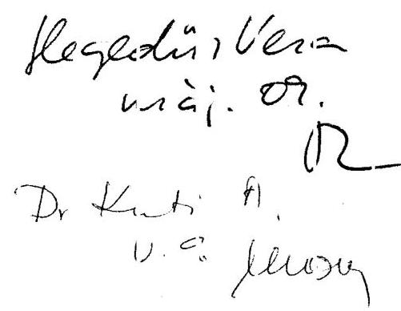

Tisztelt Elnck Úr!
Köszönettel meglaptarı a kizponti költségvistés intézményrendszerének ellerörzéséről szóló jelentést. Tajékoztatony ho§y a jelentes tartalmával es yetértek, azzal kapcs slatban további észrevittelt nem kivánok tenrii.

Budapest, 2008. május „E".

Üdvözlettel:
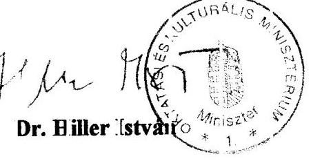

---

# 1/j. sz. melléklet a V-15-115/2007-2008 sz. jelentéshez 

## ÖN KORMÁNYZATI MINISZTEI:

Iktatószám: ÖTN:/749: /2(2008)

Hivatkozási szám: V-15-1C2/2007-2008/25,24.
Keszelíi Vasa (ovid
$m$ ái. 26.
$A$
Ltallustra
$0 / 615$

Dr. Kovács Árpád úr részére
elnök
Állami Számvevőszék.

Budapest

## Tisztelt Elnök (r!

A kö:pont költségvetés ir tézményrendszerének ellenőrzés iről lészített jelentés tervezetét köszönettel meglaptam.

A jelentés-tervezettel li:apcsolatban észrevételt nern teszek.

Budapest, 2008. május 20\%.
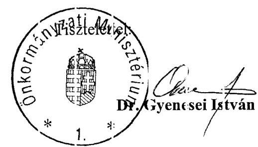

---

# 1/k. sz. melléklet   a V-15-115/2007-2008. sz. jelentéshez 

H-1051 BUDAPEST 4., JÓZSEF N/DOR "ER 2-4., POSTACIM: 1369 FUDAF 151, PUSIAFI 26. 90.

TELEFON: (3(-1) 327 2159, (16-1) 327-2141
E-MAIL: jinos.veres@pr 3.gov.h 1
FAX: (16-1) 313 - 0738
PÉNZÜGYMINIS:TER

2879/2008. /11
Hiv. sz.: V-15-102/2007-2008.
Előadó: Ailorján Richiird
Tárşy: a kïzpon'i költségvet'́s intézmény rendszerénck ellen'́rzéséröl szilló jelzntés i ervezate

Dr. Kovács Árpád
Állami Számvevöszék
elnök

Budapest
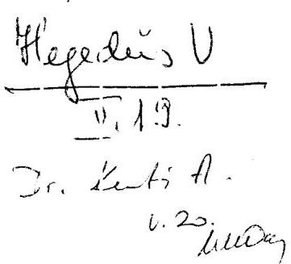

Tisztelt Elnök Úr!
A megkíldött Jelzntés-tervezetet kïszönottel megkaptım, ahhcz az a ábbi észre'ételcket teszem.

Várfalvi István szȧ̇államtitkír úr 2008. á rilis 8-án kelt levelében foglaltukkal megezyezöen én is úgy itélem meg, hogy elen formájában a tervezet alapvetően reálisan és árnyaltan mutatja be a szóban forgó komplex folyamatot, intézkedéseket, köszénhetı́en jelentís résıben az ar:ól való kiterjedt két oldalii konzultázió-sorozatnak. A megküldött tervezstet e anek megfelelően eljogaaom.

A ko ábbi leve ünksen fcglalt észrevételeinket ugyanakkor fenntartom. Ezek döntően a Számvevöszé és a Pénzügy ninisztérium eltérő :ézőpontjiból, izere déböl adódnak; e vizıgála: tekintetében elsősorban abból, hogy a PM a konvergencia kritériumcknak való megf́lelés sürgős, korábłi alapos e.ökészítő raunkira támaszkodó (vagyis nem új vizsgálattcl kezdődő), operativitást igénylő kezelésének kén'szert tekintett: alapvető fontosságúnak. Az ÁSZ sokkal inkátb elméleti alipon tekirített az intézkedéscsomagra. Ennck okán - az idököıbeni fejleménvek által is igazoltar. - nem tartom indokolt kritikának az elözetes feladat-felülvizsgálat hiányolását; e zért tartom továbbra is megfe elönck a gyorsasí. ę́s or erativitás előtérbe helyezést az előiások egyeitetésében - :ermészetesen a szakszerüség rraximális megirzésivel - a formalizált, dckumentált. hosszadulmas írásbeliség helyett; s végül emiatt íélem lényegesen fontosabbnak az intézkedé sekkel megalapozot: tartós megtakarítást és ezzel egyítt járó forráskivonást a Számvevőszékné .

Örvendetesnek tartcm, hogy az ÁSZ a levelünkre adott viilaszi ban ismét kiemelte. hogy az intézkedéssorozat példa rélkül álló volt, amelyet a PM-ber folyó so céves szakmai munkz és tapasztalatai nélkül nem lehetett volna elindítani és végigvinni.

Nyilvánvcló, hogy ma még nem lehet pontos és teljes mérleget vonni az áalakítások költségvetési-tírsadalmi eredményéről, hozadékáról. Ehhez nénány évnek el kel:

---

telnie, a meg folyamatban lévö átalalcitásokat lz kell zárni, a másodlagos hatásokat (pl. ingatlanok felsıabadulása) értékelni kell. A:: időközben meghozott számos eıtyéb intézkedés hatésától valo elválasztás kétségkívill okoz inóds:certani néhézséget, pontatlanságot jelentús réızben azér, me:t a szervezeti struktira és az clláto:t feladatstruktira költségvetési és kapacitásigényének szélválasztása, továbbá a kézvetlenül elrendelt létszárocsöl:kentések hatásának elválasztása utólag - ternészotesen - szinte lehetetlen (márpedij; a vizsgált intézkedés-sorozat csak a szervezeti italakítást célozta). Emellett az elmúlt években a s:zervezeti karcsisítás több helyütt a felacatok növekedésével párhuzamosan men: véçbe (ld. pl. az állain ellenőrző s:erepének növekedése).

Amennyiben tchát „visszarer:dezö:lés" alatt a :étszám és forrás zsökkentésével párhuzamcs növekedését értjük, az néháry helyen -- egyébkért nagyságrendileg kisebb mértékben - valóban be:zövetkezelı, de ha az eredeti feladatokra fordított élő- és holtmunka kapacitás „visszairamlását" az bizonyosun nem inent végbe, ennek semmilyen jele nem is mutatkozik. Nem kérdöjclezödnek meg tehát az eredctileg kitüzött celok, átalakítás: irányok, s mindezek végrehajtásának alapvetően silceres volta.

A hatások összegzésére inár a 20C7. évi kötségvetés végrehajtásáról szóló törvény indokolásában kísérietet tuszünk.

Törvényi kötelezetiségennek megfelelően a pénzügyminiszter számíra elöírt javaslatról 30 napon belül tájékoztatást adok.

Munkájához további sok sikert kívánok!
Budapest, 2008. máj is ,,l.: ,,

Tisztelettel:
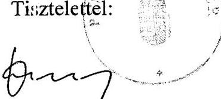

Dr. Veres János

---

# Szociális és Munk aügyi Minisztérium Miniszter 

Dr. Kovács Árpád
Elnök ür
részére

Állami Szánıvevőszék
1052. Eudap:st
Apáczai Csere Járos u. 10.

## Tisztelt Elnöi Úr!

Hivatkozássul a V-15-102/2007-2008. iktatószánon megkiildött a kúsponti kö tségvetés intézményre sdszerének ellenörzés iről készített jelentésn, tájékoztatom, sogy arra észrev itelt nem te szek.

Budapest, 2008. május 3.

Öd:özlettel:
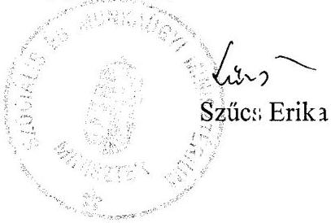

Levélcím: 1034 Budapest, Alkottr ány utca 3.

---

Az intézményrendszer átalakításához kapcsolódó, több fejezetet érintő kormányhatározatok

# 2005. 

2044/2005. (III. 23.) Korm. határozat
az államháztartás egyensúlyi helyzetének javításához szükséges rövid és hosszabb távú intézkedésekről szóló 2050/2004. (III. 11.) Korm. határozat módosításáról, továbbá a közszférát érintő szervezeti átalakítások folytatásáról
1052/2005. (V. 23.) Korm. határozat
a közigazgatás teljesítményének növelését szolgáló rövid távú intézkedésekről és átalakításának középtávú feladatairól

## 2006.

1054/2006. (V. 26.) Korm. határozat
a közigazgatás átalakításának előkészítésével kapcsolatos egyes feladatokról
1061/2006. (VI. 15.) Korm. határozat
az államreform előkészítésével és megvalósításával összefüggő egyes szervezeti és személyi kérdésekről
2117/2006. (VI. 30.) Korm. határozat
a Miniszterelnöki Hivatalban, a minisztériumokban, az igazgatási és az igazgatás jellegű tevékenységet ellátó központi költségvetési szerveknél foglalkoztatottak létszámáról
2118/2006. (VI. 30) Korm. határozat
az államháztartás hatékony működését elősegítő szervezeti átalakításokról és az azokat megalapozó intézkedésekről
2131/2006. (VII. 26.) Korm. határozat
az igazgatási és igazgatás jellegű tevékenységet ellátó központi költségvetési szerveknél foglalkoztatottak létszámáról
2160/2006. (IX. 15.) Korm. határozat
az államháztartás hatékony működését elősegítő szervezeti átalakításokról és az azokat megalapozó intézkedésekről szóló 2118/2006. (VI. 30.) Korm. határozat módosításáról

---

2216/2006. (XII. 7.) Korm. határozat
az államháztartás hatékony múködését elősegítő szervezeti átalakításokról és az azokat megalapozó intézkedésekről szóló 2118/2006. (VI. 30.) Korm. határozat módosításáról
2229/2006. (XII. 20.) Korm. határozat
a közfeladatok felülvizsgálatáról
2242/2006. (XII. 23.) Korm. határozat
az államháztartás hatékony múködését elősegítő szervezeti átalakításokról és az azokat megalapozó intézkedésekről szóló 2118/2006. (VI. 30.) Korm. határozat módosításáról
2254/2006. (XII. 25.) Korm. határozat
az államháztartás hatékony múködését elősegítő szervezeti átalakításokról és az azokat megalapozó intézkedésekről szóló 2118/2006. (VI. 30.) Korm. határozat egyes feladatainak végrehajtásáról
2255/2006. (XII. 25.) Korm. határozat
az államháztartás hatékony múködését elősegítő szervezeti átalakításokról és az azokat megalapozó intézkedésekről szóló 2118/2006. (VI. 30.) Korm. határozat módosításáról
2007.
2112/2007. (VI. 15.) Korm. határozat
egyes költségvetési szervek átalakulásával összefüggő feladatokról
2233/2007. (XII. 12.) Korm. határozat
a közfeladatok felülvizsgálatával kapcsolatos további feladatokról
2236/2007. (XII. 15.) Korm. határozat
az államháztartás hatékony múködését elősegítő szervezeti átalakításokról és az azokat megalapozó intézkedésekről szóló 2118/2006. (VI. 30.) Korm. határozat módosításáról

Budapest, 2008. május

---

# A 2118/2006. (VI. 30.) Korm. határozat megjelent módosításai

(2006.VII. 1 - 2007.12.30.) a módosítás jellege lehet: M - feladat módosítása, T - feladat törlése, Ú - új feladat előírása, T/Ú - törlés és új feladat, HM - határidő módosítás

|  Módosító
határozat pontja | Módosítás
jellege | Módosított
pont | Érintett
tárcák | Módosítás lényege | Új határidő | Határidő
eltolása  |
| --- | --- | --- | --- | --- | --- | --- |
|  2160/2006. (IX. 15.) Korm. határozat az államháztartás hatékony müködését elősegítő szervezeti átalakításokról és az
azokat megalapozó intézkedésekről szóló 2118/2006. (VI. 30.) Korm. határozat módosításáról |  |  |  |  |  |   |
|  1. | M | 6. o) | ÖTM | ÖTM-nek már nem feladata a mezőgazdasági szakiskolák
koncentrációjához a felülvizsgálatuk, és a többi tárca közül
csak FVM-nek kell felülvizsgálatot végeznie | 2007.08.31. |   |
|  2. | T | 1. mell. FVM
1. | FVM | A mezőgazdasági szakiskolák "kijelölését" törlik, ezzel a 6.
o) pont hivatkozási alapja megszűnik |  |   |

2204/2006. (XI. 27.) Korm. határozat a Magyar Honvédség fejlesztésének egyes elveiről, feladatairól

|  $2 / c$ | M | 1. mell. HM
1. | HM | Az MH Összhaderőnemi Parancsnokságot egy lépcsőben 2007. január 1-jével kell létrehozni | 2006. 12. 31.  |
| --- | --- | --- | --- | --- | --- |
|  2213/2006. (XII. 07.) Korm. határoza a Közlekedési Felügyelet, a Központi Közlekedési Felügyelet, a megyei közlekedési felügyeletek, a Polgári Légiközlekedési Hatóság megszüntetéséről, valamint a Nemzeti Közlekedési Hatóság megalapításáról |  |  |  |  |   |
|  4. | M | 1. mell. HM
2. | GKM, HM | A Katonai Légügyi Hivatalnak a Nemzeti Közlekedési Hatóságba integrálásakor egyes feladatok (állami légi járművek baleseteinek és egyéb repülőesemények vizsgálata), az azokat ellátó személyek, a források a Közlekedésbiztonsági Szervezetbe kerülnek. | 2007. 06. 30.  |
|  2216/2006. (XII. 7.) Korm. határozat az államháztartás hatékony müködését elősegítő szervezeti átalakításokról és az azokat megalapozó intézkedésekről szóló 2118/2006. (VI. 30.) Korm. határozat módosításáról |  |  |  |  |   |
|  1. | HM | 1. mell. IRM
1. | IRM | Három határőr igazgatóság megszüntetésének dátuma Schengen-hez csatlakozás napja, legkésőbb | 2008. 01. 01. +12 hó  |

---

|  Módosító
határozat pontja | Módosítás
jellege | Módosított
pont | Érintett
tárcák | Módosítás lényege | Új határidő | Határidő
eltolása  |
| --- | --- | --- | --- | --- | --- | --- |
|  2218/2006. (XII. 12.) Korm. hat. a határon túli magyarság nyelvi és kulturális önazonosságának megőrzését szolgáló támogatási rendszer hatékonyabbá tételéről |  |  |  |  |  |   |
|  $10 / b$ | T | 2. mell. |  | Oktatásért Közalapítvány átalakítását fej.kez. előirányzattá törölték |  |   |
|  2229/2006. (XII. 12.) Korm. hat. a közfeladatok felülvizsgálatáról |  |  |  |  |  |   |
|  6. | T | 3. | MeH | Törli a legnagyobb kiadási előirányzatú közp.költségvetési szervek átalakítási javaslatához a közbeszerzési eljárás kiírásának feladatát |  |   |
|  2242/2006. (XII. 23.) Korm. határozat az államháztartás hatékony müködését elősegítő szervezeti átalakításokról és az azokat megalapozó intézkedésekről szóló 2118/2006. (VI. 30.) Korm. határozat módosításáról |  |  |  |  |  |   |
|  1. | T | 1. mell. MeH
1. | MeH | A Kormányzati Személyügyi Központ, mint új szerv létrehozását hatályon kívül helyezi |  |   |
|  2. | T/Ú | 1. mell. MeH
2. | MeH | Új kormányzati kutató intézet ECOSTAT-ból másképp alakul meg | 2007.01.01. |   |
|  3. | M | 1. mell. MeH
5. | MeH | A központi humán menedzsment szerv A Magyar Közigazgatási Intézet bázisán jön létre | 2007.01.01. |   |
|  2245/2006. (XII. 23.) Korm. hat. a Kormányzati Ellenőrzési Hivatal feladatairól szóló egyes kormányhatározatok deregulációjáról |  |  |  |  |  |   |
|  1., mell. | T | 6. f) | MeH | Törli a KEHI célszerủ szervezeti felügyeleti megoldása vizsgálati pontot |  |   |
|  2254/2006. (XII. 25.) Korm. határozat az államháztartás hatékony müködését elősegítő szervezeti átalakításokról és az azokat megalapozó intézkedésekről szóló 2118/2006. (VI. 30.) Korm. határozat egyes feladatainak végrehajtásáról |  |  |  |  |  |   |
|  1. | M | 6. q) | ÖTM | Fővárosi közgyűlés felkérése, hogy .... Alapítvány megszüntetése helyett ki gyakoroljon alapítói jogokat, a pályázat kezelési feladatokról ÖTM gondoskodjon |  |   |
|  2. | M | 6. q) | ÖTM | A Magyar Lakás Innovációs Kht. költségvetési szervvé alakítása helyett a feladatai ellátásáról ÖTM gondoskodjon | 2007.12.31 |   |
|  3. | M | 6. q) |  | Két ingatlan fejlesztő Rt. összevonása helyett mindkettő beolvad BM Beruházási és Közbeszerzési Zrt-be |  |   |

---

|  Módosító határozat pontja | Módosítás jellege | Módosított pont | Érintett tárcák | Módosítás lényege | Új határidő | Határidő eltolása  |
| --- | --- | --- | --- | --- | --- | --- |
|  2255/2006. (XII. 25.) Korm. határozat az államháztartás hatékony müködését elősegítő szervezeti átalakításokról és az azokat megalapozó intézkedésekről szóló 2118/2006. (VI. 30.) Korm. határozat módosításáról |  |  |  |  |  |   |
|  1. | Ú | 6. r) |  | Új koncepció a közp. költségvetés védelmi koordinációjára, célszerű szervezeti módjára | 2007.06.30 |   |
|  2. | Ú | 6. s) |  | Javaslat a minisztériumok pủ-i, gazd-i tevékenységét támogató egységes informatikai rendszerre, annak bevezetésére | 2007.03.31 |   |
|  3. | HM | 7. g) |  | KIR teljeskörű bevezetésére javaslat készítése bevezetése | $\begin{aligned} & 2007.01 .01 \ & 2009.01 .01 \end{aligned}$ |   |
|  4. | T/Ú, HM | 7. h) | MeH és a tárcák | - tárcák ing. vagyonkezelésének átvétele új részfeladat lesz, új határidővel | 2007.06.30 | $+6$ hó  |
|   |  |  |  | - KVI egységes vagyonkezelő szervvé alakítási javaslata | 2007.01.30 | $+1$ hó  |
|   |  |  |  | - minisztériumok ing. vagyonkezelését KSZF-hez átadni | 2007.01.01 |   |
|   |  |  |  | - minisztériumok ing. vagyonkezelés KSZF $\rightarrow$ KVI | 2007.04.01 |   |
|  5. | M | 8. |  | Drégelyvár megszüntetés helyett átadás önkorm-nak | 2006.12.31 |   |
|  6. | Ú | 1. mell. MeH
2. | MeH | (a BM-től IRM-be helyezett) KGF átcsoportosítása KSZF-hez | 2007.01.01 |   |
|  7. | M | 1. mell. MeH
2. | MeH | Nemzeti és Etnikai Kisebbségi Hivatal MeH-be kerül | 2007.01.01 |   |
|  8. | T/Ú | 1. mell.
KvVM 1. | KvVM | Nemzeti parkok könyvelésére nem kell új költségvetési szerv, helyette Örség NP $\rightarrow$ Fertőhansági NP | 2007.02.01 |   |
|   | HM | 1. mell.
KvVM 2.1 | KvVM | környezetvédelmi, természetvédelmi és vízügyi felügyelőségek könyvelésének átcsoportosítása a Főfelügyelőségbe | 2007.07.01 | $+6$ hó  |
|  9. | M | 1. mell.
SZMM 1.3 | SZMM | Mobilitás feladatai átcsoportosításának célszervezete változik |  |   |
|  10. | M | 1. mell.
SZMM 4. | SZMM | NCSSZI feladatait másképp osztják szét |  |   |
|  11. | M | 3. mell. EüM | EüM | Hungarotransplant feladatait, eszközeit OTH helyett OVSznek kell átadni |  |   |

---

|  Módosító határozat pontja | Módosítás jellege | Módosított pont | Érintett tárcák | Módosítás lényege | Új határidő | Határidő eltolása  |
| --- | --- | --- | --- | --- | --- | --- |
|  12. | T | 6. q) | OKM | Művészeti és Szabadműv. Alapítványt nem vonják össze a Magyar Kultúra Közalapítvánnyal | 2007.01.01 |   |
|   | T | 1. mell. MeH
2., OKM 2. | MeH,
OKM | OM Szolgáltató Intézmény nem olvad KSZF-be |  |   |
|   | T | 1. mell. MeH
3. és tárcák | tárcák | A könyvelési tevékenységet nem csoportosítják át a Kincstárba |  |   |
|   | T | 1. mell. MeH
4., HM 4. | MeH, HM | A HM Védelmi Hivatal nem olvad MeH-be |  |   |
|   | M | 1. mell. HM
1. | HM | Összhaderőnemi parancsnokság összetétele változik |  |   |
|   | T | 1. mell. IRM
3. | IRM | Nemzetközi Oktatási Központ feladatait nem adja át |  |   |
|   | T | 1. mell. IRM
4. | IRM | KGF nem alakul át Bp-i Regionális ellátó szervvé |  |   |
|   | T | 1. mell.
OKM 5.,
SZMM 3. | OKM,
SZMM | OMAI átadásának törlése |  |   |
|   | T | 1. mell. EüM
1.2. | EüM | Eü-i Szakképző és Továbbképző Int. Nem kerül OGYK-ba |  |   |
|   | M | 1. mell.
SZMM 1.3. | SZMM | Nemzeti és Etnikai Kisebbségi Hivatal nem kerül az SZMMbe |  |   |
|   | T | 2. mell. ÖTM | ÖTM | Mező F. Közalapítványt nem alakítják fej.kez előirányzattá |  |   |
|   | T | 3. mell.
OKM, SZMM | OKM,
SZMM | ESZA Kht. nem szűnik meg |  |   |
|  13. | M | 1. mell.
OKM 1. | OKM | Az új költségvetési szervek: oktatási és kulturális háttér intézetek más összetétellel jönnek létre |  |   |

---

|  Módosító határozat pontja | Módosítás jellege | Módosított pont | Érintett tárcák | Módosítás lényege | Új határidő | Határidő eltolása  |
| --- | --- | --- | --- | --- | --- | --- |
|  2009/2007. (I. 30.) Korm. hat. a központi egészségügyi szolgáltató szervezetek létrehozásáról |  |  |  |  |  |   |
|  6. | T/Ü | 6 i) | EüM,
GKM,
HM, IRM | A felülvizsgálat eredményeképpen más kórházakból jön létre a központi eü-i szolg. szervezet | 2007.06.30 |   |
|  2010/2007. (I. 30.) Korm. határozat az államháztartás hatékony müködését elősegítő szervezeti átalakításokról és az azokat megalapozó intézkedésekről szóló 2118/2006. (VI. 30.) Korm. határozat nemzetbiztonsági szolgálatokat érintő feladatainak végrehajtási irányáról |  |  |  |  |  |   |
|  1., 2. | M, HM | 4/a) | HM, MeH | A nemzetbiztonsági és katonai biztonsági feladatok ellátására több változatú javaslatokat kell kidolgozni | 2007.04.30 |   |
|  4. | T | 4/d) | MeH | A Rendvédelmi Szervek Védelmi Szolgálatát nem integrálják MVH-ba, a felügyelet nem kerül át a MeH-be (határidő volt 2006. 12. 31.) | 2007.02.28 |   |
|  2044/2007. (III. 13.) Korm. határozat a központi egészségügyi szolgáltató szervezetek létrehozásáról szóló 2009/2007. (I. 30.) Korm. határozat módosításáról |  |  |  |  |  |   |
|  1. | M | 6 i) | EüM,
HM, IRM,
GKM | Módosul az állami egészségügyi központba kerülő intézmények köre | 2007.07.01 |   |
|  1015/2007. (III. 20.) Korm. hat. a "Sikeres Magyarországért" Lakossági Energiatakarékossági Hitelproggram és a Lakossági energiamegtakarítás és a megújuló energiahordozó-felhasználás növelés címú pályázat együttes meghirdetéséről |  |  |  |  |  |   |
|  5., 8. | T | 6 q)
11.frbek. |  | A felülvizsgálat eredményeként mégsem szűnik meg Energia Központ Kht. |  |   |
|  2108/2007. (VI. 15.) Korm. határozat az Állami Egészségügyi Központ (Honvéd, Rendészeti és Vasútegészségügyi Központ) létrehozásával összefüggésben egyes kormányhatározatok módosításáról |  |  |  |  |  |   |
|  1., 4. | M | 6 i) | EüM,
HM, IRM,
GKM | Módosul az állami egészségügyi központ létrehozásának módja | 2007. 07. 01.
2007. 06. 30. |   |

---

|  Módosító
határozat pontja | Módosítás
jellege | Módosított
pont | Érintett
tárcák | Módosítás lényege | Új határidő | Határidő
eltolása  |
| --- | --- | --- | --- | --- | --- | --- |
|  2113/2007. (VI. 15.) Korm. határozat az államháztartás hatékony működését elősegítő szervezeti átalakításokról és az
azokat megalapozó intézkedésekről szóló 2118/2006. (VI. 30.) Korm. határozat módosításáról |  |  |  |  |  |   |
|  1., 2. | T/Ü, HM | 1. mell. FVM
2)(volt3) | FVM | Szőlészeti, borászati kut. intézeteket nem privatizálják,
hanem átadják felsőoktatásnak | 2007.07.01 + 6 hó |   |
|  2236/2007. (XII.15.) Korm.határozat az államháztartás hatékony működésételősegítő szervezeti átalakításokról és az
azokat megalapozó 2118/2006. (VI.30.) Korm. határozat módosításáról |  |  |  |  |  |   |
|  valamennyi pont |  | valamennyi
pont |  | Az eredeti határozat végrehajtott pontjainak kihagyásával
az aktuális feladatok átszerkesztett megjelenítése |  |   |

Budapest, 2008. május

---

Az egyes nyilvántartásokban alkalmazott azonosítók

|  MEGNEVEZÉS | PM-MÁK TÖRZSKÖNYVI
NYILVÁNTARTÁSA |  |  |  | APEH |  |  |  |  | KÖZPONTI STATISZTIKAI HIVATAL |  |  |  | PÉNZÜGYMI-
NISZTÉRIUM  |
| --- | --- | --- | --- | --- | --- | --- | --- | --- | --- | --- | --- | --- | --- | --- |
|  azonosítók megnevezése | PIR-törzsszám |  |  |  | adószám |  |  |  |  | statisztikai számjel |  |  |  | ÁHTT  |
|  azonosítók számjegyei | 1-5. | 6. | 7. | 8-9. | 1-2. | 3-7. | 8. | 9. | 10-11. | 1-8. | 9-12. | 13-15. | 16-17. | 1-8  |
|  a számjegyek jelentése | sorszám | technikai ellenőrző szám | gazdálkodás megszervezés ének módja | sorszám | APEH
által megadott szám | PIR-
törzsszám első 5 számjegye | ellenőrző szám | áfa-
alanyisá-
got jelző
kód | illetékes adóigazgatóság kódja | adószám első 8 számjegye | szakágazati kód (TEÁOR) | gazdasági forma kód | területi kód | sorszám  |
|  a számjegyek kitöltése |  |  |  |  |  |  |  |  |  |  |  |  |  |   |
|  - önállóan gazdálkodó (van bankszámlája) | x |  | 0 | 00 | 15 | x | x | x | x |  |  |  |  | x  |
|  - részben önállóan gazdálkodó és |  |  |  |  |  | x | x | x | x |  |  |  |  | x  |
|  - van számlája a kincstárnál | x |  | 1 | 00 | 15 |  |  |  |  |  |  |  |  |   |
|  - nincs számlája a kincstárnál | anya PIR
száma |  | 2 |  | 16 |  |  |  |  |  |  |  |  |   |
|  - központi felügyeleti |  |  |  |  |  |  |  |  |  | x | x | 311 | x |   |
|  - központilag felügyelt |  |  |  |  |  |  |  |  |  | x | x | 312 | x |   |

Budapest, 2008. május

---

# Fejezetek feladat- és intézményi jellemzői 2006. június 30-án

|  1. | 2. | 3. | 4. | 5. | 6. | 7. | 8. | 9. | 10. | 11. | 12. | 13. | 14.  |
| --- | --- | --- | --- | --- | --- | --- | --- | --- | --- | --- | --- | --- | --- |
|  fejezet | feladatok száma |  |  | egyes feladattípusokat ellátó
intézmények száma (db) |  |  |  |  | egy intézményben dolgozók
száma (fő) |  |  |  |   |
|   |  |  |  |  |  |  | létszám (fő) |  |  |  |  |  |   |
|   |  |  | fejezethez
tartozó
költségve-
tési
szervek
száma
(db) | szabályo-
zási,
irányítási
feladat | szakmai
feladat | infrastruk-
turális
(gazdál-
kodási,
informa-
tikai és
humán)
feladat | 2006. évi
betöltött | megbízási
szerződés-
sel | átlagos | minimum | maximum | egy feladatra
jutó
intézmény
(költségvetési
szerv) száma
(db, statútum
alapján) | egy
feladatra
jutó
dolgozói
létszám (fő,
statútum
alapján)  |
|  EüM | 2 | 2 | 55 | 26 | 55 | 21 | 22708 | 1743 | 413 | 19 | 6931 | 27,5 | 11354  |
|  FVM | 12 | 6 | 125 | 17 | 62 | 23 | 15260 | 202 | 122 | 20 | 1463 | 10,4 | 1272  |
|  GKM | 11 | 19 | 45 | 11 | 40 | 32 | 7238 | 1267 | 161 | 6 | 1138 | 4,1 | 658  |
|  HM | ** | 4 | 97 | 13 | 98 | 1 | 29651 | 284 | 306* | * |  |  |   |
|  IRM | 16 | 11 | 97 | 32 | 97 | 94 | 60364 | 133 | 622 | 20 | 7322 | 6,1 | 3773  |
|  KüM | 2 | 4 | 3 | 0 | 3 | 0 | 1884 | 85 | 628 | 82 | 1108 | 1,5 | 942  |
|  KvVM | 4 | 15 | 37 | 1 | 37 | 37 | 8357 | 1590 | 226 | 85 | 4889 | 9,3 | 2089  |
|  MeH | ** | 18 | 6 | 1 | 6 | 1 | 2052 | 25 | 342 | 60 | 799 |  |   |
|  OKM | 4 | 5 | 71 | 8 | 63 | 25 | 56806 | 11167 | 800 | 4 | 8203 | 17,8 | 14202  |
|  ÖTM | 12 | 12 | 59 | 4 | 59 | 51 | 5203 | 48 | 88 | 4 | 643 | 4,9 | 434  |
|  PM | 9 | 4 | 31 | 4 | 6 | 3 | 22865 | 194 | 738 | 15 | 6091 | 3,4 | 2541  |
|  SZMM | 13 | 14 | 51 | 8 | 51 | 51 | 8192 | 261 | 161 | 15 | 4084 | 3,9 | 630  |
|  Összesen | 85 | 114 | 677 | 125 | 577 | 339 | 240580 | 16999 |  |  |  |  |   |
|  Átlag | 9 | 10 | 56 | 10 | 48 | 28 | 20048 | 1417 | 384 |  |  | 8,9 | 3789  |

*A HM intézményenkénti létszámadata nélkül* *A MeH és HM statútumának szerkezete eltér a többi minisztériumétól, ezért az összehasonlíthatóság érdekében azokat nem vettük figyelembe Budapest, 2008. május

---

# Fejezetek feladat- és intézményi jellemzői 2007. június 30-án

|  1. | 2. | 3. | 4. | 5. | 6. | 7. | 8. | 9. | 10. | 11. | 12. | 13. | 14.  |
| --- | --- | --- | --- | --- | --- | --- | --- | --- | --- | --- | --- | --- | --- |
|  fejezet | feladatok száma |  | fejezethez tartozó költségvetési szervek száma (db) |  | egyes feladattípusokat ellátó intézmények száma (db) |  |  |  |  | egy intézményben dolgozók száma (fő) |  | egy feladatra jutó intézmény (költségvetési szerv) száma (db, statútum alapján) | egy feladatra jutó dolgozói létszám (fő, statútum alapján)  |
|   | statútum szerint | feladat-
kataszter szerint |  | szabályo-
zási,
irányítási
feladat | szakmai
feladat | infrastruk
turális
(gazdál-
kodási,
informati-
kai és
humán)
feladat | 2007. évi betöltött | megbízási szerződéssel | átlagos | minimum | maximum |  |   |
|  EüM | 2 | 2 | 44 | 20 | 44 | 9 | 20350 | 1670 | 463 | 4 | 6852 | 22,0 | 10175  |
|  FVM | 12 | 6 | 60 | 17 | 39 | 26 | 13803 | 188 | 230 | 21 | 4741 | 5,0 | 1150  |
|  GKM | 11 | 19 | 20 | 7 | 19 | 9 | 6267 | 636 | 313 | 16 | 1797 | 1,8 | 570  |
|  HM | ** | 4 | 54 | 9 | 54 | 3 | 26749 | 179 | 495* | * |  |  |   |
|  IRM | 16 | 11 | 91 | 32 | 91 | 87 | 57528 | 4756 | 632 | 12 | 7028 | 5,7 | 3596  |
|  KüM | 2 | 4 | 3 | 0 | 3 | 0 | 1712 | 53 | 571 | 10 | 1065 | 1,5 | 856  |
|  KvVM | 4 | 15 | 36 | 1 | 36 | 36 | 6651 | 1492 | 185 | 71 | 3776 | 9,0 | 1663  |
|  MeH | ** | 18 | 7 | 1 | 6 | 2 | 2408 | 8 | 344 | 15 | 940 |  |   |
|  OKM | 4 | 5 | 63 | 8 | 63 | 26 | 55570 | 8453 | 882 | 4 | 7698 | 15,8 | 13893  |
|  ÖTM | 13 | 12 | 32 | 2 | 32 | 32 | 4292 | 67 | 134 | 41 | 733 | 2,5 | 330  |
|  PM | 10 | 4 | 16 | 4 | 6 | 4 | 24562 | 147 | 1535 | 17 | 6272 | 1,6 | 2456  |
|  SZMM | 12 | 14 | 37 | 6 | 37 | 37 | 7874 | 227 | 213 | 15 | 3662 | 3,1 | 656  |
|  Összesen | 86 | 114 | 463 | 107 | 430 | 271 | 227766 | 17876 |  |  |  |  |   |
|  Átlag | 9 | 10 | 39 | 9 | 36 | 23 | 20706 | 1625 | 500 |  |  | 6,8 | 3534  |

*A HM intézményenkénti létszámadata nélkül* *A MeH és HM statútumának szerkezete eltér a többi minisztériumétól, ezért az összehasonlíthatóság érdekében azokat nem vettük figyelembe Budapest, 2008. május

---

A fejezetekhez rendelt szakfeladatok jellemzői

|  Fejezet | Fejezethez tartozó központi költségvetési intézmények száma (db) |  | Fejezethez rendelt szakfeladatok száma (db) |  | Feladatmutatóval jellemzett szakfeladatok száma (db) |  | Teljesítmény mutatóval jellemzett szakfeladatok száma (db) |  | $\begin{gathered} \text { egy } \ \text { intézmény-re } \ \text { jutó } \ \text { szakfeladat } \ \text { (db) } \end{gathered}$ | Összes szakfeladathoz rendelt |  |  |  |  |  |  |  |   |
| --- | --- | --- | --- | --- | --- | --- | --- | --- | --- | --- | --- | --- | --- | --- | --- | --- | --- |
|   |  |  |  |  |  |  |  |  | Üzemeltetési |  |  |  | Szakmai |  |  |  |   |
|   |  |  |  |  |  |  |  |  | Költségvetési engedélyezett létszám (fő) |  |  |  | Átlagos statisztikai létszám (fő) |  |  |  | Átlagos statisztikai létszám (fő)  |
|   | 2005 | 2006 | 2005 | 2006 | 2005 | 2006 | 2005 | 2006 | 2006 | 2005 | 2006 | 2005 | 2006 | 2005 | 2006 | 2005 | 2006  |
|  BM/ÖTM | 108 | 40 | 54 | 19 | 20 | 5 | 15 | 4 | 0,5 | 11576 | 1596 | 10777 | 1628 | 51271 | 3636 | 48221 | 3651  |
|  Eu int. | 1 | 1 | 1 | 1 |  |  |  |  | 1,0 | 34 | 50 | 34 | 60 | 131 | 209 | 145 | 252  |
|  EüM | 31 | 31 | 38 | 39 | 16 | 16 | 11 | 11 | 1,3 | 5614 | 4555 | 4521 | 4331 | 20460 | 19324 | 19275 | 17579  |
|  FMM/SZMM | 33 | 52 | 19 | 41 | 7 | 16 | 6 | 14 | 0,8 | 887 | 1546 | 837 | 1511 | 5107 | 6398 | 5044 | 6561  |
|  FVM | 72 | 67 | 54 | 46 | 24 | 22 | 19 | 19 | 0,7 | 2739 | 2452 | 2675 | 2695 | 13191 | 11691 | 13973 | 12143  |
|  GKM | 45 | 50 | 36 | 34 | 11 | 12 | 8 | 9 | 0,7 | 1733 | 1774 | 1606 | 1708 | 6089 | 6262 | 5786 | 6196  |
|  HM | 12 | 12 | 19 | 19 | 8 | 8 | 6 | 6 | 1,6 | 4229 | 2633 | 4344 | 3893 | 28582 | 27049 | 27050 | 25287  |
|  ICSSZEM | 18 |  | 22 |  | 13 |  | 11 |  |  | 791 |  | 743 |  | 1640 |  | 1442 |   |
|  IHM | 4 |  | 5 |  |  |  |  |  |  | 59 |  | 53 |  | 619 |  | 621 |   |
|  IM/IRM | 40 | 97 | 9 | 37 |  | 18 |  | 14 | 0,4 | 2249 | 11194 | 2120 | 10952 | 7356 | 52898 | 6733 | 49811  |
|  KüM | 3 | 2 | 3 | 3 |  |  |  |  | 1,5 | 727 | 129 | 681 | 233 | 1189 | 1600 | 1162 | 1604  |
|  KvVM | 40 | 40 | 22 | 27 | 6 | 6 | 5 | 5 | 0,7 | 1485 | 1279 | 1696 | 1307 | 5800 | 5786 | 6641 | 7475  |
|  MeH | 7 | 10 | 4 | 10 | 1 | 1 | 1 | 1 | 1 | 1392 | 1647 | 1198 | 1480 | 3821 | 4366 | 3425 | 4035  |
|  NKÖM | 32 |  | 25 |  | 11 |  | 9 |  |  | 1751 |  | 1710 |  | 4067 |  | 3974 |   |
|  OKM | 50 | 71 | 71 | 81 | 38 | 42 | 34 | 37 | 1,1 | 18836 | 19362 | 17219 | 17693 | 36240 | 39908 | 34425 | 38986  |
|  PM | 10 | 11 | 11 | 11 | 2 | 2 | 1 | 1 | 1,0 | 2345 | 2141 | 3858 | 4000 | 21975 | 21859 | 19512 | 19409  |
|  Terfejl. | 5 |  | 3 |  |  |  |  |  |  | 12 |  | 12 |  | 409 |  | 358 |   |
|  Össz. | 104 | 92 | 114 | 102 | 52 | 45 | 45 | 39 | 1,1 | 24336 | 23150 | 23997 | 23173 | 66512 | 66133 | 61694 | 62430  |

Forrás: A miniszteriális fejezetek intézményeinek 2005. és 2006. évi beszámolói Budapest, 2008. május

---

# Több fejezet több intézményében ellátott szakfeladatok jellemzői (2006. évi intézményi beszámolókból gyüjtött példák) 

| Szakfeladat kódja | Fejezet | Fejezeten belül a feladatot ellátó intézmények száma (db) | A fejezeten belül a szakfeladatot ellátó létszám (fő) |  | Adott feladatra teljesített kiadás a fejezetnél (e Ft) |
| :--: | :--: | :--: | :--: | :--: | :--: |
|  |  |  | Üzemeltetési | Szakmai |  |
| Növénytermelés és kertészet | FVM | 2 | 4 | 0 | 34562 |
|  | KvVM | 1 | 0 | 0 | 14679 |
|  | OKM | 8 | 38 | 111 | 497926 |
|  | FMM | 1 | 1 | 0 | 2358 |
| 011011 Összesen |  | 12 | 43 | 111 | 549525 |
| Állattenyésztés | FVM | 4 | 7 | 76 | 510020 |
|  | KvVM | 6 | 17 | 7 | 577746 |
|  | OKM | 4 | 9 | 15 | 141952 |
| 012018 Összesen |  | 14 | 33 | 98 | 1229718 |
| Növénytermelési és kertészeti szolgáltatás | FVM | 1 | 63 | 442 | 4500383 |
|  | KvVM | 1 | 0 | 0 | 12602 |
| 014012 Összesen |  | 2 | 63 | 442 | 4512985 |
| Erdőgazdálkodási szolgáltatás | FVM | 1 | 3 | 5 | 203200 |
|  | KvVM | 5 | 1 | 13 | 203782 |
| 020215 Összesen |  | 6 | 4 | 18 | 406982 |
| Könyv- és zenemúkiadás | BM/ÖTM | 1 | 0 | 11 | 76089 |
|  | OKM | 8 | 40 | 44 | 616726 |
| 221115 Összesen |  | 9 | 40 | 55 | 692815 |
| Lapkiadás | FVM | 1 | 0 | 0 | 46867 |
|  | IM/IRM | 1 | 0 | 7 | 45872 |
|  | GKM | 2 | 5 | 1 | 62700 |
|  | OKM | 3 | 1 | 3 | 43101 |
|  | ESZCSM/EüM | 1 | 2 | 1 | 30699 |
| 221214 Összesen |  | 8 | 8 | 12 | 229239 |
| Egyéb nem bolti kiskereskedelem | OKM | 2 | 0 | 4 | 107525 |
|  | FMM | 1 | 0 | 0 | 12492 |
| 526915 Összesen |  | 3 | 0 | 4 | 120017 |
| Diákotthoni,   kollégiumi szálláshely nyújtás | FVM | 10 | 12 | 56 | 248096 |
|  | OKM | 5 | 24 | 15 | 241239 |
| 551315 Összesen |  | 15 | 36 | 71 | 489335 |
| Felsőoktatásban tanulók kollégiumi ellátása | FVM | 1 | 0 | 0 | 4424 |
|  | IM/IRM | 1 | 0 | 0 | 59358 |
|  | OKM | 29 | 843 | 125 | 10311825 |
|  | ESZCSM/EüM | 1 | 8 | 0 | 2697 |
| 551337 Összesen |  | 32 | 851 | 125 | 10378304 |

---

| Szakfeladat kódja | Fejezet | Fejezeten belül a feladatot ellátó intézmények száma (db) | A fejezeten belül a szakfeladatot ellátó létszám (fő) |  | Adott feladatra teljesített kiadás a fejezetnél (e Ft) |
| :--: | :--: | :--: | :--: | :--: | :--: |
|  |  |  | Üzemeltetési | Szakmai |  |
|  | MeH | 1 | 0 | 11 | 4577950 |
|  | FVM | 2 | 1 | 0 | 10107 |
|  | IM/IRM | 8 | 95 | 97 | 1374793 |
|  | GKM | 5 | 2 | 0 | 25685 |
|  | KvVM | 6 | 3 | 0 | 23960 |
|  | OKM | 14 | 11 | 0 | 219088 |
|  | ESZCSM/EüM | 1 | 1 | 0 | 2886 |
|  | PM | 3 | 64 | 0 | 263208 |
| Üdültetés | FMM | 1 | 4 | 0 | 25070 |
| 551414 Összesen |  | 41 | 181 | 108 | 6522747 |
|  | FVM | 2 | 0 | 0 | 29765 |
|  | IM/IRM | 5 | 25 | 2 | 452760 |
|  | GKM | 1 | 3 | 7 | 53277 |
|  | KvVM | 1 | 0 | 0 | 3990 |
|  | OKM | 8 | 50 | 1 | 375925 |
| Egyéb szálláshely szolgáltatás | ESZCSM/EüM | 8 | 21 | 0 | 191592 |
|  | FMM | 4 | 4 | 0 | 23356 |
| 551425 Összesen |  | 29 | 103 | 10 | 1130665 |
|  | FVM | 16 | 37 | 0 | 168516 |
| Iskolai intézményi | IM/IRM | 4 | 44 | 0 | 185831 |
|  | OKM | 16 | 41 | 11 | 753137 |
| 552323 Összesen |  | 36 | 122 | 11 | 1107484 |
| Kollégiumi intézményi | FVM | 10 | 39 | 0 | 180616 |
|  |  |  |  |  |  |
|  | OKM | 3 | 2 | 0 | 70112 |
| 552334 Összesen |  | 13 | 41 | 0 | 250728 |
|  | FVM | 13 | 30 | 0 | 200933 |
|  | HM | 1 | 22 | 0 | 37678 |
|  | IM/IRM | 16 | 240 | 59 | 1105579 |
|  | GKM | 1 | 21 | 0 | 8920 |
|  | OKM | 11 | 51 | 23 | 439892 |
| Munkahelyi vendéglátás | ESZCSM/EüM | 5 | 24 | 0 | 160520 |
|  | FMM | 7 | 21 | 0 | 69638 |
| 552411 Összesen |  | 54 | 409 | 82 | 2023160 |
| Természettudományi | GKM | 2 | 2 | 207 | 1531311 |
| kutatás és kísérleti fejlesztés | KvVM | 2 | 0 | 8 | 137271 |
|  | OKM | 12 | 52 | 298 | 7901103 |
| 731014 Összesen |  | 16 | 54 | 513 | 9569685 |

Budapest, 2008. május

---

# A központi költségvetés intézményeiben* foglalkoztatottak létszámadatai, 2006. június 30.

|  létszám kategória | a létszám kategóriába eső intézmények |  | az intézmények halmozott |  | a létszám kategóriába eső intézményben foglalkoztatottak |  | a foglalkoztatottak halmozott |   |
| --- | --- | --- | --- | --- | --- | --- | --- | --- |
|   | száma | részaránya | száma | részaránya | száma | részaránya | száma | részaránya  |
|  10-nél kevesebb | 14 | $2 \%$ | 14 | $2 \%$ | 84 | $0 \%$ | 84 | $0 \%$  |
|  11 - 50 | 78 | $13 \%$ | 92 | $16 \%$ | 2663 | $1 \%$ | 2747 | $1 \%$  |
|  51 - 100 | 154 | $27 \%$ | 246 | $42 \%$ | 11346 | $5 \%$ | 14093 | $7 \%$  |
|  101 - 200 | 124 | $21 \%$ | 370 | $64 \%$ | 17941 | $9 \%$ | 32034 | $15 \%$  |
|  201 - 500 | 112 | $19 \%$ | 482 | $83 \%$ | 34453 | $16 \%$ | 66487 | $32 \%$  |
|  500-nál több | 98 | $18 \%$ | 580 | $100 \%$ | 144424 | $69 \%$ | 210911 | $100 \%$  |
|  összesen | 580 | $100 \%$ |  |  | 210911 | $100 \%$ |  |   |

- A HM adatai nélkül forrás: ÁSZ tanúsítványok Budapest, 2008. május

---

# A központi költségvetés intézményeiben* foglalkoztatottak létszámadatai, 2007. június 30.

|  létszám kategória | a létszám kategóriába eső intézmények |  | az intézmények halmozott |  | a létszám kategóriába eső intézményben foglalkoztatottak |  | a foglalkoztatottak halmozott |   |
| --- | --- | --- | --- | --- | --- | --- | --- | --- |
|   | száma | részaránya | száma | részaránya | száma | részaránya | száma | részaránya  |
|  10-nél kevesebb | 4 | $1 \%$ | 4 | $1 \%$ | 24 | $0 \%$ | 24 | $0 \%$  |
|  11 - 50 | 56 | $14 \%$ | 60 | $15 \%$ | 1914 | $1 \%$ | 1938 | $1 \%$  |
|  51 - 100 | 83 | $20 \%$ | 143 | $35 \%$ | 6299 | $3 \%$ | 8237 | $4 \%$  |
|  101 - 200 | 75 | $18 \%$ | 218 | $53 \%$ | 10809 | $5 \%$ | 19046 | $9 \%$  |
|  201 - 500 | 94 | $23 \%$ | 312 | $76 \%$ | 30205 | $15 \%$ | 49251 | $25 \%$  |
|  500-nál több | 97 | $24 \%$ | 409 | $100 \%$ | 151766 | $76 \%$ | 201017 | $100 \%$  |
|  összesen | 409 | $100 \%$ |  |  | 201017 | $100 \%$ |  |   |

- A HM adatai nélkül forrás: ÁSZ tanúsítványok Budapest, 2008. május

---

A költségvetési szervek száma (a Tb. szervei nélkül) gazdasági ág és gazdálkodási forma szerinti bontásban

|   |  | 2004. december 31. |  |  | 2005. december 31. |  |  | 2006. június 30. |  |  | 2006. december 31. |  |  | 2007. június 30. |  |   |
| --- | --- | --- | --- | --- | --- | --- | --- | --- | --- | --- | --- | --- | --- | --- | --- | --- |
|   |  | Statisztikai teóor szerint |  |  | Statisztikai teóor szerint |  |  | Statisztikai teóor szerint |  |  | Statisztikai teóor szerint |  |  | Statisztikai teóor szerint |  |   |
|   |  | Költségvetés összesen | Központi felügyeleti költségvetési szerv (-311) | Központi
felügyeleti
költségvetési
szerv (-312) | Költségvetés összesen | Központi felügyeleti költségvetési szerv (-311) | Központi
felügyeleti
költségvetési
szerv (-312) | Költségvetés összesen | Központi felügyeleti költségvetési szerv (-311) | Központi
felügyeleti költségvetési szerv (-312) | Költségvetés összesen | Központi felügyeleti költségvetési szerv (-311) | Központi
felügyeleti
költségvetési
szerv (-312) | Költségvetés összesen | Központi felügyeleti költségvetési szerv (-311) | Központi
felügyeleti költségvetési szerv (-312)  |
|  1. | Nemzetgazdaság összesen | 15189 | 27 | 563 | 15092 | 28 | 519 | 15060 | 27 | 506 | 15062 | 28 | 521 | 14609 | 24 | 335  |
|  2. | Mezőgazdaság, halászat | 9 | - | 4 | 7 | - | 4 | 7 | - | 4 | 7 | - | 3 | 6 | - | 2  |
|  3. | Bányászat | - | - | - | - | - | - | - | - | - | - | - | - | - | - | -  |
|  4. | Feldolgozóipar | 7 | - | - | 7 | - | - | 7 | - | - | 7 | - | - | 6 | - | -  |
|  5. | Villamosenergia-, gáz-, hő- és vízellátás | 46 | - | - | 45 | - | - | 44 | - | - | 44 | - | - | 43 | - | -  |
|  6. | Ipar (3+4+5) | 53 | - | - | 52 | - | - | 51 | - | - | 51 | - | - | 49 | - | -  |
|  7. | Építő | 1 | - | 1 | 2 | - | 1 | 4 | - | - | 4 | - | - | 4 | - | -  |
|  8. | Kereskeselem, ŋarmájurítás | - | - | - | - | - | - | - | - | - | - | - | - | - | - | -  |
|  9. | Szálláshely szolgáltatás, vendéglátás | 140 | - | - | 129 | - | - | 129 | - | - | 130 | - | - | 121 | - | -  |
|  10. | Szállítás, raktározás, posta, távközlés | 31 | - | 1 | 32 | - | 1 | 37 | - | 1 | 45 | - | 1 | 41 | - | -  |
|  11. | Pénzügyi tevékenység | - | - | - | - | - | - | - | - | - | - | - | - | - | - | -  |
|  12. | Ingatlanügyletek, gazdasági szolgáltatás | 118 | - | 29 | 135 | - | 26 | 117 | - | 26 | 116 | - | 25 | 109 | - | 23  |
|  13. | Közigazgatás, kötelező társadalombiztosítás | 5331 | 27 | 326 | 5411 | 28 | 299 | 5439 | 27 | 289 | 5569 | 28 | 308 | 5479 | 24 | 155  |
|  14. | Oktatás | 6161 | - | 79 | 5955 | - | 76 | 5939 | - | 75 | 5808 | - | 73 | 5634 | - | 62  |
|  15. | Egyészségügyi és szociális elintás | 1938 | - | 87 | 1945 | - | 76 | 1906 | - | 74 | 1904 | - | 74 | 1775 | - | 60  |
|  16. | Egyéb közösségi, személyi szolgáltatás | 1407 | - | 36 | 1424 | - | 36 | 1431 | - | 37 | 1428 | - | 37 | 1391 | - | 33  |
|  17. | Egyéb tevékenységek | - | - | - | - | - | - | - | - | - | - | - | - | - | - | -  |

Budapest, 2008. május

---

FÜGGELÉK

---

# A 2118/2006. (VI.30.) Korm. határozat feladatainak végrehajtása 

A Függelékben a Kormányhatározatnak a tárcák felelősségének megjelölésével előírt, intézményeket nevesítő feladatait tekintjük át. A Kormányhatározat első pontja a végrehajtás mindenkire vonatkozó, általános feladatait, a második pont a végrehajtás központi koordinálását, nyomon követését írja elő, ezért e két pontra nem vonatkozik az összeállítás. A Kormányhatározat 3-7. pontjaiban és az 1. mellékletében szereplő feladatokat kétféle módon, részletezve és összesítve, míg a 6. q) és a 8.) pontban, valamint a 2. és 3. mellékletben szereplőket csak számszerú összesítésben rögzítjük. A részletező összeállítás és annak összegzése túlnyomó többségben a költségvetési intézményekre, a csak összevontan közölt rész kizárólag a költségvetésen kívüli szervezetekre vonatkozik. (Az összesítés mindamellett a nem költségvetési szervezeteket tekintve nem teljes körű, mert nem tartalmazza a Kormányhatározat más pontjainak ezen körre vonatkozó rendelkezéseit.)

A részletes áttekintés általában a kormányhatározati pontok sorrendjét követi, ha azonban a feladatok több helyen (több pontban, több tárcánál) szerepelnek, de tartalmilag azonosak, akkor azokat csak egy soron jelenítjük meg. Így a táblázat sorai igen eltérő összetettségű feladatokat tartalmaznak (a két intézmény összevonásától kezdve a valamennyi tárcát érintő feladat központosításig). A költségvetésen kívüli szervezetekre vonatkozó összesítő táblázat is a feladatokat, és nem az érintett szervezeteket veszi számba. A megjelenítés módszere eltér más - pl. a kormányzati előterjesztésekben alkalmazott - eljárástól, ezért a táblázat összesített adatai nem vethetők össze más összegzésekkel.

Az összeállítás alapja a Kormányhatározat megjelenéskori feladatmeghatározása, amelyet - a teljesség kedvéért - kiegészítettünk a módosítások során előírt új feladatokkal. Jeleztük az összeállítás elkészítésekor (2008 elején) hatályos feladatokat is. A dőlt betűs sorok az áthelyezett, módosított feladatokat jelzik, amelyeket a különböző esetek összeszámolásánál az eredeti feladat soránál vettünk figyelembe. A Kormányhatározat első és a 2007. december 15-ét követően hatályos változata közötti, az átszerkesztések miatti „helyváltoztatásokra" a Megjegyzés rovatban utalunk.

A feladatok végrehajtásának jellemzésénél elkülönítettük a lezárult és a folyamatban lévő feladatokat.

Lezárultnak tekintettünk minden olyan feladatot, amelyet töröltek vagy végrehajtottak. Ha a törlésre az előírt felülvizsgálat eredménye vezetett, azt külön jelöltük (ET), egyébként a törlésre vonatkozó döntésnek több oka volt (pl. a végrehajtás jogszabályi feltételeinek hiánya), amelyekre a táblázat nem utal ( $\mathbf{T}$ ). Lezárultként jelöltük meg a végrehajtást, ha a feladatot a Kormányhatározat 2007. december 15-e után már nem tartalmazta, a végrehajtás megy a maga útján; akkor is, ha az elindított eljárás (pl: végelszámolás) még nem fejeződött be. A lezárult feladatok között megkülönböztettük az eredeti kitűzésnek megfelel-

---

lő (E), valamint a módosítással, módosulással bekövetkezett végrehajtást (M). Az új feladatokat is megkülönböztettük (Ú).

Folyamatban lévőnek azokat az intézkedéseket tekintettük, amelyek megfelelnek a Kormányhatározat 2008. elején hatályos változatának. Az eredeti feladat szerinti eseteket (FE), a módosítottakat (FM) külön jelöltük, és jeleztük, ha új feladat volt folyamatban $(\mathbf{U}, \mathbf{F})$.

A Kormányhatározatban megfogalmazott feladatok különböző bonyolultságú és terjedelmű intézkedések végrehajtását írták elő, így az összesítő táblázatok csak az előírt és végrehajtott szervezeti változások nagyságrendjének érzékeltetésére szolgálnak, nem alkalmasak azok jelentőségének megítélésére az intézményrendszer átalakításában.

Budapest, 2008. május

---

# A Kormányhatározat 3-7. pontjainak és az 1. sz. melléklet feladatainak végrehajtása

(2007. végi állapot)

|  Korm.
hat.
pontja | Feladat tartalma | Szervezeti
változás jellege | Teljesítés tartalma | Határidő (eredeti
és aktuális) | Feladat
státusza | Megjegyzés  |
| --- | --- | --- | --- | --- | --- | --- |
|  3. | a legnagyobb kiadási előirányzatú központ
költségvetési szervek átalakítási
javaslatához a közbeszerzési eljárás kiírása
és javaslattétel |  | határidő után törölve |  | T | a legnagyobb kiadási előirányzatú
központi költségvetési szervek
átalakítására a közfeladatok
felülvizsgálatáról szóló 2229/2006.
(XII. 20.) Korm.határozat alapján
kerül sor  |
|  [4. Az érintett miniszterek készitsék elő a - minősített többségü elfogadásra irányuló - törvényjavaslatot az alábbiakra:] |  |  |  |  |  |   |
|  4. a) | polgári és katonai nemzetbiztonsági
szervezetek körének szűkítése | szervezetek
összevonása | 2/3-os többség hiányában törölték,
hatékonyság javítására előírt új
feladatot is 2007.12.15-én törölték | 2006.12.31 | T | hatáskör hiánya  |
|  4. b) | hadkiegészítő parancsnokságok
regionalizálása | regionalizálás | eredeti szerint lezárult |  | E |   |
|  4. c) | Katonai Ügyészségek integrálása a nem
katonai ügyészi szervezetbe | szervezetek
összevonása | tárca vélemény alapján 2007.12.15
én törölték, lezárult | 2006.12.31 | T | hatáskör hiánya  |
|  4. d) | rendvédelmi szervek védelmi szolgálata
integrációja a Nemzetbiztonsági Hivatalba,
felügyeletének MeH-hez rendelése | szervezetek
összevonása | eredetit törölték, a 2007.01.30-án
módosított feladat a szervezeti
keretek kialakítása lett,
folyamatban | 2006.12.31. + 18
hó, 2008.06.30. | FM | 2007.12.15-én újabb módosítás, ld.
6. t)  |
|  4. e) | rendőr-főkapitányságok regionalizálása | regionalizálás | 2/3-os többség hiányában
2007.12.15-én törölték,
hatékonyság javítására új feladatot
irtak elő, ami folyamatban | 2006.12.31 +12 hó | FM | hatáskör hiánya, új feladat:
2007.12.15-től 5/a pont  |
|  4. f) | a Határőrség és a Rendőrség összevonása |  | eredeti szerint lezárult |  | E |   |

---

|  Korm.
hat.
pontja | Feladat tartalma | Szervezeti
változás jellege | Teljesítés tartalma | Határidő (eredeti
és aktuális) | Feladat
státusza | Megjegyzés  |
| --- | --- | --- | --- | --- | --- | --- |
|  [5. A 4. pontban foglalt feladatok végrehajtásával egyidejűleg elő kell készíteni a 2/3-os törvényi szabályozást nem igénylő, az érintett szervezetek leghatékonyabb müködését
eredményező átalakításra irányuló javaslatot, különös tekintettel az alaptevékenydséget támogató funkciók ellátására.] |  |  |  |  |  |   |
|  5. | a 4. pont feladataival egyidejűleg elő kell
készíteni az érintett szervezetek átalakítását | szervezeti
hatékonyság
növelése | 4. pont szerint |  |  | 2007.12.15-én a pontot törölték és a
megmaradt feladatokra új 5/A pont
készült  |
|  - | polgári és katonai nemzetbiztonsági
szolgálatokat érintően |  |  |  | E |   |
|  - | fővárosi és megyei hadkiegészítő
parancsnokságokat érintően |  |  |  | E |   |
|  - | Katonai Ügyészségek integrálása a nem
katonai ügyészi szervezetbe |  |  |  | T |   |
|  - | Rendvédelmi Szervek Védelmi Szolgálatát
érintően |  | feladat módosítása (előterjesztés
készítése a rendvédelmi szervek
működését veszélyeztető
cselekmények felderítési
feladatoknak, + a szükséges
létszám és fedezet Rendvédelmi
Szervek Védelmi Szolgálatától az
Nemzetbiztonsági Hivatal részére
történő átadására) |  | FM | a módosítást a 2010/2007. (I. 30.)
Korm. határozat határozta meg,
2007. 12. 15-től, lásd 6 t)  |
|  - | rendőrfőkapitányságoknál a rendőrségi
szervezet átalakítása, az alaptevékenységet
támogató (gazdasági, logisztikai) funkciók
regionális szintű kialakítása | feladat
centralizálása,
regionalizáció |  | 2006.12.31. +12
hó, 2007.12.31 | FM | 2007.12.15-én előírt határidő  |
|  - | Határőrség Országos Parancsnoksága,
határőr igazgatóságoknál |  |  |  | E |   |
|  [6. A Kormány az alábbi területeken szükségesnek tartja vizsgálat elvégzését és javaslat kidolgozását a hatékonyabb működés feltételeinek megteremtése érdekében:] |  |  |  |  |  |   |
|  6. a) | a Magyar Turizmus Rt. működése | szervezeti
hatékonyság
növelése | eredeti szerint lezárult |  | E |   |
|  6. b) | a Tartalékgazdálkodási Kht. gazdaságosabb
működtetése | szervezeti
hatékonyság
növelése | eredeti szerint, lezárult |  | E |   |

---

|  Korm.
hat.
pontja | Feladat tartalma | Szervezeti
változás jellege | Teljesítés tartalma | Határidő (eredeti
és aktuális) | Feladat
státusza | Megjegyzés  |
| --- | --- | --- | --- | --- | --- | --- |
|  6. c) | fogvatartottakat foglalkoztató gazdasági
társaságok szervezeti, működési
rendszerének átalakítása |  | felülvizsgálat alapján több javaslat
egyeztetése folyamatban | 2006.09.30. +27
hó, 2008.12.31. | FE |   |
|  6. d) | a HM hivatalai és háttérintézményei
összevonása, valamint Elektronikai,
Logisztikai és Vagyonkezelő Zrt. működése |  | eredeti szerint lezárult |  | E |   |
|  6. e) | országos egészségügyi intézetek további
működésének feltételei |  | eredeti szerint lezárult |  | E |   |
|  6. f) | KEHI célszerủ szervezeti és felügyeleti
megoldása |  | 2006.12.23-án törölték a feladatot,
lezárult | 2006.09.30 | E | KEHI felügyeletát átvette a PM
2007.01-01-jétől  |
|  6. g) | Magyar Filharmonikus...Kht költségvetési
szervvé vagy non-profit gazdasági
társasággá átalakítása | gazdálkodási forma
váltás | folyamatban | 2006.09.30 +18
hó, 2008.03.31. | FE | 2007.12.15-től vonatkozik a
Nemzeti Színház Zrt-re is (volt 6.q.)
15. fr.bek.)  |
|  6. h) | Rendőrtiszti Főiskola és Zrínyi Miklós
Nemzetvédelmi Egyetem feladatai
szervezeti megoldása, képzés, intézmény
felügyelete | szervezetek
összevonása,
hatékonyabb
működés | összevonás elvetve, 1. m-ben lévő
feladattal kiegészítve folyamatban | 2007.07.31. +11
hó, utolsó:
2008.06.30. | FM | 2007.12.15. IRM Oktatási
Főigazgatóság bevonása Főiskolába  |
|  6. i) | Állami Egészségügyi Központ létrehozása |  | eredetitől kissé eltérő
összetételben, lezárult |  | M | bv. eü-i intézetek és Igazságügyi
Megfigyelő és Elmegyógyító Intézet
az eredetitől eltérően nem kerültek
be, 2007.12.15-től, IMEI-re ld 6. v).  |
|  6. j) | a Vasútegészségügyi Szolgáltató Kht.
integrálása a központi egészségügyi
szolgáltató szervezet(ek)be, vagy alternatív
mód |  | 2007.12.15-én törölték | 2006.09.30 | ET | A felülvizsgálat alapján az
integrációra nem került sor  |
|  6. k) | Országos Igazságügyi Orvostani Intézet
működése |  | több javaslat, folyamatban | hi: 2006.12.31 +20
hó, 2008.08.31. | FE | 2007.12.15-i hi.  |
|  6. l) | egyes állami szanatóriumok,
gyermekotthonok átadása helyi
önkormányzatok részére |  | eredeti részben teljesült, lezárult |  | M | az átadás nem teljesült minden
esetben (gyermektotthon)  |
|  6. m) | Bányászati Utókezelő és Éjjeli Szanatórium
helyi önkormányzatnak átadása |  | módosítás: SZMM veszi át,
folyamatban | 2006.12.31. +15
hó, végrehajtás:
2008.03.31. | FM | módosítva: 2007.12.15.  |

---

|  Korm.
hat.
pontja | Feladat tartalma | Szervezeti
változás jellege | Teljesítés tartalma | Határidő (eredeti
és aktuális) | Feladat
státusza | Megjegyzés  |
| --- | --- | --- | --- | --- | --- | --- |
|  6. n) | egyes kulturális kht-k helyi
önkormányzatnak vagy más szervezetnek
átadása |  | egyeztetések folyamatban | 2006.12.31. +15
hó, 2008.03.31. | FE | az állami vagyonról szóló 2007. évi
CVI. tv. hatályba lépését követően
az állami üzletrészek az MNV Zrt-
hez kerültek  |
|  6. o) | mezőgazdasági szakképző intézmények
hálózatának koncentrációja |  | feladat címzettjének módosítása,
részleges végrehajtása, majd
tartalmi módosítás után
folyamatban (középtávú terv) | 2007.08.31 +7
hó, 2008.03.31. | FM | módosítás 2006.09.15-én,
2007.12.15-én. Megszünt: Nemzeti
Lovarda, 2 iskolát összevontak  |
|  6. p) | Magyar Bányászati Hivatal integrálása a
Magyar Energia Hivatalba |  | a felülvizsgálat alapján az eredeti
javaslatot 2007.12.15-én törölték,
lezárult | 2007.06.30 | ET | törlés: 2007.12.15  |
|  6. s) | javaslat a minisztériumok pénzügyi és
gazdasági tevékenységét támogató egységes
informatikai rendszer kialakítására,
bevezetésére |  | 2006. dec. 25-én előírt új feladat,
folyamatban | 2007.03.31, +13
hó, 2008.04.30. | Ü, F | 2007.12.15-től: 7. i)-vel összevonva
ld 7. k)  |
|  6. t) | 2007.12.15-től: vizsgálat rendvédelmi
szervek védelmi szolgálata szervezeti
keretei, bünfelderítés hatékonyságának
növelésére | hatékonyság | a 2007.01.30-án (4. pont
módosításaként) kijelölt feladat
törlését és további vizsgálatot
javasolnak a tárcák, folyamatban | 2008.06.30 |  | 4. d)-ből 2007.12.15-től ide
áthelyezve  |
|  6. u) | regionális képző központok és területi
integrált szakképzési központok
együttmüködése |  | korábbi feladat törölve,
2007.12.15-i új feladat | 2007.12.31 |  | korábban ld. 1. m. (SZMM)  |
|  6. v) | Igazságügyi Megfigyelő és Elmegyógyító
Intézet korszerű működése feltételeinek
megteremtése |  | 2007.12.15-től új feladat,
folyamatban | 2008.12.31 | Ü, F | 2007.12.15-én előírt pont. ld. volt 6.
i).  |
|  6. z) | előterjesztés a felsőoktatásban agrár,
egészségügyi és képzési feladatok
finanszírozásának elkülönítésére, volt 7. j) |  |  | 2008.03.31 |  | 2007.12.15-én áthelyezett,
módosított feladat  |

---

|  Korm.
hat.
pontja | Feladat tartalma | Szervezeti
változás jellege | Teljesítés tartalma | Határidő (eredeti
és aktuális) | Feladat
státusza | Megjegyzés  |
| --- | --- | --- | --- | --- | --- | --- |
|  [7. A Kormány elrendeli, hogy az érdekelt miniszterek:] |  |  |  |  |  |   |
|  7. a) | egységes élelmiszer-biztonsági szervezet kialakítása, felügyelete |  | eredeti szerint lezárult |  | E |   |
|  7. b) | egységes agrár szakigazgatási szervezet létrehozása, az 1. sz. mellékletben kijelölt intézményekből | regionalizáció, hálózatok, szervezetek összevonása | összevont szakigazgatási hivatal létrejött, regionalizáció nem, lezárult |  | M |   |
|  7. b) | egységes közlekedési felügyelet létrehozása, az 1. sz. mellékletben kijelölt intézményekből | szervezetek összevonása | a Nemzeti Közlekedési Hatóság létrejött, regionalizáció megvalósult -eredeti szerint lezárult |  | E |   |
|  7. c) | egyeztetés kezdeményezése (OIT elnökével, legfőbb ügyésszel, MTA főtitkárával) teljesítménykövetelmények meghatározására..., szervezetek átszervezésére | szervezet, működés racionalizálása | folyamatban | $\begin{gathered} 2006.10 .31 \ +17 \ \text { hó, } 2008.03 .31 . \end{gathered}$ | FE | Hi módosítása:2007.12.15.  |
|  7. d) | javaslat a földhivatalok, valamint a Mezőgazdasági és Vidékfejlesztési Hivatal hatékony szervezeti felépítésése és működésére | regionalizáció | az eredeti javaslatot az FVM vizsgálata nem igazolta, lezárult | 2006.10.31, törölve 2007.12.15 | ET | a közfeladatok felülvizsgálatáról szóló 2233/2007.(XII.12.) Korm. hat.1.8. pontja alapján középtávú szervezetfejlesztési program készül  |
|  7. e) | javaslat a területfejlesztési és -rendezési feladatokra egységes, hatékony intézményi rendszer kialakítására |  | a szükséges jogi feltételek nem állnak rendelkezésre (1996: XXI. tv. módosítási javaslata), folyamatban | javaslaté: 2006. 10. 31. + 17 hó 2008.03.31. működésre: 2007. 01. 01., törölve | FE | határidő módosítás 2007.12.15  |
|  7. f) | büntetés végrehajtási intézetek és rendőrség, más fegyveres testületek közös ellátó szervezetének létrehozása | feladat centralizálása | tárca vélemény alapján 2007.12.15 én törölték, lezárult | 2006.12.31 | T | törlés: 2007.12.15.  |
|  7. g) | központosított illetmény-számfejtési rendszer teljes körűvé és hatékonnyá tétele | feladat centralizálása | javaslatkészítés hi-t kétszer módosították, folyamatban | javaslaté: 2006.11.30. +7 hó és +6 hó, bevezetés: 2008.01.01. +1 év 2007.12.31., | FE | 2007.12.15-e után bevezetésre nincs külön határidő  |

---

|  Korm.
hat.
pontja | Feladat tartalma | Szervezeti
változás jellege | Teljesítés tartalma | Határidő (eredeti
és aktuális) | Feladat
státusza | Megjegyzés  |
| --- | --- | --- | --- | --- | --- | --- |
|  7. h) | új vagyontörvény keretében javaslat KVI
egységes vagyonkezelővé alakítására,
minisztériumok és igazg. szervek
vagyonkezelési, üzemeltetési feladatai
átvételére | feladat
centralizálása | 2006.12.25-én módosítva,
2007.12.15-én eredetitől eltérően
lezárult |  | M |   |
|  7. i) | a költségvetési szervek
kötelezettségvállalásai teljes körű
nyilvántartását a Kincstár vezesse 2008.
január 1-jétől |  | eredeti szerinti végrehajtás
folyamatban | 2006.12.31.
koncepcióra: +16 hó,
2008.04.30. | FE | 2007.12.15-től ld. 7. k)  |
|  7. j) | klinikák, tangazdaságok továbbképzők gt-ká
szervezése |  | módosítás: nem kell gt-vé, további
vizsgálat kell, folyamatban | 2007.01.31.
+ 23 hó,
2008.12.31. | FM | 2007.12.15-től a 6. z) tartalmazza,
kiegészítve Pető Intézettel (volt 6.
q) 7. fr. bek.),  |
|  7. j) | Rendőrtiszti Főiskola és Zrínyi Miklós
Nemzetvédelmi Egyetem hatékony
működése, integrációja | szervezetek
összevonása | a tárcák az integrációt nem
javasolták, törölték, Egyetemre
von. módosított feladat
folyamatban | 2007.01.31.
+23 hó,
2008.12.31. | FM | 2007.12.15-i módosítás  |
|  7. k) | minisztériumok pénzügyi, gazdasági
informatikai rendszere és költségvetési
szervek kötelezettségeinek nyilvántartása |  |  | 2008.04.30 |  | 2007.12.15-től a korábbi 6. s) és 7.
i) pontból  |
|  7. l) | FVM szőlészeti és borászati kutató
intézetek felsőoktatásnak átadása |  |  | 2007.12.31 |  | 2007.12.15-től a korábbi 1.m. FVM
pontból  |
|  7. m) | humánerőforrás-menedzsment feladatok
Kormányzati Személyügyi, Szolgáltató és
Közigazgatási Képzési Központba
átcsoportosítása |  |  | 2009.03.31 |  | 2007.12.15-től a korábbi 1.
mellékletből  |
|  1. m.
(MeH,
ÖTM,
HM) | Elektronikus Közszolgáltatások Központja
létrehozása (a Központi Adatfeldolgozó,
Nyilvántartó és Választási Hivatal
beolvasztása is) | informatikai
tevékenység
centralizálása | eredeti szerint |  | E |   |

---

|  Korm.
hat.
pontja | Feladat tartalma | Szervezeti
változás jellege | Teljesítés tartalma | Határidő (eredeti
és aktuális) | Feladat
státusza | Megjegyzés  |
| --- | --- | --- | --- | --- | --- | --- |
|  1. m.
(MeH,
tárcák) | az ingatlan vagyonkezelési-és üzemeltetési
feladatok kivételével az ellátási és
rendezvényszervezési feladatok, oktatás,
üdültetés átvétele |  | nagyrészt eredeti szerint lezárult |  | M | a KSZF feladatai 2006.12.25-én
kibővültek ingatlan vagyonkezelési
feladatokkal, és nem olvadt KSZF-
be: OKM Szolgáltató Intézmény
(ld. OKM 1. m.)  |
|  1. m.
(MeH és
tárcák) | Kormányzati Személyügyi, Szolgáltató és
Közigazgatási Képzési Központ létrehozása
Magyar Közigazgatási Intézet bázisán, a
humánerőforrás-menedzsment feladatok
központi ellátása | minisztériumi
feladatok
centralizálása | eredetitől eltérően nem új szerv
lesz, végrehajtás folyamatban | 2007.01.01,
intézkedési terv:
2008.01.01.,
végrehajtás
2009.03.31. ill. 12.31. | FM | módosítás: 2006.12.23., 2007.12.15-
től hi. mód., ld. 7. m)  |
|  1. m. (PM,
tárcák) | minisztériumok könyvelési
tevékenységének átcsoportosítása a
Kincstárba | tevékenység
centralizáció | a feladatot 2006.12.25-én törölték | 2007.01.01 | T |   |
|  1. m. | Nemzeti Fejlesztési Ügynökség létrehozása
a Nemzeti Fejlesztési Hivatal átalakításával |  | eredeti szerint lezárult |  | E |   |
|  1. m.
(MeH,
IRM) | üdülőszállók beolvadása a KSZF -be | szervezetek
összevonása | eredeti szerint lezárult |  | E |   |
|  1. m.
(MeH,
ÖTM) | Magyar Közigazgatási Intézet MeH-be
olvadása | beolvadás | eredeti szerint, lezárult |  | E |   |
|  1. m.
(MeH,
HM) | HM Védelmi Hivatal MeH-be olvadása | beolvadás | 2006.12.25-én törölték | 2007.01.01. | T |   |
|  1. m.
(MeH,
KÜM) | Határon Túli Magyarok Hivatala beolvadása
a Miniszterelnöki Hivatalba | beolvadás | eredeti szerint lezárult |  | E |   |
|  1. m.
(MeH,
KSH,
ÖTM) | MeH irányítása alatt kormányzati gazdaság-
és társadalom-stratégiai elemző, kutató
szerv létrehozása | tevékenység
összevonása | eredeti előírástól eltérő
szervezeteket érintően (mód:
2006.12.23.) lezárult |  | M | Magyar Közigazgatási Intézet
egységei is  |
|  1. m.
(MeH,
SZMM) | Nemzeti és Etnikai Kisebbségi Hivatal
beolvadása (módosítás alapján nem SZMM-
be) MeH-be | beolvadás | módosított intézkedés lezárult |  | M |   |

---

|  Korm.
hat.
pontja | Feladat tartalma | Szervezeti
változás jellege | Teljesítés tartalma | Határidő (eredeti
és aktuális) | Feladat
státusza | Megjegyzés  |
| --- | --- | --- | --- | --- | --- | --- |
|  1. m.
(ÖTM) | Fővárosi és megyei közigazgatási hivatalok
regionális átalakítása, a korábbi 8 területi
főépítészi iroda beolvadása | hálózatok
összevonása és
regionalizálás | eredeti szerint | 2007.01.01. o.k. | E | az Alkotmány Bíróság döntése
alapján a közigazgatási hivatalok
regionalizálását meg kell szüntetni,
hatáskör hiánya  |
|  1. m.
(ÖTM) | Fővárosi Polgári Védelmi Igazgatóság,
Megyei Katasztrófavédelmi Igazgatóságok
és Repülőtéri KvI regionalizálása | regionalizáció | 2/3-os támogatottság hiánya miatt
törölték | 2007.01.01. | T | hatáskör hiánya  |
|  1. m.
(ÖTM) | Katasztrófavédelem: Oktatási Központ az
Országos Katasztrófavédelmi
Főigazgatóságba olvasztása | beolvadás,
összeolvadás | eredeti szerint lezárult |  | E |   |
|  1. m.
(ÖTM) | Testnevelési és Sportmúzeum, Nemzeti
Utánpótlás-nevelési Intézet összevonása
Nemzeti Sportközpontokba | beolvadás,
összeolvadás | eredeti szerint lezárult |  | E |   |
|  1. m.
(ÖTM) | Nemzeti Sporthivatal, Magyar Turisztikai
Hivatal, Országos Lakás és Építésügyi
Hivatal összevonása ÖTM-be | hivatalok
tevékenységének a
minisztériumba
vonása | eredeti szerint lezárult |  | E |   |
|  1. m.
(ÖTM) | Duna Palota és Kiadó nonprofit gazdasági
társasággá szervezése Belügyi Általános
Beruházó és Fejlesztő Kht.-ba
névváltoztatással | kiszervezés | eredeti szerint lezárult |  | E | a megszüntetett Duna Palota és
Kiadó feladatait átvette a Belügyi
Általános Beruházó és Fejlesztő
Kht., amely névváltoztatással Duna
Palota Kulturális Kht-ként működik
tovább  |
|  1. m.
(FVM) | mezőgazdasági szakigazgatási szerv
létrehozása | hálózatok
összevonása,
beolvadás | eredeti szerint lezárult |  | E | lásd: 7. b)  |
|  1. m.
(FVM) | Állami Ménesgazdaság Szilvásvárad
nonprofit gazdasági társasággá alakítása | kiszervezés | tárca vélemény alapján törölték,
lezárult | 2007.01.01. hi után
cca egy évvel törölték | T |   |
|  1. m.
(FVM) | szőlészeti és borászati kutató intézetek
privatizálása | kiszervezés | a feladatot módosították,
privatizáció helyett átadják
felsőoktatásnak (OKM),
folyamatban | 2007.01.01. +11 hó,
2007.12.31. | FM | módosítás: 2007.06.15., hi
módosítás 2007.12.15., utána 7. l)  |

---

|  Korm.
hat.
pontja | Feladat tartalma | Szervezeti
változás jellege | Teljesítés tartalma | Határidő (eredeti
és aktuális) | Feladat
státusza | Megjegyzés  |
| --- | --- | --- | --- | --- | --- | --- |
|  1. m.
(FVM) | Országos Mezőgazdasági Könyvtár és
Dokumentum Központ, a Magyar
Mezőgazdasági Múzeum OKM fejezetnek
átadása | fejezetek közötti
átadás | tárca vélemény alapján törölték,
lezárult | 2007.01.01. hi után
cca egy évvel törölték | T |   |
|  1. m.
(HM) | Összhaderőnemi Parancsnokság létrehozása | új költségvetési
szervbe összevonás | A Parancsnokságba olvadt szervek
köre szűkebb lett, módosított
intézkedés lezárult |  | M | 2006.12.25-i módosítás  |
|  1. m.
(HM) | HM Központi Logisztikai Hivatal
létrehozása | új költségvetési
szervbe összevonás | eredeti szerint lezárult |  | E | lásd: 6. d)  |
|  1. m.
(HM) | Katonai Légügyi Hivatal beolvadása az
Egységes Közlekedési Hatóságba | beolvadás | módosított intézkedés lezárult |  | M | 2006.12.7-i módosítás  |
|  1. m.
(HM) | Magyar Honvédség Katonai Fogház önálló
intézménykénti megszüntetése | beolvadás | eredeti szerint lezárult |  | E |   |
|  1. m.
(IRM) | kijelölt Határőr Igazgatóságok
megszüntetése |  | lezárult |  | E | Balassagyarmat, Nagykanizsa,
Szombathely  |
|  1. m.
(IRM) | Központi Gazdasági Főigazgatóság
átalakítása budapesti regionális ellátó
intézetté | tevékenység
beolvadása | 2006.12.25-én törölték | 2007.01.01 | T |   |
|  1. m.
(IRM) | Nemzetközi Oktatási Központ szakmai
tevékenységét az Országos Rendőr
Főkapitányság, pü-i, gazd-it KGF átveszi |  | 2006.12.25-én törölték | 2007.01.01 | T |   |
|  1. m.
(GKM) | MÁV Közegészségügyi Intézet
megszüntetése | megszüntetés | eredeti szerint lezárult |  | E |   |
|  1. m.
(GKM) | Fővárosi és megyei közlekedési
felügyeletek összevonása, Egységes
Közlekedési Hatóság létrehozása | szervezetek
összevonása | eredeti szerint lezárult |  | E | ld. a 7. b)  |
|  1. m.
(GKM) | Szénbányászati Szerkezet-átalakítási
Központ, Magyar Geológiai Szolgálat
összevonása Magyar Bányászati Hivatalba | szervezetek
összevonása | eredeti szerint lezárult |  | E |   |
|  1. m.
(GKM) | Országos Mérésügyi Hivatal Központ és
területi hivatalai összevonása a Magyar
Kereskedelmi Engedélyezési Hivatalba | hálózatok
összevonása | eredeti szerint lezárult |  | E |   |

---

|  Korm.
hat.
pontja | Feladat tartalma | Szervezeti
változás jellege | Teljesítés tartalma | Határidő (eredeti
és aktuális) | Feladat
státusza | Megjegyzés  |
| --- | --- | --- | --- | --- | --- | --- |
|  1. m.
(GKM,
OKM) | Közlekedési Múzeum, Magyar
Kereskedelmi és Vendéglátóipari Múzeum
átadása az OKM fejezetnek | fejezetek közötti
átadás | eredeti szerint lezárult |  | E |   |
|  1. m.
(GKM) | Nemzeti Kutatási és Technológiai Hivatal,
Kutatás-fejlesztési Pályázati és
Kutatáshasznosítási Iroda átadása GKM
fejezetbe | fejezetek közötti
átadás | eredeti szerint lezárult |  | E |   |
|  1. m.
(KvVM) | nemzeti parkok könyvelésére új
költségvetési szerv alapítása | tevékenység
centralizálása | feladatot törölték | 2007.01.01 | T |   |
|  1. m.
(KvVM) | környezetvédelmi, természetvédelmi és
vizügyi felügyelőségek pénzügyi,
könyvelési feladatainak a Főfelügyelőségbe
vonása | tevékenység
centralizálása | határidő módosítását követő egy
évvel a feladatot a tárca javaslatára
módosították, folyamatban | 2007.01.01. +18 hó,
2008.07.01. | FM | 2007.12.15-i módosítás: kontrolling
központosítása, ld. 9. a)  |
|  1. m.
(KvVM) | Örségi Nemzeti Park Igazgatóság
összevonása a Fertő-Hansági Nemzeti Park
Igazgatóságba | szervezetek
összevonása | a 2006. végén előírt feladatot
végrehajtották |  | M | a könyvelés centralizálása helyett
javasolta a tárca, 1 év múlva pedig a
visszamódosítást  |
|  1. m.
(OKM) | Oktatási Hivatal létrehozása az Országos
Értékelési és Vizsgaközpont, Felsőoktatási
Regisztrációs Központ, Magyar
Ekvivalencia és Információs Központ,
Nyelvvizsgáztatási Akkreditációs Központ
és „suliNova" Kht. díjjal nem fedezett
szolgáltatásai összevonásával | tevékenység,
szervezetek
összevonása új
szervben | eredeti szerint lezárult |  | E |   |
|  1. m.
(OKM) | Oktatási Háttérintézet létrehozása
Professzorok Háza, „suliNova" Kht.
egységei és Országos Közoktatási Intézet
összevonásával | tevékenység,
szervezetek
összevonása új
szervben | eredeti módosult: nem új szervként
és módosított összetételben,
lezárult |  | M |   |
|  1. m.
(OKM) | Kulturális Hivatal létrehozása Kulturális
Örökségvédelmi Hivatalból és Magyar
Nemzeti Filmirodából | szervezetek,
feladatok
összevonása új
szervben | eredetitől eltérően nem új
költségvetési szerv jött létre,
lezárult |  | M | OKM Lapnyilvántartást is
beolvasztották  |

---

|  Korm.
hat.
pontja | Feladat tartalma | Szervezeti
változás jellege | Teljesítés tartalma | Határidő (eredeti
és aktuális) | Feladat
státusza | Megjegyzés  |
| --- | --- | --- | --- | --- | --- | --- |
|  1. m.
(OKM) | Kulturális Háttérintézet létrehozása a Képző
és Iparművészeti Lektorátusból a Magyar
Művelődési Intézetből | szervezetek,
tevékenység
összevonása | nem új szervezetként, és az
eredetinél szűkebb körből jött
létre, lezárult |  | M | Hagyományok Háza és a Kulturális
Örökségvédelmi Hivatal kijelölt
részei nem kerültek be  |
|  1. m.
(OKM) | OKM Szolgáltató Intézmény MeH-be
vonása | tárcák közötti
átadás | 2006.12.25-én törölték |  | T |   |
|  1. m.
(OKM) | Magyar UNESCO Bizottság Titkársága
beolvadása OKM-be szervezeti egységként | szervezet
minisztériumba
vonása | eredeti szerint lezárult |  | E |   |
|  1. m.
(OKM) | Országos Pedagógiai Könyvtár és Múzeum
és Országos Idegennyelvű Könyvtár
beolvadása az Országos Széchényi
Könyvtárba | szervezetek
beolvadás | Országos Pedagógiai Könyvtár az
eredetitől eltérő célszervezetbe
olvadt, Országos Idegennyelvű
Könyvtár nem olvadt be | 2007.01.01 | M | az Országos Pedagógiai Könyvtár
és Múzeumot az Oktatáskutató és
Fejlesztő Intézetbe integrálták  |
|  1. m.
(OKM) | Márton Áron Szakkollégium, Külföldi
Magyar Kulturális Intézetek Igazgatósága
beolvadása Balassi Bálint Intézetbe | szervezetek
összevonása | eredeti szerint lezárult |  | E |   |
|  1. m.
(OKM) | gesztor szervezet létrehozása kulturális
intézmények ellátására | tevékenység
centralizált ellátása | gesztor szervezetet létrehozták,
folyamatban | 2007.01.01. +24 hó,
2009.01.01. | FE | 2007.12.15-i hi, ld. 9. b)  |
|  1. m.
(OKM) | Műcsarnok, Honvéd Együttes nonprofit
gazdasági társasággá szervezése, Állami
Artistaképző Intézet beolvasztása MACIVA
Kht-ba | kiszervezés | a Műcsarnok, mint költségvetési
szerv, megszűnt és feladatait az
Ernst Múzeum Kht. vette át, amely
a nevét Műcsarnok Nonprofit Kft.
névre változtatta |  | M | az Állami Artistaképző Intézet
megszűnt, a feladat ellátására a
MACIVA Kht. megalapította a
Baross Imre Artistaképző Iskolát  |
|  1. m.
(OKM) | Állami Műemlék-helyreállítási és
Restaurálási Központ nonprofit gazdaság
társasággá szervezése | kiszervezés | tárca vizsgálatai alapján nem
célszerű, 2007.12.15-én törölve | 2007.01.01 | T | az Állami Műemlék-helyreállítási és
Restaurálási Központ
alaptevékenységét megváltoztatva
Kulturális Örökségvédelmi
Szakszolgálat néven működik
tovább  |

---

|  Korm.
hat.
pontja | Feladat tartalma | Szervezeti
változás jellege | Teljesítés tartalma | Határidő (eredeti
és aktuális) | Feladat
státusza | Megjegyzés  |
| --- | --- | --- | --- | --- | --- | --- |
|  1. m.
(OKM,
SZMM) | Nemzeti Szakképzési és Felnőttképzési
Intézet létrehozása Nemzeti Szakképzési
Intézetből, Nemzeti Felnőttképzési
Intézetből és Nemzeti Család- és
Szociálpolitikai Intézet Képzési
Központjából | fejezetek közötti
átadás, összevonás | eredeti szerint lezárult |  | E |   |
|  1. m.
(OKM,
SZMM) | OM Alapkezelő Igazgatóság (OKM
Támogatáskezelő Igazgatóság) átadása az
SZMM-be | fejezetek közötti
átadás, összevonás | átadás után a feladatot 2006.12.25-
én törölték | 2006.06.01 | T | az Igazgatóság visszakerült OKM-
be  |
|  1. m.
(EüM) | Állami Népegészségügyi és Tisztiorvosi
Szolgálat átalakítása, megyei szervezetek
városi kirendeltséggé alakítása | regionalizáció | regionalizáció teljesült, kicsit
másképp |  | M | városi kirendeltségekké alakítás
nem volt szükséges  |
|  1. m.
(EüM) | Országos Mentőszolgálat Megyei
szervezetek átalakítása városi
kirendeltséggé | regionalizáció | területi szervezettség nem
változott, 2007.12.15-én törölték | 2007.01.01. | T |   |
|  1. m.
(EüM) | fővárosi és megyei egészségbiztosítási
pénztárak | regionalizáció | az egészségügyi reform keretében
fog átalakulni, ezért törölték |  | T |   |
|  1. mell.
(EüM→
SZMM,
EüM
→OKM) | Állami Népegészségügyi és Tisztiorvosi
Szolgálat munka-egészségügyi rész átadása
az Országos Munkabiztonsági és
Munkaügyi Főfelügyelőségnek,
Semmelweiss Orvostörténeti Múzeum,
Könyvtár és Levéltár átadása OKM-nek | fejezetek közötti
átadás | eredeti szerint lezárult |  | E | munkaegészségügyi feladatokat az
Országos Munkavédelmi és
Munkaügyi Főfelügyelőség látja el  |
|  1. m.
(EüM) | Egészségügyi Szakképző és Továbbképző
Intézet beolvasztása Országos
Gyógyintézeti Központba | összevonás | 2006.12.25-én törölték | 2007.01.01 | T |   |

---

|  Korm.
hat.
pontja | Feladat tartalma | Szervezeti
változás jellege | Teljesítés tartalma | Határidő (eredeti
és aktuális) | Feladat
státusza | Megjegyzés  |
| --- | --- | --- | --- | --- | --- | --- |
|  1. m.
(EüM) | a kijelölt intézmények beolvasztása az
Országos Szakfelügyeleti Módszertani
Központba, illetve az Országos
Tisztifőorvosi Hivatalba | szervezetek
összevonása | az intézetek az ÁNTSZ központi
szerveként, részjogkörrel
rendelkező, részben önállóan
gazdálkodó költségvetési
szervként, az OTH irányítása alá
kerültek |  | M |   |
|  1. m. (PM) | PM Informatikai Központ létrehozása | tevékenység
centralizálása | eredeti szerint lezárult |  | E |   |
|  1. m. (PM) | Magyar Államkincstár területei szerveinek
régiós szintre szervezése | regionalizálás | eredeti szerint lezárult |  | E |   |
|  1. m. (PM) | APEH megyei igazgatóságainak
összevonása regionális szintre | regionalizálás | eredeti szerint lezárult |  | E |   |
|  1. m. (PM,
H. Önk.) | Szerencsejáték Felügyelet Központ és
területi egységei, Illetékhivatal területi
egységei beolvasztása az APEH-ba | szervezetek
összevonása | eredeti szerint lezárult |  | E |   |
|  1. m.
(SZMM) | fővárosi és megyei munkaügyi központok
regionalizálása | regionalizáció | eredeti szerint lezárult |  | E |   |
|  1. m.
(SZMM,
NyAlap) | fővárosi és megyei nyugdíjbiztosítási
igazgatóságok regionalizálása | regionalizáció | eredeti szerint lezárult |  | E |   |
|  1. m.
(SZMM) | regionális képző központok és Budapesti
Munkaerőpiaci Intervenciós Központ
összevonása a regiós munkaügyi
központokkal | hálózatok
összevonása | tárca vélemény alapján törölték,
helyette új feladatot írtak elő, ami
folyamatban | 2007.01.01.
+12hó
2007.12.31. | FM | 2007.12.15. ld. 6. u pont  |
|  1. m.
(SZMM) | Mobilitás feladatai Nemzeti Család- és
Szociálpolitikai Intézetbe kerülnek,
Nemzeti Család- és Szociálpolitikai Intézet
átalakítása, egyéb feladatainak átadása | feladatok átadása,
szervezetek
összevonása | eredetitől eltérően, Nemzeti
Család- és Szociálpolitikai
Intézetre módosítást követően |  | M | Mobilitás feladatait eredeti
elképzeléstől eltérően veszik át más
intézmények, a pályázatkezelést
ESZA Kht. veszi át  |

Budapest, 2008. május

---

# Számszerű összesítés a Kormányhatározat 3-7. pontjai és 1. melléklete feladatainak végrehajtásáról

|  megnevezés | darabszám | megoszlás (\%)  |
| --- | --- | --- |
|  Lezárult feladatok: | 83 | 78  |
|  - eredeti feladat lezárult | 43 | 40  |
|  - módosítással, módosulással lezárult | 18 | 17  |
|  - eredetit vizsgálat alapján törölték | 3 | 3  |
|  - törölt feladat | 19 | 18  |
|  Folyamatban lévő feladat: | 24 | 22  |
|  - eredeti szerint | 9 | 8  |
|  - módosítással | 13 | 12  |
|  - új feladat | 2 | 2  |
|  összesen | 107 | 100  |

Budapest, 2008. május

---

A Korm. határozat költségvetésen kívüli szervezetekre vonatkozó egyes pontjainak végrehajtása (2007. december végi állapot)

|   |  |  | Lezárult |  |  |  | Folyamatban |  |  | Összesen  |
| --- | --- | --- | --- | --- | --- | --- | --- | --- | --- | --- |
|  Korm. hat.
pontja | Feladat tartalma |  | Eredeti
szerint | Módosítással | Törléssel |  | Eredeti
szerint | Módosítással | Új |   |
|  6. q) | A közhasznú és gazdasági társaságokat, alapítványokat és közalapítványokat érintően vizsgálat elvégzése és javaslat kidolgozása a hatékonyabb müködés megteremtése érdekében |  | 5 | 3 | 4 |  | 2 | 2 |  | 16  |
|  8. pont | A Kormány tudomásul veszi - a korábban meghozott döntések alapján a kht.-k, kft.-k, alapítványok és közalapítványok végelszámolását, megszüntetését, illetve privatizálását |  | 9 | 1 | 0 |  | 8 | 6 |  | 24  |
|  2. mell. | Alapítványok és közalapítványok átalakítása |  | 1 | 1 | 2 |  | 2 | 1 |  | 7  |
|  3. mell. | Közhasznú társaságok, gazdasági társaságok átalakítása |  | 7 | 0 | 1 |  | 11 | 2 | 1 | 22  |
|  Összesen |  |  | 22 | 5 | 7 |  | 23 | 11 | 1 | 69  |
|  Aránya az összes feladat tekintetében |  |  | 0,32 | 0,07 | 0,10 |  | 0,33 | 0,16 | 0,01 | 1,00  |
|   |  |  |  |  | 0,49 |  |  |  | 0,51 | 1,00  |

Budapest, 2008. május