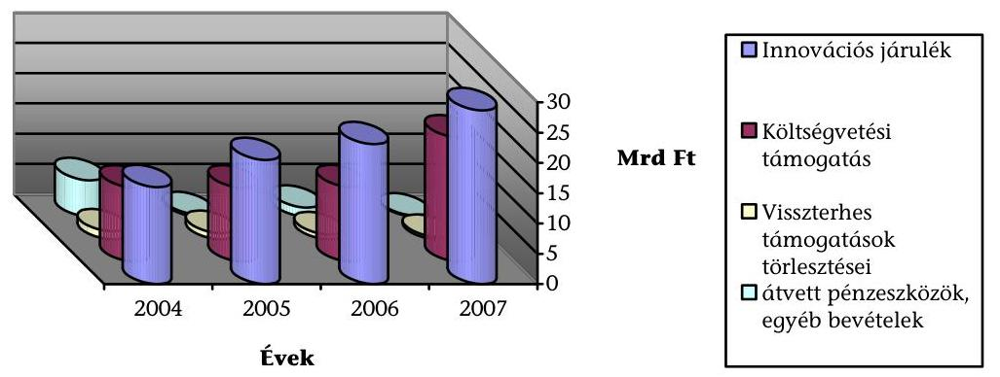
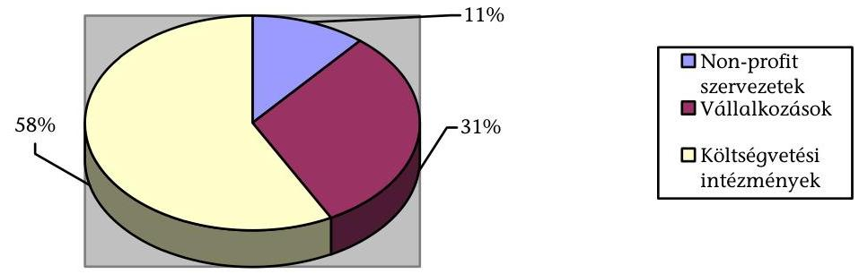
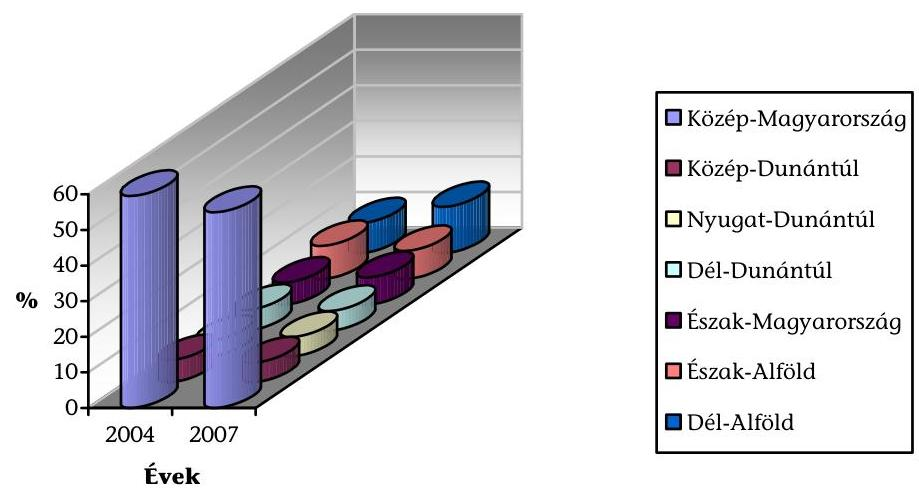
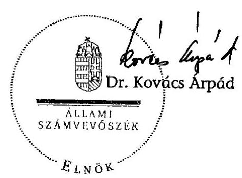
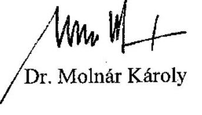
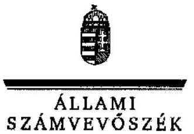
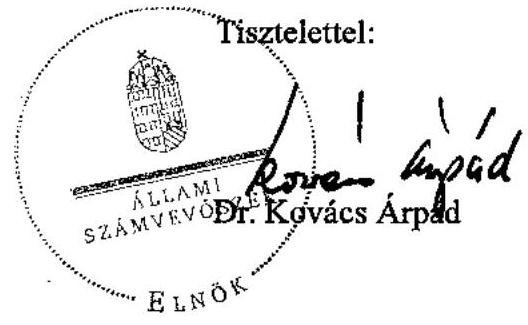
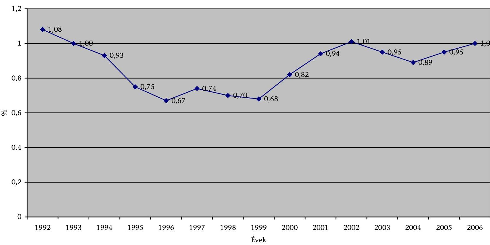
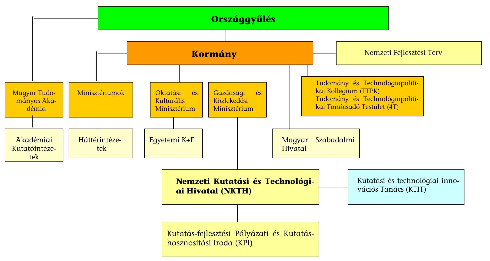
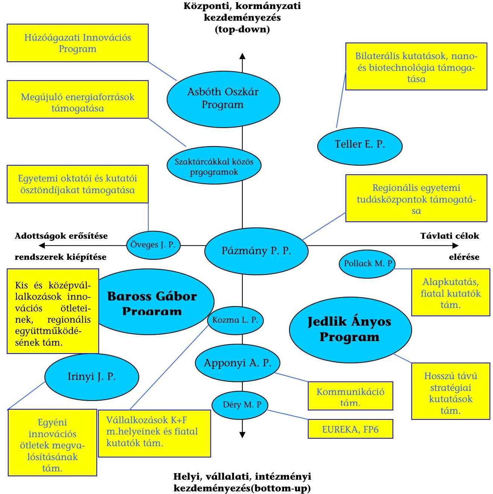

# ÁLLAMI   SZÁMVEVŐSZÉK 

## JELENTÉS

a Kutatási és Technológiai Innovációs Alap múködésének ellenőrzéséről

---

2. Államháztartás Központi Szintjét Ellenőrző Igazgatóság 23. Átfogó Ellenőrzési Főcsoport

Iktatószám: V-06-70/2007-08.
Témaszám: 861
Vizsgálat-azonosító szám: V-0366

# Az ellenőrzést felügyelte: 

Bihary Zsigmond
főigazgató
Az ellenőrzés végrehajtásáért felelős:
Hegedúsné dr. Müllern Veronika
főcsoportfőnök

## Az ellenőrzést vezette:

## Belovai Sándorné

osztályvezető főtanácsos

## Az ellenőrzést végezték:

Dobos András
számvevő tanácsos, tanácsadó
Maklári Ferencné
számvevő tanácsos,
főtanácsadó
Zagyi Judit
számvevő

Dr. Fónyad Erzsébet
számvevő tanácsos
Dr. Mihály Sándor
számvevő tanácsos, főtanácsadó
Záhonyiné Horváth
Ildikó
számvevő tanácsos

## A témához kapcsolódó eddig készített számvevőszéki jelentések:

## címe

Jelentés az Országos Tudományos Kutatási Alap (OTKA) múködésének pénzügyi-gazdasági ellenőrzéséről (1990)
Jelentés az Országos Műszaki Fejlesztési Bizottság és a Központi
Műszaki Fejlesztési Alap pénzügyi-gazdasági ellenőrzéséről (1993)
Jelentés a központi költségvetésből kutatás-fejlesztési célokra fordított pénzeszközök hasznosulásának ellenőrzéséről (2004)
Jelentés a Magyar Köztársaság 2004. évi költségvetése végrehajtásának ellenőrzéséről
Jelentés a Magyar Köztársaság 2005. évi költségvetése végrehajtásának ellenőrzéséről
Jelentés a Magyar Köztársaság 2006. évi költségvetése végrehajtásának ellenőrzéséről

## sorszáma

3
148
0440
0540
0628
0724

---

## Eierlikör (1)

Menge: 1 Drink

2 Zentiliter Zitronensaft
2 Zentiliter Zuckersirup
1 Zentiliter Zuckersirup
1 Zentiliter Zuckersirup
etwas Zuckersirup
etwas Zuckersirup
etwas Zuckersirup
etwas Zuckersirup
etwas Zuckersirup
etwas Zuckersirup
etwas Zuckersirup
etwas Zuckersirup
etwas Zuckersirup
etwas Zuckersirup
etwas Zuckersirup
etwas Zuckersirup
etwas Zuckersirup
etwas Zuckersirup
etwas Zuckersirup
etwas Zuckersirup
etwas Zuckersirup
etwas Zuckersirup
etwas Zuckersirup
etwas Zuckersirup
etwas Zuckersirup
etwas Zuckersirup
etwas Zuckersirup
etwas Zuckersirup
etwas Zuckersirup
etwas Zuckersirup
etwas Zuckersirup
etwas Zuckersirup
etwas Zuckersirup
etwas Zuckersirup
etwas Zuckersirup
et

---

# TARTALOMJEGYZÉK 

BEVEZETÉS ..... 9
I. ÖSSZEGZŐ MEGÁLLAPÍTÁSOK, KÖVETKEZTETÉSEK, JAVASLATOK ..... 13
II. RÉSZLETES MEGÁLLAPÍTÁSOK ..... 22

1. A kutatási és technológiai innovációs alap jogi szabályozása ..... 22
1.1. Az innovációs rendszer megújítása ..... 22
1.2. Az Alap felügyeletének, múködési környezetének kialakítása, tevékenységének feltételrendszere ..... 24
1.3. A támogatások és a kormányprogramok összhangja, a felhasználási programok kidolgozása ..... 26
1.4. Az Alap tevékenységének szabályozása ..... 29
1.5. Az Alap múködésének gazdasági feltételei, bevételi forrásai ..... 31
2. Az Alap szerepe a K+F és az innováció területén ..... 33
2.1. A meghirdetett programok megvalósulása ..... 33
2.2. Az elért eredmények hasznosulása, gazdasági hatása ..... 34
3. Az Alap kezelése és monitoring rendszere ..... 39
3.1. Az Alap kezelése ..... 39
3.1.1. A Hivatal és az Iroda szervezete és feladatellátása ..... 39
3.1.2. A monitoring rendszer ..... 41
3.2. A pályázati rendszer kiépítése és múködése ..... 43
3.2.1. A pályázati rendszer kiépítése ..... 43
3.2.2. A pályázatok szakmai és pénzügyi elszámoltatása ..... 45
3.3. Az Alap kezelésének informatikai támogatottsága ..... 49
4. A korábbi ÁSZ ellenőrzések megállapításai, javaslatai alapján tett intézkedések ..... 54
MELLÉKLETEK
5. A kutatás-fejlesztésért felelős tárca nélküli miniszter véleménye és az arra adott válasz
6. A magyar K+F ráfordítások a GDP százalékában
7. A magyar innováció irányítási rendszere 2007. évben
8. Az Alap 2006. évi főbb programjainak bemutatása
9. A Kutatási és Technológiai Innovációs Alap előirányzatai a 2004-2007. években

## FÜGGELÉK

1. A kiválasztott pályázati projektek ellenőrzése és melléklete

---

.

---

# RÖVIDÍTÉSEK JEGYZÉKE 

| Ámr. | 217/1998. (XII. 30.) Korm. rendelet |
| :--: | :--: |
| 4 T | Tudomány- és Technológiapolitikai Versenyképességi Tanácsadó Testület |
| AGE | Anyagtudomány, gyártástechnológia, eszközök alprogram |
| Alap | Kutatási és Technológiai Innovációs Alap |
| Alap tv. | 2003. évi XC. törvény a Kutatási és Technológiai Innovációs Alapról |
| ÁSZ | Állami Számvevőszék |
| GKM | Gazdasági és Közlekedési Minisztérium |
| Hivatal | Nemzeti Kutatási és Technológiai Hivatal |
| IKTA | Infokommunikációs technológiák és alkalmazások |
| Innovációs tv. | A kutatás-fejlesztésről és technológiai innovációról szóló 2004. évi CXXXIV. törvény |
| Iroda | Kutatás-fejlesztési Pályázati és Kutatáshasznosítási Iroda |
| IT | Irányító Testület |
| Kbt. | A közbeszerzésről szóló 2003. évi CXXIX. törvény |
| KFIIF | A K+F Információs Infrastruktúra Fejlesztése |
| KMüFA | Központi Műszaki Fejlesztési Alapprogram |
| KTIT | Kutatási Technológiai és Innovációs Tanács |
| MAG Zrt. | Magyar Gazdaságfejlesztési Központ Támogatásközvetítő Zártkörú Részvénytársaság |
| MB | Monitoring Bizottság |
| MTA | Magyar Tudományos Akadémia |
| MUS | Pénzegység Alapú Mintavétel (Monetary Unit Sampling) |
| NKFP | Nemzeti Kutatás-fejlesztési Program |
| NKR | Nemzeti Kutatás-nyilvántartási Rendszer |
| NKTH | Nemzeti Kutatási és Technológiai Hivatal |
| OKM | Oktatási és Kulturális Minisztérium |
| OMAI | Oktatási Minisztérium Alapkezelő Igazgatósága |
| PhD | Doctor of Philosophy |
| PKR | Pályázat Kezelő Rendszer |
| TéT | Tudomány és Technológiapolitika |
| TST | Induló, technológiaintenzív mikrovállalkozások támogatása |
| TTI | Tudomány-, technológia- és innováció-politikai stratégia |
| TTPK | Tudomány- és Technológiapolitikai Kollégium |

---

.

---

# ÉRTELMEZŐ SZÓTÁR 

Adatmigráció
A kutatás-fejlesztési és technológiai innovációs eredmények hasznosítása

Alapkutatás

Alkalmazott (vagy ipari) kutatás
Célzott alapkutatás

Civil szervezet

Ellenőrzés

Előzetes értékelés

Eredmény indikátorok

Értékelés

Értékelési terv

Informatikailag rögzített adatok áttöltése egyik adatbázisból a másikba.
Ide tartozik mind a vállalkozások keretében üzleti céllal, gazdasági eredmény reményében történő felhasználás, mind az olyan közösségi célú felhasználás, amelynek eredménye a lakosság életminőségének és a közszolgáltatások minőségének javítása, a természeti és épített környezet védelme, az ország fenntartható fejlődése, valamint védelmi képességének és biztonsági helyzetének javítása (X).
Elsődlegesen a jelenségek lényegére és a megfigyelhető tényekre vonatkozó tudományos ismeretek bővítését célzó kísérleti, tapasztalati, rendszerező vagy elméleti munka (X).

Új ismeret szerzésére elsődlegesen meghatározott gyakorlati cél érdekében végzett eredeti vizsgálat (X).
A tudományos ismeretek bővítésére irányuló olyan kutatás, amelyről valószínűsíthető, hogy a felismert vagy várható, jelenlegi vagy jövőbeli problémák megoldására alapul szolgál (X).
Az egyesülési jogról szóló 1989. évi II. törvény alapján létrejött társadalmi szervezet, szövetség (kivéve a pártot, a munkaadói és munkavállalói érdek-képviseleti szervezetet, a biztosító egyesületet, valamint az egyházat) és a Polgári Törvénykönyvről szóló 1959. évi IV. törvény alapján létrejött alapítvány, ide nem értve a közalapítványt (X).

A támogatási programoknál a közpénzek felhasználásának adminisztratív, jogi, pénzügyi szabályszerűségeit vizsgáló tevékenység (XX).
A program tervezésekor, annak véglegesítése előtt végrehajtott értékelés annak vizsgálatára, hogy a tervezett program elősegíti-e a célok megvalósulását, a rendelkezésre álló erőforrásokkal végrehajtható-e az adott program, valamint a monitoring és a későbbi értékelések számára megfelelő információk rendelkezésre állnak-e (XX).
A program megvalósított céljainak közvetlen eredményeit leíró mutatószámok, illetve szakmaspecifikus eredménymutatók (XX).
A közpénzek eredményes felhasználásának vizsgálata érdekében, a közfinanszírozású kutatás-fejlesztési és technológiai innovációs programok eredményeinek, a program végrehajtása során a rendelkezésre álló erőforrásokkal és az eredeti célokkal való összhangban állását, az eredmények gazdasági-társadalmi hasznosítását és a hasznosítás hatásait elemző tevékenység (XX).
Az értékelés céljainak, módszerének és időbeli ütemezésének összefoglalása (XX).

---

Hasznosító vállalkozás
Hatás indikátorok

Indikátorok

Input indikátorok
Kísérleti (vagy prekompetitív) fejlesztés

Konzorcium

Költségvetési kutatóhelyen létrejött szellemi alkotások üzleti hasznosítása céljából az ilyen kutatóhely által alapított, illetve részvételével vagy részesedésével múködő gazdasági társaság (X).
A megvalósult programnak a gazdasági-társadalmi környezetére gyakorolt, hosszabb távú hatásait számba vevő mutatószámok (XX).
A programértékelés során a program céljainak teljesülését számszerúen vizsgáló mutatószámok, illetve szakmaspecifikus eredménymutatók(XX).
A program megvalósításához szükséges pénzügyi, emberi és egyéb erőforrások mutatószámai(X).
A kutatásból és/vagy a gyakorlati tapasztalatokból nyert, már létező tudásra támaszkodó tevékenység, amelynek célja új anyagok, termékek, eljárások, rendszerek, szolgáltatások létrehozása, vagy a már meglévők lényeges továbbfejlesztése (X).
A részes felek (tagok) polgári jogi szerződésben szabályozott munkamegosztásán alapuló együttmúködés kutatásfejlesztési, technológiai innovációs tevékenység közös folytatása vagy egy kutatás-fejlesztési, technológiai innovációs projekt közös megvalósítása céljából(X).
Költségvetési gazdálkodási rendben múködő, alap-, illetve főtevékenységként vagy ahhoz kapcsolódóan kutatásfejlesztési tevékenységet folytató szervezet vagy szervezeti egység (X).
A program megvalósítása, végrehajtása közben végzett értékelés a szükséges korrekciók megtétele érdekében (XX).
Az államháztartás alrendszereiből nyújtott támogatás, ideértve az államháztartásról szóló 1992. évi XXXVIII. törvény (a továbbiakban: Áht.) 13/A. § szerinti, az Európai Unióból (a továbbiakban: EU) származó forrásokat is, továbbá a területfejlesztési tanácsok rendelkezési jogkörébe utalt támogatás és az állami, illetve önkormányzati részvétellel létrejött nemzetközi szerződések alapján kapott külföldi támogatás (X).

Kutatás-fejlesztés
Kutatás-fejlesztési és technológiai innovációs program

Kutató, fejlesztő természetes személy

Magában foglalja az alapkutatást, az alkalmazott kutatást és a kísérleti fejlesztést (X).
Közfinanszírozású támogatási forrás kezelője által meghatározott cél elérését szolgáló, vagy meghatározott témakörbe csoportosítható kutatás-fejlesztési vagy technológiai innovációs projektek megvalósításának támogatására kiírt pályázat, illetve pályázatok időben megismételt sorozata (X).
Az a természetes személy, aki új ismeret, szellemi alkotás, termék, szolgáltatás, eljárás, módszer, rendszer létrehozásával vagy fejlesztésével, valamint az ezt célzó projektek megvalósításának irányításával foglalkozik.

---

| Kutatóhely | Alap-, illetve főtevékenységként vagy ahhoz kapcsolódó-   an kutatás-fejlesztési tevékenységet folytató szervezet,   szervezeti egység vagy egyéni vállalkozó (X). |
| :--: | :--: |
| Monitoring | A források felhasználásának (pénzügyi monitoring), az   eredményeknek és a teljesítményeknek (szakmai monitor-   ing) mindenre kiterjedő - többek között szabályossági,   hatékonysági és célszerűségi - vizsgálata rendszeres jel-   leggel projekt, illetve program szinten (XXX). |
| Nemzeti innovációs   rendszer | Az országon belül azoknak az intézményeknek, vállalko-   zásoknak és egyéb szervezeteknek, valamint azoknak az   erőforrásoknak, szabályoknak, feltételeknek és intézkedé-   seknek az összessége, amelyek az új tudás és technológia   létrehozását, átadását, terjedését és hasznosítását befolyá-   solják (X). |
| Non-profit kutatóhely | A közhasznú szervezetekről szóló törvényben meghatáro-   zott közhasznú szervezetként, illetve annak keretében   múködő kutatóhely (X). |
| Output indikátorok | A program megvalósításának folyamatát jelző mutató-   számok, illetve szakmaspecifikus eredménymutatók, ame-   lyek a támogatott program céljainak megvalósulását írják   le (XX). |
| PhD | A doktori képzésben szerezhető oklevél által tanúsított   tudományos fokozat (XXXX). |
| Program | A közfinanszírozású forrás kezelője által valamely kuta-   tás-fejlesztési és technológiai innovációs cél elérése érde-   kében eltervezett, különböző eszközökkel megvalósítandó   intézkedéscsomag (X). |
| Projekt | Meghatározott kutatás-fejlesztési feladat, technológiai   innovációs folyamat végrehajtására irányuló tevékenység   az abban érdekeltek által meghatározott terv alapján (X). |
| Technológiai innováció | A gazdasági tevékenység hatékonyságának, jövedelmező-   ségének javítása, illetve kedvező társadalmi és környezeti   hatások elérése érdekében végzett tudományos, műszaki,   szervezési, gazdálkodási, kereskedelmi műveletek összes-   sége, amelyek eredményeként új vagy lényegesen módosít-   ott termékek, eljárások, szolgáltatások jönnek létre, új   vagy lényegesen módosított eljárások, technológiák al-   kalmazására, piaci bevezetésére kerül sor, beleértve azo-   kat a változásokat, amelyek csak adott ágazatban vagy   adott szervezetnél minősülnek újdonságnak (X). |
| Tiszta alapkutatás | A tudományos ismeretek bővítésére irányuló kutatás,   amelynek nem célja a közvetlen társadalmi vagy gazda-   sági haszon elérése vagy az eredmények gyakorlati probi-   lémák megoldására történő alkalmazása (X). |
| Utólagos értékelés | A program lezárása utáni értékelés a célok elérésének, a   forrásfelhasználás eredményességének vizsgálata, a siker   vagy a kudarc tényezőinek feltárása, valamint a jövőre   nézve szükséges javaslatok megfogalmazása (XX). |

---

Vállalkozás Az egyéni vállalkozás, a gazdasági társaság, a szövetkezet, a vízi társulat, vízi-közmú társulat, továbbá az erdőbirtokossági társulat (X).

# Forrás: 

$X=a$ kutatás-fejlesztésről és a technológiai innovációról szóló 2004. évi CXXXIV. törvény 4. §-a.
$X X=a$ közfinanszírozású támogatásban részesülő kutatás-fejlesztési és technológiai innovációs programok értékelése rendszeréről és tartalmi követelményeiről szóló 198/2005. (IX. 22.) Korm. rendelet 12. §-a.
$X X X=a z$ Európai Unió által nyújtott egyes pénzügyi támogatások felhasználásával megvalósuló, és egyes nemzetközi megállapodások alapján finanszírozott programok monitoring rendszerének kialakításáról és múködéséről szóló 102/2006. (IV. 28.) Korm. rendelet 2. §-a.
XXXX = a felsőoktatásról szóló 2005. évi CXXXIX. törvény 67. §-a.

---

# JELENTÉS 

## a Kutatási és Technológiai Innovációs Alap múködésének ellenőrzéséről

## BEVEZETÉS

A rendszerváltozást követően a magyarországi kutatás-fejlesztés és innováció új alapokra helyezését döntően a vállalati $\mathrm{K}+\mathrm{F}$ részlegek és az alkalmazott ipari kutatóintézetek megszüntetése, valamint a kutatói létszám drasztikus csökkenése indokolta. A kutatás-fejlesztésre fordított GDP arányos források 1\% alá csökkentek, illetve 2006-ra érte el ezt a mértéket (2. számú melléklet), az irányítási rendszer stratégia nélkül múködött. A 90-es évek végétől a fejlesztési és átszervezési folyamatok eredményének tekinthető a felsőoktatás expanziója, a doktori iskolák létrehozása, az egyetemi integrációs program és az akadémiai intézetek konszolidációja. Ezek a pozitív változások azonban nem bizonyultak elég hatékonynak ahhoz, hogy a kutatás-fejlesztés és az innováció a kutatóhelyek és a vállalati szféra kapcsolatában, azokkal szoros együttmúködésben fejlődjön. A kutatás-fejlesztés és az innováció csak csekély mértékben segítette a gazdaság versenyképességének növekedését. A kutatás-fejlesztési tevékenység Budapest centrikussága miatt jelentős egyenlőtlenségek alakultak ki, a régiók felzárkózási esélyei nem voltak biztosítottak.

Az ország gyorsuló gazdasági növekedése érdekében a Kormány a programjában elkötelezte magát egy új, hatékony innovációs rendszer kiépítése és múködtetése mellett. Az új kihívásoknak való megfelelés érdekében a kutatásfejlesztési és az innovációs forrás biztosítása és az irányítási rendszer kialakítása központi intézkedéseket tett szükségessé. Törvény született a Kutatási és Technológiai Innovációs Alapról (Alap tv.) ${ }^{1}$, a kutatás-fejlesztésről és a technológiai innovációról (Innovációs tv.) ${ }^{2}$.

A törvényi feltételrendszer kialakítása szakmapolitikai és stratégiai feladat, amelynek irányítását a Tudomány- és Technológiapolitikai Kollégium (Kollégium) végezte. A feladatok ellátásának segítésére tanácsadó, döntés-előkészítő, koordináló és értékelő testületként Tudomány- és Technológiapolitikai, Versenyképességi Tanácsadó Testület (4T) múködött 2007. júniusig. Az Alap felhasználásával kapcsolatos feladatellátást a Kutatási Technológiai és Innovációs Tanács (KTIT) segítette, tagjai között a gazdaság és a tudomány szereplői többségben vannak, kisebb létszámban képviseltetik magukat az innovációban érdekelt minisztériumok. A magyar innováció 2007. évi irányítási rendszerét a 3. számú melléklet mutatja be.

[^0]
[^0]:    ${ }^{1}$ a Kutatási és Technológiai Innovációs Alapról (Alap) szóló 2003. évi XC. törvény
    ${ }^{2}$ a kutatás-fejlesztésről és a technológiai innovációról szóló 2004. évi CXXXIV. törvény

---

A Kutatási és a Technológiai Innovációs Alap (Alap) elkülönített állami pénzalap amelynek legfontosabb bevételi forrását a költségvetési alkuktól független, a gazdasági társaságok által befizetett innovációs járulék jelentette, aránya a vizsgált időszakban $45,1 \%$-ról $55,3 \%$-ra nőtt. Az Alap másik jelentős forrása a központi költségvetésből nyújtott, az éves költségvetési törvényekben meghatározott összegű állami támogatás volt. Éves mértékére garanciális szabályt ${ }^{3}$ vezetett be az Alap tv. azzal a szándékkal, hogy az állami támogatás szerepe erősödjön. Az Alap céljainak finanszírozásában ez a feltétel azonban 2006-ig nem érvényesült. A költségvetési támogatás aránya az ellenőrzött időszak alatt 5,1 százalékpontos elmozdulást - 34,5\%-ról 39,6\%-ra - mutatott. Az Alapnak 2004. január 1-jétől része lett az Oktatási Minisztérium által múködtetett két nagy támogatási program, a Nemzeti Kutatás-fejlesztési Program (NKFP) és a Központi Műszaki Fejlesztési Alapprogram (KMüFA).

A rendelkezésre álló pénzeszközök támogatásra és a múködés költségeinek fedezetére fordíthatóak, a források elosztása döntően nyílt pályázat keretében történik. Az Alap kezeléséről és felhasználásáról szóló 133/2004. (IV. 29.) Kom. rendelet alapján az Alapot a gazdasági és közlekedési miniszter a Nemzeti Kutatási és Technológiai Hivatal (Hivatal) közremúködésével múködteti. A Hivatal felelős volt a Kormány tudomány- és technológiapolitikájának, stratégiájának kidolgozásáért és a nemzeti innovációs rendszer múködését biztosító feltételek megteremtéséért. 2006. II. félévétől a felügyeletet ellátó GKM és az OKM együttesen felelős a kormányzati TTI stratégia és intézkedési terv kimunkálásáért, és végrehajtásának koordinálásáért ${ }^{4}$. 2008. május 1-jétől a kutatásfejlesztésért felelős tárca nélküli miniszter feladat- és hatásköréről szóló 103/2008. (IV.29.) Korm. rendelet szerint a tárca nélküli miniszter felelős a ku-tatás-fejlesztésért és technológiai innovációért és a tudománypolitikai koordinációért, valamint irányítja a Hivatalt.

Az Alap pénzeszközeinek kezelésével, felhasználásával és ellenőrzésével összefüggő feladatokat a Hivatal felügyelete alatt álló központi költségvetési szerv, a Kutatás-fejlesztési Pályázati és Kutatáshasznosítási Iroda (Iroda) 2008. január végéig látta el. Ezt követően a feladatokat megosztották az NKTH és a Mag Zrt. között.

A Hivatal felelőssége, hogy - független szakértői vélemények alapján - egyszerű és átlátható pályáztatással jussanak támogatáshoz az innovatív programok nyertesei. A pályázati úton kiválasztott kedvezményezettek az Alap pénzeszközeit a kutatás-fejlesztés kiadásainak, a kutatás-fejlesztési eredmények hasznosításának fedezetére, infrastrukturális feltételek fejlesztésére, innovációt erősítő szolgáltatások támogatására, nemzetközi tudományos és technológiai együttműködés elősegítésére, kutató-fejlesztő munkahelyek létrehozására, a tudományos és technológiai ismeretek megszerzésére, azok gyakorlati alkalmazására, a társadalomtudományi kutatások támogatására használhatják fel.

[^0]
[^0]:    ${ }^{3}$ Az Alap tv. 7. §
    ${ }^{4}$ Az oktatási és kulturális miniszter feladat- és hatásköréről szóló 167/2006.(VII.28.) és a gazdasági és közlekedési miniszter feladat- és hatásköréről szóló 163/2006.(VII.28.) Korm. rendeletek.

---

Az Állami Számvevőszék (ÁSZ) megalakulásától kiemelt figyelmet fordított mind a hazai, mind az Európai Unióból származó kutatás-fejlesztési források felhasználásának és hasznosulásának ellenőrzésére. 1990-ben az Országos Tudományos Kutatási Alap (OTKA), 1993-ban az Országos Műszaki Fejlesztési Bizottság (OMFB) és a Központi Műszaki Fejlesztési Alap (KMüFA) pénzügyigazdasági múködését, 2004-ben a központi költségvetésből kutatásfejlesztési célokra fordított pénzeszközök hasznosulását vizsgálta, valamint a témához kapcsolódóan az ÁSZ Fejlesztési és Módszertani Intézete tanulmányt is készített „Privatizáció Magyarországon" címmel. Évente figyelemmel kísérte az önkormányzatok által felhasznált fejlesztési támogatások hasznosulását, valamint 2006. évről először készült Tájékoztató (Trend Report) az európai uniós támogatásokkal kapcsolatos ÁSZ tapasztalatok összegezéséről. ${ }^{5}$ Jelentésünkkel egyidejűleg kerül nyilvánosságra a Nemzeti Fejlesztési Ügynökség múködésének ellenőrzéséről készült jelentés is.

2004-től az ÁSZ évente vizsgálta az Alap és a Hivatal költségvetésének megalapozottságát, a költségvetés végrehajtásáról készített beszámolók megbízhatóságát. Az Alap átfogó ellenőrzésére első alkalommal került sor.

Az ellenőrzés célja annak értékelése volt, hogy

- az Alap bevételi és kiadási forrásainak összetétele és összege célszerűen és megalapozottan biztosította-e az innováció ösztönzését, és indokoltan változott-e a tervezetthez képest;
- a rendelkezésre álló források lehetővé tették-e a kutatás és fejlesztés eredményességének erősítését, az innovációs infrastruktúra és a szolgáltató tevékenységek fejlesztését;
- a felügyeleti rendszer, a Hivatal, valamint az Iroda szervezete megfelelően segítette-e az Alap, a pályázati rendszer, a belső kontrollrendszer, valamint a monitoring múködését;
- a korábbi ÁSZ ellenőrzések megállapításaira, javaslataira készültek-e intézkedési tervek, és megtörtént-e azok végrehajtása.

Az Alap múködését a 2004 -2007. évek gazdasági eseményei alapján átfogó ellenőrzés módszerével, rendszerszemléletben vizsgáltuk. Az Alap létrehozásához, múködtetéséhez fűzött célok megvalósulását, a szakmai feladatok ellátását az Alap bevételeinek, kiadásainak és pályázati programjainak, ezek dokumentációinak elemzésével, valamint az ellenőrzés keretében kiválasztott pályázatok vizsgálati tapasztalatainak összegzésével értékeltük. Az Alap belső kontrollrendszerére vonatkozó megállapításainkat a különböző döntéshozatali szinteken, valamint a helyszínen végzett ellenőrzésre alapoztuk. Helyszíni ellenőrzés

[^0]
[^0]:    ${ }^{5}$ A 43/2005.(V.26) OGY határozat előírja, hogy: „..... az Állami Számvevőszék a teljes uniós pénzfelhasználás gyakorlatáról átfogó képet adjon, ennek keretében az uniós forrásokkal összefüggő pénzmozgások ellenőrzését végző hazai szervezetek munkáját szakmai szempontból áttekintse és mutassa be az ellenőrzések tapasztalatait".

---

keretében az ún. MUS ${ }^{6}$ mintavételezési módszerrel 21 darab, 921,2 M Ft összeggel támogatott pályázat vizsgálatára került sor, amelyet a 2004. évben, vagy azt követően folyósítottak, és ami 2007. I félév végéig lezárt pályázatok 10\%-a volt. Az erre vonatkozó részletes megállapításokat a jelentésünk Függeléke tartalmazza.

Az ellenőrzés jogszabályi alapját - figyelemmel az Állami Számvevőszékről szóló 1998. évi XXXVIII. törvény 16. §-ának (1) bekezdésében és 21. §-ának (3) bekezdésében foglaltakra, különösen az 1. §-a (2) bekezdésének, a 2. §-a (3), (5), és (6) bekezdésének, valamint a 17. §-a (3) bekezdésének rendelkezései együttesen képezték. A jelentést egyeztettük az illetékes szervezetek vezetőivel, a kuta-tás-fejlesztésért felelős tárca nélküli miniszter véleményét és az arra adott választ az 1. sz. melléklet tartalmazza.
${ }^{6}$ Pénzegység alapú statisztikai mintavételi módszer (Monetary Unit Sampling)

---

# I. ÖSSZEGZŐ MEGÁLLAPÍTÁSOK, KÖVETKEZTETÉSEK, JAVASLATOK 

A magyar gazdaság versenyképességének növelésére szükségessé vált a nemzeti innovációs rendszer jogi, szervezeti, finanszírozási feltételeinek megújítása, működőképes pályájának hosszabb távú kijelölése. A törvényi feltételrendszer kialakítására a kormányfő elnökletével megalakult a Tudomány- és Technológiapolitikai kollégium (Kollégium). Az elnök helyettesei az oktatási miniszter, a gazdasági és közlekedési miniszter, valamint az MTA elnöke. A Kollégium tagjai az érintett miniszterek, meghívott tagja a Hivatal elnöke.

A Kollégium és a 4T az innovációs törvényben előírt feladatnak megfelelően megkezdte a középtávú tudomány-, technológia- és innováció-politikai stratégia (TTI) kidolgozásának előkészítését, amelyet a Kormány a Hivatal elnökére bízott. Az előkészítés során a Hivatal és az MTA között koncepcionális viták merültek fel és nem sikerült konszenzusra jutni a tervezet összeállításánál. 2006. II. félévében a TTI további előkészítését, koordinálását a Hivataltól a GKM vette át és 2 év késéssel az OKM-mel és az MTA-val közösen kidolgozta és - 2007. II. negyedévben - a Kormány elé terjesztette az átdolgozott, egységesített stratégiát.

A stratégia kidolgozásához, a prioritások kijelöléséhez 2005-ben helyzetértékelés készült a hazai kutatás-fejlesztés feltételeiről, múködéséről, amely kritikusan értékelte az innovációs rendszer gyenge múködését (aktivitás, technológiai inkubáció, intézményi, hálózati struktúrák, innovatív vállalkozások, kockázati tőke hiánya stb.). Külön kiemelte a regionális innovációs rendszer hiányosságait, többek között a területi egyenetlenséget, a túlzott centrikusságát, a hasznosító vállalkozások, összekapcsoló hálózatok hiányát.

A 2002-2006. évekre, valamint a 2004-2006. évekre szóló kormányprogramban célul kitűzött feladatok nagyobb részt a deklaráció szintjén maradtak. Az innovációs rendszer formailag kialakult, hatásában azonban még nem hozta a várt eredményeket: a GDP arányos $\mathrm{K}+\mathrm{F}$ felhasználás nem érte el a tervezett mértéket, valamint az összesített innovációs index alapján a változás iránya negatív. ${ }^{7}$

A 2004-2006-os időszakban a KTIT jóváhagyásával az Alap tervezését megalapozó középtávú stratégiai terv annak ellenére sem készült el, hogy azt előírta a kormányrendelet ${ }^{8}$. A támogatások célja, nagyságrendje, ütemezése programszinten az éves tervekben jelent meg, az Alap felügyeletét ellátó KTIT döntéseinek megfelelően.

[^0]
[^0]:    ${ }^{7}$ Az EU által készített 2006. évi innovációs elemzése alapján Magyarország a 2005. évi 15. helyről 2006. évre a 20. helyre csúszott vissza.
    ${ }^{8}$ A 133/2004. (IV. 29.) Korm. rendelet 3. § (1) bekezdése

---

Elkészült - és a KTIT elfogadta - az Alap 2007-2009 közötti időszakra vonatkozó középtávú stratégiai terve, amely szerint a források a Strukturális Alapokból közel további 10 Mrd Ft-tal növekednek. Ez egyben körültekintőbb eljárást, határozottabb követelményrendszer érvényesítését kívánja meg, a programok tervezésétől a teljesítésig bezárólag. A KTIT minden évben megtárgyalta és elfogadta a Hivatal elnöke által előterjesztett éves felhasználási tervet.

A 2005-2006. évi költségvetési beszámolókkal kapcsolatban a felügyeleti irányítás több kifogást, észrevételt tett az Alap esetenként nem megfelelő felhasználásával kapcsolatban. Az egyes évekről szóló, a Kormány részére készített beszámolókat a KTIT kiegészítésekkel és módosításokkal elfogadta, azonban a Kormány és a miniszter ezeket a beszámolókat nem vitatta meg, elfogadásukról nem határoztak.

Az Alap jogszabályi hátterét, múködésének feltételeit a különböző jogszabályok - a módosításokkal együtt - 27 esetben érintették. Kormányrendeletek szabályozzák az Alap kezelési és felhasználási rendjét, ezen belül az EU kutatásfejlesztési és innovációs keretszabályzatának hazai vetületét és a kötelező uniós szabályokkal való megfelelést. A Nemzeti Kutatási-nyilvántartási Rendszernek (NKR) kormányrendelet ${ }^{9}$ alapján kötelesek adatot szolgáltatni a közpénzt felhasználó kutatás-fejlesztést végző szervezetek.

Az Alap bevételeinek és kiadásainak előirányzatát az éves költségvetési törvények tartalmazták, amelynek alapján készült el az Alap várható bevételeit, a vállalt kötelezettségeket, valamint az új programok indítására rendelkezésre álló forrásokat meghatározó éves felhasználási terve.

Az Alap múködésének gazdasági feltételeit megalapozó összes bevétele a 2004. évi 35,4 Mrd Ft-ról 2007. évre 51,9 Mrd Ft-ra, 46,6\%-kal emelkedett. Hátrányos helyzet alakult ki a kutatás - fejlesztés - innováció támogatása területén azáltal, hogy a költségvetési törvények 3 egymást követő évben megakadályozták az „alapszerú" múködést azzal, hogy nem engedték felhasználni a maradványt. A 2006. év végére a felhalmozódott és fel nem használt maradvány összege 30,7 Mrd Ft-ra nőtt, amely az Alap közel egy éves bevételének felelt meg. A 2008. évi költségvetési tervezés alkalmával megtörtént az első lépés a maradvány egy részének felszabadítására, így a Hivatal intézkedési javaslata alapján 10,0 Mrd Ft felhasználását hagyták jóvá a költségvetési törvényben.

Az Alap kiadásainak előirányzatai jogcímenként nem hasonlíthatók össze, mert azokat évente eltérő szerkezetben tervezték meg. A kiadások tervezhetőségét befolyásolta, hogy az APEH által feldolgozott járulékbevallások alapján nem lehetett előre pontosan jelezni az innovációs járulék várható összegét. Az Alap kiadásainak teljesítése a vizsgált időszakban lényegesen, 16-28\%-os mértékben elmaradt a módosított előirányzathoz képest. A kiadások alulteljesítését több tényező, így az elszámolatlan előlegek, az elszámolások késedelmes benyújtása, az adminisztrációs folyamatok elhúzódása, az újabb támogatási döntések többségének a II. félévben történő meghozatala, valamint az innová-

[^0]
[^0]:    ${ }^{9}$ A Nemzeti Kutatás-nyilvántartási Rednszerről szóló 160/2001.(IX. 12.) Korm. rend.

---

ciós járulékból származó, az előirányzatot jelentősen meghaladó többlet bevétele együttesen okozta. A gyakori szervezeti változások is hátráltatták a megfelelő működést. Mindezek kedvezőtlenül befolyásolták a programok, alprogramok megalapozott értékelését is.

A pályázati rendszer keretében kialakított programok az évek során bővültek, differenciálódtak és számuk is növekedett. 2007. évben az élő szerződéssel rendelkező, folyamatban lévő programok száma 34 volt, az alprogramokkal együtt számuk meghaladta a 60-at. A 2004-2007. években múködtetett legfontosabb támogatási programokat a 4. számú melléklet tartalmazza. A programok céljait, feladatait, a pályázatok kiírásának általános szempontjait még 2004-ben dolgozták ki anélkül, hogy kialakult, illetve jóváhagyott koncepció, stratégiai elképzelés a felhasználás megalapozott tervezéséhez rendelkezésre állt volna.

A kiemelt, hosszabb távú, 2-4 éves futamidejú kutatási programok 2004. év II. felében, illetve 2005. évben indultak. 2004 - 2007. között 4241 pályázat keretében 102,2 Mrd Ft támogatást hagytak jóvá, egy pályázatra átlagosan 24,1 M Ft jutott. A támogatások elszámolására 2004-től vezették be az „audit" elvű pénzügyi elszámolási rendszert ${ }^{10}$.

A pályázatok szakmai elszámoltatása nem volt teljes körű, mert a pályázatkezelő nem fogalmazott meg és követelt meg konkrét eredmény-elvárásokat, a szakmai teljesítéshez megfelelő célértékkel rendelkező indikátorokat nem rendeltek és nem biztosították a célszerűen kialakított monitoring rendszer múködését. 2004-től az Alapból nyújtott támogatások esetében ezek a feltételek nem érvényesültek.

Az elindított nagy projektek (Pázmány Péter, Jedlik Ányos, Asbóth Oszkár, Teller Ede, Irinyi János) közös jellemzője volt, hogy a programoknál átlagosan $30 \%$-os volt a saját forrás bevonása; a támogatási szerződésekben célértékkel rendelkező indikátorokat nem határoztak meg, így a bemutatott mutatószámok pl. publikációk száma, munkahelyek teremtése, új technológiák bevezetésének száma alapján a projektek tényleges eredményessége sem mérhető objektív módon. A bemutatott eredmények a támogatottak önbevallásán alapultak, az audit rendszer bevezetése mellet azonban nem erősítették a szakmai teljesítés ellenőrzési rendszerét. Az elvárt eredmények számszerűsítésének, a szükséges elemzések és értékelések elmaradása miatt megállapítható, - az elért és részben számszerűsített, bemutatott eredmények alapján - hogy a vezetés nem úgy alakította ki a rendszert, hogy az lehetővé tette volna az Alap forrásfelhasználása eredményességének és hatékonyságának megítélését.

A 2004-2007 közötti időszakban kifizetett támogatások 69\%-át non-profit szervezetek és költségvetési intézmények, 31\%- át vállalkozások kapták. Kedvezőnek tekinthető, hogy a vállalkozások részére nyújtott támogatások aránya növekvő tendenciát mutatott. Nem sikerült áttörést elérni - a foglalkoztatást meg-

[^0]
[^0]:    ${ }^{10}$ A támogatottaknak a felhasználásról készült, könyvvizsgáló által ellenjegyzett összesítők alapján kell elszámolniuk. Nem szükséges az ezeket alátámasztó dokumentumok részletes és másolatokat is tartalmazó bemutatása.

---

határozó részben biztosító - kis- és középvállalkozásoknál. Elsősorban a kuta-tás-fejlesztési eredmények hasznosítása (pl. korszerű, újonnan kifejlesztett termelési eszközök, technológiák vásárlása, prototípus és szériagyártás) területén, illetve a tudás- és technológia-intenzív kis és középvállalkozásokba történő befektetői részvétel területein azért sem, mert ennek ösztönzésére nem készült támogatási program.

Az Alap feletti rendelkezési jog, a kezelésért és felhasználásért való felelősség, illetve a Hivatal felügyeleti irányítása a 2004-2007 közötti időszakban folyamatosan változott: 2004-2005-ben az oktatási miniszter felügyelte, ezt követően 2006. év közepéig a felügyelet a gazdasági és közlekedési miniszter szakmai közreműködésével együtt valósult meg. 2006. év közepétől az év végéig a gazdasági és közlekedési miniszter felügyelete alá került az oktatási és kulturális miniszter szakmai közreműködése mellett, majd 2007. január 1-től a Hivatal a gazdasági és közlekedési miniszter irányítása alatt működő központi hivatal, az oktatási és kulturális miniszter szakmai közreműködésével. Változást okozott a feladatellátásban az a körülmény, hogy a Hivatal elnökének döntési jogkörét a pályázatoknál a gazdasági és közlekedési miniszter vette át. A Kormány viszont a kutatás-fejlesztésért és technológiai innovációért felelős intézményként a Hivatalt jelölte ki. A feladat ellátásához a Hivatal azonban nem rendelkezett maradéktalanul minden feltétellel, nem volt résztvevője az államigazgatási egyeztetési eljárásnak, nem jutott hozzá az előterjesztésekhez, amelyekkel, mint felelős intézménynek rendelkezni kellene.

A Hivatalt ${ }^{11}$ országos hatáskörú kormányhivatalként 2004. január 1-jén hozták létre. A Hivatalt a vizsgált időszakban több alkalommal átszervezték, de sem a létrehozását, sem átszervezéseit nem előzték meg hatástanulmányok. A különböző testületek, bizottságok, szakmai fórumok ismétlődően felvetették a jogszabályok deregulációjának szükségességét, ennek ellenére a GKM 2007. évben miniszteri utasítást jelentetett meg, ${ }^{12}$ amely rendkívül bonyolulttá tette a támogatási rendszer múködését. ${ }^{13} \mathrm{Az}$ irányításban bekövetkezett folyamatos változások, átszervezések nem biztosították megfelelően a Hivatal racionális és folyamatos múködését. Megalakulásakor az átlagos állományi létszám 103, a helyszíni ellenőrzés idején 100 fő volt, tehát alig változott, amely mögött azonban jelentős fluktuáció húzódott meg.

Az Iroda és a Hivatal feladatainak, szervezetének és létszámának összehasonlító vizsgálatára, a szükséges és elégséges létszám meghatározására, a párhuzamosan történő munkavégzések megszüntetésére - a megalakulás óta eltelt több mint 3,5 év alatt - elemzések nem készültek, tevékenységeikben ténylegesen átfedések voltak tapasztalhatók. 2008. február-március hóban a Hivatal átvilágítása megtörtént. A GKM által megrendelt átvilágító tanulmány alapján kialakult a Hivatal új szervezeti struktúrája.

[^0]
[^0]:    ${ }^{11}$ a Nemzeti Kutatási és Technológiai Hivatalról szóló 216/2003. (XII. 11.) Korm. rendelet.
    ${ }^{12}$ a Kutatási és Technológiai Innovációs Alap gazdálkodásának szabályairól szóló 8/2007. (III. 10.) GKM utasítás.
    ${ }^{13}$ A GKM tájékoztatása alapján a 11/2008.(II.25.) GKM utasítással 8/2007.(III.10.) GKM utasítást hatályon kívül helyezték.

---

Pozitívan értékelhető, hogy a Hivatal a rendelkezésére álló erőforrások figyelembevételével kezdte meg monitoring rendszerének kialakítását. 2005. év végére elkészítette, és jóváhagyásra benyújtotta a Tanácsnak a Monitoring stratégiáját, bár addigra már a támogatási programok meghatározó részét kidolgozták és jóváhagyták. A kidolgozott monitoring stratégia céljaiban egy eredményorientált támogatási rendszert kívánt biztosítani, ugyanakkor a kockázatok kezelését és a források célszerinti, eredményes és hatékony felhasználásának folyamatos nyomon követését biztosító rendszert nem tudott kialakítani, a stratégiában meghatározott célokat a Hivatal nem érte el. Nem hozták létre a Monitoring Bizottságokat, Irányító Testületek is csak 5 program esetében alakultak, a monitoring tevékenység szabályozására nem került sor.

A pályázati rendszer múködtetése során a programok magas száma, a kiírások gyakori és nem megfelelően megalapozott változásai nehezen átláthatóvá tették a támogatási rendszert, amely nem biztosította megfelelően a monitoring és az értékelési rendszer eredményorientált, hatékony múködtetését. A programok céljai többnyire általánosak és - néhány eset kivételével - nem sikerült egyértelműen megfogalmazni az egyes programokkal szemben elvárt eredményt sem. Célértékkel rendelkező eredmény és hatásindikátorokban történő kifejezése pedig egyetlen program esetében sem valósult meg. Hasonló célra ugyanazon, vagy hasonló program keretében egyes intézmények többször is pályázati forráshoz jutottak. A támogatások közötti átfedések kiszűrésének rendszerét sem manuálisan, sem informatikailag nem alakították ki, így nem volt kizárható, hogy ugyanazok a feladatok több projekt keretében is támogatásra kerüljenek, illetve saját forrásként kölcsönösen megjelenjenek. A támogatásokból megvalósuló eszközbeszerzések, beruházások nyilvántartásának hiánya nem zárta ki az egyik támogatásból beszerzett eszközök másik támogatásnál saját erőként történő elszámolását.

A pályázati felhívásokat 2006-ig országos napilapban - az ellenőrzési tapasztalatok szerint - nem jelentették meg, az erre vonatkozó kötelezettséget a jogszabályi előírás ${ }^{14}$ ellenére sem a megállapodás (a Hivatal és az Iroda közötti), sem az Iroda eljárásrendje nem tartalmazta. Az előírásoknak megfelelően meghatározták a saját forrás mértékét, azonban ${ }^{15}$ saját erő igazolását nem írták elő, amelynek hiánya a pályázati célok megvalósulásának kockázatát növelte.

A pályázatok bírálatai ellentmondásosak és nem kellően megalapozottak voltak (lásd Függelék). Már a korábbi ${ }^{16}$ ÁSZ ellenőrzések is kifogásolták a bírálók tevékenységét, és megállapításaik érvényesítését. Az előírásokhoz viszonyítva a döntések megalapozottsága (bírálók véleményeinek rögzítése, a szükséges nyilatkozatok megtétele) nem volt kellőképpen dokumentálva.

A szerződés aláírásának elhúzódása miatt a pályázók a projektek befejezési határidejének meghosszabbítását, a feladatok átütemezését kérték. A szerződések

[^0]
[^0]:    ${ }^{14}$ A Kutatási és Technológiai Innovációs Alap kezeléséről és felhasználásáról szóló 133/2004. (IV. 29.) Korm. rendelet 13. § (3) bekezdése szerint.
    ${ }^{15}$ az Ámr. 83. § (1) bekezdésének b) pontjában meghatározottak szerint
    ${ }^{16}$ A Magyar Köztársaság 2004; 2005; 2006. évi költségvetése végrehajtásának ellenőrzése.

---

megkötésének és a teljesítések (elsősorban az előlegek elszámolásának) elhúzódása miatt folyamatosan, minden évben jelentős nagyságrendű forrás maradt felhasználatlanul. A kockázatkezelés eljárásrendje szabályozza a kockázatok felmérését, azonban a projektek átfutási idejének kockázatát nem értékelték, nem vizsgálták a késések okát és az abból eredő teljesítési kockázatot, nem keresték annak felelősét sem.

A pályázatkezeléssel kapcsolatos feladatok túlzott megosztottsága (pályázatkezelő asszisztens, pénzügyi asszisztens, pályázati koordinátor, pénzügyi és számviteli osztály ügyintézője) a hatékonyság rovására történt, miközben a kötelezettség teljesítése csak részben valósult meg (biztosíték lekötés, kintlévőségek kezelése, ellenőrzések által feltárt hibák kezelése). A pályázatkezelési folyamatoknál tapasztalt hiányosságok a folyamatba épített, előzetes és utólagos vezetői ellenőrzés (FEUVE), illetve a monitoring rendszer múködésének hiányosságait mutatták.

A támogatási rendszer átláthatóságának, jogszerűségének biztosítása nem volt megfelelő, mert nem a jogszabályi előírások ${ }^{17}$ szerint alakították ki a programok és a pályázatok értékelési, valamint monitoring rendszerének szabályozását, végrehajtását. Így a közpénzek közcélú gazdasági-társadalmi hasznosítása eredményességének mérése, a program céljaira történő megfelelő felhasználásának vizsgálata, az értékelés eredményeinek visszacsatolása, a különböző programok adatai, legfontosabb jellemzői összevethetőségének biztosítása elmaradt.

Az Alap feladatai közé tartozik a Nemzeti Kutatás-nyilvántartási Rendszer (NKR) múködtetése, amely a magyarországi kutatási projektek, kutatók és kutatóhelyek adatbázisa ${ }^{18}$. Célja az átláthatóság növelése, a párhuzamos, illetve halmozott pénzügyi támogatások azonosítása, a tudományos és szakmai együttműködés megkönnyítése, valamint a hasznosítás elősegítése volt. Fejlesztésének és múködésének technikai feladatait a Budapesti Műszaki és Gazdaságtudományi Egyetemen (BMGE) belül múködő Nemzeti Kutatásnyilvántartási Osztály (NKO) 2001 októberétől látta el. A feladatellátást az Alapból - megállapodás alapján - támogatásként finanszírozták. A bevezetéstől az NKR kialakítására és fejlesztésére 45,6 M Ft-ot, üzemeltetésére 396,2 M Ftot költöttek. A Hivatal nevében eljáró Iroda a támogatási szerződéseket késve kötötte meg, emiatt az éves működés finanszírozását biztosító források a BMGE számára nem álltak időben rendelkezésre.

Az NKR adatbázisa a kutatási projektek, a kutatók, és a kutatóhelyek jellemző adatait tartalmazza magyar és angol nyelven. A kialakításakor és továbbfej-

[^0]
[^0]:    ${ }^{17}$ 133/2004. (IV. 29.) Korm. rendelet 21., 22. §-ai; a közfinanszírozású támogatásban részesülő kutatás-fejlesztési és technológiai innovációs programok értékelése rendszeréről és tartalmi követelményeiről szóló 198/2005. (IX. 22.) Korm. rendelet
    ${ }^{18}$ A Nemzeti Kutatás-nyilvántartási Rendszerről szóló 160/2001. (IX. 12.) Korm. rendelet (NKR Kr.) 1. § (1) bek.

---

lesztésekor figyelembe vették az Európai Bizottság ajánlását ${ }^{19}$ arról, hogy a tagállamok milyen $\mathrm{K}+\mathrm{F}$ adatokat és milyen adatformátumban tartsanak nyilván. Ennek ellenére a gyakorlati alkalmazás és használata területén hiányosságok voltak. Lassította az adatok felvitelét, többszörös adatbevitelhez vezetett és az adatkezelést alapvetően nehezítette, hogy az NKR nem használ általános egyedi azonosítókat.

Az NKR adatbázisában lévő adatok nem teljes körűek, mert nem határozták meg minden évben az adatszolgáltatók körét, illetve az adatszolgáltatók sem teljesítették maradéktalanul kötelezettségeiket, ezért nem megbízható, használható a rendszer. Az Állami Számvevőszék 2004-ben megállapította az NKR adatbázis hiányosságait ${ }^{20}$. A Kormány 2001-2004 között megvizsgáltatta ${ }^{21}$, hogy az NKR-t milyen módon lehetne teljesebbé tenni, hogy kiterjedjen a nem projektjellegú kutatásokra is, azonban a megvalósítás elmaradt.

Az Iroda a pályázataihoz kapcsolódó iktatási, döntés-előkészítési, szerződéskezelési, pénzügyi, számviteli és kapcsolódó szolgáltatások, valamint napi menedzsment és a monitoring feladatok ellátásához 2004-ben új szoftver beszerzéséről döntött. Az addig használt Lotus alapú pályázat- és szerződéskezelő rendszer lecserélése indokolt volt, annak hiányosságai, rugalmatlansága és elavultsága miatt.

Az Iroda 2005. március 21-én kötötte meg a szállítóval a szoftver licencének 15 évre szóló megvásárlásáról a Felhasználási Szerződést, amelyet 3 alkalommal módosítottak. A szerződés és módosításai számos, a megrendelő számára kedvezőtlen feltételt teremtett, amely növelte a megvalósítás kockázatát és bizonytalanná tette a felelősség megállapítását. A szerződés nem határozta meg pontosan a szerződés teljesítésének körülményeit, ezért nem egyértelmú, ki tehető felelőssé a teljesítés csúszásáért. Nem világos a „kezelendő konstrukció" fogalma, ezért nem tudható, hány darab és milyen támogatási program kezeléséig nyújtja a szállító a támogatói szolgáltatást alapáron. Hiányzott a támogatási szolgáltatás leírásából az elvárt rendelkezésre állási idő és az ennek elmaradásához kapcsolódó szankció. ${ }^{22}$ Az Iroda magára vállalta az adatmigrációt, amelyet nem tudott megvalósítani, ez a projekt igen jelentős csúszásához vezetett. A feladat megvalósítása érdekében - a helyszíni ellenőrzést követően többlet munkaerő kapacitást biztosítottak.

[^0]
[^0]:    ${ }^{19}$ Commission Recommendation: Concerning the harmonization within the Community of research and technological development databases, 1991. V. 6. $(91 / 337 / \mathrm{CEE})$
    ${ }^{20}$ Jelentés a központi költségvetésből kutatás-fejlesztési célokra fordított pénzeszközök hasznosulásának ellenőrzéséről, 2004. augusztus [0440].
    ${ }^{21}$ A Nemzeti Kutatás-nyilvántartási Rendszer továbbfejlesztésével kapcsolatos feladatokról szóló 2248/2001. (IX. 12.) Korm. hat. 1. pont.
    ${ }^{22}$ A Hivatal tájékoztatása szerint a „kezelhető konstrukció" tisztázása érdekében tárgyalást kezdeményeztek a helyszíni ellenőrzést követően.

---

A főigazgató (aki 2006. december 9. óta már nem tartozik az Iroda állományába) szabálytalanul ${ }^{23}$, pénzügyi ellenjegyzés nélkül írta alá a szerződés 2 . számú módosítását. E szerződésmódosítást - amely előnytelen volt az Iroda számára 2006. július 10-én fogadták el. A módosítás alapján a szállító 2006. szeptember 1-jétől - függetlenül az éles indítástól - benyújthatja a támogatói szolgáltatás havi dijára vonatkozó számláit. Az Iroda 2007. december 12-ig 12 havi, összesen 28,8 M Ft értékű támogatói szolgáltatást fizetett ki annak ellenére, hogy a rendszert még nem vették használatba. A teljesítésigazolás a 2. számú szerződésmódosításra való hivatkozással történt. A szolgáltató a támogatói szolgáltatás ellenértékét 2008. augusztusig hívhatja le.

A felhasználói szerződés alapján fenti időpontig - a támogatói szolgáltatáson túl - 110,1 M Ft-ot, a teljes szerződéses összeg 90\%-át 2006. április 7-ig kifizették annak ellenére, hogy a 2007. december 20-i bemutató alapján a finanszírozási és a monitoring modul részben, a számviteli modul pedig egyáltalán nem múködött. Az Iroda elismerte, hogy a teljesítés késése az ő hibájából következett be, ezért késedelmi kötbér igénnyel nem élhetett. A döntések lassulásához vezetett, és a számon kérhetőséget nehezíti, hogy a 2 év 10 hónap alatt 4 projektvezető, és 3 főigazgató volt hivatalban az Irodánál. A Hivatal, mint felügyeleti szerv a projekt 2005. júniusi határidejének lejártakor, és a PKR 2006. évi bevezetésének elmaradásakor sem intézkedett, hogy a befejezéshez szükséges erőforrások rendelkezésre álljanak, és meghozzák a szükséges döntéseket. A szerződés még nem ment teljesedésbe (véghatáridő 2008. augusztus 30.), ezért még van lehetősége annak, hogy a hátrányok, vagy azok egy része kiküszöbölhető legyen. Erre a Hivatal vezetése a kárenyhítési kötelezettsége keretében egyébként is köteles. A projekt eredményes lezárásával kapcsolatosan további kockázatot, bizonytalanságot jelent az Iroda és a Hivatal szervezetének és feladatainak 2008. januári átszervezése. ${ }^{24}$

A helyszíni ellenőrzés megállapításainak hasznosítása mellett javasoljuk:

# a Kormánynak 

1. Tárgyalja meg az Alap pénzeszközeinek felhasználásáról készített éves beszámolót.
2. Kezdeményezze az Alap év végi maradványa felszabadítását az alapszerű működés feltételeinek megfelelően.
[^0]
[^0]:    ${ }^{23}$ Az államháztartás működési rendjéről szóló 217/1998. (XII. 30.) Korm. rendelet 134. § (8).
    ${ }^{24}$ Az egyes, tudomány- és innováció politikával összefüggő jogszabályok módosításáról szóló 392/2007. (XII. 27.) Korm. rendelet.

---

3. Kezdeményezze a jogi szabályozás deregulációját az Alap múködése folyamatának egyszerűsítése, a hatás- és a felelősségi körök pontos, egyértelmű meghatározása érdekében.

# a kutatás-fejlesztésért felelős tárca nélküli miniszternek 

1. Alakíttassa ki a szakmai szervezetek bevonásával a támogatási programok céljait és rendeljen ezekhez az elért eredmények számon kérhetőségét, bemutatását biztosító, célértékkel rendelkező indikátorokat. Dolgoztassa ki az értékelési rendszert, valamint az ehhez szükséges informatikai támogatottságot és vizsgáltassa felül a támogatási szerződések szankcionálási rendjét.
2. Alakíttasson ki a támogatási programok számának csökkentése és tartós múködtetése mellett egy átlátható és kiszámítható finanszírozási és kockázatkezelő rendszert.
3. Követelje meg és ellenőriztesse a támogatásokkal kapcsolatosan elvégzendő feladatokat pontosan követő monitoring rendszer kiépítését és múködését, összhangban a FEUVE rendszer múködésének követelményeivel, beleértve ennek minőségbiztosítását, és a megfelelő informatikai rendszert is.
4. Kezdeményezze a PKR szerződésének módosítását a jelenleg mutatkozó hátrányok megszüntetése, illetve csökkentése érdekében, ennek eredményétől függően vizsgáltassa ki a személyi felelősség kérdését.

---

# II. RÉSZLETES MEGÁLLAPÍTÁSOK 

## 1. A KUTATÁSI ÉS TECHNOLÓGIAI INNOVÁCIÓS ALAP JOGI SZABÁLYOZÁSA

### 1.1. Az innovációs rendszer megújítása

A magyar gazdaság versenyképességének növelése érdekében szükségessé vált a nemzeti innovációs rendszer jogi, szervezeti, finanszírozási feltételeinek megújítása, hosszabb távú működőképes pályának a kijelölése. A Kutatás-fejlesztési és innovációs rendszer kialakításához szükség volt a szervezeti feltételek, a szakmai szintű vezető, tanácsadó testületek megújítására, folyamatos működésére. A kormányfő elnökletével megalakult a Tudomány- és Technológiapolitikai Kollégium (Kollégium). Az elnök helyettesei az oktatási miniszter, a gazdasági és közlekedési miniszter, valamint az MTA elnöke, tagjai a területen érintett miniszterek, meghívott tagja a Hivatal elnöke.

A Kollégium és a 4T az innovációs törvényben előírt feladatnak megfelelően megkezdte a TTI kidolgozásának előkészítését, azonban az a 2286/2004. (XI. 17.) Korm. határozat által előírt elkészítésére 2005. május 31. határidő irreálisnak bizonyult. A stratégia kidolgozását, koordinálását a Kormány a Hivatalra, illetve annak elnökére bízta. Az előkészítés során a Hivatal és az MTA között koncepcionális viták merültek fel és nem sikerült konszenzusra jutni a tervezet összeállításánál. A Kollégium új előterjesztés kidolgozására, az MTA és az OKM álláspontjának beépítésére, széles körű szakmai egyeztetésre kérte fel a Hivatalt. 2006. II. félévében a stratégia további előkészítését, koordinálását a Hivataltól a GKM átvette, és a Kormány elé terjesztette az átdolgozott és egységesített stratégiai tervet. A Kormány TTI terve az előírt határidőn túl 2 év késéssel készült el, amit a Kormány az 1023/2007. (IV. 5.) számú határozatával elfogadott. Ezt megelőzően a Kormánynak nem volt kutatásfejlesztési, innovációs támogatásokra vonatkozó középtávú stratégiai terve.

A határozat 14 feladatot írt elő megvalósításra. Ezek közül teljesült: a kutatási programok, kutatóhelyek és az ott foglalkoztatott kutatók értékelési rendszeréről szóló 198/2005. (IX. 22.) Korm. rendelet hatálybalépése; a szellemi tulajdon kezelési szabályzatának kidolgozása; a kutatói mobilitás fejlesztése a kutatóhelyeken és a vállalkozásoknál az Alap és a Munkaerőpiaci Alap forrásaiból; a közalkalmazottak jogállásáról szóló 1992. évi XXXIII. törvény a központi költségvetési szervként múködő kutató és kutatást végző intézetekről és a kutatókat foglalkoztató egyes intézményeknél történő végrehajtásról szóló 49/1993. (III. 26.) Korm. rendelet módosítása; az NKR-ről szóló 160/2001. (IX. 12.) Korm. rendelet módosítása.

Az előírt feladatok közül folyamatban, illetve egyeztetés alatt van az észrevételekkel és a TTI stratégia intézkedési tervből átvett feladat a kutatás-fejlesztés és a technológiai innováció hatékonyságát elősegítő kormány-előterjesztés a deregulációról.

---

A GKM álláspontja szerint a 1066/2007. (VIII. 29.) Korm. határozat 5. pontjával hatályon kívül helyezett, a kutatás-fejlesztésről és a technológiai innovációról szóló törvényhez kapcsolódó 2286/2004. (XI. 17.) Korm. határozatra hivatkozással felsorolt nem teljesített feladatok már nem relevánsak.

A stratégia kidolgozásához, a prioritások kijelöléséhez 2005-ben alapos helyzetértékelés készült a hazai kutatás-fejlesztés feltételeiről, múködéséről, amely kritikusan értékelte az innovációs rendszer gyenge múködését (aktivitás, technológiai inkubáció, intézményi, hálózati struktúrák, innovatív vállalkozások, kockázati tőke hiánya, stb.). Külön kiemelte a regionális innovációs rendszer hiányosságait, többek között a területi egyenetlenséget, a túlzott főváros centrikusságot, a versenyképes vállalkozások, összekapcsoló hálózatok hiányát. A 2007-2013. évekre készült TTI stratégia 3 területen határozott meg fő feladatokat:

- A fejlesztési forrásoknál a K+F ráfordítás aránya 2010-re érje el a GDP minimum 1,4\%-át, majd 2013-ra a GDP 1,8\%-át. Ez az arány 2010-ig nem teszi lehetővé a lisszaboni $3 \%$-os arány teljesítését, de még a Lahti ${ }^{25}$ csúcson megállapított $2,6 \%$-ot sem.
- Épüljenek ki nemzetközileg elismert kapacitások, javuljon a minőség, a hatékonyság, erősödjön az eredmények hasznosítása, a gazdasággal való kapcsolat; jöjjenek létre élvonalbeli egyetemek, múködjenek szorosan együtt a vállalkozásokkal, rugalmasan reagáljanak a gazdaság igényeire.
- Megkülönböztetetten kell kezelni a hazai kis- és középvállalkozásokat, és ki kell dolgozni az innovatív fejlesztésükre irányuló kormányzati stratégiát. Az állami támogatás az innovációs aktivitást élénkítő tényező legyen.

Prioritásként fogalmazták meg a stratégiában, hogy alakuljon ki a tudományos kutatás eredményei befogadásának és hasznosításának kultúrája; egy minőség, teljesítmény- és hasznosítás vezérelt, hatékony nemzeti innovációs rendszer; megbecsült, a tudásalapú gazdaság és társdalom igényeinek megfelelő kreatív, innovatív munkaerő; a tudás létrehozását, hasznosítását ösztönző gazdasági és jogi környezet és a globális piacokon hasznosító hazai vállalkozások, termékek és szolgáltatások jelenjenek meg.

Az Alap mellett a K+F+I finanszírozására szolgáló másik elkülönített pénzalap az OTKA, növelésére a stratégia IV. A. 5. pontja 2008-tól évente az előző évi előirányzat legalább 10\%-os bővítését írja elő, ennek ellenére a 2008. évi költségvetési javaslat 2013-ig változatlan összegeket irányzott elő.

A kitűzött célok teljesítése érdekében a Kormány az 1066/2007. (VIII. 29.) sz. határozatával elfogadta a 2007-2010-re vonatkozó TTI intézkedési tervét, megjelölve az egyes részfeladatokat, a felelős intézményeket és a teljesítési határidőket. Az intézkedési terv a TTI fő feladatai, prioritásai mentén határozta meg az elérendő célokat. A feladatok 3 csoportra osztva jelennek meg a 2007-2010. évekre vonatkozó intézkedési tervben: szervezési feladatok, kutatás-fejlesztési

[^0]
[^0]:    ${ }^{25}$ 2006. október 19-20-án a finnországi Lahtiban megrendezett EU csúcstalálkozó

---

programok, a tudomány, a technológia és az innováció feltételeit javító jogszabály alkotási feladatok.

# 1.2. Az Alap felügyeletének, múködési környezetének kialakítása, tevékenységének feltételrendszere 

Az Alap feletti rendelkezési jog, a kezelésért és felhasználásért való felelősség, illetve a Hivatal felügyeleti irányítása a 2004-2007 közötti időszakban folyamatosan változott.

A Hivatalról szóló 216/2003. (XII. 11.) Korm. rendelet szerint a Hivatalt a Kormány irányítja,az oktatási miniszter felügyeli. Az oktatási miniszter felügyelete teljes körűen 2004-2005-ben érvényesült; ezt követően 2006. év közepéig a gazdasági és közlekedési miniszter szakmai közreműködésével együtt; 2006. év közepétől az év végéig a gazdasági és közlekedési miniszter felügyelete alá került az oktatási és kulturális miniszter szakmai közreműködése mellett; 2007. január 1-től a 277/2006. (XII. 23.) Korm. rendelet alapján a Hivatal a gazdasági és közlekedési miniszter irányítása alatt múködő központi hivatal, az oktatási és kulturális miniszter szakmai kérdésekben való közreműködésével.

A felügyeleti irányítás változásával a Hivatalban megszűnt a Stratégiai Főosztály, így a stratégiai kérdések a GKM hatáskörébe kerültek. Változást okozott a feladatellátásban az a körülmény, hogy a Hivatal elnökének aláírási jogát a pályázatoknál megvonták, ezt a jogot a gazdasági és közlekedési miniszter gyakorolja.

A felügyeleti irányítás változását, átkerülését az OKM-től a GKM hatáskörébe a szakterületek indokoltnak tartották. A GKM felelőssége a gazdaságpolitikában a versenyképesség növelését, a lisszaboni folyamat érvényesítését - a kutatásfejlesztési és innovációs terület követelményeivel összehangolva - hangsúlyosabban segítheti elő. A megvalósításhoz a GKM feltételei megfelelőbbek, üzletpolitikai és egyéb eszközrendszere ehhez rendelkezésre áll.

A hivatkozott 277/2006. (XII. 23.) Korm. rendelet a Kormány kutatásfejlesztésért és technológiai innovációért felelős intézményként a Hivatalt jelölte ki. A feladat ellátásához a Hivatal azonban nem rendelkezett minden feltétellel, ugyanis nem volt résztvevője az államigazgatási egyeztetési eljárásnak, nem jutott hozzá az előterjesztésekhez, amelyekkel, mint felelős intézménynek rendelkeznie kellene.

A felügyeleti irányításnak 2004-2006 közepéig jellemzője volt, hogy a döntések személyes kontaktus keretében születtek. A döntésekhez az OM szakmai szervezete előterjesztést, háttéranyagot, előzetes állásfoglalást nem készített, erre az OM felső vezetése nem tartott igényt.

A Hivatal kutatás-fejlesztéssel, innovációval kapcsolatos előterjesztéseit 2004-2005-ben az OM szakterülete nem kapta meg sem előzetes véleményezésre, jóváhagyásra, sem az államigazgatási egyeztetés során. A 2006. évi beszámoló szakmai tartalmát a szakterület véleményezte, év közben azonban nem volt kapcsolata a Hivatallal, így a folyamatokra sem volt rátekintése.

A GKM szakterülete a Hivatal 2006. évi beszámolójával kapcsolatban felhívta a figyelmet arra, hogy a befizetett hozzájárulás pályázati úton kerüljön felhaszná-

---

lásra; a vállalati szféra szerepvállalása erősödjön a kutatás-fejlesztési és innovációs tevékenységben. Szükségesnek tartotta a képződő maradvány felhasználásának rendezését. A GKM a Hivatal rendelkezésére bocsátja az őket érintő előterjesztések tervezetét, sőt számos esetben velük együttmúködve készíti el azokat.

Az elnök felmentését követően 8 hónapig működött a Hivatal kinevezett első számú vezető nélkül. Az interregnum időszakában a vezetői döntési jogosultság megvonásával a folyamatok átfutási ideje növekedett, az intézménynél a fluktuáció jelentősen nőtt, amely nehezítette a szakmai munkát.

A 2004-2006-os időszakban az Alap tervezését megalapozó középtávú stratégiai terv annak ellenére nem készült el a KTIT jóváhagyásával, hogy azt a 133/2004. (IV. 29.) Korm. rendelet 3. § (1) bekezdése előírja. A támogatások célja, nagyságrendje, ütemezése programszinten az éves tervekben jelent meg az Alap felügyeletét ellátó KTIT döntéseinek megfelelően.

A 2007-2009 közötti időszakra 2006-ban elkészült az Alap középtávú stratégiai terve, s azt a KTIT még abban az évben, novemberi ülésén elfogadta. A programok finanszírozásának lehetőségei a három éves időszakban a meglévő támogatásokon túl - a Strukturális Alapokból közel 10 Mrd Ft-tal növekednek, ami körültekintőbb eljárást, határozottabb követelményrendszer érvényesítését kíván meg a programok tervezésétől a teljesítésig bezárólag.

A stratégiai tervben prioritásként határozták meg az emberi erőforrás fejlesztését, a vállalkozások K+F tevékenységének erősítését, hasznosulását, a regionális innováció fejlesztését, a vállalatok részesedésének növekedését, a nemzetközi együttmúködés bővítését. A stratégiai terv a programokban új elemet nem tartalmaz. A meglévő, jelenleg is támogatott programokat a következő három évben tovább kívánja folytatni. Az egyes programokat a fő célként megjelölt Tudás-Vállalkozás-, Együttmúködő Magyarország megvalósulásához rendeli, ezzel hangsúlyt adva a programok közvetlen és konkrét követelményei meghatározásának és teljesítésének.

A Hivatal munkáját az Alapra vonatkozó stratégiai kérdésekkel foglalkozó KTIT segítette.

A KTIT az ellenőrzött időszakban 29 ülést tartott. Egyetértő határozatot 95, véleményezési állásfoglalást 89 esetben hozott. Az általa megítélt támogatási összeg 2004-2006-os évekre 144,9 Mrd Ft-ot, ezen felül 7 éves időszakra 21 M Eurót tett ki.

A KTIT feladatköre a 255/2003. (XII. 24.) Korm. rendelet 2. § (1) bek. alapján kiterjed a gazdaság modernizációjának, mindenekelőtt a tudományos és múszaki fejlődésnek, az innovációnak elősegítése, valamint gazdaság nemzetközi versenyképessége javításában való közreműködésre. E feladatkörön belül feladatát egy szűkebb területen, az Alap tervezésének, múködtetésének és felhasználásának stratégiai kérdései körében írja elő (2. §. (2) bek.). A KTIT egyetértési, véleményezési jogosítványai csak az Alap felhasználásának kérdéseire irányulnak, és nem vonatkoznak a vállalati $\mathrm{K}+\mathrm{F}$ és a technológiapolitika stratégiai kérdéseire.

A KTIT által véleményezett és jóváhagyott 2005-2006. évi beszámolókkal kapcsolatban a felügyeleti irányítás több kifogást, észrevételt tett, alátámasztva az

---

Alap esetenként nem megfelelő felhasználását. Az egyes évekről szóló beszámolót a KTIT kiegészítésekkel és módosításokkal elfogadta. A Kormány és a miniszter a 2004., 2005., 2006. évekről készült beszámolókat nem vitatta meg, elfogadásáról nem határozott, nem született átfogó értékelés.

# 1.3. A támogatások és a kormányprogramok összhangja, a felhasználási programok kidolgozása 

A Kormány a 2002-2006. évekre szóló programjában deklarálta, hogy a tu-domány-, és technológiapolitikát a társadalom felemelkedése és a gazdaság növekedése meghatározó eszközének tekinti; biztosítja a magyarországi felhasználású K+F ráfordítások egyenletes növekedését. Kiemelt feladatnak tekinti az innováció-barát szabályozási környezet megteremtését; Magyarország, mint $\mathrm{K}+\mathrm{F}$ helyszín vonzóvá tételét; a szellemi tulajdon védelmének erősítését; a kis és középvállalkozások forrásbővítését; a regionális koordináció erősítését.

A 2004-2006 időszakra szóló kormányprogram konkrét programok támogatásával vállalt kötelezettséget (tudáscentrumok, új termékek, technológiák kifejlesztése, vállalati munkahelyek létesítése, a vállalati támogatások közelítése az EU átlagszintjéhez).

A két kormányprogramban célul kitüzött feladatok nagyrészt a deklaráció szintjén maradtak. A forrásteremtés nem érte el a tervezett mértéket. Az innovációs rendszer formailag kialakult, hatásában azonban még nem hozta a várt eredményeket. A TTI kidolgozásához készített helyzetértékelés az előirányzott feladatok alulteljesítését támasztja alá (versenyképes kutatóhelyek, vállalati kutatóhelyek együttmúködése, hasznosítható vállalkozások, regionális innovációs rendszer, stb.). A magyar innovációs teljesítményromlást mutat. Az EU által készített 2006. évi innovációs elemzés szerint Magyarország a 27 EU tagállam között a 2005. évi 15. helyről 2006-ra a 20. helyre csúszott vissza.

A tudás alkalmazását mérő indikátorok terén megtartottuk helyzetünket (14. hely), de nem lehetünk elégedettek az innováció hajtóerejét mérő indikátorok (24. hely) és a szellemi tulajdon hasznosítását mérő indikátorok (19. hely) eredményeivel. Hazánk az ismeretek előállítását mérő indikátorok esetében (a 9-ről a 15. helyre), illetve az innovativitást és a vállalkozási hajlandóságot mérő indikátorok terén (a 17.-ről a 22. helyre) esett vissza a legnagyobb mértékben. Az egyes országok $\mathrm{SIJ}^{26}$ adatait és éves változásának mértéke alapján hazánk összesített innovációs indexének abszolút értéke önmagában is alacsony és a változás iránya is negatív. Mindezek következtében a „felzárkózó országok" mezőnyéből a „leszakadó országok" mezőnyében kerültünk. ${ }^{27}$

A 2006-2010-es évekre kidolgozott kormányprogram átfogóbban foglalkozik az innováció és a tudomány kérdéseivel; hangsúlyozza az innováció szerepét a vállalkozások versenyképességének növelésében. A kormányprogramban és a készülő TTI stratégiában a célok, prioritások kijelölése, meghatározása azonos

[^0]
[^0]:    ${ }^{26}$ SII Summary Innovation Index
    ${ }^{27}$ Hivatal 2006. évi beszámolója

---

módon, tartalommal történt. A kormányprogram a kutatás-fejlesztés és az innováció kérdéseit egységes rendszerben kezeli.

A kormányprogram prioritásként határozta meg a versenyképes hazai termékek és vállalkozások fejlesztését; az Alap és egyéb források összehangolását; a kis- és középvállalkozások vállalkozási késségének erősítését; a húzó ágazatok fejlesztését; a szellemi tulajdon hatékony hasznosítását; a mobilitás ösztönzését; a tapasztalatszerzésben a tudomány, kutatásfejlesztési és innovációs intézményi rendszer továbbfejlesztését.

A Hivatal a támogatási rendszer kidolgozásánál az Alap felhasználásának tervezésénél támaszkodott a kormányprogramban rögzített elérendő célokra, prioritásokra. Az Alapról szóló törvény pedig 8 jogcímre határozta meg a pénzeszközök pályázati úton történő felhasználását. A kormányprogram, az Alapról szóló törvény és a kidolgozott kutatás-fejlesztési programok céljai, prioritásai a tervezés, a jóváhagyás szintjén kapcsolódnak egymáshoz.

Az elfogadott programokban célul tűzték ki a minőségi munkahelyek teremtését, a kutatás-fejlesztés gazdasági hasznosulását, a vállalatok versenyképességének javulását, a régiók szellemi hátterének fejlesztését, a fiatal kutatók hazatérését, beilleszkedését, a regionális innovációs hálózatok kiépítését, a kiemelt húzóágazati $\mathrm{K}+\mathrm{F}$ központok kialakítását, új innovatív vállalatok, termékek létrehozását, nagy nemzetközi projektekben való közremúködést.

Az Alapról szóló törvény 8. §. (1) bek. szerint a pénzeszközöket pályázati úton pályázatok, projektek finanszírozására, a kutatás-fejlesztés és a technológiai innováció infrastrukturális fejlesztésére, a kutatás-fejlesztést és innovációt erősítő szolgáltatások támogatására, a technológiai innováció ösztönzésére a régiókban és a kistérségekben, a nemzetközi tudományos és technológiai együttmúködés támogatására, kutató-fejlesztő munkahelyek létrehozására, a hazai és külföldi és tudományos technológiai ismeretek megszerzésére, gyakorlati alkalmazására, a társadalomtudományi kutatások támogatására lehet felhasználni.

Az Alap bevételeinek és kiadásainak előirányzatát az éves költségvetési törvények tartalmazták, ennek alapján készült el az éves felhasználási terv, amelyben meghatározták a várható bevételeket, a vállalt kötelezettségeket, valamint az új programok indításához a rendelkezésre álló forrásokat. A KTIT minden évben megtárgyalta és elfogadta a Hivatal elnöke által előterjesztett éves felhasználási tervet.

A programok kidolgozásának legfőbb céljaként a versenyképesség növelését határozták meg a technológiai fejlesztésre alapozva; továbbá a kevésbé fejlett régiók felzárkóztatását az átlagszínvonalú térségekhez.

Az új programok indításához 2004-ben meghatározták az alapelveket, a célokat, a feladatokat, a pályázatok kiírásának eljárási rendjét, és a várható eredményeket.

Az alapelvek a régiófejlesztés elősegítését, jelentős tudásbázis kialakítását, a források koncentrációját emelték ki.

A célok a kutatásfejlesztési és technológiai innovációs tevékenység összefogására, a gazdasági és a kutatási szféra együttmúködésére irányultak.

---

A feladatoknál kiemelték a K+F és a technológiai innovációs projektek szerepének növelését a gazdasági versenyképesség erősítésében, az innovációs kompetencia fejlesztését a régiókban, a minőségi munkahely teremtését.

A pályázatok kiírásában utaltak a megvalósítás feltételeire (innovációs tevékenység, infrastrukturális és emberi erőforrások, tudásközpontok és a vállalkozások kooperációja).

A várható eredmények között kiemelték a nemzetközi tudásközpontok kialakítását; a térségek vonzerejének növelését a hazai és külföldi vállalkozások számára; a legújabb technológiák, szolgáltatások bevezetését; a húzóágazatokban a piaci pozíciók erősítését; mérhető mutatók alapján a tevékenység értékelését.

A 2004 előtti időszakra vonatkozó programok többsége tovább folytatódott, 2004-ben csak két új programot indítottak. Ezek céljait, feladatait, a pályázatok kiírásának általános szempontjait még 2004-ben dolgozták ki, anélkül, hogy kialakult, illetve jóváhagyott koncepció, stratégiai elképzelés a felhasználás megalapozott tervezéséhez rendelkezésre állt volna. A pályázati rendszer keretében programok kerültek kialakításra, amelyek az egyes évek során bővültek, differenciálódtak (alprogramokra bontották) és számuk is növekedett. 2007. évben az élő szerződéssel rendelkező folyamatban lévő programok száma 34, az alprogramokkal együtt számuk meghaladta a 60-at.

Az előző évek pályáztatási gyakorlatának folytatásaként nagyszámú programot indítottak, amelynek következtében elaprózódtak a források, és ezt a pályázatok több ezres száma még tovább növelte. Az ÁSZ korábbi ellenőrzései és a TTI-t előkészítő helyzetértékelés rávilágított a felhasználás anomáliaira, amelyek megalapozott előkészítéssel elkerülhetők lettek volna.

A 2004. évi felhasználási terv bevételi és kiadási előirányzata 26,7 Mrd Ft volt. A forrásokból a járulék összege 10,8 Mrd Ft, a költségvetési támogatás 14,8 Mrd Ft volt. 2004-ben két új programot indítottak: a Regionális Egyetemi Központok és a Regionális Innovációs Ügynökség programot. A programoknál elérhető célként tűzték ki az elaprózott támogatások helyett a kritikus tömeget elérő intézkedéseket, a felzárkóztatás elérését, a vállalatok versenyképesség-növelését, a hálózati együttmúködés fejlesztését.

Az Alap 2005. évi felhasználási tervében a bevétel és kiadási előirányzat 33,0 Mrd Ft volt, amelyből a járulék összege 20,5 Mrd Ft-ot, a költségvetési támogatás 12,5 Mrd Ft-ot tett ki. Az Alap felhasználására 8 programot indítottak, illetve a már megkezdett programok folytatódtak. A Pázmány Péter program a regionális egyetemi központok megerősítését, az adott régió szellemi bázisának kiépítését segítette. A Jedlik program a kutatási eredmények hasznosítását, az infrastrukturális és humánerőforrás fejlesztését tűzte célul. A Baross program a régiók innovációs hálózatának kiépítését, megerősítését célozza. Az Asbóth program a kiemelt (húzó) ágazatok kiépítését segíti el. Az Irinyi program az innovatív vállalkozások, termékek létrehozására irányul. A Nemzetközi nagy projektek a magyar részvétel pozícióinak megjelenését és részvételét segíti. A szaktárcákkal közös $\mathrm{K}+\mathrm{F}$ és innovációs pályázatok a források koncentrálását, a kutatásokban a kooperatív részvételt biztosítják. A Rásegítő intézkedések a K+F és az innovációs programokban való bekapcsolódás előkészítését szolgálják.

---

Az Alap 2006. évi felhasználási terve 36,6 Mrd előirányzatot tartalmazott. A bevételből az innovációs járulék 23,4 Mrd Ft, a költségvetési támogatás 12,2 Mrd Ft volt. A felhasználásnál meghatározták a stratégiai szempontokat, célokat, és az arányokat.

A 2007. évi 41,5 Mrd Ft eredeti előirányzattal szemben a kiadások 32,3 Mrd Ftra, a bevételek 51,9 Mrd Ft-ban realizálódtak. Az innovációs járulékból származó bevétel 28,7 Mrd Ft-ot, a költségvetési támogatás 20,5 Mrd Ft-ot tett ki.

Az Alap költségvetési címrendje változott a támogatások stratégiai szempontú megközelítésére, új programokra, a 2006. évi támogatásokra tekintettel. Ennek megfelelően az első 3 tematikus jogcímet az Alap stratégiai céljainak megfelelően alakították ki.

A vállalati innováció és a gazdaságban hasznosítható $\mathrm{K}+\mathrm{F}$ támogatását a Jedlik, az Asbóth és az Irinyi programban, valamint a tárcákkal közös programban irányozták elő, 2004-2005-ben 11,4 Mrd, 2006-ban 4,4 Mrd Ft-tal.

A regionális innováció fejlesztését a Baross és a Pázmány Péter program segíti, 2004-2005-ben 7,5 Mrd , 2006-ban 5,2 Mrd Ft-tal.

A tudás és a technológiatraszfer, az együttmúködés és az infrastruktúra fejlesztés segíti a nemzetközi tudományos együttmúködést, a kooperációs tudományos központok múködését, a kutatói mobilitást. Összesen 9 alprogramot indítottak a célok megvalósítására, 2004-2005-ben 3,8 Mrd, 2006-ban 2,4 Mrd Ft-tal.

# 1.4. Az Alap tevékenységének szabályozása 

A 133/2004. (IV. 29.) Korm. rendelet részletesen szabályozza az Alap kezelési és felhasználási rendjét. Ezen belül az Alap gazdálkodási szabályait, a támogatások nyújtásának általános feltételeit, a pályázati követelményeket, a döntéshozatal rendjét, a támogatások felhasználásának ellenőrzési rendszerét. Az EU kutatás-fejlesztési és innovációs keretszabályzatának hazai vetülete a 146/2007. (VI. 26.) Korm. rendeletben jelent meg.

A Nemzeti Kutatási-nyilvántartási Rendszerről (NKR) szóló 160/2001. (IX. 12.) Korm. rendelet alapján a közpénzt felhasználó kutatás-fejlesztést végző szervezetek kötelesek adatot szolgáltatni.

Az Alap felhasználásával összefüggésben nagyszámú, összesen 8 kormányrendelet intézkedett, illetve módosította a hatályos rendelkezéseket.

A 199/2005. (IX. 22.) Korm. rendelet szerint a Hivatal a Kormány irányítása alatt áll, felügyeletét az oktatási miniszter látja el a gazdasági és közlekedési miniszter szakmai közremúködésével. A 232/2005. (X. 19.) Korm. rendelet szabályozta az Alap felhasználása során keletkezett vagyonelemek hasznosítását. A 283/2006. (XII. 23.) Korm. rendelet alapján a gazdasági és közlekedési miniszter az Alapot a Hivatal közremüködtetésével múködteti, amely elkészíti és a KTIT elé terjeszti az Alap középtávú felhasználási stratégiáját. A 146/2007. (VI. 26.) Korm. rendelet meghatározta a szerződések támogatási jogcímeit, a támogatás eljárási rendjét a pályáztatásnál. A 305/2007. (XI. 14.) Korm. rendelet közreműködő szervezetek bevonásáról rendelkezik a pályázati programok lebonyolításában. A 163/2006. (VII. 28.) Korm. rendelet szerint a Hivatal központi hivatalként múködik kor-

---

mányzati hatáskörű hivatal helyett. A 283/2006. (XII. 23.) Korm. rendelet újraszabályozta a KTIT feladatait, összetételét. A 270/2007. (X. 18.) Korm. rendelet a feladatait, múködését ismét szabályozta azzal az alapvető módosítással, hogy az a GKM és a Hivatal mellett múködő stratégiai szervezet.

# Az Alap múködését a különböző jogszabályok - a módosításokkal együtt - 27 esetben érintették. 

Az Alap kezelésére és felhasználására, a Hivatal, a KTIT múködésével kapcsolatos feladatokra vonatkozó módosítások megjelentek az éves költségvetési törvényekben, az innovációról szóló, az adózás rendjéről szóló, a kormányzati szerkezetátalakítással összefüggő, a kutatásfejlesztésről és a technológiai innovációról és az állami támogatásokról szóló törvényekben.

A szabályozások tartalmát törvényekben és a kormányrendeletekben a Hivatal gazdálkodási szabályzatában és a szervezeti és múködési szabályzatában, valamint a pályázaton kívüli belső szabályozásában rögzítették. A jogszabályok hatályba lépésének időpontjához képest a Hivatal SZMSZ-ének módosítása és annak jóváhagyása, a változások átvezetése hosszú átfutással (57 hónapon belül), a gazdálkodási szabályzat hatálybelépése 1 évet követően történt meg.

A gyakori jogszabályváltozásokat követően a Hivatal SZMSZ-e az ellenőrzött időszakban 5-ször, az Alap gazdálkodási szabályzata 2-szer, a pályázaton kívüli felhasználás szabályozása 2-szer módosult. Az Alap múködésével kapcsolatos törvényi módosítások tartalmi változásokat eredményeztek. Ennek következtében csökkent járulékfizetők köre; változtak az Alap felhasználásának jogcímei; módosult a Hivatal elnökének döntési jogosultságát oly módon, hogy visszavonta és miniszteri döntési javaslat előterjesztésére hatalmazta fel. További fontos változás volt, hogy 2008. január 1-jétől a miniszter rendelkezési jogát meghatározott feladatkörben a kutatás-fejlesztésért és a technológiai innovációért felelős szerv vezetőjére bízta felhasználási jogkörrel.

A jogszabályok változásával összhangban a Hivatal alapító okirata és SZMSZ-e 2006. október 1-jével módosult. Legfőbb szervezeti és tartalmi változás volt a Stratégiai Főosztály megszűnése és a stratégiai feladatok áthelyezése a GKM hatáskörébe. A Hivatal múködési körében 27 belső szabályzat, eljárási rend született, illetve módosult. Az ellenőrzött időszakban a szükséges jogszabályokat megalkották, a szabályozási környezet kialakult és több változtatással együtt a helyszíni vizsgálat végére megfelelő a feladatellátáshoz. Ugyanakkor nem hagyható figyelmen kívül és kedvezőtlenül hatott a feladatok ütemes végrehajtására, hogy az Alap tv. hatályba lépésétől 1 év elteltével készült el az Innovációs tv., a KTIT tagjai kinevezésének elhúzódása miatt mintegy fél éves késéssel tudta megkezdeni múködését, ami a pályázatok indítását késleltette.

---

# 1.5. Az Alap múködésének gazdasági feltételei, bevételi forrásai 

Az Alap bevételeinek fö forrása az innovációs járulék, melyet a gazdasági társaságok fizetnek be. A járulékfizetési kötelezettség biztosítja az üzleti szféra hozzájárulását az innovációs tevékenység finanszírozásához.

Az Alap tv. kivonta a befizetésre kötelezettek köréből 2005-től a mikrovállalkozásokat, amelynek indoka a terhelhetőségükre vonatkozó közgazdasági megfontolásokban rejlik. Kivonásuk mintegy 3 Mrd Ft-tal csökkenti az Alapba befolyó összeget, ami közel 300 ezer mikro vállalkozást mentesít a befizetési kötelezettség alól, illetve az ezzel összefüggő adminisztrációs feladatoktól.

A járulékfizetés alapja a helyi adókról szóló többször módosított 1990. évi C. törvény 39. § (1) bekezdése alapján meghatározott adóalap. A járulék éves bruttó összege - az adóalap évenként növekvő mértéke: 2004-ben a vetítési alap $0,2 \%-a, 2005$-ben $0,25 \%-a, 2006$-ban és a további években $0,3 \%$-a volt, amelyek bizonyos költségekkel( pl. a saját tevékenységi körben végzett kutatásfejlesztés közvetlen költségével) csökkenthetők. Az Alap bevételei 2004-ről 2005-re 3,6\%-kal csökkentek, 2005-ről 2006-ra 10,3\%-kal, 2007. évben pedig lényegesen, $37,4 \%$-kal volt magasabb az előző évi tényadathoz viszonyítva.

Az éves bevételeken belül az innovációs járulékból befolyt bevétel aránya mind az eredeti előirányzat, mind a tényadat vonatkozásában emelkedett. A járulék aránya a realizált bevételen belül is emelkedést mutatott, 2004-ben $45,1 \%, 2007$-ben $55,3 \%$ volt.

A járulék pontosabb tervezhetősége miatt a Hivatal az APEH-hez fordult, és az általuk megkötött együttmúködési megállapodás alapján 2005. évtől kezdődően adatot biztosít (bizonylatsoros táblák) a Hivatal részére. Továbbra is nehézségeket okozott az innovációs járulék várható nagyságrendjének megállapítása, mert az adózók egy része kötelezettségéről vagy nem, vagy rosszul tájékozódott (rossz adóalap,téves adókulcs, így adóhiány vagy adótöbblet), ami pontatlan adatszolgáltatást eredményezett.

Az Alap második legnagyobb forrása a központi költségvetésből nyújtott, az évenkénti költségvetési törvényben meghatározott összegű állami támogatás (az Atv 2. §. b) pontja alapján), amely szerint a központi támogatás éves mértéke nem lehet kevesebb, mint a járulék megfizetésére kötelezetteknek a tárgyévet két évvel megelőző évre elszámolt fizetéseinek összege (2006ban a 2004-et kell bázisul tekinteni). Ezt a garanciális szabályt ${ }^{28}$ azzal a szándékkal vezették be, hogy az állami támogatás szerepe ne csökkenjen az Alap céljainak finanszírozásában. Ez a feltétel 2006-ban még nem érvényesült, mert a Magyar Köztársaság 2006. évi költségvetéséről szóló 2005. évi CLIII. tv. 99. § (3) bekezdésében foglaltak szerint az előírt kötelezettséget először a 2007. évi költségvetési törvényben érvényesült.

A vállalkozók által 2004-ben befizetett innovációs járulék összegéhez viszonyítva az Alap az eredeti szándéktól eltérően 2006-ban 0,4 Mrd Ft-tal kevesebb költség-

[^0]
[^0]:    ${ }^{28}$ Az Alap tv. 7. §

---

vetési támogatást kapott. A 2007-re előirányzott költségvetési támogatás megegyezik a 2005. évi tényleges vállalkozói befizetésekkel.

Az Alap 2004. évi eredeti költségvetési támogatási előirányzata 14,8 Mrd Ft, amelyből 2004-ben a Kormány 2050/2004. (III. 11.) határozatával 2,3 Mrd Ft, majd a módosított 2083/2004. (IV. 15.) határozatával 0,3 Mrd Ft zárolását, a 2351/2004. (XII. 28.) határozatával pedig a költségvetési támogatási előirányzat (és egyben a kiadási előirányzat) zárolt összeggel való csökkentését rendelte el. Ennek következményeként az Alap költségvetési támogatásból származó bevétele $82,6 \%$ teljesült, s így $26,3 \%$-kal alatta maradt OM fejezettől átvett, a ku-tatási-fejlesztési célra biztosított fejezeti kezelésű előirányzatok előző évi teljesített költségvetési támogatásának. A 2005. évi előirányzat a 2004. évi szinten maradt, míg a 2006. évi költségvetési támogatás összegét a bázis évtől 0,1 Mrd Ft-tal magasabban határozták meg. Forrásbővülést jelentett a 2007. évben, hogy a költségvetési támogatásból $67,1 \%$-kal magasabb előirányzatot hagytak jóvá (5.sz. melléklet). A támogatást a Kincstár az Alap finanszírozási tervének megfelelő ütemben utalta át.

Az Alap bevételi forrásai összetételének alakulása 2004-2007. években:

Az Alappal szembeni kintlévőségek behajtásának biztosítására (visszterhes támogatások, meghiúsult pályázatok, szabálytalan felhasználások, maradványok) a jogelőd OM megbízási szerződést kötött egy külső vállalkozással a KMÚFA célelőirányzat terhére kihelyezett támogatásokból eredő kétes követelések kezelésére 2000. október 31-től 2005. december 31-ig terjedő időszakra vonatkozóan. Az Alap tv. 16. § (2) bekezdésének rendelkezése alapján 2004. január 1-től a fejezeti kezelésű Műszaki Fejlesztési Célelóirányzatot, illetve a fejezeti kezelésű Nemzeti Kutatási és Fejlesztési Programok előirányzatot megillető követeléseket és az azokat terhelő kötelezettségeket az Alap vette át. Így a Hivatalnak az Irodával együttesen módosítani kellett volna a szerződést, amely 2004. helyett 2006. december 21-én történt meg.

A szerződésmódosítás szerint a követelésminősítési, követelésérvényesítési koncepciókészítési és érvényesítési (kezelési) feladatokért bruttó 996 E Ft/hó költségátalányban, továbbá a szerződés hatálya alá tartozó követelések érvényesítéséből származó bevétel utáni sikerdijban állapodtak meg (sikerdíj mértékét $13 \%+$ ÁFAra csökkentették $15 \%+$ ÁFÁ-ról).

2004-ben a pályázatok visszatérítési kötelezettsége 1,2 Mrd Ft összegben teljesült, ami az eredeti előirányzathoz képest 13,7\%-os növekedést jelent. A visszterhes támogatások törlesztéseiből befolyt bevétel mind az összes bevé-

---

telen belüli arányát (3,5\%), mind abszolút értékét tekintve 2004-ben volt a legmagasabb a vizsgált időszakon belül. 2007-ben az előirányzathoz képest 21,2\%-os növekedést eredményezett a visszterhes támogatásokból folyó bevétel.

A visszatérítésből 655,1 M Ft államháztartáson kívülre adott működési célú és 96,6 M Ft felhalmozási célú támogatási kölcsönből, valamint 48,1 M Ft múködési célú és 6,6 M Ft felhalmozási célú államháztartáson belülre adott kölcsönből származott. Az önkéntes teljesítések mellett az Iroda 44 esetben nyújtott be azonnali beszedési megbízást, ami 25 esetben volt eredményes $47,1 \mathrm{M}$ Ft összegben.

Az átvett pénzeszközök és az egyéb bevételek nagyságrendje és aránya a vizsgált években igen eltérően alakult, miután ezek nagysága nehezen tervezhető. 2004-ben az összes bevételen belüli aránya 16,9\%, 2007-ben mindössze 4\% volt.

Az átvett pénzeszközök és egyéb bevételek teljesítési adatai minden ellenőrzött évben meghaladták a módosított előirányzat összegét, nagyságrendjük hullámzó volt.

A tényleges teljesítés 2004-ben 5979,9 M Ft, 2005-ben 415,5 M Ft, 2006-ban 1487,5 M Ft és 2007-ben 2068,5 M Ft volt.

A költségvetési törvény 3 egymást követő évben nem engedte felhasználni az Alap év végi maradványát, megakadályozva ezzel az alapszerű múködést. Ennek következtében 2006 végére az Alap számláján 30,7 Mrd Ft az Alap céljaira fel nem használható összeg halmozódott fel. Ezen összeg az ország éves K+F ráfordításainak mintegy $15 \%$-át, az Alap eddigi bevételeinek közel $30 \%$-át, a 2006. évi bevételeinek több mint $80 \%$-át teszi ki. 2008-ban a maradvány egyharmadát engedi felhasználni a PM. A maradvány képződésének főbb okai voltak a késedelmes előleg elszámolások, a pályázatkezelési feladatok év végi torlódása és a regionális pályázatkezelés elhúzódása.

A maradványt a Hivatal a költségvetési törvények értelmében csak likviditási célra vehette igénybe. Ezzel az összeggel csökkent a tárgyévben felhasználható forrás, ami javította az államháztartás év végi egyenlegét, azaz hiánycsökkentő tételként szerepelt. Ezt a gyakorlatot az ÁSZ a költségvetés tervezésének véleményezése során többször kifogásolta. A Hivatal a maradvány csökkentésére irányuló 2007. évben meghozott intézkedései voltak - többek között - a szerződések egységesítése, az ügyfélszolgálat létrehozása és a kiemelt ügyfélkezelés bevezetése, valamint a késedelmesen teljesülő szerződések felülvizsgálata.

A 2008. évi költségvetési tervezés alkalmával megtörtént az első lépés a 30,7 Mrd Ft maradvány egy részének felszabadítására. A Hivatal intézkedési javaslata alapján 10,0 Mrd Ft felhasználását hagyták jóvá a költségvetési törvényben.

# 2. Az Alap szerepe a K+F És az inNOVÁció TERÜletén 

### 2.1. A meghirdetett programok megvalósulása

Az Alap kiadásainak előirányzatai jogcímenként nem hasonlíthatóak össze, mert azokat minden évben eltérő szerkezetben tervezték meg. A kiadások ter-

---

vezhetőségét befolyásolta, hogy az APEH által feldolgozott járulékbevallások alapján nem lehetett előre pontosan jelezni az innovációs járulék várható öszszegét. Az Alap kiadásainak teljesítése a vizsgált években lényegesen, 16-28\%os mértékben elmaradt a módosított előirányzathoz viszonyítva.

Az elmaradást több tényező, de elsősorban az elszámolások késedelmes benyújtása és az adminisztrációs folyamatok elhúzódása okozta. Több esetben kellett a költségvetési intézmények támogatását felfüggeszteni, mert a felvett előleggel nem tudtak határidőre elszámolni, ezért a tárgyévi kifizetések áthúzódtak a következő évre. További kiváltó ok volt, hogy a támogatási döntések többségükben a II. félévben születtek meg. A gyakori szervezeti változások is hátráltatták a megfelelő múködést. Mindezek kedvezőtlenül befolyásolták a programok, alprogramok keretében elért eredményeket, valamint ezek megalapozott értékelését.

Eredendő (külső) kockázatnak tekinthető, hogy új szervezet jött létre, ki kellett alakítani működés rendszerét, belső szabályozását, munka-kultúráját. A vezetők kinevezésére nem a szervezet létrejöttével egy időben került sor. Fokozott várakozás nyilvánult meg a pályázatok kiírása tekintetében az Alapba befizető vállalkozások és a jövőbeni potenciális felhasználók részéről egyaránt. További kockázati elem volt az egyes források felhasználásában érintett szervezetek érdekérvényesítő tevékenysége, a Hivatalnál és az Irodánál történt vezetőváltások.

A kiemelt, nagy 2-4 éves futamidejú kutatási programok 2004. év II. felében illetve 2005. évben indultak. A több éves determinációk miatt az új pályázatok éves kiadási főösszeghez viszonyított kerete 30-40\%-os volt. 2004 - 2007 között 4241 pályázat keretében 102,2 Mrd Ft támogatást hagytak jóvá, ennek alapján egy pályázatra átlagosan $24,1 \mathrm{M}$ Ft jutott. A támogatások pénzügyi elszámolására 2004-től bevezették az „audit" elvű elszámolási rendszert ${ }^{29}$.

A pályázatok szakmai elszámoltatása nem volt teljes körű, mert a pályázatkezelő nem fogalmazott meg és követelt meg konkrét eredmény-elvárásokat, a szakmai teljesítéshez megfelelő célértékkel rendelkező indikátorokat nem rendeltek és nem biztosították a célszerűen kialakított monitoring rendszer múködését. 2004-től az Alapból nyújtott támogatások esetében ezek a feltételek nem érvényesültek.

# 2.2. Az elért eredmények hasznosulása, gazdasági hatása 

A 2004-től indított, folyamatban levő nagyobb támogatású projekteket tartalmazó programok általában 3 éves futamidejúek voltak. Az elindított nagy projektek közös jellemzője volt, hogy a programoknál átlagosan 30\%-os volt a saját forrás bevonása; a támogatási szerződésekben célértékkel rendelkező indikátorokat nem határoztak meg, így a bemutatott mutatószámok pl. publikációk száma, munkahelyek teremtése, új technológiák bevezetésének száma stb. alapján a projektek tényleges eredményessége sem mérhető objek-

[^0]
[^0]:    ${ }^{29}$ A támogatottaknak a felhasználásról készült könyvvizsgáló által ellenjegyzett összesítők alapján kell elszámolniuk. Nem szükséges az ezeket alátámasztó dokumentumok részletes és másolatokat is tartalmazó bemutatása.

---

tív módon. A bemutatott eredmények a támogatottak önbevallásán alapultak, az audit rendszer bevezetése mellet azonban nem erősítették a szakmai teljesítés ellenőrzésének rendszerét.

A Pázmány Péter program (4. számú melléklet) a regionális egyetemi tudásközpontok létrehozását, és azoknak az iparral való együttműködésének támogatását célozta meg. A pályázatoknál 2004-2006 között összesen 19 projekt 18,3 Mrd Ft összegben nyert támogatást. A projektek teljes költsége 23,9 Mrd Ft, a saját erő $31 \%$ volt.

Számszerűsíthető eredmény volt 800 fő bevonása a programba, amelyből 273 PhD hallgató. A projekt témáiról 33 PhD disszertáció készült és közel 900 publikáció jelent meg. 57 új termék, 73 új technológia, 38 új szolgáltatás került kidolgozásra, 11 szabadalmat nyújtottak be. A projektben résztvevő vállalkozások, kutatóhelyek száma 173, ebből 13 új vállalkozás jött létre, az új munkahelyek száma 138 .

A Jedlik Ányos Program célja olyan projektek megvalósításának támogatása, amelyek hozzájárulnak az ország gazdasági versenyképességének növeléséhez, a gazdaságban alkalmazható eredmények létrehozásával, azok gyakorlati alkalmazásával és termékké alakításával. Szintén kiemelten támogatni kívánta az egyetemek és az ipar együttmúködését. A program keretében három év alatt 174 pályázó kapott 31,0 Mrd Ft támogatást, a projektek összköltsége 43,3 Mrd Ft, a saját erő mértéke 29,3\% volt.

A kutatások 28 benyújtott szabadalmat, 116 új munkahelyet hoztak létre. 1158 publikáció jelent meg, 148 kutató került bevonásra a projektekbe. A 2004-ben támogatást elnyert projekteket tekintve a 2006. év során összesen 61 esetben történt szerződésmódosítás. 67 pályázónál a projektek eredményeként 0,3 Mrd Ft többlet árbevétel keletkezett. A 2004-ben indult 3 éves időtartamú agrárgazdasági kutatások alprogram 14 projektet tartalmazott, amelyek 3,0 Mrd Ft támogatás és 1,5 Mrd Ft saját forrás bevonásával valósultak meg. A támogatott 48 vállalkozásból 3-at felszámoltak, ahol két projekt esetében a konzorciumi tagok vették át a feladataikat, egy projektnél pedig két új vállalkozás lépett be a konzorciumba. A projektek két éves múködése során 8 terméket, 3 szolgáltatást, és 7 technológiát fejlesztettek ki, 75 PhD hallgatót vontak be, 12 munkahely (ebből kutatói 10) jött létre és 0,2 Mrd Ft többlet árbevétel keletkezett. A projekt eredményeit csak a konzorcium tagjai hasznosítják. A megkötött szerződések a kétéves múködés során 27 esetben módosultak, főként a határidő, a munkaterv és a költségterv változás következtében.

Az Asbóth Oszkár innovációs program, amelynek célja a húzóágazatok kialakulásának meggyorsítása és ehhez a szellemi, infrastrukturális és gazdasági háttér megteremtése. A programkeretében 7 projekt nyert el támogatást 10,5 Mrd Ft összegben. A projektek teljes összege 14,8 Mrd Ft, a saját erő mértéke 29,2\% volt. A program keretében a helyszíni ellenőrzés lezártáig 6,7 Mrd Ft folyósítására került sor.

Az első szakmai beszámolók alapján 1 szabadalom, 4 know-how, 13 tudományos közlemény, 3 publikáció jött létre. A projektek esetében a bírálatok alapján a projekt folytatásáról született döntés.

A Teller Ede program célja a két, vagy többoldalú nemzetközi kutatásfejlesztési együttműködés támogatása. A Nemzetközi Kutatás-fejlesztési Nagy-

---

projektek (NAP) alprogram a program keretében kerül megvalósításra, amelynek meghirdetésre és szerződéskötésre 2005-ben került sor. Az alprogramon belül 4 pályázó összesen 2,2 Mrd Ft támogatásban részesült. A szerződések részben nemzetközi megállapodásokhoz kapcsolódnak (visegrádi, magyar-német együttműködés).

A két év során a jelentések alapján 3 termék, 5 technológia keletkezett, és 25 munkahelyet (ebből 17 kutatói) hoztak létre. 47 PhD hallgatót vontak be a munkába, 4 PhD disszertáció, 100 publikáció ebből 39 nemzetközi, 3 nemzetközi folyóirat cikk jelent meg, 21 nemzetközi előadást tartottak, és 6 új nemzetközi projektben vettek részt.

Az Irinyi János program célkitűzése a kis-, és közép vállalkozások innovatív megvalósításának támogatása. 2005-ben írták ki és 2006. szeptemberében kötötték meg a szerződéseket az pályázat keretén belül megvalósuló Biotechnológiai minta-inkubátorközpont létrehozására. A jóváhagyott támogatás 1,0 Mrd Ft volt, melyet 2 pályázó nyert el. Mindkét támogatás esetében szerződésmódosításra került sor. Az egyik program még nem kezdődött el (Dél-Budai Orvosi Biotechnológiai Inkubációs Központ létrehozása) a másiknál a szerződéskötés elhúzódása miatt az első beszámolás a későbbiekben esedékes. Mindkét támogatás elnyerésével jelentős mértékű beruházás valósul meg: az egyikben építés beruházás, a másikban műszerfejlesztés. Mindkét beruházás az igényeltnél $23 \%$-kal kisebb támogatást kapott, ennek ellenére a pályázatokban vállalt feladatok nem változtak, amely a támogatások, és a feladatok összhangjának hiányát mutatta.

A meghirdetett programok egyikébe sem sorolható célú támogatási igényeket egyedi döntések alapján biztosítottak forrást. A 2004-2007. évek között a 176 támogatott részére jóváhagyott támogatások összege 5,3 Mrd Ft volt, amelyből 2,3 Mrd Ft került folyósításra.

Egyedi elbírálás alapján kapott támogatást pl. a Külügyminisztérium a tudomá-nyos-technológiai attasé hálózat múködtetésére; Bay Zoltán Alkalmazott Kutatási Közalapítvány intelligens kommunikációs és informatikai rendszerek fejlesztéséhez; egy Kft. Nukleáris biztonság és technikai módszerek kifejlesztéséhez; egy Kht koordinációs központ múködésének előkészítésére stb.

Az egyedi támogatásokhoz cél és hatásindikátorok itt sem kerültek meghatározásra. A pályázatokra megkötött szerződésben foglaltak teljesítését az elszámolások alkalmával esetenként egy külső szakértő és az Iroda munkatársai értékelték, ezekről az engedélyező KTIT részére összefoglaló értékelés nem készült.

Az egyes programok elért eredményei alapján a programokra és az Alap forrásfelhasználására gazdaságossági elemzés nem történt, ez célértéket tartalmazó szerződésben vállalt mutatók és megfelelő számítástechnikai támogatottság hiányában nem is lehetséges. Kimutatható eredmény / költséghatás, támogatás megtérülési számítás, elemzés, nemzetközi összehasonlítás nem készült. Nem került kimutatásra a multiplikátor-és szinergiahatás, valamint a társadalmi hasznosítás. A szerződések nem tartalmaztak szankciót arra az esetre, ha a támogatott a pályázatokban, vagy a szerződésekben vállalt mutatókat a feladatok végrehajtása ellenére nem teljesítik.

---

A megkötött szerződések mellékleteiben megjelölt indikátorok közül a gazdasági hasznosításra és a társadalmi hatásokra vonatkozókat a pályázók a beszámolások alkalmával - a helyszíni ellenőrzésig értékelt programok esetében - néhány program kivételével (pl.: Pázmány Péter, Jedlik Ányos, NKFP) nem töltötték ki, így ezek a szakmai teljesítést igazolók sem értékelték.

A támogatási szerződések ilyen irányú előírásainak hiányában az sem határozható meg, hogy a támogatásból megvalósult szellemi termékek, kifejlesztett eszközök milyen értékben növelték a támogatottak könyveiben az eszközértéket. Annak ellenére, hogy a támogatási szerződések egy részénél előírták, hogy a támogatottaknak a támogatással létrehozott szellemi termékek, eszközök, termékek-értékesítéséből származó bevételből befizetési kötelezettségük keletkezik, ilyen befizetésre nem került sor.

Az elvárt eredmények számszerúsítésének, a szükséges elemzések és értékelések elmaradása miatt megállapítható, - az elért és részben számszerúsített, bemutatott eredmények alapján - hogy a vezetés nem úgy alakította ki a rendszert, hogy az lehetővé tette volna az Alap forrásfelhasználása eredményességének és hatékonyságának megítélését.

Nem értékelték, ellenőrizték, hogy a létrehozott szabadalmakból hány került bejegyzésre és milyen körben. A kidolgozott know-how-ok milyen értéket képviselnek, milyen körben kerülnek felhasználásra, értékesítésre, milyen új hozzáadott értéket képviselnek, mekkora bevétel növekedést eredményeztek. A támogatások eredményeként a támogatottak mekkora addicionális külső forrásbevonást értek el, a kialakított munkahelyek milyenek, tartósak-e, átlagosan mekkora támogatás kellett a kialakításukhoz. Az elért eredmények, társadalmi hatások ráfordítás arányosan jók, megfelelőek, gyengék, vagy éppenséggel nem megfelelőek stb.

2004-2007. közötti időszakban a kifizetett támogatások 69\%-át non-profit szervezetek és költségvetési intézmények, 31\%-át vállalkozások kapták.

A kifizetett támogatások megoszlási aránya a vállalkozásoknál 20\%-kal, a non-profit szervezeteknél 2,9\%-kal növekedtek, a költségvetési intézményeknél pedig 22,8\%-kal csökkentek. Ezen belül közel azonos arányban csökkent az MTA és a felsőoktatási intézmények részesedése. Kedvezőnek tekinthető, hogy 2006-ban a támogatott vállalkozások száma 610 volt és ebből 564 kis-és középvállalkozás 7,2 Mrd támogatásban részesült, a konzorciumok által benyújtott pályázatok, illetve a kifejezetten ennek a vállalkozási kategóriának kiírt programok eredményeként ${ }^{30}$.

[^0]
[^0]:    ${ }^{30}$ 2004., 2005., 2006. és 2007. évi beszámolók

---

Nem sikerült áttörést elérni, a foglalkoztatást meghatározó részben biztosító kis-és középvállalkozásoknál, elsősorban a kutatás-fejlesztési eredmények hasznosítása (pl. korszerű újonnan kifejlesztett termelési eszközök, technológiák vásárlása, prototípus és szériagyártás) illetve a tudás- és technológia intenzív kis- és középvállalkozásokba befektető a kockázati tőkealapokban való részvétel területein. Ennek ösztönzésre a 2004-2007. években támogatási program nem készült.

A támogatások régiónkénti megoszlása 2007-ben 2004-hez viszonyítva:

A támogatások régiónkénti megoszlásában számottevő változás nem történt, nem valósult meg a régiók felzárkóztatása, megmaradt a Közép-Magyarországi régió dominanciája. Kisebb mértékben növekedett Nyugat-Dunántúl, ÉszakMagyarország és nagyobb mértékben (4,6\%-kal) a Dél-Alföld régiók részesedése. Ugyanakkor kisebb mértékben csökkent az Észak-Alföld, Közép-Dunántúl, Dél-Dunántúl régiók részesedése az Alap kifizetéseiből.

2005 - 2006-ban a Baross Gábor és az Innocsekk programok a döntés előkészítési folyamatában, a 2004-ben kialakított Regionális Innovációs Ügynökségek (RIÜ) vettek részt. A RIÜ-k döntően a regionális Fejlesztési Tanácsok (RFT) mellett létrehozott Regionális Fejlesztési Ügynökségek (RFÜ) bázisán 7 régióban 1,4 Mrd Ft támogatásból kerültek kialakításra. A támogatási döntési javaslatokat az RFT-k hozták, amely a jobb helyismeret miatt kedvezőnek tekinthető, és egyben kedvezőtlen, mert esetenként nagyobb teret engedhet a szubjektivitásnak, és a gyakorlati tapasztalatok szerint a kialakított rendszerben az átfutási idők indokolatlanul hosszúak ${ }^{31}$. A kialakításra került RIÜ-k-nek a vizsgált időszakban nem sikerült áttörést elérni a régiók forrásfelhasználása terén. A 20082010. években a Hivatal évi 0,1 Mrd Ft-tal (3 évre a 7 RIÜ-nél összesen 2,1 Mrd Ft) tovább kívánja támogatni a RIÜ-ket, egyes indikátorok esetében célérték megjelölésével a támogatási szerződéstervezetekben ${ }^{32}$.

[^0]
[^0]:    ${ }^{31}$ Az Innocsekk program külső értékelése 2007
    ${ }^{32}$ Előterjesztések a Tanács 2007. 05. 09. és 08. 27. üléseire.

---

# 3. Az Alap kezelése és monitoring Rendszere 

### 3.1. Az Alap kezelése

### 3.1.1. A Hivatal és az Iroda szervezete és feladatellátása

A Hivatalt ${ }^{33}$ országos hatáskörú kormányhivatalként 2004. 01. 01-én hozták létre, 2007-től a GKM-hez tartozik (XV. Fejezet). A gazdasági és közlekedési miniszter irányítása alá történt áthelyezését nem előzte meg hatástanulmány készítése. Az irányításban bekövetkezett folyamatos változások, átszervezések nem biztosították megfelelően a Hivatal racionális, folyamatos múködését.

A különböző testületek, bizottságok, szakmai fórumok ismétlődően felvetették a jogszabályok deregulációjának szükségességét. Mindezt figyelmen kívül hagyva a GKM 2007. évben miniszteri utasítást jelentetett meg ${ }^{34}$, amely rendkívül bonyolulttá tette a támogatási rendszer múködését.

A Hivatal jogállása, irányítása évente változott. 2004-2007. évek között élén 2 elnök állt, az Iroda vezetését 5 főigazgató látta el, a Hivatal jelenlegi elnöke 2007. augusztus 1-je óta van hivatalban. A pályázati támogatások hatályos jóváhagyási folyamata bonyolult, abban szerepel a Hivatal Gazdasági Főosztálya, a PM Támogatás Vizsgáló Irodája, a Hivatal elnöke, a GKM gazdaságfejlesztési szakállamtitkára, a KTIT és a miniszter. A jóváhagyási folyamat időigényes, az információk és a döntések messze kerülnek egymástól, a bekövetkező hiba felelősét bonyolult megtalálni a felsorolt személyek, szervezetek láncolatában. A változtatások megfelelő szakmai megalapozása elmaradt.

Pozitív elmozdulást jelentett az önálló kezdeményezésként - a 2007. december 11-én a Magyar Tudományos Akadémia (MTA) és a Hivatal között - létrejött együttműködési megállapodás.

A Hivatal átlagos állományi létszáma alig változott az ellenőrzött időszakban: Megalakulásakor 103, a helyszíni ellenőrzés idején 100 fő volt, amely mögött jelentős fluktuáció húzódott meg (pl. 2006. évben a munkaerő mozgási mutató $64 \%$-os volt). A munkatársak $81 \%$-a felsőfokú, $19 \%$-a középfokú végzettségű, 93 fő rendelkezik nyelvvizsgával, ebből 45 fő felsőfokúval. A Hivatal érvényben lévő SZMSZ-e számos hiányosságot tartalmazott.

A szabályzat szerint mindkét elnökhelyettes szerepe súlytalan, az elvégzendő feladataik között az illetékes szakmai főosztályok felügyelete, irányítása nem szerepel. A főosztályok tevékenységi köreiben átfedések vannak, pl. az EU tagságból eredő jogok- és kötelezettségekből adódó feladatokkal a Programtervezési és Monitoring Főosztály és az EU és Multilaterális Főosztály is foglalkozott.

[^0]
[^0]:    ${ }^{33}$ a Nemzeti Kutatási és Technológiai Hivatalról szóló 216/2003. (XII. 11.) Korm. rendelet $4 . \S$ d) pont.
    ${ }^{34}$ a Kutatási és Technológiai Innovációs Alap gazdálkodásának szabályairól szóló 8/2007. (III. 10.) GKM utasítás.

---

A megalakulás óta eltelt több mint 3,5 év alatt a feladatok, a szervezet és a létszám összehasonlító vizsgálatára - a szükséges és elégséges létszám meghatározására, az esetlegesen egyenlőtlen terhelések mérséklésére, vagy párhuzamosan történő munkavégzések megszüntetésére - nem készültek elemzések. 2008. február-március hóban a Hivatal átvilágítása megtörtént. A GKM által megrendelt átvilágító tanulmány alapján kialakult a Hivatal új szervezeti struktúrája.

A múködéshez szükséges beszerzéseknél, a Közbeszerzési törvény (Kbt.) előírásai alapján kialakításra került a belső szabályozás. A Szabályzatban nincsenek egyértelmúen meghatározva a beszerzésekkel kapcsolatos feladatok, így ennek következtében nem lehet egyértelmúen megállapítani a személyi felelősséget. Az ellenőrzött időszak két jelentősebb közbeszerzési eljárása az informatikai program csomag beszerzése, és a Hivatal és az Iroda elhelyezésére vonatkozó hirdetmény nélküli tárgyalásos eljárás volt.

A támogatások lebonyolítását a vizsgált időszakban a Hivatal felügyelete alatt önálló költségvetési szervként múködő Iroda végezte. Az Irodát - a Pénzügyminisztériummal egyetértésben - az OM hozta létre 2003. 08. 01-én a KMÜFA és az NKFP eszközeinek kezelésére.
2007. év elején az Iroda korábbi tevékenységét szétválasztották: továbbra is végezte a hazai forrásból finanszírozott programok előkészítését, lebonyolítását, elszámolását, az uniós forrásból származó támogatásokkal kapcsolatos feladatokat a 2006. szeptemberben megalakult MAG Zrt. vette át. Kormányrendelet ${ }^{35}$ 2008. január 01-től az Irodát megszűntette, feladatait a Hivatal és a Mag Zrt. vette át. A gyakori szervezeti változások kedvezőtlenül hatottak a támogatási rendszer múködésének stabilitására. Az átadás-átvételeket megelőzően hatástanulmány, részletesen kidolgozott, az érintettekkel egyeztetett végrehajtási terv nem készült.

Következménye volt pl. hogy a folyamatban lévő pályázatok - az Irodának már benyújtott - iratanyagát ismételten bekérik a pályázóktól. 2008-tól az Alap kezelésére fordítható múködési költségek értékhatára 3,3\%-ról 4,5\%-ra emelkedett ${ }^{36}$.

A 2003. augusztusban létrehozott Iroda 63 fővel alakult (ebből 29 fő igazgatási létszám átadás történt az OMAI-tól), a folyamatos átszervezések következtében állandóan változó létszáma - a 2007. februári GVOP-val foglalkozó 32 fő Mag Zrt-hez való átirányítását követően - a helyszíni ellenőrzés idején 77 fő volt.

Az Iroda 2007. április 17-én kelt SZMSZ-e szerint összesen 6 osztály +6 önálló csoport - a Hivatal azonos feladatot ellátó szervezeti egységeivel részben átfedéssel - múködött. A felső vezetők munkamegosztása ésszerú, ugyanakkor nem szabályozták a főigazgató helyettesítését.

[^0]
[^0]:    ${ }^{35}$ Az egyes, tudomány-és innováció-politikával összefüggő jogszabályok módosításáról szóló 392/2007. (XII: 27.) Korm.rendelet.
    ${ }^{36}$ Egyes adótörvények módosításáról szóló 2007. évi CXXVI törvény alapján.

---

A 25-30 fő koordinátort tömörítő Pályázatkezelési Iroda mellett monitoring, pénzügyi, üzemeltetési és informatikai szervezeti egységek múködtek 2007-ben, ugyanezek a Hivatalban is funkcionáltak.

A Hivatal és az Iroda 2005 júniusában költözött el Budapest belvárosából a lágymányosi Info-park új irodaházába. A vagyonkezelésében lévő V. ker. Szervita tér 8. szám alatti irodaház értékesítésére a Hivatal megállapodást kötött a Kincstári Vagyoni Igazgatósággal. A Szervita téri épületet egy nemzetközi ingatlanfejlesztő cég vásárolta meg, az adásvételi szerződést 2007. év elején kötötték meg 1,8 Mrd Ft + ÁFA összeggel. Az új irodaházban határozott idejű (2008. év végéig) bérleti szerződést kötöttek $3700 \mathrm{~m}^{2}$ alapterületre, 13,7 EUR/ $\mathrm{m}^{2}$ bérleti díj/hó összeggel, a szerződés teljes összege 2,5 M EUR.

# 3.1.2. A monitoring rendszer 

A Hivatal 2005. év végére megalkotta, és jóváhagyásra benyújtotta a KTIT-nak Monitoring stratégiáját, bár erre az időpontra a támogatási programok meghatározó részét már kidolgozták és a 2004-2006. évi támogatások háromnegyedét jóváhagyták.

Céljaiként a projektek szakmai és pénzügyi tervezet szerinti előrehaladásának, a kitűzött célok és eredmények összhangjának, a felhasznált erőforrások és a várható eredmények célértéknek való megfelelésének vizsgálatát jelölte meg. Időbeni ütemezésként 2006. évre a monitoring rendszer kialakítását 6 program keretében, bevezetését 2007-re, a monitoring rendszer összes program és pályázatra történő kiterjesztést határozta meg.

A Hivatal a rendelkezésére álló erőforrások figyelembevételével törekedett monitoring rendszerének kialakítására. Ugyanakkor megállapítható az is, hogy a kezelt források nagyságrendjéhez, a kockázatok kezelését és a források eredményes, hatékony felhasználásának folyamatos nyomon követését biztosító, a Monitoring stratégiában meghatározott célokat a Hivatal nem valósította meg. Nem hozták létre az Monitoring Bizottságokat (MB) , Irányító testületek (IT) is csak 5 program esetében alakultak, a monitoring tevékenység szabályozására nem került sor.

Ezt igazolták a monitoring tevékenység végrehajtását értékelő KTIT-nak benyújtott előterjesztések és ezek megvitatásáról szóló ülések jegyzőkönyvei ${ }^{37}$.

A pályázati döntések meghozatalakor, és a végrehajtás során sem végzett a Hivatal és az Iroda - dokumentumokkal alátámasztott - megalapozott szakmai pénzügyi kockázatelemzést és kockázatértékelést annak ellenére, hogy az erre vonatkozó előírásokat a Folyamatba épített, előzetes és utólagos vezetői ellenőrzésről (FEUVE) szóló szabályzat tartalmazta.

A szakmai kockázatok kezelését többnyire a projektben résztvevő szervezetek és személyek korábbi tevékenységére, szakmai eredményeire, a feladatterv részleges elemzésére vonatkozó külső szakértői értékelésekre alapozták. Előfordult, hogy nem régen alakult, alacsony alaptőkéjű szervezetek kaptak ezt sokszorosan meg-

[^0]
[^0]:    ${ }^{37}$ 2309/2006. 09. 11.; 1269/2007. 06. 01.; 2007. 07. 02.

---

haladó támogatást. A saját erő bevonásával megvalósuló projekteknél a döntés meghozatala előtt és a megvalósítás során sem vizsgálták a saját erő igazolt meglétét, illetve a végrehajtás során azt, hogy ez milyen formában áll rendelkezésre, van-e átfedés más támogatásokkal, mi a forrása stb. Ennek eredményeként finanszírozási és elszámolási nehézségek is felmerültek. Az Alap 2006. évi könyvvizsgálói jelentése szerint a lejárt követelésekre elszámolt értékvesztés 1,2 Mrd Ft volt.

A projektek pénzügyi terveinek értékelése számos bizonytalansági tényezőt tartalmazott. Előfordult, hogy az igényelt támogatás jelentős (10-25\%os) csökkentése mellett a projektekre változatlan megvalósítási feltételekkel, szakmai munkaterv és mutatók mellett kötöttek szerződést, illetve az is, hogy az igényeltnél kisebb támogatási összeg jóváhagyása a munkatervekben elvégzendő feladatok csökkentésével járt, amiről a programot kezelő Hivatali szervezet - az Irányító Testülettel rendelkező projektek kivételével - nem szerzett tudomást.

Pl. az Innotett 2006. évi 1 komponens pályázatai, Irinyi János bioinkubátor központok létrehozására 2005-ben kiírt pályázatok, a Hivatal munkatársaival folytatott interjúk, és a monitoring rendszer kialakítására javaslatot tévő szakértői vélemények. Ugyanazon cél elérésére, hasonló mutatók mellett igen eltérő támogatási összegeket engedélyeztek: pl. az Innotett program 1 komponens pályázatai, ahol az egyik konzorcium 0,6 Mrd Ft támogatásból, a másik 0,3 Mrd Ft támogatásból igen eltérő értékben beszerzett külföldi know-how alapján kívánta a projektet végrehajtani.

A Hivatal nem alakította ki a programok, alprogramok és projektek megfelelő szakmai előrehaladását, az elért eredmények indikátorok segítségével történő mérését, és a pénzügyi teljesítéseket egységesen bemutató vezetői információs rendszert. Ennek hiányában a megfelelően megalapozott elemzések és értékelések a programok, projektek végrehajtása során elmaradtak, nem csökkent megfelelően az eredmények elérésének és a forrásfelhasználásnak belső kontroll kockázata. Nem biztosított az elért eredmények megfelelő bemutatása a támogatási forrásokról döntést hozók felé, ami megkérdőjelezheti a felhasználás célszerűségét és eredményességét. A megfelelő számítástechnikai rendszer kialakításának elmaradása miatt nem megoldott a projektek utókövetése sem.

A külföldi szakértők által elkészített jelentés megállapította, hogy a Hivatalnak sokkal aktívabb monitoring tevékenységet kell kifejtenie, és növelnie a hozzáadott értéket. Ki kell alakítania egy elemző csoportot a vezetés szintjén, javítania a visszacsatolást a programokat kezelő munkatársak bevonásával. A programok bevezetését az érintett szervezetekkel végzett sokkal alaposabb előkészítés, az elérni kívánt hatások elemzése, modellezése kell megelőzze. Hatásaként jelentősen csökkennek az eredmények elérésének és a forrásfelhasználásnak a kockázatai.

A hiányosságok megszüntetésére 2007. július 11-én a Hivatal 7 pontból álló intézkedési tervet nyújtott be a KTIT-nak. Az intézkedések döntő részének teljesítési határideje lejárt, végrehajtásuk megkezdődött, de a helyszíni ellenőrzés végéig nem zárult le. A megfelelően múködő monitoring és vezetői információs rendszer kialakításáig a meghozott szakmai és pénzügyi döntések a források eredményes és hatékony felhasználása szempontjából magas kockázatot hordoznak.

---

Az önálló FEUVE szabályzat elkészítéséig az SZMSZ 4. sz. mellékletében foglalták össze a múködés ellenőrzésére vonatkozó szabályokat. A GKM utasítás ${ }^{38}$ a pályázatkezelés rendszerének ellenőrzésére előírta az ellenőrzési nyomvonal elkészítését, a kockázatelemzést, a kockázatkezelés rendjének kialakítását, amely a helyszíni ellenőrzés lezárásáig nem készült el.

A Hivatal belső ellenőrzésének mind a 2006, mind a 2007. évi munkatervében szerepelt az Alappal kapcsolatos döntés-előkészítési, döntési, pályázatkezelési feladatainak rendszervizsgálata, de kapacitáshiány miatt ezek a vizsgálatok elmaradtak. Ugyancsak nem került sor az Alap múködtetésének, pénzforgalmának és felhasználásának ellenőrzésére. A 2005. április 15. - 2006. január 1. közötti időszakban nem volt belső ellenőr, egyébként személyében gyakran változó 1 fő belső ellenőr látta el a feladatokat, ezért 2004. - 2007. években érdemi belső ellenőrzési munka nem volt.

# 3.2. A pályázati rendszer kiépítése és múködése 

### 3.2.1. A pályázati rendszer kiépítése

Az Alap forrásainak pályázati és más formában történő, a pályázatokkal kapcsolatos pénzügyi lebonyolítást, múködtetést és a gazdasági, ügyviteli szolgáltatásokat a Hivatal és az Iroda alaptevékenységei keretében végezte. A Hivatal és az Iroda az Alappal kapcsolatos feladatok megosztását megállapodásban (2005. augusztus 28.), de a pályázatok közzétételével, a pályamúvek feldolgozásával, értékelésével kapcsolatos feladatokat nem mindenre kiterjedően rögzítette. A pályázatokkal kapcsolatos folyamatokat az Iroda esetében eljárásrend szabályozta, azonban a Hivatal erre vonatkozó szabályzatot, eljárásrendet nem készített, és a kiadott ügyrendek sem tartalmazták megfelelően a pályázatokkal kapcsolatos feladatokat.

A múködtetett programok magas száma, a kiírások gyakori és nem megfelelően megalapozott változásai nehezen átláthatóvá tették a támogatási rendszert a támogatottak és támogatók számára egyaránt. Nem biztosították megfelelően a monitoring, valamint az értékelési rendszer hatékony múködtetését, az eredményorientáltságot, a kitüzött célok elérését. A programok céljait többnyire általánosan, és néhány eset kivételével nem egyértelmúen fogalmazták meg. Az egyes programokkal szemben elvárt eredmény, indikátorokban történő kifejezése egyetlen program esetében sem valósult meg. Hasonló célra ugyanazon vagy hasonló program keretében egyes intézmények -visszatérően támogatottak - többször is pályázati forráshoz jutottak. A támogatások közötti átfedések kiszűrését sem manuálisan, sem informatikailag nem alakították ki, így nem volt kizárható, hogy ugyanazok a feladatok több projekt keretében is támogatásra kerüljenek, illetve saját forrásként kölcsönösen megjelenjenek. A támogatásokból megvalósuló eszközbeszerzésekről, beruházásokról készült nyilvántartás hiánya nem zárta ki a pályázati céltól eltérő eszközbeszerzéseket.

[^0]
[^0]:    ${ }^{38}$ A Kutatási és Technológiai Innovációs Alap gazdálkodásának szabályairól szóló 8/2007. (III. 10.) GKM utasítás

---

Az egyes programok céljai között jelentős átfedések vannak. Jedlik Ányos (2004ben NKFP), Pázmány Péter (2004-ben RET), KKK II programok, Kutreg. A Pázmány Péter program keretében a Szegedi Tudományegyetem, Budapesti Műszaki és Gazdaságtudományi Egyetem. Debreceni Egyetem (RET; Jedlik), Semmelweis Egyetem (Pázmány, Jedlik 2005, 2006. év) stb. kaptak visszatérően támogatást. Hasonló tendencia figyelhető meg egyes vállalkozások esetében is. Jelentős összegű támogatásokhoz jutott „címzett" pályázati forrásokon és pályázaton kívüli döntések keretében a Bay Zoltán Közalapítvány, amelynél az alapítói jogokat a vizsgált időszakban a Hivatal gyakorolta. Múszerpályázatok átfogó értékeléséről készült külső szakértő jelentéstervezet az eszközbeszerzésekre vonatkozó megállapítást támasztja alá.

A Hivatal és az Iroda gyakorlatában a pályázati folyamatok nehezen áttekinthetők, s nem teljes körűen szabályozottak. Az Alap összes jogcímére kiterjedő felhasználási terv 2005-ben nem készült, csak a tárgyévi tervezett pályázatokat, illetve az abból a tárgyévre eső kötelezettségek kimutatását terjesztették a KTIT elé. A gyakorlatban pályázati stratégia, éves pályázati terv nem készült, az egyes pályázatok stratégiáit, ütemezését az egyes években folyamatosan dolgozták ki. A Tanács a több évet átfogó támogatási programok indításakor csak a támogatási keretösszeget, és az indítás évében felhasználható összeget határozta meg.

Az éves pályázati tervek közzétételének elmaradása nem biztosította annak lehetőségét, hogy a pályázati kiírást megelőzően az érdekeltek mérlegeljék az egyes pályázatokban való részvétel lehetőséget. A Hivatal volt felelős a döntést követően a pályázati stratégia kidolgozásáért, az Iroda ennek alapján a pályázati útmutatók és felhívások elkészítéséért, amelyekben be kellett mutatnia ${ }^{39}$

- többek között - a pályázat célját, a támogatás összegét, futamidejét, a támogatható tevékenységeket, a jogosultak körét, a kiválasztási eljárást, valamint a támogatás megszegésének a szankcióit, közzétételükre az Iroda és a Hivatal honlapján került sor. A pályázati felhívásokat azonban országos napilapban 2006-ig nem jelentették meg minden esetben. Az erre vonatkozó kötelezettséget a jogszabályi előírás ${ }^{40}$ ellenére sem a megállapodás, sem az Iroda eljárásrendje nem tartalmazta. A pályázati felhívás nem minden esetben tartalmazta a kötelező elemeket.

A 2005-ben meghirdetett Jedlik Ányos program esetében például a támogatási szerződések megszegésének szankciói hiányoztak. ${ }^{41}$

Az Iroda megkezdte egy új elektronikus pályázatkezelő rendszer (PKR) kialakítását, de a helyszíni ellenőrzés lezárásáig nem vezette be. A Minőség Ellenőrzési szabályzat (ME) - már az új rendszer által biztosított feltételekkel - szabályozta a pályázatok előkészítését, valamint a szerződések megkötését és keze-

[^0]
[^0]:    ${ }^{39}$ A Kutatási és Technológiai Innovációs Alap kezeléséről és felhasználásáról szóló 133/2004. (IV. 29.) sz. Kormányrendelet 13. §-a alapján.
    ${ }^{40}$ A Kutatási és Technológiai Innovációs Alap kezeléséről és felhasználásáról szóló 133/2004. (IV. 29.) sz. Kormányrendelet 13. § (3) pontja szerint.
    ${ }^{41}$ Megállapította az ÁSZ Magyar Köztársaság 2005. évi költségvetése végrehajtásának ellenőrzéséről készített jelentése (201. o.)

---

lését. Az utasításban foglaltak és a tényleges múködés között nem volt meg az összhang.

A pályáztatással kapcsolatos költségeket az Alap finanszírozta, amely nem haladta meg az Alap tv.-ben meghatározott keretet: tárgyévi kiadási előirányzatának 2004-ben 2\%-át, 2005-től 3,3\%-át, 2008-tól 4,5\%-át ${ }^{42}$.

Ilyen jogcímen 2004-2006. években a vizsgált években $0,6,1,1$ és 1,2 Mrd Ft-ot költöttek az Alapból. Az Alapból kellett biztosítani a TéT attaséi hálózat, a 4T,a TTPK, valamint a Tudomány és Technológiapolitikai Titkárság múködésének költségeit. Ezen szervezetek támogatására 2004-2006. években összesen 1,52 Mrd Ft-ot fizettek ki az Alap terhére. Pályázaton kívüli támogatásokra - a jogszabályi korlátok betartásával - 2004-2006. években 0,7, 0,9 és 0,9 Mrd Ft-ot fizettek ki.

Az ellenőrzött időszakban hatályos ügyrend szerint a Hivatal Stratégiai Főosztályának ( 16 fő) feladata volt kidolgozni a programok és pályázatok értékelésére vonatkozó stratégiát, azonban ilyen stratégia nem készült. A Stratégiai Főosztály az új, 2007. május 5.-étől hatályos SZMSZ szerint megszűnt. Ügyrendje szerint a Hivatal Programtervezési és Monitoring Főosztálya (20 fő) látta el az innovációs rendszerek programtervezési, szakmai irányítási, monitoring feladatait. A pályázati stratégiák megvalósulásának értékelésére nem készült monitoring terv és módszertan. A pályázati programok monitoring tevékenységéhez nem gyüjtöttek adatokat, értékelések nem készültek. Az ME szabályzatnak megfelelően nem fordítottak kellő figyelmet a pályázati célok megvalósítása érdekében biztosíték kikötésére, ezek jogi érvényesíthetőség és likviditási szempontból elfogadható körét szabályzatban nem rögzítették. Az előírásoknak megfelelően meghatározták a saját forrás mértékét, azonban az Ámr. 83. § (1) bekezdésének b) pontjában meghatározott saját erő igazolását nem írták elő, hiánya pályázati célok megvalósulásának kockázatát jelentősen növelte.

A kizáró feltételek a pályázati kiírásban felsorolásra kerültek, azonban a feltételek teljesítésének ellenőrzése hiányos volt, illetve arra vonatkozó nyilvántartással az Iroda nem rendelkezett.

A korábbi szerződésekhez kapcsolódó feladatok teljesítésének, valamint az adatszolgáltatás megalapozottságának ${ }^{43}$ betartásáról nyilvántartást nem vezettek, a pályázat befogadásakor illetve a szerződés megkötésekor az el nem számolt előlegekből eredő követelések fennállásának tényét nem ellenőrizték.

# 3.2.2. A pályázatok szakmai és pénzügyi elszámoltatása 

A beérkezett pályamúvek formai vizsgálatát az Iroda végezte. A pályázati felhívásnak, illetve útmutatónak megfelelő, hiánytalan pályaművek szakmai és pénzügyi bírálatra kerültek független, külső szakértők és/vagy szakmai bizottság bevonásával, a nagyobb programoknál külföldi szakértőket is bevontak. A szakértők kötelesek összeférhetetlenségi és titoktartási nyilatkozatot tenni az ál-

[^0]
[^0]:    ${ }^{42}$ Alap tv. 8.§ (6) bekezdés
    ${ }^{43}$ 133/2004. (IV. 29.) Korm. rendelet a 11. § b) pontja szerint

---

taluk bírált, minden egyes pályamú vonatkozásában. Az általunk vizsgált pályázatok esetében a bírálatok ellentmondásosak, nem kellően megalapozottak voltak (lásd Függelék). Már a korábbi ${ }^{44}$ ÁSZ vizsgálatok több esetben kifogásolták a bírálók tevékenységét, és megállapításaik érvényesítését. Az előírásokhoz viszonyítva a döntések megalapozottsága nem volt kellőképpen dokumentálva, a bírálók véleményeinek rögzítése, a szükséges nyilatkozatok megtétele tekintetében.

A K+F információs infrastruktúra fejlesztése pályázat bírálatát végző 5 fő 34 pályázathoz kapcsolódóan nem írt alá összeférhetetlenségi nyilatkozatot, egy bíráló bírálatai (6 darab) - összegző vélemény, aláírás, dátum hiányában - nem felelnek meg a formai és tartalmi követelményeknek. A Pázmány Péter pályázat bírálói közül 4 fő 5 pályázat vonatkozásában nem írt alá összeférhetetlenségi nyilatkozatot, és három bírálat hiányzott. Az eljárási renddel ellentétben pontozólapok kitöltése elmaradt, az összesített pontszámokat tartalmazó táblázatot az Irányító Testületi (IT) tagok aláírásukkal nem hitelesítették. Az előírt határidőket több esetben nem tartották be, a döntést követően a pályázók kiértesítése a pályázat eredményéről nem történt meg 10 munkanapon belül ${ }^{45}$.

A döntési folyamat jellemzően indokolatlanul hosszú volt, több hónapot vett igénybe (lásd Függelék). A támogatási szerződések jellemző hiányossága volt, hogy a teljesítés időbeni ütemezését csak a szakmai melléklet tartalmazta. A jogszabályi előírásokkal ${ }^{46}$ ellentétesen a szerződések lezárásáról és az egyszerűsített elszámolás követelményeiről szóló 11/2006. sz. Főigazgatói utasítás 1.1 pontja a határidő módosítások és a költség átcsoportosítások esetén szerződésmódosítást nem írt elő, rögzítésüket a záró jegyzőkönyvekben rendelte el. A szerződésekben a határidő módosításának lehetőségeit nem rögzítették, az ilyen kérelmeket minden esetben engedélyezték. Az Iroda nem tartotta be ${ }^{47}$ a szerződés kötésére előírt határidőt, 4-5 hónap is eltelt a szerződés megkötéséig, döntés visszavonás emiatt nem volt. A szerződés aláírásának elhúzódása miatt a pályázók a szerződések módosítását, a projektek befejezési határidejének meghosszabbítását, a feladatok átütemezését kérték. A pályázatok beadási határideje 21-56 nap között ingadozott. A meghirdetett pályázatok nagy részénél az értékelésekre és a folyósításokra az év második felében került sor. A szerződések megkötésének és a teljesítések (elsősorban az elszámolatlan előlegek) elhúzódása miatt - folyamatosan minden évben jelentős nagyságrendű forrás maradt felhasználatlanul, ami a kötelező tartalékolás következtében a következő évben felhasználható forrást szűkítette. A kockázatkezelés eljárásrendje szabályozza a kockázatok felmérését, azonban a projektek átfutási idejének kockázatát nem értékelték, nem vizsgálták a késések okát, az abból eredő teljesítési kockázatot, és nem keresték annak felelősét sem.

[^0]
[^0]:    ${ }^{44}$ A Magyar Köztársaság 2004; 2005; 2006. évi költségvetés végrehajtásának ellenőrzése.
    ${ }^{45}$ 133/2004. (IV. 29.) Korm. rendelet 15. § (3) bekezdés.
    ${ }^{46}$ A 133/2004. (IV. 29) Korm. rendelet 18.§ (1), (2) bekezdései.
    ${ }^{47}$ 133/2004. (IV. 29.) Korm. rendelet 17. § (2) bekezdés szerint a támogatási szerződés megkötésére a kedvezményezett számára az értesítés kézhezvételétől számított legfeljebb 60 napos határidőt kell megállapítani.

---

A szerződés módosítási kérelmek kezelésének átfutási ideje is több hónapot jelentett. A Magyar Innovációs Szövetség (MISZ) a 2005. évi beszámoló véleményezésében rendkívül hosszúnak minősítette az egyes átfutási időket. A 2006. év folyamán a korábbi évekhez képest rendkívüli mértékben növekedtek az egyes átfutási idők. Számos esetben pót és pót-pót anyagokat kellett benyújtani, és ezek következtében (is) a támogatások tényleges kifizetése több hónappal eltolódott a vállalkozások esetében pénzügyi nehézségeket okozott. Egy sor pályázat kiírása ötletszerűen, rövid határidővel ( 30 nap vagy annál kevesebb) valósult meg.

A nyilvánosság követelményének kielégítését szolgálta a támogatási döntések nyilvánosságra hozatala a Hivatal és az Iroda honlapján, az ügyfélbarát ügyintézés erősítése központi panaszkezeléssel. A levélben és az „elektronikus panaszládába" a vizsgált időszakban érkező több mint 200 panaszt megválaszolták.

A támogatások felhasználásáról évenként, vagy „mérföldkövenként" (a teljesítési szakaszonként) a támogatások igényléséhez kötötten részbeszámolót, és a teljesítést követően záró-beszámolót kellett készíteni a szerződésben szabályozottak szerint. A szakmai beszámolóknak az értékeléseket, bírálatokat, ellenőrzési anyagokat, a monitoring mutatókat kellene tartalmazniuk, azonban a monitoring mutatók projektenkénti kialakítása, az adott teljesítményekhez rendelt jellemző mutatók meghatározása elmaradt. A pályázatok szakmai teljesítésének értékeléséhez a szakértőkkel szemben elvárást nem fogalmaztak meg, a véleményükhöz értékelési, teljesítménykategóriákat nem kértek, és helyszíni ellenőrzési kötelezettségük sem volt. A szakmai ellenőrzésnek a kötelező dokumentációs tartalmát nem határozták meg, a pénzügyi támogatás mértékének megítélése nem volt elvárás. A pályázatok pénzügyi és szakmai ellenőrzése elkülönülten történt, ami nem biztosította a teljesítések eredmény/ráfordítás típusú megítélését. A szakmai jelentésről kapott 2 pozitív bírálat esetén már biztosították a további folyósítást, vagy elkészítették a záró jegyzőkönyvet, és a döntésről szóló dokumentumot, amelyet a Hivatal elnöke írt alá. Az aláírást követően még 8 hétre volt szükség a projekt tényleges zárásáig.

Az eddigi projektek közül egyetlen kifogásolására, vagy leállítására sem került sor. A projektekhez tudományos (szakmai) értékelést adtak, amely mellé ráfordítás/megtérülés szempontú értékelés nem készült.

2004-től áttértek a számlánkénti elszámolásról az un. „audit" elvű elszámolásra. Előbb a támogatott, később könyvvizsgáló nyilatkozatát is előírták a támogatások célszerinti felhasználásának igazolására, amit számon kértek. Az elszámolható költségek körének egységes meghatározása elmaradt, a benyújtott elszámolások nem egységesek. A külföldi szállító által kiállított idegen-nyelvű számlák fordítását nem követelték meg, befogadásuk a számviteli törvény előírásának nem felelt meg. A projekt költségeinek elszámolását számlaösszesítőn kérték, azonban ezzel egyidejűleg nem erősítették a szakmai teljesítések beszámoltatásának, ellenőrzésének rendszerét. Nem a jogszabályi előírások-

---

nak ${ }^{48}$ megfelelően alakították ki a programok és pályázatok értékelési, valamint monitoring rendszerének szabályozását és végrehajtását. Az egyes támogatási programokra és pályázatokra vonatkozó mutatók kidolgozása, a célértékek meghatározása, megvalósulásuk nyomon követése nem volt megfelelő, vagy elmaradt. Így a közpénzek közcélú gazdasági-társadalmi hasznosítása eredményességének mérése, a program céljaira történő megfelelő felhasználás vizsgálata, az értékelés eredményeinek visszacsatolása, a különböző programok adatai, legfontosabb jellemzői összevethetőségének biztosítása elmaradt. Ezáltal a támogatási rendszer átláthatóságának, jogszerűségének biztosítása nem volt megfelelő.

A Hivatal belső ellenőrzése felügyeleti jogkörben 2006. évben ellenőrizte az Iroda 2005. évi múködését, észrevételeit a megbízhatósági ellenőrzés részeként rögzítette, azonban megállapításait nem építették be az eljárási rendbe.

A Kedvezményezettek egy része nem rendelkezett elkülönített nyilvántartással, projektdossziéval. A nyilvántartások hiányosak voltak, nem tartalmaztak minden szükséges bizonylatot. Az Alapból finanszírozott pályázatok helyszíni ellenőrzésre vonatkozó általános, valamint speciális szabályokat tartalmazó Pályázatok Ellenőrzési Kézikönyvének aktualizálása nem történt meg.

Az ÁSZ ${ }^{49}$ korábbi ellenőrzési tapasztalatai szerint a benyújtott nyilatkozatban közölt adatok az esetek döntő többségében nem egyeztek meg a számvitelileg elkülönített nyilvántartással. Az ellenőrzések a közpénzek, a támogatások szabályszerű felhasználásának biztosítására, az előzetes, a folyamatba épített és az utólagos ellenőrzések számának növelésére, és a szankcionálás feltételeinek előírására és végrehajthatásának érvényesítésére hívták fel a figyelmet.

Az ÁSZ ellenőrzés kapcsán a szabályos elszámolás biztosítása érdekében új, cégszerű aláírással készülő bizonylatokat vezettek be.

A pályázók - különösen az egyetemek, kutatóintézetek és az egészségügyi intézmények - a felvett előlegekkel nem számoltak el rendszeresen és határidőre, amely a támogatás további folyósítását lassította. Az Iroda - részben a nyilvántartó rendszer hiányosságai miatt - nem kezelte megfelelően az elszámolatlan előlegeket.

Volt olyan szerződés, amelynél jelentős összegű, több éve lejárt előlegkövetelést mutattak ki 2006. december 31-én, a projekt végleges szakmai és pénzügyi zárása, és a záró jegyzőkönyv kiadása között több mint egy év átfutási idő volt.

Az elektronikus nyilvántartásnak nem volt határidő figyelmeztető modulja, ezért a határidők figyelésére nem volt alkalmas a program. A szabálytalan kifizetések követeléseinek kimutatására sem volt alkalmas a szerződés nyilvántartó rendszer, ezért Excel táblázatban elkülönített nyilvántartást vezettek.

[^0]
[^0]:    ${ }^{48}$ 133/2004. (IV. 29.) Korm. rendelet 21., 22. §-i; a közfinanszírozású támogatásban részesülő kutatás-fejlesztési és technológiai innovációs programok értékelése rendszeréről és tartalmi követelményeiről szóló 198/2005. (IX. 22.) Korm. rendelet
    ${ }^{49}$ 2006. évi zárszámadásról szóló ÁSZ jelentés

---

Az Alap kötelezettségvállalási, utalványozási és ellenjegyzési szabályzatában nem határozták meg a kötelezettségvállalásokhoz kapcsolódó analitikus nyilvántartás vezetésének formáját, illetve a nyilvántartásba vétel feltételeit, az egyeztetés dokumentálásának módját és az ezért felelős személy megnevezését. A számviteli politikában és a számlarendben az elszámolás rendje nem szabályozott, az értékelési szabályzat hiányos, illetve egyes előírásai nem elégítik ki a vonatkozó jogszabályi követelményeket.

Az értékelési szabályzat tartalmazta az el nem ismert követelések 0-s számlaosztályban történő nyilvántartásának kötelezettségét, de nem részletezte a 249/2000. (XII. 24.) Korm. rendelet 9. sz. mellékletében meghatározottak szerint a követelés rendezésének módját, feladatait, felelőseit, bizonylatolásának rendjét. A szabályzat nem tartalmazta követeléstípusonként a kis összegű követelések év végi meghatározásának elveit, dokumentálásának szabályait, csoportba sorolásukat, a főkönyvi könyvelésben történő elkülönítését és az értékvesztés összegének meghatározását.

A pályázatkezeléssel kapcsolatos feladatok túlzott megosztottsága (pályázatkezelő asszisztens, pénzügyi asszisztens, pályázati koordinátor, pénzügyi és számviteli osztály ügyintézője) a hatékonyság rovására történt, miközben a kötelezettség teljesítése csak részben valósult meg (biztosíték lekötés, kintlévőségek kezelése, ellenőrzések által feltárt hibák kezelése). A pályázatkezelési folyamatoknál tapasztalt hiányosságok a folyamatba épített, előzetes és utólagos vezetői ellenőrzés (FEUVE), illetve a monitoring rendszer múködésének hiányosságait mutatták.

# 3.3. Az Alap kezelésének informatikai támogatottsága 

Az Alap feladatai közé tartozik a Nemzeti Kutatás-nyilvántartási Rendszer (NKR) múködtetése. Támogatási pályázatainak kezelésére az Iroda a Lotus alapú pályázat- és szerződéskezelő rendszert használta-.

Az NKR a magyarországi kutatási projektek, kutatók és kutatóhelyek adatbázisa ${ }^{50}$. Célja az átláthatóság növelése, a párhuzamos, illetve halmozott pénzügyi támogatások azonosítása, a tudományos és szakmai együttműködés megkönnyítése, valamint a hasznosítás elősegítése.

A Budapesti Műszaki és Gazdaságtudományi Egyetemen (BMGE) belül működő Országos Műszaki Információs Központ és Könyvtár (OMIKK) 12 fős Nemzeti Kutatás- nyilvántartási Osztálya (NKO) 2001. októberétől látta el az NKR fejlesztésének és múködésének technikai feladatait. A rendszert működtető informatikai eszközök (hardver, szoftver) a BMGE tulajdonában vannak. Az NKR fejlesztései kisebb hardware elemek cseréjére, a szoftver egyes funkcióinak javítására korlátozódtak. A feladatellátást az Alapból - megállapodás alapján támogatásként finanszírozták. A bevezetéstől az NKR kialakítására és fejlesztésére 45,6 M Ft-ot, üzemeltetésére 396,2 M Ft-ot költöttek. A Hivatal nevében eljáró Iroda a támogatási szerződéseket késve, 2003-tól tárgyév III. 14-én, IX. 6-án, XI. 3-án, VI. 19-én, X. 16-án kötötte meg, emiatt az éves müködés

[^0]
[^0]:    ${ }^{50}$ A Nemzeti Kutatás-nyilvántartási Rendszerről - 160/2001. (IX. 12.) Korm. rend. (NKR Kr.) 1. § (1).

---

# finanszírozását biztosító források a BMGE számára nem álltak időben rendelkezésre. 

Ugyanakkor a támogatási szerződések szerint a BMGE által felszámított rezsi mértéke aránytalanul magas volt, nem a ténylegesen használt erőforrások arányában számították ki.

A fenti célra használt $72 \mathrm{~m}^{2}$ irodaterület 2006. évi bérleti díjaként 6,4 M Ft (havi $7,4 \mathrm{E} \mathrm{Ft} / \mathrm{m}^{2}$ ) számolt fel, amely - bár tartalmazza a rezsit is - kétszerese az átlagos budapesti bérleti díjnak ${ }^{51}\left(3,4 \mathrm{E} \mathrm{Ft} / \mathrm{m}^{2}\right)$.

Az NKR adatbázisa a kutatási projektek, a kutatók, és a kutatóhelyek jellemző adatait tartalmazza magyar és angol nyelven. A kialakításakor és továbbfejlesztésekor figyelembe vették az Európai Bizottság ajánlását ${ }^{52}$ arról, hogy a tagállamok milyen $\mathrm{K}+\mathrm{F}$ adatokat és milyen adatformátumban tartsanak nyilván. Ennek ellenére a gyakorlati alkalmazás és használata területén hiányosságok voltak. Lassította az adatok felvitelét, többszörös adatbevitelhez vezetett és az adatkezelést alapvetően nehezítette, hogy az NKR nem használ általános egyedi azonosítókat. A természetes személyeknél a jogi szabályozás összehangolatlansága, illetve a jogi személyiséggel rendelkező támogatottak esetében a jogszabályi előírások be nem tartása.

A projektet megvalósító szervezet(ek), szervezeti egység(ek) adószámát a jogszabályi rendelkezés ellenére ${ }^{53}$ nem vették fel az adatlapra, és más általános egyedi azonosítót nem kértek a szervezetektől. A természetes személyek általános egyedi azonosítói (pl. adó azonosító jel, TAJ szám) közül a jogszabály megfelelő előírásának hiányában egyet sem használhatnak ${ }^{54}$.

Az NKR-ben és az államháztartás más szervezetinél tárolt adatok tudományterületenkénti összevetésére, elemzésére és értékelésére nincs lehetőség, mert az államháztartás szervezetei nem használnak egységes tudományterületi osztályozást.

A felsőoktatási intézmények ${ }^{55,56}$ 8, az MTA 3, a $\mathrm{KSH}^{57} 6$ tudományterületet, a költségvetési beszámolóban a szakfeladatok besorolási rendje ${ }^{58}$ 5 tudományterületi szakfeladatot különböztet meg.

[^0]
[^0]:    ${ }^{51}$ CB Richard Ellis: „Budapesti ingatlanok - piaci jelentés 2006 év vége" alapján 13 Európa/ $\mathrm{m}^{2}$ bérleti díjjal és $264 \mathrm{Ft} /$ Európa árfolyammal számolva.
    ${ }^{52}$ Commission Recommendation: Concerning the harmonization within the Community of research and technological development databases, 1991. V. 6. $(91 / 337 /$ CEE)
    ${ }^{53}$ A kutatás-fejlesztésről és technológiai innovációról szóló 2004. évi CXXXIV. törvény Melléklet 6. pontja.
    ${ }^{54}$ A személyes adatok védelméről és a közérdekú adatok nyilvánosságáról - 1992. évi LXIII. tv. (Avtv.) 3. § (3)
    ${ }^{55} \mathrm{Az}$ egyes tudományterületekhez tartozó tudományágak, valamint a múvészeti ágak felsorolásáról - 169/2000. (IX. 29.) Korm. rend. (Hatályos: 2007. III. 21-ig)
    ${ }^{56}$ A felsőoktatásról - 2005. évi CXXXIX. Tv. 147. § 44. pont

---

Az NKR adatbázisában lévő adatok nem teljes körúek, mert nem határozták meg minden évben az adatszolgáltatók körét, illetve az adatszolgáltatók sem teljesítették maradéktalanul adatszolgáltatási kötelezettségeiket, ezért a rendszer nem alkalmas a célszerinti feladat ellátására. Az NKR 2007. november 30-i állapota szerint 5412 db projektet tartott nyilván, amelyekhez 103841 E Ft megítélt állami támogatás és 41639 E Ft saját forrás tartozott. A nyilvántartás hiányosságait tovább növelte, hogy ebből 3593 db - a nyitó-adatlap szerint már befejezett - projekt 89\%-ának hiányzott a tényleges megvalósulást bizonyító záró-adatlapja.

Az adatszolgáltatásra kötelezett költségvetési előirányzatok nevét 2002. évben nem egyértelmúen, 2005. és 2006. években a tárgyév kezdete után, a 2003., 2004 és 2007. években pedig egyáltalán nem határozta meg az adatszolgáltatási kötelezettséget előíró NKR-ről szóló kormányrendelet és az Innovációs tv.

Az NKR 2007. november 30-i nyilvántartása alapján az Iroda sem továbbított adatot 2005 -től.

A párhuzamos és halmozott támogatások azonosítására, elemzésekre a jogszabályi kötelezettség előírása ellenére nem használták, egyetlen költségvetési előirányzat kezelője sem alakított ki elektronikus adatkapcsolatot. Az NKR felhasználói felülete már az elkészüléskor elavult volt, ezért nem segítette elő a NKR kormányrendeletnek megfelelően a tudományos és szakmai együttmúködést. Az NKR lekérdezéseiről a naplófájlt rendszeresen törlik, ezért a tényleges használatát elemezni nem lehetett.

Az Állami Számvevőszék 2004-ben megállapította az NKR adatbázis hiányosságait ${ }^{59}$ és megállapította, hogy a rendszer továbbfejlesztésével kapcsolatos feladatokról szóló kormányhatározatban foglaltak megvalósítása elmaradt. A Hivatal és az Iroda 2007. július 20-án befejezett Informatikai stratégiájában sürgősen megoldandó feladatként jelölte meg az NKR adatállományának pótlását és az adatgyűjtés teljessé tételét. A TTI Stratégia intézkedési tervében előírta az NKR felhasználóbarát továbbfejlesztését 2008. június 30-ig. A helyszíni ellenőrzést követően megkezdődött a Hivatal adatbázisából a kutatási adatok exportálása az NKR-be.

Az Iroda a pályázataihoz kapcsolódó iktatási, döntés-előkészítési, szerződéskezelési, pénzügyi, számviteli és kapcsolódó szolgáltatások, valamint napi menedzsment és a monitoring feladatok ellátásához 2004-ben új szoftver beszerzéséről döntött. Az addig használt Lotus alapú pályázat- és szerződéskezelő rend-

[^0]
[^0]:    ${ }^{57}$ Frascati Kézikönyv - Javaslat a kutatás és kísérleti fejlesztés felméréseinek egységes gyakorlatára (Frascati Manual: Proposed Standard Practice for Surveys of Research and Experimental Development - OECD 2002, fordítás: NKTH 2004).
    ${ }^{58}$ PM Intézményi éves költségvetés űrlapjai és a kitöltésüket segítő tájékoztató.
    ${ }^{59}$ Jelentés a központi költségvetésből kutatás-fejlesztési célokra fordított pénzeszközök hasznosulásának ellenőrzéséről, 2004. augusztus [0440].

---

szer lecserélése indokolt volt annak hiányosságai, rugalmatlansága és elavultsága miatt.

A 2005. március 16-án az Iroda főigazgatója hagyta jóvá az új szoftver beszerzéséhez szükséges tevékenységeket meghatározó Projekt Alapító Dokumentumot (PAD), amely formálisan megfelelő volt, de lényeges tartalmi hibái miatt a projekt megvalósítási ideje elhúzódott.

A PAD nem sorolta a projekt feladatai közé a korábbi (Lotus) rendszerben lévő adatoknak a PKR-be való áttöltését (adatmigráció). Az adatkapcsolatok közül kihagyta a törvényben elöírt ${ }^{60}$, a többszörös adatbevitelt elkerülhetővé tevő kapcsolódást az NKR-hez. A Követelmény-specifikációt késznek tekintette, ennek ellenére elkészítése még 4 hónapot igényelt, és utána is többször javították.

Az Iroda 2005. március 21-én kötötte meg a szállítóval a szoftver licencének 15 évre szóló megvásárlásáról a Felhasználási Szerződést, amelyet 3 alkalommal módosítottak. A szerződés és módosításai számos, a megrendelő számára kedvezőtlen feltételeket teremtett, amely növelte a megvalósítás kockázatát és bizonytalanná tette a felelősség megállapítását.

A szerződés nem határozta meg pontosan a szerződés teljesítésének körülményeit, ezért nem egyértelmú, ki tehető felelőssé a teljesítés csúszásáért. Nem világos a „kezelendő konstrukció" fogalma, ezért nem tudható, hány darab és milyen támogatási program kezeléséig nyújtja a szállító a támogatói szolgáltatást alapáron. Hiányzott a támogatási szolgáltatás leírásából az elvárt rendelkezésre állási idő és az ennek elmaradásához kapcsolódó szankció. Az Iroda magára vállalta az adatmigrációt, amelyet nem tudott megvalósítani, ez a projekt igen jelentős csúszásához vezetett. A feladat megvalósítása érdekében - a helyszíni ellenőrzést követően - többlet munkaerő kapacitást biztosítottak.

A főigazgató (aki 2006. december 9. óta már nem tartozik az Iroda állományába) szabálytalanul ${ }^{61}$, pénzügyi ellenjegyzés nélkül írta alá a szerződés 2. számú módosítását. E szerződésmódosítást - amely előnytelen volt az Iroda számára 2006. július 10-én fogadták el. A módosítás alapján a szállító 2006. szeptember 1-jétől - függetlenül az éles indítástól - benyújthatja a támogatói szolgáltatás havi díjára vonatkozó számláit. Az Iroda 2007. 12. 12-ig 12 havi, összesen 28,8 M Ft értékű támogatói szolgáltatást fizetett ki annak ellenére, hogy a rendszert még nem vették használatba. A teljesítésigazolás a 2. számú szerződésmódosításra való hivatkozással történt. A szolgáltató a támogatói szolgáltatás ellenértékét 2008. augusztusig hívhatja le.

További késéshez vezetett, hogy 2005. július 26-án az Iroda szoftver testre szabását leíró Követelményspecifikáció 2.0-t számos hiányossággal fogadta el.

Nem rendelkezett teljes mélységében a pályázatkezelési eljárások kivitelezési módjáról, néhány esetben nem tartalmazott instrukciókat az eljárásra, és olyan

[^0]
[^0]:    ${ }^{60}$ A kutatás-fejlesztésről és a technológiai innovációról - 2004. évi CXXXIV. tv. 12. § c).
    ${ }^{61}$ Az Államháztartás múködési rendjéről - 217/1998. (XII. 30.) Korm. rend. 134. § (8).

---

funkciókat sem tartalmazott, amelyek szükségessége annak elkészítésekor ismerhető volt.

A folyamatban lévő szerződések adatainak betöltésével kapcsolatos munkát már 2005. szeptemberében megkezdték, de csak 14 hónappal később, 2006. december 18-án kötöttek róla szerződést a szállítóval. A helyszíni ellenőrzés lezárásig az adatáttöltést nem fejezték be, a szerződésben rögzített határidőt 3szorosan, 9 hónappal túllépték. A projekt eredetileg tervezett idöigényét ( 2,5 hó, 76 munkanap) 8,5-szeresen ( 11,5 hó, 647 munkanap) lépték túl, és a helyszíni ellenőrzés lezárásáig nem helyezték üzembe. Az éles indítás várható időpontja 2008. május 1-je.

A PKR üzemszerű működtetéséhez nem aktualizálták a PKR Felhasználói Kézikönyvet, a Felhasználói Szabályzatot, és a szervezet Informatikai Biztonsági Szabályzatot. Nem készítették el az Üzemeltetési Szabályzatot, az Üzletmenetfolytonossági Tervet és a Katasztrófa Tervet. Nem jelölték ki az alkalmazásgazdát, és nem döntöttek a helpdesk funkcióról sem.

A támogatói szolgáltatáson túl 110,1 M Ft-ot, a teljes szerződéses összeg 90\%-át (2006. április 7-ig) kifizették - a szerződésmódosításban foglaltakkal ellentétben. A vállalkozó nem teljesítette a szerződéses feltételeket, mert a finanszírozási és a monitoring modul csak részben, a számviteli modul pedig egyáltalán nem múködött a 2007. december 20-i bemutató alapján. Az Iroda 2006. április 5-én elismerte, hogy a teljesítés késése az ő hibájából következett be, ezért késedelmi kötbér igénnyel nem élt. Mivel nem volt megfelelő az események dokumentálása, ez kedvezőtlen helyzetbe hozta a Hivatalt a szállítóval szembeni vitákban, nehezítette az elkövetett hibák feltárását, a felelősök azonosítását.

Ugyan készítettek terveket és beszámolókat, de ezt követően nem alakították ki a további dokumentálás rendszerét, és az eseményeket sem rögzítették minden esetben írásban. A projekt eredeti határidejéig az eseményeket dokumentáló iratoknak egy része a programkezelő Irodában nem volt fellelhető.

A projekt végrehajtását hátráltatta, hogy az informatikai projekt szervezete gyakran változott, az eredeti határidő lejártával meg is szűnt, a vezetés nem megfelelően hozta meg a szükséges döntéseket és kérte számon a teljesítéseket. A döntések lassulásához vezetett, és a számon kérhetőséget nehezíti, hogy a 2 év 10 hónap alatt 4 projektvezető, és 3 főigazgató volt hivatalban az Irodánál.

A projekt vezetésére belső ismeretekkel nem rendelkező külső, vagy rendszergazda felkészültségű más feladatokkal is terhelt informatikust neveztek ki. Nem határozták meg, hogyan osszák meg munkaidejüket a projektben dolgozó munkatársak, ami túlmunkát vagy a projektre fordított idő csökkenését eredményezte.

A Hivatal, mint felügyeleti szerv a projekt 2005. júniusi határidejének lejártakor és a PKR 2006. évi bevezetésének elmaradásakor sem intézkedett, hogy a befejezéshez szükséges erőforrások rendelkezésre álljanak, és meghozzák az elengedhetetlen döntéseket. A Hivatal elnöke első intézkedésként 2006. áprilisában kért beszámolót a PKR bevezetésének helyzetéről. Az elrendelt 2007. májusában elkészült informatikai ellenőrzés feltárta a

---

hibákat, és megoldási javaslatokat tett, a belső ellenőrzés pedig szabálytalanságokra és hibás döntésekre hívta fel a figyelmet. Ennek következtében az NKTH 2008. jan. 14-én megbízott egy Ügyvédi Irodát, hogy a Welt 2000. Kft-től megrendelt pályázatkezelő programcsomag vétele és fejlesztése körülményeinek jogi megfelelőségi szempontból történő vizsgálatát végezze el. Az ügyvédi iroda beszámolójában megfogalmazott tények egybehangzóak a jelentéstervezetünk PKR-re vonatkozó megállapításaival.

A szerződés még nem ment teljesedésbe (véghatáridő 2008. augusztus 30.), ezért még van lehetősége annak, hogy a hátrányok, vagy azok egy része kiküszöbölhető legyen. Erre a Hivatal vezetése a kárenyhítési kötelezettsége keretében egyébként is köteles.

A projekt eredményes lezárásával kapcsolatosan további kockázatot, bizonytalanságot jelent az Iroda és a Hivatal szervezetének és feladatainak 2008. januári átszervezése ${ }^{62}$.

# 4. A KORÁbbi ÁSZ ELLENŐRZÉSEK MEGÁLLAPÍTÁSAI, JAVASLATAI ALAPJÁN TETT INTÉZKEDÉSEK 

Az Állami Számvevőszék 2004-től évente ellenőrizte a költségvetés tervezése és zárszámadása keretében az NKTH és az Alap múködését, pénzeszközeinek felhasználását. Az ellenőrzések során számos javaslat került megfogalmazásra. Mind az NKTH-nál, mind az Alapnál a meglévő szabályzatok felülvizsgálata, aktualizálása, és a hiányzók elkészítése kiemelt feladatot jelentett.

Az Alap 2005. évi költségvetése végrehajtásának ellenőrzéséről készült számvevőszéki jelentésben feltárt hiányosságok megszüntetésére az NKTH elnöke a 7/2006. sz. elnöki utasítással 2006. szeptember 12-én intézkedési tervet adott ki. Az intézkedési tervben foglalt feladatok - alapvetően a szabályzatok elkészítése - 90\%-ban megvalósult. 2006-ban a helyszíni ellenőrzés idején már megkezdődött az Iroda átszervezése, illetve feladatainak kiszervezése, így néhány esetben a feladatok végrehajtásának hiánya abból adódott, hogy az intézkedés okafogyottá vált.

Az ÁSZ által tett, a 2006. évi költségvetés végrehajtása vizsgálatának javaslatai alapján az NKTH elnöke a 2/2007. és a 3/2007. számú elnöki utasításokban jelölt ki feladatokat folyamatos, illetve december 31-i végrehajtási határidővel. Az NKTH elnöke az Iroda főigazgatóját intézkedési terv kidolgozására szólította fel. Mindkét elnöki utasításban leírt feladatok teljesítéséről a belső ellenőrnek 2008. február 28-ig összesítő jelentést kellett volna készítenie, amely - tekintettel arra, hogy a belső ellenőri státusz 2007. decembere óta beöltetlen - nem valósult meg.

Elkészült az önálló Bizonylati Szabályzat, amelyet a helyszíni ellenőrzés idején a szervezeti egységek véleményeztek, majd 2007. dec. 14-én hatályba léptették.

[^0]
[^0]:    ${ }^{62}$ Az egyes, tudomány- és innovációpolitikával összefüggő jogszabályok módosításáról szóló 392/2007. (XII. 27.) Korm. rendelet.

---

Az intézkedés során feladatul tűzték ki a MÁK által a központosított bérszámfejtés körében megküldött adóbevallások, havi finanszírozási összesítők egyeztetését. A feladatot megkezdték, a végrehajtás lassúsága miatt - a helyszíni vizsgálat idejére - az éves adatokból mindössze egy hónap rendezése történt meg. A feladat végrehajtása az ebben érintett szervezeti egységek közötti összehangoltabb munkát teszi szükségessé.

Az ÁSZ által kifogásolt külföldi és belföldi kiküldetések elszámolásának naprakésszé tételét hátrányosan befolyásolta, hogy 2007.-ben a feladattal megbízott pénztárosi munkakörben háromszor történt személyi változás. Miután a kiküldetések száma az év utolsó harmadában a legjelentősebb, ezért a lemaradások feldolgozására céljutalom kitűzésével ideiglenesen két munkatársat bíztak meg meglévő munkakörük ellátása mellett. 2007. november 19-én lépett hatályba az NKTH új Pénzkezelési Szabályzata, amelyben a külföldi kiküldetéssel kapcsolatos pénzkezelési szabályok módosításával részben megtörtént az intézkedési utasításban megjelölt feladatok megvalósítása. Előrelépést jelentette, hogy a 2007. évi éves költségvetési beszámoló készítésekor a 2007. évi elszámolatlan utazások száma nem érte el a $2 \%$-ot.

Kisebb határidőcsúszással megvalósult az Alap 2008. évi felhasználási tervének benyújtása a KTIT részére, amelyet az a 2007. december 14.-i ülésén megtárgyalt és elfogadott. A tervezet 2008-ban az 56,7 Mrd Ft kiadási előirányzattal számolt, amelyből 45,9 Mrd Ft a hazai innováció támogatására, 6,8 Mrd Ft nemzetközi együttműködésben megvalósuló innováció támogatására, 4 Mrd Ft egyéb kötelezettségek fedezetére szolgál (Alapkezelőnek átadott pénzeszköz, TéT attasék támogatása, ESZAK magyar hozzájárulás). A tervezet a kiemelt stratégiai programokra és a folyamatos beadású pályázatokra egyaránt pályázati ütemtervet tartalmaz, amely a programok egyes szakaszait (meghirdetés, beadás, döntés, szerződéskötés stb.) havi bontásban részletezi.

Az Alap középtávú stratégiájának prioritásai köré csoportosított programok 2008-ban az alábbiak voltak:

Nemzeti Tudásközpont Programot utófinanszírozással, üzleti befektetők bevonásával kívánják megvalósítani. A többéves futamidejű pályázatok előrehaladását évente értékelik szakmai és üzleti szempontok szerint, és ennek alapján határoznak a további támogatásról. A pályázók minősítésénél szempont lesz a korábban kapott állami támogatások piaci hasznosítása is.

Nemzeti Technológiai Program felhasználás-orientált stratégiai kutatásfejlesztéssel segíti elő az innovációt öt technológia mentén, a magyar K+F stratégiai szempontok figyelembe vételével.

Tudásbázis Erősítése a kutatói utánpótlás nevelését és a kutatói karrierépítést segíti. Alprogramjai: ÖTLET, Regionális Programok, OTKA Együttmúködés, Mecénás Pályázatok, Versenyképes Kutatás pályázatok.

Nemzetközi Együttmúködések Programon belül projekt együttműködések és kapcsolatépítésre vonatkozó pályázatok szerepelnek.

Nem valósult meg az Alap múködtetésére, pénzforgalmának és felhasználásának belső ellenőrzésére az ellenőrzési program kidolgozása, mivel a belső ellenőri státusz 2007. december 1.- én megüresedett, az álláshely betöltése 2008.

---

márciusig nem történt meg. A státusz betöltéséig külső szakértő céget bíztak meg belső ellenőrzési feladatokkal.

Az NKTH elnöke a 789-3/2007 számú megbízólevéllel megbízási szerződés keretében vizsgáltatta az NKTH múködésének szabályozottságát, a belső ellenőrzés és a gazdálkodás, valamint a FEUVE kapcsolatát és az intézkedési tervek megvalósulásának utóellenőrzését. A vizsgálat alátámasztotta az ÁSZ korábbi, valamint jelenlegi megállapításait, illetve megállapította, hogy az intézkedési tervben fogalmazott feladatok végrehajtása többségében megtörtént. A gazdálkodás területén dolgozó munkatársak munkaköri leírásai, a hatályos belső szabályzatok megfelelnek a szakszerű feladatvégzés követelményeinek. A belső ellenőrzés értékelésével kapcsolatban megállapítást nyert, hogy a vizsgálatokat követően az utólagos minőségi visszacsatolás nem teljes körű, feladata és szerepe nem teljesen egyértelmű a szervezeti egységek vezetői előtt.

Továbbra sem valósult meg a korábbiakban az Iroda részére feladatul kitűzött önálló FEUVE szabályozás elkészítése és megfelelő múködtetése, amelyet jelenlegi ÁSZ jelentésünkben is több helyen (pl. informatika, pályázatkezelés) észrevételeztünk, s amelyek az Alap kezeléséhez kapcsolódó szervezeti átalakításokhoz illeszkedő további intézkedéseket igényelnek.

Budapest, 2008. június " 16 "

| Melléklet: | 5 db | 6 lap |
| :-- | :-- | :-- |
| Függelék és   függelék   melléklet: | 1 db | 8 lap |

---

# MELLÉKLETEK

---

.

---

# MINISZTERELNÖKI HIVATAL 

DR. MOLNÁR KÁROLY
KUTATÁS-FEJLESZTÉSÉRT FELELŐS
TÁRCA NÉLKÜLI MINISZTER

Dr. Kovács Árpád úrnak, elnök

Állami Számvevőszék

## Budapest

Apáczai Csere János u. 10. 1052

ÁLLAMI SZÁMVEVÓSZ:
Érkezci: 2008 JÚN 05.
Iktatószám: $\qquad$ 406-69/07
Melléklet: $\qquad$ 21 lap $\qquad$

Tisztelt Elnök Úr!

Mellékelten megküldöm a Kutatási és Technológiai Innovációs Alap ellenőrzéséről készített jelentésről szóló véleményemet.

Budapest, 2008. június 2.

Üdvözlettel:

---

# Vélemény az ÁSZ Jelentés a Kutatási és Technológiai Innovációs Alap müködésének ellenőrzéséről 

Az ÁSZ a KTIA-T átfogó ellenőrzésének jelentése a 2004-2007. I félév időszakára terjed ki. ( Tartalmaz azonban a jelentés utalást a GKM által kezdeményezett NKTH átvilágitásra, amely már 2008-ban valósult meg.) A jelentés föbb megállapításai a korábbi ellenőrzésekből származnak és így lényegében új megállapításokat nem tartalmaz. Habár a 4. Fejezet az ÁSZ ellenőrzések megállapításai alapján tett intézkedéseiről szól, valójában nem ellenőrizték valamennyi korábbi javaslat esetében, hogy az eltelt időben történtek-e előrelépések. Az ÁSZ számos javaslata megjelent a kormány TTI intézkedési tervében,és a Hivatal is több változtatást hajtott végre, amelyek a jelentésben nem jelennek meg.
A jelentés összegző megállapításai, következtetési, javaslatai mindazonáltal korrektek, lényegretörök. A Kormánynak és a kutatás-fejlesztésért felelős tárca nélküli miniszternek megfogalmazott javaslatok ténylegesen a legsürgetőbb teendőket fogalmazzák meg. Néhány megjegyzést, pontositást fúzők a leírtakhoz:

1. A jelentés hibaként említi, hogy a KTIA középtávú stratégiai terve először csak 2006ban a 2007-2009 időszakra készült el. Ennek oka, hogy ez volt az a tervezési periódus, amelyben először kerülhetett összehangolásra a Strukturális Alapból finanszírozott innovációs intézkedések a KTIA-ból támogatott programokkal. A korábbi idöszakra, az NFT I. esetében erre nem volt lehetőség, az Alapnak kellett alkalmazkodni a már letervezettekhez. A KUTIT a két forrás elhatárolást ugyan tájékoztatóként tárgyalta, de csak az Alap esetében volt beleszólása. Félrevezető az a megállapítás, hogy a forrás növekedés az SA-ból 10 Mrd Ft. Ez az összeg az évi maradvány felszabadításából adódik az Alapban. Megemlítettem, hogy a GOP újabb tervezési ciklusa indul az idén, amely a 2009-2010-időszakra terjed ki. Kívánatos lenne a két forrás összehangolt tervezése, hogy a sajátos jogszabályi előírásoknak megfelelő, megalapozott programok indulhassanak. Ez az egyetlen olyan intézkedés, amelyet a kormánynak indokolt javasolni is.
2. Az Alap stratégiai tervezésének másik problémája, hogy átfogó kormány TTI stratégia, amely iránymutatásként szolgál a tervezéshez, csak 2007-ben született. Ennek hiánya is vezethetett a programok elburjánzásához, elaprózódásához.
3. Kiemelt jelentőséget tulajdonít a jelentés a monitoring rendszernek és kéri számon annak bevezetését. A jelentés összemossa az audit, monitoring és értékelés fogalmait. A monitoring rendszer hiánya nem jelenti azt, hogy a projektek szakmai elszámoltatását nem érvényesítette a Hivatal illetve az Iroda. Ez ugyanis a projekteknél külső bírálók felkérésével minden mérföldkőnél megtörtént. A bírálóknak a szerződésben rögzített feltételekhez képest kellett a szakmai teljesítéseket igazolni. A monitoring, azaz az eredmények követési rendszerének bevezetése már a 2004-ben megkezdődött, az akkor meghirdetett pályázatok valamint a megkötött szerződések tartalmaztak projekt indikátorokat. 2005-től rendszeresen gyüjtött az Iroda indikátor értékeket, hogy a programra valamint projektre célértékek reálisan kerülhessenek megállapításra. 2007-től már célértékek megadásával fogadott el pályázati stratégiákat a KUTIT. Az Alap forrás felhasználásának eredményességét és hatékonyságát nem lehet egyértelműen a projekt futása alatt meghatározni, mivel akkor csak a közvetlen kimenetek ítélhetők meg. Az eredmények és azok gazdasági és társadalmi hatásai csak utólagos értékeléssel állapíthatók meg. A KK programra történt utólagos értékelés, időközi értéklése volt 6 RET és 1 Asbóth projektnek, valamint az Innocsekknck. Az értékelés jogszabályi előírásoknak nem tettünk kimerítően eleget, mert azok nem

---

rendezik az értéklés finanszírozási hátterét. A külső szekértői értéklés drága, nem fér bele a nemzetközi normák szerinti túl alacsony $3,5 \%$-os müködési keretbe. Jogos az a kifogás, hogy egyetlen az Alapből történő pályázati kiírás elózctes értéklése nem történt meg.
4. A jelentés hiányolja, hogy a nagy számú program között nem volt a KKV-k számára dedikált támogatás. Az Innocsekk, Baross Gábor, Irinyi János, Kozma Laszló programok elsősorban a hazai KKV-k célozták meg kisebb- nagyobb sikerrel.
5. Egyet kell érteni azzal, hogy a 100 MFt-ba kerülő pályázatkezelést támogató informatikai rendszer (PKR) mellett fontos megoldani a közel 400 M Ft-ot eddig felemésztő NKR rendbetételét és a két rendszer egymásra épülését.

---

#    állami   SZÁMVEVÓSZÉK 

Ikt.szám: V-06-71/2007-08.

## Dr. Molnár Károly úr

kutatás-fejlesztésért felelős tárca nélküli miniszter

## Budapest

## Tisztelt Miniszter Úr!

A Kutatási és Technológiai Innovációs Alap müködésének ellenőrzéséről készült jelentésünkhöz füzött véleményét köszönettel megkaptam.

Tájékoztatom Miniszter urat, hogy az Önnek megküldött jelentésünk előtt a tervezetet két körben egyeztettük az Oktatási és Kulturális Minisztérium, a Gazdasági és Közlekedési Minisztérium fơosztályvezetőivel, majd államtitkáraival, valamint a Nemzeti Kutatási és Technológiai Hivatal elnökével és a Miniszterelnöki Hivatal államtitkárával is.

A kapott észrevételeket hasznosítottuk és azoknak döntő többségét a tervezeten át is vezettük. Nem osztom véleményét abban, hogy a jelentés főbb megállapításai a korábbi ellenőrzésekből származnak és így lényegében új megállapításokat nem tartalmaznak. Ennek ellenére örömmel fogadtam, hogy a jelentés összegző megállapításait, következtetéseit és javaslatait korrektnek és lényegre törőnek tartja.

Végezetül tájékoztatom Miniszter urat, hogy az ellenőrzésről készült jelentést - kialakult gyakorlatunk szerint - az Ön észrevételeivel és az azokra adott válaszommal együtt küldöm meg az Országgyűlés elnökének, az illetékes bizottságai elnökeinek és a Miniszterelnöknek.

Budapest, 2008. június "13".

---

# A magyar K+F ráfordítások a GDP arányában (%)

Forrás: KSH

---

# A magyar innováció irányítási rendszere 2007. évben 

---

# Az Alap 2006. évi föbb programjainak bemutatása 

---

# A Kutatási és Technológiai Innovációs Alap előirányzatai 2004-2007. években

|  Adatok E Ft-ban |  |  |  |  |  |  |  |  |  |  |  |   |
| --- | --- | --- | --- | --- | --- | --- | --- | --- | --- | --- | --- | --- |
|   | 2004. év |  |  | 2005. év |  |  | 2006.év |  |  | 2007.év |  |   |
|  Megnevezés | Eredeti ei. | Módosított el | Tényadat | Eredeti ei. | Módosított ei. | Tényadat | Eredeti ei. | Módosított ei. | Tényadat | Eredeti ei. | Módosított | Tényadat  |
|  Kiadás | 26667,7 | 34321,2 | 22462,4 | 36818,3 | 33962,9 | 27668,6 | 36655,7 | 36655,7 | 26484,2 | 41530,6 | 41530,6 | 32298,4  |
|  Bevétel | 26667,7 | 34321,2 | 35398,2 | 36818,3 | 33962,9 | 34124,1 | 36655,7 | 36655,7 | 37651,0 | 41530,6 | 41530,6 | 51892,6  |
|  Bevételből Innovációs járulék | 10809,0 | 15091,7 | 15970,5 | 23423,2 | 20543,6 | 20548,4 | 23383,2 | 23383,2 | 23060,2 | 20390,5 | 20390,5 | 28695,1  |
|  Bevételből
Költségvetési támogatás | 14758,7 | 12196,9 | 12196,9 | 12196,9 | 12196,9 | 12196,9 | 12296,9 | 12296,9 | 12296,9 | 20548,4 | 20548,4 | 20548,4  |
|  Bevételből
Visszterhes
támogatások
törlesztései | 1100,0 | 1100,0 | 1250,9 | 798,2 | 905,7 | 963,3 | 750,6 | 750,6 | 806,4 | 416,7 | 416,7 | 504,8  |
|  Bevételből
Átvett
pénzeszközök,
egyéb bevételek | 0,0 | 5932,6 | 5979,9 | 400,0 | 316,7 | 415,5 | 225,0 | 225,0 | 1487,5 | 175,0 | 1431,5 | 2068,5  |

Budapest, 2008. március 13.

---

# F Ü G G E L É K 

## ÉS

## MELLÉKLETE

a kiválasztott pályázati projektek ellenőrzése

---

.

---

# 1. Függelék 

a V-06-70/2007-08. sz. jelentéshez

## A kiválasztott pályázati projektek ellenőrzése

Helyszíni ellenőrzés keretében MUS mintavételezési módszerrel 21 darab, 921,2 M Ft összeggel támogatott pályázat vizsgálatára került sor, amely a 2004. évben vagy, azt követően folyósított és a 2007. év I félév végéig lezárt pályázatok $10 \%-a$. A kiválasztott projektek összköltsége $1056,3 \mathrm{M} \mathrm{Ft}$, a saját erő mértéke 135 M Ft , aránya $12,8 \%$ volt.

Az ellenőrzött projekteknél az Iroda által rendelkezésre bocsátott pályázati dossziékban található dokumentumok alapján általánosságban megállapítható volt:

- A dokumentumok egységes kezelése, illetve a szóbeli tájékoztatás kérése nem volt biztosított tekintettel arra, hogy a kezelésére kijelölt személyek az irodánál az indítás és lezárás között, esetenként többször is változtak. A munkatársak által átlagosan kezelt projektek magas száma ( 150 db .) az új munkatárs számára a feladatok átvétele, megismerése jelentős terhelést jelentett a napi feladatok párhuzamos vitele mellett.
- A projektek dokumentációjának kezelése az átadott dokumentumok rendezettsége, időrendi sorrendisége, nem volt egységes és megfelelő, előfordult a teljes hiánya is.

OMFB-01105/2004 egyedi elbírálású Bay Zoltán Alkalmazott Kutatási Közalapítvány pályázat dokumentációja csak részben állt a vizsgálat rendelkezésre, mivel a KPI irattári dossziéjában másik pályázat anyaga volt, a hiányosságról jegyzőkönyv készült.

- A pályázatok értékelését (döntés előkészítés, végrehajtás) végző külső szakértőkkel kötött szerződések a bírálók felelősségére vonatkozó kitételeket, szankciókat - a tájékoztatás elmulasztására vonatkozó kártól eltekintve - nem tartalmaztak.

A Hivatal és az Iroda munkatársai a támogatási döntések előkészítése illetve a teljesítések igazolása során kizárólag formai ellenőrzést végeztek. A tartalmi kérdések ellenőrzésének elmaradása miatt nem volt megoldott a külső szakértők által végzett feladatok minőségbiztosítása.

A pályázati kiírások céljai, feltételei általánosan kerültek megfogalmazásra, ami lehetővé tette széles pályázói kör igen változó pályázatainak benyújtását, támogatását. Ez jelentősen csökkentette a pályázati rendszer kimutatható eredményeit, társadalmi gazdasági hatásait. A pályázatok formai ellenőrzését az Iroda munkatársai végezték, azonban nem vizsgálták, hogy a pályázat megfelel-e a kiírási feltételeknek, a megfogalmazott célok az elvárt eredmények tekintetében, a pénzügyi terv, a támogatási igény, mennyire megalapozott. Ennek vizsgálatát a pályázatkezelő (Iroda) által bírálatra felkért kül-

---

ső szakértőkre bízták, a Hivatal és az Iroda nem érvényesítette a támogató által a pályázati kiírásban megfogalmazott célok (innovációs, gazdasági, társadalmi) elérését. A formai ellenőrzések felerészben hiányossággal valósultak meg illetve dokumentálásuk elmaradt.

AGE-00015/2003. - OMFB-00210/2004. pályázat formai ellenőrzése az átadott dokumentáció szerint nem történt meg. A formai ellenőrzést igazoló ellenőrzési lap nem volt kitöltve és szignálva.

A TST-00033/2003 - OMFB 00477/2004. 06. 10. Thales Nanotechnológiai KutatóFejlesztő Rt. Pályázata csak részben felelt meg a kiírási feltételeknek, mert a társaság a pályázat beadásakor nem volt bejegyezve, ami ellentétes a KutatásFejlesztési pályázatok 2003. évi Oktatási Minisztérium által kiadott tájékoztató füzetében foglaltakkal.

A pályázat megvalósításához felajánlott saját erő mértékét, ennek forrását és igazolt, valós meglétét nem vizsgálták, és nem dokumentálták. Nem vizsgálták, hogy a vállalkozás pénzügyi forrásai biztosítják-e a projekt méretének megfelelő előfinanszírozását, a pályázó a korábbi támogatásokra folyósított előlegek elszámolási kötelezettségének maradéktalanul eleget tett-e. Ennek hiánya jelentősen növelte a célszerű eredményes megvalósítás kockázatát.

AGE-00015/2003. - OMFB-00210/00209/00208/2004. 04. 23. Budapesti Műszaki és Gazdaságtudományi Egyetem (kedvezményezett és koordinátor) Metalelektro Kft. (kedvezményezett) pályázat esetében az utólagos helyszíni ellenőrzés hiányában megkérdőjelezi a 28000 E Ft saját erő ráfordítását, miután 2007. november 30.-i állapot szerint a Metalelektro Kft jegyzett tőkéje 3000 E Ft volt.

OMFB-00238/2004 VerAnim Számítástechnikai és Produkciós Iroda Bt. Beltagja a feleség, kültag a férj, a jegyzett tőke 10 E Ft, a kültag betétje 5 E Ft.

Az OMFB-00225/2005 szerződés szerint a Quantech Kft.-nek 54856 E Ft saját erő biztosítását írta elő, amely megkérdőjelezhető, miután a jegyzett tőkéje a 2007. november 30.-i cégkivonat szerint 3000 E Ft volt. A projekt megvalósítására 90\% előlegfolyósítás mellett került sor.

A szakmai bírálatok nagyvonalúak, ellentmondásosak voltak, miután a szöveges értékelésekhez szempontrendszert nem határoztak meg. A bírálók véleményét a jegyzőkönyvek nem tartalmazták, ebből következően nem lehet kontrollálni, hogy a döntések milyen indokok alapján születtek.

AGE-00015/2003 - OMFB-00210/00209/00208/2004. 04. 23.-án kelt szerződés esetében a két szakmai bíráló ellentétes álláspontot képviselt arról, hogy egy világviszonylatban új eljárás és ehhez megfelelő eszköz kifejlesztéséről, vagy egy nemzetközileg ismert eljárás és eszköz hazai adaptációjáról van-e szó. A mecenatúra pályázatok esetében 6 fő megbízott (külsős) szakértő + 1 fő Hivatal + 2 fő Iroda összetételű bíráló bizottság egy-egy ülésen 150-300 pályázatot értékelt, a bírálók véleményét a jegyzőkönyvek nem tartalmazták, ezért nem lehetett értékelni, hogy a döntések milyen indokok alapján születtek. Az Innocsekk pályázatok esetében a szakmai értékeléshez követelményrendszert nem határoztak meg.

A szerződésben megfogalmazott feladatok és a megvalósításhoz rendelt források összhangja csak igen korlátozottan, vagy egyáltalán nem állapítható meg és ellenőrizhető. A szerződésben meghatározott feladatok elvégzésével elért

---

eredmények és a megvalósításhoz felhasznált források összhangját a támogató és a pályázatkezelő sem elemezte, értékelte. A benyújtott pályázatok nem mutatták be, hogy a pályázó korábban más pályázat keretében, vagy saját kutatási tervében foglaltak szerint dolgozott-e már az adott témában, meddig jutott el, milyen eredmények birtokában van, illetve a pályázó párhuzamosan futó pályázatai hogyan kapcsolódnak a támogatással megvalósítandó feladatokhoz. A támogató és a pályázatkezelő (Hivatal, Iroda) ilyen típusú elemzést, értékelést a támogatási összeg jóváhagyását megelőzően nem végzett.

Pl. az egyes részfeladatok elvégzésére a pályázatban meghatározott munkaórák száma, ezek egységnyi értéke, a beszerzendő anyagok ára, a megbízással kiadandó feladatok volumene és értéke tekintetében.

Ennek hiányában a pályázat teljes forrásigényét és ezen belül a támogatás mértékét is csak becslés alapján mérlegelték, Ennek következtében a pályázó felelőssége, hogy a támogatási források mennyire gazdaságosan kerültek felhasználásra. Egyes pályázati kiírások esetén (Pl. TST) a pályázatban meghatározott feladatok és a szükséges ráfordítások összhangjának vizsgálata nem szerepelt a bírálati szempontok között.

A szerződéses feltételeket a támogató és a támogatottak sem tartották be. A támogató részéről a többszereplős (Hivatal, Iroda, külső szakértő) részvétel miatt a döntéshozatal lassú volt, nem tudták tartani a maguk számára meghatározott határidőket. A szerződéskötéseknél, a módosításoknál nem sikerült tartani a jogszabályi előírásokat ${ }^{1}$ a határidők, az előlegként folyósított támogatásokra kikötött biztosítékok, valamint a saját erő igazolása tekintetében.

A KFIIF OMFB-00749/2005 szerződés esetében a pályázati kiírásban megjelölt 12 hónapos teljesítési határidő betartásának feltételei nem voltak biztosítottak a hivatal és az Iroda részéről. A pályázatban rögzített 12 hónap megvalósítási határidőből a pályázati beadási határidő és az előleg utalása között 8 hónap telt el.

A TST-00033/2003. - OMFB 00477/2004 számú szerződést 7 hónap, az IKTA59/2003. - OMFB-00654/00655/2004. számú szerződést a kiértesítést követően 5 hónap késéssel írta alá a támogató. Mindhárom szerződés végrehajtása 7 hónappal kitolódott. A Mecenatura pályázatok esetében nem teljesült a támogatás folyósítására vállalt maximum 15 napos határidő, legkorábban 48 nap, illetve a másik két pályázatnál 90 és 170 nap múlva fizettek.

Az Innocsekk OMFB-00023/2007 szerződésnél a pályázatot 2006. január 26-án nyújtották be, a támogatási szerződést 2006. november 19-én kötötték, közel 10 hónapos átfutási idővel.

A vizsgált pályázatok mindegyikénél szerződésmódosításra került sor határidőcsúszások, konzorciumi tagok kiválása, a tervezetthez képest magasabb összegű előlegigénylés, valamint a tervezett elvégzendő feladatok összevonása, módosítása miatt.

[^0]
[^0]:    ${ }^{1}$ a 133/2004. (IV. 29.) Korm. rendelet, Ámr 83 §.

---

IKTA-59/2003. - OMFB-00654/00655/2004. szerződés kétszer, az AGE-00015/2003. - OMFB-00210/00209/00208/2004. szerződések, és a TST-00033/2003. - OMFB 00477/2004. szerződések egyszer módosultak. Mindkét konzorcium esetében egyegy vállalkozás kilépett a konzorciumból, helyüket a konzorcium tagjai vették át. Az IKTA-59/2003. - OMFB-00654//00655/2004. szerződés 2004. 07. 20. támogató által történő aláírását követően, a Guardware Kft. Konzorciumi partner ellen az APEH végrehajtást kezdeményezett, és a bíróság 2006. 08. 17-vel elrendelte a társaság felszámolását ${ }^{2}$.

A PMVA-GIK konzorcium 2 alkalommal módosította szerződését, először a késői szerződéskötés, másodszor változatlan költségek mellett a tájékoztató tevékenység az EU7 keretprogramra történő kiterjesztése miatt. A munkafázisokat összevonták és közös beszámolót készítettek.

A Dargon Egyesület két határidő módosítási kérelmet nyújtott be. Először a szakértői vélemény késedelme miatt nem jutottak a támogatás második részletéhez, másodszor a szakmailag és pénzügyileg igazolt felhasználás után többszöri sürgetés ellenére sem utalta az Iroda a szerződés szerint lehívható támogatást. A Bay Zoltán Alapítvány eredetileg 70 M Ft-os támogatását szerződésmódosítással további 33 M Ft támogatással egészítették ki.

A vizsgált szerződések esetében a szerződésmódosítások miatt nehezen követhetők a szerződéses feltételek betartása és betartatása, különösen a határidők és a részfeladatok teljesítése tekintetében. A szakmai bírálók, a benyújtott beszámolók alapján, a szerződésben vállalt szakmai rész-és végső feladatok teljesítését elfogadták, a szerződéseket teljesítettnek tekintették. A szakmai bírálatok szűkszavúan értékelik a beszámolókat, esetenként nem mentesek az ellentmondásoktól sem elsősorban az elért eredmények dokumentáltságát tekintve, esetenként kritikával illették a pályázatok minőségét, az elért eredményeket. A beszámolókban nem található önértékelés, amit a szerződés szerint a záró beszámolóban meg kell jeleníteni. A teljesítések ellenőrzése formai volt, a szakértői vélemények sem támasztották minden esetben alá a teljes támogatási összeg kifizetésének indokoltságát.

Az AGE-00015/2003. - OMFB-00210/00209/00208/2004. számú szerződés esetében (egy szakmai bíráló igazolta a teljesítést) a szakmai bíráló személye változott a 3. végső munkaszakasz lezárása előtt. Véleménye nem tért el jelentősen a korábbi szakmai bírálóétól, de számára kérdéses volt a fejlesztés eredményeként kidolgozott eljárás és berendezés hasznosítására irányuló tevékenység eredményessége.

Az EDUCATIO Kht. eCampus központ létrehozásához nyújtott támogatás szakmai bírálata az eszközbeszerzés, tesztelés feladatot precíznek és megfelelőnek, a pályázat keretében elkészült tanulmányt hiányosnak ítélte, amely kiegészítésre szorulna. A pályázó négy tanulmánykötetet adott be, de ezek összegzéseként záró beszámoló nem található az anyagban. Szakértői vélemény híján nem értékelhető a teljesítmény.

Az OMFB-01105/2004 Bay Zoltán Alkalmazott Kutatási Közalapítvány a vállalt feladatot teljesítette, ugyanakkor a bemutatott technológia nem bizonyult széles körűen alkalmazhatónak, ami a rendelkezésre álló információk alapján a pro-

[^0]
[^0]:    ${ }^{2}$ Guarsware Systems Kft. Cégkivonata 2007. november 30-i állapot szerint.

---

jekt indulásakor is jósolható volt. A pályázat 2. feladatának elvégzése nem nyújtott többet a vizsgált témáról, mint ami kereső program segítségével az interneten bárki számára hozzáférhető.

A Quantech záró beszámolóját értékelő szakértő kifogásolta, hogy az anyag nem ad elegendő információt az elvégzett feladatról, az eredményekre vonatkozóan nem tartalmaz kellő konkrétumot. A projekt pénzügyi megalapozottsága sem ítélhető meg pénzügyi adatok nélkül. A bíráló a beadott zárójelentést nem fogadta el. A pályázó kiegészítő anyagot készített, és az abban kapott információk alapján a szakértő összefoglaló értékeléseként a tevékenységet és annak eredményét „nagyjából" megfelelőnek ítélte.

Az OMFB-00749/2005 Szent István Egyetem bírálata 2006. július 27-én érkezett az Irodába, amelyen a projekt címe a Pázmány Péter Katolikus Egyetemen folyó kutatások támogatása. A szerződés száma a SZIE pályázatát jelöli, a szövegben is említi a bíráló.

A BMGE a KFIIF OMFB-00724/2005. szerződésnél a bíráló a beszámolót elutasította, mely alapján egyetlen részfeladat sem fogadható el, majd a beszámoló kiegészítését követően a feladatot egy újabb bírálat teljesítettnek és elfogadhatónak tartotta.

Az OMFB-00797/2005. Pécsi Tudományegyetem szerződése esetén az első értékelésben „elfogadhatatlan, kevés, hiányzik, pótolandó, támogatás erre nem adható" minősítéseket olvasható, a beszámoló kibővülése után a bíráló másodszorra azonban elfogadta. Mindezek arra engednek következtetni, hogy a cél nem az elért eredmény volt, hanem a támogatás megszerzése az egyetem részére az informatikai fejlesztésekhez.

A bemutatott hiányosságok jelentőségét növeli, hogy a szerződésben vállalt feladatok elvégzését és a szerződéses kötelezettségek teljesítését kizárólag a szakmai bíráló értékelte, a Hivatal, az Iroda a szakmai bíráló munkája, és a szerződéses feladat teljesítése tekintetében kontrollt nem gyakorolt. Ugyanakkor a szakmai bírálók díjazása alacsonynak tekinthető.

Az AGE-00015/2003. - OMFB-00210/00209/00208/2004. számú, szerződés esetében az első munkaszakasz bírálatának egy hónapra szóló megbízási díja 15 E Ft.

A pénzügyi elszámolások során a nyilatkozattal történő egyszerűsített elszámolást választották a támogatottak. Az előírások szerint a vizsgált pályázatok megvalósítására felhasznált forrásokat (támogatás és saját erő) a támogatottak egyszerűsített módon számolták el a támogató felé3. A nyilatkozatok minden elszámoláshoz mellékelve voltak. Az elszámoláshoz nem kellett alapdokumentumokat (bérjegyzék, megbízási szerződés, adók megfizetését igazoló dokumentumok, dologi kiadások számlái stb.) csatolni. A nyilatkozattal történő elszámolás esetében a tényleges pénzügyi felhasználást, az Iroda ellenőrizni nem tudta. E miatt is a kifizetések minden esetben a tervezett szinten a szerződésben meghatározott mértékben történtek, a vizsgált szerződések tekintetében ettől

[^0]
[^0]:    ${ }^{3}$ A támogatott nyilatkozott, hogy támogatásból és saját forrásból mekkora összeget fordított a projekt megvalósításra jogcímenként. A nyilatkozat alapdokumentuma a támogatott által vezetett elkülönített nyilvántartás, amelyet a támogató közvetlenül vagy megbízottja útján ellenőrizhet.

---

érdemleges eltérés nem volt. A támogatottak pénzügyi elszámoltatása sem volt problémamentes. Esetenként a koordinátor a beküldött beszámolókat saját maga vizsgálta felül és abban az esetben pl. ha a szerződésben előírt feltételeknek nem felelt meg addig történtek átcsoportosítások az egyes költség nemek között amíg az a feltétel rendszert ki nem elégítette. Más esetekben a támogatás kezelője ${ }^{4}$ az el nem számolt előlegek miatt nem függesztette fel a támogatást. A tapasztalt hiányosságok felvetik az elszámolások megalapozottságának és valódiságának kérdését.

Az OMFB 00501/2004. pályázatánál a bér és járulékainál 5\%-ot lehetett elszámolni, ezzel szemben a támogatott 7\%-ot számolt el. A 2\%-os különbséget úgy oldották meg, hogy „Egy 59 950.- Ft-os repülőjegyet átteszünk más forrásba, ezzel a járulékból keletkezett maradékból ennyivel kevesebbet használunk fel"" Az ilyen módon elfogadott elszámolások megkérdőjelezik a teljes elszámolás valóságtartalmát.

Az OMFB-00749/2005 szerződés lezárásáról készített pénzügyi teljesítésről szóló beszámolót több alkalommal készítette el a SZIE gazdasági területe. Nem az öszszegszerüséggel volt a probléma, hanem azzal a ténnyel, hogy az intézmény gazdasági vezetője, mint könyvvizsgáló aláírta a projekt elszámolását, holott az intézménynek külső, független könyvvizsgálóval kellett volna ellenőriztetni azt. Az egyetemnek az elszámolás alapján járó $5,5 \mathrm{M}$ Ft-ot kiutalta volna az Iroda, de időközben kiderült, hogy az intézmény 13 projekt 60 napon túli előlegtartozását nem rendezte ( 5 db 2002 évről, 1 db 2004. évről és 7 db 2005. évről eredő tartozás).

Az OMFB-00724/2005 szerződés esetében az előirányzatokat átcsoportosították, a személyi juttatásokra fordított kiadásokra - pénzügyi beszámoló 7. sz. mellékletében a részletező táblázatban - 11419784 Ft-ot fordítottak, míg az összesítő táblázatban - 10255003 Ft-ot. Az 1164781 Ft eltérés oka ismeretlen. A pénzügyi beszámolók aláírója mind a rektor-helyettes, mind a főigazgató esetében azonos személy. A könyvvizsgáló nyilatkozata szerint a pénzügyi ráfordítások a szerződésben vállalt célok megvalósítása érdekében merültek fel.

A vizsgált szerződések esetében a szakmai bírálatok alapján a pályázatkezelő (Iroda) teljes mértékben elfogadta a beszámolókat, lezárta a projekteket a kiutalt támogatás összege megegyezett a támogatási szerződésben foglalttal. A támogatási szerződések nem rendelkeztek arról, hogy a támogatással létrehozott szellemi termékeket (eljárások, technológiák) illetve berendezéseket, eszközöket a támogatottnak - konzorcium esetében a konzorciumi megállapodásban rögzítetteknek megfelelően - számviteli nyilvántartásaikban ki kell mutatniuk. A záró szakmai értékelések és pénzügyi elszámolások alapján nem állapítható meg, hogy a támogatás eredményeként kidolgozott eljárások, eszközök bevételezésre kerültek-e a támogatottak könyveiben, és ha igen milyen összeggel, így az sem, hogy mekkora a létrehozott új értékek mérhető része. Az átadott dokumentumok alapján megállapítható volt, hogy az Iroda lezárta és irattárba helyezte a támogatási dossziékat. A támogatással létrehozott eljárások, eszközök felhasználásának utólagos nyomon követésére nem került sor. A támogató nem ellenőrizte a támogatási szerződés 2.17. és 2.18. pontjai-

[^0]
[^0]:    ${ }^{4}$ a 217/1998. (XII. 30.) Korm. rendelet 92. §-ának (5) bek. alapján.

---

ban meghatározott feltételek, a támogatásból létrehozott vagyonelemek értékesítésére, valamint hasznosítására és az ebből származó bevételek támogatót terhelő kötelezettségeinek teljesítésére vonatkozó előírások betartását. A támogató (Hivatal) az egyes pályázatok rész- és végső teljesítéseit, a szerződés szerinti kötelezettségek teljesítését nem értékelte. A bemutatott pályázati anyagok a szerződések lezárására vonatkozó támogatói döntést nem tartalmaztak. A dokumentációkból nem állapítható meg, hogy a kutatási eredmények az üzleti szférában jelentkeztek-e, eredményei gazdasági hasznosítására alkalmasak-e, ha igen milyen mértékben.

Budapest, 2008. június hó.

---

# A helyszíni ellenőrzésre kiválasztott pályázatok listája

|  Típus | Szerződés száma | Támogatott neve | Pályázat címe | Megítélt támogatás (E Ft) | Projekt teljes ösz-
szege
(E Ft)  |
| --- | --- | --- | --- | --- | --- |
|  IKTA | OMFB-
00654/2004 | Budapesti Múszaki és Gazdaságtudományi Egyetem Méréstechnika és Információs Rendszerek Tanszék (Koordinátor) Guardware Systems Kft. (kedvezményezett) | Távoli személyazonosítási technikák. Személyazonosításra alkalmas algoritmus (fül alapú) kidolgozása, megvalósítása | 36700 | 41714  |
|  AGE | OMFB-
00210/2004 | Budapesti Múszaki és Gazdaságtudományi Egyetem (kedvezményezett és koordinátor)
LASRAM Lézer Rt. (kedvezményezett)
Metalelektro Kft. (kedvezményezett) | Acélszerkezetek gyártási és üzemi feszültségeinek meghatározása lézeres jelölés és elktromágneses kiolvasás elvén | 68000 | 96000  |
|  TST | OMFB-
00477/2004 | THALES Nanotechnológiai Kutatófejlesztő Rt | Elektrokémiai úton in situ előállított reaktív gázokkal végzett párhuzamos heterogén reakciók vizsgálata speciális integrált mikro reaktorban | 9870 | 14100  |
|  MU | OMFB-
00222/2004 | MTA Kémiai Kutatóközpont Kémiai Intézet | Korszerű fehérjeszerkezet vizsgálatára alkalmas CCD egykristály röntgendiffraktrométer beszerzése | 49900 | 71300  |

---

|  IKTA | OMFB-
00238/2004 | VerAnim Számítástechnikai és Produkciós Iroda Bt. | Hostesi információs rendszer, amely egy emberi arc virtuális létrehozását támogató szoftvercsomagra épül | 21400 | 21400  |
| --- | --- | --- | --- | --- | --- |
|  IKTA | OMFB-
00498/2004 | MTA Számítástechnika és Automatizálási Kutató Intézet (koordinátor)
Nemzeti Információs Infrastruktúra Fejlesztési Iroda
Budapesti Műszaki és Gazdaságtudományi Egyetem
Eötvös Loránd Tudományegyetem
MTA KFKI Részecske és Magfizikai Kutatóintézet | A magyar Szuper Grid és
Klaszter Grid rendszerek fel-használó-orientált egységesítése | 69950 | 75200  |
|  Mecenatura | OMFB-
00527/2006 | INNOCENTER Innovációs Központ Kht. | Innovációt népszerűsítő TV műsorsorozat az Északmagyarországi régió vállalkozói körében | 14880 | 14880  |
|  Mecenatura | OMFB-
01199/2006 | Budapesti Műszaki és Gazdaságtudományi Egyetem Villamosmérnöki Kar Távközlési és Médiainformatikai Tanszék | 15. Nemzetközi Információs Rendszerek Fejlesztése konferencia, ideje: 2006. 08. 31 - 09. 02. | 3000 | 3000  |
|  Mecenatura | OMFB-
00198/2006 | Magyar Buiatrikusok Társasága | Magyar Buiatrikus Társaság XVI. Nemzetközi Kongresszus rendezése 2005. 10. 05-08. között Balatonfüreden | 1600 | 1600  |

---

|  KFIIF | OMFB-
00724/2005 | Budapesti Műszaki és Gazdaságtudományi Egyetem Tudományos Igazgatóság | Az intézményi hálózat sebességének növelése, az országos kutatói gerinchálózathoz történő csatlakozás intézményi feltételeinek javítása,a K+F tevékenységet támogató központi infrastruktúra és szolgáltatás fejlesztése, portál létrehozása, eszköztár korszerűsítése, biztonság növelése, a kutatás- fejlesztési tevékenység és a kutatók közötti együttműködés, valamint a K+F projektek végrehajtásának támogatása infokommunikációs technológiákkal, illetve alkalmazásokkal | 59200 | 59200  |
| --- | --- | --- | --- | --- | --- |
|  KFIIF | OMFB-
00797/2005 | Pécsi Tudományegyetem | A Pécsi Tudományegyetemen folyó kutatásfejlesztési tevékenység támogatása az informatikai infrastruktúra fejlesztésével | 58800 | 58800  |
|  KFIIF | OMFB-
00749/2005 | Szent István Egyetem | a SZIE kutatási infrastruktúrájának költség- hatékony fejlesztése, széles körűen használható IT megoldások és alkalmazások segítségével | 54538 | 54538  |

---

|  Egyedi | OMFB-
00658/2005 | Külügyminisztérium | A tudományos-technológiai
attaséi (TéT) hálózat müködte-
tése (KÜM-Hivatal) közötti
megállapodás alapján | 251839 | 251839  |
| --- | --- | --- | --- | --- | --- |
|  Egyedi | OMFB-
01105/2004 | Bay Zoltán Alkalmazott Kutatási Köz-
alapítvány | Ambient Intelligence ${ }^{1}$ témában
folytatandó kutatás-fejlesztés
beindításához és ehhez kapcsol-
ódó nemzetközi kooperáció
megerősitéséhez | 103000 | 103000  |
|  Egyedi | OMFB-
00225/2005 | Quantechnologies Fejlesztő és Kivitelező
Kft | Nukleáris biztonsági és techni-
kai módszerek kifejlesztése, la-
boratórium létrehozása a Deb-
receni Egyetem Kisérleti Fizikai
Tanszékével közösen | 44844 | 99700  |
|  Egyedi | OMFB-
01096/2004 | Educatio Társadalmi Szolgáltató Kht | eCampus Felsőoktatási Infor-
matikai Kutatási és Projektko-
ordinációs Központ működésé-
nek előkészítése | 24047 | 28800  |
|  EU | OMFB-
00804/2005 | Pest Megyei Vállalkozásfejlesztési
Alapítvány (PMVA)
Gödöllői Innovációs Központ (GIK) Kft | Az Európai Unió kutatás-
fejlesztési célú tevékenységben
való magyar részvétel elősegítése | 7160 | 14800  |
|  Baross Gábor | OMFB-
00609/2006 | DARGON Fejlesztő és Támogató Egyesü-
let | Innovációs tevékenység népsze-
rűsítése Nógrád megyében | 4986 | 4986  |
|  Innocsekk | OMFB-
01165/2004 | MEDI-SHOP-TRADE Kereskedelmi és Szol-
gáltató Kkt | Degeneratív folyamatokat javí-
tó gyógyhatású készítmények | 19840 | 23808  |

[^0] [^0]: ${ }^{1}$ „Mindent körülvevő intelligencia; munkában, otthon, bárhol használt intelligens kommunikációs és informatikai rendszerek"

---

|  Innocsekk | OMFB-
00023/2007 | Monet-2000 Kft | Zöldség-Gyümölcs piacratételi
ágazatban" létrejöjjön egy vi-
lágviszonylatban is újszer, ag-
rár-informatikai termék | 17100 | 17100  |
| --- | --- | --- | --- | --- | --- |
|  Mecenatura | OMFB-
00162/2007 | Közlekedéstudományi Intézet Kht | Int. Road Traffic and Accident adat-
bank tagsági díja 2004-re | 505 | 505  |
|  Összesen |  |  |  | 921159 | 1056270  |

Budapest, 2008. június 2.