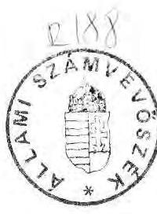
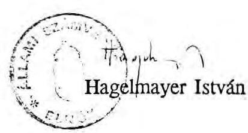

# Allami ভ̛̉ámưừ̛̂̂́́́́ 

## JELENTÉS

a központi államigazgatási szervezetek
létszám- és bérgazdálkodásának ellenőrzéséről

---

# Az ellenőrzést végezték: 

Bakonyvári Róbertné tanácsos
Éva Katalin tanácsos
Kalo Tamás számvevő
Kovácsné Szepesi Etel számvevő
dr. Mihály Sándor tanácsos
Szabó József tanácsos

Az ellenőrzést vezette:
Matusek István főtanácsos

---

# J E L E N T É S 

## a központi államigazgatási szervezetek létszám- és bérgazdálkodásának ellenőrzéséről

Az államigazgatás központi szerveinek tekintettük a költségvetési fejezeteket, azok úgynevezett gazdálkodó és ellátó szervezeteit, továbbá egyértelmű jogi, vagy költségvetési definíció hiányában azokat az intézményeket, amelyek országos hatáskörűeknek minősíthetők. A helyszíni ellenőrzést kiterjesztettük néhány olyan intézményre is, amelyek valamely fejezet részére kiegészítő, kisegítő feladatokat látnak el (ún. háttérintézmények).

A szorosan vett központi államigazgatást alkotó minisztériumok (ideértve a Köztársaság Elnökének Hivatalát, az Országgyűlés Hivatalát, a Miniszterelnöki Hivatalt, a Tárcanélküli minisztereket, a Magyar Tudományos Akadémiát) 1991-ben 10.619 fő létszám és 4,2 milliárd Ft béralap előirányzattal rendelkeztek, ami - összehasonlítható szerkezetben - 6,5, illetve $26,9 \%$-kal haladta meg az előző évit. (A bázisadatok nem tartalmazzák a Honvédelmi Minisztérium és a Belügyminisztérium igazgatását, ezért az igazgatással csökkentett előirányzatokat viszonyítottuk az előző évi tényhez.) A Bíróságok, az IM szakértői intézetek, a Legfelsőbb Bíróság, a Legfőbb Ügyészség, az Alkotmánybíróság és az Állami Számvevőszék 1991-ben mintegy 11.000 fôt kitevô létszámmal és 3 milliárd Ft-ot megközelítő béralappal nem szerepelnek az összesítésben, mivel nem államigazgatási szervek és bérrendszerük is eltér az államigazgatásétól.

Az ellenőrzés célja az volt, hogy a kormányzati munkamegosztás módosulásai folytán az átszervezett és újonnan létrehozott központi államigazgatási szervezetek struktúrája, szervezeti rendje és személyi feltételei összhangban vannak e az ellátandó feladatokkal; milyen tendenciák jellemzik a központi igazgatás létszámés bérgazdálkodását; miként alakult az államigazgatásban foglalkoztatottak alapbére,

---

keresete az 1991. évtől bevezetett szigorúbb bérgazdálkodás keretei között. Mindezt törvényességi, célszerűségi szempontból vizsgáltuk.

A helyszíni ellenőrzés az 1. sz. mellékletben felsorolt fejezetekre, intézményekre terjedt ki. A költségvetési fejezetet alkotó többi államigazgatási szervtől adatszolgáltatás útján kértünk információkat.

Az ellenőrzés az 1990. január 1. és 1991. június 30. közötti időszakot vizsgálta.

# I. 

## Részletes megállapítások

## 1/ A létszám és bérgazdálkodást meghatározó szervezeti változások

A vizsgált időszakban az államigazgatás szervezetére a kormányzati feladatok változásaihoz, a felgyorsuló törvényalkotás követelményeihez igazodó nagy intenzitású mozgások, átalakulások, átszervezések voltak a jellemzőek.

A változások a kormányzati struktúrához kapcsolódóan — esetenként ettől függetlenül is - a költségvetés szerkezetét is érintették.

Az átalakulások, átszervezések pozitív kisérőjelensége az, hogy a minisztériumok, országos hatáskörű szervek feladatkörét magas szintű jogszabályok rendezték.

A folyamat nem tekinthető lezártnak. Az újabb, előkészületben lévő törvények várhatóan további szervezeti, működtetésbeli változásokat tesznek szükségessé.

A változások a költségvetési gazdálkodás oldaláról azt jelentették, hogy az összevonások következtében több minisztérium (pl. Pénzügyminisztérium, Belügyminisztérium) feladatköre jelentősen bővült, csökkent a fejezetek száma és ezzel párhuzamosan fokozódott a nagyobb fejezetek heterogenitása.

A Miniszterelnökség fejezet az egyik legösszetettebb költségvetési fejezetté vált. A miniszterelnök munkáját közvetlenül segitő Miniszterelnöki Hivatalon kívül a fejezet részét képezi még 13 közvetlenül irányított költségvetési szerv, közöttük önálló országos hatáskörű szervek, mint pl. a

---

Gazdasági Versenyhivatal, a Központi Statisztikai Hivatal és az Országos Müszaki Fejlesztési Bizottság.

A Miniszterelnökséghez tartozik még 19 ágazati és célfeladat, a kormányzati beruházások, két elkülönített alap támogatása, összesen 27,7 milliárd Ft kiadási előirányzattal.

A fejezethez tartozó címek egy része nem felel meg a központi államigazgatási besorolásnak, több olyan cím, költségvetési intézmény tartozik a fejezethez, ami máshová nem volt besorolható.

A kormány amellett, hogy a korábbi minisztériumi jellegű országos hatáskörű szervek fejezeti státuszát megszüntette, nem tisztázta azok helyét az új fejezeti alárendeltségben. (Pl. Országos Testnevelési és Sporthivatal, Üdülési és Szanatóriumi Főigazgatóság, Központi Statisztikai Hivatal, Országos Műszaki Fejlesztési Bizottság.)

A kormányzati struktúra kialakításának politikai indokait nem vitatva, a költségvetési gazdálkodást meghatározó fejezeti összevonások alátámasztottsága kétséges.

A fejezeti irányitás feladataiban bizonytalanság érzékelhető, az intézmények egy részének önállóságát a fejezeti hovatartozás nem "korlátozza," az utóbbi gyakorta csak technikai megoldást jelent. A fejezeti irányitás egyedi értelmezése esetenként sajátos centralizációs megoldásokat eredményez. (Az Igazságügyi Minisztérium Igazgatási Főosztálya teljes körű gazdájává kívánt válni a bíróságoknak, ezért speciális megoldásként a bíróságok létszám- és bérgazdálkodását is a Főosztály látja el.)

A fejezetrendről megfelelő szakmai kritériumok alapján az államháztartási törvényben kellene rendelkezni.

A szervezeti változások, új feladatok gyakorta többletlétszámot igényeltek. Jelentős feladatkörrel bíró új hivatalok jöttek létre (Gazdasági Versenyhivatal, Nemzeti és Etnikai Kisebbségi Hivatal, Értékpapír Felügyelet, Kincstári Vagyont Kezelő Intézet stb). Ezek előirányzatait — az Értékpapír Felügyelet kivételével — a Kormány az éves költségvetésből biztosította.

Kevéssé volt jellemző a korábbi szervezetek megszünése és az igazgatási létszám, illetve a bérelőirányzatok csökkenése.

A Miniszterelnökség fejezetnél a három lépcsőben létrejött új egységek (számuk összesen 22) 223 fős létszámnövekedést jelentettek a megszünt egységek 20 fős létszámcsökkenésével szemben.

---

A több lépcsőben lezajlott minisztériumi feladatváltozások jelentős létszámmozgással járó változásokat eredményeztek.

Megváltozott a Belügyminisztérium feladata. Az operatív végrehajtó rendőri, állambiztonsági feladatokat végző szervezet helyett - a demokratikus jogállam követelményrendszerének megfelelően - egy polgári közigazgatási minisztérium kialakítása kezdődött el és van folyamatban. Jóváhagyásra került és 1992. január 1-jével érvénybe lép a változásokat tükröző Szervezeti és Müködési Szabályzat.

A feladat- és hatáskör módosítások összesen 4.268 fővel emelték, illetve 4.280 fővel csökkentették a fejezet létszámát, a belső átcsoportosítások 293 álláshelyet érintettek az ellenőrzés befejeződéséig.

A minisztériumban és a háttérintézményeknél dolgozó hivatásos állományúak igazgatási átsorolása 965 fôt érintett, ezzel is előkészítették a közalkalmazottakról szóló előkészületben lévő törvény megvalósítását.

A Nemzetközi Gazdasági Kapcsolatok Minisztériuma jogelődjétől a belkereskedelemmel és az idegenforgalommal kapcsolatos feladatok az Ipari és Kereskedelmi Minisztériumhoz kerültek át. Ezzel egyidejűleg a Nemzetközi Gazdasági Kapcsolatok Minisztériuma - a külgazdasági kapcsolatok egységes irányítása érdekében - átvette a korábbi, ilyen jellegű minisztertanácsi és a pénzügyminisztériumi hatás- és feladatköröket.

A feladatváltozások a létszám és béralap átcsoportosításával történtek. Megfelelő normarendszer és a létszámszükséglet egzakt meghatározottsága híján az érdekeltek közötti megegyezés döntött. Ez esetenként hátrányos volt az egyik fél számára (pl. a Pénzügyminisztérium és az Országos Tervhivatal összevonásában érintett más minisztériumok). A kimutatható létszámcsökkenés - a másutt létrehozott új hivatalok létszámigényével szemben - nem jelentős.

A Nemzetközi Kapcsolatok Minisztériuma és a Pénzügyminisztérium megállapodása alapján 20 munkakört adtak át a tervhivatali létszámból és további 14 fő lényegében átvitte a munkakört. Az átrendezés a Pénzügyminisztérium nemzetközi pénzügyekkel kapcsolatos feladatainak ellátásában (devizapolitika, vám stb) érdemi csökkenést nem eredményezett, sőt az Országos Tervhivataltól átvett feladatokat a Külgazdasági Főosztály látja el 22 fővel.

Két minisztérium megszüntetésével és a feladatkörök összevonásával, kibővült feladatokkal létrehozott Közlekedési, Hírközlési és Építésügyi Minisztérium létszáma az építésügyi és múemléki feladatok leválásával és a vízügyi feladatok ezt követő átcsoportosításával az átszervezések következtében 95 fővel csökkent.

---

A struktúra megalapozását és a müködés feltételrendszerének - benne a létszámszükségletnek - kidolgozását nehezítette az átszervezés idején hiányzó cél- és feladatrendszer.

Az "eredmény": egyes minisztériumokon belüli párhuzamos szervezetek létrejötte, az egyes szervezeti egységek egyenlőtlen leherhelése, a további átszervezések szükségessége, a struktúra permanens módosítása.

A Pénzügyminisztérium új szervezete gyakorlatilag az Országos Tervhivatal és a "régi" PM fóosztályainak "összetolásával" valósult meg. (A volt Országos Tervhivatal fóosztályainak száma 16, a Pénzügyminisztériumé 14 volt, az összevonás után a fóosztályok, önálló osztályok száma 26 lett.) Az azóta eltelt időszakban 8 szervezeti egységet 3 fóosztályá összevontak, de a minisztérium feladatorientált átvilágítása nem történt meg. A Pénzügyminisztérium tájékoztatása szerint a szervezeti összevonások 1992. január 1-gyel végrehajtásra kerülnek.

A kormányzati munkamegosztás változtatásával összefüggésben a Müvelődési és Közoktatási Minisztérium feladat- és hatásköre 1988. évtől kezdve folyamatosan és jelentősen módosult.

Permanens változásokat élt át a Müvelődési és Közoktatási Minisztérium szervezeti felépítése, belső struktúrája is. A szervezeti változtatások megalapozottságát azonban nem támasztották alá a feladatokat és létszámszükségletet igazoló felmérések és a személyekre lebontott feladat- és munkaköri szabályozások. A végrehajtott átszervezés, új szervezeti egységek kialakítása mindenkor lokális szemléletű volt, egy-egy részterületre koncentrált és nem a Minisztérium egész müködésére. A szervezeti struktúra ma sem tekinthető véglegesnek.

A jelentős átrendeződéssel járó kormányzati változások az egyes minisztériumok, országos hatáskörű szervek feladataiban átfedéseket eredményeztek. (pl. NGKM és PM között az export-import szabályozása, vámpolitika, külgazdasági stratégia irányítása tekintetében). A probléma felismerését jelzi az utóbbi két évben a központi államigazgatási szervek feladat- és hatáskörének felülvizsgálatáról hozott Kormányhatározatok sorába illeszkedő 3307/1991. határozat, amely egyebek között elrendelte az átfedések feltárását és megszüntetését 1991. október 15-ig. A határozat a létszámot, a költségvetési előirányzatokat érintő következményekről nem intézkedik. Az ellenőrzés időpontjáig a felülvizsgálat nem zárult le.

A központi államigazgatási szervekhez tartozó országos hatáskörű szerveknél tartott reprezentatív ellenőrzés a minisztériumokhoz hasonló tapasztalatokat ered-

---

ményezett azzal az eltéréssel, hogy az e körbe tartozó szervek működésének jogszabályi alátámasztottsága is hiányos.

Esetenként eldönthetetlen, hogy delegált jogkörök gyakorlásáról van-e szó, vagy önálló jogosultságról; a tevékenységek díjtételei költségvetési bevételt jelentenek-e vagy államilag előirt tarifát saját bevételként. Helyenként keverednek az (egyébként nem feltétlenül deklarált) állami kötelezettségvállalások a vállalkozásjellegü tevékenységekkel, amelyek így hatósági jelleget kapnak.

Az ellenőrzés tapasztalatai szerint az e körbe sorolt intézményekre is az átmenetiség a jellemző, az újonnan létesített szervezetek megalakulása még nem tekinthető befejezettnek. A tevékenységi körök, létszámok, az anyagi és technikai feltételek nem stabilizálódtak, a régebben meglévő szervezetek is átalakulóban vannak, az intézmények és az irányító szervek között a feladatellátásban átfedések, ellentmondások észlelhetők.

A "régiek" közül pl. átszervezés alatt áll az APEH, felszámolásra vár a Művészeti Alap, döntésre érett az Üdülési és Szanatóriumi Föigazgatóság, az Országos Bányamúszaki Főfelügyelőség léte, illetve státusza.

Az újonnan létrehozott országos hatáskörü szervek feladatkörére vonatkozó jogszabályok esetenként hiányosak, késedelmesek vagy nem minden esetben egyértelmúek.

A Magyar Posta megszüntetésekor megmaradt hatósági feladatok ellátása 250, ill. 300 fős engedélyezett igazgatási létszámmal létrehozták a Postal és Távközlési Főfelügyeletet és a Frekvenciagazdálkodási Intézetet. Megfelelő előkészítés híján mindkét felügyelet díjtételeit késve, majd hiányosan szabályozták. A Frekvenciagazdálkodási Intézet hatósági díjtételéről a tárcaközi egyeztetések elhúzódása miatt még végletes döntés az ellenőrzés befejezéséig nem történt. Nem tekinthető lezártnak a közlekedési felügyeletek 150-200 fős bővitési folyamata sem.

A vizsgált szervezeteknél a múködés szabályozottsága javult. A belső szervezeti, működési rend kialakult, nagyobb részt elkészültek a szabályzatok. Néhány kivételtől eltekintve (pl. Pénzügyminisztérium, Üdülési és Szanatóriumi Főigazgatóság).

Annak ellenére, hogy a gazdaságpolitika, a külgazdasági orientáció változása a minisztériumi szervezetek többségénél helyes irányú változásokat eredményezett, nem tekinthető befejezettnek az egyes szervezetek belső szervezeti felépítése és irányítási rendszere, megoldásra vár az aránytalanságok megszüntetése, a létszám és bérgazdálkodásra kiható konzekvenciák levonása.

---

A Közlekedési, Hírközlési és Vízügyi Minisztérium például nem tett eleget az 3211/1991. Korm. sz. határozat előirásainak, nem tárta fel és nem jelezte a müködést akadályozó tényezőket és a párhuzamosan végzett feladatokat.

Felülvizsgálatra szorul a Nemzetközi Gazdasági Kapcsolatok Minisztériuma és a Pénzügyminisztérium szervezeti tagoltsága és irányítási rendszere.

A változások szükségessége nemcsak a "régi" szervezetekre jellemző.
Az alapos előkészités ellenére aránytalanságok voltak az egyes szervezeti egységek leterheltségében. Az ellenőrzést követően a szervezeti struktúra felülvizsgálatra és módosításra került.

Külön problémakört jelent az államigazgatás szervezetében, az igazgatási létszámés bérelőirányzatok meghatározásában a háttérintézmények kezelése.

Az ún. háttérintézmények fogalmi meghatározása nem egyértelmü. A Pénzügyminisztérium - a Kormány megbízásából - ez év áprilisában kísérletett tett a kérdéskör meghatározására, de előterjesztését a kormány nem fogadta el. Az ellenőrzés időpontjáig nem született döntés a rendezö elvek meghatározására sem. Nem jelent orientációt az állami költségvetés szervezeti besorolás sem. (Az egyes fejezetek eltérő feladatokat végző intézményeket sorolnak az igazgatási cím alá.) Nehezíti a besorolást az is, hogy egy-egy intézmény, cím tevékenységi köre összetett, abban igazgatási és szakmai szolgáltatások egyaránt előfordulnak. A besorolásokat gyakran befolyásolják az orientációs váltzások is.

A rendezés hiánya azt jelenti, hogy nem határozható meg az államigazgatási láncolat pontos kiterjedése.

A háttérintézményi kör sajátos képződményeit jelentik a minisztériumok gazdálkodó szervezetéről leválasztott s különböző elnevezésekkel kialakított gazdasági igazgatóságok, ellátó szervezetek. Ezen önálló költségvetési szervezetek létrehozásának az a racionális szempontja, hogy szervezetileg is elhatárolja a minisztériumok valóban államigazgatási feladatokat ellátó egységeit a kiszolgáló, gazdasági, műszaki, jóléti tevékenységektől. Egyes esetekben kimutatható az államigazgatási létszám formális csökkentésére irányuló szándék. Az alapítás eltérő céljait jelzi, hogy egyes esetekben az ellátó szervezetek dolgozói államigazgatási besorolásúak, más esetekben nem, illetve vegyes megoldás is előfordul.

Egyes minisztériumok az ellenőrzött időszakban intézkedéseket tettek az ellátó szervezetek átalakítására, a pénzügyi főosztályok és a kiszolgáló szervezetek párhuzamos feladatainak létszámmegtakarítással járó megszüntetésére (Pénzügy-

---

minisztérium, Magyar Tudományos Akadémia). Helyenként változott a minisztériumi jóléti intézmények státusza is.

A Pénzügyminisztérium szervezetétól 1991. I. 1-én különvált a Jóléti Igazgatóság. A Népjóléti Minisztérium az óvodáját átadta a Semmelweis Orvostudományi Egyetemnek.

A háttérintézményi kritériumrendszer rendezetlenségét jelzi az is, hogy esetenként a háttérintézményi jellegű feladatokat a számukra kedvezőbb kutatói besorolásban látják el (MTA Kutatás és Szervezetelemző Intézet, Kutatási Ellátási Szolgálat, Közvéleménykutató Intézet).

Az államigazgatástól eltérő besorolások, az igazgatási tevékenységeket elfedő elnevezések azoknak a látszatintézkedéseknek a sorába tartoznak, amelyeket a Kormány államigazgatást racionalizáló rendelkezéseinek hatására tesznek az alacsonyabb szintű kormányzati szervek. A másik igen gyakori ok az igazgatási ágazat rendszeresen alacsony bérfejlesztése, ami alól névleges átsorolásokkal tértek ki ott, ahol ez lehetséges volt. Ezáltal az államigazgatás címén kimutatott és összesített ráfordítások nem a valós helyzetet tükrözik, azok pontosan nem állapíthatók meg.

2/ A központi államigazgatási szervek létszám- és bérgazdálkodása.
a.) A létszám- és bértervezés

A központi költségvetési szervek (fejezetek és az irányításuk alá tartozó költségvetési intézmények) kiadásainak összetételében a legjelentősebb költségelem a bérköltség.

A személyi jövedelemadó rendszer bevezetése, a társadalombiztosítási járulék felemelése és bérhez kapcsolódó egyéb költségek emelkedése jelentősen megemelte az egyébként is bérigényes intézményi szféra müködtetésének költségeit.

A költségek gyors emelkedése ellenére nagy feszültségek tapasztalhatók az államigazgatásban dolgozók bérhelyzete és más ágazatok, különösen a reálszféra és a pénzintézetek bérhelyzetéhez viszonyítva. A költségvetés feszültségei miatt a bérolló szétnyílásának megállítására hosszabb idő óta nem volt lehetőség. A

---

költségvetés az intézményi bérlemaradás enyhítésének (részbeni) fedezetéül eddig (1991-ig) a gazdálkodás liberalizálását nyújtotta.

A múlt évi gazdálkodási rend lehetővé tette a dologi költségek bérfejlesztésre történő átcsoportosítását, illetve a dologi megtakarítások ilyen célú felhasználását.

Az intézkedés több szempontból káros hatású volt. Az intézmények anyagi ellátottsága és annak "tartalékai" nagyon eltérőek. A jobb színvonalon állóak indokolatlan előnyt élveztek. Az egyébként is szükös dologi előirányzatok más célú felhasználása hosszabb távon a müködőképességet veszélyezteti. Eltérő kondíciókkal rendelkeztek a régebbi intézmények, mint az újonnan alapítottak. Végezetül nem ösztönözte az államigazgatási struktúraváltás megkezdését, illetve végrehajtását. Az 1991. évi állami költségvetésről szóló 1990. évi CIV. törvény szigorításokat hozott az egyes rovatok közötti átcsoportosítás lehetőségeit illetően.

Az 1991. évi költségvetési előirányzatok részletes jóváhagyása azt is célozta, hogy az állami intézmények szelektív fejlesztésével kapcsolatos döntések szülessenek meg.

A törvényjavaslat általános indokolása feltételezte az államháztartás reformját, az állami feladatok, garantált ellátások szakmai törvényekkel alátámasztott újraszabályozását. A költségvetési törvény megalapozásánál figyelembe vett előbbi államigazgatási és államháztartási fejlesztések az ellenőrzés időpontjáig még részben sem valósultak meg, ebből következik, hogy a költségvetési szervek feszültségei eddig érdemben nem enyhültek.

Az ellenőrzés általános tapasztalatai szerint a költségvetési szervek bértervezése során az ellátandó feladatok és azok változásainak tényleges bérvonzata között nagyon laza a kapcsolat. Nincsenek az államigazgatási létszámszükséglet tervezésének elfogadható és általánosan használatos módszerei. A korábban - szórványosan - alkalmazott létszámnormatívák is felszámolódtak.

A létszámszükséglet feladatoldalról való meghatározásra való törekvés kezdeti jelének tekinthető az a pénzügyminiszteri elvárás, amely az 1992. évi költségvetés fejezeti indokolásában a szakmai feladatok és a pénzügyi előirányzatok összhangját kéri bemutatni. Más vonatkozásban a belügyminiszter törekvései jelentenek pozitív példát. A minisztérium legutóbbi átfogó szervezeti átalakítását meghatározó utasítás ugyanis a figyelem középpontjába helyezte a megváltozott feladatokhoz illeszkedő szervezeti felépítés megvalósítását.

---

A bértervezés alapja az évenként göngyölített ún. bázisbér, amelyet az éves bérautomatizmusokkal és az évközi központi bérintézkedések hatásaival korrigálnak (szintrehoznak). A felhasználható bértömeget - elvileg - módosítja még a feladatváltozás bér- és létszámvonzata, de ez alkumechanizmus tárgya.

A tervezésben a létszám a bér tervezésének számítási segédeszköze. A "létszámkeret" fogalmilag sem helytálló, mivel a költségvetési gazdálkodó szervek döntésétől függ, hogy a feladatot hány fővel és milyen munkajogviszony létesítésével oldják meg. Valódi kötöttséget a rendelkezésre álló bér jelent. (A bér- és létszámtervek és a tényadatok összefüggéseit mutatja a 2. sz. melléklet)

A ténylegesen alkalmazható létszám a gazdálkodó szerven belül válik értelmezhetővé a szervezeti egységek számára a jóváhagyott szervezeti felépítéshez kapcsolódó státuszhelyek meghatározásával. Bizonyos határokon belüli mozgásra, eltérésre ha csak belső adminisztratív korlát nem érvényesül - a szervezeti egységek vezetőinek így is lehetősége van.

A költségvetés központi tervező szervei maguk is csak orientációs adatként kezelik az egyes fejezeteknél jóváhagyott létszám-irányszámokat. Az éves költségvetés változásai során a létszám-teryszám módosításra nem kerül. A tényszámok ezért nem vethetők egybe a tervszámokkal. A fejezetekkel közölt létszám-teryszámok közvetlen következtetések levonására nem alkalmasak.

Az ellenőrzött szervek mindegyikénél azt tapasztalta az ellenőrzés, hogy a tényleges létszám alacsonyabb, mint a szerv részére jóváhagyott irányszám. A tartósan be nem töltött álláshelyek aránya átlagosan $10 \%$, de van ahol ettől magasabb. A különbség aránya a vizsgált időszakban számottevően nem változott, tehát tipikus jelenségről van szó. Okai a következők:
— az a régi beidegződés érvényesül, amely szerint a szükségesnél több státusz a feladatellátás tekintetében biztonságot nyújt;
—a minisztériumi alkalmaztatás elvesztette presztizsét. Az elérhető jövedelmek behatárolják az államigazgatás céljaira megnyerhető munkatársak körét és kvalifikációját. Általános belső tapasztalatok szerint a kontraszelekció folyamata nem volt megállítható, ennek következményeként a szakemberek leterheltsége rendkívül egyenlőtlen. Az egyenlőtlen munkaterhek növelik a fluktuációt;
—a be nem töltött álláshelyek bérmegtakarítást eredményeznek, amelynek felhasználásával enyhítik a foglalkoztatottak bérszínvonalának átlagos elmaradásait.

---

A virtuális létszámmegtakarítás lehetőségeit még ott is alkalmazzák, ahol a foglalkoztatottak túlterhelése jelentkezik. Az így keletkezett bérmegtakarítást általában jutalmazás címén kereseti korrekcióra használják fel, de az is megtörténik, hogy a tartósan be nem töltött álláshelyek bérét felhasználják. Ez esetben az üres álláshelyek bér nélkül maradva ténylegesen be sem tölthetők (pl. a Magyar Tudományos Akadémia).

A jelenség létszámcsökkentő "akciókkal" nem számolható fel. A központilag elrendelt létszámcsökkentési kötelezettség előirása nem lehet szelektív. Így helyenként súlyos helyzetet idézhet elő, máshol indokolatlanul laza kötelezettséget jelent. Másfelől arra kényszeríti a gazdálkodó szerveket, hogy látszatintézkedéseket tegyenek, vagy a feladatváltozások láncolatával zavarják össze a központi szervek áttekintését, amely jelenleg, s aránylag rövid időn belül újratermeli az induló állapotot. A kiváltott hatás egyes esetekben egyértelmúen kedvezőtlen, társadalmilag költséges (pl. háttérintézményekkel, megbízásokkal való manőverezések miatt).

A bér- és létszám tervezéssel kapcsolatosan a helyszínen a következőket állapítottuk meg:
a Művelődési és Közoktatási Minisztérium részére a költségvetési törvényben megállapított igazgatási kiadásából a béralap előirányzata 230,9 millió Ft, melyből a Gazdálkodó Szervezetnek 168,1 millió Ft, az Ellátási és Üzemeltetési Igazgatóságának 62,8 millió Ft a jóváhagyott béralapja.

Megjegyztenő, hogy az igazgatás kellően nem definiált fogalma miatt a Múvelődési és Közoktatási Minisztérium Ellátási és Üzemeltetési Igazgatóság béralap kiadási előirányzata $54 \%$-ban - 33,8 millió Ft - azon munkakörök bérfedezetét is tartalmazza, amelyekre az államigazgatási bérrendszer nem vonatkozik (egészségügyi, nevelési-oktatási, üdülői dolgozók).

Az 1991. évi költségvetés tervezésénél a költségvetés szerkezeti rendjében bekövetkezett változásokat az intézmények figyelembe vették, az elfogadott tervezési irányelvek alapján állították össze éves költségvetésük előirányzatait.

Az 1991. évi első fél évéig az igazgatási címbe sorolt intézmények együttesen 4,4\%-kal - 10 millió Ft-tal - módosították jóváhagyott béralap előirányzatukat.

A Müvelődési és Közoktatási Minisztérium Gazdálkodó Szervezete és az Ellátási és Üzemeltetési Igazgatósága ténylegesen az első fél évben eredeti béralap előirányzatának $52,9 \%$-át, a módosított béralap előirányzatának $50,7 \%$-át fordította bér és jutalmazási kifizetésekre. A mó-

---

dosított béralap a Gazdálkodó Szervezetnél 3,6\%-kal, az Ellátási és Üzemeltetési Igazgatóságát $6,2 \%$-kal haladta meg az eredeti előirányzatot.

A fejezet a végrehajtott béralap előirányzat módosítást utólagosan kívánja a Kormány elé terjeszteni, tekintettel arra, hogy a szigorítottabb költségvetési gazdálkodás 1991. évben az igazgatási cím kiadási előirányzatainak változtatási jogát a Kormány hatáskörében fenntartotta.

A Pénzügyminisztérium az Országos Tervhivatal megszüntetése után (Jóléti Intézmények és Felügyeletek nélkül) megállapított új számított létszám irányszáma 316 fővel volt kevesebb, mint a két hivatalé korábban, együttesen. A csökkenés mértéke megközelíti a volt Országos Tervhivatal engedélyezett létszámát ( 343 fő).

A társminisztériumokhoz való létszám- és béralap átadás nem volt zökkenőmentes. Ehhez a következetes, egyértelmú eligazitás is hiányzott. A kormányülésen ugyanis elhangzott, hogy a Tervhivatal létszámának és béralapjának a felét a Miniszterelnöki Hivatalhoz kell átcsoportosítani. A döntés azonban határozat formájában nem jelent meg. Ennek megfelelően a létszám- és a béralap sem került zárolásra. A határozat szövege szerint a feladatok és ezzel együtt a státusz- és bér átcsoportositásáról a tárcáknak kellett megegyezniük. A nem egyértelmú utasítás következtében az erősebb pozícióban lévő tárca - jelen esetben a Pénzügyminisztérium - a bér átcsoportositásánál a számára előnyösebb megoldást választotta. Az átadott álláshelyekhez tartozhó béralap helyett (alapbér + pótlékok + jutalom + megbízási dij) az intézményi szinten egy fôre jutó alapbérkeretet zárolta.

Annak ellenére, hogy fejezet szinten az 1992. évi béralapot 195 fôvel kevesebb létszámra tervezték
-a béralap alapelőirányzata 1,3 milliárd forinttal meghaladja az előző évben tervezett szintet, (ebből 1 milliárd Ft összeg az APEH- nél jelentkezik)
-a béralap támogatásból származó összege 1,9 milliárd forinttal emelkedett, (ebből 1,8 milliárd Ft ugyancsak az APEH-t illető rész)
—az 1991. I. félévi felhasználás közel félmilliárd Ft-tal (447 millió Ft) haladja meg az előző év időarányos részét.

A fentiek mögött több irányú hatás, eltérő folyamatok húzódnak, egzakt képet csak az intézményenkénti összehasonlítás ad:

A Pénzügyminisztérium irányítása alá tartozó felügyeletek tervezett létszáma egy év alatt több mint kétszeresére nőtt ( 46 fơről 110 fôre) a béralap előirányzata

---

közel tízszeresére változott. Ez utóbbi több tényező együttes hatására vezethető vissza:

A felügyeletek 1990. évi létszám, ill. béralap terve irreális, rosszul tervezett volt:
—a Bankfelügyelet béralapja mindössze $14.000 \mathrm{Ft} /$ fő/hó összegű jövedelem kifizetését tette csak lehetővé;
—a Biztosítási Felügyelet létszáma 6 fôre, béralapja 4,7 millió Ft-ra volt tervezve, miközben éves szinten az átlagos létszám ennek közel kétszerese ( 11 fő ) volt;
—az Értékpapír Felügyelet 1990. évi béralapja nem teljes évre, létszáma pedig mindössze 10 fôre volt tervezve.

Az ellentmondásokat az 1991. évi költségvetés folyamán kellett elrendezni, annak realitása azonban csupán az időarányos teljesítést figyelembevéve megkérdőjelezhető.

APEH béralapja - változatlan létszámra tervezve - a legnagyobb mértékben több mint 1 milliárd ( 1,02 milliárd Ft) forinttal emelkedett, ebből közel 400 millió Ft volt az, amit a bérautomatizmus, ill. az 1990. évben a dologi kiadások terhére történt rovatok közötti átcsoportosítás indokolt. A növekedés nagyobbik hányadát az érdekeltségi bér béralapba való beépülése okozta, ami a költségvetési intézmények szabályozásától eltérő egyedi, Pénzügyminisztérium által jóváhagyott a Hivatal anyagi érdekeltségét szabályozó elnöki utasítás alapján vált lehetővé:
az anyagi érdekeltség pénzügyi fedezete az adóalanyok terhére megállapított adóhiány, valamint a felszámított késedelmi és különbözeti pótlékok pénzügyileg is realizált összegének $25 \%$-a lehetett. A kifizethető összeg azonban nem lehetett több, mint az éves alapbér $100 \%$-a.

A Hivatal érdekeltsége tehát az alapbérkeret növeléséhez fúződött.

A béralapon belüli tételek tervezési rendje, felhasználása nem kötött. Ezt a szabályozásból eredő lehetőséget felhasználva az intézmény az 1990. évi alapbérkeretet és pótlékokra előirányzott összeget összevonta, valamint e tételre csoportosította a dologi előirányzat terhére megvalósított előző évi bérfejlesztés és az 1991. évi teljes bérautomatizmus összegét is.

Ebből következően egy év alatt csupán az alapbér keret 470 millió Ft-tal nőtt meg. Az érvényben lévő érdekeltségi rend szerint az éves alapbérkeret $100 \%$-a volt tervezhető mozgóbér címén, amit csaknem teljes egészében ( $97 \%$ ) meg is terveztek.

---

Az eddig adóhiányból késedelmi és különbözeti pótlékokból realizált összeg ezt a mértéket lehetővé is teszi. Viszont a jövőben érdekeltség ezen összegek behajtásához kevésbé fúződik, mivel az 1991. évi tervezésnél a mozgóbér eddigi forrását költségvetési támogatással ellentételezték. Mindezek következtében a béralap támogatással ellentételezett összege összességében 1,8 milliárd Ft-tal nőtt.

A Hivatal érdekeltségi rendszerének korábbi szabályozása szerint az évi 6- 800 millió Ft érdekeltségi bér évközben saját bevételi fedezettel képződött. 1991-tól a bevételt támogatássá alakították és annak forrását a központi költségvetés egyéb bevételei közé beépítették, ezáltal az érdekeltség alapjául szolgáló adóhiányok feltárásában való közvetlen érdekeltség megkérdőjelezhető, a kifizetett összegek pedig költségvetési kötelezettséggé váltak.

A Kincstári Vagyonkezelő Szervezet ez évi létszám- béralapjának kialakítása is magán viseli az előre nem tevezhető feladatokból származó bizonytalanságot. A Kincstári Vagyonkezelő Szervezet eredeti feladataira tervezett létszámot teljes egészében nem az eredeti célkitúzéseknek megfelelő feladatra alkalmazza, helyette terven felül, a volt Magyar Honvédelmi Szövetség vagyon rendezésére foglalkoztat dolgozókat. (A tervezett létszám 110 fő, ténylegesen foglalkoztatottak száma 160 fő). Mindennek sem létszám, sem bérfedezete az intézmény költségvetésében nincs biztosítva. A béralap időarányos teljesítése is azt mutatja, hogy a túllépés elkerülése érdekében a rovat előirányzatát módosítani kell. A kapott tájékoztatás szerint az ellenőrzést követő időszakban a kormány a Kincstári Vagyonkezelő Szervezet bérhiányát rendezte.

A Belügyminisztérium fejezeten belül az igazgatási címre megállapított kiadásaiból a béralap előirányzata 1.389,7 millió Ft, a számított átlagos állományi létszám 3.290 fó, ebből teljes munkaidős létszám 3.218 fő.

Az 1991. évi költségvetés tervezésénél a fejezet a költségvetés szerkezeti rendjében bekövetkezett változásokat, a tervezési irányelvekben előírtakat figyelembe vette, azonban a tárca sajátságos, korábbi tervezési rendje csak részben módosult;
a korábbi évek központosított, túlzottan centralizált tervezési rendjét és gazdálkodását 1991-ben a címekre bontott tervezési és beszámolási rendszer váltotta fel,
a 17/1991. IV.22.Z/BM sz. utasítás alapján a fejezethez tartozó költségvetési szervek költségvetési tervezési és gazdálkodási rendje az önálló intézményi gazdálkodás felé elmozdult. Az önálló intézmények feladat- és hatásköre

---

nincs egyértelmüen elhatárolva, számos gazdálkodási területen fennmaradt a korábbi központositott tervezési és gazdálkodási rendszer.

Az 1991. évi költségvetési tervezési irányelvek az igazgatási cím fogalmát kellően nem definiálták, ebből adódóan a Belügyminisztérium igen eltérő intézményeket, tevékenységeket sorolt az igazgatási cím alá.

#### Abstract

A Belügyminisztérium igazgatási cím költségvetési elöirányzatai a minisztérium központi igazgatási kiadásainak elöirányzatain túl jelentős részben országos hatáskörü tevékenységet végző, illetve a fővárosban más költségvetési címek részére ellátást végző háttérintézmények költségvetési előirányzatait is magukban foglalják; Pl. Gazdasági Igazgatóság gépjármújavitás, Híradástechnikai Szolgálat országos híreladatai, Kormány Kiemelt Objektumok Igazgatósága körébe utalt nem igazgatási jellegü feladatok.

A háttérintézmények a minisztériumi szervezet müködéséhez szükséges feltételek biztosításán túl összbelügyi feladatokat is ellátnak. Továbbra is központi feladat pl. a fegyverzeti, vegyvédelmi, müszaki és jármüfejlesztési tevékenység, a számviteli pénzügyi információs rendszer müködtetése.

Megjegyzendő, hogy a tárca önálló költségvetési szerveinél 1991-tól áll fenn a kettős könyvvitel bevezetésének kötelezettsége. A költségvetési gazdálkodással kapcsolatos belügyi rendelkezések többsége 1990. év előtti.

Az 1991. évi létszám- és béralap tervezésénél a feladatorientált tervezés nem juthatott érvényre. Ennek előfeltétele a központi és intézményi feladatok és hatáskörök, gazdálkodási jogosítványok egyértelmübb meghatározása és a végleges szervezeti és gazdálkodási rend kialakítása, ami még folyamatban van.

Az 1990-1991-es években a tárca a párhuzamosan végzett feladatok feltárására és a központi gazdálkodás oldására törekedett. A Belügyminisztérium 1990. évi központi létszámában az előző évhez viszonyítva 6,6\%-kal csökkent a szervezet rendszeresitett létszáma. Az 1991. évi átszervezés november 30 -án az ellenőrzés befejeződése után ért véget. A kapott tájékoztatás szerint az átszervezés során a minisztérium hivatali szervezeteinek létszáma 6.432 -röl 5.851 fơre ( -581 fő) csökkent. A felszabaduló létszámot alapvetően vérehajtási (bűnügyi, közbiztonsági, közlekedési, igazgatásrendészeti) szakterületekre csoportositották.

A Miniszterelnöki Hivatalhoz tartozó új és lényeges változáson átment szervezetek béralapját, létszámát politikai döntések alapozták meg, annak megfelelően kerültek jóváhagyásra. A Miniszterelnök Hivatalnál a szerkezeti és szintrehozási változások hatása 1990-ben mind a létszámot ( +161 fő), mind a béralapot tekintve ( +82 millió

---

Ft) jelentősebb volt mind 1991-ben ( -72 fő; +8 millió Ft ). A módosítás irányító szervi hatáskörben 1990-ben volt nagyobb mértékű: 22 fős létszámcsökkenés mellett a béralap 27 millió Ft-tal nőtt; 1991. I. félévben 22 fős növekedéssel együtt a béralap 9,3 millió Ft-tal emelkedett. A bérszínvonal növekedése ezekre a változásokra vezethető vissza.

Az 1991. I. félévi időarányos teljesítés az éves előirányzathoz képest az alábbiak szerint alakult: a Miniszterelnöki Hivatalnál a létszám az eredeti előirányzathoz képest 6 fővel, a módosított előirányzathoz viszonyítva 28 fővel volt kisebb, a béralap teljesítés $55,7 \%$, ill. $53,1 \%$-os volt. A túlteljesítést több tényező együttesen okozta.

Az üres álláshelyek magas száma miatt a betöltött létszámok bére az éves előirányzatnak csak $44 \%$-át tette ki; a megbízói díj előirányzat $57 \%$-a került felhasználásra; a megtakarítások terhére 19.108 ezer Ft jutalom kifizetésére került sor. A Tárcanélküli minisztereknél a létszámfeltöltés teljes ( 33 fő), a béralapfelhasználás időarányosan 50,9\%. A Nemzetiségi és Etnikai Kisebbségi Hivatalnál a létszámtervhez képest $70 \%$-os a betöltés ( 26 -ból 8 státusz üres), a bérfelhasználás $38,8 \%$-os, éppen az üres álláshelyek, illetve a bérmegtakarítások miatt.

Az előirányzat realitását már az 1990. évi teljesítés (105 fő) is megkérdőjelezte, bár a jelentős létszámcsökkenés az ez évi érlelődő változásokkal hozható összefüggésbe.

Öszszességében az I. félévi teljesítések a túltervezésre utalnak, jelentős számú az üres állás.

Az Országos Bányamüszaki Főfelügyelőségnél az előirányzott 148 fős létszámoz képest az 1991. I. félévi teljesítés 118 fő volt, kevesebb mint az 1990. évi 127 fős teljesítés. A béralap az időarányos teljesítési határon belül volt ( 21.641 ezer Ft, 47,7\%). A Magyar Közvéleménykutató Intézetnél ugyancsak hasonló változások történtek: a létszámelőirányzathoz viszonyítva (118 fő) lényegesen lecsökkent ( 65 fơre) a tényleges létszám.

A Gazdasági Versenyhivatal számára az 1991. évre készített és elfogadott költségvetésben a vonatkozó kormányhatározat alapján 150 fős tervezett átlaglétszám és 72,2 millió Ft béralap került jóváhagyásra. Az egy főre eső tervezett 40.000 Ft/hó alapbér összegét az államigazgatási szervek bérszínvonaláról szerzett információk, valamint annak figyelembevételével állapították meg, hogy az itt dolgozóknak csak ez a jövedelemforrásuk lehet, más kereseti lehetőségre a törvényi szabályozás nem ad módot. A feladatok és a létszám összhangjának kialakítására, tervezésére teljesen megalapozott elképzelésekkel a Hivatal nem

---

rendelkezhetett, hiszen teljesen új, eddig nem müködött szervként jött létre; jogelőd szervezete nem volt.

#### Abstract

Az átmeneti időszakban a feladatok változása nem kizárt, a módosulások iránya előre pontosan nem látható. Ebben a helyzetben az új feladatok várható létszámigényére és részben a nyugat-európai országokban müködő hasonló szervezetek létszámadataira alapoztak. Szervezeti egységekre jóváhagyott létszámot nem határoztak meg, a létszámfelvétel-, feltöltés a feladatok igényének megfelelően történt. Az ellenőrzést követő időszakban történt kedvező változás az, hogy 1992. évtől a Hivatal önálló központi fejezetként müködik tovább.

Ma még nem lehet véglegesen megítélni a Hivatal reális létszám szükségletét; a feladatkör is változhat, a gazdasági környezet módosulásával.

# b.) Létszám és bérgazdálkodás 

A téma elemzése során a minisztériumok (+ felsőbb államigazgatási szervek: Köztársaság Elnökének Hivatala, Országgyúlés Hivatala és a Miniszterelnöki Hivatal) és az országos hatáskörű szervek (pl. Közlekedési Főfelügyelet, Postai- és Távközlési Főfelügyelet, Frekvenciagazdálkodási Intézet, Adó- és Pénzügyi Ellenőrzési Hivatal, Művészeti Alap, Országos Testnevelési és Sporthivatal) létszám- és béradatait vizsgáltuk és összesítettük.

Az államigazgatási létszám (minisztériumoktól és országos hatáskörű szervektől beérkezett adatok szerint) együttesen 1991. I. félévében 19.393 fős előirányzattal szemben 18.341 fơre teljesült $(94,6 \%)$ és ez az 1990. év végi állapotot 3.668 fővel, $25 \%$-kal haladta meg. A létszámnövekedés szinte teljes egészében szervezeti változásból adódott, ugyanis 1990. évben az adatokban még nem szerepeltek a tárca nélküli miniszterek, a Belügyminisztérium és a Honvédelmi Minisztérium állománya, ill. a Nemzeti és Etnikai Kisebbségi Hivatal, a Gazdasági Versenyhivatal, a Kárpótlási Hivatal és az Országos Vízügyi Főigazgatóság. Ezek 1991. év folyamán alakultak, ill. kerültek államigazgatási besorolásba (Belügyminisztérium, Honvédelmi Minisztérium).

A felsorolt szervek adatait kiszűrve, az államigazgatási létszám növekedése minimális, 116 fő, $0,8 \%$.

A béralap változása 1991. évben a létszámváltozásnál jelentősebb volt ( $+52,5 \%$ ), ill. a Honvédelmi Minisztérium, a Belügyminisztérium és az újonnak létesült

---

szervezetek figyelmen kívül hagyásaval kissé meghaladta a $25 \%$-ot. Az éves béralap felhasználás együttesen $94 \%$-os volt 1990. évben (a minisztériumoknál kissé magasabb 94,9\%) 1991. I. félévében pedig $49,2 \%$-os, időarányos.

A minisztériumok létszámának 1990. VI-1991.VI. hó közötti változásai főbb munkaköri csoportok szerinti tagolásban a 3. és 4. sz. mellékletben tekinthetők át.

A főfoglalkozású dolgozók létszámának és jövedelmi viszonyainak jellemzői a minisztériumokra (+felsőbb államigazgatási szervekre) az alábbiak:

Ebben a körben 1991. I. félévében a Belügyminisztérium és a Honvédelmi Minisztérium nélkül 8.982 főt foglalkoztattak, havi átlagjövedelmük 32.681 Ft volt.

A vezetők száma 1.562 fő (17,4\%) jövedelmi átlaguk 59.100 Ft ; az ügyintézők létszáma 4.217 fő ( $46,9 \%$ ) jövedelmük lényegében az átlagnak felel meg; az ügyviteliek száma 826 fő ( $9,2 \%$ ) a fizikaiaké $2003(22,3 \%)$ és 374 fő gépkocsivezetőt alkalmaznak.

Egy év alatt (azonos tartalommal számítva) az összes létszám 52 fővel ( $0,9 \%$ ) gyarapodott, az átlagos havi jövedelem $40,2 \%$-os növekedése mellett. A létszámnövekedés a vezetői csoportra volt jellemző ( +80 fó, $6,6 \%$ ) a fizikaiak mellett ( +28 fó, $2,8 \%$ ). Mivel ugyanezen idő alatt az ügyintézők létszáma kissé ( $-0,3 \%$ ) az ügyviteliek létszáma erőteljesebben ( $-9 \%$ ) csökkent. A vezetői-beosztotti arány tovább romlott és amíg 1990. VI. 30-án egy vezetőre 2,8 fő ügyintéző és ügyviteli dolgozó, 1991. VI.30-án már csak 2,6 fő jutott. A minisztériumokban 331 fő főosztályvezetői besorolású, 419 fő osztályvezetői besorolású dolgozó tevékenykedett 1991. I. félévében.

Miután az ügyintézők és ügyviteliek együttes létszáma 5.043 fó, következésképen az osztályok átlagos létszáma 12 fó, a fóosztályok átlagos létszáma 15 fő, tehát egy főosztályvezetőnek általában 1,3 osztály irányítása képezte feladatát. Az átlagos 12 fős osztályoknak csak $60 \%$-át (7-8 fő) kitevő létszámú osztályok fordultak elő. Miniszterelnöki Hivatalban, a Honvédelmi Minisztériumban, a Nemzetközi Gazdasági Kapcsolatok Minisztériumában, az Igazságügyi, a Munkaügyi, a Pénzügy, az Ipari és Kereskedelmi, a Környezetvédelmi és Területfejlesztési Minisztériumokban és a Magyar Tudományos Akadémián.

Az adatokból arra lehet következtetni, hogy egyes minisztériumokban a szervezetet túltagoltan alakították ki, ott is fóosztályokat hoztak létre, ahol osztály tagozódás is elegendő lett volna.

---

Egyes minisztériumokban az átlagos 17,4\%-os arányt meghaladó mértékben foglalkoztattak vezetőállású dolgozókat.

Ilyenek pl. : Munkaügyi Minisztérium, Pénzügyminisztérium, Nemzetközi Gazdasági Kapcsolatok Minisztériuma, Miniszterelnöki Hivatal, Honvédelmi Minisztérium.

Amíg a vezetői jövedelmek az átlagosnak 1,8 szorosa körül alakultak, addig pl. a Pénzügyminisztériumban a vezetők átlagos havi jövedelme az intézményi átlagnak több mint kétszeresét ( $208 \%$-át) tette ki.

Ha a felsorolt minisztériumokban a vezetői létszám az átlagosnak megfelelt volna, akkor 328 fóvel (a vezetői állomány ötöde, $21 \%$-al) kevesebbre lett volna szükség, ami havonta, összességében 19 millió Ft megtakarítással járhatna.

Hasonló gondolatmenettel elemezve a többi állománycsoportot, az ügyintézőknél 344 fó, az ügyvitelieknél 119 fó, a fizikaiaknál 514, a gépkocsivezetőknél 59 fő az átlagos arányt meghaladó foglalkoztatást tapasztaltunk, ami a minisztériumok szintjén +1364 fót jelentett (az összes létszám 15\%-át), akiknek az összes havi jövedelme 44 millió Ft-ot tett ki.

Általános helyszíni ellenőrzési tapasztalatként az állapítható meg, hogy közgazdasági értelemben vett gazdálkodásról a költségvetési fejezeteknél és intézményeknél létszám tekintetében általában nem, bér vonatkozásban csak korlátozottan lehet beszélni. A bérgazdálkodás fó eleme a bérelőirányzat betartására való törekvés. Olyan értelmú költséggazdálkodás, amely az egyes költségtényezők közötti mérlegelés, optimalizálás útján törekedne a társadalmi költségek csökkentésére, sehol fel sem merült.

Ösztönzőrendszerek csak elvétve fordulnak elő, főképpen a teljesítmény tekintetében, a munka minőségi szempontjait az államigazgatásban eddig nem sikerült érvényesíteni.

Pozitív kivétel e tekintetben a Pénzügyminisztérium Számitástechnikai Intézete és az Adó- és Pénzügyi Ellenőrzési Hivatal, ahol a kidolgozott ösztönzőrendszer mennyiségi mutatókon kívül minőségi követelményeket is meghatároz. Mind a két intézménynél a jövedelem számottevő része (20, illetve $35 \%$ ) mozgóbérből származik.

A gazdálkodás fogalomkörébe tartozóan az intézmények — ahol erre lehetőség volt — az 1991. évi tervezés során szerkezeti változás címén érvényesítették lehetőségeiket, ezáltal a bérrovat előirányzatát túltervezték. Más esetben pedig a feladat

---

módosulásból felszabaduló üres álláshelyek bérét használták fel új feladatok bérének finanszírozására, vagy bérfejlesztésre.

A Pénzügyminisztérium - Országos Tervhivatal összevonásával együttjáró létszámirányszám csökkenéssel nem volt szinkronban a béralap változása. Ugyanis 57 álláshelyet más minisztériumokhoz csoportosítottak át 21,3 millió Ft összegű béralappal, a volt Országos Tervhivatal és Tervgazdasági Intézet béralapjának ezen felüli része teljes egészében a Pénzügyminisztériumhoz került ( 119,1 millió Ft). Ebből mindössze 5,1 millió Ft volt az az összeg, aminek nem volt meg a támogatás fedezete. Az összevonás eredményeként a Pénzügyminisztérium 1990. szeptember 1-tól $25 \%$-os bérfejlesztést tudott végrehajtani. Az 1991. évi bérfejlesztés szintén meghaladta az éves automatizmus mértékét, mivel a tárca tartaléka terhére és a más intézményeknél felmerült, de a Pénzügyminisztériumnál elszámolt feleslegessé váló béralapot ( 14,9 millió Ft) a bérfejlesztésnél felhasználta. Az 1991. I. 1-ével különvált Jóléti Igazgatóság ez évre előirányzott béralapja további $34 \%$-kal nőtt, a támogatással ellensúlyozott fejezeti tartalék ( 7,9 millió Ft) terhére megvalósított bérfejlesztéssel.

A létszámgazdálkodás vonatkozásában helyszíni ellenőrzés során az egyes vizsgált szerveknél a következőket állapítottuk meg:

A Miniszterelnöki Hivatal szervezetében a legtöbb változás 1990. július 1-jéig történt: 14 új szervezeti egység jött létre 161 fővel, 5 millió Ft/hó béralappal. A régi megmaradt szervezeti egységek száma 12 volt, 278 fővel és 5,3 millió Ft/hó béralappal.

Más jellegủek a változások az Országos Bányaműszaki Főfelügyelőségnél és a Magyar Közvéleménykutató Intézetnél. E két intézménynél a szakmai feladat csökkenése, a feladatok átcsoportosítása miatt következett be jelentős létszámcsökkenés az előirányzathoz képest. (Az OBF-nél 198 fơről 122-re, az MkI-nál 118-ról 65 fôre.)

Ennek oka az Országos Bányamüszaki Főfelügyelőségnél a bányaüzemek, a termelés, a létszám csökkenése miatt a hatósági vizsgálatok visszasése, a bánya hatósági szervezetek összevonása, feladatok átcsoportosítása; a Magyar Közvéleménykutató Intézetnél a közvéleménykutatási felmérések, vizsgálatok iránti mérsékeltebb a kormányzati érdeklődés, a megrendelések jelentős csökkenése volt. Az így felszabaduló béralap csak látszólagos megtakarítás. Jelentős részét az intézmények bérfejlesztésre, jutalmazásra használták fel.

---

A fejezet szintjén 1990-1991. I. félévében az eredeti előirányzatok és tényadatok jelentősen változtak: a tényleges létszám 1990. I. félévében és éves szinten magasabb volt az eredeti előirányzatnál (189, ill. 127 fôvel), 1991. I. félévében viszont 431 fővel kevesebb. A tervezett létszámnál módosítás nem történt.

A Miniszterelnöki Hivatal közigazgatási államtitkára a Hivatalnál létszámés béralap zárlatot rendelt el. A jelentkező többletfeladatokat úgy igyekszik a Miniszterelnöki Hivatal befogadni, hogy azok a létszámkeretbe beleférjenek. Így a Miniszterelnöki Hivatal ellátja a Tárcanélküli miniszterek operatív pénzügyi feladatait, a Dunai Vizlépcső Kormánybiztosi Titkárság és az Ifjúságpolitikai Titkárság gazdasági feladatait, a volt MSZMP vagyon hasznosításával kapcsolatos adózási teendőket.

A fejezeten belül vizsgált további öt szervnél a számított és a tényleges létszám a fejezeti trendtől eltérően 1990-ben is csökkent.

Összességében a vizsgált öt szervnél a tényleges létszám 1990-ben 68 fôvel, 1991. I. félévében 115 fôvel volt kevesebb a számított létszámnál, ennek mintegy $70 \%$-a az Országos Bányamüszaki Főfelügyelőségre és az Magyar Közvéleménykutató Intézetre esik.

Az intézmények az évközi - a tartósan be nem töltött álláshelyekre fenntartott béralapból származó - bérmegtakarítást döntően a tárgyévi bérfejlesztés fedezetére és részben jutalmazásra használták fel.

A vizsgált szervek általában tartózkodtak a létszám feltöltéstől, az így elért bérmegtakarítást felhasználták béremelésre.

A Belügyminisztérium 1991. I. 1-től szigorúbb létszám- és bérgazdálkodást vezetett be. A miniszter részleges létszámzárlatot rendelt el az üres, illetve megüresedő álláshelyek bérfedeztének $50 \%$-os zárolásával és központosításával.

Az álláshelyek miniszteri engedéllyel tölthetők be. Külső felvételre csak kivételesen, magasan kvalifikált munkatárs esetén van lehetőség.

A szigorúbb intézkedések hatására az igazgatási címbe tartozó szervezetek tényleges átlagos állományi létszáma az év első félévében 7,1\%-kal (232 fő) volt alacsonyabb, mint az eredetileg tervezett létszám, a főfoglalkozású dolgozók létszáma 10,2 \%-kal volt alacsonyabb a tervezetnél.

---

A létszám- és bérgazdálkodás szigorúbbá tételét a központi elvárásokon túl a Belügyminisztérium szervezeti rendjének és intézményeinek folyamatban lévő átalakulása indokolta.

A létszám összetételét vizsgálva jelentősebb változás a Minisztérium szervezeténél tapasztalható,
a betöltött fő́oglalkozású létszámot figyelembevéve az 1990. évi első félévi 415 fős összlétszámból 72 fő volt vezetői állománycsoportban, 1991. VI.3O-án 396 összlétszámból 64 fó tartozott vezetői kategóriába.

Az adatok nem véglegesek, a minisztériumi szervezet teljes struktúrájának végleges kialakítása nem fejeződött be, az ügyintézői-vezetői arány javítása a továbbiakban is kitüzött cél.

A Kárpótlási Hivatal müködéséhez szükséges személyi állományt a BM biztosította vezénylés útján. Az engedélyezett létszám 60 fő fő́oglalkozású és 15 fő részfoglalkozású dolgozó, a tényleges állományi létszám 61 fő volt. Időközben a Hivatal feladatait kibővítették és 1991. IX. 1-i hatállyal a Miniszterelnöki Hivatalhoz helyezték és elnevezését Országos Kárrendezési és Kárpótlási Hivatalra változtatták. Az országos hivatal létszámát 20 fővel emelték és a megyei (fővárosi) hivatal létszámát a vezetőkön kívül átlagosan 12 főben határozták meg, de elérheti a feladatoktól függően a 40 főt is.

A Művelődési és Közoktatási Minisztérium törekedve az államigazgatás szervezeti, korszerűsítési elvárásaira 1989. év júniusában bevezetett intézkedéssel
a Minisztériumra és az Ellátási és Üzemeltetési Igazgatóság szervezetére létszámfelvételi zárlatot vezetett be, megszüntette a szervezeti egységek korábbi, önálló létszám- és bérgazdálkodási jogát és központi - előzetes miniszteri engedélyhez kötött - létszám- és bérgazdálkodást léptetett életbe.

A szigorítások és korlátozó intézkedések hatására a fejezet tervezett igazgatási létszáma az átvett többletfeladatok mellett az 1990-1991-es években jelentősen nem változott, a létszámtöbbleteket tartósan üres álláshelyek felszámolása ellensúlyozta.

A Minisztérium szervezeténél 1990-1991-es években 26 , illetve 16 álláshely megszüntetésével az 1991. évi számított átlaglétszám 493 fő, az 1989. évi 95,9\%-a. A tényleges átlaglétszám 1990. évben 500 fó, 1991. I. fél évében 480 fő volt.

---

Az Igazgatóság 1991. évi tervezett átlaglétszáma 419 fó, 10,2\%-kal magasabb, mint 1990-ben, a létszámnövekedés döntően a megszünt Nemzetközi Kapcsolatok Intézetéből átvett feladatokkal függ össze. A tényleges átlaglétszám 1990. évben 322 fő, 1991. I. fél évben 337 fő volt.

Együttesen az 1991-re tervezett átlagos igazgatási létszám 1,2\%-kal, a béralap előirányzat mintegy $50 \%$-kal haladja meg az 1990 . évit, a módosított béralap a Minisztérium szervezeténél $22,3 \%$-kal, az Igazgatóságnál $34,4 \%$-kal magasabb, mint 1990. évben.

Az 1990-es évben a Minisztérium és az Igazgatóság dolgozói átlagosan 30\%- os, az 1991. év I. félévében átalgosan 20\%-os béremelésben és 2-2,5 havi, illetve 1991. évben egy havi bérnek megfelelő jutalmazásban részesültek. Az 1990-es év decemberében ezen felül a felső vezetők kettő havi bruttó bérnek megfelelő jutalmazására került sor.

A minisztériumi szervezetnél az átlagosnál magasabb bérfejlesztést és jutalmazást, az 1990. évben a dologi előirányzat terhére átcsoportosított fejezeti pénzeszközön túl a $80-90$ fős tartós üres álláshelyek és tartósan távollévők (34-36 fó) bérmegtakarításai is befolyásolták.

Létszámleépítéssel viszonylag szerény mértékben élt a Minisztérium. A tartósan be nem töltött üres álláshelyek száma nagyobb létszámkorrekció lehetőségét jelzi.

Megjegyzendő, hogy a Minisztérium szervezeti egységei ún. "engedélyezett" létszáma 524 fó, a költségvetésben elfogadott átlagos állományi létszám 493 fó, betöltött álláshelye 1991. június 30-án 401 volt. Ezen ellentmondásos helyzet feloldása a feladat- és létszám felülvizsgálatával és a Szervezeti és Müködési Szabályzat véglegesítésével folyamatban van.

A jelenlegi központosított létszám- és bérgazdálkodás kötöttségeinek oldása a Minisztérium belső szervezeti rendjének, feladat- és létszámának szervezeti egységenkénti egyértelmú meghatározása mellett lehetséges, nem kizárva a további racionális megoldások keresését sem.

A Nemzetközi Gazdasági Kapcsolatok Minisztériumánál több hatáskör és feladat változással járó létszám átcsoportosításra került sor:
— belkereskedelmi és idegenforgalmi feladatok átadása az Ipari és Kereskedelmi Minisztériumnak: -165 fő;
—a Kormányközi Gazdasági Titkárság feladatkörének átvétele a Miniszterelnöki Hivataltól: + 35 fő;

---

- a volt Tervhivatal és a Pénzügyminisztérium külgazdasági nemzetközi feladatai jelentős részének átvétele: + 31 fó;
— ügyvitelszervezési feladatok átvétele a Gazdasági Igazgatóságtól: + 26 fő.
A változások eredményeként a Nemzetközi Gazdasági Kapcsolatok Minisztériumának létszáma 546 fő lett. A feladatok áttekintését követően 1990. VII. 15-ével a minisztérium vezetése az engedélyezett létszámot 481 fôre csökkentette.

A feladatátcsoportosításokat követő helyzetelemzés során bebizonyosodott, hogy az induló létszám bérfejlesztésére nincs fedezet. Erre, valamint a várható feladatkör változásokra 1990. októberében, 1990. XII. 31-i határnapra szóló teljesítéssel, 443 fôre csökkentette a miniszter az engedélyezett létszámkeretet.

Így jelentősen csökkent az engedélyezési terület, a Gazdasági Együttmüködési Főosztály létszáma, a megyei megbizotti állomány pedig 1991. I. 1-jével a minisztérium által alapított H.I.T. Vállalathoz került. Ezzel az intézkedéssel a minisztérium 1990. X. 1-i hatállyal 15\%-os bérfejlesztésre biztosított fedezetet a betöltött létszámnak.
1991. januárban ismét áttekintésre került a létszám- és a feladatváltozások függvényében az egyes szervezeti egységek állománycsoportonkénti összetétele, akkor további 44 fős létszámcsökkenést határoztak el, melyet év végéig kell teljesíteni.

Az Igazságügyi Minisztérium a feladatok változásai miatt több szervezeti egységet megszüntetett.

Az itt dolgozók részben átcsoportosításra kerültek képességeiknek és a feladatoknak megfelelően, illetve kiléptek. A be nem töltött létszámok bérét bérfejlesztésre használták fel. A korábban önálló gazdálkodást folytató Fenntartó Szolgálatot, a párhuzamosság felszámolásával 1990-tól a minisztérium szervezetébe vonták.

A létszám és bérgazdálkodási jog centralizált. Főosztályvezetői szintig a közigazgatási államtitkár gyakorolja a jogokat a pénzügyi fóosztályvezetővel történő egyeztetés alapján. A gazdálkodási keretek a minisztérium, a bíróságok és a szakértői intézetek vonatkozásában elkülönítettek, ezek felügyelete megoldott. (Ideiglenes Bírói Tanács, Igazságügyi szakértői intézmények felügyelete.)

A minisztérium a 315 fős engedélyezett létszámkeretét 1991-ben $90,5 \%$-ban töltötte be. A gazdálkodási szféra változása következtében a jogi szaktudás és

---

gyakorlat fokozott igénye, valamint a bíróságok "elszívó hatása" érvényesül a minisztérium beosztott dolgozói körében.

Az Igazságügyi Minisztérium felügyelete alá tartozó bíróságok részére többletfeladatainak ellátására és bővítésére 868 fó (ebből 307 fó bírói) álláshelybővítést engedélyeztek.

A Közlekedési, Hírközlési és Vízügyi Minisztérium létszám irányszáma az átszervezések előtt 432 fő volt. Az építési és múemlékvédelmi feladatok leválasztása miatt a Környezetvédelmi és Területfejlesztési Minisztérium részére 93 álláshelyet, az Ipari és Kereskedelmi Minisztérium részére 43 álláshelyet és a Munkaügyi Minisztérium részére 3 álláshelyet adott át a Minisztérium. A vízügyi feladatok átvételével 44 létszámhely bővítésére volt lehetőség. Az átszervezések együttes kihatásaként 95 fóvel csökkent a tárca létszámkerete.

A $22 \%$-os létszámcsökkentést egy külön kormányhatározat további 5\%-os létszámcsökkentési kötelezettséggel egészítette ki, így a létszám irányszám 320 före módosult.

A ténylegesen betöltött álláshelyek száma 293 volt, az üres álláshelyek aránya mintegy $10 \%$. A be nem töltött álláshelyeknek ez az aránya már hosszabb idő óta változatlan. A vizsgált intézményeknél a létszámgazdálkodás hasonló helyzetű. Ennek okát a relatíve alacsony és nem vonzó bérekben valamint a gyakori átszervezések okozta bizonytalanságban látja a minisztérium.

A valós létszámszükséglet megállapításában, az üres álláshelyek betöltésében sem a minisztérium, sem az intézmények nem érdekeltek. A szakképzett munkaerő megtartása érdekében vállalták a foglalkoztatottak leterheltségének növelésével járó következményeket.

Kiélezett helyzetekben ez a helyzet veszélyes is lehet. Pl. a vizügy területén az ember- és eszközigény akár néhány óra alatt többszörösére növekedhet. Egyes szakmai vélemények szerint a jelenlegi vízkárelháritási létszám csupán arra elegendő, hogy adott esetben csak irányítsa az árvizvédelmet.

A Népjóléti Minisztérium 1991. évre engedélyezett létszám irányszáma 560 fó, ebből a központi államigazgatás létszáma 269 fő. Az engedélyezett létszám feltöltöttsége 1990-ben $94 \%$-os volt, 1991-ben ez $86 \%$-ra csökkent. A csökkenés az ügyintézői állománynál volt a legnagyobb. A létszámhelyzet - különösen a funkcionális szervezeti egységeknél — kritikusnak mondható.

---

Mivel a jelenlegi szervezeti rendben a feladatok pontosan körülhatároltak, az illetékességi konfliktusok kizártak. Ennek megfelelően szoros szervezéssel, rangsorolással ellátatlan feladat nem fordul elő, de nem minden feladatot tudnak kellő súllyal ellátni.

Az Üdülési és Szanatóriumi Főigazgatóság mintegy 6.700 dolgozót foglalkoztat, amelyből 67 fő a szorosan vett Főigazgatóság engedélyezett létszámkerete, ebből 9 fő vezető beosztású. A Főigazgatóságot az 1991. évi költségvetés a Népjóléti Minisztérium fejezet 9. címeként tüntette fel, valójában továbbra is gyakorolta mindazokat a jogokat és kötelezettségeket, amivel az 1990. CIV. tv. a fejezeteket felruházta.

Az üres álláshelyek száma mintegy 20\%; magas fluktuáció mellett. A kilépések száma kétszerese a belépőkének. A létszámhelyzet esetenként zavarokat okoz a munkák ellátásában.

A Magyar Tudományos Akadémia központi apparátusának létszám előirányzata a vizsgált időszakban 269 fő volt. A tényleges létszám ezzel szemben 1990. évben 240 fő ( $89 \%$ ); 1991. I. félévében 223 fő ( $83 \%$ ).

Az üres álláshelyek mintegy felét bér nélkül tartják nyilván, ezen álláshelyek bérét a foglalkoztatottak bérfejlesztésére fordították.

A Magyar Tudományos Akadémiához tartozó intézményeknél ugyancsak magas a betöltetlen álláshelyek száma.

PI. a Kutatási Ellátási Szolgálatnál 225 engedélyezett létszámmal szemben 1990-ben 199 fôt foglalkoztattak, 1991-ben 96 létszámhelyen 71 fôt foglalkoztattak. A Gépkocsi Szolgálatnál előirányzott 37 fóból 7 fó munkahelye volt betöltetlen. Az üres álláshelyek béreit felhasználták.

A Lánchíd Igazgatóságnál ugyanezek a tendenciák érvényesültek.
1990-ben a 193 fős eredeti létszámelőirányzatot 156 fơre módosították. A ténylegesen betöltött álláshelyek száma 134 fó volt ( $86 \%$ ) 1991-ben szerkezeti változások címén a létszámelőirányzat 117 fơre módosult, ehhez képest 1991. I. félév végén 9 üres álláshely volt. A létszámelőirányzatból öt fôt béralappal együtt vontak el.

A helyszíni ellenőrzések összegezhető megállapítása, hogy mindeddig megoldatlan az államigazgatás létszámának valamennyire is megalapozott tervezése és az intézmények ebben való érdekeltsége, ezen keresztül objektíven nem alakítható a bérköltség sem.

---

Az államigazgatás bérköltségeinek csökkentésére abban az esetben nyílik reális lehetőség, amikor
— az államigazgatás egész szervezete egy átgondolt koncepció részeként racionálisabbá válik. Az állami feladatok ellátására rendelt struktúrában átfedések, párhuzamosságok nem fordulnak elő, múködése hatékony;
— az államigazgatási apparátus kvalifikációja összhangban áll a feladatokkal;
— az államigazgatás relatív bérszínvonala más ágazatokhoz viszonyítva stabilizálódik;
— az államigazgatási infrastruktúra fejlesztése érzékelhetően hozzá tud járulni a munkavolumen csökkentéséhez.

# c.) Alapbérek, bérpótlékok és egyéb kereseti elemek alakulása 

Az államigazgatásban dolgozók keresetének fó alkotó eleme az alapbér.
A minisztériumokban a havi átlagos jövedelem 83\%-át az alapbér képezte 1991. I. félévében, $10 \%$-ot közelített a jutalom és $7 \%$-ot tett ki a pótlékok részesedése.

Az egyes állománycsoportokban általában $84 \%$ volt az alapbér, egyedül a gépkocsivezetőknél alacsonyabb ( $75 \%$ ). A pótlék hányada a legmagasabb értéket a gépkocsivezetőknél mutatta ( $13,7 \%$ ), legalacsonyabb ( $4,9 \%$ ) volt a vezetőknél.

A jövedelmek összetételét az előző időszaki (1990. I. félév) adatokkal összehasonlítva általános tapasztalatként állapítható meg, hogy növekedett az alapbér és pótlékok hányada, csökkent a jutalom aránya, tehát az intézmények arra törekedtek, hogy a jövedelem mind nagyobb hányada a havi bérfizetéskor kifizetésre kerüljön.

Az alapbérek súlya és aránya a keresetekben a költségvetés központi szerveinél más gazdasági ágazatokhoz viszonyítva - nagyobb, mivel a havibér a jellemző bérforma és a teljesítményektől függő bérezési rendszer ritka kivételnek tekinthető. A fix alapbér jól illeszkedik a költségvetési finanszírozás kötött jellegéhez, ezért ezen a területen tradicionális. A közszolgálatban dolgozók jogállására és bérezésére vonatkozó szabályozások, bérnomenklatúrák elavultak, a felgyorsult infláció és egyéb társadalmi mozgások következtében alkalmazhatatlanná váltak. Érvényes normatív szabályok hiányában felerősödött spontán folyamatok eltérő feltételeket teremtettek az egyes fejezetek és intézmények számára. Az adott

---

lehetőségekkel eltérő módon éltek. Az alapbérek fơbb foglalkoztatási csoportok szerinti alakulását mutatja be az 5. sz. melléklet.

- A Pénzügyminisztérium és majdnem minden intézménye élt a dologi kiadások terhére megvalósítható béralap növelésének lehetőségével. Ezt az 1991. évi tervezés alkalmával szerkezeti változás címén lehetett utóljára elismertetni. Mások feladatnövekedés címén - nem tudták azok reális volumenét megbecsülni - a rovat előirányzatát tervezték túl. Más esetben pedig a feladat módosulásból felszabaduló üres álláshelyek bérét használták fel bérfejlesztésre. Az eltérő módon képzett béralap jelentős mértékủ jövedelemnövekedést tett lehetővé. Így 1 év alatt átlagosan az 1 fôre jutó havi jövedelemnövekedés összegének minimuma $8.481 \mathrm{Ft} /$ hó/fő volt. Vezetők esetében a növekedés mértéke az átlagot jóval meghaladta. Két intézménynél a vezetői állománycsoportban $40.000 \mathrm{Ft} /$ hó/fő feletti jövedelem emelkedés valósult meg.
- A Miniszterelnökségnél és a hozzátartozó intézményeknél a bérszínvonal, az összkereset meghatározásában az alapbér volumene volt a döntő, ennek aránya a vizsgált egységeknél 1990-1991. I. félévében 74,6-85,1\% között alakult. A pótlékok aránya 1,2-5,0\%-os volt, míg a mozgóbér 8,2-24,2\% közötti arányt ért el. Egyenletesen nagyobb arányú, $20 \%$ körüli mozgóbér a Miniszterelnöki Hivatalnál és az Országos Bányaműszaki Főfelügyelőségnél került kifizetésre. A jutalomnak érzékelhető ösztönző szerep nincs, mind a vezetők, mind a dolgozók fizetéskiegészítésnek tekintik az összjövedelmen belül. A megtakarításból félévenként 5-11 ezer Ft közötti összegek kerültek kifizetésre személyenként. A jutalom szervezetenkénti elosztása alapbérarányosan történt, differenciálásra legfeljebb szervezeten belül került sor.

A Népjóléti Minisztériumnál és intézményeinél a jövedelemszint 18,9\%-kal növekedett. Az egyes intézmények között viszont már jelentősek az eltérések: a minisztérium területén $35,6 \%$-os, a gazdasági, igazgatóságnál $25,6 \%$-os, az Országos Gyógyszerészeti Intézetnél $61,6 \%$-os volt a növekedés.

A jövedelemszint növekedésében — adott év átlagkeresetéhez viszonyítva - az ügyintézői munkakörökben fokozottabb fejlesztés történt. Ezt részben a fluktuáció bérnövelő hatása okozta. A vezetöknél a jövedelem növekedése nem haladta meg a minisztériumi átlagot. A növekedést az azonos szintü vezetői beosztásokban - a fóosztályvezető helyettesig - egységesített bér váltotta ki. (Ez mutatkozik a Gazdasági Igazgatóság, és az Országos

---

Gyógyszerészeti Intézet vezetői béreinél is, mivel jogállásukat tekintve ezek fóosztályi szervezetek.)

A minisztériumi jövedelemszint a többi tácával egybevetve erősen elmaradt. A Munkaügyi Minisztérium áprilisi felmérése szerint alapbér vonatkozásában utolsó előtti helyen áll a Népjöléti Minisztérium. Az elmaradás középvezetőknél $20,4 \%$, felsőfokú végzettségű ügyintézőknél $19,4 \%$, fő munkatársaknál $20,2 \%$, fóosztályvezetőknél $18,8 \%$. A növekvő feladatok miatt — más tárcáktól eltérően — a bérfejlesztés érdekében létszámcsökkentés sem hajtható végre.

A vizsgált területeken is az a jellemző, hogy a jövedelem meghatározó eleme az alapbér. A pótlékok túlnyomóan nyelvpótlékok, elenyésző a címpótlék, illetve a revizori pótlék aránya. A jutalom forrása jórészt a tárgyévi bérmegtakarítás.
-A Művelődési és Közoktatási Minisztériumnál 1990-ben átlagosan $30 \%$-os, 1991-ben $20 \%$-os bérfejlesztést hajtottak végre, kéthavi, illetve 1 havi jutalom kifizetése mellett.
— A Közlekedési, Hírközlési és Vízügyi Minisztériumnál 1990-ben 16\%; 1991-ben $20 \%$ béremelést tett lehetővé a kormányzat. A béremeléseket elsősorban a három szakágazat (közlekedés, hírközlés és vízügy) szakmai alapbéreinek közelítésére használták fel. A Közlekedési, Hírközlési és Vízügyi Minisztérium egyetlen vizsgált intézményénél sem volt egyébként a béremelés alacsonyabb a vizsgált 2 évben összesen $35 \%$-nál. A Postai és Távközlési Főfelügyelet fővárosi részlegénél $162 \%$-os béremelést valósítottak meg.
— A Gazdasági Versenyhivatalnál az összes jövedelem 95\%-a alapbérből származott, a fennmaradó $5 \%$-ot pótlékok tették ki.

A II. félévben végrehajtott bérfejlesztés két forrásból történt: egyrészt a betöltött létszám tervezett és lekötött bére közötti különbségből, másrészt a Hivatal költségvetésében jóváhagyott tartalékból. Az átcsoportosítást a PM - a kapott információk szerint - az 1992. évi költségvetés tervezésénél bázisként elfogadta. A bérfejlesztéssel a Hivatal dolgozóinak átlagos bérszínvonala $42.900 \mathrm{Ft} /$ hó összegre növekedett.
—A Művészeti Alap az 1991. év első félévi béralap felhasználása 20,6 millió forint volt. Módosított béralapjának időarányosan $49,2 \%$-át használta fel. Az év első felében jutalmazásra kifizetés nem történt.

---

Az 1990-1991-es években az Alap létszám- és bérgazdálkodásában a szigorúbb és visszafogottabb gazdálkodás érvényesült, az egy fôre jutó havi alapbér a fôfoglalkozású dolgozóknál átlagosan $38 \%$-kal emelkedett. Jelentősebb, átlagot meghaladó bérfejlesztés a vezetői munkakörökben (14 fő) és gépkocsivezetői munkakörben volt.

Az 1990. évben a kifizetett jutalom összege 7,2 millió Ft volt, az egy fôre eső havi jutalom összege átlagosan a fơfoglalkoztású dolgozóknál 3.093 Ft/hó/ összeget tett ki.

- A Parlament az ellenőrzés befejezése után fogadta el a bírák és ügyészek javadalmazásáról szóló törvénytervezetet, amitől helyzetük további, számottevő javulása várható.
- A Belügyminisztérium központi szervezetére és háttérintézményeire 1990- 1991. években a belügyi bérrendszer volt érvényben, ezért a jövedelmek alakulására igazgatási bérrendszernek megfelelően nincsnek alapadatok.

Az igazgatási címbe sorolt intézmények dolgozóinak havi jövedelme az 1991. első félévben átlagosan $19,7 \%$-kal emelkedett, kiemelkedő jövedelememelkedés az ügyintézői $(27,0 \%)$ és a gépkocsi vezetői $(23,4 \%)$ állománycsoportban volt.

- A Lánchíd Igazgatóságnál a bérszínvonal az összes dolgozót figyelembevéve az 1990. évi 17391 forinthoz képest 1991. I. félévében 25967 forintra ( $49 \%$-kal) nőtt, amit a béralap növekedése ( $+24,8 \%$ ), illetve a tényleges létszám csökkenése $(-14,4 \%)$ váltott ki.

A fơfoglalkozásúak bére átlagosan 22.210.-Ft volt, jövedelme pedig 28.564.-Ft (a mozgóbér hányad $22,2 \%$-os). Az intézményi szinten kapott mozgóbérhányad a fizikai állomány adataihoz áll közel, (feltehetően a túlórák és az egyéb, pl. műszakpótlék következtében).

- A Magyar Tudományos Akadémia apparátusánál az összes dolgozó és az időszaki béralap alapján számítva 1990. évben az egy fôre jutó havi átlagbérszínvonal 21.186.-Ft volt, ami 1991. I. félévére $15 \%$-os növekedéssel 24.346.-Ft-ra gyarapodott.

---

A Munkaügyi Minisztérium a Kormány megbízásából 1991. áprilisában 14 minisztériumra és 21 országos hatáskörű szervre kiterjedő felméréséből nyert adatokból végzett elemzést.

E számításokhoz a 35 intézmény összegezett bér (kereseti) adatait munkakörönként átlagolták. Ezt tekintették "optimális", feszültségmentes beállásnak. Félreértések elkerülése érdekében: a munkaköri átlag nem feltétlenül optimális más munkaköri kategóriákhoz, vagy más gazdasági ágazatok hasonló munkaköreihez képest.

A 6. sz. melléklet az ún. optimális bérektől való százalékos eltérések kimutatásával az intézményi bérviszonyok alakulását szemlélteti (a 100 alatti érték lemaradást, a 100 fölötti előnyt jelent). A 7. sz. melléklet a kereseti arányok eltéréseit mutatja be minisztériumonként, illetve néhány országos hatáskörű szerv esetében.

Teljesen egyértelmű a szóródások áttekintése alapján, hogy az eltérések túlzottak, véletlenszerűek és nem magyarázhatók valamilyen társadalmi szükségességgel sem.

Az elemzés adatai teljességgel megfelelnek a helyszíni ellenőrzés tapasztalatainak.
Mint korábban bemutattuk már az alapbérek növelésének a központilag engedélyezett bérautomatizmuson kívül a betöltetlen álláshelyek bére, az év végi maradványok bérezési célú felhasználása, valamint a dologi kiadások terhére megvalósított bérfejlesztés volt a forrása.

A más ágazatokhoz viszonyított relatív bérlemaradás ellenére a költségvetési bérszerkezeten belül is kialakultak a bérfejlesztésekből eredő feszítő ellentmondások.

Megoldatlan az államigazgatás legfelső hierarchiáját alkotó vezetői kar (miniszterelnöktől a helyettes államtitkárokig bezárólag) bérhelyzetének az alsóbb vezetői kategóriákkal és a bérezésben jogszabályilag hozzájuk kapcsolt vezetői kategóriák bérezésének harmonizálása. A még visszafogottan fejlődő államigazgatási alapbérek is "alulról" beleütköztek a felső szintek még lassabban fejlesztett alapbéreibe és helyenként átépték a felsőbb kategóriákat.

Az ellentmondások enyhítésére alkalmazott megoldás nem bizonyult szerencsésnek. A 3196/1990. Mt.h. úgy rendelkezett, hogy a miniszterelnök, államminiszterek és miniszterek $50 \%$-os, a politikai államtitkárok $30 \%$-os költségtérítési átalányban részesülnek.

---

A kormányhatározat célja a munkakörrel járó társadalmi, közéleti kötelezettségekkel járó többletköltségek fedezése. Továbbra is megoldatlanok a választott megoldással az alapbérekben mutatkozó indokolhatatlan ellentmondások és adminisztratív gátjává válik az államigazgatásban szükséges helyes bérarányok létrehozásának. A köztisztviselők jogállásáról előkészületben lévő törvény - remélhetőleg — megszünteti a besorolásokban, előléptetési lehetőségben, bérekben és egyéb jövedelmi elemekben mutatkozó feszültségeket és ellentmondásokat.

A Közlekedési Hírközlési és Vízügyi Minisztériumnál bemutatott kereseti arányok - bizonyos eltérésekkel - bármely vizsgált minisztérium vonatkozásában hasonlóak:
—a közigazgatási államtitkár alapfizetése magasabb, ( 70 ezer Ft/fő/hó) mint a miniszteré ( 65 ezer Ft/fő/hó). Igaz, a miniszteri és államtitkári fizetés kiegészül a költségátalánnyal és bérként közvetlenül meg nem jelenő, központilag biztosított járandóságokkal, lehetőségekkel (gépkocsi, külföldi kiküldetés, reprezentáció). Egy minisztériumi főmunkatárs átlagbére ( 34 ezer Ft/fő/hó $68 \%$-kal marad el az intézmények, szervezetek magasabb vezetőállású dolgozóinak átlagbérétől ( 57 ezer Ft/fő/hó), akiknek alabére alig tér el a minisztériumi főosztályvezetőkétől ( 61 ezer Ft/fő/hó). Ennek ellenére jövedelmezőségi szempontból sokkal kedvezőbb a közvetlen irányítású szervek legmagasabb pozíciója, hiszen az ilyen szinten elérhető mozgóbér hányad akár 80-100\% között is lehet és ezzel a többlettel meghaladják a minisztériumi vezetők többségének a jövedelmét.

A fómunkatársi kört figyelembevéve megállapítható, hogy ugyanilyen végzettséggel 2-3 szoros bruttó bér is elérhető a "vállalkozási szférában." (PI. Magyar Távközlési Vállalatnál)

A főelőadói munkakör által elérhető átlagbér nyilvánvalóan még a főmunkatársinál is alacsonyabb, — bár az eltérés nem lényeges - 30 ezer Ft/fő/hó.

Megoldatlan az államigazgatásban alkalmazottak munkajogi helyzete.
Az államigazgatási bérkonstrukció eddig nem volt képes megoldani azt, hogy vezető beosztás nélkül töretlen ívben legyen fejleszthető egy szakmai életpálya az államigazgatásban. Ezért bérezési okokból helyenként túlságosan magas a vezetői beosztások aránya.

---

#### Abstract

Pl. az Állami Vagyonügynökségnél csak vezetői besorolást alkalmaznak. A Nemzetiségi és Etnikai Hivatalnál $61 \%$, a Tárcanélküli minisztereknél $57 \%$ a vezetők aránya.

A Pénzügyminisztériumban a betöltött létszámot figyelembevéve az 1990. évi 414 fős össztétszámból 86 fó volt vezetői állománycsoporthan, 1991-ben az 542 összlétszámból 163 fó került vezetői kategóriába. Az adatokból látható, hogy míg 1990-ben egy vezetőhöz 2-3 érdemi ügyintéző tartozott, 1991-ben már csak 1 vagy 2 fó. Amennyiben a hivatalos besorolástól eltekintünk és a csoportvezetőket is a vezetők közé számítjuk a vezetői arány még magasabb. A csoportvezetők száma 1990-ben 48, 1991-ben 74 fő volt. Ennek ellenére az Országos Tervhivatal több volt vezetöbeosztású munkatársát egy-két kategóriával lejjebb kellett sorolni, annak érdekében, hogy a Pénzügyminisztérium új szervezetébe beilleszthetők legyenek.

E mögött a tendencia mögött még mindig az a jelenség rejlik, hogy a bérkategóriák felső határainak nyitottsága ellenére a magasabb fizetés csak magasabb pozíció betöltésével járhat együtt. A magasabb jövedelem elérésén kívül a vezetői létszám növekedésének a másik oka az államigazgatási munkakör presztizsének a csökkenése.

A keresetekben az alapbéren kívül jelentősebbek még a pótlékok és jutalmak.

#### Abstract

A pótlékok korábban sokkal általánosabban alkalmazott bérkiegészítések voltak, a személyi-jövedelem-adórendszer bevezetésekor többségét alapbéresítették. A pótlékok közül ma a nyelvpótlékok a legáltalánosabbak, amelyek többségükben továbbra is bérkiegészítő funkciót töltenek be. Egyes helyeken (pl. Magyar Tudományos Akadémia, Pénzügyminisztérium) a mozgóbérek aránya marginalizálódott, mindössze a jövedelem 1-2\%-át teszi ki.

Arra vonatkozó adat nem áll rendelkezésre, hogy a munkakörön kívül szerezhető egyéb jövedelmek (másodállás, mellékfoglalkozás, megbízások, igazgatósági tagság, felügyelő bizottsági funkciók stb.) mennyiben módosítják az érintett kör másokhoz viszonyított helyzetét, de egyes szakterületek ez irányú lehetőségei jogszerű keretek között is számottevôek lehetnek.

A fejezetek és intézmények által alkalmazott bérpreferenciákból a helyszíni ellenőrzések alapján szignifikáns tendenciák nem állapíthatók meg. A vizsgált körben az egyes kulcsszámokba sorolt csoportok bérfejlesztési dinamikája nagyon eltérő volt, preferált területek csak lokálisan fordultak elő.

Egyes fejezeteknél, intézményeknél a vezetői állomány bérfejlesztése volt átlagon felüli (Pénzügyminisztérium, Müvelődési és Közoktatási Minisztéri

---

um, Közlekedési, Hírközlési és Vízügyi Minisztérium, Magyar Tudományos Akadémia, Nemzetközi Gazdasági Kapcsolatok Minisztériuma).

A Miniszterelnöki Hivatal területén az egyes munkaköri csoportok közötti jövedelemkülönbségek csökkentek. Az Igazságügyi Minisztériumban és a Népjöléti Minisztériumban az ügyintézői állomány bérei növekedtek gyorsabban. Az Nemzetközi Gazdasági Kapcsolatok Minisztériumában a gépkocsivezetők átlagbére mutat kiugrást (az ügyintézői átlag $32.000 \mathrm{Ft} / \mathrm{hó}$, a gépkocsivezetőknél $37.000 \mathrm{Ft} / \mathrm{hó}$ ).

# II. 

## Következtetések, javaslatok

Az államigazgatás központi szerveinek mélyreható, alapvető változásai az 1990. szeptemberében kiadott, az egyes minisztériumi szervek feladatait meghatározó kormányrendeletek megjelenésével vették kezdetüket. Jóllehet az utasítások megjelentek, de ezzel nem zárult le a minisztériális szervezetek átalakulásának folyamata.

Az államigazgatást alapjaiban érintő további változások igénye összefügg a gazdasági törvénykezés felgyorsulásával, a megjelenő törvények szabta újabb követelményekkel, továbbá a már megvalósult változások tapasztalataiból szükségessé váló további korrekciókkal. Végül a külső változtatások jelentős belső szerkezeti átalakulási folyamatot indukáltak, beleértve az irányítási körbe tartozó intézményrendszereket. Ezek a belső változások érintik a müködés minőségét, tartalmi kérdéseit is.

Az államigazgatási létszám 1991. I. félévében 18.341 fő volt, az 1990. év végi létszámhoz viszonyítva - a szervezeti változások miatt - $25 \%$-kal nagyobb. A béralap ugyanezen időszakban $52,5 \%$-os növekedést mutat. A vezetők aránya meghaladja a $17 \%$-ot, a növekedés üteme ebben az állománycsoportban a legnagyobb.

Szerkezetileg a legnagyobb változások a kormányzati munka módosulásai miatt a Miniszterelnökség fejezetnél jelentkeztek. A változás lényege: a miniszterelnöki intézményrendszer létrehozása és a kormányzati struktúra megfeleltetése a koaliciós követelményeknek.

---

Az államigazgatási átszervezések másik centruma a Belügyminisztérium volt. A tárca tevékenységi profilja a kormányzati munkamegosztás változásaiból következően átvett új feladatokkal alapvetően módosul. A BM korábbi rendészeti, igazgatásrendészeti, határőrizeti és védelmi funkciója - változott tartalmú - megtartása mellett, ezektől elkülönítve, előtérbe került a közigazgatás irányítási, szervezési funkciója és az önkormányzatokkal kapcsolatos feladatok átvétele.

Az ellenőrzött fejezetek, intézmények mindegyikére jellemző az, hogy feladataik, szakmai statutumuk érdemben megváltozott, módosult. Több szerv új feladatok ellátására létesült.

A feladatváltozások egyik kedvező kihatása a tevékenységek szabályozottságának javulása. A korábban elhanyagolt és elavult szabályzatokat újrafogalmazták, korszerűsítették, újrakiadták, illetve annak mindenütt előrehaladt előkészületeivel találkozott az ellenőrzés. Elavult szabályozások elvétve fordultak elő.

Az állami élet szinte minden vonatkozását érintő szerkezeti, tartalmi változások ellentmondásokat is hordoznak magukban, amik a végrehajtás során gyakorlati problémaként jelentkeznek. A feladatokban előfordulnak párhuzamosságok, részbeni átfedések, értelmezési, eljárási különbözőségek, hatásköri surlódások, ellátatlan feladatok, joghézagok.

Nem tekintettük az ellenőrzés alapvető céljának azoknak a működési ellentmondásoknak a feltárását, amelyek az államigazgatás átszervezéséből (is) keletkeztek, mivel a Miniszterelnöki Hivatal a tárcák bevonásával ezt már megtette. Mivel az ellenőrzés számos ilyen problémával találkozott, jelzésszerűen összefoglaljuk azokat, amelyek a Miniszterelnöki Hivatal korábbi felmérésében nem fordultak elő és gazdasági kihatásuk is van.
-A külső változásokat követő belső átszervezések bér- és létszámgazdálkodás szempontjából egyes esetekben céltudatosak, átgondoltak és eredményesek. (Pl. Igazságügyi Minisztérium, Bíróságok.) Más esetekben a belső átszervezés ellentmondások forrásává válik, rontja a szerv működésének hatékonyságát (Művelődési és Közoktatási Minisztérium, Pénzügyminisztérium, Miniszterelnöki Hivatal, Belügyminisztérium).

- Még azonos minisztériumhoz tartozó frissen alapított, haonló jogállású intézményekre vonatkozó alapítói jogszabályok is lehetnek ellentmondásosak (pl. Postaiés Távközlési Főfelügyelet, Frekvenciagazdálkodási Intézet).

---

- Egyes intézmények (pl. Magyar Tudományos Akadémia) tevékenységét meghatározó jogszabályok, törvényerejủ rendeletek elavultak. Ezek az intézmények a tevékenység (és a létszám) felülvizsgálatát az új szabályozástól teszik függővé.

Pozitívumként értékelendő az, hogy a kormány érzékelve a jelentkező anomáliákat, intézkedéseket tett az ellentmondások feltárására és megszüntetésére. A 3211/1991. Korm. határozatot, amely a központi államigazgatási szervek feladat- és hatáskörének áttekintéséről szól, követte a 3307/1991. Korm. határozat, a kormányzati munkamegosztás felülvizsgálatával kapcsolatos intézkedésekről, majd a 3353/1991. Korm. határozat a központi költségvetési szervek felülvizsgálatáról. Az utóbbi határozat deklarált célja a költségvetési szervek számának és létszámának csökkentése. Az intézkedések sorába illeszkedik továbbá az 1992. évi költségvetési irányelvekről szóló kormányhatározat.

A kormánynak az az intézkedése, amely a költségvetési intézményhálózat és a háttérintézmények felülvizsgálatát rendelte el 1991. III. 31-ig, nem teljesült. Az az előírás, hogy a kormányelőterjesztések során be kell mutatni a költségvetési kihatásokat, és az ellentételező forrásokat, még nem kialakult gyakorlat. Az érdekeltek ezzel kapcsolatos egyeztetései nehézkesek.

A kormány azon határozata, hogy a központi költségvetési szervek felülvizsgálatát, szervezeti korszerűsítését össze kell kapcsolni a szervek mennyiségének és létszámának lehetőség szerinti csökkentésével, még csak néhány, szórványos esetben fordul elő.

Az ellenőrzés által feltárt tények — egyelőre — nem igazolják kellően a kormányzati célok megvalósulását. A megszűnt, vagy megszüntetni szándékolt szervezetek számát meghaladóan jöttek létre új államigazgatási szervek, a szervezeti létszámirányszámok növekvő tendenciát mutatnak. Az államigazgatás bérköltségeinek csökkentése - többkomponensű tényezők miatt — reálisan célul ki sem tűzhető az adott koncepció változatlansága esetén. (A vázolt tendenciák a 2. sz. mellékletben szereplő adatokból jól láthatók.)

Az állami élet racionalizásáért felelős szervek vezetői ugyanazokkal a nehézségekkel találják magukat szemben, mint amelyekkel az ellenőrzés alkalmával az Állami Számvevőszék:

A feladatváltozások és a megvalósításukhoz rendelt feltételek nem mindig kerülnek szinkronba. A magyar államigazgatásban nincsenek hagyományai a feladatoldalról felépített szervezeti- és létszámigények meghatározásának. Az állami

---

költségvetés tervezése alapvetően bázis szemléletű, az államigazgatási szervezetek központi támogatása, múködési feltételeinek jóváhagyása sok tekintetben nem a feladatokból, illetve azok változásaiból kiindulva valósul meg.

Az állami költségvetés jelenleg érvényes tervezési rendjében az igazgatás fogalma nem kellően definiált. Nincs egyértelműen meghatározva az 1991. évi költségvetésben az igazgatási címbe sorolható intézmények és tevékenységek köre. Így az egyes fejezetek igen eltérő feladatokat végző intézményeket soroltak az igazgatási cím alá, illetve soroltak máshová.

Nincsenek meghatározva azok a jellemzők, amelyek alapján kiválaszthatók az úgynevezett háttérintézmények. Rendezetlen az országos hatáskörű szervek jogállása, statutuma.

Különféle bérpolitikai és egyéb okok miatt egyébként a tevékenységek alapján államigazgatási feladatokat ellátó egyes tevékenységi köröket jogszabályok kiemeltek az államigazgatási bérbesorolásból és attól eltérő kulcsszámokat és besorolási feltételeket állapítottak meg (pl. kutatók, pedagógusok stb.).

Alapvető feltételek; úgymint a kormányzati munkamegosztás, az államháztartás vitelének szabályai, a köztisztviselők jogállása, a Munka Törvénykönyv korszerűsítése mindeddig hiányoznak, illetve csak előkészületi szakaszban vannak.

Ezek a sajátos körülmények rendkívüli módon megnehezítik az államigazgatás fogalomkörének behatárolását, a hozzátartozó létszámok és ráfordítások megállapítását. Normatív szabályok hiányában szubjektív mérlegelés kérdése a határvonalak meghúzása, a tevékenységek besorolása, ennek következtében az azonos célú, de eltérő tartalmú elemzések eltérő következtetésekhez vezetnek, anyagi következményei az állami költségvetésben jelennek meg.

Mindeddig megoldatlan a magyar költségvetési tervezés gyakorlatában a létszámés bérigény reális megállapítása, annak ellenére, hogy az államigazgatási szervek, intézmények költségvetésében többnyire a bérköltségek teszik ki a legnagyobb arányt. Még ott sincsenek létszámnormatívák, ahol azok alkalmazása lehetséges és indokolt lenne.

A béralap tervezés ellentmondása az, hogy az 1991. évi költségvetésben a béralap kiemelt előirányzatot képez, másrészt a korábbi gyakorlatnak megfelelően a betöltetlen álláshelyek után elért bérmegtakarítás bérfejlesztésre, jutalmazásra

---

felhasználható. Ez a fajta ösztönzöttség korlátokat állít a feladatváltozásokat követő létszámgazdálkodás elé.

Az eddig érvényben volt érdekeltségi viszonyok inkább elrejtették a valós létszámszükségletet, sem mint megoldották volna azt. Az intenzív feladatmódosulások, bővülések ismétlődő alkalmakat teremtenek a létszám irányszámon alapuló, bérkondiciók javítására. Általános gyakorlat szerint a létszámelőirányzat átlagosan legalább $10 \%$-a tartósan betöltetlenül marad és az üres álláshelyekre tervezett béralap felhasználásra kerül. Több helyen a betervezett létszám fel sem volna vehető, mert az arra tervezett bért évközben felhasználják.

A bérarányok nem objektív indokokból történő eltérítését elősegítette az 1990-ben a dologi kiadások terhére engedélyezett bérfejlesztés. Ezzel a lehetőséggel nem minden fejezet élt, illetve eltérő mértékben csoportosítottak át béralapra összegeket. A költségvetés bázis szemléletű tervezési rendszere tartósan honorálta azokat, akik ezt a megoldást alkalmazták.

Az államigazgatásban kialakult bér- és kereseti arányok semmiféle tudatos arányosságot nem fejeznek ki, mindenféle szempontból torznak minősíthetők. Az államigazgatás legfelső szintjét képező kategóriák (miniszterelnöktől- államtitkárig bezárólag) jövedelmi viszonyaiba már tartósan beleütköznek az alsóbb besorolási kulcsszámba sorolt beosztások alapbérri, illetve a jövedelmi lehetőségeket figyelembevéve többnyire meg is haladták a magasabb kategóriába soroltakét. Az alacsonyabb kategóriákban hátrányosabb helyzetűek azok, akik munkakörüknél fogva egyéb jövedelmekhez nem juthatnak.

A felső szintű vezetés jövedelmi hátrányát a 90/1991. (VII.12.) Korm. rendelet kívánta ellensúlyozni a költségtérítési átalány bevezetésével. A rendelet nem oldotta meg, hanem elmélyítette az ellentmondásokat.

Mindezek a körülmények arra mutatnak, hogy az államigazgatásban a bér- és létszámgazdálkodásban alkalmazott módszerek elavultak és eredménytelenek, nem segítik elő az ésszerű megoldások megvalósítását.

Az ellenőrzés által feltárt tények alapján a következő ajánlásokat tesszük:

# A kormányzat szintjén: 

a.) A központi államigazgatás keretében megvalósuló munkamegosztás felülvizsgálata során - a 3307/1991. kormányhatározattól némiképpen eltérően,

---

vagy azt kiegészítően - a figyelem középpontjába fó szempontként a tárcák feladatainak komplex áttekintését és az átfedések kiszűrését indokolt célul kitűzni. Ebben a folyamatban lévô kormányzati előkészítő munka legfeljebb kiinduló információként fogadható el. Olyan tárcaközi bizottság létrehozását javasoljuk, amelyik összefüggéseiben áttekinti az államigazgatási irányítás jelenleg létező ellentmondásait és a tárcaérdekektől függetlenítve teszi meg javaslatait a kormánynak. Ennek keretében dolgozhatók ki a különböző tárcák felügyelete alá tartozó külképviseletek egységes kormányzati irányításának elvei is.
b.) Az államigazgatás szervezeti rendszerének racionális müködtetése véleményünk szerint megkívánná minden egyes központi államigazgatási intézmény átfogó, funkcióelemzésen alapuló szervezeti átvilágítását és belső szervezeti felépítésének, létszámszükségletének, müködési rendszerének az elemzésre épülő meghatározását. A feladatorientált átvilágítást megfelelő érdekeltségi viszonyok kialakításával együtt célszerű múködtetni.
c.) Rendezést igényel az Országos Üdülési és Szanatóriumi Főigazgatóság helyzete. Alapítvánnyá alakítása csak úgy lehetséges, ha jogutód nélkül megszűnik. Ebben az esetben átfogóan szabályozni kell az államigazgatási szervek jogutód nélküli megszünésével járó munkajogi kérdéseket.
d.) Ellentmondásos, ezért is rendezést igényel az Országos Testnevelési és Sporthivatal és a Művelődési és Közoktatási Minisztérium költségvetési viszonya. A Hivatal költségvetési előirányzatai a fejezet költségvetésében elkülönítetten a Múvelődési és Közoktatási Minisztériumon belül múködő önálló szervként jelennek meg.

# Több minisztériumot érintően: 

a.) Egyes államigazgatási szervek megszűnése várható. Megszünésükkel nagy értéket képviselő álló- és forgóeszközállomány szabadul fel, aminek hasznosítását, további sorsát körültekintően és gazdaságosan kell megoldani.
b.) A külkereskedelem megváltozott helyzetét, valamint a költségvetés lehetőségeit tekintve - a Nemzetközi Gazdasági Kapcsolatok Minisztériumának kezdeményezésére - a társhatóságokkal és érdekképviseleti szervek közreműködésével — indokolt felülvizsgálni és újra meghatározni a külkereskedelmi képviseletek területi megoszlását, azok szolgáltatásait és a szolgáltatások igénybevételének költségtérítését.

---

c.) A köztisztviselők jogállásáról szóló törvény ismeretében minden minisztérium dolgozza át a Munkaügyi Szabályzatát.

# A Miniszterelnöki Hivatalnak: 

Ajánljuk a fejezetet alkotó intézményrendszer funkcionális elemzésen alapuló egyszerűsítését, mivel rendkívül heterogén szakterületeket fog össze és az intézmények egy része funkcionálisan nem ide tartozó (pl. Kárrendezési és Kárpótlási Hivatal, Központi Statisztikai Hivatal, Országos Műszaki Fejlesztési Bizottság).

## A Pénzügyminisztériumnak:

a.) A szervezet belső túltagoltságának megszüntetése érdekében célszerű a tevékenységek és azok kapcsolódásának szervezési szempontú átvilágítása, egyszerűsítése.
b.) A belső működés zavarainak felszámolása és a tisztánlátás érdekében szükséges a feladatokat, hatásköröket újrafogalmazni. Erre építve új Szervezeti és Múködési Szabályzatot és munkakörökre lebontott ügyviteli szabályokat célszerű készíteni.

## A Belügyminisztériumnak:

A minisztérium és háttérintézményeinek szervezeti-működési rendje még kialakulóban van. Az új szervezeti rend véglegesítésének és a szervezetek kapcsolatai meghatározásának a feladatok mielőbbi elhatárolása és az igazgatási címbe tartozó intézményi kör véglegesítése az előfeltétele. Így válik lehetővé a felesleges centralizáció ésszerű oldása.

## Múvelődési és Közoktatási Minisztériumnak:

A hatékonyabb és korszerűbb múködés a szervezeti struktúra és gazdálkodási rend mielőbbi átgondolását és egyszerűsítését igényli, mivel a szervezet túldimenzionált.

## A Közlekedési, Hírközlési és Vízügyi Minisztériumnak:

a.) A tárca mielőbb tárja fel a vízügyi ágazatra ható kormány szintű feladatcsökkenések következményeit, ennek megfelelően alakítsa át, ill. egyszerűsítse ezen ágazat meglévő struktúráját;

---

b.) tegye hatékonyabbá a tárca és a hozzá kapcsolódó szervezetek közötti információáramlást.

# Az Igazságügyi Minisztériumnak: 

A bírósági felügyelet létszám- és bérgazdálkodási kihatásait konzekvensebben építse be a minisztérium költségvetési gazdálkodásának kereteibe. Ennek érdekében a döntéselőkészítés során javítani kell az együttmúködést a szakmai felügyelet és a gazdálkodó főosztály között, pontosan meghatározva felelősségüket.

## A Népjóléti Minisztériumnak:

A célok ismeretében - a kritikus létszám- és jövedelemhelyzetére tekintettel elemezze feladatai teljesíthetőségét és azok reális létszám-, valamint bérigényét terjessze a kormány elé.

## A Gazdasági Versenyhivatalnak:

a.) A gazdasági környezet, a piaci viszonyok változása, az új feladatok mérlegelése alapján célszerű áttekinteni a belső struktúrát, a szervezeti rendet, az egyes szervezeti egységek feltételeit, a rájuk háruló feladatokat, s azok összevetésével a szükséges változásokat végre kell hajtani.
b.) A Hivatal dolgozza ki ösztönzési rendszerét, s a végzett munkát annak alapján minősítse és honorálja.

Budapest, 1992. január

Melléklet: 7 db. /12 lap/

---

# A helyszíni ellenőrzésbe bevont költségvetési fejezetek és intézmények jegyzéke 

VII. Miniszterelnökség

Miniszterelnöki Hivatal
Tárca nélküli miniszterek
Nemzetiségek és Etnikai Kisebbségek Hivatala
Magyar Közvéleménykutató Intézet
Országos Bányamüszaki Főfelügyelőség
Gazdasági Versenyhivatal
VIII. Belügyminisztérium

Országos Kárrendezési és Kárpótlási Hivatal
X. Nemzetközi Gazdasági Kapcsolatok Minisztériuma
XI. Népjóléti Minisztérium

Üdülési és Szanatóriumi Föigazgatóság
XII. Igazságügyi Minisztérium

Biróságok
XIII. Közlekedési. Hírközlési és Vízügyi Minisztérium

Közlekedési Főfelügyelet
Postal és Távközlési Főfelügyelet
Közüti Igazgatóság
Autópálya Igazgatóság
Frekvenciagazdálkodási Intézet
Országos Vízügyi Föigazgatóság

---

# 1.sz.melléklet 

XVII. Pénzügyminisztérium

Allami Bank-, Biztosítás- és Ertékpapír Felügyeletek, Pénzügyi Számitástechnikai Intézet, Kincstári Vagyont Kezelö Intézet, Adó- és Pénzügyi Ellenörzési Hivatal

Lánchíd Irodaház Gazdasági Igazgatósága
XVIII. Müvelődési és Közoktatási Minisztérium

Magyar Köztársaság Müvészeti Alapja
XXI. Magyar Tudományos Akadémia

MTA kutatást kiszolgáló szervezetei

---

2.sz. melléklet

V-117-48/91/92.sz.hoz

A minisztériumok létszám- és béradatai

|  Megnevezés | Létszám (fő) előirányzat | 1990. tény | Béralap (ezer Ft) módosított előirányzat | Létszám (fő) előirányzat | 1991. tény | Béralap (ezer Ft) módosított előirányzat I. félévi tény  |
| --- | --- | --- | --- | --- | --- | --- |
|  Zöztársaság elnökének hivatala | 34 | 21 | 15.408 9.379 | 34 | 31 | 18.200 8.021  |
|  Országgyűlés Hivatala | 376 | 332 | 143.721 112.582 | 376 | 399 | 143.400 74.981  |
|  Miniszterelnöki Hivatal | 522 | 488 | 185.613 178.338 | 494 | 466 | 206.806 109.980  |
|  Tárcanélküli miniszterek | - | - | - | 33 | 33 | 18.800 9.574  |
|  Belügyminisztérium (Igazgatás) | - | - | - | 3.299 | 3.058 | 1.334.475 747.939  |
|  Hozvédelmi Minisztérium (Igazgatás) | - | - | - | 187 | 150 | 136.300 49.989  |
|  Nemzetközi Gazdasági Kapcsolatok Minisztériuma | 500 | 564 | 202.855 202.855 | 399 | 442 | 200.400 101.118  |
|  NCEM Gazdasági Igazg. | 155 | 155 | 25.977 25.977 | 145 | 102 | 25.100 8.667  |
|  Sépjóléti Minisztérium | 259 | 219 | 74.919 75.765 | 259 | 212 | 99.248 49.721  |
|  Igazságügyi Minisztérium | 302 | 294 | 111.551 101.564 | 315 | 285 | 126.580 54.573  |
|  Közlekedési, Kirkozási és Vizógyi Minisztérium | 492 | 458 | 164.731 156.946 | 417 | 380 | 166.884 72.317  |
|  Kölögyminisztérium | 756 | 727 | 177.253 177.253 | 756 | 731 | 280.838 125.514  |

---

| Megnevezés | Létszám (fô) elöirányzat | 1990. | Béralap (ezer Ft) | Létszám (fô) | 1991. | Béralap (ezer Ft) |
| :--: | :--: | :--: | :--: | :--: | :--: | :--: |
|  |  |  | nódosított | tény elöirányzat | tény elöirányzat | tény elöirányzat I. félévi tény |

| Földmüvelődésügyi Min. | 599 | 493 | 204.658 | 191.699 | 513 | 456 | 228.770 | 114.385 |
| :--: | :--: | :--: | :--: | :--: | :--: | :--: | :--: | :--: |
| FM Gazdasági Hivatala | 360 | 326 | 69.914 | 60.189 | 360 | 258 | 66.115 | 33.058 |
| Munkaügyi Minisztérium | 162 | 127 | 84.303 | 52.476 | 283 | 173 | 158.290 | 44.767 |
| Pénzügyminisztérium | 772 | 735 | 275.663 | 275.663 | 609 | 640 | 281.469 | 127.443 |
| Müvelődési és Közoktatási Minisztériun | 521 | 430 | 142.395 | 136.995 | 493 | 410 | 174.121 | 89.916 |
| MEM Ellátási és Oze-   weltetési Igazg. | 172 | 140 | 23.778 | 23.778 | 182 | 153 | 31.135 | 15.401 |
| Ipari és Kereskedelmi Minisztériun | 603 | 544 | 194.430 | 202.876 | 777 | 742 | 317.000 | 142.063 |
| Környezetvédelmi és   Torületfejlesztési Min. | 415 | 393 | 106.319 | 105.942 | 409 | 340 | 117.518 | 60.618 |
| Magyar Tudományos Akadémia | 269 | 240 | 63.019 | 61.017 | 269 | 223 | 69.963 | 32.576 |
| Oszzesen: | 7.389 | 6.696 | 2.266 .537 | 2.151 .624 | 10.619 | 9.684 | 4.201 .412 | 2.072 .621 |

[^0]
[^0]:    Megjegyzés: 4-gai jelzett adatok becsültek.

---

3.sz. melléklet

V-117-48/01/92.sz.hoz

Minisztériumi létszámponzetétel (1990.VI.)

|  Megnevezés | Vezetők | Ugyintézők | Ugyviteliek | Fizikaiak | Gépkocsi  |
| --- | --- | --- | --- | --- | --- |
|   |  |  |  |  | vezetők  |
|  |   |   |   |   |   |
|  |   |   |   |   |   |
|  |   |   |   |   |   |
|  |   |   |   |   |   |
|  Köztársaság |  |  |  |  |   |
|  elnökének | 1 | 4 | 1 | 2 | 3  |
|  hivatala |  |  |  |  |   |
|  |   |   |   |   |   |
|  Országgyűlés |  |  |  |  |   |
|  Hivatala | 21 | 59 | 16 | 104 | 9  |
|  |   |   |   |   |   |
|  Miniszterelnöki |  |  |  |  |   |
|  Hivatal | 183 | 128 | 42 | 123 | 40  |
|  |   |   |   |   |   |
|  Tárcanélküli |  |  |  |  |   |
|  miniszterek | - | - | - | - | -  |
|  |   |   |   |   |   |
|  Belügyminisztérium |  |  |  |  |   |
|  (Igazgatás) | - | - | - | - | -  |
|  |   |   |   |   |   |
|  Honvédelmi Minisztérium (Igazgatás) | - | - | - | - | -  |
|  |   |   |   |   |   |
|  Nemzetközi Gazdasági Kapcsolatok Minisztériusa | 155 | 303 | 77 | 3 | 5  |
|  |   |   |   |   |   |
|  NORM Gazdasági Igazg. | 4 | 34 | 18 | 81 | 16  |
|  |   |   |   |   |   |
|  Népjóléti Minisztérium | 75 | 160 | 23 | 42 | 15  |
|  |   |   |   |   |   |
|  Igazságügyi Minisztérium | 54 | 161 | 9 | 39 | 12  |
|  |   |   |   |   |   |
|  Közlekedési, Bizotási és Vizügyi Minisztérium | 102 | 227 | 23 | 74 | 16  |
|  |   |   |   |   |   |
|  Eülügyminisztérium | 90 | 329 | 87 | 69 | 35  |
|  |   |   |   |   |   |
|  Földművelődésügyi Min. | 122 | 279 | 38 | 5 | -  |
|  |   |   |   |   |   |

---

3. sz. melléklet

|  Megnevezés | Vezetők | Ugyintézők | Ugyviteliek | Fizikaiak | Gépkocsi  |
| --- | --- | --- | --- | --- | --- |
|   |  |  |  |  | vezetők  |
|  FM Gazdasági Hivatala | 16 | 48 | 20 | 210 | 27  |
|  Munkaügyi Minisztérium | 20 | 61 | 8 | 4 | -  |
|  Pénzügyminisztérium | 86 | 199 | 49 | 70 | 10  |
|  Művelődési és Közoktatási Minisztérium | 72 | 300 | 43 | - | -  |
|  MEM Ellátási és Uzemeltetési Igazg. | 4 | 15 | 9 | 84 | 17  |
|  Ipari és Kereskedelmi Minisztérium | 89 | 259 | 16 | - | 10  |
|  Környezetvédelmi és Területfejlesztési Min. | 78 | 166 | 31 | 37 | 17  |
|  Magyar Tudományos Akadémia | 40 | 134 | 14 | 37 | -  |
|  Összesen: | 1.212 | 2.906 | 524 | 984 | 232  |

---

4.sz. melléklet

V-117-48/91/02. sz.hoz

Minisztériumi létszámösszetétel (1991.VI.)

|  Megnevezés | Vezetők | Ogyintézők | Ogyviteliek | Fizikaiak | Gépkocsi  |
| --- | --- | --- | --- | --- | --- |
|   |  |  |  |  | vezetők  |
|  Köztársaság |  |  |  |  |   |
|  elnökének | 9 | 8 | 1 | 2 | 3  |
|  hivatala |  |  |  |  |   |
|  Országgyűlés |  |  |  |  |   |
|  Hivatala | 40 | 58 | 22 | 201 | 10  |
|  Miniszterelnöki |  |  |  |  |   |
|  Hivatal | 136 | 152 | 20 | 130 | 46  |
|  Tárcsmélküli |  |  |  |  |   |
|  miniszterek | 19 | 9 | 1 | 4 | -  |
|  Belügyminisztérium |  |  |  |  |   |
|  (Igazgatás) | 211 | 1.209 | 337 | 987 | 145  |
|  Honvédelmi Minisztérium (Igazgatás) | 40 | 99 | 11 | - | -  |
|  Nemzetközi Gazdasági Kapcsolatok Minisztériuma | 142 | 192 | 47 | 8 | 8  |
|  NORM Gazdasági Igazg. | 3 | 19 | 10 | 51 | 10  |
|  Néplöléti Minisztérium | 77 | 156 | 26 | 43 | 15  |
|  Igazságügyi Minisztérium | 55 | 154 | 10 | 45 | 12  |
|  Közlekedési. Hírközlési és Vizügyi Minisztérium | 79 | 190 | 19 | 56 | 12  |
|  Kölégyminisztérium | 96 | 328 | 93 | 71 | 35  |
|  Földművelődésügyi Min. | 109 | 258 | 46 | 15 | -  |

---

| Megnevezés | Vezetők | Ugyintézők | Ugyviteliek | Fizikaiak | Gépkocsi |
| :-- | :-- | :-- | :-- | :-- | :-- |
|  |  |  |  |  | vezetők |

| FM Gazdasági Hivatala | 15 | 47 | 12 | 168 | 22 |
| :--: | :--: | :--: | :--: | :--: | :--: |
| Munkaügyi Minisztérium | 46 | 87 | 13 | 9 | - |
| Pénzügyminisztérium | 163 | 257 | 47 | 61 | 14 |
| Müvelődési és Közoktatási Minisztérium | 72 | 300 | 43 | - | - |
| MEM Ellátási és Ozameltetési Igazg. | 4 | 22 | 8 | 86 | 25 |
| Iparí és Kereskedelmi Minisztérium | 113 | 338 | 18 | 1 | 2 |
| Környezetvédelmi és Területfejlesztési Min. | 93 | 160 | 28 | 28 | 15 |
| Magyar Tudományos Akadénia | 40 | 134 | 14 | 37 | - |
| Összesen: | 1.562 | 4.217 | 826 | 2.003 | 374 |

---

5.sz. melléklet

V-117-46/91/92. sz.hoz

Minisztériumi átlagbérek (1991.VI.)

|  Megnevezés | Vezetők | Ugyintézők | Ugyviteliek | Fizikaiak | Gépkocsi vezetők | Átlagbér  |
| --- | --- | --- | --- | --- | --- | --- |
|  Köztársaság
elnökének
Hivatala | 52.016 | 25.952 | 16.800 | 20.050 | 31.393 | 35.950  |
|  Országgyűlés
Hivatala | 54.708 | 30.943 | 19.261 | 17.424 | 25.833 | 25.195  |
|  Miniszterelnöki
Hivatal | 64.058 | 31.055 | 14.956 | 22.727 | 31.337 | 37.453  |
|  Tácsonélküli
miniszterek | 66.506 | 37.727 | 23.850 | 22.887 | - | 52.078  |
|  Belügyminisztérium
(Igazgatás) | 52.987 | 33.123 | 18.380 | 20.803 | 24.378 | 28.206  |
|  Honvédelmi Mi-
nisztérium
(Igazgatás) | 67.500 | 41.776 | 23.764 | - | - | 47.312  |
|  Nemzetközi Gaz-
dasági Espoz
Minisztériuma | 64.500 | 32.528 | 19.635 | 15.933 | 37.106 | 42.245  |
|  NGER Gazdasági
Igazg. | 51.250 | 25.443 | 17.650 | 16.167 | 18.985 | 19.656  |
|  Néppőlési
Miniszt. | 50.871 | 27.260 | 15.829 | 16.285 | 20.928 | 30.190  |
|  Igazságügyi
Minisztérium | 57.962 | 27.809 | 13.772 | 14.709 | 22.231 | 30.708  |

---

|  Megnevezés | Vezetők | Ugyintézők | Ugyviteliek | Fizikaiak | Gépkocsi vezetők | Átlagbér  |
| --- | --- | --- | --- | --- | --- | --- |
|  |   |   |   |   |   |   |
|  Közlekedési. |  |  |  |  |  |   |
|  Hírközlési és Vizügyi Min. | 60.090 | 35.416 | 22.074 | 16.559 | 26.753 | 36.952  |
|  Külügymi-nisztérium | 63.167 | 33.395 | 21.784 | 25.633 | 23.448 | 34.850  |
|  Földművelő-désügyi Min. | 70.791 | 40.403 | 23.321 | 19.162 | - | 45.561  |
|  FM Gazdasági Hivatala | 33.428 | 24.232 | 16.822 | 20.447 | 26.003 | 24.859  |
|  Munkaügyi Minisztérium | 65.018 | 35.333 | 21.871 | 14.966 | - | 42.756  |
|  Pénzügymi-nisztérium | 66.759 | 28.920 | 18.475 | 21.520 | 24.443 | 32.026  |
|  Művelődési és Közokt. Min. | 54.040 | 29.363 | 17.962 | - | - | 31.940  |
|  MEM Ellátási és Ozmeltetési Igazg. | 44.975 | 22.991 | 15.209 | 16.648 | 20.091 | 18.896  |
|  Ipari és Keresk. Minisztérium | 57.586 | 37.804 | 23.517 | 24.100 | 31.000 | 41.937  |
|  Környezetvédelmi és Területfejl. Minisztérium | 46.161 | 26.858 | 16.973 | 12.946 | 18.848 | 29.971  |
|  Magyar Tudományos Akadémia | 41.827 | 21.206 | 11.372 | 10.035 | - | 22.378  |
|  Összesen: | 59.107 | 22.414 | 18.998 | 19.742 | 24.832 | 32.681  |

---

|  1991. április hő |  |  |  |  |  |  |  |  |  |  |   |
| --- | --- | --- | --- | --- | --- | --- | --- | --- | --- | --- | --- |
|  Intézsény megnevezése | 1
kozap-
vezetőn | 2
1-ból
foóv. | 3
úgyin-
tások | 4
3-ból
felsőfokú | 5
3-ból
csop.vez.+
fővonalá | 6
3-ból
foóv. | 7
3-ból
vöződő | 8
vöződő | 9
úgyviteli | 10
fizikaiok | 11
gépjármű
vezetők  |
|  1 Miniszterelnöni Hivatal | 95.9 | 101.1 | 102.5 | 97.5 | 97.3 | 111.5 | 93.7 | 74.5 | 115.4 | 55.3 | 59.9  |
|  2 Belügyelintéztérium | 114.1 | 114.6 | 118.4 | 118.4 | 118.4 | 0.0 | 0.0 | 0.0 | 0.0 | 0.0 | 115.7  |
|  3 Földesváságegyi Minisztérium | 110.2 | 108.1 | 108.4 | 105.0 | 103.0 | 107.9 | 114.8 | 101.2 | 98.3 | 0.0 | 107.4  |
|  4 Honvédelmi Minisztérium | 128.8 | 134.8 | 141.6 | 143.4 | 136.5 | 153.0 | 138.4 | 116.6 | 0.0 | 0.0 | 135.3  |
|  5 Igazságügyi Minisztérium | 97.0 | 101.3 | 91.6 | 96.3 | 91.0 | 94.2 | 87.6 | 74.6 | 77.6 | 105.3 | 92.2  |
|  6 Iparf és Kereskedelmi Minisztérium | 114.1 | 115.1 | 123.1 | 120.5 | 118.5 | 132.2 | 134.2 | 137.5 | 173.0 | 138.1 | 120.2  |
|  7 Korrugzatvásalmi Minisztérium | 94.7 | 104.8 | 91.6 | 88.7 | 88.1 | 94.7 | 105.1 | 101.7 | 92.9 | 75.3 | 93.1  |
|  8 Kozlakságai Hírközlési és Vizügyi Minisztérium | 100.4 | 106.1 | 103.5 | 99.5 | 96.9 | 115.4 | 109.5 | 120.9 | 102.0 | 111.2 | 102.5  |
|  9 Kulügyelintéztérium | 97.0 | 103.0 | 103.5 | 99.8 | 103.5 | 100.3 | 119.6 | 113.2 | 114.1 | 138.0 | 103.5  |
|  10 Húrköltségi Minisztérium | 104.8 | 107.4 | 105.1 | 103.1 | 100.2 | 110.4 | 112.2 | 113.5 | 112.7 | 0.0 | 105.4  |
|  11 Húvellőgési és Közoktatási Minisztérium | 92.1 | 94.0 | 91.0 | 89.1 | 86.0 | 93.3 | 96.7 | 93.1 | 0.0 | 0.0 | 91.4  |
|  12 Hépjelletti Minisztérium | 87.0 | 93.3 | 94.2 | 91.3 | 86.8 | 96.3 | 99.8 | 95.7 | 0.0 | 0.0 | 90.9  |
|  13 Hépzékszió Gazdasági Kapcsolaton Minisztériuma | 100.9 | 110.2 | 107.8 | 99.5 | 91.7 | 109.3 | 123.4 | 117.2 | 125.5 | 132.7 | 105.1  |
|  14 Pénzügyelintéztérium | 123.2 | 134.4 | 120.1 | 119.1 | 116.8 | 126.5 | 122.5 | 121.0 | 106.8 | 96.9 | 120.4  |
|  Minisztériumok összesen | 105.1 | 107.5 | 107.1 | 105.5 | 105.3 | 107.6 | 112.1 | 108.3 | 106.2 | 103.1 | 106.2  |
|  15 Adó- és Pénzügyi Ellenőrzési Hivatal | 136.0 | 0.0 | 119.0 | 117.6 | 115.7 | 123.1 | 124.8 | 106.9 | 117.5 | 107.1 | 121.1  |
|  16 Állami képességnyilvántartó Hivatal | 91.5 | 89.1 | 93.1 | 93.3 | 85.1 | 104.0 | 88.9 | 98.7 | 115.2 | 153.7 | 94.7  |
|  17 Állami Végzhangonőség | 90.5 | 91.0 | 0.0 | 0.0 | 0.0 | 0.0 | 0.0 | 174.4 | 182.1 | 146.0 | 100.7  |
|  18 Gazdasági Versányhivatal | 99.2 | 99.2 | 108.1 | 107.7 | 107.3 | 108.8 | 111.6 | 100.3 | 125.7 | 133.1 | 106.6  |
|  19 Központi Földteni Hivatal | 59.3 | 60.2 | 81.2 | 85.4 | 65.7 | 84.3 | 77.2 | 76.0 | 73.2 | 82.1 | 70.9  |
|  20 Központi Statisztikai Hivatal | 86.1 | 92.4 | 88.1 | 87.0 | 89.0 | 86.3 | 89.8 | 99.0 | 132.0 | 101.6 | 88.1  |
|  21 Magyar Hépzeti Bank | 102.8 | 117.3 | 84.7 | 82.1 | 84.6 | 83.6 | 86.2 | 82.1 | 98.8 | 94.3 | 90.7  |
|  22 Magyar Szobványügyi Hivatal | 52.0 | 51.2 | 71.1 | 66.5 | 60.3 | 72.1 | 83.9 | 85.8 | 71.7 | 81.0 | 65.8  |
|  23 Magyar Tudományos Bízóbeitás Központi Hivatal | 84.7 | 95.9 | 87.9 | 88.8 | 89.7 | 92.7 | 82.4 | 84.4 | 76.4 | 0.0 | 85.9  |
|  24 Grazagyulás Hivatala | 91.8 | 97.3 | 105.5 | 104.6 | 92.0 | 112.7 | 110.5 | 111.4 | 104.9 | 93.7 | 102.5  |
|  25 Grazágoz Bányaműszaki Főfelügyelőség | 99.9 | 99.9 | 126.5 | 139.6 | 123.5 | 135.5 | 96.6 | 79.9 | 58.2 | 86.4 | 111.5  |
|  26 Grazágoz Hárkóügyi Hivatal | 71.0 | 75.0 | 74.6 | 71.3 | 70.1 | 75.3 | 78.9 | 79.7 | 81.8 | 89.1 | 75.1  |
|  27 Grazágoz Meteorológiai Intézet | 66.1 | 69.9 | 74.3 | 85.5 | 98.0 | 67.2 | 71.5 | 72.9 | 68.1 | 58.3 | 71.0  |
|  28 Grazágoz Húrköléselmi és Húrkölségi Főfelügyelőség | 98.2 | 97.8 | 106.0 | 108.8 | 100.3 | 107.7 | 105.2 | 98.4 | 66.4 | 50.1 | 101.8  |
|  29 Grazágoz Húszaki Fájlásátási Bizottság | 66.9 | 73.2 | 75.0 | 64.1 | 60.8 | 74.1 | 79.9 | 71.0 | 70.5 | 56.4 | 68.8  |
|  30 Grazágoz Találásági Hivatal | 104.4 | 104.0 | 95.1 | 94.6 | 92.5 | 95.7 | 95.3 | 84.1 | 90.6 | 62.9 | 95.5  |
|  31 Grazágoz Tárkásolópolótisztikai Folgázistóság | 93.5 | 91.6 | 99.7 | 99.2 | 93.9 | 102.7 | 99.3 | 87.8 | 96.0 | 97.5 | 97.0  |
|  32 Grazágoz Testnevelési és Sporthivatal | 94.9 | 101.2 | 101.3 | 97.3 | 90.5 | 108.5 | 120.3 | 142.5 | 0.0 | 0.0 | 98.6  |
|  Grazágoz hatáskörű szervek összesen | 90.1 | 87.7 | 91.4 | 91.1 | 90.8 | 92.0 | 91.1 | 93.0 | 96.7 | 95.0 | 91.8  |
|  33 Állami Bankfelügyelét | 122.3 | 120.6 | 132.7 | 136.3 | 128.9 | 138.1 | 137.0 | 142.8 | 165.9 | 96.9 | 127.4  |
|  34 Állami Bizottsáfolügyelét | 142.6 | 139.8 | 132.7 | 134.1 | 133.4 | 106.6 | 150.9 | 0.0 | 0.0 | 0.0 | 136.9  |
|  35 Állami Értékpapírfelügyelét | 0.0 | 0.0 | 143.8 | 146.2 | 124.0 | 150.9 | 134.3 | 0.0 | 0.0 | 0.0 | 139.0  |
|  Minöösszesen | 100.0 | 100.0 | 100.0 | 100.0 | 100.0 | 100.0 | 100.0 | 100.0 | 100.0 | 100.0 | 100.0  |

A Húrköltségi Minisztérium felmérőnének adatai.

---

|  Intézmény megnevezése | 1 | 2 | 3 | 4 | 5 | 6 | 7 | 8 | 9 | 10 | 11  |
| --- | --- | --- | --- | --- | --- | --- | --- | --- | --- | --- | --- |
|   |  |  |  | 3-óol | 3-óol | 3-óol | 3-óol |  |  |  |   |
|   |  |  |  |  | csop.vez. + | csop.vez. + |  |  |  |  |   |
|   |  |  |  |  | feltofokú | feltofokú |  |  |  |  |   |
|   | közép- |  |  |  |  |  |  |  |  |  |   |
|   | vezetők |  |  |  |  |  |  |  |  |  |   |
|  1 Minisztereínoki Hivatal | 93.6 | 98.0 | 103.4 | 98.8 | 98.4 | 112.6 | 94.1 | 72.2 | 116.6 | 108.9 | 99.5  |
|  2 Belügyelmisztérium | 104.8 | 108.4 | 108.7 | 108.7 | 108.7 | 0.0 | 0.0 | 0.0 | 0.0 | 0.0 | 108.1  |
|  3 Földesvelezségi Minisztérium | 113.1 | 104.5 | 115.0 | 113.6 | 109.7 | 118.8 | 124.2 | 109.0 | 97.5 | 0.0 | 113.7  |
|  4 Honvédelmi Minisztérium | 129.4 | 131.8 | 142.1 | 142.8 | 136.2 | 151.4 | 144.0 | 119.6 | 0.0 | 0.0 | 135.9  |
|  5 Igazságúgi Minisztérium | 99.5 | 105.2 | 94.8 | 97.1 | 91.1 | 99.3 | 93.4 | 77.8 | 76.1 | 78.7 | 93.9  |
|  6 Igári és kereskedelmi Minisztérium | 104.9 | 103.4 | 118.4 | 114.6 | 113.4 | 122.4 | 124.6 | 127.9 | 152.0 | 119.8 | 112.6  |
|  7 Kornyezetvédelmi Minisztérium | 82.9 | 91.1 | 80.7 | 77.9 | 77.6 | 81.9 | 95.0 | 90.4 | 80.2 | 81.3 | 81.8  |
|  8 Közlekedési, Hírközel és Vizságyi Minisztérium | 101.4 | 109.1 | 105.9 | 103.2 | 100.4 | 116.1 | 111.1 | 123.8 | 105.7 | 104.7 | 104.8  |
|  9 Kulügyelmisztérium | 100.3 | 108.3 | 111.8 | 108.8 | 110.9 | 109.4 | 126.4 | 120.3 | 123.1 | 114.1 | 110.1  |
|  10 Hunáságí Minisztérium | 101.9 | 106.9 | 101.6 | 98.1 | 95.6 | 107.1 | 113.1 | 118.3 | 115.7 | 0.0 | 102.5  |
|  11 Havelodási és közoktatási Minisztérium | 88.9 | 91.3 | 90.6 | 88.2 | 88.2 | 91.4 | 99.0 | 96.9 | 0.0 | 0.0 | 90.5  |
|  12 Hozzolati Minisztérium | 82.5 | 86.7 | 89.1 | 85.7 | 83.2 | 89.5 | 95.7 | 89.1 | 0.0 | 0.0 | 88.0  |
|  13 Hellemeti Gazdasági Kapcsolatok Minisztériuma | 108.1 | 120.3 | 108.3 | 101.6 | 92.1 | 108.8 | 117.6 | 112.1 | 117.5 | 138.7 | 107.1  |
|  14 Pénzügyminisztérium | 121.9 | 135.6 | 118.4 | 116.4 | 114.9 | 121.2 | 114.5 | 113.9 | 100.2 | 101.5 | 117.6  |
|  Minisztériumok összesen | 102.9 | 105.5 | 108.5 | 105.1 | 103.4 | 108.8 | 111.5 | 109.1 | 106.5 | 107.0 | 105.0  |
|  15 Adó- és Pénzügyi Ellenőrzési Hivatal | 147.5 | 0.0 | 130.4 | 127.9 | 126.6 | 133.7 | 141.1 | 99.1 | 102.5 | 105.8 | 130.0  |
|  16 Állami Hépességnyilvántartó Hivatal | 92.5 | 97.5 | 92.6 | 90.2 | 84.4 | 100.8 | 91.2 | 101.2 | 113.6 | 119.2 | 94.2  |
|  17 Állami Végonügyhűség | 94.6 | 96.3 | 0.0 | 0.0 | 0.0 | 0.0 | 0.0 | 177.3 | 176.6 | 117.2 | 102.5  |
|  18 Gazdasági Versanynivatal | 79.3 | 79.3 | 94.2 | 94.7 | 95.0 | 90.9 | 94.8 | 85.8 | 104.3 | 86.8 | 90.7  |
|  19 Központi Folótani Hivatal | 62.7 | 62.7 | 88.2 | 89.6 | 69.4 | 89.7 | 86.7 | 85.7 | 80.7 | 80.8 | 78.1  |
|  20 Központi Statisztikai Hivatal | 86.2 | 93.3 | 84.9 | 83.1 | 87.7 | 81.2 | 87.7 | 96.2 | 120.5 | 98.0 | 88.4  |
|  21 Magyar Nemzeti Bank | 111.9 | 131.7 | 84.5 | 81.9 | 85.2 | 82.4 | 86.4 | 81.5 | 94.7 | 88.0 | 92.4  |
|  22 Magyar Szabványügyi Hivatal | 56.0 | 57.3 | 68.7 | 65.7 | 62.1 | 69.5 | 76.4 | 81.8 | 84.1 | 59.8 | 64.5  |
|  23 Magyar Tudományos Akadémiai Központi Hivatal | 80.8 | 93.6 | 87.0 | 86.6 | 88.8 | 92.2 | 81.0 | 78.8 | 68.7 | 0.0 | 83.3  |
|  24 Grazággyűlés Hivatala | 105.3 | 118.5 | 115.3 | 117.1 | 113.1 | 117.1 | 115.0 | 116.0 | 117.7 | 107.6 | 113.5  |
|  25 Grazágos Bányasszakai Főfelügyelőség | 98.3 | 98.3 | 129.4 | 141.0 | 133.4 | 134.2 | 102.5 | 86.9 | 62.3 | 103.4 | 113.3  |
|  26 Grazágos Harasügyi Hivatal | 73.8 | 79.9 | 71.8 | 68.0 | 69.0 | 71.5 | 76.9 | 77.1 | 76.4 | 67.7 | 72.8  |
|  27 Grazágos Meteorológiai Intézet | 65.1 | 71.3 | 75.8 | 73.1 | 88.0 | 72.1 | 75.5 | 80.2 | 72.0 | 49.4 | 71.8  |
|  28 Grazágos Hunásvédelmi és Hunáságí Főfelügyelőség | 86.2 | 86.3 | 99.2 | 101.1 | 92.6 | 101.2 | 97.7 | 93.1 | 58.6 | 81.0 | 92.9  |
|  29 Grazágos Huszaki Fejlesztési Bizottság | 87.9 | 71.7 | 77.9 | 63.7 | 61.1 | 75.2 | 85.3 | 72.9 | 69.2 | 71.5 | 70.4  |
|  30 Grazágos Találványi Hivatal | 127.2 | 135.4 | 102.6 | 102.4 | 108.4 | 101.2 | 102.0 | 88.3 | 91.8 | 80.3 | 105.5  |
|  31 Grazágos Társadalombiztosítási Fölgázgatóság | 93.3 | 94.0 | 94.6 | 94.9 | 95.7 | 94.3 | 93.9 | 80.4 | 89.3 | 92.3 | 92.9  |
|  32 Grazágos Testnevelési és Sporthivatal | 88.2 | 95.1 | 98.3 | 94.5 | 89.9 | 101.8 | 117.0 | 142.5 | 0.0 | 0.0 | 93.1  |
|  Grazágos hatáskörű szervek összesen | 94.0 | 91.0 | 91.8 | 91.4 | 93.1 | 90.8 | 91.5 | 92.3 | 96.5 | 88.0 | 93.1  |
|  33 Állami Bankfelügyelet | 129.8 | 107.7 | 158.3 | 171.5 | 169.5 | 144.9 | 140.8 | 139.7 | 162.1 | 119.9 | 141.7  |
|  34 Állami Biztosításfelügyelet | 141.2 | 138.7 | 129.3 | 129.5 | 130.7 | 93.1 | 153.3 | 0.0 | 0.0 | 0.0 | 134.5  |
|  35 Állami Értékpapírfelügyelet | 0.0 | 0.0 | 134.5 | 133.3 | 117.9 | 139.5 | 139.0 | 0.0 | 0.0 | 0.0 | 131.2  |
|  Minöosszés | 100.0 | 100.0 | 100.0 | 100.0 | 100.0 | 100.0 | 100.0 | 100.0 | 100.0 | 100.0 | 100.0  |

Fő. 92. T.