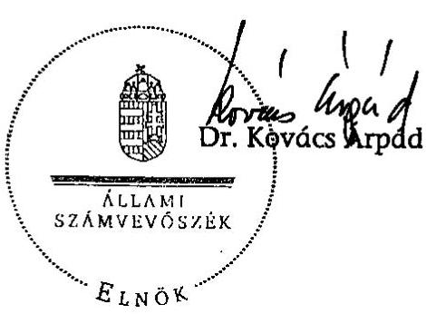
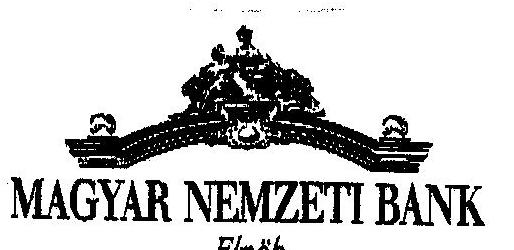
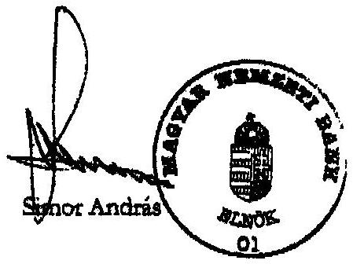
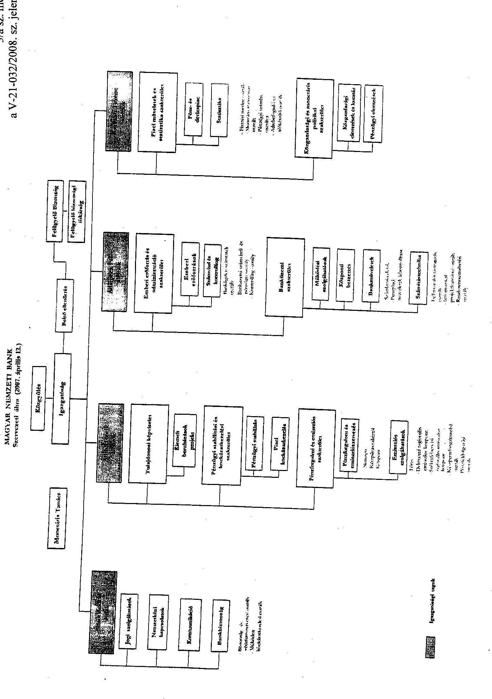
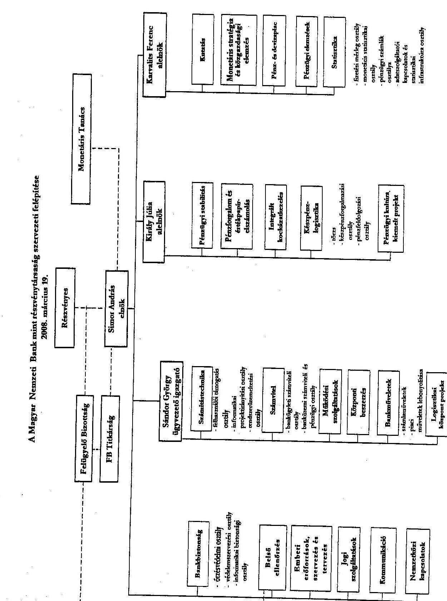
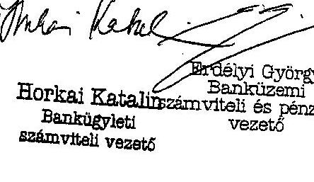

# ÁLLAMI   SZÁMVEVŐSZÉK 

## JELENTÉS

a Magyar Nemzeti Bank 2007. évi múködésének ellenőrzéséről

---

2. Államháztartás Központi Szintjét Ellenőrző Igazgatóság
2.1. Teljesítmény Ellenőrzési Főcsoport
Iktatószám: V-21-032/2008.
Témaszám: 890
Vizsgálat-azonosító szám: V0371

# Az ellenőrzést felügyelte: 

Bihary Zsigmond
főigazgató
Az ellenőrzés végrehajtásáért felelős:
Kemény Emil
főigazgató-helyettes
Az ellenőrzést vezette:
Tóthné Nagy Éva
osztályvezető főtanácsos
Az ellenőrzést végezték:
Koczka Róbert Lászlóné Verő Tünde Vörös Katalin
számvevő
számvevő
Számvevő

## A témához kapcsolódó eddig készített számvevőszéki jelentések:

| címe | sorszáma |
| :-- | :--: |
| A Magyar Nemzeti Bank működésének ellenőrzése | 0238 |
| A Magyar Nemzeti Bank belső (banküzemi) múködésének ellenőr- | 0328 |
| zése |  |
| A Magyar Nemzeti Banknál alkalmazott teljesítményértékelési | 0438 |
| rendszer múködésének ellenőrzése |  |
| A Magyar Nemzeti Bank 2002. évi múködésének ellenőrzése | 0340 |
| A Magyar Nemzeti Bank 2003. évi múködésének ellenőrzése | 0447 |
| A Magyar Nemzeti Bank 2004. évi múködésének ellenőrzése | 0531 |
| A Magyar Nemzeti Bank 2005. évi múködésének ellenőrzése | 0622 |
| A Magyar Nemzeti Bank 2006. évi múködésének ellenőrzése | 0716 |

---

# TARTALOMJEGYZÉK 

BEVEZETÉS ..... 5
I. ÖSSZEGZŐ MEGÁLLAPÍTÁSOK, KÖVETKEZTETÉSEK, JAVASLATOK ..... 8
II. RÉSZLETES MEGÁLLAPÍTÁSOK ..... 14

1. Az MNB működésének törvényessége és szabályszerűsége ..... 14
1.1. A részvényesi jogok gyakorlása, az alapszabály módosítása ..... 14
1.2. Az MNB irányítási rendszere ..... 15
1.3. A felügyelő bizottság tevékenysége ..... 18
1.4. A belső ellenőrzési szervezet működése ..... 19
1.5. Az MNB belső szabályozási rendszere ..... 20
1.6. Az MNB középtávú és éves intézményi célkitűzései ..... 21
2. Az MNB belső gazdálkodásának ellenőrzése ..... 23
2.1. A múködési költségek tervezési rendszere, a költségek elszámolása ..... 23
2.1.1. Az emberi erőforrás gazdálkodás ..... 25
2.1.2. Az információ-technológiai rendszerek fenntartása és múködtetése ..... 27
2.1.3. Az üzemeltetési, az egyéb költségek és az értékcsökkenés ..... 28
2.2. A beruházási kiadások tervezési rendszere, az előirányzatok felhasználása ..... 29
2.2.1. Logisztikai Központ ..... 31
2.3. A beszerzési rendszer ..... 32
2.4. A banküzemi bevételek és ráfordítások ..... 34
3. A befektetett eszközök alakulása ..... 35
3.1. Az immateriális javak, a tárgyi eszközök és a beruházások állománya ..... 35
3.2. Az MNB befektetései ..... 35
4. Az MNB elszámolásai a központi költségvetéssel ..... 37
5. Az ÁSZ 2007-ben közzétett jelentésében megfogalmazott javaslatok hasznosulása ..... 38

---

# MELLÉKLETEK 

1. számú melléklet Észrevétel
2. számú melléklet Kérdések, kritériumok, adatforrások
3. számú melléklet Az MNB szervezetét bemutató ábra
4. számú melléklet A Bank múködési költségeinek alakulása, megoszlása (2004-2007)
5. számú melléklet Az immateriális javak és a tárgyi eszközök beszerzésének, létrehozásának tervezett és elszámolt ráfordításai
6. számú melléklet A beruházáshoz kapcsolódó szerződésmódosítások
7. számú melléklet A befektetések és a befektetésekből származó osztalékok alakulása
8. számú melléklet Tanúsítványok

---

# RÖVIDÍTÉSEK JEGYZÉKE 

| ÁSZ | Állami Számvevőszék |
| :--: | :--: |
| BEL | Az MNB belső ellenőrzési szervezete |
| BÉT | Budapesti Értéktőzsde |
| BKB | Beruházási és Költséggazdálkodási Bizottság |
| BWF | Beszerzési workflow (beszerzési munkafolyamat-irányító rendszer) |
| EB | Európai Bizottság |
| EEF | Emberi erőforrások szervezés és tervezés |
| EKB | Európai Központi Bank |
| EU | Európai Unió |
| FB | Felügyelő bizottság |
| FEUVE | Folyamatba épített előzetes és utólagos vezetői ellenőrzés |
| Gt. | 2006. évi IV. törvény a gazdasági társaságokról |
| IAC | Központi Bankok Európai rendszerén belül múködő Belső Ellenőrzési Bizottság |
| ISO | 9001:2000 szabvány által megfogalmazott minőségirányítási rendszer |
| ISTAT | Informatikai fejlesztési program |
| IT | Információ technológia |
| JOG | Jogi szolgáltatások |
| KBER | Központi Bankok Európai Rendszere |
| KELER Zrt. | Központi Elszámolóház és Értéktár Zrt. |
| Kbt. | 2003. évi CXXIX. törvény a közbeszerzésekről |
| Miniszter | Az államháztartásért felelős pénzügyminiszter |
| MNB, Bank | Magyar Nemzeti Bank |
| MNB tv. | 2001. évi LVIII. törvény a Magyar Nemzeti Bankról |
| MT | Monetáris tanács |
| OGY | Országgyúlés |
| PM | Pénzügyminisztérium |
| PSZÁF | Pénzügyi Szervezetek Állami Felügyelete |
| STORAGE | Központi vállalati adattároló |
| SWIFT | Society for Worldwide Interbank Financial Telecommunication SCRL |
| SZMSZ | Szervezeti és Múködési Szabályzat |
| SZT | Számítástechnika |
| SZV | Számvitel |
| VB | Vezetői Bizottság |
| VBK | Választható béren kívüli juttatás |

---

.

---

# JELENTÉS   a Magyar Nemzeti Bank 2007. évi múködésének ellenőrzéséről 

## BEVEZETÉS

Az Állami Számvevőszék (továbbiakban: ÁSZ) az Állami Számvevőszékről szóló 1989. évi XXXVIII. törvény 3. §-a alapján ellenőrzi az MNB gazdálkodását és az alapfeladatai körébe nem tartozó tevékenységét. Az ÁSZ 2002 óta évente azt vizsgálja, hogy az MNB a jogszabályoknak, kiemelten az MNB tv. rendelkezéseinek, az alapszabályának, majd alapító okiratának és a közgyűlés, illetve a részvényes ${ }^{1}$ határozatainak megfelelően múködik-e.

Az MNB korábbi elnökének megbízatása 2007. március 2-án lejárt. 2007. március 3-tól az MNB élére új elnököt neveztek ki. Ebben az évben a három alelnök mandátuma is lejárt. 2007 márciusában, illetve júliusában nevezték ki az MNB két új alelnökét.

2007-ben az MNB tv. három alkalommal módosult. Az áprilisi módosítást az Európai Bizottság (továbbiakban: EB) és Európai Központi Bank (továbbiakban: EKB) 2004. évi Konvergencia-jelentéseiben megfogalmazott észrevételek figyelembevétele, valamint az MNB tv. egyes uniós és hazai jogszabályokkal történő harmonizálása indokolta. A július 1-jétől hatályos módosítás a joghatást már ki nem váltó rendelkezéseket helyezte hatályon kívül. A július 3-tól életbe léptetett változások a Bank irányító testületei működésének szabályait módosították. Többek között csökkent a monetáris tanács (továbbiakban: MT) létszáma ${ }^{2}$, az MNB elnöke által javasolt egy alelnök helyett a testület tagjai lettek az MNB alelnökei ${ }^{3}$, az alelnökök létszáma kettőre csökkent. Az MNB tv. a gazdasági társaságokról szóló 2006. évi IV. törvény (továbbiakban: Gt.) rendelkezéseivel összhangban alapszabály helyett alapító okirat megállapításáról rendelkezett, megszüntette a közgyűlést és az igazgatóságot, a testületek feladatait a továb-

[^0]
[^0]:    ${ }^{1}$ A Magyar Államot mint részvényest az államháztartásért felelős pénzügyminiszter (továbbiakban: miniszter) képviseli.
    ${ }^{2}$ A 2007. évi LXXXV. törvény átmeneti és záró rendelkezésének 13. § (2) bekezdése alapján az MT tagok száma úgy csökken 5-7 főre, hogy a jelenlegi tagok megbízatásuk megszünéséig megőrzik tagságukat, azaz 2010 márciusáig a tagok száma meghaladja a törvényben meghatározott maximum létszámot.
    ${ }^{3}$ Az MNB tv. módosításáról szóló 2004. évi CXXVI. tv. hatályba lépését követően (2004. december 29.) az átmeneti szabály biztosította, hogy az MNB alelnökei megbízatásuk lejártáig az MT tagjai legyenek. Így az MNB alelnökei az MNB tv. 2007. július 3-i módosítását megelőzően MT tagok voltak, majd július 3-át követően főszabályként szintén tagjai az MT-nek."

---

biakban a részvényes, illetve az MNB elnöke látja el. Ez a változtatás az elnök egyszemélyi felelősségét határozta meg, mint ahogy azt korábban a 2001. július 12-ig hatályos Magyar Nemzeti Bankról szóló 1991. évi LX. törvény is rögzítette.

Az MNB működésének és gazdálkodásának folyamatos tulajdonosi ellenőrzését a felügyelő bizottság (továbbiakban: FB) végzi. 2007 decemberében az Országgyűlés (továbbiakban: OGY) új FB-t ${ }^{4}$ választott, amely december 3-án kezdte meg múködését. A július 3-tól hatályos MNB tv. módosította az FB tagjaira, létszámuk meghatározására és a tagok jelölésére vonatkozó rendelkezéseket ${ }^{5}$, amelyek hatására az új FB megválasztásakor a tagok létszáma kettővel nőtt. Az éves beszámoló valódiságát könyvvizsgáló ellenőrzi. A Bank könyvvizsgálójának megbízatása a 2006. üzleti év lezárásával lejárt. Az MNB a 2007. május 29-én tartott rendes közgyűlésén 2007-től kezdődően öt üzleti évre új könyvvizsgálót választott.

A munkavállalók átlagos statisztikai állományi létszáma a 2006. évi 773 fơről 2007-ben 715 főre csökkent. A működési költségek 2007-ben 14,6 Mrd Ft-ot tettek ki, míg 2006-ban 14,8 Mrd Ft voltak.

Az ÁSZ 2002 óta elvégzett vizsgálatai az MNB banküzemi múködésére és belső gazdálkodására, annak racionalizálására, a múködési költségek és a beruházási kiadások alakulására, a kontrolling feladatokat támogató informatikai, a katasztrófatűrő adattároló és a teljesítményértékelő rendszerek megvalósítására, az analitikus számlavezető rendszer bevezetésére, valamint a Konferenciaközpont megvalósítására terjedtek ki. Az ellenőrzések kiemelt figyelmet fordítottak az MNB tv. változásából adódó feladatok teljesítésére.

A jelenlegi ellenőrzés célja annak értékelése volt, hogy az MNB:

- időarányosan teljesítette-e középtávú intézményi célkitűzéseit, múködése megfelelt-e a törvényi előírásoknak, szabályszerűen és eredményesen működött-e az irányítási, a döntéshozatali, és az ellenőrzési rendszere;
- gazdálkodása szabályozott, szabályszerű és gazdaságos volt-e, kiemelt figyelemmel a múködési költségekre, a beruházási célkitűzések megvalósítására és a befektetésekre;

[^0]
[^0]:    ${ }^{4}$ Az FB tagok mandátuma az OGY megbízatásának megszűnésével 2006 májusában lejárt. Az MNB tv. kimondja, hogy „A felügyelő bizottság múködése addig tart, amíg az új Országgyúlés az alakuló üléstől számított három hónapon belül az új felügyelő bizottsági tagokat megválasztja. Ha az Országgyúlés az említett határidőig az új felügyelő bizottsági tagokat nem választja meg, a felügyelő bizottság müködése mindaddig tart, amíg az új Országgyúlés a felügyelő bizottsági tagokat megválasztja."
    ${ }^{5} \mathrm{Az}$ FB elnöke és tagjai együttes létszámát a megválasztásuk megkezdésének napján az OGY kormánypárti és ellenzéki képviselőcsoportjainak száma figyelembevételével kell megállapítani. Mégpedig azok közül a nagyobbik kétszerese határozza meg az FB OGY által választott tagjait. Az FB elnökét és a tagok felét a kormánypárti, felét pedig az ellenzéki frakciók jelölik.

---

- központi költségvetési kapcsolataival összefüggő elszámolásai szabályozottak és szabályszerűek voltak-e;
- hasznosította-e az előző évi ÁSZ ellenőrzés megállapításait, és tett-e intézkedéseket a javaslatok megvalósítására, figyelembe véve az MNB tv. 2007. július 3-tól hatályos módosítását.

Az ellenőrzést az ÁSZ ellenőrzési kézikönyve és szakmai dokumentumai alapján átfogó ellenőrzéssel, a kérdések, kritériumok, adatforrások figyelembevételével (2. sz. melléklet) végeztük el.

A vizsgálat a 2007. évi gazdálkodásra, illetve indokolt esetben az adott gazdasági esemény keletkezésétől számított időszakra irányult, de szükség szerint a pénzügyi-gazdasági folyamatokat a helyszíni ellenőrzés befejezéséig figyelemmel kísérte.

A jelentést megküldtük az MNB elnökének. Válaszlevelét az 1. számú melléklet tartalmazza.

---

# I. ÖSSZEGZŐ MEGÁLLAPÍTÁSOK, KÖVETKEZTETÉSEK, JAVASLATOK 

Az MNB múködését és gazdálkodását az MNB törvényben rögzített feladatok ellátása, az éves fő célkitúzések, valamint a múködés hatékonyságának javítása érdekében elindított fejlesztések megvalósítása alkotta. Stratégiájával összhangban feladatellátásánál 2007-ben is a múködés racionalizálására, a szervezeti és a létszámhatékonyság javítására való törekvés érvényesült.

2007 első félévében a közgyülés az MNB tv.-ben meghatározott feladatait a törvényi előírásokkal összhangban, az alapszabály betartásával látta el, döntéseit határozatokba foglalta. Az MNB 2007. május 29-én megtartott rendes közgyűlése határozatképes volt, megtárgyalta és elfogadta a 2006. évi auditált éves beszámolót, döntött az eredmény felosztásáról, mely szerint osztalékot nem fizet. Megválasztotta a Bank új könyvvizsgálóját, megállapította annak díjazását.

2007 második félévében a részvényes határozatot hozott az MNB egy perbeli követelésének Magyar Államkincstárra történő engedményezéséről és az MNB FB ügyrendjének októberi módosításáról. Az MNB július 3-tól hatályos alapító okiratának tartalma az MNB tv és a Gt. előírásainak megfelel, azt a részvényes képviseletében a PM államtitkára úgy írta alá, hogy arról a részvényes formálisan nem hozott határozatot.

Az igazgatóság irányító és döntéshozó tevékenységét az MNB tv.-ben, az alapszabályban, az ügyrendjében foglaltaknak megfelelően, munkaterve alapján végezte. A kizárólagos feladat- és hatáskörébe tartozó témaköröket megtárgyalta, döntéseit határozatokban rögzítette, azoknak, valamint az MNB éves célkitűzéseinek teljesítését nyomon követte. 2007. február 22. és március 26. között a Bank igazgatóságának létszáma - egy alelnök mandátumának lejáratát követően - nem érte el az MNB tv.-ben meghatározott minimumot, mivel az új alelnököt csak 2007. március 27 -től, az új MNB elnök március 3-i hivatalba lépése után nevezték ki. A Bank elnöke - törvényben foglalt kötelezettségének eleget téve - január 22-én írásban tájékoztatta a miniszterelnököt és javaslatot tett az új alelnök személyére. A Bank igazgatósága a kérdéses időszakban nem ülésezett, egy írásbeli határozatot hozott, amelyben a távozó alelnök feladatait a másik két alelnökhöz csoportosította át.

Az MNB elnöke a Bank múködésének irányításával összefüggő feladatai támogatására - július 4-től - létrehozta a Vezetői Bizottságot (továbbiakban: VB), amelynek működési szabályzata lényegében a megszűnt igazgatóság ügyrendjét képezte le, és annak a testület hatáskörét, valamint a döntéshozatali eljárást szabályozó szakaszai nem voltak teljes összhangban a hatályos MNB tv.ben rögzített egyszemélyi döntéshozatallal. A Bank szabályzatában a törvényi megfelelést a 7. § (2) bekezdésében a következő mondattal kívánta biztosítani: „... a VB testületi döntést hoz, mely az elnök által egy személyben meghozott döntéssel azonos, és az elnök egyszemélyi felelősségét alapozza meg", valamint a szabályzat azt is kimondta, hogy a VB a Bank operatív vezetését támogató testülete. A

---

szabályzat október 1-jétől hatályos módosítása tovább erősítette a testület tanácsadó, konzultatív szerepét, továbbá a testületi határozathozatal szabályait kiegészítette, amely szerint az elnök a testület kialakított álláspontjával ellentétes döntést is hozhat. Ezek a kiegészítések az MNB törvénnyel összhangban vannak. A szabályzatra ugyanakkor változatlanul jellemző a belső koherencia zavar, mivel pl. a 3. §-a továbbra is a VB kizárólagos döntési hatáskörét rögzíti a konzultatív testületet megillető javaslattételi jogkör helyett. A VB ülések határozatait nyilvántartó dokumentum szerint a módosított működési szabályzat októberi hatályba lépését követően a meghozott döntések 76\%-a VB határozatként, $24 \%$-a pedig elnöki döntésként van rögzítve. A Bank a VB szabályzatát a helyszíni ellenőrzést követően, 2008. március 19-től úgy módosította, hogy a testület hatáskörébe tartozó feladatokat az MNB elnökének hatáskörébe utalta. Ezzel a változtatással a szabályzat belső összhangját megteremtette.

Az MNB szervezetét és irányítási rendszerét az MNB tv. július 3-i módosítása megváltoztatta. A Bank július 3-tól hatályos alapító okirata a törvények előírásaival összhangban volt. A Szervezeti és Működési Szabályzat (továbbiakban: SZMSZ) 4. sz. függelékének október 1-jei, a Bank szervezeti ábráját bemutató mellékletének 2008. március 19-i módosítását követően a szabályzat már megfelelt az MNB tv.-nek és az alapító okiratnak. A Bank a július 3-án kialakított új szervezeti struktúrában megszűntette az igazgatói irányítási szintet, a korábban szakterületekbe csoportosított szervezeti egységek irányítása közvetlenül az elnökhöz, alelnökhöz kerültek. Létrehozta az ügyvezető igazgatói munkakört, amelyet az SZMSZ-ben rögzített. A munkáltatói jogkört gyakorló vezető az új munkakört betöltő munkavállaló személyi alapbérét és bónusz mértékét egyedileg állapította meg. A Bank sem a munkaszerződésben, sem a hatályos munkaviszonyra vonatkozó belső szabályzataiban nem rendelkezett az „egyedi munkakörről" és az ahhoz tartozó alapbér és bónusz mérték megállapításának módjáról.

Az MNB szervezetének és irányítási rendszerének átalakításával összefüggésben megváltoztak a szabályozási szintek és a szabályalkotási hatáskörök. Az elnöki és az igazgatói utasítások helyett elnöki, alelnöki, ügyvezető igazgatói és szervezeti egység vezetői utasítások, valamint továbbra is irányelvek, útmutatók és technológiai eljárások leírásai alkotják a Bank szabályozási rendszerét. A szervezeti változások hatására a 2007. december 31-én hatályos belső szabályzatok $92 \%$-a ( 77 db ) átdolgozást igényelt. Év végére a szabályzatok $40 \%$-án, 2008. február 19-ig pedig 70\%-án vezették át a szükséges módosításokat, amelyek az MNB törvénnyel és a szervezeti változásokkal összhangban voltak.

A felügyelő bizottság ellenőrzési feladatát 2007-ben is a törvények betartásával, az MNB alapszabályában majd alapító okiratában foglaltaknak és saját ügyrendjének megfelelően végezte, munkatervét időarányosan teljesítette. A hatáskörébe tartozó feladatok tekintetében irányította az MNB belső ellenőrzési szervezetét (továbbiakban: BEL). Az FB a jogszabályi változásoknak és az MNB alapító okiratának megfelelően módosította ügyrendjét. Az FB tagjai a 2006 júliusától 2007 júniusáig terjedő időszakban végzett tevékenységükről - az MNB tv.-nek megfelelően - elkészítették az Országgyűlésnek és a miniszternek szóló közös beszámolójukat.

---

A Belső ellenőrzési szervezet munkáját az FB, valamint az FB hatáskörébe nem tartozó feladatokban 2007 első félévében az igazgatóság, majd július 3-tól az MNB elnöke irányította. A BEL az ellenőrzési tevékenységét a jogszabályok és a belső szabályzatok előírásaival összhangban, a jóváhagyott munkaterve alapján végezte, amelynek teljesítéséről irányító szerveinek, illetve az MNB elnökének rendszeresen beszámolt. Az elvégzett 57 vizsgálathoz 109 megállapítást tett, amelyek megoldására 111 intézkedés készült. Megállapításainak hasznosulását 28 utóvizsgálattal ellenőrizte. A belső ellenőri vizsgálatok jogszabályba ütköző hiányosságot nem tártak fel. A 2007. évben lefolytatott ellenőrzések dokumentumai alapján az auditorok által feltárt hiányosságok 9,2\%-a magas, $26,6 \%$-a közepes, $31,2 \%$-a alacsony kockázati szintű, az ajánlások részaránya pedig $33,0 \%$ volt. A Bank ellenőrzöttsége évről évre nőtt, 2007ben a BEL éves ellenőrzési kapacitásának $89 \%$-át fordította a vizsgálatok lefolytatására, míg ez az arány 2006-ban 84\%, 2005-ben 80\%, 2004-ben 75\% volt.

Az MNB vezetése 2001-ben kialakította középtávú intézményi célkitűzéseit, majd 2004-ben az elért eredmények alapján a stratégiai célok változatlanul hagyása mellett aktualizálta a 2005-2007. évi részcélokat. Az előző évi időarányos teljesítések figyelembevételével, a középtávú célkitűzésekkel összhangban alakította ki a 2007. évi fó prioritású célokat, többek között a Logisztikai Központ működési feltételeinek megteremtését, az informatikai rendszerek biztonságának továbbfejlesztését, a fizetési mérleg statisztika adatgyűjtési rendszerének átalakítását. Az éves célkitűzések megvalósításával összefüggő feladatokat a szakterületek munkatervei tartalmazták, azokat a teljesítményértékelési rendszerben egyének szintjére bontották. Az időarányos teljesítést a Bank vezetése rendszeresen nyomon követte. A Bank éves célkitűzéseinek teljesítéséről összevont értékelés nem készült. A szakterületek vezetőinek beszámolói alapján az éves célkitűzéseket időarányosan teljesítették, elmaradás - egyebek mellett a Logisztikai Központ beruházás üzembe helyezésével összefüggő célok megvalósításánál volt. A Bank új felső vezetése meghatározta a 2008-2012. évekre szóló stratégiai célkitűzéseket, amelyek többek között az inflációs célkövető rendszer sikerességét, a monetáris döntéseket támogató rendszer hatékonyságának fejlesztését, az euro bevezetésére való felkészülést, a működés eredményességének és hatékonyságának fejlesztését tartalmazták. A működésfejlesztési program 2007 végére tervezett lezárása - elsősorban a Logisztikai Központ üzembe helyezésének csúszása miatt - 2008-ra húzódott át.

A Bank belső gazdálkodása teljes körűen szabályozott volt, belső szabályzatait a jogszabályokkal összhangban alakította ki, a pénzügyi keretek felhasználásának előírásait betartotta. A múködési költségek és a beruházási kiadások elszámolását szabályszerűen, zárt, integrált informatikai rendszerben végezte, amely átláthatóbbá és hatékonyabbá tette az ügyviteli folyamatokat, lerövidítette az ügykezelés idejét. A rendszerbe beépített ellenőrzési pontokkal támogatták a folyamatba épített, előzetes és utólagos vezetői ellenőrzést (továbbiakban: FEUVE). A Bank a 2007. évi pénzügyi tervezés irányelveit célkitűzéseivel összhangban alakította ki, amelyet az igazgatóság jóváhagyott. A terveket a beszerzési tervek alapján, a tervezés szabályainak betartásával készítette el, két szakterület azonban - a tervezési szabályzattól eltérően - a tervszámokat egyes esetekben számszaki dokumentációval és szöveges indokolással nem támasztotta alá.

---

Az igazgatóság az éves pénzügyi terv részeként 16,3 Mrd Ft főösszeggel hagyta jóvá a múködési költségek tervét, amely $0,2 \mathrm{Mrd}$ Ft központi tartalékot foglalt magában. A múködési költségek elszámolt összege 14,6 Mrd Ft, a tervezettnél $10,8 \%$-kal, az előző évi felhasználásnál pedig $1,5 \%$-kal volt alacsonyabb. A múködési költségek $58 \%$-át képező személyi költségekre a Bank 8,5 Mrd Ft-ot számolt el, amely - a 7,8\%-os átlagjövedelem növekedés mellett - 6,7\%-kal maradt el a tervezettől. Ehhez hozzájárult, hogy a 2007. évi átlagos állományi létszám 60 fővel ( $7,8 \%$-kal) kevesebb volt a tervezettnél, továbbá a szervezeti átalakítás miatt a vezetői munkakörök száma csökkent. 2007-ben a vezetők átlagjövedelme $22,8 \%$-kal, a beosztott dolgozóké $4,2 \%$-kal nőtt. A vezetők 2007. évi átlagjövedelme 5,9-szer volt magasabb a beosztottakénál, míg 2006ban ez az arány ötszörös volt. A vezetők átlagjövedelmének nagyobb mértékű emelkedését a távozó elnök, alelnökök és igazgatók részére fizetett felmentési és végkielégítési költségek eredményezték.

Az igazgatóság jóváhagyta a beruházások aktualizált három éves feladattervét, amely összhangban volt a Bank célkitűzéseivel. A 2007-2009. éveket átfogó teljes beruházási program jóváhagyott összege $20,0 \mathrm{Mrd}$ Ft volt, amelyből a 2007. évi előirányzat 10,5 Mrd Ft tett ki. A Bank jóváhagyott tervét összességében 0,9 Mrd Ft-tal csökkentette, egy beruházás műszaki tartalmának módosítása és az előző évről áthúzódó tételek tervezettől eltérő változása miatt. A 2007ben elszámolt beruházási kiadások összege 6,3 Mrd Ft, a tárgyévi előirányzat 60,9\%-a volt. A kiadások 55,6\%-a a Logisztikai Központ beruházáshoz kapcsolódott. A 2007. évi beruházási kiadások 76,3\%-át a stratégiai célú fejlesztésekre, $23,7 \%$-át pedig a minőségi színvonal megtartására irányuló fejlesztésekre fordították. A beruházások indítása a döntési hatáskörök betartásával, megvalósítása a hatályos belső szabályzatoknak megfelelően történt. A Bank 2007. évi fő prioritású céljai között szerepeltette a Logisztikai Központ múködési feltételeinek kialakítását és tervében a létesítmény szeptember végi üzembe helyezésével számolt. A 2006-ban ismételten felmért felhasználói igények és a szakterületek koncepció váltásai a beruházás kivitelezési munkáit módosították. A módosítások $0,8 \mathrm{Mrd}$ Ft többletkiadást, és több mint 6 hónapos határidőcsúszást eredményeztek. A módosított fővállalkozói szerződés szerint a beruházás befejezésének határideje 2008. június 30-a lett. A Logisztikai Központ teljes pénzügyi tervét az igazgatóság 2003-ban pontosította és 11,4 Mrd Ft-ban hagyta jóvá. A megvalósítás kezdetétől 2007 végéig 9,5 Mrd Ft-ot (83,5\%) számoltak el, amelyből a 2007. évi felhasználás 3,5 Mrd Ft volt. A Logisztikai Központ a Bank dokumentumai alapján - a koncepció váltás pénzügyi hatását is figyelembe véve - várhatóan a 2003-ban jóváhagyott előirányzaton belül valósul meg. A beruházás előrehaladásáról a szakterület a Bank vezetésének folyamatosan beszámolt, a lebonyolítást és az elszámolásokat szabályszerűen végezték.

Az MNB a beszerzések és az ezekhez kapcsolódó szerződések előkészítését, valamint a kötelezettségvállalások rendjét a Kbt. előírásaival összhangban szabályozta. A 2007. évi beszerzési és közbeszerzési tervét a hatályos belső utasításoknak megfelelően állította össze, a beszerzési eljárásokat szabályszerűen, a Beruházási és Költséggazdálkodási Bizottság (továbbiakban: BKB) határozatainak betartásával végezte. A közbeszerzések költségtakarékosabb lebonyolítása érdekében az azonos vagy hasonló tárgyú beszerzéseket egy eljárásba vonta össze. A nyertes ajánlat kiválasztásakor a döntéshozók az elvárt minőséget és műszaki tartalmat biztosító pályázatok közül - a gazdaságossági szempontokat

---

is érvényesítve - a legalacsonyabb összegűt fogadták el. A Bank 2007-ben 92 közbeszerzési eljárást indított, az előző évinél 18-cal kevesebbet. Az MNB 2004 óta tartozik a közbeszerzési törvény hatálya alá, azóta 390 eljárást indított, amelyek $31,3 \%$-ánál a teljesítés befejeződött, $48,5 \%$-ánál az eljárás lezárult, vagy a teljesítés folyamatban volt. $11 \%$-a a szerződéskötést megelőző szakaszokban volt, $8,2 \%$-a eredménytelenül zárult és $1 \%$-ban a felhívást visszavonta a Bank. Az MNB a beszerzési folyamatok támogatására integrált számítástechnikai rendszert fejlesztett ki, amelyben a beszerzések tervezését és tervvisszamérését, valamint a beszerzési eljárások automatikus, ütemezett indítását valósította meg.

Az MNB a befektetett eszközeivel a hatályos törvények betartásával, szabályszerűen gazdálkodott, amelyek 2007. évi nettó nyitó állománya 32,4 Mrd Ft volt és év végére - a beruházások üzembe helyezése eredményeként - 36,1 Mrd Ft-ra nőtt. Az állomány mintegy 48\%-át az MNB gazdasági társaságokban meglévő befektetései alkották. A Banknak továbbra is hat belföldi és három külföldi társaságban van részesedése, amelyek év végi könyv szerinti értéke 17,2 Mrd Ft, az előző évinél 0,3 Mrd Ft-tal alacsonyabb volt. A csökkenést egyrészt a külföldi befektetések devizában nyilvántartott állományának év végi átértékelése, másrészt az MNB EKB-ban lévő részesedésének csökkenése okozta. A belföldi befektetések könyv szerinti értéke az előző évivel megegyező volt. Az MNB belföldi társaságaira vonatkozó stratégiáját saját intézményi stratégiájával összhangban alakította ki, továbbra is értékesíteni kívánja mindazon társaságokban meglévő részesedését, amelyek tevékenysége nem kapcsolódik szorosan a jegybanki múködéshez. A Bank a társaságai 2007. évi várható eredményéről és így az osztalékfizetésről a helyszíni ellenőrzés időszakában még nem rendelkezett információval.

Az MNB a költségvetési kapcsolatok elszámolásának belső szabályzatait a jogszabályoknak megfelelően alakította ki, az elszámolásokat 2007-ben is szabályszerűen végezte. A Bank nyilvántartása szerint a banküzemi bevételek és ráfordítások 2007. évi egyenlege 14,4 Mrd Ft veszteség, az előző évinél 1,3\%-kal alacsonyabb volt. A várható 2007. évi mérleg szerinti eredmény 16,6 Mrd Ft veszteség, alapvetően a deviza árfolyamváltozásból származó nettó nyereség csökkenése miatt. A forintárfolyam kiegyenlítési tartalék elszámolt összege (a nem realizált átértékelési eredmény) 49,9 Mrd Ft volt, ami 0,3 Mrd Ft-tal magasabb az előző évi 49,6 Mrd Ft-nál. A deviza értékpapírok kiegyenlítési tartaléka - az állomány piaci értékének változása miatt - mínusz 2,8 Mrd Ft lett, amely összeget a központi költségvetés 2008. március 31-ig megtérített. Az MNB a Kincstári Egységes Számla kamatelszámolásait a jogszabály előírásainak betartásával végezte el.

Az MNB vezetése és az MNB FB az ÁSZ korábbi jelentésében megfogalmazott javaslatokat elfogadta és hasznosította, amelyet az ellenőrzés is igazolt.

---

A helyszíni ellenőrzés megállapításainak hasznosítása mellett javasoljuk:

# az MNB elnökének 

Határozza meg szabályzatban az egyedi munkakört és alakítsa ki az erre vonatkozó személyi alapbér és bónusz mérték megállapításának szabályait.

---

# II. RÉSZLETES MEGÁLLAPÍTÁSOK 

## 1. Az MNB MÜKÖDÉSÉNEK TÖRVÉNYESSÉGE ÉS SZABÁLYSZERÜSÉGE

2007-ben az MNB tv-t három alkalommal, 2007. április 6-i ${ }^{6}$, július 1-jei ${ }^{7}$ és július 03-i ${ }^{8}$ hatállyal módosították. A Bank elsődleges célját, alapvető feladatait, intézményi, szervezeti, személyi és pénzügyi függetlenségét, valamint a múködését szabályozó törvény többszöri módosításával összefüggésben a jogbiztonság fontosságát az EKB is hangsúlyozta ${ }^{9}$. Az MNB tv. július 3-i módosítása az MT létszámát 5-7 főre csökkentette, amit a törvényalkotó azzal indokolt, hogy a nemzetközi tapasztalatok szerint egy Magyarországhoz hasonló méretű országban az 5-7 fős MT tekinthető ideálisnak. Az MNB tv. ugyanebben a tárgykörben végrehajtott 2004. évi módosítása ugyancsak a nemzetközi tapasztalatokra hivatkozva növelte az MT létszámát 9-11 főre. A törvény gyakori módosítása veszélyezteti azt, hogy a jogszabály világos és állandó iránymutatást adjon.

### 1.1. A részvényesi jogok gyakorlása, az alapszabály módosítása

A közgyűlés 2007-ben egy alkalommal, május 29-én ülésezett. A rendes közgyűlés határozatképes volt, azon a részvényes képviseletében a miniszter jelen volt. Megtárgyalta és határozatban elfogadta az MNB 2006. évi auditált éves beszámolóját, döntött az osztalékfizetésről, miszerint az MNB a 2006. évi eredményéből és eredménytartalékából osztalékot nem fizet. Határozatot hozott továbbá a Bank könyvvizsgálójának megválasztásáról, díjazásának megállapításáról. A törvény előírásának megfelelően az ÁSZ elnökének véleményét ${ }^{10}$ kikérték az MNB könyvvizsgálójára vonatkozó javaslat megtétele előtt. Megtárgyalta továbbá az MNB 2006. évi üzleti jelentését.

A közgyűlés az MNB törvényben és az alapszabályban meghatározott feladatainak eleget tett, azokkal összefüggő döntéseit határozatokba foglalta.

[^0]
[^0]:    ${ }^{6}$ A Magyar Nemzeti Bankról szóló 2001. évi LVIII. törvény módosításáról szóló 2007. évi XV. törvény
    ${ }^{7}$ Az egyes jogszabályok és jogszabályi rendelkezések hatályon kívül helyezéséről szóló 2007. évi LXXXII. törvény
    ${ }^{8}$ A Magyar Nemzeti Bankról szóló 2001. évi LVIII. törvény módosításáról szóló 2007. évi LXXXV. törvény
    9 Az EKB véleménye (CON/2006/55) 2.3. pont
    ${ }^{10}$ A július 3-tól hatályos MNB tv. az ÁSZ-nak az MNB könyvvizsgálójának megválasztásával és visszahívásával kapcsolatos jogkörét úgy módosította, hogy a könyvvizsgáló megválasztását, illetve visszahívásának kezdeményezését megelőzően az ÁSZ elnökének a véleményét ki kell kérni. A módosítást a Kbt. és az MNB tv. ellentmondó szabályainak összehangolása tette szükségessé.

---

Az MNB tv. július 3-i módosítása szükségessé tette a Bank SZMSZ-ének, ezen belül 1. számú függelékének (Alapszabályának), valamint ezekkel összefüggésben belső utasításainak módosítását is. Az MNB tv.-nek és a Gt.-nek megfelelően ettől a naptól a Bank, mint egyszemélyes gazdasági társaság, nem Alapszabálylyal, hanem alapító okirattal rendelkezik. Az okirat összeállítása során az MNB tv.-ben nem szabályozott kérdésekben a Gt. rendelkezéseit vették figyelembe. Az alapító okirat tartalma a törvényi előírásoknak megfelelt. Az MNB elnöke 2007. július 3-án kelt levele szerint - az alapító okiratot OGY elnökének megküldte, ezzel az MNB tv.-ben foglalt kötelezettségének eleget tett.

Az MNB tv. július 3-át megelőzően az alapszabály megállapítását és módosítását a közgyűlés, majd ezt követően az alapító okiratét a részvényes feladatai között szerepeltette, illetve szerepelteti. Az MNB hatályos alapító okiratának megállapításáról a részvényes a törvényi előírás szerint formálisan nem hozott határozatot ${ }^{11}$. A július 3-tól hatályba léptetett alapító okiratot a részvényes képviseletében a PM államtitkára 2007. június 29-én aláírta.

A részvényes az ellenőrzött időszakban kettő részvényesi határozatot hozott. Az október 8-i 1/2007. számú határozat rendelkezett az MNB perbeli követelésének Magyar Államkincstárra történő engedményezéséről, a 2/2007. (11. 20.) számú határozat pedig az MNB FB-a ügyrendjének október 16-án kelt módosítását hagyta jóvá.

# 1.2. Az MNB irányítási rendszere 

Az igazgatóság 2007 első félévében az MNB tv.-nek, az alapszabálynak, és az ügyrendjének megfelelően, munkaterve alapján végezte irányító és döntéshozó tevékenységét. A feladat- és hatáskörébe tartozó témaköröket megtárgyalta, határozatainak és az éves célkitűzéseinek teljesítését nyomon követte. A Bank igazgatóságának létszáma egy alelnök mandátumának lejáratát követően 2007. február 22. és március 26. között nem érte el az MNB tv.-ben ${ }^{12}$ meghatározott minimumot. Az MNB elnöke 2007. január 22-én írásban jelezte a miniszterelnöknek és egyben törvényben foglalt kötelezettségét teljesítve javaslatot tett az új alelnök személyére. Erre a jelzésre a miniszterelnök részéről intézkedés nem történt.

Az FB ülések dokumentumai alapján a testület - amelynek feladata többek között az MNB törvényes múködésének figyelemmel kísérése - írásban tervezte jelezni a tulajdonosi képviselőnek, hogy az igazgatóság létszáma az MNB tv.-ben előírt minimum szint alá csökkent, egyben kérve annak rendezését. Az FB - tájékoztatása szerint - írásbeli jelzését azért nem tette meg, mert tudomást szerzett a Bank elnökének a miniszterelnökhöz e tárgykörben írott leveléről, továbbá azért sem, mert az FB 2007. február 27-i ülésén a részvényesi jogokat gyakorló minisz-

[^0]
[^0]:    ${ }^{11}$ Az MNB álláspontja szerint: „Az egységes szerkezetú alapító okirat MNB tv. szerinti megállapítása megtörtént azáltal, hogy a részvényes képviselője az alapító okiratban feltüntetett időpontban az alapító okiratot aláirta. Az alapító okirat részvényes képviselője általi aláirása részvényesi határozatnak minősül."A PM e kérdésben az MNB-vel azonos álláspontot képvisel.
    ${ }^{12}$ MNB tv. 52. § (2) bekezdése (az igazgatóság legalább négy-, legfeljebb hattagú testület)

---

tert képviselő FB tag arról tájékoztatta a testületet, hogy a miniszter álláspontja szerint a problémát az új MNB elnök kinevezését követően oldják meg, valamint arról, hogy az MNB addig így is működőképes.

Az igazgatóság február 22 - március 26-a között nem ülésezett, ebben az időszakban egy írásbeli határozatott hozott, amelyben a Banktól távozó alelnök feladatait a másik két alelnökhöz csoportosította át. Az új alelnököt az új MNB elnök március 3-i hivatalba lépését követően, 2008. március 27-től nevezték ki.

A vizsgált időszakban a felső vezetésben bekövetkezett személyi változások, valamint a július 3-tól hatályos MNB tv. módosítása miatt, a Bank irányítási rendszerét, szervezeti felépítését átalakította.
A hatályos MNB tv. a Gt.-vel összhangban rögzíti, hogy a Bankban igazgatóság nem működik. A módosított MNB tv. a korábban igazgatósági hatáskörbe tartózó feladatok ellátását az MNB elnökének hatáskörébe utalta. Az elnök - a Bank működésének irányításával összefüggő feladatai támogatására - július 4től létrehozta a Vezetői Bizottságot, amelynek működési szabályzata az igazgatóság (korábbi döntést hozó testület) ügyrendjét képezte le. A szabályzat határozathozatalról szóló 7 . §-a az (1) bekezdésében rögzítette, hogy főszabályként egy személyben az elnök dönt a tagok véleményének meghallgatásával. A 7. §. (2) bekezdése a testület kizárólagos hatáskörében (3. §-ban) felsorolt tárgykörök egy részére (így pl. a Bank belső ellenőrzésével és működési kockázat kezelésével kapcsolatos döntésekre is) testületi döntést írt elő, a ki nem emelt tárgykörökben pedig lehetővé tette - az elnök által szükségesnek tartott esetekben - a testületi döntéshozatalt. A VB így kialakított július 4-től hatályos működési szabályzatában rögzített döntéshozatali eljárás és a VB működésének dokumentumaiban szereplő határozatok a hatályos MNB tv. egyszemélyi döntéshozatalt szabályozó rendelkezésével nem voltak maradéktalanul összhangban. A Bank szabályzatában a törvényi megfelelést a 7. § (2) bekezdésében a következő mondattal kívánta biztosítani: „... a VB testületi döntést hoz, mely az elnök által egy személyben meghozott döntéssel azonos, és az elnök egyszemélyi felelősségét alapozza meg".
A VB múködési szabályzatának belső véleményezése és az FB jelzése alapján több körös egyeztetést követően külső szakértői véleményre alapozva, az MNB október 1-jei hatállyal módosította a szabályzatot. A szabályzat az MNB tv. előírásainak való megfelelését a Bank a VB múködési szabályzata 1. és 7. §-ainak kiegészítésével teremtette meg. Az 1. § módosításával hangsúlyosabbá vált, hogy a VB a Bank operatív vezetését támogató konzultatív testülete. A 3. §-ban felsorolt feladatkörök a döntési és jóváhagyási kompetenciák szempontjából a Bank belső ellenőrzésével és múködési kockázatkezelésével kapcsolatos döntések kivételével - változatlanul maradtak.

A 7. § (2) bekezdés már nem azt rögzíti, hogy „a VB testületi döntést hoz", hanem azt, hogy „...az elnök köteles kikérni a VB testületi álláspontját.". A szakasz azzal egészült ki, hogy „az elnök végső döntését a VB testületi álláspontjának figyelembevételével hozza meg, mely döntés a többségi véleménnyel ellentétes is lehet", valamint azzal, hogy „Az így meghozott döntés az elnök által egy személyben meghozott döntésnek minősül...".

Ezekkel a szakértői véleményből beépített kiegészítésekkel biztosította a Bank, hogy a VB múködésének szabályzata az MNB tv.-nek már megfelel. A szabály-

---

zatból változatlanul hiányzik az egyes szakaszok közötti összhang, mivel a 3. § még mindig döntési kompetenciákat rögzít a konzultatív testületet megillető javaslattételi jogok helyett.

A VB üléseken meghozott döntések dokumentumai is a szabályzat ellentmondásosságát támasztják alá. A VB ülések határozatainak könyvében a testület október 1-jét követő működése során meghozott döntéseinek 76\%-a VB határozatként, $24 \%$-a pedig elnöki döntésként volt rögzítve.

A VB döntött pl. a 2008. évi létszámterv javaslatáról, a 2008. évi alapbérfejlesztés mértékéről és annak felhasználásáról, a 2008. évi pénzügyi terv elfogadásáról, a Bank középtávú intézményi stratégiájáról, a belső ellenőrzési szervezet 2008. évi munkatervéről.

Az elnök - a testületi tagok véleményének meghallgatásával - döntött többek között az elnöki utasítások kiadásáról, egyes esetekben az SZMSZ módosításáról, humánpolitikai koncepciókról.

A helyszíni ellenőrzést követően, annak hatására a Bank a VB működési szabályzatát 2008. március 19-i hatállyal módosította. A szabályzat belső összhangját megteremtette azzal, hogy a korábban a VB kizárólagos hatáskörében rögzített feladatokat az MNB elnökének (VB elnöke) hatáskörébe utalta.

Az MNB SZMSZ-ét a módosításokkal egységes szerkezetben az első félévben öt, a másodikban pedig négy alkalommal hirdették ki. Az MNB tv. július 3-i módosítása megváltoztatta szervezetirányítási rendszerét, az ezt követő napon a Bank kihirdette a törvényi változásokkal módosított SZMSZ-ét, amely leképezte a jogszabály változásait, továbbá az új szervezeti struktúrában létrehozta az ügyvezető igazgatói munkakört. A szabályzat általános része írja le a Bank munkaszervezetében kialakított vezetési szinteket (elnök, alelnökök, ügyvezető igazgató(k), szervezeti egységek vezetői). Ezzel nem volt összhangban a Bank munkaszervezetét bemutató ábrája ${ }^{13}$, mivel az az alelnökökkel egy vezetési szinten ábrázolta az ügyvezető igazgatói szintet.

Az MNB szervezeti struktúráját bemutató ábra mindkét félévben négyszer változott. A Bank nyilvános honlapján július 4-től a munkaszervezetéről adott tájékoztatást, amely nem mutatta be a Bank MNB tv. által meghatározott szerveit, az MT-t és az FB-t. Ezzel az MNB legfőbb döntéshozó szervének és tulajdonosi felügyeletének a szervezetben való elhelyezkedését nem mutatta be. (Az MNB szervezeti ábráit a 3/a., 3/b. és 3/c. sz. mellékletek tartalmazzák.)

Az irányítási rendszer átalakításával július 4-étől megszűnt az igazgatói irányítási szint, a korábban szakterületekbe csoportosított szervezeti egységek közvetlenül az elnök, az alelnökök és ügyvezető igazgató irányításával működnek. Átcsoportosították egyebek mellett a gazdálkodással kapcsolatos kontrolling tevékenységet, amely a Számvitel szakterületről az Emberi erőforrások szervezés és tervezés szakterület irányítása alá került. Ezzel a szervezeti változtatással a

[^0]
[^0]:    ${ }^{13}$ A helyszíni ellenőrzés hatására a Bank 2008. március 19-től ismét a „teljes" szervezet felépítését jeleníti meg honlapján, amelyen a vezetési szinteket már az SZMSZ-szel összhangban mutatja be.

---

kontrolling feladatok ellátásának irányítása és szakmai felügyelete ahhoz a szakterületi vezetőhöz került, aki költséggazdaként a Bank működési költségeinek mintegy 60,0\%-ával gazdálkodik.

# 1.3. A felügyelő bizottság tevékenysége 

Az FB összetétele és létszáma az év során két alkalommal változott. 2007 áprilisában lemondott az FB elnöke, ezt követően - az FB ügyrendjének megfelelően, a lemondó elnökkel történt megállapodás alapján - az FB egy tagja látta el az elnöki feladatokat. Szintén ebben a hónapban változott a miniszter képviselőjének személye. A változásokat követően az FB létszáma - az új FB megválasztásáig - a korábbi 6 főről 5 főre csökkent, ami a szervezet működését nem veszélyeztette. Az Országgyúlés az új FB tagjait 2007 decemberében választotta meg, az MNB-ben az új testület december 3-tól múködik. A 2007. július 3-tól hatályos MNB tv.-nek megfelelően a tagok száma 6-ról 8 főre nőtt. Az FB a törvényi változásokkal és az MNB alapító okiratával összhangban módosította ügyrendjét, amelynek elfogadásáról határozatot hozott, a részvényesi jogokat gyakorló miniszter pedig részvényesi határozattal hagyta jóvá azt.

Az FB 2006 novemberében ideiglenes munkatervet fogadott el a 2006. decembertől 2007. júniusig tartó időszakra. Júniustól az FB ülésenként döntött a következő ülés időpontjáról és napirendjéről. Az ideiglenes munkaterv összeállítását és elfogadását, valamint a hónapról-hónapra történő feladatmeghatározást az indokolta, hogy az OGY az új FB tagjait csak az év utolsó hónapjában választotta meg. Az új FB tagjai kiválasztásának csúszása a feladatellátás tervezhetőségét (2007. júliustól - 2008. júniusig tartó időszakot lefedő munkaterv), egyes kérdésekben a szükséges döntések meghozatalát (pl. FB 2008. évi költségterve, az MNB tv. módosítását követő ügyrend módosítása) hátráltatta. A bizonytalanság ellenére az FB az így meghatározott munkatervében szereplő feladatait ellátta. Az ellenőrzött időszakban tíz ülést tartott, amelyeken rendszeresen nyomon követte - a hatáskörébe tartozó feladatok tekintetében - az irányítása alá tartozó BEL tevékenységét, valamint az MNB múködését és gazdálkodását.

Megtárgyalta és határozatával elfogadta a BEL 2006. évi beszámolóját, a Bank 2006. évi mérleg és eredmény kimutatását, a BEL 2007. évi munkatervét, saját ügyrendjének módosítását, megállapította az FB 2008. évi költségtervét. Tárgyalta többek között a Bank 2007. évi pénzügyi tervét, támogatási gyakorlatát, peres ügyeit, emberierőforrás-gazdálkodását, fontosabb belső szabályainak összhangját az MNB-ről szóló törvény hatályos rendelkezéseivel. Megtárgyalta a Bank múködési költségeiről és beruházási ráfordításainak alakulásáról készített negyedéves beszámolókat, a Logisztikai Központ beruházás megvalósulásának helyzetét, az MNB tulajdonosi érdekeltségébe tartozó vállalkozások gazdálkodását, valamint az ÁSZ 2007 júliusában nyilvánosságra hozott jelentését.

A munkavállalók által indított munkaügyi perek, valamint egy, az FB-hez címzett munkavállalói bejelentés kivizsgálása érdekében az FB két témában rendelt el rendkívüli ellenőrzést, amelyeket a BEL lefolytatott. Ezek az ellenőrzések a munkáltató által 2006-ban kezdeményezett munkaviszony megszüntetésekre és az Önkéntes nyugdíjpénztári munkáltatói hozzájárulások kifizetésének vizsgálatára irányultak. Ez utóbbi témakörben a BEL három esetben állapított meg

---

a Munkavállalói kézikönyvben rögzítettől eltérő elszámolást, amit az EEF 2007ben korrigált.

Az FB tagjai összeállították, és a június 19-i ülésen elfogadták az OGY-nek és a miniszternek szóló közös beszámolót, amelyben a 2006. júliusától - 2007. júniusáig terjedő időszakban végzett tevékenységükről adtak tájékoztatást.

Az új FB december 13-án tartotta első ülését. Az FB elnöke ismertette a jelenlévőkkel, hogy a régi FB vezetői az iratokat átadták, továbbá tájékoztatást adtak az FB addigi tevékenységéről. A 2007. december 6-án kelt jegyzőkönyv tanúsága szerint a hivatalos átadás-átvétel megtörtént.

Az FB a hatályos törvényi előírásokkal, az MNB alapszabályában és alapító okiratában foglaltakkal összhangban, valamint saját ügyrendjének megfelelően látta el ellenőrzési feladatát, munkatervét időarányosan teljesítette. Az ellenőrzéseivel összefüggő kéréseinek és saját feladatainak, valamint határozatainak nyomon követése érdekében 2007. júliusától nyilvántartást vezet.

# 1.4. A belső ellenőrzési szervezet múködése 

A BEL az FB, valamint az FB hatáskörébe nem tartozó feladatok tekintetében 2007 első félévében az igazgatóság, majd július 3-tól az MNB elnökének közvetlen irányítása alatt múködött. Tevékenységét az igazgatóság és az FB által elfogadott munkatervének, a törvények előírásainak, a Belső Ellenőrzési kézikönyvnek és a belső szabályzatoknak megfelelően végezte, kivéve a független belső ellenőrzés rendjéről szóló elnöki utasítás - az MNB tv. július 3-i módosítása miatt szükségessé váló - felülvizsgálatát, amelyet közel féléves késedelemmel végzett el.
2007. évi munkatervét az igazgatóság és az FB megtárgyalta és mindkét testület határozatával jóváhagyta azt. A munkatervben előirányzott belső ellenőri vizsgálatok meghatározása - az előző évek gyakorlatával megegyezően - kockázatelemzésen alapult, figyelembe véve a Bank szervezetében és tevékenységében bekövetkezett változásokat. Tartalmazta továbbá a szakterület vizsgálatokon kívüli tevékenységére vonatkozó feladatainak meghatározását is (pl. az ÁSZ és a Könyvvizsgáló megállapításainak nyomon követését, belső szabályok véleményezését, a Bank szervezeti egységei részéről eseti igényként felmerülő konzultációt és tanácsadást).

A BEL éves munkatervének végrehajtásáról havonta tájékoztatta az FB-t. Az év első felében a pénzügyi auditorok létszáma a tervezettől elmaradt, ezért egyes vizsgálatokat a tervezett időpontig nem folytatott le. A hiányzó státuszok betöltésének elhúzódása miatt a BEL éves munkatervét az FB és az igazgatóság módosította, négy vizsgálatot törölt, illetve a következő évre ütemezett át.

A BEL éves munkatervében 22 db pénzügyi vizsgálatot, 10 db informatikai vizsgálatot és 20 db utóvizsgálatot irányzott elő. A vizsgált időszakban meglévő kapacitáshiány (442 ellenőri nap) miatt a tervezett ellenőrzések közül - azok kockázati szintjének mérlegelése alapján - három pénzügyi és kettő informatikai vizsgálat elmaradt. Ugyanakkor a módosított munkaterv szerint a tervezetnél 8 db-bal több utóvizsgálatot és az FB kérésére két rendkívüli vizsgálatot

---

folytattak le, amelyek elvégzését az elmaradt vizsgálatoknál felszabaduló kapacitás (185 ellenőri nap) és a munkatervben tervezett tartalék idő (282 ellenőri nap) igénybevétele tett lehetővé. A Logisztikai Központ beruházás (pénzügyi, időbeli) teljesülése tárgyú vizsgálatot, a beruházás befejezésének csúszása miatt 2008. második félévére ütemezte át a szakterület. A vizsgálat elmaradásával felszabaduló kapacitást a BEL a tervmódosításkor törölt Pénzjegynyomda Zrt. vizsgálata mellett a szállító és költségkönyvelés ellenőrzésére fordította.

Az éves ellenőrzési terv a Központi Bankok Európai Rendszerén (továbbiakban: KBER) belül múködő Belső Ellenőri bizottsággal (továbbiakban: IAC) két közös ellenőrzést irányzott elő, amelyből az üzletmenet folytonosság vizsgálatát a BEL végrehajtotta. A másik ellenőrzést az IAC döntése alapján egyik munkacsoportja folytatta le. A BEL az IAC ülésein a vizsgált időszakban is rendszeresen részt vett.

A BEL 2007-ben az éves kapacitásának 89\%-át belső ellenőri vizsgálatokra fordította, követve ezzel az előző évek javuló tendenciáit. Az ellenőrzött időszakot megelőző három évben ez az arány 2006-ban 84\%, 2005-ben 80\%, 2004-ben pedig $75 \%$ volt. A BEL megállapításait és ajánlásait a vizsgált szervezetek elfogadták, és a feltárt hiányosságok megszüntetésére intézkedési terveket dolgoztak ki, amelyeket a Bank belső információs rendszerén keresztül elérhető adatbázisban tartanak nyilván.

Az adatbázisból nyert információk szerint a BEL a vizsgált időszakban 57 db ellenőrzést folytatott le, 109 db megállapítást tett, amelyekhez 111 db intézkedés kapcsolódott. Az egy ellenőrzésre jutó megállapítások száma az előző évivel egyezően átlagosan $1,9 \mathrm{db}$ volt. A szakterületek a megállapításokban jelzett hiányosságok 79,8\%-át év végéig megoldották. Ez az arány 2006-ban 85,5\% volt. A 2007 végén folyamatban lévő (megoldatlan) intézkedések növekvő arányát az előző évinél több áthúzódó határidő indokolta. A megoldatlan megállapítások és intézkedések között lejárt vagy módosított határidejú nem volt.

A BEL 2007. évi ellenőrzései során vizsgálta többek között az ellenőrzött területek szabályozottságát, a szabályzatok gyakorlati alkalmazását, azok összhangját a hatályos jogszabályokkal, a feladatellátás dokumentáltságát. A 2007. évben lefolytatott ellenőrzések tapasztalatai alapján az auditorok megállapításainak $9,2 \%$-a magas, $26,6 \%$-a közepes, $31,2 \%$-a alacsony kockázati szintű, az ajánlások részaránya pedig $33,0 \%$ volt. A megállapítások és ajánlások többek között a folyamatok szabályozottságának javítását, a belső szabályzatok aktualizálását, a szabályzatok és a gyakorlat összhangba hozását, a kontrollok megerősítését, az információ technológiai (továbbiakban: IT) hozzáférési jogosultságok folyamatos kezelését, valamint a dokumentáltság erősítését szolgálták.

# 1.5. Az MNB belső szabályozási rendszere 

A vizsgált időszakban a Bank felső vezetésében bekövetkezett változások, valamint az MNB tv. júliusi módosítása hatására többször ${ }^{14}$ megváltozott az MNB szervezete és irányítási rendszere. A szervezet átalakításával változtak a szabályo-

[^0]
[^0]:    14 A Bank szervezeti ábrája a vizsgált időszakban nyolcszor változott.

---

zási szintek (elnök, alelnökök, ügyvezető igazgató(k), szervezeti egységek vezetői) és a szabályalkotási hatáskörök, amelyeket az SZMSZ-ben meghatároztak. A változást megelőzően a Bank szabályozási rendszere elnöki és igazgatói utasításokból, valamint irányelvekből, útmutatókból és technológiai eljárásokból állt. A változást követően pedig elnöki, alelnöki, ügyvezető igazgatói és szervezeti egység vezetői utasítások alkotják. Továbbra is a szabályozási rendszer részét képezik az irányelvek, útmutatók és technológiai eljárások leírásai.

A szervezeti változásokkal összefüggésben a 2007. december 31-én hatályos belső szabályok ( 84 db ) $91,7 \%$-a ( 77 db ) átdolgozásra szorult. Év végére ennek $40,3 \%$-át ( 31 db ) legalább egy alkalommal módosították, azonban a módosított szabályzatok $38,7 \%$-a ( 12 db ) további változtatást igényel. Összességében 46 db belső szabályzat átdolgozását nem végezték el, azokon nem vezették át az MNB tv. júliusi változásait, majd az azt követő SZMSZ módosításokat. A Bank szabályzatainak nyilvántartása szerint 2008. február 19-én már csak 23 db szabályzat átdolgozása volt folyamatban.

A Bank SZMSZ-ének július 4-i hatályba lépését követően a belső szabályok átdolgozása - kilenc belső szabály kivételével - két hónapnál hosszabb időt vett igénybe.

A belső szabályok módosításakor a szervezeti változások átvezetése mellett a szervezeti egységek a szükséges tartalmi módosításokat is elvégezték. Az átdolgozott szabályzatok az MNB törvénnyel és a szervezeti változásokkal összhangban voltak.

# 1.6. Az MNB középtávú és éves intézményi célkitűzései 

2001-ben az MNB vezetése elemezte a Bank helyzetét, majd ennek eredményeit és a nemzetközi tapasztalatokat figyelembe véve kialakította középtávú intézményi célkitűzéseit. Ezt követően 2004-ben értékelte az addig elért eredményeket és a teljesítésekre figyelemmel a stratégiai célok változatlanul hagyása mellett aktualizálta a részcélokat 2005-2007. évekre. Az ÁSZ ellenőrzései során a célkitűzések teljesítését rendszeresen figyelemmel kísérte és jelentéseiben ${ }^{15}$ azok időarányos teljesítéséről beszámolt.

2006 szeptemberében a Bank vezetése értékelte a középtávú intézményi, valamint a 2006. évi fő prioritású banki célok teljesítését, majd - összhangban a középtávú célkitűzésekkel - a 2007. évre hét főprioritású célt határozott meg:

- megérthető monetáris politika,
- az általános pénzügyi kultúra fejlesztésének szakmai támogatása,
- a Logisztikai Központ emissziós tevékenysége szervezeti, múködési, informatikai, biztonsági, emberi erőforrás feltételeinek megteremtése,
- az elszámolás-forgalom új platformjához kötődő pénz- és elszámolás-forgalmi fejlesztések, szabályozás,

[^0]
[^0]:    ${ }^{15}$ Jelentés a Magyar Nemzeti Bank 2005. évi múködésének ellenőrzéséről (sorszáma 0622), Jelentés a Magyar Nemzeti Bank 2006. évi múködésének ellenőrzéséről (sorszáma 0716).

---

- a fizetési mérleg statisztika adatgyűjtési rendszerének átalakítása,
- az elemzési munka hatékonyságának, eredményességének fokozása érdekében rugalmas, a felhasználói igényekhez alkalmazkodó, magas hozzáadott értékű informatikai és statisztikai szolgáltatások nyújtása,
- Az informatikai rendszerek biztonságának továbbfejlesztése a banki alkalmazások kritikus és nem kritikus rendszerekre történő szétválasztásával.

Az igazgatóság a 2007. évi célokat, valamint a célkitűzési folyamat ütemezését határozatban fogadta el. A szervezeti egységek az éves célokkal összhangban készítették el munkaterveiket, amelyeket az egyének szintjére lebontottak. Az egyénekre bontott célkitűzések a teljesítményértékelés alapjául szolgáltak. Az egyes szakterületek vezetői 2007 novemberében rendkívüli vezetői értekezleten számoltak be az éves célkitűzéseik teljesítéséről, továbbá a banknál alkalmazott hét fokozatú minősítési skála figyelembevételével értékelték az irányításuk alatt álló munkaszervezet tevékenységét. A Bank éves célkitűzéseinek teljesítéséről összevont értékelés, elemzés nem készült. A szakterületek értékelésük szerint célkitűzéseiket időarányosan teljesítették, elmaradás - egyebek mellett - a Logisztikai Központ beruházás befejezésével összefüggő feladatok megvalósításánál volt.

A középtávú intézményi célkitűzések teljesítése érdekében biztonsági, informatikai és a humán stratégiát dolgoztak ki, amelyek közül a vizsgált időszakban az igazgatóság az informatikai stratégia és a középtávú statisztikai informatikai fejlesztési program (továbbiakban: ISTAT) megvalósítását tekintette át. 2006 júniusában az igazgatóság a 2005-2007. évekre vonatkozó középtávú informatikai stratégia időarányos teljesítését értékelte. Ezt követően külső szakértő cég bevonásával meghatározta a 2007-2009. évekre vonatkozó középtávú informatikai stratégiát. Az új stratégia a jelenlegi és a jövőbeli üzleti stratégiával összefüggő elvárások teljesítését tűzte ki célul. Az igazgatóság a középtávú informatikai stratégiát jóváhagyta azzal, hogy azt döntéshozatal céljából az új összetételű igazgatóság elé kell terjeszteni. Hozzájárult továbbá ahhoz, hogy az új stratégia végrehajtása elinduljon oly módon, hogy amennyiben az MNB elnök váltást követően felálló új vezetése azzal nem ért egyet, a folyamat veszteség nélkül leállítható legyen.

Az igazgatóság 2007 áprilisában tárgyalta a bank középtávú (2004-2008) statisztikai informatikai programjának időarányos megvalósítását és a még hátralévő feladatokat (monetáris adatok feldolgozása, metaadatok ${ }^{16}$ egységes kezelése), majd a szakterületi tájékoztatót elfogadta.

Az MNB új felső vezetése meghatározta a következő öt évre (2008-2012) szóló stratégiai célkitűzéseket, megfogalmazta a Bank küldetését, jövőképét, továbbá meghatározta a stratégia megvalósításának ütemezését, amelyet a VB 2007. október 30 -án fogadott el.

A Bank vezetése az MNB küldetését a következők szerint határozta meg:
„A Magyar Nemzeti Bank az árstabilitás megteremtésével és fenntartásával, a fizetőeszközbe vetett bizalom megőrzésével valamint a fizetési rendszer, a pénzügyi intézmény-

[^0]
[^0]:    16 Adatok az adatokról

---

rendszer és a pénzügyi piacok stabilitásához történő hozzájárulásával támogatja a gazdaság tartós növekedését."

Az MNB középtávú kiemelt stratégiai céljai többek között az inflációs célkövető rendszer sikerességének, a monetáris döntéstámogató rendszer hatékonyságának fejlesztése, felkészülés az euro bevezetésére, a múködés eredményességének és hatékonyságának fejlesztése, stb.

A 2005 júniusában indított működésfejlesztési program első ütemét 2006. év végén zárta le a Bank ${ }^{17}$, második ütemének befejezését pedig 2007 végére tervezte. 2007. évben magvalósítandó feladat volt a Logisztikai Központ beruházás befejezése, illetve annak üzembe helyezése, valamint a bérszámfejtés kiszervezése. A Logisztikai Központ üzembe helyezésének csúszása, valamint a bérszámfejtés kiszervezésével összefüggő döntés későbbi időpontra halasztása miatt a program lezárása 2008. évre húzódott át.

# 2. Az MNB BELSŐ GAZDÁLKODÁSÁNAK ELLENŐRZÉSE 

Az MNB a tervezéssel összefüggő belső szabályzatait kialakította, amelyek a jogszabályok előírásaival összhangban voltak. A BKB a Gazdálkodási kézikönyvben rögzített tervezési szabályoknak megfelelően határozott a 2007. évi pénzügyi tervezés módszeréről és ütemezéséről. A tervszámok részletes kimunkálásához a vezetői döntések időben rendelkezésre álltak.

A Bank a múködési költségek és a beruházási kiadások elszámolását zárt, integrált informatikai rendszerben végezte. A rendszer 2007-ben lezáruló reorganizációja hatékonyabbá és átláthatóbbá tette az ügyviteli folyamatokat, amely beépített ellenőrzési pontokkal támogatja a FEUVE-t. Az ügykezelések időigénye lerövidült. (pl. az utalványozás elektronikus úton történő végrehajtása - a korábbi három munkanap helyett - mintegy 15 perc alatt elvégezhető.)

### 2.1. A múködési költségek tervezési rendszere, a költségek elszámolása

Az igazgatóság az ütemterv szerint 2006 szeptemberében elfogadta az MNB 2007. évi fő prioritású céljait, valamint meghatározta a pénzügyi terv fő irányelveit. A stratégia egyik fő célja a korszerű emisszió megvalósítása, a Logisztikai Központ üzembe helyezése volt. Ennek megfelelően a Bank a 2007. évi múködési költségek tervében a Logisztikai Központ 2007. szeptember 30-i üzembe helyezésével számolt. A költséggazdák a hatályos belső szabályok rendelkezései alapján, a felhasználói igényekre alapozva költségnemenként kidolgozták tervjavaslataikat. A tervszámok kialakításánál az adójogszabályok változásait figyelembe vették. A Bank tervezési szabályzata előírja, hogy a költséggazdáknak a pénzügyi tervek tételeit a komplex számszaki terv mellett szövegesen is indokolniuk szükséges. Az ellenőrzés megállapítása szerint az Emissziós szervezeti egység működési költségek tervében szereplő bankjegyfeldolgozó nagygé-

[^0]
[^0]:    ${ }^{17}$ Jelentés a Magyar Nemzeti Bank 2005. évi múködésének ellenőrzéséről (sorszáma 0622), Jelentés a Magyar Nemzeti Bank 2006. évi múködésének ellenőrzéséről (sorszáma 0716).

---

pek ( 20 M Ft ) karbantartási költségének számszaki és szöveges dokumentáltsága nem felelt meg a belső szabályzat előírásának. Nem mutatták be a tervezett érték számszaki alapjait, valamint a kiszervezés várható költségmegtakarító hatását ${ }^{18}$.

A BEL 2007 elején vizsgálta a 2007. évi múködési költségterv összeállítását, tervezési rendszerét és négy szervezeti egység egyes tervezési tételeinél (pl. Számítástechnika tanácsadói díjak tételei, Kommunikáció) a megfelelő dokumentáció és a számszaki alátámasztottság hiányát állapította meg. A BKB megtárgyalta a Belső ellenőrzés vizsgálati jelentését, és határozatában arról rendelkezett, hogy a Bank pénzügyi tervében a jövőben ne jelenjenek meg a nem megfelelően definiálható tartalmú, bizonytalan bekövetkezési valószínűségű, „keretösszeg" jellegű tételek.

A tervezési tételek esetenként nem megfelelő számszaki és szöveges alátámasztottsága, a „keretösszeg" jellegű tételek tervezése, az elszámolt költségek tervezettől történő - az IT költségeknél 17,9\%-os (285,4 M Ft), az üzemeltetési költségeknél $14,2 \%$ ( 257,0 M Ft) - elmaradása a „túltervezés" jelenségére utalnak azzal együtt is, hogy a két költségnem csoport összességében fel nem használt előirányzatának 38,5\%-a a Logisztikai Központ üzembe helyezésének eltolódása miatt indokolt.

Az MNB a múködési költségek tervét a középtávú stratégiájával összhangban, a 2007. évi fő prioritású célkitűzéseinek figyelembevételével, határidőre állította össze. A terv elkészítését a Bank ellenőrizhető módon dokumentálta, - az ismertetett hiányosságok kivételével - a belső szabályzatokat betartotta.

Az igazgatóság 2006 decemberében az éves pénzügyi terv részeként 16 343,6 M Ft főösszegben hagyta jóvá az MNB 2007. évi múködési költségtervét, amely 241,5 M Ft központi tartalékot is tartalmazott, és 10,5\%-kal (1549,5 M Ft) haladta meg az előző évi felhasználást. A múködési költségek elszámolt összege 14576,3 M Ft, a tervezettnél 10,8\%-kal (1767,3 M Ft) volt alacsonyabb. A tervezettnél alacsonyabb felhasználáshoz egyebek mellett hozzájárult az is, hogy a Bank 2007. évi átlagos statisztikai állományi létszáma 7,8\%-kal elmaradt a tervezettől (költséghatása a személyi költségeknél 609,2 M Ft), továbbá a Logisztikai Központ 2007 szeptemberére tervezett üzembe helyezése 2008-ra tolódott át, (a tervezett kiadásokból - a személyi költségek nélkül - 248,4 M Ft nem merült fel). A tervezés időszakában a fenti, előre nem látható események tervezett költségeivel korrigált tervszámtól a Bank elszámolt múködési költségei 909,7 M Ft-tal maradtak el. (Az MNB múködési költségeinek alakulását az 1. sz. tanúsítvány tartalmazza.)

A múködési költségek költségnemenként számított tervteljesítési mutatói alapján az elszámolt kiadások a 2004-2007 közötti évek mindegyikében elmaradtak a tervezettől. Így pl. az IT költségek terve 2004 és 2007 között éves szinten 73,2 és $88,3 \%$ között, az üzemeltetési költségek terve - a 2006. évi 97,4\%-os tervteljesítés kivételével - 85,5 és $92,7 \%$ között, az egyéb költségek terve pedig 69,3 és $93,6 \%$ között teljesült.

[^0]
[^0]:    ${ }^{18}$ A Bank tájékoztatása szerint a bankjegyfeldolgozó gépek Logisztikai központba költöztetését követően, 2009-ben lesz a kiszervezésnek költségmegtakarító hatása.

---

A Bank vezetése a múködési költségek felhasználását a belső szabályzatoknak megfelelően folyamatosan nyomon követte. Az elkészített előterjesztések az elfogadott tervszámoktól eltérő felhasználás indokolását tartalmazták.

Az MNB múködési költségeinek költségnemenkénti megoszlása 2007-ben is az előző évekéhez hasonlóan alakult, továbbra is a személyi költségek tették ki a legmagasabb, 58,1\%-os részarányt. Az értékcsökkenési leírás 15,7\%-os, 2004 óta növekvő tendenciája a banküzem biztonságát és hatékonyságát javító informatikai alkalmazások üzembe helyezésével függött össze. Az üzemeltetési költségek részesedése 10,6\%, az előző három évihez hasonlóan alakult. Az IT költségek részaránya 9,0\%-ot tett ki, a 2004. évi 7,1\%-os arányhoz mérten minden évben nőtt, döntően a szoftver üzemeltetési költségek és az adatfeldolgozó rendszerek biztonságos és folyamatos múködtetésének költségei miatt. Az egyéb költségek az előző évivel közel azonos, 6,8\%-os részarányt képviseltek. (A Bank múködési költségeinek alakulását a 4. sz. melléklet tartalmazza.)

A múködési költségek felhasználása teljes körűen szabályozott volt, a Bank a belső gazdálkodás szabályzatait, a szervezeti változásokkal aktualizálva, a jogszabályok előírásaival összhangban készítette el. A pénzügyi keretek felhasználásának szabályait betartották.

# 2.1.1. Az emberi erőforrás gazdálkodás 

Az igazgatóság a 2006-2008. évekre szóló humán stratégiával összhangban határozta meg a Bank 2007. évi létszámtervét, amelyben meghatározó volt a szervezeten belüli változások megvalósítása, a Logisztikai Központ 2007. szeptember végére tervezett üzembe helyezése. A tervezett átlagos statisztikai állományi létszám 775 fő volt, amely két fővel haladta meg az előző évi tény adatot. A 2007. évi alapbérfejlesztés mértékét 6,5\%-ban hagyta jóvá, a választható béren kívüli juttatások (továbbiakban: VBK) éves keretét pedig $495000 \mathrm{Ft} / \mathrm{fő}$ összegben határozta meg, amely $7 \%$-os emelést jelentett a 2006. évihez viszonyítva.

Az Emberi erőforrások szakterület (továbbiakban: EEF) a személyi költségek tervének összeállításánál a tervezett létszámváltozást, a jóváhagyott alapbérfejlesztést és a VBK keretösszegét az igazgatóság döntéseinek megfelelően vette figyelembe. A járulékokat a hatályos jogszabályoknak megfelelő mértékben tervezte. A személyi költségek terve 9074,1 M Ft volt, amely az előző évi elszámolt felhasználást 450,4 M Ft-tal (5,2\%-kal) több, a 2007. évi ráfordítás 8464,9 M Ft volt, amely 609,2 M Ft-tal ( $6,7 \%$-kal) maradt el a tervezettől. A tervezettnél alacsonyabb felhasználást az okozta, hogy a tervezett létszámnövekedés helyett létszámcsökkenés következett be. Az év folyamán 124 fő ( 105 fő beosztott, 19 fő vezető) lépett ki az MNB-ből. 34 fő távozott önként, 67 fő munkáltatói kezdeményezésre, míg 23 fő egyéb okok miatt (öregségi nyugdíj, lejárt határozott idejű munkaszerződés stb.) került ki az állományból. A 2007. évi a fluktuáció mértéke 13,1\% volt az előző évi 10,9\%-kal szemben. (A bér és a jövedelem alakulását a 2. sz. tanúsítvány tartalmazza.)

Terven felüli létszámcsökkenést eredményezett a szervezet 2007. évi „laposítása", amellyel megszüntették az igazgatói vezetői szintet. Ez a változtatás hat fő munkaviszonyának megszünését eredményezte.

---

Az önként kilépők - az EEF által lefolytatott interjúk dokumentumai alapján nem tartották megfelelőnek a fejlődési és az előrelépési lehetőségeiket, többen az EKB-tól kaptak kedvező állásajánlatot, illetve külföldön kívánták tanulmányaikat tovább folytatni.

A tervezettnél alacsonyabb létszám kialakulásához hozzájárult az is, hogy a tervezett 32 fős bővítésből év végéig 24 fő felvétele történt meg.

Az MNB 2007. december 31-i záró létszáma a tervezett 766 fő helyett 690 fő volt. Ez a 2006. december 31-i 739 fő záró létszámhoz viszonyítva 49 fős csökkenést jelentett.

2007-ben a Bank vezetőinek éves átlagbére 19,6 M Ft, a beosztott dolgozóké 4,6 M Ft volt, az átlagbérek 6,3\%-kal haladták meg az előző évit. A vezetők átlagjövedelme 32 M Ft volt, ami az előző évihez viszonyítva 22,8\%-os növekedést jelentett. A beosztott dolgozóké 5,4 M Ft az előző évinél 4,2\%-kal magasabb. A vezető munkakörben dolgozók átlagjövedelme 5,9-szerese volt a beosztott dolgozókénak.

A Bank tájékoztatása szerint a vezetői átlagjövedelem nagyobb mértékű emelkedését a távozó elnök, alelnökök és igazgatók felmentési és végkielégítési költségei eredményezték. A 2007-ben kifizetett felmentési és végkielégítési költségek összegével korrigált átlagjövedelem a Bank vezetői esetében 26,2 M Ft, a beosztott dolgozóké pedig 5,1M Ft. A korrekcióval számított vezetői átlagjövedelem az előző évinél 1,6\%-kal magasabb és 5,1-szerese a beosztott dolgozókénak.

A végkielégítések és az egyéb (felmentési) kifizetések együttes összege 466,7 M Ft volt, amely a tervezett 310,9 M Ft-ot 50,1\%-kal haladta meg, a tervezettet meghaladó munkaviszony megszűnések miatt. Oktatásra 155 M Ft-ot tervezett az EEF, amelyből az elszámolt kiadás $89,4 \mathrm{MFt},(57,7 \%)$ volt. A tervezettnél alacsonyabb felhasználást az okozta, hogy a vezetőváltást követő új stratégiai és szakmai irányok meghatározásának, valamint az új szervezeti értékek kidolgozásának időigénye miatt 2007-ben az előirányzottnál kevesebb vezetői, készségfejlesztő és szakmai képzés valósult meg. A VBK-ra a tervezett 367,7 M Ft összegnek a 91,7\%-át fordították, mivel az MNB 2007. évi átlagos statisztikai állományi létszáma a tervezettnél alacsonyabb lett. Alapjuttatásokra és jóléti költségekre tervezett 695,9 M Ft-ból annak 91,4\%-át, 636,4 M Ft-ot számoltak el. A hirdetési és tanácsadói díjakra a tervezett 53,2 M Ft-tal szemben 42,1 M Ft-ot használtak fel, mivel a tervezettnél kedvezőbb szerződéses árakat értek el és kevesebbet fordítottak munkaerő felvételi hirdetésekre is.

Az MNB a 2007. július 4-én végrehajtott szervezeti változással létrehozta az ügyvezető igazgatói munkakört, amelyet az SZMSZ-ben rögzített. A Bank - információja szerint - az új munkakört „egyedi munkakörnek" minősítette és az ahhoz tartozó alapbér, valamint a bónusz mérték megállapítását a munkajoggal összefüggő belső szabályzataiban erre tekintettel nem rögzítette. Az ügyvezető igazgató személyi alapbérét a munkáltatói jogkört gyakorló vezető egyedileg állapította meg, amit munkaszerződés módosításba foglalt, a bónusz mértékéről szintén egyedi döntést hozott, amelyet a munkavállalónak szóló értesítő levélben dokumentált. A béren kívüli juttatások - a Bank többi munkavállalójával azonosan - a hatályos belső utasítások alapján illetik meg az ügyvezető igazgatót. A személyi alapbér és a bónusz mérték megállapításának módja nem volt összhangban a Bank személyi alapbér és bónusz mérték megállapítására vonatkozó szabályaival. A Bank kollektív szerződése nem határoz meg

---

„egyedi munkakört", továbbá a munkajoggal összefüggő további belső szabályzatok nem tartalmaznak arra vonatkozó eljárási szabályokat. A munkaszerződés sem rögzítette azt, hogy a munkavállalóra nem vonatkoznak az alapbér megállapításnál a munkaköri besorolási rendszer, továbbá a bónusz mértékének meghatározásánál a besorolási szintek és a munkaköri csoportok alapján meghatározott mértékek.

2007 szeptemberében a Vezetői Bizottság az új szervezeti struktúrához igazodóan megváltoztatta a munkaköri besorolási és előléptetési rendszert. A 19-20-as Hay ${ }^{19}$-szintre besorolt szervezeti egységvezetők „igazgató" címet használhatnak és jogosultak vállalati gépkocsi juttatásra. Ennek megfelelően a 4 fő felsővezető gépkocsija mellett további 11 vállalati gépkocsi fenntartását határozta meg.

Az MNB a 2007. évre 10,8 M Ft cégautó adót számolt el és fizetett meg, amelyből a cégautót magáncélra használó dolgozók 6,5 M Ft-ot térítettek meg. A VB döntése alapján 2008. január 1-jétől módosul a cégautó-adó megtérítésének belső szabálya, az MNB nem hárítja át annak megfizetését a cégautót magáncélra is használó dolgozókra. Azt - a döntés alapján - az érintett személyek bérfejlesztésének 1-1,5\%-os csökkentésével fogják ellensúlyozni.

Az MNB Számviteli Kézikönyve és a Gazdálkodási Kézikönyve a személyi költségek meghatározását, azok elszámolását a jogszabályi előírások betartásával szabályozta. A belső szabályzatok előírásait a személyi költségek elszámolásánál betartották.

# 2.1.2. Az információ-technológiai rendszerek fenntartása és múködtetése 

A Bank az IT költségek tervét a középtávú informatikai stratégiáján alapuló 2007. évi fő prioritású célkitűzései figyelembevételével állította össze, amelynek középpontjában az alaptevékenységet támogató infrastruktúrális és adatfeldolgozó rendszerek folyamatos és biztonságos múködtetése állt.

A 2007. évi múködési költségterv az IT költségekre 1590,1 M Ft-ot, az előző évi elszámolt kiadásnál 22,7\%-kal magasabb összeget tartalmazott. Az IT költségek növekedését elsősorban a Logisztikai Központ 2007 szeptemberére tervezett üzembe helyezésével összefüggő feladatok ellátása és a számítástechnikai gépek javítási, karbantartási díjának emelkedése befolyásolta. Legnagyobb részarányt ( $42,1 \%$ ) a szoftverek üzemeltetésének költségeire, a hírszolgálati díjakra $(20,8 \%)$ valamint a hardver és telekommunikációs eszközökre ( $15,1 \%$ ) tervezték. Adatátviteli díjakra a költségek 11,3, tanácsadói díjakra 10,7\%-át irányozták elő.

A 2007. évi elszámolt kiadás 1304,7 M Ft volt, amely 17,9\%-kal alacsonyabb a tervezettnél. A szakterület beszámolója szerint az előirányzottnál kevesebb ráfordításhoz hozzájárult, hogy a Logisztikai Központ üzembe helyezésének elmaradása miatt egyes szerződések megkötésére nem volt szükség, a tervezett

[^0]
[^0]:    ${ }^{19}$ Munkaköri besorolás

---

adatátviteli díjak és a számítástechnikai tanácsadás tervezett költségei nem merültek fel.

# 2.1.3. Az üzemeltetési, az egyéb költségek és az értékcsökkenés 

Az üzemeltetési költségek 2007. évre tervezett összege 1805,3 M Ft, az előző évi felhasználásnál 16,2\%-kal magasabb volt. A tervszámok kialakításánál figyelembe vették a Bank ingatlan állományában bekövetkező változásokat, a közüzemi költségek inflációt meghaladó áremelkedésének és az emissziós géppark növekvő karbantartási igényének várható hatását is. A tervezett összeg 63,9\%-át (1153,8 M Ft) az ingatlannal kapcsolatos költségek tették ki, amelyben a Vadász utcai ingatan átadása miatt mintegy 77 M Ft csökkenést, a Logisztikai Központ 2007. IV. negyedévre tervezett üzembe helyezéséhez kapcsolódóan pedig 174 M Ft költségnövekedést tartalmazott a terv.

A 2007-ben elszámolt üzemeltetési költségek összege 1548,2 M Ft a tervezettnél, 14,2\%-kal ( 257 M Ft ) alacsonyabb volt, amelyből a Logisztikai Központ üzembe helyezésének elmaradása 151,5 M Ft-ot tett ki.

Az emissziós gépek és berendezések elszámolt költsége a tervezettnél 8,4\%-kal több lett, mivel a bankjegyfeldolgozó nagygépek karbantartásának kiszervezése miatt 22 M Ft többletköltség merült fel. A telefon, posta költsége a tervezett 133,7 M Ft-tal szemben 112,2 M Ft lett a telefonhívások csökkenésével és az MNB tulajdonában lévő mobiltelefonok „házon belüli", és dolgozók közötti ingyenes hívások eredményeképpen. A pénzszállítással kapcsolatos költségek 32 M Ft tervezett összege ténylegesen 35,8 M Ft-ot tett ki. A kiadások emelkedését a Magyar Postával kötött készenléti szerződés költségvonzata okozta. A nyomtatványok, irodaszerek 28 M Ft-os tervezett összege 28,7 M Ft-ra teljesült az egységárak emelkedése miatt.

Az egyéb költségek 2007. évi tervszáma 1058 M Ft volt, ami 6,8\%-kal volt magasabb az előző évben kimutatott felhasználásnál. A tervteljesítés 93,6\%, az elszámolt kiadások összege 990,3 M Ft volt.

Az elszámolt költségek a hatósági díjaknál és a kommunikációs költségeknél (egyes kiadványok előre hozott gyártatása miatt) haladták meg az előirányzatot. A többi soron a felhasználás nem érte el a tervezettet.

A jogi költségek 10,9\%-kal maradtak el a tervezettől, amelyhez hozzájárult, hogy öt peres ügy az I. fokú ítéletet követő lezárult. Az audit költségekre a tervezettnél 31,3\%-kal kevesebbet fordított a Bank a korábbinál előnyösebb szerződés miatt. Az adatvásárlásra tervezettnél 33,7\%-kal kevesebb költség merült fel. A konferenciák tervezett költségéből egy konferencia elmaradása és egy rendezvény 2008-ra tolódása miatt a tervezettnél $27,2 \%$-kal kevesebb merült fel. A kiküldetési költségekre tervezett összegnek 10,8\%-át nem használták fel, mivel 2007-ben 608 külföldi kiküldetés valósult meg a tervezett 728 úttal szemben.

A tárgyi eszközök és immateriális javak értékcsökkenési leírásának 2007. évre tervezett összege 2574,3 M Ft, ami 199 M Ft-tal több az előző évben elszámoltnál. A tervszám a Logisztikai Központ 2007. szeptember 30-i tervezett üzembe helyezéséhez kapcsolódóan 81 M Ft-ot tartalmazott. A 2007-ben elszámolt értékcsökkenési leírás 2291,1 M Ft volt, ami 11\%-al maradt el a tervezettől. A Logisztikai Központ üzembe helyezésének eltolódása mellett a terve-

---

zettnél alacsonyabb költséget eredményezett, hogy egyes beruházások elmaradtak (pl. a számítástechnika és a készpénzlogisztika területeken), illetve az üzembe helyezés a következő évre tolódott, (pl. az adattároló megújítása, az informatikai igénykezelési rendszer továbbfejlesztése).

# 2.2. A beruházási kiadások tervezési rendszere, az előirányzatok felhasználása 

A beruházások tervezési rendszerét és a tervek visszamérését a hatályos belső utasítások teljes körűen szabályozták.

Az igazgatóság 2006 szeptemberében a Bank célkitűzéseivel összhangban hagyta jóvá a tervezési irányelveket és azok részeként az aktualizált három éves beruházási feladattervet, amelyet a költséggazdák a következő alapelvek figyelembe vételével állítottak össze:

- a Logisztikai Központ 2007-ben megkezdi múködését,
- folytatódik az Igazgatóság által 2004-ben jóváhagyott IT stratégia és a középtávú statisztikai informatikai program végrehajtása,
- a 2007-ben induló beruházásokkal folytatódnak a hatékony banküzem kialakítását és a működési folyamatok korszerűsítését célzó fejlesztések,
- a stratégiai tároló miatt magasabb szintű biztonsági és múködési rendszer kialakítása válik szükségessé,
- az „E" épület felújítása a számítástechnikai gépterem Logisztikai Központba való költöztetése után,
- a pénzszállító gépkocsik lépcsőzetes beszerzése.

A költséggazdák a hatályos belső utasítások alapján, a tervezés módszerét és jóváhagyott ütemtervét betartva állították össze a 2007-2009. éveket átfogó beruházási tervet, amely a tervezési szabályzatnak megfelelően magában foglalta a 2007-2009. éveket érintő új tételeket és a korábban már jóváhagyott folyamatban levő beruházásokat. A jobb átláthatóság érdekében a Számvitel és kontrolling szakterület (továbbiakban: SZV) a teljes tervet az „igazgatósági döntést igénylő" és a „korábbi döntések eredményeként már folyamatban lévő" beruházások tervére bontotta meg. A terv központi tartalékot nem tartalmazott.

Az igazgatóság 2006 decemberében döntött az MNB 2007. évi pénzügyi tervéről, amelynek keretében a három éves (2007-2009. éveket átfogó) teljes beruházási programot $19972,9 \mathrm{M}$ Ft összegben hagyta jóvá, amelyből 2007-re 10501,7 M Ft, 2008-ra 543,9 M Ft, 2009-re 1236,4 M Ft jutott. A tervből 6970 M Ft (ebből 2007. évi 5066,7 M Ft) igazgatósági jóváhagyást igényelt, 13 002,9 M Ft (ebből 2007. évi 5435,0 M Ft) pedig a korábbi döntések alapján folyamatban lévő beruházásokból állt.

Az igazgatósági jóváhagyást igénylő beruházások 2007-re előirányzott tervében 1138 M Ft összeggel szerepelt a központi vállalati adattároló (továbbiakban: STORAGE) beruházás megvalósítása, amellyel kapcsolatban a testület úgy határozott, hogy a fejlesztés addig nem indítható, amíg az IT aktualizált stratégiáját el nem fogadja.

---

A szakértői vizsgálat eredményének birtokában a VB 2007. szeptemberi ülésén tárgyalta a „STORAGE" beruházással összefüggésben ismételten beterjesztett javaslatot és a beruházás eredetitől eltérő műszaki tartalmú megvalósításáról döntött. Az SZV a VB határozatának megfelelően, a 2007. évi beruházási tervben szereplő 1138 M Ft -ot, és az ehhez kapcsolódó 2 M Ft 2006. évi átcsoportosított kiadást törölte. A 2007. évi előrejelzésből áthúzódó beruházásként erre a célra 179,6 M Ft-ot irányzott elő, amit decemberben tovább csökkentett a költségként elszámolt támogatási díj 137,6 M Ft-ra a Logisztikai Központ befejezési határidejének elhúzódása miatt.

További tervmódosítást igényelt a 2006-ról 2007-re tervezett áthúzódó tételek változása, amelynek hatására 126,3 M Ft-tal nőtt a korábbi döntések alapján folyamatban lévő beruházások összege.

A tervmódosítások hatásaként a bank hároméves (2007-2009) teljes beruházási programjának összege az eredeti 19 972,9 M Ft előirányzattal szemben 19096,8 M Ft lett, a 2007-re jóváhagyott 10501,7 M Ft előirányzat pedig 10317,5 M Ft-ra módosult. A változások a 2008. és 2009. éveket nem érintették. (Az immateriális javak és a tárgyi eszközök beszerzésének, létrehozásának tervezett és elszámolt ráfordításait az 5. sz. melléklet tartalmazza.)

A Bank a beruházások 2007. évi tervét a tervezési irányelveknek és a hatályos belső szabályzatainak megfelelően állította össze. Az MNB igazgatósága, majd - 2007. július 3-tól - a VB a bank belső szabályainak, valamint éves munkaterveiknek megfelelően nyomon követték a beruházások megvalósulását és a beruházási kiadások alakulásáról szóló beszámolókat.

A beruházások indítása a döntési hatáskörök betartásával, megvalósítása és elszámolása a hatályos belső szabályzatban foglaltaknak megfelelően történt. (beruházási adatlapok kiállítása, aktualizálása, megküldése az SZV részére). Az SZV havonta aktualizálta a beruházási monitoring rendszerben szereplő adatokat, ez alapján tájékoztatta a költséggazdákat, szervezeti egységeket az időarányos tervteljesítésről. Ugyancsak havi rendszerességgel tájékoztatta a BKB-t a beruházások előrehaladásáról, a pénzügyi előirányzatok tényleges és várható felhasználásáról.

A BEL 2007-ben vizsgálta a beruházási projektek lebonyolításának gyakorlatát, azok szabályzatokkal való összhangját, szabályszerűségét, dokumentáltságát, a tervezés megalapozottságát, a folyamatba épített ellenőrzések megfelelőségét. A vizsgálat a hatályos jogszabályokkal ellentétes gyakorlatot nem tárt fel. A megállapított 15 hiányosságból 11 az Számítástechnikát (továbbiakban: SZT) érintette, amelyek kockázati szintjét a BEL 9 esetben közepesnek, 2 esetben magasnak minősítette. Az SZT vezetője a hibák kijavítására elkészítette az intézkedési terveket, amelyekből az év végén öt végrehajtása folyamatban volt.

A Bank a beruházási terv szerint 15358,8 M Ft-ot (ebből 2007. évre 7840,6 M Ft-ot) a stratégiai célok megvalósítására és 3738,0 M Ft-ot (ebből 2007. évre 2476,9 M Ft) pedig a minőségi színvonal megtartására irányzott elő.

Az MNB beruházási kiadásokra 2007-ben 6282,0 M Ft-ot fordított, amely a tárgyévi teljes előirányzat (10317,5 M Ft) 60,9\%-a. Stratégiai célokra a kiadások 76,3\%-át (4795,8 M Ft) fordították. Ennek 72,9\%-a (3493,8 M Ft) a Logisztikai Központ kialakításához kapcsolódott. A 2007. évi beruházási kiadásokból

---

23,7\%-ot (1486,1 M Ft) fordítottak a minőségi színvonal megtartására. Ennek 31\%-a (460,4 M Ft) a meglévő ingatlanok fejlesztésével, 69\%-a (1025,7 M Ft) pedig a múködési környezet szinten tartásával függött össze.

Az MNB 2007. évre tervezett 10 317,5 M Ft beruházási előirányzatból 2008-ra 2594,6 M Ft húzódik át. Ennek 82,7\%-át (2147,5 M Ft) alkotják a stratégiai célok megvalósulásához tartozó, 17,3\%-át (447,1 M Ft) pedig a minőségi színvonal megtartásához kapcsolódó tervezett, de elmaradt, vagy halasztott, átütemezett tételek.

A 2008-ra áthúzódó összeg 64,8\%-a (1680,7 M Ft) a stratégiai célok között szereplő Logisztikai Központot érinti. Nagyobb összegű, átütemezett tételek voltak még többek között az adattároló megújítása ( 136 M Ft ), egy páncélgépjármú beszerzése ( 120 M Ft ), a „szervercserék és bővítések" ( 105 M Ft ).

Az MNB az SAP reorganizációs projektet - a 2008-ra áthúzódó hibajavítási munkák miatt - még nem zárta le. A projekt fejlesztésének teljes jóváhagyott előirányzata 238,8 M Ft volt, amelyből 2007. év végéig 184,6 M Ft-ot (77,3\%) használtak fel. A projekt megvalósításáról készített beszámoló szerint a 2008-ra áthúzódó $8,0 \mathrm{M}$ Ft tervezett kiadás figyelembevételével 19,3\% megtakarítás várható a közbeszerzési eljárásban elért kedvezőbb szerződéses feltételek hatására.

A projekt céljaként azt fogalmazták meg, hogy a gazdálkodással kapcsolatos folyamatokat átalakítva, annak informatikai hátterét biztosítsa. 2006. év végéig megvalósult a kiküldetések, 2007 első félévére a kötelezettségvállalás, a számlakezelés, a házipénztár és a vagyonkezelés folyamatainak elektronikus ügykezelése, év végére pedig befejeződött a tervezési, tervvisszamérési és beszerzési rendszerek szoftverrel történő támogatása is. A projekt megvalósításával a bank kitűzött célját elérte. Megvalósult a papírmentes iratkezelés, gyorsabbá, pontosabbá és biztonságosabbá vált az ügykezelés a rendszerben meglévő munkaszervező programrésszel és a kontrollpontok beépítésével.

# 2.2.1. Logisztikai Központ 

Az MNB 2007-re fő prioritású célként fogalmazta meg a Logisztikai Központ emissziós tevékenysége szervezeti, múködési, informatikai biztonsági és emberi erőforrás feltételeinek megteremtését. A Logisztikai Központ befejezését, üzembe helyezését pedig a 2007. szeptember végére ütemezte.

Az MNB vezetése 2006 közepén újra áttekintette a felhasználói igényeket azok pontosítása, a múködéshez szükséges feltételek optimalizálása érdekében. A felmérés dokumentumai szerint új igények az emisszió, a bankbiztonság és a számítástechnikai szakterületeknél voltak, amelyek megvalósítását az igazgatóság jóváhagyta. Az ebből adódó átalakítási és tervezési feladatok az épület egészének kivitelezési munkáit befolyásolták, módosították a beruházás pénzügyi tervét és a megvalósítás határidejét.

Az új informatikai stratégia szerint változott a Logisztikai Központ számítástechnikai egységének funkciója a „tartalék"-ról „éles" üzemmódra. Ezzel a változással az MNB teljes adatállománya minden időpontban egyszerre két helyen lesz elérhető.

---

A bankbiztonsági szakterület a biztonság növelése érdekében fogalmazta meg átalakítási igényét, figyelembe véve a szakhatóságok előírásait (a tűzvédelmi előírások megváltozása, korszerűbb beléptető és megfigyelő rendszerek kialakítása, a pénzfeldolgozáshoz kapcsolódó tárolási idő módosítása).

A pénzfeldolgozáshoz kapcsolódóan új gépek telepítéséről, az önjáró targonca útvonalának módosításáról, valamint egy korszerúbb és így biztonságosabb technológiával múködő „brikettáló rendszer" megvalósításáról döntöttek, amely igények szükségessé tették a részleg átalakítását.

A szakterületek koncepció váltásai a fővállalkozói és a társvállalkozói szerződések újratárgyalását és azok ismételt összehangolását tették szükségessé a műszaki tartalom, a vállalási ár és a határidők tekintetében. A BKB a szerződésmódosításokat 2007 októberében jóváhagyta. (A beruházáshoz kapcsolódó szerződésmódosításokat a 6. sz. melléklet tartalmazza.)

A fővállalkozó a módosított szerződés szerint a beruházás befejezését 2008. június 30-ra vállalta. A változtatások és az új beruházási igények miatt - a Bank dokumentumai szerint - a tervezetthez viszonyítva 844,0 M Ft többletkiadás, valamint több mint 6 hónapos határidőcsúszás várható.

A 2007. évi beruházási tervben előirányzott 5373,2 M Ft-ból az elszámolt felhasználás 3493,8 M Ft volt (65,0\%), amellyel a megvalósítás kezdetétől elszámolt kiadások összege 9520,6 M Ft-ra emelkedett. Ez a teljes, 2003-ban jóváhagyott előirányzatnak - 11 400,0 M Ft - a 83,5\%-át tette ki. A Bank információja szerint a Logisztikai Központ - az új igények megvalósítására tervezett 844,0 M Ft többletráfordítás figyelembe vételével is - várhatóan a 2003-ban jóváhagyott előirányzaton belül fog megvalósulni.

A 2007. évi kiadások 44,6\%-a (1557,7 M Ft) az építési, kivitelezési munkákhoz kapcsolódott. 21,2\%-át (739,6 M Ft) számítástechnikai, 17,7\%-át (617,8 M Ft) emissziós technológiai, 14,2\%-át (496,9 M Ft) bankbiztonsági, 2,3\%-át (81,7 M Ft) pedig egyéb lebonyolítási költségek (pl. tervezői művezetés) tették ki. 2008-ra várhatóan 1680,7 M Ft húzódik át.

Az FB és a Bank vezetése 2007-ben is folyamatosan nyomon követte a beruházás megvalósítását. A projekt vezetője által készített előterjesztések a felhasználói igénymódosulásokat, az azokból adódó tervezési és átalakítási feladatokat, valamint a kapcsolódó pénzügyi és határidő változásokat tartalmazták, a módosítások szükségességét alátámasztották.

A beruházáshoz kapcsolódó vállalkozási szerződések biztosítékokat tartalmaztak a megfelelő minőségben és határidőben történő teljesítésre. A Bank a lebonyolítói munkákra és azok szakmai felügyeletére pályázat útján kiválasztott szakcéget bízott meg, amely a műszaki-ellenőri feladatokat is ellátja. A szerződéseknek melléklete a vállalkozó által készített minőségbiztosítási terv, amely a nemzetközi ISO előírásait és a hatályos építési előírásokat is tartalmazza.

# 2.3. A beszerzési rendszer 

A Bank a beszerzések és az ezekhez kapcsolódó szerződések előkészítését, valamint a kötelezettségvállalások rendjét a Kbt. előírásaival összhangban szabá-

---

lyozta. A döntési jogkörök változásait a 2007. november 30-tól hatályos gazdálkodási kézikönyvében a következők szerint szabályozta:
„Bruttó 100 M Ft érték felett a döntéshozatalba be kell vonni a Bank ügyvezető igazgatóját, míg bruttó 500 M Ft érték felett a Bank elnökét is. Ezekben az esetekben a Beszerzési Bizottság által előkészített döntési javaslat csak mindhárom döntéshozó megegyező szavazata alapján tekinthető elfogadottnak."

A költséggazdák a saját hatáskörükbe tartozó beruházások indítását a szabályzatnak megfelelően végezték, arról az SZV-t tájékoztatták, amely alapján az SZV a monitoring rendszert aktualizálta.

Az MNB az elmúlt négy évben, amióta a közbeszerzési törvény hatálya alá tartozik, 390 közbeszerzési eljárást indított. Ebből 122 esetben (31,3\%) a teljesítés befejeződött, 189 esetben ( $48,5 \%$ ) az eljárás lezárult, vagy folyamatban volt a teljesítés. A szerződéskötést megelőző eljárási szakaszokban 43 eljárás (11,0\%) szerepelt. A kiírt közbeszerzési eljárások közül $32(8,2 \%)$ eredménytelenül zárult, 4 (1\%) esetben pedig a Bank a felhívást visszavonta. (Az MNB közbeszerzési eljárásainak státuszát a 3. sz. tanúsítvány tartalmazza.)

Az MNB - a közbeszerzések költségtakarékosabb lebonyolítása érdekében - élt a Kbt. adta lehetőséggel és az azonos vagy hasonló tárgyú, ugyanazon évben induló részajánlatokat egy eljárásba vonta össze, egyes karbantartási szerződéseket pedig 2 évnél hosszabb időtartamra kötött meg. 2007-ben 92 közbeszerzési eljárást indított, 18-cal kevesebbet, mint az előző évben. Év végéig egy esetben ( $1,1 \%$ ) a teljesítés megtörtént, az eljárások $50 \%$-a (46) lezárult, illetve folyamatban volt. Szerződéskötés előtti szakaszban 42 indított eljárás (45,6\%) volt. A Bank három eljárást ( $3,3 \%$ ) minősített eredménytelennek, mivel kettő pályázó az eredményhirdetés után jogorvoslattal élt, egy esetben pedig nem érkezett érvényes ajánlat.

A nyertes ajánlat kiválasztásakor a döntéshozók az elvárt minőséget és műszaki tartalmat biztosító pályázatok közül - a gazdaságossági szempontokat is érvényesítve - a legalacsonyabb összegűt fogadták el. Az ellenőrzött időszakban a nyertes ajánlatok nettó értéke ( 56 db ) 2525,7 M Ft volt, amely a 2504,3 M Ftos nettó előirányzatnál 21,4 M Ft-tal ( $0,9 \%$-kal) magasabb.

A 47 „eljárás lezárult" státuszú közbeszerzések közül 5 esetben a nyertes ajánlati összeg és a nettó előirányzat megegyezett, 17 esetben a nyertes ajánlati összeg meghaladta az MNB nettó előirányzatát, 25 esetben pedig alacsonyabb volt annál. A 9 szerződéskötés előtti tételnél az ajánlati ár alacsonyabb volt a nettó előirányzatnál.

Az eltéréseket több összetevő együttes hatása eredményezte: az árubeszerzéseket listaárak alapján, az építési beruházásokat tervezői költségbecslés alapján tervezték, amelyek a versenytárgyalások során pozitív és negatív irányba egyaránt eltértek.

A Bank éves közbeszerzési tervét - a hatályos belső utasítást betartva - a Központi beszerzés szervezeti egység készítette el, amelyet a BKB megtárgyalt és elfogadott. A beszerzési eljárások során a Kbt. és a belső szabályzatok szerinti határidőket, - a hirdetmények közzététele, a beszerzések dokumentumainak elkészítése és jóváhagyása - betartották.

---

Az MNB a beszerzésekhez kapcsolódó tevékenységek IT támogatásának megvalósítására két informatikai projektet indított. A beszerzések tervezését és tervvisszamérését az SAP reorganizációs program részeként, a beszerzési folyamatok támogatását (beszerzési workflow, továbbiakban: BWF), az eljárások automatikus, ütemezett indítását integrált számítástechnikai rendszerben fejlesztette ki.

A BKB 2005 novemberében hagyta jóvá a BWF projekt indítását, 74,0 M Ft előirányzattal, amely magában foglalta a workflow infrastruktúra és a számítástechnikai igénykezelési rendszer kialakítását is. A BKB 2007. májusi döntése alapján kezdődött meg az interfész kapcsolatok kifejlesztése, év végére a pénzügyi felhasználás $68,9 \mathrm{M}$ Ft, a teljes előirányzat 93,2\%-a volt.

A BKB 2007. január 24-i ülésén döntött a Workflow/K2 tárgyú beruházás elindításáról, amelyre - az MNB dokumentumai szerint - azért volt szükség, mert az alapul szolgált a fejlesztési szakaszban levő BWF és bankbiztonsági igényfejlesztési workflow projekteknek, és a 2007-ben megvalósítandó szabadságok elektronikus kezelése, képzések szervezése projekteknek is. Az MNB a 2007. évi beruházási tevében erre a célra 51,2 M Ft-ot prognosztizált, a projekt augusztus 31-én 39,5 M Ft pénzügyi felhasználással lezárult, amely a tervezett előirányzat $77,1 \%$-a volt.

A SAP reorganizációs projekt és a BWF üzembe helyezése a Workflow/K2 lezáráshoz kapcsolódóan történt meg, de a hibajavítási munkák miatt e két projektet 2007 év végén nem zárták le.

# 2.4. A banküzemi bevételek és ráfordítások 

Az MNB banküzemi bevételeinek és ráfordításainak egyenlege 2007 végén 14 422,4 M Ft veszteség volt, amely 1,3\%-kal alacsonyabb az előző évinél. (A banküzemi bevételek és ráfordítások alakulását a 4. számú tanúsítvány tartalmazza.)

A veszteség mérséklődéséhez hozzájárult, hogy 2007-ben a banküzem működési költségei 217,8 M Ft-tal, a banküzem működési ráfordításai pedig 15,7 M Fttal alacsonyabbak voltak az előző évinél. A banküzem működési költségeinek előző évinél 1,5\%-kal alacsonyabb alakulását az egyes költségnemek mindegyikén az elszámolt kiadások mérséklődése eredményezte. Az elszámolt banküzemi ráfordítások 11,5\%-kal maradtak el az előző évitől a kiszámlázott szolgáltatások 49\%-os csökkenése hatására, a többi ráfordítás (eszközök és készletek miatti ráfordítások, eredményt terhelő adók) növekedése mellett.

A Banküzem 275,0 M Ft elszámolt bevétele 14\%-kal volt alacsonyabb az előző évinél, amelyhez hozzájárult a szolgáltatások, az egyéb és a rendkívüli bevételek csökkenése, amit az exportértékesítés, valamint az eszköz- és készletértékesítés bevételének előző évit meghaladó növekedése sem tudott ellensúlyozni.

---

# 3. A befeKtETETT ESzkÖzÖK alAKULÁSA 

Az MNB befektetett eszközeit a tulajdonosi részesedések, az immateriális javak, a tárgyi eszközök és a beruházások állománya alkotja. A számviteli politikájának megfelelően befektetései között tartja nyilván bankjegy- és érmegyűjtemény állományát is. Ezen eszközeivel a bank - betartva a hatályos törvényi előírásokat és belső utasításokat - a szabályszerűen gazdálkodott.

A befektetett eszközök nettó nyitó állománya 32397,7 M Ft volt, amely év végére 36098,9 M Ft lett. Ennek 47,7\%-át a befektetett pénzügyi eszközök (17 224,9 M Ft), 52,3\%-át (18 874,0 M Ft) az immateriális javak, a tárgyi eszközök, a beruházások és a bankjegy és érmegyűjtemény állománya alkotta.

### 3.1. Az immateriális javak, a tárgyi eszközök és a beruházások állománya

Az eszközcsoportonkénti kimutatás alapján 2007. január 1-jén az immateriális javak bruttó állománya 8134,0 M Ft, a tárgyi eszközöké 15247,0 M Ft, a beruházásoké 5683,0 M Ft, amely év végére rendre 8058,0 M Ft-ra, 16 039,0 M Ft-ra és 9053,0 M Ft-ra változott. (Az eszközmozgás alakulását az 5. sz. tanúsítvány tartalmazza.)

Az immateriális javak bruttó értékének 76,0 M Ft csökkenését a szoftver termékek selejtezése és évközi egyéb csökkenése okozta, amelyet az 1439,0 M Ft-os elszámolt üzembe helyezés sem tudott ellensúlyozni. A tárgyi eszközök 792,0 M Ft-os elszámolt bruttó értékű növekményén belül az ingatlanok állománya összességében 446,0 M Ft-tal emelkedett elsősorban az MNB központi épületein elvégzett felújítási munkák hatására. A beruházások állománya a növelő és csökkentő tételek figyelembe vételével 3370,0 M Ft-tal nőtt, amely elsősorban a Logisztikai Központ építésével és az ehhez kapcsolódó emissziós és informatikai beruházásokkal függött össze. Az eszközcsoport nettó értékének év végi állománya 18 874,0 M Ft, amely 3960,0 M Ft-tal magasabb a nyitó értéknél.

### 3.2. Az MNB befektetései

Az MNB befektetéseit továbbra is három külföldi és hat belföldi társaságban levő részesedése alkotja, amelyeknek 2007. december 31-i könyv szerinti állománya 17224,9 M Ft volt. Az előző évi 17483,7 M Ft állományhoz viszonyított 258,8 M Ft csökkenés egyrészt a külföldi befektetések (Nemzetközi Fizetések Bankja, Európai Központi Bank, SWIFT) devizában nyilvántartott állományának év végi átértékelése hatására következett be, másrészt hozzájárult az is, hogy az MNB EKB-ban levő részesedése 1,3884\%-ról 1,3141\%-ra csökkent. (Az MNB befektetéseit és a befektetésekből származó osztalékok alakulását a 7. sz. melléklet tartalmazza)

Bulgária és Románia jegybankjai 2007. január 1-jétől (az országuk európai uniós csatlakozásával) részeseivé váltak a KBER-nek, így az EKB alapokmánya meghatározott tulajdoni részesedést biztosított számukra. Ennek következtében az EKB jegyzett tőkéjét, az európai jegybankok EKB-ban levő részesedését, valamint a tő-

---

kekulcsokat újra kalkulálták, amelyről a tagországok jegybankjait értesítették. A részesedés csökkenésének ellenértékét az EKB 2007. január 2-án átutalta az MNB számlájára (109 139 euro). Az EKB-hoz kapcsolódó részesedés változásról, a Kontrolling osztály - a belső szabályzatnak megfelelően - tájékoztatta az igazgatóságot.

Az MNB belföldi befektetéseire vonatkozó stratégiáját 2007-ben nem módosította. Továbbra is értékesíteni szándékozik mindazon társaságokban levő részesedését, (GIRO Elszámolásforgalmi Zrt., Budapesti Értéktőzsde Zrt., Központi Elszámolóház és Értéktár Zrt.) amelyek tevékenysége nem kapcsolódik szorosan a Bank tevékenységéhez.

Az MNB a GIRO Elszámolásforgalmi Zrt.-ben levő 7,3\%-os részesedésének forduló napi könyv szerinti értéke az előző évi záró állománnyal egyező, 45,7 M Ft volt. Az MNB e részesedését - érdeklődés hiányában - 2007-ben sem tudta értékesíteni.

Az MNB a Budapesti Értéktőzsde Zrt.-ben (továbbiakban: BÉT) - az előző évivel megegyezően - 6,9\%-os részesedéssel rendelkezik, amelynek forduló napi könyv szerinti értéke 321,1 M Ft volt.

Az MNB részesedése a Központi Elszámolóház és Értéktár Zrt.-ben (továbbiakban: KELER Zrt.) 2007-ben is 53,3\% maradt, amelynek könyv szerinti értéke december 31-én 642,7 M Ft volt. A KELER Zrt. elszámolóházi illetve központi értéktári funkcióinak szétválására a tőkepiacról szóló 2001. évi CXX. törvény módosításáról szóló 2005. évi CLXXXVI. törvény 2008. január 1-jét jelölte meg, amelynek rendelkezése alapján a központi értéktárban a Magyar Állam többségi tulajdonát fenn kell tartani.

Az ellenőrzött dokumentumok alapján a PM, az MNB, a BÉT valamint a PSZÁF képviselői több egyeztető tárgyalást tartottak a KELER Zrt. átalakításával összefüggésben. A KELER Zrt. tulajdonosai a társaság 2007. áprilisi közgyűlésén arról határoztak, hogy a Központi szerződő fél funkciójának ellátásra egy önálló gazdasági társaságot alapítanak, amely a tőzsdei ügyletek teljesítéséért vállal garanciát. Az új társaság létrehozásával ez a tevékenység leválik a KELER Zrt.-ről, az elszámolóházi és a központi értéktári funkció pedig a jelenlegi struktúrában marad. A közgyűlés határozott arról is, hogy az új társaságot 20 M Ft törzstőkével a KELER Zrt. és a BÉT alapítja meg, amelyben szavazati arányuk 75\%-1 és 25\%+1 lesz.

A tulajdonosok a társaság átalakítására rendelkezésükre álló időt kevésnek tartották, emiatt törvénymódosítást kezdeményeztek a PM-nél a határidő megváltoztatására. A 2007. július 1-jén hatályba lépett 2007. évi LII. törvény (a tőkepiacról szóló 2001. évi CXX. törvény módosításáról) a határidőt 2009. január 1re módosította.

Az MNB VB 2008. év elején többször tárgyalta a KELER Zrt. szétválását követően a tulajdonosi feladatok ellátásának jogi lehetőségeit. A jelenleg hatályos MNB tv. alapján a Bank a központi szerződő fél tevékenységét nem felvigyázhatja, továbbá az új társaságban - annak ellenére, hogy a KELER Zrt.-ben 53,3\% tulajdonrésszel rendelkezik - nem szerezhet részesedést. A VB arról döntött, hogy a fenti ellentmondás rendezésére a Bank az MNB tv. módosítását kezdeményezi.

---

Az MNB a társaságoktól várható osztalékról a helyszíni ellenőrzés befejezéséig nem rendelkezett információval.

Az MNB 100\%-os tulajdonát képező Bankjóléti Kft. v.a. 2003-ban megkezdett végelszámolása 2007-ben sem zárult le. A társaság MNB könyveiben nyilvántartott forduló napi könyv szerinti értéke 602,2 M Ft volt. Az MNB igazgatósága 2007 májusában, a VB 2007 decemberében tárgyalta a végelszámoláshoz kapcsolódó további feladatokat (döntés a Nánási úti ingatlan hasznosításának módjáról, a peres eljárások folyatatásáról). A VB arról határozott, hogy az ingatlan értékesítésével a társaság végelszámolóját bízza meg. (A 2007. júniusában készítetett értékbecslés alapján az ingatlan becsült értéke 610 M Ft volt.)

Az MNB 100\%-os tulajdonát képező Magyar Pénzverő Zrt. 2007. évi forduló napi könyv szerinti értéke 575,0 M Ft volt. Az MNB a társaságot stratégiájának megfelelően a Logisztikai Központba fogja költöztetni. A Magyar Pénzverő Zrt. 2007-ben, az előzetes adatok alapján, 4356,0 M Ft árbevételt számolt el, amely a tervezett 4141,4 M Ft-ot 5,2\%-kal meg haladta. Az eredményt egyrészt az befolyásolta, hogy a társaság Logisztikai Központba tervezett átköltöztetése 2008ra húzódott át, így az érmegyártás 2007-ben folyamatos volt, míg a terv ezzel szemben a költözés időszakára leállással számolt. Másrészt a piac kereslete a korábbi éveknél intenzívebb volt, amellyel a tervezés időszakában nem számolhattak. A tulajdonos MNB a fizetendő osztalék mértékéről a végleges pénzügyi adatok ismeretében, a jelenlegi telephely hasznosításáról az átköltöztetés után dönt.

A Pénzjegynyomda Zrt.-nek az MNB könyveiben nyilvántartott értéke 2007. december 31-én 8927,0 M Ft volt. A Bank társasággal kapcsolatos stratégiája nem változott, a meglévő $100 \%$-os tulajdoni részesedését a forint bankjegy gyártásának befejezéséig megtartja. A társaság beszámolói alapján az elmúlt években végrehatott fejlesztésekkel 2012-2014-ig biztosítható a forint bankjegyek biztonságos gyártása. A Bank az előzetes adatok alapján 530 M Ft osztalékkal számol.

# 4. AZ MNB ELSZÁmolÁSAI A KÖZPONTI KÖLTSÉGVEtÉsSEL 

Az MNB a költségvetési kapcsolatok elszámolását a jogszabályi előírásokkal összhangban szabályozta, kialakította a forint és deviza bankszámlák vezetésével, a pénzforgalmi megbízások kezelésével kapcsolatos ügyviteli folyamatok szabályzatait.

Az MNB 2007. december 31-i eredménykimutatása szerint a várható mérleg szerinti eredmény 16582 M Ft veszteség - döntően a deviza árfolyamváltozásból származó eredmény előző évihez viszonyított csökkenése miatt -, amelyre a Bank 31507 M Ft-os eredménytartaléka fedezetet nyújt. Ezért a központi költségvetésnek nem keletkezik térítési kötelezettsége. (Az MNB elszámolásait a központi költségvetéssel a 6. sz. tanúsítvány tartalmazza.)

A forintárfolyam kiegyenlítési tartalékának 2007. december 31-én kimutatott egyenlege 49 857,4 M Ft, az előző évben elszámoltnál 262,2 M Ft-tal több volt. A forintárfolyam kiegyenlítési tartalék év végi állományát a Bank nettó deviza

---

pozíciójának évközi változása és a devizaárfolyam alakulása határozta meg, amelynek pozitív összege a Bank saját tőkéjét növelte.

A deviza-értékpapírok kiegyenlítési tartalékának 2007. év végén elszámolt egyenlege - azok piaci értékváltozása hatására - mínusz 2799,0 M Ft volt, amelyet az MNB - a törvény előírásának megfelelően - a központi költségvetéssel szembeni követelései között mutatott ki. A központi költségvetés devizaértékpapírok kiegyenlítési tartalékának negatív egyenlege miatt keletkezett 2007. évi térítési kötelezettsége 17801,4 M Ft-tal lett kevesebb a 2006. évi 20600,5 M Ft-nál.

A Kincstári egységes számla forintállománya után az MNB által fizetendő kamat előirányzat a Magyar Köztársaság 2007. évi költségvetéséről szóló 2006. évi CXXVII. törvény XLI. a központi költségvetés kamatelszámolásai, tőke visszatérülései, az adósság- és követeléskezelés költségei fejezet 2. 4. Kincstári egységes számla forintbetét kamatelszámolásai alcímén 18 531, 2 M Ft volt. Az MNB könyveiben a forint állomány után 2007. évre elszámolt kamat 30432 , 7 M Ft volt, amely 11901,5 M Ft-tal meghaladta az előirányzatot, és 10541,8 M Ft-tal volt több a 2006. évinél. A devizaállomány után elszámolt kamatok 2007. évi egyenlege 2893,8 M Ft volt, amely 350,7 M Ft-tal haladta meg az előző évit.

Az Állami Privatizációs és Vagyonkezelő Zrt. (továbbiakban: ÁPV Zrt.) pénzforgalmi számlájának forintállománya után 2007-re elszámolt kamat 700,1 M Ft volt, amely 5325,7 M Ft-tal kevesebb az előző évinél. A változásra hatással volt, hogy a privatizációs bevétel számlát 2007. augusztus 24 -től az MNB helyett a Magyar Államkincstár vezeti. Az állami vagyonról szóló 2007. évi CVI. törvény 60. § (1) bekezdése szerint az ÁPV Zrt. 2007. december 31-i megszűnését követően jogutódja a Magyar Nemzeti Vagyonkezelő Zrt. (továbbiakban: MNV Zrt.), amely pénzforgalmi számláját a Magyar Államkincstárnál vezeti.

Az Államadósság Kezelő Központ Zrt. számlájának forint állománya után 2007. évre elszámolt kamat 29,8 M Ft volt, amely 8,1 M Ft-tal volt több a 2006. évinél. A devizaállomány után fizetett kamatok 2007. évre kimutatott összege 16,6 M Ft, amely 4,7 M Ft-tal meghaladta az előző évit.

Az MNB e társaságok bankszámláinak kamatelszámolását a mindenkori jegybanki alapkamaton, a jogszabályoknak és a belső szabályzatainak megfelelően végezte.

# 5. AZ ÁSZ 2007-BEN KÖZZÉTETT JELENTÉSÉBEN MEGFOGALMAZOTT JAVASLATOK HASZNOSULÁSA 

Az ÁSZ V-24-26/2006-2007. számú - a Magyar Nemzeti Bank 2006. évi múködésének ellenőrzéséről szóló - jelentésében a következő javaslatokat tette:
A) az MNB igazgatóságának:
„Rögzítse ügyrendjében a felügyelő bizottság részére negyedévente esedékes beszámoló készitési kötelezettséget."

---

A július 3-tól hatályos MNB tv. rögzítette, hogy a Bankban igazgatóság nem múködik, a Gt. előírása szerint az igazgatóság jogait egy vezető tisztségviselő gyakorolja. Az MNB tv. rögzíti, hogy a Bank elnöke vezető tisztségviselőnek minősül.

A VB az ÁSZ javaslatait és megállapításait két alkalommal július 24-én és szeptember 18-án tárgyalta. Az FB részére negyedévente esedékes beszámoló készítési kötelezettséggel összefüggésben a VB testületi határozatában a következők szerint döntött: „A negyedéves beszámoló mint tájékoztató a VB elé kerül, amely azt napirendjére túzi, megtárgyalhatja, de mivel nem döntést igénylő anyag, ezért döntéshozatalra nem kerül sor. Ezzel párhuzamosan a készítő az FB-nek is megküldi a tájékoztatót."

A Bank hatályban lévő SZMSZ-e a negyedéves beszámolóval összefüggésben az EEF szakterület számára írja elő, hogy „a Vezetői bizottság, a Felügyelő bizottság és a Beruházási és költséggazdálkodási bizottság, továbbá Pénzügyminisztérium számára negyedéves gyakorisággal jelentést készít". A vizsgált időszakban a hatályos SZMSZ a feladat gyakorlati ellátását meghatározta.

Az MNB ÁSZ javaslatát a jogszabályváltozással összhangban valósította meg.
„Építse be ügyrendjébe az elnöki utasítások igazgatósági jóváhagyásának feladatát."
A 2007. július 24-én megtartott VB ülésen az elnöki utasítások jóváhagyásával összefüggő döntés nem született, a jegyzőkönyv tanúsága szerint a bizottság a következő megállapítást tette: „- az elnöki utasítások kiadásáról való döntés - a Vezetői Bizottság hatáskörébe tartoznak, tehát ez megoldott kérdés."

Az MNB tv. július 3-i módosítása az igazgatóságot, mint döntéshozó testületet megszüntette. Az ÁSZ V-24-26/2006-2007. számú jelentésében megfogalmazott javaslatának megvalósítása az új jogszabályi környezetben már nem időszerű. Az elnöki utasítások kiadása a hatályos MNB tv. alapján az MNB elnökének jogköre, így annak kiadásáról egy személyben az elnök dönt. A VB határozatok könyve az elnöki utasítások kiadásáról szóló döntéseket október 1-jét követően az MNB elnöke által meghozott határozatokként rögzítette.
B) Az MNB felügyelő bizottságának:
„Vizsgáltassa meg, hogy az MNB új szabályozási rendszere biztositja-e a Bank kitüzött céljainak megfelelő (ellenőrizhető, átlátható és költségtakarékos) múködését."

Az FB figyelemmel az MNB tv. 2007. júliusi módosítására és arra, hogy az a Bank belső szabályzatainak jelentős változtatását vonja maga után, a javaslatban szereplő vizsgálatot kibővítette. Vizsgálni kívánja, hogy a Bank belső szervezeti és hatásköri átalakítása és annak belső szabályzatokban történő megjelenítése a módosított MNB törvénnyel összhangban történt e. „A szervezeti és múködési rend irányitási, szabályozási és költséggazdálkodási tapasztalatai"-nak megtárgyalását munkatervében - a belső szabályzatok módosításának lezárásával összhangban - 2008 áprilisára irányozta elő.

---

Az ÁSZ jelentésben javasolt szabályozási rendszer vizsgálatának kibővítése és 2008. I. félévére történő ütemezése - a Bank jogszabályi és belső szabályozási környezetének jelentős változására tekintettel - indokolt volt.

Budapest, 2008. június 16.

Melléklet: $\quad 8 \mathrm{db} \quad 14$ lap

---

# MELLÉKLETEK 

a V-21-032/2008. sz. jelentéshez

---

Állami Számvevôszék
Budapest

Iktatószám: MNB/14697/2008

Dr. Kovács Árpád
elnök

Tisztelt Elnök Úr!

Köszönttel kézhez kaptam a V-21 030/2008 jelű levelét a Magyar Nemzeti Bank 2007. évi működésének ellenőrzéséről készített jelentésükkel.

Tájékatom Elnök Urat, hogy az Állami Számvevőszék ellenőrzésének megállapításaira észrevételt nem teszek.

Budapest, 2008. június 11.

Üdvözlettel:

Budapest V. ker., Szabadság tér 8-9. • Lovelczési cím: 1850 Budapest • Telefon: (1) 428-2708 • Fax: (1) 428-2578

---

# Kérdések, kritériumok, adatforrások

|  Fő kérdés: Az MNB múködése szabályozott és szabályszerű volt-e, banküzemi gazdálkodásában érvényesülte a gazdaságosság követelménye? |  |   |
| --- | --- | --- |
|  Kérdések | Kritériumok | Adatforrás  |
|  1. Az MNB 2007. évi múködése megfelel-e a törvényi előírásoknak, az alapdokumentumának és a belső szabályzatainak? |  |   |
|  1.1. Az MNB szervezetét és irányítási rendszerét a hatályos törvényi előírásokkal összhangban alakították-e ki? | Az MNB törvény és a Gt. előírásainak betartása. | MNB törvény, Gt., alapszabály, alapító okirat, SZMSZ.  |
|  1.2. Az MNB feletti részvényesi jogok gyakorlása a törvényeknek megfelelően történt-e? | Az MNB törvény és a Gt. előírásainak betartása. | MNB törvény, Gt., a közgyűlés, a részvényes jegyzőkönyvei, határozatai.  |
|  1.3. Az MNB irányító és döntéshozó tevékenységét a hatályos belső szabályok betartásával végezte-e? | Belső szabályzatoknak megfelelő működés, a törvényekben rögzített feladatok maradéktalan ellátása. | MNB törvény, Gt., ügyrendek, (a Vezetői Bizottság esetében működési szabályzat), munkatervek, az ülésekre készített előterjesztések, a jegyzőkönyvek és a határozatok.  |
|  1.4. A felügyelő bizottság ügyrendjének és munkatervének megfelelően végezte-e tevékenységét? | Az MNB törvénynek, ügyrendjének megfelelő működés, munkaterve végrehajtása. | MNB törvény, az FB ügyrendje, munkaterve, jegyzőkönyvei, határozatai.  |
|  1.5. A belső ellenőrzési szervezet működése a belső szabályzatoknak megfelelő és eredményes volt-e? | Belső szabályzatok betartása, megállapítások hasznosulása, az intézkedési tervek teljesítésének aránya. | Belső szabályzatok, ellenőrzési jelentések, intézkedési tervek.  |

---

|  1.6. A szervezeti változásokkal összhangban módosították-e az MNB szabályozási rendszerét? | A belső szabályzatok szervezeti struktúra változásainak megfelelő aktualizálása. | Belső szabályzatok, igazgatósági előterjesztések és határozatok, vezetőbizottsági előterjesztések és elnöki határozatok.  |
| --- | --- | --- |
|  1.7. Az MNB az éves célkitűzéseit a középtávú intézményi stratégiájával összhangban alakította-e ki, megvalósította-e működésfejlesztési programját? | A középtávú és az éves célkitűzések teljesítése. | Az MNB 2005-2007. évekre kialakított középtávú inzézményi stratégiája, a 2007. év fő prioritású céljai, a szervezeti egységek beszámolói.  |
|  2. Az MNB belső gazdálkodása szabályozott, szabályszerű és gazdaságos volt-e? |  |   |
|  2.1. A jogszabályok előírásaival összhangban alakították-e ki a tervezés belső szabályait? | A jogszabályok előírásainak megfelelően kialakított belső szabályzatok és azok betartása; felhasználói igényfelméréssel, számításokkal és indokolással alátámasztott tervszámok; szabályzatoknak megfelelő tervdokumentációk. | Számviteli törvény, adó- és társadalombiztosítási törvények, közbeszerzési törvény, belső szabályzatok; intézményi célkitűzések; vezetői döntések; terveket megalapozó számítások, bekért ajánlatok, szerződések, szakértői elemzések, költséggazdák előterjesztései, szöveges indokolások; a Kiemelt Beruházási Bizottság és a Beruházási és Költséggazdálkodási Bizottság határozatai.  |
|  2.2. A szabályzatok betartásával, az intézményi célkitűzések figyelembevételével állították-e össze a terveket? |  |   |
|  2.3. Alátámasztották-e számításokkal és szöveges indokolással a tervszámokat? |  |   |
|  2.4. Időben rendelkezésre álltak-e a vezetői döntések a tervszámok részletes kimunkálásához? |  |   |
|  2.5. Számoltak-e az adójogszabályok változásaival a tervszámok kialakításánál? |  |   |
|  2.6. Ellenőrizhető módon, a szabályzatoknak megfelelően dokumentálták-e a terveket? |  |   |
|  2.7. A jogszabályi előírások betartásával alakították-e ki a kiadások elszámolásának belső szabályait? | A törvényi előírásoknak megfelelő belső szabályzatok és azok alkalmazása; a szállító (vállalkozó) kiválasztásának belső szabályzatok és azok alkalmazása; a belső (vállalkozó) kiválasztásának belső szabályzatok és azok alkalmazása; a belső (vállalkozó) kiválasztásának belső szabályzatok és azok alkalmazása; a belső (vállalkozó) kiválasztásának belső szabályzatok és azok alkalmazása; a belső (vállalkozó) kiválasztásának belső szabályzatok és azok alkalmazása; a belső (vállalkozó) kiválasztásának belső szabályzatok és azok alkalmazása. | Számviteli törvény, adó- és társadalombiztosítási törvények, közbeszerzési törvény, belső  |

---

|  2.8. Betartották-e a kiadások elszámolásánál a belső szabályzatok előírásait? | feltételrendszerében figyelembe vett gazdaságossági szempontok aránya; a pályázati kiírásban a Bank által meghirdetett nettó előirányzat és a szerződéses ár viszonya; a mennyiségi, minőségi és határidőbeni teljesítés garanciális feltételeinek szerződésben történő biztosítása. | szabályzatok; szerződések, építési napló; előterjesztések, beszámolók.  |
| --- | --- | --- |
|  2.9. Az elszámolás dokumentumai alapján a legkisebb ráfordítással biztosították-e az elvárt minőségi színvonal elérését? |  |   |
|  2.10. A szerződések tartalmaztak-e megfelelő garanciákat az elvárt minőség határidőben történő teljesítésére? |  |   |
|  2.11. Az előirányzatoknak, a szerződéseknek megfelelő volt-e a teljesítés? |  |   |
|  2.12. Indokolták és számításokkal alátámasztották-e az elfogadott tervszámoktól eltérő felhasználást? |  |   |
|  2.13. A törvényi előírásokkal összhangban alakították-e ki a beszerzési tevékenység belső szabályait? | A belső szabályzatok megfelelése a Kbt. előírásainak. | Kbt., belső szabályzatok  |
|  2.14. A beszerzéseket a jogszabályok és a belső szabályzatok betartásával, a közpénzek felhasználására előírt közzétételi kötelezettségre figyelemmel végezték-e? | A beszerzések jogszabályoknak és belső szabályzatoknak megfelelő végrehajtása. | Beszerzési terv, a Beruházási és Költséggazdálkodási Bizottság és a Kiemelt Beruházási Bizottság határozatai, pályázati kiírások, pályázatok értékelési dokumentumai, döntési jegyzőkönyvek, szerződések, építési naplók, teljesítésigazolások, számlák.  |
|  2.15. A beszerzés kialakított rendszere hozzájárult-e a Bank költségtakarékos gazdálkodásához? | A 2007-ben nyertes ajánlatok nettó értékének viszonya a Bank által meghirdetett nettó előirányzathoz. | A Bank nyilvántartásai, értékelő, elemző kimutatásai, szakterületi beszámolók.  |

---

|  2.16. Az MNB a tulajdonosi stratégiájával összhangban gazdálkodott-e a befektetett eszközeivel? | A tulajdonosi stratégia megvalósítása. | A tulajdonosi stratégiák, a Tulajdonosi Bizottság döntései, a társaságok tervei, éves beszámolói, a közgyűlések határozatai.  |
| --- | --- | --- |
|  2.17. Az immateriális javak, a tárgyi eszközök és a beruházások állományának változásait a belső szabályzatok betartásával számolták-e el? | A belső szabályzatoknak megfelelő elszámolások. | Analitikus és főkönyvi nyilvántartások, üzembehelyezési okmányok.  |
|  3. A költségvetési kapcsolatok elszámolását az MNB tv.-nyel összhangban szabályozták-e, és az elszámolások szabályszerűek voltak-e? |  |   |
|  3.1. A költségvetési kapcsolatok elszámolását a jogszabályi előírásokkal összhangban szabályozták-e? | A törvényeknek megfelelően kidolgozott belső szabályzatok rendelkezésre állása. | MNB törvény, Számviteli törvény, belső szabályzatok.  |
|  3.2. A költségvetési kapcsolatok elszámolása és pénzügyi rendezése a jogszabályi előírásoknak és a belső szabályzatoknak megfelelően történt-e? | A részvényesi határozatoknak és a belső szabályzatoknak megfelelő elszámolások és dokumentációk. | Részvényesi határozatok, a 2007. évi eredmény, a kiegyenlítési tartalékok, a pénzbevonási nyereség elszámolásának dokumentumai, a kincstári egységes számla, az Állami Privatizációs és Vagyonkezelő Zrt., az Államadóság Kezelő Központ Zrt. pénzforgalmi számlája kamatelszámolásainak dokumentumai.  |
|  4. Hasznosították-e az előző évi számvevőszéki ellenőrzés javaslatait? |  |   |

---

# MAGYAR NEMZETI BANK
## Sertveseci úlov (2007. április 12.)

## Filozotok

- **Nezavedenie**
  - **Nezavedenie**
  - **Kontraindikáció**
  - **Poznámok**
  - **Válásoszervezési vonás**
  - **Válásoszervezési vonás**

## Kógyítás

- **Ispozotok**
  - **Ispozotok**
  - **Kógyítás**
  - **Válásoszervezési vonás**

## Kógyítási

- **Ispozotok**
  - **Ispozotok**
  - **Kógyítás**
  - **Válásoszervezési vonás**

## Kógyítási

- **Ispozotok**
  - **Ispozotok**
  - **Kógyítás**
  - **Válásoszervezési vonás**

## Kógyítási

- **Ispozotok**
  - **Ispozotok**
  - **Kógyítás**
  - **Válásoszervezési vonás**

## Kógyítási

- **Ispozotok**
  - **Ispozotok**
  - **Kógyítás**
  - **Válásoszervezési vonás**

## Kógyítási

- **Ispozotok**
  - **Ispozotok**
  - **Kógyítás**
  - **Válásoszervezési vonás**

## Kógyítási

- **Ispozotok**
  - **Ispozotok**
  - **Kógyítás**
  - **Válásoszervezési vonás**

## Kógyítási

- **Ispozotok**
  - **Ispozotok**
  - **Kógyítás**
  - **Válásoszervezési vonás**

## Kógyítási

- **Ispozotok**
  - **Ispozotok**
  - **Kógyítás**
  - **Válásoszervezési vonás**

## Kógyítási

- **Ispozotok**
  - **Ispozotok**
  - **Kógyítás**
  - **Válásoszervezési vonás**

## Kógyítási

- **Ispozotok**
  - **Ispozotok**
  - **Kógyítás**
  - **Válásoszervezési vonás**

## Kógyítási

- **Ispozotok**
  - **Ispozotok**
  - **Kógyítás**
  - **Válásoszervezési vonás**

## Kógyítási

- **Ispozotok**
  - **Ispozotok**
  - **Kógyítás**
  - **Válásoszervezési vonás**

## Kógyítási

- **Ispozotok**
  - **Ispozotok**
  - **Kógyítás**
  - **Válásoszervezési vonás**

## Kógyítási

- **Ispozotok**
  - **Ispozotok**
  - **Kógyítás**
  - **Válásoszervezési vonás**

## Kógyítási

- **Ispozotok**
  - **Ispozotok**
  - **Kógyítás**
  - **Válásoszervezési vonás**

## Kógyítási

- **Ispozotok**
  - **Ispozotok**
  - **Kógyítás**
  - **Válásoszervezési vonás**

## Kógyítási

- **Ispozotok**
  - **Ispozotok**
  - **Kógyítás**
  - **Válásoszervezési vonás**

## Kógyítási

- **Ispozotok**
  - **Ispozotok**
  - **Kógyítás**
  - **Válásoszervezési vonás**

## Kógyítási

- **Ispozotok**
  - **Ispozotok**
  - **Kógyítás**
  - **Válásoszervezési vonás**

## Kógyítási

- **Ispozotok**
  - **Ispozotok**
  - **Kógyítás**
  - **Válásoszervezési vonás**

## Kógyítási

- **Ispozotok**
  - **Ispozotok**
  - **Kógyítás**
  - **Válásoszervezési vonás**

## Kógyítási

- **Ispozotok**
  - **Ispozotok**
  - **Kógyítás**
  - **Válásoszervezési vonás**

## Kógyítási

- **Ispozotok**
  - **Ispozotok**
  - **Kógyítás**
  - **Válásoszervezési vonás**

## Kógyítási

- **Ispozotok**
  - **Ispozotok**
  - **Kógyítás**
  - **Válásoszervezési vonás**

## Kógyítási

- **Ispozotok**
  - **Ispozotok**
  - **Kógyítás**
  - **Válásoszervezési vonás**

## Kógyítási

- **Ispozotok**
  - **Ispozotok**
  - **Kógyítás**
  - **Válásoszervezési vonás**

## Kógyítási

- **Ispozotok**
  - **Ispozotok**
  - **Kógyítás**
  - **Válásoszervezési vonás**

## Kógyítási

- **Ispozotok**
  - **Ispozotok**
  - **Kógyítás**
  - **Válásoszervezési vonás**

---

3/b sz. melléklet
a V-21-032/2008. sz. jelentéshez

A MAGYAR NEMZETI BANK MUNKASZERVEZETE
2007. július 4.

Jogi szolgálatének

Nemzetközi
kapcsolatok

Kommentáció

Kontosztálya

Bansok és
válóbeszervenési osztály
tárbázási
kontokatkezelési osztály

Belef elfordozó

Ezeket
esélyeznek

Szekerőval és
kormolíng

Bastárgátal szervenét
szorító

- Beszérem szervené és
pásztigó osztály

Vállalódási
szolgáltatások

Elégemel
beszerrék

Bankmóvolvata

Bankmóvolvata

- Számlamát elrzék
Fényeset
művelcsek lebonyolulás

Számlátorokolta

- Főszszszési elrategada
szorító
- Főszszszési
projektitácskiai osztály
- Bankmóvázatmászta
sorrló

Lagáratétai
kilepvet projekte

Pásztigó osztálytár

Piszi
kontokatékenélés

Pászdorgalton és
szulastátuszvezés

- Hementi
Kilergészszsekiztői
Kilépzet

Ezeketelés
szolgáltatások

- Tőzne
- Déltervétel regionális
avánzásra kiépzett
- Szabadékra és
regionális avánzásra
kiépzett
- Kínapásztorgaltonási
szorító
- Névétöbbégzetési
szorító

Pásztigó csomlítás

Piszi és
fivéregész

Szekerőval
- Fivédel méltog osztály
- Hementés szalastása
sorrló
- Pásztigó szándék
szorítja
- Adatbultigotó és
elékizetett osztály

Elégemhazigó
elencékek és koratás

Pásztigó elrategások

---

# A Magyar Nemzeti Bank mint részvénytársaság szervezeti felépítése 2008. március 19.

## Részvényes

- **Felügyelő Bizottság**
- **FB Tírkárság**
- **Sámítas Győegy**
- **Sgyvezető igazgató**
- **Szőmítástosztály**
  - védelemszerevezési osztály
  - informatikai bizottság osztály
- **Belső ellenőrzés**
- **Emheri szőlőszázei, szervezés és tervezés**
- **Jogi szolgáltatások**
- **Kommunikáció**
- **Nemzetfelel kapcsolatok**

## Kizáró Júlia
- **Szeres Ámház elnök**

## Kizáró Júlia
- **Pénzügyi stabilitás**
- **Pénzfogalom és értékpapír elszámolás**
- **Terezgés kockázathozók**
- **Középítés-legistika**
- **Főes, és de törejtés**
- **Középítés-legistika**
- **Főes, és de törejtés**
- **Főszobák**
- **Főszobák**
- **Főszobák**
- **Főszobák**
- **Főszobák**

## Kárralós Ferenc
- **Káratás**
- **Monetáris stratégi és közgazdasági elemzés**
- **Péne- és de törejtés**
- **Pénzügyi elemzésre**
- **Sorszámla**
- **Sorszámla**
- **Sorszámla**
- **Sorszámla**
- **Sorszámla**
- **Sorszámla**
- **Sorszámla**
- **Sorszámla**

## Részvényes
- **Feltételek**
- **Feltesítveletek**
- **Feltesítveletek**
- **Feltesítveletek**
- **Feltesítveletek**
- **Feltesítveletek**

## Kárgalos
- **Feltesítés**
- **Feltesítés**
- **Feltesítés**
- **Feltesítés**
- **Feltesítés**

## Készítési stratégi és közgazdasági elemzés
- **Főes- és de törejtés**
- **Főesítési elemzésre**
- **Sorszámla**
- **Sorszámla**
- **Sorszámla**
- **Sorszámla**
- **Sorszámla**
- **Sorszámla**
- **Sorszámla**

## Készítés
- **Feltesítés**
- **Feltesítés**
- **Feltesítés**
- **Feltesítés**

## Készítés
- **Feltesítés**
- **Feltesítés**
- **Feltesítés**

## Készítés
- **Feltesítés**
- **Feltesítés**
- **Feltesítés**

## Készítés
- **Feltesítés**
- **Feltesítés**
- **Feltesítés**

## Készítés
- **Feltesítés**
- **Feltesítés**
- **Feltesítés**

## Készítés
- **Feltesítés**
- **Feltesítés**

## Készítés
- **Feltesítés**
- **Feltesítés**

## Készítés
- **Feltesítés**
- **Feltesítés**

## Készítés
- **Feltesítés**
- **Feltesítés**

## Készítés
- **Feltesítés**
- **Feltesítés**

## Készítés
- **Feltesítés**
- **Feltesítés**

## Készítés
- **Feltesítés**
- **Feltesítés**

## Készítés
- **Feltesítés**
- **Feltesítés**

## Készítés
- **Feltesítés**
- **Feltesítés**

## Készítés
- **Feltesítés**
- **Feltesítés**

## Készítés
- **Feltesítés**
- **Feltesítés**

## Készítés
- **Feltesítés**
- **Feltesítés**

## Készítés
- **Feltesítés**
- **Feltesítés**

## Készítés
- **Feltesítés**
- **Feltesítés**

## Készítés
- **Feltesítés**
- **Feltesítés**

## Készítés
- **Feltesítés**
- **Feltesítés**

## Készítés
- **Feltesítés**
- **Feltesítés**

## Készítés
- **Feltesítés**
- **Feltesítés**

## Készítés
- **Feltesítés**
- **Feltesítés**

## Készítés
- **Feltesítés**
- **Feltesítés**

## Készítés
- **Feltesítés**
- **Feltesítés**

## Készítés
- **Feltesítés**
- **Feltesítés**

## Készítés
- **Feltesítés**
- **Feltesítés**

## Készítés
- **Feltesítés**
- **Feltesítés**

## Készítés
- **Feltesítés**
- **Feltesítés**

## Készítés
- **Feltesítés**
- **Feltesítés**

## Készítés
- **Feltesítés**
- **Feltesítés**

## Készítés
- **Feltesítés**
- **Feltesítés**

## Készítés
- **Feltesítés**
- **Feltesítés**

## Készítés
- **Feltesítés**
- **Feltesítés**

## Készítés
- **Feltesítés**
- **Feltesítés**

## Készítés
- **Feltesítés**
- **Feltesítés**

## Készítés
- **Feltesítés**
- **Feltesítés**

## Készítés
- **Feltesítés**
- **Feltesítés**

## Készítés
- **Feltesítés**
- **Feltesítés**

## Készítés
- **Feltesítés**
- **Feltesítés**

## Készítés
- **Feltesítés**
- **Feltesítés**

## Készítés
- **Feltesítés**
- **Feltesítés**

## Készítés
- **Feltesítés**
- **Feltesítés**

## Készítés
- **Feltesítés**
- **Feltesítés**

## Készítés
- **Feltesítés**
- **Feltesítés**

## Készítés
- **Feltesítés**
- **Feltesítés**

## Készítés
- **Feltesítés**
- **Feltesítés**

## Készítés
- **Feltesítés**
- **Feltesítés**

## Készítés
- **Feltesítés**
- **Feltesítés**

## Készítés
- **Feltesítés**
- **Feltesítés**

## Készítés
- **Feltesítés**
- **Feltesítés**

## Készítés
- **Feltesítés**
- **Feltesítés**

## Készítés
- **Feltesítés**
- **Feltesítés**

## Készítés
- **Feltesítés**
- **Feltesítés**

## Készítés
- **Feltesítés**
- **Feltesítés**

## Készítés
- **Feltesítés**
- **Feltesítés**

## Készítés
- **Feltesítés**
- **Feltesítés**

## Készítés
- **Feltesítés**
- **Feltesítés**

## Készítés
- **Feltesítés**
- **Feltesítés**

## Készítés
- **Feltesítés**
- **Feltesítés**

## Készítés
- **Feltesítés**
- **Feltesítés**

## Készítés
- **Feltesítés**
- **Feltesítés**

## Készítés
- **Feltesítés**
- **Feltesítés**

## Készítés
- **Feltesítés**
- **Feltesítés**

## Készítés
- **Feltesítés**
- **Feltesítés**

## Készítés
- **Feltesítés**
- **Feltesítés**

## Készítés
- **Feltesítés**
- **Feltesítés**

## Készítés
- **Feltesítés**
- **Feltesítés**

## Készítés
- **Feltesítés**
- **Feltesítés**

## Készítés
- **Feltesítés**
- **Feltesítés**

## Készítés
- **Feltesítés**
- **Feltesítés**

## Készítés
- **Feltesítés**
- **Feltesítés**

## Készítés
- **Feltesítés**
- **Feltesítés**

## Készítés
- **Feltesítés**
- **Feltesítés**

## Készítés
- **Feltesítés**
- **Feltesítés**

## Készítés
- **Feltesítés**
- **Feltesítés**

## Készítés
- **Feltesítés**
- **Feltesítés**

## Készítés
- **Feltesítés**
- **Feltesítés**

## Készítés
- **Feltesítés**
- **Feltesítés**

## Készítés
- **Feltesítés**
- **Feltesítés**

## Készítés
- **Feltesítés**
- **Feltesítés**

## Készítés
- **Feltesítés**
- **Feltesítés**

## Készítés
- **Feltesítés**
- **Feltesítés**

## Készítés
- **Feltesítés**
- **Feltesítés**

## Készítés
- **Feltesítés**
- **Feltesítés**

## Készítés
- **Feltesítés**
- **Feltesítés**

## Készítés
- **Feltesítés**
- **Feltesítés**

## Készítés
- **Feltesítés**
- **Feltesítés**

## Készítés
- **Feltesítés**
- **Feltesítés**

## Készítés
- **Feltesítés**
- **Feltesítés**

## Készítés
- **Feltesítés**
- **Feltesítés**

## Készítés
- **Feltesítés**
- **Feltesítés**

## Készítés
- **Feltesítés**
- **Feltesítés**

## Készítés
- **Feltesítés**
- **Feltesítés**

## Készítés
- **Feltesítés**
- **Feltesítés**

## Készítés
- **Feltesítés**
- **Feltesítés**

## Készítés
- **Feltesítés**
- **Feltesítés**

## Készítés
- **Feltesítés**
- **Feltesítés**

## Készítés
- **Feltesítés**
- **Feltesítés**

## Készítés
- **Feltesítés**
- **Feltesítés**

## Készítés
- **Feltesítés**
- **Feltesítés**

## Készítés
- **Feltesítés**
- **Feltesítés**

## Készítés
- **Feltesítés**
- **Feltesítés**

## Készítés
- **Feltesítés**
- **Feltesítés**

## Készítés
- **Feltesítés**
- **Feltesítés**

## Készítés
- **Feltesítés**
- **Feltesítés**

## Készítés
- **Feltesítés**
- **Feltesítés**

## Készítés
- **Feltesítés**
- **Feltesítés**

## Készítés
- **Feltesítés**
- **Feltesítés**

## Készítés
- **Feltesítés**
- **Feltesítés**

## Készítés
- **Feltesítés**
- **Feltesítés**

## Készítés
- **Feltesítés**
- **Feltesítés**

## Készítés
- **Feltesítés**
- **Feltesítés**

## Készítés
- **Feltesítés**
- **Feltesítés**

## Készítés
- **Feltesítés**
- **Feltesítés**

## Készítés
- **Feltesítés**
- **Feltesítés**

## Készítés
- **Feltesítés**
- **Feltesítés**

## Készítés
- **Feltesítés**
- **Feltesítés**

## Készítés
- **Feltesítés**
- **Feltesítés**

## Készítés
- **Feltesítés**
- **Feltesítés**

## Készítés
- **Feltesítés**
- **Feltesítés**

## Készítés
- **Feltesítés**
- **Feltesítés**

## Készítés
- **Feltesítés**
- **Feltesítés**

## Készítés
- **Feltesítés**
- **Feltesítés**

## Készítés
- **Feltesítés**
- **Feltesítés**

## Készítés
- **Feltesítés**
- **Feltesítés**

## Készítés
- **Feltesítés**
- **Feltesítés**

## Készítés
- **Feltesítés**
- **Feltesítés**

## Készítés
- **Feltesítés**
- **Feltesítés**

## Készítés
- **Feltesítés**
- **Feltesítés**

## Készítés
- **Feltesítés**
- **Feltesítés**

## Készítés
- **Feltesítés**
- **Feltesítés**

## Készítés
- **Feltesítés**
- **Feltesítés**

## Készítés
- **Feltesítés**
- **Feltesítés**

## Készítés
- **Feltesítés**
- **Feltesítés**

## Készítés
- **Feltesítés**
- **Feltesítés**

## Készítés
- **Feltesítés**
- **Feltesítés**

## Készítés
- **Feltesítés**
- **Feltesítés**

## Készítés
- **Feltesítés**
- **Feltesítés**

## Készítés
- **Feltesítés**
- **Feltesítés**

## Készítés
- **Feltesítés**
- **Feltesítés**

## Készítés
- **Feltesítés**
- **Feltesítés**

## Készítés
- **Feltesítés**
- **Feltesítés**

## Készítés
- **Feltesítés**
- **Feltesítés**

## Készítés
- **Feltesítés**
- **Feltesítés**

## Készítés
- **Feltesítés**
- **Feltesítés**

## Készítés
- **Feltesítés**
- **Feltesítés**

## Készítés
- **Feltesítés**
- **Feltesítés**

## Készítés
- **Feltesítés**
- **Feltesítés**

## Készítés
- **Feltesítés**
- **Feltesítés**

## Készítés
- **Feltesítés**
- **Feltesítés**

## Készítés
- **Feltesítés**
- **Feltesítés**

## Készítés
- **Feltesítés**
- **Feltesítés**

## Készítés
- **Feltesítés**
- **Feltesítés**

## Készítés
- **Feltesítés**
- **Feltesítés**

## Készítés
- **Feltesítés**
- **Feltesítés**

## Készítés
- **Feltesítés**
- **Feltesítés**

## Készítés
- **Feltesítés**
- **Feltesítés**

## Készítés
- **Feltesítés**
- **Feltesítés**

## Készítés
- **Feltesítés**
- **Feltesítés**

## Készítés
- **Feltesítés**
- **Feltesítés**

## Készítés
- **Feltesítés**
- **Feltesítés**

## Készítés
- **Feltesítés**
- **Feltesítés**

## Készítés
- **Feltesítés**
- **Feltesítés**

## Készítés
- **Feltesítés**
- **Feltesítés**

## Készítés
- **Feltesítés**
- **Feltesítés**

## Készítés
- **Feltesítés**
- **Feltesítés**

## Készítés
- **Feltesítés**
- **Feltesítés**

## Készítés
- **Feltesítés**
- **Feltesítés**

## Készítés
- **Feltesítés**
- **Feltesítés**

## Készítés
- **Feltesítés**
- **Feltesítés**

## Készítés
- **Feltesítés**
- **Feltesítés**

## Készítés
- **Feltesítés**
- **Feltesítés**

## Készítés
- **Feltesítés**
- **Feltesítés**

## Készítés
- **Feltesítés**
- **Feltesítés**

## Készítés
- **Feltesítés**
- **Feltesítés**

## Készítés
- **Feltesítés**
- **Feltesítés**

## Készítés
- **Feltesítés**
- **Feltesítés**

## Készítés
- **Feltesítés**
- **Feltesítés**

## Készítés
- **Feltesítés**
- **Feltesítés**

## Készítés
- **Feltesítés**
- **Feltesítés**

## Készítés
- **Feltesítés**
- **Feltesítés**

## Készítés
- **Feltesítés**
- **Feltesítés**

## Készítés
- **Feltesítés**
- **Feltesítés**

## Készítés
- **Feltesítés**
- **Feltesítés**

## Készítés
- **Feltesítés**
- **Feltesítés**

## Készítés
- **Feltesítés**
- **Feltesítés**

## Készítés
- **Feltesítés**
- **Feltesítés**

## Készítés
- **Feltesítés**
- **Feltesítés**

## Készítés
- **Feltesítés**
- **Feltesítés**

## Készítés
- **Feltesítés**
- **Feltesítés**

## Készítés
- **Feltesítés**
- **Feltesítés**

## Készítés
- **Feltesítés**
- **Feltesítés**

## Készítés
- **Feltesítés**
- **Feltesítés**

## Készítés
- **Feltesítés**
- **Feltesítés**

## Készítés
- **Feltesítés**
- **Feltesítés**

## Készítés
- **Feltesítés**
- **Feltesítés**

## Készítés
- **Feltesítés**
- **Feltesítés**

## Készítés
- **Feltesítés**
- **Feltesítés**

## Készítés
- **Feltesítés**
- **Feltesítés**

## Készítés
- **Feltesítés**
- **Feltesítés**

## Készítés
- **Feltesítés**
- **Feltesítés**

## Készítés
- **Feltesítés**
- **Feltesítés**

## Készítés
- **Feltesítés**
- **Feltesítés**

## Készítés
- **Feltesítés**
- **Feltesítés**

## Készítés
- **Feltesítés**
- **Feltesítés**

## Készítés
- **Feltesítés**
- **Feltesítés**

## Készítés
- **Feltesítés**
- **Feltesítés**

## Készítés
- **Feltesítés**
- **Feltesítés**

## Készítés
- **Feltesítés**
- **Feltesítés**

## Készítés
- **Feltesítés**
- **Feltesítés**

## Készítés
- **Feltesítés**
- **Feltesítés**

## Készítés
- **Feltesítés**
- **Feltesítés**

## Készítés
- **Feltesítés**
- **Feltesítés**

## Készítés
- **Feltesítés**
- **Feltesítés**

## Készítés
- **Feltesítés**
- **Feltesítés**

## Készítés
- **Feltesítés**
- **Feltesítés**

## Készítés
- **Feltesítés**
- **Feltesítés**

## Készítés
- **Feltesítés**
- **Feltesítés**

## Készítés
- **Feltesítés**
- **Feltesítés**

## Készítés
- **Feltesítés**
- **Feltesítés**

## Készítés
- **Feltesítés**
- **Feltesítés**

## Készítés
- **Feltesítés**
- **Feltesítés**

## Készítés
- **Feltesítés**
- **Feltesítés**

## Készítés
- **Feltesítés**
- **Feltesítés**

## Készítés
- **Feltesítés**
- **Feltesítés**

## Készítés
- **Feltesítés**
- **Feltesítés**

## Készítés
- **Feltesítés**
- **Feltesítés**

## Készítés
- **Feltesítés**
- **Feltesítés**

## Készítés
- **Feltesítés**
- **Feltesítés**

## Készítés
- **Feltesítés**
- **Feltesítés**

## Készítés
- **Feltesítés**
- **Feltesítés**

## Készítés
- **Feltesítés**
- **Feltesítés**

## Készítés
- **Feltesítés**
- **Feltesítés**

## Készítés
- **Feltesítés**
- **Feltesítés**

## Készítés
- **Feltesítés**
- **Feltesítés**

## Készítés
- **Feltesítés**
- **Feltesítés**

## Készítés
- **Feltesítés**
- **Feltesítés**

## Készítés
- **Feltesítés**
- **Feltesítés**

## Készítés
- **Feltesítés**
- **Feltesítés**

## Készítés
- **Feltesítés**
- **Feltesítés**

## Készítés
- **Feltesítés**
- **Feltesítés**

## Készítés
- **Feltesítés**
- **Feltesítés**

## Készítés
- **Feltesítés**
- **Feltesítés**

## Készítés
- **Feltesítés**
- **Feltesítés**

## Készítés
- **Feltesítés**
- **Feltesítés**

## Készítés
- **Feltesítés**
- **Feltesítés**

## Készítés
- **Feltesítés**
- **Feltesítés**

## Készítés
- **Feltesítés**
- **Feltesítés**

## Készítés
- **Feltesítés**
- **Feltesítés**

## Készítés
- **Feltesítés**
- **Feltesítés**

## Készítés
- **Feltesítés**
- **Feltesítés**

## Készítés
- **Feltesítés**
- **Feltesítés**

## Készítés
- **Feltesítés**
- **Feltesítés**

## Készítés
- **Feltesítés**
- **Feltesítés**

## Készítés
- **Feltesítés**
- **Feltesítés**

## Készítés
- **Feltesítés**
- **Feltesítés**

## Készítés
- **Feltesítés**
- **Feltesítés**

## Készítés
- **Feltesítés**
- **Feltesítés**

## Készítés
- **Feltesítés**
- **Feltesítés**

## Készítés
- **Feltesítés**
- **Feltesítés**

## Készítés
- **Feltesítés**
- **Feltesítés**

## Készítés
- **Feltesítés**
- **Feltesítés**

## Készítés
- **Feltesítés**
- **Feltesítés**

## Készítés
- **Feltesítés**
- **Feltesítés**

## Készítés
- **Feltesítés**
- **Feltesítés**

## Készítés
- **Feltesítés**
- **Feltesítés**

## Készítés
- **Feltesítés**
- **Feltesítés**

## Készítés
- **Feltesítés**
- **Feltesítés**

## Készítés
- **Feltesítés**
- **Feltesítés**

## Készítés
- **Feltesítés**
- **Feltesítés**

## Készítés
- **Feltesítés**
- **Feltesítés**

## Készítés
- **Feltesítés**
- **Feltesítés**

## Készítés
- **Feltesítés**
- **Feltesítés**

## Készítés
- **Feltesítés**
- **Feltesítés

## Készítés
- **Feltesítés**
- **Feltesítés**

## Készítés
- **Feltesítés**
- **Feltesítés**

## Készítés
- **Feltesítés**
- **Feltesítés**

## Készítés
- **Feltesítés**
- **Feltesítés**

## Készítés
- **Feltesítés**
- **Feltesítés**

## Készítés
- **Feltesítés**
- **Feltesítés**

## Készítés
- **Feltesítés**
- **Feltesítés**

## Készítés
- **Feltesítés**
- **Feltesítés**

## Készítés
- **Feltesítés**
- **Feltesítés**

## Készítés
- **Feltesítés**
- **Feltesítés**

## Készítés
- **Feltesítés**
- **Feltesítés**

## Készítés
- **Feltesítés**
- **Feltesítés**

## Készítés
- **Feltesítés**
- **Feltesítés**

## Készítés
- **Feltesítés**
- **Feltesítés**

## Készítés
- **Feltesítés**
- **Feltesítés**

## Készítés
- **Feltesítés**
- **Feltesítés**

## Készítés
- **Feltesítés**
- **Feltesítés**

## Készítés
- **Feltesítés**
- **Feltesítés**

## Készítés
- **Feltesítés**
- **Feltesítés**

## Készítés
- **Feltesítés**
- **Feltesítés**

## Készítés
- **Feltesítés**
- **Feltesítés**

## Készítés
- **Feltesítés**
- **Feltesítés**

## Készítés
- **Feltesítés**
- **Feltesítés**

## Készítés
- **Feltesítés**
- **Feltesítés**

## Készítés
- **Feltesítés**
- **Feltesítés**

## Készítés
- **Feltesítés**
- **Feltesítés**

## Készítés
- **Feltesítés**
- **Feltesítés**

## Készítés
- **Feltesítés**
- **Feltesítés**

## Készítés
- **Feltesítés**
- **Feltesítés**

## Készítés
- **Feltesítés**
- **Feltesítés**

## Készítés
- **Feltesítés**
- **Feltesítés**

## Készítés
- **Feltesítés**
- **Feltesítés**

## Készítés
- **Feltesítés**
- **Feltesítés**

## Készítés
- **Feltesítés**
- **Feltesítés**

## Készítés
- **Feltesítés**
- **Feltesítés**

## Készítés
- **Feltesítés**
- **Feltesítés**

## Készítés
- **Feltesítés**
- **Feltesítés**

## Készítés
- **Feltesítés**
- **Feltesítés**

## Készítés
- **Feltesítés**
- **Feltesítés**

## Készítés
- **Feltesítés**
- **Feltesítés**

## Készítés
- **Feltesítés**
- **Feltesítés**

## Készítés
- **Feltesítés**
- **Feltesítés**

## Készítés
- **Feltesítés**
- **Feltesítés**

## Készítés
- **Feltesítés**
- **Feltesítés**

## Készítés
- **Feltesítés**
- **Feltesítés**

## Készítés
- **Feltesítés**
- **Feltesítés**

## Készítés
- **Feltesítés**
- **Feltesítés**

## Készítés
- **Feltesítés**
- **Feltesítés**

## Készítés
- **Feltesítés**
- **Feltesítés**

## Készítés
- **Feltesítés**
- **Feltesítés**

## Készítés
- **Feltesítés**
- **Feltesítés**

## Készítés
- **Feltesítés**
- **Feltesítés**

## Készítés
- **Feltesítés**
- **Feltesítés**

## Készítés
- **Feltesítés**
- **Feltesítés**

## Készítés
- **Feltesítés**
- **Feltesítés**

## Készítés
- **Feltesítés**
- **Feltesítés**

## Készítés
- **Feltesítés**
- **Feltesítés**

## Készítés
- **Feltesítés**
- **Feltesítés**

## Készítés
- **Feltesítés**
- **Feltesítés**

## Készítés
- **Feltesítés**
- **Feltesítés**

## Készítés
- **Feltesítés**
- **Feltesítés**

## Készítés
- **Feltesítés**
- **Feltesítés**

## Készítés
- **Feltesítés**
- **Feltesítés**

## Készítés
- **Feltesítés**
- **Feltesítés**

## Készítés
- **Feltesítés**
- **Feltesítés**

## Készítés
- **Feltesítés**
- **Feltesítés

## Készítés
- **Feltesítés**
- **Feltesítés

## Készítés
- **Feltesítés**
- **Feltesítés

## Készítés
- **Feltesítés**
- **Feltesítés

## Készítés
- **Feltesítés**
- **Feltesítés

## Készítés
- **Feltesítés**
- **Feltesítés

## Készítés
- **Feltesítés**
- **Feltesítés

## Készítés
- **Feltesítés**
- **Feltesítés

## Készítés
- **Feltesítés**
- **Feltesítés

## Készítés
- **Feltesítés**
- **Feltesítés

## Készítés
- **Feltesítés**
- **Feltesítés

## Készítés
- **Feltesítés**
- **Feltesítés

## Készítés
- **Feltesítés**
- **Feltesítés

## Készítés
- **Feltesítés**
- **Feltesítés

## Készítés
- **Feltesítés**
- **Feltesítés

## Készítés
- **Feltesítés**
- **Feltesítés

## Készítés
- **Feltesítés**
- **Feltesítés

## Készítés
- **Feltesítés**
- **Feltesítés

## Készítés
- **Feltesítés**
- **Feltesítés

## Készítés
- **Feltesítés**
- **Feltesítés

## Készítés
- **Feltesítés**
- **Feltesítés

## Készítés
- **Feltesítés**
- **Feltesítés

## Készítés
- **Feltesítés**
- **Feltesítés

## Készítés
- **Feltesítés**
- **Feltesítés

## Készítés
- **Feltesítés**
- **Feltesítés

## Készítés
- **Feltesítés**
- **Feltesítés

## Készítés
- **Feltesítés**
- **Feltesítés

## Készítés
- **Feltesítés**
- **Feltesítés

## Készítés
- **Feltesítés**
- **Feltesítés

## Készítés
- **Feltesítés**
- **Feltesítés

## Készítés
- **Feltesítés**
- **Feltesítés

## Készítés
- **Feltesítés**
- **Feltesítés

## Készítés
- **Feltesítés**
- **Feltesítés

## Készítés
- **Feltesítés**
- **Feltesítés

## Készítés
- **Feltesítés**
- **Feltesítés

## Készítés
- **Feltesítés**
- **Feltesítés

## Készítés
- **Feltesítés**
- **Feltesítés

## Készítés
- **Feltesítés**
- **Feltesítés

## Készítés
- **Feltesítés**
- **Feltesítés

## Készítés
- **Feltesítés**
- **Feltesítés

## Készítés
- **Feltesítés**
- **Feltesítés

## Készítés
- **Feltesítés**
- **Feltesítés

## Készítés
- **Feltesítés**
- **Feltesítés

## Készítés
- **Feltesítés**
- **Feltesítés

## Készítés
- **Feltesítés**
- **Feltesítés

## Készítés
- **Feltesítés**
- **Feltesítés

## Készítés
- **Feltesítés**
- **Feltesítés

## Készítés
- **Feltesítés**
- **Feltesítés

## Készítés
- **Feltesítés**
- **Feltesítés

## Készítés
- **Feltesítés**
- **Feltesítés

## Készítés
- **Feltesítés**
- **Feltesítés

## Készítés
- **Feltesítés**
- **Feltesítés

## Készítés
- **Feltesítés**
- **Feltesítés

## Készítés
- **Feltesítés**
- **Feltesítés

## Készítés
- **Feltesítés**
- **Feltesítés

## Készítés
- **Feltesítés**
- **Feltesítés

## Készítés
- **Feltesítés**
- **Feltesítés

## Készítés
- **Feltesítés**
- **Feltesítés

## Készítés
- **Feltesítés**
- **Feltesítés

## Készítés
- **Feltesítés**
- **Feltesítés

## Készítés
- **Feltesítés**
- **Feltesítés

## Készítés
- **Feltesítés**
- **Feltesítés

## Készítés
- **Feltesítés**
- **Feltesítés

## Készítés
- **Feltesítés
- **Feltesítés

## Készítés
- **Feltesítés
- **Feltesítés

## Készítés
- **Feltesítés
- **Feltesítés

## Készítés
- **Feltesítés
- **Feltesítés

## Készítés
- **Feltesítés
- **Feltesítés

## Készítés
- **Feltesítés
- **Feltesítés

## Készítés
- **Feltesítés
- **Feltesítés

## Készítés
- **Feltesítés
- **Feltesítés

## Készítés
- **Feltesítés
- **Feltesítés

## Készítés
- **Feltesítés
- **Feltesítés

## Készítés
- **Feltesítés
- **Feltesítés

## Készítés
- **Feltesítés
- **Feltesítés

## Készítés
- **Feltesítés
- **Feltesítés

## Készítés
- **Feltesítés
- **Feltesítés

## Készítés
- **Feltesítés
- **Feltesítés

## Készítés
- **Feltesítés
- **Feltesítés

## Készítés
- **Feltesítés
- **Feltesítés

## Készítés
- **Feltesítés
- **Feltesítés

## Készítés
- **Feltesítés
- **Feltesítés

## Készítés
- **Feltesítés
- **Feltesítés

## Készítés
- **Feltesítés
- **Feltesítés

## Készítés
- **Feltesítés
- **Feltesítés

## Készítés
- **Feltesítés
- **Feltesítés

## Készítés
- **Feltesítés
- **Feltesítés

## Készítés
- **Feltesítés
- **Feltesítés

## Készítés
- **Feltesítés
- **Feltesítés

## Készítés
- **Feltesítés
- **Feltesítés

## Készítés
- **Feltesítés
- **Feltesítés

## Készítés
- **Feltesítés
- **Feltesítés

## Készítés
- **Feltesítés
- **Feltesítés

## Készítés
- **Feltesítés
- **Feltesítés

## Készítés
- **Feltesítés
- **Feltesítés

## Készítés
- **Feltesítés
- **Feltesítés

## Készítés
- **Feltesítés
- **Feltesítés

## Készítés
- **Feltesítés
- **Feltesítés

## Készítés
- **Feltesítés
- **Feltesítés

## Készítés
- **Feltesítés
- **Feltesítés

## Készítés
- **Feltesítés
- **Feltesítés

## Készítés
- **Feltesítés
- **Feltesítés

## Készítés
- **Feltesítés
- **Feltesítés

## Készítés
- **Feltesítés
- **Feltesítés

## Készítés
- **Feltesítés
- **Feltesítés

## Készítés
- **Feltesítés
- **Feltesítés

## Készítés
- **Feltesítés
- **Feltesítés

## Készítés
- **Feltesítés
- **Feltesítés

## Készítés
- **Feltesítés
- **Feltesítés

## Készítés
- **Feltesítés
- **Feltesítés

## Készítés
- **Feltesítés
- **Feltesítés

## Készítés
- **Feltesítés
- **Feltesítés

## Készítés
- **Feltesítés
- **Feltesítés

## Készítés
- **Feltesítés
- **Feltesítés

## Készítés
- **Feltesítés
- **Feltesítés

## Készítés
- **Feltesítés
- **Feltesítés

## Készítés
- **Feltesítés
- **Feltesítés

## Készítés
- **Feltesítés
- **Feltesítés

## Készítés
- **Feltesítés
- **Feltesítés

## Készítés
- **Feltesítés
- **Feltesítés

## Készítés
- **Feltesítés
- **Feltesítés

## Készítés
- **Feltesítés
- **Feltesítés

## Készítés
- **Feltesítés
- **Feltesítés

## Készítés
- **Feltesítés
- **Feltesítés

## Készítés
- **Feltesítés
- **Feltesítés

## Készítés
- **Feltesítés
- **Feltesítés

## Készítés
- **Feltesítés
- **Feltesítés

## Készítés
- **Feltesítés
- **Feltesítés

## Készítés
- **Feltesítés
- **Feltesítés

## Készítés
- **Feltesítés
- **Feltesítés

## Készítés
- **Feltesítés
- **Feltesítés

## Készítés
- **Feltesítés
- **Feltesítés

## Készítés
- **Feltesítés
- **Feltesítés

## Készítés
- **Feltesítés
- **Feltesítés

## Készítés
- **Feltesítés
- **Feltesítés

## Készítés
- **Feltesítés
- **Feltesítés

## Készítés
- **Feltesítés
- **Feltesítés

## Készítés
- **Feltesítés
- **Feltesítés

## Készítés
- **Feltesítés

## Készítés
- **Feltesítés

## Készítés
- **Feltesítés

## Készítés
- **Feltesítés

## Készítés
- **Feltesítés

## Készítés
- **Feltesítés

## Készítés
- **Feltesítés

## Készítés
- **Feltesítés

## Készítés
- **Feltesítés

## Készítés
- **Feltesítés

## Készítés
- **Feltesítés

## Készítés
- **Feltesítés

## Készítés
- **Feltesítés

## Készítés
- **Feltesítés

## Készítés
- **Feltesítés

## Készítés
- **Feltesítés

## Készítés
- **Feltesítés

## Készítés
- **Feltesítés

## Készítés
- **Feltesítés

## Készítés
- **Feltesítés

## Készítés
- **Feltesítés

## Készítés
- **Feltesítés

## Készítés
- **Feltesítés

## Készítés
- **Feltesítés

## Készítés
- **Feltesítés

## Készítés
- **Feltesítés

## Készítés
- **Feltesítés

## Készítés
- **Feltesítés

## Készítés
- **Feltesítés

## Készítés
- **Feltesítés

## Készítés
- **Feltesítés

## Készítés
- **Feltesítés

## Készítés
- **Feltesítés

## Készítés
- **Feltesítés

## Készítés
- **Feltesítés

## Készítés
- **Feltesítés

## Készítés
- **Feltesítés

## Készítés
- **Feltesítés

## Készítés
- **Feltesítés

## Készítés
- **Feltesítés

## Készítés
- **Feltesítés

## Készítés
- **Feltesítés

## Készítés
- **Feltesítés

## Készítés
- **Feltesítés

## Készítés
- **Feltesítés

## Készítés
- **Feltesítés

## Készítés
- **Feltesítés

## Készítés
- **Feltesítés

## Készítés
- **Feltesítés

## Készítés
- **Feltesítés

## Készítés
- **Feltesítés

## Készítés
- **Feltesítés

## Készítés
- **Feltesítés

## Készítés
- **Feltesítés

## Készítés
- **Feltesítés

## Készítés
- **Feltesítés

## Készítés
- **Feltesítés

## Készítés
- **Feltesítés

## Készítés
- **Feltesítés

## Készítés
- **Feltesítés

## Készítés
- **Feltesítés

## Készítés
- **Feltesítés

## Készítés
- **Feltesítés

## Készítés
- **Feltesítés

## Készítés
- **Feltesítés

## Készítés
- **Feltesítés

## Készítés
- **Feltesítés

## Készítés
- **Feltesítés

## Készítés
- **Feltesítés

## Készítés
- **Feltesítés

## Készítés
- **Feltesítés

## Készítés
- **Feltesítés

## Készítés
- **Feltesítés

## Készítés
- **Feltesítés

## Készítés
- **Feltesítés

## Készítés
- **Feltesítés

## Készítés
- **Feltesítés

## Készítés
- **Feltesítés

## Készítés
- **Feltesítés

## Készítés
- **Feltesítés

## Készítés
- **Feltesítés

## Készítés
- **Feltesítés

## Készítés
- **Feltesítés

## Készítés
- **Feltesítés

## Készítés
- **Feltesítés

## Készítés
- **Feltesítés

## Készítés
- **Feltesítés

## Készítés
- **Feltesítés

## Készítés
- **Feltesítés

## Készítés
- **Feltesítés

## Készítés
- **Feltesítés

## Készítés
- **Feltesítés

## Készítés
- **Feltesítés

## Készítés
- **Feltesítés

## Készítés
- **Feltesítés

## Készítés
- **Feltesítés

## Készítés
- **Feltesítés

## Készítés
- **Feltesítés

## Készítés
- **Feltesítés

## Készítés
- **Feltesítés

## Készítés
- **Feltesítés

## Készítés
- **Feltesítés

## Készítés
- **Feltesítés

## Készítés
- **Feltesítés

## Készítés
- **Feltesítés

## Készítés
- **Feltesítés

## Készítés
- **Feltesítés

## Készítés
- **Feltesítés

## Készítés
- **Feltesítés

## Készítés
- **Feltesítés

## Készítés
- **Feltesítés

## Készítés
- **Feltesítés

## Készítés
- **Feltesítés

## Készítés
- **Feltesítés

## Készítés
- **Feltesítés

## Készítés
- **Feltesítés

## Készítés
- **Feltesítés

## Készítés
- **Feltesítés

## Készítés
- **Feltesítés

## Készítés
- **Feltesítés

## Készítés
- **Feltesítés

## Készítés
- **Feltesítés

## Készítés
- **Feltesítés

## Készítés
- **Feltesítés

## Készítés
- **Feltesítés

## Készítés
- **Feltesítés

## Készítés
- **Feltesítés

## Készítés
- **Feltesítés

## Készítés
- **Feltesítés

## Készítés
- **Feltesítés

## Készítés
- **Feltesítés

## Készítés
- **Feltesítés

## Készítés
- **Feltesítés

## Készítés
- **Feltesítés

## Készítés
- **Feltesítés

## Készítés
- **Feltesítés

## Készítés
- **Feltesítés

## Készítés
- **Feltesítés

## Készítés
- **Feltesítés

## Készítés
- **Feltesítés

## Készítés
- **Feltesítés

## Készítés
- **Feltesítés

## Készítés
- **Feltesítés

## Készítés
- **Feltesítés

## Készítés
- **Feltesítés

## Készítés
- **Feltesítés

## Készítés
- **Feltesítés

## Készítés
- **Feltesítés

## Készítés
- **Feltesítés

## Készítés
- **Feltesítés

## Készítés
- **Feltesítés

## Készítés
- **Feltesítés

## Készítés
- **Feltesítés

## Készítés
- **Feltesítés

## Készítés
- **Feltesítés

## Készítés
- **Feltesítés

## Készítés
- **Feltesítés

## Készítés
- **Feltesítés

## Készítés
- **Feltesítés

## Készítés
- **Feltesítés

## Készítés
- **Feltesítés

## Készítés
- **Feltesítés

## Készítés
- **Feltesítés

## Készítés
- **Feltesítés

## Készítés
- **Feltesítés

## Készítés
- **Feltesítés

## Készítés
- **Feltesítés

## Készítés
- **Feltesítés

## Készítés
- **Feltesítés

## Készítés
- **Feltesítés

## Készítés
- **Feltesítés

## Készítés
- **Feltesítés

## Készítés
- **Feltesítés

## Készítés
- **Feltesítés

## Készítés
- **Feltesítés

## Készítés
- **Feltesítés

## Készítés
- **Feltesítés

## Készítés
- **Feltesítés

## Készítés
- **Feltesítés

## Készítés
- **Feltesítés

## Készítés
- **Feltesítés

## Készítés
- **Feltesítés

## Készítés
- **Feltesítés

## Készítés
- **Feltesítés

## Készítés
- **Feltesítés

## Készítés
- **Feltesítés

## Készítés
- **Feltesítés

## Készítés
- **Feltesítés

## Készítés
- **Feltesítés

## Készítés
- **Feltesítés

## Készítés
- **Feltesítés

## Készítés
- **Feltesítés

## Készítés
- **Feltesítés

## Készítés
- **Feltesítés

## Készítés
- **Feltesítés

## Készítés
- **Feltesítés

## Készítés
- **Feltesítés

## Készítés
- **Feltesítés

## Készítés
- **Feltesítés

## Készítés
- **Feltesítés

## Készítés
- **Feltesítés

## Készítés
- **Feltesítés

## Készítés
- **Feltesítés

## Készítés
- **Feltesítés

## Készítés
- **Feltesítés

## Készítés
- **Feltesítés

## Készítés
- **Feltesítés

## Készítés
- **Feltesítés

## Készítés
- **Feltesítés

## Készítés
- **Feltesítés

## Készítés
- **Feltesítés

## Készítés
- **Feltesítés

## Készítés
- **Feltesítés

## Készítés
- **Feltesítés

## Készítés
- **Feltesítés

## Készítés
- **Feltesítés

## Készítés
- **Feltesítés

## Készítés
- **Feltesítés

## Készítés
- **Feltesítés

## Készítés
- **Feltesítés

## Készítés
- **Feltesítés

## Készítés
- **Feltesítés

## Készítés
- **Feltesítés

## Készítés
- **Feltesítés

## Készítés
- **Feltesítés

## Készítés
- **Feltesítés

## Készítés
- **Feltesítés

## Készítés
- **Feltesítés

## Készítés
- **Feltesítés

## Készítés
- **Feltesítés

## Készítés
- **Feltesítés

## Készítés
- **Feltesítés

## Készítés
- **Feltesítés

## Készítés
- **Feltesítés

## Készítés
- **Feltesítés

## Készítés
- **Feltesítés

## Készítés
- **Feltesítés

## Készítés
- **Feltesítés

## Készítés
- **Feltesítés

## Készítés
- **Feltesítés

## Készítés
- **Feltesítés

## Készítés
- **Feltesítés

## Készítés
- **Feltesítés

## Készítés
- **Feltesítés

## Készítés
- **Feltesítés

## Készítés
- **Feltesítés

## Készítés
- **Feltesítés

## Készítés
- **Feltesítés

## Készítés
- **Feltesítés

## Készítés
- **Feltesítés

## Készítés
- **Feltesítés

## Készítés
- **Feltesítés

## Készítés
- **Feltesítés

## Készítés
- **Feltesítés

## Készítés
- **Feltesítés

## Készítés
- **Feltesítés

## Készítés
- **Feltesítés

## Készítés
- **Feltesítés

## Készítés
- **Feltesítés

## Készítés
- **Feltesítés

## Készítés
- **Feltesítés

## Készítés
- **Feltesítés

## Készítés
- **Feltesítés

## Készítés
- **Feltesítés

## Készítés
- **Feltesítés

## Készítés
- **Feltesítés

## Készítés
- **Feltesítés

## Készítés
- **Feltesítés

## Készítés
- **Feltesítés

## Készítés
- **Feltesítés

## Készítés
- **Feltesítés

## Készítés
- **Feltesítés

## Készítés
- **Feltesítés

## Készítés
- **Feltesítés

## Készítés
- **Feltesítés

## Készítés
- **Feltesítés

## Készítés
- **Feltesítés

## Készítés
- **Feltesítés

## Készítés
- **Feltesítés

## Készítés
- **Feltesítés

## Készítés
- **Feltesítés

## Készítés
- **Feltesítés

## Készítés
- **Feltesítés

## Készítés
- **Feltesítés

## Készítés
- **Feltesítés

## Készítés
- **Feltesítés

## Készítés
- **Feltesítés

## Készítés
- **Feltesítés

## Készítés
- **Feltesítés

## Készítés
- **Feltesítés

## Készítés
- **Feltesítés

## Készítés
- **Feltesítés

## Készítés
- **Feltesítés

## Készítés
- **Feltesítés

## Készítés

## Készítés
- **Feltesítés

## Készítés
- **Feltesítés

## Készítés
- **Feltesítés

## Készítés
- **Feltesítés

## Készítés
- **Feltesítés

## Készítés

---

# A Bank müködési költségeinek alakulása 2004-2007

|   |  |  |  | M Ft  |
| --- | --- | --- | --- | --- |
|  Megnevezés | 2004. | 2005. | 2006. | 2007.  |
|  Személyi költségek | 8917 | 9570 | 8624 | 8465  |
|  IT költségek | 954 | 1160 | 1295 | 1304  |
|  Üzemeltetési költségek | 1438 | 1543 | 1554 | 1548  |
|  Értékcsökkenés | 1480 | 1855 | 2375 | 2291  |
|  Egyéb költségek | 858 | 849 | 991 | 990  |
|  Átvezetések | -123 | -94 | -45 | -22  |
|  Müködési költségek összesen | 13524 | 14883 | 14794 | 14576  |
|  |   |   |   |   |
|  Átlagos stat. állományi létszám (fő) | 946 | 886 | 773 | 715  |
|  Index (előző év = 100\%) | 98,7 | 94,7 | 86,3 | 92,5  |
|  Index (2001= 100\%) | 75,9 | 71,9 | 62,0 | 67,6  |

## A Bank müködési költségeinek megoszlása 2004-2007

|   |  |  |  | $\%$  |
| --- | --- | --- | --- | --- |
|  Megnevezés | 2004. | 2005. | 2006. | 2007.  |
|  Személyi költségek | 65,9 | 64,3 | 58,3 | 58,1  |
|  IT költségek | 7,1 | 7,8 | 8,8 | 9,0  |
|  Üzemeltetési költségek | 10,6 | 10,4 | 10,5 | 10,6  |
|  Értékcsökkenés | 10,9 | 12,5 | 16,0 | 15,7  |
|  Egyéb költségek | 6,3 | 5,7 | 6,7 | 6,8  |
|  Átvezetések | -0,8 | -0,7 | -0,3 | -0,2  |
|  Müködési költségek összesen | 100,0 | 100,0 | 100,0 | 100,0  |

---

Az immateriális javak és a tárgyi eszközök beszerzésének, létrehozásának tervezett és elszámolt ráfordításai

|  Megnevezés | Teljes jóváhagyott előirányzat | Teljes előirányzatból 2007. évi előrejelzés | 2008. évi előrejelzés | 2009. évi előrejelzés | Korábbi évek kiadásai ( -2006 ) | 2007. évben elszámolt kiadások | Kiadások összesen | 2007. évi előrejelzésből várható áthúzódás következő évekre  |
| --- | --- | --- | --- | --- | --- | --- | --- | --- |
|   | $\begin{gathered} 1 . \ (2+3+4+5) \end{gathered}$ | 2. | 3. | 4. | 5. | 6. | $\begin{gathered} 7 . \ (5+6) \end{gathered}$ | 8.  |
|  Stratégiai célok érdekében megvalósuló beruházások | 15330,7 | 7094,8 | 333,0 | 220,0 | 7682,9 |  |  |   |
|  ebből: Logisztikai központ kialakítása | 11400,0 | 4684,5 | 0,0 | 0,0 | 6715,5 |  |  |   |
|  Logisztikai központ tervmódosítása | 0,0 | 688,7 | 0,0 | 0,0 | $-688,7$ |  |  |   |
|  Logisztikai központ módosított terve | 11400,0 | 5373,2 | 0,0 | 0,0 | 6026,8 | 3493,8 | 9520,6 | 1680,7  |
|  Tervmódosítások egyenlege | 28,1 | 745,8 | 0,0 | 0,0 | $-717,7$ |  |  |   |
|  Stratégiai célok érdekében megvalósuló beruházások tervmódosítással | 15358,8 | 7840,6 | 333,0 | 220,0 | 6965,2 | 4795,8 | 11761,0 | 2147,5  |
|  Minőségi színvonal megtartása érdekében megvalósuló beruházások | 4642,2 | 3406,9 | 210,9 | 1016,4 | 8,0 |  |  |   |
|  Tervmódosítások egyenlege | $-904,2$ | $-930,0$ | 0,0 | 0,0 | 25,8 |  |  |   |
|  Minőségi színvonal megtartása érdekében megvalósuló beruházások tervmódosítással | 3738,0 | 2476,9 | 210,9 | 1016,4 | 33,8 | 1486,2 | 1520,0 | 447,1  |
|  Beruházások összesen: | 19972,9 | 10501,7 | 543,9 | 1236,4 | 7690,9 |  |  |   |
|  Beruházások módosított terve | 19096,8 | 10317,5 | 543,9 | 1236,4 | 6999,0 | 6282,0 | 13281,0 | 2594,6  |

---

# A beruházáshoz kapcsolódó szerződésmódosítások: 

Lebonyolító mérnöki iroda: Kreatív 2000 Kft.
Fővállalkozó:
Társvállalkozók:

Magyar Építő Zrt.
Robert BOSCH Kft. (bankbiztonsági technika)*
PEC N.V. (értéktári technológia)*
Giesecke \& Devrient (bankjegyfeldolgozás),
HP-ERP (számítástechnika - IER),
Feszo-Trade (labor technológia)

* A szerződésmódosításban érintett társvállalkozók.

| Lebonyolító   Kreatív 2000 Kft. | Fővállalkozó   Magyar Építő Zrt. | Társvállalkozók |  |
| :--: | :--: | :--: | :--: |
|  |  | Robert Bosch Kft | PEC N.V. |
| 1. szerződés mód. 2006. 05. 12.   Díj: 8,8 M Ft   Ok: közbeszerzési eljárás kiterjesztése az MNB-re:   - kiegészül a szerződés   a közbeszerzésre és kiterjesztésre kerül a   társvállalkozókra is |  |  |  |
| 2. szerződés mód. 2007. 01. 10.   Díj: 27,9 M Ft   Ok: a főváll. szerződés   1. számú módosítása   Telj. határidő:   2008. 01. 31. | 1. szerződés mód. 2006. 05. 12.   Csak a határidő módosult Ok:- szervezési feltételek változása   - rendkívüli téli időjárás.   Telj. határidő:   2007. 09. 30. |  |  |
| 3. sz. szerződés mód. 2007. 10. 30.   Díj: 32,5 M Ft   Ok: SZT átalakításhoz és a pótmunkákhoz kapcsolódó műszaki-ellenőri többletfeladatok   Telj. határidő: 2008.07.31. | 2. szerződés mód. 2007. 01. 10.   Díj: 50,3 M Ft   Ok: Megrendelői igényváltozások   Telj. határidő: 2007.12.15. | 1. szerződés mód. 2007. 01. 10.   Díj: 76,6 M Ft   Ok:   - főváll. Szerződés 2. sz. módosítása (pótmunkák)   Telj. határidő: 2007.12.15. | 1. szerződés mód. 2007. 01. 10.   Díj: 60.422,- EUR   Ok:   - főváll. Szerződés 2. sz. módosítása, értéktár belmagasságának változtatása   Telj. határidő: 2007.12.15. |
|  | 3. szerződés mód. 2007. 10. 24.   Díj: 325,1M Ft   Ok:   - SZT gépterem átalakítása   - kapcsolódó pótmunkák   Telj. határidő: 2008.06.30. | 2. szerződés mód. 2007. 11. 15.   Díj :0,9 M Ft   Ok:   - főváll. szerződés 3. sz. módosítása: megrendelői igényváltozás,   Telj. határidő: 2008.06.30. | 2. szerződés mód. 2007. 12. 13.   Csak határidő módosulás. Ok:   - főváll. szerződés 3. sz. módosítása   Telj. határidő: 2008.06.30. |

A szerződéseknél szereplő vállalkozási díjak nettó forintban értendők, kivéve a PEC szerződés-módosítást, ahol az ár nettó EUR-ban értendő.

---

# A befektetések és a befektetésekből származó osztalékok alakulása

|  Megnevezés | Tulajdonosi hányad (\%) |  | Könyv szerinti érték |  | Kapott osztalék * |   |
| --- | --- | --- | --- | --- | --- | --- |
|   | 2006.12.31. | 2007.12.31. | 2006.12.31. | 2007.12.31. | 2006. | 2007.  |
|  Budapesti Értéktőzsde Rt. | 6,94939 | 6,94939 | 321104 | 321104 | 164025 | 166658  |
|  GIRO Elszámolásforgalmi Rt. | 7,2917 | 7,2917 | 45710 | 45710 | 153244 | 160524  |
|  KELER Rt. | 53,3 | 53,3 | 642667 | 642667 | 1119930 | 983008  |
|  Pénzjegynyomda Rt. | 100 | 100 | 8927000 | 8927000 | 500000 | 800000  |
|  Magyar Pénzverő Rt. | 100 | 100 | 575000 | 575000 | 194298 | 270069  |
|  MNB Bankjóléti KFT | 100 | 100 | 602220 | 602220 |  |   |
|  Belföldi befektetések összesen: |  |  | 11113701 | 11113701 | 2131497 | 2380259  |
|  BIS BASEL |  |  |  |  |  |   |
|  forintban: |  |  | 5003385 | 4766493 | 685985 | 603553  |
|  SDR-ben: | 1,33 | 1,33 | 10000 | 10000 |  |   |
|  CHF-ban: | 0,10 | 0,10 | 13523 | 13523 |  |   |
|  Európai Központi Bank |  |  |  |  |  |   |
|  forintban: |  |  | 1364487 | 1342515 |  |   |
|  EUR-ban: | 1,3884 | 1,3141 | 5408 | 5299 |  |   |
|  SWIFT |  |  |  |  |  |   |
|  forintban: |  |  | 2175 | 2184 |  |   |
|  EUR-ban: | 0,02 | 0,02 | 2 | 2 |  |   |
|  EUR-ban: |  |  | 7 | 7 |  |   |
|  Külföldi befektetések összesen forintban: |  |  | 6370047 | 6111192 | 685958 | 603553  |
|  Befektetések mindösszesen: |  |  | 17483748 | 17224893 | 2817455 | 2983812  |

- Az előző évi eredmény után tárgyévben elszámolt osztalék

A fenti adatok az MNB számviteli nyilvántartásával megegyeznek.

---

# TANÚSÍTVÁNYOK   (1-6.) 

a V-21-032/2008. sz. jelentéshez

---

# Tanúsítványok jegyzéke 

| Sorsz.: | Megnevezés |
| :-- | :-- |
| 1. sz. | Az MNB múködési költségeinek alakulása |
| 2. sz. | Bér és jövedelem alakulása |
| 3. sz. | Az MNB közbeszerzési eljárásainak státusza évenként 2004-   2007. |
| 4. sz. | A banküzemi bevételek és ráfordítások alakulása |
| 5. sz. | Az eszközmozgás alakulása |
| 6. sz. | Az MNB elszámolásai a központi költségvetéssel |

---

Az MNB működési költségeinek alakulása

|  Megnevezés | 2006. évi tény | 2007. évi tény | 2007. évi módosított tény | 2007. évi tény | Index |   |
| --- | --- | --- | --- | --- | --- | --- |
|   |  |  |  |  | 2007./2006.
tény | 2007. tény/2007.
tény  |
|  1. Személyi költségek |  |  |  |  |  |   |
|  Bérek | 4288515,0 | 4495782,8 |  | 4158627,5 | 97,0\% | 92,5\%  |
|  Jutalom | 818219,2 | 879236,9 |  | 726935,0 | 88,8\% | 82,7\%  |
|  Végkielégítés, felmentési pénzek | 272608,2 | 310869,1 |  | 466750,8 | 171,2\% | 150,1\%  |
|  Járulékok | 2020185,7 | 2116295,5 |  | 2007362,7 | 99,4\% | 94,8\%  |
|  Oktatás | 155550,4 | 155000,0 |  | 89434,2 | 66,0\% | 57,7\%  |
|  Választható béren kívüli utttatások | 342234,4 | 367676,9 |  | 357298,1 | 98,6\% | 91,7\%  |
|  Alaptuttatások és kölési költségek | 693202,8 | 695903,2 |  | 636395,9 | 91,8\% | 91,4\%  |
|  Hirdetési költségek, tanácsadói díak | 53241,1 | 53240,0 |  | 42105,1 | 79,1\% | 79,1\%  |
|  1. Személyi költségek összesen | 8623736,8 | 9074104,3 |  | 8464909,4 | 98,2\% | 93,3\%  |
|  2. IT költségek |  |  |  |  |  |   |
|  Hardver -és telekommunikációs eszközök | 177894,3 | 239867,3 |  | 159242,0 | 89,5\% | 66,4\%  |
|  Szofeverek | 572095,6 | 670166,5 |  | 660830,4 | 115,5\% | 98,6\%  |
|  Adatárviteli díak | 105670,4 | 178968,5 |  | 117686,5 | 112,0\% | 65,8\%  |
|  Hírrosogdiai díak | 277979,1 | 330370,0 |  | 222202,2 | 79,9\% | 67,3\%  |
|  Tanácsadói díak | 162496,1 | 170679,9 |  | 144717,4 | 89,1\% | 84,8\%  |
|  2. IT költségek összesen | 1295535,5 | 1590052,2 |  | 1304678,5 | 100,7\% | 82,1\%  |
|  3. Üzemeltetési költségek |  |  |  |  |  |   |
|  Ingatlan költségek | 1027674,9 | 1153845,8 |  | 991734,0 | 96,5\% | 86,0\%  |
|  Ermiszniós gépek, berendezések | 49762,8 | 125615,1 |  | 136116,7 | 273,5\% | 108,4\%  |
|  Egyéb gépek, tárgyi eszközök | 80534,0 | 102148,6 |  | 70349,2 | 87,4\% | 68,9\%  |
|  Járművek | 57859,8 | 57857,6 |  | 59763,9 | 68,7\% | 68,8\%  |
|  Telefon, posta | 128064,3 | 133738,8 |  | 112267,8 | 87,7\% | 83,9\%  |
|  Pénszeállítás | 35991,8 | 32000,0 |  | 35757,7 | 105,2\% | 111,7\%  |
|  Nyomtatványok, irodaszerek és egyéb adnán. anyagok | 23124,4 | 28007,5 |  | 28710,9 | 124,2\% | 102,5\%  |
|  Vagyonbiztosítás | 6879,6 | 9388,4 |  | 7115,6 | 103,4\% | 75,8\%  |
|  Tanácsadói díak | 27044,2 | 26894,4 |  | 21633,1 | 80,0\% | 80,4\%  |
|  Egyéb költségek | 118906,4 | 135807,3 |  | 104797,9 | 88,1\% | 77,2\%  |
|  3. Üzemeltetési költségek összesen | 1553842,4 | 1805283,5 |  | 1548246,5 | 99,6\% | 85,8\%  |
|  4. Értékcsökkenés |  |  |  |  |  |   |
|  Tárgyi eszközök | 1338345,8 | 1387425,5 |  | 1289449,3 | 96,3\% | 92,9\%  |
|  Isomateriális javak | 1037013,7 | 1186896,3 |  | 1001673,6 | 96,6\% | 84,4\%  |
|  4. Értékcsökkenés összesen | 2375359,5 | 2574321,8 |  | 2291122,9 | 96,5\% | 89,0\%  |
|  5. Egyéb költségek |  |  |  |  |  |   |
|  Hatóság díak | 895,9 | 1500,0 |  | 1593,1 | 177,8\% | 106,2\%  |
|  Tagsági díak | 24914,3 | 26549,0 |  | 24260,3 | 97,4\% | 91,4\%  |
|  Jogi költségek | 57947,5 | 60000,0 |  | 53488,4 | 92,3\% | 89,1\%  |
|  Audit | 39885,0 | 43656,0 |  | 30000,0 | 75,2\% | 68,7\%  |
|  Közgazdasági tanácsadás, adarvázárás | 98301,4 | 116914,0 |  | 77464,0 | 78,8\% | 66,3\%  |
|  Kommunikáció | 321338,3 | 355700,0 |  | 388102,1 | 120,8\% | 109,1\%  |
|  Újság, szakkönyv | 72942,2 | 77490,0 |  | 75472,7 | 103,5\% | 97,4\%  |
|  Reprezentáció | 32227,9 | 49328,8 |  | 45752,7 | 142,0\% | 92,8\%  |
|  Konferenciák | 55636,2 | 71992,9 |  | 52433,4 | 94,2\% | 72,8\%  |
|  Küllelettési költségek | 196575,1 | 196117,0 |  | 174891,6 | 89,0\% | 89,2\%  |
|  Küllepviseletek | 623,6 | 0,0 |  | 0,0 |  |   |
|  Egyéb vegyes költségek | 89737,3 | 59049,0 |  | 66806,9 | 74,4\% | 113,1\%  |
|  5. Egyéb költségek összesen | 991024,7 | 1058296,6 |  | 990265,2 | 99,9\% | 93,6\%  |
|  6. Átvezetsnek összesen | $-45394,6$ | 0,0 |  | $-22958,5$ | 50,6\% |   |
|  7. Költségek összesen | 14794104,3 | 16102058,5 |  | 14576264,5 | 98,5\% | 90,3\%  |
|  8. Tartalék |  | 241530,9 |  |  |  |   |
|  9. Költségek föleszege | 14794104,3 | 16343589,3 |  | 14576264,5 | 98,5\% | 89,2\%  |

A fenti adatok az MNB számviteli nyilvántartásával megegyeznek. Budapest, 2008. február 5.

---

2. sz. tanúsítvány a V-21-032/2008. sz. jelentéshez

Bér- és jövedelem alakulása

|   |  |  |  |  |  |  |  |  |  |  |  |  |  |  |  |  |  |  |  |  |  |  |  |  |  |  |  |  |  |  |  |  |   |
| --- | --- | --- | --- | --- | --- | --- | --- | --- | --- | --- | --- | --- | --- | --- | --- | --- | --- | --- | --- | --- | --- | --- | --- | --- | --- | --- | --- | --- | --- | --- | --- | --- | --- |
|   |  |  |  |  |  |  |  |  |  |  |  |  |  |  |  |  |  |  |  |  |  |  |  |  |  |  |  |  |  |  |  |  |   |
|   |  |  |  |  |  |  |  |  |  |  |  |  |  |  |  |  |  |  |  |  |  |  |  |  |  |  |  |  |  |  |  |  |   |
|   |  |  |  |  |  |  |  |  |  |  |  |  |  |  |  |  |  |  |  |  |  |  |  |  |  |  |  |  |  |  |  |  |   |
|  Jövedelemolton |  |  |  |  |  |  |  |  |  |  |  |  |  |  |  |  |  |  |  |  |  |  |  |  |  |  |  |  |  |  |  |  |   |
|  DEE |  |  |  |  |  |  |  |  |  |  |  |  |  |  |  |  |  |  |  |  |  |  |  |  |  |  |  |  |  |  |  |  |   |
|  GYALUM |  |  |  |  |  |  |  |  |  |  |  |  |  |  |  |  |  |  |  |  |  |  |  |  |  |  |  |  |  |  |  |  |   |
|  VEGEJEJEJE |  |  |  |  |  |  |  |  |  |  |  |  |  |  |  |  |  |  |  |  |  |  |  |  |  |  |  |  |  |  |  |  |   |
|  VEGEJEJEJEJEJE |  |  |  |  |  |  |  |  |  |  |  |  |  |  |  |  |  |  |  |  |  |  |  |  |  |  |  |  |  |  |  |  |   |
|  EGYÉR BÉR |  |  |  |  |  |  |  |  |  |  |  |  |  |  |  |  |  |  |  |  |  |  |  |  |  |  |  |  |  |  |  |  |   |
|  Összesen |  |  |  |  |  |  |  |  |  |  |  |  |  |  |  |  |  |  |  |  |  |  |  |  |  |  |  |  |  |  |  |  |   |
|  Összesen |  |  |  |  |  |  |  |  |  |  |  |  |  |  |  |  |  |  |  |  |  |  |  |  |  |  |  |  |  |  |  |  |   |
|  1. 030.000 |  |  |  |  |  |  |  |  |  |  |  |  |  |  |  |  |  |  |  |  |  |  |  |  |  |  |  |  |  |  |  |  |   |
|  1. 030.000 |  |  |  |  |  |  |  |  |  |  |  |  |  |  |  |  |  |  |  |  |  |  |  |  |  |  |  |  |  |  |  |  |   |
|  1. 030.000 |  |  |  |  |  |  |  |  |  |  |  |  |  |  |  |  |  |  |  |  |  |  |  |  |  |  |  |  |  |  |  |  |   |
|  1. 030.000 |  |  |  |  |  |  |  |  |  |  |  |  |  |  |  |  |  |  |  |  |  |  |  |  |  |  |  |  |  |  |  |  |   |
|  1. 030.000 |  |  |  |  |  |  |  |  |  |  |  |  |  |  |  |  |  |  |  |  |  |  |  |  |  |  |  |  |  |  |  |  |   |
|  1. 030.000 |  |  |  |  |  |  |  |  |  |  |  |  |  |  |  |  |  |  |  |  |  |  |  |  |  |  |  |  |  |  |  |  |   |
|  1. 030.000 |  |  |  |  |  |  |  |  |  |  |  |  |  |  |  |  |  |  |  |  |  |  |  |  |  |  |  |  |  |  |  |  |   |
|  1. 030.000 |  |  |  |  |  |  |  |  |  |  |  |  |  |  |  |  |  |  |  |  |  |  |  |  |  |  |  |  |  |  |  |  |   |
|  1. 030.000 |  |  |  |  |  |  |  |  |  |  |  |  |  |  |  |  |  |  |  |  |  |  |  |  |  |  |  |  |  |  |  |  |   |
|  1. 030.000 |  |  |  |  |  |  |  |  |  |  |  |  |  |  |  |  |  |  |  |  |  |  |  |  |  |  |  |  |  |  |  |  |   |
|  1. 030.000 |  |  |  |  |  |  |  |  |  |  |  |  |  |  |  |  |  |  |  |  |  |  |  |  |  |  |  |  |  |  |  |  |   |
|  1. 030.000 |  |  |  |  |  |  |  |  |  |  |  |  |  |  |  |  |  |  |  |  |  |  |  |  |  |  |  |  |  |  |  |  |   |
|  1. 030.000 |  |  |  |  |  |  |  |  |  |  |  |  |  |  |  |  |  |  |  |  |  |  |  |  |  |  |  |  |  |  |  |  |   |
|  1. 030.000 |  |  |  |  |  |  |  |  |  |  |  |  |  |  |  |  |  |  |  |  |  |  |  |  |  |  |  |  |  |  |  |  |   |
|  1. 030.000 |  |  |  |  |  |  |  |  |  |  |  |  |  |  |  |  |  |  |  |  |  |  |  |  |  |  |  |  |  |  |  |  |   |
|  1. 030.000 |  |  |  |  |  |  |  |  |  |  |  |  |  |  |  |  |  |  |  |  |  |  |  |  |  |  |  |  |  |  |  |  |   |
|  1. 030.000 |  |  |  |  |  |  |  |  |  |  |  |  |  |  |  |  |  |  |  |  |  |  |  |  |  |  |  |  |  |  |  |  |   |
|  1. 030.000 |  |  |  |  |  |  |  |  |  |  |  |  |  |  |  |  |  |  |  |  |  |  |  |  |  |  |  |  |  |  |  |  |   |
|  1. 030.000 |  |  |  |  |  |  |  |  |  |  |  |  |  |  |  |  |  |  |  |  |  |  |  |  |  |  |  |  |  |  |  |  |   |
|  1. 030.000 |  |  |  |  |  |  |  |  |  |  |  |  |  |  |  |  |  |  |  |  |  |  |  |  |  |  |  |  |  |  |  |  |   |
|  1. 030.000 |  |  |  |  |  |  |  |  |  |  |  |  |  |  |  |  |  |  |  |  |  |  |  |  |  |  |  |  |  |  |  |  |   |
|  1. 030.000 |  |  |  |  |  |  |  |  |  |  |  |  |  |  |  |  |  |  |  |  |  |  |  |  |  |  |  |  |  |  |  |  |   |
|  1. 030.000 |  |  |  |  |  |  |  |  |  |  |  |  |  |  |  |  |  |  |  |  |  |  |  |  |  |  |  |  |  |  |  |  |   |
|  1. 030.000 |  |  |  |  |  |  |  |  |  |  |  |  |  |  |  |  |  |  |  |  |  |  |  |  |  |  |  |  |  |  |  |  |   |
|  1. 030.000 |  |  |  |  |  |  |  |  |  |  |  |  |  |  |  |  |  |  |  |  |  |  |  |  |  |  |  |  |  |  |  |  |   |
|  1. 030.000 |  |  |  |  |  |  |  |  |  |  |  |  |  |  |  |  |  |  |  |  |  |  |  |  |  |  |  |  |  |  |  |  |   |
|  1. 030.000 |  |  |  |  |  |  |  |  |  |  |  |  |  |  |  |  |  |  |  |  |  |  |  |  |  |  |  |  |  |  |  |  |   |
|  1. 030.000 |  |  |  |  |  |  |  |  |  |  |  |  |  |  |  |  |  |  |  |  |  |  |  |  |  |  |  |  |  |  |  |  |   |
|  1. 030.000 |  |  |  |  |  |  |  |  |  |  |  |  |  |  |  |  |  |  |  |  |  |  |  |  |  |  |  |  |  |  |  |  |   |
|  1. 030.000 |  |  |  |  |  |  |  |  |  |  |  |  |  |  |  |  |  |  |  |  |  |  |  |  |  |  |  |  |  |  |  |  |   |
|  1. 030.000 |  |  |  |  |  |  |  |  |  |  |  |  |  |  |  |  |  |  |  |  |  |  |  |  |  |  |  |  |  |  |  |  |   |
|  

---

Az MNB közbeszerzési eljárásainak státusza évenként 2004-2007.

|  Eljárás státusza | Megnevezés | Ért |  |  |  | Összesen  |
| --- | --- | --- | --- | --- | --- | --- |
|   |  | 2004. | 2005. | 2006. | 2007. |   |
|  Előkézzítés előtt | Eljárás darabozáma |  |  |  |  | 6  |
|   | Nettó előirányzat |  |  |  |  | 143 677  |
|   | Nyeztes ajánlat nettó értéke |  |  |  |  |   |
|  Előkézzítés alatt (BB) | Eljárás darabozáma |  |  |  |  | 20  |
|   | Nettó előirányzat |  |  |  |  | 1 255 279  |
|   | Nyeztes ajánlat nettó értéke |  |  |  |  |   |
|  Hindemény KE leközelés alatt | Eljárás darabozáma |  |  |  |  | 1  |
|   | Nettó előirányzat |  |  |  |  | 67 000  |
|   | Nyeztes ajánlat nettó értéke |  |  |  |  |   |
|  Részvételi jelentkezési szakasz | Eljárás darabozáma |  |  |  |  |   |
|   | Nettó előirányzat |  |  |  |  |   |
|   | Nyeztes ajánlat nettó értéke |  |  |  |  |   |
|  Ajánlattételi szakasz | Eljárás darabozáma |  |  |  |  | 3  |
|   | Nettó előirányzat |  |  |  |  | 155 019  |
|   | Nyeztes ajánlat nettó értéke |  |  |  |  |   |
|  Feljárás visszavonva | Eljárás darabozáma | 1 |  | 2 | 1 |   |
|   | Nettó előirányzat | 40 000 | 132 000 | 120 000 |  |   |
|   | Nyeztes ajánlat nettó értéke |  |  |  |  |   |
|  Részvételi jelentkezések értékelése | Eljárás darabozáma |  |  |  |  |   |
|   | Nettó előirányzat |  |  |  |  |   |
|   | Nyeztes ajánlat nettó értéke |  |  |  |  |   |
|  Ajánlatték értékelése | Eljárás darabozáma |  |  |  |  | 3  |
|   | Nettó előirányzat |  |  |  |  | 126 083  |
|   | Nyeztes ajánlat nettó értéke |  |  |  |  |   |
|  Eredménytelen eljárás | Eljárás darabozáma | 2 | 10 |  | 17 | 3  |
|   | Nettó előirányzat | 344 200 | 218 194 | 757 407 | 87 040 | 1 406 841  |
|   | Nyeztes ajánlat nettó értéke |  |  |  |  |   |
|  Szerződéskötés előtt | Eljárás darabozáma |  |  |  |  | 10  |
|   | Nettó előirányzat |  |  |  | 23 333 | 271 149  |
|   | Nyeztes ajánlat nettó értéke |  |  |  |  | 216 109  |
|  Eljárás lezárult, teljesítés | Eljárás darabozáma | 16 | 37 |  | 20 | 46  |
|   | Nettó előirányzat | 1 739 898 | 4 120 936 | 3 393 790 | 2 232 218 | 11 486 841  |
|   | Nyeztes ajánlat nettó értéke | 1 362 761 | 6 418 793 | 3 483 183 | 2 308 656 | 13 573 394  |
|  Teljesítés megpistént | Eljárás darabozáma | 33 | 63 | 21 | 1 | 122  |
|   | Nettó előirányzat | 423 407 | 904 328 | 313 939 | 980 | 1 702 676  |
|   | Nyeztes ajánlat nettó értéke | 281 171 | 768 978 | 385 689 | 949 | 1 436 787  |
|  Eljárások darabozáma |  | 56 | 132 | 110 | 92 | 390  |
|  Nettó előirányzat összesen |  | 2 547 305 | 5 275 458 | 4 668 450 | 4 338 444 | 16 929 858  |
|  Nyeztes ajánlat nettó értéke összesen |  | 1 643 932 | 7 187 771 | 3 868 873 | 2 525 719 | 15 226 290  |
|  A fenti adatok az MNB nyilvántartásainak megegyeznek. |  |  |  |  |  |   |
|  Budapest, 2007. december 31. |  |  |  |  |  |   |

MAGYAR NEMZETI BANK

001

Bekely Attila Központi beszerzés vezetője

dr. Hajdınák Péter közbeszerzési szakreferens II.

---

# A banküzemi bevételek és ráfordítások alakulása

|  Megnevezés | 2006. évi tény | 2007. évi tény | Index % 2007./2006.  |
| --- | --- | --- | --- |
|  Exportértékesítés árbevétele | 2 803 | 19 743 | 704%  |
|  Befektetés értékesítésének árfolyamnyezsége | 0 | 0 | 0  |
|  Eszköz- és készletértékesítés bevétele | 49 429 | 77 451 | 157%  |
|  Közvetített szolgáltatás bevétele | 52 657 | 40 544 | 77%  |
|  Közámlázott szolgáltatások bevétele | 49 891 | 26 780 | 54%  |
|  Egyéb bevételek | 153 539 | 108 833 | 71%  |
|  Rendkívüli bevételek | 11 185 | 1 675 | 15%  |
|  Banküzem bevételei összesen | 319 504 | 275 026 | 86%  |
|  Anyagjellegű ráfordítások | 4 025 049 | 3 969 212 | 99%  |
|  Személyi jellegű ráfordítások | 8 562 432 | 8 464 130 | 99%  |
|  Értékcsökkenési leírás | 2 402 646 | 2 306 931 | 96%  |
|  Eszközök aktivák értéke | 0 | 0 | 0  |
|  Egyéb tevékenység önköltségének átvezetése | -196 022 | -164 009 | 84%  |
|  Banküzem működési költségei összesen | 14 794 105 | 14 576 264 | 99%  |
|  Befektetés értékesítésének árfolyamvesztesége | 0 | 0 | 0  |
|  Eszközök és készletek miatti ráfordítások | 90 485 | 96 864 | 107%  |
|  Közámlázott szolgáltatások ráfordításai | 45 395 | 22 958 | 51%  |
|  Eredményt terhelő adók | 990 | 1 318 | 133%  |
|  Térítés nélküli átadott eszközök | 0 | 0 | 0  |
|  Egyéb ráfordítások | 2 | 2 | 100%  |
|  Banküzem működési ráfordításai összesen | 136 872 | 121 142 | 89%  |
|  Banküzem működési költségei és ráfordításai mindösszesen | 14 930 977 | 14 697 406 | 98%  |

A fenti adatok az MNB számviteli nyilvántartásával megegyeznek.

Budapest, 2008. február 6.

Horkai Katalin Bankügyleti számviteli vezető

Hóriás Katalin Bankügyleti számviteli és pénzügyi vezető

MAGYAR NEMZETI BANK 001

---

5. sz. tanúsítvány a V-21-032/2008. sz. jelentéshez

Az eszközmozgás alakulása

|   |  |  |  |  |  |  |  |  |  |  |  |  |  |  |  |  |  |  |  |  |  |  |  |  |  |  |  |  |  |  |  |  |  |  |  |   |
| --- | --- | --- | --- | --- | --- | --- | --- | --- | --- | --- | --- | --- | --- | --- | --- | --- | --- | --- | --- | --- | --- | --- | --- | --- | --- | --- | --- | --- | --- | --- | --- | --- | --- | --- | --- | --- |
|   |  |  |  |  |  |  |  |  |  |  |  |  |  |  |  |  |  |  |  |  |  |  |  |  |  |  |  |  |  |  |  |  |  |  |  |   |
|   |  |  |  |  |  |  |  |  |  |  |  |  |  |  |  |  |  |  |  |  |  |  |  |  |  |  |  |  |  |  |  |  |  |  |  |   |
|   |  |  |  |  |  |  |  |  |  |  |  |  |  |  |  |  |  |  |  |  |  |  |  |  |  |  |  |  |  |  |  |  |  |  |  |   |
|   |  |  |  |  |  |  |  |  |  |  |  |  |  |  |  |  |  |  |  |  |  |  |  |  |  |  |  |  |  |  |  |  |  |  |  |   |
|   |  |  |  |  |  |  |  |  |  |  |  |  |  |  |  |  |  |  |  |  |  |  |  |  |  |  |  |  |  |  |  |  |  |  |  |   |
|   |  |  |  |  |  |  |  |  |  |  |  |  |  |  |  |  |  |  |  |  |  |  |  |  |  |  |  |  |  |  |  |  |  |  |  |   |
|   |  |  |  |  |  |  |  |  |  |  |  |  |  |  |  |  |  |  |  |  |  |  |  |  |  |  |  |  |  |  |  |  |  |  |  |   |
|   |  |  |  |  |  |  |  |  |  |  |  |  |  |  |  |  |  |  |  |  |  |  |  |  |  |  |  |  |  |  |  |  |  |  |  |   |
|   |  |  |  |  |  |  |  |  |  |  |  |  |  |  |  |  |  |  |  |  |  |  |  |  |  |  |  |  |  |  |  |  |  |  |  |   |
|   |  |  |  |  |  |  |  |  |  |  |  |  |  |  |  |  |  |  |  |  |  |  |  |  |  |  |  |  |  |  |  |  |  |  |  |   |
|   |  |  |  |  |  |  |  |  |  |  |  |  |  |  |  |  |  |  |  |  |  |  |  |  |  |  |  |  |  |  |  |  |  |  |  |   |
|   |  |  |  |  |  |  |  |  |  |  |  |  |  |  |  |  |  |  |  |  |  |  |  |  |  |  |  |  |  |  |  |  |  |  |  |   |
|   |  |  |  |  |  |  |  |  |  |  |  |  |  |  |  |  |  |  |  |  |  |  |  |  |  |  |  |  |  |  |  |  |  |  |  |   |
|   |  |  |  |  |  |  |  |  |  |  |  |  |  |  |  |  |  |  |  |  |  |  |  |  |  |  |  |  |  |  |  |  |  |  |  |   |
|   |  |  |  |  |  |  |  |  |  |  |  |  |  |  |  |  |  |  |  |  |  |  |  |  |  |  |  |  |  |  |  |  |  |  |  |   |
|   |  |  |  |  |  |  |  |  |  |  |  |  |  |  |  |  |  |  |  |  |  |  |  |  |  |  |  |  |  |  |  |  |  |  |  |   |
|   |  |  |  |  |  |  |  |  |  |  |  |  |  |  |  |  |  |  |  |  |  |  |  |  |  |  |  |  |  |  |  |  |  |  |  |   |
|   |  |  |  |  |  |  |  |  |  |  |  |  |  |  |  |  |  |  |  |  |  |  |  |  |  |  |  |  |  |  |  |  |  |  |  |   |
|   |  |  |  |  |  |  |  |  |  |  |  |  |  |  |  |  |  |  |  |  |  |  |  |  |  |  |  |  |  |  |  |  |  |  |  |   |
|   |  |  |  |  |  |  |  |  |  |  |  |  |  |  |  |  |  |  |  |  |  |  |  |  |  |  |  |  |  |  |  |  |  |  |  |   |
|   |  |  |  |  |  |  |  |  |  |  |  |  |  |  |  |  |  |  |  |  |  |  |  |  |  |  |  |  |  |  |  |  |  |  |  |   |
|   |  |  |  |  |  |  |  |  |  |  |  |  |  |  |  |  |  |  |  |  |  |  |  |  |  |  |  |  |  |  |  |  |  |  |  |   |
|   |  |  |  |  |  |  |  |  |  |  |  |  |  |  |  |  |  |  |  |  |  |  |  |  |  |  |  |  |  |  |  |  |  |  |  |   |
|   |  |  |  |  |  |  |  |  |  |  |  |  |  |  |  |  |  |  |  |  |  |  |  |  |  |  |  |  |  |  |  |  |  |  |  |   |
|   |  |  |  |  |  |  |  |  |  |  |  |  |  |  |  |  |  |  |  |  |  |  |  |  |  |  |  |  |  |  |  |  |  |  |  |   |
|   |  |  |  |  |  |  |  |  |  |  |  |  |  |  |  |  |  |  |  |  |  |  |  |  |  |  |  |  |  |  |  |  |  |  |  |   |
|   |  |  |  |  |  |  |  |  |  |  |  |  |  |  |  |  |  |  |  |  |  |  |  |  |  |  |  |  |  |  |  |  |  |  |  |   |
|   |  |  |  |  |  |  |  |  |  |  |  |  |  |  |  |  |  |  |  |  |  |  |  |  |  |  |  |  |  |  |  |  |  |  |  |   |
|   |  |  |  |  |  |  |  |  |  |  |  |  |  |  |  |  |  |  |  |  |  |  |  |  |  |  |  |  |  |  |  |  |  |  |  |   |
|   |  |  |  |  |  |  |  |  |  |  |  |  |  |  |  |  |  |  |  |  |  |  |  |  |  |  |  |  |  |  |  |  |  |  |  |   |
|   |  |  |  |  |  |  |  |  |  |  |  |  |  |  |  |  |  |  |  |  |  |  |  |  |  |  |  |  |  |  |  |  |  |  |  |   |
|   |

---

# Az MNB elszámolásai a központi költségvetéssel 

| Megnevezés | 2006. 12. 31. | 2007. 12. 31. | Változás |
| :--: | :--: | :--: | :--: |
| Osztalékfizetés* (a részvényes döntése alapján) | 0 | N/A | N/A |
| Az MNB mérleg szerinti eredményéhez füzödő elszámolás** |  |  |  |
| Mérleg szerinti eredmény (amennyiben veszteség) | 0 | $-16581975$ | $-16581975$ |
| Eredménytartalék igénybevétele veszteség fedezetére | 0 | 16581975 | 16581975 |
| Központi költségvetés térítési kötelezettsége | 0 | 0 | 0 |
| kiegyeniltési tartalékok |  |  |  |
| Forintárfolyam kiegyeniltési tartaléka | 49885195 | 49857406 | 262211 |
| Központi költségvetés térítési kötelezettsége (negatív kiegyeniltési tartalék esetén)*** | 0 | 0 | 0 |
| Deviza-értékpapírok kiegyeniltési tartaléka | $-20600474$ | $-2799014$ | 17801460 |
| Központi költségvetés térítési kötelezettsége (negatív kiegyeniltési tartalék esetén)*** | 20600474 | 2799014 | $-17801460$ |
| Kincstári egységes számlához kapcsolódó kamatfizetések |  |  |  |
| Forintállomány után fizetett kamatok | 19890959 | 30432743 | 10541784 |
| Devizaállomány után fizetett kamatok | 2543058 | 2893758 | 350698 |
| Állami Privatizációs és Vagyonkezelő Zrt. számlájához kapcsolódó kamatfizetések |  |  |  |
| Forintállomány után fizetett kamatok | 6025679 | 700149 | $-5325731$ |
| Devizaállomány után fizetett kamatok | 0 | 0 | 0 |
| Államadósság Kezelő Központ Zrt. számlájához kapcsolódó kamatfizetések |  |  |  |
| Forintállomány után fizetett kamatok | 21657 | 29792 | 8135 |
| Devizaállomány után fizetett kamatok | 11859 | 16588 | 4729 |

*A Magyar Nemzeti Bankról szóló 2001. évi LVIII. törvény 65. § (1)
**A Magyar Nemzeti Bankról szóló 2001. évi LVIII. törvény 65. § (3)
***A Magyar Nemzeti Bankról szóló 2001. évi LVIII. törvény 17. § (4-5)
A fenti adatok az MNB számviteli nyilvántartásaival megegysznek.
Budapest, 2006. február 06.

## MAGYAR NEMZETI BANK 001

