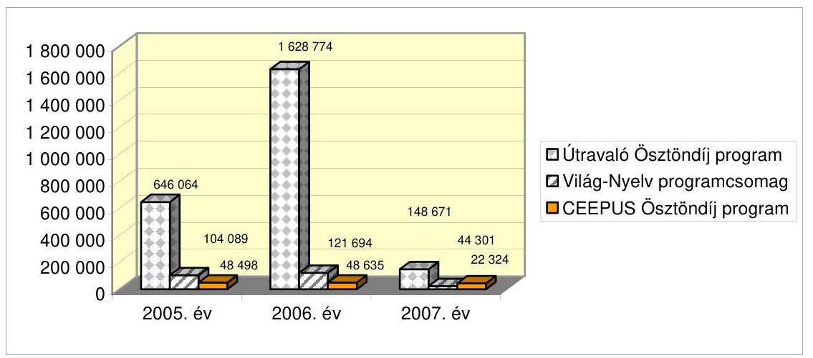
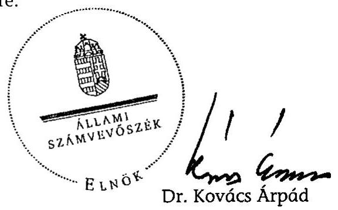
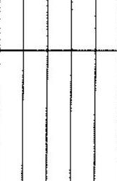
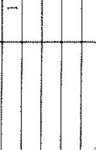
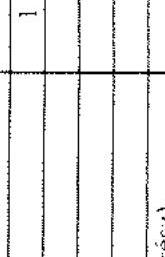
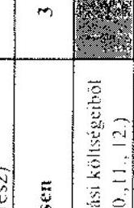

# ÁLLAMI   SZÁMVEVŐSZÉK 

## JELENTÉS

a Tempus Közalapítványnak juttatott központi költségvetési támogatás felhasználásának ellenőrzéséről

---

# 3. Önkormányzati és Területi Ellenőrzési Igazgatóság 

3.1. Szabályszerűségi Ellenőrzési Főcsoport

Iktatószám: V-1027-39/2007.
Témaszám: 891
Vizsgálat-azonosító szám: V-0379

## Az ellenőrzést felügyelte:

Dr. Lóránt Zoltán
főigazgató
Az ellenőrzés végrehajtásáért felelős:
Dr. Elek János
általános főigazgató-helyettes
Az ellenőrzést vezette:
Solymár Ágnes
osztályvezető főtanácsos
Az összefoglaló jelentést készítette:
Sas Imréné
számvevő tanácsadó
Az ellenőrzést végezték:
Brebán Andrea Dr. Méri Sándorné Pásztor Katalin számvevő számvevő számvevő tanácsos
Sas Imréné
számvevő tanácsadó

A témához kapcsolódó eddig készített számvevőszéki jelentések:
címe
sorszáma
Jelentés a közalapítványoknak és az alapítványoknak az 1998- 2001. évek között juttatott nem normatív központi költségvetési támogatás felhasználásának ellenőrzéséről 0228

Tájékoztató az európai uniós támogatások 2006. évi felhasználásának ellenőrzéséről

---

# TARTALOMJEGYZÉK 

BEVEZETÉS ..... 9
I. ÖSSZEGZŐ MEGÁLLAPÍTÁSOK, KÖVETKEZTETÉSEK, JAVASLATOK ..... 13
II. RÉSZLETES MEGÁLLAPÍTÁSOK ..... 20

1. A gazdálkodási és ellenőrzési rendszer ..... 20
1.1. Alapító okirat, képviseleti jog, kuratóriumi határozatok ..... 20
1.2. Az SZMSZ és a gazdálkodási szabályzatok ..... 21
1.3. A TKA ellenőrzési rendszere ..... 23
2. A közalapítvány gazdálkodása ..... 24
2.1. Az éves költségvetések ..... 24
2.2. A beszámolási kötelezettség teljesítése ..... 25
2.3. A kapott támogatások ..... 27
2.4. A TKA által megvalósított programok ráfordításai ..... 28
2.5. A működési költségek ..... 30
2.6. A vállalkozási tevékenység ..... 31
3. A költségvetési támogatások felhasználására kötött szerződések ..... 32
3.1. A szerződések szabályossága ..... 32
3.2. A támogatások felhasználásával való elszámolások ..... 32
3.3. A közbeszerzésekről szóló törvény előírásainak betartása ..... 33
4. Az állami támogatásokból megvalósított programok ..... 34
4.1. A TKA által nyújtott támogatások összhangja az alapító okirat céljaival ..... 34
4.2. A pályáztatás és a támogatási szerződések szabályossága ..... 35
4.3. A támogatottak elszámoltatása és ellenőrzése ..... 37
4.4. A támogatási célok teljesülése ..... 38

## MELLÉKLETEK

1. számú A Tempus Közalapítvány eszközei és forrásai
2. számú A Tempus Közalapítvány bevételei és ráfordításai
3. számú A Tempus Közalapítványhoz 2005-2007-ben befolyt támogatások
4. számú A Tempus Közalapítvány által megvalósított programok ráfordításai
5. számú Felnőttképzési tevékenység a 2005-2007. években
6. számú A Világ-Nyelv pályázati programcsomag 2005-2007. évi pályázatai

---

# 2

---

# RÖVIDÍTÉSEK JEGYZÉKE 

| Áht. | az államháztartásról szóló 1992. évi XXXVIII. törvény |
| :--: | :--: |
| ÁSZ | Állami Számvevőszék |
| ÁSZ tv. | Az Állami Számvevőszékről szóló 1989. évi XXXVIII. törvény |
| CEEPUS program | Közép-európai felsőoktatási csereprogram |
| EKKÖ | Európai Közigazgatási Képzési Ösztöndíj |
| EU | Európai Unió |
| FAT | Felnőttképzési Akkreditációs Testület |
| FB | Felügyelő Bizottság |
| GKM | Gazdasági és Közlekedési Minisztérium |
| IHM | Informatikai és Hírközlési Minisztérium |
| Khtv. | a közhasznú szervezetekről szóló 1997. évi CLVI. törvény |
| Kbt. | a közbeszerzésekről szóló 2003. évi CXXIX. törvény |
| LLP | Egész Életen át tartó tanulás programja |
| MeH | Miniszterelnöki Hivatal |
| MPA | Munkaerő Piaci Alap |
| NSZFI | Nemzeti Szakképzési és Felnőttképzési Intézet |
| OKM | Oktatási és Kulturális Minisztérium |
| OM | Oktatási Minisztérium |
| OMAI | Oktatási Minisztérium Alapkezelő Igazgatósága |
| OMFB | Országos Műszaki Fejlesztési Bizottság |
| OSZT | Országos Szakképzési Tanács |
| Ptk. | a Polgári Törvénykönyvről szóló 1959. évi IV. törvény |
| SZMSZ | Szervezeti és működési szabályzat |
| TKA | Tempus Közalapítvány |
| számviteli rendelet | a számviteli törvény szerinti egyes egyéb szervezetek beszámolókészítési és könyvvezetési kötelezettségének sajátosságairól szóló 224/2000. (XII. 19.) Korm. rendelet |
| számviteli törvény | a számvitelről szóló 2000. évi C. törvény |
| „Útravaló" rendelet | az útravaló ösztöndíjprogramról szóló 152/2005. (VIII. 2.) Korm. rendelet |
| „Útravaló" program | Útravaló Ösztöndíjprogram |
| Világ-Nyelv program | Világ-Nyelv pályázati programcsomag |

---

.

---

# ÉRTELMEZŐ SZÓTÁR 

| Alapítvány bevételei | A vállalkozási tevékenység bevétele, az alapítványi célú tevékenység bevételei (minden olyan bevétel, amely nem a vállalkozási tevékenységhez kapcsolódó befizetés, ideértve a céltámogatást is) [115/1992. (VII. 23.) Korm. rendelet 3. § (1) bekezdésének a)-b) pontja]. |
| :--: | :--: |
| Alapítvány költségei (kiadásai) | A vállalkozási tevékenység közvetlen költségei, az alapítványi célú tevékenység közvetlen költségei, az alapítvány kezelő szervének költségei (kiadásai) és az egyéb közvetett költségek (kiadások) [115/1992. (VII. 23.) Korm. rendelet 3. § (2) bekezdésének a); (b); c) pontja]. |
| CEEPUS program | Célja a közép-európai régió felsőoktatási intézményei közötti együttműködés támogatása hallgatói és oktatói csere megvalósításával. |
| Cél szerinti tevékenység | Minden olyan tevékenység, amely az alapító okiratban megjelölt célkitűzés elérését közvetlenül szolgálja [Khtv. 26. § b) pontja]. |
| Induló vagyon | A közalapítvány javára a célja megvalósításához az alapító okiratban meghatározott vagyon [Ptk. 74/A. § (1) bekezdése, 74/B. § (1) bekezdés c) pontja]. A közalapítvány rendelkezésére legalább olyan mértékű vagyont kell bocsátani, amely a működése megkezdéséhez feltétlenül szükséges [Ptk. 74/B. § (4) bekezdése]. A közalapítványi vagyon pontos megjelölése nélkül a közalapítvány nem jöhet létre [BH2001. 303]. |
| Kiemelkedően közhasznú közalapítvány | A kiemelkedően közhasznú közalapítványnak a közhasznú közalapítványokra előírt követelmények teljesítésén túl közhasznú tevékenysége során olyan közfeladatot kell ellátnia, amelyről törvény vagy törvény felhatalmazása alapján más jogszabály rendelkezése szerint, valamely állami szervnek vagy a helyi önkormányzatnak kell gondoskodnia, az alapító okirata szerinti tevékenységének és gazdálkodásának legfontosabb adatait a helyi vagy országos sajtó útján is nyilvánosságra hozza, továbbá a közhasznú tevékenységet maga látja el [Khtv. 5. § és a BH2001. 451]. |
| Közalapítvány | A közalapítvány olyan alapítvány, amelyet az Országgyűlés, a Kormány, valamint a helyi önkormányzat vagy kisebbségi önkormányzat képviselőtestülete közfeladat ellátásának folyamatos biztosítása céljából hoz létre [Ptk. 2006. VIII. 23-ig hatályos 74/G. § (1) bekezdése]. |
| Közfeladat | Közfeladat az, az állami vagy helyi önkormányzati, kisebbségi önkormányzati feladat, amelynek ellátásáról jogszabály alapján - az államnak vagy az önkormányzatnak kell gondoskodnia [Ptk. 2006. VIII. 23ig hatályos 74/G. § (2) bekezdése]. |
| Közhasznú | A közhasznú nyilvántartásba vett közalapítványoknál |

---

egyszerűsített éves beszámoló

Közhasznú tevékenység

Közhasznúsági jelentés

Támogatás
Törzsvagyon

Útravaló
Ösztöndíjprogram

Vezető tisztségviselő a közalapítványoknál
mérlegből, közhasznú eredmény-kimutatásból és tájékoztató adatokból áll [224/2000. (XII. 19.) Korm. rendelet 6. § (8) bekezdése, illetve 4. és 6. számú melléklete].
A társadalom és az egyén közös érdekeinek kielégítésére irányuló, a közhasznú közalapítvány alapító okiratában szereplő cél szerinti tevékenység a törvényben meghatározott körben [Khtv. 26. § c) pontja].
Tartalmazza a számviteli beszámolót; a költségvetési támogatás felhasználását; a vagyon felhasználásával kapcsolatos kimutatást; a cél szerinti juttatások kimutatását; a központi költségvetési szervtől, az elkülönített állami pénzalaptól, a helyi önkormányzattól, a települési önkormányzatok társulásától és mindezek szerveitől kapott támogatás mértékét; a közhasznú szervezet vezető tisztségviselőinek nyújtott juttatások értékét, illetve összegét; a közhasznú tevékenységről szóló rövid tartalmi beszámolót [Khtv. 19. § (3) bekezdése].
Pénzbeli és nem pénzbeli juttatás [Khtv. 26. § j) pontja].
Az alapítói vagyon dologi-eszköz elemeit törzsvagyonként indokolt elkülöníteni, ami elidegenítési és terhelési tilalmat jelent. A törzsvagyonná nyilvánítás az alapító kizárólagos jogköre, erre az alapító okiratban a kuratórium részére nem adható felhatalmazás [1052/1997. (V. 21.) Korm. határozat 5. a) pontja].
Célja, hogy elősegítse a hátrányos helyzetben lévő tanulók esélyegyenlőségét, valamint támogassa a természettudományos érdeklődésű tanulók tehetséggondozását, az alábbi programokból áll:
Út a középiskolába ösztöndíj, amelynek célja a résztvevő tanulók felkészítése érettségit adó középiskolában való továbbtanulásra;
Út az érettségihez ösztöndíj, amelynek célja a részt vevő tanulók támogatása a középiskola sikeres befejezése céljából;
Út a szakmához ösztöndíj, amelynek célja a részt vevő tanulók esetében megteremteni a kapcsolatot a munkaerőpiac igényei és a beiskolázás között, különös tekintettel a hiányszakmákra;
Út a tudományhoz program, amelynek célja a természettudományok, a műszaki tudományok és a matematika területe iránt kiemelt érdeklődést mutató tanulók tehetséggondozása. [152/2005. (VIII. 2.) Korm. rendelet 1. § (1) és (2) bekezdései]
A közalapítvány kuratóriumának és felügyelő bizottságának elnöke és tagja, a közalapítvánnyal munkaviszonyban vagy munkavégzésre irányuló egyéb jogviszonyban álló, az alapító okirat szerint egyszemélyi felelős vezető feladatot ellátó személy [Khtv. 26. § m)

---

Világ - Nyelv Program
pontja].
Célja, hogy elősegítse hazánk felzárkózását az idegen nyelveket beszélő európai országok sorába, vagyis minden, az iskolapadot elhagyó fiatal rendelkezzen legalább egy idegen nyelv középszintű és egy másik nyelv alapszintű ismeretével, legyen képes nyelvtudását fenntartani, továbbfejleszteni és más idegen nyelveken is megtanulni.

---

.

---

# JELENTÉS 

## a Tempus Közalapítványnak juttatott költségvetési támogatás felhasználásának ellenőrzéséről

## BEVEZETÉS

A Tempus Közalapítványt (TKA) a Magyar Köztársaság Kormánya az Európai Unió Phare Tempus programjának megszervezésére és a felsőoktatásról szóló 1993. évi LXXX. törvény 7. és 9. §-aiban meghatározott közfeladatok ellátása érdekében, az 1007/1996. (II. 7.) Korm. határozattal hozta létre. A közalapítványok megalakítására és működésére a Ptk. 74/G. §-a az alapítványok szabályozásán belül külön feltételeket és követelményeket határozott meg az alapítók körét, az ellátandó közfeladatokat, valamint a működés és gazdálkodás feltételeit illetően. A szabályozást 2006. augusztus 24-től az államháztartásról szóló 1992. évi XXXVIII. törvény és egyes kapcsolódó törvények módosításáról szóló 2006. évi LXV. törvény 1. § (1) bekezdése hatályon kívül helyezte. A jogszabály a még működő közalapítványok gazdálkodására vonatkozó szabályokat a korábbihoz képest annyiban módosította, hogy azok alapítványt nem hozhatnak létre, ahhoz nem csatlakozhatnak, azzal nem egyesíthetők, pályázat kiírása nélkül évente a vagyonuk 5%-ának mértékéig, de legfeljebb egymillió forint összértékben támogatást nyújthatnak az alapító okiratban foglalt célokra, továbbá tevékenységük újabb közfeladat ellátásával nem bővíthető.

A TKA alapító okiratában meghatározott céljai:

- a magyar szakképzés, oktatás és kutatás-fejlesztés európai felzárkózásának és kapcsolódásának, az európai integráció gondolatának és a Magyar Köztársaság EU tagságból adódó kötelezettségeinek, feladatainak végrehajtása, az ezzel járó kihívásoknak való megfelelés előmozdítása és támogatása;
- a magyar oktatás keretein belül a nők és a férfiak esélyegyenlőségének előmozdítása, a fogyatékkal élő személyek igényeinek kielégítése, a rasszizmus és az idegengyűlölet leküzdésének elősegítése;
- a Ceepus program végrehajtásának és a Ceepus Magyarországi Iroda működtetésének biztosítása;
- az Európai Unió Leonardo da Vinci programja végrehajtásának és a Leonardo Nemzeti Iroda működtetésének biztosítása;
- az Európai Unió Socrates programja végrehajtásának és a Socrates Nemzeti Iroda működtetésének biztosítása;

---

- az Európai Unió Tempus programja végrehajtásának és a Tempus Nemzeti Kapcsolattartó Pont működtetésének biztosítása;
- az Európai Unió Erasmus Mundus programja végrehajtásának és az Erasmus Mundus Nemzeti Kapcsolattartó Pont működtetésének biztosítása;
- az Európai Unió EUROPASS Training programja végrehajtásának és a EUROPASS Training Nemzeti Kapcsolattartó Pont működtetésének biztosítása;
- az Európai Parlament és a Tanács 2241/2004/EK határozatának előírásai szerint ellátja az Europass Mobilitási Igazolvánnyal (Europass-mobilitás) kapcsolatos feladatokat;
- az Alumni for Europe hálózat működtetése;
- az EKKÖ (Európai Közigazgatási Képzési Ösztöndíj) Európa Klub működtetésében való közreműködés;
- az Európai Unió „Európai Nyelvi Díj" programjának lebonyolításában való közreműködés;
- az Európa-tanulmányi Központok hálózatának működtetésével járó koordinációs feladatok ellátása;
- a Világ - Nyelv pályázati programcsomag végrehajtásának biztosítása;
- a szellemi erőforrások fejlesztése érdekében olyan nemzetközi programok szervezése, amelyekre az oktatási és kulturális miniszter a közalapítványt felkéri;
- az Útravaló
 Nemzeti Ösztöndíjprogram működtetésében való részvétel;
- a Strukturális Alapok és a Kohéziós Alap tervezését és felhasználását segítő képzések szervezése és lebonyolítása.

A közalapítványt a Fővárosi Bíróság 1998. január 1-jétől kezdődően kiemelten közhasznú szervezetté nyilvánította.

Az alapítót megillető jogkört az oktatási és kulturális miniszter gyakorolja a TKA felett.

A közalapítvány tevékenységi köre sokrétű, számos nemzeti és nemzetközi oktatási, képzési pályázati programot kezel, végzi az Európai Bizottság „Egész életen át tartó tanulás" programjának, a közép-európai CEEPUS programnak a magyarországi koordinációját, pályáztatja az Oktatási és Kulturális Minisztérium idegennyelv-tudás fejlesztését célzó Világ-Nyelv pályázati programját. Akkreditált képzőintézményként különböző képzéseket nyújt az EU támogatások felhasználása témakörében.

A közalapítvány alapító okiratban meghatározott induló vagyona 20 millió Ft, ezen belül a törzsvagyon az induló vagyon 5%-a. A közalapítvány közhasznú feladatai ellátásához a 2005-2007. években 4,1 milliárd Ft költségvetési támogatást kapott, európai uniós forrásból 11,1 milliárd Ft támogatáshoz

---

jutott. Ugyanezen időszakban a hazai finanszírozású programokra 3,2 milliárd Ft-ot, uniós programokra 11,6 milliárd Ft-ot fordított. A hazai és nemzetközi programok közös jellemzője az oktatás innovációs képességének, modernizációjának és nemzetközi kompatibilitásának előmozdítása az európai együttműködés eszközeivel.

Az Országgyűlés és a Kormány által alapított közalapítványoknál az Állami Számvevőszék (ÁSZ) nemcsak az állami támogatás felhasználását, hanem a gazdálkodás törvényességét és célszerűségét is jogosult ellenőrizni. Az Állami Számvevőszék az államháztartásról szóló 1992. évi XXXVIII. törvény és egyes kapcsolódó törvények módosításáról szóló 2006. évi LXV. törvény 1. § (2) bekezdésének e) pontja alapján ellenőrzi a közalapítványok gazdálkodásának törvényességét és célszerűségét. Az Állami Számvevőszékről szóló 1989. évi XXXVIII. törvény (ÁSZ tv.) 2. § (5) bekezdése alapján ellenőrzi a közalapítványoknál az állami költségvetésből nyújtott támogatás felhasználását.

Az ellenőrzés célja annak értékelése volt, hogy a közalapítvány a költségvetésből kapott támogatást szabályosan, és az alapító okiratában meghatározott céljai megvalósítása érdekében használta-e fel. Ennek keretében értékeltük, hogy

- a közalapítvány alapító okirata és belső szabályzatai megteremtették-e a költségvetési támogatás felhasználásának törvényes kereteit;
- a közalapítvány gazdálkodása megfelelt-e a vonatkozó jogszabályok, az alapító okirat és a belső szabályzatok előírásainak;
- a közalapítvány a kapott állami támogatást szabályosan, rendeltetésszerűen használta-e fel az alapító okiratban meghatározott céljainak megvalósítása és feladatainak ellátása érdekében.

Az ÁSZ a közalapítványt a 2002. évben - a közalapítványoknak és az alapítványoknak az 1998-2001. évek között juttatott nem normatív központi költségvetési támogatás felhasználásának ellenőrzése keretében - írásos beszámoltatással ellenőrizte, a 2007. évben az európai uniós támogatások 2006. évi felhasználásának ellenőrzéséről készített tájékoztató keretében értékelte a közalapítvány uniós finanszírozású programjait.

A közalapítvány gazdálkodását helyszíni ellenőrzés keretében első alkalommal ellenőriztük. Tételesen ellenőriztük a kapott költségvetési támogatások felhasználására kötött szerződések, és a támogatások felhasználásával való elszámolások szabályosságát. Reprezentatív minta alapján ellenőriztük a kuratóriumi határozatok meghozatalának szabályosságát, a közbeszerzésekről szóló törvény előírásainak betartását, továbbá a költségvetési támogatás terhére, az Útravaló Ösztöndíjprogram, a CEEPUS program és a Világ-Nyelv pályázati programcsomagok keretében nyújtott támogatásokat. Tanúsítvány alapján értékeltük a hazai és külföldi forrásból származó támogatások alakulását, összetételét, valamint a közalapítvány által megvalósított programok ráfordításainak évenkénti alakulását, összetételét.

---

Az ellenőrzés a 2005. január 1-jétől 2007. december 31-éig tartó időszakra terjedt ki.

---

# I. ÖSSZEGZŐ MEGÁLLAPÍTÁSOK, KÖVETKEZTETÉSEK, JAVASLATOK 

A Tempus Közalapítvány az alapító okiratában megfogalmazott célok megvalósítása érdekében az ellenőrzött években az oktatás, a képzés és a kutatás-fejlesztés területén számos programot valósított meg hazai és európai uniós támogatásokból. A közalapítvány a 2005-2007. években közhasznú feladatai ellátásához összesen 15,2 milliárd Ft támogatást kapott, ennek háromnegyed része közvetlenül az Európai Bizottságtól, egynegyed része hazai forrásból származott.

A TKA a kapott állami támogatást az alapító okiratban meghatározott célok elérése érdekében végzett feladatokra használta fel. Az állami támogatás (4,1 milliárd Ft) 87,8%-át az OKM biztosította, 11,7%-a származott a Munkaerőpiaci Alap képzési alaprészéből, 0,5%-a egyéb állami forrásból. A közalapítvány az államháztartás alrendszereitől a törvényi előírásoknak megfelelően, kizárólag írásbeli szerződés alapján részesült támogatásban. A támogatási szerződések meghatározták a támogatás folyósításának és felhasználásának előírásait, a támogatások felhasználásával való elszámolás módját és határidejét, a támogató ellenőrzési jogosultságát, a szerződésszegés jogkövetkezményeit. A TKA a támogatások felhasználásáról pénzügyi elszámolások és szakmai beszámolók benyújtásával, a támogatási szerződésekben előírt határidőben elszámolt, a maradványt a támogatók számlájára visszautalta. A TKA által kezelt közösségi programok megvalósítása az Európai Unió támogatásával és az OKM ehhez történő hozzájárulásával történt. A közalapítvány az OKM felé a hazai és uniós forrásból kapott támogatás felhasználásának együttes összegével számolt el. A támogatók minden esetben elfogadták a támogatások felhasználásáról szóló elszámolásokat. Ugyanakkor a TKA és az OKM közötti szerződések és annak mellékletét képező költségtervek csak az OKM hozzájárulása összegének költségfelhasználását szabályozták. A programokhoz kapcsolódó, a költségvetésben nem tervezett bevételekkel és ráfordításokkal (pl. árfolyam különbözet) a TKA teljes körűen elszámolt az OKM felé, azonban e tételek elszámolási kötelezettségét a támogatási szerződések csak a 2007. évtől tartalmazták.

A 2005-2007. években megvalósított szakmai programok összes kimutatott ráfordítása 14,8 milliárd Ft volt, ebből pályázatokra 13,0 milliárd, programok megvalósítására 1,8 milliárd Ft-ot számoltak el. A kuratórium a pályázati támogatások 78,5%-át az uniós¹ programokra ítélte meg a szakképzés, a közoktatás, a felsőoktatás fejlesztésére, valamint az innovációt, a hallgatói és

[^0]
[^0]: ¹ Az Állami Számvevőszék az európai uniós támogatások 2006. évi felhasználásának ellenőrzéséről készített 0727. számú tájékoztatóban értékelte a TKA uniós finanszírozású programjait.

---

oktatói mobilitást elősegítő együttműködési és egyéb közösségi programokra. A kuratórium a pályázati támogatások 21,5%-át a hazai finanszírozású programokra fordította, ennek 86,2%-át az „Útravaló" Ösztöndíjprogramra, 8,8%-át a Világ-Nyelv pályázati programra, 5%-át a CEEPUS Ösztöndíjprogramra. E programok keretében nyújtott támogatások céljai összhangban voltak az alapító okiratban megjelölt közalapítványi célokkal. A TKA mindhárom programot a jogszabályi és az alapító okiratbeli előírásoknak megfelelően, pályázati úton hirdette meg. A pályázati felhívások megfeleltek a pályázattal kapcsolatos jogszabályi előírásoknak. A pályáztatást a szerződésekben, a kuratóriumi határozatokban, valamint a vonatkozó kézikönyvben foglalt szabályoknak megfelelően végezték. A kuratórium a pályázatok bírálati eredményei alapján az odaítélt támogatásokról - egy támogatás kivételével - határozattal döntött. Az „Útravaló" programnál a számítógépes adatbázis ellenőrzési hiányosságai miatt egy támogatás nem szerepelt a kuratórium által elfogadott listában, amelynek kifizetése a kuratórium által elfogadott pályázati kiírásban meghatározott összegben történt. Az alapító okirat nem rögzítette a kuratórium döntéseinek a támogatottakkal való közlési, illetve nyilvánosságra hozatali módját, azt a kuratórium - eltérően a jogszabályi előírástól - belső szabályzatban sem határozta meg. ² A gyakorlatban a pályázókat levélben értesítették pályázatuk eredményéről.

A nyertes pályázókkal megkötött támogatási szerződéseket a képviseleti joggal rendelkezők írták alá. A támogatások folyósítása a szerződésben foglaltaknak megfelelően történt. A támogatottak a támogatási szerződésnek megfelelően készítették el a támogatás felhasználásáról elszámolásaikat. A közalapítvány a támogatási szerződésben foglaltaknak megfelelően ellenőrizte az elszámolásokat. A TKA az Útravaló programnál a támogatottak 10,8%-át szólította fel - helyesen - az elszámolásuk kiegészítésére, amelynek a felszólítottak határidőre eleget tettek. A Világ-Nyelv programnál a támogatottak 32%-ánál, a CEEPUS programnál a támogatott intézmények 50%-ánál vonta vissza a támogatás egy részét, mert azt nem, vagy nem a szerződésben foglaltaknak megfelelően használták fel a támogatottak. A visszafizetési kötelezettségnek valamennyi támogatott határidőben eleget tett.

A helyszíni szakmai és pénzügyi ellenőrzések az „Útravaló" esélyegyenlőségi programoknál a támogatott tanulók 3,9%-át, a Világ-Nyelv programnál a támogatottak 11,6%-át, a CEEPUS programnál 5%-át fedte le. A helyszíni ellenőrzéseket a TKA mindhárom programnál egységes szempontrendszer alapján végezte, az ellenőrzések tapasztalatait pályáztatási tevékenységében hasznosította. A támogatások szabályos és rendeltetésszerű felhasználásának ellenőrzése csak a közalapítvány által helyszínen ellenőrzött szervezeteknél valósult meg teljes körűen, mivel a támogatási szerződések nem írták elő az igényjogosultságot igazoló dokumentumok, a megkötött ösztöndíjszerződések, a kifizetéseket igazoló pénzügyi alapbizonylatok másolatainak megküldését a támogatások felhasználásával való pénzügyi elszámolás keretében.

[^0]
[^0]: ² A kuratóriumi elnök észrevétele szerint, a kuratórium 2008. február 22-i ülésén módosított SZMSZ már rendelkezik a döntések támogatottakkal való közlési, illetve nyilvánosságra hozatali módjáról.

---

A szakmai beszámolók szerint a támogatottak - a TKA által visszavont támogatások kivételével - a szerződésben vállalt feladatokat megvalósították, a támogatásokat rendeltetésszerűen használták fel. Az „Útravaló" program a 2005-2006. években széles körű érdeklődést váltott ki az oktatási intézmények körében, 2005-ben mintegy húszezer, 2006-ban további hétezer tanuló kapott támogatást. Az esélyegyenlőségi alprogramok célja a hátrányos helyzetű, szegénységben élő társadalmi réteg gyermekei esélyegyenlőségének elősegítése több éves folyamat eredményeképpen valósítható meg. Az Út a tudományhoz program kutatási projektjeiben évenként átlagosan háromszáz tanuló vett részt, a program a tanulók aktív közreműködésére épített.

A Világ-Nyelv program legfontosabb eredményeként a „Forrás" programban a közoktatás hátrányos helyzetű résztvevőinek felzárkóztatását segítő, önálló tanulást lehetővé tevő idegen nyelvi könyvtári tanulóközpontok jöttek létre, és a támogatással ezek fennmaradását sikerült biztosítani. Az „Élesztő" programban a Magyarországon kevéssé oktatott idegen nyelvek legalább egy tanulócsoportban történő bevezetése valósult meg a támogatott közoktatási intézményekben. Az alapfokú nyelvtanfolyam program keretében a támogatott intézményekben legalább három főállásban dolgozó nyelvvizsgával nem rendelkező pedagógus angol, német vagy francia vizsgával záruló nyelvtanfolyamon vett részt. A külföldi tanárjelöltek program keretében a támogatott intézmények szak- és nyelvtanárai külföldi asszisztenshez jutottak, amely hozzájárult a tanórai és a tartalomalapú nyelvoktatás alkalmazásához és fejlesztéséhez.

Magyarország aktívan vett részt a CEEPUS programban mind a koordinátori, mind a partneri szerepét tekintve. A program keretében a magyar felsőoktatási intézmények részére megítélt 2130 ösztöndíjhónapból a támogatottak 1936 hónapot teljesítettek. A kiutazó hallgatók száma minden évben meghaladta a beutazókét, ez azt jelentette, hogy a külföldi országokban fel nem használt, felszabaduló hónapokra a magyar oktatók és hallgatók többlet hónapokat tudtak igénybe venni. Két magyar felsőoktatási intézmény (2006-ban a Miskolci Egyetem Matematikai Intézet Analízis Tanszéke, 2007-ben az Eötvös Loránd Tudományegyetem Informatikai Kar, Programozó nyelvek és Fordítóprogramok Tanszéke) elnyerte a legjobb CEEPUS hálózat díjat.

Az alapító okirat a TKA céljai között előírta az esélyegyenlőség elősegítését. A kuratórium 2005-ben a hátrányos helyzetű célcsoportok esélyeinek növelése érdekében esélyegyenlőségi stratégiát fogadott el, meghatározta a hátrányos helyzetű célcsoportokat, az esélyegyenlőségi célkitűzéseket és megvalósításuk módját. A célkitűzéseket az általa kezelt pályázati programok (pályázati felkészítés, tanácsadás révén, a bírálat során adható többletpont, többlettámogatás nyújtásával), a képzések (hátrányos helyzetű célcsoportok és civil szervezetek képviselőinek bevonásával), és az információs tevékenység (honlapon vakbarát oldal működtetése, vakok és gyengén látók számára elektronikus hírlevél) keretein belül valósította meg.

A TKA az ellenőrzött években a vonatkozó törvényi és az alapító okirat előírásával összhangban, vállalkozási tevékenységet csak közhasznú céljainak megvalósítása érdekében folytatott. Az uniós támogatások elnyeréséhez és szabályos felhasználásához kapcsolódó felnőttképzési

---

tevékenységet végzett. A képzések forrásait térítéses, és
 vállalkozási szerződés alapján végzett képzéssel, illetve pályázati úton teremtette meg. A szakmai programokon belül elkülönített támogatásból, a program sikeres és szabályos végrehajtása érdekében, térítésmentes képzéseket is folytatott. A TKA a FAT által tanúsított képző intézmény, képzési programjait a FAT és a Magyar Közigazgatási Intézet által akkreditáltatja. A 2005-2007. években tizenöt képzési programon mintegy 2500 fő vett részt, a résztvevők 90%-a végezte el sikeresen azokat. A képzési programok tananyagának, módszertanának fejlesztése céljából a TKA a képzéseket rendszeresen (hallgatói, oktatói, megrendelői vélemény alapján) értékelte.

A közalapítvány működési költségei az alapító okirat előírása alapján nem haladhatták meg az éves tervezett költségvetés kiadásainak 10%-át. Az előírt mérték betartása azonban nem volt megállapítható, mivel a működési költségek között elszámolható költségek körét sem az alapító okirat³, sem az alapítványok gazdálkodására vonatkozó jogszabályi előírások nem határozzák meg. A jogi szabályozás a működési költség fogalmát nem használja, az alapítványi költségeknek alaptevékenység és vállalkozási tevékenység közvetlen és közvetett költségek szerinti nyilvántartását írja elő. A költségvetési támogatások felhasználására megkötött szerződésekben előírt elszámolási kötelezettség nem igazodott sem az alapító okirat, sem az alapítványok könyvvezetési szabályaihoz, mivel pályázatokra és programirodák működtetésére, programok megvalósítására fordítható támogatást határozott meg. A 2005-2007. években a programirodák működtetésére, programok megvalósítására elszámolt költségek az összes ráfordítás 11,9%-át tették ki, ebből az ún. közvetett költségek aránya 6,1% volt. A közvetett költségek⁴ az általános igazgatási, a kommunikációs tevékenység, és a pénzügyi monitoring költségcsoportokat tartalmazták. A kuratórium a beszerzéseinél érvényesítette a közbeszerzési törvény előírásait.

A közalapítvány működésének legfontosabb szabályait a Kormány által jóváhagyott alapító okirat tartalmazta. Az alapító az alapító okiratban rögzített célokat, a Ptk. vonatkozó előírása ellenére, 2007-ben csökkentette. Ennek oka az volt, hogy az alapító okirat a közalapítvány átfogó céljai mellett konkrét feladatokat és programokat is célként nevesített, így a programok nevének, szerkezetének változása, új programokban való közalapítványi részvétel, vagy annak megszüntetése az alapító okiratban rögzített célok módosítását igényelte. A TKA által végzett konkrét feladatok és programok a közalapítványi célok megvalósítása érdekében végzett feladatok, ezért téves azoknak célként való nevesítése.

[^0]
[^0]:    ${ }^{3}$ Az ÁSZ közalapítványoknál végzett ellenőrzési tapasztalatai szerint az alapító okiratok nem határozzák meg a működési költségek körét, csak annak mértékét és vetítési alapját.
    ${ }^{4}$ A közalapítványok a működési költségek között általában a kuratórium, a munkaszervezet, és a közalapítvány egyéb közvetett (az ellátott valamennyi tevékenység érdekében felmerült) költségeit számolják el.

---

Az alapító a Ptk. előírásának megfelelően meghatározta az alapító okiratban a kuratóriumi ülések határozatképességéhez szükséges, alapítótól független kuratóriumi tagok számát, azonban nem jelölte meg, hogy kik számítanak alapítótól függetlennek, azt a kuratórium döntötte el. Az alapító az alapító okiratban a törvényi előírásoknak megfelelően szabályozta a képviseleti jog gyakorlásának módját, terjedelmét, a helyettesítés rendjét, valamint a bankszámlák feletti rendelkezés szabályait. A kuratórium elnöke és a közalapítvány igazgatója által kiadott aláírási rend azonban nem felelt meg az alapító okiratban előírtaknak, mivel a képviseleti joggal felruházott igazgatón kívül a közalapítvány más alkalmazottait (csoportvezetőket, koordinátorokat, asszisztenseket) is felhatalmazta aláírásra a támogatások felhasználásáról szóló elszámolások elfogadására vonatkozóan⁵. A bankszámlák felett az alapító okiratban képviseletre feljogosított személyek rendelkeztek.

A kuratórium az éves költségvetések keretében meghatározta a szakmai programok megvalósításához felhasználható pénzeszközök mértékét. Az éves költségvetések teljes körűen tartalmazták az uniós és hazai finanszírozású szakmai programok bevételeit és költségeit, azokat a felügyelő bizottság véleményezte, a kuratórium határozatképes ülésen, az előírt szavazati aránnyal elfogadta. Az ellenőrzött években hozott kuratóriumi határozatok 83%-a megfelelt, 17%-a nem felelt meg az alapító okirat előírásának, mivel azokat a kurátorok nem az alapító okiratban előírt határozatképes üléseken, hanem levélszavazás útján hozták meg⁶. A kuratórium az alapító okiratban az alapító felé előírt beszámolási kötelezettségét a közalapítvány működéséről szóló részletes szakmai beszámolók, és az éves közhasznúsági jelentések megküldésével teljesítette.

# A TKA belső szabályzatai - az SZMSZ-re vonatkozóan feltárt hiányosságok kivételével - megteremtették a költségvetési támogatás felhasználásának törvényes kereteit. A kuratórium által elfogadott SZMSZ a levélszavazás engedélyezése miatt nem volt összhangban az alapító okirattal, továbbá belső ellentmondást tartalmazott, mivel a tanácsadó bizottságok száma és megnevezése tekintetében nem egyezett meg a szabályzat mellékleteivel⁷. 

[^0]
[^0]:    ⁵ A Fővárosi Főügyészség a törvénysértő gyakorlat megszüntetése érdekében 2008. január 8-án a kuratórium elnökénél felszólalással élt, amelyet a kuratórium elfogadott, és az OKM államtitkára észrevétele szerint az alapító okirat módosításánál figyelembe vették a szükséges módosítást.
    ⁶ A Fővárosi Főügyészség a törvénysértő gyakorlat megszüntetése érdekében 2008. január 8-án a kuratórium elnökénél felszólalással élt, amelyet a kuratórium elfogadott, és a kuratóriumi elnök észrevétele szerint a kuratórium 2008. február 22-i ülésén törölte az SZMSZ-ből a levélszavazás lehetőségét tartalmazó pontot.
    ⁷ A Fővárosi Főügyészség a hiányosság miatt 2008. január 8-án a kuratórium elnökénél jelzéssel élt, amelyet a kuratórium elnöke elfogadott, és a kuratóriumi elnök észrevétele szerint a kuratórium 2008. február 22-i ülésén módosított SZMSZ a belső ellentmondást megszüntette.

---

A kuratórium a törvényi előírásoktól⁸ eltérően az alapító által a kuratórium gazdálkodása törvényességének ellenőrzésére kinevezett FB működését a közalapítvány szervezeti egységeként az SZMSZ-ben szabályozta. A közalapítvány rendelkezett az ellenőrzött időszakban a számviteli törvényben kötelezően előírt, a kuratórium által elfogadott gazdálkodási szabályzatokkal, amelyeket a törvényi változásokkal összhangban aktualizált.

# A TKA gazdálkodása a vonatkozó jogszabályoknak és belső 

szabályozási előírásoknak megfelelt. A TKA az ellenőrzött évekre elkészítette a kettős könyvvitel szerinti könyvvezetéssel alátámasztott egyszerűsített éves beszámolóit és az éves közhasznúsági jelentéseket, azokat a TKA felügyelő bizottsága véleményezte, független könyvvizsgáló hitelesítette. A kuratórium az éves beszámolókat a 2005. évre vonatkozóan az alapító okirat előírásának megfelelően, határozatképes ülésen, az előírt szavazati aránnyal, a 2006. évre vonatkozóan levélszavazással fogadta el. A beszámolókat főkönyvi kivonattal, a mérleget a számviteli törvény és a leltározási szabályzat előírásának megfelelő leltárral támasztották alá. A könyvvezetésben a központi költségvetésből, az uniós és egyéb forrásból származó támogatásokat és egyéb bevételeket jogcímek szerint, a bevételek felhasználását szakmai egységek, szakmai programok szerint, elkülönítetten számolták el. A közalapítvány az éves közhasznúsági jelentéseket a törvényi előírásnak megfelelően honlapján közzétette. A közalapítvány gazdálkodásának legfontosabb adatait a Hivatalos Értesítőben a 2005. évre vonatkozóan - a számviteli politika előírásától eltérően - nem tette közzé, a 2006. évre vonatkozóan már teljesítette e kötelezettségét.

A közalapítvány belső ellenőrzési rendszere a folyamatba épített előzetes és utólagos vezetői ellenőrzéssel, valamint függetlenített belső ellenőr foglalkoztatásával valósult meg. A TKA belső szabályzataiban a pénzkezelésnek, a szállítói számlák ellenőrzésének, utalványozásának zárt rendszerét kialakították, azt a gyakorlatban betartották. A közalapítvány kialakította a kuratórium által nyújtott támogatások felhasználásának monitoring rendszerét, amelynek keretében szakmai és pénzügyi ellenőrzést végzett egyrészt a közalapítványhoz benyújtott pénzügyi és szakmai beszámolók alapján, másrészt a támogatott szervezeteknél helyszínen ellenőrizte a beszámolók valódiságát, a támogatások hasznosulását. A függetlenített belső ellenőr megbízása a TKA szervezeti egységei működésének folyamatvizsgálatát tartalmazta, feladata volt a megszerzett ISO minősítés minőségirányítási követelményeinek való megfelelés vizsgálata, belső auditálása. A belső ellenőr munkaterveit, féléves, éves tevékenységéről szóló

[^0]
[^0]:    ⁸ A Ptk. 2006. augusztus 23-ig hatályos 74/G. § (5) bekezdése szerint közalapítvány létesítése esetén az alapító okiratban a kezelő szervet is meg kell jelölni, vagy ilyen célra külön szervezet - ideértve a kezelő szerv ellenőrzésére jogosult szervet is - létrehozásáról kell gondoskodni. A Khtv. 11. § (1) bekezdése értelmében 11. § (1) A felügyelő szerv ellenőrzi a közhasznú szervezet működését és gazdálkodását. Ennek során a vezető tisztségviselőktől jelentést, a szervezet munkavállalóitól pedig tájékoztatást vagy felvilágosítást kérhet, továbbá a közhasznú szervezet könyveibe és irataiba betekinthet, azokat megvizsgálhatja.

---

jelentéseit a kuratórium elfogadta, javaslatait a munkaszervezet hasznosította. A kuratórium gazdálkodásának törvényességét és szabályosságát az alapító által kinevezett felügyelő bizottság ellenőrizte. Az FB tagjai rendszeresen részt vettek a kuratóriumi üléseken, véleményezték a költségvetést, az éves beszámolókat és közhasznúsági jelentéseket, a belső ellenőri munkatervet és annak teljesítését. Az FB határozattal elfogadott javaslatait a kuratórium és az igazgató figyelembe vette. Az FB tevékenységéről - az alapító okiratban foglaltaknak megfelelően - évente beszámolt az alapítónak. A közhasznú egyszerűsített éves beszámolók megbízhatóságát, jogszabályi előírásoknak való megfelelését az alapító okirat előírásának megfelelően független könyvvizsgáló ellenőrizte és hitelesítette.

A helyszíni ellenőrzés megállapításainak hasznosítása mellett javasoljuk:

# az oktatási és kulturális miniszternek 

1. Tegyen javaslatot a Kormánynak az alapító okirat módosítására, ennek során
a) vizsgálja felül az alapító okiratban megfogalmazott célokat, és a TKA által kezelt programokat a közalapítványi cél elérése érdekében végzett feladatként határozza meg;
b) kezdeményezze a kurátorok alapítótól való függetlenségének egyértelmű meghatározását.
2. Intézkedjék arra vonatkozóan, hogy a költségvetési támogatások felhasználására megkötött szerződésekben - az érintett támogatási programok sajátosságainak figyelembe vétele mellett - kerüljön meghatározásra a programok lebonyolítására biztosított támogatáson belül a közalapítvány alapító okirat szerinti működési költségei terhére elszámolható támogatási összeg.

## a közalapítvány kuratóriumának

1. Vizsgálja felül a levélszavazás útján hozott kuratóriumi határozatokat, és intézkedjék azok kuratóriumi ülésen történő megerősítéséről.
2. Törölje a szervezeti és működési szabályzatból a felügyelő bizottság működésére vonatkozó előírásokat.
3. Vizsgálja felül a támogatott szervezetek elszámoltatatásának gyakorlatát, ennek során az adott támogatásokkal való elszámolások bizonylati ellenőrzése érdekében írja elő a támogatások felhasználását igazoló, pénzügyi dokumentumok elszámoló által hitelesített másolatainak beküldését.

---

# II. RÉSZLETES MEGÁLLAPÍTÁSOK 

## 1. A GAZDÁLKODÁSI ÉS ELLENŐRZÉSI RENDSZER

### 1.1. Alapító okirat, képviseleti jog, kuratóriumi határozatok

Az alapító az alapító okiratot az ellenőrzött években - a Fővárosi Bíróság végzései szerint - négyszer módosította.

Az alapító a TKA alapító okiratában a közalapítvány átfogó céljai mellett olyan konkrét, a hazai oktatás és képzés nemzetközi felzárkóztatását segítő célokat fogalmazott meg, amelyekhez hazai és nemzetközi - elsősorban Európai Uniós - programok kapcsolódtak. Ennek következtében a hazai és nemzetközi programok nevének, szerkezetének változása, új programokban való részvétel, illetve programokban való részvétel megszüntetése az alapító okiratban rögzített célok számának módosítását (növelését, csökkentését) igényli. Az alapító okiratban meghatározott közalapítványi célok szűkítése a Ptk. 74/B. § (5) bekezdés előírása szerint nem megengedett, mivel az alapító az alapító okiratot az alapítvány céljának sérelme nélkül módosíthatja.

A Ptk. 74/B. § (5) bekezdése alapján az alapító az alapító okiratot indokolt esetben - az alapítvány nevének, céljának és vagyonának sérelme nélkül módosíthatja.

A TKA alapító okiratban rögzített céljai 2005-ben növekedtek, a célok megvalósításához az eszközöket az alapító biztosította, így az eredeti célok nem sérültek, a módosítás megfelelt a Ptk.
 74/B. § (5) bekezdésében előírtaknak.

Az alapító a 2005. évben három új céllal bővítette a TKA tevékenységét egy Európai Uniós és két magyar program végrehajtásában, működtetésében való részvétellel.

Az alapító az alapító okiratban rögzített célokat 2007-ben csökkentette, a módosítás nem felelt meg a Ptk. 74/B. § (5) bekezdésében előírtaknak.

Az alapító a célokat szűkítette, amikor a 2005. évben indított Útravaló Ösztöndíjprogram működtetésében való részvételre, valamint az EKKÖ Európa Klub működtetésében való közreműködésre vonatkozó célokat az alapító okiratból törölte.

A TKA alapító okirata a Ptk. 74/C. § (4) bekezdésében foglaltaknak megfelelően megnevezte a közalapítvány képviseletére jogosult személyeket, a képviseleti jog gyakorlásának módját, terjedelmét, a helyettesítés rendjét. Lehetőséget adott a kuratóriumnak arra, hogy a közalapítvány igazgatója részére a kuratórium által meghatározott keretek között képviseleti jogot biztosítson. A kuratórium a közalapítvány igazgatójának képviseleti jogát az SZMSZ-ben szabályozta, illetve eseti döntésekben hatalmazta fel aláírásra.

---

A TKA az aláírások rendjét a kuratórium elnöke és az igazgató által aláírt belső szabályzatban is meghatározta. Az aláírás rendjének szabályozása nem felelt meg sem az alapító okirat, sem az SZMSZ képviseletre vonatkozó előírásainak, mivel a közalapítvány alkalmazottait (csoportvezetőket, koordinátorokat, asszisztenseket) is felhatalmazta aláírásra a kuratórium által nyújtott támogatások felhasználásáról szóló elszámolások elfogadására vonatkozóan. Az alapító okiratban az alapító az alkalmazottak közül csak az igazgatónak adott képviseleti jogot.

A Ptk. 29. § (3) bekezdése értelmében a jogi személy nevében aláírásra a jogi személy képviselője jogosult. A Ptk. 30. § (2) bekezdése értelmében a szervezeti egység vezetője az egység rendeltetésszerű működése által meghatározott körben a jogi személy képviselőjeként jár el. Jogszabály, alapító határozat vagy okirat ettől eltérően rendelkezhet.

A TKA bankszámlái feletti rendelkezés alapító okiratbeli szabályozása megfelelt a Ptk. 74/C. § (4) bekezdésében foglaltaknak, banki aláírási joggal az alapító okiratban megnevezett személyeket hatalmazták fel. A TKA bankszámlái felett az ellenőrzött időszakban az aláírásra feljogosított személyek rendelkeztek.

Az ellenőrzött három évben a kuratórium határozatainak 83%-át hozta meg az alapító okirat előírásának megfelelően határozatképes kuratóriumi ülésen. A határozatok 17%-át a kuratórium által elfogadott SZMSZ-ben és a kuratórium ügyrendjében szabályozott levélszavazás útján hozta meg. A levélszavazás nem felelt meg az alapító okirat 8.1.6. pont előírásának, mivel az alapító az ülések határozatképességét a kuratóriumi tagok jelenlétéhez kötötte.

Az ellenőrzött időszakban hatályos alapító okiratok a Khtv. 7. § (2) bekezdésével összhangban meghatározták a kuratóriumi ülések határozatképességének feltételeit. A Ptk. 74/C. § (3) bekezdésével összhangban - amely szerint az alapító az alapítvány vagyonának felhasználására meghatározó befolyást nem gyakorolhat - az alapító meghatározta az ülések határozatképességéhez szükséges, alapítótól független kuratóriumi tagok számát. A kuratórium személyi összetételénél azonban nem jelölte meg, hogy kik számítanak alapítótól függetlennek, azt a kuratórium a kuratóriumi tag munkahelye alapján határozta meg. A kuratóriumi ülések jegyzőkönyvei minden esetben rögzítették a jelenlévő, az alapítótól független kuratóriumi tagok számát.

A 2005. évben a kuratóriumi ülések határozatképességéhez legalább tíz (ebből hat az alapítótól független tag), a 2006-2007. években legalább hat kuratóriumi tag (ebből négy az alapítótól független tag) jelenlétére volt szükség, a határozatok meghozatalához - az SZMSZ kivételével - egyszerű szótöbbség kellett.

# 1.2. Az SZMSZ és a gazdálkodási szabályzatok 

A kuratórium az alapító okirat előírásainak megfelelően, minősített szótöbbséggel fogadta el az SZMSZ módosításait. Az ellenőrzött időszak alatt mindenkor hatályos SZMSZ a levélszavazás útján történő határozathozatal szabályozása kivételével összhangban volt az alapító okirattal.

---

A kuratórium az ellenőrzött időszakban négy alkalommal, a KU-05-05-20/2., KU-06-03-03/3., KU-06-10-20/3., KU-06-12-08/5. számú határozataival módosította az SZMSZ-t.

A kuratórium által elfogadott SZMSZ III. pontja a törvényi előírástól eltérően a TKA szervezeti egységeként nevesítette a közalapítvány ellenőrző szervét (FB-t), és az alapító okirat 8.3.3. pontjától eltérően mellékletként tartalmazta annak ügyrendjét.

Az FB és a kuratórium között nincs hierarchikus kapcsolat, a Ptk. 74/G. § (5) bekezdése szerint mindkét testületet az alapító hozta létre, a kuratóriumot a vagyon kezelésére, az FB-t a kuratórium ellenőrzésére. Az alapító által létrehozott FB a Khtv. 11. § (1) bekezdése alapján a közalapítvány működését és gazdálkodását ellenőrzi. Az FB számára feladatokat csak az alapító határozhat meg.

Az alapító okirat 8.3.3. pontja értelmében az FB ügyrendjét maga állapítja meg.
Az SZMSZ-en belül ellentmondás volt a szabályzatban nevesített tanácsadó bizottságok, valamint a mellékletként felsorolt tanácsadó bizottsági ügyrendek száma és megnevezése tekintetében.

Az SZMSZ Socrates, CEEPUS tanácsadó bizottságot nem nevesített, de az ügyrendjüket mellékletként tartalmazta. Az SZMSZ Szakképzési Kiértékelő és Tanácsadó Bizottságot, míg a melléklet Leonardo da Vinci Tanácsadó Bizottsági ügyrendet nevesített.

A 2005-2007. években a könyvvezetés és az éves beszámolók elkészítésének belső szabályozási rendszere a számviteli törvény által kötelezően előírt szabályozáson alapult. A számviteli törvény 14. § (5) bekezdésével összhangban a TKA rendelkezett számviteli politikával, ennek keretében az eszközök és a források értékelési-, az eszközök és a források leltárkészítési és leltározási-, és pénzkezelési szabályzatokkal, továbbá a 161. § (1) bekezdésnek megfelelően számlarenddel. A kuratórium a szabályzatok módosításait az ellenőrzött években jóváhagyta.

A számviteli politika a közalapítvány sajátosságaihoz igazodóan, és a számviteli törvény előírásainak megfelelően rögzítette a könyvvezetés módját, az évközi és év végi zárlatok feladatait, az éves beszámoló elkészítésének rendjét, időpontját, az értékelési eljárásokat, a beszámoló elkészítésekor és a könyvvezetés során érvényesítendő számviteli alapelveket, az értékelésnél mit kell lényegesnek, nem lényegesnek, továbbá jelentős összegnek, nem jelentős összegnek tekinteni, az eszközök minősítési szempontjait.

Az eszközök és források leltárkészítési és leltározási szabályzata igazodott a közalapítvány működésének és gazdálkodásának sajátosságaihoz, meghatározta a leltározás módját, bizonylati rendjét, a leltározás és a könyvelési adatok egyeztetésének módját, a leltárfelvétel dokumentumainak megőrzési módját.

Az eszközök és források értékelési szabályzata meghatározta az eszközök bekerülési értékét, annak nyilvántartását, a nyilvántartási érték változásának lehetséges eseteit, azok tartalmát, az év végi értékelés módját, módszereit, az

---

állományból történő kivezetés feltételeinek előírásait, a követelések értékelésének szabályait.

A pénzkezelési szabályzatban szabályozták a házipénztár létesítésének, kialakításának feltételeit, a pénztárossal szemben támasztott követelményeket, felelősségét, feladatait, az ellenőrzés szabályait, valamint a készpénz felvétel, a pénzmozgások (bankszámla, készpénz) bizonylati rendjét, az értékpapírok megőrzésének, kezelésének, nyilvántartásának módját, a bankszámlák és a pénztár kapcsolatrendszerét, az utalványozókat, a bank- és értékpapírszámla feletti rendelkezésre jogosultakat.

A számlarend a főkönyvi számlákhoz kapcsolódó analitikáról a számviteli törvény 161. § (2) bekezdés c) pontja szerint rendelkezett, meghatározta az analitikus nyilvántartások tartalmát, formáját és a főkönyvi egyeztetés módját. Tartalmazta minden főkönyvi számla számát, megnevezését, a számlakapcsolatok ellenőrzési pontjait, meghatározta az évközi és év végi zárlattal kapcsolatos feladatokat, a bizonylati rendet. A TKA elkészítette a számlarendhez kapcsolódó számlatükröt.

# 1.3. A TKA ellenőrzési rendszere 

Az alapító az alapító okiratban a TKA gazdálkodásának, működésének ellenőrzésére felügyelő bizottságot nevezett ki. Az FB rendszeresen részt vett a kuratóriumi üléseken, véleményezte a közalapítvány éves közhasznúsági jelentéseit, benne az éves egyszerűsített beszámolókat, azokat a kuratóriumnak elfogadásra javasolta. Véleményezte a költségvetést, a belső ellenőri munkatervet, a munkaterv teljesítését, azokat határozattal fogadta el. Az FB határozattal elfogadott javaslatait a kuratórium és az igazgató figyelembe vette. Az FB tevékenységéről - az alapító okiratban foglaltaknak megfelelően évente beszámolt az alapítónak.

A TKA éves beszámolóit független könyvvizsgáló ellenőrizte, és azokat hitelesítő záradékkal látta el. A könyvvizsgáló szerződés szerinti feladata a számviteli nyilvántartások, valamint az éves beszámoló jogszabályi megfelelésének ellenőrzése volt.

A közalapítvány belső ellenőrzési rendszere a folyamatba épített előzetes és utólagos vezetői ellenőrzéssel, valamint függetlenített belső ellenőr foglalkoztatásával valósult meg. A belső szabályzatokban a pénzkezelésnek, a szállítói számlák ellenőrzésének, utalványozásának zárt rendszerét kialakították. A házipénztár kezelése, a pénztári nyilvántartások vezetése, valamint az utalványozás gyakorlata megfelelt a szabályzatok előírásainak.

Az SZMSZ rögzítette az igazgató munkafolyamatba épített ellenőrzési feladatait, az egység- és programvezetők részére a kuratórium felé beszámolási kötelezettséget írt elő.

A számviteli törvény szerinti és egyéb belső szabályzatok egyaránt tartalmazták a pénzügyi és könyvvezetési feladatokra vonatkozó ellenőrzési, egyeztetési kötelezettséget. A számlarend tartalmazta a főkönyvi könyvelés és az analitikus nyilvántartás egyeztetési módját, a pénzkezelési szabályzat rögzítette pénztáros

---

és a pénztárellenőr munkafolyamatba épített ellenőrzési feladatait, a pénztári kifizetések utalványozásának szabályait.

A kiküldetési szabályzat rögzítette az elszámolások teljesítés igazolásának és a kifizetés engedélyezésének rendjét.

A közalapítvány kialakította a kuratórium által nyújtott támogatások felhasználásának monitoring rendszerét. Ennek keretében szakmai és pénzügyi ellenőrzést végzett egyrészt a közalapítványhoz benyújtott pénzügyi és szakmai beszámolók, dokumentumok alapján, másrészt a helyszíni ellenőrzési jegyzőkönyvek tanúsága szerint a támogatott szervezeteknél ellenőrizte a benyújtott dokumentumok valódiságát, a támogatások hasznosulását.

A függetlenített belső ellenőr megbízása a TKA szervezeti egységei működésének folyamatvizsgálatára szólt. A belső ellenőr további feladata volt a TKA által megszerzett ISO minősítés minőségirányítási követelményeinek való megfelelés vizsgálata, belső auditálása. A belső ellenőr munkaterveit, féléves, éves tevékenységéről szóló jelentéseit a kuratórium elfogadta, javaslatait a munkaszervezet hasznosította.

A költségvetési támogatások felhasználását az OKM ellenőrizte. Az ellenőrzés az ellenőrzési jegyzőkönyvek tanúsága szerint a támogatások szerződés szerinti felhasználását és elszámolását állapította meg.

A Fővárosi Főügyészség a 2006-2007. évekre vonatkozóan ellenőrizte a közalapítvány működésének törvényességét, amely ellenőrzésünk befejezésekor zárult le.

# 2. A KÖZALAPÍTVÁNY GAZDÁLKODÁSA 

### 2.1. Az éves költségvetések

A TKA irodája az időszakban hatályos alapító okiratok előírásának megfelelően, az ellenőrzött 2005-2007. évek mindegyikére elkészítette az éves költségvetéseket, az FB minden évben véleményezte és elfogadásra javasolta, a kuratórium megtárgyalta és elfogadta azokat.

A kuratórium az éves költségvetéseket és azok módosításait minden évben az alapító okirat előírásának megfelelően, határozatképes ülésen, az előírt szavazati aránnyal fogadta el. Az ellenőrzött időszakban a kuratórium által elfogadott éves költségvetések módosítását a 2005. évben az Útravaló Ösztöndíjprogram működtetésének a közalapítványhoz való be-, a 2007. évben a közalapítványtól való elkerülése indokolta.

A hatályos alapító okirat 8.1.6. pontja a kuratóriumi ülések határozatképességét 2005-ben tíz, 2006-2007-ben egyaránt hat-hat kuratóriumi tag jelenlétéhez, a határozatok elfogadását a kurátorok egyszerű szótöbbségéhez kötötte. A kuratórium az éves költségvetést 2005-ben tizenegy, a módosítást tíz, 2006-ban nyolc, 2007-ben tíz, a módosítást hét igen szavazattal fogadta el.

A kuratórium a 2005-2007. évi költségvetések elkészítését megelőzően mind az uniós, mind pedig a hazai támogatások vonatkozásában a támogató

---

szervezetekkel egyeztetett, biztosítva ezzel a közalapítvány költségvetéseinek megalapozottságát és a célszerinti feladatellátása finanszírozásának biztonságát. A TKA által kezelt szakmai programok megvalósításához szükséges támogatások egyik részét közvetlenül az Európai Bizottság, másik részét hazai költségvetési támogatások biztosították.

Az éves költségvetések teljes körűen tartalmazták az uniós és hazai finanszírozású szakmai programok bevételeit és költségeit. A bevételeket az alapító okiratban meghatározott cél szerinti feladatok és vállalkozási tevékenység bontásban, a cél szerinti feladatokon belül pályázati (továbbutalási) és programmegvalósítási célú támogatások részletezésben tartalmazták, továbbá rögzítették a bevételek forrásait is. A költségeket szakmai programok és vállalkozási tevékenység, azon belül költség-nemek szerint részletezték.

Az ellenőrzött 2005-2007. években tervezett 15742898
 ezer Ft összes közhasznú bevételnek a pályázati célú támogatások átlagosan 88,5%-át, a programmegvalósítási célú támogatások 11,5%-át tették ki. A közhasznú bevételek 71%-át uniós, 29%-át hazai forrásból tervezték, a pályázati támogatásoknál 76-24%, programmegvalósítási támogatásoknál 34-66% volt az uniós és hazai támogatások aránya. (Az Útravaló Nemzeti Ösztöndíjprogram nélkül - a programot átmenetileg kezelte a TKA - az uniós és hazai források aránya 86-14% volt.)

# 2.2. A beszámolási kötelezettség teljesítése 

A TKA a számviteli törvény szerinti egyes egyéb szervezetek beszámolókészítési és könyvvezetési kötelezettségének sajátosságairól szóló 224/2000. (XII. 19.) Korm. rendelet (számviteli rendelet) 8. § (4) bekezdése előírásának megfelelően, könyvvezetését a kettős könyvvitel rendszerében végezte.

A könyvvezetésben a központi költségvetésből, az uniós és egyéb forrásból származó támogatásokat és egyéb bevételeket jogcímek szerint, a bevételek felhasználását szakmai egységek és szakmai programok szerint, elkülönítetten számolta el.

A közalapítványi iroda a 2005. és 2006. évekre a számviteli politikában meghatározott módon és határidőben, a számviteli rendelet közalapítványok számára választható 4. és 6. számú melléklete szerinti szerkezetben elkészítette az egyszerűsített éves beszámolókat. A közhasznúsági jelentéseket Khtv. 19. § (3) bekezdése szerinti szerkezetben és tartalommal állította össze.

A 2005-2006. évi közhasznúsági jelentések tartalmazták az éves (számviteli) beszámolót, a költségvetési támogatás felhasználását, a vagyon felhasználásával kapcsolatos kimutatást, a cél szerinti juttatások kimutatását, a központi költségvetéstől kapott támogatás mértékét, a közhasznú szervezet vezető tisztségviselőinek nyújtott juttatások összegét, valamint a közhasznú tevékenységről szóló rövid tartalmi beszámolót.

A 2007. évre vonatkozó egyszerűsített éves beszámoló és közhasznúsági jelentés elkészítése az ellenőrzés befejezésekor folyamatban volt. (A számviteli politika alapján az éves beszámoló elkészítésének határideje a tárgyévet követő év március 31., a közhasznúsági jelentésé a tárgyévet követő év május 31.)

---

A TKA eszközeit és forrásait az 1. számú, bevételeit és ráfordításait a 2. számú mellékletek tartalmazzák.

A közalapítvány számviteli rendjét és éves beszámolóit a számviteli rendelet 19. § (1) bekezdésének megfelelően független könyvvizsgáló ellenőrizte. A könyvvizsgáló a 2005. és 2006. évek egyszerűsített éves beszámolóit hitelesítő záradékkal látta el, azokról a kuratórium részére jelentést készített.

Az FB az alapító okiratban foglaltaknak megfelelően a 2005. és 2006. évre vonatkozó egyszerűsített éves beszámolót és közhasznúsági jelentést véleményezte, a kuratóriumnak elfogadásra javasolta.

A kuratórium a 2005. évi egyszerűsített éves beszámolót és közhasznúsági jelentést az alapító okirat előírásának megfelelően, határozatképes ülésen, az előírt szavazati aránnyal, határidőben elfogadta. A 2006. évről készített közhasznú jelentést és egyszerűsített éves beszámolót bár megfelelő számú igen szavazattal, de levélszavazás útján fogadta el, amely nem felelt meg az alapító okirat azon előírásának, amely az ülések határozatképességét a kuratóriumi tagok jelenlétéhez kötötte.

Az egyszerűsített éves beszámolósorok adatai a 2005-2006. években megegyeztek az év végi főkönyvi kivonatok, továbbá a kapcsolódó főkönyvi és részletező számlák összesített adataival. A TKA a számviteli törvény 69. § előírásával összhangban, az éves mérlegekben kimutatott eszközök és források értékadatait a leltározási szabályzat szerinti leltárakkal alátámasztotta.

Az immateriális javak és tárgyi eszközök értékét a főkönyvi könyveléssel és az analitikus nyilvántartással egyeztetett leltár (mennyiségben és értékben), az értékpapír állományt a Magyar Államkincstár kivonata, a pénzeszközök értékét készpénzállománynál mennyiségi leltár, bankszámláknál az év végi bankkivonatok, a követelések és kötelezettségek, valamint az aktív és passzív időbeli elhatárolások értékét év végi tételes kivonatok támasztották alá.

A Ptk. 74/A. § (1) bekezdése értelmében az alapítvány javára a célja megvalósításához szükséges vagyont kell rendelni, a 74/B. § (1) bekezdése szerint az alapító okiratban meg kell jelölni az alapítvány céljára rendelt vagyont. A 2005-2006. évi beszámolók mérlegében kimutatott induló tőke értéke eltért az alapító okiratban meghatározott induló vagyon értékétől. Az eltérés a saját tőke összegét és a mérleg főösszegét nem befolyásolta, azok a valós értéket mutatták. Az eltérés oka az volt, hogy az alapító okiratban rögzített húsz millió forinton kívül tartalmazta a Professzorok Házától 1996. és 1998. években térítés nélkül kapott, a hatályos számviteli szabályok szerint induló tőke növekedése címen kimutatott 3702 ezer Ft eszközértéket.

Az alapító a közalapítványt a Tempus Magyarországi Iroda működtetésével 1996-ban, a Socrates Nemzeti Iroda működtetésével 1998-ban bízta meg, korábban az irodákat a Professzorok Háza működtette és a feladatátadás kapcsán a programirodák által használt eszközöket térítés nélkül, átadta a közalapítványnak.

Az eszközök átadásakor hatályban lévő a számviteli törvény szerinti egyéb szervezetek éves beszámoló készítésének és könyvvezetési kötelezettségének sajátosságáról szóló 8/1996. (I. 24.) Korm. rendelet 14. § (3) bekezdése előírta,

---

hogy az alapítvány az ajándékként, hagyatékként, alapítványi célra történő felajánlásként - térítés nélkül - kapott eszközöket - az átadó által közölt értéken - az induló tőkével szemben állományba veszi.

Az éves beszámolók eredmény-kimutatásaiban az igénybevett és egyéb szolgáltatások értékét (2005-ben 275307 ezer Ft, 2006-ban 291555 ezer Ft) a számviteli törvény 78. § (1) bekezdésétől eltérően az anyagjellegű ráfordítások helyett az egyéb ráfordítások között mutatták ki. A téves kimutatás a számviteli törvény 3. § (3) bekezdés 3. pontja és a számviteli politika előírása alapján nem minősült jelentős hibának, mivel csak az eredmény-kimutatás sorait érintette, az összes ráfordítást, valamint az eredmény és a saját tőke értékét nem módosította.

A számviteli törvény 78. § (1) bekezdése alapján az anyagjellegű ráfordítások között kell kimutatni a vásárolt és felhasznált anyagok értékét, az igénybe vett (vásárolt) szolgáltatások - le nem vonható általános forgalmi adót is magában foglaló - értékét, az egyéb szolgáltatások értékét, az eladott áruk beszerzési értékét és az eladott (közvetített) szolgáltatások értékét.

A kuratórium az alapító felé előírt beszámolási kötelezettségét a Ptk. 74/G. § (8) bekezdésében, 2006. augusztus 24-étől az államháztartásról szóló 1992. évi XXXVIII. törvény és egyes kapcsolódó törvények módosításáról szóló 2006. évi LXV. törvény 1. § (2) bekezdés e) pontjában és az alapító okiratban előírtaknak megfelelően teljesítette. Az OKM részére minden ellenőrzött év február végéig szakmai programok szerinti részletezésben beszámolt a közalapítvány előző évi működéséről, június 20-ig részletes szakmai beszámolót készített, és megküldte az éves közhasznúsági jelentéseket is.

A közalapítványi iroda a 2005-2006. évek közhasznúsági jelentéseit a Khtv. 19. § (5) bekezdésének megfelelően, a tárgyévet követő év június 30-áig a TKA honlapján közzétette.

A közalapítványi iroda a 2005. évre vonatkozóan a kuratórium által elfogadott számviteli politika előírásától eltérően, a közalapítvány gazdálkodásának legfontosabb adatait nem tette közzé a Magyar Közlöny mellékletét képező Hivatalos Értesítőben, a 2006. évre vonatkozóan e kötelezettséget teljesítette.

A közalapítványi iroda a helyszíni ellenőrzés ideje alatt kezdeményezte az 1996-2006. évek gazdálkodási adatainak a Hivatalos Értesítőben való megjelentetést.

Az alapító okirat előírta, hogy a közalapítvány tevékenységének és gazdálkodásának legfontosabb adatait országos sajtó útján is nyilvánosságra hozza, ennek a TKA a szakmai programok, beszámolók és rendezvények sajtóban való - évről-évre növekvő számú - megjelentetésével tett eleget.

# 2.3. A kapott támogatások 

A közalapítvány az ellenőrzött időszakban közhasznú feladatai ellátásához összesen 15227589 ezer Ft támogatást kapott, amelynek háromnegyede az Európai Bizottságtól, egynegyede hazai forrásból származott.

---

A 2005-2007. években a közalapítványhoz befolyt támogatásokat a 3. számú melléklet mutatja be évenként, programonként és támogatási forrásonként.

A TKA az Európai Bizottságtól három év alatt összesen 11143438 ezer Ft támogatáshoz jutott, ennek 96%-át továbbutalási célra (pályáztatásra), 4%-át a közösségi oktatási, szakképzési programok megvalósítására kapta. Az uniós támogatások mértéke évről-évre emelkedett, összege 2005-ről 2007-re több mint másfélszeresére nőtt, az évenkénti átlagos támogatási összeg 3714479 ezer Ft volt.

A TKA a hazai oktatási, szakképzési programok megvalósítására és az európai uniós közösségi programok működtetéséhez összesen 4084151 ezer Ft költségvetési támogatást kapott. A támogatások 87,8%-át az OKM-től, 11,7%-át a Munkaerőpiaci Alap képzési alaprészéből kapta, 0,5%-a egyéb állami forrásból (MeH, GKM, OMFB) származott.

A TKA a hazai támogatások 77%-át hazai finanszírozású programok, ezen belül az Útravaló Ösztöndíjprogram (66%), a Világ-Nyelv pályázati programcsomag (6,5%) és a CEEPUS Ösztöndíjprogram (4,5%) pályázati és programmegvalósítási feladataihoz kapta. A költségvetési támogatások 23%-át az uniós közösségi programok társfinanszírozásaként, a programok működtetéséhez kapta a közalapítvány.

# 2.4. A TKA által megvalósított programok ráfordításai 

Az ellenőrzött években az oktatás, a képzés és a kutatás-fejlesztés területén a TKA által megvalósított programok összhangban voltak az alapító okiratban meghatározott közalapítványi célokkal és feladatokkal, azokat teljes mértékben lefedték.

A TKA a 2005-2007. években megvalósított hazai és uniós programokra összesen 14835656 ezer Ft ráfordítást számolt el, ennek 88,1%-át a pályázati úton odaítélt, továbbutalt támogatásokra (13068655 ezer Ft), 11,9%-át (1767001 ezer Ft) a programok működtetésére.

A közalapítvány által megvalósított programok ráfordításait évenként és programonként a 4. számú melléklet mutatja be.

A kuratórium a pályázati támogatások 78,5%-át (10255605 ezer Ft) az uniós támogatásból finanszírozott programokra nyújtotta. Ezen belül a támogatások 37,9%-át a szakképzés minőségének fejlesztését, az innováció támogatását, a munkavállalók, illetve gyakornokok mobilitásának elősegítését szolgáló szakképzési együttműködési programra (Leonardo da Vinci) fordította. A Socrates uniós program keretében a felsőoktatás minőségének fejlesztésére, az intézmények közötti együttműködés, a hallgatói, az oktatói mobilitás növelésére irányuló program (Erasmus) pályázati támogatása 40,4%-ot képviselt. A közoktatás minőségének fejlesztésére (óvodától az érettségiig terjedő oktatási szakasz), a tagállamok közoktatási intézményei közötti együttműködésekre irányuló program (Comenius) támogatásának aránya 17,5%, a felnőttoktatás rendszerének fejlesztésére, az oktatásban résztvevők mobilitási programjára (Gruntvig) fordított támogatás 2,7%, az egyéb uniós programok támogatása 1,5% volt.

---

A kuratórium a pályázati támogatások 21,5%-át (2813050 ezer Ft) a költségvetési forrásból finanszírozott programokra fordította. Ezen belül a támogatások 86,2%-át a hátrányos helyzetű tanulók esélyegyenlőségének elősegítését és a természettudományos érdeklődésű tanulók tehetséggondozását biztosító Útravaló Ösztöndíjprogramra, 8,8%-át az átfogó idegennyelv-tudás fejlesztését szolgáló Világ Nyelv programcsomagra, 5,0%-át a közép és kelet európai felsőoktatási mobilitást támogató CEEPUS Ösztöndíjprogramra fordította.

A költségvetési forrásból megvalósított támogatások évenkénti alakulását az alábbi diagramm mutatja be:

Az ellenőrzött időszakban hatályos alapító okirat a közalapítványi célok között meghatározta a magyar oktatás keretein belül a nők és a férfiak esélyegyenlőségének előmozdítását, a fogyatékkal élő személyek igényeinek kielégítését, a rasszizmus és az idegengyűlölet leküzdésének elősegítését. A kuratórium 2005-ben a hátrányos helyzetű célcsoportok esélyeinek növelése érdekében a 2005-2008. évek célkitűzéseit tartalmazó esélyegyenlőségi stratégiát fogadott el, amelyben meghatározta a hátrányos helyzetű célcsoportokat, az esélyegyenlőségi célkitűzéseket és megvalósításuk módját.

Az OKM esélyegyenlőségi programokra a 2005-2007. években összesen 12750 ezer Ft támogatást biztosított. A TKA az esélyegyenlőségi stratégiában megfogalmazott célkitűzéseit az általa kezelt pályázati programok, a képzési és az információs tevékenysége keretein belül valósította meg.

A hátrányos helyzetűek segítése a pályáztatásban pályázati felkészítés és tanácsadás révén, többlettámogatás nyújtásával, továbbá a bírálat során adható többletponttal valósult meg.

A kuratórium 2005-ben döntött a hátrányos helyzetű pályázók segítésére hivatott pontszámítási módszer módosításairól, a hátrányos helyzetű célcsoportot a szociálisan hátrányos helyzetűek mellett kibővítette a
 fogyatékossággal élő, a tartósan beteg és a speciális nevelési igényű csoportok körével, meghatározta a hátrányos helyzet szempontjait és a bírálat során adható maximális többletpont szabályait.

---

Az éves szakmai beszámolók tanúsága szerint a Világ-Nyelv programban támogatott pályázatoknak 2005-ben 60, 2006-ban 48%-át hátrányos helyzetűek nyújtották be. A Comenius programban nyertes pályázóknak 2005-ben 49, 2006-ban 42%-a vont be hátrányos helyzetűeket. A Leonardo mobilitási projektek által támogatott pályázóknak 2005-ben 30, 2006-ban 25%-a hátrányos helyzetű célcsoportot képviselt.

A TKA által szervezett képzéseken részt vettek a hátrányos helyzetű célcsoportok és civil szervezetek képviselői.

A TKA a www.tka.hu honlapon vakbarát oldalt működtet, a vakok és gyengén látók számára elektronikus hírlevelet szerkesztett, az általa bérelt székhely kiválasztásának feltétele volt az akadálymentesítés megléte. A TKA, mint a megváltozott munkaképességű munkavállalókat foglalkoztató akkreditált szervezet, két fő megváltozott munkaképességű alkalmazottat foglalkoztatott.

# 2.5. A működési költségek 

Az ellenőrzött években hatályos alapító okiratok 4.1 pontja előírta, hogy a közalapítvány működési költsége nem haladhatja meg az éves tervezett költségvetés kiadásainak a 10%-os mértékét. Az alapító az alapító okiratban a működési költségek maximális mértékét - az OKM tájékoztatása alapján - az alapítványokkal összefüggő kormányzati feladatokról szóló 1052/1997. (V. 21.) Korm. határozat 4. pontja figyelembevételével határozta meg, a kormányhatározat azonban a működési (rezsi) költségek fogalmát, az e csoportban elszámolható költségek körét nem határozta meg.

A működési költségek között elszámolható költségek körét, sem az alapító okirat, sem az alapítványok gazdálkodására vonatkozó jogszabályi előírások nem határozták meg. A működési költség fogalmát az alapítványok könyvvezetésére, gazdálkodására, az alapítványi költségek és ráfordítások nyilvántartására vonatkozó törvényi és egyéb jogi szabályozás nem használja. Az alapítványi költségek csoportosítására, nyilvántartására vonatkozó jogi szabályozás az alap- és a vállalkozási tevékenység közvetlen, és a közvetett költségek szerinti nyilvántartást ír elő. A TKA könyvvezetésében a jogszabályi előírások szerinti nyilvántartási kötelezettségének eleget tett, az alap- és vállalkozási tevékenység közvetlen, továbbá a közalapítványi közvetett költségeket - munkaszámok segítségével - elkülönítetten tartotta nyilván.

A Khtv. 18. § (3) bekezdés szerint a közhasznú szervezet költségei: a közhasznú tevékenység érdekében felmerült közvetlen költségek (ráfordítások, kiadások); az egyéb cél szerinti tevékenység érdekében felmerült közvetlen költségek (ráfordítások, kiadások); a vállalkozási tevékenység érdekében felmerült közvetlen költségek (ráfordítások, kiadások); a közhasznú és egyéb vállalkozási tevékenység érdekében felmerült közvetett költségek (ráfordítások, kiadások), amelyeket bevételarányosan kell megosztani.

A számviteli törvény 178. §-a (1) bekezdésének c) pontjában kapott felhatalmazás alapján a Kormány a számviteli törvény szerinti egyes egyéb szervezetek beszámolókészítési és könyvvezetési kötelezettségének sajátosságait a 224/2000. (XII. 19.) Korm. rendeletben szabályozta, de az a működési költségek fogalmát és körét nem határozta meg. A 8. § (9) bekezdése szerint a könyvvezetés során az egyéb szervezetnek, közhasznú egyéb szervezetnek elkülönítetten kell

---

kimutatni a rá vonatkozó sajátos gazdálkodási jogszabályban meghatározott alaptevékenységgel, valamint a vonatkozó külön jogszabály szerint meghatározott vállalkozási tevékenységgel kapcsolatos ráfordításokat (költségeket), kiadásokat.

Az alapítványok gazdálkodási rendjéről szóló 115/1992. (VII. 23.) Korm. rendelet 3. § (2) bekezdése szerint az alapítvány költségei (kiadásai): a vállalkozási tevékenység közvetlen költségei; az alapítványi célú tevékenység közvetlen költségei; az alapítvány kezelő szervének költségei (kiadásai) és az egyéb közvetett költségek (kiadások).

A költségvetési támogatások felhasználására megkötött szerződések minden esetben azt tartalmazták, hogy a támogatott programokon belül a támogatást milyen mértékben lehetett pályázatokra (továbbutalási célra), illetve programirodák működtetésére és programok megvalósítására fordítani. A nem továbbutalási célú támogatás felhasználható volt a cél szerinti programokra, a programirodák működtetésére közvetlenül elszámolható költségekre, továbbá a közalapítvány közvetett költségeire is. A TKA a költségvetési támogatások felhasználásáról a szerződések előírásai alapján számolt el.

A 2005-2007. években a programirodák működtetésére, és a programok megvalósítására elszámolt költségek az összes ráfordítás (14 835 656 ezer Ft) 11,9%-át tették ki, ezen belül a közvetlen költségek aránya 5,8% (861 911 ezer Ft), a közvetett költségeké 6,1% (905 090 ezer Ft) volt. A közvetett költségek az általános igazgatási tevékenységre, a kommunikációs tevékenységre és a pénzügyi monitoring tevékenységre elszámolt költségeket tartalmazták. Az általános igazgatási költségek mintegy 40%-át az irodabérleti- és üzemeltetési díj, 30%-át a személyi jellegű ráfordítások képezték.

# 2.6. A vállalkozási tevékenység 

A TKA az ellenőrzött években a Khtv. 4. § (1) bekezdés b) és az alapító okirat 6.2. pontok előírásával összhangban, vállalkozási tevékenységet csak közhasznú céljainak megvalósítása érdekében, azokat nem veszélyeztetve folytatott. A vállalkozási tevékenység keretében az uniós támogatások elnyeréséhez és szabályos felhasználásához kapcsolódó felnőttképzési tevékenységet végzett. A képzések pénzügyi forrásait az éves képzési naptár szerint meghirdetett, térítési díjas képzéssel, vállalkozási szerződés alapján megrendelésre végzett képzéssel, illetve pályázati úton teremtette meg.

A TKA képzési tevékenysége keretében, a pályáztató programokon belül elkülönített támogatásból, egy-egy program célkitűzéséhez szorosan kapcsolódó, térítésmentes képzéseket is végzett az érintett célcsoportok részére a program sikeres és szabályos végrehajtása érdekében.

A közalapítvány a FAT által tanúsított képző intézmény, képzési programjait a FAT és a Magyar Közigazgatási Intézet által akkreditáltatta. A 2005-2007. években a közalapítvány tizenöt képzési programján összesen 2499 fő vett részt, a résztvevők mintegy 90%-a (2235 fő) végezte el sikeresen a képzéseket.

A 2005-2007. években folytatott felnőttképzési tevékenységet az 5. számú melléklet mutatja be.

---

A képzési programok tananyagának, módszertanának fejlesztése céljából a képzési egység a képzéseket rendszeresen értékelte.

A hallgatók és oktatók különböző szempontok szerinti értékeléseit (képzés színvonala, technikai háttere, információk hasznossága, szervezők munkája, segédanyagok minősége, program összeállítása, fejlesztési irány) a képzési egység képzési programonként összesítette. A 2006. évben az értékelési szempontok 1-5-ös skálán értékelt eredménye alapján a képzési programok valamennyi szempontjánál mért elégedettség 4-es és 5-ös érték között volt.

# 3. A KÖLTSÉGVETÉSI TÁMOGATÁSOK FELHASZNÁLÁSÁRA KÖTÖTT SZERZŐDÉSEK 

### 3.1. A szerződések szabályossága

A költségvetési támogatások felhasználására megkötött támogatási szerződések az ellenőrzött időszakban minden esetben a közalapítvány célszerinti tevékenységeinek megvalósítását szolgálták. A kuratórium az alapító okirat 8.1.7. pontja szerinti, a pénzügyi források elfogadásáról szóló előírásnak az éves költségvetések elfogadásával tett eleget.

Az OKM a Khtv. 14. § (2) bekezdésének megfelelően, írásbeli szerződések alapján (az ellenőrzött években tíz) nyújtott támogatást a közalapítványnak. A szerződések teljes körűen előírták a vonatkozó törvények betartását. Meghatározták a központi költségvetési támogatás folyósításának és felhasználásának előírásait, a felhasználásról szóló elszámolás határidejét és módját, a támogató ellenőrzési jogosultságát, a szerződésszegés jogkövetkezményeit.

Az MPA képzési alaprészéből az OMAI-val és az NSZFI-vel megkötött támogatási szerződések (az ellenőrzött időszakban öt) szakmailag és pénzügyileg alátámasztottak voltak, azokat az OSZT részére készített szakmai és pénzügyi előterjesztések alapozták meg. A szerződések teljes körűen előírták a vonatkozó törvények betartását. Tartalmazták a támogatott által megvalósítandó feladatokat és azok határidejét, előírták a támogató ellenőrzési jogosultságát, a támogatással való elszámolás részletes feltételeit és módját, a szerződés be nem tartása esetén alkalmazott szankciókat. A támogatások célja összhangban volt az alapító okirat céljaival.

A TKA a 2005-2007. években az OMFB-től két, a GKM-től egy, a MeH-től két alkalommal kapott támogatást írásbeli szerződések alapján, közhasznú céljaival összhangban lévő szakmai programok és rendezvények lebonyolításához.

### 3.2. A támogatások felhasználásával való elszámolások

A támogatási szerződések meghatározták a támogatások felhasználásának és elszámolásának szabályait.

A szerződések minden esetben előírták, hogy a kedvezményezett köteles a támogatási összeget elkülönítetten kezelni, a felhasználást dokumentáló

---

számlákat, bizonylatokat, egyéb okiratokat az ellenőrzésre jogosult szervek számára ellenőrizhető módon nyilvántartani, a beszámolót és elszámolást úgy elkészíteni, hogy az alkalmas legyen a támogatás megfelelő felhasználásának részletes ellenőrzésére.

A TKA az ellenőrzött években a költségvetés támogatások felhasználására megkötött húsz szerződésből tizenkét támogatási szerződés alapján kapott támogatás felhasználásával számolt el, az ellenőrzés befejezésekor nyolc szerződés elszámolása még nem volt esedékes. A közalapítvány valamennyi szerződés esetében a kapott költségvetési támogatást a támogatás rendeltetésének megfelelő célra fordította. A támogatások felhasználásáról szóló pénzügyi elszámolásokat és szakmai beszámolókat a szerződésekben meghatározott határidőben benyújtotta, a kimutatott maradványokat a támogatók számlájára visszautalta. A támogatások terhére felmerült közvetlen költségeket megfelelő jogcímekre - főkönyvi számlákra és munkaszámokra könyvelték, a közvetett költségeket (igazgatási-, kommunikációs- és monitoring költségeket) a kuratórium által az éves költségvetésben elfogadottak szerint, a bevétel arányában havonta felosztották az egyes programokra.

A TKA által kezelt közösségi programok megvalósítása az Európai Unió támogatásával és az OKM, ehhez történő hozzájárulásával történt. A közalapítvány az OKM felé a hazai és uniós forrásból kapott támogatás felhasználásának együttes összegével számolt el. Az OKM a támogatások felhasználásáról szóló elszámolásokat minden esetben elfogadta. Ugyanakkor a TKA és az OKM közötti szerződések és annak mellékletét képező költségtervek csak az OKM hozzájárulása összegének költségfelhasználását szabályozták. A programokhoz kapcsolódó, a költségvetésben nem tervezett bevételekkel és ráfordításokkal (pl. árfolyam különbözet) a TKA teljes körűen elszámolt az OKM felé, azonban e tételek elszámolási kötelezettségét a támogatási szerződések csak a 2007. évtől tartalmazták.

# 3.3. A közbeszerzésekről szóló törvény előírásainak betartása 

A közalapítvány a közbeszerzésekről szóló 2003. évi CXXIX. törvény (Kbt.) alanyi hatálya alá tartozásáról - a Kbt. 18. §-ának megfelelően - a Közbeszerzések Tanácsát értesítette.

A kuratórium a közbeszerzési szabályzatot 2004-ben fogadta el, és a jogszabályi változásokra figyelemmel a 2006. és 2007. években módosította. A közbeszerzési szabályzat a Kbt. 6. § (1) bekezdésében foglaltakkal összhangban szabályozta a közbeszerzési eljárás előkészítésének és lefolytatásának rendjét, a döntések felelősét, a testületek hatás- és felelősségi körét, a belső ellenőrzés feladat és hatáskörét.

A közalapítványnál a Kbt. hatálybalépését megelőzően - szolgáltatás megrendelése és árubeszerzés tárgyában - határozatlan időre kötött szerződések (hét) nem tartoztak a közbeszerzési kötelezettség alá. Nem tartoztak a Kbt. hatálya alá az oktatásra és képzésre, a szállodai és éttermi, a biztonsági szolgáltatásokra megkötött szolgáltatási szerződések, mivel a Kbt. 296. § g) pontja alapján azokra egyszerű eljárást sem kellett lefolytatni.

---

A TKA a közbeszerzési értékhatárt elérő, illetve meghaladó, a kuratórium által elfogadott tervezett beszerzéseit a Kbt. 5. § (1) bekezdésének megfelelően az éves közbeszerzési tervében szerepeltette, és azt közzétette.

A 2005. évben hat, a 2006-2007. években négy-négy esetben folytatott le közbeszerzési eljárást a közalapítvány.

A közbeszerzési gyakorlat szabályszerűségének ellenőrzését a TKA által megrendelt nyomdai szolgáltatások (18 228 ezer Ft) lebonyolítására megkötött szerződésre vonatkozóan végeztük el. A TKA a közbeszerzési eljárást a Kbt. előírásainak megfelelően folytatta le.

A közbeszerzési szabályzat alapján a közbeszerzésről beszerzési naplót vezettek, amely valamennyi eljárási eseményt rögzített. Az eljárás lefolytatása során igénybe vettek ügyvédi irodát (Kbt. 8. § (1)-(2) bekezdés), az ajánlattételi felhívást a Közbeszerzési Értesítőben közzétették (Kbt. 147. § (1) bekezdése), háromtagú bíráló bizottságot hoztak létre (Kbt. 8.§ (3) bekezdés), az eredményhirdetésre meghívták az ajánlattevőket (Kbt. 95. §) ismertették a Kbt. 93. § (2) bekezdése szerinti összegzés adatait (Kbt. 96. §), a szerződés megkötése megfelelt az ajánlati felhívás, az ajánlati dokumentáció és
 az ajánlat tartalmának (Kbt. 99. § (1) bekezdés).

# 4. AZ ÁLLAMI TÁMOGATÁSOKBÓL MEGVALÓSÍTOTT PROGRAMOK 

### 4.1. A TKA által nyújtott támogatások összhangja az alapító okirat céljaival

A TKA a központi költségvetési támogatásból az Útravaló Ösztöndíjprogramot, a Világ-Nyelv pályázati programcsomagot, és a CEEPUS Ösztöndíjprogramot valósította meg. A programokra a 2005-2007. években összesen 3173651 ezer Ft-ot fordított, ennek keretében az Útravaló program feladatainak ellátására 2690247 ezer Ft, a Világ-Nyelv programra 306259 ezer Ft, a CEEPUS programra 177145 ezer Ft támogatást használt fel.

A kuratórium által nyújtott támogatások céljai mindhárom programnál összhangban voltak a TKA alapító okiratában meghatározott célokkal. Az Útravaló és a Világ-Nyelv programok keretében nyújtott támogatások a magyar szakképzés, oktatás és kutatás-fejlesztés európai felzárkózásának és kapcsolódásának, az európai integráció gondolatának és a Magyar Köztársaság EU tagságból adódó kötelezettségeinek, feladatainak végrehajtását, az ezzel járó kihívásoknak való megfelelés előmozdítását és támogatását szolgálták. A CEEPUS program támogatásai összhangban voltak az alapító okiratban a CEEPUS program végrehajtása, a CEEPUS Magyarországi Iroda működtetésének biztosítása, továbbá a szellemi erőforrások fejlesztése érdekében nemzetközi programok szervezése címen meghatározott célokkal.

Az Útravaló Ösztöndíjprogram elindításáról az 1016/2005 (II. 25.) Korm. határozat rendelkezett, egyrészt a hátrányos helyzetű tanulók esélyegyenlőségének elősegítése, másrészt a természettudományos érdeklődésű tanulók tehetséggondozása céljából. A hátrányos helyzetű - szegénységben élő, tartós munkanélküli, gazdaságilag versenyképtelen - társadalmi réteg gyermekei számára az esélyegyenlőség segítését, így Magyarország EU-hoz való sikeres

---

integrációját az Útravaló program Esélyegyenlőségi alprogramjai, az Út a középiskolába, az Út az érettségihez és az Út a szakmához alprogramok szolgálták. Az EU célkitűzések megvalósítása érdekében Magyarország számára cél az oktatás területén belül a természettudományos és műszaki érdeklődés erősítése, a szakmai végzettséget szerzők között a műszaki és természettudományos végzettségűek számának és arányának növelése, e célt az Útravaló program keretében az Út a tudományhoz alprogram szolgálta.

A Világ-Nyelv programot az OM a 2003. évben indította el, azzal a céllal, hogy elősegítse Magyarország felzárkózását az idegen nyelveket beszélő európai országok sorába, vagyis minden iskolapadot elhagyó fiatal rendelkezzen legalább egy idegen nyelv középszintű és egy másik nyelv alapszintű ismeretével, legyen képes nyelvtudását fenntartani, továbbfejleszteni és más idegen nyelveket is megtanulni. A Világ-Nyelv program elsősorban fejlesztési célokat fogalmaz meg, amely a meghirdetett tevékenységek révén a nyelvoktatás minden szintjét támogatja. A program keretében a 2005. évben nyolc, a 2006. és 2007. években négy-négy alprogramot hirdetett meg a közalapítvány.

A CEEPUS megállapodást 1993. december 8-án írták alá a tagországok oktatási miniszterei, többszöri meghosszabbítás után a jelenlegi CEEPUSII programszakasz 2005. január 1-jén lépett életbe. A csereprogram célja, hogy a felsőoktatás területén együttműködő partnerintézmények között lehetővé tegye oktatói, és hallgatói mobilitások lebonyolítását, nyelvi- és szakmai kurzusok, nyári egyetemek, valamint hallgatói kirándulások szervezését.

# 4.2. A pályáztatás és a támogatási szerződések szabályossága 

A TKA az Útravaló, a Világ-Nyelv és a CEEPUS programok pályáztatási és lebonyolítási feladatait az OKM-mel megkötött támogatási szerződések alapján, az abban foglaltaknak megfelelően látta el.

A TKA a programokat a vonatkozó jogszabályi és az alapító okiratbeli előírásoknak megfelelően pályázati úton hirdette meg, a pályázati felhívások megfeleltek a pályázattal kapcsolatos törvényi előírásoknak. A Khtv. 26. § i) pontjában foglaltakkal összhangban a pályázati felhívások tartalmazták a pályázók összevetésére alkalmas feltételeket és a pályázattal elnyerhető cél szerinti juttatást, a pályázathoz kapcsolódó benyújtási és értékelési határidőket, valamint a pályázat elbírálásába bevontakat, ezzel egyenlő esélyt biztosítottak a pályázaton résztvevők számára.

Az államháztartásról szóló 1992. évi XXXVIII. törvény (Áht.) 104/A. § (2) bekezdése, annak hatályon kívül helyezését követően, 2006. augusztus 24-étől az államháztartásról szóló 1992. évi XXXVIII. törvény és egyes kapcsolódó törvények módosításáról szóló 2006. évi LXV. törvény 1. § (2) bekezdés c) pontja, és az alapító okirat 6.6. pontja szerint a közalapítvány köteles pályázatot kiírni, ha az általa nyújtott cél szerinti juttatás az évi egymillió forintot meghaladja.

A pályázati felhívások összhangban voltak az OKM-mel kötött támogatási szerződésben foglaltakkal, az Útravaló programnál az Útravaló Ösztöndíjprogramról szóló 152/2005. (VIII. 2.) Korm. rendelet („Útravaló" rendelet) előírásaival, a CEEPUS programnál a vonatkozó kézikönyvben foglaltakkal. A közalapítványi iroda a programok pályázati felhívásait minden esetben közzétette honlapján, az Útravaló programnál a támogatási

---

szerződésben és az „Útravaló" rendelet 2. § (3) bekezdésében foglaltaknak megfelelően országos sajtóban és megyei újságokban is megjelentette.

A TKA a programok pályáztatási tevékenységét a vonatkozó szabályozásnak megfelelően végezte. Az Útravaló- és Világ-Nyelv programok pályáztatását szabályozó folyamatábrákat határozattal fogadta el a kuratórium, a CEEPUS program pályáztatási szabályait a vonatkozó kézikönyv tartalmazta.

A TKA a beérkezett pályázatokat formai és tartalmi szempontból bírálta el, a tartalmi bírálatra - kuratóriumi döntés alapján - független szakmai bírálók bevonásával került sor. A CEEPUS programnál a kétszintű, nemzeti és nemzetközi bírálatot követően - amelyben külső szakértőket is bevontak - a CEEPUS Nemzetközi Bizottság összesítette a bírálati eredményeket.

A kuratórium a pályáztatás bírálati eredményei alapján az odaítélt támogatásokról - egy támogatás kivételével - határozattal döntött. Az Útravaló programnál a számítógépes adatbázis ellenőrzési hiányosságai és adminisztrációs hiba miatt egy támogatás nem szerepelt az intézmények tanulói, mentorai és a kutatási projektek támogatásáról szóló, a kuratórium által elfogadott listában.

Az Útravaló programnál a kuratóriumi döntési lista tartalmazta az intézmények és a pályázók azonosító adatait, a bírálati adatokat, az Út a tudományhoz alprogramnál a támogatás javasolt összegét, az Esélyegyenlőségi alprogramok esetében a támogatás összegét a pályázati kiírás tartalmazta. Ezen adatokat a TKA egy adatbázisban is rögzítette, a lebonyolítás gyorsítása érdekében. A pályázókról összeállított lista és a TKA által kialakított adatbázis egyeztetésére az adatbázist kezelő program a 2005. évben még nem volt alkalmas, a 2006. évben a program fejlesztése után a számítógépes adatbázis és a kuratóriumi döntési lista adattartalmával való egyezést már biztosította. A 2005. évben, a kuratóriumi listában nem szereplő támogatottak az adatbázisban támogatottakként megtalálhatóak voltak, a támogatási szerződés megkötésére az adatbázis adatai alapján került sor.

A Világ-Nyelv programnál a kuratóriumi döntési lista tartalmazta a pályázók azonosító számát, megnevezését, a támogatás javasolt összegét, a bírálati adatokat.

A CEEPUS programnál a kuratórium - a Nemzetközi Bizottság bírálati eredményeinek megfelelően - a pályázatok elbírálásáról évente határozott. A döntési lista tartalmazta az adott tanévre vonatkozó nyertes magyar koordinációjú hálózatokat, a számukra és az összes nyertes hálózatban résztvevő magyar partnerintézmények koordinátorai részére megítélt - ösztöndíjasok fogadására meghatározott hónapok - támogatott keretének értékét.

A TKA alapító okirata nem szabályozta a kuratórium döntéseinek az érintettekkel (támogatottak) való közlési, illetve nyilvánosságra hozatali módját, azt a kuratórium a Khtv. 7. § (3) bekezdés b) pontja előírásától eltérően belső szabályzatban sem határozta meg. A gyakorlatban a TKA levélben értesítette a pályázókat a pályázatuk eredményéről, a pályázati eredményeket a honlapján közzétette.

A Khtv. 7. § (3) bekezdés b) pontja szerint a közhasznú szervezet létesítő okiratának vagy - ennek felhatalmazása alapján - belső szabályzatának

---

rendelkeznie kell a vezetőszerv döntéseinek az érintettekkel való közlési, illetve nyilvánosságra hozatali módjáról.

A TKA a támogatottakkal a kuratóriumi döntésnek - az Útravaló programnál az „Útravaló" rendelet előírásainak is - megfelelő támogatási szerződéseket kötött, a szerződéseket a TKA részéről a képviseleti joggal rendelkező személyek írták alá. A TKA a támogatottaknak a szerződésben foglaltaknak megfelelően folyósította a támogatásokat.

A TKA és a támogatottak közötti támogatási szerződés feltételeit az „Útravaló" rendelet 9. § (5) bekezdése az Esélyegyenlőségi ösztöndíjakra, a 10. § (2) bekezdése az Út a tudományhoz programra határozta meg. A támogatási szerződések ennek megfelelően tartalmazták a támogatott oktatási intézmény megnevezését és adatait, a támogatás célját, forrását, összegét, folyósításának módját, ütemezését, felhasználásának és elszámolásának szabályait, a szerződésszegés eseteit és annak jogkövetkezményeit, az ösztöndíjas jogviszony megszűnésének eseteit, továbbá kikötötték a támogatás felhasználásának ellenőrzési jogosultságát. A Világ-Nyelv és a CEEPUS programoknál a támogatási szerződések tartalmazták a támogatás célját, forrását, összegét, folyósításának módját, felhasználásának és elszámolásának szabályait, a szerződésszegés eseteit és annak jogkövetkezményeit, a pályázati azonosító számot, adatvédelmi szabályokat, kikötötték a támogatás felhasználásának ellenőrzési jogosultságát. A támogatási szerződések mellékleteit képezték az intézményi beszámoláshoz a tartalmi/szakmai és pénzügyi elszámolás formanyomtatványai, és az útmutató a pénzügyi beszámoló elkészítéséhez. A szerződésben megjelölt támogatási összeg minden esetben megegyezett a kuratórium által megítélt támogatási összeggel, az Útravaló programnál a kuratóriumi listából hiányzó intézménynél pedig a pályázati kiírásban meghatározott támogatási összeggel.

# 4.3. A támogatottak elszámoltatása és ellenőrzése 

Az OKM-mel megkötött támogatási szerződések a TKA számára ellenőrzési feladatokat nem írtak elő. A TKA az általa támogatott intézményekkel megkötött támogatási szerződésben előírt ellenőrzési jogosultságának a benyújtott szakmai és pénzügyi elszámolások, valamint a támogatottak helyszíni ellenőrzésével tett eleget.

A programoknál a beszámoló elfogadását külön bírálta el szakmai és pénzügyi szempontból a közalapítvány. Minden elszámolásnál egységes szakmai bírálati és pénzügyi értékelő lapot használva történt a beszámolók kiértékelése, az elszámolások ellenőrzése.

A támogatottak a támogatási szerződésnek megfelelően készítették el a támogatás felhasználásáról szóló elszámolásaikat. A támogatottak elszámolásainak ellenőrzését, értékelését a TKA egységes szempontok szerint végezte el, az elszámolás értékeléséről, elfogadásáról írásban értesítette a támogatottakat. Az Útravaló programnál a támogatottak 10,8%-át szólította fel - helyesen - az elszámolásuk kiegészítésére, amelynek a felszólítottak határidőre eleget tettek, így szankciók alkalmazására nem került sor. A Világ-Nyelv program keretében az elszámolások alapján a támogatottak 32%-ánál vonta vissza - helyesen - a támogatás egy részét, mert azt a támogatott nem, vagy nem a szerződésben foglaltaknak megfelelően használta fel, a támogatottak a visszafizetési kötelezettségnek minden esetben eleget tettek. A

---

CEEPUS programnál a nem teljes körű, vagy nem megfelelő pénzügyi felhasználás miatt az intézmények 50%-át szólította fel - helyesen - a maradvány visszafizetésére, amelynek a támogatottak határidőre eleget tettek.

A támogatási szerződések a pénzügyi elszámoltatásra vonatkozóan nem írták elő az Útravaló Esélyegyenlőségi programoknál az igényjogosultságot igazoló dokumentumok, és a megkötött ösztöndíjszerződések másolatainak, továbbá egyik programnál sem a kifizetéseket igazoló pénzügyi alapbizonylatok megküldését. Emiatt a TKA az elszámolási dokumentumok ellenőrzése során nem, csak helyszíni ellenőrzéssel tudta megállapítani az Útravaló Esélyegyenlőségi programoknál a szociális igényjogosultság meglétét, és azt, hogy az intézmény eleget tett-e szerződéskötési kötelezettségének az ösztöndíjasokkal, továbbá az Útravaló Út a tudományhoz alprogramnál, a Világ-Nyelv és a CEEPUS programoknál azt, hogy az elszámolásban megadott értékek a pénzügyi bizonylatoknak megfeleltek-e.

A TKA mindhárom programnál a helyszíni ellenőrzést egységes szempontrendszer alapján végezte, az Útravaló és Világ-Nyelv programoknál ellenőrzési terv szerint. Az ellenőrzések tapasztalatait a pályáztatási tevékenysége (pályázati űrlapok kialakítása, felülvizsgálata és módszerének meghatározása) során hasznosította, és az alapítónak megküldött éves szakmai beszámolókban azokról beszámolt.

A TKA minden programnál a szerződések mellékleteit, az elszámolás űrlapjait évente felülvizsgálta. A Világ-Nyelv
 programnál a 2007. évben kötött szerződések már az elektronikus elszámolási rendszer alkalmazását írta elő, a 2007. évi időszaki beszámolókat a támogatottak már így végezték.

A TKA az Útravaló és Világ-Nyelv programoknál a helyszíni ellenőrzések számát a programok lebonyolításához biztosított források függvényében határozta meg. Az Útravaló Esélyegyenlőségi programoknál 41 szakmai monitoring vizsgálatot folytatott le 779 ösztöndíjas tanulóra vonatkozóan, ez a támogatott tanulók 3,9%-át fedte le. Az Út a tudományhoz alprogramnál három szakmai és két pénzügyi monitorozásra került sor, amely a támogatott intézmények 9,4%-át tette ki. A Világ-Nyelv programnál a támogatottak átlag 11,6%-át ellenőrizték helyszíni ellenőrzés keretében, a 2005. évben három szakmai, a 2006. évben hat szakmai illetve öt pénzügyi monitoring ellenőrzés volt. A pénzügyi bizonylatok tételes ellenőrzésére 2005-ben tizenhét, 2006-ban öt esetben került sor. A CEEPUS Iroda munkatársai a 2005-2006. években négy alkalommal ellenőrizték a szakmai tevékenységet, amely a támogatások 5%-ára terjedt ki, az ellenőrzések nem az egész pályázatra, hanem csak a nyári egyetemek szervezésére és költségfelhasználására terjedtek ki.

# 4.4. A támogatási célok teljesülése 

A szakmai beszámolók alapján a támogatottak az Útravaló program Út a tudományhoz alprogram keretében támogatott kutatási projekteket, a VilágNyelv program keretében támogatott fejlesztési tevékenységeket, a CEEPUS programban támogatott intézmények a pályázatban és a támogatási szerződésben vállalt feladatokat megvalósították, így a támogatási cél teljesült.

---

Az Útravaló program a 2005-2006. évben széles körű érdeklődést váltott ki az oktatási intézmények körében.

Az Út a tudományhoz alprogram keretében a 2005. évben ténylegesen 77 kutatási projekt 306 diák részvételével, a 2006. évben 83 projekt 304 tanuló részvételével kapott támogatást. Az Esélyegyenlőségi programoknál 2005-ben az Út a középiskolába alprogramnál 8942, az Út az érettségihez alprogramnál 9550, az Út a szakmához alprogramnál 1553, összesen 20045 tanuló kapott támogatást. A 2006. évben új pályázóként az Út a középiskolába alprogramnál 3706, az Út az érettségihez alprogramnál 2237, az Út a szakmához alprogram keretében pedig 1051 tanuló, összesen 6994 tanuló kapott támogatást.

Az Út a tudományhoz alprogram és az ennek keretében nyújtott támogatás célja a természettudományos, műszaki és matematika tehetségek gondozása volt. A kutatási projektek pályázatában be kellett mutatni a tanulók feladatait, a kutatás megvalósítása során az alprogram a tanulók aktív közreműködésére épített. A programban pályázók meghatározták a kutatás célját, a résztvevők feladatait, a végrehajtás módját. A projekteket a támogatottak megvalósították, ezzel a támogatási célt elérték.

A kutatási projektet a kutatócsoport tagjai egy mentor és legalább egy, de legfeljebb öt tanuló végezte el. A mentor feladata volt a tehetséggondozás, vállalta, hogy a kutatási program támogatása esetén összehangolja és irányítja a kutatócsoport munkáját, szükség esetén kapcsolatot tart a részt vevő tanulók tanáraival, rendszeresen elemzi a kutatócsoportban részt vevő tanulókkal együtt a kutatási program teljesülését. A támogatásból a kutatócsoportban részt vevő tanuló és mentor a pályázati felhívásban meghatározott arányban részesülhetett ösztöndíjban.

Az Esélyegyenlőségi alprogramok célja a hátrányos helyzetű, szegénységben élő társadalmi réteg gyermekei számára az esélyegyenlőségének elősegítése, az oktatási rendszeren keresztül a társadalmi és gazdasági életben való sikeres integrációja volt, amely több éves folyamat eredményeképpen valósítható meg. Az Esélyegyenlőségi programoknál a mentorok feladatait a pályázati felhívások és az „Útravaló" rendelet meghatározták, az alprogramok elsősorban az ő aktív részvételükre számított. Az elszámoláshoz benyújtott egyéni haladási naplók alapján a mentorok a pályázatban, az „Útravaló" rendeletben megjelölt feladatok elvégzését igazolták, a feladatok ellátásáért a mentorok támogatásban részesültek.

A TKA a mentorok munkájának segítésére országos mentori hálózatot épített ki, mentori értekezleteket rendezett, elméleti-gyakorlati mentorképzést folytatott. A mentori hálózatot megyénként 1-1 intézmény koordinálta. A megyénként megtartott mentori értekezleteknek összesen 3111 résztvevője volt. A TKA a mentorképzést 30 órás akkreditált képzés keretében végezte el. A mentorok a képzések hasznosságát 1-5 skálán 4 felettire értékelték.

A tanulókat a pályázati felhívások, és az „Útravaló" rendelet résztvevőként illetve jogosultakként jelöli meg. A tanulók feladatairól, a velük szemben támasztott elvárásokról, a sikeresen pályázó tanulóknak járó támogatás (ösztöndíj) céljáról sem a pályázati felhívások, sem az „Útravaló" rendelet nem rendelkezett, így a tanulói oldalról a programban való részvétel és a kapott támogatás hatásai nem értékelhetőek.

---

A Világ-Nyelv program célja Magyarország felzárkózásának elősegítése volt az idegen nyelveket beszélő európai országok sorába, amelyet a programban meghirdetett tevékenységek elvégzésével kívánta elérni. A pályázatokban részletesen be kellett mutatni az elvégzendő tevékenységek megvalósításának módjait. Azon támogatottak - akiknél a tartalmi és pénzügyi beszámolót a TKA elfogadta - a pályázati programot megvalósították, ezzel a támogatási cél teljesült. A program legfontosabb eredményeként a „Forrás" programban a közoktatás hátrányos helyzetű résztvevőinek felzárkóztatását segítő, önálló tanulást lehetővé tevő idegen nyelvi könyvtári tanulóközpontok jöttek létre, és a támogatással ezek fennmaradását sikerült biztosítani. Az „Élesztő" programban a Magyarországon kevéssé oktatott idegen nyelvek legalább egy tanulócsoportban történő bevezetése valósult meg a támogatott közoktatási intézményekben. Az alapfokú nyelvtanfolyam program keretében a támogatott intézményekben legalább három ott főállásban dolgozó nyelvvizsgával nem rendelkező pedagógus angol, német vagy francia vizsgával záruló nyelvtanfolyamon vett részt. A külföldi tanárjelöltek program keretében a támogatott intézmények szak- és nyelvtanárai olyan külföldi asszisztenshez jutottak, aki élővé tehette a tanórai nyelvoktatást és a tartalomalapú nyelvoktatás alkalmazását és fejlesztését.

Az alprogramok keretében pályázók és támogatottak számát a 6. számú melléklet mutatja be.

A CEEPUS program keretében a magyar felsőoktatási intézmények részére a 2004/2005 tanévtől kezdődően évente megítélt 2130 ösztöndíjhónapból 1936 hónapot teljesítettek, amely átlagosan 91%-nak felelt meg. A nyertes pályázatok aránya és teljesítései jelzik, hogy Magyarország eredményesen, és aktívan vett részt a CEEPUS programban mind a koordinátori, mind partneri szerepét tekintve. A kiutazó hallgatók száma minden évben meghaladta a beutazókét, ami azt jelentette, hogy a külföldi országokban fel nem használt, felszabaduló hónapokra a magyar oktatók és hallgatók többlet hónapokat tudtak igénybe venni. Két magyar felsőoktatási intézmény elnyerte a legjobb CEEPUS hálózat díjat, 2006-ban a Miskolci Egyetem Matematikai Intézet Analízis Tanszéke, 2007-ben az Eötvös Loránd Tudományegyetem Informatikai Kar, Programozó nyelvek és Fordítóprogramok Tanszéke. A CEEPUS Iroda évente értékelte a magyarországi hálózatok működését, a szakmai és pénzügyi beszámolók adatait összesítette, éves jelentést készített a támogató és a Nemzetközi CEEPUS Bizottság részére.

Budapest, 2008. június 15.

Melléklet:  6 db 6 lap

---

# A Tempus Kőzalapítvány eszközei és forrásai

|  Sorszám | Megnevezés | 2005. év | 2006. év | 2007. év előzetes adatok  |
| --- | --- | --- | --- | --- |
|  A | Befektetett eszközök (I+II+III+IV) | 19 602 | 18 272 | 11 625  |
|  I. | Immateriális javak | 1 399 | 1 444 | 2 756  |
|  II. | Tárgyi eszközök | 18 203 | 16 828 | 8 869  |
|   | 1. Ingatlanok |  |  |   |
|   | 2. Műszaki és egyéb berendezések, gépek, járművek |  |  |   |
|   | 3. Egyéb berendezések, járművek | 18 203 | 16 828 | 8 869  |
|   | 4. Beruházások, felújítások |  |  |   |
|  III. | Befektetett pénzügyi eszközök |  |  |   |
|  IV. | Befektetett eszközök értékhelyesbítése |  |  |   |
|  B | Forgóeszközök (I+II+III+IV) | 1 803 992 | 2 745 699 | 2 834 308  |
|  I. | Készletek |  |  |   |
|  II. | Követelések | 8 634 | 10 386 | 2 649  |
|   | 1. Követelések áruszállításból és szolgáltatásokból | 7 081 | 9 335 | 2 549  |
|   | 2. Adott előlegek |  | 1 041 |   |
|   | 3. Műszaki ókkal szembeni követelések | 15 | 10 |   |
|   | 4. Egyéb követelések | 1 538 |  |   |
|  II. | Értékpapírok | 112 384 | 20 704 | 20 029  |
|   | 1. Eláclásra vásárolt kötvények |  |  |   |
|   | 2. Saját és eladásra vásárolt részvények, üzletrészek |  |  |   |
|   | 3. Egyéb értékpapírok | 112 384 | 20 704 | 20 029  |
|  IV. | Pénzeszközök | 1 682 974 | 2 714 609 | 2 811 630  |
|  C | Aktív időbeli elhatárolások | 73 164 | 164 293 | 105 309  |
|   | Eszközök összesen (A+B+C) | 1 896 758 | 2 928 264 | 2 951 242  |
|  D. | Saját tőke (I+II+III+IV) | 88 244 | 120 028 | 112 987  |
|  I. | Induló tőke | 23 702 | 23 702 | 23 702  |
|  II. | Tőkeváltózás | 63 452 | 64 542 | 96 326  |
|  III. | Tárgyévi eredmény/alaptevékenységből | 4 398 | 5 499 | 814  |
|  IV. | Tárgyévi eredmény/vállalkozási tevékenységből | -3 308 | 26 285 | -7 855  |
|  E. | Céltartalékok |  |  |   |
|  F. | Kötelezettségek (I+II) | 68 406 | 81 952 | 46 310  |
|  I. | Hosszú lejáratú kötelezettségek |  |  |   |
|  II. | Rövid lejáratú kötelezettségek | 68 406 | 81 952 | 46 310  |
|   | 1. Kötelezettségek áruszállításból és szolgáltatásokból | 29 474 | 40 189 | 15 956  |
|   | 2. Közlátózások (adó, járulék, vám, illeték, stb) | 25 558 | 28 344 | 21 281  |
|   | 2/a. Ebből 80 napon túl lejárt esedékességű tartozás |  |  |   |
|   | 3. Egyéb rövid lejáratú kötelezettségek | 13 374 | 13 419 | 9 073  |
|  G. | Passzív időbeli elhatárolások | 1 740 108 | 2 726 284 | 2 791 945  |
|   | Források összesen (D+E+F+G) | 1 896 758 | 2 928 264 | 2 951 242  |

 264 | 2 951 242  |

A tanúsítványban szereplő adatok a 2005-2006. évi beszámoló ellenőrzött adataival egyezőek, valódiságukat igazolom. A 2007. évre vonatkozó adatok az éves beszámoló elfogadásáig változhatnak.

Budapest, 2008. március 31.

---

# A Tempus Közalapítvány bevételei és ráfordításai

|  Sorszám | Megnevezés | 2005. év | 2006. év | 2007. év előzetes adatok  |
| --- | --- | --- | --- | --- |
|  A | Közhasznú tevékenység bevételei (1+2+3+4+5+6+7) | 4294745 | 5824677 | 4 726 945  |
|  1. | Támogatás alapítótól | 422611 | 306672 | 176 684  |
|  2. | Támogatás központi költségvetésből | 24636 | 97171 | 108 371  |
|  3. | Egyéb támogatások |  0 | 13283 | 11 456  |
|  4. | Pályázati úton nyert támogatás | 101662 | 199495 | 216 749  |
|  5. | Közhasznú tevékenységből származó bevétel | 55 | 420 | 599  |
|  6. | Egyéb bevételek (pénzügyi, rendkívüli) | 45696 | 30387 | 21 765  |
|  7. | Továbbutalási célú | 3700085 | 5177249 | 4 191 321  |
|  B | Vállalkozási tevékenység bevételei | 71598 | 82360 | 12 415  |
|   | Bevételek összesen (A+B) | 4366343 | 5907037 | 4 739 360  |
|  C | Közhasznú tevékenység ráfordításai (I+II+III+IV+V) | 4290347 | 5819178 | 4726131  |
|  8. | Anyag költségek | 12135 | 12720 | 16 989  |
|   | üzemanyag | 578 | 782 | 755  |
|   | irodaszer, nyomtatvány, folyóirat, szakkönyv | 8922 | 8913 | 6 228  |
|   | egyéb anyag költség | 2635 | 3025 | 10 006  |
|  9. | Igénybevett szolgáltatások | 263999 | 274238 | 203 037  |
|   | iroda bérlet, üzemeltetés, takarítás | 77957 | 79340 | 74 347  |
|   | postaköltség, telefonköltség, futárszolgálat | 15539 | 18977 | 14 320  |
|   | hirdetés, pályázati felhívások, egyéb tájékoztatás | 19465 | 10927 | 5 790  |
|   | utazási, kiküldetési költség | 25932 | 35955 | 21 723  |
|   | könyvelés, könyvvizsgálat | 13969 | 15934 | 14 874  |
|   | számítástechnikai szolgáltatások, honlap | 8029 | 6993 | 2 771  |
|   | kiadványok megjelenítése | 12487 | 10204 | 5 625  |
|   | rendezvények költségei | 35629 | 45747 | 6 140  |
|   | pályázatok bírálat költsége | 16121 | 15530 | 22 907  |
|   | igénybe vett egyéb szolgáltatások költsége | 38871 | 34631 | 34 540  |
|  10. | Egyéb szolgáltatások költsége | 11308 | 17317 | 12 765  |
|   | bankköltség | 10556 | 16384 | 11 343  |
|   | egyéb | 752 | 933 | 1 422  |
|  11. | Anyagjellegű ráfordítások (8+9+10) | 287442 | 304275 | 232791  |
|   | Bérköltség | 194823 | 219709 | 206 256  |
|   | bérköltség | 175325 | 205762 | 203 649  |
|   | tiszteletdíjak | 3075 | 1638 | 1 832  |
|   | megbízási díjak | 16423 | 12309 | 775  |
|  12. | Személyi jellegű egyéb kifizetések | 12094 | 15565 | 15848  |
|   | betegszabadság, táppénz | 2952 | 3575 | 5 126  |
|   | napidíjak | 2957 | 3667 | 2 515  |
|   | költségtérítések | 707 | 900 | 1 117  |
|   | reprezentációs költség | 1973 | 1849 | 504  |
|   | egyéb személyi jellegű kifizetések | 3505 | 5574 | 6 586  |
|  13. | Bérjárulékok | 65741 | 74390 | 69 385  |
|  II. | Személyi jellegű ráfordítások (11+12+13) | 372658 | 309664 | 291489  |
|  III. | Értékcsökkenési leírás | 18541 | 18016 | 9 571  |
|  14. | Egyéb ráfordítások a továbbutalt támogatások kivételével | 3574 | 1156 | 701  |
|  15. | A közalapítvány által továbbutalt támogatások | 3700085 | 5177249 | 4 191 321  |
|  IV. | Egyéb ráfordítások (14+15) | 3703659 | 5178405 | 4192022  |
|  V. | Pénzügyi és rendkívüli ráfordítások | 8047 | 8818 | 258  |
|  D. | Vállalkozási tevékenység ráfordításai | 74906 | 56075 | 20 270  |
|  II. | Költségek és ráfordítások összesen (C+D) | 4365253 | 5875253 | 4746401  |

A tanúsítványban szereplő adatok a 2005-2006. ellenőrzött adataival egyezőek, valódiságukat igazolom. A 2007. évre vonatkozó adatok az éves beszámoló elfogadásáig változhatnak.

Budapest, 2008. március 31.

---

3. számú melléklet a V-1027-39/2007. sz. jelentéshez

|  Tanórák (célt-célt) | Tanórák |  |  |  |  |  |  |  |  |   |
| --- | --- | --- | --- | --- | --- | --- | --- | --- | --- | --- |
|   |  |  |  |  |  |  |  |  |  | 2007.  |
|   |  |  |  |  |  |  |  |  |  | 2008.  |
|  |   |   |   |   |   |   |   |   |   |   |
|  |   |   |   |   |   |   |   |   |   |   |
|  |   |   |   |   |   |   |   |   |   |   |
|  |   |   |   |   |   |   |   |   |   |   |
|  |   |   |   |   |   |   |   |   |   |   |
|  |   |   |   |   |   |   |   |   |   |   |
|  |   |   |   |   |   |   |   |   |   |   |
|  |   |   |   |   |   |   |   |   |   |   |
|  |   |   |   |   |   |   |   |   |   |   |
|  |   |   |   |   |   |   |   |   |   |   |
|  |   |   |   |   |   |   |   |   |   |   |
|  |   |   |   |   |   |   |   |   |   |   |
|  |   |   |   |   |   |   |   |   |   |   |
|  |   |   |   |   |   |   |   |   |   |   |
|  |   |   |   |   |   |   |   |   |   |   |
|  |   |   |   |   |   |   |   |   |   |   |
|  |   |   |   |   |   |   |   |   |   |   |
|  |   |   |   |   |   |   |   |   |   |   |
|  Tanórák (célt-célt) |  |  |  |  |  |  |  |  |  |   |
|   |  |  |  |  |  |  |  |  |  | 2007.  |
|   |  |  |  |  |  |  |  |  |  | 2008.  |
|  |   |   |   |   |   |   |   |   |   |   |
|  |   |   |   |   |   |   |   |   |   |

 ---

4. számú melléklet a V-1027-39/2007. sz. jelentéshez

A. Tempus Közalapítvány által megvalósított programok táblázatai

|  Program | 2005. | 2006. | 2007. | 2008. | 2009. | 2010. | 2011.  |
| --- | --- | --- | --- | --- | --- | --- | --- |
|   | továbbutalt támogatások | továbbutalt támogatások | továbbutalt támogatások | továbbutalt támogatások | továbbutalt támogatások | továbbutalt támogatások | továbbutalt támogatások  |
|  Utravaló Ösztöndíj Program | 646 064 | 90 351 | 1 628 774 | 153 871 | 148 671 | 22 516 | 2 423 509  |
|  Cenyés | 48 498 | 24 397 | 48 635 |  | 44 301 | 11 314 | 141 434  |
|  Világ Nyelv, szaknyelvi oktatás | 104 089 | 41 365 | 121 694 |  | 22 324 | 16 787 | 248 107  |
|  Tempus |  | 1 774 |  |  |  |  |   |
|  Cenyés, Tempus, VNY, ERMundus |  |  |  | 41 296 |  | 1 786 | 0  |
|  ELF |  |  |  |  |  | 423 697 |   |
|  Európai polgárokért |  |  |  |  |  | 1 920 |   |
|  Bologna program hálózat |  |  |  |  |  | 3 407 |   |
|  Pestszabózó |  |  |  |  |  | 623 |   |
|  KKKÖ |  | 2 657 |  |  |  |  |   |
|  ETKT |  | 5 805 |  |  |  |  |   |
|  HIM |  | 7 068 |  |  |  |  |   |
|  Európai Nyelvi Díj | 300 |  | 1 700 |  | 1 000 |  | 3 000  |
|  Alumni |  | 2 620 |  | 1 435 |  | 2 705 | 0  |
|  Esélyegyenlőség |  | 4 876 |  | 2 491 |  | 4 157 | 0  |
|  Socrates |  | 213 178 |  | 242 305 |  | 11 | 0  |
|  Erasmus | 1 004 310 |  | 1 378 506 |  | 1 763 370 | 1 589 | 4 146 186  |
|  Comenius | 558 569 |  | 636 730 |  | 595 218 |  | 1 790 517  |
|  Grundtvig | 72 799 |  | 107 243 |  | 96 668 |  | 276 710  |
|  Arion | 13 426 |  | 16 982 |  | 10 510 |  | 40 918  |
|  generáció, disszemináció | 27 941 |  | 45 953 |  | -6 549 | 2 123 | 67 345  |
|  Leonardo | 1 224 089 | 161 651 | 1 181 443 | 171 924 | 1 485 719 | 4 057 | 3 891 251  |
|  EU6 (K+F) |  | 31 960 | 9 589 | 27 465 | 25 933 | 29 261 | 35 522  |
|  Transversal |  |  |  |  | 4 156 |  | 4 156  |
|  Norvég projekt |  |  |  |  |  | 8 844 |   |
|  Egyéb (pályázati önrész) |  | 2 560 |  | 1 142 |  | 13 | 0  |
|  Ráfordítások összesen

 | 3 700 085 | 590 262 | 5 177 249 | 641 929 | 4 191 321 | 534 810 | 13 068 655  |
|  Programok megvalósítási költségéből közvetett költségek (10., 11., 12.) |  | 288 494 |  | 312 516 |  | 304 080 |   |

A tanúsítványban szereplő adatok a 2005/2006. évi beszámoló ellenőrzött adatai a V-1027-39/2007. sz. jelentéshez

---

|  Évek | Képzési program megnevezése | Akkreditációs tanúsítvány | Induló csoport | Belrational csoport (fő) | Sikeresen végzett fő | %  |
| --- | --- | --- | --- | --- | --- | --- |
|   | Projektmenedzsment lépésről lépésre | FAT PL-0501, MKI: VII/4/2005. | 10 | 188 | 181 | 96,3  |
|   | A projektciklus menedzsment alapjai | FAT PL-0482, MKI: VII/5/2005. | 5 | 71 | 69 | 97,2  |
|   | A strukturális Alapok felhasználása | FAT PL-0589, MKI: VII/7/2005. | 7 | 36 | 33 | 91,7  |
|   | Multiplikátor képzési program | FAT PL-0603, MKI: VII/8/2005. | 18 | 470 | 437 | 93,0  |
|   | Közbeszerzési alapismeretek | FAT PL-0788, MKI: VII/8/2005. | 2 | 17 | 16 | 94,1  |
|   | Projektvégrehajtás | FAT PL-0812, MKI: VII/11/2005. | 1 | 13 | 12 | 92,3  |
|  2005 |  |  | 43 | 795 | 748 | 94,1  |
|   | Projektmenedzsment lépésről lépésre | FAT PL-0501, MKI: VII/4/2005, OKM 2/3/2005. | 21 | 348 | 347 | 99,7  |
|   | A projektciklus menedzsment alapjai | FAT PL-0482, MKI: VII/5/2005. | 6 | 96 | 90 | 93,8  |
|   | A Strukturális Alapok felhasználása Magyarországon | FAT PL-0589, MKI: VII/7/2005. | 8 | 187 | 160 | 85,6  |
|   | Multiplikátor képzési program | FAT PL-0603, MKI: VII/9/2005. | 3 | 29 | 28 | 96,6  |
|   | Közbeszerzési alapismeretek | FAT PL-0788, MKI: VII/6/2005. | 6 | 111 | 95 | 85,6  |
|   | Projektvégrehajtás | FAT PL-0812, MKI: VII/11/2005. | 2 | 11 | 11 | 100,0  |
|   | A projekt-alapú oktatás | FAT PL-P-0464, OM 175/265/2005. | 10 | 168 | 162 | 96,4  |
|   | Mentorok a hátrányos helyzetű gyermekekért | OM 298/27/2006. | 37 | 514 | 410 | 79,8  |
|   | Világnyelv mesterfokon mentori felkészítő |  | 1 | 78 | 39 | 50,0  |
|   | Marie Curie |  | 1 | 18 | 18 | 100,0  |
|  2006 |  |  | 95 | 1566 | 1360 | 87,2  |
|   | Projektmenedzsment lépésről lépésre | FAT PL-0501, MKI: VII/4/2005, OKM 2/3/2006. | 2 | 28 | 20 | 71,4  |
|   | A projektciklus menedzsment alapjai | FAT PL-0482, MKI: VII/5/2005. | 1 | 14 | 14 | 100,0  |
|   | Multiplikátor képzési program | FAT PL-0603, MKI: VII/9/2005. | 1 | 8 | 7 | 87,5  |
|   | Projektvégrehajtás | FAT PL-0812, MKI: VII/11/2005. | 1 | 5 | 5 | 100,0  |
|   | A projekt-alapú oktatás | FAT PL-P-0464, OM 175/265/2005. | 1 | 9 | 9 | 100,0  |
|   | Az EU támogatások felhasználása Magyarországon | FAT PL-1017. | 1 | 11 | 11 | 100,0  |
|   | Hatékony kommunikáció-prezentációs technika | FAT PL-1386. | 1 | 7 | 7 | 100,0  |
|   | Lobbitevékenység-érvényesítés a forrásteremtés eszközei | FAT PL-1441. | 1 | 10 | 6 | 60,0  |
|   | A szellemi tulajdon védelme és menedzselése | FAT PL-1566. | 1 | 18 | 14 | 77,8  |
|   | Pályázatírás haladóknak |  | 2 | 34 | 34 | 100,0  |
|  2007 |  |  | 12 | 144 | 127 | 88,2  |
|   | 2005-2007. évek összesen |  | 150 | 2499 | 2235 | 89,4  |

Forrás: TKA 2005-2007. évi szakmai jelentései

---

1. számú melléklet a V-1027-39/2007. sz. jelentéshez

A Világ-Nyelv pályázati programcsomag 2005-2007. évi pályázatai

|  Alprogram | Pályázattípus | 2005. év | 2006. év | 2007. év  |
| --- | --- | --- | --- | --- |
|   |  | Beérkezett pályázatok | Nyertes pályázatok | Beérkezett pályázatok  |
|  Forrás | Támogatás tanulóközpontok fenntartására | 48 | 31 | 31  |
|   | Támogatás tanulóközpontok létrehozására | 0 | 0 | 36  |
|  Előre Fuss | Kísérleti oktatási projektek, szociálisan hátrányos helyzetű tanulók idegennyelv-oktatásának fejlesztésére | 11 | 3 | 7  |
|   | Kísérleti oktatási projektek, sajátos nevelési igényű tanulók idegennyelv-oktatásának fejlesztésére | 7 | 4 | 2  |
|  Élesztő | Új idegennyelv-oktatási program bevezetése | 35 | 10 | 24  |
|  Mesterfokon | Mentori munka támogatása: gyakorlat teszi a jó nyelvtanárt | 1 | 1 | 0  |
|   | Jó gyakorlat: bemutató nyílt órák szervezése | 18 | 15 | 0  |
|   | Külföldi tanárjelöltek fogadása | 143 | 48 | 0  |
|  Mértékelés | Doktori kutatómunka támogatása idegen nyelvi nyelvpedagógia és alkalmazott nyelvészeti témák területen | 3 | 3 | 0  |
|  Nyelv + szakma középfokon | Kísérleti oktatási projektek | 8 | 8 | 0  |
|   | Oktatási segédanyagok előállítása | 5 | 5 | 0  |
|   | Alapfokú nyelvtankönyvek pedagógusok számára | 73 | 67 | 0  |
|   | Iskolai hálózatok létrehozása | 1 | 1 | 0  |
|  Nyelv + szakma felsőfokon | Tantervfejlesztés | 22 | 15 | 0  |
|  Egyéb | Konferenciák, szakmai szemináriumok szervezése | 26 | 7 | 12  |
|   | Szakmai kiadványok előállítása | 20 | 5 | 10  |
|  Nyelvi előkészítő | Nyelvi előkészítő évfolyamon jó gyakorlat bemutatása | 29 | 25 | 0  |

Forrás: TKA Világ-Nyelv Program Irányító adatszolgáltatása

