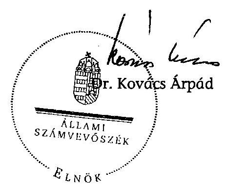
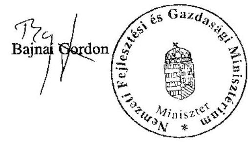
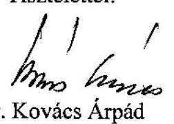
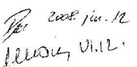

# ÁLLAMI   SZÁMVEVŐSZÉK 

## JELENTÉS

A Nemzeti Fejlesztési Ügynökség működésének ellenőrzése

---

2. Államháztartás Központi Szintjét Ellenőrző Igazgatóság
2.3. Átfogó Ellenőrzési Főcsoport

Iktatószám: V-13-094/2007-2008.
Témaszám: 875
Vizsgálat-azonosító szám: V0360

# Az ellenőrzést felügyelte: 

Bihary Zsigmond
főigazgató
Az ellenőrzés végrehajtásáért felelős:
Hegedűsné Dr. Müllern Veronika
főcsoportfőnök
Az ellenőrzést vezette:
Papp Sándor
számvevő főtanácsos
Az ellenőrzést végezték:

| Bartolák Márta számvevő | Beck Miklós számvevő tanácsos | Bialkó Zsolt Gyula számvevő tanácsos |
| :--: | :--: | :--: |
| Csikai Zsolt irodavezető főtanácsos | Csóry Györgyné számvevő tanácsos, főtanácsadó | Dr. Hegedűs György irodavezető főtanácsos |
| Dr. Horváth Erika számvevő | Kenéz Sándor számvevő tanácsos | Kovácsy Tamás számvevő |
| Pálfi András számvevő tanácsos | Patthy Júlia számvevő gyakornok | Renkó Zsuzsanna számvevő tanácsos |
| Sinka Zoltán számvevő | Vitányi István számvevő |  |

A témához kapcsolódó eddig készített számvevőszéki jelentések:
A Nemzeti Fejlesztési Terv végrehajtásának ellenőrzéséről (2006. évben)

Az uniós támogatások hazai monitoring és ellenőrzési rendszere működésének ellenőrzéséről (2007. évben)

A gazdaságfejlesztés állami eszközrendszere működésének ellenőrzéséről (2008)

---

# TARTALOMJEGYZÉK 

BEVEZETÉS ..... 9
I. ÖSSZEGZŐ MEGÁLLAPÍTÁSOK, KÖVETKEZTETÉSEK, JAVASLATOK ..... 13
II. RÉSZLETES MEGÁLLAPÍTÁSOK ..... 27

1. A fejlesztéspolitika alapjai, eszközei ..... 27
1.1. A fejlesztéspolitika jogi háttere ..... 27
1.2. A fejlesztéspolitika intézmény és feladatrendszere ..... 30
1.3. A Nemzeti Fejlesztési Ügynökség működése ..... 33
1.4. A Nemzeti Fejlesztési Ügynökség gazdálkodása ..... 37
1.5. Az ellenőrzési rendszer működése ..... 39
1.6. A közreműködő szervezetek működése, finanszírozása ..... 41
1.7. A panaszok oka, kezelése ..... 45
2. A fejlesztési tervek készítésének mechanizmusa ..... 47
2.1. A fejlesztési stratégiák, tervek megalapozottsága ..... 47
2.2. Az operatív programok társadalmi egyeztetése ..... 53
2.3. A stratégiák, programok kommunikációja ..... 55
2.4. A pályázatok felfüggesztésének, visszavonásának oka ..... 59
3. A támogatási rendszer működése ..... 61
3.1. A kiemelt projektek tervezése, végrehajtása ..... 61
3.2. A pályázatos támogatási rendszer működése ..... 64
3.3. Az EU támogatások felhasználásának tapasztalatai ..... 69
3.4. A közbeszerzési eljárások ..... 73
3.5. A fejlesztési források felhasználásának nyilvántartási rendszere ..... 76
3.6. A monitoring rendszer működése ..... 79
4. A részletesen ellenőrzött támogatások értékelése ..... 82
4.1. A humánerőforrás pályázatok ellenőrzése ..... 82
4.2. Logisztikai célú pályázatok vizsgálata ..... 83
4.3. Egyéb támogatások felhasználása ..... 84
5. Korábbi ÁSZ javaslatok teljesülése ..... 84

---

# MELLÉKLETEK 

1/a. számú A Nemzeti Fejlesztési és Gazdasági Minisztériumot felügyelő miniszter észrevétele
1/b. számú Dr. Kovács Árpád elnök válasza a miniszter észrevételére
2. számú Az EU támogatások felhasználását szabályozó rendeletek
3. számú A közreműködő szervezetek és létszámuk
4. számú A közreműködő szervezetek operatív programokban való részvétele
5. számú A közreműködő szervezetek részére teljesített NFÜ szerződéses kifizetések és felülvizsgálatuk helyzete 2007-ben
6. számú Kiemelt projekt lista
7. számú Az ÚMFT kiemelt projektjeinek előrehaladása
8. számú Az NFT alintézkedések pénzügyi állapota 2007. 12. 31-i időpontban
9. számú A Humán Erőforrás OP kompetencia alapú oktatás támogatásából vásárolt eszközök
10. számú A korábbi ÁSZ vizsgálatok során tett megállapítások utóellenőrzése

## FÜGGELÉKEK

1. számú A részletesen ellenőrzött kompetencia alapú oktatáshoz kapcsolódó pályázatok
2. számú A részletesen ellenőrzött logisztikai célú pályázatok
3. számú Egyéb, részletesen ellenőrzött pályázatok

---

# RÖVIDÍTÉSEK JEGYZÉKE 

| AVOP | Agrár- és Vidékfejlesztési Operatív Program |
| :--: | :--: |
| ÁBPE | Államháztartási Belső Pénzügyi Ellenőrzési Tárcaközi Bizottság |
| Áht. | 1992. évi XXXVIII. törvény az államháztartásról |
| Ámr. | 217/1998. (XII. 30.) Korm. rendelet az államháztartás működési rendjéről |
| ÁOP | Államreform Operatív Program |
| ÁSZ | Állami Számvevőszék |
| CFCU (a KPSZE angol rövidítése) | Central Finance and Contracts Unit, Központi Pénzügyi Szerződéskötő Egység |
| EKKE | EU Közbeszerzési Koordinációs és Szabályossági Egység |
| EKOP | Elektronikus Közigazgatás Operatív Program |
| EMIR | Egységes Monitoring Információs Rendszer |
| EPEJ | Egyszerűsített Projekt Előrehaladási Jelentés |
| ERFA | Európai Regionális Fejlesztési Alap |
| ESZ (ECA) | Európai Számvevőszék |
| ESZA | Európai Szociális Alap |
| ESZA Kht. | Európai Szociális Alap Nemzeti Programirányító Iroda Társadalmi Szolgáltató Kht. |
| EU | Európai Unió |
| FEUVE | Folyamatba épített, Előzetes és Utólagos Vezetői Ellenőrzés |
| FIT | Fejlesztéspolitikai Irányító Testület |
| FVM | Földművelésügyi és Vidékfejlesztési Minisztérium |
| GKM | Gazdasági és Közlekedési Minisztérium |
| GOP | Gazdaságfejlesztési Operatív Program |
| GVH | Gazdasági Versenyhivatal |
| GVOP | Gazdasági és Versenyképességi Operatív Program |
| HEFOP | Humán Erőforrás Operatív Program |
| IH | Irányító Hatóság |
| IMIR | Integrált Minisztériumi Informatikai Rendszer |
| ITB | Informatikai Tárcaközi Bizottság |
| KA | Kohéziós Alap |
| Kbt. | Közbeszerzési törvény |
| KEHI | Kormányzati Ellenőrzési Hivatal |
| KEOP | Környezetvédelmi és Energia Operatív Program |
| KIH | Koordinációs Irányító Hatóság |
| KIOP | Környezetvédelmi és Infrastruktúra Operatív Program |
| KKK-KIKSZ | Közlekedésfejlesztési Koordinációs Központ - Közlekedésfejlesztési Integrált Közreműködő Szervezet |
| KMOP | Közép-Magyarország Operatív Program |
| KOP | Közlekedés Operatív Program |
| KÖZOP | Közigazgatás Operatív Program |
| KPSZE | Központi Pénzügyi és Szerződéskötő Egység |

---

| KSz | Közreműködő Szervezet |
| :--: | :--: |
| KSZF ITF | Központi Szolgáltatási Főigazgatóság Informatikai és Telekommunikációs Főosztály |
| KTK IH | Közösségi Támogatási Keret Irányító Hatóság |
| KvVM | Környezetvédelmi és Vízügyi Minisztérium |
| KvVM FI | Környezetvédelmi és Vízügyi Minisztérium Fejlesztési Igazgatóság |
| MAG Zrt. | Magyar Gazdaságfejlesztési Központ Zrt. |
| MÁK | Magyar Államkincstár |
| MeH | Miniszterelnöki Hivatal |
| MK | Működési Kézikönyv |
| NFH | Nemzeti Fejlesztési Hivatal |
| NFT (I.) | Nemzeti Fejlesztési Terv |
| NFÜ | Nemzeti Fejlesztési Ügynökség |
| OÉT | Országos Érdekegyeztető Tanács |
| OFK | Országos Fejlesztéspolitikai Koncepció |
| OKM | Oktatási és Kulturális Minisztérium |
| OKM TI | OKM Támogatáskezelő Igazgatóság |
| OP | Operatív Program |
| OPTKB | Operatív Program Tervezési Koordinációs Bizottság |
| OTK | Országos Területfejlesztési Koncepció |
| OTMR | Országos Támogatási Monitoring Rendszer |
| OTT | Országos Területfejlesztési Tanács |
| ÖTM | Önkormányzati és Területfejlesztési Minisztérium |
| PADF | Project Assesment Developement Facility |
| PEJ | Program Előrehaladási Jelentés |
| PIK | Pályázati Információs Központ |
| PM | Pénzügyminisztérium |
| PROMEI Kht. | PROMEI Modernizációs és Euroatlanti Integrációs Projekt Iroda Kht. |
| RFÜ | Regionális Fejlesztési Ügynökség |
| ROP | Regionális Fejlesztés Operatív Program |
| SA | Strukturális Alapok |
| SLA | Service Level Agreement (Szolgáltatási Szint Megállapodás) |
| SzMM | Szociális és Munkaügyi Minisztérium |
| SzMSz | Szervezeti és Működési Szabályzat |
| TÁMOP | Társadalmi Megújulás Operatív Program |
| Tanács | Nemzeti Fejlesztési Tanács |
| TIOP | Társadalmi Infrastruktúra Operatív Program |
| TS (TA) | Technikai Segítségnyújtás |
| ÚMFT | Új Magyarország Fejlesztési Terv |
| ÚMP | Új Magyarország Program |
| ÚMVT | Új Magyarország Vidékfejlesztési Terv |
| VÁTI Kht. | VÁTI Magyar Regionális Fejlesztési és Urbanisztikai Kht. |
| VOP | Végrehajtás Operatív Program |

---

# ÉRTELMEZŐ SZÓTÁR 

bírálat

Egységes Monitoring Informatikai Rendszer
ex-ante
ex-post
Fejlesztéspolitikai Irányító Testület
folyamatos elbírálás
intézkedés

Az értékelésen alapuló, a pályázat, technikai segítségnyújtási projektjavaslat vagy központi programtervezet (a továbbiakban együtt: pályázat) támogatására vagy elutasítására vonatkozó döntési javaslat megfogalmazása. (A strukturális alapok és a Kohéziós Alap felhasználásának általános eljárási szabályairól szóló 14/2004. (VIII. 13.) TNM-GKM-FMM-FVM-PM együttes rendelet 2. § (1) bek. a) pontja.)
A nemzeti költségvetési, illetve nemzetközi támogatással megvalósuló programok figyelemmel kísérése céljából létrehozott egységes számítógépes rendszer, amely kizárólagosan jogosult a programok monitoring adatainak gyűjtésére és rendszerezésére. (Az Európai Unió által nyújtott egyes pénzügyi támogatások felhasználásával megvalósuló, és egyes nemzetközi megállapodások alapján finanszírozott programok monitoring rendszerének kialakításáról és működéséről szóló 102/2006. (IV. 28.) Korm. Rendelet 18. §)
A célok előzetes, a tervek koherenciájának, illetve az alkalmazni kívánt eszközök megfelelőségének vizsgálata.
A célok megvalósulását, a programok hatékonyságát, illetve hatásosságát követi nyomon.
A fejlesztéspolitika területén hozandó kormányzati döntések megalapozott előkészítéséért felelős javaslattevő, véleményező, döntés-előkészítő, koordináló testület. (A 2007-2013 programozási időszakban az Európai Regionális Fejlesztési Alapból, az Európai Szociális Alapból és a Kohéziós Alapból származó támogatások felhasználásának alapvető szabályairól és felelős intézményeiről szóló 255/2006. (XII. 8.) Korm. rendelet 2. § (1) bek. f) pontja)
A pályázatok olyan eljárás szerinti elbírálása, amikor a bírálat és a döntéshozatal a beérkezés sorrendjében történik, amíg a rendelkezésre álló forrás ki nem merül. Folyamatos elbírálás esetén csak egy végső benyújtási határidő kerül meghatározásra, de a forrás kimerülése esetén a pályázatok benyújtása ezt megelőzően is lezárható. (A strukturális alapok és a Kohéziós Alap felhasználásának általános eljárási szabályairól szóló 14/2004. (VIII. 13.) TNM-GKM-FMM-FVM-PM együttes rendelet 2. § (1) bek. e) pontja.)
Olyan eszköz, amelynek segítségével egy prioritást többéves keretben megvalósítanak, és amely lehetővé teszi műveletek finanszírozását. A Szerződés 87. cikke szerinti bármely támogatási rendszer, valamint minden olyan támogatás, amelyet a tagállamok által kijelölt szervek nyújtanak, továbbá a támogatási rendszerek vagy előbb említett típusú támogatások bármely csoportja, és ezek-

---

irányító hatóság
kiemelt projekt
központi program
közreműködő szervezetek (KSZ)
monitoring
nek bármely kombinációja, amelyek célja megegyezik. (A strukturális alapokra vonatkozó általános rendelkezések megállapításáról szóló a Tanács 1999. június 21-i 1260/1999/EK rendelete 9. cikk (h) pontja)
Az operatív program irányító hatóság, az EQUAL program irányító hatóság, a Közösségi Támogatási Keret (a továbbiakban: KTK) irányító hatóság és a Kohéziós Alap irányító hatóság. (A Nemzeti Fejlesztési Terv operatív programjai, az EQUAL Közösségi Kezdeményezés program és a Kohéziós Alap projektek támogatásainak fogadásához kapcsolódó pénzügyi lebonyolítási, számviteli és ellenőrzési rendszerek kialakításáról szóló 360/2004. (XII. 26.) Korm. rendelet 2. § (1) bek. 11. pontja, valamint az Európai Unió strukturális alapjaiból és Kohéziós Alapjából származó támogatások hazai felhasználásáért felelős intézményekről szóló 1/2004. (I. 5.) Korm. rendelet melléklete)
A Kormány által egyedileg jóváhagyott projekt, amelyet az akcióterv nevesítve tartalmaz. (A 2007-2013. programozási időszakban az Európai Regionális Fejlesztési Alapból, az Európai Szociális Alapból és a Kohéziós Alapból származó támogatások felhasználásának alapvető szabályairól és felelős intézményeiről szóló 255/2006. (XII. 8.) Korm. rendelet 2. § (1) bek. h) pontja)
Olyan program, amelynél a támogatott programok, illetve projektek kiválasztása pályáztatás nélkül, előre meghatározott feltételrendszer szerint történik. A feltételrendszer közzététele a program-kiegészítő dokumentumban megnevezett végső kedvezményezettek közvetlen megkeresésével valósul meg. (Az Európai Unió strukturális alapjaiból és Kohéziós Alapjából származó támogatások hazai felhasználásáért felelős intézményekről szóló 1/2004. (I. 5.) Korm. rendelet 2. § (1) bek. k) pontja)

A strukturális alapok és a Kohéziós Alap kezelése során eljáró szervezet, a strukturális alapok esetén az irányító hatóság által átruházott hatáskörben. (az Európai Unió által nyújtott egyes pénzügyi támogatások felhasználásával megvalósuló, és egyes nemzetközi megállapodások alapján finanszírozott programok monitoring rendszerének kialakításáról és működéséről szóló 102/2006. (IV. 28.) Korm. rendelet 2. § (1) bek. f) pontja)

A források felhasználásának (pénzügyi monitoring), az eredményeknek és a teljesítményeknek (szakmai monitoring) mindenre kiterjedő - többek között szabályossági, hatékonysági és
 célszerűségi vizsgálata rendszeres jelleggel projekt, illetve program szinten. (Az Európai Unió által nyújtott egyes pénzügyi támogatások felhasználásával megvalósuló, és egyes nemzetközi megállapodások alapján finanszírozott programok monitoring rendszerének kialakításáról és működéséről szóló 102/2006. (IV.

---

monitoring bizottság

Monitoring rendszer

Nemzeti Fejlesztési Tanács

Nemzeti Fejlesztési Terv
nemzeti támogatás
operatív program
28.) Korm. rendelet 2. § (1) bek. g) pontja)
Monitoring tevékenységet végző, elsősorban a program megvalósításában részt vevő partnerek képviselőiből álló, önálló jogalanyisággal nem rendelkező testület. (Az Európai Unió által nyújtott egyes pénzügyi támogatások felhasználásával megvalósuló, és egyes nemzetközi megállapodások alapján finanszírozott programok monitoring rendszerének kialakításáról és működéséről szóló 102/2006. (IV. 28.) Korm. rendelet 2. § (1) bek. h) pontja) A monitoring tevékenység folytatása céljából létrehozott intézmények, szervezetek és eszközök, valamint ezek működtetése érdekében foganatosított intézkedések. (Az Európai Unió által nyújtott egyes pénzügyi támogatások felhasználásával megvalósuló, és egyes nemzetközi megállapodások alapján finanszírozott programok monitoring rendszerének kialakításáról és működéséről szóló 102/2006. (IV. 28.) Korm. rendelet 2. § (1) bek. j) pontja)
A fejlesztéspolitikai célok megvalósulását nyomon követő, az NFT-ben rögzített célok teljesülését és az EU fejlesztési irányelvek érvényesülését és összhangját értékelő, javaslattevő testület. (A 2007-2013. programozási időszakban az Európai Regionális Fejlesztési Alapból, az Európai Szociális Alapból és a Kohéziós Alapból származó támogatások felhasználásának alapvető szabályairól és felelős intézményeiről szóló 255/2006. (XII. 8.) Korm. rendelet 2. § (1) bek. l) pontja)
Helyzetelemzést, stratégiát a tervezett fejlesztési területek prioritásait, azok céljait és pénzügyi forrásaik megjelölését tartalmazó dokumentum, amelyet a Magyar Köztársaság készített az Európai Unió programozási irányelveinek, célkitűzéseinek megfelelően a fejlődésben lemaradó régiók fejlődésének és strukturális átalakulásának elősegítésére a kiemelt szükségletekre figyelemmel. (Az Európai Unió strukturális alapjaiból és Kohéziós Alapjából származó támogatások hazai felhasználásáért felelős intézményekről szóló 1/2004. (I. 5.) Korm. rendelet 2. § (1) bek. p) pontja, letölthető az NFÜ honlapjáról: www.nhu.gov.hu) a Magyar Köztársaság költségvetéséből finanszírozott, bármilyen formában nyújtott fejlesztési célú támogatás, kivéve a Kutatás-fejlesztési és Innovációs Alapból részben vagy egészben megvalósuló támogatásokat. (Az Európai Unió által nyújtott egyes pénzügyi támogatások felhasználásával megvalósuló, és egyes nemzetközi megállapodások alapján finanszírozott programok monitoring rendszerének kialakításáról és működéséről szóló 102/2006. (IV. 28.) Korm. rendelet 2. §. (1) bek. n) pontja)
Az Európai Bizottság által jóváhagyott és a Közösségi Támogatási Keret végrehajtására vonatkozó, több évre szóló intézkedésekhez kapcsolódó prioritások egységes rendszerét tartalmazó dokumentum. (Az Európai Unió strukturális

---

prioritás

program

projekt
technikai segítségnyújtás

Új Magyarország Fejlesztési Terv
alapjaiból és Kohéziós Alapjából származó támogatások hazai felhasználásáért felelős intézményekről szóló 1/2004. (I. 5.) Korm. rendelet 2. § (1) bek. n) pontja, letölthető az NFÜ honlapjáról: www.nhu.gov.hu)
A közösségi támogatási kerettervben vagy támogatásban elfogadott stratégia valamely prioritása; ehhez rendelik hozzá az alapokból és egyéb pénzügyi eszközökből, valamint a tagállam megfelelő pénzügyi forrásaiból származó hozzájárulást, továbbá a meghatározott célok összességét. (A strukturális alapokra vonatkozó általános rendelkezések megállapításáról szóló a Tanács 1999. június 21-i 1260/1999/EK rendelete 9. Cikk h) pontja)
Meghatározott célrendszer érdekében végrehajtandó feladatok és végrehajtásukra kidolgozott feltételek egysége. (Az Európai Unió által nyújtott egyes pénzügyi támogatások felhasználásával megvalósuló, és egyes nemzetközi megállapodások alapján finanszírozott programok monitoring rendszerének kialakításáról és működéséről szóló 102/2006. (IV. 28.) Korm. rendelet 2. § (1) bek. s) pontja)
A gazdaságilag oszthatatlan munkafázisok olyan sora, amely pontos technikai funkciót lát el, és világosan meghatározott célokkal rendelkezik. (Az Európai Unió által nyújtott egyes pénzügyi támogatások felhasználásával megvalósuló, és egyes nemzetközi megállapodások alapján finanszírozott programok monitoring rendszerének kialakításáról és működéséről szóló 102/2006. (IV. 28.) Korm. rendelet 2. § (1) bek. u) pontja)
Elkülönített keret, amelynek célja a Közösségi Támogatási Keret, az operatív program, valamint a Kohéziós Alap projekt szabályszerű, gazdaságos, hatékony és eredményes megvalósításának segítése. (A strukturális alapok és a Kohéziós Alap felhasználásának általános eljárási szabályairól szóló 14/2004. (VIII. 13.) TNM-GKM-FMM-FVMPM együttes rendelet 2. § (1) bek. g) pontja.)
A 2007-2013. közötti időszakra elfogadott helyzetelemzést, stratégiát, a tervezett fejlesztési területek prioritásait, azok céljait és pénzügyi forrásaik megjelölését tartalmazó dokumentum. Az Európai Unió programozási irányelveinek, célkitűzéseinek megfelelően a fejlődésben lemaradó régiók fejlődésének és strukturális átalakulásának elősegítésére a kiemelt szükségletekre figyelemmel. (Az Új Magyarország Fejlesztési Terv elfogadásáról szóló 1103/2006. (X. 30.) sz. kormányhatározat)

---

# JELENTÉS 

## a Nemzeti Fejlesztési Ügynökség működésének ellenőrzéséről

## BEVEZETÉS

A fejlesztéspolitikai tevékenységnek meghatározó szerepe van az ország társadalmi-gazdasági fejlődésében, jelentősége össztársadalmi szintű. Az ország lehetőségeit alapvetően meghatározza, hogy az EU csatlakozást követően - kiemelkedően 2007. évtől - a korábbiakat meghaladó nagyságrendű, mintegy 22,4 milliárd euró (2004-es áron 5936 milliárd Ft, 2007-es áron 5655 milliárd Ft) uniós fejlesztési támogatásra nyílt lehetőség. Az EU források minél teljesebb körű igénybevételéhez és hatékony felhasználásához - az EU követelmények szerint ütemezett és hazai forrásokkal támogatott - nemzeti, valamint regionális hosszú távú fejlesztési tervek, jól működő kontrolling rendszer, és a feladatokat gazdaságosan, hatékonyan, eredményesen ellátó szervezet szükséges.

Ezt megcélozva a Kormány 2006-ban a Nemzeti Fejlesztési Hivatal általános jogutódjaként, a Miniszterelnöki Hivatal irányítása alatt, létrehozta a Nemzeti Fejlesztési Ügynökséget (NFÜ), ami 2007. júl. 1-től az önkormányzati és területfejlesztési miniszter irányítása alá került. Fő feladata a hosszú és középtávú fejlesztési és tervezési feladatok ellátására, az Európai Unió pénzügyi támogatásainak igénybevételéhez szükséges tervek, operatív programok elkészítésére irányul. Javaslatokat készít a Kormány fejlesztéspolitikai elveire és céljaira, elkészíti az ország átfogó fejlesztési tervét, a nemzeti fejlesztési terveket. Hatásköre kiterjed - az Agrár- és Vidékfejlesztési Operatív Program kivételével - az operatív programok irányító hatóság feladatainak ellátására, azok végrehajtásának ellenőrzésére, valamint monitoring rendszerének működtetésére. Nemzetközi feladatain belül a Kormány által meghatározott körben ellátja az Európai Unió pénzügyi támogatásainak felhasználásához kapcsolódó feladatokat, és koordinálja a támogatások felhasználására kialakított intézményrendszer működését, és többek között ellátja a PHARE programokkal és a Schengen Alappal, az Átmeneti Támogatási Alappal, és a Norvég Finanszírozási Mechanizmussal kapcsolatos szervezési és koordinációs feladatokat. Feladatainak ellátásában - a részben önállóan gazdálkodó költségvetési szerv - a Központi Pénzügyi és Szerződéskötő Egység segíti.

A fejlesztési feladatok ellátásában az Ügynökség mellett, a fejlesztéspolitika felügyelete, értékelése érdekében a Kormány tanácsadó testületeként létrehozott Nemzeti Fejlesztési Tanács, és a fejlesztéspolitikáért felelős döntés-előkészítő, javaslattevő, koordináló szerveként létrehozott Fejlesztéspolitikai Irányító Testület is részt vesz. Mindkét testület elnöke a miniszterelnök.

---

Az Ügynökségnek kulcsszerepe van az Európai Unióból származó forrásokra támaszkodó - a 2004-2006. közötti időszakra szóló, öt operatív programot tartalmazó - Nemzeti Fejlesztési Terv megvalósításában, valamint a 2007-től életbe lépett, hat prioritást - ezen belül 15 operatív programot - magában foglaló Új Magyarország Fejlesztési Terv végrehajtásában. Ennek végrehajtását az országgyűlés eseti bizottsága felügyeli.

A vizsgált időszakon belül 2006-ban az EU források a központi költségvetésben a XIX. EU Integráció fejezetben és az egyes költségvetési fejezetek előirányzatai között szerepeltek, ezek felett az európai ügyekért felelős tárca nélküli miniszter rendelkezett. 2007-től a XIX. EU Integráció fejezet előirányzatai, valamint a fejezetek költségvetésében EU integráció fejezeti kezelésű előirányzat címen, illetve alcímen jóváhagyott előirányzatok feletti tervezési, előirányzat-módosítási, felhasználási, beszámolási, információszolgáltatási, ellenőrzési jogokat és kötelezettségeket a Nemzeti Fejlesztési Ügynökség elnöke gyakorolja. 2008-tól a fejezet címe XIX. Uniós fejlesztések fejezetre változott. A Magyar Köztársaság 2007. évi költségvetésében a XIX. EU Integráció fejezet tervezett kiadási előirányzata 65656 millió Ft volt, ez magában foglalta az Ügynökség működési és felhalmozási előirányzatát, illetve az EU integráció fejezeti kezelésű előirányzatok összegét. Az Ügynökség 2007-re engedélyezett létszáma 241 fő volt.

Ellenőrzésünk során figyelembe vettük a szervezetet és az általa kezelt előirányzatok felhasználását érintő korábbi ÁSZ ellenőrzéseket, így a 2006-ban megjelent „A Nemzeti Fejlesztési Terv végrehajtásának ellenőrzéséről", valamint a 2007-ben megjelent „Az uniós támogatások hazai monitoring és ellenőrzési rendszere működésének ellenőrzéséről" szóló jelentések megállapításait.

Az ellenőrzés célja annak értékelése volt, hogy:

- a jogelőd szervezet - a Nemzeti Fejlesztési Hivatal - feladatait, valamint a jogszabályváltozásból fakadó feladatbővülést eredményesen építették-e be az újonnan létrehozott Nemzeti Fejlesztési Ügynökség feladatrendszerébe, valamint az új szervezet szabályozása, működése hatékonyan, eredményesen biztosította-e az előírt feladatok ellátását;
- az Ügynökségre háruló nemzeti fejlesztési feladatok végrehajtását, valamint az EU források célszerű, átlátható, ellenőrizhető igénybevételét a szervezeti, szakmai, pénzügyi, ellenőrzési háttér hatékonyan segítette-e;
- az EU források tervezésénél, elosztásánál érvényesültek-e a hosszú távú nemzeti és regionális fejlesztési célkitűzések, valamint teljesültek-e a források felhasználása során az előzetesen kitűzött célok;
- hasznosultak-e az ÁSZ korábbi ellenőrzései nyomán tett javaslatok.

Az ellenőrzés elsősorban a Nemzeti Fejlesztési Ügynökség tevékenységét érintette. A vizsgálatot rendszerszemléletben végeztük el, ezért a fő szempont mellett áttekintettük és értékeltük a fejlesztéspolitika eddig elért eredményeit, és visszatekintettünk a jogelőd szervezet idejében tett, illetve az NFÜ megalakítását kiváltó intézkedésekre is. A fejlesztéspolitika tervezésének, végrehajtásának minél teljesebb körű bemutatásához adatokat kértünk be a fejlesztési feladatok végrehajtásában részt vevő szervektől, valamint a regionális, a társadalmi, illetve

---

a feladatban közreműködő más szervezetektől és felhasználtuk a pályázatok nyilvántartására kialakított Egységes Monitoring Információs Rendszer adatait.

Az ellenőrzés a 2006-2007. közötti időszakra irányult. A Nemzeti Fejlesztési Terv I. operatív programjai közül még egyik sem zárult le, ezért az ellenőrzés az operatív programokhoz tartozó alintézkedéseken belül egyes, már lezárt pályázatokat értékelte teljesítmény-ellenőrzés módszerével. Az Új Magyarország Fejlesztési Terv végrehajtásánál a pályázati rendszer működését és a pályáztatás nélkül jóváhagyott kiemelt projektek tervezését, összeállításának célszerűségét tekintettük át.

Az államháztartásról szóló 1992. évi XXXVIII. törvény 120/A § (1) bekezdés alapján az ÁSZ ellenőrzi az államháztartás forrásait, azok felhasználását és a vagyonnal való gazdálkodást. A jelen ellenőrzés végrehajtására az Állami Számvevőszékről szóló 1989. évi XXXVIII. törvény 2. § (3) és (5) valamint a 17. § (3) bekezdésében foglaltak adta jogszabályi alapot.

A jelentés tervezetét a Nemzeti Fejlesztési Ügynökséggel történt egyeztetést követően, megküldtük a Nemzeti Fejlesztési és Gazdasági Minisztériumot felügyelő miniszternek, aki észrevételeket tett. Levelét az 1/a. az erre adott választ az 1/b. számú melléklet tartalmazza.

---

BEVEZETÉS

---

# I. ÖSSZEGZŐ MEGÁLLAPÍTÁSOK, KÖVETKEZTETÉSEK, JAVASLATOK 

A Magyarországra érkező uniós támogatások hazai szervezeti, szabályozási, végrehajtási háttere kiépített, ezekben 2007-től alapvető, a hatékonyság, gazdaságosság irányába ható változások történtek. A szervezeti struktúrát, a jogi és eljárásrendi környezet egységesítését és a hatékony működést megcélozva átalakult az intézményrendszer, a feladat- és hatásköröket újraosztották. Ennek során hasznosították a korábbi működési tapasztalatokat. A változások érintették az intézményrendszer finanszírozását, valamint a források felhasználásának mechanizmusát. Változásokat erőteljes centralizálás jellemezte. A Kormány, hasonló feladatokkal és összetétellel két testületet hozott létre, és saját hatáskörébe vonta a 2007-től rendelkezésre álló EU források mintegy negyede feletti döntést. Az intézkedések nem teljes mélységében érintették a rendszert, az EU források hatékony és eredményes igénybevételéhez rendelkezésre álló eszköztár szinte valamennyi eleménél hiányosságok maradtak fenn, ezek azonban nem ellentétesek az EU Bizottság alapvető elvárásaival.

Az EU források felhasználásakor
 nem kellően érvényesült a pályázók esélyegyenlősége, a tőkeerősebb vállalkozások, a fejlettebb régiók és a nagyobb települések pályáztak sikeresebben, ami tovább növelte már meglevő pénzügyi, gazdasági előnyüket. Ugyanakkor a nem tőkeerős pályázóknál likviditási nehézségeket okozott az EU támogatások utólagos finanszírozása, amit gazdálkodásuk átmeneti visszafogásával kényszerültek ellensúlyozni. ${ }^{1}$

Az EU források minél eredményesebb felhasználását célozza meg, hogy a súlyosan elmaradott térségek esélyének erősítésére a kormány 2007-ben elindította az Új Magyarország Felzárkóztatási Programot, valamint az, hogy Európában hazánk hirdette meg elsőként ${ }^{2}$ a 2007-2013 fejlesztési időszak pályázatait.

A mindenkori fejlesztéspolitika össztársadalmi jelentőségű, ennek fontosságát alkotmányos rendelkezés is kimondja. A fejlesztéspolitikáról szóló törvény kidolgozásának szükségességét egy 2005-ben hozott OGY határozat kinyilvánította, elkészítésének felelősségét 2006-ban - egy évig hatályban levő kormányhatározat - a fejlesztéspolitikai kormánybiztos személyében jelölte meg. A törvény előkészítése nem történt meg, annak ellenére, hogy felelőse 2007-ig a kormánybiztos, ezt követően az önkormányzati és területfejlesztési miniszter személyében kijelölt volt. 2006-ban elkészült a fejlesztéspolitika intézményrendszeréről szóló törvénytervezet, de nem terjesztették a Kormány elé. Mindezek miatt a fejlesztéspolitika törvényi háttér nélkül maradt, működését - Kormány, illetve miniszteri - rendeletek rögzítik. Ezekben az egyes elemek (pl. intézményrendszer, monitoring, ellenőrzés) szabályozása alapvetően koherens,

[^0]
[^0]:    ${ }^{1}$ A szélesebb körű hatásokról, a 2008. szeptemberében megjelenő, az EU támogatások 2007. évi felhasználásának tapasztalatait összegző ÁSZ tájékoztató fog beszámolni.
    ${ }^{2}$ Az NFÜ tájékoztatása szerint

---

de az egységes törvényi alap hiánya miatt kockázatos a szabályok ismétlése, illetve joghézagok kialakulása.

A fejlesztés társadalmi érdekekkel történő összeegyeztetése, valamint az Európai Unió elvárásainak összehangolása érdekében a Kormány létrehozta a miniszterelnöki kabineten belül a Nemzeti Fejlesztési Tanácsot, valamint a Fejlesztéspolitikai Irányító Testületet, ${ }^{3}$ mint javaslattevő, véleményező, döntéselőkészítő szervet. Mindkét szervezet elnöke a miniszterelnök, alelnöke ugyanaz a személy, a két szervezet összetétele átfedésben van. ${ }^{4}$ A két szervezet működését az NFÜ dokumentált formában teljes körűen nem tudta bemutatni.

A szakmai feladatokat alapvetően a 2004-2006. évekre szóló NFT I. végrehajtása és a 2007-2013. közötti időszakra szóló nemzeti fejlesztéspolitika lefektetése és elindítása határozta meg.

Az EU forrásokból megvalósuló fejlesztéspolitika végrehajtását két - a stratégia, az intézményrendszer, és a forrásfelhasználás mechanizmusa tekintetében - egymástól eltérő szakasz jellemezte. A 2004-2006. évekre szóló - és még végrehajtás alatt álló - I. Nemzeti Fejlesztési Terv mellett (NFT I.) új, a 2007-2013. időszakra szóló Új Magyarország Fejlesztési Terv indult el. Az új stratégia 2005-ben elkezdett tervezésének alapja az Országgyűlés által 2005-ben elfogadott Országos Fejlesztéspolitikai Koncepcióval és az Országos Területfejlesztési Koncepcióval biztosított volt. Mindkét terv nem átfogó fejlesztési tervet takar, mert kizárólag - igaz hazai társfinanszírozás mellett - EU forrásokra támaszkodik. A 2005-ben bemutatott stratégia ${ }^{5}$ széleskörű műhelymunka körében készült, ebbe tudományos kutatóhelyeket is bevontak. Ennek ellenére az előkészítés nem volt sikeres. Az EU Bizottság 2006. júniusában eljuttatott véleménye 44 oldalban - főként a partnerség, a helyzetelemzés, az intézményi rendszer részletezettsége, illetve az addicionalitás ${ }^{6}$ kapcsán - további információkat, kiegészítést kért, valamint több kifogást tett és javaslatokat fogalmazott meg az egyes célokhoz, prioritásokhoz kapcsolódóan. A koncepciót alapvetően át kellett dolgozni, változott a stratégia megközelítése, célrendszere, sőt a stratégia neve, az operatív programok elnevezése és struktúrája is. A teljes átdolgozás és az ekkor végrehajtott kormányzati struktúraváltozás a kormány által kijelölt határidő csúszásához vezetett. Az ÚMFT és a 2006. októberében felülvizsgált Nemzeti Lisszaboni Akcióprogram fő céljaiban az összhang biztosított. Az átdolgozott, immár Új Magyarország Fejlesztési Tervet (ÚMFT) 2006. novemberében nyújtották be a Bizottsághoz, amit 2007. májusában fogadott el.

A stratégia tervezése kapcsán az NFÜ elnöke a jelentés-tervezet egyeztetése során kifejtette, hogy „A feladat ágazatközi szintetizáló vonatkozásait tovább nehezítette, hogy az ún. politikai kormányzásra való áttérés elbizonytalanította az ágazati

[^0]
[^0]:    ${ }^{3}$ Tagjai jelenlegi, illetve volt állami vezetők, illetve tisztségviselők. A Kormány a FIT-en keresztül gyakorolhatott befolyást a stratégiai tervek és azok dokumentumaira, illetve a források alakulására, mert a szervezetek a FIT elé terjesztették be javaslataikat.
    ${ }^{4}$ A FIT tagjai a Tanács állandó meghívottjai. A FIT titkársági feladatait az NFÜ látja el.
    ${ }^{5}$ Ekkor még Új Magyarország Fejlesztési Program néven nyújtották be.
    ${ }^{6}$ Biztosítani kell, hogy - a korábbi időszakhoz képest - az EU támogatások miatt nem csökken a hazai forrásokból finanszírozott fejlesztésre szánt hazai forrás.

---

tervezőket, akiket a központi instrukciók a miniszteri kabinetekbe terelték, és a fejlesztéspolitika tekintetében jelentősen meggyengült jogosítványaik maradtak."

A programok előrehaladásának mérését, a támogatások hasznosulásának ellenőrzését, és a beszámolás teljesítését szolgáló indikátor-, és monitoring rendszer nem teljes körűen kiépített. A monitoring tevékenység szabályozott, de nehezíti a teljesítések nyomon követését, hogy az NFT I. programjai esetében sem a teljesítmény méréséhez szükséges indikátorokat, sem a mutatók előállításának módszerét nem alakították ki. Ennek hiányában a program, illetve a projekt indikátorok nem teljes körűen épültek egymásra, ${ }^{7}$ ilyen esetekben új indikátorokat kellett bevezetni, illetve az indikátorok értelmezésére útmutatót készítettek. Az indikátorrendszer célszerű kialakítása az ÚMFT tervezése során már kiemelt hangsúlyt kapott. Az indikátorok lefektetése centralizáltan, az OP-okban érintett szervezetek bevonásával történt, azokat az IH-k véleményezték, illetve jóváhagyták. Az ÚMFT OP-okban kiépült - a kiinduló és célértékek, illetve adatforrás megjelöléssel - az eredményszemléletű indikátorrendszer, de ez a célok és eredmények összevetésére nem teljes körűen alkalmas. A Bizottság által elfogadott, és megvalósítás alatt álló OP-kban a kiinduló, és a célértékeket később alakítják ki, illetve a jövőbeni felméréseken fognak alapulni; ${ }^{8}$ az indikátorok értelmezésére, felelősségi, adatgyűjtési, ellenőrzési rendszerére vonatkozó szabályozás, eljárásrend nem készült; ${ }^{9}$ az indikátorok számszerűsítése módszertanának kialakítása ellenőrzésünk idején volt folyamatban.

Az NFÜ tevékenységének irányítása 2007. közepéig a fejlesztéspolitikáért felelős kormánybiztos feladata volt. Ezt követően az NFÜ az önkormányzati és területfejlesztési miniszter felügyelete alá került, de a minisztériummal szerves kapcsolata nem volt. ${ }^{10}$ A strukturális átalakulások következtében a fejlesztésekkel kapcsolatos intézményi feltételrendszerben jogi, szabályozási és értelmezési bizonytalanság mutatkozott az átfogó gazdaságfejlesztési stratégiák előkészítésének, kialakításának és felügyeletének intézményi felelőssége területén. Például ennek körében a Nemzeti Fejlesztési Ügynökség feladata az ország átfogó fejlesztési tervének és a nemzeti fejlesztési tervek elkészítése, de ezt a feladatot azonban csak az uniós forrásokra vonatkozóan látta el. ${ }^{11}$ Megosztott az EU előirányzatok feletti jogosultság, mert az előirányzatok tervezési, beszámolási kötelezettsége az NFÜ elnök, a szabályozási jogkör a miniszter hatásköre lett. Ez megnehezítheti az uniós támogatások költségvetésben történő felhasználása során a felelősségi szabályok érvényesülését és a nemzeti fejlesztési tervek végrehajtásának nyomon követését. ${ }^{12}$

A 2006 közepéig fennálló - a Nemzeti Fejlesztési Hivatal (NFH) által koordinált - intézményrendszer megfelelt az EU irányelveknek, de nem felelt meg a hatékony, gazdaságos működés kritériumainak, tevékenysége kapcsán számos kritika fogalmazódott meg. Az irányító hatóságok a tárcák alá tartoztak, az NFH koordinatív szerepe nem érvényesült, a feladatokban 22 közreműködő szervezet vett részt, feladataik átfedtek, működésük nem egységes eljárásrendre támaszkodott. ${ }^{13}$ A közreműködők finanszírozása nem teljesítmény alapján, hanem költségelszámolás alapján történt. A működésben fennálló negatívumok felszámolása érdekében 2006-tól a fejlesztési feladatokat ellátó szervezeti struktúrában a célszerűség és hatékonyság növelése irányába mutató átalakításokat hajtottak végre. Az NFH alapjain létrejött a Nemzeti Fejlesztési Ügynökség (NFÜ). Ennek szervezetébe integrálták - az AVOP IH kivételével - addig a tárcák alá tartozó irányító hatóságokat. Ezzel egységessé vált az EU forrásokra támaszkodó fejlesztési programok tervezésének és végrehajtásának rendszere. A feladatellátásban részt vevő más tárcák (Zrt-k, Kht-k), illetve regionális ügynökségek felügyelete alá tartozó közreműködő szervezetek számát 15-re csökkentették és ekkortól az NFÜ szélesebb irányítási jogosítványokkal rendelkezett felettük. Az átalakítások értékelését ugyanakkor nehezíti, hogy nem volt teljes körű a célok és a kiemelt - például a hatékonysági, eredményességi - szempontok kijelölése és nem készült előzetes hatáselemzés sem. Az átalakítások hatása az eltelt idő rövidsége miatt sem ítélhető meg teljes körűen.

Az NFÜ feladatai következtében szoros kapcsolatban áll a társadalommal, ezért kiemelt figyelmet kap a partnerség révén a társadalom véleményének kikérése, a kommunikáció révén az EU támogatások közvetítése, valamint a működése kapcsán megfogalmazott pályázói kifogások kezelése és az intézkedések beépítése a rendszerbe.

A partnerség kiemelt szerepet kapott a támogatási mechanizmus valamennyi ütemében, gyakorlata, szabályozása - kezdetben - nem volt teljes körű. A nemzeti szabályozáshoz igazodó partnerséget, mint elvárást EU rendeletek rögzítik, de ennek hazai szabályozása nem történt meg. Az ÚMFT tervezésének társadalmi egyeztetése széles körben zajlott, ${ }^{14}$ de a szűkre szabott időkeret miatt eredményessége, megalapozottsága nem teljes körű, ugyanis az ország fejlődését meghatározó és közel hét milliárd forint forrás felhasználását megalapozó ÚMFT egyeztetésére 5 hetet, az operatív programok (OP-k) egyeztetésére 3 hetet

[^0]
[^0]:    ${ }^{7}$ Az NFÜ vitatja a megállapítást, azzal, hogy a projekt és a program indikátoroknak nem kell egymásra épülnie.
    ${ }^{8}$ Az NFÜ ezek számosságát nem tarja jelentősnek, mert az 10\% alatt van. A késedelem okát a programtartalom tisztázódása és az ehhez illeszkedő módszertan időigényében látja.
    ${ }^{9}$ Az NFT I. közbenső értékelése szerint problémás a nem kellő szabályozottság, emellett a pályázók adatszolgáltatásának megalapozottságához elengedhetetlen a széles körű tájékoztatás.
    ${ }^{10}$ Az NFÜ, az ÁSZ jelentés tervezet készítésének időszakában (2008.) lezajlott kormányzati intézkedést követően, a megszüntetett Gazdasági és Közlekedési Minisztérium egyik jogutódjaként létrehozott Nemzeti Fejlesztési és Gazdasági Minisztériumot felügyelő miniszter irányítása alá került.
    ${ }^{11}$ A gazdaságfejlesztés állami eszközrendszere működésének ellenőrzéséről szóló jelentés (2008.) megállapításai.
    ${ }^{12}$ Vélemény a Magyar Köztársaság 2008. évi költségvetéséről szóló ÁSZ jelentés szerint.
    ${ }^{13}$ A 2006. évi ÁSZ ellenőrzés, az NFH megbízásából készült az NFT I. intézményrendszer félidei értékelése, és az NFT I. intézményrendszerének kapacitás és költségfelmérése (2006.) megállapításai.
    ${ }^{14}$ Az NFÜ véleménye szerint az egyeztetés gyakorlata „precedens nélküli" az EU tagállamok között. Az általa bemutatott egy külső cég elemzése szerint a partnerség elve messze jobban érvényesül, mint a vizsgált országokban, de az elemzés 2005-ben készült és csak hét új tagállamra terjedt ki.

---

adtak. Ezért a partnerek az egyeztetés legfőbb kritikájaként annak szűk időkeretét fogalmazták meg. A partnerség megjelent a pályázati mechanizmusban is, alapelveit a 2007-ben kiadott eljárásrend rögzítette, nyilvánosságot az NFÜ internetes honlapján kap.

A mindenkori fejlesztési terveket, illetve az operatív programokat, széleskörű kommunikációs tevékenység keretében népszerűsítették. Erre a 2007-2013.
 időszakra 16 milliárd Ft-ot terveztek, forrása a központi Végrehajtási OP (annak mintegy 17\%-át teszi ki). Az ÚMFT kommunikációs stratégiájában hatásindikátorokat rögzítettek, meghatározták a kommunikáció ciklusait (2010-ig az imázskommunikáció kapott hangsúlyt), minden OP-ra pénzügyi tervet készítettek és kijelölték az értékelési feladatokat. A kommunikációs ráfordítások, ${ }^{15}$ valamint a tájékoztatás és kommunikáció iránya (imázs), a kommunikációs stratégia, és a nyilvánosság elérését célzó módszerek (pl. tv sorozatban megjelenítés) felülvizsgálatára hívják fel a figyelmet. ${ }^{16}$ A pályázói túljelentkezések a potenciális érintettek általi ismertségre utalnak, ugyanakkor a pályázói panaszok, a visszaadott pályázatok aránya, és ezek okai a pályázati tanácsadás, a pályázatok előzetes ellenőrzése erősítésének szükségességét vetik fel. Az elemzések alapján hazánkban az EU ismertsége elmarad az európai átlagtól. Az irányadó EU rendelet a lehető legszélesebb tájékoztatást és nyilvánosságot várja el a tagországoktól, de az ismertség arányai, a népszerűsítés módszere, valamint a ráfordítások tekintetében követelményt nem támaszt. A kommunikációs stratégia tervezésénél az NFÜ „túlvállalta" magát annyiban, hogy racionálisabb tervezéssel több EU pénzeszköz marad működésre, ami a nemzeti forrásokat kíméli. ${ }^{17}$

A hatékony működéshez elengedhetetlen a pályázatok sikeres előkészítése, mert ennek révén a pályázói tévedések, ismerethiányok nem az értékelés folyamán derülnek ki, hanem már a benyújtáskor, illetve az előtt kezelhetők. Ennek egyik eszköze a pályázókat segítő tanácsadói tevékenység, ami több szempontból is hiányos. Az NFT időszakában a négy elemből álló ${ }^{18}$ tanácsadói hálózat nem volt kellően koordinált, ezért az ÚMFT-re új, immár három szervezetre támaszkodó hálózatot ${ }^{19}$ hoztak létre, de ezek összehangolt működésének célzó megállapodást még nem kötötték meg. A tanácsadás hiányosságára utal - pl. a jogosulatlanság, vagy formai okok miatt - elutasított, visszavont illetve hiánypótlásra ${ }^{20}$ utasított pályázatok magas aránya. ${ }^{21}$

A pályázókat segítő tevékenység hasznosságáról vagy hiányosságáról alkotott pályázói vélemények adatai csak részben ismertek. A pályázói panaszok dokumentumai 2006. végéig nem álltak rendelkezésre, mert ezek ügyintézését nem központosítottan, a KSZ-ek, IH-k és az OP-kért felelős minisztériumok végezték. Az NFÜ-nél a panaszok kezelése szabályzatban rögzített, szervezeti háttere kialakított. A 2007-től ismert panaszok, illetve felülvizsgálati kérelmek ${ }^{22}$ a pályázók számához képest elenyésző volt. Ezek kizárólag a jogszabályban rögzített ${ }^{23}$ körbe tartoznak, a szélesebb körű, pl. a működés kapcsán felmerült véleményeket az NFÜ nem kezeli, holott például a legnagyobb KSZ ezeket nyilvántartja. Ez hiányosság, mert - többek között - ezek tükrözik a KSZ-ek működésével szemben felmerülő kifogásokat, és ez lehet a KSZ-ek minősítésének egyik szempontja.

Az NFÜ működésén belül - elsősorban finanszírozási okok miatt - az államigazgatási szervektől eltérő - sajátos létszámstruktúrát épített ki. Az alaplétszámon felül, annak mintegy 70\%-át köztisztviselőként, határozott idejű szerződéssel foglalkoztatták, díjazásukat EU forrásból, azon belül a Végrehajtás OP-ból biztosítva. Ennek költsége 2007-ben meghaladta az 1 milliárd Ft-ot. A létszámszerkezet ilyen módú kialakításához háttéranyagként egy általános célkitűzéseket tartalmazó, feladatokra és naturális mutatókra (emberév) bontott normatív alapú, összességében 2,6 milliárd Ft összegű projekt adatlap szolgált. A belső ellenőrzés az előírásoknak megfelelve az elnök felügyelete alá tartozó, független szervezeti egység. Feladatai növekedtek, ezért az EU források felhasználásának ellenőrzését a rendelkezésre álló kapacitás - valamint a speciális jelleg - miatt külső szervezet bevonásával végezte el. A folyamatba épített vezetői ellenőrzés eljárásrendjét kidolgozták, ugyanakkor a szabálytalanságok kezelésének eljárásrendje - a jogszabályi előírás ellenére - nem képezi az SzMSz mellékletét. Az NFÜ szervezetét 2008. februárjában alapvetően átalakították. Ennek keretében - a hazai állami szervezeti rendtől eltérő módon, előtanulmánnyal alá nem támasztva - centralizáltan és közvetlenül az elnök alá rendeltek valamennyi szervezeti egységet. ${ }^{24}$ Az elnökhelyettesek száma csökkent, irányítási, felelősségi, felügyeleti hatáskörük megszűnt. ${ }^{25}$

A hatékony mechanizmus alapja, a stabil szervezeti háttér, a szükséges kapacitás, valamint az egységes eljárásrend az NFT I. végrehajtása kezdetén nem teljes körűen volt biztosított. 2004-től az elsődleges feladat az NFT I. fizikai megvalósítása ${ }^{26}$ volt, de időbeni végrehajtását a kapacitáshiány, a munkaszervezés hiányossága, ${ }^{27}$ vagy a kedvezményezett - például hiánypótlás miatti késedelme befolyásolta. A vizsgált időszak létszámhelyzetét folyamatos vezetőcserék, nagymértékű fluktuáció ${ }^{28}$ és kapacitás hiány ${ }^{29}$ jellemezte és jellemzi ma is. Egységes eljárásrend helyett minden KSZ a saját eljárásrendjét alkalmazta. A fentiek miatt (2007-ig) a támogatási döntések elhúzódtak, a kifizetések késtek, ${ }^{30}$ például a 90 napon túli kifizetetlen számlák aránya megközelítette a 80\%-ot. A kifizetések késedelme nehéz pénzügyi helyzetbe hozta a támogatottakat, előfordult, hogy hitel felvételére kényszerültek. Nem teljesítés esetén a szerződések a kedvezményezettekkel szemben rögzítettek szankciókat, de az állam nevében szerződő fél késedelme esetére nem, ennek szabályozása jelenleg is hiányzik.

A mechanizmus folyamatát és eszköztárát 2007-től racionalizálták, ezek egyértelműen a működés hatékonyságának növelése irányába mutattak. 2007-ben az ÜMFT eljárásrendjeként bevezették - a minden közreműködő számára kötelező - Egységes Működési Kézikönyvet. ${ }^{31}$ Egyszerűsítették a projekt előrehaladási jelentések rendjét és a szerződéskötések eljárásrendjét. Nőtt a projektjavaslatokat részletesen ismerő és személyes felelősséget viselő értékelők szerepe. A közreműködő szervezetek finanszírozásában a teljesítményelv került előtérbe, mert az NFÜ - az egyes operatív programokhoz - szolgáltatási szerződéseket kötött, ezekben a teljesítmény értékelésére indikátorokat rögzítettek. ${ }^{32}$ Az elmaradt, illetve megkésett állami kötelezettség teljesítése miatti késedelmes kifizetések felgyorsítására 2007-ben elindították a „nagytakarítás" programot, ennek eredményeként 2007. őszére 1\%-ra csökkent a 90 napon túli kifizetetlen számlák aránya. A fentiekben felsorolt intézkedésektől 2007. végére minden OP esetében az n+2-es ${ }^{33}$ cél teljesülését várták, ennek ellenére több program esetében fennáll a 2008. évi forrásvesztés kockázata. ${ }^{34}$

A korábbinál nagyobb források miatt kiemelt figyelemmel bír a közpénzek védelme. Ez általában a támogatások ellenőrzése révén biztosított volt, kötelezettségét jogszabály írta elő, és rögzítették az IH-k működési kézikönyvei, valamint a kedvezményezettekkel kötött szerződések is. Az ÜMFT eljárásrendjében egységesen rögzítették az ellenőrzési nyomvonalat. Ellenőrzések végrehajtására az NFÜ rendszeresen külső szakértő cégeket is igénybe vett. ${ }^{35}$ A Közreműködő Szervezetek (KSZ) tevékenységébe is beépült az előzetes, illetve a (rész)teljesítések ellenőrzése. A kockázatelemzés és a mintavétel megalapozott, jól rekonstruálható gyakorlatának szabályai 2007-től beépültek az eljárásrendbe, és a KSZ-ek is elkészítették ennek módszertanát. ${ }^{36}$ A szerződéstől való elállás, vagy túlfizetés esetében a támogatottakkal szemben visszafizetést kezdeményeztek. A Humán Erőforrás Operatív program esetében a visszafizetések a technikai segítségnyújtáshoz ${ }^{37}$ kapcsolódtak, ennek szinte valamennyi elemére egy belső ellenőrzési jelentés magas, illetve közepes kockázatú megállapítást tett. ${ }^{38}$ A pályázók általi nem teljesítés esetén ugyanakkor kockázatos, hogy a biztosítékadás mértékét a korábbi 120\%-ról 100\%-ra csökkentették, ami enyhítette a pályázók terheit, de nem biztosít fedezetet a követelés összegére. ${ }^{39}$

A közbeszerzési eljárások megkövetelése a jogszabályi rendelkezésekhez igazodott. Ugyanakkor gyakorlata gazdaságossági, célszerűségi kérdéseket vet fel. A részletesen ellenőrzött, az NFT I.-ből támogatott logisztikai beruházásoknál egy kivételével a pályázók nem folytattak le közbeszerzési eljárást (esetenként árajánlatot sem kértek be), mert összegük ugyan meghaladta a nemzeti értékhatárt, de döntően nem támogatásból valósultak meg. Ekkor nem kötelező az eljárás lefolytatása, viszont a versenyeztetést (árajánlat bekérést) sem követelték meg. A kisebb összegű, de az értékhatárt meghaladó támogatás ellenére a kompetencia alapú oktatás pályázatoknál az eljárás kötelező volt, mert ezek teljes egészében támogatásból valósultak meg. Ez a közbeszerzésben
 nem jártas pályázók (oktatási intézmények) számára terhet jelentett, a kezelő, illetve a képzést lefolytató szervezetek pedig nem segítették a pályázókat, például központilag lefolytatott beszerzéssel, illetve nem hívták fel a figyelmet a központosított beszerzésre. ${ }^{40}$ (Erre más tárcáknál voltak kezdeményezések.) ${ }^{41}$

[^0]
[^0]:    ${ }^{33}$ Az EU forrásokat legkésőbb az EU-kötelezettségvállalás évét követő második naptári év végéig a tagállamnak le kell hívnia.
    ${ }^{34}$ Az EU fejlesztési támogatásainak felhasználásáról szóló NFÜ jelentés szerint.
    ${ }^{35}$ Pl. a kedvezményezettek által lefolytatott közbeszerzési eljárások ellenőrzésére.
    ${ }^{36}$ Az ÁSZ uniós támogatások ellenőrzését célzó 2007. évi jelentése.
    ${ }^{37}$ Részben ebből finanszírozzák a működést.
    ${ }^{38}$ A HEFOP IH a saját TS keret felhasználására nem készített programtervet és nem kötött szerződést. Indikátorokat nem rögzítettek. Ellenőrzési nyomvonal nem készült.
    ${ }^{39}$ Amennyiben a pályázó a támogatást felhasználta, de a szerződést felmondták, akkor a ráfordításokat is magában foglaló követelés összege a biztosítékból nem fedezhető.
    ${ }^{40}$ A támogatás mintegy harmadát informatikai eszközök vásárlására fordították.

---

A projektek elektronikus nyilvántartása az EU rendeletek előírásainak megfelelően kiépített, Egységes Monitoring Információs Rendszerben (EMIR) történik, de mellette más rendszerek is működnek, az erre vonatkozó, összehangolt jogszabályi előírásokat 2008. február végével alakították ki. Az EMIR folyamatos üzemeltetésének több szabályzata 2007-ben hatályba lépett, ennek ellenére még nem teljes körű. Elkészült az egységes informatikai stratégia és az EMIR rendszer stratégia tervezete is. Kockázati tényező, hogy hiányzik a szakmai ajánlásnak megfelelő formában dokumentált informatikai biztonságpolitika. Nem biztosított az NFÜ önállósága a több ezer milliárd Ft felhasználását nyilvántartó rendszer felett, mert a működtetést és a fejlesztést külső szolgáltató végzi. Kockázati tényező az adatkezelés biztonsága, mert az adatmódosítások, a lekérdezések közvetlen adatbázis szintű elvégzése a külső fejlesztő, és az üzemeltető cég számára is engedélyezett. Ennek oka, hogy az NFÜ-nél a rendszert, illetve az EMIR adattábláit ismerő informatikai szakember nem áll rendelkezésre, másrészt a fejlesztő cég a jogosultságot, illetve a lekérdezéshez szükséges információkat az NFÜ számára nem adta át. A KSZ-ek sem rögzítették részletesen a munkaköri leírásokban az EMIR-ben végezhető feladatokat. Mindezek felszámolására az NFÜ 2008-ra tervezi a fejlesztő hozzáférését kontrollálni képes üzemeltetői lekérdezés kialakítását, és a külső fejlesztők adatbázishoz való hozzáférésének megszüntetését. Kockázatos az informatikai háttér rendszere. 2008. februárig hiányzott a terület önálló informatikai osztály szintű irányítása, ekkor alakították ki önálló informatikai szervezetet. Az informatikai biztonsági felügyelő feladatait lefektették, azonban személyét az EMIR vonatkozásában csak 2008. februárjától jelölték ki, az intézmény tekintetében nem. Ellentétes az ITB ajánlással, hogy a feladattal az IT főosztályvezetőjét bízták meg, mert ezzel nem biztosított a független szakmai felügyelet. 2007. év közepén felállt az Informatikai Koordinációs Bizottság, és 2007. végére elkészült az informatikai szabályok többsége is, viszont kockázatos, hogy nem készült működésfolytonossági terv. Az EMIR-t folyamatosan módosították, fejlesztették, a külső cég megbízásával, versenyeztetés nélkül, hirdetmény nélküli, tárgyalásos eljárás keretében. Legutóbb 2007. februárban kötöttek nettó 2 571 millió Ft összegű keretszerződést.

Az NFÜ feladataiban meghatározó ÚMFT végrehajtásának módja az NFT I-hez képest alapvetően megváltozott, annyiban, hogy a pályázati megvalósítás mellett előtérbe került a pályáztatás nélkül, ún. kiemelt projektként történő felhasználás. ${ }^{42}$ Ennek rendszerét a Kormány 2007-ben hozta létre. A kiemelt projektek 14 operatív programra támaszkodnak, megvalósításuk erőteljesen centralizált, ${ }^{43}$ mert támogatásukról a Kormány dönt. A kiemelt projektek bevezetése nem mond ellent az uniós jogszabályoknak, fogalma az uniós rendeletekben nem szerepel, viszont hazai jogi alapja hiányos, annyiban, hogy a

[^0]
[^0]:    ${ }^{41}$ Pl. a Földművelésügyi és Vidékfejlesztési Minisztérium, illetve a már megszűnt Informatikai és Hírközlési Minisztérium által kezelt támogatásoknál.
    ${ }^{42}$ Ez az OP-k keretének 1\%-a, de ebből két projekt 45 milliárd Ft-ot tesz ki.
    ${ }^{43}$ Ezekre az ágazati miniszterek, a Regionális Fejlesztési Tanácsok, illetve az NFÜ tett javaslatot. Az akciótervi nevesítés nem jelent garanciát a projektek támogatására.

---

jogszabályok csak tágan, regionális vagy országos érdekként definiálják. ${ }^{44}$ A javasolt projektek száma, összege nőtt, összetétele bővült, 2008. februárjáig 351 projektről hoztak támogatói döntést, ezek összege 1651 milliárd Ft, ami a hét éves ÚMFT keret negyede. Megvalósításuk eredménye még nem jelentkezett, mert 2008. elejére csak 6 projektet támogattak 48 milliárd Ft összegben. Új elemként jelent meg 2006-ban, kormányhatározattal elindított tíz „zászlóshajó projekt”, de kormányzati felelősük, költségvetésük, ütemezésük nincs.

A kiemelt projekteken belül országos hatású feladatokra 327 milliárd Ft-ot, a közúti infrastruktúra támogatására 487 milliárd Ft-ot, hét fővárosi projektre közel 314 milliárd Ft-ot, három vasúti nagyprojektre 314 milliárd Ft-ot terveztek. A listára nagyprojektek mellett - ellenőrzésünk szerint - inkább kistérségi érdekkörbe tartozó, a regionális programokból átemelt (3-5 számjegyű) útfelújításokat is felvettek (összegük kb. 67 milliárd Ft). és autópálya projektek mellett kis összegű (3,8 millió Ft-os útfelújítás) projektek is előfordulnak. Nem szerepel a listán az NFT I. keretében megkezdett kompetencia alapú oktatás ${ }^{45}$ további támogatása, holott ennek dokumentumai hangsúlyozták a képzés fontosságát, ugyanakkor pályázati úton csak a gyerekek összlétszámának elenyésző mértékét (5,1%) érték el. A listán szereplő közoktatási program megvalósíthatósági tanulmányából a költséghatékonyság és a pénzügyi megalapozottság nem ítélhető meg egyértelműen, a pénzügyi költségvetés mindössze két oldal. Szakértői vélemény szerint a kiemelt projektek többségénél a dokumentumok nem adnak támpontot a fejlesztések tartalmának teljes megismerésére. ${ }^{46}$

A fejlesztéspolitika ráfordításainak eddigi eredményei még nem értékelhetőek. Az NFT I. megvalósulása késik, a három éves keret összegét szerződésekkel lefedték, de még a program utolsó évében is hirdettek meg pályázatokat. 2007. végén a megkötött szerződések 41%-a zárult le, további 10%-a közvetlenül teljesítés előtt állt, 12%-ára viszont még kifizetés sem történt. A 163 pályázat közül gyakorlatilag kettő tekinthető lezártnak. Az NFT I. forrásainak hasznosulását közbenső értékelésekkel nyomon követik, de a társadalomra, gazdaságra gyakorolt hatása teljes körűen még nem ismert. Ugyanakkor 2008. elejére már 185 ÚMFT pályázatot hirdettek meg 1385 milliárd Ft kerettel. Ebből eddig több mint háromezer pályázatot támogattak 68 milliárd Ft összegben.

Az NFT I. végrehajtásának tapasztalatai útmutatóak lehetnek az ÚMFT megvalósítására. Egyik legfontosabb célként megjelölt, az egyenlőtlenségek mérséklése csak részlegesen teljesült, annak ellenére, hogy a területi egyenlőtlenségek csökkentésének érdekében - a 2006. évi adatok alapján - az egy főre jutó támogatás a 4 legfejletlenebb régióban volt a legmagasabb. Viszont - a pályázatok száma és a pályázati összegek tekintetében - a legtámogatottabb régió a legfejlettebb közép-magyarországi volt. A területi egyenlőtlenségeket mutatja az elnyert támogatások kistérségi megoszlásának aránytalansága is. A Strukturális Alapok közbenső értékelése szerint is a fejlettebb települések voltak siker-

[^0]
[^0]:    ${ }^{44}$ A kormányrendelet szerint a kiemelt projekt Kormány által egyedileg pályáztatás nélkül jóváhagyott projekt.
    ${ }^{45}$ Képesség az adottságok, a tudás és a tapasztalat különböző élethelyzetekben való alkalmazására.
    ${ }^{46}$ Pályázat Előkészítő Munkacsoport véleménye

---

esebbek a források elnyerésében. A versenyszférán belül a nagyobb szervezetek voltak eredményesebbek. A megcélzott csoportok elérése részlegesen sikerült, mert a GVOP-ból a kis- és közepes vállalkozások csak 14%-a jutott támogatáshoz. ${ }^{47}$ Ehhez hozzáadva a mikro vállalkozások támogatottságát, ez a vállalkozó csoport a lehetséges támogatás töredékét (1,2%-át) nyerte el. A pályázati támogatásokból állami tulajdonú szervezetek működésére is jutott. ${ }^{48}$ Egy jelentés pártpolitikai megoszlásra utalt. ${ }^{49}$ A humán erőforrás fejlesztésére fordított támogatások hatékonyságát rontotta a már támogatott intézményeket érintő megszorító (bezárás, összevonás célú) intézkedések. A makrogazdasági mutatók sem igazolták vissza a források eredményes hasznosulását a foglalkoztatási helyzet alakulásában, a vizsgált időszakban a foglalkoztatottak száma 9 ezer fővel nőtt, és elmaradt a különböző forrásokból származó támogatások felhasználása eredményességének nemzetgazdasági szintű értékelése. ${ }^{50}$

Mindvégig alulbecsülték a pályázók számát, a támogatási összeg igénye mindig és jelentősen meghaladta a rendelkezésre álló forrásokat, ${ }^{51}$ annak ellenére, hogy a pályázók lehetséges számát széles intervallumban becsülték. ${ }^{52}$ Ez a források gyors kimerüléséhez, illetve egyes pályázatok idő előtti felfüggesztéséhez vezetett. ${ }^{53}$ A hiányzó források kiegészítésére más pályázatok keretéből nem csoportosítottak át, de - a következő év terhére - előrehozás előfordult.

A pályázók - ismereteik, tőkeerejük - tekintetében nem egyenlő esélyekkel indultak. A logisztikai beruházások körében a pályázók a pályázat benyújtásakor megkezdhették a beruházást, tőkeerejük révén kivárhatták - gyakran a teljesítést követően - hónapokkal később meghozott támogatói döntést, illetve kifizetést. Ezen a körön belül részletesen vizsgált logisztikai beruházásoknál a kitűzött célok (árbevétel növelés, munkahelyteremtés) teljesültek, de a projektet a kedvezményezettek (nyilatkozatuk szerint) - egy kivételével - támogatás nélkül is megvalósították volna, vagyis önmagukban is fejlődni képes vállalkozások kaptak támogatást. A nem tőkeerős pályázók viszont (például iskolák) a gyakran elhúzódó döntés kivárására kényszerültek. A humán erőforrás támogatások hatékonyságát rontotta és az iskolareformok, valamint a fejlesztések összehangolásának hiányára utal a támogatott intézményeket is érintő

[^0]
[^0]:    ${ }^{47}$ A FIT részére történt 2006. év végi előterjesztés szerint.
    ${ }^{48}$ A kompetencia alapú oktatás pályázati felhívásában kikötötték a suliNOVA Közoktatás-fejlesztési és Pedagógus-továbbképzési Kht-val és az Educatio Társadalmi Szolgáltató Kht-val való együttműködési kötelezettséget.
    ${ }^{49}$ Az NFÜ által külső céggel készíttetett elemzés szerint a kormánypárti többségű térségek jobban szerepeltek, mint az ellenzékiek. Ezt szó szerint beemelték „a Strukturális Alapok közbenső értékelése” című dokumentumba. Az NFÜ az elemzés felvetését egyik esetben sem kifogásolta.
    ${ }^{50}$ A gazdaságfejlesztés állami eszközrendszere működésének ellenőrzéséről szóló jelentés (2008) megállapításai.
    ${ }^{51}$ Az NFT esetében 2006-2007. évben tervezett mintegy 6000 pályázatot a beadott pályázatok száma 80%-kal meghaladta.
    ${ }^{52}$ Az ÚMFT tervezésénél 2007-ben a maximum és a minimum értékek közötti eltérés több mint kétszeres volt.
    ${ }^{53}$ Pl. az ÚMFT 92 pályázatából 2007-ben 7 felhívást függesztettek fel (7%).

---

megszorító intézkedések (bezárás, átalakítás) bevezetése. ${ }^{54}$ (Pl. olyan iskola is kapott, ahol az infrastruktúra elmaradott.)

A költségek hatékonysági, gazdaságossági szempontú folyamatos figyelemmel kísérése - az eseti felméréseken túl - nem teljes körűen épült be a döntési folyamatba. Az ellenőrzés tapasztalatai alapján - az eddigi eredményeken túlmenően - a pályázati rendszer kiadásai, gazdaságossági, célszerűségi szempontok alapján racionalizálhatók. Ennek szükségességére utal, hogy a 2004-2008. közötti időszakban az NFT I. 670 milliárd Ft-os keretén
 belül az intézményrendszer működési költsége annak mintegy 7%-a volt. Ennek forrása az EU által 4%-ban limitált „technikai segítségnyújtás” kerete, a különbözetet a hazai költségvetési forrásból fedezik. Elsősorban az irányítási feladatokhoz kapcsolódó az NFÜ és a KSZ-ek által igénybevett tanácsadói, jogi, pénzügyi szakértői szolgáltatás összege 2007-ben elérte a 2 milliárd Ft-ot. A KSZ-ek részére teljesített kifizetések 2007-ben - több mint duplájára - nőttek. ${ }^{55}$ A KSZ-eknek fizetendő sikerdíjat úgy állapították meg, hogy már alapvető elvárások (például jogszabályi rendelkezések, vagy a határidők) teljesítése esetén ${ }^{56}$ (sőt alatta) is fizetik, csak bizonyos mértékű elmaradás esetén csökkentik összegét. A szerződéseket 2007. végén módosították, de nem egységesen, mert egyes KSZ-ek vezetői sikerdíjait függetlenítették a szervezet teljesítményétől.

Utóellenőrzés keretében vizsgáltuk a korábbi ÁSZ javaslatok teljesülését. A MeH és az ÖTM a javaslatok alapján intézkedési terveket készített. A javaslatok döntően hasznosultak, például elkészült az Egységes Működési Kézikönyv, ugyanakkor nem hasznosultak az indikátorok teljes körű kidolgozására tett javaslatok.

A helyszíni ellenőrzés megállapításainak hasznosítása mellett javasoljuk:

# a Kormánynak 

1. intézkedjen a 2005-ben kiadott OGY határozatban foglalt elvárásnak megfelelően a fejlesztéspolitika átfogó törvényi szabályozásának előkészítéséről; ${ }^{57}$

## a nemzeti fejlesztési és gazdasági miniszternek

1. kezdeményezze a kiemelt projektek jogszerű, illetve célszerű összeállítása érdekében a besorolás feltételeinek, valamint az országos és regionális érdek fogalmának jogszabályi pontosítását; gondolja át a kiemelt projektek összetételét, annak célszerűségét és tegyen javaslatot átalakítására úgy, hogy azok valóban országos társadalmi,
[^0]
[^0]:    ${ }^{54}$ A gazdaságfejlesztés állami eszközrendszere működésének ellenőrzéséről szóló jelentés (2008.) megállapítása.
    ${ }^{55}$ A kifizetés 2006-ban 473 millió Ft, 2007-ben 1124 millió Ft volt.
    ${ }^{56}$ 6 szempont az átfutási idő betartásához kapcsolódik.
    ${ }^{57}$ A javaslat a gazdaságfejlesztés állami eszközrendszerének működéséről szóló (2008.) jelentésben is szerepelt.

---

gazdasági érdekeket szolgáljanak, egyúttal biztosítva az elmaradott térségek esélyegyenlőségét;

# 2. Intézkedjen, hogy a Nemzeti Fejlesztési Ügynökség elnöke saját hatáskörében 

a) alakítsa ki, illetve tegye teljes körűvé a támogatások felhasználásának teljesítményméréséhez, az elemzésekhez az indikátorok, mutatók előállításának metodológiáját, az indikátorok megfelelő specifikációját, egyértelmű értelmezését, és az ehhez szükséges útmutatókat;
b) intézkedjen a kiadások racionalizálása érdekében, ennek keretében a közpénzek védelme érdekében vizsgálja felül a pályázói biztosíték mértékét, alakítsa ki a kiadások folyamatos, gazdaságossági, célszerűségi szempontú nyomon követését; vizsgálja felül egyes kiadásokat, kiemelten a sikerdíj, valamint a vezető sikerdíj megállapításának módszerét, az igénybevett tanácsadási szolgáltatások és a kommunikációs kiadások indokoltságát;
c) tegyen lépéseket a pályázók segítése érdekében, ennek körében erősítse a pályázók tanácsadásának hátterét, a pályázatok meghirdetése során mérlegelje a központosított, illetve a központilag lefolytatott közbeszerzések alkalmazásának lehetőségeit; intézkedjen a szélesebb értelemben vett pályázói kifogások kezeléséről;
d) kezdeményezze a nyilvántartási rendszer egységes kialakítására vonatkozó jogszabályi előírások módosítását; intézkedjen az EMIR működtetését megalapozó szabályozórendszer hiányosságainak pótlásáról, az EMIR biztonságpolitikájának kialakításáról; készítse el az üzletmenet-folytonossági tervet; a külső üzemeltetővel koordináltan alakíttassa ki az EMIR-rel kapcsolatban a hozzáférési jogosultsági rendszer működtetését.

---

J. ÖSSZEGZŐ MEGÁLLAPÍTÁSOK, KÖVETKEZTETÉSEK, JAVASLATOK

---

# II. RÉSZLETES MEGÁLLAPÍTÁSOK 

## 1. A FEJLESZTÉSPOLITIKA ALAPJAI, ESZKÖZEI

### 1.1. A fejlesztéspolitika jogi háttere

A fejlesztéspolitika össztársadalmi jelentőségét alkotmányos rendelkezés is alátámasztja. Az alapvető, a gazdasági rendre, azon belül is a tervezésre, végrehajtásra vonatkozó szabályok törvényben rögzítését a jogalkotásról szóló 1987. évi XI. törvény írja elő. Egy 2005-ben hozott az Országos Fejlesztéspolitikai Koncepcióról szóló OGY határozat kimondta, hogy egységes, törvényi szinten szabályozott támogatási rendszert kell kidolgozni. Ehhez kapcsolódva egy 2006-ban kiadott és egy évig hatályban levő kormányhatározat a fejlesztéspolitikáról szóló törvény koncepciójának, illetve a törvény tervezetének előkészítését a fejlesztéspolitikáért felelős kormánybiztos feladataként jelölte meg. Az alkotmányos rendelkezés, az OGY határozat, valamint kormányzati feladatkijelölés ellenére a fejlesztéspolitika törvényi szabályozása nem valósult meg, ezáltal az Országgyűlés, a Kormány és kormányzati szervek a fejlesztéspolitika tervezésében és végrehajtásában betöltött szerepe törvényi alap nélkül maradt.

Az Alkotmány 19. § (3) bekezdésének c) pontja, valamint 35. § (1) bekezdésének e) pontja értelmében az Országgyűlés meghatározza az ország társadalmi-gazdasági tervét, a Kormány pedig kidolgozza azt és gondoskodik végrehajtásáról.

A 96/2005. (XII. 25.) OGY határozat szerint: „A támogatási rendszerben ezért össze kell hangolni a magyar költségvetési források és az uniós pénzalapok felhasználásának szabályozását, intézményeit és módszereit...... A tárcák közötti koordinált feladatmegosztáson túl a finanszírozási párhuzamosságok kiküszöbölésére is szükség van azért, hogy egyensúlyi növekedési pályán maradjon a gazdaság, és legyen forrás az Európai Unió által nem finanszírozott célok megvalósítására is. Ehhez az összes európai uniós és hazai állami fejlesztési forrást figyelembe vevő, egységes fejlesztéspolitika kialakítására van szükség, s ennek megfelelően kell kidolgozni a fejlesztési források államháztartási tervezési és lebonyolítási rendjét. Ezért egységes, törvényi szinten szabályozott támogatási rendszert kell kidolgozni, ami mindenekelőtt az államháztartásról szóló törvény és végrehajtási rendeletének módosítását igényli”.

A törvény előkészítésének feladatát a fejlesztéspolitikáért felelős kormánybiztos kinevezéséről és feladatairól szóló 1062/2006. (VI. 15.) Korm. határozat jelölte ki.

A kormánybiztost 2007-től kormányzati szerkezetátalakítás keretében, az önkormányzati és területfejlesztési miniszterré nevezték ki. Feladat- és hatásköréről a 168/2006. (VII. 28.) Korm. rendelet rendelkezett. Ezzel egyidejűleg a korábbi kormányhatározatot a fejlesztéspolitikáért felelős kormánybiztos felmentéséről szóló 1041/2007. (VI. 28.) Korm. határozat hatályon kívül helyezte. Ezzel a törvény készítésére vonatkozó feladat kijelölés nem szűnt meg, mert azt a miniszter hatásköréről szóló rendelet rögzíti, emellett a Nemzeti Fejlesztési Ügynökségről szóló 130/2006. (VI. 15.) Korm. rendelet szerint az NFÜ jogszabályalkotás készítését kezdeményezheti. A hivatkozott OGY határozat megjelenése óta hatályban van, a törvény előkészítésének felelőse 2006-tól kijelölt, ennek ellenére a fejlesztéspolitika alapját biztosító törvényt nem készítették elő.

A rendelet szerint a miniszter - többek között - a kormány fejlesztéspolitikáért felelős tagja és előkészítője a törvények tervezeteinek. Az NFÜ-ről szóló rendelet szerint feladat- és hatáskörében kezdeményezheti az önkormányzati és területfejlesztési miniszternél jogszabály alkotását.

Törvény hiányában különböző szintű jogforrások tartalmazzák a fejlesztéspolitika egyes elemeit, ami a szabályok ismétlésének, illetve joghézagok kialakulásának lehetőségét jelenti. A vizsgált, illetve az azt megelőző időszakban több kísérlet is történt a fejlesztéspolitika átfogó szabályozására, de az érdemi előrelépés elmaradt.

Például a tervezésre vonatkozó jogi szabályozás előmozdítása érdekében a Nemzeti Fejlesztési Hivatal 2005. januárjában előterjesztést készített „A stratégiaalkotás, a tervezés, a programozás, valamint a végrehajtás jogi környezetének kialakításáról”, melyben kidolgozta a tervezésről szóló törvény tartalmát, illetve előkészítésének pontos ütemtervét, de a tervezet nem jutott el a közigazgatási egyeztetés szintjére.

Az NFH 2005. év elején kidolgozott egy koncepciót a fejlesztési közszerződésekre vonatkozóan, melyről ugyanez év áprilisában szóbeli egyeztetést kezdeményezett az Igazságügyi Minisztérium, a Pénzügyminisztérium és a Miniszterelnöki Hivatal képviselőivel. Ennek során egységes álláspont alakult ki a terület törvényi szintű jogi szabályozásának szükségességéről, mely a fejlesztési támogatások kötelezően szerződéses alapon történő felhasználását biztosítaná.

A koncepció szerint a nemzeti fejlesztési tervekben foglaltak végrehajtására az adott programok megvalósítóival a központi kormányzat több évre szóló kötelezettségvállalást tartalmazó szerződésviszonyt alakítana ki. Az új jogintézmény bevezetése erősítené a Kormány decentralizációs törekvéseit, a fejlesztések vonatkozásában megvalósulhat a szerződéses kapcsolatokon alapuló igazgatási együttműködési modell, mely az EU-s költségvetési támogatási eszközök szabályozott, szerződéses alapon történő felhasználásának is feltétele.

# A fejlesztéspolitika intézményrendszeréről szóló törvény-tervezet 

2006. szeptemberében elkészült, azonban annak Kormány elé terjesztésére nem került sor.

A törvényi szabályozás tervezete meghatározza a fejlesztéspolitikai intézményrendszerre vonatkozó alapfogalmakat, a működési alapelveket, valamint a fejlesztéspolitika kidolgozásában és megvalósításában közreműködő szereplők alapvető feladatait.

Az alapvető alkotmányos szabályozás végrehajtásához szükséges törvény hiányában a fejlesztéspolitikai tevékenység operatív működését - az uniós támogatások felhasználásáért felelős intézményrendszer kijelölését, a pénzügyi lebonyolítás rendszerét, a támogatások monitoringjára vonatkozó előírásokat - alacsonyabb szintű jogszabályok, kormányrendeletek és kormányhatározatok összessége teszi lehetővé.

---

Az országos szintű fejlesztéspolitikai tevékenység ellátására, a hosszú és középtávú fejlesztési és tervezési feladatok végrehajtására létrehozott, Ügynökség feladatait kormányrendelet határozza meg.

Az Ügynökség felett irányítói jogkört gyakorló fejlesztéspolitikáért felelős kormánybiztos feladatait kormányhatározat állapította meg, az irányítással 2007. július 1-jétől megbízott önkormányzati és területfejlesztési miniszter feladat- és hatáskörét kormányrendelet rögzíti.

A fejlesztéspolitikáért felelős kormánybiztost irányítói jogkörrel felruházó 1072/2006. (VII. 24.) Korm. határozatot a Kormány 2007. június 30-ával hatályon kívül helyezte, a kormánybiztost - a kormányzati szerkezetátalakításra tekintettel - megbízatása alól felmentette.

A 2004-2006-os időszakra készített Nemzeti Fejlesztési Terv kialakításának előfeltételeiről és kidolgozásának ütemezéséről, annak elfogadásáról, illetve a magyar gazdaság hosszú távú fejlesztésének megalapozására, a 2007-2013 évek közötti időszakra kidolgozott Új Magyarország Fejlesztési Terv elfogadásáról - a 2246/2002. (VIII. 15.), a 1030/2003. (IV. 9.), illetve a 1103/2006. (X. 30.) sz. - kormányhatározatok rendelkeztek.

A hatályos jogi szabályozás fejlesztéspolitikai elemeinek (intézményrendszer, végrehajtás, monitoring tevékenység, ellenőrzés és pénzügyi kérdések) szabályai alapvetően koherensek, alkalmazásuk összehangolt. (Az EU támogatások felhasználását szabályozó rendeleteket az 1. számú melléklet tartalmazza.)

Az intézményrendszert, a monitoring tevékenységet, az ellenőrzést és a pénzügyi kérdéseket kormányrendeletek szabályozzák (a 2007-2013. programozási időszakban az Európai Regionális Fejlesztési Alapból, az Európai Szociális Alapból és a Kohéziós Alapból származó támogatások felhasználásának alapvető szabályairól és felelős intézményeiről szóló 255/2006. (XII. 8.) Korm. rendelet, az Európai Unió által nyújtott egyes pénzügyi támogatások felhasználásával megvalósuló, és egyes nemzetközi megállapodások alapján finanszírozott programok monitoring rendszerének kialakításáról és működéséről szóló 102/2006. (IV. 28.) Korm. rendelet, a 2007-2013. programozási időszakban az Európai Regionális Fejlesztési Alapból, az Európai Szociális Alapból és a Kohéziós Alapból származó támogatások fogadásához kapcsolódó pénzügyi lebonyolítási és ellenőrzési rendszerek kialakításáról szóló 281/2006. (XII. 23.) Korm. rendelet).

Az EU-s jogszabályi keretét az Európai Regionális Fejlesztési Alapra, az Európai Szociális Alapra és a Kohéziós Alapra vonatkozó általános rendelkezések megállapításáról szóló 1083/2006/EK tanácsi rendelet határozza meg, és a strukturális alapokkal és a Kohéziós Alappal kapcsolatosan a tájékoztatásra és a nyilvánosságra vonatkozó követelményeket az 1828/2006/EK bizottsági végrehajtási rendelet tartalmazza. A végrehajtási rendelet részletezi a tájékoztatás, a kommunikációs tevékenység célját, módját.

A végrehajtásról miniszteri rendeletben intézkedtek (16/2006. (XII. 28.) MeHVMPM együttes rendelet).

---

# 1.2. A fejlesztéspolitika intézmény és feladatrendszere 

A EU forrásokból megvalósuló fejlesztéspolitika intézményrendszere az EU direktíváknak megfelelt, a kötelezően előírt szervezeti egységek, - irányító hatóságok, Igazoló Hatóság és Ellenőrző Hatóság, valamint monitoring bizottságok - létrejöttek, működtek. Az Irányító Hatóságok a fejezetek szervezeti keretébe illesztve működtek, a végrehajtás feladatát a Nemzeti Fejlesztési Hivatal és közreműködő szervezetek látták el.

Az EU Bizottság a fejlesztéspolitikai intézményrendszer formáját nem határozza meg, az irányító hatóságok feladat delegálásával kapcsolatban viszont kiköti az irányító hatósági felelősséget.

A tagországok intézményrendszere egységes mintául nem szolgált. A sokszínűséget példázza, hogy Németországban magáncéget, Olaszországban bankot is bevonnak a közreműködő szervezetek közé. Az új tagállamokban is számos eltérő, egyedi megoldás tapasztalható. Nem ritka jelenség a kohéziós politikához kapcsolódó intézményrendszer instabilitása, az egyes kormányváltások vagy
 más hatások miatt a rendszer átalakítása. Az EU konformitás nyomása, az uniós szabályoknak való megfelelés követelménye az új módszerek alkalmazásának irányába hat, különös tekintettel a korábbi centralizált megközelítést meghaladó partnerség elvének megvalósítására. ${ }^{58}$

A 2006. közepéig működő intézményrendszerrel szemben számos kritika fogalmazódott meg, melyek szerint a szereplők a hatékony, gyors, olcsó működés kritériumainak nem feleltek meg. ${ }^{59}$ A NFH koordinatív szerepe nem érvényesült, az irányító hatóságok és a közreműködő szervezetek feladatai egységes eljárási rend hiányában átfedték egymást.

Az elemzések szerint a szervezeti rendben az IH-k operatív feladatokat is végeztek, a KSz-ek önállósága alacsony szintű volt, a KSz-ek közötti feladatmegosztás nem volt egyértelmű, ezért a pályázók több KSz-szel is kapcsolatban álltak. A KSz-eket nem teljesítményalapon, hanem benyújtott számlák alapján, többcsatornás rendszerben finanszírozták. Az ügyintézés időtartama elfogadhatatlanul hosszú volt. Az intézményrendszer működését feszített létszám, az állomány cserélődése, a 10-20 % közötti fluktuáció jellemezte.

A 2006-2007. években az intézményrendszer alapvetően átalakult, melynek célja a támogatások felhasználása hatékonyságának és eredményességének növelése volt. Az irányító hatóságok funkcionális feladatainak összevonása, a működés koordinálásának kedvezőbb feltételei az intézményrendszer működési hatékonyságának növekedését célozták meg, a változtatások során értékelték és hasznosították a korábbi működési tapasztalatokat. A cél elérése az eltelt idő rövidsége miatt nem ítélhető meg.

[^0]
[^0]:    ${ }^{58}$ MTA VKI sajtótájékoztató az Új politikairányítási módszerek az EU-ban az EU kohéziós politika példáján, 2007. október 1.
    ${ }^{59}$ ÁSZ teljesítményellenőrzés 2006. szeptember, az NFH megbízásából készült az I.NFT intézményrendszer félidei értékelése, az I.NFT intézményrendszerének kapacitás és költségfelmérése (2006).

---

A NFH általános jogutódjaként 2006. július 1-ével létrejött az NFÜ, párhuzamosan a Miniszterelnöki Hivatalt vezető miniszter, valamint a fejlesztéspolitikai kormánybiztos irányítása alatt. Az új szervezeten belül kaptak helyet (az AVOP irányító hatóság kivételével) az operatív programok irányító hatóságai, melyek feladatait addig minisztériumi főosztályok látták el. Az NFÜ-t 2007-től kormányzati döntés ${ }^{60}$ az Önkormányzati és Területfejlesztési Minisztérium felügyelete alá helyezte. ${ }^{61}$ Ezzel megszűnt az irányításában addig tapasztalt párhuzamosság. Az NFÜ felállítása, és az irányító hatóságok integrálása, átláthatóbb, egységesebb intézményrendszer működésének alapjainak megteremtését célozták. Az irányító hatóságok programszintű feladatokat látnak el.

A hatékonyság növelését célozta a korábbi párhuzamos feladatellátás, a felelősségek közötti átfedések megszüntetése. Az irányító hatóságok a rendszerszintű, illetve stratégiai feladatok ellátásáért felelnek, a pályáztatás operatív feladatai a közreműködő szervezetekhez kerültek, amelyek önállósága az egylépcsős döntések bevezetésével megnőtt. Megszűnt a közreműködő szervezetek közötti funkcionális munkamegosztás, ami nehézkessé tette a pályázati rendszer működését.

A fejlesztéspolitika végrehajtásának intézményi háttere szerteágazó. A projektszintű feladatokat más tárcák (MeH, SzMM, EüM, OKM, KvVM, GKM), felügyelete alatt működő, közreműködő szervezetek látják el, ezek száma 2007. végén 15 volt. Az államháztartásért felelős miniszter (pénzügyminiszter) alá tartozik az Igazoló Hatóság, illetve az Ellenőrző Hatóság.

A fejlesztéspolitikáért felelős miniszter (ÖTM) irányítja az NFÜ-t, a miniszterek által véleményezett előterjesztést nyújt be a Kormány részére az NFT-ről, az operatív programokról, az akciótervekről, a nagyprojektekről, az 5 milliárd Ft-ot meghaladó támogatásra javasolt, valamint a kiemelt projektekről.

Az ágazati miniszterek feladatai között elsődlegesen a szakmai felelősségükbe tartozó operatív program és akcióterv kidolgozásában való részvétel, továbbá az operatív program tartalmára, módosítására való javaslattétel szerepel.

Az államháztartásért felelős miniszter feladata a támogatások ellenőrzésének szabályozása, harmonizációja, koordinációja, valamint az ellenőrző hatósági és igazoló hatósági feladatok ellátásának biztosítása.

A monitoring bizottságok az operatív programok végrehajtását követik nyomon. A bizottságba többek között tagot delegál az irányító hatóság, az érintett miniszterek, a közreműködő szervezetek, az államháztartásért felelős miniszter, az érintett regionális fejlesztési tanácsok, az OÉT munkavállalói és munkáltatói oldala.

A fejlesztéspolitikai források felhasználásának ellenőrzésére az Országgyűlés eseti bizottságot hozott létre. Ellenőrzési felhatalmazását beszámoltatás formájában gyakorolta, de munkájáról határozati javaslatot nem fogalmazott meg, illetve nem tett javaslatot.

[^0]
[^0]:    ${ }^{60}$ A 171/2007. (VI. 29.) Kormányrendelet.
    ${ }^{61}$ Az NFÜ, az ÁSZ jelentés tervezet készítésének időszakában (2008.) lezajlott kormányzati intézkedést követően, a Gazdasági és Közlekedési Minisztérium egyik jogutódjaként létrehozott Nemzeti Fejlesztési és Gazdasági Minisztériumot felügyelő miniszter irányítása alá került.

---

A közreműködő szervezetek (KSz) a többségi állami tulajdonban lévő szervezetek (zrt-k, kht-k), valamint regionális fejlesztési ügynökségek. A szervezetek száma a korábbi 22-ről összevonások révén 15-re csökkent, ebből 8 a különböző minisztériumok, 7 a regionális fejlesztési tanácsok tulajdonában van. A KSz-ek legfőbb feladatai a támogatási szerződések megkötése, a projektek megvalósulásának nyomon követése, a támogatás kifizetésének engedélyezése, a projektek zárásával kapcsolatos feladatok ellátása, folyamatba épített ellenőrzések végzése, szabálytalanság kezelési rendszer kialakítása, működtetése. (A közreműködő szervezeteket és létszámukat a 2. számú, míg a közreműködő szervezetek operatív programokban való részvételét a 3. számú melléklet mutatja.)

A változások ellenére a célszerű feladatelosztás feltételéül szolgáló tervezési, végrehajtási feladatok törvényi definiálása, az állami feladatrendszeren belüli helyének meghatározása terén továbbra is hiányosságok állnak fenn. Ezen belül a fejlesztéspolitikai intézményrendszer szereplői közötti feladatmegosztást, delegálást nem egy egységes rendelet, hanem több kormány és ágazati rendeletek, illetve kormányhatározatok szabályozzák. A szabályozás másik jellemzője volt a (kivéve a (16/2006. (XII. 28.) MeHVM-PM együttes rendeletet) a folyamatos módosítás.

A NFÜ feladatait a 130/2006. (VI. 15.) Korm. rendelet tartalmazza. A Nemzeti Fejlesztési Terv (NFT I.) végrehajtásáért felelős intézményrendszer működésének szabályait a 2004-2006. programozási időszakra az 1/2004. (I. 5.) Korm. rendelet, az Új Magyarország Fejlesztési Terv (II. NFT) intézményrendszerét a 2007-2013. közötti programozási időszakra a 255/2006. (XII. 8.) Korm. rendelet és más miniszteri rendeletek határozzák meg. Az utóbbit már öt hónappal hatálybalépését követően megváltoztatták, de a többi rendelet esetében is előfordult, hogy 2006-2007. években 3-szor módosították. A fejlesztéspolitika megvalósításával összefüggő egyes szervezeti kérdésekről, testületek, bizottságok létrehozásáról, működtetéséről kormányhatározatok rendelkeztek.

Az egyes szintekre leosztott kompetenciák, a számon kérhetőséget biztosító javaslattételi, véleményezési, előterjesztési, döntési felelősségek egyértelműen nem követhetők nyomon.

A magas szintű értékelő - a kormányhatározat szerint évente legalább 3 alkalommal ülésező - Nemzeti Fejlesztési Tanács, valamint a véleményező testület (FIT), állásfoglalásainak, javaslatainak a hasznosulása, valamint a döntési folyamatba való beépülése nem volt nyomon követhető.

A FIT ülésein felvetődött problémák (például a tárca egyeztetés elmaradása, a feladatok tisztázatlansága az irányító hatóság és a tárcák között, a támogatási szerződések késői megkötése stb.) megoldására és számonkérésére utaló dokumentumok hiányoztak.

A Kormány a fejlesztési tervezés és végrehajtás legszélesebb társadalmi érdekekkel történő összeegyeztetése, továbbá a fejlesztéspolitikai tervezés, valamint az Európai Unió pénzügyi alapjainak igénybevételéhez szükséges, illetve a kizárólag hazai kormányzati finanszírozású fejlesztési tervek elkészítésének összehangolása érdekében létrehozta a Miniszterelnöki Kabineten belül működő Nemzeti Fejlesztési Tanácsot (Tanács), mint a Kormány tanácsadó testületét (1064/2006. (VI. 29.) Korm. határozat), valamint a Fejlesztéspolitikai Irányító Testületet (FIT), mint javaslattevő, véleményező, döntés-előkészítő, koordináló szervet (1065/2006. (VI. 29.) Korm. határozat). Ezek titkársági feladatait az NFÜ látja el. A két testület között átfedés van annyiban, hogy a Tanács tagjai a FIT állandó meghívottjai.

A Nemzeti Fejlesztési Tanács értékeli a fejlesztéspolitikai célok megvalósulását, az EU irányelvek érvényesülését. A Fejlesztéspolitikai Irányító Testület javaslatot dolgoz ki a NFT tervezésére és végrehajtására vonatkozóan, véleményezi az operatív programokat, az akcióterveket, a pályázatok tartalmát, nyomon követi a megvalósulásukat, a közreműködő szervezetek feltételrendszerét.

A Nemzeti Fejlesztési Tanács a regionális fejlesztési tanácsok képviselőiből, a Gazdasági és Szociális Tanács delegáltjaiból, valamint a miniszterelnök által felkért szakértőkből áll, állandó meghívottai a miniszterek és a Fejlesztéspolitikai Irányító Testület tagjai. Ez utóbbi testület tagjai a monitoring bizottságok elnökei és a fejlesztéspolitikáért felelős kormánybiztos.

Az NFÜ SzMSz-ét az átalakítások kapcsán csak megkésve 2008. februárjában aktualizálták, annak ellenére, hogy a szervezet 2007. közepétől az ÖTM felügyelete alá került. A 2008-tól hatályba lépett SzMSz centralizáltan és közvetlenül az elnök alá rendelte valamennyi szervezeti egységet. Az új szervezeti felállás helyszíni ellenőrzésünket követően hajtották végre, ezért hatását még nem mérhettük fel. Ugyanakkor ellenőrzésünk véleménye szerint az átalakítás során az irányításból célszerűtlenül, teljesen kimaradt egy felső vezetői (elnökhelyettesi) szint, valamennyi irányítási feladat és felelősség centralizáltan elnöki hatáskörbe került. A korábbi négy helyett két elnökhelyettesi funkció maradt, szerepük súlytalanná vált, feladataikból kimaradtak az irányítási, felelősségi hatáskörök, gyakorlatilag szervező, koordináló szerepet töltenek be. A két funkciót a szervezeti séma sem tünteti fel, tevékenységüket az Elnöki Értekezlet keretében látják el.

# 1.3. A Nemzeti Fejlesztési Ügynökség működése 

Az intézményrendszeren belül a tervezési és végrehajtási feladatok szempontjából meghatározó szerepet tölt be a Nemzeti Fejlesztési Ügynökség, valamint a pályáztatás operatív feladatait végző KSz-ek.

Az átalakítással a végrehajtás koordinációjának feltételei javultak, viszont a minisztériumok és az NFÜ közötti együttműködés továbbra sem problémamentes. Például a FIT 2007. október 20-án kelt emlékeztetője utal az NFÜ és a minisztériumok közötti koordináció, előzetes egyeztetés hiányára a 2007. nyarán akciótervben nevesített kiemelt projektekkel kapcsolatban. Ugyanis a FIT elé benyújtott előterjesztés a tárcák véleményét nem tükrözte.

Az intézményrendszer működési gyengeségei a strukturális változásokat indokolták, de hiányzott a célok (pénz elköltése /abszorpció/, hatékonyság, szabályszerűség, eredményesség) előzetes, a mérhetőséget biztosító számszerűsítése, a hosszabb távú koncepciót magában foglaló hatáselemzés.

A 2004-2008. közötti időszakban a NFT I. 670 milliárd Ft-os keretéhez viszonyítva az intézményrendszer működési költsége nagyságrendileg 7 % volt, az EU által 4 %-ban limitált „technikai segítségnyújtás" intézményfejlesztési keretével szemben, a különbözetet hazai költségvetési források fedezték.

Az intézményrendszer működésében megjelent a teljesítményelv. Ennek érvényesítését szolgálja, hogy az NFÜ és a közreműködő szervezetek között 2007. folyamán létrejött megállapodások (a jellemzően pályázatos támogatási konstrukciók kezelésére vonatkozó szolgáltatási szint típusú szerződések, illetve a nagyprojektek és a kiemelt projektek kezelésére vonatkozó támogatási szerződések) teljesítményindikátorokat rögzítenek, a szervezet sikerdíjat, illetve kiegészítő támogatást teljesítésének függvényében kap. Az NFÜ és a közreműködő szervezetek megállapodásaiban hangsúlyt kapott a határidők betartása: a sikerdíj alapjául szolgáló teljesítményindikátorok közül hat szempont az átfutási idők betartásához kapcsolódik, holott ezek teljesítése a KSz részéről alapvető követelmény, másrészt nagyban múlik a pályázó hozzáállásán.

Az NFÜ 2007. végén módosította a szerződéseket oly módon, hogy a vezetői sikerdíjak tekintetében nem egységes követelményeket alkalmazott. Például a Dél-dunántúli RFÜ esetében a vezetői sikerdíjat függetlenítette a vezető irányítása alá tartozó szervezet teljesítményétől, más esetekben például VÁTI esetében ez a szempont megmaradt.

A hatékonyság, az olcsó működés, a pénzfelhasználás eredményességének mérése, a tapasztalatok elemzése, a következtetések levonása további intézkedéseket igényel. A működés költségeinek folyamatos figyelemmel kísérése, számszerűsítése - az eseti felméréseken túl - nem épült be az NFÜ napi tevékenységébe. A pénzfelhasználás eredményességének mérése indikátor rendszer hiányában (a NFT I.-re egyáltalán nem dolgoztak ki) nem volt biztosított, nem váltak rendszeressé a munka javítását szolgáló értékelések. Az eredményesség hangsúlyos kezelését nem kényszeríttette
 ki, illetve nem kérte számon az NFÜ-től külső, a fejlesztéspolitikai célok teljesülésének figyelemmel kísérésére hivatott testület (például a Tanács).

Az NFÜ a 2006. közepétől indult szervezeti változások, az ezzel járó vezetői személycserék, az erőteljes fluktuáció, a be nem töltött munkahelyek miatti szűk létszámkapacitás következtében nem tudott folyamatosan stabil, kiszámítható hátteret biztosítani a feladatellátáshoz.

Az NFÜ létrehozásakor az irányító hatóságok szakemberállományát átvette, ennek eredményeként állományi létszáma 2006. év elején, az integrációt megelőzően 179 fő volt.

A 2007. évi 259 fős jóváhagyott létszámkeretet év végéig 241 főben határozta meg a 2118/2006. (VI. 30.) Korm. határozat. Ennek érdekében a szervezeti egységeknél üresen álló, vagy megüresedő státuszokat elnöki utasítás alapján nem tölthették be (ez a határozott idejű foglalkoztatottakra nem vonatkozott). A 2007. októberi állapot szerint a határozott idejű 384 fős létszámból 21 üres álláshely volt. Az átlagos állományi létszám 2006-ban 312 fővel, 2007-ben 380 fővel realizálódott.

A létszámhiány elsősorban a minisztériumoktól felülvizsgálat nélkül átvett IH-knál (kivéve a Koordinációs IH-t, amely nem más minisztériumból került átvételre) mutatkozott. Például a Koordinációs Irányító Hatóságnál 4, a Regionális Fej-

---

lesztési Programok IH-nál 8 betöltetlen álláshely volt. A Humán Erőforrás Programok IH-t 33 fővel vették át, de létszáma - 5,5-szeres feladatbővülés miatt 2008. március 1-től 65 főre nő.

A Belső Ellenőrzési Főosztály szűkös kapacitásánál fogva a rendszerellenőrzési feladatait 2007-ben külső szakértő bevonásával végezte. A belső ellenőrzés az IH-k átvétele kapcsán a kibővült feladatokat a munkaterv módosításával, de feladat elmaradás mellett, - 2006. évben 6 fő, ebből 1 részmunkaidős, 2007. évben 7 érdemi munkatárs foglalkoztatásával - oldotta meg.

Az NFÜ valamennyi szervezeti egységét intenzív fluktuáció jellemezte. A 2006. évben kilépett 52 fővel szemben 2007. októberéig 63 fő távozott az NFÜ-ből. Az IH-knál kockázati tényező, hogy az IH vezetők változtak.

A kimagasló fluktuáció oka - az exit interjúk alapján - a szervezeti változások, a versenyszféra elszívó hatása, a munka mennyiségének, tempójának és a javadalmazásnak az aránytalansága, a külföldi munka vonzereje volt. Például a miniszteri kabinetbe 5 fő távozott.

Sajátos volt az NFÜ-nek az államigazgatási szervekétől eltérő létszámstruktúrája, ami elsősorban finanszírozási okokra vezethető vissza. A 241 fős létszám 70%-át - mintegy 170 főt - határozott idejű 2-3 éves foglalkoztatás keretében köztisztviselőként, szerződéssel foglalkoztatták, díjazását EU forrásból biztosították. A létszámszerkezet ilyen módú kialakításához háttéranyagként egy általános célkitűzéseket tartalmazó, feladatokra és naturális mutatókra (emberév) bontott normatív alapú projekt adatlap szolgált. Az NFÜ a határozott idejű foglalkoztatás fedezetét a Technikai Segítségnyújtás OP keretére benyújtott 2,6 milliárd Ft összegű projekt révén biztosította.

A projekt keretében szükséges biztosítani a Nemzeti Fejlesztési Ügynökségnek az ÚMFT és operatív programokhoz kapcsolódó feladatainak hatékony, eredményes ellátásához szükséges adminisztratív, humán, technikai kapacitás rendelkezésre állását és finanszírozását.

Az NFÜ-t érintő szervezeti változásokat SzMSz-ben nem követték, a 2006. végén a MeH-et vezető miniszter által jóváhagyott SzMSz-t nem aktualizálták. Annak ellenére, hogy az NFÜ 2007. közepétől az önkormányzati és területfejlesztési miniszter felügyelete alá került.

Az NFÜ elnökének közvetlen irányítása alá tartozik többek között a Központi Pénzügyi Szerződéskötő Egység (KPSZE, angol rövidítése CFCU), amelynek 2004-től része - részben önállóan gazdálkodó költségvetési szervként - az EU Közbeszerzési Koordinációs és Szabályossági Egysége (EKKE). Az EKKE, mint kormányzati tanácsadó - és az NFÜ-től szakmailag független szervezet - a társfinanszírozott projektek és tenderek minőségbiztosítását és közbeszerzési vizsgálatát látja el, valamint biztosítja a teljes összhangot a közösségi szabályozással. Az NFÜ-n belüli helye, irányítása 2007-ig ellentmondásos, a hatáskörök tisztázatlanok voltak.

A CFCU a Magyar Államkincstár szervezetében alakult meg 1999-ben a Phare program új, decentralizált végrehajtási rendszerének részeként. 2005-től a CFCU kezeli a Schengeni Egyezményhez kapcsolódó, valamint az EGT és Norvég Finanszírozási Mechanizmusok programhoz kapcsolódó pályázatokat is.

---

Az NFÜ SzMSz-e szerint a KPSZE szakmai tevékenységét, az Ügynökség szakmai felügyeletétől függetlenül látja el. A KPSZE közalkalmazott munkatársai felett a munkáltatói jogok gyakorlását a KPSZE főosztályvezető besorolású igazgatója végzi. Az igazgatót a Nemzeti Programengedélyező nevezi ki, de a munkáltatói jogokat az Ügynökség elnöke gyakorolta felette. Az EKKE a KPSZE szervezeti egysége, de szakmai tevékenységének felügyeletét az előcsatlakozási források felhasználásáig a Nemzeti Programengedélyező, a csatlakozás utáni források vonatkozásában pedig az NFÜ elnöke látta el.

A lobbytevékenység, azaz a megbízás alapján üzletszerűen folytatott érdekérvényesítés, közhatalmi döntés befolyásolását célzó tevékenység vagy magatartás jogszabályi alapját a 2006. évi XLIX. törvény teremtette meg. A törvényben foglaltak végrehajtását kormányrendelet szabályozza. Az Ügynökségen a lobbisták fogadásának rendjét a 4/2006. (X. 12.) elnöki utasítás határozza meg a törvény előírásaival összhangban. A lobbizással kapcsolatos gyakorlati kérdésekről, az eljárásokról részletes belső tájékoztató készült. Az NFÜ-nél lobbizásra, illetve lobbista fogadására nem volt példa.

A törvény hatálya azokra a piaci szereplőkre terjed ki, amelyek megbízás alapján, üzletszerűen fejtenek ki lobbytevékenységet az Országgyúlésnél, a Kormánynál, az önkormányzatoknál, valamint ezek felügyelete alá tartozó szerveknél vagy személyeknél, illetve olyan jogi személyekre is, amelyek rendelkeznek lobbizással foglalkozó szervezeti egységgel, és nyilvántartásba vetetik magukat. A törvény végrehajtásáról rendelkező 176/2006. (VIII. 14.) Korm. rendelet határozza meg például a lobbisták, illetve a lobbyszervezetek nyilvántartását vezető szerv vagy szervek kijelölését.

A személyes meghallgatás biztosításának, gyakorlásának körülményeit, az illetékes személy meghatározását, a meghallgatás elutasításának eseteit, eljárási követelményeket, a munkatársakra vonatkozó korlátozásokat, összeférhetetlenségi előírásokat belső tájékoztató rögzítette.

A fejlesztéspolitika végrehajtása megfelelő koordinációt, megalapozott döntéseket igényel, ennek elengedhetetlen feltétele egy fejlett informatikai háttér. Ennek irányító szervezeti feltételeinek kiépítése az NFÜ-ben megkésett, csak 2008. februárja után alakították ki a hagyományos informatikai szervezetet (osztály, főosztály), addig az informatikai feladatokat a Gazdasági Ügyekért Felelős Elnökhelyettes (GÜFE) koordinálta. Az NFÜ az önálló informatikai főosztályt csak 2008. februárjától alakította ki. Hiányzott az informatikai terület kontrollja is, mert az ITB 12. számú szakmai ajánlásnak megfelelően az informatikai biztonsági felügyelő feladatait ugyan lefektették, azonban a személyét (csak az EMIR vonatkozásában, az intézmény tekintetében nem) csak 2008. február 1-től jelölték ki. Az ajánlással ellentétes, hogy az informatikai biztonsági felelősi feladatok ellátásával az IT főosztályvezetőt bízták meg, ami nem tesz eleget a független szakmai felügyelet elvárásának.
2007. közepén NFÜ elnöki utasítás létrehozta az informatikai beszerzések, fejlesztések, üzemeltetési feladatok koordinálására az Informatikai Koordinációs Bizottságot (IKB), ami havi rendszerességgel tárgyalja az NFÜ informatikai területét érintő feladatait, kialakítja a prioritásokat.

Az IKB vezetője a GÜFE, tagjai az elnök helyettesek és a Központi Pénzügyi és Szerződéskötő Egység (KPSZE) vezetője.

---

Az NFÜ informatikai terület működése, szabályozottsága körében pozitívum, hogy a 2007. őszén hatályba lépett informatikai szabályok többségét kialakították, és elkészült az intézményi informatikai stratégia. Kockázatos, hogy a szervezet még nem rendelkezik hatályos Működésfolytonossági tervvel, és az EMIR IBSZ mellett nem került a szakmai ajánlásoknak megfelelő formában dokumentálásra az informatikai biztonságpolitika.

Az NFÜ informatikai terület üzemeltetése, karbantartása heterogén. 2007. októberéig az ügynökség elhelyezését biztosító két irodaházban az informatikai alap infrastruktúra üzemeltetését, karbantartását az Ügynökségről szóló Kormányrendelet alapján a Központi Szolgáltatási Főigazgatóság Informatikai és Telekommunikációs Főosztály (KSZF ITF) biztosította, díjazásmentesen. Ezt követően a szolgáltatást a KSZF ITF már megállapodás alapján, és díjazás mellett (bruttó 26,4 millió Ft) végzi, további két irodaházban más külsős vállalkozók biztosítják összesen havi bruttó 761 E Ft díjazás ellenében.

Az NFÜ is és az Önkormányzati és Területfejlesztési Minisztérium (ÖTM) is önálló, független informatikai hálózatot alkot, az adatok, információk számára az informatikai kapcsolatot a hálózatok között az Elektronikus Kormányzati Gerinchálózat (EKG) biztosítja.

Az NFÜ informatikai hálózatában a korszerű, homogén hardver és szoftver struktúra fenntartását biztosítja, hogy az informatikai fejlesztésre, eszközbeszerzésre a Központi Szolgáltatási Főigazgatóság Informatikai és Telekommunikációs Főosztállyal történt (KSZF ITF) egyeztetés után került sor.

# 1.4. A Nemzeti Fejlesztési Ügynökség gazdálkodása 

Az NFÜ költségvetési tevékenysége, gazdálkodása szorosan összefüggött az általa kezelt előirányzatokhoz kapcsolódó feladataival.

Az EU források 2006-ban a központi költségvetés a XIX. EU Integráció fejezetében és az egyes költségvetési fejezetek előirányzatai között szerepeltek, ezek felett az európai ügyekért felelős tárca nélküli miniszter rendelkezett. 2007-től a XIX. EU Integráció fejezet előirányzatai, valamint a fejezetek költségvetésében EU integráció fejezeti kezelésű előirányzat címen, illetve alcímen jóváhagyott előirányzatok feletti tervezési, előirányzat-módosítási, felhasználási, beszámolási, információszolgáltatási, ellenőrzési jogokat és kötelezettségeket a Nemzeti Fejlesztési Ügynökség elnöke gyakorolta.

A 2007. évre vonatkozó költségvetési törvény az EU előirányzatok kapcsán - az egyébként a fejezetek felügyeletét ellátó szerv vezetőjének hatáskörébe tartozó tervezési, előirányzat-módosítási, felhasználási, beszámolási, információszolgáltatási és ellenőrzési kötelezettséget és jogot az NFÜ elnöke számára tartotta fenn, míg a szabályozási jogokat és kötelezettségeket az önkormányzati és területfejlesztési miniszter hatáskörébe utalta. Az előirányzatok közvetlen ellenőrizhetősége azonban nem érvényesülhetett, mert az NFÜ 2007-től az önkormányzati és területfejlesztési miniszter irányítása alatt állt. Mindez megnehezítheti az uniós támogatások költségvetésben történő felhasználása során a felelősségi szabályok érvényesülését és a nemzeti fejlesztési terv végrehajtásának nyomon követését.

---

Az előirányzatok különféle szakmai fejezeteknél történt megtervezése nem volt indokolt, mert a szaktárcáknak a támogatások kezelésével kapcsolatosan nincsenek jogszabályban előírt feladataik. Emellett az előirányzatok egységes kezelését, megjelenítését, az adatok pontosságának biztosítását, a beszámolók formai és tartalmi áttekinthetőségét korlátozta, hogy a 2006. évi zárszámadáshoz a 8 fejezetnek 30 költségvetési beszámolót kellett készíteni. A 2008. évi költségvetési törvény már - új néven - Uniós fejlesztések fejezetben jelentek meg az NFÜ által irányított operatív programokhoz, az Új Magyarország Fejlesztési terv programjaihoz, az Európai Területi Együttműködés, a Kohéziós Alap és a Közösségi kezdeményezések programjaihoz tartozó előirányzatok. A fejezet tervezési, szervezési és intézmény-felülvizsgálati feladatainak teljesítésével összefüggésben, azt a tervezési köriratban és a vonatkozó jogszabályokban foglaltak figyelembevételével, a gyakorlati tapasztalatok alapján, a bázisadatokból kiindulva végezték el.

Az NFÜ jogelődje részére 2006. évre a költségvetési törvény 2080,9 millió Ft kiadást hagyott jóvá, amely 3781,7 millió Ft-ra teljesült. A 2007-es költségvetési évre jóváhagyott kiadási előirányzat 2712,3 millió Ft volt.

A Magyar Köztársaság 2007. évi költségvetésében az EU Integráció fejezet kiadási előirányzata 65656 millió Ft. Ez az Ügynökség működési és felhalmozási előirányzata, illetve az EU Integráció fejezeti kezelésű előirányzatok tervezett összege.

A fejlesztéspolitikáért felelős kormánybiztos kinevezéséről és feladatairól szóló 1062/2006. (VI. 15.) Korm. határozat 4. a) pontjában meghatározott feladatok végrehajtása érdekében az NFÜ megállapodást kötött az ÖTM-mel, GKM-mel és az SzMM-mel a kormányhatározatban foglalt feladatokhoz kapcsolódó források átvételéről. A források átadása és átvétele az ÖTM és az NFÜ között nem volt teljes körű - az ÁSZ jelentés ${ }^{62}$ szerint - a két fejezet közötti egyeztetési folyamat elhúzódása miatt. Az NFÜ 2006. évi éves beszámolója nem tartalmazta az ÖTM-től átvett eszközöket. Az NFÜ a 2006. évi intézményi elemi beszámolóját - a Számviteli Politikájában rögzített február 20-a helyett egy hónapos késéssel, 2007. március végére készítette el.

Az NFÜ 2006.
 évi beszámolójának financial audit módszerével történő felülvizsgálata eredményeként az ÁSZ ellenőrzés megállapította, hogy a beszámoló a számviteli törvényben foglaltak és annak végrehajtására kiadott 249/2000. (XII. 24.) Korm. rendelet előírásainak csak részben felelt meg. Az intézményi beszámoló a költségvetési szerv vagyoni, pénzügyi helyzetét csak korlátozott módon mutatta.

Az immateriális javak és tárgyi eszközök sorokat nem 2006. év végi, hanem szeptember 30-ai fordulónapra készített leltárral és a fordulónapot követő állományváltozások mérlegsoronkénti kimutatásával támasztották alá. A 2006. december 31-ei fordulónappal készített beszámoló mérlegéből az immateriális javak és tárgyi eszközök mérlegsorok leltárral csak részben voltak alátámasztottak.

[^0]
[^0]:    ${ }^{62}$ A Magyar Köztársaság 2006. évi költségvetése végrehajtásának helyszíni ellenőrzéséhez készült Függelék.

---

Az NFÜ működéséhez szükséges alapvető belső szabályzatok csak 2006. november 30-án léptek hatályba, addig a jogelőd szervezet szabályzatait alkalmazta. Ellenőrzésünk időpontjában, 2007. végén még hiányzott több, így például a Közbeszerzési Szabályzat és a Közszolgálati Szabályzat.

Az igazgatási, irányítási feladatok ellátását részben külső megbízásokkal látták el, a szerződéseket minden esetben konkrét feladat elvégzésére kötötték. A megbízások jellemzően, például pénzügyi szakértői, tanácsadási feladatok ellátására, konzultáció vállalására, továbbá adminisztrációs, és adatrögzítési tevékenység végzésére irányultak.

Az ellenőrzés részére készített kimutatás szerint a tanácsadási, (pénzügyi) szakértői feladatok ellátására (projektekkel kapcsolatos értékelési feladatok, szabályzat/eljárásrend/kézikönyv kidolgozása, stb.) vonatkozó, 2007. évi megbízások díjazása meghaladta a 677 millió Ft-ot. Ügyvédi megbízások (jogi tanácsadás, véleményezés, szerződés-előkészítés) keretében közel 120 millió Ft kifizetésére vállaltak szerződéses kötelezettséget.

A kifizetések teljesítése előtt minden esetben megtörtént a szakmai teljesítés igazolása, ugyanakkor nem alakították ki a megbízási szerződések tárgyát képező dokumentumok (szakértői, szakmai anyagok, tanulmányok, jelentések, elemzések) fizikai átadásának egységes rendjét, valamint iratkezelési szempontból biztonságos, központi nyilvántartását. A fentiek alapján a hozzáférhetőség és a vagyonvédelem biztonsága nem kielégítő.

# 1.5. Az ellenőrzési rendszer működése 

Az EU támogatások hazai többszintű ellenőrzési rendszerének feladatait, kapcsolatát, egymásra épülését Korm. rendelet (281/2006. (XII. 23.), tanácsi és bizottsági rendelet (1083/2006. EK rendelet, 1828/2006. EK rendelet az általános rendelkezések végrehajtásáról), valamint PM útmutató tartalmazza. Ezen kívül az Európai Bizottság, az Európai Számvevőszék és az ÁSZ végez a támogatások felhasználását és a rendszer működését célzó ellenőrzéseket.

Az első szinten a KSZ-ek ellenőrzik a támogatás felhasználását a projekt gazdáknál. Dokumentumok alapján teljes körűen, illetve a helyszínen mintavétel alapján. Az IH-k mintavétel alapján ellenőrzik a KSZ-ek tevékenységét.
A második szinten a KEHI ellenőrzi a rendszer működését, valamint a támogatás felhasználását az intézményrendszerben (KSZ, IH, Kifizető/Igazoló Hatóság) és a projekt gazdáknál a források legalább 5 %-ára kiterjedően. A KEHI az Európai Bizottság részére küld jelentéseket, véleményeket a programok megvalósításának elején, a megvalósítások során rendszeresen, és a megvalósítás végén.
Az NFÜ Belső Ellenőrzési Főosztályának (BEF) fő tevékenysége - a Belső Ellenőrzési Kézikönyv és éves belső ellenőrzési terv, valamint a nemzetközi belső ellenőrzési standardok alapján - az Ügynökség belső ellenőrzése, valamint rendszerellenőrzések végzése az EU támogatások lebonyolításában résztvevő szervezeteknél és a kedvezményezetteknél. A BEF funkcionálisan független szervezeti egység, mely - az Áht. 121/A §. (3) bekezdésében foglalt követelményekkel összhangban - az Ügynökség elnökének közvetlen felügyelete alatt működik. Felkérés alapján - részt vesz a szabálytalanságok kivizsgálásában és az NFÜ elnök felkérésére soron kívüli ellenőrzéseket végez.

---

Az ellenőrzési szervezet vizsgálja az Ügynökség működésével kapcsolatos belső szabályzatok és eljárásrendek gyakorlati alkalmazását, továbbá az uniós támogatások szabályszerű és hatékony felhasználását.

Az ellenőrzések rendjéről elnöki utasítással közzétett belső szabályzat és a Belső Ellenőrzési Kézikönyv rendelkezik. Az új ellenőrzési szervezetre érvényes belső szabályzat elfogadására csak egy évvel később került sor. Ez idő alatt a jogelőd NFH szabályzatait alkalmazta.

Az NFÜ megalakulásával és az IH-k integrálásával együtt járó szervezeti átalakulások miatt a BEF feladatköre növekedett (a BEF látja el az IH-k tevékenységének belső ellenőrzését is) ezzel együtt, létszámbővítés hiányában, az egy főre jutó ellenőrzések száma is növekedett. 2006. októberétől a BEF végzi a külső ellenőrzések koordinációját is. A szervezeti változással összefüggő feladatbővülés miatt módosított 2006. évi ellenőrzési tervben növekedett a tervezett ellenőrzések száma. A 2007. évi tervet a párhuzamosságok és időbeli egybeesések elkerülése érdekében módosították az Államháztartási Belső Pénzügyi Ellenőrzési Tárcaközi Bizottság (ÁBPE) EU Támogatások Albizottság által végzett felülvizsgálat alapján, valamint a KEHI által - két ellenőrzés lefolytatására - tett javaslatnak megfelelően.

Az ellenőrzési terv összeállítása során fontos szempont volt, hogy az IH-kat egyenlő mértékben ellenőrizzék, valamint az, hogy az IH-kat érintő legkockázatosabbnak ítélt - eredetileg 2006. évre tervezett - ellenőrzéseket végrehajtsák.

A 2006. év folyamán, illetve a 2007. évben - a helyszíni ellenőrzés befejezéséig - 11 tervezett, ezen belül 7 rendszerellenőrzést és 3 soron kívüli ellenőrzést hajtott végre. Nem végzett viszont - az ÁSZ hatáskörére hivatkozva - fejezeti kezelésű előirányzatokra vonatkozó megbízhatósági ellenőrzést.

Az uniós támogatások rendszerellenőrzéseiben érintett közreműködő szervezeteket és lebonyolító testületeket kockázatelemzés alapján választották ki. Az uniós támogatások rendszerellenőrzése keretében vizsgálták többek között a Strukturális Alapok kifizetési folyamatát, a monitoring és a szabálytalanságkezelés folyamatát a gyakorlatban az ERFA és EQUAL projektek körében, a KEHI ellenőrzése során feltárt közbeszerzési szabálytalanságok gyanúja alapján a KSz-ek által kezelt GVOP projektek közbeszerzéseit, illetve azok elmaradását.

Az ellenőrzési munka során érvényesítendő folyamatba épített, előzetes és utólagos vezetői ellenőrzés (továbbiakban: FEUVE) eljárásrendjének - Ámr. alapján 2004. január 1-jétől kötelező - részét képező kockázatkezelési rendszert a helyszíni ellenőrzés időszakában, 2007. novemberében dolgozták ki az egész intézményre vonatkozó, egységes formában. A szabálytalanságok kezelését rögzítő eljárásrend - a jogszabályi előírás ellenére - nem képezi az SzMSz mellékletét. Az Ámr. 145/B. §-a szerinti ellenőrzési nyomvonal az NFT időszakában - az irányító hatóságok működési sajátosságai és azoknak megfelelő feladatspecifikáció miatt - csak az egyes működési kézikönyvekben jelent meg, az SzMSz mellékletét képező, egységes leírás nem készült. Az Új Magyarország Fejlesztési Tervre (továbbiakban: ÚMFT) vonatkozó Egységes Működési Kézikönyv már egységes ellenőrzési nyomvonalat tartalmaz.

---

A 7/2007. (IV. 18.) sz. elnöki utasítással kiadott szabálytalanságok kezelésének szabályzata meghatározza a szabálytalanságok megelőzése iránti intézkedéseket, valamint a bekövetkezésük során alkalmazandó eljárási gyakorlatot.

A FEUVE hatékonyságának javításához, az intézkedések nyomon követéséhez a belső ellenőrzési rend hozzájárult. Ugyanakkor a 2006. évi belső ellenőrzési jelentés megállapította, hogy az intézkedéseket az ellenőrzöttek eltérő mértékben hajtották végre a vállalt határidőig. Az intézkedések elmaradásának oka a kapacitás hiánya volt, illetve az, hogy a szervezeti változások miatt egyes intézkedések okafogyottá váltak.

Az intézkedési terv megvalósításáról az ellenőrzött terület vezetője tájékoztatta az elnököt, aki azt továbbította a belső ellenőrzési vezető részére. Az intézkedési tervek időarányos teljesítéséről az ellenőrzött szervezetek beszámoltak a BEF-nek.

A belső ellenőrzési tevékenység személyi feltételeiben a szűk létszámkeret volt a jellemző, az Operatív Program IH-k NFÜ-be történő integrálásával megjelenő többlet feladatok megfelelő ellátásához szükséges humánerőforrás kezdetben nem állt rendelkezésre. A feladatteher növekedése miatt 2006. őszén 2 fővel nőtt az addig 5 fős belső ellenőri létszám, majd az évközi állományváltozás eredményeként 2006. év végén 6 fő belső ellenőr (ebből 1 fő részmunkaidőben), 2007. évben csak 7 fő látta el az ellenőrzési feladatokat (melyből 1 fő részmunkaidős a külső ellenőrzések koordinációját végzi). A megnövekedett feladatok és a speciális szakértelmet igénylő - például a strukturális és kohéziós alapok intézményrendszerét érintő - ellenőrzések miatt a feladatokat külső szolgáltató cég bevonása mellett látták el. Ezek forrását a fejezeti kezelésű előirányzatból, valamint a Közösségi Támogatási Keret Technikai Segítségnyújtás keretéből biztosították. Az ellenőrzési szervezet vezetője és a belső ellenőrök rendelkeznek az előírt - közgazdász vagy jogász - végzettséggel és ellenőrzési tapasztalattal, valamint idegennyelv-tudással.
2006. évben például a költségek elszámolhatóságának, valamint a kedvezményezettek tájékoztatási tevékenységének ellenőrzésére, illetve a strukturális alapok kifizetési folyamatainak rendszerellenőrzésére - vettek igénybe - közbeszerzési eljárással - külső tanácsadó céget. A kedvezményezettek által lefolytatott közbeszerzési eljárások ellenőrzésére, a közreműködő szervezetek által kialakított eljárásrend jogi vizsgálatára 2007. évben ügyvédi megbízási szerződést kötött 50 közbeszerzés szabályszerűségének ellenőrzésére.

Az ellenőrzések nyilvántartása, az intézkedési tervek végrehajtásának nyomon követése elektronikus formában, a vonatkozó kormányrendelet előírásainak és az iratkezelési szabályoknak megfelelően történt.

A külső ellenőrző szervek által végzett ellenőrzések, az ellenőrzések alapján készített intézkedési tervek végrehajtásának nyomon követésére számítógépes programot fejlesztenek ki, amelynek alkalmazása 2008. évtől válik teljes körűvé.

# 1.6. A közreműködő szervezetek működése, finanszírozása 

A közreműködő szervezetek 2006-2007. évi működése, közreműködése, panaszok kezelése, kommunikációs tevékenységük áttekintésére táblázatos formá-

---

ban adatokat kértünk be. Ezek összesítő adatait a vonatkozó részekben mutatjuk be.

A támogatásközvetítő intézményrendszer az NFT I. és az UMFT végrehajtási szakaszában megfelelt az EU források felhasználását szabályozó alapvető jogszabályi előírásoknak (a rendeleteket az 1. számú melléklet tartalmazza). Mindkét időszakban lemaradás volt ugyanakkor a közreműködő szervezetek belső eljárásrendjeinek jóváhagyásában.

Az ÚMFT végrehajtásához kapcsolódóan az NFÜ feladata a közreműködő szervezetek támogatások felhasználásával kapcsolatos belső eljárásrendjeinek jóváhagyása. Ennek a kötelezettségének az NFÜ a helyszíni vizsgálat befejezéséig nem tett teljes körűen eleget.

A KSz-ek közötti feladat- és hatáskörmegosztást 2004-2006. években átfedések, párhuzamosságok jellemezték, az adott támogatási konstrukció projekt szintű feladatait több KSz megosztottan végezte.

Például a Regionális operatív program végrehajtásában a pályáztatástól a pályázatok értékeléséig tartó folyamatot a Regionális Fejlesztési Ügynökségek, míg a szerződéskötéstől a projektzárásig tartó folyamatot a VÁTI Kht. végezte. A Humán Erőforrás Fejlesztés operatív program esetén előfordult, hogy egy pályázó legalább három közreműködő szervezettel is kapcsolatban állt. Ennek végrehajtásában a Foglalkoztatási Hivatal, mint eljárásrendi, a Magyar Államkincstár, mint pénzügyi, az Európai Szociális Alap Kht., az Oktatási Minisztérium Alapkezelő Igazgatóság, valamint az Egészségügyi Minisztérium Strukturális Alapok Programiroda, mint szakmai közreműködő szervezet vettek részt.

Az intézményrendszer 2006. évi strukturális átalakítása során megszűnt a párhuzamos feladatellátás, megtörtént a feladatok és hatáskörök egyértelmű szétválasztása, illetve intézményhez rendelése. Az irányító hatóságok NFÜ-be történő integrálásával egységessé vált a programok tervezésének és végrehajtásának rendszere. ${ }^{63}$ A pályázók - a korábbi gyakorlattal szemben - egyetlen közreműködő szervezettel kerülnek kapcsolatba támogatásuk megvalósítása során.

A közreműködő szervezetek - a korábbinál nagyobb döntési jogosultsággal és felelősséggel - a konkrét pályáztatást érintő, operatív feladatokért, az NFÜ az operatív program végrehajtásával kapcsolatos stratégiai feladatokért felelnek.

A közreműködő szervezetek feletti tulajdonosi és fenntartói jogokat továbbra is a szaktárcák gyakorolják, de az NFÜ 2007-től megerősített, kiterjesztett szakmai irányítási jogosítványokkal rendelkezett a közreműködő szervezetek felett. Ezek közül, például egyetértés a közreműködő szervezetek vezetőinek kinevezése, illetve felmentés kezdeményezése, a belső eljárásrend kialakítása, finanszírozása, ellenőrzése, tevékenységének értékelése és felfüggesztése.

[^0]
[^0]:    ${ }^{63}$ Borbás Gabriella: Közigazgatás korszerűsítése - New public management eszközök a hazai közigazgatásban - teljesítményösztönzés a Nemzeti Fejlesztési Terv hazai intézményrendszerében (2007. április)

---

Az NFÜ és a közreműködő szervezetek között kötött megállapodások alapján, amennyiben a közreműködő szervezet gazdasági társaság, az
 Ügynökség tagot delegál annak felügyelő bizottságába, valamint az igazgatóságába.

# Az Új Magyarország Fejlesztési Terv végrehajtásában részt vevő 15 

közreműködő szervezetet miniszteri rendeletek jelölték ki. A szervezetek összlétszáma (az NFÜ adata szerint) 2007-ben 1810 fő volt, ebből 1142 fő munkatárs foglalkozott az NFT, illetve az ÚMFT végrehajtásával kapcsolatos lebonyolítási feladatokkal, valamint a Kohéziós Alappal (KA). A KSZ-ek adatszolgáltatása szerint az operatív programok végrehajtásában szakmai tevékenységet végzők száma 413 főről 1142 főre nőtt. (Az adat nem teljes körűen megbízható, mert esetenként - a KSZ-ek adatszolgáltatásában - a szakmai létszám adata megegyezett a teljes létszám adatával.)

A KSZ-ek látják el a kiemelt projektek/nagyprojektek lebonyolítása, a pályázatok érkeztetése, értékelése, a döntés-előkészítés, a szerződéskötés, a szerződésmódosítás, a projektek nyomon követése, az informatikai rendszerben a folyamatos adatrögzítés, a helyszíni ellenőrzés, a szabálytalanságok jelentése, az elszámolások és kifizetés, illetve az azokhoz kapcsolódó feladatok, a projektzárás, ügyfélszolgálat, tájékoztatás feladatait. Az NFÜ-vel kötött szerződéses feladatokon túl ellátják például hazai pályázatkezelést, regionális stratégiakészítést.

Létszámnövekedés döntő részben a Magyar Gazdaságfejlesztési Központ Zrt. (89-ről 422 főre) és az Európai Szociális Alap Kht. (82-ről 353 főre) esetében történt.

Az eljárási mechanizmus működésében előrelépést jelentett, hogy az NFÜ 2007. májusában bevezetette az egységes Működési Kézikönyv-et (MK), ami az ÚMFT vonatkozásában kiváltotta a korábbi időszakban a KSZ-eknél használt 22-féle, különböző kézikönyvet. (Az NFT I. vonatkozásában megmaradt a 22 kézikönyv.)

A 2004-2006-os időszakra készített NFT-hez kapcsolódó közreműködői feladatok finanszírozása a felmerült költségek alapján valósult meg.

Az NFT-hez kapcsolódó feladatokat ellátó közreműködő szervezetek finanszírozását a felügyelő, vagy a tulajdonosi jogokat gyakorló minisztérium biztosította. Az irányító hatóság a szakmai segítségnyújtási keret terhére támogatást nyújthatott. Mértékét és az elszámolható költségeket az irányító hatóság állapította meg.

A 2007-13-as programozási időszakra vonatkozó ÚMFT-t végrehajtó intézményrendszer finanszírozása kizárólag az operatív programok technikai segítségnyújtás forrásából történik a költséghatékonyság javítását célzó teljesítmény-elv érvényesítésével, - valamennyi operatív programhoz külön-külön kötött - vállalkozási jellegű ún. SLA (Service Level Agreement, Szolgáltatási Szint Megállapodás) szerződéseken keresztül.

A KSZ-ek és az NFÜ közötti együttműködés - szerződésekben történő - szabályozása kiterjed a tervezés, a teljesítményértékelés, a kapcsolattartás, az ellenőrzés, valamint a titoktartás, adatvédelem, bizalmas információk kezelésének rendjére, illetve az EMIR üzemeltetésével, fejlesztésével kapcsolatos rendelkezésekre.

A nagyprojekteket és kiemelt projekteket kezelő közreműködő szervezetekkel (KvVM FI, KKK-KIKSZ) külön támogatási szerződést köt.

---

Az OKM Támogatáskezelővel 3, az ESZA Kht-val 1 szerződés megkötésére - részben a tárcaközi egyeztetések elhúzódása, részben az érintett KSZ-ek késlekedése miatt - még nem került sor.

Az SLA-k finanszírozási rendszerét három díjtétel alkotja: az alapdíj, az átalány, valamint a (szervezeti illetve vezetői) sikerdíj. Ez utóbbi a „partnerelégedettség” mint szubjektív értékelési elem az NFÜ megítélésének függvénye. 2007-ig érvényes szerződések szerint az alapdíj és az átalánydíj együttes bruttó összege a 2007-től 2015-ig tartó időszakban nem haladhatta meg a KSZ által kezelt operatív program kötelezettségvállalási keretösszegének - KSZ-enként meghatározott - százalékát. (A közreműködő szervezetek részére teljesített szerződéses kifizetések és felülvizsgálatuk helyzetét a 4. számú melléklet tartalmazza.)

Az alapdíjat az egyes tevékenységek - például a pályázat formai ellenőrzése, szerződéskötés, helyszíni ellenőrzés, kifizetés - egységárai alkotják. Az egységárak differenciálása (például a támogatás értéke) biztosítja az egyes támogatási konstrukciók közötti különbségek érvényre jutását. A nem egységárazható tevékenységek (például tervezés, programozás, kommunikáció, ügyfélszolgálat) finanszírozása a teljes kötelezettségvállalási keret százalékában, éves egyenlő részletekben megállapított átalány alapján történik.

Az SLA-akat 2007. végén módosították úgy, hogy közreműködői díjfizetés aránya maradt, de abba mind a négy díjtétel beletartozik. A másik jelentős változás, hogy a (6 havi bruttó bér+járulék+áfa) vezetői sikerdíj teljesítményindikátorhoz kötöttségét megszüntették, sőt célprémium meghatározására is lehetőséget nyitottak.

Az NFÜ valamely éves munkatervben meghatározott teljesítménymutató értékének javítására a KSZ vezető részére a KSZ vezetői sikerdíjon felül célprémiumot határozhat meg.

A sikerdíj egyes teljesítményindikátorai nem fogadhatók el a siker szempontjaként, mert ennek időtartamát - például a határidők betartása, illetve kötelezettségét, - a közbeszerzés ellenőrzése - rendelet és eljárásrend rögzíti, tehát egy elvárt követelmény - így az nem lehet a siker fokmérője.

Bizonyos abszorpciós, hatékonyságbeli, szabályszerűségi és eredményességi teljesítményindikátorok célértékeinek elérése esetén a KSZ - a munkatársak jutalmazását szolgáló - sikerdíjra jogosult, melyet az NFÜ az éves (vagy féléves) teljesítményértékelést követően, évente egyszer fizet meg. A teljesítményindikátorok többsége (átfutási idők, szabályszerűség) objektív kritériumok, melyek azonban 2007-ben még nem, csak később válnak számszerűsíthetővé.

A kiemelt projektek végrehajtására kötött támogatási szerződések finanszírozási elemei az alaptámogatás, valamint a teljesítményelv érvényesülése érdekében, a feladatok eredményes, magas színvonalú, pontos, szabályszerű ellátása esetén - a finanszírozás sikerdíj jellegű eleme - a (szervezeti és vezetői) kiegészítő támogatás. Az alaptámogatás és a kiegészítő támogatás összege a 2007-től 2015-ig tartó időszakban nem haladhatja meg a kötelezettségvállalási keretösszeg 1,2 százalékát, (maximum 13,5 milliárd Ft-ot).

---

A projektek specialitásai következtében az egyes tevékenységek egységárai nem határozhatók meg. Ezért a támogatási szerződés alapjául a közreműködő által megtervezett, az irányító hatóság által jóváhagyott üzleti terv szolgál.

Az éves maximális alaptámogatás, valamint az ezt képező fő költségkategóriák (személyi jellegű költségek, infrastrukturális költségek, egyéb költségek) kereteinek meghatározásához a kapacitásigény, valamint a feladatellátáshoz tartozó ráfordítások NFÜ által elfogadott mértéke szolgál alapul. Az NFÜ a jóváhagyott éves költség- és munkaterv szerinti maximális alaptámogatás 25%-át minden, a szerződés hatálya alá eső év január 25-éig előlegként átutalja a KSZ számára.

Az NFÜ által a KSZ-ek részére teljesített kifizetések összege 2007. évben, az egységes finanszírozási rendszer bevezetésével ugrásszerűen megemelkedett és megközelítette a 4 milliárd Ft-ot. A KSZ-ek adatszolgáltatása alapján az NFÜ-höz kapcsolódó feladatok kiadási összege 2006-ban 2089,7 millió Ft, 2007-ben 6420,6 millió Ft volt, a növekedés több mint háromszoros.

Az NFT időszakában az elsődlegesen szaktárcák által biztosított finanszírozás mellett az NFÜ 2006. évben 472,9 millió Ft-ot fizetett ki a KSZ-ek részére. A KSZ-ek NFÜ általi teljes finanszírozásának megteremtésével a 2007. évi kifizetések összege 3510,3 millió Ft. (Ez 2008. februári NFÜ adatszolgáltatás, ami szerint ez nem végleges összeg, mert több KSZ-nek még nem, vagy nem teljes körűen fizettek.)

Az NFÜ megkezdte az SLA-k felülvizsgálatát, módosításának előkészítését, amelyet elsősorban a finanszírozással, illetve a lebonyolítással összefüggő szempontok alapján végeznek el. (2008. februárjában négy szerződést már aláírtak, a többi felülvizsgálata folyamatban volt, illetve még nem történt meg.)

A felülvizsgálat az átalánydíj mértékére (KSZ-enként és tevékenységenként), az egységárak éves inflációs emelésére, annak technikai megoldására, az előlegfizetésre, valamint a bevételek és költségek elkülönített nyilvántartására terjed ki. Ez utóbbi által ítélhető meg a központilag meghatározott árak reális volta.

A 2007-2013. időszakban - rendelet alapján - a lebonyolítási számla könyvelését 2008. évtől a MÁK látja el a KSZ-ek helyett.

A közreműködő szervezetek felkészítése, fejlesztése, illetve hiányosságaik feltárása és ezen keresztül teljesítményük növelése, a sikerdíjak megalapozása érdekében 2006. évben önértékelés alapú szervezeti ellenőrzésre került sor. Ezt követően az egyes közreműködő szervezetekre specifikus intézkedési tervek készültek, ezek megvalósítása szolgál alapul a sikerdíjak megállapításához. Az intézkedési tervek a KSZ-ekkel kötött szerződések mellékletét képezik, megvalósításuk ellenőrzésére 2008. év elején teljesítményértékelés keretében tervezik elvégezni.

# 1.7. A panaszok oka, kezelése 

A 2004-2006. között a panaszok ügyintézését nem egységesen, nem központilag, hanem - az európai uniós csatlakozással összefüggő egyes törvénymódosításokról, törvényi rendelkezések hatályon kívül helyezéséről, valamint egyes törvényi rendelkezések megállapításáról szóló 2004. évi XXIX. tv. alapján - a KSZ-ek, IH-k és az OP-kért felelős minisztériumok végezték. Erről az időszakról a panaszügyintézésről nem állt rendelkezésre dokumentum. A panaszok kezelése tekintetében előrelépést jelentett, hogy 2007-től a KSZ-k helyett a panaszokat az NFÜ felé kell benyújtani. Ezek kezelését az SzMSz alapján a NFÜ Jogi, Igazgatási és Koordinációs Főosztálya (JIKF) látja el.

A törvény előírta a határidőket, a panaszost megillető tájékoztatási kötelezettséget, de például nem szólt a felülvizsgálat lehetőségéről. A panaszkezelés módjáról rendelkező 255/2006. (XII. 8.) Korm. rendelet szerint a panasz kizárólag az irányító hatóságok szakmai, és a közreműködő szervezetek formai-jogosultsági döntéseivel kapcsolatos beadványok, például a projektjavaslat elutasítása, csökkentett összegű támogatása, jogszabálysértés vagy a pályázati kiírás szerinti tájékoztatásban foglaltak megsértése miatt tehető.

Az NFÜ 2007. áprilisától rendelkezik panaszkezelési szabályzattal. Az NFÜ a 6/2007. (IV. 5.) Elnöki utasításban és a mellékletét képező eljárási rendben rendezte a panaszkezelés módját. Az eljárásrendben a panaszkezelés folyamatáról ütemtervet készítettek. Az eljárásrend összhangban van a 255/2006. (XII. 8.) Korm. rendelettel. Az eljárásrendet az előírtaknak megfelelően - utoljára 2007. novemberében - felülvizsgálták. A szabályzaton kívül az Egységes Működési Kézikönyv is rendelkezik a - Közreműködő Szervezetekre is vonatkozó - panaszkezelés módjáról. A panasz benyújtásának lehetőségéről és helyéről pályázati felhívások és a pályázóknak küldött elutasító levelek tájékoztatnak. 2007. decemberéig összesen 332 db panasz érkezett az NFÜ-höz írásban, továbbá 25 felülvizsgálati kérelem az első fokon elutasított panasz miatt.

Az NFÜ panaszkezelési tevékenysége a panaszt előterjesztők beadványainak kivizsgálására, a beadványok megválaszolására, valamint a beadványokban megfogalmazott joghátrány lehetőség szerinti felszámolására irányul. Az eljárásrend rendelkezik többek között a panasz elbírálásában résztvevőkkel kapcsolatos összeférhetetlenségről, a panaszos felé történő tájékoztatási kötelezettségről, annak tartalmáról, a döntés indokairól, felülvizsgálati lehetőségekről, ezen kívül az eljárásrend évenkénti felülvizsgálatáról is. Meghatározták a panaszos irányában a tájékoztatás tartalmát, a felülvizsgálat módját.

A KSZ-eknél a panaszkezelés az ügyfélszolgálaton keresztül történik. Az NFÜ és a KSZ-ek között létrejött szerződésekben a panaszkezelésre részben kitértek, illetve az Egységes Működési Kézikönyvre hivatkoznak. Panaszkezelési szabályzatot a MAG Zrt. készített, a többi KSZ más szabályzatban rendezte, vagy az Egységes Működési Kézikönyvre hivatkozott.

Az elsőfokú panaszügyintézés során az NFÜ 111 esetben helyt adott, 151 db-ot elutasított, a többi - ellenőrzésünk idején - folyamatban volt. A felülvizsgálati eljárásban 10 helyt adó, 11 elutasító döntést hozott az önkormányzati és területfejlesztési miniszter, öt kérelem elbírálása folyamatban volt. KSZ adatok alapján 2006-ban 33 db volt, 9 db-ot továbbítottak az NFÜ-nek, 2007-ben 250 db volt (ebből 170 db MAG Zrt.), 78 db-ot továbbítottak az NFÜ-nek.

A panaszok okai általában a következők (a pályázó hibája miatt bekövetkezett következmények eltérő értelmezéséből adódó panaszok): statisztikai adatlap hiánya miatti elutasított pályázat, hiánypótlásnak nem megfelelően tett eleget, pályázó valamely nyilatkozata hiányzott.

A működés, a pályázatkezelési mechanizmus hiányosságai az NFÜ által kezelt panaszok adatai alapján nem mérhetők fel, mert a panaszok körébe csak a

---

255/2006. (XII. 8.) Korm. rendelet által megfogalmazott pályázói kifogásokat sorolja. Egyéb, az NFÜ, illetve a KSZ-ek működését érintő, például az ügyintézés hiányosságát, vagy az ügyintéző tevékenysége kapcsán felmerült kifogásokat nem tekintik panasznak. A KSZ-ektől nem kértek be erre vonatkozó adatokat, holott ennek figyelembe vétele elbírálási szempont lehet a KSZ-ek tevékenységének értékelésénél, az eljárásrend módosításának szükségessége, illetve a jogszabályalkotás, illetve módosítás kezdeményezésénél. Ilyen
 - nyilvántartásban is rögzített - adatgyűjtést, például a Magyar Gazdaságfejlesztési Központ Zrt. is végez.

A megkeresett (egyik legnagyobb) KSZ tételes nyilvántartást vezet a beérkezett kifogásokról, a panaszok kezelését vezérigazgatói utasítás rögzíti. Az utasítás szerint a panaszok körébe tartozik: minden olyan megkeresés, amelyben az ügyfél az ügyintézés hiányosságát, hibáját, késedelmét vagy elmaradását sérelmezi, továbbá az ügyintéző munkájának minőségét, vagy nem megfelelő magatartását kifogásolja.

Az eljárásrendben meghatározott panaszügyintézéssel kapcsolatos határidőket döntően betartották. A panasz elbírálása 30 nap, mely egy alkalommal 30 nappal meghosszabbítható. Ugyanakkor veszélyezteti a határidők betartását, a pályázati lehetőségek növekedése miatt várhatóan növekvő panaszok száma, illetve a központosított ügykezelésből adódó többletfeladatok. Ennek a kezelésére a monitoring rendszer fejlesztése folyamatban van.

A panasz elintézésében első fokon közreműködik az Irányító Hatóság, ha azt a közreműködő szervezet döntése, vagy mulasztása ellen nyújtották be. Az Irányító Hatóság döntése vagy mulasztása ellen benyújtott panasz esetében JIKF jár el. A JIKF jogosult a Belső Ellenőrzési Főosztálynál belső ellenőrzési eljárást kezdeményezni a panaszügyintézéssel kapcsolatosan. A JIKF a szabályzatnak megfelelően az Elnöki értekezletre, havonta, panaszügyintézéssel kapcsolatos tájékoztatót készített. Ebben javaslatokat tett a problémák megoldására, amelyek a későbbiekben beépültek a folyamatba.

Másodfokon benyújtott felülvizsgálati eljárás esetében az NFÜ Jogi, Igazgatási és Koordinációs Főosztálya, illetve a JIKF előkészítése alapján 2007. közepéig a fejlesztéspolitikáért felelős kormánybiztos döntött. Az NFÜ Önkormányzati és Területfejlesztési Miniszter irányítása alá kerülését követően, a miniszter dönt, ezt a szabályzatban átvezették.

Az Irányító Hatóságoknál legalább egy panaszügyintéző, a JIKF-on pedig panaszkezelő csoport működik. A KSZ-ek is eljárnak a panaszok kezelésében, de ha a keretszerződésben rögzített kötelezettségeken kívül adódik feladat, akkor azt az NFÜ JIKF oldja meg a feladatot saját hatáskörében. A keretszerződések ilyen irányú felülvizsgálata szükséges.

# 2. A FEJLESZTÉSI TERVEK KÉSZÍTÉSÉNEK MECHANIZMUSA 

### 2.1. A fejlesztési stratégiák, tervek megalapozottsága

Hazánk 2007-2013. évekre szóló stratégiai tervet nyújtott be az EU Bizottságnak. A tervet az ország hosszú távú (15 évre) stratégia céljait meghatározó, az

---

Országgyűlés által 2005-ben elfogadott Országos Fejlesztéspolitikai Koncepció és az Országos Területfejlesztési Koncepció alapozta meg. A hazai fejlesztéspolitikát meghatározó dokumentumok mellett figyelembe kellett venni az Európai Unió által meghatározott fejlesztési stratégiákban foglaltakat is, így a Közösségi stratégiai iránymutatások (CSG), a lisszaboni és göteborgi határozatokban megfogalmazottakat is. A FIT a dokumentumokon keresztül gyakorolhatott befolyást a stratégia tervek és az azok dokumentumainak, illetve forrásaik alakulására.

A szakmai szervezetek a FIT elé terjesztették be, például a nemzeti szintű stratégiai terv dokumentumait, a kiemelt programokat, az akcióterveket, az Európai Unió fejlesztési támogatásainak felhasználásáról, az uniós források tervezéséről szóló beszámolókat. A FIT ezekhez - a kormány elé terjesztést megelőzően - javaslatokat fogalmazott meg.

Az ÚMFT és a 2006. októberben felülvizsgált Nemzeti Lisszaboni Akcióprogram (NAP) fő céljaiban az összhang biztosított, mindkettő a növekedésre és foglalkoztatásra összpontosít. A stratégiát és az operatív programokat megalapozó dokumentumot az MTA Regionális Kutatóközpontja 2005. júniusában elkészítette.

Magyarország, kiemelt figyelemmel az Európai Bizottságnak a nemzeti lisszaboni akcióprogramra vonatkozó ország-értékelésére, a 2006. március 23-24-i Európai Tanács következtetéseire és az új Kormány által meghatározott hármas célkitűzésre (egyensúly, reform, fejlesztés), felülvizsgálta a 2005. évi nemzeti lisszaboni akcióprogramot. A makrogazdaság, a mikrogazdaság és a foglalkoztatás területén kijelölte azokat a prioritásokat és iránymutatásokat (24 iránymutatás), amelyek - a nemzeti sajátosságokat figyelembe véve - a leginkább hozzájárulhatnak hazánk, és az unió egészét illetően a gazdaság és a foglalkoztatás növekedéséhez.

A NAP-ban megfogalmazott iránymutatások részben megfeleltethetőek az ÚMFTben megfogalmazott céloknak. Az ÚMFT-ben meghatározták a NAP egyes iránymutatásainak és az ÚMFT prioritásaihoz rendelt beavatkozási terület összefüggéseit. Az ÚMFT-nek a NAP egyes iránymutatásaihoz való hozzájárulását részletesen az OP-k mutatták be.

A tanulmány négy középtávú célt határozott meg: környezetfejlesztés, gazdaságfejlesztés, társadalomfejlesztés, és területfejlesztés. E célokat 5 ágazati OP és 7 regionális OP keretében javasolta megvalósítani.

A 2007-2013-ra való felkészülést a kormányhatározat ${ }^{64}$ alapján létrehozott Tervezési Operatív Bizottság (továbbiakban TOB), illetve OP szintű Tervezési Operatív Bizottságok felügyelték. Operatív programonként egy-egy Operatív Program Tervezési Koordinációs Bizottság (OPTKB) jött létre. A TOB tevékenységének jelentősége különösen az IH-k NFÜ-be integrálását követően nőtt meg, mivel a tervezésben részt vevő tárcák fő kommunikációs fóruma lett.

A TOB az ágazati, a regionális, továbbá a fejlesztéspolitikai tervezésben érdekelt egyéb szervek szakmai képviselőiből álló javaslattevő, véleményező, illetve

[^0]
[^0]:    ${ }^{64}$ A fejlesztéspolitika megvalósításával összefüggő egyes szervezeti kérdésekről szóló 1065/2006. (VI. 29.) Korm. határozat

---

a - FIT vonatkozásában - döntés-előkészítő fórum. Elsődleges rendeltetése a II. Nemzeti Fejlesztési Tervhez és az operatív programokhoz kapcsolódó tervezési, a végrehajtást nyomon követő és értékelő tevékenység megalapozása, az ágazati és regionális szintű fejlesztéspolitikai tervező tevékenység összehangolása, koordinálása, a FIT feladatellátásának támogatása.

A 2006-2007. években végrehajtott intézményi átalakulások ${ }^{65}$ következtében a fejlesztésekkel kapcsolatos feladatokat ellátó intézményi feltételrendszerben jogi, szabályozási és értelmezési bizonytalanság mutatkozott az átfogó gazdaságfejlesztési stratégiák előkészítésének, kialakításának és felügyeletének intézményi felelőssége területén. A Nemzeti Fejlesztési Ügynökségről szóló 130/2006. (VI. 15.) Korm. rendelet 2. § b) pontja szerint az NFÜ készíti el az ország átfogó fejlesztési tervét és a nemzeti fejlesztési terveket. Ennek ellenére az NFÜ ezt a feladatot csak az uniós forrásokra vonatkozóan látta el. ${ }^{66}$

A stratégia terv kidolgozása során - a Bizottsággal történő egyeztetés, illetve a stratégiai terv 2006. közepén végrehajtott koncepcionális átdolgozása következtében a dokumentumok jelentősen - elnevezésükben, tartalmukban megváltoztak. A kormányzati struktúra változása is kedvezőtlenül befolyásolta a kidolgozás során a partnerekkel történő együttműködést, ami a stratégiai terv és az Operatív Programok kidolgozásának a kormányhatározatokban lefektetett időbeli pontokhoz képest csúszáshoz vezetett.

A fejlesztési terv átnevezései, tartalmi módosításai, a szervezeti keretek változása a folyamatokat áttekinthetetlenné tették, amely az egyeztetési folyamat negatív megítéléséhez és partnerek tájékozatlanságához, elbizonytalanodásához vezetett.

A KEOP ex-ante értékelők észrevétele szerint, az értékelés megindulása után a tervezésben érintett kormányzati szerveknél történt átszervezések során az OP vezető tervezője más területre került, emiatt a programmal kapcsolatos döntéshozó kompetencia hosszú ideig tisztázatlan maradt.

Az Európa Terv (2007-2013.) kidolgozásának tartalmi és szervezeti kereteiről szóló 1076/2004. (VII. 22.) Korm. határozat szerint a fejlesztési tervet 2005. december 31-ei határidővel kellett a Kormány részére elfogadásra beterjeszteni. A kormány 2006. szeptember 26-án tárgyalta meg.

A Bizottsági egyeztető tárgyalások megindulásakor (2005. október) bemutatott koncepció a Bizottság által megfogalmazott észrevételek, javaslatok alapján és a Fejlesztéspolitikai Kabinet határozatai eredményeként többször átdolgozásra került. A Kormány a fejlesztési tervet 2006. február 28-án Új Magyarország Program (ÜMP) néven partnerségre bocsátotta, azonban az nem tartalmazta a helyzetértékelést és a pénzügyi táblákat.

[^0]
[^0]:    ${ }^{65}$ Az EU támogatás intézményrendszerének 73%-át érintő változásait az uniós támogatások hazai monitoring és ellenőrzési rendszere működésének ellenőrzéséről szóló jelentés részletezi.
    ${ }^{66}$ A gazdaságfejlesztés állami eszközrendszere működésének ellenőrzéséről szóló jelentés (2008.) megállapítása.

---

Az ÜMP-ban fő célként - az európai uniós stratégiákkal összhangban - a növekedés elősegítését és a foglalkoztatás bővítését határozták meg, melyeket a gazdaság versenyképességének javítása, az emberi erőforrás fejlesztése, a környezet fejlesztése, a területfejlesztés, valamint a kormányzás hatékonyságának növelése prioritási tengelyek mentén kívántak megvalósítani. A célok elérését 6 ágazati és két területi OP (közép-magyarország és egy központi régiós OP) mentén tervezték.

Az ÜMP-t a Bizottság valamennyi érintett Főigazgatósága megtárgyalta és az együttes véleményt 2006. júniusában eljuttatta hazánknak. A Bizottság 44 oldalban több észrevételt fogalmazott meg és részletes javaslatokat tett az egyes célokhoz, prioritásokhoz kapcsolódóan. Az együttes véleményt 2006. júniusában juttatta el hazánknak.

A Bizottság a partnerséggel, a helyzetelemzésben foglaltakkal, az intézményi rendszert bemutató fejezetek részletezettségével kapcsolatban fogalmazott meg kifogást, de hiányolták az addicionalitás ${ }^{67}$ bemutatását is. Emellett részletes javaslatokat fogalmaztak meg az egyes célokhoz, prioritásokhoz kapcsolódóan hangsúlyozták a konvergencia programmal való összhang fontosságát.

Az EU észrevételek alapján, a fejlesztéspolitika irányításában bekövetkezett változást követően - 2006. júliusában - az ÜMP-t jelentősen átdolgozták és az elnevezése ÚMFT-re módosult. Az átdolgozás érintette a stratégiai terv megközelítését, ennek megfelelően a célrendszerét, az OP-k elnevezése, száma és ezzel struktúrája megváltozott.

Az ÜMP-ben a gazdaságpolitika fő célja a modernizáció, a felzárkózás mind a gazdasági teljesítményeket, mind a foglalkoztatás szintjét, mind pedig az emberek életkörülményeit tekintve. Az ÚMFT középtávú gazdaságpolitikai célként 2009-ig a makrogazdasági egyensúly helyreállítását, majd 2009-től az egyensúly bázisán a tartós növekedést határozta meg.

Az átdolgozás miatt a Bizottság részére történő tervezett - 2006 nyári - benyújtási időpont nem volt tartható, mivel az új dokumentumot ismét társadalmi egyeztetésre kellett bocsátani, illetve a Bizottsággal az átdolgozott változatot le kellett egyeztetni. Az átdolgozott, véglegesített ÚMFT-t 2006. november 28-án nyújtották be a Bizottság részére.

A Bizottság az egyeztetési tárgyalások során a konkrét észrevételek mellett hangsúlyozta a makroökonómiai háttér/egyensúly biztosítását, addicionalitás és a társfinanszírozás kérdését, a források fogadásához szükséges adminisztratív kapacitások kialakításának fontosságát, az EU kohéziós politika szabályozásával való koherencia biztosítását, a partnerség kiemelt kezelését, a regionális tervezés és területiség fontosságát, illetve az ágazati és regionális OP-k közötti lehatárolásokat. A Bizottság szorgalmazta a kevesebb számú OP kialakítását és a prioritások kellő koncentráltságát, illetve a stratégiai megközelítést. A Bizottság kiemelte a környezeti OP vonatkozásában a csatlakozási szerződésből, a közlekedés fejlesztésében a nemzetközi egyezményekből fakadó kötelezettségek teljesítését. Valamennyi dokumentum vonatkozásában kiemelt hangsúlyt kapott az indikátorok rendszerének a további fejlesztése.

[^0]
[^0]:    ${ }^{67}$ Addicionalitás követelménye szerint biztosítani kell, hogy a korábbi időszakhoz képest az EU támogatások miatt nem csökken a fejlesztésre szánt hazai forrás.

---

Az ÚMFT-nek a Bizottság részére történt - 2006. november 26-i - benyújtását követően szakértői és vezetői szinten folytak egyeztetések. A Bizottság észrevételeiben kiemelt témakör volt az addicionalitás, az intézményrendszer kialakítása, a pénzügyi allokáció meghatározása, az indikátorok megfelelő kialakítása, a Konvergencia programmal való összhang megteremtése, az earmarking ${ }^{68}$ aránya, valamint a humántőke és a befektetések megfelelő aránya. A tárgyalások alapján növekedett a gazdaságfejlesztésre és a humánerőforrásokra, illetve a környezetvédelemre szánt források nagysága. Csökkentek azonban a közlekedésfejlesztésre és a Közép-magyarországi OP-ra fordítható összegek.

Az EU Bizottság a tárgyalások lezárását követően 2007. május 7-én elfogadta az ÚMFT-t. Az átdolgozott és véglegesített Új Magyarország Fejlesztési Terv átfogó célja a foglalkoztatás bővítése és a tartós növekedés feltételeinek megteremtése. Ehhez hat kiemelt - a gazdaságfejlesztés, a közlekedésfejlesztés, a társadalmi megújulás, a környezeti és az energetikafejlesztés, a területfejlesztés és az államreform - területen indít összehangolt állami és uniós fejlesztéseket.

Az OP-kat a Bizottság részére 2006. december 20-án nyújtották be. A regionális Politikáért felelős Főigazgatóság 2007. augusztus elsejével elfogadta a 13 OP-t, a Foglalkoztatási Főigazgatóság szeptember 6-ával elfogadta az Államreform OP-t, szeptember 13-án a TÁMOP-ot.

Hazánk a 2007-2013-as
 időszakban az EU Kohéziós politikája keretében 22,4 milliárd euró fejlesztési forrásra jogosult, melyet (átlagosan 15%-os) hazai társfinanszírozás és magántőke egészít ki. A források három alapból (Kohéziós, Európai Szociális Alap: ESZA, Európai Regionális Fejlesztési Alap: ERFA) származnak. A 15 operatív programban a 15%-os hazai társfinanszírozással együtt 26,3 milliárd euró, indikatív jelleggel 2004-es árakon számolva (265 Ft/euró) 6875,27 milliárd Ft forrás allokációja lehetséges.

Kötöttségként jelentkezik, hogy a 2. célkitűzés alá eső Közép-Magyarországi régióra jutó uniós forrás a strukturális alapokból 1860 millió euró (ESZA forrásból a Társadalmi megújulás és az Államreform, ERFA forrásból a Közigazgatás Monitoring Rendszer (KMR) és az e-közigazgatás OP-ben valósulnak meg). Az előkészítési, menedzsment, monitoring, értékelési, tájékoztatási és ellenőrzési tevékenység finanszírozására a teljes keret 4%-át lehet fordítani Technikai Segítségnyújtás (TS) címen (melyek az OP-k külön prioritásaiban és a Végrehajtás OP-ban jelennek meg).

Az indikátorrendszer kialakítása az ÚMFT és OP tervezési szakaszában kiemelt hangsúlyt kapott. Az indikátorrendszer kialakítása célszerűen az OP gazda tárca, illetve szervezet bevonásával, de centralizáltan - az NFÜ irányítása mellett - valósult meg, biztosítva az indikátorrendszer egymásra épültségét, egységes elvek szerinti kialakítását. A tervezés során a javaslatokat több szervezeti egység tette meg, az Irányító Hatóságokat a véleményező és jóváhagyó szerepkörbe is bevonták. (Az OP-k megvalósítási szakaszában a teljes felelősség az IH-k hatásköre.)

[^0]
[^0]:    ${ }^{68}$ A források milyen arányát fordítjuk a Bizottság által meghatározott lisszaboni célok megvalósulására.

---

Az áttekintett Gazdaságfejlesztési Operatív Program (GOP) intézkedéseihez kapcsolódó dokumentumok alapján megállapítottuk, hogy a támogatás felhasználásával elérni kívánt eredmények teljesülése és bemutatása - az egymásra épülő dokumentumokban (OP, akcióterv, pályázati konstrukció, pályázat, szerződés) található indikátorok összhangjának hiányából fakadóan - az alábbi okok miatt csak részben biztosított.

A Bizottság által elfogadott OP-kban az indikátorrendszer egységes formában kiinduló és célérték, illetve adatforrás megjelöléssel szerepel. Ugyanakkor a programok előrehaladásának mérését, a források eredményes és hatékony felhasználásának értékelését és az EU, illetve a hazai beszámolás teljes körű teljesítését veszélyezteti, hogy néhány - a Bizottság által elfogadott, tehát a megvalósítás szakaszába lépett - OP-ban a kiinduló vagy célértékek hiányoztak, ezeket később, illetve a jövőben elkészülő felméréseken, számításokon alakítják ki. Az indikátorok számszerűsítése módszertanának kialakítása a vizsgálat időpontjában zajlott. (Az NFÜ a fenti megállapításokra a következő észrevételeket tette: a hiányos indikátorok számossága 10% alatt van. A késedelem oka a programtartalom tisztázódása és az ehhez illeszkedő pontos módszertan időigénye. Az indikátorok értelmezhetősége nem teljes körű és tartalmaz vitás kérdéseket, ezek rendezésének végső határideje az első éves jelentés.)

Például a KÖZOP-ban az indikátor célértékét - néhány kivétellel - eltekintve nem tartalmazza, illetve felmérésen alapul. Az EKOP és ÁROP-ban több indikátor értékét felméréssel fogják kialakítani. Az EKOP esetében minden indikátornak van célértéke, 3 eredményindikátornak a kiindulási értéke hiányzik, azokat felmérések útján kell megállapítani, ezen adatok felvétele folyamatban van. Az ÁROP esetében a köztisztviselői elkötelezettséget mérő hatásindikátor célértéke hiányzik, viszont ez az indikátor hazánkban annyira új, hogy felmérés hiányában célértéket megállapítani lehetetlen. A felmérést az NFÜ lezárta, az adatok 2008. áprilásától állnak rendelkezésre. A TIOP specifikus céljainak indikátorainak kiinduló és célértékeinek meghatározásához külön számítások szükségesek, ezeket csak a 2008. évi első végrehajtási jelentésben mutatják be.

Az indikátorok - értelmezésére, felelősségi, adatgyűjtési, ellenőrzési rendszerére - vonatkozó szabályozás, illetve eljárásrend nem készült, annak ellenére, hogy az NFÜ I. OP-k közbenső értékelése szerint a korábbi programozási időszakban problémát okozott a nem kellő szabályozottság. Ennek szükségességére utal, hogy egyes indikátorok megalapozásához külső szervezet adatszolgáltatása szükséges. A pályázók szemszögéből is fontos a módszertani útmutató elkészítése, mert például a GVOP tapasztalatai szerint - az adatok megbízhatósága érdekében - fontos az egyes projektszintű monitoring-adatok (például létrehozott vagy megtartott munkahelyek száma) értelmezésének egységesítése, és az adatszolgáltató kedvezményezettek jobb tájékoztatása, segítése.

A nagy társadalmi kérdések megoldását célozva az Új Magyarország Fejlesztési Terv elfogadásáról szóló 1103/2006. (X. 30.) Korm. határozat több operatív programban megjelenő és komplex programokat megtestesítő ún. zászlóshajó projekt indítását határozta meg feladatként, és tíz zászlóshajó programot jelölt meg. Az azóta eltelt időszakban még további zászlóshajó programok bejelentésére került sor, de előrelépés még nem történt. A zászlóshajó projekteknek a helyszíni vizsgálat idején kormányzati felelőse, elkülönített költségvetése, ütemezése nem volt.

---

A zászlóshajó programok: a Tudás - Esély, a Hét versenyképességi pólussal, a Vállalkozásfejlesztés, az Akadálymentes Magyarország, a Meggyógyítjuk az egészségügyet, a Takarékosan az energiával, a Pécs - Európa Kulturális Fővárosa, a XXI. századi iskola, a Tiszta környezet és a Leszakadó térségek felzárkóztatása.

Az NFÜ Működési Kézikönyvében a zászlóshajó programok kezelésének felelőse a zászlóshajókkal kapcsolatos koordináció első helyi felelőse, a fejlesztéspolitikáért felelős elnökhelyettes, de közvetlenül érintettek az irányító hatóságok is.

# 2.2. Az operatív programok társadalmi egyeztetése 

Az EU nagy hangsúlyt fektet a partnerség elvére. Hangsúlyozza, hogy a megfelelően lebonyolított egyeztetési folyamat által nő a program társadalmi támogatottsága és elfogadottsága, illetve megvalósul a társadalomban felhalmozódott tudás beépülése a dokumentumokba. A strukturális alapok általános rendelete keret jelleggel meghatározta a partnerség elveit és szabályait. A rendelet a partnerség részletes szabályainak kidolgozását (a releváns partnerek körének meghatározását, a partnerségi egyeztetés módját, határidőit) tagállami hatáskörbe helyezte.

A partnerségi elv szerint a hatékony és átlátható támogatás-felhasználás sikerének kulcsa, hogy a tervezés során a helyi, a regionális, az ágazati és a társadalmi csoportérdekek a lehető legteljesebb mértékben érvényesüljenek.

Az ÚMFT és OP-k kidolgozása időszakában - a társadalmi egyeztetés lefolytatására - szabályozás hiányában is az NFÜ 2006. őszén ágazati, illetve regionális széleskörű egyeztető fórumsorozatot szervezett a szaktárca, és a fejlesztéspolitikai irányító testület tagjainak részvételével. A véleményalkotásba a szélesebb társadalmi kört is bevonták. Az elhangzott vélemények, illetve a résztvevők listája az NFÜ honlapján kaptak nyilvánosságot.

A szélesebb társadalmi - szervezeti kör véleményét írásos formában gyűjtötték be. Központilag postai, illetve elektronikus levél formában az NFÜ közel 4 ezer szervezetet kért fel az egyeztetésben való részvételre. Ezen felül az ügynökség honlapján keresztül bárki elmondhatta a véleményét a partnerségi vitára bocsátott anyagokról. A regionális OP megvitatására a regionális fejlesztési tanácsok ülésein is sor került. A beérkezett vélemények feldolgozását rendszerezett (táblázatos) formában döntésre a TOB ülésre beterjesztették. A véleményezőt a döntésről az Ügynökség írásos formában értesítette.

Az egyeztetés eredményessége és teljes körűsége kérdéses a rendelkezésre álló szűk időkeret következtében, mert az ÚMFT társadalmi vitájára és véleményezésére mindössze öt hetet adtak, (2006. augusztus 1. és szeptember 4. között), sőt OP-okra három hét jutott. (2006. október 18. és november 8. között) E rövid időtartamon belül kellett a partnereknek megalapozott véleményüket megtenni, úgy hogy egyszerre 14 OP egyeztetése zajlott. A partnerek az egyeztetési folyamat legfőbb hiányosságaként fogalmazták meg annak szűk időkeretét.

Az NFÜ véleménye szerint az egyeztetés gyakorlata „precedens nélküli" az EU tagállamok között. Az NFÜ hivatkozása nem megalapozott, mert a bemutatott - egy külső cég 2005-ben (!) készített - elemzése szerint a partnerség elve messze jobban érvényesül, mint a vizsgált országokban, ugyanakkor az elem-

---

zés csak hét új tagállamot érintett. A Transparency International „Strukturális Alapok átlátható felhasználása Magyarországon" című elemzéséből egyértelműen kiderül, hogy az elemzés nem valamennyi tagállamra, hanem csak az újonnan csatlakozókra és azok közül is csak hét tagállamra terjedt ki. Az elemzés nem a „precedens nélküli" minősítést használja.

Idézetek az elemzésből:
„A Strukturális alapok átlátható felhasználása című projekt alapját a Transparency International Titkársága által 2005-ben készített, hét új tagállamra kiterjedő helyzetelemzés adta."
„Magyarországon a partnerség elve messze jobban érvényesül, mint a TI kutatás során vizsgált új tagállamokban...."

Az ellenőrzés pozitív példaként hivatkozott az Agrár- és Vidékfejlesztési Operatív Program kihirdetéséről szóló 172/2004. (XII. 23.) FVM rendeletre, amely már 2004-ben a Tanács rendeletére hivatkozva szentel külön (03 számú) fejezetet a Nemzeti Fejlesztési Terv I. valamint az Agrár- és Vidékfejlesztési Operatív Program kapcsán kialakított partnerségre. A rendelet rögzíti a kijelölt partnereket, bemutatja az egyeztetés témáit, menetét és főbb tanulságait, végül levonja a partnerekkel történt konzultációk következtetéseit.

Az NFÜ szerint a partnerséggel kapcsolatos rendelkezést semmilyen jogszabály, illetve irányelv sem rögzít. Ellenőrzésünk szerint véleményük nem helytálló, mert a partnerség, mint elvárás szerepel a 1260/1999./EK, és az ezt követően megjelent 1083/2006. EK rendeletekben. A rendeletek utalnak arra is, hogy ezt a nemzeti szabályozásnak megfelelően kell megtenni, valamint meghatározzák, hogy a partnerség az operatív programok előkészítését, végrehajtását, monitoringját és értékelését fogja át.

A strukturális alapokra vonatkozó általános rendelkezések megállapításáról szóló, a TANÁCS 1999. június 21-i 1260/1999/EK Rendeletének 8. cikke hangsúlyozza a partnerség szükségességét. Ugyanezt az elvárást erősíti meg az előzőnél részletesebben az Európai Regionális Fejlesztési Alapra, az Európai Szociális Alapra és a Kohéziós Alapra vonatkozó általános rendelkezések megállapításáról és az 1260/1999/EK rendelet hatályon kívül helyezéséről szóló a TANÁCS 1083/2006/EK Rendeletének (2006. július 11.) partnerségről szóló 11. cikke. A felsorolt rendeletek - többek között - kimondják, hogy ki kell jelölni az EU források felhasználási mechanizmusában résztvevő partnereket.

Az EK rendeletekben foglalt a partnerség tartalmát, technikai részleteit meghatározó átfogó hazai szabályozás nem készült, illetve specifikusan az Európai Unióból érkező támogatásokra sem lett meghatározva. Az NFÜ belső szabályozásában, pontosabban a Működési Kézikönyvben jelent meg a partnerséggel kapcsolatos eljárásrend, de ez nem jogszabály.

Jogszabályi háttér hiányában az NFÜ először 2006-ban belső szabályozás formájában - tervezet szinten - megfogalmazta az ÚMFT társadalmi egyeztetésének elveit, azonban az eljárásrendet elnöki utasítás formájában nem adták ki. A tervezet az általános elvek meghatározásán túl nem tért ki a társadalmi részvétel technikai lebonyolításának részleteire (határidők, bevont partnerek kiválasztásának szempontjai stb.). Mindezek a kézikönyvbe épültek 2007-ben.

---

Az ÚMFT OP-jainak horizontális ex-ante értékelése megállapította, hogy a partnerség kezelése mind a döntéshozók, mind a partnerek részéről kölcsönös tanulási folyamat eredménye volt. Az értékelés rámutatott a hazai partnerség sajátosságaira. Az értékelés a partnerségi folyamat javítása érdekében megfogalmazta, hogy a tervezői munka reális ütemezése szükséges, mert ez mindkét oldal munkafeltételeit javítja, és növeli az átláthatóságot. További javaslatot fogalmazott meg a kisebb, de szakmailag jobban felkészült partneri kör kialakítására.

A sajátosságok a következők: a hazai jogszabályi hiányosságok, a nyomásgyakorló csoportok érdekérvényesítő képességének gyengesége, a partnerek uniós jogszabályismeretének hiányosságai, tapasztalatok hiánya mindkét oldalon, illetve a kormányzati filozófia nem kellő kiérleltsége.

A partneri kör kialakításának alapja a tárcák által meghatározott partneri lista volt, melyet az NFÜ az egyeztetési folyamat során folyamatosan bővített. Pozitívan értékelhető, hogy a központilag szervezett egyeztetési folyamatból következően az NFÜ egy állandó (szükség esetén bővülő), tematikus adatbázist alakított ki, mely kiterjed az ágazati és regionális területekre, valamint a főbb makrofórumokra, valamint széles tudásbázissal rendelkező szervezetekre.
 (MTA, kamarák stb.).

A pályázatok kommunikációs támogatása, beleértve a társadalmi egyeztetést is, az NFÜ Kommunikációs Főosztálya irányításával zajlott. A pályázati kiírások partnerségi egyeztetése a NFÜ KF által kiadott ütemterv alapján történt, ami meghatározta az egyes tevékenységek sorrendjét, időpontját (értesítő levelek kiküldése, dokumentumok megjelentetése, workshop szervezése, beérkező vélemények gyűjtése, feldolgozása, az egyeztetés eredményének közzététele) és a végrehajtásért felelős szervezeti szintet (NFÜ, IH, KSZ).

Az átláthatóságot biztosítja, hogy az egyeztetési eljárás az NFÜ honlapján nyomon követhető. Az érdeklődők részletes tájékoztatást kaphatnak az NFÜ által bonyolított társadalmi egyeztetés folyamatairól, alapelveiről. A honlapon megismerhetőek az aktuális egyeztetési eljárások folyamatai, illetve a már lezajlott egyeztetések legfontosabb dokumentumai.

# 2.3. A stratégiák, programok kommunikációja 

A 2006-2007. évekre a kommunikációs feladatok végzésének jogszabályi kereteit hazai jogszabályok és EU rendeletek adják.

Az NFÜ megalakulását megelőzően Irányító Hatóságok végezték az NFT I. és a hozzá kapcsolódó operatív programok, projektek népszerűsítését, kommunikációját. A 2006. évi kommunikációs tevékenységükről beszámolót készítettek.

Az NFÜ jogelődje 2005-ben az NFT I. kapcsán „Épül az európai Magyarország!" címmel kommunikációs stratégiát készített. A stratégia 2006. évi végrehajtásáról beszámoló készült, értékeléséhez a 2006-2007. időszakban három közvélemény-kutatást végeztek. A 2007-2008. között az NFT I. kommunikációjával kapcsolatban az IH-k rendelkeznek a forrás felett, de a szakmai feladatot

---

az elnök közvetlen alárendeltségében - 2007-ben 22 fővel - működő Kommunikációs Főosztály látta el. Az NFT I. kommunikációs kiadásai - 2007. kivételével - fokozatos növekedést mutattak. Az UMFT kommunikációjára 1,5 milliárd Ft-ot terveznek fordítani.

A tevékenység 2004. évben 766,3 millió Ft, 2005. évben 853,3 millió Ft, 2006. évben 2519,7 millió Ft kiadást jelentett, 2007-ben ez lecsökkent 650 millió Ft-ra, de 2008-ra már 2184,4 millió Ft-ot terveztek.

Az NFÜ „Az Új Magyarország Fejlesztési Terv végrehajtásának átfogó kommunikációs stratégiája 2007-2013" címmel elkészítette az ÚMFT kommunikációs stratégiáját, amelyet az EU Bizottsága befogadott. A konkrétabb feladatokat az NFÜ feladattervében határozták meg. A stratégia tagállami szintű, ami elősegíti az egységes koordinált kommunikációt. A KSZ-ek ehhez igazodva állították össze - egy kivételével - saját kommunikációs terveiket, ezeket a Kommunikációs Főosztály hagyta jóvá. Az NFÜ rendelkezik kommunikációs szabályzattal, a szervezet komplex megjelenésének kialakítására Arculati Kézikönyvet készített.

A kommunikációs stratégia szerint a kommunikáció átfogó célja az, hogy „a 2013-2015-ig Magyarországra érkező uniós források hatékony és eredményes felhasználását szolgálja, ezzel elevenítse meg egy megújuló európai Magyarország vízióját." A stratégia részletezi a rendelkezésre álló összegek forrását, fő vonalakban a tervezett feladatokat, a várható eredményeket. A közreműködő szervetek közül OKMTI még 2008. elején sem állította fel a szükséges szervezetet, mert a kommunikációs tevékenység végzésére se eszköze, se kapacitása nincs, még benyújtott tervvel sem rendelkezik.

Az ÚMFT kommunikációs stratégiája értékelte az NFT I. kommunikációjának végrehajtását. A fő problémát a széttagolt intézményrendszerben látta, ami nehezítette a koordinációt, azért is, mert az akkor hatályos jogszabályi környezet nem adott kellő mandátumot és elegendő eszközt. Az NFT I. kommunikációs tapasztalatai alapján az ÚMFT kommunikációs tevékenységében a stabilitást és az egységes kezelést kell erősíteni. Ezt segítette az operatív programok irányító hatóságainak integrálása a Nemzeti Fejlesztési Ügynökség szervezetébe, valamint a kommunikációs feladatok nagy részének beemelése egy közös eljárásrendbe.

Az NFT I.-ben kommunikációra vonatkozó hatásindikátorokat és mutatókat nem határoztak meg, az ÚMFT stratégiában viszont már megfogalmazták ezeket. A stratégiában meghatározták a kommunikációs szakaszok életciklusait és minden OP-ra pénzügyi tervet készítettek. Az ÚMFT rögzítette a kommunikációs tevékenység jövőbeni értékelési feladatait is.

A kommunikációs feladatokat az ÚMFT stratégiában öt fő vonulatra bontották: az európai uniós forrásból társfinanszírozott fejlesztési lehetőségekkel és az EU regionális politikájával kapcsolatos, általános tájékoztatás fázisa; a mozgósítás szakasza, a potenciális pályázók megszólítása; a már nyertes pályázókkal, kedvezményezettekkel való kommunikáció fázisa; a strukturális alapok és Kohéziós Alap eredményeinek széleskörű bemutatásának időszaka; valamint a partnerségi, illetve társadalmi egyeztetések szakasza.

---

Az ÚMFT rögzítette, hogy a kommunikációs tevékenységről és a kommunikációs stratégia megvalósulásáról, évente beszámolnak a Végrehajtás Operatív Program Monitoring Bizottságának, és beszámolót küldenek az Európai Bizottságnak. 2010-ben átfogó, nagymintás közvélemény-kutatással egybekötött félidei értékelést készítenek a tájékoztatás és nyilvánosságra vonatkozó intézkedésekről és a kommunikációs stratégia megvalósításának előrehaladásáról. A kommunikációs stratégia végrehajtásának átfogó, záró értékelését 2015-ben el kell készíteni.

A jövőbeni tervekre vonatkoztatva a programozási időszak első három évében az imázskommunikáció kapott nagyobb hangsúlyt, ami a tervezett költségvetésben is megmutatkozott, 2010-től pedig az eredménykommunikáció erősödik. A reklámok tényleges megjelenését - a nyomtatott megjelenések esetében „támpéldány", TV és outdoor (óriásplakát és citylight) megjelenések esetén ún. szpot-lista alapján - ellenőrizték. A kampányok keretében ún. „médiamix"-et alakítottak ki, ami magába foglalta például a televízióban, az elektronikus és írott sajtóban a megjelenések számát, idejét, az elérési rátát stb. Kialakítását az NFÜ KF irányította, de külső szakértő véleményét is kikérték.

A Nemzeti Fejlesztési Ügynökség és a KSZ-ek 2007. és 2015. között összesen körülbelül 16 milliárd Ft-ot fordítanak kommunikációra. Ebből a Végrehajtás Operatív Program (VOP) központi kommunikációs kerete 10 milliárd Ft, a közreműködő szervezetek az egyes operatív programok technikai segítségnyújtás kereteiből 6 milliárd Ft-ot fordíthatnak e célra.

Az NFÜ Kommunikációs Főosztálya 2007. elején elkészítette beszámolóját az NFT I. és az ÚMFT kommunikációs tevékenységéről. Az NFÜ KF saját feladatai ellátásához konkrét ütemtervet, előrehaladási jelentést és az Elnöki értekezletekre egyéb tájékoztatókat készített.

Ellenőrzésünk kifogásolta a kommunikáció irányát és összegét, annyiban, hogy racionálisabb, de az EU előírásokat figyelembe vevő tervezéssel megtakarított forrásokat, működési kiadásokra lehet fordítani, jelentős hazai forrásokat megkímélve. (Ez a gyakorlatban végrehajtható, mert a kommunikációs kiadások forrása az EU által finanszírozott technikai segítségnyújtás kerete, ami csak részben fedezi a működési kiadásokat, kiegészítése hazai forrásokból történik.) Az NFÜ által hivatkozott elemzés szerint EU ismertsége hazánkban 43\%, ami elmarad az új tagországok átlagától (60\%), de közel egy szinten van egyes, hazánknál jóval fejlettebb országok hasonló mutatóival. A kommunikációs ráfordítások ellenére a fejlesztési tervek ismertsége alig változott. (Az NFT I. ismertsége 31\%-os (2005-2006.) az UMFT ismertsége 2007-ben 40\%.) Kiemelendő ugyanakkor, hogy az irányadó EU rendeletek a lehető legszélesebb tájékoztatást és nyilvánosságot várják el a tagországoktól, de annak köre, mértéke, módszerei, ráfordításai, az ismertség arányai tekintetében semmilyen követelményt nem támasztanak, ugyanakkor felhívják a figyelmet a célok érdekében felhasznált eszközök arányosságára. Kiemelendő, hogy semmilyen a például az EU ismertségére (aránya a lakosság körében) a kommunikációs módszerek (elektronikus, írott sajtó) tekintetében kötelező elvárásokat nem rögzít. Az EU-nak bemutatott kommunikációs terv módosítható.

Az Európai Regionális Fejlesztési Alapra, az Európai Szociális Alapra és a Kohéziós Alapra vonatkozó általános rendelkezések megállapításáról szóló

---

1083/2006/EK tanácsi rendelet, valamint az Európai Regionális Fejlesztési Alapról szóló 1080/2006/EK európai parlamenti és a tanácsi rendelet végrehajtására vonatkozó szabályok meghatározásáról szóló a BIZOTTSÁG 1828/2006/EK rendelete (2006. december 8.) 7. cikke rögzíti az irányító hatóságok tájékoztatási, nyilvánossággal kapcsolatos feladatait.

Eszerint a tájékoztatásra és nyilvánosságra vonatkozó intézkedéseket a kommunikációs tervnek megfelelően hajtsák végre a lehető legszélesebb médialefedettség mellett, megfelelő területi szinten különféle kommunikációs formák és módszerek segítségével. Rögzíti továbbá, hogy jelentős tájékoztatási tevékenységet folytasson az operatív program elindításának népszerűsítése érdekében abban az esetben is, ha a kommunikációs terv végleges változata még nem készült el. Évente legalább egy jelentős tájékoztatási tevékenység a kommunikációs tervben leírtak szerint az operatív program(ok) által elért eredmények bemutatására, ideértve adott esetben nagyobb projekteket is.

A 4. cikk szerint a kommunikációs terv végrehajtásához, felügyeletéhez és értékeléséhez használt eszközöknek a kommunikációs tervben meghatározott, tájékoztatásra és nyilvánosságra vonatkozó intézkedésekkel arányosnak kell lenniük.

Az NFÜ által hivatkozott elemzés (Eurobarométer) szerint a tájékozottság magasabb szintű a 12 új tagállamban (60\%), mint a régi tagállamokban (47\%). A kivételek közé tartozik Görögország, Magyarország és Portugália: míg ezekben a tagállamokban szinte valamennyi régió részesül támogatásban, ám a válaszadók alig felének volt erről tudomása. A legtájékozottabbak közé a szlovének (66\%), a litvánok (65\%), az osztrákok (64\%) és az írek (64\%) tartoznak, ugyanakkor Németországban (46\%), Franciaországban (45\%) és Nagy-Britanniában (38\%) a tájékozottság szintje a közösségi átlag alatt marad.

Az NFÜ 2008-ban az EU népszerűsítése érdekében egy kereskedelmi csatornával 200 millió Ft +áfa összegű szerződést kötött. Ennek keretében a csatorna egy tv-sorozat 82 epizódjában, összesen 164 perc EU, illetve UMFT témájú megjelenést biztosít, oly módon, hogy vállalja egy elképzelt EU pályázási folyamat végigkísérését. A szerződéskötést közbeszerzési eljárás nem előzte meg, a csatorna kiválasztása közvetlen megkereséssel valósult meg. Az NFÜ eljárása nem felelt meg a Kbt. előírásainak, mert az ellenőrzés véleménye szerint egy adás 2 perces epizódjának támogatása nem tekinthető közös előállítású műsornak, még akkor sem, ha a szakmai háttéranyagot az NFÜ biztosítja. Tény, hogy folyamatos tv-film sorozatot csak két kereskedelmi csatorna vetít, a szerződő csatorna megkeresésére az elsőként megkeresett csatorna elutasítását követően került sor.

A közbeszerzésekről 2003. évi CXXIX. törvény Kivételek fejezete 29.§ (2) szerint eljárást nem kell alkalmazni műsorszám (műsoranyag) műsorszolgáltató általi vétele, fejlesztése, előállítása vagy közös előállítása, valamint a műsoridőre vonatkozó szerződés esetében.

A műsor finanszírozása elsősorban összege és valamint azért kifogásolható, hogy egy pályázat 82 epizódon keresztül történő végigkísérése hosszadalmas, mintegy négy hónapig tart, valamint az ismertség növelésének ez módja hatásában nem ismert. A jelentés tervezet egyeztetése során az NFÜ azt hangsúlyozta, hogy a sorozatban való megjelenéssel a széles közvéleményt kívánják tájékoztatni, az EU pályázati folyamatról és a támogatások pozitív hatásairól. Ennek eredményességét és ezzel a sorozat 200 millió Ft-os finanszírozásának indokoltságát és eredményességéhez - a vetítés előtt, illetve azt követően - megfelelő méretű mintavétel mellett elvégzett felmérés adatainak összevetése adhat választ. Ilyen előzetes adatgyűjtést az NFÜ nem végzett, sőt szükségességét alapjaiban vitatta.

A NFÜ kinyilatkozta, hogy „a sorozat nem a potenciális pályázókat szólítja meg, hanem a széles közvéleményt. A célunk pedig az, hogy az állampolgárok életszerűen szerezhessenek információt az uniós pályázati folyamatról, annak elveiről, átláthatóságáról és szakszerűségéről, eredményességéről, ez ugyanis elősegíti, hogy a fejlesztéspolitika hatása és eredményessége hozzájáruljon Magyarország felzárkóztatásához."

A sorozat nézettsége 1,3-1,4 millió néző, ez a felnőtt lakosság kb. 14-15\%-át teszi ki. Az NFÜ észrevétele szerint nincs ismeretük arról, hogy az UMFT-t nem ismerő állampolgárok milyen arányban tartoznak a sorozat nézői körébe.

Az NFÜ Contact Centert (CC) működtet a pályázók segítésére, a pályázatokhoz kapcsolódó kérdések megválaszolására. Tevékenységéről havonta összefoglaló beszámolót készített. Az érdeklődések alapján tájékoztató sorozatot indítottak el „Kis hasznos" címmel. Az NFÜ és a KSZ-ek telefonos ügyfélszolgálatai egy rendszerbe vannak kapcsolva.

Érdeklődések fő tárgya: forrástérkép, naprakész pályázati információk, eljárásrend, benyújtás módja, helye és határideje, kizáró okok, saját forrás, a támogatás mértéke. Az érdeklődések létszáma átlagban havonta 400 körül mozgott, 97\%-a telefonon, 3\%-a e-mailben történik. 2006-ban 60-70 \%-ban az NFT-vel,
 és 10-15%-ban az ÚMFT-vel kapcsolatban telefonáltak, 2007-re már az ÚMFT-vel kapcsolatos kérdések megnövekedtek.

# 2.4. A pályázatok felfüggesztésének, visszavonásának oka 

Az NFT I. tapasztalatai azt mutatták, hogy a pályázatos források esetén több esetben az igény jelentősen meghaladta a rendelkezésre álló források nagyságát, mely a források kimerüléséhez, illetve a pályázatok felfüggesztéséhez vezetett. A források tervezésekor a kiemelt pályázói igény csak egyik szempont volt. A források elosztásakor az igény mellett a pályázati célok egymáshoz viszonyított arányát, illetve a fejlesztésekkel létrejövő eredmények egyensúlyát is biztosítani kellett. Bizonyos támogatási célokra a fejlesztési igények a többszörösét jelentették a rendelkezésre álló keretnek.

A GVOP 4.1.1 esetén a 2,5 milliárd Ft keretre 145 db tervezett pályázat helyett 461 db beadott és 181 db nyertes pályázat volt. A HEFOP 3.4.1 pályázat 8,5 milliárd Ft forrás összegére a tervezett 275 db pályázat közel ötszörösét, 1237 db pályázatot adtak be és 529 db nyertes pályázat volt.

A 2007. évben az ÚMFT 92 db pályázati kiírása közül 6 pályázati felhívást függesztettek fel, ez a kiírtak 7%-a. Pályázati kiírás visszavonásra az NFÜ tájékoztatása szerint nem került sor. A közzététel és a felfüggesztés határideje között a pályázatok még leadhatóak. A határidőket betartották. A felfüggesztett pályázati kiírások indoka minden esetben a forráskimerülés volt. A felfüggesztésről az adott Irányító Hatóság döntött. Az erről szóló közleményt csak Interneten hirdették meg. Érdektelenség miatt pályázati kiírást az ÚMFT vonatkozásában nem vontak vissza, ennek fő oka, hogy a beadási határidők még nem jártak le.

---

A 16/2006. (XII. 28.) MeHVM-PM együttes rendelet 5. §. (8) bekezdése értelmében a Nemzeti Fejlesztési Ügynökség, amennyiben a támogatásra rendelkezésre álló kötelezettségvállalási keret kimerül, vagy annak kimerülése előre jelezhető, benyújtási határidő előtt a benyújtás lehetőségét felfüggeszti. A rendelet szerint a felfüggesztés tényét közzé kell tenni, és a felfüggesztés dátuma legkorábban a közzétételt követő 3. nap lehet. A felfüggesztés indokát az Interneten jelentették meg pl. „a pályázati felhívásra beérkezett igények elérték a rendelkezésre álló források összegét, ezért a Nemzeti Fejlesztési Ügynökség a kiírást 2007. április 6-án felfüggeszti" szöveggel.

| Felfüggesztett ÚMFT pályázati kiírások 2007. évben |  |  |  |
| :--: | :--: | :--: | :--: |
| OP | Pályázati kiírás megnevezése (operatív programok szerint csoportosítva) | Felfüggesztés/visszavonás oka | Felfüggesztés időpont-   ja |
| GOP | GOP-2007-2.2.1 Vállalati folyamatmenedzsment támogatása | Forráskimerülés (keret 1,6 Mrd) | 2007.10.15. |
| KMOP | KMOP-2007- 1.2.1 /A Mikro- és kisvállalkozások technológia fejlesztése | Forráskimerülés (keret 1,2 Mrd) | 2007.07.05. |
| KMOP | KMOP-2007-1.2.5, Vállalati folyamatmenedzsment támogatása | Forráskimerülés (keret 0,412 Mrd) | 2007.09.28. |
| KMOP | KMOP-2007-1.2.6. Minőség-, környezet és egyéb irányítási rendszerek, szabványok bevezetésének támogatása | Forráskimerülés (keret 0,162 Mrd) | 2007.09.10. |
| KMOP | KMOP-2007-1.2.7,E-kereskedelem, és egyéb eszolgáltatások támogatása | Forráskimerülés (keret 0,412 Mrd) | 2007.11.12. |
| TÁMOP | TÁMOP-2007- 2.1.3 Munkahelyi képzések támogatása mikro- és kisvállalkozások számára | Forráskimerülés (keret 1,057 Mrd) | 2007.04.06. |
| TÁMOP | TÁMOP 2.1.5/07/1 Munkahelyi képzések támogatása kis és középvállalkozások számára | Forráskimerülés (keret 3,022 Mrd Ft) | 2007.09.14. |

Összességében az ÚMFT felfüggesztett pályázati kiírásai esetében előzetes tervezéséhez képest a megállapított, elfogadott keret nem változott. A kiírás ideje alatt forráselvonás egyik esetben sem történt. Más pályázatok terhére nem terveztek és nem is történt forrásátcsoportosítás. A megmaradó források a jövő évi keretet növelik, illetve a jövő évi keret terhére lehetőség van kötelezettséget vállalni. Ha a tervezettnél nagyobb arányú pályázói igény jelentkezett és a források is lehetővé tették az átcsoportosítást, az IH a következő évi keret terhére megemelte az adott évi keretet. Az ÚMFT pályázatoknál az eltérő pályázói igény esetén a keretet szintén megemelték.

A GOP-2007-2.2.1 Vállalati folyamatmenedzsment támogatása pályázati kiírás tervezett pályázatainak száma 135 db volt, ezzel szemben 252 db pályázat érkezett. A pályázatot július 13-án hirdették meg, a pályázatok beadását aug. 24. nov. 30. közé tervezték. A felfüggesztés „félidőben", 2007. október 15-i hatállyal történt. A 2007-2013. közötti egész kerethez viszonyítva arányosan (11,7 Mrd / 1,6 Mrd) tervezték meg a 2007. évi összegeket. Az előzetes tervezésnek megfelelően történt a pályázók számának meghatározása. Az eredeti keretet később nem csökkentették. A felfüggesztés elkerülése érdekében, más forrás terhére nem tör-

---

tént átcsoportosítás. A jövő évi keretek terhére az évek közötti átcsoportosításra volt példa, de a GOP-2.2.1. esetében forrás előrehozás nem történt.

TÁMOP-2007-2.1.3 Munkahelyi képzések támogatása mikro- és kisvállalkozások számára pályázati kiírás tervezett pályázatok száma 100 db volt, ezzel szemben 561 db pályázat érkezett. A beérkezett igények elérték a rendelkezésre álló források (1,057 milliárd Ft) összegét, ezért az NFÜ a 2007. január 31-én meghirdetett kiírást 2007. április 6-án felfüggesztette. Az ötszörösnél is több pályázat érkezése és a két hónap alatt kimerített keret annak alul tervezését mutatja.

Az NFT és az ÚMFT minden egyes pályázati kiírásánál a pályázatok becsült számát egy maximum-minimum intervallumban adták meg. Az NFT pályázataira a 2006-2007. években maximálisan 6053 db pályázatra számítottak, ezt az értéket a beadott pályázatok száma 80%-kal meghaladta. A beadott pályázatok 37%-ára kötöttek szerződést, ez a nyertes pályázatok 83,7%-a. (A nyertes, illetve a támogatási szerződést kötöttek közötti eltérés a pályázók visszalépéséből, illetve a visszavont támogatások számából adódik.) A támogatási szerződést kötöttek száma nem érte el a pályázatok becsült számának minimumát, annak 83%-át tette ki.

Az ÚMFT pályázataira a 2007. évben maximálisan 10235 db pályázatot becsültek. A maximum és minimum értékek között több mint kétszeres a különbség. Az arány azt jelzi, hogy nem sikerült felmérni a várható pályázatok számát. A maximumhoz képest 2007. október 30-ig közelítőleg az 50%-ot elérte a beadott pályázatok száma. A beadott pályázatokhoz képest 43% a nyertes pályázatok száma.

# 3. A TÁMOGATÁSI RENDSZER MŰKÖDÉSE 

Az NFÜ az ÚMFT keretében kiemelt projekteket nevesített akciótervben, 14 operatív program részeként. A 2007. október 17-i állapot szerint 269 db - 1511 milliárd Ft összegű - projekt az operatív programok 22%-át tették ki. A projektek lebonyolítását az NFÜ irányító hatóságai, illetve az NFÜ-vel - közreműködői feladatokra - szerződést kötött szervezetek végzik.

### 3.1. A kiemelt projektek tervezése, végrehajtása

Az ÚMFT részeként a Kormány egy ún. kiemelt projekt csomag létrehozásáról döntött. Az ÚMFT és az OP-k előkészítésénél tapasztalt partnerség elve a kiemelt projektek javaslattételi, illetve döntési körében nem érvényesült, az egyeztetésekből a civil szervezetek kimaradtak.

A 255/2006 (XII.8.) Korm. rendelet szerint az NFT tekintetében az akcióterveket és azok módosításait, a nagyprojekt, illetve kiemelt projekt javaslatokat a Kormány hagyja jóvá. A kiemelt projektre az érintett miniszter, az érintett regionális fejlesztési tanács, illetve az NFÜ tettek javaslatot. Ennek viszont a kormányrendelet szerint előfeltétele volt, hogy : „A nevesítésre javaslatot tevő szervezet, illetve testület előzetesen meggyőződik róla, hogy a javasolt kiemelt projekt, illetve nagyprojekt a) megvalósulása hozzájárul az operatív program társadalmi-gazdasági céljaihoz; b) egyértelmű, mérhető és elérhető célokkal rendelkezik; c)

---

költséghatékony; d) megfelelően előkészített, így gyors megvalósításának feltételei biztosítottak."

A kormányrendelet 2007. májusi módosítása újabb szempontokat határozott meg a kiemelt projektté váláshoz. Ugyanakkor elmaradt a regionális vagy országos érdek pontos definiálása. Ennek következtében, a kormány által támogatott kiemelt projektek közé - megállapításunk szerint - olyan témák (sziklafal stabilizáció, szivattyútelep rekonstrukció) is bekerültek, amelyek nem kormány, hanem ágazati, illetve regionális döntési körbe tartoznak. A projektek összege széles határok között mozgott, így fordulhatott elő, hogy például a nagy összegű 29 milliárd Ft-os országos téma (XXI. századi közoktatás) mellett négy, illetve ötszámjegyű utak - ezek között egy mindössze 542 m hosszú és 3,8 millió Ft-ba kerülő útszakasz felújítása is szerepelt a kormány által elfogadott csomagban. Ezek nem igényelnek sem egyedi, sem speciális kiválasztást. (A 2007. nyári és őszi, és a 2008. februári fordulóban elfogadott kiemelt projekteket az 5. számú melléklet tartalmazza.)

Az új szempontok: a fejlesztés országos vagy regionális jelentőségű; az akcióterv nem tartalmaz olyan pályázati konstrukciót, amelynek keretében az adott projekt támogatható; megvalósulása hozzájárul az operatív program társadalmi-gazdasági céljaihoz és - a technikai segítségnyújtás kivételével - illeszkedik a megfelelő területi vagy ágazati stratégiához.

A kiemelt projektek bevezetése nem mond ellent az uniós jogszabályoknak, de fogalmát uniós jogszabályok, irányelvek nem tartalmazzák. Nem állt rendelkezésre olyan dokumentum sem, amely ennek a speciális projekt típus bevezetésének okait, indokoltságát bemutatná. A kormányrendelet, illetve módosításainak előterjesztései sem tartalmaztak erre vonatkozóan információt. A Kormány előterjesztés szerint ugyanakkor az akciótervekben szereplő kiemelt projekt javaslatok akciótervi nevesítése nem jelent garanciát a projektek támogatására.

A kiemelt projektek fogalmát a „2007-2013. programozási időszakban az Európai Regionális Fejlesztési Alapból, az Európai Szociális Alapból és a Kohéziós Alapból származó támogatások felhasználásának alapvető szabályairól és felelős intézményeiről" szóló 255/2006. (XII. 8.) Korm. rendelet határozta meg. A kormányrendelet szerint a kiemelt projekt: a Kormány által egyedileg, pályáztatás nélkül jóváhagyott projekt, amelyet az akcióterv nevesítve tartalmaz. Az NFÜ honlapon leírtak szerint, „a kiemelt projektek egyedisége, illetve speciális kiválasztási, megvalósítási eljárásrendjük biztosítja a kiemelt projektté minősítés szakszerűségét."

Az ÚMFT 14 operatív programjára támaszkodó kiemelt projektek száma, összege néhány hónap alatt - több körben - a többszörösére bővült, 2007 őszére összesen 885 javaslat érkezett 3845 milliárd Ft tervezett összeggel. Ez az OP keretek 55%-a. A kormány 2007-ben két fordulóban 328 javaslatot nevesített 1651 milliárd Ft igénnyel, 2008-ban további 17 javaslatot fogadott el. Ez az ÚMFT hét éves keretének negyede. Továbbfejlesztésre (tehát átdolgozásra, kiegészítésre) 59 javaslatot fogadtak el 352 milliárd Ft összeggel. (Ez az OP keretek 5%-a.) Kiemelt figyelmet kapott a közlekedés, ebben a körben 247 projektet nevesítettek 913 milliárd Ft összeggel, olyan tételekkel, mint városi közlekedés (metró, villamos járatok), nagy közúti projektek (autópálya, autóút). De kiemelt szerep jutott a három és ennél alacsonyabb számú utaknak is. Ezek

---

száma (eddig) 141 volt, összesen 73 milliárd Ft összeggel. Ezek ugyanakkor elsősorban regionális, sőt kistérségi érdekkörbe tartoznak.

A kiemelt projektek tervezetének főbb ágazati megoszlása a következő volt:

|  | (millió Ft) |  |
| :-- | --: | --: |
|  | 2007. II. n. év | 2007. IV. n. év |
| Vízügy | 10516 | 15471 |
| Turisztika, kultúra | 65716 | 89452 |
| Oktatás | 84828 | 92123 |
| Foglalkoztatás | 112521 | 135110 |
| Egészségügy | 28826 | 37049 |
| Informatika | 9880 | 88046 |
| Közigazgatás | 32394 | 45917 |
| Beruházás, építés | 39440 | 1147442 |
| Összesen | 384121 | 1650610 |
|

  |  |  |

A kiemelt projektek előrehaladása - számában, illetve összegében bekövetkezett bővülésen kívül - az NFÜ 2008. februári adatai alapján - nem volt értékelhető. (lásd: a 6. számú melléklet). Támogatásban 6 projektet részesítettek 48 milliárd Ft összeggel, ez az OP-k keretének 1\%-a. A képet árnyalja - az arányokat tekintve -, hogy ebből a Társadalmi megújulás OP keretből megvalósítandó 2 projekt 45 milliárd Ft-ot tesz ki.

Az ellenőrzés áttekintette a TÁMOP-ból megvalósuló és 29,4 milliárd Ft keretösszegű, a „XXI. századi közoktatás" projekt adatlapját, illetve megvalósíthatósági tanulmányát. A költséghatékonyság és a pénzügyi megalapozottság a rendelkezésre álló dokumentumok alapján nem ítélhető meg teljes körűen. A költséghatékonyságról a megvalósíthatósági tanulmány sem tartalmaz többlet információt, azzal együtt, hogy a projektgazdák számára is nyilvános, és értékelési szempontrendszer további instrukciókat ad a költséghatékonyság értékeléséhez. A pénzügyi költségvetés mindösszesen két oldal.

A projekt adatlapja szerint: „Indokolja a projekt költséghatékonyságát az elvárt eredmény és a költségek arányában (max karakterszám 1000): Az Educatio a tervezett fejlesztéseket (mind a szolgáltatás, mind a tartalomfejlesztés) közbeszerzés útján valósítja meg, ezáltal biztosítva költséghatékonyságot. Szerződéseinkben a szerzői jogok vagyoni részének minél nagyobb hányadát beszerzi annak érdekében, hogy fejlesztések minél nagyobb körét oktatási és non-profit célra ingyenesen elérhetővé tegye".

Az NFÜ által a Kormány részére készített 2007. novemberi jelentése „a Kormány egyes határozataiban nevesített kiemelt projektek előrehaladásáról" a TÁMOP-TIOP kiemelt projektek kapcsán összegezte a felmerült kockázatokat. A PEMCS (Pályázat Előkészítő Munkacsoport) szakértői véleménye szerint a kiemelt projektek többségénél az akcióterv és a kedvezményezettek által kidolgozott anyagok nem adnak megfelelő támpontot a fejlesztések tartalmának teljes és részletes megismerésére, esetenként a tervezési felhívásban rögzítendő sarokpontok is hiányoznak a rendelkezésre álló dokumentumokból, ezért a PEMCS-eknek folyamatosan információkat kell kérniük a projektgazdáktól.

---

# 3.2. A pályázatos támogatási rendszer működése 

Az Európai Unióhoz történő csatlakozással növekvő összegű uniós támogatások felhasználására nyílt lehetőség. Ennek alapvető feltétele az EU Bizottság által elfogadott programok mellett a megfelelő pályázati rendszer kialakítása és működtetése. A pályázati rendszer a vizsgált időszak elejére (2006. január) - több hiányosság mellett - kiépült. A főbb hiányosságokat - döntően késedelmeket - 2007-re felszámolták, ugyanakkor - például a közpénzek biztosítottsága, a döntési folyamat, a pályázók segítését célzó tanácsadás - tekintetében további hiányosságok, illetve kockázati pontok találhatóak.

Az NFT I. programjainak végrehajtását alapvetően az előző évi folyamatok determinálták. A vizsgált időszak első felében a támogatások folyósítását a támogatási döntések elhúzódása, illetve a kifizetések késedelme jellemezte. A „Jelentés a Kormány részére a Nemzeti Fejlesztési Terv végrehajtásának helyzetéről" (2006. április 30.) szerint a pályázatok átlagos feldolgozási ideje jelentősen - esetenként kétszeresen is - meghaladta az előírt időtartamot. A szerződéskötések átlagos időigénye elérte az öt hónapot.

A jelentés rögzítette, hogy a jogszabály szerint a támogatási döntést a beérkezéstől számítva 75 vagy 90 napon belül kell meghozni. Ezzel szemben az átlagos feldolgozási idő 2006. első negyedévében elérte a 166 napot. Valamennyi operatív programnál a döntési idő növekedése figyelhető meg. A pályázat benyújtása és a támogatási szerződés hatályba lépése között eltelt idő átlagosan 10 hónap.

A kedvezményezettekkel kötött szerződések a kedvezményezettek nem teljesítése esetére szankciókat biztosítottak. Ugyanakkor az állam nevében szerződő fél kötelezettségeit is rögzítették, de ez - például egy késői kifizetés - nem járt szankcióval. A Strukturális Alapok közbenső (2006. június) értékelése is megállapította, hogy a határidők szigorúsága vagy rögzítetlensége kiszámíthatatlan helyzetet teremtett, ami rosszabb, mint a hosszabb, de reális határidő. Utalt arra is, hogy KSZ-ekre - a pályázókkal szemben - szigorú határidők nem vonatkoznak, (pl. szerződéskötésre egyáltalán nincs határidő,) vagy ha van, annak megszegését nem szankcionálják.

Az áttekintett dokumentumok (az NFÜ által bemutatott jelentések, tanulmányok) szerint a kifizetések elhúzódása sokszor nehéz pénzügyi helyzetbe hozta a kedvezményezett szervezeteket, esetenként hitel felvételére kényszerültek (lásd 2. számú függelék). Ez utóbbit pénzügyi gondok - likviditási gondok, forráshiány - is fokozták. Az áttekintett dokumentumok alapján a késedelmes kifizetések oka például a kapacitás hiány, illetve a munkafolyamatok késedelme. Felmerült a támogatottak felelőssége is, például a hiánypótlás késedelme, a kifizetéshez szükséges önrész biztosításának elmaradása, támogatási szerződés módosítása, és szabálytalanságok miatt.

A VOP az NFT végrehajtásáról így fogalmazott: „a pályázatok feldolgozásához, a támogatási szerződések megkötéséhez, a kifizetések lebonyolításához szükséges idő általában elfogadhatatlanul hosszú, ami a kedvezményezetteket időnként méltatlanul nehéz helyzetbe hozza".

Az elmaradások felszámolása, megelőzése, az uniós támogatások felhasználásának gyorsítása érdekében 2005. végétől - operatív program szintű

---

- intézkedéseket hoztak. Ezek egyfelől a közreműködő szervezetek bővítését (AVOP), a döntési önállóság növelését (HEFOP, KIOP), a pályázatok benyújtásának egyszerűsítését (GVOP), valamint a szerződéskötés és a kifizetés folyamatának gyorsítását (GVOP, HEFOP, ROP) eredményezték. 2006. elején egyes KSZ-eknél megkezdődött a szervezeti és folyamatracionalizálás, módosult a szerződésmódosítások eljárásrendje.

A HEFOP-nál egyszerűsítették a kedvezményezettek által benyújtandó projekt előrehaladási jelentések rendjét, bevezették a költségösszesítők rendszerét, a projekt előrehaladási jelentések új formanyomtatványát, módosították a közbeszerzési eljárások ellenőrzésére vonatkozó szabályokat. A ROP-nál változott a szerződéskötési eljárásrend, ezért már a döntés-előkészítő bizottságok feltételes javaslatát követően a KSZ megkezdhette a kedvezményezettel a támogatási szerződés előkészítését, illetve az esetleges hiánypótlást.

Az ÁSZ 2006. évi költségvetés zárszámadásáról szóló jelentése szerint a strukturális alapok támogatásainak kezelését végző intézményrendszer hatékony működését 2006-ban már nem a pályázatok lassú feldolgozási üteme befolyásolta kedvezőtlenül, hanem az, hogy a benyújtott számlákra történt kifizetések még nem mindegyik operatív programnál valósultak meg a jogszabályban előírt kéthónapos határidőn belül.

A kifizetések felgyorsítása érdekében az NFÜ 2007-ben meghirdette a „Nagytakarítás" című programját. Ennek lényege az elmaradt, illetve megkésett állami kötelezettség teljesítése volt, ezért legfontosabb célkitűzés az volt, hogy 2007. szeptember 15-re 1\% alá csökkenjen a 90 napon túli számlák aránya. Ez NFT szinten 1,35 %-ra, ezen belül a HEFOP esetében 0,8 %-ra teljesült.

A HEP IH a rovancs időszakában elért eredmények fenntartására, valamint - a HEFOP-ban továbbra is nagyszámú - felfüggesztett tételek rendezését a korrekcióval nem érintett tételek kifizetéséről, valamint a felfüggesztett tételek rendezéséről szóló 13/2007. (X. 24.) sz. IH körlevél szabályozta. ${ }^{69}$

A 2007. év végi helyzet alapján a n+2 cél ${ }^{70}$ minden OP esetében teljesül, de fennáll a kockázata az AVOP-HOPE, HEFOP-ERFA (Európai Regionális Fejlesztési Alap) és HEFOP-ESZA (Európai Szociális Alap) esetében a 2008 végén történő forrásvesztésnek. Erre utal a „Jelentés az Európai Unió fejlesztési támogatásainak felhasználásáról I. Nemzeti Fejlesztési Terv és Kohéziós Alap (2004-06) Új Magyarország Fejlesztési Terv (2007-13) 2007. III. negyedév" című beszámoló:
„A legkisebb arányú uniós forráslehívásra továbbra is az AVOP-HOPE, HEFOP-ERFA és HEFOP-ESZA esetében került sor. A 2007-es n+2-es célt előreláthatóan itt is teljesítjük, hiszen feltételezzük, hogy az eddigi számlaalapú kifizetéseket teljes mértékben lehívjuk az év végéig az Európai Bizottságtól. Ugyanakkor 2008-ban forrást veszthetünk."

A HEP IH 2008. február végén, a helyszínen mérte fel a hátralékos (beérkezés óta 120 napnál több telt el) tételek rendezését, a hátralékos kifizetések teljesítésének

[^0]
[^0]:    ${ }^{69}$ Az NFÜ HEP IH által tett észrevétel alapján kiegészítve.
    ${ }^{70}$ Az ún. n+2 szabály értelmében az Európai Unió által rendelkezésre bocsátott forrásokat legkésőbb az EU-kötelezettségvállalás évét követő második naptári év végéig a tagállamnak le kell hívnia.

---

gyorsítását célzó korábbi KSZ intézkedéseket. A felmérés eredményeiről készült jelentés megküldésével egyidejűleg hivatalos levélben szólította fel a közreműködő szervezetet a szükséges intézkedések megtételére. ${ }^{71}$

A közpénzek védelmét célozta a támogatottakkal szembeni visszafizetés kezdeményezése. Az NFÜ a visszakövetelések összegéről egyes OP-k esetében nem tudott adatot szolgáltatni. Ezek közül a GVOP esetében szerződéstől való elállás, felbontás, túlfizetés miatt kezdeményeztek visszafizetést. A HEFOP esetében a visszafizetések 45 db projekthez - ezen belül a legnagyobb rész a Technikai Segítségnyújtáshoz - kapcsolódtak. A ROP esetében 49,2 millió Ft összegben, például szerződéstől való elállás miatt. A KIOP-nál, három önkormányzat esetében, mert az azbesztmentesítési projektek nem számolhatók el. Egy 2007. évi belső ellenőrzési jelentés az eljárás szinte valamennyi elemére - a források felhasználásának szabályozása, a programtervek, a szerződéskötés és az elszámolás kapcsán - tett több közepes és magas kockázatú megállapítást.

A jelentés szerint a HEFOP körében fennálló visszafizetési kötelezettségek magas arányának oka, hogy pl. az IH a saját TS felhasználására vonatkozóan nem készített programtervet és nem kötött támogatási szerződést. ${ }^{72}$ A dokumentumok nem tartalmaztak indikátorokat. A kötelezettségvállalások időtartama több esetben is eltér a projektek időtartamától, egy szerződés számláit így gyakran több projekt terhére számolták el. Előfordult, hogy a kötelezettségvállalás dátuma korábbi, mint a projekt benyújtásának dátuma. Sem a TS folyamatához, sem IH szabályzataihoz ellenőrzési nyomvonal nem készült. A kötelezettségvállalás nyilvántartása több esetben pontatlan.

Ezek a változtatások lehetővé tették a kitűzött célok elérését, de - a támogatottak oldalán - kockázatokkal is jártak. Ugyanis a megvalósítás felgyorsítása érdekében a támogatottak a támogatási szerződés életbe lépése előtt engedélyt kaptak a projekt megkezdésére. Ebben a körben előfordult, hogy a támogatott már a benyújtás napján megkezdte a kivitelezést, a támogatási szerződés aláírására pedig már a teljesítést követően került sor. Ebben az esetben felmerül, hogy a támogatás nem oda jutott, ahol a legnagyobb szükség volt rá. Megjegyezzük, hogy a konstrukció a kedvezményezett kockázatát is hordozta, mert a döntési, szerződéskötési folyamat elhúzódása esetén hitelfelvételre kényszerülhetett, vagy gazdálkodásában likviditáshiány alakulhatott ki.

Az ÚMFT pályázati rendszerének kialakításában - hasonlóan az intézményrendszerben végrehajtott módosításokhoz - figyelembe vették a megelőző időszak tapasztalatait. A megcélzott csoportok, az önkormányzatok, a társadalmi, illetve a gazdálkodó szervezetek az őket érintő pályázati lehetőségekről két országos napilapban és a megyei napilapokban meghirdetett felhívásokból, ${ }^{73}$ a honlapokról, workshopokon, rendezvényeken, információs napokon, illetve az önkormányzatoknak, a civil szervezeteknek, az egyházaknak szóló hírlevélből értesülhettek. Kiemelt hangsúlyt kapott a korábbi időszakot jellemző, a döntési-eljárási, kifizetési folyamatok nagymértékű időbeni elhúzódásának csökkentése, mert a 2004-2006. időszak pályázati rendszerével kapcsolatban a legtöbb bírálat az értékelés, a szerződéskötés és a kifizetés hosszú átfutási idejét érte.

A változások - például a lebonyolítási tapasztalatok, illetve a pályázók észrevételei, javaslatai nyomán - az ÚMFT pályázati rendszerében is folyamatosak, a pályázati feltételek enyhítésének, az elnyerhető

[^0]
[^0]:    ${ }^{71}$ Az NFÜ HEP IH által tett észrevétel alapján kiegészítve.
    ${ }^{72}$ Az ÁSZ jelentés tervezet készítésének időszakában a HEP IH felülvizsgálta és az NFÜ elnöke 2008. március 28. napjával hatályba léptette a HEFOP MK felülvizsgált példányát, melynek 11. kötete tartalmazza - többek között - a TS ellenőrzésével kiegészítve.
    ${ }^{73}$ A 1828/2006 EK rendelet, illetve a 16/2006. (XII. 28.) MeHVM-PM együttes rendelet előírása.

---
 támogatás növelésének, a pályázók választási lehetőségei kibővülésének irányába mutattak. A tapasztalatok hasznosítása az ÚMFT pályázati rendszerének működését egyszerűbbé, gyorsabbá tette.

Például egyszerűbb, egységesebb pályázati adatlapok, illetve a támogatási szerződés minta, a pályázatkezelő minden fázisban egy közreműködő szervezet, kevesebb igazolás benyújtása, egyes igazolásokat a pályázat kiírója szerzi be, a kétfordulós pályázati eljárásban - elsősorban az önkormányzati körben - részletes projektjavaslatot már csak a támogathatónak ítélt pályázatok esetében kell kidolgozni. A GOP 2. prioritáson belül egy pályázó több különböző pályázati konstrukcióval is nyerhet egyazon évben támogatást.

A biztosítékadási kötelezettség a támogatási összeg - a korábbi 120 %-ról - 100 %-ára csökkent. Ez enyhíti a pályázók terheit. A közpénzek védelme szempontjából ugyanakkor kockázatot jelent, hogy ha a kedvezményezett az elállás időpontjáig a teljes támogatási összeget igénybe vette, akkor a követelés teljes összegét - tehát a támogatás és a kezelő szervezet pályázatra vetített kiadásai, vagy az egyéb, például banki követelések összege - a jogszabály által meghatározott biztosíték, (ami a támogatás 100%-a), nem fedezi. 2007-től további pénzügyi kedvezményeket vezettek be, az addig kötelező azonnali beszedési megbízás helyett bankgarancia is kiköthetővé vált, a biztosítékok körébe bekerült az óvadék és szélesedett a biztosíték nyújtása alól mentesített kedvezményezettek köre.

A kedvezményezettel kötött támogatási szerződés általános szerződési feltételei között szerepel, hogy a „Szerződéstől történő elállás esetén a Kedvezményezett az addig igénybe vett támogatást az elállás időpontjában érvényes jegybanki alapkamat kétszeresének megfelelő mértékű kamattal növelten köteles visszafizetni".

A pályázók szakmai segítése érdekében az NFT-hez, mind az ÚMFT-hez kapcsolódó operatív programokra és közösségi kezdeményezésekre kiterjedő országos négy szervezetre támaszkodó tanácsadói hálózatot hoztak létre. Ezek tevékenysége nem volt kellően koordinált, ezért új, három szervezetre támaszkodó hálózatot hoztak létre. Ezek különböző tárcák felügyelete alá tartoznak, de tevékenységük összehangolását célzó Együttműködési Keretmegállapodás megkötésére nem került sor. Az egyik regionális fejlesztési ügynökség 2007. júniusi jelentése szerint a három hálózat tevékenysége még nem kellően összehangolt, egyes kistérségekben aktivizálni kell az együttműködést.
„Az NFT házhoz jön" a 33/2005. (XII. 27.) TNM rendelet, „Az ÚMFT Tanácsadó Hálózat" a 15/2006. (XII. 25.) MeHVM rendelet alapján jött létre. Ez utóbbi rögzítette a 2006-tól működő hálózatok együttműködésének szabályait. A kistérségi

---

tanácsadó hálózat működtetésének célja a közvetlen tanácsadás mellett az, hogy elősegítse, és átlátható rendszerbe foglalja az uniós támogatások felhasználását segítő - az állami intézményrendszer részeként, civil szervezetek vagy vállalkozások formájában működő - szervezetek, hálózatok közötti információáramlást.

Az NFT időszakában működő 4 elemből álló kistérségi hálózatot (kistérségi megbízottak, falugazdász hálózat, vidékfejlesztési menedzserek és az NFT házhoz jön tanácsadói hálózatot) az együttműködés fejlesztése érdekében az Önkormányzati és Térségi Koordinátori Hálózat, a Helyi Vidékfejlesztési Iroda Hálózat és az Új Magyarország Fejlesztési Terv Tanácsadó Hálózat váltotta fel. A 3 hálózat tevékenységének összehangolását célzó Együttműködési Keretmegállapodás tervezete kitért az együttműködés céljára, kereteire, valamint feladataira, ellenben a dokumentum aláírására nem került sor.

A KSZ-k is működtetnek szakmai tanácsadást, ügyfélszolgálat, szakértők, pályázati referensek által, emellett honlapjukon is tájékoztatnak. A KSZ-ek által felkért külső szakértők száma 2006-ban 48, 2007-ben 102 volt, (erre 91,1 millió Ft-ot költöttek). A szakmai segítségnyújtás eredményességéről, a pályázói esélyegyenlőséget segítő hatásáról rendszeres felmérések, értékelések nem készültek. A 2007-2013. időszakra vonatkozó operatív programok a projekttámogatási rendszer erősítésének szükségességét emelik ki.

A Nyugat-Dunántúli Operatív Program szerint, azon projektek tartalmaztak kevesebb hibát, hiányosságot, ahol a pályázók éltek a konzultáció lehetőségével.

A tanácsadói tevékenység erősítésére közvetve utalhat az elutasított, visszalépett és visszavont NFT projektek aránya. Ezek száma a 2004-2007. közötti időszakban - az AVOP projektek nélkül - 15555 db volt, ami összes (41292 db) pályázat 38%-a. Az elutasítások száma minden évben hasonló nagyságrendű volt, kivéve a 2007. évet, de ekkor a korábbiakhoz képest kevesebb pályázatot írtak ki. Az ÚMFT-nél a beérkezett pályázatok száma 4335 db, az elutasított és visszalépett pályázatok száma 529 db, ami a beérkezett pályázatok 12,2 %-a. A fő érintett területek a regionális OP-k, illetve a TÁMOP.

Az NFT esetében a legfőbb ok jogosulatlanság miatt elutasított (30 %), ez az ÚMFT esetében 26 %.

Az elutasított, visszalépett és visszavont NFT projektek évenkénti alakulása

| Év | Operatív   programok   összesen   (AVOP ki-   vételével) |  |  |  |  |  |  |  |
| :--: | :--: | :--: | :--: | :--: | :--: | :--: | :--: | :--: |
| 2004 | 4860 | 2285 | 7 | 603 | 73 | 19 | 165 | 1273 |
| 2005 | 4535 | 1032 | 17 | 351 | 183 | 101 | 41 | 2096 |
| 2006 | 5135 | 363 | 51 | 120 | 86 | 191 | 0 | 3546 |
| 2007 | 1029 | 0 | 1 | 0 | 0 | 0 | 0 | 691 |
| Összesen | 15559 | 3680 | 76 | 1074 | 342 | 311 | 206 | 7606 |

forrás: EMIR, 2007. 09. 30.

---

Az ÚMFT pályázati rendszerében - az NFT-hez viszonyítva - csökkent a bíráló bizottságok szerepe, ugyanakkor megnőtt a projekt javaslatokat részletesen ismerő, azonosítható személyes felelősséget viselő értékelőké. Ezt rögzíti a 16/2006. (XII. 28.) MeHVM-PM együttes rendelet, ${ }^{74}$ és ehhez igazodva az NFÜ Működési Kézikönyve az értékelők felkészültségének (szakmai-pénzügyi ismeret) biztosítását helyezte előtérbe.

Az értékelőkkel szembeni követelmények: a támogatási konstrukció tárgyának megfelelő szakértelem és pénzügyi ismeret, valamint az operatív program, az akcióterv és a támogatási konstrukció tartalmának, illetve a vonatkozó jogszabályok ismerete.

A Kézikönyv szerint normatív jellegű támogatás kivételével értékelést kizárólag minősített szakértők végezhetnek. A közreműködő szervezeteknek kell biztosítaniuk, hogy az értékelők rendelkezzenek a szükséges ismeretekkel, valamint az értékelést végzők képzését, folyamatos továbbképzését. A minősített értékelők nyilvántartása a közreműködő szervezetek feladata. A minősítést (például megalapozott panasz esetén) az IH és a KSZ is felülvizsgálhatja, illetve visszavonhatja. Az értékelők és a pályázatok bírálatában részt vevő személyek vizsgára kötelezettek.

A hivatkozott rendelet által meghatározott esetekben a projekteket elbíráló bizottságba egy nem kormányzati szakmai szervezet által delegált tag részvételét is biztosítani kell. Ezért az NFÜ 2007. április 24-én nyilvános felhívást tett közzé a szakértők és az őket küldő civil szervezetek részére. A pályázati rendszer működtetés során érvényesítendő összeférhetetlenségi szabályokat az NFT-re vonatkozóan az „eljárási rendelet", az ÚMFT esetében az „intézményi rendelet" tartalmazza az NFT I.-nél szigorúbb megkötésekkel.

A felhívásra 2100 szervezet 3300 szakértői helyre adott javaslatot; a külön felkért szervezetek közül 70 élt a lehetőséggel. Ez több mint a szakértők száma, mivel egy személy több szakértői helyet is elfoglalhat. A szakértők egy napos képzésen vesznek részt, azt követően véletlenszerű kiválasztással jelölik őket a bíráló bizottságokba. A szakértők (a bírált projektek méretétől és számától függően) 30-80 ezer Ft/projekt díjazásban részesülnek a VOP terhére.

Az ÚMFT esetében összeférhetetlenséget jelent, ha a személy vagy szervezet a projekt javaslat elkészítésében részt vett, vagy ha az elfogultságot a bíráló bizottság megállapítja. Ebben az esetben a projektek folyamatba épített ellenőrzését, vagy kifizetés engedélyezését sem végezhetik. A kormányrendelet kiköti, hogy értékelő vagy bíráló bizottsági tag nem lehet politikai pártnak vezető tisztségviselője, vagy alkalmazottja, valamint önkormányzati, vagy országgyűlési képviselő.

# 3.3. Az EU támogatások felhasználásának tapasztalatai 

A 2004-2006. időszakra szóló NFT I. megvalósulása késik, az öt operatív program három éves keretének összegét szerződésekkel lefedték, de még 2006-ban is hirdettek meg pályázatokat. 2007. végén (az AVOP kivételével)

[^0]
[^0]:    ${ }^{74}$ A 2007-2013. időszakra, az Európai Regionális Fejlesztési Alapból, az Európai Szociális Alapból és a Kohéziós Alapból származó támogatások felhasználásának általános eljárási szabályairól szól.

---

a megkötött szerződések 41%-a zárult le, további 50%-a teljesítés előtt állt (a kifizetés elérte a szerződött összeg 98%-át). A 163 pályázat közül gyakorlatilag 2 tekinthető lezártnak, a többi még nem teljesült, sőt 12%-ára még kifizetés sem történt. (Az NFT I. alintézkedések 2007. év végi pénzügyi helyzetét a 7. számú melléklet tartalmazza.)

A pályázatok teljesülésének ellenőrzését jogszabályok írták elő ${ }^{75}$ ezt egészítették ki az IH-k működési kézikönyveinek vonatkozó részei. Az egyes pályázatokban vállalt célkitűzések hosszú távú fenntarthatósága ellenőrzését a kedvezményezettekkel megkötött szerződésekben alakították ki. A megkötött szerződésekben a kedvezményezetteknek kötelezettséget kellett vállalniuk a vonatkozó dokumentumok adott időpontig történő megőrzésére, illetve arra, hogy a különböző ellenőrző szervezetek részére ellenőrzés esetén a szükséges dokumentációt, illetve információt átadják. Ezek ellenőrzése a KSZ-ek feladata (pl. a projekt lezárulta után munkában állók száma).

Az Állami Számvevőszék „Az uniós támogatások hazai és ellenőrzési rendszere működésének ellenőrzéséről" (2007. július) szóló jelentésének összegző megállapításai, következtetései és javaslatai szerint:

A pénzügyi lebonyolítás során alkalmazták a kifizetéseket megelőző - kockázatelemzésen alapuló - folyamatba épített ellenőrzések rendszerét, de a Pénzügyminisztérium által időben kibocsátott útmutatók ellenére még nem alakult ki a kockázatelemzés és mintavétel megalapozott, jól rekonstruálható gyakorlata. Az alkalmazott gyakorlatban nem vették figyelembe a nagyprojekt profil kiemelt kockázati sajátosságait. Az intézményi átalakításokból fakadó bizonytalanságok hatásaként nőtt a kifizetések időszükséglete, amely a HEFOP-nál - ahol változott a pénzügyi funkció ellátásának rendszere a közreműködő szervezetek között -, meghaladta a három hónapot. Hasonló helyzet alakult ki a GVOP esetében is.

Az NFT I. felhasználása során a területi egyenlőtlenségek csökkentésének szempontja - a 2006. évi adatok alapján - csak részlegesen valósult meg, azzal együtt, hogy az egy főre jutó igényelt és megítélt támogatás összege a négy legfejletlenebb régióban volt a legmagasabb. Viszont - a beérkezett és támogatást kapott pályázatok és pályázati összegek vonatkozásban - a legtámogatottabb régió az eddig is legfejlettebb Közép-Magyarországi volt. ${ }^{76}$

A régiós megoszlásában a négy legfejletlenebb régió (Dél-Alföld, Dél-Dunántúl, Észak-Alföld, Észak-Magyarország) volt.

A területi egyenlőtlenségek másik szempontja szerint - 2006 végi adatok alapján - az önkormányzati projektek kistérségi megoszlásának

[^0]
[^0]:    ${ }^{75}$ Az NFT I. vonatkozásában a strukturális alapok és a Kohéziós Alap felhasználásának általános eljárási szabályairól szóló 14/2004. (VIII. 13.) TNM-GKM-FMM-FVM-PM rendelet, illetve a Nemzeti Fejlesztési Terv operatív programjai, az EQUAL Közösségi Kezdeményezés program és a Kohéziós Alap projektek támogatásainak fogadásához kapcsolódó pénzügyi lebonyolítási, számviteli és ellenőrzési rendszerek kialakításáról szóló 360/2004. (XII. 26.) Korm rendelet.
    ${ }^{76}$ A „Közösségi Támogatási Keret 2006. évi megvalósításáról" című jelentésben, a beérkezett pályázatok (kötelezettségvállalások) regionális megoszlása a fejlesztés helyszíne szerint 2004-2006. című 9. táblázata.

---

aránytalanságát mutatja, hogy „a legsikeresebb kistérség egy főre vetítve mintegy 378-szor annyi önkormányzati forrást nyert el, mint a legsikertelenebb, illetve vannak kistérségek, melyek önkormányzatai egyáltalán
 nem kaptak támogatást az I. NFT-ből." ${ }^{77}$

Mindezek alapján újra kell gondolni az önkormányzati források elosztásának módját. A „szabad verseny" helyett megfontolandó lehet esetleges kistérségi szintű forrásallokációs rendszer kialakítása.

A súlyosan elmaradott térségek esélyének erősítésére a kormány meghirdette az Új Magyarország Felzárkóztatási Programot - „Nem mondunk le senkiről" jelszóval. A leghátrányosabb helyzetű kistérségek felzárkóztatását célzó programra a 2007-2013. évi tervezési ciklusban 125-135 milliárd forint szánnak. Az Új Magyarország Fejlesztési Tervben további 310 milliárd forint keretű pályázatoknál a leghátrányosabb helyzetű kistérségekből jelentkezők beruházásaikat nagyobb százalékban fedezhetik közösségi pénzből, enyhített feltételek mellett.

A KSH adatai alapján a 33 leghátrányosabb helyzetű kistérségben az ország lakosságának $10 \%$-a, 1 millió ember él. A programot az indokolja, hogy növekszik az országon belül a területek közötti leszakadás.

A komplex felzárkóztatási programokról születő döntéseket a többcélú kistérségi társulások tanácsai hozzák, a helyi fejlesztési folyamat operatív irányítói pedig a december 15-ével megalakuló Kistérségi Fejlesztési Bizottságok lesznek. Kistérségenként 20 millió forinttal támogatják a tervezési szaktudás megteremtését. A leghátrányosabb helyzetű kistérségi tervek 2008-ban készülnek el, ezt követően indulnak az Új Magyarország Felzárkóztatási Programban.

A "Strukturális Alapok közbenső értékelése" ${ }^{78}$ is azt mutatja, hogy a települések közül a többféle értelmezés szerint is a fejlettebb települések voltak sikeresebbek a forrásokhoz való hozzáférésben. A versenyszférán belül a nagyobb szervezetek sikeresebbek voltak a versenyben, mint a mikro- és kisvállalkozások. Az NFÜ által külső céggel készíttetett „Az I. Nemzeti Fejlesztési Terv forráselosztási mechanizmusai" című kutatási összefoglalója az egyes területek támogatottsága kapcsán pártpolitikai szempontú megoszlást vetett fel. Ez szó szerinti beemeléssel bekerült „a Strukturális Alapok közbenső értékelése" című dokumentumba. Az NFÜ a felvetést egyik esetben sem kifogásolta, sőt az Európai Uniónak benyújtott „A Közösségi Támogatási Keret 2006. évi megvalósításáról" szóló jelentés is felsorolja a fenti értékeléseket. (Az NFÜ az ÁSZ jelentés észrevételezése során már kifogásolta az elemzés helyességét, arra való hivatkozással, hogy az nem vette figyelembe a települések nagyságát.)

Az értékelés szerint a fejlesztési források főleg az önkormányzati-állami szférához áramlottak a verseny- és civil szférával szemben (közszféra-mechanizmus); az

[^0]
[^0]:    ${ }^{77}$ „a Fejlesztéspolitikai Irányító Testület részére az európai uniós támogatású fejlesztések végrehajtásának helyzetéről a 2006. december 31.-i állapot szerint" című előterjesztés vezetői összefoglalója.
    ${ }^{78}$ „a Strukturális Alapok közbenső értékelése" című dokumentumból valók, de már oda is szó szerinti „beemeléssel" kerültek „Az I. Nemzeti Fejlesztési Terv forráselosztási mechanizmusai" című kutatási összefoglalóból.

---

önkormányzatok közül is jellemzően a nagyobb lakosságszámú, megyei jogállású városok részesültek az átlagot meghaladó arányban a forrásokból, vagyis hasonlóan a versenyszférához - a nagyobb befolyású és jelentősebb erőforrásokkal rendelkező szereplők „szívták" magukhoz a fejlesztési forrásokat (centralizáció-mechanizmus).

A komoly fejlesztési hagyományokkal, kiépültebb fejlesztési rendszerrel bíró települések és térségek sikeresebbnek bizonyultak a kevésbé intézményesült fejlesztési rendszerűeknél (intézményesültség-mechanizmus). Figyelemre méltó, hogy az országgyűlési határozatban megállapított elmaradottabb kistérségekbe és településekre nem áramlott az átlagot meghaladó mértékű erőforrás (fejlettségmechanizmus).

A kormánypárti többségű térségek jobban szerepeltek, mint az ellenzékiek.
Az emberi erőforrás átfogó fejlesztése az ország versenyképessége javításának, a társadalmi szintű esélyteremtésnek nélkülözhetetlen és hatékony eszköze. Kedvezőtlen, hogy sem a hazai, sem pedig az uniós pályáztatási rendszerben nem kellően érvényesültek a tartósan leszakadó és periférikus térségek esélyegyenlőségi szempontjai, sőt a pályáztatási rendszer esetenként mélyítette, illetve konzerválta a kialakult területi egyenlőtlenségeket. ${ }^{79}$

Nem sikerült teljes körűen a megcélzott csoportok - például a kis és közepes vállalkozások, a pedagógusok, a hátrányos helyzetűek - elérése. Erre példa az „Előterjesztés a Fejlesztéspolitikai Irányító Testület részére az európai uniós támogatású fejlesztések végrehajtásának helyzetéről a 2006. december 31-i állapot szerint" vonatkozó részei:
3. 2. Gazdasági versenyképesség Operatív Program (GVOP): A programban 5289 pályázat kedvezményezettje kis- és közepes vállalkozás, azaz a hazai célcsoport 14\%-a jut támogatáshoz a GVOP-ból. Ha az elemzésben a mikrovállalkozásokat is figyelembe vesszük, a kép nagyban megváltozik. Ez esetben 9993 kedvezményezett van, ami a hazai mikro, kis- és közepes vállalkozások 1,18\%-át jelenti. A fenti adatok alapján tehát elmondható, hogy a támogatások a kívánt célcsoport töredékéhez jutnak el.

Az Európai Bizottság számára készült, a Gazdasági Versenyképességi Operatív Program 2006. megvalósításáról szóló jelentés szerint a GVOP 1. Beruházásösztönzés prioritás 1. 1. 3. „Feldolgozólpari beszállítók számának növelése és megerősítésük támogatása" a GVOP hároméves történetének szinte egyetlen olyan kiírása, amely teljes mértékben megfelelt a jól meghatározott célcsoport igényeinek.

A humán erőforrás fejlesztésére fordított támogatások hatékonyságát rontotta és az iskola-reformok és a fejlesztések összehangolásának hiánya, mutatja a már támogatott intézményeket érintő megszorító intézkedések menet közbeni bevezetése. ${ }^{80}$ Az Irányító Hatóság adatai szerint a HEFOP 3.1 intézkedésében korábban támogatást kapott 35 iskola, illetve intézmény van bezárás,

[^0]
[^0]:    ${ }^{79}$ A gazdaságfejlesztés állami eszközrendszere működésének ellenőrzéséről szóló jelentés (2008.) megállapítása.
    ${ }^{80}$ A gazdaságfejlesztés állami eszközrendszere működésének ellenőrzéséről szóló jelentés (2008.) megállapítása.

---

vagy összevonás alatt, a HEFOP 2.1 intézkedésében támogatottak közül 1 iskola szűnt meg jogutód nélkül, míg 22 iskola pedig éppen átalakul.

A 3.1 intézkedés célja: az egész életen át tartó tanuláshoz szükséges készségek, képességek és kompetenciák fejlesztésének ösztönzése. A 2.1 intézkedés célja: Társadalmi kirekesztés elleni küzdelem a munkaerőpiacra történő belépés segítségével.

A makrogazdasági mutatók nem igazolják vissza ${ }^{81}$ a források eredményes hasznosulását a foglalkoztatási helyzet alakulásában. A horizontális támogatások mellett közvetlenül a HEFOP és a Munkaerőpiaci Alap forrásaiból a foglalkoztatás növelésére a vizsgált időszakban 261 Mrd Ft-ot, álláskeresők, munkanélküliek támogatására pedig 250,8 Mrd Ft-ot fordítottak. A foglalkoztatottak száma összesen átlag 9 ezer fővel nőtt a vizsgált időszakban. A különféle forrásokból származó támogatások felhasználása eredményességének nemzetgazdasági szintű értékelése elmaradt. A HEFOP 2006. évi monitoring értékelése szerint „Foglalkoztatáshoz jutott vagy más munkaerő-piaci helyzetjavulást tapasztalt résztvevők száma" közel 91 ezer fő, az MPA jelentése szerint a hasonló adat 35 ezer fő.

# 3.4. A közbeszerzési eljárások 

Az uniós támogatások felhasználása során a kedvezményezett feladata és felelőssége, hogy - amennyiben erre irányuló kötelezettsége áll fenn - közbeszerzési eljárást folytasson le. A közbeszerzési eljárást a jogszabályoknak és az arra vonatkozó uniós alapelveknek (átláthatóság, nyilvánosság, verseny tisztasága, esélyegyenlőség és egyenlő bánásmód) megfelelően kell lefolytatni. ${ }^{82}$

A kedvezményezettek közbeszerzéssel kapcsolatos feladatait, az uniós forrásokból megvalósított közbeszerzések folyamatba épített ellenőrzésének tartalmát és formáit, az EKKE szerepét, a Kbt. és a közbeszerzésekre vonatkozó közösségi rendelkezések megsértése, illetve szabálytalanság gyanúja esetén követendő eljárást - a Kbt. mellett - kormányrendelet ${ }^{83}$ és miniszteri rendelet ${ }^{84}$ írja elő.

A Korm. rendelet szabályozza az előírások megsértése esetére a támogatási szerződés módosításának, vagy a szerződéstől való elállásnak a lehetőségét, illetve szabálytalanság gyanúja esetén a folyósítás felfüggesztésének lehetőségét.

[^0]
[^0]:    ${ }^{81}$ A gazdaságfejlesztés állami eszközrendszere működésének ellenőrzéséről szóló jelentés (2008.) megállapítása.
    ${ }^{82}$ A közbeszerzés szabályait a közbeszerzésekről szóló 2003. évi CXXIX. törvény rögzíti. A közösségi jogot (az Európai Parlament és Tanács 2004/17/EK és 2004/18/EK irányelvét) a 2005. évi CLXXII. törvény ültette át a hazai jogrendbe.
    ${ }^{83}$ A 2007-2013. programozási időszakban az Európai Regionális Fejlesztési Alapból, az Európai Szociális Alapból és a Kohéziós Alapból származó támogatások fogadásához kapcsolódó pénzügyi lebonyolítási és ellenőrzési rendszerek kialakításáról szóló 281/2006. (XII. 23.) Korm. rendelet.
    ${ }^{84}$ A 2007-2013. időszakban az Európai Regionális Fejlesztési Alapból, az Európai Szociális Alapból és a Kohéziós Alapból származó támogatások felhasználásának általános eljárási szabályairól szóló 16/2006. (XII. 28.) MeHVM-PM együttes rendelet.

---

Amennyiben a Nemzeti Fejlesztési Ügynökség, illetve a közreműködő szervezet olyan, a Kbt.-be ütköző magatartást vagy mulasztást észlel, akkor a Kbt. 327. §-a (1) bekezdésének g) pontja alapján a Közbeszerzési Döntőbizottság eljárását kezdeményezi, illetve szükség esetén a támogatás folyósítását felfüggeszti.

Törvényi szinten a végrehajtott jogharmonizáció ellenére a hatályos magyar jogszabályoknak megfelelően lefolytatott közbeszerzési eljárás nem felel meg automatikusan a felsorolt uniós alapelveknek. Ez elsősorban a jogorvoslati és a hiánypótlási szabályokkal kapcsolatban merül fel. Az Önkormányzati és Területfejlesztési Minisztérium vezetője 2007. novemberében bejelentette a szándékot a Kbt. változtatására, amely a jogorvoslati és a hiánypótlási szabályok rendezését is magában foglalná. Ezek esetében fennáll a kockázat, hogy a jogszerűen kifizetett támogatást Magyarországnak egy későbbi ellenőrzés következtében (részben vagy egészben) vissza kell fizetnie az EU-nak.

A 16/2006. (XII. 28.) MeHVM-PM együttes rendelet a 2007-2013. időszakra már - a korábbi programozási időszakhoz viszonyítva - többlet lehetőségeket és eszközöket nyújtott ahhoz, hogy elősegítse a jogszabályoknak és az uniós alapelveknek egyaránt megfelelő közbeszerzési eljárások lefolytatását.

Ha a közbeszerzéssel kapcsolatban jogorvoslati eljárás indul, a kedvezményezettnek haladéktalanul értesítenie kell a közreműködő szervezetet és az EKKE-t, s a KDB határozatáig fel kell függesztenie a folyamatban lévő közbeszerzési eljárását, illetve elhalasztania a szerződéskötést. Ha a KDB határozatában jogsértés megtörténtét állapítja meg, a közreműködő szervezet szabálytalansági eljárást indít, s a kedvezményezettnek az eljárás lezárásáig fel kell függesztenie a folyamatban lévő közbeszerzési eljárását, illetve elhalasztania a szerződéskötést. A közösségi értékhatárok feletti beszerzések esetében a kedvezményezettnek az eljárás tervezett megindítása előtt legalább 15 nappal tájékoztatnia kell a közreműködő szervezetet, és az EKKE-t.

A közbeszerzés ellenőrzése része a pályázati mechanizmus működtetésének. Rögzítette az NFÜ Működési Kézikönyve a különösen ellenőrizendő kérdések között, és megjelenik az NFÜ és a KSz-ek között létrejött megállapodásokban. Az ellenőrzési kötelezettség teljesítése a KSZ-ekkel kötött szerződések mellékletében a sikerdíj alapjául szolgáló teljesítmény indikátorok egyike. Amennyiben a KSZ nem teljesíti ezt a kötelezettségét legalább az éves munkatervben meghatározott százalékos mértékben, az évi sikerdíjból a levonás mértéke $50 \%$.

A kedvezményezettnek a közbeszerzésekkel kapcsolatos kötelezettségeit belefoglalták a támogatási szerződésekbe (vagy az azok elválaszthatatlan részét képező általános szerződési feltételekben).

A szerződésszegés különös esetének minősül, ha a kedvezményezett a közbeszerzésre vonatkozó kötelezettségeit nem, vagy nem szabályszerűen teljesíti.

A részletesen vizsgált logisztikai projektek, magas megvalósítási összegük ellenére, nem tartoztak a közbeszerzési törvény hatálya alá. Ugyanis a kiírásban rögzített feltételek szerint a támogatás nem érte el a projekt bekerülési összegének felét, vagyis döntően nem támogatásból valósult meg. A támogatá-

---
 nettó költsége meghaladta, de az esetenként 100-150 millió Ft vissza nem térítendő támogatás nem haladta meg a projekt nettó összköltségének 50%-át, vagyis többségében nem támogatásból valósították meg.

A HEFOP kompetencia alapú oktatás pályázatai keretében oktatási intézmények az oktatás támogatása mellett, laptopok, számítógépek, projektorok beszerzésére kaptak támogatást. A gépek beszerzését egyedileg az iskolák versenyeztetés útján, 3-5 db ajánlat bekérése alapján maguk végezték, ennek következtében ugyanazokat az eszközöket más-más árakon szerezték be. Az NFÜ (NFH) nem élt, illetve nem hívta fel a figyelmet a gazdaságos és célszerű beszerzés lehetőségére. Nem használták ki például egy (NFÜ és/vagy SuliNOVA) által központilag szervezett közbeszerzésben rejlő lehetőséget, annak ellenére, hogy ennek keretében olyan előnyöket lehet kihasználni, mint a nagy mennyiségű rendelésből adódó árkedvezmény. Az eszközök döntő része a központosított közbeszerzés keretén belül is beszerezhetők. Mindkét megoldás előnye, a gazdaságossági szempontokon túl, hogy tehermentesítik a pályázókat, az időt és energiát, esetenként kiadásokat jelentő eljárás alól. Erre vonatkozóan korábbi ÁSZ ellenőrzések már feltártak pozitív példákat.

Jelentés az Informatikai és Hírközlési Minisztérium fejezet működésének ellenőrzéséről (0532 számú, 2005. július):
„Az informatikai eszközök szállítóit központosított közbeszerzés keretében választották ki, a pályázatok nyertesei egy célszerű módszerrel - az eszközbeszállító cégek által - összeállított internet alapú katalógusból rendeltek, az IHM a szállító cégeknek fizetett (például e-Demokrácia, Esély a félzárkózásra pályázat, e-Generáció). A speciális eszközök vonatkozásában katalóguson kívüli beszerzésre kaptak lehetőséget."

Jelentés a Földművelésügyi és Vidékfejlesztési Minisztérium fejezet működésének ellenőrzéséről (0710 számú, 2007. június)
„Az agrárágazat versenyképességének javítását célzó mezőgazdasági gépbeszerzésekre hazai forrásból 2003-ban indítottak utoljára pályázatot, a támogatást a Mezőgazdasági Gépek Katalógusában felsorolt gépek és berendezések vásárlására, lízingelésére lehetett igénybe venni."

---

# 3.5. A fejlesztési források felhasználásának nyilvántartási rendszere 

A nyilvántartási rendszer - amely egyúttal támogatja a monitoringot is - nem egységes. Az EU-s ${ }^{85}$ rendeletek előírásainak megfelelően az NFH/NFÜ kialakította a közösségi források felhasználásáról megbízható adatokat és információkat szolgáltató informatikai rendszert, az Egységes Monitoring Információs Rendszert (EMIR). Ugyanakkor mellette működik az Interreg támogatások nyilvántartására az IMIR, és az EU felé történő PHARE pénzügyi elszámolás nyilvántartására a Perseus rendszer is. A vizsgált időszakban a különböző informatikai rendszerekben történő nyomon követés és kezelés módja nem felelt meg az érvényes jogszabályi előírásoknak. ${ }^{86}$ Az értelmezési problémákat a 2008-ban hatályba lépett Korm. rendelet ${ }^{87}$ szüntette meg.

Az informatikai rendszerek kialakításával, fejlesztésével szembeni követelményeket sem a közösségi, sem a hazai előírások nem szabályozzák egységesen. Az európai uniós jogszabályok általánosságban fogalmazzák meg az irányítási és ellenőrzési rendszerekre vonatkozó követelményeket.

A Nemzeti Fejlesztési Terv operatív programjai, az EQUAL Közösségi Kezdeményezés program és a Kohéziós Alap projektek támogatásainak fogadásához kapcsolódó pénzügyi lebonyolítási, számviteli és ellenőrzési rendszerek kialakításáról szóló 360/2004. (XII. 26.) Korm. rendelet 6. §-a szerint „A kifizető hatóság csak az EMIR rendszerben rögzített és jóváhagyott adatokat veszi figyelembe a közösségi hozzájárulás rendezések, valamint az Európai Bizottsággal történő elszámolások alkalmával."

Az NFÜ-ben informatikai főosztályt csak 2008. februárjában alakították ki, ezért az EMIR működtetése, folyamatos továbbfejlesztése, az EMIR rendszergazdai feladatok ellátása a Koordinációs Irányító Hatóság (KIH) felelőssége volt.

Az EMIR rendszer folyamatos üzemeltetését és egységes működtetését megalapozó szabályrendszer hiányos, annak ellenére, hogy 2007. októberében, novemberében több, például az EMIR informatikai biztonsági, a jogosultságkezelési, az elektronikus Helpdesk, az informatikai fejlesztések portfoliókezelési szabályzat is hatályba lépett. Elkészült az egységes, intézményi Informatikai Stratégia és az EMIR rendszerre vonatkozó informatikai stratégia tervezete is, hatályba léptetésük még nem történt meg, az EMIR IBSZ (2007. december végétől hatályos) mellett hiányzik a szakmai ajánlásnak megfelelő formában dokumentált EMIR biztonságpolitika. Továbbra is fennáll egy korábbi ÁSZ jelen-

[^0]
[^0]:    ${ }^{85}$ A Strukturális Alapokról szóló 1260/1999/EK tanácsi rendelet, illetve annak végrehajtását szabályozó 438/2001/EK bizottsági rendelet.
    ${ }^{86}$ A vizsgált időszakban az EMIR jogszabályi alapja az Európai Unió által nyújtott egyes pénzügyi támogatások felhasználásával megvalósuló programok monitoring rendszerének kialakításáról szóló 124/2003. (VIII. 15.) Korm. rendelet, és a helyette hatályba lépő a 102/2006. (IV.28.) Korm. rendelet volt.
    ${ }^{87}$ A 2007-2013 programozási időszakban az Európai Regionális Fejlesztési Alap, valamint az Előcsatlakozási Támogatási Eszköz pénzügyi alapok egyes, a területi együttműködéshez kapcsolódó programjainak végrehajtásáról szóló 35/2008. (II. 23.) Korm. rendelet.

---

tésben ${ }^{88}$ leírt és jelenleg is meglévő azon kockázat, hogy az intézményrendszer nem rendelkezik üzletmenet-folytonossági tervvel. Vagyis nincs - az NFÚ hagyományos működtetését biztosító - terv az informatikai rendszer bármely okból bekövetkező tartós kiesése esetére.

Az EMIR-be beépítették azokat a pályázati űrlap- és elszámolás kitöltő-feladó programokat, amelyek a rendszer használatát egyszerűbbé tették, a programok segítségével a pályázati folyamatok gyorsabbá váltak. Az EMIR az adatgyűjtésen túl az átutalási megbízásoknak a GIRO rendszeren keresztül a Kincstár felé történő továbbítását is biztosítja.

Az elektronikus pályázati űrlap program segítségével a pályázók CD-n tudják a KSZ-eknek átadni pályázatukat, a pályázók a projektjük elszámolásait interneten keresztül közvetlenül vihetik fel a kitöltő programba, mely adatokat utána az EMIR-be elektronikusan „átemelik".

Az EMIR adatainak, adatbázisainak naprakészsége teljes körűen nem megoldott (például a HEFOP alintézkedések keretösszegei hiányoztak, hiányos adatok voltak az indikátorok elemzéséhez /EPEJ adatok/, illetve lásd a 3.6. pont 5. bekezdést). Kockázati tényező, hogy az adatok kezelésének biztonsága teljes körűen nem megoldott, mert az adatmódosítások, a lekérdezések közvetlen adatbázis szintű elvégzése a külső fejlesztő, és alkalmazás-üzemeltető cég számára is engedélyezett. Ez egyrészt azért alakult ki, mert az NFÜ-ben a teljes rendszert, az EMIR adattábláit ismerő informatikai szakember nem áll rendelkezésre, másrészt a fejlesztő cég a jogosultságot, illetve a lekérdezéshez szükséges információkat (például adattáblák szerkezetét) az NFÜ számára nem adta át. Az EMIR adatait is tartalmazó NFÜ adattárházból az Ügynökség IT munkatársai tetszőleges adatbázis lekérdezéseket végeznek. Az ÜMFT alrendszerben annak még folyamatban levő fejlesztése miatt a lekérdezések csak bizonyos köre áll rendelkezésre.

A hozzáférési jogosultságok beállításait 2006. február előtt a külsős fejlesztő cég végezte. Kockázatos, hogy az NFÜ nem rendelkezik rálátással a fejlesztő cég szakemberei EMIR hozzáférési jogosultságai tartalmára vonatkozó információival, mert azt a fejlesztő cég nem adta meg, valamint az is, hogy a KSZ-ek munkatársainak munkaköri leírásában sincsenek részletesen meghatározva EMIR-ben végezhető feladatok. Az NFÜ a fejlesztő összes beállított hozzáférését kontrollálni képes üzemeltetői lekérdezés kialakítását tervezi, továbbá 2008-tól megszünteti a fejlesztő szakembereinek az éles adatbázishoz való hozzáférését.

A végrehajtás jogszabályi kereteinek a pályáztatás megkezdését követő kibocsátása miatt a már elkészült eljárásrendek felülvizsgálata többször szükségessé vált. Előfordult, hogy - például az ÜMFT 8 db pályázatának januári kiírása esetében - a pályázatok kiírása megelőzte az űrlapok feldolgozására kialakítandó informatikai rendszer kialakítását. Ezért az alrendszer paraméterezése az ÜMFT pályázatok befogadásának ideje alatt történt, ami időbeli torló-

[^0]
[^0]:    ${ }^{88}$ Az Állami Számvevőszék jelentése „az uniós támogatások hazai monitoring és ellenőrzési rendszer működésének ellenőrzéséről".

---

dáshoz, a tesztelési idő csökkenéséhez és az eljárásrend felülvizsgálatához vezetett.

Az NFT I.-ben előfordult, hogy egy új pályázat adattartalmának rendszerbe illesztésekor olyan indikátor, mutató beillesztésére volt szükség, amelyet a pályázati kiírás nem tartalmazott, ezért később a pályázat kezelésére kialakított űrlap adattartalmát módosítani kellett.

A rendszer egyik legfontosabb eleme a felhasználó (az EMIR-be adatot felvivő, illetve olvasó). (Ha a rendszer funkcióit részletesen nem ismeri, akkor az EMIR pályázatok teljes életciklusát támogató funkcióit nem tudja használni.) Előre lépés, hogy a felhasználók szakmai képzését fejlesztették, az egyes modulok felhasználói használatát dokumentált, oktatási vizsgához kötötték. Ettől várhatóan csökken az EMIR-ben az adatok hiányossága, nő a rendszerbe bevitt adatok pontossága, és növekszik a modulok teljes körű használata.

Az adatváltoztatásokat, adatmódosításokat naplózzák, ugyanakkor megfelelő szakember kapacitás hiányában - az NFÜ-nél továbbra sincs az EMIR alkalmazás a naplófájlok rendszeres ellenőrzését biztosító eljárás, és hiányzik a naplófájlok NFÜ általi rendszeres elemzése. Ezt a tevékenységet 2008. II. negyedévétől az NFÜ, a rendszer infrastruktúra-napló bejegyzéseit jelenleg elemző szakértő céggel tervezi végeztetni.

Az EMIR - az ÚMFT bevezetését követően is - folyamatos módosításon, fejlesztésen ment keresztül. Ez 2007. februárig összesen bruttó 1.360,5 millió Ft költséget jelentett. Az EMIR továbbfejlesztésére, amely az ÚMFT alrendszer kialakítását is jelenti, az NFÜ 2006. év végén versenyeztetés nélkül hirdetmény nélküli tárgyalásos közbeszerzési eljárást követően a korábbi fejlesztővel (mivel a rendszer szoftver licence tulajdonosa a fejlesztő) 2007. februárban 2571 millió Ft+ÁFA összegű keretszerződést kötött. Ennek 95,76%-át az ÚMFT Végrehajtási OP-ból finanszírozzák, a források 40,3%-át 2007-ben használták fel.

Az EMIR-nek adatkapcsolata van a Magyar Államkincstár által üzemeltetett Országos Támogatási Monitoring Rendszerrel (OTMR), és 2006. év közepétől a VPOP-al és az APEH-el is elektronikus adatkapcsolat él. Az NFÜ a hibátlan adatrögzítés érdekében az Igazságügyi Minisztérium által üzemeltetett Országos Cégnyilvántartó és Céginformációs Rendszerrel való közvetlen kapcsolat kialakítását tervezi.

A kiemelt projekteket a döntést előkészítő szakaszban az EMIR-től független Project Assesment Developement Facility (PADF) nyilvántartó rendszerben kezelik. Ebben rögzítik a tárcáktól, a Regionális Fejlesztési Tanácsoktól, a Regionális Ügynökségektől származó projekt javaslatokat. A megvalósítható projektek az EMIR-be kerülnek, a nem támogatott projektek a PADF-ben maradnak.

A Pályázati Információs Központ által 2006. végéig működtetett Extranet rendszerű Vezetői Információs Rendszer (VIR) modul biztosította az NFH, az IHk, a regionális ügynökségek és a KSZ-ek részére a vezetői döntéseket támogató információkat. Azok elérését a 2007-től működő új NFÜ honlap Belső Információs Rendszere (BIR) biztosítja. A BIR hozzáférési jogosultságok beállítását a fejlesztő cég végzi el, ami kockázatot jelent, annak ellenére, hogy ehhez a Kommunikációs Főosztály jóváhagyása kell.

---

Az új NFÚ honlap három felületet tartalmaz, a mindenki által elérhető „publikus" felületet, a nyertes pályázók egyedi információit biztosító, illetve a BIR-t tartalmazó felületet. Az NFÚ 2008-ra tervezi a VIR dinamikus lekérdező rendszerré történő kialakítását, amely során a vezető a saját maga által összeállított paraméterek mentén közvetlenül alakíthatja ki az adatok lekérdezési körét.

# 3.6. A monitoring rendszer működése 

Az uniós és a hazai forrásokból nyújtott támogatások monitoring tevékenysége a vizsgált időszakban szabályozott. A monitoring rendszer kiépítését és működtetését a 124/2003. (VIII.15.) Korm. rendelet, illetve a 102/2006. (IV.28.) Korm. rendelet szabályozta. A különböző szintű Monitoring Bizottságokat kialakították, ezek a szervezeti változtatások során is folytatták tevékenységüket.

Az IH-k felelnek a monitoring rendszer kialakításáért, valamint - a Közreműködő Szervezetektől (KSZ) érkező negyedéves jelentésekre támaszkodva - az operatív programok előrehaladásának figyeléséért, elkészítik a nyomon követési folyamat dokumentumait, és jóváhagyják a KSZ-ek által készített intézkedés-specifikus ellenőrzési listákat. Az egyes projektek monitoringját a KSZ-ek végzik.

A 2006. év közepén megvalósított támogatásközvetítői rendszer változtatása a monitoring tevékenység feltételrendszerében is változásokat jelentett. A KEHI különböző típusú jelentései, az NFH belső ellenőrzési
 vizsgálatok, továbbá az ÁSZ jelentések ${ }^{89}$ is rámutattak az intézményrendszer működésének problematikus pontjaira, a folyamatok hatékony lebonyolításának akadályaira. Nem alakították ki a teljesítés méréséhez, elemzésekhez szükséges indikátorok, mutatók előállításának metodikáját, 2006-tól az NFT I. projektek fizikai megvalósításának, a kifizetések teljesítése és a kifizetési hátralékok ledolgozása lett kiemelt feladat. Egy 2007. évi ÁSZ jelentés ${ }^{90}$ megállapítása szerint, az NFT I. monitoring rendszere elsősorban pénzügyi szemléletű volt, a hiányos szakmai monitoring miatt a költséghatékonyságot elemző tevékenység háttérbe szorult.

A pénzügyi szemlélet a források felhasználásának képességét, az abszorpciós előrehaladást és a források tervezett és tényleges alakulásának a követését biztosította. 2007. előtt az eredményszemlélet és a szakmai monitoring tevékenység vonatkozásában egységes módszertani megközelítést nem alakítottak ki. A szakmai monitoring a pályázatok életútjának, a kötelezettségvállalásoknak (szerződések, kifizetések figyelésének) a nyomon követése során valósult meg.

Az NFT I. egyes OP-jai megvalósulása során a teljesítmények nyomon követését nehezítette a monitoring indikátorok projekt és program szintű egymásra épülésének nem teljes körű kialakítása. A részletesen vizsgált HEFOP-nál szükséges volt a monitoring indikátorok utólagos áttervezése, módosítása. A terv és tényadatok összehasonlításának nehézségeihez hozzájárultak az EMIR-ben nyilván-

[^0]
[^0]:    ${ }^{89}$ „az uniós támogatások hazai monitoring és ellenőrzési rendszere működésének ellenőrzéséről", valamint a jelentés „a Nemzeti Fejlesztési Terv végrehajtásának ellenőrzéséről".
    ${ }^{90}$ „az uniós támogatások hazai monitoring és ellenőrzési rendszere működésének ellenőrzéséről".

---

tartott támogatási szerződések aktualizáltsági hiányosságai, pontatlan adatfeltöltései is.

Az NFT I. végrehajtásának átfogó, specifikus, operatív célrendszerét a Közösségi Támogatási Keret (KTK) határozta meg, valamint a célrendszerhez szorosan kapcsolódó indikátor rendszert, a kiinduló alapértékeket, a befejezéshez kitűzött célokat és az adatok forrását is.

A HEFOP és EQUAL KK IH-nál végzett vizsgálatról szóló NFÜ BEF ellenőrzési jelentés megállapítja: „A projektmonitoring általános problémája az indikátorok korlátozott használhatósága a monitoring során. ... egyrészt az OP tervezésekor meghatározott indikátorok nem minden esetben relevánsak az adott intézkedésen belül végrehajtott fejlesztések szempontjából, másrészt az indikátorok a pályázati dokumentációkban nem voltak kellően definiáltak, .... Emiatt a projektek az indikátorok alapján egy alintézkedésen belül sem vethetők össze. Az említett hibák miatt az elmúlt két évben több alintézkedésben sor került az indikátorok módosítására."

A ROP-ESZA területen a szakmai monitoring költség- és idő adatokkal kapcsolatos előrejelzési funkciók hiányosságai miatt a projektmenedzsment költségirányítási és előrejelzési rendszere teljes körűen nem épült ki.

A „GVOP Technikai Segítségnyújtás projektek lebonyolítása" megnevezésű NFÜ BEF ellenőrzési jelentés a GVOP-5.1.1.-2005-02-003/6.0 számú projekttel kapcsolatban rögzíti, hogy az EMIR-ben és a projekt adatlapon az összköltségek, projekt benyújtási dátum eltérőek, ezáltal „az EMIR-ben szereplő adatok nem konzisztensek" a projekt adatlap adataival.

Az indikátorok, vagyis a célok megvalósulásának nyomon követése a NFT I. esetében nem teljes körűen az EMIR-ben, hanem a KSZ-ek által a PEJekből kialakított adatbázis és negyedéves jelentések alapján is történt. Az ÜMFT esetében az indikátorok nyomon követése az EMIR-ben valósul meg.

Az NFT I. indikátorok egyik problémája volt, hogy nem specifikusak, a mutatószámok a döntéshozóknak az adott cél teljesüléséről nem kellő mélységben és részletességgel adnak információt, például az NFT I.-ben a HEFOP és EQUAL programok esetében az indikátorok nem megfelelő pontossággal kerültek definiálásra. Az intézkedések, alintézkedések tartalmi elemeinek, részleteinek nem egy időpontban történt kidolgozása miatt az intézkedések szintjén definiált indikátorok több esetben nem voltak elég specifikusak az alintézkedések nyomon követésére, ezért az intézkedés szintű indikátoroktól eltérő új, alintézkedés szintű indikátorokat kellett bevezetni. Az indikátorok értelmezésére (például a HEFOP 1.3. és 3.1. intézkedések pályázatos konstrukcióinál) útmutatót készítettek.

Például az „aktív munkaerőpiaci politikák támogatása", a „társadalmi kirekesztés elleni küzdelem" valamint a „térségi iskola- és óvodafejlesztő központok megalapítása a kompetencia-alapú tanítási-tanulási programok elterjesztéséért" címekhez tartozó mutatószámok nem egyértelműen értelmezhetők.

Új indikátorok voltak a 2.1.7. alintézkedésben a „program eredményeként integrált tanulók száma" eredmény indikátor, vagy a „intézményen belüli szegregáció mértéke", és az „intézmények közötti szegregáció mértéke" hatás indikátorok.

---

Az NFT I. OP-ok mutatóinak értelmezésbeli, definíciós pontatlanságaira, továbbá a mutatók korlátozott használatára, a mutatók adatbázisból való hiányára különböző értékelések, tanulmányok, belső ellenőrzési jelentések is rámutattak.

Az NFH Strukturális alapok közbenső értékelése megállapítja, hogy „a monitoring információs rendszerből a programok előrehaladásának megítéléséhez szükséges adatokat még a programok indulása után több mint két évvel sem lehet beszerezni, tipikusan azért, mert egyes adatok egyáltalán nem kerültek rögzítésre, más adatok (például támogatási szerződésben rögzített indikátor-célértékek) pedig ugyan léteznek, viszont azok tartalma gyakran pontatlanul, helytelenül került rögzítésre". Továbbá „az operatív programok dokumentumaiban megjelentek pontosan nem tisztázott kategóriába sorolt mutatók is", valamint „az indikátorrendszer tervezésekor elkövetett hibára utal az, hogy néhol hiányzik a konzisztencia: felsőbb szinteken (például a KTK indikátoroknál) meg vannak adva olyan mutatók, amelyek azonban nem állíthatók elő az alsóbb szintű indikátorokból".

A probléma megoldását - az NFH közbenső értékelése szerint - nehezítette hogy a HEFOP esetében az EMIR-t program-monitoring célokra teljes körűen nem lehetett használni, mert például a HEFOP folyamatosan változó alintézkedéseinek keretösszegeit az EMIR-ben nem rögzítették. Ennek következtében a pénzügyi előrehaladásról szóló monitoring jelentés nem a valós képet mutatta. Hiányos volt az indikátorok elemzéséhez a ténylegesen megvalósult projektekről rendelkezésre álló adatok mennyisége, mivel az EMIR a szükséges naprakész adatokat teljes körűen nem tartalmazta (például aggregált PEJ adatok).

A ROP program vonatkozásában az NFH Strukturális alapok közbenső értékelése szerint „a ... megvalósuló projektek indikátorainak vizsgálatát jelentősen megnehezíti, hogy több pályázatban az indikátorok értelmezése (például képzésbe bevontak, szolgáltatással érintettek száma, stb.) nem volt világos a pályázók számára, ezért az indikátortáblák folyamatos felülvizsgálata, javítása történt".

A Bizottság módszertani ajánlása alapján, 2006. nyarán az NFÜ Értékelési és Módszertani Főosztálya (NFÜ ÉMF) a 2007-2013-as fejlesztéspolitikai időszakra a monitoring indikátorok kialakítására, azok alkalmazására, a követendő elvekre koncepciót dolgozott ki. A kialakított koncepció az ÚMFT cél- és indikátorrendszer tervezése során teljes körűen nem került alkalmazásra.

A monitoring működésében, szemléletében az egységes Működési Kézikönyv kiadása egyszerűsítette az eljárások menetét és a dokumentumok számát, elősegítve az ellenőrzést végzők ellenőri-kapacitásának és a helyszíni vizsgálat időtartamának növekedését.

A negyedéves projekt előrehaladási jelentést (PEJ) felváltotta a félévente beadandó egyszerűsített projekt előrehaladási jelentés (EPEJ). A belső ellenőri jelentések szerint az ellenőrző szervezetek 2006-tól az ellenőrzési feladatokban a korábbi időszakhoz képest a monitoring látogatásokra, tanácsadásra több időt fordítottak, így a kedvezményezettek számára több segítséget nyújtottak a beadandó dokumentumok helyes kitöltésében, ennek következtében az EPEJ-ek elvárt színvonalon történt beadásának száma nőtt, csökkent a hiánypótlások száma.

Az ÚMFT-ben az indikátorokat az operatív programok, az akciótervek és a pályázati kiírások rögzítették. Az indikátorűrlapok adatai az EMIR-ben külön modulba kerülnek be, ennek a bevezetése késik, tesztelése 2007. november végén fejeződött be, viszont az OP szintű indikátorok teljes körű egyeztetése, illetve az indikátorokat tartalmazó akciótervekről a számvevőszéki jelentés egyeztetéséig a döntés nem történt meg.

A programok, intézkedések vonatkozásában az értékelések listájára, a vizsgálandó kérdésekre 2007-ben értékelési terv készült, de a helyszíni ellenőrzés végéig még nem fogadták el. A programciklus különböző fázisaira különböző céllal, és terjedelemben többféle értékelést alakítottak ki. Az ÚMFT értékelési rendszere a folyamatos (on-going) értékeléssel kibővült. Az értékelési terv alapján átfogó (ex-ante, ex-post), vagy specifikus értékelések készülnek. Az alkalmazandó módszertan a Bizottság ajánlásait követve az értékelés milyenségétől függően kerül meghatározásra, illetve a módszertani elvárást az adott téma és a terjedelem függvényében az NFÜ ÉMF alakítja ki. A főosztály tervezi a programok végrehajtása során felmerülő nehézségek, elmaradások miatt (például indikátor célérték nem teljesülése esetén), eseti értékelések elkészítését (készíttetését).

Az ex-ante értékelés a célok előzetes, a tervek koherenciájának vizsgálatát, illetve az alkalmazni kívánt eszközök megfelelőségét biztosítja. Az ex-post értékelés a célok megvalósulását, a programok hatékonyságának, hatásosságának vizsgálatát követi nyomon. Az OP-kra vonatkozóan félidőben készült értékelések a programok előrehaladásának vizsgálatát szolgálták.

A jelentéstételi rendszert, annak elemeit az Egységes Működési Kézikönyv rögzítette. A hazai beszámolók (Strukturális Alap - Kohéziós Alap) éves, negyedéves és havi jelentések, heti helyzetképek) a KIH által határidőre, az előírt tartalmi elemekkel elkészültek, azokat a címzetteknek (Kormány, FIT, NFÜ elnök, KSZ vezetők) bemutatták. A jelentések, beszámolók az uniós és a hazai szabályozásnak megfelelően az Európai Bizottság számára elkészültek, és azokat határidőre megküldték. Pozitívum, hogy a jelentések bemutatták a monitoring indikátorok előrehaladását, hiányossága, hogy nem volt teljes körű.

# 4. A RÉSZLETESEN ELLENŐRZÖTT TÁMOGATÁSOK ÉRTÉKELÉSE 

### 4.1. A humánerőforrás pályázatok ellenőrzése

Az ÁSZ helyszíni vizsgálat során összesen 14 HEFOP projekt ellenőrzésére került sor, ebből 10 a kompetencia alapú oktatáshoz 4 pedig a hátrányos helyzetű emberek, köztük a romák foglalkoztatási helyzetének javításához kapcsolódott. (A 14 db HEFOP projekt ellenőrzése tapasztalatainak összegzését az 1. számú függelék és a 9. sz. melléklet tartalmazza.)
„A felkészítés a kompetencia alapú oktatásra" pályázat keretében 376 pályázatot támogattak 6229 millió Ft összegben. A vizsgált 10 projekt összértéke 210 millió Ft volt. Az ellenőrzések szerint az aláírt szerződések összhangban voltak a pályázati kiírásokkal. A projektek több mint felénél az árubeszerzések nettó értéke nem érte el a Kbt.-ben az egyszerű közbeszerzési törvényben előírt összeghatárt. Az EU pénzekből az állami felügyeleti, illetve állami tulajdonosi körbe tartozó suliNOVA Közoktatás-fejlesztési és Pedagógus-továbbképzési Kht-val és az Educatio Társadalmi Szolgáltató Kht-nak is jutott, mert a kompetencia alapú oktatásra való felkészítés (HEFOP 3. 1. 3. -05/1) pályázati felhívá-

---

sában kikötötték e szervezetekkel való együttműködési kötelezettséget.

Ellenőrzésünk során a pályázók többek között felvetették, hogy: a támogatási szerződést, a projekt megkezdését követően, több hónappal később írták alá; a résztvevő szervezetek számára már az utófinanszírozás is gondot okozott, amit tovább növelt a fizetési határidők be nem tartása; több esetben a szakmai továbbképzések jelentős része több hónapos késéssel kezdődött.

A támogatásból történt - döntően informatikai célú - beszerzések tapasztalatai a jelentés 3.4. pontjában találhatók.

# 4.2. Logisztikai célú pályázatok vizsgálata 

A „GVOP-2004-1.2.2. és a GVOP 2005-1.2.2. Logisztikai központok és szolgáltatásaik fejlesztése" pályázat célja volt, hogy a gazdasági fejlődés elősegítése érdekében a minőségi logisztikai szolgáltatások fejlesztéséhez hozzájáruljon, a vállalati hálózatok kialakulását és működését elősegítse. Két pályázati kiírás keretében 41 pályázót támogattak 3720 millió Ft összegben, a projektek összértéke 12271 millió Ft volt. A maximálisan elnyerhető támogatás a beruházás helyétől és formájától függően az összes elszámolható költség 35 vagy $40 \%$-a, maximum 120 millió Ft lehetett.

A projektek ellenőrzése során tapasztalható volt, hogy több vállalkozó a támogató döntés előtt saját kockázatára el kezdte a beruházást, és a támogatási döntés valamint a szerződés megkötése a beruházás befejezése után történt. Egy logisztikai központ ünnepélyes avatása 2004. december 10-én történt meg (a szalagot a Vám- és Pénzügyőrség országos parancsnoka a GKM helyettes
 államtitkára és a BERTRANS Rt. Felügyelőbizottságának elnöke vágta át), a támogatói szerződést öt hónappal az átadást követően, 2005. 04. 19. dátummal kötötték meg.

A beruházásokat a vállalkozások nyilatkozata szerint támogatás nélkül is megvalósították volna. Egy támogatott projekt nem saját használat céljait szolgálja, mert azt tárolási, komplex logisztikai szerződés útján hasznosítják. A pályázati dokumentációkat önállóan, vagy pályázati szakértővel közösen készítették el.

A pályázati felhívásban rögzített támogatási célok és a pályázók által a projektben leírt célok, valamint a támogatási szerződésben megfogalmazottak összhangban voltak, a beruházások megvalósultak. A vizsgált projektek esetében döntés előtti, kifizetést megelőző és végellenőrzések történtek.

A projektek közbeszerzési tapasztalatai részletesen a jelentés 3.4. pontjában.
A támogatási szerződésben vállalt árbevételre, foglalkoztatásra vonatkozó kötelezettségeket a támogatottak teljesítették, illetve egyes esetekben ezek a vállalások 2008-ban lesznek mérhetőek.

A támogatottak a pályázati mechanizmussal összességében elégedettek voltak, a hatóság munkatársait megbízhatónak, segítőkésznek ismerték

---

meg. A tervezetthez képest csúszást okozott az elbírálás lassúsága, de a pályázó szerint ebből közvetlen hátránya nem keletkezett. A támogatottak negatívumként értékelték az átutalások több hónapos késését is.
(A részletesen ellenőrzött logisztikai pályázatok tapasztalatainak összegzését a 2. számú függelék tartalmazza.)

# 4.3. Egyéb támogatások felhasználása 

Az egyéb támogatások körében épületek turisztikai hasznosítását, közút felújítását, kerékpárút építését, védett természeti területek turisztikai láthatóságához szükséges fejlesztések ösztönzését célzó támogatások felhasználását ellenőriztük. A támogatások a kitűzött céloknak megfeleltek. A támogatás összege jellemzően meghaladta a projekt összköltségének 95%-át.

A támogatottak a kezelő szervezetek tevékenysége kapcsán több kifogást fogalmaztak meg. A leggyakoribb kifogás a nem kellő szakmai és adminisztratív segítség hiánya volt, emiatt több esetben hiánypótlásra kényszerültek, illetve a felmerült problémákra kért válaszra a helyi előadó kompetencia hiánya miatt - hosszú heteket kellett várni. Mindezek késleltették a projektek végrehajtását, illetve a kifizetéseket.
(A támogatások felhasználásának tapasztalatai a 3. számú függelékben.)

## 5. Korábbi ÁSZ javaslatok teljesülése

Az NFÜ ÁSZ vizsgálatára korábban nem került sor, mivel az intézmény feladat- és szervezeti bővüléssel a 2006. évben jött létre az NFH jogutódjaként. Az utóellenőrzés tárgyát az előző években készült, és az NFÜ jelenlegi feladataihoz kapcsolódó korábbi ÁSZ jelentések képezték: „A Nemzeti Fejlesztési Terv végrehajtás ellenőrzése" című (0636. számú, 2006. szeptember) valamint, „Az uniós támogatások hazai monitoring és ellenőrzési rendszere működésének ellenőrzése" (0723. számú, 2007. július), ezek javaslatainak teljesülését tekintettük át.

A javaslatok címzettje a területért (akkor) felelős Miniszterelnöki Hivatalt vezető miniszter volt. A javaslatok többek között az EU forrásokat közvetítő intézményrendszer fejlesztésére, kialakításának (tervezési, szabályozási, intézményi, informatikai) részletes ütemterv készítésére, az intézményrendszer költséghatékonysági elemzésének készítésére, a források és célok összhangjának megteremtésére, valamint az uniós támogatások monitoringjának kiépítésére irányultak.

A MeH, az ÖTM az ÁSZ javaslatai alapján intézkedési terveket készítettek, melyekről beszámoltak, és az ÁSZ részére megküldtek. A javaslatok döntően hasznosultak. Például a megfelelő támogatásközvetítési folyamatok kialakítása kapcsán, a 22 közreműködő szervezet korábban használatos kézikönyve helyett Egységes Működési Kézikönyvet adtak ki. Az NFÜ az intézményrendszer gazdálkodásáról tanulmányt készítetett. Az NFÜ a KSz-k egységes finanszírozási szerződéseit kidolgozta. Nem hasznosultak a javaslatok teljes körűen, például az indikátorok vonatkozásában, az ÚMFT egyes programjai, illetve alintézkedéseire kidolgozott mutatók egymásra épültsége nem biztosított, illetve egyes mutatók kidolgozása még nem történt meg.

---

Jelen ellenőrzésünk az ellenőrzési program szerint kitért az utóellenőrzésre, megállapításainkat részletesen a 10. számú melléklet tartalmazza.

Budapest, 2008. június " 19 "

| Melléklet: | 10 db | 14 lap |
| :-- | --: | --: |
| Függelék: | 3 db | 10 lap |

---

MELLÉKLETEK

---

# Dr. Kovács Árpád elnök 

Állami Számvevőszék

1052 Budapest
Apáczai Cs. J. út 10.

Tisztelt Elnök Úr!
A Nemzeti Fejlesztési Ügynökség ellenőrzéséről készített jelentés tervezetéhez az alábbi észrevételeket teszem.

1., Az Állami Számvevőszék a közelmúltban többször is vizsgálta a különböző támogatások felhasználását. A legutóbbi (2008. márciusi) ilyen témájú, a gazdaságfejlesztés állami eszközrendszeréről szóló jelentés összehasonlítja az európai uniós és a hazai támogatások felhasználását. Az erről szóló jelentés számos ponton megállapítja, hogy az európai uniós támogatások felhasználása előrébb jár a hazai támogatásokénál (ld. stratégiai tervezés; tájékoztatás, nyilvánosság és partnerség; eljárásrend; monitoring, indikátorok alkalmazása; ellenőrzés, szabálytalanságok és csalások kezelése; stb.). Az ÁSZ által is elismert eredmények jelentős részben az NFÜ érdemének tekinthetők, ezért kérem, hogy az NFÜ-ről szóló jelentésben is hangsúlyosan jelenítse meg azokat.

2., A jelentés tervezet összegző megállapításai aránytalanul negatívak. Pl. a tervezési dokumentumok az Európai Bizottsággal folytatott tárgyalása kapcsán a Bizottság levelének terjedelme alapján von le megalapozatlan következtetést, miközben nem tesz említést arról, hogy a Bizottság a tervezési dokumentumokat más tagállamokkal összehasonlítva az elsők között hagyta jóvá, és hogy az ilyen jellegű levelezés a Bizottság gyakorlatában általános, ezért nem alapozza meg az Állami Számvevőszék értékelését.

3., A részletes megállapítások kiegyensúlyozottabb képet festenek az NFÜ működéséről. Kérem, hogy az összegző megállapítások között is tegyenek említést a források felhasználásában elért eredményekről is (pl. az I. NFT kifizetései tekintetében az új tagállamok között az élen járunk, az ÚMFT pályázatait az összes tagállam között elsőként hirdettük meg, stb.).
4., A jelentés tervezet tárgyi tévedéseket is tartalmaz. A támogatások felhasználásának megítélése szempontjából súlyos tévedés, hogy „az EU források felhasználásakor nem kellően érvényesült a pályázók esélyegyenlősége, a tőkeerősebb vállalkozások, a fejlettebb régiók és a nagyobb települések pályáztak sikeresebben, ami tovább növelte a már meglévő pénzügyi, gazdasági előnyüket". Ezzel szemben az I. NFT támogatásainak területi megoszlása úgy régiós szinten, mint kistérségi szinten felzárkóztatási hatású, az egy főre jutó támogatás a kevésbé fejlett régiókban és kistérségekben az országos átlagnál magasabb. Ráadásul a megállapítás félrevezetően használja az általunk maximálisan tiszteletben tartott „esélyegyenlőség" kifejezést (a fejlesztéspolitika stratégia célja pl. a versenyképes,

---

növekedésre képes vállalkozások támogatása, és ez nincs ellentmondásban az EU által értelmezett esélyegyenlőséggel).
5., A jelentés az ÚMFT és az operatív programok egyeztetési folyamatának szűk időkerete miatt, annak eredményességét és teljes körűségét kérdőjelezi meg miközben nem tesz említést arról,hogy az NFÜ által eddig lebonyolított és egyben folyamatosan biztosított társadalmi egyeztetési folyamat példa nélküli Európában. Az egyeztetések ilyen rendszeres, - valamennyi fejlesztéspolitikai dokumentumra kiterjedő - nyitott lebonyolítására egyetlen más uniós tagországban sincs precedens, miközben ilyen elvárást egyetlen jogszabály és irányelv sem rögzít. Nincs szó arról sem, hogy az Önök által kevesellt 5 hetes (végső) egyeztetést több egyeztetési kör is megelőzte 2005-2006 folyamán.
6., A korábbi jelentés tervezetéhez fűzött észrevételeink jelentős részét nem vezették át, ezért mellékelten ismételten megküldöm azokat.

Az Állami Számvevőszék függetlenségét és magas színvonalú munkáját elismerve és tiszteletben tartva kérem észrevételeim szíves figyelembe vételét.

Budapest, 2008. június 2.

Tisztelettel:

Melléklet: A Nemzeti Fejlesztési Ügynökség részletes véleménye

---

# Bajnai Gordon 

miniszter úr
Nemzeti Fejlesztési és Gazdasági Minisztérium

## Budapest

## Tisztelt Miniszter Úr!

A Nemzeti Fejlesztési Ügynökség működéséről készült jelentésünkre adott észrevételeit köszönöm, és azokkal kapcsolatban a következőkről tájékoztatom.

Levelének első három pontjában leírtak alapján ismételten áttanulmányoztuk a jelentés összefoglaló részét és úgy ítélem meg, hogy bár az megfelelően tartalmazza azokat a pozitívumokat, amelyeket Miniszter úr hiányol, átgondoljuk, milyen részletek összefoglalóban történő külön kiemelésének elmaradása miatt alakulhatott ki - esetleg - az a benyomás, hogy az összefoglaló a részletes megállapításokhoz képest „aránytalanul" negatív. Jelentésünket - kérésére - kiegészítjük azzal, hogy az ÚMFT pályázatait az összes tagállam között elsőként hirdették meg. Ugyanakkor megjegyzem, hogy bár bizonyára más tagországok is hasonló terjedelmű észrevételeket kaptak, az EU Bizottság észrevételei, kifogásai miatt kellett a benyújtott stratégiát - hangsúlyosan - teljes egészében átdolgozni. Felvetését, ami szerint, tüntessük fel korábbi jelentésünkre hivatkozva, hogy az európai uniós támogatások felhasználása előrébb jár a hazai támogatásokénál, megfontoljuk, de jelzem, az a véleményem, hogy a 0802 számú jelentésben foglaltakkal való összehasonlítás - mivel ott szerzett tapasztalataink igen alacsony hasznosulást mutattak - önmagában csak egy tendenciájában javuló, viszonylagos értékelést jelenthetnek.

A támogatások felhasználása szempontjából nem tudom értelmezni azt a felvetést, ami súlyos tévedésnek tartja azon megállapításunkat, hogy a tőkeerősebb vállalkozások, illetve a fejlettebb régiók pályáztak sikeresebben. Ezt nemcsak a helyszíni ellenőrzésünk tapasztalatai támasztották alá, hanem számos más, köztük az NFÜ által készített és az ellenőrzés részére átadott, 2006-ban készült elemzések is ezen megállapításunkat húzzák alá: a régiók között jelentősek az abszorpciós képességbeli egyenetlenségek. A gyengébben fejlettebbek - bár elismerjük a kiegyenlítésre irányuló törekvésüket - hátrányban vannak.

---

A jelentés kiemeli, hogy széles körben törekedtek a partnerségre, ez azonban nem változtat azon a tényen, hogy partnerek a szűk időkeretet jelölték meg az egyeztetés legfőbb hiányosságaként.

Ehhez kapcsolódóan, szeretném Miniszter úr figyelmébe ajánlani az Agrár- és Vidékfejlesztési Operatív Program kihirdetéséről szóló FVM rendeletet, amely a Tanács EK rendeletére hivatkozva kijelöli a partnereket, röviden bemutatja az egyeztetés témáit, menetét és főbb tanulságait, végül levonja a partnerekkel történt konzultációk következtetéseit.

A mellékletben olyan észrevételeket is szerepeltettek, amelyek a Miniszter úrnak megküldött jelentésben már részben vagy átalakított formában szerepelnek, tehát megalapozottságukat elfogadva már módosítottuk álláspontunkat. A figyelmen kívül hagyott észrevételeket - mivel tapasztalataink mást mutattak - megindokoltuk. A fontosabb kérdésekben fennálló véleményeltéréseket a jelentésünk tartalmazza.

Végezetül tájékoztatom Miniszter urat, hogy az ellenőrzésről készült jelentést - kialakult gyakorlatunk szerint - az Ön észrevételeivel és az azokra adott válaszommal együtt küldöm meg az Országgyűlés elnökének, az illetékes bizottságai elnökeinek és a Miniszterelnöknek.

Személyes segítségét, a kialakított kép árnyalásában való közreműködését ezúton is megköszönöm.

Budapest, 2008. június " 13 ".

Tisztelettel:

Melléklet: a Nemzeti Fejlesztési Ügynökség részletes észrevételére adott válasz

---

# Az EU támogatások felhasználását szabályozó rendeletek

|  Programozási időszak | Végrehajtó intézményről szóló rendelet | A pénzügyi lebonyolítás rendeletei | Az általános eljárási szabályok rendeletei  |
| --- | --- | --- | --- |
|  2004-2006 | 1/2004. (I. 5.) Korm. rendelet az Európai Unió strukturális alapjaiból és Kohéziós Alapjából származó támogatások hazai felhasználásáért felelős intézményekről | 360/2004. (XII. 26.) Korm. rendelet a Nemzeti Fejlesztési Terv operatív programjai, az EQUAL Közösségi Kezdeményezés program és a Kohéziós Alap projektek támogatásainak fogadásához kapcsolódó pénzügyi lebonyolítási, számviteli és ellenőrzési rendszerek kialakításáról | 14/2004. (VIII. 13.) TNM-GKM-FMM-FVM-PM együttes rendelet a strukturális alapok és a Kohéziós Alap felhasználásának általános eljárási szabályairól  |
|  2007-2013 | (255/2006. (XII. 8.) Korm. rendelet) a 2007-2013 programozási időszakban az Európai Regionális Fejlesztési Alapból, az Európai Szociális Alapból és a Kohéziós Alapból származó támogatások felhasználásának alapvető szabályairól és felelős intézményeiről | (281/2006. (XII. 23.) Korm. rendelet a 2007-2013. programozási időszakban az Európai Regionális Fejlesztési Alapból, az Európai Szociális Alapból és a Kohéziós Alapból származó támogatások fogadásához kapcsolódó pénzügyi lebonyolítási és ellenőrzési rendszerek kialakításáról | (16/2006. (XII. 28.) MeHVM-PM együttes rendelet a 2007-2013 időszakban az Európai Regionális Fejlesztési Alapból, az Európai Szociális Alapból és a Kohéziós
 Alapból származó támogatások felhasználásának általános eljárási szabályairól  |

---

# A közremúködő szervezetek és létszámuk 

|  | Közremúködő szervezet | Szervezet létszáma (fő) | NFT-vel, KA-pal, ÚMFT-vel foglalkozók létszáma (fő) |
| :--: | :--: | :--: | :--: |
| 1. | VÁTI Magyar Regionális Fejlesztési és Urbanisztikai Kht. (VÁTI) | 356 | 144 |
| 2. | Magyar Gazdaságfejlesztési Központ Zrt. (MAG Zrt.) | 391 | 288 |
| 3. | KvVM Fejlesztési Igazgatóság (KvVM FI) | 113 | 113 |
| 4. | Energiaközpont kht. (EK kht.) | 55 | 19 |
| 5. | Közlekedésfejlesztési Koordinációs Központ -   Közlekedésfejlesztési Integrált KSz (KKK-KIKSZ) | 42 | 42 |
| 6 | Egészségügyi Stratégiai Kutatóintézet - Strukturális Alapok Programiroda (ESKI-STRAPI) | 33 | 33 |
| 7. | Európai Szociális Alap Nemzeti Programirányító Iroda Társadalmi Szolgáltató kht (ESZA) | 337 | 201 |
| 8. | OKM Támogatáskezelő Igazgatósága (OKM Támogatáskezelő) | 119 | 58 |
| 9. | Nyugat-Dunántúli Regionális Fejlesztési Ügynökség (NYDRFÜ) |  | 18 |
| 10. | Közép-Dunántúli Regionális Fejlesztési Ügynökség (KDRFÜ) |  | 17 |
| 11. | Dél-Dunántúli Regionális Fejlesztési Ügynökség (DDRFÜ) |  | 31 |
| 12. | Dél-Alföldi Regionális Fejlesztési Ügynökség (DARFÜ) |  | 24 |
| 13. | Észak-Alföldi Regionális Fejlesztési Ügynökség (ÉARFÜ) |  | 12 |
| 14. | Észak-Magyarországi Regionális Fejlesztési Ügynökség (ÉMRFÜ) |  | 30 |
| 15. | Pro Régió Közép-Magyarországi Regionális Fejlesztési Ügynökség (Pro Régió RFÜ). |  | 22 |
|  | RFÜ-k együtt | 518 | 154 |
|  | Összesen | 1964 | 1052 |

Forrás: KSz-ek adatszolgáltatása, 2007. október.

---

# A közremúködő szervezetek operatív programokban való részvétele 

| Közremúködő szervezet | Operatív program |
| :--: | :--: |
| VÁTI Magyar Regionális Fejlesztési és Urbanisztikai Kht. (VÁTI) | Államreform OP (ÁROP), Elektronikus Közigazgatás OP (EKOP), Nyugat-Dunántúl fejlesztése OP (NYDROP), Közép-Dunántúl fejlesztése OP (KDROP), Dél-Dunántúl fejlesztése OP (DDROP), Dél-Alföld fejlesztése OP (DAROP), Észak-Alföld fejlesztése OP (ÉAROP), Észak-Magyarország fejlesztése OP (ÉMROP), Közép-Magyarország OP (KMOP) |
| Magyar Gazdaságfejlesztési Központ Zrt. (MAG Zrt.) | Gazdaságfejlesztési OP (GOP), Közép-Magyarország OP (KMOP) |
| KvVM Fejlesztési Igazgatóság (KvVM FI) | Környezet és Energia OP (KEOP) |
| Energiaközpont kht. (EK kht.) | Környezet és Energia OP (KEOP) |
| Közlekedésfejlesztési Koordinációs Központ -   Közlekedésfejlesztési Integrált KSz (KKK-   KIKSZ) | Közlekedés OP (KÖZOP), Közép-   Magyarország OP (KMOP) |
| Egészségügyi Stratégiai Kutatóintézet - Strukturális Alapok Programiroda (ESKI-STRAPI) | Társadalmi Infrastruktúra OP (TIOP), Társadalmi Megújulás OP (TÁMOP), Közép-Magyarország OP (KMOP) |
| Európai Szociális Alap Nemzeti Programirányító Iroda Társadalmi Szolgáltató kht (ESZA) | Társadalmi Infrastruktúra OP (TIOP), Társadalmi Megújulás OP (TÁMOP), Közép-Magyarország OP (KMOP) |
| OKM Támogatáskezelő Igazgatósága (OKM Támogatáskezelő) | Társadalmi Infrastruktúra OP (TIOP), Társadalmi Megújulás OP (TÁMOP), Közép-Magyarország OP (KMOP) |
| Nyugat-Dunántúli Regionális Fejlesztési Ügynökség (NYDRFÜ) | Nyugat-Dunántúl fejlesztése OP (NYDROP) |
| Közép-Dunántúli Regionális Fejlesztési Ügynökség (KDRFÜ) | Közép-Dunántúl fejlesztése OP (KDROP) |
| Dél-Dunántúli Regionális Fejlesztési Ügynökség (DDRFÜ) | Dél-Dunántúl fejlesztése OP (DDROP) |
| Dél-Alföldi Regionális Fejlesztési Ügynökség (DARFÜ) | Dél-Alföld fejlesztése OP (DAROP) |
| Észak-Alföldi Regionális Fejlesztési Ügynökség (ÉARFÜ) | Észak-Alföld fejlesztése OP (ÉAROP) |
| Észak-Magyarországi Regionális Fejlesztési Ügynökség (ÉMRFÜ) | Észak-Magyarország fejlesztése OP (ÉMROP) |
| Pro Régió Közép-Magyarországi Regionális Fejlesztési Ügynökség (Pro Régió RFÜ) | Közép-Magyarország OP (KMOP) |

---

A közreműködő szervezetek részére teljesített NFÜ szerződéses kifizetések és felülvizsgálatuk helyzete 2007-ben

|  OP | KSz | Kijelölő rendelet (száma) | SLA (d.) | Átutalt átalány, MFt (dátum) | Átutalt alapdíj, MFt (dátum) | Átutalt előleg, MFt (dátum) | SLA felülvizsgálat  |
| --- | --- | --- | --- | --- | --- | --- | --- |
|  GOP* | MAG Zrt.
+KMOP | 4/2007. (I.30.);
6/2007. (II.6.) | febr. | 475,1 (máj.)
88,7 (nov.) | 257,2
(nov.) | 0 | Tárgyalások előrehaladott állapotban.  |
|  KÖZOP* | KIKSz
+KMOP | 26/2007. (X. 5.) | júli. | - | - | 0 | -  |
|  TÁMOP | ESZA Kht. | 5/2007. (II.2);
21/2007. (IX.7.) | febr.
júli. | 0 | 13,9
(okt.) | 0 | Tárgyalások nem kezdődtek meg.  |
|   | OKMT | 23/2007. (IX.15.) | nincs | 0 | 0 | 0 | Tárgyalások előrehaladott állapotban.  |
|   | STRAPI | 22/2007. (IX.7.) | aug. | 40,2 (okt.) | 0 | 0 | Tárgyalások nem kezdődtek meg.  |
|  TIOP* | ESZA Kht.
+KMOP | 21/2007. (IX.7.) | febr.
nincs | 0 | 0 | 0 | Tárgyalások nem kezdődtek meg.  |
|   | OKMT
+KMOP | 23/2007. (IX.15.) | nincs
nincs | 0 | 0 | 0 | Tárgyalások előrehaladott állapotban.  |
|   | STRAPI
+KMOP | 22/2007. (IX.7.) | aug.
szept. | 199,6 (okt.)
26,7 (nov.) | 0 | 0 | Tárgyalások nem kezdődtek meg.  |
|  KEOP | KvVM FI | 15/2007. (V.10.) | márc. | - | - | 230,6 | -  |
|   | EK Kht. | 24/2007. (VIII.29.) | máj. | 44,2 (okt.) | 0 |  | Tárgyalások előrehaladott állapotban.  |
|  7 ROP* | RFÜ-k
(KMOP) | 14/2007. (V.8.)
16/2007. (V.11.) | febr.-júni.
*** | 1.599,6 (nov.) | 0 | 63,7 | Aláírva  |
|   | VÁTI Kht.
(KMOP) | 14/2007 (V.8.);
16/2007. (V.11.) | márc.-ápr.
**** | 293,9 (nov.) | 0 | 97,9 | Aláírva  |
|  ÁROP | VÁTI Kht. | 11/2007. (III.28.) | júli. | 21,7 (nov.) | 22,2
(nov.) | 0 | Aláírva  |
|  EKOP | VÁTI Kht. | 11/2007. (III.28.) | júli. | 53,2 (nov.) | 11,9
(nov.) | 0 | Aláírva  |
|  Összesen |  |  |  | 2842,9 | 305,2 | 667,4 |   |
|  Mindösszesen |  |  |  | 3815,5 |  |  |   |

*: KMOP ágazati részeire az ágazati KSz-ek kerülnek bevonásra, - a környezetvédelem és energetika kivételével - külön kijelölő rendelettel és SLA-val *** : ÉMRFÜ: febr., DDRFÜ, ÉARFÜ, NYDRFÜ, DARFÜ: márc., KDFÜ: ápr., Pro Régió (KMOP): júni. ${ }^{* * * *}$ : VÁTI - NYDOP, ÉMOP, DAOP: márc., KMOP, KDROP, DDROP, ÉAOP: ápr.,

---

2007. nyári fordulóban elfogadott kiemelt projektek

|  Projekt | Régió | Megye | Település | A pályázó által igényelt összeg (a végleges szerződésben változhat) | Támogatási aránya  |
| --- | --- | --- | --- | --- | --- |
|  Dereguláció | Országos | - | - | 360.000.000 Ft | 100\%  |
|  EU 2011-es uniós döntéshozatalban való magyar részvételre felkészítés | Országos | - | - | 243.000.000 Ft | 100\%  |
|  Kiemelt költségvetési intézmények szervezetfejlesztése II. ütem | Országos | - | - | 888.000.000 Ft | 100\%  |
|  Műszaki jogszabályok egyszerűsítése | Országos | - | - | 200.000.000 Ft | 100\%  |
|  Teljesítményértékelési képzések (A közigazgatásban dolgozók fejlesztését, a változásmenedzsmentet szolgáló vezetőképzések és közszolgálati továbbképzések öt részben) | Országos | - | - | 664.270.000 Ft | 100\%  |
|  Tudásalapú igazságszolgáltatás-fejlesztés: Magyarország bírók és igazságügyi alkalmazottak képzése és integrált tudásbázis kialakítása | Országos | - | - | 206.000.000 Ft | 100\%  |
|  Elektronikus közigazgatási keretrendszer kialakítása (a Közigazgatási Keretrendszer) | Országos | - | - | 900.000.000 Ft | 100\%  |
|  A jogügyletek biztonsága | Országos | - | - | 150.000.000 Ft | 100\%  |
|  A Központi Elektronikus Szolgáltató Rendszer bővítése és a közművesített közszolgáltatások kialakítása, valamint szolgáltatásfejlesztése | Országos | - | - | 5.000.000.000 Ft | 83\%  |
|  Biztonságos elektronikus összeköttetés az NBSZ és megrendelő között | Országos | - | - | 750.000.000 Ft | 100\%  |
|  Cégbírósági és céginformációs rendszerek továbbfejlesztése és korszerűsítése | Országos | - | - | 990.000.000 Ft | 100\%  |
|  Költségvetési Gazdálkodási Rendszer (KGR) | Országos | - | - | 11.831.000.000 Ft | 100\%  |
|  Központi elektronikus fizetési megoldás (e-Fiz) | Országos | - | - | 4.016.000.000 Ft | 100\%  |
|  Vámellenőrzéshez és árumozgáshoz kapcsolódó magyarországi ügyintézés megteremtése | Országos | - | - | 2.500.000.000 Ft | 80\%  |
|  51. sz. főút Dunapataj belterület és Dunapataj-Kalocsa (part menti út) közötti szakasz | Dél-Alföld | Bács-Kiskun |  | 1.790.000.000 Ft | 100\%  |
|  511. sz. főút 155+488-158+217 km sz. közötti Baja ÉK-i elkerülő szakasz III. ütem | Dél-Alföld | Bács-Kiskun |  | 1.395.000.000 Ft | 100\%  |
|  53. sz. főút burkolat megerősítés, fejlesztés 55. sz. főút és az országhatár között | Dél-Alföld | Bács-Kiskun |  | 1.474.000.000 Ft | 100\%  |
|  M9 gyorsforgalmi út 51. sz. főút és 54. sz. főút közötti szakaszának kivitelezése | Dél-Alföld | Bács-Kiskun |  | 9.840.000.000 Ft | 100\%  |
|  47.sz. főút Békés megyei szakasz, Békéscsaba elkerülő Önokháza elkerülő III. ütemig | Dél-Alföld | Békés |  | 3.609.500.000 Ft | 100\%  |
|  Bp.-Lőkösháza vasútvonal korszerűsítése | Dél-Alföld | Békés |  | 39.000.000.000 Ft | 100\%  |
|  451. sz. főút Csongrád elkerülő szakasz | Dél-Alföld | Csongrád |  | 3.000.000.000 Ft | 100\%  |
|  47. sz. főút Algyő-Hódmezővásárhely négy sávra bővítés III. ütem a 202+450-207+000 km között | Dél-Alföld | Csongrád |  | 3.000.000.000 Ft | 100\%  |
|  47. sz. főút Csongrád megyei szakaszának burkolatmegerősítése | Dél-Alföld | Csongrád |  | 3.817.000.000 Ft | 100\%  |
|  5. sz. főút Szeged elkerülő III. ütem vasúti felüljáróval | Dél-Alföld | Csongrád |  | 1.348.000.000 Ft | 100\%  |
|  64/3 gyorsforgalmi út Szeged (5.sz. főút) - Makó (4416. sz. főút) közötti szakasz kivitelezése | Dél-Alföld | Csongrád |  | 48.895.791.000 Ft | 82\%  |
|  Szeged villamos | Dél-Alföld | Csongrád |  | 22.771.000.000 Ft | 92\%  |

  58. sz. főút Pécs-Pogány repülőtér közötti nagybővítés a 3+515-9+000 km között | Dél-Dunántúl | Baranya |  | 3283000000 Ft | 100\%  |
|  61. sz. főút Somogy megyei szakasza 11,5 t-s burkolaterősítés | Dél-Dunántúl | Somogy |  | 6337597000 Ft | 100\%  |
|  67.sz. főút burkolat megerősítése, kerékpárút, elkerülő út - 1. szakasz; Kaposfüredi elkerülő út | Dél-Dunántúl | Somogy |  | 2079000000 Ft | 100\%  |
|  M7 Balatonkeresztúr-Nagykarózsa között | Dél-Dunántúl | Zala |  | 45259504000 Ft | 100\%  |
|  33. sz. főút Hortobágy állatállomási szakasz megerősítése a 71+170-74+513 km | Észak-Alföld | Hajdú |  | 1019800000 Ft | 100\%  |
|  4. sz. főút Debrecen elkerülő 35-4 visszakötő | Észak-Alföld | Hajdú |  | 9164000000 Ft | 100\%  |
|  4.sz. főút Hajdú- Bihar megyei szakasz 11,5 t burkolatmegerősítés (241+650-248+480 km) | Észak-Alföld | Hajdú |  | 806600000 Ft | 100\%  |
|  4.sz. főút Hajdú- Bihar megyei szakasz 11,5 t burkolatmegerősítés, fejlesztés (180+400-199+950 km) | Észak-Alföld | Hajdú |  | 2004500000 Ft | 100\%  |
|  Debrecen villamos | Észak-Alföld | Hajdú |  | 16586400000 Ft | 97\%  |
|  Szolnok-Debrecen vasútvonalak korszerűsítése | Észak-Alföld | Hajdú |  | 18000000000 Ft | 100\%  |
|  31. sz. főút 69+003-106+103 km | Észak-Alföld | Jász-Nagykun-Szolnok |  | 4680000000 Ft | 100\%  |
|  31. sz. főút Jászberény elkerülő II. ütem építése a 3+489-2+898 km között | Észak-Alföld | Jász-Nagykun-Szolnok |  | 2704600000 Ft | 100\%  |
|  33. sz. főút Jász-Nagykun-Szolnok megyei szakaszai 55+028-59+360 | Észak-Alföld | Jász-Nagykun-Szolnok |  | 3318800000 Ft | 100\%  |
|  4. sz. főút Kiszállás elkerülő 140+500-151+580 | Észak-Alföld | Jász-Nagykun-Szolnok |  | 15082978000 Ft | 100\%  |
|  M4 Szolnokot északról elkerülő megépítése, Tiszapúspályi híd megépítése - tervezés | Észak-Alföld | Jász-Nagykun-Szolnok |  | 1666667000 Ft | 100\%  |
|  4. sz. főút Szabolcs-Szatmár-Bereg megyei szakaszai 11,5 t-s erősítése (248+480-341+202 km sz. között) | Észak-Alföld | Szabolcs |  | 4899596000 Ft | 100\%  |
|  4. sz. főút Szabolcs-Szatmár-Bereg megyei szakaszai 11,5 t-s erősítése (Újfehértó-Záhony térsége) | Észak-Alföld | Szabolcs |  | 2122000000 Ft | 100\%  |
|  26. sz. főút Sajószentpéter elkerülő | Észak-Magyarország | BAZ |  | 3750000000 Ft | 100\%  |
|  26. sz. Sajószentpéter és Kazincbarcika közös elkerülő II. ütem | Észak-Magyarország | BAZ |  | 2760000000 Ft | 100\%  |
|  600-26. sz. főút Miskolci északi elkerülő | Észak-Magyarország | BAZ |  | 6660000000 Ft | 100\%  |
|  Miskolci villamos | Észak-Magyarország | BAZ |  | 30357000000 Ft | 91\%  |
|  31. sz. főút burkolatmegerősítés 106+103 - 129+159 km (Tarna, Dormánd térsége) | Észak-Magyarország | Heves |  | 2591500000 Ft | 100\%  |
|  21.sz. főút előzési szakaszok VI. VII. ütem 7+850 - 9+750, 15+050 - 17+000 | Észak-Magyarország | Heves, Nógrád |  | 2608000000 Ft | 100\%  |
|  62.sz. főút Bp.-Nagykarácsony vasúti korrekciója között különszintű kereszteződés | Közép-Dunántúl | Fejér |  | 1595420000 Ft | 100\%  |
|  62.sz. főút Perkáta elkerülő | Közép-Dunántúl | Fejér |  | 3284600000 Ft | 100\%  |
|  8.sz. főút 11,5t megerősítés Székesfehérvár-Veszprém között 9+020-11+766km | Közép-Dunántúl | Fejér |  | 359290000 Ft | 100\%  |
|  Komárom elkerülő szakasz az 1-es és 13-as sz. főutak között | Közép-Dunántúl | Komárom-Esztergom | Komárom | 5229600000 Ft | 100\%  |

---

|  72.sz. főút 0+700-6+500 11,5 t burkolatmegerősítés | Közép-Dunántúl | Veszprém | Balatonfüred, Litér, Veszprém | 1 173 500 000 Ft | 100%  |
| --- | --- | --- | --- | --- | --- |
|  8. sz. főút Márkó-Ajka között /3 szakasz/ | Közép-Dunántúl | Veszprém |  | 8 822 400 000 Ft | 100%  |
|  8.sz. főút Ajka-Veszprém megyehídíz | Közép-Dunántúl | Veszprém |  | 10 198 691 000 Ft | 100%  |
|  8.sz. főút Veszprém-Várpalota burkolatmegerősítés 32+000-57+100 km között | Közép-Dunántúl | Veszprém |  | 7 784 600 000 Ft | 100%  |
|  82.sz. főút átkötése a 8.sz. főútra /Gyulafirátót térsége/ | Közép-Dunántúl | Veszprém | Veszprém (Gyulafirátót, Kádárta) | 1 865 400 000 Ft | 100%  |
|  8-72.sz főút különszintű csomópont kialakítása | Közép-Dunántúl | Veszprém |  |  |   |
|  4-es metró | Közép-Dunántúl | Budapest |  |  |   |
|  Bp. 1-3 villamos | Közép-Dunántúl | Budapest |  |  |   |
|  M0-366 szektor | Közép-Dunántúl | Budapest |  |  |   |
|  85. sz. főút Csorna elkerülő szakasz I. ütem | Nyugat-Dunántúl | Győr-Moson-Sopron |  | 10 116 734 000 Ft | 100%  |
|  85. sz. főút Enese elkerülő szakasz 0+000-12+160 km között | Nyugat-Dunántúl | Győr-Moson-Sopron |  | 10 011 591 000 Ft | 100%  |
|  86.sz. főút Győr-Moson-Sopron megyei szakasz 11,5 t burkolat erősítése, fejlesztése | Nyugat-Dunántúl | Győr-Moson-Sopron |  | 3 532 519 000 Ft | 100%  |
|  Sopron, Kőszegi út-különszintű vasúti kereszteződés megépítése aluljáró megépítésével | Nyugat-Dunántúl | Győr-Moson-Sopron |  | 2 616 886 000 Ft | 100%  |
|  Sopron-Szombathely-Szentgotthárd vasútvonalak korszerűsítése | Nyugat-Dunántúl | Győr-Moson-Sopron, Vas |  | 35 000 000 000 Ft | 100%  |
|  86. sz. főút burkolatmegerősítése és négynyomúsítása a 77+800-79+000 km között /Szombathely térsége/ | Nyugat-Dunántúl | Vas |  | 534 834 000 Ft | 100%  |
|  86. sz. főút Szombathely - Vát szakasz (80+775-89+980 km között) | Nyugat-Dunántúl | Vas |  | 10 542 450 000 Ft | 100%  |
|  86.sz. főút Szeleste elkerülő szakasz | Nyugat-Dunántúl | Vas |  | 3 145 700 000 Ft | 100%  |
|  88. sz. főút Sárvár elkerülő szakasz építése a 0+000-3+600 km sz. között | Nyugat-Dunántúl | Vas |  | 1 541 800 000 Ft | 100%  |
|  61. sz. főút Zala megyei szakaszának 11,5 t-s megerősítése a 186+694-189+925 km között | Nyugat-Dunántúl | Zala |  | 509 250 000 Ft | 100%  |
|  61.sz. főút Nagykanizsa elkerülő szakasz 189+925-193+216 km | Nyugat-Dunántúl | Zala |  | 2 139 000 000 Ft | 100%  |
|  71. sz. főút Keszthely elkerülő szakasz 102+435-106+417 km | Nyugat-Dunántúl | Zala |  | 3 053 820 000 Ft | 100%  |
|  74. sz. főút Nagykanizsa-Pálin elkerülő szakasz építése 1+437-5+800 km között | Nyugat-Dunántúl | Zala |  | 2 925 000 000 Ft | 100%  |
|  76. sz. főút Hévíz elkerülő | Nyugat-Dunántúl | Zala |  | 8 379 720 000 Ft | 100%  |
|  76. sz. főút Zala megyei szakaszai 11,5 t-s burkolat erősítése | Nyugat-Dunántúl | Zala |  | 6 265 000 000 Ft | 100%  |
|  86. sz. főút 11,5 t-s burkolatmegerősítés Körmendi-Kőszeg zám között | Nyugat-Dunántúl | Zala |  | 6 082 650 000 Ft | 100%  |
|  ETCS2 kiépítése Bajánszentgyörgy-Boba között | Nyugat-Dunántúl | Zala, Vas |  | 5 000 000 000 Ft | 100%  |
|  Szent Flórián út - Csaba utca vasúti felüljáró, valamint a Puskás Tivadar utca rákötése a leterhelésmentesítő utcára | Nyugat-Dunántúl |  |  | 2 866 666 680 Ft | 100%  |
|  GSM-R rendszer beszerzése és telepítése | Országos | -- | -- | 56 000 000 000 Ft | 100%  |
|  S301. j. Kiskőrös-Kecel-Kalocsa összekötő út 43+108 - 73+004 kmsz. között szakaszának felújítása | Dél-Alföld | Bács-Kiskun | Kiskőrös, Kalocsa | 832 500 000 Ft | 100%  |
|  S215. j. Kerekegyháza-Fülöpháza összekötő út 0+000 - 3+500 kmsz. között szakaszának felújítása | Dél-Alföld | Bács-Kiskun | Kerekegyháza, Fülöpháza | 365 833 000 Ft | 100%  |
|  S412. j. Kiskunhalas-Csávoly összekötő út 0+000-20+200 kmsz. között szakaszának felújítása | Dél-Alföld | Bács-Kiskun | Kiskunhalas, Kunfehértó, Jánoshalma | 416 667 000 Ft | 100%  |
|  A vizek mennyiségi és minőségi védelmét és a kiadrásigéket, valamint önkormányzatok vízkárfeljátsz fejlesztéseit elősegítő fejlesztések a Duna-völgyben | Dél-Alföld | Bács-Kiskun |  | 4 082 000 000 Ft | 100%  |
|  Kecskemét, Cs 3-0-0 jelű csapadékvíz csatorna az E-75 sz. út és a Batthyány u. között szakaszának építése | Dél-Alföld | Bács-Kiskun | Kecskemét | 597 767 000 Ft | 85%  |
|  4232. j. Körösladány – Gyulafirátót összekötő út 2+000 - 8+100 kmsz. között szakasz felújítása | Dél-Alföld | Békés | Körösladány, Gyulafirátót | 335 000 000 Ft | 100%  |
|  4235. j. Okány – Vésztő összekötő út 1+267 - 3+000 kmsz. között szakasz felújítása | Dél-Alföld | Békés | Okány, Vésztő | 92 500 000 Ft | 100%  |
|  4236. j. Zsadány – Okány összekötő út 0+000 - 4+986 kmsz. között szakasz felújítása | Dél-Alföld | Békés | Zsadány, Okány | 250 833 000 Ft | 100%  |
|  4429. j. Kevermes - Medgyesegyháza–Orosháza összekötő út 16+543 - 21+283 és a 38+996 - 43+538 kmsz. között szakaszainak felújítása | Dél-Alföld | Békés | Medgyesegyháza, Medgyesbodzás, Pusztatölgvár, Orosháza | 532 500 000 Ft | 100%  |
|  Belvízrendezés az élhetőbb településekért | Dél-Alföld | Békés |  | 1 900 000 000 Ft | 85%  |
|  4521 j. összekötő út 0+720 - 6+070 km szelvények (Szentes és Szegvár) közötti szakaszának felújítása | Dél-Alföld | Csongrád | Szentes, Szegvár | 270 833 000 Ft | 100%  |
|  4302 j. összekötő út Kübekháza és Kárafalva (12+500 - 20+709

 kmsz.) közötti szakaszának felújítása | Dél-Állód | Csongrád | Kübekháza és
Kárafalva | 490 000 000 Ft | 100%  |
|  4415 j. összekötő út Hódmezővásárhely és Földeák
(3+050 - 10+500 kmsz.) közötti szakaszának felújítása | Dél-Állód | Csongrád | Hódmezővásárhely
és Földeák | 450 000 000 Ft | 100%  |
|  Komplex vízgazdálkodási akcióprogram a Nagyszéksós-
tó vízrendszerében | Dél-Állód | Csongrád | Minahalom -
Domaszék | 258 125 000 Ft | 100%  |
|  5606 j. Somberek-pécsváradi ök. út 0+000-32+615 km
sz. között szakasz felújítása | Dél-Dunántúl | Baranya | Somberek,
Palotabozsok,
Véménd,
Lövészhely,
Pécsvárad | 1 166 667 000 Ft | 100%  |
|  5826 j. Pécs-délnyugati elkerülő út 0+000 - 4+680 kmsz.
között szakasz felújítása | Dél-Dunántúl | Baranya | Pécs, Kökény | 233 333 000 Ft | 100%  |
|  65195 j. Dombóvári bekötő út 0+000 - 6+211 kmsz.
között szakasz felújítása | Dél-Dunántúl | Baranya | Mágocs,
Dombóvár | 350 000 000 Ft | 100%  |
|  Európa Kulturális Főváros - Pécs, 2010, | Dél-Dunántúl | Baranya | Pécs | 33 702 894 000 Ft | 95%  |
|  Hosszúhetény elkerülő út építése | Dél-Dunántúl | Baranya | Hosszúhetény | 1 250 000 000 Ft | 100%  |
|  65137 j. Lulla bekötő út 0+000-5+600 km szelvények
között szakasz felújítása | Dél-Dunántúl | Somogy | Táb-Sérsekszőtős -
Lulla | 326 667 000 Ft | 100%  |
|  65137 j. Lulla bekötő út 0+000-5+600 km szelvények
között szakasz felújítása | Dél-Dunántúl | Somogy | Lulla -
Balatonlelle | 3 510 000 000 Ft | 100%  |
|  6532. j. Hőgyész-dombóvári összekötő út 0+000 -
3+700 km szelvények közötti szakaszának
korszerűsítése | Dél-Dunántúl | Tolna | Hőgyész, Dúzs | 585 833 000 Ft | 100%  |

---

|  5113. sz. Szekszárd - Várdomb összekötő út felújítása | Dél-Dunántúl | Tolna | Össény, Decs, Sárpilis | 700 000 000 Ft | 100%  |
| --- | --- | --- | --- | --- | --- |
|  6317.j. Szekszárd-simontornyai összekötő út szilárd burkolattal történő felújítása | Dél-Dunántúl | Tolna | Sárszentlőrinc, Pátfalva, Simontornya | 440 000 000 Ft | 100%  |
|  65195. j. Mágocs-dombóvári összekötő út dombóvári szakasz felújítása | Dél-Dunántúl | Tolna | Dombóvár | 1 320 000 000 Ft | 100%  |
|  Hajdúszoboszló gyógyhelyi fejlesztése - Aqua-Palace Élményfürdő | Észak-Alföld | Hajdú-Bihar | Hajdúszoboszló | 2 250 000 000 Ft | 50%  |
|  Mechatronikai Ipart Park (Miskolc) | Észak-Magyarország | Borsod-Abaúj-Zemplén | Miskolc | 697 428 000 Ft | 50%  |
|  Mezőkövesdi kistérség országos közútjainak felújítása | Észak-Magyarország | Borsod-Abaúj-Zemplén |  | 154 583 000 Ft | 100%  |
|  2601. j. ök. út 0+000 - 18+535 km sz. között felújítása | Észak-Magyarország | Borsod-Abaúj-Zemplén |  | 370 800 000 Ft | 100%  |
|  2603. j. összekötő út 19+622 - 45+980 km szelvények között szakaszának felújítása | Észak-Magyarország | Borsod-Abaúj-Zemplén |  | 551 068 000 Ft | 100%  |
|  Encs-Gönc térségi országos közutak felújítása | Észak-Magyarország | Borsod-Abaúj-Zemplén |  | 269 269 000 Ft | 100%  |
|  2507. j. Borsodnadasd-Mónosbél összekötő út 0+000 - 5+215 km szelvények között szakaszának felújítása | Észak-Magyarország | Borsod-Abaúj-Zemplén | Borsodnadasd | 108 646 000 Ft | 100%  |
|  3705. j. összekötő út 23+223 - 29+697 km szelvények között szakaszának felújítása | Észak-Magyarország | Borsod-Abaúj-Zemplén | Erdőbénye | 135 417 000 Ft | 100%  |
|  3613. j. Tiszalúc-Kesznyéten összekötő út 0+000 - 5+532 km szelvények között szakaszának felújítása | Észak-Magyarország | Borsod-Abaúj-Zemplén | Kesznyéten | 219 136 000 Ft | 100%  |
|  2505. j. összekötő út 36+350 - 51+718 km szelvények között szakaszának felújítása | Észak-Magyarország | Borsod-Abaúj-Zemplén |  | 307 400 000 Ft | 100%  |
|  Mezőcsáti kistérség országos közútjainak felújítása | Észak-Magyarország | Borsod-Abaúj-Zemplén |  | 330 084 000 Ft | 100%  |
|  3611. j. Köröm-Tiszalúc-Szerencs összekötő út 25+600 - 36+800 km szelvények között szakaszának felújítása | Észak-Magyarország | Borsod-Abaúj-Zemplén | Bekecs | 24 113 000 Ft | 100%  |
|  3804. j. Cigánd-Zemplénagárd összekötő út 2+681 - 7+051 km szelvények között szakaszának felújítása | Észak-Magyarország | Borsod-Abaúj-Zemplén | Ricse | 91 042 000 Ft | 100%  |
|  Gajó-völgyi bekötőutak felújítása | Észak-Magyarország | Borsod-Abaúj-Zemplén |  | 42 420 000 Ft | 100%  |
|  3616. j. Tarcal-Bodrogkeresztúr ök. út 0+000 - 3+462 km sz. között felújítása | Észak-Magyarország | Borsod-Abaúj-Zemplén |  | 47 810 000 Ft | 100%  |
|  3617. j. Tarcal-Püspökladány ök. út 0+000 - 9+712 km sz. között felújítása | Észak-Magyarország | Borsod-Abaúj-Zemplén |  | 419 118 000 Ft | 100%  |
|  Cigánd térsége országos közútjainak felújítása | Észak-Magyarország | Borsod-Abaúj-Zemplén | Cigánd | 679 167 000 Ft | 100%  |
|  24124. sz. Téglási bekötőút 0+000 - 4+812 km sz. szelvények között szakaszának felújítása | Észak-Magyarország | Heves |  | 122 749 000 Ft | 100%  |
|  2505sz. Eger- Egerszalók-Miskolc ök. út 0+000-7+300 km sz. szelvények között szakaszának felújítása | Észak-Magyarország | Heves |  | 258 333 000 Ft | 100%  |
|  2416.sz. Gyöngyös- Verpelét-Eger ök. út 33+100 - 37+670 km sz. szelvények között szakaszának felújítása | Észak-Magyarország | Heves |  | 154 999 000 Ft | 100%  |
|  2505sz. Eger- Egerszalók-Miskolc ök. út 7+300-18+879 km sz. szelvények között szakaszának felújítása | Észak-Magyarország | Heves |  | 343 791 000 Ft | 100%  |
|  2412sz. Sirok- Pétervásárai ök. út 5+171-13+339 km sz. szelvények között szakaszának felújítása | Észak-Magyarország | Heves |  | 246 014 000 Ft | 100%  |
|  3213. sz. Kisköre-Poroszló összekötőút 0+000 - 10+000 km sz. szelvények között szakaszának felújítása | Észak-Magyarország | Heves |  | 297 500 000 Ft | 100%  |
|  3203. sz. Gyöngyös-Jászberény összekötőút 0+000 - 11+000 km sz. szelvények között szakaszának felújítása | Észak-Magyarország | Heves |  | 327 250 000 Ft | 100%  |
|  3210. sz. Gyöngyös-Adács összekötőút 0+000 - 6+127 km sz. szelvények között szakaszának felújítása | Észak-Magyarország | Heves |  | 216 768 000 Ft | 100%  |
|  3209. sz. Heves-Pusztaiszékonyi összekötőút 10+184 - 18+000 km sz. szelvények között szakaszának felújítása | Észak-Magyarország | Heves |  | 228 935 000 Ft | 100%  |
|  24128. sz. Egerszóláti bekötőút 6+500-15+105 km sz. szelvények között szakaszának felújítása | Észak-Magyarország | Heves |  | 255 979 000 Ft | 100%  |
|  Százhalombatta kistérségi országos közutak felújítása | Észak-Magyarország | Nógrád |  | 830 008 000 Ft | 100%  |
|  Kis-Zagyvavölgyi térségi és Mátra nyugati megközelítését szolgáló országos közutak felújítása | Észak-Magyarország | Nógrád |  | 517 180 000 Ft | 100%  |
|  Sátoytérgén térségi országos közutak felújítása | Észak-Magyarország | Nógrád |  | 737 875 000 Ft | 100%  |
|  Rácalmás-Ofalusi partfalszakasz védelmének műszaki korszerűsítése | Közép-Dunántúl | Fejér | Rácalmás | 840 351 000 Ft | 90%  |
|  8119. j. Velerce-Csákvár-tatai összekötő út 31+403 - 36+546 kmsz. között szakaszának felújítása | Közép-Dunántúl | Fejér |  | 139 167 000 Ft | 100%  |
|  8119. j. Velerce-Csákvár-Tatai összekötő út 26+393 - 31+403 kmsz. között szakaszának felújítása | Közép-Dunántúl | Fejér |  | 135 833 000 Ft | 100%  |
|  8123. j. Székesfehérvár-Zámoly-gánti összekötő út 2+150 - 27+540 kmsz. között szakaszának felújítása | Közép-Dunántúl | Fejér |  | 687 500 000 Ft | 100%  |
|  Tatai Öreg-tó és Állat-ár rehabilitációja | Közép-Dunántúl | Komárom-Esztergom |  | 1 500 000 000 Ft | 100%  |
|  1111. j. Budakalász - Dobogókő - Esztergom összekötő út 33+122 - 35+776 kmsz. között szakaszának felújítása | Közép-Dunántúl | Komárom-Esztergom | Esztergom | 76 083 000 Ft | 100%  |
|  8119. j. Velerce - Csákvár - Tata összekötő út 43+311 - 46+810 kmsz. között szakaszának felújítása | Közép-Dunántúl | Komárom-Esztergom |  | 148 683 000 Ft | 100%  |
|  8119. j. Velerce - Csákvár - Tata összekötő út 56+177 - 60+460 km. szelvények között szakaszának felújítása | Közép-Dunántúl | Komárom-Esztergom | Tata | 249 333 000 Ft | 100%  |
|  8135. j. Tatabánya - Kőbánya összekötő út 0+000 - 6+508 km. szelvények között szakaszának felújítása | Közép-Dunántúl | Komárom-Esztergom |  | 122 467 000 Ft | 100%  |
|  8143. j. Oroszlány-Bokod összekötő út 2+402 - 9+726 kmsz. között szakaszának felújítása | Közép-Dunántúl | Komárom-Esztergom |  | 238 333 000 Ft | 100%  |
|  Esztergom-Bútka környezetében levő pincerendszer megóvása és idegenforgalmi hasznosítása (Primás-domb) | Közép-Dunántúl | Komárom-Esztergom | Esztergom | 800 000 000 Ft | 80%  |
|  Balaton-parti ékkő: a reformkori városközpont felvirágoztatása Balatonfüred II. projekt | Közép-Dunántúl | Veszprém | Balatonfüred | 1 250 000 000 Ft | 86%  |
|  7309. j. Ajka-Pápái összekötő út 0+000 - 19+048 km. szelvények között szakaszának felújítása | Közép-Dunántúl | Veszprém |  | 319 167 000 Ft | 100%  |
|  7317. j. Devecser-Tapolcai összekötő út 0+000 - 6+500 km. szelvények között szakaszának felújítása | Közép-Dunántúl | Veszprém |  | 214 167 000 Ft | 100%  |
|  7319. j. Tapolca-Sümegi összekötő út 1+000 - 15+300 km. szelvények között szakaszának felújítása | Közép-Dunántúl | Veszprém |  | 487 500 000 Ft | 100%  |
|  7324. j. Devecser-Sümegi összekötő út 6+000 - 16+400 km. szelvények között szakaszának felújítása | Közép-Dunántúl | Veszprém |  | 360 000 000 Ft | 100%  |

 | 100%  |
|  Budapest - Józsefváros Magdolna Negyed Program II. (2007-2010) | Közép-Mo | Budapest |  | 2 016 000 000 Ft | 90%  |
|  Budapest, Szabadság híd rekonstrukciója | Közép-Mo | Budapest |  | 3 499 360 000 Ft | 80%  |

---

|  Szépművészeti Múzeum térszint alatti bővítése - látogató és turisztikai központ létrehozása | Közép-Mo | Budapest |  | 3 500 000 000 Ft | 100%  |
| --- | --- | --- | --- | --- | --- |
|  Liszt Ferenc Zeneakadémia, az európai felsőfokú zenei oktatási megújuló központja Budapesten | Közép-Mo | Budapest |  | 9 800 000 000 Ft | 100%  |
|  Tápécséte-Újváros-Aljony összekötő út apróba felújítása | Közép-Mo | Pest |  | 1 230 000 000 Ft | 82%  |
|  Körös-éri bevízítősatoma meder fejlesztése és rekonstrukciója | Közép-Mo | Pest | Nagykörös | 841 500 000 Ft | 100%  |
|  BENTA PATAK MEDERREHABILITÁCIÓ | Közép-Mo | Pest | Söskút, Támok | 615 692 000 Ft | 100%  |
|  Szúnyogszivattyútelep rekonstrukciója | Közép-Mo | Pest | Apaj | 266 257 000 Ft | 100%  |
|  A Budai Palota kulturális turisztikai fejlesztése | Közép-Mo | Pest | Budapest | 10 000 000 000 Ft | 100%  |
|  Skanzen Örökség Program (SÖP) | Közép-Mo | Pest | Szentendre | 1 997 500 000 Ft | 85%  |
|  3105. j. összekötő út Zsámbok és Köka közötti (20+700 - 26+435 km szelvények közötti szakaszának felújítása | Közép-Mo | Pest |  | 208 333 000 Ft | 100%  |
|  3112. j. összekötő út Monori (0+000 - 1+100 km szelvények közötti szakaszának felújítása | Közép-Mo | Pest | Monor | 45 833 000 Ft | 100%  |
|  4603. j. összekötő út UBS (6+800 - 9+400 km szelvények közötti szakaszának felújítása | Közép-Mo | Pest | Újszilvás | 129 167 000 Ft | 100%  |
|  3105. j. összekötő út Tura és Zsámbok (10+000 - 20+000 km szelvények közötti szakaszának felújítása | Közép-Mo | Pest |  | 208 333 000 Ft | 100%  |
|  4602. j. összekötő út M0 autópálya és Alsónémedi (8+971 - 12+935 km szelvények) közötti szakaszának felújítása | Közép-Mo | Pest | Alsónémedi | 208 333 000 Ft | 100%  |
|  52101. j. bekötő út Dabas-Duravarsány (0+000 - 5+200 km szelvények közötti szakaszának felújítása | Közép-Mo | Pest | Dabas-Duravarsány | 216 667 000 Ft | 100%  |
|  2102. j. összekötő út Csomád és Földe (17+700 - 18+300 km szelvények) közötti szakaszának felújítása | Közép-Mo | Pest |  | 25 000 000 Ft | 100%  |
|  Csomópont átépítése Monoron | Közép-Mo | Pest | Monor | 150 000 000 Ft | 100%  |
|  51108. j. bekötő út Majosháza (0+000 - 2+590 km szelvények közötti szakaszának felújítása | Közép-Mo | Pest | Majosháza | 66 667 000 Ft | 100%  |
|  4617. j. összekötő út Alsónémedi elkerülő (0+000 - 2+385 km szelvények közötti szakaszának felújítása | Közép-Mo | Pest | Alsónémedi | 100 000 000 Ft | 100%  |
|  1108. j. összekötő út Budakalász (3+117 - 4+855 km szelvények közötti szakaszának felújítása | Közép-Mo | Pest | Budakalász | 70 833 000 Ft | 100%  |
|  2102. j. összekötő út Erdőkertes és Galgamácsa (25+700 - 33+300 km szelvények közötti szakaszának felújítása | Közép-Mo | Pest |  | 333 333 000 Ft | 100%  |
|  5204. j. összekötő út Bugyi és Kiskunlacháza (0+000 - 9+855 km szelvények) közötti szakaszának felújítása | Közép-Mo | Pest |  | 491 667 000 Ft | 100%  |
|  3106. j. összekötő út Zsámbok és Megyehíd (0+700 - 10+900 km szelvények) közötti szakaszának felújítása | Közép-Mo | Pest | Zsámbok | 175 000 000 Ft | 100%  |
|  3107. j. összekötő út Zsámbok és Tisalmás (0+000 - 6+030 km szelvények) közötti szakaszának felújítása | Közép-Mo | Pest |  | 250 000 000 Ft | 100%  |
|  2101. j. összekötő út Mogyoród (9+300 - 15+235 km szelvények közötti szakaszának felújítása | Közép-Mo | Pest | Mogyoród | 241 667 000 Ft | 100%  |
|  11108. j. bekötő út Pilisvörösvár (0+000 - 1+828 km szelvények közötti szakaszának felújítása | Közép-Mo | Pest | Pilisvörösvár | 75 000 000 Ft | 100%  |
|  2109. j. összekötő út Veresegyház (9+700 - 11+820 km szelvények közötti szakaszának felújítása | Közép-Mo | Pest | Veresegyház | 91 667 000 Ft | 100%  |
|  4604. j. összekötő út Alsónémedi (0+000 - 6+250 km szelvények közötti szakaszának felújítása | Közép-Mo | Pest | Alsónémedi | 258 333 000 Ft | 100%  |
|  52102. j. bekötő út Délegyháza (0+000 - 4+566 km szelvények közötti szakaszának felújítása | Közép-Mo | Pest | Délegyháza | 225 000 000 Ft | 100%  |
|  5202. j. összekötő út Taksony és Bugyi (2+861 - 15+700 km szelvények) közötti szakaszának felújítása | Közép-Mo | Pest |  | 550 000 000 Ft | 100%  |
|  3103. j. összekötő út Pécel (4+425 - 6+600 km szelvények közötti szakaszának felújítása | Közép-Mo | Pest | Pécel | 70 833 000 Ft | 100%  |
|  3105. j. összekötő út Szlysáp (32+200 - 32+700 km szelvények közötti szakaszának felújítása | Közép-Mo | Pest | Szlysáp | 20 833 000 Ft | 100%  |
|  3111. j. összekötő út Péteri (10+825 - 12+725 km szelvények közötti szakaszának felújítása | Közép-Mo | Pest | Péteri | 83 333 000 Ft | 100%  |
|  4601. j. összekötő út Nagykörös (76+600 - 78+575 km szelvények közötti szakaszának felújítása | Közép-Mo | Pest | Nagykörös | 83 333 000 Ft | 100%  |
|  2106. j. összekötő út Veresegyház (39+409 - 41+639 km szelvények közötti szakaszának felújítása | Közép-Mo | Pest | Veresegyház | 91 667 000 Ft | 100%  |
|  Bugyi nagyközséget elkerülő út 1. szakasz | Közép-Mo | Pest | Bugyi | 842 000 000 Ft | 100%  |
|  Integrált foglalkoztatási és szociális szolgáltató rendszer kialakítása | Országos | --- |  | 1 060 664 000 Ft | 100%  |
|  A foglalkozási rehabilitáció infrastrukturális feltételeinek fejlesztése KMROP 4.1.2 | Országos | --- |  | 500 000 000 Ft | 100%  |
|  Luminczer Sándor Körház angiológiai rehabilitációs központ kialakításának rekonstrukciós programja | Nyugat-Dunántúl | Győr-Moson-Sopron | Kapuvár | 900 000 000 Ft | 90%  |
|  Nagy-Rábca vízgyűjtő revitalizáció (Győr) | Nyugat-Dunántúl | Győr-Moson-Sopron | Győr | 1 070 000 000 Ft | 100%  |
|  86107. j. bekötő út 2+440 - 3+000 km szelvények közötti szakaszának felújítása | Nyugat-Dunántúl | Győr-Moson-Sopron | Győr | 66 667 000 Ft | 100%  |
|  8018. j. összekötő út 2+404 - 7+000 kmsz. közötti szakaszának felújítása | Nyugat-Dunántúl | Győr-Moson-Sopron |  | 95 083 000 Ft | 100%  |
|  8222. j. összekötő út 16+511 - 18+554 kmsz. közötti szakaszának felújítása | Nyugat-Dunántúl | Győr-Moson-Sopron |  | 50 000 000 Ft | 100%  |
|  1401. j. Győr-Mosonmagyaróvár összekötő út 2+059 - 3+789 és 23+025 - 24+950 kmsz. közötti szakaszának felújítása | Nyugat-Dunántúl | Győr-Moson-Sopron |  | 258 333 000 Ft | 100%  |
|  8418. j. összekötő út 13+623 - 15+284 kmsz. közötti szakaszának felújítása | Nyugat-Dunántúl | Győr-Moson-Sopron | Egyed | 16 667 000 Ft | 100%  |
|  8611. j. összekötő út 3+469 - 5+507 és 17+308 - 23+983 kmsz. közötti szakaszának felújítása | Nyugat-Dunántúl | Győr-Moson-Sopron |  | 89 375 000 Ft | 100%  |
|  8417. j. Törökbálint-Lébény összekötő út 16+511 - 18+554 és 30+086 - 32+199 kmsz. közötti szakaszának felújítása | Nyugat-Dunántúl | Győr-Moson-Sopron |  | 108 438 000 Ft | 100%  |
|  Törságy rehabilitációs központ létesítése Sárváron | Nyugat-Dunántúl | Vas | Sárvár | 750 000 000 Ft | 90%  |
|  Kőszeg-Bozsok 8719 sz. út, 8718 sz. út felújítása | Nyugat-Dunántúl | Vas |  | 9 660 000 Ft | 100%  |
|  Szeleste - Sárvár (8446) út fejlesztése | Nyugat-Dunántúl | Vas |  | 29 167 000 Ft | 100%  |
|  7459. j. Szentgotthárd-Rábahídvég községi út 0+600 - 3+166, a 7454. j. ök. út Szentgotthárd átkelés (9+037 - 12+362) és a 74328. j. út Szentgotthárd átkelés (0+000 - 1+006) kmsz. közötti szakaszainak felújítása | Nyugat-Dunántúl | Vas | Szentgotthárd | 65 680 000 Ft | 100%  |

---

|  Kőszeg - Vashosszútalu (8437) út fejlesztése | Nyugat-Dunántúl | Vas |  | 33 333 000 Ft | 100%  |
| --- | --- | --- | --- | --- | --- |
|  7417. j. ök. út Szatta-Nagyrákos 2+711 - 7+902 kmsz. közötti szakaszának felújítása | Nyugat-Dunántúl | Vas |  | 59 560 000 Ft | 100%  |
|  7416. j. ök. út Rámocsaháza-Bajánsenyé 21+058 - 24+469 kmsz. közötti szakaszának felújítása | Nyugat-Dunántúl | Vas |  | 64 520 000 Ft | 100%  |
|  8718. j. ök. út Bozsok 8+722 - 10+148, valamint 8719. j. út 6+130 - 6+422 kmsz. közötti szakaszainak felújítása | Nyugat-Dunántúl | Vas |  | 10 080 000 Ft | 100%  |
|  8637. j. ök. út Bük-Acsád 0+000 - 2+093 kmsz. közötti szakaszainak felújítása | Nyugat-Dunántúl | Vas | Bük | 33 100 000 Ft | 100%  |
|  8614. j. ök. út Tompalony-Bük 18+384 - 29+970 kmsz. közötti szakaszának felújítása | Nyugat-Dunántúl | Vas |  |  | 100%  |

 kmsz. között szakaszainak felújítása | Nyugat-Dunántúl | Vax |  | 86600000 Ft | 100\%  |
|  8624 j. ök. Tormásfalu-Csepreg 2+800 8+800, és a 8634 j. út Sajlósháza-Bük 0+000-7+661 kmsz. között szakaszainak felújítása | Nyugat-Dunántúl | Vax |  | 145200000 Ft | 100\%  |
|  7451 j. ök. út Magyarország-Szakányibrosztró 0+000 - 0+600, 28+800 - 31+000 kmsz. között szakaszainak felújítása | Nyugat-Dunántúl | Vax |  | 52040000 Ft | 100\%  |
|  8707 j. út Körmenő-Nagykökény (0+000 - 7+600 kmsz.) között szakaszának felújítása | Nyugat-Dunántúl | Vax |  | 106000000 Ft | 100\%  |
|  8721 j. út Szombathely-Győrffytalál 0+000 - 9+462, és a 87128. j. út Győrffytalál 0+000 - 0+400 kmsz. között szakaszainak felújítása | Nyugat-Dunántúl | Vax |  | 80700000 Ft | 100\%  |
|  8404 j. ök. út Tokorcs-Sárvár(31+500 - 34+487, 41+500 42+500) és a 8453 j. ök.út (0+000 - 1+030) Tokorcs-Kamenesz-Hályfa között szakaszának felújítása | Nyugat-Dunántúl | Vax |  | 90800000 Ft | 100\%  |
|  8712. j. Balogunyom-Ják 0k. út 0+000 - 0+542 kmsz. között szakaszának felújítása | Nyugat-Dunántúl | Vax | Balogunyom | 3794000 Ft | 100\%  |
|  84143 j. út Táplánszentkereszt 0+000 - 1+200 kmsz. között szakaszának felújítása | Nyugat-Dunántúl | Vax | Táplánszentkereszt | 23760000 Ft | 100\%  |
|  7328. j. Súmeg - Zalaszentgrót összekötő út 12+000 17+100 km szakasz burkolatmegerősítése | Nyugat-Dunántúl | Zala | Zala | 215475000 Ft | 100\%  |
|  7328. j. Súmeg - Zalaszentgrót összekötő út 19+700 - 21+450 km szakasz burkolatmegerősítése | Nyugat-Dunántúl | Zala | Békás | 77000000 Ft | 100\%  |
|  7328. j. Súmeg - Zalaszentgrót összekötő út 25+710 - 31+000 km szakasz burkolatmegerősítése | Nyugat-Dunántúl | Zala |  | 206310000 Ft | 100\%  |
|  7328. j. Súmeg - Zalaszentgrót összekötő út 31+000 - 33+800 km szakasz burkolatmegerősítése | Nyugat-Dunántúl | Zala |  | 113100000 Ft | 100\%  |
|  7538. j. Lelence - Lenti összekötő út 19+500 - 23+200 km szakasz burkolatmegerősítése (Lovász) | Nyugat-Dunántúl | Zala | Lovászi | 146917000 Ft | 100\%  |
|  7328. j. Súmeg - Zalaszentgrót összekötő út 33+900- 37+200 km szakasz burkolatmegerősítése | Nyugat-Dunántúl | Zala |  | 138217000 Ft | 100\%  |
|  Múzeumok Mindenkinek | Országos | Pest | Szentendre | 400000000 Ft | 100\%  |
|  A felsőoktatási szolgáltatások rendszer szintű fejlesztése | Országos | - | - | 2000000000 Ft | 100\%  |
|  A fizikai és info-kommunikációs akadálymentesítés szakmai hátterének fejlesztése | Országos | - | - | 840000000 Ft | 100\%  |
|  A foglalkoztatási szolgáltatások az integrált munkapiaci és szociális rendszer részeként | Országos | - | - | 8850000000 Ft | 100\%  |
|  A komplex rehabilitáció szakmai hátterének megerősítése | Országos | - | - | 8500000000 Ft | 100\%  |
|  A munkaerő-piaci szolgáltatások kiszervezéséhez szükséges akkreditációs rendszer kialakítása | Országos | - | - | 5843000000 Ft | 100\%  |
|  A pályakövetési rendszerének fejlesztése | Országos | - | - | 1864000000 Ft | 100\%  |
|  A szakképzés és felnőttképzés minőségének és tartalmának fejlesztése | Országos | - | - | 17530000000 Ft | 100\%  |
|  Átfogó minőségfejlesztés a közoktatásban | Országos | - | - | 12418300000 Ft | 100\%  |
|  Bírósági, ellátottjogi és gyermekjogi képviselői hálózat és civil jogvédő munka fejlesztése | Országos | - | - | 949000000 Ft | 100\%  |
|  Decentralizált programok a hátrányos helyzetűek foglalkoztatásáért | Országos | - | - | 26041000000 Ft | 85\%  |
|  Egységes Elektronikus Kulturális és Oktatási Szolgáltató Felület Kialakítása | Országos | - | - | 1250000000 Ft | 100\%  |
|  GYEREKESÉLY PROGRAM INDÍTÁSÁNAK SZAKMAI MEGALAPOZÁSA | Országos | - | - | 800000000 Ft | 100\%  |
|  Hajléktalan emberek társadalmi és munkaerő-piaci integrációjának módszertani megalapozása | Országos | - | - | 690000000 Ft | 100\%  |
|  Hátrányos helyzetűek foglalkoztatását ösztönző járulékkedvezmények | Országos | - | - | 42891000000 Ft | 100\%  |
|  Információs adatbázisok az egészségügyben | Országos | - | - | 380000000 Ft | 100\%  |
|  Képzésbe Ágyazott Foglalkoztatás | Országos | - | - | 1122000000 Ft | 100\%  |
|  Központi szociális információs fejlesztések | Országos | - | - | 821000000 Ft | 100\%  |
|  Lépj egyet előre | Országos | - | - | 10665000000 Ft | 100\%  |
|  Megváltozott munkaképességű emberek rehabilitációjának és foglalkoztatásának segítése | Országos | - | - | 16288000000 Ft | 100\%  |
|  Minőségfejlesztés a felsőoktatásban | Országos | - | - | 593652000 Ft | 100\%  |
|  Mozgáskorlátozott emberek foglalkoztatását, önálló életvitelét segítő eszközfejlesztő műhely és szolgáltatási hálózat | Országos | - | - | 1561000000 Ft | 100\%  |
|  OFA Hálózat- Partnerség, Együttműködés a Regionális tudásért | Országos | - | A OFA ROP Hálózat jelenlegi regionális irodái: Budapest, Debrecen, Miskolc, Pécs, Szeged, Veszprém | 359000000 Ft | 100\%  |
|  Oktatási esélyegyenlőség és integráció | Országos | - | - | 6053000000 Ft | 100\%  |
|  Szociális szolgáltatások modernizációja (5.6.1 konstrukció) | Országos | - | - | 4087000000 Ft | 100\%  |
|  Szűrőprogramok országos kommunikációja | Országos | - | - | 960000000 Ft | 100\%  |
|  (U) PALYA PROGRAM | Országos | - | - | 1992000000 Ft | 100\%  |
|  Új tanulási formák és rendszerek | Országos | - | - | 3888000000 Ft | 100\%  |
|  XXI. századi közoktatás | Országos | - | - | 29381500000 Ft | 100\%  |
|  A foglalkozási rehabilitáció infrastrukturális feltételeinek fejlesztése | Országos | - | - | 5707000000 Ft | 100\%  |

---

|  Hatékony informatikai infrastruktúra a közoktatásban | Országos | --- | --- | 5250000000 Ft | 100%  |
| --- | --- | --- | --- | --- | --- |
|  Információ menedzsment a felsőoktatásban | Országos | --- | --- | 4000000000 Ft | 100%  |
|  Integrált rendszer kereteinek megteremtése a foglalkoztatási szolgálat infrastruktúrájának fejlesztésével | Országos | --- | --- | 1608478000 Ft | 100%  |
|  Prehospitális ellátórendszer informatikai fejlesztése | Országos | --- | --- | 4100000000 Ft | 100%  |
|  Sürgősségi ellátás fejlesztése | Országos | --- | --- | 11500000000 Ft | 100%  |
|  Összesen |  |  |  | 1510225321680 Ft |   |

## 2007. őszi fordulóban elfogadott kiemelt projektek

|  A Tokaji "Fesztiválkatlan" kialakítása | Észak-Magyarország | Borsod-Abaúj-Zemplén | 1947720000 Ft | 90%  |
| --- | --- | --- | --- | --- |
|  Humánerőforrás-gazdálkodás a központi közigazgatásban (minisztériumok, kormányhivatalok, központi hivatalok, és azok területi, helyi szervvel) | Országos | Országos | 1959000000 Ft | 100%  |
|  Proaktív ügyfélkiszolgálás (személyekhez, céghez, járművekhez kapcsolódó közszolgáltatások konszolidációja) | Országos | Országos | 7000000000 Ft | 100%  |
|  A Gödöllői Királyi Kastély komplex újjáépítése | Közép-Magyarország | Pest | 1794600000 Ft | 90%  |
|  Adóalany-centrikus adatszolgáltatási modell megvalósítása | Országos | Országos | 1420000000 Ft | 100%  |
|  Királyi séta - Történelmi időutazás az ezeréves székesfehérváron | Közép-Dunántúl | Fejér | 1987201000 Ft | 85%  |
|  Sokorópátka- Kajárpéc településközi út építése | Nyugat-Dunántúl | Győr-Moson-Sopron | 744120000 Ft | 100%  |
|  A budapesti Margit híd és a kapcsolódó közlekedési rendszer fejlesztése | Közép-Magyarország | Budapest | 6000000000 Ft | 50%  |
|  Kizárólag Veszprém vár tövében | Közép-Dunántúl | Veszprém | 1110647000 Ft | 80%  |
|  Az agrár támogatások feltételeként előírt kölcsönös megfelelőség rendszer bevezetése | Országos | Országos | 2939000000 Ft | 100%  |
|  Szombathelyi Történelmi régészeti városrész kialakítása III. ütem - Az Iseum rekonstrukciója | Nyugat-Dunántúl | Vas | 1382100000 Ft | 85%  |
|  Központi felsőoktatási információs infrastruktúra fejlesztése | Közép-Magyarország | n.a. | 150000000 Ft | 90%  |
|  A családtámogatási ellátások folyósításának konszolidációja, TEBA (Támogatási Életút Bázis Adatok) | Országos | Országos | 2000000000 Ft | 100%  |
|  Rákoskeresztúri autóbusz folyosó kialakítása | Közép-Magyarország | Budapest | 867000000 Ft | 85%  |
|  Lízisoki utcai Kórház regionális egészségügyi központi rekonstrukció II. ütem | Közép-Magyarország | Pest | 4430000000 Ft | 75%  |
|  Audiovizuális emlékgyűjtés a társadalmi kohézió erősítéséért (Emlékpontok - XX. század emlékhelyei) | Országos | Országos | 1199910000 Ft | 100%  |
|  A Havanna és a Gloriett lakótelepek kötöttpályás kapcsolatának kialakítása a 42-es villamos vonalának meghosszabbításával | Közép-Magyarország | Budapest | 6130116000 Ft | 78%  |
|  Újszegedi Fürdőkomplexum fejlesztése | Dél-Alföld | Csongrád | 3580500000 Ft | 50%  |
|  Egységes Egészségügyi Humánerőforrás Monitoring Rendszer kialakítása | Közép-Magyarország | Budapest | 499998000 Ft | 100%  |
|  Minőségi Jogalkotás Kiemelt Projekt | Országos | Országos | 1195874000 Ft | 100%  |
|  Büki Gyógyfürdő fejlesztése | Nyugat-Dunántúl | Vas | 642000000 Ft | 25%  |
|  Magyar Géniusz Integrált Tehetségsegítő Program | Országos | Országos | 700000000 Ft | 100%  |
|  Közúthálózat fejlesztés az Ormánságban | Dél-Dunántúl | Baranya | 754807000 Ft | 100%  |
|  Óceanárium, Esőerdő ház és Tarzan Ösvénye | Észak-Alföld | Szabolcs-Szatmár-Bereg | 960000000 Ft | 50%  |
|  Intermodális közforgalmú ipari-logisztikai terület kialakítása Fényeslitke Komoró térségében | Észak-Alföld | Szabolcs-Szatmár-Bereg | 1848617000 Ft | 42%
 |
|  Új fogadó épület gyógy- és wellness szolgáltatásokkal, fedett fürdő átalakítása | Nyugat-Dunántúl | Zala | 809272000 Ft | 27%  |
|  Elektronikus Levéltár | Közép-Magyarország | Budapest | 4992750000 Ft | 100%  |
|  Interoperabilitás megvalósítása a központi rendszer közreműködésével a KEK KH egyes nyilvántartásai vonatkozásában - első fázis projekt | Országos | Országos | 2938800000 Ft | 100%  |
|  A Pannonhalmi Főapátság turisztikai vonzerő fejlesztési programai. II., III. és IV. ütem | Nyugat-Dunántúl | Győr-Moson-Sopron | 1272646000 Ft | 80%  |
|  INTÉS EGÉSZSÉG - Máriapócs és Nyírbátor összefogása a vallási turizmus fejlesztése érdekében | Észak-Alföld | Szabolcs-Szatmár-Bereg | 2382101000 Ft | 71%  |
|  Új Fürdő és Terápiás Centrum, A Gyógyfürdő fejlesztése új fürdőrésszel, és a Terápiás Centrum fejlesztésével | Nyugat-Dunántúl | Zala | 1500000000 Ft | 30%  |
|  1201. j. összehordó út Szob és Parassapuszta közötti (0+000 - 34+006 km szelvények közötti) szakaszának felújítása | Közép-Magyarország | Pest | 1083333000 Ft | 83%  |
|  46149.j. Vezsenyi ököltő út 0+000-5+000 km szelvények közötti szakaszának valamint a 4629.j. Törökszentmiklós Marfői összehordó út 8+500-12+100 km közötti szakaszának felújítása | Észak-Alföld | Jász-Nagykun-Szolnok | 421299000 Ft | 100%  |
|  Monostori Érőd Euroregionális Kulturális és Turisztikai Központ - Külső Látogatóközpont | Közép-Dunántúl | Komárom-Esztergom | 1824099000 Ft | 71%  |
|  e-közigazgatási Tudásportál | Országos | Országos | 148400000 Ft | 94%  |
|  Eszterháza Közép-Európai Kulturális Központ | Nyugat-Dunántúl | Győr-Moson-Sopron | 3359370000 Ft | 85%  |
|  4511.j. Tiszaujlak-Kunszentmártoni összehordó út 3+483-21+766 km közötti szakaszának felújítása | Észak-Alföld | Jász-Nagykun-Szolnok | 642000000 Ft | 100%  |
|  Záhony térség beteli közúti infrastruktúrájának az ipari, logisztikai befektetésekkel összehangolt fejlesztése (EACIP) | Észak-Alföld | Szabolcs-Szatmár-Bereg | 757872000 Ft | 100%  |
|  3103. j. összehordó út Isaszeg és Gödöllő közötti (14+628 - 22+809 km szelvények közötti) szakaszának, valamint a 21112.j. összehordó út Szibb (1+770 - 4+500 km szelvények közötti) szakaszának felújítása | Közép-Magyarország | Pest | 441667000 Ft | 83%  |

---

|  3221. j. Kurtag-Atádszatőki összehordó út 0+820-6+120 kmsz. közötti szakaszának valamint a 34103. j. Karcagi bekötő út 2+500 - 5+200 kmsz. közötti szakaszának felújítása | Észak-Alföld | Jász-Nagykun-Szolnok |  | 292908000 Ft | 100%  |
| --- | --- | --- | --- | --- | --- |
|  3122. j. Abony-Újszász összehordó út 6+715-13+883 km szelvények közötti szakaszának és a 3117. j. Farmos-Jászberény összehordó út 5+841-14+356 km szelvények közötti szakaszának felújítása | Észak-Alföld | Jász-Nagykun-Szolnok |  | 575196000 Ft | 100%  |
|  4602. j. összehordó út Vecsés és Gyál közötti (0+000 - 8+971 km szelvények közötti szakaszának, valamint az 51101. j. összehordó út Szigetszentmiklósi (6+440-10+576 km szelvények közötti szakaszának felújítása | Közép-Magyarország | Pest |  | 433333000 Ft | 83%  |
|  4911 sz. ök. út 16+000-35+392 km szelvények Nagykálló-Nyírbátor közötti, valamint a 4102 sz. ök. út 17+350-27+600 km szelvények Biri-Nagykálló közötti szakasz felújítása | Észak-Alföld | Szabolcs-Szatmár-Bereg |  | 940040000 Ft | 100%  |
|  4606. j. összehordó út Pilis és Nyáregyháza közötti (8+845 - 16+850 km szelvények közötti szakaszának, valamint Újhartyán és Dabas közötti (23+400 - 30+451 km sz.) szakaszának felújítása | Közép-Magyarország | Pest |  | 508333000 Ft | 83%  |
|  3634 sz. összehordó út 0+180 - 11+500 km valamint 15+000-19+000 km szelvények Nyíregyháza-Nagyhalász közötti szakaszának felújítása | Észak-Alföld | Szabolcs-Szatmár-Bereg |  | 408550000 Ft | 100%  |
|  Záhony térség beteli közúti infrastruktúrájának az ipari, logisztikai befektetéseknek összehangolt fejlesztése (UKOZOP) | Észak-Alföld | Szabolcs-Szatmár-Bereg |  | 7166328000 Ft | 100%  |
|  Abony-Körösladány-Kocsér összehordó út (4612. j. út 0+000 - 0+633 km szelvények, 4616. j. út 0+000 - 9+386 km sz., 4613. j. út 11+863 - 21+278 km sz., 46122. j. út 0+000 - 4+622 km sz. közötti) szélesítése, felújítása | Közép-Magyarország | Pest |  | 833333000 Ft | 83%  |
|  4104. j. összehordó út Székely-Baktalórántháza (0+000 - 13+535 kmsz.) közötti szakaszának felújítása | Észak-Alföld | Szabolcs-Szatmár-Bereg |  | 274700000 Ft | 100%  |
|  Záhony térségében vasúti infrastruktúra fejlesztése, az árufuvarozási és logisztikai kapacitásokat kiszolgáló vontatásivágány-hálózat ütemes felújítása | Észak-Alföld | Szabolcs-Szatmár-Bereg |  | 9384000000 Ft | 100%  |
|  3317. j. összehordó út Kálmánháza-Nyíregyháza (40+171 - 57+320 kmsz.) közötti szakaszának felújítása | Észak-Alföld | Szabolcs-Szatmár-Bereg |  | 351400000 Ft | 100%  |
|  Záhony térségében a vasúti infrastruktúra fejlesztése (100-as Vovosion kívül), az árufuvarozási határátmenetet biztosító széles és normál nyomtávú gerinchálózat ütemes felújítása | Észak-Alföld | Szabolcs-Szatmár-Bereg |  | 11124000000 Ft | 100%  |
|  Buda fővárosi villamosközlekedés megteremtése | Közép-Magyarország | Budapest |  | 2457350000 Ft | 85%  |
|  3632. j. összehordó út Tiszalök-Tiszavasvári (0+000 - 7+191 kmsz.) közötti szakaszának valamint a 3502. j. összehordó út 0+000 - 4+005 km szelvények Tiszavasvári-megyehatár közötti szakaszának felújítása | Észak-Alföld | Szabolcs-Szatmár-Bereg |  | 539200000 Ft | 100%  |
|  3612 sz. összehordó út 27+670-33+988 km szelvények Tiszalök bel- és külterületi szakaszának felújítása | Észak-Alföld | Szabolcs-Szatmár-Bereg |  | 128880000 Ft | 100%  |
|  3633 sz. összehordó út 0+000-15+064 km szelvények Romakó-Tiszavalk közötti szakaszának felújítása | Észak-Alföld | Szabolcs-Szatmár-Bereg |  | 516000000 Ft | 100%  |
|  4913. j. összehordó út Balkány-Nyírmihálydi (0+000 - 10+207 kmsz.) közötti szakaszának felújítása | Észak-Alföld | Szabolcs-Szatmár-Bereg |  | 220800000 Ft | 100%  |
|  4101 sz. összehordó út 0+000-4+895 km szelvények Nyírábrány-Oros közötti szakaszának felújítása | Észak-Alföld | Szabolcs-Szatmár-Bereg |  | 124730000 Ft | 100%  |
|  Közérdekű adatszolgáltatás támogatása | Országos | Országos |  | 4675401000 Ft | 100%  |
|  4911. j. összehordó út Nyíregyháza-Nagykálló 0+777 - 9+350 km sz. közötti szakaszának felújítása | Észak-Alföld | Szabolcs-Szatmár-Bereg |  | 218440000 Ft | 100%  |
|  Civil szervezetek bejegyzésének és nyilvántartásának modernizációja | Országos | Országos |  | 990000000 Ft | 100%  |
|  4805. j. Debrecen-Bihartorda összehordó út 0+070 - 14+100 km szelvények közötti szakaszának felújítása | Észak-Alföld | Hajdú-Bihar |  | 545400000 Ft | 100%  |
|  M35 autópálya környezetében lévő mellékutak felújítása (I. ütem 0310, 2021, 0001 és 3502. j. utak) | Észak-Alföld | n.a. |  | 494400000 Ft | 100%  |
|  Földhivatali adatok elektronikus non-stop szolgáltató rendszerének ügyfélkapun keresztül | Országos | Országos |  | 2008800000 Ft | 90%  |
|  Berettyóújfalu kistérség mellékuthálózat felújítása I. ütem (4217. j. és 4219. j. utak) | Észak-Alföld | Hajdú-Bihar |  | 867880000 Ft | 100%  |
|  Létavértes kistérség mellékuthálózat felújítása I. ütem (4807. j. és 4809. j. utak) | Észak-Alföld | Hajdú-Bihar |  | 417000000 Ft | 100%  |
|  Közigazgatási informatikai közmű - Elektronikus azonosító rendszer bevezetése | Országos | Országos |  | 4200000000 Ft | 88%  |
|  Budapest XXI. kerület Csepeli Gerincút kiépítése (I. ütem) | Közép-Magyarország | Budapest |  | 3896760000 Ft | 70%  |
|  Püspökladány kistérség mellékuthálózat felújítása I. ütem (0407. j. út) | Észak-Alföld | Jász-Nagykun-Szolnok |  | 314700000 Ft | 100%  |
|  A forgalomirányítási és utastájékoztatási rendszer fejlesztése, konszolidációja a felszíni és felszín alatti közösségi közlekedésben | Közép-Magyarország | Budapest |  | 6090000000 Ft | 80%  |
|  Komplex felzárkóztató programok készítése a leghátrányosabb helyzetű kistérségekben | Országos | Országos |  | 780700000 | 100%  |
|  Szent Imre Kórház regionális egészségügyi központ rekonstrukciója II. ütem | Közép-Magyarország | Budapest |  | 3270000000 Ft | 76%  |
|  Mérnöktervezési rendszer a Közép-Magyarországi Régió területén | Közép-Magyarország | n.a. |  | 600000000 Ft | 100%  |
|  Összesen |  |  |  | 141465381000 Ft |   |

#### **A kormány akciótervi nevesítésre javasolt kiemelt projektjei - 2008.02.13.**

|  Projekt megnevezése | Projektgazda neve | Érintett Operatív Program  |
| --- | --- | --- |
|   | Önkormányzat |   |

---

|  A tiszadobi Andrássy-kastély és kapcsolódó területeinek kulturális és turisztikai hasznosítása | Szabolcs-Szatmár-Bereg Megyei Önkormányzat | ÉAOP  |
|  Balatonakarattya, vasút feletti magaspartfal (Kisfaludy sétány - Koppány sor közötti szakasz) védelme I. ütem | Balatonkeresztúr Nagyközség Önkormányzata | KDOP  |
|  Kötár alatti partfalszakasz védelme, meglévő védművel való összehangolása (Öreghegy és a Siklói út közötti partvédelem) | Dunapentele Megyei Jogú Város Önkormányzata | KDOP  |
|  Nyergesújfalu, 10-es főút melletti sziklafal stabilizáció | Nyergesújfalu Város Önkormányzata | KDOP  |
|  Az Állami Egészségügyi Központ XXI. századi betegellátásra való felkészítése | Állami Egészségügyi Központ | KMOP  |
|  Kulturális értékek digitalizálásának szakmai előkészítése | Országos Széchényi Könyvtár | KMOP  |
|  A Városliget kapuja (Városligeti Műjégpálya és épülettömb rekonstrukciója) | Budapest Főváros Önkormányzata | KMOP  |
|  Dél-budapesti régió vízrendezése | Budapest Főváros Önkormányzata | KMOP  |
|  Gyáli patak rekonstrukciója | Közép-Duna-völgyi Környezetvédelmi és Vizügyi Igazgatóság | KMOP  |
|  Csepeli szigeti gerincút M0 autóút és Lórév közötti szakasz I. ütem | Nemzeti Infrastruktúra Fejlesztő Zrt. | KMOP  |
|  Lukácsházi tározó | Nyugat-dunántúli Környezetvédelmi és Vizügyi Igazgatóság | NYDOP  |
|  A partnerség és a párbeszéd szakmai hátterének megerősítése, közös kezdeményezések támogatása (TÁMOP 2.5.2. intézkedés) | Foglalkoztatási és Szociális Hivatal, Társadalmi Párbeszéd Központ | TÁMOP  |
|  A diszkrimináció elleni küzdelem - társadalmi szerepvállalás | Egyenlő Bánásmód Hatóság |

 | TÁMOP  |
|  A társadalmi kohézió erősítése bűnmegelőzési és reintegrációs programokkal TÁMOP 3.5.6. kiemelt program | Igazságügyi és Rendészeti Minisztérium | TÁMOP  |
|  Budapest-Kelenföld-Székesfehérvár vasútvonal átépítése I. ütem | Nemzeti Infrastruktúra Fejlesztő Zrt. | KÖZOP  |
|  Óbuda-Esztergom vasútvonal rekonstrukciója | Nemzeti Infrastruktúra Fejlesztő Zrt. | KÖZOP  |

---

# Az ÚMFT kiemelt projektjeinek előrehaladása

(Forrás: A Koordinációs Irányító Hatóság jelentése „Az Európai Unió fejlesztési támogatásainak felhasználásáról" I. Nemzeti Fejlesztési Terv és Kohéziós Alap (2004-06); Új Magyarország Fejlesztési Terv (2007-13) 2007. éves jelentés)

|  OP | Beérkezett |  |  | Akciótervben nevesített |  |  | Továbbfejlesztésre javasolt |  |  | Részletes projekt javaslat alapján támogatásban részesített |  |   |
| --- | --- | --- | --- | --- | --- | --- | --- | --- | --- | --- | --- | --- |
|   | db | Mrd Ft | OP keret arányában | db | Mrd Ft | OP keret arányában | db | Mrd Ft | OP keret arányában | db | Mrd Ft | OP keret arányában  |
|  AROP | 24 | 20 | 48% | 16 | 10 | 24% | 3 | 75 | 179% | 4 | 3 | 7%  |
|  DAOP | 49 | 58 | 28% | 15 | 14 | 7% | 5 | 8 | 4% | 0 | 0 | 0%  |
|  DDOP | 20 | 85 | 43% | 12 | 44 | 22% | 0 | 0 | 0% | 0 | 0 | 0%  |
|  EAOP | 48 | 71 | 26% | 23 | 15 | 5% | 7 | 13 | 5% | 0 | 0 | 0%  |
|  EMOP | 41 | 25 | 10% | 30 | 11 | 4% | 3 | 6 | 2% | 0 | 0 | 0%  |
|  GOP | 34 | 188 | 27% | 0 | 0 | 0% | 0 | 0 | 0% | 0 | 0 | 0%  |
|  KEOP | 130 | 685 | 57% | 0 | 0 | 0% | 0 | 0 | 0% | 0 | 0 | 0%  |
|  KDOP | 47 | 84 | 59% | 19 | 12 | 8% | 7 | 13 | 9% | 0 | 0 | 0%  |
|  KMOP | 157 | 299 | 72% | 53 | 71 | 17% | 15 | 47 | 11% | 0 | 0 | 0%  |
|  NYDOP | 54 | 40 | 31% | 39 | 16 | 12% | 4 | 5 | 4% | 0 | 0 | 0%  |
|  TÁMOP | 55 | 245 | 25% | 32 | 211 | 22% | 3 | 6 | 1% | 2 | 45 | 5%  |
|  TIOP | 90 | 368 | 67% | 6 | 32 | 6% | 0 | 0 | 0% | 0 | 0 | 0%  |
|  KÖZOP | 96 | 1535 | 86% | 72 | 1158 | 65% | 2 | 144 | 8% | 0 | 0 | 0%  |
|  EKOP | 40 | 141 | 137% | 16 | 54 | 53% | 10 | 36 | 35% | 0 | 0 | 0%  |
|  ÚMFT össz. | 885 | 3845 | 55% | 333 | 1648 | 24% | 59 | 352 | 5% | 6 | 48 | 1%  |

Megjegyzések:

- Az OP keretek nem tartalmazzák a technikai segítségnyújtás prioritások keretét.
- Az OP keretek a PM által 2008-2011-re meghatározott 248 Ft/EUR-os árfolyamon került átváltásra.
- Az összegek minden esetben a támogatási igény összegét jelölik (nem a projektek teljes bekerülési, beruházási értékét).
- Az akciótervben nevesített és a továbbfejlesztésre javasolt kiemelt projektek támogatási igénye indikatív, mely a részletes projekt javaslat elbírálása alapján csökkenhet.

---

Az NFT alintézkedések pénzügyi állapota 2007. 12. 31-i időpontban

|  Alintézkedés száma | Leszerződött projektek |  | Kifizetéssel rendelkező projektek |  | Majdnem lezárt projektek (a kifizetés eléri a szerződéssel lekötött összeg 98%-át) |  |  | Ebből a lezárt projektek (a kifizetés eléri a szerződéssel lekötött összeget) |   |
| --- | --- | --- | --- | --- | --- | --- | --- | --- | --- |
|   | száma | szerződéssel lekötött összeg | száma | kifizetett összeg | száma | szerződéssel lekötött összeg | kifizetett összeg | száma | kifizetett összeg  |
|  GVOP-1.1.1 | 63 | 9447200000 FI | 63 | 9211051853 FI | 49 | 7347200000 FI | 7331924035 FI | 24 | 3600000000 FI  |
|  GVOP-1.1.1-05/1 | 99 | 14179899965 FI | 97 | 12747918587 FI | 71 | 10285579100 FI | 10273539148 FI | 46 | 6458958800 FI  |
|  GVOP-1.1.2 | 2 | 200000000 FI | 2 | 199999998 FI | 2 | 200000000 FI | 199999998 FI | 1 | 100000000 FI  |
|  GVOP-1.1.2-05/1 | 2 | 204137400 FI | 2 | 199856877 FI | 1 | 108741800 FI | 108741800 FI | 1 | 108741800 FI  |
|  GVOP-1.1.2-06/1 | 1 | 121310900 FI | 1 | 100181314 FI | 0 | 0 FI | 0 FI | 0 | 0 FI  |
|  GVOP-1.1.3 | 24 | 1125544350 FI | 23 | 1073600467 FI | 21 | 985235650 FI | 983858422 FI | 13 | 608589004 FI  |
|  GVOP-1.1.3-B-05/1 | 8 | 121902313 FI | 8 | 98833619 FI | 1 | 21360000 FI | 21360000 FI | 1 | 21360000 FI  |
|  GVOP-1.1.3-B-06/1 | 15 | 279263147 FI | 15 | 191816136 FI | 2 | 48870000 FI | 48870000 FI | 2 | 48870000 FI  |
|  GVOP-1.1.3-05/1 | 44 | 2517285700 FI | 42 | 2172649619 FI | 35 | 1961642700 FI | 1954633520 FI | 15 | 806632700 FI  |
|  GVOP-1.1.3-06/1 | 43 | 2795521320 FI | 31 | 1384540347 FI | 11 | 738191650 FI | 736845561 FI | 8 | 585989625 FI  |
|  GVOP-1.2.1 | 4 | 400000000 FI | 4 | 370943137 FI | 2 | 200000000 FI | 199945584 FI | 1 | 100000000 FI  |
|  GVOP-1.2.1-05/1 | 16 | 1906860700 FI | 16 | 1658042573 FI | 11 | 1430624100 FI | 1428894236 FI | 5 | 619343300 FI  |
|  GVOP-1.2.2 | 19 | 1626400000 FI | 19 | 1592719272 FI | 15 | 1249500000 FI | 1247789903 FI | 6 | 477500000 FI  |
|  GVOP-1.2.2-05/1 | 22 | 2077651900 FI | 21 | 1985853385 FI | 16 | 1525229300 FI | 1524591211 FI | 12 | 1129899300 FI  |
|  GVOP-1.3.1 | 5 | 1519900000 FI | 5 | 1519900000 FI | 5 | 1519900000 FI | 1519900000 FI | 5 | 1519900000 FI  |
|  GVOP-2.1.1 | 1412 | 17114726671 FI | 1360 | 16154720198 FI | 1169 | 13807223527 FI | 13863094164 FI | 1007 | 11301044162 FI  |
|  GVOP-2.1.1-05/1 | 599 | 6942688550 FI | 527 | 5592723676 FI | 383 | 4482597065 FI | 4479122496 FI | 262 | 3021357939 FI  |
|  GVOP-2.1.1-05/2 | 581 | 5993700315 FI | 479 | 4131009619 FI | 313 | 3013527705 FI | 3017295897 FI | 242 | 2195460445 FI  |
|  GVOP-2.1.1-06/1 | 445 | 5462412621 FI | 272 | 2404913136 FI | 172 | 1781686412 FI | 1780456074 FI | 134 | 1329323054 FI  |
|  GVOP-2.1.2 | 1758 | 1368521646 FI | 1521 | 1230020443 FI | 1403 | 1086566882 FI | 1131407294 FI | 1326 | 1062520444 FI  |
|  GVOP-2.1.2-05/1 | 1918 | 1511268190 FI | 1532 | 1131384230 FI | 1120 | 870888762 FI | 870437578 FI | 1015 | 782277435 FI  |
|  GVOP-2.2.1 | 20 | 2035300003 FI | 20 | 2009454558 FI | 16 | 1750011513 FI | 1753507123 FI | 10 | 903770382 FI  |
|  GVOP-2.2.2 | 175 | 178101853 FI | 164 | 175484270 FI | 162 | 169385827 FI | 173444770 FI | 160 | 170298772 FI  |
|  GVOP-2.2.2-05/1 | 363 | 349171640 FI | 294 | 277750809 FI | 269 | 261358857 FI | 261347177 FI | 259 | 247755472 FI  |
|  GVOP-2.3.1 | 6 | 24426880 FI | 5 | 18156215 FI | 1 | 4480000 FI | 4480000 FI | 1 | 4480000 FI  |
|  GVOP-2.3.1-05/1 | 17 | 47142404 FI | 14 | 27447065 FI | 7 | 16452000 FI | 16441758 FI | 5 | 9740000 FI  |
|  GVOP-2.3.2 | 29 | 869248895 FI | 28 | 858357546 FI | 24 | 773897689 FI | 775136034 FI | 22 | 723209043 FI  |
|  GVOP-2.3.2-05/1 | 81 | 2082915308 FI | 56 | 994175021 FI | 24 | 543143612 FI | 542819230 FI | 13 | 274495724 FI  |
|  GVOP-3.1.1 | 266 | 14559157598 FI | 264 | 10497706677 FI | 46 | 2129149660 FI | 2123147937 FI | 13 | 526159655 FI  |
|  GVOP-3.2.1 | 239 | 6771092409 FI | 238 | 6612841659 FI | 196 | 5555064936 FI | 5547046940 FI | 111 | 2854214293 FI  |
|  GVOP-3.2.2 | 13 | 4098792744 FI | 13 | 2603195063 FI | 1 | 363185417 FI | 363185417 FI | 1 | 363185417 FI |

 FI | 1 | 363185417 FI  |
|  GVOP-3.3.1 | 42 | 870933068 FI | 42 | 838617701 FI | 31 | 637434893 FI | 637475694 FI | 15 | 315339677 FI  |
|  GVOP-3.3.1-05/1 | 106 | 2238533374 FI | 105 | 1718611487 FI | 33 | 683276000 FI | 682349140 FI | 16 | 346718000 FI  |
|  GVOP-3.3.2 | 7 | 480890000 FI | 7 | 446299315 FI | 2 | 209000000 FI | 208999917 FI | 1 | 9000000 FI  |
|  GVOP-3.3.2-05/1 | 15 | 753910882 FI | 15 | 352244781 FI | 5 | 119512882 FI | 119509378 FI | 4 | 103352882 FI  |

---

|  GVO |  |  |  |  |  |  |  |  |   |
| --- | --- | --- | --- | --- | --- | --- | --- | --- | --- |
|  8.sz. mellék |  |  |  |  |  |  |  |  |   |
|  V-13-094/2007-2008. | sz. jelentéshez |  |  |  |  |  |  |  |   |
|  GVO |  |  |  |  |  |  |  |  |   |
|  GVO |  |  |  |  |  |  |  |  |   |
|  GVO |  |  |  |  |  |  |  |  |   |
|  GVO |  |  |  |  |  |  |  |  |   |
|  GVO |  |  |  |  |  |  |  |  |   |
|  GVO |  |  |  |  |  |  |  |  |   |
|  GVO |  |  |  |  |  |  |  |  |   |
|  GVO |  |  |  |  |  |  |  |  |   |
|  GVO |  |  |  |  |  |  |  |  |   |
|  GVO |  |  |  |  |  |  |  |  |   |
|  GVO |  |  |  |  |  |  |  |  |   |
|  GVO |  |  |  |  |  |  |  |  |   |
|  GVO |  |  |  |  |  |  |  |  |   |
|  GVO |  |  |  |  |  |  |  |  |   |
|  GVO |  |  |  |  |  |  |  |  |   |
|  GVO |  |  |  |  |  |  |  |  |   |
|  GVO |  |  |  |  |  |  |  |  |   |
|  GVO |  |  |  |  |  |  |  |  |   |
|  GVO |  |  |  |  |  |  |  |  |   |
|  GVO |  |  |  |  |  |  |  |  |   |
|  GVO |  |  |  |  |  |  |  |  |   |
|  GVO |  |  |  |  |  |  |  |  |   |
|  GVO |  |  |  |  |  |  |  |  |   |
|  GVO |  |  |  |  |  |  |  |  |   |
|  GVO |  |  |  |  |  |  |  |  |   |
|  GVO |  |  |  |  |  |  |  |  |   |
|  GVO |  |  |  |  |  |  |  |  |   |
|  GVO |  |  |  |  |  |  |  |  |   |
|  GVO |  |  |  |  |  |  |  |  |   |
|  GVO |  |  |  |  |  |  |  |  |   |
| 

---

|  HEFOP-2.3.1-05/1 | 30 | 2585897450 FI | 30 | 1838236331 FI | 0 | 0 FI | 0 FI | 0 | 0 FI  |
| --- | --- | --- | --- | --- | --- | --- | --- | --- | --- |
|  HEFOP-2.3.1-1 | 50 | 4262242382 FI | 50 | 3415375255 FI | 3 | 176254677 FI | 173823736 FI | 0 | 0 FI  |
|  HEFOP-2.3.1-2 | 16 | 123977485 FI | 16 | 100645466 FI | 1 | 9990000 FI | 9911626 FI | 0 | 0 FI  |
|  HEFOP-2.3.2-05/1 | 32 | 1641080471 FI | 32 | 986204962 FI | 0 | 0 FI | 0 FI | 0 | 0 FI  |
|  HEFOP-2.3.2-1 | 16 | 775263533 FI | 16 | 678395749 FI | 0 | 0 FI | 0 FI | 0 | 0 FI  |
|  HEFOP-2.3.2-2 | 31 | 1658227339 FI | 31 | 1430238263 FI | 5 | 223749470 FI | 223859767 FI | 1 | 50118560 FI  |
|  HEFOP-3.1.1-K | 1 | 9031135352 FI | 1 | 7768057804 FI | 0 | 0 FI | 0 FI | 0 | 0 FI  |
|  HEFOP-3.1.2-P | 12 | 1764016242 FI | 12 | 1322842323 FI | 0 | 0 FI | 0 FI | 0 | 0 FI  |
|  HEFOP-3.1.3-05/1 | 361 | 5973530987 FI | 359 | 3162118274 FI | 0 | 0 FI | 0 FI | 0 | 0 FI  |
|  HEFOP-3.1.4/05/1 | 21 | 1663086387 FI | 21 | 878883217 FI | 0 | 0 FI | 0 FI | 0 | 0 FI  |
|  HEFOP-3.2.1-K | 1 | 5295300000 FI | 1 | 5157942415 FI | 0 | 0 FI | 0 FI | 0 | 0 FI  |
|  HEFOP-3.2.2-P | 16 | 5546112000 FI | 16 | 3426197311 FI | 0 | 0 FI | 0 FI | 0 | 0 FI  |
|  HEFOP-3.3.1-P | 50 | 7436263876 FI | 50 | 4383873256 FI | 0 | 0 FI | 0 FI | 0 | 0 FI  |
|  HEFOP-3.3.2-05/1 | 5 | 499918970 FI | 5 | 124288270 FI | 0 | 0 FI | 0 FI | 0 | 0 FI  |
|  HEFOP-3.4.1-P | 12 | 99930984 FI | 8 | 30018029 FI | 1 | 8400000 FI | 8396631 FI | 0 | 0 FI  |
|  HEFOP-3.4.1/05/1 | 936 | 10572920145 FI | 691 | 2914388602 FI | 36 | 244850262 FI | 243522454 FI | 21 | 115345313 FI  |
|  HEFOP-3.4.2-P | 66 | 530185536 FI | 64 | 415076827 FI | 21 | 151559410 FI | 151234376 FI | 12 | 76754736 FI  |
|  HEFOP-3.5.1-K | 1 | 4301210000 FI | 1 | 2538900381 FI | 0 | 0 FI | 0 FI | 0 | 0 FI  |
|  HEFOP-3.5.2-05/1 | 1 | 589000000 FI | 1 | 332399290 FI | 0 | 0 FI | 0 FI | 0 | 0 FI  |
|  HEFOP-3.5.3-05/1 | 1 | 4816790000 FI | 1 | 3665676321 FI | 0 | 0 FI | 0 FI | 0 | 0 FI  |
|  HEFOP-3.5.4-P | 7 | 322340000 FI | 7 | 292055767 FI | 1 | 50000000 FI | 49365695 FI | 0 | 0 FI  |
|  HEFOP-3.5.4-05/1 | 27 | 1191761307 FI | 27 | 729857988 FI | 0 | 0 FI | 0 FI | 0 | 0 FI  |
|  HEFOP-4.1.1-P | 16 | 11437500000 FI | 16 | 7046568457 FI | 0 | 0 FI | 0 FI | 0 | 0 FI  |
|  HEFOP-4.1.2-P | 19 | 13684771979 FI | 19 | 10412658360 FI | 3 | 1959018320 FI | 1958625014 FI | 1 | 759018320 FI  |
|  HEFOP-4.2.1-P | 71 | 9093384937 FI | 69 | 6200420446 FI | 17 | 1102552828 FI | 1100621303 FI | 3 | 255049951 FI  |
|  HEFOP-4.3.1-K | 1 | 10800000000 FI | 1 | 10529430682 FI | 0 | 0 FI |

 0 FI | 0 | 0 FI  |
|  HEFOP-4.3.2-P | 4 | 4402551247 FI | 2 | 3324546330 FI | 1 | 2046377667 FI | 2040050325 FI | 0 | 0 FI  |
|  HEFOP-4.3.2-05/1 | 2 | 2373025460 FI | 2 | 1135479291 FI | 0 | 0 FI | 0 FI | 0 | 0 FI  |
|  HEFOP-4.3.3-P | 4 | 3563416936 FI | 4 | 3545135217 FI | 4 | 3563416936 FI | 3545135217 FI | 1 | 1115000000 FI  |
|  HEFOP-4.4.1-P | 3 | 4050265215 FI | 3 | 3048525233 FI | 0 | 0 FI | 0 FI | 0 | 0 FI  |
|  HEFOP-5.1.1 | 34 | 4843197036 FI | 33 | 3033380749 FI | 4 | 218895548 FI | 217537446 FI | 2 | 750000 FI  |
|  HEFOP-5.1.2 | 25 | 7155743045 FI | 21 | 2562708602 FI | 1 | 28973073 FI | 28973073 FI | 1 | 28973073 FI  |
|  KIOP-1.1.1-F | 6 | 2988148857 FI | 6 | 2378348944 FI | 3 | 1239050704 FI | 1239050702 FI | 1 | 478047417 FI  |
|  KIOP-1.1.2 | 2 | 6446188003 FI | 2 | 6444164129 FI | 2 | 6446188003 FI | 6444164129 FI | 0 | 0 FI  |
|  KIOP-1.1.2-F | 3 | 7786365444 FI | 3 | 7786365373 FI | 3 | 7786365444 FI | 7786365373 FI | 2 | 4171054800 FI  |
|  KIOP-1.2.0-F | 15 | 2632140355 FI | 12 | 542518664 FI | 5 | 415985867 FI | 412963139 FI | 3 | 153847856 FI  |
|  KIOP-1.3.0-F | 5 | 1627042684 FI | 5 | 1270909933 FI | 3 | 1100320762 FI | 1098330511 FI | 2 | 830524514 FI  |
|  KIOP-1.3.1 | 4 | 2116388056 FI | 4 | 2134723008 FI | 4 | 2116388056 FI | 2134723008 FI | 2 | 1053328038 FI  |
|  KIOP-1.4.0-F | 4 | 3063339562 FI | 4 | 2453897652 FI | 0 | 0 FI | 0 FI | 0 | 0 FI  |
|  KIOP-1.5.1 | 11 | 3256630640 FI | 11 | 2949442528 FI | 5 | 1044828200 FI | 1043474177 FI | 0 | 0 FI  |
|  KIOP-1.5.2 | 1 | 9960302564 FI | 1 | 9037163721 FI | 0 | 0 FI | 0 FI | 0 | 0 FI  |
|  KIOP-1.6.1 | 3 | 1051993288 FI | 3 | 805319433 FI | 1 | 61882959 FI | 61843148 FI | 0 | 0 FI  |
|  KIOP-1.7.0 | 5 | 600719611 FI | 5 | 600719611 FI | 5 | 600719611 FI | 600719611 FI | 5 | 600719611 FI  |

---

|  KIOP-1.7.0-F | 6 | 1321490945 FI | 6 | 1287187020 FI | 5 | 1021490945 FI | 1021490943 FI | 3 | 641710945 FI  |
| --- | --- | --- | --- | --- | --- | --- | --- | --- | --- |
|  KIOP-1.7.0-F-05/1 | 31 | 3890123754 FI | 27 | 2847199924 FI | 14 | 1359658775 FI | 1360268800 FI | 10 | 929728518 FI  |
|  KIOP-2.1.1 | 3 | 4648985295 FI | 3 | 4600260878 FI | 2 | 3468985295 FI | 3452256937 FI | 0 | 0 FI  |
|  KIOP-2.1.1-2 | 2 | 3941958036 FI | 2 | 3893224475 FI | 2 | 3941958036 FI | 3893224475 FI | 0 | 0 FI  |
|  KIOP-2.1.1-3 | 1 | 5147246332 FI | 1 | 5056379370 FI | 1 | 5147246332 FI | 5056379370 FI | 0 | 0 FI  |
|  KIOP-2.1.2 | 4 | 11460892795 FI | 4 | 11308524985 FI | 3 | 9270374400 FI | 9205159731 FI | 0 | 0 FI  |
|  KIOP-2.1.2-2 | 5 | 17693767640 FI | 5 | 13525338124 FI | 2 | 3669225448 FI | 3668715440 FI | 1 | 1856179490 FI  |
|  KIOP-2.1.3-2 | 2 | 10308060611 FI | 2 | 8275604367 FI | 0 | 0 FI | 0 FI | 0 | 0 FI  |
|  KIOP-2.2.1 | 3 | 3722826206 FI | 3 | 3300411669 FI | 0 | 0 FI | 0 FI | 0 | 0 FI  |
|  KIOP-2.2.2 | 1 | 8033056654 FI | 1 | 1486302242 FI | 0 | 0 FI | 0 FI | 0 | 0 FI  |
|  KIOP-2.2.2-2 | 2 | 3022295533 FI | 2 | 755573883 FI | 0 | 0 FI | 0 FI | 0 | 0 FI  |
|  KIOP-3.1.1 | 52 | 1951419945 FI | 51 | 801745329 FI | 9 | 80452500 FI | 80405335 FI | 6 | 56030000 FI  |
|  KIOP-3.1.2 | 21 | 1235185250 FI | 17 | 830181472 FI | 6 | 448128250 FI | 447579894 FI | 2 | 3528250 FI  |
|  ROP-1.1.1 | 16 | 7304047677 FI | 16 | 6156454237 FI | 8 | 3186414282 FI | 3312379450 FI | 1 | 731675864 FI  |
|  ROP-1.1.2 | 12 | 8264093701 FI | 12 | 6539020367 FI | 9 | 5248030651 FI | 5395772706 FI | 2 | 823420596 FI  |
|  ROP-1.1.3 | 6 | 3936072862 FI | 6 | 3523763979 FI | 2 | 1091205364 FI | 1144688492 FI | 1 | 345550254 FI  |
|  ROP-1.1.4 | 3 | 576106569 FI | 3 | 512871368 FI | 2 | 277735540 FI | 274174545 FI | 0 | 0 FI  |
|  ROP-1.1.5 | 11 | 2421734272 FI | 11 | 2071274078 FI | 3 | 689911227 FI | 685028957 FI | 0 | 0 FI  |
|  ROP-1.2.1 | 19 | 1740177620 FI | 19 | 1484903466 FI | 16 | 1403683461 FI | 1401648625 FI | 7 | 477349328 FI  |
|  ROP-1.2.1-05/1 | 61 | 6100259253 FI | 59 | 4050454178 FI | 30 | 2103116691 FI | 2100869991 FI | 11 | 567973737 FI  |
|  ROP-1.2.2-05/1 | 13 | 510628138 FI | 13 | 424713470 FI | 8 | 247485873 FI | 245108487 FI | 2 | 65899693 FI  |
|  ROP-2.1.1 | 55 | 20312057837 FI | 54 | 17680856862 FI | 8 | 2800901061 FI | 2790239498 FI | 0 | 0 FI  |
|  ROP-2.1.2 | 11 | 4391441981 FI | 10 | 2948447935 FI | 6 | 1941071065 FI | 1990558625 FI | 1 | 311619934 FI  |
|  ROP-2.1.3 | 18 | 2345769745 FI | 18 | 2209995560 FI | 10 | 1385946628 FI | 1453063401 FI | 4 | 460955304 FI  |
|  ROP-2.2.1 | 32 | 20930374413 FI | 32 | 17740272570 FI | 11 | 7150377189 FI | 7183699889 FI | 1 | 404709008 FI  |
|  ROP-2.2.2 | 4 | 3467739201 FI | 4 | 2489937343 FI | 1 | 944749310 FI | 944726123 FI | 0 | 0 FI  |
|  ROP-2.3.1 | 128 | 16629033959 FI | 128 | 16018297141 FI | 85 | 10699081060 FI | 10726630558 FI | 17 | 2276078183 FI  |
|  ROP-3.1.1 | 1 | 3330000000 FI | 1 | 1919693736 FI | 0 | 0 FI | 0 FI | 0 | 0 FI  |
|  ROP-3.1.2 | 1 | 2060749350 FI | 1 | 1949104398 FI | 0 | 0 FI | 0 FI | 0 | 0 FI  |
|  ROP-3.1.3 | 8 | 1345532613 FI | 8 | 1105647178 FI | 2 | 342603137 FI | 339538797 FI | 0 | 0 FI  |
|  ROP-3.2.1 | 39 | 1382105185 FI | 39 | 1044144568 FI | 4 | 80598124 FI | 79495146 FI | 0 | 0 FI  |
|  ROP-3.2.1-05/1 | 2 | 77740616 FI | 2 | 62090258 FI | 0 | 0 FI | 0 FI | 0 | 0 FI  |
|  ROP-3.2.2 | 40 | 3739325124 FI | 40 | 2978424344 FI | 0 | 0 FI | 0 FI | 0 | 0 FI  |
|  ROP-3.2.2-05/1 | 4 | 444781788 FI | 4 | 236263370 FI | 0 | 0 FI | 0 FI | 0 | 0 FI  |
|  ROP-3.2.3 | 1 | 726986997 FI | 1 | 598242347 FI | 0 | 0 FI | 0 FI | 0 | 0 FI  |
|  ROP-3.3.1 | 23 | 1099373570 FI | 23 | 979482853 FI | 1 | 60000000 FI | 59060834 FI | 0 | 0 FI  |
|  ROP-3.3.1-05/1 | 40 | 1763116546 FI | 40 | 1129623161 FI | 0 | 0 FI | 0 FI | 0 | 0 FI  |
|  ROP-3.4.1 | 1 | 697568000 FI | 1 | 571918238 FI | 0 | 0 FI | 0 FI | 0 | 0 FI  |
|  ROP-3.4.2 | 1 | 2843847293 FI | 1 | 2188781273 FI | 0 | 0 FI | 0 FI | 0 | 0 FI  |
|  ROP-4.1.1 | 16 | 709961683 FI | 16 | 532382733 FI | 2 | 76500000 FI | 75912209 FI | 1 | 20500000 FI  |
|  ROP-4.1.2 | 23 | 1785608406 FI | 22 | 1419260897 FI | 5 | 409000000 FI | 466635401 FI | 3 | 145000000 FI  |
|  ROP-4.2.1 | 168 |

 5168807945 FI | 167 | 3535694379 FI | 97 | 1083737087 FI | 1079285392 FI | 92 | 226247335 FI  |
|  Összesen | 12972 | 600587328794 FI | 11355 | 469497555616 FI | 6545 | 212688665705 FI | 213002234055 FI | 5262 | 98361423336 FI  |

---

# A Humán Erőforrás OP kompetencia alapú oktatás támogatásából vásárolt eszközök 

| Béres Ferenc Általános Iskola És Napköziotthonos Óvoda |  |  |  |
| :--: | :--: | :--: | :--: |
| Vásárolt eszközök felsorolása. | eszköz neve, típusa | Ara   bruttó | szállító |
| Állványra szerelt Digitalistábla 3   db. | Cleverboard 60° állvánnyal | $3 * 478.164 \mathrm{Ft}=1.434.492$   Ft | T-Net Computer Bt. |
| Hordozható digitálistábla 2 db. | Clever Xi | $2 * 241.362 \mathrm{Ft}=482.724$   Ft | T-Net Computer Bt. |
| Hordozható számítógép 8 db. | NOT ACER TM2492WLMi 15,4' | $8 * 220.400 \mathrm{Ft}=1.763.200$   Ft | T-Net Computer Bt. |
| Projektor 5 db. | Hitachi CPRX-61 | $5 * 349.140 \mathrm{Ft}=1.745.700$   Ft | T-Net Computer Bt. |
| Multimédiás PC   3 db. | T-Net PC | $3 * 137.280 \mathrm{Ft}=411.840$   Ft | T-Net Computer Bt. |

| BNI Deák Ferenc Általános Iskola |  |  |  |
| :--: | :--: | :--: | :--: |
| Fixen szerelt szett 3 db | Smart tábla   Projektor- Hitachi   Laptop Albacomp | 3000000 | Digistar Kft   Pécs |
| Hordozható szett | Mobil aktivtábla MiniöXI 1db   Albacomp laptop 2 db | 500000 | Digistar Kft Pécs |
| Laptop | Albacomp Eco 2db | 450000 | Digistar Kft Pécs |
| Projektor | Hitachi CPR 1 db | 236670 | Digistar Kft Pécs |
| Hordozható interaktiv eszköz | Miniö XI | 225630 | Digistar Kft Pécs |
| Multimédiás számítógép 3db | P4 | 420000 | Digistar Kft Pécs |
| Projektor | Hitachi | 236700 | Digistar Kft Pécs |
| Laptop 1 db | Albacomp | 225000 | Digistar Kft Pécs |

| Szathmáry Király Ádám Körzeti Általános Iskola |  |  |  |
| :--: | :--: | :--: | :--: |
| 1 db | színes fénymásoló, HP Color LasezJet 2820 | 228.000 Ft | CARTRIDGE Ker. és szolg KFT. |
| 3 db | számítógép konfiguráció | 144.000 Ft/db | CARTRIDGE Ker. és szolg KFT. |
| 8 db | Notebook, ACER | 199.698 Ft/db | CARTRIDGE Ker. és szolg KFT. |
| 5 db | projektor, EPSON | 199.728 Ft/db | CARTRIDGE Ker. és szolg KFT. |
| 3 db | interaktív tábla, fix | 599.998 Ft/db | CARTRIDGE Ker. és szolg KFT. |
| 1 db | interaktív tábla, mobil | 150.000 Ft | CARTRIDGE Ker. és szolg KFT. |
| 1 db | interaktív tábla, mobil fehér táblával | 193.782 Ft | SzínvaNet Inf. KFT. |

| Körzeti Általános Iskola Hernádvécse |  |  |  |
| :--: | :--: | :--: | :--: |
|  | CleverBoard 60" interaktív tábla 3 db | Bruttó 360.000,- Ft/db | Lega Vizuáltechnika Kft. Eger |
|  | Clever Xi mobil digitális tábla másoló + fehér tábla 2 db | Bruttó 251.688,- Ft/db | Lega Vizuáltechnika Kft. Eger |
|  | Fujitsu-Siemens Nootebook Amilo Pro V2030 MS WIN XP home szoftverrel, hordtáskával 5 db | Bruttó 214.560,- Ft/db | Lega Vizuáltechnika Kft. Eger |
|  | Multimédiás számítógép ( 2,6 proc, 512 Mb RAM, 40 Gb HDD, DVD-RW, LCD XGA mon. + kieg, MS WIN XP Home szoft. 5 db | Bruttó 206.880,- Ft/db | Lega Vizuáltechnika Kft. Eger |
|  | Multimédiás számítógép ( 2,6 proc, 512 Mb RAM, 40 Gb HDD, DVD-RW, LCD XGA mon. + kieg, MS WIN XP Home szoft. + 512 Mb kieg mem. +80 G kieg HDD 1 db | Bruttó 259.920,-Ft/db | Lega Vizuáltechnika Kft. Eger |
|  | Hitachi ED-X12 projektor 1 db | Br. 287.880,- Ft | Lega Vizuáltechnika Kft. Eger |
|  | Acer projector XD1270D XGA 2300L, hordtáskával 4 db | Br. 227.880,- Ft/db | Lega Vizuáltechnika Kft. Eger |
|  | Garancia - Acer projektorrhoz (+ 1 év garancia, hogy az előírt 3 év meglegyen) 2 db | Br. 12.000,- Ft/db | Lega Vizuáltechnika Kft. Eger |

---

# KSZF Közbeszerzési Portál 

|  | Projektorok |  |
| :--: | :--: | :--: |
| EY.J3501.001 | Acer PD323 hordozható projektor | 237 664,7 Ft |
| CPRS57 | Hitachi CPRS57 projector | 208 141,2 Ft |
| CPRS57 | Hitachi CPRS57 projector | 208 141,2 Ft |
| CP-RS57 | Hitachi CP-RS57 projektor | 191 095,8 Ft |
| CPX2 | Hitachi CPX2 projector | 275 669,3 Ft |
| CPX2 | Hitachi CPX2 projector | 278 327,8 Ft |
| CPX2 | Hitachi CPX2 projector | 275 669,3 Ft |
| CPX2 | Hitachi CPX2 projector | 289 537,2 Ft |
| CPX2 | Hitachi CPX2 projector | 289 537,2 Ft |
| CPX2 | Hitachi CPX2 projector | 275 669,3 Ft |
| CPX5 | Hitachi CPX5 projector | 293 433,2 Ft |
| EDX15 | Hitachi EDX15 projector | 261 825,8 Ft |
| EDX15 | Hitachi EDX15 projector | 264 354,6 Ft |
| EDX15 | Hitachi EDX15 projector | 261 825,8 Ft |
| EDX15 | Hitachi EDX15 projector | 261 825,8 Ft |
| ED-X20 | Hitachi ED-X20 projektor | 230 165,9 Ft |
| EDX22 | Hitachi EDX22 projector | 222 559,9 Ft |
| EDX22 | Hitachi EDX22 projector | 222 559,9 Ft |
| EDX22 | Hitachi EDX22 projector | 222 559,9 Ft |
| EDX30 | Hitachi EDX30 projector | 234 143,9 Ft |
| EDX32 | Hitachi EDX32 projector | 234 143,9 Ft |
| EDX32 | Hitachi EDX32 projector | 244188 Ft |
| EDX32 | Hitachi EDX32 projector |  |
|  | Laptopok |  |
| AS5920G-602G25N | Acer AS5920 T7500 VHP | 388719 Ft |
| EX5220-100508 | Acer EX5220 CM540SR VHB | 159196 Ft |
| EX5620-3A1G16Mi | Acer EX5620 T5450 VB | 192152 Ft |
| TM5320-101G12 | Acer TM5320 CM540SR Linux | 175371 Ft |
| TM5720-301G16 | Acer TM5720 T7300 VHP | 258544 Ft |
| TM7520-401G16 | Acer TM7520 TL58 VB |  |
| S26391-K227-V255 | Fujitsu-Siemens CELSIUS H250 WUXGA | 310157 Ft |
| VFY;EM75V3505AH3HU | Fujitsu-Siemens Amilo Pro V3505 | 226981 Ft |
| AC-MK2-H100-1-LIN | Albacomp Activa Eco HighEnd 100 | 133404 Ft |
| AC-MK2-H100-1-LIN | Albacomp Activa Eco HighEnd 100 | 12187696779 Ft |
| AC-MK2-H200-1-LIN | Albacomp Activa Eco HighEnd 200 | 168912 Ft |
| TM7520-401G16 | Acer TM7520 TL58 VB | 263973 Ft |
| TM6592G-602G25N | Acer TM6592G T7500 VB | 401382 Ft |
| TM6492-602G16N | Acer TM6492 T7500 VB | 341717 Ft |
| TM6292-602G25N | Acer TM6292 T7500 VB | 367030332928 Ft |
| TM6292302G16N | Acer TM6292 T7300 VB | 348951 Ft |
| TM6252-101G16 | Acer TM6252 CM540SR VB | 282052 Ft |
| TM5720-602G16 | Acer TM5720 T7500 VB | 321820 Ft |
| TM5720-301G16 | Acer TM5720 T7300 VHP | 258544 Ft |
| TM5520G-402G16 | Acer TM5520, TL58, VHP | 271208 Ft |
| TM5320-101G12 | Acer TM5320 CM540SR Linux | 175371 Ft |
|  | Számítógépek |  |
| GV978EA | dc7800 CMT Intel Q35 Express, Core 2 Duo E6550 (2,33GHz 1333/4MB), 250GB 3.0Gb/s NCQ, 1GB PC2-PC5300 (DDR2-667), DVD+/-RW LS, MCR, Vista Business, Office 07 Ready, Gar:3-3-3 | 197791 Ft |
| GV978EA | dc7800 CMT Intel Q35 Express, Core 2 Duo E6550 (2,33GHz 1333/4MB), 250GB 3.0Gb/s NCQ, 1GB PC2-PC5300 (DDR2-667), DVD+/-RW LS, MCR, Vista Business, Office 07 Ready, Gar:3-3-3 | 204024 Ft |
|  | dc7800 CMT Intel Q35 Express, Core 2 Duo E6550 (2,33GHz 1333/4MB), 250GB 3.0Gb/s NCQ, 1GB PC2-PC5300 (DDR2-667), DVD+/-RW LS, MCR, Vista Business, Office 07 Ready, Gar:3-3-3 | 199536 Ft |

---

| TBGV978EA | dc7800 CMT Intel Q35 Express, Core 2 Duo E6550 (2,33GHz 1333/4MB), 250GB 3.0Gb/s NCQ, 1GB PC2-PC5300 (DDR2-667), DVD+/-RW LS, MCR, Vista Business, Office 07 Ready, Gar:3-3-3 | 7539 Ft |
| :--: | :--: | :--: |
| GV978EA | dc7800 CMT Intel Q35 Express, Core 2 Duo E6550 (2,33GHz 1333/4MB), 250GB 3.0Gb/s NCQ, 1GB PC2-PC5300 (DDR2-667), DVD+/-RW LS, MCR, Vista Business, Office 07 Ready, Gar:3-3-3 | 185402 Ft |
| GV978EA | dc7800 CMT Intel Q35 Express, Core 2 Duo E6550 (2,33GHz 1333/4MB), 250GB 3.0Gb/s NCQ, 1GB PC2-PC5300 (DDR2-667), DVD+/-RW LS, MCR, Vista Business, Office 07 Ready, Gar:3-3-3 | 199059 Ft |
| GV978EA | dc7800 CMT Intel Q35 Express, Core 2 Duo E6550 (2,33GHz 1333/4MB), 250GB 3.0Gb/s NCQ, 1GB PC2-PC5300 (DDR2-667), DVD+/-RW LS, MCR, Vista Business, Office 07 Ready, Gar:3-3-3 | 187132 Ft |
| GV975EA | dc7800 CMT Intel Q35 Express, Pentium Core Duo E2160 (1,8GHz 800/1MB), 160GB 3.0Gb/s NCQ, 1GB (2x512MB) PC2-PC5300 (DDR2-667), DVD+/-RW LS, Vista Business, Office 07 Ready, Gar:3-3-3 | 169186 Ft |
| S26361-K990-   V215 | Fujitsu-Siemens Celsius M450 | 137967 Ft |
| S26361-K1145-   V101 | Fujitsu-Siemens Esprimo E3500 | 67897 Ft |
| S26361-K690-   V711 | Fujitsu-Siemens ESPRIMO E5615 | 72817 Ft |
| S26361-K1111-   V101 | Fujitsu-Siemens Esprimo P3500 | 64616 Ft |
| S26361-K1007-   V901 | Fujitsu-Siemens ESPRIMO P5615 | 102993 Ft |

---

# A korábbi ÁSZ vizsgálatok során tett megállapítások utóellenőrzése. 

## 1. A Nemzeti Fejlesztési Terv végrehajtás ellenőrzése

(0636. számú, 2006. szeptember)

## Javaslat a Miniszterelnöki Hivatalt vezető miniszternek:

1. Biztosítsa az NFT II. tervezésénél a pénzügyi tervezésnek és a célrendszer fizikai, naturális tervezésének, valamint a teljesítést nyomon követő mutatórendszer tervezésének egyensúlyát és összhangját.

Az NFÜ Intézkedési Terve szerint:
Az indikátor-projekt indítása történt az NSRK-OP akcióterv indikátorok rendszerének összehangolására és a meglévő adatforrásokkal való összekapcsolására. Ennek eredménye az EMIR továbbfejlesztése során beépítésre került.

Jelentésünk szerint:
Az indikátorok vonatkozásában az UMFT egyes programjai illetve alintézkedéseire kidolgozott mutatók egymásra épültsége nem biztosított, illetve egyes mutatók kidolgozása még nem történt meg.
2. Alakítsa ki a támogatásközvetítési folyamatok olyan rendszerét, amely lehetővé teszi a jogszabályban előírt feldolgozási határidők betartását. Az EMIR
 fejlesztésével tegye lehetővé a jogszabályban előírt határidők teljesítésének kimutatását.

Az NFÜ Intézkedési Terve szerint:

- A megfelelő támogatásközvetítési folyamatok kialakítása
- A jogszabályban előírt határidők figyelésének szakmai specifikációja
- Az elkészült fejlesztési igény végrehajtása
- Közreműködő szervezetek teljesítményalapú finanszírozása

Jelentésünk szerint:
A szervezeti változással egyidőben megtörtént a feladatok újbóli leosztása, a közreműködő szervezetek száma csökkent. A korábban használatos a 35 közreműködő szervezet kézikönyve helyett Egységes Működési Kézikönyvet adtak ki. A közreműködő szervezetekkel teljesítmény-alapú finanszírozásra támaszkodó szolgáltatási szerződést kötöttek. (részletesen a jelentés 1.6. pontjában)

A feladatok végrehajtása az NFÜ munkaterve alapján folyamatosan nyomon követésre kerül. Ezt segíti az ÜMFT esetében a modulok bevezetési ütemterve.
3. Írja elő, a jogi szabályozás módosításával, a támogatási szerződések kötelező mellékletét képező pénzügyi ütemezés - kockázatelemzéssel meghatározott projektnagyságtól függő - negyedéves bontását, a megvalósítás nyomon követésének és a forrásfelhasználás tervezésének megalapozása érdekében.

Az NFÜ Intézkedési Terve szerint:
A nagyprojektek esetében az egységes támogatási szerződés mellékletében a negyedéves pénzügyi bontás szerepel, az ütemterv azonban nem, viszont a negyedéves pénzügyi ütemtervet a PEJ tartalmazza. (Továbbá a 16/2006. (XII. 28.) MeHVM-PM rendelet 17.§ (2) bek. c) pontja szerint a támogatási szerződés módosítása szükséges, ha a költségek évek szerinti bontása a teljes támogatás értékének a 20%-át meghaladó mértékben változik.)
4. Gondoskodjon a forrásfelhasználás tervezésének a támogatási szerződések pénzügyi mellékleteire épülő egységes gyakorlatának kialakításáról, ez alapján tegyen intézkedéseket a források felhasználásának felgyorsítására, tekintettel az uniós források felhasználásának N+2 éves korlátozására.

Az NFÜ Intézkedési Terve szerint:
Az NFÜ a kialakított rendszerben elektronikus alkalmazásokat vezetett be, továbbá a 2007-2013-as támogatási időszak vonatkozásában egységes támogatási szerződés mintát dolgozott ki.
5. Vizsgáltassa felül a források és célok összhangját azon támogatási intézkedések esetében, ahol forrásátcsoportosításokat hajtottak végre és biztosítsa azok illesztését.

Az NFÜ Intézkedési Terve szerint:
A korábban végrehajtott forrásátcsoportosítások értékelését az NFÜ a 2007-es értékelési tervekbe beépíti, valamint tervezi, hogy 2008-ban az NFT I. utólagos értékelése során az értékelés kitér erre is. Továbbá az ÚMFT esetében előírás lesz 2007-től folyamatosan a forrásátcsoportosítások előtti kötelező értékelés.
6. Végezze el a strukturális alapok intézményrendszerének költséghatékonysági elemzését, segítve ezzel az NFT II. intézményrendszerének tervezett kialakítását.

Az NFÜ Intézkedési Terve szerint:
Az NFÜ az elemzésre „A KTK intézményrendszer gazdálkodásának felmérése" címú tanulmányt készítette el.

# 2. AZ UNIÓS TÁMOGATÁSOK HAZAI MONITORING ÉS ELLENŐRZÉSI RENDSZERE MŰKÖDÉSÉNEK ELLENŐRZÉSÉRŐL 

(0723. számú, 2007. július)

## Javaslat a Miniszterelnöki Hivatalt vezető miniszternek:

1. Dolgoztassa ki a 2007-2013-as időszak támogatásainak indításához tartozó feladatok (tervezési, szabályozási, intézményi, informatikai) részletes ütemtervét. Ellenőrizze a feladatok végrehajtását és a pályázók felkészülése érdekében gondoskodjon annak nyilvánosságáról.

Az NFÜ Intézkedési Terve szerint:

- Tervezési feladatok lezárultak (ÚMFT elfogadva, 13 OP hivatalos elfogadása 2007. augusztus 1-jén megtörtént, Akció Tervek kormány jóváhagyása folyamatban)
- Szabályozási feladatok lezárultak (ld. 255/2006. (XII.8.) Korm. rend., 281/2006. (XII.23.) Korm. rend., 16/2006. (XII.18.) MeHVM-PM együttes rend., Egységes Működési Kézikönyv)
- Intézményi feladatok: intézményrendszer felállításra került, KSz finanszírozási szerződések megkötve, az intézményrendszer megfelelőségi vizsgálatára ütemterv készült.
- A kormány és az NFÜ munkaterve alapján a feladatok végrehajtása folyamatosan nyomon követésre került.

2. Gondoskodjon a monitoring és ellenőrzési feladatok, valamint a humánerőforrás szakmai összetételének összhangjáról, a feladatellátás szakmai szempontjainak erősítése érdekében.

Az NFÜ Intézkedési Terve szerint:
a) Eljárási újítások bevezetése a kézikönyvben a kockázatelemzés erősítése érdekében, ellenőrzések koncentrálása a nagy kockázatú területekre, rugalmasabbá tétele a kisebb kockázatú területeken (pl. összesítők, átalány).
b) Képzési program az érintett IH-k, KSz-ek munkatársai számára az eljárási újításokról.
c) A speciális szaktudást igénylő belső ellenőrzési feladatok ellátása külső szakemberek bevonásával.

NFÜ intézkedési terv szerint a) pont 2007. dec. 31-ével teljesült, b) pont 2008. első negyedév végén, c) pont folyamatosan. Ez utóbbi részletesen a jelentés 1.4. pontjában.
3. Fejlessze tovább a szakmai monitoring előrejelző, terv-tényadat és költséghatékonyság elemző funkcióit és gondoskodjon ezen funkciók ellátásának informatikai támogatásáról az eredményszemlélet erőteljesebb érvényesítése érdekében.

Az NFÜ Intézkedési Terve szerint:

- Elemzésekhez szükséges lekérdezések megtervezése. (Vonatkozó lekérdezések elkészítése szakmai igények alapján). A dinamikus lekérdező adattárház projektben valósul meg, a tervezet lekérdezések megvalósulási ideje 2008. első félév vége.
- Vezetői jelentésekben eredményességi, hatékonysági szempontok további erősítése.

4. Elfogadott stratégia alapján készíttesse el az EMIR-t használó intézmények informatikai, biztonsági és informatikai üzemeltetési szabályzatait, valamint a működésfolytonossági terveket az EMIR biztonságos működése érdekében.

Az NFÜ intézkedési terv szerint:
Az NFÜ IBSZ és ÜSZ elkészült, az NFÜ működés-folytonossági terve nem. Az EMIR-t használó szervezetekkel az IBSZ és ÜSZ elkészíttetése 2008. június 30-ára tervezik. (Részletesen a jelentés 1.3. pontjában)
5. Dolgoztassa ki a nagyprojekt profil sajátosságait figyelembe vevő ellenőrzési eljárásokat és azok alkalmazási gyakorlatát, a kiemelt kockázatok kezelése érdekében.

Az NFÜ intézkedési terv szerint folyamatos intézkedés a következők szerint:

- A nagyprojektek megvalósításának egyik fő kockázata a projektek előkészítésének minősége. A projektek jóváhagyásakor elvárt előkészítettségi szintet jelentősen emeltük, és jogszabályban rögzítettük, egyúttal a projektek előkészítését jelentős forrásokkal támogatjuk.
- A nagyprojektek megvalósításának másik fő kockázata a közbeszerzés szabályossága. Az EU támogatással megvalósuló közbeszerzésekre többletszabályokat írtunk elő; az eljárásokat nemcsak utólag ellenőrizzük, hanem azok előkészítésében és lebonyolításában is aktívan részt veszünk.

6. Gondoskodjon arról, hogy az ellenőrzések alapján tervezett intézkedések nyomon követése és arról a KEHI-nek adott tájékoztatás megfeleljen a PM által kiadott Belső Ellenőrzési Kézikönyvnek (kövessék nyomon az intézkedések eredményességét, időszerűségét, helytállóságát és a szükség szerint végrehajtott pénzügyi korrekciókat) az ellenőrzések eredményessége, hasznosulása, és a tájékoztatás hatékonysága érdekében.

Az NFÜ Intézkedési Terve szerint:
Kifejlesztésre került egy ellenőrzéseket nyilvántartó számítógépes rendszer (ELLI), amely az EMIR alrendszereként fog működni, és biztosítja az intézkedési tervek megfelelő nyomon követését.

A jelentés 1.4. pontja szerint:
2006. december végén ajánlati felhívással megkötött szerződés alapján a Com Szoftverház Kft.-nek 2007. április végére kellett elkészíteni a nyilvántartó rendszert. A bruttó 6 MFt értékben megvalósított rendszert - a hiányosságok pótlása és tesztelése után - az NFÜ BEF 2007. július elejétől használja. A BEF a nyilvántartó rendszerhez való összes IH és KSZ hozzáférését 2008. március végére tervezi.
7. Gondoskodjon a támogatásközvetítő intézményrendszer minden egyes szervezeténél az uniós támogatásokkal összefüggő intézményi működési költségek elkülönített és megfelelő részletezettségű (források, költséghely, tevékenységek szerinti) vezetéséről, a költséghatékonyság mérhetősége érdekében.

Az NFÜ Intézkedési Terve szerint:

A közreműködő szervezetek működési költségeit részletesen felmértük, finanszírozásukat egycsatornássá tették, így a korábban másoknál magasabb egységköltségekkel dolgozó közreműködő szervezetek költségeit csökkentették.

Az NFÜ a Közreműködő Szervezetekkel kötött szerződéseiben előírta a KSz közreműködői feladatok ellátásával kapcsolatos költségeinek elkülönített és megfelelő részletezettségű nyilvántartását.

FÜGGELÉK

# A részletesen ellenőrzött kompetencia alapú oktatáshoz kapcsolódó pályázatok 

## 1. Felkészítés kompetenciaalapú oktatásra (HEFOP 3.1.3-05/1)

- Szatmáry Király Ádám Körzeti Általános Iskola (Boldva)
- Körzeti Általános Iskola (Hernádvécse)
- Általános Művelődési Központja (Kistokaj)
- Béres Ferenc Általános Iskola (Krasznokvajda)
- Kertvárosi Általános iskola (Nyíregyházi)
- Rózsa Óvoda (Nagykanizsai)
- Kövy Sándor Általános Iskola (Nádudvar)
- Deák Ferenc Általános iskola (Barcs)

2. A kompetencia alapú oktatás elterjesztése (HEFOP 3. 1. 4.)

- Zala megyei Önkormányzat Pedagógiai Intézet (Zalaegerszeg)
- Hajdú-Bihar Megyei Szakszolgálat és Pedagógiai Intézet

3. Alternatív Foglalkoztatási Szolgáltatások a Hátrányos Helyzetű emberek, köztük a romák foglalkoztatásának javítására program (HEFOP 2. 3. 2. 1.)

- A Regionális Civil Központ Alapítvány
- A Macénás Közalapítvány (Tiszaújváros)

1. Felkészítés Kompetenciaalapú oktatásra (HEFOP 3.1.305/1)

### 1.1. Szatmáry Király Ádám Körzeti Általános Iskola (Boldva)

A pályázati felhívásban támogatott célként a kompetencia-alapú oktatásra való felkészítés igényét fogalmazták meg. A prioritások között a tanulási folyamatot megkönnyítő alapképességek és - készségek fejlesztését fogalmazták meg, melyek között rögzítették a: szövegértési-szövegalkotási; matematika-logikai; szociális, életviteli és környezeti; életpálya-építési; idegen nyelvi kompetenciaterületek, valamint info-kommunikációs technológia- (IKT) felhasználóképes ismeretét.

A pályázati felhívásban kikötötték a suliNOVA Közoktatás-fejlesztési és Pedagógus-továbbképzési Kht-val és az Educatio Társadalmi Szolgáltató Kht-val való együttműködési kötelezettséget, a támogatott célok elérésének konkrét tartalmi elemeit viszont nem rögzítették. A projekt elszámolható és támogatható összköltsége az iskolában és az óvodában összesen 18 millió Ft volt. A támogatási szerződés módosítására nem került sor. A támogatási szerződést 2006. augusztus 28-án kötötték meg, de a szerződés alapján a projekt megvalósításának kezdőnapja 2006. február 1-je volt.

A támogatási szerződésben vállalt célokat mutatószámokkal, indikátorokkal kifejezték, azonban 2007. május 29-én módosították azokat. A projekt eredményeinek fenntartását a megvalósítást követő öt évig vállalták. A támogatási szerződésben meghatározottakat - továbbképzések kivételével - a MÁK időarányosan teljesítette.

Az árubeszerzések nettó értéke nem érte el a Kbt-ben, illetve a 2005. évi CLIII. törvényben az egyszerű közbeszerzési eljárás lefolytatására előírt értékhatárt. A beszerzéseket megelőzően hat árajánlatot kértek be, melyek közül az összességében legkedvezőbbeknek minősítettet (ár és műszaki paraméterek, felajánlott többlet szolgáltatás, korábbi szállító, mint referenciával rendelkező, helyileg elérhető, fizetési feltételekben kompromisszumot vállaló vállalkozás) választották.

A projekt ellenőrzésénél tapasztaltak az alábbiak: A támogatási szerződést a projekt megvalósítás kezdetét követő több hónap késedelemmel írták alá; a kötelezően előírt, a központi program által biztosított pedagógus továbbképzések több hónapos késéssel kezdődtek, illetve a támogató részéről a kifizetések csúszása milliós nagyságrendű terhet ró a fenntartó önkormányzatra.

# 1.2. Körzeti Általános Iskola (Hernádvécse) 

A projekt elszámolható és támogatható összköltsége az iskolában és az óvodában összesen 17,99 millió Ft volt. A támogatási szerződés módosítására nem került sor, kizárólag az indikátorokat módosították 2007. május 31-én, a támogató által kitöltött nyilatkozat minta alapján. A támogatási szerződést 2006. augusztus 21-én kötötték meg, de a szerződés alapján a projekt megvalósításának kezdőnapja 2006. február 1-je volt.

A beszerzéseket megelőzően három árajánlatot kértek be, melyek közül az összességében legkedvezőbb szempont mellett figyelembe vették a szakemberektől szerzett minőségi véleményt, a fizetési határidőre adott időpontok, valamint az eszközök beüzemeléséhez nyújtott szolgáltatást.

Problémák: A szerződés aláírására a pályázat eredményhirdetését követően öt hónap múlva került sor; monitoring hiánya azt eredményezte, hogy a megvalósító számára nem volt visszaigazolás; illetve a 60 napos fizetési határidő be nem tartása fizetési nehézségeket okozott.

### 1.3. Általános Művelődési Központja (Kistokaj)

A projekt elszámolható és támogatható összköltsége az iskolában és az óvodában összesen 18 millió Ft volt. A támogatási szerződés módosítására nem került sor, kizárólag az indikátorokat módosították. A támogatási szerződést 2006. július 31-én kötötték meg, a szerződés alapján a projekt megvalósításának időpontja 2006. február 1-je volt. A beszerzéseket megelőzően három árajánlatot kértek be, melyek közül az összességében legkedvezőbbeknek minősítettet (ár és műszaki paraméterek figyelembevételével) választották.

Problémák: Nem volt megfelelő információ az egyes kompetencia területekhez a pályázat megírásakor; a szakmai továbbképzések jelentős része 2-3 hónapos késéssel kezdődött; a taneszközök szeptemberben nem álltak a pedagógusok rendelkezésére, az utófinanszírozás is gondot jelent a kisköltségvetésű szervezeteknek, amit csak fokozott a fizetési határidő be nem tartása.

# 1.4. Béres Ferenc Általános Iskola (Krasznokvajda) 

A projekt elszámolható és támogatható összköltsége 18 millió Ft volt. A támogatási szerződés módosítására nem került sor, kizárólag az indikátorokat módosították 2007. május 31-én, a támogató által kitöltött nyilatkozat minta alapján. A támogatási szerződést 2006. július
 31-én kötötték meg, de a szerződés alapján a projekt megvalósításának időpontja 2006. február 1-je volt.

Problémák: A támogatási szerződést csak a projekt jóváhagyása után több hónappal írták alá; a szakmai továbbképzések jelentős része 2-3 hónapos késéssel kezdődött; a taneszközök szeptemberben nem álltak a pedagógusok rendelkezésére, az utófinanszírozás is gondot jelent a kisköltségvetésű szervezeteknek, amit csak fokozott a fizetési határidő be nem tartása.

### 1.5. Kertvárosi Általános iskola (Nyíregyházi)

Az iskola 2005-ben adott be pályázatot, a támogatási szerződés megkötésére 2006. július 31-én került sor, a teljesítési határidő 2006. október 20. A szerződés összege 18 millió Ft. A támogatási szerződés pénzügyi módosítását egy alkalommal kezdeményezték 2007. szeptember 21-én, de annak aláírására még nem került sor. A projekt megvalósítása a támogatási szerződésben meghatározott ütemben történik. A kedvezményezett a tájékoztatással és nyilvánossággal kapcsolatos döntésének eleget tett. A projekt végrehajtása során a támogató, illetve a közreműködő szervezet helyszíni ellenőrzést nem végzett.

A projekt részét képező 5 millió Ft összegű informatikai eszközök beszerzésére a kedvezményezett egyszerű meghívásos közbeszerzési eljárást folytatott le.

### 1.6. Rózsa Óvoda (Nagykanizsai)

Az óvoda pályázata a pályázati felhívásban rögzített céloknak megfelelt. A pályázat elbírálásáról az óvodát 2006. márciusában értesítették, azonban a támogatási szerződést csak 2006. augusztus 21-én kötötték meg. A támogatás összege 4 millió Ft. A 2006. február 1. és 2006. szeptember 12. közötti időszakról szóló első PEJ a projekt első hét és fél hónapjáról szólt, mindazonáltal a támogatási szerződésben meghatározott ütemtervben rögzített feladatok elvégzését nem tudták felmutatni. Ennek oka az volt, hogy a támogatási szerződést késve, csak a PEJ elkészítése előtti hónapban kötötte meg velük a Nemzeti Fejlesztési Ügynökség, a továbbképzések meghirdetése késett, a mentorválasztáshoz a támogatott nem kapott listát.

---

A támogatott informatikai eszközbeszerzésre 1200000 Ft-ot fordított, amely összegében és tartalmában is megfelelt a támogatási szerződésben meghatározottnak. Az eszközök beszerzéséről az előzetesen bekért árajánlatok alapján döntöttek.

# 1.7. Kövy Sándor Általános Iskola (Nádudvar) 

A 18 millió Ft támogatást két évre, (2006-ra 13,9 millió Ft, 2007-re 3,3 millió Ft) kapták. A megvalósítás folyamatban van, a támogatási szerződés szerint a projekt megvalósításának kezdőnapja 2006. február 1-je volt, míg a befejezés tervezett napja 2008. január 31. A pályázati dokumentációban megjelölt célok összhangban vannak a pályázati kiírásban konkrétan, egyértelműen megjelölt célokkal. A vizsgált időszakban támogatási szerződésmódosítás nem volt.

A projektben a foglalkoztatáshoz szükséges gépek, berendezések felszerelésekre fordítható összeg 5150 ezer Ft volt, ezért beszerzésük nem tartozott a Kbt. hatálya alá. Az intézmény a potenciális ajánlattevők árajánlatai alapján, a legkedvezőbb ajánlatot tevőktől szerezték be a szükséges eszközöket.

A támogatott szerint a projekt finanszírozása volt a pályázati rendszer leggyengébb láncszeme. Az előrehaladási jelentéseket az intézmény a megadott időpontban elkészítette, benyújtotta. Ugyanakkor visszajelzések, a hiánypótlások szükségességét a támogató fél év elteltével jelezte, de ez egybe esett az újabb PEJ jelentés időpontjával. A támogatott szerint ez kezelhetetlen, a kifizetési kérelmek kezelése lassú. A kijelölt ügyintézők nehezen érhetők el, válaszaik nem egyértelműek, zavarosak. A rugalmatlan finanszírozás az intézményeket hátrányos helyzetbe hozza.

### 1.8. Deák Ferenc Általános iskola (Barcs)

A 2006. március 21-i levelében (továbbiakban: OMAI) a támogatási szerződés megkötését kezdeményezte, amely szerződést 2006. július 25-én írták alá. A Projekt megvalósításának kezdő időpontja 2006. február 1. A támogatási szerződés módosítására nem került sor.

A jelentések és a fizetési kérelmek benyújtásának ütemezése és megvalósulása a támogatási szerződésben leírtaktól részben eltérve történt. Ennek oka a program előkészítése, beindításának, és ezzel együtt a finanszírozás késedelme (féléves kifizetetlen számlák). A Projektet monitoringozás keretében a helyszínen nem vizsgálták.
2. A Kompetencia alapú oktatás elterjesztése (HEFOP 3. 1. 4.)

### 2.1. Zala megyei Önkormányzat Pedagógiai Intézet (Zalaegerszeg)

A támogatási szerződést a nyertes pályázatnak megfelelő tartalommal kötötték meg, módosítására nem került sor. A támogatási szerződésben - a beadott pályázattal összhangban - a projekt megvalósításának kezdete 2006. március 1-e volt. A támogatási szerződést 2006. május 17-én kötötték meg. A megvalósítandó projekt összköltsége 80 millió Ft volt. A támogatási szerződésben vállalt oktatásokat folyamatosan végzik. Vizsgálatunk időtartama alatt, 2007. november 26-án a KSZ rendkívüli helyszíni ellenőrzést folytatott le, az ellenőrzés a dokumentációkat megfelelőnek találta, szabálytalanságot nem tapasztalt, azonban a képzések lefolytatásában csúszást állapított meg.

Az informatikai eszközbeszerzésre egyszerű közbeszerzési eljárást folytattak le. A három ajánlat közül kettőt - hiányosság miatt - nem fogadtak el, a tárgyalás nélküli eljárás során az érvényes - és az ajánlati árak alapján legkedvezőbb - ajánlattevőt bízták meg.

Problémák: A támogatott a pályázati mechanizmussal összességében nem volt elégedett, annak ellenére, hogy a hatóság munkatársait megbízhatónak, segítőkésznek ismerték meg. A legnagyobb nehézségeket a kiutalások jelentős késése okozta, amely likviditási problémákat eredményezett az Intézetnél.

# 2.2. Hajdú-Bihar Megyei Szakszolgálat és Pedagógiai Intézet 

A projekt tervezett költsége 80 millió Ft. A megvalósítás folyamatban van, a támogatási szerződés szerint a projekt megvalósításának kezdőnapja 2006. március 1-je volt, a befejezés tervezett napja 2008. március 1. A pályázati kiírásban nem fogalmazódnak meg konkrétan a célok. A vizsgált időszakban támogatási szerződésmódosítás nem volt. Az eszközök beszerzésére egyszerű nyílt eljárás alkalmazásával, tíz ajánlatból - az összességében legelőnyösebb ajánlat alapján - választotta ki az intézet a szállítót. Az eljárás során egy ajánlattevő kezdeményezett jogorvoslati eljárást, de azt a Közbeszerzések Tanácsa Közbeszerzési Döntőbizottsága a D.594/8/2006. sz. határozatában elutasította.

A támogatott szerint a legfontosabb probléma a kifizetések lassúsága, illetve a PEJ-ekhez kapcsolódó ügyintézés elhúzódása.

## 3. Alternatív Foglalkoztatási Szolgáltatások a hátrányos helyzetű emberek, köztük a romák foglalkoztatásának javítására program (HEFOP 2. 3. 2. 1.)

A program célja volt a munkanélküliek, hangsúlyosan a tartós munkanélküliek munkába helyezésének és a munkahely megtartásának elősegítése komplex személyre szabott szolgáltatások biztosításával, aktív állásfeltárással és a munkanélküliség enyhítésében érdekelt szervezetek együttműködésének igénybevételével.

Ebben a körben 4 projekt vizsgálatára került sor, ezek támogatási összértéke: 173 millió Ft. A pályázók által vállalt célok és a pályázati felhívásban rögzített célkitűzések összhangja biztosított volt. A felmerült gondokat jól mutatja be a Regionális Civil Központ ügyvezetőjének az ÁSZ ellenőrzés kapcsán tett nyilatkozata, mely szerint: : „A HEFOP IH többszöri megkeresésre sem tudott velünk szerződést kötni, különböző akkor változó jogszabályokra hivatkoztak. 2005. április 15-én egy, a minisztériumban tartott értekezleten bejelentettem, hogy abbahagyjuk a projekt megvalósítását, és ha nem lesz szerződés, akkor biztosítási pert indítunk a HEFOP IH

---

ellen. A felfüggesztést meg is tettük és csak május 1-én folytattuk, mert időközben a HEFOP IH vezetője aláírta a szerződést és utalták az előleget, 2005. 06. 10-én. Tehát 5 hónappal a projekt elkezdése után jött az előleg, ami likviditási problémákat okozott."

# 3.1. A Regionális Civil Központ Alapítvány 

A pályázó 2004. augusztus 16-án nyújtotta be pályázatát, amelyet az Irányító hatóság eredményesnek minősítette. 2004. november 30-án hozzájárult, hogy a projekt megvalósítását, a szerződés megkötését megelőzően megkezdjék. A támogatási szerződést 2005. február 28-án kötötte meg a támogató és az Alapítvány. A projekt elszámolható és támogatható összköltsége 60 millió forint volt. A szerződést kétszer módosították, a második szerződésmódosításra a projekt befejezését követően került sor.

A szerződésben vállalt célok teljesítésének ellenőrzését - a Foglalkoztatási Hivatal, és az ESZA Kht. képviselőjének jelenlétében - a MÁK B.-A.-Z. Megyei Területi Igazgatósága három alkalommal végezte el, az ellenőrzésekről a helyszínen jegyzőkönyvet vettek fel. Hiányosságot nem tártak fel.

A projekt megvalósításának tapasztalataival kapcsolatban az ügyvezető az többek közt a következőket adta elő: „Gyakori a jelentésekhez kapcsolódó birálati határidők (augusztusi PEJ leadás, novemberi hiánypótlásra felszólító levél), valamint a fizetési határidők be nem tartása, ami komoly financiális nehézségeket okozott alapítványunk számára, és nagyban veszélyeztette a program hatékony és sikeres működtetését. A program megvalósításához és a jelentések elkészítéséhez kapcsolódóan szakmai oldalról általában csak későbbi időpontban további egyeztetés után tudott segítséget nyújtani, ami azt eredményezte, hogy azonnali döntések meghozatalánál magára maradt a pályázó, vagy az FH-t "megkerülve" egyeztetett más szervekkel (ESZA, IH), így a projektben bekövetkező változásokról csak részben vagy egyáltalán nem értesültek. A képzési indikátorok tisztázására csak a projekt megvalósítás utolsó fázisában került sor, ami nagymértékben megnehezítette a teljesítés ez irányú igazolását."

### 3.2. A Macénás Közalapítvány (Tiszaújváros)

A pályázatot 2004. augusztus 12-én nyújtották be, és az Irányítóhatóság 2004. november 25-ei keltezésű értesítésében eredményesnek minősítette. A támogatási szerződést 2005. május 24-én kötötte meg a támogató és a Közalapítvány, a szerződés alapján a projekt kezdőnapja 2005. február 1-je volt. A projekt elszámolható és támogatható összköltsége 59,2 millió Ft volt, ebből 5 millió Ft saját hozzájárulás volt. A támogatási szerződést kétszer módosították. A második módosítás érintette a szerződésben vállalt indikátorokat. A szerződés módosítás indoklásaként megfogalmazták, hogy „Az eredmény- és hatásmutatók nem megfelelően kerültek megállapításra, a tréningen résztvevő 300 fő nem képzettséget szerzett személyeket jelent."

A hirdetmény közzététele nélküli egyszerű közbeszerzési eljárás folyamán három ajánlatot kértek be budapesti székhelyű gazdasági társaságoktól, illetve alapítványtól. A nyertes - a legkedvezőbb ajánlati áralapján - az Esély Magyarország Kft. (1023 Bp., Szemlőhegy u. 23/b.) volt 9,3 millió Ft-os ajánlattal.

---

A szerződésben vállalt cél teljesítésének ellenőrzése az ütemtervhez viszonyított kisebb lemaradáson kívül más kifogást nem tárt fel.

A támogatott szerint a pályázati felhívás egyértelmű és felhasználható volt. A szerződéskötés időpontja elhúzódott, és nehezítette a megvalósítás megkezdését. A szerződésmódosítások rendben folytak, elősegítve a hatékony munkát. A monitoring segítő jellegű volt. A PEJ beszámolók készítésének szempontjai folyamatosan módosultak. A kifizetések késtek.

# 3.3. Munkanélküliek és Álláskeresők Egyesületeinek Országos Szövetsége és az Álláskeresők Egyesületeinek Bács-Kiskun megyei Szövetsége „Újra dolgozom program -Dél Pest megye 

A Pályázó vállalta, hogy 2005. február 1. - 2006. január 31. között alternatív munkaerő-piaci szolgáltatást nyújt Abonyban, Törtelen, Nagykőrösön és a környékbeli falvakban. Legalább 400 önmagától elhelyezkedni nem tudó munkanélkülit és 50 munkáltatót von a segítő programokba. 120 főt legalább három hónapra elhelyez az elsődleges munkaerő-piacon. A program tervezett összes költsége 32,2 millió Ft, az igényelt támogatás összege: 28 millió Ft volt.

A pályázatban szereplő eszközbeszerzés (1 db fénymásoló és 7 db számítógép) - egy közbeszerzéssel is foglalkozó kft. bevonásával - egyszerűsített közbeszerzési eljárás keretében 2005. november 23-án megtörtént.

A pályázat során közreműködő szervezet az ESZA Európai Szociális alap Nemzeti Programirányító Iroda Társadalmi Szolgáltató Kht. volt. A szerződést két alkalommal módosították. A Pályázó a vállalt indikátoroknak eleget tett, illetve túl is teljesítette azokat.

A Pályázó szervezet elnökének nyilatkozata az alábbi: „A HEFOP IH többszöri megkeresésre sem tudott velünk szerződést kötni, különböző akkor változó jogszabályokra hivatkoztak. 2005. április 15-én egy, a minisztériumban tartott értekezleten bejelentettem, hogy abbahagyjuk a projekt megvalósítását, és ha nem lesz szerződés, akkor biztosítási pert
 indítunk a HEFOP IH ellen. A felfüggesztést meg is tettük és csak május 1-én folytattuk, mert időközben a HEFOP IH vezetője aláírta a szerződést és utalták az előleget, 2005. 06. 10-én. Tehát 5 hónappal a projekt elkezdése után jött az előleg, ami likviditási problémákat okozott."

### 3.4. A Dombóvári Cigány Kisebbségi Önkormányzat (Somogy megye)

A program célja a dombóvári kistérség 16 településén, illetve a tamási kistérségben élő, hátrányos helyzetű, elsősorban 12 hónapon túli tartósan munka nélkül élő lakosság elsődleges munkaerőpiacra való visszatérésének elősegítése, három hónapon túli munkába helyezése.
A projekt elszámolható és támogatható összköltsége: 38 millió Ft, a megítélt támogatás: 34,8 millió Ft. Ebből 1,6 millió Ft a konzorciumi partner Kisebbségi Önkormányzaté. A támogatási szerződést kétszer módosították, a szerződésben vállalt indikátorok döntő részben teljesültek.

---

A projektre felhasznált összes, kumulált összeg 26,9 millió Ft volt, a támogatási szerződésben rögzített összeg 73%-a. A projekt nem úgy valósult meg, ahogy a pályázat benyújtásakor tervezték. Ennek oka, hogy a projekt tervezésekor nem számoltak a későbbi megvalósítás során tapasztalt pénzügyi nehézségekkel, likviditási problémákkal. Több támogató szolgáltatást - mely a projektben hozzáadott értéket képviselt - késve tudtak elindítani, illetve korábban kellett befejezni, valamint a szükséges mindennapi beszerzéseket gazdasági megfontolásból vissza kellett fogni. Ennek ellenére a program szakmai szempontból sikeresnek tekinthető. A finanszírozás problémáit, a pénzügyi tapasztalatokat a Jóléti Alapítvány külön feldolgozta. A késedelmes utófinanszírozást tartották a projekt végrehajtása közbeni legnagyobb problémának, nehézségnek.

---

# A részletesen ellenőrzött logisztikai célú pályázatok 

A GVOP-2004-1.2.2. Logisztikai központok és szolgáltatásaik fejlesztése

- A BERTRANS Rt. (2004. évi pályázata)
- A BERTRANS Rt. (2005. évi pályázata)
- A Kanizsa Sprint Kft
- MATCON Logisztikai Centrum Kft.
- Nyíregyháza Logistic Centrum Kft.
- A Sygnus-Port Harta Kikötőüzemeltető Kft.
- ISO FRUIT Debrecen Kft.

## 1. A BERTRANS Rt. (2004. ÉVI PÁLYÁZATA)

A „GVOP-2004-1.2.2. Logisztikai központok és szolgáltatásaik fejlesztése" pályázati konstrukcióban támogatott GVOP-1.2.2.-2004-07-003/5.0, és a „GVOP-2005-1.2.2. Logisztikai központok és szolgáltatásaik fejlesztése" pályázati konstrukcióban támogatott GVOP-1.2.2.-05/1.-2005-10-0001/5.0 azonosító számú projektek:

A támogatott a BERTRANS Logisztikai Rt., a projekt összege 836 millió Ft. A cég a Kecskeméti Ipari Park területén lévő 9,1 ha területű saját tulajdonú ingatlanán egy $6689 \mathbf{m}^{2}$ hasznos területű, kétszintes raktár- és irodaépületet kívánt felépíteni. A pályázati felhívásban meghirdetett támogatási célok és a projektben leírt célok, valamint a támogatási szerződésben megfogalmazottak összhangban voltak.

Támogatás összege 100 millió Ft a szerződés szerint, ténylegesen 96,8 millió Ft volt. A különbözetről - 3,2 millió Ft-ról - a BERTRANS Rt. lemondott. A projekt megkezdése előtt helyszíni ellenőrzés nem volt, ezzel szemben a döntést megelőző ellenőrzés, kifizetést megelőző és végellenőrzés volt. Közbeszerzési eljárást nem tartottak, mivel a támogatás értékhatár alatt volt. Árajánlatot kértek 6 vállalkozótól.

A pályázat benyújtásának időpontja 2004. 07. 22., a projekt kezdetének dátuma 2004. 07. 23. A Logisztikai központ ünnepélyes avatása 2004. december 10-én megtörtént (a szalagot a Vám- és Pénzügyőrség országos parancsnoka, a GKM helyettes államtitkára és a BERTRANS Rt. Felügyelő bizottságának elnöke vágta át). A projekt aktiválása 2005. január 3. időponttal történt meg. A szerződést - öt hónappal az átadást követően - a BERTRANS Rt.-vel a Gazdasági és Közlekedési Minisztérium (mint Támogató) és a Magyar Fejlesztési Bank Rt. (mint Közreműködő Szervezet) 2005. 04. 19. dátummal kötötték meg.

---

A pályázó a nyilatkozata szerint a projektet végre tudta volna hajtani támogatás nélkül, de az az üzemeltetéstől vont volna el forrásokat. A pályázati dokumentációt pályázati szakértővel közösen készítették el 7,75 millió Ft-ért. A támogatott logisztikai projektet saját tevékenység logisztikai feladataihoz, illetve megbízóik logisztikai feladatainak ellátásához használja.

A VER-BAU Kft. a kivitelezési munkát 2004. július 23-án - a pályázat beadását követő napon - kezdte meg, és az I. részszámláját 2004. július 30-án, a munkaterület átvételét követő hetedik napon 184 millió Ft + áfa összegben benyújtotta a megrendelő 2004. július 30-i teljesítésigazolása alapján.

A beruházás műszaki-pénzügyi ellenőrzésével megbízott Immo-Dance Bt. igazságügyi ingatlanforgalmi szakértője 2004. augusztus 25-i Nyitó jelentésében megállapította, hogy I. részszámlában feltüntetett tényleges műszaki készültség nem éri el a számla összege szerinti pénzügyi teljesítést. A 2004. július 30-án kiszámlázott 234 millió Ft összeggel szemben a 2004. augusztus 18-án teljesített bruttó érték is csak 162,2 millió Ft volt.

A Logisztikai központ kivitelezése, a létesítmény műszaki átadás-átvétele megtörtént, a használatba vételi engedélyt megkapták. A Magyar Gazdaságfejlesztési Központ Zrt. a projekt pénzügyi lezárását megelőző helyszíni ellenőrzését 2007. április 12-én tartott, az erről készült jegyzőkönyvben megállapította, hogy a beruházás a Támogatási Szerződésben rögzített műszaki tartalommal, határidőre elkészült. A vállalt létszám megfelelt az elvártaknak, illetve meghaladja a támogatási szerződésben vállalt 69 fős foglalkoztatási szintet. A kedvezményezett 2005. és 2006. évben eleget tett többlet árbevételi kötelezettségének.

# 2. A BERTRANS Rt. (2005. ÉVI PÁLYÁZATA) 

A BERTRANS Rt. Logisztikai központjának fejlesztése" projekt címen (ismételten) pályázatot nyújtott be a GVOP-2005-1.2.2. Logisztikai központok és szolgáltatások fejlesztése" című pályázati felhívásra. A projekt keretében a pályázó egy új, korszerűen felszerelt, $8522 \mathrm{~m}^{2}$ hasznos alapterületű logisztikai raktárépületet kívánt kialakítani a már működő logisztikai központjában, valamint állványrendszert és targoncát kívánt beszerezni.

A pályázati felhívásban meghirdetett támogatási célok, a pályázó által a projektben leírt célok és a támogatási szerződésben megfogalmazottak összhangban voltak. A projekt összege 820,9 millió Ft, a támogatás összege 120 millió Ft volt. A projekt elszámolt támogatása 116,8 millió Ft lett, a különbözetről a támogatott lemondott.

A pályázat benyújtásának időpontja 2005. 10. 04., a pályázat beérkezéséről a BERTRANS Rt.-t a Magyar Fejlesztési Bank Rt. 2005. október 6-án értesítette és azzal, hogy a projekt megvalósítása 2005. október 4. napjától a pályázó saját kockázatára megkezdhető. A pályázó a nyilatkozata szerint a projektet végre tudta volna hajtani támogatás nélkül, de az az üzemeltetéstől vont volna el forrásokat.

---

Az MFB Rt. pályázati döntést megelőző helyszíni ellenőrzést 2006. január 17-én tartott, ellenőrzése szerint a pályázó a beruházásra már 418 millió Ft-ot kifizetett, a beruházás műszaki készültségi foka 90%-os, a pénzügyi készültségi foka 54%-os volt.

A projekt megkezdése előtt helyszíni ellenőrzés nem volt, de döntést megelőző, kifizetést megelőző, illetve végellenőrzés igen. Közbeszerzési eljárást nem tartottak, mert a támogatás összege értékhatár alatti. Árajánlatot 3 cégtől kértek. A pályázati dokumentációt pályázati szakértővel közösen készítették el 9,5 millió Ft-ért.

A BERTRANS Rt. az MFB Rt.-nek bejelentette, hogy a beruházás 2005. október 5-én megkezdődött. A beruházás műszaki átadás-átvétele 2006. január 27-én fejeződött be, a létesítményt az Rt. átvette és a használatbavételi engedélyt megkapta. A Támogatási szerződést azonban csak 6 hónappal beruházás elkészülte után kötötte meg a Gazdasági és Közlekedési minisztérium, MFB Rt., valamint a BERTRANS Rt. A támogatási szerződést nem módosították.

A pályázó saját logisztikai, illetve megbízóik logisztikai feladatainak ellátásához használja a támogatott logisztikai projektet. Az Rt. árbevétel növelésre vállalt kötelezettsége 2007. január 1-jével kezdődött, viszont erről éves adat az ellenőrzés idején még nem volt.

A Magyar Gazdaságfejlesztési központ Zrt. 2007. április 12-én - az előző évi támogatásból megvalósult projekt ellenőrzésével egyidőben - végezte el a projekt pénzügyi lezárását megelőző ellenőrzését. A helyszíni jegyzőkönyv szerint a beruházás a Támogatási szerződésben rögzített műszaki tartalommal, határidőre elkészült.

# 3. A Kanizsa Sprint Kft 

A cég a GVOP 2005-1.2.2. Logisztikai központok és szolgáltatásaik fejlesztésére pályázott Gazdasági versenyképességet növelő, munkahelyteremtő logisztikai központ beruházás vállalkozói övezetben Sormáson címmel. A pályázat egy $1250 \mathrm{~m}^{2}$ alapterületű könnyűszerkezetes raktárépület megvalósításáról szólt, melynek nettó összköltsége 123,5 millió Ft, melyhez 43,7 millió Ft támogatást kaptak. A Kft. fő tevékenységi köre a nemzetközi és belföldi árufuvarozási szolgáltatás, 46 főnek biztosított munkahelyet, raktárkapacitással nem rendelkezett. A pályázó által vállalt célok a pályázati felhívásban rögzített céloknak megfeleltek.

A támogatási szerződést 2006. március 29-én kötötték meg, majd - az ÁFA törvény változása miatt, a támogatott bankszámláinak változása miatt - három alkalommal módosították. A támogatási szerződésben megfogalmazott célokat mutatószámokkal is alátámasztották. A Kft. vállalta, hogy a szolgáltatásokat igénybevevő vállalkozások száma 8-12 db-bal bővül, az éves nettó árbevétel átlagosan 85 millió Ft-tal emelkedik, és 10 új munkahely létesül. Az árbevételre és a foglalkoztatásra vonatkozó célok teljesítésének vizsgálatára legkorábban a 2007. évi zárást követően kerülhet sor.

---

A támogatási szerződés rendelkezett a Projekt Előrehaladási Jelentés (PEJ) készítéséről, ennek ellenére az első időszakról szóló PEJ nem készült el, és ennek pótlására a Közreműködő Szervezet sem szólította fel.

A támogatott a vállalkozói szerződések megkötéséről az előzetesen bekért árajánlatok alapján döntött. A beruházás műszaki átadás-átvétele 2006. december 7-én megtörtént. Záró beszámoló a helyszíni vizsgálat időpontjáig (2007. december) nem készült. A támogatást nyújtó a helyszínen két alkalommal végzett ellenőrzést. A kifizetett számlák szakmai teljesítésének igazolása a műszaki ellenőr, illetve a beruházó által megtörtént.

A támogatott a pályázati mechanizmussal összességében elégedett volt, a hatóság munkatársait megbízhatónak, segítőkésznek ismerték meg. A tervezetthez képest csúszást okozott a pályázat elbírálásának a lassúsága, de a pályázónak ebből közvetlen hátránya nem keletkezett. A támogatott negatívumként értékelte az átutalások 2-3 hónapos késését.

# 4. MATCON LOGISZTIKAI CENTRUM KFT. 

A projekt keretében a MATCON Kft. egy tartósan bérbe vett ingatlanon egy $2200 \mathbf{m}^{2}$ alapterületű, kéthajós, egyszintes acélszerkezetű logisztikai raktárcsarnokot a szükséges szociális helységekkel, közlekedési és közüzemi infrastruktúrával kívánt megépíteni.

A projekt összege nettó 123,8 millió Ft, a támogatás összege 61,9 millió Ft. A pályázat benyújtásának időpontja 2004. 12. 06., a projekt megvalósítását a pályázó saját kockázatára megkezdhette (2005. 01. 28.). A szerződést 2005. 05. 09. kötötték meg, a projekt vége 2006. 03. 03.

A projekt megkezdése előtt helyszíni ellenőrzés, közbenső helyszíni ellenőrzés és szakmai végellenőrzés is történt (2006. 07. 27.). A projekt - mint építési beruházás - értéke nem érte el a közösségi értékhatárt, a támogatás mértéke pedig 50% alatt volt, a Kbt. paragrafusa szerint közbeszerzésre nem volt kötelezett, így árajánlatot kért egy cégtől.

A pályázó a nyilatkozata szerint a projektet támogatás nélkül végre tudta volna hajtani. A pályázati dokumentációt maga készítette el. A pályázó a fejlesztést követően 6 fő teljes munkaidős foglalkoztatását és meghatározott árbevétel növekedést vállalt. A támogatott logisztikai projektet bérbeadással hasznosítja.

A pályázati felhívásban meghirdetett támogatási célok és a MATCON Kft. által a projektben leírt célok, valamint a támogatási szerződésben megfogalmazottak összhangban voltak.

A projekt műszaki átadás-átvétele 2006. január 24-én megtörtént. A létrejött raktárkapacitást nem saját raktározásra, hanem raktározási, tárolási szerződés útján hasznosította. A MATCON Kft. a támogatási szerződésben vállalt 6 fő foglalkoztatására vonatkozó kötelezettségét teljesítette.

---

# 5. Nyíregyháza LOGISTIC Centrum Kft. 

A projekt célja 2005. évben egy $9948 \mathbf{m}^{2}$ hasznos alapterületű logisztikai raktár, és a hozzá kapcsolódó $8000 \mathrm{~m}^{2}$ alapterületű kamionparkoló és
 telepi út és egyéb infrastruktúra (csatorna, kerítés) megépítése volt. A beruházás nettó költsége 479,3 millió Ft, az igényelt támogatás összege 120 millió Ft volt.

A megvalósítás közbeszerzési eljárás nélkül folytatták le, mert a beruházás nettó költsége meghaladta ugyan a nemzeti 70 millió Ft-os értékhatárt, de a vissza nem térítendő támogatás nem érte el a beruházás önköltségének 50%-át.

A beruházás 2005. június 10-én elkezdődött, az átadás-átvételi eljárás 2005. december 8-án fejeződött be. A Támogatási szerződés megkötésére - a Gazdasági és Közlekedési Minisztériummal, és a Magyar Fejlesztési Bank Rt-vel - csak három hónappal később 2006. január 19-én került sor.

A közreműködő szervezet a megvalósítás során két alkalommal ellenőrzést végzett. Az ellenőrzés megállapításai szerint a beruházás a Támogatási szerződésben rögzített műszaki tartalommal, határidő előtt elkészült.

A támogatási szerződés szerint a támogatás 2005. évben vehető igénybe, ezzel szemben ténylegesen 2006. április 24-én került a kedvezményezett bankszámláján jóváírásra.

A kedvezményezett kötelezte magát a projekt megvalósítását követően 18 fő éves többlet teljes munkaidős állományi létszám foglalkoztatását, valamint öt év alatt összesen 883,9 millió Ft összegű többlet árbevétel realizálását. A támogatási szerződés módosítására nem került sor. A vállalt indikátorok a következőképpen alakultak: A 2007. novemberi állományi létszám 25 fő volt. A raktár 2006. december havi árbevétele 168,6 millió Ft, a 2007. szeptember havi pedig 303,8 millió Ft volt.

## 6. A Sygnus-Port Harta Kikötőüzemeltető Kft.

A Sygnus-Port Harta Kft. kikötői logisztikai központjának létesítésére nyújtott be 2005. 07. 05-én pályázatot. A projekt összege 131,3 millió Ft, a támogatás összege 46 millió Ft. A pályázat benyújtásának időpontja a projekt kezdete 2005.07.25., a szerződés megkötése 2006.04.21., a projekt vége 2005.11.16. volt. A projekt megkezdése előtt helyszíni ellenőrzés nem volt. Menet közbeni helyszíni ellenőrzés (2005. október 27.) és végellenőrzés (szakmai 2006. augusztus 3.) volt.

A Kbt. alapján nem kellett közbeszerzési eljárást lefolytatni. Az érvényes jogi szabályozás szerint közbeszerzési eljárás lefolytatására nem volt kötelezett, de árajánlatot kért be. A végrehajtással az anyavállalatnál elvégzett hasonló beruházás kivitelezőjét bízták meg.

A pályázó nyilatkozata szerint a támogatás nélkül a projektet nem tudta volna végrehajtani. A pályázati dokumentációt szakértő készítette az

---

elnyert pályázati nettó összeg 6%-ért. A raktárt csak saját célra használják, alaptevékenységhez.

A projekt megfelel a pályázati felhívásban megjelölt célnak. A támogatási szerződést 2006. április 21-én kötötték meg. Egyszer módosították, pl. a projekt befejezésének tervezett napját 2005. szeptember 30-ról 2006. december 31-re.

A projekt megvalósult és megfelel a pályázatban és a támogatási szerződésben vállalt célkitűzéseknek. A vállalt 6 fő foglalkoztatása teljesült. Az első projekt fenntartási jelentést és a projekt pénzügyi beszámolóját továbbították a Magyar Gazdaságfejlesztési Központ Zrt-nek.

Az első pénzügyi kifizetést megelőzően az MFB átfogó helyszíni ellenőrzést végzett, az ellenőrzés a projekt megvalósítását rendben találta.

# 7. ISO FRUIT DEBRECEN KFT. 

A támogatási szerződés szerint a projekt tervezett költsége bruttó 376,7 millió Ft volt, ebből 100 millió Ft vissza nem térítendő támogatás.

A projekt befejezés tervezett napja 2005. november 30. volt, a beruházás határidőben befejeződött. Az ISO FRUIT Debrecen Kft. jelenleg 23 fő számára ad munkalehetőséget. A közvetlen célokat mutatószámokkal, mérőszámokkal rögzítették. A támogatási szerződésben 2010. december 31-ig legalább 7 fő többlet statisztikai állományi létszám éves átlagban történő foglalkoztatását vállalták, ugyanakkor a pályázat időintervallumot nem tartalmazott.

A szerződés a projekt megvalósítására éven belüli ütemezést, műszaki, pénzügyi szakaszolást nem, a támogatás lehívására havi ütemezést tartalmazott. A szerződést négy alkalommal módosították, a harmadik tartalmazta a projekt műszaki tartalmára vonatkozóan érdemi adatokat. Mivel a pályázatban, és a támogatási szerződésben is a berendezések műszaki tartalmát ideiglenesen adták meg, ezért az a közbeszerzési eljárás során került pontosításra, a kiviteli tervben. A közreműködő hatóság a műszaki tartalom pontosítását elfogadta, de a támogatási szerződés vonatkozó mellékletében ezt nem tüntették fel.

Pályázati felhívás VI. Közbeszerzési útmutató című fejezete illetve a támogatási szerződés is rögzítette a közbeszerzési eljárás alkalmazását, mely kötelezettségének a Kft. eleget tett. Nyílt eljárást folytattak le, bírálati szempont az összességében legelőnyösebb ajánlat volt.

A támogatott véleménye: a pályázati kiírás könnyen elérhető volt, az internetről a Gazdasági és Közlekedési Minisztérium honlapjáról töltötték le. A pályázat elkészítése során jelentősebb akadályokba nem ütköztek. A pályázati kiírásban megfogalmazott célok közérthetőek és egyértelműek voltak. Ugyanakkor a Pályázati útmutató nem volt kellően kidolgozott és részletezett, így a felmerült kérdések megoldásához, valamint a formanyomtatvány megfelelő kitöltéséhez nem minden esetben nyújtott segítséget. A pályázati eljárás során a pályázó számára előírt határidők teljesíthetők voltak.

---

A projekt finanszírozása során az előrehaladási jelentések és kifizetési kérelmek benyújtását követően a kifizetések időben teljesültek. A támogatott szerint a helyszíni vizsgálatok metodikája kellően átlátható és kiszolgálható volt, a projekt lezárásakor helyszíni vizsgálatra került sor.

---

# Egyéb, részletesen ellenőrzött pályázatok 

## 1. A 6511 SZÁMÚ ÖK. ÚT 0,0-8,6 KM SZ-K KÖZÖTTI SZAKASZ BURKOLAT MEGERŐSÍTÉS PROJEKT

A projekt az 1/2004/ROP 2.1.1. hátrányos helyzetű régiók és elérhetőségének javítása pályázat forrásaiból valósult meg. A támogatási szerződésben rögzítették, hogy a főkedvezményezett UKIG mellett a Somogy Megyei Állami Közútkezelő Közhasznú Társaság vesz részt a projekt megvalósításában. A támogatási szerződést egyszer módosították a támogatásban részesülő partner kibővülése, a befejezési határidő, és az azonnali beszedési megbízás miatt.

A projekt vissza nem igényelhető ÁFA-val számított összköltsége 269 millió Ft. A támogatás mértéke a költségek 90%-a, de legfeljebb 242 millió Ft. A támogatás összegéből 201,7 millió Ft ERFA, 40,3 millió Ft pedig hazai finanszírozás, a saját forrás összege 26,9 millió Ft.

A projekt a pályázatban jelzett és a támogatási szerződésben meghatározott tartalommal valósult meg. A főkedvezményezett UKIG a projekt teljesítéséről a zárójelentését a VÁTI elfogadta. Az Elfogadó Nyilatkozatot 2007. április 23-án elkészítették és előírták a projekt fenntartásáról benyújtandó utánkövetési jelentések követelményeit.

## 2. KASTÉLYOK ÉS VÁRAK TURISZTIKAI FUNKCIÓKKAL VALÓ FEJLESZTÉSE (ROP 1.1.3)

A Vásárosnamény Városi Önkormányzat pályázati konstrukcióban tervezte a Tomcsányi kastély turisztikai célú komplex felújítását megcélozva nyújtotta be pályázatát a Regionális Fejlesztés Operatív Program Turisztikai Vonzerők Fejlesztése (1/2004/ROP 1.1.) intézkedésre. A ROP IH nevében eljáró VÁTI kötötte meg a támogatási szerződést.

A projekt a kastély műemlék épületének és parkjának turisztikai célú felújítását, múzeumnak történő átalakítását, illetve berendezések beszerzését célozta.

A szerződés szerint a projekt vissza nem igényelhető ÁFA-val számított összköltsége 299,2 millió Ft, amelynek 97,5%-a a támogatás összege, ebből a támogatás 70%-a (204 millió Ft) az EU Európai Regionális Fejlesztési Alapjából, a 30%-a hazai finanszírozásból származik. A fennmaradó 2,5% saját forrás.

A kastély komplex felújítási munkáinak és a park teljes felújításának műszaki átadás-átvétele határidőben megtörtént. A kedvezményezett a projekt zárójelentést elkészítette, amit a VÁTI Kht. jóváhagyott. A megvalósítás során a megvalósítási ütem az elhúzódó tervezés, a közbeszerzés és az időjárás változékonysága miatt a múzeum megnyitása egy hónapot késett. Ez a projekt eredményeinek és elérni kívánt céljainak megvalósulását nem veszélyeztette.

---

# 3. Aktív turizmushoz kapcsolódó infrastrukturális fejlesztés (ROP 1.1.5) 

A Regionális Fejlesztési Operatív Program keretében meghirdetett 2004. évi pályázati kiírásra Paszab Önkormányzat koordinálásával Ibrány városi, valamint Balsa és Szabolcs községi önkormányzatok, továbbá az UKIG fenti címen pályázatot nyújtottak be a Nyíregyháza-Nagyhalász-Rakamaz közötti Rétközi kerékpárút folytatásaként az adott településeken kerékpárút nyomvonal megépítésére. A beruházás bruttó értéke 186,2 millió Ft, 95%-os támogatási mérték mellett a 9,3 millió Ft saját erőt az önkormányzatok biztosítják. A kivitelezési munkákra vonatkozóan az önkormányzatok külön-külön független műszaki ellenőrt bíztak meg.

A közreműködő szervezet VÁTI Kht. részéről két alkalommal került sor helyszíni ellenőrzésre. A második ellenőrzés célozta a projekt célkitűzéseinek, megvalósulási állapotának, indikátorok aktuális értékeinek, szerződés módosítása indokainak vizsgálatát. Az ellenőrzés eredményeként az indikátorok felülvizsgálata, azok pontosítását kellett elvégezni.

A támogatási összegek - a benyújtott számla összegének a 95%-a - a kivitelező részére átutalásra kerültek. Két településen a létesítmények elkészültek, Szabolcs és Balsa településen a belterületi szakasz befejezési határideje 2007. december 10-e volt.

## 4. Nemzeti parkok és más védett természeti területek turisztikai láthatóságához szükséges fejlesztések ösztönzése (ROP 1.1.1.)

A projekt célja Kőszegen Természetvédelmi Látogatóközpont létrehozása volt. A Fertő-Hanság és Örségi Nemzeti Park Igazgatóság (Igazgatóság) pályázata a kiírásban szereplő követelményrendszernek megfelelt. A pályázó által vállalt célok a pályázati felhívásban rögzített céloknak megfeleltek. A támogatási szerződésben a megfogalmazott célokat a mutatószámok (indikátorok) is rögzítették. A támogatási szerződésben a projekt megvalósításához 243 millió Ft vissza nem térítendő támogatást nyújtottak, ez a projekt összköltségének 97,5%-a.

A támogatási szerződést nyolc alkalommal módosították. Négy alkalommal a projekt költségvetésén belül átcsoportosítás miatt, egy-egy alkalommal az előleg kiutalásának elmaradása, a monitoring indikátorokat érintő változások, a projekt befejezési határidőpontjának, és a műszaki tartalom változása miatt történt.

A támogatási szerződésben vállalt projektet a módosított szerződés szerinti tartalommal valósították meg. A támogatott hat PEJ-t és egy zárójelentést készített el. A benyújtott PEJ-eket a közreműködő szervezet elfogadta, hiánypótlásra két esetben szólította fel a támogatottat, amelyeket a támogatott pótolt.

---

A támogatást nyújtó a helyszínen négy alkalommal végzett ellenőrzést. A kifizetett számlák szakmai teljesítés igazolása a közreműködő szervezet által meghatározott módon és dokumentumokon történt.

A támogatott a pályázati mechanizmussal összességében elégedett volt. A támogatottnak problémát okozott, hogy a PEJ-ekben az indikátorok számának alakulását a projekt előrehaladása során folyamatosan változva kellett bemutatni, annak ellenére, hogy például a kiállítótér alapterülete háromhavonta nem nőtt.

# 5. A Madárkórház Alapítvány Hortobágy (Alapítvány) 

A pályázatot a Logisztikai központok és szolgáltatásaik fejlesztése ROP-1.1.1.-2005-10-0005/5.0 tárgykörbe nyújtották be. A projekt célja a régió turisztikai programcsomagjának bővítése, Hortobágy versenyképességének növelése, valamint a látogatók környezetvédelmi-természetvédelmi szemléletének formálása volt. A közvetlen célok rögzítettek voltak, eredménymutatóként a projekt megvalósítása eredményeként a látogatószám, ill. a foglalkoztatottak számának növekedésével számoltak.

A támogatási szerződés szerint a projekt tervezett költsége 182 millió Ft volt, ebből a támogatás összege 177,5 millió Ft (97,5%) egyszeri, vissza nem térítendő támogatás, 2,5%-a saját forrás.

Nem volt biztosított a támogatási szerződés mellé csatolt dokumentumok, mellékletek, és a támogatási szerződés közötti összhang, mert a támogatási szerződés szövegrészében sorszámmal nevesített mellékletek nem azonosíthatók be a csatolt dokumentumokkal. A támogatási szerződést két alkalommal, befejezési határidő, műszaki tartalom pontosítása miatt módosították. A támogatási szerződés a projekt megvalósítására éven belüli ütemezést, műszaki, pénzügyi szakaszolást nem tartalmazott, a szerződés a támogatás lehívására havi ütemezést tett lehetővé. Cselekvési terv készült, de forintütemezést nem tartalmazott. A megvalósítás folyamatában öt meghívásos eljárás közbeszerzési eljárást folytattak le. A beruházás befejezéskor műszaki átadás-átvételi jegyzőkönyvek készültek. A kifizetési kérelmekhez szakmai igazolással ellátott számlákat csatoltak, illetve jegyzőkönyvben rögzítették a teljesítés állását.

A támogatott véleménye a projekt megvalósításával kapcsolatban: az Alapítványnak a pályázati
 kiírásról, a pályázati lehetőségről nem volt tudomása és sok más civil szervezetnek sem. A hiánypótlások során többször ugyanazokat a pontokat kellett átdolgozni, például a kiadásokat havi bontásról évire, majd fordítva, évről havira kérték. A projekt ellenőrzése elsősorban adminisztratív volt, több felmerült kérdésre a helyi előadó kompetencia hiánya miatt a budapesti állásfoglalásra heteket kellett várni. A legtöbb probléma a projektfinanszírozással volt. Pl. a kiírásban nem szerepelt, hogy a közbeszerzési eljárás során csak megfelelő vagyonnal rendelkező kivitelezők ajánlatát kell elfogadni, melyek elég tőkeerősek ahhoz, hogy az elvileg két hónapos fizetési határidő alkalmanként tapasztalt fél éves csúszását likviditási gondok nélkül el tudják viselni. Ennek következtében a tervezett kifizetési ütemezés felborult.

---

A támogatott szerint ennek oka részben a kifizetési kérelmek nem kellően szakszerű és pontos elkészítése volt, ami az ismételt hiánypótlások miatt késleltette a kifizetéseket, részben pedig a nyári szabadságolások alatt egy téma előadójának nem volt olyan helyettese, aki érdemben kezelhette volna a kifizetési kérelmeket. Így az apró és azonnal kijavítható adminisztratív hibák miatt a következő hiánypótlási felhívásra heteket kellett várni. További nehézséget jelentett, hogy egy kifizetési kérelem teljes lezárásáig, a következő kérelmet nem fizették ki.

Budapest, 2008. június
