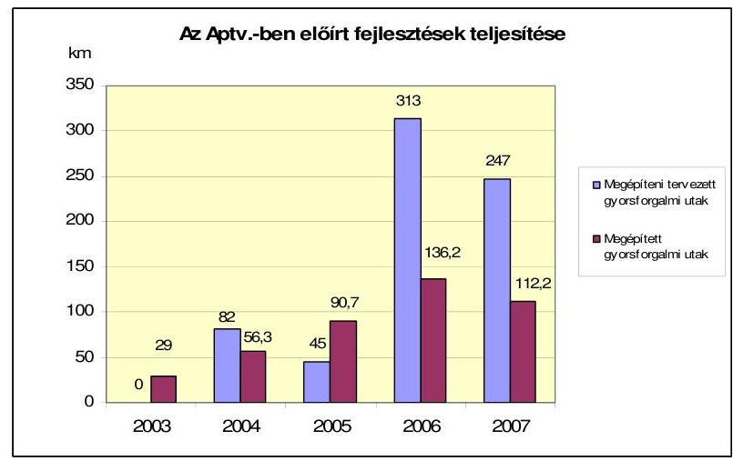
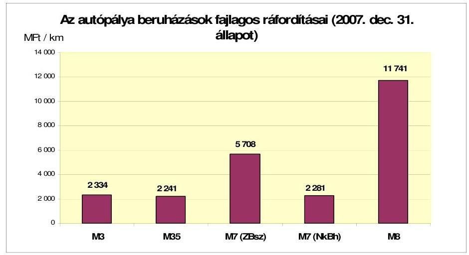
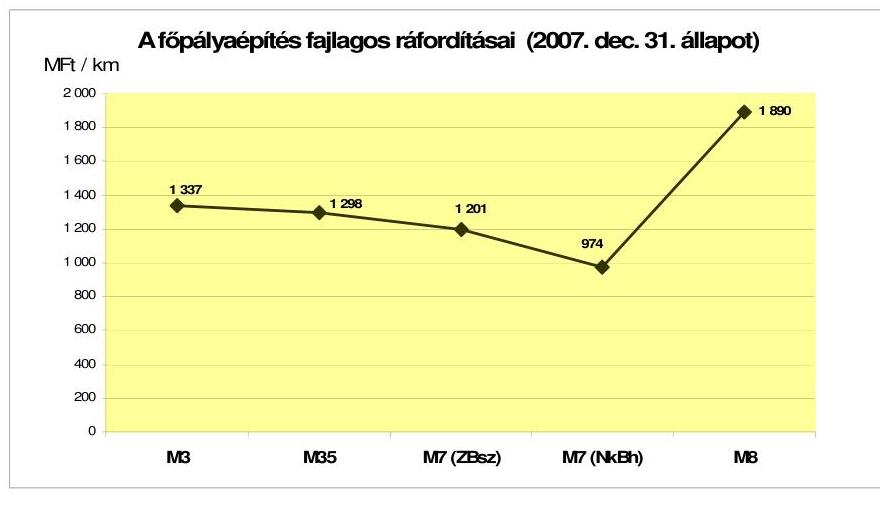
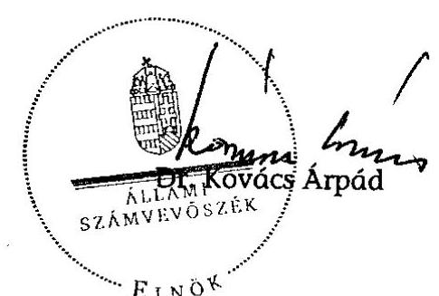
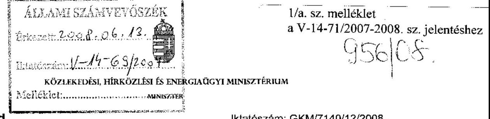
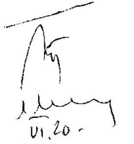
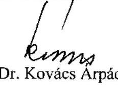

# JELENTÉS 

a 2007-ben befejeződő autópálya beruházások ellenőrzéséről

---

2. Államháztartás Központi Szintjét ellenőrző Igazgatóság
2.1. Teljesítmény Ellenőrzési Főcsoport
Iktatószám: V-14-71/2007-2008.
Témaszám: 876.
Vizsgálat-azonosító szám: V0372
Az ellenőrzést felügyelte:
Bihary Zsigmond
főigazgató
Az ellenőrzés végrehajtásáért felelős:
Kemény Emil
főigazgató-helyettes
Az ellenőrzést vezette:
Makkai Mária
főcsoportfőnök-helyettes
Az ellenőrzést végezték:

| Bank Lajos számvevő tanácsos, főtanácsos | Gaálné Izsó Éva számvevő tanácsos | Kun Eszter számvevő tanácsos |
| :--: | :--: | :--: |
| Lucza Anikó számvevő | Massányi Tibor számvevő | Nagy Ákos számvevő |
| Terbe Mónika számvevő | Komáromy Attila külső szakértő |  |

# A témához kapcsolódó eddig készített számvevőszéki jelentések: 

címe
Jelentés a koncesszióba adott állami tevékenységek vizsgálatáról 0114
Jelentés az M3 autópálya beruházás pénzügyi folyamatának ellenőrzéséről 0218
Jelentés az M7 autópálya felújítás pénzügyi folyamatának ellenőrzéséről 0342
Jelentés a szekszárdi Duna-híd beruházás ellenőrzéséről 0428
Jelentés a Magyar Köztársaság 2004. évi költségvetése végrehajtásának ellenőrzéséről 0540
Jelentés a Magyar Köztársaság 2005. évi költségvetése végrehajtásának ellenőrzéséről 0628
Jelentés az autópálya beruházások finanszírozási megoldásainak összehasonlító ellenőrzéséről 0645
Jelentés a 2006-ban befejeződő autópálya beruházások ellenőrzéséről

---

## Eierlikör (1)

Menge: 1 Drink

2 Zentiliter Zitronensaft
2 Zentiliter Zuckersirup
1 Zentiliter Zuckersirup
1 Zentiliter Zuckersirup
etwas Zuckersirup
etwas Zuckersirup
etwas Zuckersirup
etwas Zuckersirup
etwas Zuckersirup
etwas Zuckersirup
etwas Zuckersirup
etwas Zuckersirup
etwas Zuckersirup
etwas Zuckersirup
etwas Zuckersirup
etwas Zuckersirup
etwas Zuckersirup
etwas Zuckersirup
etwas Zuckersirup
etwas Zuckersirup
etwas Zuckersirup
etwas Zuckersirup
etwas Zuckersirup
etwas Zuckersirup
etwas Zuckersirup
etwas Zuckersirup
etwas Zuckersirup
etwas Zuckersirup
etwas Zuckersirup
etwas Zuckersirup
etwas Zuckersirup
etwas Zuckersirup
etwas Zuckersirup
etwas Zuckersirup
etwas Zuckersirup
et

---

# TARTALOMJEGYZÉK 

BEVEZETÉS ..... 7
I. ÖSSZEGZŐ MEGÁLLAPÍTÁSOK, KÖVETKEZTETÉSEK, JAVASLATOK ..... 12
II. RÉSZLETES MEGÁLLAPÍTÁSOK ..... 24

1. A beruházások feltételrendszere ..... 24
1.1. A fejlesztési és finanszírozási koncepció ..... 24
1.2. A GKM által gyakorolt szakmai irányítás és felügyelet ..... 27
2. A beruházások előkészítése ..... 28
2.1. A beruházásokhoz kapcsolódó döntések megalapozása ..... 28
2.2. A beruházások megvalósítását megelőző forgalmi becslések ..... 31
2.3. A nyomvonalak kijelölése ..... 32
2.4. A tervezők kiválasztása és az építési engedélyek kiadása ..... 37
2.5. A területszerzési tevékenység ..... 41
2.6. A régészeti tevékenység ..... 46
2.7. A területátadási folyamat ..... 48
3. A beruházás lebonyolításában résztvevők kiválasztása és a megkötött szerződések ..... 50
3.1. A kivitelező kiválasztása ..... 50
3.2. A beruházások előzetes árkalkulációi ..... 55
3.3. A kivitelezővel kötött szerződések és azok módosításai ..... 57
3.4. A Mérnök és a minőségellenőrző szervezet kiválasztása ..... 61
3.5. A beruházás megvalósításában résztvevő felek együttműködése ..... 63
4. A beruházások fizikai megvalósítása ..... 65
4.1. Az idő szempontok (célok) érvényesülése ..... 65
4.2. A költségszempontok (cél) érvényesülése ..... 67
4.3. A műszaki tartalomváltozások indokoltsága és költségkihatásai ..... 69
4.4. A NIF Zrt., mint beruházó felügyeleti tevékenysége ..... 70
4.5. A beruházások szakmai felügyelete a minisztérium részéről ..... 72
4.6. Minőségbiztosítás ..... 72
5. A kifizetések alátámasztottsága ..... 78
6. Az autópálya szakaszok beruházási költségei ..... 80

---

# MELLÉKLETEK 

1/a. sz. A Közlekedési, Hírközlési és Energiaügyi Minisztérium észrevétele
1/b. sz. Válasz a Közlekedési, Hírközlési és Energiaügyi Minisztérium észrevételére
2. sz. Az Aptv.-ben 2007. évre tervezett autópálya átadások meghiúsulásának okai
3. sz. Ellenőrzési javaslatok teljesülése
4. sz. Kimutatás az ellenőrzött autópálya beruházások finanszírozásáról
5. sz. Közbeszerzési eljárások a kivitelező kiválasztására
6. sz. Műszaki tartalomváltozások összefoglalása építményenként, M7 autópálya Zamárdi-Balatonszárszó közötti szakasz
7. sz. Műszaki tartalomváltozások összefoglalása építményenként, M8 Dunaújvárosi Duna-híd
8. sz. Az ellenőrzött beruházások ráfordításai a 2007. december 31-i állapot szerint

## FÜGGELÉKEK

1. sz. Az M7 autópálya kőröshegyi szakasz nyomvonalváltozata
2. sz. A minőségi követelmények teljesítése

---

# RÖVIDÍTÉSEK JEGYZÉKE 

| Aptv. | a Magyar Köztársaság gyorsforgalmi közúthálózatának közérdekűségéről és fejlesztéséről szóló 2003. évi CXXVIII. törvény |
| :--: | :--: |
| Áht. | az államháztartásról szóló 1992. évi XXXVIII. törvény |
| ÁAK Zrt. | Állami Autópálya Kezelő Zrt. |
| ÁKMI Kht. | Állami Közúti Műszaki Információs Kht. |
| ÁSZ | Állami Számvevőszék |
| EKH | Előzetes Környezeti Hatástanulmány |
| ELTE RTI | Eötvös Lóránd Tudományegyetem Régészettudományi Intézete |
| FTVKF | Felső Tisza-vidéki Környezetvédelmi Felügyelőség |
| GKM | Gazdasági és Közlekedési Minisztérium |
| GVH | Gazdasági Versenyhivatal |
| Hatályos Kbt. | a 2003. évi CXXIX. törvény a közbeszerzésekről |
| HIF | Hálózati Infrastruktúra Főosztály |
| KBDB | Közbeszerzési Döntőbizottság |
| Kbt. | az 1995. évi XL. a közbeszerzésekről |
| KHVM | Közlekedési, Hírközlési és Vízügyi Minisztérium |
| KKF | Központi Közlekedési Felügyelet (2007-től Nemzeti Közlekedési Hatóság) |
| KKK | Közlekedésfejlesztési Koordinációs Központ |
| Kmsz. | Kilométer-szelvény |
| MMT | Mintavételi és Minősítési Terv |
| ME | Műszaki Előírások |
| MSZF | Műszaki Szállítási Feltételek |
| NIF Zrt. | Nemzeti Infrastruktúra Fejlesztő Zrt. |
| OKA | Országos Közúti Adatbázis |
| OTK | Országos Területfejlesztési Koncepció |
| OTrT | Országos Területrendezési Terv |
| RKH | Részletes Környezeti Hatástanulmány |
| RODEN Kft | RODEN Mérnöki Iroda Kft. |
| SEB | Stratégiai Előkészítő Bizottság |
| SZMSZ | Szervezeti és Működési Szabályzat |
| TIB | Tulajdonosi és Intézmény-felügyeleti Bizottság |
| TIKÖFE | Tiszántúli Környezetvédelmi Felügyelőség |
| TU | Technológiai Utasítások |
| UVATERV Zrt. | Út- és Vasúttervező Zrt. |
| ÜHR | Üzemi Hírközlő Rendszer |
| ZIB Kft. | ZIB Consulting Tanácsadó és Szolgáltató Kft. |

---

.

---

# ÉRTELMEZŐ SZÓTÁR 

kiviteli terv

Környezeti hatástanulmány
közműkiváltás

Mérnök
műszaki tartalomváltozás
organizáció
pótmunka
talajkonszolidáció
többletmunka
ideiglenes forgalomba helyezés

A beruházás kivitelezéséhez szükséges valamennyi részletet tartalmazó dokumentációk (útépítési-, hídépítési-, víz-építési-, forgalomtechnikai-, környezetvédelmi-, közműtervek, stb.) összessége.
Az építési beruházás-előkészítés keretében a környezetvédelmi szempontok figyelembevételével, a Beruházó által készíttetett tanulmány. Az Előzetes Környezeti Hatástanulmány a nyomvonal-változatokat tartalmazza és azokat vizsgálja. A Részletes Környezeti Hatástanulmányt a Környezetvédelmi Hatóság által kijelölt nyomvonalakra kell készíteni.
Közmű (víz, gáz, elektromos vezeték, telefon) áthelyezése másik nyomvonalra a vízszintes vagy magassági vonalvezetés megváltoztatásával.
A NIF Zrt. és a Mérnök között létrejött megbízási szerződés szerint a kivitelezési munkák mérnöki felügyeletével és a közbeszerzési eljárás előkészítésében való közreműködéssel megbízott szervezet.
Az építési beruházásnál a közbeszerzési eljárás során elnyert munkától eltérő műszaki megoldás, amely elmaradó munkát, vagy pótmunkát eredményez.
Az építési folyamat térbeli és időbeli szervezése.
Műszakilag szükséges feladatok, amelyeket az ajánlatadás időszakában kiadott tervek nem tartalmaznak.
A töltés szintjének süllyedését eredményező, a töltések önsúlyából származó töltés alatti talajtömörödési folyamat, amely a süllyedés megállásáig tart.
A tervekben szereplő feladat, amelynek nagysága a ténylegesen elvégzett és az ajánlati tervben szereplő mennyiség különbsége, ami nem számolható el.
A Közlekedési Hatóság (Megyei Közlekedési Felügyelet, illetve Központi Közlekedési Felügyelet) határozatban engedélyezi az útszakasz forgalom általi igénybe vételét a 15/2000. (XI. 16.) KöViM rendeletben leírtak szerint.

---

.

---

# JELENTÉS 

## a 2007-ben befejeződő autópálya beruházások ellenőrzéséről

## BEVEZETÉS

Az Állami Számvevőszék (továbbiakban: ÁSZ) stratégiai célkitűzéseinek megfelelően kiemelt figyelmet fordítunk a közlekedési infrastruktúra fejlesztésének, fenntartásának, finanszírozásának ellenőrzésére: 2001-ben a koncesszióba adott állami tevékenységeket; 2002-ben az M3 autópálya beruházást; 2003-ban az M7 autópálya felújítás pénzügyi folyamatait; 2004-ben a szekszárdi Duna-híd beruházást; 2005-ben a 2004. évi költségvetés végrehajtásának ellenőrzése keretében az M5 autópálya szerződéseit; 2006-ban előbb az autópálya beruházások finanszírozási megoldásait, majd a 2006-ban befejeződő autópálya beruházásokat ellenőriztük.

A 2006-ban és 2007-ben befejeződő autópálya beruházásokra a Magyar Köztársaság gyorsforgalmi úthálózatának közérdekűségéről és fejlesztéséről szóló, többször módosított 2003. évi CXXVIII. törvény ${ }^{1}$ (továbbiakban: Aptv.) előírásai alapján került sor.

Az Aptv. konkrétan meghatározta az egyes autópálya szakaszok átadásának 2004-2007 átadási határidejét összességében 687 km hosszúságban. A 2007. év végéig ténylegesen forgalomba helyezett utak hossza az előírt 60%-a, 413 km volt.

[^0]
[^0]:    ${ }^{1}$ A Magyar Köztársaság gyorsforgalmi úthálózatának közérdekűségéről és fejlesztéséről.

---

2005. év végéig a gyorsforgalmi úthálózat fejlesztése ütemesen valósult meg, 3 szakaszt a tervezetthez képest korábban adtak át. Az Aptv. a gyorsforgalmi útszakaszok 81,5%-ának átadását 2006-ra és 2007-re irányozta elő, ami részben teljesült. A 2006-ban átadni tervezett útszakaszok közül 4 szakasz átadása 2007-re húzódott át, 4 szakasz építése pedig folyamatban van.

A 2007. évre előírt 247 km gyorsforgalmi útból 130 km autópálya, 117 km autóút. Az átadásra megjelölt 12 útszakaszból egyet sem helyeztek forgalomba. Az átadások elmaradásának oka a szükséges források hiánya és az előkészítés - ezen belül különösen a területbiztosítás - elhúzódása volt a Nemzeti Infrastruktúra Fejlesztő Zrt. (továbbiakban: NIF Zrt.) tájékoztatása alapján. Az Aptv.-ben 2007-re tervezett átadások csúszásának, illetve az M6-M0 Érdi tető még 2006-ra tervezett befejezése késedelmének okait az 1. sz. melléklet tartalmazza.

Az Aptv. a gyorsforgalmi utak előkészítéséhez és építéséhez szükséges pénzeszközökről globálisan, a különböző finanszírozási forrásokról (központi költségvetés, EU támogatás, magántőke) együttesen rendelkezett, 2005. évben 327 Mrd Ft, 2006. évben 347 Mrd Ft és 2007. évben 415 Mrd Ft pénzeszközről. Az éves szinten meghatározott források az adott évi kiadások (előkészítés, kivitelezés) finanszírozását szolgálták. A rendelkezésre bocsátott pénzeszközök tényleges nagysága - a Gazdasági és Közlekedési Minisztérium (továbbiakban: GKM) tájékoztatása szerint - 2005. évben 233 Mrd Ft, 2006. évben 277 Mrd Ft, 2007. évben 230 Mrd Ft volt.

A Magyar Köztársaság 2005. évi költségvetéséről szóló 2004. évi CXXXV. törvény 13. § (3) bekezdése előírta a magántőke állami fejlesztési célú bevonását. Az Aptv. szerint 2005 márciusától a magántőke bevonásával finanszírozott - a Program utakról szóló 317/2005. (XII. 25.) Korm. rendeletben meghatározott Program utak finanszírozási, beruházási és üzemeltetési feladatait az Állami Autópálya Kezelő Zrt. (a továbbiakban: ÁAK Zrt.) látta el, az építtető továbbra is a NIF Zrt. (korábbiakban Nemzeti Autópálya Zrt.) maradt. A Kormány 2005-re tervezett kötvénykibocsátása nem teljesült, így 2005-től az autópálya építések finanszírozása költségvetési forrásból és a NIF Zrt. által állami kezességvállalás mellett felvett hitelből, 2007-től központi költségvetési és EU forrásból valósult meg.

A Nemzeti Autópálya Zrt. névmódosítása Nemzeti Infrastruktúra Fejlesztő Zrt.-re 2007. február 19-vel került cégbírósági bejegyzésre változatlan alaptőke összeggel. A névváltoztatást az indokolta, hogy kormányzati döntés eredményeként az addig a MÁV által koordinált, EU-vasúti fejlesztési projektekkel is a NIF Zrt. foglalkozik. Ennek keretében a szóban forgó projektek teljes dokumentációját átadták és a szakemberek egy része is átkerült az új szervezethez.

2003 januárjától a Magyar Állam a beruházó NIF Zrt. és az üzemeltetési feladatokat ellátó ÁAK Zrt. közvetlen tulajdonosa. Az állam tulajdonosi jogainak gyakorlója a gazdasági és közlekedési miniszter.

Az Aptv. 2007. július 3-tól hatályos szabályozása szerint a gyorsforgalmi utak építtetője - a magántőke bevonásával megvalósított utak kivételével - a NIF Zrt. Az autópálya-szakaszok kivitelezőjét a NIF Zrt. a közbeszerzésekről szóló

---

1995. évi XL. törvény (továbbiakban: Kbt.) alapján lefolytatott közbeszerzés során választotta ki.

2007-től kizárólagosan az ÁAK Zrt. végzi a gyorsforgalmi utak (kivéve a PPP finanszírozási konstrukcióban megvalósított utak) felújítási, üzemeltetési és karbantartási feladatait. Az állami vagyonról szóló 2007. évi CVI. tv. melléklete - amely a tartós állami tulajdonban maradó társaságokat sorolja fel - 2007. szeptember 17-től már nem tartalmazza az ÁAK Zrt.-t. A GKM stratégiájának 2007. évi megvalósításához kapcsolódó intézkedési terv az ÁAK Zrt. privatizációját 2007. III. negyedévére ütemezte.

A jelenlegi ellenőrzés keretében vizsgált autópálya szakaszok megvalósításának szabályozási, műszaki, finanszírozási és szerződéses feltételrendszere közel azonos
 volt, mint a 2006-ban befejezett autópálya beruházásoknál érintett szakaszoknál. Ez utóbbiak ellenőrzéséről szóló jelentésben foglalt főbb megállapítások a következők voltak.

Az Áptv. szerint az ellenőrzött gyorsforgalmi útszakaszokat 2006. végéig kellett átadni. A gazdasági és közlekedési miniszter által jóváhagyott, illetve aláírt (koncessziós szerződések) kivitelezési szerződések szerint a befejezési határidő az M7 Ordacsehi-Balatonkeresztúr közötti autópálya szakasznál 2006. április 30., a többi szakasznál pedig 2006. március vége volt. Az Áptv.-hez képest kilenc hónappal előrehozott befejezési határidőnek szakmai indoka nem volt, annak meghatározásakor nem vették figyelembe a beruházások előkészítésének tényleges helyzetét, és a kivitelezés időszükségletét. ${ }^{2}$ Ennek következménye végül az lett, hogy a Program utaknál a szerződésben vállalt határidőket az eredeti határidőhöz képest meg kellett hosszabbítani.

A 2006-ban befejezett és ellenőrzött beruházásoknál a kitűzött határidő célok nem, vagy úgy teljesültek, hogy a munkák befejezését szakaszolták, illetve az M7 beruházásnál csak többletköltséget okozó műszaki tartalomváltozással volt tartható a határidő. Nem segítette a szerződésben eredetileg rögzített határidők betartását sem az útszakaszok előkészítettsége, sem a kivitelezési szerződésekben meghatározott rövid teljesítési határidő. A beruházások során a határidő prioritása mellett a gazdaságossági szempontok nem érvényesültek, a minőségi követelmények teljesülése kockázati tényezőket tartalmaz.

A Program utaknál az NA Zrt. a kivitelezőket nyílt közbeszerzési eljárás keretében választotta ki, amelynek a lebonyolítása megfelelt az NA Zrt. versenyeztetési szabályzata előírásainak. Az NA Zrt. az ajánlati felhívásban - amely szerint műszakilag az a pályázó felelt meg a kiírásnak, aki az utóbbi 5 évben már épített 10 km 2x2 sávos újonnan átadott autópályát - behatárolta a lehetséges vállalkozók körét. Ebből és az Áptv. szerint 2004-2006-ban átadni tervezett gyorsforgalmi utak volumenéből az következett, hogy a megépítendő útszakaszok száma meghaladta a lehetséges és alkalmas kivitelezők számát a hazai piacon, ami az építési piac felosztásának irányába hatott és a potenciális kivi-

[^0]
[^0]:    ${ }^{2}$ Az NA Zrt. 2007. március 14-én kelt levele szerint „a beruházások tervezett átadási határideje nem műszaki megfontolásokon, hanem kormányzati igényeken alapult."

---

telezőknek az ajánlati áraik kialakításánál „versenynyomással" nem kellett számolniuk.

A Program utaknál a kivitelezői pályázat nyertese mindhárom beruházásnál a legkedvezőbb és egyben a legalacsonyabb árat ajánló pályázó volt, akivel az NA Zrt. a pályázati áron átalányáras szerződést kötött, amit a tulajdonosi joggyakorló jóváhagyott. A legalacsonyabb ár önmagában nem jelenti a leggazdaságosabbat. Az NA Zrt.-nél nem készültek - a tulajdonosi jogokat gyakorló sem követelte meg - olyan előzetes számítások, amelyekhez viszonyítva a kivitelezés gazdaságossága megítélhető lenne. Az NA Zrt. által kialakított egységár adatbázis - amely a korábban meghirdetett gyorsforgalmi útszakaszok ajánlati árát tartalmazta - nem adott viszonyítási alapot az ajánlatok értékeléséhez, az abban szereplő áraknak a képzése és elemei nem ismertek.

A 2. sz. melléklet tartalmazza az ÁSZ által végzett „2006-ban befejeződő autópálya beruházások ellenőrzése" és „Az autópálya beruházások finanszírozási megoldásainak összehasonlító ellenőrzése", valamint a GKM Belső ellenőrzési Főosztálya által „A fejezeti kezelésű előirányzatokból származó pénzeszközök hasznosulásának vizsgálata a NIF Zrt.-nél" vizsgálatok eredményeként tett javaslatokat és azok megvalósítása érdekében hozott intézkedéseket.

A jelen vizsgálattal érintett autópályák forgalomba helyezését az Áptv. 2006. évre írta elő, melyek közül egy, az M35 Görbeháza-Debrecen szakasz átadása teljesült az Áptv. szerint előírt időpontig. Négy pályaszakasz (M3, M7 két szakasza, M8) átadása a törvényben előírtakhoz képest a következő évben valósult meg. A 2006. év végén és 2007-ben átadott szakaszok hossza 112 km volt és mindegyik autópályaként került megépítésre.

A jelenlegi ellenőrzés célja annak értékelése volt, hogy:

- a beruházási szerződések előkészítése, a szerződéses feltételek összhangban voltak-e a jogszabályokban és kormányhatározatokban meghatározott követelményekkel;
- az autópálya beruházások során a határidők, minőség- és költségcélok a jogszabályokkal, a szerződésekben foglaltakkal összhangban teljesültek-e;
- a teljesítések elszámolásának rendszere és módja alkalmas volt-e a szerződéseknek megfelelő teljesítések nyomon követésére, a kifizetések és a tényleges teljesítések összhangjának biztosítására;

Az ellenőrzés a 2006. december és 2007. év vége között ideiglenesen forgalomba helyezett gyorsforgalmi útszakaszokra terjedt ki. Az ellenőrzött öt beruházás az Áptv.-ben a 2006-ban átadandó szakaszok között szerepelt.

Az ellenőrzött útszakaszok a következők voltak:

- M35 autópálya Görbeháza-Debrecen közötti szakasz (2006. decemberben átadott);
- M3 autópálya Görbeháza-Nyíregyháza közötti szakasz;

---

- M7 autópálya Zamárdi-Balatonszárszó közötti szakasz (a Kőröshegyi völgyhíddal);
- M7 autópálya Nagykanizsa-Becsehely közötti szakasz;
- M8 autópálya Dunaújvárosi Duna-híd és a csatlakozó autópálya szakasz ( 10,3 és $15,5 \mathrm{~km}$ szelvények között).

Az ellenőrzés a GKM, az NIF Zrt., az ÁAK Zrt. és a KKK (volt Útgazdálkodási és Koordinációs Igazgatóság, a továbbiakban: UKIG) autópálya beruházásokkal kapcsolatos tevékenységére irányult.

A jelentés megállapításai az ellenőrzött autópálya szakaszokra - amelyek megvalósítása az NA Zrt. időszakára esett - vonatkoznak. Az ellenőrzés nem terjedt ki a NIF Zrt. jelenlegi működésének, tevékenységének teljes körű vizsgálatára, azt nem minősíti. Az ellenőrzött beruházásoknál tapasztaltakhoz képest bevezetett változásokat - projektszervezet létrehozása és működtetése 2006. év végétől, minőségirányítási rendszer bevezetése 2007. március 1-jétől, a kontrolling területen folyamatban lévő informatikai fejlesztés - nem vizsgáltuk, mivel az adott autópálya szakaszokat nem érintették.

Az Országgyűlés 72/2008. (VI. 10.) számú határozatában felkérte az Állami Számvevőszéket arra, hogy „fordítson figyelmet a korrupció tipikus kiváltó okaira, területeire, mutasson rá a jogalkalmazási hiányosságokra." A határozatban foglaltak végrehajtása a jövőbeli ellenőrzések során lehetséges. A korábbi és a jelenlegi autópálya beruházásokkal kapcsolatos ellenőrzések során megállapítottuk, hogy korlátozott volt a piaci verseny, az árak transzparenciája nem volt biztosított.

Az ellenőrzés jogalapját az Állami Számvevőszékről szóló 1989. évi XXXVIII. törvény 2. § (1) bekezdése képezte.

A jelentést egyeztetésre megküldtük a közlekedési, hírközlési és energiaügyi miniszternek. Levele másolatát és az arra adott választ az 1/a-b. számú mellékletek tartalmazzák.

---

# I. ÖSSZEGZŐ MEGÁLLAPÍTÁSOK, KÖVETKEZTETÉSEK, JAVASLATOK 

A 2007-ben befejeződő autópálya beruházásokra az Áptv.-ben az átadási határidőket nem az előkészítettség tényleges helyzetének és a kivitelezéshez szükséges, műszakilag indokolt idő figyelembe vételével határozták meg ${ }^{3}$, négy autópálya szakasz átadása a tervezett 2006. év vége helyett 2007-re húzódott át. Ebben közrejátszott a beruházások megvalósításához szükséges források bizonytalansága, a finanszírozási feltételek folyamatos változása, az Áptv. gyakori módosulása ${ }^{4}$, a szakmapolitikai és tulajdonosi irányítás hiányossága.

Az ellenőrzött beruházásoknál nem megfelelően érvényesültek az állami érdekek, ${ }^{5}$ a gazdaságossági szempontok nem kaptak prioritást, a kivitelezési árak képzésének átláthatósága és ellenőrizhetősége nem volt biztosított, a változó műszaki tartalom miatt rendszeresek voltak a pótmunkák.

Az ellenőrzött beruházásokra ( 112 km ) 2007. december 31-ig elszámolt ráfordítások összege a NIF Zrt. kimutatása alapján nettó 356,0 Mrd Ft volt. A beruházási ráfordítások között 17,0 Mrd Ft (5\%) az előkészítési feladatokra, 325,7 Mrd Ft a kivitelezési tevékenységre ( $91,5 \%$ ), 13,3 Mrd Ft ráosztott, egyéb projektköltségként került elszámolásra ( $3,5 \%$ ), amelyek között szerepel a NIF Zrt. által felvett hitelek szakaszokra elszámolt kamatköltsége is. A Magyar Államnak az elszámolt ráfordításoknál többe került a beruházások megvalósítása. További kiadást jelentett egyrészt a NIF Zrt. működési költségeinek biztosítása, másrészt a beruházások finanszírozásához - az ellenőrzött szakaszokra is - 2005-ben

[^0]
[^0]:    ${ }^{3}$ A GKM 2008. március 10-én kelt levele szerint: „Az átadási idők meghatározása optimális előkészítési időket feltételezett."
    A NIF Zrt. 2008. március 10-én kelt levele szerint: „Nem vonatkoztatható el a projektek megvalósítása az Országgyűlés, a Kormány mindenkori döntéseitől, amelyeket politikai szempontok determináltak és nem a projekt konkrét technológiai tartalmához igazodó szakmai szükségszerűség. Az Áptv.-ben, illetve az ezt megelőző kormányhatározatokban előírt gyorsforgalmi fejlesztési programok ütemezéséhez nem készültek gazdaságossági vizsgálatok, a törvényalkotók nem igényelték ezt. Nem volt olyan kormányzati döntés az építések prioritásáról, amelyet megelőző számítások alapoztak volna meg."
    ${ }^{4}$ Az Állami Számvevőszék a 0645 számú, az autópálya beruházások finanszírozási megoldásainak összehasonlító ellenőrzéséről készített jelentésében megállapította, hogy „Az Áptv., a hatályba lépésétől eltelt két és fél év alatt, 8 alkalommal módosult, amelyek érintették a finanszírozást, az autópálya építésben részt vevő szervezetek feladatait. A törvénymódosítások ilyen gyakorisága nem segíti az autópálya fejlesztések törvényi szabályozásának kiszámíthatóságát és növeli a feladatok végrehajtásának kockázatát." 2007. december 31-ig az Áptv. hatálybalépésétől kezdődően 13-szor módosult.
    ${ }^{5}$ Az Állami Számvevőszék a 0712 számú, a 2006-ban befejeződő autópálya beruházások ellenőrzéséről készített jelentésében megállapította, hogy „Az állami beruházásokra vonatkozó, normatívákat tartalmazó, egységesen alkalmazandó jogi szabályozás hiányában az állami beruházások kormányzati szinten nem koordináltak, a megvalósításuk a piaci körülmények hatásai alapján esetleges, szervezetfüggő, elsősorban finanszírozási és nem rendszerszemléletű."

---

tervezett, de meghiúsult kötvénykibocsátás előkészítésének költsége. ${ }^{6}$ Ezen költségeknek az ellenőrzött szakaszokra jutó hányada nem meghatározott.

Az M7 autópálya Zamárdi-Balatonszárszó és az M8 szakaszokon nemzetközileg elismert csúcstechnológiákat alkalmaztak, a Kőröshegyi völgyhíd és a Dunaújvárosi Duna-híd hosszúságát, a pillérek távolságát és magasságát tekintve egyedülálló szerkezeti alkotások. Ugyanakkor a beruházási ráfordítások 27\%-át a két híd költsége ( $96,6 \mathrm{Mrd} \mathrm{Ft}$ ) tette ki, ami kiugróan magas fajlagos ráfordításokat eredményezett.

A beruházási munkák egyik fő összetevője a főpálya-építés. Ennek költsége az öt vizsgált autópálya-szakasz esetében az összesített beruházási ráfordítások 38\%-át tette ki, amely arány projektenként eltérő mértékű (11-57\%) volt. Ez arra világít rá, hogy önmagában a főpálya építési költségek vizsgálata nem elégséges a beruházási ráfordítások megítéléséhez.

[^0]
[^0]:    ${ }^{6}$ Az Állami Számvevőszék 2006-ban a 0645. sz., az autópálya beruházások finanszírozási megoldásainak összehasonlító ellenőrzéséről készült jelentésében megállapította, hogy „a tervezett kötvénykibocsátással összefüggésben felmerült költségek 2006. szeptember 21-ig 1,8 Mrd Ft-ot tettek ki (jogi, pénzügyi és műszaki tanácsadás, szakértői díj és egyéb címen)".

---

Az autópálya beruházások ráfordításait jelentős mértékben megnövelték a műtárgyak és a kapcsolódó építmények (hidak, csomópontok, pihenőhelyek, közművek, keresztező utak, kerítések, stb.) költségei. Ez okozta azt, hogy az M7 Zamárdi-Balatonszárszó és az M8 szakaszoknál 5-6-szoros az eltérés a fajlagos beruházási és fajlagos főpálya-építési ráfordítások között, de a többi szakasznál is közel 2-szeres.

A gyorsforgalmi úthálózat fejlesztési prioritások változtak az ellenőrzött autópálya szakaszok megvalósításának időszakában. Az M3, M35 és M8 autópálya szakaszok megépítését a vonatkozó kormányhatározatok 2003. márciusáig autópályává fejleszthető autóútként írták elő, ezt követően már autópályaként rögzítette az Áptv. A finanszírozást 2003-ig a Magyar Fejlesztési Banktól felvett hitelekből, majd 2005 végéig költségvetési forrásból, 2006-ban piaci forrásokból - kötvénykibocsátás - 2007-ben költségvetési forrásból tervezték. A NIF Zrt. adatszolgáltatása szerint az ellenőrzött autópálya szakaszok tényleges finanszírozása 42%-ban közvetlen költségvetési forrásból, 57%-ban hitelből történt, 1% fedezete a NIF Zrt. saját tőkéje volt. ${ }^{7}$

Az Áptv.-ben előírt határidő teljesíthetőségére átfogó megvalósíthatósági tanulmány nem készült, a GKM nem vizsgálta, hogy a NIF Zrt. biztosítani tudja-e az előkészítési és kivitelezési feladatok összehangolt koordinálását
 a határidő teljesítése érdekében. A GKM 2002-2004 között az Áptv. előkészítése és a folyamatban lévő beruházások koordinálása céljából - az érintettek, köztük a NIF Zrt. részvételével - bizottságot működtetett, azonban dokumentumok hiányában a bizottság tevékenysége nem értékelhető. Az Áptv.-ben előírt 2006. év végi átadás az M7 autópálya Nagykanizsa-Becsehely közötti szakasz esetében azt jelentette, hogy a 2003-ban kormányhatározatban rögzített legkésőbbi kezdési időpontra a beruházásnak be kellett fejeződnie. A GKM a szerződéses feltételek meghatározását - ennek keretében az átalányáras ${ }^{8}$ kivitelezői szerződések alkalmazását - a NIF Zrt.-re bízta, nem követelte meg az előzetes árkalkulációk elkészítését a NIF Zrt. részéről. A tulajdonos a NIF Zrt.-nél - ahova a szakmai felelősségének változatlan fennállása mellett a beruházói feladatokat kihelyezte - nem ellenőrizte a közpénzekkel való felelős, takarékos gazdálkodás követelményének érvényesülését.

[^0]
[^0]:    ${ }^{7}$ Az ÁSZ 0645 számú, az autópálya beruházások finanszírozási megoldásainak összehasonlító ellenőrzéséről szóló jelentésében megállapította, hogy „A finanszírozási formák változása a költségvetés mindenkori helyzetével és az autópálya fejlesztések elhatározott ütemével volt összefüggésben. A gyorsforgalmi utak fejlesztésének finanszírozásában elsődleges szempont volt a folyó évi költségvetést kimélő finanszírozási megoldások alkalmazása. A Kormány a magántőke bevonásának formájaként az ÁAK Zrt. kötvénykibocsátását jelölte meg, amelyből az ún. Program utak között kijelölt útszakaszok építését kell finanszírozni. A kötvény fedezetét jelentő - az állam által hosszú távon fizetendő rendelkezésre állási díjfizetését biztosító - szerződés az állam és az ÁAK Zrt. között nem jött létre. A tervezett kötvénykibocsátás nem valósult meg, így a kötelezettségek teljesítéséhez mind az ÁAK Zrt., mind az NA Zrt. hitelfelvételre kényszerült."
    ${ }^{8}$ Az Állami számvevőszék 2004-ben a 0428. számú, a szekszárdi Duna-híd beruházás ellenőrzéséről készített jelentésében megállapította, hogy „Költségnövelő kockázatokat jelentett a megvalósítás során az átalányárak megalapozottságának hiánya..."

---

Az államháztartásról szóló törvény 2003. júliustól előírja, hogy az 50 Mrd Ft-ot elérő, vagy azt meghaladó értékű, több éves fizetési kötelezettséggel járó szerződések megkötése előtt a Kormánynak az Országgyűlés felhatalmazását kell kérnie. Az Áptv. 2004. január 1-jei hatályba lépésével az autópálya beruházások esetében ezt a kötelezettséget megszüntette, 2007. júliustól csak a magántőke bevonásával megvalósuló beruházásokra írja elő. Ugyanakkor az Áptv. rögzíti a gazdasági és közlekedési miniszter felelőssége mellett kormánybeszámoló készítésének kötelezettségét. Ennek 2006-ban és 2007-ben a Kormány, illetve a GKM nem tett eleget, így az Országgyűlés nem kapott tájékoztatást a gyorsforgalmi úthálózat építésére fordított pénzeszközök felhasználásáról és a beruházások aktuális helyzetéről.

Az Áptv. megalkotása megszüntette azt a korábbi helyzetet, hogy a gyorsforgalmi úthálózat fejlesztések ütemezése jogszabályban nem volt rögzítve. Az Áptv. 2007. júliusi módosítása után a törvény már nem tartalmazza éves bontásban az átadandó és előkészítés alatt álló útszakaszokat, ami a törvény megjelenése előtti időszakra való visszalépést és az autópálya fejlesztések ütemezése tekintetében az Országgyűlés ellenőrző szerepének korlátozott érvényesülését jelenti. Az éves költségvetési törvényekben a gyorsforgalmi úthálózat fejlesztések adott évi kiadási előirányzatai szerepelnek. Ez alapján az Országgyűlés nem rendelkezik információval az egyes beruházások megvalósításának teljes összegéről (szerződéses érték), ami az ellenőrzött autópálya szakaszok esetében 41, 61, 79, 83 és 91 Mrd Ft volt.

A NIF Zrt. által a kivitelezőkkel megkötött eredeti szerződésekben rögzített teljesítési határidő 2006. november-december volt, amihez képest az átadások, az M35 autópálya kivételével, 8-9 hónap késéssel - mintegy 30%-kal több idő alatt - valósultak meg, amit a kivitelezési szerződésekben rögzített határidők módosításával a NIF Zrt. elfogadott és a tulajdonos jóváhagyott.

A NIF Zrt. a területátadásokra ütemtervekkel nem rendelkezett. ${ }^{9}$ Az előkészítés és fizikai megvalósítás párhuzamosan folyt, amely szoros koordinációt, kockázatelemzést és mindenre kiterjedő szervezést (pl. hálóterv) igényelt, ami a NIF Zrt.-nél az ellenőrzött autópálya szakaszok esetében nem kellő mélységben valósult meg. A kivitelezői szerződésekben rögzített határidők betartása területátadási okok miatt az M3 autópályánál és az M7 autópálya Nagykanizsa-Becsehely közötti szakaszánál nem volt lehetséges.

A NIF Zrt.-nél az ellenőrzött autópálya szakaszok megvalósítása során a külső és belső szervezetek által ellátott feladatok összhangját megteremtő projektmenedzsment szervezeti feltételei nem voltak biztosítottak. ${ }^{10}$ A kivitelező által ké-

[^0]
[^0]:    ${ }^{9}$ A GKM 2008. április 8-án kelt levelében írt magyarázat szerint: „A tulajdonviszonyok rendezetlensége és a kisajátítási eljárások időtartamának kiszámíthatatlansága miatt nem lehet megbízható ütemtervet készíteni."
    ${ }^{10}$ A NIF Zrt. 2008. március 10-én kelt levele szerint: „a projektmenedzsment rendszer kiépítése, az integrált vállalatirányítási rendszer kialakítása olyan lényegi változások, amelyek a NIF Zrt. működésének elmúlt három évében jelentek meg." A bevezetett rendszer működésének, hatásainak elemzésére az ÁSZ vizsgálat nem terjedt ki.

---

szített bázisütemtervek megfelelőségének objektív megítéléséhez a NIF Zrt. előzetesen nem készített ütemtervet. A beruházó monitoring tevékenysége alapvetően a kivitelező által készített ütemtervek jóváhagyására és követésére irányult. ${ }^{11}$

A NIF Zrt. minősítése szerint a késedelmek a kivitelező érdekkörén kívül alakultak ki (időjárási viszonyok, területátadási késedelem, műszaki tartalomváltozás). Az eredeti bázisütemtervekben a kivitelezők az időjárási kockázatok minimalizálására törekedtek, összhangba hozva a technológiai követelményeket az adott naptári időszakra jellemző időjárási viszonyokkal. A Dunaújvárosi Duna-híd esetében - a 2006. évi rendkívüli időjárási viszonyok miatt - a kockázatok megnövekedtek, ami a kivitelezői munkák szüneteltetését okozta. A kivitelező a szerződéses feltételekben rögzítettek figyelembe vételével erre az időszakra (technológiai állásidő) 817 M Ft általános költségtérítést kapott.

A NIF Zrt. a teljesítési határidők tarthatósága érdekében a szerződésekben legfeljebb 30%-ig terjedő kötbért kötött ki, ami egy negyedéves késedelem esetén meghaladta volna az 50 Mrd Ft-ot. A kötbér érvényesítésére a NIF Zrt.-nek nem volt lehetősége, mivel - a munkaterület-átadás késedelme, a területszerzések elhúzódása, jelentős műszaki tartalomváltozás vagy vis-maior esetek miatt - a szerződésszerű teljesítés akadálya a beruházó érdekkörében keletkezett.

Az autópálya szakaszok nyomvonalát - többek között - a közúthálózatfejlesztési (forgalomtól függő), a térségfejlesztési, a környezetvédelmi szempontok és a területszerzési lehetőségek (önkormányzati szempontok) határozzák meg. Mindegyik ellenőrzött autópálya szakasznál több nyomvonalváltozatot vizsgáltak, azonban a beruházások költségeinek optimalizálására irányuló tulajdonosi, beruházói stratégia nem volt. ${ }^{12}$ A végleges nyomvonal kialakításánál a környezetvédelmi engedélyeket az illetékes felügyelőségek kiadták, az önkormányzati érdekeket figyelembe vették. ${ }^{13}$

A részletes környezeti hatástanulmányok tartalmazták a forgalmi vizsgálatokat (becsléseket). Az M8 Dunaújvárosi Duna-híd által érintett M6 és M8 autó-

A GKM 2008. április 8-án kelt levele szerint: „A projekt menedzsment módszertanok megalkotását megelőzően is folytak beruházások, felkészült építőipari szakemberekkel, a projekt menedzsment csak egy eszköz, önmaga nem teremt értéket, segíti a cél rendszerszemléletű megvalósítását."
${ }^{11}$ A GKM 2008. április 8-án kelt levele szerint: „a kivitelezők igazolták és alátámasztották az erőforrás-szükségletek és a kapacitások összhangját."
${ }^{12}$ A NIF Zrt. 2008. március 10-én kelt levele szerint: „A beruházások költségeinek minimalizálására irányuló tulajdonosi és beruházói stratégia az, hogy az eljárásokban alkalmazott bírálati szempontok között - a műszaki és pénzügyi alkalmassági feltételeknek megfelelt ajánlattevők közül -, a legalacsonyabb ajánlati árral rendelkező kerüljön kiválasztásra."
${ }^{13}$ A NIF Zrt. 2008. március 10-én kelt levele szerint: „Két pont között a legrövidebb távolság az egyenes, attól a nyomvonalváltozatok minden esetben eltértek. A „beruházói stratégia" a beruházásban érintett valamennyi szervezet, hatóság és szakhatóság és a kormányzati szervek érdekegyeztetésén alapult. Nem a NIF Zrt. hatásköre a nyomvonal kiválasztása, Társaságunk egyik szereplője a folyamatnak. Magyarországon az a nyomvonal-változat valósulhat meg A és B pont között, amelyik jogerős építési engedélyt tud kapni, azaz az eljárásba bevont valamennyi (közel 80) hatóság és szakhatóság hozzájárulását megadja."

---

pályák forgalmi adatainak becslésekor azt feltételezték, hogy 2008-ra elkészül az M8 autópálya Veszprém és Szolnok közötti szakasza. A híd megépítésének legfőbb pozitívumaként az M1-M5 autópályák által lebonyolított nemzetközi forgalom részleges kiváltását jelölték meg. A hídhoz kapcsolódó M8 szakaszok - a megváltozott közlekedésfejlesztési stratégia szerint - csak 2015-re készülnek el. Az előrehozott beruházással - a kapcsolódó szakaszok nélkül - a tervezett hatékonysági követelmények (forgalomnagyság) nem teljesülnek. ${ }^{14}$

A nyomvonal meghatározása az M7 autópálya Zamárdi-Balatonszárszó szakaszánál közel 20 évig húzódott, aminek eredményeképpen a völgyhidas változat valósult meg. 1991-ben a lehetséges nyomvonalváltozatokra készített tanulmányterv 3 elvi változatot tartalmazott. A lakossággal a Balaton déli partjától 2-3 km távolságra lévő változatot egyeztették, amelyet Balatonföldvár és Kőröshegy települések - mivel lakott területet érintett - nem támogatták. Emiatt terveztették meg a távolabb eső (5-10 km) Kőröshegyi völgyhidas változatot. A parttól 15-20 km távolságra vezetett nyomvonalváltozatot a tervezőkkel nem dolgoztatták ki. 2000-ben egy szakértői csoport az érintett szakaszra egy olyan nyomvonalváltozatot dolgozott ki, amely elkerülte Kőröshegy települést, a szükséges híd és az alagút hossza fele volt a völgyhídnak és 7-13 m magasan keresztezhető volt az a völgy, amelyet a völgyhidas változat 70-80 m magasan ível át. A szakértői tanulmány szerint ez a nyomvonal a lakossági elfogadottság és tájvédelem szempontjából jobb paraméterekkel rendelkezett a völgyhidas megoldásnál. 2000. szeptemberben megállapodás született az érintett önkormányzatok és a NIF Zrt. részéről arról, hogy a szakértői tanulmányban szereplő nyomvonal továbbfejlesztett változatának továbbtervezését támogatják. Megállapodtak abban is, hogy amennyiben ez ellehetetlenül, akkor a völgyhidas változatot kölcsönösen elfogadják. Kőröshegy Község Önkormányzat Képviselő-testülete a szakértők által kidolgozott nyomvonalat és annak továbbfejlesztett változatát nem tárgyalta meg, azokról elutasító határozatot nem hozott. 2001 elején Kőröshegy önkormányzata azt jelezte, hogy az új nyomvonalváltozat ellentétes a község 1996-ban elfogadott rendezési tervével, és a lakossággal csak a völgyhidas változatot egyeztették. A Kőröshegyi völgyhíd megépítésére vonatkozó döntés műszaki, gazdaságossági, természetvédelmi és településrendezési megalapozottsága mindezek alapján nem igazolt. ${ }^{15}$

Az engedélyezési tervek alapján kidolgozott, területszerzési céllal készülő alapkisajátítási tervek elkészítése az M8 projekt kivételével 3-4 évet vett igénybe, ami a területszerzés ütemezett végrehajtását hátráltatta. Az M7 autópálya

[^0]
[^0]:    ${ }^{14}$ Az ÁSZ a 0428/1. sz., a svájci-magyar párhuzamos ellenőrzéséről készített jelentésében, a szekszárdi Duna-híd beruházással kapcsolatban megállapította, hogy „A rövid távú takarékossági szempontok prioritást kaptak a forgalmi adatok előrebecslésével és a hatástanulmányok előrejelzéseivel szemben. További 10 km autóút szakasz megépítésével lettek volna ugyanis elérhetők a gazdasági fejlődésre, versenyképességre, foglalkoztatottságra gyakorolt kedvező hatások. Ezt támasztották alá az önkormányzatoknál végzett kérdőíves felmérés eredményei is."
    ${ }^{15}$ A NIF Zrt. 2008. március 27-én kelt észrevétele szerint: „A magyarországi nyomvonalas létesítmény engedélyezések jogszabályi háttere nem a hatékony közpénz-felhasználás, költségoptimalizálás követelményeit tartotta elsődlegesnek, ezért a Zamárdi-Balatonszárszó közötti szakasz végleges nyomvonal kiválasztásánál az önkormányzati érdekek érvényesültek."

---

Zamárdi-Balatonszárszó szakasz kivételével a kivitelezések végéig tartott a pótterületekkel kapcsolatos kisajátítási tervezési folyamat, amit a kiviteli tervek többszöri változása okozta. Az M7 autópálya Nagykanizsa-Becsehely szakasz esetében felmerülő földhivatali problémák (a
 földhivatal nem fogadta el a tervező által kidolgozott ún. gyűjtőszámos kisajátítási terveket. rendezése 2 évig elhúzódott.

A területszerzésekre 2000-2002-ben az ÁAK Zrt., 2003-tól a NIF Zrt. kötötte meg az ügyvédi szerződéseket. A megbízók nem fordítottak kellő figyelmet a feladatok határidőinek betartására, az ügyek elhúzódását a szerződési határidők módosításával hidalták át. 2003. évtől a NIF Zrt. nem írt elő határidőt az ügyvédi irodák számára a területszerzés elvégzésére, 2006-ig nem alakított ki ösztönző rendszert (pl. differenciált díjazás, egybefüggő területek megszerzésének dotálása) a kivitelezések késedelem nélküli megkezdéséhez, ütemezett lebonyolításához.

A területszerzés hatékony lebonyolítását késleltette, hogy annak beruházói koordinálása nem volt kellő mértékű, a beszámoltatás és a felelősségek egyértelmű számonkérése nem történt meg. Az M8 szakasz kivételével a NIF Zrt. bonyolító szervezetet (Z.I.B. Consulting Kft.) bízott meg, aminek tevékenysége 2005. májusig nem volt átlátható, mivel a tevékenységét igazoló beszámolók nem voltak fellelhetőek. A bonyolító díjazása közel azonos volt az érdemi területszerzési tevékenységet végző ügyvédi irodákéval, ami a területszerzéshez kapcsolódó bonyolítási költségek nem megalapozott, 364 M Ft-os növekedését okozta. ${ }^{16}$

A régészeti feltárások a területszerzési problémák miatt nem kezdődtek meg időben. A régészeti feltárás az M7 autópálya Zamárdi-Balatonszárszó szakasz kivételével a kivitelezések megkezdése után 5-14 hónappal fejeződött be, ami befolyásolta a kivitelező részére átadott területek nagyságát, összefüggőségét.

Négy ellenőrzött autópálya szakasznál a kivitelezők kiválasztására kormányhatározat nyílt, előminősítéses közbeszerzési eljárást írt elő, az M8 autópályánál a NIF Zrt. tárgyalásos eljárást alkalmazott. Az ajánlati felhívás közzétételének időpontja, az Aptv. hatálybalépését két héttel megelőzően, négy szakasznál azonos volt (2003. december 16.), az M8 projektnél 2004. április 21. A kivitelező kiválasztására vonatkozó közbeszerzési eljárások lebonyolítása a Kbt. előírásainak megfelelt, az eljárások időtartama 4,5-11 hónap volt. A közbeszerzések megkezdéséig nem teljes körűen véglegesítették a műszaki tartalmat, mivel a tenderdokumentációkban a hídépítési tervek engedélyezési, és nem kiviteli terveken alapultak. (A közbeszerzési eljárás megindítását követően merült fel a Kőröshegyi völgyhíd meghosszabbítása, ${ }^{17}$ ami 2 Mrd Ft költségnövekedéssel

[^0]
[^0]:    ${ }^{16}$ A NIF Zrt. 2008. március 27-én kelt észrevétele szerint: „A NIF Zrt. 2007. évtől kezdődően módosította a lebonyolítóval kötött szerződését, elállt az ZIB Consulting Kft. további megbízásától az újonnan induló szakaszoknál, és ezt a lebonyolítási feladatot saját kapacitásbővítéssel végzi."
    ${ }^{17}$ A GKM 2008. április 8-án kelt levele szerint: „A módosítások - amelyek nem csak a hídhosszabbításra vonatkoztak - már 2003. őszén a hatósági engedélyezés idején felvetődtek, ezeket nem a Vállalkozó kezdeményezte, hiszen ekkor még a pályázat sem jelent meg. 2004. elején a kormányhatározat és autópálya törvény hatálybalépésekor a hatóság, a NIF Zrt., a

---

járt. Ugyanezen szakasznál az üzemi utak kiépítése pótmunkaként jelentkezett. Az M35 autópályánál a közbeszerzési pályázat kiírása után vizsgálta meg a NIF Zrt. a tiszaújvárosi erőművi pernye autópálya töltésbe való beépítési lehetőségét, amely költségnövekedést nem okozott.) Az ajánlatok értékelési szempontrendszere azonos volt valamennyi autópálya szakasznál, a legnagyobb súllyal az árat értékelték, ezért a legalacsonyabb árat ajánló pályázó lett az autópálya szakasz kivitelezője. Az ellenőrzött öt autópálya szakasz nyertes kivitelezői a Betonút Zrt., a Hídépítő Zrt., a STRABAG Zrt. és a Vegyépszer Zrt. voltak, önállóan, vagy konzorcium formájában.

A kivitelezők, a Mérnök nyilatkozatai és a szerződéses feltételek alapján megállapítható, hogy a beruházások kivitelezési költségét érintő árképzés nem átlátható. ${ }^{18}$ A NIF Zrt. előzetes költségbecslést, árkalkulációt a kivitelezés költségére, a tervezőtől nem rendelt meg. A Mérnök által becsült kivitelezési költségek nem tekinthetők a beruházások megalapozott kalkulációinak, azok meghatározásának módszerét a NIF Zrt. nem szabályozta. A mérnökárak a korábbi kivitelezői árakon alapultak, amelyek a kivitelezők kockázati felárait is tartalmazták, az erre alapozott becslés nem mutatta, hogy egy szakasznak mi a reális költsége. ${ }^{19}$ A NIF Zrt. adatbázisa nem tartalmazta az erőforrás, aktuális piaci ár és organizációs (szállítási) adatokat. ${ }^{20}$

A kivitelezői szerződésekben szereplő tételes egységárak - az átalányáras elszámolási módból következően - tájékoztató árak voltak, az összehasonlítást nem tették lehetővé. Az autópálya szakaszok költségvetéséből kiválasztott tíztíz útépítési és hídépítési tételre - amelyek a kivitelezési költségek közel 70\%-át
tervező majd bekapcsolódáskor a Mérnök, az előirtak betarthatósága érdekében a szükséges áttervezéseket beruházási hatáskörben elvégezte."
${ }^{18}$ Az Állami Számvevőszék a 0712 számú, a 2006-ban befejeződő autópálya beruházások ellenőrzéséről készített jelentésében megállapította, hogy „Az NA Zrt.-nél nem készültek - a tulajdonosi jogokat gyakorló sem követelte meg - olyan előzetes számítások, amelyekhez viszonyítva a kivitelezés gazdaságossága megítélhető lenne. Az NA Zrt. által kialakított egységár adatbázis - amely a korábban meghirdetett gyorsforgalmi útszakaszok ajánlati árát tartalmazta - nem adott viszonyítási alapot az ajánlatok értékeléséhez, az abban szereplő áraknak a képzése és elemei nem ismertek."
${ }^{19}$ A NIF Zrt. 2008. március 10-én kelt levele szerint: „álláspontunk szerint a Mérnök ár ahhoz, amihez a NIF Zrt. felhasználja, elegendő információt nyújt. Azaz megmutatja az adott időpontban lehetséges piaci megvalósíthatóságot, és elégséges ahhoz, hogy esetlegesen az extra profit és az extra nyereségre való törekvést kiszűrje, illetve kizárja az irreálisan a megvalósíthatóságot veszélyeztető, Kbt. szerinti irreálisan alacsony vállalási árat."
A GKM 2008. április 8-án kelt levele szerint: „Nincs a mélyépítési ágazatra kidolgozott, általánosan érvényesíthető, normatív árgyűjtemény, amelynek alkalmazása összehangolható lenne a közbeszerzési eljárás értékelési szabályaival. Az értékelemzés kötelező bevezetése javíthatna a reális és a piaci viszonyokkal összehangolható, független, értékarányos ár kialakításában."
${ }^{20}$ A GKM 2008. április 8-án kelt levele szerint: „A NIF Zrt. csak a kivitelezők által átadott, a beruházások előrehaladásának nyomon követésére alkalmas, munkánévre bontott hálótervvel és adatbázissal rendelkezett."

---

tették ki - nem készített a NIF Zrt. egységárelemzést. ${ }^{21}$ Az összevont tételrend miatt a műszaki tartalom meghatározása nem volt elégséges részletezettségű. (Pl.: a Kőröshegyi völgyhídnál a többnyílású vasbeton híd áthidaló szerkezetét egy tétellel írták ki, amelynek mennyisége $40000 \mathrm{~m}^{3}$, egységára $452 \mathrm{E} \mathrm{Ft} / \mathrm{m}^{3}$ volt. Ezáltal ez az egy költségvetési tétel 18,1 Mrd Ft-ot tett ki; minden autópálya szakasznál az ajánlati kiírásban a földszállítási távolságot 15 km-re állították be, függetlenül a földkitermelő és lerakó helyek elhelyezkedésétől.)

2004 januárjában a Dunaújvárosi Duna-hídra a kiviteli terv alapján készített értékelemzés a becsült árat nettó 35,7 Mrd Ft-ban határozta meg, amely már 10\% költségtartalékot tartalmazott. ${ }^{22}$ A tárgyalásos közbeszerzési eljárást követően a kivitelezővel kötött szerződés és módosításai során a hídépítés költsége meghaladta a 44 Mrd Ft-ot. A jelentős árkülönbség ellenére a NIF Zrt. a közbeszerzési eljárás eredményét 2004 szeptemberében elfogadta, és azt a gazdasági és közlekedési miniszter jóváhagyta.

Az átalányáras szerződéses konstrukció a kivitelezési fázisban kizárta költségmegtakarítások és többletmunkák érvényesítését. Például a földet max. 5 km-es távolságban szállították az M7 autópálya Zamárdi-Balatonszárszó szakaszon, azonban az ajánlati költségvetésben szereplő 15 km-nek megfelelően kellett kifizetni a kivitelezőnek. A különbözet közelítő számításaink szerint mintegy 1 Mrd Ft költséget jelentett az adott szakasznál.

A fizikai megvalósítási szakaszban az eredeti szerződéses ár tartása - a műszaki tartalomváltozás miatt - nem teljesült. A szerződésmódosítások következtében a szerződéses nettó ár 15551 M Ft-tal megemelkedett, ami 5\%-os növekedést jelentett 2008. március 31-ig. A pótmunkákat (amelyekhez hasonló tétel az eredeti költségvetésben volt) tájékoztató egységáron fizették ki. Ez a körülmény annak a lehetőségét hordozta magában, hogy ezekért a pótmunkákért nem értékarányosan fizetett a beruházó, mivel árelemzés hiányában nem ismert, hogy a tételek egységárai milyen mértékű kockázati felárakat tartalmaztak. Az elszámolási folyamatok 2008. március végéig nem zárultak le, a kivitelezői követelések értéke 3112 M Ft, ami az eredeti szerződéses összeg 1\%-a. Ezeknek a tételeknek a felülvizsgálata folyamatban van.

[^0]
[^0]:    ${ }^{21}$ A GKM 2008. április 8-án kelt levele szerint: „Az egységárelemzés alapján esetlegesen meghiúsított közbeszerzési eljárás az előírt átadási határidők további elhúzódását eredményezhette volna."
    ${ }^{22}$ A NIF Zrt. 2008. március 10-én kelt levele szerint: „Az értékelemzésben szereplő költséget az értékelemző team egy tagja készíti el, nem nevezhető sem Mérnök árnak, sem Tervezői költségbecslésnek. Az értékelemzés célja a felmerülő ötletek alapján a beruházás gazdaságosabbá tétele. Ennek alapján az árak egymáshoz viszonyításának van szerepe, nem az abszolút értékének. Az értékelemzők nem ismerték a szerződéses- és a finanszírozási feltételek adta kötelezettségeket. Tehát ez az ár nem tekinthető a beruházás alapjául szolgáló Mérnök árként, így a közbeszerzési eljárás alapjául sem szolgált."
    Az ellenőrzés véleménye szerint az értékelemzés megfelel a Kbt. értelmező rendelkezések fejezetben leírtaknak, miszerint az értékelemzés a termék, illetve szolgáltatás értékességét növelő döntéselőkészítő módszer, amelynek alkalmazása során a termék, illetve szolgáltatás funkciójának és költségeinek viszonyát kell vizsgálni.

---

Az ellenőrzött autópálya beruházások során a NIF Zrt. minőségirányítási, felügyeleti, feladat-meghatározási, teljesítésigazolási funkcióinak ellátása nem, vagy csak részben valósult meg.

A NIF Zrt.-én belüli munkavégzés, illetve a Mérnök feladatait megbízási szerződés keretében ellátó szervezetek minőségbiztosítási feladatellátásának követelményszintjei az ellenőrzött beruházások megvalósításának időszakában nem voltak szabályozottak (a NIF Zrt. illetékeseinek jogosultságai és kötelezettségei, a minősítési dokumentációk és a Mérnök minősítések formai és tartalmi követelményei, a minőségi követelmények nem, vagy részleges teljesítésekor alkalmazandó eljárásmód, a műszaki átadás-átvételi eljáráson a NIF Zrt. illetékeseinek feladatai, a hatáskörök és felelősségek).

Az ellenőrzött autópálya szakaszoknál minőségi kockázatot jelenthetnek az építés alatt előfordult kivitelezési hibák. ${ }^{23}$ Ilyen volt például, hogy az M7 autópálya esetében a Kőröshegyi csomópontnál a szükséges víztelenítés nem készült el, a szivárgó árok kiemelését megtámasztás nélkül végezték, amelyek a bevágási rézsű megcsúszását eredményezték. Az M7 autópálya Nagykanizsa-Becsehely szakaszán a 7. sz. főút korrekciójánál az előírt értéknél nagyobb súlylyedés érték mellett végezték a pályaépítést, amely a forgalomba helyezés után mintegy 10 m-es hosszon megsüllyedt. Az M35 autópálya burkolatalapja és aszfalt alaprétege a téli időszakban több mint 300 helyen keresztirányban megrepedt. Az M3 és az M7 autópályák egy-egy szakaszán a kopórétegnél előírt utazáskényelmi méréseket nem a tender kiírásban meghatározott hosszúságú értékelési szakaszokra végezték el. A Duna hidak (jobb parti ártéri hidak, mederhíd, bal parti ártéri hidak) forgalomba helyezése után megismételt hosszirányú egyenetlenség mérések minőségromlást mutattak a korábbi megfelelő eredményeket adó mérésekhez viszonyítva. Ez összefügg a nyári igen meleg időszakban végzett aszfaltozási problémákkal, a benyomódások javításával, az újraépítés hiányosságaival. ${ }^{24}$ Az acélszerkezetű hidak korrózióvédelmének (festésének) kockázati helyzetét növelte az, hogy 2004. év áprilisában a GKM Közúti Közlekedési Főosztálya felmentést adott a rétegvastagság két előírásának teljesítése alól, ezáltal több mint háromszorosára növelte a felületarányos minőségi kockázatot úgy, hogy a 15 éves élettartam elérésére a csökkentett követelmények esetében hatásvizsgálat nem
 készült.

[^0]
[^0]:    ${ }^{23}$ A NIF Zrt. 2008. március 28-án kelt észrevétele szerint: „A kivitelezés alatt felmerült hibákat a Vállalkozó teljes mértékben, saját költségére, határidő módosítás nélkül a felmerülést követően haladéktalanul kijavította, illetve az átadást követően észlelt további hibákat a garanciális időszakban rendezte."
    ${ }^{24}$ A NIF Zrt. 2008. március 10-én kelt levele szerint: „A Duna-hidak (jobb parti ártéri hidak, mederhíd bal parti ártéri hidak) aszfaltozási problémáinak egyeztetése során az ÁAK Zrt. előírta a minősítési követelményeken felüli vizsgálati módszer elvégeztetését Vállalkozó részére. Ez a vizsgálat több helyen ellenőrzi a burkolatot, így eredménye nem hasonlítható össze a kötelező minősítési eljárás eredményeivel, viszont alátámasztják az ÁAK Zrt. mérés elkészítését előíró kérésének és a NIF Zrt. magasabb jótállási igényének jogosságát. A burkolaton jelentkező felületi egyenetlenségek összefüggenek a nyári igen meleg időszakban végzett aszfaltozási munkákkal és a befejező munkák készítése során a burkolat nem üzemszerű használatával. A burkolat állapotának esetleges változásáról a következő időszakokban készítendő azonos vizsgálatok mérési eredményeinek összehasonlítása adhat információt."

---

A Kőröshegyi völgyhídnál a kivitelezés során nem álltak rendelkezésre a konszolidációs idő csökkentését bemutató, műszaki, technikai, technológiai, szervezési megoldások, beavatkozások és azok várható hatása. Ezek hiányában nem igazolt, hogy az eredeti híd a magas töltések miatt nem készülhetett el határidőre, ${ }^{25}$ és nem megalapozott a mintegy kétmilliárd Ft többletköltséget jelentő hosszabb híd építése. ${ }^{26}$ Mind az öt hídnál - M3 és M35 autópályák Keleti főcsatorna hidak és a Dunaújvárosi Duna hidak - nem készültek el azok a minősítési és mintavételi tervek, továbbá minősítési dokumentációk, amelyek a korrózióvédelmi előírások teljesítését igazolják. ${ }^{27}$

A szerződéses feltételekben előírt - az elkészült építmények minőségét igazoló minősítéseket a Mérnökök határidőre, a műszaki átadás-átvételi eljárás megkezdéséig egyik projektnél sem, azt követően csak részben készítették el. A Duna hidakra, a Keleti főcsatorna hidakra és a Kőröshegyi völgyhídra nem követelte meg a NIF Zrt. a minősítések elkészítését és nem alkalmazott szankciót a szerződéses kötelezettségeiket nem teljesítő Mérnökökkel szemben. ${ }^{28}$

Valamennyi műszaki átadás-átvételi eljáráson a NIF Zrt. képviselői - akik dokumentált képviseleti, nyilatkozattételi, aláírási jogosultsággal nem rendelkeztek - elfogadták az eljárás lezárását abban az esetben is, amikor az eljárás megkezdésének szerződéses feltételekben rögzített feltételei nem teljesültek.
${ }^{25}$ A NIF Zrt. 2008. március 28-án kelt észrevétele szerint: „A Kőröshegyi-völgyhídnál a kiadott ajánlati tervdokumentációban a tervező által meghatározott 1230 nap (41 hónap) konszolidációs idő, és az azt követő hídépítési időtartam együttesen jelentősen meghaladta az időközben megjelent Aptv.-ben előírt befejezési határidőt. Az NA Zrt., a bevont külső szakértők, a Mérnök és a tervező együttes álláspontja szerint, az ajánlati tervekben szereplő műszaki megoldás nem volt alkalmas az adott feltételek mellett a teljes létesítmény biztonságos megvalósítására az előírt határidőre."
${ }^{26}$ A NIF Zrt. 2008. március 10-én kelt levele szerint: „az építési engedéllyel rendelkező terv és az arra kapott építési engedély korábban kerül megindításra, mint a tárgyban megjelent kormányhatározat és Aptv. Így fordulhatott elő, hogy a megtervezett műszaki megoldás nem volt összhangban az elvárt határidővel. Ennek az ellentmondásnak a feloldása érdekében, a menet közben megindított közbeszerzési eljárással párhuzamosan intézkedtünk a tervek módosítása érdekében, ami lényegében megfelel a hiányolt minőségi kockázati tényezők hatásvizsgálatának. A hivatkozott kormányhatározat rendelkezéseit azonnal végrehajtottuk, azaz az éppen aktuális és rendelkezésünkre álló tervek alapján megkezdtük a közbeszerzési eljárást. A közbeszerzési eljárás során az ajánlatadók és a Mérnök is észlelték a terv és a kiírásban szereplő határidő ellentmondását. A közbeszerzési jogszabályok alapján, az ajánlatkérési dokumentációt, az arra adott ajánlatot módosítani, illetve alternatív ajánlatot kidolgozni nem volt lehetőség."
${ }^{27}$ A GKM 2008. április 8-án kelt levele szerint: „A szakértők nem csatolták teljes körűen (több ezer mérés) a festékbevonat rétegvastagsági méréseinek értékeit, csak nyilatkoztak az előírások megfelelőségéről."
${ }^{28}$ A NIF Zrt. 2008. március 28-án kelt észrevétele szerint: „A szerződéses feltételekben előírt - az elkészült építmények minőségét igazoló - minősítéseket a vállalkozók a műszaki át-adás-átvételi eljárás megkezdéséig egyik projektnél sem készítették el teljes körűen, határidőre. A kezelővel egyeztetett dokumentálási követelményeknek megfelelően véglegesített minősítési dokumentációk és megvalósulási tervek forgalomba helyezésig készültek el teljes körűen. A dokumentációk minőségi hiányosságaiért a NIF Zrt. a vállalkozók végszámlájában levonásokat érvényesít, amely a vizsgálat lezárásáig még nem történhetett meg, mivel a végszámlák benyújtása 2008. II. félévében várható."

---

A helyszíni ellenőrzés megállapításainak hasznosítása mellett javasoljuk:

# a Kormánynak 

1. Kezdeményezze az Aptv. módosítását annak érdekében, hogy
a) az állami érdekeknek megfelelően érvényesüljenek a közpénzekkel való takarékos és átlátható gazdálkodás követelményei;
b) a gyorsforgalmi úthálózat fejlesztések prioritásai és - az előkészítettség szintjén és a reális kivitelezési időn alapuló - ütemezése jelenjen meg a törvényben.
2. Tegyen eleget - az Aptv.-ben előírt - országgyűlési tájékoztatási kötelezettségének.
3. Gondoskodjon a gyorsforgalmi utak fejlesztéséhez szükséges forrásokról és követelje meg a közlekedési, hírközlési és energiaügyi minisztertől, hogy a fejlesztési döntéseket megelőzően készüljenek előzetes költségkalkulációk és a határidők megalapozottságát tartalmazó megvalósíthatósági tanulmányok.

## a közlekedési, hírközlési és energiaügyi miniszternek

1. Intézkedjen a NIF Zrt.-nél annak érdekében, hogy az ellenőrzött autópálya beruházásoknál feltárt hiányosságokat a folyamatban lévő és az induló fejlesztéseknél megszüntessék, illetve megelőzzék.
2. Intézkedjen a NIF Zrt. igazgatóságán keresztül a beruházónál a következők megvalósításáról, illetve továbbfejlesztéséről
a) a beruházás megvalósításának valamennyi fázisában a szakszerű költségirányítás biztosított legyen;
b) a beruházás minden fázisára kiterjedő, részletes ütemterv készüljön;
c) erőforrás adatok bekérésével szigorítsák a kivitelezőkkel szembeni követelményrendszert;
d) fejlesszék tovább az alkalmazott szerződésstratégiát, ezen belül vizsgálják felül az átalányáras elszámolási mód kizárólagos alkalmazását, különösen a nem rutinszerű építési feladatok esetében.

---

# II. RÉSZLETES MEGÁLLAPÍTÁSOK 

## 1. A BERUHÁZÁSOK FELTÉTELRENDSZERE

### 1.1. A fejlesztési és finanszírozási koncepció

A 2303/2001. (X. 19.) Korm. határozat ${ }^{29}$ az M3, M35 és M8 autópályák ellenőrzött szakaszait autópályává fejleszthető autóútként rögzítette, az építés megkezdését az M3 és M35 szakaszon legkésőbb 2003. év végén, az M8 szakaszon 2004. és 2008. között írta elő.

A 2044/2003. (III. 14.) Korm. határozatban ${ }^{30}$ jelentek meg először a vizsgált szakaszok 2006-os átadási határidővel. A kormányhatározat 6. pontja írta elő a felelős minisztereknek az infrastruktúrák létesítése szabályozása tárgyában megfelelő rendelkezések megalkotását. Ennek eredményeként hozták létre a Aptv.-t, amely 2004. január 1-jétől hatályos. A jogszabályt 2007. végéig 13 alkalommal módosították. ${ }^{31}$

Az államháztartásról szóló 1992. évi XXXVIII. törvény (továbbiakban: Áht.) 22. §-a 2003. július 19-től előírja, hogy az 50 Mrd Ft-ot elérő, vagy azt meghaladó értékű, több éves fizetési kötelezettséggel járó szerződések megkötése előtt a Kormánynak az Országgyűlés felhatalmazását kell kérni, ami a gyorsforgalmi útfejlesztésekre is vonatkozott. 2004. január 1-jétől az Aptv. 18. §-a (4) bekezdése szerint az Áht. rendelkezését a gyorsforgalmi utak építésére nem kell alkalmazni. 2007. július 3-tól az Aptv. a kizárólag a magántőke bevonásával megvalósítandó beruházások esetén írja elő országgyűlési határozat meghozatalát. A tisztán költségvetési forrásból épített és a magántőke bevonásával készült beruházások közötti különbségtétel nem indokolt. ${ }^{32}$ Az ellenőrzött autópálya be-

[^0]
[^0]:    ${ }^{29}$ A gyorsforgalmi úthálózat (autópályák, autóutak) 2015-ig terjedő fejlesztési programjáról, valamint az országos közúthálózat kiemelten fontos elemeinek a megvalósításáról.
    ${ }^{30}$ Az országos közúthálózat fejlesztésének, fenntartásának és üzemeltetésének hosszú és középtávú feladatairól, valamint finanszírozásának egyes kérdéseiről.
    ${ }^{31}$ Az ÁSZ a 0645 számú, az autópálya beruházások finanszírozási megoldásainak összehasonlító ellenőrzéséről készített jelentésében megállapította, hogy „Az Aptv., a hatályba lépésétől eltelt két és fél év alatt, 8 alkalommal módosult, amelyek érintették a finanszírozást, az autópálya építésben résztvevő szervezetek feladatait. A törvénymódosítások ilyen gyakorisága nem segíti az autópálya fejlesztések törvényi szabályozásának kiszámíthatóságát és növeli a feladatok végrehajtásának kockázatát."
    ${ }^{32}$ A GKM 2008. március 10-én kelt levele szerint „Az Országgyűlés a magánforrásból épített autópálya beruházások kivételével az autópálya beruházásokat az Aptv. és a mindenkori költségvetési törvény elfogadásával hagyja jóvá. A magántőke bevonásával megvalósítandó beruházások esetében azért szükséges az Országgyűlés előzetes felhatalmazása, mert a költségvetési kiadások az autópálya építés befejezését követően merülnek fel, így előzetesen a költségvetési törvény keretein belül nem kerülnek az Országgyűlés elé. A fentiek alapján a különbségtétel indokolt." Az éves költségvetési törvény az adott évi finanszírozási szükségletet tartalmazza, így az Országgyűlésnek nincs rálátása az egyes gyorsforgalmi útszakaszok szerződéses (teljes) összegére

---

ruházásoknál 4 szakasz esetében a beruházási érték meghaladta az 50 Mrd Ft-ot, azonban az Országgyűlés ellenőrző szerepe nem érvényesült.

Az Aptv. 2007. júliusi módosítása után már nem tartalmazza éves bontásban az átadandó útszakaszokat, hanem összesítve a törvény alkalmazási körébe tartozó gyorsforgalmi utakról ad képet (szakasz neve, út típusa, sáv, km). További változás, hogy 2007. júliusától a törvény nem tartalmazza az előkészítés alatt álló gyorsforgalmi utakat. Mindez csökkenti az autópálya fejlesztések átláthatóságát, mivel az Aptv. alapján nem követhető, nem kérhető számon, hogy mely évben mely szakasz átadása, illetve előkészítése esedékes. A 2007 és 2013 közötti időszakban megvalósítani tervezett közlekedésfejlesztési projektek indikatív listájáról szóló 1004/2007. (I. 30.) Korm. határozat az Aptv.-ben nevesített projektek egy részét tartalmazza. Ez a kormányhatározat nem a befejezési, hanem a kivitelezések várható kezdési határidejét határozza meg. ${ }^{33}$

Az Aptv. 3. § (3) bekezdése előírja kormánybeszámoló készítését, amelynek felelőse a gazdasági és közlekedési miniszter. A beszámoló célja az Országgyűlés tájékoztatása a gyorsforgalmi úthálózat építésére fordított pénzeszközök felhasználásáról, a beruházási projektek aktuális helyzetéről. A beszámolót a GKM 2004-ben és 2005-ben elkészítette, 2006-ban és 2007-ben nem készültek el az éves kormánybeszámolók.

Az autópálya beruházások finanszírozási koncepciója az elmúlt években több alkalommal változott. A Magyar Köztársaság 2005. évi költségvetéséről szóló 2004. évi CXXXV. törvény II. fejezet 2.13. pontja szerint: „A Nemzeti Autópálya Rt.-nek (NA Rt.) 2002-ig a gyorsforgalmi és elkerülő utak építését részben - állami kezesség mellett - a Magyar Fejlesztési Bank Rt-től felvett hitelekből finanszírozta. 2003-tól az NA Rt.-nek az utak építéséhez és a hitel terheinek fizetéséhez a forrást kizárólag a központi költségvetés biztosítja, a társaságnak saját bevétele nincs." A finanszírozási konstrukció azonban módosult, mivel a költségvetési források nem megfelelő ütemű rendelkezésre állása, illetve a költségvetés folyamatos hiánypozíciója következtében az NA Zrt. több alkalommal kényszerült hitelfelvételre a költségek átmeneti finanszírozására. ${ }^{34}$ A helyzet különösen 2005. év során vált bizonytalanná, amikor a szabályozási és finanszírozási környezet évközben többször változott. Az ok a rendelkezésre álló költségvetési források szűkössége és azok nem megfelelő időbeni rendelkezésre állása volt.

[^0]
[^0]:    ${ }^{33}$ A 2006 októberében a Kormány által elfogadott Új Magyarország
 Fejlesztési Terv (a továbbiakban: Fejlesztési Terv) egyik prioritása a közlekedés fejlesztése, ezen belül a gyorsforgalmi úthálózat bővítése. A 7 évre szóló Fejlesztési Terv meghatározta a feladatok ellátásához szükséges forrásokat, amely EU fejlesztési forrásokat, hazai társfinanszírozást és magántőkét tartalmaz. A Közlekedés Operatív Programra - 2004-es árakon számítva - 1721 Mrd Ft forrást hagyott jóvá a Kormány. A gyorsforgalmi úthálózat fejlesztéséhez szükséges pénzeszközök összege a Fejlesztési Tervben nem szerepel.
    ${ }^{34}$ Lásd: Az autópálya finanszírozási megoldásainak összehasonlító ellenőrzése ÁSZ vizsgálat 4. számú melléklet.

---

A 317/2005. (XII. 25.) Korm. rendelet ${ }^{35}$ definiálta a Program utak fogalmát, amely a részben vagy egészben piaci forrásból finanszírozott gyorsforgalmi utakat jelentette. A rendelet az 5 vizsgált autópálya szakaszt is tartalmazta, azaz 2005 decemberében magántőke bevonásával tervezték a beruházások finanszírozását. A piaci forrás bevonása érdekében tervezett pénzügyi konstrukció, a kötvénykibocsátás, meghiúsult 2006. végén ${ }^{36}$, mivel az Eurostat módszertani elszámolás-technikai döntése nyomán az autópálya építések finanszírozása költségvetési körbe került. ${ }^{37}$ A 249/2006. (XII. 5.) Korm. rendelet ${ }^{38}$ hatályon kívül helyezte a 317/2005. (XII. 25.) Korm. rendeletet.
2005. december 31-ig négy előirányzat biztosította az úthálózat finanszírozásához szükséges forrásokat, amelyek az Útfenntartási és fejlesztési; a Gyorsforgalmi Úthálózat fejlesztések előkészítése célelőirányzatok; a Felzárkóztatási Infrastrukturális Alapprogram (FIFA), és a Nemzeti Autópálya Zrt. támogatási előirányzat voltak.

A NIF Zrt. 2006. évi módosított üzleti terve az eredeti 233 Mrd-os hitelállományhoz képest már 363 Mrd-ot meghaladó összeggel számolt, mivel 2006. márciusában újabb 130 Mrd-os hitelfelvétel történt. 2006-ban a finanszírozásban a nagyobb arányú privát tőke - kötvénykibocsátás - bevonása volt a cél, amely azonban meghiúsult az Eurostat állásfoglalását követően.

# A Magyar Állam a NIF Zrt.-től 2006-ban összesen 415,9 Mrd Ft hitelt 

(ebből 385,9 Mrd Ft tőke és 30 Mrd Ft kamat ${ }^{39}$ ) vállalt át a 2006. évi beszámoló kiegészítő melléklete szerint, ami összhangban van a Magyar Köztársaság 2006. évi költségvetéséről szóló 2005. évi CLIII. tv. 109. § (1) bekezdésével.

A NIF Zrt. igazgatóságának 2007. évi I. féléves időszaki jelentése szerint az ÁAK Zrt.-től átvett befejezetlen Program utak értéke 87,1 Mrd Ft-ot tett ki, melyhez kapcsolódóan 27,7 Mrd Ft tőke és 1,09 Mrd Ft kamatkötelezettség átvállalására is sor került a NIF Zrt. részéről. Ez utóbbi kötelezettségeket a Magyar Állam 2007. március 27-én átvállalta, ezáltal a NIF Zrt. könyveiben 2007. június 30-i fordulónappal hiteltartozás nem szerepel.

2007-től az Útpénztár mellett létrejött a 205,25 Mrd Ft összegű, „A gyorsforgalmi úthálózat fejlesztése fejezeti kezelésű előirányzat"40, amely kifejezetten a gyorsforgalmi utak finanszírozását biztosítja. Az ún. „felülről nyitott" előirányzat felső felhasználási korlátja a Kormány jóváhagyásával túlléphető ${ }^{41}$.

[^0]
[^0]:    ${ }^{35}$ A Program utakról.
    ${ }^{36}$ Az ÁSZ 2006. évi 0645-ös jelentés tartalmazza a vonatkozó ténymegállapításokat.
    ${ }^{37}$ Magyarország aktualizált Konvergencia programja (2006. december), 3.1. Az államháztartás 2006. évi helyzete fejezet.
    ${ }^{38}$ A Program utakról szóló 317/2005. (XII. 25.) Korm. rendelet módosításáról.
    ${ }^{39}$ Forrás: NIF Zrt. 2006. évi beszámoló, Kiegészítő melléklet (2007. április 12.).
    ${ }^{40}$ XV. GKM fejezet 25. cím 28. alcím.
    ${ }^{41}$ 2006. évi CXXVII. tv. 14. sz. melléklet 4. pont.

---

A 205,25 Mrd Ft gyorsforgalmi fejlesztésre előirányzott keretet a kiállított feladatfinanszírozási engedélyokiratok 3 feladatra osztják fel: 1. Építés: 186598100 E Ft, 2. Előkészítés: 12571300 E Ft, 3. Területszerzés: 6080600 E Ft.

Az ellenőrzött öt autópálya szakasz finanszírozása - a NIF Zrt. adatszolgáltatása alapján - 30%-os arányban közvetlen költségvetési forrásból, 69%-os arányban hitelből valósult meg, a fennmaradó rész fedezete a NIF Zrt. saját tőkéje volt. (A finanszírozást a 3. sz. melléklet részletezi.)

# 1.2. A GKM által gyakorolt szakmai irányítás és felügyelet 

A GKM szervezeti felépítését a miniszter utasításokban szabályozza, 2005 márciusa és 2007 májusa között 6 alkalommal került sor szervezeti változásra. A 6/2005. (VIII. 31.) GKM utasításban ${ }^{42}$ a miniszter 570 főben maximálta a minisztérium létszámát a Kormány döntésének megfelelően. Ebből 74 fő a közlekedési helyettes államtitkár irányítása alá tartozott, ami valamennyi közlekedési ágazatot érintett. A 2007. évi SZMSZ módosítását követően 585 fő a létszám a 2117/2006. (VI. 30.) Korm. határozat ${ }^{43}$ 1. sz. mellékletének megfelelően. Ebből az infrastruktúra szakállamtitkárság irányítása alá tartozó szervezeti egységekben az engedélyezett létszám 126 fő.

A GKM hatályos SZMSZ-nek mellékletei szerint az ÁAK Zrt., a KKK, és a Magyar Közút Kht. a Hálózati Infrastruktúra Főosztály (továbbiakban: HIF) szakmai felügyelete alá tartozik. A NIF Zrt. szakmai felügyeletét az Infrastruktúrafejlesztési Programok Főosztálya látja el.

A NIF Zrt. 2004. március 9-i alapító okirata a részvényesi (tulajdonosi) jogokat gyakorló gazdasági és közlekedési miniszter kizárólagos hatáskörébe sorolta a döntést minden - ügyletenként külön-külön számított - 5 Mrd Ft értékhatár feletti szerződés illetve hitelfelvétel, és közbeszerzési pályázat meghirdetése ügyében, valamint az éves üzleti, beruházási, gazdálkodási, pénzügyi terv elfogadását. A GKM tulajdonosi irányítása az autópálya beruházásokkal kapcsolatos közbeszerzési eljárások meghirdetése, azok eredményének jóváhagyása, a szerződéskötések és módosítások területeire terjedt ki. A tulajdonos pénzügyi irányítása a NIF Zrt. éves tervei jóváhagyása során érvényesült. Az ellenőrzésbe vont autópálya szakaszokkal kapcsolatosan a GKM részvényesi határozattal hagyta jóvá az alapító okiratban meghatározott kizárólagos jogkörébe tartozó kérdéseket. Ezen túl a GKM képviselője részt vett a kivitelezésre vonatkozó közbeszerzési eljárások bíráló bizottságainak munkájában.

A GKM az általa alapított és tartósan - részben vagy egészében - állami tulajdonú gazdasági társaságok ${ }^{44}$ és egyéb szervezetek (Kht., alapítvány, szövetkezet), valamint a minisztérium felügyelete alá tartozó költségvetési intézmények

[^0]
[^0]:    ${ }^{42}$ A Gazdasági és Közlekedési Minisztérium Szervezeti és Működési Szabályzatáról szóló 9/2004. (VI. 30.) GKM utasítás módosításáról.
    ${ }^{43}$ A Miniszterelnöki Hivatalban, a minisztériumokban, az igazgatási és az igazgatás jellegű tevékenységet ellátó központi költségvetési szerveknél foglalkoztatottak létszámáról.
    ${ }^{44}$ Kivéve: MFB és MFB cégcsoport tagjai (SZMSZ I.A.7.2.)

---

tekintetében Tulajdonosi és Intézmény-felügyeleti Bizottságot (továbbiakban: TIB) működtet. A TIB intézményét először a GKM SZMSZ-ről szóló 7/2005. (XI. 16.) GKM utasítás tartalmazta. Ezt megelőzően az SZMSZ-ek a Vagyonpolitikai Főosztály feladatai közé sorolták a miniszter tulajdonosi jogkörébe tartozó gazdasági társaságok részvényesi, tagsági jogok gyakorlásával kapcsolatos feladatait. A döntés előkészítő tevékenységet végző TIB tárgyalja meg a közgyűléseken, taggyűléseken való részvételre jogosító megbízás, mandátum tervezetét és tesz javaslatot a miniszter részére. A TIB tulajdonosi határozatok meghozatalával felügyeli a társaságok működését, ügyrendjét a miniszter hagyja jóvá.

A GKM, szervezetén belül Stratégiai Előkészítő Bizottságot (továbbiakban: SEB) és Stratégiai Értekezletet működtet, amelyek a közútfejlesztés hosszú távú stratégiájával, valamint az éves költségvetést megalapozó ágazati stratégiai célokkal, prioritásokkal kapcsolatos döntéseket készítik elő. Az ún. útügyi stratégiai értekezleten az érintett szakállamtitkárok, a kabinetfőnök és az Infrastruktúrafejlesztési Programok Főosztály, a HIF, a Vagyongazdálkodási Főosztály és az összes háttérintézmény első számú vezetője vesz részt. A Gazdasági, Informatikai és Humánpolitikai Szakállamtitkár tart megbeszélést a háttérintézmények gazdasági vezetőivel a közútfejlesztési beruházásokhoz kapcsolódó költségvetési, pénzügyi témákban. A megbeszélésekről írásos emlékeztető, jegyzőkönyv nem állt az ellenőrzés rendelkezésére. Az autópálya beruházások esetében a döntéselőkészítések átláthatósága, dokumentáltsága nem teljes körű.

Az államháztartás működési rendjéről szóló 217/1998. (XII. 30.) Korm. rendelet (továbbiakban: Ámr.) 145/B. §-ban meghatározott ellenőrzési nyomvonal a GKM-ben nem állt rendelkezésre sem a gyorsforgalmi úthálózat fejlesztése fejezeti kezelésű előirányzat, sem az Útpénztár fejezeti kezelésű előirányzatra vonatkozóan. A 46/2007. (IV. 4.) GKM rendelet 1. § (1) a KKK-t jelöli ki az előirányzatok kezelői és működtetői feladatára, azonban a GKM-nek, mint fejezetgazdának rendelkeznie kellene ellenőrzési nyomvonallal ezen előirányzatokra is.

A GKM-en belül a Költségvetési Főosztály rendelkezik olyan ügyrenddel, amely az említett két előirányzattal kapcsolatosan tartalmaz belső eljárásrendet. Ez azonban természetszerűleg kizárólag a pénzügyi, számviteli feladatokra vonatkozik. Olyan belső ügyrend, szabályzat nincs, amely a GKM NIF Zrt. szakmai felügyeletével kapcsolatos eljárásrendet, feladat és hatásköröket, a kapcsolattartás rendjét tartalmazza.

# 2. A BERUHÁZÁSOK ELŐKÉSZÍTÉSE 

### 2.1. A beruházásokhoz kapcsolódó döntések megalapozása

A 2044/2003. (III. 14.) Korm. határozat ${ }^{45}$ az ellenőrzött autópálya szakaszokon belül rendelkezett az M7 autópálya Zamárdi-Balatonszárszó, az M8 autópálya Dunaújvárosi Duna-hídja és Dunaújváros (M6)-Dunavecse (51. sz. főút), az M3

[^0]
[^0]:    ${ }^{45}$ Korm. határozat az országos közúthálózat fejlesztésének, fenntartásának és üzemeltetésének hosszú és középtávú feladatairól, valamint a finanszírozás egyes kérdéseiről.

---

autópálya Görbeháza-Nyíregyháza, az M35 autópálya Görbeháza-Debrecen közötti szakaszok 2006. évi megépítéséről. Az M7 autópálya Nagykanizsa-Becsehely közötti szakaszára vonatkozóan azt rögzítette, hogy az építés 2003-2006 között kezdődjön meg.

A OTrT a közáthálózat fő elemei között rögzítette a gyorsforgalmi utak V. sz. folyosójába tartozó M7-es autópályát és a tervezett Duna-hidak között nevesítette a dunaújvárosi Duna hidat.

A 2004. január 1-jétől hatályos Aptv. időcélként a 2006. év végéig történő átadást írta elő az ellenőrzött autópálya szakaszokra. Az M7 autópálya Nagykanizsa-Becsehely közötti szakasz megépítését a 2044/2003. (III. 14.) Korm. határozatban foglalthoz képest előre hozta, mivel az építés legkésőbbi kezdési időpontjára már az átadást írta elő.

Az Aptv.-ben rögzített átadási határidő az ellenőrzött beruházásoknál maximálisan három évet biztosított a projektek befejezésére, amely a közbeszerzési eljárások lebonyolításának időtartamát (4,5-11 hónap) is magába foglalta. A törvény előkészítése során az átadási határidők meghatározásánál nem vették figyelembe és nem vizsgálták a beruházások megvalósításához szükséges időtartamot, ezzel összefüggésben a beruházói tapasztalatot és szakértői véleményt, az előkészítettség helyzetét. ${ }^{46}$

2002-2004 között a GKM a NIF Zrt., a gyorsforgalmi utak fejlesztésében érintett intézmények és ágazati irányító szervek bevonásával bizottságot működtetett a törvény megalkotásának előkészítése, és a folyamatban lévő projektek megvalósításának koordinálása céljából. A bizottság döntés előkészítő tevékenysége megítéléséhez a GKM nem szolgáltatott dokumentációt, ezért a kivitelezési idővel és a költségekkel kapcsolatos álláspontok nem voltak megismerhetőek.

Pl. az M7 autópálya Kőröshegyi völgyhídjának tanulmánytervében (2001. március) a tervező (Pont-TERV Zrt.) a hídépítés idejét feszített vasbeton felszerkezet esetén 2,5-3 év időtartamban jelölte meg. Az M8-as projekt kivitelezési határideje a szerződés szerint közel 26,5 hónap volt, amely - figyelembe véve, hogy a közbeszerzési eljárás meghirdetésekor nem volt eldöntve az alkalmazandó technológia, ${ }^{47}$ - ugyancsak nem bizonyult elégséges időnek a beruházás megvalósításához.

A NIF Zrt. 2003. december 12-i igazgatósági ülésén tárgyalta a társaság 2004. évi előzetes üzleti tervét, amelynek előterjesztése tartalmazta, hogy az előzetesen tervezett projektköltségek megállapításánál nem vették figyelembe azt a speciális körülményt, hogy a területszerzések, régészeti munkák befejezésének függvényében néhány esetben akár egy évvel a megkezdést követően tud munkaterületet biztosítani a NIF Zrt. a kivitelezőnek, amely
 a kivitelező akadályoz-

[^0]
[^0]:    ${ }^{46}$ A NIF Zrt. 2008. március 10-én kelt levele szerint: „a vizsgált projekteknél az előkészítési (5 év) munkák a közepén tartottak, és volt, hogy a kiírásnál még az építési engedély sem állt rendelkezésre."
    ${ }^{47}$ A NIF Zrt. 2008. március 10-én kelt levele szerint: „a közbeszerzési eljárás során a NIF Zrt. lehetővé tette a nyertes pályázónak, hogy az általa választott, legmegfelelőbb technológiát alkalmazza."

---

tatását jelentette. Az előzetes üzleti terv rögzítette, hogy a kivitelezői előfinanszírozás körülményei, mint a „vállalkozói kockázatot növelő tényezőknek az árakra gyakorolt - várhatóan növelő - következménye nehezen meghatározható."

Az Aptv. hatályba lépését megelőzően a 2330/2003. (XII. 16.) Korm. határozat a gyorsforgalmi úthálózat fejlesztése érdekében kiírandó nyílt, előminősítéses közbeszerzési eljárás előminősítési szakaszának megkezdésére vonatkozó hirdetmény közzétételéről rendelkezett a kivitelező kiválasztása céljából, amely - az M8-as projekt kivételével - valamennyi ellenőrzött autópálya szakaszra vonatkozott.

A kormányhatározat megjelenése előtt az ellenőrzött szakaszok előkészítettségét, a megvalósítás reális időtartamát nem mérték fel teljes körűen. A befejezési határidők kimenetele kétséges volt, a kivitelezési költségek nagysága számos bizonytalansági és költségnövelő tényezőt tartalmazott (határidő, halasztott fizetés, átalányár). Az ellenőrzött autópálya szakaszok esetében a beruházások megvalósításának időszükségletére vonatkozó döntés - az M35 autópálya szakasz kivitelével - nem volt megalapozott. A NIF Zrt. tájékoztatása szerint a kivitelezési szerződésekben rögzített határidők betarthatóságára vonatkozó, azok megkötését megelőzően elemzések nem készültek.

A NIF Zrt. alapító okirata (2004. március 9.) az igazgatóság feladat- és hatásköre között rögzítette többek között, hogy az igazgatóság „elvi döntést hoz minden olyan kérdésben, amely a gyorsforgalmi úthálózat fejlesztési program keretében megvalósuló beruházásokkal kapcsolatos, így különösen a következő kérdésekben: tanulmányterv elfogadása, megvalósíthatósági tanulmány elfogadása, engedélyezési terv elfogadása, pályázati eljárás módjának meghatározása, területbiztosítás módjáról, feltételeiről való döntés". A testület „dönt minden olyan - hatáskörébe tartozó kérdésben, mely a gyorsforgalmi úthálózat fejlesztési program keretében megvalósuló beruházások egyes szakaszai megvalósításához kapcsolódnak". Így különösen a következő kérdésekben: a pályázati kiírás feltételrendszerének meghatározása, a független mérnök kiválasztása, fővállalkozói és egyéb a kivitelezéshez kapcsolódó szerződéskötések.

Az igazgatóság döntési kompetenciájába tartozott az ügyletenként külön-külön számított 800 M Ft értékhatár feletti, de 5 Mrd Ft-ot meg nem haladó szerződés illetve hitelvétel és közbeszerzési pályázat meghirdetése.

A NIF Zrt. alapító okiratában foglalt igazgatósági feladatokat a testület teljes körűen nem hajtotta végre, a beruházások előkészítésével, azok feltételrendszerével összefüggésben határozatot nem hozott. Az igazgatóság döntéshozó tevékenysége a közbeszerzési eljárásoktól kezdődött, a testület tárgyalta és határozatot hozott a kivitelező kiválasztására vonatkozó közbeszerzési eljárások eredményéről és a szerződések megkötéséről, valamint azok módosításáról, az M8-as projekt közbeszerzési eljárásának megindításáról. A mérnökök kiválasztása kapcsán tárgyalta és határozatot hozott a közbeszerzési eljárás formájáról, valamint - az összeghatárhoz kapcsolódó hatáskörben - annak eredményéről, a kiviteli tervek elkészítésénél a tervezők kiválasztásáról és a szerződések megkötéséről.

---

# 2.2. A beruházások megvalósítását megelőző forgalmi becslések 

A tervezett nyomvonalak forgalmi vizsgálatát a Részletes Környezeti Hatástanulmány (továbbiakban: RKH) ${ }^{48}$ minden esetben tartalmazta. Az 5 szakaszra vonatkozóan 4 különböző vállalkozás készítette el a forgalmi tanulmányokat különböző részletezettséggel, de hasonló módszertant alkalmazva. A forgalmi vizsgálatok az ún. „vele" és „nélküle" modellek összehasonlításán alapultak, azaz a teljes szakaszon belül több szelvényre vonatkozóan tartalmaztak forgalmi becsléseket arra az esetre, ha megépül, illetve ha nem épül meg az autópálya. A „vele" változaton belül a $2 \times 1$ sáv vagy $2 \times 2$ sáv megvalósítását vetették össze rövid, közép és hosszú ${ }^{49}$ távon.

A Magyar Közút Kht. által karbantartott Országos Közúti Adatbázis (továbbiakban: OKA) tartalmazza az ország különböző helyein műszerekkel végzett forgalomszámlálási adatokat. A vizsgált autópálya szakaszoknál az OKA-ban szereplő adatok voltak a forgalmi becslések kiindulási alapjai.

A Dunaújvárosi Duna-híd által érintett M6 és a jövőben megvalósuló M8 autópályák által érintett közúthálózat forgalmi adatainak becslésekor a 2008. és 2015. évben várható forgalomnövekedést vették figyelembe. A 2002 júniusában készített elemzés szerint 2008-ra mintegy $32 \%$-os, 2015-re pedig $61 \%$-os forgalomnövekedés várható. A híd megépítésének legfőbb pozitívumaként az M1-M5 autópályák által alkotott jelentős nemzetközi forgalmat lebonyolító ÉNY-DK-i irányú forgalmi tengely részleges kiváltását jelölték meg. A forgalmi vizsgálat készítője jelezte, hogy a 2303/2001. (X. 19.) Korm. határozatban ${ }^{50}$ meghatározott építési ütemet vette figyelembe. A határozat az M8 Veszprém és Szolnok közötti autópálya szakaszok építésének megkezdését írta elő 2004. és 2008. évek közötti időszakra, az elemzés azonban 2008-ra elkészültnek tekintette ezeket az infrastrukturális elemeket. A hídhoz kapcsolódó M8 szakaszok túlnyomó része a rendelkezésre álló információ szerint várhatóan 2015-re készül el, a forgalmi vizsgálat, illetve a tervezés első ütemben ezekre a szakaszokra $2 \times 1$ sáv megépítésére tett javaslatot. Ennek ellenére a Duna-híd forgalmi vizsgálata egyértelműen a híd $2 \times 2$ sávos kiépítését javasolta, mivel „$2 \times 1$ sáv esetén a híd hálózati szerepét betölteni nem tudja, valamint kapacitásának kimerülése után zsúfolt balesetekkel és gyakori torlódásokkal terhelt szük keresztmetszetté válik".

Az M8-as projekt 2001-ben készült komplex nemzetgazdasági vizsgálatát tartalmazó tanulmányban a baleseti helyzettel kapcsolatosan megállapították - a forgalmi futásteljesítményre vetített fajlagos baleseti mutatók megyei és országos adatokkal történt összehasonlítása alapján -, hogy a térségi főutak közül a legveszélyesebbnek az 51. sz. főút volt tekinthető. A forgalmi prognózis azt mu-

[^0]
[^0]:    ${ }^{48}$ Készítését a környezet védelmének általános szabályairól szóló 1995. évi LIII. törvény, a részletes szabályait pedig a környezeti hatásvizsgálatról szóló 20/2001. (II. 14.) Korm. rendelet írja elő.
    ${ }^{49}$ Általában 5 különböző időpontra: 2 rövidtáv, 2 közép és 1 hosszú távú előrejelzés.
    ${ }^{50}$ A gyorsforgalmi úthálózat (autópályák, autóutak) 2015-ig terjedő fejlesztési programjáról, valamint az országos közúthálózat kiemelten fontos elemeinek a megvalósításáról.

---

tatta, hogy amennyiben nem épül ki az M8-as projekt, akkor az 52. sz. főútra, és az azon lévő dunaföldvári hídra kb. 2010-re akkora forgalmi terhelés jut, ami megköveteli a $2 \times 2$ sávosra való fejlesztést.

A Kőröshegyi völgyhíd forgalmi tanulmánya megállapította, hogy „a települések helyi forgalmát az autópálya vonalvezetése nem befolyásolja", a szezonálisan jelentkező üdülőforgalom nem csökken, ami elsősorban a parti sávtól való távolabbi nyomvonalvezetésnek köszönhető ${ }^{51}$. A teljes forgalomnak mintegy 26\%-át kitevő tehergépjármű forgalom elvezetése azonban jelentős könnyebbséget jelent a környező települések lakói számára.

Az előzetes forgalmi becslések adatainak összevetése a tényleges forgalmi adatokkal utólagosan történik az OKA évente történő feltöltését követően. A 2007. évi adatok várhatóan 2008. első felében válnak elérhetővé.

# 2.3. A nyomvonalak kijelölése 

A nyomvonalat több tényező határozza meg. Így a közúthálózat-fejlesztési kapcsolatok (a forgalomtól függően), térségfejlesztési szempontok, területszerzési lehetőségek (önkormányzati szempontok). Az Előzetes Környezeti Hatásvizsgálat (továbbiakban: EKH) és a RKH készítésének kötelezettségét a környezeti hatásvizsgálatról szóló 20/2001. (II. 14.) Korm. rendelet írta elő, amelyek a különböző nyomvonalváltozatok összehasonlítását tartalmazzák.

Az Aptv. 6. § (1) és 18. § (3) b. pontja a nyomvonal rendelettel történő kijelölését írja elő már a törvény 2004. január 1-jei hatályba lépésétől kezdve. Eddig összesen 4 GKM rendelet ${ }^{52}$ jelent meg az autópályák nyomvonal kijelöléséről, melyek nem kapcsolódnak a 2007-ben átadott szakaszokhoz. Ezt megelőzően a nyomvonalat az építési engedélyezési folyamatban véglegesítették.

Az M3 autópálya Görbeháza-Nyíregyháza autópálya szakasz nyomvonalváltozatainak EKH-ja 2000 júniusában készült el. A hatástanulmány szerint egyik vizsgált nyomvonal sem problémamentes, azonban a térség fejlődése szempontjából fontos az M3 autópálya továbbépítése olyan nyomvonalon, amely még elfogadható kompromisszumokkal megvalósítható.

Az EKH alapján az M3 autópálya Polgár-Nyíregyháza közötti szakaszának környezetvédelmi engedélyét a Felső Tisza Vidéki Környezetvédelmi Felügyelőség (továbbiakban: FTVKF) 2001. június 6-án adta ki, amelyben a „B" vagy a "D" változat, valamint a két változat közötti összeköttetés vizsgálatát írta elő az RKH keretében.

A „B" nyomvonal a görbeházi csomóponttól északkeleti irányba indult tovább, Hajdúnánást északról kerülte meg és Kálmánháza északi elkerülésével haladt Nyíregyháza felé. A „D" változat Görbeházától délkeleti irányban indult, a 35.

[^0]
[^0]:    ${ }^{51}$ M7 autópálya Zamárdi-Balatonszárszó Részletes Környezeti Hatástanulmány 4.3. „A helyi cél, valamint a települések egymás közötti forgalmának kiszolgálása a parti sávtól való eltávolodással romlik."
    ${ }^{52}$ 129/2004. (XII. 8.) GKM rendelet, 1/2005 (I. 12.) GKM rendelet, 104/2005 (XII. 9.) GKM rendelet, 22/2007. (II. 14.) GKM rendelet.

---

számú főút sávjában haladt, majd Hajdúvid és Újfehértó településeket érintve haladt Nyíregyháza irányába.

Az autópálya szakasz RKH-ja 2001 decemberében készült el. A hatásvizsgálat részletesen elemezte a tervezett autópálya műszaki paramétereit, hatásfolyamatait, a természetföldrajzi jellemzőket, az élővilágra gyakorolt, valamint a várható egészségügyi hatásokat. Az RKH-ban azonos értékelést kapott a „D" és a „D-átkötés-B" nyomvonalváltozat, a „B" nyomvonalváltozatot gyengébb megoldásnak értékelte a tanulmány.

A FTVKF a NIF Zrt. kérelmére - az RKH-ban foglaltakat felülbírálva - az M3 autópálya Görbeháza-Nyíregyháza közötti szakaszának a korrigált „B" változat szerinti autópályává fejleszthető autóút, illetve a „D" változat Görbeháza-M35-ös csomópont közötti szakaszának megvalósítására adott környezetvédelmi engedélyt 2003. január 20-án. Határozatában a FTVKF rögzítette, hogy a döntés meghozatalánál a környezeti, társadalmi gazdasági és térségfejlesztő hatások elemzésére készült hatástanulmány szerint nincsen jelentős különbség a nyomvonal változatok között, mert paraméterenként vizsgálva azokat más és más nyomvonal megoldás bizonyul kedvezőbb megoldásnak. A határozat ezen kívül hivatkozik „költség-haszon és használati értékelemzés"-re, ilyen elemzés azonban sem a hatástanulmányban, sem a határozatban nem található.

A NIF Zrt. 2007. november 30-án kelt írásos tájékoztatása szerint az M3-M35 autópályák elválási csomópontjának helye az M3 autópályára lefolytatott környezetvédelmi eljárásban alakult ki azzal, hogy az M3 nyomvonalának a „B" variánst jelölték ki. A „B" és „D" nyomvonalak Görbeháza területén váltak el egymástól, ezért az M35 autópályát Görbeházától indították. A nyomvonal Görbeháza és Pród között követi az M3 autópálya „D" nyomvonalát.

Az M35 autópálya Görbeháza-Debrecen szakaszra, mint autópályává fejleszthető autóútra 2001 júliusában készült el az EKH. A hatásvizsgálat két nyomvonalváltozatot ( „A" és „B"), valamint egy betétváltozatot ( „0", az „A" változat nyomvonalának egy változata) vizsgált. A hatástanulmány a nyomvonal változatoknál nem állapít meg környezetvédelmi szempontból megvalósíthatósági sorrendet.

A Tiszántúli Környezetvédelmi Felügyelőség (továbbiakban: TIKÖFE) 2001. november 20-án kelt határozata előírta az „A" változat további, - a tervezett M3 autópálya „D" nyomvonal változatához kapcsolódó csomópontjának 1,5 km-es északi eltolása következményének - részletes vizsgálatát, annak kijelölésére vonatkozóan indokolást nem tartalmazott.

A TIKÖFE 2003. február 28-i keltezéssel kiadta a környezetvédelmi engedélyt az M35 autópályának az M3 autópálya „D" változatához csatlakozó nyomvonalára, a Pród és Debrecen közötti szakaszra. (Az M35 autópálya Görbeháza-Pród közötti szakaszára már ezt megelőzően, 2003. január 20-án megszületett a
 környezetvédelmi engedély az M3 autópálya Görbeháza-Nyíregyháza közötti szakasz engedélyezése keretében.)

Az M7 autópálya Zamárdit követő szakaszát - amelynek része az M7 autópálya Zamárdi-Balatonszárszó közötti szakasz -, közel húsz évig tervezték.

---

Ez alatt az időszak alatt több terv, vizsgálat és szakvélemény foglalkozott az M7 autópálya Zamárditól folytatódó továbbépítésével.

Az Autópálya Igazgatóság 1991 áprilisában az M7 autópálya nyomvonalai lehetséges változatairól összefoglaló felterjesztést készített a Közlekedési, Hírközlési és Vízügyi Minisztérium (továbbiakban: KHVM) számára. Megállapításait az Út és Vasúttervező Zrt. (továbbiakban: UVATERV Zrt.) által 1991 márciusában készített tanulmányterv és a lakossági egyeztetés alapján tette meg.

A tanulmányterv három főbb elvi nyomvonalváltozatot vizsgált. Az „A" változat a Balaton déli partjától 2-3 km távolságban, az akkori 7. sz. főúttal párhuzamosan vezetett, lehetőség szerint a településrendezési tervekben szereplő területsávban; a „B" változat a parttal közel párhuzamosan, attól 5-10 km távolságú sávban haladt; a „C" változat a parttól 15-20 km távolságban vezetett.

A felterjesztés (1991.) szerint az elemzések, a hatékonysági és forgalmi vizsgálatok és előzetes egyeztetések alapján az „A" változat továbbtervezésére tett javaslatot a tervező. Kőröshegy és Balatonföldvár önkormányzata csak a lakott területektől távol vezetett nyomvonalat támogatta.

A felterjesztésben foglaltak szerint az UVATERV Zrt. elemzése négy változatra terjedt ki, amelyek közül kettő az „A1" és az „A2" változatok a lakossági fórumokon felmerült igények szerinti pontosítás volt.

A másik két - a „P" (Panoráma) és a „V" (Völgyhidas) - változatok műszaki szempontból nem szokványos, az építési gyakorlatban addig nem szerepelt völgyhíd megépítését jelentették, amelyet műszaki és forgalmi „elrettentésnek" szántak. Mindkét esetben a Kőröshegyi-Séd völgyében legalább egy közel 1800 m hosszú, átlagosan 80-85 m magas völgyhíd építése vált szükségessé, a „P" változatnál egy további 600 m hosszú alagút építésével. A „P" változat a Kőröshegyi Önkormányzat részéről továbbra sem volt elfogadható, a „V" változatot Kőröshegy és Balatonföldvár önkormányzata elfogadta a hátrányok ismeretében. A „V" változat gazdasági szempontból további költségnövekedést eredményezett (a szántódi révhez vezető út meghosszabbítása, bekötőút építése). Forgalmi szempontból azért volt hátrányos, mivel Budapest felől közlekedve a szántódi rév elérése a - Zamárdi településen átvezető - 7. sz. főúton keresztül kedvezőbb, mint az autópályán maradva kerülő megtétele. Mindezek ellenére az érintett önkormányzatok nem emeltek kifogást a megvalósítás ellen (Balatonendréd feltétlenül ragaszkodott a révhez vezető forgalmi kapcsolat kiépítéséhez).

Az Autópálya Igazgatóság a felterjesztésben rögzítette, hogy a forgalmi, településrendezési, úthálózati és a gazdaságossági szempontoknak, a környezetvédelmi megoldásoknak a korrigált „A" változat felel meg. A helyi érdekek által erőszakolt „V" változat a leírtak szerint, mintegy 3 Mrd Ft-tal megemelte a beruházás - abban az időszakban kalkulált - költségét. Ezért további, magas szintű egyeztetéseket javasolt a területi, a regionális és az országos hatáskörű szervek között a térségben legkedvezőbb megoldást jelentő „A" változat elfogadtatása és megvédése érdekében.

A felterjesztés szerint az érintett lakossággal csak az „A" változatot egyeztették. A tanulmány terv szinten kidolgozott változatok közül a „C" változatot nem dolgoztatták ki a tervezővel és költség-összehasonlításokat nem végeztek. A nyomvonal változatra vonatkozó minisztériumi állásfoglalásról dokumentum nem áll rendelkezésre.

---

1996-ban az érintett lakosság a Kőröshegyi völgyhidas („V") nyomvonalváltozatot elfogadta. 1996 júniusában a Közlekedési Felügyelet az autópálya tárgyi szakaszra engedélyt adott, azonban azt a Somogy Természetvédelmi Szervezet fellebbezéssel, majd a II. fokú határozatot keresettel megtámadta. A Kaposvári Erdő felügyelőség hatáskörében eljárva megtagadta a tárgyi szakaszra kért, az erdőművelési ág megváltoztatására irányuló kérelmet. Mindkét ügyben a megindított peres eljárás 2000 júliusában felülvizsgálati szakaszban volt, döntés nem született.

A KHVM 1999 júniusában elkészíttette az M7-es autópálya Zamárdi-Letenye országhatár közötti szakaszára vonatkozó megvalósíthatósági előtanulmányt, amelyben szereplő nyomvonal egy alagutas változathoz állt közel.

1999-ben az ÁAK Zrt. megbízásából az érintett szakaszra megvalósíthatósági vizsgálat készült azzal a céllal, hogy az 1991-ben készült engedélyezési tervben szereplő völgyhidas változathoz képest költségmegtakarítás legyen elérhető. Az elkészült vizsgálati anyag felülvizsgálatát - az UKIG felkérésére - egy szakértő csoport végezte. A szakértői tanulmány az ún. „E" alagutas és legköltségesebb változatot minősítette a legcélszerűbbnek, azonban álláspontjuk szerint e helyett az általuk kidolgozott „Ix" változat - amely Kőröshegyet délről kerülte el, a szükséges híd és az alagút hossza fele a völgyhídnak és 7-13 m magasan keresztezhető az a völgy, amelyet a „V 99" változat 70-80 m magasan ível át - közel egyenrangú alternatívaként felhasználható. A tanulmány szerint ez utóbbi nyomvonal a lakossági elfogadottság és tájvédelem szempontjából jobb paraméterekkel rendelkezett a völgyhidas megoldásnál. A szakértők javaslata az volt, hogy a vizsgált nyomvonalváltozatoknak „a közelében kellene keresni a megoldást. Ennek során azonban nem feltétlenül a minimális geometriai jellemzőket kell erőltetni, hanem a terepalakulatokra és a művelési ágakra figyelemmel kell megkeresni az optimális nyomvonalakat". ${ }^{53}$ A szakértői tanulmányban foglaltakat az 1. sz. függelék részletezi.

A KHVM 2000 augusztusában kialakította a közlekedési tárca álláspontját, mely szerint az önkormányzatok, és a szakhatóságok által támogatott változatot kell megvalósítani.

Az Országgyűlés a 2000. évi CXII. törvény megalkotásával fogadta el a Balaton Kiemelt Üdülőkörzet Területrendezési Tervét. A törvény rendelkezései szerint a meglévő M7 gyorsforgalmi út nyomvonalán kialakult építési területet fenn kell tartani, a bővítést ezen belül kell megvalósítani. A tervezett gyorsforgalmi utak közül az M7 folytatása Balatonföldvár és Kőröshegy térségében terepszint közelében vagy az alatt kialakított nyomvonallal valósul meg, területét az érintett települések közigazgatási területén kell biztosítani.

Az M7 autópálya Zamárdi-Balatonszárszó közötti szakaszára az EKH 2000-ben készült el, amelyben a „V" nyomvonal változat szerepelt. Az EKH 2001. májusban elkészült változata rögzítette, hogy az autópálya terveiben változások tör-

[^0]
[^0]:    ${ }^{53}$ Forrás: A BME összefoglaló szakértői jelentése az M7 autópálya Kőröshegyi szakasz nyomvonalváltozatainak értékeléséről, bonyolította a BME Iskolaszövetkezet és a Műegyetemi Innovációs Park Kft.

---

téntek, majd az EKH kiegészítésre került 2001 októberében, mivel a Nyugat-Dunántúli Környezetvédelmi Felügyelőség hiánypótlást írt elő.

Az EKH-ban rögzítették, hogy az „M" változat a településeket megfelelő mértékben elkerüli, előnye, hogy elmarad az 1760 m hosszú völgyhíd. Hátránya, hogy ezzel szemben kb. 1100 m alagutat kell építeni. A megvizsgált „M" változatnál számtalan probléma merült fel a tervezéstől a megépítésen át az üzemeltetésig, ezért az alagutas „M" változatot elvetették. A NIF Zrt. a „V" változatot nyújtotta be engedélyezésre.

A NIF Zrt. felülvizsgálta a „V" változatot, ez volt a „Vm" változat, amelynek költsége meghaladta az eredeti „V" változat költségét. A völgyhíd hossza 400 méterrel rövidebb, a mély bevágásokban viszont nagy mennyiségű támfalat kellett volna beépíteni.

A Környezetvédelmi Felügyelőség 2001 decemberében RKH készítését írta elő, az M7 Zamárdi-Balatonszárszó autópálya szakaszra az RKH 2002 februárjában készült el a „V" (völgyhidas) változatra.

A NIF Zrt. a 2001-2003 közötti időszakban, a végleges nyomvonal jóváhagyásával kapcsolatosan azt az információt szolgáltatta, hogy az „M" és „V" nyomvonal változatok egyeztetése és tervezése zajlott, további nyomvonal változatokat nem vizsgáltak. Tájékoztatása szerint az M7 autópálya Zamárdi-Balatonszárszó közötti szakasz végső nyomvonalát széleskörű egyeztetés eredményeként - önkormányzatok, kezelők, hatóságok, szakhatóságok - a környezetvédelmi- és az illetékes közlekedési hatóság által kiadott határozatok hagyták jóvá. A NIF Zrt. álláspontja szerint a nyomvonalat nem a gazdaságosság, hanem a környezetvédelmi, az önkormányzati és egyéb (hatósági, szakhatósági, kezelői) szempontok határozzák meg.

A Nyugat-Dunántúli Környezetvédelmi Felügyelőség 2002. április 8-án az M7 Zamárdi-Balatonszárszó autópálya szakaszra („V" változat) a környezetvédelmi engedélyt kiadta.

Az M7 Zamárdi-Balatonszárszó autópálya szakasz esetében megállapítható, hogy az előkészítés és a nyomvonal meghatározás több mint 20 évig húzódott. A nyomvonal vezetésének következményeként az autópálya szakasz részeként megépült a Kőröshegyi völgyhíd, ami miatt az 1 km -re eső kivitelezési költség 4921 M Ft lett.

Az M7 autópálya Nagykanizsa-Becsehely nyomvonal meghatározása során a 2000-ben elkészített EKH (211-220 km sz.) rögzítette, hogy a Zala megyei szakaszon Sormás település tiltakozása miatt a nyomvonal átdolgozása vált szükségessé.

Ezért három északi és két déli változatot dolgoztak ki. A lehetséges nyomvonalváltozatok vizsgálata eredményeként elsősorban az önkormányzatok igényeinek figyelembe vételével az engedélyezési eljárásba a „B1" változat került, a hatásvizsgálat erre a nyomvonalra terjedt ki, amely Nagykanizsa, Sormás és Eszteregnye külterületét érintette. Sormás település csak olyan változatot fogadott el, amelyik északi változat esetén megkerüli az erdőt, déli változat esetén pedig a két település között kb. egyenlő távolságra halad. A déli változatokat Szepetnek

---

nem támogatta, ezért az új nyomvonal („B1") Sormás északi szélétől távolabb került.

2001 augusztusában elkészült az M7 autópálya Nagykanizsa-Becsehely szakaszt magába foglaló 187,485-218,227 km sz. közötti szakasz RKH-ja, amelyet 2001 szeptemberében kiegészítésre került a szakhatósági kifogások (Állami Erdészeti Szolgálat Zalaegerszegi Igazgatóság) miatt. 2001 szeptemberében készült el a Sormási szakasz (208,5-218,277 km. sz.) RKH-ja, új nyomvonala. Az autópálya szakaszra a Nyugat-Dunántúli Környezetvédelmi Felügyelőség 2002 januárjában adta ki a környezetvédelmi engedélyt.

Az M8 autópálya - amelyet az országot középtájon Kelet-Nyugat irányban átszelő Veszprém-Dunaújváros-Szolnok útvonalra terveztek - részét képezi az M8-as projekt ellenőrzött szakasza.

Az autópálya szakaszra 2001-ben elkészült az EKH. Ezt követően megváltoztak a környezeti hatásvizsgálatra vonatkozó jogszabályok, ezért ismételten EKH készítésére került sor. A Duna-híd helyére korábban három változat volt, de az előzetes hatékonysági és forgalmi vizsgálatok eredményei alapján a legkedvezőbbnek ítélt „B2", a Dunaújvárostól délre, Dunavecse vonalában vezetett változat szerepelt az EKH-ban.

2001 októberében elkészült a projekt komplex nemzetgazdasági vizsgálata a korábbi tervek és tanulmányok részbeni felhasználásával.

A vizsgálat megállapította, hogy az M8-as gyorsforgalmi út és az új Duna-híd országos szerepét (infrastrukturális, gazdasági) ugyan az országhatártól-országhatárig terjedő teljes hosszának megépítését követően látja el teljes körűen, a beruházás megvalósítása jelentős lépés a távlati célok elérésében. A vizsgálatban az építés két ütemben történő megvalósítását ( $2 \times 1$, majd későbbiekben $2 \times 2$ forgalmi sáv) feltételezték.

A NIF Zrt. álláspontja szerint a 2003-ban elkészült szekszárdi híd - részben a ráhordó utak hiánya miatt - nem oldotta meg a nemzetközi TIR forgalmat, a Duna-ántúl-Alföld közötti forgalmi kapcsolatot javította, közlekedési szempontból szükséges volt, megépítését utólag is indokoltnak látja.

A Közlekedési és Vízügyi Minisztérium 2002 márciusában a „B2" jelű változatot kérte továbbtervezni. A Közép-dunántúli Környezetvédelmi Felügyelőség az RKH alapján a környezetvédelmi engedélyt 2003. július 8-án kiadta.

Az M8-as projekt egy ütemben történő megépítésére vonatkozó döntésről, annak körülményeiről a NIF Zrt. nem tudott információt szolgáltatni, illetve azt a tájékoztatást adta, hogy az Áptv. rögzítette azt. Az együtemű megvalósításra komplex hatékonysági vizsgálat nem készült.

# 2.4. A tervezők kiválasztása és az építési engedélyek kiadása 

A szerződéses feltételekből adódóan az engedélyezési tervet elkészítő tervező cég kapott megbízást a kiviteli tervek elkészítésére. A tervező kiválasztására lefolytatott tárgyalásos közbeszerzési eljárás versenyeztetés nélküli volt, mivel a szer-

---

zői jog miatt a NIF Zrt. az engedélyezési terveket készítőket hívta meg a pályázatra.

Az engedélyezési terv elkészítésére vonatkozó
 tervezői szerződés rögzítette, hogy a szerződés alapján szolgáltatott dokumentációkban foglaltak a tervező szellemi tulajdonát képezik, a megrendelő NIF Zrt. azokat csak a szerződésben meghatározott, egyszeri megvalósításra jogosult felhasználni.

Az ellenőrzött autópálya szakaszok engedélyezési és kiviteli terveit - az M8-as szakasz kivételével, ahol a tervező a FŐMTERV Zrt. volt - az UVATERV Zrt. készítette el, egyes szakaszokon alvállalkozó szakasztervezők bevonásával. A tervezőkkel kötött szerződésekben folyamatosan emelkedett a nettó tervezési díj és kitolódott a teljesítés határideje.

A tervezői szerződések módosításának okai között szerepelt többek között az építési engedély módosulása (pl. Kőröshegyi völgyhíd), a műszaki előírások változásai, a tervezési feladatok bővülése (pl. M7 autópálya szakaszai, M8-as projekt).

---

Az engedélyezési tervekre vonatkozó szerződések összefoglaló adatai (M Ft)

| Megnevezés | M3 Görbeháza-Nyíregyháza | M35 Görbeháza-Debrecen | M7 Zamárdi-   Balatonszárszó | M7 Nagykanizsa-Becsehely | M8-as projekt |
| :--: | :--: | :--: | :--: | :--: | :--: |
| Tervezők | UVATERV Zrt.,   Utiber Kft,   FŐMTERV Zrt.,   Unitef' 83 Zrt. | UVATERV Zrt. | UVATERV Zrt.,   RODEN Kft., Pont-   TERV Zrt. | UVATERV Zrt.,   Unitef' 83 Zrt. | FŐMTERV Zrt. |
| Engedélyezési   tervre szerződéskötés | 2001. január 2. | 2001. november 5. | 2000. október 17. | 2000. október 17. | 2002. június 5. |
| Engedélyezési terv   nettó díja (M Ft) | 349 | 360 | nincs szakaszra   megbontva* | nincs szakaszra   megbontva* | 86,8 |
| Szerződésmódosítások   száma | - | - | 6 | 6 | 2 |
| Módosított nettó díj   eng. Terv (M Ft) | 349 | 360 | nincs szakaszra   megbontva* | nincs szakaszra   megbontva* | 128,3 |
| Teljesítési határidő   eredeti   módosított | 2003. szeptember   30. | 2004. március 12. | 2001. február 15.   - 2002. november   30. | 2000. december   15. - 2002. november   30. | 2002. november   30. - 2003. november   15. |

A kiviteli tervekre vonatkozó szerződések összefoglaló adatai (M Ft)

| Kiviteli tervre   szerződéskötés | 2003. június 3. | 2003. június 3. | 2003. június 3. | 2003. június 3. | 2003. június 3. |
| :-- | :--: | :--: | :--: | :--: | :--: |
| Kiviteli terv nettó díja   (M Ft) | 1536,1 | 1157 | 551 | 613,7 | 1275,1 |
| Szerződésmódosítások   száma | - | - | 1 | 1 | 3 |
| Módosított nettó díj   kiviteli terv (M Ft) | 1536,1 | 1157 | 539,8 | 601,2 | 1485,1 |
| Kiviteli tervre új   szerződés | - | - | 2004. június 4. | 2004. június 4. | - |
| Szerződésmódosítások   száma | - | - | 2 | 2 | - |
| Módosított nettó díj   kiviteli terv (M Ft) | - | - | 124,4 | 128,6 | - |
| Szerződésmódosítások   száma | - | - | 2 | 2 | - |
| Egyéb tervezői díj (M   Ft) |  |  | 15,4 | 6,9 |  |
| Kiviteli tervnél   eredeti   módosított |  |  | 2005. december   15.- 2006. február   28. | 2005. december   15.- 2006. február   28. | 2003. december   31.-2004. október   15. |
| Kiviteli terv nettó díj   összesen | 1536,1 | 1157 | 690,9 | 749,2 | 1485,1 |

* A szerződés az M7 autópálya Zamárdi-Letenye országhatár szakaszra vonatkozott.

A tervezői díjak különbségeit mutatja pl., hogy az M35 Görbeháza-Nyíregyháza 35 km -es szakasza kiviteli tervének nettó díja 3,4%-kal haladta

---

meg az M8-as projekt keretében megtervezett összesen 18 km hosszúságú gyorsforgalmi útra vonatkozó nettó tervezői díját. Az M35 autópálya Görbeháza-Debrecen szakasznál a kiviteli terv nettó díja 3,2 szerese volt az engedélyezési terv díjának, az M8-as projektnél az arány 11,6-szeres.

Az UVATERV Zrt. alvállalkozójaként a RODEN Mérnöki Iroda Kft. 2004 januárjában elkészítette az M7 autópálya Zamárdi-Balatonszárszó közötti szakaszra vonatkozó kiviteli terveket.

A kivitelezés során a völgyhídra a generáltervezést a Hídépítő Zrt. látta el, társtervezőnek a Pont-TERV Zrt.-t bízta meg. A felszerkezetet a Hídépítő Zrt. tervezte, és a Pont-TERV Zrt. végezte el az alépítmények és a kiegészítő szerkezetek tervezését. ${ }^{54}$

Az M8-as szakasznál 2004 januárjában egy társaság elkészítette a Dunaújvárosi Duna-híd kiviteli terveinek felülvizsgálatát és továbbfejlesztését értékelemzéssel tervezők, szakértők bevonásával, amelyben a NIF Zrt. is képviselve volt. A kiviteli terv alapján a Dunaújvárosi Duna-híd becsült költsége nettó 35714,3 M Ft volt, amely a tételesen kialakított áron felül 10\% egyéb járulékos költséget, és 10\% tartalékot tartalmazott. Az értékelemzésben az is szerepelt, hogy egy ekkora projektnél feltétlenül ajánlható a tervezés folyamatában akár több alkalommal is áttekinteni a projektet értékelemzéssel.

A hídépítés tényleges nettó költsége a kalkulálttal szemben meghaladja a 44 Mrd Ft-ot.

Az ellenőrzött autópálya szakaszokon a hatóságok az esetleges hiánypótlásokat követően az engedélyeket kiadták, esetenként feltételhez kötötten, abban az esetben, ha valamennyi szakhatóság hozzájárulása rendelkezésre állt.

Az építési engedélyek kiadásának időbeli alakulása

| Megnevezés | M3 Görbeháza-   Nyíregyháza | M35 Görbehá-   za-Debrecen | M7 Zamárdi-   Balatonszárszó | M7 Nagykanizsa-   Becsehely | M8-as projekt |
| :-- | :-- | :-- | :-- | :-- | :-- |
| Építési engedély   kiadásának időpont-   jai | 2004. február   10. és március   22. | 2004. március   22. | 2003. október 7.,   december 9. | 2004. március 18,   19., 22. | 2004. február 11.,   március 26. |
| Eltérés az építési   engedélytől, módosí-   tások és kiegészítések | - |  | 2004. július 14. | 2004. június, 2005.   június 27., július   25., augusztus 31.,   szeptember 15.   2006. május 3. | - |

Az Aptv. 5. § (5) bekezdése értelmében a NIF Zrt. a kiemelt közérdekre és környezetvédelmi prioritásokra tekintettel megvizsgáltatta a tiszaújvárosi erőművi pernye autópálya töltésbe való beépítési lehetőségét az M35 autópálya Görbeháza-Debrecen szakaszára és a kapcsolódó utakra. Az engedélyezett tervtől a pernyefelhasználás miatti eltérési engedélyt a KKF kiadta a csatolt tervdokumentációra és a környezetvédelmi értékelésre tekintettel.

[^0]
[^0]:    ${ }^{54}$ Forrás: Építési Napló Kőröshegyi völgyhíd.

---

Az M7 autópálya Zamárdi-Balatonszárszó szakaszra az építési engedélytől való eltérés azért következett be, mivel a NIF Zrt. a közbeszerzési eljárás időszakában a kivitelező - a Kőröshegyi völgyhíd meghosszabbítására vonatkozó - javaslatát elfogadta. A völgyhíd hossza 1770 méterről 1870 méterre nőtt meg.

Az M7 autópálya Nagykanizsa-Becsehely szakaszra a hatóságok az építési engedélyt megváltoztatták pl. a területek megközelíthetősége és a szilárd útburkolatú út építése, új utak építése miatt. Az engedélyezett tervtől való további eltérés a pályaszerkezetre vonatkozott, a kiviteli tervben tervezett pályaszerkezetek aszfaltrétegeinek össz vastagsága 2 centiméterrel kevesebb volt az engedélyezési tervben szereplőnél. ${ }^{55}$

# 2.5. A területszerzési tevékenység 

A területszerzési tevékenység alapját az engedélyezési és kiviteli tervek keretében kidolgozott ún. kisajátítási tervek képezték az ellenőrzött autópálya szakaszokon. A tervek kidolgozását a beruházó NIF Zrt. felügyelte.

A kisajátítási tervek (egyes közigazgatási egységeknél a fedvénytervek) elkészülése és azok földhivatali záradékoltatása ${ }^{56}$ hosszú időtartamot vett igénybe még az alapkisajátítással érintett területek esetében is. Mindezt a következő táblázat szemlélteti.

[^0]
[^0]:    ${ }^{55}$ A NIF Zrt. 2008. március 10-én kelt levele szerint: „Pályaszerkezet össz-vastagsága az eredeti engedélyezési tervekhez képest valóban 2 cm -el csökkent, de összhangban az építési engedélyben meghatározott forgalmi terhelési osztállyal és a Megrendelő által előírt ÉME szerinti nagymodulusú pálya szerkezettel, ami már tartalmazta az eredetileg nem tervezett SAM feszültségelnyelő réteget is. Az ajánlati kiírás már a módosított pályaszerkezetre készült."
    ${ }^{56}$ Az építtető - mint kisajátítást kérő - a kisajátítási tervet és az annak alapján elkészített, az egyes, változással érintett ingatlanokra vonatkozó változási vázrajzokat a közigazgatási hivatal vezetőjéhez nyújtja be, aki azt záradékolás céljából megküldi a körzeti földhivatalnak. A körzeti földhivatal a megfelelőnek talált kisajátítási tervet és a változási vázrajzokat záradékkal látja el. A kisajátítás ezt követően kezdődhet meg.

---

| Autópálya | Alapkisajátítások kisajátítási tervei |  | Pótkisajátítások kisajátítási tervei |  |
| :-- | :-- | :-- | :-- | :-- |
|  | Elkészülése | Záradékolása | Elkészülése | Záradékolása |
| M3 | 2003. január - 2005.   szeptember | 2003. június - 2005.   október | 2004. május - 2007.   augusztus | 2004. május - 2007.   augusztus |
| M35 | 2003. augusztus -   2006. január | 2003. december -   2006. február | 2004. április - 2007.   április | 2004. június - 2007.   július |
| M7 Zamárdi-   Balatonszárszó ${ }^{57}$ | n.a. - 2003 | n.a. - 2003 | n.a. | 2005. augusztus -   2006. december |
| M7 Nagykanizsa-   Becsehely | 2001. február -2005.   január | 2001. május - 2007.   szeptember | 2002. szeptember -   2007. július | 2003. október - jelen-   leg is folyik |
| M8 | 2003. június - 2004.   november | 2003. július - 2004.   december | 2004. szeptember (kivite-   lezéshez: 2007. július) | 2004. október (kivite-   lezéshez: 2007. augusztus) |

A kisajátításra vonatkozó tervezési folyamat több éves elhúzódásához a többszöri pótkisajátítási igények is hozzájárultak. Az engedélyezési tervek alapján elkezdődő alap-kisajátítások tervei több éven keresztül készültek, amelyet nem indokoltak a kiviteli tervek változásai, és az engedélyezési eljárások.

A területszerzési feladatok elvégzésére az ÁAK Zrt. az M7 autópálya szakaszaira 2000. októberben, az M3/35 autópálya szakaszokra 2002. januárban megkötötte az ügyvédi szerződéseket, a megbízást Dr. Boda Veronika egyéni ügyvéd kapta.

A szerződések időben való végrehajthatóságát veszélyeztette az a tény, hogy a megbízott ügyvéd mindkét autópálya (M7/70-140 km és M3/35-90 km hosszú szakaszokon) esetében azonos volt, bár a megbízott közreműködő feleket igénybe vehetett munkájához.

Az M7 autópályára vonatkozó ügyvédi szerződésben az ügyvédi feladatok lebonyolítására meghatározott határidő 10-12 hónap volt, az ügyvédi késedelem esetére a szerződés szankciókat nem tartalmazott. A megbízási határidők folyamatosan kitolódtak, ami a területszerzés időbeni elhúzódásához vezetett.

Az M7 autópálya Zamárdi-Balatonszárszó szakaszra a megbízott teljesítési határideje 17 hónappal, a Nagykanizsa-Becsehely szakaszra 18 hónappal tolódott ki 2000. október és 2003. január között. A 2003. januári szerződésmódosítást követően az
 ügyvédi határidők 15 és 11 hónappal kitolódtak.

Az ügyvéd tevékenységét az ellenőrzött M7 autópálya két szakaszán - a megbízás kelte, 2000. október, azonos volt - nem azonos ütemben végezte. Az ügyvéd 2003. áprilisig érdemi tevékenységet a Zamárdi-Balatonszárszó autópálya szakaszon végzett. A Nagykanizsa-Becsehely autópálya szakaszon a késedelem fő oka a földhivatali ügyintézés elhúzódása volt, amely 2004. októberében már

[^0]
[^0]:    ${ }^{57}$ Az alapkisajátítások és egyes közigazgatási egységek pótkisajátítási terveit az UVATERV Rt. készítette. A megkapott adatszolgáltatás nem tartalmazott ezekre részletes adatokat. A 2. és 3. sz. pótkisajátítást, a bálványosi úti kisajátítást, a gázvezetékek építése miatti pótkisajátítást, a támfalak elhagyása és a párhuzamos földutak miatti pótkisajátítást a Roden Kft. készítette. Ez utóbbiak tekintetében állt a vizsgálat rendelkezésére többlet információ.

---

több mint két évet jelentett. A Nagykanizsai Körzeti Földhivatal nem fogadta el és nem záradékolta a tervező által kidolgozott kisajátítási terveket. Ez ügyben a NIF Zrt. részéről dokumentált intézkedések nem történtek a két év alatt.

A tervek „a klasszikus gyűjtőszámos kisajátítási terület kimutatás szerint készültek" - amely megfelelt a hatályos jogszabályi előírásoknak ${ }^{58}$-, aminek földhivatali átvezetése több éven keresztül nem volt megoldható. Az átdolgozott kisajátítási tervek 2005. áprilisig készültek el (ami 6 közigazgatási egységből 4-et érintett).

A területszerzéssel a NIF Zrt. 2003. júliusban új ügyvédi irodákat bízott meg (M3/35 esetében Dr. Korn József Ügyvédi Iroda, M7 esetében Harsányi Ügyvédi Iroda). A NIF Zrt. 2003. januárban módosította a határidőket az addigi ügyvédi iroda tevékenységére, 2003. júniusban a szerződéseket felmondta, 2004. februárban a korábbi ügyvédi iroda részére visszaadta a megbízások egy részét. A NIF Zrt. az ellenőrzés számára nem igazolta a feladatelvétel és visszaadás indokait.

A 2003. júniustól megkötött szerződések az ügyvédi teljesítésre határidőket nem rögzítettek, a megbízói adatszolgáltatás ütemezésére nem tartalmaztak konkrét előírásokat.

Az M8-as projekt területszerzésével a NIF Zrt. a Harsányi Ügyvédi Irodát bízta meg 2003. októberben. A többi autópálya szakasztól eltérően a területszerzési tevékenység folyamata egy szervezetnél koncentrálódott, ami segítette a lebonyolítás folyamatosságát, azonban határidőket a szerződésben nem rögzítettek.

A területszerzési megbízási díj fajlagosan, ingatlanonként került meghatározásra az ügyvédi szerződésekben, amelyet a 2003. évtől különböző, ún. kiegészítő tevékenységekre felszámítható díjak emelhettek (pl. szolgalmi joggal kapcsolatos ügyintézés, ideiglenes használat, zöldkár-rendezés, stb.). A megbízási díjak évente az infláció mértékével növekedtek. A NIF Zrt. az ellenőrzött autópálya szakaszok esetében a szerződésekben ösztönző és szankcionáló előírásokat nem rögzített.

A NIF Zrt. 2006. novembertől differenciált mértékben határozza meg a megbízási díjakat az ügyvédi irodákkal a területszerzés érdekében megkötött szerződésekre. Az adásvétellel lebonyolított területszerzések ára több mint 50%-kal magasabb a kisajátításért felszámítható díjhoz viszonyítva. A gyorsítás további eszközeként a NIF Zrt. a megbízási díj utolsó 10%-át visszatartja, és azt csak az egy ütemben egy településen belül megszerzendő egybefüggő földterületek átadása után fizeti ki az ügyvéd részére, ami a kivitelezés hatékony lefolytatásához járul hozzá.

A megbízott ügyvédi irodákkal szemben a megbízó jogait és kötelességeit - a kifizetések kivételével - az M3/35 és az M7 szakaszokon ún. ügyvédi lebonyolító szervezet, a Z.I.B. Consulting Kft. (továbbiakban: Z.I.B. Kft.) gyakorolta. Az M8 esetében bonyolítói közreműködő szervezetet a NIF Zrt. nem vett igénybe.

A Z.I.B. Kft.-vel 2000. októberében (M7) és 2002. januárban (M3/M35) a NIF Zrt. által megkötött szerződések alapján a Z.I.B. Kft. a NIF Zrt. jogait gyakorolta és kötelezettségeit teljesítette a területszerzés lebonyolítása során a kifizetéseket ki-

[^0]
[^0]:    ${ }^{58}$ 11/1977. (III. 11.) MÉM rendelet a kisajátítási terv készítéséről és felülvizsgálatáról.

---

véve. A Z.I.B. Kft. együttműködött a műszaki tevékenységet ellátó Constreal Kft.-vel, az ügyvédi irodával és a lőszermentesítést végző szervezettel. 2002. novembertől már csak az ügyvédi iroda felügyelete maradt a lebonyolító feladata, ennek ellenére díjazása nem csökkent.

A Z.I.B. Kft. közbeiktatásával megnőtt az ügyvédi irodák és a NIF Zrt. közötti adatszolgáltatási idő, a területszerzés NIF Zrt. általi felügyelete közvetetté vált. A Z.I.B. Kft. közbeiktatásának szükségessége az átadott szerződésekből nem állapítható meg. A dokumentációs hiányosságok miatt a Z.I.B. Kft. tevékenysége 2005. májusig nem volt átlátható, a Kft. által ténylegesen elvégzett tevékenység nem volt nyomon követhető, ellenőrizhető. Mindezek miatt az általa elszámolt díjazások indokoltsága nem alátámasztott.

A közreműködő szervezetek tevékenységéről a Z.I.B. Kft. 2005. májusig, a szerződés ezirányú módosításáig negyedévente összefoglaló tájékoztatás megküldésére volt kötelezett. Ilyen tájékoztatásokat a NIF Zrt. nem tudott átadni a vizsgálat részére.
2005. májustól a Z.I.B. Kft. havi jelentések megtételére volt kötelezett, amelynek eleget tett.

A főbb területszerzési lebonyolítói költségek alakulása

| Szervezet | M3 | M35 | M7 Zamárdi-   Balatonszárszó | M7 Nagykani-   zsa-Becsehely | M8 |
| :-- | :--: | :--: | :--: | :--: | :--: |
| Boda Veronika | - | - | 26,4 | 0,3 | - |
| Dr. Korn J. Ügyvédi   Iroda | 107 | 101,5 | - | 7,4 | 1,1 |
| Harsányi Ügyvédi   Iroda | - | - | 0,7 | 52,1 | 46,2 |
| Z.I.B. Kft. | 150,3 | 129,1 | 33,6 | 50,9 | - |

A Kft. tevékenységének igazolására írásbeli dokumentumok nem léteznek. A tényleges területszerzési tevékenységet, az adásvételi szerződések megkötését, a földhivatali, közigazgatási hivatali ügyintézést a jogi iroda látta el, ezért a Z.I.B. Kft.-nek teljesített kifizetések indokolatlanok.

A területszerzési költségek alakulása

| Szakasz | Területért fiz. Összeg | Lebonyolítói költség | Lebony. költség aránya | Egyéb terület szerzési költség |
| :--: | :--: | :--: | :--: | :--: |
| M3 | 1720,7 | 359,9 | $16,9 \%$ | 42,7 |
| M35 | 2614,7 | 261,1 | $9 \%$ | 26,3 |
| M7 Zamárdi-Balatonszárszó | 1353,9 | 85,5 | $5,9 \%$ | 18,8 |
| M7 Nagykanizsa-Becsehely | 1563,0 | 229,0 | $12,2 \%$ | 81,4 |
| M8 | 827,3 | 57,5 | $6,4 \%$ | 18,1 |

Az egyes projektek 2007. december 31-ig elszámolt területszerzési költségei nem teljes körűek, mivel az autópálya-beruházások értékében a 2004. márciustól könyvelt tételek szerepelnek. Emiatt lehetséges az, hogy az M7 autópálya

---

Zamárdi-Balatonszárszó szakaszon a legkisebb a területszerzési lebonyolítói költség 1 autópálya-kilométerre vetített abszolút értéke, mivel a területszerzés korábbi időszakra esett.

Azokon a szakaszokon, ahol a kivitelezési munkák a területszerzési problémák miatt elhúzódtak a tervezetthez képest, valamint ahol többszöri pótkisajátításokra került sor (M3 Görbeháza-Nyíregyháza és az M7 Nagykanizsa-Becsehely szakaszok) a bonyolítási ráfordítás kiemelkedő arányú volt.

A területek fajlagos árai

| Szakasz | 1 négyzetméterre jutó   területért fizetett összeg (Ft) |
| :-- | :--: |
| M3 | 604 |
| M35 | 941 |
| M7 Zamárdi-Balatonszárszó | 946 |
| M7 Nagykanizsa-Becsehely | 998 |
| M8 | 1265 |

Az adásvétellel lebonyolított területszerzéseket értékbecslések alapozták meg. Az M7 autópálya szakaszaira és az M8-as projekt szakaszára végzett értékbecslések a fajlagos árak megállapítására vonatkozóan nem tartalmaztak indoklást. Az M3/35 autópálya szakaszokon az ingatlanforgalmi szakértői vélemények figyelembe vették, mint árfelhajtó tényezőt, hogy az épülő autópálya érdekében kerültek kivonásra a jellemzően szántó besorolású ingatlanok.

Az M7 Zamárdi-Balatonszárszó szakaszon a vizsgálat nem talált értékbecslést több közigazgatási egységnél (Zamárdi, Kőröshegy, Balatonendréd), illetve esetleges jelleggel voltak fellelhetőek (Balatonszárszó). Emiatt ezen a szakaszon a területszerzési ráfordítások megalapozottsága nem volt ellenőrizhető.

A többi szakasznál (M7 Nagykanizsa-Becsehely, M3/35) nem minden esetben voltak az értékbecslések az adásvételi szerződésekhez kapcsolva, ami nem tette lehetővé az adásvételi szerződésekben szereplő árak tételes megalapozottságának vizsgálatát. Az M8 esetében megtalálható volt az adásvételi szerződések mögött az értékbecslés is. ${ }^{59}$

Az ingatlanokért kifizetett összegek értékbecsléssel teljes körűen nem voltak alátámasztva. Egységes és ellenőrzött nyilvántartási rendszert a NIF Zrt. 2006. évtől működtet, de visszamenőlegesen a nyilvántartást nem töltötték fel adatokkal.

Az M35 autópálya Görbeháza-Debrecen szakaszon kifizetett fajlagos ár kiemelkedő volt kelet-magyarországi régiós helyzetéhez viszonyítva és azzal összevetve, hogy az ugyanazon időben zajló M3 szakasz területvásárlásainál

[^0]
[^0]:    ${ }^{59}$ A NIF Zrt. 2008. március 10-én kelt levele szerint: „a NIF Zrt.-nél nyilvántartásszerűen nincsenek meg az értékbecslések teljes körűen ugyan, de azok az ügyvédeknél maradéktalanul fellelhetőek."

---

(ami részben szintén tartalmazott Hajdú-Bihar megyei területeket) megfigyelhető átlagárhoz viszonyítva 56%-kal magasabb árak érvényesültek átlagosan. A szakasz magas árait részben korábbi állami területszerzések okozták.

A 2002-ben a Széchenyi-terv keretében végrehajtott út rekonstrukció (régi 35-ös út szélesítése) területszerzéseinél a most megszerzendő területek szomszédságában átlagosan 6500 Ft-ot fizetett ki a NIF Zrt. az ingatlanok m²-ért. Mindez hatással volt az 1-2 éven belül - a jelenleg vizsgált szakaszon - meginduló adásvételek során a területért kifizetett árakra is.

Az M35 autópálya Görbeháza-Debrecen szakaszon a kisajátítást érintően megszerzendő ingatlanoknál a 2002. évi területvásárlások után magánszemélyek és a Magyar Állam osztatlan közös tulajdonában lévő területek alakultak ki, mivel a telekmegosztást nem rendezték. A tulajdonjog rendezésére irányuló eljárások jelenleg is folyamatban vannak.

Az M8-as projektnél a földterületek kiemelkedően magas árát a közigazgatási eljárás során az eredeti értékbecslésekhez képest gyakran 5-10-szeres mértékben megállapított kisajátítási értékek okozták. Ez volt tapasztalható az M7 autópálya Nagykanizsa-Becsehely szakaszon is, mivel a közigazgatási hivatalok által megállapított ellenérték aránya az ingatlan-értékbecslésekben megállapított árhoz képest az M8-as projekthez hasonlóan többszörös mértékű volt.

Az ellenőrzött autópálya szakaszokon az ingatlanok darabszámát tekintve a megszerzett területek több mint 60%-a került kisajátítás révén a Magyar Állam tulajdonába (M3-65,1%; M35-67,5%; M7 Zamárdi-Balatonszárszó-63,9%; M7 Nagykanizsa-Becsehely-74,7%; M8-65,7%). A tulajdonosok az ingatlanszakértők által elkészített értékbecslésben szereplő árat jellemzően alacsonynak találták az állami autópálya-beruházásokkal érintett területekért, aminek eredménye a magas kisajátítási arányban tükröződik.

A Magyar Állam tulajdonában álló területek vagyonkezelői jogának megvonása, átruházása ellenszolgáltatás fejében történt. A vizsgálat részére átadott két Legfelsőbb Bíróság által meghozott ítélet (M35 és M8 szakaszokat érintően) a vagyonkezelői jog megvonását illetően kártalanítást tartott indokoltnak (a forgalmi érték 70-80%-ában).

# 2.6. A régészeti tevékenység 

A nyilvántartott lelőhelyek meghatározásánál az előkészítés alapján nyílt lehetőség a megelőző feltárások körébe vonandó területek pontos lokalizációjára, az elvégzendő régészeti feladatok szakmai specifikációjára (teljes feltárás, szondázó feltárás, kivitelezés alatti felügyelet). Az előkészítésre megkötött szakértői szerződések (ELTE Régészettudományi Intézettel) alapján az előkészítettség mértéke különbözött az egyes vizsgálati projektek esetében, mivel nem fedték le minden esetben az összes előkészítési feladatot, (pl. M7 szakaszon nem voltak fellelhetők az előkészítési dokumentációk, az M35 esetében nem kötöttek szerződést a jelentéskészítésre, az M8 esetében a Fejér megyei szakasz előkészítésére nem kötöttek szerződést). Az előkészítési tevékenységről szóló jelentések nem álltak az ellenőrzés rendelkezésére. Mindez azt jelentette, hogy a NIF Zrt. a

---

megbízottak szerződéses kötelezettségeinek teljesítését nem kérte számon, a régészeti előkészítési tevékenység nem volt egyértelműen átlátható.

A régészeti feltárásokat nem kezdték meg a szerződések megkötését követően, egyes pályaszakaszokon
 a kisajátítások elhúzódása, vagy új lelőhelyek feltárása miatt többszöri szerződésmódosítás vált szükségessé.

A NIF Zrt. a régészeti szerződéseket az illetékes megyei múzeumokkal az M7 esetében 2000. augusztusban, az M3 és M35 szakaszokra 2003. május és július között, az M8 esetében pedig 2004. februárban kötötte meg.

| Szakasz | Régészeti munkák kezdete | Helyszíni feltárások befejezése | Területátadások kezdete | Kivitelezés kezdete |
| :-- | :-- | :-- | :-- | :-- |
| M3 | 2004. | 2005. november | 2004. november | 2005. február |
| M35 | 2003. | 2005. augusztus | 2004. december | 2005. március |
| M7 Zamárdi-Balatonszárszó | 2001. ősz | 2003. december | 2004. június | 2004. június |
| M7 Nagykanizsa-Becsehely | 2000., pótkisajátítás: 2005. augusztus | 2004. szeptember, pótkisajátítás: 2006. június | 2005. március | 2005. április |
| M8 | 2004. április | 2005. október | 2004. október | 2005. március |

Az M7 Zamárdi-Balatonszárszó szakasz kivételével a kivitelező részére történt első területátadások időpontját követően 6-15 hónappal még folytak a megelőző feltárások. Az eredeti szerződésekben a helyszíni munkákra előírt befejezési határidők csúszását elsősorban területbiztosítás helyzete okozta, ami miatt a feltárást végző megyei múzeumok a terepmunkákat késéssel tudták megkezdeni. A feltárások a területre lépés biztosításától, valamint a lelőhelyek tényleges számától, intenzitásától függően 1-4 év alatt fejeződtek be.

A régészeti munkákat az M7 Zamárdi-Balatonszárszó és M8 alapkisajátítási szakaszok kivételével az autópályák kivitelezési munkáinak megkezdését követően fejezték be. Ez meghatározta a kivitelező részére munkavégzési célból átadott területek nagyságát, egybefüggőségét.

A helyszíni feltárások az M3 és az M7 Nagykanizsa-Becsehely szakaszokon érdemben hátráltatták a kivitelezési munkákat.

Az M7 Nagykanizsa-Becsehely szakaszon az alapkisajátítási területeken az ásatások elhúzódását a területrelépési akadályok mellett a nyomvonal áttervezése, valamint a kiviteli tervek változása (pótkisajátítások) okozta. Az új nyomvonalra a NIF Zrt. 2003. augusztusban, a pótkisajátítási területekre 2005. augusztusban - a kivitelezés megkezdése után 4 hónappal - kötötte meg az illetékes múzeummal a régészeti szerződést.

---

A múzeumok részére az alábbi kifizetések történtek 2007. december 31-ig.

| Adatok: M Ft-ban (nettó összegek) |  |  |
| :-- | --: | --: |
| Szakasz | Szerződésben meghatározott előirányzat | Elszámolt kifizetés |
| M3 - Szabolcs-Szatmár-Bereg m. | 826,5 | 796,5 |
| M3 - Hajdú-Bihar m. | 711,8 | 686,8 |
| M35 (elkerülő út is) | 693,9 | 693,9 |
| M7 Somogy megyei szakasz ${ }^{60}$ | 2183,6 | 2183,6 |
| M7 Nagykanizsa-Becsehely | 530,6 | 515,9 |
| M8 - Bács-Kiskun m. | 157,5 | 157,5 |
| M8 - Fejér megye | 335,2 | 277,3 |

A kulturális örökség védelméről szóló 2001. évi LXIV. törvény a feltárások költségeire vonatkozóan költség-előirányzat biztosítását írja elő, amelynek mértékét a teljes fejlesztési költség legalább 9 ezrelékében határozza meg. A törvény előírja, hogy a feltárást végző intézmény köteles a költség-előirányzat tényleges felhasználásáról elszámolni, amit a megkötött szerződések a törvénynek megfelelően tartalmaztak.

A megbízó NIF Zrt. a szerződéses feltételeken túl nem ellenőrizte azt, hogy a kiadások teljes egészében a megbízás tárgyát képező régészeti feltárások érdekében merültek-e fel.

A Dr. Korn Ügyvédi Iroda 2003. februárban véleményezte a NIF Zrt. és a Somogy Megyei Múzeumok Igazgatósága között az M7 autópálya megelőző régészeti feltárásaira létrejött szerződést és a múzeum által elkészített pénzügyi elszámolást. Az ügyvédi iroda véleménye szerint nem tisztázott a jogi háttér, a szakmai szempontok, megállapította, hogy a vizsgált 1779 M Ft összegű elszámolás „értelmezhetetlen - általános, sablonos és összevont megnevezésű - tételeket is tartalmaz, a törvény célját tekintve feltehetően nem felel meg a hatályos jogszabályoknak, kifejezetten ellentétes a NIF Zrt. érdekeivel és több vonatkozásban is a törvényben deklarált célokkal nem egyező tételeket tartalmaz". 2005. augusztustól a NIF Zrt. könyvvizsgálót vett igénybe, aki azonban az elszámolások teljes körű szabályszerűségét és indokoltságát nem ellenőrizte.

# 2.7. A területátadási folyamat 

Az öt vizsgált szakasz közül kettőnél nem teljesítette a NIF Zrt. a kivitelezői szerződésekben vállalt feladatait időben. Az M3 és az M7 Nagykanizsa-Becsehely beruházásoknál a NIF Zrt. a kivitelezői szerződésekben az előkészítettség állapotát tekintve szűk határidőt szabott meg. A szerződéses feltételek szerint a kivitelezési ütemtervvel (illetve a munkakezdési engedéllyel) összhangban szakaszosan kellett átadnia a NIF Zrt.-nek a munkaterületet a kivitelezők részére. Te-

[^0]
[^0]:    ${ }^{60}$ Az M7 autópályára a NIF Zrt. 2000. augusztusban a múzeumi szerződéseket a múzeumokkal megyékre kötötte meg. A számlázás és kifizetés összevontan, nem projektszinten történt, ezért nem állapítható meg, hogy mekkora összegű feltárási ráfordítás terheli ténylegesen az M7 autópálya ellenőrzött szakaszait.

---

rületátadási ütemtervek nem készültek a NIF Zrt.-nél, ami kockázati tényezőt jelentett a kivitelezés időben történő végrehajtásában.

Az M3 autópályán a területek átadására 2004. novembertől került sor, amikor a $36,8 \mathrm{~km}$-es autópálya szakasz 6,5\%-át adták át a kivitelező részére és az átadás a továbbiakban is elaprózott volt. Az M7 Nagykanizsa-Becsehely szakaszon az első munkaterület átadásra 2005. március 25-én került sor. A főpálya alap-kisajátítási területei 2005. novemberre kerültek átadásra a kivitelező részére.

Az M3 érintett szakaszán a kisajátítások „jelentős mértékű elhúzódása" valamint „a régészeti kutatási helyek átlagosnál intenzívebb előfordulása" miatt a kivitelezői szerződés módosítására került sor 2006. november 15-én. A projekt befejezését 9 hónappal (2007. szeptember 30-ig) meghosszabbították. A Mérnök megállapította, hogy a főpályát érintő területeket a NIF Zrt. 10 hónapos késéssel (2006. áprilisig) adta át. Ennek következtében a kivitelező határidőmódosítási igénye benyújtásakor a megszerzett munkaterület 58,9\%-os volt, ami „jelentős lemaradást" jelentett.

A módosítás a szerződéses árat is érintette, mivel a szerződéses feltételek szerint az eredeti és a módosított határidőre a kivitelező a végszámlában figyelembe veheti az építőipari árindexnek megfelelő árváltozásokat.

A NIF Zrt. indoklása szerint a késedelmet részben a földterületek rendezetlen földhivatali nyilvántartása okozta, illetve az, hogy a földtulajdonosok nem voltak hajlandók adásvétel útján átadni a területeket. Az előterjesztés szerint „a korábbi gyakorlattól eltérően, jóval több alkalommal kellett közigazgatási eljárás keretén belül kisajátítást kezdeményezni". A 2007. augusztusi adatok alapján a kisajátítások aránya 65,7\% volt, ami az öt szakasz átlagánál (68,9\%) alacsonyabb, ezáltal nem tekinthető elfogadható indoknak.

Az M7 Nagykanizsa-Becsehely autópálya kiviteli munkái megvalósítására a kivitelezővel (Betonút Zrt.) kötött szerződéses megállapodás módosítására került sor 2006. november 24-én. A módosítás indoka a kisajátítások elhúzódása és a régészeti kutatási helyek átlagosnál intenzívebb előfordulása volt. A régészeti feltárások 2006. tavaszán is folytak, ami az ütemes munkavégzést akadályozta és többszörösen meghaladták az egyeztetést igénylő 60 napos késedelmet.

A kivitelező 2006. március 23-i levelében rögzítette, hogy többszöri jelzése, kérése ellenére a munkaterület átadások nem a szerződéses megállapodásban foglaltak szerint történtek, így nem volt módja sem a bázisütemterv, sem a 2006. januárban átdolgozott ütemterv betartására.

A Mérnök 2006. július 5-én megállapította, hogy a Nagykanizsa-Sormás közötti szakaszra bejelentett akadályközlés indokolt és szükséges. A szerződésmódosítás eredményeként a Sormás-Becsehely rész-szakasz koronaélen belüli forgalomba helyezési rész-határideje - 2006. november 30. - nem változott, ugyanezen részszakasz koronaélen kívüli teljes befejezése és a Nagykanizsa-Sormás részszakasz forgalomba helyezésre alkalmas komplett befejezési határideje módosult 2007. július 31-re.

---

# 3. A BERUHÁZÁS LEBONYOLÍTÁSÁBAN RÉSZTVEVŐK KIVÁLASZTÁSA ÉS A MEGKÖTÖTT SZERZŐDÉSEK 

### 3.1. A kivitelező kiválasztása

A 2330/2003. (XII. 16.) Korm. határozat ${ }^{61}$ rendelkezett arról, hogy a Kormány a gyorsforgalmi úthálózat fejlesztési program 2007-ig terjedő szakaszának határidőben történő megvalósítása érdekében szükségesnek tartja a fővállalkozók kiválasztására irányuló eljárás megkezdésére vonatkozó hirdetmények megjelentetését a Közbeszerzési Értesítőben. A kormányhatározat felhatalmazta a gazdasági és közlekedési minisztert, hogy a nyílt előminősítéses közbeszerzési eljárás előminősítési szakaszának kiírása érdekében kiadja a vonatkozó részvényesi (tulajdonosi) határozatot a NIF Zrt. részére. A közbeszerzési eljárás megindításában érintett gyorsforgalmi útszakaszok között szerepeltek az ellenőrzött autópálya szakaszok az M8-as projekt kivételével. A 2330/2003. (XII. 16.) Korm. határozat rögzítette első alkalommal a Kőröshegyi feszített beton völgyhíd megépítését.

A közbeszerzési eljárások megindításáról rendelkező 2330/2003. (XII. 16.) Korm. határozat előterjesztéséről a GKM nem nyújtott információt, és nem adott át dokumentumot, amely a döntés megalapozottságát alátámasztotta volna.

A NIF Zrt. 2002. augusztus óta tartozik a Kbt. ${ }^{62}$ hatálya alá, a 65/2002. (X. 16.) igazgatósági határozatával adta ki a versenyeztetési szabályzatot, amelyet a Kbt. alapulvételével alakítottak ki.

Az ellenőrzött autópálya szakaszok kivitelezői kiválasztására a NIF Zrt. nyílt, előminősítéses eljárást folytatott le (négy szakasz), az M8-as projektnél a tárgyalásos formát alkalmazta. A nyílt előminősítéses közbeszerzési eljárásokat a Kbt.-ben rögzített közös szabályok alkalmazásával, két szakaszban folytatta le a NIF Zrt., az előírások betartásával.

A közbeszerzési eljárások megindítását és eredményét a gazdasági és közlekedési miniszter tulajdonosi határozattal hagyta jóvá.

A kivitelező kiválasztására vonatkozó közbeszerzési eljárások összefoglaló adatait a 4. sz. melléklet tartalmazza (jelentkezett társaságok, érvényes ajánlatok, nettó ajánlati árak, elért pontszámok, nyertesek, 10\% feletti alvállalkozók).

A közbeszerzési eljárásokban a legalacsonyabb árat adó pályázó lett a nyertes, amely annak a következménye volt, hogy a bírálati szempontrendszer az ár nagyságát értékelte a legnagyobb súllyal. Az ellenőrzött autópálya szakaszoknál a második helyezett pályázók árai az M3 autópálya Görbeháza-Nyíregyháza és az M35 Görbeháza-Debrecen autópálya szakaszokon 1,6\%-kal,

[^0]
[^0]:    ${ }^{61}$ Korm. határozat a gyorsforgalmi úthálózat fejlesztése érdekében kiírandó nyílt, előminősítéses közbeszerzési eljárás előminősítési szakaszának megkezdésére vonatkozó hirdetmény közzétételéről.
    ${ }^{62}$ Az 1995. évi XL. törvény a közbeszerzésekről.

---

az M7 autópálya szakaszain 1,7-3,4\%-kal, az M8-as projektnél 8,4\%-kal haladták meg az első helyezettek árait. Az árak közötti eltérések abszolút összegeit hasonlítva a nyílt előminősítéses eljárásoknál 1,1-1,3 Mrd Ft, a tárgyalásos eljárás alkalmazásakor 4,5 Mrd Ft különbség jelentkezett.

A NIF Zrt. által a nyílt előminősítéses eljárásokban alkalmatlannak minősített jelentkezők esetében pénzügyi, illetve műszaki hiányosságok álltak fenn. Ezen társaságok közül jogorvoslattal nem éltek az M3 autópálya Görbeháza-Debrecen és az M7 autópálya Nagykanizsa-Becsehely szakaszainál az ajánlattételből kizárt pályázók. Az M35 autópálya Görbeháza-Debrecen szakaszánál az Aktor S.A. élt jogorvoslati lehetőséggel, amely eredménytelennek bizonyult. Az M7 autópálya Zamárdi-Balatonszárszó szakasz közbeszerzési eljárása ellen benyújtott jogorvoslati kérelmeket a Közbeszerzési Döntőbizottság (továbbiakban: KBDB) elutasította.

Az M3 autópálya Görbeháza-Nyíregyháza közötti szakasz esetében az ajánlati felhívásra tíz társaság jelentkezett, ebből érvényes ajánlatot hat társaság nyújtott be, a részvételi szakaszban öt pályázó adott be ajánlatot, az eljárás nyertese a Betonút Zrt. lett. A bíráló bizottság megállapította, hogy az ajánlati árak magasak, de nem irreálisak.

A bíráló bizottság szerint a szakasz megvalósítására tett ajánlati árakat befolyásolta a magasabb földmunkaigény, a magas talajvíz, a pernye felhasználása. A NIF Zrt. a kiírás szerinti halasztott fizetési feltételek
 árnövelő hatását 10%-ra becsülte.

M35 autópálya Görbeháza-Debrecen közötti szakasz közbeszerzési eljárásban az ajánlati felhívásra 12 társaság jelentkezett, amelyből tíz társaság ugyanaz volt, mint az M3 autópálya Görbeháza-Nyíregyháza szakaszon. A szerződés teljesítésére alkalmas társaságok száma és köre a két autópálya szakaszon egyezőséget mutatott. Az M35 autópálya Görbeháza-Debrecen szakaszon a hat alkalmasnak minősített társaság közül négy társaság nyújtott be ajánlatot, amelyek közül egyet érvénytelennek minősítettek, a nyertesnek a Strabag Zrt.-t nyilvánította a NIF Zrt.

A KBDB megsemmisítette az Aktor S.A. pályázatának érvénytelenné nyilvánításáról szóló NIF Zrt. által hozott döntést, amely ellen a NIF Zrt. keresetet nyújtott be. A Fővárosi Bíróság ítéletében a KBDB határozatát megváltoztatta és a jogsértés megállapítását, illetve a jogkövetkezményt törölte. A Fővárosi Bíróság ítélete ellen az Aktor S.A. fellebbezést nyújtott be a Fővárosi Ítélőtáblához. A másodfokon eljáró bíróság 2005. szeptember 21-én hozott ítéletében az elsőfokú bíróság ítéletét helybenhagyta. A bíráló bizottság 2004. július 16-án ugyanazt a hat jelentkezőt minősítette alkalmasnak, és új ajánlattételi felhívást és módosított kiviteli tervdokumentációkat adott ki.

Az M7 autópálya Zamárdi-Balatonszárszó szakasz kiviteli tervei rendelkezésre álltak a közbeszerzési eljárás megkezdésekor, így a völgyhíd terveinek

---

kivitelező általi elkészítésére vonatkozó felhívás nem a tényleges helyzetet tükrözte. ${ }^{63}$

A kivitelező kiválasztása ajánlattételi szakaszában utólagosan merült fel a völgyhíd meghosszabbítása, amelynek terveit a RODEN Kft. alvállalkozójaként ismét a Pont-TERV Zrt. készített el 2004 márciusában.

A közbeszerzési eljárás ajánlati felhívására kilenc társaság, illetve vállalkozói csoport nyújtott be ajánlatot, amelyből a bíráló bizottság három jelentkezőt minősített alkalmasnak és ajánlataikat érvényesnek nyilvánította. A NIF Zrt. az eljárás nyertesének a Völgyhíd Konzorciumot hirdette ki, amelyben a konzorciumvezető a Hídépítő Zrt., a konzorciumi tag a Strabag Zrt. volt.

A NIF Zrt. 2004. április 21-én írásban rögzítette a pályázók részére, hogy a bíráló bizottság szakértők bevonásával felülvizsgálta a benyújtott ajánlatokat. Jelezte az ellenőrzést igénylő és értékaránytalan összevont tételeket, az ajánlatkérő által törléssel javítandó tételeket, és az ellenőrzést igénylő, feltételezhetően számítási hibás tételeket, továbbá azt, hogy az azonos tételeknél építményenként jelentősen eltérő egységárak szerepelnek, és kérte az ajánlatok egy napon belüli módosítását. A pályázók ajánlataikat nem módosították a Kbt. rendelkezésére hivatkozással, így indokolatlan tételek épültek be a kivitelezés költségébe. A pályázó kivitelezők nyilatkozatai azt támasztják alá, hogy az árképzés nem átlátható, a mennyiségi kiíráson/mennyiségi kimutatáson alapuló árképzés ellenére az egységárakban mutatkozó különbségek nem megalapozottak.

A pályázók álláspontja az összevont tételekkel kapcsolatosan az volt, hogy azok különböző általános, közvetlen és közvetett költségeket tartalmazó komplex tételek. A különböző építmények azonos tételeinél az egységárak eltérő értékűek, amelyet az építmények sajátosságai, organizációs feltételei, melléképítményei és járulékos terhei jelentős különbözősége indokolnak. A megadott egységárak többek között járulékos költségeket és kockázati elemeket tartalmaztak, ezért az egyes tételekhez tartozó költségelemek egy része más tételek egységárában lett figyelembe véve.

Az M7 autópálya Zamárdi-Balatonszárszó közötti szakasz beruházás megvalósításával összefüggésben 2002. április 2-án kelt a Vegyépszer Zrt. és a Betonút Zrt. által alkotott Konzorcium teljes körű ajánlata.

A beruházás teljes nettó költségére vonatkozó ajánlati ár 73472,8 M Ft, az ajánlattevő prognosztizáció címén további 12879,8 M Ft-al kalkulált, amely a bázis árhoz (2001. év) képest a kivitelezés megkezdése és befejezése közötti inflációs költséget jelentette. A völgyhíd nettó költsége 38024,7 M Ft volt. A Konzorciummal a szerződést nem kötötte meg a NIF Zrt., tájékoztatásuk szerint a Vegyépszer Zrt. nem írta azt alá.

Az M7 autópálya Nagykanizsa-Becsehely szakasz közbeszerzési eljárása ajánlati felhívására kilenc társaság jelentkezett, amelyből a NIF Zrt. három társaság jelentkezését utasította el, azok nem feleltek meg az alkalmassági feltéte-

[^0]
[^0]:    ${ }^{63}$ A NIF Zrt. 2008. március 10-én kelt levele szerint: „Nem teljes körűen készültek el a völgyhíd kiviteli tervei, hiszen ilyen speciális jellegű műtárgy megvalósításához számos olyan kivitelező függő technológia és terv szükséges, amelyet csak a nyertes készíthet el."

---

leknek. Ajánlatot három társaság nyújtott be, az eljárás nyertesének a Betonút Zrt.-t nyilvánította a NIF Zrt.

A NIF Zrt. igazgatósága 2004. áprilisában írásbeli (faxos) szavazással döntött az M8-as projekt közbeszerzési eljárása megindításáról, és - a Kbt. 70. § (1) bekezdés e) pontjára hivatkozással - a tárgyalásos eljárás lefolytatásáról.

A közbeszerzési eljárás megindításakor a kiviteli és technológiai tervek rendelkezésre álltak, így a közbeszerzési eljárás tárgyának a technológia terv elkészítésével való kibővítése azt eredményezte, hogy az új technológiát alkalmazó kivitelező potenciális helyzeti előnybe került.

Az ajánlattevők közül két pályázó a kiviteli terv szerinti, a nyertes pályázó attól eltérő technológiát szándékozott alkalmazni. A NIF Zrt. véleménye szerint a társaság lehetővé tette, hogy a kivitelezők saját technikai és műszaki felkészültségüknek legjobban megfelelő technológiát választva valósítsák meg a projektet.

A közbeszerzési eljárás lebonyolításáról és az eljárás formájáról kiadott igazgatósági, és tulajdonosi határozattal megkezdődött az M8-as projekt megvalósítása. A nagyberuházás előkészítésének helyzetéről, a közbeszerzési eljárás elindításának, a beruházás megkezdésének feltételeiről és megalapozottságáról, a finanszírozás forrásáról nem készült írásos dokumentum, miközben a kivitelezés költsége várhatóan megközelíti az 55 Mrd Ft-ot. ${ }^{64}$

A NIF Zrt. a részvételi felhívást 2004. április 21-én tette közzé, a tárgyalásos közbeszerzési eljárásban három társaság nyújtotta be jelentkezését, amelyek érvényes ajánlatot adtak. A nyertes a DUNAÚJ-HÍD Konzorcium lett, amelyben konzorciumvezető a Vegyépszer Zrt., a konzorciumi tag a Hídépítő Zrt. volt.

Három, érdemi egyeztető tárgyalás volt, ezeken az árakat és műszaki javaslatokat pontosították és kiegészítették. A tárgyalás eredményeként a pályázók az ajánlati árat csökkentették, az ajánlattevők között az árak közelítése valósult meg.

Az árkorrekciók nem értékarányosak voltak pl. a tervezési költségek csökkentése, az egységárcsökkentés mellett más tétel költségének megemelése, tapasztalható volt, hogy ugyanazon az ajánlaton belül az egységárak aránytalanságot mutattak. A nyertes az alapajánlathoz képest összesen 170 tételsoron változtatott, az eltérések részben a mennyiségek, részben az egységárak, esetenként mindkettő megváltoztatásából adódtak. Az alapajánlathoz képest az árak 4,5-6,8-7,4 Mrd Ft-tal és 7,7-10,5-11,2%-kal csökkentek. Az árelemzéskor a Mérnök az építési költségeket építményenkénti részletezettséggel hasonlította össze az alapajánlatok és a végső ajánlatok tekintetében, amely azt mutatta, hogy az eltérések nem

[^0]
[^0]:    ${ }^{64}$ A NIF Zrt. igazgatóságának 2004. április 13-án tartott írásbeli szavazására készített előterjesztés teljes szövege a következő. „Tekintettel arra, hogy az eljárást megelőzően ellenszolgáltatás vagy egyéb szerződéses feltételek meghatározása nem lehetséges olyan pontossággal illetve egyértelműséggel, amely lehetővé tenné a nyílt vagy meghívásos eljárás során a legkedvezőbb ajánlat kiválasztását, az eredeti tervekhez képest - a Közbeszerzési törvény 70. § (1) bekezdés e) pontja alapján - az igazgatóság, valamint az Alapító jóváhagyására is szüksége van."

---

minden tételnél és kisebb szórással jelentkeztek az M7 autópálya Zamárdi-Balatonszárszó szakaszához viszonyítva.

A NIF Zrt. igazgatósága az M35 autópályánál a Hajdúböszörményi mérnökségi telep kivitelezésére, az M7 autópálya Nagykanizsa-Becsehely közötti szakasznál az Eszteregnyei mérnökségi telep mérnöki feladataira hirdetmény közzététele nélküli tárgyalásos eljárást indított. Mindkét esetben a KBDB jogorvoslati eljárást indított és megállapította, hogy a NIF Zrt. jogsértő módon döntött a tárgyalási eljárásról, mert azok feltételei nem álltak fenn. A NIF Zrt.-vel szemben az M35 esetében 7 M Ft, az M7 esetében 1 M Ft pénzbírságot szabott ki a KBDB, amit a NIF Zrt. befizetett.

Az M35 autópálya esetében az ajánlattételre felhívott ajánlattevő a Strabag Zrt., aki egyben az autópálya kivitelezője volt. Az M7 autópályánál az Eszteregnyi mérnökségi telep kivitelezésére vonatkozó tárgyalásos eljárásra a Metróber Kft.-Óbuda-Újlak Rt. által alakított konzorciumot hívták meg, aki az autópálya szakasz mérnöki feladatait is ellátta.

A közbeszerzési eljárások időszükséglete

| Megnevezés | M3 Görbeháza-   Nyíregyháza | M35 Görbeháza-   Debrecen | M7 Zamárdi-   Balatonszárszó | M7 Nagykanizsa-   Becsehely | M8-as projekt |
| :-- | :--: | :--: | :--: | :--: | :--: |
| Az ajánlati felhívás   közzétételének idő-   pontja | 2003. december   16. | 2003. december 16. | 2003. december   16. | 2003. december 16. | 2004. április 21. |
| Szerződéskötés | 2004. szeptember   6. | 2004. október 19. | 2004. május 7. | 2004. november 17. | 2004. szeptember   17. |
| Az eljárás időtarta-   ma (hó) | 8,5 | 10 | 4,5 | 11 | 5 |

A közbeszerzési eljárások elhúzódása az átadási véghatáridőkhöz képest jelentősen csökkentette a kivitelezésre biztosított időtartamot az M3 autópálya Görbeháza-Nyíregyháza, az M35 autópálya Görbeháza-Debrecen és az M7 autópálya Nagykanizsa-Becsehely szakaszainál.

Az ellenőrzött autópálya szakaszok mindegyikének kivitelezésére ajánlatot tett a Betonút Zrt., a Hídépítő Zrt. és a Strabag Zrt. önállóan, vagy konzorcium formájában, a szakaszok tényleges kivitelezői is ezek a társaságok voltak. A nyertes kivitelezők - a Vegyépszer Zrt. kivitelével - érintettek voltak a sztrádakartellel kapcsolatos, a Gazdasági Versenyhivatal (továbbiakban: GVH) által hozott döntésben.

A NIF Zrt. tájékoztatása szerint a döntés jogerőre emelkedése után az a felsővezetői döntés született, hogy a NIF Zrt. közbeszerzési eljárásaiban nem alkalmazza a kizáró okok között a hatályos Kbt. 61. § (1) b. alatti rendelkezését, és nem zárja ki a GVH döntésben érintett társaságokat. A NIF Zrt. álláspontja szerint ez a kitétel versenykorlátozó és egyben árfelhajtó hatású lenne, emiatt tekint el az alkalmazásától. Nincs arról dokumentum, ami a felsővezetői döntést alátámasztaná.

A NIF Zrt. kártérítési igényének helyzetéről az Állami Számvevőszék nem kapott tájékoztatást arra való hivatkozással, hogy az ügy folyamatban van.

---

# 3.2. A beruházások előzetes árkalkulációi 

Az átadott dokumentumok és a NIF Zrt. tájékoztatása szerint - az ellenőrzött autópálya beruházásoknál a közbeszerzési eljárások megkezdésekor kiviteli, vagy kiviteli tervszintű ajánlati tervdokumentációk kerültek átadásra az ajánlattevők részére, illetve a végleges ajánlat megtételekor azok rendelkezésre álltak.

A tervező elkészítette a kiviteli/ajánlati tervekre vonatkozó mennyiségi kimutatást, azonban a megrendelő NIF Zrt. a mennyiségi kimutatásokra épülő árazást nem kérte a tervezőktől. A tervező és NIF Zrt. nem készített előzetes költségbecslést, árkalkulációt a kivitelezés tervezett költségére vonatkozóan. Ennek hiányával kapcsolatosan a NIF Zrt. álláspontja az, hogy a Mérnök részéről meghatározott ár jelentette az előzetes árkalkulációt.

Ténylegesen ettől eltérő áron, a kivitelezők által meghatározott legalacsonyabb ajánlati áron kötötte meg a NIF Zrt. a kivitelezési szerződéseket, a mérnökárak és a kivitelezői ajánlati árak összehasonlítását, az eltérések okainak meghatározását, illetve megalapozottságát szakértő nem végezte el. A NIF Zrt.-nél a mérnökár kialakítására egységes szabályozás és gyakorlat nem létezett, a beruházások megvalósítási költségeire aktualizált, irányadó más árkalkulációval nem rendelkezett (kivéve M8-as projekt). Mindezek következtében az ajánlati árak megalapozottságának ellenőrzéséhez összehasonlító (etalon) költségvetéssel a NIF Zrt. nem rendelkezett.

Az M3 autópálya Görbeháza-Nyíregyháza szakaszra előzetes gazdaságossági számítások nem készültek, ennek elvégzését a tulajdonosi jogok gyakorlója nem követelte meg, a GKM a projekttel kapcsolatban ellenőrzést
 nem végzett. A 2004. júliusi mérnökár az összköltséget nettó 79 682,7 M Ft-ban határozta meg, amely alacsonyabb volt a 79 789,3 M Ft szerződéses árhoz képest.

A mérnök állásfoglalása szerint a mérnökárat tapasztalati és a korábban épült M3 autópálya szakaszok árainak felhasználásával alakította ki, a környezeti adottságok, valamint a speciális alapozási és töltésépítési (pl. pernye felhasználása) körülmények figyelembe vételével.

Az M35 autópálya Görbeháza-Debrecen szakaszra előzetes nemzetgazdasági számítások, megvalósíthatósági tanulmányok nem készültek. Az autópálya szakasz 2004. szeptemberében kialakított mérnöki költségvetése a beruházás nettó árát 74 611,0 M Ft-ban állapította meg, amely a szerződéses nettó árnál magasabb volt (szerződéses ár: 68 730,7 M Ft). A mérnök nyilatkozata szerint a mérnökár a tenderdokumentációhoz csatolt költségvetés kiírás és a benne nevesített mennyiségek figyelembe vételével készült el. Rögzítette, hogy „Az egységárak kialakítása a megvalósult, vagy épülő, de szerződéssel bíró létesítményeknél kialakult (elfogadott) egységárak statisztikai feldolgozásával létrehozott egységár-gyűjtemény segítségével történt. A mérnökár tételes egységárelemzést nem tartalmaz, mert annak alapja az organizációs terv és dokumentáció, ami nem állt és nem is állhatott a mérnök rendelkezésére."

Az M7 autópálya Zamárdi-Balatonszárszó szakaszra a mérnök által kialakított ár nettó 84 561,3 M Ft volt, szemben a kivitelezői szerződésben fog-

---

lalt nettó árral, amely 74 132,2 M Ft-ot tett ki. A mérnökár 11,4%-kal volt magasabb a kivitelezői szerződéses árhoz képest.

A mérnök jelezte, hogy az egységárak magukba foglalták a járulékos költségeket, és a szerződéses árat terhelő többletköltségeket, amelyeket a mennyiségi kimutatás önálló tételként nem tartalmazott, de a szerződés teljesítésével összefüggésben a kivitelezőnél jelentkeztek (finanszírozási költség, biztosítás, egyéb). Az egységárakat a korábbi normaár-gyűjtemények (UKIG, EMIR), valamint a 2004-ben, vagy azt megelőző időszakban folyamatban levő, - hasonló szerződéses feltételek mellett megvalósult - beruházásokon a NIF Zrt. által már elfogadott fajlagos költségek együttes elemzésével állapította meg, figyelembe vette a projekt jellemzőit, sajátosságait, és az építőipari árindex várható alakulását a 2005-2006. évekre.

A M7 autópálya Zamárdi-Balatonszárszó autópálya szakasz esetében a mérnök a kivitelezők ajánlati árait építményenként hasonlította össze, ajánlati átlagot képzett és azt viszonyította a mérnökárhoz.

A mérnökár és a kivitelezők által kalkulált árak közötti számszakilag jelentős eltérések területei voltak az általános tételek, amelynél a kivitelezők ajánlati árai átlaga a mérnök által becsült összeg 37,4%-a volt; a fópálya építés, amelynél a kivitelezők ajánlati árai átlaga a mérnök által becsült összeg 67,3%-át tették ki. Ez a két tétel tette ki az eltérések 80%-át. (Alapvetően az egyes építményeknél a mérnökár haladta meg a vállalkozók árait, de fordított eset is tapasztalható.) Az árak átlagának részleteiben történő hasonlítása azt mutatta, hogy egyes tételeknél szélsőséges különbségek mutatkoztak összegszerűen és arányaiban (kivitelezői átlagár/mérnökár: 33%-280%).

Az M7 autópálya Nagykanizsa-Becsehely szakaszra a mérnökárat a mérnök 2004. júliusában készítette el. A beruházás nettó árát 34 291,8 M Ft-ban határozta meg, a nettó szerződéses ár 35 908,8 M Ft-ot tett ki. A mérnök állásfoglalása szerint a mérnökár kialakítása a 2004. évben, vagy azt közvetlenül megelőző időszakban folyamatban lévő, hasonló szerződéses feltételek mellett megvalósuló beruházásokon (pl. M7 autópálya szakaszok) a NIF Zrt. által már elfogadott fajlagos költségek (egységárak) és a konkrét projekt sajátosságainak együttes elemzésével állapította meg, az építőipari árindex becsült 2005. és 2006. évi értékei figyelembe vételével.

Az M8-as projektnél a mérnök a mérnökár kialakítása során az útépítésnél a 2004. júniusi mennyiségi kimutatást és a pályázó kivitelező cégek által megajánlott egységárakat vette figyelembe. A hidak esetében a megelőző öt év nagyobb folyami hídjainak építési költségeivel kalkulált. A 2003. év végi alapárakhoz képest 5% költséginflációt alkalmazott, az így kialakított nettó építési költség 47 470,5 M Ft volt, amelyet végül 49 764,6 M Ft-ra korrigált az ajánlati dokumentáció pontosítása során (új tételek kerültek be a mennyiségkimutatásba). Az ajánlattevők induló (legelső) árai a mérnökárat meghaladták.

A mérnök értékelése szerint az ár eltérések abból adódtak, hogy a kivitelezők az acélárak 2004. év első felében megindult jelentős emelkedését, további növekedési trendjét magasabb kockázattal vették figyelembe, hosszabb szállítási távolságokat (földmunkák), és egyes építményeknél magasabb technológiát és organizációs költséget vettek figyelembe. Az árakba beépített finanszírozási költséget a mérnök nem tudta számszerűen értékelni, mivel betéti vagy hitelkamat egyaránt

---

növelhette az építési árat, a finanszírozás költségét 1,5-2 Mrd Ft-ra becsülte a beruházásnál. A mérnök megítélése szerint az ajánlattevők a medernyílás esetében vélhetően számoltak a szokásostól eltérő építési kockázattal, segédszerkezettel, technológiával, amely mintegy 10%-kal növelhette meg a mederhíd költségét az M8-as projektnél.

# 3.3. A kivitelezővel kötött szerződések és azok módosításai 

A NIF Zrt. a részvényesi határozatok kiadását követően a közbeszerzési eljárások nyerteseivel az ajánlati tartalommal megkötötte a kivitelezési szerződéseket, amelyekben a szerződéses árat fix átalánydíjként rögzítették.

A NIF Zrt. igazgatósága - írásos előterjesztés nélkül, szóbeli tájékoztatás alapján - 2004. június 30-án fogadta el a jelenleg hatályos kivitelezői Szerződéses Feltételeket. Ezt megelőzően a testület nem hagyta jóvá a beruházások kivitelezőivel kötött szerződések mellékletét, annak elválaszthatatlan részét képező Szerződéses Feltételeket. A Szerződéses Feltételek egységesek voltak az ellenőrzött autópálya szakaszoknál az egyes beruházásokhoz kapcsolódó egyedi feltételek és információk kivételével.

A Szerződéses Feltételek rögzítették az előleggel történő elszámolást (ha a szerződő felek előlegfizetésben állapodtak meg), a közbenső elszámolásokat és kifizetéseket, a negyedéves elszámolási ellenőrzés módját és határidejét, továbbá a visszatartott összeggel és a végszámlával kapcsolatos rendelkezéseket.

A szerződésmódosításokról - amelyeket a mérnök szakértői véleménye alapozta meg - igazgatósági határozat született.

A kivitelezési szerződéseket és azok módosításait valamennyi ellenőrzött autópálya szakasznál a tulajdonosi jogokat gyakorló GKM miniszter részvényesi határozattal jóváhagyta.

A GKM 2005. novemberében elrendelte az építés alatt álló szakaszokon a gyorsforgalmi utak tartozékát képező üzemi hírközlő és adatátviteli rendszerek kiépítését. Az intézkedés - az M8-as projekt kivételével - valamennyi ellenőrzött autópálya szakaszt érintette.

Az ellenőrzött autópálya szakaszok mindegyikénél 2006-ban a kivitelezési szerződés módosult az áfa mértékének változása miatt.

2006. februárjától az Üzemi Hírközlő Rendszer (továbbiakban: ÜHR) kiépítésének kötelezettségét jogszabály írja elő, az 1988. évi I. törvény ${ }^{65}$ az út tartozékaként rögzíti az út üzemeltetéséhez szükséges elektronikus hírközlő eszközöket és hálózatokat. (2005. végéig az Állami Autópálya Kezelő, 2006-tól az építtető NIF Zrt. finanszírozza a kiépítés költségét.)

Az ellenőrzött beruházások nettó költsége változásának okai között szerepelt a műszaki tartalomváltozás (eltérés a kiviteli tervtől, megváltozott technológia,

[^0]
[^0]:    ${ }^{65}$ A közúti közlekedésről szóló törvény.

---

kiegészítő beruházás), határidő módosítás (többlet kifizetések a kivitelező, mérnök részére), késedelmi kamat fizetése a kivitelező részére.

Az M3 autópálya Görbeháza-Nyíregyháza szakaszra a NIF Zrt. a Betonút Zrt.-vel a kivitelezési szerződést 2004. szeptember 6-án kötötte meg, a szerződéses ár nettó 79 789,3 M Ft volt. A munkák elvégzésének befejezési határidejét 2006. december 31-én állapították meg.

A beruházási szerződést első alkalommal 2006. március 17-én módosították az áfa mérték 25%-ról 20%-ra való csökkenése miatt.

A Betonút Zrt. 2006. májusában kérte a befejezési határidő módosítását tekintettel arra, hogy az építés megkezdését a kisajátítási eljárás és az azt követő régészeti tevékenység elhúzódása akadályozta.

A GKM TIB 2006. szeptember 28-án tárgyalta a NIF Zrt. „M3 autópálya Görbeháza-Nyíregyháza közötti szakaszra vonatkozó szerződéses határidő módosítása" tárgyú előterjesztést.

A TIB ülés jegyzőkönyve tartalmazta, hogy a csúszás már az előkészítéskor is látható volt, mivel az építkezés megkezdésekor a szükséges földterületnek csak a 30%-a állt rendelkezésre, ellentétben az ilyenkor általános 50%-os aránnyal. Pótkisajátítások még a tárgyalás időpontjában is zajlottak, ezért a kivitelezési szerződés teljesítési határidejének módosítását javasolták.

A szerződés 2. sz. módosításával a befejezési határidő 2007. szeptember 30-ra módosult. A szerződés 3. sz. módosítása 2007. december 21-én történt meg, a szerződéses nettó összeg 83 719,3 M Ft-ra emelkedett.

Az M35 autópálya Görbeháza-Debrecen szakasza kivitelezési szerződését 2004. október 19-én kötötte meg a NIF Zrt. a STRABAG Zrt.-vel nettó 68 730,7 M Ft ellenében, 2006. december 10-i teljesítési határidővel. A szerződést 2007. július 18-án módosították, melynek oka a műszaki tartalom megváltozása volt. A teljesítési határidő 2007. október 30-ra módosult.

A GKM TIB részére 2007. június 27-én készült előterjesztésben foglaltak szerint a szerződéskötést, illetve a munkaterület-átadást követően megkezdett helyszíni építési munkák során műszaki tartalomváltoztatásra került sor, amelyet az üzemeltetői igények módosulása, valamint az ideiglenes forgalomba helyezés során tett hatósági előírások indokoltak.

Az elmaradó munkák nettó -1598,2 M Ft, valamint a pótmunkák nettó +6 428,2 M Ft egyenlegeként (4830 M Ft) a módosított szerződéses összeg nettó 73 560,6 M Ft-ra változott. A műszaki tartalomváltozás értéke (8 Mrd Ft) több mint 10%-a a szerződéses értéknek.

Az M7 autópálya Zamárdi-Balatonszárszó szakaszra a NIF Zrt. 2004. május 7-én kötött szerződéses megállapodást a Völgyhíd Konzorciummal. A szerződéses ár nettó 74 132,2 M Ft, a teljesítési határidő 2006. november 30. volt. A NIF Zrt. előleget nem fizetett a kivitelező részére a halasztott díjfizetés miatt.

---

Az M7 autópálya Zamárdi-Balatonszárszó szakasz szerződéses adatai

| Megnevezés | Idöpont | nettó ár   (M Ft) | Indoklás |
| :-- | :-- | :--: | :-- |
| Mérnökár | 2004.04.13. | 84561,3 |  |
| Ajánlati/szerződéses | 2004.05.07. | 74132,3 |  |
| 1. sz. módosítás | 2006.01.30. | 76149,0 | műszaki tartalomváltozás, határidő   módosítás, elszámolás elhúzódás   költsége, rész számla benyújtás idő-   pontjai, teljesítési bankgarancia és áfa   mérték |
| 2. sz. módosítás | 2007.04.23. | 77578,8 | műszaki tartalomváltozás, kiegészítő   munka (ÜHK) |
| 3. sz. módosítás | 2007.07.31. | 76382,6 | műszaki tartalomváltozás |
| 4. sz. módosítás | 2008.03.20. | 78748,7 |  |
| Eltérés: ajánlati és módosí-   tott szerződéses ár | 2008.03.20. | 4616,4 |  |

Az 1. sz. szerződésmódosítással a befejezési határidő 2007. augusztus 12-re módosult, rendezték az elszámolás elhúzódásával kapcsolatos finanszírozási többletköltséget is, amelyet a NIF Zrt. késedelmes pénzügyi teljesítése okozott. A szerződéses ár növekedése 2016,78 M Ft, amely a pótmunka és az elvégzett munkák összegére vetített jegybanki alapkamattal növelt érték volt, amit 2/2006. 1. 2.) sz. tulajdonosi határozat hagyott jóvá.

A 2. sz. szerződésmódosítás az ÜHR kiegészítő beruházás megvalósítása miatt történt, a szerződéses ár 1424,1 M Ft-tal megemelkedett. A kivitelezési szerződés 3. sz. módosításában a szerződő felek a műszaki tartalomváltozások egyenlegét rendezték. A 2008. március 20-i 4. sz. szerződésmódosítás eredményeképpen a szerződéses nettó ár 78 748,7 M Ft-ra emelkedett.

Az M7 autópálya Nagykanizsa-Becsehely szakaszra a kivitelezési szerződést a Betonút Zrt.-vel nettó 35 908,8 M Ft ellenében kötötte meg a NIF Zrt. 2004. november 17-én, 2006. december 31-i
 befejezési határidővel.

A kivitelezési szerződés 1. sz. módosítása 2006. március 17-én történt, az áfa 2006. január 1-jei hatállyal történt 25%-ról 20%-ra való csökkenése miatt.

A 2. sz. szerződésmódosítás 2006. november 24-én történt, a kisajátítások elhúzódása és ennek következtében a munkaterület késedelmes átadása miatt. Így a kivitelező csak a Sormás-Becsehely közötti szakaszt tudta 2006. november 30-ra megvalósítani. A Nagykanizsa-Sormás közötti szakasz megépítésének határideje 2007. július 31-re módosult.

A kivitelezési szerződés 3. sz. módosítását 2007. október 2-án írták alá, a befejezési határidőt 2007. november 30-ra módosították. A kivitelezési határidő módosítása a kivitelezőn kívül álló okok miatt vált szükségessé.

Ezek a 74. sz. főút korrekciójának - a kisajátítási problémák miatt elhúzódása miatti - végleges forgalmi rend szerinti kialakítása; a növénytelepítési munkák befejezésének a 2007. évi átlagostól jelentősen eltérő, csapadékmentes időjárás

---

miatti elhúzódása; az elzárt területek megközelítésének biztosítása voltak (új földutak és lejárók építése).

A NIF Zrt. igazgatósága számára 2007. november 20-án kelt előterjesztés tartalmazza a beruházási szerződés 4. sz. módosítására tett javaslatot. E szerint a kivitelezés határidejét indokolt módosítani, mert egyes befejező munkák a vállalkozón kívül álló okok miatt nem teljesülnek. Ennek megfelelően a befejezési határidő 2007. november 30-áról 2008. június 15-ére változik.

A helyszíni vizsgálat lezárását követően a 68 tétel pót- illetve elmaradó munkák, 1611,9 M Ft összegű vállalkozói igényből a Mérnök 31 tétel pót, (746,5 M Ft), illetve 4 tétel elmaradó (-77,5 M Ft), összesen 669 M Ft összegű munkát fogadott el.

Az M8-as projektre a NIF Zrt. a Dunaúj-híd Konzorciummal 2004. szeptember 17-én kötötte meg a szerződéses megállapodást, a nettó ár 53631,5 M Ft volt. A konzorcium tagja a Vegyépszer Zrt. és a Hídépítő Zrt. volt.

A szerződéses ár 20%-ának megfelelő előlegfizetésben állapodtak meg a szerződő felek, azzal, hogy annak elszámolása a végszámlában történik meg. A 2005-ben kibocsátható összes részszámla együttes összege a szerződéses ár 13%-a, 2006. évben 34%-a volt, a fennmaradó 33%-ot a beruházás befejezése után nyújthatta be a kivitelező.

A szerződéses megállapodás nem tartalmazott a technológiai tervek elkészítési munkáira vonatkozóan külön rendelkezéseket, amely a közbeszerzési eljárás és a szerződés tárgyát képezte.

Az M8-as projekt szerződéses adatai

| Megnevezés | Idöpont | nettó ár (M Ft) | Indoklás |
| :-- | :-- | :--: | :-- |
| Mérnökár | 2004. | 49764,6 |  |
| ajánlati/szerződéses | 2004. 09. 17. | 53631,5 |  |
| 1. sz. módosítás | 2005. 02. 24. | - | előlegfizetési határidő módosulása |
| 2. sz. módosítás | 2005. 11. 15. | 53529,4 | célkitermelőhely elszámolása |
| 3. sz. módosítás | 2006. 04. 28. | 53497,8 | műszaki tartalomváltozás, áfa |
| 4. sz. módosítás | 2007. 02. 27. | 54314,9 | határidő módosítás és költsége |
| 5. sz. módosítás | 2007. 11. 21. | 55137,4 | pótmunka, részben műszaki tartalomváltozás |
| Eltérés: ajánlati-módosított ár |  | 1505,8 |  |

A szerződés 1. sz. módosításakor az előleg fizetési határideje 2005. február hónap helyett március 20-ra változott.

A 2. sz. szerződésmódosítás során a szerződéses nettó ár 102,1 M Ft-tal csökkent a célkitermelőhely létesítésével összefüggésben ténylegesen felmerült költség miatt.

---

A kivitelezési szerződés 3. sz. módosítása a műszaki tartalom változása miatt történt meg, a szerződéses nettó ár 31,6 M Ft-tal csökkent.

A kivitelező 2006 márciusában akadályközlést és követelést jelentett, és kérte a határidő módosítását, valamint költségei megtérítését. Az elsősorban természeti jellegű hátráltató tényezők (alacsony vízállás, jégzajlás, árvíz) következtében a teljesítési határidő 2007. június 30-ára módosult. A kivitelező költségigényét (gépek és a személyzet helyszínen tartásának költsége stb.) +817,1 M Ft-ban a NIF Zrt. elfogadta.

A szerződés 4. sz. módosítása a szerződéses megállapodás díjának megemelését jelentette, valamint azt, hogy a Konzorcium 2007. február 28. napjáig teljesítésre kerülő szolgáltatásairól 2007 márciusában számlát bocsásson ki legfeljebb 20,5 Mrd Ft nettó összegben, amelyből a vállalkozó a teljes előleget visszafizeti, és ezt követően havi számlázásra jogosult.

A NIF Zrt. a kivitelezővel kötött szerződés 5. sz. módosítása keretében rendezi az elvégzett, indokolt, és a Mérnök által alátámasztott és elfogadott pótmunkák összegeit, amely az előterjesztésben foglaltak szerint nettó 822,5 M Ft. Az e tárgyban készült előterjesztés az igazgatóság 2007. október 2-i ülése napirendje volt. A szerződő felek között vitás kérdés a 800-1000 M Ft összegű kivitelezői követelés, amely a felhasznált acéltöbblet mennyiség költsége miatt áll fenn, amelyet a NIF Zrt. elutasított.

# 3.4. A Mérnök és a minőségellenőrző szervezet kiválasztása 

A NIF Zrt. a Mérnökök kiválasztását közbeszerzési eljárás keretében végezte el. A közbeszerzési eljárásokban a legalacsonyabb ajánlati árat adó társasággal kötötte meg a NIF Zrt. a szerződést.

Az ellenőrzött autópálya szakaszok mérnöki felügyeletére kötött megbízási szerződések tartalmilag egyezőek az egyedi paraméterek kivételével (szerződés tárgya, időtartama, szerződés összege, fizetési feltételek).

A NIF Zrt. igazgatósága 2003 szeptemberében tárgyalta a mérnöki munkák beszerzésére vonatkozó közbeszerzési eljárás meghirdetését, amelyre a tárgyalásos forma alkalmazását javasolták a Kbt. 70. § (1) bek. e) pontjára hivatkozással.

A NIF Zrt. a Mérnökök kiválasztását az M7 autópálya két szakaszára (Zamárdi-Balatonszárszó, Ordacsehi-Balatonkeresztúr) egy eljárásban bonyolította le. Ugyancsak egy eljárásban végezte a Mérnök kiválasztását az M3 autópálya Görbeháza-Nyíregyháza közötti szakasz és a Nyíregyháza keleti elkerülő út, valamint az M35 autópálya Görbeháza-Debrecen közötti szakasz és a Debrecen elkerülő esetében.

A NIF Zrt. álláspontja szerint a közös eljárásban való kezelés technikai jellegű volt, tekintettel a NIF Zrt. által biztosított rész ajánlattételi lehetőségre. Ezzel a megoldással a NIF Zrt. az eljárás bonyolítási és adminisztrációs terheket kívánta csökkenteni; azonos jellegű és ütemezésű projekteket vontak össze, amelyekhez azonos alkalmassági feltételek voltak rendelhetőek.

---

A Mérnök megbízási szerződések módosításai összefüggtek a kivitelezési idő meghosszabbodásával, amelyre mindegyik ellenőrzött szakasznál sor került, az eredeti (a kivitelezés időszakára érvényes) díjtételekhez képest eltérő arányú összegszerűségekkel. A szerződés módosítások a díjtöbblet számítás módját nem tartalmazzák. A vonatkozó igazgatósági előterjesztés alapján nem állapítható meg a jelentősen eltérő arányok - 50 és 94% között - indokoltsága.

# Az autópálya beruházások minőség ellenőrzését végző szervezetet a 

100/2004. (VII. 27.) GKM rendelet⁶⁶ (2. §) jelöli ki, amely tevékenységre kizárólag az Állami Közúti Műszaki és Információs Közhasznú Társaság (továbbiakban: ÁKMI Kht.) és az általa megbízott, a vizsgálatok elvégzésére alkalmas szervezetek jogosultak. A NIF Zrt. 2004. augusztus 17-én vállalkozási szerződést kötött az ÁKMI Kht.-val a kivitelezőtől független, kontroll vizsgálati-ellenőrzési feladatok elvégzésére a gyorsforgalmi úthálózat épülő szakaszain 718 M Ft nettó összeg ellenében.

A szerződés mellékletét képezte a létesítményjegyzék, valamint a kontroll mérési feladatok és a tervezett vizsgálati darabszámok projektekre való megnevezése, továbbá a pénzügyi ütemezés.

A vizsgálatok számát folyamatosan aktualizálták az építés alatt álló szakaszokon történt előrehaladás, az új és a kieső útszakaszok miatt. A szerződő felek 2004. novemberében összevont egységárak alkalmazásában állapodtak meg.

A NIF Zrt. az ÁKMI Kht.-val 2005 szeptemberében külön megállapodást kötött az M8 autópálya Dunaújvárosi Duna-híd acél szerkezeti elemeinek gyártásközi ellenőrzése során a folyamatos szakértői vizsgálatokra, az eredmények szakmai kiértékelésére. A vállalkozói díjat nettó 11,2 M Ft-ban állapították meg, amelyet 2006 októberében nettó 13,5 M Ft-ra emeltek a szakértői tevékenység időtartamának növekedése miatt.

Az ÁKMI Kht. a szerződésben foglalt kötelezettségek alapján a megrendelő érdekének képviseletét, közvetve a Mérnök munkájának támogatását látta el. Véleményezte a különböző terveket és a kivitelezés időtartama alatt rendszeres feladatát képezte a kiviteli munka minőségének ellenőrzése, képviselője részt vett a minőségi kooperációs értekezleteken. Tevékenysége eredményéről havi jelentés formájában, jegyzőkönyvek csatolásával számolt be a megrendelő és a Mérnök részére.

[^0]
[^0]:    ⁶⁶ GKM rendelet az országos közutak építésével kapcsolatos minőségi követelmények és az országos közutak üzemeltetésére és építésére szolgáló anyagok, szerkezetek, berendezések megfelelősége igazolásának ellenőrzéséről.

---

Az autópálya szakaszok nettó mérnökárai

|  | M3 Görbeháza-Nyíregyháza | M35 Görbeháza-Debrecen | M7 Zamárdi-Balatonszárszó | M7 Nagykanizsa-Becsehely* | M8-as projekt* |
| :-- | :--: | :--: | :--: | :--: | :--: |
| Mérnök | Oviber-Kömi Konzorcium | Főber Zrt. | Metró Kft. | Metróber-Óbuda Konzorcium | Metróber-Főber Konzorcium |
| Mérnökár | 1020,00 | 995,00 | 999,00 | 384,3 | 554,00 |
| Módosított mérnökár | 1063,38 | 1039,37 | 1151,31 | 443,69 | 639,63 |
| Kivitelezői szerződéses ár** | 79789,32 | 73560,65 | 76382,56 | 36577,78 | 55137,36 |
| Módosított mérnökár/Kivitelezői szerződéses ár (%) | 1,33 | 1,41 | 1,51 | 1,21 | 1,16 |

*Folyamatban a kivitelezői szerződés módosítása
**Módosított kivitelezői szerződéses ár; vagy szerződéses ár, ha a szerződésmódosítás nem érintette az árat.

# 3.5. A beruházás megvalósításában résztvevő felek együttműködése 

A beruházásban résztvevő felek együttműködését alapvetően az alkalmazott szerződésstratégia határozta meg. A NIF Zrt. külön szerződést kötött a tervezővel, Mérnökkel és a kivitelezővel, az elszámolás módjaként az átalányáras módot választották.

A kivitelező és a Mérnök feladatait és kötelezettségeit a NIF Zrt.-vel létesített szerződések, és a szerződéses feltételek együttesen rögzítették. A minőségellenőrző szervezet feladatait és kötelezettségeit a NIF Zrt. és az ÁKMI Kht. között létrejött szerződés tartalmazta.

A kivitelezői szerződéses megállapodás és Szerződéses Feltételek szerint a kivitelező kötelezettsége és feladatai voltak többek között a projektelem előírt minőségi követelményeknek megfelelő minőségben történő megvalósítása; az elvárható fokozott szakmai gondossággal a projektelem tervezése, kivitelezése és megvalósítása. Továbbá feladatát képezte bázisütemterv készítése, havi aktualizálása, amelyet a Mérnök hagyott jóvá; valamint havi kötelező állapotjelentés benyújtása a Mérnök részére.

A kivitelezői szerződéses megállapodásban és Szerződéses Feltételekben a Mérnök feladatai és hatásköre volt a tervezési és kivitelezési munkák figyelemmel kísérése és ellenőrzése; az egyes projektelem(ek) megvalósításának koordinálása a kivitelező részére írásos utasítások kiadása (ezek rögzítése az Építési Naplóban), azok betartásának folyamatos ellenőrzése; valamint a kivitelezési ütemterv jóváhagyása. A Mérnök feladata volt a kivitelező részére teljesített kifizetések, pénzügyi elszámolások - az előleg kivételével - jóváhagyása, a részszámlák ellenőrzése.

A Mérnökkel kötött szerződésben foglaltak szerint a NIF Zrt. döntött a beruházás pénzügyi fedezetének ütemezéséről, biztosította a Mérnök által felülvizsgált és igazolt számlák - a NIF Zrt.-vel egyeztetett - kifizetését. A NIF Zrt. gondoskodott a szükséges döntések és állásfoglalások meghozataláról, a Mérnök által kezdeményezett eljárásokon és kooperációkon való részvételről, rendszeres ellenőrzést végzett, illetve végezhetett. A Mérnök köteles volt az általa jóváhagyott tervdokumentációkat átadni a NIF Zrt. részére.

A Mérnökkel kötött megbízási szerződés, és szerződéses feltételek értelmében a Mérnök feladatát képezte, illetve köteles volt átvizsgálni az engedélyezési, tender és kiviteli terveket, engedélyeket, a műszaki előírásokat. Feladatát képezte a
 kivitelező részére az engedélyek, technológiai utasítások kiadása, a munkaterületek átadás-átvételének lebonyolítása; a kivitelezés, az anyagok, a szakértelem és a munka minősége megfelelőségének és a kivitelezés időbeli és pénzügyi előrehaladásának, valamint a kivitelező teljesítésének, a műszaki tervek és előírások betartásának ellenőrzése.

Ezen túlmenően tevékenységi körébe tartozott intézkedések megtétele a határidőre történő, műszakilag kifogástalan és költségeiben leggazdaságosabb megvalósítás érdekében. Feladatát képezte a részletes előrehaladási és kifizetési ütemterv felülvizsgálata; döntés előkészítési javaslat készítése az esetleges különböző módosításokkal kapcsolatosan, és az általa igazolt és jóváhagyott pótmunkák és elmaradó munkák dokumentálása. Kötelezettségei között szerepelt rendszeres jelentések, és a „zárójelentés” elkészítése. Feladataként rögzítették a műszaki átadás-átvétel előkészítését, lefolytatását (jegyzőkönyv, Befejezési igazolás kiadása), az engedélyek beszerzését; jótállási időszakban az utófelülvizsgálati eljárás lefolytatását, a garanciális javítás körébe tartozó hibák kijavításáról történő intézkedést; a műszaki átadás-átvételi eljárást követően - a NIF Zrt. elvárásainak megfelelő analitikáknak megfelelően - az egyes építményre, létesítményre vonatkozó részletes elszámolás összeállítását.

A NIF Zrt. tájékoztatása szerint a Mérnökök az ellenőrzött autópálya szakaszoknál a szerződésben előírt elszámolást elkészítették, amelyek a kivezetési érték meghatározásának alapjai.

A beruházások kivitelezésében közreműködő társaságok közötti együttműködés, a feladat- és felelősségi körök a megkötött szerződésekben, az elfogadott szerződéses feltételekben teljes körűen szabályozott volt. A tartalmi elemek ismétlődtek, és megerősítették, egyértelművé tették azokat a keresztszabályozás folytán. Az együttműködésre vonatkozó szabályokat a szerződés tárgyát képező tevékenység megkezdésétől, annak lezárásáig folyamatában rögzítették a költség, minőség és a határidő szempontjából.

A kivitelezővel kötött megállapodásban a határidő és az ár összefüggésével kapcsolatosan a Szerződéses Feltételek rögzítették az árváltozások eseteit. A kivitelezés (megvalósítás) során bármilyen okból bekövetkező árváltozásokat a vállalkozó nem érvényesíthette, annak várható mértékét a kivitelezés időtartamára a vállalkozónak kellett megbecsülnie, és beépítenie az egységárakba, árakba és átalányárba. Amennyiben a pótmunka miatt a befejezési határidő módosításra került, úgy az eredeti befejezési határidőt követően elvégzett munkákra a vállalkozó elszámolhatta az eredeti és a módosított befejezési határidő közötti időszakban a KSH által kibocsátott építőipari árindexnek megfelelő árváltozásokat, amit a kibocsátott végszámlában érvényesíthetett. Amennyiben különösen kedvezőtlen éghajlati viszonyok (M8 Duna-híd), vagy egyéb különleges körülmények, amelyek nem a vállalkozó szerződéses mulasztásából vagy szerződésszegéséből keletkeznek, feljogosították a vállalkozót a megvalósítási idő meghosszabbítására vonatkozó igény bejelentésére. Ha ezek alapján a munka felfüggesztésére került sor, annak időtartama alatt a KSH által kibocsátott építőipari árindexnek megfelelő árváltozást a vállalkozó jogosult volt a még hátralévő, elvégzett munkákra érvényesíteni.

A Szerződéses Feltételek a megvalósítási idő meghosszabbítása alatt rögzítették a pótmunkát; vagy a különlegesen kedvezőtlen éghajlati viszonyokat; bármely késedelmet és akadályoztatást, amelyet a megrendelő (NIF Zrt.) okozott; vagy az egyéb különleges körülményeket, amelyeket nem a kivitelező mulasztása vagy szerződésszegése okozott. Ez utóbbi esetben a vállalkozó jogosult a projektelem vagy annak valamely építési szakasza megvalósítási idejének meghosszabbítására vonatkozó igény bejelentésére. A határidő hosszabbítás során a kivitelező, a megrendelő és a Mérnök egyeztetését követően a megrendelő döntött az akadályoztatás miatt szükséges határidő módosításról. A módosítás hiánya nem mentesítette a vállalkozót a munka megkezdésének és elvégzésének kötelezettsége alól. Az előre nem látható fizikai akadályok vagy feltételek esetén a vállalkozó köteles volt azokról értesíteni a Mérnököt és a megrendelőt, amely a határidő hosszabbítást és a kapcsolódó vállalkozói költségek megtérítését vonta maga után.

Az ellenőrzött autópálya szakaszoknál a Szerződéses Feltételekből adódóan került sor szerződésmódosításra a kivitelező által igazolt és a NIF Zrt. által elfogadott, a kivitelező érdekkörén kívüli okok miatt.

A Szerződéses Feltételek értelmében a NIF Zrt. kockázatai olyan különleges, vagy ritkán előforduló esetekre terjednek ki, mint pl. háború, zendülés, radioaktivitás okozta szennyezés, légi eszközök által okozott lökéshullámok, természeti erők hatása.

# 4. A BERUHÁZÁSOK FIZIKAI MEGVALÓSÍTÁSA 

Magyarországon a gyorsforgalmi úthálózat fejlesztésének dinamikus időszaka 2007-ben folytatódott. A 2007. évben ideiglenesen forgalomba helyezett M7 és M8 autópálya szakaszokon a mérnöki szakterületen nemzetközileg elismert csúcstechnológiákat alkalmaztak. A Kőröshegyi völgyhíd és a Dunaújvárosi Duna-híd hosszúságát, a pillérek távolságát, magasságát, és az alkalmazott újszerű technológiákat tekintve nemzetközi díjakkal elismert egyedülálló szerkezeti alkotások valósultak meg. Az autópálya építési költségek és a határidőcsúszások meghaladták az eredeti kivitelezési szerződésekben tervezett értékeket.

### 4.1. Az idő szempontok (célok) érvényesülése

Az ellenőrzött autópálya beruházások esetében az Aptv.-ben kitűzött, az eredeti szerződésekben elfogadott időcélok nem teljesültek, a forgalomba adás átlagosan háromnegyed évet késett. ${ }^{67}$ A késedelmes forgalomba helyezéssel a tervezett társadalmi és gazdasági hasznosulás időben eltolódott.

[^0]
[^0]:    ${ }^{67}$ A NIF Zrt. 2008. március 10-én kelt levele szerint: „A kitűzött törvényi határidők nem műszaki alapokon nyugodtak. Ezeket a kormányhatározatok, törvények azután írták elő, amikor már a tervek lényegében elkészültek, viszont az elkészítés még javában tartott. Ezek alapvetően meghatározták a mozgásteret.”

---

A kivitelezési szerződésekben a határidők tartását szolgáló jogi eszköz, a késéseket szankcionáló kötbérezés lehetőségével a NIF Zrt. nem élhetett. Ennek oka volt egyrészt a 2006-os év rendkívüli időjárásából következő talajvízszint változási és hidrológiai viszonyok hatása (M8), másrészt pedig az, hogy a NIF Zrt. a területátadásokat késedelmesen teljesítette.

A kivitelező érdekkörén kívül elkövetett késedelmek indoklására a kivitelező számos szakértői anyagot készíttetett. A szakértői anyagok az időjárási kockázatokat és hatásukat feltárták, alapot adtak a késedelmi helyzetek elfogadására. A szakértői anyagok nem vizsgálták azt, hogy az adott tevékenységek minek a következtében kerültek az időjárási kockázatok szempontjából a kivitelezés közben a legkritikusabb időszakra. A bázisütemtervek, illetve aktualizált ütemtervek nem tették lehetővé a NIF Zrt. előkészítő tevékenysége hatásainak követését (pl. területátadási ütemtervek és a kiviteli ütemtervek közötti kapcsolatok kezelése). A NIF Zrt. a kialakult késedelmeket teljes körűen a kivitelező érdekkörén kívülinek fogadta el. A NIF Zrt. által nem érvényesíthetőnek minősített kötbérek becsült összege meghaladja az 50 Mrd Ft-ot.

A NIF Zrt. a vezetői kooperációkon keresztül közvetlenül tájékozódott a beruházás menetéről, ugyanakkor nem végzett olyan elemzést, amely projektenként feltárta volna saját, vagy más közreműködők késedelmes teljesítésének következményeit a beruházási folyamatban. Az Aptv.-ből következő időcél tartásához az ellenőrzött autópálya szakaszoknál a nagy értékű beruházásokra (projekt profilra) tekintettel a NIF Zrt. nem előrelátó és egészlátó (holisztikus) tervezéssel látta el a beruházások koordinálási, irányítási feladatait.

Szervezési és ellenőrzési szempontból nem voltak átláthatók és követhetők a felelősségi viszonyok, a kivitelezési fázisban nem használták a hálótervezés módszerét célirányosan. Nem szerepeltették a bázisütemtervekben az időcélokat veszélyeztető területszerzési tevékenységeket, engedélyezési eseményeket és kapcsolataikat, nem elemezték a tevékenységek fontossági sorrendjét (kritikusságát) a folyamatosan változó tartalékidők függvényében.

A 2006. évi határidőcélok elérése szempontjából különleges kockázatokat jelentettek mindazon pótmunkák, amelyeket nem sikerült az üzemeltetői tapasztalatok hiánya és az előkészítési idő rövidsége miatt a tervezőnek és a NIF Zrt.-nek feltárnia legkésőbb az ajánlati dokumentáció elkészítéséig. Ezek közé tartozott pl. a NIF Zrt. által utólag elrendelt ÜHR, a völgyhidak üzemi útjai, a hídmesteri telep és a hozzávezető utak.

Az idő-, a költség és a minőségi célok közti érdekütközések alakultak ki a fizikai megvalósítási fázisban pl. a Kőröshegyi völgyhídnál. A Kőröshegyi völgyhíd két végénél betervezett 21-30 méteres töltésmagasságok felülvizsgálata során az arra vonatkozó megvalósítási kockázatok egy év alatt átértékelődtek, a konszolidációból eredő káros szerkezeti és a magas töltések süllyedési problémái miatt. Az áttervezési és a megismétlődő hatósági jóváhagyási folyamatok miatt a beruházás időigénye közel egy évvel, az építési költségek 2 Mrd Ft-tal növekedtek meg.

Az idő- és minőségcélok közti érdekütközést mutatták az építési naplóbejegyzések az M7 autópálya Zamárdi-Balatonszárszó szakaszon. A kivitelező saját kockázatára, jóváhagyott tervek és technológiai utasítások nélkül végezte, több mint öt alkalommal (a szúrópróbaszerűen vett mintavétel alapján) a Kőröshegyi völgyhíd áthidaló felszerkezetének betonozását, miközben a helyszíni műszaki ellenőr az építési napló bejegyzéseiben azt jogosan nem engedélyezte. A kivitelező ebből eredően nem teljesítette a szerződésben előírt feltételeket, az építésre vonatkozó jogszabályi előírásokat. A NIF Zrt. a kivitelezőnek a szerződéses feltételektől ismétlődően eltérő tevékenysége ellen nem lépett fel annak érdekében, hogy a Mérnök utasításainak a kivitelező eleget tegyen. A NIF Zrt.-nél ebben az esetben nem érvényesült az óvatosság elve. Az ÁSZ ellenőrzés során feltárt, a Mérnök engedélye nélkül történt betonozás - az átadott minőségi tanúsítványok szerint - nem okozott minőségi problémákat a hídszerkezetben. A NIF Zrt. írásbeli tájékoztatása szerint ez önmagában nem igazolja azt, hogy nem volt tulajdonosi, építtetői kockázat, mert a NIF Zrt. elrendelte volna a kivitelező költségére a völgyhíd áthidaló felszerkezetének az elbontását, ha utólag kiderült volna a szerkezetek nem megfelelősége.

Az M8-as projekt időcéljaira ható tényezők elemzése azt mutatta, hogy a Duna vízállásának alakulása volt a mértékadó a hídszerkezet szállítása, szerelése és beúsztatásának időpontja szempontjából. Ezeknek az időpontoknak az ütemezése a legelső és eredeti bázis ütemtervben olyan naptári időszakra esett, amikor a Duna vízállása még rendszerint nem volt kritikus az ütemterv tarthatósága szempontjából (2006. június). A kivitelező időközben módosított ütemtervet készített, - figyelembe véve az érdekkörén kívüli késleltető körülményeket -, valamint a saját maga által kidolgozott technológiát is megváltoztatta. A beúsztatás egy kockázatosabb időszakra esett (2006. augusztus), a tényleges beúsztatás 2006 decemberében volt. Ez vezetett ahhoz, hogy a NIF Zrt. elfogadta a kivitelező közel 1 Mrd Ft-os igényét a késedelmes napokra eső általános költségek állami finanszírozására.

# 4.2. A költségszempontok (cél) érvényesülése 

A költségmegtakarítás 70%-át szakmai becslések szerint a tervezési folyamatban lehet érvényesíteni. Ebben a szakaszban a NIF Zrt. a tervezés megrendelésekor a tervező számára gazdaságossági célokat (optimális nyomvonal, szerkezetek, technológiák kezelése) nem írt elő. Az utólag szükségessé vált műszaki tartalomváltozások miatt nőtt az építési költség, romlott a költség/funkció arány, csökkent a nettó jelenérték. A NIF Zrt.-nél, mint beruházónál erre vonatkozó aktuális elemzések nem lelhetők fel.

Az építtetői feladatok gazdaságossági szemléletű ellátásához a NIF Zrt.-nél a költségeknek és a műszaki tartalomnak a folyamatos és együttes elemzése hiányzott. A nagytömegű földmunkáknak és pályaszerkezeti anyagoknak a szállítási opcióit, útvonalait a tervezési és költségelemzési folyamatokban nem vették figyelembe. ${ }^{68}$

A költségirányítás összes elemére - tételrend, a tételek mennyisége, egységár, organizáció és kockázatok mértéke - kiterjedően a NIF Zrt. nem biztosította az átláthatóságot és a költségelemek megbízhatóságának az ellenőrzését. A Mérnök és a kivitelező árainak előzetes, közbenső és utólagos felülvizsgálatát a NIF Zrt. nem végezte el, ilyen jellegű dokumentumok nem voltak fellelhetők. (Jelenleg 1 fő költségszakértőt alkalmaz a NIF Zrt.)

A NIF Zrt.-től a Mérnökök megbízást kaptak a mérnökár elkészítésére, ugyanakkor nem írták elő annak módszerét, részletezettségét. A Mérnök szerződéses
 kötelezettségei közé nem tartozott, hogy igazolja a költségbecslés helyességét és megalapozottságát. A mérnökár képzésének költségét nem különítették el a mérnöki szerződésekben. A megépített autópálya szakaszok mérnökárai a korábbi kivitelezői árakon alapultak, amelyek a kivitelező kockázatait is tartalmazták, tehát az erre alapozott becslés azt nem mutatta, hogy egy szakasznak mi a reális költsége.

A fix átalányáras ajánlathoz csatolt egységárak tájékoztató jellegűek voltak, a kivitelező bármely költségvetési tételbe beépíthette a különböző kockázatait, finanszírozási költségét stb.

Az alkalmazott szerződésstratégián belül az átalányáras, vagy tételes elszámolási módok közti optimalizálás nem történt meg, attól függően, hogy rutinszerű, vagy újszerű volt-e a projekt, vagy annak egyes szerkezeti részei. A NIF Zrt. a tradicionális ${ }^{69}$ szerződéstípust és átalányáras elszámolási módot választotta az ellenőrzött autópálya szakaszoknál. A GKM nyilatkozott arról, hogy a tulajdonos nem kötötte ki azt, hogy átalányáras formában köteles a NIF Zrt. szerződni.

Az autópálya szakaszokon kialakult költségváltozásokat építményenként és szerződésmódosítások szerint az M7 estében az 5. sz., az M8 esetében a 6. számú mellékletek foglalják össze.

Az M7 autópálya Zamárdi-Balatonszárszó szakaszon az építési feladatok a 2,86 Mrd értékű támfalépítés elhagyásával megváltoztak. A fópályán, a hídépítéseknél, az üzemeltetési létesítményeknél jelentkező építési feladatok bővülésével a költségek a 4. sz. szerződésmódosítás szerint 78,75 Mrd Ft-ra (5,9\%-kal) növekedtek az eredeti 74,1 Mrd Ft-ról.

Az M8 autópálya szakaszon a vitatott tételek figyelmen kívül hagyásával a fizikai megvalósítási fázisban az építési költségek nettó 53,6 Mrd Ft-ról 55,1 Mrd-ra emelkedtek a 2007. november 21-én kelt, 5. sz. szerződés módosítás alapján, amely az eredeti szerződéses árhoz képest 3%-os növekedést jelent. A költségnövekedés több mint felét a NIF Zrt. által elfogadott általános költségek emelkedése okozta a projekt későbbi befejezése következtében.

A Mérnök Zárójelentés tervezete szerint (2007. szeptember) a még fennmaradó és elfogadott kivitelezői követelés 822 M Ft-ot tett ki, amelyet a Szerződéses ár még nem tartalmazott. Ugyanakkor az elutasított változtatások (pótmunkák és egyéb bejelentések), illetve vitatott tételek összes értéke 1,8 Mrd Ft-ot ért el. A vitatott tételekkel kapcsolatban a NIF Zrt. fenntartotta elutasító álláspontját, a kivitelező

[^0]
[^0]:    ${ }^{69}$ Tradicionális szerződéstípus: a beruházó a Mérnökkel, a tervezővel és a vállalkozóval egymástól függetlenül köt szerződést.

---

részéről még nem eldöntött az, hogy bírósági útra tereli-e követeléseinek teljes körű érvényesítését.

# 4.3. A műszaki tartalomváltozások indokoltsága és költségkihatásai 

A NIF Zrt. és a Mérnök részéről a műszaki tartalomváltozás és a technológiai megfelelőség kiértékelése, elemzése folyamatosan megtörtént, azokat alátámasztották. A műszaki tartalomváltozások, pótmunkák elfogadásának rendszere szabályozott volt, a tulajdonos a szerződésmódosítások keretében rendszeresen, ugyanakkor a folyamatok utólagos követésével hagyta jóvá azokat.

A műszaki tartalomváltozásoknak volt egy olyan csoportja, amelyekre időben nem született szakmai és finanszírozási döntés az üzemeltető, vagy a szakhatóságok részéről. Ezek kiterjedtek a híd üzemeltetésének biztosítását szolgáló, ajánlati költségvetésben nem szereplő építményekre és forgalomtechnikai, továbbá egyéb hatósági előírásokból származó feladatokra. Ilyen volt például a próbacölöpözéstől függő alapozási feladatok végrehajtása, vagy a hatóságilag és utólag elrendelt munkák köre. A szerződésmódosítások következtében építési költségnövekedést okozott az időben nem feltárt üzemeltetői igényeknek a szerződéskötést követő pontosítása. A műszaki tartalomváltozások pénzügyi kihatásait az M7 autópálya Zamárdi-Balatonszárszó szakaszon és az M8-as projekteknél szerződésmódosításonként és építményenként mutatják az 5. és 6. sz. mellékletek.

Az M3-as, az M7 autópálya Nagykanizsa-Becsehely projekteknél nem álltak rendelkezésre a műszaki tartalomváltozásról végleges adatok, mivel folyamatban volt a pótmunkák elbírálása.

Az M3 autópálya Görbeháza-Nyíregyháza szakasz esetében a Mérnök a kivitelezői igényekből 15 tételt, összesen 4157,3 M Ft nettó értékben utasított el. A kivitelező igényénél további 31 tétel szerepel, melyek összes értéke nettó 4241,8 M Ft volt. Ebből a Mérnök már elfogadott 18 tételt, amelyek nettó értéke 2412,0 M Ft. A tételekből az üzemi hírközlés al- és felépítménye nettó 1943,5 M Ft.

Az M7 autópálya Nagykanizsa-Becsehely szakasz harmadik szerződésmódosításáig nem fogadtak el pótmunkát. A IV. sz. szerződésmódosítás folyamatban van, melynél határidő módosítás és építési költségnövekedés várható. Az M7 építmény szintű összesítő táblázat szerint a kivitelező benyújtott, még el nem bírált pótmunka igénye nettó 1611,8 M Ft.

Az M35 autópálya Görbeháza-Debrecen szakaszánál az építés során a projekt elemeken 6 db műszaki tartalom változtatás történt. A pótmunkák eredményeként a szerződéses ár 4830 M Ft-tal növekedett. (A többlet pótmunka 6428,2 M Ft, az elmaradó munkák értéke 1598,2 M Ft volt.) A pótmunkákból nettó 1802,5 M Ft összeget tett ki az üzemi hírközlő hálózat főpályán való kiépítése. Az 1. sz. szerződésmódosításban 1328,1 M Ft nettó értékben pótmunka merült fel a szokásostól eltérő hidrogeológiai viszonyok miatt (magas talajvízszint).

A Mérnök az elmaradt és pótmunkák indokoltságát, mennyiségét és egységárait szerződéses kötelezettségeként felülvizsgálta, a folyamat megfelelően szabályozott volt. A műszaki szükségszerűségből a NIF Zrt. és a Mérnök által elrendelt újabb munkák esetében ismételten előfordultak olyan tételtípusok, ame-

---

lyek már szerepeltek a projekt eredeti ajánlati költségvetésében. Ezen tételeknél a szerződéses feltételeknek megfelelően a tájékoztató egységárat alkalmazták elszámolásra. A tájékoztató egységárak alkalmazása megfelelt a szerződéses feltételeknek, ugyanakkor az ellenőrzés megítélése szerint ez az általános gyakorlat nem biztosítja a gazdaságosság érvényesülését, mivel nem átlátható az, hogy milyen többletköltségeket épít be a kivitelező az árba.

Például az M7 autópálya Zamárdi-Balatonszárszó szakasz és az M8 autópálya beruházásoknál a részletes ellenőrzésre kiválasztott pótmunka tételek esetében a kivitelező által készített egységárelemzések felülvizsgálatakor a Mérnök az árakat részleteiben nem ellenőrizte, és elfogadta az összevont tételeket. A NIF Zrt. elfogadta a pótmunkák egységárelemzésének Mérnöki felülvizsgálatát, így előfordult, hogy pl. a kivitelező által készített egységárakban a járdaépítésénél 3500 Ft-os segédmunkási óradíj szerepelt.

# 4.4. A NIF Zrt., mint beruházó felügyeleti tevékenysége 

A NIF Zrt. a Mérnökre és a kivitelezőre vonatkozó felügyeleti tevékenységet a jogszabályi előírásoknak való megfelelés, az előrehaladásnak megfelelő kifizetések engedélyezése, a műszaki ellenőrzés biztosítása szempontjából ellátta.

A NIF Zrt. a Mérnököt és a kivitelezőt úgy ellenőrizte, hogy képviselője részt vett a heti kooperációs értekezleteken; megbízott egy Független Labort a szúrópróbaszerű minőség ellenőrzéssel; aláírta a Mérnök által is aláírt teljesítésigazolásokat; elfogadta és aláírta a havonta és negyedévente készülő Mérnökjelentéseket. A kivitelezői számlák kifizetése előtt a NIF Zrt. részéről több ellenőrzési ponton haladt át a teljesítésigazolás. A NIF Zrt. a teljesítést az ajánlati dokumentáció alapján a kivitelező által elkészített és folyamatosan aktualizált előrehaladási ütemtervével és a beárazott mennyiségi kimutatásával hasonlította össze.

Az ellenőrzött autópálya szakaszoknál a határidő prioritása mellett a gazdaságossági szempontok nem érvényesültek.

A NIF Zrt. adatbázisa nem tartalmazta - az egyes projektek főbb költségvetési tételeire (mennyiség és érték alapján) - az erőforrásnormákat (munkaerő, gép, anyag) szállítási távolságokat és aktuális piaci árakat.

Például a helyszíni ellenőrzés során kiválasztott tételeknél a legnagyobb értékű, a legnagyobb mennyiségű szerkezetek, illetve tételek esetében nem végezte el a NIF Zrt. a termékek előállítási költségére a kontrollszámításokat, ezekre a tételekre egységárelemzéseket nem tudott szolgáltatni. (Például közel 2 M m³ föld kitermelésének és 1 km-re történő szállításának egységára 763 Ft/m³ volt, annak erőforrástartalmának ismerete nélkül.)

Minden autópálya projektnél az ajánlati kiírásban a földszállítási távolságot 15 km-re állították be, függetlenül a földkitermelő helyek és lerakó helyek elhelyezkedésétől. Az átalányáras szerződés következménye volt az, hogy attól függetlenül fizették ki az M7 autópálya Zamárdi-Balatonszárszó szakaszon a kivitelezőnek a 1,9 M m³ földfelesleg lerakóhelyre történő elszállításáért a 1,5 Mrd Ft-ot, hogy az teljesítés arányos lett volna. A tényleges teljesítmény értéke az ÁSZ szállítási távolság becslése szerint (súlypontok között 2,5-5 km távolságot felvéve) az elvégzett munka mintegy 300-600 M Ft-ot ér a szerződésben szereplő egységárral számolva.

---

A NIF Zrt. által az ellenőrzött autópálya szakaszoknál alkalmazott költségvetési tételrend nem tette lehetővé az egységárak realitásának ellenőrizhetőségét. ${ }^{70}$

Ez a körülmény elősegítette a nagyobb kockázati költségek beépítését az egységárakba. Az M8 szakaszon a szerződéskötést követően - a pénzügyi elszámolási szempontból - utólag bontották meg az ajánlatban szereplő összevont hídépítési tételt.

Az (S11) Kőröshegyi völgyhídnál ilyen kritikus eset volt az, hogy a hídpillérek építése egy tételben szerepelt, amelynél a tétel mennyisége 12000 m³, az egységára 241 E Ft/m³ volt, amely összesen nettó 2,9 Mrd Ft volt. A többnyílású vasbeton híd (kiékelt, folytatólagos, egycellás szekrénytartós) áthidaló szerkezetét egy tétellel írták ki, amelynek mennyisége 40000 m³, egységára 452 E Ft/m³ volt, ezáltal ez az egy költségvetési tétel 18,1 Mrd Ft-ot tett ki, ugyanakkor egységárelemzés nem készült rá. Az alkalmazott tételrendek részletezettsége megfelelt az ütemterv készítés és a számlázás igényének, azonban nem volt alkalmas a költségek megalapozottságának megítéléséhez.

A NIF Zrt. kontrolling tevékenysége az autópálya építések idő, eredmény és hatásmutatóira nem irányult, így a vezetői döntéseket nem segítette. ${ }^{71}$

A NIF Zrt. és a Mérnök kapcsolatát és felelősségi viszonyát a köztük és a kivitelezővel kötött szerződések szabályozták. A Mérnök szerepe csak a javaslattételre terjedt ki a közbeszerzéstől indulóan, a döntési felelősség a NIF Zrt.-é maradt. A Mérnök szerződések lejárata legalább a kivitelező jótállási határidejének lejár-táig tart. A Mérnöknek kötelezettségeit és feladatait úgy kellett ellátnia, hogy az általa ellenőrzött projekt határidőben és első osztályú minőségben valósuljon meg. A Mérnök tevékenysége alapvetően műszaki ellenőrzési feladatokra és pótmunkák elfogadására irányult, továbbá a Mérnök kompetenciája volt a számlakifizetések jogosságának az ellenőrzése a fizikai előrehaladásnak és a tervszerinti minőségnek való megfelelés szempontjából.

A Mérnök feladatainak felügyeletét a NIF Zrt. hiányosan látta el, például a Völgyhíd építési napló bejegyzéseit a NIF Zrt. nem ellenőrizte, a projektmenedzserek és a belső ellenőrzés feladatait nem terjesztették ki arra, hogy akár a kivitelező, akár a Mérnök költségszámítási, építési és műszaki ellenőrzési tevékenységét helyszíni ellenőrzésekkel, az alapdokumentumok mintavételen alapuló értékelésével elemezzék.

A költség és a határidőcélok betartása az előkészítés és a korábbi tervezési feladatok minőségétől, továbbá az újabb munka elrendelésektől függött. A Mérnök szerződése tartalmazta azt, hogy feladata a különböző építéshelyek általános szervezetének vizsgálata, és meggyőződés arról, hogy a kivitelező által rendelkezésre bocsátott erőforrások elegendőek-e ahhoz, hogy a kivitelező teljesíteni legyen képes a kivitelezési szerződés értelmében a minőséggel, határidővel és költséggel kapcsolatos kötelezettségeit. Ugyanakkor a NIF Zrt. nem követelte

[^0]
[^0]:    ${ }^{70}$ A NIF Zrt. 2008. március 10-én kelt levele szerint: „a tételrend egy beruházáson belül nem módosítható, csak megbontható, ugyanakkor folyamatosan fejlesztjük a tételrendet."
    ${ }^{71}$ A NIF Zrt. 2008. március 12-én kelt levele szerint: „a vezetők nagyon pontos információkkal rendelkeztek minden projektről."

---

meg a kivitelezőtől az ajánlati szakaszban az erőforrás összesítőt, továbbá a bázisütemtervekhez az erőforrás szükségletek kimutatását. Nem biztosították a feltételét,
 hogy a Mérnök ezirányú szerződéses kötelezettségeit teljesíteni tudja.

# 4.5. A beruházások szakmai felügyelete a minisztérium részéről 

A projekt célrendszerében az első helyet a magyar és nemzetközi közúthálózatban betöltött szerepe adja, beleértve az ahhoz való kapcsolódás megoldottságát. A célok az úthasználók számára nyújtott szolgáltatás minőségével függnek össze (utazási idő, gépjármű költségek, forgalombiztonság, regionális fejlesztés, települések életminősége). A céloknak megfelelés biztosítása finanszírozási és szakmapolitikai szempontból alapvetően a magyar közlekedésfejlesztési stratégia és az éves költségvetési törvények függvénye, amely a tulajdonosi felügyeletet ellátó GKM hatáskörébe tartozik.

A GKM a fizikai megvalósítás szakaszában jóváhagyta a NIF Zrt. által előkészített, előterjesztett szerződésmódosításokat. A felügyelete a NIF Zrt. által gyakorolt költségirányításnak a részleteire, a gazdaságosság érvényesítésével kapcsolatos számítások átláthatóságának és megbízhatóságának értékelésére nem terjedt ki.

Az M7 autópálya ellenőrzött szakaszain belül a Zamárdi-Balatonszárszó szakasz a közlekedéshálózat fejlesztési kritériumokat nézve összességében jó paraméterekkel rendelkezik. A forgalombiztonság szempontjából a leállósávok hiánya a Kőröshegyi völgyhídon jelent kockázatot, amely a költségtakarékosság miatt alakult ki. A forgalombiztonság érdekében a NIF Zrt. a kezelői igények szem előtt tartásával intézkedett.

Az ez évben átadott M7 autópálya szakaszok tovább javították a főváros, a Balaton és Délnyugat-Magyarország közúti kapcsolatát. Ez az útvonal részét képezi az Európai úthálózatnak és az V. Velence-Trieszt-Ljubljana-Budapest-Ungvár-Lvov folyosónak, így jelentős javulást hoztak a nemzetközi tranzitforgalom levezetésében is. A beruházás hasznosulását az átadás-átvételi, illetve forgalomba helyezési eljárást követően rövidtávon az elkészült autópálya forgalom átrendező, elvonó hatásával (tehermentesítette a 7. sz. főúton Zamárdi, Szántód, és Balatonföldvár átkelési szakaszát) és a baleseti mutatók kedvező változásával lehetne jellemezni, amelyre még elegendő idősor nem áll rendelkezésre.

Az M8-as autópálya vizsgált szakasza a megvalósított híd műszaki paramétereit, keresztmetszetét is tekintve az úthasználóknak nyújtott szolgáltatásban a legmagasabb színvonalat biztosítja, leállósávval rendelkezik. A közlekedésfejlesztési stratégia időközbeni prioritásainak változása miatt az M8 autópálya előrehozott beruházásaként valósult meg. Ezáltal nem biztosítottak a közlekedéshálózati kapcsolatok, rövidtávon a hatékonysági és eredményességi kritériumoknak a projekt részben felelt meg.

### 4.6. Minőségbiztosítás

A beruházások minőségbiztosításával összefüggésben 2007. március 1-jei határidővel az MSZ EN ISO 9001. szabványnak megfelelő minőségirányítási rend-

---

szer bevezetését vezérigazgatói utasítás elrendelte. A minőségirányítási kézikönyv és az eljárások az előírt részletezésben tartalmazzák az általános jellegű követelményeket. Az ellenőrzött autópálya beruházások megvalósításakor azonban a kivitelezésben résztvevő szervezetek együttműködésének minőségbiztosítással kapcsolatos feladata, felelőssége és a minőségbiztosítás folyamata nem volt szabályozott. A minőségbiztosítást a 2. sz. függelék részletezi.

A projektek megvalósításának Mérnök feladatait megbízási szerződés keretében ellátó szervezetek minőségbiztosítási feladatellátásának követelményszintjeit nem határozták meg.

A minőségbiztosítással kapcsolatban a NIF Zrt. illetékeseinek (vezérigazgató, vezérigazgató-helyettes, beruházási igazgató, irodavezető, projektvezető, vezető minőségellenőrzési mérnök stb.) jogosultságait (képviselet, nyilatkozattétel, kötelezettségvállalás, szerződéstől való eltérés engedélyezése, aláírás stb.) és kötelezettségeit nem határozták meg.

A műszaki átadás-átvételi eljárás során a NIF Zrt. illetékeseinek feladatait, a hatásköröket, a nyilatkozattételi, jegyzőkönyv aláírási jogosultságokat, továbbá a felhatalmazást arra az esetre, ha az eljárás megkezdésének és lezárásának szerződéses feltételei nem teljesülnek nem határozták meg.

Hiányzott a minősítési dokumentáció és a Mérnök minősítési tevékenységének formai és tartalmi követelményeinek, az előírásoknak nem megfelelő teljesítésnél alkalmazandó eljárás szabályozása.

Nem állt rendelkezésre olyan szabályozás, amely a szerződések minőségi követelményeinek nem vagy részleges teljesítésekor előírja a kivitelező, illetve a Mérnök vonatkozásában a NIF Zrt. által alkalmazandó eljárásmódot.

A beruházások során a NIF Zrt. minőségirányítási, felügyeleti, feladatmeghatározási, teljesítésigazolási funkcióinak ellátása nem, vagy csak részben valósult meg.

A minőségi követelmények teljesítését igazoló minősítési dokumentációk nem voltak egységes tartalmúak, három projekt esetén nem sorszámozottak, így a teljes körűség nem állapítható meg, az előírt teljességi felülvizsgálat elvégzésének dokumentáltsága nem igazolt. ${ }^{72}$ A Szerződéses Feltételekben előírt - az elkészült építmények minőségét igazoló - minősítéseket a Mérnök határidőre egyik projektnél sem, azt követően csak részben készítette el. A műszaki átadás-átvételi eljárás megkezdésének alapvető feltételét jelentő dokumentumok nem álltak rendelkezésre. A Mérnökök az ezzel kapcsolatos szerződéses kötelezettségeiket nem teljesítették. A NIF Zrt. a műszaki átadás-átvételi eljárás megkezdéséhez, lefolytatásához és lezárásához hozzájárult mind az öt beruházásnál. A minőségi követelmények érvényesítésében kulcsszerepet betöltő Mérnök szervezeteknek a projektekre vonatkozó minősítéseinek hiányában a műszaki átadás-átvételi eljárás során nem volt dokumentált, hogy az elkészült munkák minő-

[^0]
[^0]:    ${ }^{72}$ A NIF Zrt. 2008. március 10-én kelt levele szerint: „A minősítési dokumentációk részletesen tartalomjegyzékkel ellátottak, megítélésünk szerint a dokumentálási feltételeket kielégítik, mivel a folyamatos sorszámozás a szerződéses dokumentumokban mint előírás nem szerepel."

---

sége maradéktalanul kielégíti-e a Szerződésben meghatározott követelményeket, az I. osztályú minőségű teljesítést. Az előírt, Mérnök által végzendő minősítések hiányában nem volt biztosított, hogy a kivitelező elfogadólag tudomásul vegye a Mérnök állásfoglalását a szerződés szerinti minőségi követelmények teljesítésére, így a szerződéses előírások egyik beruházásnál sem teljesültek.

A beruházásoknál a minősítési dokumentációkat a Mérnök jóváhagyta (elfogadta). Előfordult formális jóváhagyás, az M35 projektnél egy külön egységes szövegű másolt lapot tettek a dokumentációra. Ez azonban az azonosító adatokat nem tartalmazza, így nem állapítható meg, hogy melyik projektelemre vonatkozik. Az M8 projektnél a Mérnök aláírás helyett bélyegzőt használt. 2007. év végéig az M3, M35 és M8 projekteknél a mérnökminősítések nem készültek el, az M7 projekteknél az útépítési minősítések megtörténtek, de a hidakra, pl. a Kőröshegyi völgyhídra a NIF Zrt. nem követelte meg a minősítés elkészítését. Ezek a jóváhagyások, illetve minősítések az előírással ellentétben késve, csak a műszaki átadás-átvételi eljárások lezárása után, esetenként mintegy 5-7 hónappal később történtek meg.

A projektek kivitelezői szerződéseit a NIF Zrt. elnök-vezérigazgatója írta alá. A szerződés teljesítését elfogadó műszaki átadás-átvételi eljáráson a NIF Zrt. képviseletében - az ellenőrzött projektek átadás-átvételi eljárásainak többségében - az elnök-vezérigazgató utáni (vezérigazgató-helyettes, beruházási igazgató, irodavezető) vezetői szintek kihagyásával beosztott munkavállalók nyilatkoztak és írták alá a jegyzőkönyveket, miközben a hatályos SZMSZ-ek szerint ilyen jogosultságuk nem volt, kivéve az M7 autópálya Nagykanizsa-Becsehely szakaszát. A NIF Zrt. nem vizsgálta a szerződésszerű teljesítést, döntött az eljárás lezárásáról abban az esetben is, amikor az eljárás megkezdésének feltételei a lezárás időpontjában nem teljesültek.

A NIF Zrt. szakmai irányító tevékenységének hiányossága megmutatkozott a pályaszerkezetek burkolatalapjának eltérő feszültségmentesítési módjában (mikrorepesztés, keresztirányú és hosszirányú hézagolás, feszültségelnyelő réteg beépítése). A feszültségmentesítés eredményességének meghatározó szerepe van a burkolatalapban megjelenő repedések áttükröződésének megakadályozásában (csökkentésében) az aszfalt rétegekre (az aszfalt kopórétegen a repedések nem, vagy minél később jelenjenek meg). Az ajánlati felhívások többsége a feszültségmentesítés minőségi követelményeit nem tartalmazta. ${ }^{73}$

A projektek megvalósítása során a minőségi kockázati tényezők (nem, vagy csak részben megfelelő minőségű teljesítések) elsősorban:

- a földmunkák, a talaj konszolidáció;
- az útpálya szerkezetek és egyenetlenségek és
- a hidak acélszerkezeteinek korrózióvédelme (festése)

[^0]
[^0]:    ${ }^{73}$ A GKM 2008. április 8-án kelt levele szerint: „vannak olyan szakterületek, amelyek fejlesztést igényelnek, ilyen terület a feszültségmentesítés is, azaz a szakemberek nem tudták egyértelműen meghatározni, hogy melyik technológia alkalmazása adja a legkedvezőbb eredményt. A NIF Zrt. az eltérő feszültségmentesítési technológia alkalmazásával a legkedvezőbb megoldás kiválasztása érdekében tevékenykedett."

---

területeken jelentek meg.
Az M7 autópálya Zamárdi-Balatonszárszó közötti szakaszon a Kőröshegyi csomópontnál mintegy 140 méter hosszban a kialakított bevágási rézsű megcsúszott, ahol a korábban tervezett támfal helyett padkás rézsút építettek. A szakvélemény szerint a megcsúszás oka a kedvezőtlen földtani viszonyok és talajvízszint mellett az volt, hogy a szükséges - a szerződésben előírt - víztelenítő rendszer nem épült meg és a csúszást megelőző napokban megtámasztás nélkül emelték ki a szivárgó árkot. A mintegy $64000 \mathrm{~m}^{3}$ megmozdult földtömeg helyreállítási munkáinak elvégzése után a műszaki átadás-átvétel - amelyen a NIF Zrt. az előírással ellentétben nem képviseltette magát - és az ideiglenes forgalomba helyezés 2007. szeptember elején történt meg. A kivitelező a többlet költségeit pótmunkaként nettó 381 M Ft összegben kívánja érvényesíteni.

A Kőröshegyi völgyhíd a kivitelezési szerződés szerinti eredeti - a magasabb töltések építését igénylő - rövidebb híd helyett a mintegy 2 Mrd Ft többletköltséget jelentő és a szerződéses határidőnél közel 8 és fél hónappal később elkészült hosszabb kivitelben épült meg. A kivitelezői indokolás szerint a tender során átadott tervekben szereplő magas töltések a konszolidációs időt tekintve beláthatatlan eredményekhez vezethetnek a határidő, valamint az egyéb műszaki kockázatok vonatkozásában. Ezen kijelentés megalapozottságát, illetve a konszolidációs idő csökkentését célzó - a technika mai állásának megfelelő - műszaki, technikai, technológiai, szervezési megoldásokat, beavatkozásokat és azok várható hatását bemutató dokumentumok nincsenek, így nem igazolt, hogy az eredeti rövidebb híd az eredeti határidőre nem épülhetett volna meg a bázisütemtervnek megfelelően. A magas töltések építése kockázatára vonatkozó kijelentés önmagában nem indokolja és nem alapozza meg a hosszabb híd építésének szükségességét (hosszabb idő alatt). Nincsenek - a szerződésekben meghatározott - döntés-előkészítési és jóváhagyási dokumentumok az eredeti híd elvetésének engedélyezésére, számításokkal és indokolással alátámasztva. Nem készült olyan Mérnök javaslat, amely a hosszabb hídra vonatkozóan a NIF Zrt. 2004. decemberi igazgatósági ülésén elfogadott döntés előtt bemutatja a műszaki, gazdasági és megvalósítási idő előirányzatokat és ennek alapján állást foglal, hogy ne az eredeti szerződés szerinti kivitelben épüljön meg a Völgyhíd, bemutatva az előnyöket és a hátrányokat.

Az M7 autópálya Nagykanizsa-Becsehely Z 31 jelű híd két közbenső pillére (támasza) vízszintesen elmozdult a híd tengelye felé 10, illetve 22-25 cm-rel. A tervező kockázati tényezőként - a gyenge altalaj viszonyok mellett - a talaj konszolidáció lezajlása előtti pillér építést jelölte meg. Az elmozdulások következtében a híd nyílásméretei kismértékben átrendeződtek, a Közlekedési Hatóság a nyílásmódosulást tudomásul vette. Megállapodás történt, hogy a kivitelező a 24 hónapos szavatossági időszakban is a híd esetleges támaszmozgásából következő minden hibát a jótállási időszakra vonatkozó szabályok szerint javít ki. A jegyzőkönyvet a NIF Zrt. nevében aláíró képviselő képviseleti, nyilatkozattételi és aláírási jogosultsággal nem rendelkezett.

Az M7 Nagykanizsa-Becsehely projektnél a 7. sz. főút korrekciójánál a Mérnök az előírásokkal ellentétben az előírt süllyedésmérések elvégzésének hiányában megadta a továbbépítési engedélyt. A későbbiekben történt süllyedésmérések nem igazolták a talaj konszolidáció megtörténtét. Az útpálya kb. 10 m hosszon

---

a műszaki átadás-átvételi eljárás után teljes szélességben megsüllyedt. A mintegy 10 cm-es süllyedés javítása az aszfalt kopóréteg és kötőréteg lemarásával, majd a rétegek újraépítésével megtörtént.

Az M35 autópálya Görbeháza-Debrecen közötti szakaszán a burkolatalapon és az aszfalt alaprétegen 2006. tavaszán több mint 300 db mintegy 3-8 mm szélességű keresztrepedés jelent meg. A javítások a rétegek repedéseknél történő átvágásával, majd kiöntésével és aszfalterősítő rács beépítésével megtörtént. A Budapesti Műszaki és Gazdaságtudományi Egyetem a javítási módozattal kapcsolatban megállapította, hogy az magában rejti az elkészült burkolat periodikus, keresztirányú átrepedésének kockázatát.

Az M7 autópálya Zamárdi-Balatonszárszó szakasznál
 a hidraulikus kötőanyagú burkolat alap feszültségmentesítésnél az előírt mikrorepesztést nem végezték el, a keresztirányú és a hosszirányú hézagolást alkalmazták. Ez minőségi kockázatot jelent, a vonatkozó Útügyi műszaki előírás és a Műszaki szállítási feltételek szerint a burkolat alapot hosszirányban nem kell hézagolni, mivel így a forgalom hatására létrejövő repedések később alakulnak ki, azok burkolaton történő áttükröződésének veszélye is később jelenik meg.

Az M3 autópálya és az M7 autópálya Nagykanizsa-Becsehely közötti szakaszán az elkészült kopóréteg hosszirányú egyenletesség meghatározására előírt BUMP integrátoros utazáskényelmi mérések értékelése a tender előírása szerinti 100 méterenkénti értékelés helyett csak 500 méteres szakaszokra történt meg, összesen több mint 12 km hosszúságú pályaszakaszokon. Így ötször kevesebb kiértékelési eredmény áll rendelkezésre, ami kockázati tényező, az 500 méterenkénti értékelések eredményei a 100 méterenkénti értékelések követelményének teljesítését nem igazolják. Minél nagyobb az értékelések és ezáltal az értékelési intervallumok száma, annál pontosabb az adott intervallumon belül az egyenetlenségek értékelése.

Az M8 autópálya Duna hidak aszfalt kopórétegének hosszirányú egyenetlenség RST mérését a forgalomba helyezés után 2007 októberében lézerkamrás mérőautóval elvégezték, ami a BUMP integrátoros mérésnél pontosabb, az útpálya nagyobb felületéről ad információt. A 100 méterenkénti értékelések szerint az ártéri hidaknál a mérési eredmények a jó minősítést (I. osztály) nem teljesítik. A 20 méterenkénti értékelésnél igen kedvezőtlen - gyenge és rossz - megfelelőségi minősítések is megjelennek. (A forgalomba helyezés előtti BUMP integrátoros mérési eredmények a jó minősítésű tartományban voltak.) A burkolat romlását mutató adatok összefüggnek a Duna hidak aszfaltozási problémáival, a benyomódások javításával, az újraépítés hiányosságaival. ${ }^{74}$

A NIF Zrt. felmentést kért az acélszerkezetű hidak korrózióvédelmére vonatkozó a 2004. január 1-jétől hatályos Útügyi műszaki előírás száraz rétegvastagság

[^0]
[^0]:    ${ }^{74}$ A NIF Zrt. 2008. március 10-én kelt levele szerint: „Az RST vizsgálat eredményei alátámasztják az ÁAK Zrt. mérés elkészítését előíró kérésének és a NIF Zrt. magasabb jótállási igényének jogosságát. A burkolaton jelentkező felületi egyenetlenségek összefüggenek a nyári igen meleg időszakban végzett aszfaltozási munkákkal és a befejező munkák készítése során a burkolat nem üzemszerű használatával. Az aszfaltburkolat állapotának esetleges változását csak a további RST mérések eredményeinek kiértékeléséből lehet megállapítani."

---

követelményei alól. A GKM Közúti Közlekedési Főosztálya 2004 áprilisában az előírások alól a felmentést megadva jelentősen csökkentette a követelményeket és több mint háromszorosára növelte a felületarányos minőségi kockázatot. A felmentés indokoltsága nem dokumentált, tekintettel a környezeti tényezőkre és a 15 éves élettartam tender előírásra, mivel ilyen hatásvizsgálat nem áll rendelkezésre. ${ }^{75}$

Az M3 és az M35 autópályák Keleti főcsatorna hidak acélszerkezeteinek korrózióvédelme (festése) a vonatkozó ütügyi előírás kész bevonatrendszer száraz rétegvastagsági követelményeinek nem felel meg. A Mérnök által jóváhagyott minősítési dokumentációk nem alkalmasak az előírásoknak való megfelelés igazolására, mivel a terven előírt 320 mikron névleges rétegvastagság alatti mérés számok szerint a névlegestől maximum 5-15%-os arányú negatív eltérés helyett a mérések 25-35%-a nem éri el a 15 éves élettartamnak megfelelő névleges vastagságot. A maximális és minimális rétegvastagságok aránya a 2,5-3-szoros arányt meghaladja, így a rétegvastagság nem tekinthető egyenletesnek, ami a jó minőségű bevonatrendszer egyik fontos feltétele. A dokumentációk a festék gyártóműve által meghatározott maximális rétegvastagsági előírást nem tartalmazzák, így nem állapítható meg az Útügyi műszaki előírásban rögzített követelmény teljesítése.

Az M8 autópálya Duna hidak (jobb oldali ártéri híd, mederhíd, bal oldali ártéri híd) acélszerkezete korrózióvédelmének minősítési dokumentációi a rétegvastagsági követelmények teljesítését nem igazolják. Egyik hídnál sem ismertek a festék gyártóműve által meghatározott maximális rétegvastagsági értékek, így ezek teljesítése nem igazolt. Nem készültek el a tényleges állapotot dokumentáló megvalósulási tervek.

A mederhíd festésének minősítési dokumentációjában a maximális és minimális rétegvastagságok aránya az egyes szerkezeti elemeknél a 2,5-3,5-szeres arányt meghaladta. A mérési jegyzőkönyvek nem tartalmazták a mérési eredmények eloszlási jellemzőit, nem igazolt, hogy az összes mérés 85%-a elérte az előírt terv szerinti rétegvastagságot, továbbá a maximális rétegvastagsági előírás teljesült-e. A mederhíd ívekre rétegvastagság méréseket nem végeztek, nem ismertek az ívszerkezetek tényleges bevonatának vastagsági értékei és eloszlási jellemzői, minősítési dokumentáció így nem áll rendelkezésre.

A bal oldali ártéri északi-déli híd és a jobb oldali ártéri déli híd minősítési dokumentációja - amelyeket a Mérnök jóváhagyott - csak az átlagos rétegvastagság mérési eredményeket tartalmazta, ezért a dokumentációk nem voltak alkalmasak a minőség tanúsítására. A jobb oldali ártéri híd dokumentációjának mérési eredményei alapján az eloszlási jellemzők, a 85%-os és a maximális rétegvastagsági követelmények teljesítése nem voltak megállapíthatóak.

A NIF Zrt.-nél a korrózióvédelem felügyeletének eddigi gyakorlata nem volt megfelelő, nem követelték meg a Mérnökök ez irányú szakmai felkészültségét,

[^0]
[^0]:    ${ }^{75}$ A GKM 2008. április 8-án kelt levele szerint: „Jelezzük, hogy a Tárca, és független szakmai testületek kezdeményezésére a korrózióvédelemmel kapcsolatos előírások módosítása folyamatban van, mert elavultak."

---

a minősítő méréseket végző szervezetek Nemzeti Akkreditációs Testület okiratát. A minőségtanúsításra alkalmas, az előírásoknak megfelelő tartalmú, a mérési adatokat és számításokat tartalmazó minősítési dokumentációk alapján szükséges a korrózióvédelem minőségét igazoló Mérnök minősítések elkészítése.

A minőségi hibák, hiányosságok fennállása, illetve a követelmények teljesítését nem igazoló dokumentumok esetében nem történt (a jelzett Z 31 jelű híd kivételével) a Mérnökök részéről szankcionálás (levonás, jótállási szavatossági időtartam változtatása), ezeket a teljesítéseket is I. osztályú minőségűnek fogadták el.

Az ellenőrzés a beruházások elvégzett kockázatelemzése során feltárta a tervtől és/vagy a vonatkozó előírásoktól eltérő kivitelezéseket, amelyek a minőségi követelmények teljesítésének kockázati tényezőit, a szerződéses és a különböző műszaki előírásokban meghatározott követelmények nem, illetve nem megfelelő teljesítését jelentik és mutatják a minőségbiztosítási folyamat működési hiányosságait. A nem megfelelő minőségű teljesítések összefüggnek, különösen az ismétlődő kockázati tényezők esetében - pl. talajkonszolidáció, pályaszerkezet burkolatalap feszültségmentesítés, kopóréteg egyenetlenség, híd acélszerkezetek korrózióvédelme - a kockázati tényezők Mérnök és NIF Zrt. általi értékelésének hiányával. Az acélszerkezetű hidak korrózióvédelme esetében ez hozzájárult a minőségi követelmények nem megfelelő teljesítéséhez, továbbá az előírt minőségi követelmények teljesítését igazoló dokumentációk hiányos elkészítéséhez.

# 5. A KIFIZETÉSEK ALÁTÁMASZTOTTSÁGA 

A NIF Zrt. projektenként mutatja ki azokat a ráfordításokat, amelyek a beruházások érdekében felmerülnek. A beruházások értékét a különböző tevékenységek kapcsán felmerülő kiadások teszik ki, amelyeket az autópályakezelő ÁAK Zrt.-nek való átadásig átadási értékként mutatnak ki.

Az öt vizsgált szakaszt érintően 2007. december 31-ig a NIF Zrt. a következő értékeket mutatta ki a projektek beruházási értékében.

| Szakasz | Beruházás értéke   terhére elszámolt   költségek | Ebből kivitelezési   ráfordítások kifizetés szerint | Kivitelezési ráfordítás aránya % |
| :-- | :--: | :--: | :--: |
| M3 | 90903 | 81936 | 90,1 |
| M35 $^{76}$ | 79036 | 73451 | 92,9 |
| M7 Zamárdi-Balatonszárszó | 83745 | 75666 | 90,4 |
| M7 Nagykanizsa-Becsehely | 41252 | 35675 | 86,5 |
| M8 | 61053 | 54821 | 89,8 |

Mindegyik projekt esetében ellenőriztük a kivitelező részére teljesített legnagyobb négy kifizetés számlabizonylatait és az azokhoz kapcsolódó teljesítésigazolásokat.

[^0]
[^0]:    ${ }^{76}$ Annak oka, hogy a havi állapotjelentések szerint a vállalkozói kifizetések miért haladták meg a kivitelezési ráfordítások összegét, nem ismert.

---

A vizsgált kifizetéseknél a ráfordítások elszámolására a mérnök által ellenőrzött állapotjelentések és a kiállított teljesítésigazolások szerint került sor, ami megfelel a szerződéses megállapodásban és a szerződéses feltételekben foglaltaknak.

A NIF Zrt. által az építési havi állapotjelentések és számlázási adatok címmel készített összefoglaló adatsorai alapján a kifizetések tekintetében betartották a kivitelezési szerződésekben meghatározott fizetési ütemezést. A 2007. novemberi adatok alapján az addig benyújtott teljesítések teljes ellenértéke kifizetésre került.

Az M8 projektnél a beruházó 20% előleget fizetett a kivitelezőnek a kivitelezés megkezdésekor a kiviteli szerződésben rögzítettek alapján. A többi projekt esetében előleg elszámolására nem került sor, a kifizetés utólagos volt.

Az ellenőrzés keretében részletesen vizsgáltuk a területszerzéshez kapcsolódó bonyolítói kifizetések elszámolási gyakorlatát. Az ügyvédi irodák, a bonyolítói szervezet (Z.I.B. Kft.), valamint a területszerzéshez műszaki tevékenységet végző vállalkozás (Constreal Kft.) részére 2004. márciustól teljesített kifizetések tették ki a NIF Zrt. által elszámolt bonyolítói költségek 72,2-96,2%-át projektenként.

Az ügyvédi irodák, valamint a Z.I.B. Kft. által kiállított számlák és a hozzájuk kapcsolódó teljesítésigazolások részletezettsége nem volt elégséges az elvégzett munkák tényleges értékeléséhez. A teljesítésigazolások tartalma és formája mindegyik szervezet esetében megegyezett, ugyanazért az ingatlanért mind az ügyvédi iroda, mind a bonyolító szervezet benyújtotta számláját a megkötött szerződések alapján.

Az ügyvédi és bonyolítói tevékenység díjazása megszerzett ingatlanonként történt. A bonyolító által kiállított teljesítésigazolásban azonban a kiszámlázott díjak alapját képező ingatlanok beazonosítása nem történt meg (pl. TKM vagy HRSZ szintűen).

A Z.I.B. Kft. számláihoz kapcsolódó teljesítésigazolások tartalmát, miszerint az ügyvédi iroda, mint megbízott „a szerződéses feladatait és kötelezettségeit folyamatosan teljesíti, illetve időarányosan teljesítette és az erre vonatkozó dokumentációkat megbízó részére átadta", az ellenőrzés nem találta elégségesnek.

A Constreal Kft.-vel a NIF Zrt. 2000. októberben és 2002. januárban kötött vállalkozási szerződést. A szerződés tárgya az M7, valamint az M3/35 szakaszokon az autópályák megvalósításához szükséges területek megszerzéséhez műszaki tevékenységek elvégzése, a földvédelmi járulék földhivatali rendezése volt. A Constreal Kft. tevékenységét a Z.I.B. Consulting Kft. felügyelte 2004. augusztusig. A teljesítések igazolásáért a NIF Zrt. felelt. A megvizsgált számlák alapján a Kft. tényleges tevékenysége a tervezéssel, a földhivatali záradékoltatással és a kitűzéssel volt kapcsolatban. Az ellátott feladatok fedték a tervezői feladatokat is. A teljesítésigazolásokból az elvégzett feladatok beazonosíthatóak.

A 2004. januári szerződésmódosítástól az autópályákon végzett műszaki tevékenység díjazása teljesítéshez kötődik. Az elvégzett tevékenységekért meghatározott fajlagos árak mértéke annak tükrében, hogy az érdemi tervezői, kitűzési,

---

földhivatali ügyintézési tevékenységeket ténylegesen a tervező végezte, nem volt indokolt és nem szolgálta a projektek gazdaságos megvalósítását.

PI. 600 ezer Ft/kitűzési jegyzőkönyv elkészítése; 450 ezer Ft/művelésből való kivonási terv elkészítése; 850 ezer Ft/területszerzéshez szükséges tervdokumentáció elkészítése km-ként; 250 ezer Ft/kisajátítási tervek földhivatali záradékoltatása km-ként.

# 6. AZ AUTÓPÁLYA SZAKASZOK BERUHÁZÁSI KÖLTSÉGEI 

A NIF Zrt. által a kivitelezési szerződésekben alkalmazott átalányár következtében az autópálya szakaszok szerződéses árainak megalapozottsága egzaktan nem ítélhető meg. Eltérő gyakorlat alakult ki az egyes költségek árakba történő beépítésénél. Az árképzés módja, a Mérnökár és a szerződéses ár közötti eltérések miatt a reális ár, valamint a beruházások költségtakarékos megvalósítása nem állapítható meg, annak ellenére, hogy a közbeszerzési eljárás során a legalacsonyabb ajánlati árat ajánló kivitelezővel kötötte meg a szerződést a NIF Zrt. A közbeszerzési eljárások első szakaszában (nyílt előminősítéses eljárásoknál) a külföldi ajánlattevők (az alkalmassági feltételek nem teljesítése miatt) kizárásra kerültek - kivéve a Mota Engil az M3, M35 és az M7 Nagykanizsa-Becsehely szakaszoknál - a további részvételből, így
 árajánlataik az adott beruházásoknál nem hasonlíthatók össze a hazai kivitelezői árakkal.

A NIF Zrt. által - a 2007. december 31-i állapotot tükröző - tanúsítványok adatai alapján az ellenőrzött autópálya beruházások összesített beruházási értéke 356,0 Mrd Ft a kifizetések alapján. (A beruházási értéket a 7. sz. melléklet részletezi.)

Az előkészítés költsége összesen 17 Mrd Ft, aránya a beruházás értékén belül 4,8%-ot tesz ki. Az előkészítési költségei csak a 2004. márciustól könyvelt tételeket tartalmazzák, így az összesített beruházási érték nem teljes körű, ezáltal nem mutatja a beruházások valós ráfordításait. Ennek következtében nem összehasonlítható az egyes szakaszok előkészítésének hatékonysága.

A kivitelezés költségei (kivitelezési munkák, mérnök, minőségbiztosítás) összesen 325,7 Mrd Ft, amelyből a Kőröshegyi völgyhíd 51,175 Mrd Ft, a Dunaújvárosi Duna-híd 44,014 Mrd Ft volt. A beruházások összesített értékén belül a kivitelezési költségek aránya 91,5% a nemzetközi gyakorlattal egyezően (90-95%). Az egyes autópálya szakaszoknál ez az arány 87,9-93,9% között alakult. Legalacsonyabb volt a Nagykanizsa-Becsehely szakasznál, ahol viszont az előkészítés költségének aránya volt a legmagasabb.

Az egyéb költségek (ráosztott, egyéb projektköltségek) összege 13,3 Mrd Ft, aránya 3,7% a beruházások összértékén belül.

Az egy kilométerre jutó főpálya beruházási munkák értéke az M3 autópálya szakaszain 1,3 Mrd Ft, az M7 autópálya Nagykanizsa-Becsehely szakaszánál 1,0 Mrd Ft, az M7 autópálya Zamárdi-Balatonszárszó szakaszánál 1,2 Mrd Ft volt. Az M8-as projekt esetében ez az érték 1,9 Mrd Ft, amely a többi ellenőrzött autópálya szakaszhoz képest indokolatlanul magas. A NIF Zrt. ezt a projekt műszaki sajátosságaival indokolta. Költségnövelő tényezők voltak a rö-

---

vid autópálya szakaszra eső nagyobb általános költségek; a korona szélesség a normál autópálya méreténél nagyobb, mivel a kerékpárutat is magába foglalja (földmunka igény); a vízelvezetés jelentős költsége; a nyomvonal magas töltésen halad. A NIF Zrt. a költségnövelő tényezőket összegszerűen nem támasztotta alá, de megállapítható, hogy a fajlagos földmunka mennyisége az M8-as projektnél volt a legmagasabb.

Az ellenőrzött autópálya szakaszok, azon belül a főpálya és a nagy hidak 2007. december 31. állapot szerinti építési költségeit, hosszát a következő táblázat mutatja.

|  | M3 | M35 | M7 Z-Bsz | M7 Nk-Bh | M8 | Összesen |
| :-- | :--: | :--: | :--: | :--: | :--: | :--: |
| Teljes építési költség szerződés   szerint (M Ft) | 79789 | 73561 | 76381 | 35909 | 54315 | 319955 |
| - ebből főpálya | 51856 | 45248 | 14930 | 17612 | 6653 | 136299 |
| - ebből nagy hidak | 1901 | 2351 | 48068 | 0 | 43444 | 95764 |
| Autópálya hossza (km) | 38,948 | 35,27 | 14,672 | 18,082 | 5,2 | 112,172 |
| - ebből főpálya (nagy hidak nélkül) | 38,799 | 34,863 | 12,435 | 18,082 | 3,52 | 107,699 |
| Főpálya fajlagos építési költsége   szerződés szerint (M Ft/km) | 1337 | 1298 | 1201 | 974 | 1890 | 1266 |

A magyar építési szabványok, hatósági előírások teljesítése, a 130 km/h tervezési sebesség teljes vonalszakaszon való biztosítása, az ehhez igazodóan kialakult átlagosnál több földmunka mennyiség, az M7 és M8 autópálya hosszon belül a hídépítések a többi ellenőrzött autópálya szakaszhoz képest magasabb aránya, továbbá az egyes országoknál magasabb színvonalú forgalombiztonsági és üzemeltetési követelmények teljesítése növelték az építési költségeket. A domborzati és geológiai viszonyoktól függő szerkezeti mennyiségek volumene és összetétele alapvetően a tervezési fázisban eldőlt, meghatározta az egy km-re eső autópálya építési költségeket. Azon ágazati szintű intézkedéseknek a hatásai, amelyeket a tulajdonos a műszaki tartalom csökkentésére hozott a szolgáltatási színvonalra tett engedményekkel együtt, a vizsgált beruházásoknál még nem értékelhetők.

A vizsgálat keretében az útépítési és hídépítési munkák súlyponti szerkezeti tételeinek árát vizsgáltuk. Az eltérések szakmai indokoltságát nem lehetett megítélni, mivel a szerkezetek megépítéséhez számításba vett erőforrás szükségletek adataival a NIF Zrt. nem rendelkezett.

Budapest, 2008. július 1.

| Melléklet: | 9 db | 15 lap |
| :-- | :-- | :-- |
| Függelék: | 2 db | 11 lap |

---

MELLÉKLETEK

---

Kovács Árpád
elnök úr részére
Állami Számvevőszék
Budapest

Tisztelt Elnök Úr!

Iktatószám: GKM/7140/12/2008.
Hiv. szám: V-14-68/2007.

Bihay vinile
A velimas gyint uatotjuk
A ichentertan.

Konimina
lins
06.13
66.13
lszed
06.13

Köszönettel megkaptam a „2007. évben befejeződő autópálya-beruházások" ellenőrzéséről készített jelentést. Az Állami Számvevőszékről szóló 1989. évi XXXVIII. tv. 25. § (1) bekezdése alapján a jelentésre a Magyar Köztársaság minisztériumainak felsorolásáról szóló 2006. évi LV. tv. módosításáról szóló 2008. évi XX. tv. 2. §-a alapján a közlekedésért való felelősségi körömben, mint a közlekedési, hírközlési és energiaügyi miniszter néhány olyan kiegészítést tennék, amelyek a jelentés véglegesítésének jogszabályban rögzített folyamatában a szakmai főosztályok, a Beruházó és az ellenőrzést végzők közötti véleménykülönbségek okát megvilágítják. Ugyanakkor köszönöm, hogy a korábbi egyeztetések eredménye a jelentésben részben megjelenik.

A jelentésből továbbra is hiányoljuk a beruházások lebonyolítására vonatkozó pozitív megállapításokat, a 2006. évben befejeződő autópálya beruházások ellenőrzéséről készített jelentésben leírtakhoz képest a fejlődés rögzítését.

Álláspontom szerint, a tárca és a Beruházó a tőle elvárható, felelősségteljes gondossággal járt el a vizsgált beruházások vállalkozásba adásakor, a közbeszerzési eljárások lefolytatásakor, a benyújtott vállalkozói ajánlatok elemzésekor, értékelésekor. A mélyépítési módszertan többféle szerződési-, árképzési- és projektmenedzsment megközelítést alkalmazhat, amelyek mindegyike eredményezhet gazdaságos és hatékony projektmegvalósítást, a módszerbeli eltérések ellenére.

A közpénzekkel való gazdálkodás során - egyetértve az ÁSZ jelentésében foglaltakkal -, kiemelt fontosságúnak tartom a takarékossági szempontok következetes érvényesítését. A vizsgált projekteknél - a KHEM szakmai főosztályai és a Beruházó tájékoztatása alapján - az árképzés átláthatósága, az egységárak elemzésének feltételei valamennyi projekt esetében, így a vizsgált projekteknél is adottak voltak. A projektek előrehaladását olyan informatikai rendszerek támogatják, amelyek a mélyépítési munkafázisok tételes követését és az előrehaladás elemzését hálótervezési, összehasonlító elemzésre alkalmas projekt adatbázisok eszközei támogatják.

A vállalkozói ajánlati árak kialakítására sem a KHEM (GKM), sem a Beruházó nincs hatással, azokat a piaci folyamatok alakítják. A beruházások vállalkozásba adása

---

során, a versenyző ajánlati árak értékelését a Beruházó a GKM-mel egyeztetve végezte, és döntésük eredményezte az elfogadott ajánlatot, amely minden esetben a legolcsóbb árat jelentette. A kiválasztást és a szélsőséges ajánlati árak kiszűrését a mérnök ár figyelembevételével végzett összehasonlító elemzések alapozták meg, a Beruházó már említett projekt adatbázisának felhasználása mellett.

Az ÁSZ a vizsgálat során megismert módszereket, eljárásokat és dokumentumokat saját mércéjéhez viszonyítottan értékelte. Vitatható azonban, hogy csak egyetlen módszer alkalmazása révén valósulhat meg a költségvetési pénzeszközök felhasználásának gazdaságossága és hatékonysága.

A KHEM (GKM) szakmai főosztályai és az építtető NIF Zrt. (NA Rt.) a hatályos jogszabályoknak megfelelően jártak el. Nincs olyan jogszabályi előírás, vagy valamely jogszabály értelmezés, amelynek a megsértését kimutatta volna a jelentés, akár a beruházások előkészítése, nyomvonalak meghatározása, azok gazdasági értékelése, akár a közbeszerzések lebonyolítása, a versenyeztetés folyamatában.

A jelentés megállapítja, hogy a gyorsforgalmi fejlesztések törvényben ütemezett forgalomba helyezése 81,5%-ban 2006. és 2007. évekre volt előirányzott. Ez önmagában magyarázza, és egyben feltételezi azt, hogy a feszített építési ütem tartása olyan előkészítettséget igényelt és olyan vállalkozásba adási feladatot jelentett, amely magas megvalósíthatósági kockázatokat tartalmazott, ahogy arra a jelentés is utal. Ez azonban nem jelenti azt, hogy a közpénzek gazdaságos felhasználásának szempontjai háttérbe szorultak volna. Az építtető Társaság koordinálta a tervezési, engedélyeztetési folyamatban érintett valamennyi szakhatóság, szakértő testületek és az építési engedélyt véglegesen kiadó Nemzeti Közlekedési Hatóság tevékenységét. Minden esetben megalapozott tervek, műszaki számítások, összehasonlító árak képezték a döntési folyamatok alapját, figyelemmel az egyes ajánlatok esetében mind a költségtöbbletek, mind az extranyereségre való törekvés kiszűrésére a vállalkozásba adási eljárásokban. Minden esetben, az összességében legolcsóbb ajánlattevő vállalkozó ajánlata került elfogadásra. Az igazgatósági-, felügyelő bizottsági- és a tulajdonosi bizottsági előterjesztésekben szerepeltek mindazon szakmai részletek (tervek, elemzések, számítások, stb.), amelyek a különböző szinten hozott döntéseket dokumentáltan alátámasztották.

Ellentmondásos a közbeszerzési törvény és a versenytörvény szabta korlátok között meghozott döntések kifogásolása az egységárelemzés hiányára hivatkozással. Az ajánlatadás időszakában nem végezhető egységárelemzés, mivel az ellentmond a közbeszerzés és a versenyszabályok együttes alkalmazásából következő előírásoknak. A nyertes vállalkozó csak a szerződéskötést követően köteles ismertetni azokat a részletes szakmai adatokat, amelyekből megállapíthatók a megvalósítás előrehaladásával a mennyiségi és minőségi teljesítések, az anyag és szállítási költségek tényleges adatai. Ezek az Építtető és a Vállalkozók közötti folyamatos műszaki egyeztetések alapjai, a havi rendszerességgel készített tervtény eltérés elemzések végigkísérik a projekt teljes életciklusát.

A beruházások minőségi jellemzőinek feltárt, esetenkénti dokumentálási hiányosságai nincsenek közvetlen összefüggésben a műszaki létesítmények minőségével. Nem hagyható figyelmen kívül az értékeléskor az, hogy a forgalomba helyezéseket követő garanciális és jótállási kötelmek miatt, a jelentkező hibákat a

---

Vállalkozók kötelesek saját költségükre kijavítani. Ezek elvégzéséről az Építtető minden esetben gondoskodik.

Kiemelem, hogy az M7 autópálya Zamárdi-Balatonszárszó közötti nyomvonal kiválasztását a több mint tíz éves előkészítés folyamán negyvennél több nyomvonalváltozat összehasonlító elemzése és többszörös engedélyeztetési vizsgálata előzte meg. A nyomvonalakra az építési engedélyt kiadó Nemzeti Közlekedési Hatóság, valamint - ezt megelőzően - a környezetvédelmi engedélyt kiadó területileg illetékes Környezetvédelmi Felügyelet, mint hatóságok szerzik be az engedélyekhez szükséges szakhatósági hozzájárulásokat. Mindkét engedélyezési folyamatban az érintett helyi önkormányzatok építési szakhatósági hozzájárulása feltétele az engedélyek kiadásának. A Köröshegyi és a Balatonföldvári Önkormányzatok a többszörös engedélyezési folyamat eredményeként, csak a ténylegesen megépült nyomvonalra adták meg szakhatósági hozzájárulásukat.

A levelemben jelzett kiegészítésekkel megköszönöm az Állami Számvevőszék elemző munkáját. Az ÁSZ javaslatainak teljesítésére a KHEM szakmai főosztályaival intézkedési tervet dolgoztunk ki, amelyet a jogszabályi előírásoknak megfelelően az Állami Számvevőszék részére megküldök.

Budapest, 2008. június 1.

---

# Dr. Szabó Pál úr 

miniszter
Közlekedési, Hírközlési és Energiaügyi Minisztérium

## Budapest

## Tisztelt Miniszter Úr!

Köszönettel megkaptam a 2007-ben befejeződő autópálya beruházások ellenőrzéséről készített jelentéshez adott magyarázó észrevételeit és azokkal kapcsolatban a következőkről tájékoztatom.

Hosszadalmas egyeztetést követően készült el a jelentés jelenlegi változata, amelyben a korábbi egyeztetések valamennyi eredménye megjelent egyrészt a jelentés folyó szövegében, másrészt pedig a vonatkozó megállapításhoz illesztett lábjegyzet formájában.

Az ellenőrzés 5 autópálya szakaszra irányult, a megállapítások a megvalósítás során tapasztaltakat tartalmazzák. A NIF Zrt.-nél bevezetett előre mutató változások - a projektszervezet létrehozása és működtetése 2006. év végétől, a minőségirányítási rendszer bevezetése 2007. március 1-jétől, a kontrolling területen folyamatban lévő informatikai fejlesztés - szerepelnek a jelentésben, annak ellenére hogy a változások az ellenőrzött autópálya szakaszok megvalósítását nem érintették, így azokat most még nem vizsgáltuk és nem minősítettük. Ez a magyarázata annak, hogy a pozitív változások, illetve azok értékelése nem került részletesebben a jelentésbe.

A közpénzekkel való gazdálkodással, az árak képzésével és átláthatóságával, az egységárak elemzésének kérdésével, a közbeszerzési- és versenyszabályok alkalmazásával kapcsolatban leírtak arra utalnak, hogy a
 többszöri egyeztetés ellenére a jelentésben leírtakat félreértelmezik. Nem a vállalkozó (kivitelező) ajánlati árának kialakítását, vagy azt kifogásoljuk, hogy miért a legalacsonyabb árat benyújtó pályázó a nyertes. Az ÁSZ ellenőrzések évek óta, következetesen azt hiányolják, hogy az autópálya építések kivitelezésének megkezdése előtt nincs előzetes költségbecslés, árkalkuláció, aminek elkészítését a Kbt. nem zárta és nem zárja ki. A mérnök árak a reális költségek becslésére nem alkalmasak, mivel azok a korábbi években megvalósult beruházások kivitelezői árain alapulnak, amelyek a kivitelezők kockázati felárait is tartalmazzák. Nem lehet azonosulni azzal a véleményükkel, - tekintettel a beruházások nagy értékére, az állami finanszírozásra és a közpénzekkel való takarékos gazdálkodásra - hogy a közbeszerzési törvényben megfogalmazott összességében legalacsonyabb árajánlat megfeleltethető a nemzetgazdasági szempontból előnyös ajánlatnak. Sajnálatosnak tartom, hogy a levelében leírtak szerint ezen a gyakorlaton nem kívánnak változtatni. Erre enged

---

következtetni az is, hogy a 2006-ban befejeződő autópálya beruházások ellenőrzéséről készített jelentésünkben javasolt törvénymódosítás - a gyorsforgalmi úthálózatok megvalósítása előtt azok költséghatékonyságát megalapozó gazdaságossági számítások elkészítésének törvényi előírása - érdekében a szaktárca részéről kezdeményezés nem történt. Érdemi előzetes árkalkuláció hiányában az ellenőrzés azon megállapítása, hogy a gazdaságossági szempontok nem kaptak prioritást, helytálló.

A közbeszerzési törvényben foglaltak teljesítése nem zárja ki azt, hogy a döntéseket az állami érdekeknek megfelelően mindig a gazdaságosság, átláthatóság és ellenőrizhetőség elveinek figyelembe vételével hozzák meg. Ezen elvek érvényesülését és nem az ÁSZ saját mércéjének teljesülését szolgálná az előzetes árkalkuláció, az árak elemzése és az ezek megvalósításához szükséges megfelelő adatbázis létrehozása, ami a gyorsforgalmi úthálózat fejlesztéseket közel 10 éve lebonyolító, állami tulajdonú, az állam nevében eljáró társaság részére joggal megfogalmazható elvárás. Az ellenőrzött autópálya szakaszoknál a NIF Zrt. csak olyan adatbázissal rendelkezett, ami a kivitelezők által átadott adatokat tartalmazta és a beruházások előrehaladásának nyomon követésére volt alkalmas, amit a levelében leírtak megerősítenek.

A beruházások minőségi jellemzőinek feltárt hiányosságai azt mutatták, hogy az ellenőrzött autópálya beruházásoknál a minőségi kockázatok szintje magas volt. A minőségbiztosítási feladatellátás követelményszintje nem volt szabályozott, ami nehezítette a minőségi problémákat megelőző intézkedések megtételét.

Az M7 autópálya Zamárdi-Balatonszárszó közötti szakasz végső nyomvonalának kiválasztásával kapcsolatban tény, hogy a Balatonföldvári és Köröshegyi Önkormányzatok a ténylegesen megépült nyomvonalra megadták szakhatósági hozzájárulásukat. Az engedélyezési folyamatot az egyes szervezetek, hatóságok, köztük az önkormányzatok időben változó álláspontjai alapján és az azokat megalapozó dokumentumok birtokában értékeltük. A rendelkezésünkre álló dokumentumok alapján a 2000-ben meghatározott azon nyomvonalváltozatot, ami elkerülte Köröshegy települést, a község képviselő-testülete nem tárgyalta, arról elutasító határozatot nem hozott. A nyomvonal kialakításának értékelésénél arra is figyelemmel voltunk, hogy a völgyhidas változatot 1991-ben megterveztették, ugyanakkor a Balaton déli partjától $15-20 \mathrm{~km}$ távolságra vezetett elvi nyomvonalváltozatot a közel 20 évig elhúzódó időszakban nem dolgoztatták ki.

Tájékoztatom Miniszter urat, hogy az ellenőrzésről készült jelentést - a kialakult gyakorlatunk szerint - az Ön észrevételeivel és az azokra adott válaszommal együtt küldöm meg az Országgyűlés elnökének, az illetékes bizottságai elnökeinek és a Miniszterelnöknek.

Budapest, 2008. június 23.

Tisztelette:

---

# Az Aptv.-ben 2007. évre tervezett autópálya átadások meghiúsulásának okai

|  Sor-
szám | A szakasz neve | 2007 végéig átadásra kerülő szakaszok |  | Késedelem indoklása  |
| --- | --- | --- | --- | --- |
|   |  | sáv | km |   |
|  1. | M0 Kelet, 4. sz. főút-
31. sz. főút között | $2 \times 2$ | 6 | A 4 szakasz eredetileg 2007. november 30-ra tervezett átadása csúszik. A késedelem oka a munkaterület biztosításának hiánya illetve, hogy a 3. sz. főút és M3 autópálya közötti szakasz esetében a civil szervezetek megtámadták az építési engedélyt. Az első 3 tétel esetében új határidőt még nem határoztak meg. Az M0 Gödöllői átkötés új határideje: 2009. vége. A 4 szakasz a Kohéziós Alap társfinanszírozásában valósul meg összesen 114,6 Mrd Ft értékben, melyből $85 \%$-ot az EU, $15 \%$-ot pedig a hazai költségvetés finanszíroz${ }^{1}$.  |
|  2. | M0 Kelet, 31. sz. főút-
3. sz. főút között | $2 \times 2$ | 11 |   |
|  3. | M0 Kelet, 3. sz. főút-
M3 között | $2 \times 2$ | 9 |   |
|  4. | M0 Gödöllői átkötés (M31) | $2 \times 2$ | 12 |   |
|  5. | M0 Dél, M1-51. sz. főút között pályabővítés | $3+1$ | 23 | Még szerződéskötés sem történt; a szakaszokat tartalmazza az 1004/2007.(I. 30.) Korm. határozat a 2007-2013 közötti időszakban megvalósítani tervezett közlekedésfejlesztési projektek indikatív listájáról szóló Kormányhatározat melléklete is ${ }^{2}$ amely a kivitelezés kezdetét 2007-ben (5.) és 2008-ban (6.) határozza meg. A beruházások EU társfinanszírozásban valósulnak meg. A jelenleg tervezett új határidőt 2010 végében jelölte meg a NIF Zrt. ill. a Közlekedési Operatív Program akcióterve amelyet az ún. n+3-as szabály ${ }^{3}$ is indokol. A késedelem okaként forráshiányt jelöltek meg.  |

1 Projekt kód: 2004/HU/16/C/PT/002 2 Az Aptv. 1. számú melléklete mellett, ahol még az azonos időszakban hatályban lévő tv. a 2007-es befejezést tartalmazta

3 1083/2006/EK 93.cikke (2) bekezdése szerint a 2007-2010-es időszakban kivételesen nem az n+2, hanem a kötelezettség vállalás évét követő 3 éves szabály vonatkozik az EU Bizottsághoz benyújtandó kifizetési kérelmek határidejére.

---

|  7. | M0 Észak, M2-11. sz. főút között (M0 Északi-híd) | $2 \times 2$ | 3 | Az M0 Északi híd bruttó 74,3 Mrd Ft összegű alapszerződése eredetileg 2007. október 31-i átadást tartalmaz, de az átadás 2008. április 30-ra módosult. Az alapszerződés V. 1.1. pontja 6 hónap kötbérmentességet biztosít a kivitelezőknek (Hídépítő Zrt. és STRABAG Zrt. által alkotott konzorcium), amelynek oka a közbeszerzési eljárás elhúzódása volt. A költségek csökkentése érdekében - technológiai módosításokra, valamint - a rendeltetésszerű használatot nem befolyásoló - műszaki elemek elhagyására ( pl. gránit helyett mészkő pillérburkolat stb. ) került sor, melyek új/módosított ajánlattételt igényeltek. Budakalász Önkormányzata bírósági pert indított, amely - a peren kívüli egyezségig - szintén hátráltatta az eljárást. Mivel a kiírás szerinti teljesítési határidő nem módosulhatott és a késedelem nem a kivitelező mulasztása miatt következett be a megvalósításhoz szükséges időtartamot a „6 hónapos kötbérmentesség"-el biztosították. |
| :--: | :--: | :--: | :--: | :--: |
| 8. | M43 Szeged-Maroslele elkerülő | $2 \times 2$ | 23 | Szerepel az 1004/2007. (I. 30.) Korm. határozatban is 2007-es kivitelezési kezdettel. A 2010. végéig befejezni tervezett beruházás késedelmének oka a forrás biztosítás hiánya. |
| 9. | M7 Balatonkeresztúr - Nagykanizsa | $2 \times 2$ | 36 | A 9. tétel az M7 Balatonkeresztúr-Nagykanizsa szakasz alapszerződésben tervezett befejezése 2008. május 31. amely megegyezik a KÖZOP akcióterv által tartalmazott várható befejezési dátummal. A 2006-ban már elindított $35,5 \mathrm{~km}$-es $2 \times 2$ sávos gyorsforgalmi út szintén a Kohéziós Alapból valósul meg. A csúszás okaként a NIF Zrt. a GKM által kiadott új műszaki irányelveket jelölte meg. Az új irányelvek a megvalósítás olcsóbbá tételét szolgálták. |
| 10. | M6 - M0 Érdi tető | $2 \times 2$ | 8 | 2006. végéig átadni tervezett szakasz-a már egyszer módosított határidejű 2007. február 28-i átadását 2008. augusztus 31-re módosították. A késedelmet a munkaterület biztosítás hiánya mellett a közművek kiváltásával kapcsolatos jogi háttér rendezetlensége okozza. Az építés alatt lévő szakasz a tavaly átadott M6 Dunaújváros szakaszt köti össze az M0 autópálya csomópontjával. Sajátossága, hogy a teljes szakasz belterületen halad (XXII. Ker., Nagytétény, Érd-Ófalu) ez eredményezi a közműkiváltások miatti jelentős csúszást. |

---

# 3. sz. melléklet

a V-14-71/2007-2008. sz. jelentéshez Ellenőrzési javaslatok teljesülése

## 1. Az ÁSZ által a NIF Zrt.-nél és a GKM-nél végzett ellenőrzés

|  Ellenőrzés címe | Ellen-
őrzés
ideje | Javaslat | Intézkedési terv | Felelős/
határidő | Végrehajtott intézkedések (a felelős nyilatkozata alapján) | Értékelés  |
| --- | --- | --- | --- | --- | --- | --- |
|  2006-ban befejeződő autópálya beruházások ellenőrzése | 2006.
október
14.-
12.22.
(helyszí-
ni) | 1.Rendelje el alapítói határozattal, hogy a beruházás kivitelezőjének kiválasztására irányuló közbeszerzési eljárás csak a megfelelő- a beruházást akadályozó területátadási problémákat minimalizáló - előkészítést követően induljon és kiviteli terveken alapuljon. | 1.A Projekt SZMSZ felülvizsgálata és aktualizálása abból a célból, hogy a szabályzatba beépítésre kerüljenek a beruházás előkészítésére tett ÁSZ vizsgálat megállapításai és javaslatai | NIF Zrt.
elnök-
vezérigazga-
tó
2007. október 31. | PSZMK és módosítása, illetve annak FB általi jóváhagyása megtörtént: 2007. november 7-i ülésen. -45/2007. (XI. 30.) részvényesi határozattal elfogadva | Teljesült. A PSZMK 1. számú melléklete tartalmazza a beruházás folyamatleírását, ezen belül a 8.pont az egyes megvalósítási szakaszok feltételrendszerét (legalább 95\%-os készültség)  |
|   |  |  | 2. A tulajdonosi határozat tervezetének elkészítése és a Tulajdonoshoz jóváhagyásra történő felterjesztése | NIF Zrt.
elnök-
vezérigazga-
tó
2007. augusztus 15. | Ig. tárgyalás: 2007. október 30.
FB tárgyalás: 2007. november 7.
TIB felterjesztés ezt követően. | Teljesült: A Projekt Szervezeti és Működési Kézikönyv 2007. november 8-i Felügyelő Bizottság által elfogadásra került. 45/2007. (XI.30.) sz. részvényesi (tulajdonosi) határozattal a Tulajdonos jóváhagyta a PSZMK-t  |

---

|   |  | 2. Kezdeményezze a PM és az állami tulajdonban lévő földterületek vagyonkezelői jogának közcélból történő térítésmentes átvételére vonatkozó eljárási rend kidolgozását, különös tekintettel a gyorsforgalmi úthálózat fejlesztésre | A NIF Zrt. alakítsa ki és belső szabályzataiba építse be az Aptv. előírásainak megfelelő, az állami földterületek térítésmentes átvételére vonatkozó eljárásrendet | NIF Zrt.   elnök-   vezérigazga-   tó   2007. szeptember 30. | A 2003 évi CXXVIII. törvény, autópálya törvény alapján a vagyonkezelői jog közcélból történő térítésmentes átvétele 2007. július 3-tól jogszabályban rendezett. | Részben teljesült A NIF Zrt. az állami földek térítésmentes átvételre vonatkozó előterjesztést elkészítette a GKM felé 2007. szeptemberében, azonban a minisztériumi jóváhagyás nem történt meg.  |
| --- | --- | --- | --- | --- | --- |
|  |   |   |   |   |   |

---

|  |  | 3. Rendelje el alapítói határozattal, hogy az NA Zrt. alakítsa ki a minőségirányítási rendszert, szabályozza a minőségbiztosítás folyamatát és követelje meg annak hatékony működtetését | 1. A NIF Zrt. szabályozza a beruházások megvalósításának minőségbiztosítási folyamatát, az abban résztvevő szervezetek együttműködését, a NIF Zrt. hatáskörét és felelősségét | NIF Zrt.   elnök-   vezérigazga-   tó

   2007.   30.   30. | A Nemzeti Infrastruktúra Fejlesztő Zrt.-nél a Minőségirányítási Rendszer kiépítése 2006. őszén indult és bevezetése 2007. március 1-én megtörtént. 2007. júniusban a DEKRA Kft. - mint független Tanúsító szervezet - a NIF Zrt. székhelyén, valamint a székesfehérvári, szekszárdi, békéscsabai, budapesti és győri Projekt irodák helyszínein tanúsító audítot végzett. A Tanúsító szervezet a minőségirányítási rendszer hatékony, ISO 9001:2000 szabvány követelményeinek megfelelő működtetést bizonyítottnak találta és ezt a Gyorsforgalmi és közúthálózatok fejlesztésére és az ahhoz kapcsolódó létesítmények megvalósítására irányuló beruházások teljes vagy részleges lebonyolítás tevékenységre kiadott tanúsítványában igazolta. A tanúsítvány az évenként lefolytatott sikeres felügyeleti auditok esetén 2010.07.11-ig érvényes. | Részben teljesült.   A MIR bevezetése első lépésként pozitívan értékelhető, azonban további intézkedések szükségesek, különösen az egyes részfeladatok lebonyolítását végző projekt-résztvevők munkájának az összehangolása érdekében. |
| :--: | :--: | :--: | :--: | :--: | :--: |

---

|  |  | 2. A tulajdonosi határozat tervezetének elkészítése és a Tulajdonoshoz jóváhagyásra történő felterjesztése | NIF Zrt.   elnök-   vezérigazga-   tó   2007. au-   gusztus 15. | A Minőségirányítási rendszer a NIF Zrt. minden szervezeti egységére és munkavállalójára nézve kötelező, ugyan akkor a 2006. II. felében kialakított vasúti szervezet a 2007. évi tanúsításba még nem lett bevonva. A vasúti ágazat felkészítése, a vasútfejlesztési projektek megvalósítására vonatkozó eljárások rendszerbe állítása 2007. októberében indul, a tanúsítás 2008. II. júliusában várható. | folyamatban |
| :--: | :--: | :--: | :--: | :--: | :--: |

---

|  |  | 4. Intézkedjen, hogy az NA Zrt. igazgatósága biztosítsa a területszerzési tevékenység átláthatóságát a lebonyolítási költségek csökkentése céljából és szüntesse meg azok szétaprózottságát | A Projekt SZMSZ kiegészítése a területszerzés eljárásrendjével, kiemelt figyelemmel a lebonyolítási költségek csökkentésére és azok szétaprózottságának megszüntetésére. A költségek csökkentését és a tevékenység nagyobb átláthatóságát biztosító intézkedések bevezetése. | NIF Zrt.   elnök-   vezérigazga-   tó   2007. de-   cember 31. | Egységes szerkezetű ügyvédi megbízási szerződések készítése, csökkentett ügyvédi munkadíj tételek figyelembevételével. A közúti és vasúti projektek esetében, már ilyen megbízási szerződések kerültek megkötésre, a gyorsforgalmi projektekkel kapcsolatban pedig folyamatban van az ilyen szerződések megkötése. Az egységesítés után kialakított eljárásrend beépítésre kerül a Projekt SZMSZ-be. A közútfejlesztéshez kapcsolódó területszerzési feladatok koncentrálása és integrálása Területszerzési és Vagyonkezelési Osztály (TVO) szervezetébe 5 fős kapacitás létrehozása mellett, az országos feladatok egységes ellátása érdekében.   Külső bonyolító cég által végzett tevékenység folyamatos átvétele a TVO szervezetén belül; jelenleg 2 fő kapacitás áll rendelkezésre ezen feladatok elvégzésére. Az újonnan induló projektek esetében már nem köt a NIF Zrt. bonyolítói megbízási szerződést.   Az eljárásrend szabályzatban kerül rögzítésre. | Folyamatban. |
| :--: | :--: | :--: | :--: | :--: |

---

|  |  | 5. Intézkedjen, hogy az NA Zrt. igazgatósága gyorsítsa fel a megfelelő monitoring és kontrolling rendszer kialakítását a beruházások költségirányításához szükséges naprakész és megbízható információk, adatok biztosítása érdekében | Az SAP projektrendszer funkcióinak bővítése a monitoring tevékenységgel, PS és a BI adattárház modullal. A kontrolling rendszer aktualizálása, bővítése és naprakészségének biztosítása | NIF Zrt.   elnök-   vezérigazga-   tó   2008. márci-   us 31. | Az SAP alapú integrált vállalatirányítási rendszer kiépítésére 2007. május 9.-én nyílt, uniós közbeszerzési felhívás jelent meg. Két érvényes ajánlat érkezett, 2007. július 19.-én eredményhirdetésre került sor. Az ERP Consulting Kft. nyertes vállalkozóval 2007. július 31-én került sor a szerződéskötésre. A SAP PS funkcióbővítés Koncepcióterve 2007. október 19-én került elfogadásra, a fejlesztés ütemtervnek megfelelően halad.   A SAP PS éles üzemi bevezetése 2008. január 1-el tervezett, az adattárház alkalmazásba vétele 2008. április 1. a megkötött szerződés szerint. 2007. november végére a pályázat és szerződés nyilvántartás SAP integrációja tervezetten befejeződik, együtt a SAP jogosultságok teljes körű felülvizsgálatával, a munkaköri leírásokkal összhangban, jelenleg a tesztelés folyik. Menedzsment jóváhagyás előtt van a SAP tranzakciós szintre lebontott, teljes körű vállalati folyamatfelmérés; várhatóan 2007. november végére a NIF belső hálózatán hozzáférhető, teljes körűen tartalmazza az ISO felméréseket is. | Folyamatban. |
| :--: | :--: | :--: | :--: | :--: |

---

# 2. Az ÁSZ ellenőrzés GKM részére tett javaslatainak végrehajtása

|  Ellenőrzés címe | Ellenőrzés ideje | Javaslat | Intézkedési terv | Fele- lős/hatá ridő | Végrehajtott intézkedések | Értékelés  |
| --- | --- | --- | --- | --- | --- | --- |
|  Az autópálya beruházások finanszírozási megoldásainak összehasonlító ellenőrzéséről | 2006.05.27.-2006. 07.07. (helyszíni) | Rendeletben szabályozza a Magyar Köztársaság gyorsforgalmi közúthálózat közérdekűségéről szóló Aptv. rendelkezéseinek – többek között a vagyonkezelés rendjének, és vagyonátadásnak – végrehajtását. | 1.Az Aptv.-ben és egyéb vonatkozó jogszabályokban rögzített elvek mentén a vagyonkezelésre, vagyonnyilvántartásra ill. a különböző finanszírozási formákban megvalósuló közúti infrastruktúra beruházások vagyonátadási, elszámolási rendjére vonatkozó szabályozási koncepció kidolgozása a PM és a KVI bevonásával. | GKM/Vagyo ngazdálkodá si Főosztály, Infrastruktú-ra-fejlesztési Programok Főosztály
2007. december 31. | A szabályozási koncepció alapelvei az autópálya törvénybe és a vagyontörvénybe a 2007. II. félévi módosítás során már részben beépültek. A közúti közlekedési törvény most benyújtott módosítási javaslata is tartalmaz már új rendező elveket. Az MNV Zrt. novemberben megkezdte a vagyonkezelési szabályzatának kialakítását. A NIF Zrt. szeptemberben megküldte a korábban összeállított javaslatait, amelyeket aktualizálni szükséges a jogi változások miatt. Az új jogszabályi keretek mentén a szabályozási koncepció december hónapban készülhet el. | Részben teljesült. ${ }^{1}$  |

[^0] [^0]: ${ }^{1}$ A GKM 2008. március 10-én kelt levele szerint: „a korábbi ÁSZ ellenőrzés által GKM részére tett javaslatok, illetve a hozzá kapcsolódó intézkedési terv aktualitását vesztette az állami vagyonról szóló 2007. évi CVI. Törvény elfogadásával."

---

|   |  | 2.A kidolgozott koncepció alapján Kormányrendelet alkotása | GKM/ Infrastruktúra Szabályozási Főosztály/ Jogi Főosztály/ Infrastruktúra- fejlesztési Programok Főosztály/ Vagyongaz- dálkodási Főosztály 2008. június 30. | Folyamatban | folyamatban  |
| --- | --- | --- | --- | --- | --- |
|  |   |   |   |   |   |

---

# 3. GKM Belső Ellenőrzési Főosztálya által az NA Zrt.-nél végzett vizsgálat javaslatainak teljesülése

|  Ellenőrzés címe | Ellen-
őrzés
ideje | Javaslat | Intézkedési terv | Felelős/
határidő | Végrehajtott intézkedések | Értékelés  |
| --- | --- | --- | --- | --- | --- | --- |
|  A fejezeti kezelésű előirányzatokból származó pénzeszközök hasznosulásának vizsgálata az NA Zrt.-nél (a gyorsforgalmi úthálózat fejlesztésére adott FIFA előirányzat)
Ellenőrzött időszak: 2005. költségvetési év | 2005.
november
28.-2006.
március
01. | 1. Az NA Zrt. tulajdonosi joggyakorló jóváhagyásával alakítson ki olyan építési beruházási eljárásrendet, amelynek következetes alkalmazásával kezdeményezhető a KVI-nél és a kijelölt vagyonkezelőnél, hogy a forgalomba helyezett (aktivált) közutak bekerülési értéke az átadást követően a kincstári vagyonkataszterben, illetve a közútkezelők könyveiben jelentősebb késedelem nélkül megjelenjen, a hatályos számviteli szabályozásoknak és az 58/2005. (IV.04.) számú Kormányrendeletnek megfelelően. | Eljárásrend készítése és a GKM Tulajdonosi Bizottság elé terjesztése, amely szabályozza az elkészült utak értékének meghatározását és a KVI, illetve a kijelölt vagyonkezelő részére történő átadás (átadásra való előkészítés) folyamatát, a ráfordítások elszámolásának rendszerét az NA Zrt. részéről. | Pélyi Mária gazdasági vezérigazgató-helyettes
2006. szeptember 30. | Az NA Zrt. (NIF Zrt.) külső szakértők bevonásával elkészítette az eljárásrendre vonatkozó javaslatot; a tulajdonosi jogokat gyakorló miniszternek jóváhagyásra 2006. szeptemberében megküldte. | Nem teljesült: a GKM a jóváhagyásra benyújtott eljárásrendet nem bírálta el.  |

---

|  |  | 2. Az NA Zrt. az építési beruházások eljárásrendjében dolgozzon ki javaslatot a tulajdonosi joggyakorló számára a beruházások azon minimális előkészítettségi követelményeinek meghatározására, amelyek az építés biztonságos elkezdéséhez és folytatásához szükségesek (területszerzés, közműkiváltások, tervezés szintje, stb.) | Eljárásrend készítése, és a GKM TIB elé terjesztése, amely meghatározza a beruházások minimális előkészítési követelményeit, amelyek az építés biztonságos elkezdéséhez és folytatásához szükségesek (területszerzés, közműkiváltások, tervezés szintje, stb.) | Szilágyi   András vezérigazgató-helyettes   2006. december 15. | Az NA Zrt. (NIF Zrt.) elkészítette a Projekt Szervezeti és Működési Kézikönyvét, amelynek a 2006. június 1-i első változatának az időközi változásokat és tapasztalatokat figyelembe vevő módosított változatát a 20/2006. sz. vezérigazgatói utasítással ideiglenesen hatályba helyezte. A Projekt Szervezeti és Működési Kézikönyv 2007. november 8-i Felügyelő Bizottság által elfogadásra került. | Teljesült, az új PSZMK 1. számú melléklete tartalmazza az építések megkezdéséhez szükséges feltételrendszert. |
| :--: | :--: | :--: | :--: | :--: | :--: |

---

|  |  | 3. Az NA Zrt. tekintse át a korábbi -Kbt. alkalmazása alól felmentést adó időszakban a Ptk. előírásainak megfelelően megkötött szerződések aktuális szakmai indokoltságát, különös tekintettel a jelenlegi ÁAK Zrt. jogelődjétől, az ÁAK-tól és az ÉKMAtól átvett szerződésekre, illetve a kutatási és fejlesztési megbizásokra. Az áttekintés eredményeként továbbra is szükséges feladatok elvégeztetésénél a Társaság törekedjen a közbeszerzési,-versenyeztetési szabályok szélesebb körű alkalmazására. | Az ÁAK-tól, és az ÉKMA-tól átvett szerződések, illetve a kutatási és fejlesztési megbizási szerződések jogi szempontból történő felülvizsgálata alapján döntési javaslat készítése, amely tartalmazza az egyes szerződéseknek a versenyeztetési szabályok teljes körű, jelenleg hatályos előírásainak figyelembevételével történő újrakötésének, vagy esetlegesen, azok változatlan formában való fenntartásának előnyeit. | Dr. Báthori Ágnes jogi osztályvezető 2006. november 30. | A szerződések áttekintése alapján azok fennmaradásának szükségessége mellett foglalt állást a menedzsment. | Teljesült. A szerződések utólagos felülvizsgálata megtörtént. A Társaság szükségesnek ítélte a vizsgált szerződésekben foglalt kötelezettségek teljesítését, ezért azok felmondását nem találta indokoltnak. A Társaság kifejezett hangsúlyt fektet a szerződések közbeszerzési eljárással történő megkötésére. A vizsgált kivételek döntő többsége kutatás-fejlesztési szerződés volt, amely nem tartozik a Kbt. hatálya alá, illetve átvett szerződés volt. |
| :--: | :--: | :--: | :--: | :--: | :--: |

---

|  |  | 4.Az NA Zrt. fejlessze tovább a 2005-ben kialakított gyakorlatot az általános költség kontrolling eszközeinek szélesebb körű alkalmazásával, integrált vállalatirányítási rendszer kialakításával, annak érdekében, hogy évente elvégezhető legyen az építési beruházások bekerülési értékeinek összehasonlító elemzése, továbbá az elemzések kiterjeszthetők legyenek – az építési költségeken kívül – a teljes bekerülési érték meghatározó komponenseire. | A javaslatban megfogalmazott követelmények figyelembevételével az SAP rendszer továbbfejlesztése a menedzsment által jóváhagyott IVIR projektterv megvalósíthatósága révén, illetve ezzel összhangban a Controlling Kézikönyv továbbfejlesztése. | Pélyi Mária gazdasági vezérigazgató

 helyettes, Karsainé Dömsödi Éva kontrolling osztályvezető   I. szakasz: 2006. december 31.   II. szakasz: 2007. december 30. | A Projekt első szakaszának megvalósítása a megadott határidőre megtörtént, a második szakasz végrehajtása folyamatban van. | Folyamatban. |
| :--: | :--: | :--: | :--: | :--: | :--: |

---

# Kimutatás

az ellenőrzött autópálya beruházások finanszírozásáról

|  Időszak/útszakasz | Hitel |  |  |  |  |   |
| --- | --- | --- | --- | --- | --- | --- |
|   | ÁAK Zrt. által felvett hitel (előlegből finanszírozott) | NIF Zrt. által felvett hitel | Hitel összesen | Költségvetési forrás | NIF Zrt. saját tőke | Összesen  |
|  M35 Görbeháza - Debrecen |  |  |  |  |  |   |
|  2000.01.01-2006.01.31 |  | 38302390625 | 38302390625 | 630757627 | 65667829 | 38998816081  |
|  2006.02.01-2006.12.31 | 5672549609 | 1582111576 | 7254661185 | 496254899 |  | 7750916084  |
|  2007.01.01-2007.12.31 |  |  |  | 32286659138 |  | 32286659138  |
|  M3 Görbeháza - Nyíregyháza |  |  |  |  |  |   |
|  2000.01.01-2006.01.31 |  | 21754227805 | 21754227805 | 177576676 | 431598766 | 22363403247  |
|  2006.02.01-2006.12.31 | 32075771290 |  | 32075771290 |  |  | 32075771290  |
|  2007.01.01-2007.12.31 |  |  |  | 36463918733 |  | 36463918733  |
|  M7 Zamárdi - Balatonszárszó |  |  |  |  |  |   |
|  2000.01.01-2006.01.31 |  | 29934168656 | 29934168656 | 268240838 | 2336737265 | 32539146760  |
|  2006.02.01-2006.12.31 | 19476829596 |  | 19476829596 |  |  | 19476829596  |
|  2007.01.01-2007.12.31 |  |  | 0 | 31729076595 |  | 31729076595  |
|  M7 Nagykanizsa - Becsehely |  |  |  |  |  |   |
|  2000.01.01-2006.01.31 |  | 6408492641 | 6408492641 | 548712903 | 38007730 | 6995213274  |
|  2006.02.01-2006.12.31 | 17655757367 |  | 17655757367 |  |  | 17655757367  |
|  2007.01.01-2007.12.31 |  |  |  | 16601636539 |  | 16601636539  |
|  M8 Dunaújvárosi híd és csatlakozó gyorsforgalmi út |  |  |  |  |  |   |
|  2000.01.01-2006.01.31 |  | 9010832733 | 9010832733 | 127652025 | 0 | 9138484758  |
|  2006.02.01-2006.12.31 | 19795450645 |  | 19795450645 |  |  | 19795450645  |
|  2007.01.01-2007.12.31 |  |  |  | 32119543865 |  | 32119543865  |
|  Mindösszesen | 94676358507 | 106992224037 | 201668582544 | 151450029838 | 2872011590 | 355990623972  |
|  Finanszírozási arányok |  |  | 57% | 42% | 1% | 100%  |
|  Finanszírozási arányok | 47% | 53% | 100% |  |  |   |

---

# Közbeszerzési eljárások a kivitelező kiválasztására

|  jelentkezett cégek | érvényes ajánlatok, alkalmas cégek | ajánlati ár (EFt) nettó | elért pontszámok | nyertes | 10% feletti alvállakozó  |
| --- | --- | --- | --- | --- | --- |
|  M35 Görbeháza - Debrecen |  |  |  |  |   |
|  Betonút Zrt. | Betonút Zrt. | 69865103 | 1874,47 |  |   |
|  Egút Zrt. | Egút Zrt. | nem nyújtott be ajánlatot |  |  |   |
|  Hídépítő Zrt. | Hídépítő Zrt. | nem nyújtott be ajánlatot |  |  |   |
|  Mota Engil | Mota Engil | 73100528 | 1772,91 |  |   |
|  Strabag Zrt. | Strabag Zrt. | 68730680 | 2050 | Strabag Zrt. |   |
|  Vegyépszer Zrt. | Vegyépszer Zrt. | kizárásra került |  |  |   |
|  Walter-Heilit GmbH. |  |  |  |  |   |
|  Habau GmbH |  |  |  |  |   |
|  Inzinierske Stavby |  |  |  |  |   |
|  Skanska DS. |  |  |  |  |   |
|  Aktor S.A. |  |  |  |  |   |
|  Engeocom |  |  |  |  |   |
|  M3 Görbeháza - Nyíregyháza |  |  |  |  |   |
|  Betonút Zrt. | Betonút Zrt. | 79789320 | 2050 | Betonút Zrt. |   |
|  Egút Zrt. | Egút Zrt. | 81050040 | 1954 |  |   |
|  Hídépítő Zrt. | Hídépítő Zrt. | nem nyújtott be ajánlatot |  |  |   |
|  Mota Engil | Mota Engil | 83700121 | 1920 |  |   |
|  Strabag Zrt. | Strabag Zrt. | 82900223 | 1930 |  |   |
|  Vegyépszer Zrt. | Vegyépszer Zrt. | 82500413 | 1969 |  |   |
|  Walter-Heilit GmbH. |  |  |  |  |   |
|  Habau GmbH |  |  |  |  |   |
|  Inzinierske Stavby |  |  |  |  |   |
|  Skanska DS. |  |  |  |  |   |
|  M7 Zamárdi - Balatonszárszó |  |  |  |  |   |
|  Betonút Zrt. | Betonút Zrt. | 75399021 | 2019,8 |  | Betonút Zrt.  |
|  Vegyépszer Zrt. | Vegyépszer Zrt. | 75763989 | 2013,7 |  |   |
|  VÖLGYHID Konz. | VÖLGYHID Konz. | 74132225 | 2050,0 | VÖLGYHID K. |   |
|  Walter-Heilit GmbH. |  |  |  |  |   |
|  Inzinierske Stavby |  |  |  |  |   |
|  Skanska DS. |  |  |  |  |   |
|  Aktor S.A. |  |  |  |  |   |
|  Mota Engil |  |  |  |  |   |
|  Porr Technobau |  |  |  |  |   |
|  M7 Nagykanizsa - Becsehely |  |  |  |  |   |
|  Betonút Zrt. | Betonút Zrt. | 35908808,7 | 2033,3 | Betonút Zrt. |   |
|  Egút Zrt. | Egút Zrt. | nem nyújtott be ajánlatot |  |  | Hídépítő Zrt.  |
|  Hídépítő Zrt. | Hídépítő Zrt. | nem nyújtott be ajánlatot |  |  |   |
|  Mota Engil | Mota Engil | nem nyújtott be ajánlatot |  |  |   |
|  Strabag Zrt. | Strabag Zrt. | 37153332 | 1948,1 |  |   |
|  Vegyépszer Zrt. | Vegyépszer Zrt. | 38200000 | 1930,4 |  |   |
|  Walter-Heilit GmbH. |  |  |  |  |   |
|  Habau GmbH |  |  |  |  |   |
|  Skanska DS. |  |  |  |  |   |
|  M8-as projekt - Pentele híd |  |  |  |  |   |
|  Betonút Zrt. | Betonút Zrt. | 58124000 | 1948 |  |   |
|  DUNAUJ-HID Konz. | DUNAUJ-HID Konz. | 53631545 | 2050 | DUNAUJ-HID K. |   |
|  Strabag M8 Duna-híd | Strabag M8 Duna-híd | 58737439 | 1921 |  |   |

VÖLGYHÍD Konzorcium: Hídépítő ZRt. és a Strabag ZRt.; DUNAUJHÍD Konzorcium: Vegyépszer Zrt. és a Hídépítő Zrt.

---

Műszaki tervsziváltatások  honosítása építményenként, M7 autópálya Zamárdi-Balatonszárszó közötti szakasz

6. sz. melléklet a V-14-71/2007-2008. sz. jelentéshez

|  Szakvány ajtár | Szakvány programmal | Szakványkód | Mikrofon | Gépintézet MTV | Szakványkód cs. 10:10 | Szakvány kód | Szakvány cs. 10:10 | Szakvány cs. 10:10 | Szakvány cs. 10:10 | Szakvány cs. 10:10 | Szakvány cs. 10:10 | Szakvány cs. 10:10 | Szakvány cs. 10:10 | Szakvány cs. 10:10 | Szakvány cs. 10:10 | Szakvány cs. 10:10  |
| --- | --- | --- | --- | --- | --- | --- | --- | --- | --- | --- | --- | --- | --- | --- | --- | --- |
|  10:10 | 10:10 | 10:10 | 10:10 | 10:10 | 10:10 | 10:10 | 10:10 | 10:10 | 10:10 | 10:10 | 10:10 | 10:10 | 10:10 | 10:10 | 10:10 | 10:10  |
|  10:10 | 10:10 | 10:10 | 10:10 | 10:10 | 10:10 | 10:10 | 10:10 | 10:10 | 10:10 | 10:10 | 10:10 | 10:10 | 10:10 | 10:10 | 10:10 | 10:10  |
|  10:10 | 10:10 | 10:10 | 10:10 | 10:10 | 10:10 | 10:10 | 10:10 | 10:10 | 10:10 | 10:10 | 10:10 | 10:10 | 10:10 | 10:10 | 10:10 | 10:10  |
|  10:10 | 10:10 | 10:10 | 10:10 | 10:10 | 10:10 | 10:10 | 10:10 | 10:10 | 10:10 | 10:10 | 10:10 | 10:10 | 10:10 | 10:10 | 10:10 | 10:10  |
|  10:10 | 10:10 | 10:10 | 10:10 | 10:10 |

 10:10 | 10:10 | 10:10 | 10:10 | 10:10 | 10:10 | 10:10 | 10:10 | 10:10 | 10:10 | 10:10 | 10:10  |
|  10:10 | 10:10 | 10:10 | 10:10 | 10:10 | 10:10 | 10:10 | 10:10 | 10:10 | 10:10 | 10:10 | 10:10 | 10:10 | 10:10 | 10:10 | 10:10 | 10:10  |
|  10:10 | 10:10 | 10:10 | 10:10 | 10:10 | 10:10 | 10:10 | 10:10 | 10:10 | 10:10 | 10:10 | 10:10 | 10:10 | 10:10 | 10:10 | 10:10 | 10:10  |
|  10:10 | 10:10 | 10:10 | 10:10 | 10:10 | 10:10 | 10:10 | 10:10 | 10:10 | 10:10 | 10:10 | 10:10 | 10:10 | 10:10 | 10:10 | 10:10 | 10:10  |
|  10:10 | 10:10 | 10:10 | 10:10 | 10:10 | 10:10 | 10:10 | 10:10 | 10:10 | 10:10 | 10:10 | 10:10 | 10:10 | 10:10 | 10:10 | 10:10 | 10:10  |
|  10:10 | 10:10 | 10:10 | 10:10 | 10:10 | 10:10 | 10:10 | 10:10 | 10:10 | 10:10 | 10:10 | 10:10 | 10:10 | 10:10 | 10:10 | 10:10 | 10:10  |
|  10:10 | 10:10 | 10:10 | 10:10 | 10:10 | 10:10 | 10:10 | 10:10 | 10:10 | 10:10 | 10:10 | 10:10 | 10:10 | 10:10 | 10:10 | 10:10 | 10:10  |
|  10:10 | 10:10 | 10:10 | 10:10 | 10:10 | 10:10 | 10:10 | 10:10 | 10:10 | 10:10 | 10:10 | 10:10 | 10:10 | 10:10 | 10:10 | 10:10 | 10:10  |
|  10:10 | 10:10 | 10:10 | 10:10 | 10:10 | 10:10 | 10:10 | 10:10 | 10:10 | 10:10 | 10:10 | 10:10 | 10:10 | 10:10 | 10:10 | 10:10 | 10:10  |
|  10:10 | 10:10 | 10:10 | 10:10 | 10:10 | 10:10 | 10:10 | 10:10 | 10:10 | 10:10 | 10:10 | 10:10 | 10:10 | 10:10 | 10:10 | 10:10 | 10:10  |
|  10:10 | 10:10 | 10:10 | 10:10 | 10:10 | 10:10 | 10:10 | 10:10 | 10:10 | 10:10 | 10:10 | 10:10 | 10:10 | 10:10 | 10:10 | 10:10 | 10:10  |
|  10:10 | 10:10 | 10:10 | 10:10 | 10:10 | 10:10 | 10:10 | 10:10 | 10:10 | 10:10 | 10:10 | 10:10 | 10:10 | 10:10 | 10:10 | 10:10 | 10:10  |
|  10:10 | 10:10 | 10:10 | 10:10 | 10:10 | 10:10 | 10:10 | 10:10 | 10:10 | 10:10 | 10:10 | 10:10 | 10:10 | 10:10 | 10:10 | 10:10 | 10:10  |
|  10:10 | 10:10 | 10:10 | 10:10 | 10:10 | 10:10 | 10:10 | 10:10 | 10:10 | 10:10 | 10:10 | 10:10 | 10:10 | 10:10 | 10:10 | 10:10 | 10:10  |
|  10:10 | 10:10 | 10:10 | 10:10 | 10:10 | 10:10 | 10:10 | 10:10 | 10:10 | 10:10 | 10:10 | 10:10 | 10:10 | 10:10 | 10:10 | 10:10 | 10:10  |
|  10:10 | 10:10 | 10:10 | 10:10 | 10:10 | 10:10 | 10:10 | 10:10 | 10:10 | 10:10 | 10:10 | 10:10 | 10:10 | 10:10 | 10:10 | 10:10 | 10:10  |
|  10:10 | 10:10 | 10:10 | 10:10 | 10:10 | 10:10 | 10:10 | 10:10 | 10:10 | 10:10 | 10:10 | 10:10 | 10:10 | 10:10 | 10:10 | 10:10 | 10:10  |
|  10:10 | 10:10 | 10:10 | 10:10 | 10:10 | 10:10 | 10:10 | 10:10 | 10:10 | 10:10 | 10:10 | 10:10 | 10:10 | 10:10 | 10:10 | 10:10 | 10:10  |
|  10:10 | 10:10 | 10:10 | 10:10 | 10:10 | 10:10 | 10:10 | 10:10 | 10:10 | 10:10 | 10:10 | 10:10 | 10:10 | 10:10 | 10:10 | 10:10 | 10:10  |
|  10:10 | 10:10 | 10:10 | 10:10 | 10:10 | 10:10 | 10:10 | 10:10 | 10:10 | 10:10 | 10:10 | 10:10 | 10:10 | 10:10 | 10:10 | 10:10 | 10:10  |
|  10:10 | 10:10 | 10:10 | 10:10 | 10:10 | 10:10 | 10:10 | 10:10 | 10:10 | 10:10 | 10:10 | 10:10 | 10:10 | 10:10 | 10:10 | 10:10 | 10:10  |
|  10:10 | 10:10 | 10:10 | 10:10 | 10:10 | 10:10 | 10:10 | 10:10 | 10:10 | 10:10 | 10:10 | 10:10 | 10:10 | 10:10 | 10:10 | 10:10 | 10:10  |
|  10:10 | 10:10 | 10:10 | 10:10 | 10:10 | 10:10 | 10:10 | 10:10 | 10:10 | 10:10 | 10:10 | 10:10 | 10:10 | 10:10 | 10:10 | 10:10 | 10:10  |
|  10:10 | 10:10 | 10:10 | 10:10 | 10:10 | 10:10 | 10:10 | 10:10 | 10:10 | 10:10 | 10:10 | 10:10 | 10:10 | 10:10 | 10:10 | 10:10 | 10:10  |
|  10:10 | 10:10 | 10:10 | 10:10 | 10:10 | 10:10 | 10:10 | 10:10 | 10:10 | 10:10 | 10:10 | 10:10 | 10:10 | 10:10 | 10:10 | 10:10 | 10:10  |
|  10:10 | 10:10 | 10:10 | 10:10 | 10:10 | 10:10 | 10:10 | 10:10 | 10:10 | 10:10 | 10:10 | 10:10 | 10:10 | 10:10 | 10:10 | 10:10 | 10:10  |
|  10:10 | 10:10 | 10:10 | 10:10 | 10:10 | 10:10 | 10:10 | 10:10 | 10:10 | 10:10 | 10:10 | 10:10 | 10:10 | 10:10 | 10:10 | 10:10 | 10:10  |
|  

---

|  Systèmes | Subsidiary / responsabilités | Établissements | Effectifs (paris) | Effectifs de l'investissement (en euros) | Proportion d'investisseurs (en euros) | Proportion d'investisseurs en cours (en euros) | Proportion d'investisseurs en cours (en euros) | Sous-fonction (en euros) | Sous-fonction en cours (en euros) | Sous-fonction en 2018 | Sous-fonction en 2018 | Sous-fonction en 2018 | Sous-fonction en 2018 | Sous-fonction en 2018 | Sous-fonction en 2018  |
| --- | --- | --- | --- | --- | --- | --- | --- | --- | --- | --- | --- | --- | --- | --- | --- |
|  1 |  |  |  |  |  |  |  |  |  |  |  |  |  |  |   |
|   |  |  |  |  |  |  |  |  |  |  |  |  |  |  |   |
|   |  |  |  |  |  |  |  |  |  |  |  |  |  |  |   |
|   |  |  |  |  |  |  |  |  |  |  |  |  |  |  |   |
|   |  |  |  |  |  |  |  |  |  |  |  |  |  |  |   |
|   |  |  |  |  |  |  |  |  |  |  |  |  |  |  |   |
|   |  |  |  |  |  |  |  |  |  |  |  |  |  |  |   |
|   |  |  |  |  |  |  |  |  |  |  |  |  |  |  |   |
|   |  |  |  |  |  |  |  |  |  |  |  |  |  |  |   |
|   |  |  |  |  |  |  |  |  |  |  |  |  |  |  |   |
|   |  |  |  |  |  |  |  |  |  |  |  |  |  |  |   |
|   |  |  |  |  |  |  |  |  |  |  |  |  |  |  |   |
|   |  |  |  |  |  |  |  |  |  |  |  |  |  |  |   |
|   |  |  |  |  |  |  |  |  |  |  |  |  |  |  |   |
|   |  |  |  |  |  |  |  |  |  |  |  |  |  |  |   |
|   |  |  |  |  |  |  |  |  |  |  |  |  |  |  |   |

 |  |  |  |   |
|---|---|---|---|---|---|---|---|---|---|---|---|---|---|---|---|
|---|---|---|---|---|---|---|---|---|---|---|---|---|---|---|---|
|---|---|---|---|---|---|---|---|---|---|---|---|---|---|---|---|
|---|---|---|---|---|---|---|---|---|---|---|---|---|---|---|---|
|---|---|---|---|---|---|---|---|---|---|---|---|---|---|---|---|
|---|---|---|---|---|---|---|---|---|---|---|---|---|---|---|---|
|---|---|---|---|---|---|---|---|---|---|---|---|---|---|---|---|
|---|---|---|---|---|---|---|---|---|---|---|---|---|---|---|---|
|---|---|---|---|---|---|---|---|---|---|---|---|---|---|---|---|
|---|---|---|---|---|---|---|---|---|---|---|---|---|---|---|---|
|---|---|---|---|---|---|---|---|---|---|---|---|---|---|---|---|
|---|---|---|---|---|---|---|---|---|---|---|---|---|---|---|---|
|---|---|---|---|---|---|---|---|---|---|---|---|---|---|---|---|
|---|---|---|---|---|---|---|---|---|---|---|---|---|---|---|---|
|---|---|---|---|---|---|---|---|---|---|---|---|---|---|---|---|
|---|---|---|---|---|---|---|---|---|---|---|---|---|---|---|---|
|---|---|---|---|---|---|---|---|---|---|---|---|---|---|---|---|
|---|---|---|---|---|---|---|---|---|---|---|---|---|---|---|---|
|---|---|---|---|---|---|---|---|---|---|---|---|---|---|---|---|
|---|---|---|---|---|---|---|---|---|---|---|---|---|---|---|---|
|---|---|---|---|---|---|---|---|---|---|---|---|---|---|---|---|

---

|  2014-15 | 2015-16 | 2016-17 | 2017-18 | 2018-19 | 2019-20 | 2020-21 | 2021-22 | 2022-23 | 2023-24 | 2024-25 | 2025-26 | 2026-27 | 2027-28 | 2028-29 | 2029-30 | 2030-31 | 2031-32 | 2032-33 | 2033-34 | 2034-35 | 2035-36  |
|---|---|---|---|---|---|---|---|---|---|---|---|---|---|---|---|---|---|---|---|---|---|---|
|  100.00 |  |  |  |  |  |  |  |  |  |  |  |  |  |  |  |  |  |  |  |  |  |
|  100.00 |  |  |  |  |  |  |  |  |  |  |  |  |  |  |  |  |  |  |  |  |  |
|  100.00 |  |  |  |  |  |  |  |  |  |  |  |  |  |  |  |  |  |  |  |  |  |
|  100.00 |  |  |  |  |  |  |  |  |  |  |  |  |  |  |  |  |  |  |  |  |  |
|  100.00 |  |  |  |  |  |  |  |  |  |  |  |  |  |  |  |  |  |  |  |  |  |
|  100.00 |  |  |  |  |  |  |  |  |  |  |  |  |  |  |  |  |  |  |  |  |  |
|  100.00 |  |  |  |  |  |  |  |  |  |  |  |  |  |  |  |  |  |  |  |  |  |
|  100.00 |  |  |  |  |  |  |  |  |  |  |  |  |  |  |  |  |  |  |  |  |  |
|  100.00 |  |  |  |  |  |  |  |  |  |  |  |  |  |  |  |  |  |  |  |  |  |
|  100.00 |  |  |  |  |  |  |  |  |  |  |  |  |  |  |  |  |  |  |  |  |  |
|  100.00 |  |  |  |  |  |  |  |  |  |  |  |  |  |  |  |  |  |  |  |  |  |
|  100.00 |  |  |  |  |  |  |  |  |  |  |  |  |  |  |  |  |  |  |  |  |  |
|  100.00 |  |  |  |  |  |  |  |  |  |  |  |  |  |  |  |  |  |  |  |  |  |
|  100.00 |  |  |  |  |  |  |  |  |  |  |  |  |  |  |  |  |  |  |  |  |  |
|  100.00 |  |  |  |  |  |  |  |  |  |  |  |  |  |  |  |  |  |  |  |  |  |
|  100.00 |  |  |  |  |  |  |  |  |  |  |  |  |  |  |  |  |  |  |  |  |  |
|  100.00 |  |  |  |  |  |  |  |  |  |  |  |  |  |  |  |  |  |  |  |  |  |
|  100.00 |  |  |  |  |  |  |  |  |  |  |  |  |  |  |  |  |  |  |  |  |  |
|  100.00 |  |  |  |  |  |  |  |  |  |  |  |  |  |  |  |  |  |  |  |  |  |
|  100.00 |  |  |  |  |  |  |  |  |  |  |  |  |  |  |  |  |  |  |  |  |  |
|  100.00 |  |  |  |  |  |  |  |  |  |  |  |  |  |  |  |  |  |  |  |  |  |
|  100.00 |  |  |  |  |  |  |  |  |  |  |  |  |  |  |

  |  |  |  |  |   |
|  100.00 |  |  |  |  |  |  |  |  |  |  |  |  |  |  |  |  |  |  |  |   |
|  100.00 |  |  |  |  |  |  |  |  |  |  |  |  |  |  |  |  |  |  |  |   |
|  100.00 |  |  |  |  |  |  |  |  |  |  |  |  |  |  |  |  |  |  |  |   |
|  100.00 |  |  |  |  |  |  |  |  |  |  |  |  |  |  |  |  |  |  |  |   |
|  100.00 |  |  |  |  |  |  |  |  |  |  |  |  |  |  |  |  |  |  |  |   |
|  100.00 |  |  |  |  |  |  |  |  |  |  |  |  |  |  |  |  |  |  |  |   |
|  100.00 |  |  |  |  |  |  |  |  |  |  |  |  |  |  |  |  |  |  |  |   |
|  100.00 |  |  |  |  |  |  |  |  |  |  |  |  |  |  |  |  |  |  |  |   |
|  100.00 |  |  |  |  |  |  |  |  |  |  |  |  |  |  |  |  |  |  |  |   |
|  

---

# 7. sz. melléklet

## a V-14-71/2007-2008. sz. jelentéshez

|  Személy | Évlenek | Személy | Évlenek | Személy | Évlenek | Személy | Évlenek | Személy | Évlenek | Személy | Évlenek | Személy | Évlenek | Személy | Évlenek | Személy | Évlenek | Személy  |
| --- | --- | --- | --- | --- | --- | --- | --- | --- | --- | --- | --- | --- | --- | --- | --- | --- | --- | --- |
|  Személy |  |  |  |  |  |  |  |  |  |  |  |  |  |  |  |  |  |   |
|  10000 |  |  |  |  |  |  |  |  |  |  |  |  |  |  |  |  |  |   |
|  10000 |  |  |  |  |  |  |  |  |  |  |  |  |  |  |  |  |  |   |
|  10000 |  |  |  |  |  |  |  |  |  |  |  |  |  |  |  |  |  |   |
|  10000 |  |  |  |  |  |  |  |  |  |  |  |  |  |  |  |  |  |   |
|  10000 |  |  |  |  |  |  |  |  |  |  |  |  |  |  |  |  |  |   |
|  10000 |  |  |  |  |  |  |  |  |  |  |  |  |  |  |  |  |  |   |
|  10000 |  |  |  |  |  |  |  |  |  |  |  |  |  |  |  |  |  |   |
|  10000 |  |  |  |  |  |  |  |  |  |  |  |  |  |  |  |  |  |   |
|  10000 |  |  |  |  |  |  |  |  |  |  |  |  |  |  |  |  |  |   |
|  10000 |  |  |  |  |  |  |  |  |  |  |  |  |  |  |  |  |  |   |
|  10000 |  |  |  |  |  |  |  |  |  |  |  |  |  |  |  |  |  |   |
|  10000 |  |  |  |  |  |  |  |  |  |  |  |  |  |  |  |  |  |   |
|  10000 |  |  |  |  |  |  |  |  |  |  |  |  |  |  |  |  |  |   |
|  10000 |  |  |  |  |  |  |  |  |  |  |  |  |  |  |  |  |  |   |
|  10000 |  |  |  |  |  |  |  |  |  |  |  |  |  |  |  |  |  |   |
|  10000 |  |  |  |  |  |  |  |  |  |  |  |  |  |  |  |  |  |   |
|  10000 |  |  |  |  |  |  |  |  |  |  |  |  |  |  |  |  |  |   |
|  10000 |  |  |  |  |  |  |  |  |  |  |  |  |  |  |  |  |  |   |
|  10000 |  |  |  |  |  |  |  |  |  |  |  |  |  |  |  |  |  |   |
|  10000 |  |  |  |  |  |  |  |  |  |  |  |  |  |  |  |  |  |   |
|  10000 |  |  |  |  |  |  |  |  |  |  |  |  |  |  |  |  |  |   |
|  10000 |  |  |  |  |  |  |  |  |  |  |  |  |  |  |  |  |  |   |
|  10000 |  |  |  |  |  |  |  |  |  |  |  |  |  |  |  |  |  |   |
|  10000 |  |  |  |  |  |  |  |  |  |  |  |  |  |  |  |  |  |   |
|  10000 |  |  |  |  |  |  |  |  |  |  |  |  |  |  |  |  |  |   |
|  10000 |  |  |  |  |  |  |  |  |  |  | 

 |  |  |  |  |  |  |   |
|  10000 |  |  |  |  |  |  |  |  |  |  |  |  |  |  |  |  |  |   |
|  10000 |  |  |  |  |  |  |  |  |  |  |  |  |  |  |  |  |  |   |
|  10000 |  |  |  |  |  |  |  |  |  |  |  |  |  |  |  |  |  |   |
|  10000 |  |  |  |  |  |  |  |  |  |  |  |  |  |  |  |  |  |   |
|  

---

|  System/Inventár |  |  |  |  |  |  |  |  |  |  |  |  |  |  |  |  |  |  |  |  |  |  |  |  |  |  |  |  |  |  |  |  |  |  |  |  |  |  |  |  |  |  |  |  |  |  |  |  |  |  |  |  |  |  |  |  |  |  |  |  |  |  |  |  |  |  |  |  |  |  |  |  |  |  |  |  |  |  |  |  |  |  |  |  |  |  |  |  |  |  |  |  |  |  |  |  |  |  |  |  | 

---

|  Systém |  |  |  |  |  |  |  |  |  |  |  |  |  |  |  |  |   |
| --- | --- | --- | --- | --- | --- | --- | --- | --- | --- | --- | --- | --- | --- | --- | --- | --- | --- |
|  |   |   |   |   |   |   |   |   |   |   |   |   |   |   |   |   |   |
|  |   |   |   |   |   |   |   |   |   |   |   |   |   |   |   |   |   |
|  |   |   |   |   |   |   |   |   |   |   |   |   |   |   |   |   |   |
|  |   |   |   |   |   |   |   |   |   |   |   |   |   |   |   |   |   |
|  |   |   |   |   |   |   |   |   |   |   |   |   |   |   |   |   |   |
|  |   |   |   |   |   |   |   |   |   |   |   |   |   |   |   |   |   |
|  |   |   |   |   |   |   |   |   |   |   |   |   |   |   |   |   |   |
|  |   |   |   |   |   |   |   |   |   |   |   |   |   |   |   |   |   |
|  |   |   |   |   |   |   |   |   |   |   |   |   |   |   |   |   |   |
|  |   |   |   |   |   |   |   |   |   |   |   |   |   |   |   |   |   |
|  |   |   |   |   |   |   |   |   |   |   |   |   |   |   |   |   |   |
|  |   |   |   |   |   |   |   |   |   |   |   |   |   |   |   |   |   |
|  |   |   |   |   |   |   |   |   |   |   |   |   |   |   |   |   |   |
|  |   |   |   |   |   |   |   |   |   |   |   |   |   |   |   |   |   |
|  |   |   |   |   |   |   |   |   |   |   |   |   |   |   |   |   |   |
|  |   |   |   |   |   |   |   |   |   |   |   |   |   |   |   |   |   |
|  |   |   |   |   |   |   |   |   |   |   |   |   |   |   |   |   |   |
|  |   |   |   |   |   |   |   |   |   |   |   |   |   |   |   |   |   |
|  |   |   |   |   |   |   |   |   |   |   |   |   |   |   |   |   |   |
|  |   |   |   |   |   |   |   |   |   |   |   |   |   |   |   |   |   |
|  |   |   |   |   |   |   |   |   |   |  

 |   |   |   |   |   |   |   |
|  |   |   |   |   |   |   |   |   |   |   |   |   |   |   |   |   |   |
|  |   |   |   |   |   |   |   |   |   |   |   |   |   |   |   |   |   |
|  |   |   |   |   |   |   |   |   |   |   |   |   |   |   |   |   |   |
|  |   |   |   |   |   |   |   |   |   |   |   |   |   |   |   |   |   |
|  |   |   |   |   |   |   |   |   |   |   |   |   |   |   |   |   |   |
|  |   |   |   |   |   |   |   |   |   |   |   |   |   |   |   |   |   |
|  |   |   |   |   |   |   |   |   |   |   |   |   |   |   |   |   |   |
|  |   |   |   |   |   |   |   |   |   |   |   |   |   |   |   |   |   |
|  |   |   |   |   |   |   |   |   |   |   |   |   |   |   |   |   |   |

---

Az ellenőrzött beruházások ráfordításai a 2007. december 31-i állapot szerint

|  Ellenőrzött szakaszok | Előkészítésre kifizetett összeg | Arány (\%) | Kivitelezésre kifizetett összeg | Arány (\%) | Egyéb költségek* | Arány (\%) | Beruházás értéke  |
| --- | --- | --- | --- | --- | --- | --- | --- |
|  M3 Görbeháza-Nyíregyháza | 4609651 | 5,1\% | 83069654 | 91,4\% | 3223788 | 3,5\% | 90903093  |
|  M35 Görbeháza-Debrecen | 3707300 | 4,7\% | 74245139 | 93,9\% | 1083952 | 1,4\% | 79036391  |
|  M7 Zamárdi-Balatonszárszó | 2561903 | 3,1\% | 76786778 | 91,7\% | 4396372 | 5,2\% | 83745053  |
|  M7 Nagykanizsa-Becsehely | 3441909 | 8,3\% | 36277830 | 87,9\% | 1532868 | 3,7\% | 41252607  |
|  M8-as projekt | 2629184 | 4,3\% | 55367474 | 90,7\% | 3056822 | 5,0\% | 61053479  |
|  Összesen | 16949947 | 4,8\% | 325746875 | 91,5\% | 13293801 | 3,7\% | 355990624  |

- Egyéb költségek: egyéb projektköltségek, ráosztott költségek

---

.

---

FÜGGELÉKEK

---

# Az M7 autópálya köröshegyi szakasz nyomvonalváltozata 

Az M7 autópálya köröshegyi szakaszán 3 db völgyhíd épült 2236 fm hosszon és 49,4 Mrd Ft költséggel. A völgyhidak 1 fm -re jutó fajlagos költsége 22 MFt/fm, amely hússzorosa a fópálya 1,1 MFt/fm fajlagos építési költségének. A Kőröshegyi Völgyhíd szükségességével kapcsolatosan eltérőek az érvek és indokok, különbözőek a szakmai álláspontok, aszerint, hogy ki milyen szakágat (közlekedéstervezést, tájvédelmet, településtervezést, stb.) képvisel. A gazdaságosság szempontjából az a fő kérdés, hogy létezik-e olyan nyomvonalváltozat, amelynél rövidebb híddal és kevésbé költséges műtárggyal a forgalom lebonyolítható. Ilyen megoldások léteztek, azonban a reális beruházási cél kialakításához, az is fontos volt, hogy kiválasszák azokat a nyomvonalakat, amelyek tekintetében az érintett lakosság és önkormányzatok, kormányzati tényezők, hatóságok között a kompromisszum megteremthető.

Az Állami Autópálya Kezelő Kht. megbízásából 1999 márciusában „M7 autópálya köröshegyi szakasz megvalósíthatósága" címmel a RODEN Mérnöki Iroda megvalósíthatósági vizsgálatokat végzett. Különböző tervezési sebességekhez (120, 100, 80 km/h alapulvételével) vizsgált meg összesen 31 változatot, költségbecslést és összehasonlító értékelést készített. A vizsgálat fő célja az volt, hogy az 1991-ben készült engedélyezési tervben „V" (völgyhidas) változathoz képest költségmegtakarítás legyen elérhető.

Az Útgazdálkodási és Koordinációs Igazgatóság megbízásából a BME Iskolaszövetkezet, Műegyetemi Innovációs Park Kft. bonyolításában, a Környezetfejlesztés Kft. szerkesztésében készült a „BME összefoglaló szakértői jelentése az M7 autópálya köröshegyi szakasz nyomvonalváltozatainak értékeléséről". A szakértői feladat tárgya az volt, hogy a RODEN Mérnöki Iroda által végzett műszaki elemzést felülvizsgálják a szakértők és javaslatot tegyenek a legjobbnak tartott változatra. A költségeket a „V 99" változatnál 2000. évi árakon 34 Mrd Ft-ra becsülték, a tényleges költségeknek az 50%-át jelentette.

A változatok összehasonlítása, a legjobbnak tartott változatra a javaslattétel (RODEN Mérnöki Iroda, 1999. március) elsősorban a mérnökgeológiai, vízrendezési, környezetvédelmi és természetvédelmi szempontból történt. Ennek a munkának a felülvizsgálata keretében (BME Iskolaszövetkezet, Műegyetemi Innovációs Park Kft.-Környezetfejlesztés Kft. 2000. július) a nyomvonalváltozatok korábbi rangsorolási szempontjait kiterjesztették a tájvédelemre, a terület- és településtervezésre, valamint rendezésre, továbbá a települések lakosságának, az önkormányzatok igényeinek és érdekeinek a figyelembevételére.

A szakértői összefoglaló tartalmazza, hogy a 120 km/h tervezési sebességen túlmenően az alacsonyabb (100 illetve 80 km/h) értékhez tartozó geometriák vizsgálata az adott körülmények között indokolt, hiszen a teljes M7 autópálya környezeti körülményeit tekintve, ez a pályaszakasz a többitől erősen eltérő adottságú területen vezet át.

---

A szakértői tanulmány szerint ez önmagában nem lehet probléma, - mint ahogy erre számos más országban akad példa - hogy az eltérő helyi adottságok miatt a tervezési sebességet a pálya egy bizonyos részén csökkentsük, ha ez gazdasági előnnyel jár.

A 2-3 km hosszúságban 80 km/h tervezésű szakaszt tartalmazó „V" nyomvonalváltozatot ugyanakkor a szakértők elvetették, mivel az kedvezőtlen volt a forgalombiztonság, a szolgáltatási színvonal és közlekedési üzemi költségek szempontjából. A gazdaságossági kritériumoknak és a lakosságnak egyaránt megfelelő 80-100 km/h változatok további elemzésének hiányában indokolatlanul leszűkítették a nyomvonal választási lehetőségeket (pl. a „V 99" nyomvonalnak a 80 km/h-s változata esetében, ahol a híd hossz ezáltal megfeleződne) a döntéshozók, a lakosság számára.

A szakértői team a vizsgálat keretében három nyomvonalváltozatot tartott optimálisnak, az „A2k", a „V 99" és az „Ix"-et.

Az „A2k" változatot (1400 m alagúttal), mint az egyik leggazdaságosabb megoldást, egyik közvetlenül érintett önkormányzat sem fogadta el. Ez összhangban van azzal az elvvel is, hogy az autópályákkal a városokat el kell kerülni, mégpedig olyan távolságban, hogy a település fejlődése távlatilag se vezessen oda, hogy az körülnője az autópályát. Ezt a követelményt a Balaton kiemelt üdülőkörzet területrendezési tervéről szóló 2000. évi CXII. törvény is megfogalmazta.

A „V 99" Kőröshegyi völgyhídas változat, mint korábban engedélyezett változat forgalomtechnikai szempontból a legjobb minősítést kapta, ugyanakkor gazdaságossági szempontból a legkedvezőtlenebb megoldások közé tartozik.

Az „Ix" változat Kőröshegyet délről kerüli el, versenyképes volt a „V 99"-el, amelyet a szakértői team dolgozott ki mint újabb tervalternatívát. A szakértői team pontozása szerint a gazdaságosság tekintetében az „Ix" változat kedvezőbb volt a „V 99"-nél és a lakossági elfogadottság, tájvédelem szempontjából is jobb paraméterekkel rendelkezett. Kis mértékű hátrányai forgalomtechnikai és környezetvédelmi szempontból jelentkeztek. Az „Ix" változat becsült építési költségére nem állnak rendelkezésre adatok. A műtárgyak hosszát számítva, amely megfeleződött a hosszelvény alapján, ezen változat esetén megtakarítás valószínűsíthető, annak pontos összege nem volt számszerűsíthető.

A szakértői tanulmány komplex összehasonlítása eredményeképp egy negyedik változatot, az ún. „E" alagutas és legköltségesebb új változatot minősítették legcélszerűbbnek a szakértők. A célszerűségi sorrend meghatározásakor, a gazdaságossági szempontok súlyozásakor azonban nem vették körültekintően számításba az építési költségek abszolút értékét és különbözetét.

A felülvizsgálat során az újraértékelés bázisát egyfelől a RODEN Kft. által kidolgozott nyomvonalváltozatok (31 darab) képezték, másfelől az a módszertan és pontozási rendszer, amelyet az öt főből álló szakértői csoport kialakított. A kialakított pontozási rendszer azt célozta, hogy közös nevezőre lehessen hozni az eltérő minőségi (kvalitatív) célokat és azok számszerűsítésével (kvantifikálásával) objektívabbá tegye a döntési folyamatokat. A kialakított pontozási rendszer nem

---

volt hatékony eszköz a gazdaságossági szempontok érvényre juttatása szempontjából.

# A szakértői tanulmány úgy foglalt állást, hogy szükség esetén az „E" változat helyett az „Ix" változat közel egyenrangú alternatívaként felhasználható. Az „Ix" nyomvonalváltozat esetében kiküszöbölhetők a domborzati viszonyok okozta problémák, amelyek a kedvezőtlen tájkép kialakulásához és az alagútépítés költséges megépítését eredményeznék.

Az „Ix" nyomvonalváltozat az ellenőrzés megítélése - figyelembe véve a szakértői pontozást - szerint, tekintettel a lakossági elfogadottságára, gazdaságosságára szakmailag alapot adott arra, hogy az önkormányzatokkal és a hatóságokkal is a konszenzus megteremtődjön.

A Kőröshegy Község Önkormányzat Képviselő-testülete a 2/2000.(II. 10) Kh. számú határozata 2. pontja szerint a V 2-I3 jelű autópálya nyomvonaltervezetet egyhangúlag elviekben elfogadta azzal, hogy a beruházás Kőröshegy községet érintő negatív hatásainak kompenzációjaként történő kártalanítása későbbi tárgyalásokon kerüljön kidolgozásra.

A helyszíni ellenőrzés befejezését követően, az egyeztetések folyamán kérte a NIF Zrt. további dokumentumok figyelembevételét a nyomvonal tervezésével kapcsolatban. A pótlólag 2008. március 20-án átadott dokumentumok ${ }^{1}$ alapján az UVATERV az M7 autópálya Kőröshegyi szakaszára az -
 NIF Zrt. megbízásából – 2000 szeptemberében elkészítette az „M” változat műszaki terveit. Az UVATERV „M” változata (2000. 09.) helyszínrajzi vonalvezetésében közel azonos a BME összefoglaló szakértői jelentésében lévő IX változattal, mindegyik keletről kerüli meg Kőröshegyet. A magassági vonalvezetést tartalmazó hosszelvények összehasonlítása eltérő műszaki megoldásokat mutatott, mivel az „M” változatban nem szerepelt az IX változatban előirányzott 500 méter hosszúságú alagút megépítése. Az „M” változat ebből eredően gazdaságosabb műszaki megoldást jelentett, amelynek alátámasztásához a kapcsolódó építési költségbecsléseket az NIF Zrt. nem bocsátotta az ÁSZ rendelkezésre. ${ }^{2}$

A 2000. szeptember 25-én a NIF Zrt.-nél tartott tárgyaláson felvett jegyzőkönyv szerint az „erdő és Kőröshegy település között van egy olyan keskeny sáv, amiben elképzelhető az autópálya nyomvonala, a Műszaki Egyetem tanulmány is ezt bizonyítja, amelynek továbbfejlesztéseképpen látható a pirossal jelzett „M” jelű nyomvonal változat”. Kőröshegy részéről elhangzott, hogy nem látják akadályát az engedély megadásának. 2000. szeptember 25-én a Felek megállapodtak abban, hogy az azon a napon a tervező által bemutatott és a jelenlévők véleménye alapján korrigált „M” jelű változat is alkalmas továbbtervezésre. Megállapodtak abban is, hogy ha az „M” jelű változat ellehetetlenül, Felek kölcsönösen elfogadják a

[^0]
[^0]:    ${ }^{1}$ „M” változat Átnézeti helyszínrajz, Hossz-szelvény (2000. 9.) tervmásolatok aláírások és engedély, pecsét nélkül, továbbá 2000. szeptember 25-i jegyzőkönyv és megállapodás, önkormányzati állásfoglalások.
    ${ }^{2}$ A GKM 2008. április 8-án kelt levele szerint: „a korai „M” változatra, sőt, a BME terv IX változatára sem készült költségbecslés, mint ahogy az előtanulmánytervi szintű tervváltozatokra szakmai gyakorlat szerint nem készül.”

---

„V” jelű nyomvonal-változatot. A megállapodás alapját az ugyanezen a napon készült jegyzőkönyv képezte, amely szerint döntést a nyomvonal változat („M”) elfogadásáról nem tudtak hozni, mivel azt önkormányzati testület elé kell terjeszteni. A jegyzőkönyv szerint az NA Rt. felkérte a tervezőt a testületi ülésekre szükséges előterjesztés elkészítésére.

Kőröshegy Község Önkormányzat Képviselő-testülete a 2000-ben a BME szakértői által javasolt IX, illetve az annak részben megfelelő M nyomvonal változatokat nem tárgyalta meg, azokkal kapcsolatos elutasító határozatot nem hozott. Az Önkormányzat határozati tárában az IX, ill. az M 1800 m völgyhíd nélküli műszaki megoldásokkal kapcsolatos dokumentumok nem lelhetők fel.
2001. január 31-én jegyzői aláírással értesítették a Nyugat-dunántúli Környezetvédelmi Felügyelőséget arról, hogy a Kőröshegy területét érintő M7-es ap. „M” változata szerinti nyomvonal ellentétes a Kőröshegy Község területére érvényes rendezési terv előírásokkal. (3/1996/III. 14.), ezért a környezetvédelmi engedély kiadásához hozzájárulásukat nem adják meg. 2001. február 5-én a NIF Zrt.-nél tartott tárgyaláson a jelenlévők megállapodtak abban, hogy a „V” jelű nyomvonalváltozat kerül megvalósításra. A megállapodás nem foglalkozik a nyomvonalváltozat költségigényével és fenntartási következményeivel. 2001. február 7-én Kőröshegy Község Önkormányzata arról nyilatkozott, hogy a lakossággal egyeztetett változat csak egy van és az a „V”. Ugyanakkor a hivatkozott testületi döntés az IX és az M változatot megjelenését megelőző időszakot érinti, mivel a Képviselőtestület határozatának száma 96/1999. (X. 14.). 2001. február 8-án a Balatonföldvár Város önkormányzatának részéről erősítették meg azt, hogy nem engedik átvezetni településeik belterületén az autópályát, és a korábban egyeztetett „V” változatot továbbra is támogatják. 2001. március 5-én az Állami Erdészeti Szolgálat Kaposvári Igazgatósága megerősítette (Hiv. szám: 1264/5/2001. ÁESZ Kap. Ig.), hogy a 110,7-133,2 km szelvény közötti szakaszon az „M” változathoz erdészeti hozzájárulásukat megadták, a „V”-hez viszont nem.

A 2001. április 12-én megtartott egyeztető tárgyalásról szóló emlékeztető szerint Kőröshegy kivételével az M változatot a Völgyhídas (V) változattal együtt a többi önkormányzat elfogadta, az Erdészeti Szolgálat a V-hez nem adta hozzájárulását.

- Kőröshegy Önkormányzat részéről elhangzott egyik nyilatkozat szerint „Kőröshegy számára csak a V változat az elfogadható”. A másik nyilatkozat szerint „Kőröshegyet soha nem keresték meg az M változattal kapcsolatosan. 1993. óta kb. hét határozat van a V változatról.” A Kőröshegyi polgármester végül arra hivatkozott, hogy „1996-ban már mindenki elfogadta egyszer a V változatot.”
- Az egyes nyomvonalak megvalósítási költségeinek összehasonlításához az erdészet részére az NA Rt. nem adott át adatokat üzleti titokra hivatkozva.
- NA Rt. úgy nyilatkozott, hogy a V változat jóval előrehaladottabb szakaszban van mint az M. A két változatnak kb. azonos költségei vannak. Ugyanakkor ezt alátámasztó számítások az NA Zrt.-nél nem voltak fellelhetők.

---

- A Völgyhíd tervezője azt nyilatkozta, hogy 120 m-es nyílásokkal, a hossza kb. 1400-1500 m-re csökken le az eredeti 1850-hez képest, magassága 60 m. A két változat költségaránya kb. azonos.

2002. január 29-én Kőröshegy Község Önkormányzat Képviselőtestülete egyhangúlag a 6/2002.(I. 29) számú határozatában elfogadta az UVATERV és a RODEN által készített környezeti hatástanulmányt a Zamárdi-Balatonszárszó (110,000-125,000 km. sz.) szakaszra, mivel a tervezett nyomvonal és a csomópont a községre a 3/1996.III.14./ Ök. Rendelettel jóváhagyott és érvényes rendezési tervével megegyezik.
2002. augusztus 8-án Kőröshegy Község Önkormányzat Képviselőtestülete egyhangúlag 66/2002.(VIII. 8) számú határozatában megerősítette a korábbi 6/2002. (I. 29.) számú határozatát.

Annak a körülményei, hogy az IX, majd későbbiekben az „M” nyomvonal változat helyett miért a Völgyhidas („V”) nyomvonal változat valósult meg nem átláthatóak. A megépítésére vonatkozó döntés műszaki és gazdasági, természetvédelmi, környezetvédelmi és településrendezési megalapozottsága nem igazolt. A szakértők által kidolgozott IX változat egy településrendezési szempontból is felülvizsgált és kompromisszumos megoldás volt.

---

# A minőségi követelmények teljesítése 

## 1. A MINŐSÉGI KÖVETELMÉNYEK TELJESÍTÉSÉVEL ÖSSZEFÜGGŐ ELŐÍRÁSOK

A minőségbiztosítási követelményeket, előírásokat a kivitelezési Szerződéses Megállapodás, Szerződések Feltételek, tender Műszaki Előírások, a Mérnök megbízási szerződések, a kontroll vizsgálati szerződések rögzítették. Ezek a követelményeket címszószerűen rögzítették és nem tartalmazták a résztvevők kapcsolatát, együttműködését, a működési folyamatot, a tartalmi és formai előírásokat, a feladat, hatáskör és felelősségi viszonyokat az adott projekt vonatkozásában. A tender Műszaki Előírások hiányossága volt, hogy a töltés süllyedésmérések eredményét, a talaj konszolidáció megtörténtét nem írta elő minősítési követelményként. Az utazáskényelmi mérések elvégzésénél nem rendelkeztek arról, hogy az állapotfelvételi, vagy a minősítő méréseket kell elvégezni és nem voltak egységesek a horganyzott acélfelületek minimális rétegvastagság követelményei az egyes projekteknél.

A Műszaki Előírások a hidraulikus kötőanyagú burkolatalap (CK,-4) feszültségmentesítésére különböző megoldásmódokat tartalmaztak, az egyes projekteknél jelentősen eltérő kivitelezés valósult meg, sőt adott projekten belül más volt a megoldás az autópálya szakaszon és a főút forgalmi csomópontnál (M7 Zamárdi-Balatonszárszó). Ez azzal függött össze, hogy a tender kiírásban nem határozták meg az elvárt feszültségmentesítési módot.

| Megnevezés | Autópálya és csomópontok |  |  |  |  | Főút és csomópontok |  |  |  |  |
| :-- | :--: | :--: | :--: | :--: | :--: | :--: | :--: | :--: | :--: | :--: |
|  | M3 | M35 | M7   Z-B | M7   N-B | M8 | M3 | M35 | M7   Z-B | M7   N-B | M8 |
| Mikrorepesztés | I | I | N | I | I | I | I | I | I | - |
| Kraft eljárás | I | N | I | N | N | N | N | N | N | - |
| Hosszirányú   hézagolás | N | N | I | N | N | N | N | N | N | - |
| Feszültségelnye-   ló réteg | I | I | I | I | I | N | I | I* | N** | - |

I= igen * csak a balatonszárszói körforgalmi csomópont
$\mathrm{N}=$ nem ** kivéve a 61. sz. főút, ahol igen
A beruházások megvalósításánál a hatályos Útügyi Műszaki Előírások (ÚT) voltak a mértékadóak, az acélszerkezetű hidak korrózióvédelme (festése) kivitelével. A GKM Közúti Közlekedési Főosztálya a XI-3/975/2/2004. sz. levelében 2004. április 13-án felmentést adott az ÚT 2-2.202:2004 két meghatározóan fontos szárazrétegvastagság előírás teljesítése alól úgy, hogy semmiféle dokumentum nem található a bevonatrendszer 15 éves élettartam követelménye teljesítésére. A felmentés szerint az ÚT 95%-os arányával szemben csak a mérések

---

85%-a kell, hogy elérje a terv szerinti, névleges rétegvastagságot. Ez azt jelenti, hogy az ÚT névleges vastagság alatti maximum 5%-os mérés szám 15%-ra növekedhet, ami háromszoros felületarányos minőségi kockázatot jelent. Továbbá megengedi a felmentés a minimális rétegvastagságra a névleges méret 0,7-szeres értékét, az ÚT ezt 0,8-szoros értékben határozza meg. Az ÚT szerint a minimális rétegvastagság a névleges vastagsághoz viszonyítva 20%-kal térhet el, a felmentés szerint ez 30% is lehet, ami másfélszeres értéket, 50%-os negatív eltérés növekedést jelent.

A felmentést az M8 projekt Mérnöke adta át az ellenőrzés részére. A NIF Zrt. 2008. január 7-i észrevételében azt közölte, hogy a felmentés az M3 és M35 projekt acélszerkezetű hidak korrózióvédelmére is érvényes, majd 2008. január 14-én megküldte a felmentés alapját képező 2004. január 28-i levelét (NA 2053/2004.). A kérelem kimondottan csak a minimális rétegvastagsági követelmény csökkentésére vonatkozik: „az ÚT 2-2.202:2004 előírás engedje meg a pontszerű mérések néhány százalékában az előírt érték 80%-a alatti száraz rétegvastagságot”. Olyan újabb kérelem nem ismert, ami alapján a kérelemben foglaltnál sokkal jelentősebb kihatású felmentés is egyúttal megtörtént (95%-os előírás helyett 85%-os érték). Sem a kérelem, sem a felmentés konkrét projekt megnevezést és érvényességi időtartamot nem tartalmaz. Ez az általános jellegű, időbelileg nem lehatárolt felmentés annullálta az alig több mint három hónappal korábban hatályba lépett ÚT legfontosabb szárazréteg vastagság előírásait. A felmentés után a bevonatrendszerek több mint háromszoros felületarányos minőségi kockázattal készülhetnek úgy, hogy a 15 éves élettartam követelmény teljesítése nem igazolt. Az alkalmazott festékbevonat rendszerek Építőipari Műszaki Engedélyei és Műszaki Szállítási Feltételei megkövetelik az ÚT 2-2.202:2004 Útügyi Műszaki Előírás teljesítését, ebben az esetben szavatolják a 15 éves élettartam elérését.

# 2. A MINŐSÉGI KÖVETELMÉNYEK TELJESÍTÉSÉNEK DOKUMENTUMAI 

A beruházások Vállalkozói és a Mérnökök rendelkeztek az ISO 9001 szabvány szerinti minőségirányítási rendszer tanúsítvánnyal. A vállalkozói minőségirányítási kézikönyvek, mint általános jellegű dokumentumok nem adtak érdemi információt az autópálya beruházás minőségbiztosításával összefüggő szervezetről, folyamatról. Ezeknek a követelményeknek az M3, M7 Nagykanizsa-Becsehely és M8 projektre készült, konkrét minőségirányítási kézikönyvek feleltek meg.

A Vállalkozói minőségellenőrzést, valamint a független kontroll vizsgálatokat végző laboratóriumoknak volt a beruházások időszakára érvényes Nemzeti Akkreditációs Testület okirata (NAT akkreditációja), az acélszerkezetű hidak vállalkozói korrózióvédelmi méréseit végző szervezetek közül csak a Magyar Közút Kht. által kiadott közúti jártassági igazolással rendelkeztek a minősítési dokumentációk készítői. Az akkreditált laboratóriumok az engedélyezett méréseket végezték.

A vállalkozó által összeállított minősítési dokumentációkat – amelyek a laboratóriumi mérési eredményeket és értékeléseket tartalmazták –
 az ellenőrzés az elvégzett kockázatelemzés alapján tekintette át. A dokumentációk több esetben

---

nem voltak sorszámozottak és nem egységes tartalmúak, elsősorban a technológiai utasítások (TU), a minősítési és mintavételi tervek (MMT), építési naplók, betonozási naplók, mikrorepesztési naplók vonatkozásában, mivel egyes dokumentumokban ezek megtalálhatóak voltak, másokban azonban nem. A TU-k és MMT-k a szükséges fejezeteket tartalmazták, a Mérnök ezeket jóváhagyta, indokolt esetben a jóváhagyást feltételhez kötötte, illetve kiegészítéseket, pontosításokat igényelt. Az építési naplókban szerepeltek a Mérnök képviselőjének ellenőrzés bejegyzései, utasításai, továbbépítési engedélyei, azonban az előírt adatokat nem teljes körűen dokumentálták a naplókban.

Az MMT-k összhangban voltak a különböző műszaki előírásokkal, az acélszerkezetű hidak korrózióvédelme kivételével. Ezek az ÚT 2-2.202:2004 szerinti maximális rétegvastagság követelményt és a névleges vastagságot elérő mérések arányát (sem az ÚT szerinti 95%-os, sem a GKM felmentésben szereplő 85%-os értéket) nem tartalmazták, ennek ellenére a Mérnökök a hiányos, a minőségtanúsításra alkalmatlan MMT-ket jóváhagyták.

A 3/2003. (I. 25.) BM-GKM-KvVM együttes rendelet az építési termékek műszaki követelményeinek, megfelelőség igazolásának, valamint forgalomba hozatalának és felhasználásának részletes szabályairól alapján a projektenként készített táblázatos kimutatások jól áttekinthetőek, tartalmazták a szükséges adatokat.

A minőségügyi témákat az M3 és az M35 projektek esetében az előrehaladási értekezletek keretében tárgyalták. A többi projektnél két-három hetente külön minőségi kooperációs értekezleteket tartottak. A dokumentumok alapján az állapítható meg, hogy szükséges és célszerű a minőségi és az előrehaladási megbeszélések külön megtartása. A minőségi kooperációs értekezletek kevesebb mint 50%-án vettek részt a NIF Zrt. minőségellenőrzési munkatársak, ugyanakkor szakmai témákban közreműködtek és kapcsolatot tartottak a projektvezetőkkel és a kontroll vizsgálatokat végző Magyar Közút Kht. munkatársaival.

A NIF Zrt. és a közbeszerzési eljárás nyertes Mérnök között megkötött Megbízási szerződés szerint a Mérnök kötelezettsége volt havonkénti előrehaladási, illetve negyedéves összefoglaló jelentés elkészítése. Az M3 beruházásnál a Mérnök 2004. évben ezt nem teljesítette, mivel az első a 2004. évi jelentés (2005. január 27.), miközben a szerződés időpontja 2004. február 13. A Mérnök részére 2 × 25500000 = 51000000 Ft kifizetése megtörtént a 2004. június 30-i, illetve szeptember 30-i időpontokra vonatkozó teljesítésigazolások alapján. Az M35 projektnél sem készültek el a 2004. évi havonkénti jelentések, az 1. sz. jelentés dátuma 2004. június 25., amely a projekt elvégzett feladatait sorolja fel 14 sorban. A 2. sz. jelentés (2004. október 18.) 20 sor információt tartalmaz, a 3. sz. jelentés (2005. január 3.) szintén csak címszószerű felsorolást közöl. A negyedéves jelentések közül az első a 2005. I. negyedévi. A Mérnök részére a 2004. február 13-i szerződésben előírt összegek kifizetése megtörtént.

A beruházások elkészült mérnök jelentései és a helyszíni kooperációs értekezletek dokumentumai áttekintést adtak a megvalósítás körülményeiről, a minőségbiztosítással összefüggő feladatokról. A Mérnök jelentések a megbízási szer-

---

ződés teljesítésigazolás időpontjában (általában a tárgynegyedévet követő 11. nap) nem álltak rendelkezésre.

A Magyar Közút Kht. által végzett, a kivitelezőtől független minőségi kontrollvizsgálatok jelentései a tárgyhót követő 5-én általában elkészültek. A Mérnök jelentések erre az időpontra történő összeállításakor a két jelentés információi együttesen lennének jól hasznosíthatóak a NIF Zrt. munkájában.

A kontrollvizsgálatok jelentései külön-külön tartalmazták az út és hídépítési munkák ellenőrző méréseinek jegyzőkönyveit, az értékeléseket és a nem megfelelőségeket (a nem megfelelő mérési eredményeket). A Mérnökök a nem megfelelőségek javítását a minőségi kooperációs értekezleteken külön is tárgyalták, a javítások elvégzése után a Magyar Közút Kht. újabb ellenőrző méréseket végzett. A nem megfelelőségek javítását bemutató, a Mérnök által aláírt táblázatok mind az öt projekt esetében rendelkezésre álltak.

A kontrollvizsgálatok zárójelentései későn, esetenként a műszaki átadásátvételi eljárás megkezdése után több hónappal készültek el, így azok hasznosíthatósága az eljárások során nem történhetett meg. Ez azzal függött össze, hogy nem volt meghatározva, hogy a független kontrollvizsgálatokat végző szervezet a műszaki átadás-átvételi eljárás kezdetéig, (illetve a szükség szerint a lezárásakor) milyen tartalmú és formájú nyilatkozatot adjon a kontroll vizsgálatok és egyéb információk alapján a tapasztalatokról, a nem megfelelőségek javításáról.

A KKF által meghatározott hidaknál megtörténtek a próbaterhelések. A szakértői jelentések tartalmazták a próbaterhelés programját, az elvégzett méréseket és számításokat, az eredmények értékelését. Megállapították, hogy az adott híd a tervben meghatározott teherbírási követelményeknek megfelel és forgalomba helyezhető.

Az acélszerkezetű hidak korrózióvédelménél alkalmazott festékbevonati rendszerek Építőipari Műszaki Engedéllyel és Műszaki Szállítási Feltételekkel rendelkeztek.

A megvalósulási tervek az M8 beruházás Duna hidak (ártéri hidak és mederhíd) korrózióvédelme kivételével elkészültek.

# 3. A MINŐSÉGI KÖVETELMÉNYEK TELJESÍTÉSÉNEK KOCKÁZATI TÉNYEZŐI 

A kockázati tényezők nyilvántartása, adatbázisa, értékelése, (a kapott eredmények értelmezése), a kockázati helyzet folyamatos figyelése és annak alapján a kockázatkezelési javaslatok kidolgozása, az intézkedések mielőbbi meghozatala fontos összetevője a minőségi követelmények fokozottabb érvényre juttatásának. A NIF Zrt.-nél ilyen tartalmú dokumentumok nem voltak az ellenőrzött projektek esetében.

Az ellenőrzés feltárta a tervtől és/vagy a vonatkozó előírásoktól eltérő kivitelezéseket, amelyek a minőségi követelmények teljesítésének kockázati tényezőit,

---

a szerződéses és a különböző műszaki előírásokban meghatározott követelmények nem, illetve nem megfelelő teljesítését jelentik és mutatták a minőségbiztosítási folyamat működési hiányosságait.

# 3.1. Az M3 beruházás minőségi kockázati tényezői 

Az autópálya kopórétegén a forgalomba helyezés előtt a hosszirányú egyenletesség meghatározására a BUMP integrátoros utazáskényelmi méréseket elvégezték, azonban a 199+500 km szelvény és a 226+500 km szelvény között a kiértékelés az előírt 100 méterenként helyett csak 500 méterenként történt meg a pálya mindkét oldalán a haladó és az előző sávban egyaránt. Az ötször kevesebb értékelési eredmény kockázati tényező, az 500 m-kénti értékelés nem igazolja a 100 m-kénti értékelés szerinti megfelelőséget. A jegyzőkönyvek nem tartalmazták a nyomonkénti mérések számát, illetve azt, hogy a méréseket csökkenő és növekvő irányban elvégezték-e, hiányoztak az időjárási adatok, a mérés jellege és a burkolat fajtája megnevezések, így a jegyzőkönyvek a minőséget tanúsító dokumentum követelményeit nem teljesítették.

A Keleti főcsatorna 16. jelű híd acélszerkezet korrózióvédelem (festés) Mérnök által jóváhagyott MMT nem tartalmazta, hogy a mérések számának milyen százalékos aránya érje el a terven előírt névleges szárazrétegvastagságot és mekkora a gyártómű által meghatározott maximális rétegvastagság az alkalmazott festékbevonatrendszer esetében. E két követelmény teljesítése a vonatkozó Útügyi Műszaki előírás (ÚT 2-2.202:2004) szerint a kész bevonatrendszer megfelelőségének feltétele (a harmadik követelmény, a minimális rétegvastagság szerepel csak az MMT-ben). A minősítési dokumentáció a jelzett két követelmény teljesítésére információt nem tartalmazott, így alkalmatlan a minőség tanúsítására. Azt közli, hogy az MMT-ben előírt követelményeket kielégítik a mérési eredmények. A méréseket a Vállalkozó megbízásából végző szervezet NAT akkreditációval nem rendelkezett, csak a vizsgálati jártassági igazolást mutatta be a dokumentáció.

A minimális rétegvastagsági érték az acélfelületeken teljesült. A maximális és minimális rétegvastagságok hányadosa az ellenőrzés által elvégzett számítások alapján a 2,5-szeres értéket az összes méréshez viszonyítva többségében meghaladta, előfordultak 3-szorosnál nagyobb értékek is. Az ÚT szerint „A bevonatrendszer jó minőségű, ha rétegvastagsága egyenletes, az előírásnak megfelelő vastagságú, külső megjelenése egyenletes fényű és a bevonat jól tapad". A minősítési dokumentáció az egyenletességgel nem foglalkozik, így nem igazolta, hogy álláspontja alapján a bevonatrendszer az egyenletesség követelményét teljesíti-e.

A mérési adatok eloszlását bemutató hisztogramok az előírt rétegvastagságot elérő mérések számát nem mutatták, mivel az egyes szerkezeti elemeknél minden esetben más vastagsági méret tartományok adatait tartalmazták, így a dokumentáció alkalmatlan a minőség tanúsítására. Az azonban egyértelműen megállapítható, hogy az összes mérés mintegy 70-75%-a érte csak el a névleges rétegvastagságot, így a GKM felmentés szerinti jelentősen csökkentett 85%-os követelmény sem teljesült. Az Útügyi Műszaki Előírás szerint az acél hídszerkezetek festékbevonat rendszere akkor minősül megfelelőnek, ha a vizsgálatok és a helyszíni mérések eredményei az előírások követelményeit mara-

---

déktalanul kielégítik. Továbbá előírja, hogy ha valamely jellemzőnek a vizsgálati eredménye nem elégíti ki az előírt követelményeket, akkor független szakértő által megállapítandó a minőségcsökkenés mértéke, továbbá a minőségcsökkenés milyen mértékben befolyásolja a festékbevonatrendszer elvárt élettartamát és ennek alapján meg kell határozni az értékcsökkenést is.

A Mérnök a követelmények teljesítését (maximális rétegvastagság a gyártómű által meghatározott értéket ne haladja meg, a mérések legalább 85%-a érje el a névleges rétegvastagságot, a rétegvastagság egyenletes legyen) nem igazoló minősítési dokumentáció alapján a teljesítést I. osztályúnak átvette, az előírt független szakértői értékelést nem készíttette el.

# 3.2. M35 beruházás minőségi kockázati tényezői 

Az autópálya szakaszon a 2005. őszén készült burkolatalapon, valamint az arra épített aszfalt alaprétegen a téli időszakban keresztrepedések keletkeztek, ezek száma meghaladta a 300 darabot, a repedések szélessége a 3-8 mm-t is elérte. A repedések okainak feltárására és a hibák kijavítására - a helyreállításra - készült szakvélemények szerint a hibák oka lehetett a téli időjáráson túlmenően az, hogy a feszültségmentesítés nem volt teljesen elegendő, nem volt kielégítő, a feszültségmentesítésnek nem volt eredménye, a feszültségelnyelő réteg a burkolatalap mozgását továbbította az aszfalt alaprétegre, a téli időszak előtt csak egy aszfaltréteg építése történt meg. A Mérnök olyan kivitelezési ütemezést engedélyezett, amikor a szükséges két aszfaltréteg helyett csak egy készült el a téli időszak előtt.

A Mérnök a legkorábbi, a Vállalkozóval szerződéses kapcsolatban lévő, a vállalkozói laboratóriumi méréseket végző szervezet helyreállítási javaslatát fogadta el, amely szerint a repedések szabályos szélességi és mélységi kialakítása után a hézagokat rugalmas kitöltőanyaggal ki kell önteni és a repedésekre aszfalthálót kell ráépíteni, ami megtörtént.

A Mérnök a szakvéleményeket nem értékelte, nem indokolta, hogy miért nem szükséges a Budapesti Műszaki és Gazdaságtudományi Egyetem (BMGE) és a Közlekedéstudományi Intézet Kht. szakvéleményekben bemutatott javítási megoldásmódok alkalmazása. Nem foglalt állást, hogy az alkalmazott javítási mód alkalmazása esetében a pályaszerkezet az eredeti tervek szerint épült pályaszerkezettel egyenértékű-e. A BMGE a javítás módját költségtakarékosnak tartotta „amely azonban magában rejti az elkészült burkolat periodikus, keresztirányú átrepedésének kockázatát".

A 2006. május 25-i egyeztetésen megállapodtak, hogy a Vállalkozó a repedésekre visszavezethető okból szükségessé váló javításokat a szavatossági időszakban a jótállásra vonatkozó feltételek mellett elvégzi. A műszaki átadásátvételi jegyzőkönyv a megállapodást nem tartalmazta, a Mérnök levonást nem eszközölt. A megvalósulási terv a javításokról információt nem közölt, így nem a tényleges állapotot mutatta, a Szerződéses Feltételek előírását nem teljesítette.

A Mérnök 2007. november 23-i Nyilatkozatában többek között azt közölte, hogy a létesítmény az érvényes tervek és műszaki előírások szerint készült el és

---

az elvárt minőség nem teljesülése miatt minőségcsökkenést nem kellett alkalmazni. A műszaki előírások szerint az aszfaltrétegnek egyenletes felületi megjelenésűnek, egyenletes minőségűnek, egységes szerkezetűnek kell lennie, ezzel szemben az aszfalt alapréteget, a feszültségelnyelő réteget és a burkolatalapot több mint 300 helyen átvágták kb. 10-12 cm mélységben és 1-2 cm szélességben, majd kiöntötték és az aszfalt alaprétegre aszfalterősítő rácsot építettek be.

A Keleti főcsatorna 8. jelű híd
 acélszerkezet korrózióvédelmi (festési) hiányosságai megegyezik az M3 projekt hídnál ismertetettekkel, a következő eltérésekből:

- a maximális és minimális rétegvastagságok aránya a jegyzőkönyvek többségénél a 2,7-szeres értéket meghaladta és voltak 3,3-3,4-szeres értékek is;
- az összes mérés mintegy 65-75%-a érte el a névleges rétegvastagságot.

A Vállalkozó megbízásából a méréseket itt is az M3 beruházásnál tevékenykedő szervezet végezte és állította össze a minőségtanúsításra alkalmatlan minősítési dokumentációt. ${ }^{1}$

# 3.3. M7 Zamárdi-Balatonszárszó közötti beruházás minőségi kockázati tényezői 

Az autópálya szakasz Kőröshegyi csomópont „D" ágnál 2007. június 17-én éjjel a kialakított bevágási rézsű mintegy 140 méter hosszú szakaszon megcsúszott, ahol a tervezett támfal helyett padkás rézsű épült. A Mérnök a szerződés szerinti azonnali rendkívüli jelentési kötelezettségét egy hét késedelemmel teljesítette. A geotechnikai szakvélemény megállapítja, hogy a rézsúcsúszás km szelvényeinél adódott a padkás rézsűnél az állékonysági vizsgálatoknál a legkisebb biztonság. Ezért víztelenítő rendszer kiépítésére volt szükség ejtőkutas, csápos talajvízszint csökkentéssel. Ez a rézsúcsúszás időpontjáig nem működött, a talaj és rétegvizek összegyűjtésére és elvezetésére nem került sor. Továbbá a csúszást megelőző napokban itt emelték ki a szivárgó árkot megtámasztás nélkül, ami újabb kockázati tényező volt. A csapadékos időjárás, a kedvezőtlen földtani viszonyok és talajrétegződés, a magas talajvízszint, valamint a rézsúlábnál mélyített szivárgóárok tovább csökkentette a passzív földellenállást. A Szerződés Feltételek előírja, hogy a Vállalkozónak gondoskodnia kell az egész munkaterület folyamatos víztelenítéséről a felszín alatti és a csapadékvizek ellen. Ez a követelmény nem teljesült. A szakvélemény szerint a bevágás „közvetlen környezete potenciálisan csúszásveszélyes terület". Nincs olyan dokumentum, amely az ere-

[^0]
[^0]:    ${ }^{1}$ A NIF Zrt. 2008. március 10-én kelt levele szerint: „Ismételten megvizsgáltuk a teljes korrózióvédelemre vonatkozó anyagot, valamint felkértük Vállalkozó képviselőit, hogy válaszolják meg a nem megfelelő mérési eredményeket. Kérésünknek megfelelően a Vállalkozó újra értékelte a teljes dokumentációt".
    „Az így elvégezett értékelés után 823 db mérési eredményből 718 db, azaz 88%-a meghaladja az előírt névleges értéket, s a névleges érték alatt lévő 12% mind meghaladja a névleges érték 0,8-szorosát és a 0,7-szeresét, amely megfelel a GKM XI-3/975/2/2004. levelében írt követelménynek".

---

detileg támfalas szakaszokon felméri a rézsúcsúszás után a kockázati tényezőket és állást foglal az esetleg szükséges intézkedések megtételére.

A mintegy $64000 \mathrm{~m}^{3}$ megmozdult földtömeg helyreállítási munkáinak elvégzése után a műszaki átadás-átvétel és az ideiglenes forgalomba helyezés 2007. szeptemberben történt meg. A szerződésmódosítás szerinti határidő 2007. augusztus 12. volt. A műszaki átadás-átvételi eljáráson a NIF Zrt. képviselője nem vett részt, a szerződéses előírással ellentétben a Mérnök vette át a Vállalkozótól az építményt. A Vállalkozó 2007. október 1-jén ismételten megerősítette, hogy a közvetlen károk helyreállításán túl a többlet költségeit érvényesíteni kívánja, a pótmunka becsült összege 381000000 Ft+áfa. A dokumentumok között nem volt található a pótmunka igény elutasításával, elfogadásával kapcsolatos bármilyen irat.

A Kőröshegyi Völgyhíd az eredeti - a magasabb töltések építését igénylő - rövidebb híd helyett a mintegy 2 Mrd Ft többletköltséget jelentő és a szerződéses határidőnél közel nyolc és fél hónappal később elkészült hosszabb híd épült meg. ${ }^{2}$ Az ajánlatkérés során a Vállalkozó által feltett kérdésre válaszolva a NIF Zrt. közölte, hogy tervezői javaslatra „lehetőséget ad a hídhossz mindkét irányban 51-51 méterrel történő megnövelésére, mellyel a konszolidációs idő és a várható süllyedések problémaköre jelentősen mérsékelhető, de az ajánlatban a kiadott terveknek megfelelő hídhosszhoz tartozó mennyiségeket kell figyelembe venni". A hivatkozott tervezői javaslat nem ismert. A válasz nem döntés arra vonatkozóan, hogy a híd a tenderdokumentációtól eltérő kivitelben készüljön, különös tekintettel arra, hogy az Ajánlatkérő nem kérte alternatívaként, tájékoztató jelleggel a hosszabb híd ajánlati árát.

A NIF Zrt. 2004. decemberi előterjesztései az Igazgatóság és a Felügyelő Bizottság részére a Szerződéses Megállapodás 1. sz. módosítása szükségességét azzal indokolta, hogy a tender során átadott tervek magas töltései organizációs szempontból - a konszolidációs időt tekintve - beláthatatlan eredményekhez vezethetnek a határidő, valamint az egyéb műszaki kockázatok vonatkozásában. Ezen kijelentés alapján indokolta az eredeti híd mindkét irányban való meghosszabbítását és a Szerződés 1919307605 Ft + áfa összeggel növelését. Az Előterjesztések a magas töltések konszolidációs időszükségletére, az egyéb műszaki kockázatok tartalmára és hatására konkrét információt nem tartalmaznak, csak a jelzett kijelentést közlik, gyakorlatilag a Vállalkozó tender kérdését tartalmazó levél kijelentését megismételve.

A Vállalkozó 2004. május 7-én az eredeti tervek szerinti rövidebb híd megvalósítását vállalta a szerződés aláírásával. A 2004. augusztus 12-i bázis ütemterv - amelyet a Vállalkozó, a Mérnök és a NIF Zrt. képviselői aláírtak - a projekt megvalósítási véghatáridejét 2006. november 30-i időpontban jelölte meg. Ezen

[^0]
[^0]:    ${ }^{2}$ A GKM 2008. április 8-án kelt levele szerint: „az előkészítés idején nem az autópálya törvény által előírt megvalósítási idővel számolt a Tervező, Beruházó. Az idő és műszaki kockázat megjelenik már a 2003. októberi építési engedélyben is, ahol a hatóság többlet mérnökgeológiai, geotechnikai ellenőrző vizsgálatokat írt elő a továbbtervezés során. A NIF Zrt. 2003. novemberétől jelezte fentieket a tervező felé, majd 2004. januárjában elrendelte a kormányhatározatban és hatályba lépett autópálya törvényben előírtak miatt a szükséges áttervezéseket."

---

belül a Völgyhíd 2006. október végéig elkészül, a földmunkák 2004. júniusában elkezdődnek és 2005. június végéig tartanak, ezen belül a háttöltések építése 2004. szeptemberében befejeződik. A bázis ütemterv a Völgyhíd építésénél nem jelölt egyetlen egy esetben sem kritikus (piros színű) tevékenységet. Ez azt jelenti, hogy az aláírók eredeti határidőre megvalósíthatónak tartották az eredeti tervek szerint a Völgyhíd megvalósítását 2004. augusztus 12-én. Azonban a hídfőknél a földmunkák nem végezték el, nem történtek meg azok a töltésépítések, amelyeket az aláírók a bázisütemtervben elrendeltek, ezért 2004. végére nem volt lehetséges az eredeti rövid híd eredeti határidőre való megépítése. A hosszabb híd építésével ezt a késedelmet annullálták plusz 2 Mrd Ft árán. Ekkor még az eredeti határidőre irányozták elő a hosszabb híd megvalósítását. A Vállalkozó azonban már 2004. október 29-én közölte, hogy a völgyhíd határidőre nem készül el és „a változások miatt a projekt határideje 2007. július 25-re módosul". (K-169/88/2004. sz. levél.)

Olyan dokumentum nem vált ismertté, amely műszaki számításokkal alátámasztva bemutatja, hogy az eredeti tervek magas töltései beláthatatlan következményekkel járnak a határidő és az egyéb műszaki kockázatok vonatkozásában. Nem ismertetik a bázis ütemterv földmunkáknál a konszolidáció bekövetkeztének időigényeit, hogy hol léphetnek fel kritikus tevékenységek és a konszolidációs időket és egyéb műszaki kockázatokat - a technika mai állásának megfelelően - milyen műszaki, technikai, technológiai, szervezési megoldásokkal, beavatkozásokkal lehet és szükséges csökkenteni és mindezek alapján a számított töltéssüllyedések és konszolidációs idők hogyan alakulnak. Nincsenek olyan, a szerződésekben előírt döntéselőkészítési és jóváhagyási dokumentumok, amelyek az eredeti rövid híd tervszerinti megépítését elvetik, a terveket a konszolidációs idők és egyéb műszaki okok miatt nem tartják megvalósíthatónak, illetve nem határozták meg, hogy milyen időpontra lehetséges a rövid híd megépítése. Nincs olyan dokumentum, amelyben a NIF Zrt. engedélyezte, hogy a Vállalkozó az eredeti tervek szerinti rövid hidat ne építse meg. Ezzel összefüggésben nem ismert a Mérnök állásfoglalása, a Tervező véleménye. A Mérnök az eredeti megoldás elvetésére - részletes indokolással és számításokkal alátámasztva - nem készített előterjesztést a NIF Zrt. részére, így a szerződéses kötelezettségét nem teljesítette.

Nem állt rendelkezésre olyan döntéselőkészítő dokumentum, amelyben a hosszabb hídra vonatkozóan a Mérnök állást foglalt műszaki, gazdasági, és megvalósítási idő szempontjából, és javaslatot tett ennek megvalósítására, bemutatva a kisebb költségű rövid hídhoz képest az előnyöket és hátrányokat. Mindezek hiányában nem igazolt, hogy az eredeti rövid hidat a szerződés szerinti határidőre nem, vagy csak beláthatatlan kockázatok árán lehetett volna megvalósítani. A magas töltések építése kockázatára vonatkozó kijelentés nem indokolja és nem alapozza meg a hosszabb híd építését (hosszabb idő alatt).

A hidraulikus kötőanyagú burkolatalap feszültségmentesítése a másik négy autópálya beruházáshoz képest eltérően történt, mivel az előírt mikrorepesztést nem végezték el, a Kraft eljárást és a hosszirányú hézagolást alkalmazták. Ez minőségi kockázatot jelent, mivel a vonatkozó Útügyi műszaki előírás szerint. „A burkolatalapot hosszirányban nem kell hézagolni még nagyobb szélességben épített sávok esetében sem. A hosszrepedések később, rendszerint a forgalom hatására

---

jönnek létre. A repedések későbbi kialakulása azzal az előnnyel jár, hogy a repedések megnyílása és ezzel a repedés burkolaton történő áttükröződésének veszélye is csak jóval később alakul ki". A Műszaki szállítási feltételek (3.3/200. H2) rögzíti, hogy „Hosszirányú hézagot kialakítani nem kell".

# 3.4. M7 Nagykanizsa-Becsehely közötti beruházás minőségi kockázati tényezői 

Az autópálya kopórétegén a forgalomba helyezés előtt a hosszirányú egyenletesség meghatározására a BUMP integrátoros utazáskényelmi méréseket elvégezték, azonban a $218+600-224+200 \mathrm{~km}$ szelvények közötti szakaszon, a jobb és baloldalon, a haladó és az előző sávban egyaránt a tender műszaki előírásában meghatározott 100 m-kénti értékelés helyett 500 m-kénti értékelés készült, így az adott pályaszakasz ötször kevesebb értékelési adat állt rendelkezésre, ami kockázati tényező. Minél nagyobb az értékelések és ezáltal az értékelési intervallumok száma, annál pontosabb - valósághűbb - az adott intervallumon belül az egyenetlenségi mérőszám értéke. Az 500 m-kénti értékelések eredményei a 100 m-kénti értékelések követelményének teljesítését nem igazolják, így nem igazolt ezen a pályaszakaszon az I. osztályú minőség.

A Z 31 jelű híd két közbenső pillére (támasza) vízszintes irányban elmozdult a híd tengelye felé 10, illetve $22-25 \mathrm{~cm}$-rel. A tervező kockázati tényezőként - a gyenge altalaj viszonyok mellett - a talaj konszolidáció lezajlása előtti pillér (támasz) szerkezetek megépítését jelölte meg. Az építési sorrend változtatásával a vízszintes eltolódás elkerülhető, vagy csökkenthető lett volna. Ha a töltések megépítése után a konszolidálódást kivárva készültek volna el a pillérek, akkor a megterhelt talajrétegek oldalirányú mozgása már lezajlott volna. Az elkészült szakvélemény javasolja a továbbépítést, azonban közli, hogy a már meglévő külpontosság miatt a rákerülő terhek nyomatéki többletét nem tudták figyelembe venni, ez külön statikai vizsgálatot igényel. Ilyen vizsgálati eredményt az átadott dokumentumok nem tartalmaztak.

A híd nyílásméretei az elmozdulások következtében kis mértékben átrendeződtek, a nyílásmódosulásokat a Közlekedési Hatóság tudomásul vette. Olyan dokumentum (szakértői vélemény) nem vált ismertté, amely szerint az elmozdulások és a híd nyílásméretek csökkenése kapcsán az eredeti tervek szerinti és a megépült híd teljes mértékben egyenértékű, így I. osztályú minőségű. A műszaki átadás-átvételi eljárás lezárási jegyzőkönyve az I. osztályú minőséget rögzíti. Megállapodtak abban, hogy a Vállalkozó a 24 hónapos szavatossági időszakban a híd támaszmozgásából következő minden hibát a jótállási időszakra vonatkozó szabályok szerint javít ki. A jegyzőkönyvet aláíró NIF
 Zrt. képviselő (projektvezető) a hatályos SZMSZ szerint képviseleti, nyilatkozattételi és aláírási jogosultsággal nem rendelkezett.

A 7. sz. főút korrekció Z 32/1 jelű hídnál a Mérnök a továbbépítési engedélyt az előírt süllyedésmérések elvégzésének hiányában megadta. A később elvégzett süllyedésmérések eredményei sem igazolták a talaj konszolidáció megtörténtét, a dokumentált adatok szerint a süllyedések több helyen meghaladták az 1 cm/hó értéket, nem állapítható meg a konszolidáció időpontja. A Mérnök azt jelezte, hogy az előírások nem teljesítése a határidő tartása miatt történt. Az

---

útpálya a műszaki átadás-átvételi eljárás lezárása után megsüllyedt a pálya teljes szélességében. A mintegy 10 cm-es süllyedés javítása kb. 10 méteres hosszúságban az aszfalt kopóréteg és kötőréteg lemarásával, majd a rétegek újraépítésével megtörtént, a Kezelő a javítást elfogadta.

# 3.5. M8 beruházás minőségi kockázati tényezői 

A Dunaújvárosi acélszerkezetű hidak (jobb oldali ártéri hidak, mederhíd, bal oldali ártéri hidak) korrózióvédelem (festés) minősítési dokumentációi nem igazolták az előírt rétegvastagsági követelmények teljesítését. A Mérnök által jóváhagyott MMT-ék a vonatkozó Útügyi műszaki előírás száraz rétegvastagság két követelményét (a mérések számának milyen százalékos aránya érje el a terven előírt névleges vastagságot és mekkora a gyártómű által meghatározott maximális rétegvastagság az alkalmazott festékbevonatrendszer esetében) nem tartalmazták, csak a minimális rétegvastagságot írták elő az ÚT szerint. A két követelmény teljesítése a kész bevonatrendszer megfelelőségének feltétele. A korrózióvédelemre vonatkozóan a szakértők nyilatkozatukat csatolták, ugyanakkor az azt alátámasztó minősítő mérési adatokat a bal oldali ártéri hidak és a jobb oldali ártéri déli híd minősítési dokumentációja nem tartalmazta. A minősítési dokumentációkat a Mérnök jóváhagyta és a festék bevonatokat I. osztályú teljesítésként átvette. Nem készültek el a Szerződéses Feltételekben előírt, a tényleges állapotot dokumentáló megvalósulási tervek.

A mederhíd korrózióvédelmi minősítési dokumentációja a gyárban végzett festések mérési eredményeit tartalmazta. Nem mutatta be a megengedett maximális rétegvastagság értékét, így nem állapítható meg, hogy a gyártómű által meghatározott értéken belüliek-e a mérési eredmények. A mederhíd ívekre még egy réteget festettek. A minősítési dokumentáció hiányában történt meg a mederhíd ívek festésének műszaki átadás-átvétele. Megvalósulási terv sem készült, így ez sem tartalmaz információt a tényleges bevonatrendszerre (rétegrendre) vonatkozóan. Nincs dokumentum arról, hogy a mederhíd ívek mennyiben tértek el az Építőipari Műszaki Engedélyben lévő rétegrendtől, kértek-e felmentési engedélyt és igazolt-e a jóváhagyott, engedélyezett rétegrendtől eltérő kivitelezés a 15 éves élettartam elérése szempontjából. A bevonatrendszer túlzott rétegvastagsága a korróziós károsodás egyik összetevője.

A jobb oldali ártéri északi híd korrózióvédelmének minősítési dokumentációja alapján nem volt megállapítható, hogy a gyártómű által meghatározott értéken belüliek-e a mérési eredmények és nem igazolt, hogy a száraz rétegvastagságra vonatkozó összes mérés 85%-a elérte az előírt értéket.

A bal oldali ártéri északi-déli híd és a jobb oldali ártéri déli híd minősítési dokumentációi nem tartalmaztak minősítő mérési eredményt. Ezáltal nem volt megállapítható a minimális és maximális rétegvastagság, az egyenletesség, a 85%-os előírt érték követelményének teljesülése, a bevonatrendszer minőségi megfelelősége.

A Mérnök a hiányos minőségtanúsítási dokumentációkat jóváhagyta és a korrózióvédelmi munkákat I. osztályú teljesítésként elfogadta. A NIF Zrt. állás-

---

pontja szerint a mérési adatok bemutatását csak vitás esetekben szükséges dokumentálni.

A Duna hidak forgalomba helyezése előtt elvégzett egyenletességi BUMP integrátoros mérés megfelelő eredményeket mutatott. A műszaki átadás-átvétel után, 2007 októberében elvégzett RST útállapot mérések az aszfaltburkolat megengedettnél nagyobb egyenetlenségeit mutatták. (A RST mérés lézerkamrás mérőautóval történt, a BUMP integrátoros mérésnél pontosabb.) Az egyenetlenségi érték a jó minősítésnek 8 helyen nem felelt meg, elsősorban az ártéri hidaknál a 100 m-kénti értékelésnél. A GKM 2008. április 8-án kelt levele szerint ezek közül 7 db a dilatációs szakaszra esik, ahol a dilatáció beépítési pontossága megváltoztatja az eredményt. A 20 m-kénti értékelésnél gyenge és rossz minősítések is megjelentek. A burkolat romlása a NIF Zrt véleménye szerint összefügg a nyári igen meleg időszakban végzett aszfaltozási munkákkal (a burkolat felszíne időnként a 60-65 °C-t is elérte) és a befejező munkák készítése során a burkolat nem üzemszerű használatával. A vonatkozó építési naplók rögzítik a tapasztalt hibákat, egyenetlenségeket, a levegő hőmérsékleteket és az aszfalt beépítési hőmérsékleteket hiányosan tartalmazták. Nem tüntetik fel az elrendelt aszfalt felület hőmérséklet mérés adatait, illetve az aszfalt hűtését.

# 4. A MŰSZAKI ÁTADÁS-ÁTVÉTELI ELJÁRÁS SORÁN A MINŐSÍTÉSI KÖVETELMÉNYEK TELJESÍTÉSE 

A Szerződéses feltételek szerint a Mérnök a műszaki átadás-átvétel megkezdéséig köteles az elkészült építmények minősítését elkészíteni a minősítési dokumentációk teljességi felülvizsgálata és a dokumentált vizsgálati/mérési eredmények értékelése alapján. A műszaki átadás-átvételi eljárás megkezdésének feltétele, hogy a Vállalkozó legkésőbb az eljárás megkezdésekor elfogadólag tudomásul vegye a Mérnök által készített minősítést, amely az ellenőrzött beruházásoknál nem teljesült.

A Szerződéses feltételek további előírása (48.7. pont), hogy az elkészült munkákat nem lehet átadás-átvétel céljára előkészítettnek tekinteni, mindaddig amíg a Kezelési és karbantartási utasítást az üzemeltetőnek, kezelőnek át nem adták. A Kezelő az utasításokat a következők szerint kapta meg, véleményezte majd átadásra került részére a végleges utasítás.

---

| Projekt   fópálya és   hidak | Műszaki átadás-átvételi   eljárás   kezdete |  | Kezelő az   utasítást meg-   kapta | Kezelő az   észrevételt   megteszi | Kezelő a tény-   leges utasítást   megkapja |
| :--: | :--: | :--: | :--: | :--: | :--: |
| M3 | 2007.08. 09. | 2007.08. 30. | 2007.09. 04. | 2007.09. 17 | 2007.10. 01. |
| M35 | 2006.11. 23. | 2006.12. 06. | Nem történt   meg | Nem történt   meg | Nem történt   meg |
| M7   Z-B | 2007.07. 16. | 2007.08. 07. | 2007.07. 18. | 2007.09. 28. | 2007.12. 20. |
| M7   N-B | 2007.07. 30. | 2007.08. 22. | 2007.08. 22. | 2007.10. 04. | 2007.12. 18. |
| M8 | 2007.06. 29. | 2007.07. 20. | 2007.07. 20. | 2007.10. 05. | Nem történt   meg |

Az M35 és az M7 Nagykanizsa-Becsehely projektek esetében a Kezelő nem kapta meg az utasítást a műszaki átadás-átvételi eljárás megkezdéséig. Az M8 projektnél a végleges utasítás átadásáról nem volt információ 2008. január 7-ig.

Az M3 beruházásnál a Mérnök minősítést nem készített. A minősítési dokumentációk elején a Vállalkozó fejléces lapján szerepel a Mérnök aláírása. A Keleti főcsatorna híd korrózióvédelmének dokumentációjánál az első lapon szerepel a Mérnök aláírása, hogy ellenőrizte azt. A Mérnök a dokumentációkat az útépítések esetében az átadás-átvételi eljárás megkezdéséig aláírta, a hídépítéseknél az aláírások általában eljárás lezárásának időpontja (2007. augusztus 30.) után szeptember végén történt meg.

Az M35 beruházásnál a minősítési dokumentációk elején található a Mérnök nyilatkozat, ugyanazzal a szöveggel. (A Vállalkozó a munkákat a jóváhagyott terveknek megfelelően készítette el.) Ez a nyilatkozat volt a burkolatalap és az aszfalt alapréteg minősítési dokumentációjában is. A nyilatkozaton semmiféle azonosító információ nem volt arra vonatkozóan, hogy az melyik minősítési dokumentációra vonatkozik, így bármelyikre rátehető. A Mérnök aláírások valamennyi áttekintett nyilatkozaton (2007. július 9.) teljes mértékben azonosak voltak (sokszorosítással másolt lapok). A nyilatkozatok az előírt követelményeket nem teljesítették, nem tekinthetők Mérnök minősítésnek. Ezeknek a lapoknak a dátuma több mint hét hónappal későbbi, mint a műszaki átadás-átvétel lezárásának időpontja (2006. december 6.).

Az M7 Zamárdi-Balatonszárszó beruházás minősítési dokumentációit - amelyek nem voltak sorszámozottak - a Mérnök az első oldalon aláírásával jóváhagyta. A Mérnök a dokumentációkat a műszaki átadás-átvételi eljárás kezdete előtt megkapta. A jóváhagyás általában az eljárás lezárása (2007. augusztus 7.) után 2007. augusztus végén, szeptember első felében történt meg. Ezek a jóváhagyások nem minősítések, mivel nem nyilatkozik a Mérnök arról, hogy az elkészült munkák minősége maradéktalanul kielégíti-e a szerződéses követelményeket. A NIF Zrt. a 2008. január 7-i észrevétel mellékletében megküldte a Mérnök 2007. október 15-i levelét, amelyben a Mérnök közölte, hogy az elké-

---

szült munkák minősége megfelel a szerződésben megfogalmazott követelményeknek. Megküldte az útépítés és a kapcsolódó létesítmények minősítését, dátuma 2007. december 19. A hídépítési munkák Mérnök minősítéseit a NIF Zrt. nem csatolta.

Az M7 Nagykanizsa-Becsehely beruházás minősítési dokumentációit - amelyek nem voltak sorszámozottak - a Mérnök az első oldalú aláírásával jóváhagyta. Az útépítési projekt elemekre készültek minősítési jegyzőkönyvek, amelyek ismertetik a projekt megvalósításának főbb jellemzőit, majd megállapítják, hogy a Mérnök azt a folyamatos ellenőrzési tapasztalatai, a vizsgálati jegyzőkönyvek tartalma, a vállalkozó minősítési dokumentáció átvizsgálása eredményeképpen a tervezett és szerződött minőségben elfogadja. A NIF Zrt. 2008. január 7-i észrevételében azt közölte, hogy a hidak minősítése is elkészült, azokat azonban nem csatolta. A minősítési jegyzőkönyvek dátuma egységesen 2007. szeptember 11., így azok a műszaki átadás-átvételi eljárás kezdetekor és lezárásakor (2007. augusztus 22.) nem álltak rendelkezésre.

Az M8 beruházás nem sorszámozott minősítési dokumentációk első lapján a következő szövegű pecsét „a Mérnök a tervet .... jóváhagyta" található. Az aláírások bélyegző lenyomatok, amelyek nem hitelesítették a minősítési dokumentációkat. A minősítési dokumentációk nem tervek, a pecsét alkalmazása a Mérnök szerint pontatlan szóhasználatnak tekinthető. A Mérnök a minősítési dokumentációkat a műszaki átadás-átvételi eljárás kezdetéig megkapta, a jóváhagyások dátuma általában 2007. augusztus 8. (az eljárás lezárása 2007. július 20. volt). A Mérnök minősítést nem készített.

A NIF Zrt. a műszaki átadás-átvétellel összefüggő szerződéses kötelezettségek nem teljesítése miatt a Mérnökökkel szemben szankciót nem alkalmazott.

A NIF Zrt. vezérigazgató-helyettese és beruházási igazgatója a 2008. január 7-i észrevételben több helyen a szerződéses előírásokkal ellentételesen foglalt állást, ami összefügghet a szankciók elmaradásával: Tekintettel arra, hogy a dokumentumok összeállítása, rendszerezése, értékelése, valamint az építmények minősítése az előírásoknak megfelelően a Vállalkozó feladata, a Mérnök csak ellenőrzi az előírásoknak való megfelelőséget, nem minősít, javaslatot tesz az elfogadásra. Külön Mérnök minősítés nem készült. Az előzőek alapján a Mérnök valamennyi nyilatkozata a Szerződéses Feltételekben előírt követelményeket kielégíti. Ezzel szemben a Szerződéses Feltételek 39.4. pontja szerint a Mérnök feladata az elkészült építmények minősítése. Állást kell foglalnia, hogy az elkészült munkák minősége maradéktalanul kielégíti-e a Szerződésben megfogalmazott követelményeket. Ha nem, akkor megállapíthatja a szerződéses ár csökkentését, a hibás munka kijavítását, vagy pótlását (újraépítés helyett).

A projektek műszaki átadás-átvételi eljárásain a NIF Zrt. képviseletében nyilatkozattételi jogosultsággal nem rendelkezők jártak el és aláírási jogosultság nélkül írták alá a jegyzőkönyveket.

---

| Projekt | A NIF Zrt. képviselője a műszaki átadás-átvételi   jegyzőkönyveket aláírta az   eljárás kezdetekor |  |
| :-- | :-- | :-- |
| M3 | Projektvezető | Projektvezető |
| M35 | Projektvezető   Irodavezető | Irodavezető |
| M7 Zamárdi-Balatonszárszó | Projektvezető   Híd szakági mérnök   Irodavezető | Projektvezető |

   Híd szakági mérnök   Irodavezető |
| M7 Nagykanizsa-Becsehely | Projektvezető   Szakági beruházási   mérnök | Projektvezető   Szakági beruházási mér-  nök |
| M8 | Projektvezető | Projektvezető   Irodavezető |

A jegyzőkönyvek számát tekintve a legtöbb jegyzőkönyvet a projektvezetők, majd a szakági mérnökök írták alá. Az M8 projekt esetében az eljárást lezáró jegyzőkönyvet az irodavezető és a projektvezető együttesen írták alá.

A jegyzőkönyvek aláírásakor hatályos (2006. augusztus 1-jétől, illetve 2007. júliustól) SZMSZ-ek szerint a „képviseletre felhatalmazottak jogosultak tárgyalásokon, értekezleteken felvett jegyzőkönyvek és megállapodások aláírására, amennyiben cégjegyzési jogosultsággal rendelkeznek". A társaság cégjegyzésére jogosultak felsorolása d) pontja szerint „az igazgatóság által írásban felhatalmazott munkavállalók közül ketten együttesen". A társaság képviseletére és cégjegyzésére vonatkozó SZMSZ előírások az ellenőrzött projektek műszaki átadás-átvételi eljárásain nem teljesültek.

Az SZMSZ szerint a projekt irodavezető vezető besorolású munkavállaló. A projektvezető és a szakági mérnök beosztott munkavállalók. Az SZMSZ a beosztott munkavállalóknál döntési, utasítási, nyilatkozattételi, aláírási jogosultságot (hatáskört) nem tartalmazott.

A projektvezető beosztott munkavállaló. A munkaköri leírásban foglalt feladatok alapján elsősorban koordinációs, kapcsolattartási feladatokat lát el. A munkaköri leírásban a műszaki átadás-átvételi eljárás megkezdésével, lefolytatásával, lezárásával kapcsolatos feladat, hatáskör nem szerepel. Ez vonatkozik a szakági mérnökök munkaköri leírására is.

A projektek jogszabályokban előírt, jelentős költségekkel járó szerződés előkészítése után a több 10 Mrd Ft összegű Vállalkozói szerződéseket (Szerződéses megállapodásokat) a NIF Zrt. elnök-vezérigazgatója írja alá. A szerződés teljesítését elfogadó műszaki átadás-átvételi eljáráson a NIF Zrt. képviseletében - az ellenőrzött projektek átadás-átvételi eljárásának többségében - az elnök-vezérigazgató utáni (vezérigazgatóhelyettes, igazgató, irodavezető) vezetői szintek kihagyásával a beosztott munkavállalók nyilatkoztak és írták alá a jegyzőkönyveket. Döntöttek arról, hogy a Szerződéses feltételek vonatkozó előírásainak nem teljesítése esetében is megkezdődhet az átadás-átvételi eljárás (a minősítési dokumentáció nem készült el, a mérnök által készített minősítés nem

---

áll rendelkezésre, így azt a Vállalkozó elfogadólag nem vette tudomásul, a megvalósítási terv nem áll rendelkezésre, a Kezelő a Kezelési és karbantartási utasítást nem kapta meg). Figyelmen kívül hagyták a Szerződéses feltételek előírását, amely szerint a Megrendelő a műszaki átadás-átvételi eljárás kezdetekor köteles „megvizsgálni, hogy a teljesítés szerződésszerű-e" (39.5 a) pont). Továbbá döntöttek az eljárás lezárásáról abban az esetben is, amikor az előbbiekben jelzett eljárás megkezdési feltételek a lezáráskor sem teljesültek.

Nincs olyan dokumentum, amely meghatározza a műszaki átadás-átvételi eljárás során a NIF Zrt. képviselőjének feladatait, a hatásköröket és felelősségeket, a nyilatkozattételi, jegyzőkönyv aláírási jogosultságokat, továbbá a teendőket arra az esetre, ha az eljárás megkezdésének és lezárásának szerződéses feltételei nem teljesülnek.

A NIF Zrt. 2008. január 7-i észrevételéhez 20 mellékletében több mint 1000 oldal iratot csatolt, ezek túlnyomó többségét az ellenőrzés korábban kérte. A pótlólag megküldött dokumentumok közül a legnagyobb részarányt az M7 Zamárdi-Balatonszárszó projekt képviselte (3-17. sz. mellékletek). A pótlólag megküldött iratok hiánya a helyszíni ellenőrzést hátráltatta, (pl. a Kőröshegyi völgyhíd esetében).
