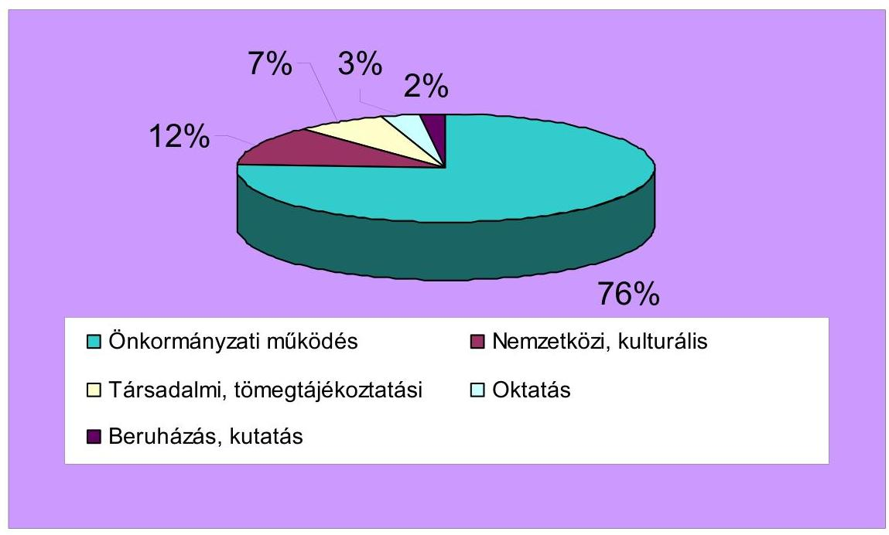
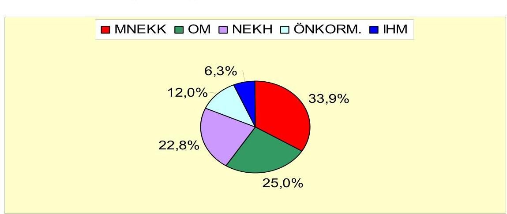
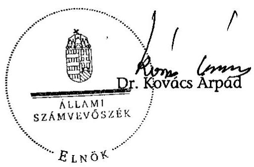
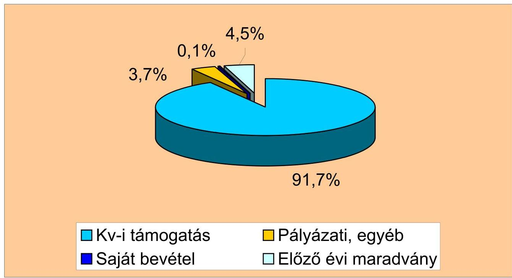
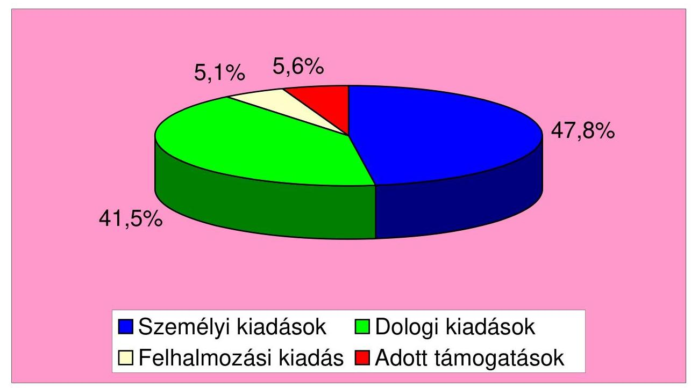

# ÁLLAMI   SZÁMVEVŐSZÉK 

## JELENTÉS

az Országos Örmény Önkormányzat 2003-2006. évi pénzügyigazdasági tevékenységének ellenőrzéséről

---

3. Önkormányzati és Területi Ellenőrzési Igazgatóság
3.1. Szabályszerüségi Ellenőrzési Föcsoport
Iktatószám: V-3001-045/2008.
Témaszám: 895
Vizsgálat-azonosító szám: V-403.

# Az ellenőrzést felügyelte: 

Dr. Lóránt Zoltán
föigazgató
Az ellenőrzés végrehajtásáért felelős:
Dr. Elek János
általános föigazgató-helyettes
Az ellenőrzést vezette:
Horváth Balázs
főcsoportfőnök-helyettes
Az összefoglaló jelentést készítette:
Dr. Faragóné Tóth Mária
tanácsos
Az ellenőrzést végezték:
Dr. Faragóné Tóth Mária Dr. Sallai Csilla
tanácsos könyvvizsgáló

## A témához kapcsolódó eddig készített számvevőszéki jelentések:

| címe | sorszáma |
| :-- | :--: |
| Jelentés az Országos Örmény Önkormányzat pénzügyi-gazdasági | 377 |
| tevékenységének ellenőrzéséről |  |
| Jelentés az Országos Örmény Önkormányzat pénzügyi-gazdasági | 0206 |
| tevékenységének ellenőrzéséről |  |
| Jelentés az Országos Örmény Önkormányzat pénzügyi-gazdasági | 0354 |
| tevékenységének utóvizsgálatáról |  |

---

# TARTALOMJEGYZÉK 

BEVEZETÉS ..... 5
I. ÖSSZEGZŐ MEGÁLLAPÍTÁSOK, KÖVETKEZTETÉSEK, JAVASLATOK ..... 6
II. RÉSZLETES MEGÁLLAPÍTÁSOK ..... 11

1. A feladatellátás szervezettsége, szabályozottsága ..... 11
1.1. A feladatellátás szervezettsége és szabályozása ..... 11
1.2. Az önkormányzati múködés szervezeti háttere, a gazdálkodási tevékenység feltételrendszere ..... 11
1.3. Az intézményalapítás és felügyelet szabályszerűsége ..... 12
2. Az Önkormányzat múködésének és gazdálkodási rendjének szabályszerűsége ..... 13
2.1. Az Önkormányzat gazdálkodási feladatainak szabályozása, összhangja a jogszabályi előírásokkal ..... 13
2.2. Az Önkormányzat belső szabályozási rendszere ..... 13
2.3. A vagyongazdálkodás és vagyonvédelem ..... 14
3. A költségvetés készítése, végrehajtása és pénzügyi teljesítése ..... 15
3.1. Az éves költségvetések elkészítése, elfogadása ..... 15
3.2. A költségvetés végrehajtása, zárszámadása ..... 15
3.3. Az Önkormányzat 2003-2006. évi bevételeinek alakulása, kiadásainak értékelése ..... 16
4. A központi és egyéb költségvetési támogatások felhasználása, elszámolása ..... 16
4.1. A központi költségvetési támogatás felhasználásának elve, elemzése ..... 16
4.2. A pályázati és egyéb államháztartási támogatások céljai, elszámolásának szabályszerűsége ..... 17
4.3. A 2007. évi intézményi támogatás igénylési, elszámolási szabálytalanságai ..... 18
4.4. A központi költségvetésből kapott támogatás továbbadása nemzeti és etnikai kisebbségi szervezeteknek ..... 19
5. A könyvelési és beszámolási kötelezettség teljesítése ..... 20
5.1. A könyvvezetési kötelezettség teljesítése ..... 20
5.2. Az éves beszámolók összeállítása, jóváhagyása ..... 20
5.3. A bizonylati rend és fegyelem érvényesítése ..... 21
5.4. A személyi jövedelemadóról, a társadalombiztosításról és az adózás rendjéről szóló jogszabályok előírásainak betartása ..... 21

---

6. Az Önkormányzat belső ellenőrzési rendszere ..... 22
6.1. A belső ellenőrzés szabályozása ..... 22
6.2. A belső ellenőrzés működése ..... 23
MELLÉKLETEK
7. számú Az Országos Örmény Önkormányzat 2003-2006. évi bevételei és megoszlá- sa
8. számú Az Országos Örmény Önkormányzat 2003-2006. évi kiadásai és megoszlá- sa
9. számú A 2007. évi intézményi támogatás elszámolási szabálytalanságainak rész- letezése

---

# RÖVIDÍTÉSEK JEGYZÉKE 

| Áht. | Az államháztartásról szóló - többször módosított - 1992.   évi XXXVIII. törvény |
| :-- | :-- |
| Ámr. | Az államháztartás múködési rendjéről szóló - többször   módosított - 217/1998. (XII. 30.) Korm. rendelet |
| ÁSZ | Állami Számvevőszék |
| IHM | Informatikai és Hírközlési Minisztérium |
| KVI | Kincstári Vagyoni Igazgatóság |
| MeH | Miniszterelnöki Hivatal |
| MNEKK | Magyarországi Nemzeti Etnikai Kisebbségekért Közalapít-   vány |
| Nek. tv. | A nemzeti és etnikai kisebbségek jogairól szóló - többször   módosított - 1993. évi LXXVII. törvény |
| NEKH | Nemzeti és Etnikai Kisebbségi Hivatal |
| OM | Oktatási Minisztérium |
| Önkormányzat | Országos Örmény Önkormányzat |
| Kulturális Központ | Örmény Kulturális, Dokumentációs és Információs Köz-   pont |
| Pénzügyi Bizottság | Költségvetési, Pénzügyi és Gazdasági Bizottság |
| Szja tv. | A személyi jövedelemadóról szóló - többször módosított -   1995. évi CXVII. törvény |
| SZMSZ | Szervezeti és Múködési Szabályzat |
| Számv. tv. | A számvitelről szóló - többször módosított - 2000. évi C.   törvény |
| Vhr. | A számviteli törvény szerinti egyéb szervezetek beszámoló   készítési és könyvvezetési kötelezettségének sajátosságai-   ról szóló - többször módosított - 224/2000. (XII. 19.)   Korm. rendelet |

---

.

---

# JELENTÉS 

## az Országos Örmény Önkormányzat 2003-2006. évi pénzügyi-gazdasági tevékenységének ellenőrzéséről

## BEVEZETÉS

Az Országos Örmény Önkormányzat (Önkormányzat) az örmény származású, identitásukat megtartó magyar állampolgárok legmagasabb szintű érdekvédelmi szervezete. A 2006. október 1-jei önkormányzati és kisebbségi önkormányzati választáson 32 helyi kisebbségi önkormányzat alakult, ebből 20 Budapesten. Az Önkormányzat 2007. március 24 -én tartott alakuló közgyűlésén új elnököt választottak.

Az ellenőrzés jogalapja: A nemzeti és etnikai kisebbségek jogairól szóló többször módosított - 1993. évi LXXVII. törvény (Nek. tv.) 39/G. § (1) bekezdése, valamint az Állami Számvevőszékről szóló - többször módosított - 1989. évi XXXVIII. törvény 2. § (5) bekezdésében kapott felhatalmazás alapján vizsgáltuk az Önkormányzat 2003-2006 közötti éves beszámolókkal lezárt gazdálkodását. Az ellenőrzés kiterjedt az aktuális szabályozásokra, a 2007. évi költségvetés tervezésére és a pályázati támogatások elszámolására is.

Az Állami Számvevőszék 2003-ban végezte el a korábbi ellenőrzés utóvizsgálatát, amelyhez kapcsolódóan az Önkormányzat volt elnökével szemben kezdeményezett büntetőeljárás a Pesti Központi Kerületi Bíróságon folyamatban van.

Az ellenőrzés célja annak megállapítása volt, hogy

- az Önkormányzat a központi költségvetési támogatást a Nek. tv-ben meghatározott feladatokra használta-e fel, felhasználása és elszámolása során be-tartotta-e a vonatkozó jogszabályi előírásokat;
- a gazdálkodás törvényessége biztosított volt-e: a tervezés, az operatív gazdálkodás, a beszámolási kötelezettség és a számviteli, bizonylati rend teljesítése során érvényesültek-e a jogszabályokban és a belső szabályzatokban megfogalmazott követelmények;
- a szabályszerű gazdálkodás érdekében kialakított kontroll mechanizmusok megfelelően segítették-e a feladatok végrehajtását;
- a gazdálkodási rend kialakításánál figyelemmel voltak-e a Nekt. tv. 2005. november 25 -étől hatályos módosításaira.

Az ellenőrzés ideje és helye: 2008. január 22. - 2008. március 13-a között az Önkormányzat székhelyén történt.

---

# I. ÖSSZEGZŐ MEGÁLLAPÍTÁSOK, KÖVETKEZTETÉSEK, JAVASLATOK 

Az Önkormányzat múködési és feladat-ellátási rendje az SZMSZ többszöri megújítása ellenére nem biztosította a Nek. tv. módosult előírásaival való teljes összhangot. Nem rendelkeztek 2003. február 16-október 13-a között hatályos SZMSZ-szel, mivel az alakuló ülést követő három hónapon belül nem gondoskodtak az újabb szabályozás elfogadásáról. Az önkormányzati feladatok bővítését a kiadott szabályozásokban hiányosan követték. A Közigazgatási Hivatal törvényességi észrevételére rendelkeztek a hivatali szervezetről, de a törvény által megszabott legkésőbbi határidőig a hivatalt nem hozták létre. Az ÁSZ ellenőrzés észrevételére 2008. március 1-jei hatállyal fogadták el a Hivatal alapító okiratát, illetve május 1-jei hatállyal hagyták jóvá múködésének ügyrendi szabályzatát. Az intézményalapítás és felügyelet eljárási szabályait nem határozták meg. A 2007-ben intézményesített Kulturális Központot - az Ámr. előírásait megszegve - kijelölt fenntartó, székhely bejegyzési hozzájárulás, intézményi SZMSZ hiányában múködtették. Az ellenőrzés által megállapított szabálytalanságokra figyelemmel a közgyűlés 2008. március 1-jei hatállyal hagyta jóvá az intézmény SZMSZ-ét. A székhelyre vonatkozóan ismételten kezdeményezték a tulajdonosi hozzájárulás megadását.

Az önkormányzati gazdálkodás szabályszerű szervezéséhez a gazdálkodási és pénzügyi szabályozásban rendelkeztek: a költségvetés összeállításáról, jóváhagyásáról és módosításáról; a beszámoló módszeréről, elfogadásáról és leltárral való alátámasztásáról; a könyvelési és beszámolási rendet meghatározó számviteli politikáról és kapcsolódó szabályzatairól. A Nek. tv. új előírásaival összhangban határozták meg a közgyűlés át nem ruházható hatáskörét, határozatainak érvényességéhez szükséges szavazattöbbséget, a jóváhagyott költségvetés, beszámoló és zárszámadás közzétételét, a vagyongazdálkodási követelményeket. A gazdasági feladatok ellátására irányadó szabályoknak a 2003ban négy évre megválasztott önkormányzati vezetés következetesen érvényt szerzett, szakítva a korábbi ÁSZ ellenőrzés által kifogásolt, büntetőeljárásba vont gazdálkodási gyakorlattal.

A vagyongazdálkodási közgyűlési határozatok szabályszerű előterjesztések alapján, érvényes többségi döntéssel születtek. A pénzeszközök szabályszerű felhasználásához a 2003-2006 közötti éves költségvetéseket és módosítását, a zárszámadásokat előzetes bizottsági ajánlással hagyta jóvá a közgyűlés. A költségvetések végrehajtásánál érvényesült a kötelezettségvállalás, utalványozás és ellenjegyzés hatásköri rendje. Az Önkormányzat befektetési tartalékok nélkül, a korábbról felhalmozott költségvetési tartozás pénzmaradványból való rendezésével őrizte meg fizetőképességét. Hasonlóan megoldást nyert 2004-ben az Önkormányzat végleges elhelyezése. A székhelyül szolgáló ingatlant 5000 ezer Ft céltámogatásból korszerűen berendezték, amelyet rendeltetésszerűen önkormányzati célokra használnak. A Nek. tv. módosult előírásával forgalomképtelen törzsvagyonként került önkormányzati tulajdonba. A székház ingatlan 2007. évi aktiválása 87879 ezer Ft nettó értéken történt, vagyonvédelméről biztonsági berendezésekkel és értékkövető biztosítással gondoskodtak.

---

A 2003-2006. évi költségvetések, zárszámadások szabályozott módon, öszszehasonlítható szerkezetben készültek. Az éves költségvetések összeállításánál az állandó bizottságok éves programjait és pénzügyi terveit, valamint a tervezési számításokat vették alapul. A források körében tervezték az előzetesen ismert pályázatokat, míg a korábbi időszakról felhalmozott kötelezettségekre kiadási tartalékot képeztek. A költségvetési támogatás kisebbségi feladatonkénti megosztásáról a költségvetés jóváhagyásával döntöttek. Az évenkénti, költségvetési törvény alapján címzett 133100 ezer Ft támogatás 10520 ezer Ft céltámogatással egészült ki. Az Ámr. előírásai alapján teljesült költségvetési támogatások elszámolása szabályszerűen, pénzügyi és szakmai beszámolóval megalapozottan történt. Az örmény folyóirat megjelentetésére folyósított 2895 ezer Ft összegű támogatást a feladatelmaradása miatt szabályszerűen, tárgyévben visszautalták. Négy pályázatnál az elszámolást határidőt követően teljesítették. A zárszámadásokban elemezhető módon bemutatták a tervezett és ténylegesen teljesült bevételeket, illetve kiadásokat; a költségvetési támogatás kisebbségi feladatokra történt felhasználásának jogcímeit és összegeit. A zárszámadási adatok szerint a négyéves ciklusban 143774 ezer Ft pénzforgalmi bevételből gazdálkodtak, amelynek 99,9\%-a államháztartási forrásokból teljesült. Az önkormányzati feladatokra fordított 138723 ezer Ft költségvetési forrás rendeltetésszerú céljait az alábbi ábra szemlélteti:

| Müködési személyi-járulék, dolog | Továbbadott támogatás | Beruházás, felújítás |
| :--: | :--: | :--: |
| $99,3 \%$ | $5,6 \%$ | $5,1 \%$ |

A költségvetési források növekedésével az önkormányzati kiadások 2006/2003. év viszonylatában 17,6\%-kal nőttek. A múködési kiadások több mint felét a személyi juttatásokra és járulékokra fordították. A dologi kiadások a 2003. évi 8229 ezer Ft-ról 2006. évre több mint kétszeresére emelkedtek. A költségvetési támogatás továbbadása - ÁSZ javaslatra figyelemmel - kivétel nélkül szerződéssel történt, amelyben meghatározták a támogatás célját, megvalósítási és pénzügyi elszámolásának határidejét. Az Önkormányzat 2003. évben 4 kisebbségi szervezetet 3636 ezer Ft-tal, továbbá 2006-ig évenként 7-11 szervezetet 1030-1718 ezer Ft közötti összeggel támogatott. Az Önkormányzat 2007. évi költségvetését az országos kisebbségi önkormányzati választások után megalakult új önkormányzati testület fogadta el. A Pénzügyi Bizottság véleményének hiányában a Közigazgatási Hivatal érvénytelenítette a közgyűlés 2007. évi költségvetést jóváhagyó határozatát. A törvényességi észrevételre pótolták a háromnegyed éves időszakra összeállított terv pénzügyi bizottsági véleményezését, de a Nek. tv. előírása ellenére nem tették közzé.

A vizsgálat a Számv. tv. és az Ámr. előírások megsértését állapította meg a 2007. évi intézményalapítási támogatás igénylésével, elszámolásával összefüggésben. A MeH támogatási szerződéssel, előfinanszírozással 4700 ezer Ft támogatást nyújtott. A támogatási szerződésben megjelölt intézményi székhely használatára az Önkormányzatnak nem volt engedélye a tulajdonostól, illetve előzetes hozzájárulása az épületben végzett felújításhoz. A támogatási szerződés szerint a támogatás 2007. december 31-ig volt felhasználható. A pénzügyi elszámolásban határidő után teljesített, illetve ténylegesen kifizetésre nem került számlákat 547,5 ezer Ft és 397 ezer Ft értékben szerepeltettek. Az idegen eszközön végzett, 80 ezer Ft-tal elszámolt felújításhoz engedéllyel nem rendelkeztek. A kifizetések között nem felelt meg a bizonylati elvnek és fegyelemnek,

---

valamint a számviteli bizonylatok alaki és tartalmi követelményének 1411 ezer Ft összegű teljesítés. A kifizetések nem lettek volna teljesíthetők - ezáltal a támogatási szerződés szerint elszámolhatók sem - az intézményigazgató jogosulatlan kötelezettségvállalása és szabálytalan, összeférhetetlen pénzkezelés; a szerződések nem megfelelő részletezése és teljesítésigazolásának elmulasztása; továbbá az ár-érték viszonyok ellenőrizhetőségének hiánya miatt. Az Áht. előírásai alapján „a támogatás jogszabálysértő vagy nem rendeltetésszerü felhasználása esetén a felhasználót visszafizetési kötelezettség terheli". A jogosulatlan igénybevétel és felhasználás miatt a támogatást folyósító MeH jogosult a központi költségvetési támogatást visszakövetelni. Az Önkormányzat elnöke, az intézmény igazgatója, valamint az elszámolást - összeférhetetlenül ügyintézőként készítő és ellenőrként elfogadó Pénzügyi Bizottság elnöke a szabálytalanságokra a felelősségi nyilatkozatban elfogadható magyarázatot nem adtak.

Az Önkormányzat 2003-2006 közötti éves beszámolóit szabályszerűen öszszeállította, amely egyszerűsített mérlegből és eredmény-kimutatásból, kiegészítő szöveges és szakmai értékelésből állt. Az éves beszámolók összeállításánál a Számv. tv. elvei közül a teljesség és az időbeli elhatárolás elve sérült, de az ellenőrzés által évente feltárt eredményhatású hiba egyik évben sem minősült lényegesnek: 2003. évi 1,3\%, 2004. évi 2,0\%, 2005. évi 1,2\%, 2006. évi 0,6\% mértékű volt. A hibák a számviteli szabályozások hiányosságaiból is eredtek. A beszámoló alapjául szolgáló, számítógépes kettős könyvvitelben a könyvvezetést és zárlatát a jogszabályi és belső előírásoknak megfelelően végezték. A Vhr.-t módosító rendelkezéssel összhangban, kódszám alkalmazásával kísérték figyelemmel a költségvetési támogatás kisebbségi feladatokra történő, tervszerű felhasználását. Az éves beszámolók adatait szabályszerű leltárral igazolták. A könyvelési pénztári és banki bizonylatokat a Számv. tv. bizonylati elv és fegyelem,valamint az alaki és tartalmi előírások érvényesítésével vezették.

Az Önkormányzatnál munkaviszonyban álló alkalmazottak bérszámfejtése, az adók és járulékok levonása, bevallása és befizetése a vizsgált időszakban rendben megtörtént. A bérek, illetve juttatások a munkaszerződésben meghatározott összegűek voltak. A közgyűlés differenciáltan határozta meg a képviselők tiszteletdíját, melynél 2006-tól figyelemmel voltak a Nek. tv-ben maximált mértékre. A havonta számfejtett tiszteletdíjakból a személyi jövedelemadóelőleg levonásra, a központi költségvetést megillető járulékok elszámolásra kerültek. A pénzben teljesített bérlettérítés, a kiadvány és szakfolyóirat hozzájárulás, valamint a telefon költségtérítés nem minősült természetbeni juttatásnak. A költségtérítések nem megfelelő elszámolásából a képviselők egyéni személyi jövedelemadó ellenőrzése során, illetve az Önkormányzat adóhatósági vizsgálatánál keletkezhet adóhiány, ha az adózás rendjéről szóló törvény rendelkezéseinek megfelelően a hibákat önellenőrzéssel nem rendezik.

Az Önkormányzat gazdálkodásának belső ellenőrzési rendszerét 2003-2007 között hiányosan szabályozta. A Pénzügyi Bizottság ellenőrzési funkciói a 2005. december 10-étől hatályos SZMSZ-ben váltak teljessé. Késedelemmel törvényességi kifogásra - 2006. május 27-i hatállyal szabályozták a hivatali szervezet vezetője, gazdasági vezetője feladatait. A pénzügyi-számviteli folyamatba épített ellenőrzési követelmények - belső szabályozási hiányosságok mellett - döntően közgyűlési határozatokon alapultak.

---

A Pénzügyi Bizottság éves munkatervek szerint végezte az éves költségvetés és zárszámadás véleményezését. A Nek. tv. új előírásával összhangban ellenőrizték a pénzkezelési szabályzat előírásainak betartását, a közgyűlés döntéseinek végrehajtását. A 2007. évi intézményi költségvetési támogatás elszámolásánál a bizottság elnöke egy személyben végezte a pénzügyi elszámolás összeállítását, illetve felülvizsgálatát. Összeférhetetlen tevékenységével nem tett eleget a Nek. tv., illetve a Számv. tv-ben foglaltaknak. A saját és intézményi gazdálkodás ellenőrzéséhez 2007-ig belső ellenőrt nem foglalkoztattak, hivatal- és gazdasági vezetőt a belső előírás ellenére nem alkalmaztak. A munkafolyamatba épített ellenőrzés nem tárt fel egyes könyvvezetési, beszámolási, adózási hibákat.

A helyszíni ellenőrzés megállapításainak hasznosítása mellett javasoljuk:

# az Önkormányzat közgyülésének 

1. Módosítsa az SZMSZ-t az intézményalapítás és felügyelet eljárási rendjével; határozza meg
a) a hivatalra háruló fenntartói feladatokat az Ámr. 14. § (5) bekezdés a) pontja szerint;
b) a felelősségvállalás és munkamegosztás rendjét az Ámr. 14. § (5) bekezdés b) pontjában előírtak alapján;
c) az intézmény éves költségvetését az Ámr. 13. § (9) - (10) bekezdés betartásával.
2. Vizsgálja ki az intézményalapítás és felügyelet, az intézményi céltámogatás elszámolásának mulasztásait, hibáit; állapítsa meg a személyi felelősséget.
3. Teremtse meg a belső ellenőrzési rendszerének összehangolt szabályozását, biztosítsa eredményes és törvényes múködésének feltételeit, különös tekintettel az összeférhetetlenség elvének érvényesítésére.

## az Önkormányzat elnöke

1. Gondoskodjon a Nek. tv. 39/G. § (3) - (4) bekezdés előírása szerint a gazdálkodással összefüggő közzétételi kötelezettség teljesítéséről, a határidők betartásáról.
2. Tegyen intézkedést a Számv. tv. 14-16. és 161. § előírásai érvényesítése érdekében a számviteli politika és kapcsolódó szabályzatai, valamint a számlarend módosítására.
3. Biztosítsa a könyvvezetésben és a beszámoló összeállítása során a Számv. tv. 15-16. $\S$-ban foglalt elvek teljes körű érvényesítését.
4. Intézkedjen az Szja törvényben szabályozottak szerint a pénzben kifizetett bérlet-, kiadvány és szakfolyóirat-, telefon-, költségtérítés adózás rendjéről szóló törvény rendelkezéseinek megfelelő önellenőrzéséről.

---

# a Miniszterelnöki Hivatal miniszterének 

Vizsgálja felül az Áht. 13/A. § (2) bekezdés előírása szerint a jogosulatlan igénybevételt és felhasználást, állapítsa meg a visszafizetendő központi költségvetési támogatás összegét.

---

# II. RÉSZLETES MEGÁLLAPÍTÁSOK 

## 1. A feladATELLÁTÁs SZERVEZETTSÉGE, SZABÁLYOZOTTSÁGA

### 1.1. A feladatellátás szervezettsége és szabályozása

Az Önkormányzat 2003. február 16. - október 3. között nem rendelkezett hatályos SZMSZ-szel. A törvényi mulasztás következetlen döntésből eredt, mivel a korábbi szabályzatot úgy helyezték hatályon kívül, hogy a Nek. tv. 37. § (1) bekezdés a) pontja szerint „az alakuló ülést követő három hónapon belül" nem gondoskodtak az újabb szabályozás elfogadásáról. A késedelemmel hatályba helyezett SZMSZ többszöri meghosszabbítással, 2005. december 10-ig ideiglenes jelleggel funkcionált. A szabályzat a törvénnyel összhangban határozta meg a közgyűlés hatáskörét, de szerveinek szabályozott működéséhez nem rögzítette a választott bizottságok, elnökség feladatait. Nem tartalmazott előírást az átruházható hatáskörökre, valamint az országos iroda funkcióira.

A Nek. tv. 2005. november 25 -étől hatályos $36-39 /$ G. § rendelkezései ellenére nem teljes körú̉en szabályozták az ellátandó feladatok körét, rendjét. A Közigazgatási Hivatal törvényességi észrevételére 2006. május 27 -i hatállyal rendelkeztek a hivatali szervezetről. A kisebbségi önkormányzati választások után 2007. szeptember 15-i hatállyal ismételten új SZMSZ-t fogadtak el, amelynek többszöri módosítását hasonlóan a törvényességi kifogások tették szükségessé. A szabályozás aktualizálása nem terjedt ki az intézményalapítás és felügyelet eljárási rendjének meghatározására.

Az Önkormányzat 2006. május 27 -én elfogadott SZMSZ-t - a törvény rendelkezéseinek megfelelően - a Magyar Közlöny 81. számában nyilvánosságra hozta. A későbbiekben figyelmen kívül hagyták a Nek. tv. 39/G. § (4) bekezdés szerinti, módosításra vagy újabb szabályozásra vonatkozó megjelentetésének határidős kötelezettségét (2007. szeptember 15-én kiadott SZMSZ; 2008. január 19-i hatályú módosítása). Az ÁSZ észrevételére a 2008. április 27-én jóváhagyott SZMSZ-t a Magyar Közlöny 2008. évi 80. számában nyilvánosságra hozták.

### 1.2. Az önkormányzati múködés szervezeti háttere, a gazdálkodási tevékenység feltételrendszere

Az Önkormányzat törvényben meghatározott feladat- és hatáskörét a szabályszerűen választott, 19 fős közgyűlés gyakorolta. A képviselőtestület a pénz-ügyi-gazdasági határozatait érvényes többségi döntéssel, jegyzőkönyvileg dokumentáltan hozta. A képviseleti jogkört betöltő elnök 2003 végén történt lemondása miatt - a választási ciklus végéig szóló közgyűlési felhatalmazással a két alelnök irányította az országos kisebbségi feladatok végrehajtását.

Az Önkormányzat 2006. május 27 -étől hatályos SZMSZ 66. § (3) és a 2007. szeptember 15-étől hatályos SZMSZ 64. § (3) bekezdése szerint „a gazdálkodás szabályszerüségéért az Önkormányzat elnöke felel".

---

A közgyűlés munkájának segítésére öt állandó bizottság működött: Költségvetési, Pénzügyi és Gazdasági Bizottság 5 fő; Kulturális és Média Bizottság 5 fő; Oktatási Bizottság 5 fő; Külügyi Bizottság 5 fő; Jogi, Úgyrendi és Etikai Bizottság 3 fő. A bizottságok feladatait csak 2005. december 10-étől szabályozták. A választott testületek éves munkatervek, jóváhagyott költségvetési keretek alapján végezték tevékenységüket. A 2007. márciusi választások után, a Nek. tv. 39/G. § (2) bekezdésben foglalt nevesítéshez igazodva csak a Költségvetési, Pénzügyi és Gazdasági Bizottságot (Pénzügyi Bizottság) választották újra.

Az Önkormányzat 2003-2004. év időszakában ideiglenes székhelyen működött. A végleges székhelyként szolgáló, természetben a 1025 Budapest, Palatínus u. 4. szám alatti, $156 \mathrm{~m}^{2}$ alapterületű társasházi öröklakást 2004. április 30-án kapták meg ingyenes használatra, majd a 2005. évi CXIV. törvény 59. és 72. §aira hivatkozással 2006 végén az ingatlan tulajdonjogát is. A KVI által nyújtott 5000 ezer Ft támogatásból biztosították az önkormányzati múködés korszerű irodai tárgyi feltételeit. Az Önkormányzat gazdálkodásában érvényesültek az összeférhetetlenségi szabályok, bár ennek garanciái nem az összehangolt szabályozással, hanem az eseti közgyűlési határozatokkal teremtődtek meg. A Pénzügyi Bizottság elnöke 2004-2007 között vállalkozási szerződés alapján látta el az iroda koordinátori, tanácsadói feladatokat. A vállalkozási szerződésben kikötötték, hogy a szerződéses tevékenysége keretében kötelezettséget nem vállalhat.

Az önkormányzati feladatok előkészítésére, a közgyűlési feladatok végrehajtására a Nek. tv. 39/A. § (2) bekezdésben foglalt hivatal létrehozásához a MeH „Kisebbségi koordinációs és intervenciós keret"-ből 8500 ezer Ft költségvetési céltámogatást igényeltek, de az SZMSZ 60. § (1) bekezdése ellenére a hivatalt nem hozták létre; alapító okiratának megalkotását és törzskönyvi nyilvántartásba vételét, valamint múködésének szabályozását elmulasztották. A közgyűlés 2007. október 28-án döntött a hivatalvezető megbízásáról; betéti társasággal kötöttek megbízási szerződést a hivatalvezetői feladatokra. A hivatalvezetőt 2008. február 1-jétől a Nek. tv. 39/B. § (5) bekezdésének megfelelően már szabályosan, határozatlan idejű kinevezéssel alkalmazzák. Az ÁSZ ellenőrzés észrevételére a 16/2008. számú határozattal, március 1-jei hatállyal fogadták el a hivatal alapító okiratát, illetve a 27/2008. számú határozattal, május 1-jei hatállyal hagyták jóvá múködésének ügyrendi szabályzatát.

# 1.3. Az intézményalapítás és felügyelet szabályszerűsége 

Az Önkormányzat a Nek. tv. 36. §-ban foglaltakkal összhangban az örmény kisebbség kulturális autonómiájának kiteljesítése céljából 2007. június 9-én alapította az Örmény Kulturális, Dokumentációs és Információs Központot (Kulturális Központ). Az alapító okirat és törzskönyvi bejegyzés szerint a részben önállóan gazdálkodó közművelődési intézmény alapítása, felügyelete nem felelt meg a hatályos Ámr. elöírásoknak.

- A részben önálló gazdálkodási jogkör bejegyzéséhez, a pénzügyi-gazdasági feladatok szabályszerű ellátásához az Önkormányzat nem rendelkezett az Ámr. 14. § (5) bekezdés a) pontjában előírt önállóan gazdálkodó költségvetési szervvel, így a b) pontban előírt megállapodást sem lehetett megkötni a fe-

---

lelősségvállalás és munkamegosztás rendjéről, mivel az SZMSZ 60. § (6) bekezdése szerinti fenntartói feladatokra kijelölt hivatalt nem hozták létre.

- Az intézmény jóváhagyott SZMSZ nélkül múködött, ezzel az Önkormányzat megsértette az Ámr. 10. § (4) bekezdése előírását, amely szerint „az alapító okiratban foglaltakat a jogszabályban megjelölt szerv vagy felügyeleti szerv által jóváhagyott szervezeti és múködési szabályzatban kell részletezni". Az SZMSZ jóváhagyását a 18/2008. számú közgyűlési határozattal, március 1-jei hatálylyal pótolták.
- A Kulturális Központ szabályszerű múködéséhez nem állapították meg költségvetését az Ámr. 13. § (9) - (10) bekezdésére figyelemmel. Az alapító okiratban megjelölt székhelyre - bár előzetes engedélyt kértek - tulajdonosi hozzájárulással nem rendelkeztek. Az Önkormányzat elnöke tájékoztatást küldött a folyamatban lévő intézkedésekről.

# 2. AZ ÖNKORMÁNYZAT MŰKÖDÉSÉNEK ÉS GAZDÁlKODÁSI RENDJÉNEK SZABÁLYSZERŰSÉGE 

### 2.1. Az Önkormányzat gazdálkodási feladatainak szabályozása, összhangja a jogszabályi előírásokkal

Az SZMSZ melléklet a „Gazdálkodási és pénzügyi szabályozások gyűjteménye" határozta meg az önkormányzati gazdálkodás fő szabályait. Tartalmazta a számviteli politikát és számlarendet, pénzügyi és leltározási szabályozást, a könyvelési és beszámolási rendet. Rögzítette a költségvetés összeállításának, jóváhagyásának és módosításának szabályait. Előírta féléves és éves költségfelhasználási beszámoló közgyűlés elé terjesztését, elfogadását; leltárral való alátámasztását.

A Nek. tv. módosításaival összhangban az SZMSZ VI. fejezetében meghatározták a gazdálkodás pénzügyi forrásait, az Önkormányzat vagyonára és gazdálkodására vonatkozó kritériumokat. Megállapították a bevételek és kiadások jogcímeit, az át nem ruházható közgyűlési hatáskört. A közgyűlési minősített többségű döntéshozatalt, azaz a megválasztott képviselők több mint a felének azonos szavazatát írta elő a költségvetés, beszámoló és zárszámadás elfogadásához, illetve a pénzeszközök átcsoportosításához. A költségvetés, a beszámoló és a zárszámadás közzétételének követelményét a 2006. május 27 -én kiadott SZMSZ-ben a Nek. tv. 39/G. § (3) - (4) bekezdésére figyelemmel szabályozták.

### 2.2. Az Önkormányzat belső szabályozási rendszere

Az Önkormányzat rendelkezett a Számv. tv. 14-16. §-ai, valamint a Vhr. 8-9. §ai alapján készült, 2003. február 16-ától hatályos számviteli politikával és kapcsolódó (leltározási, értékelési, pénzkezelési) szabályzatokkal. Az ÁSZ javaslatra megújított, jellemzően hibásan adaptált szabályzatok szabályszerű hatályba helyezéséről, a változásokat tükröző aktualizálásokról nem gondoskodtak.

A számviteli politika nem érvényesíti a Számv. tv. 14. § (3) bekezdés előírását, hiányosan felel meg az Önkormányzat gazdálkodási adottságainak. Alapvetően vállalkozási személetet tükröző szabályzat, amely nem foglalkozik az

---

önkormányzati feladatok speciális kérdéseivel. A beszámoló fordulónapját, illetve a mérlegkészítés határidejét megállapították. A számviteli politikán belül külön bizonylati szabályzatban rögzítették az alapvető iratkezelési szabályokat, a bizonylati fajtákat és értékelési elveket.

Az értékelési szabályzat, valamint a számviteli politikában rögzített értékelési elvek együttesen sem biztosították a szabályozás teljes körűségét, hiányoztak az önkormányzati sajátosságok.

A pénzkezelési szabályzat csak általános elveiben és eljárási rendjében tartalmazott követendő előírásokat. Külön pénzügyi szabályzatban rendelkeztek a pénzkezeléssel összefüggő feladatokról: bankszámlakezelés, készpénzfelvétel, pénzszállítás, házipénztár, képviseleti-aláírási jogosultság.

A leltározási szabályzat az Önkormányzat sajátosságainak figyelembevételével szabályozta az Önkormányzat tulajdonában lévő eszközök és források mennyiségi, értékbeli számbavételének módját, dokumentálását.

A számlarend előírta a kettős könyvvezetést, a számviteli zárlat rendjét, a számviteli elveket, valamint a számlaosztályok tartalmi felépítését és tagolását. Az önkormányzati sajátosságokat, speciális értékelési módszereket a számlarend nem tartalmazta a Számv. tv. 161. §-ában előírtaknak megfelelően. A számlarendet nem aktualizálták, 2004. évben elmulasztották a Vhr-t módosító 237/2003. (XII. 17.) Korm. rendelet előírásainak átvezetését.

# 2.3. A vagyongazdálkodás és vagyonvédelem 

A vagyongazdálkodási közgyűlési határozatok szabályszerű előterjesztések alapján, érvényes többségi döntéssel születtek. Az Önkormányzat vagyoni helyzetének 2003-2006. évi alakulását az alábbi összeállítás szemlélteti:
adatok: ezer Ft-ban

| Megnevezés | 2003. évi   záró* | 2004. évi   záró* | 2005. évi   záró | 2006. évi   záró | 2006/2003.   $\%$-ban |
| :-- | --: | --: | --: | --: | --: |
| Egyéb berendezés | 3213 | 4889 | 4789 | 2107 | 65,6 |
| Egyéb követelés | 538 | 154 | 57 | 59 | 11,0 |
| Készpénz | 162 | 37 | 166 | 143 | 88,3 |
| Betétszámla | 3526 | 2397 | 422 | 2163 | 61,3 |
| Aktív elhatárolások | 4 | 42 | 0 | 0 | 0 |
| Összesen | $\mathbf{7 4 4 3}$ | $\mathbf{7 5 1 9}$ | $\mathbf{5 4 3 4}$ | $\mathbf{4 4 7 2}$ | $\mathbf{6 0 , 1}$ |

*Megjegyzés: a helyszíni vizsgálat eredményének figyelembevételével korrigált adatok
Az eszközállomány változását a 2004. évi székhelyváltással megvalósult irodai beszerzések; évente elszámolt értékcsökkenések, realizált pénzmaradványok befolyásolták. Az Önkormányzat a 2003-at megelőző, büntetőeljárásba vont gazdálkodással szemben biztosította a pénzeszközök szabályszerű felhasználását.

A Nek. tv. 59/A. § (1) bekezdés előírásai alapján a székhelyként funkcionáló ingatlan 2006. év végén egyszeri ingyenes vagyonjuttatásként, 87879 ezer Ft nettó értéken az Önkormányzat tulajdonába került forgalomképtelen törzsvagyonként. Aktiválását 2007. évben könyvelték. A székház épület biztonsági berendezésekkel felszerelt; vagyonvédelméről értékkövető biztosítással gondoskodtak. Rendeltetésének megfelelően, önkormányzati célokra használják.

---

# 3. A KÖLTSÉGVETÉS KÉszíTÉSE, VÉGREHAJTÁSA ÉS PÉNZÜGYI TELJESÍTÉSE 

### 3.1. Az éves költségvetések elkészítése, elfogadása

A 2003-2006. évi önkormányzati éves költségvetéseket szabályszerűen, előzetes bizottsági ajánlással a közgyűlés hagyta jóvá. Összeállításánál kijelölték a költségvetés elkészítéséért felelős személyt; szabályozták elkészítésének rendjét és a költségvetés belső tartalmát. A költségvetések alapjául az öt bizottság éves programjai, pénzügyi tervei és a könyvelő által végzett számítások szolgáltak. Az éves költségvetések egymással összehasonlítható szerkezetben, a főbb bevételi és kiadási jogcímeket részletezve készültek. A bevételeknél számításba vették a tervezés időszakában ismert pályázatokat, a kiadásoknál tartalékot képeztek a korábbi időszakról felhalmozott kötelezettségek rendezésére.

A 2007. évi költségvetést 2006. november 25-i közgyűlés megtárgyalta, de annak elfogadásáról határozat nem született. A korábbiaktól eltérő szerkezetű, és 2007. április 1-december 31-e közötti időszakra szóló költségvetést a kisebbségi önkormányzati választások után megalakult új Önkormányzat 2007. április 28-i közgyűlésén fogadta el. Bevételként a 2007. évi költségvetési támogatást, kiadásként bérköltséget, egyéb rendszeres kiadásokat, eseti kiadásokat, előző évi pénzmaradványt és tartalékkeretet szerepeltettek. A Pénzügyi Bizottság véleményének hiányában a Közigazgatási Hivatal érvénytelenítette a közgyűlés 2007. évi költségvetést jóváhagyó határozatát. Az Önkormányzat a kért határidő-módosítás elfogadása után - a 2007. szeptemberi közgyűlésén - háromnegyed évre szóló költségvetést fogadott el a bizottság ajánlására. Az Önkormányzat a költségvetés közzétételéről rendelkező Nek. tv. 39/G. § (4) bekezdés előírásait megszegte. A 2006. évi költségvetését határidő után, 2006. július 5-én jelentette meg a Magyar Közlöny 81. számában, a 2007. évi költségvetését nem hozta nyilvánosságra.

### 3.2. A költségvetés végrehajtása, zárszámadása

Az Önkormányzat a bevételek alakulásának függvényében, a bizottsági programok változásának megfelelően közgyűlési határozattal gondoskodott a költségvetés módosításáról. A költségvetések végrehajtásánál 2003-2006 között érvényesült a kötelezettségvállalások, utalványozások és ellenjegyzés hatásköri rendje. A pénzmaradvánnyal növelt bevételek minden évben meghaladták a kiadásokat, az Önkormányzat folyamatosan megőrizte fizetőképességét.

A 2003-2006. évi éves gazdálkodásáról szóló zárszámadásokat, a Pénzügyi Bizottság ellenőrzése után, ajánlására a gazdasági évet követően a közgyűlés elfogadta. A zárszámadások összehasonlítható, elemezhető módon tartalmazták a tervezett költségvetéshez képest teljesült bevételeket és kiadásokat, valamint bemutatták a központi költségvetési támogatás felhasználásának jogcímeit és összegeit. A 2005. évi egyszerűsített mérlegét, egyszerűsített pénzmaradvány kimutatását, egyszerűsített eredmény-kimutatást a Nek. tv. 39/G. (3) bekezdésben előírt határidőben és formában, a Belügyi Közlönyben és Cégközlönyben nyilvánosságra hozta. A 2006. évi pénzforgalmi jelentését a törvényben előírt formában, féléves késedelemmel, 2007. augusztus 2-án tette közzé.

---

# 3.3. Az Önkormányzat 2003-2006. évi bevételeinek alakulása, kiadásainak értékelése 

Az Önkormányzat 2003-2006. években - pénzmaradvány nélkül - összesen 143774 ezer Ft-tal gazdálkodott, melynek 99,9\%-a államháztartási forrásból teljesült (1. számú melléklet).

A költségvetési törvény alapján 2003-2004. évben 33300 ezer Ft, 2005. évben 31500 ezer Ft és 2006. évben 35000 ezer Ft címzett támogatáshoz jutott. A 2005. évi támogatás összege az államháztartási egyensúlyi intézkedések miatt, az előző évhez képest 5,4\%-kal csökkent. A 2004-2005. évi költségvetési támogatás összesen 5000 ezer Ft céltámogatással egészült ki, amely a székház berendezésének fedezetét biztosította.

A nemzeti és etnikai kisebbségi feladatokra benyújtott pályázatok, kérelmek eredményeként összesen 5520 ezer Ft támogatást nyertek el, amelyből 4860 ezer Ft központi, 660 ezer Ft fővárosi önkormányzati támogatás volt.

A pénzforgalmi bevételek között mindössze $\mathbf{0 , 1 \%}$ volt a saját forrás. A bevételeket 89 ezer Ft és 3688 ezer Ft közötti előző évi pénzmaradvány egészítette ki.

Az Önkormányzat 2003-2006. években 138723 ezer Ft-ot fordított feladataira. Az összes kiadás $\mathbf{8 9 , 3 \%}$-át múködésre (személyi, dologi kiadás), 5,1\%át felhalmozási célra fordították, 5,6\%-át kisebbségi szervezeteknek továbbadták (2. számú melléklet).

Az önkormányzati kiadások a gazdálkodás 2006/2003. év viszonylatában 17,6\%-kal nőttek. A működési kiadások több mint fele a személyi és járulékos kiadásokra teljesült. A dologi kiadások a 2003. évi 8229 ezer Ft-ról 2006. évre több mint kétszeresére nőttek.

## 4. A KÖZPONTI ÉS EGYÉB KÖLTSÉGVETÉSI TÁMOGATÁSOK FELHASZNÁLÁSA, ELSZÁMOLÁSA

### 4.1. A központi költségvetési támogatás felhasználásának elve, elemzése

Az éves költségvetési törvényben meghatározott támogatás felhasználásának elveit belső szabályzat nem rögzítette. Az Önkormányzat költségvetésében határozta meg az önkormányzati feladatokat és a támogatás felhasználását feladatokhoz kötötten rangsorolta.

A személyi és dologi múködési kiadásokat költségnemenként, a bizottságok által javasolt feladatokat jóváhagyott programok szerint tervezték. A feladatonkénti felhasználást 2004-2007 között kódszámmal jelölték, figyelemmel a módosult Vhr. 17. § (8) bekezdésben foglaltakra. A kisebbségi feladatok ellátását szolgáló költségvetési támogatást a pénzügyi beszámolók, a számviteli nyilvántartások szerint rendeltetésszerűen használták fel. A négyéves gazdálkodási periódusban megőrizték a fizetőképességet, pénzmaradványból rendezték a korábbról felhalmozott költségvetési tartozásokat.

---

A teljesített kiadások kódszámos gyűjtéssel, feladatonként elkülönültek, amelynek megoszlását az alábbi ábra szemlélteti.

Múködtetésre a források háromnegyedét fordították, ezen belül korábbról felhalmozott tartozásként, 1229 ezer Ft költségvetési befizetést teljesítettek. Nemzetközi kapcsolattartásra és kulturális tevékenységre egyaránt 6-6\%-ot fordítottak. A társadalmi integrációs feladatok, médiakapcsolatok keretében ápolták a települési kisebbségi önkormányzatokkal és szervezetekkel való kapcsolattartást, működtették a néptánc oktatást; támogatták a templomok állagmegóvását, a szótár és könyvkiadást. A vasárnapi iskolai nyelvoktatásra a támogatás $3 \%$-át, a liturgiai és családfakutatásra, illetve beruházásra 1-1\%-át fordították.

# 4.2. A pályázati és egyéb államháztartási támogatások céljai, elszámolásának szabályszerűsége 

Az évenként megállapított központi költségvetési támogatást 2003-2006. évben összességében 5520 ezer Ft pályázati és egyéb államháztartási támogatás növelte az alábbi támogatók megoszlásában.

---

A MNEKK 1870 ezer Ft kiegészítő forrást biztosított különféle rendezvények lebonyolítására. Az OM-tól elnyert 1379 ezer Ft támogatást a vasárnapi iskolák működésére biztosították. A NEKH-től támogatásból 2005. évben 1061 ezer Ftért digitális másológépet és nyomtatót vásároltak, 2006. évben hagyományőrző rendezvényt szerveztek. 2005. évben a Budapest Főváros Önkormányzata 660 ezer Ft-ot hagyományápolásra, megemlékező rendezvényre, az IHM 350 ezer Ft-ot infrastruktúrafejlesztésre biztosított.

Az Önkormányzat beszámolójában nem jelent meg a MNEKK 2895 ezer Ft öszszegű támogatása, mivel a folyóirat megjelentetésének elmaradása miatt a támogatást tárgyévben visszautalták. A támogatási szerződéseket az Ámr. 8789. § követelményével kötötték; elszámolása az előírt formában és tartalommal szabályszerűen, pénzügyi és szakmai beszámolóval alátámasztva történt. Négy pályázatnál a határidőt nem tartották be. A szerződés szerinti cél megvalósulását, illetve a támogatás rendeltetésszerű felhasználását a támogatók a helyszínen nem ellenőrizték.

# 4.3. A 2007. évi intézményi támogatásigénylési, elszámolási szabálytalanságai 

A 2007. évi intézményalapítás támogatására kötött XLVI-1/198/7/2007. számú támogatási szerződés szerint a MeH előfinanszírozással biztosította a 4700 ezer Ft támogatást, amelyből 3500 ezer Ft múködési, 1200 ezer Ft felhalmozási célt szolgált. A szerződés szerint az összeg 2007. december 31-ig volt felhasználható. A MeH a szerződéses elszámolás elfogadását visszaigazolta.

A támogatási szerződésben megjelölt intézményi székhely használatára az Önkormányzatnak nem volt engedélye a tulajdonos Budapest V. kerületi Önkormányzattól, illetve előzetes hozzájárulása az épületen végzett felújításhoz. Az Önkormányzat a támogatás elszámolásának vizsgálatához két különböző számlaösszesítőt adott, amelyek tartalmában jelentős eltérések voltak. A pénzügyi elszámolást a Pénzügyi Bizottság elnöke, mint ügyintéző készítette. A számlaösszesítőhöz tartozó beszámoló hitelességét az Önkormányzat elnöke és a Kulturális Központ igazgatója aláírásával igazolta. Az elszámolásnál az Önkormányzat megsértette a támogatási szerződésben szereplő Ámr. és Számv. tv. előírásait (3. számú melléklet).

- Az Önkormányzat a MeH elszámolásban kifizetetlen és határidő után teljesített számlákat 2007. évi időpontokkal szerepeltetett. A támogatási szerződés 2. pontjában rögzített határidős kötelezettségnek nem felelt meg 547,5 ezer Ft, illetve 397 ezer Ft felhasználása.
- A pályázatban elszámolt, idegen eszközön végzett felújításhoz az Önkormányzatnak nem volt engedélye, a 80 ezer Ft-tal elszámolt ráfordítás nem felelt meg a támogatási szerződés 17. pontjában foglaltaknak.
- A Számv. tv. 165-167. §-ban foglalt bizonylati elvre és bizonylati fegyelemre, valamint a számviteli bizonylatok alaki és tartalmi követelményére vonatkozó rendelkezések érvényesülésének hiányát állapítottuk meg 1411 ezer Ft összegben. Az intézményigazgató jogosulatlan kötelezettségvállalása és szabálytalan, összeférhetetlen pénzkezelése; a szerződések nem megfelelő részle-

---

tezése és teljesítésigazolásának elmulasztása; az ár-érték viszonyok ellenőrizhetőségének hiánya miatt a kifizetések nem lettek volna teljesíthetők.

A támogatás elszámolásánál a számlákhoz a Kulturális Központ igazgatója írásos megrendelést adott ki, annak ellenére, hogy nem rendelkezett - az Önkormányzat belső szabályozása szerint - kötelezettségvállalási jogosítvánnyal. Összeférhetetlen módon, aláírásával igazolta az Arménia Népe Kulturális Egyesületet megillető, 326 ezer Ft értékű készpénzes kifizetést, amelynek jogcím megjelölése hiányzott a kiadási bizonylatról. A szolgáltatásjellegű számlák melletti megrendelések keretösszegekre szóltak, hiányzott a szolgáltatás részletes leírása, illetve nem volt meghatározott a megrendelő elvárása. A szolgáltatásokra vonatkozóan szerződést az ellenőrzésnek nem adtak át.

Az Önkormányzatot az Áht. 13/A. § (2) bekezdésben foglaltak alapján „a támogatás jogszabálysértő vagy nem rendeltetésszerü felhasználása esetén a felhasználót visszafizetési kötelezettség terheli".

A támogatási elszámolás szabálytalanságaiért a közgyűlés elnöke az SZMSZ 64. § (3) bekezdése alapján; a felhasználást bonyolító és az elszámolást igazoló intézmény igazgatója az intézmény szabályszerű gazdálkodásáért felelős. A pályázati elszámolást összeállító és egyben a számlákat ellenőrként elfogadó, az ellenőrzést dokumentáló Pénzügyi Bizottság elnökének összeférhetetlenséget sértő tevékenysége nem felelt meg az SZMSZ 56. §-a előírásainak, továbbá a Nek. tv. 39/G. § (2) bekezdésben foglaltak szerint nem biztosította „a pénzügyi jogszabályok és belső szabályzatok hatályosulásának vizsgálata"-t. Az Önkormányzat vezetői a felelősségi nyilatkozatban elfogadható magyarázatot nem adtak a szabálytalanságokra. Az Áht. 13/A. § (2) bekezdés szerint a MeH, mint „finanszírozó köteles ellenőrizni a felhasználást és a számadást".

Mindezek alapján megállapítható a szerződésszegés a támogatási szerződés 17. pontja szerint, melyre figyelemmel a MeH hatáskörében szükséges a 9. pontban foglaltak alapján eljárni: „központi költségvetési támogatás jogosulatlan igénybevétel és felhasználás miatt a jogosult államigazgatási eljárásban követeli viszsza" a támogatást.

# 4.4. A központi költségvetésből kapott támogatás továbbadása nemzeti és etnikai kisebbségi szervezeteknek 

Az Önkormányzat 2003. évben 4 szervezetet 3636 ezer Ft összegben, 2006-ig évenként 7-11 szervezetet 1030 ezer Ft-1718 ezer Ft közötti értékben támogatott. A 2003-2007. választási ciklusban funkcionált önkormányzati vezetés - az ÁSZ előző utóvizsgálatainak megállapításaira tekintettel - a támogatott kisebbségi szervezetekkel kivétel nélkül támogatási szerződést kötött, amelyben meghatározták a támogatás célját, megvalósítási határidejét és elszámolását.

Az évenként ismétlődő és tervezett támogatásokat a bizottságok megtervezték és egyeztetés után, az Önkormányzat költségvetésében a Pénzügyi Bizottság összesítette. A támogatás engedélyezése mindenkor testületi határozattal született; a nyújtott támogatással a kisebbségi szervezetek szabályszerűen elszámoltak.

---

# 5. A KÖNYVELÉSI ÉS BESZÁMOLÁSI KÖTELEZETTSÉG TELJESÍTÉSE 

### 5.1. A könyvvezetési kötelezettség teljesítése

Az Önkormányzat a Számv. tv. 12. § (3) bekezdése alapján könyvvezetési kötelezettségének - előírt szakmai követelményeknek megfelelő számítógépes rendszerú - kettős könyvvitel vezetésével tett eleget. Az alkalmazott könyvelési program megfelelt a Számv. tv-ben rögzített zárt könyvelési rendszer követelményének, biztosította a gazdálkodási beszámoláshoz, ellenőrzéshez szükséges megbízható adatszolgálgatást. A könyvelést szerződéses, egyéni vállalkozó végezte, aki rendelkezett a tevékenység végzéséhez szükséges képesítéssel.

A rendelkezésre álló dokumentumok alapján megállapítható volt, hogy a beszámoló készítést megelőző zárlati munkálatok során a Számv. tv. 164. § (1)-(2) bekezdéseiben foglalt határidőket betartották. A könyvelésben szereplő egyenlegeket felülvizsgálták, a szükséges átvezetéseket lekönyvelték, az év végi rendezetlen tételeket tisztázták.

A pénztári bizonylatok könyvelési rendszerben történő rögzítése megfelelt a Számv. tv. 167. § (1) bekezdés i) pontja azon előírásának, amely szerint a pénzmozgással járó eseményeket a pénzmozgással egy időben kell a könyvekben rögzíteni. A banki kifizetéseknél a banki kivonathoz csatolták az utalást alátámasztó dokumentumokat. A főkönyvi könyvelés szabályszerű érvényesítéssel, jogcímnek megfelelően történt. A számlarend nem tartalmazott előírást a főkönyvi számlához rendelt analitika vezetésére. Külön szállítói analitikát nem vezettek, így nem volt biztosítható az időszakok végén ki nem fizetett számlák kötelezettségként való kimutatása. A 2003-2006 időszakban a házipénztári analitikák vezetésénél betartották a Számv. tv. 165. § (3) bekezdés a) pontjában foglaltakat.

Az egyes szakfeladatokhoz tartozó költségek elemzéséhez 2003. évben kézi analitikával költség-feldolgozási munkalapot vezettek, amelyen időrendi sorrendben az összes költségmozgást rögzítették. A következő évtől kódszám alkalmazásával operatív nyilvántartást vezettek be a bizottságok pénzfelhasználásának tételes dokumentálására. Az analitika segítségével folyamatában lehetett követni a különböző programokra történt költségfelhasználást. A rendszer a könyvelési program utókalkulációs rendszerével múködött; biztosított volt a főkönyvi egyezőség.

### 5.2. Az éves beszámolók összeállítása, jóváhagyása

Az Önkormányzat a Vhr. 20. § (7) bekezdés előírásainak megfelelően elkészítette, érvényes közgyűlési határozattal elfogadta egyszerűsített éves beszámolóit, amely egyszerűsített mérlegből és eredmény-kimutatásból, továbbá kiegészítő szöveges és szakmai értékelésből állt. Az éves beszámolók összeállításánál a Számv. tv. elvei közül a teljesség és az időbeli elhatárolás elve sérült. A teljesség hiánya a saját tőkén belül a jegyzett tőke és a képződött veszteségből eredő negatív tartaléknak a vizsgált időszak előtti összevonásából, illetve a felmerülés évében el nem számolt szállítói kötelezettségek időbeli elhatárolásából származott. Az ellenőrzés által évente feltárt eredményhatású hiba egyik évben sem

---

minősült lényegesnek: 2003. évi 1,3\%, 2004. évi 2,0\%, 2005. évi 1,2\%, 2006. évi $0,6 \%$ mértékű volt.

A beszámolók a Számv. tv., illetve a számviteli politika előírásainak betartásával kerültek összeállításra. Az eszközök és források értékelése megfelelt az értékelési elveknek, módszereknek. Az éves beszámolók helyesen mutatták be az előző évi adatokat, a tárgyidőszak adatait a Számv. tv. 69. §-a szerinti, szabályszerű leltárral alátámasztották. A számviteli politika a mérlegkészítés napjaként a tárgyévet követő év április 30. napját jelölte meg, eddig az időpontig kellett figyelembe venni az előző gazdasági évre vonatkozó események hatását. A 2003-2005. évre a szabályozásnak megfelelő időpontban került a beszámoló összeállításra, a 2006. évi beszámolót - az országos kisebbségi önkormányzati választásokra figyelemmel - korábban elkészítették.

Az Önkormányzat eleget tett a Nek. tv. 2005. november 25-étől hatályos 39/G. § (3) bekezdésben előírt közzétételi kötelezettségének. A 2005. évre vonatkozó beszámolót megjelentette a Belügyi Közlöny 2006. évi 24. számában, a 2006. évi beszámolóját a Magyar Közlöny 2007. évi 31. számában. Utóbbi közzététel nem a beszámolóra, hanem a költségvetésre vonatkozó szabályok szerint történt.

# 5.3. A bizonylati rend és fegyelem érvényesítése 

A 2003-2006 közötti időszakban könyvelés alapjául szolgáló pénztári és banki bizonylatok megfeleltek a Számv. tv. 165. §-ban foglalt bizonylati elvnek és fegyelemnek, a könyvelés jelölését kivéve érvényesítették a 166-167. §-ban foglalt alaki és tartalmi követelményeket. A számlák kifizethetőségének az igazolása, illetve az utalványozás és ellenőrzés igazolására vonatkozó aláírások szerepeltek a számviteli bizonylatokon. Az önkormányzati kiadások bizonylatolásán szereplő aláírások jogosultságát közgyűlési határozatok szabályozták. A vizsgált időszakban az utalványozást az előírásoknak megfelelően az elnök, illetve valamelyik elnökhelyettes, az ellenjegyzést a Pénzügyi Bizottság elnöke végezte.

Az Önkormányzat nem szabályozta a szigorú számadás alá vont bizonylatok körét. A 2005. évben elszámolt kiküldetési rendelvényeket nem szigorú számadású nyomtatványként kezelték.

A tárgyi eszközök beszerzésére vonatkozóan nem készültek aktiválási jegyzőkönyvek, amelyben a tényleges használatba vételt, a várható élettartamot igazolta volna az Önkormányzat. A könyvelő, a beruházások között nyilvántartásba vett eszközöket év végével - aktiválási jegyzőkönyv nélkül - átvezette a megfelelő tárgyi eszköz kartonra, s a várható élettartamot, így az értékcsökkenés mértékét - a Számv. tv. előírásai szerinti mértékben állapította meg.

### 5.4. A személyi jövedelemadóról, a társadalombiztosításról és az adózás rendjéről szóló jogszabályok előírásainak betartása

Az Önkormányzatnál munkaviszonyban álló alkalmazottak bérszámfejtése, az adók és járulékok levonása, bevallása és befizetése a vizsgált időszakban rendben megtörtént. A számfejtett bérek, illetve juttatások a munkaszerződésben

---

meghatározott összegűek voltak. A közgyűlés differenciáltan határozta meg a képviselők tiszteletdíját, melynél 2006-tól figyelemmel voltak a Nek. tv. 39/C. §ban maximált mértékre. A havonta számfejtett tiszteletdíjakból a személyi jövedelemadó-előleg levonásra, a központi költségvetést megillető járulékok elszámolásra kerültek.

Az önkormányzati képviselökre vonatkozó általános szabályok szerint az utazásra jogosító bérlettérítés! - a képviselők választása szerint - pénzben teljesítették 2006. szeptember hónapig. A polgármesteri tisztség ellátásáról szóló 1994. évi LXIV. tv. 16. §-ának hatálya nem terjedt ki az országos kisebbségi önkormányzatokra, így az ilyen címen kifizetett juttatás a képviselőknél összevonandó jövedelmet eredményezett. A juttatás mértéke: 2003-ben 2155 ezer Ft, 2004. évben 2100 ezer Ft, 2005-ben 2385 ezer Ft, 2006-ban 2284 ezer Ft volt.

Az Önkormányzat 128/2004. (2004. 01. 31.) közgyűlési határozatával döntött a kiadvány és szakfolyóirat juttatás bevezetéséről. A juttatás szabálytalanul, egyéni folyószámlára való átutalással teljesült, megszűnt a természetbeni juttatási jelleg. A vizsgált időszakban teljesült kifizetések után adó- és járulékfizetési kötelezettségeit az Önkormányzat nem teljesítette. A juttatás mértéke: 2004-ben 1677 ezer Ft, 2005-ben 1740 ezer Ft, 2006-ban 1442 ezer Ft volt.

Az Önkormányzat differenciált telefonköltség térítést is folyósított. A kifizetés alapja a képviselők nevére szóló telefonszámla, annak eredeti vagy másolati példánya, illetve az abból kiemelt tételes lista. A kifizetéseket költségtérítésként kellett volna számfejteni a képviselők előzetes, tételes költségelszámolásra vonatkozó nyilatkozatának feltételével. Ennek hiányában a teljesítés adó- és járulék köteles juttatásnak minősült. A képviselők telefon költségtérítése címén az Önkormányzat 2003-ben 1163 ezer Ft, 2004-ben 946 ezer Ft, 2005-ben 942 ezer Ft, 2006-ban 837 ezer Ft-ot fizetett ki.

A képviselőknek juttatott telefonköltség térítésből, a költségtérítések nem megfelelő elszámolásából egyrészről a képviselők egyéni személyi jövedelemadó ellenőrzése során, másrészről az Önkormányzat adóhatósági vizsgálatánál keletkezhet adóhiány, ha az adózás rendjéről szóló törvény rendelkezéseinek megfelelően a hibákat önellenőrzéssel nem rendezik.

# 6. Az ÖNKORMÁNYZAT BELSŐ ELLENŐRZÉSI RENDSZERE 

### 6.1. A belső ellenőrzés szabályozása

Az Önkormányzat 2003-2007 között hatályos szabályozásában hiányosan rendelkezett gazdálkodásának belső ellenőrzési rendszeréről. A Pénzügyi Bizottság ellenőrzési funkciói csak a 2005. december 10-étől hatályba helyezett SZMSZben váltak teljessé, szinkronban a Nek. tv. 39/G. § (2) bekezdésében foglaltakkal. A törvényi rendelkezés - hasonlóan 2005. november 25-i hatályú - (1) és (3) bekezdéseiben előírt belső ellenőr, illetve könyvvizsgáló alkalmazását nem a törvény hatályához, hanem a következő országos kisebbségi önkormányzati választások utánra halasztották. A törvénnyel való összhangot a 2008. január 19-étől hatályba helyezett SZMSZ 60. § (9) és 65. § (1) bekezdés előírásaival teremtették meg.

---

Az Önkormányzat elnökének (elnökhelyetteseinek) képviseleti jogköréhez kapcsolódóan a Nek. tv. módosítását követően határozták meg a szabályszerű gazdálkodásért való felelősséget. Törvényességi kifogásra 2006. május 27-i hatállyal pótolták a hivatali szervezet vezetője, gazdasági vezetője feladatainak szabályozását. A pénzügyi-számviteli folyamatba épített ellenőrzési követelmények - belső szabályozási hiányosságok mellett - döntően közgyűlési határozatokon alapultak.

# 6.2. A belső ellenőrzés múködése 

A Pénzügyi Bizottság a 2005. végéig hatályos felülvizsgálati jogkörében éves munkatervek szerint végezte az éves költségvetés és zárszámadás, a gazdálko-dási-pénzügyi szabályozás véleményezését. A Nek. tv. módosításával a bizottság hatáskörileg ellenőrizte a pénzkezelési szabályzat előírásainak betartását, a bizonylati rend és fegyelem érvényesülését, a közgyűlés döntéseinek végrehajtását. A 2007. évi intézményi költségvetési támogatás elszámolásánál a bizottság elnöke tevékenysége során megsértette az összeférhetetlenséget, feladatkörében nem tett eleget a Nek. tv. 39/G. § (2) bekezdésében, illetve a Számv. tv. 165-167. §-aiban foglaltaknak.

Az Önkormányzat a Nek. tv. 39/G. § (1) és (3) bekezdései előírása ellenére a belső ellenőrzés megerősítéséről határidőben nem gondoskodott. A saját és intézményi gazdálkodás hatékonyabb ellenőrzéséhez a könyvvizsgálót 2007. szeptember 1-jétől választották, a belső ellenőrt 2008. január 1-jétől bízták meg.

A 2003-2006. időszakában a gazdálkodás irányításához az SZMSZ 60. § (10) (11) pontjában előírt hivatalvezető, gazdasági vezető nem volt. Közgyűlési felhatalmazással szereztek érvényt a szabályszerű kötelezettségvállalásnak és utalványozásnak, ellenjegyzésnek és érvényesítésnek. A munkafolyamatba épített ellenőrzés részben tárta fel a számviteli (könyvvezetési, beszámolási, adózási) hibákat.

Budapest, 2008. július" 14 "

Melléklet: $\quad 3 \mathrm{db}$

---

# Az Országos Örmény Önkormányzat 2003-2006. évi bevételei és megoszlása 

A/ Bevételek alakulása

| Bevételi jogcímek | 2003. év | 2004. év |  | 2005. év |  | 2006. év |  | 2003-2006.   ezer Ft |
| :--: | :--: | :--: | :--: | :--: | :--: | :--: | :--: | :--: |
|  | ezer Ft | ezer Ft | előző év   \% | ezer Ft | előző év   \% | ezer Ft | előző év   \% |  |
| Kv-i támogatás | 33300 | 36953 | 111,0\% | 32847 | 88,9\% | 35000 | 106,5\% | 138100 |
| Pályázati, egyéb | 260 | 1439 | 553,5\% | 3221 | 219,7\% | 600 | 19,0\% | 5520 |
| Saját bevétel | 35 | 22 | 62,8\% | 35 | 159,1\% | 62 | 177,1\% | 154 |
| Pénzforgalmi bevéte | 33595 | 38414 | 114,3\% | 36103 | 94,2\% | 35662 | 98,8\% | 143774 |
| Előző évi maradvány | 89 | 3688 | 414,4\% | 2434 | 66,0\% | 588 | 24,1\% | 6799 |
| Összes bevétel | 33684 | 42102 | 125,0\% | 38537 | 91,5\% | 36250 | 94,1\% | 150573 |

B/ A bevételek forrásonkénti megoszlása

---

# Az Országos Örmény Önkormányzat 2003-2006. évi kiadásai és megoszlása 

A/ Kiadások alakulása

| Adatok: ezer Ft-ban |  |  |  |  |  |  |  |  |
| :--: | :--: | :--: | :--: | :--: | :--: | :--: | :--: | :--: |
| Kiadási jogcímek | 2003. év | 2004. év |  | 2005. év |  | 2006. év |  | 2003-2006. |
|  | ezer Ft | ezer Ft | elözö év   \% | ezer Ft | elözö év   \% | ezer Ft | elözö év   \% | ezer Ft |
| Személyi kiadások | 16393 | 18786 | 114,6\% | 15392 | 81,9\% | 15649 | 101,7\% | 66220 |
| Dologi kiadások | 8229 | 14649 | 178,0\% | 17878 | 122,0\% | 16863 | 94,3\% | 57619 |
| Felhalmozási kiadás | 852 | 3698 | 434,0\% | 2541 | 68,7\% |  |  | 7091 |
| Adott támogatások | 3636 | 1409 | 38,8\% | 1030 | 73,1\% | 1718 | 166,8\% | 7793 |
| Összes kiadás | 29110 | 38542 | 132,4\% | 36841 | 95,6\% | 34230 | 92,9\% | 138723 |

B/ A kiadások jogcím szerinti megoszlása

---

# A 2007. évi intézményi támogatás elszámolási szabálytalanságainak részletezése 

a) Nem határidőben teljesült kifizetések

| Ssz | Számla   száma | Elszámolásban jelzett teljesítési időpont | Tényleges teljesítési időpont | Számla kiállítója | Megnevezése | Összege   Ft-ban |
| :--: | :--: | :--: | :--: | :--: | :--: | :--: |
| 55 | $\begin{aligned} & \text { VA } \\ & 0110312 \end{aligned}$ | 2007.12.22. | 2008.02.01 | A\&D2000Bt | Zárható szek rény díszüve fallal | 390000 |
| 56 | $\begin{aligned} & \text { AB75-F } \\ & 644963 \end{aligned}$ | 2007.12.28. | 2008.02.01 | MÁZLI-KA   Bt | Portál felirat   2. ütem | 157500 |
| Összesen: |  |  |  |  |  | 547500 |

b) Ténylegesen nem teljesült kifizetések

| Ssz | Számla   száma | Elszámolásban jelzett teljesítési időpont | Tényleges teljesítési időpont | Számla kiállítója | Megnevezése | Összege   Ft-ban |
| :--: | :--: | :--: | :--: | :--: | :--: | :--: |
| 49 | $\begin{aligned} & \text { REII } \\ & 0219451 \end{aligned}$ | 2007.12.20. | Nincs kifizetve | Arménia Népe Kulturális Egyesület | Örményország   dalban rende   vény | 122000 |
| 50 | 509339 | 2007.12.20. | Nincs kifizetve | Arménia Népe Kulturális   Egyesület | Tájképtől a látomásig | 275000 |
| Összesen: |  |  |  |  |  | 397000 |

c) Felhasználáshoz nem rendelkeztek engedéllyel

| Ssz | Számla   száma | Elszámolásban jelzett teljesítési időpont | Tényleges teljesítési időpont | Számla kiállítója | Megnevezése | Összege   Ft-ban |
| :--: | :--: | :--: | :--: | :--: | :--: | :--: |
| 53 | $\begin{aligned} & \text { AB75-F } \\ & 644959 \end{aligned}$ | 2007.12.20. | 2007.12.20. | MÁZLI-KA Bt | Portál feliratc zás 1. ütem | 80000 |

d) Számviteli rend követelményét nem érvényesítő számlák:

| Számla   száma | Számla   kibocsátója | Általános hibák megjelölése | Számla   összege |
| :--: | :--: | :--: | :--: |
| 509349 | Armenia | - Kötelezettségvállalás, pénzkeze- | 238000 Ft |
| 509350 | Armenia | lés, összeférhetetlenség megsértése. | 400000 Ft |
| 509353 | Armenia |  | 80000 Ft |
| 509354 | Armenia | - Számviteli bizonylat hiányai: szerződés, teljesítés-igazolás, szolgáltatás részletezése. | 127000 Ft |
| 0219452 | Armenia |  | 326000 Ft |
| 0414080 | Arev Bt | - Bizonylatolás alaki, tartalmi követelményei nem érvényesültek. | 120000 Ft |
|  |  | Összesen: | 1411000 Ft |