# ÁLLAMI   SZÁMVEVŐSZÉK 

## JELENTÉS

a vasúti közlekedés korszerűsítésének ellenőrzéséről

---

# 2. Államháztartás Központi Szintjét Ellenőrző Igazgatóság 

2.3. Átfogó Ellenőrzési Főcsoport
V-11-121/2007-2008.
Témaszám: 873
Vizsgálatazonosító szám: V0368

## Az ellenőrzést felügyelte:

## Bihary Zsigmond

föigazgató
Az ellenőrzés végrehajtásáért felelős:
Hegedűsné dr. Müllern Veronika
főcsoportfőnök
Az ellenőrzést vezette:
Dr. Podonyi László
igazgatóhelyettes
A számvevői jelentések feldolgozásában és a jelentés összeállításában közreműködött:

## Bátory Béláné

számvevő tanácsos, főtanácsadó

## Az ellenőrzést végezték:

| Barta József | Bátory Béláné | Biró Endre |
| :-- | :-- | :-- |
| számvevő | számvevő tanácsos,   főtanácsadó | számvevő tanácsos,   tanácsadó |
| Dalmayné Szerző Ildikó   számvevő | Gergely Tilda   számvevő gyakornok | György Mária   számvevő tanácsos |
| Dr. Kemenczei Rezső   számvevő tanácsos | Dr. Majoros Sándor   számvevő tanácsos,   tanácsadó | Vati László   számvevő tanácsos,   tanácsadó |
| Zelei Andrásné   külső munkatárs |  |  |

---

# A témához kapcsolódó eddig készített számvevőszéki jelentések: 

## címe

Jelentés a MÁV átalakulása hatásának ellenőrzéséről az Rt. fizetési, gazdálkodási rendszerére, a teljesítményekre és a szolgáltatás színvonalára (1995)
Jelentés a belső ellenőrzés működéséről 1996-1997. években kilenc állami tulajdonban lévő részvénytársaságnál (1998)
Jelentés a Phare-támogatások felhasználásának vizsgálatáról (2000) 0042
Jelentés a MÁV Rt. 1999-2000. évi működésének és gazdálkodásának 0224 ellenőrzéséről

Jelentés a Zalalövő-Bajánsenye-Hodos-Murska Sobota vasútvonal 0312 építésének ellenőrzéséről
Jelentés a tartósan veszteségesen működő állami tulajdonú gazdasági társaságok gazdálkodásának ellenőrzéséről

---

# TARTALOMJEGYZÉK 

BEVEZETÉS ..... 9
I. ÖSSZEGZŐ MEGÁLLAPÍTÁSOK, KÖVETKEZTETÉSEK, JAVASLATOK ..... 13
II. RÉSZLETES MEGÁLLAPÍTÁSOK ..... 25

1. A vasúti közlekedés szabályozottsága ..... 25
2. A vasúti közlekedés fejlesztési célkitűzései ..... 28
2.1. Közlekedéspolitika, fejlesztési tervek ..... 28
2.2. A vasúti reformról szóló kormányhatározatok végrehajtása ..... 29
2.3. A hazai közlekedéspolitika és az uniós elvárások összhangja ..... 32
3. A vasúti közlekedés fejlesztésének forrásai ..... 36
3.1. A Nemzeti Fejlesztési Terv, az Új Magyarország Fejlesztési Terv és az EU által biztosított források alakulása ..... 36
3.2. A hitelek és a költségvetési források alakulása ..... 40
3.3. A vasúttársaságok által biztosított források ..... 42
3.3.1. A vasúti társaságok gazdálkodásának hatása a fejlesztésre ..... 44
3.3.2. Az amortizációs politika hatása a fejlesztésre ..... 46
3.3.3. A vagyongazdálkodási politika befolyása ..... 47
3.3.4. A MÁV Cargo Zrt. privatizációja ..... 52
4. A vasúti társaságok versenyképességének biztosítása a személyszállításban a többszereplős piac megvalósulása idejére ..... 63
4.1. A „MÁV csoport" kialakítása ..... 63
4.2. Infrastruktúra, eszközállapotok, üzembiztonság ..... 65
4.3. Az infrastruktúrafejlesztésre kapott támogatások felhasználásának célszerűsége ..... 67
4.4. A járműpark fejlesztése ..... 72
4.5. Menetrendi kínálat ..... 76
4.6. A tarifa és kedvezményrendszer hatása a versenyhelyzetre ..... 78
4.7. A személyszállítási teljesítmények színvonala ..... 81
5. A vasúti és közúti közlekedés fejlesztésének arányai ..... 83
5.1. A vasúti és közúti fejlesztések arányai ..... 83
5.2. Pályahasználati díj ..... 84
6. Az ellenőrzési rendszerek működése ..... 89

---

# MELLÉKLETEK 

1. sz. melléklet A jelentéstervezetre tett észrevételek és az arra adott válaszok
2. sz. melléklet A vasúti közlekedés hatósági szervei
3. sz. melléklet A vasúttársaságok által - működésre és fejlesztésre - felhasznált költségvetési források
4. sz. melléklet Az Európai Beruházási Banktól vasútfejlesztésre felvett hitelek alakulása
5. sz. melléklet A MÁV Zrt. által a fejlesztéshez felhasznált források összetétele
6. sz. melléklet A MÁV Zrt. gazdálkodási eredménye a 2002-2007. években
7. sz. melléklet A vasúti közlekedés korszerűsítésének ellenőrzéséhez kiküldött kérdőívek feldolgozása
8. sz. melléklet A 2000/HU/16/P/PT/003 Zalalövő-Zalaegerszeg-Boba vasútvonal felújítása többletköltségeinek és késedelmének okai
9. sz. melléklet A vasúti infrastruktúra minőségi mutatói
10. sz. melléklet Zalalövő-Zalaegerszeg-Boba projekt eredeti és a harmadik módosítás szerinti összehasonlítása
11. sz. melléklet A vasúttársaságok gördülőállomány beruházásai
12. sz. melléklet Pályahasználati díjjal kapcsolatos hatósági vizsgálatok
13. sz. melléklet Jogszabályi összefoglaló
14. sz. melléklet Tanúsítványok

## FÜGGELÉKEK

1. sz. függelék A szárnyvonalak működtetésének ideiglenes szüneteltetését és megszüntetését megalapozó felmérések alátámasztottsága
2. sz. függelék A pályahálózat és a szolgáltatási színvonal emelése érdekében hozott fejlesztési döntések eredményessége, a középtávú tervezés helyzete
3. sz. függelék A tarifák változása részletesen

---

# RÖVIDÍTÉSEK JEGYZÉKE 

| Áht. | Az államháztartásról szóló 1992. évi XXXVIII. tv. |
| :--: | :--: |
| Application Form | Támogatási kérelem |
| ÁSZ | Állami Számvevőszék |
| Bp. Ny-i pu. | Budapest Nyugati Pályaudvar |
| EB | Európai Bizottság |
| EBRD | Európai Befektetési és Fejlesztési Bank |
| EIB -hitel | Európai Beruházási Bank-hitel |
| EKFS | Egységes Közlekedésfejlesztési Stratégia I. Zöld könyv |
| ERFA | Európai Regionális Fejlesztési Alap |
| EU | Európai Unió |
| EUR | Euro, € |
| Fát. | Fogyasztói árkiegészítésről szóló 2003. évi LXXXVII. tv. |
| FM | Financing Memorandum (Pénzügyi Megállapodás) |
| GKM | Gazdasági és Közlekedési Minisztérium |
| GySEV Zrt. | Győr Sopron Ebenfurti Vasút Zrt. |
| ha | hektár |
| IC | Inter-City |
| KA | Kohéziós Alap |
| KDb | Közbeszerzési Döntőbizottság |
| KIKSZ | Közlekedésfejlesztési Integrált Közreműködő Szervezet |
| KIOP | Környezetvédelmi és Infrastruktúra Operatív Program |
| KKK | Közlekedésfejlesztési Koordinációs Központ |
| Költségvetési tv. | A Magyar Köztársaság 2006. évi költségvetéséről szóló 2005. évi CLIII. törvény |
| KöVíM | Közlekedési és Vízügyi Minisztérium |
| KÖZOP | Közlekedési Operatív Program |
| KTI | Közlekedéstudományi Intézet Nonprofit Kft. |
| KVI | Kincstári Vagyoni Igazgatóság |
| MÁV | Magyar Államvasutak Zrt. |
| MÁV-START Zrt. | MÁV-Start Vasúti Személyszállító Zrt. |
| MÁV- Cargo | MÁV Cargo Árufuvarozási Zrt. |
| MVH | Magyar Vasúti Hivatal |
| MNV Zrt. | Magyar Nemzeti Vagyonkezelő Zrt. |
| MSZSZ | Magyar Államvasutak Működési és Szervezeti Szabályzata |
| NFT | Nemzeti Fejlesztési Terv |
| NFÜ | Nemzeti Fejlesztési Ügynökség |
| NIF Zrt. | Nemzeti Infrastruktúra Fejlesztő Zrt. |
| NVT | Nemzeti Vagyongazdálkodási Tanács |
| OGY | Országgyűlés |
| ÖBB | Österreichische Bundesbahn |
| Phare | Poland-Hungary Assistance for Restructuring the Economy (Közép- és Kelet-Európa Országainak Nyújtott |

---

|  | EU támogatások programja (előcsatlakozási alap) |
| :-- | :-- |
| PM | Pénzügyminisztérium |
| Priv. tv. | Az állam tulajdonában lévő vállalkozói vagyon értékesíté- |
|  | séről szóló 1995. évi XXXIX. tv. (2008. jan. 1-től hatály- |
|  | talan) |
| Ptk. | Polgári Törvénykönyv |
| RKI | Regionális Közlekedésszervezési Iroda |
| STRABAG | Straßenbau Akzien Gesellschaft |
| TEN-T | Trans European Network for Transport |
| ÚMFT | Új Magyarország Fejlesztési Terv |
| VPE | VPE Vasúti Pályakapacitás-elosztó Kft. |
| Vtv. | A vasúti közlekedésről szóló 2005. évi CLXXXIII. törvény |
| ZáLoRaSz Zrt. | Záhonyi Logisztikai és Rakománykezelési Szolgáltató Zrt. |

---

# ÉRTELMEZŐ SZÓTÁR 

elővárosi vasúti pálya- Az elővárosi közforgalmú vasúti szolgáltatás céljára kiépített vasúti pályahálózat.
időszaki hatósági járművizsga
integrált vasúti társaság

ISPA
helsinki folyosó
kétáramnemű motorvo-
nat (TALENT)

Kohéziós Alap
közforgalmú
szolgáltatás
Az adott vasúti jármű időszakos (2 évenkénti) hatósági felülvizsgálata. A vasúti jármű típusazonosságának, valamint biztonságos üzemeltethetőségének felülvizsgálata, amelyről az engedélyező hatóság a jármű vasúti közlekedésre való alkalmasságát igazoló okmányt állít ki.
Olyan közforgalmú vasúti társaság, amely - működési engedélye alapján - országos közforgalmi vasúti szolgáltatást nyújt, és emellett vasúti személyszállítási, és/vagy vasúti árutovábbítási tevékenységet folytathat. Egyszerre végez vállalkozó vasúti tevékenységet és vasúti pályahálózat működtetést.
Az ISPA (Instrument for Structural Policies for Preaccession) a csatlakozást előkészítő strukturális politikai eszköz. Az ISPA előcsatlakozási alapot az 1267/1999/EK Tanácsi Rendelet hozta létre. A Rendelet értelmében az ISPA keretében a közösségi támogatás hozzájárul az egyes kedvezményezett országokkal kapcsolatban a csatlakozási társulásban megállapított célkitűzésekhez, valamint a környezetvédelem és a közlekedési infrastruktúrahálózatok fejlesztésére vonatkozó nemzeti programokhoz.
Összeurópai közlekedési folyosó. A Pán-Európai Közlekedési Folyosók rendszere az alábbi összetevőkből áll:

- Az Európai Unió területén a TEN-T hálózat.
- A TINA hálózat.
- A tíz korridor Unión kívül eső része.
- Négy ún. "közlekedési térség", mely jelentős kikötői területeket foglal magában.
- Eurázsiai hálózat, különösen az Európa-Kaukázus-Ázsia összekötő folyosóra.
Olyan villamos vontatójármű (villamos motorvonat, villamos mozdony) amely két eltérő felsővezeték feszültségű (és frekvenciájú) villamosított vonalon (pl. Magyarországon: 25 kV 50 Hz és Ausztriában, Németországban, Svájcban: 15 kV $16^{2} / 3 \mathrm{~Hz}$ ) tud vontatási szolgálatot teljesíteni. Ezzel a tulajdonsággal a vontatójármű nemcsak a tulajdonos, hanem más eltérő villamos rendszerű országban is tud vontatási teljesítményt szolgáltatni.
A Kohéziós Alap az EU története folyamán, a regionális egyenlőtlenségek enyhítésére a felzárkóztatás érdekében létrejött pénzügyi alapok.
Országos, térségi, elővárosi vagy helyi működési engedéllyel rendelkező vállalkozó vasúti társaság által nyújtott olyan szolgáltatás, amit a közzétett feltételek alkalmazá-

---

közszolgáltatási menetrend
vasúti közszolgáltatási tevékenység
mellékvonal
nemzetközi korridorok

Országos közforgalmú vasúti társaság
országos törzshálózati vasúti pálya
országos vasúti pályahálózat
páneurópai V. folyosó

Phare alap

PPP (Public Private
Partnership)

RIV kocsibér fizetési kötelezettség
sával és díj ellenében bárki igénybe vehet.
A vasúti közszolgáltatási szerződésben meghatározott járatok útvonala, megállóhelyei, indulási - érkezési időpontjai meghatározásának összessége, azok minőségi követelményeivel együtt.
A vasúti közlekedésről szóló 2005. évi CLXXXIII tv. 2. § (2) 18. pont szerint, a vállalkozói vasúti társaságnak az állammal (települési önkormányzattal) kötött közszolgáltatási szerződése alapján, külön jogszabályban meghatározott hatósági ár ellenében végzett, a közszolgáltatási menetrendben előírt személyszállítási tevékenység.
A vasúti közlekedésről szóló 2005. évi CLXXXIII törvény 2. számú mellékletében meghatározott vasúti pálya.
Nemzetközi fő közlekedési útvonalak, amelyeket nemzetközi szervezetek, együttműködési fórumok nevesítettek. A TEN-T közlekedési folyosók. Magyarországi szakaszaik a hazai törzshálózat részét képezik.
Olyan országos, térségi, elővárosi vagy helyi működési engedéllyel rendelkező vállalkozó vasúti társaság, amelynek szolgáltatásait a közzétett feltételek alkalmazásával díj ellenében bárki igénybe veheti.
A vasúti közlekedésről szóló 2005. évi CLXXXIII törvény 1. számú mellékletében meghatározott vasúti pálya.
A térségi, elővárosi, helyi, illetve sajátcélú vasúti pályahálózatnak nem minősülő vasúti pályahálózat.
Velence - Trieszt/Rijeka - Ljubljana - Maribor - Budapest Ungvár - Lviv - Kijev (kb. 1600 km .)
V/a: Bratislava - Zsolna - Kassa - Ungvár
V/b: Rijeka - Zagreb - Budapest
V/c: Ploče - Szarajevó - Eszék - Budapest
A támogatás célja kezdetben a piacgazdasági átmenet elősegítése, később az EU-tagságra való felkészülés, az integrációs folyamat társfinanszírozása volt. A Phare (Poland Hungary Assistance for Reconstructing the Economy) forrásokat az Uniós belépést szolgáló intézményfejlesztési feladatokra, illetve beruházások finanszírozására kellett fordítani.
Az állami és magánszektor közötti fejlesztési, illetve szolgáltatási együttműködés. (2005. évi CLIII. Törvény 10. § (4) bekezdés a Magyar Köztársaság 2006. évi költségvetéséről).
Regolamento Internazionale Veicoli ( Szabályzat a teherkocsik kölcsönös használatára a nemzetközi vasúti forgalomban), más vasúti társaság járművének használatáért külön nemzetközi megállapodás alapján, a kocsi típusától és a vasúthálózaton tartózkodás idejétől függően a tulaj-

---

|  | donosnak fizetendő díj. |
| :--: | :--: |
| szubszidiaritás elve | A szubszidiaritás elve szerint minden döntést azon az elérhető lehető legalacsonyabb szinten kell meghozni, ahol az optimális informáltság, a döntési felelősség és a döntések hatásainak következményei a legjobban láthatók és érvényesíthetők. |
| transz-európai hálózat | Az Európai Unió egységes belső piaca működőképességének biztosítása érdekében a tagországokat összekötő hálózat (Trans-European Network - TEN). Ezen belül három nagy területet lehet megkülönböztetni: a közlekedést, a távközlést és az

 energiatovábbítást. |
| térségi közforgalmú vasúti szolgáltatás | Azonosíthatóan a Magyar Köztársaság területének valamely meghatározható részén jelentkező, e területen belüli közforgalmú vasúti szolgáltatás iránti igények kielégítését szolgáló vasúti szolgáltatás, amely nem minősül elővárosi közforgalmú szolgáltatásnak. |
| térségi vasúti pályahálózat | A térségi vállalkozói vasúti tevékenység céljára kijelölt vasúti pályahálózat, amely legfeljebb három megyét érint, vagy a hossza nem haladja meg a 400 kilométert. |
| vasúti infrastruktúra használati díj | A vasúti pályahálózathoz való nyílt hozzáférés keretében nyújtott szolgáltatások igénybevétele ellenében fizetendő díj (a vasúti közlekedésről szóló 2005. évi CLXXXIII. törvény 3. sz. melléklete szerint). |
| vonattovábbítási szolgáltatás | Személyszállító és árutovábbítási tevékenység végzéséhez szükséges vontatási, vonattovábbítási szolgáltatás. A vontatási szolgáltató vontatójárművét és személyzetét díj ellenében bocsátja rendelkezésre a vasúttársaságok számára. |

---

# 8

---

# JELENTÉS 

## a vasúti közlekedés korszerűsítésének ellenőrzéséről

## BEVEZETÉS

1995-ben tettük közzé első MÁV Rt.-ről szóló jelentésünket, amely a MÁV részvénytársasággá alakulásának a társaság fizetési-gazdálkodási rendszerére, teljesítményeire és a szolgáltatásainak színvonalára gyakorolt hatását értékelte. Ebben az 1992-1994. évi adatok alapján elemeztük és értékeltük a MÁV finanszírozásának helyzetét, továbbá a Kormány intézkedéseit a MÁV Rt. működőképességének fenntartása, konszolidálása érdekében. A jelentés főbb megállapításai: A MÁV évek óta állandó, egyre mélyülő pénzügyi válságban van. A Kormány számos határozatban intézkedett a csődhelyzet enyhítésére, a MÁV konszolidálása érdekében. Az intézkedések azonban nem bizonyultak hatásosnak. Az adósságok újratermelődtek, a vasút műszaki állapota romlott. A MÁV-tól elvárt racionalizáló intézkedések késtek, illetőleg megvalósulásuk esetén sem voltak képesek mérsékelni a növekvő gazdálkodási terhek következményét. Halaszthatatlanná vált a MÁV Rt. teljes körű szanálása.

A MÁV Rt. működésének és gazdálkodásának ellenőrzéséről ¹ 2002-ben készült újabb átfogó jelentés. A 90-es években a társadalmi-gazdasági átalakulással összefüggésben a Magyar Államvasutak piaci részesedése visszaszorult a teher- és személyfuvarozás tekintetében egyaránt. A MÁV Rt. áruszállítási teljesítménye 62%-kal, a személyszállítása 20%-kal, a vasúti dolgozók létszáma 45%-kal csökkent. A műszaki állapot több évtizedes elmaradást takart. A vasúti szállítási szolgáltatások - az InterCity és Ro-La szolgáltatások kivételével - a járulékos szolgáltatásokkal együtt alacsony színvonalúak voltak. A MÁV részvénytársasággá alakulását követően a mindenkori Kormány több alkalommal foglalkozott a vasúttársaság gazdálkodásának gondjaival, az állami szerepvállalás kérdéseivel, de érdemi áttörés nem történt.

Az 1990-es évek végére bebizonyosodott, hogy eseti kormányzati intézkedésekkel nem lehet érdemben feltartóztatni a kedvezőtlen folyamatokat, átfogó reformra volt szükség. A MÁV-nál 1995-től több reformkoncepciót dolgoztak ki. A Kormány és a vasúti menedzsment által szorgalmazott reformkoncepciókat váltogatták. A vasútról szóló törvény 2001. évi módosítása előírta a reform megvalósításának határidőit. A szükséges intézményi átalakulás késett, illetve a 2002. évi ellenőrzés lezárultáig nem valósult meg.

[^0]
[^0]:    ¹ A 90-es évekre vonatkozó megállapítások a MÁV Rt. 1999-2000. évi működésének és gazdálkodásának ellenőrzéséről szóló 0224 ÁSZ jelentésből származnak.

---

Az előzőek szerinti két ellenőrzésünk egybecsengő következtetése volt, hogy a vasútfejlesztés ² nem oldható meg utólagos hiánykezeléssel, ahhoz a működési és fejlesztési támogatásokat átfogó koncepcióhoz, azon belül konkrét projektekhez kapcsolódóan kell tervezni és a szükséges forrásokat kiszámítható módon, folyamatosan rendelkezésre bocsátani.

A vasút korszerűsítés szabályait 2005 végéig a régi vasúti törvény ³ határozta meg. A vasúti stratégia főbb alapkérdéseit összefoglalva a versenyszabályozásra, intézményi rendszerre, hatósági jogkörökre, tulajdonviszonyokra, mellékvonalakra, térségi vasutakra, magánvasutakra, a MÁV Zrt. társaságokra történő bontására, fejlesztési alapelvekre és irányokra, koncesszióra terjedt ki. A Kormány 2185/2005. (IX. 9.) határozata megteremtette a keretét egy új vasúti törvény ⁴ megalkotásának, amely alapot adott a vasúti stratégia főbb irányainak a megfogalmazására.

Az új vasúti törvény célja a magyar közlekedésnek az egységesülő nemzetközi vasúti közlekedési rendszerbe illesztése, a vasút által végzett környezetkímélő szolgáltatások iránti igények növelésének elősegítése, valamint a vasúti közlekedés biztonságának növelése. A célok megvalósításának főbb eszközei: az EU szabályainak átültetése, a liberalizáció törvényi kereteinek megalkotása, a Magyar Vasúti Hivatal (MVH) létjogosultságának törvényi szintű meghatározása és a piacszabályozás. A liberalizáció megkönnyíti a vasúttársaságok megjelenését a piacon, működésüket szabályozott keretek közé szorítja, ezzel a verseny élénkülésére lehet számítani, amely kihat a szolgáltatások színvonalára, az árufuvarozásra és a fuvardíjakra is.

Az EU tagállamok vasúttársaságai előtt az árufuvarozásra a hazai vasúti pályahálózatot 2007. január 1-ig meg kellett nyitni, a nemzetközi személyszállításra pedig 2010-ig kell megnyitni. Ennek érdekében a hazai vasúti pályahálózatot és a vasúti közlekedés teljes szervezeti infrastruktúráját is fel kellett készíteni. A hazai vasúttársaságok felkészülése különösen fontos volt a nyitással együtt járó versenyre.

A vasúti közlekedés szervezetének és infrastruktúrájának kialakítását, valamint működését az EU irányelvekkel és rendeletekkel szabályozza. A vasúti pályahálózat egy részének fejlesztését pénzügyi forrásokkal is támogatja. Kiemelt nemzetgazdasági szempont az európai szupranacionális közlekedési infrastruktúrák (Transzeurópai Hálózatok, Páneurópai Korridorok) fejlesztésének hatása a hazai közlekedési (vasúti és közúti) szektor korszerűsítésére.

Az elmúlt évtized második felében az európai vasutak adósságállománya átlagosan a nemzeti jövedelem 1-2%-át érte el, amelyet sorozatos állami konszolidációval rendeztek. A MÁV adósságállomány szanálását követően a 2002. év végén a rövid és hosszú lejáratú hitelállomány 27,8 Mrd Ft volt. Ezt követően a rövid és hosszú lejáratú hitelállomány 2006-ra 314 Mrd Ft-ra nőtt. 2007. évben

[^0]
[^0]:    ² A vasúti közlekedés fejlesztése alatt a szervezeti, irányítási, infrastrukturális és finanszírozási változásokat értjük az új vasúti törvény előírásainak megfelelően.
    ³ A vasútról szóló 1993. évi XCV. törvény
    ⁴ A vasúti közlekedésről szóló 2005. évi CLXXXIII. törvény (Vtv.)

---

pénzügyi konszolidáció következett. 2007 végén a hitelállomány 246,8 Mrd Ft volt. A MÁV Zrt. adóssága 2007-ben a GDP 1%-a volt.

A hazai menetrend szerinti vasúti személyszállítási tevékenység teljes körűen közszolgáltatás. A hálózatsűrűség 85 km/1000 négyzetkilométer, amely meghaladja az európai átlagot. A kétvágányú vonalak aránya 17%, szemben az EU 41%-ával. A villamosított vonalak 34%-os aránya elmarad az EU 46%-os átlagától. A 160 km/h európai hálózati szabvány-sebességre csak a hegyeshalmi és a ceglédi vasútvonal egyes szakaszai alkalmasak, a fővonalak többsége az állandó korlátozások miatt 100-120 km/h sebességre alkalmas, azonban a jelentős mennyiségű sebességkorlátozás miatt az eljutási idők megnövekedtek. A 7700 km-es hálózatból 3500 km-en állandó sebességkorlátozás van érvényben.

A vasúti járművek tervezett élettartama az EU-ban 35-40 év. A MÁV járműparkja a 30 év körüli átlagértékével a nemzetközi rangsor végén helyezkedik el. A MÁV-nál az egy vonalkilométerre vetített pályavasúti működési ráfordítás - ezen belül a karbantartás-felújítás ráfordítása - mindösszesen 20 E euró, szemben az EU országainak 64 E eurós átlagával. A beruházások terén is hasonló a helyzet: Ausztria ötször, Csehország pedig négyszer annyit fordít fajlagosan az infrastruktúra fejlesztésére, mint Magyarország. Az EU fajlagos támogatási szint alsó részén helyezkedik el a hazai vasúti szolgáltatás támogatása, a személyszállítás támogatása a hazai támogatásnak több mint kétszerese.

A jelenlegi ellenőrzés célja annak értékelése volt, hogy:

- az elmúlt időszakban az állami fejlesztési és konszolidációs források felhasználásánál, a vasút strukturális átszervezésénél miként vették figyelembe az EU követelményeit; széleskörű társadalmi jelentősége miatt hogyan valósultak meg a lakossági elvárások a korszerű közlekedési lehetőségek kiterjesztésénél;
- a közlekedéspolitika miként fogalmazta meg a vasúti közlekedés korszerűsítésének igényét, a vasúti közlekedés ⁵ korszerűsítése hogyan valósult meg, összhangban volt-e a közúti közlekedés fejlesztésével; a vasúti mellékvonalak üzemeltetésének koncepciójánál hogyan vették figyelembe a vidék népességmegtartó szerepét;
- hogyan alakult a vasúti közlekedési szolgáltatók stratégiai terveiben jóváhagyott fejlesztési intézkedések megvalósítása; a vasúti társaságok a kezelésükben lévő vagyonnal való gazdálkodás során miként tudtak hozzájárulni a fejlesztési források képződéséhez;
- hogyan hasznosultak a korábbi számvevőszéki ellenőrzések megállapításai és javaslatai.

Jelen vizsgálatunk a tulajdonosoknál, az irányító, felügyelő, szabályozó, finanszírozó és elszámoló szervezeteknél, illetve intézményeknél végzett ellenőrzésen kívül elsősorban az integrált országos közforgalmú vasúti társaságok korszerű-

[^0]
[^0]:    ⁵ Vasúti közlekedés alatt a vasúti pályához kötött közlekedési rendszert értjük.

---

sítését kísértük figyelemmel. A személyszállításra és az árutovábbításra jogosult - működési engedéllyel rendelkező - vasúttársaságoktól is kértünk be adatokat és információkat a vasúti tevékenységükkel kapcsolatosan.

Az ellenőrzés módszere átfogó ellenőrzés volt. A helyszíni ellenőrzést a társaságoknál végzett korábbi ÁSZ ellenőrzések tapasztalataira, az előkészítés során bekért dokumentumokra alapozva, az adott évben hatályos jogszabályok ismeretében végeztük. A megállapítások és az elemzés alapjai voltak a vizsgálatok helyszínein kapott információk, a tulajdonosi határozatok, a gazdálkodó szervezetek tervei, beszámolói és az azokat alátámasztó dokumentumok, bizonylatok, az irányító testületek, a felügyelő bizottságok üléseinek jegyzőkönyvei és határozatai, a vezetői utasítások, szabályzatok, beszámolók, elemzések, a külső szakértők tanulmányai, a felügyeleti- és a belső ellenőrzés jelentései. Az ellenőrzés a 2002-2007. évekre irányult, de a helyszíni tapasztalatok alapján az ellenőrzés befejezéséig terjedő időszak eseményeit is vizsgálta.

A MÁV csoportnál az ellenőrzött témakörökben és időszakra vonatkozóan több hatósági eljárás volt, illetve van folyamatban, köztük büntető eljárások is. A hatósági jogkörök figyelembe vételével végeztük ellenőrzésünket, de a hatósági megkeresésekre az ügyekben tájékoztatást nyújtottunk. (BRFK, Versenyhivatal.)

Az ellenőrzés jogszabályi alapját az Állami Számvevőszékről szóló 1989. évi XXXVIII. törvény 2. § (5)-(6) bekezdésében foglaltak képezték.

A jelentést megküldtük a pénzügyminiszternek és a közlekedési, hírközlési és energiaügyi miniszternek, a jelentéstervezetet egyeztettük a MEH államtitkárával, valamint a MÁV Zrt., a GYSEV Zrt., a MVH, a MÁV Cargo Zrt., a NIF Zrt., a NVT, a KKK, a KIKSz, a NFÜ, az NKH illetékes vezetőivel. Az észrevételeket és az arra adott válaszokat az 1. sz. melléklet tartalmazza.

---

# I. ÖSSZEGZŐ MEGÁLLAPÍTÁSOK, KÖVETKEZTETÉSEK, JAVASLATOK 

Az ellenőrzött időszakban a vasúti korszerűsítést az Országgyűlés határozatával 2004-ben elfogadott általános közlekedéspolitikai elveken és fejlesztési irányokon túl több „átfogó" fejlesztési koncepció is érintette, amelyek közös jellemzője az volt, hogy forrásokkal nem voltak megfelelően alátámasztva. A csökkenő költségvetési forrásokat a hitelek és az EU-s támogatások egészítették ki, amelyek felhasználásában átütemezés és költségtúllépés volt. Az ellenőrzött esetekben a projektek előkészítése nem volt megfelelő.

A MÁV Zrt. költségvetési finanszírozása az Rt.-vé alakulástól, azaz 1993. július 1-jétől 2007 végéig folyó áron 1698 Mrd Ft volt. Ebből beruházás 294 Mrd Ft, működési támogatás 957 Mrd Ft, tőkejuttatás, hitelátvállalás, szanálás 405 Mrd Ft volt. A támogatások évente 12 és 234 Mrd Ft között változtak, az átlagos éves finanszírozás folyó áron 117 Mrd Ft-ot jelent.

Az országos vasúti pálya megfelelő színvonalú állapotban tartása a közösségi és hazai közlekedés számára állami feladat, a menetrend szerint végzett személyszállítás biztosítása közszolgáltatási tevékenység, ugyanakkor a döntéseknél a vasútfejlesztés kisebb figyelmet kapott a közlekedésért felelős irányítástól, mivel nem állt rendelkezésre elegendő finanszírozási forrás. A vasútfejlesztések finanszírozásával kapcsolatos források ütemezését több tényező nehezítette a vizsgált időszakban (pl. a fejlesztési koncepciót nem
 támasztották alá kellő részletességgel forrásokkal, az EU-s támogatásokat alátámasztó szakmai tanulmányok színvonala, a közszolgáltatási tevékenységgel kapcsolatos feladatok és kötelezettségek közszolgáltatási szerződésben való rögzítése elmaradt).

A vasút működésének és fejlesztésének finanszírozására bonyolult, sokszereplős döntési mechanizmus alakult ki. A beruházási javaslatokat a MÁV és GYSEV Igazgatósága állította össze, azok megvalósításával kapcsolatos döntésekben a különböző pénzforrások gazdái, a tulajdonosi jogokat gyakorló GKM és a PM, valamint az uniós támogatások odaítélését elbíráló NFÚ közvetlenül, vagy közvetve részt vesz. A fejlesztési döntések megvalósítását a forrásgazdák a források biztosításával, vagy éppen bizonyos szempontú korlátozásával befolyásolták. A fejlesztések finanszírozásához a források nem álltak rendelkezésre minden esetben megfelelő összegben, összetételben, vagy időben. A fentieken túl nem finanszírozták a beruházások előkészítését, az esetleg előkészített, de a csúszások miatt részben túlhaladott projektek aktualizálását. Mivel a túlbonyolított szervezeti irányítás sem biztosítja a fejlesztési források átlátható és koncentrált felhasználását, a vasútfejlesztés finanszírozásának jelenlegi rendszere nem hatékony.

Az első EU-s támogatásoknál azok előkészítési rendje és követelményei ismeretlenek, a kedvezményezettek felkészületlenek voltak a támogatások igénylésére és azok fogadására. A MÁV Zrt. számára nem állt rendelkezésre az EU követelményeinek is megfelelő fejlesztési stratégia, illetve az igénybe vehető keretek nagyságát előre meghatározta az EU. A rendelkezésre álló keret behatárolta a

---

projekteket, a tervezett ráfordítások nem tartalmaztak inflációkövetést, és a 2000-2001. évben csak a MÁV Zrt. - ingatlanhasznosításából származó - kerete állt rendelkezésre az előkészítésre. Az állami költségvetésben nem szerepelt fedezet az előkészítési munkák végrehajtására. A döntéseket befolyásolta a forráshiányos környezet, a műszaki állapot, a nemzetközi elkötelezettségek, a MÁV szolgáltatási prioritásai, a közlekedéspolitikai koncepciók. Nehezítette az igénybevételt a magyar költségvetés helyzete, ami miatt a támogatást élvező EU-s projektek határidő csúszása következett be. Az EU elvárásainak megfelelő intézményi rendszer kialakításához szükséges átszervezések is késedelemhez vezettek, például 2007-ben a MÁV beruházások bonyolításának átszervezése a Nemzeti Infrastruktúra Fejlesztő Zrt.-be, ami több hónapos kiesést jelentett a támogatások igénybevételénél.

Az ellenőrzött uniós támogatások igénybevételével kapcsolatos döntéseket megalapozó koncepciók nem voltak összhangban, amelyekre a fejlesztések épülhettek volna. A döntéseket a stratégiai koncepció mellett esetenként a projektek előkészítettsége határozta meg. Az uniós támogatások nem teljes körű előkészítése az ISPA támogatásoknál okozott olyan költségtúllépést, amelyre az uniós támogatásból származó és a saját, illetve költségvetés által biztosított források - a módosítást megelőzően - nem nyújtottak fedezetet.

A Magyar Közlekedéspolitika 2003-2015 című dokumentum az általános közlekedéspolitikai elveken túlmenően 2006-ig terjedő, valamint 2015-ig szóló fejlesztési irányokat is meghatározott. Az EU közlekedésfejlesztési irányelvek hazai jogszabályokba való átültetése döntően ${ }^{6}$ megvalósult, a közlekedéssel összefüggő intézményrendszer kiépítése csak részben történt meg.

Az új vasúti törvény és a hatályban tartott korábbi végrehajtási rendeletek fogalomrendszere egymással nem volt összhangban, ezáltal értelmezési nehézségek keletkeztek. (Pl. a jogszabályok az újonnan létrehozott hálózathozzáférési díj és kapacitás-elosztás folyamatba való integrálására sem voltak alkalmasak, bizonyos esetekben mindkét jogszabály betartása esetén a folyamat jelentősen meghosszabbodott.) ${ }^{7}$ A hazai jogszabályokban az integrált vasúti társaságra vonatkozó szabályozás még a MÁV szervezeti átalakulását megelőző időszakot tükrözi. Nincs összhangban a közforgalmú személyszállítási utazási kedvezményekről szóló kormányrendelet a fogyasztói árkiegészítésről szóló törvény előírásaival.

A MÁV Zrt. a KÖZOP forrásaiból tervezhető vasúti beruházásokra 2007-2013. évekre vonalfejlesztésekre ÁFA nélkül 753 Mrd Ft, a Budapesti Elővárosi Projekt megvalósítására 110 Mrd Ft igényt terjesztett elő, ami az eddig szokásos fejlesztési beruházások többszöröse. A GySEV Zrt. igénye 35 Mrd Ft volt. A KÖZOP meghatározza a prioritásra allokált forrásokat, de az egyes projektekre jutó, KÖZOP-ban feltüntetett összegek indikatív jellegűek, a végső számokról a Kormány és az EU hoz majd döntést. Az elfogadott vasúti célú felhasználási le-

[^0]
[^0]:    ${ }^{6}$ A MVH jogszabályelemzése alapján a közösségi jog átültetése még nem valósult meg teljes körűen (pl. pályahasználati díj).
    ${ }^{7}$ A GKM jogalkotási tevékenysége eredményeképpen az értelmezési nehézségek folyamatosan csökkentek.

---

hetőség elővárosi vasutak nélkül, árfolyamtól függően közelítőleg 520 Mrd Ft ÁFÁ-val. Az elővárosi vasúti projektre felhasználható forrásokat csökkenti a IV. METRO építésének az ellenőrzés lezárásáig pontosan meg nem határozott fejlesztési igénye.

Az ISPA programban 243,4 M euró támogatásra nyújtottak be vasútfejlesztési projekteket. Az ISPA csak a transzeurópai hálózat és a helsinki folyosók mentén elhelyezkedő vasútvonalak fejlesztéséhez járult hozzá. A program 2006-ban zárult, de a belőle finanszírozott fejlesztések nem, illetve csak részben valósultak meg. A vasúti fejlesztések 243,4 M euró tervezett összegéből a 2004. április 30-ai zárásig - a jelentős teljesítésbeli elmaradás miatt - mindössze 31,7 M euró kifizetése valósult meg.

A 2000-2004 közötti programozási időszakban rendelkezésre álló összes közlekedési célú ISPA forrásból 287,9 M euró támogatást az ország felhasználni nem tudott. A projektek előkészítetlenek voltak, megvalósításuk csúszott és a költségvetés nem biztosított elég forrást a szükséges saját rész fedezetére. Ennek következtében az ISPA Programban nem befejezett projekteket a Kohéziós Alapból fizetik ki. A közlekedés területén a nagyberuházásokat elsősorban a Kohéziós Alap finanszírozta. A közlekedési szektorban az ISPA projektek fedezetén kívül rendelkezésre álló szabad kohéziós támogatás 416 M euró.

Az EU-s források (ISPA maximum 50%, KA maximum 85%) költségvetési kiegészítést igényeltek, amelyekre vonatkozóan a hazai programok biztosítottak forrásokat. A 2004-2006 közötti programozási időszakban a Nemzeti Fejlesztési Terv Környezetvédelmi és Infrastruktúra Operatív Programja (KIOP) tartalmazott közlekedésfejlesztési, ezen belül vasútfejlesztési célkitűzéseket és projekteket. Az Új Magyarország Fejlesztési Terv a Közlekedési Operatív Programon keresztül (KÖZOP) a hazai önerővel együtt 7,3 Mrd eurót meghaladó forrásfelhasználást tervez 2007-2013 között a célok megvalósítására fordítani, amelyből 6,2 Mrd euró az EU támogatás.

A közlekedés-fejlesztésre rendelkezésre álló Uniós forrásokon belül a KÖZOP szerint 1,6 Mrd euró ${ }^{8}$ vasútfejlesztésre, ezen belül is a TEN-T vonalak fejlesztésére áll rendelkezésre.

A hazai társfinanszírozás összege az eredeti Financing Memorandumhoz képest 2001-2007 között mintegy 21 Mrd Ft költségtúllépésre biztosított fedezetet. A költségtúllépések rontották a beruházások tervezett gazdaságosságát, csökkentették az egyes projektek uniós támogatási arányát és terhelték a hazai költségvetést.

A MÁV Zrt. szervezete korábban funkcionális alapú volt és így eltért az EU irányelvekben rögzített tevékenység központú felépítéstől. A társaság átalakítása 2003. januárjában kezdődött. Cél volt a vasúti tevékenység és az infrastruktúra működtetés különválasztása. A MÁV Cargo Árufuvarozási Zrt. 2006. január 1-jén, a MÁV-START Zrt. személyszállító társaság, a Záhonyi Logisztikai

[^0]
[^0]:    ${ }^{8}$ Hazai önerő nélkül, a vízi utakra szánt becsült összeg levonásával, valamint nem tartalmazza az elővárosi közlekedés forrásait.

---

és Rakománykezelési Szolgáltató Zrt. 2007. július 1-jén, a vontatási feladatkörű MÁV-TRAKCIÓ Zrt. és a MÁV Gépészeti Zrt. 2008. január 1-jén kezdte meg működését. A pálya működtetését a MÁV Zrt.-n belüli pályavasúti üzletág feladata. Az önálló infrastruktúra-kezelő társaság létrehozása még nem történt meg. Az EU-csatlakozást követően elkezdett újabb szervezeti változás még nem zárult le.

A szervezetátalakítást nehezítette, hogy 2002-2007 között a MÁV Zrt. 7-11 tagú igazgatóságában rövidebb-hosszabb ideig 32 személy töltött be tisztséget, az igazgatóság összetétele 7 alkalommal módosult, részben a koncepcióváltások miatt. Az időszak alatt 5 különböző Szervezeti és Működési Szabályzat határozta meg a társaság vezetői (igazgatói) körét, ahol 7-16 vezetői pozíciót mintegy 50 különböző személy, a vezérigazgatói posztot 4 személy látta el. A társaság kulcspozícióiban egy-egy személy átlagosan 1-2,5 évet töltött el. A társaság vezetése 4 különböző olyan stratégiai anyagot fogadott el különböző néven és különböző céllal (átalakítási program, üzleti stratégia, strukturális jövőkép, stratégiai program), amely a társaság egészének működését érintette, azok a hosszú távú cél kijelölést nem teljesítették, így azok nem töltötték be szerepüket.

Az új vagyontörvény hatálybalépése és a Nemzeti Vagyongazdálkodási Tanács alakuló ülése közötti időszakban (2007. szeptember 25. és október 17. között) nem volt valóban működő, határozathozatali jogkörrel felruházott vagyonkezelő és tulajdonosi joggyakorló a MÁV Zrt. felett. Ebben az időszakban nem tudtak közgyűlési hatáskörbe tartozó ügyekben döntést hozni.

A költségvetési források 2003 után jelentősen csökkentek, a működési veszteség, illetve az árbevétellel nem fedezett költségek miatt a MÁV elvesztette saját vagyonát, ezért 2007-ben nagy összegű, 111,6 Mrd Ft költségvetési forrás felhasználásával a társaság tulajdonosa tőkerendezésre kényszerült. A források hiányát a hitelek növelésével fedezték, ami további eladósodáshoz vezetett. A társaság vesztesége meghaladta az egyébként is csökkentett mértékben elszámolt amortizációt.
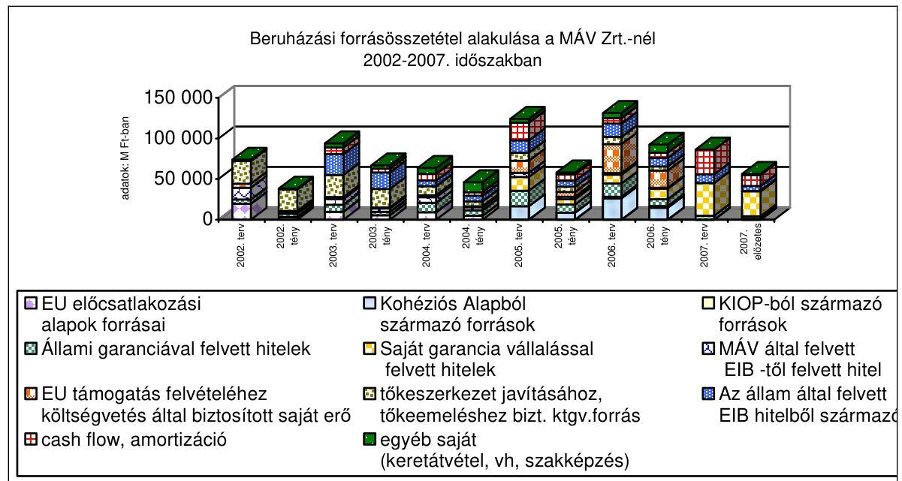

---

A vasúti közszolgáltatás fenntartására, működtetésére és fejlesztésére a MÁV és a GySEV Zrt. a vizsgált időszak alatt a 948,5 Mrd Ft költségvetési forrást használt fel. Ebből a fejlesztést 126,2 Mrd Ft szolgálta. Ugyanebben az időszakban a MÁV Zrt. működési vesztesége meghaladta a 80 Mrd Ft-ot. A társaság adósságállománya (amelynek mintegy 2/3-a működési hitel) 2006. december 31-én 314 Mrd Ft volt. Az elszenvedett és hitelből finanszírozott veszteségek következtében a MÁV tőkehiányossá vált, illetve hitelképtelen és fizetésképtelen közeli állapotba került működési problémái és alulfinanszírozottságának együttes hatásaként. A rendezést is szolgálva - részben tőkejuttatásként - a 2007. évben a MÁV csoport részére juttatott költségvetési támogatások összege megközelítette a 300 Mrd Ft-ot.

A MÁV Zrt. kormányhatározatok ${ }^{9}$ alapján megszületett három éves térségi vasúti kísérleti programja a helyi személyszállítási közszolgáltatás átalakítási koncepciójára nem teljes mértékben teljesült. A helyközi személyszállítási szolgáltatást végző társaságok olcsóbb és hatékonyabb működési feltételeinek biztosítására a program kidolgozása a GKM-ben folyamatban van. A mellékvonalak működtetésének kérdése szorosan összefügg a közlekedés, így a MÁV Zrt. átalakulásával. A GKM alacsony forgalmú hálózati elemekre vonatkozó intézkedései két témakörre vonatkoznak. A menetrendi intézkedések tekintetében a helyközi közlekedés ellátási felelőseként a szolgáltatások megrendelőjeként jár el, míg a hálózati intézkedések esetében a vasúthálózat jövőjére, hosszú távú hasznosítására vonatkozó döntéseket készít elő. Az első körben konkrét döntéseket hozott, a második esetben egy több éves projekt keretében megvalósuló döntéselőkészítő folyamat zajlik, amelyekkel kapcsolatban kockázati tényezők (a kísérleti térségi vasutak működési tapasztalatai az ellenőrzés lezárásáig még nem hasznosultak; a mellékvonalak költség és eredményelemzés adatai nem megbízhatóak; állagmegőrzési, illetve őrzési költségek merülnek fel; nem készült hatástanulmány a térségek életének, gazdaságának hosszú távú fenntarthatóságára; a társadalmi egyeztetésre, az önkormányzati belépésének szándéknyilatkozatára rövid határidő állt rendelkezésre) láthatók. A GKM a mellékvonalak szüneteltetésére vonatkozó döntésénél figyelembe vette a Konvergencia Program elvárásait.

A regionális közösségi közlekedés bevezetéséhez kapcsolódó döntések megszülettek, azok végrehajtása azonban késik. A regionális önkormányzatok nem jöttek létre.

A szolgáltatás, és ezáltal a gazdálkodás kiegyensúlyozottságát, tervezhetőségét elősegítő közszolgálati szerződés kidolgozása utolsó szakaszába lépett. Ennek hiányában a MÁV Zrt. és a személyszállítási szolgáltatás további résztvevői nem képesek az önálló tervezés és gazdálkodás feltételeinek a kialakítására.

Az üzletágak önálló gazdasági társaságokba szervezése erősíti a gazdálkodás tervezhetőségét és átláthatóságát, de az átszervezést követően többszereplőssé váló vasúti szektor kezdeti évei azonnali megtakarítást nem, inkább költségnövekedést
 eredményeznek.

[^0]
[^0]:    ${ }^{9}$ A 2185/2005. (IX. 9.) és a 2130/2006. (VII. 24.) Korm. határozatok

---

A MÁV Zrt. pályavasúti üzletága összes bevétele a vizsgált időszakban 128,3%-kal, a vele szemben elszámolt költségek 143,5%-kal emelkedtek. A költségeken belül az általános költség emelkedése a legnagyobb. A pályavasút költségeit a szervezetnek a forgalomi szolgálattal történő 2003. évi összevonása befolyásolta.

A piaci alapon működtethető árufuvarozásból a 100%-ban állami tulajdonú cége esetében kivonult az állam, ugyanakkor a GySEV Zrt.-nél, amely többségi állami tulajdonú társaság, tőkeemelési kérelem elbírálása van folyamatban a Pénzügyminisztériumnál az árufuvarozás megszerzése érdekében. A MÁV CARGO Zrt. értékesítésére kiírt pályázatot az osztrák állami tulajdonú Rail Cargo Austria AG és a magyar állam többségi tulajdonában álló GySEV Zrt. konzorciuma nyerte meg.

A Kormány 2006-ban felhívta a GKM minisztert a kezelésében álló MÁV Zrt. vagyoni körébe tartozó MÁV Cargo Zrt. értékesítéséhez szükséges intézkedések megtételére, mivel az árufuvarozás nem tartozik az állami közfeladatok körébe. ${ }^{10}$ Az állami vagyonnal foglalkozó jogszabályok együttes értelmezésével érvényesül a törvényalkotói szándék a tartósan állami tulajdonban maradó vagyonra vonatkozóan. A MÁV Cargo Zrt. értékesítésénél ez nem érvényesült.

A MÁV Zrt. példája is igazolja, hogy a törvények egyfajta értelmezésével - akár egyedül csak a tulajdonosi joggyakorló tárca vezérletével, illetve döntései alapján - az állami társaság valamennyi tevékenysége országgyűlési kontroll nélkül leánytársaságokba kiszervezhető. Ezt követően - ugyanilyen döntési mechanizmus alapján - az állami vagyont a társasági tulajdonlás hangsúlyozása mellett privatizálják, majd a befolyt bevételt az anyacég feléli. Így a tartós állami tulajdon egy kiüresedett, vagyonát vesztett, funkció nélküli, gazdasági stratégiai jelentőségét tekintve érdektelenné vált céggé válik. Minél messzebb kerül a vagyon az első - még országgyűlési kontroll alatt álló - szinttől (pl. alapítói/közgyűlési döntést már nem is igénylő kereszttulajdonlásokkal újabb, társasági kör létrehozásával), annál inkább kikerül a vagyon és a tevékenység az állami ellenőrzés és felügyelet alól.

A törvényalkotói szándék a vagyon védelme érdekében a részben/egészben tartós állami társaság részvényeinek az értékét adó, a tevékenység feltételeit biztosító konkrét eszközvagyon megtartása, valamint a társaság által végzett nemzetgazdaságilag fontos tevékenység fenntartása tekintetében nem érvényesül a jogszabályok nem együttes kezelésével a direkt, konkrét szabályozás összehangolatlanságai miatt.

A MÁV Cargo Zrt. privatizációt követő új tulajdonosa a vasúti teherfuvarozási piac 89%-ának megszerzésével több éves versenyelőnyre tesz szert. A MÁV Cargo Zrt. vagyonértékét meghaladja az érte kapott bevétel, - a valós piaci értékhez képest - amelyet befolyásolt a pályahasználati díj visszatérítésére vonatkozó megállapodás. A megállapodás szerint a pályahasználati díj emelke-

[^0]
[^0]:    ${ }^{10}$ A privatizáció lebonyolításában résztvevő jogi szakértő véleménye szerint a privatizációra szánt vagyontömeg értékesítése során a Priv. tv. rendelkezései szerint kell eljárni.

---

déséből származó többletköltséget az eladó 2010. december 31-éig az eladási ár 25%-ig visszatéríti a vevőnek.

Ma nincs Magyarországon egységes vasúti járműnyilvántartás és nem kötelező az uniós országokban bevezetett időszaki hatósági járművizsga, amelyek lehetővé tennék a hazai forgalomban részt vevő vasúti járművek azonosíthatóságát, valamint az országban használt vasúti járművek rendszeres és kötelező ellenőrzését.

A MÁV Cargo Zrt. 91%-át kitevő tárgyi eszközök apportálása tényleges leltározás nélkül történt a MÁV Zrt. pénzügyi, analitikus nyilvántartásában folyamatosan vezetett leltárból kiindulva, amely tételes fizikai leltározással utoljára 2004. 04. 30-án volt alátámasztva. ${ }^{11}$ Az apportálás időpontjában végzett leltározás, valamint az egységes járműnyilvántartás hiánya miatt a mérlegben szerepeltetett tárgyi eszközök azonosítása nem biztosított, az apportlistában feltüntetett értékek a nyilvántartási értékkel azonosak. Az apportba tartozó eszközök átadás-átvétele nem történt meg.

A privatizáció megkezdését követően a MÁV Cargo Zrt.-be apportált MÁV Tiszavas Kft. valós piaci értékelése során az eszközöket egyedi műszaki állapotfelmérés nélkül értékelték. Az értékelés alapját a társaság nyilvántartási értékéből kiindulva határozták meg. Az üzletrész apportálásnál is az előzőekben elemzett módon csak a társasági tulajdonlás szempontjai érvényesültek. A MÁV Tiszavas Kft. tárgyi eszközeinek nettó nyilvántartási értéke (2476 M Ft), a könyvvizsgáló által meghatározott vagyonmérleg szerinti értékből kiindulva (4374 M Ft) nem tükrözi a valós piaci érték megállapítása (1210 M Ft) azt a tényt, hogy a MÁV Tiszavas Kft. valós piaci értékének a meghatározására, a legnagyobb megrendelőjének privatizációjával együttes értékesítés - mint jelentős értéknövelő tényező - miatt kerül sor.

A privatizációs eljárásban nyertes pályázóval a MÁV Zrt. és a MÁV Vagyonkezelő Zrt. 2008. január 2-án írta alá a szerződést. Az aláírt szerződés a MÁV Zrt. számára indokolatlan kötelezettségeket tartalmaz, míg a vevő által vállalt kötelezettségek aggályosak és több ponton célszerűtlenek a Magyar Államra vonatkozóan. A kötelezettségek fennmaradása, a kötelezettségek ellenőrzése, a kötbér megállapítása, a munkavállalók foglalkoztatása, a pályahasználati díjvisszatérítés, a MÁV Zrt. által az áruszállítmányozási tevékenységre vonatkozó versenytilalmi korlátozás és a rendkívüli helyzetekre vonatkozó megállapodás tekintetében a szerződés pontjai gazdasági szempontból aggályosak, illetve az eladóra nézve hátrányos kitételeket tartalmaznak. ${ }^{12}$

Az értékesítés fő indoka az volt, hogy az árufuvarozás nem tartozik az állami közfeladatok körébe, ezért célszerűtlen és ellentmondásos, hogy a pályázaton győztes konzorciumnak a Magyar Állam többségi tulajdonában lévő tagja - a GySEV Zrt. - vevőként olyan tevékenységet végezhet, amely a másik állami tu-

[^0]
[^0]:    ${ }^{11}$ Az ellenőrzés alatt a MÁV Zrt. a tulajdonában álló vasúti tehervagonok db számáról 2007. december 31-ére vonatkozóan eltérő adatokat szolgáltatott.
    ${ }^{12}$ A PM és a MÁV Zrt. szerint a szerződéses feltételek kialakításánál üzleti megfontolások, elsősorban az ár maximalizálása játszott szerepet.

---

lajdonú társaságnál nem kívánatos. Az értékesítést az árufuvarozási piac teljes megnyitása miatt növekvő versennyel, az elavult eszközpark megújításával és a szükséges fejlesztések forrásigényével és az egyszeri jelentős bevétellel indokolták.

A GySEV Zrt. nem rendelkezik hozzájárulással a tranzakcióhoz sem a tulajdonosi jogok gyakorlójától, sem a vagyonkezelőtől. A társaságnak nincs annyi forrása, hogy a vételár rá eső részét finanszírozza.

A MÁV Zrt. Felügyelő Bizottsága a MÁV Alapító Okiratában rögzítettektől eltérően a végleges adásvételi szerződés tervezetét nem kapta meg és ezért nem is véleményezhette, de a MÁV Zrt. előterjesztése alapján az értékesítéssel egyetértett, arról határozatot hozott és a rendelkezésére álló szerződéstervezettel kapcsolatban az Alapítónak több észrevételt is tett, amelyeket az aláírt szerződésben nem vezettek át.

Az elmúlt évtizedek alatt a vasúti infrastruktúra műszaki állapota folyamatosan romlott. Az elhasználódás egyik alapvető oka, hogy a karbantartásra és a felújításokra, beruházásokra előirányzott források nem nyújtottak fedezetet a műszaki állapot szinten tartására sem. Az Állami Számvevőszék korábbi jelentésében szereplő elmaradt vasúti fejlesztések értéke a MÁV Zrt. kimutatásai szerint a 2001. évi 1320 Mrd Ft-tal szemben a MÁV Zrt.-nél 2006-ra elérte a 2100 Mrd Ft-ot. A beruházások elkészülte után a szükséges fenntartások elmaradnak a megfelelő finanszírozási háttér hiányában. Így pl. a korábbiakban elvégzett Budapest-Hegyeshalom-Bécs vonal menetideje a beruházás átadása után 2 óra 40 perc volt, mára ez a pálya állapota miatt 3 órát vesz igénybe. A járműpark átlagéletkora jelenleg 29,7 év. Az állomány 42%-a 20-30 év, 31%-a 30-40 év közötti, 13%-a meghaladja a negyven évet.

A személyforgalom területén a MÁV-nál valamennyi vontatási nemben csökkent a teljesítmény, összesen 4%-kal, a személyszállítási kínálatszűkítés eredményeként. A GySEV Zrt. személyforgalma a dízelvontatás területén a vonalátvételek miatt megközelítőleg a kétszeresére, a villamos vontatásnál 76,2%-kal növekedett. Az áruforgalom területén valamennyi vontatási nemben növekedett a teljesítmény: a MÁV-nál 27,9%-kal a GySEV-nél 41,6%-kal. A vontató járművek kihasználtsága 25,2%-kal nőtt.

A vasúttársaságok 2002-2007 között a tervezett 636 Mrd Ft-tal szemben 377 Mrd Ft (59,3%) fejlesztési forrást használtak fel. A források 24,9%-a (93,8 Mrd Ft) uniós támogatásból, 18,6%-a (70 Mrd Ft) saját kockázatú, 19,8%-a (74,8 Mrd Ft) állami kezességvállalás mellett felvett hitelből, 16,5%-a (62,3 Mrd Ft) költségvetési forrásból (elsősorban tőkerendezésből), 10,3%-a (38,8 Mrd Ft) egyéb forrásból, (keretátvétel, vagyonhasznosítás) és 9,8%-a (37,3 Mrd Ft) működési bevételből származott.

A vasútfejlesztés céljára az EIB-től felvett hitelnek a fejlesztésre fel nem használt részével a Pénzügyminisztérium a Kincstári Egységes Számlán a költségvetés likviditását javította. Az EIB Vasút I/A, I/B és IV. hiteleket a MÁV Zrt. nem kapta meg, a leszerződött munkákat más forrásból finanszírozták.

---

A még nem teljesen lehívott beruházási hitelek 2002. évi nyitó állománya 3,2 Mrd Ft, a teljes beruházási hitelállomány 76,7 Mrd Ft volt, melyből 2002. évben jelentős összegeket rendeztek, majd ezt követően az állomány 124,2 Mrd Ft-ra nőtt 2007. év végére.

A MÁV hitelállománya a szanálás miatti alacsony bázisról, a 2002. évi 27,8 Mrd Ft-ról 2007-re 246,8 Mrd Ft-ra emelkedett, ezen belül az állami kezesség mellett felvett hitelek állománya 4,1 Mrd Ft-ról 193 Mrd Ft-ra nőtt. A hitelállomány 2007-ben fele-fele arányban fejlesztési, illetve működési célú volt.

A MÁV Zrt. kiadásaiban a személyi jellegű költségek (32%), míg a GySEV Zrt.-nél az anyagjellegű költségek (68%) képviselik a legnagyobb hányadot. A két társaság költségstruktúrája eltérő, a MÁV Zrt.-nél elsősorban saját létszámmal látják el a feladatokat, a GySEV Zrt. külső szolgáltatótól is vásárol.

A MÁV Zrt. működésére - az elavult infrastruktúra és technológia, valamint az alaptevékenységen kívüli járulékos feladatok miatt - a túlzott létszám és az alacsony létszámhatékonyság volt jellemző. Létszám racionalizálási céllal 2002-2006 között három alkalommal, összesen 4,4 Mrd Ft támogatásban részesült a társaság. Elsősorban a kiszervezések hatására a MÁV Zrt. létszáma a 2002. évi 53766 főről 2007 végére 34236 főre csökkent. A racionalizálás ellenére a MÁV Zrt. bérköltsége és ezzel együtt a személyi jellegű kifizetések nem csökkentek. A szervezeti átalakítás és a létszámleépítés hatására a személyi jellegű költségek részaránya a 2005. évi 41%-ról 2006-ban 35%-ra, 2007-ben 32%-ra csökkent. A havi átlagbér - amelynek növekedési üteme minden évben meghaladta az infláció mértékét - a 2002. évi 110864 Ft-ról 2007. év végére 194824 Ft-ra, a személyi jellegű kifizetések 2016 E Ft-ról 3460 E Ft-ra emelkedtek.

A költségszerkezetet befolyásolja az anyagi jellegű ráfordítások fedezetének mértéke is. Ha ezek nem növekedhetnek megfelelő mértékben, a személyi jellegű költségek növekvő részarányt képviselnek.

Az eszközök struktúrája tekintetében mind a MÁV Zrt.-nél, mind a GySEV Zrt.-nél a vasúti szolgáltatás ellátásához szükséges eszközök állományához képest jelentős az egyéb eszköz (pénzügyi befektetések, szociális infrastruktúra, ingatlanok). Az eszközök könyv szerinti értéke eltér a valós piaci értéktől. A pontos vagyoni helyzet ismerete nélkül az állam szakmai intézkedései nem valós információkon alapulnak. A MÁV Zrt. apportálásokat végez nyilvántartási értéken anélkül, hogy a vagyon aktuális értékét megjelenítené. Így pl. a MÁV Cargo Zrt. apportlistájában szereplő vasúti teherkocsik 1 Ft apportértéke sem a nyilvántartási árral, sem a valós piaci értékükkel nem hozható összefüggésbe. ${ }^{13}$ A
 MÁV Ingatlanbefektetési alap következményeképpen a MÁV Zrt. tulajdonosi

[^0]
[^0]:    ${ }^{13}$ A Gt. a nyilvántartási értéken történő apportálásra lehetőséget ad.

---

jogosultsága és hatásköre az ingatlanvagyonnal való gazdálkodás felett közvetetté válik. ${ }^{14}$

A MÁV Zrt. ingatlangazdálkodását az ingatlanok és a felépítmények tulajdonjogi rendezésének hiánya, az áttekinthetetlen ingatlanvagyont terhelő korlátozások, az ingatlangazdálkodást érintő gyakori koncepció- és vezetőváltás jellemzi.

A 2,5 Mrd Ft kikiáltási áron meghirdetett, 8,6 ha területű, a Budapest Nyugati pályaudvar- Ferdinánd-híd- Lehel utca-Bulcsú utca által határolt ingatlanra kiírt pályázatot a Markland Holdings Ingatlanforgalmazó és Tanácsadó Kft. nyerte meg. A pályázati kiírást megelőzően a MÁV Zrt. nem szerezte be a területen lévő elővásárlási jogosultak lemondó nyilatkozatait, amelyet a pályázati felhívásban tévesen tüntettek fel. A MÁV Zrt. mulasztása miatt előállt tisztázatlan jogi helyzet ellenére az ingatlan értékesítésére kiírt pályázati eljárást a MÁV Zrt. nem állította le. A 2006-ban lezárult bírósági eljárást a MÁV Zrt. elvesztette, aminek következtében a vevő számára 2003-ban birtokba adott ingatlant a Ballymore Kft. az elővásárlási jogosult MÁV Multiszolg Kft. által kijelölt joggyakorló Pólus Holding Rt. részére kellett átadni. A MÁV Zrt. számára kedvezőtlen ítélet következtében a régi vevő Ballymore Kft. a 3,2 Mrd Ft értékesítési bevételt és ezen belül 700 M Ft eredményt jelentő értékesítési folyamat végén a vételárat jelentősen meghaladó, terület értéknövekedés és elmaradt haszon miatt mintegy 27 Mrd Ft-os kártérítési igénnyel lépett fel a MÁV Zrt.-vel szemben, amelyet mindezidáig perben nem érvényesített. Az új vevő a MÁV Zrt. felé mintegy 17 Mrd Ft-os (nem részletezett) kártérítési igényt jelzett, amelyet perben még nem érvényesített. A MÁV Zrt. a követeléseket vitatja.

A MÁV Multiszolg Kft. - amelyet mérésügyi hitelesítés céljából 100%-ban a MÁV Rt. alapított - tevékenységéhez a MÁV Zrt. szindikátusi szerződés alapján kedvezményes ingatlanbérleti lehetőséget biztosított, egyben hozzájárult az ingatlanok értékesítése esetén az „elővételi” jog gyakorlásához tőkeemelés formájában, illetve azonos használati értékű ingatlan biztosításával.

A Multiszolg Kft.-nek a MÁV Zrt. a jelentősebb főpályaudvarokon biztosított határozatlan idejű bérleti lehetőségeket. Indokolatlan módon, az adott ingatlanokra vonatkozó bérleti szerződésektől függetlenül, szindikátusi szerződésben is fogalmaztak meg az ingatlanokkal kapcsolatos lényeges szolgáltatási feltételeket (pl. az elővásárlási jog gyakorlása, környezetvédelmi mentesítés). Mind a bérleti szerződések, mind a szindikátusi szerződés a pontatlan megfogalmazás miatt félreérthető, ami az egységes vagyonkezelési feltételek hiányában jelentős gazdasági hátrányt, illetve peres eljárásokat okoz.

[^0]
[^0]:    ${ }^{14}$ A MÁV Zrt. az ingatlanalapba szánt ingatlanokat független értékelő által végzett forgalmi értékbecslés alapján megállapított piaci értéken kívánja apportálni. Illetve értékesíteni. A konstrukció a MÁV Zrt. véleménye szerint előnyös, mert mindamellett, hogy 6 Mrd Ft-ot meghaladó forráshoz jut az ingatlanok eladása következtében (ugyanakkor vagyona csökken), az alapkezelő cégben birtokolt 50%-os részesedése révén a tulajdonosi irányítás keretében befolyásolni tudja az alap működését és részesedik annak hozamából.

---

A MÁV Zrt. vezetése az üzletrész jelentős csökkenésének, illetve tagi jogviszonyának a megszűnésével egy időben nem tisztázta a szindikátusi szerződésben a MÁV Zrt.-re nézve hátrányos és célszerűtlen szerződési feltételeket, sőt, a szindikátusi szerződés 2002. évi megújításával a MÁV Zrt.-re nézve a jogilag tisztázatlan helyzetet megerősítette. A Multiszolg Kft. tevékenysége nem indokolja a MÁV Zrt. által nyújtott, a Kft. számára jelentős gazdasági előnyt jelentő bérleti konstrukciók fenntartását.

A MÁV Zrt.-nél az ellenőrzések során a Felügyelő Bizottság több esetben észlelt olyan mulasztást is, amely veszélyeztette a Társaság működését. Emiatt a Társaság menedzsmentjéhez fordult, hogy a feltárt hiányosságokat küszöböljék ki. A 2002-2007. években az FB által kifogásolt gazdálkodási visszaélésekre történt jelzések részben válasz nélkül maradtak, vagy nem megfelelő intézkedés történt. Ezekben az esetekben az FB értesítette a tulajdonosi jogokat gyakorló minisztert. A tett intézkedéseknél nem mutatható ki, hogy a gyakori menedzsment változtatás az FB feltáró munkája következtében történt, vagy elégedetlenség miatt váltotta le a miniszter a Társaság vezetését. Mivel a Társaság vezető beosztású dolgozói egyes gazdasági ügyekkel milliárdos károkat okozhattak (pl. Tiszavas Kft.-nek eladott tehervagonok és azok visszabérlése, fedezetlen váltó befogadása miatti kezességvállalás, orosz államadósság lebontásával kapcsolatos visszaélés), ezért úgy értékelhető, hogy a tulajdonosi felügyelet nem megfelelően működött. A MÁV Zrt.-nél a belső ellenőrzési szervezet feltárta a fent leírt visszaéléseket, de érdemi intézkedés nem történt.

A korábbi ÁSZ ellenőrzések alkalmával több ajánlást fogalmaztunk meg a Kormánynak és a szakminiszternek a vasúti közlekedés törvényi szabályozásával és a MÁV Zrt. gazdálkodásával kapcsolatosan. Megállapításaink és javaslataink részben hasznosultak.

A helyszíni ellenőrzés megállapításainak hasznosítása mellett javasoljuk

# a Kormánynak: 

1. intézkedjen a vasúti közlekedés korszerűsítésével kapcsolatos döntések összhangjáról és a forrásokkal fedezhető középtávú stratégia megteremtéséről az EU-s források hatékonyabb felhasználása érdekében;
2. vizsgáltassa felül és kezdeményezze az integrált vasúti társaságokra vonatkozó törvényi szabályozás módosítását annak érdekében, hogy a független kapacitás-elosztás és díjmegállapítás a MÁV vállalatcsoport új struktúrája esetén is biztosítva legyen;
3. intézkedjen a közforgalmú személyszállítási utazási kedvezményekről szóló 85/2007. (IV. 25.) Korm. rendeletet és a fogyasztói árkiegészítésről szóló 2003. évi LXXXVII. törvény előírásainak összhangjáról;
4. szerezzen érvényt a vasúti személyszállítás és pályahálózat működtetésére vonatkozó közszolgálati szerződések megkötése törvényben rögzített előírásainak, valamint ezek finanszírozásának;
5. kezdeményezze a fővárosi és nagyvárosok elővárosi közlekedésének összehangolását figyelemmel a fejlesztésekre és a közlekedési szövetségekre;

---

6. szerezzen érvényt a tartós állami tulajdonú társasági vagyoni körre vonatkozó törvényhozó szándéknak;
7. vizsgáltassa ki, hogy az FB szabálytalanságokra utaló jelzéseire a tulajdonos miért nem intézkedett megfelelően;
8. intézkedjen a MÁV CARGO Zrt. létrehozásának és értékesítésének az ellenőrzés által feltárt és a jelentésben rögzített hiányosságai megszüntetésére;
9. vizsgáltassa ki a Nyugati pályaudvari ingatlan 2003. évi értékesítésénél elkövetett mulasztásokat, valamint a MÁV Zrt. Multiszolg Kft.-vel kötött szindikátusi szerződésének a MÁV Zrt.-re nézve előnytelen feltételeit és a bérleti szerződések indokoltságát. Kezdeményezze a fenti szerződésekben a MÁV Zrt. részére hátrányos feltételek megszüntetését;
10. az előző három pontba foglalt mulasztásokkal, hiányosságokkal összefüggésben állapítsa meg, hogy kit milyen mértékben terhel személyi felelősség és intézkedjen a felelősségre vonás iránt.

# a közlekedésért felelős miniszternek: 

intézkedjen az egységes vasúti járműnyilvántartás létrehozásáról és a vasúti járművek műszaki vizsgáztatásának rendjéről.

---

# II. RÉSZLETES MEGÁLLAPÍTÁSOK 

## 1. A vasúti KÖZLEKEDÉS SZABÁLYOZOTTSÁGA

Az EU közlekedésfejlesztési jogszabályainak hazai bevezetésével kapcsolatos jogszabály-alkotási kötelezettségét a GKM és a Kormány részben teljesítette.

Az EU irányelvei első vasúti csomagja a vasútról szóló 1993. évi XCV. törvény többszöri módosítása után 2005. november 1-jéig beépítésre került a hazai jogrendszerbe.

A 2001-ben elfogadott, ún. első vasúti csomagot alkotó EU irányelvek előírják, hogy el kell különíteni a pályahálózat működtetését a vasúti vállalkozói tevékenységtől. Az irányelvek szerint az árufuvarozás teljes liberalizációját 2007. január 1-jéig meg kellett valósítani, míg a személyszállítás területén erre az időpontra a liberalizáció előrehaladását irányozzák elő.

A második vasúti csomag a vasúti közlekedésről szóló 2005. évi CLXXXIII. törvény (a továbbiakban: Vtv.) elfogadásával vált a hazai jogrend részévé.

A Vtv. rögzíti, hogy a kincstári tulajdonban lévő vasúti pályák működtetését (kezelése, fenntartása) állami feladat, továbbá a közszolgáltatási kötelezettség bevétellel nem fedezett indokolt költségeit a központi költségvetésből kell kifizetni. A második vasúti csomagot alkotó irányelveket az EU 2004-ben fogadta el, ebben vasútbiztonsági, valamint a pályahálózatok közötti átjárhatósági kérdésekkel foglalkoztak, kötelezettségeket állapítottak meg a tagországok számára a további integráció érdekében.

A Vtv. a korábbi törvénytől ${ }^{15}$ eltérő elvek mentén szabályozza a vasúti piac működését, többek között létrehozta a Magyar Vasúti Hivatalt (MVH), mint új, a piac felügyeletére jogosult szervet. A piacfelügyeleti és egyéb hatósági funkciók újonnan kerültek a rendszerbe úgy, hogy a korábbi végrehajtási rendeletekkel együtt alkalmazva bizonyos esetekben többlet-egyeztetési kötelezettség keletkezett. Az új vasúti törvény és a hatályos korábbi végrehajtási rendeletek fogalom-rendszere egymásnak nem volt megfeleltethető, ezáltal értelmezési nehézségek keletkeztek. ${ }^{16}$ Az újonnan létrehozott hálózat-hozzáférési díj és kapacitás-elosztás folyamatba való integrálására sem voltak alkalmasak, bizonyos esetekben (Hálózati Üzletszabályzat elfogadtatása) a vasúti törvény és mellette a régi végrehajtási rendelet betartása esetén a folyamat jelentősen meghosszabbodott.

Pld. a VPE Kft. a Hálózati Üzletszabályzatot (HÜSZ) a Vtv. 59. § (2) bekezdés értelmében a közzétételt 30 nappal megelőzően egyeztetési céllal a honlapján nyilvánosságra hozza, illetve az MVH-t a beérkezett észrevételekről, valamint az

[^0]
[^0]:    ${ }^{15}$ Az 1993. évi XCV. tv.-től
    ${ }^{16}$ A GKM jogalkotási tevékenysége eredményeképpen az értelmezési nehézségek folyamatosan csökkentek.

---

egyeztetéssel kapcsolatos minden körülményről haladéktalanul tájékoztatnia kell, illetve a HÜSZ-t a közzétételt megelőzően a Hivatal részére meg kell küldeni. A 67/2003. (X. 21.) GKM rendelet 5. § (4) bekezdése értelmében a Szabályzatot a gazdasági és közlekedési, valamint a pénzügyminiszter együttesen hagyja jóvá.

A hálózat-hozzáférési díjról szóló 83/2007. (X. 6.) GKM-PM rendelet 2007. október 6-án, a vasúti pályahálózathoz történő hozzáférés részletes szabályairól szóló 101/2007. (XII. 22.) GKM rendelet pedig 2007 decemberében került kihirdetésre, az új vasúti törvényhez képest mintegy két éves késéssel.

A harmadik vasúti csomagot az EU 2007-ben fogadta el, amelyben definiálták a közszolgáltatási személyszállítási tevékenység szabályait és annak finanszírozási hátterét.

Az EU irányelveknek megfelelően a Vtv. piaci szereplőként különbséget tesz a pályavasút társaság (a pálya kezelője), a vállalkozó vasúti társaság (a szolgáltató) és az integrált vasúti társaságok között. A hazai jogszabályok az integrált vasúti társaság fogalmát másképpen értelmezik, mint az EU-s elvek. Az EU integrált vasúti társaságként értelmezi azt is, ha egy vállalatcsoporton belül valósul meg a pályavasúti és a vállalkozó vasúti tevékenység. Ezzel szemben a Vtv. az integrált vasúti társaság fogalmát csak egy konkrét társaságon belüli kritériumként fogalmazza meg. Az eltérés hatással van a MÁV Zrt. szerkezetátalakítási folyamatára, illetve a vasúti társaságok és a vasúti közlekedést szabályozását ellátó szervezetek kapcsolatrendszerére.

A MÁV Zrt. és a GYSEV Zrt. integrált vasúti társaságnak minősül mind a magyar mind az európai normák alapján. A GYSEV Zrt. önálló üzletágakat hozott létre a vállalkozói és a pályavasúti tevékenységekre, így itt az EU által megkövetelt elkülönítés nem a MÁV Zrt.-nél megvalósított vállalatcsoporttá szervezéshez hasonló módon történik, hanem továbbra is egy gazdasági társaságon belül.

A 2002-2007. évek közötti időszakban a személyszállításra és az árutovábbításra jogosult - működési engedéllyel rendelkező - vasúttársaságoktól kérdőíves önkéntes adatszolgáltatás útján adatokat és információkat kértünk be a vasúti tevékenységükkel kapcsolatosan. Az ellenőrzött időszakban az országos vasúti társaságokon kívül 40 társaság rendelkezett működési engedéllyel. A kérdőívet visszaküldő 30 szervezet vasútfejlesztési tevékenységgel kapcsolatos adatai szerint 62,5% rendelkezik fejlesztési stratégiával. Jellemzően a kisvasutaknak nincs kidolgozott stratégiájuk, a legszükségesebb szintentartó karbantartásokat, beszabályozásokat és beruházásokat végzik el, amellyel az előírt biztonsági elvárásoknak tudnak megfelelni. A magán vasúttársaságok jellemzően nem ismerik az elfogadott hazai közlekedéspolitikát. A pályahálózat és az infrastruktúra fejlesztésére kapott támogatások felhasználása során az erdőgazdaságok
 esetében lehetőség nyílt a saját célú áruszállítás (faanyag-mozgatás) szinten tartására, valamint a turisztikai célú személyszállítás színvonalának emelésére. A pályahálózat megerősítésével lehetővé vált a gőzvontatás turisztikai látványosságként történő bevezetése. Az infrastruktúra fejlesztésének keretében erdészeti, faipari és vasúti múzeumot is magában foglaló épületek kialakítása történt, természetismereti központot hoztak létre, illetve akadálymentesített szálláslehetőséget biztosítottak az érdeklődők részére. A kapott támogatások szinte minden esetben csak a pályahálózat szinten tartást tették lehetővé, fejlesztést ebből végrehajtani nem lehetett. A pályakorszerűsítések abban merültek ki, hogy az utazási sebességet szinten

---

tudják tartani, a pályát ne kelljen lezárni. Csak a fővonali fejlesztések eredményeztek némi javulást. A megkérdezettek véleménye szerint a támogatások megvonásával a kisvasutak megszünése várható. A kérdőívekben megfogalmazott kérdésekre adott válaszok összesítése a 6. sz. mellékletben található. Értékelhető teljesítményadatok a nagyobb vasúti társaságoktól (MÁV, MÁV-START, MÁV Cargo, GySEV) kapott tanúsítvány adatainak feldolgozásából nyertünk. (Lásd: 6. melléklet 1. táblázat adatait.)

A gazdasági társaságokat - vasúti társasággá alakulásuk során - vagy személyszállítási, vagy áruszállítási kategóriába sorolta a hivatal függetlenül attól, hogy vasúti karbantartással, speciális vasútépítő-gépek szállításával, vontatással, turisztikai vagy gépészeti tevékenységgel foglalkoznak. A vasúti társaságok 62,5%-a rendelkezik fejlesztési stratégiával. Jellemzően a kisvasutaknak nincs kidolgozott stratégiájuk, a társaságok többsége a túlélésért küzd. Fejlesztésekre, komolyabb beruházásokra nem gondolhatnak. Évente a legszükségesebb szinten tartó karbantartásokat, beszabályozásokat, és beruházásokat végzik el, amellyel az előírt biztonsági elvárásoknak tudnak megfelelni.

A szerkezetátalakítás a közúti és vasúti közlekedés - összehangolt, forrásokkal alátámasztott - középtávú fejlesztési irányvonalának meghatározása nélkül kezdődött meg. Az intézkedések irányának gyakori és egymásnak ellentmondó változása költségessé tette az átalakulást.

A Nemzeti Infrastruktúra Fejlesztő Zrt. (NIF) létrehozásának körülményei is azt bizonyítják, hogy a vasúti szervezet átalakításánál összehangolatlan, előre nem tervezett intézkedések is voltak.

A GKM vezetője 2006. decemberében levélben értesítette a MÁV Zrt. vezetését, hogy az EU-s forrásokból finanszírozott infrastrukturális beruházások lebonyolítását elvonja a MÁV Zrt.-től és azt az NA Zrt. feladatai közé csoportosítja át.

A döntést nem előzte meg hatástanulmány, azaz hogy a feladatátadás következtében milyen szabályozási változásokra van szükség.

Az átadás a tervezetthez képest két hónapot csúszott. A MÁV Zrt. a feladatátcsoportosítás elkezdésétől már nem, az NA Zrt.-ből később átalakult NIF Zrt. a feladat teljes körű átvételéig még nem tudott teljes hatékonysággal a projektek előkészítésén dolgozni.

Az átadás előkészítetlensége miatt néhány hónapig a vasúti törvénnyel nem volt összhangban az, hogy a vasúti támogatás kedvezményezettjének (jelen esetben a NIF-nek) nincs vasúti tevékenység végzésére engedélye. ${ }^{17}$

Az európai uniós csatlakozás előtt aláírt támogatási szerződésekben még mindig a MÁV Zrt. szerepel kedvezményezettként. Az EU-s támogatásokat felügyelő bizottságot erről a fejleményről tájékoztatták, a bizottság ismeri az ellentmondást, ugyanakkor bizottsági állásfoglalás szerint a kedvezményezett változása

[^0]
[^0]:    ${ }^{17}$ Az MVH szerint a vasútfejlesztésekről szóló 91/440/EGK irányelv szerint vasútfejlesztési tevékenységet kizárólag pályavasúti társaság (infrastruktúra működtető szervezet) végezhet.

---

szerződést módosító tétel. Az Európai támogatási szerződéseket összesen egyszer lehet módosítani.

A MÁV Zrt. szerint az EU-s támogatásból megvalósuló fejlesztések támogatási szerződéseit hiánytalanul engedményezték a NIF Zrt.-re. E szerződésekben a MÁV Zrt. fejlesztési közreműködőként vesz részt a projektekben. Egyes KIOP és TEN-T támogatásból megvalósuló projektek a MÁV hatáskörében maradtak. E körben a MÁV Zrt. a forrás kedvezményezettje.

# 2. A VASÚTI KÖZLEKEDÉS FEJLESZTÉSI CÉLKITŰZÉSEI 

### 2.1. Közlekedéspolitika, fejlesztési tervek

Az Európai Unió közlekedéspolitikáját a 2001-ben megfogalmazott, úgynevezett Fehér könyv (Európai Közlekedéspolitika) 2010-ig tartalmazza. A Fehér könyv kiemelten kezeli a vasúti közlekedés fejlesztését a közúti szállítással szemben, valamint a vasúti szolgáltatások fokozatos liberalizációját a hatékony verseny kialakulása érdekében.

Az Európai Unió közlekedéspolitikája szükségessé tette az 1996. óta hatályos 68/1996. (VII. 9.) OGY határozattal elfogadott magyar közlekedéspolitika megújítását.

A Nemzeti Közlekedéspolitika általános célkitűzéseit a 68/1996. (VII. 9.) OGY határozat fektette le. A határozat integrált közlekedési rendszer kiépítését, személy- és áruszállítási igények magas színvonalú kielégítését, a vasúti és közúti közlekedés arányának javítását, az ésszerű közlekedési módozatok kialakítását rögzítette. A vasútpolitika a tervezett vasúti reform végrehajtásán keresztül a hazai érdekek figyelembevételével az EU konform vasúti közlekedés kialakítását irányozta elő.

Az új dokumentum neve Magyar Közlekedéspolitika 2003-2015. - amelyet az Országgyűlés a 19/2004. (III. 26.) számú határozatával fogadott el - az általános közlekedéspolitikai elveken túlmenően elfogadott 2006-ig terjedő, valamint 2015-ig szóló fejlesztési irányokat, az ország geopolitikai helyzetének kihasználásához és az ország versenyképességének növeléséhez szükséges közlekedési rendszer létrehozását tűzte ki célul.

Az EU /91/440/EGK számú irányelvével összhangban - a vasúti hálózattal és pályákkal foglalkozó egységek, valamint az áru- és személyszállítással foglalkozó szolgáltatási részlegek pénzügyi, számviteli valamint a törzs- és regionális helyi vonalak szétválasztását is meghatározták.

Az EU 2007-ben elfogadta az Új Magyarország Fejlesztési Tervet. Az ÚMFT céljaihoz szorosan kapcsolódó Közlekedési Operatív Program (KÖZOP) 2007-2013 között a felhasználható 6290 M euró keretből, (melyből a Kohéziós Alap 5185 M€-t, az ERFA 1105 M€-t biztosít) a vasúti - a TEN-T - vonalak fejlesztésére 1641 M euró áll rendelkezésre. Céljai szerint javítani kell a versenyképesség növelése és a társadalmi-területi kohézió erősítése céljából az elérhetőséget, és fejleszteni kell a közösségi közlekedést.

---

A GKM a Fehér Könyv félidős felülvizsgálatát követően a Magyar Közlekedéspolitika 2003-2015 dokumentum kiegészítésére 2007-2020 közötti időszakra elkészítette az „Egységes Közlekedésfejlesztési Stratégia I. Zöld könyv" (EKFS) című dokumentumot.

Az ellenőrzött időszak legfontosabb vasúthálózat-fejlesztései a különféle uniós támogatásokkal (ISPA, Kohéziós Alap és KIOP forrásokból, valamint az EIB I/A és I/B, valamint IV. hitelek felhasználásával) megvalósuló vasúti infrastruktúra-fejlesztések voltak. Bár az eleve egyéves késéssel elfogadott Magyar Közlekedéspolitika 2003-2015. évi stratégia fejlesztéseinek első, 2006-ig terjedő szakasza teljes körűen nem, a legfontosabb célkitűzések - elsősorban a közutakon - legalább részben megvalósultak.

Kiemelten kezelt vasúti fejlesztések 2006-ig:

- az európai normáknak megfelelő vasúti törzshálózat (hazai és nemzetközi) fejlesztése, biztosítva az ország tranzit szerepének visszaszerzését és lehetővé téve a tagországok irányában a nagy sebességű vasúti összeköttetést,
- az elővárosi vasúti közlekedés fejlesztése, járműbeszerzési és járműcsere program beindításával,
- korszerű és jó minőségű helyi és helyközi közforgalmú személyközlekedés biztosítása, átjárhatóságot biztosító új bérletrendszer bevezetésével (Budapesti Közlekedési Szövetség).

Megvalósulások a vizsgálat befejezéséig:

- a vasúti törzshálózat fejlesztése nehézkes, a nagysebességű vasúthoz alkalmas pálya hiányzik, az egyetlen korszerű pálya Budapest-Hegyeshalom között létezik (amelynél az eredeti 160 km-es sebesség a fenntartás hiányosságai miatt már nem tartható),
- a járműcsere ill. fejlesztés az elővárosi vasúti közlekedésben beindult,
- a közlekedés-fejlesztési és a közlekedésszervezési tevékenységekre Budapest Főváros és Pest megye Önkormányzata, valamint a GKM közösen létrehozta 2005-ben a Budapesti Közlekedési Szövetséget (BKSZ), amelyhez az állami költségvetés támogatást nyújt.

Az EU-s normáknak megfelelő intézményrendszer kialakításával létrejött új szervezetek felsorolását, azok feladat- és hatáskörét az 1. melléklet tartalmazza.

# 2.2. A vasúti reformról szóló kormányhatározatok végrehajtása 

A Közlekedési Operatív Program (KözOP) az érvényes magyar közlekedéspolitikában és az Európai Unió közös közlekedéspolitikájában („Fehér Könyv, Európai közlekedéspolitika 2010-ig: itt az idő dönteni" COM(2001)370) megfogalmazott stratégiai elveken és prioritásokon alapul. A MÁV Zrt. Alapító Okirata az alapító kizárólagos hatáskörébe sorolja a hosszú távú fejlesztési koncepciók jóváhagyását. A társaságnak 2000-2005. években nem volt alapító által - alapítói határozattal - elfogadott stratégiai terve.

---

A vasúti reform átfogó értékelését a Kormány 2003-ban elvégezte. Ennek eredményeképpen született meg a MÁV Zrt. európai színvonalú vasúttá alakításáról és az EU-csatlakozáshoz szükséges vasúti reform végrehajtásáról szóló 1001/2004. (I. 8.) Korm. határozat. A kormányhatározat elfogadta a MÁV Zrt. átalakításának koncepcióját, amellett, hogy a reformkoncepció megvalósítását, illetve benne a MÁV Zrt. átalakításának ütemét a vállalati hatékonyság javulásának és az állami költségvetés teherbíró képességének kell alárendelni.

A Kormány a 2005-2009. évekre kitekintő Konvergencia Programban célként jelölte meg a helyközi közlekedés terén a vasúti és közúti tömegközlekedésben meglévő párhuzamosságok megszüntetését, a vasúti árufuvarozás ösztönzését, a költségvetési terhek csökkentése érdekében pedig a regionális szinten versenyképes vasúti pályahasználati díj bevezetését. A Program a vasúti reform folytatásaként a piaci modell megteremtését fogalmazza meg.

A MÁV Zrt. fejlesztési elképzeléseit az Új Magyarország Fejlesztési Tervhez kapcsolódva 2006-2013 közötti fejlesztési periódusra készítette el. Az EU fejlesztés 7 éves tervével összhangban közel 2 Mrd euró összegben határozta meg fejlesztési igényeit, amely a periódust megelőző szokásos fejlesztési beruházások többszöröse. A MÁV Zrt. mind gazdasági, mind pedig működés-irányítási szempontból 2006-ra fordulóponthoz érkezett. A kezdeti stádiumban levő szervezeti átalakítások miatt az integrált vasút rossz hatékonysággal, a MÁV csoport - kialakulatlansága miatt - még nem működött. A működési problémák és alulfinanszírozottságának együttes hatásaként a MÁV Zrt. működési vesztesége meghaladja a 80 Mrd Ft-ot, adósságállománya - amelynek mintegy 2/3-a működési hitel - 314 Mrd Ft, tőkehiányossá vált, illetve hitelképtelen és fizetésképtelen közeli állapotba került. A helyzet feloldására készült a helyközi tömegközlekedési rendszer átalakításával és a MÁV Zrt. tőkemegfelelése biztosításával összefüggő egyes feladatokról szóló 2130/2006. (VII. 24.) Korm. határozat. A MÁV Zrt. tőkerendezését követően a 2006. évi fejlesztési források között már jelentős arányt képviselhettek az állami kezességvállalás mellett, vagy saját kockázatra felvett euró és Ft hitelek.

A középtávú 2008-2010-ig szóló terv szerint a MÁV csoport önerőből - költségcsökkentés révén - teremti meg működési színvonal emeléséhez szükséges fedezetének egy részét. A 2007. 05. 31-ei GKM-PM-KTI-MÁV tanulmány szerint a megtakarítási projektek 43,1 Mrd Ft eredményjavulást, míg a színvonalnövelő projektek 45 Mrd Ft költségnövekedést jelentenek.

A stratégiában megjelölt célok megvalósításai folyamatban vannak, azonban a körülmények többszöri megváltozása következtében nem mutatható ki, hogy a termelékenység, a belső hatékonyság növekedése összhatásában mikor és milyen mértékben ellensúlyozta a 2003-ban elkezdett alapvető szervezeti, irányítási, döntési és hatásköri változások költségnövelő hatását.

A MÁV Zrt. európai színvonalú vasúttá alakításáról és az EU-csatlakozáshoz szükséges vasúti reform végrehajtásáról szóló 1001/2004. (I. 8.) sz. Korm. határozatot követte a helyközi tömegközlekedési rendszer átalakításával és a MÁV Zrt. tőkemegfelelése biztosításával összefüggő egyes feladatokról szóló 2130/2006. (VII. 24.) és a vasúti közlekedéspolitika stratégiai kérdéseiről szóló 2185/2005. (IX. 9.) Korm. határozat. A határozatok az 1001/2004. (I. 8.) sz.

---

Korm. hat. részletezései, de koncepcióváltásokra is sor került bennük a reform folyamat módját, irányát és hatását illetően. A cél a vasút piaci modelljének megvalósítása, amely révén az állami tulajdonban álló pályahálózaton egyenlő esélyekkel végeznek személyszállítási és árufuvarozási tevékenységet az egymással versenyző vállalkozó vasúttársaságok. A reform előrehaladásának üteme attól függött, hogy a költségvetés helyzete és a vasúttársaság hitelfelvevő képessége hogyan alakult.

A 1001/2004. (I. 8.) Korm. hat. szerint az uniós követelményeknek megfelelő költségtérítési rendszert az állam és a MÁV Zrt. közötti szerződés keretében kellett volna kialakítani és szabályozni. A szerződéstervezet a vasúti infrastruktúra működtetéséről és a közszolgáltatásnak minősülő vasúti személyszállítás 2004-2008. évi ellátásáról 2004-ben elkészült, de a közszolgáltatási célú
 személyszállítás bevétellel nem fedezett költségeinek maradéktalan megtérítése nem valósult meg.

A 2185/2005. (IX. 9.) Korm. határozatban meghirdetett stratégiában cél a versenysemleges vasútpiaci modellje, amely úgy alakul ki, hogy külön önálló társaságokba szerveződik az infrastruktúrakezelő, a kereskedelmi tevékenységet végző árufuvarozó és a személyszállító vasút. A piaci alapon működtethető árufuvarozásból az állam a 100%-ban állami tulajdonú cége esetében kivonult, ugyanakkor árufuvarozó társaságban a vegyes osztrák-magyar tulajdonú GySEV Zrt.-n keresztül kisebbségi tulajdont szerzett. A MÁV CARGO Zrt. értékesítésére kiírt pályázatot a Rail Cargo Austria AG és a GYSEV Zrt. konzorciuma a 102,5 Mrd Ft-os ajánlatával nyerte meg. A vételár a pályázathoz készített cégérték-becslésben lévőnek mintegy kétszerese.

A vasúti közlekedéspolitika stratégiai kérdéseire vonatkozó GKM előterjesztés a 2185/2005. (IX. 9.) Korm. határozat előkészítése – megfogalmazza, hogy a személyszállítási tevékenység várhatóan később érik meg a magántőke bevonására. A személyszállítás területén az állam tulajdonosként és a tömegközlekedés ártámogatójaként jelen marad, de az egyes piaci szegmensekben eltérő mértékben. Az állami tulajdonú személyszállító társaság azt a közszolgáltatást látja el, amelyet az állam kötelezően megkötendő szerződésben megrendel. A többi személyszállítási szegmens önkéntesen, piaci alapon működtethető, megfelelő piaci viszonyok kialakulása esetén befektetőknek átadható, vagy jobb eszközökkel rendelkező cégek bevonásával fejleszthető. (Például a nemzetközi személyszállítás, az elővárosi vasúti közlekedés és a mellékvonali hálózat.) A pályahálózat kiemelt elemeit (villamosítás, nagy pályaudvarok, gyorsvasutak) állami pénzekből, EU forrásokból, kisebb részben PPP formában fejlesztik. Az előterjesztésben foglaltak szerint az állami tulajdonban maradó vasúti pálya korszerűsítésével, a pályahasználati díjszint optimalizációjával az állam a pálya kapacitásának minél jobb kihasználására törekszik. A kereskedelmi tevékenységet folytató társaságok a piacon megjelenő magánfuvarozókhoz hasonlóan pályahasználati díjat fizetnek. A vontatási tevékenység és a járműkarbantartás piaci alapon szerezhető be.
2007. szeptember 25-én hatályba lépett az állami vagyonról szóló 2007. évi CVI. tv. (továbbiakban: vagyon tv.), melynek melléklete felsorolja a korábban a Priv. tv. mellékletében szereplő tartós állami tulajdonban maradó társaságokat, illetve a társaságok tartós állami tulajdoni részarányát. A törvény szerint a

---

Magyar Államvasutak Zrt. 100%-ban tartós állami tulajdon. A Priv. tv. mellékletében felsorolt társasági részesedések 2007. szeptember 25-vel átkerültek a Nemzeti Vagyongazdálkodási Tanács tulajdonosi jogkörébe, amely a feladatait a Magyar Nemzeti Vagyonkezelő Zrt. útján, annak ügyvezető szerveként látja el. Az új vagyon törvény hatálybalépése és a Nemzeti Vagyongazdálkodási Tanács alakuló ülése közötti időszakban (2007. szeptember 25. és október 17-e között) nem volt határozathozatali jogkörrel felruházott, működőképes vagyonkezelő, tulajdonosi joggyakorló a MÁV Zrt. felett. Ebben az időszakban nem tudtak közgyűlési hatáskörbe tartozó ügyekben döntést hozni.

A MÁV Zrt. átfogó reformjából a vasútfejlesztésre vonatkozók teljesülését és az elfogadott stratégián alapuló középtávú tervezés helyzetét, a Fehér Könyv prioritásainak finanszírozhatóságát részletesen a 2. függelék tartalmazza.

# 2.3. A hazai közlekedéspolitika és az uniós elvárások összhangja

A regionális és kistérségi igények a közlekedésfejlesztés célkitűzéseiben a kormányprogram az egységes személyszállítási szabályok megalkotását jelölte ki célul. Ennek jogszabályi hátterét egyrészt a 2185/2005. (IX. 9.) Korm. határozat a vasúti közlekedéspolitika stratégiai kérdéseiről, másrészt a helyközi tömegközlekedési rendszer átalakításával és a MÁV Zrt. tőkemegfelelés biztosításával összefüggő egyes feladatokról szóló 2130/2006. (VII. 24.) Korm. határozat teremtette meg. Ez utóbbi rendelkezik a helyközi személyszállítási közszolgáltatás átalakítására vonatkozó átfogó reformkoncepció kidolgozásáról, a Volán autóbusz társaságok kincstári tulajdonba adásáról, ill. a GKM felügyelete alá való átcsoportosításáról, azoknak regionális szintű társaságokba való összevonásáról is.

A közösségi közlekedés átalakításának főbb elemei az egységes tarifarendszer, egységes kedvezmények, menetrend-optimalizálás és a hálózat-racionalizálás. A közösségi közlekedés átalakítására vonatkozó reformkoncepció sikeres végrehajtása érdekében a GKM 2006 őszén átfogó menetrend-optimalizációs programot indított.

A helyközi tömegközlekedés a jelenlegi jogszabályok alapján állami ellátási felelősségi körbe tartozik, ennek megfelelően a szolgáltatások megrendelője az állam nevében eljáró GKM. Statisztikailag a régiók 2006. óta léteznek, jelenleg még nem jogi személyek. A regionális közösségi közlekedés bevezetéséhez kapcsolódó döntések megszülettek, ezek végrehajtása azonban késedelmet szenved. A regionális önkormányzatok nem jöttek létre, nem adott a törvényi és a finanszírozási háttér és az új működési modell sem került kidolgozásra.

A konvergencia program kiemelt reformként érinti a helyközi tömegközlekedés átalakítását. Az 1001/2004. (I. 8.) Korm. határozat előírta, hogy legalább két vasúti körzetben térségi vasúti szervezeteket kell kialakítani. Ennek kellett volna biztosítani az állam, az önkormányzatok és egyéb érdekelt felek számára a tapasztalatszerzést a mellékvonali közlekedési rendszer működtetéséről a kormányhatározat szerint. A MÁV Zrt. három éves kistérségi kísérleti programja, a helyi személyszállítás közszolgáltatás átalakítási koncepciója részben tel-

---

jesült, a Nógrád-vidéki és a Körös-vidéki Térségi Vasút a MÁV Zrt. szerint a hozzáfűzött várakozásoknak nem felelt meg, ezért visszaintegrálásukra került sor.

A kormányhatározat, illetve az ennek alapján kidolgozott programmal szembeni elvárás – a működés racionalizálásán túl – az volt, hogy a költségtérítési, finanszírozási és fogyasztói ár-kiegészítési konstrukciók átrendezésével egyidejűleg a térség önkormányzati szereplői megrendelői pozícióba kerülhessenek, az állami feladatok átvállalásával összefüggésben alakuljon ki megfelelő finanszírozás és az együttműködés mellett a szükséges megrendelői kompetencia is az önkormányzatoknál, a szolgáltatói szerep képessége pedig a térségi vasútnál.

A kísérlet lezárását követően a GKM új alapokra helyezte a helyközi személyszállítási közszolgáltatás átalakítási feltételeit, és létrehozta a Regionális Közlekedésfejlesztési Irodákat (RKI) a helyi egyeztetések koordinációjára. A regionális közlekedés átalakítása ennek a koncepciónak az alapján valósul meg. A pénzügyi és költségvetési fenntarthatóságot a működés racionalizálásával kívánják elérni, amely magába foglalja az állami szerepvállalás újragondolását, a közlekedési módok strukturális- és költségoptimalizálását. A kapcsolódó reformkoncepciót a 2230/2006. (XII. 20.) Korm. hat. alátámasztására készített előterjesztés tartalmazta. Az átalakítási stratégia részben megváltozott, azonban továbbra sem tartalmaz fejlesztésekre bevonható pénzeszközöket. A helyközi személyszállítási szolgáltatást végző társaságok olcsóbb és hatékonyabb működési feltételeinek biztosítására a program kidolgozása folyamatban van. A tárgykörben eddig átfogó tanulmánytervek nem készültek.

Az ország mellékvonal-hálózata területarányosan az európai átlaghoz viszonyítva sűrűnek mondható ${ }^{18}$. Kihasználtsága az elavultság és elhanyagoltság miatt nagyon alacsony, költségeit sem tudja kigazdálkodni.

A vasúti mellékvonalak üzemeltetésének állandó problémája a veszteséges működés és az alacsony szolgáltatási színvonal. A járművek állaga, minőségi paraméterei korlátozottak, a pályafenntartási és karbantartási tevékenységek bár ütemezettek, de a források elégtelen mértéke miatt a minimális szintet sem érik el. A hálózatnak ezek a részei egyre növekvő mértékben meg nem térülő költségek hordozóivá válnak, csökkenő szolgáltatási színvonal nyújtása mellett.

A rendszerváltozás óta eltelt időszakban az ország vagyonának és kincsének tekinthető vasúti infrastruktúra, illetve az ehhez tartozó eszközpark felújítása nem történt meg teljes körűen. A működtető társaság átlátható és hatékonyságát növelő átszervezése, valamint a közszolgálat állami szerepvállalásának korrekt jogszabály-szintű tisztázása (közszolgálati szerződés, munkába-, iskolába járás, közigazgatási, egészségügyi, sport, művelődési turisztikai, kulturális szolgáltatás minimális mértékének és finanszírozásának megállapítása, illetve az elmaradt finanszírozások pótlása) is a hiányzó intézkedések közé sorolható.

A mellékvonalak sorsa a különböző kormányok visszatérő megoldásra váró feladatai közé tartozott. A mellékvonalak gazdaságossági vizsgálatáról, valamint 1000 km vonalon az üzemeltetési kötelezettség megszüntetéséről a

[^0]
[^0]:    ${ }^{18}$ Az MVH szerint a magyarországi áruforgalmi és személyforgalmi rendszer teljesítményét.

---

2258/1999. (X. 14.) sz. Korm. határozat rendelkezett. Ennek alapján 137 vonalszakasz – közel 3000 km mellékvonal – átfogó vizsgálatát végezték el, amelynek keretében megállapították a vonalakhoz tartozó vagyont (kincstári, működtető, vállalkozó vasúti bontásban), a vonalszakaszhoz kapcsolható (személyszállítási, árufuvarozási) teljesítményeket, a teljesítményhez tartozó bevételeket, valamint – a MÁV Rt. érvényben lévő önköltség-számítási metodikája alapján az egyes költségelemeket. Vonalszakaszonként felmérésre került a vonalak műszaki állapota, az alternatív közlekedési lehetőségek, utazási szokások, a vonal állomásaihoz kapcsolható települések, potenciális fuvaroztatók, az együtt kezelendő („regionalizálható”) vonalcsoportok, a határon túli meglévő, és lehetséges kapcsolatok.

A MÁV Zrt. a vizsgált 2909 km vonalból 1206 km-t javasolt kivonni – amely több mint 70%-ban megegyezett a korábbi tanulmányokban javasoltakkal – az üzemeltetési kötelezettsége alól. A veszteséges vonalakat az alábbi kategóriákba sorolták:
I. Megszüntetésre javasolt vonalak, (társadalmi kihatás nélkül megszüntethető vonalak) 159 km
II. Iparvágánnyá történő átminősítésre javasolt vonalak 139 km
III. VOLÁN-nak, vagy vállalkozóknak kiajánlani javasolt vonalak 151 km
IV. Kiajánlani javasolt keskeny nyomközű vonalak 214 km
V. Regionális vasútként tovább-üzemeltetésre javasolt vonalak 543 km

A 1999. évi adatok alapján az öt kategóriába tartozó vonalak összvagyona 8,3 Mrd Ft, a felújításuk (eredeti állapot szerint) becsült költsége közel 40 Mrd Ft, a rekultiváció becsült költsége pedig 43 Mrd Ft.

2003-ban a közlekedési tárca a MÁV Rt. EU-konform átalakításának, reformjának részeként a mellékvonalak sorsáról az alábbiak szerint nyilatkozott:
„A reform a radikális vonalbezárások helyett a regionális közigazgatás és a pénzügyi rendszerek kialakulásáig fenntartja a mellékvonali közlekedési rendszert, miközben több regionális társaság létrehozásával biztosítja a felkészülést az állam, az önkormányzatok, a vasúttársaság és egyéb érdekelt felek számára, hogy tapasztalatokat szerezzenek a mellékvonali rendszer regionális működtetésére vonatkozóan. Így lehetővé válik, hogy a helyi érdekek maximális figyelembe vételével kerüljön sor a mellékvonali rendszerek fejlesztésére. 2006-ra a MÁV kiértékelhető kísérleti tapasztalatokkal rendelkezik, 2010-re a vasúti közlekedést a lehető legnagyobb mértékben integráló, társadalmilag költséghatékony, helyi érdekek által meghatározott, színvonalas közlekedési struktúrák alakulhatnak ki.”

A mellékvonalak megszüntetését korábban nem, vagy csak egészen kivételes esetben tervezték, azt is részletes összehasonlító hatásvizsgálat alapján.

Ezen koncepció fogalmazódott meg a 1001/2004. (I. 8.) Korm. hat.-ban, melynek 5. a) pontja rendelkezik arról, hogy a MÁV Rt. a regionális közigazgatás szervezeti és pénzügyi rendszerének kialakulásáig a társaság keretei között működtesse a mellékvonali közlekedési rendszert. Térségi vasúti szervezetek – legalább két vasúti körzetben – létrehozásával pedig biztosítani kívánja a felkészülést az állam, az önkormányzatok, a vasúttársaság és egyéb érdekelt felek számára, hogy tapasztalatokat szerezzenek a mellékvonali rendszer új feltételeknek megfelelő működtetésére vonatkozóan.

A Kormányhatározat 5. b) pontja rendelkezik továbbá arról, hogy a tapasztalatok kiértékelése alapján a személyszállítási szolgáltatás érdekében a különböző közlekedési módozatok közül a magasabb szolgáltatási színvonalat a költségvetési és vállalati szempontból egyaránt leghatékonyabban biztosító változatot kell kiválasztani, s ennek együttműködési kereteit és jogszabályi hátterét meg kell teremteni.

Ennek értelmében kettő kísérleti térségi vasúti szervezetet hoztak létre. A kísérlet tapasztalatairól az elemzést és az ajánlást 2006. december 15-éig a GKM miniszterének felkérésére a Magyar Vasúti Hivatala végezte el.

A mellékvonalak működtetésének kérdése szorosan összefügg a közlekedés, így a MÁV Zrt. reformjával. A Gazdasági és Közlekedési Minisztérium vizsgálatokat felhasznált, végzett és végeztetett a mellékvonalak és azok működtetésével kapcsolatban. Az alacsony forgalmú hálózati elemekkel kapcsolatos intézkedései alapvetően két, egymástól lényegileg eltérő kérdésre vonatkoznak. Az első körben (menetrendi intézkedések) a helyközi közlekedés ellátási felelőseként az állam képviseletében a gazdasági tárca a helyközi közlekedési szolgáltatások megrendelőjeként jár el, míg a második körben (hálózati intézkedések) a vasúthálózat jövőjére, hosszú távú hasznosítására vonatkozó döntéseket készít elő.
 Míg az első körben konkrét döntésekről (szolgáltatóváltás) beszélhetünk, addig a második esetben egy több éves projekt keretében megvalósuló döntéselőkészítő folyamat zajlik. Az alábbi megállapítások a hosszú távú hatással bíró hálózati intézkedésekkel kapcsolatos kockázati tényezőit emelik ki az eddigi tapasztalatok alapján, ráirányítva a figyelmet azokra a szempontokra, amelyek érvényesülésére fokozott figyelmet kell fordítani. A mellékvonali hálózat vizsgálatának eredményét az 1. függelék tartalmazza.

A mellékvonalak sorsára vonatkozó döntés kockázatai:

- A kísérleti térségi vasutak a Kormány határozata alapján a mellékvonalak működtetésének tapasztalatszerzése céljából jöttek létre, végeredményének lényeges következtetései az ellenőrzés lezárásáig még nem hasznosultak.
- A MÁV Zrt.-vel végeztetett mellékvonalankénti vizsgálat induláskor már a naturáliákon kívül költség, eredmény, társadalmi, kistérségi hatást is kívánt elemezni. A MÁV Zrt. az országos kiterjedésű hálózati (nagyüzemi) sajátosságai miatt nem rendelkezik azzal a speciális képességgel - a térségi vasúti szervezeten kívül - hogy a mellékvonalakra, vagy azok meghatározott csoportjaira eredmény-kimutatás szintjén transzparensen fel tudja mutatni a valós teljesítményeket, a bevételeket, az elszámolási, nyilvántartási, kimutatási rendszereket. "A GKM kockázatelemzésében modellszámítással ennek bizonytalanságát illetve kockázatát csökkentette, miszerint ahol az árufuvarozás megmarad, a személyszállítás változó költségével kevesebb lesz a költségigény.
- A Volán és a MÁV Zrt. mellékvonalak működtetésével kapcsolatos költségeinek felmérése, összehasonlítása modellszámítás módszerével történt.

---

- A szolgáltató váltás esetében a közúti infrastruktúra állapotának javítása, illetve hiánya többletköltségigényt indukálhat.
- Azokon a vonalakon, ahol a személy- vagy mindkét forgalom szünetel, állagmegőrzési, illetve őrzési költségek merültek fel.
- A döntések - a nemzetközi tapasztalatokat is figyelembe véve - szélesebb elemzést és alátámasztást igényelnek abban a tekintetben, amely azt vizsgálja, hogy az alacsony utasszám mennyire növelhető a menetrendek jobb összehangolásával, a ráhordás javításával.
- A GKM jelenleg az alternatív vasút-üzemeltetés lehetőségeinek kidolgozásán munkálkodik, ezért a minisztérium szerint eddig emiatt még nem készült olyan hatástanulmány, amely azt vizsgálja, hogy a mellékvonalak megszüntetése, illetve megmaradása, fejlesztése milyen hatással van a térségek életének, gazdaságának hosszú távú fenntarthatóságára, javítására, a foglalkoztatás növelésére, az elmaradt térségek leszakadásának megakadályozására, valamint az egyes térségek turisztikai és örökségvédelmi értékeinek a forgalomgeneráló hatására.
- A vizsgálat lezárásáig még nem készült olyan megvalósíthatósági tanulmány, amely a mellékvonalak utasszámának, tiszta bevételének, tiszta eredményének növeléséhez szükséges fejlesztéseket, e fejlesztés finanszírozási igényét és a finanszírozási igény forráslehetőségének módjait tárja fel és elemzi (kormány, önkormányzatok, közlekedési szövetségek, piaci szereplők stb.). A térségi vasút projekt tekintetében ennek modellezése folyamatban van.
- A mellékvonalak sorsát befolyásoló térségi vasutak működéséhez szükséges regionális közlekedési szövetségek létrehozásával és működésével kapcsolatos közlekedési szövetségekről szóló törvény szakmai előkészítését megalapozó tanulmány 2006. júliusában elkészült, ezen feladat a GKM jogszabályalkotói munkájában jelenleg is szerepel.
- A társadalmi egyeztetés a tárca döntésének a különböző civil és szakmai szervezetek általi véleményezéséből, illetve az önkormányzatok kockázattal járó mellékvonalak térségi vasút formájában való üzemeltetésének szándéknyilatkozatából állt, amelyre igen feszített, rövid határidő állt rendelkezésükre (önkormányzatoknak írt levél kelte: október 27-ei döntés, illetve jelentkezési határidő: november 7.). A fejlesztés, a közfeladat támogatásának kérdései máig is tisztázatlanok a mellékvonalak további üzemeltetésére jelentkező önkormányzatok számára.

# 3. A VASÚTI KÖZLEKEDÉS FEJLESZTÉSÉNEK FORRÁSAI 

### 3.1. A Nemzeti Fejlesztési Terv, az Új Magyarország Fejlesztési Terv és az EU által biztosított források alakulása

Az EU csatlakozással Magyarország jogosulttá vált a közösség támogatásainak igénybevételére. A Nemzeti Közlekedéspolitikában foglalt 2004-2006 között megvalósítandó célkitűzésekhez kapcsolódó támogatandó fejlesztési és beruházási programokat a Kormány a Nemzeti Fejlesztési Tervben fektette le. E szerint hosszú távon - várhatóan 2012-ig - a TEN hálózat magyarországi szakaszainak az egységes európai vasúti hálózat részeként a 140 km/óra és a 160 km/óra közlekedési sebességet kell elérni. A páneurópai V. folyosó mentén haladó vonalak villamosítását a dunántúli térség vonalainak villamosítása követi. A terv az uniós csatlakozásból eredő határátkelőhely-korszerűsítések

---

megvalósítását 2006-ig határozta meg, amelyek a schengeni határokra vonatkozó előírásoknak megfelelően elkészültek. A NFT 5 operatív programja közül a Környezetvédelmi és Infrastruktúra Operatív Program (KIOP) tartalmaz közlekedésfejlesztési, ezen belül vasútfejlesztési célkitűzéseket és projekteket. A közlekedési infrastruktúra fejlesztések megvalósításához a KIOP mellett a Kohéziós Alap (KA) forrásai is lehetőséget nyújtanak. A KA projektek a nemzetközi közlekedési szempontból meghatározó helsinki folyosók és csatlakozó mellékágak fejlesztését célozzák meg (vasúti és közúti folyosók).

A NFT az 1260/1999. EK Tanácsi rendelet alapján közlekedésfejlesztésre 2004-2006 között 88 M euró támogatást (1999 árszinten) irányzott elő, amelyből 66 M euró támogatást az ERFA, 22 M euró támogatást a nemzeti államháztartási finanszírozás biztosít.

Az Új Magyarország Fejlesztési Terv (ÚMFT) és a Nemzeti Vasútfejlesztési Terv a TEN-T hálózatba tartozó beruházásokat határozta meg.

A megfogalmazott stratégia megvalósítása a Közlekedési Operatív Program (KÖZOP) keretében a Kohéziós Alapból (73%) és ERFA finanszírozással történik. Az ÚMFT szerint a KÖZOP az uniós forrásokból 6,2 Mrd eurót fordíthat 2007-2013 között a célok megvalósítására, ez a hazai önerővel kiegészülve meghaladja a 7,3 Mrd eurót. A közlekedés-fejlesztésre rendelkezésre álló EU-s forrásokon belül a KÖZOP szerint 1641 M euró ${ }^{19}$ vasútfejlesztésre, ezen belül is a TEN-T vonalak fejlesztésére áll rendelkezésre.

A KÖZOP hét vasúti közlekedési nagyprojektet (indikatív lista) támogat, a kivitelezés várhatólag 2008-ban kezdődik meg. Az uniós fejlesztések eredményeképpen mintegy 500 km vasútvonal, ezen belül elővárosi vonal korszerűsítésére és a kapcsolódó informatikai, biztonsági és irányítás-technikai eszközök fejlesztésére kerül sor. A korridorokban futó vasútvonalak fejlesztése a 2 vágányú vonalak 120-160 km/h sebesség, 225 kN tengelyterhelés, az egyéb TEN vonalakon 1 vágány 100-120 km/h sebesség 225 kN tengelyterhelés mellett valósul meg. Megkezdődik a GSM-R rendszer kiépítése a vasúti törzshálózat teljes vonalán, valamint az ETCS II vonatbefolyásoló rendszer telepítése a TEN hálózat egyes szakaszain. A KözOP-ban felsorolt nagyprojektek listája indikatív, költségvetésüket tekintve túltervezést tartalmaznak, így nem garantált valamennyi projekt megvalósítása.

Az EU-s források hazai forrásokkal történő kiegészítési igénye a támogatások alapszerződései alapján:

- 2000. évi ISPA források esetén 50%-os hazai forrás igénye merült fel, amelyből az EU és a Magyar Állam közötti együttműködési megállapodás szerint 40% EIB hitel, és 10% költségvetési forrás;
- a 2003. évi ISPA források esetében a hazai hányad 46%;
- a 2004. évi Kohéziós Alap esetében a hazai hányad 20%;
- az EIB I/A és EIB I/B hiteleket 50% hazai hányaddal kell kiegészíteni;

[^0]
[^0]:    ${ }^{19}$ Hazai önerő nélkül, a vízi utakra szánt becsült összeg levonásával, valamint nem tartalmazza az elővárosi közlekedés forrásait.

---

- a 2007-2013. évi Kohéziós Alap tervezett támogatási intenzitása 85%-os, azaz a hazai hányad legalább 15%-os;
- TEN-T források esetében a 2004. évi TEN-T támogatás 50-67%-os, a 2005., 2006. és 2007. évi TEN-T támogatás 50% hazai forrást igényel.

Az EU-s források közül vasútfejlesztéshez 2004-ig az Előcsatlakozási Alapokból származó - Phare és ISPA - források álltak rendelkezésre. Az Előcsatlakozási Alapokon keresztül az Unió általában 50%-ban támogatta a megvalósítandó projekteket. A csatlakozást követően 2004-2006. évek között a fejlesztési forrásokat a Kohéziós Alap biztosította, melynek keretében az ISPA indítású projektek megvalósítása is folytatódott. A támogatások aránya - projektenként eltérően - 80-85%-ra nőtt.

A Phare program keretében elsősorban a vasúti infrastruktúra-fejlesztésére 47 M euró keret állt rendelkezésre, melyből 46 M eurót az 1996-1999 között támogatott vasúti projektek megvalósítására használtak fel.
(Technikai segélyprogram, a MÁV modernizációs program (Záhony, Eperjeske, Komoró), a Magyar-Szlovén vasúti átmenet rekonstrukciója, a Budapest-Ferencváros-Soroksár vasútvonal rehabilitációja).

Az ISPA programban 243,4 M euró támogatásra nyújtottak be vasútfejlesztési projekteket. Az ISPA csak a transzeurópai hálózat és a helsinki folyosók mentén elhelyezkedő vasútvonalak fejlesztéséhez járult hozzá. Hazánk csatlakozásával az Előcsatlakozási Alapok terhére folyósított ISPA támogatás terhére további projektet nem lehetett benyújtani. A vasúti fejlesztések 243,4 M euró tervezett EU támogatási összegéből a 2004. április 30-ig - a jelentős teljesítésbeli elmaradás miatt - mindössze 31,7 M euró kifizetése valósult meg. A 2004-ben benyújtott „Budapest-Szolnok-Lökösháza II. szakasz 2. ütem megvalósítása" vasúti projekt utolsó szerződése 2007. december végén került csak megkötésre.

A 2000-2004 közötti programozási időszakban rendelkezésre álló összes közlekedési célú ISPA forrásból 287,9 M euró támogatást az ország nem tudott felhasználni, tekintettel arra, hogy az ISPA Programban be nem fejezett projektek költségei a Kohéziós Alap keretéből kerülnek kifizetésre. A közlekedési szektorban az ISPA projektek kifizetése után rendelkezésre álló szabad kohéziós támogatás 415,64 M€.

A hazai társfinanszírozás szempontjából felelős irányító szervek (Kormány, PM, GKM, valamint az IH) az eredeti Financing Memorandumhoz viszonyítva 2001-2006 között - mintegy 15 Mrd Ft, 2007-ben további 6 Mrd Ft - indokolt költségtúllépést fogadtak el, ${ }^{20}$ ill. a beruházás megvalósításához szükséges magasabb költségek felhasználását engedélyezték. A költségtúllépéseket az EU nem finanszírozza, ezért annak fedezetét az országnak többletköltségvetési forrásból, vagy más projektek megvalósításának terhére kell finanszírozni.

[^0]
[^0]:    ${ }^{20}$ A költségek túllépése részben a projektek nem teljes körű előkészítettsége, részben a jogszabályi és belső szabályozásbeli hiányosságok következményeire vezethető vissza.

---

A Kohéziós Alap terhére a Magyar Köztársaság 2004. május 1-től négy közlekedési projektre nyújtott be támogatási kérelmet, melyet az EU Bizottság elfogadott, ezzel 416,4 M euró keret lekötésére nyílt lehetőség.

A közlekedési projektek közül a 2004-2006 közötti tervezési időszakban egyetlen vasúti projektet, a Budapest-Szolnok-Lökösháza rehabilitáció II./2. ütemet jelentettek be. A projekt beruházási költsége az eredeti Bizottsági Határozat szerint 134,8 M euró volt, a támogatás aránya 80%, megítélt támogatása 107 M euró volt. A módosított Bizottsági Határozat értelmében a projekt költsége 129,1 M euróra módosult, a megítélt EU támogatás 103 M euró. A projekt első szerződése 2006. november 3-án került aláírásra. Az előrehaladás szempontjából a beruházás az előkészítés hiányosságai miatt kritikus állapotú. A tervezés után eltelt 2 év alatt a MÁV Zrt. 60%-os költségtúllépésről tett jelentést, amelynek következtében bizonyos szakaszok megvalósítását későbbre halasztották. 2007. végére a projekt összes szerződését aláírták, a támogatás 20%-át kitevő előleg lehívása folyamatban van.

A KözOP projektek között a Bp-Lökösháza rehabilitáció III. ütem, a Bp-Székesfehérvár vv., és a Szolnok-Debrecen vv. korszerűsítése szerepelt. A tartalékkal együtt 2004-ben a Kohéziós Alap terhére bejelentett projektek értéke meghaladja a rendelkezésre álló keret nagyságát. A túltervezést azzal indokolták, hogy arra a projekt támogatásának elutasítása, vagy kisebb támogatás jóváhagyása esetén - új projekt indítása érdekében - van szükség.

A Kohéziós Alap Közlekedési Projekt 2006. évi beszámolóját az ÁSZ a GKM-nél felülvizsgálta és megállapította, hogy az nem felel meg a 249/2000. (XII. 24.) Kormányrendelet előírásainak, mert a vagyoni, pénzügyi és jövedelmi helyzetről nem ad megbízható, valós képet (például: a támogatási előlegeket nem szerepeltették a mérlegben). ${ }^{21}$

A 2004-től a vasúti közlekedés fejlesztése
 a Nemzeti Fejlesztési Terv keretében a Környezetvédelmi és Infrastruktúra Operatív Programban (KIOP) az adott időszakra rendelkezésre álló források keretei között került kialakításra. A KIOP a pályavasút, a gördülőállomány és a logisztika fejlesztését tűzte ki célul. A támogatások forrását az Unió az Európai Regionális Fejlesztési Alap (ERFA) terhére biztosította. A program prioritási területei és a megvalósítandó intézkedések ellenőrzésünk szerint összhangban álltak az Európai Parlament és a Tanács ERFA-ról szóló 1783/1999. EK rendeletével. A támogatott fejlesztések a Kohéziós Alap támogatásait egészítik ki.

A KIOP keretében a közlekedési prioritás beruházásainak megvalósítására mintegy 88 M euró forrást terveztek, melyből 66 M euró az EU támogatás, 22 M eurót a nemzeti államháztartási finanszírozás biztosított.

A környezetbarát közlekedési infrastruktúra fejlesztése intézkedés prioritásai közül az elővárosi közlekedés fejlesztésére a MÁV Érd, Diósdi úti aluljárók fejlesztése, Érd alsó, Érd felső állomás felújítása, Bartók Béla úti megállóhely létesítése és Érdliget megállóhely megvalósítására pályázott. A Támogatási Szerződés szerint kifizethető összeg 3722 M Ft (15,35 M euró) lesz befejezésük időpontjában. Bár a megvalósítás műszaki színvonala kívánni valót hagyott maga után, az előrehaladási jelentések alapján megállapítható, hogy a program és projekt szintű indikátorok teljesültek, ezért a fejlesztés eredményes és célszerű volt.

A fejlesztés program szintű indikátorai az utazási idő csökkenése mellett a balesetek számának csökkenését, míg a projekt indikátorok többek között a fedett peronszakasz kialakítását, az akadálymentes közlekedést, korszerű utastájékoztatást, a gyalogos aluljárók számának növelését határozták meg.

A vasútfejlesztési lehetőségek nagyságrendje és ezzel szemben a források szűkössége a vasútfejlesztések prioritásainak átgondolását igényelték. Az ÚMFT (KÖZOP) alapcélkitűzése nem változott, a KÖZOP forrásai - a Kohéziós Stratégiával megegyezően - a IV. és V. páneurópai korridorok fejlesztését támogatják. A 2007-2013 tervezési időszakban elsőbbséget élvez a IV. korridor országhatár-tól-országhatárig való kiépítése. A 2007-2013 időszakra a KÖZOP 2. sz. „Az ország és a régióközpontok nemzetközi vasúti és vízi úti elérhetőségének javítása" prioritás terhére tervezhető vasúti beruházások az 1004/2007. (I. 30.) Korm. határozat alapján kerültek elfogadásra. Ugyanebben a témában 2007. július 30-án kiadott KÖZOP akcióterv módosításokat tartalmaz, de még ebben is szerepelnek 2007. évi várható kezdési időpontok a vasúti projektek tekintetében (NIF és MÁV Zrt. kedvezményezett). A 2007-2013 időszakra az Európai Bizottsághoz (EB) még egyetlen vasúti projektet sem nyújtottak be. A pályázati felhívások csak 2007. december 20-ai dátummal jelentek meg, ami a megvalósításra nyitva álló időt csökkenti. A kötöttpályás fejlesztési keret vasúti fejlesztés mellett metró beruházást is tartalmaz, amely az elővárosi vasútfejlesztés forrásait csökkenti. A prioritásban nem csak az elővárosi vasút és a 4-es metró, hanem villamos projektek is szerepelnek. A KözOP meghatározza a prioritásra allokált forrásokat, de az egyes projektekre jutó, KözOP-ban feltüntetett összegek indikatív jellegűek, a végső számokról a Kormány és az EU hoz majd döntést.

# 3.2. A hitelek és a költségvetési források alakulása 

A vasúti közszolgáltatási tevékenység fenntartása 2002-2007 között növekvő mértékű költségvetési forrás igénybevételét tette szükségessé. A vasúti szolgáltatás, mint közszolgáltatási tevékenység fenntartására, működtetésére és fejlesztésére az állami költségvetés a két vasúttársaság részére 948,5 Mrd Ft-ot juttatott. (3. sz. melléklet) A fejlesztési célt szolgáló költségvetési juttatás 99,5%-át a MÁV Zrt, 0,5%-át pedig a GySEV Zrt. részére folyósították.

A működés költségvetési támogatása nem minősíthető a klasszikus értelemben támogatásnak, mivel olyan megrendelt szolgáltatás ellenértékének a megfizetését jelenti, amelyet az állam különböző okokból a szabályozórendszeren keresztül nem enged az utazó közönséggel megtéríttetni.

A fejlesztést közvetlenül szolgáló támogatások 133,4 Mrd Ft támogatásból a MÁV Zrt. részére 126,2 Mrd Ft-ot a GYSEV Zrt. részére 7,2 Mrd Ft-ot folyósított a költségvetés.

---

A hiányzó forrásokat a MÁV Zrt. állami kezességvállalás mellett és saját kockázatra (eszköz fedezete mellett) felvett hitelekkel pótolta.

A MÁV Zrt. 2002-2007 között a tervezett 573,7 Mrd Ft-tal szemben 354,7 Mrd Ft fejlesztési forrást használt fel (4. melléklet). Az uniós forrásokból a tervezett 83,1 Mrd Ft 48%-át, 39,9 Mrd Ft-ot használtak fel. A forrás felhasználás elmaradása az előcsatlakozási alapok közül az ISPA támogatásoknál következett be. A Kohéziós Alapból történő felhasználások is csak a felét érték el a tervezett összegnek.

A 2002-2007 között fejlesztésre felhasznált források 27,7%-át hitelfelvétellel biztosította a MÁV Zrt. beruházási hitelek 2002 évi nyitó állománya 3,2 Mrd Ft volt, a teljes (szerződött) beruházási hitelállomány 76,7 Mrd Ft volt. Hitelátvállalás és tőkejuttatás ellenére az állomány 124,2 Mrd Ft-ra nőtt 2007. év végére. A periodikusan ismétlődő eladósodás és tőkerendezés a MÁV-ra részvénytársasággá alakulása óta jellemző.

A 244/2007. (IX. 25.) Korm. rendelet a 2007. évi személyszállítási és pályavasúti költségtérítés összegét a MÁV Zrt. esetében 40,6 Mrd Ft-tal, a MÁV-START Zrt.-nél 22,2 Mrd Ft-tal emelte, így a MÁV csoport költségtérítése 160,7 Mrd Ft-ra növekedett. A 2007. évben a MÁV csoporthoz érkező költségvetési pénzek összege megközelítette a 300 Mrd Ft-ot. Ez mintegy háromszorosa volt a korábbi évek átlagának.

Az állam a vasúti közlekedés, valamint az EU támogatások hazai társfinanszírozásának biztosításához hiányzó forrásokat az Európai Beruházási Banktól (EIB) felvett hitelből biztosította.

A vasúti fejlesztésekhez a PM 1998-2005 között összesen 427 M euró értékű (106,75 Mrd Ft) írt alá hitelszerződést az EIB-vel, továbbá átvállalta a MÁV korábban az EIB-től felvett 40 M euró összegű hitelét. A devizahitelből - az átvállalt hitelt is beleértve - összesen 324 M eurót (81 Mrd Ft) hívott le. Ebből vasútfejlesztési célokra csak 185,4 M eurót használtak fel, további 68 M euró (17 Mrd Ft) a GKM 2008. és 2009. évi költségvetési előirányzataiba került beépítésre a szintén vasútfejlesztésnek minősülő megvalósítandó Északi Összekötő Vasúti Híd beruházásának fedezetére. A vasútfejlesztés céljára az EIB-től felvett hitelnek a fejlesztésre fel nem használt részével a Pénzügyminisztérium a Kincstári Egységes Számlán a költségvetés likviditását javította. Az ÁSZ 0604. számú, az államháztartás adóssága kezelésének, alakulásának ellenőrzéséről szóló jelentésében foglalkozott az Európai Beruházási Banktól felvett hitelek felhasználásával és megállapította, hogy az EIB ellenőrizte a hitelek felhasználását és elfogadta az adatszolgáltatást.

A Kormány az Európai Beruházási Banktól a vizsgált időszak alatt több esetben vett fel devizahitelt vasútfejlesztési célokra. Az EIBI/A és EIBI/B hitelekből jelentős hazai fejlesztések valósultak meg, illetve zajlanak 2008-ban is. (Ezek között említésre érdemes a Felsőzsolca-Hidasnémeti vonalszakasz rehabilitációja, és villamosítása, valamint a Rákos-Újszász-Szolnok-Cegléd-Kiskunfélegyháza-Szeged vasútvonalak rekonstrukciója. Az EIB IV. hitelből az Északi Összekötő Vasúti Duna-híd rekonstrukcióját finanszírozzák. Az EIB II, III, és V hiteleket az ISPA és a Kohéziós Alapok költségvetési forrásainak kiegészítésére, vagy pótlására szolgál. Az EIB II/A hitelt a MÁV Zrt. vette fel, amelyből 40M eurót a költségvetés a Magyar Köztársaság 2000. évi költségvetésének végrehajtásáról szóló 2001. évi LXXV. tv. 2223. § szerint átvállalt, 18 M euró jelenleg is a MÁV-ot terheli.

---

A MÁV 2004-ben állami kezességvállalás mellett felvett hitelből biztosította többek között a járműfejlesztéssel kapcsolatos beruházásokat. A 2005. évi fejlesztéseket az EU integráció költségvetésében rendelkezésre álló KIOP forrás határolta be, ami csak az érdi beruházások fejlesztésére biztosította a fedezetet. A jelentős fejlesztéseket, mozdonyok korszerűsítését, vontatójárművek forgóváz cseréjét EUROFIMA hitelből valósították meg.

A fejlesztés egyéb forrásai között 300 db használt vasúti kocsi $13,8 \mathrm{M}$ euró (3465 M Ft) értékben, pénzügyi lízing konstrukció keretében történő beszerzése szerepel, amelynek lejárati határideje 2010.

# 3.3. A vasúttársaságok által biztosított források 

A MÁV csoport a közszolgáltatási tevékenység és a kincstári vagyon szinttartó beruházásainak finanszírozására, a támogatások igénybevételéhez saját források biztosítására önerőből nem volt képes, ezért - saját kockázatra, vagy állami kezességvállalás mellett - növekvő mértékű hitel felvételére kényszerült. Ennek hatására a részvénytársaság eladósodottsága tovább romlik. A tartósan veszteséges gazdálkodás miatt nemcsak a megújuláshoz szükséges beruházási hitelek állománya növekszik, hanem - a közszolgáltatási kötelezettség elégtelen finanszírozása miatt - a működési költségek biztosításához is szükséges külső források bevonása. A működési költségek finanszírozásához szükséges hitelállomány a MÁV Zrt.-nél 2002-2006 között 16-szorosára nőtt.

A társaság szervezetének átalakítása során megvalósult kiszervezések és vagyonértékesítések eredményeként csökkent a hitelek fedezete, emiatt az állam vállal kezességet. A kezességvállalás növekedési üteme mintegy négyszerese a hitelállomány növekedési ütemének. Míg 2002-ben az összes hitelállományon belül 14% volt az állami kezességgel biztosított hitel, addig 2006-ra ez az arány a lehívott állománynál 87%-ra nőtt.

A MÁV Zrt. hitelállományának összetétele

| Megnevezés | 2002 | 2003 | 2004 | 2005 | 2006 | 2007 |
| :-- | --: | --: | --: | --: | --: | --: |
| Hitelállomány összesen | 27812 | 86042 | 137089 | 212664 | 314068 | 246849 |
| - ebből: beruházási hitel | 15715 | 52848 | 52496 | 76106 | 115782 | 124168 |
| - működési hitel | 12097 | 33194 | 84593 | 136558 | 198286 | 122681 |
| Állami kezességvállalás | 4132 | 53104 | 109952 | 156092 | 273734 | 192989 |

A 2002-től hivatalban lévő mindegyik menedzsment célkitűzésében szerepeltette a szolgáltatások fejlesztését, a költségek csökkentését és a hatékonyság javítását. Az intézkedések eredménye vitatható, mivel a csoportszintű kiszervezések csak a MÁV Zrt.-nél váltanak ki pozitív hatást. Az értékelést tovább nehezítette, hogy a kiindulásnak tekintett 2002. évben végrehajtott 121 Mrd Ft-os szanálás a pénzügyi eredmény terén kedvező hatást jelentett.

---

A 2002 júniusától működő menedzsment 2006-ig hatékonyságjavulás révén 47 Mrd Ft megtakarítást kívánt elérni. 2003-ban 5,5 Mrd Ft javulás következett be. A következő években kimutatható megtakarítások a megváltozott szabályozási és makrogazdasági környezet és a menedzsmentben bekövetkezett változások következtében nem hozható egyértelmű összefüggésbe a 2002. évi elhatározásokkal.

#### Abstract

A vasúttársaság 2007. évi elemzése szerint „annak ellenére, hogy a MÁV Zrt gazdálkodásából és hatékonyságjavulásából származó eredményessége reálértéken nőtt, a Társaság eredménypozíciója 2002-2006 között romlott. A veszteségnövekedést a „makrogazdasági környezet romló hatásával" indokolták. A tervekben ezek a hatások tükröződnek, a tényleges eredmény-alakulás 2002-2007 között a tervekhez mérten nem tért el jelentősen. A vasúti szolgáltatás költségszerkezetére a 80% állandó és 20% mértékű változó költségjellemző. Az állandó költségek mértékét a vasúti pálya és a hozzá tartozó létesítmények fenntartásához, üzembiztonságához szükséges költségek éves alakulása befolyásolja.

A 2006-ban feltárt, a korábbi évekről áthúzódó kötelezettségek elszámolása összességében 23,5 Mrd Ft terv feletti, egyszeri veszteséget jelentett a társaságnak. Ennek okai: a felesleges készletek selejtezése, lejárt követelések leírása, tartósan veszteséges leányvállalatok értékvesztése, környezeti károk felszámolása, peres ügyek lezárása. A veszteségnövelő tételek ellentételezésére a menedzsment az irányítási és az általános működési költségek csökkentését határozta el, elsősorban a központi irányítás és adminisztráció területén.

Jelentős eltérés
 mutatkozik a vasúti közlekedésben résztvevő társaságok költségszerkezetében. A költségek és ráfordítások 2005. évi adatai alapján a MÁV Zrt.-n belül a személyi jellegű költségek (41%), míg a GySEV Zrt.-nél az anyagjellegű költségek (68%) képviselik a legnagyobb hányadot. A két társaság költségstruktúrája eltérő, a MÁV Zrt.-nél elsősorban saját létszámmal látják el a feladatokat, a GySEV Zrt. külső szolgáltatótól is vásárol.
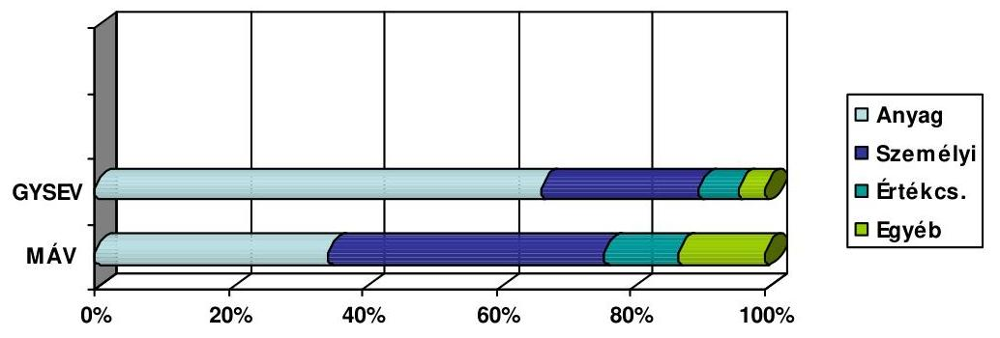

A vasúti társaságok költségein belül meghatározó a - szolgáltatási ágazatra jellemző - bér és járulékok értéke. A MÁV Zrt. működésére - az elavult infrastruktúra és technológia, valamint az alaptevékenységen kívüli járulékos feladatok miatt - a túlzott létszám és az alacsony létszámhatékonyság volt jellemző. A szervezeti átalakítás és a létszámleépítés hatására 2006-ban a személyi jellegű költségek részaránya 35%-ra csökkent, viszont ezzel egy időben 25%-ra emelkedett az egyéb ráfordítások - ezen belül a pénzügyi és a rendkívüli ráfordítások - értéke. Előbbi a növekvő külső finanszírozás, utóbbi a szervezeti át-

---

alakítás egyszeri költségeinek a hatása. A 2007. évi adatok alapján a személyi jellegű kifizetések aránya az összes ráfordításon belül meghaladja a 32%-ot. A költségszerkezetet befolyásolja az anyagi jellegű ráfordítások lehetősége is. Ha ezek nem növekedhetnek megfelelő mértékben, a személyi jellegű költségek növekvő részarányt képviselnek.

A MÁV Zrt. az ország egyik legnagyobb foglalkoztatója, ezért kiemelten fontos a létszámmal kapcsolatos intézkedések hatása. 2006. végén a módosított alapító okirattal összhangban új szervezeti és működési szabályzatot alakítottak ki. A MÁV Zrt. igazgatóságának alapvető célja az átalakítással költséghatékony központi kiszolgáló szervezetek létrehozása, a szervezeti működés hatásfokának javítása, a hierarchia egyszerűsítése volt. Megszűnt 163 szervezeti egység és lecsökkent a vezetői szintek száma. Az SZMSZ módosítása 2007. március 1-jével lépett hatályba. A szervezeti átalakítás nem fejeződött be. Az ellenőrzést követően valósult meg a gépészeti üzletág kiszervezése, valamint a MÁV Zrt. tulajdonát képező jelentős ingatlanvagyon értékesítését, hasznosítását célzó befektetési alap és projekttársaságok létrehozása. Nem valósult meg pályavasúti üzletág kiszervezése. A 2130/2006. (VII. 24.) Korm. határozat döntött a MÁV Cargo Zrt.-ben lévő részesedés értékesítéséről. A szervezeti változások egy része közvetlenül érinti a MÁV Zrt. létszámát és ez által az irányítás költségeit, másik része a MÁV csoport szintjén sem a létszámban, sem az irányítási költségekben nem eredményezett kedvező változást.
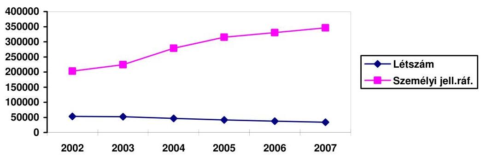

A központi irányítás költségeinek csökkentése érdekében több intézkedés is történt. Létszám racionalizálási céllal 2002-2006 között három alkalommal, összesen 4444 M Ft támogatásban részesült a társaság. Elsősorban a kiszervezések (MÁV Cargo Zrt., MÁV Start Zrt., stb.) hatására a MÁV Zrt. létszáma a 2002. évi 53766 főről 2007. év végére 34236 főre csökkent. A racionalizálás ellenére a MÁV Zrt. bérköltsége és ezzel együtt a személyi jellegű kifizetések nem csökkentek. A havi átlagbér - amelynek növekedési üteme minden évben meghaladta az infláció mértékét - a 2002. évi 110864 Ft-ról 2007. év végére 194824 Ft-ra emelkedett. Az egy főre eső személyi jellegű kifizetések a 2002. évi 2016 E Ft-ról 2007-re 3460 E Ft-ra emelkedtek.

# 3.3.1. A vasúti társaságok gazdálkodásának hatása a fejlesztésre 

A MÁV Zrt. bevételein belül a személyszállításhoz és az árufuvarozáshoz kapcsolódó árbevételek megoszlása - a támogatásokkal együtt - a 2005. évi adatok alapján 54% és 40%, a 2006. évi adatok alapján 63% és 22%. A nyereséges

---

árufuvarozási tevékenység kiválásával és értékesítésével a személyszállítás keresztfinanszírozásának lehetősége megszűnt. A fogyasztói árkiegészítés 2002 és 2006 között gyakorlatilag nem változott (20 701-24 286 M Ft). A termelési támogatás és költségtérítés mértéke a 2002. évi 55845 M Ft-ról 2006-ra 74407 M Ft-ra nőtt. 2004-2005. években az ÁFA arányosítást is figyelembe véve a térítés reálértéke jelentősen csökkent. Az árkiegészítés és a támogatás együttes értéke sem képes a szolgáltatási kötelezettségek jelenlegi költségeinek ellensúlyozására, ezért a Társaság folyamatosan növekvő külső forrás bevonásra szorul.

A MÁV Zrt. - illetve a személyszállítási szolgáltatás további résztvevői - nem képesek az önálló tervezés és gazdálkodás feltételeinek a kialakítására a közszolgáltatási szerződés hiányában. A közszolgáltatási szerződések kidolgozása utolsó szakaszába lépett. Az üzletágak önálló gazdasági társaságokba szervezésének célja az volt, hogy erősítse a gazdálkodás tervezhetőségét és átláthatóságát, viszont az átszervezést követően kialakuló többszereplőssé váló vasúti szektor kezdeti évei azonnali megtakarítást nem, ágazati szinten inkább költségnövekedést eredményeztek.

A MÁV Start alapítását megelőzően a tulajdonos GKM a 15/2007. (V. 8.) határozatával jóváhagyta a 2007. évre vonatkozó üzleti tervet. Az önállósodással egy időben a személyszállítást érintő fontosabb intézkedésekkel kívánták közvetlenül javítani az üzletág eredményességi pozícióját. A kétszeri - összesen 31%-os - jegyáremelés mellett a vasúti személyszállítás összesen 111,6 Mrd Ft tőkejuttatásban és támogatásban részesült a negatív saját tőkéjének, valamint a közúti és vasúti közszolgálati közlekedés árszintjének kiegyenlítése és a tevékenység veszteségének csökkentése érdekében.

A személyszállítás 2005. évi 8,9 Mrd Ft-os veszteség-növekedéséből 6,1 Mrd Ft-ot a személyszállítási közszolgáltatás állami támogatásának csökkenése okozott. Az Árufuvarozási Üzletág 4,3 Mrd Ft-os veszteség-növekedését főként a fuvarozáshoz kapcsolódó többletköltségek (pl. teherkocsik karbantartási többlete 3,2 Mrd Ft, utólagos fuvardíj visszatérítések 0,3 Mrd Ft, kocsibér költség 0,2 Mrd Ft) idézték elő, továbbá a MÁV Cargo Zrt. megalakítása kapcsán az üzletágnál is jelentkeztek többletráfordítások (projekt költség, értékvesztés mintegy 0,5 Mrd Ft). A pályavasút 7,6 Mrd Ft-os veszteségnövekedésének oka részben a személyszállítási kínálatcsökkenésből adódó pályahasználati belső díjbevétel csökkenéssel (2,2 Mrd Ft), a 2006. évi létszámleépítésre képzett céltartalékkal (1,2 Mrd Ft), valamint a káresemények többletráfordításaival (0,5 Mrd Ft) függ össze. A MÁV Cargo Zrt. kiválása miatt az üzletághoz került iparvágányok amortizációs többlete 0,4 Mrd Ft volt. Negatívan befolyásolta az üzletág eredményalakulását a kiszervezésekkel összefüggésben a saját kivitelezésű beruházási teljesítmény 3,8 Mrd Ft-os csökkenése.

A nettó értékesítési árbevételi adatok alapján a működési támogatás aránya 36% és 46% között változik, amelyen belül a termelési támogatás/költségtérítés mértéke független az adott év teljesítményétől. A személyszállítás árbevételéhez viszonyítva az árkiegészítés mértéke 58% és 60% között mozognak. A GySEV Zrt. 2006. évi üzleti jelentése szerint az állam a bevétellel nem fedezett ráfordítások 96%-át megtérítette. A MÁV Zrt. esetében ugyanezen arány 75%, ami a nagyobb gazdasági méretben rejlő irányítási költségek, a közszolgáltatási feladatok ellátása érdekében gazdaságtalanul üzemeltetett improduktív vonalak

---

és az elégtelen támogatás mértékére utal. A MÁV Zrt. 2002-2007. évi gazdálkodási adatait az 5. melléklet tartalmazza.

Az EBRD 1999. évi jelentésében javasolta a MÁV Zrt.-nek, hogy a jegypénztári bevételeknek az 1999. évi 39%-ról 2005-re el kell érniük a személyszállítás költségeinek az 50%-át. A jegypénztári bevételek fedezeti hányada azonban tovább romlott, 2006-ban 35% volt. A jegypénztári bevételek elmaradása elsősorban az inflációtól elmaradó jegyáremelést vezethető vissza, amely a menedzsment hatáskörétől független döntési körbe tartozik.

# 3.3.2. Az amortizációs politika hatása a fejlesztésre 

Az eszközstruktúra problémája, hogy a MÁV Zrt.-nél és a GySEV Zrt.-nél a vasúti szolgáltatás ellátásához szükséges eszközök állományához képest jelentős a vasúti tevékenység szempontjából felesleges eszköz (szociális infrastruktúra, ingatlanok).

A MÁV Zrt. könyvvizsgálója a 2002. évi könyvvizsgálói jelentését korlátozó záradékkal adta ki, tekintettel a kincstári tulajdonú tárgyi eszközök alacsony leírási kulcsaira. Az értékcsökkenés szabályainak a megváltoztatását követően 2003-ban már korlátozás nélküli záradékkal látta el a könyvvizsgáló a jelentését. Tartalmazza viszont a záradék, hogy „a Társaság beszámolójában szereplő tárgyi eszközök mérlegkészítéskor érvényes piaci értékét - a megfelelő értékelés hiányában - nem tudtuk összehasonlítani ezen eszközök könyvszerinti értékével. Ezáltal nem volt biztosított a számvitelről szóló 2000. évi C. tv. 53. §-ban foglalt előírás, mely szerint a tárgyi eszközöknek, használhatóságuknak megfelelően, a mérlegkészítéskor érvényes (ismert) piaci értéken kell a mérlegben szerepelniük".

A 2004. évi mérlegről készített könyvvizsgálói jelentés is megállapítja, hogy a vagyonértékelés hiánya miatt a Személyszállítási és Pályavasút üzletágakhoz tartozó eszközök értékelésének helyességéről egyéb könyvvizsgálati eljárásokkal sem tud megbizonyosodni.

A számviteli tv. 58. § (5) szerint amennyiben az eszközök értéke jelentősen meghaladja az adott eszköznek a könyv szerinti (bekerülési) értékét, a piaci érték és a könyv szerinti érték közötti különbözet a mérlegben az eszközök között "értékhelyesbítés"-ként, a saját tőkén belül "értékelési tartalék"-ként kimutatható. Annak ellenére, hogy a könyvvizsgálói jelentések tartalmazzák a tárgyi eszközök értékelésének hiánya miatti kockázatot, az értékelést számviteli politikájában - technikai korlátok miatt - egyetlen menedzsment sem hajtotta végre. A tárgyi eszközök piaci viszonyoknak megfelelő értéken történő szerepeltetése a mérlegben a Társaság tőkehelyzetének a rendezését is elősegítené, bár az átértékelés a veszteséges gazdálkodás miatt előállt finanszírozási hiányra nem ad megoldást.

---

A tárgyi eszközök valós piaci értékének meghatározása nélkül nem lehet pontos képet alkotni a MÁV csoport valós vagyoni helyzetéről. ${ }^{22}$ Az alacsony értékcsökkenési leírási kulcs javítja a mérlegszerinti eredményt, de nem biztosítja a vállalkozás folytatásához szükséges feltételeket. A pontos vagyoni helyzet ismerete nélkül az állam tőkepótló intézkedései nem valós információkon alapulnak. A könyvszerinti és a valós piaci értékek közötti jelentős eltérésre utal a MÁV Zrt. 2007. évi üzleti tervében szereplő, értékesítendő ingatlanok prognosztizált bevétele. A 2007. évi terv alapján a várható bevétel háromszorosan haladja meg a könyvszerinti értéket, de található hétszeres értéket meghaladó eltérés is. A prognosztizált bevételek meghatározását mindössze 50%-ban támasztja alá vagyonértékelés.

A MÁV csoport tagjai az értékcsökkenési leírást a számviteli törvényben foglaltak és „Az értékcsökkenés elszámolásának módja és mértéke" című 27/2005. (VIII. 19.) PVH sz. utasítás szerint számolják el. A befektetett eszközök állományához képest alacsony éves értékcsökkenési leírás (éves átlag 2005. évi adatok alapján 3,7%) elsősorban a befektetett eszközökön belüli magas (55%) ingatlanhányad következménye. Az évente képződő értékcsökkenés üzletáganként erősen differenciált, amelyen belül a pályavasút részaránya 61%. Az utasítás részletesen tartalmazza az egyes eszközfajtákhoz tartozó leírási kulcsokat. Az alkalmazott amortizációs kulcsok az apportált eszközöknél nem veszik figyelembe a műszaki berendezések, gépek és járművek elhasználódottsági fokát - ami az időszaki karbantartások és felújítások elhalasztása, vagy elmaradása miatt egyébként is erősen romló tendenciát mutat - és az újrapótlási értékeket. Erre utal a számviteli törvény, amely szerint az eszközöket „használhatóságuknak megfelelően" kell a mérlegben szerepeltetni. A MÁV Cargo Zrt. apportlistájában szereplő vasúti teherkocsik 1 Ft apportértéke sem a nyilvántartási árral ${ }^{23}$, sem a valós piaci értékkel nem egyezik meg. A visszafogott beruházások következtében az elszámolt értékcsökkenés éves értékei azonosak.

# 3.3.3. A vagyongazdálkodási politika befolyása 

Az infrastruktúra döntő részét jelentő országos törzshálózati vasúti pálya a Ptk. 172. § d) előírásainak megfelelően az állam kizárólagos tulajdonát képezi, amelyre két társaság rendelkezik vagyonkezelői joggal, a MÁV Zrt. és a GySEV Zrt., amely 59,9%-ban a magyar állami tulajdona.

A 7870 km vasúthálózatból a GYSEV Zrt. 224 km felett rendelkezik vagyonkezelői,
 illetve tulajdonosi joggal. ${ }^{24}$

A vagyonkezelői szerződéseket 2001-ben kötötte meg a KVI az Áht. 109. § rendelkezéseinek figyelembe vételével. (A GySEV Zrt.-vel 2007-ben újabb szerződést

[^0]
[^0]:    ${ }^{22}$ (MÁV Zrt. szerint a vasúti pálya és tartozékai esetében egyáltalán nem, és az egyéb, speciális eszközparkra vonatkozóan is csak korlátozottan beszélhetünk tényleges piaci értékről.)
    ${ }^{23}$ A nyilvántartási értéken történő apportálásra a Gt. lehetőséget ad.
    ${ }^{24}$ A törzshálózati pálya Győr-Sopron-OH szakasza a GYSEV Zrt. társasági tulajdonában áll.

---

kötöttek.) A szerződések szabályozzák a kincstári vagyonnal kapcsolatos eljárásrendet értékesítés, selejtezés, rekultiváció illetve kizárólagos állami tulajdonból a nem kizárólagos kategóriába átsorolás tekintetében. A szerződések szerint a kizárólagos állami tulajdonhoz kapcsolódó egyéb (gép, berendezés stb.) vagyonelemekből a vagyonkezelő évi 100 M Ft értéket önállóan értékesíthet, amennyiben azok a feladatellátáshoz feleslegessé válnak. A befolyt összeget a kincstári vagyon pótlására, felújítására kell fordítani. Ingatlanok értékesítéséből befolyó összegek költségekkel csökkentett része a központi költségvetést illeti.

A kincstári vagyon fenntartásához, illetve az azon végzett beruházásokhoz az állam csak kis mértékben járult hozzá.

A kincstári vagyonról a vagyonkezelők évente jelentést küldenek a KVI-nek, amelyben annak értékváltozása nyomon követhető. Így a MÁV, illetve a GySEV Zrt.-nél a kezelt vagyon értéke az alábbiak szerint alakult:

| MÁV Zrt. | Bruttó |  |  | Nettó |  |
| :--: | :--: | :--: | :--: | :--: | :--: |
|  | 2001 | 2007 |  | 2001 | 2007 |
| Építmények, épületek | 275471 | 413565 |  | 235354 | 285941 |
| Földterületek | 13962 | 15157 |  | 13962 | 15157 |
| Gépek, berendezések, befektetések | 49203 | 135434 |  | 39409 | 77960 |
| Összesen | 340036 | 564156 |  | 288725 | 379058 |
| GYSEV Zrt. | Bruttó |  |  | Nettó |  |
|  | 2001 | 2007 |  | 2001 | 2007 |
| Építmények, épületek | 1234 | 7368 |  | n.a. | 5784 |
| Földterületek | 3 | 5 |  | 3 | 5 |
| Gépek, berendezések, berendezések | 0 | 2396 |  |  | 1664 |
| Összesen | 1237 | 9769 |  | n.a. | 7453 |

Az elmúlt év végén változott a MÁV Zrt. által kezelt pályahálózat hossza, mivel 2006. decemberében a Szombathely-Szentgotthárd vasútvonalat 53 km hosszban a GYSEV Zrt. részére átadta. Az átadott 53 km vasúti pályán mintegy 1,4 millió fős utasforgalom és 800 ezer tonnás áruforgalom bonyolódott le évenként.

A MÁV Zrt. tulajdonában és kezelésében lévő ingatlanállomány épületei és építményei a vasútépítés kezdete óta folyamatosan épültek. Az állomány 19%-a 100 évnél idősebb, 54%-a 50-100 év közötti, 27%-a 50 évnél fiatalabb. A kincstári tulajdonú épületek közül 45 db épület szerepel az országos műemlékjegyzékben, 4 kiemelt műemlék épületet kezel a MÁV Zrt. (Keleti pályaudvar felvételi épület, Nyugati pályaudvar felvételi épület, Budapest, Múzeum utca 11, valamint Gödöllő királyi váró épületei). Ezeken az épületeken az utolsó 5 évben nagyobb volumenű felújítás nem történt. Különösen a Keleti pályaud-

---

var, a Nyugati pályaudvar valamint a Gödöllő királyi váró épületei szorulnának sürgős felújításra. Ezeknek az épületeknek a felújítási költsége milliárdos nagyságrendű a MÁV Zrt. szerint. A vizsgált időszakban a MÁV ezekre az épületekre saját forrásból 200-200 M Ft-ot fordított. 96 db épületet a MÁV Műemlékvédelmi Szabályzata alapján nyilvánítottak vasúti múemlékké. Kedvező körülmény, hogy a fentieken túl egyre több település vonja helyi védettség alá a település vasútállomásának utasforgalmi létesítményeit.

Az épületek karbantartására a MÁV Zrt. évente 500-800 M Ft-ot fordít, mely a korosságot és a műszaki állapotot tekintve nem elegendő a szintentartásra sem. A GYSEV Zrt. két hídfelújítást végzett a vizsgált időszakban és Csorna állomáson korszerűsítették az áramellátási rendszert.

A MÁV Zrt. a szerkezeti átalakítás részeként kiszervezett MÁV Cargo Zrt.-t és a MÁV Start Zrt.-t az alapításkor a vasúti tevékenységből korábbi években felhalmozott adóssággal nem terhelték meg. A kiszervezett vállalkozások apportlistájában nem szerepel ingatlan tulajdon, a működéshez szükséges ingatlanokat a MÁV Zrt.-től bérlik. A MÁV Cargo Zrt. az induló apportjának (29513 M Ft) 89%-át kitevő 13701 db vasúti teherkocsiból (26274 M Ft) 2326 db-ot 1 Ft apportértéken vett át, 4571 db vasúti kocsi nem rendelkezett az átadás időpontjában érvényes fővizsgával. Az alapításkor az átadott eszközökről nem készítettek a valós piaci értéket feltüntető vagyonértékelést, az apportálást nyilvántartási értéken végezték. A nyilvántartási, valamint a tényleges vagyonérték közötti különbség eredményvonzata az alapítás évében nem jelent meg a MÁV Zrt. mérlegbeszámolójában, abból pénzügyileg is realizálható eredmény a befektetésként nyilvántartott üzletrész értékesítéskor jelentkezik.

A MÁV Start Zrt. évközi alapítását megelőzően készített üzleti tervben 2300 db vasúti jármű átadása és a hitelek egy részének az átvétele szerepelt, ezzel szemben a tulajdonos döntése értelmében 801 db vasúti jármű átadása szerepelt az apportlistában, összesen 62100 M Ft értékben, hitel és adósságátvállalás nélkül. A MÁV Zrt. tulajdonában maradt a személyszállítási eszközpark fejlesztése érdekében felvett hitelek értékével - könyv szerinti értéken - megegyező eszközállomány.

A MÁV Zrt. ingatlanvagyonát a tulajdonában és vagyonkezelésében álló földterületek és a földdel tartósan egybeépített épületek és építmények alkotják. A MÁV tulajdonban és az állam tulajdonában, de a MÁV Zrt. kezelésében lévő ingatlanok fejlesztési, hasznosítási és működtetési feladataival 2005. év elején 241 fő foglalkozott, amelyből 85 fő végezte az irányítási és 156 fő a végrehajtási tevékenységet. Az Ingatlangazdálkodási Igazgatóság által kezelt ingatlanok 46,3%-a (46 931 050 m³) a MÁV Zrt., 53,7%-a (54 387 963 m³) a Magyar Állam tulajdonában van. A MÁV Zrt. tulajdonában lévő ingatlanállomány funkcionálisan két részre osztható: a vasúti infrastruktúra működtetéséhez nélkülözhetetlen és az ahhoz nem szükséges ingatlanokra. A kezelt kincstári tulajdonú ingatlanok a vasútüzem működtetéséhez szükségesek.

Funkcióját tekintve a MÁV Zrt. tulajdonában és vagyonkezelésében lévő ingatlanállomány az ország egyik legösszetettebb ingatlanportfoliója. A vasúti infrastruktúra és az alaptevékenység (személy- és áruszállítás, forgalomirányítás) működtetéséhez szükséges ingatlanokon túl művelődési, oktatási, egészségügyi,

---

sport, üdülő és lakóépületeket is tartalmaznak. A MÁV Zrt. földterületein található építmények száma meghaladja a 100 000 db-ot.

A MÁV Zrt. tulajdonában és vagyonkezelésében lévő ingatlanok használói a MÁV Zrt. és a MÁV csoporthoz tartozó társaságok, az ingyenes ingatlanhasználók (érdekképviseleti szervezetek) és a bérlők.

A MÁV és a Magyar Állam közötti ingatlan megosztást és ingatlanrendezést 2005. év végéig 50%-ban sikerült teljesíteni, amelynek eredményeképpen „mintegy 20 000 db ingatlan képezi a MÁV tulajdonát". A 2004. évi állapot szerint a MÁV Zrt. tulajdonában, illetve kezelésében lévő mintegy 22 200 db ingatlan fele tulajdonilag rendezett (2005. 06. 10). „A rendezések során számos nyilvántartott ingatlanról kiderült, hogy az elmúlt években értékesítésre, vagy kisajátításra került." A 2006. évi adatok alapján az önálló földrészlettel rendelkező ingatlanok száma 16 328 db, amelyből 8614 db a MÁV Zrt. tulajdona. A felépítményekkel együtt az ingatlanok könyvszerinti nyilvántartási értéke 2006. év végén 420 244 M Ft, amelyből a kincstári tulajdon 291 944 M Ft. (Ezek az adatok 2007-re vonatkozóan 426 040 M Ft és 301 098 M Ft.) „Az ingatlanvagyon tényleges piaci értékének meghatározását gátolja az ingatlan-nyilvántartási, műszaki, tulajdonjogi és számviteli rendezetlenség, és az ingatlanvagyonnal kapcsolatos szerződéses korlátozások áttekinthetetlensége"25. Az ingatlanvagyon tényszerű értékét befolyásolja a hasznosításában korlátozott, vagy forgalomképtelen ingatlanok meghatározása is. Az alapításkori rendezetlen tulajdonviszonyok megszüntetésére és a rendezési folyamat újraindítására ad lehetőséget az egyes közlekedési tárgyú törvények módosításáról szóló 2007. CLXXV. tv.

A MÁV Zrt. 2003. novemberében hirdette meg a Budapest, VI. ker. 28224/3849. hrsz-ú ingatlanokat (Ferdinánd-híd, Lehel utca, Bulcsú utca) által határolt területeket 2,5 Mrd Ft vételárért. A nyertes pályázóval (Markland Holdings Ingatlanforgalmazó és Tanácsadó Kft.) a MÁV Zrt. megkötötte az adásvételi szerződést, majd a vételár átutalása után a terület birtokbaadása is megtörtént. A Pólus Holding Pénzügyi Befektető Rt. egy - a MÁV Zrt. által a korábbi években a Multiszolg Kft.-nek biztosított - elővásárlási jog megvásárlásával bejelentette vételi szándékát, amelyet a MÁV Zrt. nem fogadott el, ezért bírósági eljárás indult. A pályázati kiírást megelőzően a MÁV Zrt. nem tisztázta egyértelműen a területen lévő elővásárlási jogosultakkal a joggyakorlás feltételeit, amelyet a pályázati felhívásban ennek megfelelően tévesen tüntetett fel. A MÁV Zrt. mulasztása miatt tisztázatlan jogi helyzet miatt az ingatlanügylet bíróságra került, amely eljárás több év alatt fejeződött be, amelynek következtében a vevő számára 2003-ban birtokba adott ingatlant a Ballimore Kft.-nek az elővásárlási jogosult által joggyakorlásra kijelölt Pólus Holding Rt. részére át kellett adni. A MÁV Zrt. számára kedvezőtlen ítélet következtében a pályázat első helyezettje a 3,2 Mrd Ft értékesítési bevételt, és ezen belül 700 M Ft eredményt jelentő értékesítési folyamat végén a vételárat jelentősen meghaladó, terület értéknövekedés és elmaradt haszon miatt mintegy 27 Mrd Ft kártérítési igénnyel lépett fel a MÁV Zrt.-vel szemben. Az új vevő a MÁV Zrt. felé mintegy 17 Mrd Ft-os (nem részletezett) kártérítési igényt jelzett, amelyet perben még nem érvényesített. A MÁV Zrt. a követeléseket vitatja.

[^0]
[^0]:    ${ }^{25}$ Idézetek forrása a MÁV Zrt. éves beszámolói.

---

A MÁV Zrt. normál nyomközű vasútvonalainak kiépítési hossza 7422 km. A saját célú pályahálózatok (iparvágányok) hossza mintegy 1400 km (a pályahossz 18,6%-a). Az összes 1477 db iparvágányból 796 db van a Pályavasúti Üzletág kezelésében, 104 db vegyes használatban más társaságoknál, 577 db pálya tulajdonviszonyai rendezetlenek. A 796 db saját célú hálózatból 395 pályán van árufuvarozási tevékenység, 401 db pályaszakaszon nincs forgalom. A 104 db vegyes használatú pályából 84 db-on folyik áruszállítás, 20 pályaszakaszon nincs forgalom.

Az állagban tartás és a pályaszakaszok fenntartási költsége 437 db pálya esetében tartozik a Pályavasút üzletág feladatkörébe, a többi pályaszakasz őrzésének és fenntartásának a költségei a MÁV Zrt. általános költségeit terhelik. A használatban lévő pályaszakaszok kihasználtsága a vasúti árufuvarozási tevékenységen belül a tonna forgalom 65%-a. Stratégiai jelentőségüket alátámasztja, hogy ezek a vágányok elsősorban a nagy forgalmat generáló tömegáru fuvarozás induló és érkező helyszínei.

A MÁV Zrt. tulajdonában, de más gazdasági társaság tulajdonát képező földterületen lévő építményekre vonatkozóan nem áll rendelkezésre teljes körű nyilvántartás. A kihasználatlan iparvágányok értékesítése még nyilvántartási áron sem megoldható, érdekeltség hiányában. A saját erőből megvalósított vágánybontás - amennyiben a vágány az idegen tulajdonos érdekeit zavarja - forrás hiányában (tervdokumentáció készítése, hatósági díj, bontási költség, rekultiváció) egy-egy vágányhálózat bontására szűkül.

A MÁV Zrt.-vel kapcsolatban álló ingatlan bérleti
 szerződések száma több mint 4000 db. A MÁV Zrt. érdekeltségű gazdasági társaságok használatában - tulajdonjog, bérleti jog, földhasználati jog, stb. 2004. évi állapot szerint - mintegy 2,2 millió $\mathrm{m}^{2}$ földterület és 600 ezer $\mathrm{m}^{2}$ felépítmény van. A gazdasági társaságok bérleti díjai a több évvel ezelőtt kötött hosszabb távú szerződésekkel a piaci viszonyoktól kedvezőbb áron kerültek megállapításra, amelyeknél csak az inflációs díjemelések érvényesíthetők, az egyéb piaci árváltozások követése nem. (Az átlagos bérleti díj 2004-ben $330 \mathrm{Ft} / \mathrm{m}^{2}$ és 2006-ban sem éri el a $400 \mathrm{Ft} / \mathrm{m}^{2}$-t. (2007-re nem állnak rendelkezésre adatok.)

Az ingatlanvagyon rendezetlenségéhez hozzájárult a gyakori vezető- és koncepcióváltás. Az ingatlangazdálkodással 2002 és 2007 között 19 vezető beosztású dolgozó és 6 vezérigazgató-helyettes foglalkozott. A MÁV Ingatlanbefektetési alap következményeképpen a MÁV Zrt. tulajdonosi jogosultsága és hatásköre az ingatlanvagyonnal való gazdálkodás felett közvetetté válik.

A MÁV Zrt., az ingatlanalapba szánt ingatlanokat független értékelő által végzett forgalmi értékbecslés alapján megállapított piaci értéken kívánja apportálni, illetve értékesíteni az ingatlanalap részére. A konstrukció a MÁV számára előnyös, hiszen mindamellett, hogy 6 Mrd Ft-ot meghaladó forráshoz jut az ingatlanok eladása következtében, az alapkezelő cégben birtokolt részesedése révén a tulajdonosi irányítás keretében befolyásolni tudja az alap működését és befektetési jegyeinek keresztül részesedik annak hozamából. Minden egyes ingatlanról készült értékbecslés, és az Andrássy úti székházról, annak nagy értékére tekintettel kontroll értékbecslést is rendelt a MÁV Zrt.

---

A MÁV Zrt. eszközállományának értékén belül - tevékenységéből adódóan - a forgóeszközök aránya nem éri el a 10%-ot (1. sz. tanúsítvány). Az alacsony forgóeszköz-ellátottság elsősorban annak a következménye, hogy a tárgyi eszközök között kimutatott ingatlanok részaránya az összes eszköz értékén belül 50-52%. Az alapellátáshoz szükséges korlátozottan forgalomképes, illetve forgalomképtelen kincstári tulajdon értékét figyelembe véve a forgóeszközök részaránya még alacsonyabb.

# 3.3.4. A MÁV Cargo Zrt. privatizációja 

Magyarország geopolitikai helyzete a tranzitszállítások szempontjából meghatározó. Amennyiben a vasúti infrastruktúra jelenleg elhanyagolt állapota okozta lemaradás hatékony állami eszközökkel megszüntetésre kerül, úgy a tranzitszállítások terén mutatkozó versenyelőnyünk a fejlesztések magas tőkeigénye ellenére kedvező megtérülési lehetőséget biztosíthat a befektetésekre, nem utolsó sorban az ország gyarapodását eredményezve.

A vasúti közlekedés közép- és hosszú távú irányvonalának komplex meghatározása - és ezen belül a vasúti infrastruktúrának az európai korridorokra eső kényszerű és kötelező fejlesztése - állami feladat. Megvalósulását követően a privatizált leánycégeknek is teremthet a jelenleginél kedvezőbb helyzetet.

A MÁV Cargo Zrt. értékesítése a közúti és vasúti közlekedés összehangolt, forrásokkal biztosított középtávú fejlesztési irányvonalának a meghatározása nélkül kezdődött meg ${ }^{26}$ azzal a céllal, hogy a vasúti liberalizáció hatása ne okozzon további eredményromlást a társaság számára és az értékesítés jelenleg kedvező feltételei mellett. A MÁV Cargo Zrt. értékesítésének elsődleges célja a legnagyobb értékesítési bevétel elérése.

Az értékesítési stratégia szerint a privatizáció célja hármas:

- a MÁV Cargo és a vasúti fuvarozás jövőbeli fejlődésének biztosítása,
- az azonnali privatizációs bevétel maximalizálása,
- a vasúti fuvarozásban a verseny erősítése.

A MÁV Cargo Zrt. értékesítése egy üzleti lehetőség megszerzésének esélyét is kínálja, amellyel élve a vevő gyorsabban megszerezheti a piaci részesedést, és több éves versenyelőnyre tesz szert a magyar piacon. Az értékesítésre felajánlott részvénycsomag értékesítéséből származó bevételt - a konkrét vagyonértéktől függetlenül - jelentősen befolyásolja a pályahasználati díj mértékére vonatkozó megállapodás.

A privatizációs folyamat lebonyolítására közbeszerzési eljárás keretében kiválasztott privatizációs tanácsadó megbízásának a tárgya a MÁV Cargo Zrt. teljes részvénycsomagja értékesítésének lebonyolítására vonatkozó tanácsadói

[^0]
[^0]:    ${ }^{26}$ GKM szerint: a fejlesztések pénzügyi fedezete nem feltétlenül biztosított, így ennek hatása időben előre nem prognosztizálható.

---

feladatok elvégzése. A Pro Cargo Konzorcium - amelyben döntően az osztrák tulajdonú CA-IB cégcsoport vett részt - megbízása az értékesítéssel összefüggő feladaton túl, egy részletes értékesítési stratégia kidolgozását is tartalmazta, az üzleti, szerződéses, jogi, közbeszerzési gyakorlatra, az alkalmazott díjakra kiterjedő átfogó elemzés készítése - amely egyrészt a Társaság teljes körű átvilágításával egyenértékű, másrészt meghaladja a tanácsadói feladatokat.

Az „Értékesítési stratégia" szerint a pályahasználat szabályozási környezetének a kiforratlansága miatt a még hiányzó rendeletek megalkotásával mindent meg kell tenni a transzparencia és a kiszámíthatóság, valamint a díjrendszer stabilitásának növelésére. Ezért a célravezető megoldás, ha „a magyar állam deklarálja, hogy az árufuvarozási pályadíjak mostani árszintje felfelé reálértéken nem változik, tehát a jelenleg a MÁV Cargo fuvarteljesítményének megfelelő díjteher a következő években azonos fuvarozási paraméterek mellett maximum az adott évi inflációval lesz magasabb". „A díjak abszolút szintjének a kérdésében a PM és a GKM, mint a díjstruktúrát meghatározó intézmények, ha elképzelhetőnek tartják a pályahasználati díjak csökkentését a pályavasút hatékonyságának a javításából, a költségvetési hozzájárulás bármilyen forrásból (pl. útdij) történő növeléséből kifolyólag" egy egyszeri bevétel-növekedést érhetnek el a privatizációs vételár emelése folytán.

A MÁV Cargo Zrt. nem rendelkezik a teherfuvarozás lebonyolításához szükséges saját vontatási kapacitással. Sem a cégalapítással együtt járó apportálással, sem a privatizációs eljárást megelőzően nem rendeződött a vontatási engedély és a tevékenység végzéséhez elengedhetetlen mozdonyok beszerzése, ezért a vontatási keretszerződés 2007. május 18-ai, újabb (2. sz.) módosításával rendezték a MÁV Cargo Zrt. vonatainak megbízható továbbítását.

Az osztrák állami vasút rendelkezik a magyarországi viszonylatban is használható vontatási kapacitással. „A Rail Cargo Ausztria vezetése több alkalommal kinyilvánította, hogy a MÁV-val együttműködve szeretné a MÁV Cargo vontatási tevékenységét folytatni, viszont a mai magyar pályák maximum a tranzit irányban tudnának megengedni nagyobb mértékű forgalmat, a mellékvágányok, mellékágak nehezen viselik el a nagyobb tengelyterhelést".

Az osztrák mozdonyok magyarországi üzemeltetését gátolja, hogy az ÖBB Trakcio Gmbh. mozdonyai a magyar viszonyok közötti költségszinttől jóval magasabb költségszinten üzemeltethetők, ami azt jelenti, hogy a jelenleg alkalmazott pályahasználati díjak, illetve a személyszállítás veszteséges tevékenysége mellett csak szubvencióval lehetne magyarországi viszonylatban ezeket az eszközöket működtetni.

A MÁV Cargo Zrt. privatizációs értékét befolyásolja az alaptevékenység ellátását biztosító teherkocsipark volumene, összetétele és az üzembiztonság feltételeinek a folyamatos biztosítása. Alapításakor a MÁV Zrt. 13877 db vasúti járművet apportált 26274 Mrd Ft értékben a MÁV Cargo Zrt.-be, amelyből 14 db a személykocsi és 13863 db a vasúti teherkocsi. A MÁV Cargo Zrt. kimutatása szerint a MÁV Zrt. az apporttal mindössze 13701 db teherkocsit juttatott a tulajdonába, ami a MÁV Zrt. adataitól eltér. A független könyvvizsgálói jelentésben „a MÁV Zrt. nem pénzbeli hozzájárulás értékére vonatkozó nyilatkozata szerint a nem pénzbeli hozzájárulás szolgáltatása nettó könyvszerinti értéken történik". A MÁV Cargo apport 91%-át alkotó tárgyi eszközök bevitele tételes leltározás és vagyonértékelés nélkül történt. Az apportált teherkocsikból 4571 db nem rendelkezett fővizsgával, amely értékcsökkentő tényezőt a nettó könyvszerinti érték nem mutatja. Az apportlistában szereplő teherkocsik közül 2326 db 1 Ft-os apportértéken szerepel annak ellenére, hogy egy kocsinak a selejtezést követő vasértéke (35000 Ft/tonna) darabonként 2-3 M Ft. A privatizációs folyamatban, 2007. októberében készült valós piaci érték meghatározás során sem végeztek tételes leltározást, ezért a privatizálandó eszközök értéke a MÁV Cargo Zrt. nyilvántartásából ellenőrizhető módon nem állapítható meg. Az országos egységes vasúti járműnyilvántartás és a tételes leltár együttes hiányában a MÁV Cargo Zrt. mérlegében szerepeltetett tárgyi eszköz azonosítása nem biztosított, ennek hiányában a feltüntetett vagyonérték nem alátámasztott.

Az apportlistában szereplő vasúti teherkocsik nyilvántartása az egyedi értékelés elvei alapján nem azonosítottak. A vasúti járműveket leltározással az ún. pályaszám alapján lehet beazonosítani, amelyet a járműveken úgy kell feltüntetni, hogy azokat „roncsolásmentesen ne lehessen eltávolítani". Egy jármű pályaszáma, a jelenleg hatályos rendelkezések alapján, a jármű élettartama alatt csak abban az esetben változik, ha annak tulajdonosa, típusa, funkciója változik, illetve, ha bérbeadás útján hasznosítják.

A Nemzeti Közlekedési Hatóság tájékoztatása szerint ma nincs Magyarországon egységes vasúti járműnyilvántartás, amely lehetővé tenné a magyarországi forgalomban résztvevő vasúti járművek azonosíthatóságát. Magyarországon nem kötelező az uniós országokban bevezetett időszaki hatósági járművizsga, ami lehetővé tenné a Nemzeti Közlekedési Hatóság engedélyével az országban használt vasúti járművek rendszeres és kötelező ellenőrzését.

Mivel a vasúti áruszállítás területén történt piacnyitás következményeként a járművek egyre gyakrabban cserélnek gazdát - országok között is - és változtatják meg eredeti funkciójukat, ami a pályaszám megváltozásával is jár, ezért „a pályaszám egyedül nem alkalmas a teljes élettartam alatti azonosításra". Az „időszaki hatósági járművizsga bevezetésével kiszűrhetők lennének a két vizsga között történt eladások és tartós bérletbe adások", amivel tisztázni lehetne a tulajdonosi, illetve üzembentartói viszonyokat. A Magyar Vasúti Hivatal megalapítása előtti időben az NKH elődjének a hatáskörébe tartozott az időszakos ellenőrzések elvégzése. A 2004-2005. években végzett teljes körű vizsgálat keretében ellenőrzésre kerültek a társaságok által üzemeltetett járműengedélyek. Az ellenőrzés keretében a MÁV Rt.-nél és a GySEV Rt.-nél „nagymennyiségű engedély nélkül átalakított, vagy üzembehelyezési engedély nélkül üzemben tartott járművet találtak". ${ }^{27}$

A vizsgálat alatt bekért adatszolgáltatások pontatlanságát jelzi, hogy a MÁV Zrt. vasúti teherkocsi állománya a MÁV Cargo Zrt. apportját követően 2007. december 31-én a MÁV Zrt. eltérő időpontban nyújtott adatszolgáltatása szerint 394 db illetve 499 db, míg az NKH nyilvántartása szerint 782 db. Az apport és a privatizálandó vagyon értékének konkrét, leltározással alátámasztott megállapítását igényelte volna a MÁV Tiszavas Kft.-vel lebonyolított, a tisztázatlan körülmények miatt folyamatban lévő rendőrségi eljárást maga után vonó, vasúti teherkocsik selejtezésével kapcsolatos szerződés.

[^0]
[^0]:    ${ }^{27}$ Az idézetek az NKH tájékoztató leveléből származnak.

---

A teherkocsi állománnyal szoros összefüggésben van a MÁV Tiszavas Kft. piaci megítélése. A MÁV Zrt. négy jelentősebb vasúti járműjavító társasága közül a MÁV Tiszavas Kft. szakosodott a teherkocsik javítására és gyártására. A tartálykocsik javítása és gyártása a debreceni járműjavítóhoz tartozik. Komoly vetélytársa a hazai piacon nincs, javítási átlagárai a legalacsonyabbak a régióban. Amennyiben a Nemzeti Közlekedési Hatóság javaslatára kötelezővé teszik az európai országokban jelenleg is szokásos időszaki járművizsgáztatást, a Társaságnak van a legnagyobb esélye a teherjárművek időszaki vizsgáinak lebonyolítására. Ezért a MÁV Tiszavas Kft. privatizációs eljárás alatti apportálása a MÁV Cargo Zrt.-be tovább erősíti a privatizációs eljárás győztesének piaci pozícióját, a vasúti járműjavítás területén versenyelőnyét.

A MÁV Zrt. és a MÁV Tiszavas Kft. között 2002-ben, a selejtezett járművek bontására és azt követő hasznosítására létrejött szerződés alapján átadott-átvett teherkocsikra vonatkozóan nem áll rendelkezésre olyan információ, amely egyértelműen beazonosíthatóvá tenné a leselejtezett, illetve megsemmisített vasúti járművek teljes körét. A 2002-ben indult 2000 db használt vasúti kocsi átadásáról szóló gazdasági kapcsolat a sorozatos szabálytalanságok miatt 2007 végén a MÁV Zrt. lezárta, de a szerződéssel kapcsolatban vélelmezhető bűncselekmény ügyében rendőrségi eljárás van folyamatban. A folyamatban lévő rendőrségi vizsgálat ellenére a MÁV Zrt. Igazgatósága döntött a MÁV Tiszavas Kft.
 MÁV Cargo Zrt.-be történő apportálásáról. A tárgyban a MÁV Zrt. Felügyelő Bizottsága részére készített 2007. október 26-ai jelentés szerint a MÁV Zrt. annak ellenére, hogy nyilvántartásában 670 db vasúti teherkocsi van, a MÁV Cargo Zrt.-től vásárolt vissza 107 db tehervagont 2007. áprilisában, annak biztosítására, hogy teljesíteni tudja a szerződésben vállalt 293 db-os kötelezettségét. A MÁV 2007. évre vonatkozó havi nyilvántartásából ezek a kocsimozgások nem követhetők le. A MÁV Tiszavas Kft. apportálásához készített értékelés, hasonlóan a MÁV Cargo Zrt. értékeléséhez, nem tételes leltározás alapján készült a vasúti járművek esetében és nem tartalmazza a pályaszám szerinti azonosítási lehetőséget, ezért az eltérő nyilvántartási adatok utólagos ellenőrzése nem lehetséges és ez a valós piaci érték meghatározásának megalapozottságát nem támasztja alá. ${ }^{28}$

A MÁV Zrt. Igazgatósága 2007. május 8-án határozott úgy, hogy a MÁV Tiszavas Kft.-t a MÁV Cargo Zrt.-vel együtt kell értékesíteni. Az apportálást a MÁV Cargo Zrt. 1000 Ft névértékű részvénykibocsátásával valósították meg. Az 1000 Ft névértékű részvényért a MÁV Zrt. a MÁV Tiszavas Kft. valós piaci értékének meghatározása alapján megállapított 1210000 E Ft értékű üzletrészével fizetett. A tranzakcióval a MÁV Cargo Zrt. jegyzett tőkéje 1 E Ft-tal emelkedett, míg az 1209999 E Ft a tőketartalékba került.

A MÁV Cargo Zrt. értékesítésére kiírt pályázat tartalmazza, hogy a „pályázat során a Társaság alaptőkéjét egy további 1000 Ft névértékű törzsrészvény kibocsátásával fogják megemelni. Az új részvény átvételére a MÁV lesz jogosult." A kiírás megfogalmazásából nem derül ki egyértelműen, hogy az 1000 Ft névértékű részvény kibocsátás mögött a MÁV Tiszavas Kft. 1210000 E Ft üzletrésze áll, amely a MÁV Cargo 29533146 E Ft bejegyzett alaptőkéjét 29533147 E Ft-ra

[^0]
[^0]:    ${ }^{28}$ GKM szerint: az utólagos ellenőrzés nem is szükséges, mivel a Cargo részvényekért folyó igen kiélezett, nyílt értékesítési eljárásban a pályázók által generált versenyben alakult ki a Cargo Zrt. tényleges piaci ára, amely magában foglalta az apportált Tiszavas Kft. piaci értékét is.

---

emeli meg. A ténylegesen (a két vagyonelem együttes értéke) privatizálandó vagyon 30743147 E Ft, amelyről a kötelező érvényű ajánlatot tévő pályázók tájékoztatást kaptak.

A felkért két könyvvizsgáló mindössze 4 hónap eltéréssel eltérő összegben állapította meg a társaság „valós" piaci értékét. A valós piaci értékek közötti különbség - 1736129 E Ft és 1210000 E Ft - 526 M Ft, amelyre a magyarázat az eltérő értékelési módszer alkalmazása. Egyik könyvvizsgáló sem a tényleges vagyont értékelte, mivel az eszközök értékelése során tételes leltárellenőrzést nem végeztek és az értékelés alapját a társaság nyilvántartási értékéből kiindulva határozták meg. ${ }^{29}$ A MÁV Tiszavas Kft. tárgyi eszközeinek nettó nyilvántartási értéke 2475580 E Ft. A MÁV Tiszavas Kft. könyvvizsgáló által meghatározott vagyonmérleg szerinti értéke (4374377 E Ft) alapján nem tükrözi a valós piaci érték megállapítása (1210000 E Ft) azt a tényt, hogy a MÁV Tiszavas Kft. valós piaci értékének a meghatározására, a legnagyobb megrendelőjének privatizációjával együttes értékesítés - mint jelentős értéknövelő tényező - miatt kerül sor.

A MÁV Tiszavas Kft. MÁV Cargo Zrt.-be történő apportálását előkészítő előterjesztés jogi indoklásában az egyes jogszabályok közötti összhang nem biztosított, mivel mellőzni lehet a Priv. tv. 28. § (2) bek. d.) szerint a versenyeztetési eljárást „a hozzárendelt vagyon elemeinek gazdasági társaságok részére nem pénzbeli vagyoni hozzájárulásként történő rendelkezésre bocsátásakor". A MÁV nem rendelkezik hozzárendelt vagyonnal. A hozzárendelt vagyon fogalma az állam tulajdonát képező, az ÁPV Zrt. részére értékesítésre vagy vagyonkezelésre átadott vagyont jelenti. A MÁV Zrt., mint társaság sem volt a hozzárendelt vagyon része, tekintettel arra, hogy - a Priv. tv. mellékletében felsorolt - nem privatizációra szánt, hanem tartós állami tulajdon, amely felett az állam tulajdonosi jogait a törvény szerint a GKM minisztere gyakorolta. A MÁV Zrt. 100%-ban tartós állami tulajdon, így nem értelmezhető a hozzárendelt vagyon fogalma a MÁV Zrt. tulajdonában álló társasági részesedésekre sem.

A 254/2007. (X. 4.) Korm. rendelet 25. § szerint a tranzakciót a Vagyongazdálkodási Tanácsnak jóvá kellett volna hagynia, amennyiben a MÁV Cargo Zrt.-t állami vagyonnak tekintjük. A MÁV feletti tulajdonosi joggyakorlás 2007. szept. 24-én megszűnt. A tv. erejénél fogva MÁV Zrt. a Vagyon Tanács hatáskörébe tartozik. A Tanács 2007. október 10-én kezdte meg működését. A MÁV Zrt. feletti tulajdonosi joggyakorlásra csak a Vagyonkezelési Szerződés aláírását követően, november 9. után kerülhetett sor. A 2007. november 9-én kelt Vagyonkezelési szerződés szerint (amely az ÁPV Zrt. és a GKM között jött létre) a korábbiakban a GKM tulajdonosi joggyakorlása alatt állt vagyont ${ }^{30}$ adja vagyonkezelésbe a GKM-nek.

Az állami vállalatok átalakulásáról szóló törvények (1992. évi LIII. és LIV. tv.ek) alapján részvénytársasággá alakult társaságok részesedéseinek értékesítése

[^0]
[^0]:    ${ }^{29}$ A jogszabályi előírások nem teszik kötelezővé a vagyonértékelés végrehajtását, lehetőség van a könyvszerinti értéken történő apportálásra.
    ${ }^{30}$ A tartós állami tulajdonra tekintettel a leányvállalatokkal együtt értelmezve.

---

a Priv. tv. hatálya alá tartozik. ${ }^{31}$ Az ÁPV Zrt. és a GKM közötti vagyonkezelési szerződés, valamint a kormányhatározat alapján meghozott GKM miniszteri jóváhagyásnál nem érvényesült a tartós állami tulajdonra vonatkozó törvényalkotói szándék. ${ }^{32}$ (A MÁV Cargo Zrt. privatizációját érintő jogszabályi összefoglaló a 13. mellékletben szerepel.)

Az értékesítési eljárást megalapozó a 2130/2006. (VII. 24.) Korm. határozat szerint az árufuvarozás nem tartozik az állami közfeladatok ellátásába. Ezért célszerűtlen és ellentmondásos, hogy a pályázaton győztes társaság a GySEV Zrt., amely többségi magyar állami tulajdonban van ${ }^{33}$ (59,91%) olyan tevékenységet végezhet, amely a másik állami tulajdonú társaságnál - annak ellenére, hogy a tevékenység évek óta nyereséget produkál - értékesítésre kerül. ${ }^{34}$

[^0]
[^0]:    ${ }^{31}$ A privatizáció lebonyolításában résztvevő jogi szakértő véleménye szerint a privatizációra szánt vagyontömeg értékesítésénél a Priv. tv.-ben foglaltak szerint kell eljárni.
    ${ }^{32}$ A MÁV Zrt. szerint: Az állam tulajdonában lévő vállalkozói vagyon értékesítéséről szóló 1995. évi XXXIX. törvény (privatizációs törvény) melléklete a MÁV Zrt.-t, mint kötelezően 100%-ban állami tulajdonban maradó társaságot határozza meg. A privatizációs törvény melléklete kifejezetten a MÁV Zrt.-t nevesíti, így a MÁV Zrt.-re, illetve annak esetleges jogutódaira írja elő a kötelező állami részesedés mértékét.
    A privatizációs törvénynek nincs olyan rendelkezése, amely a MÁV Zrt. tevékenységének szűkítésével, illetve vagyonának részleges elidegenítésével kapcsolatban tilalmakat vagy korlátozásokat határozna meg, így nincs egyértelmű tiltás arra vonatkozóan, hogy a MÁV Zrt. egyes üzletágai kiszervezésre és értékesítésre kerüljenek. Az önálló, új társaságként megalapított MÁV Cargo nem minősül a MÁV Zrt. jogutódjának, így a társaságra a kötelező állami részesedés mértékét előíró rendelkezés sem vonatkozik.
    A privatizációs tv. a hatályról szóló rendelkezései között az alábbiak szerint rendelkezik:
    Privatizációs tv. 5. § (3) Az állami vállalat, illetőleg az állam többségi tulajdonában álló gazdasági társaság tulajdonában lévő egyszemélyes társaság értékesítése során e törvény 27-34. §-ai szerint kell eljárni.
    A Magyar Államvasutak Zrt. és a MÁV Vagyonkezelő Zrt. tulajdonában lévő MÁV Cargo Zrt. 29533146000 Ft névértékű részvénycsomagja került értékesítésre. A MÁV Vagyonkezelő Zrt. a MÁV Cargo Zrt.-ben 2 millió forint névértékű részvénnyel rendelkezik.
    Mivel a MÁV CARGO Zrt. nem a MÁV Zrt. egyszemélyes tulajdonú társasága, ezért a részvények értékesítése során nem kötelező a privatizációs tv. szerinti vagyonértékesítés szabályai alapján eljárni, azonban a MÁV Zrt. e törvénynek megfelelően járt el.
    ${ }^{33}$ GKM szerint: Az értékesítést lehetővé tevő kormányhatározat nem zárja ki, hogy a pályázaton nyertes konzorcium egyik társasága magyar állami tulajdonban legyen.
    ${ }^{34}$ A PM szerint: önmagában az, hogy valami nyereségesen végezhető, nem jelenti azt, hogy meg kell tartani. Amennyiben a jövőbeli nyereségek diszkontált várható értékét meghaladó mértékű árat lehet elérni a piacon, és egyéb szempont alapján sem javasolt a cég megtartása, akkor egy céget el kell adni. Van olyan üzleti megfontolás, ami alapján a döntés, az állam, mint tulajdonos részéről kívánatos lehetett.

---

A GYSEV Zrt. felügyeletét ellátó gazdasági és közlekedési miniszter nem járult hozzá a vételi tranzakcióhoz, ${ }^{35}$ különösen annak összefüggésében, hogy a társaság nem rendelkezik annyi saját tőkével, hogy a vételár rá eső részét finanszírozza.

A GySEV Zrt. a vételár kifizetéséhez nem rendelkezik elégséges pénzügyi forrással, a tranzakció végrehajtásához pedig szükséges a Magyar Állam, mint tulajdonos jóváhagyása. A forrásbiztosításra három lehetősége ${ }^{36}$ van a GySEV Zrt.-nek, hitelfelvétel, kölcsön és saját részvénnyel való fizetés. A hitelfelvételhez elégséges biztosíték hiányában a tulajdonosok kötelezettségvállalása szükséges. Ha a konzorcium másik tagja előlegezi meg a vételár GySEV Zrt.-re eső részét, az ugyanúgy a tulajdonosok hozzájárulásával fizethető vissza. Amennyiben saját részvénnyel fizet a GySEV Zrt., abban az esetben a társaság részleges privatizációja valósul meg. Amennyiben a GySEV Zrt. nem él a vétel jogával és helyébe a konzorcium másik tagja vagy új szereplő lép, megvalósul az értékesítés, amelyre a szerződésben írt kötelezettségek ${ }^{37}$ vonatkoznak. Ha a tulajdonosok tőkeemelést határoznak el, úgy a Magyar Állam MÁV Cargo Zrt. értékesítéséből származó bevételével szemben a tőkeemelésre fordított összeget kell szembeállítani.

A MÁV Cargo Zrt. működése több területen is függ a MÁV Zrt.-től, amely függőség csak folyamatosan szüntethető meg. A MÁV Zrt. és a MÁV Cargo közötti szerződéses kapcsolatokat az Együttműködési Szerződés tartalmazza és egyben biztosítja, hogy a MÁV Zrt. és a MÁV Cargo Zrt. közötti sokoldalú szerződéses viszony a privatizációt követő évben is változatlan feltételekkel fennmaradjon. A szerződés 2009. január 1-jétől három hónapos felmondási idővel bontható fel.

A MÁV Cargo beszerzései között jelentős szerepe van az IT-vel kapcsolatos szerződéseknek. A MÁV-tól való különválás jelentős IT fejlesztéseket igényel: a vontatási keretszerződések alapján az egyedi szerződéseket a MÁV IT-n keresztül kötik meg. Az árufuvarozási tevékenység jelentős infrastruktúrát, ezen belül ingatlant igényel. A Cargo nem rendelkezik ingatlannal, mivel alakításakor az apporttal nem került tulajdonába ingatlan.

A MÁV Cargo Zrt. a mintegy $400000 \mathrm{~m}^{2}$ ingatlant bérleményből számos ingatlant azért bérel, hogy a MÁV IT olyan infrastruktúrájához hozzáférhessen, amely a Cargo tevékenységéhez elengedhetetlen. Az ingatlanok jogi helyzete a MÁV-nál

[^0]
[^0]:    ${ }^{35}$ GKM szerint: a gazdasági és közlekedési miniszter hozzájárulására a tranzakcióhoz akkor válik szükségessé, amikor a GySEV Zrt. kötelezettséget vállal a tulajdonszerzés végleges mértékére, és a rá eső vételárrész RVA felé történő teljesítésére. Erre a konzorciumi megállapodás alapján a tranzakció zárását

 követő fél éven belül kell sort keríteni, addig is az osztrák fél teljesíti a teljes vételárat az eladó felé. Mivel a GySEV Zrt. önállóan pénzügyi kötelezettséget eddig nem vállalt a tranzakció kapcsán, így eddig tulajdonosi jóváhagyásra sem volt szükség.
    ${ }^{36}$ A társaság szerint az opció lehívásának fedezeteként a tulajdonukban lévő üzletrészszel is fizethetnek.
    ${ }^{37}$ A GySEV Zrt. szerint: a győztes konzorcium tagjaként nem kötelezettséget vállalt, hanem lehetőséget kapott, hogy a privatizációs eljárásból kilépjenek (0%-os opció lehívása), vagy akár 25%+1 szavazatot érő részvénypakettet szerezzenek.

---

rendezetlen. Az értékesítési stratégia a 2-5 éves bérleti szerződést, opciós jogot vagy a stratégiailag fontos ingatlanok tulajdonjogának a MÁV Cargo Zrt.-re történő átruházását tartalmazta. Az ingatlan bérletre vonatkozó keretszerződés 6 hónapos felmondási idővel a MÁV részéről felmondható.

A cégbírósághoz benyújtott MÁV Cargo Zrt. 2006. december 31-ei apport listájában szerepel két ingatlan (leltári szám T4032027 és T4032026) 42,975 M Ft értéken. Ugyanezen ingatlanokat a MÁV Zrt. 2007. szeptember 4-én bruttó 76,2 M Ft értéken értékesítette a BILK Kombiterminál Zrt.-nek (a MÁV Cargo Zrt. részesedése 60% a társaságban). Az apportálás, illetve az azt követő értékesítés létrejötte a nyilvántartás hiányosságaira és a tételes leltározás nélküli vagyonértékelés hibáira vezethető vissza. Az ingatlanok terén feltárt hiányosság a társaságok korábbi mérlegét az alacsony érték miatt nem érinti.

A Privatizációs Értékelő Bizottság (PÉB) 2007. augusztus 10-ei ülésén értékelte az első fordulóban benyújtott ajánlatokat. Az értékelés első szakaszában a szakmai pontozás eredménye a Speditrans/Slavia ajánlatát tekintette a legjobbnak, de megállapította, hogy az első három ajánlat kimagasló és az utolsó 5 ajánlat leszakadt a középmezőnyből. A munkavállalói érdekképviseletek véleményével kibővített értékelési szempontok alapján az első három helyezett sorrendje nem változott, ezen belül az első helyezett Speditrans/Slavia ajánlata 15%-kal jobb értékelést kapott, mint a sorrendben következő 2. és 3. helyezett (83,32, 72,68 és 71,10 pont). A PÉB a középmezőnyben kialakult szoros értékelési eredmény alapján javasolta a második fordulóra történő meghívottak számának kibővítését 5-ről 6 vagy 7 pályázóra.

A második fordulóba meghívott ajánlatok értékelésére 2007. november 27-én került sor. A pályázók az első fordulóban tett indikatív ajánlatukban szereplő beruházási és foglalkoztatási ajánlataikat vitték magukkal, attól rosszabb ajánlatot nem tehettek. Az ajánlati kiírás szerint a MÁV Cargo Csoportban alkalmazott munkavállalók jövőjével kapcsolatos terveket értékelt a PÉB. Az Ajánlattevőnek a munkavállalói foglalkoztatásra vonatkozó tervekben a tervezett kötelezettségvállalás mértékét „a jelenlegi dolgozói létszámhoz viszonyított aránya" alapján kell bemutatni. A PÉB ennek alapján elfogadta azokat az ajánlatokat, amelyek nem a jelenlegi dolgozói létszámhoz viszonyították a három éves foglalkoztatási kötelezettséget, ami eltér a pályázati kiírásban megfogalmazott elvárásoktól. A munkavállalói érdekképviseletek nem kifogásolták a pályázati kiírástól kedvezőtlenebb ajánlatokat.

A második forduló eredményének értékelési szempontjai között a megajánlott vételár 90%-os súllyal került elbírálásra. A megajánlott 102,5 Mrd Ft vételár alapján a Rail Cargo és a GySEV Zrt. (90-10%) konzorciumot hirdették ki nyertesnek. A kiválasztott nyertessel aláírt szerződés a versenyhivatali eljárások lezárását követően válik véglegessé, és ezt követően kerül kifizetésre a megajánlott vételár is.

Az „Alapítói jogokat gyakorló GKM Miniszter” 2007. december 28-án kelt 41/2007. sz. határozatával hagyta jóvá a nyertes pályázóval történő szerződéskötést.

Az aláírt szerződéssel kapcsolatban a következő aggályos kérdések merülnek fel.

---

- A szerződés 7.1 pontja szerint „a felek gondoskodnak arról, hogy MÁV és a MÁV Cargo közötti gazdasági kapcsolatokat piaci alapon, a legnagyobb kedvezmény elvének kölcsönös biztosításával fogják rendezni”. A mondat értelmezése megtévesztő, mivel a MÁV és a MÁV Cargo közötti gazdasági kapcsolatban a MÁV Zrt. nyújt arányait tekintve lényegesen több szolgáltatást a MÁV Cargo részére az Együttműködési Szerződés és a Lényegi Szolgáltatások alapján. Ezért a legnagyobb kedvezmény elvének kölcsönösségéből nem egyértelműen következik, hogy a fennálló gazdasági kapcsolatokból a MÁV profitálni tudna.
- A 8.4 pontban vállalt Kötelezettségek fennmaradása rész abban az esetben, ha a nyertes pályázó tovább értékesíti a Társaságot, a Részvények új tulajdonosa számára egyetemleges kötelezettségvállalást ír elő MÁV javára. A szerződés 8.6. d pontja, a 8.4. pontban vállalt kötelezettségek alól „mentesíti” az új tulajdonost azáltal, hogy 8.4. pont megsértése esetére vonatkozó kötbér mértékét a vételár 20%-ra - azaz 20,5 Mrd Ft-ra - és kárának megtérítésére korlátozza azzal, hogy a fizetett kötbérek együttes összege nem haladhatja meg a vételár 25%-át.
- A 8.5 pont rendelkezik a Nyertes pályázó/Vevő által vállalt kötelezettségek ellenőrzéséről. A Tanácsadó által készített szerződés szerint a kötelezettségek teljesítésére vonatkozó adatszolgáltatás nem automatikus kötelezettsége a Vevőnek, hanem a MÁV írásos megkeresését követő 20 napon belül köteles csak az adatszolgáltatásra. A megfogalmazás, miszerint „a MÁV által megjelölt dokumentumok” alapján köteles a Vevő az adatszolgáltatásra anélkül, hogy a szerződésben rögzítették volna a kötelező adatszolgáltatás tartalmi és formai elemeit - a szerződő felek közötti értelmezési zavarra adhat okot, illetve az adatszolgáltatás meghiúsulását, adott esetben az ellenőrzés ellehetetlenülését eredményezheti. Aggályos és célszerűtlen továbbá, hogy a MÁV az ellenőrzés jogával „a GKM által delegált felügyelő bizottsági tagot” hatalmazza meg, lemondva ezáltal az ellenőrzés alanyi jogon történő gyakorlásáról, annak ellenére, hogy a kötelezettségek megszegése estén a vevő által fizetendő kötbér a MÁV-ot illeti meg. (A felügyelő bizottsági tagság betöltésére kijelölt magánszemély elfoglaltsága, betegsége, visszahívása, a funkció betöltetlensége esetén a MÁV nem tudja a kötelezettségek teljesítését ellenőrizni, szemben egy jogi személyiséggel rendelkező szervezettel.) Célszerű és egyértelmű helyzetet teremtett volna a kötelezettségek teljesítésére vonatkozó adatszolgáltatás formai és tartalmi elemeinek a szerződésbe foglalása és kötelezővé tétele a Vevő számára. Az adatszolgáltatás megsértése esetén a fizetendő kötbér mértéke a GKM által delegált felügyelő bizottsági tag felhívásának kézhezvételét követő 20. naptól 250000 Ft naponta, azaz a 2012. december 31-éig terjedő időszakra vonatkoztatva maximum 365 M Ft lehet, ami nincs arányban a jogvesztő határidők miatt az adatszolgáltatás értelmezési problémáiból, illetve elmaradásából származó, számszerűsíthető gazdasági kárral.
- Ellentmondásos a 8.6. pontban meghatározott Kötbér mértékének a meghatározása. A tanácsadó által készített szerződéstervezet szerint a Vevő, kötelezettségeinek a megszegése esetén, „köteles a MÁV-nak kötbért fizetni”. Az aláírt szerződésben megváltozott a kötbérfizetésre vonatkozó megfogalmazás, miszerint a „MÁV kötbérfizetést követelhet”, ami minden szempontból célszerűtlen és a MÁV érdekeivel ellentétes megfogalmazás. ${ }^{38}$

További korlátozást tartalmaz a szerződés a tervezethez képest, mivel a „kötbér megfizetése nem mentesíti a vevőt a teljesítés alól” megfogalmazás helyett a szerződés a kötbér és a kártérítés összegét a kötbér mértékének a 200%-ára változtatta.

- Lényeges a tervezethez képest a munkavállalók foglalkoztatására vonatkozó kötelezettség változása is. A tervezet szerint a foglalkoztatási kötelezettség a MÁV Cargo és a Jelentős Leányvállalatok dolgozóira vonatkozott, amely kötelezettség az aláírt szerződésben a MÁV Cargo munkavállalóira korlátozódott. (A pályázati kiírás szerint az Ajánlattevőnek „a MÁV Cargo Csoportban alkalmazott munkavállalók jövőjével kapcsolatban” kellett foglakoztatási tervet készíteni. A MÁV Igazgatóságának döntése értelmében „a munkavállalókkal kapcsolatos és a beruházási kötelezettségvállalások a második fordulóba jutó pályázók ajánlatában foglalt feltételekkel kerülnek be a szerződés tervezetbe”.) A munkavállalói érdekképviseleti szervek a vevő ajánlatát elfogadták, az ellen kifogást nem emeltek.
- 106/2007. (VIII. 10.) IG határozat alapján elfogadott, a második fordulóban részt vevő pályázók részére átadott szerződéstervezettől eltérően új elemként jelent meg a szerződésben a 10. pont, amely az egyes pályázatokban eltérő címmel (PHD megtérítés, Vételár visszatérítés), de azonos tartalommal rendelkezik a pályahasználati díjról.

Az aláírt szerződés szerint „vételár visszatérítés jár a pályahasználati díjból, a szerződés aláírásának napján kiszámított díj és a 2010. december 31-éig terjedő időszakban felmerült pályahasználati díj különbözete alapján.” A visszatérítés mértéke nem haladhatja meg a 102 Mrd Ft-os vételár 25%-át, azaz 25 Mrd Ft-ot. A pályahasználati díj visszatérítését a Vevő egy alkalommal 2011. január 1-je és 31-e között igényelheti, aminek összegszerűségét előre meghatározni nem lehet. Mivel a MÁV köteles biztosítani, hogy a „Vételár Visszatérítés nem fejthet ki a magyarországi vasúti árufuvarozás piacán olyan hatást, amely a verseny megakadályozására, korlátozására, vagy torzítására alkalmas”, ezért a MÁV az értékesítés sikere érdekében magára vállalta 2010 végéig a szerződés alapján jelentkező hátrányos következményeket. A szerződésben vállalt feltételek egyoldalú kötelezettséget jelent a MÁV számára. ${ }^{39}$ A vételár visszatérítés mértéke - mivel a pályahasználati díj megállapítása állam által gyakorolt hatáskör - egy, az állammal kötött megállapodás, amely biztosítja a Vevő részére a változatlan pályahasználati díj mértékét 2011-ig. Ha ennek ellenére a pályahasználati díj növekedése következik be, akkor az abból származó visszatérítési kötelezettség a MÁV Zrt.-t terheli. A pályahasználati díj csökkentésének kormányzati beavatkozás vagy jogszabályalkotás nélkül nincs reális esélye.

[^0]
[^0]:    ${ }^{38}$ A MÁV Zrt. szerint: a két rendelkezés jogilag ekvivalens.
    ${ }^{39}$ A GKM szerint: az indokolt és vállalható kockázat a vételár magas összegében ellentételeződött

---

A MÁV Zrt. 2007. évi üzleti terve a pályaállapotot döntően meghatározó szinten tartó források 2002 óta tartó folyamatos szűkülését állapítja meg. (Reálértéken 2005-ben a 2000. évhez viszonyítva kb. 46% forrás állt rendelkezésre.) A források csökkenése szorosan összefügg a pályák állapotával. A romló állapotot jól jellemzi a pályákon bevezetett állandó, de elsősorban az „ideiglenes” sebességkorlátozással terhelt pályaszakaszok hosszának az ugrásszerű növekedése. A romló pályahálózat egyben a kárköltségek növekedését is eredményezi. „Ezt a folyamatosan süllyedő szolgáltató-képességgel járó állapotot kell 2007-től megállítani”. Kormányrendelet alapján a pályahasználati díj számítását az önköltség számítási adatokból kiindulva kell meghatározni, viszont ez a mai napig nem valósult meg. A pályahasználati díj jelenleg számított értéke és önköltsége között éves szinten mintegy 30 Mrd Ft a különbözet, amelyet az állam pótol a MÁV Zrt. felé. Az MVH (2/2006.) szerint a pályahasználati díjak felszámítása alkalmával a „kedvezmények mértékének arányosságát és törvényességét költségszámításokkal alátámasztó dokumentum nem található. Az igénybevevők olyan pályahasználati ajánlatokat kapnak, amelyek nem tartalmazzák az ajánlott szolgáltatás árát és az igénybe vehető kedvezményeket. A kiállított számlák sem az ajánlattal, sem a gyakran alakilag hibás és hiányos pályahasználati szerződésekkel nem vethetők össze.” A díj önköltségszámítás alapján történő megállapítása a pályahasználati díj infláción felüli emelkedését eredményezi a 2007. évi adatokhoz képest.

A pályahasználati díj mértékének és megállapításának hatásköre túlterjed a MÁV hatáskörén. Az MVH véleménye szerint „a jelenlegi HÚSZ nem alkalmas egy konzekvens, minden piaci szereplőre azonos feltételeket tartalmazó díj megállapítására”. Az aláírt szerződés 10.2. pontjában a MÁV által vállalt helytállási kötelezettség, ami „a pályavasút költségeinek racionalizálására, a működés hatékonyságának a növelésére és más megfelelő intézkedésekre” vonatkozik, részben a MÁV-tól függ. Megvalósítása a 2010. december 31-éig terjedő időszakban nem valószínűsíthető, amire
 utal a hatáskörileg illetékes GKM 2007. 10. 5-én közzé tett, „a vasúti hálózat hozzáférési díjak szabályozásával kapcsolatos" nyilatkozata. ${ }^{40}$ A Vételár Visszatérítés módjának és mértékének az elbírálása és megítélése a piac befolyásolása szempontjából a Versenyhivatal hatáskörébe tartozik.

- Az aláírt szerződés 11. pontjában foglalt „Versenytilalmi megállapodás" kihatása nem egyértelmű a MÁV-ra nézve. A vasúti áruszállítási tevékenység folytatásának tilalma azáltal, hogy a MÁV Zrt. a privatizációt megelőzően a MÁV Cargo Zrt.-be szervezte ki az összes, áruszállítmányozási tevékenységet folytató társasági üzletrészeit, nem csak a Társaság, hanem a magyarországi piaci részesedés megvásárlására utal. Az aláírt szerződés, a kötelező érvényű ajánlatot tett pályázók részére átadott tervezettől és az értékesítési stratégiától is eltérően, egy évről két évre hosszabbította meg a MÁV-ra

[^0]
[^0]:    ${ }^{40}$ MÁV Zrt. szerint: A lehetséges befektetők a vezetőségi interjúkon az egyik legnagyobb problémának az infrastruktúra-hozzáférési díj jogszabályi környezetének kidolgozatlanságát és az előre tervezhetőség hiányát jelölték meg. A GKM álláspontja szerint az infrastruktúra-hozzáférési díj növekedése 2010. december 31-éig nem várható. Ugyanakkor a Vevő megfelelő jogszabályi környezet hiányában nem bízhatott a GKM szándékában, ezért a vételár maximalizálása érdekében a MÁV-nak jogi garanciát kellett adnia arra, hogy az infrastruktúra-hozzáférési díj nem fog emelkedni.

---

vonatkozó, versenykorlátozó tilalmat. Az értékesítési szerződés nem a MÁV Zrt.-re, hanem a „MÁV és Társult Vállalkozásaik" körére terjed ki a „vasúti árufuvarozási és/vagy áruszállítmányozási tevékenységre" vonatkozik anélkül, hogy a szerződés értelmező részében - 10. sz. melléklet - konkrétan meghatározták volna, mit tartalmaz a széles körben, a teljes árufuvarozási és áruszállítmányozási piacra értelmezhető meghatározás. A 11.3 pontban megfogalmazott korlátozás nem vonatkozik a ZáLoRasz tevékenységére, miszerint lehetővé teszi a MÁV Zrt. számára a záhonyi határkörzetben tervezett határforgalmi szolgáltatások végzését.

- A szerződés 7.2. pontja rendelkezik a MÁV és a MÁV Cargo közötti együttműködési megállapodás egyes rendelkezéseinek a megszűnéséről. A MÁV Cargo rendkívüli helyzetekben (árvíz, katasztrófahelyzet, stb.) elvégzendő feladatai a szerződés értelmében hatályban maradnak, de „a feleknek gondoskodni kell arról, hogy 2009. január 1-jétől bármelyik fél részéről három hónapos felmondási idővel felmondásra kerülhessen". A szerződés felmondása esetén nem teszi lehetővé a vasúti teherszállításban meghatározó társaság eszközeinek az igénybevételét rendkívüli helyzetben és nem felel meg a vasúti törvényben a Kormány kötelezettségét tartalmazó 3. § (1.e) pontjában foglaltaknak. ${ }^{41}$

A MÁV Zrt. Felügyelő Bizottsága a végső szerződéstervezetet nem látta és nem véleményezte, de a MÁV Zrt. előterjesztése alapján az értékesítéssel egyetértett, arról határozatot hozott és a rendelkezésére álló szerződéstervezettel kapcsolatban az „Alapítónak" több észrevételt is tett, amelyeket az aláírt szerződésben nem vezettek át. A GKM véleménye szerint azért nem, mert azok nem igényelték a szerződéstervezet átdolgozását.

A MÁV Cargo Zrt.-nek nem volt konszolidált éves beszámolója a 2006. évről, valamint több rendőrségi nyomozás volt és van folyamatban egy nagy értékű vagyonelem eltűnése miatt. A vagyon nyilvántartás rendezetlensége következtében nem ismeretes az értékesítendő társaság valós piaci értéke sem.

# 4. A vasúti társaságok versenyképességének biztosítása a személyszállításban a többszereplős piac megvalósulása idejére 

### 4.1. A "MÁV csoport" kialakítása

A 2002. évi üzleti átvilágítást követően a MÁV Zrt. szervezetének átalakítása 2003 januárjától kezdődött. A korábbi, funkcionális alapon szervezett működési rendszer eltér az EU irányelvekben rögzített tevékenységközpontú felépítéstől. Az új irányítási rendszer a területi struktúrát (6 területi igazgatóságot) és a területi igazgatóságok felett álló vezérigazgatóságot szüntette meg. A MÁV Zrt.-

[^0]
[^0]:    ${ }^{41}$ MÁV Zrt. szerint: a hivatkozott rendelkezések kellően hosszú időt biztosítanak arra, hogy a felek a jogszabályi előírások keretei között megállapodjanak a rendkívüli helyzetek kezeléséről, amennyiben valamelyik fél módosítani kívánna a jelenlegi szerződéses szabályozáson.

---

n belül létrejöttek az üzletágak (Személyszállítási Üzletág, Árufuvarozási Üzletág, Pályavasúti Üzletág, Gépészeti Üzletág, Ingatlangazdálkodási Üzletág), valamint a központi irányító és szolgáltató szervezetek, amelyekből 2006-tól részben önálló társaságokat alapítottak. Az üzletágak, valamint a központi irányító és szolgáltató szervezetek együttesen alkotják a MÁV csoportot.

A MÁV Zrt.-n belül működő pályavasút számviteli szempontból elvileg elkülönült tevékenység, gyakorlatilag a tevékenység nehezen mérhető, a költségfelosztás a szabályozás mellett is eltérő értelmezésre ad lehetőséget. A tevékenység állami támogatása eseti, nem tervezhető. A pályavasút eszközállománya erősen elhanyagolt, a gyakori sebességkorlátozás következtében nem alkalmas az uniós csatlakozást követően kialakult személy-, és áruszállítási expanzió kiszolgálására, sőt kifejezetten gátolja a térségben Magyarország versenyképességét.

A szervezet-átalakítást nehezítette, hogy 2002-2007 között a MÁV Zrt. 7-11 tagú igazgatóságában rövidebb-hosszabb ideig 32 személy töltött be tagként tisztséget, az igazgatóság összetétele 7 alkalommal módosult. Az időszak alatt 5 különböző Működési és Szervezeti Szabályzat határozta meg a társaság vezetői (igazgatói) körét, ahol 7-16 vezetői pozíciót mintegy 50 különböző személy, a vezérigazgatói posztot 4 személy látta el. A társaság kulcspozícióiban egy-egy személy átlagosan 1-2,5 évet töltött el. A vizsgált időszakban a társaság vezetése 4 különböző olyan stratégiai anyagot fogadott el különböző néven és különböző céllal (átalakítási program, üzleti stratégia, strukturális jövőkép, stratégiai program), amelyek a társaság egészének működését érintették, azok stratégiai szerepüket nem tölthették be.

A 2185/2005. (IX. 9.) Korm. határozat alapján a MÁV Cargo Árufuvarozási Zártkörűen Működő Részvénytársaság 2006. január 1-jén kezdte meg működését. Az árufuvarozási üzletág társaságba szervezésének a célja - az EU irányelveknek, illetve a Vtv.-nek megfelelően a vasúti tevékenység és az infrastruktúra működtetés különválasztása volt. A MÁV-START Zrt. személyszállító társaság létrehozása szintén az infrastruktúrakezelő, illetve a szolgáltatást végző társaságok 2185/2005. (IX. 9.) Korm. határozat, valamint a Vtv. szerinti elkülönítését szolgálta. Miután a START a működés több lényegi feltételét teljesítette, az MVH 80/2007. sz. határozatában megadta a vasútvállalati működési engedélyt, annak ellenére, hogy véleménye szerint a MÁV-START Zrt. és a MÁV Zrt. tevékenysége szervezetileg, gazdaságilag és pénzügyileg egymástól még nem különült el, ennek következtében az önálló tevékenységek kiszervezése nem jelent egyben teljes önállóságot és gazdálkodási függetlenséget az új társaságok számára. A Záhonyi Logisztikai és Rakománykezelési Szolgáltató Zártkörűen Működő Részvénytársaság, ZáLoRaSz Zrt.-t a MÁV Zrt. alapította, 20 M Ft alaptőkével 2006. augusztus 31-én. A társaság tényleges tevékenységét 2007. július 1-jével megkezdte, annak ellenére, hogy érvényes MVH működési engedéllyel még nem rendelkezett. A vontatási feladatkörű MÁV-TRAKCIÓ Zrt.-t 2007. október 24-ével bejegyezte a Cégbíróság. A részvényeinek 90%-a a MÁV Zrt., 10%-a a MÁV Start Zrt. tulajdonában áll. Az új vontatási társaság tényleges tevékenységét 2008. január elsejétől kezdte meg. Ekkortól a MÁV Zrt. a mozdonyvezetőit és a teljes mozdonyállományát a MÁV-TRAKCIÓ Zrt. rendelkezésére bocsátotta. Az önálló infrastruktúra-kezelő társaság létrehozása nem történt meg.

---

Az említett szervezeti változásokat az EU-s és a hazai jogi, szakmai követelményeknek, a hosszútávon működőképes társaságok létrehozásának igényével részben - teljesítették. Nem történt meg az előző szervezeti változásokra is hatással bíró, MÁV Zrt., mint „anyavállalat" esetében a pályavasúti, a személyszállítási és áruszállítási tevékenységek megfelelő elkülönítése. Nem tisztázott, hogy mi a szerepe a holdingnak. A tevékenységek kiszervezése után az anyavállalatnál csak az adósság marad.

# 4.2. Infrastruktúra, eszközállapotok, üzembiztonság 

Magyarország földrajzi elhelyezkedése tranzitforgalom szempontjából kiemelkedő. Az EU által kialakított Kelet-Közép-Európát érintő tíz ún. helsinki folyosó közül négy folyosó - ebből három vasúti - halad át Magyarországon, így az EU által támogatott szállítási útvonalak fejlesztése az ország vasúthálózatának jelentős hányadát érinti. Geopolitikai helyzetünket a nyugati-keleti irányú árukapcsolatok feltételeinek fejlesztésével tudjuk a legjobban kamatoztatni. Magyarország az észak-dél irányú forgalomban is szinte kihagyhatatlan, alternatív útvonalat csak az Unión kívül haladó, a tőlünk keletre elhelyezkedő kilences folyosó jelent. A magyar vasúti hálózat Záhonyon keresztül csatlakozik a FÁK-országok széles nyomtávú hálózatához, ami az orosz és ázsiai piacok irányába biztosít kulcsfontosságú kapcsolatot. Az európai - ázsiai áruszállítási folyosók négy útvonalából három érinti hazánkat.

A 7727 vonalkm normál nyomtávú hálózatból a TEN-T hálózat 2727 km, melyből a korridorok hazai szakaszainak vonalhossza 1619 km.

A TEN-T vasúti projektek közül kettő a IV. és V. páneurópai folyosón keresztül Magyarországot is érinti. A magyar vasútfejlesztések szempontjából is meghatározóak a transz-európai hálózatok részét képező vasútvonalak. A TEN-T hálózat fejlesztését az Európai Unió elvárja, fejlesztésénél megköveteli a hálózatok kölcsönös átjárhatóságának biztosítását. A TEN-T hálózat magyarországi vonalai a 2005. évi CLXXXIII. tv. 1. sz. melléklet I. fejezetében tételesen is felsorolásra kerültek. A hálózat vonalainak fejlesztése nem csupán a nemzetközi kötelezettségek teljesítése, de a belföldi minőségi távolsági közlekedés szempontjából is fontossággal bír.

A földrajzi helyzetből adódó ma is jelentős és a továbbiakban a fejlesztésekkel tovább fokozható előnyökkel szemben áll az infrastruktúra jelenlegi helyzete. Vasúti hálózatunk $85,4 \mathrm{~km} / 1000 \mathrm{~km}^{2}$ sűrűsége meghaladja az EU átlagot, de a minőségi jellemzők jelentősen elmaradnak attól. Az Állami Számvevőszék korábbi vizsgálatában szereplő elmaradt vasúti fejlesztések értéke a MÁV Zrt. kimutatásai szerint a 2001. évi 1320 Mrd Ft-tal szemben a MÁV Zrt.-nél 2006-ra elérte a 2100 Mrd Ft-ot.

---

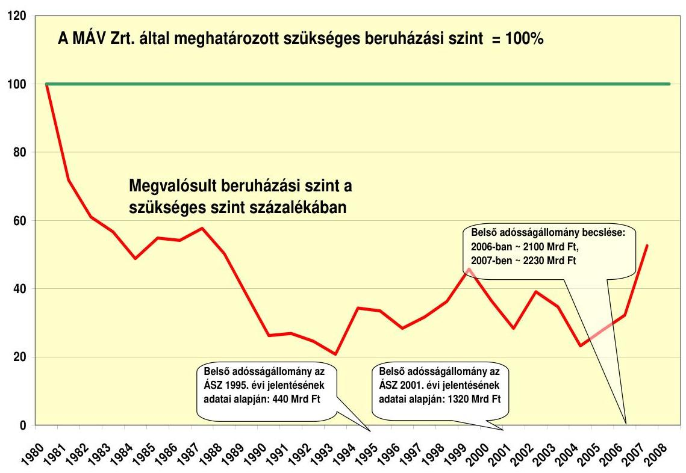

Forrás: MÁV Zrt.
A szolgáltatási színvonal javítása érdekében megépült beruházások a vizsgált időszakban kizárólag a korridor vonalakon EU támogatással végzett felújítások voltak. A Transz-Európai hálózat részeként működő pálya 34%-án, az egyéb országos törzshálózat 30%-án, a mellékvonalak 48%-án volt érvényben állandó jellegű sebességkorlátozás 2006-ban. Ezen túlmenően az év folyamán ideiglenes sebességkorlátozások bevezetésére is sor került, melyeknek közel 60%-át a pálya leromlott műszaki állapota miatt, 18%-át külső behatás, (szélsőséges időjárási viszonyok, baleset), 22%-át technológiai ok (pályán végzett munkálatok) miatt kellett bevezetni.

A hálózat minőségi mutatói elmaradnak a korszerű európai vasutak szintjétől, a MÁV Zrt. korridorfejlesztési projekteken kívüli vonalhálózata elöregedett, heterogén szerkezeti elemekből áll. A minőségi mutatókat a 8. melléklet mutatja be részletesen. Az eszközök jelentős része cserére, felújításra szorul. A pályába beépített 12000 műtárgy átlagos életkora megközelíti a 60 évet, ebben 100 éven túli szerkezetek is szerepelnek.

A személyszállítás uniós színvonalon történő teljesítése, azaz a versenyképes állapot elérése a kormányhatározatokban stratégiai cél. Az eljutási idők csökkentésének műszaki-technikai feltételei elsősorban a vasúti pálya állapotához köthetők, de meghatározó a vontató és személyszállító járművek megfelelősége is. A vasúti pálya állapota a megvalósuló fejlesztések következtében 2012-ig elsősorban a törzshálózaton fog javulni, egyéb hálózati elemeken szinten tartásra van lehetőség a MÁV Zrt. véleménye szerint. A járműállomány jelenlegi állapotát és a középtávú tervekben előirányzott anyagi forrásokat tekintve pedig (beleértve a KÖZOP vasúti személyszállítást érintő projektekhez tervezett forrá-

---

sokat is) nem reális igény, hogy a nemzetközi vasúti személyszállításban történő 2010-es piaci liberalizációig megvalósuljon a közép-európai vasúti társaságokkal versenyképes vasúti személyszállítás.

# 4.3. Az infrastruktúrafejlesztésre kapott támogatások felhasználásának célszerűsége 

Magyarországon a vizsgált időszakban megvalósított beruházások EU (ISPA / Kohéziós Alap) támogatás segítségével létesültek. 2000-től váltunk jogosulttá a következő infrastruktúra beruházások (vasútvonal rehabilitációk)
 és szakértői feladatok támogatására:

- 2000/HU/16/P/PT/PT001 Budapest-Cegléd-Szolnok-Lőkösháza I,
- 2000/HU/16/P/PT/PT003 Zalalövő-Zalaegerszeg-Boba
- 2001/HU/16/P/PT/PT007 Budapest-Szolnok-Lőkösháza II/1,
- 2001/HU/16/P/PA/006 Szakértői segítségnyújtás tender eljárásához,
- 2003/HU/16/P/PA/013 Szakértői segítségnyújtás a KA előkészítéséhez,
- 2005/HU/16/C/PA/001 A Kohéziós Alap által finanszírozott projektek előkészítése a vasúti ágazatban 2007-2013 között
- 2004/HU/16/C/PT/001 Budapest-Szolnok-Lőkösháza II/2.

Az EU (ISPA/Kohéziós Alap) megállapodásokat többször módosították. Ezek az alábbiak voltak:

| 2000/HU/16/P/PT/001 Budapest-   Cegléd-Szolnok-Lőkösháza vasútvonal   rehabilitációja I. | 1. mód. közbeszerzési terv, alprojektek   2. mód. határidő és p. ütemezés |
| :-- | :-- |
| 2000/HU/16/P/PT/002 Budapest-Győr-   Hegyeshalom vasútvonal rehabilitá-   ciója | 1. mód. közbesz. terv és a projekt költségek   2. mód. költségösszetétel, h.idő, p. ütemterv |
| 2000/HU/16/P/PT/003 Zalalövő-   Zalaegerszeg-Boba vasútvonal rehabilitá-   ciója | 1. mód. közbeszerzési terv, költség-összetétel   2. mód. határidő, műszaki tartalom   3. mód. folyamatban |
| 2001/HU/16/P/PT/007 Budapest-   Cegléd-Szolnok-Lőkösháza vasútvonal   rehabilitációja II/1. | 1. mód.: határidő, projekt költségek, pénz-   ügyi ütemterv, költség-összetétel |
| 2004/HU/16/C/PT/001 Budapest-   Szolnok-Lőkösháza II/2. | 1. mód.: projekt ktg, műszaki tartalom, p.   ütemt., ktg összetétel, támogatás csökkentés |

A 2000. évi ISPA projektek pénzügyi megállapodásainak módosításairól szóló levél-váltás volt 2001-ben, míg az ezt kihirdető 108/2005. (VI. 23.) Korm. rendelet csak a kihirdetését követő 3. napon lépett hatályba.

---

A projektek költségtúllépései az alábbiak okok következtében alakultak ki:
A PA006 projekt szakértői segítséget biztosít a PT001 és a PT003 projektekhez és így azok időbeni csúszása PA006 tekintetében is költségnövekedést okozott. A PA013 szakértői projekt esetében a tervezési feladatokat érintő engedélyezési eljárások során felmerült többlettervezési igények okoznak költségnövekedést. A PT001, PT003, PT007 és CPT001 beruházási projektek esetében az uniós támogatási kérelmek előkészítésének időpontjában a műszaki tartalom meghatározásához csak előzetes tervek és költségbecslések készültek, a részletes tervek és az azokhoz kapcsolódó részletes költségbecslés nem állt rendelkezésre. A költségbecsléseket inflációs ráta felszámítása nélkül, vagy nem elégséges mértékű infláció felszámításával állapították meg. A projektek megvalósítása a szükséges hatósági engedélyezési tervek és kivitelezési, valamint ajánlatkérési dokumentációk elkészítése után, az eredeti ütemtervhez képest 1-3 évvel később indultak el, ami szintén növelte a kiadásokat.

Jelentős többletet jelent a lassú előkészítés mellett pl. a lebonyolítást végző intézményrendszer többszöri átszervezése miatt felmerült időbeni csúszások okozta inflációs hatás. 2007-ben a helyszíni vizsgálatunk végéig nem nyújtottak be átutalási igénylést és projekteket az EU-hoz, ami nem tekinthető kedvező körülménynek, még úgy sem, hogy a PM nyilatkozata szerint az Igazoló Hatóság által ismert adatoknak megfelelően 2010. december 31-éig az összes vasúti projekt befejezésre kerül, így forrásvesztés veszélye nem áll fenn. Hozzájárultak a költségek növekedéséhez az engedélyezési, illetve a használatbavételi eljárások során felmerülő utólagos igények, üzemeltetői, szakhatósági és hatósági előírások is.

A teljes vasúti szektor kifizetésének aránya 2004. december 31-én az EU által támogatott projektek körében a tervezetthez képest 30,1 % volt. Az ISPA projektek tekintetében történt elmaradásnak az oka a MÁV Zrt.-nek a megvalósításról szóló tájékoztatója szerint a megfelelő előkészítettség hiánya, a pályakorszerűsítési munkák tendereztetésének és a jóváhagyási folyamatoknak rendkívül nagy időigénye volt.

A vizsgálatunk befejezésekor az országba vasútépítéssel kapcsolatban beérkezett EU forrás 48,9 Mrd Ft (190 M €), amely a vasútfejlesztésre megítélt teljes ISPA/KA támogatás 53%-a volt. Az EU által támogatott projektek 2005. és 2006. évi terv-tény alakulását a következő táblázat mutatja be:

Mrd Ft

| Megnevezés | 2005 |  |  | 2006 |  |  |
| :-- | :--: | :--: | :--: | :--: | :--: | :--: |
|  | terv | tény | tény/terv | terv | tény | tény/terv |
| EU támogatás | 16,5 | 8,5 | 51,2 % | 28,3 | 16,7 | 59,0 % |
| Költségvetési támogatás | 23,1 | 11,0 | 47,6 % | 44,3 | 24,8 | 55,9 % |
| EIB kiegészítés | 5,2 | 3,2 | 61,5 % | 2,0 | 1,2 | 60,0 % |
| Összesen: | $\mathbf{44,9}$ | $\mathbf{22,6}$ | $\mathbf{50,3 \%}$ | $\mathbf{74,7}$ | $\mathbf{42,6}$ | $\mathbf{57,0 \%}$ |

---

A projektek kedvezményezettje 2007. június 30-ig a MÁV Zrt. volt, 2007. július 1-től a támogatás új címzettje a Nemzeti Infrastruktúra Fejlesztő (NIF) Zrt. A GYSEV Zrt. EU-s támogatásban nem részesült.

A projektek előkészítésére csak szűkös, a MÁV Zrt. ingatlan hasznosításából eredő források álltak rendelkezésre. A 2000. évi Application Form (támogatási kérelem) elküldése és EU általi elfogadását követően az ISPA források felhasználása érdekében sem az előkészítés, sem a kivitelezés hazai forrását nem tervezték be a 2001-2002. évi költségvetésbe. A kétévi előkészítés finanszírozás hiánya két év csúszást okozott a projektek megvalósításában akkor, amikor az inflációs ráta jelentős volt. Az Application Form benyújtásakor csak előzetes tanulmányok álltak rendelkezésre, amelyekben a műszaki tartalom meghatározása nem volt pontos. Az EU Bizottsága ennek tudatában fogadta be Magyarország pályázatait. Mindezek következménye volt, hogy a tervezett ráfordítások csak becslések alapján kerültek meghatározásra, 2000. évi áron, a későbbi megvalósítások inflációs hatásainak kimunkálása nélkül.

A 2002. évi beruházási felhasználások elmaradtak a tervezettől. A végrehajtott 14 Mrd Ft értékű műszaki tartalom csökkentés mellett 17 Mrd Ft-tal nőtt a projektek bekerülési költsége folyó áron a Finanszírozási Megállapodáshoz képest. Az EU támogatási részaránya ilyen körülmények mellett már nem éri el a lehetséges és eredeti megállapodás szerinti 50%-ot, mert az EU a megállapodásoknak megfelelő összeget fizeti. A MÁV Zrt. 2003. évi jóváhagyott üzleti tervéhez képest kialakult elmaradás elsősorban az ISPA projekteket érintette jelentősen. A projektek előrehaladását és a forrás felhasználást a MÁV Zrt. álláspontja szerint a finanszírozás rendjének hazai módosulása (az államháztartás működési rendjéről szóló 217/1998. (XII. 30.) Korm. rend.) és az ISPA támogatással megvalósuló munkáknál bevezetett új EU eljárási gyakorlat nehezítette. A 2005. évi beruházások előirányzatai a MÁV Zrt.-nél 50%-ban teljesültek. A 2005. évi 530. sz. ÁSZ jelentés megállapításai szerint a vasúti projektek költségirányítása a MÁV Rt.-nél nem volt megfelelő.

A MÁV Zrt. és NIF Zrt. közötti 2007. évi átadáshoz készült szakértői un. „Státuszjelentés” ${ }^{42}$ szerint a 19 db vasúti beruházási projektből 7 db kivitelezési, és 3 db tervezői/konzulensi projekt finanszírozási megállapodásában, vagy az annak megfelelő dokumentumban rögzített ütemezés módosításra került. A tanulmány szerint a projektek előrehaladásában tapasztalt csúszások okai elsődlegesen a folyamatban lévő, vagy előkészítés alatt álló beruházási projekteket érintő stratégiai döntések, finanszírozási körülmények változása; a projektekben meghatározott alprojektek egymásra épülése (egy alprojekt csúszása több másik csúszását is előidézheti); közbeszerzési eljárás lebonyolításában bekövetkezett késedelem (eredménytelen eljárás, eljárás eredményének megtámadása).

Az előkészítő munkákra a MÁV-nál keletkező források szűkössége, a források lezárása, majd újra megnyitása is kedvezőtlenül hatott. Ennek is következtében a területbiztosításokat, tervezéseket, tender eljárásokat át kellett ütemezni, ami hozzájárult a csúszáshoz és ezen keresztül a költségek növekedéséhez, a támogatások arányának nem kívánt csökkenéséhez.

[^0]
[^0]:    ${ }^{42}$ AAM Tanácsadó Zrt. 2007. április 27-ei jelentése

---

A felújítással kapcsolatban az alábbi táblázatban foglaltuk össze az eredeti, 2000-ben megkötött EU-s Finanszírozási Megállapodásban (FM) foglalt pénzügyi ütemet és az I. módosítás adatait.

Magyarország és az Európai Bizottság között a 2000. évi ISPA projektek pénzügyi megállapodásainak módosításáról szóló 2001-ben lefolytatott levélváltást a 108/2005. (VI. 23.) Korm. rendelet hirdette ki, amely a kihirdetését követő 3. napon lépett hatályba.
euró

| Év | Eredeti összes   ktg. | Eredeti tá-   mogatás | 2001. évi mó-   dosítás összes   ktg. | 2001. évi mó-   dosítás tá-   mogatás |
| :-- | :--: | :--: | :--: | :--: |
| 2000 | 24662000 | 12331000 | 0 | 0 |
| 2001 | 27060000 | 13530000 | 4400000 | 2200000 |
| 2002 | 19400000 | 9700000 | 23400000 | 11700000 |
| 2003 | 21600000 | 10800000 | 36900000 | 18450000 |
| 2004 | 21400000 | 10700000 | 31600000 | 15800000 |
| 2005 | 19790000 | 9895000 | 24112000 | 12056000 |
| 2006 | 33478000 | 16739000 | 32339000 | 16169500 |
| 2007 | - | - | 1463900 | 7319500 |
| Összesen | $\mathbf{167390000}$ | $\mathbf{83695000}$ | $\mathbf{167390000}$ | $\mathbf{83695000}$ |

*E felett az el nem számolható költségek 2009301 M €-t jelentenek. Így az összes költség ezzel együtt 169399301 €.
** Ez az összeg az elszámolható költség, itt az el nem számolható költséggel együtt összesen (167 390 000+6 786 573) 174176573 M euró a teljes bekerülés.

A kérvényezés előtti kiadások összesen 2009301 eurót tettek ki, amelyekre már nem lehetett támogatást igényelni. Így ezzel együtt az összes tervezett kiadás 169399602 euró volt a 2000. évi állapotok szerint. A FM alapján a KVM 2002. április 15-én a kedvezményezettel megkötött „Támogatási szerződés”-e 2000. december 21-ei kezdési és 2006. december 31-ei befejezési határidőt és összességében 167390000 euró összköltségű, 83695000 euró támogatással rendelkező projektet tartalmazott. A fenti táblázat adatai tájékoztatnak arról, hogy már 2001-ben csúszott az ütem, addig a tervezett 51722000 euró felhasználásból 4400000 euró valósult meg. A csúszáshoz hozzájárult, hogy a költségvetés az önrészt nem biztosította. Erről tanúskodik pl. a MÁV Rt.-KöVíM levelezés (Gy 116-354/2/2001), amely megemlíti, hogy „a kifizetési ütemterv összhangban van ... azon elvárással, hogy az ISPA projektek 2001-2002. évi ütemét csökkentsük a társfinanszírozás mérséklése érdekében.” A projekt eredeti, az Európai Bizottság és a Magyar Köztársaság között létrejött „Finanszírozási Megállapodás”-a 13. pontban tartalmazta, hogy a projekt támogatás feletti 50%-ából 10%-ot a magyar kormány a költségvetésből és 40%-ot az EIB-hitellel fedezi. Tehát már az indulásnál problémát jelentett a magyar költségvetés helyzete, a támogatásokat az önrész biztosítása érdekében - csak hitelfelvétel mellett tudták megigényelni.

A hivatkozott Finanszírozási Megállapodásban szerepel az is, hogy már a korábbi szakasz, a Szlovénia-Zalalövő közötti vasútvonal rekonstrukcióját is hitelből finanszíroztuk. (Kreditanstalt für Wiederaufbau, KfW 61355026 euró hitel és 10000000 euró Phare támogatás.)

A projekt második módosítása egyrészt a műszaki tartalom több részre bontását jelentette - a II. építményt három szakaszra bontották, a III. építményt pedig kettőre - és ez a határidő módosításával is járt. Az összes projektrészre 2008. június 30-ai határidőt kértünk, illetve fogadott el az EU. A második módosítással a bejelentett összes költség (174 176 573 euró) változatlan maradt. A támogatás részaránya 48%-ot képviselt.

A
 harmadik, folyamatban lévő módosítás bejelentett összes költsége 195 282 000 euró (elszámolható 167 390 000 + nem elszámolható +27 892 000), ami nem tartalmaz minden felmerülő költséget.

Nem szerepel benne az eredeti VI. építmény az ETCS (Egységes Európai Vonatbefolyásoló Rendszer) építése a Zalalövő-Zalaegerszeg-Boba vonalon 8 000 000 euró értékben, tehát csökkent a műszaki tartalom. Nem tartalmaz „kiegészítő" költségeket 14 758 000 euró értékben. A kiegészítő jelző azt jelenti, hogy ezek olyan költségek, amelyek az ISPA támogatási keretek lezárultát (2006. december 31.) követően merültek fel, így ezekhez már nem volt lehetőség támogatás igénylésére.

Az eredeti és a harmadik módosítás szerinti projekt összehasonlítását tartalmazza a 9. mellékletben szereplő táblázat. E szerint az eredeti összes költség 169 399 301 euróról 218 040 000 euróra, 28,71%-kal emelkedett, ami a támogatások összköltséghez viszonyított eredeti 49,51%-os szintjének 38,39%-ra csökkenését hozta magával.

A kilenc részre bontott projekt állása szerint leszerződött a kilencből hat darab, amelyek 39 531 681,52 euró ISPA támogatást fedeznek le. Ebből az összes kifizetés eddig 22 517 556,22 euró volt. Az eddigi ISPA kifizetések az eredetileg 2006. évi befejezés, azaz a támogatások 100%-a helyett a vizsgálat végéig (2007. november) mindössze 25,9%-ot képviselnek. A részletesen vizsgált 2000/HU/16/P/PT/003 Zalalövő-Zalaegerszeg-Boba vasútvonal felújítása esetében a többletköltségek és a késedelmek kialakulásának okait a 7. melléklet tartalmazza.

Az EU támogatások előkészítési rendje és követelményei ismeretlenek43, a kedvezményezettek felkészületlenek voltak a támogatások igénylésére és azok fogadására. A hazai és a nemzetközi (EU hivatalos lapjában meghirdetett) pályázatokon résztvevő vállalkozók felkészületlensége, felkészítésük elégtelensége, pályázati gyakorlatlansága, a megfelelő gyakorlott és képzett munkaerő hiánya is súlyosan esett latba és évekre vetette vissza egyes projektek teljesítését. A vizsgált időszakban került kialakításra az EU elvárásainak megfelelő intéz-

[^0]
[^0]:    43 Megállapította az ISPA támogatásokról szóló 530. sz. ÁSZ jelentés

---

ményi rendszer a támogatások előkészítésére, fogadására, a projektek lebonyolítására és ellenőrzésére. A szükséges átszervezések is csúszásokhoz vezettek. A Bizottság 1999 végén adta ki az ISPA-t szabályozó rendeletét, így a 2000. januárjától megnyíló források felhasználási rendszere a támogatást itthon közvetítő intézményrendszer számára sem volt ismeretes, ennek következtében a kedvezményezettek felkészítését, a beadandó projektekkel szembeni elvárásokat a Kormányzat sem tudta időben megkezdeni, megfogalmazni. Az első pillanattól kezdve nehezíti az igénybevételt az, hogy a költségvetés az önrészt nem ütemesen finanszírozta, ami miatt a támogatást élvező EU projektek határidő csúsztatására kényszerültünk. Ez mára annyival lett könnyebb, hogy míg az ISPA támogatások maximális támogatási hányada 50% lehetett, amit különböző felkészülési problémák (pl. „elfelejtett" inflációfelszámítás, engedélyezési eljárások előtti tervek alapján készített költségbecslések stb.) és a költségvetés helyzete miatt nem tudtunk kimeríteni, a folyamatban lévő ill. következő időszakra vonatkozó, a strukturális alapokból származó támogatások 85% támogatást adnak, 15% hazai hányad mellett. Összességében azonban a költségvetésre ez nem kisebb megterhelés a volumen megnövekedése miatt.

Az EU által nem támogatott hálózaton végrehajtott sebességkorlátozási intézkedések hatását egyik évben sem semlegesítették a végrehajtott felújítások, rehabilitációk. A 2002. évi állapothoz viszonyítva romlott a helyzet, a pályavasúti beruházások az utóbbi években elvégzett 30-60 Mrd Ft-os teljesítése nem biztosítja a pálya állagának szintentartását. A beruházások növelésének forrásbiztosítási-, beruházás-előkészítési-, tervezési- és lebonyolítási követelményei egyaránt vannak. A Pályavasúti üzletág nem termeli ki az EU által a kohéziós alap keretében nem támogatott fővonalak felújítási munkálatainak fedezetét (2006-ban 33,3 Mrd Ft, 2007-ben 9,3 veszteséggel működött). Ugyanakkor a korridor vonalakon kívüli hálózat (5927 km) fejlesztéséhez a vasúti hálózatfejlesztésre kapott költségvetési források a 2002. évi 21 Mrd Ft-ról 2007-re 720 M Ft-ra csökkentek.

A GySEV Zrt. 2002-2003-ban 56 km hosszban villamosította a Sopron-Szombathely vonalat és kiépítésre került a központi forgalom ellenőrző és felső vezeték távirányítási rendszer. 2002-2004 között ugyanezen a vonalon 31 km hosszban történt részleges pályakorszerűsítés, 2005-2006-ban pedig korszerű elektronikus biztosítóberendezést építettek ki.

# 4.4. A járműpark fejlesztése 

A MÁV Zrt. 2002. év végén 3245 db személy- és motorvonati kocsi-egységgel rendelkezett, amelyek átlagéletkora 27,6 év volt. Az 1992. évhez viszonyítva, amikor a kocsik átlagos életkora 18,2 év volt, a felújítások és beszerzések 59%-os elmaradása következtében 2002-re az átlagos életkor 27,6 évre emelkedett, de a növekedés üteme ezt követően lelassult. A járműpark átlagéletkora jelenleg 29,7 év, az állomány 42%-a 20-30 év közötti, 31%-a 30-40 év közötti és 13%-a meghaladja a negyven évet.

Az elmaradt karbantartások, felújítások és beruházások következtében elhasználódott teherkocsik miatt az árufuvarozás céljára igénybevett teherkocsik használati és bérleti díja az árufuvarozás kiszervezését követő évben 11 098 M

---

Ft-tal csökkent. A teherkocsipark összetétele sem felel meg a piaci igényeknek. A nyilvántartott kocsik száma a vizsgált időszakban a selejtezések miatt egyharmadával csökkent, a MÁV Cargonál 2007. évben 12 172 saját és 1750 bérelt kocsi, azaz összesen 13 922 db volt, amelyből 10 407 db (74,8%) üzemképes. A MÁV Cargo 2007. évben 1466 db kocsi fővizsgáját tervezte megvalósítani, amelynek eredményeképpen - a bérelt kocsikkal együtt - 11 955 kocsi rendelkezik az év végén érvényes fővizsgával. A GySEV-nél 95 db üzemképes saját kocsi állt rendelkezésre. A fuvarpiac által igényelt teherkocsi sorozatokkal a vasúti árufuvarozás nem rendelkezik megfelelő mértékben. A kocsi hiányt idegen vasútintézeti kocsik beállításával igyekeztek mérsékelni. Az export forgalom lebonyolítására is idegen kocsit kellett bérbe venni a vasúttársaságoknak, ami az úgynevezett RIV44 kocsibér fizetési kötelezettség miatt drága, de a piac megtartás miatt szükséges megoldás volt.

Mindegyik társaságra jellemző, hogy a járműpark állapota az évek óta elmaradt fejlesztések és szükséges karbantartások miatt elavult, ami az üzemeltetés szempontjából jelentős többletköltségeket okoz. A karbantartásokkal az üzemben tartott járműpark élettartama csak átmenetileg javul, az eszközök értéke az elavultság mértéke miatt nem növekszik.

Az országos hatáskörű vasúttársaságoknál a személyszállítási feladatok ellátásához 2002. évben 3298 db, 2007. évben 3206 db vasúti jármű állt rendelkezésre. A motorkocsi állományuk 401 db, ami 102 db növekedést jelentett a Desiro, Flirt, Talent típusú motorvonatok és az orosz motorkocsik üzembe állítása eredményeként. A járműállomány mennyiségi csökkenése mellett az üzemképességi mutató a vizsgált időszakban a motorvonatok és a német személykocsi beszerzések miatt 76,6%-ról 78,4%-ra növekedett, azaz emelkedett a személykocsi park műszaki színvonala. A 2002-2007 között megvalósult személykocsi, motorvonat beszerzések, felújítások ellenére az állomány 72,6%-a korszerűtlen, a személykocsipark teljes megújítása szükséges. 2003 és 2013 között összesen 1054 személyszállító jármű selejtezését tervezték, amelyből 2007-ig időarányosan 434 db valósult meg.

A vontató járművek állománya a 2002. évi induló állományhoz képest gyakorlatilag nem változott, 2007. évben 1403 db vontatóeszközzel rendelkezett az üzletág feladatai ellátásához. A MÁV Gépészeti Üzletág állományában 2007 novemberében 1365 db vontatójármű található, üzemképességi színvonaluk 75%-os. A GySEV állományában 19 db villamos és 17 db dízel üzemeltetésű vontatójármű található. A mozdonyok 41,4%-a 20 évnél, további 48%-a 30 évesnél is idősebbek.

A vasúttársaságok reformjának kiemelt célja a budapesti elővárosi, a regionális és a minőségi távolsági személyszállítási szolgáltatások fejlesztése. A reformkoncepció megvalósítása alapján a budapesti elővárosi közlekedésben 2007-re érzékelhetően javult a szolgáltatás színvonala. 2010-re a várható beszerzések üzembe helyezését követően korszerűsödik a kocsipark, a vonalak több mint fe-

[^0]
[^0]:    44 Szabályzat a teherkocsik kölcsönös használatára a nemzetközi vasúti forgalomban.

---

lén modern motorvonatok közlekednek. A vizsgált időszakban (2002-2007 között) az intercity helyjegyet váltók száma egymillió fővel emelkedett.

Az MVH vasúti személyszállítási tevékenység végzésére, az Európai Vasúti Térség és az országos hálózatok használatára eddig három vasúti társaságoknak adott engedélyt az új törvény alapján. Ezek a GySEV Zrt., a MÁV Start Zrt. és a MÁV Nosztalgia Idegenforgalmi, Kereskedelmi és Szolgáltató Kft. Ezen kívül személyszállításra még 16 vasúttársaság jogosult, akik erdészeti és turisztikai szolgáltatást végeznek. A vizsgált időszakban az utas szám 164,5 millió főről 156,8 millió főre, az átlagos utazási távolság 64,1 km-ről 61 km-re, ennek következtében a személyszállítás utaskilométer teljesítményadata 10%-kal csökkent. A vasúti járművek kapacitás-kihasználtsága a személyszállítás területén eléri a 71%-ot.

Árutovábbításra vonatkozó országos engedéllyel jelenleg 21 társaság rendelkezik, köztük az ágazat két fontos szereplője, a GySEV Zrt. és a MÁV Csoport korábban 100%-os tulajdonában lévő MÁV Cargo Zrt. A társaság értékesítésére kiírt pályázat nyertesével 2008. januárjában a szerződést aláírták. Az árufuvarozás során elszállított árutonna a belföldi forgalomban csökkent, a nagyobb fuvarozási távolságból adódóan azonban az árutonnakm teljesítmény 24,8%-kal növekedett. A MÁV tranzit és export aránya az árutonnakm teljesítmény alapján a vizsgált időszakban 26%-kal nőtt, a belföldi forgalom 26,3%-kal csökkent. A díjszabási árutonna km vizsgált időszakban történt jelentős növekedését az export forgalom 28%-os és a tranzit forgalom 87,2%-os emelkedése okozta.

Személyforgalom területén a MÁV-nál valamennyi vontatási nemben 4%-kal csökkent a teljesítmény, a személyszállítási kínálatszűkítés eredményeként. A GySEV személyforgalma a dízelvontatás területén a vonalátvételek miatt megközelítőleg a kétszeresére, a villamos vontatásnál 76,2%-kal növekedett. Az áruforgalom területén valamennyi vontatási nemben növekedett a teljesítmény a MÁV-nál 27,9%-kal, a GySEV-nél 41,6%-kal. A vontató járművek kihasználtsága 25,2%-kal nőtt a vizsgált időszakban.

A MÁV Cargo Zrt. részére végzett vontatási teljesítmény 2007. évben 18,8 ezer vonatkm volt, amely a vizsgált időszakban 20,5%-os emelkedést jelentett. A vontatás 78%-ban villamos mozdonnyal történt. A magánvasutak részére végzett vontatási teljesítmény (451 ezer vonatkm volt) az összes teherszállítási teljesítménynek 2,4%-a. A villamos vontatás részaránya 58%-os volt.

Az Európai Unió 25 tagállamának (az újonnan csatlakozó Románia és Bulgária nélkül) áruszállítási teljesítménye egyaránt 3,3%-kal bővült 2005-ben és 2006-ban. A MÁV csoporthoz tartozó MÁV Cargo a 2005. évben 3%-kal, az uniós átlagnak megfelelően növelte fuvarteljesítményét. A 2006-ban elért 7,3%-os szállítási teljesítménynövekedés az EU átlag feletti.
2001. évben összesen 15 db Taurus 1047 típusú villamos mozdony beszerzésére került sor, melyből 10 db-ot a MÁV-nál, 5 db-ot pedig a GySEV-nél helyeztek üzembe 2002-ben. A beruházás összértéke 11,5 Mrd Ft volt.

---

Az orosz államadóság fejében a Metrowagonmas Zrt. 2002-2004 között 40 db 6341 sor. iker dízel-motorkocsit szállított a MÁV Zrt. részére 20,6 Mrd Ft értékben. A motorkocsik az elavult MD sorozatú motorkocsikat és szerelvényeiket váltották le, ami a szolgáltatási színvonal emelkedését eredményezte. 2003-ban álltak üzembe a korszerű, az utasigényeket figyelembe vevő DESIRO motorvonatok (13 db, Siemens gyártmány). Ezeket a járműveket a Budapest-Esztergom vonalon helyezték forgalomba, majd 2005-ben a megnövekedett utas igények következtében további 10 szerelvény üzembe helyezésével bővült a flotta.

A 2003-ban elfogadott és a 1001/2004. (I. 8.) Korm. határozattal megerősített járműfejlesztési koncepció elővárosi járművekre vonatkozó stratégiájának első lépése a 2007 márciusától kezdve fokozatosan fogalomba álló 30+30 db 5341. sorozatú FLIRT típusú elővárosi villamos motorvonattal teljesül (2007. évben 23 db motorvonat üzembe helyezése valósult meg).
2005. szeptember
 13-án a Közbeszerzési Döntőbizottság (KDb) jóváhagyó döntésével lezárult $30+30 \mathrm{db}$ Stadler Bussnang AG villamos motorvonat beszerzése ügyében indított közbeszerzési eljárás, amelynek során a MÁV Zrt. háromszor kényszerült eredményhirdetésre. A KDb szeptemberi határozata szerint a MÁV Zrt. szabályosan zárta le a mintegy 90 Mrd Ft összértékű pályázatát, és elutasította a vesztes pályázó (Bombardier) jogorvoslati kérelmét.

A szerződésben foglalt opciós lehetőség lehívásával további 30 db FLIRT elővárosi motorvonat Stadler cégtől való beszerzésére és forgalomba helyezésére kerül sor az elkövetkező másfél évben.

2006 januárjában a Bombardier Transportation AG ajánlattal kereste meg a MÁV Zrt.-t, amelyben rendkívül kedvező szállítási és pénzügyi feltételeket kínálta eladásra a 10 db TALENT típusú elővárosi villamos motorvonatát. A MÁV a Flirt motorvonatok (opciós mennyisége további 30 db) mellé - a GKM tulajdonosi jóváhagyásával - megvásárolta az ajánlott TALENT-eket. Az eredetileg az ÖBB elvárásai alapján készült motorvonatok hazai üzembe helyezése a vártnál (meghibásodási statisztikánál) jóval több műszaki problémát vetett fel. Az 5342 sor. motorvonatok azóta utasokkal próbaüzemben forgalomba álltak az 1-es vonal budapesti elővárosi szakaszán. A motorvonatok a két áramrendszer miatt alkalmasak az osztrák villamosított vonalhálózaton történő közlekedésre is.

A típusbővítés nem egyértelműen kedvező. Egy igazgatósági előterjesztés pl. a Siemens motorvonatokról megállapítja, hogy a meglévő orosz motorvonatok üzembe helyezése miatt „az egymással nem kompatibilis egységek nehezítik és megdrágítják az üzemeltetést." Jelenleg az 1-es vonal elővárosi és regionális közlekedését különböző típusú villamos motorvonatokkal oldja meg a MÁV a Bécsig terjedő EURégió forgalmat. Az üzemben lévő alacsony darabszám miatt a járművek üzemeltetése és karbantartása fajlagosan magasabb költséget jelent.

A MÁV Rt. és a Siemens AG között 2001 decemberében létrejött szerződés három évre olyan elvégzendő garanciális készenléti karbantartást foglalt magában, amelyek többségét az alapszerződés is tartalmazza. A MÁV Rt. 2003 májusában a számára előnytelen szerződést egyoldalúan felmondta, de a Siemens nem fogadta el az egyoldalú bejelentést.

---

Az új motorvonatok beszerzésével párhuzamosan került sor a GySEV-nél 25 db összesen $500 \mathrm{E} €$, a MÁV-nál 300 db összesen 3,4 Mrd Ft (13,7 M €) értékben használt német kocsi beszerzésére, a megállapodás 27 darab vezérlőkocsit, és 273 darab ülőhelyes kocsit tartalmazott. A távolsági forgalomban közlekedő kocsikkal mintegy 27 Mrd Ft forrásigényű felújítás kiváltására nyílt lehetőség. A vasúttársaságok gördülőállomány beruházásait a 10. mellékletben mutatjuk be.

Az 1001/2004. (I. 8.) Korm. határozat előírja, hogy 2006-ra érezhetően javítani kell a budapesti elővárosi közlekedés színvonalát. Az elmúlt években véghezvitt beszerzéseknek köszönhetően az elővárosi térségben jelentősen javult a szolgáltatási színvonal. Csak a nyugati országrészben, a budapesti elővárosi forgalomban járnak új beszerzésű motorvonatok a homogén vonal (azaz 100%-os ellátottság), és az ezáltal kialakítható kiegyensúlyozott járműgazdálkodás a vizsgálat lezárásáig nem valósult meg.

# 4.5. Menetrendi kínálat 

A MÁV vonalain a Dunakanyarban, a Budapest-Vác-Szob és a Budapest-Veresegyház-Vác vonalon már 2004 augusztusától ütemes menetrend szerint közlekednek a vonatok. Az új menetrend több vonatot, megjegyezhető indulási időket, jobb csatlakozási rendszert és tervezhető utazást jelent. Az új menetrend a MÁV felmérései szerint nagy sikert aratott az utasok körében. A két vonalon az ütemes menetrend bevezetésével ugrásszerűen, $14 \%$-kal nőtt az utasforgalom. A 2006. december 10-ei, majd a 2007. december 10-ei menetrendváltás egyben szemléletváltást is jelentett a vasúti személyszállításban. A korábbi évekre leginkább a vonatok számának csökkenése volt jellemző, ezzel szemben az új menetrendek vonatsűrítést jelentenek. Az ütemes menetrend Kelet-Magyarország jelentős részét, valamint a Budapest-Győr és a Budapest-Esztergom vasútvonalat érintette. Az ütem, azaz a vonatok gyakorisága általában hatvan vagy százhúsz perc, de egyes esetekben harmincpercenként követik egymást a járatok. Az indulás perce minden ütemben azonos.

A legfontosabb viszonylatokban, Miskolcra, Nyíregyházára és Szegedre a hét minden napján óránként járnak az IC-k. Nyíregyháza-Debrecen felől a Nyugati pályaudvarra érkeznek a vonatok. Szeged felé az IC minőségű kocsik mellett gyorsvonati kocsikban hely- és pótjegy nélkül is lehet utazni.

A budapesti elővárosi közlekedésben folytatódott az utas igényeknek jobban megfelelő menetrendi kínálat kialakítása. Elővárosi forgalomban zónázó rendszert vezettek be a Budapest-Cegléd és a Budapest-Újszász-Szolnok vonalakon. Bevezetésre került az ütemes közlekedés a Budapest-Tatabánya-Oroszlány, a Budapest-Esztergom, a Budapest-Gödöllő-Hatvan és a Budapest-Kunszentmiklós-Tass vonalakon is: azaz hétvégén óránként, csúcsidőben félóránként közlekednek a személyvonatok. A reggeli csúcsidőben Hatvan, Nagykáta, illetve Albertirsa felől 20 percenként közlekednek a személyvonatok, amivel a zsúfoltság mértékét kívánta a MÁV csökkenteni. Újdonságként került beállításra az ún. kör-IC, amely kétóránként indul a Keleti pályaudvarról Miskolc-Nyíregyháza felé, ahonnan Debrecen és Szolnok érintésével tér vissza, de már a Nyugati pályaudvarra. Ennek megfelelően a Nyugati pályaudvarról is kétóránként indul kör-IC Debrecen-Nyíregyháza felé, amely Miskolc érintésével

---

a Keleti pályaudvarig közlekedik. Cegléden mind a szegedi, mind a nyíregyházi IC-k megállnak, lehetőséget adva az átszállásra a járatok között. Ezzel hat megyeszékhely (Szeged, Kecskemét, Szolnok, Debrecen, Nyíregyháza és Miskolc) között biztosítottak rövidebb eljutási időt.

A nagyobb vidéki városok vonzáskörzetében is jelentősen nőtt a menetrendi kínálat, több helyen óránkénti, egyes frekventált vonalakon csúcsidőben félóránkénti járatsűrűség alakult ki. Így munkanapokon óránkénti a közlekedés Tatabánya-Győr, Hatvan-Salgótarján, Hatvan-Szolnok, Miskolc-Füzesabony, Miskolc-Szerencs, Nyíregyháza-Szerencs, Nyíregyháza-Záhony, Nyíregyháza-Debrecen, Debrecen-Püspökladány között. Az IC és a gyorsvonatok menetrendjeit úgy alakították ki, hogy azok egy-egy nagyobb csomópontban találkozzanak, ahol a ráhordó- és elosztó járatokkal a fővonalon található kisebb állomásokról és a mellékvonalak felől is megfelelő csatlakozással legyen mód átszállni.

A GySEV Zrt. által üzemeltetett Sopron-Szombathely viszonylatban a pályahálózat korszerűsítésének eredményeként az utazási sebesség $37,5 \mathrm{~km} / \mathrm{o}$-ról 53,7 $\mathrm{km} /$ ó-ra emelkedett.

A járművek minősítését a következő ábrán mutatjuk be, amely szerint a járműállomány $51 \%$-a tűrhető, a $23 \%$-a megfelelő minősítést kapott. A motorvonat beszerzések és a német személykocsik felújítása következtében 14%-ra nőtt a jó minősítésű eszközök értékelése.
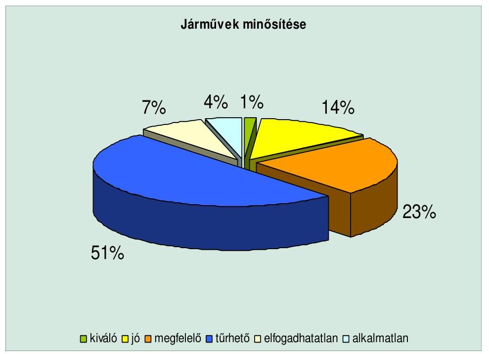

Forrás. MÁV Zrt., GySEV Zrt.

---

# 4.6. A tarifa és kedvezményrendszer hatása a versenyhelyzetre 

A vasúti személyszállítási közszolgáltatás sajátossága, hogy megrendelője nem a tényleges igénybevevő, hanem az állam. A menetrend kínálati jellegű (a MÁV elkészíti, az állam elfogadja). A meghirdetett menetrend szerinti személyszállítás díjait GKM rendelet állapítja meg. Az alapellátás elvei, amelyeket a kormány az illetékes minisztériumokkal együtt határoz meg, a vasúti szolgáltatások tág szociális paramétereit határozzák meg. A MÁV által kötelezően alkalmazott szociálpolitikai kedvezmények köre és mértéke jogszabály által meghatározott. A közszolgáltatás körében végzett vasúti személyszállítást érintő díjakat és kedvezményeket a Személyszállítási Üzletszabályzatban teszi közzé a MÁV Zrt. A többszereplős versenypiaci modellre történő áttéréssel megváltozik az állam tulajdonosi szerepvállalása, többek között a támogatási rendszer és a közszolgáltatások állami térítési rendszerének a normatívvá tételével. A jelenlegi támogatási forma nem piacorientált, sokkal inkább a szociális szempontokat és az állami költségvetés érdekeit veszi figyelembe. A támogatásnak nincs ösztönző hatása arra, hogy a kifizetett pénzért magasabb szolgáltatási érték teremtődjön.

Az árképzés és kedvezményrendszer szempontjából külön kell választani az áru- és személyforgalmat. Az előbbinél eredménymaximalizált árképzési rendszer működik, ahol a hozzáadott érték növelésével az árbevétel emelése és a legmagasabb eredmény elérése a cél, az utóbbinál mindezek kiegészülnek a társadalmi érdekekkel és szociálpolitikai szempontokkal.

A belföldi vasúti személyszállítás hatósági árának növekedése 2002-ig elmaradt a fogyasztói árak átlagos emelkedésétől, míg 2003-2005. évek között 1-2%-ponttal meghaladta azt. A távolsági autóbusz és vasúti közlekedés tarifakülönbségét a 2007. évi áremelés egyenlíti ki, a vasúti tarifák felzárkóztatásával. A GKM 2007-ben két lépcsőben valósította meg a vasúti menetdíjak emelését.
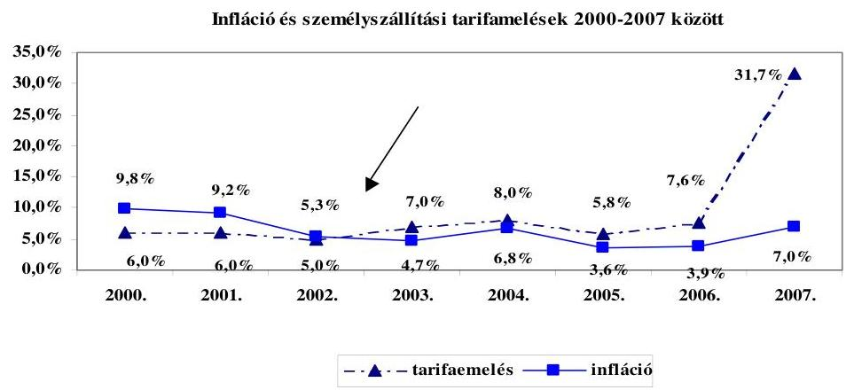

A tarifa meghatározása szempontjából különösen nagy jelentősége van az utazási kedvezményeknek. Az egyes utascsoportok részére szociál-, vagy társadalompolitikai és közlekedéspolitikai célok alapján biztosított közforgalmú személyszállítási utazási kedvezmények miatt a közlekedési társaságoknál jelentkező bevételkiesések a fogyasztói árkiegészítésről szóló 2003. évi LXXXVII. tv. (Fát.) szerint a költségvetésből kerülnek ellentételezésre. A szociálpolitikai kedvezmények mértékét kormányrendeletek szabályozzák.

A menetdíjtáblázatok kedvezményes menetdíjai nincsenek összhangban a törvényben meghatározott ár-kiegészítési összegekkel. Pl. 100 km menetdíj esetén a teljesárú menetjegy $1210 \mathrm{Ft}$, 67,5% kedvezménnyel 410 Ft, árkiegészítés 660 Ft, fedezetlen kedvezmény $140 \mathrm{Ft}$ (11,5%). 100 km menetjegy 90% kedvezménnyel 125 Ft, árkiegészítés 880 Ft, fedezetlen kedvezmény 205 Ft, azaz 16,9%.

A ténylegesen nyújtott kedvezmény után járó árkiegészítés igény - illetve árbevétel kiesés - összege éves szinten eléri a nettó 23,5 Mrd Ft-ot. Az utasok száma szerinti megoszlás alapján a teljesárú menetjeggyel utazók aránya 18%, azaz az utasok 82%-a vesz igénybe valamilyen kedvezményt a vasúti közlekedésben. Az utazások száma alapján mért legtöbb utas-kedvezményt az 50 km alatti utazások esetén (dolgozói kedvezmények és tanulóbérletek) veszik igénybe (49%). Az értékben legnagyobb kedvezmény az önálló keresettel nem rendelkező tanulók utazásainál jelentkezik.

A közforgalmú személyszállítási utazási kedvezmények hazai rendszere Európában mára már egyedülállóan széleskörűnek mondható. Az utazási kedvezmények köre az 50%-os kedvezménytől egészen a díjmentesig terjedt.

A Kormány a vasúti közlekedéspolitika stratégiai kérdéseiről szóló 2185/2005. (IX. 9.) határozatában döntött az utazási kedvezményrendszer 2006. december 31-éig történő felülvizsgálatáról, majd a helyközi tömegközlekedési rendszer átalakításával és a MÁV Zrt. tőkemegfelelése biztosításával összefüggő egyes feladatokról szóló 2130/2006. (VII. 24.) határozattal elrendelte a helyközi személyszállítási közszolgáltatás átalakítását a hatékonyabb és gazdaságosabb működés kialakítása érdekében. A GKM 2006. decemberében előterjesztette a közösségi közlekedés középtávú átalakításának koncepcióját. Ennek keretében javaslatot tett az egységes utazási tarifa- és kedvezményrendszer két lépésben történő átalakítására, amely szerint 2007. január 1-jétől történjen meg a helyközi autóbusz és vasúti tarifák közelítése, majd 2007. május 1-jétől kerüljön bevezetésre az egységes tarifa- és kedvezményrendszer. A koncepcióban leírt elképzeléseknek megfelelően a tarifarendszer átalakítására sor került. A kedvezmények 2007. májusától, egy év átmeneti időszak után ismét százalékos mértékkel kerültek kifejezésre annak ellenére, hogy a Fát. 2004. évtől a helyi közlekedésben bevezette, majd 2006. július 1-jétől a távolsági közlekedésre is kiterjesztette a fix összegű, tételes támogatásokat. Ettől kezdve az ár és a támogatás elszakadt egymástól.

A 2007. évi állami díjszabási intézkedések alapján a helyközi autóbuszközlekedésben szerény mértékű, a szükségesnél kisebb díjemelés történt. Nagy előrelépésként értékelhető a helyközi menetrend szerinti személyszállításban a vasúti 2. kocsi osztályú és az autóbusz-tarifák, továbbá az utazási kedvezmények egységesítése. Nem közvetlenül a díjszintet érintő, vagy a szolgáltatói bevételt befolyásoló kihatású, de a rendezettséget elősegítő intézkedés volt az egyes díjak képzési elveinek lefektetése és az elvek gyakorlati alkalmazása. A

---

kedvezményekkel kapcsolatos és az árkiegészítést érintő intézkedések nem voltak teljes összhangban és a májusban bevezetett kedvezménymódosításokat szeptemberben visszavonták.

A tarifaemelés hatására - annak kihangsúlyozása mellett, hogy az utasforgalom alakulását lényegileg befolyásolják olyan makrogazdasági intézkedések, amelyek nem közlekedéspolitikai kompetenciába tartoznak - a közösségi személyszállítási szolgáltatások igénybevétele csökkenő tendenciát mutat.

A személyszállításban alkalmazott kedvezményrendszer olyan elemeket is tartalmaz, amelyekkel kapcsolatos bevételkiesést az állam nem
 kompenzál. Ezen a címen jelentkező 3,8 Mrd Ft-ból 2,8 Mrd Ft a 65 év feletti nyugdíjasok utazásainál jelentkezik. A nyugdíjas kedvezmény az EU csatlakozást követően minden EU állampolgár számára elérhető, de ennek ellenszolgáltatása, vagy hasonló szolgáltatás a magyar állampolgárok számára Európában nem érhető el, azaz a kedvezményeket egyoldalúan nyújtjuk. Az ilyen módon biztosított kedvezmény nem számottevő, éves szinten 42 M Ft többlet terhet jelent a MÁV és az ország számára. A kedvezményre való jogosultság igazolása túl bonyolult. A tarifareform nem ölelte fel a kedvezmények teljes körét. Nem foglalkozott az ingyenes utazási kedvezmények szolgáltatói kapacitási igényekre, költségekre és finanszírozottságra gyakorolt hatásával, valamint ezek költségvetési összefüggéseivel sem.

A vasutas munkavállalók jelenlegi utazási kedvezményeit szabályozó utasítás 1986-ban került kiadásra. A több mint két évtized alatt lezajlott jogszabályváltozások és a vasútnál végrehajtott és jelenleg is folyamatban lévő szervezeti átalakulások miatt a szabályozás elavult, ellentmondásos.

A Fát. és az annak végrehajtására kiadott, a közforgalmú személyszállítási utazási kedvezményekről szóló 85/2007. (IV. 25.) Korm. rendelet kategóriái között nincs teljes összhang, amely helyzet nem felel meg a jogalkotásról szóló 1987. évi XI. tv. 1. § (2) előírásainak.

A közszolgáltatási szerződéseket a Volán társaságokkal 2005. január 1-jével megkötötték, a helyközi személyszállításra vonatkozó szerződések 2012. december 31-éig hatályosak, új szolgáltató kiválasztása - versenyeztetéssel - csak ezután lehetséges.

A vasúttársaságokkal a közszolgáltatási szerződést ez idáig a GKM nem kötötte meg. A PM 2004-ben arra való hivatkozással utasította el a közszolgáltatási szerződés aláírását, hogy a MÁV a menetrendet és a közszolgáltatás indokolt költségeinek megalapozásához elengedhetetlen önköltség-számítási szabályzatot és a menetrendet nem mellékelte a szerződéshez, mely utóbbit a vasúti törvény is előírt. ${ }^{45}$ A közszolgáltatási szerződés hiányának oka a GKM szerint: „... hogy a korábbi években nem volt biztosított a vasúti személyszállítási szolgáltatások teljes körű finanszírozása, azaz a vasúti személyszállítás volumene nem állt összhangban a finanszírozási lehetőségekkel..." A vizsgálat időpontjában a

[^0]
[^0]:    ${ }^{45}$ A MÁV Zrt. szerint önköltség-számítási szabályzatai minden évben rendelkezésre álltak. A PM szerint ettől függetlenül azokat mellékelni kellett volna.

---

vasúttársaságokkal kötendő közszolgáltatási szerződés előkészítése, egyeztetése folyamatban volt.

A MÁV Zrt. és a GySEV Zrt. sem rendelkezik vonatjáratra, vagy vonalra vonatkozó pontos bevétel/költség kimutatással. A jelenlegi jegyértékesítési rendszer alapján - mivel nincs ún. viszonylati menetjegy - az egy meghatározott vonalra jutó bevételeket közelítő becsléssel állapítják meg. A költségek gyűjtése statisztikai vonalszakaszokra ${ }^{46}$ történik, a nem vonalszakaszra elszámolt (nem vasútvonalon felmerülő, vagy több vonalszakaszt érintő tevékenység) költség felosztásra kerül a statisztikai vonalszakaszok között. A bevételek vonali, ill. vonatra történő kimutatása érdekében informatikai és folyamatszervezési lépések történtek. A MÁV Start Zrt. 2007-ben már néhány kiemelt pályaudvaron bevezette, 2008-tól viszont általánosan tervezi bevezetni az infrastruktúrafejlesztés eredményeképpen a viszonylati menetjegy ${ }^{47}$ értékesítést. A hosszú távú stratégiai döntések meghozatala érdekében az utazóközönség piaci igényeinek felmérését kezdték meg. A konkrét vonatra, vagy szárnyvonalra vonatkozó bevétel-elszámolás és önköltség-számítás nélkül a személyszállítást végző társaságok finanszírozása nem egy átgondolt, hosszú távú koncepció mentén valósul meg, hanem az évente képződő veszteség mértéke által vezérelt kényszerpályán mozog.

A menetrend szerinti személyszállítás tarifái az elmúlt évek pénzügyi- és közlekedéspolitikai céljai, valamint társadalmi-szociális megfontolások miatt elszakadtak a tevékenység tényleges költségeitől. Az EU előírásokkal összhangban került kialakításra a Kormány közösségi közlekedési tarifával és kedvezményrendszerrel, az ehhez kapcsolódó állami feladatvállalással, költségvetési finanszírozással összefüggő reform elképzelése. Ennek megvalósítását szolgálták a szaktárca előzőekben bemutatott intézkedései, eleget téve a 2002-ben megfogalmazott ÁSZ javaslatnak is.

# 4.7. A személyszállítási teljesítmények színvonala 

A reformkoncepció kiemelt célja a személyszállításban az elővárosi és intercity személyszállítási szolgáltatások fejlesztése és az EU-szintű személyszállítási szolgáltatások megközelítése a nemzetközi és a fővonalakon. A mellékvonalakra semmilyen fejlesztési koncepciót nem fogalmaz meg sem a rövid, sem a hosszú távú fejlesztési elképzelés.

A személyszállítás teljesítménye 2002-2006. években jelentősen átrendeződött. Az összes utasszám 162,3 millióról 154,2 millióra csökkent, az átlagos utazási távolság 64,2 km-ről 61,3 km-re változott. A 30 km-en felüli távolsági forgalom 91,6 millió utasszámról 83,5 millióra csökkent, a tanulóforgalom ezzel szemben a 20,6 millióról 22,6 millióra nőtt. A helyi utasforgalom 8,4\%-kal, a távolsági forgalom pedig 9,4\%-kal csökkent 2002. évhez viszonyítva. Az összes utas-

[^0]
[^0]:    ${ }^{46}$ Nem viszonylati, hanem egyéb szempontok alapján adatgyűjtési céllal meghatározott vonalszakasz.
    ${ }^{47}$ Nem km távra, hanem megnevezett állomásig szóló menetjegy.

---

kilométer teljesítmény 2007-re 15,4\%-kal csökkent. A vasúti pályákkal párhuzamosan épülő autópályák is utasforgalmat vontak el a MÁV-tól.

A személyszállításban a vasút részaránya csökken. Az általános térvesztés mellett mind a hazai, mind a nemzetközi trendek azt mutatják, hogy a vasúti személyszállításban alapvetően két irányba van kitörési lehetőség: az elővárosi forgalomban és a minőségi távolsági szegmensben. Európa vasúti személyszállítási teljesítménye bővülő tendenciát mutatott a 2006. évben (2,5\%), bár a növekedés mérsékeltebb, mint a 2005. évben volt (3,4\%).

A 2005-ben a közép- és kelet európai országok többségének csökkent a fizető utaskilométerben kifejezett személyszállítási mutatója (Magyarország -5,3\%; Szlovákia -2,8\%; Bulgária -9,1\%; Lengyelország -10,1\%), 2006-ban az előzőekben felsorolt országok vasúttársaságai - a MÁV kivételével - a bázis évet meghaladó utaskilométerrel számolhattak. A MÁV esetében viszont a tendencia a tovább csökkenő fizető utaskilométer teljesítmény volt.

A 2006. évi személyszállítási közszolgáltatás állami költségtérítésére a 26/2006. (II. 7.) Korm. rendelet a MÁV és a GySEV Zrt. részére 53 Mrd Ft lehívását tette lehetővé. A Kormány a 2240/2006. (XII. 23.) határozatával 2006. decemberében további 24,4 Mrd Ft termelési támogatást nyújtott a társaságnak a személyszállítás költségeinek fedezésére az 50 Mrd Ft összegen felül. A MÁV Zrt. alaptevékenységi árbevételeinek közel 50\%-át kitevő személyszállítási árbevételek meghatározó eleme a menetdíj bevétel és - az állami szociálpolitikai kedvezményeket igénybe vevők miatti menetdíj kiesést ellentételezni hivatott - fogyasztói árkiegészítés. A 2007. évi személyszállítási közszolgáltatás állami költségtérítésére és a pályahálózat működtetésére a 52/2007. (III. 26.) Korm. rendelet a MÁV, a MÁV Start és a GySEV Zrt. részére 166 Mrd Ft keretet határozott meg.

A távolsági személyszállításban 2007-ben az utasok száma kismértékben, az utaskilométer teljesítmény 7\%-kal nőtt. A helyi személyszállítás utasszáma és utaskilométer teljesítménye egyaránt csökkent. Az elmúlt években a vasúti, belföldi fizető utazásoknál az utasfő és utaskilométer csökkenés figyelhető meg, melynek oka a személyszállítási piac egészére vonatkozó hatásokon kívül a fizetőképes kereslet csökkenése, az ellentételezés nélküli díjmentes utazások arányának növekedése (pl. EU nyugdíjasok, Magyar Igazolvány), valamint a kínálatváltozás hatása.

A 2004/2005. évi menetrendváltással mintegy 10\%-os ülőhely kínálatszűkítés történt. Az utasok növekvő elégedetlenségének kezelése érdekében beállított többlet szerelvények ellenére csökkent a járatok száma (1 022 506 belföldi közlekedett vonatszám 971 844-re, a nemzetközi vonatoké pedig 89 942-ről 48 500-ra apadt), nőtt a zsúfoltság, romlott a vasúttársaság piaci megítélése és igénybevétele. A végrehajtott kínálatszűkítés következménye a fizető utaskilométer teljesítmény 3\%-os csökkenése, mely tartósnak bizonyult. Az utasforgalom a kezdeményezett akciók és kínálatbővítés ellenére a vizsgált időszakban 9,1\%-kal csökkent. Az integrált ütemes menetrend bevezetése a tendenciaszerű utasszám csökkenés megállítását célozza.

---

Az elmúlt üzleti évek tapasztalata azt mutatja, hogy az egyes állomások átbocsátó/kiszolgáló/rendező képessége szűk keresztmetszetet jelent, valamint befolyásolja a vonali kapacitás értékét.

Napi átlagban 3056 db közszolgáltatási körbe tartozó vonat közlekedett 2007-ben, amely az előző évi 8\%-os kínálatszűkítés előtti állapotot is meghaladja. A 41,6\%-os ülőhely-kihasználtság a nyugat-európai átlagot megközelítő zsúfoltságot jelez.

# 5. A vasúti és közúti közlekedés fejlesztésének arányai 

### 5.1. A vasúti és közúti fejlesztések arányai

A közlekedési módok közötti egyensúly alakulását befolyásolják a gazdasági viszonyok, a demográfiai változások, a motorizáció fokozatai, a fuvaroztatási és utazási szokások, az EU csatlakozással összefüggő liberalizációs rendelkezések a személyszállítás és az árufuvarozás területén. A közlekedési módok közötti elvárt, - az Egységes Közlekedésfejlesztési Stratégiában megjelölt - egyensúly kialakíthatósága feltételezi az infrastruktúrafejlesztésekre (közúti, vasúti) fordított források arányainak célirányos, a közép- és hosszabb távon várható szállítási (személy és áru) teljesítmények felmérésén alapuló kimunkáltságát, valamint a közösségi személyszállítás módozatainak az egyensúlyi követelmények szerint is megfelelő állami támogatottságát.

A nyugat-európai tendenciához hasonlóan a személyközlekedésben Magyarországon is növekszik az egyéni közlekedés aránya (jelenleg mintegy 60\%) a közösségi közlekedés rovására. A motorizáció foka még csak 50\%-a az EU15 átlagának, de a személygépkocsi állomány 1999-től évi 5\% feletti ütemben emelkedik. A közösségi közlekedés térvesztésének oka részben a nyújtott szolgáltatás színvonala (a lassúság, a nem megfelelő járatsűrűség miatti zsúfoltság, a menetrendi összehangoltság hiánya, az utas-komfort és utaskiszolgálás elégtelensége), részben pedig az egyéni közlekedés folyamatos térnyerése. A vasúti személyszállítás részarányának felfutása az elővárosi vasúti közlekedés fejlesztésétől, az integrált ütemes menetrend hálózati szintű bevezetésétől és a szolgáltatási színvonal emelésétől várható.

A vasúti áruszállítás aránya más szállítási módokhoz viszonyítva az elmúlt években csökkenő, mégpedig növekvő összközlekedési teljesítmények mellett. Az áruszállításban is a közút vált dominánssá. Növekedése Magyarországon is gyorsabb a vasúténál. A közlekedési munkamegosztás azonban Magyarországon még mindig kedvezőbb, mint az EU15 átlaga. Az árufuvarozási trend alakulásánál az infrastruktúrafejlesztési igények szempontjából a tranzit forgalomnak van meghatározó jelentősége. Ezért az átjárhatósági fejlesztéseket elsődlegesen ezekre az útirányokra biztosítják.

A vizsgált időszakban 659,6 M euró költségvetési értékű ISPA indítású projektet nyújtott be a MÁV Zrt. és az Útgazdálkodási és Koordinációs Igazgatóság (UKIG) az EB részére, melyből 73,3\%-ot a vasútfejlesztési és 26,7\%-ot a közúti projekt tett ki. A legnagyobb volumenű vasúti beruházásokat végrehajtó MÁV Zrt. 2002-2007 között közvetlenül a költségvetésből származó támogatások

---

mellett uniós források, állami és saját kockázatú hitelfelvétel és egyéb saját források terhére 354,7 Mrd Ft forrást használt fel. Az ISPA segítségével 3 vasúti folyosó, 500 km vonalszakasz és felső vezeték korszerűsítésére került sor. Ebben az időszakban hazánkban 1083 km gyorsforgalmi út, új út építése és korszerűsítése valósult meg 992 Mrd Ft értékben ${ }^{48}$.

A 2006-ig kiemelten kezelt fejlesztések közút tekintetében a páneurópai hálózat részeként országhatártól országhatárig tartó, valamint az országot É-D-i és K-Ny-i irányban átszelő, a főváros központúságot oldó gyorsforgalmú úthálózat időarányos kiépítése; adatátviteli informatikai hálózat kiépítése; a fővárost elkerülő gyorsforgalmú körgyűrű időarányos kiépítése, a főváros É-i oldalán egy, és a Dunaújvárosi híd megépítése. Ebből vizsgálatunk végéig megvalósult az M1 az országhatárig elér, M3 elkészült Miskolcig, Debrecenig és Nyíregyházáig, az M5 2005-ben elkészült, az M7 nem kész, nem ér el a határig, az M0 körgyűrű épül, a Duna-híd az É-i szektorban épül.

A KTI által készített és a GKM által elfogadott Egységes Közlekedésfejlesztési Stratégia helyzetelemzése szerint a verseny nem a vasúti és az autóbusz közlekedés, hanem személygépkocsi használata és a közösségi közlekedés igénybevétele között zajlik.

A közúti hálózatot használó egyéni és közúti
 közösségi személyszállítással szemben - a gyorsforgalmi utak kivételével - versenyhátrányt jelent a vasúti hálózat igénybevételéért fizetendő pályahasználati díj. A közösségi közlekedés állami támogatása azt jelenti, hogy a bevétellel nem fedezett valamennyi indokolt költség kompenzálásra kerül.

# 5.2. Pályahasználati díj 

A vasúti pályahálózat kapacitásának elosztására, az integrált vasúti társaság Hálózati Üzletszabályzatának kidolgozására, a hozzáférésre jogosult által fizetendő hálózat-hozzáférési díjak összegének meghatározására, valamint az integrált vasúti társaságnak az általa működtetett vasúti pályahálózathoz történő hozzáférése költségeinek meghatározására vonatkozó feladatokat valamennyi társaságtól független szervezetnek kell ellátnia. E feladatok elvégzésére jött létre a Vasúti Pályakapacitás-elosztó Kft. (a továbbiakban: VPE Kft.). Az EU 2001/14-es irányelve kimondja, hogy a vasúti pályakapacitás elosztását valamennyi tagországban olyan testületnek kell ellátnia, amely független a pályát igénybevevő vasúttársaságoktól.

A VPE Kft.-t 2004. tavaszán alapította a MÁV Rt. és a GySEV Rt. a gazdasági és közlekedési miniszter ez irányú kérése alapján, majd az EU csatlakozást megelőzően a Magyar Állam kivásárolta. A Társaság felett - az állami kivásárlást követően - a tulajdonosi jogokat az állam nevében a (közlekedésért felelős) miniszter gyakorolja.

[^0]
[^0]:    ${ }^{48}$ A megállapítás a gazdaság fejlesztés állami eszközrendszere működésének ellenőrzéséről szóló 0802. sz. ÁSZ jelentésben szerepel.

---

A VPE Kft. alapításakor a vasúti pályakapacitás-elosztásához kapcsolódó feladatok folyamat-orientált rendszerbe állítása helyett azok - meglévő szervezetek tevékenységi köréhez igazodó - részekre bontása valósult meg. Ennek eredményeként alakult ki az a jelenlegi gyakorlat, amely szerint a kapacitás-elosztás törvényben rögzített felelőssége a VPE-t terheli, ugyanakkor a folyamat elválaszthatatlan részét képező menetrend-tervezés, szerkesztés feladatai és a hozzájuk tartozó hatáskörök az integrált vasúti társaságok pályavasúti szervezeti egységeinél vannak.

A Magyar Vasúti Hivatal piacfelügyeleti eljárásai és vizsgálatai során megállapítást nyert, hogy a kapacitás-elosztás, ezen belül a menetrend-tervezés, szerkesztés, valamint a díjképzés és díjalkalmazás folyamatai jelentősen eltérnek a jogszabályokban előírtaktól. A fentiekben jelzett folyamatok egyes, döntően stratégiai jelentőségű feladatait a jogszabályokban foglaltaktól eltérően nem a VPE Kft. végzi, hanem azokat az integrált vasúttársaságok látják el.

A Magyar Vasúti Hivatal a közösségi vasúti jogszabályok megvalósulását ellenőrző Európai Bizottság vizsgálati kérdéssora alapján piacfelügyeleti ellenőrzést végzett 2007. június 18. és augusztus 7. között. Az elvégzett vizsgálata kapcsán észlelt hiányosságok kiküszöbölése érdekében a 145/2007. számú határozatával kötelezte a Vasúti Pályakapacitás-elosztó Kft-t, hogy

- építsen ki olyan munkaszervezetet és információtechnológiai rendszereket, amelyek alkalmassá teszik a nyílt hozzáférésű, integrált vasúti társaságok kezelésében lévő összes pályahálózatokon végzett összes vasúti járműmozgás megtervezésére, egyeztetésére, és a kapacitások kiosztására;
- építsen ki olyan munkaszervezetet és információtechnológiai rendszereket, amelyek alkalmassá teszik arra, hogy a pályahálózat-hozzáférési díjrendszer elemeit a vonatkozó közgazdasági, ökonometriai és számviteli elveknek megfelelően meghatározza;
- készítsen munkatervet az elosztási és díjszabási feladatok teljes körű ellátására vonatkozó felkészülésre;
- az üzleti tervében és más szervezetfejlesztési dokumentumaiban rendeljen megfelelő erőforrásokat a munkaszervezet és az információtechnológiai rendszerek szükséges fejlesztéséhez.

A vasúti pálya igénybevételét a GKM és a PM végrehajtási rendeleteikben, a 66/2003. (X. 21.) GKM-PM együttes rendeletben a vasúti pályahasználati díjról és képzésének elveiről, valamint a 67/2003. (X. 21.) GKM rendeletben az országos közforgalmú vasúti pálya kapacitásának elosztásáról (illetve a 83/2007. (X. 6.) GKM-PM együttes rendeletben, amely 2008. január 1-jétől hatályos) szabályozták. Az itt alkalmazott díjak nem minősülnek hatósági áraknak, ezekre sem az illeték, sem az ártörvény nem vonatkozik. A vasúti infrastruktúra kapacitás elosztásáról, továbbá a vasúti infrastruktúra használati díjának felszámításáról szóló 2001/14/EK irányelv 4. cikk (1) szerint a fizetendő díj megállapítása és a díj beszedése a pályahálózat-működtető feladata. Ez utóbbi alatt infrastruktúra menedzser értendő, amely Magyarország esetében - mivel a MÁV Zrt. és a GYSEV Zrt. integrált vasúti társaság - azt jelenti, hogy a díjak megállapítása a Vasúti Pályakapacitás-elosztó Kft. feladata, beszedésük az integrált vasúti társaságé.

---

A díjképzés és díjalkalmazás folyamatát a 66/2003. (X. 21.) GKM-PM együttes rendelet előírásai 2007. december 31-éig az integrált vasúti társaság feladat-, felelősségi- és hatáskörébe utalta. A vasúti hálózat-hozzáférési díjrendszer kereteiről, valamint a hálózat-hozzáférési díjak képzésének és alkalmazásának alapvető szabályairól szóló, 2008. január 1-jén hatályba lépett 83/2007. (X. 6.) GKM-PM együttes rendelet a Díjképzési Módszertan és a Díjszámítási Dokumentum elkészítését a VPE Kft. hatáskörébe helyezte. A VPE Kft. jelenleg nem rendelkezik a hálózat-hozzáférési díj kalkulációval foglalkozó humán erőforrással.

Az áruszállítás tekintetében a vasúti társaságok által fizetendő kedvezőbb pályahasználati díjjal az 1001/2004. (I. 8.) és a 2130/2006. (VII. 24.) Korm. határozatok is foglalkoztak. Mindkét kormányhatározat piaci alapú pályahasználati díjpolitika megvalósítását írta elő, amely más vasutakat is a magyar pályahálózat minél erőteljesebb igénybevételére ösztönöz. A 2004-ben megállapított díjak 2005-ig voltak érvényben, ezt követően kalkulálták újra a díjakat. Ezek a díjak 2006. óta érvényesek.

A MÁV Zrt. és a GYSEV Zrt. alkalmazott hálózat-hozzáférési díjrendszere kétlépcsős, azaz a díj a hálózat-hozzáférési alapdíj és az igénybevett szolgáltatások díjainak összege.

A Vtv. 3. sz. mellékletében meghatározottak szerint mindkét társaság szabályzataiban alapszolgáltatáson ugyanazokat a tevékenységeket érti. A járulékos, kiegészítő szolgáltatás elnevezés alatt pedig másfajta bontásban ugyan, de hasonló szolgáltatásokat értelmeznek (a MÁV Zrt.-nél pl. vontatási energia nyújtása, tolatás, mérlegelés, átrakás; mellékszolgáltatás pl.: pályavasúti személyzet eseti biztosítása; GYSEV Zrt.-nél: megállás, vonatkezelés, kocsi kiszolgálás, kocsitárolás, 2007-től a vontatási villamos energia nyújtása és kocsi vizsgálati tevékenység).

A pályahasználati díjbevételek egyik társaságnál sem fedezik a pályahasználattal kapcsolatosan felmerülő költségeket (a díjbevétellel való fedezettség: 7580\%). A MÁV Zrt. 2002-2006. években működési támogatást kapott, de címzetten a pályahálózat működtetéséhez nem kapott a költségvetési törvényben állami támogatást. A 2007. évre vonatkozó költségvetési törvényben már a pályahasználat működtetését is megjelölve szerepel a GKM fejezetben előirányzat a személyszállítási közszolgáltatáshoz adott költségtérítéssel együtt. Az előirányzat felhasználási rendjét szabályozó 52/2007. (III. 26.) Korm. rendelet tartalmazza a költségtérítésre vonatkozó összegeket társaságonként és felhasználási célonként.

A fenti kormányrendelet a 244/2007. (IX. 5.) Korm. rendelettel módosításra került, amelynek alapján a MÁV Zrt. a személyszállítási közszolgáltatásaihoz és a pályahálózat működtetéséhez 94,4 Mrd Ft, a MÁV START Zrt. a személyszállítási közszolgáltatásaihoz 66,3 Mrd Ft, a GYSEV Zrt. személyszállítási közszolgáltatásaihoz 3,9 Mrd Ft, a pályahálózat működtetéséhez 0,5 Mrd Ft költségvetési forrást kapott 2007-ben. A GYSEV Zrt. 2005. és 2006. években 360-360 M Ft támogatást, állami költségtérítést kapott - a kormányrendeletnek megfelelően - az általa működtetett vasúti pályahálózathoz.

A pályahasználati (hálózat-hozzáférési) díj 2004 májusi bevezetése és 2006 közötti időszakban, a gyakorlatban fellépő problémák a díjkonstrukció újragondolását tették szükségessé. A pályahasználati (hálózat-hozzáférési) díj vizsgála-

---

ta a 2001/14/EK Irányelv 30-31. cikke és a Vtv. 55. § (11) bekezdése alapján 2006. január 1-je óta a MVH hatáskörébe tartozik, a tárgyban lefolytatott piacfelügyeleti eljárásai szerint a kedvezményezési gyakorlat szabálytalan volt. Az MVH ellenőrzési eredményeit a 11. melléklet tartalmazza.

Az EU közlekedéspolitikája jelenleg a környezetkímélő vasúti közlekedést részesíti előnyben. A hazai közúti és a vasúti infrastruktúra használatának díjai ezzel nem harmonizálnak. Az EU államai között a magyar vasúti pálya használati díj a hatodik legmagasabb.

A KTI tanulmány megállapítja, hogy „A közlekedési módok közötti versenyt nagyban gátolja a közúti és a vasúti közlekedés pályahasználati díjainak egymáshoz képesti aránya. Magyarországon a vasúti díj több mint tízszerese a közúti pályahasználati díjnak." A vasúti versenyhátrány megszűntetése érdekében a közúti fuvarozók az úthasználattal arányos díjat fizetnének, amelynek bevezetését 2009-ben tervezik. A tanulmány következtetése szerint, a kétféle pálya-úthasználati tarifa közelítése, a vasúti hálózat műszaki paramétereinek javítása, szolgáltatási színvonalának emelése és a szűk keresztmetszetek feloldása együttesen eredményezhetik a közúti és a vasúti szállítás versenyfeltételeinek érdemi változását.

A MÁV Zrt.-n belüli pályavasúti üzletág az infrastruktúra üzemeltetésével és a pályahálózatot igénybevevőknek nyújtott szolgáltatásokkal foglalkozik. Ezek a szolgáltatások pl. állomási, menetvonal biztosítási, felső vezeték használati stb. szolgáltatások.

A pályahasználati díj bevételek a MÁV Zrt.-nél vizsgált időszakban az alábbiak szerint alakultak:

M Ft

| Megnevezés | 2003 | 2004 | 2005 | 2006 | 2007* |
| :-- | --: | --: | --: | --: | --: |
| Belső elszámolás | 76963 | 98239 | 96156 | 69323 | 42614 |
| Ebből - személyszállítás | 61868 | 64976 | 63120 | 67014 | 40453 |
| - árufuvarozás | 14460 | 31394 | 31289 | 0 | 0 |
| - gépészet | 635 | 1869 | 1747 | 2309 | 2157 |
| - központ |  |  |  |  | 4 |
| Külső vevők | 15 | 72 | 299 | 33793 | 69947 |
| Összesen | 76978 | 98311 | 96455 | 103116 | 112561 |

*A 2007. évi adatok az éves felügyeleti jelentés alapján tartalmazzák a térségi pályahasználatot is.

A táblázat adatai az összesített pályahasználati díj fokozatos emelkedése mellett a belső elszámolású díjak ugrásszerű csökkenését jelzik a külső vevőkkel szemben 2006-ban, ami elsődlegesen a MÁV Cargo Zrt. belépésének köszönhető.

---

A Pályavasúti Üzletág bevételei, költségei és eredménye 2002-2007-ben az éves beszámolók (+ utókalkuláció) adatai alapján:

| Megnevezés | 2002 | 2003 | 2004 | 2005 | 2006 | 2007 |
| :--: | :--: | :--: | :--: | :--: | :--: | :--: |
| Bevétel összesen | 65683 | 103402 | 116558 | 117635 | 113617 | 149933 |
| Árbevétel | 2158 | 3253 | 2738 | 2488 | 36674 | 74309 |
| Belső bevétel | 53868 | 86254 | 103814 | 108864 | 69977 | 43584 |
| Aktivált telj. érték | 8568 | 12727 | 6505 | 2692 | 2446 | 2378 |
| Egyéb, pénzügyi, rendkívüli bevétel | 1089 | 1168 | 3501 | 3591 | 4520 | 29663 |
| Költség, ráfordítás összesen | 65402 | 122029 | 125556 | 131192 | 146910 | 159246 |
| Közvetlen költség összesen | 50905 | 95278 | 95308 | 96349 | 93747 | 101151 |
| Saját közvetlen költség | 50905 | 81446 | 80127 | 71358 | 86391 | 91872 |
| Belső közvetlen költség | 0 | 13832 | 15181 | 24991 | 7356 | 9279 |
| Általános költség összesen | 12383 | 19341 | 26358 | 27790 | 42767 | 40207 |
| Saját általános költség | 7035 | 14487 | 14574 | 14943 | 14897 | 18691 |
| Belső általános költség | 5348 | 4854 | 11784 | 12847 | 27870 | 21516 |
| Egyéb, pénzügyi, rendkívüli ráfordítás | 2114 | 7410 | 3890 | 7053 | 10396 | 17888 |
| Eredmény | 281 | -18627 | -8998 | -13557 | -33293 | -9313 |

A MÁV Zrt. pályavasúti üzletága összes bevétele 128,3%-kal, a vele szemben elszámolt költségek 143,5%-kal emelkedtek. A
 költségeken belül az általános költség emelkedése a legnagyobb, ami a 2002. évinek 324,7%-a. Ezen belül is a „belső" (üzletágon kívüli, leosztott MÁV) általános ktg-ek 2006-ra 521,2%-os, 2002-2007 között pedig 402,3%-os szintet mutatnak a 2002. évihez képest, amiben a MÁV Cargo kiválásával megváltozott vetítési alap szerepet játszik. Kiugróan magas a 2005 és 2006 közötti különbség az üzletágon kívüli MÁV általános költségek (a táblázatban „belső általános költség") esetében. E költségben 2002-2003 között a „saját" általános költség duplázódása figyelhető meg, ami a forgalmi szolgálat pályavasúti üzletágba integrálásának (mintegy 12000 fő átvétele) is a következménye.

Az általános és közvetlen költségek tartalma a vizsgált időszakban folyamatosan változott, ezért 2004-ig történt változások %-os értéke elsősorban számszakilag értékelhető. Az ezt követő általános költség változásokban is vannak kisebb eltérések. A MÁV Zrt. szerint a központi szolgáltatások igénybevétel arányában kerülnek leosztásra (a költségek megosztása a MÁV-nál alkalmazott tevékenységi

[^0]
[^0]:    ${ }^{49}$ A belső bevétel és belső költség tényleges önköltségen 2002-ben, belső díjon 2003-ban, a Hálózati Üzletszabályzatban meghirdetett díjakon 2004-2007-ben.
    ${ }^{50}$ 2006-ban belső ált. költség tényleges önköltségen, belső bevétel és közvetlen belső költség: belső díjon
    ${ }^{51}$ A központi irányítás költségét nem tartalmazza: 2003-ban, tartalmazza: 2002-ben és 2004-2007-ben

---

elkülönítési rend szerint készült), valamint a 2006. évi üzletágra leosztott költség értékvesztések, céltartalék képzések hatását tükrözi, amelyeket korábbi évek rendezése és az átalakításra felkészítés indokolt.

# 6. Az ELLENŐRZÉSI RENDSZEREK MŰKÖDÉSE 

Az ellenőrzési rendszerek működtetésének feltételei jól szabályozottak az irányításban részt vevő szervezeteknél (GKM, NFÜ). A szükséges szabályzatokkal mindkét szervezet rendelkezik. Mivel a vasúttársaságok gazdasági társasági formában végzik tevékenységüket, ezért a felügyeleti ellenőrzést a tulajdonosi jogokat gyakorló miniszter elsősorban a társaságok igazgatóságain és a Gt. törvénynek megfelelően a felügyelő bizottságon (FB) keresztül gyakorolja.

A vasúti közlekedés korszerűsítése a vizsgált időszakban (2002-2007) jellemző módon uniós támogatások felhasználásával valósult meg, amelyek ellenőrzésében az NFÜ-n és a GKM-en kívül a következő szervezetek is részt vettek: EU Bizottság és Számvevőszék, KEHI, Közreműködő Szervezet, Lebonyolító Testület. A felsorolt szervezetek a vizsgált időszakban többször végeztek ellenőrzést, a megállapítások alapján készített intézkedések ellenőrzését a GKM Ellenőrzési Főosztálya folyamatosan nyomon követte.

A közlekedési célú EU támogatási források felhasználása terén a MÁV-nál megvalósított ellenőrzések főbb jellemzői nyomon követhetők „Az Uniós támogatások hazai monitoring és ellenőrzési rendszere működésének ellenőrzése" c. 2007. évi ÁSZ jelentés 8. sz. melléklete alapján. A hivatkozott jelentés több helyen kitér az ellenőrzések tapasztalataira, bemutatva a belső ellenőrzés megvalósítását korlátozó tényezőket (pl. erőforrás korlátok), ill. az EU-s támogatások intézményrendszerének többszöri átszervezéséből fakadó nehézségeket.

A MÁV Zrt.-nél a vizsgált időszakban a felügyelő bizottság rendszeresen ülésezett. Minden olyan gazdálkodási eseményt megvizsgált, amelyet a törvények és szabályzatok a hatáskörébe utalnak. Azon kívül többször foglalkozott a belső ellenőrzés által feltárt hiányosságokkal. Több esetben észlelt olyan mulasztást, amely veszélyeztette a Társaság működését. Ezekben az esetekben a Társaság menedzsmentjéhez fordult, hogy a feltárt hiányosságokat küszöböljék ki. A 2002-2006. években az FB által kifogásolt gazdálkodási visszaélésekre történt intézkedések vagy válasz nélkül maradtak, vagy határidőre érdemi intézkedést nem tettek, illetve az intézkedések a kárértékkel nem voltak arányban. Ezekben az esetekben az FB értesítette a tulajdonosi jogokat gyakorló minisztert. A megtett intézkedéseknél nem mutatható ki, hogy a gyakori menedzsment változtatás az FB feltáró munkájából, vagy általános elégedetlenségből következően váltotta a miniszter a Társaság vezetését.

Az ellenőrzött időszakban a Társaság vezető beosztású dolgozói egyes gazdasági ügyekkel milliárdos károkat okozhattak. (Pl. a Tiszavas Kft.-nek eladott tehervagonok és azok visszabérlése, a MÁV Cargo Zrt.-be apportált tehervagonoknál okozott vagyonvesztés, fedezetlen váltó befogadása miatti kezességvállalás, az orosz államadósság lebontásával kapcsolatos visszaélés. A felsorolt ügyek egy részénél hatósági eljárások vannak folyamatban.) A leírt esetek bizonyítják, hogy a tulajdonosi felügyelet nem megfelelően működött.

---

A MÁV Zrt.-nél a belső ellenőrzési szervezet feltárta a fent leírt visszaéléseket, visszatérően foglalkozott egyes jelentős ügyekkel, de 2006-ig érdemi intézkedés nem történt. Az elkészült jelentések a szervezet vezetőjénél vagy elakadtak, vagy a Társaság vezetésének átadása után intézkedés nem történt. Így fordulhatott elő, hogy olyan munkaszerződéseket kötöttek a magasabb vezető beosztású dolgozókkal, hogy a társaságtól történő kilépésük során a munkaszerződésük megszűnésekor a munkaviszonyból eredően egymással szemben a jövőben találta meg a felelőst.

Egyes munkakörökben a személyi változások során elmaradtak az átadási folyamatok (pl. jogi igazgatóság vezetője úgy távozott 2005-ben, hogy az iratokat senkinek nem adta át).

A Társaság belső ellenőrzési szervezete a 2007. évben kidolgozott, a belső ellenőrzés nemzetközi szakmai gyakorlatának megfelelően kialakított stratégia alapján végzi tevékenységét.

A MÁV Zrt. tájékoztatása szerint a Pólus ügyben különösen jelentős vagyoni hátrányt okozó hűtlen kezelés és más bűncselekmények gyanúja miatt büntető feljelentést tett ismeretlen személyek ellen, amit a BRFK 2007. június 14-én elutasított. Ez ellen a MÁV Zrt. panaszt tett, amelyet a Fővárosi Főügyészség NF 14138/2007/2 számú, 2007. július 30-án kelt határozatával jogerősen elutasított, tehát a büntetőeljárás lezárult.

MÁV Zrt. sértett az orosz államadóssággal kapcsolatos motorkocsi szállítás ügyében különösen jelentős vagyoni hátrányt okozó hűtlen kezelés bűntette miatt tett büntető feljelentést az egyik volt vezérigazgató ellen. A Fővárosi Főügyészség a nyomozást NF. 2280/2003.43 számú, 2007. május 30-ai határozatával megszüntette (bizonyítottság hiányában), de a MÁV Zrt. ez ellen panasszal élt, melynek helyt adva a Fővárosi Főügyészség 2007. augusztus 2-án (NF 17793/2007/1-II. számú) vádat emelt a Fővárosi Bíróságon.

A közérdekű bejelentések és utas-panaszok kivizsgálására a gazdasági és közlekedési miniszter felkérésére 2007. augusztusában elkészítették az „Utasjogi Intézkedési Terv"-et. A vasúti személyszállítási tevékenységet végző társaságok lehetővé teszik, hogy a Magyar Vasúti Hivatal köztisztviselői az utasjogok biztosa vezetésével, havi rendszerességgel megismerhessék az utasok által igénybevett szolgáltatásaikkal kapcsolatos kifogásaikat, továbbá ennek elősegítése érdekében a célnak megfelelő kimutatásokat készítenek.

A legnagyobb horderejű közérdekű bejelentéssel kapcsolatban, amely a szárnyvonalak beszüntetéséről szólt, vizsgálatot indított el az állampolgári jogok országgyűlési biztosa. Az ezzel kapcsolatos jelentésre a Gazdasági és Közlekedési Minisztérium válasza a biztos szerint nem volt megalapozott, mert az utazási szokásokról, az utasok létszámáról készített felmérés szűk keresztmetszetet érintett.

A korábbi ÁSZ ellenőrzések alkalmával több ajánlást fogalmaztunk meg a Kormánynak és a szakminiszternek a vasúti közlekedés törvényi szabályozásával és a MÁV Zrt. gazdálkodásával kapcsolatosan. Megállapításaink és javaslataink részben hasznosultak.

---

2003 januárjától indult meg a MÁV Zrt. szervezetének átalakítása, amellyel új üzletágakat (személyszállítási, árufuvaroztatási, pályavasúti, gépészeti, ingatlangazdálkodási), valamint szolgáltató és központi irányító szervezeteket hoztak létre (humán, jog, pénzügy, kontrolling, belső ellenőrzés), így az irányítási költségek további növekedésével kell számolni. A szervezeti átalakítás jelenleg is folyamatban van.

A 2005. évi vizsgálatunk során javasoltuk a Kormánynak, hogy határozza meg az állami vagyon egyes vagyoncsoportjainak (tulajdoni részesedések, ingatlanok, földterületek, vagyonértékű jogok, stb.) sajátosságaihoz igazodóan az állami vagyongazdálkodásra vonatkozó irányelveket. Javasoltuk, hogy vizsgálja felül az állami tulajdoni hányaddal rendelkező - az alapvetően állami feladatot ellátó tartósan veszteséges társaságok működési formáját (társaság vagy költségvetési szerv) és az eredménytől függően alakítsa át azokat.

A közvetlen állami szerepvállalást többek között a vasúti közlekedésről szóló 2005. évi CLXXXIII. törvény írja elő, ennek értelmében a kincstári tulajdonban lévő vasúti pályák működtetése állami feladat, illetve a közszolgálati kötelezettségből eredő bevétellel nem fedezett költségeket a központi költségvetésből kell megfizetni; az állam által nyújtott utazási kedvezmények miatti bevételkiesés ellentételezését, a fogyasztói árkiegészítésekről szóló 2003. évi LXXXVII. törvény rögzíti. Emellett ha a társaság saját tőkéje veszteség folytán a jegyzett tőke kétharmadára - 2006. évi IV. törvény II. rész X. fejezet - vagy a minimum alá csökken - Gt. 245. § - akkor pótbefizetéssel vagy tőkeleszállítással helyre kell állítani az aránytalanságot. Ezenkívül a MÁV Zrt. hitelfelvételeihez kapcsolódó állami kezesség- és garanciavállalás is hozzájárul a működési veszteség finanszírozásához.

Javasoltuk a szakminiszternek a 2002. évi ellenőrzésünk alkalmával, hogy tekintse át ismételten a MÁV Rt. által benyújtott, a tarifa- és kedvezményrendszer korszerűsítésére tett javaslatokat, és a szükségesnek ítélt módosításokkal intézkedjen azok hasznosításáról.

Az árak megállapításáról szóló 1990. évi LXXXVII. tv. (ártörvény) alapján a gazdasági és közlekedési miniszter - a pénzügyminiszterrel egyetértésben - általában évente egyszer állapítja meg a helyközi menetrend szerinti és különjárati autóbusz közlekedés, és a vasúti személyszállítás legmagasabb díjait. A helyi közforgalmú személyszállítás díjait a települési önkormányzat képviselőtestülete állapítja meg. A közúti és vasúti árufuvarozás tekintetében a fuvardíj meghatározása szabad áras kategóriába tarozik.

Az alkalmazott díjpolitika a fizetőképes kereslet szempontjából biztosította a közösségi közlekedés versenyképességét, de nem oldotta meg az alábbi problémákat:

- a rendelkezésre álló költségvetési források és az utasok által fizetett menetdíjak együttesen nem biztosították a közlekedési közszolgáltatások fenntartásához szükséges forrásokat;
- a vasúti közlekedés esetében az utasok által fizetett menetdíjak alacsonyan tartása miatt a finanszírozás jelentős része állami forrásokból származott, ami nem ösztönözte a szolgáltatókat a hatékonyabb működésre, a szolgáltatá-

---

si volumen racionalizálására, valamint a magasabb színvonalú szolgáltatásokra,

A 48/2007. (IV. 26.) GKM rendelet a belföldi helyközi (távolsági) menetrend szerinti személyszállítás díjairól rendelkezik.

Javasoltuk a szakminiszternek a 2002. évi vizsgálatunk során, hogy kezdeményezze a MÁV Rt. Igazgatóságánál a szakértői szerződések terén feltárt hibák, hiányosságok megszüntetését.

A gazdasági és közlekedési miniszter az ellenőrzéseket, a felügyelő bizottságon keresztül gyakorolja.

Javaslatunknak megfelelően az FB több éven keresztül jelezte a szakértői szerződésekkel kapcsolatban felmerült hiányosságokat, de érdemben csak 2007 májusában tudták lezárni az észrevételeket, annak ellenére, hogy a 117/2006. sz. vezérigazgatói határozat alapján a jogi igazgatóság a szakértői szerződések megkötésének eljárásrendjét kiadta.

Budapest, 2008. július 14
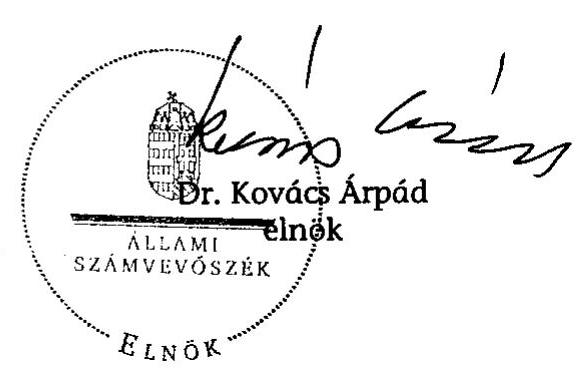

| Mellék-   let: | 14 db | 56 lap |
| :-- | --: | --: |
| Függelék: | 3 db | 14 lap |

---

# Mellékletek

---

# Mellékletek jegyzéke 

| 1. sz. melléklet | A jelentésre és a jelentéstervezetre tett észrevételek és az arra adott válaszok |
| :--: | :--: |
| 2. sz. melléklet | A vasúti közlekedés hatósági szervei |
| 3. sz. melléklet | A vasúttársaságok részére - működésre és fejlesztésre nyújtott költségvetési források |
| 4. sz. melléklet | Az Európai Beruházási Banktól vasútfejlesztésre felvett hitelek alakulása |
| 5. sz. melléklet | A MÁV Zrt. által a fejlesztéshez felhasznált források összetétele |
| 6. sz. melléklet | A MÁV Zrt. gazdálkodási eredménye a 2002-2007. években |
| 7. sz. melléklet | A vasúti közlekedés korszerűsítésének ellenőrzéséhez kiküldött kérdőívek feldolgozása |
| 8. sz. melléklet | A 2000/HU/16/P/PT/003 Zalalövő-Zalaegerszeg-Boba vasútvonal felújítása többletköltségeinek és késedelmének okai |
| 9. sz. melléklet | A vasúti infrastruktúra minőségi mutatói |
| 10. sz. melléklet | Zalalövő-Zalaegerszeg-Boba projekt eredeti és a harmadik módosítás szerinti összehasonlítása |
| 11. sz. melléklet | A vasúttársaságok gördülőállomány beruházásai |
| 12. sz. melléklet |  |

 | Pályahasználati díjjal kapcsolatos hatósági vizsgálatok |
| 13. sz. melléklet | Jogszabályi összefoglaló |
| 14. sz. melléklet | Tanúsítványok jegyzéke |

---

# A jelentésre és a jelentéstervezetre tett észrevételek és az arra adott válaszok 

1. PM észrevétel
2. KHEM észrevétel + válasz
3. MEH észrevétel
4. MÁV Zrt. észrevétel + válasz
5. GYSEV Zrt. észrevétel + válasz
6. MVH észrevétel + válasz
7. MÁV Cargo Zrt. észrevétel + válasz
8. NIF Zrt. észrevétel
9. NVT észrevétel
10. KKK észrevétel
11. KIKSz észrevétel
12. NFÜ észrevétel
13. NKH észrevétel

---

1. sz. melléklet
a V-11-121/2007-2008. sz. jelentéshez
$9313 / 2008$
$9^{77-447/08}$
H-1051 BUDAPEST V., JÓZSEF NÁDOR TÉR 2-4. POSTACIM: 1369 BUDAPEST, POSTAFIÓK 481.
TELEFON: (36-1) 327-2159, (36-1) 327-2141
E-MAIL: janos.veres@pm.gov.hu
FAX: (36-1) 318-0738
$U-H-H 9107-08$
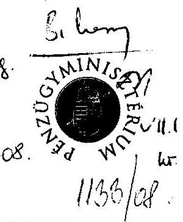

Iktatószám: 84106/2008.
Ügyintéző: Hetesi Katalin
Tel: 327-2712
Dr. Kovács Árpád úr
elnök
Állami Számvevőszék
Budapest
Tárgy: A vasúti közlekedés korszerűsítéséről szóló jelentés

Tisztelt Elnök Úr!

Fenti tárgyban készített jelentésüket köszönettel átvettem és megvizsgáltam. Annak kapcsán további észrevételünk nincs.

Budapest, 2008. július 3.

Üdvözlettel:
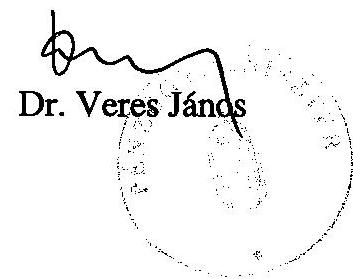

---

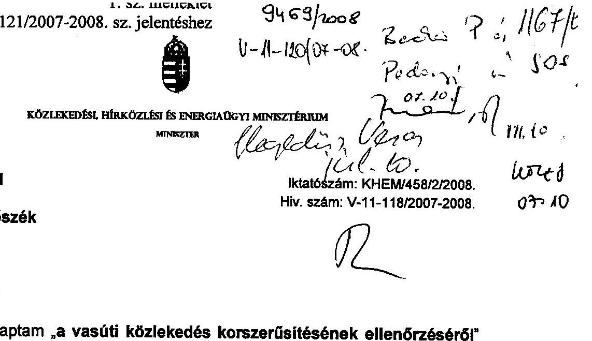

# Budapest 

## Tisztelt Elnök Úr!

Köszönettel megkaptam a vasúti közlekedés korszerűsítésének ellenőrzéséről készített jelentést. Közlekedési, hírközlési és energiaügyi miniszterként a jelentés véglegesítéséhez néhány jobbító szándékú kiegészítést, megjegyzést fogalmazok meg.

Megköszönöm, hogy a korábbi egyeztetések eredménye a jelentésben részben megjelenik, ugyanakkor meg kívánom jegyezni, hogy a többszöri észrevételezés során megküldött véleményünket egyes témákban figyelmen kívül hagyva nem vezették át, vagy azokat félreértelmezve jelenítették meg.

Álláspontom szerint a vasúti közlekedés jelenkori történetében pozitív irányú elmozdulást jelent a vasúti stratégiák – stratégia célkitűzések – megfogalmazása, azok léte. Az ÁSZ jelentésében nem tért ki az érvényességi időtartamokra, továbbá nem tekintette át a stratégiák egymáshoz való viszonyát, a stratégiaalkotás indokait.

A jelentés a közösségi jog átvételével hangsúlyosan foglalkozik, de ugyanakkor összehasonlító vizsgálat lefolytatása nélkül jeleníti meg Magyar Vasúti Hivatal véleményét. A jogalkotói álláspont továbbra is az, hogy a közösségi jog átvétele részben megtörtént.

Fel kívánom hívni a figyelmet egy hibás Magyar Vasúti Hivatali vélemény megjelenítésére a jelentésben, mely a 91/440/EGK irányelv vasútfejlesztési tevékenységére vonatkozó szabályozás téves értelmezését jelenti. A tanácsi irányelvben megfogalmazott definíció álláspontom szerint egyértelmű, hogy nemcsak az infrastruktúra működtető szervezet végezhet pályahálózat fejlesztést.

A vasúti fejlesztések területén egyre nagyobb teret nyerő EU támogatásokra tekintettel célszerűnek tartottuk volna a vasútfejlesztési döntések hatékonyságának és belső arányainak döntés-előkészítési folyamatait, dokumentumait, továbbá a jelentésben szereplő személycserék, valamint a döntések egymásra hatását feltárni.

Generálisan támogatom a jelentésben szereplő javaslatot, amely az állami irányítás szerepét kívánja növelni az állami tulajdonú leányvállalatoknál. Egyetértek azzal is, hogy a közszolgáltató vagy a gazdasági-társadalmi szempontból jelentős tevékenységet végző leányvállalatok közvetlenül az MNV Zrt. tulajdonába, illetve a szakminisztériumok vagyonkezelésébe kerüljenek. A MÁV CARGO privatizációjával összefüggésben az állami tulajdonlásnak nincs közlekedéspolitikai szempontból

---

létjogosultsága. A MÁV CARGO mint árufuvarozó szervezet nem lát el közfeladatot, így szakmapolitikai okokból sem indokolja a társaság tevékenysége a kizárólagos, tartós állami tulajdonban tartást. A társaság privatizációjából származó bevételt az anyavállalat a pályavasúti és a személyszállító tevékenység finanszírozására kívánja fordítani és ez által azonos nagyságrendű folyó évi költségvetési támogatást takarít meg a konvergencia program keretei között. Az ÁSZ javaslatát támogatva a MÁV Start Zrt. esetében javasolom a Társaság közvetlen állami tulajdonba vételét.

Általánosságban megjegyzem, hogy a többszöri egyeztetés ellenére az összefoglaló részben ugyan a szóhasználat finomodott, addig a részletes megállapítások lényegében változatlan tartalommal bírnak.

Tájékoztatom, hogy a GYSEV a MÁV CARGO privatizációja kapcsán még nem vállalt kötelezettséget, így ahhoz nem kellett a tulajdonosi hozzájárulást szereznie. A GYSEV pusztán egy szindikátusi megállapodást kötött a RAIL CARGO-val, amely a tranzakcióban való részvétel lehetőségét biztosítja. Ha a GYSEV a lehetőséggel élni kíván, akkor természetesen be kell szereznie a szükséges hozzájárulásokat a tulajdonostól. Minderre a tranzakció pénzügyi zárását követően fél éven keresztül lesz lehetősége a GYSEV Zrt.-nek.

A Kormánynak tett 8. számú javaslat álláspontom szerint idejétmúlt, mivel a javaslat előző jelentés-tervezethez kötődik. Jelenleg nem szerepelnek a jelentésben a CARGO létrehozással és értékesítéssel kapcsolatos hiányosságok.

A Kormánynak tett 7. számú javaslattal kapcsolatban tájékoztatom, hogy az FB szabálytalanságokra utaló jelzései többnyire általánosak voltak, amelynek ismeretében a felügyeletet gyakorló miniszterek – konkrét volumenre, elkövetőre és cselekményre vonatkozó információk nélkül is – a szükséges intézkedéseket a tőlük elvárható gondossággal kezdeményezték. A felelősségre vonás és a kártérítés alkalmazására irányuló szándékukat a tulajdonosi joggyakorlók többször kinyilvánították. A GKM minisztere 2008. februárjában a BRFK vezetőjéhez küldött válaszlevelében jelezte, hogy a nyomozás során tudomására jutó konkrét információk birtokában az okozott kár megtérítése iránti igényt be kívánja nyújtani a büntető ill. a polgári peres eljárás keretében.

A Kormánynak tett 10. számú javaslatot prejudikálásnak tartom, mivel a többi javaslat tartalmazza az esetleges szankció lehetőségét, így álláspontom szerint nem elfogadható – a vizsgálat lefolytatása nélkül – a felelősségre vonás külön pontban történő megjelenítése.

A levelemben jelzett kiegészítésekkel megköszönöm az Állami Számvevőszék munkáját. Az Önök részére megfogalmazott javaslat teljesítésére a KHEM szakmai főosztályaival intézkedési tervet dolgoztunk ki, amelyet a jogszabályi előírásoknak megfelelően megküldök az Állami Számvevőszék részére.
Budapest, 2008. július 4.
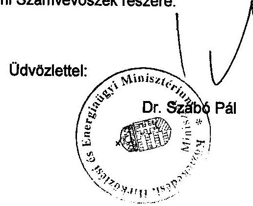

---

# Dr. Szabó Pál úr 

miniszter
Közlekedési, Hírközlési és Energiaügyi Minisztérium

## Budapest

## Tisztelt Miniszter Úr!

A vasúti közlekedés korszerűsítésének ellenőrzéséről készült jelentésünkre tett észrevételeit megköszönöm és azokkal kapcsolatban a következőkről tájékoztatom.

Észrevételeiket és a szakértői egyeztetések eredményeit döntően a jelentés szövegében, a fennmaradókat lábjegyzetekben jelenítettük meg.

A vasút korszerűsítéséhez kapcsolódó stratégiák megléte önmagában pozitív irányú elmozdulást jelentett, de a felgyorsult koncepcióváltások miatt nem voltak megvalósíthatóak, egymásnak ellentmondó célokat, megvalósítási utakat fogalmaztak meg, közös jellemzőjük volt, hogy forrásokkal nem voltak megfelelően alátámasztva.

A közösségi jog átvételével kapcsolatos összehasonlító vizsgálatot a szakhatóság elvégezte, amelynek eredményét lényegében a mi szakértőink is elfogadták.

Az EU támogatások kérdésével részletesen több ellenőrzésünk is foglalkozott, legutóbb az NFÜ működésének ellenőrzéséről készült jelentés. Mostani jelentésünkben is megállapítottuk, hogy a túlbonyolított szervezeti irányítás nem biztosítja a fejlesztési források átlátható és koncentrált felhasználását, a vasútfejlesztés finanszírozásának jelenlegi rendszere nem hatékony, a nagyszámú személycserét csak részben indokolhatja a koncepciók változása.

Örömömre szolgált, hogy a leányvállalatokkal kapcsolatban egyetért az állami irányítás és ellenőrzés szerepe erősítésének szükségességével, véleményünk szerint azonban a vasúti teherfuvarozási üzletág értékesítésénél az országgyűlési kontroll nem érvényesült.

---

Megítélésünk szerint a GYSEV Zrt., az adásvételi szerződés aláírásával kötelezettséget vállalt, amelynek pénzügyi rendezése még nem történt meg.

Észrevételezett javaslataink továbbra is szükségesek, mivel a végleges jelentésben is szerepelnek a CARGO létrehozásával és értékesítésével kapcsolatos hiányosságok (pl. apportálás, vagyonértékelés, felhatalmazás, a kormányhatározatnak megfelelő előterjesztés, stb.). A felelősségre vonás kérdését az ügyek súlyosságára tekintettel emeljük ki.

Budapest, 2008. július

Tisztelettel:

Dr. Kovács Árpád

---

# MINISZTERELNÖKI HIVATAL ÁLLAMTITKÁR 

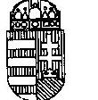

ÁLLAMI SZÁMVEVŐSZÉK
ÜGYVITELI IRODA
$7560 / 08$
Érkezett: 2008. MÁJUS 22.
Iktatószám: V-11-105/S/F-08
Melléklet: $\qquad$
Bihary Zsigmond úrnak, az Állami Számvevőszék főigazgatójának

## Budapest

Tisztelt Főigazgató Úr!
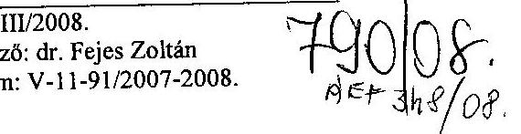

A vasúti közlekedés korszerűsítésének ellenőrzéséről szóló jelentés tervezetére, azon belül a Kormánynak szóló javaslatokra a következő észrevételeket teszem:

Szükségesnek tartom a Kormánynak címzett 2., 3., 4. és 5. javaslat áttekintését az indokoltság, a végrehajthatóság és az állami szervek közötti munkamegosztás szempontjából.

Az állami szervek közül a legszélesebb ellenőrzési hatáskörrel és jogosultságokkal az Állami Számvevőszék rendelkezik, ezért nem világos, hogy a 3. és 4. pont szerinti, a Kormány által elrendelendő további vizsgálatoktól milyen eredmény várható. A vizsgálatok lefolytatására a Kormányzati Ellenőrzési Hivatal felkérése jöhet szóba, csakhogy a KEHI-nek a kormányzati szférán kívül, így adott esetben a MÁV Zrt. szerződései tekintetében az Állami Számvevőszékénél jóval korlátozottabb a mozgástere. A 3. ponttal kapcsolatban megjegyzem még: ez a vizsgálat eleve feleslegesnek tűnik, hiszen a jelentés ugyanazon az oldalán tartalmazza annak „végeredményét”, azt az értékelést, hogy „a tulajdonosi felügyelet nem megfelelően működött”. Javasolom a 3. pont, a 4. pont első mondata, valamint ezekkel összefüggésben az 5. pont elhagyását.

A MÁV Cargo Zrt. létrehozásának és értékesítésének a jelentésben leírt hiányosságai véleményem szerint utólag már nem szüntethetők meg, illetőleg amennyiben igen, azt a 2. pontban konkrétabban kellene kifejteni. Javasolom a 2. pont elhagyását, illetőleg pontosabb kifejtését.

Budapest, 2008. május 13.
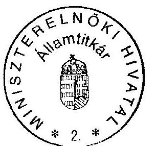

Üdvözlettel:
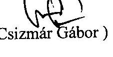
(Csizmár Gábor)

---

# ÁLLAMI SZÁMVEVŐSZÉK 

Bihary Zsigmond úr főigazgató

Tisztelt főigazgató Úr!
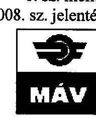

Ikt.szám: 784/T/2008
Hiv.szám: V-11/91820072008/4MVEVŐSZÉK
ÜGYVITELI IRODA
$6552 / 08$
Érkezett: 2008. MÁRCIUS 15.
Iktatószám: V-11-97/07-08
Melléklet:

A Vasúti közlekedés korszerűsítésének ellenőrzéséről készített, V-11-91/2007-2008. számon megküldött Jelentéstervezetet áttanulmányoztuk.
Köszönettel vettük, hogy a jelentésben az előzetesen megküldött észrevételeinket többségében átvezették és véleményeltérés esetén megállapításaik mellett jelezték eltérő véleményünket, észrevételünket. Egyes kérdésekben azonban szükségesnek tartjuk véleményünk összefoglaló megjelenítését, illetve részletesebb kifejtését az alábbiak szerint:

## A MÁV CARGO Zrt. privatizációjával kapcsolatos véleményünk:

A MÁV Cargo Zrt. értékesítésével kapcsolatban korábban tett észrevételek fenntartása mellett kiemelendőnek tartom a tranzakció mind törvényességi, mind célszerűségi szempontból megfelelő voltát:

A MÁV Cargo értékesítésével kapcsolatban a Kormány a 2130/2006. (VII.24.) Korm. határozatának 4. pontjában az alábbi feladatokat írta elő a gazdasági és közlekedési miniszternek:
„4. egyetért azzal, hogy a vasúti árufuvarozási tevékenység nem állami feladat, ezért szükségesnek tartja, hogy a MÁV Zrt. a MÁV Cargo Zrt.-ben lévő részesedését értékesítse. Felhívja a gazdasági és közlekedési minisztert, hogy a MÁV Zrt.-ben meglévő részesedése értékesítéséhez szükséges intézkedéseket tegye meg."

A fenti kormányhatározat alapján az alapítói jogokat gyakorló gazdasági és közlekedési miniszter a 38/2006. (10.31.) számú határozatával hozzájárult a Társaság és a MÁV Vagyonkezelő Zrt. tulajdonában lévő MÁV Cargo Zrt. részvényei értékesítésének megkezdéséhez azzal, hogy

- a tanácsadó kiválasztására irányuló közbeszerzési eljáráshoz,
- a privatizáció koncepciójának elfogadásához,
- a privatizációs pályázati kiíráshoz,
- az értékesítésről szóló szerződés megkötéséhez külön alapítói jóváhagyás szükséges.

Álláspontunk szerint a társaság értékesítésére a vonatkozó jogszabályi rendelkezések, továbbá a MÁV Zrt. Alapító Okiratában foglaltak betartása mellett került sor.

Amint ismert, az árufuvarozási tevékenység önálló cégbe szervezésére, a MÁV Cargo Zrt. megalapítására a piaci versenyben történő megmérettetésre (vasúti liberalizációra) való felkészülés jegyében került sor. (Felkészülés az árufuvarozási piac 2007. január 1-jei teljes megnyitására.) Világosan látni kell ugyanakkor, hogy a tevékenység önálló árufuvarozó cégbe szervezése szükséges, de nem elégséges lépés ahhoz, hogy Magyarország vasúti árufuvarozói piacán betöltött vezető szerepét megerősítse, üzleti aktivitását fokozni tudja.
Az értékesítésre vonatkozó döntésnél szempont volt, hogy az árufuvarozás nem tartozik az állami közfeladatok körébe, így a MÁV Cargo Zrt. privatizációjára vonatkozó döntés célszerűségét az alábbiak is alátámasztják:

---

- az EU vasúti szabályrendszerének legfontosabb eleme az infrastruktúra-kezelőjének a vállalkozó vasúttól történő szétválasztása, főszabályként a tevékenységek külön társaságban történő folytatása, amely szétválasztás egyben a keresztfinanszírozás kizárását is biztosítja. (14/2001/EK irányelv)
- ahhoz, hogy az önálló árufuvarozó társaság versenyképes, értéknövelt szolgáltatásokat tudjon nyújtani, jelentős fejlesztésekre van szüksége /pl. elavult eszközpark megújítása stb./.
- a feltétlenül szükséges fejlesztések forrásigénye az új tulajdonos belépésével /erre vonatkozó kötelezettségvállalásával/ biztosítható;
- a MÁV Zrt. a tranzakció révén egyszeri, jelentős bevételre tesz szert, amely az alulfinanszírozottságával összefüggő problémákat oldja, forrást teremt az alaptevékenységével összefüggő fejlesztések megvalósításához. Ennek jelentőségére közvetve az ÁSZ is rámutat.
A vonatkozó EU szabályokkal

 összhangban - a MÁV Zrt. kizárólag a MÁV Cargo Zrt. értékesítése révén juthat felhasználható többletforráshoz az által, hogy
- „A nyereséges árufuvarozási tevékenység kiválásával és értékesítésével a személyszállítás keresztfinanszírozásának lehetősége megszűnt.” (Jelentés 42. oldal utolsó. bek.)
- A társaság értékesítésére kiírt nyilvános, többfordulós pályázat nyertese, a Rail Cargo Austria AG. és a GySEV Zrt. konzorciuma által tett 102,5 Mrd. Ft. összegű vételi ajánlat a pályázatot megelőző cégérték-becslés mintegy kétszerese (Jelentés 29. oldal 3. bek.).

Jelezzük, a Jelentés 17. oldalán tévesen szerepel, hogy „A privatizációs eljárásban nyertes pályázóval a GKM minisztere 2008. január 2-án írta alá a szerződést. A vagyonkezelési szerződés nem jogosította fel az aláírót a részvény adásvételi szerződés megkötésére, mivel értékesítési joggal a vagyonkezelő nem ruházható fel.”, míg a 49. oldalon - helyesen - az áll, hogy „Az Alapítói jogokat gyakorló GKM Miniszter 2007. december 28-án kelt 41/2007. sz. határozatával hagyta jóvá a nyertes pályázóval történő szerződéskötést.”

A Jelentésben foglalt megállapításokkal kapcsolatos, az alábbiakban részletesen is kifejtett álláspontunk alapján kérjük a Kormány számára megfogalmazott javaslatok 2. pontjának felülvizsgálatát. /2. pont: „szüntesse meg a MÁV Cargo Zrt. létrehozásának és értékesítésének az ellenőrzés által feltárt hiányosságait és intézkedjen azok megszüntetése iránt" /

# A MÁV TISZAVAS APPORTJA 

A jelentés arra hivatkozik, hogy a Pályázati Kiírásból nem derül ki, hogy a MÁV Cargo-ban végrehajtott ezer forintos alaptőke-emelés mögött a MÁV-Tiszavas Kft. apportja áll. A lehetséges vevőknek küldött információs memorandum jelezte a MÁV-Tiszavas Kft. apportálásának szándékát. A befektetők figyelmét a tranzakciós pénzügyi tanácsadó külön felhívta az apportálás előzetes tervére, majd annak megtörténtére, amelynek teljes dokumentációja megtalálható volt a MÁV Cargo-ról készített adatszobában. A MÁV-Tiszavas Kft. apportjának értéknövelő hatását a befektetők az árazásban érvényesíthették, így a MÁV Tiszavas Kft. teljes piaci értékét a privatizációs vevő a MÁV Cargo vételárában fizette meg.
A tranzakcióhoz kapcsolódóan - a jelentés 53. oldal utolsó bekezdésében leírtakkal kapcsolatban fontos megállapítani, hogy a jelzett 2000 db járműből 1494 db nem lett leselejtezve, ezeket mint használt eszközöket értékesítette a MÁV Rt. A fennmaradó 506 db járműre vonatkozó minden bizonylat rendelkezésre áll a MÁV Zrt. BKSZE szervezeténél.
Az ügylettel kapcsolatban több vizsgálat folyt, de 2006. december 21-én az FB kijelölt bizottsága által elindított szerződés lezárási folyamat időpontjában a 2006. év előtti vizsgálatok lezárultak, a felelősségre vonások megtörténtek.
Az új vizsgálat, amely még jelenleg is tart, 2007. augusztus 1-én beérkezett Budapesti Rendőr-Főkapitányság Gazdaságvédelmi Főosztályának levelével indult. A 2006. december 21-én indult

---

folyamatot lezáró jegyzőkönyv Gy:796-172/2007 számon 2007. augusztus 23-án került aláírásra, amihez kapcsolódó műszaki teljesítés már korábban megtörtént.
Nem folyt rendőrségi vizsgálat a MÁV Tiszavas Kft. ellen az apportálási döntés idejében. A 2007. augusztus hónapban indult és folyamatban lévő vizsgálat sem a Kft. ellen indult, így az apport során nem kellett figyelembe venni.
A Pályavasút Üzletág állagában és nyilvántartásában szereplő 670 db tehervagon műszaki állapota nem indokolta az értékesítési tranzakcióba történő bevonását. A vásárlás jogszerűségét igazoló dokumentumok rendelkezésre állnak a MÁV BKSZE szervezeténél.

# A RÉSZVÉNY ADÁSVÉTELI SZERZŐDÉS RENDELKEZÉSEI 

A részvény adásvételi szerződés rendelkezései a vevővel folytatott tárgyalások eredményeképpen születtek meg. A MÁV-ot terhelő kötelezettségek, illetve a vevőt terhelő kötelezettségek korlátai a piacon szokásos mértéket nem haladják meg, és az üzleti életben szokásosnak mondhatóak. A kötelezettségvállalások gazdasági ellentételezése a MÁV Cargo-ért fizetett vételárban jelenik meg.

## A felvetett, jogilag aggályos kérdésekre vonatkozó részletes véleményünk az alábbiak:

## A szerződéskötéshez vezető eljárás

A jelenléstervezet általánosságban kifogásolja, hogy az ajánlattevők számára kiküldött szerződéstervezet a MÁV számára kedvezőbb volt az aláírt részvény adásvételi szerződésnél. A pályázat során a MÁV által javasolt szerződéstervezetre a vevők megjegyzéseket füztek. A vevők ajánlati kötöttsége az ilyen módon átírt szerződés aláírására vonatkozott, amely a vevők javára számos ponton eltért a MÁV ajánlatától. A tárgyalások során a felek kölcsönösen engedtek a követeléseiből, és a felek a kitárgyalt szerződést írták alá.

## A szerződés 7.1. pontja

A részvény adásvételi szerződés 7.1. pontja a MÁV és a MÁV Cargo közötti kapcsolat alapjairól szól. Mivel a két társaság számos ponton kötődik egymáshoz, a MÁV alapvető érdeke a két társaság közötti kapcsolat rendezése. A legnagyobb kedvezmény elve deklaratív rendelkezés, amely a felek üzletileg kölcsönösen előnyös jövőbeli együttműködésének az elvi alapját teremti meg.

## A kötelezettségek fennmaradása

A jelentéstervezet arra utal, hogy abban az esetben, ha a vevő a részvényeket továbbértékesíti, de elmulasztja a továbbértékesítés során vevőként eljáró féllel kötött szerződésben kikötni a beruházási és a munkavállalókat érintő kötelezettségek fennmaradását, akkor a kötbér megfizetésével mentesül a beruházási és a munkavállalókat érintő kötelezettségek teljesítése alól. A részvény adásvételi szerződés nem ad lehetőséget a vevőnek arra, hogy a beruházási és a munkavállalókat érintő kötelezettségek teljesítése alól mentesüljön a részvények átruházásával. Amennyiben a vevők a MÁV Cargo-t továbbértékesítik, a MÁV-val kötött részvény adásvételi szerződésben foglalt kötelezettségek az RCA-val és a GySEV-vel szemben továbbra is kikényszeríthetőek maradnak.

## A kötelezettségek ellenőrzése

A MÁV által bekérhető dokumentumok köre a 8.5(a) alszakasz alapján korlátlan. A MÁV által kérhető dokumentumok tételes megjelölése ellentétes volna a MÁV érdekeivel, mert az ellenőrzés kikerülését eredményezhetné. Az adatszolgáltatás meghiúsítása kötbérrel szankcionált.

---

A MÁV a saját jogán és nem csak a GKM-en keresztül kérhet adatszolgáltatást a vevőtől. A GKM által delegált felügyelőbizottsági tagnak a 8.5(c) szakaszban adott meghatalmazás nem azt jelenti, hogy a MÁV az ellenőrzési jogait csak a meghatalmazott személy útján érvényesíthetné. A MÁV az általános ellenőrzési jogait nem ruházta át.

A GKM által delegált személy és csak ő (más MÁV képviselő nem) választható a MÁV Cargo-ba felügyelőbizottsági tagnak a 8.5(b) szakasz alapján. E megállapodás indoka az, hogy a MÁV Cargo üzleti titkaihoz annak felügyelő bizottsági tagjaként a MÁV mint a MÁV Cargo legfontosabb kereskedelmi partnere közvetlenül ne férhessen hozzá. Ez összeférhetetlenséget okozna a kereskedelmi partnerek több ponton ellentétes érdekei miatt (pl. amikor az FB a MÁV-val kötendő új szerződések feltételeit tárgyalja meg).

Az adatszolgáltatás késedelmes teljesítésére vonatkozó napi 250.000 Ft kötbér fizetése nem fogja a vevőt felmenteni a további, számszerűsíthető szerződésszegéseinek a következményei (egyéb kötbérek, kártérítés) alól.

# A kötbér 

A jelentéstervezet megállapítja, hogy a "kötbért köteles fizetni" fordulat "kötbérfizetést követelhet" fordulatra történő módosítása ellentétes a MÁV érdekeivel. A két rendelkezés jogilag ekvivalens, mivel a MÁV oldalán fennálló jogosultság és a vevők részéről fennálló kötelezettség ugyanazt jelentik.

## A munkavállalókkal kapcsolatos kötelezettségvállalások

A munkavállalókkal kapcsolatos kötelezettségvállalások a vevő által adott ajánlat alapján kerültek megszövegezésre. E kötelezettségvállalások értékelése a pályázat első fordulójában a pontszámok között nagyobb súllyal szerepelt, és a második fordulóban nem volt lehetőség az első fordulóban benyújtott vállalásokat csökkenteni. A pályázati eljárás nem teszi lehetővé olyan kötelezettségek megfogalmazását, amelyet a pályázó nem vállalt. A nyertes pályázók nem vállaltak foglalkoztatási kötelezettséget a MÁV Cargo Csoport többi tagja tekintetében az első fordulóban sem. A munkavállalói érdekképviseleti szervek túlnyomó többségben maximális pontot adtak a vevői konzorcium ajánlatára, amelyben kimagaslóan kedvező munkavállalói vállalásokat tettek a többi ajánlattevőhöz képest.

## A vételár visszatérítés

A MÁV Cargo költségeinek közel harmadát az infrastruktúra-hozzáférési díj teszi ki. Az infrastruktúra-hozzáférési díj csekély emelése is veszélyezteti a MÁV Cargo eredményét. A lehetséges befektetők a vezetőségi interjúkon az egyik legnagyobb problémának az infrastruktúra-hozzáférési díj jogszabályi környezetének kidolgozatlanságát és az előre tervezhetőség hiányát jelölték meg.

A Gazdasági és Közlekedési Minisztérium álláspontja szerint az infrastruktúra-hozzáférési díj növekedése 2010. december 31-ig nem várható. Ugyanakkor a vevő megfelelő jogszabályi környezet hiányában nem bízhatott a Gazdasági és Közlekedési Minisztérium szándékában, ezért a vételár maximalizálása érdekében a MÁV-nak jogi garanciát kellett adnia arra, hogy az infrastruktúrahozzáférési díj mértéke nem fog emelkedni.

A "PHD megtérítés" mint eredeti cím a 10. szakasz gazdasági funkcióját fejezte ki. Az esetleges fizetés jogcíme viszont vételár visszafizetés lesz, ezért jogilag pontosabb a végleges cím.

---

A MÁV köteles biztosítani, hogy a „Vételár Visszatérítés nem fejthet ki a magyarországi vasúti árufuvarozás piacán olyan hatást, amely a verseny megakadályozására, korlátozására, vagy torzítására alkalmas”. Ezzel azonban a MÁV nem vállalta magára a versenyjog megsértése esetén kiszabható hátrányos következményeket. Éppen azt vállalta, hogy a vasúti árufuvarozók számára olyan feltételeket fog alkalmazni, amely a versenysemlegességet biztosítja, tehát, hogy nem történhet versenyjogi jogsértés.

A pályahasználati díj mértékének és megállapításának meghatározása valóban állami feladat. Az aláírt szerződés 10.2. pontjában a MÁV által vállalt helytállási kötelezettség, ami „a pályavasút költségeinek racionalizálására, a működés hatékonyságának a növelésére és más megfelelő intézkedésekre” vonatkozik, a MÁV-tól, működésének hatékonyságától is függ.

Abban a szerződő felek egyetértettek, hogy a PHD emelkedésének komoly kereskedelmi kockázatát nem lehet a vevőre telepíteni, mert az ő hatáskörébe egyáltalán nem tartozik a PHD szintjének megállapítása. Méltányosabb és a privatizáció sikere szempontjából elkerülhetetlen volt, hogy a GKM által is jóváhagyott módon az eladó vállalta ezt a kockázatot (a szerződésben előírt korlátok között).

# Versenytilalmi megállapodás 

A 11. szakaszban foglalt szerződéses feltételek megfelelnek a piaci szokásoknak és a jogos vevői elvárásoknak: azaz, hogy az eladó és az általa ellenőrzött vállalkozások nem versenyeznek az eladott vállalkozással a meghatározott időtartam alatt. A szerződő felek méltányos érdekeit veszik figyelembe a kiegyensúlyozott rendelkezések. Pl. a 11.3 szakasz kifejezetten lehetővé teszi a MÁV és a ZáLoRaSz számára a záhonyi határforgalmi szolgáltatások végzését. Ennek a kérdésnek van üzleti jelentősége, mert ilyen szolgáltatások nyújtását a MÁV valóban tervezi. Ezzel szemben a MÁV lemondott az üzletszerű vasúti árufuvarozási és áruszállítmányozási tevékenység két éven át tartó végzéséről, mivel ilyen szolgáltatás nyújtását a két éves időtávon amúgy sem tervezi.

## Rendkívüli helyzetekre vonatkozó megállapodás

A jelentés megállapítja, hogy "a szerződés 7.2. pontja rendelkezik a MÁV és a MÁV Cargo közötti Együttműködési megállapodás egyes rendelkezéseinek a megszűnéséről. A MÁV Cargo rendkívüli helyzetekben (árvíz, katasztrófa helyzet, stb.) elvégzendő feladatai a szerződés értelmében hatályban maradnak, de „a feleknek gondoskodni kell arról, hogy 2009. január 1-jétől bármelyik fél részéről három hónapos felmondási idővel felmondásra kerülhessen”. A szerződés ebben a formában nem teszi lehetővé a vasúti teherszállításban meghatározó társaság eszközeinek az igénybevételét rendkívüli helyzet estén.”

A fent hivatkozott rendelkezések kellően hosszú időt biztosítanak arra, hogy a felek a jogszabályi előírások keretei között megállapodjanak a rendkívüli helyzetek kezeléséről, amennyiben valamelyik fél módosítani kívánna a jelenlegi szerződéses szabályozáson. Irreális elvárás lenne a határozatlan idejű, fel nem mondható szerződéses kötelezettség előírása bármelyik fél terhére.

## Felügyelő Bizottsági véleményezés

A MÁV Igazgatósága 2007. december 18-án hagyta jóvá a Részvény Adásvételi Szerződés tervezetére vonatkozó előterjesztés benyújtását az Alapítóhoz.
A MÁV Zrt. hatályos Alapító Okiratának 10.4. pontja szerint a Felügyelő Bizottság köteles
 megvizsgálni az Alapító elé terjesztendő valamennyi lényeges üzletpolitikai jelentést, valamint minden olyan előterjesztést, amely az Alapító kizárólagos hatáskörébe tartozó ügyre vonatkozik.

---

A MÁV Zrt. Felügyelő Bizottsága az Alapítóhoz benyújtásra kerülő előterjesztést 2007. december 19-i ülésén megtárgyalta. A szerződés-tervezetekkel kapcsolatosan tett két kisebb észrevételt a tervezeteken átvezettük. Az Alapító a Felügyelő Bizottság határozatának ismeretében hagyta jóvá a véglegesített szerződés megkötését.
A MÁV Zrt. Alapító Okiratában foglalt előírások érvényesítése tehát maradéktalanul megtörtént.

# VAGYONÉRTÉKELÉS 

A jelentés a MÁV Tiszavas Kft. apportálásához készített vagyonértékelés és a MÁV Cargo Zrt. vagyonértékelése esetén is kifogásolja, hogy azok nem tételes leltárellenőrzésen alapultak. Jelezzük, hogy mindkét értékelés esetében az ágazat jellegére figyelemmel a vagyonértékelő az üzleti és nem az eszköz alapú értéket tekintette meghatározónak.

A MÁV Cargo Zrt. üzleti értékét 55-60 Mrd forintban, a társaság valós piaci értékét 50-60 Mrd forint között határozták meg. Ezt a nyertes pályázó 102,5 Mrd forintos árajánlata olyan nagyságrenddel haladja meg, amely az eszközértékelés esetleges pontatlansága mellett sem kérdőjelezheti meg az eljárás üzletileg rendkívül előnyös voltát.

A jelentés egyes további fejezeteihez kapcsolódó észrevételeinket az alábbiak szerint tesszük meg:
19. oldal utolsó bek.: „...Az eszközök könyv szerinti értéke jelentősen eltér a valós piaci értéktől. A pontos vagyoni helyzet ismerete nélkül az állam tőkepótló intézkedései nem valós információkon alapulnak. A MÁV Zrt. vagyonértékesítéseket, üzletrész-apportálásokat végez nyilvántartási értéken anélkül, hogy a vagyon aktuális értékét megjelenítené. Így pl. a MÁV Cargo Zrt. apportlistájában szereplő vasúti teherkocsik 1 Ft apportértéke sem a nyilvántartási árral, sem a valós piaci értékükkel nem hozható összefüggésbe."

## Észrevétel:

A Jelentés 28. oldal 3. bek.-ben és a 44. oldal utolsó bek.-ben szereplő megállapításokra is figyelemmel a szövegrész pontosítása javasolt. Az állam tőkepótló intézkedéseivel összefüggésben a jelentés 28. oldalán egyrészt megállapítják, hogy „A működési problémák és alulfinanszírozottságának együttes hatásaként a MÁV Zrt. ...tőkehiányossá vált, illetve hitelképtelen és fizetésképtelen közeli állapotba került. A helyzet feloldására készült a helyközi tömegközlekedési rendszer átalakításával és a MÁV Zrt. tőkemegfelelése biztosításával összefüggő egyes feladatokról szóló 2130/2006. (VII.24.) Korm. határozat." A jelentés 44. oldalán továbbá rögzítik, hogy „A tárgyi eszközök piaci viszonyoknak megfelelő értéken történő szerepeltetése a mérlegben a Társaság tőkehelyzetének a rendezését is elősegítené, bár az átértékelés a veszteséges gazdálkodás miatt előállt finanszirozási hiányra nem ad megoldást."
Tény, hogy a Számvitelről szóló tv. lehetőséget ad az átértékelésre, a MÁV esetében azonban a piaci érték minden vagyonelemre kiterjedő meghatározása olyan jelentős költségvonzattal járó feladat, amelynek célszerűsége/indokoltsága - különös tekintettel az adott forráshiányos helyzetre - nem állítható. Szükségesnek tartjuk leszögezni, hogy a MÁV Zrt. a vagyon- és üzletrész-értékesítések esetén a jogszabályi előírásoknak megfelelően jár el és az egyes vagyonelemek értékesítése során szükség szerint (pl. ingatlanok esetében) - előzetes értékbecslést is készíttet.
A MÁV Cargo Zrt. apportlistájában szereplő vasúti teherkocsik 1 Ft apportértékére vonatkozó megállapításra a jelentés előzetes véleményezése során a következő észrevételt tettük, amelyet fenntartunk: Nem értékesítésre került sor vagyonértékelés nélkül, hanem apportra, amire a jogszabály a gazdasági társaságokról szóló 1997. évi CXLIV. tv. lehetőséget ad. Tekintettel arra, hogy könyvszerinti értéken történt az apportálás, azon eszközöknél alkalmaztuk az 1 Ft értéket, ahol a

---

könyvszerinti érték 0 volt, figyelembe véve azt a cégbírói gyakorlatot, hogy az apportérték nem lehet 0. Erre a könyvvizsgáló javaslatára, vele egyeztetett módon került sor, általános gyakorlat könyvszerinti apport esetén.

# 31. oldal 4. bekezdés: 

„Az ország mellékvonal-hálózata az európai átlaghoz viszonyítva sűrűnek mondható. Kihasználtsága az elavultság és elhanyagoltság miatt nagyon alacsony, a költségeit sem tudja kigazdálkodni." ..."A rendszerváltozás óta eltelt időszakban az ország vagyonának és kincsének tekinthető vasúti infrastruktúra, illetve az ehhez tartozó eszközpark felújítása nem történt meg teljes körűen."

Véleményünk: A mellékvonalak kihasználtságát az érintett térségek, települések - a szóban forgó vonalak létesítése óta - megváltozott gazdasági szerepe, a kereslet ezzel összefüggő drasztikus csökkenése alapvetően determinálja. Ezzel is összefügg, hogy a mellékvonalak megszüntetésének kérdése évtizedek óta napirenden van (tanulmányok sora készült). A téma szorosan összefügg az ország teherbíró képességével, valamint a helyközi tömegközlekedés rendszerének reformjával, a szóba jöhető alternatív megoldásokkal. Amint a jelentés maga is több helyen rámutat, a szükséges pénzügyi források hiányában még a kiemelt vonalak esetében sem volt mód az infrastruktúra és az eszközpark teljes körű megújítására.

## 63. oldal 2. bekezdés:

„Nem tisztázott, hogy mi a szerepe a holdingnak. A tevékenységek kiszervezése után az anyavállalatnál csak az adósság marad."

Jelezzük, hogy időközben a MÁV Zrt Igazgatósága elfogadta a MÁV Csoport stratégiáját, amelynek részét képezi a Csoport jövőbeni működésével kapcsolatos kérdéskör.
Kivonat a 47/2008.(04.22.) számú IG határozatból:
A MÁV Zrt. Igazgatósága megtárgyalta „A MÁV csoportszintű középtávú stratégiája" tárgyú előterjesztést, és az alábbi határozatot hozta:
A MÁV Zrt. Igazgatósága a MÁV Csoport stratégiai céljait az alábbiak szerint határozza meg:
A MÁV Csoport szerkezete kapcsán

- a MÁV Zrt.-ből váljon ki a Pályavasút;
- önállósodjanak a központi szolgáltatások;
- az így kialakuló holdingközpont pedig a teljes - azaz mind a személyszállítást, mind pedig a pályavasutat magában foglaló - MÁV Csoportot irányítsa.
Kialakítandó és a napi gyakorlatba átültetendő továbbá az új típusú csoportszintű működés modellje.

## Az előzőekben kifejtetteken túl szükségesnek tartom a következőket jelezni:

A 2006. őszét követő vezetőváltás időszakát a fordulat éveként jellemzi az ÁSZ jelentés is. A „fordulat" a kormányzati és a menedzsment intézkedések együttes hatásaként jelentkezik. A jelentésben célszerű lenne - legalább felsorolás szintjén - utalni a következőkre:

- a MÁV cégcsoport kialakítása befejezés közeli helyzetben van, a Pályavasúti Üzletág MÁV Zrt.-ből való kiválásával a folyamat rövid időn belül lezárul;
- a MÁV cégcsoport piaci pozícióit stabilizálta;
- mérleg szerinti eredménye a rendszerváltás óta először pozitív előjelű (szanálás nélkül számítva);
- az évek, sőt évtizedek mulasztásainak felszámolása (reális vagyonértékelés és amortizációs politika kialakítása) kezdődött meg;
- a cégcsoport likviditási helyzete éves szinten stabilizálódott;
- a MÁV Zrt. hitelképessége (minősítése: befektetői) javult;
- tőke-megfelelési mutatója javult, megfelel a törvényi előírásoknak;
- a működési hatékonyság javítása céljából 3 éves programot indított;
- a szolgáltatások színvonalának érzékelhető javítása érdekében számos lépés történt, ill. indul;

---

- a MÁV vezetése egységessé vált, stabilizálódott;
- A MÁV mérlegbeszámolóját (évek óta először) korlátozó záradék nélkül fogadta el a könyvvizsgáló. (A korábbi években nem látta biztosítottnak az üzletágakhoz tartozó eszközök könyv szerinti értékének megtérülését, a múltbeli folyamatos és a jövőbeni tervszerinti veszteséges gazdálkodás miatt.)
- a MÁV cégcsoport középtávú üzleti tervvel rendelkezik, középtávú stratégiát dolgozott ki.

Kérem, hogy véleményünket a Jelentés véglegesítése során figyelembe venni szíveskedjenek. Tekintettel a MÁV Cargo Zrt. privatizációja tárgyában képviselt eltérő álláspontra, javaslom a témakör - a témában érintett valamennyi közreműködő részvételével történő - további egyeztetését.

Budapest, 2008. május 13.
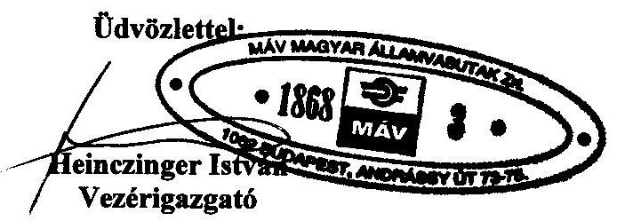

---

# 1. sz. melléklet   a V-11-121/2007-2008. sz. jelentéshez 

FŐIGAZGATÓ

ÁLLAMI
SZÁMVEVŐSZÉK

V-11-114/2007-2008

## Heinezinger István úr

vezérigazgató
MÁV Zrt.

## Budapest

## Tisztelt Vezérigazgató Úr!

A vasúti közlekedés korszerűsítésének ellenőrzéséről készített jelentéstervezetünkre tett észrevételeit megköszönöm, azokkal kapcsolatban a következőkről tájékoztatom.

A MÁV Cargo Zrt. privatizációja tekintetében az állami tulajdonú társaságok leányvállalatainak értékesítésére vonatkozó eltérő jogértelmezéseket a jelentésben külön mellékletben is megjelenítettük, amellett, hogy a tartós állami tulajdonnak minősített társaságok esetében azoknak az anyavállalattal azonos elbírálását - figyelemmel a helyszíni ellenőrzés megállapításaira - a továbbiakban is hangsúlyozottan fenntartjuk.

Budapest, 2008. június 6
Tisztelettel:
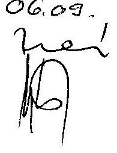

Bihary Zsigmond

---

# GYSEV Győr-Sopron-Ebenfurti Vasút Zrt. 

Cím: H-9400 Sopron, Mátyás király u. 19. Levelezési cím: H-9401 Sopron, Pf. 104

## 11455/2008

Állami Számvevőszék
1052. Apáczai Csere János u. 10.

Dr. Podonyi László
Osztályvezető igazgató-helyettes

Tisztelt Podonyi László úr!
Tisztelettel köszönjük Társaságunkhoz eljuttatott „JELENTÉS a vasúti közlekedés korszerűsítésének ellenőrzéséről" jelentéstervezet módosított változatát, melyben foglaltakkal - mint, ahogy azt 2008.04.21-én kelt levelünkben jeleztük - alapvetően egyetértünk. A jelentéstervezettel kapcsolatos észrevételeinket, módosítási javaslatainkat korábbi levelünkben foglaltakat megerősítve, ill. kiegészítve a következő pontokban felsorolva tesszük meg:

## 1. Jelentéstervezet „ÖSSZEGZŐ MEGÁLLAPÍTÁSOK, KÖVETKEZTETÉSEK, JAVASLATOK"

A Kormány részére megfogalmazott 1.- 8. pontokat - megítélésünk szerint - célszerű lenne úgy pontosítani, hogy egyértelmű legyen, hogy a javaslatok közül melyik vonatkozik csak a MÁV Csoportra, melyik a GYSEV Zrt.-re, ill. mely pontok érintik mindkét vasúttársaságot.

## 2. Vasúti Pályakapacitás Elosztó Kft.

A Vasúti Pályakapacitás Elosztó (VPE) Kft. működése, ill. a Vasúti törvény és végrehajtásainak nem teljes harmóniája tárgyszerű felvetés, mégis megjegyezni kívánjuk, hogy a VPE működése az új menedzsment irányításával lényegesen jobban közelíti és a jelenleg folyó munkák ütemét figyelve várhatóan már ebben az évben eléri az EU által is megfogalmazott függetlenségi kritériumok szintjét.

## 3. MÁV Cargo privatizáció

- A 2002-2007 időszakot átfogó jelentéstervezet értelemszerűen kitér a MÁV Cargo privatizációjára. Ahogy az Önöknek megküldött anyagban leírtuk és dokumentumokkal alátámasztottuk a győztes konzorciumban a GYSEV Zrt. lehetőséget kapott és nem kötelezettséget vállalt. Lehetőségünk, hogy a privatizációs eljárásból a GYSEV-et kivonjuk (0%-os opció lehívása), vagy akár 25% plusz 1 szavazatot érő részvénypakettet szerezzünk, mellyel - a szindikátusi szerződésünk szerint - a tulajdoni hányadot meghaladó stratégiai befolyást szerezhetünk a MÁV Cargo irányításában.

---

Az opció lehívásának fedezeteként az Önök által leírtakon (hitel, kölcsön, tőkeemelés) túlmenően lehetőségünk van - ugyancsak a szindikátusi szerződés szerint - a GYSEV Zrt. tulajdonában lévő üzletrésszel fizetni. Hangsúlyozzuk, hogy a szindikátusi szerződésben szereplő saját részvény megfogalmazás nem a GYSEV Zrt. részvényei, hanem a GYSEV Zrt. tulajdonában levő befektetéseinek üzletrészét jelenti.

Továbbá meg kívánjuk jegyezni, hogy a GYSEV Zrt. részvételét a privatizációban nem tartjuk ellentmondásosnak és célszerűtlennek, mivel amennyiben a privatizáció társaságunk részvétele nélkül jön létre, akkor árufuvarozási tevékenységünk a jelenlegi formában gyakorlatilag ellehetetlenül és elértéktelenedik. Ezáltal a Magyar Államot, mint tulajdonost jelentős tőkeveszteség éri, valamint a jövőben a GYSEV számára juttatott költségtérítés összege jelentősen emelkedik.

- A privatizációs tárgykörben felvetett gondolatokhoz többlet információként jelezzük, hogy Magyarországon a Tiszavas Kft.-n túlmenően a többségében magántulajdonban levő szombathelyi illetőségű Vasjármű Kft. a Tiszavas Kft. kapacitását meghaladó járműjavító és fővizsgáztató képességgel rendelkezik.

# 4. Jelentéstervezet „3.3.3 A vagyongazdálkodási politika befolyása pont" 

Vélhetően elírás következtében a GYSEV Zrt. tulajdonában, ill. vagyonkezelésében szereplő kilométer tévesen szerepel. Társaságunk Magyarországon 91 kilométer saját tulajdonú, ill. 133 kilométer vagyonkezelési joggal rendelkező, összesen 224 kilométer vasúthálózattal rendelkezik.

## 5. GYSEV Zrt. Felügyelő Bizottsága (FB)

Nem tartalmi észrevétel, de reményeink szerint a GYSEV Zrt.-n belül működő belső ellenőrzési rendszer, ill. az ügydöntő jogkörrel bíró, de törvényességi felügyeletet is gyakorló FB munkáját is volt módjuk megismerni és reméljük, hogy a jelentésben azért nem került említésre, mert a működést alapvetően rendezettnek találták.

Ismételten köszönjük, hogy megtiszteltek a módosított jelentés előzetes áttanulmányozásának lehetőségével.

Tisztelettel

Sopron, 2008. május 14.

Ács Sándor
Vezérigazgató-helyettes

---

# Ács Sándor úr   vezérigazgató-helyettes 

Győr-Sopron-Ebenfurti Vasút Zrt.

Budapest

## Tisztelt Vezérigazgató-helyettes Úr!

A vasúti közlekedés korszerűsítésének ellenőrzéséről készített jelentéstervezetünkre tett észrevételeit megköszönöm,
 azokkal kapcsolatban - levele sorrendjében - a következőkről tájékoztatom.

A MÁV Cargo Zrt. privatizációja tekintetében az állami tulajdonú társaságok leányvállalatainak értékesítésére vonatkozó eltérő jogértelmezéseket a jelentésben külön mellékletben is megjelenítettük, amellett, hogy a tartós állami tulajdonnak minősített társaságok esetében azoknak az anyavállalattal azonos elbírálását - figyelemmel a helyszíni ellenőrzés megállapításaira - a továbbiakban is hangsúlyozottan fenntartjuk.

A GySEV Zrt. aláírta a privatizációs szerződést és ezáltal kötelezettséget vállalt, amelynek ellenértékét a Szindikátusi szerződésben feltüntetett fizetési konstrukciók valamelyik alkalmazásával tudja teljesíteni. A privatizációban történő részvétel nem szerepelt a 2007. évi üzleti tervben, amely tulajdonosi hatáskör, nagyságrendje - amely meghaladja a 10 Mrd Ft-ot - miatt pedig meghaladja a GySEV Zrt. FB. hatáskörét, a tulajdonosi jogok gyakorlójának a hatáskörébe tartozik. Tény, hogy pénzügyi kötelezettséget eddig nem vállalt a GySEV a privatizációban történő részvétellel, de a Szindikátusi szerződés ismeretében a jelentéstervezet sem utal a pénzügyi rendezés kizárólagosságára a szerződés aláírásával vállalt kötelezettség teljesítése során.

Budapest, 2008. június 9

Tisztelettel:
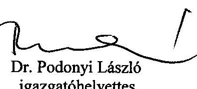

---

# 1. sz. melléklet 

a V-11-121/2007-2008. sz. jelentéshez

MAGYAR
VASÚTI HIVATAL

1088 Budapest, Múzeum utca 11. I www.vasutihivatal.gov.hu
telefon: (1) 51131 31, fax: (1) 5114669 | e-mail: info@vasutihivatal.gov.hu

Iktatószám: MVH/21/9//2008.
Úgyintéző: Száraz Emese (511-7102)
Mellékletek: -

## Bihary Zsigmond

főigazgató úr részére: Állami Számvevőszék
Állami Számvevőszék
Budapest
Pf.: 54.
1364

## 11123/08

Érkezett: 2008. MÁJUS 13.
Iktatószám: $\qquad$
Melléklet: $\qquad$
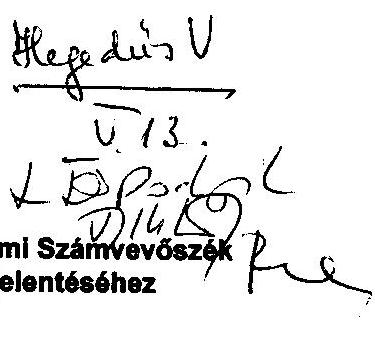

Tárgy: észrevételek az Állami Számvevőszék
V-11-91/2007-2008. számú jelentéséhez

## TISZTELT FŐIGAZGATÓ ÚR!

A V-11-91/2007-2008. jelentés tervezetében szereplő megállapításokkal, illetve a javaslatokkal egyetértek. A Jelentést összességében nagyon jónak tartom, amely a rendszerváltás óta a legjobb és legpontosabb képet adja a Magyar Államvasutak és utódai közpénzügyi és szervezeti problémáiról.

Összességében öt észrevételt kívánok tenni a MÁV Zrt. adósságállományával, a mellékvonalhálózatával, a fejlesztéseinek megalapozottságával, és a MÁV Zrt. menedzsmentjének gyakori átalakításával kapcsolatban. Észrevételeim a Jelentés tartalmát lényegesen nem módosítják, azok szakmai, jogi alátámasztottságát növelik, illetve szakszerűségét pontosítják. Egyúttal észrevételt kívánok tenni a vasúti személyszállítás tarifáira vonatkozó javaslatokkal kapcsolatban. Itt a Jelentés tényszerű megállapításaival egyetértek, de konklúziójával nem.

1) A MÁV Zrt. és leányvállalatainak (a szövegben „MÁV Csoport", noha ezek a társaság cégjogi értelemben nem alkotnak vállalatcsoportot) hitel- és adósságállománya tekintetében értelemzavaró kifejezések és adatok találhatók a szövegben. Ennek az oka az, hogy a jelentés csak a MÁV Zrt. egyes kötelezettségeit tekinti „adósságnak". A különbséget a MÁV Zrt-nek a Magyar Nemzeti Vagyonkezelő Zrt. felé fennálló, nem kamatozó hosszú lejáratú kötelezettsége okozza, melynek mértéke meghaladja a 400 milliárd forintot. Álláspontom szerint ennek a tételnek a figyelmen kívül hagyása súlyosan értelemzavaró, és helytelen következtetések levonására alkalmas. Ezzel a kötelezettséggel szemben ugyanis kamatfizetés nem, de más, a vagyonkezelési szerződés alapján fennálló rendszeres, anyagi ráfordítást eredményező kötelezettség áll szemben, vagyis nem csak számviteli, hanem közgazdasági értelemben is idegen forrásként viselkedik (és a MÁV Zrt. konszolidált beszámolójában akként is van nyilvántartva). A pontosítás kétféleképpen hajtható végre.

Álláspontom szerint a MÁV Zrt. adósságkezelésének és üzleti tervezésének egyik legjelentősebb hiánya, hogy a rendszeres kamatfizetés hiányában az Állam felé fennálló, mintegy 400 milliárd forint lejáratú kötelezettségnek a folyó üzemi eredményt befolyásoló, sem a hosszú távon finanszírozandó eszköz-forrásszerkezet szempontjából nem számol. A látszólagosan térítésmentes, további 400 milliárd forintnyi adósság finanszírozásával szemben, ha nem számolnak rá finanszírozási ráfordítást, csak vagyonvesztés, vagy máshol kimutatott állagmegóvó munkák ráfordításai (pl. szolgáltatásvásárlás) állhat. Mindez súlyosan befolyásolja a MÁV Zrt. csoportszintű mérlegének értelmezhetőségét (ld. 15. o.) Ezzel a témával kapcsolatban kell megjegyezni, hogy a jelentés helyesen utal arra, hogy az Európai Unió más államaiban is a MÁV

---

Zrt-hez hasonló mértékű eladósodottság volt jellemző az államvasutakra. Ugyanakkor a Jelentés figyelmen kívül hagyja azt a tényt, hogy az adósságkezelésre nézve a 91/440/EGK Irányelv kötelező rendelkezéseket tartalmaz, és ezek betartásával sikerült az EU tagállamok vasúttársaságainak adósságválságát leküzdeni. Az I. irányelv-csomagba tartozó jogszabálynak ezen rendelkezéseit sem az 1993. XCV. törvény, sem a 2006. évi CLXXXIII. törvény nem ültette át a hazai jogba, vagyis ezen a téren a jogharmonizáció sem történt meg.

- A Jelentés adósságállományként (vagy idegen forrásként) utaljon konzekvensen a MÁV Zrt. mérlegeiben található teljes idegen forrás arányra, és mutassa ki adósságként ezt a tételt is, jelezve, hogy ennek közel fele nem kamatozó adósság.
- A Jelentés kifejezetten térjen ki arra, hogy a megállapításai erre a kincstári adóssági tételre nem vonatkoznak, amely azonban szintén olyan idegen forrást jelent, amellyel szemben a MÁV Zrt-nek rendszeres, anyagi ráfordítást igénylő ellenszolgáltatásai (pl. állagmegóvás) áll szemben.
- Az államvasutak adósságának kezeléséről szóló rendelkezéseket a többször módosított 91/440/EGK Irányelvből törvényi szinten át kell ültetni a magyar jogba, figyelembe véve az Irányelv megvalósításának legjobb európai példáit (pl. azokat, ahol az eladósodottság mértéke a legtervszerűbben csökkent).

2) A vasútfejlesztésekkel kapcsolatban le kell szögezni, hogy az Európai Unió vasútfejlesztésre vonatkozó jogszabályai alapján a vasútfejlesztéseket a vasúti forgalom várható növekedése, illetve a vasút piacvesztését okozó minőségi vagy mennyiségi infrastrukturális korlátok feloldására kell koncentrálni. Ennek feltétele, hogy a vasúti piac folyamatos nyomon követése (monitoring) tevékenység, a vasúti pályakapacitások (ide értve az állomási kapacitásokat is) elemzése, a kapacitások bővítési terve alapozza meg a vasúti infrastruktúra-fejlesztéseket. Ezt több közösségi jogszabály, így a 91/440/EGK irányelv, illetve a 2001/14/EK irányelv is előírja. 2006. óta a monitoring-tevékenységnek Magyarországon is van állami felelőse (a Magyar Vasúti Hivatal egyik, a Vtv. által kijelölt főfeladatáról van szó), de az egységes, európai monitoring-rendszer (Rail Market Monitoring Scheme) keretébe illeszkedő monitoring-tevékenység semmilyen intézményi úton nincsen összekötve a GKM, az NFÜ, illetve a MÁV Zrt. és a NIF Zrt. fejlesztési tevékenységével. Noha a Magyar Vasúti Hivatal monitoring-tevékenységének törvényben deklarált célja a vasúti piac zavartalan fejlődését gátló tényezők felszámolása, a Magyar Vasúti Hivatal elemzései, illetve a Hivatal tisztségviselői sehol nem kaptak szerepet a vasútfejlesztési tervek véleményezésében, előkészítésében, illetve a döntések meghozatalában. A 25. o. szereplő megállapítással szemben a MÁV Zrt. infrastruktúra-fejlesztési kompetenciáinak kiszervezése a NIF Zrt-be nem csak néhány hónapig, hanem alapjában véve volt jogsértő, hiszen a vasútfejlesztésekről szóló 91/440/EGK irányelv szerint vasútfejlesztési tevékenységet kizárólag pályavasúti társaság (a közösségi jogszabály szerint: infrastruktúra-működtető szervezet) végezhet.
3) A Jelentés vasúti mellékvonalakra, illetve a térségi vasutakra vonatkozó megállapításait csak részben tartom megalapozottnak. Szakmailag túlzottan egyszerűsítő a 31. o. olvasható állítás, miszerint „az ország mellékvonal hálózata az európai átlaghoz képest sűrűnek mondható. Kihasználtsága az elavultság és elhanyagoltság miatt nagyon alacsony, költségeit sem tudja kigazdálkodni". Egyrészt a magyar vasúthálózat sűrűsége a magyarországi vasúti rendszer áruforgalmi és személyforgalmi teljesítményét figyelembe véve közepesnek mondható. A hazánkhoz hasonlóan ritkábban lakott, illetve kevésbé fejlett közúthálózattal rendelkező középeurópai, balti, és délkelet-európai országokhoz képest pedig a magyar vasúthálózat sűrűsége tipikusnak ítélhető. A 30. o. megállapítása szerint „a MÁV Zrt. három éves kistérségi [helyesen: térségi vasúti] kísérleti programja [...] a MÁV Zrt. szerint a hozzáfűzött várakozásoknak nem felelt

---

meg, ezért visszaintegrálásukra került sor". Valójában a kísérletre a 1001/2004 (I.8.) Korm. határozat alapján került sor, az értékelés pedig a kormányzat feladata volt, amelyet 2006 végén az akkor a Kormány irányítása alatt álló Magyar Vasúti Hivatal végzett el. A Hivatal megállapítása szerint a kísérlet azért volt részben sikeres, mivel jelentős, egyes esetekben mintegy 40 százaléknyi indokolatlan költséget tárt fel, és bizonyította, hogy a mellékvonalak jövedelmezősége a MÁV Zrt. által kimutatottnál lényegesen magasabb. A kísérlet részleges kudarcának oka az volt, hogy a kísérlet egyes lényeges elemeit a MÁV Zrt. nem hajtotta végre, így a megtakarítások, illetve a bevételnövekedés nem volt realizálható, illetve döntően a bevételnövelő kísérletek végrehajtására nem került sor. A MÁV Zrt. helytelen döntését igazolja, hogy a kísérlet eredményeit meg nem várva, a MÁV Zrt. javaslatára a GKM 2006-ban 14 mellékvonal üzemszünetét rendelte el. A 2006-2007. évi üzleti eredmények azonban azt igazolják, hogy a megtakarítások szintje messze elmaradt a MÁV Zrt. által prognosztizálttól, mivel a mellékvonalak valós költségszintje alacsonyabb, az elmaradt bevétel pedig magasabb volt a kimutatottnál. A 14 legrosszabb mellékvonal üzemszünetének éves megtakarítása (éves szintre vetítve) nem érte el összesen az 1 milliárd forintot. A 2006. évben elrendelt üzemszünetek kedvezőtlen tapasztalata miatt 2007-ben, illetve 2008-ban a Kormány, illetve a gazdasági és közlekedési miniszter nem engedélyezte további mellékvonalakon a forgalom szüneteltetését. (Az ezzel kapcsolatos dokumentumokat a vizsgálat során átadtuk a vizsgálóknak).
4) A Jelentés a 14. oldalon jogosan kifogásolja, hogy 2002-2007. között a MÁV Zrt-ben 32 személy töltött be vezető tisztséget. A Tanács vasúttársaságok engedélyezéséről szóló 95/18/EK irányelve (1995. június 19.) alapján a tisztségviselőkkel szemben a szakmai alkalmasság feltételeit az engedélyező hatóságnak, vagyis a Magyar Vasúti Hivatalnak kellett volna ellenőriznie. Ez a rendelkezés az EU csatlakozás napjától 2006. január 1-ig nem került átültetésre a hazai jogrendbe, a hatósági ügyintézésről szóló végrehajtási rendelet pedig csak 2006 júliusában került kihirdetésre. A Vtv. 6. § szerint minden vasúti közlekedési tevékenység engedélyköteles. A működési engedély kiadásának és fenntartásának feltétele, hogy a vasúti tevékenységet végző szervezet a Vtv. 8. § alapján szakmailag alkalmas vezetéssel rendelkezzék. A szakmai alkalmasság feltételeit a vasúti társaságok engedélyezéséről szóló 45/2006 (VII.11.) GKM rendelet tartalmazza. Azóta a vasúti tevékenységet végző társaságok közül kizárólag a MÁV Zrt. nem felel meg ennek a törvényi előírásnak, amiért a Magyar Vasúti Hivatal többször megbírságolta a szervezetet. A rossz irányítási teljesítményhez tehát nem csak a fluktuáció, hanem a szakmai alkalmatlanság is hozzájárulhatott, tekintettel arra, hogy a MÁV Zrt. 2006 júliusa és 2008 májusa között egyetlen vezető tisztségviselőjének és vezető munkavállalójának a szakmai alkalmasságát sem tudta vagy akarta igazolni, sőt, a MÁV Zrt. a pályavasúti tevékenység végzésére az egész időszakban nem rendelkezett hatósági engedéllyel. A Magyar Vasúti Hivatal a jogsértést azért pénzbírsággal, és nem a tevékenység tiltásával sújtotta, mivel a rendelkezés elviselhetetlen társadalmi, nemzetgazdasági és nemzetbiztonsági károkat okozott volna.
5) A jelentés a 79. oldalon helyesen állapítja meg, hogy „a menetrend szerinti személyszállítás tarifái az elmúlt évek pénzügyi- és közlekedéspolitikai céljai, valamint társadalmi-szociális megfontolások miatt elszakadtak a tevékenység tényleges költségeitől". Ez a megállapítás azonban egyúttal az árak megállapításáról szóló 1990. évi LXXXVII. Tv (Ártörvény) hatályos rendelkezéseinek súlyos megsértését jelenti. 2006-ban, részben a Magyar Vasúti Hivatal megalapításával egy időben jelentős szervezeti átalakítások zajlottak a Gazdasági és Közlekedési Minisztériumban, amelynek eredményeképpen az egyedi hatósági döntések meghozatal, vagy azok szakmai előkészítése alkotmányossági és célszerűségi okok miatt kikerült a Minisztérium szervezetéből. Míg a villamosenergia, gázenergia, hírközlés és postai terület árai az Ártörvény módosításával a Magyar Vasúti Hivatallal azonos, üzleti élet szabályozását ellátó Magyar Energia Hivatalhoz, illetve Nemzeti Hírközlési Hatósághoz került, ugyanez a vasúti személyközlekedés

---
 Gazdasági és Közlekedési Minisztérium az ágazatban várható, átfogóbb, további reformokban jelölte meg. A Magyar Vasúti Hivatal szervezetének létrehozatalával együtt azonban a GKM-ben a hatósági árakkal foglalkozó önálló osztály megszűnt, így lényegében a vasúti személytarifák megállapítása, illetve a mögöttes költségek Ártörvény szerinti közigazgatási ellenőrzése ellátatlan feladat maradt.

- Javaslom, hogy a Jelentés tegyen javaslatot az árszabályozás megfelelő szakmai alapra helyezésére és depolítizálására, és az Ártörvény vasúti személyszállítási tarifáinak megállapítására vonatkozó tevékenységnek a lakossági energia-, gáz-, hírközlési és postai tarifáinak előkészítéséhez hasonlóan a Magyar Vasúti Hivatalhoz történő telepítésére.

Budapest, 2008. május 13.

Tisztelettel:
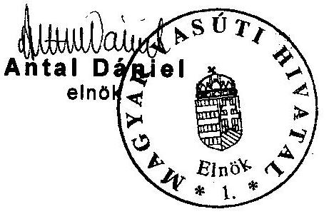

---

# Antal Dániel úr 

elnök
Magyar Vasúti Hivatal

## Budapest

## Tisztelt Elnök Úr!

A vasúti közlekedés korszerűsítésének ellenőrzéséről készített jelentéstervezetünkre tett kiegészítő észrevételeit megköszönöm, vizsgálataik eredményeit, illetve a nyújtott információikat részben megjelenítettük.

A kezelt állami tulajdon értékének szerepeltetése a hosszú lejáratú kötelezettségek között a kezelt vagyonforrás, saját társasági tőkétől történő elkülönítését szolgálja a vagyonkezelő mérlegében a számviteli tv. 23. § (2) és a 42. § (5) bekezdésében foglalt rendelkezés alapján. Az állami tulajdonú pályákkal kapcsolatos állami feladatellátást és anyagi kötelezettségvállalás szükségességét az anyagban szerepeltetjük.

Budapest, 2008. június 9.
Tisztelettel:
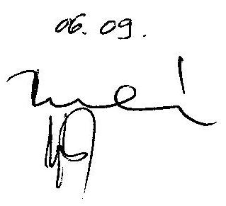

---

# MÁV CARGO 

Bihary Zsigmond úr
az Állami Számvevőszék főigazgatója részére

| Ir. sz., hely: | 1364 Budapest 4. | Iktatószám: | 25644/2008. |
| :-- | :-- | :-- | :-- |
| Utca, házsz.: | Pf: 54 | Hiv. szám: | V-11-91/2007-2008 |

## ÁLLAMI SZÁMVEVŐSZÉK   5903/08

Erkölcsi: 2008. 14. 19
Iktatószám: V-11-101/2007.
Melléklet:
Dátum: Budapest, 2008. május 14.

Tárgy: Észrevételek a vasúti közlekedés korszerűsítésének ellenőrzéséről készített jelentésre II.

## Tisztelt Főigazgató Úr!

A tárgyban írt címmel az Állami Számvevőszék által elkészített jelentést köszönettel kézhez vettem, és arra - az Önök felkérésének megfelelően - a MÁV Cargo Árufuvarozási Zártkörűen Működő Részvénytársaság (székhelye: 1133 Budapest, Váci út 92.) nevében tisztelettel a következő észrevételeket teszem:

## I. A MÁV Cargo Zrt. privatizációjával kapcsolatban, általánosságban:

Szeretném előrebocsátani, hogy annak a kérdésnek a megítélése, hogy a lezajlott privatizáció melyik törvény hatálya alá sorolandó, illetve maga az eljárás lebonyolítása is - a MÁV Zrt., mint tulajdonos által közbeszerzési eljárás alkalmazásával kiválasztott, széleskörű tapasztalatokkal rendelkező - konzorcium (a továbbiakban: tanácsadók) kompetenciájába és felelősségi körébe tartozott és tartozik.
Tudomásom szerint a privatizációs eljárás teljes körűen nyilvános volt, és a GKM állandó felügyelete és tájékoztatása mellett zajlott.
A jelentés azonban tartalmaz néhány olyan ténymegállapítást, illetve kitételt, amelyre - bár a fenti eljárásnak csupán „tárgyai" voltunk - kötelességünk észrevételt tenni.

## II. A MÁV Tiszavas Kft. apportjával kapcsolatban:

1.) A Tiszavas Kft. apportértékét független könyvvizsgálói értékbecslés állapította meg, amelyet a MÁV Zrt. könyvvizsgálója is elfogadott. Ezzel kapcsolatban megjegyezzük, hogy a jövőbeni lehetséges vevők részére ún. „információs memorandumot" készítettek a tanácsadók, ennek teljes anyagát az adatszobában elhelyezték.
2.) Az apport értéknövelő hatását a privatizációs vevő-jelöltek az árban érvényesíthették, a piaci érték a megajánlott vételárban került érvényesítésre, azaz az üzletértékelés elvált a vagyonértékeléstől. A privatizációs vevő számára a MÁV Tiszavas járműjavító Kft-ben rejlő üzleti potenciál az érték, nem pedig egy vasúti kocsi pontos könyv szerinti értéke.

---

3.) Az apportot egyébként a cégbíróság - a szükséges dokumentumok rendelkezésre bocsátását és megvizsgálását követően - a cégjegyzékbe bejegyezte, kifogást nem emelt e tárgyban.
4.) Jelentés utolsó előtti bekezdése a járműjavítók hazai piacáról ír. Megjegyezzük, hogy ma Magyarországon nem csak a Tiszavas Kft. végez teherkocsi javítást. Az említett debreceni járműjavítón kívül a szombathelyi és székesfehérvári járműjavítók is foglalkoznak teherkocsi javítással.
5.) A 2002-ben indult 2000 db használt vasúti kocsi átadásáról szóló gazdasági kapcsolat (jelentés 47. oldalának utolsó bekezdése), az ezzel kapcsolatban folyamatban lévő rendőrségi eljárás és a Tiszavas Kft. apportja között nincs összefüggés. A 107 db , MÁV Cargótól megvásárolt teherkocsira azért volt szüksége a MÁV Zrt-nek, hogy az eredeti szerződésben rögzített vevői igényeknek megfelelő kocsit tudjon biztosítani.

# III. Az induló vagyon apportértéke: 

A jelentés 17.oldalán a 3. bekezdés második mondata szerint: „A MÁV Cargo Zrt. 91 %-át kitevő tárgyi eszközök apportálása tényleges leltározás nélkül történt a MÁV Zrt. Pénzügyi, analitikus nyilvántartásában folyamatosan vezetett leltárból kiindulva, amely tételes fizikai leltározással utoljára 2004. 04.30-án volt alátámasztva. Az apportálás időpontjában felvett tényleges leltározás, valamint az egységes járműnyilvántartás hiánya miatt a mérlegben szerepeltetett tárgyi eszközök azonosítása nem biztosított, az apportlistában feltüntetett értékek a nyilvántartási értékkel azonosak."
1.) A MÁV Cargo rendelkezésére bocsátott apport értékét független könyvvizsgálói értékbecslés állapította meg, amelyet a MÁV Zrt. könyvvizsgálója is elfogadott. A MÁV Cargo vezérigazgatójának felkérésére 2006. január 10-én készült egy utólagos könyvszakértői vélemény is a MÁV Cargo apportja értékelési módszere helyességének megállapítására, amely szintén alátámasztja a könyv szerinti értékelési módszer helyességét.
Továbbá a jelentés 46. oldalán az apport és a MÁV Cargo kimutatásai közötti különbség ( 13877 és 13701 db vagon) apportértékben nem okoz különbséget. Ennek oka az, hogy a 2005. év során elavult vagonokból kialakított 162 db Taems kocsi fejlesztésének ráfordításait és az eredeti kocsikat önálló tárgyi eszközszámon tartották nyilván. Ezeket a tételeket 2006-ban közösen a MÁV Pénzügyi szervezetével rendeztük.
2.) „Egységes járműnyilvántartás hiánya": ismereteink szerint az Európai Vasútügynökség, valamint az Európai Parlament jelenleg dolgozik a járművek karbantartására vonatkozó irányelveken. A kötelező időszaki járművizsga fő célja azonban nem a jármű azonosítása, hanem a karbantartási állapotukról való meggyőződés. Nem kizárt, hogy a vizsgálat alkalmával a kiadott pályaszám, üzembehelyezési engedély is ellenőrzésre kerül, azonban a jármű üzembentartójának az állagában lévő kocsikról meglévő információja nem függvénye az egységes járműnyilvántartásnak. Megjegyezzük, hogy a járművek azonosítására alkalmazott pályaszámok egyébként megfelelnek az UIC 438-2, illetve az OPE TSI irányelveknek.

---

# MÁVCARGO 

Ezenkívül a jelentés 47. oldalának 1. bekezdésében írtak szerint nem kötelező a vasúton közlekedő járművek hatósági járművizsgája. A jelenlegi szabályozások szerint nemzetközi forgalomban közlekedő vagonok esetében hat évente kötelező a járművek műszaki vizsgálata, mely után a NKH hatósági (üzembehelyezési) engedélyt ad ki.

A jelentés 47. oldalának 2. bekezdése és 51. oldalának utolsó bekezdése szerint: „A MÁV Cargo Zrt. az induló apportjának ... 89 %-át kitevő.....db vasúti teherkocsiból ... 2326 db-ot 1 Ft apportértéken vett át...Az alapításkor az átadott eszközökről nem készítettek a valós piaci értéket feltüntető vagyonértékelést, az apportálást nyilvántartási értéken végezték..."

Észrevételeink a következők:
1.) az átvett kocsik 40-50 évesek voltak, és az ilyen idős járművek, még akkor is, ha többször javították őket, bárhol nulla körüli értéken szerepeltek volna a nyilvántartásokban. A nemzetközi gyakorlat 25-30 évben határozza meg a vasúti kocsik élettartamát. Magyarországon ez valószínűleg több, de 1951-ben, 1952-ben gyártott járművek értékkel már nem bírnak.
Ugyanakkor reális piaci ár kialakítására sem kínálati, sem keresleti oldalról 2005. évben, a piacnyitás elején megbízható adatbázis nem állt rendelkezésre.
Ennek alátámasztására készült egy könyvszakértői tanulmány, amely megállapította, hogy sem az üzleti hozamszámítás, sem a tényleges értékesítési tranzakciók nem hoztak más típusú eredményt, mint amit a könyv szerinti érték mutat. Az apportnak viszont a hatályos Gt. szerint vagyoni értékkel kellett bírnia, így került 1 Ft + Áfa értékkel meghatározásra.
2.) Az 1997. évi CXLIV. Tv. (régi Gt). nem tette kötelezővé az apportlista leltározással történő alátámasztását, csupán leltárral történő alátámasztását írta elő. Ez megtörtént, az apportlista tételes leltárral alá volt támasztva. A listát könyvvizsgáló ellenőrizte és megfelelőnek találta. A Cégbírósághoz az apport bejegyzéséhez részletes apportlista csatolása volt szükséges, és a kocsik pályaszámmal felsoroltan kerültek apportálásra, illetve szükséges volt igazolni, hogy a kocsik fizikailag átadásra kerültek.
A Cégbíróság az apportot a vonatkozó rendelkezéseknek megfelelőnek találta, és bejegyezte.
3.) Az apportot szolgáltatónak a Gt. szerinti felelőssége abban állt, hogy nem értékeli túl az apport tárgyát, azonban a Gt. nem tartalmaz(ott) tiltó rendelkezést a könyv szerinti értéken történő apportálásra.
52. oldal első bekezdése: „Az apportlistában szereplő teherkocsik közül 2326 db 1 Ft-os apportértéken szerepel, annak ellenére, hogy egy kocsinak a selejtezést követő vasértéke (35.000.-Ft/tonna) darabonként 2-3 MFt...."
1.) Korábban is kértük ezen okfejtés alátámasztását, most kérjük a megállapítás lábjegyzettel való ellátását az eltéréstől, vagy megfelelő helyesbítését, mert ha 2-3.000.000.-Ft-ot osztunk 35.000.-Ft-tal, akkor 57-86 tonnásra kerekedne ki a vasúti kocsik súlya, vissznyeremény nélkül, azonban a vasúti kocsik a valóságban mindössze 22-24 tonnásak, (a MÁV Cargo legnehezebb, UIASS sorozatú kocsija is csak 48 tonna), valamint a bontás során mindig van vissznyeremény, azaz újrahasznosításra alkalmas fémdarab, illetve vágási veszteség is.

---

2.) Kérjük a MÁV Cargo Zrt. apportszázalékának pontos meghatározását, mert a 47. oldalon 89 %-ot tesz ki a 13701 db vasúti kocsi, az 51. oldalon (és a többi oldalakon) pedig 91 %-ot ugyanaz a 13701 db kocsi.

# IV. Vontatási engedély: 

51. oldal 3. bekezdése: „A MÁV Cargo Zrt. nem rendelkezik a teherfuvarozás lebonyolításához szükséges vontatási kapacitással és engedéllyel.."
52.) Kérjük az „engedéllyel" kifejezést kifejezetten törölni a jelen bekezdésből, tekintettel arra, hogy a MÁV Cargo Zrt. árutovábbításra jogosító működési engedélye vontatási szolgáltatás nyújtására is jogosít a működési engedélyeket kiadni hivatott Magyar Vasúti Hivatal, mint hatóság állásfoglalása szerint. Engedélyünk tehát van, ettől külön kell választani a vontatási kapacitást.
53.) Nem értünk egyet azzal továbbá, hogy az ebben a bekezdésben kifejtettekből (ÖBB Trakció mozdonyainak megjelenése Magyarországon, MÁV Cargo vontatási kapacitáshiánya) egyenesen következik, hogy „csak szubvencióval lehetne magyarországi viszonylatban ezeket az eszközöket működtetni." Az árufuvarozás ugyanis nem állami támogatott, közszolgáltatási tevékenység, ahogy ezt - a 2130/2006-os Kormányhatározatot idézve - a T. Számvevőszék is megállapítja jelentésének 61. oldalán.

## V. Ingatlan kérdések

A jelentés 49.oldalának 4. bekezdése a MÁV Cargóba apportált ingatlanokról és azok további sorsáról ír. Az említett T4032026 és T4132027 leltári számú ingatlan nem került a végleges, cégbíróság által bejegyzett apportlistába. Az apportlista a cégbírósági iratok között fellelhető, nyilvános, és közhiteles formában tartalmazza a tényleges apportösszetételt.

Kérem, hogy a jelentésre tett észrevételeimet elfogadni, és az anyagban megjeleníteni szíveskedjenek.

Budapest, 2008. május 14.

Üdvözlettel:
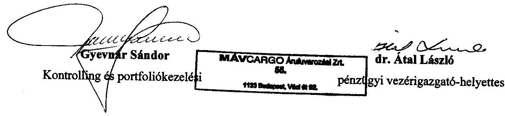

MÁV Cargo Zrt. Vezérigazgató

---

# Dr. Átal László úr 

pénzügyi vezérigazgató-helyettes
MÁV Cargo

## Budapest

## Tisztelt Vezérigazgató-helyettes Úr!

A vasúti közlekedés korszerűsítésének ellenőrzéséről készített jelentéstervezetünkre tett észrevételeit megköszönöm, azokkal kapcsolatban a következőkről tájékoztatom.

A MÁV Cargo Zrt. privatizációja tekintetében az állami tulajdonú társaságok leányvállalatainak értékesítésére vonatkozó eltérő jogértelmezéseket a jelentésben külön mellékletként is megjelenítettük, amellett, hogy a tartós állami tulajdonnak minősített társaságok esetében azoknak az anyavállalattal azonos elbírálását - figyelemmel a helyszíni ellenőrzés megállapításaira - a továbbiakban is hangsúlyozottan fenntartjuk.

Az apporttal kapcsolatos észrevételük nem ellentétes a megállapításunkkal, hiszen véleményünk szerint is a könyvvizsgáló azt garantálja, hogy az apport nem lehet felül értékelt.

Az észrevételükben kifogásolt adatokat (vasúti kocsik súlya, db-száma, stb.) MÁV Zrt.-től, annak Felügyelő Bizottsága jegyzőkönyvéből, valamint a Közlekedési Felügyelettől szereztük be.

Budapest, 2008. június 9.

Tisztelettel:
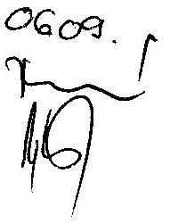

Bihary Zsigmond

---

Nemzeti Infrastruktúra Fejlesztő Zrt.
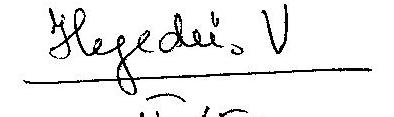

Iktatószám: NA-2007/2008
Ügyintéző: Knitlhoffer Tamás

Állami Számvevőszék
Államháztartás Központi Szintjét Ellenőrző
 Igazgatóság
Bihary Zsigmond
főigazgató Úr részére
Budapest 4.
Pf.: 54
1364
Tárgy: Jelentés tervezet észrevételezése

# Tisztelt Bihary Zsigmond Úr! 

Köszönöm az államtitkári, intézmény-és társaság első számú vezetői szintű egyeztetéshez megküldött vasúti közlekedés korszerűsítése tárgyában az Állami Számvevőszék által végrehajtott ellenőrzésnek az ellenőrzési jelentés tervezetét. A jelentés tervezetét elfogadom, és a tervezettel kapcsolatban nem kívánok észrevételt tenni.

Budapest 2008. 05. 13.

Tisztelettel:

Nemzeti Infrastruktúra Fejlesztő Zrt.
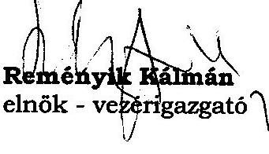

Kapják: 1) Állami Számvevőszék
2) Irattár

---

a V-11-121/2007-2008. sz. jelentéshez
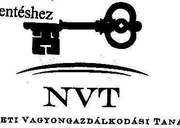

ÁLLAMI SZÁMVEVŐSZÉK
ÜGYVITELI IRODA
DÁTUM: 2008. MÁJUS 27.
Iktatószáma: 4-11-109107-04
Melléklet:

1133 BUDAPEST, PUSKÁS FERENC ÚT 56. 1399 BUDAPEST, PF. 708
TELEFON: (06 1) 237 4290, FAX: (06 1) 237 4291
HONLAP: WWW.MNVERT.HU, E-MAIL: INFO@MNVERT.HU

Bihary Zsigmond Úr
főigazgató

Állami Számvevőszék

H-1052 Budapest
Apáczai Csere János u. 10.

*Kezedísz Varga*
*urái-24.11*

Isz: MNV/01/26 213/6/2008

Tárgy: Jelentéstervezet a vasúti közlekedés korszerűsítésének ellenőrzéséről

Tisztelt Főigazgató Úr!

Köszönettel vettem kézhez a vasúti közlekedés korszerűsítésének ellenőrzéséről az Állami
Számvevőszék által készített jelentés tervezetét.

Szeretném tájékoztatni, hogy a jelentés tervezet megállapításaival kapcsolatban érdemi
észrevételt tenni nem áll módomban az alábbiak alapján:

A Nemzeti Vagyongazdálkodási Tanács 13/2007.(X.16.) NVT számú, az „Egyes gazdasági
társaságoknak a gazdasági és közlekedési miniszter vagyonkezelésébe adása” tárgyú
határozatában 13 társasági részesedés vonatkozásában – a részvényesi jogok gyakorlója
utasításának kiadása esetére – felhatalmazta az ÁPV Zrt. vezérigazgatóját, hogy a gazdasági
és közlekedési miniszterrel az érintett társaságok tekintetében ideiglenes vagyonkezelési
szerződést kössön a Vagyonkezelési Stratégia Kormány általi elfogadásáig. A megállapodás
megkötésére 2007. november 9-én került sor. A MÁV Zrt. is ezen vagyonkezelési szerződés
keretében került vissza korábbi tulajdonosi joggyakorlójához, a Gazdasági és Közlekedési
Minisztériumhoz.

---

A jelenleg is hatályos megállapodás alapján a Vagyonkezelő csak a szerződés 4.3. pontjában meghatározott kérdésekben (tőkeemelés, tőkeleszállítás, végelszámolással történő megszűnés, átalakulás elhatározása) köteles a Vagyonkezelésbe adó, jelenleg az MNV Zrt. előzetes jóváhagyását kérni. Egyéb kérdésekben a Vagyonkezelő - a vagyonkezelési szerződés és a jogszabályok rendelkezéseinek megtartásával - saját belátása szerint járhat el.

Ugyanakkor arról is szeretném tájékoztatni Tisztelt Főigazgató Urat, hogy a jelentés-tervezet több részét is tudjuk hasznosítani tevékenységünk során, különösen azokat a részeket, melyek a hazai közlekedéspolitika és az uniós elvárások összhangjával; a tarifa és kedvezményrendszer versenyhelyzetre gyakorolt hatásával; valamint a vasúti és közúti közlekedés fejlesztésének arányaival foglalkoznak.

Budapest, 2008. május 15.
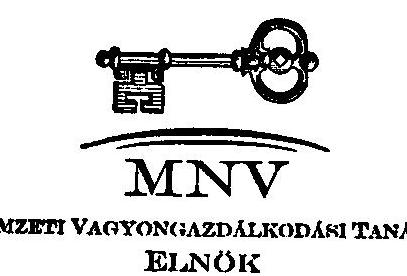

Tisztelettel:
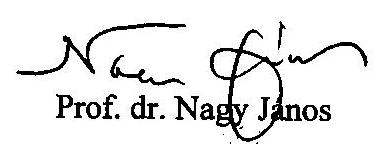

---

# KÖZLEKEDÉSFEJLESZTÉSI KOORDINÁCIÓS KÖZPONT 

1024 Budapest, Lövőház utca 39. $\cdot$ telefon: +36 (1) 3368100 $\cdot$ fax: +36 (1) 3361522 $\cdot$ e-mail: 3k@3k.gov.hu Válaszlevelükben szíveskedjenek az alábbi iktatószámra hivatkozni: IKTATÓSZÁM: M- 11335 - 312006 , HIV.SZÁM.: V - 11 - 91/2007-2008 TÁRGY: Vasúti közlekedés korszerűsítésének ellenőrzéséről készített jelentéstervezet
ELŐADÓ: Vándor Gábor
MELLÉKLET: -

## Állami Számvevőszék

Bihary Zsigmond
főigazgató

## Budapest 4

Pf 54
1364

## Tisztelt Főigazgató Úr!

ÁLLAMI SZÁMVEVŐSZÉK
ÜGYVITELI IRODA
4465108.
Érkezett: 2008. MÁJUS 26.
Iktatószám: V-A-108107-08
Vádázám:

## Vezér Ilona Vera

máj. 26.
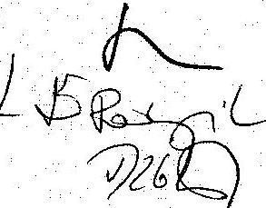

A vasúti közlekedés korszerűsítésének ellenőrzéséről készített jelentéstervezetet áttanulmányoztuk. A jelentés Központunkra nézve nem tartalmaz megállapításokat, de tartalmát hasznosítani tudjuk további munkánk során.

A jelentés kiadása ellen kifogást nem emelünk.
Kérjük nyilatkozatunk szíves tudomásul vételét.
Budapest, 2008. május 20.
Üdvözlettel:
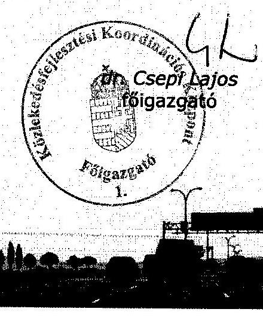

---

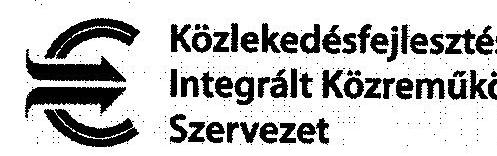

# Hegedűsné Dr. Müller Veronika

főcsoportfőnök részére

Állami Számvevőszék

Budapest, Apáczai Csere János u. 10. 1052

Ikt.sz.: K 52/981-1/2008

Hiv: Sz.: V-11-91/2007-2008

ÜGYVITELI IRODA

Érkezett: 2008.05.13.

Tárgy: a vasúti közlekedés korszerűsítésének ellenőrzéséről készített, 2008. május keltezésű jelentéstervezet véleményezése

Tisztelt Főcsoportfőnök Úrhölgy!

Hivatkozva 2008. május 7-én kelt levelére, tájékoztatom, hogy a vasúti közlekedés korszerűsítésének ellenőrzéséről készített jelentéstervezethez pontosító észrevételeket kívánunk hozzáfűzni. A tervezet következő bekezdéseit javasoljuk az alábbiak szerint módosítani;

A 36. oldal első bekezdése:

"TEN-T források esetében a 2004. évi TEN-T támogatás 50-67 %-os, a 2005., 2006. és 2007. évi TEN-T támogatás 50%-os hazai forrást igényel."

A 36. oldal 5. bekezdés utolsó mondata:

"A 2004-ben benyújtott „Budapest-Szolnok-Lökös-háza II. szakasz 2. ütem megvalósítása” vasúti projekt utolsó szerződése 2007. december végén került csak megkötésre."

A 37. oldal 2. bekezdése:

"A közlekedési projektek közül a 2004-2006 közötti tervezési időszakban két vasúti projektet, (a Budapest-Szolnok-Lökös-háza rehabilitáció II./2. ütem és A Kohéziós Alap által finanszírozott projektek előkészítése a vasúti ágazatban 2007-2013 között) jelentettek be. A 2004/HU/16/C/PT/001 projekt beruházási költsége az eredeti Bizottsági Határozat szerint 134,8 M € volt, a támogatás aránya 80%, megítélt támogatása 107 M € volt. A módosított Bizottsági Határozat értelmében a projekt költsége 129,1 M €-ra módosult, a megítélt EU támogatás 103 M €. A projekt első szerződése 2006. november 3-án került aláírásra. A beruházás a projekt befejezési határideje miatt kritikus állapotú. 2007. végére a projekt összes szerződését aláírták, a támogatás 20%-át kitevő előleg lehívása folyamatban van."

---

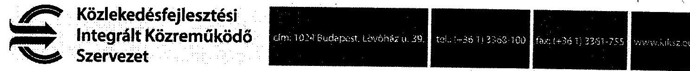

Az 66. oldalon szereplő táblázat utolsó két sora közel megegyezik, javasoljuk a két sort egyesíteni.

Üdvözlettel:
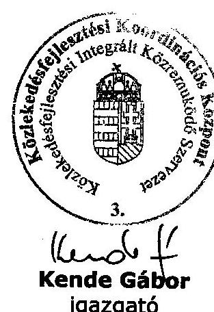

---

# 1. sz. melléklet 

a V-11-121/2007-2008. sz. jelentéshez

## Elnök

Bihary Zsigmond úr részére Főigazgató

Állami Számvevőszék

Tárgy: Észrevételek „A vasúti közlekedés korszerűsítésének ellenőrzése" c. ellenőrzés keretében készített, V-11-91/2007-2008. iktatószámú jelentés tervezetre

## Tisztelt Főigazgató Úr!

Köszönettel megkaptuk A vasúti közlekedés korszerűsítésének ellenőrzése keretében készített jelentés munkaanyagát. A jelentéstervezetre a következő észrevételeket tesszük.

## KEOP IH észrevételei:

13. és 33. oldal: A jelentés megfogalmazása szerint bizonyos összeget (287,9 M €) az ISPA támogatásból nem tudtunk felhasználni, és ez a "deficit" a Kohéziós Alap kereteket csökkentené. Ez a megállapítás nem fedi a valóságot, hiszen az ISPA keret kifizetését eredetileg sem tervezték a csatlakozásig (onnan megszűnt az ISPA jogosultságunk). A csatlakozási tárgyalások során már egyértelmű volt az a később a Csatlakozási Okmányba foglalt körülmény, hogy az ISPA FM-ekben tett pénzügyi kötelezettségvállalások egy része (a 2003 utáni kötelezettségvállalások) már a Kohéziós Alap terhére kerül lekötésre, és a 2003 végéig kötelezettségvállalásba tett, de ki nem fizetett összegek kifizetésére is a KA büdzséből kerül sor, így nem érte hazánkat lekötési/kifizetési veszteség.

A 13. oldal szövegét javasoljuk ezek alapján a következőképpen módosítani:
„Az ISPA programban 243,4 M € támogatásra nyújtottak be vasútfejlesztési projekteket. Az ISPA csak a transzeurópai hálózat és a helsinki folyosók mentén elhelyezkedő vasútvonalak fejlesztéséhez járult hozzá. A programban való részvételi lehetőségünk 2003-ban zárult, mivel a csatlakozás évétől az ISPA folytatását jelentő Kohéziós Alapból részesült Magyarország. A csatlakozás évéig az ISPA-ban indított fejlesztések - az eredeti ütemtervnek megfelelően - csak részben valósultak meg, a vasúti fejlesztések 243,4 M € tervezett összegéből a 2004. április 30 -ai zárásig - a jelentős teljesítésbeli elmaradás miatt - mindössze 31,7 M€ kifizetése valósult meg.
A 2000-2003¹ között az ISPA-ban rendelkezésre álló összes közlekedési célú ISPA forrásból 287,9 M € támogatás kifizetésére a csatlakozás évéig nem került sor, de a kötelezettségvállalásba vett teljes rendelkezésre álló és addig ki nem fizetett keret a csatlakozás után a felhasználás ütemében a Kohéziós Alapból lehívható. A pénzügyi

[^0]
[^0]:    ${ }^{1}$ 2000-2006-os programozási időszak volt, melyből az időszak alatt csatlakozó tagországok csatlakozásuk előtt az ún. előcsatlakozási alapokból, a csatlakozásuk után a SA és KA-ból részesültek. ISAP és az annak folytatásaként tekinthető KA esetében a kötelezettségvállalások 2006-ban voltak utoljára megtehetőek, de a kifizetésükre - a SA-ok 2008. végi határidejével ellentétben - 2010. végéig kerülhet sor.

---

# Elnök 

teljesítés alacsony szintjének oka, hogy a projektek előkészítetlenek voltak, megvalósításuk csúszott és a költségvetés eleinte nem biztosított elég forrást a szükséges saját rész fedezetére. A közlekedés területén a nagyberuházásokat elsősorban a Kohéziós Alap finanszírozta. A közlekedési szektorban az ISPA projekteket elfogadó Pénzügyi Megállapodások pénzügyi terve szerint a 2004-2006-os évekre előirányzott kötelezettségvállalások fedezete felett rendelkezésre álló szabad kohéziós támogatás 416 M €."

A 13. oldal azon mondatát, miszerint „A program 2006-ban zárult, de a belőle finanszírozott fejlesztések nem, illetve csak részben valósultak meg." kérjük pontosítani, miszerint az ISPA program csak elméletileg zárult 2003-ban (nem 2006-ban), mert a KA-ból való folytatás illetve az átmenet egyértelmű és szabályozott volt. A projektek FM-jében a végső befejezési dátumok mind 2003 utániak voltak, azokat a Bizottság így fogadta el, tehát a beruházások megvalósulása nem is volt tervezve/elvárva az ISPA jogosultság megszűnéséig (ami 2004. január 1., a csatlakozás éve volt).

A 35. oldal: „Az EU-s források hazai forrásokkal történő kiegészítési igénye" címszó alatti felsorolást kérjük pontosítani az 50% illetve 46% számításakor használt adatok megjelölésével, mivel nem egyértelmű, hogy mit értünk 2000. illetve 2003. évi ISPA források alatt (az adott évben rendelkezésre álló, de több projektre allokált keret, vagy az abban az évben elfogadott projektek teljes költsége vagy támogatása). Javasoljuk továbbá szerepeltetni a 2001 és a 2002 évek adatait is.

A 36. oldal utolsó előtti bekezdését javasoljuk kiegészíteni a következőképpen:
„A 2000-2003 között az ISPA-ban rendelkezésre álló összes közlekedési célú ISPA forrásból 287,9 M€ támogatás kifizetésére a csatlakozás évéig nem került sor, de a kötelezettségvállalásba vett teljes rendelkezésre álló és addig ki nem fizetett keret a csatlakozás után a felhasználás ütemében a Kohéziós Alapból lehívható. A 2000-2004 közötti programozási időszakban rendelkezésre álló összes közlekedési célú ISPA forrásból 287,9 M€ támogatást az ország nem tudott felhasználni, tekintettel arra, hogy az ISPA Programban be nem fejezett projektek költségei a Kohéziós Alap keretéből kerülnek kifizetésre. A közlekedési szektorban az ISPA projekteket elfogadó Pénzügyi Megállapodások pénzügyi terve szerint a 2004-2006-os évekre előirányzott kötelezettségvállalások projektek kifizetése után rendelkezésre álló szabad kohéziós támogatás 415,64 M€."

Kérem az észrevételek szíves figyelembe vételét a jelentés véglegesítése során.

Budapest, 2008. május 16.

Tisztelettel:
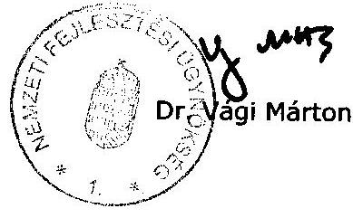

---

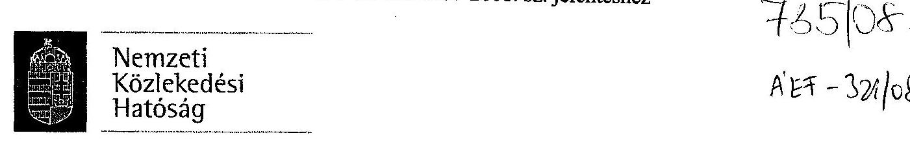

Ikt. szám: 1945/3/2008.
Hiv. szám: V-11-91/2007-2008.

Bihary Zsigmond
Főigazgató úr részére
Állami Számvevőszék
Budapest
Apáczai Csere János u. 10. 1055

Tisztelt Főigazgató Úr!

A vasúti közlekedés korszerűsítésének ellenőrzéséről Önök által készített jelentéstervezetüket 2008. május 6-án kelt levelük mellékleteként megkaptuk. A Nemzeti Közlekedési Hatóság a jelentés tervezetével kapcsolatban észrevételt nem tesz.

Budapest, 2008. május 9.
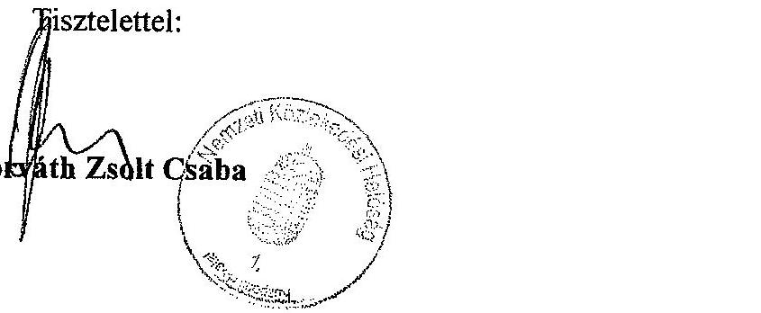

---

# A vasúti közlekedés hatósági szervei 

A Közlekedési Főfelügyelet, a Központi Közlekedési Felügyelet, a megyei (fővárosi) közlekedési felügyeletek és a Polgári Légiközlekedési Hatóság jogutódjaként a Kormány 263/2006. (XII. 20.) rendeletével a közúti, a vasúti közlekedéssel, a hajózással, valamint a polgári légiközlekedéssel kapcsolatos közlekedési hatósági feladatok ellátására 2007. január 1-től létrehozta a gazdasági és közlekedési miniszter irányítása alatt működő egységes, országos hatáskörrel rendelkező közigazgatási szervet, a Nemzeti Közlekedési Hatóságot (NKH). Az NKH önállóan gazdálkodó központi költségvetési szerv, mely 22 egykor önálló (megyei) költségvetési intézményt egyesített. Az NKH közúti közlekedés szempontjából hét, vízi közlekedés tekintetében öt regionális igazgatóságra tagozódik. A centralizált gazdálkodás megerősített kontrolling mechanizmussal és integrált gazdálkodásirányítási rendszer kialakításával járt együtt. A Vtv. 81. §-a szerint belföldön bejegyzett vasúti társaság a vasúti pályahálózatot kizárólag a Nemzeti Közlekedési Hatóság által kiállított vasútbiztonsági tanúsítvány birtokában használhatja. A tanúsítvány igazolja, hogy a vasúti társaság megfelel a műszaki előírásokban, valamint a nemzeti biztonsági szabályokban meghatározott követelményeknek.

A Magyar Vasúti Hivatalt (MVH) 2006. január 1-jén hozta létre a Kormány, mint országos hatáskörű szervet. Az MVH feladata, hogy a több szereplős hazai piac minden vasúti társasága számára biztosítsa a vasúti infrastruktúrához való hozzáférés azonos feltételeit. Szabályozó hatóságként biztosítja, hogy a magyarországi pályahálózatokat használó vasúti társaságok szerződéses kötelezettségeiket betartva, a vasúti piac hosszú távú
 érdekeit figyelembe véve fejlesztse szolgáltatásaikat. Az EU-s jogszabályoknak megfelelően az MVH a 95/18 EK irányelv meghatározása szerinti engedélyező hatóságként kiadja a vasúti társaságok működési engedélyét. Az MVH továbbá a 2001/14/EK, valamint a 91/440/EGK irányelvben tételesen meghatározott feladatokat látja el.

A Magyar Vasúti Hivatal eddig az új törvény alapján három vasúti társaságnak adott engedélyt az Európai Vasúti Térség és az országos hálózatok használatára, vasúti személyszállítási tevékenység végzésére. Ezek a GySEV Zrt., a MÁV Start Zrt. és a MÁV Nosztalgia Idegenforgalmi, Kereskedelmi és Szolgáltató Kft. Árutovábbításra vonatkozó országos engedéllyel jelenleg 16 társaság rendelkezik, köztük az ágazat korábbi két fontos szereplője, a GySEV Zrt. és a MÁV Csoport 100%-os tulajdonában lévő MÁV Cargo Zrt, amely a MÁV Zrt. árufuvarozási üzletágának önálló cégbe szervezésével jött létre. A MÁV Cargo Zrt. 2006. január 1-jei és a MÁV Start Zrt. 2007. július 1-jei indulásakor be kellett szereznie minden szükséges működési engedélyt, mivel ezek a cégek nem jogutódjai a MÁV Zrt.-nek.

Európai Uniós jogharmonizációs kötelezettségünknek tett eleget a Kormány azzal, hogy létrehozta a légi-, vasúti- és vízi közlekedési balesetek szakmai vizsgálatát ellátó, egységes és független szakmai vizsgáló szervezetet, amely a Közlekedésbiztonsági Szervezetről légi-, a vasúti és a vízi közlekedési balesetek és

---

egyéb közlekedési események szakmai vizsgálatáról szóló 2005. évi CLXXXIV. törvény alapján működik.

A fent hivatkozott törvény előírja a KBSZ számára, hogy folyamatos baleseti ügyeletet tartson fenn. A KBSZ dolgozói köztisztviselők. A köztisztviselőkre vonatkozó általános előírások nem rendelkeznek ilyen típusú munkarendről, így ez a működésben problémát okoz. (A jogelőd Polgári Légiközlekedés Biztonsági Szervezet dolgozói közalkalmazottak voltak.)

Az EU 2001/14-es irányelve kimondja, hogy a vasúti pályakapacitás elosztását valamennyi tagországban olyan testületnek kell ellátnia, amely független a pályát igénybevevő vasúttársaságoktól, annak érdekében, hogy a pályához való hozzáférés minden EU-s résztvevő számára egyenlő feltételek között biztosítható legyen. A vasúti pályahálózat kapacitásának elosztására, az integrált vasúti társaság Hálózati Üzletszabályzatának kidolgozására, a hálózathozzáférési díjak összegének meghatározására, valamint az integrált vasúti társaságnak az általa működtetett vasúti pályahálózathoz történő hozzáférése költségeinek meghatározására jött létre a Vasúti Pályakapacitás-elosztó Kft. (a továbbiakban: VPE Kft.), amely alapítását követően állami tulajdonba került. A Kft. megrendelői (vevők) között csak a MÁV Zrt. és a GYSEV Zrt. szerepel a Vasúti Pályakapacitás-elosztó Szervezet és az integrált vasúti társaság közötti jogviszonyról szóló 333/2005. (XII. 29.) Korm. rendelet előírásaival összhangban, más bevétele nincsen. A Kft.-nek pályahasználati díjból sem keletkezik bevétele, mert azt a magyar vasúthálózat két, vagyonkezelői joggal rendelkező társasága, a MÁV és a GYSEV Zrt. számlázza a használók felé. A Kft.-nek az előzőek alapján bevétele csak a két nagy vasúttársaságtól származik. A Kft. munkájáért felszámolt díj mértékét a 333/2005. (XII. 29.) Korm. rendelet 6. § (1) bek. határozza meg a MÁV és a GYSEV Zrt. által kiszámlázott hálózat-hozzáférési díj nettó összege 0,3%-ának megfelelő mértékben, amit a MÁV és GYSEV Zrt. felé számláz. A jogszabály azonban csak a mérték meghatározását biztosítja, a konstrukción - amely szerint idegen tulajdonnal kapcsolatban, a tulajdonos megrendelésére végez a Kft. szolgáltatást és a tőle ezért kapott ellenérték biztosítja a működését - nem változtat.

A Magyar Vasúti Hivatal több ellenőrzés és eljárás eredményeképpen a MÁV Zrt. és a VPE Kft. pályavasúti tevékenységével kapcsolatban több szabálytalanságot és jogsértést tárt fel. A VPE Kft.-nél a kapacitás-elosztás, ezen belül a menetrendtervezés, szerkesztés, valamint a díjképzés és díjalkalmazás folyamatai jelentősen eltérnek a jogszabályokban előírtaktól. A fentiekben jelzett folyamatok egyes, döntően stratégiai jelentőségű feladatait a jogszabályokban foglaltaktól eltérően nem a VPE Kft. végzi, hanem azokat maguk az integrált vasúttársaságok látják el. A határozatból az következik, hogy a végrehajtás módja miatt sem biztosított az alapvető funkciók függetlensége, a VPE Kft. sem elosztó, sem díjszabási feladatait nem látja el megfelelően, azok ellátására szervezete nem is képes. A VPE Kft. 2007-ben megkezdte munkafolyamatainak felülvizsgálatát.

A VPE Kft. alapításakor a vasúti pályakapacitás-elosztásához kapcsolódó feladatok folyamat-orientált rendszerbe állítása helyett azok - meglévő szervezetek tevékenységi köréhez igazodó - részekre bontása valósult meg. Ennek eredményeként alakult ki az a jelenlegi gyakorlat, amely szerint a kapacitás-elosztás törvényben rögzített felelőssége a VPE-t terheli, ugyanakkor a folyamat elválaszthatatlan részét képező menetrend-tervezés, szerkesztés feladatai és a hozzájuk tartozó hatáskörök az integrált vasúti társaságok pályavasúti szervezeti egységeinél vannak.
2007. május 1-jével a Közlekedéstudományi Intézet Kht-n belül felállításra került a regionális közlekedésszervezési irodák hálózata. Az Irodákat a GKM azzal a céllal hívta életre, hogy független, helyi információkon nyugvó vizsgálatok alapozzák meg a személyközlekedési közszolgáltatások fejlesztésének, a közszolgáltatási szerződések módosításának szakmai kérdéseit.

A Nemzeti Autópálya Zrt. feladatkörei 2007-ben kibővültek a nem gyorsforgalmi útépítés és vasúti fejlesztési feladatokkal. Az így kialakult Nemzeti Infrastruktúra Zrt. (NIF) fogja megvalósítani az EU társfinanszírozású vasúti fejlesztéseket. A gazdasági és közlekedési miniszter X-3/101/1/2006. sz. levelében foglalt döntése alapján valamennyi folyamatban lévő és tervezett uniós forrás felhasználásával megvalósuló vasúti infrastrukturális beruházás lebonyolítása a MÁV Zrt.-től átkerült a NIF Zrt.-be.

Az uniós támogatások elnyerésére irányuló pályázati folyamatban (az előkészítésben, a zsűrizésben, az Akciótervbe való besorolásnál stb.) a Nemzeti Fejlesztési Ügynökség (NFÜ) meghatározó szerepet tölt be. (Az NFÜ tevékenységének ellenőrzéséről külön jelentés készül.)

A Közlekedésfejlesztési Koordinációs Központon (KKK) belül létrejött az egységes Közlekedési Integrált Közreműködő Szervezet. A KIKSZ feladata, hogy EU-s közreműködő szervezetként elősegítse a közlekedésfejlesztés rendelkezésére álló EU források hatékony és szabályszerű felhasználását a Közlekedés Operatív Program valamennyi prioritása, valamint a Közép-Magyarországi Operatív Program 2. prioritásának 2.2. intézkedése végrehajtásában közreműködő szervezet kijelöléséről szóló 26/2007. (X. 5.) ÖTM-GKM együttes rendelet rendelkezéseinek megfelelően.

# Állami feladatellátás, egyeztetési fórumok 

A közlekedést érintő fejlesztési koncepciók és a közforgalmú személyszállítási vasúti és autóbusz-közlekedési menetrend kialakításával kapcsolatos egyeztetések a GKM és a nevében eljáró Regionális Közlekedésszervező Irodákon (RKI-k), a szolgáltató társaságok, valamint a településeket képviselő polgármesterek között zajlanak. A 2007/2008. évi menetrenddel kapcsolatos egyeztetéseket az RKI-k - a tárca által 2007. januárjában kidolgozott irányelvek figyelembevételével - 2007 augusztus és szeptember hónapban valamennyi kistérségben elvégezték, az egyeztetésekbe az érintett vasúti és autóbuszos szolgáltatókat bevonták. Az utazási igények változása következtében szükségessé váló menetrendi módosítások év közben az RKI-kal folytatott előzetes egyeztetést követően kerülnek jóváhagyásra.

Az elmúlt öt évben az infrastruktúrát kezelő MÁV Zrt. készítette a vasúti hálózati infrastruktúrafejlesztés kiinduló alapkoncepcióit. 2007 közepe óta működik a GKM-ben kétheti gyakorisággal rendszeres egyeztető fórum külön a vasúti hálózati infrastruktúrafejlesztések megbeszélésére. A GKM szakfőosztályai mellett a fórum állandó résztvevői a MÁV Zrt., GYSEV Zrt., NIF Zrt., KKK, KIKSZ.

---

# A vasúttársaságok által - működésre és fejlesztésre felhasznált költségvetési források 

| Megnevezés | 2002 | 2003 | 2004 | 2005 | 2006 | 2007 | Mindösszesen |
| :--: | :--: | :--: | :--: | :--: | :--: | :--: | :--: |
| MÁV Zrt.   összesen | 225157 | 101029 | 95974 | 103817 | 136253 | 286296 | 948526 |
| Fejlesztésre | 27481 | 17227 | 12585 | 18407 | 36518 | 13985 | 126203 |
| Működésre | 76550 | 79976 | 80132 | 76410 | 99735 | 160711 | 573514 |
| Tőkeemelés (tőkejuttatás) |  | 3826 | 3257 | 9000 |  | 111600 | 127683 |
| Szanálás | 121126 | - | - | - | - | - | 121126 |
| GYSEV Zrt. összesen | 4423 | 3826 | 3256 | 3566 | 4967 | 6030 | 26068 |
| Fejlesztésre | 2110 | 2332 | 1628 | 540 | 810 | 460 | 7880 |
| Működésre | 1401 | 1494 | 1628 | 2726 | 3857 | 5270 | 16376 |
| Tőkeemelés (tőkejuttatás) |  |  |  | 300 | 300 | 300 | 900 |
| Hitelátvállalás | 922 | - | - | - | - | - | 922 |
| Mindösszesen | 229590 | 104855 | 99230 | 107383 | 141220 | 292326 | 974604 |
| - Fejlesztés | 29591 | 19559 | 14213 | 18947 | 37328 | 14445 | 134083 |
| - Működésre | 77951 | 81470 | 81760 | 79136 | 103592 | 165981 | 589890 |
| - Egyéb | 122048 | 3826 | 3257 | 9300 | 300 | 111900 | 250601 |

*MÁV Starttal együtt
Működésre Fogyasztói árkiegészítéssel együtt

---

# Az Európai Beruházási Banktól vasútfejlesztésre felvett hitelek alakulása 

|  |  |  |  | (M euró) |
| :--: | :--: | :--: | :--: | :--: |
| Hitelek | Hitelszerződés kelte | Hitel összeg | Lehívott összeg | Felhasznált összeg |
| EIB Vasút I/A* | 1998 | 60 | 60 | 60,0 |
| EIB Vasút I/B** | 2001 | 40 | 40 | 34,8 |
| EIB Vasút II/A*** | 2001 | 40 | 40 | 40,0 |
| EIB Vasút /II/B**** | 2001 | 90 | 90 | - |
| EIB Vasút III***** | 2002 | 40 | 40 | 25,7 |
| EIB Vasút IV****** | 2003 | 170 | 27 | 33,1 |
| EIB Vasút V *******CPT 001projekthez | 2005 | 27 | 27 | 2,4 |
| Összesen |  | 467 | 324 | 196 |

* Az EIB I/A hitel teljes összege lehívásra és 2006 évig bezárólag felhasználásra került a Felzsőzsolca-Hidasnémeti (13,4 M euró értékű ) és Budapest-Újszász-Szolnok (58,2 M euró értékű) vasútvonalak rekonstrukciójához. A projektek teljes mintegy 73 M euró költsége miatt a beruházási források a GKM költségvetési támogatásával és a MÁV saját forrásával kiegészítésre került.
** Az EIB I/B hitel a teljes hitelkeret 2002. 10. 10-ig lehívásra került. A felhasználása a Cegléd-Szeged vonal korszerűsítésére folyamatos. A projektre 2008 folyamán a hitelből várhatóan 1,7 M euró használnak fel.
*** AZ EIB/II/A hitelt a MÁV Zrt. vette fel állami kezességvállalás mellett, de a kötelezettséget az állam átvállalta. A hitel teljes egészében az ISPA támogatású PT-001,002,003 projektekhez a saját erő biztosításához került felhasználásra.
**** Az EIBII/B hitelszerződés az EIB és a PM kötötte meg. A teljes összeg 2002. 10. 10-ig lehívásra került.
***** EIBIII hitel: A PT-0007 ISPA támogatású projekt saját erő biztosításához 25,7 M euró került felhasználásra.
****** Az EIB IV hitelszerződés kelte: 2003. 09. 01. Az EIB és a PM közötti hitelszerződés a következő projekteket tartalmazza: Rákospalota-Újpest állomás átépítése, Győr-Celldömölk vasútvonal részleges rehabilitációja és villamosítása, Budapest-

---

Esztergom vonal korszerűsítése I.(Északi Vasúti híd,
 Óbuda-Piliscsaba vonalszakasz átépítése), Érd állomás átépítése, Székesfehérvár állomás korszerűsítése. A hitelből 27 M euró került lehívásra. A hitelszerződésben szereplő projektelemek közül eddig az Északi vasúti híd felújítása kezdődött meg, a munkálatok befejezése 2008 végére várható. A Vasút IV többi alprojektje előreláthatólag az Új Magyarország Fejlesztési Terv keretében, uniós támogatás bevonásával valósul meg, a beruházásokkal összefüggő központi költségvetési kiadásokat továbbra is az EIB finanszírozza. A lehívott összegből 2007. évig mindössze 4 Mrd Ft került felhasználásra az Északi összekötő vasúti híd korszerűsítéséhez. A GKM 2008. évi költségvetési előirányzatai között 8400 M Ft (33,1 M euró) forrás szerepel, 2009-re további 9000 M Ft forrás (34,6 euró) felhasználását tervezik.
******* EIB V hitelszerződés a PM és az EIB között került megkötésre. A 27 M euró keretösszeg lehívásra került, de abból a MÁV csak a CPT-001 projekthez használt fel 2,4 M euró összeget.

---

# A MÁV Zrt. által a fejlesztéshez felhasznált források összetétele 

Mrd Ft

| Források megnevezése | $\begin{gathered} 2002 \\ \text { Terv Tény } \end{gathered}$ |  | $\begin{gathered} 2003 \\ \text { Terv Tény } \end{gathered}$ |  | $\begin{gathered} 2004 \\ \text { Terv Tény } \end{gathered}$ |  | $\begin{gathered} 2005 \\ \text { Terv Tény } \end{gathered}$ |  | $\begin{gathered} 2006 \\ \text { Terv Tény } \end{gathered}$ |  | $\begin{gathered} 2007 \\ \text { Terv Tény } \end{gathered}$ |  | Összesen Terv Tény |  |
| :--: | :--: | :--: | :--: | :--: | :--: | :--: | :--: | :--: | :--: | :--: | :--: | :--: | :--: | :--: |
| EU Források |  |  |  |  |  |  |  |  |  |  |  |  | 83,1 | 39,9 |
| Előcsatlakozási Alapok /ISPA ,PHARE | 19,4 | 3,4 | 9,6 | 5,4 | 9,2 | 4,9 | - | - | - | - | - | - | 38,3 | 13,7 |
| Kohéziós Alap | - | - | - | - | - | - | 16,5 | 8,5 | 26,3 | 14,6 | - | - | 42,8 | 23,1 |
| KIOP | - | - | - | - | - | - |  |  | 2,0 | 2,0 | - | 1,1 | 2,0 | 3,1 |
| MÁV által felvett hitelek |  |  |  |  |  |  |  |  |  |  |  |  | 171,1 | 98,1 |
| Állami kockázatú hitel | 5,4 | 3,7 | 8,7 | 4,2 | 11,5 | 6,7 | 21,2 | 10,3 | 16,2 | 8,6 | 4,8 | 3,1 | 67,8 | 33,5 |
| MÁV saját kock.hitel | - | - | - | - | - | - | 16,7 | 6,3 | 10,8 | 12,9 | 40,3 | 30,9 | 67,8 | 50,1 |
| MÁV EIB hitel | 14,4 | 2,5 | 7,1 | 3,9 | 6,8 | 3,6 | 5,2 | 3,2 | 2,0 | 1,2 | - | - | 35,5 | 14,5 |
| Költségvetési források |  |  |  |  |  |  |  |  |  |  |  |  | 224,5 | 157,5 |
| EU támogatás kltsgv. | 5,0 | 0,9 | 2,5 | 1,4 | 2,4 | 1,3 | 14,9 | 5,9 | 35,7 | 21,0 | - | - | 60,5 | 30,5 |
| Állami hitelfelv, EIB | - | - | 25,9 | 20,3 | -6,9 | -7,2 | 15,4 | 7,4 | 15,6 | 16,5 | 10,6 | 6,1 | 75,3 | 51,4 |
| Tőkeemelés | - | - | 10,4 | 7,2 | 3,6 | 8,8 | 9,6 | 4,3 | 8,0 | 4,8 | - | - | 31,6 | 25,1 |
| Közvetlen támogatás | 28,1 | 26,7 | 16,6 | 15,7 | 11,2 | 5,8 | 0,1 | 1,9 | 0,9 | 0,2 | 0,2 | 0,2 | 57,1 | 50,5 |
| Egyéb források |  |  |  |  |  |  |  |  |  |  |  |  | 94,4 | 59,2 |
| CASH FLOW amort. | - | - | 8,0 | 4,7 | 8,0 | 4,1 | 21,7 | 7,9 | 6,7 | 6,4 | 30,3 | 13,7 | 74,9 | 36,7 |
| Egyéb keret | 1,4 | 1,1 | 5,1 | 4,0 | 4,0 | 3,7 | 2,7 | 2,5 | 6,2 | 10,0 | 0,1 | 1,2 | 19,5 | 22,5 |
| Összesen | 73,7 | 38,2 | 94,1 | 69,7 | 63,7 | 46,0 | 124,2 | 58,2 | 131,5 | 92,4 | 86,5 | 56,3 | 573,7 | 354,7 |

---

# A MÁV Zrt. gazdálkodási eredménye a 2002-2007. években 

| Megnevezés | 2002 | 2003 | 2004 | 2005 | 2006 | 2007 |
| :--: | :--: | :--: | :--: | :--: | :--: | :--: |
| Saját tőke | 175914 | 162239 | 119422 | 55562 | -31581 | 20617 |
| Jegyzett tőke | 188000 | 193733 | 201232 | 80000 | 80000 | 20250 |
| Nettó értékesítési árbev. | 196337 | 207743 | 209770 | 210375 | 205606 | 179088 |
| -ebből személy szállítás | 34889 | 37169 | 39437 | 39922 | 41049 | 21286 |
| Fogyasztói árkiegészítés | 20705 | 22160 | 23597 | 24226 | 24306 | 10681 |
| Termelési tám. Költségtérítés. | 55845 | 57815 | 56534 | 50384 | 74407 | 94409 |
| Mérleg szerinti eredmény | 13084 | -33066 | -49461 | -80643 | -83842 | 1320 |
| Tőkejuttatás | 121100 |  |  |  |  | 111600 |

*A MÁV Zrt. nyilvántartási rendszerének a változása következtében a termelési támogatás/költségtérítés az árbevétel részét képezte 2006-ig, 2007-től egyéb bevételként számolják el.

---

# A vasúti közlekedés korszerűsítésének ellenőrzéséhez kiküldött kérdőívek feldolgozása 

A vasúti közlekedés korszerűsítésének ellenőrzése során a tulajdonosoknál, az irányító, felügyelő, szabályozó, finanszírozó és elszámoló szervezeteknél, illetve intézményeknél végzett ellenőrzésen kívül elsősorban az integrált országos közforgalmú vasúti társaságok (MÁV, GYSEV) korszerűsítését kísértük figyelemmel.

Országos közforgalmú vasúti társaság: az a vállalkozó vasúti társaság, amely működési engedélye alapján - országos közforgalmi vasúti szolgáltatást nyújt, és emellett nemzetközi vasúti, nemzetközi vasúti személyszállítási, vagy nemzetközi vasúti árutovábbítási tevékenységet folytathat.

Jelen vizsgálatunknál a 2002-2007. évek közötti időszakban a személyszállításra és az árutovábbításra jogosult - működési engedéllyel rendelkező - vasúttársaságoktól adatokat és információkat kértünk be a vasúti tevékenységükkel kapcsolatosan. Az országos vasúti társaságokon kívül összesen 40 vasúttársaságnak küldtünk ki kérdőívet, valamint gazdasági, és teljesítményadatokat tartalmazó tanúsítványt. Összesen 30 társaságtól kaptunk visszajelzést, a kérdőívet 16 szervezet, a tanúsítványokat 14 szervezet töltötte ki.

A vasúttársaságok nagy része személyszállítási és árutovábbítási szolgáltatási tevékenységet nem végez, közvetlen állami támogatást a működéséhez és fejlesztéséhez nem kapott.

A gazdasági társaságokat - vasúti társasággá alakulásuk során - vagy személyszállítási, vagy áruszállítási kategóriába sorolta a hivatal függetlenül attól, hogy vasúti karbantartással, speciális vasútépítő-gépek szállításával, vontatással, turisztikai vagy gépészeti tevékenység folytatásával foglalkoznak. Ennek következtében az erdő- és magán vasúttársaságok által kitöltött tanúsítványok gazdálkodási, eszközfejlesztési és teljesítményadatai érdemben nem befolyásolták az országos közforgalmú vasúti társaságoktól (MÁV, MÁVSTART, MÁV Cargo, GySEV) kapott adatok értékét.

A kérdőívekben megfogalmazott kérdésekre adott válaszok összesítése alapján az alábbi megállapításokat tehetjük:

- 1. Kérdés: A társaságnak van-e kidolgozott stratégiája az EU-csatlakozáshoz szükséges vasúti reform végrehajtásáról szóló kormányhatározatokban megfogalmazott fejlesztési intézkedésekre?

A válaszadók 62,5%-a rendelkezik fejlesztési stratégiával. A modern vállalatcsoporttá alakuló MÁV stratégiai célja az, hogy a közösségi elvárásoknak megfelelő magas színvonalú szolgáltatáskínálattal, a csoportszintű szinergiákra is építő hatékony működéssel megerősítse piaci pozícióját. A vasúti

---

reform keretében megfogalmazott stratégiai célokkal összhangban sor került a MÁV Zrt. árufuvarozási tevékenységének kiszervezésére a MÁV Cargo Zrt. 2006. január 1-je óta működik, majd 2007. július 1-jétől a személyszállítási tevékenység végzésére alapított önálló társaság (MÁV-START Személyszállítási Zrt.) is megkezdte működését. A MÁV Zrt. szervezeti átalakításának további lépéseként 2008. január 1-jétől a vontatási tevékenység, valamint a járműjavítás és -karbantartás is kiválik a MÁV Zrt.-ből. Ezzel lezárul az elsődleges strukturális átalakítás és a vasúti infrastruktúra üzemeltetője vasútüzemi tevékenységet nem folytat a tervek szerint.

Jellemzően a kisvasutaknak nincs kidolgozott stratégiájuk, a társaságok többsége a túlélésért küzd. Fejlesztésekre, komolyabb beruházásokra nem gondolhatnak. Évente a legszükségesebb szinten-tartó karbantartásokat, beszabályozásokat, és beruházásokat végzik el, amellyel az előírt biztonsági elvárásoknak tudnak megfelelni.

Az erdőgazdaságok vasútüzemei térségi pályahálózatként működnek. Az üzemeltetés elsősorban saját tulajdonú faanyag szállítása, valamint turisztikai személyforgalom lebonyolítására korlátozódik. Fejlesztéseik nem a bővítést, hanem a meglévő vonalak korszerűsítését, biztonságának növelését, az infrastruktúra fejlesztését célozták.

- 2. Kérdés: Hozott-e a társaság tulajdonosa olyan döntést, ami a reformok teljesülését lassította, gátolta?

A megkérdezettek 100%-ánál nem volt ilyen tulajdonosi döntéshozatal.

- 3. Kérdés: Indokoltak és célszerűek voltak-e az irányító- és felügyelő hatóságoknak és a társasági szereplőknek a vasúti közlekedés korszerűsítése érdekében megtett intézkedései?

A válaszadók 62,5%-a indokoltnak és célszerűnek tartja közreműködőknek a vasúti közlekedés korszerűsítése érdekében megtett intézkedéseit, ugyanakkor azok nem jártak eredménnyel. Az új vasúti törvény alkalmassá tette a jogszabályi környezetet a vasúti közlekedés piaci alapon történő működtetésére, de nem történt semmi annak érdekében, hogy a vasúti pályahálózatot üzemeltető társaság (MÁV Pályavasút) monopolhelyzetéből adódó versenyhátrány megszűnjön. Nehezítik a vasúti árufuvarozások megvalósítását például: a vasúti árufuvarozási szerződésekről szóló 153/1996. (X. 15.) Korm. rendelet (VÁSZ) korszerűsítésének hiánya; a vasúti infrastruktúra használati díjak meghatározására irányuló kormányrendelet kihirdetésének csúszása; a vasúti technológia korszerűsítésének hiánya.

- 4. Kérdés: Illeszkednek-e a vasúti szolgáltató társaságok fejlesztési tervei az elfogadott hazai közlekedéspolitikához?

A magán vasúttársaságok jellemzően nem ismerik a konkrét és elfogadott hazai közlekedéspolitikát. Az erdőgazdaságokban üzemeltetett kisvasutak fejlesztési iránya elsősorban a kirándulóturizmus felé tolódik el. A megkérdezettek véleménye szerint a támogatások megvonásával a kisvasutak megszünése várható.

---

A MÁV Zrt. - a kormányhatározatokban megfogalmazott célkitűzésekkel összhangban - kiemelt feladata a vasúthálózat fejlesztése, ezen belül az EU vasúti folyosóihoz kapcsolódó törzshálózat, az elővárosi - és ezen belül a budapesti
 - közlekedés, valamint a távolsági közlekedés szolgáltatási színvonalának emelése. A járműállományának korszerűsítése elsősorban az elővárosi közlekedés fejlesztését szolgálja. A járműbeszerzések, korszerűsítések révén a szolgáltatások színvonala javul az érintett vonalakon. Az uniós források felhasználásával folyó és előkészítés alatt álló fejlesztések eredményeképpen 2013-ig megvalósulhat mintegy 300 km vasútvonal (elővárosi vonalakat is ideértve) korszerűsítése, a kapcsolódó informatikai, biztonsági és irányítástechnikai eszközökkel együtt. A stratégia végrehajtása során kiemelt területként kezelik a vasúti informatikai és utas tájékoztató rendszerek fejlesztését is.

- 5. Kérdés: A társaság jelenlegi vagy korábbi vezetése hozott-e olyan döntést (fejlesztési irány kérdésében, stratégiai szerződések stb.), ami a jelenlegi ismeretek szerint utólag hibásnak bizonyultak?

A válaszolók 100%-a nemlegesen nyilatkozott.

- 6. Kérdés: Biztosítottak-e a helyközi személyszállítási szolgáltatást végző társaságok olcsóbb és hatékonyabb működtetésének feltételei?

A válaszadók egységesen nemmel nyilatkoztak. A 2007. évtől előírt Vasút Biztonsági Tanúsítvány és Biztonsági engedély megszerzésének hatósági díja nem áll arányban az erdei és kisvasutak üzemeltetési költségeivel ill. bevételeivel. A hatósági díj kifizetése önmagában 10-30% költségnövekedést jelent a kisvasutak számára. Az üzemanyagárak folyamatos emelkedése is negatív hatású.

- 7. Kérdés: A pályahálózat és az infrastruktúra fejlesztésére kapott támogatások felhasználása, növelte-e a vonali és állomási kapacitásokat?

A válaszadók 50-50%-a válaszolt igennel és nemmel. Az erdőgazdaságok esetében a pályahálózat felújításával lehetőség nyílt a saját célú áruszállítás (faanyag-mozgatás) szinten tartására, valamint a turisztikai célú személyszállítás színvonalának emelésére. A pályahálózat megerősítésével lehetővé vált a gőzvontatás turisztikai látványosságként történő bevezetése. Az infrastruktúra fejlesztésének keretében erdészeti, faipari és vasúti múzeumot is magában foglaló épületeket alakítottak ki, természetismereti központot hoztak létre, illetve akadálymentesített szálláslehetőséget biztosítottak az érdeklődők részére.

A kapott támogatások szinte minden esetben csak a pályahálózat szinten tartását tették lehetővé, fejlesztést ebből végrehajtani nem lehetett. A pályakorszerűsítések abban merültek ki, hogy az utazási sebességet szinten tudják tartani, a pályát ne kelljen lezárni. Az országos vasúti pályahálózat 7700 vonalkm 44,2%-án állandó sebességkorlátozás van a pálya hibái miatt. A biztosítóberendezések átépítése sem növelte a kapacitást, mert legfeljebb az emberi tényezők kiváltását oldották meg vele, az átbocsátóképesség nem nőtt. Csak a fővonali fejlesztések eredményeztek némi javulást.

---

- 8. Kérdés: Megvalósultak-e logisztikai rendszerek fejlesztése - a 2141/2006. (VIII. 14.) Korm. határozatban előírt átrakási teljesítmények növelése - érdekében kitűzött célok?

A válaszadók 80%-a válaszolt nemmel. Jelenleg Kiskundorozsma terminálon van Ro-La szolgáltatás. Ezen felül, minimális beruházással az ország még 3-4 pontján érhetőek el hasonló, közútról vasútra történő átrakási lehetőségek (pl. Záhony, Mosonmagyaróvár, Lenti). A közúton közlekedő kamionok száma évről évre nő. A kamionforgalom vasútra terelése nem sikerült. A kamionszállító RO-LA vonatok hosszú órákat kénytelenek várakozni az állomásokon. A nyomtávváltás miatt záhonyi tengelyátszerelés növelése nem célja a MÁV Cargónak, mert a magyar vonalakra jellemző 18-20 t/tg tengelyterhelés miatt a széles kocsik nem közlekedhetnek átrakás nélkül maximális terheléssel.

- 9. Kérdés: Megtörtént-e a személyszállítás és áruszállítás szolgáltatási színvonalának összehangolása az EU előírásokkal?

A válaszadók 66,6%-a válaszolt igennel. Az erdei vasúttársaságoknál a pályahálózat megerősítésével egy időben bevezetett menetrend szerinti gőzvontatás és a gördülő állomány fejlesztése az idegenforgalomi szolgáltatás színvonalának emelését szolgálta.

Az árufuvarozási szolgáltatások színvonalának javítása a vasúttársaságok üzleti érdeke, ugyanakkor az eljutási idők csökkentését, a kereskedelmi sebesség növelését negatívan befolyásolja, hogy az infrastruktúra üzemeltetője nem vállal felelősséget a vonattovábbítási szolgáltatásaiért. Az EU-s előírások nyomán országos szinten a közelmúltban elinduló, a vasútvállalatokra nézve kötelező ún. TAF-TSI projekt végső célja a vasúti árufuvarozás versenyképességének javítása a közúti fuvarozással szemben az ügyfelek gyorsabb és kiszámíthatóbb kiszolgálása révén.

Az elővárosi közlekedésben tapasztalható valamennyi színvonal emelkedés az új motorvonatok beszerzésének, illetve a német személykocsik átépítésének következménye. Ezeken a területeken sem fejlődött azonos mértékben az állomási szolgáltatás.

A hazai fejlesztési irányoknak konkrét viszonyítási alapot adott például a Nyugat-Európában eddig mindenhol sikerrel bevezetett Integrált Ütemes Menetrend (ITF), amellyel nemcsak az utasszám és a vasúttársaságok saját bevételei, de az állami vasút megkopott presztízse is javult. A hazai ITF bevezetésének bevételi és utasforgalmi elemzései azt mutatják, hogy, az ütemes menetrenddel érintett vonalakon az utasforgalom csak minimálisan (2-3%) csökkent, de a bevételi hatás kedvezően alakult, 31%-kal nőtt a bevétel.

- 10. Kérdés: A személyszállítás szinten tartása megvalósult-e a szárnyvonalak ideiglenes szüneteltetése, illetve megszüntetése mellett?

---

A kisvasutak nem érintettek a fenti kérdésben, így nem tudják azt megítélni. A válaszadók megosztottak e kérdésben, 50%-ban igen 50%-ban nem választ adtak.

A MÁV Zrt.-nél 2007. március 4-én 14 gyenge forgalmú vonalon bevezetett személyszállítási forgalomszüneteltetés került végrehajtásra, a szóban forgó vonalakon a személyszállítási közszolgáltatást a Volán társaságok vették át. A forgalomszüneteltetés révén felszabaduló motorkocsik átcsoportosításával kevesebb főjavítással sikerült biztosítani a menetrend kiszolgálásához szükséges üzemképes járműveket. A forgalomszüneteltetés területek felszabadításával nem járt, mivel a vasúti pálya üzemképességéhez szükséges feltételeket továbbra is biztosítani kell, az érintett vonalak egy részén jelenleg is tehervonati forgalom van. Nem érzékelhető az intézkedés pozitív hatása. A szárnyvonalak ideiglenes szüneteltetése önmagában nem elégséges a működő vonalak szolgáltatásának javítására.

- 11. Kérdés: Ismertek-e a vasúti és közúti hálózatok szűk keresztmetszetei megszüntetésének feltételei?

A válaszadók 78,6%-a válaszolt igennel.
Pályahálózat szűk keresztmetszetét első sorban a még fel nem újított vonalszakaszok alacsony teherbírása jelenti, továbbá az éppen futó rekonstrukciós munkálatok melyekhez vágányzári rend tartozik, az ideiglenes lassúmenetek (helyenként $30 \mathrm{~km} / \mathrm{h}$ pályasebesség) és az egyvágányú pályák, ahol éjszakai üzemszünet is van. Szűk keresztmetszetet jelent még a villamosítás hiánya a nemzetközi korridorokon, valamint az összesen 4 darab üzemelő vasúti Duna híd és a Budapestet elkerülő körvasútvonal hiánya.

A MÁV véleménye szerint a szűk keresztmetszetek oldását, az átbocsátóképesség növelését elsősorban a pályarekonstrukciók, a sebesség és a pályaterhelés növelését szolgáló fejlesztések, a műtárgyak, vonalvillamosítás, a biztosítóberendezések korszerűsítése, az informatikai és forgalomirányító rendszer megújítása, az európai rendszerekkel való kompatibilitásának megteremtése szolgálja.

- 12. Kérdés: Ismertek-e olyan regionális és kistérségi igények, amelyek hozzárendelhetők a Közlekedés Operatív Programban meghatározott fejlesztési célkitűzésekhez?

A Glencore foktői gabonatárházának kiszolgálása miatt a Kiskőrös-Kalocsa vonalszakasz korszerűsítése. A Nagyút - Visonta vonal korlátozott áteresztő képességének javítása, a Mátrai Erőmű Zrt. és az erőmű környezetében létesülő ipari parkba települt vállalkozások biztonságos vasúti kiszolgálása érdekében. Az erdei vasutak esetében a kirándulóturizmus növelése, tanösvények, erdei iskolák látogatottságának növelése.

- 13. Kérdés: Az érvényben lévő személyszállítási (vasúti és közúti) díjszabás ill. a kedvezményrendszer egységesítése biztosítja-e az elvárt esélyegyenlőséget?

A válaszadók 64,3%-a nemmel válaszolt.

---

- 14. Kérdés: Megtörténik-e a közérdekű bejelentések és utas-panaszok megalapozottságának kivizsgálása?

A válaszadók 84,6%-a válaszolt igennel. A kisvasúti és erdei közlekedésre a vizsgált időszakban nem volt panasz.

A MÁV Cargo az ügyfelek hatékonyabb kiszolgálása érdekében átalakította Key Account Manager rendszerét, amely biztosítja a szorosabb együttműködést az ügyfelekkel. Folyamatosan végez vevőelégedettségi vizsgálatokat. 2007 novemberében bevezették az E-Freight reklamációkezelési modult, amely biztosítja a beérkezett ügyfélpanaszok nagyobb fokú nyomon követhetőségét, illetve gyorsabb megválaszolását.

A személyszállítás területéről érkező panaszok megszüntetése érdekében hozott intézkedések nem hatékonyak. A panaszok zöme hosszú évek óta a menetrend, a tájékoztatás és a szolgáltatási színvonal hiányosságait jelzik.

---

# Teljesítményadatok összesen 

| Megnevezés | Mérték-   egység | $\mathbf{2002}$ | $\mathbf{2003}$ | $\mathbf{2004}$ | $\mathbf{2005}$ | $\mathbf{2006}$ | $\mathbf{2007}$ |
| :-- | :--: | --: | --: | --: | --: | --: | --: |
| Utasszám | millió | 164,8 | 160,2 | 162,7 | 156,7 | 157,2 | 151,6 |
| Átlagos utazási   távolság | km | 64,0 | 64,2 | 64,9 | 63,1 | 61,0 | 59,7 |
| Utaskilométer | millió | 10534,4 | 10290,0 | 10550,5 | 9883,1 | 9589,3 | 9040,5 |
| Elszállított áru-   tonna | ezer | 49980,0 | 49383,2 | 51663,1 | 50740,4 | 54647,7 | 53383,2 |
| Átlagos szállítá-   si távolság | km | 154,1 | 162,1 | 169,3 | 179,1 | 185,9 | 187,1 |
| Díjszabási áru-   tonna km | millió | 7750,8 | 8010,3 | 8746,6 | 9086,1 | 10158,7 | 9984,6 |
| Dízelvontatás | millió   elegytkm | 3846,8 | 3707,4 | 3775,9 | 3844,2 | 4041,9 | 4308,8 |
| Dízel-motorkocsi | millió   elegytkm | 1758,1 | 1558,6 | 1756,9 | 1602,5 | 1701,4 | 1709,4 |
| Villamos vonta-   tás | millió   elegytkm | 25241,1 | 25509,6 | 27143,5 | 26922,4 | 29218,4 | 29772,1 |
| Gőzvontatás | millió   elegytkm | 4,7 | 3,8 | 3,5 | 3,7 | 2,3 | 1,2 |
| Valamennyi   vontatási nem   összesen | millió   elegytkm | 30850,7 | 30779,5 | 32679,8 | 32372,8 | 34964,0 | 35791,6 |
| Személyszállítási   forgalmi adatai | vonatkm | 1461202,0 | 1681809,0 | 1812807,0 | 1805688,0 | 1940960,0 | 2605968,0 |
| Áruszállítási   forgalmi adatai | vonatkm | 764902,0 | 803459,0 | 961788,0 | 1179152,0 | 1579979,0 | 1902114,0 |
| Személyszállítási   bevételek | millió Ft | 113427,0 | 119996,5 | 121997,9 | 117762,2 | 144679,9 | 187243,8 |
| Ebből: Saját   bevételek | millió Ft | 35440,3 | 38476,9 | 40190,3 | 40999,6 | 42395,3 | 50849,0 |
| Áruszállítási   bevételek | millió Ft | 79530,0 | 91461,0 | 94491,0 | 96164,5 | 108181,1 | 108931,1 |
| Ebből: Közfor-   galmú fuvardi-   jak | millió Ft | 66007,0 | 72459,0 | 74741,0 | 78108,5 | 89652,1 | 89581,1 |
| Meglévő ingat-   lanvagyon érté-   ke | millió Ft | 421803,1 | 438570,3 | 463406,4 | 465840,9 | 490772,7 | 482151,3 |
| Éves amortizá-   ció | millió Ft | 30632,8 | 33182,1 | 35150,6 | 93095,2 | 36039,4 | 39042,5 |
| Pályahasználati   díj bevételei | millió Ft | 1096,1 | 1281,4 | 104795,7 | 102825,3 | 111024,5 | 114789,5 |
| Pályahasználati   díjal szemben   elszámolt ktg. | millió Ft | 3003,3 | 3084,0 | 116568,6 | 125258,8 | 144633,0 | 141013,1 |

---

# A 2000/HU/16/P/PT/003 Zalalövő-Zalaegerszeg-Boba vasútvonal felújítása többletköltségeinek és késedelmének okai 

## Többletköltségek:

Bagod-Zalaegerszeg pályaépítési munkák
A vasútvonal alatt 1,5 km hosszban húzódó gázvezeték kiváltása az előírások változása és a menetközben pontosításra kerülő műszaki megoldások többletköltségei miatt. Hatósági előírások is jelentettek drágulást, valamint a kivitelezés időszakában a terven nem jelölt további közművek kerültek elő.

Ukk-Boba pályaépítési munkái
Az engedélyezési terveket a támogatási kérelem befogadását követően készítették el, melyben lényeges mértékben változott a műszaki tartalom és a mennyiségek. A 120 km/h tervezési sebességgel a vonalszakasz közel fele új nyomvonalra került. Az új

 nyomvonal többlet földmunka mennyiséget jelentett és a keresztező utak jelentős átalakításával jár. A támogatási kérelem benyújtásának időszakát követően előírás is változott. Pl. a megjelölt UIC 54 rendszerű felépítmény helyett a költségesebb UIC 60-as rendszerű felépítménnyel kell átépíteni a vasútvonalat.

Zalalövő-Boba vonalszakasz kiegészítő költségei.
Kisajátítási költségek emelkedtek.
A késedelmek kialakulásában a közbeszerzési eljárások elhúzódása játszott szerepet az alábbiak szerint.

A Bagod-Zalaegerszeg deltavágány vonalszakasszal és felépítményi munkái esetében a 2005. szept. 29-én kihirdetett eredménnyel szemben - amely szerint győztes pályázó a Wittfeld-Hoffmann Konzorcium - a VIADOM Építőipari Rt., valamint a MSV Konzorcium jogorvoslati kérelemmel élt a Közbeszerzési Döntőbizottságnál. A Közbeszerzési Döntőbizottság a D777/30/2005. határozatában helyt adott a kérelmeknek és megsemmisítette az ajánlatkérő eljárást lezáró döntését. Ezt követően a MSV Konzorcium B változatú ajánlatát fogadták el győztesnek. A döntőbizottság határozatát követően a Wittfeld-Hoffmann Konzorcium a MSV konzorcium ajánlatának érvénytelenítését kérte. A Wittfeld-Hoffmann Konzorcium 2005. november 17-i beadványát 2005. december 27-én visszavonta.

A Zalaegerszeg deltavágány-Ukk vonalszakasz vágányrehabilitációs munkái első pályázati felhívása az EU Official Journal 2005. december 2-ai számában jelent meg. Az ajánlatok felülvizsgálatát a Buda Ügyvédi Iroda végezte és minden ajánlatot érvénytelennek talált. Az érvénytelenség okai voltak: Ajánlattevők kulcsszemélyzetének képesítésében hiányosságok, alvállalkozók műszaki, szakmai alkalmatlansága, formai követelmények, nem megfelelő banki igazolások, nem számlavezető banktól származó igazolás, alkalmassági követelményeknek a tenderben előírtaknak nem mindenben megfelelő igazolása stb. A második felhívás 2007. február 10-én jelent meg. Nyertes a Vegyépszer vezette V.H.M. Zala Konzorcium lett. A szerződés kelte: 2007. 07. 20. Átfutási idő: 22 hónap a szerződés aláirásától számítva.

A Bajánsenye-OH-Boba vasútvonal villamosítása projektrész első ajánlati felhívása 2005. augusztus 8-án volt. Ennél a projektrésznél az első eredmény alapján megkötött szerződést egy a Közbeszerzési Döntőbizottság által megállapított jogsértés miatt a MÁV felbontotta. Az első eljárással kapcsolatban ma is folyamatban van egy per, amelynek a MÁV Zrt.-re nézve negatív anyagi kihatásai lehetnek. A második ajánlati felhívás 2006. szeptember 9-én volt. A második pályázatra benyújtott ajánlatok érvénytelenek voltak a Kbt. különböző paragrafusai (Kbt. 88. § (1) b) c) e) és f)) alapján. Ez ennél a projektnél két év csúszást okozott. A harmadik eljárásra 2007. augusztus 3-án került sor, ezt a felhívást módosították szeptember 4-én. Eredményhirdetés 2007. december 20-án volt. Nyertes a Vasútvill Kft. vezette BB 2007 Konzorcium lett. A szerződés kelte: 2007. december 28.

---

# A vasúti infrastruktúra minőségi mutatói ${ }^{1}$ 

1. Kétvágányú vonalak aránya

Az össz-vonalhossznak mindössze 15,5%-a kétvágányú a 41,2%-os EU átlaggal szemben. Az európai törzshálózati vonalak fejlesztésére elfogadott előírások teljesítése esetén ez az arány 21,4%-ra növekedne.
2. Villamosított vonalak aránya

A villamos vontatás aránya 34%. (EU átlag 46,4%). Az utóbbi évtizedben az EU országokban a villamosított vonalhossz 18%-kal növekedett (11000 km), hazánkban 4,3%-kal. A felsővezetéki hálózat közel 2/3-a felújításra szorul, több fővonalon a forgalmi igények villamosítást indokolnak.
3. Engedélyezett sebesség

Az utóbbi évek fejlesztési eredményei ellenére csak a hegyeshalmi és a felújítás alatt álló ceglédi vasútvonal egyes szakaszain van 140-160 km/h-s emelt sebesség, a fővonali vonalszakaszaink többsége 100-120 km/h-val járható. Ezen túl a pálya rossz műszaki állapota miatt a fővonali hálózat is sebességkorlátozásokkal terhelt. A kényszerűen bevezetett sebességkorlátozások következtében a vasúti pályák kevesebb, mint 62%-ban alkalmasak arra, hogy a vonatok a kiépítési sebességgel közlekedhessenek. Mind az ideiglenes, mind az állandó sebességkorlátozások száma növekedett - hosszabb időtávot áttekintve, 1995-2006. évek között - az átmeneti 2001-2002. évi javulást követően.
4. Hézagnélküli felépítmény aránya

A műszaki feltételeket kielégítő vágányok szinte mindenütt hézagnélküli kialakításúak. E téren tudományos eredményeink is élenjáróak.
5. Nagytömegű sínek aránya

A $160 \mathrm{~km} / \mathrm{h}$ és annál nagyobb személyvonati sebesség és az AGC Egyezményben rögzített vállalások megkövetelik a 225 kN tengelyterhelés biztosítását, ami felépítmény vonatkozásában $60 \mathrm{~kg} / \mathrm{m}$ tömegű sínek beépítését teszi szükségessé az emelt sebességű vonalakon. A nyugati vasutaknál ez 40-60% közötti arányt jelent, míg nálunk csak a hegyeshalmi vasútvonal emelt sebességű szakaszain és a folyamatban lévő ISPA finanszírozású felújítások eredményeként van összefüggő hosszban beépítve.

[^0]
[^0]:    ${ }^{1}$ Forrás: MÁV Zrt.

---

6. Állomások száma

A magyar vasúthálózaton az európai vasutakhoz viszonyítva az állomássűrűség az egyik legmagasabb (736 állomás és 783 megállóhely a 7600 km-es hálózaton a települések egymáshoz viszonyított távolságának megfelelően).
7. Szintbeli útátjárók

Hazánkban a fokozott balesetveszélyt jelentő mintegy 6000 szintbeli átjáró a hálózat hosszához viszonyítva a második legmagasabb arányt képviseli az európai vasutaknál.
8. Műtárgyak

A nagy folyamokat (Duna, Tisza) átszelő vasúti hidak száma alacsony, állapotuk nem kielégítő, előregedett, a hidak zöme 40-50 éves.
9. Biztosítóberendezés

Az önműködő térközbiztosítás terén a középmezőnyhöz tartozunk, de a korszerű állomási biztosítóberendezések és a központi forgalomirányítás terén az elmaradás rendkívül jelentős. A hálózat vasútállomásainak mindössze 65%-a biztosítóberendezéssel ellátott. A meglévő biztosítóberendezések többségében korszerűtlenek. Az elöregedett, technikailag elavult berendezések működésében gyakorta tapasztalható üzemzavar. Még budapesti főpályaudvaron is működik mechanikus biztosítóberendezés.
10. Távközlő rendszerek

Funkcionalitásukban nem kielégítőek, az analóg rendszerek elavultak. A vasúti távközlés szerteágazó, széles spektrumú, rendkívül heterogén az alkalmazott technológiák, valamint az eszközpark technikai színvonalának, korának tekintetében. A fémvezetőjű távközlési kábelhálózat (vonali- és helyi kábelek) nagyobb hányada vegyes használatú: biztosítóberendezés, távközlés, forgalom, erősáram átviteli rendszerei üzemelnek rajta. A még üzemelő, elavult analóg rendszerek, optikai kábeleknek a MÁV Zrt. hálózatában való alkalmazásával és digitális átviteltechnikai és adatátviteli rendszerek telepítésével kerültek/kerülnek kiváltásra.

---

# Zalalövő-Zalaegerszeg-Boba projekt eredeti és a harmadik módosítás szerinti összehasonlítása 

|  | Megnevezés | Eredeti összes ktg. | Harmadik módosítás összes ktg. |
| :--: | :--: | :--: | :--: |
| I | Zalaegerszeg új delta vágány | 12230000 | 9100000 |
| II | Zalalövő-Zalaegerszeg pályafelújítás és építés | 50060000 | Következő háromban szerepel |
|  | II./1.Zalalövő-Zalacséb | -a II. sorban szerepel | 3697000 |
|  | II./2. Zalacséb-Bagod Zalalövő | -a II. sorban szerepel - | 16821000 |
|  | II./3. Bagod-Zalaegerszeg | -a II. sorban szerepel - | 11785000 |
| III | Zalaegerszeg-Boba   pályarehabilitáció | 70320000 | Következő háromban szerepel |
|  | Zalaegerszeg elkerülő (2. sz. FM mód szerint) | -a III. sorban szerepel | 10152000 |
|  | III./1. Zalaegerszeg elkerülő-Ukk | -a III. sorban szerepel | 49100000 |
|  | III./Ukk-Boba elk. és Boba deltavágány | -a III. sorban szerepel | 36376000 |
| IV | Boba új deltavágány | 8790000 | (előzőbe beépítve) |
| IV. | Zalalövő -Zalaegerszeg -Boba biztosítóberendezési és telekommunikációs munkái | - | 28600000 |
| V | Bajánsenye-Zalalövő-Zalaegerszeg-Boba villamosítása | 17960000 | 31070000 |
| VI | ETCS (bizber.) Hodos-Bajánsenye-Zalalövő-Zalaegerszeg-Boba | 8030000 | $\begin{gathered} -8000000 \\ \text { (elmarad) } \end{gathered}$ |
|  | Összesen (EU-nál szereplő) | 167390000 | 188621000 |
|  | EU támogatás | 83695000 | 83695000 |
|  | „Kiegészítő" ktg | 2009301 | 14758000 |
|  | ETCS | - VI. alatt szerepel | 8000000 |
|  | összes bekerülési ktg | 169399301 | 211379000 |
|  | EU támogatás részarány az összes ktg.-hez viszonyítva | $49,51 \%$ | $39,60 \%$ |
|  | Várható összes bekerülési ktg. emelkedés | 41979699 |  |

---

# A vasúttársaságok gördülőállomány beruházásai 

## Vontatóeszköz beruházások

| Évek | Iker Bzmot felúj. ktg |  | Orosz motorkocsi beszerz. |  | DESIRO motorkocsi besz. |  | FLIRT motorvonat besz. |  | TALENT motorkocsi beszerz. |  | Taurus 1047 beszerzés |  |
| :--: | :--: | :--: | :--: | :--: | :--: | :--: | :--: | :--: | :--: | :--: | :--: | :--: |
|  | db | M Ft | db | M Ft | db | M Ft | db | M Ft | db | M Ft | db | M Ft |
| 2002 |  |  | 2 | 2012 |  |  |  |  |  |  | 5 | 3900 |
| 2003 |  |  | 10 | 5297 | 13 | 8818 |  |  |  |  | 10 | 7600 |
| 2004 |  |  | 6 | 3036 |  |  |  |  |  |  |  |  |
| 2005 | 1 | 130 | 19 | 8699 | 8 | 5695 |  |  |  |  |  |  |
| 2006 |  |  | 3 | 1516 | 2 | 1408 |  |  |  |  |  |  |
| 2007 |  |  |  |  |  |  | 23 | 27600 | 10 | 12567 |  |  |
| összesen | 1 | 130 | 40 | 20560 | 23 | 15921 | 23 | 27600 | 10 | 12567 | 15 | 11500 |

Forrás: MÁV Zrt., GySEV Zrt.

## Személykocsi beruházások

| Évek | 20-05.55 |  | 80-05.4 |  | GOSA |  | Használt DB kocsik |  | Összesen |  |
| :--: | :--: | :--: | :--: | :--: | :--: | :--: | :--: | :--: | :--: | :--: |
|  | db | M Ft | db | M Ft | db | M Ft | db | M Ft | db | M Ft |
| 2002 | 58 | 4640 |  |  | 10 | 500 |  |  | 68 | 5140 |
| 2003 | 78 | 6240 | 13 | 1809 |  |  | 10 | 50 | 101 | 8099 |
| 2004 | 2 | 167 | 13 | 1809 | 4 | 220 | 15 | 75 | 34 | 2271 |
| 2005 | 78 | 6513 |  |  |  |  |  |  | 78 | 6513 |
| 2006 |  |  | 24 | 3341 |  |  | 250 | 2855 | 274 | 6196 |
| 2007 |  |  |  |  |  |  | 50 | 570 | 50 | 570 |
| összesen | 216 | 17560 | 50 | 6959 | 14 | 720 | 325 | 3550 | 605 | 28789 |

 |

Forrás: MÁV Zrt., GySEV Zrt.

---

# Pályahasználati díjjal kapcsolatos hatósági vizsgálatok 

Kivonat az MVH 21/5/08. sz. leveléből

#### Abstract

„A Magyar Vasúti Hivatal 2/2006. határozatában megállapította, hogy a MÁV Zrt. szabálytalan kedvezményezési gyakorlatot folytatott az állami tulajdonú, kezelésében lévő pályahálózatokon. Az azóta lefolytatott első- és másodfokú bírósági felülvizsgálat eredményeként a Fővárosi Ítélőtábla jogerős ítéletben adott helyt a Hivatal véleményének (a Hivatal 2/2006. sz. határozata, 24. K. 34.580/2006/16. sz. Fővárosi Bíróság ítélete, 2.Kf.27.268/2007/6. sz. Fővárosi Ítélőtábla ítélete).

A Magyar Vasúti Hivatal 49/2007. határozatában megállapította, hogy a MÁV Zrt. és a GySEV Zrt. pályahálózatán lévő díjrendszer nem törvényes, és nem teszi lehetővé a Vtv. 55. § (4) bekezdés b) pontjának megfelelő, a legkisebb költség elvén történő gazdálkodást. A kötelezésből kiderül, hogy a pályahálózat-hozzáférés díjai, kedvezményei és felárai nem a közösségi és magyar jogszabályoknak megfelelően kerültek megállapításra, hanem lényegében az infrastruktúra-üzemeltetők korlátozás nélkül minden költségüket megpróbálták a pályahálózat használóira ráterhelni. A díjszámításokat a díjszabási szervként működő VPE Kft. nem készítette el, illetve elmulasztotta meghatározni a pályahálózat-működtetők önköltség-számítási elveit. A Hálózati Üzletszabályzat és a vizsgált gyakorlat szerint a nyílt hozzáférésre jogosultak részére a pályahálózat-működtetők teljesítésigazolás nélkül, nem részletezett számlát állítanak ki, a túlszámlázások rendszeresek és jelentős mértékűek. A Hivatal a díjszámítási feladatok elvégzésén túl ezért a számlázás menetének megváltoztatását is előírta. A VPE Kft. a hivatal határozatának eljárásjogi és hatásköri alapon a felülvizsgálatát kérte, de a Hivatal számításait tényszerűen nem kérdőjelezte meg.

A Magyar Vasúti Hivatal a Gazdasági és Közlekedési Minisztérium felkérésére végzett elemzésében bemutatatta, hogy Magyarország nem ültetette át a pályahálózathozzáférési díjakra vonatkozó közösségi jogi rendelkezéseket a magyarországi jogrendbe. Az irányelv egyes rendelkezéseit átültető, 83/2007. (X. 6.) GKM-PM együttes rendelet csak 2008. január 1-jén lépett hatályba, a Hivatal szakmai ellenvéleményét figyelmen kívül hagyva ${ }^{12}$. A rendelet végrehajtásának jelenleg a személyi feltételei a Hivatalban nem teljes körűen adottak, amit a GKM a Hivatal 2008. évi intézkedési tervében elismert.

[^0]
[^0]:    ${ }^{1}$ A GKM az MVH azon javaslatait fogadta el, amelyek elfogadására véleményük szerint a jogszabályi keretek lehetőséget biztosítottak és szakmailag megalapozottak voltak.
    ${ }^{2}$ A PM álláspontja: A rendelet elkészítését a GKM egy projekt keretében végezte, melyre a PM, a VPE és tanácsadók bevonása mellett az MVH is meghívást kapott. Az MVH az első ülésen volt jelen, a további több hónapos munkában a meghívás ellenére nem vett részt. A rendelet közigazgatási egyeztetése során az MVH véleményezte a rendeletet, a PM és a GKM többször egyeztetett a Hivatallal. Az el nem fogadott észrevételek oka az uniós irányelv eltérő értelmezése.

---

A Magyar Vasúti Hivatal a 134/2007. határozatában kifejezetten megtiltotta a VPE Kft. számára, hogy a pályavasúti szolgáltatások körét a költségbázis vizsgálata nélkül csökkentse, és a pályahálózat-hozzáférési díjakat az adott díjért járó szolgáltatás csökkentésével, a jogszabályban előírt elemzéseket és számításokat nélkülözve burkoltan megemelje. A Hivatal képviselői a Vasúti Pályakapacitás-elosztó Kft. (VPE Kft.), mint Vasúti Kapacitás-elosztó Szerv által a HÚSZ 7. sz. módosításának tervezetével kapcsolatosan, 2007. szeptember 17-én tartott egyeztetésen részt vettek, és kifejtették a Hivatal álláspontját, amely szerint a nyílt hozzáférésű vasúti pályahálózat igénybevételi feltételeinek szolgáltatástartalom-változást előidéző módosítása csak abban az esetben tekinthető jogszerűnek, ha annak a pályahálózat működtetésének költségeire gyakorolt hatását a VPE megvizsgálja, és azt a pályahálózat-hozzáférési díjban érvényesíti. A vasúti közlekedésről szóló 2005. évi CLXXXIII. törvény (Vtv.) 55. § (4) és (5) bekezdései, valamint 3. sz. mellékletének I. pontja szerint a hálózat-hozzáférési dijszabási rendszernek ösztönöznie kell a hozzáférésre jogosultak lehető legkisebb költséggel való kiszolgálását. Az alapszolgáltatások díját úgy kell megállapítani, hogy az a szolgáltatás igénybevételéhez közvetlenül kapcsolódó költségeket, ráfordításokat tükrözze. A VPE Kft. a Hivatal álláspontját figyelmen kívül hagyva, a Hivatal álláspontja szerint nem törvényes eljárás keretében, és a törvénnyel ellentétes tartalommal hirdette ki a HÚSZ 7. sz. módosításának 3.2.1. mellékletet érintő részét. A Hivatal olyan módosítást rendelt el, ami az eredeti tartalmat állítja helyre. (a Hivatal 134/2007. sz. határozata).

A vasúti pályahálózatok használatának üzleti feltételeiről szóló 101/2007. (XII. 22.) GKM rendelet csak 2007 végén került kihirdetésre és 2008. január 6-án lépett hatályba. A rendelet a 2001/14/EK irányelv egyes rendelkezéseit ülteti át a magyar jogrendbe, illetve a Magyar Vasúti Hivatal piacfelügyeleti és jogvitás eljárásainak lefolytatásához szükséges egyes végrehajtási szabályokat tartalmazza. Mivel a jogszabály megalkotása bő kétéves késedelmet szenvedett, ezért a Hivatal a mai napig csak korlátozottan tudta ellenőrzéseiben és vizsgálataiban érvényesíteni a pályahálózatok célszerű gazdálkodásának alapelvét, az adott szolgáltatás legkisebb költség elvén történő előállítását vizsgálni."

---

# Jogszabályi összefoglaló 

a MÁV Cargo Zrt. privatizációját érintően

A MÁV Cargo Zrt. értékesítése a 2130/2006. (VII. 24.) Korm. határozat alapján indult el. A kormányhatározat nem adott útmutatást a végrehajtásra vonatkozóan, hanem a Kormány „egyetért azzal, hogy a vasúti árufuvarozási tevékenység nem állami feladat, ezért szükségesnek tartja, hogy a MÁV Zrt. a MÁV Cargo Zrt.-ben lévő részesedését értékesítse. Felhívja a gazdasági és közlekedési minisztert, hogy a MÁV Zrt.-ben meglévő részesedése értékesítéséhez szükséges intézkedéseket tegye meg". A szükséges intézkedések megtétele értelemszerűen az akkor hatályos jogszabályi keretek között valósulhat meg.

Az állami vagyon értékesítésénél meghatározó szempont a tevékenységnek az állami feladatkörből történő kikerülése mellett az értékesítésből befolyó árbevétel maximalizálása is. Mindezek figyelembe vétele mellett fontos megemlíteni, hogy ha az értékesített vagyon nem állami, hanem társasági tulajdon, akkor a társaság állami tulajdonlása esetén is - a bevétel közvetlenül az eladó társaságot illeti, szemben az állami - és ezen belül az ÁPV Zrt. hozzárendelt vagyonába tartozó, illetve a kincstári - vagyon értékesítéséből származó bevétel elszámolásával, amelyet működésre, illetve adósságállomány csökkentésére az uniós normák miatt nem lehet felhasználni.

A MÁV Cargo Zrt. értékesítésére vonatkozó eltérő álláspontok közötti különbözőséget alapvetően a MÁV Zrt. vagyonának állami vagy társasági megítélése határozza meg. Amennyiben a leányvállalatok vagyona értékhatár nélkül az anyacég társasági - és nem állami - vagyonába tartozik, akkor bármelyik állami tulajdonú társaság esetében a társasági vagyon és a tevékenység leánycégekbe való kiszervezésével, majd értékesítésével az állami vagyon lecsökkenthető anélkül, hogy az állam a kiinduláskori vagyonból részesedne, illetve az állami vagyon értékesítésére létrehozott privatizációs törvényt alkalmazták volna. Ha a kiszervezett társaságra a tartós tulajdonlás nem vonatkozik, akkor az értékesítésnél nincs országgyűlési kontroll és annak hozzájárulása nélkül a tartós állami tulajdon névleges tulajdonná válik.

Az állami társaságokkal kapcsolatos törvényi szabályozás védi az állami vagyont, amikor kiemelten kezelt állami társaságokat a részben/egészben tartós állami vagyoni körbe sorolja. A MÁV Zrt., illetve a MÁV Cargo Zrt. esetében a Gt. és a Ptk. szabályainak önálló kezelésével, valamint a Priv. tv. szűk értelmezésével, mely szerint annak előírásai csak a társaság részvényeire vonatkoznak és leányvállalataira már nem, a mellékletében megfogalmazott „tartós" állami tulajdonlás nem érvényesül. Állami tulajdonú társaságnak a Priv. tv.-ben foglalt „tartós" minősítése csak a törvény módosításával változhat meg, kormányhatározat annak, vagy részeinek értékesítésére nem intézkedhet. Bár a Priv. tv. 8. § (2) szerint a nemzetgazdaság működőképességének fenntartása

---

szempontjából jelentős társaságok privatizációjáról a kormány dönt, ez csak a tv.-ben meghatározott tartós tulajdoni mérték feletti részre vonatkozhat, ami a MÁV Zrt. esetében nem létező, tekintettel a 100%-os mértékre.

Az országos hatáskörű, a nemzetgazdaság működése szempontjából meghatározó súlyú társaságok vagyonának védelmét tartotta szem előtt a tartósan állami tulajdonban levő vagyon értékesítéséről, hasznosításáról és védelméről szóló 1992. évi LIII. törvény, amely 1995-ig, a Priv. tv. megalkotásáig volt hatályban. Előírta, hogy a gazdálkodó szervezetek és gazdasági társaságok külső vállalkozásba nem került üzletrésze a törvény hatálya alá tartozik. Az állami vállalatok átalakulásáról szóló törvények (1992. évi LIII. és LIV. tv.-ek) alapján részvénytársasággá alakult társaságok részesedéseinek értékesítése a Priv. tv. hatálya alá tartozik. A Priv. tv. és az államháztartásról szóló 1992. évi XXXVIII. tv. módosításai a továbbiakban is előtérbe helyezték az állami vagyon védelmét, és szabályozzák a vagyon értékesítését.

A Priv. tv. 27-34. §-ai előírják, hogy állami vagyont az ÁPV Rt., vagy az általa megbízott vagyonértékesítő versenyeztetés útján értékesítheti.

A Priv. tv., amellett, hogy nem tekintette a hozzárendelt vagyon részének a miniszterek, mint „tulajdonosi jogokat gyakorló"-k hatáskörébe sorolt - tartós állami tulajdonú társaságokat, a „tulajdonosi joggyakorlás" fogalmat - ami az ÁPV Zrt.-re is vonatkozik a hozzárendelt vagyon tekintetében - a törvényben nem definiálta részletesen.

A MÁV Zrt. nem tartozik az ÁPV Zrt. hozzárendelt vagyonába, mérlegében sem az ÁPV Zrt., sem a vagyonkezelési szerződéssel megbízott GKM nem tartotta nyilván.

A Priv. tv. 1. § (1) bek. értelmében az ÁPV Zrt. elsődleges feladata az állam tulajdonában álló részvények és üzletrészek ( továbbiakban részesedések) illetve egyéb vagyon (továbbiakban együtt: vagyon) mielőbbi értékesítése magántulajdonosok részére (privatizáció). A (10) bek. szerint a Kormány felhatalmazása alapján, többségi állami tulajdonú gazdasági társasággal, az annak rendelkezése alatt álló vagyon értékesítésére szerződést köthet. Az értékesítésre a Priv. tv. rendelkezéseit kell alkalmazni.

A 2007. évi CVI. tv. a Priv tv. hatályon kívül helyezésével intézkedik az állami vagyon egységes kezeléséről és értékesítéséről.

Azzal, hogy az ÁPV Zrt. a privatizációra a Kormány felhatalmazása alapján szerződést köthet, értelmezésünk szerint a Priv. tv. 1. § (9) bek esetében a kincstári szabályokat, a (10) bek. esetén a Priv. tv. előírásait kell alkalmazni. Mindkét esetben az állam vagyonának az értékesítése valósul meg.

Előzőek alapozták meg azt a véleményünket, hogy a jogszabályok együttes értelmezése esetén, a törvényalkotói szándékot is figyelembe véve nem üresíthetők ki a (részben, vagy egészben) tartós állami tulajdonba sorolt állami tulajdonú társaságok, sem az eszközvagyon (pl. ingatlanok) értékesítésével, sem a társaság tevékenységének a tevékenység végzéséhez szükséges eszközvagyon

---

apportja mellett leányvállalatokba történő szervezésével, majd azok értékesítésével. ${ }^{1}$

A kormányhatározatot megalapozó, a gazdasági és közlekedési miniszter Kormány részére készült előterjesztése a MÁV Zrt. tőkemegfelelésének a biztosítására 6 alternatívát javasol, többek között az Áht. 109/G § (6.) és (7) bekezdésének alkalmazásával. Az értékesítést végül is nem a Korm. határozat előterjesztésében foglalt alternatív lehetőségek közül választva oldották meg, hanem egy olyan módon, amelyre előterjesztés sem készült.

Az állami vagyonról szóló 2007. évi CVI. törvény alapján a GKM tulajdonosi jogosultsága a törvény hatálybalépésével 2007. 09. 24-én megszűnt és a MÁV Zrt. a Nemzeti Vagyongazdálkodási Tanács tulajdonosi joggyakorlása alá került. A vagyonkezelési szerződést a Tanács kijelölése alapján eljáró ÁPV Zrt. a GKM-mel 2007. 11. 09-én írta alá és lépett hatályba. A MÁV Zrt. tulajdonosi joggyakorlásának folytonossága a két időpont között megszűnt. Az új vagyonkezelési szerződés alapján a vagyonkezelt részesedések ${ }^{2}$ tulajdonjogának az átruházására
 kizárólag a vagyonkezelésbe adó vagy az általa lebonyolításra megbízott harmadik személy jogosult. Az adásvételi szerződést jóváhagyó egyszemélyes részvényesi (tulajdonosi) határozat aláírására a Vagyonkezelésbe adó, azaz a Tanács vezetője jogosult.

A vagyonkezelői jog jogosultját (GKM) megilletik a tulajdonos jogai azzal, hogy a vagyont nem értékesítheti.

A MÁV Cargo Zrt. tulajdonosai a MÁV Zrt. és a 100%-ban MÁV Zrt. tulajdonú MÁV Vagyonkezelő Zrt., tehát a MÁV Cargo Zrt. 100%-ban közvetve állami tulajdoni körbe tartozik.

A 254/2007. (X. 4.) Korm. rendelet 25. § szerint a tranzakciót a Vagyongazdálkodási Tanácsnak jóvá kellett volna hagynia, amennyiben a MÁV Cargo Zrt.-t állami vagyonnak tekintjük. A MÁV feletti tulajdonosi joggyakorlás 2007. szept. 24-én megszűnt. A tv. erejénél fogva MÁV Zrt. a Vagyon Tanács hatáskörébe tartozik. A Tanács 2007. október 10-én kezdte meg működését. A MÁV Zrt. feletti tulajdonosi joggyakorlásra csak a Vagyonkezelési Szerződés aláírását követően, november 9-e után kerülhetett sor. A 2007. november 9-én kelt Vagyonkezelési szerződés szerint (amely az ÁPV Zrt. és a GKM között jött létre) a korábbiakban a GKM tulajdonosi joggyakorlása alatt állt vagyont ${ }^{3}$ adja vagyonkezelésbe a GKM-nek.

A MÁV Zrt. példája is igazolja, hogy a törvények egyfajta értelmezésével - akár egyedül csak a tulajdonosi joggyakorló tárca vezetésével, illetve döntései alapján - az állami társaság valamennyi tevékenysége országgyűlési kontroll nélkül leánytársaságokba kiszervezhető. Ezt követően - ugyanilyen döntési mechanizmus alapján - az állami vagyont a társasági tulajdonlás hangsúlyozása mellett privatizálják, majd a befolyt bevételt az anyacég feléli. Így a tartós állami tulajdon egy kiüresedett, vagyonát vesztett, funkció nélküli, gazdasági stratégiai jelentőségét tekintve érdektelenné vált céggé válik. Minél messzebb kerül a vagyon az első - még országgyűlési kontroll alatt álló - szinttől (pl. alapítói/közgyűlési döntést már nem is igénylő kereszttulajdonlásokkal újabb, társasági kör létrehozásával), annál inkább kikerül a vagyon és a tevékenység az állami ellenőrzés és felügyelet alól.

A törvényalkotói szándék a vagyon védelme érdekében a részben/egészben tartós állami társaság részvényeinek az értékét adó, a tevékenység feltételeit biztosító konkrét eszközvagyon megtartása, valamint a társaság által végzett nemzetgazdaságilag fontos tevékenység fenntartása tekintetében nem érvényesül a jogszabályok nem együttes kezelésével a direkt, konkrét szabályozás összehangolatlanságai miatt. Ennek következtében:

- az állami társaság a veszteségei finanszírozására felvett bankhitel kapcsán az eszközvagyonát megterhelheti, a hitelező bank pedig pl. követelését a jelzálog biztosítékkal együtt engedményezheti, végül
- az eladósodott állami társaság felszámolás alá kerül és a teljes vagyona, tevékenysége gazdát cserél (értékén alul)
- a tevékenységnek - az eszközvagyon apportja melletti - kiszervezését követően az értékesített vagyonelemek bevételét az „anyacég" felélheti,
- az eredeti szándékkal szemben (értékőrzés, megtartás) az állami vagyon elvesztése következik be.

---

# Tanúsítványok jegyzéke 

1. sz. tanúsítvány A társaság vagyoni helyzetének alakulása (Eszközök) MÁV Zrt., GYSEV Zrt.
2. sz. tanúsítvány A társaság vagyoni helyzetének alakulása (Források) MÁV Zrt., GYSEV Zrt.
3. sz. tanúsítvány Bevételek alakulása MÁV Zrt., GYSEV Zrt.
4. sz. tanúsítvány Költségek és ráfordítások alakulása MÁV Zrt., GYSEV Zrt.
5. sz. tanúsítvány Eredmények alakulása MÁV Zrt., GYSEV Zrt.

---

# A társaság vagyoni helyzetének alakulása 

## ESZKÖZÖK

M Ft

| Megnevezés | 2002 | 2003 | 2004 | 2005 | 2006 | 2007 |
| :-- | :--: | :--: | :--: | :--: | :--: | :--: |
| Befektetett   eszközök | 637466 | 676548 | 697734 | 715043 | 763742 | 801235 |
| Ebből:   immateriális   javak | 4303 | 3054 | 2382 | 3420 | 4332 | 4389 |
| Tárgyi eszkö-   zök | 614375 | 655257 | 679008 | 697126 | 719385 | 693093 |
| Befektetett   pénzügyi esz-   közök | 18788 | 18237 | 16344 | 14497 | 40025 | 103753 |
| Forgóeszközök | 48534 | 61374 | 52672 | 58299 | 55326 | 73361 |
| Ebből: készle-   tek | 7387 | 6484 | 7559 | 7301 | 6068 | 7575 |
| Követelések | 31624 | 36147 | 33651 | 38348 | 29683 | 54707 |
| Értékpapírok | 0 | 0 | 0 | 0 | 0 | 0 |
| Pénzeszközök | 9523 | 18743 | 11462 | 12650 | 19575 | 11079 |
| Aktív időbeli   elhatárolások | 10929 | 12555 | 15478 | 23513 | 31842 | 23518 |
| ESZKÖZÖK   ÖSSZESEN | 696929 | 750477 | 765884 | 796855 | 850910 | 898114 |

Adatforrás: az éves beszámolók
Tanúsítom, hogy az adatok a nyilvántartásban szereplőkkel megegyezőek!
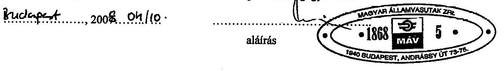

---

# A társaság vagyoni helyzetének alakulása 

## ESZKÖZÖK

MiliöFt

| Megnevezés | 2002 | 2003 | 2004 | 2005 | 2006 | 2007. |
| :--: | :--: | :--: | :--: | :--: | :--: | :--: |
| Befektetett eszközök | 18448 | 20083 | 20177 | 20826 | 22617 | 22567 |
| Ebből: immateriális javak | 72 | 75 | 65 | 111 | 215 | 224 |
| Tárgyi eszközök | 17755 | 19402 | 19498 | 20115 | 21643 | 21275 |
| Befektetett pénzügyi eszközök | 621 | 606 | 614 | 600 | 759 | 768 |
| Forgóeszközök | 4338 | 4551 | 5283 | 4769 | 5813 | 7028 |
| Ebből: készletek | 340 | 317 | 873 | 306 | 358 | 384 |
| Követelések | 3813 | 4176 | 4198 | 4052 | 5420 | 5847 |
| Értékpapírok | 1 | 0 | 6 | 0 | 0 | 0 |
| Pénzeszközök | 184 | 58 | 206 | 411 | 35 | 797 |
| Aktív időbeli elhatárolások | 123 | 170 | 410 | 153 | 780 | 622 |
| ESZKÖZÖK ÖSSZESEN | 22909 | 24804 | 25871 | 25748 | 29210 | 30217 |

Adatforrás: az éves beszámolók
Tanúsítom, hogy az adatok a nyilvántartásban szereplőkkel megegyezőek!

Sopron, 2008. március 31.

---

# A társaság vagyoni helyzetének alakulása 

## FORRÁSOK

|  Megnevezés | 2002 | 2003 | 2004 | 2005 | 2006 | 2007  |
| --- | --- | --- | --- | --- | --- | --- |
|  Saját tőke | 175914 | 162239 | 119422 | 55562 | -31581 | 20617  |
|  Ebből:jegyzett tőke | 188000 | 193733 | 201232 | 80000 | 80000 | 20250  |
|  Tőketartalék | 12949 | 13299 | 0 | 0 | 16 | 46785  |
|  Lekötött tartalék | 3664 | 5005 | 4790 | 14546 | 14150 | 13892  |
|  Eredménytartalék | -41783 | -16732 | -37139 | 41659 | -41905 | -61630  |
|  Mérleg szerinti eredmény | 13084 | -33066 | -49461 | -80643 | -83842 | 1320  |
|  Céltartalék | 7611 | 16262 | 11621 | 12645 | 24457 | 29160  |
|  Kötelezettségek | 397629 | 465143 | 537861 | 638185 | 767836 | 782946  |
|  Passzív időbeli elhatárolások | 115775 | 106833 | 96980 | 90463 | 90198 | 65391  |
|  FORRÁSOK ÖSSZESEN | 696929 | 750477 | 765884 | 796855 | 850910 | 898114  |

Adatforrás: az éves beszámolók

Tanúsítom, hogy az adatok a nyilvántartásban szereplőkkel egyezőek!

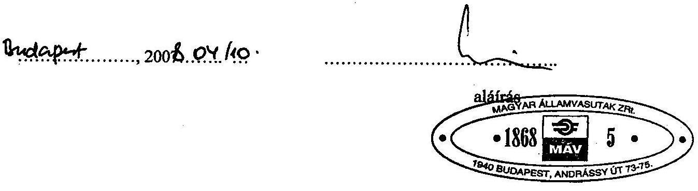

---

GySEV Zrt.
2. sz. tanúsítvány a V-11-121/2007-2008. sz. jelentéshez

# A társaság vagyoni helyzetének alakulása 

FORRÁSOK

|  |  |  |  |  |  | MillióFt |
| :--: | :--: | :--: | :--: | :--: | :--: | :--: |
| Megnevezés | 2002 | 2003 | 2004 | 2005 | 2006 | 2007. |
| Saját tőke | 6211 | 6076 | 6828 | 7168 | 7472 | 7786 |
| Ebből:jegyzett tőke | 4006 | 4006 | 4683 | 5009 | 5309 | 5608 |
| Tőketartalék | 1744 | 1744 | 1803 | 1803 | 1803 | 1803 |
| Lekötött tartalék | 180 | 373 | 505 | 808 | 1073 | 1425 |
| Eredménytartalék | 1097 | 87 | -171 | -466 | -727 | -1069 |
| Mérleg szerinti eredmény | -816 | -134 | 8 | 14 | 14 | 20 |
| Céltartalék | 240 | 151 | 469 | 450 | 310 | 532 |
| Kötelezettségek | 12004 | 14271 | 14795 | 14543 | 18103 | 18498 |
| Passzív időbeli elhatárolások | 4454 | 4306 | 3779 | 3587 | 3325 | 3401 |
| FORRÁSOK ÖSSZESEN | 22909 | 24804 | 25871 | 25748 | 29210 | 30217 |

Adatforrás: az éves beszámolók
Tanúsítom, hogy az adatok a nyilvántartásban szereplőkkel egyezőek!

Sopron, 2008. március 31.
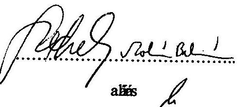

---

### Bevételek alakulása

|  Megnevezés | 2002 | 2003 | 2004 | 2005 | 2006 | 2007  |
| --- | --- | --- | --- | --- | --- | --- |
|  Belföldi értékesítés nettó árbevétele | 185696 | 197199 | 198852 | 179966 | 196729 | 174942  |
|  Export értékesítés nettó árbevétele | 10641 | 10544 | 10918 | 30391 | 8877 | 4146  |
|  Egyéb bevételek | 5126 | 28030 | 18302 | 17016 | 15074 | 118199  |
|  Aktivált saját teljesítmények értéke | 10453 | 14526 | 7257 | 3584 | 3629 | 3344  |
|  Pénzügyi műveletek bevételei | 5055 | 3302 | 7177 | 2883 | 6934 | 4205  |
|  Rendkívüli bevételek

 | 56 309 | 6 422 | 6 447 | 7 628 | 36 143 | 83 044  |
|  BEVÉTELEK ÖSSZESEN | 273 280 | 260 023 | 248 953 | 241 468 | 267 386 | 387 880  |

### Adatforrás: az éves beszámolók

Tanúsítom, hogy az adatok a nyilvántartásban szereplőkkel egyezőek!

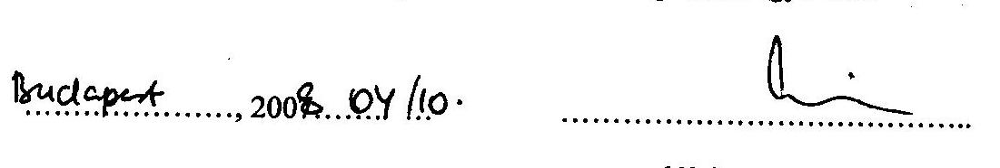

aláírás

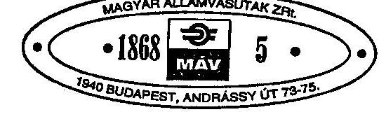

---

GYSEV Zrt.
3. sz. tanúsítvány a V-11-121/2007-2008. sz. jelentéshez

# Bevételek alakulása 

MillbFt

| Megnevezés | 2002 | 2003 | 2004 | 2005 | 2006 | 2007. |
| :--: | :--: | :--: | :--: | :--: | :--: | :--: |
| Belföldi összes nettó bevétele | 18490 | 20472 | 21656 | 21652 | 24976 | 23598 |
| Export összes nettó bevétele | 1141 | 1542 | 1731 | 1872 | 2311 | 2608 |
| Egyéb bevételek | 313 | 875 | 653 | 701 | 805 | 5678 |
| Aktivitás-számlázott teljesítmények értéke | 72 | 112 | 243 | 225 | 207 | 268 |
| Részvénytársasági műveletek bevételei | 212 | 177 | 488 | 751 | 365 | 252 |
| Rendkívüli bevételek | 586 | 576 | 589 | 390 | 718 | 308 |
| BEVÉTELEK   ÖSSZESEN | 20814 | 23754 | 25360 | 25591 | 29382 | 32712 |

Adatforrás: az éves beszámolók
Tanúsítom, hogy az adatok a nyilvántartásban szereplőkkel egyezőek!

Sopron, 2008. március 31.
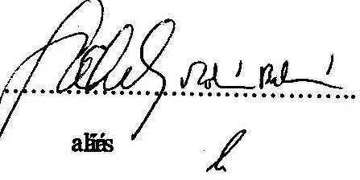

---

# Költségek és ráfordítások alakulása

|  Megnevezés | 2002 | 2003 | 2004 | 2005 | 2006 | 2007  |
| --- | --- | --- | --- | --- | --- | --- |
|  Anyagjellegű ráfordítások | 98 607 | 99 248 | 100 418 | 112 813 | 104 319 | 108 080  |
|  Személyi jellegű ráfordítások | 108 396 | 117 102 | 130 426 | 130 976 | 124 616 | 124 478  |
|  Értékcsökkenési leírás | 29 311 | 31 292 | 33 313 | 34 927 | 34 405 | 35 477  |
|  Egyéb költségek |  |  |  |  |  |   |
|  Egyéb ráfordítások | 15 193 | 36 189 | 22 212 | 29 788 | 36 516 | 33 038  |
|  Pénzügyi műveletek ráfordításai | 6 656 | 5 903 | 11 061 | 13 090 | 21 015 | 22 418  |
|  Rendkívüli ráfordítások | 2 004 | 3 342 | 976 | 517 | 30 357 | 63 069  |
|  RÁFORDÍTÁSOK ÖSSZESEN | 260 167 | 293 076 | 298 406 | 322 111 | 351 228 | 386 560  |

Adatforrás: az éves beszámolók

Tanúsítom, hogy az adatok a nyilvántartásban szereplőkkel egyezőek!

2008.04.10.

aláírás

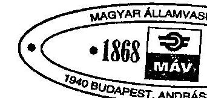

---

GYSEV Zrt. 4. sz. tanúsítvány a V-11-121/2007-2008. sz. jelentéshez

Költségek és ráfordítások alakulása

|  |   |   |   |   |   |   |
| --- | --- | --- | --- | --- | --- | --- |
|  Megnevezés | 2002 | 2003 | 2004 | 2005 | 2006 | 2007.  |
|  Anyagjellegű ráfordítások | 14 265 | 15 102 | 16 467 | 16 918 | 19 236 | 21 786  |
|  Személyi jellegű ráfordítások | 5 212 | 5 666 | 5 964 | 6 141 | 7 217 | 7 930  |
|  Értékcsökkenési leírás | 1 252 | 1 410 | 1 485 | 1 432 | 1 465 | 1 664  |
|  Egyéb költségek |  |  |  |  |  |   |
|  Egyéb ráfordítások | 468 | 822 | 993 | 710 | 668 | 907  |
|  Pénzügyi műveletek ráfordításai | 295 | 851 | 361 | 352 | 617 | 379  |
|  Rendkívüli ráfordítások | 139 | 38 | 26 | 24 | 165 | 25  |
|  RÁFORDÍTÁSOK ÖSSZESEN | 21 631 | 23 889 | 25 296 | 25 577 | 29 368 | 32 691  |

Adatforrás: az éves beszámolók

Tanúsítom, hogy az adatok a nyilvántartásban szereplőkkel egyezőek!

Sopron, 2008. március 31.

aláírás

---

MÁV Zrt.
5. sz. tanúsítvány a V-11-121/2007-2008. sz. jelentéshez

# Eredmények alakulása 

|  |  |  |  |  |  |  |
| :-- | :--: | :--: | :--: | :--: | :--: | :--: |
| Megnevezés | 2002 | 2003 | 2004 | 2005 | 2006 | 2007 |
| Üzemi tevékenység eredménye | -39591 | -33532 | -51040 | -77547 | -75547 | -442 |
| Pénzügyi műveletek eredménye | -1601 | -2601 | -3884 | -10207 | -14081 | -18213 |
| Szokásos vállalkozási eredmény | -41192 | -36133 | -54924 | -87754 | -89628 | -18655 |
| Rendkívüli eredmény | 54305 | 3080 | 5471 | 7111 | 5786 | 19975 |
| Adózás előtti eredmény | 13113 | -33053 | -49453 | -80643 | -83842 | 1320 |

Adatforrás: az éves beszámolók
Tanúsítom, hogy az adatok a nyilvántartásban szereplőkkel egyezőek!
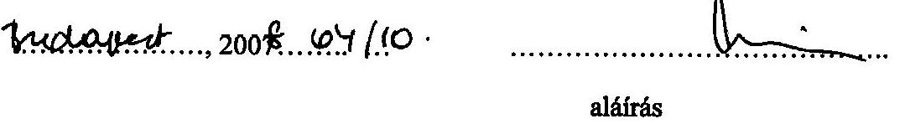
aláírás
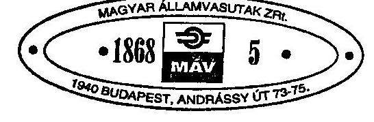

---

# Eredmény alakulása

|  |   |   |   |   |   |   |
| --- | --- | --- | --- | --- | --- | --- |
|  Megnevezés | 2002 | 2003 | 2004 | 2005 | 2006 | 2007.  |
|  Üzemi tevékenység eredménye | -1181 | 1 | -626 | -752 | -287 | -134  |
|  Pénzügyi műveletek eredménye | -83 | -674 | 127 | 400 | -253 | -128  |
|  Szokásos vállalkozási eredmény | -1264 | -673 | -499 | -352 | -539 | -262  |
|  Rendkívüli eredmény | 448 | 539 | 562 | 366 | 554 | 283  |
|  Adózás előtti eredmény | -816 | -134 | 63 | 14 | 14 | 21  |

Adatforrás: az éves beszámolók Tanúsítom, hogy az adatok a nyilvántartásban szereplőkkel egyezőek!

Sopron, 2008. március 31. aláírás

---

# Függelékek

---

# Függelékek jegyzéke 

1. sz. függelék A szárnyvonalak működtetésének ideiglenes szüneteltetését és megszüntetését megalapozó felmérések alátámasztottsága
2. sz. függelék A pályahálózat és a szolgáltatási színvonal emelése érdekében hozott fejlesztési döntések eredményessége, a középtávú tervezés helyzete
3. sz. függelék A tarifák változása részletesen

---

# A szárnyvonalak működtetésének ideiglenes szüneteltetését és megszüntetését megalapozó felmérések alátámasztottsága 

(A megszüntetés kapcsán felszabaduló eszközök és területek nagysága és hasznosítása, a szüneteltetési döntés összhangja a kistérségi fejlesztésekkel, valamint a személyszállítási tevékenység szinten tartására tett intézkedések, és azok gazdaságosságának alátámasztottsága.)

A hazai vasúti mellékvonal hálózat jellemzően helyi, uradalmi érdekeknek megfelelően épült ki 1870-1910 között. Nyomvonalvezetést a domborzati viszonyokon túl befolyásolták a különböző banki kölcsönök feltételei is, amelyek 50, illetve 100 km-nél hosszabb vonalak esetén jelentősen kedvezőbbek voltak. Az elsőnek (1870-1890 között) elkészült vonalak már 1900-1910 között többször csődbe mentek, tulajdonost váltottak. A teljes összeomlás 1925-1935 között következett be, ekkor a magyar állam jelképes 1 pengőért megvásárolta és a MÁV kezelésébe adta e vonalakat. A II. világháború, valamint az azt követő iparosítás által követelt átlagosnál magasabb szállítási teljesítmények ideiglenesen biztosították a mellékvonalak kihasználását, bár e vonalak fejlesztésére pénzt akkor sem költöttek. A következő mérföldkő az 1962-65 között bekövetkező, Magyarországot többször megbénító szállítási csőd volt, aminek hatására a kormány karcsúsította a mellékvonali hálózatot. A vasúthálózat szempontjából a következő sokk az 1990-es rendszerváltás volt, amikor a nehézipari teljesítmények csökkenése miatt az áruszállítás, míg a foglalkoztatás csökkenése miatt a személyszállítás esett vissza jelentősen. Ezt szinte azonnal követte a személygépkocsi állomány napjainkban is tartó robbanásszerű növekedése, tovább csökkentve a vasút személyforgalomban betöltött szerepét.
2007. március 3-án üzemzáráskor a MÁV Zrt. 14 mellékvonalán - GKM megfogalmazása szerint - szolgáltató váltás történt. A vasúti közforgalmú személyszállítási szolgáltatás ideiglenes szüneteltetésére került sor. 2007. március 4-én üzemkezdettől 14 vasúti mellékvonal személyforgalmát a területileg illetékes Volán társaság vette át.

A GKM döntését megelőzően a MÁV Zrt.-t utasította, hogy végezze el valamennyi vasúti mellékvonal felülvizsgálatát. Ennek vizsgálati anyaga 2006 novemberében elkészült, és azt átadta a tárca szakállamtitkársága részére. A MÁV Zrt. dokumentációján kívül még kettő tanulmány a közlekedési tárca döntése előtti anyagnak tekinthető. Egyik a Magyar Vasúti Hivatal által értékelt 2 db kísérleti térségi vasút tapasztalatait kiértékelő tanulmány, a másik a KTI (Közlekedéstudományi Intézet) 81 mellékvonal utasforgalmát elemző tanulmánya. Nem tekinthető döntés előtti anyagnak a GKM által elkészített 64 alacsony forgalmú vonal vizsgálatának dokumentációja, valamint a COWI környezettanulmánya, mivel mindkettő az intézkedés után készült el.

---

# MÁV Zrt. vizsgálati anyaga 

2006. év folyamán a MÁV Zrt.-nél egy önálló munkabizottság a GKM utasítása alapján elvégezte valamennyi vasúti mellékvonal felülvizsgálatát, melynek eredményeként javaslatot tett a vasútvonalak további üzemeltetésére vonatkozóan.

2007 februárjában a Stratégiai Igazgatóság előterjesztésében a MÁV Zrt. vezetői értekezlete megtárgyalta a „Komplex méretoptimalizálási program, feltételek, hatások" tárgyú előterjesztést, mely a 2007. márciusi szolgáltató-váltással kapcsolatos intézkedésekkel, illetve a várható megtakarításokkal foglalkozik. A MÁV Zrt. e két időszakban elkészített anyagaiból nem derül ki, hogy a kiindulási számok ugyanazok-e mindkét anyagban (a részletes vonalelemzések a 2005. évet vizsgálják) a várható megtakarítások jogcímei nem egyértelműek, így a végeredmények is nehezen vethetők össze (1. és 2. számú melléklet). Az előterjesztésben szereplő megtakarításokról nem derült ki egyértelműen, hogy azok milyen időintervallumra vonatkoznak (éves megtakarítások vagy a megtakarítások jelenértéke/nettó jelenértéke, stb.).

A 14 mellékvonalból 10 vonalon megmaradt az áruszállítás. A személyszállítás szünetelése és az árufuvarozás kiszolgálása szempontjából a feltételeket és hatásokat együtt nem elemezték, továbbá mindkét forgalom szüneteltetése esetén a felmerült őrzés-védelmi költségekkel nem számoltak.

A részletes vonalvizsgálat szempontjait és kérdéseit a MÁV Zrt. adta meg, a vizsgálati eredményeket rögzítő dokumentumok azonban ezeket csak részben tartalmazzák. (3. és 4. sz. melléklet)

A kísérleti térségi vasutak tapasztalatainak elemzése során a MÁV Zrt. kijelentette, hogy olyan elemzést, ami a mellékvonalak költségeit, eredményeit transzparensen be tudja mutatni, nem tudnak készíteni a Társaság nagyüzemi sajátosságai miatt.

## A Magyar Vasút Hivatal értékelő tanulmánya a kísérleti térségi vasutakról.

A Nógrád-vidéki Térségi Vasútnak 178 km hosszú, 4 vonala van, ebből egy az országos törzshálózati pályák közé, a többi
 három a mellékvonalak közé sorolható a vasúti törvény szerint. E vonalakon a mellékvonalakra jellemző személyszállítási tevékenység folyik, az érintett települések közlekedési ellátásán túl azonban szezonálisan jelentős a turistaforgalom is. Az egyik vonalon 2007. március 4-e óta a személyszállítás szünetel. A hálózat 33 település 65 ezer lakójának biztosítja a vasúti kapcsolatot az országos hálózathoz. A felmérés szerint 2006-ban egymillió-egyszázezer utas vette igénybe a vonatokat.

A másik kísérleti térségi vasút a Körös-vidéki Térségi Vasút, mely 194 km hosszú, egy az országos törzshálózati pályához tartozik, a többi mellékvonalhoz sorolható. A hálózat 20 település 107 ezer lakójának biztosítja a vasúti kapcsolatot az országos hálózattal. 2006-ban 1 millió utas vette igénybe a vonalakat.

---

Az MVH vizsgálati szempontjai az utasok, utazási keresletek, bevételek, költségek. A költségokozó tényezőkre a térségi vasutak vezetésének nem volt érdemi ráhatása. A Térségi Vasutak Osztály becslései szerint a költségek egy esetleges önálló vállalatba szervezéssel több, mint 40%-kal csökkenhetnének. Felelősségi problémákat tárt fel az elemzés a pálya és a kiegészítő infrastruktúra karbantartásánál, illetve az ingatlangazdálkodás területén.

A MÁV Zrt. szerint ez a becsült 40% megtakarítás több tényezőből tevődött össze, amiből az egyik az önálló vállalatba szervezés volt annak érdekében, hogy a ne terheljék olyan ráosztott költségelemek, amelyek nem a térségi működéshez és tényleges igényekhez kötődnek. A másik nagy csökkentő tétel a műszaki fejlesztés és beruházás, valamint az egyszerűsített szabályozások és utasítások megteremtése volt, ami kisebb szervezeti egységben jobban megoldható, valamint mentesül a különféle szerződéses és BTSZ alapú megrendelő-szolgáltató kapcsolatoktól és terhektől.

Megjegyezendő továbbá, hogy az elvégzett utas mérések eredményei szerint a MÁV Zrt. korábbi statisztikai adataihoz képest ma is nagyjából kétszeres utasforgalom zajlik az érintett vonalakon.

Az MVH lényeges következtetésnek tartja, hogy a mellékvonalak üzemeltetésével jól láthatóvá vált, hogy jelentősen kisebb veszteséggel működhetnének optimális, a MÁV Zrt.-n kívüli üzemeltetés mellett. Szerinte bármely mellékvonal bezárása, illetve az ezeken zajló forgalom szüneteltetése nehezen védhető koncepció, hiszen a ma ismert számok teljesen félrevezetők! Jellemző példa erre a KTI elemzése által megszüntetésre (szüneteltetésre) kerülő Vésztő-Körösnagyharsány vonalszakasz, mely éppen az érintett térség egyik alapvető lehetőségét jelentheti a felemelkedésre. A vasútvonal határszakaszának újjáépítésével a közeli Nagyvárad által kínált lehetőségek kihasználhatóak lennének, ami ráadásul az Unió tagjává vált Romániával interregionális uniós forrásokból megvalósuló mintaprojekt lehetne.

# A MÁV Zrt. értékelése a kísérleti térségi vasútról 

A MÁV Zrt. is elkészítette a kísérleti térségi vasutak tapasztalatiról a tanulmányt, amely szerint a 2006. év lezárását követően kimutatható módon megadható a válasz a kormányhatározat elvárásaira és a mellékvonali rendszer új feltételeknek megfelelő működésére, a megrendelői és finanszírozói kompetencia átalakítására. Annak érdekében, hogy az önkormányzatok az állam szerződéses partnereként a térségi szolgáltatóval szemben megrendelőként jelen legyenek, a 2006. évi működési költségek tételes, a MÁV Zrt. egészétől elkülönített kimutatására volt szükség.

A MÁV Zrt. Számviteli Főosztálya az Önköltség-számítási szabályzat alapján elkészített utókalkulációja szerinti veszteség 1530 M Ft, amely a kontrolling beszámoló üzleti veszteségéhez képest 793 M eredményromlást jelent, mivel tartalmazza:

- az üzletági általános költségek, ráfordítások és bevételek: 57 M Ft-ot,
- a központi irányítás: 465,9 M Ft-ot, és
- a pénzügyi ráfordítások 270,4 M Ft-ot

---

kitevő, térségi vasutakra jutó részét is.
A közel 800 M Ft-os utókalkulációval ráosztott veszteségnövekedés is arra mutat rá, hogy ezek a költségek nem a közvetlen működtetéshez kapcsolódnak.

A MÁV Zrt. szerint a felsorolt költségelemek valóban nem a tényleges működéshez kapcsolódnak, de nem hagyhatók teljesen figyelmen kívül egy önálló társasági működési formában. Az országos kiterjedésű hálózati sajátosságok miatt transzparens módon nem tudja kimutatni - a térségi vasúti szervezeten kívül - hogy a mellékvonalakra, vagy azok meghatározott csoportjaira eredménykimutatás szintjén a valós teljesítményeket, a bevételeket és a költségeket. A hazai közlekedési rendszer átalakításának nem feltétele a közigazgatási reform végrehajtása. Ugyanakkor a térségi vasúti szervezetek létrehozása lehetővé teszi a mellékvonalak által is érintett területeken a közösségi közlekedés kialakítására vonatkozó döntések kellő megalapozását. Amennyiben ezek a szervezetek önálló szolgáltató, költségviselő, érdekérvényesítő szerephez jutnak, valóságosan mérhető lesz teljesítményük, és ennek alapján megindulhat az igényekhez valóban illeszkedő megoldás kialakítása.

# KTI tanulmánya 

A Közlekedéstudományi Intézet Közlekedéspolitikai és Gazdasági tagozata (KTI Kht.) szintén elemzéseket és ajánlást végzett 81 vonal tekintetében 2006 októberében, illetve 2007. májusában, melynek adatait a MÁV Zrt. megbízásából a GfK Hungária Piackutató Intézet gyűjtötte össze.

A KTI által 2006-ban végzett elemzések kapcsán maga a megbízott hangsúlyozza, hogy a felmérés ismert korlátai miatt az eredményeket kritikával és megfelelően óvatosan kell kezelni. Ezen korlátokat felsorolja, melyek az alábbiak:

Az eredményeket csak aggregált formában rögzítették, azaz nem tudható meg az egyes utasokról ki honnan-hová, mikor milyen célból, jeggyel, gyakorisággal utazott.

A feltett kérdésekből látszik, hogy a felmérésekből nem tudható meg, átszállt-e az utas útja során, így a teljes utazási lánc sem rekonstruálható. Ebből kifolyólag a vizsgált vonal forgalomváltozásának (esetleges szüneteltetésének) hálózati, továbbgyűrűző hatását sem lehet kimutatni, holott ilyen hatás biztosan van.

A felvétel csak egyetlen napon készült (vonalanként más-más napon), nincsenek rögzítve az olyan fontos körülmények, amelyek a vizsgálat eredményeit jelentősen megváltoztathatják: időjárás, (ráhordó) csatlakozások késése, rendkívüli esemény (vásár, iskolás vagy turistacsoport megjelenése).

A kapott vonat összeállítások és ülőhely adatok néhány esetben nem feleltek meg egymásnak, ráadásul vasúton a kapacitás ülőhelyben, míg közúton férőhelyben (ülő+állóhely) mérik.

Az elemzés összegzésében, majd ajánlásában is hangsúlyozza, hogy a vizsgált mellékvonalakon a vasúti személyforgalom fennmaradásával kapcsolatban a döntés elsősorban politikai, amely nem nélkülözheti a körültekintően kidolgozott komplex szakmai anyagokat. Ez a vizsgálat nem tekinthető komplex hatásvizsgálatnak, a kérdéskör egyetlen szegmensét járja körül, de nem foglalko-

---

zik a tarifával, a gazdaságossággal, társadalmi kérdésekkel, kapacitás korlátokkal. Az a tény, hogy egy vasúti vonalon gyér a személyforgalom, még nem jelenti azt, hogy ott nincs utazási igény. Menetrendi okok is képesek tönkretenni egy vonalat, de ez nem jelenti azt, hogy a vasúti vonalszakaszra nincsen szükség.

A vizsgált vonalakat a KTI a javasolt további (személyszállítási szempontú) vasúti üzemeltetés lehetősége alapján három kategóriába sorolta be.

Szolgáltatáshelyettesítésre javasolt. A MÁV helyett más vasúti üzemeltető is lehet a megoldás.

A vonal forgalmi viszonyai és egyéb sajátosságai miatt további részletes helyettesíthetőségi vizsgálat szükséges.

A vasúti személyforgalom fenntartása indokolt.
A szüneteltetésre kiválasztott 14 mellékvonal közül 5 db-ot a KTI a B) kategóriába sorolt be, amelyre javaslata a további részletes helyettesíthető vizsgálat volt. Ennek a vizsgálatnak a KTI második elemzése nem tudható be, mivel az 2007 májusában a döntés, illetve annak végrehajtása után készült. Más ilyen jellegű vizsgálatról nincs tudomásunk.

A KTI 2007-es tanulmánya már kiküszöbölte az előző felmérés egyes módszertani korlátait (az adatfelvétel napjának időjárása és az esetleges vágányzár a táblázat elején fel van tüntetve, az utasforgalmat potenciálisan befolyásoló események, rendezvények ugyanezen táblázat szerint az adott vonalnál jelölésre kerültek), az elemzés összegzése és a 2006. évihez hasonló szakmai ajánlás azonban elmaradt.

# A GKM dokumentációja a 64 alacsony forgalmú vasútvonal vizsgálatáról, illetve a döntési javaslatról 

A dokumentum a hálózat 2007. év eleji állapotát mutatja be változások előtti állapotként. A vizsgálat kiterjed Magyarország összes olyan mellékvonalára, amelyen 2007 elején - tehát a márciusi szolgáltató váltást megelőzően - történt személyszállítás.

A vasúti törvény 2. számú mellékletében 84 db mellékvonalat sorol fel, egyben a Kormány feladataként jelöli meg a vasúti mellékvonalak meghatározására vonatkozó javaslat elkészítését, ami a vizsgálat befejezésének időpontjáig nem történt meg. A GKM által elkészített dokumentáció nemcsak a törvény által felsorolt mellékvonalakat vizsgálja, hanem a megítélése szerinti mellékvonalként működő nyolc darab alacsony kihasználtságú fővonalat is, ami nem a törvényben foglaltaknak megfelelően került meghatározásra.

A dokumentum felvázolja az alacsony forgalmú vasútvonalak problémájának meglétét és jelentőségét, a vizsgált vonalak strukturális változás előtti áru- és személyszállítási, illetve egyéb jellemzőit. Bemutatja, hogy Magyarország vasúthálózatának tíz európai ország vasúthálózatával való összevetés alapján a harmadik a 100 négyzet-km-re eső vasútvonalak hosszában, ugyanakkor az 1 km vasúti vonalra jutó utasok éves számában csupán a hetedik.

---

További megállapítása a dokumentumnak, hogy a 2006. október 11-22-e között a KTI által elemzett utasszámlálás eredményei szerint a vizsgált 81 vonalból 79 vonalon nem éri el az 50%-ot sem a dinamikus helykihasználás. Ezen alacsony kihasználtságok következményeként jelenik meg véleménye szerint a gazdaságtalan működés, melynek további következménye, hogy a magyarországi vasúthálózat kihasználtságának átlagát elsősorban a mellékvonali hálózat csökkenti.

A fentiekben már utalásra került a KTI ezen tanulmányának megfontolandó és kihangsúlyozandó része, mely szerint a következtetések óvatosságára int a felmérés egyik korlátjaként említett ülőhely adatok számolása, számítása miatt.

A KTI véleménye a tárca megállapításával ellenkező, amit a GKM által is jól ismert német példa is megerősít, hogy egy vasúti vonal gyér személyforgalma nem korrelál az utazási igénnyel. A német térségi vasutakat is a magyarországihoz hasonló állapotok jellemezték, de felismerték a vasútban rejlő lehetőségeket. Ennek legfontosabb eleme a regionalizáció volt, jó minőséggel, és kedvező menetdíjakkal, és természetesen szövetségi beruházási támogatásokkal komoly eredményt tudtak elérni. Így a vonalhossz 26,5%-kal, az utaskilométer 38%-kal, az utasok száma 48%-kal emelkedett. Amikor a vasutat autóbusszal helyettesítették, az utasok száma 46%-kal csökkent. A német példa dokumentációjában16 regionális vasút története kerül ismertetésre, melyek közül 5 vonalnak 500 fő alatti, 3-nak 1000 fő alatti volt a napi utasforgalma.

A dokumentum további részeiben ismertetésre került a döntési folyamat menete, elvei. Döntési javaslatot tesz, majd bemutatja a vizsgált vonalak strukturális változás utáni áru- és személyszállítási, illetve egyéb jellemzőit, illetve a döntési javaslat hatását a MÁV vagyongazdálkodására, a szolgáltatás minőségére, a természeti környezetére.

A dokumentum döntési elvként határozza meg a társadalmi hozzáadott értéket. Eszerint öt döntési elv határolódik el:

- Amennyiben a napi utasszám meghaladja az 1000 főt, a vonalon a személyszállítás megmarad.
- Amennyiben a vonalnak van agglomerációs szerepe és a napi utasforgalom meghaladja az 500 főt, a vonalon a személyszállítás megmarad.
- Amennyiben a vonalon a személyszállítás megmarad, az áruszállítás is megmarad.
- Amennyiben az áruszállítás meghaladja az évi 6000 árutonnát, a vonalon az áruszállítás fennmarad.
- Amennyiben a vonalnak hálózatstratégiai jelentősége van, a vonal és rajta az áruszállítás fennmarad.

A dokumentum az alábbi döntési kategóriákat határozza meg, és ezekbe sorolja be a 64 vizsgált vonalat:

---

- További változatlan MÁV üzemeltetés.
- Változatlan üzem és teherforgalom szakaszonként.
- További MÁV üzemeltetés csak teherforgalomra.
- Teljes üzemszünet és teherforgalom szakaszonként.
- Teljes üzemszünet.
- MÁV üzemeltetési körből kivonásra kerül.

E döntés alapján a személyszállítás esetén 12 vonalra redukálná a GKM a fennálló rendszert, a jelenlegi vonalhossz 21%-ára, amivel a jelenlegi vasúti személyszállítási rendszer 50,2%-ára csökkenne. Ebben benne van a már megszüntetett 14 mellékvonal is.

# COWI Magyarország KFT környezettanulmánya 

A GKM
 Közösségi középtávú fejlesztési koncepció környezeti hatásvizsgálatának a COWI Magyarország Kft. által elvégzett tanulmánya is kitér a mellékvonalak megszüntetésével járó környezeti hatásokra. A dokumentáció a 14 mellékvonal forgalmának szüneteltetése után készült el, 2007 májusában.

A COWI Magyarország Kft. által elkészített tanulmány szerint „amennyiben a mellékvonalak racionalizálása során kiváltásukra a VOLÁN társaság járműparkjának átlagos légszennyező anyag kibocsátásával rendelkező autóbusz kerül beállításra, valamint a vonattal megegyező járatszámmal kerül indításra, nem jelent jelentős környezetterhelés-növekedést".

A mellékvonalak működésének szüneteltetése utáni állapot dokumentációi.
A 14 mellékvonal forgalmának felfüggesztése utáni állapot vizsgálatáról nem készült komplex hatástanulmány.

A GKM által készített, fentiekben már említett dokumentáció tér ki a megszüntetés utáni állapotra, amennyiben csak 12 mellékvonalat üzemeltetnének tovább, akkor az megközelítőleg évi 5,8 Mrd Ft-tal javítja a MÁV pozícióját, míg évi 0,6 Mrd Ft-tal rontja az autóbuszos szolgáltatók eredményét, így a közösségi közlekedés egészére 5,2 milliárdos eredményjavulást eredményez. Ez azonban csak akkor realizálható, ha a megszüntetésre javasolt vonalak valóban bezárásra kerülnek, illetve ha a megmaradó, de csökkenő forgalmú vonalakon a MÁV csökkenti a forgalommal arányos erőforrások felhasználását.

A tárca szerint a szolgáltatások minőségére pozitív hatással lesz e döntés, mivel a megszüntetéssel lehetőség nyílik a fejlesztési források koncentrációjára, ezáltal a megmaradó, magasabb forgalmú - távolsági és agglomerációs - vonalakon a szolgáltatási színvonal javítására.
2007. július 20-án, a GKM Infrastruktúra Szakállamtitkársága által elkészített a közösségi közlekedési rendszer középtávú korszerűsítésével kapcsolatos intézkedésekről szóló összefoglaló dokumentáció szerint az eddigi forgalomszüneteltetések nem jártak jelentős megtakarítással, mert létszámleépítést nem eredményeztek (az üzemszünetben érintett vonalakra továbbra is kivezényli a MÁV a munkavállalókat).

A MÁV Zrt. szerint a feltételek (hatósági) nem adottak a teljes szüneteltetéshez.
A MÁV Zrt. Biztonsági Igazgatóságának összefoglaló jelentése alapján a 14 mellékvonal személyforgalmának szüneteltetése okán 2007 májusától decemberig 65 M Ft fordítható a vonalak őrzésének megvalósítására, ami igen szűkös keretnek bizonyul, mivel a káreset 2007 novemberében már eléri 3,5 M Ft-ot.

A KTI által a kisforgalmú vasútvonalak utasforgalmának átmeneti szüneteltetéséről készített zárójelentés a vonalanként beállított autóbuszjáratokat írja le, de arra nem tesz semmilyen utalást, hogy mi történt azon településekkel, amelyek e vonalak mentén helyezkednek el, de (a KTI elemzése alapján) nem rendelkeznek közúti kapcsolattal.

# Társadalmi egyeztetések 

A regionális egyeztetések megkezdése előtt a GKM 2006. szeptember 18-án szélesebb körű, tájékoztatással egybekötött tájékoztatást tartott a települési önkormányzati szövetségek részére, majd még Győrött és Szegeden további egyeztetések történtek.

Megalakult a Regionális Közlekedésszervezési Irodahálózat a térségi igények, elképzelések egyeztetése, koordinálása céljából.

A GKM 2007. október 27-én levelet küldött minden önkormányzatnak, amelyben tájékoztatta az intézményeket a tárca mellékvonalakkal kapcsolatos terveiről, illetve a regionális vasutak kialakításáról, amennyiben az önkormányzatok vállalják azt. E vasútvonalak működtetésére az igénybejelentés határidejét november 7-én határozta meg, a támogatás szándékáról pedig úgy nyilatkozik, hogy „Az állam a működtető vasúttársaságnak kifizeti azt a közszolgáltatási kompenzációt, amit a közgazdaságilag hatékonynak tekintett szolgáltatónak ugyanezen szolgáltatásáért veszteségkiegyenlítésként kifizetne." A tárca tulajdonképpen egy nem visszavonhatatlan érvényű elvi szándéknyilatkozatot várt az önkormányzatoktól, amelyben nyilatkoznak arról, hogy nem zárkóznak el a térségi vasút kialakításától. Erre azért volt szükség, mert amennyiben egy adott vasúti vonal mentén elhelyezkedő települések nem mutatnak érdeklődést, akkor értelmetlennek és hiábavalónak ítéli meg a GKM a térségi vasút kialakítására irányuló pályáztatás megkezdését.

Nem került azonban kidolgozásra költségtérítési és árkiegészítési konstrukciók átrendezésére vonatkozó feladat, amely lehetővé tette volna az önkormányzatok szerepvállalását és a térségi vasúti közlekedés feltételeinek megteremtését.

A térségi társaságok kialakításában közreműködő önkormányzatokat nem informálták sem szóban, sem írásban e döntés finanszírozási feltételeiről és hátteréről. A vasúttársaságoknak, illetve az azt működtető önkormányzatoknak ugyanakkor 25 évre szóló szerződéseket kell kötni a Magyar Állammal, a MÁV Zrt.-vel és a GKM-mel. Az önkormányzatok szerepvállalását biztosító pénzügyi konstrukció kialakítása nem történt meg. Ennek hiányában a szervezeti átalakítás további lépései is elmaradtak. Nevezetesen a térségi vasúti szervezetek önálló társasággá alakítása, a térségi vasúti hálózat kijelölése, a működési önállóság és a számviteli elkülönítés feltételeinek maradéktalan megteremtése.

A Korm. hat. 2006. december 15-ét jelölte meg a kísérlet értékelési dátumaként. Az értékelésről a Magyar Vasúti Hivatal bevonásával 2006. december 1-jével előterjesztés készült a GKM miniszter részére. A miniszteri előterjesztést követően a MÁV Zrt. Vezérigazgatói értekezlete, majd a MÁV Zrt. Igazgatósága megtárgyalta a kísérlet eredményeit és működési tapasztalatait, valamint az ahhoz készített megalapozó számszaki anyagok alapján a lehetséges továbblépési irányokat, azok előnyeit, hátrányait mérlegelve. Ezekre tekintettel, továbbá a megrendelői/önkormányzati oldal pénzügyi nehézségei miatt olyan vállalati döntés született, hogy nincs lehetőség e térségi vasutak működtetését átadni, így a kísérlet a MÁV Zrt. részéről lezárásra került és a MÁV Zrt. Igazgatósága 75/2007. (VI. 16.) sz. határozata alapján a két térségi vasúti szervezet visszaintegrálása a társasági szervezet üzletági rendszerének megfelelően 2007. július 1-jétől megtörtént.(2. sz. melléklet).

A Kormányhatározat végrehajtásáról írásos beszámoló nem került a Kormány elé, az MVH elnöke a miniszterelnököt közvetlenül tájékoztatta a Hivatal vizsgálatának eredményéről.

Az EU irányelv, valamint a területfejlesztés és területrendezésről szóló 1996. évi XXI. törvény célja a 2. § b) bekezdése értelmében a főváros, vidék, a városok és községek, illetve a fejlett és az elmaradott térségek és települések közötti jelentős életkörülményekben, a gazdasági, a kulturális és az infrastrukturális feltételekben megnyilvánuló jelentős különbségek mérséklése és további válságterületek kialakulásának megakadályozása, a társadalmi esélyegyenlőség érdekében. Ezen törvény a kormány feladatai közé sorolja, hogy a miniszterek feladataik ellátása során érvényesítsék a törvényben rögzített célokat.

A 14 mellékvonal szüneteltetését megelőző döntés-előkészítés dokumentumai között, illetve a vizsgálat befejezésének időpontjáig a törvény céljait figyelembe vevő utalást, a fentiekben felsoroltakon kívül hosszabb, szélesebb körű társadalmi egyeztetést dokumentáló anyagot, a mellékvonalak szüneteltetésének, megszüntetésének társadalmi, regionális, kistérségi következményét vizsgáló komplex hatástanulmány nem volt.

---

# A 14 mellékvonal összesített értékelése 

*2005/2006. évi személyvonati menetvonalak díjainak és a hozzá kapcsolódó

| Vonal   száma | Viszonylat megnevezése | Szakasz   hossza   km | Várható megtakarítás üzemeltetési ktg M Ft | Várható megtakarítás humán ktg. M Ft | Bevétel összege*M Ft | Szeszának adott eredmény**   M Ft |
| :--: | :--: | :--: | :--: | :--: | :--: | :--: |
| 13 | Pápa-Környe | 86 | 59,0 | 25,0 | 175,132 | $-226,103$ |
| 14 | Pápa-Csorna | 37 | 0,0 | 0,0 | 131,364 | $-170,819$ |
| 24 | Zalaszentgrót-   Zalabér-Batyk | 6 | 0,0 | 0,0 | 109,942 | $-118,691$ |
| 27 | Lepsény-   Hajmáskér | 31 | 16,0 | 15,0 | 97,098 | $-130,070$ |
| 62 | Sellye-Villány | 58 | 34,0 | 63,0 | 97,581 | $-98,908$ |
| 76 | Diósjenő-   Romhány | 18 | 0,0 | 0,0 | 102,932 | $-118,803$ |
| 84 | Kisterenye-Kál-   Kápolna | 55 | 0,0 | 0,0 | 102,000 | $-130,288$ |
| 88 | Hejőkeresztúr-   Mezőcsát | 17 | 21,2 | 7,0 | 54,564 | $-58,524$ |
| 95 | Kazincbarcika-   Rudabánya | 15 | 14,5 | 19,0 | 55,639 | $-68,134$ |
| 112 | Nagykállói elága-zás-Nyíradony | 23 | 14,3 | 3,6 | 26,999 | $-34,000$ |
| 129 | Murony-Békés | 8 | 1,4 | 0,5 | 55,607 | $-61,994$ |
| 151 | Kunszentmuklós-Tass-SoltDunapataj | 50 | 11,6 | 28,4 | 104,892 | $-145,649$ |
| 152 | Kecskemét alsóFülöpszállás | 39 | 5,9 | 11,4 | 77,533 | $-86,626$ |
| 153 | Kiskőrös-Kalocsa | 31 | 0,0 | 13,2 | 61,829 | $-84,646$ |
|  | Összesen: | 474 | 177,9 | 186,1 | 1253,112 | $-1533,255$ |

pályavasúti járulékos szolgáltatások bevételeinek összege
**2005/2006. évi személyvonatok közlekedésével kapcsolatos eredménye a Szeszának

---

# A 14 mellékvonal szüneteltetésének gazdasági hatása a MÁV Zrt. eredményére 

| Megnevezés | Hatás (M Ft) |
| :-- | --: |
| Bevétel | -303 |
| Anyagjellegű ráfordítások | -506 |
| Személyi jellegű ráfordítások | -563 |
| Összes ráfordítás | -1069 |
| Eredmény | $\mathbf{766}$ |

## Az intézkedések nyomán megtakarítható költségek üzletágankénti részletezése

| Megnevezés | Üzem-   anyag | Karbantar-   tási anyag   és szolgáltatás | Egyéb anyag-   jellegű rá-   fordítás   (szolgáltatás) | Személyi-   jellegű ráfor-   dítások | Összes rá-   fordítás   megtakarí-   tás |
| :-- | :--: | :--: | :--: | :--: | :--: |
| Személyszállítás |  | $*$ | 164 | $*$ | 164 |
| Pályavasút |  | 113 | 52 | 156 | 321 |
| Gépészet | 84 | 26 | 0 | 402 | 512 |
| Ingatlan |  | 3 | 64 | 0 | 67 |
| TÁSZ |  |  |  |  | 5 |
| Összesen | 84 | 142 | 280 | 563 | 1069 |

[^0]
[^0]:    * A 14 mellékvonal bezárása kapcsán a személyszállításnál létszám és eszköz megtakarítás jelentkezik (215 M Ft), mellyel más vonalakon hiányzó létszám és eszköz kerül pótlásra, így e megtakarítás összesen nem jelentkezik.

---

# A vonalvizsgálat az alábbi kérdések alapján történt 

1./ Utasforgalom (napi összes és átlagos utas szám): milyen utazási igényt elégítenek ki a vizsgált vonalak?

Összes napi felszálló utas szám (két irány együtt) és a legnagyobb utas szám egy vonaton 31 fő.
2./ Helyettesíthetőség: Milyen mértékben helyettesíthető a két közlekedési mód (közút-vasút) egymással? Van-e párhuzamos közlekedés
3./ Áruszállítás: Milyen volumenű áruszállítás van/lehet az adott vonalon?

Tehervonatok átlagos mennyisége (db)
Továbbított kocsik mennyisége (db)
Elszállított árutonna (tonna)
4./ Fejlesztések: Milyen pályafejlesztések voltak, illetve vannak folyamatban az adott vonalon? Milyen fejlesztési terv(ek)hez illeszkedik/illeszkedhet a vonal?
5./ Területfejlesztés: Az adott térségben/kistérségben milyen szerepet játszik/játszhat az adott vasútvonal?
6./ Környezetvédelem: A közforgalmú közlekedés egyes alternatívái milyen környezeti terheléssel járnak lokálisan és országosan?

A vasútvonallal párhuzamos úton, a mért keresztmetszetben hány db jármű halad át átlagosan naponta.
7./ Költségvetés: A különböző közlekedési módok milyen mértékű költségvetési forrás biztosítását igénylik?

Amennyiben a vasúti személyszállítást később vonattal végzik, az milyen + terhelést jelent buszjáratok vonatkozásában.
8./ Társasági/társadalmi hatások: Az egyes döntési alternatívák milyen hatást gyakorolnak az érintett szolgáltatókra, illetve munkavállalóira?
9./ Agglomerációs szerep: Milyen a vonal agglomerációs közlekedésben betöltött (illetve potenciálisan betölthető) szerepe?

Napi utasszám/Népesség:
10./ Nemzetközi kapcsolatok: Mik a nemzetközi közlekedési kapcsolatok fejlesztési lehetőségei és realitásai (pl.: szomszédos országok fejlesztési tervei alapján) az adott vonallal kapcsolatban?

---

# 13-as vasútvonal Pápa és Környe szakasza 

A vizsgált vonalszakasz: a 13. számú vasútvonal Pápa és Környe állomások között lévő vonalszakasza, kivéve Pápa, Kisbér és Környe állomásokat, amelyek érintve vannak más vonalakon (vagy
 az adott vonalon továbbra is megmaradó vonalszakaszon, illetve ezekből kiágazó iparvágányokon) lévő vonatforgalom lebonyolításában.
1.1. A MÁV Zrt. Pályavasúti Üzletág 2005. évi teljes költsége a vonalon vagy az adott vonalszakaszon?

A pályavasútnak a 2005. évben az említett vonalszakaszára 154626465 Ft közvetlen költsége keletkezett, míg ugyanennek a vonalszakasznak a felújítására az adott időszakban (az említett állomások kivételével) 10700 Ft-ot fordított.
1.2. A vonal üzemeltetésébe bevont teljes (forgalmi, TEB, PML) pályavasúti személyzet 2005. évi humán költsége?

A 2005. évben az említett vonalszakaszon foglalkoztatottak humán jellegű költsége 32674000 Ft volt.
1.3. Mennyi a vonal műszaki üzemeltetésére fordított 2005. évi (TEB, PML) költség?

A 2005. évben az említett vonalszakasznak a műszaki üzemeltetésére 79035000 Ft fordított a pályavasút (értékcsökkenési leírás költsége nélkül).
2.1. Ha a vonalat (vonalszakaszt) a tulajdonos (GKM) átminősítené ipar- vagy vontatóvágánynak, akkor mennyivel csökkenne az 1.1. pontban megadott pályavasúti költség?

A vonalszakaszon csak Pápa és Franciavágás között van 2007. évi menetrendi időszakra vonatkozó tehervonati menetvonal-igény. Az említett állomásköz jelenleg is alkalmas egyszerűsített forgalomszabályozás lebonyolítására, amennyiben korlátozó tényezőként kimondható, hogy új menetvonal-igényt a MÁV Zrt. nem köteles elfogadni. A vonal visszaminősítésének műszaki feltételei adottak.

A Franciavágás - Veszprémvarsány, a Veszprémvarsány - Kisbér, valamint a Kisbér - Oroszlányi-Erőmű iparvágány-kiágazás közötti szakaszokat (összesen 64 km-t) javasoljuk üzemen kívül helyezni.

Az üzemen kívül helyezésre javasolt vonalszakaszokon kb. 59 M Ft üzemeltetési költségmegtakarítást, és kb. 25 M Ft humán költségmegtakarítást lehet elérni.

---

2.2. Ha a vonalat (vonalszakaszt) a tulajdonos (GKM) nem minősítené át ipar- vagy vontatóvágánynak, de a személyszállító vonatok már nem közlekednének rajta, akkor mekkora költség lenne a vonalnak (vonalszakasznak) a további üzemeltetése?

Ha az átminősítés nem történne meg, de az említett vonalszakaszon a most közlekedő vonatok típusaiból egy típus (a személyszállító vonat) a továbbiakban már nem közlekedne, akkor a pályavasútnak - a vonalszakaszon fennmaradó (teher)forgalom előírásoknak megfelelő biztonságos leközlekedtetése érdekében - továbbra is a jelenlegi üzemi állapotot kell legalább fenntartania (a 2005. évi költség jelenértéki szintjén), eleget téve a vasútvállalati megrendeléseknek. Ebből adódóan a pályavasútnak semmilyen megtakarítása nem jelentkezik a vonal üzemeltetési költségében, csak bevétel-kiesése lesz.
3. Milyen infrastruktúra elemek (pályába épített elemek, biztosítóberendezések és tartozékaik stb.) további felülvizsgálatát tartja szükségesnek a pályavasút az adott vonalon (vonalszakaszon), ha ritkán vagy egyáltalán nem közlekedne rajta már tehervonat sem?

Ha az említett vonalszakaszon már egyáltalán nem közlekedne semmilyen vonat, akkor a pályavasút kezelésébe adott vonalszakaszok, mint kincstári tulajdonoknak az állagmegóvását (gyomirtását, útátjárók karbantartását, a vonalszakasz csökkentett pályafelügyeletét) továbbra is köteles elvégezni a hatósági előírásoknak és a KVI-vel kötött vagyonkezelői szerződés alapján. Ennek alapján az említett vonalszakasz állagmegóvásának költsége kb. 17260000 Ft.
4. Az említett intézkedések (a tulajdonosi visszaminősítés vagy visszaminősítés nélküli további üzemeltetés) megtétele esetén mekkora megtakarítások érhetők el?

Ha a tulajdonosi visszaminősítés megtörténik a javasolt vonalszakaszokon, akkor kb. 84 M Ft pályavasúti üzemeltetési költség takarítható meg.

---

# A pályahálózat és a szolgáltatási színvonal emelése érdekében hozott fejlesztési döntések eredményessége, a középtávú tervezés helyzete 

A MÁV Zrt. átfogó reformjából a vasút fejlesztésre vonatkozók az alábbiak szerint teljesültek:

- Az elővárosi közlekedés és a távolsági közlekedés színvonalának emelése, az eszközpark megújítása, az állami támogatás a kombinált fuvarozásban a vasúti részarány növelése:

Az elővárosi - és ezen belül kiemelten a budapesti - vasúti közlekedés fejlesztéséről a MÁV Zrt. európai színvonalú vasúttá alakításáról és az EU-csatlakozáshoz szükséges vasúti reform végrehajtásáról szóló 1001/2004. (I. 8.) Korm. határozat 1. pontja rendelkezett.

A budapesti tömegközlekedés és a vasúti elővárosi közlekedés összehangolt infrastruktúra-fejlesztési koncepciója (beleértve az S-bahn projekt I. ütemét is) elkészült. A GKM vezetésével zajló szakmai egyeztetéseken minden érdekelt (Budapest Főváros Önkormányzata, kerületi önkormányzatok, MÁV Zrt, BKV Zrt. Metró, BKSZ) részt vesz.

- Az elővárosi közlekedés járműállományának fejlesztése:

Az elővárosi közlekedés fejlesztésének meghatározó feltétele a járműállomány korszerűsítése. Ennek első szakaszaként - az 1001/2004. (I. 8.) Korm. határozatnak megfelelően - 2004-ben 30 villamos motorvonat beszerzése kezdődött meg. Ehhez kapcsolódott további 30 villamos motorvonat opcionális beszerzésének előkészítése. Folytatódik az elővárosi ingavonati szerelvényekben közlekedő kocsik felújítása. A további járműbeszerzések megalapozásához a MÁV-START Zrt. készített stratégiát.

- A távolsági közlekedés járműállományának fejlesztése

Jelenleg az elővárosi forgalomban közlekedő a Bombardier cégtől beszerzett 10 villamos motorvonat később a magyar-osztrák regionális közlekedésben fog részt venni. A személykocsi-állomány 300 db, Németországból beszerzett használt kocsival bővült. 25 db (+25 db opció) közepes teljesítményű villamos mozdony beszerzésére indult közbeszerzési eljárás. Harmadik generációs InterCity kocsik kialakítására kötöttek szerződést. Felújítják az 1979-ben Lengyelországból beszerzett járműveket. A megkötött szerződés 10 db-os alapmennyiségre és 50 db opciós 1. és 2. osztályú termes kocsira vonatkozik. A MÁV Start Zrt. további 125 db 3. generációs kocsi kialakítását tervezi, melyek között vezérlőkocsik is vannak.

---

- A kombinált fuvarozás EU irányelvekben rögzített és megengedett állami támogatása a vasúti részarány növeléséhez:

Az Európai Parlament és az Európai Unió Tanácsa 2003 júliusában fogadta el a Marco Polo I programot, amely a 2003-2006 költségvetési időszakra szólt 75 M €-s keretösszeggel. A cél a közúti áruforgalom erőteljes visszaszorítása, annak vasútra, belvízi utakra, illetve partmenti hajózásra történő átterelése volt. A közúti áruforgalmat az 1998. évi szintre kívánta 2015-ig visszaállítani. Három uniós pályázaton 2004-ben magyar konzorciumi cég - a MÁV Cargo Zrt. leányvállalata, a MÁV Kombiterminál Kft. - 4,5 M €-s támogatást nyert el. A Marco Polo II. program 2007-2013 költségvetési időszakra vonatkozik 740 M euró keretösszeggel. A Bizottság várakozása szerint ebben az időszakban 140 Mrd áru-tonnakilométer kombinált rendszer keretében elterelődik a forgalom a közútról. Ezzel 7 millió db kamion vasútra és vízi útra átterelődése történne meg, amellyel 8400 millió kilogramm környezeti szennyezés maradna el. A 2006-os évben a kombinált fuvarozás a pályahasználati díjból (PHD) Hálózati Üzletszabályzat alapján 20%-os kedvezményben részesült. Ez a kedvezmény 2007-től megszűnt. Így a kombinált fuvarozás átfogó állami támogatásban már nem részesül. A konténer fuvarozás pedig egyáltalán nem kap állami támogatást. A gördülő országút, a Ro-La támogatására 900 M Ft keretösszeg állt rendelkezésre 2007. évben. A Ro-La támogatást bármely, a Magyar Köztársaság területén érvényes árufuvarozási engedéllyel rendelkező vállalkozó vasúti társaság igényelheti. A támogatás a vasúttársaságokon és az operátor társaságokon keresztül a kamion által fizetendő jegyben érvényesül. A támogatás tette lehetővé, hogy a Ro-La forgalom 2007-ben ne szűnjön meg, hanem a 2006-os szint 50-60%-án megmaradjon.

- A nemzetközi törzshálózat európai szintre emelése:

Stratégiai cél, olyan fokozatosan liberalizált működtetésű és versenyképes vasúti közlekedés megteremtése, amely az alapvető utazási igényeket (sebesség, gyakoriság, pontosság, utazási komfort, biztonság) európai színvonalon képes kiszolgálni és versenyképes az árufuvarozásban is. Továbbá legyen a magyar pályahálózat az európai tranzitforgalomnak is vonzó.

A MÁV Zrt. Igazgatósága 66/2005. sz. határozatával (kelt: 2005. 07. 25.) fogadta el az integrált pályavasúti koncepciót, amely a hosszú távú pályavasúti fejlesztési igények kiindulópontjául szolgált. A MÁV Zrt. infrastruktúra fejlesztési koncepciójára vonatkozóan a MÁV Zrt. Igazgatósága részére készített Gy. 2921-53/2007. sz. (kelt: 2007. január) előterjesztés azt jelezte, hogy a célkitűzésekkel és az előzetes várakozásokkal ellentétben - várhatóan a 2007-2013 tervezési időszakban sem csökken az igények és lehetőségek közötti különbség. Vonatkozik ez az EU finanszírozással megvalósuló fejlesztések körére is. Ezért 2014-ig csak részben teljesülhet az EU-csatlakozáshoz szükséges vasúti reform végrehajtásáról szóló 1001/2004. (I. 8.) Korm. határozat rendelkezése a IV. és V. korridorok országhatártól országhatárig való komplex átépítése. Korábban a KözOP keretében évente átlag 44 vágány-km átépítése valósult meg, ez a TEN-T hálózatra is vetítve több mint 100 év ciklusidőt eredményez. A pályavasút állami finanszírozása a Vtv. és EU direktívák szerint kötelezettség. Ennek megfelelően - összhangban az Igazgatóság

---

által 66/2005. (07. 25.) számon elfogadott integrált pályavasúti koncepció törekvésével - a tervidőszak későbbi éveiben az EU projekteken és a KözOP-on kívüli hálózatfejlesztésre évi 10 Mrd Ft-ot meghaladó költségvetési szerepvállalás és 20-22 Mrd Ft/év amortizációs forrás elszámolhatósága a MÁV Zrt. szerint indokolt. Amennyiben a pályavasúti beruházások szintje nem mozdul el az utóbbi évek teljesítéseiről, a pályaállag-romlás a MÁV Zrt. szerint folytatódni fog.

A KözOP keretén belül a vasúti projektekre allokált összegek a várthoz viszonyítva lényegesen kisebbek. Több, a vasút számára kedvezőtlen döntést követően a korridorok fejlesztésére ebből a keretből a 7 éves időszakra összesen mintegy 400 Mrd Ft forrás áll rendelkezésre. Jelenleg a befejezésre kerülő négy ISPA projekten kívül a KözOP akcióprogramjában szereplő projektek előkészítése történik. A vasútfejlesztési programoknál folyamatosan visszatérő gondot jelent a kiemelt állomásfejlesztések, vasúti csomópont átépítések elmaradása, amely adódik a tervezett fejlesztés nagyságrendjéből és komplexitásából, továbbá eltérő finanszírozási lehetőségekből.

- A ferihegyi gyorsvasút megépítéséhez igénybe vehető és felhasználható Európai Uniós források:

A 2185/2005. (IX. 9.) Korm. határozat 2. b) pontja tartalmazta, hogy fel kell mérni a Ferihegy-gyorsvasút megépítéséhez igénybe vehető és felhasználható EU-s forrásokat.

A 2006-2007. évben a MÁV Zrt. szakmai előkészítő munkája alapján a GKM a vasúti összeköttetés PPP formában történő megvalósítására - a Világbank bevonásával - előkészítő munkálatokat folytatott. Kormány-előterjesztés tervezet készült, amely a Budapest Keleti pu. és a Ferihegy 2. Terminál között tervezte a vasutat megvalósítani nemzetközi befektetői pályázat kiírása mellett. A Kormány az előterjesztést nem tárgyalta. A Kormányzati Épületegyüttes építési koncepciójához kapcsolódóan a GKM döntése alapján a ferihegyi vasutat (FEREX) a Budapest Nyugati pályaudvarról is indítani kell. Jelenleg a Nemzetközi Repülőtér elérésére vonatkozóan, mind a Keleti pályaudvari, mind a Nyugati pályaudvari városi végállomások a további elemzések részét képezik. Az Elővárosi Projekt tervező munkái a Budapest-Keleti pályaudvari bevezetést tartalmazzák, míg a Budapest-Nyugati pályaudvar rekonstrukciójára vonatkozó fejlesztési terv a FEREX megépítendő két vágányát tartalmazza. A GKM a projekt részletes előkészítése érdekében szükségesnek tartotta, hogy a tervezett vasúti viszonylatokra vonatkozóan készüljön részletes műszaki elemzés, környezetvédelmi hatástanulmány, beruházási és költségterv, forgalomelemzési és ármodellezés, valamint jogi véleményezés. A TEN-T projekt keretén belül 2007 év közepén pályázat benyújtására került sor a FEREX megvalósítását megalapozó átfogó tanulmány elkészítésének támogatására. A FEREX projekt 3 M EUR összegű támogatásban részesül. Várhatóan, 2008-ban 3 M EUR összegben az eddig elkészült tanulmányok aktualizálására kerül sor, 2009-ben pedig további 3 M EUR - magyar forrás - a Befektetői Pályázat megalapozását szolgáló dokumentum elkészítésének költségeit fedezi. A PPP finanszírozással tervezett fejlesztés előkészítésénél a GKM elvárása, hogy a nagyvasúti forgalomból lehetőség szerint függetlenített módon, zavarmentesen közlekedhessenek a FEREX járatok. Ez a korábbi tervek átgon-

---

dolását teszi szükségessé a FEREX TEN-T tervezési projektje keretében. A tervek aktualizálásánál Budapest-Keleti pályaudvari járatindítással számolnak.

- Vasúti informatikai és utas tájékoztató rendszerek:

A Személyszállítási Üzletág 2002-ben kezdte meg informatikai alapokon a menetrendi igényekhez tervezni a járműpark
 vezénylését, azaz a szerelvényfordulók és szerelvény összeállítás tervezését a SZVÖR ${ }^{\text {net }}$ (Személyszállító Vonatok Összeállítási Rendje) elektronikus megvalósítását. Ez informatikai rendszer-koncepció alapján valósulhatott meg. A rendszer összefüggéseiben jeleníti meg a Személyszállítási Üzletág technológiai folyamatait a menetrendi igénytől az üzletági piaci szegmenseken keresztül az erőforrások rendelkezésre bocsátásán át az operatív működtetésig. A MÁV Zrt. 2007. évben 250 M Ft értékű közbeszerzési pályázatot írt ki utasinformációs rendszereinek felújítására. A közbeszerzési pályázat keretén belül:

- a Budapest-Hegyeshalom vonalon nyolc állomáson a gépi utastájékoztatók cseréje, továbbá egyéb állomási berendezések, utastájékoztató monitorok telepítése,
- Bp. Keleti pályaudvaron a vizuális utastájékoztató cseréje,
- Bp. Déli Pályaudvaron a hangos utastájékoztató felújítása,
- Füzesabony állomáson vizuális utastájékoztató rendszer valósul meg.

Ezen túl több állomáson a hangos utastájékoztató berendezések karbantartására és az órahálózat cseréjére kerül sor.

# Az elfogadott stratégián alapuló középtávú tervezés helyzete, a Fehér Könyv prioritásainak finanszírozhatósága, a versenyképesség biztosítása. 

Az Egységes Közlekedésfejlesztési Stratégia egyik elsődleges személyközlekedési célja a közösségi közlekedés jelenlegi arányának megőrzése az EU25 átlaga feletti szinten. A 2230/2006. (XII. 20.) Korm. határozat előírja, hogy a belföldi menetrend szerinti helyközi autóbusz személyszállításban a 100 km-nél hosszabb távolságon közlekedő járatokat a közszolgáltatási körből a közszolgáltatási szerződések módosításával ki kell vonni. Ez azonban nem veszélyeztetheti a közszolgáltatás keretében nyújtott szolgáltatás biztonságát, illetve nem eredményezheti az adott szolgáltató esetében a közszolgáltatások körében nyújtott szolgáltatások veszteségességének növekedését. A MÁV Zrt. a kormányhatározatnak megfelelően javaslatot készített egy nyugat-dunántúli és egy dél-alföldi nagyvárosból induló távolsági autóbuszjáratnak vasúti személyszállítással történő kiváltására. Ezeket a távolsági buszközlekedés kiváltását célzó vasúti járatfejlesztéseket önálló projektként határozta meg a GKM előírásának megfelelően. Az Unió közlekedéséről szóló Fehér Könyvben több programpont van a közösségi közlekedésről. Lényegi elem a fenntarthatóság, amely az európai közlekedési rendszerek fejlesztésének arányos módon történő megvalósítását jelenti, ami Magyarország reformtörekvéseinek megvalósítására is vonatkozik. Az elkövetkező hét év Európai Uniós támogatással megvalósuló közlekedési infrastruktúra fejlesztéseit megalapozó KözOP átfogó stratégia ezért a versenyképesség támogatását és a környezeti fenntarthatóság javítását tartalmazza.

---

- Regionális egyenlőtlenségek csökkentése:

A tervezett és folyamatban lévő fejlesztések hozzájárulnak a regionális egyenlőtlenségek csökkentéséhez. A vasúti közlekedési infrastruktúra és a vasúti szolgáltatások színvonalának javítása közvetve és közvetlenül is segíti a hátrányos helyzetű térségek leszakadásának megakadályozását, hozzájárulva a gazdasági fejlettség területén mutatkozó különbségek csökkentéséhez. Az elmúlt években a keleti országrészben bevezetett ütemes menetrend az utazási kínálatot kiszámíthatóvá tette, javította a csatlakozásokat. Műszaki korlátozások feloldása érdekében Nyíregyháza és Mátészalka térségében voltak pályarekonstrukciós munkák. Kelet-Magyarországon - kötvény kibocsátás keretében tervezett munkák között - pályaállapot javító és utas komfortnövelő korszerűsítési munkákra kerül sor.

A Budapest és Kelet-Magyarország közötti jobb vasúti összeköttetés megteremtését is eredményezi a Budapest - Cegléd - Szolnok ISPA projekt befejezése mellett

- az V. korridorra vonatkozó nemzetközi kötelezettségek teljesítése mellett a Szolnok-Debrecen vasútvonal rekonstrukciója és a Debrecen-Nyíregyháza-Záhony vonalszakasz fejlesztésének előkészítése,
- a Szolnok-Debrecen vonalszakasz 2009-2013 között megvalósuló 160 km/h sebességre és 225 kN megengedett tengelyterhelésre tervezett korszerűsítése,
- A Mezőzombor-Sátoraljaújhely vasútvonal korszerűsítésének és villamosításának terve.
- A vasúthálózat szűk keresztmetszeteinek megszűntetése, a forgalmi torlódások mérséklése:

A vasúti hálózat teljesítőképességét, a vasúti közlekedéssel szemben támasztott igények kielégítését elsősorban az infrastruktúra műszaki kiépítettsége és állapota, valamint a forgalomirányítás színvonala határozza meg. A szűk keresztmetszetek oldását, az átbocsátóképesség fokozását főként a pályarekonstrukciók, a sebesség és a pályaterhelés növelését szolgáló fejlesztések, a műtárgyak, a vonalvillamosítások, a biztosítóberendezés korszerűsítések, az informatikai- és forgalomirányító-rendszer megújítása, az európai rendszerekkel való kompatibilitása teszi lehetővé.

A MÁV Zrt. vasúthálózatán a hetvenes-nyolcvanas évek szállítási csúcsteljesítményekhez képest jelentős visszaesés következett be. Személyszállítás vonatkozásában az 1970. évi 386,5 millió utasfővel szemben az éves szállítási teljesítmény napjainkra 150-160 millió utasfő/év körüli értékben stabilizálódott. Árufuvarozásnál még nagyobb arányú a visszaesés, ahol az 1980. évi 129,2 millió elszállított árutonnával szemben ma 45 millió tonna/év átlaggal számolhatunk. Figyelembe véve a vasúti szállítás forgalmi prognózisát és a nemzetközi tendenciákat, kedvező esetben a vasúti szállítás piaci részesedésének megőrzése lehet a célkitűzés. Ez azt jelenti, hogy hálózati szinten nincs kapacitáshiány a magyar vasúthálózaton. Mindez persze nem zárja ki a hálózat egyes szakaszain szűk kapacitások kialakulását, mely elsősorban a fővárosba bevezető, az elővárosi forgalommal terhelt vonalszakaszokon jelentkezik.

---

Nagyobb átfogó egységet szemlélve, összefüggő forgalmi rendszert vizsgálva készült el Budapesti Elővárosi Vasúti Koncepció és jelenleg is készül ennek továbbfejlesztéseként az „S"-Bahn koncepció. Ezek keretében meghatározásra kerültek a belső fővárosi vasúthálózat és a befutó 11 vasútvonal agglomerációs szakaszának szűk kapacitásának helyei. Ezek a szűk kapacitások a tervezett menetrendi modellre alapozva kerültek meghatározásra. A jobb parti oldalon a székesfehérvári vasútvonal kohéziós projektjébe bekerült Budapest-Kelenföld - Tárnok második vágány kiépítése, amely kapacitás oldalról előfeltétele az elővárosi szolgáltatás továbbfejlesztésének. A bal parti oldalon kidolgozásra került az ún. „Keleti és Nyugati vágánycsoport" fejlesztési terve. A „Keleti vágánycsoportnál" a Rákos állomáson bejövő négy vágány kétvágányos továbbvezetése okoz kapacitás gondot, melyet a Budapest-Keleti-Kőbánya-felső-Rákos vonalszakaszra készíttetett döntés-előkészítő tanulmány megvalósítása old meg. Az ún. „Nyugati vágánycsoportnál" a Budapest-Nyugati-Rákosrendező-Rákospalota-Újpest vonalszakasz kapacitás bővítésére és Vác állomás komplex rekonstrukciójára van szükség. Jelenleg mindkét vágánycsoport kapacitásbővítést szolgáló fejlesztésének engedélyezési szintű tervezésének kiírása van folyamatban.

A vasúthálózaton meglévő, vagy járatsűrítés következtében keletkező szűk keresztmetszetek megszűntetése, vagy legalább a forgalmi torlódások mérséklése céljából történő fejlesztések:

- Az Érd-Diósd vasúti műtárgyak kialakítása folyamatban van. Létesül második vágány is. A város fő közlekedési tengelyét adó szintben az átjárókat mindkét vasútvonal alatt kiépülő aluljárók váltják ki. Vasúti oldalról kiemelt jelentőségű a székesfehérvári vonal kohéziós projektje, mely az elővárosi szolgáltatás továbbfejlesztése érdekében a ma szűk kapacitást képező Budapest-Kelenföld-Tárnok vonalszakaszon a második vágány kiépítését is tartalmazza.
- A Mezőtúr-Békéscsaba vonalszakasz felújítása. Békéscsaba állomás komplex rekonstrukciója. Az átépített vágányhálózatra új elektronikus biztosítóberendezések telepítése. Az állomás átépítését követően Murony felől a meglévő második vágány forgalomba helyezhetősége válik lehetővé.
- Békéscsaba-Lőkösháza között kiépül a második vágány.
- A Mezőzombor-Sátoraljaújhely vasútvonalon a villamosítás mellett a tervezett új elektronikus biztosítóberendezési rendszer kiépítése
- Előkészítés alatt van a Budapesti Elővárosi Projekt keretében az ún. „Keleti és Nyugati vonalcsoport" fejlesztése, mely az elővárosi forgalom számára meghatározó belső fővárosi vasúthálózat kapacitásgondját hivatott kezelni. Jelenleg az engedélyezési tervek tenderkiírása van folyamatban.
- A használók igényeinek megfelelő közlekedés kialakítása és a közlekedés globalizálódásának kezelése:

Az Európai Unió második vasúti jogszabálycsomagja megfogalmazta, hogy a vasúti ágazat újjáélesztésének meghatározó eleme a vasúttársaságok közötti verseny. Ennek feltétele a piacok, a vasúti infrastruktúra mielőbbi, minél teljesebb körű megnyitása. Az uniós csatlakozás szabályozása, a gazdasági feltételek megváltozása, a közlekedési problémái, a versenyképesség feltételeinek megteremtése együttesen új stratégiai irányok kidolgozását követelte meg. Ezt fogalmazta meg a vasúti közlekedéspolitika stratégiai kérdé-

---

seiről szóló 2185/2005. (IX. 9.) Korm. határozat. A stratégiai cél a fokozatosan liberalizált és piacosított, európai szinten működőképes és gazdasági, gazdálkodási viszonyait tekintve is versenyképes vasúti közlekedés létrehozása.

A magyarországi fejlesztési irány konkrét viszonyítási alapját képezi a Nyugat-Európában eddig mindenhol sikerrel bevezetett Integrált Ütemes Menetrend (ITF). Ez jelenti a közszolgáltatásokat felhasználók középpontba állítását. A személyszállítási közszolgáltatás megrendelés jelenleg nem biztosítja teljes körűen a vasúti és a közúti menetrend összehangolását. Nincs meg a menetrend stabilitásának biztosítása legalább középtávú (3 éves) időtartamra, ami nem csak a felhasználók szempontjából jelentős, hanem az üzleti tervezés szempontjainak, a hatékonysági-karbantartási és beruházási programoknak a meghatározója is.

A közszolgáltatásokat felhasználók középpontba állításának jellemzői:

- A használók igényeinek megfelelő fejlesztések (közlekedési utak és a felhasználható járműállomány megfelelőssége).
- Az utasbarát, integrált ütemes menetrend (ITF).
- A tömegközlekedési rendszerek átalakítása (Az elővárosi, helyi, helyközi tömegközlekedési rendszerek megfelelő irányú és arányú átalakítása).
- A párhuzamos közlekedési módok állami támogatásának újraszabályozása.
- Megfelelő összegű és arányosított közúti és vasút pályahasználati díjszint.

Fentiek egyúttal a közlekedés globalizálódásának kezelésére szolgáló lehetőségek is. A következetes végrehajtásuk eredményezheti hazánkban a versenyképesen fenntartható európai színvonalú tömegközlekedési rendszerek megvalósulását.

---

# A tarifák változása részletesen 

## A 2007. február 1-jei változások:

Az év elejére tervezett helyközi díjszabásemelés az előkészítés időbeli késése miatt került február 1-jére. Az egyszerű és a már előző években megszokott mechanikus díjemelés a Volán társaságoknál most is megtörtént - 6\% -, azonban kapcsolódott hozzá két másik lépés is, amelyeknek folytatását a májusi változtatásra ütemezték, illetve akkor történt meg:

- az egyidejűleg végrehajtott vasúti személyszállítási díjemelés nagyobb mértékű (16\%) volt, amely már a két közlekedési alágazat tarifái egységesítésének első fokozata; (a vasúti közlekedésben az egy ütemben történő díjemelés túl drasztikus lépés lett volna),
- a havi bérletek díjának kiszámításakor csökkentették az utazási alkalmakat, kifejező szorzószámot az átlagosnak tekinthető 44-ről 40-re, amely a már bejelentett 36-ra való csökkentés első lépése lett volna; ez a lépés még a havi munkanapok számát tekintve elfogadható volt, mert korábban valóban többször előfordult, hogy a munkába járás bérlettel drágább volt, mintha az utas minden utazási alkalommal jegyet váltott volna a MÁV Zrt. és a Volánok szerint.

A 6\%-os autóbusz és a vasúti közlekedés 16\%-os díjemelésének lakossági hatása éves időszakra számítva a helyközi autóbusz-közlekedésben a bérleteknél a számítás módosítása miatt lényegesen, a Volán számításai szerint mindössze 1,44\%-ra mérséklődött (a februári bevezetés miatt áremelő hatása 2007-ben már csak 1,32\%), olyannyira, hogy a bérletárak (a munkába járásra szolgáló és a tanulók bérlete egyaránt) csökkentek. A deklarált díjemelés ellenére egy-egy díjövezetnél - kivételként - fordul csak elő ettől eltérés. Mindezek együttesen a menetrend szerinti helyközi autóbuszjáratok üzemeltetőinek gazdálkodását igen hátrányosan érintették. Nem hozta be az előző évek elmaradt, illetve infláció alatti díjemelései okozta hátrányokat, a költségek fedezetét nem biztosítja. A számított bevételi többlet 2007. évre a február 1-jei díjszabásváltozásból mindössze 0,7\%.

A 2007. május 1-jei díjakat, díjképzést érintő változások:
Ebben az időpontban már több és konkrét változtatás történt:

- emelték a díjakat, amely a februári emelés folytatásának, második szakaszának tekinthető,
- megmaradt ugyan az övezeti tarifarendszer, de az övezetek száma és az összevont távolságok változtak,

---

- megváltozott a díjképzés (új alapokra helyezték, rendszerbe foglalták),
- változtak a kedvezménymértékek,
- módosult a kedvezményben részesülők köre (egyes addig kedvezményben részesülők elvesztették arra való jogosultságukat, másoknál átalakult a kedvezmény formája, továbbá új rétegek is kedvezményhez jutottak),
- egyes addig is kedvezményben részesülők esetében változott az igénybe vehető kedvezmény mértéke.

A helyközi tarifaintézkedések között kiemelkedik a vasúti személyszállítási menetdíjakkal való teljes egységesítés. Ez azt jelentette, hogy teljesen egy szintre kerültek, sőt azonossá váltak a helyközi autóbusz-közlekedés tarifái és a 2. kocsi osztályú vasúti menetdíjak, egységes díjövezetek kerültek bevezetésre és a lineáris díjképzés is módosult.

Az azonos díjak kialakítása deklaráltan 4\%-os mértékű emelést tartalmazott az autóbusz-közlekedésben és átlagosan 17\%-ot a vasúti személyszállításban. (A vasúti
 1. osztály díjai az eddigi 50% helyett csak 25%-kal lettek magasabbak a 2. osztályénál.) Az első osztályú felár minden kedvezménytípusnál azonos, a teljesárú menetdíj 25%-a.

A májusi időponttól még nem vált egyformává a díjszabások mögött meghúzódó munkáltatói költségtérítés aránya: a munkába járással kapcsolatos közforgalmú helyközi utazásoknak továbbra is 14%-át viseli a munkavállaló vasúti utazás esetén, autóbuszos utazásnál 20%-át. (78/1993. (V. 12.) Korm. rendelet.) Ezzel a munkáltatói térítésben részesülők továbbra is olcsóbban járnak vonattal a munkahelyükre, mint az autóbusszal utazók. (Ez nem a közlekedési tarifaszabályozás körébe tartozó kérdés, de forgalomterelő hatása lehet ott, ahol az utasnak választási lehetősége van.)

Az egységesítés részét képezte, hogy az övezeti díjszabási rendszer mindkét alágazati személyszállításban megmaradt, de megváltoztak a díjövezetek. Az autóbusz-közlekedésben május 1-éig a 100 km alatti utazásoknál 5 km-es övezetek (díjösszevonások), 100 km felett pedig 10 km-esek voltak, majd 50 km-ig megmaradt az 5 km-es övezet, 50 és 100 km távolságok közé kerültek a 10 km-es övezetek, 100-300 km között 20, azon felül pedig 50 km távolságú övezeteket alakítottak ki. (Kisebb távolságon az autóbusz-közlekedés, a hosszabb távú utazásoknál a vasúti közlekedés övezetei maradtak meg.)

Egyidejűleg megváltozott az autóbusz-közlekedés eddigi tisztán lineáris díjképzése. Az első három díjövezetben a fajlagos díjak magasabbak (166, 133, illetve 110%), mint az azokat követő övezeteké. 100 km feletti távolságnál csökkennek a fajlagos díjak úgy, hogy 550 km-nél a 100 km-es fajlagos díj már csak 2/3-a a 100 km-esnek és az alattiaknak.

A havi bérleteknél nem folytatódott a kalkulációs utazásszám csökkentése 36 utazásra, mert a február 1-jén 40-re történt mérséklése nem bizonyította ennek keresletnövelő hatását.

---

A KSH által mért díjszint változás és azok inflációs konzekvenciái: A 2007. februári díjemelés a helyközi autóbusz-közlekedésnél 1% alatti átlagos (teljes árú és kedvezményes jegyek és bérletek együttesen) áremelkedést jelentett és 9% körüli drágulást a vasúti személyszállításban.

Ugyanezen (KSH) módszertan szerint a 2007. májusi díjemelés a helyközi autóbusznál 10% körüli és csaknem 41% a vasúti személyszállításnál.

A 2006. szeptemberi emeléssel együtt ez azt jelenti, hogy kevesebb, mint egy év alatt a helyközi autóbusz tarifái közel 20%-kal, a vasúti pedig kb. 66,5%-kal drágult, a fizető utasok számára.

Egyéb, díjakat érintő változások:

- Megadták a lehetőségét helyfoglalási díj bevezetésének az autóbuszközlekedésben is, aminek alkalmazására korábban csak a vasúti közlekedésnek volt lehetősége. Ez hozzájárul a működési költségek fedezetéhez.
- Egységesítésre kerültek a menetdíj megfizetése nélkül, érvénytelen jeggyel utazók, valamint a valamely kedvezményt jogosulatlanul igénybe vevők számára felszámítható pótdíjak összegei a két alágazat személyszállításában.

# Nem egységesített menetdíjak és egyéb díjak: 

A vasúti (MÁV, illetve GYSEV) vonalhálózatára érvényes összvonalas, (rayon) és vonalbérletek nem fedik teljesen a VOLÁN társaságok bérleteit (más a hálózat, továbbá a Voláné jellemzően területi érvényűek: országrészre és megyére szólók, illetve viszonylatiak). Ezek változtatására - figyelemmel az általában éves érvénytartammal már megtörtént kiadásukra, valamint nem meghatározó számukra - májusban nem is kerülhetett sor.

A vasúti és az autóbusz-közlekedési alágazat adottságaiban, személyszállítási technológiájában és jellemzőiben vannak olyan különbségek, amelyek miatt egyes díjak külön-külön történő kezelése továbbra is indokolt.

- Az útipoggyász más fogalmat takar a vasútnál és az autóbuszközlekedésben. Ami a vasútnál kézipoggyász és az utas magával viheti a kocsiba (pl. bőrönd), az autóbuszon útipoggyász és nem szállítható az utastérben, ha elhelyezésére poggyásztartóban van lehetőség (az utóbbi esetben a felelősség a közlekedési társaságé.) Azok egységesítésére ezért nincs szükség.
- Kerékpár szállítására az autóbusz kialakításánál fogva, elhelyezési lehetőségének korlátozottsága miatt nem alkalmas, ezért az autóbusz-közlekedés ilyen díj megállapításában és alkalmazásában nem érdekelt.
- Élő állatok szállítása tekintetében hasonlóan az útipoggyászhoz adottságbeli különbségek vannak. A vasúti személyszállítás keretében létezik kutyabérlet. Az autóbusz utasterében a kutyák szállítása kényelmetlenséget okoz a többi utasnak, másutt pedig nem helyezhetők el.
- Egyes díjszabási szabályok vagy utazási feltételek (üzletszabályzati előírások) megsértése esetén alkalmazható pótdíjak csak a vasúti közlekedésben értel-

---

mezhetők, ezért azok alkalmazására továbbra is csak ott kerül sor (pótjegyköteles vonaton pótjegy nélkül utazás).

# Az utazási kedvezmények 2007. május 1-jei változásai: 

A változtatásokkal teljesen egységesekké váltak a helyközi (vasúti, az autóbusszal történő utazások és a HÉV-en igénybe vehető) kedvezmények, ugyanakkor a helyi közlekedést is érintették egyes módosítások. (A helyi közlekedéssel való alapvető különbözőség változatlanul megmaradt, ami nem szolgálja a közlekedési szövetségek érdemi kifejlődéséhez szükséges tarifaközösség kialakítását.)

A kedvezmények ismét százalékos mértékkel kerültek kifejezésre, valamint a vasúti és távolsági autóbusz-közlekedés kedvezményei egységes szinten kerültek megállapításra. Mértékükben is változtak a kedvezmények, illetve az egyes kedvezményben részesülők (illetve meghatározott utazási esetek) a korábbitól eltérő kedvezménycsoportba kerülnek át:

- megszűnt a 67,5%-os menetjegy kedvezmény, az egyszeri utazáshoz kedvezményben részesülők vagy 50%-os kedvezményre jogosultak.
- a tanulók bérlet-kedvezménye az egységesítés következtében az autóbuszok esetében az átlagosan 86%-os mértékről 90%-ra változott,
- új, egy második kedvezményes bérlet is rendszeresítésre került, amelynél a kedvezmény 67,5%-os mértékű.

A 6-14 év közötti korú gyermekek általános menetjegy kedvezménye 67,5%-ról 50%-ra csökkent.

Átrendezésre kerültek a tanulók, felsőoktatási hallgatók kedvezményei a tagozatok, a közoktatásban vagy felsőoktatásban résztvevők, valamint az utazás viszonylata alapján:

- minden nappali és esti tagozatos tanuló, hallgató bármely viszonylatú utazásához 50%-os kedvezményű menetjegyet válthat (csak a korábbi 67,5% változik 50%-ra),
- a nappali és esti tagozatos tanulók a középiskola befejezéséig, valamint a 6. év feletti óvodások a lakóhely és iskola, illetve óvoda közötti viszonylatban 90%-os kedvezményű bérletet használhatnak (az autóbuszos utazás esetén az addigi átlagosan 86%-os kedvezményű tanulók bérlete helyett),
- új, a korábbinál kisebb 67,5%-os kedvezményű bérletet használhatnak a felsőoktatási intézmények nappali tagozatos hallgatói a lakóhely és az iskola között, valamint a nappali tagozatos tanulók a középiskolai tanulmányaik befejezéséig bármely viszonylatban (ilyen, bármely viszonylatra váltható kedvezményes bérlet lehetősége korábban a tanulóknak nem volt),
- a Magyar Igazolványhoz vagy Magyar Hozzátartozói Igazolványhoz tartozó diákigazolvánnyal rendelkező külföldi nappali és esti tagozatos tanulók, hallgatók általános menetjegy kedvezménye 67,5-ről 50%-ra változott.

---

Újonnan jutottak kedvezményhez a súlyosan fogyatékos személyek (akik az 1998. évi XXVI. törvény alapján annak minősülnek) és az emelt összegű családi pótlékban részesülők. A különféle fogyatékkal élők egységesen 90%-os kedvezményű menetjegyre és ugyanilyen mérsékelt díjú bérlet (az eddigi tanulók bérlete) használatára kaptak lehetőséget bármely viszonylatban. Ebbe a kedvezményezetti körbe tartoznak a vakok és a siketek is, akiknek korábban csak menetjegy kedvezménye volt (90, illetve 50%), kedvezményes bérletet nem használhattak. Az érintettekkel való együttutazás esetén kísérőik is jogosultak a 90%-os menetjegy kedvezményre (eddig csak a vakok kísérői voltak erre jogosultak).

A közoktatási szolgáltatást nyújtó intézményben bentlakó és bejáró, valamint a szociális intézményben bentlakó vagy oda bejáró gondozottak és ezek kísérőinek, látogatóinak kedvezménye változatlan feltételek mellett 67,5%-ról 90%-ra változott.

Az eddig csak a vasúti közlekedésben érvényes utazási kedvezmények többsége megszűnt (sportolók, munkavállalók utazási kedvezménye), azonban a közalkalmazotti kedvezményre jogosultak (költségvetési - ide értve az önkormányzati költségvetést is - szervek és intézmények, egyházi intézmények, alapítványok meghatározott munkavállalói) májustól az autóbuszjáratokat is kedvezményesen vehetik igénybe, de kedvezményük átalakult. Az eddigi korlátlan számú vasúti 50%-os kedvezményű utazás helyett évente 12 alkalommal menettérti utazásra vehetik igénybe az ugyanilyen mértékű kedvezményt akár vasúti, akár autóbusszal történő, vagy kombinált utazásra is. Az erre jogosító utalványt maga a foglalkoztató állítja ki a jogszabályban meghatározott minta szerint (megszűnt a korábbi egységes és nyilvántartott kezelése a kedvezményre jogosító igazolásoknak, ami a végrehajtást a sokféleség és az iratok valódiságának körülményes ellenőrizhetősége miatt nehezíti).

Nem változtak az időskorúak (nyugdíjasok és 65. életév felettiek) kedvezményei és annak feltételei (50 vagy 90%-os menetjegy, illetve díjtalan utazás) és a 6. életév alatti gyermekek díjtalan utazási lehetősége.

Más, eddig is ingyenesen utazók (hadirokkantak és kísérők, hadiözvegyek, menekültek) e kedvezménye is változatlanul megmaradt.

A határon túliak Magyar Igazolvánnyal vagy Magyar Hozzátartozói Igazolvánnyal rendelkezők évente 4 menettérti utazásának, valamint a 18 év alattiak évente egy csoportos utazásának kedvezménye változatlanul 90% maradt.

Még 2006. őszén egy törvénymódosítással megszűnt az országgyűlési képviselők, ez év július 1-jétől, pedig a fogyasztói árkiegészítés módosítását tartalmazó törvényben foglaltak szerint az EU parlamenti képviselők utazási kedvezménye mind a helyközi, mind a helyi közlekedésben.

Változatlan maradt a helyközi közlekedésben a nagycsaládosok 90%-os menetjegy kedvezménye, valamint a gyermek (tanulói) csoportokat megillető kedvezmények.

A helyi (városi) menetrend szerinti közlekedést érintő változások:

---

- a 6 és 14 év közötti gyermekek - függetlenül attól, hogy tanulói viszonyban állnak-e vagy sem - jogosulttá váltak a tanulók bérletének kedvezményére (addig csak a tanulók voltak jogosultak),
- korlátlan számú díjtalan utazási lehetőséget kaptak a magasabb összegű családi pótlékban részesülők, az 1998. évi XXVI. törvény alapján súlyosan fogyatékosnak minősülők és a hallássérültek (a vakok számára már korábban megvolt ez a kedvezmény), továbbá e személyekkel együttutazó kísérőik,
- néhány kisebb utascsoportnak megszűnt a díjtalan vagy a kedvezményes bérlettel való utazási lehetősége (menekültek, állás nélküli, de támogatott képzésben résztvevők, védőmunkahelyen foglalkoztatottak, munkaképtelen rokkantak).

# A 2007. szeptember 1-jei kedvezménymódosítások: 

Már a július 1-jén hatályba lépett, a fogyasztói árkiegészítés módosítását tartalmazó törvénybe belekerült a parlamenti vita eredményeként, hogy szeptembertől - a törvény szerint egyelőre decemberig - a felsőoktatási intézmények nappali és esti tagozatán tanulók visszakapják a májusban elvett magas bérlet kedvezményüket a mindennapi iskolába járásra, amelynek kedvezmény tartalma május 1-jétől egyébként még emelkedett is.

A fogyasztói árkiegészítésről szóló törvény módosítása 2007. szeptember 1-jei hatálybalépéssel megváltoztatta a mellékletének 3. pontját - amely a 67,5%-os kedvezményű bérletek miatt a közlekedési szolgáltatóknál felmerülő bevételkiesés ellentételezését biztosító fogyasztói árkiegészítési tételeket szabályozta - és elrendelte, hogy a felsőoktatási hallgatók esetében is a 4. pontban szabályozott árkiegészítési kategóriát, és ezzel az ahhoz kapcsolódó 90%-os bérletkedvezményt kell alkalmazni 2007. szeptember 1-jétől december 31-éig.

Ugyancsak a törvényből volt megismerhető, hogy a májusban rendszeresített új, alacsonyabb kedvezményű bérlethez tartozó árkiegészítés ugyan Az utazási kedvezmények módosításáról szóló 227/2007. (VIII. 31.) Korm. határozat ennek megfelelően arról rendelkezett, hogy a felsőoktatási intézmények hallgatói a tanintézetbe rendszeres utazásaikhoz ismét az egyéb tanulókéval azonos, 90%-os kedvezményű bérletet használhatják. A májusban újonnan rendszeresített 67,5%-os bérlet kedvezmény pedig - ami a felsőoktatási hallgatók iskolába járására szolgált májustól, valamint az alsó és középfokú intézmények tanulóinak jelentett új kedvezményes utazási lehetőséget az iskolába járáson kívüli utazásoknál - megszűnt.

Mivel a Fát. preambuluma rögzíti, hogy a kedvezményes utazások utáni bevételkiesést az államnak ellentételeznie kell, ezért 2008. január 1-jét követően a felsőoktatási hallgatók bérletkedvezménye után a szolgáltatók a - kedvezménynek megfelelő kategória szerinti - fogyasztói árkiegészítést igényelhetik.
