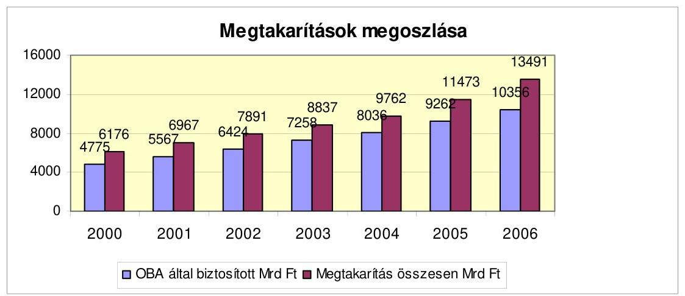
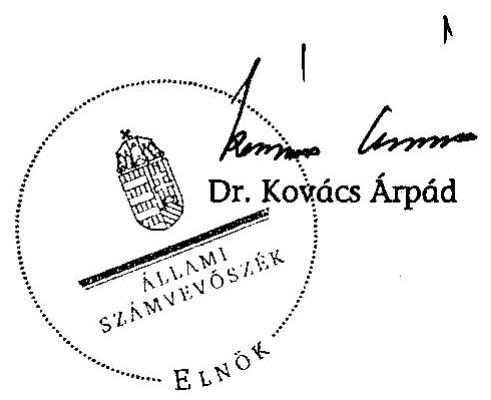
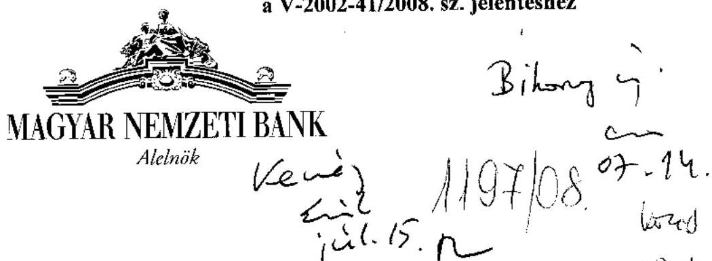
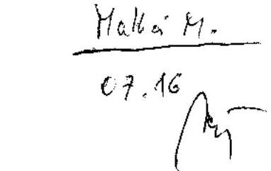
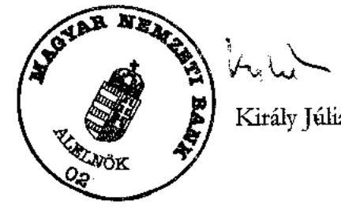

# ÁLLAMI   SZÁMVEVŐSZÉK 

## JELENTÉS

az Országos Betétbiztosítási Alap múködésének ellenőrzéséről

---

2. Államháztartás Központi Szintjét Ellenőrző Igazgatóság
2.1. Teljesítmény Ellenőrzési Főcsoport
Iktatószám: V-2002-41/2008.
Témaszám: 897
Vizsgálat-azonosító szám: V0409
Az ellenőrzést felügyelte:
Bihary Zsigmond
föigazgató
Az ellenőrzés végrehajtásáért felelős:
Kemény Emil
föigazgató-helyettes
Az ellenőrzést vezette:
Makkai Mária
főcsoportfőnök-helyettes
Az ellenőrzést végezték:
Massányi Tibor Barta József
számvevő
számvevő

# A témához kapcsolódó eddig készített számvevőszéki jelentések: 

## címe

Jelentés az Országos Betétbiztosítási Alap, a Befektető-védelmi 0105
Alap, és a Pénzügyi Garancia Alap múködésének ellenőrzéséről
Jelentés az Országos Betétbiztosítási Alap pénzügyi-számviteli el- 310 lenőrzéséről

---

# TARTALOMJEGYZÉK 

BEVEZETÉS ..... 5
I. ÖSSZEGZŐ MEGÁLLAPÍTÁSOK, KÖVETKEZTETÉSEK, JAVASLATOK ..... 7
II. RÉSZLETES MEGÁLLAPÍTÁSOK ..... 10

1. Az OBA működésének szabályozottsága és szervezete ..... 10
1.1. A jogszabályi változások ..... 10
1.2. Az OBA belső szabályozási rendszere, összhangja a jogszabályokkal ..... 12
1.3. Az OBA igazgatótanácsának működése, az ügyvezető igazgató tevékenysége ..... 13
1.3.1. Az ügyvezető igazgató tevékenysége ..... 14
1.4. A szervezeti és működési rend összhangja a jogszabályokkal és a törvényben előírt feladatokkal ..... 14
1.5. Az OBA ellenőrzési tevékenysége ..... 15
1.5.1. Az OBA saját erőforrásokból végzett tagintézeti ellenőrzési tevékenysége ..... 15
1.5.2. Az OBA-nak a PSZÁF-fal kötött együttműködési megállapodásban foglaltak betartása ..... 16
1.6. A válságelhárítással, illetve a válságmegelőzéssel kapcsolatos tevékenység ..... 17
1.6.1. Válságkezelési ügyek, felszámolások ..... 17
1.6.2. Válság-megelőzési ügyek ..... 17
1.6.3. Válság-megelőzési együttműködési szerződések a PM-PSZÁFMNB között ..... 18
2. Az OBA vagyonkezelési tevékenysége ..... 19
3. Az OBA követelései ..... 21
4. Az OBA mérlegfőösszegének, mérleg szerinti eredményének és vagyoni helyzetének alakulása ..... 22
5. Az OBA működési költségeinek alakulása ..... 24
MELLÉKLETEK
6. sz. Az OBA igazgatótanács elnökének levele

---

.

---

# RÖVIDÍTÉSEK JEGYZÉKE 

Csődtv.
Hpt.
MNB
NBK Zrt.
OBA
OTIVA
PM
Szt.
TAKIVA

A csődeljárásról és a felszámolási eljárásról szóló 1991. évi XLIX. törvény
a hitelintézetekről és a pénzügyi vállalkozásokról szóló 1996. évi CXII. törvény

Magyar Nemzeti Bank
Nemzetközi Bankárképző Központ Zrt.
Országos Betétbiztosítási Alap
Országos Takarékszövetkezeti Intézményvédelmi Alap
Pénzügyminisztérium
a számvitelről szóló 2000. évi C. törvény
Takarékszövetkezeti Intézményvédelmi Alap

---

.

---

# JELENTÉS 

## az Országos Betétbiztosítási Alap múködésének ellenőrzéséről

## BEVEZETÉS

Az Országos Betétbiztosítási Alapot (a továbbiakban: OBA) az Országos Betétbiztosítási Alap létrehozásáról és múködésének részletes szabályairól szóló 1993. évi XXIV. törvény hozta létre, múködését 1993-ban kezdte meg. A betétbiztosításra, valamint az OBA-ra vonatkozó előírásokat 1997. január 1-jétől a hitelintézetekről és a pénzügyi vállalkozásokról szóló 1996. évi CXII. törvény (a továbbiakban: Hpt.) tartalmazza.

Az OBA feladata, hogy a tagintézeteknél elhelyezett és biztosított betétek befagyása esetén kártalanítást fizessen a betéteseknek. Az OBA által kifizethető kártalanítás összeghatára 2003. január 1-jétől 1 M Ft-ról 3 M Ft-ra, 2004. május 1-jétől 6 M Ft-ra növekedett úgy, hogy a kártérítés mértéke 1 M Ft-ig száz százalék, az a feletti összegnek pedig - a 10\% önrész bevezetése miatt - 90\%-a. A betétek befagyásának megelőzése érdekében 2006. január 1-jéig az OBA számára a Hpt. előírta a hitelintézeti válsághelyzetek megelőzésében és elhárításában történő szerepvállalást is.

Az OBA által nyújtott biztosítás minden olyan névre szóló betétre kiterjed, amelyet 1993. június 30 -ig jogszabályban vállalt állami garancia, illetve állami helytállás nélkül, valamint 1993. június 30 -át követően állami garancia nélkül az OBA-ban tagsággal rendelkező hitelintézetnél helyeztek el.

Az OBA jogi személy, pénzeszközei nem vonhatóak el és kizárólag a Hpt. által előírt célokra fordíthatóak, saját tőkéje nem osztható fel. A kártalanítási össze-

---

gek kifizetésének fedezetét jelentő forrásai a betétgyűjtési engedéllyel és az OBA-nál kötelező tagsággal rendelkező hitelintézetek (bank, takarékszövetkezet, hitelszövetkezet és lakástakarék-pénztár) egyszeri csatlakozási, illetve rendszeres éves díja, az OBA befektetéseinek hozama, a Pénzügyi Szervezetek Állami Felügyelete (a továbbiakban: PSZÁF) által a hitelintézetektől beszedett bírságok összegének nyolcvan százaléka. A forrásokat szükség esetén rendkívüli díjbefizetés és hitelfelvétel egészítheti ki.

Az OBA irányító szerve az igazgatótanács, amelynek tagjai a pénz-, tőke- és biztosítási piac szabályozásáért felelős miniszter által kijelölt személy, a Magyar Nemzeti Bank alelnöke, a PSZÁF elnöke, a hitelintézetek érdekképviseleti szervezetei által kijelölt két személy, továbbá az OBA ügyvezető igazgatója. Az OBA önálló munkaszervezettel rendelkezik, amelynek vezetését az ügyvezető igazgató látja el.

Az OBA a PSZÁF-al, az Országos Takarékszövetkezeti Intézményvédelmi Alappal (a továbbiakban: OTIVA), valamint a Takarékszövetkezeti Intézményvédelmi Alappal (a továbbiakban: TAKIVA) együttmúködési megállapodásokat kötött.

Az OBA pénzügyi-számviteli külső ellenőrzését a Hpt. alapján az Állami Számvevőszék (továbbiakban: ÁSZ) végzi. Az ÁSZ az OBA múködését 1996-ban és 2000-ben átfogó ellenőrzés keretében vizsgálta.

Az ellenőrzés végrehajtására a Hpt. 109. §-ában foglaltak adtak jogszabályi alapot.

A jelenlegi ellenőrzés célja annak értékelése volt, hogy

- az OBA működése (tevékenysége és gazdálkodása) megfelelt-e a jogszabályokban és a belső szabályzatokban előírtaknak,
- az általa végzett szolgáltatás alkalmas volt-e a közérdek megfelelő védelmére,
- hogyan hasznosultak a korábbi számvevőszéki ellenőrzés megállapításai, javaslatai.

Az ellenőrzés az OBA 2000. és 2007. évek közötti tevékenységére irányult.
A jelentést egyeztettük az OBA igazgatótanácsának elnökével. Levelét az 1. sz. melléklet tartalmazza.

---

# I. ÖSSZEGZŐ MEGÁLLAPÍTÁSOK, KÖVETKEZTETÉSEK, JAVASLATOK 

Az OBA múködése megfelelt a törvényi (Hpt.) rendelkezéseknek, tevékenysége során betartotta a források gyűjtésére, a kifizetésekre és a szabad pénzeszközökkel való gazdálkodásra vonatkozó előírásokat, a korábbi ÁSZ ellenőrzés javaslatát - az eredménykimutatás tevékenységi körök szerinti megbontását végrehajtotta.

Az előző ÁSZ vizsgálatok által érintett időszakoktól eltérően 2000 és 2007 között nem alakultak ki válsághelyzetek a bankrendszerben. Az 1990-es évekhez képest a hitelintézetek tulajdonosi szerkezete megváltozott, döntően nagy tőkeerejű külföldi tulajdonosok javára, a válságkezelési feladatok a tulajdonosok kompetenciájába kerültek. 2000 után egy válságkezelési ügy (kártalanítások kifizetése a betéteseknek) volt, ami a Rákóczi Hitelszövetkezetnél kialakult vagyonvesztés miatt vált szükségessé, a kifizetett kártalanítás összege 293 M Ft volt.

Az OBA tevékenysége 2006. január 1-jétől leszűkült - a Hpt. a válságmegelőzési és tagintézeti ellenőrzési feladatkört törölte - amihez igazodóan a szervezete átalakult, a létszám 17 fơről 2007-re 7 főre csökkent.

Az OBA korábbi válságmegelőző és tagintézeti ellenőrző feladata megszűnt, ugyanakkor a Hpt. változatlanul tartalmazza, hogy az OBA által végzett ellenőrzés során hivatalos személynek minősül az igazgatótanács tagja és az OBA-val munka- vagy egyéb jogviszonyban álló személy, az OBA SZMSZ pedig előírja éves ellenőrzési terv készítését.

Az OBA ellenőrző funkciójának megszűnése után a PSZÁF és az OBA között létrejött együttműködési megállapodás szerint a PSZÁF vállalta, hogy vizsgálatai során ellenőrzi a betétbiztosításra vonatkozó előírások betartását. 2006-tól a Hpt. rendelkezése szerint a PSZÁF nem végez átfogó intézményi ellenőrzést, ezért 2006 óta a betétbiztosítással kapcsolatos ellenőrzés nem volt, ami kockázatot jelent egy esetleges kártalanítási folyamatra való felkészültségben.

Az OBA tevékenysége közérdeket szolgál, de azt nem közpénzekből, hanem döntően a tagintézetek díjbefizetéséből származó bevételekből végzi. Az OBA jogállását a Hpt. meghatározza, azonban azt nem szabályozza, hogy az OBA közfeladatot lát-e el, vagy sem. A meghatározásnak azért van jelentősége, mert közfeladat ellátása esetén az OBA által kezelt adatok nyilvánosak. Az OBA ellen közérdekú adatok kiadása tárgyában indított perben - mivel nem szolgáltatta ki a kért adatokat - hozott ítélet szerint az OBA közfeladatot ellátó szervezet.

Az OBA igazgatótanácsa és ügyvezető igazgatója a számukra előírt feladatköröket ellátták, a belső ellenőrzés javaslatai egy kivételével hasznosultak. A kivétel a befektetési szabályzat elkészítése, amit a belső ellenőr javasolt. Az OBA nem rendelkezik olyan elkülönült befektetési szabályzattal, amelyben, a befek-

---

tetési tevékenység eljárási szabályai, a résztvevők feladatai, hatásköre, az elvárások, határidők, a megbízott szervezetek kiválasztása, teljesítményének értékelése, következmények stb. egységesen szabályozva lennének.

Az OBA igazgatótanácsának döntése alapján az igazgatótanács tagjait 2005. január 1-jétől tiszteletdíj nem illeti meg. Az igazgatótanács ügyrendjének előírása szerint az igazgatótanács tagjainak és azok állandó helyetteseinek kinevezésükkor nyilatkozatot kell tenniük valamely hitelintézetnél esetlegesen birtokolt tulajdoni hányadukról. Az MNB és a PSZÁF képviselőitől a nyilatkozatot azért nem kérték be, mert jogszabály kizárta a hitelintézeti tulajdonlást, ugyanakkor az ügyrendben ez az eljárás nem volt szabályozott. ${ }^{1}$

Az OBA éves beszámolóit a jogszabályok előírásainak megfelelően készítették el. Az OBA mérlegfőösszege 2000-től 2007-ig 31867 M Ft-ról 69157 M Ft-ra növekedett, vagyoni-pénzügyi helyzete stabil volt. A mérleg szerinti eredmény folyamatosan pozitív volt, amelyet az OBA a jogszabályi előírásoknak megfelelően saját tőkéjének növelésére fordított. Mindez lehetővé tette az átlagos díjkulcs folyamatos csökkentését, amelynek eredményeképpen a bevételek összetételében átrendeződés következett be a befektetésekből származó bevételek javára a díjbevételek arányának csökkenése mellett. (2000-ben a bevételek 40,9\%-a a befektetések hozama volt, 2007-ben ez az arány 72,3\%-ot tett ki.) A díjbevételek csökkenő mértéke, és a befektetett vagyon hozama emelkedésének összhatásaként a fedezettségi mutató (az OBA vagyona és a tagintézeteknél lévő elméleti kártalanítási kötelezettség hányadosa) értéke a vizsgálat minden évében a nemzetközileg elfogadott, 1-1,5\%-os sávban vagy fölötte alakult.

A Hpt. előírásainak megfelelően az OBA befektetett vagyonát magyar állampapírokban tartotta, amelyet pályázat útján kiválasztott vagyonkezelők kezelnek. A vagyonkezelők teljesítmény-értékelése során viszonyítási alapként a Magyar Állampapír Indexet (Max Composite Index) vették figyelembe. A hozam a 2000. évi 2,8 Mrd Ft-ról 1,47-szeresére, 4,2 Mrd Ft-ra emelkedett 2007-re, ami összességében meghaladta a vagyonkezelési költségek 1,29-szeres emelkedését (54,6 M Ft-ról 70,6 M Ft-ra).

A működési költségek alakulása arányban volt az OBA feladatainak csökkenésével, munkaszervezetének átalakulásával. A feladatok csökkenése, a munkaszervezet átalakítása és az ebből fakadó létszámcsökkentés miatt az OBA 2007. évi múködési költsége ( 210 M Ft) a 2000. évi 230 M Ft alá csökkent. A múködési költségeken belül a személyi jellegű ráfordítások átlagosan 62,5\%-ot tettek ki, amelyen belül a munkabér dominált.

A helyszíni ellenőrzés megállapításainak hasznosítása mellett javasoljuk:

# a Kormánynak 

1. Tekintse át az OBA státuszát, szükség szerint kezdeményezze a szervezet feladat- és hatáskörének - közfeladatot lát-e el vagy sem - egyértelmú megfogalmazását.
[^0]
[^0]:    ${ }^{1}$ Az OBA írásbeli tájékoztatása szerint az ügyrend módosítása folyamatban van.

---

2. Kezdeményezze a Hpt. 116. § (2) bekezdésének törlését, mivel az OBA ellenőrzési feladatköre megszűnt.

# a PSZÁF Felügyeleti Tanács elnökének 

Tegyen eleget az OBA-val kötött Együttmüködési Megállapodás ellenőrzésre vonatkozó előírásainak. Vizsgálati politikájának megfelelően ellenőrizze a betétbiztosításra vonatkozó előírások betartását, és ezek eredményeiről rendszeresen tájékoztassa az OBA-t.

## az OBA igazgatótanácsának

1. Készítsen befektetési szabályzatot annak érdekében, hogy a vagyonkezelők kiválasztásának és teljesítményértékelésének rendszere, valamint a vagyonkezelési tevékenységben résztvevők feladatkörei egységesen szabályozva legyenek.
2. Intézkedjen az SZMSZ aktualizálásáról az OBA éves ellenőrzési tervére vonatkozó előírás törlésével.

---

# II. RÉSZLETES MEGÁLLAPÍTÁSOK 

## 1. Az OBA MÜKÖDÉSÉNEK SZABÁLYOZOTTSÁGA ÉS SZERVEZETE

### 1.1. A jogszabályi változások

## Az OBA és a tagok közötti jogviszonyt a Hpt. és az OBA belsö utasításai - az EU elöírásokat figyelembe véve - megfelelően szabályozzák, az OBA jogállása ebben a vonatkozásban egyértelmúen tisztázott.

A vizsgált időszakban a Hpt. harmincnyolc alkalommal módosult, ebből az OBA szabályozását lényeges kérdésekben érintő módosítás kilencszer volt. Ezek közül a legfontosabbak a következők.
2003. január 1-jétől a hitelintézetek által kibocsátott és 2003. január 1. után értékesített kötvények és letéti jegyek biztosítottá váltak. A kártalanítási összeghatár 1 M Ft-ról 3 M Ft-ra emelkedett és bevezették az 1 M Ft fölötti betétrészre vonatkozóan a 10\%-os önrészt, így az OBA által fizetett kártalanítás mértéke 1 M Ft összeghatárig száz százalék, 1 M Ft összeghatár felett 1 M Ft és az 1 M Ft feletti rész kilencven százaléka. (Megállapította az egyes pénz- és tőkepiaci tárgyú törvények módosításáról szóló 2002. évi LXIV. tv. 29. § (1).)

A Hpt. 2. sz. melléklet IV./1. pontja 2003. január 1-jétől kiterjesztette a betét fogalmát a hitelintézetek által kibocsátott, hitelviszonyt megtestesítő egyes értékpapírokra is, de a kiterjesztés csak a betétbiztosítás és az intézményvédelem fogalomkörében érvényes. Ez az értelmezés megfelel a biztosított betéteknek az Európai Unió által előírt szabályokban - a betétbiztosítási rendszerekről szóló 94/19 (EK) irányelvben - megfogalmazott meghatározásának.

Az Európai Unióhoz való csatlakozástól kezdődően (2004. május 1.) a kártalanítás értékhatára 6 M Ft lett, figyelembe véve az 1 M Ft fölötti betétrészre vonatkozó 10\%-os önrészt. (Megállapította az egyes pénz- és tőkepiaci tárgyú törvények módosításáról szóló 2002. évi LXIV. tv. 70. §-ával megállapított 2000. évi CXXIV. tv. 71. § (1).)
2006. január 1-től az OBA kártalanítást megelőző jogosítványát törölték, az addig az OBA által saját erőforrásokkal végzett ellenőrzési tevékenységet a PSZÁF-hez utalták és lehetővé vált az OBA forrásainak MNB betétben való elhelyezése (Megállapította a hitelintézetekről és a pénzügyi vállalkozásokról szóló 1996. évi CXII. törvény módosításáról szóló 2005. évi CLXXXVIII. törvény 37. § (1) a)).

A Hpt. 2006-os módosításának előkészítésekor az MNB, a Pénzügyminisztérium és a PSZÁF közös javaslatot készített az OBA funkcióinak és tevékenységének átalakítására, a betétbiztosítási rendszer hatékonyabbá tételére. A dokumentum megállapítja, hogy az OBA-nak nehéz volt betartani a Hpt. azon előírását, hogy válságkezelés során olyan megoldásokat alkalmazzon, amely a legkisebb hosszú távú veszteséget jelenti a betétesek, a hitelintézetek és a költségvetés számára, ugyanis e három szereplő érdekei sokszor alapvetően eltérnek egymástól. A do-

---

kumentum megállapítása szerint az OBA megelőző válságkezelési tevékenysége nem volt minden esetben sikeres. Javasolták a válságkezelő tevékenységről szóló felhatalmazás megszüntetését és az OBA működési hatékonyságának javítása érdekében a tagintézeti ellenőrzés átruházását a PSZÁF-ra. A válságkezelési tevékenység leválasztását az is indokolta, hogy a bankok tulajdonosi szerkezete megváltozott az 1990-es évekhez képest, döntően nagy tőkeerejű külföldi tulajdonosok javára, a válságkezelés a tulajdonosok elsődleges kompetenciájába került.

Jogszabály nem határozza meg, hogy az OBA közfeladatot lát-e el, vagy sem. Az OBA közfeladatot ellátó szervvé minősítésének, vagy a minősítés elhagyásának ténye azért lényeges kérdés az OBA vonatkozásában, mert ettől függ többek között, hogy az általa kezelt adatok nyilvánosak-e, vagy sem. Precedens értékű bírósági döntés létezik arról, hogy az OBA közfeladatot ellátó szerv.

Az OBA ellen - a Realbank Rt. volt vezetője által - indított perben hozott elsőfokú ítélet szerint az OBA nem minősül közfeladatot ellátó szervezetnek, a másodfokú bírósági döntés értelmében azonban az OBA közfeladatot ellátó szervezet.

Az OBA létrehozásáról és múködésének részletes szabályairól szóló 1993. évi XXIV. törvény indokolásában szerepelt, hogy az OBA közfeladatokat ellátó intézmény, és indirekt módon közpénzeket kezel. A Hpt. indokolásában ilyen állítás nem található.

A közfeladatot ellátó szervvé minősítéssel szemben az OBA számos érvet fejtett ki a per során, többek között azt, hogy az OBA nem kezel közpénzt, mivel az állam nem bocsátott, és jelenleg sem bocsát rendelkezésére pénzügyi forrást. Az OBA a piacgazdaság részét képező intézmény, amelyet a piaci szereplők tartanak fenn és múködtetnek az általuk befizetett díjak révén. Mára az állami, vagy részben állami tulajdonú bankok pénzügyi hozzájárulása minimális.

A kártalanítási eljárások időszükségletét a Hpt. 105. § (1) bekezdésének 2003. január 1-jén hatályba lépett módosítása során lecsökkentették, eszerint - az Európai Unió rendelkezéseivel összhangban - a korábbi 30 nappal szemben 15 nap alatt meg kell kezdeni és 90 nap alatt be kell fejezni a tevékenységet. Az OBA a válságmegelőző tevékenység és a kártalanítási eljárások időszükségletének csökkentése érdekében külön intézkedéseket nem tett, mivel a jogszabályok erről egyértelműen rendelkeztek és megfelelő keretet adtak a szükséges beavatkozásokhoz.

A felszámolási eljárások időigényének és a megtérülés mértékének javítására a jogszabályok speciálisan a hitelintézetek felszámolására vonatkozó szabályokat állapítanak meg. Ilyen a csődeljárásról és a felszámolási eljárásról szóló 1991. évi XLIX. törvény (a továbbiakban: Csődtv.) eltérő rendelkezése a PSZÁF által kezdeményezett hitelintézeti felszámolásokra, amelyek az egyéb felszámolási eljárásoknál egyszerűbben és gyorsabban indulhatnak meg, továbbá hogy hitelintézeti felszámolóként kizárólag a PSZÁF által e célra alapított Hitelintézeti Felszámoló Közhasznú Társaság jelölhető ki. Ez utóbbi módosítást az OBA-nak a felszámolási eljárásokban a kijelölt felszámolókkal kapcsolatosan szerzett kedvezőtlen tapasztalataira alapozták meg. Az OBA értékelése szerint a Hitelintézeti Felszámoló Kht. közreműködésével a hitelintézeti felszámolások szakszerűbben, kevesebb problémával és alacsonyabb felszámolói díjazás mellett zajlanak.

---

Az OBA 2003-ban javaslattal fordult a PM-hez, mivel kétséges, hogy a Csődtv. által meghatározott kielégítési sorrend szerint a kötvény- és letéti jegykövetelés a betételhelyezésből eredő követelésekkel egyenlően - a Csődtv. 57. § (1) bekezdésének d.) pontjába való besorolással - érvényesíthető-e. A levélben a Hpt. 183. § (1) bekezdésének módosítását kezdeményezték, ami nem történt meg. A problémát az okozza, hogy a Hpt. 2003. január 1-jétől érvényes módosítása után a kötvények és letéti jegyek betétbiztosítás szempontjából betétnek minősülnek, más szempontból befektetésnek számítanak. A felszámolásban való megtérülés aránya csökkenhet az OBA számára, amennyiben a felszámoló a kielégítési sorrendben alacsonyabb megtérülésű kategóriába sorolná a kötvényés letéti jegykövetelést. Ez eddig az OBÁ-nak nem okozott kárt, mivel a Hpt. vonatkozó változása után nem indult felszámolási eljárás hitelintézet ellen, így a kötvény- és letéti jegykövetelés megtérülési besorolására még nincs gyakorlat.

# 1.2. Az OBA belső szabályozási rendszere, összhangja a jogszabályokkal 

Az OBA Szervezeti és Működési Szabályzatát (a továbbiakban: SZMSZ) 1995. május 2-án fogadták el, ezt követően az igazgatótanács nyolc - ebből a vizsgált időszakban hat - alkalommal módosította. A módosításokat az OBA szervezeti változásai és a betétbiztosításra vonatkozó jogszabályi változások tették szükségessé. Az OBA SZMSZ-ének eddigi utolsó, 2005. május 18-i módosítása során figyelembe vették a Hpt. 2006. január 1-jén hatályba lépő, az OBA-ra nézve lényeges módosításokat tartalmazó változásait.

Az SZMSZ-be beemelték az igazgatótanács - 63/2003. (XII. 18.) határozata alapján elfogadott - ügyrendjét, ezt megelőzően az igazgatótanács nem rendelkezett ügyrenddel.

Az SZMSZ rendelkezik az OBA szervezetéről és funkcionális felépítéséről, tételesen tartalmazza a foglalkoztatottak feladatait. Minden alkalmazott másmás feladatot lát el, részükre külön munkaköri leírás nem készült, jogaikat és kötelezettségeiket a munkaszerződések tartalmazzák.

Az OBA belső ellenőrzési tevékenységét - a 9/2004. (II. 25.) számú igazgatótanácsi határozat alapján - pályázaton kiválasztott szervezet, a Dialog Plusz Számítástechnikai Kft. végzi megbízási szerződés alapján, a szervezet által kijelölt személy útján. 2004. előtt magánszemély látta el a belső ellenőri feladatot szerződéses jogviszony alapján. Az OBA-nál múködő belső ellenőr éves munkaterve szerint rendszeresen végez vizsgálatokat a tagintézetek befizetései; ügyvitel ellenőrzése; vagyonkezeléssel kapcsolatos ellenőrzés; iratkezelési szabályzat betartása; éves múködési költségek alakulása témákban.

A belső ellenőr az adott évben elvégzett ellenőrzések tapasztalatairól évente összefoglaló jelentésben, az éves múködési költségek alakulásáról pedig külön jelentés keretében beszámol az igazgatótanácsnak. A vizsgált időszakban a jelentések elfogadását követően a javaslatok hasznosítása - a befektetési szabályzat elkészítése kivételével - megtörtént.

---

Az ellenőrzéssel megbízott szervezet informatikai biztonsági ellenőrzési tevékenységet is biztosít személyileg elkülönült módon. Az OBA rendelkezik Belső Ellenőrzési Szabályzattal, valamint Informatikai Biztonsági Ellenőrzési Szabályzattal, amely szabályzatok előírják az ellenőrök feladatait. Az ellenőrök az igazgatótanács közvetlen irányítása alá tartoznak.

Az OBA nem rendelkezik olyan elkülönült befektetési szabályzattal, amelyben, a befektetési tevékenység eljárási szabályai, a résztvevők feladatai, hatásköre, az elvárások, határidők, a megbízott szervezetek kiválasztása, teljesítményének értékelése, következmények, stb. rögzítve lennének. Ezekben a kérdésekben a döntés az igazgatótanács egyedi mérlegelése alapján születik meg, ami - a vagyonkezelésben lévő pénzeszköz jelentős volumene és a tevékenység során figyelembe vett szerteágazó szempontrendszer miatt - a legnagyobb körültekintő gondosságot feltételezve sem ad kellő stabilitást és biztonságot a feladat végrehajtásához. Az OBA vagyonkezelési tevékenységének egyes szereplőitől elvárt munkát és teljesítményt a különböző dokumentumok (Befektetési Irányelvek, portfoliókezelési szerződések, SZMSZ, igazgatótanácsi döntések, stb.) részletesen meghatározzák, hiányzik azonban a teljes folyamatot átfogó és egységesen szabályozó belső utasítás.
2004. évben az OBA megbízta a Nemzetközi Bankárképző Központ Zrt.-t (továbbiakban: NBK Zrt.), hogy tekintse át befektetés-kezelési stratégiáját. Az NBK Zrt. által elkészített Befektetési Útmutató alapján az OBA ügyvezetése intézkedési tervet dolgozott ki, és az ajánlásokat figyelembe véve javaslatot tett a befektetési irányelvekre és a teljesítményértékelés szempontrendszerére.

A belső ellenőr 2004. évi jelentésében - amelyet az igazgatótanács elfogadott javaslatot tett az értékpapír portfolióval kapcsolatos munkafolyamatokra vonatkozó szabályzat elkészítésére. Az elfogadott javaslatot az OBA elmulasztotta végrehajtani.

# 1.3. Az OBA igazgatótanácsának múködése, az ügyvezető igazgató tevékenysége 

Az OBA igazgatótanácsának összetétele megfelel a Hpt. 110. § (2) bekezdésében előírtaknak. Az igazgatótanács tagja a pénz-, tőke- és biztosítási piac szabályozásáért felelős miniszter (pénzügyminiszter) által kijelölt személy; az MNB alelnöke; a Felügyelet elnöke; a hitelintézetek érdek-képviseleti szervezetei által kijelölt két személy, továbbá az OBA ügyvezető igazgatója. Az igazgatótanács döntései a pénzügyi szektor egészét és a betéteseket közvetlenül is érintik, ezért a törvényhozó szükségesnek ítélte, hogy a pénzügyi szektor meghatározó szervezeteinek vezetőit delegálják a testületbe, amelynek összetétele bizalomerősítő üzenet a betétesek felé.

Az OBA igazgatótanácsa 2004. év végén úgy döntött, hogy az igazgatótanács tagjait 2005. január 1-jétől tiszteletdíj nem illeti meg. Az azt megelőző időszakban a testület maga állapította meg a tiszteletdíjat (ülésdíjat), mivel nincs magasabb szintű döntéshozó testület, vagy jogszabály, amely erről rendelkezne. Jelenleg az igazgatótanács tagjainak munkavégzése, és a hozzá kapcsolódó felelősségvállalása anyagi elismerés nélkül történik.

---

Az igazgatótanács feladatait a Hpt. és az igazgatótanács ügyrendje határozza meg. A vizsgált időszakban az igazgatótanács rendszeresen ülésezett, határozatképessége biztosított volt, előírt feladatait ellátta. Az igazgatótanács az OBA feladatainak csökkenését megelőző időszakban jellemzően évi 6-8 alkalommal ülésezett, a 2006. január 1. utáni időszakban pedig évente 4 alkalommal.

# 1.3.1. Az ügyvezető igazgató tevékenysége 

A vizsgált időszakban két személy volt az OBA munkaszervezetének élén. 2005. október 14 -én az ügyvezető igazgató munkakörét betöltő személy távozására azt követően került sor, hogy a munkakörre kiírt pályázat elbírálása során más személyt talált alkalmasabbnak az igazgatótanács. Munkaszerződése szerint az ügyvezető igazgatót alapbérén túl prémium illette meg éves feladatkitúzés és értékelés alapján. A prémium összegét minden évben - a kitűzött feladatok maradéktalan teljesítésének igazolását követően - teljes körűen kifizették.

A jelenlegi ügyvezető igazgató 2005. október 15-étől látja el feladatát az OBA élén 5 évre szóló munkaszerződés alapján, amely szerint prémiumban nem részesül. Az ügyvezető igazgató tevékenységét a Hpt. 113. §-a, a vele kötött munkaszerződésben foglaltak, továbbá az SZMSZ vonatkozó pontjai határozzák meg. Legfontosabb feladatai közé tartozik a munkaszervezet irányítása, a munkáltatói jogok gyakorlása az alkalmazottak felett és az OBA képviselete harmadik személyekkel szemben. A vizsgált időszakban mindkét ügyvezető igazgató ellátta előírt feladatait.

### 1.4. A szervezeti és múködési rend összhangja a jogszabályokkal és a törvényben elöírt feladatokkal

A vizsgált időszakban az OBA feladatai szűkültek, mivel a Hpt. 2006. január 1-jén hatályba lépett módosítása során megszűnt az OBA kártalanítás kifizetésének megelőzése érdekében végzett válságkezelési tevékenysége, valamint az OBA ellenőrző funkciója. Az OBA átvezette a változásokat az SZMSZ-en, a szervezet módosítását és létszám csökkentését végrehajtotta. A változásnak megfelelő módosításokat a díffizetési szabályzatban és a tagi szabályzatban is végrehajtották.

A hatályos SZMSZ részletesen felsorolja az ügyvezető igazgató feladatait, többek között azt, hogy „Javaslatot tesz az Alap éves ellenőrzési tervére és ennek megvalósitása érdekében - az Igazgatótanács döntése alapján - együttmüködik a Felügyeletlet." A Hpt. 2006. január 1-jén életbe lépett változásai miatt az OBA saját erőforrásból végzett tagintézeti ellenőrzési tevékenysége megszűnt, azóta nem készült éves ellenőrzési terv sem. Az SZMSZ hivatkozott előirása érvényben tartásának megszűnt a jogszabályi alapja.

---

Az OBA 2006-tól csak az ún. pay-box ${ }^{2}$ funkciót tölti be, és az MNB, a PM és a PSZÁF által javasoltak szerint 3-4 főből álló munkaszervezettel rendelkezett volna azzal, hogy válsághelyzetben a szükséges munkaerőt a PSZÁF és az MNB az OBA rendelkezésére bocsátja külön megállapodás alapján. 2006-tól pénzügyi szervezeteket érintő, beavatkozást igénylő válsághelyzet nem alakult ki.

Az igazgatótanács 15/2005. (III. 30.) számú határozatában a csökkent feladatokhoz illesztett munkaszervezet létszámát a 2004. évihez képest 10 fővel alacsonyabb szinten, 7 főben határozta meg. Ez az MNB, a PM és a PSZÁF által javasoltakhoz képest 3-4 fővel magasabb létszám. Az informatikai és számviteli tevékenységet végző többlet létszám foglalkoztatása a feladatok volumene alapján indokolt.

Az igazgatótanács ügyrendjének III. pontja előírja, hogy az „Igazgatótanács tagjainak, állandó helyetteseinek kinevezésükkor írásbeli nyilatkozatot kell tenniük arról, hogy valamely hitelintézetnél rendelkeznek-e, s ha igen, milyen és mekkora név- és forgalmi értéket képviselő közvetlen és közvetett tulajdoni hányaddal." Az ügyrend 2004. január 1-jén lépett hatályba, az azt követően előírt nyilatkozatok bekérése nem volt rendszeres. A szükséges 13 db nyilatkozattal szemben 4 db nyilatkozat áll rendelkezésre, ebből 1 db érdemi kitöltése hiányzik. A jelenlegi igazgatótanács tagjainak 6 db nyilatkozata helyett 3 db érvényes és 1 db hiányos nyilatkozat található az OBA nyilvántartásában. ${ }^{3}$

# 1.5. Az OBA ellenőrzési tevékenysége 

### 1.5.1. Az OBA saját erőforrásokból végzett tagintézeti ellenőrzési tevékenysége

Az OBA saját erőforrásokból végzett tagintézeti ellenőrzéseit az igazgatótanács döntései alapján, féléves ciklusokban folytatta, az utolsó időszak 2005. II. félévében zárult le. A helyszíni ellenőrzéseket az OBA, vagy az OBA megbízásából az Országos Takarékszövetkezeti Intézményvédelmi Alap (a továbbiakban: OTIVA) munkatársai végezték.

Az OBA és az OTIVA között létrejött és többször módosított együttmúködési megállapodás alapján az OBA vállalta, hogy díjkedvezményben részesíti azokat a tagintézeteket, amelyek egyúttal az OTIVA tagjai is. Az OBA külön vállalkozási szerződés keretei között megállapodott az OTIVA-val a kettős védelemmel rendelkező tagintézetek ellenőrzésében való részvételről. Az OTIVA az ellenőrzés tapasztalatairól szóló dokumentumokat jelentés-tervezet formájában rendszeresen átadta az OBA számára. A jelentés tervezetek részletesen beszámoltak a tagintézetek betétnyilvántartásait is mélységében átfogó ellenőrzé-

[^0]
[^0]:    ${ }^{2}$ pay-box típusú betétbiztosító: amelynek mandátuma a kártalanítás kifizetésére korlátozódik
    ${ }^{3}$ Az OBA 2008. május 28-án kelt levele szerint „Két tag (a Pénzügyi Szervezetek Állami Felügyelete és a Magyar Nemzeti Bank képviselője) esetében (...) jogszabályok erejénél fogva kizárt a hitelintézeti tulajdonlás, melyből következően a nyilatkozat beszerzése indokolatlan és felesleges lett volna." Az OBA igazgatótanácsának ügyrendje ugyanakkor az igazgatótanács minden tagjára kiterjeszti a nyilatkozattételi kötelezettséget.

---

sek tapasztalatairól, ez azt szolgálta, hogy az OBA képet alkothasson a tagintézetek dijbevallásának számszaki pontosságáról és a nyilvántartások alkalmasságáról egy esetleges kártalanítási kifizetés gyors megvalósítására.

Az ellenőrzések során a hitelintézetek mintegy ötödénél eltéréseket regisztráltak a dijbevallást megalapozó díjalap kiszámítása során, a korrekciók nem jeleztek jelentős eltéréseket. Megállapították, hogy a tagintézetek többségükben alkalmas ügyfél és betét-nyilvántartási rendszereket működtetnek, az esetek mintegy 40\%-ában azonban egy esetleges kártalanítási folyamat lebonyolítása - a korszerűtlen technikai felszereltség miatt - csak többletmunka ráfordításával válik lehetővé. A betétesek tájékoztatása, a betétüzletággal kapcsolatos szabályzatok korszerűsítése a vizsgálatba bevont pénzintézetek harmadánál hagyott kívánnivalót maga után.

A Hpt. 116. § (2) bekezdése arról rendelkezik, hogy az OBA-val munkaviszonyban, munkavégzésre irányuló egyéb jogviszonyban, megbízási jogviszonyban álló személy, valamint az igazgatótanács tagja az OBA által végzett ellenőrzés során hivatalos személynek minősül. Az OBA-hoz csatlakozott hitelintézeti tagoknál az OBA a Hpt. előírásának megfelelően 2006. óta nem végez ellenőrzést, a Hpt. 116. § (2) bekezdésének hatályban tartása nem indokolt.

# 1.5.2. Az OBA-nak a PSZÁF-fal kötött együttmúködési megállapodásban foglaltak betartása 

Az OBA ellenőrző funkciójának megszűnése után ennek szerepét a PSZÁF és az OBA között létrejött együttműködési megállapodás volt hivatott átvenni. A megállapodásban a PSZÁF vállalta, hogy az OBA által a Hpt. alapján átadott szempontokat figyelembe veszi éves ellenőrzési terve kialakításakor, és vizsgálatai során ellenőrzi a betétbiztosításra vonatkozó előírások betartását. Az ellenőrzések tapasztalatairól az OBA a változás után eltelt időszakban nem kapott érdemi tájékoztatást a PSZÁF-tól.

Az OBA által fontosnak tartott ellenőrzési szempontokat a megállapodás III./b. pontjában rögzítették, ezen túl 2007. december 29-én az OBA levéllel fordult a PSZÁF-hoz, amelyben ismételten ellenőrzési szempontokat fogalmazott meg, továbbá tájékoztatást kért a korábbi vizsgálatok eredményeiről.

A tagintézetek betétbiztosítással kapcsolatos kötelezettségeinek ellenőrzése a PSZÁF egyéb ellenőrzéseibe épült be. A PSZÁF az OBA-val kötött együttműködési megállapodás aláírását követően az OBA által korábban nem vizsgált intézmények közül ötnél végzett átfogó vizsgálatot. Kifejezetten az OBA tárgykörében a Körmend és Vidéke Takarékszövetkezetnél került sor ellenőrzésre.

A PSZÁF 2006-tól nem végez átfogó intézményi ellenőrzést, összhangban a Hpt. 146. §-ának 2005. november 1-jétől hatályos módosításával. Ez a gyakorlatban azt eredményezte, hogy 2006. óta egyetlen szervezet sem végez az OBA betétbiztosítási tevékenységéhez kapcsolódó ellenőrzéseket a pénzintézeteknél.

A PSZÁF által átvett ellenőrzési funkció gyakorlása során nem épült be a folyamatba az OBA felé küldött rendszeres tájékoztatás a vizsgálatok eredményeiről, ami által az OBA 2006 óta nem rendelkezik információval a tagintézetek

---

betétbiztosítással kapcsolatos tevékenységéről és az esetleges kártalanítási folyamatra való felkészültségéről.

# 1.6. A válságelhárítással, illetve a válságmegelőzéssel kapcsolatos tevékenység 

### 1.6.1. Válságkezelési ügyek, felszámolások

Az OBA a válságkezelési feladatait a Hpt.-ban rögzítettek szerint végezte. A vizsgált időszakban egy válságkezelési ügy indult, ami a Rákóczi Hitelszövetkezetnél kialakult vagyonvesztéses helyzet miatt vált szükségessé. Az OBA kártalanítási kifizetéseinek összege 292613917 Ft volt, a megtérülési arány az OBA 2007. évi tevékenységéről szóló éves jelentése szerint várhatóan $90 \%$ fölött alakul.

A Rákóczi Hitelszövetkezet tartósan veszteségesen gazdálkodott, ezért 1999-től felügyeleti biztost neveztek ki, majd 2000 októberében a PSZÁF visszavonta a múködési engedélyt és kifizetési tilalmat rendelt el. Ezzel létrejött az OBA kártalanítási kötelezettsége, ami alapján a kifizetések a törvényben előírt határidőben megkezdődtek. A Rákóczi Hitelszövetkezet felszámolását a Fővárosi Bíróság 2000. október 26 -án elrendelte.

A Heves és Vidéke Takarékszövetkezet 1993 novemberében indult felszámolása még nem zárult le. A közbenső mérleg elkészült, a zárómérleg és a vagyonfelosztási javaslat benyújtására a felszámoló ígéretet tett. A mintegy 262 M Ft-os kártalanítási kifizetésének és a 16 M Ft fölötti járulékos költségeinek megtérülésére - a takarékszövetkezet vagyona alapján - az OBA nem számíthat.

Az OBA Hpt.-ben rögzített feladatain túlmenően a PM felkérésére 2006. július 31-től kezdődően az OBA - megbízási szerződés alapján - részt vesz a Heves és Vidéke Takarékszövetkezet „f.a." alaprészjegy II. és célrészjegy tulajdonosok utólagos kártalanításának folyamatában.

Az OBA a benyújtott igények azonosítását követően a PM által előre átutalt fedezet felhasználásával teljesíti a kifizetéseket. A beérkezett 387 igénybejelentésből a vizsgálat végéig 307 személy részére 40932838 Ft összegű kártalanítást fizettek ki. További 156 okirat tartalmának alapján, a jogosultság tisztázása folyamatban van, kifizetésre ezt követően kerül sor.

### 1.6.2. Válság-megelőzési ügyek

A vizsgált időszakban válság-megelőzési ügy nem indult. Az OBA fennállása során lefolytatott három válság-megelőzési eljárás mindegyike 2000. év előtt kezdődött, és fejeződött be, az ezt követően - két esetben - indult felszámolási eljárás azonban csak 2007-ben zárult le. A válság-megelőzési ügyek voltak az Agrobank Rt. részvényjegyzéses tőkejuttatása, hitelnyújtás és kártalanítás az Iparbankház Rt. esetében és a Reálbank Rt. számára biztosított tőkejuttatás.

Az Agrobank Rt. esetén a 15 Mrd Ft-ot elérő kártalanítási kötelezettség kifizetésének elkerülése érdekében az OBA 1995-ben részt vett a bank működőképes-

---

ségének biztosításában. Mintegy 526 M Ft kifizetés történt az OBA részéről, a megtérülési arány nem érte el az 5\%-ot.

Az Iparbankház Rt. piacról történő csendes kivezetése a bankszektorból sikeresen megtörtént, a bank ellen 1996. július 4-én indult felszámolási eljárás 2007. június 19-én jogerősen befejeződött. Az OBA az ügylet során 990 M Ft-os hitelt nyújtott és 2309729 Ft összegű betétkifizetést teljesített, az elért megtérülési arány $92,5 \%$-os.

A Reálbank Rt. - tőkejuttatást követő - sikertelen konszolidációját követően visszavonták működési engedélyét, ezáltal mintegy 5 Mrd Ft értékben beállt az OBA kártalanítási kötelezettsége, majd 1999. január 19-én megkezdődött a felszámolási eljárás. A társaság jogi megszűnését a bíróság 2007. június 12-én mondta ki. Az OBA által különböző jogcímeken (tőkeemelés, kártalanítás, egyéb) kifizetett, több mint 8 milliárdos összeg mintegy kétharmada térült meg. ${ }^{4}$

Az OBA ellen az Iparbankház Rt. és a Reálbank Rt. ügyeiben vállalt közreműködése kapcsán számos - zömmel kisbefektetők, vagy közösségeik által kezdeményezett - per indult, amelyek közül van, amelyik még a vizsgálat befejezéséig sem zárult le. A bíróságok egy esetben sem állapítottak meg fizetési kötelezettséget az OBA terhére.

Az OBA válság-megelőzési tevékenysége, különösen a tulajdonszerzésen keresztüli válságkezelések a gyakorlatban több problémát vetettek fel, mint például az alacsony megtérülés (Agrobank Rt.) és az elhúzódó perek. Az Iparbankház Rt. esetében a peres eljárás 1998 és 2003 között zajlott, a Reálbank Rt. esetében az 1998-ban kezdődött eljárások még nem zárultak le.

# 1.6.3. Válság-megelőzési együttmúködési szerződések a PM-PSZÁFMNB között 

2008. január 15-én együttműködési megállapodást kötött az MNB, a PSZÁF és a PM a válsághelyzetekben közöttük megvalósítandó együttműködés alapelveiről és kereteiről. A megállapodás egyben kiegészíti a pénzügyi rendszer stabilitásának előmozdítását biztosító feladatok koordinálásáról a PSZÁF, az MNB és a PM között 2004. szeptember 8-án létrejött háromoldalú megállapodást, valamint az MNB és a PSZÁF között megkötött és évenként aktualizálásra kerülő együttműködési megállapodást. Az említett megállapodások hivatottak a korábbiakban az OBA részére adott törvényi felhatalmazásból eredő válságkezelési mozgástér új keretek közötti megvalósítására.

[^0]
[^0]:    ${ }^{4}$ Az OBA 2008. május 28-án kelt levele szerint „a Realbank válságkezelése kapcsán az OBA teljesítette a Hpt. - akkor hatályos - 104. § (2) bekezdésében foglalt előírását, amely szerint az Alap a betétek befagyásának elkerülése érdekében köteles azt a megoldási módot választani, amely a betétesek és hitelintézetek, valamint a központi költségvetés számára a legkisebb hosszú távú veszteséggel jár."

---

A megállapodási időszak alatt nem alakult ki olyan válsághelyzet, ami beavatkozást és az együttmúködési megállapodásokban foglaltak megvalósítását igényelte volna. ${ }^{5}$

# 2. Az OBA VAGYONKEZELÉSI TEVÉKENYSÉGE 

A Hpt. 118. § (3) bekezdés előírásai szerint az OBA pénzeszközeit állampapírban vagy az MNB-nél elhelyezett betétben kell tartani. A vizsgált időszak alatt az OBA a pénzbeli vagyonát állampapírban tartotta, kezelésére pályázat útján kiválasztott vagyonkezelőket bízott meg, az értékpapírok letéti kezelésével, pénzforgalmi számlavezetéssel és a portfoliókezelők ellenőrzésére kiválasztott szervezettel pedig letétkezelői szerződést kötött.

A portfoliókezelők és a letétkezelők jogait és kötelezettségeit a megkötött szerződések és a Befektetési Irányelvekben foglaltak együttesen határozzák meg. A Befektetési Irányelvek egyedi befektetési előírásokat, limiteket tartalmaz a vagyonkezelő számára, továbbá meghatározza azt a kockázati szintet, amelyet befektetései során saját hatáskörben nem léphet át. Ez nem helyettesíti a befektetési tevékenységre vonatkozó szabályzatot, mivel nem rögzít feladat- és hatásköröket az adott tevékenység résztvevői és irányítói számára.

## A vagyonkezelők és a letétkezelő kiválasztására vonatkozó pályázati kiírásról, valamint a pályázatok értékeléséről és a nyertes pályázókról szóló döntéseket az igazgatótanács hozta meg.

Ez a feladat nem szerepel az igazgatótanács ügyrendjében, mint kizárólagos hatáskör, az igazgatótanács erről a 2 M Ft-ot meghaladó értékű szerződések közé való besorolás alapján dönt.

A portfoliókezelőket napi, kétheti, havi, negyedéves, éves, illetve a szerződés lejártát követő összegző jelentéstételi kötelezettség terheli az OBA felé. A jelentéseket a portfoliókezelők az előírt rendszerességgel elkészítették. Az OBA igazgatótanácsa - szokásjog alapján, mivel nem írja elő számára belső (befektetési szabályzat) vagy külső szabály - nem következetesen értékelte a vagyonkezelői teljesítményeket.

2000-ben nem volt negyedévenkénti teljesítményértékelés, féléves értékelést a könyvvizsgáló végzett az igazgatótanács felkérésére. 2001-ben két alkalommal történt értékelés. 2002-ben elmaradt az I. negyedévi és I-III. negyedévi, 2003-ban és 2004-ben a féléves, 2006-ban mind az I. negyedévi, mind a féléves értékelés. 2007-ben nem történt meg a vagyonkezelők féléves teljesítményének értékelése.

A vagyonkezelők teljesítmény-értékelése során a Magyar Állampapír Indexet (Max Composite Index) vették figyelembe viszonyítási alapként, mivel a vonatkozó igazgatótanácsi határozat szerint a MAX Composite Index, mint refe-

[^0]
[^0]:    ${ }^{5}$ A PSZÁF 2008. május 30-án kelt levele szerint „ugyan olyan válsághelyzet nem alakult ki, amelynek kezelése során mód lett volna az együttmüködés hatékonyságának megítélésére, de három intézmény részvételével 2007-ben volt szimulációs gyakorlat, amelynek tapasztalatai beépültek a megállapodásba."

---

renciaindex biztosítja a legmegfelelőbben az OBA által kiválasztott hármas elv (likviditás, hozam, biztonság) érvényesülését.

A vagyonkezelők és a letétkezelő megbízása minden esetben nyílt pályázat keretében, igazgatótanácsi határozatok alapján történt. A pontozásos rendszerú elbírálás során rögzítették a figyelembe veendő szempontokat (formai követelmények, mérlegadatok, kezelt vagyon nagysága, díjazás, egyéb költségek felszámítása, hozamgarancia vállalása, OBA-ra szabott egyedi befektetési ajánlat adása, OECD kötvények vásárlását javasolja-e a pályázó, évközi és év végi adatszolgáltatás, javasolt befektetés kockázati kitettsége, egyéb szolgáltatások).

A vagyonkezelői szerződések 6. számú mellékletében rögzített befektetési irányelvek a vagyonkezelők (portfoliókezelők) számára célkitúzésként rögzítik, hogy az általuk kezelt vagyonon elért hozam haladja meg a referenciahozamot és a portfoliokezelő az értékpapír-állomány összetételét, a lejárati struktúráját mindenkor a likviditás, a legkedvezőbb hozam és a maximális biztonság figyelembe vételével alakítsa ki. A befektetési irányelvek előírják a portfoliokezelő kötelezettségét arra, hogy lejárati struktúráját a piaci lehetőségekhez képest megfelelően diverzifikált módon állítsa össze és az esetleges rendkívüli kifizetések esetén az elmaradt haszon minimalizálására törekedjen. A jogszabály által meghatározott befektetési lehetőségeken belül a portfoliokezelők kihasználták a magyar állampapírpiac által biztosított lehetőségeket. A befektetési irányelvek lehetővé teszik a vagyonkezelők számára a külföldi állampapírokba történő befektetést, azonban ezt a vagyonkezelők a teljes vizsgált időszak alatt túl kockázatosnak ítélték, így külföldi állampapírokba befektetés nem történt.

A vizsgált időszak alatt a vagyonkezelők személye négy alkalommal, az általuk kezelt vagyon aránya hat alkalommal változott. A szerződéses előírások szerint amennyiben a vagyonkezelő által elért hozam nem éri el a referenciaindex mértékét, az illető portfoliokezelő nem részesül díjazásban. A vizsgált időszak alatt ez az OBA hét portfoliokezelője esetében nyolc alkalommal történt meg.

A könyvvizsgáló a 2006. évi, 2007. I. negyedévi, valamint a 2007. I-III. negyedévi portfoliokezelői teljesítményekről véleményt nyilvánított az OBA igazgatótanácsa számára. A könyvvizsgálói vélemény szerint „a vizsgálat alapadatai, mutatóképzési algoritmusai, az összehasonlítások technikái megfelelők. Ez alapján a teljesítményekről szóló beszámoló az IT számára megbízható és valós információkon alapul."

A vizsgált időszak alatt a portfoliokezelői jutalékok és a letétkezelőnek kifizetett díjak ezer Ft-ban a következőképpen alakultak:

| Megnevezés | $\mathbf{2 0 0 0}$ | $\mathbf{2 0 0 1}$ | $\mathbf{2 0 0 2}$ | $\mathbf{2 0 0 3}$ | $\mathbf{2 0 0 4}$ | $\mathbf{2 0 0 5}$ | $\mathbf{2 0 0 6}$ | $\mathbf{2 0 0 7}$ |
| :-- | :--: | :--: | :--: | :--: | :--: | :--: | :--: | :--: |
| Portfoliokeze-   lői jutalék | 52839 | 50632 | 47003 | 47685 | 38645 | 26534 | 16308 | 60118 |
| Letétkezelői   díj | 1795 | 6856 | 8942 | 1566 | 2573 | 6977 | 9695 | 10512 |

2000-től 2007-ig az éves átlagos lekötött tőke 22697782 E Ft-ról annak 2,82-szeresére, 63925098 E Ft-ra növekedett, ezzel párhuzamosan a vagyonke-

---

zelés költsége 54634 E Ft-ról annak 1,29-szeresére, 70631 E Ft-ra emelkedett. A hozam ez alatt az idő alatt 2843623 E Ft-ról 4192561 E Ft-ra, 1,47-szeresére emelkedett. A befektetett értékpapírokból származó hozam növekedése összességében meghaladta a vagyonkezelés költségének emelkedését. A vizsgált időszak alatt 2003-ban és 2007-ban az elért éves hozamok alatta maradtak az éves inflációnak, a többi évben meghaladták azt.

Adatok: E Ft-ban

| Megnevezés | 2000 | 2001 | 2002 | 2003 | 2004 | 2005 | 2006 | 2007 |
| :--: | :--: | :--: | :--: | :--: | :--: | :--: | :--: | :--: |
| Vagyonkezelés költsége | 54634 | 57488 | 55945 | 49251 | 41218 | 33511 | 26003 | 70631 |
| Éves átlagos lekötött tőke | 22697782 | 26133435 | 32949701 | 43143732 | 44865748 | 52314221 | 58424782 | 63925098 |
| Hozam | 2843623 | 2987079 | 2737850 | 685566 | 6227698 | 4588521 | 3852634 | 4192561 |

A vagyonkezelésben lévő értékpapírok állománya 2000-től 2007-ig diszkont kincstárjegyből, államkötvényből és MNB kötvényből állt. Az értékpapírok könyv szerinti értéke 2000-ben 24706567 E Ft, 2001-ben 30116702 E Ft, 2002-ben 36512065 E Ft, 2003-ban 43027923 E Ft, 2004-ben 50068270 E Ft, 2005-ben 55941597 E Ft, 2006-ban 61249978 E Ft, 2007-ben 66774938 E Ft volt, az állomány a vizsgált időszak alatt 2,7-szeresére növekedett.

# 3. Az OBA köVETELÉSEI 

Az OBA-nak tagdíjak nemfizetéséből származóan követelése nem volt. Az OBA követelésállományának legnagyobb részét a hitelezői követelésként megjelenő betétbiztosítási ráfordítások tették ki. A számviteli politika előírásai szerint a hitelezői követeléseket az OBA a felszámoló nyilatkozata alapján minősítette.

2000-ben a tagintézetekkel szembeni követelések összesen 6363533 E Ft-ot tettek ki, amelyek közül az OBA-ra a Hpt. előírásai alapján átszállt követelések jelentették a legnagyobb tételt ( 5597063 E Ft), ami az OBA addigi fennállása során összesen teljesített betétkifizetések összegét jelentette a Heves és Vidéke Takarékszövetkezet, az Iparbankház Rt., a Realbank Rt., valamint a Rákóczi Hitelszövetkezet felszámolása kapcsán. A fennmaradó részt az Iparbankház Rt.-vel szemben a meg nem fizetett hiteltartozás utáni tőke és kamatösszeg, valamint a Realbank Rt. és a Rákóczi Hitelszövetkezet betéteseinek kártalanításával kapcsolatban felmerült járulékos költségeket jelentette. A követelések várhatóan meg nem térülő része után az OBA céltartalékot képzett.

2001-től az Szt. előírásai szerint a követelések behajthatatlan része után értékvesztést kellett képezni (ráfordítás), így ettől kezdve a követeléseket a mérlegben a várható megtérülés összegében mutatják ki. Az OBA-ra betétkifizetés következtében átszállt követelések értéke 2001-től 4674265 E Ft-t tett ki, amely 2002-re 5192701 E Ft-ra emelkedett. 2003-ban a Realbank Rt. felszámolója a betétkifizetés következtében keletkezett követeléseket az OBA felé kifizette, így ez a követelésállomány 174778 E Ft-ra csökkent. A követelések értéke az Heves és Vidéke Takarékszövetkezet, a Rákóczi Hitelszövetkezet, valamint az Iparbankház betétjeinek kifizetése következtében 2004-re 188993 E Ft-ra emelke-

---

dett, majd 2005-re a Rákóczi Hitelszövetkezet felszámolása során az OBA követeléseinek 76\%-os megtérülése következtében 74513 E Ft-ra csökkent. 2006-ban az érték 75670 E Ft-ot, 2007-ben 74637 E Ft-ot mutatott.

A betétbiztosításból eredő ráfordítások értéke 2000 és 2005 között 147 E Ft és 1735713 E Ft között mozgott, összességében csökkent, 2006-ban és 2007-ben nulla Ft volt. Ennek az volt a magyarázata, hogy 2000. után nem indult új kártalanítási kifizetés, illetve az OBA 2005. évi átszervezése során az addig az OBA által ellátott egyes feladatok a PSZÁF-hoz kerültek.

# 4. Az OBA MÉrleGfŐÖSSZEGÉNEK, MÉrleg SZERINTI EREDMÉNYÉNEK ÉS VAGYONI HELYZETÉNEK ALAKULÁSA 

Az OBA éves beszámolóit a számvitelről szóló 2000. évi C. törvény (a továbbiakban: Szt.), a betétbiztosítási alapok és intézményvédelmi alapok, valamint a befektető-védelmi alap éves beszámoló készítési és könyvvezetési kötelezettségének sajátosságairól szóló 214/2000. (XII. 11.) Korm. rendelet előírásai alapján készítették el. A vizsgált időszak alatt a jogszabályi változásokat a számviteli politikán és a számlarenden átvezették.

Az ÁSZ az Országos Betétbiztosítási Alap, a Befektető-védelmi Alap és a Pénztárak Garancia Alapja működésének ellenőrzéséről 2001 márciusában készített 0105. számú jelentésében javasolta az OBA igazgatótanácsának a számviteli szabályzatok megváltoztatását annak érdekében, hogy az eredménykimutatás információ tartalma egyértelműen tükrözze az Alap betétbiztosítási tevékenységének bevételét és ráfordítását, a pénzügyi műveletek eredményét, valamint a munkaszervezet múködési költségét.

A javaslatban foglaltakat az OBA az éves beszámolók elkészítésének keretében végrehajtotta, az eredménykimutatás tevékenységi körök szerinti megbontását a kiegészítő mellékletben elvégezte.

Az OBA igazgatótanácsa a 61/2001. (III. 29.) számú határozatában rögzítette, hogy az Alap által alkalmazott számviteli szabályok - az ÁSZ véleményével egyezően - minden tekintetben megfeleltek a törvényi előírásoknak, azonban segítené a tisztánlátást az eredmény-kimutatás megbontása a három fő tevékenységi területre: a betétbiztosításra, a vagyonkezelésre és a múködésre.

Az igazgatótanács a 83/2001. (X. 5.) számú határozatában döntött a tevékenységi körök szerinti vezetői információs rendszer kialakításáról. Ennek érdekében bevezették a költséghelyek szerinti könyvelést és ezt átvezették a számlarenden. Az OBA a bevételekről és a ráfordításokról előre meghatározza, hogy azok melyik tevékenységhez kapcsolódnak, így az év végi záráskor az eredménykimutatás egységesen mindhárom költséghelyre (tevékenységi körre) egységes szerkezetben elkészíthető. Az igazgatótanácsi határozat keretében visszamenőleg elkészítették a tevékenységi körök szerint megbontott eredménykimutatást 2000. évre.

Az OBA mérlegfőösszege a vizsgált időszak alatt 2000-től 2007-ig 31867 M Ft-ról 69157 M Ft-ra, az induló érték 2,17-szeresére emelkedett. A mérleg eszközoldalán a jelentős értékpapír portfolió következtében a forgóeszközök domi-

---

náltak, a forrásoldalon a felhalmozódott pozitív mérleg szerinti eredmények következtében a saját tőke volt a legjelentősebb tétel. Az OBA vagyoni és pénzügyi helyzete a vizsgált időszak alatt stabil volt. 2000-ben az eszközoldal 77,5\%-át ( 24707 M Ft ) az értékpapírok tették ki, ez az arány 2007-ben 96,6\% volt. A saját tőke 2000-ben 30773 M Ft volt, ami a forrásállomány 96,6\%-át jelentette, 2007-ben a saját tőke értéke 69030 M Ft volt, ami a források 99,8\%-át tette ki.

Az OBA jegyzett tőkéje a tagintézetek által befizetett csatlakozási díjakból tevődik össze.

A mérleg szerinti eredmény folyamatosan pozitív volt. Az OBA a Hpt. előírásai szerint a nyereségét kizárólag a saját tőkéjének növelésére fordíthatja. Az OBA az előírásnak eleget tett, a tartalékok a tárgyévet megelőző mérleg szerinti eredmények összegeiből tevődtek össze. Értékük 2000-ben 20729 M Ft-ot, 2007-ben 62265 M Ft-ot tett ki, a növekedés háromszoros volt.

A pozitív mérleg szerint eredmény alakulásában a pénzügyi műveletek bevételei és a tagintézetekkel szemben elszámolt díjbevételek voltak a legjelentősebb tényezők. A vizsgált időszak alatt a bevételeken belül a díjbevétel visszaszorult és a pénzügyi műveletekből származó bevétel dominanciája megnőtt az átlagos díjkulcs fokozatos csökkenése miatt. 2000-ben az átlagos díjkulcs 1,02 ezrelék, 2007-ben ez az érték 0,18 ezrelék volt.

2000-ben a bevételek ( 13018 M Ft ) 40,9\%-át, 5329 M Ft-ot tettek ki a pénzügyi műveletek bevételei és 4091 M Ft (31,4\%) származott a tagintézetekkel szemben elszámolt díjbevételekből. 2007-ben a bevételek ( 6812 M Ft ) 72,3\%-át, 4922 M Ft-ot a pénzügyi műveletek bevételei jelentették a betétbiztosításból eredő bevételek ( 1691 M Ft ) 24,8\%-ával szemben.

Az OBA vagyona (értékpapírban megtestesülő likvid eszközeinek kamattal növelt piaci értéke) és a tagintézeteknél lévő elméleti kártalanítási kötelezettségének ${ }^{6}$ hányadosa a fedezettségi mutató, ami nemzetközileg elfogadott mérőszám a betétbiztosító intézmény feltöltöttségének mérésére. Az OBA a fedezettségi mutató tekintetében a nemzetközi összehasonlításban jónak mondható $1-1,5 \%$ közötti értéket tartja elfogadhatónak, ennek megfelelően alakította díjpolitikáját az elmúlt években.

A fedezettségi mutató alakulása 2000-2007 között (év eleji adatok)

| Megnevezés | $\mathbf{2 0 0 0}$ | $\mathbf{2 0 0 1}$ | $\mathbf{2 0 0 2}$ | $\mathbf{2 0 0 3}$ | $\mathbf{2 0 0 4}$ | $\mathbf{2 0 0 5}$ | $\mathbf{2 0 0 6}$ | $\mathbf{2 0 0 7}$ |
| :-- | :--: | :--: | :--: | :--: | :--: | :--: | :--: | :--: |
| OBA kártalanítási kötele-   zettsége (Mrd Ft) | 1585 | 1711 | 1957 | 3186 | 3521 | 4551 | 5104 | 5288 |
| OBA vagyona (Mrd Ft) | 19,3 | 25,5 | 31,3 | 37,4 | 44,3 | 51,5 | 57,8 | 63,1 |
| Fedezettségi mutató \% | 1,22 | 1,49 | 1,60 | 1,17 | 1,26 | 1,13 | 1,13 | 1,19 |
| Átlagos díjkulcs (ezrelék) | 1,02 | 0,60 | 0,59 | 0,21 | 0,20 | 0,20 | 0,19 | 0,18 |

Forrás: OBA éves beszámolók

[^0]
[^0]:    ${ }^{6}$ Elméleti kártalanítási kötelezettség: egyazon időpontban a tagintézeteknél lévő védett betétek, illetve betétrészek állománya.

---

Az OBA bevételei között a befektetett vagyon hozama fokozatosan növekvő arányban szerepelt, míg a tagintézetektől származó díjbevétel tudatos díjpolitika hatására egyre csökkenő szerephez jut. A befektetett vagyon hozama első ízben 2001-ben haladta meg a díjbevételt. 2006-ban a díjbevétel már az összes bevétel 30\%-a alatt maradt. Az ellenőrzött évek során a díjbevétel nagysága nominálisan is csökkent, az 1998-as, 5 Mrd Ft-ot meghaladó csúcsévhez képest 2006-ra 1,7 Mrd Ft-ra mérséklődött.

A díjbevételek csökkenő mértéke és a befektetett vagyon hozama emelkedésének összhatásaként a fedezettségi mutató értéke a vizsgálat minden évében a nemzetközileg elfogadott, 1-1,5\%-os sávban, vagy afölött alakult.

Hosszú lejáratú kötelezettséggel az OBA a vizsgált időszak alatt nem rendelkezett, hitel felvételére nem került sor.

# 5. Az OBA MÜKÖDÉSI KÖLTSÉGEINEK ALAKULÁSA 

Az OBA múködési költségei 2000 és 2004 között emelkedő tendenciát mutattak.

Adatok: E Ft-ban

| Megnevezés | 2000 | 2001 | 2002 | 2003 | 2004 | 2005 | 2006 | 2007 |
| :-- | --: | --: | --: | --: | --: | --: | --: | --: |
| Anyagjellegú   ráfordítások | 25162 | 105750 | 92731 | 90704 | 106211 | 69797 | 66709 | 59677 |
| Személyi jell.   ráfordítások | 133469 | 155163 | 173941 | 196384 | 210914 | 208392 | 157213 | 135051 |
| Értékcsökke-   nési leírás | 13294 | 14342 | 14321 | 22387 | 22581 | 21989 | 18926 | 15043 |
| Egyéb költsé-   gek | 58396 | 0 | 0 | 0 | 0 | 0 | 0 | 0 |
| Múködési ktg   összesen | 230321 | 275255 | 280993 | 309475 | 339706 | 300178 | 242848 | 209771 |

A múködési költségek között a személyi jellegú ráfordítások domináltak, átlagosan 62,5\%-ban. Részarányuk 2001-ben volt a legalacsonyabb ( 155163 E Ft, $56,4 \%$ ), 2005-ben a legmagasabb ( 208392 E Ft, 69,4\%). A múködési költségek 2007-re a 2000-es szint alá estek vissza, amelynek oka az OBA által ellátandó feladatok csökkenése és ebből fakadóan a munkaszervezet átszervezése, illetve az ezzel kapcsolatos létszámcsökkentés volt. 2000-ben a múködési költségek a mérlegfőösszeg $72 \%$-át, 2007-ben $30 \%$-át tették ki.

A személyi jellegú ráfordításokon belül a legnagyobb tételt a munkabér tette ki, amely évenként átlagosan $66,3 \%$-ot jelentett. A fennmaradó összeg (személyi jellegű egyéb kifizetés) nyelvpótlék, jutalom, prémium, béren kívüli juttatás volt. Nyelvpótlékot az OBA csak 2000-ben (1550 E Ft), 2001-ben (1584 E Ft) és 2002-ben ( 1528 E Ft) fizetett dolgozói számára.

Az anyagjellegú ráfordításokon belül (anyagköltség, igénybevett szolgáltatás és egyéb szolgáltatások) az igénybevett szolgáltatások (szállítás, beszerzés költségei, bérleti díjak, karbantartási, reklám- és kiküldetési költségek) átlag 83,9\%-ot

---

tettek ki. A Szt. értelmében 2001-ben az egyéb költségeket az anyagjellegú és a személyi jellegű ráfordítások között felosztották. 2001-től az anyagjellegú ráfordítások értéke összességében 105750 E Ft-ról 59677 E Ft-ra, 43,6\%-kal csökkent.

Az értékcsökkenési leírás értéke összességében a 2000. évi 13249 E Ft-ról 2007-re 15043 E Ft-ra növekedett.

Az OBA átalakulásának előrehaladásáról szóló, 2005. július 11-én kelt közbenső tájékoztató rögzíti, hogy az OBA az igazgatótanács 18/1/2005. (V. 18.) számú határozata alapján megkötötte a Dialog Plusz Kft.-vel a könyvelési és egyéb pénzügyi feladatok elvégzésére vonatkozó megbízási szerződést, amelynek alapján a Dialog Plusz Kft. dolgozói az OBA főkönyvelőjének szakmai támogatásával részt vesznek az OBA feladatainak ellátásában. A kiszervezett feladatok költségvonzata 2005-ben 990 E Ft, 2006-ban 4784 E Ft, 2007-ben 4631 E Ft volt. (A Dialog Plusz Kft. a könyvelési feladatokat 2005. júniusától látja el.)

Az informatikai beszerzések volumene évenként ingadozott. A beruházások összege 2000-ben volt a legmagasabb ( 17925092 Ft ), amikor kialakították a tűzfalas biztonsági rendszert és megújították az OBA honlapját. Az informatikai fejlesztések (szoftverfejlesztések, vírusvédelmi rendszer üzembe állítása és digitális fénymásoló készülék beszerzése) összege 2001-ben 8093400 Ft-ot tett ki. 2002-ben 2051350 Ft volt a beruházások értéke, amelyek során digitális kamerát vásároltak, valamint lecserélték a központi szervert. 2003-ban (12 788320 Ft ) hálózati lézernyomtatót és DVD archiváló egységet vásároltak. 2004-ben (10 712955 Ft ) új, digitális telefonközpontot szereltek fel. 2005-ben 2749778 Ft volt a fejlesztések értéke. 2006-ban (1 754986 Ft ) megvalósult az új kifizető rendszer fejlesztése, 2007-ben (8 748192 Ft ) lézernyomtatót vásároltak. Az informatikai beszerzések között mindezeken felül folyamatosan jellemző volt az amortizálódott szerverek, munkaállomások és notebook-ok cseréje.

Az igazgatótanács tagjai részére kifizetett ülésdíjak (tiszteletdíjak) értéke 2000-ben (10 fő) 3589000 Ft, 2001-ben (7 fő) 3582000 Ft, 2002-ben (6 fő) 2965600 Ft, 2003-ban (5 fő) 3000000 Ft , majd 2004-ben (5 fő) 2800000 Ft volt. 2002-ben 7 fő volt jogosult ülésdíjra, de kifizetés csak 6 fő részére történt, 2003-ban 6 fő volt jogosult, de csak 5 fő részére történt kifizetés, mivel 1-1 fő a neki járó ülésdíjról lemondott. Az igazgatótanács tagjai részére egyéb címen kifizetés, költségtérítés nem történt. 2005-től az igazgatótanács tagjai díjazás nélkül látják el a munkájukat.

Munkaszerződésük szerint az OBA szervezetéből az ügyvezető igazgató, a vezető közgazdász, valamint a vezető jogtanácsos jogosultak szolgálati gépjármú használatára. A vizsgált időszak alatt öt alkalommal szereztek be (cseréltek) szolgálati gépjárművet, egy db Peugeot 307 Premium (3 990000 Ft), egy db VW Passat 1,9 TDI ( 6801900 Ft ), egy db Volvo S60 ( 5908140 Ft ), valamint egy db Ford Mondeo ( 4906000 Ft ) gépkocsit. Baleset következtében ez utóbbi gépjármú helyett egy használt Ford Mondeo gépjárművet vásároltak, 2250000 Ft értékben.

Az OBA irodabérleti díjai a Central Business Centerrel Rt.-vel kötött bérleti szerződés keretében a következőképpen alakultak: 2000-ben 24310127 Ft ,

---

2001-ben 32905778 Ft, 2002-ben 23822592 Ft, 2003-ban 23764472 Ft, 2004-ben 22774233 Ft. 2005-től az OBA a Pénzügyminisztérium tulajdonában álló irodaépületben nyert elhelyezést, ennek fejében üzemeltetési díjat fizet a PM Központi Szolgáltatási Igazgatóság részére. Ennek értéke 2005-ben 3128192 Ft, 2006-ban 3446347 Ft, 2007-ben 3764684 Ft volt. Az új irodaépületben lévő irodák kialakításának költsége 4512611 Ft volt.

A bérleti szerződés keretében az OBA négy db parkolóhelyet bérel. A parkoló bérleti díjak legalacsonyabb értéke 1131023 Ft (2007.), legmagasabb értéke 1919866 Ft (2001.) volt.

Az iroda- illetve parkolóbérleti szerződésben a bérleti díjat német márkában (DEM), 2002. január 1-jétől Euro-ban határozták meg. Az irodák havi bérleti díja 2000. október 1-jétől 17 867,52 DEM + áfa, a parkolóé (206,79 DEM/parkolóhely/hó szerint számítva) 1033,95 DEM + áfa volt.

A bérleti szerződésben 2001. november 19-én az irodák esetében havi bérleti díjként 12528 DEM + áfa értéket, parkolóhelyenként 150 DEM/parkolóhely/hó összegnek megfelelő Ft összeget + áfa állapítottak meg. 2002. január 1-jétől a számlázás alapjául szolgáló Euro árfolyamot 1 Euro=1,95583 DEM-ben határozták meg. 2004. december 3-án a bérleti díjat 100 Euro/parkolóhely/hó-nak megfelelő Ft összegben + áfában határozták meg, ami 30\%-os emelkedést jelentett.

Az OBA kifizető rendszerének kialakítását és annak módosítását a Classys Kft. végezte el, amelynek díja összesen 34634450 Ft volt.

Az OBA a kommunikációs tevékenységre 2000. és 2002. között a Capital Communications Kft.-vel kötött vállalkozási szerződést, amelyek értéke 17898920 Ft + áfa, összesen 22373650 Ft volt. A kommunikációs kiadások összege összességében csökkent: 2000-ben 9878492 Ft, 2007-ben 688800 Ft volt.

Budapest, 2008. július 21.

Melléklet: $\quad 1 \mathrm{db} \quad 1$ lap

---

MELLÉKLET

---

# 1. sz. melléklet 

a V-2002-41/2008. sz. jelentéshez

Dr. Kovács Árpád úr részére
elnök
Állami Számvevőszék
Budapest

Tárgy: OBA ellenőrzés

Tisztelt Elnök Úr!

Végintéző: Végh Szabolcs
Telefon: $\quad 428-2600 / 1921$
E-mail: veghsz@mnb.hu
Telefax: $\quad 428-2508$
Iktatószám: $\quad$ MNB/17126/2008

Köszönettel megkaptam levelét (V-2002-39/2008.), amelyben az Országos Betétbiztosítási Alap ellenőrzéséről készített jelentést küldte meg számomra. Tájékoztatom, hogy a jelentéssel egyetértek, észrevételt nem teszek.

Egyben szeretném tájékoztatni arról is, hogy az igazgatótanács számára előírt két feladat (befektetési szabályzat elkészítése, SzMSz módosítása) elvégzésére jelen levelemmel párhuzamosan felkértem az alap munkaszervezetét. A kért anyagok megtárgyalására várhatóan a következő igazgatótanácsi ülésen, 2008 III. negyedévében kerül sor.

Budapest, 2008. július 11.

Üdvözlettel:

Király Júlia