# ÁLLAMI   SZÁMVEVŐSZÉK 

## JELENTÉS

a települési önkormányzatok többcélú kistérségi társulásainak a közszolgáltatások és területfejlesztési feladatok ellátásában betöltött szerepének ellenőrzéséről

---

3. Önkormányzati és Területi Ellenőrzési Igazgatóság
3.2. Szabályszerűségi és Teljesítmény Ellenőrzési Főcsoport Iktatószám: V-1019-102/2007.
Témaszám: 871
Vizsgálat-azonosító szám: V0363

# Az ellenőrzést felügyelte: 

Dr. Lóránt Zoltán
főigazgató
Az ellenőrzés végrehajtásáért felelős:
Németh Péterné
főcsoportfőnök
Az ellenőrzést vezette:
Holman Magdolna
osztályvezető
A számvevői jelentések feldolgozásában és a jelentés összeállításában közreműködtek:

Csepreginé Tancsik Erzsébet
számvevő tanácsos
Dr. Mezei Imréné
főtanácsadó

Dr. Lacó Bálintné
főtanácsadó
Szikszainé Király Mária
főtanácsadó

## Az ellenőrzést végezték:

| Benczik Lászlóné   számvevő tanácsos | Bencsik Árpád   számvevő | Dr. Boda Sándor   számvevő tanácsos |
| :-- | :-- | :-- |
| Dr. Botta Tibor   számvevő tanácsos | Csepreginé Tancsik   Erzsébet   számvevő tanácsos | Ébner Vilmosné   főtanácsadó |
| Dr. Fátrainé Zsebedics   Katalin   tanácsadó | Gelencsér Zoltán   számvevő tanácsos | Hegyes Mária   számvevő tanácsos |
| Dr. Horváth Klára   számvevő | Huszár Sándorné   számvevő tanácsos | Kalmár István   számvevő |
| Kopaczné Horváth   Zsuzsanna   számvevő tanácsos | Dr. Lacó Bálintné   főtanácsadó | Luhály Matild   számvevő |
| Major Lászlóné   számvevő tanácsos | Dr. Mezei Imréné   főtanácsadó | Péntek László   főtanácsadó |
| Preller Zsuzsanna   tanácsadó | Szihalminé Kovács   Zsuzsanna   számvevő tanácsos | Szikszainé Király   Mária   főtanácsadó |

---

Dr. Szücs Zoltán
számvevő tanácsos

Dr. Telkes Imre
számvevő tanácsos

Tóth Tamás
számvevő

# Varga József 

főtanácsadó

A témához kapcsolódó eddig készített számvevőszéki jelentések:
címe
sorszáma
Jelentés a helyi önkormányzatok társulásainak ellenőrzéséről 0407

---

# TARTALOMJEGYZÉK 

BEVEZETÉS ..... 7
I. ÖSSZEGZŐ MEGÁLLAPÍTÁSOK, KÖVETKEZTETÉSEK, JAVASLATOK ..... 10
II. RÉSZLETES MEGÁLLAPÍTÁSOK ..... 23

1. A többcélú társulások megalakulásának jogi környezete, a feladatellátást ösztönző szabályozás elemei, a többcélú társulások gazdálkodása ..... 23
1.1. A többcélú társulások létrehozásának körülményei ..... 23
1.2. A többcélú társulások szervezésének és feladatellátásának ösztönző támogatásai ..... 30
1.3. A többcélú társulások gazdálkodásának jellemzői, feltételei, információs rendszere ..... 38
1.4. A többcélú társulások vagyongazdálkodása ..... 43
2. A többcélú társulások által ellátott közszolgáltatások ..... 48
2.1. Közoktatási feladatok ..... 48
2.2. A szociális és gyermekjóléti feladatok ..... 57
2.2.1. Szociális és gyermekjóléti alapellátások ..... 58
2.2.2. Szociális és gyermekvédelmi intézményi ellátások ..... 67
2.3. Belső ellenőrzési feladatok ..... 68
2.4. Területfejlesztési feladatok ..... 75
2.5. Egyéb közszolgáltatások ..... 82

## MELLÉKLETEK

1. számú Az ellenőrzött többcélú társulások közös feladatellátásában résztvevő önkormányzatok száma vállalt feladatonként
melléklet
2. számú A többcélú kistérségi társulások támogatására fordított források feladatonként
melléklet
3. számú Az ellenőrzött többcélú társulások költségvetési bevételeinek és kiadásainak alakulása
melléklet
4. számú Az ellenőrzött többcélú társulások vagyonának alakulása melléklet
5. számú Az ellenőrzött többcélú társulások által szervezett oktatási intézményekben melléklet és az önkormányzatok saját fenntartású oktatási intézményeiben ellátottak számának alakulása

---

6. számú melléklet
7. számú melléklet

Közoktatási szakszolgálati ellátásban részesülők száma az ellenőrzött többcélú társulásoknál, ellátás típusonként
A szociális intézményi, szociális alapszolgáltatási, gyermekvédelmi szakellátási és gyermekjóléti alapellátásban részesülők száma ellátás típusonként az ellenőrzött többcélú társulásoknál

# FÜGGELÉKEK 

1. számú Az ellenőrzött többcélú társulások függelék
2. számú Összegzés a többcélú társulások feladatellátásában résztvevő települési függelék önkormányzatok által kitöltött adatfelmérő kérdőívek értékeléséről

---

# RÖVIDÍTÉSEK JEGYZÉKE 

| Alkotmány | a Magyar Köztársaság Alkotmányáról szóló 1949. évi XX. törvény |
| :--: | :--: |
| Áht. | az államháztartásról szóló 1992. évi XXXVIII. törvény |
| Htv. | a helyi önkormányzatok és szerveik, a köztársasági megbízottak, valamint egyes centrális alárendeltségű szervek feladat- és hatásköréről szóló 1991. évi XX. törvény |
| Kjt | a közalkalmazottak jogállásáról szóló 1992. évi XXXIII. törvény |
| Közokt. tv. | a közoktatásról szóló 1993. évi LXXIX. törvény |
| Ktv. | a köztisztviselők jogállásáról szóló 1992. évi XXIII. törvény |
| Ötv. | a helyi önkormányzatokról szóló 1990. évi LXV. törvény |
| Szoc. tv. | a szociális igazgatásról és a szociális ellátásokról szóló 1993. évi III. törvény |
| Tftv. | a területfejlesztésről és a területrendezésről szóló 1996. évi XXI. törvény |
| Tkt. tv. | a települési önkormányzatok többcélú kistérségi társulásairól szóló 2004. évi CVII. törvény |
| Ttv. | a helyi önkormányzatok társulásairól és együttműködéséről szóló 1997. évi CXXXV. törvény |
| 2004. évi költségvetési törvény | a Magyar Köztársaság 2004. évi költségvetéséről és az államháztartás hároméves kereteiről szóló 2003. évi CXVI. törvény |
| 2005. évi költségvetési törvény | a Magyar Köztársaság 2005. évi költségvetéséről szóló 2004. évi CXXXV. törvény |
| 2006. évi költségvetési törvény | a Magyar Köztársaság 2006. évi költségvetéséről szóló 2005. évi CLIII. törvény |
| 2007. évi költségvetési törvény | a Magyar Köztársaság 2007. évi költségvetéséről szóló 2006. évi CXXVII. törvény |
| 2008. évi költségvetési törvény | a Magyar Köztársaság 2008. évi költségvetéséről szóló CLXIX. törvény |
| Ámr. | Az államháztartás működési rendjéről szóló 217/1998. (XII. 30.) Korm. rendelet |
| Ber. | A költségvetési szervek belső ellenőrzéséről szóló 193/2003. (XI. 26.) Korm. rendelet |
| Vhr. | Az államháztartás szervezetei beszámolási és könyvvezetési kötelezettségének sajátosságairól szóló 249/2000. (XII. 24.) Korm. rendelet |
| 244/2003. (XII. 18.)   Korm. rendelet | a kistérségek megállapításáról, lehatárolásáról és megváltoztatásának rendjéről |
| 65/2004. (IV. 15.) Korm. rendelet | a többcélú kistérségi társulások 2004. évi támogatása mértékének, igénylésének, döntési rendszerének folyósításának és elszámolásának részletes feltételeiről |
| 5/2005. (I. 19.) Korm. rendelet | a többcélú kistérségi társulások által ellátott egyes közszolgáltatások 2005. évi normatív működési támogatásáról |

---

36/2005. (III.1.) Korm. rendelet
61/2005. (IV. 4.) Korm. rendelet

17/2005. (IV. 5.) BM-PM rendelet

4/2006. (I. 26.) PM-BM rendelet

1/2007. (I. 30.) PM-ÖTM rendelet

2198/2003. (IX. 1.)
Korm. határozat
1113/2003. (XI. 11.)
Korm. határozat
1030/2004. (IV. 15.)
Korm. határozat
2050/2004. (III. 11.)
Korm. határozat
Alkotmánybíróság
ÁSZ
BM
BM ÖGF
HVI
KKÖ
KSH
KÖEF
MÁK
MEH
ÖTM
PM
SzMSz
többcélú társulás
a többcélú kistérségi társulások megalakulásának 2005. évi ösztönzéséről és a modellkísérletek támogatásáról
a többcélú kistérségi társulások megalakulásának 2005. évi ösztönzéséről és modellkísérletek támogatásáról szóló 36/2005. (III. 1.) Korm. rendelet módosításáról
a többcélú kistérségi társulások által ellátott egyes közszolgáltatások 2005. évi normatív működési támogatásáról
a helyi önkormányzatokat és a többcélú kistérségi társulásokat 2006. évben egyes központi költségvetési kapcsolatokból megillető forrásokról
a helyi önkormányzatokat és a többcélú kistérségi társulásokat 2007. évben egyes központi költségvetési kapcsolatokból megillető forrásokról
a közigazgatási rendszer korszerűsítésével kapcsolatos feladatokról
a közigazgatási szolgáltatások korszerűsítési programjáról
a többcélú kistérségi társulások ösztönzéséhez szükséges intézkedésekről
az államháztartás egyensúly helyzetének javításához szükséges rövid és hosszabb távú intézkedésekről
a Magyar Köztársaság Alkotmánybírósága
Állami Számvevőszék
Belügyminisztérium
Belügyminisztérium Önkormányzati Gazdasági Főosztály
Helyi Vidékfejlesztési Iroda
a többcélú kistérségi társulásokhoz a kistérségi határon kívülről csatlakozó önkormányzatok
Központi Statisztikai Hivatal
Kormány- Önkormányzatok Egyeztető Fóruma
Magyar Államkincstár
Miniszterelnöki Hivatal
Önkormányzati és Területfejlesztési Minisztérium, 2006. június 8-ig Belügyminisztérium
Pénzügyminisztérium
Szervezeti és Működési Szabályzat
települési önkormányzatok többcélú kistérségi társulása

---

# ÉRTELMEZŐ SZÓTÁR 

kistérség
települési önkormányzatok többcélú kistérségi társulása
többcélú kistérségi társulás munkaszervezete
kistérségen kívülről csatlakozó önkormányzat
intézményi társulás

A települések között létező funkcionális kapcsolatrendszerek összessége alapján lehatárolható területfejlesztési statisztikai egység, amelyben az önkormányzatok önállóan, vagy a települések között lévő kapcsolatok alapján közös intézményi társulással, egyéb együttműködési formákkal oldják meg az alapvető közszolgáltatásokat. A kistérségekben a társulások egymástól függetlenül, egyedi megállapodások alapján szerveződnek és a társulás céljai szerint működnek.
A többcélú kistérségi társulás - az önkormányzatok önkéntes társulásával - a kistérségbe tartozó települési önkormányzatok döntése alapján jön létre. Egy kistérségben csak egy többcélú kistérségi társulás alakítható, amely részt vehet a kistérség területének összehangolt fejlesztésében és a településfejlesztés összehangolásában, vállalhatja kistérségi szinten szolgáltatások biztosítását, szervezését, intézmények fenntartását. A többcélú társulás több közösen nyújtott, vagy szervezett szolgáltatás és intézmény fenntartását egy társulásban fogja össze, ennek keretében az ellátott feladatok után többlet anyagi támogatásra jogosult.
A Tkt. tv. szerint a társulási tanács döntéseinek előkészítését és feladatainak végrehajtását munkaszervezet látja el. A munkaszervezet formáját a többcélú kistérségi társulási megállapodásban határozzák meg, amely önálló, vagy a székhely település önkormányzat képviselő-testületének hivatala lehet.
Azokat az önkormányzatokat, amelyek egy-egy feladat közös ellátására nem a saját kistérségük közös feladatellátásához csatlakoztak, hanem olyan kistérséghez amelynek lehatárolt települései között nem szerepelnek, kistérségen kívülről csatlakozó önkormányzatoknak nevezzük és KKÖ rövidítéssel jelölünk.
Az Ötv. 43. §-ában foglalt rendelkezések, továbbá a Ttv. 8. §-a, 9. §-a vagy 16. §-a alapján megalakított társulási forma, amelynek több típusa lehet. 1. A Ttv. 8. § alapján: két vagy több képviselő-testület megállapodik intézmény közös fenntartásában, egyes alapítói jogok közös gyakorlásában, munkavállaló közös foglalkoztatásában azzal, hogy a közös fenntartással, illetve a közös foglalkoztatással kapcsolatos feladat- és hatásköröket a megállapodásban meghatározott képviselő-testület, illetve annak szerve gyakorolja. 2. A Ttv. 9. §-a alapján: ez az előzőtől abban tér el, hogy a döntéseket nem valamelyik önkormányzat hozza, hanem arra a képviselő-testületek döntéshozó szervet, társulási tanácsot hoznak létre. 3. a Ttv. 16. §-a alapján: a képviselő-testületek jogi személyiségű társulást

---

tagintézmény
telephely
50-60%-os szabály
ösztönző támogatás
hoznak létre. A jogi személyiségű társulás költségvetési szerv, létrehozásához alapító okirat szükséges.
A Közokt. tv. 121. § (1) bekezdésének 36. pontja szerint az oktatási-nevelési intézmények tagintézménye a székhelyen kívül - azonos vagy más településen - működő azonos vagy különböző feladatot ellátó - intézményegység, ha a székhelytől való távolság, a feladatok jellege miatt az irányítási, képviseleti feladatok a székhelyről nem vagy csak részben láthatók el.
A Közokt. tv. 121. § (1) bekezdésének 44. pontja alapján az oktatási-nevelési intézmény telephelyének minősül az alapító okiratban meghatározott, a székhelyen kívül működő szervezeti egység (tagintézmény, kihelyezett osztály, csoport, műhely, gyakorlóhely, iroda, napközi, tanulószoba, konyha stb.) elhelyezését szolgáló feladat ellátási hely. Az ösztönző támogatások igénylésének általános feltételeként a támogatáshoz jutó társulások esetében érvényesülnie kellett, hogy a közösen vállalt ellátásnak ki kellett terjednie a települések több mint felére feltéve, ha a települések lakosságszáma meghaladta a kistérség lakosságszámának 60%-át, vagy amennyiben ez a feltétel nem teljesült, akkor a települések számának 60%-ára, feltéve, hogy e települések lakosságszáma a kistérség lakosságának 50%-át meghaladta.
A létrejött többcélú kistérségi társulások közös feladatellátásának ösztönzéséhez 2005. évben központosított előirányzatból normatív működési, a 2006. évtől kezdődően normatív módon elosztott kötött felhasználású támogatásban részesültek a többcélú kistérségi társulások. A kapott támogatások egy részét, az általuk és az éves költségvetési törvényekben meghatározott szempontok alapján át kellett adniuk a közfeladatot ténylegesen ellátó intézményeket fenntartó önkormányzatoknak vagy külső szervezeteknek.

---

# JELENTÉS 

## a települési önkormányzatok többcélú kistérségi társulásainak a közszolgáltatások és területfejlesztési feladatok ellátásában betöltött szerepének ellenőrzéséről

## BEVEZETÉS

Hazánkban 1990-ben az önkormányzati alapjogok egyenlősége mellett elaprózódott, széles feladat- és hatáskörrel rendelkező önkormányzati struktúra jött létre, amelynek erőteljes autonómián alapuló működése a rendszerváltás első 4-5 évében még gazdaságilag sem volt vitatott. A kilencvenes évek második felében azonban érzékelhetővé vált, hogy a széleskörű önállóságból fakadó közszolgáltatási igények kielégíthetőségének - főként gazdaságossági, célszerűségi - akadályai vannak. Szakmai egyetértés alakult ki abban, hogy a közszolgáltatások intézményszerkezete egyrészt merev, másrészt elaprózódott, hatékonysága alacsony, az önkormányzati rendszer a feladatellátás struktúrája tekintetében racionalizálásra érett.

A racionalizálást kívánta elősegíteni a törvényhozás azzal, hogy 1997. évben megalkotta a helyi önkormányzatok
 társulásairól és együttműködéséről szóló törvényt, amely az önkormányzatok érdekfelismerésére alapozó önkéntes társulások különböző formáinak adott jogi keretet. Bár a társulás keretei között történő feladatellátást több területen (közös beruházások, egyes közszolgáltatások) a pénzügyi szabályozórendszer ösztönző elemei támogatták, az együttműködésben mégsem történt érdemi elmozdulás, a feladatellátás merev szervezeti keretei nem követték az ellátotti igények mennyiségi és strukturális változását ${ }^{1}$. Egyre gyakrabban hangoztatott pénzügyszakmai elvárásként merült fel az önkormányzati feladat- és hatáskörök újragondolása, azonban ez az eltérő szakmai érdekek mentén többnyire csak a finanszírozási rendszer átstrukturálódásához - más megközelítésben a kezelhetőség és átláthatóság határát súroló széttagoltságához - vezetett.

Eközben a magyar közigazgatásnak az európai uniós tagságunkból eredően is jelentős kihívással kellett szembenéznie. A közigazgatás teljesítőképességének növelése azért is megkerülhetetlen, mert uniós elvárás, hogy a globalizáció a társadalom egésze számára hasznossá váljon, hogy a magyar közigazgatás eredményesen illeszkedjék az európai közigazgatási térbe. A hangsúly nem a közigazgatási szervezetre és annak működésére, hanem a közszolgáltatások színvonalának közelítésére került.

[^0]
[^0]:    ${ }^{1} 0407$ Jelentés a helyi önkormányzatok társulásainak ellenőrzéséről.

---

A közigazgatási rendszer korszerűsítésével kapcsolatos intézkedések keretében kiemelt hangsúlyt kapott az ágazati, önkormányzati feladat- és hatáskörök felülvizsgálata, a közszolgáltatások kiegyenlített színvonalú ellátása érdekében a többcélú kistérségi társulások megalakítása, a közfeladatok összehangoltabb, közös ellátása. A korszerűsítés céljainak elérése érdekében szükséges volt a jogilag lehatárolt és szabályozott kistérségi szint létrehozása, melyben a településközi együttműködési formák intézményes keretek között fejlődhetnek tovább. Az Országgyűlés 2004 novemberében megalkotta a települési önkormányzatok többcélú kistérségi társulásairól szóló törvényt, amely alapján a többcélú kistérségi társulások a települési önkormányzatok új, komplex együttműködési formáját jelentik, ahol magasabb színvonalon, hatékonyabban valósíthatók meg a települések szintjén is ellátható közszolgáltatások, területfejlesztési feladatok és - távlati célként - egyes államigazgatási szolgáltatások.

A települési önkormányzatok többcélú kistérségi társulásai keretében történő közös feladatellátást a kormányzat költségvetési támogatásokkal is ösztönözte. Az Országgyűlés a Magyar Köztársaság éves költségvetéseiről szóló törvényekben eredeti előirányzatként a 2004. évre 9,5 milliárd Ft-ot, a 2005-2006. évekre 15,4-15,4 milliárd Ft-ot, a 2007. évre 19,3 milliárd Ft-ot, a 2008. évre 28,1 milliárd Ft-ot biztosított a megalakulás és a közös feladatellátás ösztönzésére. A jogi szabályozás kialakítása, a működési feltételek megteremtése érdekében biztosított anyagi támogatás hatására 2006. év végéig az ország 168 tervezési és statisztikai kistérségéből 166-ban alakult meg a többcélú kistérségi társulás, Budapest és Debrecen önállóan alkotott egy-egy kistérséget. A 2006. évtől az európai uniós, valamint a hazai fejlesztési célú támogatások elbírálásakor prioritást kaptak a többcélú kistérségi társulások fejlesztési elképzelései, támogatási igényei.

# Az ellenőrzés célja annak értékelése volt, hogy: 

- a többcélú kistérségi társulások megalakulására és működésük normatív ösztönzésére fordított pénzeszközök felhasználása összhangban volt-e az önkormányzati közszolgáltatások hatékonyabb megszervezésével;
- a személyi, tárgyi és gazdálkodási feltételek megteremtésével, a feladatellátás érdekében biztosított kötött felhasználású támogatások ellenőrzési rendszerének kialakításával a többcélú kistérségi társulások felkészültek-e a feladatok közös ellátására;
- érzékelhető volt-e az egyes közszolgáltatások terén az ellátás színvonalának a növekedése, térségi kiegyenlítődése, a kistérségek összehangolt fejlesztése.

Az ellenőrzésünk során kiemelt figyelmet fordítottunk a többcélú társulások megalakulásának körülményeire, az általuk felvállalt, a központi költségvetésből támogatott közoktatási, szociális és gyermekjóléti, területfejlesztési, belső ellenőrzési feladatok közös ellátásának alakulására, az ezt ösztönző költségvetési támogatások elosztására és felhasználásra, a 2007. évi ösztönző támogatások igénylési feltételeinek érvényesülésére. A 2004-2007. évek közötti időszakot felölelő helyszíni ellenőrzésre az Önkormányzati és Területfejlesztési Minisztériumnál, az 1. számú függelékben felsorolt 33 többcélú társulásnál és azok különböző közszolgáltatást ellátó szervezeteinél került sor.

---

Az érintett többcélú társulásokhoz tartozó települési önkormányzatok tanúsítvány és kérdőív kitöltésével szolgáltattak adatot és nyilvánítottak véleményt a többcélú társulás keretében ellátott közszolgáltatások jellemzőiről. Ez utóbbi összegzéséről a jelentés 2. sz. függeléke tájékoztat.

Az ellenőrzés jogalapja az Állami Számvevőszékről szóló 1989. évi XXXVIII. törvény 2. § (5) bekezdése, a települési önkormányzatok többcélú kistérségi társulásairól szóló 2004. évi CVII. törvény 12. § (3) bekezdése, valamint az Államháztartásról szóló 1992. évi XXXVIII. törvény 120/A § (1) bekezdése volt. Az ellenőrzés típusa teljesítményellenőrzés volt.

Széleskörű egyeztetés folytattunk a Miniszterelnöki Hivatallal, a szakágazatokkal, ennek keretében a Szociális és Munkaügyi Minisztériummal, az Oktatási és Kulturális Minisztériummal, a Pénzügyminisztériummal. Azokat a kérdéseket, amelyekben véleményeltérés maradt a Jelentésünk tartalmazza.

---

# I. ÖSSZEGZŐ MEGÁLLAPÍTÁSOK, KÖVETKEZTETÉSEK, JAVASLATOK 

A közigazgatás korszerűsítési programjának ${ }^{2}$ alapvető célkitűzése volt, hogy minden állampolgár számára elérhetőek legyenek a minőségi szolgáltatások, mérséklődjenek az indokolatlan társadalmi és területi egyenlőtlenségek, gazdaságossági szempontok érvényesítésével javuljon a közszolgáltatások színvonala. A célok elérésében fontos szerepet kapott a jogilag lehatárolt kistérségi szint - ennek keretében egy stabil, állandó, törvényileg meghatározott kistérségi lehatárolás - kialakítása, amely a közszolgáltatások ésszerű szervezése mellett az uniós támogatások fogadásának is optimális helyszíne és egyben a közigazgatás harmadik (régió, megye utáni) térségi szintje lehet. Hiánytalanul és területi átfedések nélkül lefedi az ország területét, illeszkedik az Európai Unió térségi lehatárolásához. Az önkormányzatok valós együttműködésének - a feladatellátás szervezeti keretei racionalizálásának - jogi eszközökkel, a kötelező társulások elrendelésével való megoldása a jogalkotási folyamatban nem kapta meg az Országgyűlés támogatását, így a törvényi szabályozás az anyagi ösztönzéssel párosuló önkéntes társulási elv fenntartása mellett döntött és „a kistérségek összehangolt fejlesztésének előmozdítása, az önkormányzati közszolgáltatások színvonalának kiegyenlített emelése érdekében" megalkotta a Tkt.tv-t.

A többcélú társulások megalakításának, majd működésének közvetlen ösztönzésére a 2004-2008 közötti évek költségvetéseiben összesen 87,7 milliárd Ft-ot hagyott jóvá az Országgyűlés. Az erőteljes anyagi ösztönzés hatására a 2006. év végére teljes körűvé vált az ország többcélú társulásokkal való lefedettsége. A társulások megalakulásának folyamata azonban magán viselte, esetenként felerősítette a törvényi szabályozás kompromisszumait, bizonytalanságait és ebből fakadó következetlenségeit. Miközben arra törekedtek, hogy a jogilag lehatárolt kistérségek gazdaságilag-földrajzilag elkülönített egységet képezzenek, gazdasági, intézményi, közlekedési, igazgatási kapcsolatok alapján is összetartozzanak, nem voltak figyelemmel a kistérségekhez tartozó települések számára, lakónépességére, melynek következtében a működtetés szempontjából nehezen kezelhető kistérségek is létrejöttek. A többcélú társulásoknak költségvetési szervként, kormányrendelet alapján kellett megalakulniuk, majd a Tkt. tv. 2004. december 1-i hatályba lépésével - a Tftv. módosítására is figyelemmel az ösztönző támogatások igénybevétele érdekében átalakulniuk. Az átalakulásra rendkívül rövid idő állt rendelkezésre és a gyakorlatban nem volt zökkenőmentes. A Tkt. tv. hatályba lépéséig és a Tftv. módosításáig nem volt kellően tisztázott a többcélú társulásoknak a területfejlesztés intézményrendszeréhez, az államháztartás működéséhez, a korábban már működő önkormányzati társulásokhoz való viszonya, továbbá nem volt egyértelműen tisztázott a többcélú társulások önkormányzati alrendszerben elfoglalt helye és szerepe sem. A ko-

[^0]
[^0]:    ${ }^{2}$ A közigazgatási rendszer korszerűsítésével kapcsolatos feladatokról szóló 2198/2003. (IX. 1.) Korm. határozat és a közigazgatási szolgáltatások korszerűsítési programjáról szóló 1113/2003. (XI. 11.) Korm. határozat I/1. pontja.

---

rábban költségvetési szervként létrehozott területfejlesztési társulások jogi személyiségű többcélú társulássá átalakulásának folyamata nem a Vhr.-ben előírtaknak megfelelően történt. A Tkt. tv. jóváhagyását követően is maradtak rendezetlen kérdések, amelyek a települési önkormányzatok érdekérvényesítésével, a többcélú társulások és azok közös feladatellátásához csatlakozó önkormányzatok vagyoni helyzetével függtek össze. A többcélú társulások vagyongazdálkodásának gyakorlatában az Ötv., az Áht. és a Tkt. tv. szabályainak egyidejű érvényesítése eltérő megoldásokhoz vezetett, nem volt egyértelmű számukra, hogy a létrejövő vagyonnövekményt a fejlesztéssel érintett önkormányzat tulajdonának, az intézményi társulásban részvevők vagyonának vagy a többcélú társulás teljes tagsága közös vagyonának kell-e tekinteni. A többcélú társulás tanácsára, illetve a kistérségi fejlesztési tanácsra vonatkozó egyes eljárási szabályok, döntési mechanizmusok - a két jogintézmény eltérő jellege miatt - a Tkt. tv.-ben és a Tftv-ben eltérnek a tanács összetételében, az egyes határozatok meghozatalához, a költségvetés jóváhagyásához szükséges szavazati arányokban, a polgármester helyettesítésének rendjében, mely eltéréseket a tanács működése során a többcélú társulások 18,2%-a nem biztosította.

A társulási megállapodások jóváhagyásához a többcélú társulások 15%-a nem vagy csak részben rendelkezett a Tkt. tv. által előírt, társulásban részt vevő önkormányzatok képviselő-testületeinek minősített többséggel hozott döntésével, ennek következtében a közös feladatellátás tagönkormányzatok általi teljes körű elfogadásával, a települési önkormányzatok feladat- és hatáskörének átruházásával. A közös feladatellátás konkrét módját és szervezeti formáit a társulási megállapodások nem rögzítették. A közigazgatási hivatalok a Tkt. tv-ben foglaltak ellenére a többcélú társulások döntéseivel kapcsolatban kivételesen, egy-egy esetben tettek törvényességi észrevételt. Csak a feladatok ellátására kötött megállapodásokból, szerződésekből lehetett megállapítani a feladatellátással érintett települések körét, azonban ezekben is csak kivételesen rögzítették a szolgáltatás szakmai követelményeit, tartalmi elemeit. A döntési jogosítványokat a társulások mintegy 90%-a a társulási megállapodásban, az SzMSz-ben, egyéb belső szabályzatában meghatározta, azonban a társulási tanácsok szervezeteinek feladatokat, hatásköröket nem adtak át. A társulási tanács tagjai döntően egy-egy szavazattal rendelkeztek, lakosságszámon alapuló szavazati arányról az ellenőrzött többcélú társulások mindössze 15%-a döntött. Gyengítették azonban a kisebb települések érdekérvényesítő képességének lehetőségét a Tkt. tv. előírásai a társulási tanács határozatképességénél, valamint a javaslatok elfogadásánál azokban a kistérségekben, ahol valamely település lakosságszáma megközelítette vagy meghaladta a kistérség összes lakónépességének 50%-át. A társulások csak 55%-a jelölte ki ágazati programokban, tervben a közös feladatellátás egyes területeire vonatkozó együttműködés irányát.

A többcélú társulások a megállapodásaikban meghatározták a társulási tanács működésével kapcsolatos hivatali teendők ellátásának módját, a munkaszervezet formáját, a munkáltatói jogok gyakorlásának rendjét. A társulási tanács döntéseinek előkészítését, feladatainak végrehajtását a többcélú társulás székhely település önkormányzatának polgármesteri hivatala látta el az ellenőrzött egységek 24%-ánál, a többi esetben ezt a társulási tanács - költségvetési szervként létrehozott - önálló munkaszervezete végezte. Az önálló munkaszervezetek mindössze 76%-ának működése volt szabályozott, rendelkezett SzMSzszel, ügyrenddel, egyéb belső szabályzatokkal. Az önálló munkaszervezettel

---

nem rendelkező többcélú társulások egyharmadánál nem készült önálló számviteli politika, a munkaszervezeti feladatokat ellátó polgármesteri hivatal szabályzatait alkalmazták anélkül, hogy annak társulásra történő kiterjesztéséről döntöttek volna.

A megalakulást ösztönző támogatásokból a többcélú társulások biztosítani tudták az induláshoz szükséges tárgyi feltételeket. A munkaszervezetek személyi feltételei nem voltak kedvezőek az ellenőrzött időszakban. A többcélú társulások megalakulásakor nem volt arra vonatkozó iránymutatás, hogy a társult önkormányzatok számához és a vállalt feladatokhoz miként célszerű igazítani a munkaszervezet létszámát, így a társulási tanácsok eltérő személyi feltételeket biztosítottak. A munkaszervezetek vezetőivel, dolgozóival szemben szakmai végzettséggel, gyakorlattal összefüggő követelményeket sem határoztak meg. A többcélú társulások döntéshozatalánál elkerülhetetlen az önkéntes társulásból adódóan jelentkező széleskörű érdekegyeztetés, a szolgáltatásszervezés, a munkaszervezetek pedig megfelelő képzettséggel és gyakorlattal rendelkező szakemberek hiányában nem voltak felkészülve ezekre a feladatokra. A munkaszervezetek dolgozói jellemzően közalkalmazottak voltak, azonban a többcélú társulásnál, illetve a munkaszervezetnél foglalkoztatottak - közalkalmazotti, köztisztviselői - jogviszonyának meghatározásában a többcélú társulások önállóságára alapozó szabályozás a gyakorlatban értelmezési problémákat okozott, ennek következtében különböző megoldások alakultak
 ki.

A társulások megalakulásának, bővítésének és a modellkísérletek lefolytatásának az ösztönzésére a költségvetés a 2004–2005. években – elsősorban fejlesztési célra – összesen 15,9 milliárd Ft eredeti előirányzatot tartalmazott. A pénzügyi ösztönzés elsődlegesen a közoktatási, szociális, gyermekjóléti, egészségügyi feladatok hatékonyabb megszervezésére irányult. Emellett a mozgókönyvtári rendszer fejlesztésére, a kistérségi ügyintézés korszerűsítésére, a belső ellenőrzés és a területfejlesztés támogatására is igényelhettek támogatást a többcélú társulások. A megalakulást ösztönző támogatások felhasználása során az ÖTM elsődleges célnak azt tekintette, hogy a többcélú társulások minél nagyobb számban alakuljanak meg, a működés tárgyi feltételei biztosítottak legyenek. Ennek érdekében a támogatási szerződések többszöri módosítása mellett még a szerződésben foglalt céltól eltérő, lényegesen elhúzódó felhasználást is engedélyezett. A támogatások döntően utolsó negyedévi kiutalása következtében a többcélú társulásoknál jelentős költségvetési tartalékok halmozódtak fel. A 2005. évtől a pénzügyi ösztönzőkkel támogatott közszolgáltatások körét fokozatosan szűkítették, miközben a Tkt. tv. előírta a közösen ellátott feladatok támogatását, amennyiben a társulás az oktatás és nevelés, a szociális ellátás, az egészségügyi ellátás, valamint a területfejlesztés körébe tartozó egyes feladat- és hatáskörök ellátásáról gondoskodik.

A már megalakult többcélú társulások által ellátott közszolgáltatások működésének normatív ösztönzésére a 2005–2007. években fordított 45,9 milliárd Ft az egyes közszolgáltatási feladatok sajátosságaihoz igazodóan, évente különböző mértékű, bonyolult, folyamatosan pontosított, de alapjait tekintve azonos szabályozási feltételek mellett jutott el a többcélú társulásokhoz. Az ösztönző támogatások igénylésénél érvényesítendő 50–60%-os szabály miatt azokban a kistérségekben, ahol valamely település népessége meghaladta a kistérség lakosságszámának felét, a kistelepülések csak akkor juthattak ösztönző tá-

---

mogatáshoz, ha a közös feladatellátást e település – akár csak formálisan is, intézményei önálló működtetésének megtartásával – vállalta. Az ösztönző támogatás igénybevételének lényeges szabályozási problémáját jelentette, hogy a közös feladatellátást szervező tevékenységgel is biztosíthatták a többcélú társulások, miközben e tevékenység konkrét tartalmát az igénylés feltételei között nem határozták meg. Ennek következtében a támogatás igénylésének feltételeit már korábban is teljesítő önkormányzatok által létrehozott többcélú társulások – hasonlóan az önálló feladatellátáshoz – valós intézkedések megtétele nélkül is támogatáshoz juttathatták a települési önkormányzatokat, és csak az ösztönző támogatások igénylésére és továbbítására szorítkoztak. Ez csökkentette a társulási célok elérését támogató szabályozás hatását, és időben késleltette a változások megindulásának, a valós együttműködés kialakulásának folyamatát.

Az ösztönző támogatások az éves költségvetési törvény előírásai szerint felhasználási kötöttséggel illették meg a társulásokat, miközben meghatározott körben a költségvetési törvények lehetőséget biztosítottak – a társulási tanács döntése alapján – a vállalt feladatok közötti átcsoportosításra. A többcélú társulások a központi információs rendszer keretében az összes ösztönző támogatással egyetlen sorban, feladatmutató feltüntetése nélkül számoltak el, mely nem tette lehetővé a visszacsatolást és az elemzést abban a tekintetben, hogy a meghatározott célra kapott kötött felhasználású támogatásoknak a szabad átcsoportosítást követő felhasználása mely mutatókhoz rendelve, milyen nagyságrendben történt. A többcélú társulásoknak a lehívott, kötött felhasználású támogatások összegét – a szervező tevékenység keretében – tovább kellett utalniuk a közösen vállalt közszolgáltatási feladatot ténylegesen ellátó költségvetési szervnek vagy külső szervezeteknek, ezáltal nem felhasználói, hanem újraelosztói voltak az ösztönző támogatásoknak. A kötött felhasználású támogatások cél szerinti felhasználása – mivel annak jogszerűségét csak a feladatot ténylegesen ellátónál értékelni – a többlépcsős finanszírozás és az intézményi társulásokat fenntartó önkormányzatok saját forrás kivonása miatt nem követhető. A támogatás felhasználásának kötött jellege nem érvényesült, így nem szolgálta a közszolgáltatások szakmai színvonalának növelésére irányuló célok elérését, nehezítette a támogatások elszámolását és ellenőrzését.

A Tkt. tv. elfogadását követően a helyi önkormányzatok gazdálkodására, működésére vonatkozó szabályozást kiterjesztették a többcélú társulásokra is. A társulás gazdálkodására és beszámolási kötelezettségére vonatkozó szabályokat a társulások 81,8%-a SzMSz-ben, illetve a munkaszervezetek szabályzataiban rögzítette. A gazdálkodási jogkörök szabályozásában a kötelezettségvállaló, utalványozó és ellenjegyző személyét kijelölték. A társulások a könyvviteli nyilvántartásaik vezetésekor a keletkező bevételeket és a felmerülő kiadásokat nem a megfelelő funkcionális számlákon számolták el. Emiatt a szakfeladatokon jelentkező kiadások nem tükrözték, hogy az egyes ágazati feladatokra a többcélú társulások mennyit fordítottak. A helyszíni vizsgálat során a kiadások és bevételek feladatonkénti kimutatása nehézséget okozott, mert a vizsgálatba vont társulások 96,7%-a a főkönyvi könyvelésben a funkcionális (szakfeladatonkénti) osztályozás szerinti könyvvezetési kötelezettségének nem tett eleget. Mindez megakadályozta, hogy nemzetgazdasági szinten megfelelő biztonsággal kimutatható legyen a többcélú társulások által az egyes ágazati feladatokra fordított kiadások és realizált bevételek összege.

---

Az önkormányzati közszolgáltatások színvonalának, kiegyenlített emelésének mérése érdekében az ágazati szakirányítás nem dolgozott ki mutató- és mérőszámokat, amelyek alapul szolgáltak volna a közös feladatellátásban bekövetkezett változások alakulásának az elemzéséhez. A támogatási rendszerben alkalmazott, a forráselosztás alapját képező mutatók pedig nem voltak alkalmasak a szakmai feladatellátás színvonalának, hatékonyságának mérésére, elemzésére. A többcélú társulások támogatásigénylése és elszámolása a BM (későbbiekben ÖTM) által kidolgozott és működtetett adatbázison alapult, amely nagy terjedelmű, nehezen átlátható, alapvetően finanszírozási és forráselosztási célból készült, de alkalmas volt a támogatások igénylésére vonatkozó feltételek egy részének ellenőrzésére. A társulásokban – annak ellenére, hogy a beszámolás keretében a valós adatszolgáltatás biztosításáért az Ámr. szerint a társulás elnöke és munkaszervezetének vezetője a felelős – a támogatások igénylésekor és elszámolásakor a települési önkormányzatok adatszolgáltatását elfogadták, az adatok valódiságát többcélú társulások négyötödében nem vizsgálták, a feladatellátást érintő változásokat nem értékelték.

A többcélú kistérségi társulások által ellátott feladatok országos összegzése ${ }^{3}$ szerint 2007-re – a kötelezően ellátott területfejlesztési feladatokon túl – az ösztönző normatívák hatására a társulások 95,7%-a vállalta a közoktatási, 84,5%-a a szociális, 88,8%-a a belső ellenőrzési, 82,6%-a az egészségügyi, 62,7%-a a gyermek és ifjúságvédelmi, 33,3%-a mozgókönyvtári közszolgáltatás ellátását. A megalakult társulások – változó arányban – egyéb ágazati területet érintő kistérségi szintű szolgáltatás szervezéséről is gondoskodtak.

A közoktatási feladatok közös ellátásában a 2007. évben az ellenőrzött többcélú társulásokhoz tartozó önkormányzatok teljes köre részt vett, melynek kialakulásában a gyermek- és tanulólétszám csökkenése, az ösztönző támogatások igénybevételéhez szükséges átlaglétszám feltételek teljesítésének való megfelelés kényszere is szerepet játszott. A többcélú társulásokhoz tartozó önkormányzatok területén a 2004/2005. tanévről a 2007/2008. tanévre az óvodába beírt gyermekek száma 3,9%-kal nőtt, de az általános iskolák 1–8. évfolyamos tanulóinak száma 7,9%-kal csökkent. Amíg a városok, illetve nagyobb települések saját fenntartású intézményeikben önállóan is teljesíteni tudták a támogatás feltételeként előírt óvodai és tanulócsoportonkénti létszámfeltételeket és ragaszkodtak önálló irányítói jogkörükhöz, addig a közös feladatellátáshoz való csatlakozásuk nélkül – az 50–60%-os szabály előírása következtében a többcélú társulás többi települése többségében nem lett volna jogosult ösztönző támogatásra. A többcélú társulás keretében történő közös feladatellátásban a települési önkormányzatok önálló intézményfenntartásának szervező tevékenységként való elismerése feloldotta települési önkormányzatok között meglévő érdekkülönbségeket. Ennek hatására a 2004. évről a 2007. évre óvodáknál 51,8%-ról 90,2%-ra, az általános iskoláknál 51,8%-ról 90,9%-ra nőtt a feladatok közös ellátását a többcélú társulások keretében felvállaló önkormányzatok aránya. Ezzel egyidejűleg a 2004–2007. évek között az óvodát saját fenntartásban működtető önkormányzatok száma 40%-kal, az iskolát fenntartó önkormányzatok száma 40,9%-kal csökkent. A közös fenntartásban történő feladatellátás azonban csak formai változás volt, a településeken korábban

[^0]
[^0]:    ${ }^{3}$ A MEH által kezdeményezett KSH OSAP adatszolgáltatás szerint

---

működtetett intézmények megszüntetését nem eredményezte, mivel az intézményegységek tagintézmény formájában tovább működtek. Az intézményi társulásokban részt vevő településeken az oktatás továbbra is helyben, tagintézményekben folyt, amelyet külön is támogattak. A szabályozás hatására az ellenőrzéssel érintett többcélú társulásoknál a 2004. évről a 2007. évre székhelytelepülésen kívül működő tagintézmények száma az óvodáknál 3,2 szeresére, az általános iskola 1–8. évfolyamán több mint másfélszeresére, 1–4. évfolyamán pedig kétszeresére nőtt. A tagintézmények működtetésével járó többletköltségeket a társult önkormányzatok továbbra is saját költségvetésük terhére vállalták. Ez költséghatékonysági szempontból nem tekinthető eredményesnek, alacsonyabb összegű megtakarítást eredményez, nem ösztönöz a közoktatási intézményrendszer átfogó átalakítására, a színvonal javítására. A tagintézményi feladatellátás támogatása azt eredményezte, hogy az önkormányzatok által közösen fenntartott intézményekben az alsótagozatosok körében 4%-kal nőtt az összevont osztályokban tanulók aránya.

Az ösztönző támogatások finanszírozási szabályai a tanulócsoportonkénti átlaglétszámra vonatkozó előírásokon túl egyéb korlátozó feltételeket nem határoztak meg, így azon önkormányzatok is támogatásban részesülhettek, akik feladataikat változatlanul intézményi társulás keretében látták el, miközben az előírt feltételek teljesítése érdekében intézkedésekre nem kényszerültek. Amíg az önkormányzati saját fenntartású intézményekben nőtt a tanulócsoportokban oktatott gyermekek átlagos létszáma, addig az intézményi társulásokban csökkent, többcélú társulás szintjén pedig nem változott. Nem valósult meg az a cél, hogy az ellátandó gyermeklétszámhoz jobban igazodó intézményméretek alakuljanak ki, a feladatellátásban növekvő arányban vegyenek részt a többcélú társulások által alapított, fenntartott intézmények.

Nem támogatta a közoktatási intézmények átalakítását a bejáró tanulók ösztönző támogatása sem, mert annak ellenére, hogy a tanuló lakóhelyén az oktatásszervezés következtében az évfolyamán oktatás nem folyt, de a településen az intézménynek székhelye, telephelye volt, nem járt bejáró tanuló utáni ösztönző támogatás. Az ellenőrzött többcélú társulások ettől eltérően bejáró tanulóként vettek figyelembe valamennyi olyan tanulót, akinek lakóhelye (tartózkodási helye) eltért attól a településtől ahol a feladatellátást ténylegesen igénybe vette, így a hatályos előírások szerint jogtalan többlettámogatáshoz jutottak. A tanulási nehézségekkel küzdő, a sajátos nevelési igényű gyermekek számának kettő, illetve háromszoros súllyal történő figyelembe vételét, amely korábban csak a tanulócsoportonkénti átlaglétszám feltételek vizsgálatánál volt megengedett, a kitöltési útmutató a támogatások igénylésére is kiterjesztette. Ezt a jogszabályoktól eltérő és nem egységesen értelmezett gyakorlatot utólagosan, a 2007. évi költségvetési törvény évközi visszamenőleges hatályú módosításával legalizálták.

A többcélú társulások közösségi busz beszerzéseit a központi költségvetés összesen 1,3 milliárd Ft-tal támogatta. A megvásárolt közösségi buszokat a támogatott és ellenőrzött többcélú társulások alig harmada üzemeltette saját maga, azt működtetésre, üzemeltetésre átadták az önkormányzatoknak, tömegközlekedésben működő vállalkozásoknak. Gazdasági társaságokkal előnytelen szerződéseket is kötöttek. Az iskolabusszal utaztatott gyermekek menetrendtől független járatokon, kísérővel történő utaztatásának ellátásához kapcsolódóan az

---

önkormányzatok által szolgáltatott adatok valós tartalmát – a támogatás igénylésekor – a többcélú társulások nem vizsgálták.

A pedagógiai szakszolgálati feladatok átvállalásáról a többcélú társulások a megyei önkormányzatokkal megállapodásokat nem kötöttek, miközben a megyei önkormányzat ellátási kötelezettsége megszűnt, forrásszabályozása nem változott. Az ösztönző támogatások hatására a pedagógiai szakszolgálati (elsősorban a logopédiai, gyógytestnevelési) ellátásban részesített gyermekek száma ellátásonként differenciáltan növekedett.

A szociális és gyermekjóléti ellátás területén a személyes szolgáltatások intézményrendszerét területi aránytalanságok és széttagoltság jellemezte. A szociális és gyermekjóléti szolgáltatások ellátásához más-más feltételekkel volt igényelhető ösztönző támogatás. Amíg a szakellátások körében a közös feladat ellátásának csak a többcélú társulások saját intézményeiben, továbbá az intézményi társulásokban (mikrotársulásokban) való biztosítását preferálta a finanszírozási rendszer, addig az alapellátások körében támogatást biztosított a központi költségvetés a külső szervezetekkel kötött ellátási
 szerződések, továbbá a többcélú társulások székhelytelepülésével vagy tagönkormányzatával kötött külön megállapodás alapján történő feladatellátáshoz is. Az ágazati előírásokkal a támogatható szervezeti formák meghatározása nem minden esetben volt szinkronban. A többcélú társulások ellátási szerződés alapján történő feladatellátását már a 2005. évi ösztönző rendszer feltételeit meghatározó kormányrendelet is támogatta, ugyanakkor a Szoc. tv. előírásai csak 2006. január 1-jétől tették lehetővé a szociális feladatoknak a többcélú társulások által kötött szerződések alapján történő ellátását.

A szakellátások körében a szabályozás hatására, amely a többcélú társulásokat saját intézmények létrehozására ösztönözte a közös feladatellátás kiterjesztésében és kistérségi szintű közös ellátásának felvállalásában alig történt előrelépés. Ugyanakkor az alapellátások körében az ösztönző támogatások hatására különösen a 2007. évben átalakultak a feladatellátás szervezeti keretei, nőtt az ellátottak, az intézményi társulások és az azokhoz csatlakozó önkormányzatok száma. Az ellátottak egyre nagyobb hányadát látják el a társulások saját intézményeiben, illetve intézményi társulásokban, miközben visszaszorult az önkormányzatok önálló feladatellátása és az ellátási szerződéssel, illetve külön megállapodással biztosított feladatellátás is.

A külső szervezetekkel történő feladatellátás arányának csökkenésében elsődleges szerepe a finanszírozási rendszer 2007. évi megváltoztatásának volt, miközben a szociális ágazatban még nem dőlt el, hogy mely feladatok esetében akarja az állam a feladatellátást a civil szervezetek mind szélesebb körben történő bevonásával biztosítani. A 2007. évi ösztönző rendszerben differenciált támogatási összegek illették meg a többcélú társulásokat attól függően, hogy saját intézménnyel, intézményi társulással, vagy más szervezettel kötött külön megállapodás, illetve szerződés útján látták el a közösen vállalt feladatokat. A legalacsonyabb és legmagasabb támogatási összeg közötti különbség a szociális és gyermekjóléti feladatok körében különösen a jelzőrendszeres házi segítségnyújtásnál és a közösségi ellátásoknál – ahol mintegy 2,3-szoros –, a támogató szolgáltatásnál (3,5-szeres), a nappali ellátásoknál (3-szoros), továbbá a gyermekjóléti alapellátási feladatoknál (2,4-szeres) jelentkezett. Az erős diffe-

---

renciálás hatására a szociális és gyermekjóléti alapszolgáltatások biztosításában a többcélú társulások saját intézményeiben és az intézményi társulásokban történő feladatellátás irányába történt erőteljes elmozdulás.

A szociális alapszolgáltatási feladatok közül a családsegítés esetében a közös feladatellátáshoz csatlakozó települések lakosságszáma, a gyermekjóléti alapellátásoknál pedig a települési önkormányzatok 0–17 éves korosztályának lélekszáma képezte az állami támogatás igénylésének alapját. Az ellátottak számát figyelmen kívül hagyó finanszírozás nem ösztönözte az ellátáshoz hozzájutók számának növekedését, illetve a feladatellátás kiterjesztését. A vizsgált egységeknél a családsegítést érintően az ellátást biztosító önkormányzatok lakosságszáma növekedésének (52%) felét sem érte el az ellátottak számának növekedése (23,9%). A lakosságszám növekedése következtében a többcélú társulások ösztönző támogatása 57,9%-kal emelkedett, azonban ennek 44%-ára volt szükség az ellátásban újként megjelenő ellátottak finanszírozásához. A támogatás különbsége elsősorban az intézményi társulások gesztor önkormányzatainak anyagi helyzetét javította, nem ösztönözte a többcélú társulások saját intézményeiben történő feladatellátás kiterjesztését, és a pénzeszközök felhasználása nem tette lehetővé az ellátásbeli aránytalanságok mérséklését. A rászorultságot figyelmen kívül hagyó korcsoport népességszámhoz kötött finanszírozás jelentős eltéréseket okozott az egy ellátottra jutó támogatások tekintetében, ezáltal nem szolgálta a térségi kiegyenlítődést.

A közösségi ellátás, valamint a támogató szolgáltatás ösztönzésére sem az ellátottak száma alapján, hanem a működtetett szolgálatok száma alapján igényelhettek támogatást. A feladat ellátását biztosító intézmények számától függő finanszírozás arra ösztönözte a többcélú társulásokat, hogy a kistérséget lefedő szolgálatok száma minél nagyobb legyen. A támogató szolgáltatás és a közösségi ellátások intézményszámhoz kötött finanszírozása sem segítette a megfelelő nagyságú és kihasználtsággal rendelkező, ezáltal gazdaságosabban működtethető intézmények kialakítását, növelte a támogatási feltételeknek éppen megfelelő költségvetési intézmények számát.

A támogató szolgálatok és a közösségi ellátások kistérségi szintű megszervezésének ösztönzésével bővült az ellátást biztosító önkormányzatok száma és kiterjesztették az ellátásban részesülők körét. A szociális tárca szakmai koncepcióváltásának következtében ezek a feladatok 2009-től kikerülnek az önkormányzatok kötelezően ellátandó feladatai köréből. Ezt követően a feladat ellátásához pályázat útján lehet állami támogatáshoz jutni, amely finanszírozási mód az ösztönző támogatások hatására a többcélú társulásokban létrehozott intézmények működését biztosító forrásokat bizonytalanná teszi. Ez ráirányítja a figyelmet arra, hogy az állami feladatok körének – a közigazgatási reformfolyamatban történő – végleges meghatározása előtt kockázatos olyan feladatok támogatását fokozni, amelyek állami feladatellátása a jövőben kétségessé válhat.

Az önkormányzatok társulási hajlandóságát – a szociális és gyermekjóléti feladatok ellátásának területén is – elsődlegesen a kiegészítő állami támogatások megszerzése, nem pedig szakmai megfontolások motiválták. Ezt alátámasztja, hogy az ellenőrzött többcélú társulásoknál a Szoc. tv-ben előírt szociális szolgáltatástervezési koncepció készítési kötelezettségének – a szociális szolgáltatások

---

közös biztosítását vállaló – többcélú társulásoknak több mint fele (57,1%-a) nem tett eleget. A szociális szakellátások intézményi társulással történő ellátáshoz biztosított ösztönző támogatás igénylésének feltétele volt, hogy a feladatellátás magasabb szakmai színvonalú, illetve gazdaságosabb ellátásában a többcélú társulásoknak szerepet vállaljanak. Ez az ellátási színvonalat mérő szakmai mutatók hiányában utólagosan és objektív módon nem volt értékelhető, így akadályozta a támogatás igénylési feltételeinek ellenőrzését.

A belső ellenőrzési feladatokat az ellenőrzött többcélú társulások – egy kivételével – felvállalták és 679 önkormányzatra kiterjedően biztosították, melynek közös megvalósításáról saját feladatellátással, illetve szervező tevékenységgel gondoskodhattak. A 2006. és a 2007. évi költségvetési törvények a többcélú társulás saját feladatellátásának körébe sorolták a saját intézménnyel, vagy munkaszervezettel történő feladatellátáson kívül a külső erőforrás bevonásával történő belső ellenőrzést is. Ennek következtében a saját feladatellátás ösztönzése – a 3500 fő alatti népességű települések esetében – akkor is magasabb volt az intézményi társulásokénál, ha a feladatot külső erőforrás bevonásával látta el.

A többcélú társulásokban részt vevő önkormányzatok a belső ellenőrzési feladat finanszírozását kizárólag a központi költségvetés ösztönző támogatásából biztosították, az önkormányzatokat hozzájárulási kötelezettség ezen a címen nem terhelte. Előfordult az is, hogy a belső ellenőrzési feladatra kapott források maradványát a többcélú társulások más feladat ellátására átcsoportosították. A belső ellenőrzés költségvetési szervek száma alapján történő finanszírozása azonban nem ösztönözte az önkormányzatokat a hatékony feladatellátás módjának, az optimális méretnagyságú intézmények kialakítására, a költségvetési szervek számának csökkentésére. Az ellenőrzött többcélú társulásokban az ösztönző támogatások hatására a feladatellátás szervezeti keretei átalakultak, nőtt munkaszervezetek által és a külső erőforrás bevonásával történő feladatellátás aránya. A belső ellenőrzési feladatok többcélú társulási keretek közt történő szervezése a feladatellátás kiterjesztésében egyértelmű előrelépést jelentett az ellenőrzött többcélú társulások 87,5%-ában, mivel a társulásban résztvevő önkormányzatok 62,5%-ánál növekedett az elvégzett ellenőrzések száma. A társulások 56,3%-ánál a belső ellenőrzés szakmai szabályainak egységesítése is megtörtént.

Az Áht., a Ber. a többcélú társulások belső ellenőrzésére vonatkozó előírásokat külön nem tartalmaznak, miközben az önkormányzatokra vonatkozó szabályok a kistérségi feladatellátás speciális jellege miatt nem érvényesíthetők teljes körűen. Az Ötv. szerint az önkormányzat képviselő-testülete jogosult dönteni a feladat társult formában történő ellátásáról, ugyanakkor a helyi önkormányzatnál a jegyző köteles gondoskodni a belső ellenőrzés működtetéséről. Emiatt általános hiányosságként jelentkezett, hogy társulási megállapodások nem rögzítették a társult önkormányzatok jegyzőinek – a belső ellenőrzés kistérségi keretek közt történő ellátása mellett is változatlanul fennálló – általános ellenőrzési felelősségét, az ebből következő feladatokat, nem rendezték továbbá a belső ellenőrzési tevékenység folytatásához szükséges hatáskörök megosztását sem. Az ellenőri kapacitás meghatározását, annak az önkormányzatok közötti megosztásának elveit előzetesen a többcélú társulások nem alakították ki, az ellenőri kapacitást a támogatási lehetőségek figyelembevételével osztották meg

---

az egyes önkormányzatok között, ezzel korlátozták a jegyzők Htv-ben rögzített ellenőrzési hatáskörét. A társulási tanács a saját és munkaszervezete belső ellenőrzési tevékenység végrehajtásáért felelős, ugyanakkor az önkormányzatok belső ellenőrzési tervein túlmenően további társulási szintű feladatellátás érdekeit szolgáló ellenőrzésekre nem jogosult.

A területfejlesztés EU-konform intézményrendszere kialakításának fontos lépése volt a kistérségi fejlesztési tanácsok létrehozása, melyek biztosítják a támogatások igényléséhez és igénybevételéhez szükséges stabil szervezeti és feltételrendszert, továbbá a területfejlesztési feladatok összehangolásával a kistérségekben előmozdítják a társadalmi-gazdasági, kulturális fejlődést. A társulások megalakulásával lehetővé vált, hogy azokban a kistérségekben, melyekben valamennyi települési önkormányzat részvételével alakult meg a többcélú társulás, ott a kistérségi fejlesztési tanács feladatait a társulás tanácsa lássa el. Ezzel az volt a cél, hogy párhuzamosan működő szervezetek létrehozása nélkül, a társulások munkaszervezetei gondoskodjanak a területfejlesztési tanácsok döntéselőkészítéssel, végrehajtással kapcsolatos feladatairól is.

A kistérségi területfejlesztési tanácsok feladatait segítő területfejlesztési menedzserek foglalkoztatására szolgáló támogatás rendszere átalakult, a többcélú társulásokban résztvevő önkormányzatok viszont nem fordítottak többletforrásokat e célra, így a területfejlesztési feladatok ellátásának személyi feltételeit a kistérségek egy részében a megalakuláshoz képest csökkentett szinten biztosították. A többcélú kistérségi társulások tevékenységében a közszolgáltatások szervezése elsőbbséget élvezett területfejlesztési feladatokkal szemben. A területfejlesztés kistérségi szintje a vizsgált időszakban a kistérségekben egymástól elkülönülő, különböző ágazatokhoz tartozó szervezetek ${ }^{4}$ működése, valamint a hálózatokban alkalmazott éves, határozott idejű és távmunkában történő foglalkoztatással összefüggésben személyi, szakmai és szervezeti stabilitást nélkülöző, sokszereplős terület volt. A többcélú társulások fejlesztési tevékenysége ebben a környezetben a kistérségi programok elkészítésére, a LEADER programokhoz ${ }^{5}$ való kapcsolódás feltételeinek kialakítására, megszervezésére irányult, a forrás koordináció eredményessége csökkent.

A többcélú kistérségi társulások figyelemmel voltak a lakosság életkörülményeinek javítására, az egyéb elérhető közszolgáltatások bővítésére, a gazdaság és idegenforgalom fejlesztésére, a foglalkoztatás bővítésére. A mozgókönyvtári, közművelődési célokat szolgáló ösztönző támogatás hatására országos szinten 3,7 szeresére növekedett a mozgókönyvtári szolgáltatást biztosító települési önkormányzatok száma.

Összességében a többcélú társulások megalakulását, működését a jogszabályok értelmezésének bizonytalanságai miatt ellentmondásos jelenségek kísér-

[^0]
[^0]:    ${ }^{4}$ ÚMFT Tanácsadói Hálózat, Helyi Vidékfejlesztési Iroda, Önkormányzati és Térségi Koordinációs Hálózat
    ${ }^{5}$ Az Európai Unió közösségi kezdeményezése, vidékfejlesztési programja, a rövidítés a francia elnevezés (Liasion Entre Actions pour le Development deL’Economie Rurale), kezdőbetűiből származik, szó szerinti magyar fordításban: akciók közötti kapcsolat a vidék gazdasági fejlesztése érdekében.

---

ték. A többcélú társulások megalakulására és ösztönzésére fordított források elősegítették a társulások megalakulását, szervezeti kereteik stabilizálását, fokozták az önkormányzatok társulási hajlandóságát. Az önkormányzatok törekvései azonban elsősorban a többlettámogatások megszerzésére irányultak, a támogatás feltételei pedig lehetővé tették azok igénybevételét a szolgáltatások közös, hatékonyabb megszervezésének hiányában is. Így a támogatások a feladatellátás fedezetét bővítették ugyan, de elősegítették a saját forrás kivonását is az adott területről, ezáltal a gesztor önkormányzat anyagi helyzetét javították. Nem váltottak ki érdemi változást a megfelelő nagyságú és kihasználtságú, ezáltal gazdaságosabban működtethető intézménystruktúra kialakításában, a térségi ellátásbeli, színvonalbeli különbségek kiegyenlítődésében. Csak néhány területen (pedagógiai szakszolgálat, szociális és gyermekjóléti alapellátás, belső ellenőrzés) eredményezték a szolgáltatás bővítését.

A közszolgáltatások ellátása tekintetében az ágazati szakirányítás nem készült fel a hatékonysági és méretgazdaságossági kívánalmakat közvetíteni képes szakmai követelmények megfogalmazására, amelyek alapján a közszolgáltatások színvonalában történő eredmények kimutathatóak lennének. Kisebb változás bekövetkezett ugyan a kapacitások kihasználásában, az ellátás színvonalában, de a növekvő ráfordítások ellenére nem mutatható ki a közszolgáltatások szélesebb körében az ellátás színvonalát, hatékonyságát érintő lényeges elmozdulás. Így az
 állami ráfordítások felhasználásának hatékonysága, eredményessége alacsony, az egyes ágazatra fordított pénzeszközök nagyságrendje a pénzügyi információs rendszer hiányosságai miatt nem értékelhető.

Mindezek ellenére a közszolgáltatási feladatok többcélú társulások útján történő ellátásának létjogosultsága nem kérdőjelezhető meg. A kialakult többcélú társulások keretet adnak arra, hogy a ma még nem a célok megvalósításának irányába mutató szabályozás finomításával a takarékosabb és színvonalasabb társult feladatellátás is megvalósuljon azokon a településeken is, amelyek önállóan vagy gazdaságosan nem képesek ellátni feladataikat. Az ellenőrzés tapasztalatai szerint azonban megkerülhetetlen, hogy az önkormányzati alrendszer új intézményrendszerének kezdeti szabályozási problémáinak megszüntetésével, az ösztönző szabályozás alapelveinek egyértelmű meghatározásával, a különböző nagyságú önkormányzatok érdekazonosságának erősítésével, a stabil, kiszámítható kistérségi jövőkép megfogalmazására sor kerüljön.

E szándékkal fogalmazódtak meg a többcélú társulások számára - a helyszíni ellenőrzés során tett - többségében a testületi és munkaszervezeti működésre, az állami támogatások igénylési feltételeinek szabályszerűségére, a felhasználási kötöttséggel járó támogatások ellenőrzési kötelezettségére vonatkozó javaslataink is. A többcélú társulások által jogtalanul igényelt ösztönző támogatásoknak a 2007. évi beszámoláshoz kapcsolódó visszafizetésére javaslatot tettünk, amely kötelezettség teljesítésének ellenőrzését a Magyar Államkincstárnál kezdeményeztük ${ }^{6}$. Egy többcélú társulásnál az előfordult szabálytalanságok sorozata miatt a munkaszervezet vezetőjének munkajogi felelősségét vetettük fel. Az ÖTM helyszíni ellenőrzéséről készített számvevői jelentésben tett javaslatok

[^0]
[^0]:    ${ }^{6}$ A Magyar Államkincstár ellenőrzési jogosultságát az Áht.62. § (4) bekezdésben foglaltak alapozzák meg.

---

a társulások jogi környezetének összehangolása mellett a támogatási előírányzatok kezelésére, valamint a pénzügyi szabályozás alapjául szolgáló információs adatbázis átalakítására irányulóak voltak.

A helyszíni ellenőrzés megállapításainak hasznosítása mellett javasoljuk:

# a Kormánynak: 

tekintse át a többcélú társulások működésének, ösztönzési és szabályozási rendszerének ágazati tapasztalatait, határozza meg a többcélú társulások szabályozási rendszere továbbfejlesztésének feladatait, jelölje ki a többcélú társulások közszolgáltatások struktúrájában betöltött szerepét, gondoskodjék az ezt megalapozó szabályozás önkormányzati finanszírozással való összehangolásáról, intézkedjék a szakmai és gazdaságossági követelmények egyidejű érvényesítésére.

## az önkormányzati miniszternek:

1. vizsgálja felül és értékelje teljes körűen az ellenőrzési megállapítások tükrében az ösztönző támogatások feltételrendszerét annak érdekében, hogy érdemi működési célok szerepeljenek a támogatások feltételeként;
2. kezdeményezze, hogy a tárcák bevonásával készüljenek méretgazdaságossági szempontokat érvényesítő mutatók, melyek lehetővé teszik a többcélú társulások munkájának és az önkormányzati közös feladatellátás eredményeinek értékelését;
3. tegyen intézkedést annak érdekében, hogy a közigazgatási hivatalok a Tkt. tv. 12. § (2) bekezdésében biztosított jogkörükben eljárva fokozottabban ellenőrizzék a többcélú társulásoknál az Ötv-ben, a Tftv-ben, a Tkt.tv-ben foglalt előírások betartását;
4. intézkedjék annak érdekében, hogy - az ágazatokkal történő egyeztetéseket követően - a normatív, kötött felhasználású támogatások igénylésére vonatkozó költségvetési szabályok egyértelműek, kiszámíthatóak és ellenőrizhetőek legyenek;
5. a hatékony közpénzfelhasználás érdekében kezdeményezze:
a) a szociális és munkaügyi miniszternél, hogy a lakosságszámhoz és intézményszámhoz kötött állami finanszírozás helyett az ellátottak számához igazodó finanszírozás kerüljön bevezetésre; valamint határozza meg, hogy melyek azok a feladatok, amelyeket a jövőben a civil szféra, illetve külső szervezetek bevonásának mind szélesebb körben történő elterjesztésével kíván biztosítani annak érdekében, hogy az ösztönző támogatások feltételeinek kialakításánál ezt figyelembe tudják venni;
b) az oktatási és kulturális miniszternél, hogy tegyen intézkedéseket annak érdekében, hogy a közoktatási feladatok közös ellátását ösztönző normatív kötött felhasználású támogatások fokozottabban ösztönözzék a feladatok többcélú társulások által fenntartott intézményekben történő ellátását, a költséghatékonyabb feladatellátási és intézményszervezési megoldásokat;

---

c) a bejáró tanulók után igényelhető ösztönző támogatások szabályainak pontosítását, annak érdekében, hogy amennyiben a tanuló lakhelyén az oktatásszervezés következtében évfolyamán oktatás nem folyik, de a településen az intézménynek székhelye, telephelye van, a támogatás igénybe vehető legyen;
d) a pénzügyminiszternél a belső ellenőrzés kistérségi szintű ellátásának ösztönzését biztosító normatív, kötött felhasználású támogatások igénybevétele feltételeinek felülvizsgálatát annak érdekében, hogy a támogatások biztosítsák a feladatellátás különböző formáinak arányos ösztönzését.

# a pénzügyminiszternek: 

1. kezdeményezze a belső ellenőrzési feladatok többcélú kistérségi társulások keretei között történő ellátásának sajátosságait figyelembe vevő eljárási és hatásköri rend szabályozását;
2. biztosítsa, hogy a pénzügyi információs rendszer keretében a többcélú társulások ösztönző támogatásának igénylése és elszámolása feladatmutatókhoz rendelten elemezhető és ellenőrizhető legyen.

---

# II. RÉSZLETES MEGÁLLAPÍTÁSOK 

## 1. A TÖBBCÉLÚ TÁRSULÁSOK MEGALAKULÁSÁNAK JOGI KÖRNYEZETE, A FELADATELLÁTÁST ÖSZTÖNZŐ SZABÁLYOZÁS ELEMEI, A TÖBBCÉLÚ TÁRSULÁSOK GAZDÁLKODÁSA

### 1.1. A többcélú társulások létrehozásának körülményei

A települési önkormányzatok többcélú társulásairól szóló törvényi szabályozást kormányhatározatok ${ }^{7}$ alapján indult hatásvizsgálat és modellezési program alapozta meg. A modellkísérletek célja és fejlesztési prioritása az olyan megoldások keresése volt, amelyben minden állampolgár számára elérhetővé válnak a minőségi színvonalú közösségi szolgáltatások, mérséklődnek az indokolatlan társadalmi és területi egyenlőtlenségek, javul az uniós versenyképességünk, megteremtődnek az uniós források maximális igénybevételének lehetőségei. Fontos elvárásként fogalmazódott meg az is, hogy a közösségi szolgáltatások színvonala a gazdaságossági-, ésszerűségi- és költségvetési szempontok érvényesítésével, lényeges központi és helyi többletráfordítás nélkül javuljon. A BM által koordinált modellkísérleti programot különböző vizsgálati területeken folytatták.

A modellkísérleti programok közül három (bajai, marcali, makói) a többcélú társulások modellezésére, a tabi a közös közoktatási feladat ellátásra, a miskolci a nagyváros és agglomeráció kapcsolatára, a zalaegerszegi a közös integrált költségvetési gazdálkodásra vonatkozott. A modellkísérleti program második ütemében a már meglévő helyszíneken újabb fejlesztési területeket határoztak meg, és további önkormányzatok csatlakoztak ahhoz. A szekszárdi többcélú társulás a humánerőforrás fejlesztésére, a szentlőrinci többcélú társulás a tervezés, adat- és információkezelés modellezésére, a bajai program környezetvédelmi, állategészségügyi, közbiztonsági, e-közigazgatási feladatbővítésre vállalkozott. A marcali program szociális, foglalkoztatási, közbiztonsági és pedagógiai feladatokra, a makói a pedagógiai szakmai szolgáltatásfejlesztésre, kisposták támogatására, a miskolci a területfejlesztésre és térségi közszolgáltatás bővítésére, a tabi az oktatási, informatikai hálózatfejlesztésre kapott támogatást.

A többcélú társulások megalakulását ösztönző jogi szabályozás kezdetben arra alapozott, hogy az önkormányzatok valós együttműködését, a feladatellátás szervezeti kereteinek racionalizálását jogi eszközökkel kell kikényszeríteni, így a kistérségek feladatát azok hármas (közszolgáltatási, területfejlesztési, államigazgatási) funkciójára alapozva határozta meg. A kormányzati szándék azonban a jogalkotási folyamat során nem kapta meg a szükséges támogatottságot, így a törvényi szabályozás az anyagi ösztönzéssel párosuló önkéntes társ-

[^0]
[^0]:    ${ }^{7}$ A közigazgatási rendszer korszerűsítésével kapcsolatos feladatokról szóló 2198/2003. (IX. 1.) Korm. határozat és a közigazgatási szolgáltatások korszerűsítési programjáról szóló 1113/2003. (XI. 11.) Korm. határozat I/1. pontja.

---

ulási elv fenntartása mellett döntött, a többcélú társulások csak az önkormányzatok önkéntes csatlakozása alapján jöhettek létre.

A törvényjavaslat átdolgozása, a jóváhagyott törvénynek a köztársasági elnök által alkotmányossági kontrollra ${ }^{8}$ történő megküldése miatt a többcélú társulások megalakulásának törvényi feltételei csak 2004. december 1-jétől voltak biztosítottak. A 244/2003. (XII. 8.) Korm. rendelet - melyet a későbbiekben a Tkt. tv. alkotmányossági kontrollját követően a Tkt. tv-be is átemeltek - 168 kistérséget jelölt ki. A kistérségi lehatárolásnál nem volt meghatározó szempont a települések száma és azok lakónépessége.

A vizsgált többcélú társulások körében a területi lehatárolás 2007. szeptember 1-jei hatállyal történt módosításáig ${ }^{9}$ a zalaegerszegi kistérséghez 79, a jánoshalmi kistérséghez négy települési önkormányzat tartozott, míg a miskolci kistérség lakónépessége a megalakuláskor 275000 fő volt, a vasvári kistérség területén mindössze 15300 fő élt.

A Tkt. tv. jóváhagyásának elhúzódása miatt a 2004. évi költségvetésben, a BM fejezetben jóváhagyott 9,5 milliárd Ft megalakulást ösztönző támogatás tárgyévi felhasználhatósága érdekében az önkormányzatok a többcélú társulásokat az Ötv., a Ttv. 16. §-a szerinti jogi személyiséggel rendelkező társulásként, valamint a 65/2004. (IV. 15.) Korm. rendelet alapján hozták létre és annak szabályai szerint nyújtották be a támogatásra vonatkozó igényeiket a BM-be. A pályázatok benyújtására rendelkezésre álló idő rövidsége ${ }^{10}$ nem kedvezett annak, hogy az önkormányzatok átgondolt, számításokkal, igényfelmérésekkel alátámasztott stratégiai jellegű döntéseket hozzanak.

A 2004. évben önálló költségvetési szervként létrehozott többcélú társulások működtetése több szabályozásbeli problémát is felvetett. Az Ötv. 33/A. $\S$-ában foglaltak szerint polgármester nem lehet költségvetési szerv vezetője, ugyanakkor a többcélú társulás tanácsának elnökét kötelező jelleggel a Tkt. tv. 5. § (3) bekezdése alapján a többcélú társulásban résztvevő önkormányzatok polgármesterei közül választották. A 65/2004. (IV. 15.) Korm. rendelet 1. § d) pontja szerint a többcélú társulás feladatai ellátását az önkormányzatok által közösen fenntartott intézmények keretében is biztosíthatta, az Áht. 88. § (1) bekezdése azonban csak 2004. december 1-től tette lehetővé, hogy költségvetési szervet alapítson.

[^0]
[^0]:    ${ }^{8}$ Az Alkotmánybíróság a 31/2004. (IX. 11.) AB. határozatával nyilvánított véleményt a többcélú kistérségi társulások megalakításával kapcsolatban.
    ${ }^{9}$ A 2006. évi helyi képviselő-testületi, polgármesteri választásokat követően az önkormányzatoktól a kistérségi lehatárolások változtatására vonatkozó és támogatott kérelmek alapján az Országgyűlés hat új (Érd, Kadarkút, Záhony, Hévíz, Pacsa, Zalakaros) kistérség létrehozásáról, továbbá 35 település más kistérséghez történő csatolásáról döntött.
    ${ }^{10}$ A társulásoknak pályázataikat 2004. június 30-ig kellett benyújtaniuk a MÁK megyei igazgatóságaira, amely azokat 2004. július 15-i határidővel továbbította a BM részére.

---

A költségvetési szervként működő társulások a Tkt. tv. 2004. december 1-jei hatályba lépésével, valamint a Tftv. módosítására figyelemmel ${ }^{11}$ átalakultak. Az átalakulást a törvény kötelező jelleggel ugyan nem írta elő, a központi költségvetésből támogatást azonban csak azok a társulások kaphattak a 2005. évtől, amelyek 2005. január 31-ig átalakultak. Az átalakulásra szintén rendkívül rövid idő állt rendelkezésre. A vizsgált többcélú társulások az átalakulás időpontjáig megtörtént gazdasági eseményekről pénzforgalmi elszámolást mindenütt készítettek, azonban a társulások mintegy fele nem tett eleget a Vhr. 7. § (12) bekezdésében foglaltaknak, mivel a megszűnés napjával, a megszűnést követő 60 napon belül nem készítették el az éves költségvetési beszámolóval azonos tartalmú, leltárral és záró főkönyvi kivonattal alátámasztott beszámolót. Nem készítették el a jogelőd költségvetési szerv mérleget alátámasztó leltárát, ezzel megsértették a Vhr. 37. § (1) bekezdésében foglaltakat. A leltár hiányában nem történt meg a Vhr. 13/A. § (5) és (6) bekezdésében foglalt vagyonátadás sem.

A vizsgált többcélú társulások rendelkeztek társulási megállapodással. Az IDEA munkacsoport ${ }^{12}$ megállapodás minták kiadásával segítette a többcélú társulások megalakításával együtt járó szabályozási tevékenységet. A mintaszabályzatok alkalmazásából adódóan a társulási megállapodások tartalma, hiányosságai is hasonlóságot mutattak. A társulási megállapodások jellemzően a pénzeszközök, a vagyon hasznosításának alapszerű kezelését írták elő. A gyakorlatban a többcélú társulásoknál a gazdálkodás a költségvetési gazdálkodás szabályai szerint történt. Ezen túl a társulási megállapodások nem feleltek meg a Tkt. tv. 3. § (1) bekezdésében rögzített tartalmi követelményeknek.

A bátonyterenyei többcélú társulás módosított társulási megállapodásában nem tüntette fel a többcélú társulás tagjainak lakosságszámát, a társulási tanács munkaszervezetével kapcsolatos hivatali teendők ellátásának módját, a többcélú társulás tevékenysége, gazdálkodása ellenőrzésének rendjét.

A mosonmagyaróvári, és a tiszavasvári többcélú társulás társulási megállapodása nem rögzítette a felhatalmazó, az alapítást lehetővé tevő jogszabályok felsorolását. Nem szabályozta az alapítói jogok gyakorlásának
 rendjét a sásdi és a balassagyarmati többcélú társulás. Nem felelt meg a Vhr.-ben foglaltaknak a társulás beszámolási kötelezettségére vonatkozó rendelkezés a sárospataki, a marcali társulásokban. A társulási megállapodások 30%-a nem szabályozta a többcélú társulás tevékenységének és gazdálkodásának ellenőrzésének rendjét.

A társulási megállapodásokban a közösen ellátandó feladatok széles körét rögzítették, a Tkt. tv. 2. § (1) bekezdésében megjelölt, a többcélú társulás által közösen ellátható valamennyi feladatot felsorolták, függetlenül a ténylegesen ellátott feladatoktól (a makói, tapolcai, ráckevei, püspökladányi, váci, marcali többcélú társulások).

A Tkt. tv. 6. § (1) bekezdése szerint a társulási tanács minden tagja egy szavazattal rendelkezik, a (2) bekezdés szerint azonban a többcélú társu-

[^0]
[^0]:    ${ }^{11}$ A Tftv.10/G. §-ában foglaltak figyelembe vételével.
    ${ }^{12}$ Közigazgatási Szolgáltatások Korszerűsítési Programja keretében működő szakértői csoport

---

lás tagjai rögzíthették, hogy a társulási tanács tagjai a település lakosságszáma vagy a költségvetési hozzájárulás arányában rendelkeztek szavazati joggal. A társulási tanácsok tagjai döntően egy-egy szavazattal rendelkeztek, lakosságszámon alapuló szavazati arányról a kistérségek mindössze 15%-a döntött. A szavazati arányok meghatározása, a határozatképesség rögzítése során az egyes többcélú társulások sajátos megoldásokat is alkalmaztak.

A tabi többcélú társulás a Tkt. tv. 8. § (1) bekezdésében foglaltaktól eltérően határozta meg a többcélú társulás határozatképességét. Eszerint a tanács akkor határozatképes, ha a szavazatok több mint felével rendelkező tag a tanács ülésén jelen van és a jelen lévő tagok által képviselt települések száma meghaladja a többcélú társulást alkotó települések számának egyharmadát.

A bátonyterenyei többcélú társulás a Tkt. tv. 6. § (1)-(2) bekezdésében foglaltakkal ellentétben a szavazati arányokat oly módon határozta meg, hogy a székhely város 35%, a fennmaradó 13 település egységesen 5-5% szavazati arányt képviselt. A tamási többcélú társulás társulási megállapodásában foglaltak szerint a társulási tanács minden tagja 15 „alap” szavazattal és lakosságarányosan minden megkezdett 100 lakosra kettő szavazattal rendelkezett.

Több többcélú társulás is (miskolci, komáromi, szikszói) alkalmazta a döntéseknél az ún. blokkoló kisebbség elvét, mely a tagok egyharmadának ellentétes szavazata esetén a döntés elutasítását jelentette.

A komlói többcélú társulásban fő szabályként a társulási tanács tagjai egy-egy szavazattal rendelkeztek. Ettől eltérő módon állapították meg azonban a szavazati arányt Komló város önkormányzatától átvett szociális intézményekkel kapcsolatos döntéseknél, mely esetekben Komló város az átadás feltételéül szabta, hogy az intézményt érintő döntésekben a komlói polgármester 50%-os szavazati aránnyal rendelkezzen.

Az egyes tagönkormányzatokat megillető szavazati arányok meghatározásától függetlenül a társulási tanács határozatképességének meghatározásánál érvényesíteni kellett a Tkt. tv. 8. § (1) bekezdésében foglaltakat ${ }^{13}$, ami azt eredményezte, hogy azon kistérségekben, ahol a székhelytelepülés vagy városok lakosságszáma magas, megközelíti vagy meghaladja a kistérség összes lakónépességének 50%-át, e települések távolléte vagy a javaslat ellenében történő szavazásuk esetén a kisebb települések érdekérvényesítésének lehetősége gyenge.

A társulási megállapodásokban a többcélú társulások a költségek viselésének arányáról, teljesítésének feltételeiről eltérő szabályokat alkalmaztak.

A hozzájárulás mértékét jellemzően az önkormányzatok lakosságának száma alapján határozták meg, eltérő nagyságrendben. A hozzájárulás mértéke önkormányzatonként és lakosonként 0-422 Ft között mozgott. Egyes többcélú társu-

[^0]
[^0]:    ${ }^{13}$ A Tkt. tv. 8. § (1) bekezdése szerint a társulási tanács határozatképes, ha a szavazatok több mint felével rendelkező tag jelen van és a jelenlévő tagok által képviselt települések lakosságszáma meghaladja a társulást alkotó települések lakosságszámának egyharmadát. A javaslat elfogadásához pedig legalább annyi tag igen szavazata szükséges, amely meghaladja a jelenlévő tagok szavazatának felét és az általuk képviselt települések lakosságszámának egyharmadát.

---

lások tagi hozzájárulást nem állapítottak meg (szikszói, téti), míg mások tagdíjat nem, csak feladatonként eltérő mértékű hozzájárulást rögzítettek a társulási megállapodásokban (pl. a makói többcélú társulás az idegenforgalmi feladatokhoz 98 Ft/lakos tagi hozzájárulást fogadott el, a tabi többcélú társulás a területfejlesztési feladatokhoz 100 Ft/fő, a családsegítési feladatokhoz 76 Ft/lakos, míg a pedagógiai szakszolgálati feladatokhoz 708 Ft/ellátott költség-hozzájárulást határozott meg.

A többcélú társuláshoz történő csatlakozáshoz, megszüntetéshez, társulási megállapodások jóváhagyásához a többcélú társulásban részt vevő képviselő-testületek mindegyikének minősített többséggel hozott döntése szükséges ${ }^{14}$. Ennek ellenére a társulások 15%-a nem vagy csak részben rendelkezett az önkormányzatok által jóváhagyott társulási megállapodásokkal (püspökladányi, sásdi, szikszói, tapolcai, balassagyarmati többcélú társulások). Ezeknél a többcélú társulásoknál a közös feladatellátás a tagönkormányzatok felhatalmazása nélkül történt.

Hiányosságok fordultak elő a helyettesítés rendjének meghatározásakor is. A Tkt. tv. 5. § (2) bekezdése szerint a társulási tanácsot a társulás tagjainak polgármesterei alkotják, a polgármesterek helyettesítésének rendjéről a képviselő-testület rendelkezik. Ennek ellenére előfordult (püspökladányi, marcali többcélú társulás), hogy a polgármester társulási tanács ülésen való helyettesítésével a jegyzőt hatalmazták fel, de megbízását nem a képviselő-testülettől kapta. A többcélú társulás elnökének a tagönkormányzatok - néhány egyedi kivételtől (tapolcai és jászsági többcélú társulás) eltérően - a székhely település polgármesterét választották. Az elnök munkáját 1-3 elnökhelyettes segíti. Valamennyi 25-nél több tagönkormányzattal rendelkező többcélú társulás élt a Tkt. tv 9. § (1) bekezdésében biztosított lehetőséggel, 5-9 tagú elnökséget választott.

A társulási tanácsok működésének szabályzatát a Tkt. tv. 11. § (1) bekezdése szerint - a társulási megállapodásban meghatározott keretek között - a társulási tanács fogadja el a megalakulást követő három hónapon belül, melynek a többcélú társulások fele (51,5%-a) nem tett eleget, mert az SzMSz-ét a megadott határidőn túl fogadta el. Egy többcélú társulás (bátonyterenyei) nem tett eleget a törvényben előírt kötelezettségének.

A döntési jogosítványokat a többcélú társulások mintegy 90%-a a társulási megállapodásban, az SzMSz-ben, belső szabályzatában meghatározta, azonban a társulási tanácsok szervezeteiknek (bizottságok, elnökség) feladatokat, hatásköröket nem adtak át. Tevékenységük a testület döntéseinek előkészítésére, a javaslatok véleményezésére, valamint a hozott döntések végrehajtásában való közreműködésre, és a végrehajtás eredményességének ellenőrzésére irányult.

A kötelezően megalakítandó pénzügyi bizottságon túl a többcélú társulások 33,3%-a oktatási, 27,2%-a szociális kérdésekkel foglalkozó szakbizottságot is létrehozott, melyek munkáját külső szakértők segítették. A többcélú társulások szakmai véleményező, előkészítő és javaslattevő szervként jegyzői kollégiumot is

[^0]
[^0]:    ${ }^{14}$ A Tkt. tv. 1. § (9) bekezdése szerint.

---

működtettek (tapolcai, bicskei, jánoshalmi, bátonyterenyei, abai többcélú társulások).

Valamennyi többcélú társulás ellátta a kistérségi fejlesztési tanács feladatait is. A többcélú társulás tanácsára, illetve a kistérségi fejlesztési tanácsra vonatkozó egyes eljárási szabályok, döntési mechanizmusok a Tkt. tv., valamint a Tftv. szabályozása szerint - a két jogintézmény eltérő jellege miatt - eltértek. A Tftv. 10/D. § (1) bekezdés a)-b) pontjai szerint a fejlesztési tanács munkájában részt vesznek a szavazati, illetve tanácskozási joggal rendelkező tagok, egyéb szervezetek képviselői, a Tkt. tv. 5. § (2) bekezdése szerint a társulási tanácsot a többcélú társulás tagjainak polgármesterei alkotják. Eltérőek a két törvényben az egyes határozatok meghozatalához szükséges szavazati arányok, a költségvetés jóváhagyásához a Tkt. tv. minősített többséget, a Tftv. egybehangzó döntést ír elő. Eltérően szabályoz a két törvény a polgármester helyettesítését illetően is, a Tkt. tv. szabályai szerint a polgármester helyettesítéséről a helyi képviselő-testület hoz döntést, területfejlesztési kérdésekben pedig egy polgármester több önkormányzatot is képviselhet. A gyakorlatban ez nehezítette a jogszabályi rendelkezések betartását, az eltérő szabályok érvényesítését a vizsgált társulások 18,2%-a nem biztosította. A társulási megállapodások és a kistérségi területfejlesztési tanácsok eltérő működési szabályainak érvényesítési hiányosságaival kapcsolatban a közigazgatási hivatalok - a Tkt. tv. 12. § (1)-(2) bekezdésében foglaltak ellenére - a társulások döntéseivel kapcsolatban csak kivételes esetben tettek törvényességi észrevételt.

A törvényi rendelkezések eltérései miatt egyes többcélú társulások (bicskei, tabi, tokaji, marcali többcélú társulások) a területfejlesztési tanács, illetve a társulás tanácsának működésére vonatkozóan külön SzMSz-t készítettek vagy az egységes SzMSz-ben utaltak az eltérésekre (tapolcai többcélú társulás), de az is előfordult (sárospataki, sásdi, komlói többcélú társulások), hogy a szabályzatokban az eljárási kérdésekben való eltérések nem is jelentek meg. A többcélú társulások a gyakorlatban is eltérő megoldásokat alkalmaztak. A területfejlesztési tanács üléséről külön jegyzőkönyvet készítettek és a Tftv. szabályai szerint hozott határozatok nyilvántartását is elkülönítve vezették (téti, miskolci, jászsági többcélú társulások). Másutt (tapolcai, mosonmagyaróvári, bátonyterenyei, bonyhádi, tiszavasvári többcélú társulásoknál) a határozatok nyilvántartásából nem, csupán a testületi előterjesztések, a döntéshozatali mechanizmus teljes körű áttekintésével volt megállapítható, hogy a döntést a tanács mely minőségében (társulás tanácsa vagy területfejlesztési tanács) hozta meg.

A közös feladatellátás konkrét módját és szervezeti formáit a társulási megállapodások nem rögzítették. A feladatok ellátására kötött szerződésekből lehetett megállapítani az ellátandó települések körét, a feladatokat, ugyanakkor a szolgáltatás szakmai követelményeire, feltételeinek biztosítására, tartalmi elemeinek meghatározására nem fordítottak kellő figyelmet.

A megállapodások, ellátási szerződések 63,6%-a tartalmazta részletesen a feladatellátásra vonatkozó követelményeket. A feladatellátás garanciális elemeiről a szerződések 72%-a, a felelősségi szabályokról 60,6%-a rendelkezett. Így a szerződések hiányosak voltak, nem részletezték a hibás teljesítés, nem teljesítés esetén követendő eljárást, a felmondás részletes szabályait. A szerződések 63,6%-ában rendelkeztek a feladatellátásról szóló tájékoztatási kötelezettségről, mely meghatározó részben a társulási tanács előtti beszámolási kötelezettséget jelentette.

---

A többcélú társulások által kötelező jelleggel készítendő fejlesztési tervek, koncepciók összeállítására vonatkozó kötelezettségeit az ágazati törvények ${ }^{15}$ rögzítik. A társulások 55%-a határozta meg az együttműködés, a közös feladatellátás egyes területeire vonatkozó együttműködés irányát az ágazati tervekben, koncepciókban.

Területfejlesztési koncepcióval két többcélú társulás nem rendelkezett (bátonyterenyei, bicskei többcélú társulás). Közoktatási intézményhálózat működtetési és fejlesztési terv készítési kötelezettségének a vizsgált többcélú társulások 84,8%-a tett eleget, szociális ellátási koncepciót a feladatot vállaló többcélú társulások 57,1%-a nem készített. Egyéb, közös feladatellátásra vonatkozó koncepcióval a többcélú társulások 60,6%-a rendelkezett.

A balassagyarmati többcélú társulás közoktatás-fejlesztési és szociális szolgáltatási koncepcióval sem rendelkezett, itt a társulási tanács csak rövid távú eseti döntéseket hozott.

A legtöbb terv azonban csak a helyzetelemzés szintjéig jutott el. A tervekben foglalt célkitűzések, irányelvek végrehajtására konkrét feladatok, átszervezéssel kapcsolatos intézkedések rögzítésére jellemzően nem került sor. A programok a célok megvalósításához szükséges pénzügyi forrásokra vonatkozóan nem tartalmaztak számításokat.

A Tkt. tv-ben meghatározott, közösen ellátható közszolgáltatások közül valamennyi vizsgált többcélú társulás felvállalta az oktatási-nevelési feladatok, az egészségügyi ellátás, valamint a területfejlesztési feladatok ellátását. A közszolgáltatási feladatok közös ellátása körébe tartozó és központi támogatásokkal, pályázati forrásokkal támogatott feladatok közül a közművelődési-, közgyűjteményi tevékenységet a vizsgált többcélú társulások 60,4%-a, a belső ellenőrzési feladatokat 92,3%-a vállalta fel. Az ösztönző támogatással preferált területek mellett a többcélú társulások döntően a közfoglalkoztatások szervezését, a környezet- és természetvédelem, hulladékkezelés, a gazdaság- és turizmusfejlesztés, valamint idegenforgalom szervezését vállalták. Az állat- és növényegészségügyi, az ivóvízellátás, vízgazdálkodás, vízelhárítás, bel- és csapadékvíz elvezetés feladataiban, illetve a kommunális szolgáltatások, energia ellátás, területrendezés, esélyegyenlőségi program megvalósításában a többcélú társulások kisebb aránya vett részt.

A vizsgált többcélú társulásokhoz 738 települési önkormányzat tartozott, mely települések
 eltérő mértékben és feladatokkal kapcsolódtak a többcélú társulások közös feladatellátásához. (1. számú melléklet) A kistérségi szinten koordinált közszolgáltatások szervezeti keretei azonban nem minden többcélú társulásban igazodtak a kistérségek területi lehatárolásához, mivel a társulási sza-

[^0]
[^0]:    ${ }^{15}$ Ennek keretében a területfejlesztési feladatok ellátásához szükséges kistérségi szintű program készítését a Tftv. 10/C. § (2) bekezdés b) pontja, a kistérségi szintű közoktatási fejlesztési és intézmény-fenntartási terv készítésének kötelezettségét a Közokt. tv. 85. § (4) bekezdése írja elő, a Szoc. tv. 92. § (3) bekezdése pedig kimondja, hogy amennyiben a települések egyes szociális feladataikat társulás keretében látják el, a szolgáltatások tekintetében a szolgáltatástervezési koncepciót a társulás készíti el.

---

badság elve alapján az önkormányzatok más kistérségek társulásaihoz is csatlakozhattak.
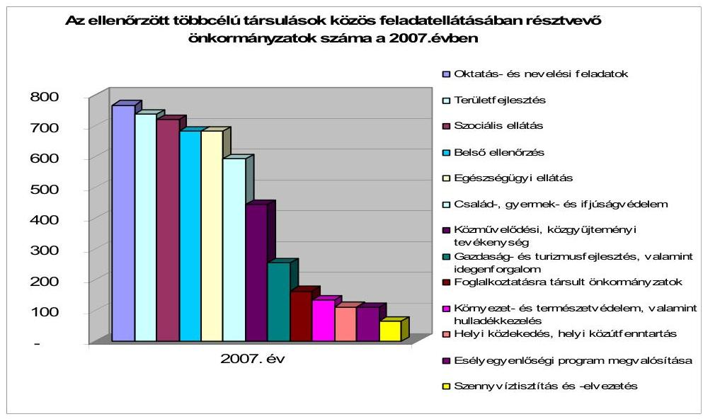

# 1.2. A többcélú társulások szervezésének és feladatellátásának ösztönző támogatásai 

A többcélú társulások működésének eddig eltelt időszaka alatt, 2004-2008 közötti évek költségvetéseiben a többcélú társulások támogatására mintegy 87,7 milliárd Ft eredeti előirányzatot hagyott jóvá a központi költségvetés, amelyből 15,9 milliárd Ft a megalakulás 2004-2005. évi ösztönzését szolgálta. A már megalakult többcélú társulások normatív működésének támogatása 2005-ben kezdődött el, e címen a költségvetés a 2005-2007. években 43,7 milliárd előirányzatot tartalmazott, amely 2008-ban további 28,1 milliárd Ft-tal egészült ki. E jogcímeken túl a többcélú társulások munkaszervezete által ellátott területfejlesztési feladatokat a 2005-2008. évek között 3,8 milliárd Ft-tal, míg a többcélú társulások közösségi busz beszerzéseit 2005-2006. években további 1,3 milliárd Ft-tal, a sportpálya felújításokat 500 millió Ft-tal, a munkaszervezetek működését 100 millió Ft-tal támogatta a költségvetés.
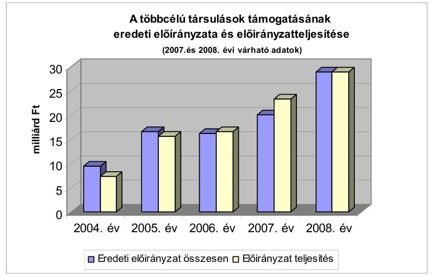

---

A társulások megalakulásának ösztönzésére a költségvetés a 2004-2005. években - elsősorban fejlesztési célra - összesen 15,9 milliárd Ft eredeti előirányzatot tartalmazott, amely fedezetet biztosított a még folyamatban lévő modellkísérletek támogatására is. A 2004. évi költségvetési törvényben biztosított 9500 millió Ft-os eredeti előirányzatból év közben kormányzati hatáskörben 2500 millió Ft-ot az államháztartás egyensúlyi helyzete miatt a 2050/2004. (III. 11.) Korm. határozat alapján zároltak, majd a lecsökkentett előirányzatot fejezeti hatáskörben a PM-mel egyetértésben 700 millió Ft-tal megemelték.

A támogatás felhasználásának szabályait a 65/2004. (IV. 15.) Korm. rendelet tartalmazta, mely a későbbi támogatási rendszer alapját teremtette meg. A rendelet 1. §-ában definiálták a többcélú társulás fogalmát, mert megalkotásának idejében az Országgyűlés még nem fogadta el sem a Tftv. módosítását, sem Tkt. tv-t, amelyek a kistérségi fejlesztési tanácsok, illetve a társulások működését szabályozták. E kormányrendelet szerint a települési önkormányzatok 100%-os részvételével megalakuló többcélú társulások 80-120 millió Ft, míg az 50-60%-os részvétellel megalakuló többcélú társulások 20-50 millió Ft támogatásban részesülhettek a rendeletben foglalt közszolgáltatási feladatok ellátásának többcélú társulási keretek között történő megszervezéséhez. A támogatás elnyerése érdekében valamennyi társulásnak vállalnia kellett a közoktatási feladat ellátását, ezen túlmenően a választandó feladatok köre a 100%-os, illetve az 50-60%-os részvétellel megalakult többcélú társulások számára eltérően került meghatározásra. A 100%-os részvétellel megalakult többcélú társulásoknak a közoktatási és területfejlesztési feladatok kötelező felvállalása mellett az egészségügyi alapellátást kellett közösen biztosítaniuk. Ezen túl a szociális és gyermekjóléti szakellátási vagy alapellátási feladatok közül kellett még további feladatot választaniuk. Az 50-60%-os részvétellel megalakult többcélú társulásoknak nagyobb választási lehetőségük volt a közösen vállalt feladatok tekintetében. Ugyancsak kötelező volt a területfejlesztésen és a közoktatáson felül további két közszolgáltatást közösen ellátniuk, de az lényegesen szélesebb körben meghatározott feladatok közül szabadon volt választható.

A kormányrendelettel összhangban, az érintett ágazati tárcák közreműködésével elkészített pályázati felhívásban tették közzé az egyes feladatok ellátására vonatkozó részletes feltételeket és a támogatható célokat.

A társulások létrehozásának a feltételei 2005. évben alapvetően változatlanok maradtak, a támogatható célok köre azonban módosult. A 5/2005. (I. 19.) Korm. rendelet szerinti pénzügyi ösztönzés elsődlegesen a „nagy ellátórendszerek" (közoktatási, szociális, gyermekjóléti, egészségügyi) hatékonyabb megszervezésére irányult. Emellett megmaradt a mozgókönyvtári rendszer, a kistérségi ügyintézés korszerűsítésének, továbbá a belső ellenőrzés és a területfejlesztés támogatása. Pozitív változást jelentett a 2004. évi ösztönző pályázathoz képest, hogy nem rögzített határok között, hanem az adott kistérség szerkezetét, a többcélú társulás főbb jellemzőit figyelembe véve kaphattak ösztönző támogatást a többcélú társulások. A 2004. évben odaítélt ösztönző támogatás 142 kistérségét érintően 7,4 milliárd Ft volt, míg a 2005. évi 4,7 milliárd Ft-ból 76 kistérséget támogattak. Ugyanebből az előirányzatból 2004-ben 300 millió, 2005-ben 252,4 millió Ft-ot a modellkísérletek

---

támogatására fordítottak. Az ösztönző támogatások cél szerinti összetételét az alábbiak szemléltetik:

A többcélú társulások közszolgáltatási feladatai ösztönzésére fordított támogatások aránya országos szinten
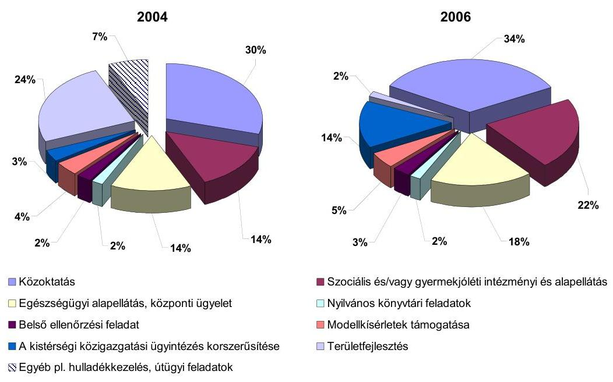

A megalakulást ösztönző támogatások pályázatain nyertes társulásokkal a BM ${ }^{16}$ támogatási megállapodást kötött, melyben rögzítették az egyes feladatokra elnyert és felhasználható támogatások összegét, az elszámolás határidejét. A támogatási megállapodásokban nem határozták meg az elszámolás módját, szabályait, ezért a többcélú társulások eltérő módon tettek eleget ezen kötelezettségüknek. A beküldött elszámolások keretében a BM nem kérte számon a felhasználás támogatási megállapodás mellékletében rögzített céloknak teljes egészében való megfelelését, elfogadta, hogy az egyes célokra biztosított támogatások maradványát más célokkal összefüggő többletköltségek finanszírozására fordították. Elsődleges célnak azt tekintették, hogy a többcélú társulások minél nagyobb számban megalakuljanak, és tárgyi működési feltételeik biztosítottak legyenek. Ennek érdekében minden módosításra vonatkozó igényt befogadtak.

Az országos összegzés szerint - 2004. évben - a 7424 millió Ft támogatás 76,3%-át feladattal terhelt maradványként szerepeltették a települések. Az ÖTM 2007. évi helyszíni ellenőrzése során mintavétellel kiválasztott öt többcélú társulással kötött megállapodásból - a pétervásárai többcélú társulás kivételével - 2005. évben és 2006. évben több alkalommal módosították a felhasználás célját és elszámolásának határidejét.

A támogatások felhasználásának és elszámolásának elhúzódása miatt a többcélú társulások részére 2004. évben biztosított ösztönző támogatások felhasználásáról - a támogató egyedi engedélyei alapján - még 2006. harmadik negyed-

[^0]
[^0]:    ${ }^{16}$ 2006. június 1-től ÖTM

---

évében, a 2005-ben megítélt támogatások felhasználásáról 2007. első felében is érkeztek elszámolások. A döntéshozó 2005. évben nyolc többcélú társulás részére engedélyezte a támogatási megállapodások módosításával a támogatás eredeti céltól jelentősen eltérő felhasználását.

A tiszaújvárosi, komáromi, kecskeméti többcélú társulások esetében még 2006. II. félévében is történtek új kötelezettségvállalások és kifizetések a 2004. évben megítélt támogatások terhére. A tiszaújvárosi többcélú társulás még az utolsó elszámolási határidő lejártát követően is kérelmezte a maradvány egyéb célokra történő felhasználását, melyet engedélyeztek.

A támogatások késedelmesen kerültek kiutalásra nagyrészt a III. - IV. negyedévben. A többcélú társulások a kapott támogatásokat az adott évben már nem tudták felhasználni, arra december 31-ig kötelezettséget nem tudtak vállalni, a feladattal nem terhelt maradványt pedig a Vhr. 5. § (12) pontja alapján visszafizetési kötelezettség terhelte. Ennek a támogatási gyakorlatnak az eredményeként fordulhatott elő, hogy a többcélú társulásoknál jelentős nagyságrendű tartalékok képződtek.

Az ellenőrzött többcélú társulások 2005. év végi eszközeiknek 46,6%-a - 1586,6 millió Ft - pénzeszközökben, további 7,6%-a - 258,5 millió Ft - forgatási célú értékpapírokban testesült meg. A forrásokon belül a költségvetési tartalékok aránya 35% - 1190,7 millió Ft - volt, a rendelkezésre álló költségvetési források több mint egyharmadát nem használták fel a pályázatokban foglalt célok megvalósítására. A pénzeszközök és a rövid lejáratú értékpapírok még 2006-ban is az eszközök 30,7%-át tették ki, a költségvetési tartalékok aránya a forrásokon belül 16,2%-ra esett vissza. A 2007. évi várható mérlegadatok alapján a pénzeszközök aránya 21,3%, a mérleg főösszegen belül a költségvetési tartalékok aránya 12% körül alakult.

A támogatási megállapodások 2004. és 2005. években történő, rendszeresen ismétlődő, 65/2004. (IV. 15.) Korm. rendelet 18. § előírását sértő módosítása azt eredményezte, hogy a módosítási lehetőségeket nem ismerő, vagy e lehetőségekkel nem élő társulások indokolatlanul eltérő feltételek mellett használhatták fel az általuk pályázati úton elnyert támogatási összegeket ${ }^{17}$.

A már megalakult többcélú társulások által ellátott közszolgáltatások működésének normatív ösztönzésére rendelkezésre álló támogatási előirányzatok az egyes közszolgáltatási feladatok sajátosságaihoz igazodóan, évente különböző mértékben, változó szabályozási feltételek között jutottak el a többcélú társulásokhoz. Az érvényesített pénzügyi szabályozás alapelvei azonban lényegesen nem változtak.

[^0]
[^0]:    ${ }^{17}$ A többcélú társulások támogatására 2004-2005. években kiírt pályázati felhívások, a pályáztatás, a döntéshozatal, a támogatási megállapodások megkötésének és módosításának rendszerét, a beszámolás és adatszolgáltatás kereteit meghatározó jogszabályi feltételek betartását, a folyamatos határidő csúszások okait, következményeit az ÁSZ korábbi - a 2004. és 2005. évi zárszámadásokhoz kapcsolódó - ellenőrzései keretében már értékelte.

---

A 2005. évben a többcélú társulások által ellátott egyes közszolgáltatások 2005. évi normatív működési támogatásának szabályozásához ${ }^{18}$ - az előkészítés során - a BM megkérte az érintett szaktárcák, valamint az érdekképviseleti szervek véleményét. A támogatási feltételek meghatározása során a legerőteljesebb véleménykülönbség a PM és a BM között bontakozott ki. A PM kizárólag azokat az önkormányzatokat kívánta támogatásban részesíteni, melyek a többcélú társulás által vállalt valamennyi feladat ellátásában részt vesznek. Nem tartotta elfogadhatónak, hogy egyes önkormányzatok bizonyos feladatokhoz úgy részesülnek ösztönző támogatásban, hogy nem vállalják az egyéb - megfelelő kihasználtsággal működő - intézményeik közös feladatellátásban való részvételét. Szükségesnek tartotta továbbá a közös feladatellátás egyik lehetséges módjának, a szervező tevékenység konkrét tartalmának a meghatározását.

Az ösztönző támogatások igényléséhez szükséges feltételeket meghatározó jogszabályi rendelkezések a többcélú társulások szervező tevékenységével kapcsolatosan azt határozták meg, hogy a közoktatásban milyen osztálylétszám feltételeket kell teljesíteni, a szociális és gyermekjóléti feladatok esetében mekkora lakosságszámot lefedő intézményeket kell működtetni annak érdekében, hogy a forráselosztás alapjául szolgáló mutatószámok alapján a többcélú társulás központi támogatásban részesülhessen. A szervező tevékenységre adott központi támogatás bevezetése tette azt lehetővé, hogy a már korábban a Ttv. 8., 9., 16. §-a alapján kialakított társulási formák változtatás nélküli fenntartása mellett is megfeleljenek az ösztönző támogatásokhoz való hozzájutás feltételeinek. A feladatellátás eltérő szervezeti megoldásától függően differenciált támogatási rendszer 2007. évi bevezetése előtt nem történhetett meg a közös feladatellátáshoz szükséges forrásoknak azokba a többcélú társulásokba történő irányítása, amelyek az intézményi struktúrát érintő változtatásokkal ténylegesen törekedtek a feladatellátás hatékonyságának, gazdaságosságának fokozására, a közfeladatok ellátási színvonalának növelésére. Mindezek miatt a 2007. év előtti szabályozás a települési önkormányzatoknál jelentkező ellátási színvonalbeli különbségek közelítését nem is eredményezhette.

Az Önkormányzati Minisztérium, Szociális és Munkaügyi Minisztérium észrevételében foglaltak szerint a szervezési tevékenységet az 5/2005. (I. 19.) Korm. rendelet előírásai rögzítik, valamennyi esetben az eredmény eléréséhez kötött a jogosultsági és a támogatási feltételeknek való megfelelés.

Ellenőrzési tapasztalataink azt támasztották alá, hogy a többcélú társulásoknak - saját intézményben történő közös feladatellátás kivételével - nem volt lényeges szerepe, így szervező tevékenységet sem végeztek a szakmai feltételek kialakításában, ezért véleményünket továbbra is fenntartjuk. Az észrevételben idézett jogszabályhely olyan feltételt fogalmazott meg a szervező tevékenységgel kapcsolatban, amely a többcélú kistérségi társulások megalakulását
 megelőzően is érvényesült, miszerint „biztosították a társult feladatellátást”. A hivatkozott kormányrendeletben megfogalmazott, elvárt eredmény olyan előírás volt, amely nem feltétlenül várt el mérhető intézkedéseket és ehhez kapcsolódó változásokat a többcélú társulásokban.

[^0]
[^0]:    ${ }^{18}$ 5/2005. (I. 19.) Korm. rendelet.

---

A 2006. évtől a többcélú társulások által igényelhető normatív kötött felhasználású támogatás hat fő célkitűzés köré csoportosult. A 2005. évtől a pénzügyi ösztönzőkkel támogatott közszolgáltatások körét fokozatosan szűkítették. Ennek hatására a 2006. évtől kikerültek a közvetlenül támogatott körből az egészségügyi alapellátás, valamint a területfejlesztés feladatai annak ellenére, hogy a Tkt. tv. 2. § (2) bekezdése előírja, hogy amennyiben a többcélú társulás az oktatás és nevelés, a szociális ellátás, az egészségügyi ellátás, valamint a területfejlesztés körébe tartozó egyes feladat- és hatáskörök ellátásáról gondoskodik, akkor ezekhez a központi költségvetés az éves költségvetési törvényben ösztönző támogatást biztosít.

A 2006. évtől kedvező változtatások is történtek a többcélú társulások finanszírozásának rendszerében. A költségvetési törvénybe beépültek a támogatás jogcímei, a többcélú társulások finanszírozási rendszerének kiszámíthatósága növekedett. Ekkortól került bevezetésre az is, hogy a többcélú társulások a különböző feladatokhoz kapcsolódóan kapott, normatív módon elosztott kötött felhasználású támogatásokat a társulási tanács döntésének megfelelően - bizonyos megkötésekkel ${ }^{19}$ ugyan, de - a feladatok között átcsoportosíthatták.

Az egyes feladatokra kapott támogatásokból nem lehetett átcsoportosítani a „többcélú kistérségi társulások általános feladatainak támogatása” jogcímre. A 2007. évtől az átcsoportosítási lehetőség korlátozása is tovább bővült, mivel a közoktatási intézményi feladatok ellátására kapott támogatást a többcélú társulás kizárólag azon - az általa, valamint az intézményi társulások által fenntartott, a létszámfeltételeket teljesítő - intézményekre fordíthatja, amelyek után támogatásban részesült. ${ }^{20}$

A 2007. évtől a többcélú társulások feladatellátását ösztönző kötött felhasználású támogatások rendszere differenciáltabbá vált. A szabályozás az általános támogatást a kistérségek településszerkezetét is figyelembe véve 20 millió-45 millió Ft között differenciáltan állapította meg. Eltérítették a támogatás mértékét attól függően is, hogy milyen szervezeti megoldással történik a kistérségi szinten vállalt közös feladatok ellátása, eszerint a többcélú társulások az általuk fenntartott intézmények után magasabb összegű támogatás vehettek igénybe, mintha a feladatokat intézményi társulás által fenntartott intézmények útján vagy külső szervezettel kötött szerződés, megállapodás alapján látták el. Ez alól kivételt képezett a munkaszervezet által kötött szerződés alapján végeztetett belső ellenőrzés, amely ösztönző támogatás szempontjából saját feladatellátásnak minősült. A többcélú társulások a 2007. évtől szabadon dönthettek arról, hogy a támogatást működési- vagy felhalmozási célra fordítják-e.

A támogatások felhasználásának ellenőrzésére a többcélú társulások - külön jogszabályi felhatalmazás hiányában - csak a céljellegű pénzeszközátadások kapcsán kötött megállapodások esetében - az Áht. 13/A. §-a alapján - jogosultak. Nincs lehetőségük a feladatot ellátó intézményeknél történő ellenőrzés elrendelésére, holott a támogatással való elszámolás a többcélú társulások kötelezettsége. Amennyiben a közszolgáltatást ténylegesen ellátó költségvetési intézmény nem a többcélú társulás intézménye, akkor a kötött felhasználású támogatás a gesztor önkormányzaton keresztül jut el a feladat ellátójához. A gesztor önkormányzatnak módjában áll az egyéb állami és saját pénzeszközökből történő önkormányzati támogatás csökkentésére, ugyanis a normatív állami hozzájárulás a fenntartó önkormányzatot nem felhasználási kötelezettséggel illeti meg. Így a fenntartó önkormányzatoknak lehetősége van saját átadott forrásainak csökkentésére akár a kötött felhasználású támogatásokat meghaladó mértékben is. Az intézményi társulásokat fenntartó önkormányzatok saját forrás kivonása miatt a kötött felhasználású támogatások célszerinti felhasználása nem követhető, annak többlépcsős finanszírozása miatt az előirányzatok kötött jellege nem érvényesült, így az nem szolgálta a közszolgáltatások szakmai színvonalának növelésére irányuló célok elérését.

A tamási és a bonyhádi többcélú társulás a helyszíni vizsgálat időpontjáig nem utalta át a szociális feladatokat ellátó intézményeknek az ellátottak után igénybe vett támogatást. A sárospataki többcélú társulás esetében az intézményi társulásban működtetett közoktatási intézmény költségvetését a kötött felhasználású támogatással nem emelték meg, az a társult önkormányzatok hozzájárulásának összegét csökkentette. A tapolcai többcélú társulás egyik intézményi társulásában a 2006. évről a 2007. évre az intézmény működtetéséhez Monostorapáti és Hegyesd községek önkormányzatai tanulónként 15,1 ezer Ft-al, Kapolcs, Taliándörögd, Vigántpetend önkormányzatai pedig tanulónként 75,6 ezer Ft-al csökkentették az önkormányzati saját forrás összegét.

A Pénzügyminisztérium véleménye szerint a többcélú társulás pénzeszközátadása a gesztor önkormányzatnak nem jelenti azt, hogy az előirányzat kötött jellege szerinti felhasználás nem érvényesül, még akkor sem, ha az intézményi társulást fenntartó önkormányzatok saját forrásaik egy részét kivonták a finanszírozásból. Inkább azt jelzi, hogy a támogatott feladatoknál oldódik a közszolgáltatás szakmai színvonalának csökkentésével fenyegető pénzügyi feszültség. A normatívák kötöttek abban az értelemben, hogy csak a többcélú kistérségi társulásokhoz használható fel, de rugalmasak annyiban, hogy adott többcélú társulás - a közoktatási feladatokat leszámítva - különféle feladatai között azokat átcsoportosíthatja.

Az észrevételben kifejtettek ellenére továbbra is fenntartjuk, hogy az ösztönző támogatások kötött jellege nem érvényesül. A támogatások tényleges felhasználó részére történő átadása valóban nem feltétlenül jelenti, hogy az előirányzat kötött jellege nem érvényesül. Arra a körülményre azonban feltétlenül szükséges ráirányítani a figyelmet, hogy a többlépcsős finanszírozás, a többcélú társulásoknál, az önkormányzatoknál, a feladatot ellátóknál kialakult elszámolási gyakorlat nem teszi lehetővé a cél szerinti felhasználás nyomon követését, valamint - a közös feladatellátás színvonalának emelését szolgáló ösztönzés ellenére - forráscserére ad lehetőséget, amely azt támasztja alá, hogy a támogatás a felhasználás tekintetében nem kötött, ellentétben más hasonló kategóriájú támogatásokkal. A költségvetési törvények szabályozásából nem vezethető le, hogy a többcélú társulások keretei között történő feladatellátást ösztönző támogatás felhasználása csak a felhasználás helye, s nem pedig annak célja tekintetében kötött.

Az általános működési támogatás esetében a kötött felhasználású támogatássá való minősítés azt eredményezi, hogy csak a feladattal terhelt maradvány vihető át a következő költségvetési évre, a kötelezettségvállalással nem terhelt részt, a központi költségvetésbe vissza kell fizetni a Vhr. 5. § (12) pontja alapján. Ez nincs összhangban a takarékos és hatékony közpénzfelhasználás követelményeivel, mivel a többcélú társulásokat célszerűtlen kötelezettségvállalásokra készteti, akadályozza a későbbi működési és fejlesztési kiadásokra való tartalékolás lehetőségét, a biztonságos és folyamatos működés feltételeinek biztosítását.

A 2007. évi költségvetési törvényben jóváhagyott 19,3 milliárd Ft-os normatív, kötött felhasználású előirányzat már a kiegészítő felméréseket követően sem fedezte a társulások igényeit. ${ }^{21}$ A 2007. évben a kiegészítő felmérés utáni normatív kötött felhasználású támogatási igény 20602,6 millió Ft volt az eredeti felmérés szerinti 18 519,8 millió Ft-tal szemben, ami 2082,8 millió Ft-tal (11,2%-kal) volt magasabb a novemberi felmérésnél. Ennek csak mintegy fele (közel 1013 millió Ft) volt összefüggésben a költségvetési törvénytervezet parlamenti szakaszában jóváhagyott módosításaival. A 2007. évi októberi felmérést követően a többcélú társulások igénylései alapján lekötött előirányzat a rendelkezésre álló 19,3 milliárd Ft-os előirányzathoz képest 22498 millió Ft volt, amely 16,6% túllépést eredményezett a 2007. évi költségvetési törvényben jóváhagyott előirányzathoz képest, ami - az előirányzat felülről nyitott jellege miatt - 3,2 milliárd Ft-tal növelte a tervezett költségvetési deficit mértékét.

Az általános támogatás, valamint a belső ellenőrzési feladatok kivételével minden támogatási jogcímnél az eltérés meghaladta a 10%-ot. A közoktatási feladatokhoz 34,2%-kal, a szociális intézményi feladatokhoz 42,9%-kal, a mozgókönyvtári feladatokhoz 26,7%-kal, a szociális alapszolgáltatási feladatokhoz 18,6%-kal igényeltek többet a többcélú társulások, mint ahogy azt a tervezés időszakában 2006. év végén jelezték.

Az igényelt támogatások intenzív növekedése egyrészt a forráselosztás és igénylés alapjául szolgáló mutatószámok emelkedésével, a közösen ellátott feladatok bővülésével, másrészt a közoktatási feladatok esetében a támogatás szabályainak, a 2007. évi költségvetési törvény 2007. június 15-étől történő visszamenőleges hatályú ${ }^{22}$ módosításával, az igénylés alapjául szolgáló mutatószámok igénylési feltételeinek a többcélú társulások számára kedvező évközi megváltoztatásával függött össze. A 2007. évben (de ezt megelőzően a 2006. évben is) a költségvetési törvények eredetileg jóváhagyott szabályai szerint a 8. számú mellékletben - kiegészítő szabályok 2.3. pontja alapján - csak az átlaglétszám feltételek vizsgálatánál volt lehetőség a sajátos nevelési igényű, valamint a magatartási és beilleszkedési zavarokkal küzdő gyermekek, tanulók kettő, illetve háromszoros súllyal történő figyelembe vételére, amely a törvényi módosítással ezt a támogatás igénylésére is kiterjesztette. Az ÖTM kitöltési útmutatója ezt már a támogatások eredeti igénylésénél is lehetővé tette. A 2007. évi költségvetési törvény 8. számú mellékletében foglalt szabályozás és a kitöltési útmutató eltérése miatt a többcélú társulások költségvetési támogatás igénylésével kapcsolatos gyakorlata nem volt egységes. Az ellenőrzött többcélú társulások egyharmada a 2007. évi költségvetési törvény, míg a többiek a kitöltési útmutató szabályai szerint jártak el.

A 2007. évi költségvetési törvény módosításával a sajátos nevelési igényű, valamint a magatartási és beilleszkedési zavarokkal küzdő tanulók két és három főként való figyelembe vétele a vizsgált 33 többcélú társulás által kitöltött nyilatkozat szerint 100 millió Ft többlettámogatást jelentett.

A 2008. évi költségvetési törvény rendelkezéseiben a 2007. évtől új elemként bevezetett szabályok továbbra is érvényesültek. A 2008. évben az ellátásban részesülők körének bővülése és az ellátás területi kiegyenlítése érdekében anyagi ösztönzést rendeltek a szociális étkeztetési feladatok ellátásához is.

A többcélú társulások rendelkezésére álló források felhasználása az évközi előirányzat átcsoportosítások és ellátási mutatók alapján történő igénylés következtében a vizsgált időszak egészét tekintve eltért a tervezettől, melynek részletezését a jelentés 2. számú melléklete tartalmazza.

# 1.3. A többcélú társulások gazdálkodásának jellemzői, feltételei, információs rendszere

Az ellenőrzött többcélú társulások 2004. évben 2031,9 millió Ft bevételből gazdálkodtak, de abból a felmerülő kiadásaikra csak 499,6 millió Ft-ot fordítottak, amelynek 70,2%-át a működési kiadások jelentették. A 2005. évben bevételeik közel háromszorosára (6071,2 millió Ft-ra) emelkedtek, amelyeknek 76,3%-át (4630,2 millió Ft-ot) használták fel a tárgyévben felmerülő kiadásaikra. Az előző évhez hasonlóan a kiadások 70,4%-át működési célokra használták. A 2006. és a 2007. évben a bevételek növekedésének dinamikája lassult, mindkét évben 22-27% között alakult. Az előző évhez képest a 2006. évben a kiadások másfélszeresére - a bevételeket meghaladóan - nőttek, mivel az előző évek maradványát nagyrészt ekkor költötték el a többcélú társulások. A 2007. évben közel azonos, 27-28%-os növekedés
 volt tapasztalható mind a bevételek, mind a kiadások esetében, amely arra utal, hogy a többcélú társulások gazdálkodása, a kapott támogatások felhasználása kiegyenlítettebbé vált. A 2004-2007. évek bevételeinek és kiadásainak részletes adatait és mutatószámait a 3. számú melléklet tartalmazza.

A Tkt. tv. elfogadását követően a helyi önkormányzatok gazdálkodására, működésére vonatkozó szabályozást kiterjesztették a többcélú társulásokra. E szerint ${ }^{23}$ a többcélú társulás költségvetésének összeállítására és költségvetési határozatának megalkotására, az erről történő elkülönített információ szolgáltatására, az előirányzat-gazdálkodásra, az évközi és év végi beszámolásra, a pénzforgalmi jelentés készítésére az Áht. helyi önkormányzatokra vonatkozó rendelkezéseit kell alkalmazni azzal, hogy a képviselő-testület

[^0]
[^0]:    ${ }^{23}$ Áht. 65. § (6) bekezdése alapján, az Áht. 67-74. § és a 75-77. §-ai, valamint a 79-83. $\S$-ainak alkalmazásával.

---

hatáskörét a többcélú társulás tanácsa gyakorolja, a polgármester részére meghatározott feladatokat a társulási tanács elnöke, a jegyző részére meghatározott feladatokat pedig a társulás munkaszervezetének vezetője látja el.

A többcélú társulás gazdálkodására és beszámolási kötelezettségére vonatkozó szabályokat a többcélú társulások 81,8%-a SzMSz-ben, illetve a munkaszervezetek szabályzataiban rögzítette. A gazdálkodási jogkörök szabályozásában a kötelezettségvállaló, utalványozó és ellenjegyző személyét az Áht. 74/B. § (1)-(2) bekezdésben foglaltak szerint jelölték ki. A szabályozás során azonban az összeférhetetlenségi követelményeknek nem tettek maradéktalanul eleget, mivel a kötelezettségvállalói, utalványozói, ellenjegyzői és érvényesítői feladatok ellátására egy-egy személy került meghatározásra, illetve távollét, akadályoztatás és összeférhetetlenség esetén a jogkörök ellátására kijelölt személy az arra jogosult részéről írásbeli felhatalmazással nem rendelkezett. A Vhr. 8. § (3)-(4) bekezdésében előírt számviteli politikát, pénzkezelési szabályzatot, leltározási-, leltárkészítési szabályzatot, az eszközök és források értékelési szabályzatát, a Vhr. 49. § (1) bekezdés szerinti számlarendet hiányosan vagy nem készítették el.

A Tkt. tv. jóváhagyásának elhúzódása ellenére - a törvény 2004. december 1-jei hatálybalépésének idejére - sem készült el a központi pénzügyi információs rendszer részeként a többcélú társulások elemi költségvetése és beszámolója, az csak 2005. január 1-jétől lépett hatályba.

A 2005. évtől a központi pénzügyi információs rendszer keretében már rendelkezésre állt a többcélú társulások elemi költségvetése és beszámolója ${ }^{24}$, amely az ellenőrzés megállapításai szerint nem alkalmas a központi költségvetésből kapott központosított előirányzat, a 2006-2007. évektől a kötött felhasználású támogatás felhasználásának, a realizált kiadásoknak ágazatonkénti és feladatonkénti megoszlásának, valamint a támogatások igénylését megalapozó mutatószámok változásának követésére.

A többcélú társulások 2006. évtől a normatív, kötött felhasználású támogatások felhasználásáról a központi pénzügyi információs rendszer keretében az I jelű információs füzet 51. számú űrlapján számolnak el. A kapott bevételeiket ágazatonkénti bontásban pedig a 11. számú űrlapon mutatják be. A kötött felhasználású támogatások elszámolásáról készülő űrlap adattartalma nem biztosítja a feladatonkénti elszámolás lehetőségét, mivel - a költségvetési törvények előírása ellenére ${ }^{25}$ - nem követeli meg a mutatószámonkénti elszámolást. A többcélú társulások az összes ösztönző támogatással egyetlen sorban, feladatmutató feltüntetése nélkül számolnak el. Így nincs meg a visszacsatolás és elemzés lehetősége abban a tekintetben sem, hogy a meghatározott célra kapott kötött felhasználású támogatásoknak a

[^0]
[^0]:    ${ }^{24}$ 1253. szektorszámú, „I" jelű költségvetési beszámoló.
    ${ }^{25}$ A 2006. évtől kezdődően az éves költségvetési törvények 8. sz. melléklet Többcélú kistérségi társulások támogatása Kiegészítő szabályok 1.5 pontjának előírása szerint „Az egyes feladatok ellátásához igénybe vett támogatás elszámolása a normatív állami hozzájárulásokkal azonos eljárás alapján és feladatonként, a költségvetési évben jogszerűen elszámolt kiadások és vállalt kötelezettségek figyelembevételével történik".

---

szabad átcsoportosítást követő felhasználása mely mutatókhoz rendelve, milyen nagyságrendben történt.

Az Ámr. 57. § (8) bekezdése értelmében „a helyi önkormányzatok, többcélú kistérségi társulások egymás közötti pénzeszközátadásait, illetve a felügyeletük alá nem tartozó költségvetési szervek részére juttatott pénzeszközt az átadónál támogatásértékű kiadásként, az átvevőnél támogatásértékű bevételként kell elszámolni. Ezzel nincs szinkronban a Vhr. 9. számú mellékletének 3. pontja e) alpontjának előírása, miszerint „az olyan összegeket, amelyeket tovább kell utalni, az államháztartás szervezete nem számolhatja el támogatásértékű bevételként/kiadásként, ezeket továbbadási (lebonyolítási) célú bevételként/kiadásként kell nyilvántartásba vennie". A többcélú társulásoknak az általuk kötött felhasználású támogatásként kapott bevételek egy részét a 2007. évi költségvetési törvény 8. számú melléklete IV. fejezete Kiegészítő szabályok 1.3. pontja alapján ${ }^{26}$ tovább kell utalniuk a közösen vállalt közszolgáltatási feladatot ténylegesen ellátó költségvetési szerveknek, amelyek a pénzeszközök végső felhasználói lesznek. Az átadó többcélú társulásoknak, valamint az átvevő önkormányzatoknak az Ámr. szerint támogatásértékű kiadásként, illetve bevételként kell elszámolniuk a jelentkező gazdasági eseményeket, miközben a végső felhasználó nem a többcélú társulás, hanem az intézményi társulás közfeladatot ellátó intézménye lesz. Az Ámr. szerinti támogatásértékű pénzeszközátadásként történő elszámolásra vonatkozó kötelezettség akadályozza azt is, hogy a többcélú társulásoknak normatív, kötött felhasználású támogatásként átadott pénzeszköznek a feladatot ténylegesen ellátó intézményi társulásokhoz való átadása követhető legyen.

Nehezíti az ágazati elemzés és értékelés lehetőségét az is, hogy a többcélú társulások a könyvviteli nyilvántartásaik vezetésekor a keletkező bevételeket és a felmerülő kiadásokat nem a megfelelő funkcionális számlákon számolták el. Emiatt a szakfeladatokon jelentkező kiadások sem tükrözik hitelt érdemlő módon, hogy az egyes ágazati feladatokra a többcélú társulások mennyit költöttek. A helyszíni vizsgálat során a kiadások és bevételek feladatonkénti kimutatása nehézséget okozott, mert a vizsgálatba vont többcélú társulások 96,7%-a a főkönyvi könyvelésben a funkcionális (szakfeladatonkénti) osztályozás szerinti könyvvezetési kötelezettségének nem tett eleget. Mindez akadályozza, hogy nemzetgazdasági szinten megfelelő biztonsággal kimutatható legyen, hogy az egyes ágazati feladatokra mennyit fordítottak a többcélú társulások, valamint, hogy abból mekkora arányt képviseltek a saját ellátású feladatokra fordított kiadások, illetve azok a kiadások, amelyek végső felhasználása nem a többcélú társulásnál, hanem egyéb önkormányzatnál, önkormányzati költségvetési szervnél, illetve gazdasági társaságnál történt.

A többcélú társulások nem rendelkeztek olyan, a feladatellátást tükröző részletes statisztikai adatokkal, alapdokumentumokkal, amelyek alapján ellenőrizhető lett volna az ösztönző támogatások igénybevételének jogosultsága. A többcélú társulások az önkormányzatoktól, intézményeiktől, a

[^0]
[^0]:    ${ }^{26}$ Az előírást 2008-ban a 2008. évi költségvetési törvény 8. számú mellékletének IV. fejezete Kiegészítő szabályai 1.5. pontja a 2007. évi szabályozással azonos módon tartalmazza.

---

feladatot ellátó szervezetektől adatokat - szükség esetén - az ösztönző támogatások mutatószámai felmérése, változása, elszámolása kapcsán kértek. A tervezéshez, elszámoláshoz az önkormányzatok, feladatellátók által szolgáltatott adatokat a többcélú társulások nem ellenőrizték. Az adatszolgáltatás alapdokumentumaival nem rendelkeztek.

A önkormányzati közszolgáltatások színvonalának kiegyenlített emelésének mérése érdekében az ágazati szakirányítás nem dolgozott ki mutató- és mérőszámokat, amely alapul szolgáltak volna a közös feladatellátásban bekövetkezett változások, azok színvonala alakulásának elemzéséhez. A BM kidolgozott egy részletes, a feladatellátás módjára, valamint a forráselosztás alapjául szolgáló mutatószámok felmérésére, a szervezeti változások követelésére alkalmas igényfelmérő, interneten keresztül (web felületen) kommunikáló információs rendszert. Kedvezőnek értékelhető, hogy ennek működtetése, bevezetése és alkalmazása folyamatos kapcsolattartást tett lehetővé a többcélú társulások, valamint a BM ÖGF között, továbbá alkalmas volt a támogatások igénylésére vonatkozó feltételek egy részének ellenőrzésére is. Az ösztönző támogatási rendszer által kezelt, a forráselosztás alapjául szolgáló mutatók azonban nem alkalmasak a szakmai feladatellátás színvonalának, hatékonyságának mérésére, elemzésére.

A Pénzügyminisztérium véleménye szerint a szakmai feladatellátás mérését a szakfeladatrend hivatott szolgálni, amely alkalmazásával az információs rendszer biztosítani tudta volna - a beszámoló alapján - az ágazati értékelést. Az Önkormányzati Minisztérium észrevételében kifejtette, hogy az állami támogatások igénylésére kialakított rendszer elsősorban pénzügyi információs rendszer forrásszabályozás céljából készült, nem elsődleges feladata a hatékonyság és a minőség mérése.

Továbbra is fenntartjuk azt a megállapításunkat, hogy jelenleg nincsenek olyan kidolgozott mérő- és mutatószámok, amelyek a szakmai színvonal alakulásának elemzését lehetővé tennék. Tekintettel arra, hogy az elkészített beszámolókban a többcélú társulások nem biztosították sem a bevételek, sem a kiadások esetében a szakfeladati szintű elszámolást, ezért a beszámoló rendszerében lévő adatok az ágazati kiadások értékeléséhez nem használhatóak. Az ágazati felhasználás mutatószámhoz rendeleten jelenleg nem kimutatható, ezért a teljesítmény mérésének feltételei nem adottak. Egyéb ágazat indikátorok hiányában legalább az elosztás alapján képező mutatóknak kellene megteremteni a kapcsolatot az értékelés lehetőségével.

A Tkt. tv. 3. § (1) bekezdés h) pontja alapján a többcélú társulások a társulási megállapodásban meghatározták a társulási tanács működésével kapcsolatos hivatali teendők ellátásának módját, elkülönített munkaszervezet esetén annak szervezetét, a munkáltatói jogok gyakorlásának rendjét. A társulási tanács döntéseinek előkészítését, feladatainak végrehajtását a többcélú társulás székhely település önkormányzata képviselő-testületének hivatala vagy a társulási tanács költségvetési szervként létrehozott munkaszervezete közreműködésével látta el. A vizsgált körben nyolc többcélú társulás - a vizsgált egységek 24,2%-a - nem hozott létre önálló költségvetési szervként munkaszervezetet (tokaji, püspökladányi, mosonmagyaróvári, miskolci, marcali, makói, komáromi, vasvári többcélú társulások). A székhelytelepülések polgármesteri hivatalaiban a többcélú társulások munkaszervezeti feladatainak ellátását eltérő keretek között biztosították.

---

Miskolc megyei jogú város, Tokaj, Püspökladány városok polgármesteri hivatalain belül önálló kistérségi iroda alakult a feladatok ellátására, másutt a hivatal különböző szakosztályain dolgozók kapcsolt munkakörben és/vagy megbízási szerződés alapján (Komárom, Mosonmagyaróvár, Püspökladány) végezték a feladatokat. Munkájukat a jegyző vagy az általa megbízott személy koordinálta.

Az önálló munkaszervezeteknek működése mintegy 76%-ban tekinthető szabályozottnak, rendelkeznek SzMSz-szel, ügyrenddel, egyéb belső szabályzatokkal. Az önálló munkaszervezetek közül három (bátonyterenyei, ráckevei, pilisvörösvári többcélú társulás) munkaszervezete alapító okirattal sem rendelkezett. Az önálló munkaszervezettel nem rendelkező többcélú társulások egyharmadánál nem készült önálló számviteli politika, a munkaszervezeti feladatokat ellátó polgármesteri hivatal szabályzatait alkalmazták anélkül, hogy annak többcélú társulásra történő kiterjesztéséről döntöttek volna.

A megalakulás ösztönzését segítő, fejlesztési célra kapott támogatásokból a többcélú társulások biztosítani tudták az induláshoz szükséges tárgyi feltételeket.

A feladatellátás tárgyi feltételeivel szemben a munkaszervezetek személyi feltételei nem kedvezőek. A többcélú társulások megalakulásakor nem volt arra vonatkozó iránymutatás, hogy a társult önkormányzatok számához és a vállalt feladatokhoz miként célszerű igazítani a munkaszervezet létszámát, így a társulási tanácsok eltérő személyi feltételeket biztosítottak. A munkaszervezeti feladatokat ellátók száma a vizsgált 33 többcélú társulásban a 2004. évi 70 főről több mint háromszorosára (217 főre) nőtt. Ez tartalmazza a munkaszervezetekben foglalkoztatott, saját feladatellátásban történő önkormányzati belső ellenőrzési feladatokat végzők adatait is. A feladatokat ellátók létszáma tekintetében nagyok az eltérések.

A 2007. évben pl. miskolci és a bicskei többcélú társulásban a munkaszervezeti feladatokat négy-négy fő, a zalaegerszegi többcélú társulásban 10 fő, a téti többcélú társulásban hat fő, az abai többcélú társulásban nyolc fő, a jánoshalmai többcélú társulásban három fő látta el. Ugyanezen többcélú társulásokban a közös feladatellátásban résztvevő önkormányzatok száma ugyanebben a sorrendben 40, 16, 79, 19, 9, illetve 4 volt.

A munkaszervezetek vezetőivel, dolgozóival szembeni szakmai végzettséggel, gyakorlattal összefüggő követelményeket jogszabályokban nem határozták meg. A többcélú társulások munkaszervezeteiben foglalkoztatott dolgozók, a munkaszervezet vezetői, meghatározó részben fiatalok, agrár, illetve humán végzettségűek, kevés az államigazgatási, költségvetési gazdálkodási, jogi, hatósági ismeretekkel
 rendelkező szakember. Ez is közrejátszott abban, hogy a munkaszervezetek megalakulását, működésének megkezdését követően 2007. év közepéig a gazdálkodási, számviteli feladatokat a székhelytelepülések polgármesteri hivatalának pénzügyi apparátusa végezte (jánoshalmi, sásdi, bátonyterenyei, ráckevei, tapolcai többcélú társulások). A munkaszervezetek dolgozói jellemzően közalkalmazottak voltak, azonban a többcélú társulásnál, illetve a munkaszervezetnél foglalkoztatottak - közalkalmazotti, köztisztviselői - jogviszonyának meghatározásában a többcélú társulások önállóságára alapozó szabályozás a gyakorlatban értelmezési problémákat okozott, ennek következtében különböző megoldások alakultak ki. 

---

# mákat okozott, ennek következtében különböző megoldások alakultak ki. 

#### Abstract

A tokaji többcélú társulás munkaszervezetének feladatait a székhely település hivatalának elkülönített szervezeti egysége - Kistérségi Iroda - látta el, melynek vezetője a hivatal állományában volt, köztisztviselői jogviszonyban, felette a munkáltatói jogokat a jegyző gyakorolta, a többcélú társulással kapcsolatos feladatokat ellátó többi dolgozót viszont a többcélú társulás alkalmazta, közalkalmazotti jogviszonyban.

A sárospataki többcélú társulásnál köztisztviselői jogviszonyban foglalkoztatták az önálló munkaszervezet alkalmazottait. Köztisztviselőként kívánta foglalkoztatni dolgozóit a bicskei többcélú társulás munkaszervezete is, az eljárást azonban a Fejér Megyei Közigazgatási Hivatal észrevételezte. A kunszentmártoni többcélú társulás munkaszervezetének vezetését a társulás elnöke látta el, a munkáltatói jogkört a munkaszervezet vezetője helyett a társulás elnöke gyakorolta a tapolcai, a váci társulásban.

### 1.4. A többcélú társulások vagyongazdálkodása

Az önkormányzati vagyongazdálkodás szabályozási alapjai az Alkotmányból, az Ötv-ből, az Áht-ból következnek, míg a többcélú társulás vagyonára vonatkozó szabályokat a Tkt. tv. tartalmazza. Az Ötv. 80. § (5) bekezdése azt rögzíti, hogy - amennyiben törvény másként nem rendelkezik - a helyi önkormányzat társulásba bevitt vagyona nem válik a társulás tulajdonává, a bevitt vagyont a társuló önkormányzat vagyonaként kell nyilvántartani. A Tkt. tv. 3. § (1) bekezdés l) pontja a társuló felekre bízza a többcélú társulás vagyonának meghatározását, a vagyonátadás feltételeit, a tulajdonosi jogok és kötelezettségek gyakorlásának rendjét. A Tkt. tv. 4. § (2) bekezdése szerint a többcélú társulás közös fejlesztéseket és beruházásokat valósíthat meg, az (5)-(6) bekezdésben foglaltak szerint a többcélú társulás saját vagyonnal rendelkezhet, amelynek szaporulata a többcélú társulást illeti meg, megszűnése esetén pedig a vagyonát - eltérő megállapodás hiányában - a többcélú társulás tagjai között (a társulási megállapodásban rögzített módon) fel kell osztani. E jogszabályok egyidejű érvényesítése a társulások körében a társulások vagyongazdálkodásának gyakorlatában eltérő megoldásokat alakított ki.

A többcélú társulások által az önkormányzati intézmények saját intézményként történő átvételére, társulási megállapodásokban szabályozott vagyonátadásokra nem került sor. A szervezéssel történő feladatellátást nem követte vagyonmozgás. A többcélú társulások a közszolgáltatások jelentékeny hányadát az önkormányzatok intézményi mikrotársulásainak keretén belül látják el, ezekben az ellátási formákban a feladatot ellátó intézményi struktúra alig, önkormányzati vagyon tulajdonlása pedig egyáltalán nem változott. Azokban az esetekben amikor a többcélú társulások által pályázott támogatásokból a társulási tanács döntése alapján a kistérségen belül egy vagy akár néhány intézményi társulás számára, ezen belül annak gesztortelepülésének juttattak fejlesztési, rekonstrukciós forrásokat, a társulások körében nem volt egyértelmű, hogy a létrejövő vagyonnövekményt a fejlesztéssel érintett önkormányzat tulajdonának, az intézményi társulásban részvevők vagyonának, vagy a többcélú társulás teljes tagsága közös vagyonának kell-e tekinteni.

---

A kialakított megoldások ahhoz vezettek, hogy egy települési önkormányzat iskolaépületén végzett felújítás vagyonnövekményének a többcélú társulás a tulajdonosa, amelynek így az adott közös feladatellátásban érintettek számától függetlenül a többcélú társulás tagjainak számával megegyező tulajdonosa van.

A többcélú társulásokban nem ismerték fel a társulási vagyongazdálkodás - önkormányzatokra vonatkozó előírások értelemszerű adaptálásával történő - szabályozásának szükségességét, megelégedtek azzal, hogy a társulási vagyonnal való gazdálkodás előírásait, a vagyonfelosztási elveket a társulási megállapodás kötelező kellékeként, a Tkt. tv. 4. § előírásaival összhangban, de a részletszabályok értelmezése nélkül határozták meg. A gyakorlatban az önkormányzati tulajdonlás elsőbbséget élvezett a társulási vagyonnal szemben, amely különösen a többcélú társulás működésével összefüggő, kizárólagosan a többcélú társulást megillető támogatásokból finanszírozott vagyon tulajdonlása tekintetében alakított ki részben a Tkt. tv. 4. § (5) bekezdésének előírásaival ellentétes, részben célszerűtlen (idegen tulajdonú ingatlanok értéknövelő rekonstrukciói, elidegenítési tilalmak érvényesítése) megoldásokat.

A komlói, a sásdi, a miskolci, a kunszentmártoni, a váci, a marcali többcélú társulásoknál az ingatlanokon végrehajtott értéknövelő fejlesztéseket önkormányzati tulajdonba adták.

Előfordult az is, hogy az értéknövelő fejlesztések kizárólag a székhelytelepülés vagyonát gyarapították. A jászsági többcélú társulásnál a társulás munkaszervezetének kialakításakor a többcélú társulás egy tagja által ingyenes használatra átengedett ingatlanon hajtottak végre olyan értéknövelő felújításokat és beruházásokat központi állami forrásból, amely az átengedett tulajdon elválaszthatatlan részét képezik. Az e beruházáshoz kapcsolódó vagyoni kérdéseket az ingatlan tulajdonosával nem rendezték, azt a munkaszervezet vagyonában szerepeltették. Az együttműködő felek számára nem tudatosult, hogy az lényegében a többcélú társulásban részvevő önkormányzatok közös tulajdona. A makói többcélú társulás önálló munkaszervezetet nem hozott létre, feladatait a székhelytelepülés polgármesteri hivatala látta el. A részére ügyintézés korszerűsítése feladatra biztosított ösztönző támogatásból a makói polgármesteri hivatalban korszerű ügyfélvárót alakítottak ki, a támogatásból létrehozott vagyon a székhelytelepülés vagyonát gyarapította.

A többcélú társulások jelentősebb vagyonhoz a 2004. és a 2005. év folyamán, a megalakulást ösztönző támogatások révén jutottak ${ }^{27}$.

A vizsgálatba vont többcélú társulások közül a siklósi és a miskolci többcélú társulás mind a két évben részesült ösztönző támogatásban. A többcélú társulások a 2004. évben az alacsonyabb összegű támogatásra voltak jogosultak. A siklósi többcélú társulás 42625 ezer Ft, a miskolci többcélú társulás 45920 ezer Ft támogatásban részesült, amely 2005. évben kiegészült 70328 ezer, illetve 76534 ezer Ft támogatással.

A balassagyarmati társulás a 2005. évben 107,8 millió, a jászsági társulás 96,98 millió ösztönző támogatást mutatott ki.

[^0]
[^0]:    ${ }^{27}$ A 65/2004.(IV. 15.) és a 36/2005.(III. 1.). Korm. rendeletek által szabályozottan odaítélt támogatás.

---

Az ösztönző támogatások felhasználása a 2006. év végéig elhúzódott, a beszerzett eszközök, a felújítással, beruházási munkálatokkal érintett ingatlanok többcélú társulási - illetve a többcélú társulások által kialakított tulajdonlási módozatokkal megegyező - tulajdonban voltak.

A fejlesztési célra juttatott központi támogatásból közösségi busz beszerzésre a vizsgált időszakban 20 többcélú társulás (az ellenőrzöttek 60,6\%-a) 456,6 millió Ft-ot fordított. A vásárolt járműveket a többcélú társulások saját maguk hasznosították, üzemeltetésre átadták intézményi társulásnak, illetve négy többcélú társulás - marcali, tapolcai, téti, vasvári többcélú társulások - a pályázati kiírás feltételeivel ellentétesen bérleti szerződéssel gazdasági társaságok rendelkezésére bocsátotta.

Az BM által a sportpályák felújítására kiírt 500 millió Ft keretösszegű pályázaton a vizsgált körben 21 többcélú társulás 128 millió Ft támogatást nyert, melyből 203,9 millió Ft értékben települési sportpályák felújítása valósult meg 2006. évben. A társulások „a többcélú kistérségi társulásokban részt vevő települési önkormányzatok fenntartásában lévő sportpályák felújításának támogatásáról" szóló 10/2006. (III. 14.) BM rendelet 8. §-a előírásának megfelelően a sportpálya felújításra kapott fejlesztési célú támogatást támogatásértékű kiadásként átadta az önkormányzatoknak. Ez ellentétes a Tkt. tv. 4. § (5) bekezdése előírásával, mely szerint a többcélú társulás saját vagyonnal rendelkezhet, amelynek szaporulata a többcélú társulást illeti meg.

A sportpálya programok azonos módon kerültek lebonyolításra a bonyhádi, a komlói, a szikszói, a tamási és a vasvári többcélú társulásokban is.

# A többcélú társulásoknál vegyes tulajdonlási és vagyonkezelési megoldások alakultak ki, ugyanakkor a többcélú társulási tulajdonnak tekintett vagyon elkülönített kezelését biztosították. A többcélú társulások egy részében a létrehozott és vásárolt eszközöket a többcélú társulásoknál vették vagyonnyilvántartásba, majd azokat a feladatot ellátó intézményi társulások illetve önkormányzatok számára megfelelő bizonylatolási rendet betartva használatra, illetve üzemeltetésre átadták.

A jánoshalmai, a siklósi, a sárospataki, az abai, a bicskei, a tabi, a nyírbátori, a tamási, a komáromi, a ráckevei, a tapolcai többcélú társulásokban az eszközöket üzemeltetésre átadták. A számviteli nyilvántartásokban nem a megfelelő számlacsoportba sorolták azokat a jánoshalmai, a komáromi, tapolcai és a nyírbátori többcélú társulásokban.

Az ellenőrzött többcélú társulások kétharmadánál fordult elő, hogy a pályázati úton elnyert támogatást pénzeszközátadás formájában a közszolgáltatást ellátónak átadták, arról - az Áht. 13/A. §-a alapján történő számadási kötelezettség keretében - számlamásolatokkal való, célszerű felhasználást tanúsító elszámolást kértek. Előfordult azonban olyan kistérségi pénzeszközátadással lebonyolított fejlesztés is, amelynek tartalmáról a többcélú társulásnál - annak ellenére, hogy a támogatás címzettje a többcélú társulás volt - nem állt rendelkezésre semmiféle információ.

A többcélú társulások vagyonnyilvántartásának - az abai, a bicskei, a mosonmagyaróvári, a komáromi, a tabi, a tapolcai, a jászsági többcélú társulásokban - különböző súlyú, de azonos tartalmi csoportba sorolható hiányosságai közé tartozott, hogy nem tartották be az eszközök egyedi értékelésére, a leltározására, a vagyonvédelemére vonatkozó előírásokat.

A vizsgált többcélú társulások vagyonának összegzése szerint az eszközök összértéke 2005-2007. évek között 34,1\%-os növekedést követően év végére 4,6 milliárd Ft volt, amelynek 74,7\%-a befektetett eszközként állt rendelkezésre. Ez utóbbi eszközcsoport egyötödét üzemeltetésre, kezelésre adott, illetve vagyonkezelésbe vett eszközként tartották nyilván, miközben ezek értéke 2005. évhez képest csaknem megháromszorozódott. Az ingatlanok és az ehhez kapcsolódó vagyoni értékű jogok elszámolt értéke a három év alatt 174\%-kal nőtt, a járművek összértéke 289,5 millió Ft-ról 517 millió Ft-ra, a beruházások állománya a 2005. évi 167 millió Ft-ról 2007. évre 625 millió Ft-ra emelkedett. Az éves zárlati időpontokban a pénzeszközök értéke mindhárom évben rendkívül magas volt, 2005. december 31-én az eszközök összértékének 46,6\%-át, 2006. december 31-én 29,7\%-át, 2007. december 31-én 21\%-át tartották likvid pénzeszköz formájában. ( 4. számú melléklet)
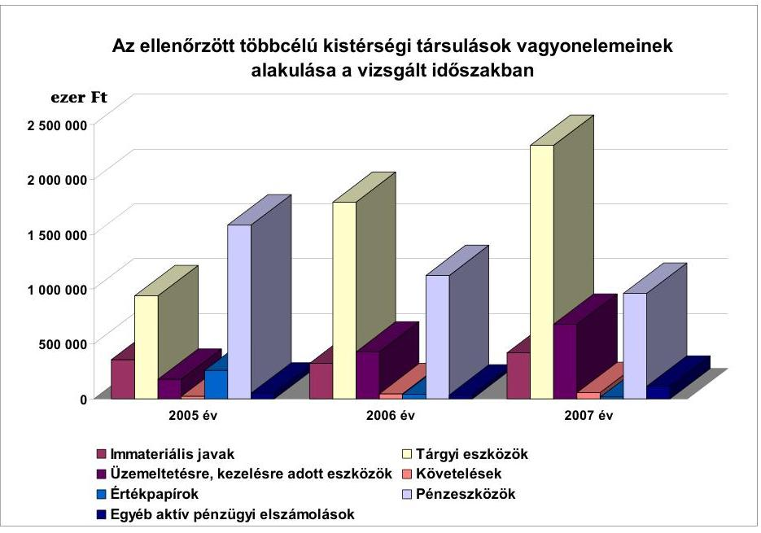

Az ellenőrzött többcélú társulásoknál a vagyoni helyzetek rendezése kapcsán a vagyonkezelői jog létesítésének lehetősége fel sem merült, annak ellenére, hogy ezt az Ötv. 2007. január 1-jétől lehetővé teszi, az eljárásra vonatkozóan tételes előírásokat tartalmaz.

Az Ötv 2007. január 1-ei módosítását megelőzően a többcélú társulásokban a feladat és vagyonátadás a társulási megállapodás alapján történt, az átadónál üzemeltetésre átadott vagyonként kellett kezelni. A vagyon szaporulata a többcélú társulás tagjai közös tulajdonává vált, megszűnés esetén az Ötv. 80. § (5) és a Ttv. 17. § (5) és (6) bekezdése szerint kellett eljárni. A 2007. január 1-jét követően történő feladat és vagyon átadásánál figyelembe kell venni az Ötv. 80/A. és 80/B. $\S$-aiban szabályozott vagyonkezelői jog intézményét, amelynek létesítéséhez az Áht. 105/A-105/D. §-aiban foglalt rendelkezésekre is tekintettel kell lenni. Ez utóbbi a vagyonkezelésbe adás részletes eljárási szabályait, a vagyonkezelő jogait és kötelezettségeit, a vagyonnal való gazdálkodás, elszámolás, adatszolgáltatás szabályait rögzíti.

---

A többcélú társulások vagyoni helyzetének rendezetlenségét jelzi az is, hogy az egyes többcélú társulások vagyongazdálkodásában helyet kaptak olyan pénzügyi megoldások is, amelyeket más megyék, más többcélú társulásaiban a törvényességi felügyeletet ellátó közigazgatási hivatal törvénysértő megoldásnak ítélt.

Az abai többcélú társulás tagjai a megállapodás aláírásakor közös pénzügyi alap létrehozását határozták el - 20 millió Ft összeggel -, amelyből lehetőséget teremtettek arra, hogy az alap forrását együttesen vagy egyedileg tervezett feladataik
 megvalósításához felhasználhassák, és az alapból vissza nem térítendő, illetve kamatmentesen visszatérítendő támogatáshoz jussanak, a tanács eseti döntései alapján. A tagi hozzájárulás mértékét évi, népességszámhoz kötött $100 \mathrm{Ft} /$ fő összegű hozzájárulásban határozták meg. A társulási megállapodás szerint a visszatérítendő támogatás maximum 36 havi lejáratra adható. A vizsgált időszakban három egyedi határozatban döntött a tanács pénzeszköz-odaítéléséről. ${ }^{28} \mathrm{~A}$ többcélú társulás 2005. évben hozott döntést arról, hogy a többcélú társulás által igénybevett közoktatási normatíva 70\%-át adja át a települési önkormányzatoknak, a fennmaradó 30\%-ból - megosztva - növeli a pénzügyi alap összegét, illetve tartalékot képez. A pénzügyi alap összege a 2006. évi nyitóállomány 2 millió Ft-os összegéről év végére 24,2 millió Ft-ra nőtt, s ebből mindössze 1\%-ot képvisel a települések éves befizetése. A többcélú társulás a pénzügyi alapot nemcsak a közoktatási normatíva 30\%-ából „töltötte fel" hanem a szociális alapszolgáltatásokból is visszatartott összegeket (2006. évben 13 millió Ft-ot). A társulási tanács az éves koncepcióban elfogadott döntésével a fejlesztések pénzügyi alapját, a pályázati önrészt és hitelképességének alapját kívánta megteremteni. A társulási tanács 2006. év végén hozott döntést arról, hogy a 2006. évi közoktatási normatíva fejlesztési alapba elhelyezett összegét 2007. évben visszafizeti az érintett településeknek, amely azonban a 2007. év végéig nem történt meg. A kötött felhasználású normatív támogatás alapszerű kezelése ellentétes a költségvetési törvény előírásaival ${ }^{29}$.

Hasonló célokra kívánt pénzügyi alapot létrehozni a komáromi többcélú társulás is, ezt azonban a Komárom-Esztergom megyei Közigazgatási Hivatal - mivel a tervezett szabályozás szerint a pénzügyi alapot, mint költségvetési szervet kívánták létrehozni - az Áht. 87. § (2) bekezdésében, valamint az Ámr 12. § (3) bekezdésében foglaltakra alapozva törvénysértőnek minősítette. A többcélú társulás erre való tekintettel lemondott a pénzügyi alap létrehozására vonatkozó szándékairól.

[^0]
[^0]:    ${ }^{28}$ A 2005. évben Csősz község földingatlan-vételéhez 350 ezer Ft, 2007. évben Aba önkormányzata 20 millió Ft, Tác-Csősz óvoda és iskola 6,3 millió Ft összegű támogatási igényét elégítették ki, visszatérítendő támogatás formájában.
    ${ }^{29}$ A 2006. évi költségvetési törvény 14. § (2) bekezdésére, a 2007. évi költségvetési törvény 15. § (2) bekezdésére, a 2008. évi költségvetési törvény 15. § (2) bekezdésére figyelemmel.

---

# 2. A Többcélú Társulások Általi Ellátott Közszolgáltatások 

### 2.1. Közoktatási feladatok

Az önkormányzatok közoktatási feladatellátási kötelezettségét az Ötv. 8. § (4) bekezdése és a Közokt. tv. 86. §-a írja elő. A feladatellátás módját az önkormányzatok saját maguk határozhatják meg pénzügyi lehetőségeik, egyéb feltételeik függvényében. Ennek ellenére a gyermeklétszám évek óta tartó csökkenése miatt, különösen a kistelepüléseken a közoktatási intézmények alacsony létszámmal, kedvezőtlen kihasználtsággal, magas ráfordítással működtek, melyet az önkormányzatok egyre kevésbé tudtak felvállalni ${ }^{30}$. Ezért már a többcélú társulások megalakulását megelőzően is a vizsgált többcélú társulásokhoz tartozó önkormányzatok 50\%-a az óvodai, 57,9\%-a pedig általános iskolai feladatait közösen a Ttv. 8., 9. és 16. §-a alapján létrehozott közoktatási intézményi társulás keretében látta el. (5. számú melléklet)

A többcélú társulások kiegészítő támogatást igényelhettek a közoktatási intézményi feladatok közös ellátása keretében az általuk, valamint a Ttv. alapján létrehozott intézményi társulások által működtetett óvodai, általános iskolai bejáró, az iskolabusszal utaztatott gyermekek, tanulók létszáma alapján, továbbá pedagógiai szakszolgálati feladatokra. A támogatások elnyerésének feltétele volt az éves költségvetési törvények ${ }^{31}$ többcélú társulások támogatása igénylése általános feltételeinek, valamint kiegészítő feltételeinek teljesítése.

Közoktatási feladataikra a többcélú társulások országosan összesen a 2006. évben 6246,6 millió Ft, a 2007. évben 9994,4 millió Ft, a 2008. évben 13158 millió Ft normatív módon elosztott kötött felhasználású támogatást igényeltek. A vizsgált körben lehívott támogatás összege 1665,9 millió Ft, illetve 2139,2 millió Ft volt. A közoktatási feladatok közös ellátásában, az intézményi társulások létrehozásában, átszervezésében meghatározó szerepe volt a gyermek- és tanulólétszám csökkenésének. A csökkenő gyermeklétszám miatt az önkormányzatok csak így tudtak/tudnak megfelelni a kiegészítő támogatás feltételeként előírt óvodai, tanulócsoportonkénti átlaglétszám feltételnek, amely a közös feladat ellátásában részt vevő önkormányzatok és társulásaik intézményeiben a Közokt. tv. 3. számú melléklete I. Létszámhatárok cím alatti csoportok átlaglétszámának - néhány kivételtől eltekintve - évfolyamonként 75, illetve 50%-os teljesítését írta elő.

Az ellenőrzött többcélú társulásokhoz tartozó önkormányzatok területén a 2007/2008. tanévben az óvodába beírt gyermekek száma mintegy 56,1 ezer fő volt, és a 2004/2005. tanévhez mérten 3,9\%-kal nőtt.

[^0]
[^0]:    ${ }^{30}$ 0625/2006. Jelentés a kistelepülések iskola-előkészítési, általános iskolai oktatási feltételeinek ellenőrzési tapasztalatairól.
    ${ }^{31}$ 2006. évi költségvetési törvény 8. számú melléklet V. többcélú kistérségi társulások támogatása 1; 2.2, kiegészítő szabályok 1., 2. pontjában foglaltak. a 2007. évi költségvetési törvény 8. számú melléklet IV. többcélú kistérségi társulások támogatása 1; 2.2. kiegészítő szabályok 1., 2. pontjában foglaltak.

---

Az általános iskolák 1-8. évfolyamos tanulóinak száma ugyanakkor a 2007/2008. tanévben 130,2 ezer fő volt, 7,9\%-kal kevesebb, mint a 2004/2005. tanévben. A városok, illetve nagyobb lélekszámú települések kiépített, hagyományokkal rendelkező közoktatási intézményhálózattal rendelkeztek és önállóan is teljesíteni tudták a támogatás feltételeként előírt óvodai, tanulócsoportonkénti létszámfeltételeket, ezért közoktatási intézményi feladataik ellátására - néhány kivételtől eltekintve - a környező településekkel, intézményi társulási megállapodást nem kötöttek, óvodáikban, iskoláikban továbbra is ragaszkodtak önálló fenntartói és irányítói jogkörükhöz.

Az ellenőrzött többcélú társulások közül, tagjainak ösztönzésére, a bejáró gyermekek száma alapján elnyerhető támogatás hatására Tapolca város kötött a 2006/2007. tanévtől Raposka községgel intézményi társulási megállapodást, mely település gyermekeit intézményeiben korábban megállapodás nélkül látta el.

A közoktatási intézményeit saját fenntartásban működtető települési önkormányzatok közös feladatellátásba történő bevonása nélkül többségében a többcélú társulás többi települése sem lett volna jogosult ösztönző támogatásra, ugyanis a városok, nagyobb települések nélkül nem tudták teljesíteni az éves költségvetési törvények szabályai közül az 50-60%-os feltételt.

A települési önkormányzatok közötti érdekazonosságot az ösztönző támogatás szabálya oly módon teremtette meg, hogy elismerte szervező tevékenységként a többcélú társulás keretében történő közös feladatellátásnak - a létszámfeltételek teljesítése esetén - azt is, ha a települési önkormányzatok önállóan gondoskodnak az intézmények fenntartásáról. Ezen önkormányzatok tanulólétszámai után ösztönző támogatás ugyan nem volt igényelhető, de a többcélú társulás így jogosulttá vált a közösen ellátott közoktatási feladatai támogatására. Ennek hatására - a vizsgált körben - az óvodai, általános iskolai feladatok közös ellátását a többcélú társulások keretében felvállaló önkormányzatok aránya a 2004. évről a 2007. évre az óvodáknál 51,8\%-ról 90,2\%-ra, az általános iskoláknál 51,8\%-ról 90,9\%-ra nőtt.

Ezzel egyidejűleg a vizsgálattal érintett többcélú társulások körében a 2004-2007. évek között az óvodát saját fenntartásban működtető önkormányzatok száma 40\%-kal, az iskolát fenntartó önkormányzatok száma 40,9\%-kal csökkent. A többcélú társulásokhoz tartozó önkormányzatoknak 48,9\%-a működtetett óvodát saját fenntartásban a 2004. évben (360 önkormányzat) általános iskolát 41,6\%-a (306 önkormányzat), a 2007. évre ez az arány az óvodai intézmények esetében 29,3\%-ra, az iskoláknál 23,3\%-ra csökkent.

A vizsgált többcélú társulások közül az általános iskolai feladatok ellátására mindössze három (dabasi, pilisi, tiszavasvári) többcélú társulásban, óvoda működtetésére további egy (jánoshalmi) többcélú társulásban nem hoztak létre intézményi társulásokat.

A váci többcélú társuláshoz tartozó önkormányzatok közül Verőce település közoktatási intézményei egyházi fenntartásban működnek. A vasvári többcélú társuláshoz tartozó három település (Kám, Szemere, Egervölgy) önkormányzatának képviselő-testülete pedig 2007. szeptember 1-től 10 éves időtartamra közoktatási

---

szerződést kötött a Kincsesház Alapítvánnyal, majd annak megszűnése miatt a Suli Harmónia 2007 Alapítvánnyal a közoktatási feladatai ellátására.

A többcélú társulások saját fenntartásban működő óvodák, általános iskolák alapítására nem intézkedtek, önkormányzatoktól óvodát, általános iskolát saját fenntartásba nem vettek át, annak ellenére, hogy a 2007. évtől a költségvetési törvény az egyes ellátási formákhoz tartozó támogatás összegét differenciált mértékben határozta meg, magasabb összegű támogatást biztosítva a többcélú társulás által fenntartott intézményekben ellátottak után. A közös feladatellátás továbbra is a Ttv. 8. - 9. és 16. §-a alapján létrehozott intézményi társulások keretében történt. A létszámfeltételeknek való megfelelés érdekében a közoktatási intézményi feladatellátás szervezeti keretei évente változtak. A többcélú társulások 75\%-ában alakítottak új, 30\%-ukban vontak össze, 48\%-ában szüntettek meg intézményi társulásokat. Az átlaglétszám feltételeket - a közös feladatellátáshoz történő csatlakozás előtt is - teljesítő önkormányzatok oly módon jutottak a többcélú társulások révén többlettámogatásokhoz, hogy annak érdekében intézkedéseket nem tettek. A létszámfeltételeket nem teljesítő önkormányzatoknál ugyanakkor jelentős átalakítások, iskola átszervezések történtek.

A sásdi többcélú társulás területén működő vásárosdombói, a szikszói többcélú társulásban lévő Felsődobszai Bárczay Gábor általános iskolák szervezeti keretei a többcélú társuláshoz történt csatlakozást követően nem változtak. Az abai többcélú társulás területén működő Kálózi Szent István Általános Iskolához tartozó sárkeresztúri, valamint a sárszentágotai 1-8. évfolyammal működő tagiskolák és a székhelyiskola között a szakmai kapcsolattartáson túl egyéb kapcsolat kiépítésére (áttanítás, közös programok) a kedvezőtlen földrajzi elhelyezkedés miatt nem került sor.

A tapolcai többcélú társulásban a Monostorapáti székhellyel működő „Művészetek völgye" közös fenntartású általános iskolát jelentős mértékben érintette a szervezeti átalakulás a környező települések iskoláinak tagintézményé válása. A Kapolcs székhellyel működő intézményi társulás megszűnt, a települések a Monostorapáti székhellyel működő intézményi társuláshoz csatlakoztak. A taliándörögdi alsó tagozat a Művészetek völgye Általános Iskola tagintézményeként működik tovább, míg a Kapolcson működött felső tagozat a 2008/2009. tanévtől teljesen megszűnik.

Az ellenőrzöttek körében intézményi társulások összevonása, az önkormányzatok társuláshoz történő csatlakozása miatt átlagosan 6\%-kal nőtt az egy-egy intézményi társulásban részt vett önkormányzatok száma.

A 2004. évben az óvodai társulásokban átlagosan 2,76 önkormányzat, az 1-8. évfolyamos általános iskolákat működtető társulásokban átlagosan 3,19 önkormányzat vett részt, ugyanezen adatok a 2007. évben 2,91, illetve 3,39 voltak.

A zalaegerszegi többcélú társulásnál az intézményi társulások összevonásával is éppen csak elérték a támogatások elnyeréséhez szükséges tanulócsoportonkénti átlaglétszám minimális értékét.

A miskolci többcélú társulásban előfordult, hogy a községi önkormányzat (Radostyán) két település önkormányzatával is intézményi társulási jogviszonyban állt. A vasvári többcélú társulásban a Csehimindszent körzetközponttal létre-

---

jött iskolafenntartó társulásban szinte minden évfolyam más-más társult településre járt iskolába.

A közös fenntartásban történő feladatellátás a településeken korábban működtetett intézmények (létesítmények) megszüntetését többségében nem eredményezte, mivel az intézményegység tagintézmény formájában tovább működött, így a társult településeken a helyben történő oktatás nem szűnt meg. Az óvodák, általános iskolák 1-4. évfolyamán a helyben tagintézmény formájában történő működtetést a finanszírozás szabályai ${ }^{32}$ is támogatták. A helyben történő ellátás megtartását, a tagintézményi formában történő működtetést tovább ösztönözte a 2007. évi költségvetési törvény azon rendelkezése, mely kistelepülési tagintézményi támogatást biztosított az 1500 fős és az az alatti lakónépességgel rendelkező községekben tagintézményként működő iskola 1-4. évfolyamára járó gyermekek, tanulók száma után ${ }^{33}$. A támogatás ez
 utóbbi esetben akkor is igénybe vehető volt, ha az intézmény nem felelt meg a kiegészítő szabályok szerinti létszámfeltételeknek, mely szabályozás a költséghatékonysági szemlélet érvényesítése ellen hatott ${ }^{34}$.

Az ÖTM adatbázisában foglaltak szerint a többcélú társulások a 2006. évben 11 323, a 2007. évben - a kistelepülések tagintézményeiben járó gyermekekkel együtt - 24 768 főre igényeltek tagintézményi támogatást.

A szabályozás hatására az ellenőrzéssel érintett többcélú társulásoknál óvodák esetében a székhelytelepülésen kívül működő tagóvodák száma a 2004. évi 40-ről a 2007. évben 131-re, az általános iskolák 1-8. évfolyamán a településeken működő tagintézmények száma 59%-kal, 1-4. évfolyamon pedig kétszeresére (20-ról 40-re) nőtt. A tagintézmények működtetésével járó többletköltségeket a társult önkormányzatok továbbra is saját költségvetésük terhére vállalták.

A többcélú társulásoknál végzett helyszíni vizsgálathoz kapcsolódóan az önkormányzatoktól bekért tanúsítványok adatai alapján, az ösztönző támogatások ellenére az általános iskolákban a tanulócsoportokban oktatott, nevelt gyermekek átlagos létszáma összességében nem változott. A tanulócsoportok átlagos létszámának növekedése az ösztönző finanszírozás keretében nem támogatott intézményi körben következett be, míg az intézményi társulások intézményeiben - a támogatások ellenére - a tanulócsoport átlagos létszáma tovább csökkent.

[^0]
[^0]:    ${ }^{32}$ A 2006. évi költségvetési törvény 8. számú melléklet V. 2.2. pont a-b), valamint a 2007. évi költségvetési törvény 8. számú melléklet IV. 2.2.1. pont d) alpontjának szabályai szerint támogatás volt igényelhető a társulás vagy intézményi társulás által fenntartott intézmény - székhelyétől különböző községben - tagintézményeként működő óvodába, az iskola 1-4. évfolyamára járó gyermekek, tanulók után abban az esetben, ha az intézmény egyébként megfelel az óvodai, tanulócsoportra vonatkozóan előírt létszámfeltételeknek.
    ${ }^{33}$ 2007. évi költségvetési törvény 8. számú melléklet IV. 2.2.1. pont e) alpont.
    ${ }^{34}$ Az ÁSZ 0625/2006 számú, a kistelepülések iskola-előkészítési, általános iskolai oktatási feltételeinek ellenőrzési tapasztalatairól szóló jelentésében is rögzítette, hogy a gyermeklétszám csökkenésével - meghatározott létszám alatt (50 fő) - a fajlagos ráfordítások összege ugrásszerűen nő.

---

Az önkormányzati saját, valamint az intézményi társulásban működtetett általános iskolák átlagos tanulócsoport létszámának változását az alábbi ábra szemlélteti:
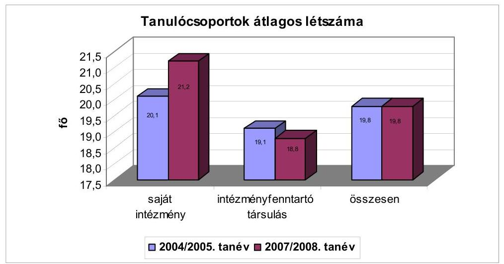

A vizsgált többcélú társulásokban a 2004/2005. tanév adataihoz mérten a 2007/2008. tanévre az óvodai csoportok átlagos létszáma egy fővel nőtt (23-ról 24 fő/csoportra), az általános iskolák 1-8. évfolyamán a tanulócsoportok átlagos létszáma ugyanezen tanévekben nem változott, mindkét vizsgált tanévben 19,8 fő/csoport volt. Ezen belül az intézményi társulások által fenntartott általános iskolák tanulócsoportjainak átlaglétszáma 19,1 főről 18,8 főre csökkent.

Kedvezőtlen tendenciák jelentkeztek az alsó tagozatos tanulók összevont osztályokban történő oktatásában is. A 2004/2005. tanévben az 1-4. évfolyamos tanulók 4,7%-a járt összevont tanulócsoportba, ezen belül az intézményi társulások által fenntartott intézményekben tanuló kisdiákok 6,9%-a. A 2004/2005. 2007/2008 tanévek között ez az arány az önkormányzati saját fenntartású intézményekben kétharmadára csökkent, az intézményi társulások iskoláiban ugyanakkor 4%-kal nőtt. A támogatások hatására az intézményi társulások iskoláiban arányában több mint 2,5-szer annyi gyermek jár összevont tanulócsoportba, mint az önkormányzatok saját fenntartású intézményeiben.
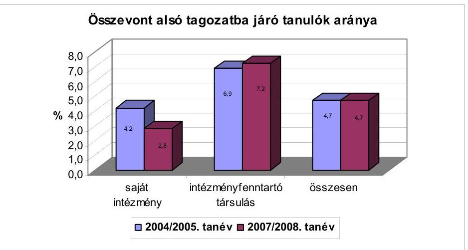

---

A közoktatási intézményi társulások számának növekedésében, összetételének változásában a többcélú társulásoknak, azok munkaszervezeteiknek eltérő szerepe volt.

A tapolcai és a mosonmagyaróvári többcélú társulás aktívan részt vállalt a közoktatási intézményi társulások létrehozásában, megszervezésében a szülők, a képviselő-testületek közös feladatellátás érdekében történő megnyerésében.

A nyírbátori és balassagyarmati többcélú társulások a közoktatási intézményi társulási megállapodásokkal, a feladatellátás szervezeti formáit tükröző kimutatásokkal sem rendelkeztek, feladatuk az ösztönző támogatás igénylésére, leosztására, elszámolására korlátozódott. A komáromi többcélú társuláshoz tartozó kilenc településből három település Nagyigmánd székhellyel hozott létre intézményi társulást a közoktatási feladatok ellátására. Az intézményi társuláshoz Csép csatlakozott KKÖ településként. A többi település általános iskoláját az önkormányzatok saját fenntartásban működtetik, így a többcélú társulás szervező tevékenységgel történő feladatellátása e tekintetben arra terjed ki, hogy figyelemmel kísérje ezen intézményekben az osztálylétszámok költségvetési törvényekben foglaltaknak való megfelelését.

A többcélú társulások az intézményi társulásokkal, azok intézményeivel - néhány kivételtől eltekintve (pl. Miskolc) - a közoktatási feladatok közös ellátására megállapodást nem kötöttek. A közös feladatellátást az önkormányzatok a többcélú társuláson kívül, a Ttv. 8., 9. és 16. §-a szabályai szerint külön megállapodásban rögzítették. A Tkt. tv. szabályai pedig nem rendelkeznek a tekintetben, hogy a közoktatási intézményi feladatok szervezésében a többcélú társulásoknak mi a konkrét feladata.

A feladatot ténylegesen ellátó intézmények és a többcélú társulások között közvetlen kapcsolat nem alakult ki. A többcélú társulások az ösztönző támogatást a gesztor önkormányzat részére továbbították és az nem minden esetben jutott el a feladatot ellátó intézményekhez.

A tapolcai többcélú társuláshoz tartozó önkormányzatok közül Monostorapáti, Hegyesd községek önkormányzatai az intézményi társulás keretében fenntartott iskola működtetéséhez, a központi állami hozzájáruláson, támogatáson kívül a 2006. évben saját erőből összesen 198,6 ezer Ft/fő, a 2007. évben 183,5 ezer Ft/fő összeget, Kapolcs, Taliándörögd, Vigántpetend önkormányzatai pedig költségvetésükből a 2006. évben 214,4 ezer Ft/fő, a 2007. évben 138,8 ezer Ft/fő saját forrást biztosítottak, miközben az intézmény kiadásai 2006-ról 2007-re mintegy 6%-kal emelkedtek.

A közoktatási intézményi feladatok ellátásához kapcsolódó támogatások igénybevétele és elszámolása a nevelési-oktatási feladatoknak megfelelő közoktatási statisztikai adatokra és az azt megalapozó okmányokra épül. A többcélú társulások a kötött felhasználású támogatásokat az önkormányzatok által szolgáltatott adatok alapján igényelték, számolták el, statisztikai jelentésekkel, tanügyi okmányokkal való összhangját nem vizsgálták. A többcélú társulások közül mindössze hat (18%) győződött meg dokumentáltan arról, hogy a közoktatási intézményekben a csoportok létszámára vonatkozó előírások teljesültek-e, a támogatások igénylésére vonatkozó adatok megegyeznek-e az előírt statisztikai dokumentumokban foglaltakkal. A többcélú társulások az intézmények statisztikai jelentéseivel, a finanszírozáshoz

---

közölt adatok valós tartalmát alátámasztó egyéb alapdokumentumokkal nem rendelkeztek.

A költségvetési törvények a 2006. évtől kezdődően biztosítanak a többcélú társulások, valamint az intézményi társulások által fenntartott intézményekbe bejáró gyermek, tanulók után támogatást. E szabályozás szerint azon gyermek után, akinek a lakóhelyén (tartózkodási helyén) az intézménynek székhelye, telephelye, stb. van nem járt támogatás, annak ellenére, hogy lakóhelyén az oktatásszervezés következtében az adott évfolyamon oktatás nem folyt. Az ellenőrzött többcélú társulások ettől eltérően bejáró tanulóként vettek figyelembe valamennyi olyan tanulót, akinek lakóhelye (tartózkodási helye) eltért attól a településtől ahol a feladatellátást ténylegesen igénybe vette, így jogtalan többlettámogatáshoz jutottak.

Az ellenőrzött többcélú társulásokban működő intézményi társulások által működtetett intézményekbe járó 11 320 fő után a 2007. évben 945 280 ezer Ft támogatás lehívására került sor, melyből az intézmény székhelyéről telephelyre, telephelyről székhelyre, illetve telephelyről telephelyre járó 2078 fő után a fenti szabályozással ellentétesen igénybe vett támogatás összege 171 520 ezer Ft volt.

Az Oktatási és Kulturális Minisztérium és az Önkormányzati Minisztérium észrevételében kifejtette, hogy a telephelyre bejáró gyermek, tanuló után is igénybe lehet venni a támogatást, ha a telephelyre a település közigazgatási határán kívülről jár be a gyermek, illetve a tanuló. A közoktatási intézmények belső struktúrája a helyi sajátosságok alapján eltérő, ezért a jogszabály - véleményük szerint - tág teret biztosít a normatíva igénybevételéhez, így akkor is igénybe vehető a támogatás, ha 1-4. évfolyamos tagintézményként működő településről járnak a gyermekek az intézmény valamely feladatellátási helyére.

Továbbra is fenntartjuk véleményünket, mely szerint a költségvetési törvényben megfogalmazott szabályozás nem értelmezhető úgy, hogy a közoktatási intézmény székhelye, valamint az egyes telephelyei között bejáró tanulók esetében lehetőség lenne az ösztönző támogatás igénylése. Amennyiben a szabályozásnál ez volt a jogalkotó célja, akkor indokolt a jogszabály módosítása, pontosítása.

A gyermekek önkormányzati közös feladatellátást biztosító intézményekbe történő eljuttatását a többcélú társulások változatos módon szervezték meg. Ennek keretében az önkormányzat tulajdonában lévő autóbusszal, a többcélú társulás tulajdonában lévő, de az önkormányzat használatába adott autóbuszszal, falugondnoki szolgálat gépjárműveivel szállítják a gyermekeket, de előfordul az is, hogy lízingelt busszal történik a gyermekek utaztatása.

A többcélú társulások közösségi busz beszerzését a központi költségvetés pályázati támogatásokkal ${ }^{35}$ is segítette. Egyes többcélú társulások pályázati támogatással több autóbuszt is vásároltak. Valamennyi pályázat mellékleteként benyújtott közösségi busz hasznosítására vonatkozó program tartalmazta, hogy a buszt a többcélú társulások gyermekek szállítására, iskolabuszként is hasznosítani kívánják.

[^0]
[^0]:    ${ }^{35}$ Közösségi busz beszerzéséről szóló 252/2005. (XI. 24.) számú, valamint a 254/2006. (XII. 7.) számú Korm. rendeletek.

---

A közösségi buszokat a többcélú társulások jellemzően nem saját maguk üzemeltetik. Azt átadták az intézményi társulások gesztor önkormányzatainak vagy bérbe adták a Volán vállalatoknak, vállalkozásoknak.

A többcélú társulások közül mindössze hat többcélú társulás (janoshalmi, tabi, kunszentmártoni, sásdi, szikszói, bicskei) üzemelteti saját maga a támogatásból megvásárolt közösségi buszt.

A buszok bérbeadása során a többcélú társulások szempontjából előnytelen szerződéseket is kötöttek.

A marcali többcélú társulás részére a vállalkozás által fizetett bérleti díj az éves értékcsökkenés 57%-át, a tapolcai többcélú társulás esetében mindössze 12,5%-át jelentette. A szerződésekben meghatározott bérleti díjak mellett kilométerenkénti térítési díj kedvezményeket is rögzítettek. A tapolcai többcélú társulásnál a vállalkozó, - aki 2007. december 31-ig üzemeltette az autóbuszt - az általa nyújtott kedvezményekkel is magasabb térítési díjat állapított meg, mint a szolgáltató által számolt kilométerenkénti tarifa volt.

A megvásárolt közösségi buszok a települések földrajzi elhelyezkedéséből, a gyermekek létszámából adódóan nem alkalmasak arra, hogy a többcélú társulások teljes területén biztosítsák a gyermekek iskolába történő szállítását. Így az e célra történő működtetésük mellett is szükséges iskolabusz szolgáltatás vásárlása. A vizsgált többcélú társulások 36,4%-ában iskolabusz szolgáltatás igénybevételével történik a gyermekek utaztatása. A gyermekek, tanulók utaztatására az iskolabusz szolgáltatási szerződést döntően az önkormányzatok kötötték meg a helyi Volán vállalattal, de előfordult, hogy vállalkozóval történt a szállítás. A többcélú társulások az utaztatott gyermekekről dokumentumokkal nem rendelkeztek, munkaszervezeteik az önkormányzatok által szolgáltatott ellenőrizetlen adatok alapján igényelték az iskolabusszal utaztatott gyermekek utáni támogatást. A támogatás igénylés során nem tartották be maradéktalanul a 2006. évi és a 2007. évi költségvetési törvényekben ${ }^{36}$ előírt feltételeket, a gyermekek utaztatása nem mindenütt, illetve nem teljes körben történt menetrendtől független iskolabusz-járat igénybevételével, nem volt dokumentált a kíséret sem.

A marcali többcélú társulás két intézményébe - Marcaliba, illetve Böhönyére bejáró gyermekek utaztatására a 2007. évben ösztönző támogatást igényeltek (276 gyermek után), annak ellenére, hogy a gyermekek utaztatása menetrend szerint közlekedő tömegközlekedési eszközön történt. A balassagyarmati többcélú társulás területén két önkormányzat kivételével (Cserhátsurány, Hugyag) a gyermekeknek a feladatellátást biztosító intézménybe történő eljuttatását a menetrend szerinti járatokkal biztosították. Ennek ellenére az önkormányzatok által közölt adatok alapján minden évben igényeltek és számoltak el ösztönző támogatást.

[^0]
[^0]:    ${ }^{36}$ 2006. évi költségvetési törvény 8. számú melléklet V. többcélú társulások támogatása 2. 2. aa) pont és a 2007. évi költségvetési törvény 8. számú melléklet IV. Többcélú kistérségi társulások támogatása 2.2.1. b) pont.

---

A miskolci többcélú társulás területén
 a 2007/2008. tanévtől egy intézményi társulás esetében biztosították a gyermekek iskolabusszal történő utaztatását, melyről a társulás nyilvántartást nem vezetett.

A bonyhádi többcélú társulás esetében a gazdasági társasággal kötött szerződésekben rögzítették, hogy a menetrendtől független járatokon az iskolák a tanulók szállításához kísérőt biztosítanak, azonban a kísérő biztosításáról nem rendelkeztek. Így az, hogy a gyermekek kísérővel utaztak-e, utólag nem állapítható meg, holott a jogszerű támogatás igénybevételének ez is feltétele volt.

A megyei önkormányzat kötelező feladatellátási körébe tartozó pedagógiai szakszolgálati feladatot, bár nem minden ellátás tekintetében, de valamennyi többcélú társulás felvállalta. A többcélú társulások által leggyakrabban, a legtöbb önkormányzatot érintően felvállalt pedagógiai szakszolgálati feladat a logopédiai ellátás, a gyógytestnevelés, valamint a nevelési tanácsadás volt. A feladatellátási kötelezettség átvételére azonban a többcélú társulásoknak csak 39,4%-a kötött megállapodást a megyei önkormányzattal.

A többcélú társulások keretében nőtt a pedagógiai szakszolgálati közös feladatellátásban részt vevő önkormányzatok, az ellátásokban részesítettek száma. Olyan településeket, gyermekeket is ellátásba vontak, akik számára erre korábban a térségközponttól való távolság miatt nem volt lehetőség.
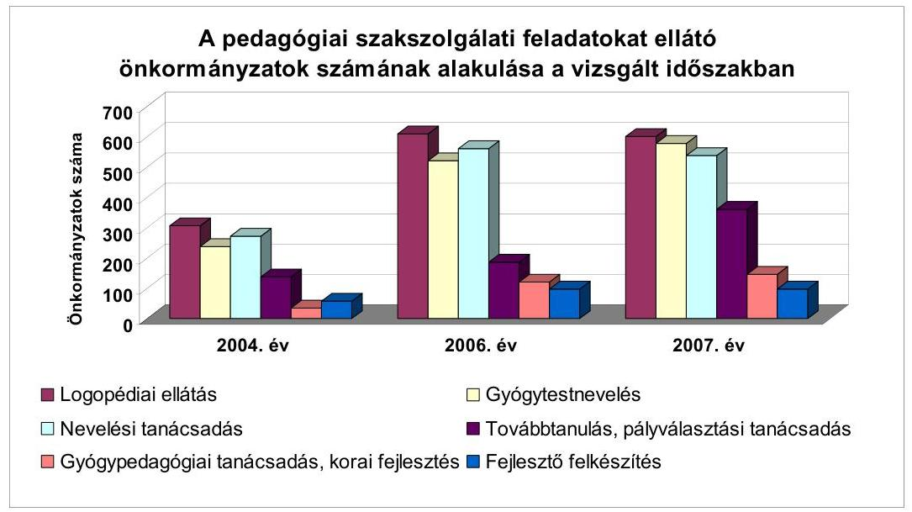

A logopédiai ellátást a 2007. évben az ellenőrzött 33 többcélú társulásból 30 többcélú társulás 602 településen biztosította 11668 fő részére. A feladatellátásban részesültek száma a 2004-2007. évek között 90,8%-kal, a közös feladatellátásban részt vevő önkormányzatok száma 96,7%-kal nőtt. A gyógytestnevelésben részesítettek száma a 2004-2007. években 3,5-szeresére (2007. évben 11425 fő volt), az e feladatok közös ellátásában részt vevő önkormányzatok száma a 2004. évi 236-ról 578-ra emelkedett. Közel azonos mértékben (a 2007. évben 537 önkormányzat) vettek részt az önkormányzatok a nevelési tanácsadási feladatokban, ahol az ellátottak száma a 2004. évi 7823-ról 10817 főre nőtt.

---

Lényegesen kisebb számban, mindössze hat többcélú társulás vett részt a gyógypedagógiai feladatok, korai fejlesztés, öt többcélú társulás pedig a fejlesztő felkészítés közös ellátásának megszervezésében, biztosításában.

A pedagógiai szakszolgálati feladatok ellátását a többcélú társulások 78,8%-a a települési önkormányzatok fenntartásában működő intézményektől rendelte meg. (6. számú melléklet)

A püspökladányi többcélú társulás a központilag támogatott közoktatási szakszolgálati feladatok ellátását 2007-ig a megyei önkormányzat fenntartásában működő intézménytől történő megrendeléssel biztosította. Így a megyei önkormányzat kötelező feladatának finanszírozása részben a többcélú társulások részére lebontott támogatásból történt.

A többcélú társulás saját fenntartásban működtetett intézmények látták el a pedagógiai szakszolgálati feladatokat a téti, a komáromi, a jászsági többcélú társulásban, a feladat ellátására a saját szervezetén belül pedagógusokat alkalmaztak a balassagyarmati, nyírbátori és a jánoshalmi többcélú társulások.

A támogatások igényléséhez, elszámolásához az intézmények által szolgáltatott adatokat - kettő kivételtől eltekintve - a többcélú társulások nem ellenőrizték, nem vizsgálták, hogy a támogatás feltételeként előírt foglalkozási gyakoriság biztosított volt-e.

A makói többcélú társulásnál a munkaszervezet a statisztikai jelentések alapján és belső ellenőrzés keretében vizsgálta az adatok valós tartalmát, a feltételeknek való megfelelést. A miskolci többcélú társulás munkaszervezete támogatás igénylés jogszerűségének vizsgálata kapcsán az ellátások költségvetési törvényekben előírt gyakoriságának hiányában a 2006. évben 66186 ezer Ft jogtalanul igénybe vett támogatást állapított meg.

# 2.2. A szociális és gyermekjóléti feladatok 

A szociális és gyermekjóléti ellátás területén a személyes szolgáltatások intézményrendszerét nagy területi aránytalanságok, továbbá a széttagoltság jellemezte. Az önkormányzatok által kötelezően ellátandó szociális feladatok köre - a Szoc. tv. szerint - a lakónépesség számtól függ, amely hozzájárult, hogy kialakuljanak, illetve fokozódjanak az egyes településkategóriák közötti ellátásbeli különbségek. A kötelező feladatok ellátása a kisebb településeken alacsony hatékonysággal volt megoldható és magas költségeket eredményezett, amely miatt a szociális feladatok egy részének ellátását a kisebb települések önkormányzatai nem vállalták fel. A társadalmi hátrányok ugyanakkor éppen azokon a kistelepüléseken halmozódtak, ahol a szociális szolgáltatások is hiányoztak.

A problémák kezelésére a megoldást az jelenthette, ha a szociális szolgáltatások ellátási kötelezettségét nagyobb lakónépességet tömörítő területi egységekben közösen végzik a települési önkormányzatok. A feladatellátás kiterjesztésében jelentős segítséget nyújtott a kistérségi szintű közös feladatellátás kiegészítő állami támogatással történő ösztönzése.

---

A kistelepülések számára a - minden települési önkormányzat által kötelezően ellátandó - szociális alapellátás körébe tartozó szolgáltatások biztosítása is gondot okozott (étkeztetés, házi segítségnyújtás).

A minden településen kötelezően ellátandó házi segítségnyújtást az ellenőrzött többcélú társulások által 2006. évben érintett 738 települési önkormányzatból 465 (az önkormányzatok 63%-a) látta el, amelyből 320 önkormányzat csatlakozott a közös feladatellátáshoz. A 2007. évben a közös feladatellátáshoz nem társuló önkormányzatok száma az előző évi 145 településről 70-re csökkent, miközben a közös feladatellátáshoz csatlakozó önkormányzatok száma 395-re, 23,4%-kal nőtt.

A kistelepülések önkormányzatai a kötelező feladataik ellátásának mellőzését a szükségletek hiányával indokolták, miközben azok felmérése meg sem történt. A feladatok többcélú társulások általi közös felvállalását különösen a saját költségvetési intézmények alapítását - szükségletfelmérés is megelőzte a többcélú társulások több mint 40%-ánál.

A tapolcai többcélú társulásban a támogató szolgálat 2006. évi és a közösségi ellátások 2007. évi létrehozását megelőzően minden településen felmérést végeztek az önkormányzatok a jelentkező szociális igényekről. A marcali kistérségben a közös feladatellátás érdekében végzett helyzetértékelés alapján megállapítható, hogy jelenleg az egyes szociális és gyermekjóléti ellátások (nappali ellátás, bölcsőde) után 2-3%-os igény jelentkezik a kistelepüléseken élő lakónépesség részéről, amelynek eredményeként a szociális és gyermekjóléti alapszolgáltatási feladatokat több mint 90%-ban az intézményi társulások székhelytelepülésének lakosai vették igénybe.

Az összehangolt szolgáltatási háló kialakításának szükségessége fogalmazódott meg akkor, amikor 2005. január 1-jei hatálybalépéssel a Szoc. tv. 92. § (3) bekezdésben előírásra került a 2000 főt meghaladó lakónépesség számot tömörítő társulások számára is a szociális szolgáltatástervezési koncepció készítésének kötelezettségét, amelyet a szociális feladatot felvállaló többcélú társulások 57,1%-a nem készített el. Azokban a többcélú társulásokban, ahol a közös feladat ellátásról szóló döntések meghozatalakor a szükségletek felmérését mellőzték, nem a lakossági igények, hanem a központi forrásokhoz való hozzájutás motiválta a települési önkormányzatok csatlakozását.

A többcélú társulások által közösen vállalt szociális és gyermekjóléti feladatokhoz kapcsolódóan a központi támogatások más-más feltételekkel voltak igényelhetők az alapellátási feladatok és a szakellátási feladatok esetében, amely feltételek hatással voltak a közös feladatellátás kiterjesztésére, valamint az ellátás szervezeti rendszerének átalakítására. (7. számú melléklet)

# 2.2.1. Szociális és gyermekjóléti alapellátások 

Az alapellátások közül 2006. és 2007. években ösztönző normatív, kötött felhasználású támogatás a családsegítés, a házi segítségnyújtás, a jelzőrendszeres házi segítségnyújtás, a közösségi ellátások, a támogató szolgáltatás és a nappali ellátások feladataihoz kapcsolódott, melynek hatására - a vizsgált időszak-

---

ban - átalakultak a többcélú társulásokban a feladatellátás szervezeti keretei.

A szociális alapellátási feladatokra támogatás csak akkor volt igényelhető, ha a feladatok közül legalább hármat biztosítottak közös feladatellátásban. A legalább három szociális alapellátási feladat közös biztosítására a többcélú társulások csak fokozatosan váltak alkalmassá.

Az ellenőrzött többcélú társulások által leggyakrabban felvállalt feladatok a családsegítés (26 többcélú társulás), a jelzőrendszeres házi segítségnyújtás (22 többcélú társulás) és a támogató szolgáltatás (20 többcélú társulás) voltak. A kistérségi szintű együttműködés keretében 2007-ben a legtöbb önkormányzat a családsegítés (576), a támogató szolgáltatás (445) és a házi segítségnyújtás (395) közös ellátásában vett részt.
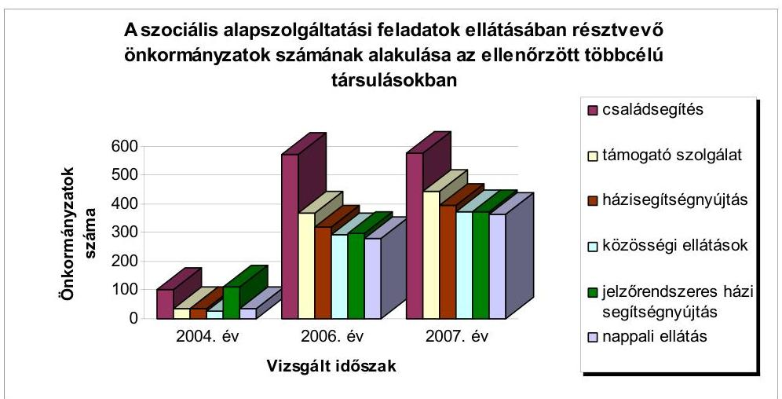

A jelzőrendszeres házi segítségnyújtás közös ellátásakor a 2006. évben a 4294 ellátott 52,4%-ára tudtak támogatást igényelni a többcélú társulások. A többi ellátott esetében az ellátást biztosító többcélú társulások nem tudtak megfelelni annak a követelménynek, hogy legalább három szociális alapszolgáltatást biztosítsanak az 50-60%-os szabály egyidejű érvényesülése mellett. A 2007. évben ez az arány kedvezően változott, mivel az 5370 ellátott 89,4%-a után már támogatást vettek igénybe, mert sikerült három szociális alapszolgáltatási feladat ellátását biztosítani. Az ellátási szerződések alapján történő feladatellátásnak a támogatás szempontjából való elismerése és a többcélú társulások által a szerződések megkötése segítette a többcélú társulásokat abban, hogy egyéb közösen ellátott feladataik kapcsán ne essenek el az ösztönző támogatás igénybevételének lehetőségétől. A többcélú társulások a szervező tevékenység keretében csak az ellátási szerződést kötötték meg és a kapott állami támogatás teljes összegét vagy egy részét továbbították a feladat ellátójának.

A jelzőrendszeres házi segítségnyújtás közös feladatként történő ellátása a 2007. évben 11 többcélú társulásban - a feladat közös ellátást vállaló többcélú társulások felében - külső szolgáltatóval kötött szerződés alapján történt. Az ÖTM nyilvántartásai szerint a támogatott többcélú társulásokhoz kapcsolódóan az ellátási szerződéssel érintett önkormányzatok száma 2006. évben 18 volt, ami 2007. év júliusára 547 településre növekedett.

---

A gyermekjóléti alapellátás körében ösztönző támogatást igényelhettek a többcélú társulások a gyermekjóléti szolgáltatáshoz, a gyermekek napközbeni ellátásához, valamint a gyermekek átmeneti gondozásához, amennyiben azok közül legalább egy feladatot közösen elláttak. A támogatást a többcélú társulások a közös feladatellátáshoz - a szociális alapellátásokéhoz hasonlóan - a többcélú társulások saját intézményében, a mikrotársulások intézményi társulásaiban, a székhelytelepülés vagy a kistérséghez tartozó bármely tagönkormányzattal kötött külön megállapodás alapján azok intézményeiben, valamint ellátási szerződések alapján a külső szervezetekben ellátott feladatok után igényelhettek.

A 2006. évben az ösztönző támogatások biztosításának feltételrendszere - az egy feladatmutatóra jutó fajlagos támogatások meghatározásakor - nem tett összegszerű különbséget az ellátás különböző szervezeti megoldásainak támogatásakor. Így kevésbé ösztönözte a többcélú társulások saját intézményei által történő feladatellátás elterjedését, ezért 2006-ban nem vált jellemzővé a közös feladatellátás szervezeti módjaként a többcélú társulások saját intézményeiben történő feladatellátás.

A többcélú társulások a közös feladatellátás területén jellemzően a szociális alapszolgáltatási (alapellátási) feladatok ellátására hoztak létre saját intézményeket vagy a feladatellátást saját munkaszervezetükön belüli szervezeti egység kialakításával vállalták. Ezeknek az intézményeknek a tevékenységi köre jellemzően azokra az ellátásokra terjedt ki (közösségi ellátások, támogató szolgálat, jelzőrendszeres házi segítségnyújtás), amelyek a kistérségek területén, még a nagyobb lélekszámú településeken is ellátatlanok voltak, mivel a Szoc. tv. csak 10000 fős lakónépesség felett tette kötelezővé az önkormányzatoknak a feladatok ellátását.

Dinamikus növekedést okozott a saját intézmények számának változásában a 2007. évi finanszírozás, mivel ekkortól differenciált és - egyes közszolgáltatásokat érintően - jelentős mértékben eltérő támogatási összegek illették meg a többcélú társulásokat attól függően, hogy saját intézménnyel, intézményi társulással vagy más szervezettel kötött külön megállapodás, illetve ellátási szerződés útján látták el a feladatot. A támogatás fajlagos összege a szociális és a gyermekjóléti alapellátásoknál vált a leginkább differenciálttá, a legmagasabb fajlagos összegű támogatás a többcélú társulások által fenntartott intézményekben történő, a legalacsonyabb fajlagos összegű támogatás az ellátási szerződéssel és a külön megállapodás alapján biztosított feladatellátáshoz kapcsolódott.

A 2007. évben a legalacsonyabb és legmagasabb támogatási összeg közötti különbség a feladatellátás módjától függően a családsegítésnél közel 1,3-szoros, a házi segítségnyújtásnál közel 1,6-szoros, a jelzőrendszeres házi segítségnyújtásnál és a közösségi ellátásoknál mintegy 2,3-szoros, a támogató szolgáltatásnál 3,5-szeres, a nappali ellátásoknál 3-szoros, a gyermekjóléti alapellátási feladatok esetében pedig 2,4-szeres volt.

A támogatások differenciálása - azoknál a feladatoknál, ahol a többcélú társulás saját intézményével való ellátás a támogatás szempontjából különösen preferált volt
 - erőteljes ösztönzést adott a többcélú társulásokhoz tartozó települések meglévő intézményeinek átvételére, továbbá a többcélú társulások új, saját intézményeinek alakítására.

---

Az országos adatok szerint a szociális alapszolgáltatások körében 2006-ban 80 többcélú társulás vállalta a családsegítés közös ellátását, amelynek több mint negyedében (21) saját fenntartású intézményt hoztak létre a feladat ellátására, a 2007. évben az érintett 107 többcélú társulás 35,6%-ának (38) saját intézményében is folyt ellátás. A házi segítségnyújtást 2007. évben 27 többcélú társulás által fenntartott intézményben biztosították az előző évi öt intézménnyel szemben. A jelzőrendszeres házi segítségnyújtás esetében 10-ről 17-re (70%-kal) nőtt a saját fenntartású intézmények száma, amely azonban együtt járt az ezen a jogcímen támogatott többcélú társulások 60-ról 83-ra történő (38,3%-os) emelkedésével is. A közösségi ellátás területén 2006-ról 2007. évre több mint négyszeresére (4-ről 17-re), a támogató szolgáltatás területén kilencről 2007. évre 33-ra, 3,6-szeresére nőtt a többcélú társulások saját fenntartásában lévő intézményeinek száma.

A feladat ellátásának szervezeti megoldásától függő differenciált támogatási rendszer bevezetése azokban a többcélú társulásokban is előrelépést jelentett, ahol korábban nem volt jellemző az intézményi társulások működése. Az intézményi társulásokat a létszámfeltételeknek való megfelelés $^{37}$ érdekében - a többcélú társuláson belüli mikrotársulások kialakításával - vagy újként alakították vagy a már működő intézményi társulások bevonásával, illetve az ahhoz csatlakozó települések bővítésével szervezték meg.

Az ellenőrzött többcélú társulások közül a 2006. és a 2007. években a szociális és gyermekvédelmi feladatok ellátására új intézményi társulásokat hoztak létre a marcali, a püspökladányi, a siklósi, a tamási, a bicskei, a miskolci, a bajai, a tokaji, a zalaegerszegi, a ráckevei, továbbá az abai többcélú társulásokban. A 2007. évben 11 kistérségben a többcélú társulások 33,3% alapított szociális célra önálló intézményt, intézményi társulások bevonásával oldotta meg a szociális feladatokat 14 többcélú társulás (42,4%). Ebből 11 kistérségben a közös feladatellátás eredményeként bővült az intézményi társulásokban részt vevő önkormányzatok száma. A többcélú társulások közül 11 kötött külön megállapodást a feladat ellátására más önkormányzat intézményével, továbbá 16 (48,5%) többcélú társulás biztosította valamely szociális ellátást külső szervezetekkel kötött ellátási szerződés útján.

Már a 2005. évi megalakulást ösztönző támogatások igénylési feltételeiben megjelent az ösztönzéssel együtt járó ellátási formák között a külső (civil vagy egyházi) szervezetekkel történő feladatellátás is. Azonban ekkor a Szoc. tv. - a szociális szolgáltatások körében - még nem tette lehetővé a többcélú társulások által kötött megállapodások alapján történő szolgáltatások biztosítását $^{38}$.

[^0]
[^0]:    $^{37}$ Amennyiben az ellátásokról a Ttv. 8., 9. és 16. §-a szerinti intézményi társulások útján is gondoskodtak a társulások, akkor további feltétel volt, hogy az intézményi társulásokban részt vevő települési önkormányzatok lakosságszámának meghatározott nagyságrendet el kellett érnie. (A családsegítés, házi segítségnyújtás és nappali ellátás alapszolgáltatási feladatok esetében legalább 3000 főt, a jelzőrendszeres házi segítségnyújtás, támogató szolgálat és közösségi ellátások esetében a 10000 főt, a gyermekjóléti alapellátási feladatok közös ellátásakor pedig az 5000 főt.)
    $^{38}$ A Szoc. tv. 120. §-a 2006. január 1-jei hatállyal tette lehetővé, hogy a társulás a szociális szolgáltatást egyházi vagy nem állami fenntartóval kötött ellátási szerződés útján is biztosíthassa.

---

A külső szervezetekkel történő feladatellátásra kapott alacsonyabb központi támogatás ellenére továbbra is gyakori - különösen a szociális alapszolgáltatások körében - a civil szervezetekkel és vállalkozásokkal kötött megállapodások alapján történő feladatellátás, ugyanakkor minden tevékenység esetében a külső szervezetek által ellátottak aránya csökkent.

Az ellenőrzöttek körében a családsegítés esetében a többcélú társulások által kötött ellátási szerződés alapján ellátottak aránya a 2006. évi 23,3%-kal szemben 2007-ben már csak 14,3%-volt. A házi segítségnyújtásban részesülőknek 2006-ban 33%-át, 2007-ben pedig 24,2%-át, a támogató szolgáltatásban részesülőknek 2006-ban 44,7%-át, 2007. évben mindössze 16,5%-át látták el a többcélú társulások által kötött külön megállapodás vagy ellátási szerződés alapján. A közösségi ellátásban részesülőknek 2006-ban 88,3%-ának, 2007-ben 39,3%-ának biztosították az ellátást a Szoc. tv. 120-122. §-ai alapján kötött ellátási szerződéssel. A jelzőrendszeres házi segítségnyújtásnál a külső szervezetek által ellátottak aránya a 2006. évben 80,7%, ugyanakkor a 2007. évben 74,2% volt, amelyhez azonban nominális értékben 3568 főről 4051 főre történő, 13,5%-os növekedés társult.

A támogatott többcélú társulások az ellátási szerződéssel rendelkező szolgáltatóknak kizárólag a központi költségvetéstől kapott pénzeszközöket adták át, egyéb - a többcélú társulások vagy a feladatellátásban részesülő önkormányzatok forrásait terhelő - saját pénzeszközöket nem biztosítottak. A külső szervezetekkel történő feladatellátásnál egy esetben előfordult, hogy az alacsonyabb ösztönző támogatást sem adták át teljes egészében a többcélú társulások a szolgáltatást végzőnek.

A bicskei többcélú társulás a jelzőrendszeres házi segítségnyújtás, a közösségi ellátás, továbbá a támogató szolgáltatás ellátására egy alapítvánnyal kötött szerződést, amelynek csak a normatív, kötött felhasználású támogatás 39%-át adta át, a fennmaradó 3,9 millió Ft-ot a többcélú társulás pénzügyi alapjába helyezték.

A 2006. és 2007. évi költségvetési törvények a támogatás feltételeként előírták, hogy intézményi társulások útján történő többcélú társulási feladatellátás esetén az egyes intézményi társulásokban részt vevő települési önkormányzatok ugyanezen feladatokra önállóan alkalmazottat nem foglalkoztathatnak, illetve kizárólag saját közigazgatási területükön működési engedéllyel rendelkező intézményt nem tarthatnak fenn. Az ellenőrzött többcélú társulások azonban nem tudták vizsgálni azt, hogy a közös feladatellátásban résztvevő - a többcélú társulást megillető támogatások alapját képező mutatószámokat teljesítő - települési önkormányzatok tartanak-e fenn önállóan a saját működési területükön intézményt vagy foglalkoztatnak-e önállóan a tevékenységet ellátó alkalmazottat, mivel nem rendelkeztek arra vonatkozó hatáskörrel, hogy ellenőrizzék a települési önkormányzatokat annak érdekében, hogy a jelzett támogatási feltétel érvényesülése biztosított-e. A szociális feladatokat közösen ellátó többcélú társulásoknak csak 43,5%-a tartotta fontosnak,

---

hogy az érintett települési önkormányzatoktól a feltétel teljesítéséről szóló nyilatkozatot kérjen $^{39}$.

A közösen ellátott feladatok finanszírozása a szociális alapszolgáltatási feladatok közül a családsegítés esetében az érintett települések népességszáma, a gyermekjóléti alapellátások esetén a települések 0-17 éves korosztályának lakónépessége alapján történt, továbbá amennyiben valamely többcélú társulás több gyermekjóléti alapellátási feladatot is felvállalt, akkor a 0-17 éves korcsoportba tartozó lakosságszám alapján járó támogatást annyiszor vehette igénybe a teljes korcsoporti létszám után, ahány feladat közös ellátását biztosította.

Az ellenőrzött többcélú társulásoknál az ellátottak számának alakulását figyelmen kívül hagyó finanszírozás - a családsegítés esetében - azt eredményezte, hogy az ellenőrzött többcélú társulásokban - 2006-ról a 2007. évre - a közös feladatellátáshoz való csatlakozás következtében a lakosságszám 52%-kal, míg az ellátottak száma csak 23,9%-kal nőtt, tehát az ellátást biztosító önkormányzatok népessége növekedésének felét sem érte el az ellátottak számának növekedése.
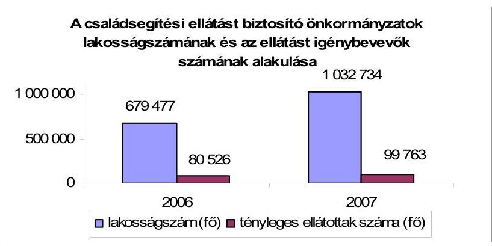

Ennek következtében az ellátásba újként bekerülők finanszírozásán túl azoknak az ellátottaknak a támogatása is erőteljesen emelkedett, ahol a szolgáltatás elérése kistérségi közös feladatellátás felvállalását megelőzően is biztosított volt. A lakosságszám alapján biztosított támogatás következtében a kifizetett támogatás 57,9%-kal emelkedett, azonban ennek mintegy 44%-ára volt szükség az ellátásban újként megjelenő ellátottak finanszírozásához. A támogatás különbsége elsősorban az intézményi társulások gesztor önkormányzatainak anyagi helyzetét javította. Az intézményi társulások által ellátottak száma nőtt 58390 főről 76056 főre (30,3%-kal), amelynek következtében az intézményi társulásoknak az ellátásban való részesedési aránya a 2006. évi 67,9%-ról 2007-re 73,2%-ra növekedett. A vizsgált időszakban az ellenőrzött többcélú társulások körében nem vált jellemző ellátási formává a családsegítésben a saját intézménnyel történő feladatellátás, a 2006. évben három, a 2007. évben hét többcélú társulás hozott létre saját intézményt a feladat ellátására.

A közösségi ellátásra, valamint a támogató szolgáltatásra nem az ellátottak száma, hanem a működtetett szolgálatok száma alapján jogosultak a többcélú társulások abban az esetben, ha az intézmény vagy a humánszolgáltató szervezet működési engedély szerinti szolgáltatási területe a Szoc. tv. 86. § (2) bekezdés c) pontjában az ellátási kötelezettség határaként rögzített 10000 fős lakónépesség számot meghaladja.

Az intézmények számától függő finanszírozás mind a közösségi ellátások, mind a támogató szolgálatok esetében arra ösztönzött egyes többcélú társulásokat, hogy a saját intézmények számát oly módon határozzák meg, hogy minél több támogatást tudjanak azokra igénybe venni.

Az ellenőrzött többcélú társulások körében a közösségi ellátást 2007. évben hat többcélú társulás 14 saját fenntartású intézményében biztosította. A nyírbátori többcélú társulásban négy - 11455 fős átlagos lakosságszámmal rendelkező - saját fenntartású intézményt alakított ki a támogatás maximalizálása érdekében. A balassagyarmati többcélú társulásban is három saját fenntartásban lévő intézményt alakítottak ki annak érdekében, hogy a lehető legmagasabb támogatást igénybe tudják venni. A jászsági többcélú társulás négy saját fenntartású közösségi ellátást biztosító intézményt alakított átlagosan 22337 fős népességszámmal.

Ugyanakkor az egész kistérség területét lefedte egy-egy intézmény alakításával a tapolcai többcélú társulás (37764 lakos) és a téti többcélú társulás (48967 lakos).

Az ellenőrzött többcélú társulások közül a támogató szolgáltatást 2006. évben egyedül a jászsági többcélú társulás látta el saját intézményben, 2007. évben a tapolcai, a balassagyarmati, a nyírbátori és tiszavasvári többcélú társulások is támogatást kaptak a többcélú társulások saját intézményeiben történő feladatellátáshoz. A nyírbátori többcélú társulás négy saját intézményt alapított a kistérség területén, átlagosan 11455 fős lakosságszámmal. A balassagyarmati többcélú társulás is két saját intézményt alakított, amelyekhez tartozó lakónépesség alig haladta meg a minimális feltételként megjelölt lakosságszámot. Hasonlóan járt el a tapolcai többcélú társulás is azzal a különbséggel, hogy ott ellátási szerződéssel korábban külső szervezet biztosította a szolgáltatást, de nem a teljes kistérség területére. A többcélú társulás és a külső ellátó megállapodtak abban, hogy a kistérség teljes lefedése érdekében úgy osztják fel maguk között a lakosságot, hogy megfeleljenek a minimális lakosságszámra vonatkozó támogatási feltételnek. A téti többcélú társulásban a támogató szolgáltatást saját intézményi keretek közt, továbbá szolgáltatási szerződéssel is biztosították, mivel a kistérség lakosságszáma alapján lehetőség volt két 10000 főt meghaladó körzet létrehozására. Az állami támogatás igénylése érdekében feltüntetett mutatószám - a két szolgálat működési területén - 24025 fő volt.

A Szoc. tv. változásaihoz igazodva $^{40}$ a 2008. évi költségvetési törvény rendelkezései $^{41}$ előrevetítik, hogy 2009. évtől a támogató szolgálatok és a közösségi ellá-

[^0]
[^0]:    $^{40}$ A Szoc. tv. 86. § (3) bekezdése szerint 2009. január 1-jétől a támogató szolgáltatás és a közösségi ellátások nem minősülnek kötelező önkormányzati feladatnak.

---

tások nem vagy egyéb támogatás útján részesülhetnek támogatásban, mivel az ellátás kikerül az önkormányzati kötelező feladatok köréből. Ugyanakkor 2007. július 6-ától hatályos a
 Fogyatékossággal élő személyek jogairól szóló egyezmény és az ahhoz kapcsolódó Fakultatív Jegyzőkönyv kihirdetéséről szóló 2007. évi XCII. törvény, amely az „Önálló életvitel és a közösségbe való befogadás" fejezet b) pontja szerint a Magyar Állam - az ENSZ egyezmény kötelező hatályának elismerése kapcsán - vállalta, hogy biztosítja a fogyatékos személyek számára az egyéb közösségi és támogató szolgálathoz való hozzáférést.
2007. szeptemberében a szociális alapszolgáltatási feladatot felvállaló 28 többcélú társulás közül 25-ben ( $89,3 \%$ ) volt biztosított legalább három szociális alapszolgáltatási feladat ellátása, amely az ösztönző támogatás egyik igénylési feltétele volt. A helyszíni ellenőrzés megállapításai szerint nem biztosította a három feladat közös ellátását a sásdi, a tabi és a ráckevei többcélú társulások, amelyek közül a sásdi többcélú társulás jogtalanul igényelt támogatást. A ráckevei és a tabi többcélú társulások a közösen ellátott szociális alapellátási feladatokhoz nem igényeltek támogatást. Jogtalan állami támogatás igénybevételére más többcélú társulásokban is sor került, mivel az igényléshez kapcsolódó jogszabályi feltételekből valamely előírást nem teljesítettek.

Jogtalanul vette igénybe támogatást a marcali többcélú társulás, mivel Marcali városban a nappali ellátások biztosítására olyan intézmény működött, amelynek működési engedélye csak a településre terjed ki. A balassagyarmati többcélú társulásban az egyik intézményi társulás nem rendelkezett a közigazgatási hivatal igazolásával arról, hogy az intézményi társulás megállapodása törvényes, amely ugyancsak feltétele volt a jogos igénybevételnek.

A többcélú társulások a támogatások igénylését megalapozó mutatószámokat dokumentált módon érdemben nem ellenőrizték ${ }^{42}$. Az ellenőrzött többcélú társulások a mutatószámok felmérése, évközi módosítása és az elszámolás során az ÖTM által kiküldött igényfelmérő lapokat továbbították a települési önkormányzatoknak és az adatokat a polgármester és a jegyző aláírásával kérték. Az így kapott adatokat, valamint a saját fenntartásukban lévő intézmények mutatószámait összesítve továbbították az ÖTM felé.

A szociális feladatot vállaló többcélú társulások 35,7\%-a (10) vizsgálta csak felül a kapott adatokat. A normatív, kötött felhasználású támogatások igénylésének alapjául szolgáló mutatószámok jogszabályi feltételeknek való megfelelését hét többcélú társulás (a feladatot ellátó többcélú társulások 25\%-a) - a jászsági, a makói, a mosonmagyaróvári, a miskolci, a téti, a tiszavasvári és a zalaegerszegi többcélú társulások - ellenőrizte helyszíni ellenőrzés keretében is.

[^0]
[^0]:    ${ }^{41}$ A 2008. évi költségvetési törvény 8. számú mellékletének IV. fejezete 2.4 pontja szerint „2009. évtől a közösségi ellátások és a támogató szolgáltatás nem lesz része a választható és támogatható szociális alapszolgáltatási feladatoknak", ezért ezek a feladatok nem lesznek figyelembe vehetők a támogatás szempontjából a szociális alapellátások közös ellátásának felvállalása esetében kötelezően ellátandó három feladatnak.
    ${ }^{42}$ A valós adatszolgáltatás biztosításáért az Ámr. 157. § (2) bekezdés g) pontja értelmében a társulás elnöke és munkaszervezetének vezetője a felelős.

---

A gyermekjóléti alapellátások körében a többcélú társulások a gyermekjóléti szolgáltatás, a gyermekek napközbeni ellátása, valamint a gyermekek átmeneti gondozása esetén igényelhettek ösztönző támogatást. A gyermekjóléti szolgáltatás közös vállalása volt a közoktatást és belső ellenőrzést követően a leggyakoribb a többcélú társulások körében. A támogatás igénylésének feltételei alapjaiban megegyeztek a szociális alapellátási feladatoknál meghatározottakkal azzal, hogy nem kellett legalább három feladat közös ellátását biztosítani, már egy feladat közös vállalása esetén is járt ösztönző támogatás.

Az ellenőrzött 33 többcélú társulás közül 81,82\% (27) látta el közösen a gyermekjóléti szolgáltatás közös ellátását, a gyermekek napközbeni ellátására azonban mindössze a vizsgált többcélú társulások 9,1\%-a (a marcali, a téti és a vasvári) vállalkozott közösen. A gyermekek átmeneti gondozását kettő - a makói és a bonyhádi többcélú társulás $(6,1 \%)$ - látta el.

A feladatnak a 0-17 éves korosztály népességszáma alapján történő finanszírozása arra ösztönözte a többcélú társulásokat, hogy minél nagyobb településszámra kiterjedően vállalják a közös feladat ellátását abban az esetben is, ha a ténylegesen ellátott települések száma messze elmarad a működési engedélyben és az alapító okiratban meghatározottaktól. A közös feladatellátás - az alapító okiratban és a működési engedélyben meghatározott ellátási körzetben - egyes kistérségi szintű feladatellátást biztosító intézményekben csak elviekben volt biztosított.

A marcali székhelyű „Önkormányzatok Családsegítő és Gyermekjóléti feladatok ellátását biztosító mikrokörzeti társulása" a kistérséghez tartozó valamennyi (34) önkormányzat részére biztosította a gyermekek napközbeni ellátását. Valójában azonban a bölcsődébe csak 6-7 település gyermekei jártak, mivel egyes településekről - annak a kistérségen belüli távolsága miatt - a bölcsődébe a szülők a gyermekeket nem tudták volna eljuttatni sem.

A korcsoporti népességszámhoz kötött finanszírozás az egyes többcélú társulások esetében jelentős - közel kétszeres - eltéréseket okozott az egy ellátottra jutó támogatások tekintetében is, amely az ellátási színvonalbeli különbségek csökkentésére irányuló cél megvalósítását kedvezőtlenül befolyásolta.

Az ellenőrzött többcélú társulások közül a bonyhádi és a makói többcélú társulás látta el - a székhelytelepülés önkormányzatával kötött - külön megállapodás alapján a gyermekek átmeneti gondozását. A bonyhádi többcélú társulás annak ellenére, hogy külön megállapodás alapján látta el a feladatot, az intézményi társulással történő feladatellátáshoz kapcsolódó támogatást igényelt jogtalanul. Mivel a feladat finanszírozása a közös feladat ellátást felvállaló települések lakosságszáma alapján történt, ezért a bonyhádi többcélú társulás egy ellátottra 2007 évben 576,9 ezer Ft ösztönző támogatást vett igénybe, amely a jogszerű, alacsonyabb összegű támogatás igénylése esetén is 274,7 ezer Ft lett volna, ugyanakkor a makói többcélú társulásban az egy ellátottra igényelt támogatás 2007 évben 154,6 ezer Ft volt.

A 2007. évi feladatellátás szervezeti módjától függő differenciált finanszírozás bevezetése következtében a feladatot ténylegesen ellátó 28 többcélú társulás $21,4 \%$-a (a váci, a komlói, a püspökladányi, a téti, a tiszavasvári, a

---

pilisvörösvári) megváltoztatta a feladatellátás szervezeti kereteit annak érdekében, hogy magasabb fajlagos összegű támogatást tudjon igénybe venni.

A támogatásban részesülő többcélú társulások több mint egynegyede azonban úgy vette igénybe az állami támogatást, hogy annak feltételei minden tekintetben nem teljesültek.

A 2007. évi normatív, kötött felhasználású támogatás igénylési feltételeinek a feladatot ellátó többcélú társulások 28,6\%-a (balassagyarmati, komáromi, marcali, tamási, vasvári, sásdi, tiszavasvári és zalaegerszegi többcélú társulások) nem felelt meg. A többcélú társulások 10,7\%-ában (komáromi, sásdi és tiszavasvári) nem volt biztosított, hogy a feladatellátást végző intézmények működési engedélye legalább három önkormányzat közigazgatási területére kiterjedjen vagy az érintett önkormányzatok lakosságszáma az 5000 fót meghaladja. A többcélú társulások $28,6 \%$-ánál a közigazgatási hivatal vezetője a támogatásra való jogosultságot a társulási megállapodás törvényességére irányuló nyilatkozatával nem igazolta. Az ellátási szerződéssel és külön megállapodás alapján történő feladatellátás esetén a többcélú társulások $25 \%$-a társulási megállapodásában nem rögzítette a feladat ellátásának módját, ami ugyancsak a támogatás jogszerű igénybevételének feltétele volt.

A 2008. évben az ellátásban részesülők körének bővülése és az ellátás területi kiegyenlítése érdekében anyagi ösztönzést rendeltek a szociális étkeztetési feladatok ellátásához is. A feladat kistérségi szintű megszervezése - a települési önkormányzatoknál nem megfelelő kihasználtsággal üzemeltetett saját konyhák megszüntetésével egyidejűleg - az optimális méretnagyságú és gazdaságosan működtetett, korszerűbben felszerelt konyhák kialakítását segítheti.

# 2.2.2. Szociális és gyermekvédelmi intézményi ellátások 

A többcélú társulások akkor jogosultak ösztönző támogatások igénylésére a szociális szakellátási feladatok közös biztosítása esetén, ha a Szoc. tv. szerinti szakosított ellátások közül legalább egy intézménytípus közös fenntartásáról gondoskodnak. A szabályozás a közös feladatellátásnak két módját, a többcélú társulás saját intézményével történő feladatellátást, valamint a korábban két települési önkormányzat által külön-külön fenntartott intézmények összevonásával létrehozott intézményi társulást ismerte el. Az intézményi társulások intézményeinek már 2006. január 31-ig ilyen feltételekkel kellett megalakulniuk. A szabályozás arra ösztönözte a többcélú társulásokat, hogy a szakellátási feladatokat ellátó intézményeket vegyék át saját fenntartásba, ezzel a szakosított ellátások kistérségi szinten szerveződve biztosítsanak egyenlő esélyt a különböző településeken élők számára. A szabályozás nem tette lehetővé egyéb szervezési megoldások esetén a támogatás igénylését. A szigorú támogatási feltételeket kialakító szabályozás - amely látszólag jobban ösztönözte a saját intézmények létrehozását - nem támogatta a kistérségi szintű feladatellátás elterjedését.

A szociális szakellátások körében az időskorúak ápolását, gondozását nyújtó otthonok, az időskorúak és fogyatékos személyek gondozóházainak, a pszichiátriai és szenvedélybetegek átmeneti otthonainak, továbbá a hajléktalanok átmeneti szállásainak működtetéséhez lehetett támogatást igényelni.

---

Az ellenőrzött többcélú társulások 18,2\%-a a Szoc. tv. szerinti szakosított ellátások közül legalább egy feladatot felvállalt (komlói, siklósi, tamási, tapolcai, tiszavasvári és jánoshalmi). Ezen belül legjellemzőbb ellátási forma az időskorúak ápolását, gondozását nyújtó otthonok fenntartása, amelyet a többcélú társulások 15,2\%-ában látnak el közös feladatként. A többcélú társulások mindössze $6 \%$-a működtette közösen az időskorúak vagy fogyatékosok gondozóházát (tiszavasvári és komlói), illetve hajléktalanok átmeneti szállását (a jánoshalmai és a komlói többcélú társulások). Pszichiátriai és szenvedélybetegek átmeneti otthonát egy többcélú társulás (a tiszavasvári) működtette saját fenntartásban.

A támogatás jogszerű igénylésének feltétele a 2007. évi költségvetési törvény 8. számú melléklete IV. fejezete 2.3. pontjában előírtak szerint az intézményi társulással történő feladatellátás magasabb szakmai színvonalon történő, illetve gazdaságosabb ellátásában a többcélú társulásnak szerepet kell vállalnia. Ezen támogatási feltétel érvényesülése azonban a szakmai színvonal mérésére alkalmas mutatók hiányában nem ítélhető meg.

A gyermekvédelmi szakellátások közül a helyettes szülői hálózat működtetéséhez, a gyermekek átmeneti otthonának és a családok átmeneti otthonának működtetéséhez, annak kistérségi közös vállalása esetén lehet támogatást igényelni. A támogatás igénylésének feltételei alapjaiban megegyeztek a szociális szakellátások feltételeivel, egy tekintetben azonban még annál is szigorúbban kerültek meghatározásra, mivel nemcsak egy, hanem mindhárom feladat közös ellátását saját intézménnyel vagy intézményi társulás útján biztosítani kellett.

A szabályozás célja a gyermekvédelmi szakellátások területén is az volt, hogy a feladatok ellátására a többcélú társulások saját intézményeket hozzanak létre. A kitűzött célt azonban az elmúlt időszakban nem sikerült elérni, mivel 2007-ben országos szinten a helyettes szülői hálózatra mindössze két, a családok, valamint a gyermekek átmeneti otthonának működtetésére egy-egy többcélú társulás igényelt támogatást.

Az ellenőrzött többcélú társulások a helyettes szülői hálózat és a gyermekek átmeneti otthona feladatokat közösen nem látták el. A családok átmeneti otthonát a jánoshalmai többcélú társulás és a vasvári többcélú társulás a 2006. évtől, a tiszavasvári többcélú társulás a 2007. évtől működtette saját intézmény keretében, amelyhez azonban az elmúlt években támogatást egyik többcélú társulás sem igényelt, mivel az igénylés feltételei nem álltak fenn. A jánoshalmai és a vasvári többcélú társulásban a feladatot ellátási szerződés alapján non-profit, illetve társadalmi szervezet is biztosította, amelyhez a többcélú társulások pénzeszközökkel hozzájárultak, arra azonban ösztönző támogatást nem voltak jogosultak igénybe venni, mivel ez a szervezeti megoldás nem támogatott ellátási forma a gyermekvédelmi szakellátások körében, továbbá nem vállalták mindhárom feladat közös ellátását sem.

# 2.3. Belső ellenőrzési feladatok 

Az országos adatok szerint a 2006. évben a belső ellenőrzési feladatok ellátását felvállaló 137 többcélú társulásban 2564 önkormányzat, a 2007. évben 154 többcélú társulásban
 2901 önkormányzat (közülük 2690 önkormányzat saját munkaszervezeti keretek között való feladatellátással) csatlakozott a kistérségi szintű tevékenységhez. A belső ellenőrzési feladatok ösztönző támogatására

---

15806 költségvetési szerv alapulvételével 2007. évben 1422585 ezer Ft-ot fordítottak. A vizsgált többcélú társulásoknál a belső ellenőrzési feladatok ellátására 2007. évben 679 önkormányzat társult, és összesen 3088 költségvetési intézmény figyelembevételével igényelt költségvetési támogatást. Az ellenőrzött többcélú társulások közül - a tabi székhelyű többcélú társulást kivéve - valamennyi vállalkozott a belső ellenőrzési feladatok közös ellátására.

A többcélú társulások belső ellenőrzési feladataik ellátásáról saját feladatellátással, illetve szervező tevékenységgel gondoskodhattak. A 2006. és a 2007. évi költségvetési törvények ${ }^{43}$ alapján saját feladat ellátás körébe tartozott, ha a többcélú társulás saját intézményfenntartással, vagy a munkaszervezet keretében (önálló munkaszervezetében vagy a munkaszervezet feladatával megbízott polgármesteri hivatal szervezeti egységében) látta el a feladatot. Az egyéb kistérségi szintű szabályozástól eltérően saját feladatellátásnak ismerték el a külső erőforrás bevonásával végzett tevékenységet is, amelyhez magasabb állami támogatás tartozott, mint a belső ellenőrzés intézményi társulással történő megszervezése esetén. Míg a saját feladatellátás során elegendő az ösztönző támogatások általános feltételéül szabott követelmények ${ }^{44}$ teljesítése, addig az intézményi társulással történő belső ellenőrzés esetében további feltétel, hogy a társulásban legalább hét települési önkormányzatnak részt kell vennie.
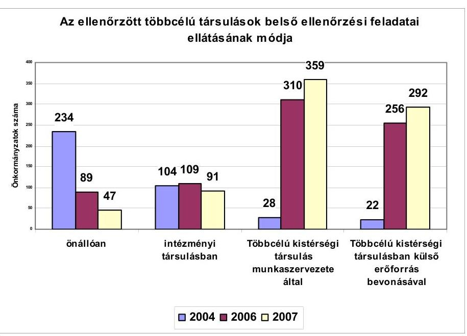

A többcélú társulások belső ellenőrzési feladataik ellátásának szervezeti kereteit eltérő módon alakították ki, melynek változásait a fenti ábra is mutatja. Az

[^0]
[^0]:    ${ }^{43}$ A 2006. évi költségvetési törvény 8. számú melléklete V. fejezet Kiegészítő szabályok 5.1. pontja, illetve a 2007. évi költségvetési törvény 8. számú melléklete IV. fejezet Kiegészítő szabályok 5.1. pontja szabályozza a támogatott szervezeti megoldásokat.
    ${ }^{44}$ Az ösztönző támogatások igénybevételéhez előírt általános feltételek szerint a támogatás akkor igényelhető, ha a kistérségi feladatellátásban az 50-60%-os szabály érvényesül.

---

ösztönző támogatás hatására lényegesen nőtt a belső ellenőrzést biztosító települési önkormányzatok száma és változások történtek a feladatellátás szervezeti megoldásaiban is.

A 2004. évben még az önkormányzatok 60,4%-a (234) gondoskodott önállóan és 26,7%-a (104) intézményi társulással a belső ellenőrzési feladat ellátásáról. Az önkormányzatok 7,2%-a (28) a többcélú társulás munkaszervezete által, 5,7%-a (22) pedig a többcélú társulás által kötött szerződés alapján, külső erőforrás bevonásával oldotta meg a belső ellenőrzési feladatokat. 2007. évben a belső ellenőrzési feladatot már csak az önkormányzatok 6%-a (47) látta el önállóan és 11,5%-a (91) intézményi társulással, ugyanakkor 45,5%-ra (359) nőtt a feladatot a többcélú társulás munkaszervezetével és 37%-ra (292) a külső erőforrás bevonásával biztosító önkormányzatok száma. A bekövetkező változások egyértelműen igazolják, hogy az ösztönző támogatások hatására, azok által irányított változások következtek be a feladatellátás szervezeti kereteinek átalakulásában.

Az ellenőrzött többcélú társulások közül saját munkaszervezetének keretén belül foglalkoztatott belső ellenőröket a komlói, a miskolci, a sárospataki, a szikszói, a komáromi, a bátonyterenyei, a marcali, a bonyhádi, és a tapolcai többcélú társulás. Külső erőforrás (egyéni és társas vállalkozás) látta el a belső ellenőrzéseket a vizsgált többcélú társulások mintegy felénél. Vegyes megoldást alkalmazott az ellenőrzés szervezeti kereteinek kialakításakor a siklósi többcélú társulás, ahol az érintett 53 önkormányzat belső ellenőrzéséről részben a munkaszervezet, részben intézményi társulás gondoskodott. A makói kistérségben a többcélú társulás belső ellenőrzési feladatait Makó Város Önkormányzat Polgármesteri Hivatala keretében funkcionálisan független, a végrehajtási szervektől elkülönült belső szervezeti egység - intézményi belső ellenőrzési társulás - látta el. Szervező tevékenységgel biztosította a feladatellátást a vizsgált időszakban öt többcélú társulás. A bajai a városi önkormányzat polgármesteri hivatalával, a jánoshalmai a Városi Jegyzők egyesületével, a zalaegerszegi a települési önkormányzatok intézményi társulásával látta el a feladatot. A nyírbátori, a tiszavasvári és a balassagyarmati társulásokban 2006. év végéig működtek a belső ellenőrzési mikrotársulások, a 2007. évtől - a differenciált összegű támogatás bevezetésének hatására - a munkaszervezetek biztosítják a feladat ellátását.

A vizsgált többcélú társulások megállapodásai döntő részben részletesen kitérnek a felvállalt belső ellenőrzési feladat ellátásának módjára, szervezeti kereteire, szakmai tartalmát szabályozó kérdésekre, a feladatot ellátók kötelezettségeire. Általános hiányosság volt ugyanakkor, hogy nem rögzítették a megállapodások a társult önkormányzatok jegyzőinek - a belső ellenőrzés kistérségi keretek közt történő ellátása mellett is változatlanul fennálló - általános ellenőrzési felelősségét, az ebből következő feladatokat, nem rendezték továbbá a belső ellenőrzési tevékenység folytatásához szükséges hatáskörök megosztását, nem gondoskodtak a belső ellenőrzési vezető kijelöléséről. Az önkormányzatok képviselő-testületei a többcélú társulások által végzett és szervezett közös feladatellátáshoz csatlakozással a hatáskör átruházásról nem dönthetnek, tekintettel arra, hogy az Ötv. 92. § (5) bekezdése a belső ellenőrzés működtetését a jegyzők és nem a képviselő-testületek feladatkörébe utalja. Az Ötv. 92. § (8) bekezdése ugyanakkor lehetőséget ad a képviselő-testületnek, hogy döntése alapján társulás lássa el a belső ellenőrzés feladatát.

---

A szabályozási és szervezeti keret kialakítása során többek között a kunszentmártoni többcélú társulás nem tett eleget a Ber. 4/A. § (2) bekezdésében foglaltaknak, mivel a társulás elnöke nem rendelkezett a belső ellenőrzési kézikönyv elkészítéséről, a kockázatelemzéssel alátámasztott stratégiai és éves ellenőrzési tervek összeállításáról, a költségvetési szerv vezetőjének jóváhagyása után a tervek végrehajtásáról, valamint azok megvalósításának nyomon követéséről, az ellenőrzési jelentés ellenőrzött szerv, illetve szervezeti egység számára történő megküldéséről ${ }^{45}$, az éves ellenőrzési jelentés, illetve az összefoglaló ellenőrzési jelentés összeállításáról ${ }^{46}$. Nem intézkedett továbbá a társulás elnöke az ellenőrzések nyilvántartásáról, valamint az ellenőrzési dokumentumok legalább 10 évig történő megőrzéséről sem. A hiányosságok pótlására intézkedési tervet kértünk a társulási tanács elnökétől.

A bonyhádi többcélú társulási megállapodásban csak a feladatellátás módja került rögzítésre, a részletes szabályozás elmaradt. Nem történt meg a Ber. 18. §-ában előírt stratégiai terv, az Ötv. 92. § (6) bekezdésében előírt éves belső ellenőrzési terv, továbbá a Ber. 5. § (1) bekezdésében előírt belső ellenőrzési kézikönyv jóváhagyására vonatkozó hatáskörök szabályozása. A társulási megállapodásban a társult önkormányzatok jegyzőinek általános ellenőrzési felelősségét sem rögzítették.

A többcélú társulások keretében szervezett önkormányzati belső ellenőrzés szabályait az Ötv. 92. § (3)-(4), (7)-(8) bekezdései, a Htv. 140. § (1) bekezdés e) pontja, valamint a Ber. előírásai együttesen szabályozzák. E jogszabályok nem tartalmaznak speciális előírásokat arra az esetre, ha a belső ellenőrzés feladatait az önkormányzatok többcélú társulásai látják el. Így a feladatellátás szervezése során az önkormányzatok belső ellenőrzésére vonatkozó szabályok érvényesülését kellene biztosítani, holott a többcélú társulások feladatellátása autonóm önkormányzatokra, továbbá olyan költségvetési szervek ellenőrzésére terjed ki, amelyek nem tartoznak a többcélú társulások felügyelete alá.

Az Ötv. az Áht., továbbá a Ber. többcélú társulásokat érintő előírásainak együttes alkalmazása értelmezési problémákat okozott az ellenőrzött többcélú társulásoknál. A többcélú társulás munkaszervezetének és intézményeinek belső ellenőrzési tervét - külön erre vonatkozó tételes előírás hiányában, az önkormányzati ellenőrzés szabályozására alapozva - a társulási tanácsnak kell jóváhagynia. A társult települések belső ellenőrzési tervének jóváhagyása, módosítása, annak végrehajtásáról szóló beszámolónak az előkészítése a jegyző feladata. A beszámoló előterjesztése a polgármester, míg elfogadása a település képviselő-testület hatáskörébe tartozik. A társulási tanács a saját és munkaszervezete belső ellenőrzési tevékenység végrehajtásáért felelős, ugyanakkor a társult települési önkormányzatok belső ellenőrzési feladatai megvalósításának helyzetéről, mint a vállalt közszolgáltatás teljesítéséről csak tájékozódhat, azonban a közös feladatellátás érdekét szolgáló ellenőrzésekre nem jogosult.

Az ellenőrzési tervek kialakítása - az ellenőrzött többcélú társulásoknál kialakult gyakorlat szerint - az önkormányzatok jegyzői által megfogalmazott igényekből indult ki, azonban az ahhoz szükséges ellenőri kapacitás meghatá-

[^0]
[^0]:    ${ }^{45}$ a Ber. 28. §-a szerint
    ${ }^{46}$ a Ber. 31. §-ban foglaltak szerinti

---

rozását, annak egymás közötti megosztásának elveit előzetesen nem alakították ki, így a rendelkezésre álló ellenőri kapacitást a finanszírozási lehetőségek arányában osztották meg az egyes önkormányzatok között. Az eredeti igények csak mintegy harmada volt beállítható az éves ellenőrzési tervekbe, azt hogy konkrétan mely területre irányuljon, az önkormányzatok jegyzőjével történt egyeztetést követően határozták meg, ezzel korlátozták a jegyzők Htv. 140. § (1) bekezdés e) pontjában foglalt hatáskörét. Az ellenőrzési tervekben döntően nem, csak kivételesen biztosítottak tartalékidőket az esetlegesen szükségessé váló soron kívüli ellenőrzésekre. A tényleges igények felmerülése esetén azonban a kapacitások önkormányzatok közötti átcsoportosítására lehetőséget biztosítottak.

A sárospataki többcélú társulásnál, - ahol a feladatot a többcélú társulás munkaszervezete látta el - a soron kívüli ellenőrzésekre tartalékolt idő az ellenőrzésre fordítható munkanapok 10%-ában került meghatározásra. A többi vizsgált többcélú társulásban nem határoztak meg tartalékidőket soron kívül szükségessé váló vizsgálatok végzésére, ugyanakkor a tapolcai többcélú társulásban soron kívüli ellenőrzés elvégzése miatt az éves ellenőrzések átütemezésére került sor.

A saját feladatellátás keretében ellátott ellenőrzések 57,6%-át külső vállalkozásokkal megkötött szerződések alapján végezték. A belső ellenőrzést végző külső vállalkozó a többcélú társulás munkaszervezetével áll a Ptk. hatálya alá tartozó szerződéses jogviszonyban. E jogviszonyból fakadó kötelmeket - beleértve az érintett önkormányzatok jegyzője által viselt általános ellenőrzési kötelezettség teljesítése által megkívánt kapcsolattartás szükségességét és rendjét, továbbá a Ber-ből fakadó egyéb ellenőrzés szakmai követelmények érvényesítését is - a megkötött szerződésben kell rögzíteni.

A tapasztalatok szerint a megkötött vállalkozói szerződésekben megjelölték a vállalkozó nevében ellenőrzést végző személy nevét, szakképzettségére vonatkozó adatokat. Tartalmazták továbbá a belső ellenőrzési feladatok ellátásának jogszabályi követelményeit, nem rendelkeztek azonban konkrétan a belső ellenőrzés vezetői feladatok ellátásáról, nem határozták meg, és nem választották szét egyértelműen a belső ellenőrzést végző vállalkozó és a települések önkormányzatának jegyzői között kialakított munkamegosztás rendjét, annak feladat és hatásköri szabályait. Kijelölt belső ellenőrzési vezető hiányában a belső ellenőrzést végző vállalkozó részére kiadott megbízólevelet, a belső ellenőrzési programot általában a többcélú társulások elnökei írták alá.

Az ellenőrzött többcélú társulásoknak csak a negyedében rendelkeztek megfelelően a belső ellenőrzés vezetői feladatok ellátásáról. Nem történt meg a Ber. előírásainak megfelelően a belső ellenőrzési vezető kijelölése a külső szervezettel történő feladatellátás esetén többek között a siklósi, a tokaji, az abai, a püspökladányi többcélú társulásoknál. A belső ellenőrzést egyéb szervezeti megoldással biztosító bátonyterenyei, balassagyarmati, tapolcai, szikszói és miskolci többcélú társulások sem gondoskodtak a belső ellenőrzési vezető személyének meghatározásáról.

A többcélú társulásokban résztvevő önkormányzatok a belső ellenőrzési feladat finanszírozását kizárólag a központi költségvetés ösztönző támogatásából biztosították, az önkormányzatokat hozzájárulási kötelezettség ezen a címen nem terhelte. Az ellenőrzött társulások tizedénél előfordult az

---

is, hogy a költségvetésből a belső ellenőrzési feladatra juttatott támogatás fedezetet biztosított egyéb kistérségi feladatok finanszírozására is.

A bajai többcélú társulásban a 2007. évre a többcélú társulás - az ellátási szerződések szerint - a székhelytelepülés önkormányzata és egy vállalkozó részére 4708 ezer Ft-ot fizetett ki, miközben a feladat ellátására összesen 10800 ezer Ft-ot igényelt.

A püspökladányi többcélú
 társulás a 2007. évre 6210 ezer Ft normatív kötött felhasználású támogatást kapott a belső ellenőrzési feladatok ellátására, ugyanakkor a feladatot ellátó vállalkozás részére a 2007. év végéig 5172 ezer Ft kifizetését tervezték, a fennmaradó összeget a többcélú társulás egyéb feladataira fordították.

A téti többcélú társulásban a belső ellenőrzést végző vállalkozó részére 2006-ban 4250 ezer Ft-ot, 2007-ben 4500 ezer Ft-ot fizettek ki, miközben ehhez a többcélú társulás 2006-ban 8830 ezer Ft-ot vett igénybe, 2007-ben pedig 87 ellenőrzési egység figyelembe vételével 7830 ezer Ft támogatást igényelhetett.

A belső ellenőrzési feladat finanszírozására szolgáló normatív, kötött felhasználású támogatás igénybevételének feltételeit nem egyértelműen határozták meg. A támogatás alapjául - a 2007. évi költségvetési törvény előírásai szerint ${ }^{47}$ - a feladatellátásban érintett települési önkormányzatok és költségvetési szerveik, valamint a többcélú társulás és költségvetési szervei számát lehetett figyelembe venni. A költségvetési szervek számának meghatározásánál az ellenőrzött társulások eltérő gyakorlatot alkalmaztak. A 2006. és a 2007. évi költségvetési törvények a többcélú társulás saját feladatellátásának körébe sorolták a saját intézménnyel, vagy munkaszervezettel történő feladatellátáson kívül a külső erőforrás bevonásával történő belső ellenőrzést is. Ennek következtében a saját feladatellátás ösztönzése - a 3500 fő alatti népességű települések esetében - akkor is magasabb volt az intézményi társulásokénál, ha a feladatot külső erőforrás bevonásával látta el.

A Pénzügyminisztérium véleménye szerint a külső szervezetek általi feladatellátás támogatottsága az intézményi társulásokban és többcélú társulásokban végzett feladatellátás esetén egyaránt megegyezik a költségvetési szervben ellátott feladat támogatottságával.

A Pénzügyminisztérium észrevételében nem vette figyelembe, hogy a 3500 fő alatti települések dupla támogatásra jogosultak, amennyiben a többcélú társulás saját fenntartással látja el a feladatot. A költségvetési törvény pedig saját feladatellátásnak tekinti a külső erőforrás bevonásával történő feladatellátást is. Ezek alapján megállapításunkat továbbra is fenntartottuk.

A többcélú társulások - az előírt igénylési feltételeknek megfelelve - az igénylés alapjául szolgáló intézményi mutatószámban a többcélú társulásban résztvevő önkormányzatok száma mellett a költségvetési szervként bejegyzett polgármesteri hivatalokat is szerepeltették. Az önkormányzatok és polgármesteri hivatalaik, valamint a többcélú társulások és munkaszervezeteik dupla figyelembe

[^0]
[^0]:    ${ }^{47}$ A 2007. évi költségvetési törvény 8. számú melléklet IV. fejezet 2.8. pontjában határozták meg a támogatást megalapozó mutatószám számításának módját.

---

vétele a támogatás igénylési rendszerében halmozódáshoz vezetett. A belső ellenőrzési feladatok ösztönzése a 2008. évi szabályozásban ${ }^{48}$ sem változott.

Az igénylés alapját képező számítások az ellenőrzött többcélú társulásokban jellemzően a MÁK által rendelkezésre bocsátott törzskönyvi nyilvántartásra épültek, azonban a törzskönyvbe bejegyzett adatok valóságtartalmát már nem ellenőrizték. Az igénylés alapjául szolgáló intézmények önkormányzatonkénti tagolása, az önkormányzatok népességszámának feltüntetése mellett biztosított volt, hogy az ösztönző támogatást csak a 3500 fő alatti települések költségvetési szerveire, valamint a legfeljebb ezek számával megegyező további költségvetési intézmények után vegyék igénybe. Ezt a feltételvizsgálatot az ÖTM által kialakított igénylési rendszer automatikusan el is végezte.

A sásdi, sárospataki, abai, bátonyterenyei, tapolcai társulásokban az ösztönző támogatás alapjául szolgáló intézményi mutatók számbavétele helytelenül történt, emiatt jogosulatlan többlettámogatásokat igényeltek.

A bátonyterenyei többcélú társulásban a 2007. októberi igénybejelentésben 107,3 mutatószám szerepelt a belső ellenőrzésre elismert mutatószám között, az eredeti 92 db-bal szemben. A növekedés az évközben társult két önkormányzat 11 intézménye után számítottan következett be, mivel az évközi változás elismerésére a hatályos szabályozás nem adott módot, a támogatás a többcélú társulás 2007. január 31-ei költségvetési szervei száma alapján volt igényelhető. A többcélú társulás jogtalanul igényelt támogatást 15,3 költségvetési intézményre, 1377 ezer Ft értékben. Nem tartották be a költségvetési szervek 2007. január 31-ei számára vonatkozó feltételt a mutatószám meghatározásakor a sásdi és az abai többcélú társulásban sem.

A sárospataki többcélú társulásban az igénylés alapját képező számítások mellékletét képezte a feladatot közösen ellátó önkormányzatok költségvetési szerveinek - törzsszám szerinti - listája. A többcélú társulás 2007. évi módosított igénylése szerint a számított mutató 115, ezzel szemben a költségvetési törvény szerint számított, a jogosultságot megalapozó mutatószám 103 volt. Az eltérést a körjegyzőségekhez tartozó tagönkormányzatok számbavétele eredményezte, ugyanis hat település esetében a kincstári törzskönyvi nyilvántartásában az adott önkormányzatok esetében külön-külön polgármesteri hivatal, illetve önkormányzat képviselő-testülete is szerepelt.

A tapolcai többcélú társulás a 2007. évi igénylésnél öt - kétszeres súllyal számító - költségvetési szervvel többre igényeltek normatív módon elosztott kötött felhasználású támogatást, mivel az igényléskor a munkaszervezet elfogadta a települési önkormányzatok adatszolgáltatását és azokat nem egyeztette a törzskönyvi nyilvántartással.

# A belső ellenőrzési feladatok többcélú társulási keretek közt történő 

szervezése - a feltárt szabályozási hiányosságok ellenére - a feladatellátás kereteinek kiterjesztésében egyértelmű előrelépést jelentett. Az ellenőrzött többcélú társulások 87,5\%-ánál (28 többcélú társulásnál) a vizsgált időszakban előrelépés történt az ellenőrzési tevékenységben, az elvégzett ellenőrzések száma a többcélú társulásokban résztvevő önkormányzatok 62,5\%ánál növekedett. A többcélú társulások 56,3\%-ában a belső ellenőrzés szak-

[^0]
[^0]:    ${ }^{48}$ A 2008. évi költségvetési törvény 8. számú melléklet IV. fejezet 2.8. és 5.1. pontjai.

---

mai szabályainak egységesítésére is sor került. Az ellenőrzést végzők 93,8\%-a rendelkezett az előírt képesítéssel, 96,9\%-ának megfelelő ellenőrzés szakmai gyakorlata volt. A belső ellenőrzést végzők szakmai továbbképzése a többcélú társulások 65,6\%-ában volt biztosított.

A belső ellenőrzést végzők a feladat ellátására társult önkormányzatokat - különösen ahol korábban az erre vonatkozó szabályozás hiányos, vagy nem megfelelően aktualizált volt - ajánlásokkal, a meglévő szabályzások kiegészítésével és adaptációjának elvégzésével segítették. Az önkormányzatok számára javasolt megoldások az egységesítés irányába hatottak. A jóváhagyott, jellemzően három évet felölelő ellenőrzés stratégiai tervek módot adnak arra, hogy az önkormányzati feladatellátás egyes területei rendszerében áttekinthetők legyenek.

A belső ellenőrzési feladatok ellátásához az ellenőrzött többcélú társulások 2006. évben 13970 ellenőrzési munkanapra 291600 ezer Ft, 2007. évben 14924 munkanapra 335880 ezer Ft támogatásban részesültek. Az egy ellenőrzési napra jutó ösztönző támogatás a 2006. évi 20,9 ezer Ft-ról 2007-re 22,5 ezer Ft-ra emelkedett. 2007. évtől ugyanakkor megszüntetésre került az intézményi társulásoknak 2006. évben a többcélú társulások támogatásával párhuzamosan biztosított 45 ezer Ft költségvetési szervenkénti ${ }^{49}$ ugyancsak kötött felhasználású állami támogatás.

Az ellenőrzött többcélú társulásokban 2004. évben a közös feladatellátásban résztvevő önkormányzatok száma 221 volt, egy önkormányzatra jutó ellenőrzések száma 3,3, az egy ellenőrzésre jutó munkanap száma pedig 8,2 nap volt. 2006. évben a közös feladatellátásban már 585 települési önkormányzat vett részt, amely két év alatt több mint 2,5-szeres növekedést jelentett. A 2006. évben az egy önkormányzatra jutó ellenőrzések száma 2,8-ra esett vissza és 8,5 napra emelkedett az egy ellenőrzésre jutó munkanapok száma. A 2007. évben az előző évihez képest 16,2\%-kal, 679-re nőtt a közös feladatellátáshoz csatlakozó önkormányzatok száma. Ezzel egyidejűleg csökkent ugyan az egy önkormányzatra eső ellenőrzések száma, miközben (10,4-re) az egy ellenőrzésre fordított munkanapok száma emelkedett.

# 2.4. Területfejlesztési feladatok 

Az Európai Unióhoz való csatlakozásunk egyik fontos feltétele volt, hogy kialakuljon és megerősödjék a területfejlesztés intézményrendszere, a regionális, a megyei és a kistérségi területfejlesztési tanácsok elkészítsék programjaikat, és felkészüljenek azok végrehajtására, a kiegyensúlyozott területfejlesztés, a társadalmi, gazdasági, kulturális fejlődés előmozdításával kialakuljon a térségi koordináció, egyértelművé váljon az európai uniós támogatási alapok igénybevé-

[^0]
[^0]:    ${ }^{49}$ A 2006. évi költségvetési törvény 8. számú melléklete IV. fejezete a belső ellenőrzési társulásokhoz költségvetési szervenként 45 ezer Ft, 3500 lélekszám alatti települések esetében kétszeresének megfelelő támogatást adott, amely - amennyiben a társulás szervező tevékenységével látta el az intézményi társulás a belső ellenőrzési feladatokat - halmozott, párhuzamos támogatást eredményezett ugyanazon költségvetési szervek vonatkozásában.

---

teléhez kapcsolódó felelősség, ezek igénybevételéhez létrejöjjön a stabil szervezeti és személyi feltételrendszer.

A területfejlesztés EU konform intézményrendszerének kialakítása az 1996. évben elfogadott Tftv. megalakításával kezdődött, majd a törvény 1999. évi módosításával a regionális szint megerősítésével, a tervezési-statisztikai régiók kötelező kijelölésével, az európai uniós források kialakításához szükséges munkaszervezetek megalakításával folytatódott. A folyamatot a törvény 2004. évi módosítása tette teljessé a kistérségi fejlesztési tanácsok létrehozásával. Ez időtől kezdve a kistérségekben a területfejlesztési feladatok összehangolására, a kistérségi területfejlesztési koncepció kidolgozására, közös területfejlesztési programok kialakítására, a kistérség területén működő területfejlesztésben érintett önkormányzatok gazdasági szereplők és civil szervezetek fejlesztési elképzeléseinek, tevékenységének összehangolására kistérségi fejlesztési tanács működik, amelynek létrehozása a törvény erejénél fogva kötelező.

A többcélú társulások megalakulását követően a Tftv. 10/G. § (1) bekezdése lehetőséget adott arra, hogy azokban a kistérségekben, ahol a kistérség valamennyi települési önkormányzatának részvételével megalakult többcélú társulás működik, ott a kistérségi fejlesztési tanács feladatait a többcélú társulás tanácsa ellássa, azzal a feltétellel, hogy a feladat- és hatáskörök, továbbá az eljárási szabályok tekintetében a Tftv. rendelkezéseit kell alkalmazni.

A szabályozás összekapcsolja a területfejlesztési feladatokat a többcélú társulással, illetve rendezi a többcélú társulás társulási tanácsa és a kistérségi fejlesztési tanács viszonyát. A kistérségi területfejlesztési feladatokat csak a kistérség valamennyi települését magában foglaló többcélú társulás láthatja el, az ösztönző költségvetési támogatás igénybevétele is e feltétel teljesítéséhez kapcsolódik. Amennyiben ez nem jön létre, vagy a többcélú társulásból akár egyetlen tag kilép, a területfejlesztési feladatokat a Tftv. erejénél fogva megalakuló kistérségi fejlesztési tanácsnak kell ellátnia. E szabályozás eleget tesz annak az uniós elvárásnak, hogy a területfejlesztés alapegységeivé az ország területét ismétlődésmentesen, de ugyanakkor teljes egészében lefedő, stabil területi lehatárolással bíró kistérségek váljanak.

A vizsgált többcélú társulásokban - néhány kivételtől eltekintve - a Tftv. hatására a települések közötti területfejlesztési együttműködés szervezeti keretei már a többcélú társulásokról szóló törvényi szabályozást megelőzően kialakultak. A többcélú társulások területi lehatárolása - néhány kivételtől eltekintve - egybeesett a korábbi, NUTS ${ }^{50}$ IV szintnek megfelelő kistérségi fejlesztési tanácsok területi meghatározásával.

A pilisvörösvári többcélú társulás területén korábban három (Zsámbéki-medence Regionális Területfejlesztési Társulás, Pilisi-medence kistérségi Önkormányzati

[^0]
[^0]:    ${ }^{50}$ Nomenclature of Territorial Statistical Units, a Területi Statisztikai Egységek Nomenklatúrája. A NUTS beosztás szerint NUTS 0 a tagország, NUTS I a tartományi, illetve régió csoport, NUTS II a régiók, NUTS III a megye, NUTS IV a kistérség, NUTS V.a települési önkormányzati szint.

---

Területfejlesztési Társulás és a Dél-Buda környéki Területfejlesztési Önkormányzati Társulás) önkéntes önkormányzati területfejlesztési társulás működött. A korábbi önkéntes alapon létrejött területfejlesztési társulások nem szűntek meg, de a működésük intenzitása az elmúlt három év alatt jelentősen csökkent.

A Tkt. tv. előírásai alapján elvégzett területlehatárolás a komáromi többcélú társulást is hátrányosan érintette, mivel a lehatárolás nem volt figyelemmel a települések korábbi kapcsolataira, a vonzáskörzetekre. A váci kistérségben sem vette figyelembe a Tkt. tv. lehatárolása, hogy a többcélú társuláshoz három, karakterében eltérő jellegű mikrotérség tartozik; a Dunakanyar bal partja, a Vác környéki, a Felső-Galga mentének és a Cserhát aljának települései földrajzi helyzetükből adódóan más-más problémákkal,
 költségvetési lehetőségekkel és eltérő fejlesztési elképzelésekkel rendelkeznek. Hasonló térségi lehatárolási problémák merültek fel a ráckevei, a siklósi, a bátonyterenyei és a zalaegerszegi kistérségekben is.

A Tkt. tv-ben rögzített, területileg lehatárolt kistérségekben a területfejlesztés intézményrendszerének alapegységeiben a települések összefogása révén fokozódott az egyes tájegységek földrajzi, társadalmi, kulturális összetartozása, a kistérségi kohézió, növekedett a településcsoportok identitástudata. E társadalmi, gazdasági közegben a többcélú társulások szabályozási koncepciója arra alapozott, hogy a területfejlesztésben elért eredmények a közszolgáltatások egyéb területei számára is ösztönző alapul szolgálnak, azokkal szerves egységet képezve a térségfejlesztésben is további előrelépést jelenthetnek.

A területfejlesztés már kialakult intézményrendszere támogatta a többcélú társulásokra háruló területfejlesztési feladatok megszervezését többek között a bajai, a miskolci, a sárospataki, valamint a nyírbátori kistérségekben.

A Tkt. tv-ben megfogalmazott, a kistérségek összehangolt fejlesztésének előmozdítása akkor valósul meg, ha erősödik a települések területfejlesztésben való együttműködése, a lokális fejlesztések arányának csökkenése révén javul a fejlesztések összehangolása, biztosított a kistérségi fejlesztési tanács szabályszerű működése, megfelelő feltételeket biztosítanak az uniós források fogadásának, javulnak a pályázati forrásokhoz való hozzájutás arányai. A várt hatások azonban nem következtek be. A többcélú társulások megalakulása óta eltelt időszak tevékenységének, ezen belül a pályázati tevékenység eredményességének áttekintése arra utal, hogy differenciáltan ugyan, de az ellenőrzött többcélú társulások mindegyikében a területfejlesztési tevékenység, részben annak személyi feltételei, stabilitásának hiánya, részben a saját források szűkössége miatt háttérbe szorult a közszolgáltatások egyéb területeihez képest.

A többcélú társulások munkaszervezeteinek tevékenységében a területfejlesztési feladatok ellátása az elkülönült testületi működés feltételeinek biztosítására, a kistérségben működő területfejlesztési szereplők (NFT, HVI, ÖTK) ${ }^{51}$ tevékenységének elfogadására szorult vissza. A kistérségi területfejlesztési tanácsok működéséhez biztosított területfejlesztési menedzserek foglalkoztatására szolgáló támogatás és a munkaszervezeteken belüli foglalkoztatás

[^0]
[^0]:    ${ }^{51}$ ÚMFT Tanácsadói Hálózat, Helyi Vidékfejlesztési Irodák, Önkormányzati és Térségi Koordinációs Hálózat

---

specializációja átalakult, ezért a területfejlesztési feladatok ellátásának személyi feltételeit a többcélú társulások negyedénél a megalakulás kezdeti időszakához képest csökkentett szinten biztosították. Az önkormányzatok nem szántak többletforrásokat a munkaszervezeten belül a területfejlesztési feladat személyi feltételeinek erősítésére.

A térségi forráskoordináció a régiós keretek között kiélezettebb, szerényebb érdekérvényesítés keretein belül, csökkenő eredményességgel működik. A többcélú társulások sikeres pályázataiból megvalósuló fejlesztések a 2004. évi 2442 ezer Ft-tól évről-évre folyamatosan, mintegy ötödére (529 ezer Ft-ra) csökkentek.
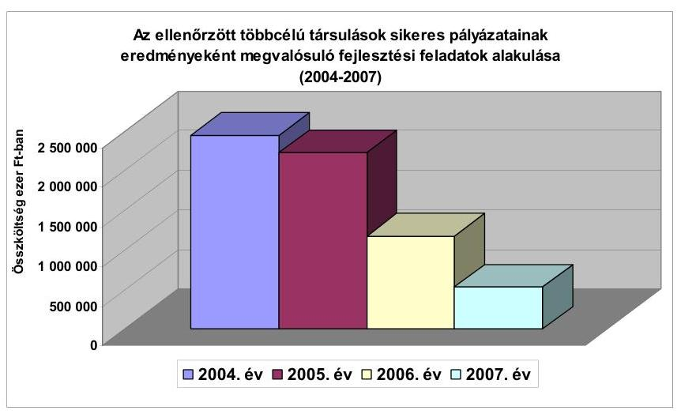

A területfejlesztés jelenlegi kistérségi szintje a jellemzően éves, határozott idejű és távmunkában történő foglalkoztatás következtében személyi, szakmai és szervezeti stabilitást nélkülöző, sokszereplős terület. Ez utóbbi csökkenti a többcélú társulásoktól elvárt, általuk ellátott területfejlesztési feladatok eredményességét, elmarad attól a kistérségben korábban tapasztalt térségi szervezőerőtől, amelyre a többcélú társulások megalakításakor a jogalkotó elsősorban az uniós források fogadására való alkalmasság, a stabil szervezeti keretek kialakítása tekintetében - alapozott.

A többcélú társulások munkaszervezetei a vizsgált többcélú társulásokban eltérő módon biztosították a kistérségi területfejlesztési tanácsok Tft-ben előírt működését. Legjellemzőbbnek az volt tekinthető, hogy a többcélú társulások társulási tanácsai a kistérségi területfejlesztési tanács hatáskörébe tartozó ügyekben egy tanácsülés keretén belül, de külön napirendi pontként tárgyaltak és döntöttek, biztosították a Tftv. 10/D. § (1) bekezdésében foglalt feladat- és hatásköri szabályok, döntési jogosítványok és képviseleti előírások betartását. A testületi döntések dokumentálási rendjének kialakításakor a többcélú társulások 20,2%-a nem volt figyelemmel arra, hogy a Tftv-ben előírt döntési hatáskörök érvényesítését átlátható módon biztosítsák.

A tapolcai többcélú társulásban a társulási tanács valamint a kistérségi fejlesztési tanács tevékenysége nem különült el, a határozatok nyilvántartásából nem, csupán az előterjesztések és a döntéshozatali mechanizmus áttekintésével volt meg-

---

állapítható, hogy az adott döntést a tanács mely minőségében (társulás tanácsa, vagy kistérségi területfejlesztési tanács) hozta meg. Hasonló működési hiányosságokat tapasztalt az ellenőrzés a mosonmagyaróvári, a bátonyterenyei, a bonyhádi, a tiszavasvári, a komlói többcélú társulásokban is.

A komlói többcélú társulásban ezen túlmenően a területfejlesztési tanács ülései során a helyettesítés rendjét sem rögzítették, (Tftv. 10/D. §. (3)-(5) bekezdés) és nem voltak megfelelően rögzítve a Tkt. tv. 6. §. (1)-(2) bekezdéseiben és a Tftv. 10/C. § (3) bekezdésében előírt szavazati arányok sem.

A jászsági többcélú társulásban ugyanakkor megfelelően biztosították az eltérő hatásköri és döntéshozatali rendnek megfelelő testületi működés dokumentálását.

A kistérségek területfejlesztési tevékenysége a vizsgált időszakban döntően a kistérségi programalkotás megalapozására irányult, valamennyi kistérségben megalkották a kistérségi gazdasági és területfejlesztési stratégiákat és programokat, folyamatban volt a kistérségi akciótervek kidolgozása is. A programok mindegyikében jelentős hangsúlyt fektettek a SWOT analízis ${ }^{52}$ alapján történő helyzetelemzésre, a gyengeségek és veszélyek figyelembevételére, az erősségek (adottságok) és lehetőségek által körülhatárolt célkitűzések meghatározására. A programokhoz kapcsolódóan azok megvalósításához részletes forrástérkép nem készült.

A 2007-2013. évek közötti időszakban megvalósítandó programok célkitűzései körébe sorolták a lakosság életkörülményeinek és életminőségének javítását, a települések népességmegtartó képességének fokozását, a kistérség adottságaihoz illeszkedő környezettudatos és versenyképes gazdasági tér, a hagyományokon, kulturális és természeti értékeken alapuló gazdasági és társadalmi környezet kialakítását.

A vizsgált körben a kistérségek mindegyike élt az illetékességi területéről a központi és regionális pályázatokra benyújtott kérelmek véleményezési jogával, annak az érdemi bírálat során történt érvényesítéséről azonban információkkal nem rendelkeztek.

Nem rendelkeztek megalapozott információval pályázatok véleményezésének eredményeiről a püspökladányi, a kunszentmártoni, a komáromi és a ráckevei többcélú társulásokban.

Nem egységes a többcélú társulások vidékfejlesztési programokba való bekapcsolódását lehetővé tevő LEADER ${ }^{53}$ programokhoz való viszonya sem.

[^0]
[^0]:    ${ }^{52}$ Elemzési módszer, strengths (erősségek), weaknesses (gyengeségek), opportunities (lehetőségek), threats (veszélyek) angol szavak kezdőbetűiből
    ${ }^{53}$ Az Európai Unió közösségi kezdeményezése, vidékfejlesztési programja, a rövidítés a francia elnevezés (Liasion Entre Actions pour le Development deL'Economie Rurale), kezdőbetűiből származik, szó szerinti magyar fordításban: akciók közötti kapcsolat a vidék gazdasági fejlesztése érdekében. A közösségi kezdeményezést még 1991-ben hívták létre azzal a céllal, hogy a fejlesztésben potenciálisan szerepet vállaló helyi csoportok együttműködésének erősítésével az integrált, alulról jövő fejlesztési kezdeményezé-

---

Az Európai Unióban a kilencvenes évektől kezdve - figyelembe véve a térségek környezeti, gazdasági, szociális és kulturális adottságait - új fejlesztési módszereket dolgoztak ki és a helyi közösségeket, civil szerveződéseket is bevonták a megoldások keresésébe. A LEADER keretében, az $\mathrm{NFT}^{54}$ alapján a 2004-2006. években már érkeztek különböző nagyságrendben pénzügyi források az egyes kistérségekben szerveződött helyi akciócsoportokhoz. Az ÚMVP ${ }^{55}$ keretében a 2007-2013 közötti költségvetési időszakban 1300 milliárd Ft-nak megfelelő támogatás érkezhet az agrárium versenyképességének növelésére, a vidék táji örökségének megőrzésére, vidékfejlesztési célok helyi programjainak megvalósítására.

A helyi vidékfejlesztési irodáknál 2007-ben 140 helyi fejlesztési célt megvalósító akciócsoportot regisztráltak, amelyek 2534 településen több mint 12 ezer (önkormányzati, civil és vállalkozói) tagot és mintegy 4,7 millió lakost érintenek. E fejlesztési pályázatokból választják ki azt a 70 közösséget, amely az ÚMVP második LEADER programjában részt vehet. A LEADER akciócsoportok nagyobb források felett, nagyobb döntési autonómia mellett, míg a programon kívül maradó akciócsoportok Helyi Vidékfejlesztési Közösségként - kisebb összegű támogatások és szűkebb döntési kompetenciák mellett - vehetnek részt az ÚMVT megvalósításában.

A LEADER+ program végrehajtásában részt vállaló 70 akciócsoport közül - a többcélú társulások területfejlesztési feladatain keresztül - 15 az ellenőrzött többcélú társulásokban működött.

A LEADER akciócsoportot a tapolcai többcélú társulás egyes települései a keszthelyi kistérség településeivel közösen hozták létre. Az akciócsoport célja, hogy a LEADER program keretében európai uniós támogatással, továbbá a térség belső erőforrásainak minél teljesebb kihasználásával, helyi értékek és hagyományok őrzésével, a humán adottságok fejlesztésével, a természeti környezet értékeinek, azok védelmének előtérbe helyezésével jelentős fejlesztéseket valósítanak meg a térségben. A LEADER akciócsoport működtetésére a többcélú társulás már a 2005. évben is pályázott, azonban pályázata elutasításra került, mivel a kialakított térség nem képezett egységes egészet. A 2007. évben az FVM-hez benyújtott és nyertes pályázat alapján 2013-ig az akciócsoport 1,3 milliárd Ft támogatást használhat fel az Európai Mezőgazdasági Vidékfejlesztési Alapból nyújtandó vidékfejlesztési támogatásból. A pályázat alapján a többcélú társulás 2007. május 15. - 2008. június között a HVI cím birtokosa.

Baranya megyében a komlói és a sásdi kistérségek együttesen készítették elő és koordinálták a LEADER pályázat benyújtását, ennek keretében megalakították a Mecsek-Völgység-Hegyhát Helyi Közösséget. Hasonlóan részt vesznek különböző LEADER akciócsoportokban a bajai, a jánoshalmi, a tokaji, az abai, a mosonmagyaróvári, a püspökladányi, a váci, a tabi, a tamási, a vasvári többcélú társulások is.
seket támogassa. Eddig három különböző prioritásokat tartalmazó LEADER I (1991-1994), LEADER II (1995-1999), LEADER+ (2000-2006) szakasza volt.
${ }^{54}$ Nemzeti Fejlesztési Terv. I.
${ }^{55}$ Új Magyarország Vidékfejlesztési Program

---

A jászsági többcélú társulás eredménytelenül pályázott a HVI címre. A kistérségben működő a „Jász-sarokpont" Összefogás a Térség jövőjéért elnevezésű akciócsoport tevékenységéről a többcélú társulás nem rendelkezett érdemi információval. A kistérségben ugyanakkor kiemelt feladatnak tekintik az INTERREG III. B. CADSES Heritour program végrehajtásának koordinálását - amely azon túl, hogy az önként vállalt turizmusfejlesztési feladat nevesített programja, térség és területfejlesztési szempontból is kiemelt fontosságú - programjai kulturális tematikus utak fejlesztésére, a kulturális örökség védelmére irányulnak. Kezdeményezések történtek a kistérségben annak érdekében is, hogy a kulturális és vallási örökség védelmét szolgáló megkezdett programok EGT és a Norvég finanszírozási mechanizmus ${ }^{56}$ keretében folytatódhassanak.

Az európai uniós támogatások fogadásában a bicskei, a dabasi, a marcali, a jánoshalmi, az abai többcélú társulások bizonyultak élenjárónak.

A Kormány a terület- és fejlesztéspolitika egyes szakpolitikai céljainak kistérségi szintű megvalósításának elősegítésére a 2007. év végén létrehozta a Kistérségi Tanácsadói Hálózatot ${ }^{57}$, amely az ÜMFT Tanácsadói Hálózat és az Önkormányzati és Térségi Koordinátori Hálózat feladatait veszi át. A hálózat feladata az európai uniós fejlesztési források és a hazai területi alapú támogatások felhasználásának elősegítése, a kistérségi együttműködési tevékenységek fejlesztése, a hátrányos helyzetű kistérségek felzárkóztatásának gyorsítása. A többcélú társulásoknak azonban továbbra sincs konkrét szerepe és feladata a területfejlesztési koordinációban.

A hálózat felügyeletét a területfejlesztésért és a fejlesztéspolitikáért felelős miniszter a NFÜ ${ }^{58}$ elnöke útján látja el. A hálózat tényleges felállítására 2008. I. negyedév végéig került sor. A kistérségi hálózat munkatársainak foglalkoztatásáról az NFÜ elnökének egyetértésével a Regionális Fejlesztési Ügynökség vezetője dönt. A kistérségi fejlesztési tanács, illetve a társulás az illetékességi területén működő kistérségi koordinátor kiválasztásával kapcsolatban véleményezési jogkört gyakorol ${ }^{59}$, feladatai ellátásában azonban nem vesz részt. A hálózat munkatársainak foglalkoztatása teljes munkaidőben, munkaszerződés alapján történik, annak jellegét (határozott, határozatlan időtartam) nem határozták meg.

[^0]
[^0]:    ${ }^{56}$ A 2004-2009. évekre vonatkozóan egyes európai uniós tagállamok között létrejött finanszírozási együttműködési megállapodás.
    ${ }^{57}$ 344/2007. (XII. 19.) Korm. rendelet a Kistérségi Koordinációs Hálózatról
    ${ }^{58}$ Nemzeti Fejlesztési Ügynökség
    ${ }^{59}$ 344/2007. (XII. 19.) Korm. rendelet 6. § (2) bekezdés

---

#
 2.5. Egyéb közszolgáltatások 

Az ösztönző támogatások hatására, a vizsgálattal érintett többcélú társulások megalakulásukkor, illetve a társulási megállapodásaikban a Tkt. tv. 2. § (1) bekezdésében felsorolt feladatok ${ }^{60}$ széles körét vállalták fel. Az ellenőrzés által nem kiemelten kezelt közszolgáltatások közül a legnagyobb arányban, 90,3%-ban az egészségügyi feladatok, ezen belül is a központi ügyelet megszervezésében vettek részt.

A vizsgált körben a ráckevei és a dabasi, valamint a püspökladányi többcélú társulások kivételével a többcélú társulások a hétvégi és hétközi központi ügyelet közös szervezését, fenntartását, míg a bajai és a mosonmagyaróvári többcélú társulások a fogorvosi ügyelet szervezését is felvállalták.

A 2005-2007. években a feladatot vállaló többcélú társulásokon belül 24, illetve 28 önkormányzat nem vett részt a központi ügyelet közös ellátásában, ugyanakkor 2005. évben négy, 2006. évben kilenc, illetve 2007. évben 16 önkormányzat a kistérségen kívülről csatlakozott a feladat ellátásához három, öt, illetve hat többcélú társuláshoz.

A közös feladat ellátás vállalását segítette, hogy az önkormányzatok a többcélú társulások megalakulása előtt is zömében társulási formában biztosították lakosaik részére a hétközi és hétvégi orvosi ügyeletet. Kedvező hatással volt a szervező tevékenységre a 2004. évi és a 2005. évi ösztönző támogatásból az egészségügy fejlesztésére fordítható forrás.

A 2004. évi és a 2005. évi ösztönző támogatásból országos szinten 128 többcélú társulás 1924852 ezer Ft-ot, az összes ösztönző támogatás 15,5%-át fordította az egészségügyi ellátás, ezen belül a központi ügyelet fejlesztésére, gépjármű, gép-műszer, számítástechnikai és egyéb eszközök beszerzésére, épület vásárlására, felújítására. A vizsgálatba vont többcélú társulások közül a 2004. évi ösztönző támogatásból 16 többcélú társulás igényelt és jutott 320279 ezer Ft forráshoz. A 2005. évi ösztönző támogatásból kilenc többcélú társulás 116354 ezer Ft vissza nem térítendő támogatásban részesült.

Az ösztönző támogatásból a sárospataki, a marcali, a tapolcai, valamint a jászsági többcélú társulások ügyelet elhelyezésére szolgáló épület vásárlására, kialakítására, felújítására 132,8 millió Ft-ot fordítottak. Az ösztönző támogatást, ezen túlmenően a többcélú társulások diszpécserszolgálat kialakítására, az épületek akadálymentesítésére, számítógépek, gépjárművek, a szakmai munkát segítő gépek, műszerek beszerzésére használták fel.

[^0]
[^0]:    ${ }^{60}$ A társulások által vállalt feladatok: oktatás és nevelés; szociális ellátás; egészségügyi ellátás; család-, gyermek- és ifjúságvédelem; közművelődési, közgyűjteményi tevékenység; helyi közlekedés; helyi közútfenntartás; ingatlan- és vagyongazdálkodás; ivóvízellátás, vízgazdálkodás, vízkárelhárítás, valamint bel- és csapadékvíz-elvezetés; kommunális szolgáltatások és energiaellátás; környezet- és természetvédelem, valamint hulladékkezelés; szennyvíztisztítás és -elvezetés; területrendezés; esélyegyenlőségi program megvalósítása; foglalkoztatás; gazdaság- és turizmusfejlesztés, valamint idegenforgalom; állat- és növényegészségügy; belső ellenőrzés; területfejlesztés.

---

Az ösztönző támogatásból juttatott forrásokon kívül négy többcélú társulás (komlói, komáromi, sárospataki, sárréti) nyert mintegy 324,4 millió Ft nagyságrendben támogatást, különböző pályázatokon az egészségügy feladataik ellátásához.

A vizsgált többcélú társulások az ellenőrzött időszakban az egészségügyi alapellátási feladatokban döntően szervező tevékenységgel vettek részt. Tevékenységük a 2004. és a 2005. évi ösztönző támogatások lehívására, eseti pályázatok benyújtására korlátozódott, míg az elnyert forrásokat az ügyeletet ellátó szolgáltatók infrastrukturális fejlesztésére, eszköz-ellátásának javítására fordították.

A Tiszavasvári Szociális és Egészségügyi Szolgáltató Központot a tiszavasvári többcélú társulás 2007. június 1-től saját fenntartásában működteti, amelyet városi fenntartásból vett át, működéséről a helyszíni vizsgálat idején még nem álltak rendelkezésre tapasztalatok.

Orvosi ügyelet létrehozásáról - a kórháztól bérelt helyiségben, gazdasági társaság közreműködésével - a bajai többcélú társulás döntött.

A feladat ellátásához a többcélú társulás ideiglenes működési engedéllyel rendelkezett, a MEP-pel a finanszírozási szerződést is megkötötte, melynek alapján magasabb ${ }^{61}$ összegű finanszírozásra vált jogosulttá. A MEP azonban ellenőrzése során megállapította, hogy a többcélú társulás a megemelt ügyeleti díjat csak akkor kérheti, ha az ügyeleti szolgálatot saját maga működteti, nem pedig akkor, ha átadja szerződéssel a gazdasági társaságnak működtetésre. Ez alapján a MEP a 2007. április 1-jétől - június 1-ig leutalt többlet-finanszírozást visszavonta.

A központi támogatások hatására a mozgókönyvtári feladatok ellátására vállalkozott többcélú társulások száma a három év alatt országos szinten 3,7 szeresére, a vizsgált többcélú társulások esetében 2,7 szeresére növekedett. A kifizetett támogatási összeg országosan 7,8-szorosára (211 millió Ft-ról 1650 millió Ft-ra) emelkedett. A vizsgálatba vont 33 többcélú társulás esetében 60,7 millió Ft-ról 381,2 millió Ft-ra nőtt és a 2007. évben többcélú társulások összes normatív kötött támogatásának 25,4%-át jelentette.

A vizsgálatba vont többcélú társulások közül a 2005. évben hat, a 2006. évben 12, a 2007. évben 16 és a 2008. évben várhatóan 17 többcélú társulás vesz részt a mozgókönyvtári feladatok ellátásában. A feladatokhoz a 2004. és a 2005. évi ösztönző támogatásból hét többcélú társulás 62023 ezer Ft támogatásban részesült, amely az összes könyvtári ösztönző támogatás 26,3%-át jelentette.

A 2007. évben a többcélú társuláshoz tartozó önkormányzatok 41,7%-a társult a közművelődési, közgyűjteményi tevékenységre, melyből 68,6%-a látta el a mozgókönyvtári feladatokat.

[^0]
[^0]:    ${ }^{61}$ Az egészségügyi szolgáltatások Egészségbiztosítási Alapból történő finanszírozásának részletes szabályairól szóló 43/1999. (III. 3.) Korm. rendelet 19. § (4) bekezdése szerinti feltétel teljesülése esetén a szolgáltató az ügyeleti díj 30%-kal, illetve 20%-kal megemelt összegre jogosult.

---

Közös feladatellátás esetén a többcélú társulások az 5/2005. (I. 19.) Korm. rendelet 10. § (2) bekezdése alapján a nyilvános könyvtárral nem rendelkező települési önkormányzataik után támogatást ${ }^{62}$ igényelhettek, amennyiben a többcélú társuláshoz tartozó, nyilvános könyvtárral nem rendelkező települési önkormányzatok közül legalább négy önkormányzat a többcélú társulás keretében vállalta, hogy megrendeli a könyvtári szolgáltatásokat a nyilvános könyvtártól (könyvtáraktól) vagy a megyei könyvtártól. A 2006. évtől kezdődően a feladat ellátás tervezhetővé, kiszámíthatóbbá vált, azáltal, hogy a többcélú társulások támogatása - ezen belül a mozgókönyvtári feladatok támogatása is - beépült a költségvetési törvényekbe ${ }^{63}$.

A mozgókönyvtárak utáni támogatást a többcélú társulások a feladat ellátásához kapcsolódó működési kiadásokra, valamint a munkaszervezet működési kiadásaira fordíthatták.

A 2006. évi és a 2007. évi költségvetési törvényekben biztosított átcsoportosítási lehetőség következtében a többcélú társulások - bár a felhasználás, felosztás elveit nem szabályozták - eltérő módon használták fel a mozgókönyvtári támogatás címen lehívott előirányzataikat.

A szikszói többcélú társulásnál három önkormányzat könyvtára biztosította a nyilvános könyvtárral nem rendelkező 20 önkormányzat részére a szolgáltatást. A 2006. évi központi támogatás 89,6%-át, a 2007. évi támogatás 94,7%-át nyilvános könyvtárral rendelkező önkormányzatok kapták a települések száma és lakosságszáma alapján, a támogatás 10,4%-a, illetve 7,7%-a a munkaszervezetnél maradt szervező tevékenységért.

A marcali többcélú társulásnál a könyvtári ellátásra irányuló szerződésben rögzítették, hogy támogatás összegéből a mozgókönyvtári szolgáltatást biztosító önkormányzatokat 300-300 ezer Ft támogatás illeti meg, a fennmaradó összeget az ellátást biztosító nyilvános könyvtár részére utalják át.

A tapolcai többcélú társulás a települések közötti kohézió erősítésére - nem csak a nyilvános könyvtárral nem rendelkező településeket érintően - az önkormányzatok, egyesületek részére a 2006. évben 13 alkalommal 8850 ezer Ft, a 2007. évben 22 alkalommal 3450 ezer Ft vissza nem térítendő támogatást nyújtott különféle rendezvények költségeihez való hozzájárulás címén, illetve beruházások támogatására. A kohézió erősítésére átadott pénzeszköz a 2006. évben a mozgókönyvtári támogatás 55,4%-át, a 2007. évben 12,1%-át jelentette.

A vasvári többcélú társulás a mozgókönyvtári támogatás 2006. évi összegének 35%-át, a 2007. évi összegének 61,5%-át közoktatási feladatokra fordította.

A többcélú társulások fontos feladatuknak tekintették a foglalkoztatási válsághelyzet enyhítése érdekében való közreműködést. A vizsgálatba vont többcélú társulások 72,7%-a, azaz 23 többcélú társulás a 2005-2007. években sikeresen pályázott kistérségi szintű közmunkaprogramok megvaló-

[^0]
[^0]:    ${ }^{62}$ 17/2005. (IV. 5) BM-PM rendelet 1. számú mellékletében foglaltak alapján a támogatás fajlagos összege 1096 ezer Ft-ban került meghatározásra.
    ${ }^{63}$ A 2006. évi költségvetési törvény 8. számú melléklet V. fejezet 2.7. pont, és a 2007. évi költségvetési törvény 8. számú melléklet IV. fejezet 2.7. pont.

---

sítására, melynek során 905483 ezer Ft-ot fordíthattak hátrányos helyzetű munkanélküliek foglalkoztatására.

A zalaegerszegi többcélú társulás a 2005-2007. években összesen 121560 ezer Ft támogatásban részesült, melyből 5492 ezer Ft-ot a „Segély helyett munka”, 39999 ezer Ft-ot „Esélyteremtés közmunkával”, 1232 ezer Ft-ot távmunka, 40348 ezer Ft-ot parlagfű mentesítésre kapott.

A jánoshalmi többcélú társulás a 2006. évben település tisztasági, parkrendezési célokra 14100 ezer Ft, a 2007. évben három hónapos útkarbantartási, csapadék-víz-elvezetési közmunkára, vízelvezető árkok, parkgondozási, szemétlerakók karbantartásához 78 fő foglalkoztatásához 30,7 millió Ft támogatásban részesült.

A közmunkaprogramok mellett tíz többcélú társulás összesen 161350 ezer Ft-ot fordított foglalkoztatást elősegítő programokra, melyhez különböző pályázatokon 123568 ezer Ft támogatást nyertek.

A siklósi többcélú társulás az újra elhelyezkedést segítő HEFOP pályázaton a kistérségben az inaktív emberek mozgósítására vonatkozó modell program kidolgozására 9764 ezer Ft támogatást nyert az Európai Szociális Alapból.

A szikszói többcélú társulás a Miskolci Egyetem Kihelyezett Társadalomkutató Központjával és civil szervezetekkel együttműködve az országos átlagot jelentősen meghaladó munkanélküliséggel sújtott kis települések foglalkoztatási gondjait enyhítő program kidolgozásához 35000 ezer Ft támogatásban részesült az Országos Foglalkoztatási Közalapítványtól.

A diplomás fiatalok foglalkoztatását célzó pályázaton a komlói többcélú társulás 4321 ezer Ft, a tabi többcélú társulás 8464 ezer Ft támogatásban részesült. A tamási többcélú társulás a 2004. évi ösztönző támogatásból 4200 ezer Ft-ot fordított átképzési program megvalósítására.

# A gazdasági- és turizmus fejlesztése, valamint az idegenforgalom fellendítése érdekében 20 többcélú társulás összesen 207632 ezer Ft támogatásban részesült különféle programok, kerékpárutak tervezésére, kiadványok, népszerűsítő filmek készítésére. 

A 2004-2005. évi ösztönző támogatáson túl a többcélú társulások e feladataik ellátásához egyéb pályázatok útján is jutottak többletforrásokhoz.

A bonyhádi többcélú társulás a Duna-Mecsek Területfejlesztési Alapítványtól nyert 16800 ezer Ft támogatással 21000 ezer Ft-ot, a dabasi többcélú társulás 18398 ezer Ft központi forrás felhasználásával 36796 ezer Ft-ot fordított kerékpárutak tervezésére.

A szikszói társulás 2007. évben 18000 ezer Ft támogatásban részesült a „Csereháti ízek útján” című kiadvány elkészítéséhez. A természeti és épített örökség leltár elkészítésére a tabi, a zalaegerszegi és a tamási társulás részesült támogatásban.

A többcélú társulások közül szélessávú internet hálózat kiépítését négy többcélú társulás valósította meg, 751162 ezer Ft GVOP, 236887 ezer Ft EU önerő alap és 147750 ezer Ft egyéb támogatással.

---

Környezet- és természetvédelmi, valamint hulladékkezelési feladatok megvalósítása keretében a többcélú társulások a hulladékgazdálkodási terveket készítették, beruházásokat valósítottak meg. Figyelemmel kísérték a pályázati lehetőségeket, melynek eredményeként nyolc többcélú társulás 296266 ezer Ft támogatással 309785 ezer Ft-ot használt fel e feladatok ellátására.

A siklósi, a dabasi, valamint a bicskei többcélú társulások az állati hulladék begyűjtő és átrakó állomás megvalósítására összesen 267,7 millió Ft támogatásban részesültek, melyből 33945 ezer Ft hazai és 186,3 millió Ft volt európai uniós forrás.

A vizsgált időszakban három többcélú társulás 54814 ezer Ft fordított szennyvíz elvezetésre, melyhez 52336 ezer Ft támogatásban részesült. A 2004. évi ösztönző támogatásokból három - makói, bicskei, váci - többcélú társulás részesült
 útkezelői feladatai megvalósításához 36 003 ezer Ft támogatásban.

A tabi és a vasvári többcélú társulások szennyvíztisztító megvalósítási tanulmány készítésére 12,9 millió Ft, a sárospataki többcélú társulás szennyvíz nyomóvezeték meghosszabbítására 39,5 millió Ft támogatásban részesült.

A 2004-2006. években a többcélú társulások 18,2%-a 20 306 ezer Ft-ot fordított bűnmegelőzési programokra, melyhez a BM-től 19 540 ezer Ft támogatásban részesült.

A bicskei többcélú társulás a kistérség körzeti megbízotti hálózatát hordozható számítógépekkel, nyomtatókkal, a rendőrségi hálózathoz kapcsolódó speciális kártyával látta el.

Budapest, 2008. július " 23 "

|  |  |  |
| :-- | :-- | :-- |
| Melléklet: | 7 db | 7 lap |
| Függelék: | 2 db | 5 lap |

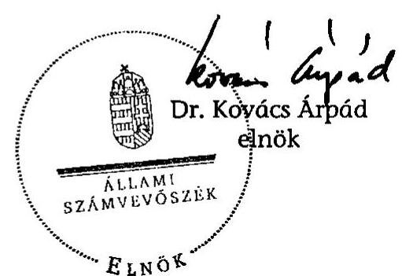

---

Az ellenőrzött többcélú társulások közös feladatellátásában résztvevő önkormányzatok száma vállalt feladatonként

|  Megnevezés |  | 2004. év | 2005. év | 2006. év | 2007. év | 2007/2004.  |
| --- | --- | --- | --- | --- | --- | --- |
|  Kistérséghez tartozó települési önkormányzatok száma | db | 736 | 736 | 738 | 738 | 100,3\%  |
|  Kistérséghez tartozó települések lakónépessége | fő | 1 721 849 | 1 720 494 | 1 720 594 | 1 717 898 | 99,8\%  |
|  Közös feladatellátásban részt vevő kistérségi önkormányzatok száma | db | 605 | 736 | 738 | 738 | 122,0\%  |
|  A többcélú kistérségi társulások hivatali feladatait ellátó személyek száma | fő | 70 | 158 | 205 | 217 | 310,0\%  |
|  A feladatellátáshoz kistérségen kívülről csatlakozó önkormányzatok száma | db | 29 | 35 | 42 | 78 | 269,0\%  |
|  Egyes közszolgáltatási feladatok ellátására társult kistérségi önkormányzatok száma feladatonként: |  |  |  |  |  |   |
|  Oktatás- nevelési feladatok | db | 467 | 692 | 706 | 768 | 164,5\%  |
|  Szociális ellátás | db | 367 | 601 | 663 | 682 | 185,8\%  |
|  Egészségügyi ellátás | db | 446 | 658 | 671 | 667 | 149,6\%  |
|  Család-, gyermek- és ifjúságvédelem | db | 271 | 551 | 567 | 565 | 208,5\%  |
|  Közművelődési, közgyűjteményi tevékenység | db | 111 | 224 | 271 | 446 | 401,8\%  |
|  Helyi közlekedés, helyi közútfenntartás | db | 86 | 112 | 112 | 112 | 130,2\%  |
|  Környezet- és természetvédelem, valamint hulladékkezelés | db | 72 | 116 | 116 | 135 | 187,5\%  |
|  Szennyvíztisztításra és -elvezetés | db | 38 | 64 | 64 | 64 | 168,4\%  |
|  Esélyegyenlőségi program megvalósítása | db | 0 | 0 | 76 | 109 | 0,0\%  |
|  Foglalkoztatás | db | 13 | 39 | 124 | 164 | 1261,5\%  |
|  Gazdaság- és turizmusfejlesztés, valamint idegenforgalom | db | 30 | 74 | 159 | 254 | 846,7\%  |
|  Belső ellenőrzés | db | 274 | 589 | 590 | 684 | 249,6\%  |
|  Területfejlesztés | db | 605 | 736 | 738 | 738 | 122,0\%  |
|  Egyes közszolgáltatási feladatokhoz kistérségen kívülről csatlakozó önkormányzatok száma feladatonként: |  |  |  |  |  |   |
|  Oktatás- nevelési feladatok | db | 20 | 19 | 24 | 42 | 210,0\%  |
|  Belső ellenőrzés | db | 2 | 2 | 2 | 3 | 150,0\%  |
|  Szociális ellátás | db | 3 | 10 | 12 | 40 | 1333,3\%  |
|  Egészségügyi ellátás | db | 1 | 4 | 9 | 16 | 1600,0\%  |
|  Család-, gyermek- és ifjúságvédelem | db | 6 | 8 | 10 | 28 | 466,7\%  |

Az ellenőrzésre 33 többcélú társulásnál került sor.

---

# A többcélú kistérségi társulások támogatására fordított költségvetési források feladatonként

|  Feladat megnevezése |  | 2004. évi ösztönző támogatás | 2005. évi ösztönző támogatás | 2005. évi normatív működési támogatás | Normatív, kötött felhasználású támogatások |  |  |  |  | Összesen  |
| --- | --- | --- | --- | --- | --- | --- | --- | --- | --- | --- |
|   |  |  |  |  | 2006. év |  | 2007. év |  | 2008. év |   |
|   |  |  |  |  | Igénylés* | Tényadat** | Igénylés* | Tényadat** |  |   |
|  Ösztönző támogatás, normatív támogatás, normatív kötött felhasználású működési támogatás |  |  |  |  |  |  |  |  |  |   |
|  Ösztönző és normatív kötött működési támogatás | Eredeti előirányzat | 9 500 000 | 6 400 000 | 9 000 000 | 15 400 000 | 0 | 19 300 000 | 0 | 28 095 800 | 87 695 800  |
|   | Módosított előirányzat | 7 700 000 | 5 499 500 | 8 460 800 | 14 910 100 | 0 | 19 300 000 | 0 | 28 095 800 | 83 966 200  |
|  Általános támogatás |  | 0 | 0 | 2 542 913 | 3 698 106 | 3 698 106 | 3 911 406 | 3 941 406 | 4 068 115 | 14 250 540  |
|  Közoktatási feladatok |  | 2 183 295 | 1 695 594 | 3 032 127 | 6 078 431 | 6 246 590 | 8 603 508 | 9 994 453 | 13 158 031 | 36 310 090  |
|  Szociális intézményi feladatok |  | 289 782 | 94 500 | 342 630 | 412 400 | 367 600 | 468 330 | 576 543 | 1 132 169 | 2 803 224  |
|  Gyermekvédelmi feladatok |  |  | 39 958 | 80 048 | 39 825 | 39 294 | 46 950 | 53 350 | 47 950 | 260 600  |
|  Szociális alapszolgáltatási feladatok |  | 736 913 | 609 624 | 1 006 747 | 2 310 142 | 1 743 934 | 3 244 477 | 3 443 262 | 4 736 815 | 12 277 296  |
|  Gyermekjóléti feladatok |  |  | 348 714 | 619 658 | 1 069 801 | 864 752 | 1 350 477 | 1 415 715 | 1 645 003 | 4 893 842  |
|  Mozgókönyvtári feladatok |  | 143 800 | 92 175 | 210 967 | 714 871 | 725 925 | 1 562 600 | 1 650 220 | 1 943 500 | 4 766 587  |
|  Belső ellenőrzési feladatok |  | 178 486 | 158 578 | 625 311 | 1 242 630 | 1 223 865 | 1 414 809 | 1 422 585 | 1 336 545 | 4 945 370  |
|  Egészségügyi alapellátás, központi ügyelet |  | 1 025 925 | 898 927 | 0 | 0 | 0 | 0 | 0 | 0 | 1 924 852  |
|  Kistérségi ügyintézés korszerűsítése |  | 254 581 | 723 683 | 0 | 0 | 0 | 0 | 0 | 0 | 978 264  |
|  Területfejlesztési feladat |  | 1 806 921 | 77 747 | 0 | 0 | 0 | 0 | 0 | 0 | 1 884 668  |
|  Modellkísérletek támogatása |  | 300 000 | 252 420 | 0 | 0 | 0 | 0 | 0 | 0 | 552 420  |
|  Egyéb feladatok |  | 504 276 | 0 | 0 | 0 | 0 | 0 | 0 | 0 | 504 276  |
|  Összesen |  | 7 423 978 | 4 991 920 | 8 460 402 | 15 566 206 | 14 910 066 | 20 602 557 | 22 497 534 | 28 068 128 | 86 352 029  |
|  Központosított és egyéb előirányzatok |  |  |  |  |  |  |  |  |  |   |
|  Kistérségi területfejlesztési tanácsok működéséhez | Eredeti előirányzat | 0 | 0 | 1 234 000 | 840 000 | 0 | 840 000 | 0 | 840 000 | 3 754 000  |
|   | Módosított előirányzat | 0 | 0 | 1 234 000 | 840 000 | 0 | 840 000 | 0 | 840 000 | 3 754 000  |
|   | Teljesítés | 0 | 0 | 1 234 000 | 0 | 840 000 | 0 | 840 000 | 0 | 2 914 000  |
|  Sportpályák felújítása | Módosított előirányzat | 0 | 0 | 0 | 500 000 | 0 | 0 | 0 | 0 | 500 000  |
|   | Teljesítés | 0 | 0 | 0 | 0 | 492 046 | 0 | 0 | 0 | 492 046  |
|  Közösségi busz beszerzés | Módosított előirányzat | 0 | 0 | 942 800 | 400 000 | 0 | 0 | 0 | 0 | 1 342 800  |
|   | Teljesítés | 0 | 0 | 939 900 | 0 | 400 000 | 0 | 0 | 0 | 1 339 900  |
|  Központi támogatások összesen | Eredeti előirányzat | 9 500 000 | 6 400 000 | 10 234 000 | 16 240 000 | 0 | 20 140 000 | 0 | 28 935 800 | 91 449 800  |
|   | Módosított előirányzat | 7 700 000 | 5 499 500 | 10 637 600 | 16 650 100 | 0 | 20 140 000 | 0 | 28 935 800 | 89 563 000  |
|   | Teljesítés | 7 423 978 | 4 991 920 | 10 634 302 | 0 | 16 642 112 | 0 | 23 337 534 | 0 | 63 029 847  |

- kiegészítő felmérés utáni állapot ** októberi lemondás utáni állapot

---

Az ellenőrzött többcélú társulások költségvetési bevételeinek és kiadásainak alakulása adatok ezer forintban

|  Sorszám | Megnevezés | 2004. év | 2005. év | 2004/2005
\%-ban | 2006. év | 2006/2005 \%-ban | 2007. év | 2007/2006
\%-ban | Összesen  |
| --- | --- | --- | --- | --- | --- | --- | --- | --- | --- |
|  1. | Működési bevételek | 48 720 | 136 601 | 280,38 | 1 307 214 | 956,96 | 1 761 238 | 134,73 | 3 253 773  |
|  2. | Felhalmozási és tőkejellegű bevételek | 108 812 | 24 000 | 22,06 | 260 339 | 1084,75 | 937 045 | 359,93 | 1 330 196  |
|  3. | Támogatások és átvett pénzeszközök | 1 851 174 | 5 669 965 |

 306,29 | 4542641 | 80,12 | 5835196 | 128,45 | 17898976  |
|  4. | Támogatási kölcsönök igénybevétele és visszatérülése | 12986 | 12466 | 96,00 | 18079 | 145,03 | 6300 | 34,85 | 49831  |
|  5. | Pénzforgalom nélküli bevétel | 10215 | 228196 | 2233,93 | 1292574 | 122,23 | 855179 | 66,16 | 2386164  |
|  6. | Költségvetési bevételek összesen | 2031907 | 6071228 | 298,79 | 7420847 | 122,23 | 9394958 | 126,60 | 24918940  |
|  7. | Költségvetési működési kiadások összesen | 351024 | 3259412 | 928,54 | 5294687 | 162,44 | 7412529 | 140,00 | 16317652  |
|  8. | Költségvetési felhalmozási kiadások összesen | 148610 | 1370812 | 922,42 | 1643772 | 119,91 | 1468588 | 89,34 | 4631782  |
|  9. | Költségvetési kiadás összesen | 499634 | 4630224 | 926,72 | 6938459 | 149,85 | 8881117 | 128,00 | 20949434  |

---

# Az ellenőrzött többcélú társulások vagyonának alakulása

|  Sorszám | Megnevezés | 2005. év | 2006. év | 2007. év | 2006/2005 | 2007/2005 | 2007/2006  |
| --- | --- | --- | --- | --- | --- | --- | --- |
|   |  | tény |  | várható |  | %-ban |   |
|  1. | Immateriális javak | 357451 | 322114 | 421762 | 90,11 | 117,99 | 130,94  |
|  2. | Tárgyi eszközök | 938857 | 1792722 | 2307243 | 190,95 | 245,75 | 128,70  |
|  3. | Ebből: Ingatlanok és kapcsolódó vagyoni értékű jogok | 218993 | 453160 | 601007 | 206,93 | 274,44 | 132,63  |
|  4. | Járművek | 289500 | 555913 | 517066 | 192,03 | 178,61 | 93,01  |
|  5. | Beruházások | 167353 | 388606 | 625053 | 232,21 | 373,49 | 160,84  |
|  6. | Befektetett pénzügyi eszközök | 10410 | 5710 | 4900 | 54,85 | 47,07 | 85,81  |
|  7. | Üzemeltetésre, kezelésre, koncesszióba adott, vagyonkezelésbe vett eszközök | 177623 | 425680 | 681251 | 239,65 | 383,54 | 160,04  |
|  8. | Ebből: Üzemeltetésre, kezelésre átadott eszközök | 168291 | 380096 | 636579 | 225,86 | 378,26 | 167,48  |
|  9. | Befektetett eszközök összesen | 1484341 | 2455286 | 3410164 | 165,41 | 229,74 | 138,89  |
|  10. | Követelések | 22513 | 48100 | 58811 | 213,65 | 261,23 | 122,27  |
|  11. | Értékpapírok | 258504 | 38005 | 14995 | 14,70 | 5,80 | 39,46  |
|  12. | Pénzeszközök | 1586603 | 1125251 | 959744 | 70,92 | 60,49 | 85,29  |
|  13. | Egyéb aktív pénzügyi elszámolások | 50269 | 36581 | 114955 | 72,77 | 228,68 | 314,25  |
|  14. | Forgóeszközök összesen | 1725235 | 1145990 | 1038505 | 66,43 | 60,19 | 90,62  |
|  15. | Eszközök összesen: | 3402230 | 3794163 | 4563661 | 111,52 | 134,14 | 120,28  |
|  16. | Saját tőke | 1550106 | 2492103 | 3037511 | 160,77 | 195,96 | 121,89  |
|  17. | Tartalékok összesen | 1469434 | 805137 | 727306 | 54,79 | 49,50 | 90,33  |
|  18. | Ebből: Költségvetési tartalék | 1190723 | 615462 | 548235 | 51,69 | 46,04 | 89,08  |
|  19. | Ebből: Költségvetési pénzmaradvány | 620157 | 313615 | 195077 | 50,57 | 31,46 | 62,20  |
|  20. | Kötelezettségek összesen | 151249 | 172830 | 464035 | 114,27 | 306,80 | 268,49  |
|  21. | Ebből: Hosszú lejáratú kötelezettségek | 0 | 0 | 23000 | 0 |  |   |
|  22. | Rövid lejáratú kötelezettségek | 129336 | 140188 | 306445 | 108,39 | 236,94 | 218,60  |
|  23. | Egyéb passzív pénzügyi elszámolások | 231441 | 324093 | 334809 | 140,03 | 144,66 | 103,31  |
|  24. | Források összesen: | 3402230 | 3794163 | 4563661 | 111,52 | 134,14 | 120,28  |

---

Az ellenőrzött többcélú társulások által szervezett oktatási intézményekben és az önkormányzatok saját fenntartású oktatási intézményeiben ellátottak számának alakulása

|  Megnevezés |  |  | 2004/2005. nevelési év, tanév |  |  | 2006/2007. nevelési év, tanév |  |  | 2007/2008. nevelési év, tanév |  |  | 2007/2008. nevelési év, 2004/2005. nevelési év |  |   |
| --- | --- | --- | --- | --- | --- | --- | --- | --- | --- | --- | --- | --- | --- | --- |
|   |  |  |  |  |  |  |  |  |  |  |  |  |  | ebből  |
|   |  |  |  |  |  |  |  |  |  |  |  |  |  | ebből  |
|   |  |  |  | önkormányzat saját fenntartású intézményében | társulás által szervezett intézmény- |  | önkormányzat saját fenntartású intézményében | társulás által szervezett intézmény- |  | önkormányzat saját fenntartású intézményében | társulás által szervezett intézmény- |  | önkormányzat saját fenntartású intézményében | társulás által szervezett intézmény-  |
|  1 | 2 | 3 | 4 | 5 | 6 | 7 | 8 | 9 | 10 | 11 | 12 | 10./4. | 11./5. | 12./6.  |
|  ÖVODAI ELLÁTÁS |  |  |  |  |  |  |  |  |  |  |  |  |  |   |
|  1 | Óvoda feladatellátási hely | db | 785 | 621 | 159 | 799 | 519 | 272 | 777 | 422 | 337 | 98,98\% | 67,95\% | 211,95\%  |
|  2 | Óvodai férőhelyek száma | fh | 58274 | 49711 | 8443 | 58401 | 43474 | 14532 | 58893 | 37765 | 20121 | 101,06\% | 75,97\% | 238,32\%  |
|  3 | Óvodába beírt gyermekek száma | fő | 53998 | 46304 | 7601 | 54743 | 41372 | 12997 | 56087 | 37663 | 17517 | 103,87\% | 81,34\% | 230,46\%  |
|  4 | Ebből: | összevont csoportba jár | fő | 23822 | 18954 | 4775 | 26247 | 18551 | 7570 | 26005 | 15601 | 10141 | 109,16\% | 82,31\%  |
|  5 | Óvodai csoportok száma | csop | 2356 | 1990 | 355 | 2362 | 1751 | 589 | 2331 | 1479 | 808 | 98,94\% | 74,32\% | 227,61\%  |
|  6 | Ebből: | összevont csoportok száma | csop | 1125 | 882 | 232 | 1153 | 775 | 366 | 1166 | 677 | 470 | 103,64\% | 76,76\%  |
|  7 | Óvónők száma | fő | 4787 | 4085 | 680 | 4825 | 3674 | 1107 | 4659 | 3086 | 1486 | 97,33\% | 75,54\% | 218,53\%  |
|  8 | Egy óvodai csoportba beírt gyermekek száma | fő | 22,92 | 23,27 | 21,41 | 23,18 | 23,63 | 22,07 | 24,06 | 25,47 | 21,68 | 104,98\% | 109,44\% | 101,25\%  |
|  9 | Egy óvónőre jutó gyermekek száma | fő | 11,28 | 11,34 | 11,18 | 11,35 | 11,26 | 11,74 | 12,04 | 12,20 | 11,79 | 106,72\% | 107,67\% | 105,46\%  |
|  ÁLTALÁNOS ISKOLAI OKTATÁS |  |  |  |  |  |  |  |  |  |  |  |  |  |   |
|  1 | Általános iskola feladatellátási hely | db | 718 | 559 | 145 | 723 | 388 | 318 | 687 | 302 | 352 | 95,68\% | 54,03\% | 242,76\%  |
|  2 | Beírt gyermekek száma összesen | fő | 141443 | 114967 | 24266 | 133044 | 92048 | 38251 | 130260 | 79372 | 48485 | 92,09\% | 69,04\% | 191,56\%  |
|  3 | Ebből: | 1-4 évfolyamra beírt | fő | 68663 | 55984 | 11716 | 64339 | 44959 | 18136 | 63165 | 38698 | 22399 | 91,99\% | 69,12\%  |
|  4 |  | 5-8 évfolyamra beírt | fő | 73111 | 58587 | 13277 | 68805 | 47048 | 20266 | 67581 | 41005 | 24216 | 92,44\% | 69,99\%  |
|  5 | Összevont tanulócsoportba járó tanulók száma | fő | 5200 | 3788 | 1372 | 5042 | 2943 | 1982 | 4164 | 1735 | 2098 | 80,08\% | 45,80\% | 152,92\%  |
|  6 | Ebből: | 1-4 évfolyamra beírt | fő | 3213 | 2375 | 804 | 3217 | 1724 | 1418 | 2969 | 1053 | 1630 | 92,41\% | 46,02\%  |
|  7 |  | 5-8 évfolyamra beírt | fő | 2003 | 1428 | 569 | 1843 | 1294 | 507 | 1196 | 667 | 394 | 59,71\% | 46,71\%  |
|  8 | Tanulócsoportok száma összesen | csop | 7135 | 5723 | 1268 | 6653 | 4476 | 2028 | 6586 | 3748 | 2467 | 92,31\% | 65,49\% | 194,56\%  |
|  9 | Ebből:

 | 1-4 évfolyamon | csop | 3563 | 2856 | 640 | 3382 | 2273 | 1039 | 3182 | 1882 | 1173 | 89,31\% | 65,90\%  |
|  10 |  | 5-8 évfolyamon | csop | 3648 | 2940 | 631 | 3391 | 2280 | 1022 | 3226 | 1917 | 1168 | 88,43\% | 65,20\%  |
|  11 | Összevont tanulócsoportok száma összesen | csop | 419 | 291 | 122 | 401 | 228 | 162 | 321 | 137 | 139 | 76,61\% | 47,08\% | 113,93\%  |
|  12 | Ebből: | 1-4 évfolyamon | csop | 253 | 176 | 72 | 237 | 124 | 105 | 199 | 80 | 95 | 78,66\% | 45,45\%  |
|  13 |  | 5-8 évfolyamon | csop | 156 | 113 | 42 | 148 | 95 | 50 | 377 | 59 | 307 | 241,67\% | 52,21\%  |
|  14 | Szakosan ellátandó órák száma összesen | óra | 5992698 | 4989411 | 909729 | 5969072 | 4264159 | 1608520 | 5617751 | 3507796 | 1920963 | 93,74\% | 70,30\% | 211,16\%  |
|  15 | Ebből: | szakosan leadott órák száma | óra | 5577040 | 4681545 | 799305 | 5532681 | 3970924 | 1465159 | 5238785 | 3401756 | 1647613 | 93,93\% | 72,66\%  |
|   | Szakosan leadott órák aránya | \% | 93,06\% | 93,83\% | 87,86\% | 92,69\% | 93,12\% | 91,09\% | 93,25\% | 96,98\% | 85,77\% | 100,20\% | 103,35\% | 97,62\%  |
|  16 | Pedagógusok száma | fő | 13342 | 10617 | 2393 | 14728 | 10339 | 4039 | 12005 | 7232 | 4294 | 89,98\% | 68,12\% | 179,44\%  |
|  17 | Egy tanulócsoportba beírt gyermekek száma | fő | 19,82 | 20,09 | 19,14 | 20,00 | 20,56 | 18,86 | 19,78 | 21,18 | 18,84 | 99,77\% | 105,42\% | 98,46\%  |
|  18 | Egy pedagógusra jutó tanulók száma | fő | 10,60 | 10,83 | 10,14 | 9,03 | 8,90 | 9,47 | 10,85 | 10,98 | 10,83 | 102,35\% | 101,35\% | 106,76\%  |
| Összevont tanulócsoportokba járó gyerekek részaránya az összes beírt tanulóhoz viszonyítva |  |  |  |  |  |  |  |  |  |  |  |  |  |   |
|  1 | 1-4 évfolyamon | \% | 4,68\% | 4,24\% | 6,86\% | 5,00\% | 3,83\% | 7,82\% | 4,70\% | 2,82\% | 7,28\% | 100,45\% |  |   |
|  2 | 5-8 évfolyamon | \% | 2,74\% | 2,44\% | 4,29\% | 2,68\% | 2,75\% | 2,50\% | 1,77\% | 1,63\% | 1,63\% | 64,60\% |  |   |

---

# **Közoktatási szakszolgálati ellátásban részesülők száma az ellenőrzött többcélú társulásoknál, ellátás típusonként**

|  Sorszám | Pedagógiai szakszolgálati feladat megnevezése | Közös feladatellátásban résztvevő önkormányzatok száma (db) | Önkormányzatok saját feladatellátásában ellátottak száma (fő) | Társulás keretében ellátottak száma (fő) | Ellátottak száma összesen (fő) | Az ellátottak számának alakulása %-ban  |
| --- | --- | --- | --- | --- | --- | --- | --- |
|   |  |  |  | 1997. évi CXXXV. évi tv. alapján szervezett intézményben | Többcélú kistérségi társulás által fenntartott intézményben | Többcélú kistérségi társulás által kötött megállapodás alapján |   |
|   |  | 2004 | 2006 | 2007 | 2004 | 2006 | 2007  |
|  1 | 2 | 3 | 4 | 5 | 6 | 7 | 8  |
|  1 | Gyógypedagógiai | 34 | 119 | 144 | 38 | 33 | 31  |
|  | tanácsadás, |  |  |  |  |  |   |
|  | terápia fejlesztés |  |  |  |  |  |   |
|  2 | fejlesztő | 57 | 119 | 120 | 114 | 220 | 253  |
|  | felkészítés |  |  |  |  |  |   |
|  3 | Nevelési | 272 | 560 | 537 | 4029 | 508 | 682  |
|  | tanácsadás |  |  |  |  |  |   |
|  4 | Logopédiai | 306 | 608 | 602 | 2856 | 1754 | 1201  |
|  | ellátás |  |  |  |  |  |   |
|  5 | Továbbtanulási, | 136 | 185 | 361 | 0 | 336 | 440  |
|  | pályaválasztási |  |  |  |  |  |   |
|  | tanácsadás |  |  |  |  |  |   |
|  6 | Gyógytestnevelés | 236 | 520 | 578 | 2789 | 1203 | 809  |
|  |  |  |  |  |  |  |   |

---

A szociális intézményi, szociális alapszolgáltatási, gyermekvédelmi szakellátási, gyermekjóléti alapellátásban részesülők száma, ellátás típusonként az ellenőrzött többcélú társulásoknál

|  Megnevezés | Közös feladatellátásban résztvevő önkormányzatok száma (db) |  |  |  |  |  | Társulásban ellátottak száma (fő) |  |  |  |  |  |  |  |  |  |  |  |  |  |  |   |
| --- | --- | --- | --- | --- | --- | --- | --- | --- | --- | --- | --- | --- | --- | --- | --- | --- | --- | --- | --- | --- | --- |
|   |  |  |  |  |  |  | 1997. évi CXXXV. tv. alapján |  |  | Többcélú kistérségi társulás által fenntartott intézményben |  |  | Többcélú kistérségi társulás által kötött ellátási szerződés vagy megbízás alapján |  |  |  | Ellátottak száma összesen (fő) |  |  | Az ellátottak számának alakulása %-ban  |
|   | 2004 | 2006 | 2007 | 2004 | 2006 | 2007 | 2004 | 2006 | 2007 | 2004 | 2006 | 2007 | 2004 | 2006 | 2007 | 2004 | 2006 | 2007 | 2006/2004 | 2007/2004 | 2007/2006  |
|  Szociális alapszolgáltatási feladatok |  |  |  |  |  |  |  |  |  |  |  |  |  |  |  |  |  |  |  |  |   |
|  Családsegítés | 102 | 573 | 576 | 14400 | 5516 | 4177 | 8553 | 58390 | 76056 | 0 | 2082 | 8879 | 2337 | 20054 | 14828 | 25290 | 86042 | 103940 | 340,22 | 410,99 | 120,80  |
|  Házi segítségnyújtás | 34 | 320 | 395 | 1199 | 1160 | 620 | 0 | 759 | 1535 | 0 | 128 | 1079 | 57 | 1008 | 1033 | 1256 | 3055 | 4267 | 243,23 | 339,73 | 139,67  |
|  Közösségi ellátások | 27 | 293 | 373 | 0 | 0 | 0 | 0 | 0 | 170 | 0 | 56 | 849 | 0 | 422 | 660 | 0 | 478 | 1679 |  |  | 351,26  |
|  Támogató szolgálat | 34 | 367 | 445 | 27 | 0 | 17 | 0 | 1648 | 5564 | 0 | 306 | 958 | 20 | 1582 | 1294 | 47 | 3536 | 7833 | 7523,40 | 16665,96 | 221,52  |
|  Nappali ellátás | 34 | 282 | 366 | 1540 | 803 | 273 | 25 | 314 | 816 | 0 | 0 | 323 | 0 | 1098 | 1090 | 1565 | 2215 | 2502 | 141,53 | 159,87 | 112,96  |
|  Jelzőrendszeres házi segítségnyújtás | 110 | 297 | 373 | 153 | 127 | 86 | 150 | 726 | 727 | 0 | 0 | 592 | 81 | 3568 | 4051 | 384 | 4421 | 5456 | 1151,30 | 1420,83 | 123,41  |
|  Szociális intézményi feladatok |  |  |  |  |  |  |  |  |  |  |  |  |  |  |  |  |  |  |  |  |   |
|  Időskorúak ápolást, gondozást nyújtó otthona | 19 | 138 | 138 | 495 | 170 | 69 | 25 | 366 | 231 | 0 | 0 | 493 | 0 | 0 | 0 | 520 | 536 | 793 | 103,08 | 152,50 | 147,95  |
|  Időskorúak, fogyatékos személyek gondozóháza | 0 | 0 | 29 | 10 | 10 | 0 | 0 | 0 | 0 | 0 | 0 | 20 | 0 | 0 | 0 | 10 | 10 | 20 | 100,00 | 200,00 | 200,00  |
|  Pszichiátriai és szenvedélybeteg átmeneti otthona | 0 | 0 | 10 | 10 | 10 | 0 | 0 |

 0 | 0 | 0 | 0 | 10 | 0 | 0 | 0 | 10 | 10 | 10 | 100,00 | 100,00 | 100,00  |
|  Hajléktalanok átmeneti szállása | 19 | 23 | 23 | 0 | 0 | 0 | 29 | 24 | 0 | 0 | 10 | 36 | 0 | 0 | 0 | 29 | 34 | 36 | 117,24 | 124,14 | 105,88  |
|  Gyermekvédelmi szakellátási feladatok |  |  |  |  |  |  |  |  |  |  |  |  |  |  |  |  |  |  |  |  |   |
|  Családok átmeneti otthona | 0 | 27 | 37 | 12 | 16 | 0 | 0 | 0 | 0 | 0 | 36 | 53 | 0 | 0 | 0 | 12 | 52 | 53 | 433,33 | 441,67 | 101,92  |
|  Gyermekjóléti alapellátási feladatok |  |  |  |  |  |  |  |  |  |  |  |  |  |  |  |  |  |  |  |  |   |
|  Gyermekjóléti szolgáltatás | 199 | 636 | 649 | 25860 | 10035 | 2980 | 4334 | 19139 | 46895 | 0 | 1145 | 3534 | 2644 | 12274 | 9126 | 32838 | 42593 | 62535 | 129,71 | 190,43 | 146,82  |
|  Gyermekek napközbeni ellátása | 0 | 34 | 74 | 40 | 0 | 0 | 0 | 47 | 46 | 0 | 0 | 15 | 0 | 0 | 71 | 40 | 47 | 132 | 117,50 | 330,00 | 280,85  |
|  Gyermekek átmeneti gondozóháza | 0 | 38 | 38 | 7 | 0 | 0 | 0 | 0 | 0 | 0 | 0 | 0 | 0 | 39 | 41 | 7 | 39 | 41 | 557,14 | 585,71 | 105,13  |

---

8. számú melléklet a V-1019/2007. számú jelentéshez

ÖNKORMÁNYZATI MINISZTÉRIUM

Iktatószám: ÖTM/9390/1/2008.

Dr. Kovács Árpád részére,
elnök

Állami Számvevőszék

Budapest

Tisztelt Elnök Úr!

A települési önkormányzatok többcélú kistérségi társulásainak a közszolgáltatások és
területfejlesztési feladatok ellátásában betöltött szerepének ellenőrzéséről szóló számvevői jelentés
számos értékes megállapítást tartalmaz a többcélú kistérségi társulások feladatellátásával
kapcsolatban.

A jelentésre az alábbi általános észrevételeket teszem.

A kistérségi társulások kialakításánál szerepet játszó kormányzati szándékok nem tükröződnek
kellő súllyal a jelentésben.

A jelentés Bevezetésében található problémákat („közszolgáltatások intézményszerkezete egyrészt
merev, másrészt túldimenzionált, hatékonysága alacsony, az önkormányzati rendszer a feladatellátás
struktúrája tekintetében racionalizálásra érett”) érzékelve jutott a Kormány arra az
elhatározásra, hogy – a többcélú kistérségi társulás jogintézménye útján – erősíteni szükséges a
települési önkormányzatok közös feladatellátását, ugyanis az önkormányzati struktúra
megváltoztatásának politikai feltételei hiányoztak.

A települési önkormányzatok hatékonyabb feladatellátásának előmozdítása érdekében olyan
kistérségi társulási rendszer kialakítása volt a cél, amely valós vonzáskapcsolatokon alapul. Az
önkormányzatok többcélú kistérségi társulás útján történő feladatellátásának biztosítása érdekében a
működési feltételeket úgy kellett kialakítani, hogy az önkormányzatok érdekeltek legyenek a
társulásban való részvételben.

A többcélú kistérségi társulások feladatellátásának meghatározásánál a szakmai mutatók, a
legfontosabb feladatok kerültek rögzítésre. A jogintézmény kialakításánál tehát fontos szempont volt,
hogy ne minden feladat legyen kistérségi szinten ellátva, hanem szakmai feltételek érvényesüljenek,
s ne maradjon egyetlen kistérségben sem a közszolgáltatások vonatkozásában ellátatlan település.

---

Nem az volt a cél, hogy az egyes feladatokat a többcélú társulás által fenntartott intézmény biztosítsa, mert a fenntartó változása nem jelent önmagában racionalizálást. A lényeges az, hogy a kistérség területén levő intézménystruktúra (legyen az akár önálló fenntartású, akár intézményi társulás által fenntartott) racionalizálása történjen meg, ne maradjon egyetlen olyan intézmény sem, amelyik nem felel meg az előírt szakmai követelményeknek. Tehát a cél lett meghatározva és nem az eszköz.

Az elsődleges kormányzati szándék arra irányult, hogy azok a legfontosabb közszolgáltatások kerüljenek kistérségi szinten ellátásra, melyeket a szakmai feltételek, paraméterek alapján ezen a szinten lehet a legjobb színvonalon és a leggazdaságosabban megvalósítani. A kistérséget alkotó települések az adott ellátáshoz a helyben meglévő infrastruktúra, intézményhálózat aktivizálásával rugalmasan találták meg az optimális keretet, így széles skálájú megoldásokat találhatunk a saját intézményben, más kistérségben a mikrotársulás formájában biztosított szolgáltatásra, vagy megint más kistérségben a többcélú kistérségi társulás által fenntartott intézményben történő feladatellátásra. Az ösztönzőrendszer működtetése a közös feladatellátás irányába hat, az ellátásra kötelezettek keresni kezdték az együttműködés lehetőségét.

A kistérségi lehatárolás módosításánál elsődlegesen azért nem a települések számára és lakónépességére voltunk figyelemmel, mert a lehatárolás felülvizsgálata során nem az azonos, vagy hasonló település- és lakosságszám kialakítása volt a meghatározó szempont, hanem a kistérségeket alkotó települések közötti valós vonzáskapcsolatok.

Valóban, „a működtetés szempontjából nehezen kezelhető kistérségek is létrejöttek" - különös tekintettel a Kaposvári és Zalaegerszegi kistérségre -, azonban ezeknek a kistérségeknek a lehatárolások során nehezen lehetett - objektív okok miatt - olyan kistérségi központot találni, amely megfelelő vonzáskapcsolattal rendelkezik. A területi lehatárolás módosítására irányuló kevés kezdeményezés csak példa arra, hogy helyi szintről is kevés esetben érkezett igény a már létező, nagy lakosságszámú kistérségi együttműködések megbontására.

Szükségesnek tartjuk azonban hangsúlyozni, hogy a Tkt. tv.-be viszont beépítésre kerültek olyan elemek, amelyek a társulást alkotó települések számát veszik figyelembe, ilyen például az elnökség intézménye, mely a nagyméretű kistérségekben létrejött többcélú kistérségi társulások működését igyekszik megkönnyíteni.

# A fenti kormányzati szándék nem szerepel a jelentésben. 

Önmagában az a megállapítás, hogy ,, A Tkt. tv. hatályba lépéséig és a Tftv. módosításáig nem volt kellően tisztázott a többcélú társulásoknak a területfejlesztés intézményrendszeréhez, az államháztartás működéséhez, a korábban már működő önkormányzati társulásokhoz való viszonya, továbbá nem volt egyértelműen tisztázott a többcélú társulások önkormányzati alrendszerben elfoglalt helye és szerepe.", túlzott.

Már a kistérségi modellkísérletek elindításánál rendelkezésre állt a többcélú kistérségi társulásokra vonatkozó szakmai koncepció. A koncepciót széles körű szakmai és politikai egyeztetést követően véglegesítette a tárca, és ennek alapján kezdte meg a normaszöveg kidolgozását. Az elfogadott, de alkotmányossági normakontroll miatt ki nem hirdetett törvény rendelkezései, ezen belül a területfejlesztés intézményrendszeréhez való viszonya már ekkor megismerhető volt mindenki számára. Hangsúlyosan igaz ez a többcélú társulások rendszerbeli szerepére, hiszen a települési önkormányzatok már előkészítették a közös működést megalapozó megállapodások tervezetét, a költségvetésben biztosított volt az ösztönzőrendszer működtetéséhez szükséges forrás, így a törvény kihirdetésekor már a tényleges működtetésre a települések jelentős része készen állt.

---

Tekintettel arra, hogy eltérő adottságú, eltérő település- és lakosságszámú kistérségek jöttek létre, ezért általános ajánlásokat nem kívánt a tárca megfogalmazni a munkaszervezetek létszámát illetően, csak egyedi megoldásokat lehetett kialakítani. Éppen az eltérő adottságok határozzák meg, hogy a vállalt feladatok nagyságrendje milyen méretű és összetételű munkaszervezet fenntartását, működtetését indokolja.

Valóban, tényként lehet rögzíteni, hogy „Az önkormányzatok törekvései ... elsősorban a többlettámogatások megszerzésére irányultak... Csak néhány területen (pedagógiai szakszolgálat, szociális és gyermekjóléti alapellátás, belső ellenőrzés) eredményezték a szolgáltatás bővítését." A ténymegállapításhoz azonban szükségesnek tartom annak körülményeit is kihangsúlyozni.

Nagy eredmény, hogy kialakult a többcélú kistérségi társulások szervezeti kerete, mely a hosszabb távú együttműködés alapjait teremtette meg, s képes a közszolgáltatások jó szakmai színvonalát biztosítani. A többcélú kistérségi társulások rendszerének kialakítása és működtetése egy önmagát építő folyamat, melyben először a stabilitás megteremtése szükséges, majd azt követően kerülhet sor a szakmai feltételek finomítására. A rendszer kialakításának ezen elemei nem ugorhatóak át, azok a folyamatosság elvén alapulnak.

Valóban előfordulhat, hogy ,,azon kistérségekben, ahol a székhelytelepülés vagy városok lakosságszáma magas, megközelíti vagy meghaladja a kistérség összes lakónépességének 50\%-át, e települések távolléte vagy a javaslat ellenében történő szavazásuk esetén a kisebb települések érdekérvényesítésének lehetősége gyenge".

Szükségesnek tartom azonban hangsúlyozni, hogy olyan szabályozás kialakítására volt szükség, amely az önkormányzatok önállóságára alapoz, valamint egyensúlyoz a kis- és nagy lakosságszámú települések között. Ez a kormányzati szándék a jelentésből nem derül ki.

Azt a települést, amelynek lakosságszáma a kistérséget alkotó települések lakosságszámának 50\%-át meghaladja, a szabályozás kialakításánál nem lehetett figyelmen kívül hagyni. A rendszert úgy kellett kialakítani, hogy az eltérő adottságú települések egymás nélkül, a másik kárára ne tudjanak döntést hozni. Fontos szempont volt, hogy egy nagy lakosságszámmal rendelkező település ne dönthesse el egyedül a kérdést, illetve fordítva, sok apró település egy nagyobb lakosságszámmal rendelkező település ellen ne hozhasson érdekével ellentétes döntést. Éppen ezért a határozatképesség és a javaslat elfogadási szabályainak megalkotásakor a jogszabályba beépítésre került a településszám és a lakosságszám együttes figyelembevétele.

# A jelentésre tett részletes észrevételeim. 

A 12. oldalon a 2004-2005. évi ösztönző támogatással kapcsolatos megállapítást, mely szerint „a támogatások kiutalása az utolsó negyedévben történt", kérem helyesbíteni, tekintettel arra, hogy a 2005. évi ösztönző támogatások utalására már július-augusztus hónapokban sor került.

A 12. oldal 3. bekezdésének utolsó mondatával, mely a pénzügyi ösztönzőkkel támogatott közszolgáltatások körének (különösen az oktatás, a szociális ellátás, az egészségügy valamint a területfejlesztés) fokozatos szűkítésével kapcsolatban tesz megállapítást, nem értek egyet. A Tkt. tv. szabályozásából nem következik, hogy a központi költségvetésnek normatív kötött felhasználású támogatásként kell az ösztönzést biztosítania a többcélú kistérségi társulások számára valamennyi megjelölt feladat esetében.

---

2005. évtől folyamatosan a különböző fejlesztési célú támogatások (pl. EU Önerő Alap, decentralizált fejlesztési támogatások) jogosultjaként megjelent a többcélú kistérségi társulás is, ezzel tovább erősítve a területfejlesztésben betöltött szerepét.

A 2004. és 2005. években a többcélú kistérségi társulások számára az ösztönző támogatás felhasználását szabályozó Korm. rendeletek az egészségügyi feladatellátás tekintetében a központi ügyeleti ellátás megszervezését írták elő. E feladat ellátása esetén a MEP emelt összegű ügyeleti díjazást biztosít az egészségügyi szolgáltatások Egészségbiztosítási Alapból történő finanszírozásának részletes szabályairól szóló 43/1999. (III. 3.) Korm. rendelet alapján.

A területfejlesztési feladatok kistérségi társulás által történő ellátásához a központi költségvetés egyfelől a 8. számú melléklet IV. fejezet 2.1. pontja szerinti un. „általános feladatok támogatása” jogcímen, továbbá a kistérségi fejlesztési tanácsok 840 millió forintos támogatásán keresztül biztosít ösztönző támogatást.

A 13. oldal 2. bekezdésével kapcsolatosan megjegyzendő, hogy az önkormányzati beszámolórendszer - hiányosságai ellenére is - zárt rendszer, melybe a többcélú kistérségi társulások is beletartoznak. Ennek megfelelően az egyes közszolgáltatások ellátására fordított önkormányzati és többcélú kistérségi társulási ráfordítás kimutatható, melyből ki lehet szűrni az önkormányzati körön belüli pénzeszközátadásokat.

A 14. oldal 1. bekezdésében megfogalmazottakkal továbbra sem értek egyet, így annak elhagyását, valamint a részletes megállapításokból történő kiemelését javaslom „A támogatási
 rendszerben alkalmazott, a forráselosztás alapját képező mutatók pedig nem voltak alkalmasak a szakmai feladatellátás színvonalának, hatékonyságának mérésére, elemzésére.". Ismételten utalok arra, hogy az állami támogatások igénylésére kialakított rendszer elsősorban pénzügyi információs rendszer, mely forrásszabályozás céljából készült, elsődleges feladata tehát a központi költségvetésből igényelt támogatások nyilvántartása. Az ágazati feladatok szakmai eredményességének mérése a szaktárcáknak feladata.

A 15. oldal 2. bekezdése az alábbiakat rögzíti: „...így azon önkormányzatok is támogatásban részesülhettek, akik feladataikat változatlanul intézményi társulás keretében látták el..", illetve később „Nem valósult meg az a cél, hogy az ellátandó gyermeklétszámhoz jobban igazodó intézményméretek alakuljanak ki, a feladat-ellátásban növekvő arányban vegyenek részt a többcélú társulások által alapított, fenntartott intézmények.".

A korábban létrejövő társulások időben felismerték annak előnyét, hogy közösen, legjobb színvonalú és a leggazdaságosabb feladatellátást lehet biztosítani. Nem lett volna célszerű tehát, ha az Önök megállapítását követve, éppen ezeket a társulásokat büntetjük azzal, hogy kizártuk őket a támogatottak köréből.

A Kormány elsődleges célja az volt, hogy a kistelepüléseken az 1-4. évfolyamos tanulók oktatása helyben megoldható legyen. A cél közoktatási feladatellátás kistérségi szinten történő színvonalának emelése, valamint költség-hatékony gazdálkodás megteremtése volt, ebbe az irányba tett lépést a közoktatásról szóló törvény 2006. évi módosítása is. A megállapításokkal teljes körűen azért sem értek egyet, mivel befogadó intézmény hiányában nem lehet azonnal megszüntetni a feladat-ellátási helyeket, a közoktatásban nagyobb változások elérése időigényes folyamat.

A bejáró tanulók támogatásával kapcsolatban (15. oldal 3. bekezdés) a következő megállapítások olvashatóak: „Nem támogatta a közoktatási intézmények átalakítását a bejáró tanulók ösztönző támogatása sem, mert annak ellenére, hogy a tanuló lakóhelyén az oktatásszervezés következtében az

---

évfolyamán oktatás nem folyt, de a településen az intézménynek székhelye, telephelye volt, nem járt bejáró tanuló utáni támogatás."

Tisztázni szükséges, hogy más a bejáró tanulók (és helyben tanulók) és más a tagintézményi támogatás igénybevételére vonatkozó feltétel a költségvetési törvényben. A közoktatási törvény szerinti tagintézmények közül nem mindet ismeri el - azok földrajzi elhelyezkedésétől függően - a költségvetési törvény. A bejáró tanulók támogatása esetén azonban valóban az intézményi társuláshoz nem tartozó településekről bejáró gyermekek, tanulók után is igénybe vehető a támogatás. Ez a feladat-ellátási helyek ösztönzése mellett a társulások kiterjesztése felé irányult, jó lehetőség arra, hogy a korábban megállapodás nélkül biztosított feladatok ellátása megállapodás szerinti szervezett módon történjen, mely a feladatellátó és a résztvevő számára is előnyös lehet.

Megállapításuk szerint: „... bejáró tanulóként vettek figyelembe valamennyi olyan tanulót, akinek lakóhelye (tartózkodási helye) eltér attól a településtől, ahol a feladatellátást ténylegesen igénybe vette, így a hatályos előírások szerint jogtalan többlettámogatáshoz jutottak."

Ezzel a megállapítással továbbra sem értek egyet, mivel ellent mond az összes ide vonatkozó jogszabállyal.
A költségvetési törvény egyértelműen kimondja: „A támogatás a többcélú kistérségi társulás, illetve az intézményi társulások által fenntartott - a Kiegészítő szabályok 2.1. pontja szerinti feltételeket teljesítő - óvodákba, iskolák 1-8. évfolyamára járó gyermekek, tanulók létszáma után igényelhető a következők szerint:
alaptámogatás vehető igénybe a fenti intézményekbe bejáró azon gyermekek, tanulók után, akiknek lakóhelye (ennek hiányában tartózkodási helye) nem az intézmény helye (székhelye, telephelye stb.) szerinti településen van.

A közoktatási törvény értelmező rendelkezései szerint:
székhely: az az alapító okiratban meghatározott, a közoktatási intézmény alaptevékenységének ellátását szolgáló feladatellátási hely, ahol a közoktatási intézmény képviseleti jogának gyakorlására jogosult vezető munkahelye található;
telephely: az alapító okiratban meghatározott, a székhelyen kívül működő szervezeti egység (tagintézmény, kihelyezett osztály, csoport, műhely, gyakorlóhely, iroda, napközi, tanulószoba, konyha stb.) elhelyezését szolgáló feladatellátási hely;

Fentiek alapján tehát, amennyiben a tanuló lakhelye nem az általa igénybe vett oktatási szolgáltatás feladat-ellátási helyén van, egyértelműen jár utána a bejárók utáni normatíva, mivel a támogatás alapja elsődlegesen az, hogy a gyermek, tanuló lakóhelye megegyezik-e azzal a településsel, ahol az intézmény által nyújtott ellátást igénybe veszi. Amennyiben megegyezik, utána nem jár bejáró támogatás, ha eltérő településen veszi igénybe az ellátást, mint ahol lakik, akkor viszont figyelembe vehető a támogatás szempontjából.

Tekintettel arra, hogy a közoktatási intézmények belső struktúrája a helyi sajátosságok alapján eltérő lehet, a jogszabály tág teret biztosít a normatíva igénybevételéhez, mely akkor is igénybe vehető, ha 1-4. évfolyamos tagintézményként működő telephely településéről járnak gyermekek az intézmény valamely feladat-ellátási helyére (székhely, telephely).

Fenti megállapítással összefüggésben - az Oktatási és Kulturális Minisztérium észrevételéhez hasonlóan - a jelentés 54. oldalán foglaltakat is kérem átgondolni.

A 15. oldal 3. bekezdésének azon megállapításával sem értek egyet, mely a tanulási nehézségekkel küzdő, sajátos nevelésű gyermekek számának figyelembevételére vonatkozik

---

A 2007. évi költségvetési törvény 8. számú melléklet IV. fejezet, kiegészítő szabályok 2.3.2. pontja alapján az óvodai csoport, iskolai tanulócsoport létszámának számításánál a Közoktatási tv. 3. számú melléklete II. rész 3. pontjában foglalt előírásokat is figyelembe kell venni. Nem lehet egyértelműen kimondani, hogy e szabály ,,csak az átlaglétszám feltételek vizsgálatánál tette lehetővé a gyermekek számának kettő, illetve háromszoros súllyal történő figyelembe vételét", tekintettel arra, hogy ugyanezen 2.3. pont 2.3.4. alpontja az 5-8. évfolyamon az osztályösszevonás, az átlaglétszámszámítás és a támogatás szempontjából nem elismerhető. A jogalkotói szándékot igazolja az is, hogy amikor e szabály kétértelműsége felmerült, az Országgyűlés a megfogalmazást tovább pontosította. A kitöltési útmutató ennek - az eredeti szándéknak - megfelelően készült, hiszen a költségvetési törvény a többcélú kistérségi társulások közoktatási intézményi feladatainak támogatásán keresztül így egységes rendszerben tudja „kiemelten támogatni" a sajátos nevelési igényű gyermekek, tanulók nevelését, oktatását.

A 15. oldal 4. bekezdésével kapcsolatosan jelzem, hogy a közösségi busz pályázatok esetében nem volt feltétel, hogy a buszok üzemeltetéséről a többcélú kistérségi társulások közvetlenül gondoskodjanak

A 17. oldal utolsó bekezdése és a 18. oldal 1. bekezdése szerinti véleményekkel kapcsolatban továbbra is szükségesnek tartom az SZMM nevesítését.

A 28. oldal 2. bekezdésének vastagon kiemelt részét javaslom kiegészíteni azzal, hogy a Tkt. tv. alapján a társulási megállapodásnak nem kötelező tartalmi eleme a közös feladatellátás konkrét módjának, szervezeti formáinak rögzítése.

A 33. oldal 3. bekezdésének támogatási megállapodások módosításaival összefüggő megállapításával, mely szerint a ,...2004. és 2005. években rendszeresen ismétlődő, 65/2004.(IV.15.)Korm.rendelet 18.§ előírásait sértő módosítás azt eredményezte, hogy a módosítási lehetőségeket nem ismerő, vagy e lehetőségekkel nem élő társulások indokolatlanul eltérő feltételek mellett használhatták fel az általuk pályázati úton elnyert támogatási összegeket" nem értek egyet. Voltak olyan társulások, melyek előre megfontoltan igényelték a támogatásokat, és nem volt szükségük a támogatási megállapodás módosítására. A támogató nem teremtett eltérő feltételeket a társulások számára.

A 33. oldal 4. bekezdésében említett szabályozási változásokra alapvetően a hatékonyság érdekében került sor, mely azonban nem jelentett évről évre jelentős változást. A társulások és az általuk ellátott feladatok száma minden évben jelentősen növekedett.

A 34. oldal 2. bekezdésével nem értek egyet, ezzel kapcsolatban visszautalnék a 15. oldal 2. bekezdésével kapcsolatban már megtett észrevételemre. A 2007. évi szabályozás valóban erősebben ösztönözte a Társulás által fenntartott intézményeket, de több társulás esetében már ez előtt is hatékony struktúrákat hoztak létre, köztük közvetlen fenntartású intézményeket is, amennyiben az önkormányzatok felismerték a közös feladatellátás előnyeit.

A 37. oldal 2. bekezdésében tett megállapítás, mely szerint „az előirányzat már a kiegészítő felméréseket követően sem fedezte a társulások igényeit" lényegében igaz, azonban az „előirányzat-túllépések" indoka a parlamenti szakaszban jóváhagyott módosítás. Tekintettel arra, hogy a költségvetési törvény elfogadásával általános szabályok változtak, így a kiegészítő felmérés során szinte minden jogcímhez tartozó mutatót módosíthattak a Társulások. Fentiek alapján kérem a szövegrész elhagyását.

---

A 39. oldal 5. bekezdésével kapcsolatosan megjegyzem, hogy az ÖM a Társulások számára minden év végén elkészíti az elszámolással kapcsolatos analitikus táblát, melyen a tényleges mutatószámokat rögzíthetik. E táblát a Kincstár területi szerveihez, a beszámolóval egyidejűleg kell eljuttatni a Társulásoknak, mely összességében egyfajta kontrollt jelent az 51. űrlapon rögzített adatokhoz.

A 56. oldal 1. bekezdésével kapcsolatosan jelzem, hogy a többcélú kistérségi társulásoknak nem kötelező a szakszolgálati feladatok ellátásának átvételével kapcsolatosan a megyei önkormányzattal megállapodást kötni. A Kt. 89/A. (4) bek. alapján ez csak lehetőség, ezért kérem az utalás pontosítását, elhagyását.

A 62. oldal 3. bekezdésében a kivastagított megállapítással nem értek egyet. A Társulások megállapodásokat köthettek volna az ellenőrzés és szankcionálás eseteire, illetve a feladat ellátására vonatkozó megállapodásban is szabályozhatták volna ezen eseteket. A központi támogatások igénylésére a Társulások jogosultak, az igénylések jogszerűségének vizsgálata is az ő feladatuk.

A 73. oldal 2. és 3. bekezdésében tett észrevételével kapcsolatban az alábbiakat kívánom megjegyezni. Mivel a polgármesteri hivatal költségvetési szerv, természetesen a belső ellenőrzési támogatás igénybevételénél, a költségvetési szervek számában, a település lakosságszámától függően, differenciáltan figyelembe vehető. Egyértelmű továbbá, hogy valamennyi költségvetési szervet önállóságuktól függetlenül szintén figyelembe lehet venni.

A 3. bekezdéssel kapcsolatban megjegyezem, hogy a kitöltési útmutató alapján a Társulásoknak önkormányzatonként kizárólag a költségvetési szervek számát kell kitölteniük, ez kerül összevetésre a Kincstár területi szerveinek törzskönyvi nyilvántartásával. Fentiekkel analóg módon a Társulás és az önálló, költségvetési szervként működő munkaszervezet külön-külön figyelembe vehető. A nem önálló munkaszervezetet az igénylés során ismételten nem lehet figyelembe venni, tekintettel arra, hogy az a székhely önkormányzat költségvetési szerveként jelentkezik. A BM és az ÖTM számos alkalommal adott ki a Kincstár területi szervei, illetve a Társulások számára értelmező levelet, melynek alapján ellenőrzéseket is végzett. Fentiek alapján kérem a bekezdések pontosítását.

# Megjegyzés az ÖM miniszternek megállapított javaslatokhoz 

Az önkormányzati miniszternek a 2. pontban tett javaslattal, mely szerint „kezdeményezze, hogy a tárcák bevonásával készüljenek méretgazdaságossági szempontokat érvényesítő mutatók, melyek lehetővé teszik a többcélú társulások munkájának és az önkormányzati közös feladatellátás eredményeinek értékelését", tartalmilag egyetértek. A méretgazdaságossági szempontokat érvényesítő mutatók összeállítása - a többcélú társulások működésének, ösztönzési és szabályozási rendszerének ágazati tapasztalatai áttekintésének Kormány számára történő előírásához hasonlóan - a tárcák közös feladata. Ezen túlmenően az önkormányzati miniszter nem rendelkezik a tárcák irányában koordinációs hatáskörrel, ezért kérem, hogy ez a kormány számára tett javaslatban jelenjen meg.

Mivel az ellenőrzéssel kapcsolatos feladatok nem az ÖM feladatkörébe tartoznak, az erre irányuló javaslat pontosítását kérem.

---

A szociális és munkaügyi miniszternél kezdeményezni javasoltakkal kapcsolatosan meg kívánom jegyezni, hogy az Önkormányzati Minisztériumnak is az a célja, hogy a jövőben a lakosságszámhoz és intézményszámhoz kötött állami finanszírozás helyett az ellátottak számához igazodó finanszírozás kerüljön bevezetésre.

Az oktatási és kulturális miniszternél kezdeményezni javasolt feladatokkal, nem teljes körűen értek egyet, tekintettel arra, hogy a jelenlegi szabályozás értelmében is arra ösztönözzük a Társulásokat, hogy a közoktatási feladatokat többcélú társulások által fenntartott intézményekben lássák el. Újra hangsúlyozni kívánom, hogy a közoktatás nem az a feladat, amelyet egyik pillanatról a másikra át lehet szervezni.

A bejáró tanulók után igényelhető ösztönző támogatások szabályozásával
 kapcsolatos javaslatával nem tudok egyetérteni, tekintettel arra, hogy az igénylés szempontjait rögzítő, jelenleg érvényben lévő jogszabályok - mint ezt fentiekben már ismertettük - ezt tartalmazzák.

Kérem észrevételeim elfogadását, és a Jelentésben való átvezetését.
Elnök Úr munkájához további sikereket kívánok.

Budapest, 2008. június 24.
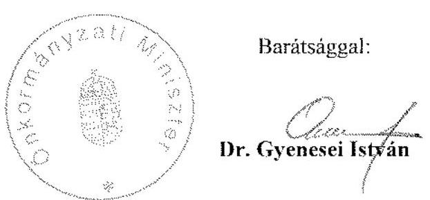

---

# 9. számú melléklet   a V-1019/2007. számú jelentéshez 

ELNÖK

ÁLLAMI
SZÁMVEVŐSZÉK

Ikt.szám: V-1019-100/2007.
Hivatkozási szám: ÖTM/9390/1/2008.
Úgyintéző: Holman Magdolna

## Dr. Gyencesi István úr, miniszter   Önkormányzati Minisztérium

Budapest

## Tisztelt Miniszter Úr!

A települési önkormányzatok többcélú kistérségi társulásainak a közszolgáltatások és a területfejlesztési feladatok ellátásában betöltött szerepe ellenőrzéséről készített jelentésünkre adott észrevételét megköszönöm, ugyanakkor sajnálattal vettem tudomásul, hogy a jelentésben a szakállamtitkári véleményezést követően tett tartalmi változtatásokat, a megállapítások hangsúlyainak áthelyezését nem vették figyelembe. Az észrevétel a jelentés tényszerű megállapításait több helyen kritikaként értékelte, több esetben a megállapítás szövegkörnyezetéből kiragadva - egy-egy mondathoz, mondatrészhez kapcsolódott, amely ilyen formában a jelentés megállapításait torzítja.

Egyetértek Önnel abban, hogy eredmény a többcélú kistérségi társulások szervezeti kereteinek kialakulása és, hogy a közoktatásban a gyereklétszámhoz jobban igazodó intézményméretek kialakítása hosszadalmas folyamat. Nem lehet azonban figyelmen kívül hagyni, hogy a többcélú kistérségi társulásokról szóló törvényt a kistérségek összehangolt fejlesztésének előmozdítása, az önkormányzati közszolgáltatások színvonalának kiegyenlített emelése érdekében alkotta meg az Országgyűlés, amely már negyedik éve megfogalmazásra került és a többcélú kistérségi társulások támogatására már 89,5 milliárd Ft-ot hagytak jóvá. Ugyanakkor az eltelt időszakhoz és a felhasznált támogatások nagyságához képest nem mutatható ki a közszolgáltatások szélesebb körében az ellátás színvonalát, hatékonyságát érintő lényeges elmozdulás, így az állami ráfordítások felhasználásának eredményessége alacsony. Ellenőrzési tapasztalataink azt támasztották alá, hogy a többcélú kistérségi társulásoknak nem volt különösebb szerepe a szakmai feltételeknek való megfelelés kialakításában csak akkor, ha saját intézményben történt a közösen vállalt közszolgáltatások ellátása.

Az ÁSZ jelentésében a bejáró tanulók és tagintézményi ösztönző támogatás igénybevételére vonatkozó megállapítások egyértelműen elkülönülnek. Amennyiben a szabályozást érintően az volt a jogalkotó célja, hogy lehetővé tegye az ösztönző támogatás igénybevételét - amely szándékkal egyébként az ÁSZ is azonosul - akkor indokolt a jogszabály módosítása,

---

egyértelművé tétele. A normaszöveg pontosítására vonatkozó véleményünkkel az Oktatási és Kulturális Minisztérium is egyetértett.

Nem tartom megfelelőnek azt a jogértelmezést, miszerint a Tkt. tv. szabályozásából nem következik, hogy ösztönző támogatásként kell biztosítani a kiegészítő támogatásokat az egészségügyi és területfejlesztési feladatok közös ellátása esetén. A területfejlesztés jelenlegi kistérségi szintje stabilitást nélkülöző, sokszereplős terület. A térségi forráskoordináció csökkenő eredményességgel működik. Az ellenőrzött többcélú társulásoknál a területfejlesztési tevékenység részben annak személyi feltételei, részben a saját források szűkössége miatt háttérbe szorult. Az egészségügyi alapellátás tekintetében pedig konkrétan levezethető, hogy az összevont ügyeletek - a lakosságszám adatok alapján - többnyire nem magasabb, hanem alacsonyabb támogatásban részesültek, mint összevonás előtt.

Nem értek egyet azzal a felvetésével, hogy a 65/2004. (IV. 15.) Korm. rendelet jóváhagyásakor a többcélú kistérségi társulásoknak az államháztartás rendszerében betöltött helye és szerepe egyértelműen tisztázott lett volna. Ezt alátámasztja az is, hogy a 65/2004. (IV. 15.) Korm. rendelet 1. § d) pontja szerint a többcélú társulás feladatai ellátását az önkormányzatok által közösen fenntartott intézmények keretében is biztosíthatta, az Áht. 88. § (1) bekezdése azonban csak 2004. december 1-tól tette lehetővé, hogy a többcélú kistérségi társulás költségvetési szervet alapítson.

A többcélú kistérségi társulások ösztönző támogatásainak igénylésére kialakított rendszer valóban elsősorban pénzügyi információs célokat szolgál és nem feltétlenül a támogatási előirányzatok elosztásának alapjául szolgáló mutatóknak kell megalapoznia a feladatellátás hatékonyságának és színvonalának mérését, azonban egyéb ágazati indikátorok hiányában legalább az elosztás alapját képező mutatóknak kellene megteremtenie a kapcsolatot az értékelés lehetőségével és biztosítani a ösztönző támogatások nyújtásának a célját.

Tekintettel arra, hogy az elkészített beszámolóikban a többcélú kistérségi társulások nem biztosították sem a bevételek sem a kiadások esetében a szakfeladati szinten történő elszámolást, ezért a beszámoló rendszerében lévő adatok az ágazati kiadások értékeléséhez nem használhatóak. Emiatt javasoltuk az elemi költségvetési beszámoló szintjén megjelenő, mutatószámokhoz kötött támogatás elszámolás bevezetését, amely eddig nem ilyen formában készült. Ez kedvezően befolyásolhatja a közpénzek felhasználásának átláthatóságára irányuló kormányzati célkitűzés érvényesülését is, amelynek érvényre hiányát ugyancsak kifogásoljuk a jelentésben.

Nem tudom elfogadni azon észrevételét, amely az előirányzat-túllépésekre vonatkozik, és az erre vonatkozó szövegrészt nem áll módomban törölni, mivel a jelentés - és a minisztériumnál készült számvevői jelentés e tekintetben nem kifogásolt - szövegéből kiderül, hogy az előirányzat-többletnek csak mintegy fele volt összefüggésben a költségvetési törvénytervezet parlamenti szakaszban jóváhagyott módosításával.

Egyetértek Önnel abban, hogy a többcélú társulások jogosultak az ösztönző támogatás igénylésére, és az igénylés jogszerűségének a vizsgálata is feladatkörébe tartozik, azonban nem a társulások nem rendelkeztek arra vonatkozó hatáskörrel, hogy a szociális és gyermekjóléti

---

alapellátások tekintetében ellenőrizzék a települési önkormányzatokat annak érdekében, hogy azok a tartanak-e fenn önállóan a saját működési területükön intézményt, vagy foglalkoztatnak-e önállóan tevékenységet ellátó alkalmazottat. A többcélú kistérségi társulások belső ellenőrzést nem folytathatnak le a feladatot ellátó - nem a saját fenntartásukban lévő intézményeknél, mivel arra a hatályos jogszabályi előírások értelmében a fenntartó önkormányzatok és nem a többcélú kistérségi társulások jogosultak.

A jelentésben megfogalmazott javaslatok címzettjeit - figyelemmel az önkormányzati miniszter feladat- és határköréről szóló 132/2008. (V.14.) Korm. rendeletben, valamint a Miniszterelnöki Hivataltól kapott észrevételekre - továbbra is megalapozottnak tekintem, a tartalmi változtatást nem tartom indokoltnak.

Végezetül tájékoztatom Miniszter urat, hogy az ellenőrzésről készült jelentést - kialakult gyakorlatunk szerint - az Ön észrevételeivel és az azokra adott válaszommal együtt küldöm meg az Országgyűlés elnökének, az illetékes bizottságai elnökeinek és a Miniszterelnöknek.

Budapest, 2008. július 2.

Tisztelettel:
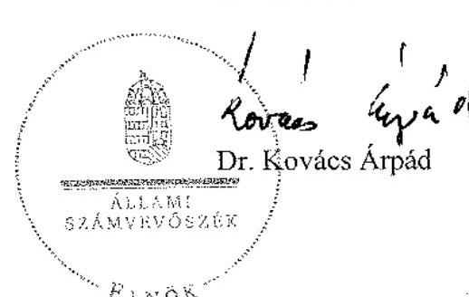

---

H-1051 BUDAPEST V., JÓZSEF NÁDOR TÉR 2-4. POSTACIM: 1369 BUDAPEST, POSTAFIÓK 481.
TELEFON: (36-1) 337-2159, (36-1) 337-2141
E-MAIL: janos.veres@pm.gov.hu
FAX: (36-1) 318-0738
PÉNZÜGYMINISZTER

Dr. Kovács Árpád úr részére
elnök

Állami Számvevőszék

Budapest

Tisztelt Elnök Úr!

ÁLLAMI SZÁMVEVŐSZÉK

Érkezett: 2008-06-30
Iktatószám: 1-1613-og ikf.sz.
Melléklet: 2.038.000.000

10. számú melléklet
a V-1019/2007. számú jelentéshez

8447/6/2008.

Németh Pui

1/30 f

1. Holusos klegiskus 05

A rahas i mi 05.

vesz

A települési önkormányzatok többcélú kistérségi társulásainak a közszolgáltatások és területfejlesztési feladatok ellátásában betöltött szerepének ellenőrzéséről szóló összefoglaló jelentést köszönettel megkaptam.

Örömmel vettem, hogy a jelentéstervezethez tett észrevételeink egy része elfogadásra került. A jelentésben - a pénzügyminiszter részére - megfogalmazott javaslatokkal alapvetően egyetértek.

A jelentéshez a következő észrevételeket teszem:

- Az ÁSZ eddigi jelentései szerint az egyes ellenőrzéseinél figyelembevételre került az önkormányzatok (többcélú kistérségi társulások) gazdálkodása egészének áttekintése. Erre is tekintettel megismételjük, hogy furcsa direkt módon a kötött támogatások erőteljes cél szerinti felhasználásának nyomon követése és szembeállítása az egyes önkormányzatok saját forráskivonásával. Ez azt jelenti, hogy az ÁSZ nem vesz tudomást az önkormányzatoknál is szükségszerűen bekövetkező folyamatról, miszerint belső tartalékokat kell feltárni, megtakarítást kell elérni a közszolgáltatások működtetése során. E folyamaton segít túljutni a kistérségi társulás nemcsak enyhítve az önkormányzatok gazdálkodásának nehézségein, hanem racionalizált szervezeti megoldást ösztönözve.

Ha így komplexen tekintjük a feladatot, a kétségtelenül előforduló vadhajtások mellett (amelyeket le kell nyesegetni) a kistérségi társulások, ezen belül az ösztönző támogatások szerepét pozitívnak lehetne ítélni.

Azt elfogadom, hogy e támogatásnak a kötöttsége, a cél szerinti felhasználása nehezebben nyomon követhető, ellenőrizhető, mint más - a korábbi időszakban kialakított - központosított támogatásé, de véleményem szerint az előirányzat kötött jellege a közszolgáltatások szakmai színvonalának növelésére irányuló célok elérését szolgálja. Az önkéntes, kistérségi szintű társulások létrehozásának ösztönzése, a közös feladatellátás működésének fenntartása kötött előirányzattal azt eredményezi, hogy az ösztönzött feladatoknál az önkormányzatok ésszerű feladatszervezést valósítsanak meg, ezáltal (is) biztosítsák a közszolgáltatások színvonalának megőrzését, emelését. Ez esetben nem lehet az cél, hogy a kötött támogatások „hagyományos" módján az adott feladatra a többlettámogatással megegyező többletráfordítás legyen kimutatható.

WWW.PENZUGYMINISZTERIUM.HU

---

Az önkormányzati pénzügyi szabályozó-rendszerben e feladatra nem a kötött, hanem szabad felhasználású normatív támogatás kialakításának lehetőségét a többcélú kistérségi társulások működésének stabilizálódása után látom megvalósíthatónak.

Természetesen a kötött felhasználású támogatás nyomon követéséhez, ellenőrzéséhez kapcsolódó javaslatukat az információs rendszer továbbfejlesztésénél a Pénzügyminisztérium figyelembe veszi.

- A belső ellenőrzéshez megfogalmazott javaslatukkal egyetértek, magam is úgy érzem, hogy e területen a további - a társulás keretében történő feladatellátás sajátosságait figyelembe vevő - szabályozással a többcélú kistérségi társulások segítségére lehetünk. E munkához azonban segítség lenne, ha a jelentés konkrétabban megjelölné, mit ért azon, hogy ,.... a társulási tanács ... az önkormányzatok belső ellenőrzési tervein túlmenően további társulási szintű feladatellátás érdekeit szolgáló ellenőrzésekre nem jogosult." Véleményem szerint az Áht. 122. §-a alapján a költségvetési forrásból származó támogatást nyújtó szerv kötelessége a kedvezményezettekkel kötött szerződésben az ellenőrzés-tűrési kötelezettséget és ennek megszegése esetén az alkalmazandó szankciót kikötni. Ez alapján a többcélú kistérségi társulás jogosult ellenőrizni a „gesztor" önkormányzatoknál a részükre átadott ösztönző támogatás felhasználását.
- Vitatom - az önkormányzati miniszter részére tett - a szociális és munkaügyi miniszternél kezdeményezendő javaslat sommás megfogalmazását, miszerint „kezdeményezze a lakosságszámhoz és intézményszámhoz kötött normatívák helyébe, az ellátotti létszámhoz igazodó finanszírozás kerüljön bevezetésre".
A szociális alapellátások - családtámogatás, közösségi ellátás stb. - szakmai tartalma olyan tevékenységeket fed le (életvezetési tanácsadás, más ellátásokhoz való hozzájutás megszervezése, kríziskezelés, stb.), melyek ellátottankénti nyilvántartása életszerűtlenül nagy adminisztrációt jelentene, valamint speciális, parttalanul részletekbe menő szabályozást (pl. hány óra foglalkozás jelent egy fő ellátottat) igényelne. Véleményem szerint ezekben az esetekben nem szabad minden áron az ellátotti létszámhoz kötődő finanszírozásra törekedni.
- Örömmel vettem, hogy a többcélú társulások által jogtalanul igénybe vett ösztönző támogatások visszafizetési kötelezettség teljesítésének ellenőrzését kezdeményezték a Magyar Államkincstárnál. Ez az intézkedésük illeszkedik az Alkotmánybíróságnak az önkormányzatok ellenőrzésénél elvárt, jogorvoslati lehetőséget magába foglaló rendszerébe. Ugyanakkor jelzem, hogy a Magyar Államkincstárnál ki kell alakítani az ÁSZ jelzése esetén követendő ellenőrzés eljárásának rendjét, amelyhez kérjük segítő együttműködésüket.

Kérem Elnök Urat, hogy tájékoztatásomat elfogadni szíveskedjék.

Budapest, 2008. június 24.
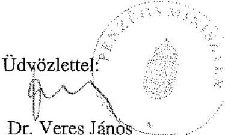

---

# 11. számú melléklet 

a V-1019/2007. számú jelentéshez

## ELNÖK

ÁLLAMI
SZÁMVEVŐSZÉK

Ikt.szám: V-1019-101/2007.
Hivatkozási szám: 8447/6/2008.
Úgyintéző: Holman Magdolna

## Dr. Veres János úr, miniszter   Pénzügyminisztérium

Budapest

## Tisztelt Miniszter Úr!

Köszönettel vettem a települési önkormányzatok többcélú kistérségi társulásainak a közszolgáltatások és területfejlesztési feladatok ellátásában betöltött szerepének ellenőrzéséről készített jelentésünkre adott észrevételeit, melyekkel kapcsolatos álláspontomról az alábbiakban tájékoztatom:

Az ÁSZ ellenőrzésének középpontjában a közpénzek hatékony felhasználásának és az általunk is igen fontosnak tartott belső tartalékok feltárásának az elősegítése áll. Ez esetben is az ellenőrzésünk fő célja annak értékelése volt, hogy a többcélú kistérségi társulások megalakulására és működésük normatív ösztönzésére 2004-2008. években előirányzott 89,5 milliárd Ft felhasználása összhangban volt-e az önkormányzati közszolgáltatások hatékonyabb megszervezésével, hozzájárult-e a közszolgáltatások színvonalának kiegyenlített emeléséhez. A helyszíni vizsgálat tapasztalatai azt mutatták, hogy a többcélú kistérségi társulások ösztönzésére jóváhagyott támogatások felhasználásának eredményessége alacsony volt, mert az önkormányzatok törekvései elsősorban a többlettámogatások megszerzésére irányultak, a támogatási feltételek szabályozása pedig lehetővé tette azok igénybevételét a szolgáltatások közös, ésszerűbb,
 hatékonyabb megszervezésének hiányában is.

A többcélú kistérségi társulások ösztönző támogatása a feladatellátás finanszírozásában többnyire csak forráscserét jelentett azzal, hogy önkormányzati saját forrásokat váltott ki és nem segítette elő az adott kiemelt szolgáltatás színvonalának növekedését, főképp nem a szolgáltatások színvonalának térségi kiegyenlítődését, de nem szolgálta kellően a belső tartalékok feltárását sem. Vitathatatlan, hogy az így felszabaduló források az önkormányzati egyéb saját feladatok ellátását szolgálták, azonban a többcélú társulások megalakításának és az ehhez kapcsolódó ösztönző támogatásoknak nem ez volt a közvetlen célja, közvetett hatása pedig az egyéb feladatellátás tekintetében nem kimutatható, nem átlátható.

A többcélú kistérségi társulások részére nyújtott normatív kötött támogatás felhasználásának hatékonyságát javítaná, ha a társulások nemcsak a feladatot ellátó részére nyújtott ösztönző

---

támogatás ellenőrzésére lennének jogosultak, hanem a többcélú kistérségi társulás szintjén különböző formákban szervezett közszolgáltatások egészének ellenőrzésére is. A szociális alap és szakellátás intézményeiben a támogatások felhasználásának hatékonysága mellett a rászorultsági elv érvényesítését is jobban szolgálná az általunk javasolt, az ellátott létszámhoz jobban igazodó finanszírozás. Az ellátottak struktúrájának meghatározása, az ehhez igazodó célszerű nyilvántartások - figyelemmel a költség-haszon elv érvényesülésére is - véleményünk szerint kialakíthatók.

Végezetül tájékoztatom Miniszter urat, hogy az ellenőrzésről készült jelentést - kialakult gyakorlatunk szerint - az Ön észrevételeivel és az azokra adott válaszommal együtt küldöm meg az Országgyűlés elnökének, az illetékes bizottságai elnökeinek és a Miniszterelnöknek.

Budapest, 2008. július 22.
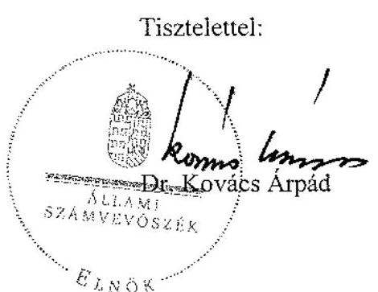

---

# Ellenőrzött többcélú kistérségi társulások

|  a többcélú kistérségi társulás megnevezése | a társulás székhelye | a társulás rövidítése  |
| --- | --- | --- |
|  Bajai Többcélú Kistérségi Társulás | Baja | bajai többcélú társulás  |
|  Jánoshalmi Többcélú Kistérségi Társulás | Jánoshalma | jánoshalmi többcélú társulás  |
|  Komlói Kistérség Többcélú Önkormányzati Társulás | Komló | komlói többcélú társulás  |
|  Sásdi Többcélú Kistérségi Társulás | Sásd | sásdi többcélú társulás  |
|  Siklósi Többcélú Kistérségi Társulás | Siklós | siklósi többcélú társulás  |
|  Miskolc Kistérség Többcélú Társulása | Miskolc | miskolci többcélú társulás  |
|  Sárospataki Többcélú Kistérségi Társulás | Sárospatak | sárospataki többcélú társulás  |
|  Szikszói Kistérségi Többcélú Társulás | Szikszó | szikszói többcélú társulás  |
|  Tokaji Többcélú Kistérségi Társulás | Tokaj | tokaji többcélú társulás  |
|  Makói Kistérség Többcélú Társulása | Makó | makói többcélú társulás  |
|  "Sárvíz" Többcélú Kistérségi Társulás | Aba | abai többcélú társulás  |
|  Vértes Többcélú Kistérségi Önkormányzati Társulás | Bicske | bicskei többcélú társulás  |
|  Mosonmagyaróvári Többcélú Kistérségi Társulás | Mosonmagyaróvár | mosonmagyaróvári többcélú társulás  |
|  Téti Kistérség Sokoróaljai Önkormányzatainak Többcélú Társulása | Tét | téti többcélú társulás  |
|  Sárréti Többcélú Kistérségi Társulás | Püspökladány | püspökladányi többcélú társulás  |
|  Jászsági Többcélú Társulás | Jászkisér | jászkiséri többcélú társulás  |
|  Kunszentmártoni Kistérség Többcélú Társulása | Kunszentmárton | kunszentmártoni többcélú társulás  |
|  Komárom-Bábolna Többcélú Kistérségi Társulás | Komárom | komáromi többcélú társulás  |
|  Balassagyarmati Kistérség Többcélú Társulása | Balassagyarmat | balassagyarmati többcélú társulás  |
|  Bátonyterenye Kistérség Önkormányzatainak Többcélú Társulása | Bátonyterenye | bátonyterenyei többcélú társulás  |
|  Csepel-sziget és Környéke Többcélú Önkormányzati Társulás | Ráckeve | ráckevei többcélú társulás  |
|  Dunakanyar Többcélú Önkormányzati Kistérségi Társulás | Vác | váci többcélú társulás  |
|  Ország Közepe Többcélú Kistérségi Társulás | Dabas | dabasi többcélú társulás  |
|  Pilis-Buda-Zsámbék Többcélú Kistérségi Társulás | Pilisvörösvár | pilisvörösvári többcélú társulás  |
|  Koppány-völgye Többcélú Kistérségi Társulás | Tab | tabi többcélú társulás  |
|  Macali Kistérségi Többcélú Társulás | Marcali | marcali többcélú társulás  |
|  Nyírbátor és Vonzáskörzete Többcélú Kistérségi Társulás | Nyírbátor | nyírbátori többcélú társulás  |
|  Tiszavasvári Többcélú Kistérségi Társulás | Tiszavasvári | tiszavasvári többcélú társulás  |
|  Tamási-Simontornyai Többcélú Kistérségi Társulás | Tamási | tamási többcélú társulás  |
|  Völgységi Többcélú Kistérségi Társulás | Bonyhád | bonyhádi többcélú társulás  |
|  Vasi Hegyhát Többcélú Kistérségi Társulás | Vasvár | vasvári többcélú társulás  |
|  Tapolca és Környéke Kistérség Többcélú Társulás | Tapolca | tapolcai többcélú társulás  |
|  Zalaegerszeg és Térsége Többcélú Kistérségi Társulás | Zalaegerszeg | zalaegerszegi többcélú társulás  |

---

# ÖSSZEGZÉS 

## A többcélú társulások feladatellátásában résztvevő települési önkormányzatok által kitöltött adatfelmérő kérdőívek értékeléséről

A helyszíni vizsgálat lefolytatásával egyidőben az ellenőrzött többcélú kistérségi társulások közös feladatellátásában részt vevő települési önkormányzatoktól kérdőív formájában kértünk információt. A vizsgálatba vont többcélú kistérségi társulások közös feladatellátásában 2007. szeptember 1-jén 738 tagönkormányzat és további 78, más kistérséghez sorolt - a vizsgálat értékelése szempontjából a kistérségen kívülről csatlakozóként jelölt - önkormányzat vett részt.

A kistérségen belüli önkormányzatok 37,1%-a, a kívülről csatlakozó önkormányzatoknak pedig 42% nem tartotta célszerűnek a 2006. december 31-el hatályban lévő kistérségi lehatárolást. A tagönkormányzatok 24,4%-a a települések száma miatt nehézkesnek ítélte a döntési mechanizmust, 14,6%-uk szerint a székhely település nem vagy kevésbé érdekelt a közös feladat ellátásban, 13,9%-uk szerint a települések között nincs hagyományosan kiépített kapcsolat. A kistérségi lehatárolás megváltoztatására irányuló önkormányzati kérelmek hatására a Tkt. tv. 2007. évi módosításával $^{1}$ megtörtént a korábbi kistérségi besorolások pontosítása, ami a vizsgálatba vont többcélú kistérségi társulásokat is érintette.

A felmérés szerint a kistérségen belüli önkormányzatok 80,2%-a, a kistérségen kívülről csatlakozó önkormányzatok 69,1%-a a többcélú kistérségi társulások megalakulását megelőzően is részt vett a Ttv. előírásai alapján szervezett önkormányzatok közötti közös feladatellátásban, különböző - oktatási, szociális és gyermekjóléti - intézményfenntartó társulásokban. Az önkormányzatok több mint fele a többcélú kistérségi társulások megalakulásától függetlenül, annak létrehozása előtt is társulásban biztosította az óvodai ellátást, az általános iskolai oktatást és a gyermekjóléti ellátást.

A többcélú társulások megalakulását megelőzően az intézményfenntartó társulásban részt vevő önkormányzatok arányát az alábbi táblázat szemlélteti:

[^0]
[^0]:    $^{1}$ 2007. évi CVII. törvény a települési önkormányzatok többcélú kistérségi társulásairól szóló 2004. évi CVII. törvény módosításáról

---

A többcélú kistérségi társulások megalakulását megelőzően intézmény fenntartó társulásban részt vevő önkormányzatok aránya

|  | tagönkormányzatok | KKÖ |
| :-- | :--: | :--: |
|  | $\%$ | $\%$ |
| közoktatási feladatok | 65,8 | 59,3 |
| óvodai ellátás | 50,0 | 45,7 |
| általános iskolai ellátás | 57,9 | 48,1 |
| pedagógiai szakszolgálat | 21,4 | 9,9 |
| szociális alapszolgáltatások | 45,8 | 37,0 |
| családsegítés | 42,4 | 35,8 |
| házi segítségnyújtás | 11,7 |  |
| jelzőrendszeres házi segítség nyújtás | 11,1 |  |
| gyermekjóléti alapellátás | 55,4 | 46,9 |
| gyermekjóléti szolgáltatás | 55,4 | 46,9 |

A megkérdezett önkormányzatok 1-5 fokozatú skálán rangsorolták a többcélú kistérségi társuláshoz való csatlakozás motiváló tényezőit. Az értékelés szerint a többcélú kistérségi társuláshoz történő csatlakozásban döntő szerepet tulajdonítottak a többlet pénzügyi források elérésének (4,42), a gazdaságosabb feladatellátásnak (4,06), a hatékonyabb működésnek (3,82) a saját forrás egyéb feladatokra történő felszabadításának (3,78), az ellátási színvonal emelésének (3,7), az európai forrásokhoz való hozzájutás elősegítésének (3,62), a szolgáltatás elérése biztosításának (3,36). A körön kívüli önkormányzatok szintén döntő fontosságúnak tekintették a többlet pénzügyi források elérését (3,87), gazdaságosabb feladatellátást (3,72) a hatékonyabb működtetést (3,69), a saját források felszabadítását egyéb önkormányzati feladatokra (3,64), az ellátás színvonalának emelését (3,4), a szolgáltatások elérésének biztosítását (3,15) és az európai forrásokhoz való hozzájutás elősegítését (3,15).

Az önkormányzatok 58,4%-a nyilatkozott úgy, hogy a közösen ellátott feladatokhoz a többcélú kistérségi társulástól anyagi támogatásban részesült. Az átvett pénzeszközöket az önkormányzatok 94,4%-a a feladattal kapcsolatos működési kiadásokra, ezen belül 39,2%-a a saját forrás kiváltására, 29%-a a közoktatási intézmények kötelező taneszköz-jegyzékben felsorolt eszközök megvásárlására, 15,1%-a az adott feladat ellátáshoz kapcsolódó ingatlan felújítására fordította. Az önkormányzatok 38,5%-a vett át használatra vagyontárgyat a többcélú kistérségi társulásoktól.

A közösen ellátott feladatokhoz az anyagi támogatáson túl, illetve attól függetlenül az önkormányzatok 70,1%-a szerint belső ellenőrzési feladataikhoz, 63,8%-a szerint területfejlesztési, 59,8%-a szerint közoktatási, 56,4%-a szerint szociális, 53,7%-a szerint pedig gyermekvédelmi feladataikhoz kapott szakmai segítséget a többcélú kistérségi társulásoktól. A kívülről csatlakozó önkormányzatok közel 50%-a nyilatkozott úgy, hogy szakmai segítséget kapott az előzőekben megjelölt feladatainak ellátásához.

Az önkormányzatok 83,6%-ánál a polgármesterek beszámoltak képviselőtestületeiknek a Társulási Tanácsban végzett tevékenységükről, s az önkormányzatok 57%-a értékelte is a közös feladatellátás tapasztalatait.

---

Az önkormányzatok 75,3%-ának véleménye szerint a többcélú kistérségi társulásban való részvételük nem volt hatással az összevont osztályok számának alakulására, illetve 65,3%-uk szerint a szakosan leadott órák számára, 52,9%-uk szerint a kötelező eszközjegyzék hiányának felszámolására, 45,6%-uk szerint a szakmai minimumkövetelmények alakulására, 35,3%-uk szerint a szakképzett munkaerő számának alakulására sem. A társulástól várt előnyök teljesülését az önkormányzatok az iskolai osztályzatoknak megfelelő 1-5-ös skálán, közepesnek minősítették, az alábbi részletezés szerint:

- a településen nőtt az ellátáshoz hozzájutók száma ..... 3,2
- javultak a feladatellátás tárgyi feltételei ..... 3,2
- nőtt a szakképzett munkaerő száma ..... 3,0
- csökkent a fajlagos kiadások összege ..... 3,0
- kevesebbel kell az önkormányzatoknak az adott feladat kiadásaihoz hozzájárulni ..... 3,3
- a közoktatás területén csökkent az összevont osztályok száma ..... 2,7
- a közoktatás területén nőtt a szakosan leadott órák száma ..... 2,9
- csökkent a közoktatásban a kötelező eszközjegyzékben felsorolt eszközök hiánya ..... 3,0
- csökkent a szakmai minimumkövetelményekhez mért hiány ..... 3,0
- javultak a szakmai feladatellátás körülményei ..... 3,3

A vizsgált társulások feladatellátásához kistérségen kívülről csatlakozó önkormányzatok többségének véleménye szerint is a közös feladat ellátásnak közepes hatása volt a szakképzett munkaerő számának emelkedésére, a tárgyi feltételek javulására, nem csökkent a fajlagos kiadások összege, nem nőtt a szakosan leadott órák száma, nem csökkent a szakmai minimumkövetelményekhez mért hiány mértéke és nem javultak a szakmai feladatellátás körülményei sem.

Az önkormányzatok mindössze 11%-a értékelte maximális (5) pontszámmal azt, hogy a településen nőtt az ellátáshoz hozzájutók száma, az önkormányzatnak kevesebbel kell az adott feladat kiadásaihoz hozzájárulnia.

Összességében megállapítható, hogy az önkormányzatok 62,4%-a megfelelőnek tartotta a kistérségi lehatárolást. Háromnegyed részük a többcélú kistérségi társulások megalakulása előtt, attól függetlenül is intézmény fenntartó társulásokban látta el egyes közoktatási, szociális és gyermekjóléti feladatait. A többcélú kistérségi társuláshoz való csatlakozásra ösztönzőleg hatott a pénzügyi források elérésének, a hatékonyabb, gazdaságosabb feladatellátásnak, a saját források felszabadításának lehetősége. A várt előnyök elérésének teljesülését az önkormányzatok közepesnek értékelték, jelentős részük úgy vélte, hogy a szakmai kérdések -
 összevont osztályok száma, szakosan leadott órák számának alakulására nem volt kellő ráhatásuk.
