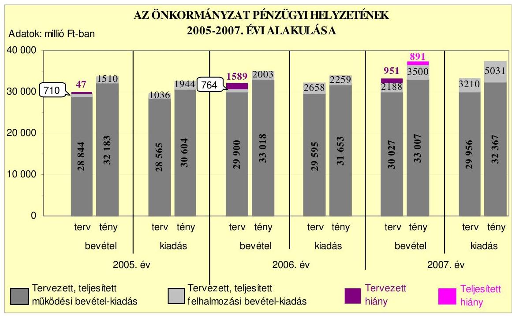
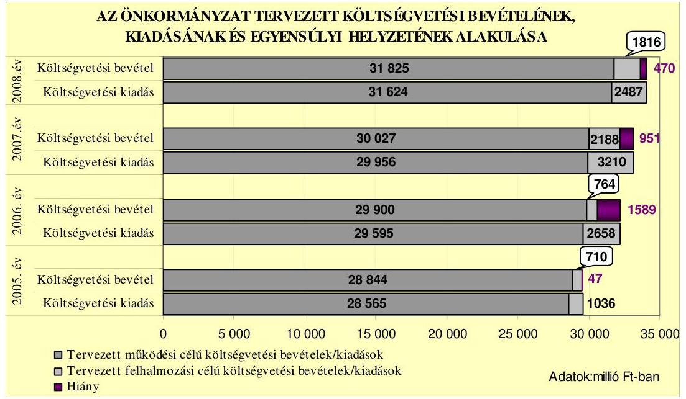
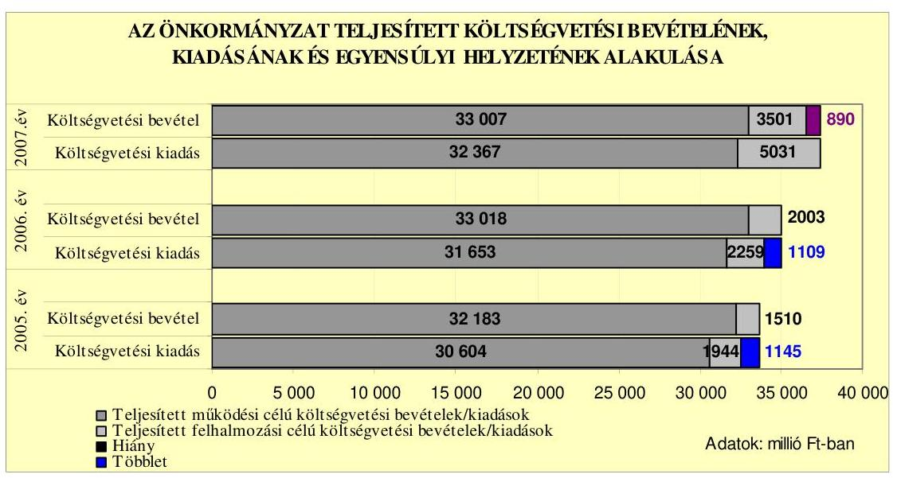
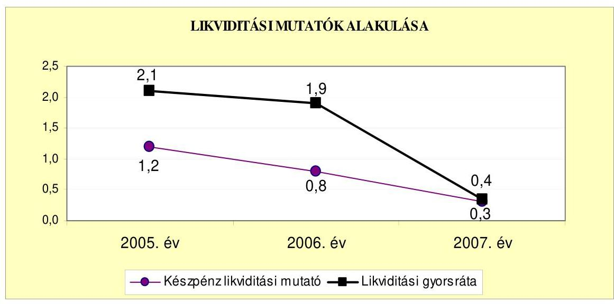
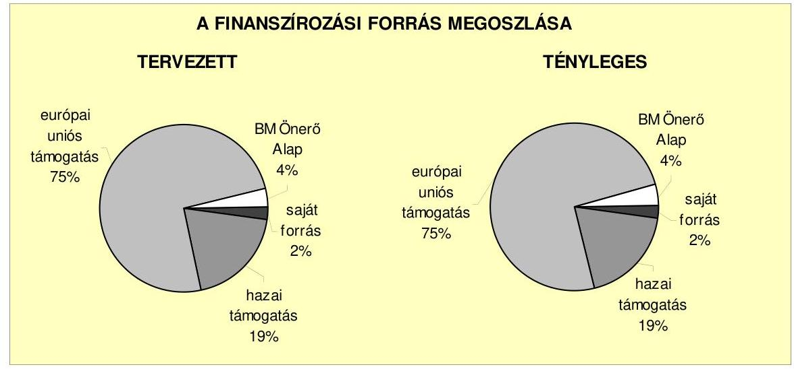
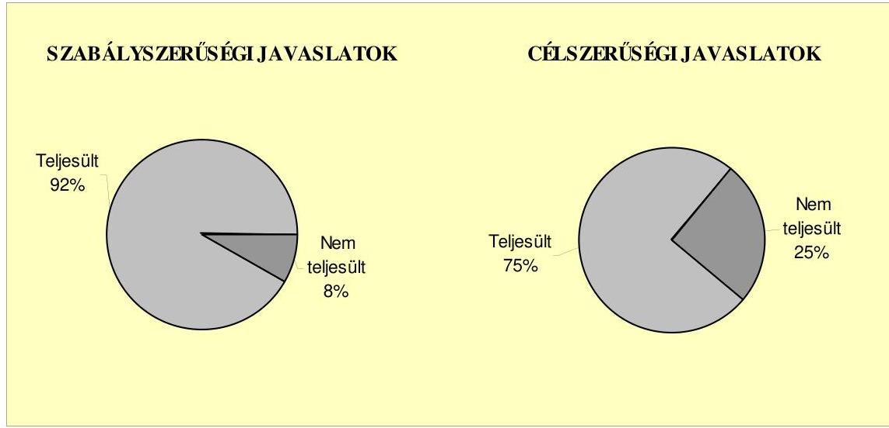
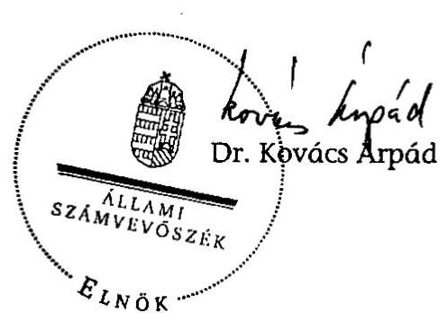
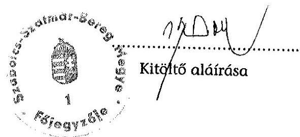
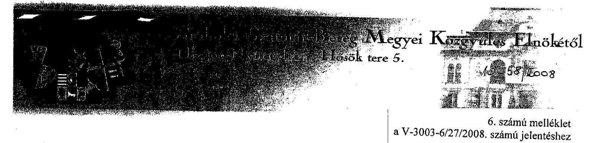
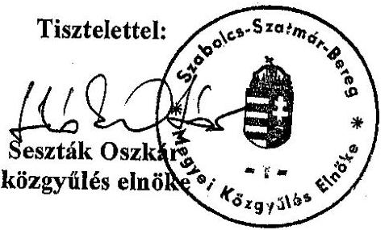

# ÁLLAMI   SZÁMVEVŐSZÉK 

## JELENTÉS

a Szabolcs-Szatmár-Bereg Megyei Önkormányzat gazdálkodási rendszerének 2008. évi ellenőrzéséről

---

# 3. Önkormányzati és Területi Ellenőrzési Igazgatóság 

3.3. Átfogó Ellenőrzések Főcsoport

Iktatószám: V-3003-6/27/17/2008.
Témaszám: 898
Vizsgálat-azonosító szám: V0382

## Az ellenőrzést felügyelte:

Dr. Lóránt Zoltán
főigazgató
Az ellenőrzés végrehajtásáért felelős:
Dr. Sepsey Tamás
főigazgató-helyettes
Az ellenőrzést vezette:
Kenéz Sándor
főtanácsadó, irodavezető
Az ellenőrzést végezték:
Ujvári Józsefné Dr. Szücs Zoltán
számvevő számvevő tanácsos számvevő

## A témához kapcsolódó eddig készített számvevőszéki jelentések:

## címe

Jelentés a Szabolcs-Szatmár-Bereg Megyei Önkormányzat gazdálkodásának átfogó ellenőrzéséről
Jelentés a helyi és a helyi kisebbségi önkormányzatok gazdálkodásának átfogó ellenőrzéséről
Jelentés a címzett támogatásból finanszírozott egészségügyi beruházások és rekonstrukciók ellenőrzéséről
Jelentés a Magyar Köztársaság 2004. évi költségvetése végrehajtásának ellenőrzéséről
Függelék:

- a helyi önkormányzatokat a 2004. évben megillető normatív állami hozzájárulás elszámolása
Jelentés a Magyar Köztársaság 2005. évi költségvetése végrehajtásának ellenőrzéséről
Függelék:
- a helyi önkormányzatok a 2005. évben megillető normatív hozzájárulás elszámolásának ellenőrzése
- a helyi önkormányzatok beruházásaihoz és rekonstrukcióihoz nyújtott 2005. évi felhalmozási célú támogatások ellenőrzése

---

# TARTALOMJEGYZÉK 

BEVEZETÉS ..... 9
I. ÖSSZEGZŐ MEGÁLLAPÍTÁSOK, KÖVETKEZTETÉSEK, JAVASLATOK ..... 14
II. RÉSZLETES MEGÁLLAPÍTÁSOK ..... 23

1. Az Önkormányzat költségvetési és pénzügyi helyzete ..... 23
1.1. A tervezett költségvetési bevételi és kiadási előirányzatok, valamint a költségvetési egyensúly alakulása ..... 23
1.2. A költségvetési és a pénzügyi egyensúlyi helyzet kialakításához tervezett és teljesített finanszírozási célú pénzügyi műveletek módja, mértéke és hatása a tárgyévet követő évek költségvetéseire ..... 25
1.3. Alátámasztja-e a költségvetés tervezésének megalapozottságát a tervezett működési és a felhalmozási célú költségvetési bevételek és kiadások teljesítése ..... 30
2. Az Önkormányzat felkészültsége az európai uniós források igénylésére és felhasználására, valamint az elektronikus közigazgatási feladatok ellátására ..... 32
2.1. Az európai uniós források igénybevételére és a várható támogatás felhasználására történt felkészülés szabályozottsága, szervezettsége ..... 32
2.1.1. Az európai uniós forrásokra történő pályázatok benyújtására vonatkozó döntések összhangja a fejlesztési célkitűzésekkel ..... 32
2.1.2. Az európai uniós forrásokhoz kapcsolódóan a pályázatfigyelés, a pályázatkészítés, valamint az európai uniós támogatással megvalósuló fejlesztés lebonyolításának belső rendjének szabályozottsága, a végrehajtás személyi, szervezeti feltételei ..... 38
2.1.3. A fejlesztési feladat lebonyolításánál a feladatellátás rendjére, az ellenőrzési feladatok teljesítésére, valamint a felelősségi szabályokra vonatkozó előírások betartása ..... 40
2.2. Az elektronikus közigazgatási feladatok ellátása, a közérdekű adatok elektronikus közzététele ..... 43
3. A költségvetési gazdálkodás belső kontrolljai ..... 45
3.1. A szabályozottság kockázata a költségvetés tervezési, gazdálkodási, beszámolási és a folyamatba épített, előzetes és utólagos vezetői ellenőrzési feladatoknál ..... 45
3.2. A belső kontrollok érvényesülése az önkormányzati források szabályszerű felhasználásában, a költségvetési tervezés, gazdálkodás, beszámolás folyamataiban ..... 48

---

3.3. A belső ellenőrzési kötelezettség teljesítése, javaslatainak hasznosulása ..... 52
4. Az ÁSZ korábbi ellenőrzési javaslatai alapján készített intézkedési terv végrehajtása, eredményessége ..... 56
4.1. Az Önkormányzat gazdálkodási rendszerének átfogó ellenőrzése során tett javaslatok végrehajtására tervezett intézkedések megvalósítása ..... 56
4.2. A zárszámadáshoz kapcsolódó (állami hozzájárulások, támogatások igénylésének és felhasználásának ellenőrzése), valamint a további vizsgálatok esetében a megállapítások, javaslatok alapján tett intézkedések ..... 58

# MELLÉKLETEK 

1. számú Az Önkormányzat gazdálkodását meghatározó adatok, mutatószámok (1 oldal)
2. számú Az önkormányzati vagyon alakulása (1 oldal)
3. számú Az Önkormányzat 2005-2007. évi költségvetési előirányzatainak és azok pénzügyi teljesítéseinek alakulása ( 1 oldal)
4. számú Tanúsítvány az európai uniós forrásokkal támogatott programok, célok tervezett és tényleges 2005-2008. évi adatairól (1 oldal)
5. számú Adatlap az Önkormányzat európai uniós forrással támogatott fejlesztéséről (3 oldal)
6. számú Seszták Oszkár úr, a Szabolcs-Szatmár-Bereg Megyei Önkormányzat Közgyűlése elnökének észrevétele (1 oldal)

---

# RÖVIDÍTÉSEK JEGYZÉKE 

| Törvények |  |
| :--: | :--: |
| Áht. | az államháztartásról szóló 1992. évi XXXVIII. törvény |
| Eisztv. | az elektronikus információszabadságról szóló 2005. évi XC. törvény |
| Ket. | a közigazgatási hatósági eljárás és szolgáltatás általános szabályairól szóló 2004. évi CXL. törvény |
| Ötv. | a helyi önkormányzatokról szóló 1990. évi LXV. törvény |
| Számv. tv. | a számvitelről szóló 2000. évi C. törvény |
| Rendeletek |  |
| Ámr. | az államháztartás működési rendjéről szóló 217/1998. (XII. 30.) Korm. rendelet |
| Ber. | a költségvetési szervek belső ellenőrzéséről szóló 193/2003. (XI. 26.) Korm. rendelet |
| Vhr. | az államháztartás szervezetei beszámolási és könyvvezetési kötelezettségének sajátosságairól szóló 249/2000. (XII. 24.) Korm. rendelet |
| 18/2005. (XII. 27.) IHM rendelet | a közzétételi listákon szereplő adatok közzétételéhez szükséges közzétételi mintákról szóló 18/2005. (XII. 27.) IHM rendelet |
| 2003. évi költségvetési rendelet | a Szabolcs-Szatmár-Bereg Megyei Önkormányzat 2003. évi költségvetéséről és végrehajtásának szabályairól szóló 2/2003. (II. 17.) számú rendelete |
| SzMSz | a Szabolcs-Szatmár-Bereg Megyei Önkormányzatnak a Közgyűlés Szervezeti és Működési Szabályzatáról szóló 5/2007 (IV. 23.) számú rendelete |
| Szórövidítések |  |
| Ady Endre Gimnázium | Ady Endre Gimnázium, Szakképző Iskola és Kollégium Csenger |
| Ápoló-Gondozó Otthon | Szabolcs-Szatmár-Bereg Megyei Önkormányzat Módszertani Ápoló-Gondozó Otthona Szakoly |
| ÁROP | ÚMFT Államreform Operatív Program |
| ÁSZ | Állami Számvevőszék |
| e-közigazgatás | elektronikus közigazgatás |
| Ellátó Szervezet | Szabolcs-Szatmár-Bereg Megyei Önkormányzat Ellátó Szervezete |
| EKOP | ÚMFT Elektronikus Közigazgatási Operatív Program |
| Éltes Mátyás Speciális Szakiskola | Éltes Mátyás Általános Iskola, Speciális Szakiskola, Gyermekotthon, Kollégium és Pedagógiai Szakszolgálat Nyírbátor |
| FEUVE | folyamatba épített, előzetes és utólagos vezetői ellenőrzés |

---

| főjegyző | Szabolcs-Szatmár-Bereg Megyei Önkormányzat főjegyző- |
| :--: | :--: |
| gazdasági program ${ }_{1}$ | Szabolcs-Szatmár-Bereg Megyei Önkormányzat Közgyűlésének 5/2003. (II. 14.) számú határozatával elfogadott 2003-2006. évekre szóló gazdasági programja |
| gazdasági program ${ }_{2}$ | Szabolcs-Szatmár-Bereg Megyei Önkormányzat Közgyűlésének 10/2007. (II. 22.) számú határozatával elfogadott 2007-2010. évekre szóló gazdasági programja |
| gazdálkodási jogkörök   szabályzata $_{1}$ | a Közgyűlés elnökének és a főjegyzőnek a Szabolcs-Szatmár-Bereg Megyei Önkormányzat költségvetési gazdálkodása végrehajtásával összefüggő kötelezettségvállalás, érvényesítés, utalványozás és ellenjegyzés rendjének szabályairól szóló 1-12/2006. (X. 31.) számú együttes rendelkezése |
| gazdálkodási jogkörök   szabályzata $_{2}$ | a Közgyűlés elnökének és a főjegyzőnek a Szabolcs-Szatmár-Bereg Megyei Önkormányzat költségvetési gazdálkodása végrehajtásával összefüggő kötelezettségvállalás, érvényesítés, utalványozás és ellenjegyzés rendjének szabályairól szóló 1-10/2007. (V. 15.) számú együttes rendelkezése |
| Gyermekvédelmi Központ | Szabolcs-Szatmár-Bereg Megyei Önkormányzat Gyermekvédelmi Központ Nyírbátor |
| GVOP | NFT Gazdasági Versenyképesség Operatív Program |
| HEFOP | NFT Humánerőforrás-fejlesztési Operatív Program |
| INTERREG Együttműködési Program | INTERREG III. A Magyarország-Románia és Magyarország-Szerbia és Montenegró Határ menti Együttműködési Program |
| INTERREG Szomszédsági Program | INTERREG III. A Magyarország-Szlovákia-Ukrajna Szomszédsági Program |
| Intézményfenntartó és humán osztály | Szabolcs-Szatmár-Bereg Megyei Önkormányzat Hivatalának Intézményfenntartó és humán osztálya |
| Jósa András Kórház | Szabolcs-Szatmár-Bereg Megyei Önkormányzat Jósa András Oktató Kórháza Nyíregyháza |
| Közgyűlés | Szabolcs-Szatmár-Bereg Megyei Önkormányzat Közgyűlése |
| Közgyűlés elnöke | Szabolcs-Szatmár-Bereg Megye Önkormányzat Közgyűlésének elnöke |
| Megyei Testnevelési és Sport Intézet | Szabolcs-Szatmár-Bereg Megyei Önkormányzat Testnevelési és Sport Intézete Nyíregyháza |
| NFT | Nemzeti Fejlesztési Terv |
| Önkormányzat | Szabolcs-Szatmár-Bereg Megyei Önkormányzat |
| Önkormányzat hivatala | Szabolcs-Szatmár-Bereg Megyei Önkormányzat Hivatala |

---

Önkormányzat hivatalának SzMSz-e
pályázati szabályzat

Pedagógiai Intézet

PEJ
Pénzügyi bizottság
Pénzügyi, gazdálkodási és fejlesztési osztály
Pszichiátriai Szakkórház

Szatmár-Beregi Kórház

Területi Gyermekvédelmi Központ
ÚMFT
Ügyrend

Ügyrendi és Jogi bizottság
a Szabolcs-Szatmár-Bereg Megyei Önkormányzat Ügyrendi és Jogi bizottságának 87/2007. (XII. 12.) számú határozatával jóváhagyott, a Szabolcs-Szatmár-Bereg Megye Önkormányzat Hivatala Szervezeti és Működési Szabályzatáról szóló 2-1/2007. (XII. 7.) számú főjegyzői rendelkezés
a Szabolcs-Szatmár-Bereg megyei Közgyűlés elnökének és főjegyzőjének 1-16/2006. (XII. 27.) számú együttes rendelkezése a Szabolcs-Szatmár-Bereg Megyei Önkormányzat Hivatalának pályázati szabályzatáról
Szabolcs-Szatmár-Bereg Megyei Önkormányzat Megyei Pedagógiai, Közművelődési és Képzési Intézete Nyíregyháza program előrehaladási jelentés
Szabolcs-Szatmár-Bereg Megyei Önkormányzat Pénzügyi Bizottsága
Szabolcs-Szatmár-Bereg Megyei Önkormányzat Hivatalának Pénzügyi, Gazdálkodási és Fejlesztési Osztálya
Szabolcs-Szatmár-Bereg Megyei Önkormányzat Pszichiátriai Szakkórháza Nagykálló
Szabolcs-Szatmár-Bereg Megyei Önkormányzat Szatmár-Beregi Kórház és Gyógyfürdő Fehérgyarmat-Vásárosnamény
Szabolcs-Szatmár-Bereg Megyei Önkormányzat Területi és Gyermekvédelmi Központja Nyírbátor
Új Magyarország Fejlesztési Terv
A Közgyűlés elnökének és főjegyzőjének 1-17/2006. (XII. 27.) számú együttes rendelkezése a Szabolcs-Szatmár-Bereg Megyei Önkormányzat Hivatala Gazdasági szervezetének Ügyrendjéről
Szabolcs-Szatmár-Bereg Megyei Önkormányzat Ügyrendi és Jogi Bizottsága

---

.

---

# ÉRTELMEZŐ SZÓTÁR 

1. elektronikus szolgáltatási szint
2. elektronikus szolgáltatási szint
3. elektronikus szolgáltatási szint
4. elektronikus szolgáltatási szint
európai uniós források
fejlesztési feladat (projekt)
fejlesztési célkitűzés
irányító hatóság

Az 1044/2005. (V. 11.) Korm. határozat alapján olyan információs, tájékoztató szolgáltatás, amely csak általános információkat közöl az adott üggyel kapcsolatos teendőkről és a szükséges dokumentumokról.
Az 1044/2005. (V. 11.) Korm. határozat alapján olyan egyirányú kapcsolatot biztosító szolgáltatás, amely az 1. szinten túl biztosítja az adott ügy intézéséhez szükséges dokumentumok, nyomtatványok letöltését, és azok ellenőrzéssel, vagy ellenőrzés nélküli elektronikus kitöltését, amely esetben a dokumentumok benyújtása hagyományos úton történik.
Az 1044/2005. (V. 11.) Korm. határozat alapján olyan kétirányú kapcsolatot biztosító szolgáltatás, amely közvetlen, vagy ellenőrzött kitöltésű dokumentum segítségével biztosítja az elektronikus adatbevitelt és a bevitt adatok ellenőrzését. Az ügy indításához, intézéséhez személyes megjelenés nem szükséges, de az ügyhöz kapcsolódó közigazgatási döntés (határozat, egyéb aktus) közlése, valamint a kapcsolódó illeték-, vagy díjfizetés hagyományos úton történik.
Az 1044/2005. (V. 11.) Korm. határozat alapján olyan teljes közvetlen kétirányú ügyintézési folyamatot biztosító szolgáltatás, amikor az ügyhöz kapcsolódó közigazgatási döntés is elektronikus úton kerül közlésre, illetve a kapcsolódó illeték-, vagy díjfizetés elektronikus úton is intézhető.
Az elnyert európai uniós források lehívása a támogatott projekt megvalósítása érdekében, a fejlesztés lebonyolítása során felmerült kiadások finanszírozására.
A fejlesztési feladat (projekt) tartalmilag és formailag részletesen kidolgozott, megfelelő pénzügyi háttérrel és végrehajtási ütemezéssel rendelkező fejlesztési terv, amely illeszkedik az Európai Unió, illetve a Nemzeti Fejlesztési Terv által támogatott programokhoz.
Az önkormányzat által ellátott kötelező vagy önként vállalt feladatok ellátásának mennyiségi vagy minőségi fejlesztésére vonatkozó terv. A mennyiségi fejlesztés megvalósulhat beszerzéssel, létesítéssel, bővítéssel, átalakítással.
Az strukturális alapok és a Kohéziós alap forrásainak szabályszerű, hatékony és eredményes felhasználásához szükséges intézményrendszer felső eleme. Az irányító hatóság általános és átfogó felelősséget visel a programok, projektek hatékony és szabályszerű végrehajtásáért. Felelősségi köréből eredően ellenőrzi a közösségi, valamint a hazai jogszabályok betartását, koordinálja az európai uniós források szétosztásának folyamatát, irányítja az intézményrendszer, a statisztikai és a pénzügyi nyilvántartási rendszer működését.

---

kedvezményezett
közreműködő szervezet
lebonyolítás
operatív program
támogatási szerződés

Az a helyi önkormányzat, amely a támogatási szerződést kedvezményezettként aláírja, a projektet, illetve a központi programhoz kapcsolódó támogatott önkormányzati programot végrehajtja.
A közreműködő szervezet az európai uniós támogatást elnyert kedvezményezettekkel kapcsolatot tartó szerv. Az operatív programok közreműködő szervezetei befogadják, nyilvántartják, döntésre előkészítik a pályázatokat, rögzítik a támogatással kapcsolatos adatokat az egységes monitoring informatikai rendszerben, elvégzik a támogatások előzetes (szerződéskötést megelőző), közbenső (a pénzügyi elszámolás, finanszírozás folyamatában végzett) és utólagos (a támogatott projekt pénzügyi lezárását megelőző) ellenőrzését. Az önkormányzatoknál a leggyakrabban előforduló operatív program a Regionális Fejlesztési Operatív Program végrehajtásában közreműködő szervezetek a VÁTI Kht. és a regionális fejlesztési ügynökségek. A Kohéziós alap két közreműködő szervezete (Gazdasági és Közlekedési Minisztérium, Környezetvédelmi és Vízügyi Minisztérium) a támogatott projektek végrehajtásához kapcsolódó operatív feladatokat

 látják el. Ennek keretében megkötik a szerződéseket a projekt kedvezményezettjével, folyamatosan nyomon követik a teljesítéseket, lebonyolítják a támogatások kifizetését, vezetik az egységes monitoring informatikai rendszert.
Az európai uniós források felhasználásával megvalósuló fejlesztésre irányuló műszaki, gazdasági (pénzügyi) tevékenységet magában foglaló szervezési, irányítási szolgáltatás. A szervezési szolgáltatás kiterjedhet a pályázatkészítésre, a közbeszerzési eljárás lebonyolításán keresztül a folyamatos műszaki ellenőrzésre, a pénzügyi elszámolásra, a műszaki átadás-átvételre, az üzembe helyezésre, illetve a fejlesztési folyamat egyes elemeire.
Az Európai Bizottság által jóváhagyott, a Közösségi Támogatási Keret végrehajtására vonatkozó 2004-2006 közötti, több évre szóló intézkedésekhez kapcsolódó prioritások egységes rendszerét tartalmazó dokumentum. A strukturális alapok operatív programjai: Agrár és Vidékfejlesztési Operatív Program (AVOP); Gazdasági Versenyképesség Operatív Program (GVOP); Humánerőforrás-fejlesztési Operatív Program (HEFOP); Környezetvédelmi és Infrastruktúra-fejlesztési Operatív Program (KIOP); Regionális Fejlesztési Operatív Program (ROP).
A strukturális alapok esetében az irányító hatóságnak, illetve a Kohéziós alap esetében a közreműködő szervezeteknek a kedvezményezett önkormányzattal kötött szerződése, amely a támogatás felhasználásának részletes feltételeit tartalmazza.

---

# JELENTÉS 

## a Szabolcs-Szatmár-Bereg Megyei Önkormányzat gazdálkodási rendszerének 2008. évi ellenőrzéséről

## BEVEZETÉS

Az Ötv. 92. § (1) bekezdése, az Állami Számvevőszékről szóló 1989. évi XXXVIII. törvény 2. § (3) bekezdése, valamint az Áht. 120/A. § (1) bekezdése alapján az önkormányzatok gazdálkodását az Állami Számvevőszék ellenőrzi. Az ellenőrzésre az Országgyűlés illetékes bizottságai részére is átadott, országosan egységes ellenőrzési program szerint került sor.

Az Állami Számvevőszék a stratégiájában foglalt célkitűzéseknek megfelelően a helyi önkormányzatok költségvetési gazdálkodási rendszere átfogó ellenőrzésének programját a 2007. évtől megújította, azt kiegészítette további - teljesítmény-ellenőrzési - elemekkel.

## Az ellenőrzés célja annak értékelése volt, hogy az Önkormányzat:

- milyen módon biztosította a költségvetési és a pénzügyi egyensúlyt a költségvetésében és annak teljesítése során, valamint változott-e a finanszírozási célú pénzügyi műveletek jelentősége a hiányzó bevételi források pótlásában;
- eredményesen készült-e fel a szabályozottság és a szervezettség terén az európai uniós források igénylésére és felhasználására, továbbá biztosította-e az e-közigazgatás feltételeit, az adatok közzétételével a gazdálkodás nyilvánosságát;
- kialakította-e a külső és a belső feltételeknek megfelelően a költségvetés tervezési, gazdálkodási és zárszámadási feladatai belső kontrollrendszerét ${ }^{1}$, ezen tevékenységek szabályszerű ellátásához hozzájárult-e a folyamatba épített, előzetes és utólagos vezetői ellenőrzés, valamint a belső ellenőrzés;
- megfelelően hasznosították-e a korábbi számvevőszéki ellenőrzések megállapításait, szabályszerűségi ${ }^{2}$ és célszerűségi javaslatait.

[^0]
[^0]:    ${ }^{1}$ A gazdálkodás szabályszerűségét biztosító kontrollrendszer alatt értjük a kiépített és működő belső irányítási és szabályozási rendszert, valamint a belső ellenőrzési funkciók ellátásának rendszerét.
    ${ }^{2}$ A törvényi előírások betartásának elmulasztásakor egységesen a törvénysértés megjelölést alkalmazzuk, mivel az ÁSZ nem tehet különbséget a törvényi előírások között.

---

Az ellenőrzés típusa: átfogó ellenőrzés, amely egyidejűleg - egy ellenőrzés keretében - meghatározott területekre összpontosítva érvényesíti a szabályszerűségi, valamint a teljesítmény-ellenőrzés jellemzőit.

Az ellenőrzött időszak: az 1., 2. és 4. programpontok tekintetében a 2005-2007. évek, a 3. ellenőrzési programpontnál a 2007. év.

Szabolcs-Szatmár-Bereg megye lakosainak száma 2008. január 1-jén Nyíregyháza megyei jogú város lakossága nélkül - 468537 fő volt. A 2006. évi önkormányzati választást követően az Önkormányzat 48 tagú Közgyűlésének munkáját 14 állandó bizottság segítette. Az Önkormányzat mellett a 2006. évi önkormányzati választásokat követően egy ${ }^{3}$ kisebbségi önkormányzat működött. A Közgyűlés elnöke a 2006. évi önkormányzati képviselő és polgármester választás óta töltötte be tisztségét, személyében 2008. április 3-án változás történt. A főjegyző személye 2001. február hónaptól nem változott.

Az Önkormányzat feladatainak végrehajtása érdekében 2007. december 31-én 38 költségvetési intézményt működtetett, valamennyi intézmény önállóan gazdálkodott. A feladatok ellátásában részt vett négy gazdasági társasága, kettő közhasznú társasága, továbbá 11 alapítványa.

A költségvetési szervek számában a 2006. december 31-i állapothoz képest a 2007. évben változás következett be. A Közgyűlés a Megyei Testnevelési és Sport Intézetet a Bujtosi Szabadidő Csarnok és Megyei Sportintézet jogutód szervezet, a Kégly Szeréna Gyermekotthont a Területi Gyermekvédelmi Központ jogutód szervezet kijelölésével 2007. március 31. napjával, a balkányi Gyermekotthont a nyírbátori Gyermekvédelmi Központ jogutód szervezet kijelölésével 2007. december 31. napjával megszüntette.

Az Önkormányzat a 2007. évi költségvetési beszámolója szerint 36508 millió Ft költségvetési bevételt ért el és 37398 millió Ft költségvetési kiadást teljesített, 2007. december 31-én a könyvviteli mérleg szerint 27777 millió Ft értékű vagyonnal rendelkezett. Az Önkormányzat vagyona a 2005. év végi állományhoz képest 7,9%-kal nőtt, ezen belül a beruházások állománya az egészségügyi intézményekben megkezdett rekonstrukciók miatt 111 millió Ft-ról 2929 millió Ft-ra nőtt. Az immateriális javak állománya 32,6%-kal (178 millió Ft-ról 236 millió Ft-ra) nőtt, melyet a Jósa András Kórházban megvalósult informatikai és telefonhálózat fejlesztés és a Szatmár-Beregi Kórházban az egészségügyi rendszer működtetését szolgáló szoftver vásárlása, valamint az Önkormányzat hivatalában a Túr folyó és holtágainak fejlesztését szolgáló megvalósíthatósági tanulmány állományba vétele eredményezett. A felhalmozási célú hitelfelvételek hatására a hosszúlejáratú kötelezettségek állománya 125,7%-kal, 1851 millió Ft-ra növekedett. A 2008. évi költségvetési rendeletben 33641 millió Ft költségvetési bevételt és 34111 millió Ft költségvetési kiadást irányoztak elő. Az összes költségvetési bevétel 19,7%-át a saját bevétel biztosította a 2007. évben. Az összes költségvetési kiadásból a felhalmozási célú kiadás részaránya a 2007. évben 13,5% volt. Az Önkormányzat hivatalában dolgozó köztisztviselők száma 2007. december 31-én 62 fő, a költségvetési intézményekben foglalkoztatott közalkalmazottak száma 6423 fő volt. Az Önkormányzat gazdálko-

[^0]
[^0]:    ${ }^{3}$ Szabolcs-Szatmár-Bereg Megyei Területi Cigány Kisebbségi Önkormányzat.

---

dását meghatározó adatokat, mutatószámokat az 1-3. számú mellékletek tartalmazzák.

Az Önkormányzat költségvetési és pénzügyi helyzetét az elemző eljárás módszerével vizsgáltuk. E körben elemeztük a költségvetés egyensúlyi helyzetének alakulását, a tervezett és tényleges költségvetési hiány okait, a mérséklésére tett intézkedéseket, finanszírozásának módját, az Önkormányzat adósságállományának alakulását, összetevőit.

A teljesítmény-ellenőrzés módszerével vizsgáltuk, a belső szabályozottság, szervezettség terén az Önkormányzat felkészültségét az európai uniós források figyelésére, igénylésére és felhasználására, továbbá értékeltük, hogy az igényelt európai uniós támogatások az Önkormányzat által meghatározott fejlesztési célkitűzésekhez kapcsolódtak-e. Az eredményesség szempontjából a minősítést a lényegességi szinthez való viszonyítással végeztük el. Az ellenőrzés során felmértük, hogy az e-közigazgatási feladat ellátása, illetve bevezetése, működtetése érdekében milyen intézkedéseket tettek, valamint biztosították-e a közérdekű adatok közzétételét.

A költségvetési gazdálkodás belső kontrolljainak ellenőrzése során értékeltük, hogy az Önkormányzat hivatalánál a költségvetés tervezési, gazdálkodási, zárszámadás készítési feladatok belső kontrolljainak kiépítettsége és működése megfelelő biztosítékot ad-e a gazdálkodási feladatok megfelelő, szabályszerű ellátására. Felmértük és minősítettük a költségvetés tervezési, a gazdálkodási, a zárszámadás készítési feladatokkal, továbbá a pénzügyi-számviteli területen az informatikával kapcsolatosan kialakított kontrollok megfelelősségét, valamint azok működésének eredményességét, megbízhatóságát. Értékeltük a belső ellenőrzés szervezeti és szabályozási keretét, továbbá működését.

Az Önkormányzat hivatalánál értékeltük a gazdálkodás folyamatában a kontrollok működésének megbízhatóságát, ennek keretében ellenőriztük a szakmai teljesítés igazolására és az utalvány ellenjegyzésére kialakított kontrollok végrehajtását. Az ellenőrzést a következő, kiemelt kockázatuk alapján kiválasztott ${ }^{4}$ az általánostól jellemzően eltérő, egyedi eljárást igénylő gazdasági eseményekkel kapcsolatos kifizetésekre folytattuk le ${ }^{5}$ :

[^0]
[^0]:    ${ }^{4}$ Az önkormányzatok kiemelt előirányzataira vonatkozóan, a vertikális folyamatokra elvégeztük a kockázatok becslését, amelynek eredményeként a külső szolgáltató által végzett karbantartási, kisjavítási szolgáltatások, a gépek, berendezések, felszerelések beszerzése valamint a működési célú pénzeszköz átadások államháztartáson kívülre teljesített kifizetései kiemelkedően kockázatos területeknek bizonyultak.
    ${ }^{5}$ A korábbi ellenőrzési tapasztalataink szerint ezeken a területeken a jegyzők nem, vagy hiányosan szabályozták a megbízás, megrendelés, illetve beszerzés indokoltságának, szükségességének elbírálására, igazolására, valamint a teljesítések dokumentálására, a kifizetések jogosságának megítélésére szolgáló kontrollokat. További kockázatot jelentett a külső szolgáltató által végzett karbantartási, kisjavítási munkák esetében, hogy az 50 ezer Ft alatti megrendelésekre vonatkozóan az ellenőrzési tapasztalataink szerint a jegyzők nem alakították ki a kötelezettségvállalások rendjét és nyilvántartási formáját, valamint a szabályozás elmulasztása esetén nem történt meg az írásbeli kötelezettségvállalás és annak az ellenjegyzése sem.

---

- a külső szolgáltató által végzett karbantartási, kisjavítási szolgáltatások,
- a gépek, berendezések, felszerelések beszerzése, továbbá
- a működési célú pénzeszköz átadásokból az államháztartáson kívülre teljesített kifizetésekre.

Az ellenőrzés hatékony elvégzése céljából a vizsgálandó területek kiválasztása során a kockázatokon alapuló megközelítés érvényesült, ezáltal az ellenőrzési erőforrásokat azokra a területekre fókuszáltuk, amelyeken legnagyobb a hibák előfordulási valószínűsége. Az ellenőrzési erőforrások ilyen típusú összpontosításával minimálisra csökkenthető a kívánt ellenőrzési bizonyosság eléréséhez szükséges időráfordítás.

A pénzügyi-számviteli folyamatokban alkalmazott belső kontrollok létezésének és működésének ellenőrzésére a vizsgált három terület 2007. évi könyvviteli tételeiből területenként egyszerű véletlen mintát vettünk. A kijelölt gazdasági eseményre elvégzett megfelelőségi tesztek alapján értékeltük a kontrollok működésének eredményességét, megbízhatóságát a vizsgált három területre külön-külön, majd összefoglalóan ${ }^{6}$ az Önkormányzat hivatala egyedi eljárást igénylő gazdasági eseményeire. A helyszíni ellenőrzés megállapításainak részletes dokumentálását három megfelelőségi tesztlapon, öt elővizsgálati és kilenc helyszíni ellenőrzési munkalapon biztosítottuk.

Ezeken a teszt- és munkalapokon a minősítés alapjául szolgáló kérdések és a vonatkozó konkrét jogszabályhelyek megjelölése mellett értékeltük a kialakított belső kontrollokban rejlő kockázatokat ${ }^{7}$ és a kialakított kontrollok működésének megbízhatóságát ${ }^{8}$.

Az ÁSZ korábbi ellenőrzési javaslatai alapján tett intézkedéseket, illetve azok megvalósítását utóellenőrzés keretében vizsgáltuk. A gazdálkodási rendszer átfogó ellenőrzése során megfogalmazott javaslatok végrehajtására tett intézke-

[^0]
[^0]:    ${ }^{6}$ A vizsgált három terület egyedi értékelési pontszámait a területek relatív költségvetési súlyával arányosan összegeztük.
    ${ }^{7}$ A kialakított belső kontrollokban rejlő kockázatot alacsonynak minősítettük, ha a kontrollok - végrehajtásuk esetén - megfelelő védelmet nyújtanak a hibák bekövetkezése ellen. Közepesnek minősítettük a belső kontrollokban rejlő kockázatot, amennyiben a kontrollok - végrehajtásuk esetén - a lehetséges hibák többsége ellen védelmet nyújtanak. Magasnak értékeltük a kockázatot, ha a kontrollok - kialakításuk hiányában, vagy hiányos kialakításuk miatt - nem nyújtanak elegendő védelmet a lehetséges hibákkal szemben.
    ${ }^{8}$ A kontrollok működésének eredményességét, megbízhatóságát kiválónak értékeltük abban az esetben, ha azok működése - esetleges apróbb hiányosságoktól eltekintve - megfelelt a hibák megelőzésére és kijavítására meghatározott szabályozásnak és a legmagasabb szintű elvárásoknak. Jónak minősítettük a kontrollok működését, ha a hiányosságok száma ugyan jelentős volt, de nem veszélyeztette az ellenőrzött terület hibáinak megelőzését és kijavítását. Amennyiben a hiányosságok mértéke nem biztosította a hibák megelőzését, feltárását, kijavítását és ezáltal veszélyeztette az eredményes, megbízható működést, a kontroll működésének megbízhatósága gyenge minősítést kapott.

---

dések megvalósítását ellenőriztük, az egyéb számvevőszéki ellenőrzések során tett javaslatok esetében pedig a kiadott intézkedéseket tekintettük át.

A helyszíni ellenőrzés során kitöltött - az ellenőrzést végző számvevő és az Önkormányzat hivatala felelős köztisztviselője által aláírt - elővizsgálati és helyszíni ellenőrzési munkalapokat, azok kitöltési útmutatóit, továbbá a megfelelőségi tesztek dokumentumait a Közgyűlés elnöke részére
 a számvevői jelentéssel egyidejűleg átadtuk.

A jelentést az ÁSZ-ról szóló 1989. évi XXXVIII. tv. 25. § (1) bekezdése alapján észrevétel közlése céljából megküldtük a Szabolcs-Szatmár-Bereg Megyei Önkormányzat Közgyűlése elnökének. A kapott észrevételt a jelentés 6. számú melléklete tartalmazza.

---

# I. ÖSSZEGZŐ MEGÁLLAPÍTÁSOK, KÖVETKEZTETÉSEK, JAVASLATOK 

Az Önkormányzatnál a 2005-2007 közötti időszakban a tervezett, illetve a teljesített költségvetési kiadások és a költségvetési bevételek az előző évhez viszonyítva folyamatosan emelkedtek, az emelkedés a 2008. évi tervezett bevételek és kiadások esetében is fennáll. A költségvetés egyensúlya nem volt biztosított, mivel a tervezett költségvetési bevételek nem nyújtottak fedezetet a tervezett költségvetési kiadásokra. A tervezett költségvetési hiány mértéke a 2005. évi kevesebb mint 1%-ról a 2006. évre 5%-ra nőtt, majd a 2007. évre 3%-ra, a 2008. évre 1%-ra csökkent. A tervezett hiány a felhalmozási célú előirányzatokat érintette, a működési célú előirányzatokat minden évben többlettel tervezték. Az Önkormányzat a költségvetési és pénzügyi egyensúly hiányát a 2005-2008. évi költségvetési rendeletekben rövid-, valamint hosszú lejáratú hitelek felvételével tervezte fedezni. Az Áht. előírásai ellenére a költségvetés bevételi és kiadási főösszegének megállapításakor finanszírozási célú pénzügyi műveleteket is figyelembe vettek.

Az Önkormányzat a költségvetés végrehajtása során a 2005-2007. években évenként változó összegben vett fel hosszú lejáratú hitelt. A 2005. és 2006. évben kötött hitelszerződések a hitel törlesztésének megkezdésére három év türelmi időt biztosítottak, a törlesztés időtartamát 16 és 17 évben határozták meg. Az Önkormányzat eladósodása nőtt, a fejlesztési célú hitelállomány a 2007. év végén 118%-kal volt magasabb a 2005. év végi állománynál. A 2005-2007. években rövid lejáratú hitel felvételéről nem döntöttek, azonban a likviditási helyzet romlása miatt a 2007. évben folyószámlahitel szerződést kötöttek, aminek keretösszegét a 2008. évben megemelték. A 2007. év végén a felvett folyószámlahitelből 135 millió Ft-ot nem fizettek vissza. Az Önkormányzat fizetőképessége romlott, mivel a pénzeszközök év végi állománya egyre kisebb arányban nyújtott fedezetet a rövid lejáratú kötelezettségek rendezésére. Az Önkormányzat a 2008. évben fejlesztési célkitűzéseinek megvalósítása érdekében 6000 millió Ft értékű kötvény kibocsátásáról döntött.

Az Önkormányzat a 2005-2007. évi költségvetési rendeleteiben tervezett eredeti költségvetési bevételi és kiadási előirányzatokat túlteljesítette, amelyet a bevételek tervezésénél az előző évi pénzmaradvány igénybevételének részbeni figyelmen kívül hagyása, és az intézményi működési bevételek alultervezése okozott. A 2005-2007. években a költségvetési bevételek és kiadások egyenlege a 2005. és a 2006. évben többletet, a 2007. évben hiányt mutatott. A működési célú bevételek minden évben meghaladták a kiadásokat, a felhalmozási célú bevételek azonban egyetlen évben sem nyújtottak fedezetet a hasonló célú kiadásokra. A teljesítés során minden évben jelentős bevételi többlet – 31-31%, és 20% – keletkezett az eredetileg tervezetthez képest az intézményi működési bevételeknél és többszörösen haladta meg az előző évi pénzmaradvány igénybevételéből származó tényleges bevétel a tervezett eredeti előirányzatot, így a pénzügyi egyensúly a tervezetthez képest kedvezőbben alakult.

---

A 2005-2007. években benyújtott európai uniós pályázatok az Önkormányzat gazdasági programjaiban, fejlesztési koncepciókban foglaltakkal összhangban voltak, és illeszkedtek az NFT, illetve az ÚMFT célkitűzéseihez. A fejlesztések indokoltságát az elvégzett helyzetelemzések, valamint az igénybevevők, az igénylők és az ellátottak, illetve a demográfiai mutatók alakulásának adatai támasztották alá. Az Önkormányzat a 2005-2007. évekre vonatkozóan 13 európai uniós fejlesztési célkitűzés önállóan, vagy partnerként történő megvalósításáról döntött, amelyek közül 10 projektre kapott támogatást. A nem támogatott projektek elutasításának oka forráshiány volt. A 2006. és a 2007. évi költségvetési rendelet az Önkormányzat hivatala által pályázott INTERREG fejlesztési feladatok bevételi és kiadási előirányzatait – a támogatási szerződésekben rögzített ütemezésnek megfelelően – eredeti előirányzatként tartalmazta, továbbá a Jósa András Kórház térségi diagnosztikai és szűrőközpont létrehozása beruházási projekt bevételi és kiadási előirányzatait a 2007. évi költségvetési rendeletben eredeti előirányzatként tervezték, azonban a 2006. évre ütemezett támogatási forrást és fejlesztési kiadást, valamint a többi európai uniós projekt támogatási szerződés szerint ütemezett bevételi és kiadási eredeti előirányzatait a 2005-2007. évi költségvetési rendeletek – az Áht. előírása ellenére – nem tartalmazták. A támogatott intézmények a fejlesztések előirányzatainak a költségvetési rendeletekbe való beépítése érdekében évközi előirányzat-módosítást kezdeményeztek. Nem mutatták be az Ámr. előírásai ellenére a 2005-2007. évi költségvetési rendeletekben hét európai uniós fejlesztési projekt többéves kihatással járó feladatainak előirányzatait éves bontásban és elkülönítetten a megvalósuló projektek bevételi és kiadási előirányzatait, valamint az Önkormányzat intézményeiben megvalósuló felhalmozási kiadások előirányzatait feladatonkénti részletezettségben.

Az Önkormányzat az európai uniós források igénybevételének és felhasználásának önkormányzati szintű feladatait a 2006. december 27-től hatályos pályázati szabályzatban határozta meg, az ezt megelőző időszakban ilyen tartalmú szabályozással az Önkormányzat nem rendelkezett. A pályázati szabályzatban rögzítették a pályázatfigyelés kötelezettségét, valamint meghatározták a pályázatkészítés és a fejlesztési feladatok lebonyolítását végzők feladatait. Nem tartalmazta a szabályzat az európai uniós forrásokkal összefüggésben a pályázatfigyelés eljárási rendjét, a Közgyűlés elnöke és a fejlesztési feladat lebonyolítója közötti kapcsolattartás rendjét. A fejlesztések lebonyolításával kapcsolatos belső ellenőrzési feladatokat a belső ellenőrzés stratégiai terve, valamint az éves ellenőrzési tervek nem tartalmazták. Komplex pályázati nyilvántartó rendszert nem működtettek, a pályázatokról vezetett nyilvántartás nem tartalmazta az elutasított pályázatokat, valamint az Önkormányzat hivatala által benyújtott pályázatokat. A dolgozók munkaköri leírásai nem tartalmazták a pályázatok nyilvántartásának feladatait és a felelősségi szabályokra vonatkozó előírásokat. A pályázatfigyelési, a pályázatkészítési és a fejlesztési feladatok lebonyolítási feladatait az Önkormányzat hivatalának köztisztviselői látták el.

Az Önkormányzat az INTERREG Együttműködési Program keretében sikeresen pályázott „az Andrássy Kulturális Út létrehozása a szlovák-magyar határ mentén" projekt megvalósítására. A támogatási szerződés módosítására nem került sor, a kivitelezés időbeli ütemezése a tervezett kezdési és befejezési határidők betartásával valósult meg, azonban a támogatás igénybevétele, a kiadások teljesítése nem a támogatási szerződésben rögzített ütemezés szerint történt. A megvalósítás pénzügyi zavarokat nem okozott, a tervezett saját forrást biztosították, többletkiadás nem merült fel. A támogatási szerződésben meghatározott célok és mutatók teljesültek. A projekt megvalósítás tényleges költsége – a kiadások egy részének elmaradása, valamint az első elszámolási időszakban tervezett kivitelezői számla kiállítása hiányában – a tervezett kiadás 82%-ában teljesült, amellyel azonos arányban került sor az európai uniós támogatás lehívására. A FEUVE feladatokat a pénzforgalmi bizonylatok esetében ellátták. A fejlesztési projektet a belső ellenőrzés nem, a közreműködő szervezet egy alkalommal ellenőrizte, amelynek során szabálytalanságot, mulasztást nem állapított meg. Az Önkormányzat a szabályozottság és a szervezettség tekintetében összességében nem készült fel eredményesen az európai uniós források igénybevételére és felhasználására, mivel a pályázati szabályzatot 2006. december 27-étől helyezték hatályba, a belső ellenőrzés éves ellenőrzési terveinek készítésekor a kockázatelemzést nem terjesztették ki az európai uniós forrással megvalósított fejlesztési feladatokra.

Az Önkormányzat hivatalában működő e-közigazgatási feladatokat ellátó informatikai rendszer az 1. elektronikus szolgáltatási szint követelményeinek felelt meg. Az Önkormányzat a 2007-2009. évekre szóló informatikai stratégiájának tervezetét a főjegyző elkészítette, amelyben azonban nem határozták meg az e-közigazgatás fejlesztésére vonatkozó célkitűzéseket és azt jóváhagyás céljából nem terjesztették a Közgyűlés elé, azt a főjegyző hagyta jóvá. Az e-közigazgatási feladatok személyi feltételeit egy fő informatikus alkalmazásával, valamint külső vállalkozással kötött megbízási szerződéssel biztosították. A közérdekű adatok közzététele során nem tartották be a vonatkozó rendelet előírásait, mivel a közérdekű adatokat az Önkormányzat honlapján nem a honlap megnyitásakor megjelenő oldalon és nem az előírt tagolásban tették közzé. Az Önkormányzat nem tartotta be az Áht. előírását, mert nem tette közzé a 2005-2007. években nyújtott céljellegű fejlesztési és a 2007. évben nyújtott céljellegű működési támogatások kedvezményezettjeinek nevét, a támogatás célját, összegét, valamint a támogatási program megvalósítási helyét, továbbá a vagyonnal történő gazdálkodással összefüggő, a nettó öt millió Ft-ot elérő vagy azt meghaladó értékű szerződések megnevezését, tárgyát, a szerződő felek nevét, a szerződés értékét, a határozott időre kötött szerződés esetén annak időtartamát. Nem tett eleget az Önkormányzat az Ámr. előírásának, mert honlapján nem tette közzé a 2004-2006. évi költségvetési beszámolók szöveges indoklásait. Az Önkormányzat az Áht-ban és az Ámr-ben előírt – a 2005-2007. évi fejlesztési és a 2007. évi működési támogatási, valamint a 2007. évi nettó öt millió Ft-ot elérő, vagy azt meghaladó összegű szerződések, továbbá a 2004-2006. évek költségvetésének végrehajtásáról készített beszámolók adatai – közzétételi kötelezettségének 2008. március hónapban tett eleget.

Az Önkormányzat hivatalában a költségvetés tervezési és a zárszámadás készítési folyamatok szabályozottságának hiányosságai magas kockázatot jelentettek a 2007. évi feladatok végrehajtásában, mivel a főjegyző nem határozta meg a költségvetési intézmények részére a költségvetés készítésével kapcsolatos követelményeket, nem írta elő az Önkormányzat hivatala és az intézményei által benyújtott költségvetési igények indokoltságának, teljesíthetőségének az ellenőrzését, az Önkormányzati hivatalban nem jelölte ki az intézményi költségvetésben szereplő adatok egyeztetésének, ellenőrzésének felelőseit, to-

---

vábbá nem határozta meg a költségvetési szervek elemi beszámolója felülvizsgálatának rendjét, tartalmát. A főjegyző a költségvetés tervezési és zárszámadás készítési folyamatok szabályozottságának hiányosságait a 2008. március hónapban kiadott rendelkezésekkel megszüntette. A költségvetés tervezési és zárszámadási folyamatban a kontrollok működésének megbízhatósága jó volt, mivel a munkaköri leírásokban foglaltaknak megfelelően ellenőrizték a költségvetés tervezéséhez készített intézményi mutatószám-felmérés adatainak megalapozottságát, a saját bevételek előirányzatai és a helyi rendeletek összhangját. A 2006. évi zárszámadás készítés folyamatában ellenőrizték az intézmények által az állami támogatásokkal, hozzájárulásokkal történő elszámoláshoz közölt mutatószámok adatainak megbízhatóságát, az intézmények pénzmaradvány megállapításának szabályszerűségét. A szabályozás hiányossága miatt nem ellenőrizték az intézmények és az Önkormányzat hivatala által benyújtott költségvetési igények indokoltságát, megvalósíthatóságát, a zárszámadás készítés folyamatában nem vizsgálták az intézményi eredeti, és módosított előirányzatok, illetve a teljesítések eltérésének indokoltságát.

Az Önkormányzat hivatalában a gazdálkodási-, a pénzügyi-számviteli és a folyamatba épített ellenőrzési feladatok szabályozottságának hiányosságai közepes kockázatot jelentettek a feladatok szabályszerű végrehajtásában, mivel az Önkormányzat hivatala 2007. december 12-ig nem rendelkezett szervezeti és működési szabályzattal, önköltség-számítási és a felesleges eszközök selejtezéséről, hasznosításáról szóló szabályzattal. Az Ügyrendben nem határozták meg a pénzügyi-gazdasági feladatok ellátásáért felelős személyek által ellátandó feladatokat, a vezetők és más dolgozók feladat- és hatáskörét, a vezetők és a pénzügyi-számviteli területen dolgozók munkaköri leírásai nem tartalmazták a gazdálkodási jogkörök szabályzatában rögzített ellenőrzési (kötelezettségvállalás, utalványozás, szakmai teljesítésigazolás, utalvány ellenjegyzés, egy esetben az érvényesítés) jogköröket, továbbá a számviteli szabályzatokban meghatározott értékelési, egyeztetési és ellenőrzési feladatokat. Az ellenőrzési nyomvonalban nem jelölték ki a költségvetési szervek költségvetés-készítésének folyamatában valamennyi ellenőrzési pontot. A kockázatkezelés eljárásrendjét meghatározó utasítás nem tartalmazta a kockázatok beazonosítását, folyamatgazdáit, továbbá nem határozta meg a válaszintézkedéseket. Az Önkormányzat hivatala SzMSz-ének 2007. december 12-ei jóváhagyásával, valamint a 2008. március hónapban kiadott rendelkezésekkel a pénzügyi-számviteli, folyamatba épített ellenőrzési feladatok szabályozottsága
 javult. Az Ügyrendet kiegészítették a pénzügyi-gazdasági feladatok ellátásáért felelős személyek és más dolgozók feladat- és hatáskörének meghatározásával, az ellenőrzési nyomvonal kiegészítésével kijelölték a költségvetési intézmények költségvetés készítésének ellenőrzési pontjait, hatályba helyezték az önköltség-számítási és az eszközök selejtezésének és hasznosításának szabályzatát, valamint a gazdálkodásra és számvitelre vonatkozó szabályokkal összhangban kiegészítették a dolgozók munkaköri leírásait.

Az Önkormányzat hivatalában a külső szolgáltatók által végzett karbantartás, kisjavítás, a gépek, berendezések, felszerelések beszerzése, és az államháztartáson kívülre történő működési célú pénzeszközátadás gazdasági eseményeivel kapcsolatos kifizetések során a szakmai teljesítésigazolás és az utalvány ellenjegyzés működésének megbízhatósága jó volt, mivel a szakmai teljesítés igazolója a kiadás teljesítésének jogosultságát, összegszerűségét, szerződés

---

szerinti teljesítését, az utalvány ellenjegyzője pedig a szakmai teljesítés és a szabályszerű érvényesítés megtörténtét ellenőrizte. Annak ellenére volt jó a kontrollok működésének megbízhatósága, hogy a klímaberendezés vásárlásának és a működési célú államháztartáson kívülre történő pénzeszközátadások körében a Megyei Sportszövetség részére nyújtott támogatás szakmai teljesítés igazolása nem történt meg, valamint az utalvány ellenjegyzője nem ellenőrizte a gazdálkodásra vonatkozó szabályok betartását azon alapítványi támogatások esetében, melyekre a Közgyűlés döntése nélkül került sor, továbbá az iskolai diák- és szabadidő sport feladatok ellátásához, illetve a Roma Jogvédő Iroda részére nyújtott támogatás kötelezettségvállalásra vonatkozó szabályának betartását, és a klímaberendezés vásárlás szakmai teljesítésigazolásának, érvényesítésének az Ámr-ben foglaltaknak megfelelő elvégzését. A tartós használatba vett számítógép eszközök bérleti díját a Számv. tv. és a Vhr. előírása ellenére a gépek, berendezések, felszerelések vásárlása, létesítése főkönyvi számlán eszközbeszerzésként számolták el, azokat javító napló útján nem helyesbítették.

Az Önkormányzat hivatalában az informatikai rendszer szabályozottságának hiányosságai magas kockázatot jelentettek az informatikai feladatok biztonságos végrehajtásában, amit Közgyűlés által jóváhagyott informatikai stratégia, az informatikai katasztrófa elhárítási terv hiánya, az informatikai eszközökhöz való hozzáférés ellenőrzési rendjére, dokumentálására vonatkozó szabályozás hiánya okozott, valamint a pénzügyi-számviteli programrendszer adat-karbantartási folyamatai nem voltak szabályozottak, nem határozták meg az alkalmazók program hozzáférési jogosultságát, engedélyezésének szabályait, továbbá nem gondoskodtak az informatikával kapcsolatos szabályozás dolgozókkal történő megismertetéséről. A dolgozók munkaköri leírásai nem tartalmazták az informatikai rendszer használatával kapcsolatos feladataikat. Az informatikai rendszer szabályozottsága 2008 márciusában javult, a katasztrófa elhárítási terv elkészítésével és hatályba helyezésével, az informatikai eszközökhöz való hozzáférés jogosultságának szabályozásával. Az informatikai rendszer 2007. évi működtetésénél a működésbeli hibák megelőzésére, feltárására, kijavítására kialakított kontrollok megbízhatósága jó volt, mivel a pénz-ügy-számvitel által használt programok hálózaton elérhetőek, az analitikus nyilvántartás, főkönyvi könyvelés és költségvetési beszámoló készítés feladatai informatikai eszközökkel megoldottak, az informatikai rendszer követi a jogszabályi előírások változását, azonban a számítógépen vezetett analitikus és főkönyvi nyilvántartások automatikus kapcsolata nem biztosított, a beszámoló készítéséhez használt szoftverek nem biztosították a főkönyv, a könyvviteli mérleg és a költségvetési beszámoló egyezőségét, az alkalmazott rendszer nem biztosította az engedélyezett tranzakciók könyvelésének lehetőségét.

A belső ellenőrzés szervezeti keretei kialakításának és szabályozásának hiányosságai a belső ellenőrzési feladatok végrehajtásában közepes kockázatot jelentettek, mivel a 2007. évben nem rendelkeztek kockázat elemzésen alapuló belső ellenőrzési stratégiai tervvel, az éves belső ellenőrzési terv nem tartalmazta az ellenőrzési tervet megalapozó kockázatelemzést és a tervezett ellenőrzések végrehajtásához az ellenőrizendő időszakot. Az Önkormányzat a belső ellenőrzési kötelezettség teljesítéséhez szükséges szervezeti kereteket kialakította, a belső ellenőrzési csoport feladatát meghatározta. A belső ellenőrzési tevékenységre vonatkozó szabályokat és eljárásokat a belső ellenőrzési kézikönyvben előírták. A belső ellenőrzési feladatok szabályozottsága javult, mivel a 2008. évi belső el-

---

lenőrzési tervet kockázatelemzés és a stratégiai tervben meghatározott célkitűzések alapján készítették el.

A belső ellenőrzés működésénél a kialakított kontrollok megbízhatósága összességében kiváló volt, mivel a főjegyző az éves ellenőrzési tervben foglaltaknak megfelelően gondoskodott a költségvetési szervek ellenőrzésének végrehajtásáról, a belső ellenőrzés a hibák feltárásával, valamint a szükséges intézkedések kezdeményezésével és a javaslatok megvalósításának ellenőrzésével megfelelt a központi és helyi előírásoknak. Annak ellenére összességében kiváló volt a belső ellenőrzés működésénél a kialakított kontrollok megbízhatósága, hogy az Önkormányzat hivatalában nem ellenőrizték a FEUVE rendszer kiépítésének és működésének a helyi és központi szabályoknak való megfelelését, továbbá kockázatelemzés hiányában az Önkormányzat többségi irányítást biztosító befolyása alatt álló közhasznú és gazdasági társaságainál nem végeztek ellenőrzést. A 2007. évi ellenőrzési jelentés elkészítésekor a belső ellenőrzési vezető értékelte a belső ellenőrzés személyi és tárgyi feltételeit, bemutatta a tevékenységet elősegítő és akadályozó tényezőket, javaslatot tett az ellenőrzési munka hatékonyságát segítő feltételek javítására. A főjegyző az Áht-ban foglalt előírás alapján a 2006. és a 2007. évi költségvetési beszámoló keretében beszámolt az Önkormányzat hivatala FEUVE és a belső ellenőrzési rendszerének működtetéséről. A Közgyűlés elnöke az Ötv. előírása alapján a 2006. évi zárszámadási rendelettel egyidejűleg a Közgyűlés elé terjesztette a költségvetési szervek éves jelentései alapján a belső ellenőrzés működtetéséről készített éves összefoglaló jelentést, amelyet a Közgyűlés elfogadott. A Közgyűlés további követelményeket, elvárásokat nem fogalmazott meg.

Az Önkormányzat gazdálkodásának 2003. évi átfogó ellenőrzéséről szóló ÁSZ jelentésben tett megállapítások, javaslatok hasznosítása érdekében elfogadott intézkedési tervben meghatározták az elvégzendő feladatokat, azok végrehajtásáért felelős személyeket és határidőket. A javaslatok 85%-a hasznosult, 15%-át nem hasznosították. A gazdálkodási és ellenőrzési jogkörök gyakorlásának szabályszerűsége érdekében tett javaslatok közül nem hasznosult az alapítványi támogatásoknál a kizárólagos közgyűlési döntésre vonatkozó javaslat, mivel a 2007. évben négy alapítványi támogatás odaítéléséről a Közgyűlés helyett a Közgyűlés elnöke döntött, valamint a 2005-2007. években a hosszú lejáratú hitelek felvételére és a 2008. évben a kötvény kibocsátására vonatkozó előterjesztésekben nem mutatták be a kötelezettségvállalás számított felső határát, ennek ellenére ezen kötelezettségvállalások tekintetében betartották az Ötv. előírását. A célszerűségi javaslatok közül az intézkedési tervben meghatározott 2004. szeptember 30-a helyett a 2008. évtől érvényesült az informatikai rendszer hozzáférési jogosultságára, az engedélyezési jogkörök, a dokumentálás módjának meghatározására vonatkozó szabályozás. Az ÁSZ a 2005-2007. évek között további három vizsgálatot végzett. A helyi önkormányzatokat megillető normatív hozzájárulás elszámolását 2004-ben és 2005-ben is ellenőrizte. Az ellenőrzési jelentésekben tett szabályszerűségi és célszerűségi javaslatokat hasznosították. A helyi önkormányzatok beruházásaihoz és rekonstrukcióihoz nyújtott 2005. évi felhalmozási célú támogatások ellenőrzéséről készült jelentésben tett két célszerűségi javaslatból egy hasznosult, egy javaslat megvalósulása érdekében nem intézkedtek. Az átfogó és zárszámadáshoz kapcsolódó ellenőrzések javaslatai eredményeként javult a költségvetés készítés rendje, a gazdálko-

---

dási és a pénzügyi-számviteli feladatok ellátásának szabályozottsága, a belső kontrollrendszer működése.

A helyszíni ellenőrzés megállapításainak hasznosítása mellett javasoljuk:

# a Közgyűlés elnökének 

a jogszabályi előírások maradéktalan betartása érdekében

1. biztosítsa, hogy az alapítványok, közalapítványok támogatásáról az Ötv. 10. § (1) bekezdés d) pontjában foglaltaknak megfelelően a Közgyűlés döntsön;
a munka színvonalának javítása érdekében
2. kezdeményezze, hogy a számvevőszéki jelentésben foglaltakat a Közgyűlés tárgyalja meg és a feltárt hiányosságok megszüntetése érdekében készíttessen intézkedési tervet a határidők és a felelősök megjelölésével;

## a főjegyzőnek

a jogszabályi előírások maradéktalan betartása érdekében

1. tegye meg a szükséges intézkedéseket annak érdekében, hogy a költségvetési rendelettervezetben a jóváhagyásra előterjesztett költségvetési bevételek és kiadások főösszege - az Áht. 8/A. § (7) bekezdésében foglaltak betartása érdekében - ne tartalmazzon költségvetési hiányt módosító finanszírozási célú bevételeket, illetve kiadásokat;
2. gondoskodjon a költségvetési rendelettervezet elkészítésénél arról, hogy az európai uniós forrásokkal kapcsolatos fejlesztések
a) bevételi és kiadási előirányzatait a támogatási szerződésekben foglaltakkal összhangban tervezzék meg az Áht. 69. § (1) bekezdésében előírtaknak megfelelően;
b) bevételi és kiadási előirányzatait az Ámr. 29. § (1) bekezdés k) pontja alapján elkülönítetten, a 29. § (1) bekezdés g) pontjának előírása alapján a több éves kihatással járó feladatok előirányzatainak éves bontásával, valamint a 29. § (1) bekezdés d) pontja alapján a felhalmozási kiadásokat feladatonként tervezzék;
3. az Önkormányzat közzétételi kötelezettségének teljesítése érdekében:
a) intézkedjen, hogy a közérdekű adatok közzétételére a 18/2005. (XII. 27.) IHM rendelet 2. § (1) bekezdésében meghatározott módon, a honlap megnyitásakor megjelenő oldalon történő hivatkozással, valamint a 2. § (2) bekezdésében előírt jegyzék szerinti tagolásban kerüljön sor;
b) biztosítsa a 2005-2006. évi nettó öt millió Ft-ot elérő vagy azt meghaladó összegű szerződések adatainak közzétételét az Áht. 15/B. § (1) bekezdésében foglalt előírásoknak megfelelően;

---

4. intézkedjen az Önkormányzat hivatala FEUVE rendszerének kiegészítéséről a kockázatok azonosítása módjának és a kockázatok kezelése folyamatgazdáinak meghatározásával, a válaszintézkedések folyamatba építésével az Ámr. 145/C. § (1)-(4) bekezdéseiben foglaltak és az Ámr. 145/A. § (3) bekezdésében hivatkozott Pénzügyminisztérium „Útmutató a kockázatkezelés kialakításához" módszertana alapján;
5. ellenőrizze az Ámr. 149. § (3) bekezdés c) pontjában foglaltak teljesítése érdekében a költségvetési intézmények eredeti és módosított előirányzatainak és teljesítésének, azok eltérésének indokoltságát;
6. az operatív gazdálkodás során a működésbeli hibák megelőzésére, feltárására, illetve kijavítására kialakított kontrollok megbízható működése, kockázatainak csökkentése érdekében gondoskodjon arról, hogy:
a) az Ámr. 135. § (1)-(2) bekezdésében előírtaknak megfelelően a gépek, berendezések felszerelések vásárlásával, államháztartáson kívülre nyújtott működési célú pénzeszköz átadással összefüggő kiadások teljesítésének elrendelése előtt a szakmai teljesítés igazolására jogosultak okmányok alapján, a belső szabályzatban előírt módon ellenőrizzék, szakmailag igazolják a kifizetés jogosultságát, összegszerűségét, a szerződés és a megrendelés teljesítését,
b) az utalvány ellenjegyzője győződjön meg arról, hogy a működési célú pénzeszközátadással összefüggő kiadások teljesítéséhez az Ámr. 134. § (8) bekezdésében előírtaknak megfelelően megtörtént-e a kötelezettségvállalás, továbbá hogy a szakmai teljesítés igazolása az Ámr. 135. § (1) bekezdésében, az érvényesítés az Ámr. 135. § (3) bekezdésében előírtak figyelembe vételével történt-e;
c) az utalvány ellenjegyzője az Ámr. 137. § (3) bekezdésében foglaltak alapján győződjön meg a gazdálkodásra vonatkozó jogszabályok - így az Ötv. 10. § (1) bekezdés d) pontjában - foglaltak betartásáról, hogy az alapítvány és alapítványi források átadásáról, átvételéről kizárólag a Közgyűlés döntsön;
7. gondoskodjon arról, hogy az érvényesítő a gépek, berendezések, felszerelések vásárlásával kapcsolatos gazdasági események nyilvántartásba vételéhez szükséges főkönyvi szám kijelölését a Számv. tv. 16. § (3) bekezdésében foglaltak betartásával a gazdasági események valós tartalmának megfelelően végezze, továbbá gondoskodjon a könyvviteli mérleg készítése során a Vhr. 12. § -ában foglaltak betartásáról, a könyvviteli mérlegben a bérbe vett eszközök értékét ne mutassa ki;
8. gondoskodjon arról, hogy a Ber. 8. § a) pontja alapján a belső ellenőrzés vizsgálja meg az Önkormányzat hivatalában a FEUVE rendszer kiépítésének és működésének jogszabályoknak és szabályzatoknak való megfelelését;
a munka színvonalának javítása érdekében
9. gondoskodjon az informatikai stratégiában az e-közigazgatásra vonatkozó helyzetelemzésről, az e-közigazgatási stratégia kidolgozásáról, valamint terjessze az informatikai stratégiát a Közgyűlés elé jóváhagyásra;

---

10. gondoskodjon arról, hogy
a) a pályázati szabályzatban határozzák meg az európai uniós forrásokkal összefüggésben a pályázatfigyelés eljárási rendjét, a Közgyűlés elnöke és a fejlesztési feladat lebonyolítója közötti kapcsolattartás rendjét;
b) a munkaköri leírásokban határozzák meg a pályázatok nyilvántartás vezetési kötelezettségét, valamint a felelősségi szabályokra vonatkozó előírásokat;
11. intézkedjen annak érdekében, hogy a belső ellenőrzésre vonatkozó stratégiai
 terv felülvizsgálata, aktualizálása során a kockázatelemzés terjedjen ki az Önkormányzat többségi irányítást biztosító befolyása alatt működő gazdasági és közhasznú társaságainál a rendelkezésre álló erőforrásokkal való gazdálkodás, a vagyon megóvás, gyarapítás, az elszámolás, beszámolók megbízhatósága vizsgálatának feladataira, továbbá az európai uniós forrásból támogatott fejlesztések lebonyolítási feladataira;
12. gondoskodjon az informatikai rendszer szabályozottsága és megbízhatósága érdekében a számítógépen vezetett analitikus nyilvántartás és a főkönyvi könyvelés automatikus kapcsolatának biztosításáról, a főkönyv, könyvviteli mérleg és a költségvetési beszámoló egyezőségének informatikai rendszer általi biztosításáról, az engedélyezett tranzakciók könyvelésének kizárólagosságáról;
13. gondoskodjon a költségvetés tervezésének megalapozottsága érdekében, hogy az Önkormányzat a költségvetés készítése során a kötelezettséggel terhelt pénzmaradvány összegét a költségvetési bevételek között tervezze meg;

---

# II. RÉSZLETES MEGÁLLAPÍTÁSOK 

## 1 Az ÖNKORMÁNYZAT KÖLTSÉGVETÉSI ÉS PÉNZÜGYI HELYZETE

### 1.1 A tervezett költségvetési bevételi és kiadási előirányzatok, valamint a költségvetési egyensúly alakulása

Az Önkormányzatnál a 2005-2007. évek közötti időszakban tervezett és teljesített költségvetési kiadások, valamint a tervezett és teljesített költségvetési bevételek az előző évhez viszonyítva folyamatosan emelkedtek. A 2008. évre tervezett költségvetési bevételek és kiadások a 2007. évhez viszonyítva emelkedtek. A költségvetések egyensúlya nem volt biztosított, mivel a tervezett költségvetési bevételek nem nyújtottak fedezetet a tervezett költségvetési kiadásokra, a tervezett költségvetési hiány mértéke a 2005. évi kevesebb, mint 1 %-ról a 2006. évben 5 %-ra nőtt, majd a 2007. évben 3 %-ra, a 2008. évben 1 %-ra csökkent. A teljesítési adatok alapján az Önkormányzat a 2005-2006. években többlettel, a 2007. évben 2%-os hiánnyal zárta az évet.

A tervezett és teljesített összes költségvetési bevételek és kiadások alakulását szemlélteti a következő grafikus ábra:

Az Önkormányzatnál a 2005-2007. évek között tervezett és teljesített költségvetési - azon belül a működési és felhalmozási célú - bevételeket és kiadásokat, azok egyenlegeként kialakult hiány, illetve többlet összegét, valamint a finanszírozási célú pénzügyi bevételeket és kiadásokat a jelentés 3. számú melléklete ismerteti.

---

A 2005-2008. évi költségvetési rendeletekben a költségvetés bevételi és kiadási főösszegének megállapításakor az Áht. 8/A. § (7) bekezdésében előírtakat megsértve finanszírozási célú pénzügyi műveleteket (hitelfelvételből tervezett bevételeket, illetve hiteltörlesztéssel kapcsolatos kiadásokat) vettek figyelembe költségvetési hiányt módosító költségvetési bevételként, illetve költségvetési kiadásként. ${ }^{9}$

Az Önkormányzatnál a 2005-2008. években a tervezett költségvetési és a tényleges pénzügyi hiány részarányát a működési és a felhalmozási célú, valamint az összes költségvetési kiadáshoz viszonyítva szemlélteti a következő táblázat:

| Megnevezés | Részarány %-ban |  |  |  |  |  |  |
| :--: | :--: | :--: | :--: | :--: | :--: | :--: | :--: |
|  | $\begin{gathered} 2005 . \\ \text { évben } \end{gathered}$ |  | $\begin{gathered} 2006 . \\ \text { évben } \end{gathered}$ |  | $\begin{gathered} 2007 . \\ \text { évben } \end{gathered}$ |  | $\begin{gathered} 2008 . \\ \text { évben } \end{gathered}$ |
|  | Terv | Tény | Terv | Tény | Terv | Tény | Terv |
| Működési célú költségvetési bevételek hiányának aránya a működési célú költségvetési kiadásokhoz viszonyítva | - | - | - | - | - | - | - |
| Felhalmozási célú költségvetési bevételek hiányának aránya a felhalmozási célú költségvetési kiadásokhoz viszonyítva | 31,4 | 22,3 | 71,3 | 11,3 | 31,8 | 30,4 | 27,0 |
| A költségvetési hiány rész-   aránya a költségvetési kiadá-   sokhoz viszonyítva | 0,2 | - | 4,9 | - | 2,9 | 2,4 | 1,4 |

A 2005-2008. években a költségvetési előirányzatok tervezésekor a felhalmozási célú kiadási előirányzatok meghaladták az azonos célú bevételi előirányzatokat. A teljesített működési célú költségvetési bevételek minden évben fedezetet nyújtottak az azonos célú kiadásokra, az elért bevételi többlet a 2005-2006. években fedezte a felhalmozási célú kiadások azonos célú bevételekkel nem fedezett részét, így ezen években a költségvetési bevételek és kiadások egyenlege pozitív lett. A 2007. évben a működési célú bevételek többlete már nem fedezte a felhalmozási bevételekkel nem fedezett felhalmozási célú kiadásokat, ami a költségvetési bevételek és kiadások negatív egyenlegét eredményezte.

[^0]
[^0]:    ${ }^{9}$ A költségvetésekben nem a finanszírozási célú pénzügyi műveletek között, hanem költségvetési hiányt módosító kiadásként szerepelt a 2005. évben 153,2 millió Ft, a 2006. évben 202 millió Ft, a 2007. évben 181,9 millió Ft, a 2008. évben 193,1 millió Ft tervezett hiteltörlesztés. A költségvetési hiányt módosító bevételként mutatták be a 2005. évben 200 millió Ft, a 2006. évben 1790,8 millió Ft, a 2007. évben 1133 millió Ft, a 2008. évben 662,9 millió Ft tervezett hitel felvételét.

---

1.2 A költségvetési és a pénzügyi egyensúlyi helyzet kialakításához tervezett és teljesített finanszírozási célú pénzügyi műveletek módja, mértéke és hatása a tárgyévet követő évek költségvetéseire

Az Önkormányzatnál a 2005-2008. években tervezett és a 2005-2007. években teljesített működési és felhalmozási célú költségvetési kiadásokra a következő arányban biztosítottak fedezetet a költségvetési bevételek:

Adatok: %-ban

| Megnevezés | 2005. év |  | 2006. év |  | 2007. év |  | 2008. év |
| :--: | :--: | :--: | :--: | :--: | :--: | :--: | :--: |
|  | Terv | Tény | Terv | Tény | Terv | Tény | Terv |
| Működési célú költségvetési kiadások fedezettsége működési célú költségvetési bevételekből | 101,0 | 105,2 | 101,0 | 104,3 | 100,2 | 102,0 | 100,6 |
| Felhalmozási célú költségvetési kiadások fedezettsége felhalmozási célú költségvetési bevételekből | 68,6 | 77,7 | 28,7 | 88,7 | 68,2 | 69,6 | 73,0 |
| Költségvetési kiadások fedezettsége költségvetési bevételekből | 99,8 | 103,5 | 95,1 | 103,3 | 97,1 | 97,6 | 98,6 |

Az Önkormányzat tervezett összes költségvetési kiadásainak fedezettsége a költségvetési bevételekből a 2005-2008. években nem volt biztosított, a teljesített összes költségvetési kiadásokat csak a 2007. évben nem fedezték a költségvetési bevételek.

---

Az összes költségvetési kiadáson belül a tervezett működési célú kiadásokat fedezték, a tervezett felhalmozási célú kiadásokat azonban egyetlen évben sem fedezték az azonos célú bevételek. Az Önkormányzat költségvetése a 2005-2008. években összességében forráshiányos volt, ennek összege a 2006. évben növekedett, majd az azt követő években csökkent.

A tervezett forráshiány finanszírozását hitelfelvétel útján tervezték megoldani. Az éves költségvetési rendeletek a 2005. évben 200 millió Ft, a 2006. évben 1760 millió Ft, a 2007. évben 1133 millió Ft, a 2008. évben 662,9 millió Ft hosszú lejáratú fejlesztési hitel felvételét irányozták elő. A 2006. évben 30,8 millió Ft rövid lejáratú hitel felvételével is számoltak.

Az Önkormányzat pénzügyi helyzete a tervezetthez képest kedvezőbben alakult. A 2005-2006. években a költségvetési bevételek fedezték a költségvetési kiadásokat, a költségvetés többlete a 2005. évben 1145,3 millió Ft, a 2006. évben 1108,7 millió Ft volt, a 2007. évben viszont 890,6 millió Ft lett a költségvetés hiánya. A működési célú bevételek - csökkenő összegben - minden évben meghaladták az azonos célú kiadásokat, a fejlesztési célú kiadásokra azonban az azonos célú bevételek egyik évben sem nyújtottak fedezetet.

A 2005-2007. években az év végén a költségvetési bevételek és kiadások egyenlege a 2007. évben mutatott pénzügyi hiányt. A 2007. évi hiány alakulásában annak volt meghatározó szerepe, hogy a tervezetthez képest realizálódott 569 millió Ft működési célú többlet fedezte a felhalmozási célú kiadások azonos célú bevétellel nem fedezett részének 509 millió Ft-os növekedését. A tervezett 951,1 millió Ft-tal szemben a tényleges pénzügyi hiány 890,6 millió Ft lett.

Az Önkormányzat finanszírozási célú bevételei a felhalmozási célú kiadások finanszírozásához kapcsolódtak. Az Önkormányzat a költségvetés végrehajtása során a 2005-2007. években - évenként változó összegben - vett fel hosszú lejáratú hitelt, a 2005. évben 194,2 millió Ft-ot, a 2006. évben 131,4 millió Ft-ot, a 2007. évben 1265,7 millió Ft-ot. A 2007. év végén vissza nem fizetett 135 millió Ft folyószámlahitel is a felhalmozási kiadások finanszírozását szolgálta.

---

Az Önkormányzat 2007. évben igénybe vett 30,8 millió Ft likvid hitelt. A hitelt folyósító pénzintézet azonban a hitel törlesztését - a szerződésben foglaltaktól eltérően - pénzügyileg nem 2007. december 31-én, hanem 2008. január 2-án rendezte, így az Önkormányzat beszámolójában a 30,8 millió Ft hitel felvételként szerepel.

A 2006. évben a finanszírozási célú műveletek egyenlege negatív volt, ebben az évben a hitelek törlesztésére fordított kiadás 76,7 millió Ft-tal haladta meg a hitel felvételből származó bevétel összegét.

Az Önkormányzat fejlesztési célú hitelállománya a 2005-2007. években jelentősen emelkedett. A 2005. év végén a fennálló tőketartozás 1022,1 millió Ft volt, ami a 2007. év végére 2048,4 millió Ft-ra emelkedett. A Közgyűlés a 2005-2007. években a következő felhalmozási célú hitelfelvételekről döntött:

- a Közgyűlés döntése alapján ${ }^{10}$ a 2005. október 6-án kötött kölcsönszerződés szerint az Önkormányzat számára 200 millió Ft hitelkeret állt rendelkezésre. A hitel célja az önkormányzati fejlesztések finanszírozása volt. A kölcsönt a folyósító pénzintézet 2006. december 31-ig tartotta rendelkezésre, törlesztését 2008. március 5-én kellett megkezdeni, a végső lejárat határideje 2025. szeptember 5. A hitelkeretből az Önkormányzat 2006. évben 131,4 millió Ft-ot vett igénybe;
- a 2006. évben a Közgyűlés döntése alapján ${ }^{11}$ szeptember 18-án kölcsönszerződést kötöttek 260 millió Ft és 1500 millió Ft hitel felvételére. A 260 millió Ft hitel felvételének célja az Önkormányzat 2006. évre vonatkozó felhalmozási feladataihoz szükséges saját erő biztosítása, míg az 1500 millió Ft hitel célja a Jósa András Kórház Cardiovasculáris Központ létrehozása volt. Mindkét hitel esetében a rendelkezésre tartás időtartama két év volt és a törlesztés megkezdésére a pénzintézet 2009. szeptember 4-ig adott türelmi időt. A hitelek végső lejárata 2026. szeptember 5. A hitelkeretekből az Önkormányzat a 2007. évben 1265,7 millió Ft-ot vett igénybe.

Az Önkormányzat rövid lejáratú hitel felvételéről a 2005-2007. években nem döntött. A likviditási helyzet romlása következtében azonban az Önkormányzat hivatala a 2007. évben folyószámlahitel igénybe vételére vonatkozó szerződést kötött. A hitelkeret nagysága a 2007. évben 300 millió Ft volt, amit a 2008. évtől 800 millió Ft-ra emeltek. A 2007. évben 299 naptári napon rendelkezett az Önkormányzat folyószámla hitellel, aminek éves átlagos állománya 118 millió Ft volt. A folyószámlahitel napi állománya három és 286 millió Ft között változott, az év végén fennálló hitelállomány 135 millió Ft volt.

[^0]
[^0]:    ${ }^{10}$ Az Önkormányzat 5/2005. (II. 21) számú rendelete a Szabolcs-Szatmár-Bereg Megyei Önkormányzat 2005. évi költségvetéséről és végrehajtásának szabályairól.
    ${ }^{11}$ Az Önkormányzat 2/2006. (II.
 27) számú rendelete a Szabolcs-Szatmár-Bereg Megyei Önkormányzat 2006. évi költségvetéséről és végrehajtásának szabályairól.

---

A Közgyűlés 2008. február 21-én az Önkormányzat pénzügyi helyzetét javító 6000 millió Ft összegű kötvény kibocsátásáról döntött, ${ }^{12}$ és felhatalmazta a Közgyűlés elnökét a kötvény kibocsátási eljárás lebonyolítására 2008. március 31-i határidővel.

Az Önkormányzat 2008. évi költségvetésében a kötvény kibocsátásával kapcsolatban sem bevételi, sem kiadási előirányzatot nem tervezett.

Az Önkormányzat a kötvénykibocsátást 20 éves futamidővel, öt év türelmi idő mellett, az Önkormányzat szempontjából legelőnyösebb pénznem és kamatozás kiválasztásával rendelte el.

A kötvénykibocsátásra vonatkozó előterjesztés a kibocsátás indokaként a nagyobb volumenű, túlnyomó többségében európai uniós pályázatokat is érintő fejlesztések megvalósításához szükséges saját erő és az utófinanszírozás költségeinek fedezését jelölte meg. Az előterjesztésben nevesítették azokat az intézményeket és fejlesztési célkitűzéseket, amelyek megvalósításához kötvénykibocsátásból származó forrás segítséget nyújthat. Az előterjesztés a tervezett futamidőre vonatkozóan számszakilag nem mutatta be az Önkormányzatot évente terhelő költség, illetve az átmenetileg fel nem használt forrás hozadékából származó bevétel nagyságrendjét, annak az Önkormányzat költségvetésre gyakorolt hatását. Az előterjesztésben nem mutatták be a kötelezettségvállalás felső határának betartására vonatkozó számítást, így az előterjesztés nem segítette annak megismerését, hogy a kötelezettségvállalás felső határára vonatkozó, az Ötv. 88. § (2) bekezdésében meghatározott előírás érvényesült-e. A hitel felvételek és a kötvénykibocsátás során a kötelezettségvállalás felső határára vonatkozó előírást betartották.

Az Önkormányzat fizetőképessége a 2005-2007. években fokozatosan romlott és ezzel párhuzamosan nőtt az eladósodottsága.

Az Önkormányzat eladósodása a 2005-2007. évek között folyamatosan emelkedett, mivel a hosszú és a rövid lejáratú kötelezettségek állományának növekedése meghaladta az Önkormányzat összes forrás állományának növekedését, ami az Önkormányzat fokozatos eladósodását jelzi. Az eladósodási mutató ${ }^{13}$ a 2005-2007. években 9,1%-os, 10,8%-os és 15,5%-os arányt mutatott. A hosszú és rövid lejáratú kötelezettségek a 2005. év végi 2340 millió Ftról, a 2007. év végére 4309 millió Ft-ra, 84,1%-kal nőttek, ugyanakkor a források növekedése 7,9%-os volt.

[^0]
[^0]:    ${ }^{12}$ A Közgyűlés 7/2008. (II. 21). számú határozata a Szabolcs-Szatmár-Bereg Megyei Önkormányzat pénzügyi helyzetét javító kötvény kibocsátásáról.
    ${ }^{13}$ Eladósodási mutató=[(Összes kötelezettség-egyéb passzív pénzügyi elszámolások)/Összes forrás)]*100

---

Az esedékességi aránymutató ${ }^{14}$ a 2005-2007. években 65%-os, 74%-os, és 57%-os arányt mutatott. A rövid lejáratú kötelezettségek állománya kisebb mértékben növekedett 2005-2007 között, mint az összes kötelezettségek állománya, ezáltal a rövidtávon teljesítendő kötelezettségek eladósodásra gyakorolt hatása nem erősödött. Az Önkormányzat pénzügyi helyzete - a 2005-2007. évek között - eladósodási szempontból - az eladósodottsági mutató alakulását figyelembe véve - kedvezőtlenül alakult.

Az Önkormányzat fizetőképessége - a 2005-2007. évek között - romlott, mivel a pénzeszközök év végi állománya egyre kisebb arányban nyújtott fedezetet a rövid lejáratú kötelezettségek rendezésére. A rövid lejáratú kötelezettségek pénzeszközökből történő azonnali kiegyenlítésének lehetősége 96 százalékponttal esett vissza a 2007. év végére a 2005. évhez képest és a 2006-2007. években a pénzeszközök már nem fedezték a rövid lejáratú kötelezettségeket. Az Önkormányzat fizetőképessége - a likviditási mutató alakulását figyelembe véve - kedvezőtlenül alakult.

A likviditási mutatók ${ }^{15}$ azt mutatják, hogy a 2005. év végén a pénzeszközök még meghaladták a rövid lejáratú kötelezettségek összegét, de a 2006-2007. években arra már nem nyújtottak fedezetet. A 2007. év végén pedig már a pénzeszközök a követelésekkel együtt sem fedezték a rövid lejáratú kötelezettségeket. Az Önkormányzat pénzügyi helyzete a 2005-2007. években - az eladósodásának növekedése és fizetőképességének csökkenése miatt - kedvezőtlenül alakult.

[^0]
[^0]:    ${ }^{14}$ Esedékességi aránymutató=[Rövid lejáratú kötelezettségek/(Összes kötelezettség-egyéb passzív pénzügyi elszámolások)]*100
    ${ }^{15}$ Készpénz likviditási mutató= [Pénzeszközök/Rövid lejáratú kötelezettségek]*100, Likviditási gyorsráta=[(Követelések+pénzeszközök)/Rövid lejáratú kötelezettségek]*100

---

# 1.3 Alátámasztja-e a költségvetés tervezésének megalapozottságát a tervezett működési és a felhalmozási célú költségvetési bevételek és kiadások teljesítése 

A 2005-2007. évi költségvetésekben jóváhagyott eredeti előirányzatokat túlteljesítették. A teljesített összes költségvetési bevétel a 2005. és a 2006. években 14%-kal, a 2007. évben 13%-kal haladta meg az eredeti előirányzatot. A teljesített összes költségvetési kiadások a 2005. évben 10%-kal, a 2006. évben 5%-kal, a 2007. évben 13%-kal haladták meg az eredeti előirányzatot.

A teljesített működési célú költségvetési bevételek a 2005. évben 12%-kal, a 2006. és a 2007. években 10-10%-kal haladták meg a tervezett előirányzatot. A teljesített működési célú kiadások - a bevételektől kisebb arányban - a 2005. és a 2006. években 7-7%-kal, a 2007. évben 8%-kal haladták meg a tervezett eredeti előirányzatot.

A teljesített felhalmozási célú költségvetési bevételek a 2005-2007. években jelentősen meghaladták a tervezett előirányzatokat. A 2005. évben 113%-kal, a 2006. évben 162%-kal, a 2007. évben 60%-kal voltak magasabbak a teljesített bevételek az eredetileg tervezettnél. A teljesített felhalmozási célú kiadások esetében a 2005. és a 2007. években haladta meg a teljesített kiadás az eredeti előirányzatot 88%-kal, illetve 57%-kal. A 2006. évben a teljesített kiadás 15%-kal elmaradt az eredeti előirányzattól.

A 2005-2006. években a működési célú előirányzatok tervezésekor 1-1%-os többlettel számoltak. A teljesítéskor a működési célú előirányzatok többlete 5, és 4%-os mértékben realizálódott, ami kedvezően hatott az egyensúlyi helyzet alakulására és fedezte a felhalmozási bevételeket meghaladó kiadásokat. A felhalmozási célú előirányzatok esetében a 2005-2007. években, a tervezés és a teljesítés szintjén is, a felhalmozási kiadások meghaladták a felhalmozási bevételeket. A 2006. évi pénzügyi egyensúlyhoz hozzájárult a felhalmozási bevételek túlteljesítése és a felhalmozási kiadások elmaradása az eredeti előirányzathoz képest.

A teljesítés során, a feladatellátás változatlansága mellett is minden évben jelentős bevételi többlet - 31-31%, és 20% - keletkezett az eredetileg tervezetthez képest az intézményi működési bevételeknél és az előző évi pénzmaradvány igénybevételéből származó tényleges bevétel is többszörösen ${ }^{16}$ haladta meg a tervezett eredeti előirányzatot. Az intézményi működési bevételek és az előző évi pénzmaradvány előirányzatainak alultervezése a 2005-2006. években hozzájárult ahhoz, hogy a tervezetthez képest a teljesítés során többlet keletkezzen.

Az Önkormányzat intézményei - az Önkormányzat hivatala kivételével - az éves költségvetésekben az előző évi pénzmaradvány igénybe vételét és az áthúzódó kötelezettségeket eredeti előirányzatként nem tervezték meg, azokat az előirányzat módosítás során építették be a költségvetéseikbe. Az Önkormányzat összevont pénzforgalmi beszámolója szerint a 2005. év végén 986,7 millió Ft, a 2006. év végén 931,5 millió Ft, a 2007. év végén 246,2 millió Ft volt a kötelezettséggel terhelt pénzmaradvány összege. A szabad, kötelezettséggel nem terhelt pénzmaradvány a 2005. évben 193,2 millió Ft, a 2006. évben 56,2 millió Ft volt. Az előző évi pénzmaradvány igénybevételeként a 2005. évi költségvetésben 80 millió Ft-ot, a 2006. évi költségvetésben 172 millió Ft-ot, a 2007. évi költségvetésben 155,9 millió Ft-ot terveztek eredeti előirányzatként. A 2008. évi költségvetésben az előző évi pénzmaradvány igénybevételeként nem terveztek eredeti előirányzatot. A működési bevételek alultervezése és az előző évi pénzmaradvány részben történő megtervezése miatt megalapozatlan volt a bevételek tervezése.

A működési célú bevételek közül az illetékbevételek előirányzatait a 2005-2006. években (8%-kal és 6%-kal) túlteljesítették, a 2007. évben viszont a teljesítés 6%-kal elmaradt az eredeti előirányzattól. Az illetékbevételek előirányzatainak tervezése megalapozott volt.

A felhalmozási célú költségvetési kiadások közül a beruházási kiadások eredeti előirányzatait a 2005. és a 2007. években túlteljesítették (91%-kal és 62%-kal), a 2006. évben pedig a teljesítés 47%-kal elmaradt az előirányzattól.

A 2005. évben a címzett beruházásként megvalósuló Hodász-Fülpösdaróc Ápoló-Gondozó Otthon rekonstrukciójának megvalósulása az eredeti ütemezéshez képest gyorsult, ez 130 millió Ft többletteljesítést eredményezett. A Pedagógiai Intézet beruházása esetében 125 millió Ft túlteljesítés jelentkezett.

A 2007. évben a címzett támogatással megvalósuló Jósa András Kórház traumatológiai és patológiai rekonstrukciójának tervezetthez képest megnövekedett kiadása és ennek a tervezésnél való figyelmen kívül hagyása - a 2006. évre tervezett ütem 2007. évre történő csúszása - eredményezte a túlteljesítést. Ugyanezen beruházás 2006. évre tervezett kiadásának következő évre való átcsúszása eredményezte a 2006. évi alulteljesítést.

A felújítási kiadások eredeti előirányzatait a 2005-2007. években 463%-kal, 1225%-kal és 62%-kal túlteljesítették. A túlteljesítés oka alapvetően az, hogy az Önkormányzat intézményei a pénzmaradvány terhére megvalósítandó felújításaikat eredeti előirányzatként nem tervezték meg és az OEP által finanszírozott három kórház a rekonstrukciók keretében megvalósuló felújításaikat a kifizetéskor különítették el és a tényleges felmerüléshez igazodva módosították az előirányzataikat. A felújítási előirányzatok tervezése megalapozott volt, mivel az intézmények a tervezés időszakában még nem látták előre, hogy az előző évi pénzmaradványt mire kívánja az Önkormányzat felhasználni.

---

# 2 Az ÖNKORMÁNYZAT FELKÉSZÜLTSÉGE AZ EURÓPAI UNIÓS FORRÁSOK IGÉNYLÉSÉRE ÉS FELHASZNÁLÁSÁRA, VALAMINT AZ ELEKTRONIKUS KÖZIGAZGATÁSI FELADATOK ELLÁTÁSÁRA 

### 2.1 Az európai uniós források igénybevételére és a várható támogatás felhasználására történt felkészülés szabályozottsága, szervezettsége

### 2.1.1 Az európai uniós forrásokra történő pályázatok benyújtására vonatkozó döntések összhangja a fejlesztési célkitűzésekkel

Az Önkormányzat fejlesztési célkitűzéseit a gazdasági program ${ }_{1,2}$-ban, valamint ágazati, szakmai, fejlesztési koncepciókban ${ }^{17}$ határozta meg.

A gazdasági program ${ }_{1}$ tartalmazta a fejlesztési célokat, irányokat az egészségügyi, szociális és gyermekvédelmi feladatok, a közoktatás, közművelődési, sport és társadalmi szervekkel kapcsolatos feladatok, a területfejlesztés és a hozzá kapcsolódó feladatok (környezet és természetvédelem, tájvédelem, területrendezés, ár- és belvízvédelem, regionális, infrastruktúrafejlesztési és kommunális feladatok), a nemzetközi együttműködéssel kapcsolatos feladatok, a turisztika és idegenforgalom, valamint a védelmi feladatok témakörökben. A gazdasági program ${ }_{1}$ részeként elfogadott beruházási terv e témakörökben határozta meg a 2003-2006. évek konkrét fejlesztési elképzeléseit ${ }^{18}$, amelyek elsősorban a kötelező közszolgálati feladatok (közoktatás, egészségügyi és szociális ellátás, közművelődési és közgyűjteményi feladatok) ellátásával és az Önkormányzat által fenntartott intézmények korszerű működtetésével összefüggő célokat tartalmazta. A beruházási terv tartalmazta továbbá az önként vállalt feladatokkal (verseny- és szabadidősport) kapcsolatos fejlesztési célokat is.

A gazdasági program ${ }_{1}$-ben meghatározott fejlesztési célkitűzések végrehajtását a Közgyűlés a 2006. szeptember 15-ei ülésén tárgyalta, a Közgyűlés elnöke által készített beszámolót elfogadta ${ }^{19}$, valamint ajánlást fogalmazott meg a következő önkormányzati választási ciklus gazdasági programjának elkészítéséhez, amelyben a külkapcsolatok intenzív ápolására, a Záhony térségében tervezett logisztikai bázis kialakítására, a megye idegenforgalmának fellendítésére, a roma népesség társadalmi beilleszkedésének elősegítésére, a szakmunkásképzés megyei rendszerének áttekintésére és korszerűsítésére, valamint az agrárgazdálkodás fejlesztésére fogalmazott meg ajánlásokat.

[^0]
[^0]:    ${ }^{17}$ Egészségügyi fejlesztési koncepció és stratégiai program; szociális szolgáltatástervezési koncepció; közoktatás feladat-ellátási, intézményhálózat működtetési és fejlesztés terv; idegenforgalmi fejlesztési koncepció és stratégiai program; sportkoncepció; környezetvédelmi program; ivóvízminőség-javító program; szennyvíz elhelyezési program; kerékpárforgalmi hálózatfejlesztési
 koncepció.
    ${ }^{18} 10$ címzett támogatással, 23 egyéb pályázati forrásból megvalósítandó tervezett beruházás.
    ${ }^{19}$ A Közgyűlés 69/2006. (IX. 15.) számú határozata.

---

A gazdasági program ${ }_{2}$ a 2007-2010. évekre vonatkozó beruházási terve kilenc folyamatban lévő beruházást, valamint 48 tervezett fejlesztési elképzelést tartalmazott - a gazdasági program ${ }_{1}$-ben meghatározott témakörökben -, amelyek 93\%-a az Önkormányzat kötelező feladatellátásához kapcsolódott. Az Önkormányzat a gazdasági program ${ }_{2}$-ben az intézményi közszolgáltatási feladatokon túl a kompetenciaalapú oktatási programok, módszerek alkalmazásának bővítését, a határon átnyúló interregionális együttműködések fejlesztését, a mezőgazdaság, az élelmiszer feldolgozás, az ökológiai adottságokra épülő mezőgazdasági termelési szerkezet kialakításának támogatását, a megújuló energiaforrások elterjedésének ösztönzését, az intézmények energetikai, energiagazdálkodási tevékenységének figyelemmel kísérését is megfogalmazta.

Az Önkormányzat középtávú fejlesztési elképzeléseit a gazdasági programok ${ }_{1,2}$, az ágazati, szakmai koncepciók helyzetelemzései alapozták meg, valamint az igénybevevők, az igénylők és az ellátottak számának figyelemmel kísérésével, a demográfiai mutatók alakulásával támasztották alá.

A gazdasági program ${ }_{1}$-ben meghatározott feladatok végrehajtására a Közgyűlés a 98/2003. (X. 1.) számú határozatával részletes ütemtervet fogadott el, amelyben meghatározták a fejlesztések lehetséges pénzügyi forrásait (köztük az európai uniós pályázati lehetőségeket), a közreműködő szervezeteket és a megvalósítás várható idejét. A gazdasági program ${ }_{2}$-ben előírták, hogy az intézmények teljesítőképességének fokozása érdekében minden rendelkezésre álló és pályázható forráslehetőséget (címzett- és céltámogatások, decentralizált támogatások, európai uniós támogatások) igénybe kell venni.

A gazdasági programokban megfogalmazott fejlesztési célok összhangban voltak az NFT, illetve az ÜMFT kiemelt fejlesztési célkitűzéseivel.

Az Önkormányzatnál a 2005-2007. évekre vonatkozóan 13 európai uniós támogatással megvalósítandó fejlesztési feladat önálló, illetve partnerként történő megvalósításáról döntöttek. A pályázatok az Önkormányzat gazdasági programjaiban, illetve az ágazati szakmai, fejlesztési koncepciókban foglaltakkal összhangban voltak.

A tervezett projektek közül négyre az Önkormányzat hivatala, öt esetben az Önkormányzat intézményei nyújtottak be pályázatot, további négy pályázatban az Önkormányzat intézményei társpályázóként vettek részt. A benyújtott pályázatok közül 10 projektet támogatásban részesítettek, míg három pályázatot nem támogattak.

# A benyújtott pályázatok az alábbiak voltak: 

- az INTERREG Együttműködési Program keretében a Szatmár-Beregi Kórház a Szatmárnémeti Megyei Kórházzal (Románia) közösen nyújtott be pályázatot a 2005. évben az egészségügyi dolgozók határ menti szakmai együttműködésének fejlesztése érdekében. A 7,0 millió Ft tervezett összköltségű (6,6 millió Ft támogatás, 0,4 millió Ft saját erő) pályázatot - amelyet forráshiány miatt elutasítottak - a bíráló bizottság tartaléklistára helyezte, mivel a pályázat a pályázati felhívás szakmai elvárásainak megfelelt, azonban a projekt támogatására az ezt követő időszakban sem került sor;

---

- az INTERREG Együttműködési Program keretében a tiszadobi Andrássy kastély fejlesztése céljából nyújtott be két pályázatot az Önkormányzat hivatala a 2005. évben „Tisza Park - Régiók háza Interregionális kultúr- és ökoturisztikai látogatóközpont beruházási programjának előkészítése a tiszadobi Andrássy kastély területén" címmel, valamint a 2006. évben „A tiszadobi Andrássy kastély helyreállításának előkészítése szlovák-magyar partnerségben" címmel. A pályázatokat a bírálóbizottságok forráshiány ${ }^{20}$ miatt elutasították;
- az Önkormányzat hivatala a 2006. évben az INTERREG Együttműködési Program keretében az „Az Andrássy Kulturális Út létrehozása a szlovák-magyar határ mentén" címmel nyújtott be pályázatot. A nyertes pályázat eredményeként elkészült egy koncepcionális turisztikai fejlesztést tartalmazó megvalósíthatósági tanulmány, amelyben a szlovák és a magyar határmenti térség Andrássy kastélyainak - mint turisztikai vonzerőket összekötő - kulturális-turisztikai útvonalát határozták meg. A projekt megvalósításához 6,7 millió Ft európai uniós és 1,8 millió Ft hazai támogatást vettek igénybe, 0,4 millió Ft saját erő biztosítása mellett;
- a Szatmár-Beregi Kórház a HEFOP 4.3.3. program keretében kiírt pályázaton nyert a 2004. évben európai uniós forrást rehabilitációs központ kialakítására. A projekt célja a fehérgyarmati gyógyvíz kihasználására és a gyógyfürdő szolgáltatásaira támaszkodva egy 80 ágyas speciális rehabilitációs osztály létrehozása volt az intézmény területén. A beruházás tervezett költsége 885,8 millió Ft, amelynek $94 \%$-át, 829,2 millió Ft-ot az elnyert támogatásokból (664,3 millió Ft európai uniós, 164,9 millió Ft hazai támogatás), 56,6 millió Ft-ot saját forrásból terveztek finanszírozni, amelynek kiegészítéséhez a Belügyminisztériumtól 33,9 millió Ft támogatást kaptak. A beruházás befejeződött, a projekt zárójelentést 2007. március 12-én elkészítették. A beruházás tervezett bekerülési költségét nem lépték túl;
- a HEFOP 2.2.1. a társadalmi befogadás elősegítése a szociális területen dolgozó szakemberek képzésével program keretében az Ápoló-Gondozó Otthon pályázott a 2004. évben önerő nélkül 15,3 millió Ft európai uniós és 5,1 millió Ft hazai támogatás elnyerésére „Rekreáció és módszerváltás" pályázatával. A képzési programra benyújtott pályázat eredményes volt, az igényelt támogatási összeg folyósítása a 2007. év végéig megtörtént, amelyet a Szabolcs-Szatmár-Bereg megyében működő fogyatékos személyeket és pszichiátriai betegeket ellátó szociális alapszolgáltatást és szakellátást, illetve gyermekvédelmi szakellátást biztosító intézmények dolgozói részére szervezett szakmai képzések finanszírozására használtak fel;
- az INTERREG Együttműködési Program keretében az Önkormányzat hivatala nyújtott be pályázatot a 2005. évben „A Túr vízrendszer (Öreg és élő Túr) komplex rehabilitációja, fejlesztése" címmel. A pályázat eredményes volt, a pályázati cél támogatására az Önkormányzat 66,8 millió Ft európai uniós és 17,8 millió Ft hazai támogatás lehívására volt jogosult 4,5 millió Ft saját erő biztosítása mellett. Az Önkormányzat pályázatával összhangban a Túr romániai területét érintő tükörprojekt is támogatásra került, amelynek eredményeként párhuzamosan - a Túr magyarországi és romániai szakaszán egy időben - valósulhat meg a folyó rehabilitációjának előkészítése. A megvalósíthatósági tanulmány egy olyan komplex beruházás előkészítését szolgálta, amely érinti a Túr és holtágainak vízellátása javítását, a mederállapotok természetbarát rendezését, a vízminőség javítását és az árvízi létesítmények fejlesztését, valamint az ezekhez igazodó turisztikai lehetőségek konkrét feltárását. A projekt 2008. január 31-én a tervezett befejezési határidőben zárult;

- a Jósa András Kórház a HEFOP 4.3.2. intézkedés keretében a 2005. évben nyújtott be pályázatot térségi diagnosztikai és szűrőközpont kialakítására, melynek célja az egészségügy területén meglévő egyenlőtlenségek csökkentése, a magas keringési rendszerekhez kapcsolódó megbetegedési és halálozási arányok javítása, valamint a hátrányos helyzetű társadalmi csoportok egészségügyi helyzetének javítása volt. A projekt 1304,7 millió Ft-os tervezett költségeinek finanszírozására az intézmény 1221,5 millió Ft európai uniós pályázati támogatásban részesült, 83,2 millió Ft-os önerő vállalása mellett. A pályázat elbírálását követően a Belügyminisztériumtól a saját forrás kiegészítésére 49,9 millió Ft támogatást kaptak. A beruházás műszaki átadása 2007. december 19-én megtörtént, a pénzügyi elszámolás és a zárójelentés benyújtása a 2008. év első félévében esedékes;
- a Foglalkoztatáspolitikai és Munkaügyi Minisztérium HEFOP Irányító Hatósága által a 2004. évben kiírt az „Egészségügyi információ-technológiai fejlesztése az elmaradt régiókban" című pályázat célterületeként három régiót -Észak-Magyarországot, Észak-Alföldet és Dél-Dunántúlt - jelölt meg. Az Észak-alföldi régióban a Debreceni Egyetem Orvos- és Egészségtudományi Centrum vezetésével, valamint további nyolc kórház és az Országos Mentőszolgálat részvételével konzorcium alakult. A konzorcium által benyújtott pályázat 1350,1 millió Ft európai uniós és hazai forrásból származó támogatásban részesült, amely teljes egészében finanszírozta a fejlesztés várható költségeit, a megvalósításhoz a támogatottaknak saját forrással nem kellett hozzájárulniuk. A konzorciumban résztvevő intézmények a pályázati dokumentációban rögzített mértékű fejlesztési forrást kaptak. Az Önkormányzat három egészségügyi intézménye ${ }^{21}$ ezen pályázat keretében összesen 450,5 millió Ft támogatásban részesült, amelynek 75\%-a (337,9 millió Ft) európai uniós forrásból, $25 \%$-a (112,6 millió Ft) hazai forrásból származott. A projekt célja a regionális intézményközi informatikai rendszer kiépítése volt, amelynek érdekében az intézményeken belüli informatikai rendszerek fejlesztését is támogatta a program. A fejlesztés befejezésének tervezett időpontja 2008. április 15-e;
- a HEFOP 3.1.4. intézkedés keretében a Pedagógiai Intézet pályázott a 2005. évben önerő nélkül 60,0 millió Ft európai uniós és 20,0 millió Ft hazai támogatás elnyerésére „A kompetenciaalapú oktatás elterjesztése Szabolcs-Szatmár-Bereg megyében" pályázatával. Az oktatási programra benyújtott 2008. május 31-ei tervezett befejezési határidejű pályázat eredményes volt, a 2007. év végéig 37,2 millió Ft támogatás folyósítása történt meg;

[^0]
[^0]:    ${ }^{21}$ Jósa András Kórház, Szatmár-Beregi Kórház, Pszichiátriai Szakkórház

---

- a HEFOP 3.3.2. projekt keretében a Pedagógiai Intézet a 2006. évben társpályázóként vett részt a „Kompetenciaalapú tanítási-tanulási programok elterjesztése a pedagógusképzésben" című pályázatban, kilenc megyei közoktatási intézménnyel együtt. A sikeres pályázat eredményeként a Pedagógiai Intézet 2,6 millió Ft (1,9 millió európai uniós, 0,7 millió Ft hazai) támogatásban részesült. A pályázathoz önerő biztosítására nem volt szükség. A projekt tervezett befejezési határideje 2008. május 31-e, megvalósításának teljes költsége 96,9 millió Ft;
- az Éltes Mátyás Speciális Szakiskola a HEFOP 2.1.6. intézkedés keretében kiírt pályázaton a 2005. évben nyert európai uniós forrást a sajátos nevelési igényű tanulók együttnevelése érdekében. Az intézmény a pályázaton négy közoktatási intézménnyel együtt vett részt. Az intézményt részkedvezményezettként megillető támogatás összege 5,2 millió Ft (3,9 millió Ft európai uniós, 1,3 millió Ft hazai forrásból), amelyhez saját erőt nem kellett biztosítani. A projekt befejezésének tervezett határideje - a támogatási szerződés szerint - 2008. május 28-a;
- az Ady Endre Gimnázium a HEFOP 4.1.1. intézkedéshez kapcsolódóan további három közoktatási intézménnyel és egy kisebbségi önkormányzattal közösen pályázott a 2006. évben a halmozottan hátrányos helyzetű tanulók integrált nevelésének támogatására. A pályázat eredményes volt, a projekt végrehajtására a pályázatban résztvevők 20,6 millió Ft támogatásban részesültek. Az intézmény - saját erő biztosítása nélkül - részkedvezményezettként 1,8 millió Ft európai uniós és 0,7 millió Ft hazai támogatás lehívására jogosult. A projekt 2008. március 31-én befejeződött;

Az Önkormányzat 2005-2007. évek közötti európai uniós forrásokkal támogatott, megvalósított fejlesztési feladatainál a finanszírozási források tervezett és tényleges megoszlását a következő ábra mutatja:

A fejlesztések megvalósításához felhasznált források megoszlása a teljesítések során nem változott.

Az Önkormányzat 2006. és 2007. évi költségvetési rendeletei két beruházási projekt - az Önkormányzat hivatala által pályázott sikeres

---

INTERREG pályázatok - esetében tartalmazták a támogatási szerződésekben szereplő ütemezésnek megfelelően az európai uniós támogatásból megvalósítandó beruházások kiadásait és a támogatási bevételeit eredeti előirányzatként. A 2007. évi költségvetési rendeletben eredeti bevételi és kiadási előirányzatként tervezték továbbá a Jósa András Kórház térségi diagnosztikai és szűrőközpont létrehozása beruházási projekt támogatási szerződése szerint a 2007. évre ütemezett támogatás összegét és a beruházás adott évi kiadását, 179,7 millió Ft összegben, míg a 2006. évre ütemezett támogatási forrás és beruházási kiadás, valamint a többi európai uniós támogatásból megvalósuló fejlesztések támogatási szerződései szerint ütemezett bevételeiről és kiadásairól a 2005-2007. évi költségvetési rendeletek elfogadásakor nem döntöttek. Ezzel megsértették az Áht. 69. § (1) bekezdésének előírását, mely szerint a költségvetési rendeletnek
 tartalmaznia kell az önkormányzat által kijelölt beruházások előirányzatait. Az európai uniós fejlesztések bevételi és kiadási előirányzatainak a költségvetési rendeletekbe való beépítése érdekében a költségvetési intézmények a támogatási elszámolások benyújtását követően saját hatáskörű előirányzat-módosítást kezdeményeztek, amelyeket a Közgyűlés a költségvetési rendeletek módosításaikor hagyott jóvá.

A 2005-2007. évi költségvetési rendeletekben az európai uniós fejlesztési projektek 70%-ában (hét pályázat) nem mutatták be az Ámr. 29. § (1) bekezdés g) pontjának előírása ellenére a többéves kihatással járó európai uniós támogatás igénybevételével megvalósuló feladatok előirányzatait éves bontásban, valamint az Ámr. 29. § (1) bekezdés k) pontjának előírásával szemben elkülönítetten az európai uniós támogatással megvalósuló programok bevételi és kiadási előirányzatait.

A 2006. és a 2007. évi költségvetési rendeletekben - az Ámr. 29. § (1) bekezdés g) és k) pontjainak előírása alapján - az Önkormányzat hivatala által benyújtott sikeres INTERREG pályázatok és a Jósa András Kórház térségi diagnosztikai és szűrőközpont létrehozása beruházási projekt bevételeit és kiadásait mutatták be tájékoztató jelleggel, mint többéves kihatással járó európai uniós forrásokból megvalósuló fejlesztési feladatokat számszerűsítve, éves bontásban és elkülönítetten.

A 2006. és a 2007. évi költségvetési rendeletekben az Önkormányzat hivatala által tervezett felhalmozási kiadások előirányzatait mutatták be feladatonként, míg a költségvetési intézmények lebonyolításában végzett felhalmozási kiadások előirányzatait intézményenként a felhalmozási kiadások kiemelt előirányzata összesítve tartalmazta, azonban az Ámr. 29. § (1) bekezdés d) pontjának előírása ellenére azok feladatonkénti bemutatása elmaradt. Így nem tartalmazták a költségvetési rendeletek a Szatmár-Beregi Kórház rehabilitációs központ kialakítása, a Jósa András Kórház térségi diagnosztikai és szűrőközpont létrehozása, valamint a Jósa András Kórház, a Szatmár-Beregi Kórház és a Pszichiátriai Szakkórház egészségügyi információtechnológia-fejlesztés az elmaradt régiókban fejlesztési projektek felhalmozási kiadásainak feladatonkénti bemutatását.

A pályázatokban szereplő célkitűzéseket saját forrásból és támogatásból tervezték finanszírozni. Az európai uniós forrásból támogatott fejlesztések közül négy projekthez volt szükség saját forrás biztosítására, amelyekből kettő fejlesztési feladathoz - a Szatmár-Beregi Kórházban megvalósított rehabilitációs központ,

---

valamint a Jósa András Kórházban megvalósított térségi diagnosztikai és szűrőközpont beruházásokhoz kapcsolódóan - az Önkormányzat pályázatot nyújtott be a Belügyminisztériumhoz „EU Önerő Alap" támogatás igénybevételére. A pályázatok eredményesek voltak, az Önkormányzat a saját forrás kiegészítésére 33,9 millió Ft, illetve 49,9 millió Ft támogatásban részesült. Az európai uniós fejlesztési projektek utófinanszírozása miatt többletforrás-igényt az Önkormányzat 2005-2007. évi költségvetési rendeleteiben nem terveztek, a költségvetési intézmények a kiadások teljes összegét átmenetileg saját forrásból finanszírozták. A támogatási szerződésekben rögzítettek alapján kettő beruházásnál ${ }^{22}$ a 10 millió Ft feletti számlák kifizetése, egy saját erő nélküli fejlesztésnél ${ }^{23}$ valamennyi szállítói számla kifizetése a támogatást nyújtó által közvetlenül a szállító részére történt, míg további öt fejlesztési projekt esetén éltek a támogatási előleg igénybevételével.

Saját forrást kiváltó pénzintézeti hitel felvételét, illetve ehhez kapcsolódóan garanciavállalás igénybevételét az európai uniós pályázatokhoz egyik évben sem terveztek.

# 2.1.2 Az európai uniós forrásokhoz kapcsolódóan a pályázatfigyelés, a pályázatkészítés, valamint az európai uniós támogatással megvalósuló fejlesztés lebonyolításának belső rendjének szabályozottsága, a végrehajtás személyi, szervezeti feltételei 

Az európai uniós források igénybevételének és felhasználásának önkormányzati szintű feladatait a 2006. december 27-től hatályos pályázati szabályzatban határozták meg. Az ezt megelőző időszakban ilyen tartalmú szabályozással az Önkormányzat nem rendelkezett. A szabályozás szerint amely segítette az Önkormányzat ÜMFT-re való felkészülését - döntési jogosultsággal az Önkormányzat hivatala által benyújtott pályázatok esetében a Közgyűlés rendelkezett, amelynek képviseletére a Közgyűlés elnöke volt jogosult, az intézmények által benyújtott pályázatok esetében pedig az intézményvezetők rendelkeztek. A pályázati szabályzat - az Önkormányzat hivatalának SzMSz-ében foglaltakkal összhangban - a Pénzügyi, gazdálkodási és fejlesztési osztály feladataként írta elő a pályázati rendszer működésének és nyilvántartásainak, valamint az Önkormányzat hivatala és az intézmények pályázati tevékenységének a koordinálását.

Az Önkormányzat hivatalában az előírás ellenére komplex pályázati nyilvántartó rendszert nem működtettek, a pályázatokról vezetett nyilvántartás nem volt teljes körű, mivel a nyilvántartás csak az intézmények által európai uniós forrásból támogatott pályázatokat tartalmazta. Nem tartották nyilván az elutasított pályázatokat, valamint az Önkormányzat hivatala által benyújtott pályázatokat. A Pénzügyi, gazdálkodási és fejlesztési osztály

[^0]
[^0]:    ${ }^{22}$ A Szatmár-Beregi Kórházban megvalósított rehabilitációs központ, valamint a Jósa András Kórházban megvalósított térségi diagnosztikai és szűrőközpont beruházások.
    ${ }^{23}$ Az egészségügyi információ-technológia-fejlesztés az elmaradt régiókban fejlesztésben résztvevő Jósa András Kórház, Szatmár-Beregi Kórház, Pszichiátriai Szakkórház intézményeknél.

---

köztisztviselőinek munkaköri leírásai nem tartalmazták a nyilvántartás vezetésének kötelezettségét.

A pályázati szabályzat előírta a pályázatfigyelést végzők és a döntési, illetve döntés-előterjesztési jogkörrel rendelkezők közötti információ-szolgáltatási kötelezettséget is. A Közgyűlés elnöke és a fejlesztési feladat lebonyolítója közötti kapcsolattartás rendjét nem szabályozták.

Az Önkormányzat hivatalának SzMSz-ében előírták az Önkormányzat hivatala szervezeti egységeinek feladataként - a működési területüket érintően - a pályázati lehetőségek figyelemmel kísérését, valamint a fejlesztési feladatok megvalósításában való részvételi feladatok ellátását. Az európai uniós forrásokra irányuló pályázatkészítési feladatokat a pályázati szabályzatban rögzítették, azonban a pályázatfigyelés részletes eljárási rendjét nem határozták meg. A pályázatfigyelési feladatok megszervezése az osztály-, illetve az intézményvezetők feladatát képezte. A pályázatkészítési feladatokat a Pénzügyi, gazdálkodási és fejlesztési osztály segítségnyújtásával, koordinálásával az Önkormányzat hivatala osztályai az adott szakterületükhöz kapcsolódóan kötelesek ellátni.

A pályázati szabályzatban részletesen kidolgozták a fejlesztési feladatok lebonyolításával kapcsolatos eljárási rendet, amelyben megvalósítási, végrehajtási szakaszonként rögzítették a lebonyolítási és ellenőrzési feladatokat, illetve azok elvégzéséért felelős szervezeti egységeket. A szabályozás szerint az Önkormányzat pályázatainak beadás előtti utolsó ellenőrzését a Pénzügyi, gazdálkodási és fejlesztési osztály, az intézmények esetében az Önkormányzat hivatala illetékes szakmai osztályai végzik.

Az Önkormányzat belső ellenőrzési stratégiai tervvel nem rendelkezett, a belső ellenőrzési feladatok tervezésekor kockázatelemzést nem végeztek, az éves belső ellenőrzési tervek az európai uniós forrásokkal támogatott fejlesztési feladatok belső ellenőrzését nem tartalmazták.

Az európai uniós forrásokra irányuló pályázatfigyelés személyi, szervezeti feltételeit az Önkormányzat hivatalán belül alakították ki, külső személyt, szervezetet a feladat ellátásába nem vontak be. A pályázatfigyelésre kijelölt személyek felsőfokú szakirányú képzettséggel, 60%-uk nyelvismerettel rendelkezett, a pályázatfigyelés tárgyi feltételeit korlátlan internet-hozzáféréssel, szakirodalom rendelkezésre bocsátásával és továbbképzésekkel biztosították.

Az európai uniós forrásokkal összefüggő pályázatok készítésének személyi, szervezeti feltételeit az Önkormányzat hivatala szervezetén belül biztosították. A Pénzügyi, gazdálkodási és fejlesztési osztály vezetője és öt munkatársa, valamint az Intézményfenntartó és humán osztály egy munkatársa a munkaköri leírásban foglaltak szerint a pályázatok készítésében és koordinálásában közreműködői feladatokat látott el. Pályázatkészítéssel külső személyt, szervezetet nem bíztak meg.

---

A 2005-2007. években az európai uniós források elnyerésére benyújtott 13 pályázatot az Önkormányzat hivatalának köztisztviselői, valamint az intézmények dolgozói készítették el.

Az európai uniós támogatással megvalósuló fejlesztések - pályázati szabályzatban részletezett - lebonyolítási feladatait az Önkormányzat hivatalán belül biztosították. A fejlesztések lebonyolításáért felelős projektmenedzser megbízása projektenként egyedileg történt, e feladattal külső személyt, szervezetet nem bíztak meg.

# 2.1.3 A fejlesztési feladat lebonyolításánál a feladatellátás rendjére, az ellenőrzési feladatok teljesítésére, valamint a felelősségi szabályokra vonatkozó előírások betartása 

Az Önkormányzat az INTERREG Együttműködési Program keretében beadott „Az Andrássy Kulturális Út létrehozása a szlovák-magyar határ mentén" című, 10,8 millió Ft értékű fejlesztés megvalósításához 10,3 millió Ft támogatást nyert el a 2006. évben. A fejlesztési feladat pénzügyi forrását a támogatási szerződés alapján 95%-ban támogatás, melynek 75%-a (8,1 millió Ft) európai uniós forrás, 25%-a (2,2 millió Ft) hazai költségvetési forrás, továbbá 5%-ban (0,5 millió Ft) saját forrás biztosította. A fejlesztési feladatok szakaszolására, illetve a támogatási összeg lehívására a támogatási szerződésben két elszámolási időszak (projektszakasz) ütemezését rögzítették.

A projekt megvalósítása a támogatási szerződésben meghatározott ütemezésnek megfelelően, a tervezett kezdési és befejezési határidők ${ }^{24}$ betartásával történt.

Az Önkormányzat a közreműködő szervezet által a pályázat támogatásáról szóló értesítés után kiválasztotta a projekt kivitelezőjét, aki a vállalkozói szerződés ${ }^{25}$ aláírását követően megkezdte a projekt megvalósítási munkálatait. A támogatási szerződés aláírására a kivitelezés tervezett, illetve tényleges kezdő napját, valamint a támogatási szerződés szerint első elszámolási időszak lejárati határidejét 2006. október 31-ét - követő időpontban, 2006. december 6-án került sor. Az Önkormányzat a vállalkozói szerződést hat hónap elteltével - a kivitelező vállalkozás jogutód nélküli megszűnése miatt - közös megegyezéssel felbontotta. Ezt követően (2007. június 7-én) a fejlesztési feladat megvalósításával - meghívásos ajánlatkérés útján kiválasztott - új vállalkozót bíztak meg. A kivitelező személyében történt változás a fejlesztési feladat megvalósításának tervezett befejezési határidejében módosulást nem eredményezett.

A támogatási szerződés szerint - amelynek módosítására nem került sor - az összes támogatás 3%-át a 2006. évben, 97%-át a 2007. évben jogosultak igénybe venni. A tervezett források igénybevétele és a kiadások teljesítése nem a támogatási szerződésben meghatározott ütemezésnek megfelelően történt.

[^0]
[^0]:    ${ }^{24}$ A támogatási szerződés szerint a kivitelezés kezdő napja 2006. szeptember 1-je, befejezésének tervezett időpontja 2007. november 30-a, illetve legkésőbb 2008. április 15-e.
    ${ }^{25}$ Az Önkormányzat a vállalkozói szerződést a Szabolcs-Szatmár-Bereg Megyei Turisztikai Kht-val 2006. október 10-én írta alá.

---

Az Önkormányzat a PEJ-t a támogatási szerződésben rögzített határidőben benyújtotta a közreműködő szervezet részére, azonban a 2006. évre ütemezett támogatási összeget - az első elszámolási időszakra tervezett - kiadások felmerülése, valamint a kivitelezői számla kiállításának hiányában nem hívta le, míg a 2007. évre ütemezett támogatási összeg igénybevételére - a második elszámolási időszakra tervezett - kiadások egy részének felmerülése hiányában 90%-os arányban nyújtott be kifizetési kérelmet. Ennek következtében a projekt megvalósításának tényleges költsége a tervezett összes kiadás 82%-ában teljesült. Az eltéréseket - amelyek együttes összege 1,9 millió Ft volt - az alábbiak eredményezték:

- az - első elszámolási időszakra tervezett - sajtótájékoztató, valamint a pályázatban résztvevő partnerek ${ }^{26}$ közös szakmai programjának szervezési költségeiről a kivitelezést végző vállalkozás nem nyújtott be számlát ${ }^{27}$;
- a projekt saját honlapjának megszerkesztésére nem került sor, a fejlesztés során létrehozott termékek megjelenítése az Önkormányzat honlapján - az Önkormányzat hivatala alkalmazásában álló informatikus útján - történt, amelynek nem volt költségvonzata;
- a projektmenedzser és a projekt asszisztens bér és bérjellegű költségeinek kifizetésére nem került sor, a feladatokat az Önkormányzat hivatala köztisztviselői munkaköri kötelezettségként látták el;
- a támogatás-lebonyolítási alszámla vezetésének költségét elkülönítetten nem mutatták ki, annak finanszírozását az Önkormányzat hivatala átvállalta.

Az európai uniós támogatás kifizetésének igénylésénél a PEJ, valamint a támogatás kifizetés igénylését alátámasztó számlák, bizonylatok ellenőrzése a tervezett ütemezés betartását nem veszélyeztették, mivel az időközi projekt előrehaladási jelentéshez nem kapcsolódott kifizetési kérelem.

A pályázat előkészítése, kidolgozása, a pályázat tervezet Közgyűlés elé terjesztése, a pályázat benyújtása, valamint a támogatási szerződés megkötése munkafolyamatok ellátásának időszakában nem rendelkeztek - a feladatokat részletesen meghatározó - pályázati szabályzattal. A projekt megvalósításának további
 munkafolyamatai során a már hatályba helyezett pályázati szabályzatban meghatározott eljárási rend alapján jártak el. A projekt szakmai, műszaki tartalmának megfelelő teljesítés igazolása, pénzügyi teljesítése, előrehaladásának nyomon követése, a projekt előrehaladási jelentésének, zárójelentésének, pénzügyi elszámolásának teljesítése a pályázati szabályzatban meghatározott eljárási szabályok szerint történt. A dolgozók munkaköri leírásai nem tartalmazták a felelősségi szabályokra vonatkozó előírásokat.

Az Önkormányzat a 2007. december 21-én beadott záró pénzügyi elszámolásában a projekt tényleges és tervezett kiadásainak arányában kezdeményezte a jóváhagyott támogatás lehívását. A záró kifizetési kérelem adatai alapján az Önkormányzat a jóváhagyott 10,3 millió Ft támogatás-

[^0]
[^0]:    ${ }^{26}$ A szlovák-magyar határ mentén található Andrássy kastélyok tulajdonosai, üzemeltetői.
    ${ }^{27}$ Az elmaradt kiadások következő elszámolási időszakra történő átütemezésére nem került sor, azok összegével a kivitelezés költsége csökkent.

---

ból 8,5 millió Ft támogatás igénybevételére vált jogosulttá, azonban a támogatás kiutalása 2008. március 31-ig nem történt meg.

A projekt lebonyolításához vállalt saját forrást biztosították, a megelőlegezés követelményének is folyamatosan eleget tettek, külső forrást nem vettek igénybe. A támogatott fejlesztés utófinanszírozási rendszere az Önkormányzat számára pénzügyi zavarokat nem okozott.

A támogatási szerződésben meghatározott fejlesztési feladatok megvalósítása során - a pályázat költségvetésében nem tervezett - többletkiadás nem merült fel.

A fejlesztési feladat a támogatási szerződésben meghatározott időpontig befejeződött. A projekt kivitelezése 2007. november 27-én sajtókonferencia megtartásával zárult, ahol számot adtak a program céljainak teljesüléséről, valamint sor került az Önkormányzat és a programban résztvevő további hat partner közötti együttműködési megállapodás aláírására. A támogatási szerződésben rögzített célok és a vállalt feladatok teljesítése teljes mértékben megvalósult.

A projekt megvalósítása során hat alkalommal a pályázatban résztvevő partnerek részvételével szakmai találkozó megrendezésére, egy-egy alkalommal sajtótájékoztató, valamint nemzetközi konferencia megtartására került sor. Elkészült egy koncepcionális fejlesztést tartalmazó megvalósíthatósági tanulmány, amelyben a szlovák és a magyar határmenti térség Andrássy kastélyainak - mint turisztikai vonzerőket összekötő - kulturális-turisztikai útvonalát határozták meg, valamint háromnyelvű reklámhordozó anyagok kiadására került sor.

A pénzforgalmi bizonylatok esetében a folyamatba épített ellenőrzési feladatokat a kötelezettségvállalás ellenjegyzője, a szakmai teljesítés igazolója, az érvényesítő és az utalványozás ellenjegyzője - a gazdálkodási jogkörök szabályzatában meghatározott tartalommal - végrehajtotta.

Az Önkormányzatnál a belső ellenőrzés a projekt megvalósításának folyamatát és az ezzel kapcsolatos kötelezettségek teljesítését nem ellenőrizte.

Külső ellenőrzést a közreműködő szervezet a támogatott fejlesztési feladat befejezését követően a helyszínen egy alkalommal végzett. Az ellenőrzés megállapítása szerint a pénzügyi elszámolások szabályosak, a számviteli nyilvántartásban beruházási egységre elkülönítetten könyveltek. A külső ellenőrzés szabálytalanságra, mulasztásra vonatkozó megállapítást nem tett.

Az Önkormányzat a szabályozottság és a szervezettség tekintetében a 2005-2007. évek között összességében - mivel a pályázati szabályzatot 2006. december 27-étől helyezték hatályba ${ }^{28}$ - nem készült fel eredményesen az európai uniós források igénybevételére és felhasználására annak ellenére, hogy az európai uniós forrásokra történő pályázatok a gazdasági programban, ágazati, szakmai koncepciókban, tervekben megfogalmazott fej-

[^0]
[^0]:    ${ }^{28}$ Ezt megelőző időszakban ilyen tartalmú szabályzattal nem rendelkeztek.

---

lesztési célkitűzésekhez kapcsolódtak. A pályázati szabályzat hatálybalépését követően:

- a Közgyűlés elnöke és a fejlesztési feladat lebonyolítója közötti kapcsolattartás rendjének kivételével meghatározták a pályázatfigyelést végzők és a döntési, illetve a döntés-előkészítési jogkörrel rendelkezők közötti információk szolgáltatásának kötelezettségét, a fejlesztési feladat lebonyolítását végző személyek feladatait, valamint a FEUVE feladatokat;
- biztosították a pályázatfigyelés, a pályázatkészítés és a fejlesztési feladatok lebonyolításának személyi feltételeit az Önkormányzat hivatalának köztisztviselői által.

# 2.2 Az elektronikus közigazgatási feladatok ellátása, a közérdekű adatok elektronikus közzététele 

Az Önkormányzat 2007-2009. évi időszakra szóló informatikai stratégiáját a főjegyző a 2006. évben készítette el ${ }^{29}$, amelyet nem terjesztett a Közgyűlés elé jóváhagyásra. A 2007. január 1-jétől hatályos informatikai stratégia, tartalmazta a helyzetelemzést és meghatározta a középtávú célokat. Az informatikai stratégiában rögzítették az Önkormányzat jelenlegi és a jövőbeni informatikai környezetét, a számítástechnikai szoftver és hardver ellátottság helyzetét, az informatikai támogatottságra épülő ellátandó önkormányzati feladatokat, valamint részletezték a prioritások és a tervezett időpontok megjelölésével a megvalósítandó célokat, azonban az e-közigazgatás fejlesztésére vonatkozó célkitűzéseket nem tartalmazta, nem határozták meg, hogy az elektronikus szolgáltatás melyik szintjét, mikorra kívánják elérni.

Az Önkormányzat az NFT GVOP által, valamint az ÚMFT ÁROP és EKOP által az e-közigazgatás fejlesztésére kiírt pályázatokon a 2005-2007. évek között nem vett részt.

Az e-közigazgatási feladatokat a Pénzügyi, gazdálkodási és fejlesztési osztály egy fő köztisztviselője ${ }^{30}$, valamint az Ellátó Szervezet által 2007. április 25-én kötött megbízási szerződése alapján külső vállalkozás biztosította ${ }^{31}$.

Az informatikus munkaköri leírása, valamint a külső vállalkozással kötött megbízási szerződés egyaránt tartalmazta az Önkormányzat weblapjának üzemeltetését, karbantartását, azonban a feladatok átfedésének elkerülése érdekében azok részletes felsorolását, megosztását nem rögzítették a dokumentumokban.

Az e-közigazgatási feladatokat ellátó informatikai rendszer keretében saját fejlesztésű szoftverrel, saját szerkesztésű honlapot működtettek, amelyen információszolgáltatási feladatokat láttak el. Az e-közigazgatási feladatokat ellátó informatikai rendszer a közérdekű információk, tájékoztató adatok közzétételét

[^0]
[^0]:    ${ }^{29}$ A főjegyző 2-18/2006. (XII. 27.) számú rendelkezése.
    ${ }^{30}$ 2007. február 25-ig kettő fő.
    ${ }^{31}$ A megbízási szerződést a felek 2008. február 1-jével közös megegyezéssel megszüntették.

---

1. elektronikus szolgáltatási szinten az Önkormányzat honlapján ${ }^{32}$ biztosította. Az Önkormányzat hivatala az e-közigazgatás további szintjeinek bevezetését informatikai stratégiájában nem határozta meg, a bevezetés hardver, szoftver igényét, pénzügyi, személyi feltételeit nem mérte fel, nem elemezte.

Az Önkormányzat a Ket. 160. § (1) bekezdése szerinti az elektronikus ügyintézést kizáró rendeletet nem alkotott, az Eisztv. 21. § (3) bekezdése alapján 2007. január 1-jétől kötelezett a közérdekű adatok elektronikus közzétételére. A közzététel során nem tartották be a 18/2005. (XII. 27.) IHM rendelet 2. § (1) bekezdésének előírását, mivel a közérdekű adatok közzétételére való hivatkozást az Önkormányzat honlapján nem a megnyitáskor megjelenő oldalon helyezték el, valamint a közzététel nem a 18/2005. (XII 27.) IHM rendelet 2. § (2) bekezdésében meghatározott tagolásban történt. A közérdekű adatok közzétételére vonatkozó kötelezettség elektronikus teljesítése során az Önkormányzat megsértette az Eisztv. 6. § (1) bekezdésében előírtakat, mivel az abban meghatározott általános közzétételi lista szerint a gazdálkodására vonatkozó adatokat nem mutatta be.

Az Önkormányzat honlapján nem mutatták be a gazdálkodási adatok köréből a közfeladatot ellátó szerv éves költségvetését, számviteli törvény szerinti beszámolóját, a költségvetés végrehajtásáról készített beszámolókat, a foglalkoztatottak létszámára és személyi juttatásaira vonatkozó összesített adatokat, illetve összesítve a vezetők és vezető tisztségviselők illetményét, munkabérét és rendszeres juttatásait, költségtérítését, valamint összesítve az egyéb alkalmazottaknak nyújtott juttatások fajtáját és mértékét.

Az Önkormányzat megsértette az Áht. 15/A. § (1), valamint az Áht. 15/B. § (1) bekezdésekben foglaltakat, mivel nem tette közzé a 2007. évben nyújtott céljellegű működési és a 2005-2007. években nyújtott fejlesztési támogatások adatait (kedvezményezettek nevét, a támogatás célját, összegét, a támogatási program megvalósítási helyét), illetve a pénzeszközei felhasználásával, a vagyonnal történő gazdálkodással összefüggő, a nettó öt millió Ft-ot elérő vagy azt meghaladó értékű - árubeszerzésre, építési beruházásra, szolgáltatás megrendelésre, vagyonértékesítésre, vagyonhasznosításra, vagyon vagy vagyoni értékű jog átadására, valamint koncesszióba adásra vonatkozó szerződések adatait (a szerződés megnevezését, tárgyát, a szerződő felek nevét, a szerződés értékét, határozott időre kötött szerződés esetén annak időtartamát) ${ }^{33}$.

[^0]
[^0]:    ${ }^{32}$ www.szszbmo.hu
    ${ }^{33}$ Az Önkormányzat az Áht. 15/A. § (1) bekezdésében foglaltaknak eleget tett, az Áht. 15/B. § (1) bekezdésekben előírt közzétételi kötelezettségét 2007. évi nettó ötmillió Ft-ot elérő, vagy meghaladó összegű szerződések adatainak közzétételével az ÁSZ vizsgálat ideje alatt, 2008. március hónapban részben tett eleget.

---

Az Ámr. 157/D. § (1) bekezdésében és a 22. számú mellékletben előírtakkal ellentétben az Önkormányzat hivatala nem hozta nyilvánosságra a 2004-2006. évi költségvetési beszámolók szöveges indoklását ${ }^{34}$.

Az e-közigazgatási feladatokat ellátó informatikai rendszer ügyfelek általi igénybevételét nem kísérték figyelemmel, erre vonatkozó elemzéseket nem végeztek.

# 3 A KÖLTSÉGVETÉSI GAZDÁLKODÁS BELSŐ KONTROLLJAI 

### 3.1 A szabályozottság kockázata a költségvetés tervezési, gazdálkodási, beszámolási és a folyamatba épített, előzetes és utólagos vezetői ellenőrzési feladatoknál

Az Önkormányzat hivatalánál a költségvetés tervezési és a zárszámadás készítési folyamatok szabályozottságának hiányosságai magas kockázatot jelentettek a feladatok szabályszerű végrehajtásában, mert nem alakították ki megfelelően a költségvetés tervezés és a zárszámadás készítés ellenőrzési feladatait:

- a főjegyző nem írta elő az intézmények részére a költségvetési javaslat összeállításával kapcsolatos követelményeket, az intézmények és az Önkormányzat hivatala által benyújtott költségvetési igények indokoltságának és teljesíthetőségének ellenőrzési kötelezettségét;
- a főjegyző nem jelölte ki az intézményi költségvetésben szereplő adatok egyeztetésének, ellenőrzésének felelőseit az Önkormányzat hivatalában;
- a Közgyűlés nem határozta meg a költségvetési szervek elemi beszámolója felülvizsgálatának rendjét, tartalmát.

Az ÁSZ 2003. évi átfogó ellenőrzése során tett szabályszerűségi javaslatok hasznosításának eredményeként - a még fennálló hiányosságok ellenére is javult a költségvetési tervezési és zárszámadás készítési folyamatok szabályozottsága, mivel a Közgyűlés meghatározta a költségvetés és zárszámadás előterjesztésekor bemutatandó mérlegek és kimutatások tartalmi követelményeit.

2008 márciusában a költségvetés tervezési és a zárszámadás készítési folyamatok végrehajtása szabályozottságának hiányosságait a főjegyző megszüntette ${ }^{35}$.

Az Önkormányzat hivatalában a gazdálkodási, a pénzügyi-számviteli és a folyamatba épített ellenőrzési feladatok szabályozottságának hiányosságai közepes kockázatot jelentettek a feladatok szabályszerű végrehajtásában, mivel a főjegyző:

[^0]
[^0]:    ${ }^{34}$ A 2004-2006. évi költségvetési beszámolók szöveges indoklását az ÁSZ vizsgálat ideje alatt, 2008. március hónapban tették közzé az Önkormányzat honlapján.
    ${ }^{35}$ A főjegyző a FEUVE rendszeréről szóló 2-7/2005. (VIII. 30.) rendelkezését a 2-3/2008. (III. 1) számú intézkedésében kiegészítette.

---

- által készített - jóváhagyás céljából előterjesztett - Önkormányzat hivatala szervezeti és működési szabályzatát az Úgyrendi és Jogi bizottság ${ }^{36}$ elutasította ${ }^{37}$, így 2007. december 12-ig az Önkormányzat hivatala nem rendelkezett szervezeti és működési szabályzattal;
- nem szabályozta az Úgyrendben a pénzügyi-gazdasági feladatok ellátásáért felelős személyek által ellátandó feladatokat, továbbá a vezetők és más dolgozók feladat-, hatás- és jogkörét. A vezetők és a pénzügyi dolgozók munkaköri leírásai nem tartalmazták a gazdálkodási jogkörök szabályzatában ${ }_{1,2}$ rögzített gazdálkodási és ellenőrzési (kötelezettségvállalás, utalványozás, szakmai teljesítésigazolási, érvényesítés ${ }^{38}$, utalvány ellenjegyzési) jogköröket, továbbá a számviteli szabályzatokban ${ }^{39}$ meghatározott értékelési, egyeztetési, ellenőrzési feladatokat;
- a számviteli politika keretében nem készítette el az önköltség számítási szabályzatot annak ellenére, hogy az Önkormányzat közérdekű adatok szolgáltatásával kapcsolatos költségtérítés értékének meghatározása azt indokolta, továbbá nem határozta meg az eszközök hasznosításának és selejtezésének szabályait;
- a leltározási és leltárkészítési szabályzatban nem határozta meg az üzemeltetésre, kezelésre átadott eszközök leltározásának módját,
- a pénzkezelési szabályzatban nem rögzítette az utólagos vezetői ellenőrzés gyakoriságát és módját;
- az ellenőrzési nyomvonal készítése során nem gondoskodott az
 ellenőrzési pontok kellő részletezettséggel történő kialakításáról, elmaradt az Önkormányzat hivatala és az önálló gazdálkodási jogkörrel rendelkező költségvetési szervek költségvetés készítésének folyamatában az ellenőrzési pontok kijelölése;
- a kockázatkezelési eljárásrendben nem azonosította a kockázatokat, nem jelölte ki az adott kockázatok kezelésének folyamatgazdáit, továbbá nem határozta meg a válaszintézkedéseket.

Az Önkormányzat hivatalában a gazdálkodási, pénzügyi-számviteli folyamatba épített ellenőrzési feladatok szabályozottsága - az Önkormányzat gazdálkodásának 2003. évi átfogó ellenőrzésének keretében - az ÁSZ által tett javaslatok hasznosulásával javult, mivel a főjegyző elkészítette a számlarendet, szabályozta a szakmai teljesítések igazolásának módját, kijelölte a szakmai teljesítés igazolóit, meghatározta a kötelezettségvállalások - ennek keretében az 50 ezer Ft-ot el nem érő kötelezettségvállalások - nyilvántartásának rendjét, módját.

[^0]
[^0]:    ${ }^{36}$ A Közgyűlés az SzMSz átruházott határkörökről szóló 1. számú mellékletében az Önkormányzat felügyelete alá tartozó költségvetési szervek szervezeti és működési szabályzatának jóváhagyását az Úgyrendi és Jogi bizottság hatáskörébe utalta.
    ${ }^{37}$ Az Úgyrendi és Jogi bizottság 67/2004. (X. 13.) számú határozatában.
    ${ }^{38}$ Az érvényesítéssel megbízott dolgozók munkaköri leírása egy dolgozó munkaköri leírása kivételével tartalmazta az érvényesítéssel kapcsolatos feladataikat.
    ${ }^{39}$ Számlarendben, eszközök és források értékelési és leltározási szabályzatában.

---

A 2008. évben a hiányosságok egy részét megszüntették, ezáltal az Önkormányzat hivatalában a gazdálkodási, a pénzügyi-számviteli, folyamatba épített ellenőrzési feladatok szabályozottsága javult:

- a főjegyző elkészítette, az Úgyrendi és Jogi bizottság elfogadta az Önkormányzat hivatalának SzMSz-t ${ }^{40}$;
- az Úgyrendben meghatározták a pénzügyi-gazdasági feladatok ellátásáért felelős személyek által ellátandó feladatokat, továbbá a vezetők és más dolgozók feladat-, hatás- és jogkörét ${ }^{41}$;
- elkészítették és hatályba helyezték ${ }^{42}$ az eszközök selejtezésének és hasznosításának, valamint az önköltség számításának szabályzatait;
- az ellenőrzési nyomvonal kiegészítésével meghatározták az Önkormányzat hivatala és a költségvetési intézmények költségvetés készítésének ellenőrzési pontjait ${ }^{43}$;
- kiegészítették ${ }^{44}$ a pénzügyi-számviteli területen dolgozók munkaköri leírásait a gazdálkodásra vonatkozó és számviteli szabályzatokkal összhangban.

Az Önkormányzat hivatalában az informatikai rendszer szabályozottságának hiányosságai magas kockázatot jelentettek az informatikai feladatok biztonságos végrehajtásában, amelyet az alábbiak okoztak:

- az Önkormányzat hivatala nem rendelkezett Közgyűlés által jóváhagyott informatikai stratégiai tervvel - a váratlan események bekövetkezésekor teendő intézkedéseket meghatározó - informatikai katasztrófa elhárítási tervvel;
- az informatikai eszközökhöz történő hozzáférések ellenőrzésének rendjét nem szabályozták, a hozzáférések ellenőrzésének dokumentálását nem írták elő;
- a pénzügyi-számviteli programrendszer adat-karbantartási folyamatai nem szabályozottak, nem határozták meg az egyes alkalmazók programhozzáférési jogosultságát, a hozzáférés engedélyezésének szabályait, jogosultjait;
- nem gondoskodtak az informatikával kapcsolatos szabályozás dolgozókkal történő megismertetéséről, a dolgozók munkaköri leírásai nem tartalmazták az informatikai feladatokat.

[^0]
[^0]:    ${ }^{40}$ Az Önkormányzat hivatalának SzMSz-ét az Úgyrendi és Jogi bizottság a 87/2007. (XII. 12.) számú határozatában jóváhagyta.
    ${ }^{41}$ Az 1-2/2008. (III. 1.) Közgyűlés elnöke és a főjegyző közös rendelkezésében.
    ${ }^{42}$ Az eszközök selejtezésének és hasznosításának szabályzatát az 1-1/2008. (III. 1.) Közgyűlés elnöke és főjegyző közös rendelkezése, az önköltség számítási szabályzatot a 22/2008 (III. 1.) számú főjegyzői rendelkezés 2008. március 1-jén léptette hatályba.
    ${ }^{43}$ A főjegyző 2-3/2008. (III. 1.) számú intézkedésében.
    ${ }^{44}$ A pénzügyi-számviteli területen dolgozók munkaköri leírását a főjegyző 2008. március 1-jén kiegészítette.

---

2008. márciusában elkészítették és hatályba helyezték az Önkormányzat informatikai katasztrófa tervét ${ }^{45}$, továbbá az informatikai szabályzatban meghatározták az alkalmazók hozzáférési jogosultságát, a hozzáférés engedélyezését, az engedélyezésre jogosultakat, szabályozták a programrendszerek adatkarbantartási folyamatait, a hozzáférések ellenőrzésének dokumentálási módját, a dolgozók munkaköri leírásait kiegészítették az informatikai feladatokkal, amelyek hatására a 2008. évben javult az informatikai rendszer szabályozottsága.

# 3.2 A belső kontrollok érvényesülése az önkormányzati források szabályszerű felhasználásában, a költségvetési tervezés, gazdálkodás, beszámolás folyamataiban 

Az Önkormányzat hivatalában a költségvetés tervezési és zárszámadási folyamatban a kontrollok működésének megbízhatósága jó volt, mivel a munkaköri leírásokban foglaltaknak megfelelően ellenőrizték a költségvetés tervezéséhez készített intézményi mutatószám felmérés adatainak megalapozottságát, a saját bevételek előirányzatai és a költségvetés megalapozását szolgáló helyi rendeletek összhangját. A 2006. évi zárszámadás készítés folyamatában ellenőrizték az intézmények által az állami támogatásokkal, hozzájárulásokkal történő elszámoláshoz közölt mutatószámok adatainak megbízhatóságát, az intézmények pénzmaradvány megállapításának szabályszerűségét. Az ellenőrzési feladatok szabályozásának hiánya miatt azonban nem ellenőrizték az intézmények és az Önkormányzat hivatala által benyújtott költségvetési igények indokoltságát, megvalósíthatóságát, a zárszámadás készítés folyamatában nem vizsgálták az intézményi eredeti, módosított előirányzatok és teljesítések eltérésének indokoltságát.

Az Önkormányzat hivatala a külső szolgáltatók által végzett karbantartási, kisjavítási szolgáltatásokkal kapcsolatos kiadások fedezetére a 2007. évi költségvetésében 1,3 millió Ft eredeti előirányzatot tervezett, amely előirányzat az év közbeni módosítások következtében 0,8 millió Ft-ra csökkent. A 2008. évi költségvetésben 1,2 millió Ft eredeti előirányzat szerepelt. A tervezett dologi kiadásokból az eredeti előirányzat a 2007. évben 0,6%-os, a módosított 0,1%-os, a 2008. évben 0,4%-os részarányt képviselt. Az előirányzat felhasználására vonatkozó kötelezettségvállalások az Önkormányzat hivatala által ellátott feladatok megvalósítását szolgálták ${ }^{46}$.

Az Önkormányzat hivatalánál a külső szolgáltatók által végzett karbantartási, kisjavítási szolgáltatással kapcsolatos kifizetései során a szakmai teljesítésigazolás, és az utalvány ellenjegyzés működésének megbízhatósága kiváló volt, mivel a megrendelésekben meghatározott feladatok teljesítésének, a kiadások jogosultságának, összegszerűségének ellenőrzését a szakmai

[^0]
[^0]:    ${ }^{45}$ A Megyei Közgyűlés elnökének és főjegyzőjének a 2-4/2008. (II. 29.) számú közös rendelkezése 2008. március 1-jén lépett hatályba.
    ${ }^{46}$ A megfelelőségi teszt elvégzése során tételesen ellenőrzött külső szolgáltató által végzett karbantartások, kisjavítások a számítástechnikai eszközök, nyomtatók, fénymásolók szervizelésére, karbantartására, javítására irányultak.

---

teljesítés igazolására kijelölt személyek a gazdálkodási jogkörök szabályzatában előírt módon elvégezték. Az utalvány ellenjegyzője a gazdálkodásra vonatkozó szabályok érvényesüléséről, a szakmai teljesítésigazolás és az érvényesítés elvégzéséről meggyőződött.

Az Önkormányzat hivatala a gépek, berendezések és felszerelések vásárlásával, létesítésével kapcsolatos kiadások fedezetére a 2007. évi költségvetésében eredeti előirányzatot nem tervezett, az előirányzat az év közbeni módosítások következtében 100 millió Ft-ra növekedett. A 2008. évi költségvetésben 63,7 millió Ft eredeti előirányzat szerepelt. A tervezett felhalmozási kiadásokból a módosított előirányzat a 2007. évben 1,9%-os, a 2008. évben 4,7%-os részarányt képviselt. Az előirányzat felhasználásra vonatkozó kötelezettségvállalások részben az Önkormányzat hivatala által ellátott feladatok, részben az Önkormányzat által fenntartott intézmények feladatainak megvalósítását szolgálták ${ }^{47}$.

Az Önkormányzat hivatalánál a gépek, berendezések és felszerelések vásárlásával, létesítésével kapcsolatos kifizetései során a szakmai teljesítés igazolás és az utalvány ellenjegyzés működésének megbízhatósága összességében kiváló volt, mivel a szerződésekben, megrendelésekben meghatározott feladatok teljesítésének, a kiadások jogosultságának és összegszerűségének ellenőrzését a szakmai teljesítés igazolására kijelölt személyek a gazdálkodási jogkörök szabályzatában előírt módon elvégezték. Annak ellenére összességében kiváló volt a kontrollok működésének megbízhatósága, hogy a klíma berendezés vásárlása esetében elmaradt a szakmai teljesítés igazolása és az utalvány ellenjegyzője nem ellenőrizte a szakmai teljesítésigazolás és a szabályszerű érvényesítés megtörténtét, a gazdálkodásra vonatkozó szabályok betartását.

A Megyei Védelmi Titkárság részére beszerzett klíma berendezés vásárlásával kapcsolatban felmerült kiadás teljesítését megelőzően elmaradt a kifizetés jogosultságának, összegszerűségének, és a megrendelés szakmai teljesítésének igazolása, továbbá az utalvány ellenjegyzője nem győződött meg a szakmai teljesítésigazolás és a szabályszerű érvényesítés megtörténtéről, a gazdálkodásra vonatkozó szabályok betartásáról.

A gépek, berendezések, felszerelések vásárlása főkönyvi számlán - 6,8 millió Ft összegben - a szállítótól tartós használatba vett hardvereszközök bérleti díját számolták el, a könyvviteli elszámolásra utaló főkönyvi számot a Számv. tv. 16. § (3) bekezdésében foglaltakat megsértve nem a gazdasági esemény tartalmának megfelelően jelölte ki az érvényesítő, azokat a Vhr. 12. §-ában foglaltak ellenére a könyvviteli mérlegben szerepeltették, javító napló útján nem helyesbítették.

Az Önkormányzat hivatala a működési célú pénzeszközátadások államháztartáson kívülre teljesítendő kiadásai fedezetére a 2007. évi költség-

[^0]
[^0]:    ${ }^{47}$ A megfelelőségi teszt elvégzése során tételesen ellenőrzött gépek, berendezések és felszerelések vásárlása az Önkormányzat hivatala részére számítástechnikai eszközök beszerzésére, illetve az intézmények számára egészségügyi gépek, műszerek, számítástechnikai eszközök, oktatási intézmények számítástechnikai és egyéb berendezéseinek vásárlására irányultak.

---

vetésében 212,9 millió Ft eredeti előirányzatot tervezett, amely előirányzat az év közbeni módosítások következtében 239,8 millió Ft-ra növekedett. A 2008. évi költségvetésben 251,6 millió Ft eredeti előirányzat szerepelt. A tervezett államháztartáson kívüli pénzeszköz átadások 2007. évi eredeti és módosított, a 2008. évi eredeti előirányzata kizárólag működési célú pénzeszközátadás előirányzatából tevődött ki. A pénzeszköz átadások összhangban voltak az Ötv. 69-70. §-aiban foglalt önkormányzati feladatokkal ${ }^{48}$.

Az Önkormányzat hivatalánál a működési célú pénzeszközátadások államháztartáson kívülre teljesített kifizetései során a kontrollok működésének megbízhatósága gyenge volt, mivel az utalvány ellenjegyzője az alapítványi támogatások kifizetését megelőzően nem győződött meg a gazdálkodásra vonatkozó szabályok betartásáról, nem ellenőrizte, hogy az alapítványok részére történő pénzeszközátadásról - az arra kizárólagos hatáskörrel rendelkező Közgyűlés hozott-e döntést. A Megyei Roma Jogvédő Iroda részére nyújtott támogatás esetében szakmai teljesítésigazolás, a Megyei Sportszövetség támogatása esetében kötelezettségvállalás hiányában került sor az utalvány ellenjegyzésére.

A Régiókért Alapítvány 3500 ezer Ft támogatásban részesült - a Közgyűlés elnöke által kötött támogatási megállapodás alapján - a „Reporters Europe Cup-2007" elnevezésű rendezvény lebonyolítására, az Önkormányzat költségvetésében - a megyét bemutató kiadványok és rendezvények támogatására - megtervezett előirányzat terhére. A Spori Sport Közalapítvány részére diáksport és utánpótlás feladatok ellátására 2007. április 20-án 900 ezer Ft, 2007. szeptember 18-án 500 ezer Ft, 2007. november 5-én 600 ezer Ft támogatás került kifizetésre - a Közgyűlés elnöke által a 2007. március 10-én megkötött támogatási szerződés alapján - a 2007. évi költségvetés 5. számú mellékletében megtervezett diáksport és utánpótlás támogatása előirányzat terhére.

Együttműködési megállapodás alapján nyújtottak támogatást a Szabolcs-Szatmár-Bereg Megyei Roma Jogvédő Iroda részére 225 ezer Ft összegben melynek kifizetését megelőzően a szakmai teljesítésigazolás hiánya ellenére az utalvány ellenjegyzése megtörtént.

Az Önkormányzat 2006. június 12-én támogatási szerződést kötött a Nemzeti Sporthivatallal, mely szerint a Nemzeti Sporthivatal 5,6 millió Ft-tal támogatja az önkormányzati sportfeladatok - iskolai diák és szabadidő sport, területi amatőr versenyek, sportinformatikai feladatok, fogyatékos diákok szabadidős sportfeladatok - ellátását. Az Önkormányzat ennek a támogatásnak a terhére nyújtott 2,8 millió Ft-ot a Szabolcs-Szatmár-Bereg Megyei Sportszövetség részére 2007. június 12-én, a támogatás folyósításához nem rendelkeztek kötelezettségvállalást dokumentáló bizonylattal.

Az utalvány ellenjegyzése kontroll nem megbízható működésének következtében megsértették az Ötv. 10. § (1) bekezdés d) pontjában foglaltakat, mert alapítványok részére történő pénzeszközátadásról a Közgyűlés helyett a Közgyűlés

[^0]
[^0]:    ${ }^{48}$ A megfelelőségi teszt elvégzése során a tételesen ellenőrzött működési célú pénzeszközátadások többségében oktatási-, kulturális-, sport-, közbiztonsági-, feladatok ellátását, turisztikai, idegenforgalmi célok megvalósítását, az épített és természeti környezet védelmét szolgálták.

---

elnöke rendelkezett, az Önkormányzat gazdálkodásának átfogó
 ellenőrzéséről a 2003. évben készült ÁSZ jelentésben - az alapítványok, közalapítványok támogatásához szükséges Közgyűlés általi döntés biztosítására - tett javaslatot a 2007. évi gazdálkodás során, a Szabolcs-Szatmár-Bereg megyét bemutató kiadványok és rendezvények, valamint a diáksport és utánpótlási feladatok ellátására nyújtott alapítványi támogatások esetében nem hasznosították.

Az Önkormányzat hivatalánál a működési célú pénzeszközátadások államháztartáson kívülre teljesített kifizetései során a szakmai teljesítésigazolás összességében megfelelően működött, mivel a megállapodásokban, támogatási szerződésekben meghatározott célok teljesítésének, a kiadás jogosultságának, összegszerűségének ellenőrzését a szakmai teljesítés igazolására kijelölt személyek a gazdálkodási jogkörök szabályzatában ${ }_{1,2}$ előírt módon elvégezték. Annak ellenére összességében megfelelő volt a szakmai teljesítés igazolás működése, hogy a Megyei Roma Jogvédő Iroda részére nyújtott támogatás kifizetésére szakmai teljesítés igazolása nélkül került sor és a Megyei Sportszövetség támogatásáról kötelezettségvállalás hiányában okmányok nélkül történt meg a szakmai teljesítésigazolás.

Az Önkormányzat hivatalában a külső szolgáltatók által végzett karbantartással, kisjavítással, a gépek, berendezések, felszerelések beszerzésével és az államháztartáson kívülre történő működési célú pénzeszköz átadással kapcsolatos kifizetések tekintetében - a három terület költségvetési súlyának figyelembevételével értékelve ${ }^{49}$ - a kontrollok megbízhatósága jó volt, mivel a szakmai teljesítés igazolására kijelölt személyek a folyamatba épített ellenőrzési feladataikat összességében, a gazdálkodási jogkörök szabályzatában ${ }_{1,2}$ foglaltaknak megfelelően végezték, továbbá az utalvány ellenjegyzője összességében meggyőződött a szakmai teljesítésigazolás és az érvényesítés megtörténtéről, a gazdálkodásra vonatkozó szabályok betartását az alapítványi támogatások kivételével összességében ellenőrizte.

Az Önkormányzat hivatalában az informatikai rendszer 2007. évi működtetésénél a működésbeli hibák megelőzésére, feltárására, kijavítására kialakított kontrollok megbízhatósága jó volt, mivel:

- a pénzügy-számvitel által használt programok adatai informatikai hálózaton keresztül elérhetőek;
- az analitikus nyilvántartások, a főkönyvi könyvelés, és a költségvetési beszámoló összeállításával kapcsolatos feladatokat informatikai eszközök használatával oldották meg; valamint

[^0]
[^0]:    ${ }^{49}$ A kontrollok működése megbízhatóságának értékelése során a vizsgált három terület egyedi értékelési pontszámait a területek relatív költségvetési súlyával arányosan összegeztük. Ennek megfelelően a kontrollok működésének megbízhatósága minősítését a külső szolgáltatókkal végzett karbantartás esetében 1\%-os, a gépek, berendezések felszerelések vásárlásánál 37\%-os, az államháztartáson kívülre történő működési célú pénzeszközátadások esetében 62\%-os súlyarány figyelembevételével végeztük.

---

- a jogszabályi előírások változását az informatikai rendszer követi.

A kontrollok működésének megbízhatósága annak ellenére összességében jó volt, hogy:

- a könyvviteli nyilvántartás vezetésére és a beszámoló készítéséhez használt szoftverek nem biztosították a főkönyv, a könyvviteli mérleg és a költségvetési beszámoló adatainak egyezőségét;
- a számítógépen vezetett analitikus nyilvántartások és a főkönyvi könyvelés kapcsolata nem automatikus;
- a számviteli nyilvántartási rendszerben nem biztosított az engedélyezett tranzakciók könyvelésének lehetősége.

# 3.3 A belső ellenőrzési kötelezettség teljesítése, javaslatainak hasznosulása 

A belső ellenőrzés szervezeti keretei kialakításának és szabályozásának hiányosságai a belső ellenőrzési feladatok végrehajtásában közepes kockázatot jelentettek, mivel:

- a 2007. évben a belső ellenőrzés végzéséhez nem rendelkeztek kockázatelemzéssel alátámasztott stratégiai tervvel;
- a 2007. évi belső ellenőrzési terv nem tartalmazta az ellenőrzési tervet megalapozó kockázatelemzést, ennek hiányában nem ismertek a magas kockázatúnak minősülő területek és az ide sorolandó tervezett ellenőrzések száma, továbbá nem jelölték ki a tervezett ellenőrzések végrehajtásához az ellenőrizendő időszakot;
- a 2007. évben belső ellenőrzést végző négy fő köztisztviselő közül egy fő nem rendelkezett a feladatellátáshoz szükséges felsőfokú szakmai képesítéssel, megszerzése az ÁSZ ellenőrzésének ideje alatt folyamatban volt. A belső ellenőr részére a szakmai képesítés megszerzésére a főjegyző halasztást adott.

Az Önkormányzat kialakította a belső ellenőrzési követelmények teljesítéséhez szükséges szervezetet, gondoskodott a belső ellenőrzés megszervezéséről, végrehajtásáról, meghatározták ${ }^{50}$ a belső ellenőrzési tevékenységet végző szervezeti egység jogállását, feladatát, biztosították funkcionális függetlenségét.

Az Önkormányzat a belső ellenőrzési feladatok ellátására az Önkormányzat hivatalában közvetlenül a főjegyző irányítása alá tartozó belső ellenőrzési csoportot hozott létre, a belső ellenőrzési vezető és négy fő belső ellenőr köztisztviselői álláshellyel.

[^0]
[^0]:    ${ }^{50}$ Az SzMSz-ben, az Önkormányzat hivatala Belső Ellenőrzési Szabályzatának jóváhagyásáról szóló 106/2005. (XI. 17.) számú határozatában és a 2007. december 7-én hatályba lépett Önkormányzat hivatalának SzMSz-ében.

---

A belső ellenőrzési csoport 2007. január 1-jén három fővel kezdte meg az ellenőrzési tevékenységet, majd 2007. május 1-jétől egy fővel kiegészült a csoport létszáma. A belső ellenőrzési vezető köztisztviselői jogviszonya 2006. december 31-én megszűnt, a főjegyző a belső ellenőrzési vezetői feladatok ellátására 2007. december 1-jén adott megbízást, a közbenső időben a belső ellenőrzési vezetői feladatokat a főjegyző látta el. 2008. február 1-jétől a - még betöltetlen álláshelyen - egy fő ellenőr alkalmazására került sor, ezen időponttól teljes létszámmal látta el feladatát a belső ellenőrzési csoport.

A 2007. évi belső ellenőrzési terv készítésének hiányosságait megszüntetve a 2008. évi belső ellenőrzési tervet ${ }^{51}$ kockázatelemzés és a stratégiai tervben ${ }^{52}$ szereplő célkitűzések alapján készítették el, ezáltal a 2008. évben a belső ellenőrzés szabályozottsága javult. A 2007. évi belső ellenőrzési terv készítése során nem alkalmazták a kockázatelemzés módszerét, a tervet az Önkormányzat a 2003. évi költségvetési rendelet módosításáról és kiegészítéséről szóló 1/2004. (II. 23.) számú rendeletének 6. §-ában foglaltak alapján készítették el, melyben meghatározták az önálló gazdálkodási jogkörrel rendelkező költségvetési szervek pénzügyi ellenőrzésének gyakoriságát. A rendelkezés kétévenként „pénzügyi-gazdasági ellenőrzés”, négyévenként „komplex gazdasági ellenőrzés” megtartását írta elő. A 2007. és 2008. évi belső ellenőrzési tervek - a Ber. előírásaival összhangban - szabályszerűségi, pénzügyi ellenőrzéseket tartalmaztak.

A belső ellenőrzési tervek elfogadásáról a Közgyűlés határozatban döntött ${ }^{53}$. Az éves ellenőrzési tervek tartalmazták a belső ellenőrzési kapacitás számítását, melynek alapján - négy fő ellenőri kapacitással számolva - a rendelkezésre álló időalapnak a 2007. évben 80%-át, a 2008. évben a 90%-át tervezték az Önkormányzat fenntartásában lévő intézmények és az Önkormányzat hivatalának ellenőrzésére. A soron kívüli ellenőrzésekre a tervezett kapacitás 20%-, illetve 10%-át biztosították. A 2008. évi ellenőrzési tervben a kockázatelemzés magas kockázati tényezőként vette figyelembe az előző ellenőrzés óta eltelt időt, a költségvetés nagyságát, az intézményben végzett kiegészítő tevékenységek számát, jellegét. A 2008. évben a kockázati tényezők alapján a magas kockázatúnak besorolt intézmények 62%-ánál terveztek ellenőrzést.

A 2008. évi belső ellenőrzési terv alapjául szolgáló kockázatelemzés magas kockázati tényezőnek minősítette a mezőgazdasági jellegű tevékenység végzését, illetve az alaptevékenység keretében végzett szociális foglalkoztatást. A kockázatelemzés az Önkormányzati hivatalnál nem tárt fel magas kockázatú területet.

A belső ellenőrzési tevékenység lefolytatásához tartalmában a követelményeknek megfelelő ellenőrzési programot készítettek, melyeket a 2007. évben - a belső ellenőrzési vezető megbízásának hiányában - a főjegyző hagyott jóvá.

[^0]
[^0]:    ${ }^{51}$ Az Önkormányzat 2008. évi belső ellenőrzési tervét a Közgyűlés 2007. november 22-én hagyta jóvá.
    ${ }^{52}$ Az Önkormányzat 2008-2010. évekre szóló belső ellenőrzési stratégiai tervét 2008. január 10-én hagyta jóvá a főjegyző.
    ${ }^{53}$ A 2007. évi belső ellenőrzési terv a Közgyűlés 104/2006. (XI. 23.) számú, a 2008. évi belső ellenőrzési terv a Közgyűlés 102/2007. (XI. 22.) számú határozataiban került jóváhagyásra.

---

Az Önkormányzatnál a belső ellenőrzési vezető elkészítette a belső ellenőrzési kézikönyvet, amelyet 2006. január 1-jén helyeztek hatályba. A belső ellenőrzési kézikönyv a Ber-ben meghatározott követelményeknek megfelelő szerkezetben és tartalommal határozta meg az ellenőrzési tevékenységgel szemben támasztott követelményeket.

A belső ellenőrzés működésénél kialakított kontrollok megbízhatósága összességében kiváló volt, mivel a főjegyző a 2007. évi ellenőrzési tervben foglaltaknak megfelelően gondoskodott a költségvetési szervek ellenőrzésének végrehajtásáról. Ennek során biztosította az ellenőrzést végző belső ellenőrzési csoport feladatköri és szervezeti függetlenségét. Ellenőrizték az önkormányzati költségvetési intézményeknél a FEUVE rendszer kiépítésének, működésének szabályszerűségét, az Önkormányzat hivatalában és az Önkormányzat költségvetési intézményeinél a pénzügyi irányítási és ellenőrzési rendszerek működésének hatékonyságát, eredményességét, a rendelkezésre álló erőforrásokkal való gazdálkodást, a vagyon megóvását, gyarapítását, az elszámolások, beszámolók megbízhatóságát. Annak ellenére összességében kiváló volt a belső ellenőrzés működésénél a kialakított kontrollok megbízhatósága, hogy az Önkormányzat hivatalában nem ellenőrizték a FEUVE rendszer kiépítésének és működésének a helyi és központi szabályoknak való megfelelését, továbbá kockázatelemzés hiányában az Önkormányzat többségi irányítást biztosító befolyása alatt álló közhasznú és gazdasági társaságainál nem végeztek ellenőrzést.

A 2007. évben az Önkormányzat hivatalában három, az önálló gazdálkodási jogkörrel rendelkező költségvetési intézményeknél 20 tervezett ellenőrzést és négy alkalommal soron kívüli ellenőrzést végeztek el. Az ellenőrzéseket belső ellenőrzési program alapján végrehajtották.

Az Önkormányzat hivatalánál szabályszerűségi ellenőrzés körében a 2007. évi közbeszerzési eljárások, teljesítményellenőrzés keretében a hivatali telefonköltségek alakulásának, az elszámolások szabályszerűségének, pénzügyi ellenőrzés keretében a nem önkormányzati szerveknek céljelleggel nyújtott támogatások felhasználására irányuló számadások ellenőrzését végezték. Az év közben jelentkező létszám és kapacitás problémákból adódóan a közbeszerzési eljárások helyszíni ellenőrzését a 2007. évben befejezték, azonban a belső ellenőrzési jelentés elkészítése áthúzódott a 2008. évre. Az Önkormányzat hivatalában soron kívüli ellenőrzést nem végeztek.

A tervezett intézményi ellenőrzési feladatokat végrehajtották. Egy intézményi ellenőrzés elmaradását a költségvetési szerv év közbeni megszűnése ${ }^{54}$ okozta. A költségvetési intézményekben a tervezett ellenőrzéseken túl négy soron kívüli ellenőrzést is végeztek.

A 2007. évi ellenőrzési terv rendszerellenőrzés keretében kilenc intézménynél teljes átfogó ellenőrzést, pénzügyi ellenőrzés keretében öt költségvetési intézménynél a függő-, átfutó pénzügyi elszámolások nyilvántartása és mérlegben történő ki-

[^0]
[^0]:    ${ }^{54}$ A Közgyűlés a Megyei Testnevelési és Sport Intézet megszűnéséről a 4/2007. (II. 22.) számú határozatával döntött.

---

mutatása, valamint hat intézménynél az utólagos elszámolásra adott előlegek nyilvántartása és elszámolása témakörben tartalmazott ellenőrzést.

A soron kívüli ellenőrzésekre bejelentések alapján került sor. Soron kívüli ellenőrzés keretében végeztek vizsgálatot a csökkent munkaképességűek foglalkoztatásához kapcsolódó juttatások elszámolása, intézményi rendezvényre kapott adományok szabályszerű felhasználása és intézményi foglalkoztatás tárgyában, valamint soron kívüli ellenőrzés keretében került sor a Jósa András Kórház ellenőrzésére létrehozott bizottság munkájában való közreműködésre.

A 2007. évre tervezett belső ellenőrzéseket - a be nem töltött belső ellenőrzési vezetői és négy hónapon keresztül egy belső ellenőri álláshely betöltetlensége miatt - jelentkező kapacitáshiány ellenére végrehajtották. A hiányzó ellenőrzési napokat a soron kívüli feladatokra tervezett (az összes kapacitás 20%-a) és az intézmény megszűnése miatt felszabaduló ellenőrzési napokkal pótolták, továbbá a tervezett ellenőrzések megvalósítását egy esetben az ellenőrzési jelentés elkészítésének a 2008. évre történő átütemezésével segítették. A belső ellenőrzéseket - egy jelentés átütemezését leszámítva - a tervezett ütemezésnek megfelelően hajtották végre, ellenőrzés megszakítására egy alkalommal - egy soron kívüli ellenőrzés miatt ${ }^{55}$ - került sor. A belső ellenőrzés a tevékenységre vonatkozó minőségértékelést, tanácsadási tevékenységet nem végzett.

Az ellenőrzésekről készített jelentéseket az ellenőrzési kézikönyvben meghatározottak szerint készítették el, azok a részletes megállapítások mellett tartalmaztak összefoglaló értékelést, következtetéseket, javaslatokat. A javaslatok 36,6%-a szabályozottságra, 51,2%-a a szabályszerű működésre, és 12,2%-a az erőforrások gazdaságos, hatékony felhasználására irányult.

Az ellenőrzést végzők az ellenőrzések során büntető,
 kártérítési, illetve fegyelmi eljárás megindítására okot adó cselekményt nem tártak fel. Az ellenőrzött szervezetek az ellenőrzési jelentések megállapításait elfogadták, arra észrevételt nem tettek. Az ellenőrzési jelentésekben - amennyiben az ellenőrzés hiányosságokat tárt fel, állapított meg - intézkedési terv készítésének kötelezettségét írták elő, melynek az ellenőrzött szervezetek - határidők és felelősök megjelölésével - eleget tettek. Az intézkedési tervben előírtak megvalósulásának nyomon követését - a szűkös ellenőri kapacitás hiányában - elsősorban a soron következő vizsgálat alkalmával hajtották végre.

A 2007. évi ellenőrzési jelentés elkészítésekor a belső ellenőrzési vezető értékelte a belső ellenőrzés személyi és tárgyi feltételeit, bemutatta a tevékenységet elősegítő és akadályozó tényezőket, javaslatot tett az ellenőrzési munka hatékonyságát segítő feltételek javítására.

[^0]
[^0]:    ${ }^{55}$ A Jósa András Kórház soron kívüli célellenőrzése miatt került sor a Gyermekvédelmi Központban végzett belső ellenőrzés megszakítására.

---

A főjegyző - az Áht. 97. § (2) bekezdésében foglalt előírás alapján - a 2006. és a 2007. évi költségvetési beszámolók keretében beszámolt az Önkormányzat hivatala FEUVE és a belső ellenőrzési rendszer ${ }^{56}$ működtetéséről.

A Közgyűlés elnöke az Ötv. 92. § (10) bekezdése alapján a 2006. évi zárszámadási rendelettel egyidejűleg a Közgyűlés elé terjesztette a költségvetési szervek éves jelentései alapján a belső ellenőrzés működtetéséről készített éves összefoglaló jelentést, amelyet a Közgyűlés elfogadott. ${ }^{57}$ A Közgyűlés további követelményeket, elvárásokat nem fogalmazott meg.

# 4 Az ÁSZ KORÁBBI ELLENŐRZÉSI JAVASLATAI ALAPJÁN KÉSZÍTETT INTÉZKEDÉSI TERV VÉGREHAJTÁSA, EREDMÉNYESSÉGE 

### 4.1 Az Önkormányzat gazdálkodási rendszerének átfogó ellenőrzése során tett javaslatok végrehajtására tervezett intézkedések megvalósítása

Az ÁSZ a 2003. évben ellenőrizte az Önkormányzat gazdálkodását átfogóan, melynek 23 szabályszerűségi és három célszerűségi javaslata volt. A javaslatok hasznosítására 2004. február 20-án Intézkedési Terv készült, melyben megjelölték a végrehajtás felelőseit és annak határidejét. A Közgyűlés az ÁSZ jelentéséről készített tájékoztatót - az erre irányuló javaslatot is figyelembe véve - megtárgyalta és a jelentésben foglaltak megvalósítása érdekében készített Intézkedési Tervet elfogadta. A szabályszerűségi javaslatok 91%-át megvalósították, a 9%-át nem hasznosították.

A következő szabályszerűségi javaslatok megvalósultak:

- a költségvetési koncepció és a költségvetés készítését érintő három javaslatot megvalósították. A Közgyűlés az Áht. 118. §-ában előírt mérlegek és kimutatások tartalmát a 2003. évi költségvetési rendelet módosításáról és kiegészítéséről szóló 1/2004. (II. 23.) számú rendeletében határozta meg. A Közgyűlés elnöke az Ámr. 28. § (3) bekezdésében foglaltak teljesülése érdekében a 2005. évi költségvetési koncepcióhoz csatolta a Pénzügyi bizottság koncepcióról adott véleményeit és az Ámr. 29. § (1) bekezdés e) pontjában előírtaknak megfelelően a 2005. évi költségvetési rendeletében az Önkormányzat hivatalának költségvetését feladatonként határozták meg;
- a költségvetési rendeletmódosítás határidejének betartására, az államháztartási pénzügyi információs rendszer részére történő adatszolgáltatás tartalma és a Közgyűlés által elfogadott költségvetési rendeletek tartalma azonosságára, valamint a jóváhagyott előirányzatokon belüli gazdálkodás érvényesülésére vonatkozó három javaslat hasznosult.

- a céljelleggel nyújtott támogatások felhasználásáról a számadási és ellenőrzési kötelezettségek teljesítésére tett intézkedésekre irányuló javaslatot hasznosították. Rendeletben ${ }^{58}$ szabályozták a speciális (nem szociális célú) támogatásokra kötendő megállapodások és az elszámolás lebonyolításának rendjét, meghatározták a pályázati kiírás tartalmi elemeit, az elbírálás módját, a támogatási szerződés követelményeit. A támogatottak részére előírták a számadást és a belső ellenőrzés keretében gondoskodtak a számadás és a felhasználás ellenőrzéséről;
- a gazdálkodási és ellenőrzési jogkörök gyakorlásának szabályszerűsége érdekében tett hat javaslatot hasznosították. A gazdálkodási jogkörök szabályzatában a jogkörök meghatározása az Ámr. 134. § (1)-(3) bekezdésében foglaltak szerint történt meg. A bevételek utalványozása - a termékértékesítésből és szolgáltatásból befolyó bevételek kivételével - 2004. január 1-jétől maradéktalanul megtörtént. A szakmai teljesítések igazolásának módját a főjegyző az Ámr. 135. § (3) bekezdésében ${ }^{59}$ foglaltaknak megfelelően szabályozta. Kijelölte a szakmai teljesítés igazolóit, meghatározta a kötelezettségvállalások nyilvántartásának rendjét, módját és nyilvántartási formáját. Az Önkormányzat hivatala és az Ellátó Szervezet közötti elszámolások során keletkező gazdasági események bizonylatai megfeleltek az Számv. tv. 166. és 167. §-ban foglalt alaki és tartalmi követelményeknek. A főjegyző gondoskodott az Önkormányzat hivatala számlarendjének kialakításáról, azt a 2-6/2004. (VII. 1) számú intézkedésével hatályba helyezte;
- a belső ellenőrzés gyakoriságának megállapítására és annak teljesítésére vonatkozó két javaslat hasznosult. A 2003. évi költségvetési rendelet módosításáról és kiegészítéséről szóló 1/2004. (II. 23.) számú rendeletben meghatározták, hogy az önálló gazdálkodási jogkörrel rendelkező költségvetési szerveknél kétévenként pénzügyi-gazdasági ellenőrzést, négyévenként komplex gazdasági ellenőrzést kell tartani. Az éves ellenőrzési terveket a rendeletben foglaltak figyelembe vételével készítették el és hajtották végre;
- a mérlegtételek értékelésére vonatkozó három javaslatot hasznosították. A 2004. évi költségvetési beszámolóban elvégezték a részesedések értékelését, valamint a követelések minősítését, értékelését. Az értékelés következtében 123,2 millió Ft követelést írtak le. A kisösszegű és behajthatatlan követelésállomány nyilvántartásánál érvényesítették az Áht. 108. § (4) bekezdésében foglaltakat, kisösszegű követelést behajtásra nem mutattak ki;
- a pénzügyi-számviteli feladatellátás szabályozottságának biztosítása érdekében az Önkormányzat hivatalának SzMSz-ét a 2004. évben a főjegyző az intézkedési terv szerinti határidőre elkészítette, az Úgyrendi és Jogi Bizottság a 2007. december hónapban tartott ülésén, az Ellátó Szervezet Szervezeti és Működési Szabályzatát pedig a 2004. október hónapban tartott ülésén fo-

[^0]
[^0]:    ${ }^{58}$ A Szabolcs-Szatmár-Bereg Megyei Önkormányzat költségvetésének terhére nyújtott támogatás és felhasználás rendjéről szóló 3/2004. (II. 23.) számú rendelet.
    ${ }^{59}$ 2007. január 1-jétől az Ámr. 135. § (2) bekezdésében.

---

gadta el. Az Önkormányzat hivatalában pénztárosi munkakört ellátó dolgozók munkaköri leírását a javaslat szerint kiegészítették. A pénztáros csak az Önkormányzat hivatala pénztárának kezelését látja el.

# A következő szabályszerűségi javaslatok nem hasznosultak: 

- javasolta az ÁSZ, hogy az alapítványok, közalapítványok támogatásáról az Ötv. 10. § (1) bekezdésében foglaltaknak megfelelően a Közgyűlés döntsön. A javaslat nem hasznosult, mivel a 2007. évben négy esetben az Ötv. 10. § (1) bekezdés d) pontjában foglalt előírást megsértve alapítványoknak nyújtott támogatásról a Közgyűlés elnöke döntött;
- javasolta az ÁSZ, hogy az Önkormányzat adósságot keletkeztető kötelezettségvállalására vonatkozó előterjesztésekben kerüljön bemutatásra a kötelezettségvállalásnak az Ötv. 88. § (2) bekezdésében meghatározott felső határa. A 2005-2007. években a hosszú lejáratú hitelek felvételére és a 2008. I. negyedévében a kötvény kibocsátására vonatkozó előterjesztésekben nem mutatták be a kötelezettségvállalás számított felső határát, de a Közgyűlés rendeletei és határozatai tartalmazták azt a megállapítást, hogy a hitelfelvétel és a kötvény kibocsátás nem esik az Ötv. 88. § (2) bekezdésének tiltó hatálya alá.

A három célszerűségi javaslat közül két javaslat hasznosult, egy javaslat nem hasznosult. A Közgyűlés által elfogadott 3/2004. (II. 23.) számú rendeletben szabályozták a céljelleggel juttatott - nem szociális célú - támogatások analitikus nyilvántartásának tartalmi elemeit, így abból megállapítható a számadási kötelezettség határideje, annak határidőn belüli teljesítése, valamint az ellenőrzés ténye. Az informatikai képzettség javítása érdekében a 2004. évben 20 fő végezte el - az Önkormányzat támogatása mellett - az ECDL minősítésre jogosító tanfolyamot. Az informatikai rendszer hozzáférési jogosultsági rendszerét, az engedélyezési jogkörök meghatározását, a dokumentálás módját az intézkedési tervben meghatározott 2004. szeptember 30-i határidővel szemben a 2008. január 1-jével hatályba lépő szabályzatban határozták meg.

## 4.2 A zárszámadáshoz kapcsolódó (állami hozzájárulások, támogatások igénylésének és felhasználásának ellenőrzése), valamint a további vizsgálatok esetében a megállapítások, javaslatok alapján tett intézkedések

Az Önkormányzatnál az ÁSZ a 2005-2007. évek között három országos összefoglaló jelentéssel lezárt vizsgálatot végzett. Az elkészített számvevői jelentések megállapításairól minden esetben tájékoztatták a Közgyűlést.

A helyi önkormányzatokat a 2004. évben megillető normatív állami hozzájárulás elszámolásának ellenőrzésekor egy szabályszerűségi és egy célszerűségi (a számvevői jelentés Közgyűléssel történő ismertetése) javaslat került megfogalmazásra. A szabályszerűségi javaslat hasznosítása érdekében a Közgyűlés elnöke és a főjegyző aláírásával adtak ki intézkedést 2005. július 18-án, amelyben meghatározták a normatíva igényléséhez szükséges dokumentáció bekérésének és felülvizsgálatának rendjét, valamint az elszámolás ellenőrzésének feladatait.

---

A helyi önkormányzatokat a 2005. évben megillető normatív hozzájárulás elszámolásának ellenőrzésekor egy szabályszerűségi és két célszerűségi javaslat került megfogalmazásra. A szabályszerűségi javaslat hasznosulása érdekében a főjegyző ismételten felhívta az intézmények figyelmét az elszámolások pontos elvégzésére. A célszerűségi javaslatok hasznosítása érdekében a főjegyző, a normatív támogatással érintett valamennyi intézmény vezetője részére megküldte az ellenőrzés megállapításait tartalmazó jelentést annak érdekében, hogy az elszámolás során a jogszabályi előírások betartását elősegítse, a Közgyűlés elnöke pedig tájékoztatta a Közgyűlést az ellenőrzés megállapításairól.

A helyi önkormányzatok beruházásaihoz és rekonstrukcióihoz nyújtott 2005. évi felhalmozási célú támogatások ellenőrzéséről készült jelentésben két célszerűségi javaslat szerepelt. A Közgyűlés elnöke tájékoztatta a Közgyűlést az ellenőrzés megállapításairól, a beruházások, fejlesztések alaposabb műszaki előkészítésére intézkedést nem tettek.

Az ÁSZ által a 2003-2007. években végzett ellenőrzések során tett szabályszerűségi és célszerűségi javaslatok együttesen 85%-ban hasznosultak, 15%-ban nem teljesültek. Az átfogó és zárszámadáshoz kapcsolódó ellenőrzések javaslatai eredményeként javult a költségvetés készítés rendje, a gazdálkodási és a pénzügyi-számviteli feladatok ellátásának szabályozottsága, a belső kontrollrendszer működése.

Az Önkormányzatnál végzett ÁSZ ellenőrzési javaslatok hasznosulásának megoszlását a következő ábra szemlélteti:

Budapest, 2008. július " 25 "

Melléklet: $\quad 6 \mathrm{db} \quad 8$ lap

---

Szabolcs-Szatmár-Bereg Megye Önkormányzata

# Az Önkormányzat gazdálkodását meghatározó adatok, mutatószámok 

| Megnevezés |  |
| :--: | :--: |
| A megye állandó lakosainak száma (fő) 2008. január 1-jén* | 468537 |
| A Közgyűlés tagjainak a száma (fő) (2007. december 31-én) | 48 |
| A Közgyűlés munkáját segítő állandó bizottságok száma (2007. december 31-én) | 14 |
| Az Önkormányzat hivatalában foglalkoztatott köztisztviselők száma (fő) (2007. december 31-én) | 62 |
| Az összes vagyon értéke a 2007. december 31-i könyvviteli mérleg szerint (millió Ft) | 27777 |
| Az adósságállomány (hosszú és rövid lejáratú kötelezettség) 2007. december 31-én (millió Ft) | 4309 |
| Az egy lakosra jutó adósságállomány (Ft) (2007. december 31-én) | 9197 |
| Az összes költségvetési bevétel (millió Ft) (2007. évben) | 36508 |
| Ebből: saját bevétel (millió Ft), melyből | 7179 |
| helyi adóbevétel (millió Ft) | 0 |
| Az egy lakosra jutó összes költségvetési bevétel (Ft) (2007. évben) | 77919 |
| Az egy lakosra jutó saját bevétel (Ft) (2007. évben) | 15322 |
| Az egy lakosra jutó helyi adóbevétel (Ft) (2007. évben) | 0 |
| Saját bevétel/Összes költségvetési bevétel (%) (2007. évben) | 19,7 |
| Helyi adó bevétel/Összes költségvetési bevétel (%) (2007. évben) |
 0,0 |
| Az összes teljesített költségvetési kiadás (millió Ft) (2007. évben) | 37398 |
| Ebből: felhalmozási célú kiadás (millió Ft) | 5031 |
| Az összes költségvetési kiadásból a felhalmozási kiadás részaránya (\%) (2007. évben) | 13,5 |
| Az egy lakosra jutó költségvetési kiadás (Ft) (2007. évben) | 79819 |
| Az egy lakosra jutó felhalmozási kiadás (Ft) (2007. évben) | 10737 |
| A költségvetési intézmények száma (db) (2007. december 31-én) | 38 |
| Ebből: részben önállóan gazdálkodó (db) | 38 |
| A költségvetési intézményekben foglalkoztatott közalkalmazottak száma (fő) (2007. december 31-én) | 6423 |

[^0]
[^0]:    * Megjegyzés: A megyék esetében a lakosságszám a megyei jogú város lakosságszáma nélkül értendő!

---

Szabolcs-Szatmár-Bereg Megyei Önkormányzat

# Az önkormányzati vagyon alakulása

|  Mérlegsor
megnevezése | 2005.év
(millió Ft) | 2006. év
(millió Ft) | 2007. év
(millió Ft) | Változás \%-a |  |   |
| --- | --- | --- | --- | --- | --- | --- |
|   |  |  |  | 2006/2005. | 2007/2006. | 2007/2005.  |
|  Immateriális javak | 178 | 179 | 236 | 100,56\% | 131,84\% | 132,58\%  |
|  Tárgyi eszközök | 19597 | 20572 | 23384 | 104,98\% | 113,67\% | 119,32\%  |
|  ebből: ingatlanok | 17103 | 17849 | 17995 | 104,36\% | 100,82\% | 105,22\%  |
|  beruházások | 111 | 497 | 2929 | 447,75\% | 589,34\% | 2638,74\%  |
|  Befektetett pénzügyi eszközök | 92 | 90 | 81 | 97,83\% | 90,00\% | 88,04\%  |
|  Üzemeltetésre átadott eszközök | 1240 | 1229 | 1685 | 99,11\% | 137,10\% | 135,89\%  |
|  Befektetett eszközök összesen | 21107 | 22070 | 25386 | 104,56\% | 115,02\% | 120,27\%  |
|  Forgóeszközök összesen | 4631 | 5342 | 2391 | 115,35\% | 44,76\% | 51,63\%  |
|  ebből: követelések | 1358 | 2330 | 166 | 171,58\% | 7,12\% | 12,22\%  |
|  pénzeszközök | 1884 | 1839 | 697 | 97,61\% | 37,90\% | 37,00\%  |
|  Eszközök összesen | 25738 | 27412 | 27777 | 106,50\% | 101,33\% | 107,92\%  |
|  Saját tőke összesen | 20564 | 21835 | 21684 | 106,18\% | 99,31\% | 105,45\%  |
|  Tartalék összesen | 1311 | 1057 | 346 | 80,63\% | 32,73\% | 26,39\%  |
|  Kötelezettségek összesen | 3863 | 4520 | 5747 | 117,01\% | 127,15\% | 148,77\%  |
|  ebből: rövid lejáratú kötelezettségek | 1520 | 2191 | 2458 | 144,14\% | 112,19\% | 161,71\%  |
|  hosszú lejáratú kötelezettségek | 820 | 771 | 1851 | 94,02\% | 240,08\% | 225,73\%  |
|  Források összesen: | 25738 | 27412 | 27777 | 106,50\% | 101,33\% | 107,92\%  |

Forrás: Magyar Államkincstár éves költségvetési beszámoló "01" számú űrlap adatai.

---

Szabolcs-Szatmár-Bereg Megyei Önkormányzat

Az Önkormányzat 2005-2007. évi költségvetési előirányzatainak és azok pénzügyi teljesítéseinek alakulása

|  |   |   |   |   |   |   |   |   |   |   |
| --- | --- | --- | --- | --- | --- | --- | --- | --- | --- | --- |
|  Megnevezés | 2005. év |  |  | 2006. év |  |  | 2007. év |  |  | 2008.  |
|   | Eredeti előirányzat | Módosított | Teljesítés | Eredeti előirányzat | Módosított | Teljesítés | Eredeti előirányzat | Módosított | Teljesítés | Terv  |
|  Működési célú költségvetési kiadások összesen | 28565 | 31547 | 30604 | 29595 | 32920 | 31653 | 29956 | 33194 | 32367 | 31624  |
|  Felhalmozási célú költségvetési kiadások összesen | 1036 | 2237 | 1944 | 2658 | 4083 | 2259 | 3210 | 5314 | 5031 | 2487  |
|  Költségvetési kiadások összesen | 29601 | 33784 | 32548 | 32253 | 37003 | 33912 | 33166 | 38508 | 37398 | 34111  |
|  Működési célú költségvetési bevételek összesen | 28844 | 31977 | 32183 | 29900 | 33245 | 33018 | 30027 | 33610 | 33007 | 31825  |
|  Felhalmozási célú költségvetési bevételek összesen | 710 | 1619 | 1510 | 764 | 2016 | 2003 | 2188 | 3710 | 3500 | 1816  |
|  Költségvetési bevételek összesen | 29554 | 33596 | 33693 | 30664 | 35261 | 35021 | 32215 | 37320 | 36507 | 33641  |
|  Költségvetési bevételek és kiadások egyenlege: hiány-, többlet+ | $-47$ | $-188$ | 1145 | $-1589$ | $-1742$ | 1109 | $-951$ | $-1188$ | $-891$ | $-470$  |
|  Finanszírozási célú pénzügyi kiadások | 153 | 159 | 150 | 202 | 202 | 208 | 182 | 187 | 188 | 193  |
|  Finanszírozási célú pénzügyi bevételek | 200 | 347 | 194 | 1791 | 1944 | 131 | 1133 | 1375 | 1431 | 663  |
|  Finanszírozási célú pénzügyi műveletek egyenlege | 47 | 188 | 44 | 1589 | 1742 | $-77$ | 951 | 1188 | 1243 | 470  |

Forrás: - Magyar Államkincstár éves költségvetési beszámoló "80" számú űrlap adatai;

- a 2008. évi adatok esetében az Önkormányzat 2008. évi költségvetése;
- a költségvetési bevétel-kiadás működési-felhalmozási célra történt megosztásánál az analitikus nyilvántartás.

---

Ellenőrzött önkormányzat neve: Szabolcs-Szatmár-Bereg Megyei Önkormányzat Ellenőrzött önkormányzat címe: 4400 Nyíregyháza, Hősök tere 5.

# TANÚSÍTVÁNY

az európai uniós forrásokkal támogatott célok és programok tervezett és tényleges adatairól 2005-2008. évekre

|  Sorszám | Az európai uniós forrásokkal támogatott fejlesztés megnevezése* |  |  |  |  |  |  |  |  |  |  |  |  |  |  |   |
| --- | --- | --- | --- | --- | --- | --- | --- | --- | --- | --- | --- | --- | --- | --- | --- | --- |
|   |  |  |  |  |  |  |  |  |  |  |  |  | Tényadatok (millió Ft) |  |  |   |
|   |  |  |  |  |  | az összes kiadást finanszírozó források |  |  |  |  |  |  | e teljesített összes kiadást finanszírozó források |  |  |   |
|   |  |  |  |  |  |  |  |  |  |  |  |  |  |  |  |   |
|   |  |  |  |  |  |  |  |  |  |  |  |  |  |  |  |   |
|   |  |  |  |  |  |  |  |  |  |  |  |  |  |  |  |   |
|  Sorszám |  |  |  |  |  |  |  |  |  |  |  |  |  |  |  |   |
|   |  |  |  |  |  |  |  |  |  |  |  |  |  |  |  |   |
|   |  |  |  |  |  |  |  |  |  |  |  |  |  |  |  |   |
|   |  |  |  |  |  |  |  |  |  |  |  |  |  |  |  |   |
|  1. |  |  |  |  |  |  |  |  |  |  |  |  |  |  |  |   |
|   |  |  |  |  |  |  |  |  |  |  |  |  |  |  |  |   |
|   |  |  |  |  |  |  |  |  |  |  |  |  |  |  |  |   |
|   |  |  |  |  |  |  |  |  |  |  |  |  |  |  |  |   |
|   |  |  |  |  |  |  |  |  |  |  |  |  |  |  |  |   |
|   |  |  |  |  |  |  |  |  |  |  |  |  |  |  |  |   |
|   |  |  |  |  |  |  |  |  |  |  |  |  |  |  |  |   |
|   |  |  |  |  |  |  |  |  |  |  |  |  |  |  |  |   |

 |  |  |  |  |  |  |  |  |  |  |   |
|   |  |  |  |  |  |  |  |  |  |  |  |  |  |  |  |   |
|   |  |  |  |  |  |  |  |  |  |  |  |  |  |  |  |   |
|   |  |  |  |  |  |  |  |  |  |  |  |  |  |  |  |   |
|   |  |  |  |  |  |  |  |  |  |  |  |  |  |  |  |   |
|   |  |  |  |  |  |  |  |  |  |  |  |  |  |  |  |   |
|   |  |  |  |  |  |  |  |  |  |  |  |  |  |  |  |   |
|   |  |  |  |  |  |  |  |  |  |  |  |  |  |  |  |   |
|   |  |  |  |  |  |  |  |  |  |  |  |  |  |  |  |   |
|   |  |  |  |  |  |  |  |  |  |  |  |  |  |  |  |   |
|   |  |  |  |  |  |  |  |  |  |  |  |  |  |  |  |   |
|   |  |  |  |  |  |  |  |  |  |  |  |  |  |  |  |   |
|   |  |  |  |  |  |  |  |  |  |  |  |  |  |  |  |   |
|   |  |  |  |  |  |  |  |  |  |  |  |  |  |  |  |   |
|   |  |  |  |  |  |  |  |  |  |  |  |  |  |  |  |   |
|   |  |  |  |  |  |  |  |  |  |  |  |  |  |  |  |   |
|   |  |  |  |  |  |  |  |  |  |  |  |  |  |  |  |   |
|   |  |  |  |  |  |  |  |  |  |  |  |  |  |  |  |   |
|   |  |  |  |  |  |  |  |  |  |  |  |  |  |  |  |   |
|   |  |  |  |  |  |  |  |  |  |  |  |  |  |  |  |   |
|   |  |  |  |  |  |  |  |  |  |  |  |  |  |  |  |   |
|   |  |  |  |  |  |  |  |  |  |  |  |  |  |  |  |   |
|   |  |  |  |  |  |  |  |  |  |  |  |  |  |  |  |   |
|   |  |  |  |  |  |  |  |  |  |  |  |  |  |  |  |   |
|   |

---

# ADATLAP 

## az Önkormányzat európai uniós forrással támogatott fejlesztéséről

Az adatlap az Önkormányzat egy európai uniós támogatásának adatait 2004. január 1-jétől a helyszíni ellenőrzés időszakáig tartalmazza.

1. A pályázó Önkormányzat (intézmény) neve: Szabolcs-Szatmár-Bereg Megyei Önkormányzat
2. A pályázó Önkormányzat (intézmény) címe: 4400 Nyíregyháza, Hősök tere 5.
3. A struktúrális alap pályázott operatív programjának megnevezése: INTERREG III. A Magyarország-Szlovákia-Ukrajna Szomszédsági Program
4. A pályázott operatív programon belül a projekt megnevezése: „Andrássy" Kulturális Út létrehozása a szlovák-magyar határ mentén
5. A pályázatot készítő megnevezése: Szabolcs-Szatmár-Bereg Megyei Önkormányzat Hivatala
6. A pályázott európai uniós támogatás összege: 10260000 Ft
7. A pályázott projekt

- teljes kiadás összege: 10800000 Ft
- a megvalósítás tervezett időtartama: 15 hónap

8. A pályázat elbírálásának eredménye: támogatott projekt
9. Az elutasított pályázatnál az elutasítás okai: ---
10. A pályázat tartalék státuszba helyezett-e: nem

---

11. A támogatási szerződés adatai:

- megkötés időpontja: 2006. december 6.
- a támogatás tárgya: Koncepcionális turisztikai fejlesztés (megvalósíthatósági tanulmány készítése, amelyben meghatározásra kerül az „Andrássy" Kulturális Út, valamint háromnyelvű turisztikai kiadvány készítése).
- időbeli ütemezése: A támogatás összegének a 2006. évben 3%-a, a 2007. évben 97%-a vehető igénybe.
- előírt támogatási határidők: A projekt megvalósításának kezdő napja 2006. szeptember 1-je, befejezésének napja 2007. november 30-a, a zárójelentés benyújtásának napja 2007. december 30-a.
- előírt fizetési kötelezettségek: -...
12-13. A kifizetési kérelem adatai:

| Kifizetési kérelem   (PEI) benyújtásának   időpontja | Számla   bruttó   összege | Kért   támogatási   összeg | Folyósított   összeg | Támogatás   folyósításának   időpontja | Benyújtás   folyósítás   között   eltelt időtartam   napokban |
| :-- | :-- | :-- | :-- | :-- | :-- |
| 2007. 12. 21. | 8940000 Ft | 8493000 Ft |  |  |  |
2. A külső ellenőrzésre vonatkozó adatok:

- az ellenőrzések száma: 1 db
- az ellenőrzést végző szervek megnevezése: A VÁTI Kht. megbízása alapján a Hydea Kft.
- az ellenőrzések megállapításai: A pénzügyi elszámolások szabályosak, a számviteli nyilvántartásban beruházási egységre elkülönítetten könyvelnek.

15. Szabálytalanságokra vonatkozó adatok:

- mely előírást nem tartotta be az Önkormányzat/intézmény: ----
- az előírás nem teljesítésének okai: ----
- a rendezésre előírt kötelezettségek: ----
- a rendezésre előírt kötelezettséget mikor teljesítették: ----
- milyen időbeli csúszást eredményezett ez a projekt megvalósításában: ----

---

# A Kohéziós Alappal összefüggő adatok 

1. Melyik országos fejlesztéshez csatlakozott az Önkormányzat: ---
2. Az Önkormányzat csatlakozási kérelmének státusza (pl. tartalék státusz): ---
3. A támogatási szerződés adatai: ----

Kiállítás időpontja: 2008. március 31.

Számvevő aláírása

---

$827-4 / 2008$

# ÁLLAMI SZÁMVEVŐSZÉK 

## Dr. Kovács Árpád Elnök Úrnak

## Budapest

Apáczai Csere János utca 10.

## Tisztelt Elnök Úr!

A Szabolcs-Szatmár-Bereg Megyei Önkormányzat gazdálkodási rendszerének 2008. évi ellenőrzéséről készített jelentésüket átvettük. A jelentésükben megfogalmazott megállapításokat, következtetéseket és javaslatokat ezúton kifejezett köszönettel vettük, melyek gyakorlati hasznosítására a jövőben fokozott figyelmet fordítunk.

A jelentésükre észrevételt nem teszünk.
Tájékoztatásul közöljük, hogy jelentésüket teljes terjedelemben a soron következő közgyűlésen terjesztjük a testület elé, továbbá a megtett intézkedéseinkről írásba foglalt intézkedési tervünket az Állami Számvevőszéknek határidőben megküldjük.

Ismételten megköszönjük az önkormányzati gazdálkodásunkat teljes egészében átfogó ellenőrzésük segítő, munkánkat támogató jellegét.

Nyíregyháza, 2008. július 18.

