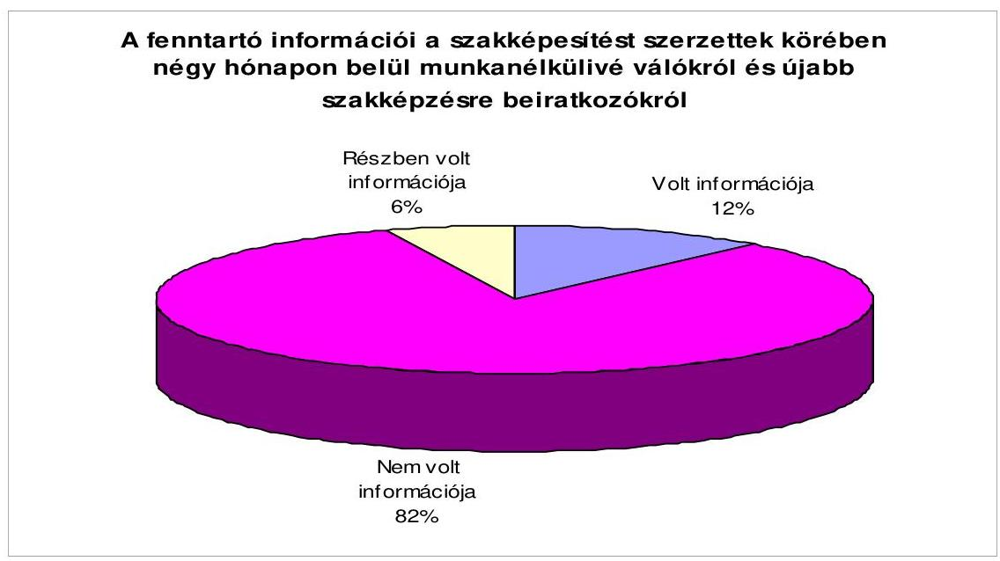
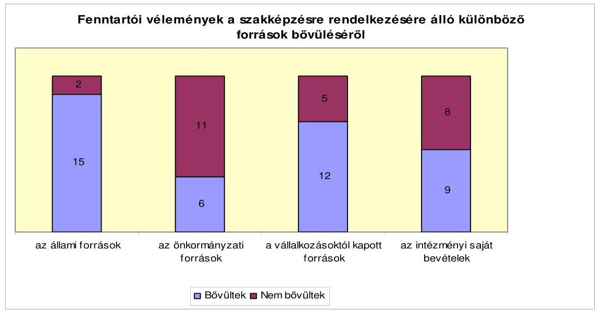
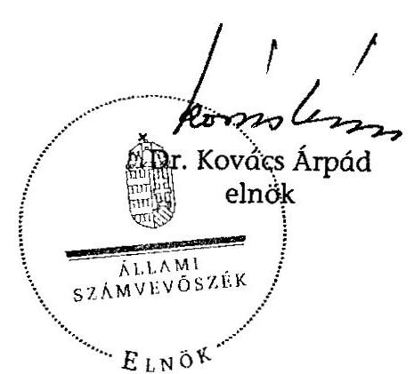
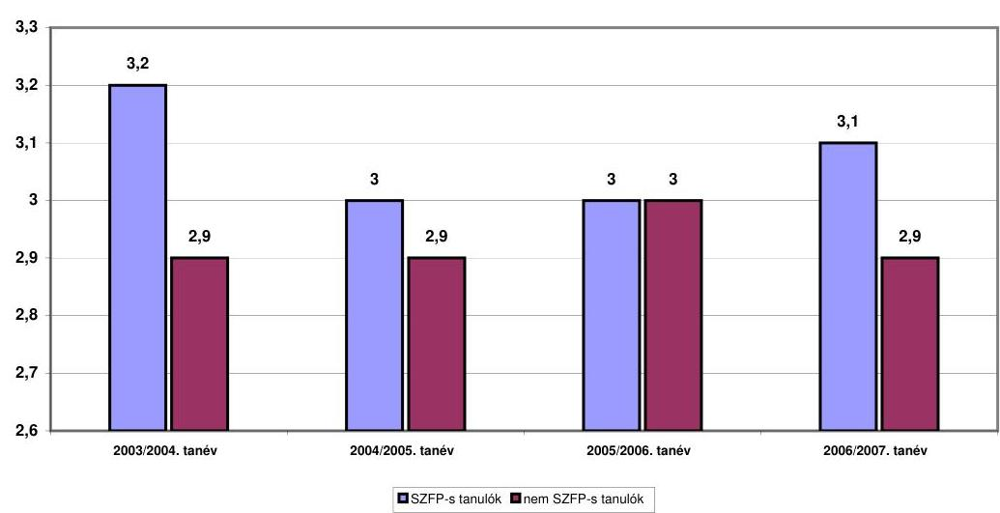
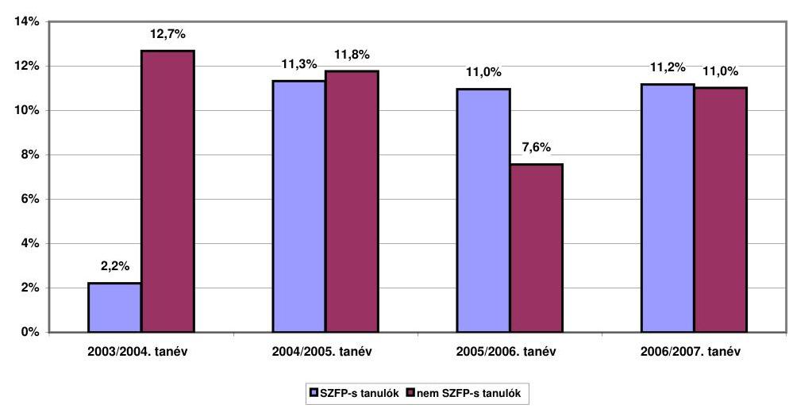
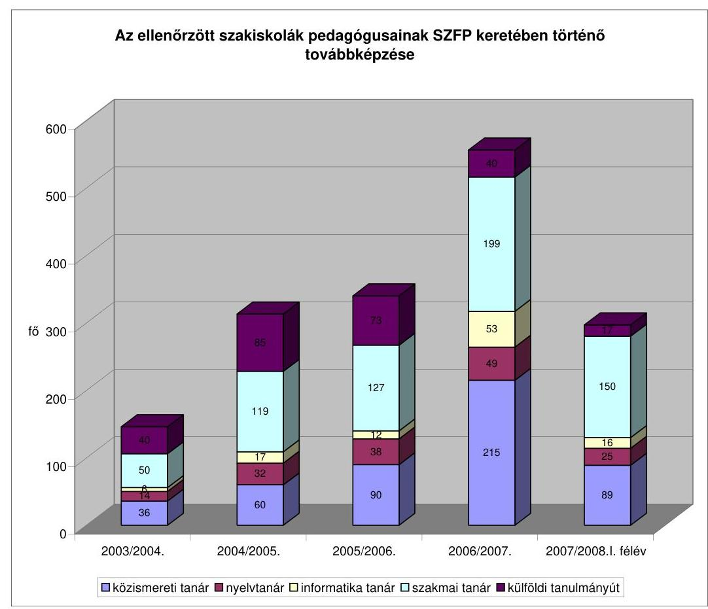
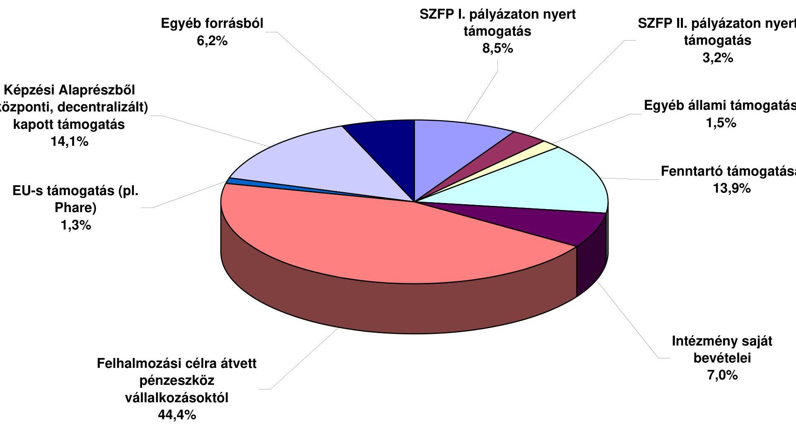
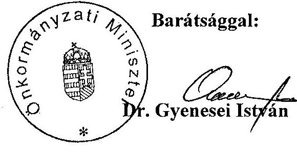
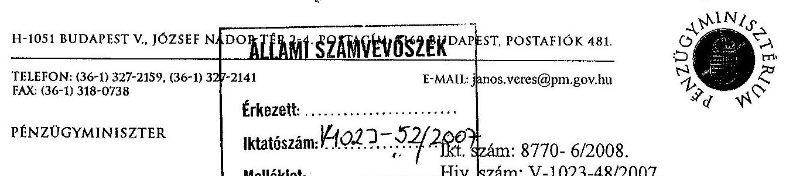
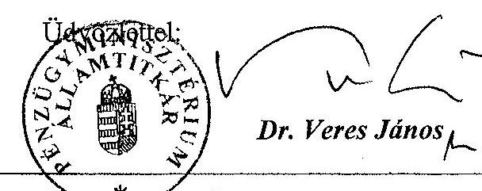

# ÁLLAMI   SZÁMVEVŐSZÉK 

## JELENTÉS

a szakiskolai fejlesztési programra fordított pénzeszközök felhasználása eredményességének ellenőrzéséről

---

# 3. Önkormányzati és Területi Ellenőrzési Igazgatóság 

3.2 Szabályszerűségi és Teljesítmény Ellenőrzési Főcsoport

Iktatószám: V-1023-055/2007.
Témaszám: 881
Vizsgálat-azonosító szám: V-0362

## Az ellenőrzést felügyelte:

Dr. Lóránt Zoltán
főigazgató
Az ellenőrzés végrehajtásáért felelős:
Németh Péterné
főcsoportfőnök

## Az ellenőrzést vezette:

Turnheimné Lakos Zsuzsa
főcsoportfőnök-helyettes
A számvevői jelentések feldolgozásában és a jelentés összeállításában közreműködtek:

| Benn Imréné   számvevő tanácsos | Bocsi Sándor   főtanácsadó | Somodiné Fehér Julianna   számvevő tanácsos |
| :-- | :-- | :-- |

## Az ellenőrzést végezték:

| Benn Imréné számvevő tanácsos | Bocsi Sándor főtanácsadó | Csuti Lajos számvevő tanácsos |
| :--: | :--: | :--: |
| Dér Lívia   számvevő tanácsos | Dr. Ernst László   főtanácsadó | Groholy Andrásné Hangyál Márta számvevő |
| Kányáné Murvai Tünde számvevő | Lakatos József számvevő | Dr. Marosi Gyöngyi tanácsadó |
| Mohl Anna   számvevő tanácsos | Pappné dr. Szamosi Éva számvevő tanácsos | Somodiné Fehér Julianna   számvevő tanácsos |
| Szabó Zoltán számvevő tanácsos | Szenténé Tubak Klára számvevő tanácsos | Dr. Szikszai Bertalan számvevő tanácsos |
| Tóth Péter számvevő | Tótfalusi Zoltán számvevő | Vojcsekné Szabó Ágnes számvevő tanácsos |

---

# A témához kapcsolódó eddig készített számvevőszéki jelentések: 

## címe

Jelentés a szakmunkásképzésre fordított pénzeszközök felhasználásának (a képzés eredményességének) ellenőrzéséről

Jelentés a szakképzési struktúra szerepéről a munkaerő-piaci igények kielégítésében
sorszáma
252

0321

---

# TARTALOMJEGYZÉK 

BEVEZETÉS ..... 7
I. ÖSSZEGZŐ MEGÁLLAPÍTÁSOK, KÖVETKEZTETÉSEK, JAVASLATOK ..... 9
II. RÉSZLETES MEGÁLLAPÍTÁSOK ..... 17

1. A gazdaság igényeinek figyelembe vétele a szakképzés-fejlesztés irányának, ütemének kialakítása során ..... 17
1.1. A szakképzés távlati céljainak kidolgozása ..... 17
1.2. Az intézményfenntartók és a gazdasági szereplők együttműködése a helyi képzés orientálásában ..... 20
1.2.1. A fenntartói célkitűzések és azok érvényesülése ..... 20
1.2.2. A gazdaság igényeinek érvényesülése az iskolai rendszerű képzés alakításában ..... 25
2. A szakiskolai fejlesztési program hatása a szakképzés eredményességére ..... 30
2.1. A program kialakításának megalapozottsága, lebonyolítása és folytatása ..... 30
2.2. Az SZFP célok megvalósulásának központi szintű értékelése ..... 36
2.3. A szakiskolai fejlesztés célkitűzéseinek területi megvalósulása ..... 39
2.4. Az SZFP eredményeinek mérése ..... 44
2.4.1. Az eredményesség mérése ..... 44
2.4.2. A pályakövetési rendszer megvalósításának helyzete ..... 50
3. A szakiskolai fejlesztéshez szükséges feltételek biztosítása ..... 53
3.1. Pénzügyi források a képzéshez és annak korszerűsítéséhez ..... 53
3.1.1. A forrásszükséglet felmérése, tervezése, biztosítása ..... 53
3.1.2. A központilag rendelkezésre álló források felhasználása, összhangja a szakképzés-fejlesztési célokkal ..... 57
3.1.3. Az intézményfenntartó önkormányzatok és szakiskolák rendelkezésére álló szakképzés-fejlesztési források alakulása ..... 62
3.2. A szakképzés-fejlesztés feltételeinek meglétét bemutató információk ..... 67
4. A szakképzés folyamatban lévő fejlesztése, eredményessége javításának tapasztalatai ..... 70
4.1. A szakmaszerkezet átalakítása ..... 70
4.2. Az új rendszerű képzés bevezetésének előkészítése ..... 72
4.3. A szakmaszerkezet átalakításának kezdeti tapasztalatai, új megoldások a képzés továbbfejlesztésére ..... 75

---

# MELLÉKLETEK 

1. számú A pedagógiai munka eredményei az SZFP II-ben
2. számú Az intézményi tanulói létszámok és az SZFP-ben résztvevő tanulók létszámának alakulása az ellenőrzött 37 intézménynél
3. számú Az ellenőrzött fenntartói körben a 9. évfolyamos szakiskolai tanulók lemorzsolódásának alakulása
4. számú Az ellenőrzött 17 SZFP I-ben érintett intézmény szakiskolai tanulóinak tanulmányi eredménye, bukási, lemorzsolódási adatai
4/a. számú Az SZFP I-ben érintett 17 intézmény 9. évfolyamosai tanulmányi eredményének alakulása
4/b. számú Az SZFP I-ben érintett 17 intézmény 9. évfolyamosai lemorzsolódásának alakulása
5. számú Az összehasonlító elemzés (benchmarking) adatbázisának használata az ellenőrzött önkormányzati körben
6. számú A szakképzés finanszírozásához a fenntartóknak biztosított normatív állami hozzájárulások 2003-2007. év között
7. számú A szakiskolák költségvetési súlya az ellenőrzött 17 önkormányzat költségvetésében
8. számú A szakiskolában foglalkoztatott pedagógusok továbbképzésének alakulása az ellenőrzött 37 intézménynél
8/a. számú Az ellenőrzött szakiskolák pedagógusainak SZFP keretében történő továbbképzése
9. számú A felhalmozási források és felhalmozási kiadások alakulása az ellenőrzött 37 intézménynél
9/a. számú A felhalmozási források összetétele az ellenőrzött 37 intézménynél
10. számú Az új OKJ szerinti szakmai képzések az ellenőrzött 17 fenntartó szakiskoláiban

## FÜGGELÉK

1. számú Ellenőrzött fenntartók, szakiskolák, kereskedelmi- és iparkamarák

---

# RÖVIDÍTÉSEK JEGYZÉKE 

## Törvények

Áht.
ÁSZ törvény

Flt.
kamarai törvény
közoktatási törvény
Ötv.
reformprogram végrehajtásához kapcsolódó törvény
szakképzési törvény
szakképzési hozzájárulásról szóló törvény

## Az állami irányítás egyéb jogi eszközei

a közoktatási törvény végrehajtási rendelete
2003-as kormányhatározat

2005-ös kormányhatározat

## Szórövidítések

ÁSZ
FEOR
FKT
FMM

HEFOP
IKT

ISCO
ISCED
KIR
KSH
MKIK
MPA
NFT I.
az államháztartásról szóló 1992. évi XXXVIII. törvény
az Állami Számvevőszékről szóló 1989. évi XXXVIII. törvény
a foglalkoztatás elősegítéséről és a munkanélküliek ellátásáról szóló 1991. évi IV. törvény
a gazdasági kamarákról szóló 1999. évi CXXI. törvény
a közoktatásról szóló 1993. évi LXXIX. törvény
a helyi önkormányzatokról szóló 1990. évi LXV. törvény
a szak- és felnőttképzést érintő reformprogram végrehajtásához szükséges törvények módosításáról szóló 2007. évi CII. törvény.
a szakképzésről szóló 1993. évi LXXVI. törvény
a szakképzési hozzájárulásról és a képzés fejlesztésének támogatásáról szóló 2003. évi LXXXVI. törvény
a közoktatásról szóló 1993. évi LXXIX. törvény végrehajtásáról szóló 20/1997. (II. 13.) Korm. rendelet
Az iskolai rendszerű szakképzés munkaerőpiac által igényelt korszerűsítésére irányuló intézkedésekről szóló 2015/2003. (I. 30.) Korm. határozat
A szakképzés-fejlesztési stratégia végrehajtásához szükséges intézkedésekről szóló 1057/2005. (V. 31.) Korm. határozat

Állami Számvevőszék
Foglalkozások Egységes Osztályozási Rendszere
Fejlesztési és Képzési Tanács
Foglalkoztatáspolitikai és Munkaügyi Minisztérium (2006. június 8-ig)
Humán Erőforrás Fejlesztési Operatív Program
SZFP-ben az Információs és Kommunikációs technológiai fejlesztés keretében beszerzett eszközök
Foglalkozások Nemzetközi Osztályozási Rendszere
Az oktatás egységes nemzetközi osztályozási rendszere
Közoktatás Információs Rendszere
Központi Statisztikai Hivatal
Magyar Kereskedelmi és Iparkamara
Munkaerő Piaci Alap
Nemzeti Fejlesztési Terv 2004-2006.

---

| NFT II. | Nemzeti Fejlesztési Terv 2007-2013. |
| :--: | :--: |
| NSZFI | Nemzeti Szakképzési és Felnőttképzési Intézet (2007. január 1-jétől) |
| NSZI | Nemzeti Szakképzési Intézet (2006. december 31-éig) |
| NSZFT | Nemzeti Szakképzési és Felnőttképzési Tanács (2007. január 1-jétől) |
| OÉT | Országos Érdekegyeztető Tanács |
| OFKT | Országos Felnőttképzési Tanács (2006. december 31-éig) |
| OH | Oktatási Hivatal |
| OKÉV | Országos Közoktatási Értékelési és Vizsgaközpont |
| OKJ | Országos Képzési Jegyzék |
| OKM | Oktatási és Kulturális Minisztérium (2006. június 9-étől) |
| OM | Oktatási Minisztérium (2006. június 8-áig) |
| OMAI | OM Alapkezelő Igazgatósága |
| OSAP | Országos Statisztikai Adatfeldolgozó Programok |
| OSZEB | Országos Szakképzési Együttműködési Bizottság |
| OSZT | Országos Szakképzési Tanács (2006. december 31-éig) |
| PIB | Program Irányító Bizottság |
| PKI | Programkoordinációs Iroda (2004-től) |
| PTMIK | Pedagógus Továbbképzési Módszertani és Információs   Iroda |
| RFKB | Regionális Fejlesztési és Képzési Bizottság |
| Szakképzési stratégia | Középtávú Szakképzés-fejlesztési Stratégia 2005-2013. |
| SZFP I. | Szakiskolai Fejlesztési Program I. üteme |
| SZFP II. | Szakiskolai Fejlesztési Program II. üteme |
| SZMM | Szociális és Munkaügyi Minisztérium (2006. június 9-étől) |
| SZÖM | Szakiskolai Önértékelési Modell |
| TÁMOP | Társadalmi Megújulás Operatív Program |
| TISZK | Térségi Integrált Szakképző Központ |

---

# ÉRTELMEZŐ SZÓTÁR 

benchmarking
gazdasági program
indikátor
képesség
kompetencia
belépési/bemeneti kompetencia
kilépési/kimeneti kompetencia
kompetencia alapú képzés
kompetencia szintmérés
komponens
modul
modul térkép

Munkaügyi Tanács

Összehasonlítás sikeres problémamegoldások érdekében. Az önkormányzati képviselő-testületek megbízatásuk időtartamára az Ötv. 91. § (6) bekezdése előírásai alapján gazdasági programot kötelesek készíteni, amely helyi szinten meghatározza mindazon célkitűzéseket, feladatokat, amelyek a költségvetési lehetőségekkel összhangban, a helyi társadalmi, környezeti, gazdasági adottságok átfogó figyelembevételével - a kistérségi területfejlesztési koncepcióhoz illeszkedve - az önkormányzat által nyújtandó kötelező és önként vállalt feladatok biztosítását, fejlesztését szolgálják.
Számszerű céladat az oktatás helyzetének és teljesítményének méréséhez.
Az egyén pszichikus tulajdonságainak összessége, melyek a feladatok, tevékenységek eredményes elvégzésében nyilvánulnak meg.
Azon elvárható ismeretek, képességek, magatartási és viselkedési jegyek összessége, amely által a személy képes lesz egy adott feladat eredményes teljesítésére.
Mindazon kompetenciák összessége, melyek szükségesek egy adott képzés (azon belül egy modul), szakképzés megkezdéséhez.
Mindazon kompetenciák összessége, melyek szükségesek egy adott képzés (azon belül egy modul), szakképzés befejezéséhez, a szakképesítés megszerzéséhez.
Olyan képzés, amely előre meghatározott kompetenciák megszerzésére irányul.
Egy adott kompetencia elsajátításának mérése, előre megadott kritériumok alapján.
Összetevő, alkotórész.
A teljes tananyag önállóan kezelhető nagyobb, meghatározott időtartammal is behatárolt része.
A modul rendszerű képzésekhez a modulok térképszerű, rajzos elrendezése, mely ábrázolja a modulok időbeli elrendezését és kapcsolatát más modulokkal.
A foglalkoztatási, munkaerő-piaci képzési támogatások nyújtásával kapcsolatos érdekegyeztetés fóruma, 2007. január 1-jéig megyei munkaügyi tanácsként, ezt követően helyi munkaügyi tanácsként funkcionál. A gazdaság igényeinek képviselete érdekében a munkaügyi tanácsnak a munkaadók képviseletét ellátó tagokból álló munkaadói oldalába az OÉT-ban képviselettel rendelkező országos munkáltatói szövetségek, a munkavállalók képviseletét ellátó tagokból álló munkavállalói oldalába az OÉT-ban képviselettel rendelkező munkavállalói szövetségek egy-egy tagot jelölnek. A munkaügyi tanács önkormányzati

---

projekt módszer
reintegráció

SWOT elemzés

Szakmai Tanácsadó Testület

SZFP
oldalának egy-egy tagját a működési területéhez tartozó megyékben a megyei kistérségi fórumok, a munkaügyi tanács illetékességi területén lévő megyei jogú városok, valamint a regionális fejlesztési tanács választja, illetve hívja vissza.
Olyan oktatásszervezési módszer, mely az oktatást/képzést gyakorlati problémák megoldása köré csoportosítja, a tanulók és tanárok közös tervező, kivitelező és értékelő tevékenységére épít.
Az előkészítő évfolyamokat támogató és segítő együttműködési formák, amelyek esélyt adnak a hátrányos helyzetű fiataloknak, hogy visszakerüljenek a szakképzésbe és ott szakmai vizsgát tehessenek.
A körültekintő tervezést támogató módszer, amely segít a kritikus helyzetértékelésben és a reális lehetőségek felmérésében. (Táblázatos formában mutatja be az erős és gyenge pontokat, a lehetőségeket és veszélyeket. E kifejezések angol nyelvű megfelelőinek rövidítése a betűszó.)
A gazdaság igényeinek a képzési szerkezetben történő megjelenítése érdekében jogszabályi előírás született szakmai tanácsadó testület létrehozására és működtetésére. A legalább ötszáz fő tanulólétszámmal rendelkező szakképző iskolában a szakmai érdekegyeztetés rendszerének fejlesztése, a szakképzésben érdekelt szervezetek együttműködésének ösztönzése, a munkáltatók igényei érvényesítésének biztosítása érdekében a gazdasági kamara, a munkaadói és munkavállalói érdekképviseleti szervezet, a fenntartó képviselői részvételével szakmai tanácsadó testületet kellett létrehozni. A rendelkezés a szakképzési törvény 8. § (3) bekezdése alapján 2006. január 1-jén lépett hatályba, hatályon kívül helyezte 2007. évi CII. tv. 42. § (6) c bekezdése 2007. szeptember 1-jén.
Szakiskolai Fejlesztési Program, amelynek célja, hogy javítsa a szakképzés minőségét, növelje a végzettek elhelyezkedési esélyeit és ezeken keresztül erősítse a képzés és a képzésben résztvevők szakmai és társadalmi presztízsét. További feladata, hogy előkészítse a szakiskolai rendszert a Nemzeti Fejlesztési Tervben megfogalmazott szakképzési feladatok végrehajtására.

---

# JELENTÉS 

## a szakiskolai fejlesztési programra fordított pénzeszközök felhasználása eredményességének ellenőrzéséről

## BEVEZETÉS

Az elmúlt évtizedben az iskolai rendszerű szakképzés fejlesztésének középpontjában a szakközépiskola állt, amit világbanki program is segített, ugyanakkor a szakiskolák innovációja elmaradt. A szakiskolai képzésbe nagyobb arányban kerültek gyenge tanulási képességű tanulók, akik korlátozott mértékben tudtak csak megfelelni a munkaerő-piaci elvárásoknak. A Nemzeti Fejlesztési Tervhez kapcsolódóan Magyarország állapotának SWOT elemzésében a humán erőforrások gyengeségei között szerepel, hogy az oktatás, a képzés és a munkaerő-piac között nem megfelelő a kapcsolat, a szakképzési irányok és a munkaerő-piaci igények különbözősége problémákat vet fel. Időközben ezek a problémák már a nemzetgazdaság egyes ágazatai fejlődésének akadályaivá váltak.

Az Oktatási Minisztérium által a 2003. évben elindított hároméves Szakiskolai Fejlesztési

 Program a szakiskolák és a szakiskolákban folyó képzés megújulását célozta meg, az általános készségek és ismeretek fejlesztésével, a munkaerőpiacra való bejutási esélyek javításával. A program megvalósítására 13 milliárd Ft-ot terveztek a központi költségvetésből, illetve az MPA Képzési Alaprészéből. A Kormány a 2015/2003. (I. 30.) határozatában hatalmazta fel az oktatási minisztert a Szakiskolai Fejlesztési Program megkezdésére, melynek nyomán pályázati felhívások jelentek meg és a 2003/2004. évi tanévtől vehette kezdetét 90 intézménynél a központi forrásból finanszírozott szakmai fejlesztő munka.

A szakképzés tartalmi, módszertani és szerkezeti fejlesztése érdekében az oktatási tárca kidolgozta a – korábban az ÁSZ által is hiányolt – szakképzés-fejlesztési stratégiát, melynek végrehajtásához szükséges intézkedésekről az 1057/2005. (V. 31.) Korm. határozat rendelkezett. A szakképzési rendszer rugalmasságának javítása céljából ebben részletesen meghatározták az új szakképzési szerkezet kialakításának feladatait. Bevezetéséhez az ellenőrzési program előkészítésének időszakában új szerkezetű Országos Képzési Jegyzék készült, de az eredeti elképzelésekkel ellentétben – a szakmai és vizsgakövetelmények kiadásának késedelme miatt – a 2008/2009-es tanévig lehetőség volt a régi előírások szerinti képzést is indítani. Vizsgálatunk – a teljes bevezetés minél zökkenőmentesebb lebonyolításának elősegítése mellett – egyben a 2003. évben befejezett, a szakképzési struktúrának a munkaerő-piaci igények kielégítésében elfoglalt szerepét áttekintő ellenőrzésünk utóvizsgálatát is jelentette.

A vizsgált időszakban számottevően romlottak a szakképzés ágazati irányításának személyi feltételei. A Magyar Köztársaság minisztériumainak felsorolásáról szóló,

---

2006. június 2-án kihirdetett 2006. évi LV. tv. értelmében a szakképzéssel kapcsolatos feladatok az Oktatási Minisztériumból a Szociális és Munkaügyi Minisztériumba kerültek át. Az OM-nél a szakképzési feladatokat önálló államtitkárság látta el 25 fővel. 2006. év júliusától az SZMM Felnőttképzési és Szakképzési Főosztályán a támogatáskezelési és a szakképzési teendőkkel együttesen 13 fő foglalkozott. Ez is hozzájárult, hogy a feladat átadás-átvétele nem tételes dokumentumok alapján történt. A feladatátcsoportosítás nagyban nehezítette az előző kormányzati ciklus időszakában hozott intézkedések hátterének, megalapozottságának objektív megismerését.

Az ellenőrzés célja annak megítélése volt, hogy

- milyen elmozdulás tapasztalható a szakképzés területén a 2003-ban lezárt vizsgálatunk óta eltelt időszakban;
- a gazdasági környezet és a szakképzés jogi szabályozásának változásai, a 2003-ban beindított szakiskolai fejlesztési program, valamint a szakképzésfejlesztési stratégia végrehajtása érdekében tett intézkedések milyen hatással voltak a szakképzés eredményességére;
- a rendelkezésre álló források, a pénzügyi, statisztikai információs rendszer segítséget nyújtott-e a szakképzés megújulásához;
- a munkaerőpiac igényeihez való alkalmazkodás és a szakképzés hatékonyságának növelése érdekében kialakítottak-e szakmai kritériumokat és a költséghatékonyság mérésére szolgáló indikátorrendszert.

Az SZFP I. programban végig részt vevő 89 intézményből 17-nél, a 70 SZFP II. pályázati nyertesből 20-nál, valamint e szakiskolák 17 fenntartójánál, 7 megye kereskedelmi- és iparkamarájánál és a szakképzés ágazati irányításáért felelős Szociális és Munkaügyi Minisztériumnál, továbbá a Nemzeti Szakképzési és Felnőttképzési Intézetnél végeztünk helyszíni ellenőrzést a 2003/2004. tanévtől a 2007/2008. tanévig, illetve a 2003. gazdálkodási évtől 2007. június 30-ig terjedő időszakra. (Az ellenőrzött fenntartók, szakiskolák és kamarák jegyzékét az 1. számú függelék tartalmazza.)

A vizsgálatot teljesítmény-ellenőrzési módszerrel végeztük. A legjellemzőbb problémákat összegyűjtő kérdésfa alapján vizsgálati szintenként összeállított vizsgálati program tartalmazta az ellenőrzési, értékelési feladatokat. A programpontok ellenőrzését munkalapok és kritériumtáblák segítették, melyekben meghatároztuk a főbb követelményeket – valamint az azokat bemutatni hivatott kapcsolódó adatforrásokat is –, melyek teljesüléséről a vizsgálat során bizonyosságot kívántunk szerezni.

Az ellenőrzés jogszabályi alapja az Állami Számvevőszékről szóló 1989. évi XXXVIII. törvény 2. § (3), (5) bekezdései, az államháztartásról szóló 1992. évi XXXVIII. törvény 120/A. § (1) bekezdése, valamint a helyi önkormányzatokról szóló 1990. évi LXV. törvény 92. § (1) bekezdése.

---

# I. ÖSSZEGZŐ MEGÁLLAPÍTÁSOK, KÖVETKEZTETÉSEK, JAVASLATOK

Az ezredfordulóra nyilvánvalóvá vált, hogy a gazdaság versenyképessége növelésének, a fenntartható fejlődés biztosításának nélkülözhetetlen feltétele a magas színvonalú szakképzés. Az ellenőrzéssel érintett 2003-2007. években készült kormányprogramok a széleskörű szakmai alapot nyújtó képzési rendszert, a szakképzés intézményrendszerét, a szakképzés szerkezetének, a végzett tanulók számának és felkészültségének a gazdaság igényeihez történő rugalmasabb alkalmazkodását helyezték a szakképzés modernizációjának középpontjába. E célokat szolgálta a 2003-ban beindított szakiskolai fejlesztési program, melynek két ütemében a 2007. év végéig 8818 millió Ft-ot fordítottak a mintegy 120 ezer szakiskolába járó tanuló képzésének korszerűsítésére.

A szakképzés irányítói pótolták korábbi mulasztásukat és 2005. évben a Kormány elé terjesztették a szakképzés középtávú stratégiáját. A 2013-ig szóló elképzelések kialakításába bevonták a gazdasági szereplőket is. A gazdasági kamarák képzési feladatai a szakképzés törvényi módosítása hatására már 2003. évben szélesedtek. A jogszabályi változás a szintvizsgák bevezetésével kedvezőbb feltételeket teremtett az oktatás gyakorlati jellegének erősítésére, majd az MKIK gondozásába került szakképesítések szakmai és vizsgakövetelményeinek kidolgozásával a gazdaság igényeinek figyelembevételére. A stratégia végrehajtásához szükséges intézkedésekről elfogadott kormányhatározat konkrét feladatokat határozott meg a felhasználók igényei szerinti szakképzés kialakítása, a szakképzés tartalmi fejlesztése és feltételeinek javítása érdekében.

A szakiskolák helyi céljainak kialakításához a megyei, fővárosi feladatellátási, intézményhálózat működtetési és fejlesztési tervek és a fenntartók hosszú távú tervei az általános megfogalmazások miatt nem nyújtottak kellő segítséget. Az iskolák célkitűzéseiket a konkrét feladatok szintjén fogalmazták meg, de azok a képzés szerkezetének átalakítása helyett inkább a pedagógiai elképzelésekre korlátozódtak. Az ágazati koncepció helyi szintű megjelenítésének leghatékonyabb módja a szakképzési célok teljesítését elősegítő pályáztatás volt, amely elősegítette a felvázolt elképzelések szakiskolai érvényesülését és meghatározta a megvalósítás ütemét.

Az ágazat vezetése a szakiskolai képzéssel kapcsolatos problémák megoldására „Szakiskolai fejlesztési program” néven hároméves tervet dolgoztatott ki. A program kidolgozása 2002. év őszén kezdődött meg, és még a szakképzés távlati céljainak elfogadása előtt, 2003 januárjában határozott a Kormány arról, hogy az OM kezdje meg a programot. A szakiskolai fejlesztés előkészítésekor nem készült előzetes hatástanulmány, a program forrásszükségleteként előzetesen tervezett 13,0 milliárd Ft nem volt megalapozott; csaknem kétszerese volt annak, mint amit a program évenként jóváhagyott költségvetései a 2002-2006. évek között összesen tartalmaztak, mivel az eredeti elképzelésekben rögzített pénzügyi keret 59%-a állt rendelkezésre. A program meghirdetésekor még feltételezett – a finanszírozás céljára igénybe vehető – források (OM költségvetés, EU-s pályázati pénzeszközök) hiányában a végrehajtás forrása kizárólag az

---

MPA képzési alaprésze volt. Ebből a forrásból fedezték az egyes komponensek szakmai, tárgyi fejlesztési kiadásait, valamint a programirányítási, marketing és monitoring tevékenység költségeit. A tervezett kiadások az SZFP I-ben 7,6 milliárdot tettek ki, a tényleges felhasználás ennek 90%-a, 6,9 milliárd Ft volt, melynek közel fele a részt vevő intézmények eszközfejlesztéseként valósult meg. A programköltségek tervezett szint alatti teljesülését a túlméretezett kiadási előirányzatok, a közbeszerzési eljárásokon elért kedvezőbb eszközbeszerzési árak, utazási, szállásköltségek eredményezték. Az alacsonyabb forrásfelhasználás is hozzájárult ahhoz, hogy a program-előkészítés, irányítás, lebonyolítás, PR és monitoring kiadásokra fordították a felhasznált források 14%-át. A program költségvetésének évente történő megállapítása miatt az intézményeknek előzetesen nem volt információja a támogatásként juttatandó pénzeszközök és térítésmentesen átadásra kerülő tárgyi eszközök nagyságrendjéről, az együttműködési megállapodásokban csak az elvégzendő szakmai feladatok szerepeltek. Ezek finanszírozására egyedi támogatási szerződések alapján került sor, melyek fedezetet nyújtottak a programban meghatározott szakmai célkitűzések megvalósítására. Az előzetes helyzetértékelés alapján a feladat-struktúra középpontjába azokat a teendőket helyezték, amelyek a szakiskolai képzés legégetőbb problémáját voltak hivatottak megoldani. A pályázat komponensei közül bármelyik részterületre lehetett külön is jelentkezni, ami gyengítette az SZFP által elérni kívánt összhatást.

A szakiskolai fejlesztési program 2006-ban záródó első ütemének objektív bevá-lás-, illetve hatásvizsgálatára a helyszíni ellenőrzésünk befejezéséig nem került sor. Ennek hiányában a program befejezését követően nem ismert, hogy összességében javultak-e a program hatására a pályakezdő szakmunkások munkaerő-piacra jutásának esélyei, de arról sem készült összefoglaló értékelés, hogy csökkent-e a szakiskolai tanulók lemorzsolódása. A monitoring fel tudta mérni a konkrét eszközfejlesztéseket és képes volt érzékeltetni a programban részt vevő pedagógusok szemléletváltozását, de a felhasznált erőforrások hasznosulásának, a kimeneti teljesítmények változásának bemutatása elmaradt. A program megvalósításának összegezett eredményei a tananyagfejlesztésről, a szakmai és vizsga követelményrendszer korszerűsítéséről, eszközfejlesztésről, a szakmai nyelvi képzés megújításáról, a mérés-értékelés és az informatikai felszereltség fejlesztéséről adtak képet.

A megvalósítás során több olyan pedagógiai-szakmai „termék” is született – kerettanterv, feladatbank, tananyag-fejlesztések, SZÖM –, amely felkínálta a program tapasztalatainak szélesebb körű hasznosítását, de a programon kívüli intézmények számára a vizsgált időszakban nem volt olyan pályázati lehetőség, ami megkönnyítette volna a korszerűbb pedagógiai módszerek átvételét. A program figyelemmel kísérése során nem alakult ki az a gyakorlat, hogy a jó megoldások, kedvező tapasztalatok közreadásával a fenntartók segítséget kapjanak a felmerülő problémák megoldására. A kitűzött célok elérésének mérésére, a program figyelemmel kísérésére olyan indikátorok bevezetését tervezték, amelyekkel egzakt módon is bemutatható a program eredményessége. Ennek megvalósítására azonban csak az SZFP I. program megvalósításának középső időszakában került sor, elérendő célértékeket viszont ekkor sem tűztek ki. Az intézményektől nem követelték meg, hogy az eredményekről évente és a program befejezésekor – maguknak és fenntartóiknak – készítsenek átfogó értékelést.

---

Ahhoz, hogy a program hatását lemérjük, az ellenőrzött fenntartók és intézmények körében áttekintettük a felzárkóztatás megszervezését, a lemorzsolódás és a tanulmányi eredmények alakulását. Az intézmények és fenntartók közel felénél javultak az iskolaelhagyást jelző lemorzsolódási mutatók az SZFP I-ben. (Az SZFP II-ben az eltelt idő rövidsége miatt a program hatásaként ilyen egyértelmű tendenciák még nem állapíthatók meg.) A tanulmányi eredményen belül a vizsgált iskolákban a 9-10. évfolyamon mutatható ki egyértelműen a bukási arányok javulása, a tanulmányi átlagok is az SZFP-s 9. évfolyamokon 2-3 tizeddel magasabbak, mint a programban részt nem vevőknél. A felzárkóztató oktatásban résztvevők az intézményi tapasztalatok szerint nagy tudásbeli különbségeket mutattak, az iskolapadban tartásuk a gyakori hiányzások miatt nehézségekbe ütközött. A program végrehajtása abból a szempontból mondható sikeresnek, hogy azon tanulóknak, akik az általános iskolát nem fejezték be, esélyt biztosított a szakmai képzésbe való bekapcsolódásra. Az SZFP hatásaként bővülés tapasztalható a felzárkóztató képzések szervezésében. Az elsajátított módszerek hosszabb távú hatását tervező programirányítók számoltak azzal, hogy a fenntartók a programban részt vevő iskolák segítségével a nem pályázóknál is hasznosítják a tapasztalatokat, de e módszereket elsősorban a programban részt vevő iskolák honosították meg, 70%-uk alkalmazta pedagógiai-szakmai munkájában a komponenseket és az iskolák egészére kiterjesztette a kompetencia alapú képzést.

A szakiskolai fejlesztési program 2006-ban záródó első ütemének objektív bevá-lás-, illetve hatásvizsgálatára a helyszíni ellenőrzésünk befejezéséig nem került sor. Ennek hiányában a program befejezését követően nem ismert, hogy összességében javultak-e a program hatására a pályakezdő szakmunkások munkaerő-piacra jutásának esélyei, de arról sem készült összefoglaló értékelés, hogy csökkent-e a szakiskolai tanulók lemorzsolódása. A monitoring fel tudta mérni a konkrét eszközfejlesztéseket és képes volt érzékeltetni a programban részt vevő pedagógusok szemléletváltozását, de a felhasznált erőforrások hasznosulásának, a kimeneti teljesítmények változásának bemutatása elmaradt. A program megvalósításának összegezett eredményei a tananyagfejlesztésről, a szakmai és vizsga követelményrendszer korszerűsítéséről, eszközfejlesztésről, a szakmai nyelvi képzés megújításáról, a mérés-értékelés és az informatikai felszereltség fejlesztéséről adtak képet.

A megvalósítás során több olyan pedagógiai-szakmai „termék” is született – kerettanterv, feladatbank, tananyag-fejlesztések, SZÖM –, amely felkínálta a program tapasztalatainak szélesebb körű hasznosítását, de a programon kívüli intézmények számára a vizsgált időszakban nem volt olyan pályázati lehetőség, ami megkönnyítette volna a korszerűbb pedagógiai módszerek átvételét. A program figyelemmel kísérése során nem alakult ki az a gyakorlat, hogy a jó megoldások, kedvező tapasztalatok közreadásával a fenntartók segítséget kapjanak a felmerülő problémák megoldására. A kitűzött célok elérésének mérésére, a program figyelemmel kísérésére olyan indikátorok bevezetését tervezték, amelyekkel egzakt módon is bemutatható a program eredményessége. Ennek megvalósítására azonban csak az SZFP I. program megvalósításának középső időszakában került sor, elérendő célértékeket viszont ekkor sem tűztek ki. Az intézményektől nem követelték meg, hogy az eredményekről évente és a program befejezésekor – maguknak és fenntartóiknak – készítsenek átfogó értékelést.

---

Az SZFP I. befejezését megelőzően hirdették meg az SZFP II. pályázatot. Így nem volt lehetőség a SZFP I. összegezett tapasztalatainak átvételére, ennek ellenére néhány ponton felhasználták az első ütem tanulságait. Módosult például a SZFP II. felépítése és a pályáztatás rendszere. Az új kiírásnak megfelelően a szakiskoláknak – egy komponens kivételével – valamennyi fejlesztési területtel foglalkozni kellett. Továbbra sincs viszont a teljes időszakot átfogó, komponensekre kidolgozott, megalapozott költségvetés, így nem változott az a gyakorlat sem, hogy a program költségvetésére
 évenként hagyják jóvá a forrásokat. A finanszírozás kizárólagos forrásaként az MPA Képzési alaprészét jelölték meg, a kiadásokra az első két évben 1946 millió Ft-ot használtak fel. A költségfelhasználás eddigi adatai alapján a program irányítói a következő négy évben 7 milliárd Ft prognosztizált összeggel számolnak. A nyertes intézményekkel megkötött együttműködési megállapodások a szakiskolák feladatává tették a visszatérő mérés-értékelést. Elérendő országos céladatokat azonban a II. program sem határozott meg. Az eredményesség mérésére szolgáló összehasonlító adatbázist nem érlelték ki, nem hangolták össze az oktatási statisztikai rendszerrel. Az adatbázisból nyerhető információk az eredményesség mérésére még 2008 elején sem voltak alkalmasak. Nehézkessége, szerkezeti változásai és a rendszer használatához szükséges betanítás, szakmai segítés hiányosságai és késedelme miatti alacsony feltöltöttsége következtében összehasonlító elemzésre nem használták. Az ellenőrzött intézményfenntartók nem ismerték vagy ha ismerték is - nem ösztönözték intézményeiknél az összehasonlító mérés-értékelés indikátorainak használatát.

A szakiskolai fejlesztési program szélesebb körű hatásairól a folyamatos mérés-értékelés hiányában nincs megalapozott információ. A kedvező hatások kiterjesztésében segítséget nyújt a valamennyi részt vevő intézmény által bevezetett Szakiskolai Önértékelési Modell, ami hosszabb távra megalapozta az iskolai teljesítmények mérésének és értékelésének rendszerét. Projektmódszer

---

szerinti oktatást döntően a felzárkóztató osztályokban végeztek, ahol az a tanulóknál kedvező fogadtatásra talált, mivel az egyénre szabott tanulás segítségével a hagyományos oktatásnál jobb eredményeket érhetnek el. A módszer az eddigiekhez képest a pedagógusok szemléletmódjában, felkészülésében, a tanórai csoportmunkában, a tanulók teljesítményének értékelésében jelent változást, általa a korábban passzív diákok is bevonhatók a tanulásba, segít a konfliktuskezelésben és javítható a szakiskolai tanulók motivációja is. A módszer jelentőségét növeli, hogy a tankötelezettségi kor 16-ról 18 évre történt felemelése várhatóan az eddigieknél is nagyobb terhet ró a szakiskolákra, mivel a kötelező beiskolázás miatt egyre több a tanulási vagy magatartási problémával terhelt szakiskolás. A pedagógusok véleménye szerint erre a módszerre kellően még nem készítették fel őket.

A szakképzés irányítását, korszerűsítését végzők, valamint a fenntartók számára elengedhetetlenül fontos az egyes szakképzések kiadásait bemutató számviteli és a statisztikai adatszolgáltatási rendszer. A közoktatás területén végzett korábbi ellenőrzéseink során észlelt visszatérő probléma a szakiskoláknál is érzékelhető volt. A vizsgált szakiskolák többségében sem különítették el a különböző oktatási feladatok kiadásait, ami nehezítette a szakiskolai oktatás országos és helyi szintű kiadásainak pontos kimutatását. Ehhez az elmúlt évek gyakori számviteli (szakfeladati) változásai is hozzájárultak. Az intézmények vezetése, illetve a fenntartó részéről sem volt igény arra, hogy az összetett feladatokat ellátó intézmények oktatási formánként (gimnázium, szakközépiskola, szakiskola) és szakmánként eltérő kiadásait megismerjék, így ezeknek a képzéshez biztosított állami források nagyságrendjével való megbízható összevetésére sem nyílt lehetőség.

Jelenleg még nem működik olyan interaktív, szakképesítés mélységű információs rendszer, amely adatokat tartalmazna a munkaerőpiac igényéről, valamint a végzett, a gazdaság számára rendelkezésre álló szakmunkásokról. Ezek alkalmazásával megállapítható lenne, mely területeken kevés a szakképzett munkaerő, mely szakmáknál, szakképző helyeknél történt túlképzés. Az NSZFI által kezelt statisztikai rendszerek, az OKM oktatási statisztikái, a KSH adatgyűjtései, valamint a nemzetközi adatokkal való összehasonlítás megteremtésével összehangolható a munkaerő-piaci igény és a képzési szerkezet, amennyiben a rendszer komplex működtetését az adatbázisok összekapcsolásával biztosítják.

A végzett tanulók munkaerő-piaci helyzete, és annak SZFP hatására történt javulása, az elhelyezkedési arányok nem ismertek, mivel a pályakövetési rendszer törvényi előírása csak részben valósult meg, a működéséhez szükséges végrehajtási rendeletet ugyanis a Kormány még nem alkotta meg. Nem voltak eredményesek a fenntartóknak és az intézményeknek a végzett tanulók pályakövetésére tett intézkedései, mert a visszajelzések alacsony aránya miatt az összesített adatok átfogó következtetések levonására, a szakmastruktúra változtatására alkalmatlanok voltak.

A Kormány a szakképzés átalakítását a pénzügyi feltételek változtatásával is segítette. A képzés finanszírozására vonatkozó feladatok meghatározásá-

---

nál figyelembe vette a 2003. évi szakképzési témájú ${ }^{1}$ ellenőrzésünk e témakörben tett javaslatait. A célkitűzések között kiemelt szerepet kapott a rendelkezésre álló források hatékonyabb felhasználása és a meglévő kapacitások jobb kihasználása. Az elvégzendő feladatok körében a szakképzési stratégia a pénzügyminiszter és a szakképzésért felelős miniszterek számára konkrét teendőket fogalmazott meg a szakképzési rendszer differenciált finanszírozásának korszerűsítésére, a munkaerőpiacon hiányzó szakképzések támogatására, a normatívának a szakképzettséget szerzett tanulók elhelyezkedési aránya alapján történő differenciálására.

A szakmai gyakorlati képzés normatívája 2004. évtől differenciált, preferálja a gazdasági környezetben megvalósuló gyakorlati képzést. A költséghatékonyság javítását célozta 2007. szeptember 1-jétől a szakiskolai oktatás és szakmai elméleti képzés normatív hozzájárulásánál a teljesítménymutató alapján történő finanszírozás. A finanszírozásban a gyakorlati képzés súlyának növeléséhez, a szakmai alapozás megerősítéséhez 2006-ban, a hiányszakmákba való beiskolázás elősegítéséhez 2007. szeptemberétől teremtették meg a jogszabályi kereteket. Ezek hatása - a 2007. évi helyszíni vizsgálat során a bevezetésüktől eltelt idő rövidsége miatt - még nem volt számszerűsíthető.

A jogszabályi keretek megteremtésén túl a normatív finanszírozás is segítette a szakiskolai tanulók lemorzsolódásának csökkentését, a szükséges iskolai végzettséggel nem rendelkezők szakképzésbe való bevonását célzó felzárkóztató oktatás megszervezését. A képzést megszervező fenntartók 2005. évtől a szakiskolai oktatásra biztosított normatív állami hozzájárulás kétszeresét vehették igénybe. A felsorolt intézkedéseken túl - jogszabályi korlát meghatározásával megvalósult a 2003. évi ellenőrzésünk azon javaslata, amely a vállalkozások által a szakiskolák részére közvetlenül átadott fejlesztési célú támogatások indokolatlanul magas eltéréseinek megszüntetését célozta. Nem valósult meg a szakképzési stratégiában szereplő, a szakképzettséget szerzett tanulók elhelyezkedési arányait figyelembe vevő differenciált finanszírozás kidolgozása és bevezetése. Ennek elmaradása a pályakövetési rendszer kiépítésének hiányára vezethető vissza.

A vizsgált intézmények 89%-ánál a normatívák emelkedése, a pályázati pénzeszközök és az SZFP program támogatása révén bővültek a szakképzéshez rendelkezésre álló források. A vállalkozások által a szakiskoláknak közvetlenül átadott fejlesztési támogatások volumene viszont az intézmények 43%-ánál csökkent. A fejlesztési támogatások visszaesése a támogatást nyújtó vállalkozások számának és a támogatások összegének mérséklődésére, valamint a szakképzési hozzájárulásról szóló törvény szakiskolák számára kedvezőtlen változására vezethető vissza. A fejlesztési támogatás felhasználását ellenőriztette ugyan az OMAI, az ellenőrzéssel megbízottak azonban annak ellenére nem kezdeményezték a 15%-nál nagyobb arányban az eszközök működtetésére fordított összeg visszafizettetését, hogy az ellenőrzött szakiskolák megsértették a szakképzési hozzájárulásról szóló törvény erre vonatkozó előírását. A szakképzésre rendelkezésre álló források hatékonyabb felhasználását, a kapacitások

[^0]
[^0]:    ${ }^{1}$ Jelentés a szakképzési struktúra szerepéről a munkaerőpiaci igények kielégítésében (0321) 2003.

---

jobb kihasználását célozta a térségi integrált szakképző központok létrehozása és infrastrukturális feltételeinek fejlesztése. A TISZK-ek megvalósításához az NFT I. két alprojektje 16 képző központra 17,74 milliárd Ft összegű pályázati forrást biztosított.

A költséghatékonyabb intézményi struktúra kialakítását erősíti a reformprogram, amely a közoktatási és szakképzési törvények módosítása révén pénzügyi eszközökkel támogatja a feladatok koncentrált elvégzését. A szakképzési hozzájárulás igénybevételi feltételeinek szigorításával kívánják kikényszeríteni a fenntartók és szakiskolák összefogását, a kapacitások jobb kihasználását. Az eddig megjelent jogszabály-módosítások olyan rendszer létrehozását körvonalazzák, ahol a képző szervek a szakképzési hozzájárulás átvétele és az MPA képzési alaprészéből származó támogatások igénylése érdekében önként követik a régióban meghatározott szakképzési irányokat, amelyről a munkaadókat is képviselő RFKB-k döntenek. Ezáltal a gazdaság közvetlen beavatkozási lehetőséget kap a munkaerő-piaci igények szerinti képzési struktúra kialakításába.

A szakképzés tartalmának és szerkezetének a megújítását szolgáló Országos Képzési Jegyzék korszerűsítése európai uniós program keretében történt, ami 2007. év márciusában zárult le. Az iskolarendszerű oktatásban a 2008. évet követően már csak az átalakított képzési szerkezet szerinti oktatás indítható. A képzés átalakításának fontos része a modulrendszerű oktatás, ahol a képzésben a teljes képzési program tananyaga önállóan kezelhető nagyobb, meghatározott időtartammal is behatárolt egységekből áll. A modulok, a részszakképesítések és a szakképesítések rendszerének kifejlesztésével az OKJ-ben szereplő szakképesítések rendszerelvűen épülnek fel. A foglalkozások és munkakörök összehasonlító elemzése révén létrejött az új, „ágszerkezetű" OKJ, ami lehetővé teszi a szakképesítések egymásra épülését. A fejlesztés keretében kialakult moduláris rendszer lehetővé teszi a szakképesítések közötti átjárhatóságot, a gazdaságban bekövetkező változások gyors és rugalmas követését, a szakképesítések tartalmának gyorsabb és gazdaságosabb korszerűsítését. Mindezek eredményeként az egyén a gazdaság igényeivel összhangban, hatékonyan fejlesztheti tudását, könnyebbé válik számára meglévő kompetenciáinak a továbbfejlesztése, az egész életen át tartó tanulás.

Az új szerkezetű OKJ jogszabályban való kiadása megtörtént, mely minden egyes szakmánál megjelölte a szakképesítésért felelős minisztert, akinek feladata a szakképesítések szakmai és vizsgakövetelményét, valamint a központi programját kiadni, melyek nélkül az új OKJ szerinti szakképzés nem kezdődhet meg. A 11 érintett miniszter közül csak három adta ki az ágazatába tartozó szakmai és vizsgakövetelmény rendszert, így az összes szakképesítés 39%-ának szabályozása még hiányzik. A képzés szerkezeti változtatása maga után vonja a tartalmi megújítást is, melyet a TÁMOP keretében ezután terveznek elkészíteni. A szakképző iskolák az eddig elkészült és kiadott képzési programokhoz segédleteket, a pedagógus felkészítésekről pedig előadásokat tölthetnek le az NSZFI honlapjáról.

Az új rendszerű képzés bevezetéséhez fel kell mérni a rendelkezésre álló eszközöket, módosítani kell a képzés módját és tartalmát. Az új OKJ életbelépése után az ellenőrzött 37 iskolából 20 módosította pedagógiai-

---

szakmai programját, a többi szakiskola ezt elmulasztotta, ami helyi oktatásszervezési problémák kialakulásához vezethet. Az ellenőrzött iskolák kétharmada mérte fel az új szakmák oktatásához szükséges tárgyi, személyi, anyagi feltételeket. A számbavételt elvégzők ötöde vélte úgy, hogy - elsősorban a szakmai és vizsgakövetelmények hiánya miatt - nincsenek meg az eredményes bevezetés feltételei. Az eddig beindított új OKJ szerinti képzések országos tapasztalatairól az SzMM-nek és az NSZFI-nek a helyszíni ellenőrzés időszakában nem volt információja. Nem készítettek felmérést a változásokról, a lépcsőzetes bevezetés miatt később terveznek adatgyűjtést a beiskolázás változásáról és hatásáról.

A helyszíni ellenőrzések tapasztalatai alapján felhívtuk a szakképző intézményeket fenntartó önkormányzatok figyelmét az intézményhálózat működtetési és fejlesztési terv legalább kétévenkénti értékelésére és felülvizsgálatára, az aktualizált szakiskolai pedagógiai szakmai programok jóváhagyására, az érintett iskolák beszámoltatásának, a mérés-értékelés indikátorai használatának, a gazdasági kamarákkal, munkaügyi szervezetekkel való kapcsolattartás erősítésének szükségességére. Az ellenőrzött szakiskoláknak javasoltuk pedagógiai szakmai programjuk szükség szerinti módosítását a felzárkóztató projektoktatással és a modulrendszerű OKJ-s képzésekkel, a mérés-értékelésre kialakított adatbázis feltöltését, az indikátorok elemzését, a szakiskolai bevételek és kiadások kimutatásához az előírt szakfeladatok következetes használatát, az átvett fejlesztési támogatások felhasználásáról az alapkezelő részére történő valós adattartalmú adatszolgáltatás biztosítását. A gazdasági kamaráknak a komplex munkaerő-piaci adatbázis kialakítását, a szakmai vizsgáztatásról készült adatszolgáltatás tartalmi elemekkel való bővítését, a tanulószerződések felbontása okainak elemzését, a gyakorlati képzés személyi feltételeinek javítását célzó pedagógiai módszertani oktatás kiterjesztését, valamint a szakiskolák képzéssel kapcsolatos gazdálkodói igényeket tartalmazó célzott tájékoztatását javasoltuk.

A helyszíni ellenőrzés megállapításainak hasznosítása mellett javasoljuk:

# a Kormány részére: 

1. Tekintse át a középtávú szakképzési stratégia időarányos megvalósítását, és szükség esetén intézkedjen a következetes megvalósítás érdekében.
2. Intézkedjen
 a mulasztásban lévő tárcák vezetői felé az új rendszerű OKJ képzés bevezetéséhez szükséges szakmai és vizsgakövetelmények, valamint a központi programok mielőbbi kiadása érdekében.
3. Gondoskodjon az érintett miniszterek bevonásával a pályakövetési rendszer kialakításához szükséges szabályok kidolgozásáról.

## a szociális és munkaügyi miniszter részére:

1. Végeztesse el a szakiskolai fejlesztési program 2006-ban lezárult első ütemének hatásvizsgálatát.

---

2. Kezdeményezze olyan ösztönző rendszer kialakítását, amely segíti az SZFP-n kívüli intézményeket is a korszerűbb pedagógiai módszerek átvételében.
3. Biztosítsa valamennyi szakképző intézmény számára az eddigi és jövőbeni SZFP fejlesztési eredmények elérhetőségét, a fenntartók részére a jó megoldások, kedvező tapasztalatok közreadását.
4. Gondoskodjon arról, hogy a vállalkozások által az intézményeknek közvetlenül átadott fejlesztési támogatások ellenőrzése során feltárt jogtalanul - a szakképzési hozzájárulásról szóló törvény előírásainak meg nem felelően - felhasznált összeget fizettessék be a Munkaerő-piaci Alapba.
5. Gondoskodjon arról, hogy az NSZFI főigazgatója
a) kísérje figyelemmel a benchmarking adatbázis mutatóinak pontosítását, összehangolását az oktatási statisztikával, követelje meg feltöltését, szorgalmazza az összehasonlító adatoknak az intézmények szélesebb körében történő felhasználását;
b) folyamatosan figyelje és értékelje az új rendszerű képzés bevezetését, segédletekkel, tapasztalatok közreadásával továbbra is segítse elő az iskolák zökkenőmentes átállását, a képzés tartalmi megújítását.

---

# II. RÉSZLETES MEGÁLLAPÍTÁSOK 

## 1. A GAZDASÁG IGÉNYEINEK FIGYELEMBE VÉTELE A SZAKKÉPZÉSFEJLESZTÉS IRÁNYÁNAK, ÜTEMÉNEK KIALAKÍTÁSA SORÁN

### 1.1. A szakképzés távlati céljainak kidolgozása

Az ezredfordulóra a szakképzés fejlesztését egyidejűleg igényelte belső gazdasági kényszer és orientálta azt nemzetközi követelmény. A magyar gazdaságban jelentkező feszültségek - foglalkoztatás alacsony szintje, befektetési lehetőségek beszűkülése - egyértelművé tették, hogy a gazdaság nemzetközi versenyképessége növelésének, a fenntartható fejlődés biztosításának nélkülözhetetlen feltétele a magas színvonalú szakképzés. Az ellenőrzött időszakban hatályos kormányzati programok rendre kiemelt szerepet szántak a szakképzés fejlesztésének.

A 2004. év második harmadáig érvényes Kormányprogram ${ }^{2}$ az iskolarendszerű, középfokú szakképzés irányának a rugalmasan hasznosítható, széleskörű, konvertálható szakmai alapot nyújtó képzési rendszert jelölte ki, amelyre biztosabban épülhet az iskolán kívüli át- és továbbképzés. Tartalmi fejlesztésként olyan moduláris szakképzési rendszer kialakítását irányozták elő, melyben akadálymentes az átjárás a szakképző intézmények között, folytatható a tanulás a felnőttképzésben - és mindez megfelel az EU-normáknak. A 2004. év őszétől érvényes Kormányprogram ${ }^{3}$ a munkaerő-piacon való helytállás érdekében elsősorban a szakképzés intézményrendszerét kívánta fejleszteni. A szakképzés szerkezetének, a végzett tanulók számának és felkészültségének a gazdaság igényeihez történő rugalmasabb alkalmazkodását helyezte a szakképzés modernizációjának középpontjába a 2006-ban elfogadott Kormányprogram ${ }^{4}$. Fő célkitűzése az volt, hogy piacképes tudást adjon a tanulóknak és tegye őket képessé képzettségük állandó megújítására.
A szakképzés tartalmának meghatározásában, a képzés minőségbiztosításában nagyobb hatáskört kívánt adni a gazdasági kamaráknak. A pályaorientáció és a gyakorlati oktatás szerepének emelése érdekében kiemelt támogatást helyezett kilátásba a szakiskola 9-10. évfolyamán folyó oktatásra. A korábban megszerzett tudás beszámításával, a képzés modul-rendszerű oktatássá történő átalakításával lehetővé kívánta tenni a megszerzett tudás további szakképzésbe és a középiskolai általános képzésbe történő beszámítását. A Kormányprogram csökkenteni kívánta az oktatási rendszerből szakképzettség nélkül kilépők és lemorzsolódottak arányát.

[^0]
[^0]:    ${ }^{2}$ Cselekedni most és mindenkiért! A nemzeti közép, a demokratikus koalíció Kormányának programja. 2002-2006.
    ${ }^{3}$ Lendületben az ország! A Köztársaság kormányának programja a szabad és igazságos Magyarországért 2004-2006.
    ${ }^{4}$ Új Magyarország - Szabadság és szolidaritás - A Magyar Köztársaság Kormányának programja a sikeres, modern és igazságos Magyarországért 2006-2010.

---

A szakképzés fejlesztését ugyanakkor egyre erősebben sürgették a nemzetközi együttműködésből fakadó követelmények is.

Az Európai Unió Tanácsa 2002. november 12-én határozatot fogadott el a szakképzés területén a szorosabb együttműködés támogatásáról. A Koppenhágai Nyilatkozat a szakképzési rendszerek és szakképesítések közötti átjárhatóságot, a képzettségek kölcsönös elismerését és a szakképzés minőségének javítását tűzte ki célul.

Az egyidejűleg jelentkező hazai gazdasági és külső integrációs elvárásoknak csak a szakképzési rendszer továbbfejlesztésével lehetett eleget tenni. Ennek elősegítésére - elfogadott hosszú távú elképzelések hiányában - a Kormány 2003. év elején határozatban ${ }^{5}$ kötelezte a szakképesítésekért felelős minisztereket, hogy tegyenek javaslatot a szakképzési rendszer átalakítására. A kormányhatározatban kijelölt feladatok a gazdasági kamarák szakképzési feladatainak bővítésére, a szakiskolai képzés színvonalának javítására, a munkaerő-piaci igények egyértelműbb megjelenítésére, a képzés szerkezetének átalakítására, a gyakorlati képzést ösztönző támogatási rendszer bevezetésére, az iskolai rendszerű gyakorlati képzés feltételrendszerének korszerűsítését szolgáló központi és decentralizált pályázati források bővítésére, az üzemközi tanműhelyek hálózatának létrehozására vonatkoztak. A megjelölt feladatok a szakképzés legfontosabb kérdéseire vonatkoztak, ami azt jelzi, hogy a gazdaság igényeit figyelembe vették a fejlesztés irányának meghatározásánál.

Az átalakítás irányvonalának törvényi szintű rendezése érdekében 2003. május 23-án az Országgyűlés módosította ${ }^{6}$ a szakképzési törvényt. A törvénymódosítás erősítette a gazdasági szereplők bevonását, növelte a gyakorlati oktatás szerepkörét.

Az országos gazdasági kamarák - megállapodások alapján - lehetőséget kaptak a szakmai és vizsgakövetelmények önálló kidolgozására.

Az egységes elvárások érdekében szabályozásra került a szakmai és vizsgakövetelmények tartalma. Az OKJ azonosítóhoz rendelték a FEOR számot, aminek segítségével létrejött az ÁSZ korábbi vizsgálata ${ }^{7}$ által is hiányolt kapcsolat a képzési és foglalkoztatási adatok között.

Pontosították a beszámítható előzetes tanulmányokat, és kiterjesztették azok alkalmazási körét.

A gyakorlati képzés erősítésére bevezették a szintvizsgát, növelték a tanulószerződés alapján végzett gyakorlati oktatás területét.

A jogszabályi változtatások teret engedtek a szakképzés hosszabb távú terveinek kidolgozásához. Az OM a gazdasági szereplők véleményének figyelembe vételével kidolgozta a szakképzés középtávú fejlesztési straté-

[^0]
[^0]:    ${ }^{5}$ 2015/2003. (I.30.) Korm. határozat
    ${ }^{6}$ A szakképzésről szóló 1993. évi LXXVI. tv módosításáról szóló 2003. évi XXIX. tv.
    ${ }^{7}$ Jelentés a szakképzési struktúra szerepéről a munkaerő-piaci igények kielégítésében, 0321. 2003. július

---

giáját. Az OÉT támogatta a szakképzés fejlesztés tervét, szorgalmazta, hogy épüljön ki a szakképzés, a gazdaság és a képzésben résztvevők közötti információs rendszer.

A Kormány 2005. év májusában fogadta el a 2013-ig szóló Szakképzésfejlesztési stratégiát, melynek kidolgozását előző ellenőrzésünk során a szakképzés irányításáért akkor felelős oktatási miniszternek 2003-ban javasoltuk ${ }^{8}$. A stratégia végrehajtásához szükséges intézkedésekről elfogadott kormányhatározat ${ }^{9}$ konkrét feladatokat határozott meg a Kormány tagjai részére a felhasználók igényei szerinti szakképzés kialakítása, a szakképzéshez történő hozzáférés javítása, a tananyagfejlesztés, a szakmai tanár- és szakoktatóképzés megújítása érdekében. A kormányhatározatban szereplő intézkedések a hatékonyabb szakképzés-irányítási és finanszírozási rendszer és egy fejlettebb információs rendszer kialakítására is kitértek.

A kormányhatározat előírta, hogy fejleszteni kell a szakmai érdekegyeztetés rendszerét. Az államigazgatás minden szintjén biztosítani kell a gazdasági kamarák, munkaadói és munkavállalói érdekképviseleti szervezetek, gazdálkodó szervezetek, valamint egyéb, a szakképzésben érdekelt partnerek részvételét a döntések előkészítésében, a végrehajtásban és a végrehajtás ellenőrzésében.

A Kormány által elfogadott stratégia jóváhagyása előtti hetekben hozta nyilvánosságra a Kamara a saját középtávú szakképzési stratégiáját. Az ebben elfogadott célkitűzések között a kormány stratégiájával konzisztens célok kerültek megfogalmazásra:

- kompetenciaelvű, gyakorlatorientált, a munkaerő-piaci igényekhez igazodó, rugalmas szakképzési rendszer megteremtése, a foglalkoztatási rendszerhez igazodó szakképzési struktúra kialakítása;
- a munkavállaló hatékony felkészítését biztosító iskolarendszer kialakítása;
- a gazdaság képviselőinek tényleges szerepvállalása a szakképzés modernizációjában, a gyakorlati képzésben történő részvétel további növelése.

A szakképzés fejlesztési stratégia nyilvánosságra hozataláról az Oktatási, valamint a Foglalkoztatáspolitikai és Munkaügyi Minisztérium a hivatalos lapjában és honlapján történő megjelentetéssel gondoskodott. A távlati célok megvalósításának elősegítése érdekében útmutatókat, ajánlásokat nem dolgoztak ki, az értelmezéssel kapcsolatos kérdésekre a szakképzéssel kapcsolatos értekezletek során adtak választ.

Az OKÉV a minisztériumtól a szakképzés stratégiai céljainak megismertetése érdekében konkrét feladatot nem kapott, ezzel kapcsolatos koordinációs tevékenységet regionális igazgatóságai folytatták a régiós szakképzési távlati célok - RFKB-k által történő - kialakítása során.

[^0]
[^0]:    ${ }^{8}$ Jelentés a szakképzési struktúra szerepéről a munkaerő-piaci igények kielégítésében, 0321. 2003. július
    ${ }^{9}$ Az 1057/2005. Korm. határozat

---

# 1.2. Az intézményfenntartók és a gazdasági szereplők együttműködése a helyi képzés orientálásában 

### 1.2.1. A fenntartói célkitűzések és azok érvényesülése

Az ágazati elképzelések közvetítésének egyik leghatékonyabb módja a szakképzési célok teljesítését elősegítő pályáztatás volt, mely nemcsak irányt szabott a munkának, de az összehangolt működés eredményeként a megvalósítás ütemét is meghatározta. A pályázók részéről az SZFP, a TISZK, és az OMAI által meghirdetett „Szakképzési programok előkészítését szolgáló, az intézmények fejlesztésére vonatkozó" pályázatokhoz való csatlakozás egyben a kitűzött szakiskolai elképzelések helyi szintű érvényesülését is elősegítette.

Az SZFP-hez való csatlakozás megkívánta, hogy a pályázó úgy módosítsa az intézményi minőségirányítási programját, hogy az abban rögzített minőségpolitikai elhatározásait a pályázat céljaihoz igazítsa.

A TISZK pályázat alapvetően új fenntartói struktúrát kényszerített ki, amellyel összhangba kellett hozni a fenntartó intézményhálózat-működtetési és -fejlesztési intézkedési tervét, ki kellett dolgozni a TISZK stratégiai tervét, ahol rögzítették a konszenzussal meghatározott stratégiai célok megvalósulását támogató tevékenységeket és a terv teljesülésének kritériumait.

Az OMAI által meghirdetett, a szakképzési programok előkészítését szolgáló, a szakképző intézmények fejlesztésére vonatkozó pályázat egyik produktumaként 2007-ben elkészültek az érintett térségek szakképzés-fejlesztési konzorciumainak "Komplex szakképzés-fejlesztési tervei". Ezek közép- valamint hosszú távú fejlesztési stratégiát vázoltak fel az érintett szakmai területre nézve és tartalmazták az adott kistérségre vonatkozóan a vállalkozások által jelzett foglalkoztatási igényeket is. A tervek azonban csak a vizsgált időszak végére készültek el, így a megyei fejlesztési és intézkedési tervek aktualizálásánál ezeket még nem tudták felhasználni.

A szakképzési pályázatokban nem érintett fenntartók szakiskolai céljainak kialakításához a megyei, fővárosi feladat-ellátási, intézményhálózat működtetési és fejlesztési terv ${ }^{10}$ (fejlesztési terv) nyújtott segítséget.

A megyei fejlesztési tervnek - amelyet a megyei önkormányzat ajánlásként küld meg a helyi fenntartóknak - tartalmaznia kell az önkormányzatok együttműködésének alapelveit, az oktatási intézményrendszer átjárhatóságának biztosítékait és feltételeit. A terv elkészítésében közre kell működnie a munkaügyi központnak, a területi gazdasági kamarának, a nem állami, nem önkormányzati intézményfenntartóknak is, így igényeik, véleményük megjelenítésére is lehetőségük van.

A megyei önkormányzatok fejlesztési terveinek stratégiai céljai között szerepelt a közoktatás modernizációja, az erőforrásokkal való hatékony gazdálkodás, az oktatás minőségének biztosítása, a leszakadókról való fokozott gondoskodás. A fejlesztési tervek ezen általános távlati célokon túlmenően, a

[^0]
[^0]:    ${ }^{10}$ A legalább hat éves időszakra készítendő és legalább négyévente áttekintendő fejlesztési terv kidolgozását a közoktatási tv. 88. § (1) bekezdése írta elő.

---

szakképzés területén a szakmaszerkezetre vagy a gazdaság igényei szerinti szakképzés kialakítására nem tartalmaztak konkrét elképzeléseket.

A szakképzés területén a célok megvalósítását szolgáló feladatrendszer viszont már magában foglalt intézkedésre alkalmas tennivalókat, ajánlásokat, mint például a szakiskolai fejlesztési program előnyeinek kihasználása, a tankötelezettség teljesítése, az informatikai és idegen nyelvi képzés erősítése, az új OKJ és új szakmai programok alkalmazása, a felzárkóztató oktatás és a hiányszakmák képzésének támogatása, az eredményesebb pályaorientációs tevékenység, a helyi tantervekben a modulrendszerű képzés
 előnyben részesítése, a szakképzésben érintett szereplők együttműködésének erősítése, a fenntartók megyén belüli és kívüli koordinációjának javítása, a regionális együttműködés kereteinek kiépítése. E szakiskolákra is érvényes feladatok közül elsősorban a már létező országos projektekhez való kapcsolódást és a helyi képzési szerkezet orientálását érdemes kiemelni, mivel ezeknél egyértelmű a kapcsolat az országos célok és a helyi feladatok között.

Az intézményfenntartó önkormányzatok intézkedési terveik aktualizálása ${ }^{11}$ során a megyei fejlesztési tervek általános jellegű céljait vették át az esetek nagy részében, és nem az abban a saját intézményhálózatukra vonatkozó teendőket tartották szem előtt. Az intézkedési terv elkészítésekor széles körű felmérésekre, háttértanulmányokra támaszkodtak, amelyek az egyes oktatási intézmény-típusoknál várható tendenciákat is bemutatták, ennek ellenére a célok és feladatok megfogalmazása nem volt intézkedésre alkalmas, mivel alapvetően az önkormányzat szakiskolai feladatainak ellátási módjával foglalkoztak. Az intézményrendszer működtetésével, fenntartásával, fejlesztésével, átszervezésével összefüggő célokat, elképzeléseket és az azokból fakadó teendőket csak általános szinten érintették.

Jellemzően az alábbi típusú általános megfogalmazásokkal találkoztunk az ellenőrzés során:

- a tanulócsoportok indítását a később konkretizálódó igényektől és lehetőségektől tették függővé;
- az indítandó szakmák meghatározásában a kamarák segítségét kell igénybe venni;
- el kell kerülni az intézményhálózaton belül a szakképzésnél a párhuzamos oktatást.

A fejlesztési elképzelések általános megfogalmazását részben magyarázta, hogy a fenntartók felénél nem állt rendelkezésre a megye szakképzési stratégiája.

Csak azokon a területeken sikerült konkrét szakképzési feladatot kitűzni, ahol kapcsolódni tudtak országos programokhoz, pályázatokhoz.

[^0]
[^0]:    ${ }^{11}$ A helyi önkormányzatok intézményhálózat működtetési és fejlesztési tervére (intézkedési terv) vonatkozó előírásokat a közoktatási törvény 85. § (4)-(6) bekezdése tartalmazza, amely legalább kétévenkénti felülvizsgálatot, értékelést ír elő, és meghatározza a helyi és megyei terv összhangja érdekében teendő kötelező intézkedéseket.

---

Nyíregyháza MJ. Város Önkormányzata intézkedési tervében kiemelten kezelte az SZFP-t, és az ahhoz történő kapcsolódást, illetve az általános iskolát be nem fejező fiatalok részére történő felzárkóztató képzést.

Az országos célok helyi szintű továbbvitelére, a gazdaság igényei szerinti képzés kialakítására a leghatékonyabb lépéseket hatáskörük alapján a RFKB-k tudták megtenni. Az RFKB-k a szakképzés fejlesztése szempontjából szakmai döntéselőkészítő, véleményező és javaslattevő regionális testületként működnek. Legfontosabb feladatuk a Munkaerő-piaci Alap képzési alaprésze decentralizált keretével, illetve a hét régió szakképzés-fejlesztési feladataira fordítható központi forrásokkal kapcsolatos pályázatok kiírása és értékelése. 2002. és 2006. között az RFKB-k több alkalommal is meghatározták a szakképzés-fejlesztés regionális feladatait, amelynek keretében 2004-ben minden régió elkészítette saját regionális szakképzés-fejlesztési stratégiáját, melynek elképzeléseihez a fenntartók és az iskolák is kapcsolódhattak.

Annak ellenére, hogy az önkormányzatok által elkészítendő gazdasági programnak tartalmaznia kellett volna a fejlesztési elképzeléseket, a munkahelyteremtés feltételeinek elősegítését, a befektetés-támogatási politika célkitűzéseit, ezzel összefüggésben a helyi szakképzés alapkérdéseit is, a programok csak kétharmad részben tértek ki a szakképzési feladatellátásra, és ezek sem nyújtottak segítséget a szakképzés távlati céljainak megfogalmazásában. A városi intézményfenntartók azt tartották fontosnak, hogy a gazdasági programban is deklarálják a szakképző intézmények helyben történő fenntartását, illetve megjelenítsék a szakképző iskolák költséghatékony gazdálkodásának szükségességét. Emellett a gazdasági programok között az országos szakképzési célok helyi szintű továbbvitelére is találtunk előírást.

Balassagyarmat város 2007-2010. évekre elkészített gazdasági programja kiemelt feladatként tartalmazta a középiskolai, szakiskolai ellátás biztosítását. Az intézményrendszer működését áttekintve előírták, hogy a helyi szakképzésnek is követnie kell az előző évek szakképzést érintő országos megújulási folyamatát.

A szakképzés intézményei reális távlati elképzeléseket csak a gazdaság szereplői igényeit ismerve, illetve a gazdaság várható változásait feltérképezve alakíthatnak ki. Az iskolák a pedagógiai programjaik készítésekor a képzési szerkezetük hiteles képviselete érdekében a beiskolázási körzetükben széleskörű információkat gyűjtöttek a gazdasági szereplőktől, a kamaráktól, az iskolahasználóktól (szülőktől, tanulóktól). A távlati céljaik kialakításánál azonban már kevésbé támaszkodtak a gazdasági szereplők és a kamarák véleményére, de a gazdaság szereplői sem küldtek az iskolák részére a gazdasági törekvéseiket felvázoló ismertetőket. Az elképzelések megformálásánál a vizsgált iskolák kevesebb, mint fele, 48,6%-a tett csak lépéseket a gazdasági szereplők véleményének megismerésére.

A Kossuth Lajos Szakközépiskola (Kiskunfélegyháza) 2004. évben elfogadott szakmai célkitűzéseit, távlati céljait elsősorban az Önkormányzat gazdasági programja és az intézkedési terve határozták meg. Az intézmény pedagógiai, szakmai programjában szereplő célok meghatározásához beszerezték még a megyei szakmai kamarák által készített éves beszámolókat, a szakképzés megyei fej-

---

lesztéséhez a kamarák által készített felméréseket, a vállalkozóktól begyűjtött, szakképzéssel kapcsolatos adatokat, hiányszakmákról való kimutatásokat.

Az Inczédy György Középiskola, Szakiskola és Kollégium és Sipkay Barna Kereskedelmi, Vendéglátóipari, Idegenforgalmi Középiskola (Nyíregyháza) a távlati célok meghatározásánál a gazdasági és szakmai kamarák és a foglalkoztatók véleményének megismerése érdekében konkrét intézkedéseket nem tett.

A vizsgált iskolák pedagógiai programjainak legfontosabb célkitűzése az esélyegyenlőség biztosítása és a képességfejlesztés volt, egyértelmű szakmai célok helyett többségében a szakmai gyakorlat képzőhelyeit, a korábbi tanulmányok beszámításának szabályait mutatták be.

Kivételnek számított a pécsi Simonyi Károly Szakközépiskola és Szakiskola, ahol a 2004-ben elkészített szakmai programban egyértelműen megjelölték a szakképzés megújítására kitűzött célokat, melyek között hangsúlyosan szerepelt az SZFP I-ben való részvétel.

A pedagógiai fejlesztési célok kialakításánál az iskolák biztos tájékozódási pontként használhatták fel az ágazat szakképzési stratégiáját. Ennek megfelelően fő feladatként az életpályára való sikeres felkészítést, a korszerű elméleti és gyakorlati ismeretekkel rendelkező, a feladataikat önállóan ellátni képes szakemberek képzését, az intézményhálózat racionalizálását tűzték ki célul.

A kadarkúti Jálics Ernő Általános és Szakképző Iskola és Diákotthon fejlesztésének célja az ágazati elképzelésekkel összhangban az intézmény képzési szerkezetének racionalizálása, a Kadarkúti Kistérség integrált oktatási intézményhálózatának létrehozása.

A Fővárosi Építőipari és Díszítőművészeti Szakközépiskola szakiskolára vonatkozó stratégiai célkitűzései - szakmai módszertani kultúra fejlesztése, szabad szakmaválasztás elősegítése, bázis tanműhelyek kialakítása, a sikeres munkavállalást segítő kompetenciák fejlesztése - összhangban voltak a kormányhatározatban megfogalmazott, a szakképzés fejlesztési stratégia végrehajtásához szükséges intézkedésekkel. A stratégiai célként megfogalmazott teendők teljesítésének eszközeként az SZFP I-et jelölték meg.

Az ágazati minőségpolitikai elvárások, melyek elsősorban a tartalmi fejlesztést szolgáló SZFP-ben jelentek meg, közvetlenül hatottak a szakiskolai oktatás helyi átalakítására.

A Pesti Barnabás Élelmiszeripari Szakképző Iskola és Gimnázium (Budapest) a Közoktatási törvényben foglalt előírásnak ${ }^{12}$ megfelelően határidőre elkészítette az intézmény működésének hosszútávra szóló elveit és a megvalósulását szolgáló elképzeléseket tartalmazó minőségirányítási programját ${ }^{13}$. A programban meghatározták az iskola minőségpolitikáját, a helyzetértékelés alapján a minőségpolitikai célokat 10 pontban foglalták össze. A célként megfogalmazott feladatok egy része - pedagógiai, módszertani kultúra fejlesztése, intézményi szintű értékelési rendszer kidolgozása, a tanulók képességeinek és neveltségi szintjének mérése, a lemorzsolódás csökkentése - az SZFP II. célkitűzéseivel egyező volt.

Az ellenőrzött iskolák 13,5%-a - az egyértelmű szakmai elvárások és a közoktatási törvény előírása ${ }^{14}$ ellenére - a helyszíni ellenőrzésig minőségirányítási és pedagógiai-szakmai programjában nem fogalmazta meg hosszú távú elképzeléseit.

A Thúry György Kereskedelmi, Vendéglátóipari és Idegenforgalmi Szakképző Iskola (Nagykanizsa) hatályos pedagógia-szakmai programja a távlati szakképzési célokat, konkrét, közép-, vagy hosszú távú elképzeléseket nem foglalta magába. Hasonlóan nem tartalmazott az intézmény minőségirányítási programja a szakképzés megújítására célokat, fejlesztésére távlati konkrét elképzeléseket, ezzel összefüggő minőségi követelményeket.

Az Árpád Szakképző Iskola és Kollégium (Székesfehérvár) 2004. évben elfogadott pedagógiai-szakmai programjában nem határoztak meg távlati fejlesztési és a szakképzés megújítására vonatkozó célokat. A pedagógiai programot az Intézmény az SZFP II. programban való részvételkor nem vizsgálta felül annak ellenére, hogy a Nemzeti Szakképzési Intézet, az Önkormányzat, valamint az Intézmény között létrejött együttműködési megállapodás - a 4.3.1. h) pontban - azt előírta. A felülvizsgálatot az SZFP II. program célkitűzései, valamint annak új követelményrendszerű kerettanterve is indokolta.

A pedagógiai programok elmaradt felülvizsgálata, az oktatás-nevelés távlati céljai kitűzésének elmulasztása miatt nem biztosított az oktatás erőforrásainak hatékony felhasználása, az eredményes oktatás. A pedagógiai program felülvizsgálata az új OKJ bevezetése miatt is szükségessé vált. A korábbi lineáris, a szakképesítéseket elszigetelten tartalmazó OKJ-lista mátrixba rendeződött. A deklarált célok között kiemelt szerepet kapott, hogy a szakképzés különböző szintjeire való be- és visszalépést gazdaságosan - az előzetes tudás figyelembevételével - lehessen megtenni. Ennek értelmében az iskoláknak az új OKJ alapján a szakképzés megújítása érdekében kitűzött céljaik módosítása során figyelembe kellett venni a többszöri szakmaváltás lehetőségének, a vállalkozói magatartásra és az innovációra való készség igényének kialakítását, a csapatmunkára való nevelés feladatát.

Az OKJ átalakítása miatt azonban az ellenőrzött iskoláknak csak alig több mint fele, 54,1%-a módosította pedagógiai szakmai programját. Mivel az új rendszerű oktatás bevezetésének határideje a szakmai és vizsgakövetelmények részleges megléte miatt kitolódott (lásd bővebben a 4.1. pontban), az iskolák közel fele a pedagógiai és szakmai programjába a közoktatási törvényben ${ }^{15}$ előírt kötelezettsége ellenére eddig még nem építette be az új képzéssel (moduláris képzés, projektoktatás, központi programok, stb.) összefüggő változásokat. A pedagógiai program átalakítását egyes központi programok hiánya is akadályozza, az iskolák azonban ettől függetlenül is csúszásban vannak a program módosításával, mivel a bevezetésig még a tantestületet is fel kell készíteni

[^0]
[^0]:    ${ }^{14}$ A pedagógiai program tartalmára vonatkozó előírást az 1999. évi LXVIII. tv. 27. §-a iktatta be a közoktatási törvénybe.
    ${ }^{15}$ Közoktatási törvény 48. §-ában

---

a változásokra. A késedelem csökkenti a felkészülés idejét, a felkészülés hiányosságai pedig a képzés megújításának sikerét kockáztatják.

# 1.2.2. A gazdaság igényeinek érvényesülése az iskolai rendszerű képzés alakításában 

A szakképzési törvény módosításának hatására szélesedtek a gazdasági kamarák szakképzési feladatai. Ennek megvalósítására 2003. év márciusában a MKIK az OM-mel együttműködési megállapodást kötött, amelynek értelmében 16 gyakorlatigényes szakmában korszerűsítette a szakmai és vizsgakövetelményeket, illetve kidolgozta a gyakorlati szintvizsga bevezetésének rendszerét. A gyakorlati képzési idő súlyának növelése érdekében - összhangban a szakképzési törvény adta felhatalmazással, az MKIK - a 16 szakmából 14 szakma két éves szakmai képzési idejét három évesre emelte fel. Az új szakképzési feladatok ellátása érdekében az MKIK együttműködési megállapodást kötött további 7 országos érdekképviselettel. A korábban állami feladatot jelentő szakképzési tevékenységek gazdasági szférába történő átcsoportosításával szélesedtek a kamarák szakképzési hatáskörei.

Az OSZT - amelynek feladata volt a gazdaság szereplőinek a korszerű, szakképzett munkaerő iránti igényét az ágazati minisztérium számára közvetíteni - a szakképzés fejlesztési stratégiájának, a Szakiskolai Fejlesztési Programról szóló tájékoztatóknak a megtárgyalásával ${ }^{16}$ tett eleget szakképzést orientáló feladatának. Az OSZT a szakképzést érintő kérdésekben hozott állásfoglalásaival támogatta a szakképzés szerkezetátalakítására és jogi szabályozására vonatkozó elképzeléseket is.

A vizsgált időszakban megtárgyalta és véleményezte az új szakképesítések OKJ-be történő felvételét, elfogadta az OMAI beszámolóit, megtárgyalta az MKIK szakképzési feladatainak ellátásához nyújtott támogatást, konzultációt folytatott a szakképzési hozzájárulásról és a képzés fejlesztésének támogatásáról szóló törvény és végrehajtási rendeleteinek módosításáról.

Az
 OSZT olyan súlyponti kérdéseket tárgyalt, amelyek meghatározó jelentőséggel bírtak a szakképzés irányának kialakításakor. Az elvi kérdéseken túl az új szakképesítések OKJ-be történő beemelésekor, illetve az OKJ továbbfejlesztésekor a gazdaság konkrét munkaerő-igényét is lehetőség volt érvényesíteni. Így az új szakképesítéseknél a szakmai alapképzés időtartamáról a gazdasági szereplők érdemben véleményt alkothattak. Ez a kérdés alapvetően befolyásolja a képzés tartalmát, gyakorlati élethez történő igazítását.

A szakképzés helyi szinten realizálódik, ezért nem elég a gazdaság igényeit makroszinten figyelni, mert a gazdaság fejlettségi állapotától függően területenként eltérő követelmények jelennek meg. A helyi gazdaság igényeinek felmérésében, a szakképzés fejlesztésével kapcsolatos elvárások megfogalmazásában meghatározó szerepet töltöttek be a megyei kereskedelmi és iparkamarák, melyek részt vettek a régiók szakképzés fejlesztési stratégiájának megalkotásában, valamint a foglalkoztatási stratégia és a megyei foglalkoztatási paktumok ${ }^{17}$ kidolgozásában. A stratégia kialakítása kapcsán megfogalmazták a szakképzés feszültségpontjait és javaslatokat tettek azok felszámolására. A megyei kamarák szakképzéssel kapcsolatos információiról, a keresett és hiányszakmák alakulásáról mind a kamarai tagságot, mind a szakképző intézményeket és fenntartóikat tájékoztatták, amivel a szakképző intézmények képzését orientálták.

A képzést hosszabb távon megalapozó, a gazdálkodó szervezetek munkaerőigényét tartalmazó komplex adatbázis a vizsgált időszakban nem volt. A megyei kamarák meglévő információs bázisaikra építve figyelemmel kísérték az illetékességi területükön érvényesülő munkaerő-piaci folyamatokat, jelenségeket. Ezt részben közvetlen konzultációkon, a foglalkoztatókkal létrejövő találkozások alkalmával kialakuló információ-csere útján, részben - és ez adta a mérhető információk nagy részét - kérdőíves felmérések készítésén keresztül folytatták.

A megyei kamaráknál működött munkaerő-piaci információkat is tartalmazó adatbázis, valamint képzési információs rendszer. Az ISZIÍR ${ }^{18}$ tartalmazta a megyében működő oktatási intézmények szakképzési kínálatát, az általuk oktatott, oktatható szakmákat.

Az IKIR ${ }^{19}$ adatbázis lehetőséget adott arra, hogy vállalkozónkénti bontásban rögzítésre kerüljenek a betölthető munkakörök, amennyiben az információt a vállalkozó a kamara tanácsadói hálózatán keresztül jelezte. A kamaráknak a munkaerő igényekre vonatkozó szervezett adatbekérési rendszere nem volt.

Az MKIK és megyei szervezetei által használt információs rendszerek külső szervezetek által nem voltak elérhetőek, tehát a gazdaság igényeit a képzőhelyek irányában nem közvetítette. Az MKIK által létrehozott Gazdaság- és Vállalkozáselemző Intézet ${ }^{20}$ az MKIK megbízásából az utóbbi három év során kutatást végzett a vállalkozások körében a munkaerő-kereslet és a tanulókkal kapcsolatos elégedettség felmérésére. A mintavételes, önkéntes adatszolgáltatásra épülő felmérések alapján készített elemzéseket, tanulmányokat ${ }^{21}$ az MKIK nyilvánosságra hozta. Azok részben a GVI honlapján, részben az MKIK kiadványaként, annak területi szerveinél és rendezvényein voltak hozzáférhetők a foglalkoztatók és érdeklődők számára, de a jelen vizsgálat során általunk ellenőrzöttek körében ezek közismertsége kevésbé volt jellemző, mivel az iskolák és fenntartóik is a közvetlenül részükre megküldendő, papíradathordozón megjelenő információkat igényelték.

A képző intézmények tevékenységét a külső gazdasági igényeken túl az iskolafenntartók konkrét elvárásai kevésbé befolyásolták. A vizsgált fenntartók képviselő-testületeinek vagy bizottságainak alig több mint fele fogalmazta meg elsősorban a képzés rentabilitására vonatkozó igényét, a képzés struktúrájának módosításához nem adtak kellő támpontot. Az önkormányzatok és a szakképző intézményeik kapcsolatára tehát továbbra is jellemző a korábbi szakképzésre vonatkozó vizsgálatunk ${ }^{22}$ megállapítása: „Az önkormányzatok és intézményeik kapcsolatát alapvetően a gazdasági szempontok határozták meg. Ennek függvényében hagyták jóvá szakképző intézményük képzési struktúráját, vagy döntöttek annak megyei önkormányzat… részére történő átadására."

A fenntartók nem tettek lépéseket a gazdasági információk önálló beszerzésére, a meglévő információk alapján pedig a 17 ellenőrzött fenntartó közül három intézkedett a szakképző intézményei felé azok hasznosítására. Csak a fenntartók 12%-a rendelkezett információval a szakképesítést szerzettek közül négy hónapon belül munkanélkülivé válókról ${ }^{23}$, holott ezek az információk nélkülözhetetlenek lehetnek a képzés szerkezetének kialakításához. A meglévő információk alapján sem történt azonban közvetlen intézkedés a szakképzési struktúra átalakítására.

Az ellenőrzött iskolák közel 60%-a tanulólétszáma alapján kötelezett volt Szakmai Tanácsadó Testület létrehozására. Annak ellenére, hogy ezeknek a testületeknek az egyik alapvető feladata éppen a gazdaság igényeinek a képzési szerkezetben történő megjelenítésének elősegítése volt, mindössze 18%-uk határozta meg igényét, adott véleményt a szakiskola szakképzési szerkezetének átalakításához.

A tanácsadó testülettel nem rendelkező szakiskolák a szakmai programjuk megváltozása előtt nem kérték ki a kamarák véleményét, így a gazdaság képviselői részéről közvetlenül nem érkezett hozzájuk olyan információ, amely felhasználható lett volna a képzési szerkezet alakításában. A szakképzés további irányának meghatározásához fontos szempont lehetne a képzésben történt változások gazdasági hatásának visszajelzése. Különösen fontos lett volna ez olyan nagyobb horderejű átalakítás során, mint a szakiskolai fejlesztési program és az új OKJ bevezetése. Az MKIK nem végzett felmérést arra vonatkozóan, hogy e programok segítették-e a gyakorlatorientált képzést, a vizsgák, szintvizsgák eredményességét. Gyakorlati tapasztalatuk a szakiskolai fejlesztési program kapcsán az, hogy a megvalósult tananyag-korszerűsítés és módszertani megújulás pozitív hatással volt a gyakorlati képzés eredményességére.

A vizsgált intézmények 13,5%-a akkor sem volt képes a gazdaság elvárásainak megfelelő képzésre, ha ismerte a konkrét igényeket, mivel a szakmák társadalmi presztízse jelentősen befolyásolta a beiskolázást.

A pécsi Simonyi Károly Szakközépiskola és Szakiskola információi szerint nagy szükség lenne több bádogos végzettségű szakmunkásra, erőfeszítéseik azonban nem vezettek sikerre, mert a szakma a tanulók számára nem vonzó, így ide nem is jelentkeztek olyan számban, mint ahogy a helyi gazdaság megkívánná.

A Fővárosi Építőipari és Díszítőművészeti Szakközépiskolában sem a munkaerőpiaci igények határozták meg a vizsgált időszakban a szakiskola képzési szerkezetét, hanem a diákok és a szülők igényeihez igazodtak az éves beiskolázások során. Az intézmény a munkaerő-piac igényei ellenére nem tudott a tetőfedő szakmába beiskolázni a 2005/2006-os tanévben, a vasbeton- és műkőkészítő szakmába pedig a 2006/2007-es és a 2007/2008-as tanévben. A 2003/2004-es tanévhez képest a 2007/2008-as tanévben a hiányszakmának számító ács és bádogos szakmákban érdeklődés hiányában 35,0%-kal, illetve 47,1%-kal kevesebb diákot tudtak beiskolázni.

A kalocsai Dózsa György Gazdasági, Műszaki Szakközépiskola és Szakiskola és a kiskunfélegyházi Kossuth Lajos Szakközépiskola a rendelkezésre álló információkat a beiskolázásnál csak részben vette figyelembe, mert a piac igényeinek változását a szülők csak nehezen vették tudomásul. A szülők nem fogadták el, hogy a térségben a gazdálkodó szerveknek a telített szakmákban nincs munkaerőre szükségük, ezért az intézményekben oktatott másik szakmára történő átirányítást sem kérték. Az intézmények a képzést pénzügyi okok miatt nem szüntették meg vagy a tanulói keresletre hivatkozva egy másik városban indították újra a telített szakmában megszüntetett képzést, így a térség szakképzési struktúrája továbbra is változatlan maradt.

Hasonló jelenség volt megfigyelhető Heves megyében, ahol a megyei önkormányzat a város és térsége munkaerő-piaci helyzete alapján két szakmát illetően (fodrász, kozmetikus) megszüntette a képzést, amit aztán egy alapítványi iskola a jelentkező tanulói igényekre alapozva beindított.

Az iskolák és fenntartóik a gazdaság igényeire vonatkozó adatokról a gazdasági szervezetek honlapjairól tájékozódhattak volna, ám ennek gyakorlata még nem honosodott meg, mert továbbra is közvetlenül várják a gazdálkodó szervezetektől az adatokat. Az iskolák a legfontosabb információforrásnak még mindig a közvetlen gazdálkodói kapcsolatot tekintik, erre azonban már - főleg a gazdaságilag elmaradott térségekben, ahol kevés a jelentős munkaerőt foglalkoztató nagyvállalkozások száma - egyre kisebb a lehetőség. Ezekben a körzetekben a vállalkozások többsége mikro- illetve kisvállalkozásnak minősül, számukra a hosszabb távú gondolkodás és tervezés feltételei - a vállalkozások gazdasági helyzete miatt - nem adottak. Ennek következtében a vállalkozások többsége a hosszabbtávú előrelátást feltételező szakképzés iránti igényét sem tudta megfogalmazni a képzést szervezők részére.

Ennek tudható be, hogy nem kezdeményezett lépéseket a gazdasági szereplők, a foglalkoztatók szakképzés iránti igényeinek megismerése érdekében a nyíregyházi Wesselényi Miklós Középiskola, Szakiskola és Kollégium. A korábbi években ebben az irányban tett lépéseit sem követte a gazdaság részéről olyan információ átadás, amire a képzés struktúrájának átalakítását építhette volna.

A problémák ismeretében a szakképzés stratégiájáról rendelkező kormányhatározat intézkedéseket sürgetett a munkaerő-piaci igényeknek megfelelő beiskolázás érdekében. Az ágazat vezetése a szakképzés szereplőinek szemléletformálását nem közvetlen jogi eszközökkel, hanem anyagi ösztönzők bevezetésével kívánta elérni. Ennek keretében az SZMM előterjesztésére az Országgyűlés hatályon kívül helyezte ${ }^{24}$ az Flt. azon előírását, amely előírta a munkaügyi szervezeteknek, hogy orientálják az iskolafenntartókat a képzési struktúra és a beiskolázási mértékek meghatározásában. A képzés közvetett orientálására, a regionális munkaerő-piaci igényekhez igazodó, keresletvezérelt szakképzés kialakulásához szükséges intézményfejlesztés jogszabályi feltételeinek megteremtése érdekében a helyszíni ellenőrzést megelőző hetekben módosították a szakképzésre vonatkozó törvényi rendelkezéseket ${ }^{25}$.

A törvénymódosítás célja a hatékonyabb feladatellátás érdekében olyan szervezeti formák létrehozásának lehetővé tétele, amelyek keretében a képző szervezetek - a szakképzési hozzájárulás és az MPA képzési alaprészéből származó támogatások igénylése érdekében - követik a régióban meghatározott szakképzési célokat, amelyekről a munkaadókat is képviselő RFKB-k döntenek.

A törvénymódosításban előírt feltételeknek megfelelő szervezetek (új TISZK-ek és szakképzés szervezési társulások) pályázhatnak a NFT II. Társadalmi megújulás (TÁMOP) és társadalmi infrastruktúra (TIOP) operatív programjai keretéből szervezeti átalakításukra, szakképzés-fejlesztésükre és infrastrukturális fejlesztésükre, és részesülhetnek a szakképzési hozzájárulás terhére nyújtott támogatásból. A támogatás feltétele, hogy az érintett elfogadja a RFKB által a szakképzés fejlesztésének összehangolásával összefüggésben hozott döntéseket. Ezáltal a 2008. szeptemberétől kiépülő ösztönző rendszer alapvető változásokat hoz a szakképzésbe.

A változások előidézésében, a képzés orientálásában központi szerepet kaptak az RFKB-k ${ }^{26}$, amelyek

- döntenek a gazdaság igényeit és a munkaerő-piaci kereslet adatait, valamint az
 országos beiskolázásra vonatkozó döntéseket figyelembe véve a szakképzés regionális szükségleteiről,
- meghatározzák a térségi integrált szakképző központ és a szakképzésszervezési társaság által folytatandó szakképzés irányait és beiskolázási arányait,
- javaslatot tesznek a fenntartók számára a fejlesztési támogatás szakképesítések közötti elosztására,
- állást foglalnak a szakképzést érintő fenntartói döntések - regionális munkaerő-piaci kereslettel összefüggő - megalapozottságáról,
- javaslatot tesznek az adott régióban szakképesítéseknek a hiányszakképesítések körébe történő sorolására.

Ezzel a szabályozással közvetlen eszköz került a szakképzést elsősorban orientáló munkaadók kezébe, nagyobb lehetőség lesz a képzés szerkezetének a gazdaság igényei szerinti alakítására. Hátrányt jelent a képző helyeknek, hogy az eddigieknél kisebb lehetőségük lesz a gazdálkodó szervezetektől közvetlenül átvett szakképzési hozzájárulás támogatás megszerzésében. Ez azonban várhatóan nem befolyásolja lényegesen a szakképzés pénzellátását, mivel a közvetlenül átadott hozzájárulások csökkenésével párhuzamosan növekedni fog a központi alapba befizetett szakképzési hozzájárulás összege, ami nagyobb lehetőséget nyújthat a központi és decentralizált alapból meghirdetett pályázatok finanszírozására.

# 2. A SZAKISKOLAI FEJLESZTÉSI PROGRAM HATÁSA A SZAKKÉPZÉS EREDMÉNYESSÉGÉRE 

### 2.1. A program kialakításának megalapozottsága, lebonyolítása és folytatása

A szakiskolákkal kapcsolatos problémák megoldására „Szakiskolai fejlesztési program" néven az ágazat vezetése három éves tervet dolgoztatott ki. A program kidolgozása 2002. év őszén kezdődött meg, s még a szakképzés távlati céljainak elfogadása előtt, 2003. január végén határozott ${ }^{27}$ a Kormány arról, hogy az OM 2003. március 31-ig kezdje meg a programot.

[^0]
[^0]:    ${ }^{26}$ RFKB tagjai: az OÉT-ben képviselettel rendelkező országos munkaadói, munkavállalói szövetségek, illetve azok szervezetei, a területi gazdasági kamarák, az oktatásért felelős miniszter, a szakképzésért és felnőttképzésért felelős miniszter, az állami foglalkoztatási szerv, a regionális fejlesztési tanács, a regionális munkaügyi tanács, a közoktatási feladatkörében eljáró oktatási hivatal (régiónként egy-egy), valamint a szakképzést folytató intézmények fenntartóinak (három) képviselői.
    ${ }^{27}$ A Kormány 2015/2003. (I. 30.) számú határozatának első pontjában előírta: „A Kormány felhívja az oktatási minisztert a szakiskolai program megkezdésére, mely az iskolai szakképzés pedagógiai korszerűsítése mellett a gyakorlati képzés helyét és szerepét, a gyakorlati képzés megszervezésében és ellenőrzésében a munkaerő-piaci szereplők részvételét a mainál jelentősebben biztosítja. 2003. első negyedévében kerüljön kiírásra a pályázat, és a második félévben kezdődjön meg a szakiskolai pedagógusok továbbképzése.,
${ }^{28}$ A 2015/2003. (I. 30.) számú Korm. határozat előírta, hogy meg kell kezdeni az OKJ felülvizsgálatát, biztosítani kell a munkaerőpiac követelményeinek érvényesülését, különös tekintettel a gyakorlati képzésre.

---

Az Oktatási Minisztérium Szakképzési Helyettes Államtitkársága által kidolgoztatott „Szakiskolai fejlesztési program" első ütemének (továbbiakban SZFP I.) alapvető céljai voltak:

- a tankötelezettség teljesítésének elősegítése;
- a pályakezdő szakképzett munkaerő felkészültségének, munkaerő-piaci értékének növelése;
- a szakiskolai rendszer felkészítése az Európai Unió kihívásaira és lehetőségeire.

A fejlesztési programot komponensekben, tematikus projektekben és ún. támogatósávokban tervezték megvalósítani.

A komponensek a program átfogó feladatainak megvalósítására szerveződtek a szakképzés-módszertana, a hátrányos helyzetű fiatalok reintegrációja, valamint az önfejlesztő iskolai és minőségfejlesztési tárgykörökben.

A tematikus projektek az átfogó komponenseket kiegészítő, komponensközi témacsoportok voltak, és az idegen nyelv, informatika, szakiskolai mérés, értékelés területeire terjedtek ki.

A támogató sávokban pályázatok, konferenciák megszervezését, kutatási programok megvalósítását célozták meg.

Az SZFP I. három éve olyan időszakot ölelt fel, amikor a szakképzés szabályozásában is dinamikus változások történtek, több szálon futott a képzés átalakítása. Mivel a Program indításakor még nem létezett középtávú szakképzési stratégia, a 2005-ben elfogadott szakképzési stratégia és az eredeti SZFP nem illeszkedett teljes egészében egymáshoz. (Pl.: a szakmai tartalmak fejlesztése nem kapcsolódott szervesen az OKJ később induló modulelvre épülő átalakításához ${ }^{28}$.) A hiányosság a tartalomfejlesztés egyeztetésénél okozott többletmunkát.

A pályázati feltételeket úgy határozták meg, hogy az adott forrással a lehető legszélesebb tanulói és pedagógusi kört érjék el. Ezáltal a kis létszámú, tartalmi megújuláshoz egyébként is kevés anyagi és szellemi forrással rendelkező szakiskolák kiszorultak a pályázatból, s ezek hátrányos helyzetű tanulói így kimaradtak a programból.

A kitűzött pályázati célok alapján olyan iskolarendszerű szakképzést folytató intézmények jelentkezését várták, amelyek később is biztosítják a képzés feltételeit és évente legalább két párhuzamos szakiskolai osztályt indítottak a pályáztatást megelőző három évben. Erre azért volt szükség, hogy adott forrással a Program a lehető legtöbb diákot, tanárt tudja elérni. Egy kis létszámú tantestülettel a program végrehajtása is több nehézségbe ütközött volna (helyettesítés, szervezés stb.), ugyanakkor ezzel kizárták azokat a kisebb létszámú iskolákat, ahol a mérethatékonyság miatt egyébként sem jut megfelelő forrás az innovatív feladatok megvalósítására.

A pályázatokat a közismereti („A"), a szakmai alapozó („B"), a hátránykiegyenlítő („C") komponensek közül egyre, kettőre vagy mindháromra lehetett beadni. Külön-külön pályázat benyújtásával is részesei lehettek az SZFP I-nek, ami gyengítette a program hatását, mivel a csak részterületre pályázók nem ismerték meg és nem alkalmazták a teljes programot. Egyedüli megkötés - annak érdekében, hogy az eltérő részterületeket megpályázók az SZFP I. megvalósulását legalább egységes minőségbiztosítási rendszerrel segítsék - az volt, hogy az eredményes pályázóknak részt kellett venniük a minőségfejlesztésre vonatkozó („D") komponensben.

Ezzel azt a célt szerették volna elérni, hogy az iskoláknak olyan ismeretek, jártasságok legyenek birtokukban, amelyek alapján a változó munkaerő-piaci körülményeknek megfelelően képesek folyamatosan alakítani a képzési stratégiájukat és taktikájukat. Ezt szakmailag felügyelt minőségbiztosítási rendszerrel igyekeztek elérni.

Az SZFP I. megvalósítására nem készült előzetes hatástanulmány, ami elsősorban a program forrásszükségletének meghatározásakor jelentett gondot. Előzetesen nagyobb összeggel számoltak, mint ami a megvalósításkor rendelkezésre állt. A tervezet számolt az EU elérhető forrásaival, de a végrehajtás során ilyen jellegű pályázati forrás hiányában - kizárólag hazai forrásokat vettek igénybe. A hatástanulmány kidolgozásának elmaradása ellenére a pályázat célkitűzései a szakképzés legégetőbb kérdéseiről szóltak, érthetőek voltak. Ez annak a következménye, hogy a célokat a szakiskolai területen elvégzett helyzetértékelés alapján alakították ki. A pályázók előtt világosak voltak a pályázati célok, ismert volt az elszámolási és beszámolási rendszer és elegendő idő állt rendelkezésre a megalapozott pályázat benyújtásához.

Az SZFP I-et 2003. február 15-én hirdették meg. A hagyományos módszerű közzétételen - a tömegkommunikációs eszközök bevonásán - túl minden olyan iskolába elküldték a pályázati felhívást, ahol az OM nyilvántartása szerint szakképzés folyt. A program alapvetően az elektronikus kommunikációra épített, ami jelentősen meggyorsította az információáramlást. Az SZFP I-et ezen kívül a hét statisztikai régióban ún. „Regionális Tájékoztató Fórum" keretében is ismertették a szervezők.

Az SZFP I. pályázati részvétel feltétele volt, hogy a pályázó regisztráltassa magát a www.szakma.hu honlapon, ahonnan letölthette a pályázati adatlapot. Az internetes pályáztatás lehetővé tette, hogy az iskolák széles körben megismerjék a pályázati célt és kellő idő állt rendelkezésükre a jelentkezéshez.

A tájékoztatás eredményeként a szakképzést folytató 489 intézmény közül a pályázati adatlap kitöltésével 239 iskola regisztráltatta magát, végül 167 intézmény 318 pályázatot nyújtott be.

A regisztrált és a pályázott iskolák számának eltérését részben a pályázati feltételek, részben tantestületi, fenntartói elképzelések befolyásolták. Azok az iskolák, ahol évfolyamonként nem volt - a kiírásnak megfelelően - két tanulócsoport, elestek a támogatás lehetőségétől, tehát az ilyen iskolák visszavonták regisztrációjukat. Tantestületi támogatás és humán erőforrás hiányára öt-öt iskola visszalépése utalt. A pályázattal járó növekvő munkateher miatt, helyi problémákra hivatkozva hat intézmény, fenntartói támogatás hiányában további nyolc iskola volt kénytelen visszalépni eredeti elképzelésétől.

A fenntartónak a kiírás szerint biztosítania kellett a továbbképzéseken, műhelymunkákon részt vevő dolgozók helyettesítésének és utazási költségeinek, illetve a projektvezető órakedvezményének fedezetét. Ennek költségkihatása a népesebb iskolákban éves szinten megközelíthette az egymillió Ft-os nagyságrendet. Debrecen MJV, Érd, Kunszentmiklós önkormányzatai nem vállalták a program támogatását.

A szakértői értékelések szerint 14 intézményt formai okok miatt, míg 51 intézmény pályázatát tartalmi okok miatt utasították el. A szúrópróbaszerűen felülvizsgált pályázatok alapján megállapítható, hogy a beérkezett pályázatokat formai szempontból egy előre meghatározott csekklista szerint értékelték. A tartalmi felülvizsgálatot régiónként szakértői csoport végezte. Az RFKB-k és a szakképzésben érdekelt társminisztériumok képviselői összesen 90 intézmény és 150 komponens támogatására tettek javaslatot, melyet a végső döntést hozó PIB elfogadott.

A kiírás értelmében a pályázatok értékelésénél előnyben részesültek a nagyobb térségi hatással rendelkező szakképző intézmények és a pályázat során bemutatott jellemzők alapján a jelentősebb innovációs elképzeléseket felvázolók.

A megújulási képesség értékeléséhez az iskolának be kellett mutatni a megpályázott komponensekhez kötődő szakmai tevékenységét, az SZFP-hez történő kapcsolódás fontosabb szakmai indokait, elemezniük kellett képzési profiljuk és a régió munkaerő-piaci szükségleteinek alakulását, ki kellett bontaniuk, hogy a megpályázott projektek esetükben hogyan szolgálják a térség munkaerő-piaci igényeit és a pályázó intézmény vállalt célkitűzéseit.

A fenntartók és az ellenőrzött iskolák háromnegyed részének a véleménye szerint az SZFP pályázatok a szakképzés egyik alapproblémájának kezeléséhez - a szakképzésből kiszorulók oktatásba történő bekapcsolásához, az oktatás színvonalának emeléséhez - segítséget tudtak nyújtani. A szakképzés másik alapvető problémájának megoldásához - a szakmastruktúra piaci igényekhez történő igazításához - a szakképzés valamennyi szereplőjének összehangolt tevékenységére van szükség, amely csak részben lehetett e pályázat célja. A pályázó intézmények vállalták a programban kidolgozott oktatási és módszertani anyagok átvételét és felhasználását, a pedagógusok továbbképzésének biztosítását, és a szükséges önfejlesztést. Azokban az esetekben, amikor a fenntartó fejlesztési tervében meghatározott célrendszer jól illeszkedett az SZFP célkitűzéseihez, a fenntartó támogatta intézményeit az SZFP pályázatokban való részvételben.

A program legfontosabb irányító szervezete a PIB volt, melynek a megvalósítás feletti testületi ellenőrzési feladatokat kellett ellátni. A program lebonyolításához és irányításához nélkülözhetetlen volt az eljárási rend, amit a PIB csak 2003. novemberében fogadott el, ami hozzájárult ahhoz, hogy már az induláskor problémák adódtak a lebonyolításban. Emiatt az operatív lebonyolítást végző Programiroda szervezetét a PTMIK-ból az NSZI-hez csatolták, a szakmai és operatív irányítás (szakmai döntések, a munkatervek, a szerződéskötések, a teljesítésigazolások és a kifizetések jóváhagyása) az OM-ben maradt, ami nehezítette a munkafolyamatok NSZI részéről történő figyelemmel kísérését. A teljes szakmai és operatív irányítást 2005-ben vette át az NSZI, ezt követően a PIB által jóváhagyott részletes munkatervek alapján az NSZI önállóan szervezte a Program végrehajtását.
2003. év októberéig nem volt elfogadott eljárásrend, nem volt feltöltött adatbázis, nem volt kialakított iktatási rend, ezért a dokumentációt tételesen nem vették át, nem volt működő szerződés-nyilvántartási rendszer, az irodának nem volt kialakított irattára. A Programiroda átvételével kapcsolatosan a feladatok megoldására intézkedési terv készült, ami kitért a fennálló hiányosságok kiküszöbölésére.

Még nem zárult le az SZFP I., de a Kormány a szakképzés-fejlesztési stratégiájában, valamint az annak végrehajtásához szükséges intézkedésekről szóló határozatában ${ }^{29}$ a szakiskolákban folyó képzés 2003-ban megindított fejlesztésének szélesebb körűvé tételét, a szakképzésben részt vevők számára a képzéshez való hozzáférés feltételeinek fejlesztését, a magyar lakosság szakmai képzettségének javítását irányozta elő.

A cél érdekében a szakképesítésekért felelős tárcák, elsősorban az Oktatási Minisztérium számára konkrét intézkedéseket fogalmazott meg:

- „Át
 kell alakítani a szakiskolák 9–10. osztályának közismereti oktatását. A közismereti oktatásának a szakiskolai tanulók alapismereteinek hiánypótlását és a szakképzés megalapozásához szükséges ismeretek, készségek fejlesztését kell szolgálnia. Határozottan növelni kell a pályaorientáció és szakmai alapozás időkeretét, mely a szakmai idegen nyelv, informatika, valamint hangsúlyozottan a szakmai alapismeretek és alapkészségek fejlesztésére fordítandó.
– „A szakiskolai tanárok számára továbbképzéseket kell szervezni annak érdekében, hogy elsajátítsák a tevékenységközpontú, a tanulók csoportmunkáján alapuló módszereket és ezeket széles körben alkalmazzák.”

Az OM a kormányhatározat megvalósítása érdekében megkezdte az SZFP kiterjesztését. A kidolgozott SZFP II. legfontosabb célkitűzésének a tanulói életpálya-építés sikerességének javítását, a munkaerő-piac mennyiségi és minőségi igényeinek teljesebb kielégítését jelölte meg. Az SZFP II. pályázatot 2005. szeptember 30-án írták ki.

Az SZFP I-hez képest módosult az SZFP II. felépítése és a pályáztatás rendszere. Az SZFP II-ben az iskolák nem csak részterületek fejlesztésére pályáztak, hanem – egy terület kivételével (hátrányos helyzetűek reintegrációja) – egységesen minden fejlesztési terület munkájába bekapcsolódtak. Ezzel nagyobb esély nyílik a program hasznosulására, a komplexebb megvalósításra. Az SZFP I-től eltérően a tanárok, oktatók, vezetők továbbképzése, illetve a tárgyi feltételek megteremtése a 11–13. évfolyamokra is kiterjed. Szintén okulva az SZFP I. tapasztalataiból, a program eredményeit már a megvalósulás

[^0]
[^0]:    ${ }^{29}$ 1057/2005. (V. 31.) Korm. határozat

---

szakaszaiban is hozzáférhetővé kívánták tenni azok számára is, akik közvetlenül nem vesznek részt a programban. Erre alapvetően az SZFP honlapján történő közzététel szolgál.

A hátrányos helyzetű rétegek reintegrációját a 9. évfolyamon, a közismereti oktatást és szakmai alapozást a 9–10. évfolyamon, a szakképzési évfolyamok módszertani fejlesztését a 11–13. évfolyamokon, míg a szakiskolai mérés-értékelést, önfejlesztést és minőségfejlesztést valamennyi évfolyamon alkalmazni kell.

Az SZFP II. pályázati felhívás részletes eligazítást adott a formai és a tartalmi elvárásokról, az értékelés szempontjairól, meghatározta a részt vevő iskolák regionális keretszámait is. A felhívásra 78 iskola adta be a pályázatát, annak megfelelően minden iskola egy pályázatot nyújtott be. A pályázók közül 2006. év februárjában – figyelembe véve a régiós keretszámokat – 70 szakiskolával kötötték meg a szerződést.

Az operatív, tartalmi irányítást és az ezzel összefüggő pénzügyi lebonyolítást az NSZI kapta feladatul. 2007. január 1-jéig az eszközfejlesztéssel kapcsolatos feladatokat és az ezzel összefüggő pénzügyi bonyolítást az OMAI végezte, mely feladat a szervezet integrálását követően szintén az NSZFI-be került. Az új felépítés lehetővé tette az egységes lebonyolítási rendszer kialakítását.

Az NSZI által kidolgozott, 2006. augusztus 1-jével hatályos új eljárásrend szerint a program megvalósítása a PIB véleményének meghallgatását követően a NSZI főigazgatója által jóváhagyott feladat- és költségterv alapján történik.

A benyújtott SZFP I–II. pályázatok intézményi célkitűzéseit a fenntartók alig több mint fele vizsgálta felül. A pályázatírás személyi feltételei az intézményekben biztosítottak voltak, így nem gátolta az intézményi pályázatok elkészítését, hogy a fenntartók jellemzően nem nyújtottak szakmai segítséget az iskolák részére a pályázatok elkészítéséhez.

A pályázatban részt vevő intézmények elszámolása és beszámolása monitoring rendszerben történt, illetve az SZFP II. esetében jelenleg is így folyik. Az iskolák negyedévente adnak számszerű és szöveges tájékoztatást a program alakulásáról. Külön vizsgálták a legfontosabb területeket, például az eszközbeszerzéseket, a pedagógus-továbbképzéseket, a tartalomfejlesztést. A regionális konferenciákra és önfejlesztő iskolai képzésekre a fenntartók képviselőit is meghívták, ahol mód nyílott a programról történő szélesebb tájékozódásra. Az iskolák és fenntartóik azonban a program hatékonyságának elősegítése érdekében a jó megoldások, kedvező tapasztalatok közreadását igényelnék. A fenntartók e mellett indokoltnak tartanák a pályázat irányítói, ellenőrzői részéről az intézményeikre vonatkozó konkrét tájékoztatást, a felmerülő problémák megoldására pedig javaslatot.

Bár az általános tapasztalatok olvashatók a www.szakma.hu honlapon, az ott megjelentetett véleményeket kevésbé érzik saját munkájukban felhasználhatónak. Így sok fenntartó jelenleg nem rendelkezik folyamatosan, naprakész információval a program teljesüléséről, a tevékenység figyelemmel kíséréséhez minden esetben direkt adatbekéréssel, tájékoztatással gyűjt információkat, ezért a felmerülő problémákról esetleg későn értesül, s ezért úgy érzi, nincs kellően bekapcsolva az SZFP II. folyamatába. A helyszíni ellenőrzést követően a www.szakma.hu honlapon létrejött egy központi tárhely, ahová folyamatosan

---

kerülnek fel a korábbi és az újonnan kifejlesztett dokumentumok, amelyek alkalmasak a megszerzett tapasztalatok továbbadására.

A fenntartók információhiányához az is hozzájárult, hogy a program teljesüléséről egyetlen esetben sem írtak elő – szempontokkal, határidővel – az érintett önkormányzati testületek iskoláik részére rendszeres beszámolási kötelezettséget, ennek hiányában pedig a megvalósítást nem tudták folyamatában figyelemmel kísérni.

Az SZFP monitoringját végző szervezet, a komponens-, projekt- és területvezetők, valamint a szakértők adatgyűjtési, tájékozódási, egyeztetési céllal ellátogattak a programban részt vevő iskolákba, de 2007. év végéig a támogatások felhasználásának helyszíni ellenőrzése nem valósult meg, így a támogatási összeg szabálytalan felhasználás miatti elvonására sem került sor. A program megvalósításánál a program irányítói részéről végig a segítőkész támogatás volt a meghatározó és kevésbé érvényesült a számonkérés. A két ütemben megvalósuló program a szakiskolai tanulók több mint felét érintette. Bevezetése – az első ütemben a komponensek egymástól független megvalósítása ellenére – elősegítette a szakképzés minőségének emelését.

# 2.2. Az SZFP célok megvalósulásának központi szintű értékelése 

Az SZFP I. célja a szakiskolai képzés olyan komplex fejlesztése volt, ami a szakiskolák megtartó erejének növelésével elősegíti a tankötelezettség teljesítését, egyaránt fejleszti az iskoláknál és a gazdálkodó szervezeteknél folyó gyakorlati képzést. Tartalmi és módszertani fejlesztési célként a pályáztató OM a tanulók életpálya-építésének esélyét kívánta javítani. A gazdaság működőképességének megőrzése érdekében javuló arányban kívánt hozzájárulni a megfelelő létszámú és jól képzett szakmunkások iránti munkaerő-piaci igények kielégítéséhez. A kitűzött célok érdekében olyan feladat-struktúrát határoztak meg, amely elő kívánta segíteni, hogy

– a tanulók elsajátíthassák azokat az általános készségeket és ismereteket, amelyek a szakképzésbe való bekapcsolódáshoz elengedhetetlenek,
– a fiatalok felkészülhessenek a korszerű technika és technológiai követelmények önálló elsajátítására,
– az iskola pedagógusai korszerű képzési eljárásokkal ismerkedhessenek meg, az iskola vezetése megújíthassa irányítási módszereit, és a képző intézmény a nemzetközi tapasztalatok átvételére is alkalmas legyen.

A célok egy része a képzés rendszerére vonatkozott (módszertani fejlesztés, tanulói készségek, képességek fejlesztése), melyek méréséhez egzakt mérőszámok (indikátorok) kialakítására lett volna szükség. Mivel azonban az eredményesség mérésére alkalmas indikátorokat (bukás, lemorzsolódás, tanulmányi eredmények stb.) csak 2004. év novemberére dolgozták ki, az első (2004/2005. tanév) és utolsó (2005/2006. tanév) mérés között eltelt egy év alatt a mutatók szignifikáns módon nem változtak. A program célkitűzéseinek végrehajtását központi szinten figyelemmel kísérni hivatott monitoring vizsgálat egzakt

---

mutatók hiányában a program hatását a pedagógiai-szakmai területen nem tudta felmérni. A felhasznált erőforrások, módszertani fejlesztések képzésben történő hasznosulásáról, a kimeneti teljesítmények változásáról nem készült felmérés. A program befejezését követően nem lehet megítélni, hogy összességében a program hatására javultak-e az SZFP I-ben részt vevő pályakezdő szakmunkások munkaerő-piacra jutásának esélyei, de arról sem készült összefoglaló értékelés, hogy a program hatására csökkent-e a szakiskolai tanulók lemorzsolódása. Nincs egzakt felmérés a program által ajánlott módszerek beválásáról és azok hatásáról.

A program monitoring záró tanulmányát készítő vállalkozás ${ }^{30}$ összegzésében is jelzi ezt a problémát: „Nehezíti a célok megvalósulásának megítélését, hogy az „emeljük, javítsuk, korszerűsítsük, fejlesszük” típusú célokhoz nem rendeltek megfogható indikátorokat, célértékeket, így teljesülésükről sem lehet érdemi állításokat megfogalmazni.”

A program célkitűzéseinek másik része a tartalmi fejlesztés területét érintette. A monitoring vizsgálatok itt elsősorban a szakmacsoportok előírásai, a képzés szerkezetének módosulása, konkrét tananyagfejlesztés, tanári továbbképzés és az eszközfejlesztés terén állapítottak meg előrelépést:

– A monitoring a közismereti és szakmacsoportos fejlesztés egyik legnagyobb eredményének a tanulói alapkészségek fejlesztését tartotta. A képzés tartalmi megújulása érdekében nyolc műveltségterületre és 19 szakmacsoportra fejlesztették tovább a kerettanterveket, de a tananyagokhoz tartozó feladatbank fejlesztése is megtörtént.
– Átdolgozták 37 szakképesítés szakmai és vizsgakövetelményét, a munkaerő-piac elvárásaihoz igazították a központi programokat. Ennek keretében növelték a tanulók gyakorlati oktatási idejét, nagyobb figyelmet fordítottak a gyakorlati képzésre.
– Szakképesítésenként 10–10 millió Ft értékben támogatták 61 iskola eszközfejlesztését. A hátrányos helyzetű rétegek reintegrációja során intézményenként 20 millió Ft eszközfejlesztési támogatást biztosítottak.
– A minőségfejlesztés terén a legjelentősebb eredmény, hogy a programban végig részt vevő 89 intézményben bevezették a Szakiskolai Önértékelési Modellt és az Európai Uniós Szakképzési Minőségbiztosítási Keretrendszer alapján intézményi és fenntartói fejlesztésre került sor. Tíz szakmacsoportban bemeneti kompetenciákat határoztak meg.
– Az idegen nyelv fejlesztési komponens keretében kerettantervet dolgoztak ki a 9–10. osztály számára a hátrányos helyzetű tanulók idegen nyelvi készségének fejlesztésére és kompetenciaalapú tanítási-tanulási útmutatókat a szakmai nyelvi képzés megújítására. A programban részt vevő szakiskolák 99 millió Ft-ot használhattak fel idegen nyelvű könyvekre és tansegédletekre.

[^0]
[^0]:    ${ }^{30}$ A feladatot az Expanzió Humán Tanácsadó Kft. végezte.

---

– A pályaorientációs területen az egyik legfontosabb eredmény az a tananyagfejlesztés, amelynek segítségével új munkafüzet és tanári kézikönyv támogatja a szakmai munkát.
– A program kiemelt területe volt a mérés-értékelés. Ennek keretében az 57 résztvevő iskolában megalakultak a mérés-értékelés munkacsoportok. Tanulmánykötetek jelentek meg a szakiskolai mérés-értékelésről.
– A szakiskolai fejlesztési program végrehajtását az informatikai fejlesztések is elősegítették. A program során az iskolák összességében 900 millió Ft-os informatikai eszközrendszerhez jutottak, melynek használatában további segítséget jelentett 1198 fő szakiskolai tanár informatikai alapképzése és 284 szakiskolai pedagógus akkreditált multimédiás továbbképzése.

Adatok főleg a program megvalósításának tárgyi eredményeiről vannak. Összességében 26 iskolai képzés fejlesztése valósult meg, melynek keretében 3631 millió Ft-ot fordítottak eszköz- és könyvtárfejlesztésre, 129 db tanterv- és tananyagfejlesztés történt, 1001 fő vett részt külföldi tanulmányúton, a szakmai módszertani képzéseken megjelent tanárok száma 5259 fő volt, 6664 órát használtak fel helyszíni szakértői tanácsadásra. Az SZFP I. tapasztalatait a programon kívüli intézmények számára a www.szakma.hu honlapon tették közzé, de a helyszíni ellenőrzés időszakában még nem alakítottak ki a honlapon olyan központi tárhelyet, ahonnan egy helyről, rendszerezett, letölthető formában is elérhető lenne minden eddigi és jövőbeni SZFP fejlesztési termék.

A fejlesztési program 2006. évtől meghirdetett kiterjesztése (SZFP II.) legfontosabb célkitűzésként a tanulók életpálya építése sikerességének javítását, a munkaerő-piaci igények mennyiségi és minőségi követelményeinek teljesebb kielégítését jelölte meg. A célok elérése érdekében a tanulók iskolában való benttartását, a tanulási hátrányok leküzdését, a képességek szerint differenciált felzárkóztató programok fejlesztését, az oktatás és nevelés szakmai és tárgyi feltételeinek megerősítését, a differenciált tanulásszervezési eljárásokat (együttesen: a projektmódszert) alkalmazó szakiskolák számának növekedését tartották szükségesnek az SZFP program irányítói.

A két ütemben meghirdetett program megvalósulását nagyban meghatározta, hogy a szakképzésen belül foglalkoztatott pedagógusok és oktatott tanulók milyen arányát tudták az új módszerekkel megismertetni. Az SZFP pályázatokban részt vevő iskolák összes pedagógusainak aránya első ütemben a szakképzésben oktatók ötödét, a második ütemben a szakképzésben tanítók 15%-át tette ki. A program közvetett hatásaként azzal számoltak, hogy a program kedvező hatása
 a szakképzési rendszerben tanulók - beleértve a szakközépiskolásokat is - 23%-ához elér, tehát azokhoz is, akiket közvetlenül nem vontak be a programba, de a pályázatban induló iskolákban tanulnak. A már befejeződött SZFP I. közvetett hatásának vizsgálata elmaradt, ilyen jellegű adat a záró tanulmánynak nincs, így a szélesebb körű hatásról nincs megalapozott információ. Az SZFP II. még nem fejeződött be, a program 2011-ben záródik. A kitűzött célok komplex megvalósításáról ezért még nem lehet számot adni. (Az program első tanévének pedagógiai eredményét az 1. számú melléklet mutatja be.)

---

Ellenőrzésünk során azokról az egzakt mutatószámokról tájékozódtunk, amelyeket már mérni lehetett (felzárkóztatás, lemorzsolódás, bukás, tanulmányi eredmény). Ezek országos összegzésére azonban a meglévő online adatbázis ellenére nem került sor, így értékelni csak az egyes iskolák adatait tudtuk, melyre egyéb helyszíni tapasztalatainkkal együtt a területi szint bemutatásánál térünk ki.

# 2.3. A szakiskolai fejlesztés célkitűzéseinek területi megvalósulása 

A célkitűzések megvalósításának mérhető mutatók alapján történő átfogó értékelését az iskolák sem végezték el. Vizsgálatunk során így a fenntartóknál és az iskoláknál gyűjtöttünk a felzárkóztató oktatás megszervezését, a tanulók lemorzsolódását, a tanulmányi eredmények változását bemutató adatokat, információkat, amelyek a részcélok teljesülésére engednek következtetni.

A pályázat „C" (hátránykiegyenlítő) komponense keretében a szakképzés bemeneti követelményeinek megfogalmazása és olyan programok kidolgozása valósulhatott meg, melyek hozzásegíthetik a befejezett általános iskolai végzettséggel nem rendelkezőket a szakképzés megkezdéséhez szükséges kompetenciák elsajátításához. Az előkészítő felzárkóztató (reintegrációs) oktatás - melyhez 2005. júniusára elkészültek a szakmacsoportos programok, tananyagok, segédletek - ezen célok megvalósulását segítette.

Az előkészítő felzárkóztató oktatás megszervezésére a vizsgált fenntartók 76%-a tett intézkedést, az általuk fenntartott szakképző intézmények 19-25%-ánál szervezték meg az alapfokú iskolai végzettséggel nem rendelkező fiatalok számára az oktatást a 2006/2007., illetve 2007/2008. tanévben. Az előkészítő felzárkóztató képzést biztosító osztályok száma a 2007/2008. tanévre 33%-kal, a résztvevő tanulók száma 27%-kal nőtt.

A vizsgált önkormányzatok közül négy önkormányzatnál (Sárvár, Tokaj, Kiskunfélegyháza, illetve Zala Megyei Önkormányzat) nem került sor a felzárkóztató szakiskolai oktatás megszervezésére a jelentkezők hiánya és szervezési nehézségek miatt.

Felzárkóztató oktatást az ellenőrzött intézmények közel fele indított, - a pályázat „C" komponensében résztvevők, - melyek tapasztalatait a helyszíni ellenőrzés során vizsgáltuk. Az intézményeknél döntően a 2006/2007. tanévtől került sor az oktatás SZFP keretében történő megszervezésére, ebből öt iskola az SZFP I-ben, 13 iskola az SZFP II-ben vett részt. Három intézményben már a 2005/2006-os tanévben is folyt az SZFP I. „C" komponense szerinti felzárkóztató oktatás (Vörösmarty Mihály Szakképzőben Székesfehérváron, Kinizsi Pál Élelmiszeripari Szakképző Iskola és Gimnáziumnál Kaposváron és az Építőipari és Díszítőművészeti Szakiskolánál Budapesten). (Az ellenőrzött intézmények tanulólétszámát, az SZFP-ben résztvevők számát és a felzárkóztató oktatásban részesülőket a 2. számú melléklet mutatja be.)

A képzést a helyi sajtó és az általános iskoláknak küldött felhívások útján hirdették meg a szakiskolák, amelyre a jelentkezők száma 5-30 fő között változott. Az indított felzárkóztató tanulócsoportok száma intézményenként 1-2 volt, a

---

felvett tanulók előképzettsége az elvégzett 5 általános iskolai osztály és 7 osztály között változott. A reintegrációs képzések az alapkészségek fejlesztésére (írás, olvasás, számolás, számítástechnikai alkalmazás), személyiségfejlesztésre, önismereti és tanulás módszertani képzésre irányultak, emellett pályaorientáció és szakmai alapozás is folyt.

A felzárkóztató oktatás eredményességét az egyes intézményekben eltérő módon értékelte az intézmények vezetése, attól függően, hogy a felvettek milyen arányban teljesítették a szakmai oktatás elkezdéséhez szükséges kompetenciákat.

A Vörösmarty Mihály Szakképző Iskolában Székesfehérváron az első alkalommal a 2005/2006. tanévben indított két reintegrációs osztály 64%-a végzett, a 2006/2007. tanévi egy 16 fős osztályból csak 4 fő (25%) végzett eredményesen.

Az Építőipari Díszítőművészeti Szakképző Iskolában Budapesten a 2005/2006. tanévben 5 fővel tudták beindítani a felzárkóztató képzést, de a diákok rendszeresen nem jártak iskolába, ezért az oktatást 2005. november 21-én felfüggesztették. Az iskola toborzó munkájának köszönhetően a felzárkóztatást folytatták. 2006. februárjára 11 főre bővült a résztvevők létszáma, ebből 5 fő, a résztvevők 45,5%-a szerezte meg a szükséges kompetenciákat a szakmai képzéshez. Az igazolatlan hiányzások miatt a 2005/2006. tanévben 6 főt, a 2006/2007. tanévben 7 főt kellett kizárni. Mintegy 40 értesítést küldtek a lakóhely szerinti illetékes jegyzőnek és gyermekjóléti szolgálatnak a tankötelezettség elmulasztása miatt, de az intézkedésekről visszajelzést nem kaptak.

A Mátészalkai Szakképző Iskola és Kollégium Baross László Mezőgazdasági Szakiskola tagintézményénél a 2006/2007. tanévben indított képzésben a felvett 14 fő közül 10 fő fejezte be a tanévet, akik közül 5 fő (36%) kezdhette meg tanulmányait a szakképző iskola 11. évfolyamán, 5 fő a hiányzások miatt nem teljesítette a szakiskolai tanulmányokhoz szükséges követelményeket. Ezek a tanulók továbblépésre nem jogosító igazolást kaptak a felzárkóztató osztály elvégzéséről.

A pedagógusok véleménye szerint a felzárkóztató képzésben résztvevő tanulók nagy tudásbeli különbségeket mutattak, sok volt a kudarcélményük, alacsony volt intellektuális és neveltségi szintjük. Legfőbb feladat a pedagógusok számára az iskolapadban tartásuk volt, mivel a hiányzások miatt az egymást követő összefüggő gyakorlatláncok tanulása, gyakorlása nehézségekbe ütközött.

A felzárkóztató képzésben a tanulók érdeklődése a számítástechnika iránt élénk volt, de az SZFP mindkét ütemében a központi feltételek késői biztosítása miatt a beszerzett tárgyi eszközök (számítógép, projektor, interaktív tábla, tantorony) többsége csak a tanév második felétől állt rendelkezésre.

A felzárkóztató képzés pozitív tapasztalatait a képzés iránti fokozottabb érdeklődés és növekvő osztályindítás is jelezte a vizsgált intézményi körből (500. sz. Angster József Szakképző Pécs, Trefort Ágoston Szakképző Iskola Sátoraljaújhely, Dózsa György Gazdasági-Műszaki Szakközépiskola Kalocsa). A felzárkóztatásban résztvevő tanulók száma a 2004/2005. évi adatokhoz viszonyítva - jórészt az SZFP II-ben résztvevő intézményeknek köszönhetően - ötszörösére nőtt, ami annak a rétegnek a szakképzésbe való fokozottabb bevonását jelzi, amely eddig az iskolai végzettség hiánya miatt kimaradt a szakmaszerzési lehetősé-

---

gekből. A bővülés az SZFP II-ben megfogalmazott célkitűzések megvalósulását igazolja a vizsgált intézményi körben.

A szakiskolából kimaradó tanulók számának csökkentése, a lemorzsolódási arányok javítása az SZFP program fontos célkitűzése volt. Ennek megvalósulását a 17 fenntartó valamennyi szakiskolájára (97 db) vizsgáltuk, főbb adatait a 3. számú melléklet mutatja be.

A szakiskolások lemorzsolódása a vizsgált időszak kezdő 2003/2004-es tanévében évfolyamonként 5-16,6% között változott, a 9. évfolyamon a lemorzsolódás 12,3%-os arányú volt. Az SZFP-ben résztvevő tanulók lemorzsolódási aránya átlagosan ebben a tanévben a 9. évfolyamon egy tized ponttal alacsonyabb volt (12,2%), a 11. évfolyamon pedig 6,4%-kal magasabb (23%) volt, mint a szakiskolai átlag.

A 2006/2007. tanévben a szakiskolai tanulók lemorzsolódási aránya szinte minden évfolyamon magasabb volt a 2003/2004. tanévi arányoknál 7,7-19,6% között változott évfolyamonként. Az SZFP-ben résztvevők lemorzsolódási aránya a 9. évfolyamon 1,4%-kal, a 11. évfolyamon pedig 1,7%-kal volt kisebb, mint a nem SZFP-s szakiskolásoké.

A vizsgált szakiskola fenntartó önkormányzatok közül öt helyen elemezték, értékelték a szakiskolai tanulók lemorzsolódásának adatait. Ezek közül a 2006/2007. tanévi adatok a 2003/2004. tanévihez viszonyítva csak két helyen, Balassagyarmaton és Kadarkúton javultak, vagyis csökkent a tanulók lemorzsolódási aránya.

A lemorzsolódás okait Kaposvár MJV Önkormányzata, Nyíregyháza MJV Önkormányzata, valamint Balassagyarmat Önkormányzata elemezte.

Nyíregyházán a lemorzsolódás okait - ezen belül a magas arányú lemorzsolódási mutatókat produkáló iskolákat - a 2007. év végén készült „Közoktatási Esélyegyenlőségi Helyzetelemzés"-ben elemezték. A lemorzsolódás vélhető okait a kevés iskolán kívüli programban, közösségépítő programok hiányában, a hátrányos helyzetű tanulók támogatását célzó központi programok kihasználatlanságában keresték. Okként jelölték meg, hogy hiányzik a szolgáltatási palettáról a pályaorientáció, a munka világára való felkészítés, ezért a tanulók nem motiváltak a tanulásban. A beavatkozás lehetőségét az előterjesztés a halmozottan hátrányos helyzetű tanulók fejlesztését szolgáló programok egységes szemléletű komplex megközelítési tervezésében látja.

Balassagyarmaton az intézmények véleménye szerint a lemorzsolódásban az általános iskolából és otthonról hozott évfolyamonként jelentősen eltérő - romló tendenciájú - képességek és készségek játszanak közre.

Kaposváron különösen a 11. évfolyamon nőtt a lemorzsolódási arány a vizsgált időszakban (4,1%-kal). Ezt annak tulajdonították, hogy ezen az évfolyamon szűnt meg a tankötelezettség, és kezdődik a gyakorlati oktatás, melynél az adott szakma iránti motiváció hiánya kiemelkedően magas iskolaelhagyást okozott. (2003/2004. tanévben 16,9%, 2006/2007. tanévben 21%.)

A lemorzsolódás adatait és okait nem vizsgáló önkormányzatok közül két helyen - BAZ megye és a Főváros által fenntartott intézményekben - mutatható ki az intézmények teljes körére az SZFP hatásaként a lemorzsoló-

---

dási arányok javuló tendenciája. Az SZFP elvárt kedvező hatásaként ezeknél a 2003/2004. tanévben és a 2006/2007. tanévben is az SZFP-s osztályokban kisebb arányú volt a lemorzsolódás, mint a programban részt nem vevő osztályok esetében.

Részletesebben tekintettük át a lemorzsolódási arányokat az ellenőrzött 37, az SZFP-ben résztvevő intézménynél. Az SZFP-ben résztvevő ellenőrzött szakiskolák 46%-ánál javultak az intézményi lemorzsolódási mutatók. A javulást az SZFP kedvező hatásának tulajdonítja ezen intézmények 71%-a.

Összességében a lemorzsolódási arányok az SZFP I-ben résztvevő 17 vizsgált iskolában a 2003/2004. tanév SZFP-ben nem érintett tanulóinál 5,5-20,5% közöttiek voltak, míg az SZFP-ben résztvevők lemorzsolódási mutatója 2,2-11,7% közötti volt.

A 2006/2007. tanévben az SZFP-s lemorzsolódási arány magasabb volt a korábbinál, összességében 8,6-16,7% között - az SZFP I-ben érintetteké 4-21,4%, az SZFP II-ben érintett 9. évfolyamosoké 10,5% - változott évfolyamonként, de ekkor is általában alacsonyabb volt, mint az SZFP-ben részt nem vevő tanulók összességében 5,6-20,8% közötti lemorzsolódási aránya. A záró tanév évfolyamonkénti lemorzsolódási adataiból a fenntartói számszaki adatokhoz hasonlóan a 11. évfolyamról eltávozottak aránya a legmagasabb, ami mind az SZFP-ben résztvevő osztályokban, mind a programon kívüli osztályokban növekedést mutatott a 2003/2004. tanévhez hasonlítva.

Az SZFP I-ben résztvevő intézmények 30%-ánál igazolják a számszaki adatok a lemorzsolódás csökkenését. A vizsgált szakiskolák adataiból egyértelműen minden évfolyamnál és a vizsgált tanévek mindegyikében nem mutathatóak ki kedvezőbb lemorzsolódási mutatók az SZFP-sek esetében, de a 11. évfolyam lemorzsolódási adatai kétségkívül alacsonyabbak az SZFP-s osztályokban, mint az abban részt nem vevőknél.

Az SZFP II-ben résztvevő iskoláknál az eltelt idő rövidsége miatt a program hatása a lemorzsolódás csökkenésében egyértelműen még nem állapítható meg.

Az SZFP II-ben résztvevő iskolákban a 2006/2007. tanévben még csak egy évfolyam (9. osztály) vett részt a programban, ezért a programban nem érintett osztályokhoz lehet csak viszonyítani a lemorzsolódási arányokat, ami az SZFP II-ben résztvevő 20 iskolából 12-nél kedvezőbb az SZFP-s osztályokban. Ugyanakkor a 9. évfolyamosok az SZFP II. bevezetése előtti tanévekben - a 2003/2004. tanévet kivéve - kisebb arányban hagyták el e szakiskolákat, mint a 2006/2007. tanévben a programban résztvevők, a program pozitív hatása egyértelműen még emiatt sem igazolható.

A lemorzsolódás önmagában nem mutatja a program eredményességét, mivel a tanulók iskola elhagyása mögött sok esetben szociális körülmények, fegyelmi problémák, igazolatlan hiányzások húzódnak meg. A magasabb (11. évfolyamtól) évfolyamokon
 a gyakorlati képzésnél már a szakma iránti motiváció hiánya is okozhatja az iskolából való távozást. A tanulmányi eredmények javítása, a bukások számának csökkentése, a szakiskolát eredményesen befejezők számának bővítése szintén kiemelt célkitűzése volt az SZFP-nek.

---

A vizsgált szakiskolákban a tanulmányi eredmények több tanévre vonatkozó összehasonlítása is csak az SZFP I-ben résztvevő osztályoknál lehetséges, mert az SZFP II. ütemében résztvevőknél csak a 9. évfolyam 2006/2007. tanév végi eredményei állnak rendelkezésre, így következtetések levonására ezek az adatok nem alkalmasak.

A szakiskolákba felvett tanulók többsége gyenge tanulmányi eredményű bizonyítvánnyal érkezik az általános iskolákból, és már a kezdő, 9. évfolyamon magas bukási arányt produkálnak (17-26\%), a 11. évfolyamoknál, a szakmai képzés kezdetén szintén magas a sikertelenül évet zárók aránya (9-18\%). Az SZFP I-ben a módszertani és a tananyag-fejlesztési munkák eredményeként a résztvevő osztályok tanulmányi eredményében kedvező változások következtek be, a 9. és 10. évfolyamon - a 2005/2006. tanévet kivéve - alacsonyabb az SZFP-ben résztvevők bukási aránya, mint ugyanezen intézményeknek az SZFP-ben részt nem vevő évfolyamain. A magasabb évfolyamokon egyértelműen nem mutatható ki javulás az SZFP-s tanulók esetében. A tanulmányi átlagokat tekintve a 9. évfolyamoknál 2-3 tizeddel magasabb volt az SZFP-s tanulók átlaga a többi osztályokhoz képest. Az SZFP I-ben résztvevők tanulmányi eredményét, bukási, lemorzsolódási adatait a 4., 4/a-b. számú mellékletek mutatják be.

Az intézményfenntartó önkormányzatok 59\%-a folyamatosan figyelemmel kísérte az általuk fenntartott intézmények SZFP-ben való részvételét, annak eredményeit. Rendszeresen informálódtak az intézményvezetők útján, valamint a félévi és év végi tanév értékelő beszámolókból a program teljesüléséről, a felhasznált pénzeszközökről, a kompetencia mérések eredményeiről, a pedagógusok továbbképzéseiről. (Pl. Balassagyarmat, Kadarkút, Kalocsa, Kiskunfélegyháza, Tokaj önkormányzata) Az önkormányzatok 23\%-a csak részben, szóbeli információk útján tájékozódott a programról, nem írtak elő beszámolási kötelezettséget intézményeik számára, illetve a tanév végi beszámolásban nem szerepelt a számonkérés szempontjai között az SZFP eredményeinek bemutatása az önkormányzatok 18\%-ánál (Mátészalka, Székesfehérvár, Zala megye önkormányzatai).

Az SZFP I. ütemének meghirdetésekor a program irányítói számoltak azzal, hogy az új oktatási módszerek, a korszerűbb technikai megoldások, a tananyagfejlesztés, a pedagógusok informatikai és szakmai nyelvi ismereteinek bővítése a program befejezése után hosszabb távon is hasznosulnak, segítve a szakképzési stratégiában megfogalmazott célok megvalósítását. Közvetett cél volt az is, hogy a fejlesztések eredményeit a fenntartók a nem pályázó iskolák esetében felhasználják, az SZFP I-ben résztvevő intézmények pedig a már meghonosított komponenseket a szakiskolák egészére kiterjesztik.

A 17 ellenőrzött fenntartó közül öt intézményeinél (Pécsett, Nyíregyházán, Balassagyarmaton, a BAZ megyei, valamint a Zala megyei önkormányzat intézményeiben) folytatták a szakiskolai fejlesztést a program befejezése után. Az intézményfenntartók 18\%-ánál az SZFP I-ben részt vett iskolák nem teljes körében vagy csak a 9-10. évfolyamon tanulókra alkalmazva, részlegesen folytatódott a fejlesztési program (Budapesten, Kaposváron, Székesfehérváron).

---

Az SZFP I-ben résztvevő ellenőrzött szakiskolák 70\%-a a program 2006. évi lezárása után kiterjesztette a meghonosított komponenseket az iskola egészére, alkalmazva a projektmódszert is az oktatásban. A folytatást vállaló szakiskolákban a program során kidolgozott kerettanterveken alapult az oktatás, előtérbe került a kompetencia alapú, cselekedtető tanítás-tanulás. Az intézmények pedagógiai programjaikat úgy módosították, hogy azok tartalmazzák az SZFP program által felkínált elemeket (pl. Bencs László Szakiskola, Westsik Élelmiszeripari Szakközép és Szakiskola, Mikszáth Kálmán Szakközépiskola és Szakiskola, Asbóth Sándor Térségi Középiskola, Szakiskola).

# 2.4. Az SZFP eredményeinek mérése 

Az SZFP I. indításakor számszerű célokat nem határoztak meg, az eredményesség mérésére szolgáló mutatószámokat csak 2004. novemberére dolgozták ki, azonban elérendő célértékeket ekkor sem tűztek ki. A program komponenseinek és projektjeinek szakértői fogták össze az intézményi programfelelősök által évente küldött fejlesztési jelentéseket. Az intézményeknél nem volt követelmény, hogy évente és a program befejezésekor készítsenek (ezzel maguknak, fenntartóiknak is) átfogó értékelést az eredményekről. Az intézmények minőségfejlesztésével kötelező volt foglalkozniuk a D komponens, a Szakiskolai Önértékelési Modell keretében, de az eredmények átfogó értékelése elmaradt.

A mutatószámokkal, indikátorokkal való rendszeres mérés-értékelés szolgálhatja azt a minőségfejlesztési célt, hogy a szakiskola saját eredményeit, teljesítményét a szervezet működésének mérésével, elemzésével és az ehhez kapcsolódó intézkedésekkel javítsa. A szervezet működésének mérésében az egyik legfontosabb terület a tanulók teljesítményének mérése, az ahhoz való iskolai hozzájárulás, a hozzáadott érték mérése. Az egyes tanulók teljesítményének különböző időpontokban történő mérése és az eredmények összegzése mutatja meg leginkább a szervezet munkájában az előrelépést vagy visszafejlődést. A mérési eredmények visszacsatolása ösztönözhet a kudarcok okainak feltárására és felszámolására.

Az SZFP II. keretében a nyertes intézményekkel aláírt együttműködési megállapodások a szakiskolák feladatává tették ${ }^{31}$ a mérési eredmények biztosítását. Elérendő országos céladatokat azonban a II. program sem határozott meg. Az eredményesség mérésére szolgáló összehasonlító adatbázist nem érlelték ki, nem hangolták össze az oktatási statisztikai rendszerrel. Az adatbázisból nyerhető információk az eredményesség mérésére még 2008 elején sem voltak alkalmasak.

### 2.4.1. Az eredményesség mérése

A mérés-értékelés fontosságát felismerve 2004. novemberében a PKI az SZFP I-ben résztvevő 45 intézmény helyzetfelmérő önértékelési dokumentumának alapján segédanyagot adott közre az elemzéseket megalapozó intézményi indi-

[^0]
[^0]:    ${ }^{31}$ Az együttműködési megállapodás 4.3. Szakiskola feladatai fejezet l) pontja szerint a minőségfejlesztési terület által meghatározott kulcsindikátorokat a kiadott számítási útmutató alapján előállítják és rendszeresen megküldik.

---

kátorok meghatározásához. A benchmarking adatbázist azért hozták létre, hogy segítse az intézményeket saját indikátorrendszerük meghatározásában, összehasonlításokat tegyen lehetővé más intézményekkel, valamint módszertani segítséget kaphassanak egymástól az intézmények a jó gyakorlatok közreadásából. Az iskolákat a segédlet kiadásával és Internet alapú adatbázis megnyitásával készítették fel a rendszer használatára. Az adatbázisban kifejlesztett mutatók intézményi kialakításának feladatát 2005-ben beépítették az SZFP-II. programba és előírták az adatbázis feltöltési kötelezettséget az e programban részt vevő 70 szakiskola számára.

A kezdetben még több területre - szakmai, gazdasági, alkalmazottak eredményeivel eredmények mutatók, az intézmények partnerkapcsolataival, elismertségével, infrastruktúrájával kapcsolatos mutatók - bontott indikátorokat tartalmazó adatbázis szerkezetét 2007. év folyamán megváltoztatták, területenként már nem mutatható ki, hány mutatót használnak, két részre bontották az indikátorokat: kulcsindikátorokra és benchmarking indikátorokra. A rendszerben meghatározott 40 kulcsindikátor (pl. lemorzsolódás mértéke a szakképző iskolai tanulólétszámhoz viszonyítva; az iskola által elnyert díjak, kitüntetések és elismerések száma; az intézmény által szervezett szakmai bemutatók száma; végzettségük szerint elhelyezkedő szakképző iskolai tanulók aránya, stb.) legalább 90\%-át kötelező volt a 2005/2006. tanévre vonatkozóan 2006. novemberre, a 2006/2007. tanévre vonatkozóan 2007. novemberre kimunkálni. A benchmarking indikátoroknál legalább $50 \%+1 \mathrm{db}$ kitöltése volt kötelező a 2006/2007. tanévre.

Helyszíni szakértői támogatást kapott 2007 őszén minden SZFP II-ben résztvevő intézmény az adatbázis feltöltéséhez. Az intézmények által kijelölt felelős a szakértő segítségével feltárta az adatbázis feltöltése és használata körüli problémák okait és vele együttműködve töltötte fel az adatokat.

Az adatbázis szolgálhatná az eredményesség mérését, azonban - nehézkessége, szerkezeti változásai és a rendszer használatához szükséges betanítás, szakmai segítés hiányosságai és késedelme miatti alacsony feltöltöttsége következtében - éppen arra nem használták eddig az érintettek, amire hivatott, az összehasonlító elemzésre. Az ellenőrzött intézményfenntartók nem ismerték vagy - ha ismerték is - nem ösztönözték intézményeiknél az összehasonlító mérés-értékelés indikátorainak használatát.

Az ellenőrzött 17 fenntartó közül mindössze három írta elő intézményei számára, hogy összehasonlító elemzésre használják a mérés-értékelés indikátorait, további kettő ismerte ugyan az adatbázist, de nem ösztönözte a használatot. A fenntartók 70\%-a nem is ismerte az SZFP-hez kapcsolódó adatbázist, s a fenntartók egyikénél sem készült az adatbázis mutatói alapján az intézmények pozícióváltozásáról értékelő elemzés.

Balassagyarmat Város Önkormányzata és a Heves Megyei Önkormányzat meghatározta a szakiskolák mérési és értékelési feladatait, előírta, hogy az országos kompetenciamérések tapasztalatait az intézmények építsék be saját mérési és értékelési rendszerükbe az összehasonlítás érdekében.

A Fővárosi Önkormányzat az országos kompetencia szintmérés mellett a 2006. és a 2007. tanév elején finanszírozta és mérte a fővárosi fenntartású szakiskolákban a 9. évfolyamokon a tanulók kompetenciáját matematikából és szövegértésből. A 2006. évi mérés eredményét szakmai bizottsági szinten kiértékelték. A mérést

---

végző saját fenntartású intézmény a szakiskoláknak visszajelezte a 2006. évi bemeneti mérés eredményeiről levont azon következtetéseit, hogy a szakiskolások „sajnos még a minimális alapokkal sem rendelkeznek". A 2007. szeptemberi mérések kiértékelése a helyszíni vizsgálat befejezéséig nem történt meg, így összehasonlító elemzésre nem került sor. A fővárosban Fenntartói mérés-értékelési rendszer (Femér) kialakítása kezdődött 2006. júliusában. A fenntartó a szakiskolák részére a 2006/2007. tanév értékelése során előírta a kijelölt Femér indikátorok kitöltését, és az adatszolgáltatást, mely tartalmilag nem azonos a benchmarking adatbázisból nyerhető adatokkal.

Az általunk vizsgált önkormányzatok SZFP-ben résztvevő intézményei főként a szakmai mutatókat és az alkalmazottakkal kapcsolatos mutatókat töltötték fel, kevésbé tartották fontosnak a partnerkapcsolati, valamint az elismertségi mutatókat. A vizsgált fenntartók 22 intézménye használta a 2006. évben az adatbázist, számuk 2007-re öttel növekedett. Az adatbázist kötelezően használók száma 20-ról 24-re emelkedett, az önként használók száma kettőről háromra nőtt. A feltöltött indikátorok száma átlagosan alig változott, 2006-ban 67, 2007-ben 69 volt. A benchmarking adatbázis használatát az ellenőrzött önkormányzati körben az 5. számú melléklet mutatja be.

Domináltak az intézmények által feltöltött szakmai mutatók, számuk azonban 30-ról 28-ra csökkent. Az alkalmazottakkal kapcsolatos eredmények mutatóinak száma 14-ről 15-re nőtt. Az intézmények által feltöltött, a költséghatékonyság mérésére szolgáló gazdasági mutatók száma 9-ről 8-ra csökkent, az intézmények infrastruktúrájával kapcsolatos mutatók száma 7-ről 8-ra nőtt. A környezettel kapcsolatos mutatók körében az intézmények partnerkapcsolati mutatóinak száma a 2006. évi érdektelenség után 4-ről 7-re emelkedett, az intézmények elismertségével kapcsolatosan viszont 4-ről 3-ra csökkent.

Az általunk vizsgált 37 szakiskola közül a 17 SZFP I-ben résztvevő intézményből - melyek számára nem volt kötelező az adatbázis használata - csak egy használta önként az adatbázist.

Az Asbóth Sándor Térségi Középiskola, Szakiskola és Kollégium a helyszíni ellenőrzés időszakáig 2006/2007. tanévi adatokkal 83 indikátort töltött fel, amelyből 35 szakmai mutató, 8 partnerkapcsolati mutató, 20 az intézmény elismertségével, és 20 az infrastruktúrájával kapcsolatos mutató volt.

A vizsgálattal érintett SZFP II-ben résztvevő 20 szakiskola kimunkálta az adatokat és - kisebb-nagyobb nehézségek leküzdése után - 19 feltöltötte adatokkal az adatbázist. Az intézményi tapasztalatok szerint az indikátorok kialakítása munkaigényes, a rendszer értékelésre, összehasonlításra való használatában mutatkozó nehézségek miatt saját tevékenységük összehasonlító értékelésére az intézmények nem használták az indikátorok országos, vagy térségi értékeit.

A benchmarking adatbázist nem töltötte fel Bonyhád Város Jókai Mór Szakképző Iskolája. A szakiskola a SZÖM helyzetfelmérő szintjének megvalósítása során az ellenőrzés időszakáig a 40 kötelező kulcsindikátor közül - amelyre volt az intézménynek adata - 25-öt számszerűsített ugyan a 2003/2004. tanévtől a 2005/2006. évig bezárólag, de ezt az adatbázisban nem rögzítette. Ezen felül, amennyiben volt adata, nem kötelező indikátorokat is
 számszerűsített. Pozitívumként lehet azonban ugyanezen iskola példáját értékelni amiatt, hogy szerve-

---

zett fejlesztést kezdett. Az indikátorok értékelését követően három fejlesztendő területet határoztak meg, melyekre intézkedési tervek születtek: „Az iskolára vonatkozó indikátorok gyűjtése, rendszerezésének fejlesztése, az adatkezelés és dokumentációjának szabályozása; Partneri elégedettség mérésének fejlesztése", valamint „Az iskola társadalmi környezetére való hatásának mérése, szabályozása és értékelése". Ez utóbbi fejlesztendő területre készített intézkedési terv megvalósításán az ellenőrzés időszakában még dolgoztak.

A kulcsindikátorok feltöltése során a központi elvárásként meghatározott 90%-os szintet - a nullaértékű adatok rendszerbeli hiba miatti figyelmen kívül hagyása következtében - többen nem tudták teljesíteni. Az adatbázisba való belépés sem volt problémamentes. A feltöltött adatok központi feldolgozásával késett az NSZFI, emiatt az adatbázis grafikus elemzésre sem volt alkalmas (a saját adat nem jelent meg). A PISA felmérés eredményei nem álltak rendelkezésre a feltöltési határidőre.

Mátészalka Város Baross László Mezőgazdasági Szakközépiskola és Szakiskolájánál a kulcsindikátorok feltöltöttsége nem érte el az előírt 90%-os szintet, ezért az intézmény a Programirodát írásban tájékoztatta a 90% alatti feltöltöttség okairól. Egyes indikátorokhoz (pl.: PISA mérés adata, végzett szakmunkás tanulók nyomon követési adatai) nem volt az intézménynek adata, valamint az indikátorok egy részére (pl.: munkaügyi jogviták aránya, publikációk száma, országos versenyeken döntőbe jutott tanulók száma) megadott mutatószáma nulla volt, amelyek a teljesítésnél hiányzó adatnak számítottak.

A székesfehérvári Árpád Szakképző Iskola és Kollégium az adatbázisba való belépéshez szükséges jelszóval (az intézmény szerint programozási hiba miatt) többszöri próbálkozás után sem tudott a rendszerben regisztrálni. Javítás után az adatbázisban az ÁSZ vizsgálat idején töltötték fel a 2005/2006. és a 2006/2007. tanévi adatokat. Az adatbázis nullaértékű adatokkal történő feltöltésének problémáit az NSZFI-nek szintén jelezte az iskola, továbbá azt is, hogy a PISA felmérés országos eredményei a kitöltés időpontjában még nem álltak rendelkezésre. A feltöltött adatok központi rendszerben való feldolgozása és megjelenítése között több hetes késedelmet érzékelt az intézmény, emiatt az országos maximum, minimum, átlag adatok közötti grafikus ábrán saját adata nem volt megjeleníthető, így összehasonlításra sem volt alkalmas.

A Heves Megyei Önkormányzat Gyöngyösön működő József Attila Szakközépiskola és Szakiskolája is jelezte a rendszer üzemeltetőinek az adatbázis használatával kapcsolatosan felmerült problémáit. A grafikus ábrák nem ábrázolták megfelelően az intézmény és az összehasonlítható referenciák adatait, emiatt az intézményvezetés véleménye szerint az adatbázis még nem alkalmas az intézmény eredményességének elemzésére.

Az adatbázis feltöltésével megbízottak tájékoztatása szerint ugyan a Programiroda az adatbevitel elsajátításához és az indikátorok kiszámításához tanfolyami képzés szervezésével segítséget nyújtott, azonban a képzéseket későn szervezte meg.

A Fővárosi Önkormányzat Pesti Barnabás Élelmiszeripari Szakközépiskolájánál nem állt rendelkezésre elegendő idő az adatbázis előírt határidőre történő feltöltéséhez. A 2006. évben szeptember 5-7-én szervezett tanfolyamon 1 fő részt vett ugyan az indikátorok számításának, 2007. év november 10-én pedig az adatbevitelnek az oktatásán, a 2005/2006-os tanév kulcsindikátorainak feltöltése ennek ellenére nagy gondot jelentett. Az adatbázis érdemi feltöltésének hiányában a

---

2005/2006-os tanév kulcsindikátorait nem értékelték, az adatok elemzésére a helyszíni vizsgálat befejezéséig nem került sor.

Országosan az adatbázist használó iskolák száma 2008. február közepén 95 volt. A www.szakma.hu honlapon az SZFP benchmarking adatbázis használatát - az indikátorok grafikus elemzése menüből - vizsgálva helyenként alacsony feltöltöttséget lehet megállapítani.

A külföldi tanulmányúton résztvevő szakképző pedagógusok aránya az összes szakképző pedagógushoz mutatót a 2005/2006. tanévre 22, a 2006/2007. tanévre 53 intézmény (mintaszám) töltötte ki. Az országos kompetenciamérés olvasásszövegértés eredményeit 57, illetve 39 intézmény, matematika eredményeit 55, illetve 39 intézmény közölte. A PISA mérés eredményeinek összehasonlításához még kevesebb intézmény szolgáltatta a mintát: olvasás-szövegértéshez mindkét évben 9, matematikához 8, illetve 9, természettudományhoz 4, illetve 5 iskola.

Az adatbázis szolgáltatása, melynek során az egyes intézmények saját adataikat egybevethetik az adatbázisban szereplő minimum-, maximum- és az átlagos értékkel, kisszámú mintánál nem elég informatív. A 95 iskola biztosítja a mintát, a szakiskoláknak (számuk a 2006/2007. tanévben 724) mindössze 13%-a, egy-egy mutatónál ennek töredéke érezte, hogy az intézmény folyamatos fejlesztéséhez szüksége lenne az összehasonlítás lehetőségére, a többség a mutatószámokat nem munkálta ki, az adatbázisban nem töltötte fel.

Az adatbázist működtető PKI az intézményvezetőktől nem kérte számon kötelezettségük teljesítését, és figyelmüket nem hívta fel eléggé a hasznosíthatóságára. Az NSZFI az adatbázis tartalmának, feltöltésének kiértékelését szakértővel elvégeztette. A benchmarking adatbázis elemzése $^{32}$ 2007. december 14-én készült el a helyszíni segítséget nyújtó szakértők adatgyűjtő lapokon rögzített intézményi tapasztalatai alapján. Az elemzés javaslatai a PKI és az intézmények részére előremutatóak, az elemzés eredményeinek összefoglalása meghatározza a jövőbeni feladatokat: az indikátorok definiálásának pontosítását, az összhang megteremtését a más statisztikákban használt fogalmakkal; az adatbázis összehangolását az országos statisztikai rendszerekkel; az intézmények és fenntartóik megnyerését és bevonását az adatbázis használatába $^{33}$.

Az iskolarendszerű szakképzést folytató intézmények minőségirányítási rendszeréről az NSZFI honlapján közzétett tanulmány $^{34}$ szerint az SZFP II-ben meghonosított minőségirányítási rendszer (SZÖM) - bár az adatbázis egyben a minőségirányítási rendszer része - használata azért sem terjedt el, mert az csupán egy a legalább nyolcféle minőségirányítási rendszer közül. Az adatbázis 1400 intézmény adatainak befogadási szándékával készült.

[^0]
[^0]:    $^{32}$ Készítette: Csiszár Miklós BRAIN SPOTTING BT., az elemzés a www.szakma/letölthető anyagok között található.
    $^{33}$ A javaslatok figyelembevételével az adatbázis fejlesztése folyamatban van, így az jelenleg nem érhető el az Interneten.
    $^{34}$ Tanulmány az iskolarendszerű szakképzést folytató intézmények minőségirányítási rendszeréről, 2007. május. Szerző: Dr Deliné dr Konszky Etelka

---

A teljesítmények értékelésében jellemzően az SZFP II-ben résztvevők aktívabbak és eredményesebbek az általunk ellenőrzött 37 iskolarendszerű szakképzést folytató intézményből; 90%-uk használja a mérés-értékelés mutatóit (igaz viszont, hogy csak 70% értékeli a teljesítményeket) szemben az első ütemben résztvevők 35%-os arányával. Annak ellenére, hogy az első ütemben résztvevő 17 intézmény közül öt indított felzárkóztató oktatást, négynél pedig meghonosították a projekt módszerrel történő oktatást, csak kettőnél mutatható ki a tanulói kompetenciák fejlődése. A tanulók motivációjának változását ugyanakkor 65%-uk érzékelte az SZFP hatására. A második ütemben résztvevő 20 szakiskola 80%-a szerint változott a tanulók motivációja az SZFP hatására. Ez annak is köszönhető, hogy kétharmaduk indított felzárkóztató oktatást, 85%-uk alkalmazza a projekt módszert. A tanulói kompetenciák fejlődése ugyanakkor - bár arányaiban kedvezőbb, mint az SZFP I-eseknél, - csak az intézmények 40%-ánál volt kimutatható, ami arra utal, hogy a program ehhez nem adott elegendő segítséget vagy az intézményeknek nem sikerült hasznosítani a programban rejlő lehetőségeket.

A programban részt vevő iskolákban 2007. évben is sor került kompetenciamérésre $^{35}$. Az SZFP II-es gyöngyösi József Attila Szakközépiskola és Szakiskola 2006. évi kompetenciamérésen az intézmény a jogszabályban meghatározott minimum szintet, valamint a szakközépiskolák és a szakiskolák országos átlaga alatt teljesített. A kompetenciamérés tapasztalatai alapján az intézmény részletes intézkedési tervet dolgozott ki, melyben sikerkritériumként a jogszabályban meghatározott szint teljesítését tűzte maga elé. A 2007. évi kompetenciamérés tapasztalatai azt mutatták, hogy az intézkedési terv eredményeként a feladatokat a 10. évfolyamon a tanulók sokkal könnyebben megoldották, mint a 9. évfolyamon, de a kitűzött célt az intézmény még nem érte el.

A fővárosi Pesti Barnabás Élelmiszeripari Szakközépiskolában a 2007/2008-as tanévben elvégzett követő mérés kiértékelése, az összehasonlító elemzések még nem készültek el a helyszíni vizsgálat befejezéséig. A Szegedi Tudományegyetem Oktatáselméleti Kutatócsoportja az intézményben tanulás-módszertani teljesítménypróbát végzett a 2006/2007-es tanévben. Az értékelésből kitűnt, hogy a tanulók nem alkalmazzák - és vélelmezhetően nem is ismerik - a hatékony tanulási módszereket, és rendszertelenül tanulnak. Az iskola vezetése ezért is tulajdonított nagy jelentőséget az SZFP II-nek, amitől - a program keretében megvalósult továbbképzések révén - a tanítás-tanulás eredményességének javulását reméli.

A mérési eredmények javítása érdekében a SZFP Mérés Értékelés Csoportja tesztek készítésével és tanácsadással segítette a pedagógusok munkáját, így azt is javasolták például, hogy a projektórák lehetőségeit kihasználva a pedagógusok minél többet szerepeltessék a tanulókat, végezzenek szituációs gyakorlatokat a diákok kommunikációs képességfejlesztése érdekében. A projektmódszer szerinti oktatást döntően a felzárkóztató osztályokban folytatják, ahol az a tanulóknál kedvező fogadtatásra talált, mivel az egyénre szabott tanulás segítségével a hagyományos oktatásnál jobb eredményeket ér-

[^0]
[^0]:    $^{35}$ A tesztek a tanulók tudását, képességeit, kompetenciáit mérik különböző területeken: kommunikációs, szociális kompetencia, problémamegoldás, szabálykövetés. A tesztek nem tantárgyi tudást mérnek, nem köthetők egyetlen hagyományos tantárgy tartalmához sem.

---

hetnek el $^{36}$. A pedagógusok véleménye szerint e módszerre kellően még nem készítették fel őket.

A tokaji Kereskedelmi és Idegenforgalmi Középiskolában sikeres a projektmódszer meghonosítása az SZFP-s osztályokban. A 2006/2007-es tanévben több, az iskola éves munkatervében rögzített projekthetet rendeztek a központilag megadott témákkal. A munkaterv készítése komoly szervezési feladatot jelentett az intézmény számára, hiszen meg kellett oldani a projektben résztvevő pedagógusok helyettesítését a többi osztályban, új órarendet kellett kialakítani. Az intézményvezetés véleménye szerint a tanulók motivációja az SZFP II. program hatására egyértelműen pozitív irányba mozdult el. Ennek legfőbb oka az, hogy sikerélmények érik őket a projektrendszerű oktatás során, könnyebben szereznek jobb érdemjegyet, változatosabb órákon, változatosabb munkaformákkal dolgoznak, motorikus képességeik is érvényesülhetnek, jobban kiegyenlítődnek az egyének közötti tudásbeli különbségek.

# 2.4.2. A pályakövetési rendszer megvalósításának helyzete 

A mutatószámokkal, indikátorokkal való mérés-értékeléssel szemben, ami a szervezet önértékeléséhez, működésének méréséhez, elemzéséhez nyújt segítséget, a pályakövetés és az ebből levont következtetések révén a szakképző intézmény a külső környezet megítélését hasznosíthatja. A gazdaság igényeinek és a szakképzés szerkezetének összehasonlításához, a megalapozott tervek kidolgozásához szükséges pályakövetési rendszer még nem valósult meg, de kidolgozása folyamatban van.

A szakiskolákban végzett tanulók elhelyezkedésére vonatkozó adatok gyűjtését, azok nyilvánosságra hozását az ÁSZ a 2003. évi szakképzési vizsgálati jelentésében $^{37}$ javasolta. A szakképzési stratégiáról szóló kormányhatározat a javaslatnak megfelelően tartalmazza a pályakövetési rendszer 2008. december 31-ig való kiépítésének kötelezettségét. Az oktatást érintő egyes törvények 2005. évi módosítása $^{38}$ során felhatalmazást kapott a szakképzés irányítását végző miniszter a pályakövetési rendszer kialakítására. A jogszabályi kereteket a közoktatási törvény módosítása $^{39}$ teremtette meg azzal, hogy a tanulók, a szakközépiskola és a szakiskola számára rögzíti a kiépítendő pályakövetési rendszer számára kötelezően szolgáltatandó adatokat, és előírja a RFKB-k részvételét a pályakövetési rendszer működtetésében. A pályakövetési rendszerbe azon tanulók kötelesek adatot szolgáltatni (feltéve, ha nem létesítettek munka-

[^0]
[^0]:    $^{36}$ A tankötelezettségi kor 16-ról 18 évre történt felemelése még az eddigieknél is nagyobb terhet ró a szakiskolákra, amelyekben a kötelező beiskolázás miatt egyre több a tanulási vagy magatartási problémával terhelt tanuló, akinek a tanulásba történő

 bevonásához is segítséget nyújt a projekt módszer. A módszer a pedagógusok szemléletmódjában, felkészülésében, a tanórai csoportmunkában, a tanulók teljesítményének értékelésében az eddigiekhez képest jelentős változást jelent, de általa bevonhatók az eddig passzív diákok is a tanulásba, kiterjesztésével segít a konfliktuskezelésben és javítható a szakiskolai tanulók motivációja is.
    ${ }^{37}$ Jelentés a szakképzési struktúra szerepéről a munkaerő-piaci igények kielégítésében (0321) 2003.
    ${ }^{38}$ 2005. évi CXLVII. tv.
    ${ }^{39}$ 1993. évi LXXIX. tv. 12. § (6) és a 42. § (6) bekezdésének beiktatásával.

---

viszonyt), akik a 2008/2009. tanévben teljesítik a szakmai vizsga követelményeit. A közoktatási törvény melléklete az adatok statisztikai célú felhasználása érdekében kiegészült a szakmai vizsga letételéről szóló adatszolgáltatási kötelezettséggel a szakiskola és szakközépiskola esetében, illetve az ellátott munkakörről és tevékenységről a foglalkoztató adatszolgáltatásával.

A közoktatási törvény módosítása ${ }^{40}$ a Kormány feladatává teszi, hogy rendeletben szabályozza a pályakövetési rendszer részére történő adatszolgáltatás eljárási rendjét, és kijelölje a pályakövetési rendszer működtetéséért felelős szervezetet. A helyszíni vizsgálat befejezéséig a Kormány a végrehajtási szabályokra vonatkozó rendeletet nem alkotta meg. A pályakövetési rendszer kiépítéséhez az NSZI kutatást végzett.

A kutatásban több mint 300 iskolát érintően és 4200 kérdőív alapján 2006. évben összegezte az iskolarendszerű szakképzést folytató intézményekben a 2003/2004. tanévben szakképzettséget szerzettek elhelyezkedésének, szaktudás hasznosíthatóságának tapasztalatait. A válaszadók 42%-a tudott sikeresen elhelyezkedni 6 hónapon belül, 14%-uk még a felmérés időpontjáig (2005. november) nem rendelkezett munkahellyel, 44% pedig továbbtanult. A megkérdezettek 57%-a a képzés gyakorlati jellegének és konkrét felhasználhatóságának hiányát jelölte legnagyobb gondnak.
2007. évben „15 európai uniós tagország szakképzésében alkalmazott pályakövetés módszereiről, a pályakövetéses vizsgálatba bevont célcsoportokról, a tevékenységet megalapozó jogi szabályozásról, a pályakövetést segítő intézmények rendszeréről" címmel készült tanulmány.

A pályakövetési rendszer kiépítésére a TÁMOP (Társadalmi Megújulás Operatív Program) 2.2.1. számú alpontja biztosíthat forrást ${ }^{41}$. A helyszíni ellenőrzés időpontjában az előzetes megvalósíthatósági tanulmányból az NSZFI-nél négy verzió állt rendelkezésre. A megvalósíthatósági tanulmányok szerint a következő években kidolgozásra kerülő pályakövetési rendszer kiterjed valamennyi iskolai és iskolarendszeren kívüli képzés keretében oktatott államilag elismert szakma pozíciójának értékelésére. A rendszerből nyert információkat el kívánják juttatni az intézményfenntartókhoz, a regionális irányító szervekhez, a szakpolitikát meghatározókhoz, valamint a képzési programokat fejlesztőkhöz, amitől a képzések munkaerő-piaci igényeknek való megfelelését, javulását várják.

A pályakövetési projekt első szakaszában (2008-2009. év) kidolgozzák az egységes módszertant a szakképzésből kilépők pályakövetésére, megvalósul az informatikai rendszer kifejlesztése, a rendszer tesztelése és működésének elemzése, webes felület és pályakövetési honlap létrehozása, megteremtik az adatbázis összekapcsolási feltételeit, illetve teljes körűvé válik az adatforgalom. Az NSZFI a projekt második szakaszában (2010-től) a minőségi és tartalmi képzésfejlesztés munkaerő-piaci hatásának kimutatását tervezi a munkáltatói felmérések eredményei alapján, illetve továbbfejleszti a pályakövetési rendszert.

[^0]
[^0]:    ${ }^{40}$ 1993. évi LXXIX. tv. 94. § (3) bekezdés o) pontjának beiktatása.
    ${ }^{41}$ A TÁMOP-on belül kilenc alprojekt van, a felhasználható forrás várhatóan 7,8 milliárd Ft.

---

# Központi szabályozás hiányában eddig csak az ellenőrzött fenntartók intézményeinek harmadánál alakították ki részben vagy egészben a pályakövetés rendszerét. 

A Zala Megyei Önkormányzatnál minden intézmény minőségirányítási programjában szabályozták a pályakövetési rendszer működtetését, a szabályozás elkészítéséhez a fenntartó módszertani segítséget nyújtott. A pályakövetés alapján nyert információkat az éves beiskolázási tervek összeállításánál figyelembe vették.

Négy önkormányzatnak (Tokaj, Balassagyarmat, Sárvár, Nagykanizsa) volt tudomása arról, hogy intézményei közül a vizsgált időszakban melyek gyűjtöttek információkat a végzettek elhelyezkedésére vonatkozóan, illetve kezdték meg a pályakövetési rendszer kiépítését.

Kaposvár MJV önkormányzata vizsgálta a végzett és pályakezdő szakmunkások elhelyezkedési mutatóit, a Somogy Megyei Munkaügyi Központ által biztosított adatok alapján tájékozódott a különböző szakmai végzettséggel rendelkező pályakezdő fiatalok közül regisztrációba lépők számáról, szakmánkénti és iskolánkénti arányáról. A fenntartó önkormányzat az adatok birtokában rendelkezett a szakképző intézmények racionalizálási programjának következő lépéseiről, új szakmai képzések engedélyezéséről, beiskolázási tervek változtatásáról. Intézményei körében a pályakövetési rendszer kialakítása érdekében felmérette a feltételek kialakításának várható kiadásait.

Az ellenőrzött szakiskolák 44%-a tett ugyan lépéseket a vizsgált időszakban a végzett tanulók elhelyezkedési arányának megismerése érdekében, ám ezek eredményessége alacsony, mivel a tanulóknak kiosztott kérdőívek, körlevelek, felbélyegzett válaszborítékok visszaküldési aránya 10-30% volt, s emiatt nem voltak alkalmasak általános következtetések levonására. Az iskolák az eredménytelen felmérések után a pályakövetés megszüntetésére (Sipkay Barna Kereskedelmi, Vendéglátóipari Szakiskola Nyíregyháza, Árpád Szakképző Iskola Székesfehérvár) vagy új módszerek - e-mail, iwiw, mobiltelefon - bevezetésére (pl. Bolyai Farkas Szakképző Iskola Ózd, a fővárosi Bánki Donát Közlekedésgépészeti Szakközépiskola) tettek intézkedéseket. Ez utóbbiak eredményesebbek voltak.

A fővárosi Bánki Donát Közlekedésgépészeti Szakközépiskolában a válaszadási arány 40%-os volt. Az iskola összevetette a 2004. évi felmérés adataival a beérkezett válaszokat, melynek alapján megállapította, hogy a tanult szakmában való magasabb arányú munkavállalás lett jellemző. A fényező-mázoló szakmunkásokból a válaszadók 55%-a dolgozott a tanult szakmájában, a karosszérialakatosoknak 73%-a.

Az Asbóth Sándor Térségi Középiskola és Kollégiumnál Keszthelyen a 2002. évtől folyamatosan és sikeresen végeztek felmérést az OM által a világbanki program keretében rendelkezésükre bocsátott kérdőívvel, melynek alapján a végzettek közül elhelyezkedettek vagy továbbtanulók száma mellett a végzettségnek megfelelő munkavégzésről, a megszerzett ismeretek hasznosításáról, illetve az elhelyezkedés sikertelenségéről is információk szerezhetők. A 2003/2004. évben végzett tanulók 51,6%-a helyezkedett el a képzést követően, 33,3%-a nappali képzés keretében folytatta tanulmányait, és 15,1%-a nem tudott elhelyezkedni. A 2006/2007. tanévben végzettek 59,1%-ának sikerült elhelyezkednie, 27,3%-uk nappali képzésben továbbtanult, míg a munkanélküliek aránya 10,8% volt.

---

A pályakövetésből nyert információkból az SZFP hatása az elhelyezkedési esélyek javulására nem mutatható ki - még az SZFP I-ben részt vett tanulók vonatkozásában sem -, mivel a résztvevő iskolákból a 2006/2007. tanévben végzett tanulók körében csak öt intézményben működött pályakövetési rendszer, és a beérkező adatokból nem végeztek összehasonlítást az SZFP-s osztályok és a programban részt nem vevők eredményei között.

# 3. A SZAKISKOLAI FEJLESZTÉSHEZ SZÜKSÉGES FELTÉTELEK BIZTOSÍTÁSA 

### 3.1. Pénzügyi források a képzéshez és annak korszerűsítéséhez

### 3.1.1. A forrásszükséglet felmérése, tervezése, biztosítása

A 2005. évben jóváhagyott, a szakképzés fejlesztését előirányzó stratégiai intézkedések megtételéhez, az egyes feladatok határidőre való megvalósításához - mivel a szakképzés-fejlesztési feladatok többsége (iskolarendszerű szakképzés, SZFP program) akkor még az OM hatáskörébe tartozott - az FMM-ben nem készült átfogó forrásszükséglet felmérés. A minisztériumok feladatváltozását érintő 2006. évi kormánydöntést követően a feladatok átadás-átvétele során az OM szakképzési helyettes államtitkárság által a folyamatban lévő ügyekről átadott iratanyagban nem volt olyan számítási anyag, amely teljes körűen tartalmazta volna a szükséges forrásokat, illetve a megvalósítás költségelőirányzatát.

A finanszírozás lehetséges forrásai közül - a pályázatok 2004. áprilistól történt meghirdetése után - az Európai Uniós források (az NFT I., HEFOP 3.2.1., 3.2.2. és 4.1.1. alprojektjei) voltak a fejlesztési elképzelésekhez elérhetőek. A szakképzés fejlesztési stratégiában megjelölt szakmaszerkezet átalakítás és a TISZK-ek létrehozása a hazai források szűkössége miatt csak ezen EU-s források biztosításával valósulhatott meg.

A szakképzési stratégia forrásainak biztosítását szolgálta az ország hosszú távú fejlesztési koncepciójaként az Országgyűlés elé terjesztett 15 évre szóló Országos Fejlesztéspolitikai Koncepció (OFK), amit az OGY határozatával ${ }^{42}$ elfogadott. Ennek „Befektetés az emberbe" prioritáscsoportja meghatározó jelentőségű szakképzési vonatkozású elképzeléseket fogalmazott meg. Az OFK célja az volt, hogy hosszú távon kijelölje az ország fejlődésének irányvonalát, és alapul szolgáljon az NFT II-höz, amely meghatározza a 2007-től 2013-ig terjedő időszakra vonatkozóan az Európai Unió által finanszírozott fejlesztéseket.

A szakiskolai fejlesztési program végrehajtására az OM az MPA képzési alaprészt, illetve esetleges EU-s források bevonását tervezte 2002. év végén a program meghirdetése előtt. Az OM szakképzési helyettes államtitkársága több előterjesztést készített, melyből a 2002. november 11-i miniszteri ülésre készült előzetes költségvetés a 2002-2006. közti időtartamra 12 962,1 millió

[^0]
[^0]:    ${ }^{42}$ Az Országgyűlés 96/2005. (XII. 25.) számú határozata.

---

Ft költséget irányzott elő. Az előkészítő szakasz (2002-2003. év) kiadásai a tervezet szerint 1357,1 millió Ft-ot, míg a 2004-2006. közötti végrehajtási szakasz 11605 millió Ft-ot tartalmaztak. A tervezet számolt az Európai Unióhoz való csatlakozást követően elérhető forrásokkal úgy, hogy a hazai finanszírozás ezzel csökkenthető lenne. Az elképzelés a végrehajtás során, ilyen jellegű pályázati lehetőségek hiányában, nem valósult meg, mivel kizárólag hazai forrást - a MPA Képzési alaprészét - vettek igénybe az SZFP I. finanszírozására.

Az előzetes számításokat követően az OM nem készített a program teljes időtartamára szóló költségvetést. Ennek hiányában évente készültek a ténylegesen rendelkezésre álló MPA képzési alaprészhez igazodva a költségvetések.

E költségvetések szöveges része tartalmazta a program megvalósítás rövid leírását, az egyes projektek alapján elérendő célokat, indoklásukat, a célcsoportok megjelölését, a várható hatást, a szakmai irányítást, a programhoz kapcsolódó PR tevékenység és monitoring tevékenység leírását, valamint a Programiroda feladatait, költségeit. A költségvetések szakmai kiadásokra vonatkozó részét a Programiroda állította össze, a PIB véleményezte és terjesztette az OSZT elé. A program eszközbeszerzéseihez a költségvetési előterjesztés-készítés, a lebonyolítás, valamint az elszámolás az OMAI feladatát képezte.

A program teljes időtartamára összesített - évenként jóváhagyott - előirányzatok a 2002. évi előzetesen jelzett forrásszükségletnek alig 59%-át tették ki. Az OSZT állásfoglalásai és az oktatási miniszter döntése alapján egyedi támogatási szerződésekben rögzítették az OMAI-NSZI között a támogatás feltételeit, folyósításának módját és a pénzügyi beszámolási kötelezettséget.

A szakmai-pénzügyi beszámolók, melyeket a NSZI, illetve az eszköztámogatások esetében az OMAI az OSZT felé benyújtott a keretek felhasználásáról, részletesen tartalmazták a költségvetésekben felsorolt feladatok végrehajtásának szakmai értékelését és pénzügyi teljesítési adatait, projektenként megjelölve a tervezett és tényleges kiadások közti maradvány összeget.

Az SZFP I-II-re biztosított előirányzatokat és azok MPA Képzési Alaprészéből finanszírozott felhasználását az alábbi táblázat szemlélteti:

A szakiskolai fejlesztési program I-II. ütemére biztosított forrás és felhasználás alakulása millió Ft-ban

| Megnevezés | 2002. | 2003. | 2004. | 2005. | 2006. | 2007. | 2008-2011. |
| :--: | :--: | :--: | :--: | :--: | :--: | :--: | :--: |
| SZFP I. előirányzat | 1739,21 | 0 | 4027,20 | 1851,00 | 0 | 0 | 0 |
| teljesítés | 1,96 | 347,27 | 1364,15 | 4540,18 | 617,71 | 0 | 0 |
| SZFP II. előirányzat | 0 | 0 | 0 | 0 | 840,00 | 1884,09 | 7000,00 |
| teljesítés | 0 | 0 | 0 | 0 | 683,94 | 1262,50 | 0 |

---

Az SZFP I-re 2002-2006. években biztosított források - a fentiekben részletezettek szerint - 7617,4 millió Ft-ot tettek ki, a felhasználás ténylegesen 6871,27 millió Ft volt. A felhasznált összegből az eszközökre fordított kiadás -
 melyet a résztvevő iskolák tárgyi feltételeinek javítására biztosítottak 3140,8 millió Ft-ot, a tervezett összeg 96%-át tette ki.

Az eszközjuttatás az iskolák számára a programban való részvétel egyik legfontosabb tényezője volt, a programra fordított kiadások 46%-át jelentette az SZFP I-ben. A fejlesztési program négy komponensében és öt tematikus projektjében megvalósult szakmai, tartalmi fejlesztésekhez kapcsolódott az „A", „B", „C" és „IKT" eszközbeszerzési projektek megvalósítása.

Az „A" komponens keretében a műveltségi területek, valamint a szakmai alapozáshoz kifejlesztett tananyagok oktatásához szükséges eszközök beszerzésére iskolánként 10 millió Ft állt rendelkezésre. Ugyancsak egyenként 10 millió Ft összegű informatikai eszközbeszerzésre kapott lehetőséget mind a 90 nyertes iskola az „IKT" projektben, multimédiás oktatókabinetek kialakítására, iskolai hálózatfejlesztésre, szoftverek beszerzésére.

A „B" komponensben érintett 61 intézmény egyenként 20 millió Ft fejlesztési forráshoz jutott. A gyakorlati képzés fejlesztésének eszközbeszerzései során a kompetencia alapú szakképzés általános követelményeit figyelembe vették, az intézményi eszközpark erőteljes differenciáltságát, a szakmák eltérő eszközigényét, azonban a központi beszerzés nem tudta figyelembe venni, emiatt az nem volt célszerű.

A „C" komponens keretében a szakképzés megkezdéséhez szükséges kompetenciák elsajátításához - a modularizált rendszerű projektoktatási megközelítés és az egyéni haladás lehetősége miatt - magasabb volt az eszközfejlesztés forrásigénye. Az ebben résztvevő 23 iskola egyenként 20 millió Ft fejlesztési forrást kapott.

Az OMAI az eszközbeszerzések lebonyolításához szakértőkkel eszközlistákat dolgoztatott ki. A „B" eszközbeszerzésnél 33 szakképesítés, a „C" eszközbeszerzésnél 9 szakmacsoport előzetes eszközlistái készültek el, melyből az iskolák választhattak. A kiválasztott eszközökről beruházási és költségtervet készítettek, melyet az OMAI hagyott jóvá, és ennek alapján utalta ki a támogatási előlegeket, amivel az iskolák az eszközbeszerzést követően elszámoltak. Az „A" és „IKT" eszközeinek országosan összesített eszközigényléseiből a közbeszerzési eljárásokkal beszerezhető eszközök körét az OMAI meghatározta és lefolytatta az eljárásokat. (Vizsgálatunk a közbeszerzések ellenőrzésére nem terjedt ki.)

Az eszközbeszerzések 32%-a nyílt és központosított közbeszerzéssel, 68%-a az intézmények közbeszerzése vagy direkt beszerzése és elszámolása révén valósult meg. Központosított közbeszerzéssel került sor a nyelvi laborok felszereléseinek, valamint szakiskolai informatikai hálózatok kiépítéséhez szükséges eszközök beszerzésére 565 millió Ft összegben. Nyílt közbeszerzési eljárásokkal szerezték be az „A" komponens (közismereti és szakmai alapozó projekt) 152 féle eszközét és felszerelési tárgyát, melyek összértéke 427 millió Ft volt.

Az eszközök beszerzése során alkalmazott rendszer, amely mindig központilag kidolgozott eszközlistákon, de az iskolák ezekből történő saját kiválasztásán alapult, bevált. A közbeszerzések tekintetében az intézmények véleménye az volt, hogy egyértelműen jobbnak, egyszerűbbnek és könnyebben kivitelezhető-

---

nek tartották a saját jogú közbeszerzést, mert könnyebben megoldhatók voltak a garanciális problémák, s emellett az használhatóbb, jobb minőségű eszközöket eredményezett. A központosított közbeszerzések előnyeként csak a kevesebb adminisztrációt jelölték meg. A beszerzések a tervezettnél jóval alacsonyabb, bár igen különböző - árakon valósultak meg a saját jogú közbeszerzések során, melyek lebonyolítása, valamint a tanév rendjétől eltérő (esetenként a nyári szünidő idejére eső) megvalósíthatósága nehézséget jelentett az iskolák számára.

Az SZFP I. monitoringja során a válaszadók nagy része (komponensenként 53-86%-a) elégedett volt az eszközbeszerzésekkel, amit a projekt célkitűzéseivel összhangban lévőnek tartottak, véleményük szerint a komponensek hosszabb és rövidebb távú célkitűzései csak ezek segítségével valósíthatók meg. A biztosított eszközök azonban nem mindig egyeztek meg az igényeltekkel.

Ennek okait jelölték meg, hogy az eszközök műszaki paramétereiről hiányos volt az előzetes ismeret, menet közben a listát módosították, melyről nem mindig érkezett időben tájékoztatás, új, korszerűbb eszközök jelentek meg az elhúzódó folyamat közben a piacon, az árak miatt is el kellett térni az eredeti választástól, a választási lehetőség korlátozott volt, amennyiben a tényleges igény olykor a listán nem szereplő, csak ahhoz nagyon hasonló eszköz iránt nyilvánult meg, a tanterv és a listán szereplő igény nem volt jól összehangolva, a listák összeállításában valószínűleg kellő gyakorlati tapasztalattal nem rendelkező szakértők is részt vettek.

Az eszközbeszerzések legproblematikusabb pontját a közismereti tárgyakhoz szakértők javaslata alapján az OMAI által beszerezett különféle eszközcsomagok jelentették, amelyek tartalma és minősége az esetek többségében nem felelt meg az előzetes várakozásnak (pl. műanyag szemléltető eszközök, társasjátékok).

Az egyes komponensekben végrehajtott szakmai feladatok kiadásaira, hazai és külföldi továbbképzésekre, a program előkészítési munkáira, PR tevékenységre, monitoringra, bonyolításra, valamint a programiroda fenntartására összesen 3730,47 millió Ft-ot fordítottak.

Ebből az „A", „B", „C", „D${ }_{1}$", „D${ }_{2}$" komponensek kiadásai 1767 millió Ft-ot tettek ki 2003-2006. között, ami az összes kiadás közel 26%-a volt. Az idegen nyelvi (angol, német) képzésre és külföldi tanulmányutakra fordított kiadási részarány 10%-os, a pályaorientáció, a mérés-értékelés és informatika kiadásoké 4%-os volt. A SZFP I. előkészítési, irányítási, bonyolítási, PR és monitoring kiadásai 14%-os részarányúak, mértékük közel 1 milliárd Ft-ot tett ki. Ez utóbbi kiadások ugyan nem haladták meg a tervezett előirányzatokat, részarányuk azonban - a teljesített szakmai kiadásokhoz viszonyítva - magas volt.

Az SZFP I-re rendelkezésre álló források felhasználása 90,2%-os, a maradvány 746,14 millió Ft, melyből az eszközbeszerzések megtakarítása közel 140 millió Ft volt. A program-irányítási, működési kiadásoknál a MPA képzési alaprészébe visszautalt támogatások között a továbbképzésekre, külföldi tanulmányutakra fel nem használt összegek több mint 210 millió Ft-ot tettek ki. A tananyagfejlesztésre, szakértői közreműködésre, kutatásra biztosított keretekből 2003-2004. évben közel 135 millió Ft-ot nem használtak fel. A külföldi

---

tanulmányutak, továbbképzési kiadások esetében a várható kiadások túltervezése, illetve a lefolytatott közbeszerzési eljárásokon elért kedvezőbb utazási és szállásköltségek miatt keletkezett megtakarítás. A tananyagfejlesztések esetében az időbeni csúszások nehezítették a reális költségtervezést.

Az SZFP II. pályázat meghirdetésekor az OSZT elé terjesztett javaslat a program finanszírozására már nem tartalmazott több évre szóló előzetes költségvetést, csak a 2006. évi tervezett szakmai feladatok kiadásait részletezte. A finanszírozás kizárólagos forrásaként az MPA Képzési Alaprészét jelölték meg. 2006. évre a projektek kiadásaira és a program irányítására, monitoringjára tervezett összeget, 840 millió Ft-ot az OSZT 35/2005. 10. 20. állásfoglalása alapján biztosították. Az SZFP II. 2007. évi szakmai feladataihoz rendelkezésre álló forrás - szintén az MPA képzési alaprészéből - összesen 1884,09 millió Ft volt, melyből az intézmények szakmai feladatait és eszközbeszerzéseit szolgáló, az OMAI által kezelt rész 867,75 millió Ft-ot, az NSZI rendelkezésére álló forrás 1016,34 millió Ft-ot tett ki. A 2008-2011. évekre költségvetési előirányzatként az NSZFI az eddigi költségfelhasználás adatai alapján az általa prognosztizált összeggel számol.

Az NSZI 2006. évi szakmai és pénzügyi elszámolása szerint a 2006. évi feladatok végrehajtása, pénzügyi lebonyolítása az SZFP I-hez hasonlítva zökkenőmentesen, az előírt előirányzatokat betartva teljesült, a forrásfelhasználás aránya 81%-os volt. A 2007. évi 1262,5 millió Ft-os felhasználás az éves költségvetésnek csak 67%-a, melynek oka az, hogy a - 13/2004.(IV.27.) OM rendeletnek megfelelően megkötött - támogatási szerződések alapján az eszközfejlesztésekre, szakmai kiadásokra az előfinanszírozás során a rendelkezésre álló keretnek csak a 75%-át utalták ki a szakiskoláknak. Az elszámolások felülvizsgálatát követően még további közel 300 millió Ft járt az érintett intézményeknek.

Az SZFP II-ben érintett 70 intézménnyel kötött egyedi támogatási szerződések rögzítették, hogy a közismereti oktatás és szakmai alapozás megújítására, a kerettantervekben ajánlott taneszközök beszerzésére 3 millió Ft, a szakiskolai mérés-értékeléshez eszközök, szoftverek, anyagok beszerzéséhez 2 millió Ft, a hátrányos helyzetűek reintegrációjánál az előkészítő évfolyamok működési feltételeinek megteremtéséhez 7 millió Ft támogatást biztosítanak iskolánként. Az eszközfejlesztéseknél figyelembe vették az SZFP I-ben szerzett tapasztalatokat, és az eszközlistákat és az előzetes beruházási és költségterv készítési módszert továbbra is alkalmazták, de a központi beszerzéseket a korábbi kedvezőtlen tapasztalatok miatt mellőzték. A támogatással való intézményi elszámolások határideje 2007. október 31. volt. Az intézményi elszámolások felülvizsgálata az NSZFI-nél az ÁSZ helyszíni ellenőrzésének időpontjában - 2008. januárjában - még nem zárult le.

# 3.1.2. A központilag rendelkezésre álló források felhasználása, összhangja a szakképzés-fejlesztési célokkal 

A szakképzés-fejlesztési stratégiában megfogalmazott célkitűzések között nagy hangsúlyt kapott a rendelkezésre álló források hatékonyabb felhasználása, a meglévő kapacitások kihasználása. Ennek érdekében - mint arra az 1.2.2. pontban már utaltunk - a szakképző iskolák finanszírozására olyan javaslatok kidolgozását írták elő az érintett minisztériumok vezetői

---

számára, amelyek ösztönzik az intézmények képzési struktúrájának átalakítását, a munkaerő-piaci változásokhoz való igazodást.

E célok elérését szolgálta a térségi integrált szakképző központok rendszerének létrehozása és infrastrukturális feltételeik fejlesztése. Az első 16 TISZK létrehozásának a stratégiában szereplő határideje 2008. december 31. A szükséges források megteremtéséhez az NFT I. HEFOP 3.2.2. és 4.1.2. alprojektjeiben tervezett forrás 17,74 milliárd Ft volt. A TISZK-ek működési feltételeinek, finanszírozási forrásainak megteremtéséhez szükséges jogszabályi hátteret a szakképzési hozzájárulásról szóló és a felsőoktatási törvény módosításával alakították ki.

A szakképzési stratégia a pénzügyminiszter és a szakképzésért felelős miniszterek számára a szakképzési rendszer differenciált finanszírozásának korszerűsítésére, a munkaerő-piacon hiányzó szakképzések támogatására, a normatívának a szakképzettséget szerzett tanulók elhelyezkedési aránya alapján történő differenciálására is tartalmazott előírásokat.

A központi költségvetésből származó források nagyságrendjét a vizsgált időszak költségvetési törvényei határozták meg, melyekben a szakiskolai elméleti és gyakorlati képzéshez biztosított, a létszámmutatók alapján számított normatív állami hozzájárulások és normatív kötött felhasználású támogatások alakulása befolyásolta a fenntartók döntéseit, az oktatás finanszírozását. A normatív hozzájárulások közül a szakiskoláknál a 9-10. évfolyamon folyó általános műveltséget megalapozó oktatás normatívája 2002-től 2005. évig folyamatosan (62,5%-kal) emelkedett, majd 2007. szeptember 1-ig - a több tényezőt figyelembe vevő, a költséghatékonyság javítását célzó szakmai teljesítménymutató bevezetéséig - változatlan volt (262000 Ft/tanuló/év). A szakképzési stratégia célkitűzésének megfelelően a szükséges iskolai végzettséggel nem rendelkezők számára a szakképesítés megszerzésének elősegítésére a 2005. évtől a költségvetési törvények a normatív hozzájárulás kétszeresét ${ }^{43}$ biztosítják a felzárkóztató képzést megszervező iskolák fenntartók számára. A szakmai elméleti képzésre (11-13. évfolyam) járó normatíva ugyanezen időszakban 55,2%-kal nőtt.

A szakmai gyakorlati képzésre a 2002-2003. évben még egységes normatív hozzájárulást biztosítottak a költségvetési törvények, a differenciálást - attól függően, hogy a tanuló a gyakorlati képzés kezdő vagy befejező szakaszában vesz részt, illetve gyakorlatát iskolai tanműhelyben vagy tanulószerződéssel a gazdasági szférában végzi - a 2004. évben vezették be ${ }^{44}$. A gyakorlati képzési alapnormatíva összege a 2004. évről 2005-re 5,6%-kal nőtt, ezt követően változatlan. A differenciálás a gyakorlati képzés gazdasági környezetben való végzését és a tanulószerződés kötést preferálta, amely egybeesett a gyakorlatorientált képzés erősítését célzó törekvésekkel. A pályakövetési rendszer kiépítésének hiánya miatt - megbízható adatok híján - ugyanakkor a normatív finanszírozás nem felelt meg a szakképzési stratégia által megfogalmazott, a végzett tanulók elhelyezkedési aránya alapján történő differenciálás követelményének, erre vonatkozó előterjesztés sem készült az SZMM-

[^0]
[^0]:    ${ }^{43} 524000 \mathrm{Ft} /$ fő/év időarányos része 2005. szeptember 1-től.
    ${ }^{44}$ A szakmai gyakorlati
 képzés normatív hozzájárulásának alapösszege 2004. évben 106000 Ft/fő/év volt.

---

ben. A gyakorlati képzést szolgáló normatív állami hozzájárulásnak - korábbi javaslatunknak 45 megfelelően - a szakmák eltérő eszközigénye szerinti differenciálására sem került sor a vizsgált időszakban, ezt azonban a TISZK-ekbe szerveződő képzés finanszírozási feltételei feltehetően biztosítani fogják. A szakképzés finanszírozásához a fenntartóknak biztosított normatív állami hozzájárulásokat a 6. számú melléklet mutatja be.

A szakmai, gyakorlati képzés súlyának növelésére, a pályaorientáció, a szakmai alapozás és szakmacsoportos alapozáshoz szükséges csoportbontások megvalósítására, a 9-dik évfolyamon folyó gyakorlati oktatás támogatására 46 az intézményfenntartók számára a 2006. évi költségvetési törvény 400 millió Ft központosított előirányzatot biztosított. A 40000 Ft/fő/év - előző évhez képest változatlan - támogatást a 2007. évi költségvetési törvény is tartalmazta, mint közoktatási kiegészítő hozzájárulást.

A hiányszakmák képzésének támogatására szolgáló ösztönzőrendszer jogszabályi kerete 2005. évben valósult meg47. Azon tanulóknak, akik a szakképzésben tanulószerződéssel vesznek részt, a minimálbér húsz százalékának megfelelő kiegészítő juttatás jár 2007. szeptember 1-jétől, ha olyan szakképzésben részesülnek, ahol a nemzetgazdaság igényeinek megfelelő szakképzett munkaerő nehezen biztosítható. A hiány-szakképesítések jegyzékét a RFKB-k javaslata alapján a szakképzésért felelős miniszter az OKJ mellékletében tette közzé. A szabályozás költségvetési forrást nem igényelt, mivel a kiegészítő juttatást a gyakorlati képzést biztosító gazdálkodó szervezet fizeti.

A központi költségvetésben meghatározott normatív hozzájárulások és támogatások mellett a szakképzés gyakorlati képzési céljait szolgálja a szakképzési hozzájárulás is, melyet a bérköltségük 1,5%-ának megfelelő összegben fizetnek a törvényi előírással arra kötelezett48 gazdálkodó szervezetek. A gazdálkodó szervezetek kötelezettségüket a gyakorlati képzés megszervezésével, szakképző intézményeknek közvetlenül adott fejlesztési támogatással, valamint a MPA Képzési Alaprészébe, illetve az APEH részére történő befizetéssel teljesíthetik.

A szakképzést érintő 2003. évben végzett vizsgálatunk nyomán, melyben az egyes szakképző iskoláknak közvetlenül nyújtott fejlesztési célú támogatások nagyságrendjében indokolatlan szélsőségeket tapasztaltunk, a szakképzés fejlesztési stratégia az oktatási miniszter, illetve a foglalkoztatási és munkaügyi miniszter számára a különbségek megszüntetését és az évente átvehető egy tanulóra jutó összeg maximálását írta elő. Ennek megfelelően 2006. január 1-jétől a szakképző iskolák által fogadható fejlesztési hozzájárulás a

[^0]
[^0]:    45 Jelentés a szakképzési struktúra szerepéről a munkaerő-piaci igények kielégítésében (0321) 2003.
    46 A támogatás feltételeit a 14/2006. (IV. 3.) OM rendelet szabályozta.
    47 Kiegészítésre került az 1993. évi LXXVI. törvény 48. §-a a (2) bekezdéssel, amely a hiány szakképesítések támogatására vonatkozik.
    48 A 2003. évi LXXXVI. törvény a szakképzési hozzájárulásról és a képzés fejlesztésének támogatásáról, 2. §.

---

mindenkori költségvetési törvényben meghatározott gyakorlati képzési normatív támogatás összegének legfeljebb háromszorosa lehet (ez 2006. évben 336 ezer Ft volt). A korlátozás betartásának ellenőrzésére 2007. január 1-jétől szigorítást vezettek be. 49

Az éves költségvetési adatok alapján - a bérek dinamikus növekedésének köszönhetően - az MPA Képzési Alaprészébe befizetett szakképzési hozzájárulás a 2004. évi 22 418,9 millió Ft-ról 2007. évre 36 871,8 millió Ft-ra nőtt. Az Alap szakképzési célú kifizetéseinek aránya a bevételekhez viszonyítva a felosztható képzési alaprészt csökkentő tételek50 miatt 53,1-68,6% között volt, nagyságrendjük 14703 millió Ft és 22941 millió Ft között változott. A képzési alaprész tekintetében a rendelkezési jogot a foglalkoztatáspolitikai és munkaügyi miniszter az oktatási miniszterrel megosztva gyakorolta.

A szakmai felügyelet az oktatási miniszter feladata volt 2004-2006. között, a tárcák közti 2006. évi feladatváltozások következtében a szakképzéssel kapcsolatos feladatok, pénzeszközök az SZMM-hez kerültek. A 2006. év végéig az oktatási miniszter volt felelős a szakképzési hozzájárulás nyilvántartásáért, hatékony felhasználásáért, beszedéséért, ellenőrzéséért, a pénzügyi garanciák érvényesítéséért. Ezt a feladatot az OMAI MPA Képzési Alaprészét kezelő szervezete látta el. 2007. január 1-jével az NSZI, a Nemzeti Felnőttképzési Intézet (NFI), illetve az OMAI MPA Képzési Alaprészét kezelő szervezetének összevonása útján létrejött a Nemzeti Szakképzési és Felnőttképzési Intézet (NSZFI).

Az éves költségvetési törvények és a szakképzési hozzájárulásról szóló törvény vonatkozó előírásai alapján korrigált képzési alaprész 2/3-1/3 arányban oszlott meg az iskolai rendszerű szakképzés (OM) és az iskolarendszeren kívüli felnőttképzés között (FMM), a két tárcát vezető miniszter éves megállapodása alapján. Az OM keretének az előírt kötelezettségekkel való csökkentése51 utáni összeget központi és decentralizált keretre kell felosztani. A keretösszegnek legalább 66%-át decentralizált keretként a régiók számára kellett biztosítani 2006. december 31-ig a szakképzési hozzájárulásról szóló törvény 10. §-a alapján, de 2007. január 1-jétől a szabályozás módosult, e százalékos mérték meghatározását törölték, a szakképzési hozzájárulásról szóló törvény 11. § (2) bekezdés a) pontja alapján a megosztásról a miniszter dönt. Az elmúlt évek tapasztalatai azt mutatták, hogy a minisztériumnak a források központosítására irányuló törekvése miatt a felosztható regionális keret ténylegesen nem érte el a kétharmados arányt52. A tárgyévi döntés alap-

[^0]
[^0]:    49 A szakképzési hozzájárulásról és a képzés fejlesztésének támogatásáról szóló 2003. évi LXXXVI. törvény végrehajtásáról szóló 13/2004. (IV. 27.) OM rendelet 22. § (5) bekezdés b) pontja szerint azon intézményeknél, amelyek az iskolai szakmai gyakorlati képzés költségvetési törvényben meghatározott fajlagos összegénél magasabb mértékű fejlesztési támogatást fogadtak, az OMAI kétévente köteles ellenőrizni a támogatás felhasználását.
    50 A szakképzési hozzájárulásról szóló törvény 14. § (5), (8) bekezdései alapján (határon túli magyarok szakképzése, EU társfinanszírozás).
    51 Az alaprészből kell biztosítani a kezelését végző szervezet működtetését.
    52 Megállapításunkat az ÁSZ-nak a Magyar Köztársaság 2006. évi költségvetése végrehajtásának ellenőrzéséről szóló (0724), valamint az MPA működésének ellenőrzéséről szóló (0750) jelentése is alátámasztja.

---

ján felhasználható decentralizált keretet az adott évre vállalt kötelezettségek és a kötelező tartalékképzés tovább csökkentették.

Az alaprész felhasználásával kapcsolatban az OSZT (2007. január 1-jétől az NSZFT) országos szinten, a RFKB-k regionális szinten voltak a döntéselőkészítők. 2008. január 1-től a reformprogramhoz kapcsolódó törvény53 alapján az RFKB-k jogköre - a decentralizált keretből nyújtandó támogatásokról és a forrásfelhasználás hatékonyságának vizsgálatáról való - döntési jogkörrel54 bővült.

Az OSZT (illetve az NSZFT) a működési keret mértékére, a központi, illetve decentralizált keretek elkülönítésére, a központi keret felhasználására, a decentralizált keret összegére, régiók közötti felosztására, a pályáztatás során érvényesítendő prioritásokra tett javaslatot. Az EU decentralizált pályázati rendszeréhez igazodva a régiók számára jóváhagyott decentralizált keretek felosztására az RFKB tett javaslatot. Az RFKB-k a vizsgált időszakban évente hirdettek pályázatot az MPA képzési alaprész decentralizált keretéből finanszírozandó, a szakképzés színvonalát fejlesztő beruházásokra a szakképző intézmények és a gyakorlati képzést folytató vállalkozások számára. A pályázatokat az OMAI közreműködésével az OKÉV területi igazgatóságai írták ki. A pályázatoknál érvényesítendő prioritásokat a szakképzés-fejlesztési stratégiának, és az NFT szakképzési céljainak figyelembevételével határozták meg. Kiemelt prioritást kapott a munkaerőpiac által keresett szakképesítéseket segítő fejlesztések támogatása, a hátrányos helyzetű fiatalok szakképzését minősített programok keretében folytatók eszköztámogatása.
A decentralizált és a központi keretből nyilvános pályázatok útján támogatott szervezetek megoszlását és a megítélt támogatás nagyságrendjét a következő táblázat55 szemlélteti:

| Évek | Központi keret terhére megkötött támogatási szerződések |  |  |  | Decentralizált keret terhére megkötött támogatási szerződések |  |  |  |
| :--: | :--: | :--: | :--: | :--: | :--: | :--: | :--: | :--: |
|  | gazdálkodókkal |  | szakképző intézményekkel |  | gazdálkodókkal |  | szakképző intézményekkel |  |
|  | db | megítélt   támogatás   (M Ft) | db | megítélt   támogatás   (M Ft) | db | megítélt   támogatás   (M Ft) | db | megítélt   támogatás (M Ft) |
| 2004. | 369 | 236 | 170 | 1857 | 322 | 1160 | 274 | 1756 |
| 2005. | 306 | 237 | 108 | 418 | 435 | 1620 | 613 | 3053 |
| 2006. | 309 | 238 | 140 | 868 | 331 | 1435 | 401 | 2562 |
| 2007. | 56 | 296 | 204 | 1015 | 408 | 2248 | 300 | 2482 |
| Összesen | 1040 | 1007 | 622 | 4158 | 1496 | 6463 | 1588 | 9853 |

[^0]
[^0]:    53 A szak- és felnőttképzést érintő reformprogram végrehajtásához szükséges törvények módosításáról szóló 2007. évi CII. tv.
    54 Az ÁSZ 2003. évi „A szakképzési struktúra szerepéről a munkaerő-piaci igények kielégítésében" című jelentésében javasolta az RFKB-k döntési jogkörének biztosítását a decentralizált keretekből nyújtott támogatásokra vonatkozóan.
    55 A táblázat nem tartalmazza a felsőoktatási intézményeknek megítélt támogatási összegeket.

---

A szakképző iskoláknak pályázat alapján a decentralizált keretből juttatott támogatások 2006. és 2007. évi összege nem érte el a 2005. évi szintet. Ezzel egyben csökkent a különbség a szakképző iskolák és gazdálkodó szervezetek számára összesen megítélt éves támogatás között. A támogatott pályázatok számának 2007. évi csökkenése következtében az egy szakiskolára jutó átlagos összeg 66%-kal magasabb volt a 2005. évinél. A központi keretből támogatott gazdálkodók száma csökkent 2007-ben, de fajlagosan a szakképző intézményekét elérő támogatási összeget kaptak.

# 3.1.3. Az intézményfenntartó önkormányzatok és szakiskolák rendelkezésére álló szakképzés-fejlesztési források alakulása 

Ellenőrzésünk során áttekintettük a szakképzés finanszírozásához rendelkezésre álló forrásokat az ellenőrzött 17 intézményfenntartó önkormányzatnál és 37, az SZFP-ben résztvevő intézménynél.

A fenntartók szakiskolái működésére 2006-ban - a fogyasztói árak növekedését meghaladóan - 16,4%-kal többet fordítottak, mint 2003-ban, a szakiskolai kiadások részaránya a fenntartók működési költségvetésében azonban csökkent 2,9%-ról 2,7%-ra. Az önkormányzati felhalmozási kiadások növekedési ütemétől ugyanakkor a szakiskolai felhalmozási kiadások elmaradtak, és a 2005. év kivételével - amikor az előző évhez képest közel 18%-os az SZFP-hez biztosított felhalmozási támogatásnak betudható növekedés következett be - abszolút összegben is csökkentek. (A szakiskolák költségvetési súlyát az ellenőrzött önkormányzatok költségvetésében a 7. számú melléklet mutatja be.)

A normatív állami hozzájárulások emelkedése, illetve a finanszírozáshoz kapcsolódó kiegészítő források56 a fenntartók 88%-ánál bővítették a szakképzéshez szükséges forrásokat. Azon önkormányzatok, melyeknél a szakiskolai tanulólétszám csökkent, vagy a pótlólagos támogatásokat a feltételek hiánya miatt nem tudták igénybevenni (nem vezették be a gyakorlati képzést a 9. évfolyamon, nem indítottak felzárkóztató oktatást, csökkent az iskolai tanműhelyek kihasználtsága), az állami támogatás részaránya visszaesett a finanszírozásban. A fenntartók a csökkenő mértékű állami támogatást ebben a körben csak az intézményi saját bevételek növelésével, a pályázati
 tevékenység bővítésével, költségcsökkentő intézkedésekkel vagy - az önkormányzat pénzügyi helyzetétől függően - az intézményfenntartáshoz biztosított kiegészítő finanszírozás növelésével ellensúlyozták.

[^0]
[^0]:    ${ }^{56}$ A 9. évfolyamon végzett gyakorlati oktatás, felzárkóztatás támogatása a költségvetési törvény alapján.

---

A költséghatékonyabb intézményi struktúra kialakítása érdekében a vizsgált fenntartók 59\%-a tett intézkedéseket. Az intézményhálózat elaprózottságának mérséklése, a kapacitások jobb kihasználása, a vezetői szintek és a közalkalmazotti létszám csökkentése érdekében a vizsgált időszakban 12 intézmény megszüntetéséről, két intézmény fenntartói jogának átadásáról, nyolc intézmény gazdasági önállóságának megszüntetéséről, összevonásokról, tagintézménnyé alakításokról döntöttek a fenntartók (pl. Főváros, Kiskunfélegyháza, Kaposvár, Mátészalka, Zala Megye Önkormányzata). Az átszervezésekkel, összevonásokkal a számszerűsített várható megtakarítás évente közel 86 millió Ft.

A költséghatékonyabb intézményi struktúra kialakításának célkitűzését szolgálja a gyakorlati képzés központi tanműhelyekben való folytatása és ehhez a központi képzőhelyek infrastrukturális feltételeinek kialakítása. A TISZK-ek létrehozásának HEFOP forrásból történő finanszírozása a vizsgált 17 fenntartóból ötnek jelentett közvetlen segítséget (Kaposvár, Székesfehérvár, Pécs, Nyíregyháza Megyei Jogú Városok Önkormányzata, valamint Budapest Főváros Önkormányzata).

A fővárosi közgyűlés a gyakorlati képzés hatékonyságának növelése, a párhuzamosan kiépített, rossz kihasználtsággal működő eszközpark megszüntetése, a koncentrált gyakorlati oktatás megszervezése érdekében két TISZK létrehozásáról - Észak-Pesti és Belvárosi TISZK - döntött.

Az önkormányzatok több szakiskola-fenntartóval, és/vagy helyi főiskolával együtt kívánták a TISZK-ek üzemeltetését biztosítani, erre a célra - a pályázati előírásnak megfelelően - konzorciumi szerződéseket kötöttek. A sikeres pályázatot benyújtó ellenőrzött fenntartók a rendelkezésre álló országos forrás közel 48\%-át használhatták fel, melyből a képző központok létrehozására szolgáló összeg 2,8 milliárd Ft, a képzési infrastruktúra kialakítása 5,7 milliárd Ft volt. A pályázók önrészként 50-55 millió Ft közti összeget biztosítottak, a vissza nem térítendő támogatás összege pedig önkormányzatonként 1 milliárd Ft feletti, a fővárosban 1,88 milliárd Ft támogatást jelentett. A TISZK-ek megvalósítása a helyszíni ellenőrzés idején a vizsgált fenntartóknál különböző készültségi fokon

---

állt. (Szakmai terveikről, az új rendszerű képzéssel kapcsolatos feladataikról lásd még a 4.3. pontot.)

A szakiskolai képzéshez és annak korszerűsítéséhez rendelkezésre álló források a vizsgált intézmények 89\%-ánál bővültek. A bővülést a normatív állami hozzájárulások emelkedése, az SZFP programhoz biztosított pályázati támogatás, a vállalkozásoktól átvett fejlesztési támogatások, valamint esetenként a fenntartói kiegészítő finanszírozás és a pályázatokon elnyert decentralizált MPA képzési támogatások eredményezték.

A rendelkezésre álló források négy intézménynél csökkentek a szakiskolai létszámnak az állami normatív hozzájárulások emelkedésével nem ellensúlyozott csökkenése, a fenntartói kiegészítő működési, felhalmozási támogatás elmaradása miatt. A költségvetési bevételeken belül a szakképzési célú bevételek visszaesése 12-34\% közötti volt tángazdaság megszűnés, illetve az átvett fejlesztési célú pénzeszközök visszaesése miatt (Pollack Mihály Műszaki Szakközépiskola Szakiskola és Kollégium, Baross László Mezőgazdasági Szakközépiskola, Bencs László Szakiskola és Általános Iskola, Wesselényi Miklós Szakközépiskola és Szakiskola).

Az SZFP I-II-ben résztvevő intézmények számára a fejlesztéshez biztosított állami támogatás nagysága a program kezdetén nem volt ismert, mivel a programirányító szervezettel kötött együttműködési megállapodásban nem szerepelt a komponensekben való részvételhez kötődő várható forrás, csak az elvégzendő szakmai feladatok, amely feladatokhoz biztosított pénzeszközökhöz egyedi támogatási szerződések alapján - előfinanszírozással és utólagos elszámolási kötelezettséggel - jutottak a kedvezményezettek. Az SZFP II. keretében 2008-tól várható intézményi források még - a korábbi gyakorlathoz hasonló finanszírozás miatt - nem tisztázottak. Az SZFP I-II-re biztosított állami támogatások az intézmények bevételei között évente változó arányú pótlólagos forrást jelentettek.

Az SZFP I. keretében rendelkezésre álló források az intézményi tapasztalatok szerint biztosították a programban meghatározott feladatok végrehajtását, finanszírozási nehézségek nem merültek fel.

Az SZFP I-ben résztvevő 17 vizsgált intézmény összesen 716,5 millió Ft összegű támogatást vett igénybe, melyből a pénzbeli támogatás 482,9 millió Ft volt, a térítés nélkül átvett eszközök értéke 233,6 millió Ft-ot tett ki.

Az SZFP I-re biztosított támogatásból az intézményeknek nyújtott pénzbeli és természetbeli eszközfejlesztési támogatás kiemelkedően magas, közel 90\%os arányú volt, ami a szakiskolák felszereltségének, eszközállományának, informatikai hátterének olyan mértékű bővülését eredményezte, amelyet a fenntartói kiegészítő finanszírozás és az egyéb pályázati források nem tudtak biztosítani. A komponensekben való részvételtől függően a szakiskolák átlagosan 40-60 millió Ft összegű eszközfejlesztést hajtottak végre. A fejlesztés a központi közbeszerzéssel térítésmentesen biztosított, valamint a saját beszerzésű eszközökkel valósult meg. Az intézmények vezetése a programban biztosított eszközfejlesztési lehetőségeket - a központi közbeszerzéssel a közismereti tárgyakhoz beszerzett eszközök már jelzett negatívumai ellenére - tartotta a legnagyobb eredménynek, a képzés

---

módszertani megújulása, a pedagógusok nyelvi és informatikai továbbképzése és külföldi tapasztalatszerzési lehetősége mellett.

A komponensekben meghatározott célkitűzések eléréséhez a pedagógusok felkészítéséhez, idegen nyelvi képzéséhez intézményenként rendelkezésre álló források 2-2,5 millió Ft-ot tettek ki. (A vizsgált körben a pedagógusok továbbképzésének alakulását a 8. és a 8/a. számú mellékletek mutatják be.) Ezen kívül az intézmények könyvtári felszereltségének, valamint különféle tananyag-hordozók állományának bővítésére, a mérés-értékelés, minőségbiztosítás, intézményi önértékelési feladatok megvalósításához is kaptak támogatást.

Az SZFP II-ben résztvevő 20 vizsgált szakiskola a 2006-2007. I. féléve közti időszakban 280,9 millió Ft támogatásban részesült, melyből a térítésmentes eszközátvétel csak 10 millió Ft volt. Az SZFP II-ben az ECDL és idegen nyelvi képzés, a módszertani felkészítéshez igénybevett támogatások a program kiadások közel 14\%-át tették ki, az eszközbeszerzések pedig a támogatás felhasználásból 61\%-ot jelentettek. A fennmaradó 25\%-ból a mérés-értékelés, minőségfejlesztés feladataira, projektvetélkedőkre, PR tevékenységre történt költségfelhasználás az intézményekben.

A vállalkozásoktól átvett fejlesztési támogatás nagyságrendje csak a vizsgált intézmények 43\%-ánál mutatott 2003-2007. I. féléve között emelkedő tendenciát, 57\%-nál csökkenés tapasztalható. A vállalkozások kötöttek ugyan együttműködési megállapodást a szakiskolákkal a fejlesztési támogatás átadása során, ám e megállapodások az intézmények négyötöde esetében nem tartalmazták a támogatónak a beiskolázási szerkezetre, tanulólétszámra, oktatott szakmára vagy a képzéssel kapcsolatos egyéb területekre vonatkozó igényeit, így az átadott támogatásuk szabadon volt felhasználható. A fejlesztési támogatások visszaesése részben a támogatást nyújtó vállalkozások számának csökkenésére és az átadott összegek mérséklődésére vezethető vissza. Ezen kívül a csökkenés okaként az intézmények a 2003-2006. években végrehajtott jogszabályi módosítások számukra kedvezőtlen változását jelölték meg.

A vállalkozások a korábbiaknál több lehetőség közül - növekedtek a gazdasági szférában tanulószerződéssel gyakorlatot folytatókra elszámolható költségek, felhasználható a szakképzési hozzájárulás a vállalkozások saját dolgozóinak képzésére, bővült a fejlesztési támogatásban részesíthető tanulók köre (gimnáziumi informatikai képzés, speciális szakiskolák, szakközépiskolai pályaorientáció szakmai alapozás, felsőfokú szakképzés) - választhatnak szakképzési hozzájárulási kötelezettségük teljesítése során, ami a szakiskoláknak közvetlenül biztosított támogatás csökkenését eredményezheti.

A fejlesztési célú támogatások visszaeséséhez hozzájárult az a körülmény is, hogy a szakképzési hozzájárulás fizetésére kötelezett vállalkozások az adminisztratív terhekkel járó intézményi támogatások helyett közvetlenül a költségvetésbe való befizetéssel teljesítik kötelezettségüket.

A gyakorlati képzés tárgyi eszközeinek bővítésére, korszerűsítésére szolgáló fejlesztési támogatások az intézmények felhalmozási célú bevételeinek évente a 38-49\%-át jelentették. A 37 vizsgált intézmény összegzett fejlesztési célra átvett pénzeszközeiből a 2003. évi összeg a legmagasabb, 599 millió Ft, mely 2004-re 8,5\%-kal, 2005. évre további 5,7\%-kal csökkent. Összességében a vizsgált időszakban átlagosan közel 63 millió fejlesztési támogatáshoz juttatták a vállalko-

---

zások az ellenőrzött intézményeket. (A felhalmozási források és felhalmozási kiadások alakulását az ellenőrzött intézményi körben a 9., 9/a. számú mellékletek mutatják be.)

A vizsgált intézményekben az egy tanulóra jutó fejlesztési támogatási összegek kevésbé szóródtak, mint azt a korábbi vizsgálatunkban tapasztaltuk, jellemzően a 10 ezer Ft/fő/év alatti összegektől 110 ezer Ft/fő/évig terjedtek. Az intézmények gazdasági környezete, az intézményvezetés kapcsolatrendszere erőteljesen befolyásolta a különbségek létrejöttét. Az elmúlt években a vizsgált szakképző iskolák 62-70\%-a évente 12-30 ezer Ft/fő közötti fejlesztési támogatást vett át a vállalkozóktól, míg 13-18\%-uk 60-126 ezer Ft/fő/év összeggel gazdálkodhatott a gyakorlati képzés fejlesztésénél. A 2006. évtől bevezetett jogszabályi korlátot ${ }^{57}$ egyetlen intézmény sem lépte túl. A legmagasabb összegeket a fővárosi Bánki Donát Közlekedésgépészeti Szakközépiskola kapta, ahol az átvett támogatás minden vizsgált évben 100 ezer Ft/fő/év felett volt, míg a Bencs László Szakközépiskola és Általános Iskolánál Nyíregyházán 10 ezer Ft/fő/év alatti volt az évi átlagos összeg.

A szakiskolák a fejlesztési támogatások felhasználásáról tájékoztatták a támogatást nyújtó szervezeteket, és eleget tettek az OMAI felé történő adatszolgáltatási kötelezettségüknek is. A vizsgált szakképző intézmények 27\%-ánál az OMAI ellenőriztette a fejlesztési támogatásokról benyújtott adatszolgáltatás megbízhatóságát, a vállalkozásokkal kötött megállapodások formai és tartalmi követelményeinek betartását, a kapott fejlesztési támogatások célszerű és szabályos felhasználását. Az ellenőrzéssel megbízott könyvvizsgáló cégek ${ }^{58}$ ellenőrzési jegyzőkönyvben rögzítették a fejlesztési megállapodások hiányosságait, melyeket az érintett intézmények kijavítottak. A fejlesztési célra adott támogatások vizsgálata során öt szakiskolánál (Pollack Mihály Műszaki Szakközépiskola és Szakiskola és Kollégium, 500. sz. Angster József Szakképző Iskola, Jókai Mór Szakképző Iskola, Dózsa György Gazdasági Műszaki Szakközépiskola és Szakiskola, Mikszáth Kálmán Gimnázium, Szakközépiskola és Szakiskola) megállapították, hogy a felhasználás - a jogszabályban rögzítettnél nagyobb arányú működtetési célú felhasználás miatt - nem felelt meg a jogszabályi előírásnak, ${ }^{59}$ de a gyakorlati képzés általános céljait szolgálta, ezért a jogtalanul felhasznált összeg (41 millió Ft) visszafizettetését az MPA Képzési Alaprészébe nem javasolták. Annak ellenére nem kezdeményezték az iskolák kedvezményezetti körből való kizárását, hogy azok megsértették a szakképzési hozzájárulásról szóló törvény előírását.

A képzés korszerűsítéséhez, a gyakorlati oktatás eszköztárának bővítéséhez a vizsgált intézmények 95\%-a pályázott az MPA Képzési Alaprésze decentralizált keretéből elérhető forrásokra. A vizsgált időszakban

[^0]
[^0]:    ${ }^{57}$ A szakképzési hozzájárulásról szóló törvény 7. § (4) bekezdése szerinti átvehető fejlesztési támogatás maximum a gyakorlati képzés normatívájának háromszorosa, 2006-2007-ben 336 ezer Ft/fő/év lehet.
    ${ }^{58}$ Tolnaaudit Kft, Index Audit Kft.
    ${ }^{59}$ A szakképzési hozzájárulásról és képzés fejlesztésének támogatásáról szóló 2003. évi LXXXVI. törvény 4. § (6) bekezdés szerint a fejlesztési támogatásból beszerzett tárgyi eszközök működtetési költségeinek finanszírozására a fejlesztési támogatásnak legfeljebb 15\%-a használható fel.

---

két intézmény nem nyújtott be pályázatot az RFKB-hoz. A pályázó intézmények 94\%-ban eredményesek voltak.

Az elnyert támogatás a 33 nyertes intézménynél 2003-2007. I. féléve között összesen 737,9 millió Ft volt, mely az intézményi felhalmozási források 14-15\%-át tette ki évente. Az egy intézményre jutó átlagos évi decentralizált forrás összege 4,2-5,6 millió Ft között változott. Az intézmények a gyakorlati képzés korszerűsítését, új eszközök beszerzését, a tanműhelyek felújítását vagy bővítését finanszírozták a decentralizált támogatásból.

A Megyei Közoktatási Közalapítványok által meghirdetett pályázatokon a vizsgált intézmények kétharmada pályázott a szakiskolák által elérhető forrásokra. Az elnyert támogatás 4,5 év alatt összesen 21,8 millió Ft volt. A kapott támogatások többsége közvetve segítette a szakképzés fejlesztését, mivel a közalapítványok a szakképző intézmények alapfeladataihoz kapcsolódóan nem írtak ki pályázatot, hanem a közoktatási intézmények számára általában egyöntetűen eszközbeszerzésre, az iskolai könyvtárak állománybővítésére, versenyek megszervezésére, tehetséggondozásra, szabadidős tevékenységek
 eszközeinek beszerzésére, szakköri tevékenységekre, a diákönkormányzatok működésére biztosítottak támogatást.

# 3.2. A szakképzés-fejlesztés feltételeinek meglétét bemutató információk 

A szakképzés irányítását, korszerűsítését végzők, valamint a fenntartók számára a számviteli és a statisztikai adatszolgáltatási rendszerből nyerhető információk - az egyes szakképzések költségeinek kimutatása - elengedhetetlenül fontosak a finanszírozást érintő döntések meghozatala során. A szakiskolai oktatás országos és helyi szintű kiadásainak pontos kimutatását azonban számos tényező nehezítette, amit korábbi közoktatási témájú ellenőrzéseink során többször is észrevételeztünk ${ }^{60}$. A vizsgált szakiskolák többsége összetett feladatokat ellátó intézményi keretben működött, ahol az általános iskolai, gimnáziumi, szakképző iskolai, kollégiumi feladatellátás párhuzamosan folyt, de a kiadások feladatokra való elkülönítése nem történt meg. Az elkülönítés elmaradása a közoktatásban alkalmazott szakfeladatok számviteli rendjére vezethető vissza.

A közoktatási intézményekben a 2003. és 2004. évi PM által közzétett költségvetési útmutató szerint a nappali rendszerű általános műveltséget megalapozó oktatás szakfeladatán (80121-4) kellett kimutatni az általános iskolai oktatás, gimnáziumi oktatás, szakközépiskolai oktatás, valamint a szakiskolai oktatás (9-10. évfolyam és felzárkóztató képzés) szakmai kiadásait. A szakképesítés megszerzésére felkészítő oktatás szakfeladatán (melynek száma időközben változott, de tartalma mindvégig változatlan volt) a 11-13. évfolyamos szakiskolások nappali rendszerű elméleti és gyakorlati oktatási kiadásait szerepeltethették az intézmények, és itt számolhatták el az érettségi utáni szakmai képzések kiadásait is. A

[^0]
[^0]:    ${ }^{60}$ Jelentés a középfokú oktatás feltételei alakulásának ellenőrzéséről (0445) 2004., Jelentés a szakképzési struktúra szerepéről a munkaerő-piaci igények kielégítésében (0321) 2003., Jelentés az általános iskolai oktatás minőségének javítását szolgáló intézkedések tapasztalatairól, 2002.

---

2005. évi költségvetés összeállítása során megváltoztatták a szakfeladatok számát és tartalmát, a 80221-4 számú szakfeladatra csak a szakiskolai 9-10. évfolyamon folyó oktatás és felzárkóztatás kiadását számolhatták el, így az már - amennyiben megfelelő módon használták - a más iskolatípusok hasonló évfolyamaitól elkülönülten tartalmazta a kiadásokat.

Az intézményi vagyon működtetésének kiadásait egy szakfeladaton (75176-8) számolták el minden közoktatási intézménynél a 2003-2006. évek közötti időszakban. A szakfeladaton nem történt meg az intézményi működést biztosító épületek, tanműhelyek, egyéb létesítmények kiadásainak, a nem szakmai feladatokat ellátók bérének és járulékainak, a közös igazgatási kiadásoknak az elkülönítése a különféle oktatási feladatokra. A vagyonműködtetési feladatokra fordított kiadások szakmai feladatokra való elszámolásának kötelezettsége csak a 2007. évi költségvetésekben és beszámolókban jelentkezett.

Az elmúlt évek számviteli változásai a szakiskolai kiadások megbízható elkülönítését, valamint a képzéshez biztosított állami források nagyságrendjével való összevetést gátolták. Az egyes évek eltérő elszámolási metodikája a tendenciák érzékeltetését, a kiadásokban bekövetkezett változások kimutatását lehetetlenné tette. Az összetett feladatokat ellátó intézmények nem törekedtek arra, hogy a különböző oktatási formák (gimnázium, szakközépiskola, szakiskola) és a szakmák eltérő kiadásait kimutassák - erre az intézmények vezetése, illetve a fenntartó részéről nem volt igény -, ennek érdekében a különféle kiadások megosztására nem határoztak meg vetítési alapokat sem. A szakfeladati rend előírásaiban történő változtatásokat az intézményekben dolgozó pénzügyi szakemberek nem tudták megfelelően követni, gyakran már nem használható vagy más oktatási feladatokhoz előírt szakfeladatokon könyvelték a szakiskolai kiadásokat és bevételeket, nem éltek azzal az elvi lehetőséggel, amit a szakfeladatok differenciálása biztosított. A vagyongazdálkodási szakfeladat 2007. évi megszüntetésével - e kiadásokat megfelelő vetítési alappal az egyes feladatokra, így a szakiskolai területre is felosztva - ismét lehetőség nyílt a szakiskolák költségeinek egzaktabb meghatározására.

Hiányzik a szakképzés orientálására alkalmas szakképzési információs rendszer, amely megfelelne annak az elvárásnak, hogy összevethető legyen a munkaerő-piaci kereslet és kínálat.

A megfelelő információs rendszernek több évre kitekintő, dinamikus, interaktív, szakképesítés-mélységű információkon kell alapulnia. Egyfelől a munkaerő-piac igényeit kellene számszerűsítenie időben és térben, munkakör, illetve szakképesítés-mélységben. Másfelől a végzett szakmunkások elhelyezkedéséről kellene visszacsatolásként információt szolgáltatnia az előbbi részletezettségben. Az adatok összevetéséből az egyes szakmáknál, szakképző helyeknél folyó túlképzésre, illetve a hiányszakmákra derülne fény. Az összehangolt információk visszacsatolása és megfelelő orientáció vagy ösztönzés nyomán az egyes szakképző intézmények a munkaerőpiac által igényelt rugalmas beiskolázást biztosíthatnák.

Az NSZFI által kezelt statisztikai rendszerek, az OKM oktatási statisztikái, a KSH adatgyűjtései, valamint a nemzetközi adatok összehasonlíthatóságának megteremtése segítheti a munkaerő-piac igényei és a képzési szerkezet megfelelő összehangolását. A rendszer komplex működtetéséhez elsősorban az adatbázisok összekapcsolására van szükség.

---

Az iskolarendszerű szakképzésben, valamint a felnőtt képzésben végzettek száma, azok elhelyezkedési aránya fontos munkaerő-piaci információ lenne, ami a fiatalok pályaválasztással és a felnőttek pályakorrekcióval kapcsolatos megalapozottabb döntéseit segítené, valamint hozzájárulna a képzési szerkezet és az igények összhangjának megteremtéséhez. Korábbi szakképzési témájú vizsgálatunk megállapította, hogy a gazdaság igényeinek és a szakképzés szerkezetének összehasonlításán alapuló tervek készítését gátolta a munkaerő-piaci és az oktatási statisztikai adatok eltérő rendszere ${ }^{61}$, ezért javasoltuk a statisztikai rendszerek összehasonlíthatóvá tételét és rendszeres elemzését. A szakképzés fejlesztési stratégiáról szóló kormányhatározat előírta a szakképzési statisztikai rendszer korszerűsítését, ami az ÁSZ fentiek alapján tett javaslatával összhangban van. A komplex információs rendszer működtetését 2010. december 31-éig kell megvalósítani, felelőse az oktatási és a szociális- és munkaügyi miniszter.

A megvalósításhoz az egyes minisztériumok által kiépített adatgyűjtési rendszerek, illetve az éves adatszolgáltatások összehangolása szükséges. Az iskolarendszerű képzésről az OKM, a felnőttképzésről és a munkaerőpiacról az SZMM rendelkezik statisztikai adatokkal.

Az iskolarendszerű szakképzés adatairól a KIR (a közoktatás információs rendszere) szolgáltat adatokat a szakiskolai tanulókra vonatkozóan az adott év október 1-i állapot szerint, tanévenként. A beiskolázási adatok a szakképző évfolyamokon OKJ szerinti bontást tartalmaznak, információt szolgáltatnak a különféle gyakorlóhelyeken szakmát tanulók számáról. Az OKM-ben a szakma-struktúrával összefüggő adatbázisokról a továbbfejlesztéshez szükséges listák 2006. december 31-éig elkészültek, a közoktatási törvény statisztikai adatszolgáltatást is szabályozó végrehajtási rendeletét ${ }^{62}$ módosították.

Az OKJ-ben meghatározott szakképesítések megszerzésére szervezett szakmai vizsgák központi nyilvántartási rendszerének szakképzési törvény által előírt kialakítása megvalósult mind az iskolarendszerű, mind az iskolai rendszeren kívüli képzések esetében a 2005. II. félévtől működő Országos Vizsganyilvántartási rendszerben. Az adatszolgáltatók köre a 2000 képző- illetve 1200 vizsgahely, az adattartalom pedig az OKJ követelményrendszere szerint vizsgázók köre, adatai és vizsgaeredményei, adatszolgáltatási határidő a vizsgát követő 30. nap. A rendszer negyedévenkénti összesítéseket készít, működtetője az NSZFI.

Az OSAP (országos statisztikai adatfeldolgozó program) felnőtt képzési statisztikai rendszert - amit az Állami Foglalkoztatási Szolgálat készített el - is az NSZFI működteti, 2007. évben vette át az SZMM-től. A felnőttképzést folytató képzőhelyek kötelező adatszolgáltatásának biztosítása érdekében a szak-

[^0]
[^0]:    ${ }^{61}$ Jelentés a szakképzési struktúra szerepéről a munkaerő-piaci igények kielégítésében 2003.
    ${ }^{62}$ 20/1997. (II. 13.) Korm. rendelet.

---

képzési törvény 2007. évi módosítása az adatszolgáltatást elmulasztókkal szemben szankció érvényesítését ${ }^{63}$ is lehetővé teszi.

A KSH szerinti FEOR számokon alapuló adatgyűjtések és az új OKJ számok összehangolása érdekében több egyeztetés történt az NSZFI és a KSH között, figyelembe véve az ISCO (nemzetközi rendszer a munkakörökről) előírásait. A gondot a nemzetközi képzési szintezési rendszer (ISCED 2004.) és a magyar képzési szintezési rendszer összehangolása jelenti (pl.: a FEOR-ból hiányzik a kereskedelmi szakmák megfelelő alábontása). Az új OKJ kialakításakor az NSZFI figyelembe vette az EU-s előírásokat, és az ISCED 2004. jelenleg érvényben lévő bontását alkalmazza.

A benchmarking adatbázis nem alkalmas még a szakképzés-fejlesztés információinak biztosítására, így nem tölti be a neki szánt funkciót, az eredményesség bemutatását. A kulcsindikátorok és a benchmarking indikátorok kialakításának módszertana nem illeszkedik az oktatási statisztikához, a fenntartói minőségirányítási programokhoz, elvárásokhoz, mérőszámokhoz, emiatt intézményi kialakítása jelentős többletmunkát jelent. Az adatbázisból nyerhető információk használhatósága kérdéses az alacsony mintaszám és a feltöltött adatok tartalmi bizonytalansága miatt.

# 4. A SZAKKÉPZÉS FOLYAMATBAN LÉVŐ FEJLESZTÉSE, EREDMÉNYESSÉGE JAVÍTÁSÁNAK TAPASZTALATAI 

### 4.1. A szakmaszerkezet átalakítása

A szakképzés-fejlesztési stratégia tartalmi, módszertani és szerkezeti fejlesztést egyaránt magában foglalt. A módszertani problémák megoldására született az SZFP, a szakmaszerkezet korszerűsítésére pedig az OKJ átalakítása hivatott, a tartalmi kérdések megoldására mindkét fejlesztési terület kitért.

Az OKJ megreformálása a szakiskolai fejlesztés egyik legfontosabb területe, mivel ez az egyik legszorosabb kapocs a gazdaság és az iskola között. A Kormány által elfogadott Szakképzési stratégia ${ }^{64}$ megfogalmazta, hogy a korábbi 800 szakképesítést tartalmazó OKJ-ban nem volt összhang a szakképesítésszerkezet és a FEOR között, nem volt alkalmas teljes körűen a szakképesítések egymásra épülő moduláris rendszerű felépítésére, a kompetenciamérés rendszerének kialakítására, ezért szükségessé vált megújítása. A stratégia operatív célok, fejlesztési feladatok fejezetében új struktúrájú OKJ kialakítását célozták meg, fejlesztési feladatként a szakképesítések tananyagtartalmának elemzését, az alapszakmák meghatározását, az OKJ-ban szereplő szakképesítések számának csökkentését irányozták elő.

Az NSZI az új OKJ kialakítását megelőzően kutatást kezdeményezett, melynek eredményeként 2003-ban tanulmány készült az „OKJ korszerűsítése az európai

[^0]
[^0]:    ${ }^{63}$ A szakképesítésért felelős miniszter megvonhatja az intézménytől a szakmai vizsga szervezésének jogát, megsemmisítheti a vizsga eredményét, érvénytelenítheti a szakképesítést igazoló bizonyítványt.
    ${ }^{64} 5.4$ pontja a szakképesítések struktúrájának, az OKJ áttekintésével foglalkozott.

---

uniós csatlakozás figyelembevételével" címmel ${ }^{65}$. A tanulmány összegző megállapításai szerint szűkíteni kell a képzés skáláját, biztosítani a szakmacsoportos bizottságok működését és folytatni a korábban megkezdett modularizációs programot.

A tanulmány szerint a magyar OKJ-ban szereplő szakképesítések magas száma (az EU államok 250-450 szakképesítéséhez képest) felülvizsgálatot igényel. A rokon szakképesítések, szakmacsoportok, képzési területek modularizációs célú felülvizsgálata úgy segítheti elő a szakképesítések számának csökkentését, hogy egyidejűleg növelhető azok konvertálhatósága és munkaterületekhez való kapcsolódása (FEOR szerinti munkaterület lefedettség).

A foglalkozási elemzési eljárások alkalmazása és a kompetencia alapú modularizáció alapvetően hozzájárulhat a szakképesítési rendszer továbbfejlesztéséhez, és a jövőben elvezethet a hazai szakképzési rendszer modularizációjához. A beszámítható, helyettesíthető, más szakképzési rendszerekkel összehasonlítható (aktuális ISCED kódrendszer használat) modulok kialakításával a szakképzési rendszer illeszkedhet az európai szakképzési rendszerek többségéhez.

Az OKJ korszerűsítése és ezzel összefüggésben a jogszabályok módosítása a 2004. októberében indult és 2007 márciusában lezárult - HEFOP 3.2.1 „A szakképzés tartalmi, szerkezeti és módszertani megújítása, új szakképzési szerkezet" központi programjának eredményeként, összhangban a középtávú szakképzésfejlesztési stratégiával úgy valósult meg, hogy a magyar foglalkoztatási szerkezet elemzésén és a moduláris szakképzési rendszer újonnan kidolgozott programjainak továbbfejlesztésén alapult.

Az NFT új képzési szerkezet központi programja 2003. december 19-ig a Program és Pályázat-előkészítő Munkacsoport közreműködésével elkészült, amit azonban az Irányító Hatóság átdolgoztatott, majd 2004. év októberében sor került a központi program aláírására. A megvalósítás határideje 2006. december 31-e, majd a módosítást követően 2007. év márciusa volt. A HEFOP 3.2.1. központi programban a szakmastruktúra fejlesztésére az NSZI, mint fő kedvezményezett 2395,3 millió Ft, az Apertus Közalapítvány 1970 millió Ft, az Educatió Kht. 930 millió Ft támogatást vehetett igénybe. Az NSZI a program előrehaladási jelentések szerint a támogató szervezettől összesen 2226,3 millió Ft-ot igényelt, melyre a helyszíni

 vizsgálat befejezéséig 1676,7 millió Ft kiutalás érkezett, a teljes támogatási összeg kiutalása egy részelszámolás korrigálása miatt késik.

Az új szerkezet kialakításának alapvető célja a rendszer stabilitásának és rugalmasságának biztosítása. A stabilitást a követelménymodulok állandósága, a rugalmasságot e követelménymoduloknak a munkaerőpiac folyamatosan módosuló igényei szerinti csoportosíthatósága kívánja biztosítani.

A foglalkozások és munkakörök összehasonlító elemzése révén létrejött az új, „ágszerkezetű" OKJ. Ez az alapja az országos modultérképnek, amely az egyes szakképesítések tartalmi összefüggéseit, valamint a követelménymodulok szakképesítésekbe való beépülését tükrözi.

A modulok, a rész-szakképesítések és a szakképesítések rendszerének kifejlesztésével az OKJ-ben szereplő rendszerelvűen felépült szakképesítések száma csökkent,

[^0]
[^0]:    ${ }^{65}$ Kidolgozók: Bánhidyné Dr. Szlovák Éva, Makó Ferenc és Janák Katalin.

---

összetétele megváltozott. Jelentős (2\%-nál nagyobb) emelkedés következett be a 4. művészet, közművelődés, kommunikáció szakmacsoportban és a 9. építészet szakmacsoportban, jelentős csökkenés volt viszont a 20. mezőgazdaság szakmacsoportban. A rész-szakképesítések, az elágazások és ráépülések az iskolai rendszerű és az iskolarendszeren kívüli képzésben is új értelmezést adtak a szakképesítéseknek. A modulrendszer bevezetésével együtt kidolgozták az előzetesen megszerzett tudás beszámításának szabályait is. Az új rendszerben, ha egy tanuló abbahagyja a szakiskolát, a későbbi folytatásnál beszámítják a korábban tanultakat.

A szakképzés szerkezeti és módszertani megújításának kidolgozói az átalakítástól a hatékonyság növekedését is várják, mivel a szakképesítések egymásra épülésével, a tanulási folyamatba való be- és kilépés lehetőségével az egyén által igényelt ütemezés szerint válik lehetővé a tanulás. A kidolgozott OKJ struktúra az elképzelések szerint megkönnyíti az eligazodást a középfokú szakképzés rendszerében, nagyobb lehetőséget nyújt arra, hogy a tanuló olyan szakképesítést válasszon, amely kellőképpen megalapozza és - azzal, hogy nagyobb lehetőség nyílik a korábban formális vagy nem formális úton megszerzett kompetenciák beszámítására - tervezhetőbbé teszi az egész életen át tartó tanulást. Az adott szakképzés megkezdéséhez előírt közoktatási végzettséggel nem rendelkezőknek lehetőséget nyújt arra, hogy korábban megszerzett - a képzés megkezdéséhez szükséges - kompetenciák megléte esetén szakképzettséghez juthassanak, a szakképzésbe beléphessenek.

A képzés átalakításának fontos része a modulrendszerű oktatás, ahol a képzésben a teljes képzési program tananyaga önállóan kezelhető nagyobb, meghatározott időtartammal is behatárolt egységekből, modulokból áll. A fejlesztés keretében kialakult moduláris rendszer várhatóan lehetővé teszi a szakképesítések közötti átjárhatóságot, a gazdaságban bekövetkező változások gyors és rugalmas követését, a szakképesítések tartalmának gyorsabb és gazdaságosabb korszerűsítését.

Egy modul több képzési programban is használható, megkönnyíti az átjárhatóságot, a specializációt. Ehhez moduláris tankönyvek, oktatócsomagok és rugalmasan alkalmazkodó tanárok szükségesek, a hagyományos tantárgyfelosztásra épülő oktatás-szervezés helyett új módszereket kell kialakítani.

A szakképesítések szakmai és vizsgakövetelményei tartalmazzák a képzés megkezdéséhez szükséges kompetenciákat is. A szakképesítésért felelős minisztert az OKJ rendelet minden egyes szakképesítésnél megjelölte. A 11 miniszter e rendelet 1. § (2) bekezdése alapján az ágazatába tartozó és az OKJ rendelet 1. számú mellékletében felsorolt valamennyi szakképesítés szakmai és vizsgakövetelményét egységesen egy-egy jogszabály mellékleteként köteles kiadni.

# 4.2. Az új rendszerű képzés bevezetésének előkészítése 

A 2005-ös kormányhatározat 2006. május 31. határidőt adott az oktatási miniszternek, a foglalkoztatási és munkaügyi miniszternek és a szakképesítésért felelős miniszter(ek)nek a mintegy 400 szakképesítést tartalmazó, új szerkezetű OKJ jogszabályban való kiadására. E feladat az OKJ-be történő felvétel és

---

törlés eljárás rendjéről ${ }^{66}$ szóló jogszabály kiadásával határidőre teljesült. A kormányhatározat I. 2. e) pontjában a moduláris képzési programok kidolgozására 2008. december 31-i határidőt határozott meg a Kormány, az első helyen a foglalkoztatási és munkaügyi miniszternek címezve a feladatot. Ugyanezen időpontig előírták az új szakképzési szerkezet kialakításának megvalósítását, a modulrendszer bevezetésével a széles szakmacsoportos alapozást és az erre épülő szakképesítések rendszerének kialakítását.

A tervezett feladatok ütemezés szerinti megvalósítását több tényező is gátolta, a késedelmek többek között a rendszer bonyolultságának és a benne részt vevő szereplők nem egységes hozzáállásának tudhatók be. Központilag a szakképzési feladatok minisztériumok közötti átcsoportosítása késleltette a tervezett folyamatokat. Az OKJ rendelet módosításáról az oktatási miniszter egy, a feladatot átvevő szociális és munkaügyi miniszter két rendeletet adott ki.

Az OM rendelet ${ }^{67}$ a szakképzés megkezdésének és folytatásának feltételeiről és a TISZK-ek tanácsadó testületeinek megalakításáról szólt, valamint az OKJ rendelet hatálybaléptetését későbbi időpontra módosította. Az első SZMM rendelet ${ }^{68}$ módosította az OKJ rendeletet, és 2. számú mellékleteként először tette közzé a régiónkénti hiány szakképesítési listát. Az OKJ kiegészítését és módosítását tartalmazta a második SZMM rendelet ${ }^{69}$ is.

A szakmai és vizsgakövetelmények és a központi programok kiadása nélkül az új OKJ szerinti szakképzés nem kezdődhet meg. Ennek ellenére a szakképesítésekért felelős miniszterek közül még csak három miniszter adta ki az ágazatába tartozó - új OKJ szerinti - szakmai és vizsgakövetelmény rendszert: a szociális és munkaügyi miniszter ${ }^{70} 195$ szakképesítésre (köztük a MKIK részére 2004-ben átadott 16 szakképesítésre, ami az új OKJ-ben összevonással 15 szakképesítésre csökkent, valamint a részükre 2007-ben átadott további 11 szakképesítésre), a gazdasági és közlekedési miniszter ${ }^{71}$ 16 szakképesítésre, valamint a földművelésügyi és vidékfejlesztési miniszter ${ }^{72}$ 44 szakképesítésre. A rendeletekben kiadott szakmai és vizsgakövetelmények 255 szakképesítést érintenek, de az összes szakképesítés 39\%-ának szabá-

[^0]
[^0]:    ${ }^{66} 1 / 2006$. (II. 17.) OM rendelet.
    ${ }^{67} 8 / 2006$. (III. 23.) OM rendelet.
    ${ }^{68} 10 / 2007$. (II. 27.) SZMM rendelet.
    ${ }^{69} 35 / 2007$. (XII. 21.) SZMM rendelet.
    ${ }^{70}$ A 2/2006. (VIII. 8.) SZMM rendelettel, melyet módosított a 7/2006. (XII. 19.) SZMM rendelet, majd mindkettőt hatálytalanította 2007. szeptember 1-jétől a 21/2007. (V. 21.) SZMM. rendelet, melyben 195 szakképesítés szakmai és vizsgakövetelményeit adta ki a miniszter.
    ${ }^{71}$ Az informatikai, távközlési és postai szakképesítések szakmai és vizsgakövetelményeit a 78/2007. (VIII. 31.) GKM rendeletben, 2007. szeptember 1-jei hatállyal, 16 szakképesítésre adta ki a miniszter. E rendelet hatálytalanította a 63/2006. (VIII. 30.) GKM rendeletet, melyben a postai ügyintéző szakképesítés szakmai és vizsgakövetelményei voltak.
    ${ }^{72}$ A földművelésügyi ágazathoz tartozó szakképesítések szakmai és vizsgakövetelményeit a 8/2008. (I. 23.) FVM rendeletben adta ki a miniszter 44 szakképesítésre, a rendelet a kihirdetését követő 90. napon, IV. 22-én lép hatályba.

---

lyozása még hiányzik. A pénzügyminiszter közigazgatási egyeztetésre kiadta jogszabálytervezetét. További hét miniszter is mulasztásban van, ami késlelteti az új OKJ szerinti szakképzés bevezetését. A szakképző intézmények jobb híján honlapokról, az új OKJ szerinti szakképesítés szakmai követelmény-tervezetéből készülnek fel az új rendszerű szakmai képzésre.

A képzés szerkezeti változtatása maga után vonja a tartalmi megújítást is. Ehhez szükség van a tankönyvek, tanulmányi segédletek átdolgozására, melyek támogatása nem szerepelt a HEFOP.3.2.1. „A szakképzés tartalmi, módszertani és szerkezeti fejlesztése, új szakképzési szerkezet" programban. A TÁMOP keretében ezután tervezik elkészíteni a képzéshez szükséges oktatási tartalmakat. Az eddig elkészült és kiadott képzési programokhoz a szakképző iskolák segédleteket tölthetnek le a honlapokról. A papíralapú tankönyvek helyett és mellett digitalizált tananyagokat készített a programban konzorciális partnerként résztvevő két szervezet.

Az új rendszerű képzést korszerű módszerek alkalmazásával indokolt bevezetni. A közismereti, szakmai tanárok és szakoktatók felkészítését az NSZFI koordinálta. A moduláris képzési programok bevezetésére hat alkalommal szerveztek kétnapos és 10 alkalommal egynapos továbbképzést a pedagógusok számára. Bővíti a megcélzott célcsoport körét, hogy a továbbképzéseken elhangzott előadások megtekinthetők az NSZFI NFT Programiroda honlapján, minden érdeklődő rendelkezésére állnak.

Ahhoz, hogy a képzést a munkáltatók igényei szerint alakítsák, elengedhetetlen az intenzív kamarai részvétel. Mint arról az 1.2.2. pontban már szó volt, az MKIK részére a 2004. januári megállapodással 16 szakképesítést adtak át, mely két szakma összevonásával (férfiruha-készítő és a nőiruha-készítő szakképesítés helyett a szabó alap-szakképesítést vezették be) az új OKJ-ben 15 szakképesítésre csökkent. A 2007. februárjában az SZMM és az MKIK között létrejött megállapodás a gazdaság, illetve a magyar szakképzés versenyképességének erősítését célozza azzal, hogy az SZMM további 11 szakképesítésnél - a jogszabályalkotást kivéve - átadja a szakmai és vizsgakövetelményekkel kapcsolatban felmerülő valamennyi feladatot ${ }^{73}$. Ezáltal a MKIK gondozásába került 3 szakterület 8 szakmacsoportja, melyek között a legnagyobb arányban (35\%) a 2007-ben átadott 9 szakképesítéssel a gépészeti szakmacsoport találjuk, de meghatározó (19\%) az építészeti szakmacsoport is. A kamara által gondozott szakmáknál a kamara szervezi a szintvizsgát és vizsgabizottsági elnököt ad, a többinél a vizsgabizottságba tagot delegál.

A képzés eredményességét hivatott szolgálni a szintvizsgák bevezetése is. A szintvizsga annak mérésére szolgál, hogy a tanuló elsajátította-e azokat a kompetenciákat, amelyek a gyakorlati képzés további részében folyó irányított munkavégzéshez szükségesek. Ennek elsősorban a gazdasághoz szorosabban kötődő gyakorlatigényes szakképesítéseknél van jelentősége.

[^0]
[^0]:    ${ }^{73}$ A modulrendszerű szakmai és vizsgakövetelmények megjelenésétől, 2007. május 21-től.

---

Az új rendszerű képzés bevezetését helyi szinten alapvetően a szakmai és vizsgakövetelmények és a pénzügyi feltételek hiánya befolyásolta. Az új OKJ és a modulrendszerű képzés bevezetése gyökeres változásokat idéz elő az iskolarendszerű szakképzésben. Megfelelő előkészítés nélkül nem várható eredményes bevezetés. Helyszíni ellenőrzéseink során tájékozódtunk az intézményfenntartóknál és a szakiskoláknál is arról, hogyan állnak az intézmények az új rendszerű képzés előkészítésével. A fenntartók 65\%-ánál biztosítottak a feltételek, 29\%-ánál részben előkészített az új OKJ szerinti oktatás. A közismereti, szakmai tanárok és szakoktatók felkészítése a fenntartók 88\%-ánál megtörtént, a fennmaradó 12\%-nál pedig ezt csak részben biztosították. Az új rendszerű szakmai képzésekhez a gyakorlati képzőhely és a szakoktatók a fenntartók 82\%-ánál teljesen, 12\%-nál csak részben voltak biztosítottak. Az eszközök 12 fenntartónál teljes mértékben, négynél részben álltak rendelkezésre. Egy fenntartó egy intézményénél az FVM késlekedése miatt nem volt megítélhető az új OKJ szerinti képzés előkészítettsége.

Az oktatott szakmákhoz a helyszíni vizsgálatig a szakmai irányítást gyakorló FVM nem készítette el a szakmai tanterveket, a vizsgakövetelményeket és a központi programokat. Az előzőek miatt a székesfehérvári Szent István Mezőgazdasági és Élelmiszeripari Szakképző Iskola az új OKJ életbelépése után nem tudta áttekinteni, hogy az új OKJ-s képzéshez szükséges személyi, tárgyi és anyagi feltételei rendelkezésre állnak-e, a szakmai gyakorlati képzéshez előírt eszközökkel rendelkeznek-e.

Azokban a szakmákban, melyekre még a mai napig sem jelent meg a szakmai és vizsgakövetelmény, a késedelem miatt rendkívül megfeszített munkára van szükség a képzés határidőig történő beindítására.

Az ellenőrzött 37 iskola 54\%-a módosította pedagógiai-szakmai programját, melyet a fenntartó jóváhagyott. Az új OKJ életbelépése után azonban 17 szakiskola ezt elmulasztotta. Ez a látszólag formai feladat jelentős oktatásszervezési kérdések rendezését hivatott megalapozni. Hiányában az eredményes bevezetést remélni sem lehet. Az új szakmák oktatásának bevezetéséhez szükséges tárgyi, személyi, anyagi feltételeket az ellenőrzött
 iskolák 70%-a mérte fel. A feltételek közül az előírt eszközökkel 68%-uk rendelkezik. A hiányzó feltételek teljesítésére vizsgálatunk felhívta a fenntartók figyelmét.

# 4.3. A szakmaszerkezet átalakításának kezdeti tapasztalatai, új megoldások a képzés továbbfejlesztésére 

Az új rendszerű oktatás bevezetése lépcsőzetes. Első ütemben a 2006-ban létrehozott TISZK-eknél kezdődött (a vizsgált körben a székesfehérvári TISZK-nél, a gépészeti szakmacsoportban). A TISZK-ek a szakképzést csak az új OKJ szerint kezdhették meg. A bevezetést a programtanácsadók folyamatosan nyomon követték, helyzetképet, értékelést azonban nem készítettek. Az NSZFI a TISZK-eknél 12 szakképesítés bevezetéséről informálódott tanácsadóin keresztül. A tapasztalatokat a továbbképzéseken folytatott megbeszéléseken adták át, egyéb ez irányú intézkedést az NSZFI nem tett.

Míg az iskolarendszeren kívüli szakképzésnél 2007. október 1-jétől már nem lehet indítani a régi OKJ szerinti képzést, az iskolai rendszerű képzés-

---

nél a feltételek hiányában még a 2007/2008-as tanévre is lehetett beiskolázni a régi OKJ szerinti képzésre. Mindhárom területen elsődleges követelmény az új rendszerű szakmai és vizsgakövetelmények kiadása, mely nélkül képzés nem indítható. Az új OKJ szerinti képzések beindításáról, országos tapasztalatairól a minisztériumnak és az NSZFI-nek a helyszíni ellenőrzés időszakában nem volt információja. Nem készítettek felmérést a változásokról, a lépcsőzetes bevezetés miatt később terveznek adatgyűjtést a beiskolázás változásáról és a bekövetkezett hatásokról.

Az ellenőrzött megyei kamarák tapasztalata szerint a szakiskolai fejlesztési program kapcsán megvalósult tananyag-korszerűsítés és módszertani megújulás pozitív hatással volt a gyakorlati képzés eredményességére. Az új OKJ bevezetéséről viszont megoszlanak a kamarai vélemények. A többség szerint a gyakorlati óraszámok csökkenése miatt inkább negatív hatással van a képzésre. Ezt támasztja alá, hogy amíg a régi OKJ alapján a tanuló a gyakorlati képzőhelyen heti három napot töltött, az új rendszerben egy-két napot. A jövőben ez a tanulószerződések kötésénél is gondot okozhat, mivel csökkenti a gazdálkodók szerződéskötési hajlandóságát. A gyakorlati képzés feltételei mindenütt javultak. A képzésben közreműködők pedagógiai felkészültségének javulásáról számolt be minden vizsgált megyei kamara. A szakmai vizsgák során azonban a szakiskolai tanulók felkészültsége egyik területi kamara szerint sem javult. Előrelépés történt viszont a szakmai vizsgák megszervezésében, ami azt bizonyítja, hogy a kamarák élni tudtak a korábbiaknál nagyobb szerepükkel.

Az új OKJ szerinti képzést az ellenőrzött 17 fenntartó közül 15 intézményeinél megkezdték, bevezették. A 2006/2007-es tanévben 7, a 2007/2008-as tanévben 41 iskola, e fenntartói kör szakiskoláinak összesen 52,7%-a kezdte meg az új képzést. Az új OKJ szerinti engedélyezett és indított szakmai képzések iskolánkénti átlagos száma 3,6-ról 2,5-re csökkent. Ez azzal magyarázható, hogy a 2006/2007. tanévben még csak a több szakma gyakorlati oktatását végző TISZK-hez tartozó iskoláknál kellett az új OKJ szerinti képzéseket beindítani, míg az új rendszerű képzést az intézmények többsége a következő tanévben vezette be, de még nem az intézmény által oktatott valamennyi szakmában. Az új rendszerű oktatás felmenő-rendszerű bevezetése következtében bővült az új előírások szerinti képzésben résztvevők iskolánkénti átlagos száma, 40 főről 55 főre. A bővülés következtében a 2007/2008-as tanévben már nyolcszor annyi tanuló vesz részt az új rendszerű képzésben, mint az előző tanévben. Az új OKJ-ra felkészítő továbbképzésben a 2007/2008. tanévre már a pedagógusok 31,1%-a részt vett.

A képzés átalakítására vonatkozó intézményi tapasztalatok hasznosításával mindössze három fenntartónál (Kalocsa, Kiskunfélegyháza, Balassagyarmat) találkoztunk, pedig a kezdeti problémák időbeni kezelése hatékonyabbá tenné az erőforrások felhasználását. Nehézségekbe ütközik a képzési modulok kialakítása, ami elsősorban abból adódik, hogy a kompetencia alapú képzésnél az elmélet és a gyakorlat nehezen választható szét, sőt bizonyos kompetenciáknál - például a problémamegoldás területén - az iskolavezetés szerint egyáltalán nem lehet ezt megtenni. További probléma, hogy egy-egy képzési modul nem féléves, egyéves, kétéves időkeretű, hanem ennél rövidebb, illetve nem illeszkedik a félévhez, tanévhez. A jelentkező feszültségek mi-

---

att együttgondolkodást igényel még a fenntartók és az iskolák részéről a tanárok leterhelésének problémája is. Általános tapasztalat, hogy szorosabb együttműködésre van szükség az elkövetkező időszakban a fenntartók és a szakiskolák között annak érdekében, hogy a várhatóan minden szakmában a 2008/2009. tanévtől kötelezően bevezetésre kerülő új OKJ-s képzések személyi és tárgyi feltételei biztosíthatóak legyenek.

A szakmaszerkezet átalakításához szükséges a fenntartó jóváhagyása. A vizsgált időszakban az ellenőrzött 17 fenntartó közül 14-nél összesen évente 11-26 új szakma jelent meg a beiskolázási szerkezetben, a megszűnt szakmák száma összesen 2-18 közötti volt. Fenntartónként átlagosan 28-31 szakma képzése folyt a 2003/2004-2007/2008. tanévekben. Két évben fordult elő, hogy a fenntartó a gazdaság igényeire hivatkozva nem engedélyezte a képzés beindítását (a 2005/2006. tanévben két szakmánál, a 2006/2007. tanévben öt szakmánál).

A fővárosban a 2005/2006-os tanévben 2 szakma - a géplakatos és az informatikai hálózati rendszer-telepítő - a 2006/2007-es tanévben pedig ugyancsak 2 szakma - az informatikai hálózati rendszer-telepítő, valamint a pincér - indítását nem engedélyezték a fenti indokkal.

A székesfehérvári Szent István Mezőgazdasági és Élelmiszeripari Szakképző Iskola 2006/2007. tanévre beterjesztett házvezető és házvezetőnő képzési igényét nem támogatta a Közgyűlés, mivel a képzés munkaerő-piaci szükséglete nem volt kellően alátámasztva.

Heves Megye Önkormányzatánál konkrét utasítások is születtek egyes túlképzést mutató szakmák (fodrász, kozmetikus) beiskolázásának leállítására, valamint a hiányszakmákban (gépészeti szakmacsoport, egészségügyi és szociális szakképzések) a képzésre beiskolázandók számainak emelésére.

A beiskolázási szerkezet az új OKJ bevezetése után az ellenőrzött 37 szakiskola 16%-ánál változott, egynél az oktatott szakmák száma, három intézménynél az indított osztályok száma és a tanulólétszám növekedett. Két intézmény érezte annak problémáját, hogy az új rendszerű képzéssel nem biztosítható a pedagógusok egyenletes leterhelése és a kötelező óraszámok kitöltése. A szakmaszerkezeten belüli átjárhatóságot csak az intézmények 70%-a véli biztosíthatónak, holott az átjárhatóság az új rendszerű képzés egyik jelentős célja. Megoldására a szakképzés valamennyi szereplőjének nagyobb figyelmet kell fordítani, mivel ennek hiányában a modulrendszerű képzés előnye nem érvényesülhet.

A szakképzés átalakításának másik nagy feladata a kompetenciákat nem teljesítő tanulók továbbhaladásának iskolán belül biztosítása. A vizsgált iskolák 60%-a szerint ez várhatóan megoldható, ugyanakkor az ellenőrzött iskolák hatoda számára ez komoly nehézséget okoz, megoldására a helyszíni ellenőrzés idején még nem volt elképzelésük. További problémát okoz az is, ha nem egy-egy modul lezárását követően, hanem a félévi, év végi vizsgáztatás során tartanak egyszerre több kompetenciavizsgát, ami azonban nem felel meg az új rendszerű képzéssel szemben támasztott elvárásoknak.

---

A szakképzés fejlesztésének egyik meghatározó eleme a TISZK-ek létrehozása, működtetése. A HEFOP 3.2.2. és 4.1.1. komponens keretében az országban 16 ilyen intézményt hoztak létre annak érdekében, hogy erősödjön az oktatás és képzés kapcsolata a gazdasággal, a helyi munkaerőigényeknek jobban megfeleljen a képzés kínálata, és a szétaprózódottság megszüntetésével javuljon az intézményrendszer költséghatékonysága. Ellenőrzésünk során nyolc TISZK alakulásáról gyűjtöttünk információt. Ennek alapján a kezdeti tapasztalatok azt mutatják, hogy
a TISZK-től földrajzilag távolabb lévő szakiskolák tanulói csak egyes esetekben és nem rendszeresen veszik igénybe az új gyakorlati képzőhelyet (pl. PANNON TISZK), ami az integrált képzés megvalósulását kérdőjelezi meg;
az elkészült, oktatásra alkalmas termek, műhelyek kihasználtságát nem mérik, így hasznosításukról sem vonhatók le következtetések;
nincs kialakult rendje a képzés finanszírozásának (ezt mutatja a székesfehérvári TISZK esete, ahol például a heti óraszámok ötödét finanszírozzák a TISZK költségvetéséből, a többit az igénybe vevő iskolák fedezik);
a kialakuló új intézmények hasznos bázisaivá váltak az új OKJ-ra való felkészítésnek. Zala megyében például a tananyagfejlesztő oktatásoknak a TISZK adott otthont, elősegítve így a képzés átalakítását, és teret engedve az új képző helyek megismerésének.

A központi gyakorlóhelyek beruházása, kialakítása számos előre nem látható nehézségbe ütközött, sok helyen volt csúszás (pl. Belvárosi TISZK, Eger TISZK), ami komoly akadályt jelenthet az integrált gyakorlati oktatás 2008. szeptemberi indításánál.

A gyakorlati oktatás térségi jellegének erősítése, az intézményi szétaprózódottság felszámolása érdekében 2007-ben jelentős jogszabályi változtatásra került sor. A szakképzési és a közoktatási törvények módosításával $^{74}$ újabb TISZK típusok létrehozására nyílik lehetőség. A szakképzési hozzájárulás igénybevételének feltétele a jövőben a legalább ezerötszáz, a nappali rendszerű iskolai oktatás keretében szakképzésben résztvevő tanuló számára a szakképzés közös megszervezése. Ehhez a térségi integrált szakképző központok létrehozásának különböző lehetőségeit és formáit biztosítja a törvény.

A szakképzési törvény $^{75}$ szerint a TISZK lehet közoktatási törvény $^{76}$ alapján létrehozott társulás, illetve nonprofit gazdasági társaság, a közoktatási törvény $^{77}$ szerint működő szakképző iskola, a szakképzésben részt vevő intézmények egy intézmény - székhely vagy telephely - keretében történő fenntartása, a közoktatási tv-ben $^{78}$ meghatározott feladatok ellátására a szakképzést folytató intézmény fenntartója, a felsőoktatási intézmény, valamint a gyakorlati képzésben részt vevő gazdálkodó szervezet által - kiemelkedően közhasznú nonprofit gazdasági társaságként - létrehozott szakképzési szervezési társaság.

A fenntartók a második TISZK pályázatra történő felkészülés jegyében már a jogszabály $^{79}$ megjelenése előtt tervbe vették a gyakorlati képzőhelyek összevonását. Ennek érdekében konzorciumi megállapodást kötöttek, amelyben rögzítették, hogy a fejlesztési együttműködést a szakmacsoportokon belül a szakmák egy-egy szakiskolához való koncentrálására, illetve a gyakorlati képzőhelyek kiemelt konzorciumi szintű fejlesztésének meghatározására tervezik alapozni. Helyszíni ellenőrzési tapasztalataink szerint ezek a megállapodások az új szakképzési szervezeti formák kialakításának kiindulási alapjaivá váltak.

Valamennyi formában meghatározó, hogy a TISZK-ként elismert szervezetnek magára nézve kötelezőként kell elfogadnia a RFKB által meghatározott fejlesztési irányokat és beiskolázási arányokat. Az RFKB feladatává vált a közoktatási törvény $^{80}$ alapján az iskolai rendszerű szakképzés fejlesztési irányainak kijelölése, közreműködés a képzések összhangjának megteremtésében, valamint az iskolai rendszerű szakképzés fejlesztésével összefüggő pályázatok, fejlesztési programok elkészítésében, lebonyolításában való részvétel. Kiemelt szerepe, hogy kezdeményezheti a régióban a szakképzés szervezési társulás megalakítását.

Alapvető változás, hogy a szakképzés szervezési társulás által ellátott feladatok tekintetében a társulásban részt vevő települési önkormányzatok illetékességi területén megszünik a megyei önkormányzat feladatellátási kötelezettsége, és a feladatátvételre $^{81}$ a szakképzés-szervezési társulás válik jogosulttá. A 2007. szeptember 1-je előtt létrehozott (régi típusú) TISZK-eket 2010. január 1-jéig át kell alakítani a szakképzésről szóló törvény újrafogalmazott 2. §-ának (5)-(6) bekezdésében meghatározottak szerint. Az átalakulási kötelezettség elmulasztása esetén 2010. január 1-je után az érintett térségi integrált szakképző központ fenntartója nem jogosult arra, hogy fejlesztési célú támogatásban részesüljön.

Budapest, 2008. július 29.

| Melléklet: | 19 db | 18 lap |
| :-- | --: | --: |
| Függelék: | 1 db | 2 lap |

[^0]
[^0]:    $^{74}$ 2007. évi CII. tv.
    $^{75}$ 2. §-ának (5)-(6) bekezdései szerint
    $^{76}$ 89/B. §-ának (2) vagy (11)-(13) bekezdése szerint
    $^{77}$ 67. §-ának (5) bekezdése alapján
    $^{78}$ 89/B. §-a (4) bekezdésének a-b. pontjában és (5) bekezdésében
    $^{79}$ 2007. évi CII. tv
    $^{80}$ 89/B. § (1) bekezdése
    $^{81}$ 2007. évi CII. tv. 2. § (5)-(6) bekezdés

    ${ }^{80}$ 89/b § (1) bekezdése alapján
    ${ }^{81}$ Közokt. tv. 88. §-ának (9) bekezdésében szabályozottak szerint

---

# A pedagógiai munka eredményei az SZFP II-ben*

|   | 2006/2007. tanév |  |  | 2005/2006. tanév  |
| --- | --- | --- | --- | --- |
|   | Nem SZFP-s 9.-es szakiskolai osztályok | 9.-es SZFP II-s osztályok | Reintegrációs osztály | 9.-es szakiskolai osztályok  |
|  Osztályok száma | 54 | 171 | 34 | 210  |
|  Tanulók száma tanév kezdetén | 1494 | 4655 | 486 | 5822  |
|  Tanulók száma tanév végén | 1383 | 4459 | 414 | 5660  |
|  Lemorzsolódottak | 172 | 375 | 98 | 584  |
|  Sikeresen teljesítők | 989 | 3580 | 295 | 4008  |
|  Megbukottak száma | 332 | 775 | 58 | 1473  |
|  Lemorzsolódás % | 11,5 | 8,1 | 20,2 | 10,0  |
|  Sikeresen teljesítők aránya, % | 71,5 | 80,3 | 71,3 | 70,8  |
|  Megbukottak aránya, % | 24,0 | 17,4 | 14,0 | 26,0  |

Forrás: A program monitoringját végző CC Consultatio Kft. 2006/2007. tanévről készített összefoglaló jelentése A programban országosan résztvevő 70 intézményből 68 szakiskola adatai alapján

---

Az intézményi tanulói létszámok és az SZFP-ben résztvevő tanulók létszámának alakulása az ellenőrzött 37 intézménynél

|  Sor-
szám | Megnevezés | T a n é v |  |  |  |  |  |  |  |  |   |
| --- | --- | --- | --- | --- | --- | --- | --- | --- | --- | --- | --- |
|   |  | 2003/2004. |  | 2004/2005. |  | 2005/2006. |  | 2006/2007. |  | 2007/2008. |   |
|   |  | Össz. | ebből SZFP | Össz. | ebből SZFP | Össz. | ebből SZFP | Össz. | ebből SZFP | Össz. | ebből SZFP  |
|  1. | Szakiskola 9. évfolyamán tanulók száma (fő) | 4721 | 321 | 4603 | 1039 | 4565 | 964 | 4449 | 2782 | 4476 | 2765  |
|  2. | Szakiskola 10. évfolyamán tanulók száma (fő) | 3714 | 0 | 3784 | 282 | 3738 | 837 | 3605 | 642 | 3640 | 2252  |
|  3. | 4 éves szakközépiskolai oktatás (nappali rendszerű) | 11862 | 0 | 11536 | 0 | 12304 | 0 | 12224 | 0 | 12288 | 0  |
|  4. | Szakképzésben részesülő szakiskolás (11-13. évfolyam) | 8682 | 313 | 8669 | 500 | 8594 | 971 | 8688 | 1227 | 9793 | 1062  |
|  5. | Érettségi utáni szakképzésben részesülő tanulók száma (13-14. évfolyamon, fő) | 3373 | 0 | 3297 | 0 | 3418 | 0 | 3590 | 0 | 3481 | 0  |
|  6. | Mindösszesen | 32352 | 634 | 31889 | 1821 | 32619 | 2772 | 32556 | 4651 | 33678 | 6079  |
|  7. | Összesenből szakiskolások (1+2+4) | 17117 | 634 | 17056 | 1821 | 16897 | 2772 | 16742 | 4651 | 17909 | 6079  |
|  8. | Szakiskolások aránya az összes tanulóhoz (%) | 52,9 |  | 53,5 |  | 51,8 |  | 51,4 |  | 53,2 |   |
|  9. | Felzárkóztató oktatásban részesülő tanulók száma (fő) | 48 | 0 | 54 | 0 | 60 | 50 | 280 | 236 | 271 | 215  |
|  10. | Felzárkóztatottak aránya a szakiskolásokhoz (%) | 0,3 | 0,0 | 0,3 | 0,0 | 0,4 | 1,8 | 1,7 | 5,1 | 1,5 | 3,5  |
|  11. | Szakiskolások közül SZFP I-ben érintett intézményekben tanuló | 7500 | 634 | 7616 | 1821 | 7737 | 2772 | 7679 | 2700 | 8183 | 2440  |
|  12. | Ebből SZFP-ben résztvevők aránya (%) |  | 8,5 |  | 23,9 |  | 35,8 |  | 35,2 |  | 29,8  |
|  13. | Szakiskolások közül SZFP II-ben érintett intézményekben tanuló | 9617 | 0 | 9440 | 0 | 9160 | 0 | 9063 | 1951 | 9726 | 3639  |
|  14. | Ebből SZFP-ben résztvevők aránya (%) |  | 0 |  | 0 |  | 0 |  | 21,5 |  | 37,4  |

---

Az ellenőrzött fenntartói körben a 9. évfolyamos szakiskolai tanulók lemorzsolódásának alakulása

|  Megnevezés | 2003/2004.tanév | 2006/2007.tanév  |
| --- | --- | --- |
|  Szakiskolai tanulók összlétszáma (fő) | 8186 | 7923  |
|  Ebből: nem SZFP-s tanulók létszáma (fő) | 7464 | 4292  |
|  SZFP-ben résztvevő tanulók összlétszáma* (fő) | 722 | 3631  |
|  Szakiskolások lemorzsolódása** (fő) | 1011 | 806  |
|  Ebből: nem SZFP-s tanulók (fő) | 923 | 489  |
|  SZFP-ben résztvevők lemorzsolódása (fő) | 88 | 317  |
|  Lemorzsolódás aránya összesen (%) | 12,3 | 10,2  |
|  Ebből: nem SZFP-s tanulók lemorzsolódása (%) | 12,4 | 11,4  |
|  SZFP-ben résztvevők lemorzsolódása (%) | 12,2 | 8,7  |

*Az SZFP I-II-ben résztvevő szakiskolák programmal érintett osztályainak tanulói* * Lemorzsolódás: az iskolát idő előtt elhagyó, tanulói jogviszonyt megszüntető, leszámolt tanulók száma

---

Az ellenőrzött 17 SZFP I-ben érintett intézmény szakiskolai tanulóinak tanulmányi eredménye, bukási, lemorzsolódási adatai

| Megnevezés | 2003/2004. tanév |  | 2006/2007. tanév |  |
| :--: | :--: | :--: | :--: | :--: |
|  | SZFP-s tanulók | nem SZFP-s tanulók | SZFP-s   tanulók | nem SZFP-s tanulók |
| Tanulmányi átlag |  |  |  |  |
| Szakiskolai 9. évfolyamon | 3,2 | 2,9 | 3,0 | 2,9 |
| 10. évfolyamon | 0 | 3,0 | 3,2 | 3,0 |
| 11. évfolyamon | 3,1 | 3,0 | 3,1 | 3,2 |
| 12. évfolyamon | 3,1 | 3,1 | 3,3 | 3,2 |
| 13. évfolyamon | 3,1 | 3,5 | 3,4 | 3,2 |
| Bukott tanulók aránya a létszámhoz viszonyítva (%) |  |  |  |  |
| 9. évfolyamon (%) | 17,5 | 20,9 | 19,8 | 17,4 |
| 10. évfolyamon (%) | 0,0 | 10,3 | 9,8 | 8,5 |
| 11. évfolyamon (%) | 17,8 | 13,3 | 8,6 | 8,8 |
| 13. évfolyamon (fő) | 3,1 | 5,4 | 4,9 | 5,7 |
| 12. évfolyamon (%) | 3,3 | 0 | 0 | 14,7 |
| Lemorzsolódás aránya a létszámhoz viszonyítva (%) |  |  |  |  |
| 9. évfolyamon (%) | 2,2 | 12,7 | 11,0 | 11,0 |
| 10. évfolyamon (%) | 0 | 9,1 | 5,7 | 8,7 |
| 11. évfolyamon (%) | 11,7 | 20,5 | 21,4 | 23,9 |
| 12. évfolyamon (%) | 0 | 5,5 | 5,3 | 5,4 |
| 13. évfolyamon (%) | 3,3 | 15,5 | 4,0 | 2,1 |

---

Az SZFP I-ben érintett 17 intézmény 9. évfolyamosai tanulmányi eredményének alakulása

4/b számú melléklet
a V-1023-055/2007. számú jelentéshez

Az SZFP I-ben érintett 17 intézmény 9. évfolyamosai lemorzsolódásának alakulása

---

Az összehasonlító elemzés (benchmarking) adatbázisának használata az ellenőrzött önkormányzati körben

|  Megnevezés | Mértékegység: db |  |  |  |  |   |
| --- | --- | --- | --- | --- | --- | --- |
|   | Időszak |  |  |  |  |   |
|   | 2006. év |  |  | 2007. év |  |   |
|   | Minimum | Maximum | Átlagosan | Minimum | Maximum | Átlagosan  |
|  1. Az adatbázist használó intézmények száma |  |  | 22 |  |  | 27  |
|  2. A feltöltött indikátorok száma intézményenként | 23 | 160 | 67,4 | 14 | 170 | 68,6  |
|  3. Az intézmények által feltöltött szakmai mutatók száma | 7 | 94 | 29,7 | 6 | 82 | 27,7  |
|  4. Az intézmények által feltöltött gazdasági mutatók száma | 4 | 19 | 8,6 | 0 | 19 | 8,3  |
|  5. Az alkalmazottakkal kapcsolatos eredmények mutatói száma | 4 | 37 | 14,1 | 0 | 37 | 15,0  |
|  6. Az intézmények partnerkapcsolatai mutatóinak száma | 0 | 27 | 4,3 | 0 | 50 | 6,9  |
|  7. Az intézmények elismertségével kapcsolatos mutatók száma | 1 | 23 | 4,1 | 0 | 20 | 3,5  |
|  8. Az intézmények infrastruktúrájával kapcsolatos mutatók száma | 1 | 25 | 6,7 | 0 | 24 | 8,2  |
|  9. Az adatbázist kötelezően használó intézmények száma |  |  | 20 |  |  | 24  |
|  10. Az adatbázist önként használó intézmények száma |  |  | 2 |  |  | 3  |

---

# A szakképzés finanszírozásához a fenntartóknak biztosított normatív állami hozzájárulások 2003-2007. év között

|  Jogcím megnevezése | 2003. év | 2004. év | 2005. év | 2006. év | 2007. év  |
| --- | --- | --- | --- | --- | --- |
|  Iskolai oktatás 9-10. évfolyamon | 240000 | 248000 | 262000 | 262000 | 262 000  |
|  Iskolai szakképzés (szakmai elméleti képzés) | 190000 | 197000 | 210000 | 210000 | 210000 |

 210 000**  |
|  Iskolai szakképzés (szakmai gyakorlati képzés) | 102000 | 106 000 | 112000 | 112000 | 112000  |
|  Első évfolyamon iskolai tanműhelyben végzett gyakorlat (1 évnél hosszabb képzés esetén) | 0 | 148400 | 156800 | 156800 | 156800  |
|  Utolsó évfolyamon iskolai tanműhelyben végzett gyakorlat (1 évnél hosszabb képzés esetén) | 0 | 42400 | 67200 | 67200 | 67200  |
|  Tanulószerződés alapján nem iskolai tanműhelyben folyó gyakorlat | 0 | 21200 | 22400 | 22400 | 22400  |
|  Iskolai gyakorlati oktatás a szakiskola 9-10. évfolyamán | 0 | 0 | 0 | 0 | 40 000***  |

*Utoljára a 2003/2004. tanévre valamennyi szakmai gyakorlaton lévő tanulóra 8 hónapra, 4 hónapra először a 2004/2005. tanévtől az 1 éves OKJ képzésre valamennyi, a legalább kettő és féléves képzés esetén a második szakképzési évfolyamon szakmai gyakorlaton résztvevőkre* *A normatíva időarányosan 8 hónapra biztosított, szeptember 1-től az oktatási paraméterek alapján számított teljesítménymutató 4 hónapra eső része jár* **2006. szeptember 1-től, előbb normatív kötött támogatásként járt**

---

A szakiskolák költségvetési súlya az ellenőrzött 17 önkormányzat költségvetésében

|  Sorszám | Megnevezés | Költségvetési év |  |  |  |  |  |   |
| --- | --- | --- | --- | --- | --- | --- | --- | --- |
|   |  | 2003. | 2004. | 2004/2003 | 2005. | 2005/2004 | 2006. | 2006/2005  |
|   |  |  |  | % |  | % |  | %  |
|  1. | Működési kiadások összesen | 408659,6 | 434595,4 | 106,3 | 466 939,8 | 107,4 | 506 690,9 | 108,5  |
|  2. | Ebből: szakiskolai működési kiadások | 11916,9 | 12682,9 | 106,4 | 13093,8 | 103,2 | 13875,2 | 106,0  |
|  3. | Egy szakiskolai tanulóra jutó kiadás (ezer Ft/fő) | 410,0 | 448,7 | 109,4 | 464,4 | 103,5 | 493,7 | 106,3  |
|  4. | Felhalmozási kiadások összesen | 98002,8 | 83589,6 | 85,3 | 124 627,3 | 149,1 | 165 117,7 | 132,5  |
|  5. | Ebből: szakiskolai felhalmozási kiadások | 2338,4 | 2140,2 | 91,5 | 2525,9 | 118,0 | 2237,1 | 88,6  |
|  6. | SZFP I-II. és TISZK céljaira történő felhasználás | 130,1 | 523,3 | 402,2 | 734,2 | 140,3 | 1514,7 | 206,3  |
|  7. | Fogyasztói árindex |  | 106,8 |  | 103,6 |  | 103,9 |   |

---

A szakiskolában foglalkoztatott pedagógusok továbbképzésének alakulása az ellenőrzött 37 intézménynél

|  Sorszám | Megnevezés | 2003/2004. tanévben (fő) | Megoszlás (%) | 2004/2005. tanévben (fő) | Megoszlás (%) | 2005/2006. tanévben (fő) | Megoszlás (%) | 2006/2007. tanévben (fő) | Megoszlás (%) | 2007/2008. tanévben (fő) | Megoszlás (%)  |
| --- | --- | --- | --- | --- | --- | --- | --- | --- | --- | --- | --- |
|  1. | Pedagógusok száma összesen | 1306 | 100% | 1290 | 100% | 1288 | 100% | 1309 | 100% | 1310 | 100%  |
|   | ebből: SZFP I-ben érintett intézményben | 582 | 44,6 | 567 | 44,0 | 559 | 43,4 | 561 | 42,9 | 555 | 42,4  |
|   | SZFP II-ben érintett intézményben | 724 | 55,4 | 723 | 56,0 | 729 | 56,6 | 748 | 57,1 | 755 | 57,6  |
|  2. | Beszámolási időszakban további képesítésért tanul | 150 | 11,5 | 187 | 14,5 | 179 | 13,9 | 156 | 11,9 | 124 | 9,5  |
|  3. | Tanfolyami képzéseken vett részt összesen | 309 | 23,7 | 472 | 36,6 | 507 | 39,4 | 684 | 52,3 | 408 | 31,1  |
|   | ebből: SZFP I. keretében képzett | 146 |  | 313 |  | 276 |  | 76 |  | 0 |   |
|   | SZFP II. keretében képzett | 0 |  | 0 |  | 64 |  | 480 |  | 297 |   |
|   | SZFP keretében képzettből - közismereti tanár | 36 |  | 60 |  | 90 |  | 215 |  | 89 |   |
|   | - nyelvtanár | 14 |  | 32 |  | 38 |  | 49 |  | 25 |   |
|   | - informatika tanár | 6 |  | 17 |  | 12 |  | 53 |  | 16 |   |
|   | - szakmai tanár | 50 |  | 119 |  | 127 |  | 199 |  | 150 |   |
|   | - külföldi tanulmányúton vett részt | 40 |  | 85 |  | 73 |  | 40 |  | 17 |   |

---

[^0]
[^0]:    1) közismereti tanár $\square$ nyelvtanár $\square$ informatika tanár $\square$ szakmai tanár $\square$ külföldi tanulmányút

---

A felhalmozási források és felhalmozási kiadások alakulása az ellenőrzött 37 intézménynél

|  Sorszám | Megnevezés | 2003. év | 2004. év | 2005. év | 2006. év | 2007. I. félév | Összesen  |
| --- | --- | --- | --- | --- | --- | --- | --- |
|  1. | SZFP I. pályázaton nyert támogatás | 254 | 37373 | 407701 | 3113 | 0 | 448441  |
|  2. | SZFP II. pályázaton nyert támogatás | 0 | 0 | 0 | 146871 | 20140 | 167011  |
|  3. | Egyéb állami támogatás | 26937 | 14451 | 11797 | 26963 | 0 | 80148  |
|  4. | Fenntartó támogatása | 118609 | 197089 | 88916 | 153168 | 169196 | 726978  |
|  5. | Intézmény saját bevételei | 74083 | 122108 | 84204 | 69559 | 19023 | 368977  |
|  6. | Felhalmozási célra átvett pénzeszköz vállalkozásoktól | 598952 | 548442 | 517317 | 548915 | 114901 | 2328527  |
|  7. | EU-s támogatás (pl. Phare) | 37896 | 2761 | 17824 | 3394 | 4632 | 66507  |
|  8. | Képzési Alaprészből (központi, decentralizált) kapott támogatás | 172249 | 170558 | 197610 | 141717 | 55742 | 737876  |
|  9. | Egyéb forrásból | 201016 | 45852 | 35510 | 25582 | 15834 | 323794  |
|  10. | Felhalmozási források összesen | 1229996 | 1138634 | 1360879 | 1119282 | 399468 | 5248259  |
|  11. | Egy intézményre jutó vállalkozásoktól átvett támogatás | 16188 | 14823 | 13981 | 14836 | 3105 | 62933  |
|  12. | Felújítási kiadások | 131806 | 136686 | 152899 | 340897 | 56108 | 819374  |
|  13. | Beruházási kiadások | 630137 | 937992 | 1149203 | 559533 | 358213 | 3633968  |
|  14. | Felhalmozási kiadások összesen | 761943 | 1074678 | 1302102 | 900430 | 414321 | 4453342  |

A felhalmozási kiadások az ÁFA-t tartalmazzák.

---

# A felhalmozási források összetétele az ellenőrzött 37 intézménynél

|  Egyéb forrásból | SZFP I. pályázaton nyert támogatás  |
| --- | --- |
|  6,2% | 8,5%  |

|  Egyéb állami támogatás | 1,5%  |
| --- | --- |
|  14,1% |   |

|  Fenntartó támogatása | 13,9%  |
| --- | --- |
|  1,3% |   |

|  Felhalmozási célra átvett pénzeszköz vállalkozásoktól | Intézmény saját bevételei  |
| --- | --- |
|  44,4% | 7,0%  |

---

Az új OKJ szerinti szakmai képzések az ellenőrzött 17 fenntartó szakiskoláiban

|  Fenntartók megnevezése | Képzést megkezdő szakiskolák száma |  | Engedélyezett szakmai képzések száma |  | Új képzésben résztvevő tanulók száma (fő) |  | Új OKJ-ra felkészítő továbbképzésben résztvett pedagógusok száma (fő) |   |
| --- | --- | --- | --- | --- | --- | --- | --- | --- |
|   | 2006/2007 tanév | 2007/2008 tanév | 2006/2007 tanév | 2007/2008 tanév | 2006/2007 tanév | 2007/2008 tanév | 2006/2007 tanév | 2007/2008 tanév  |
|  Kalocsa Város Önkormányzata | 0 | 2 | 0 | 4 | 0 | 45 | 2 | 18  |
|  Bonyhád Város Önkormányzata | 0 | 1 | 0 | 1 | 0 | 19 | 0 | 10  |
|  Kaposvár Megyei Jogú Város Önkormányzata | 1 | 3 | 5 | 17 | 25 | 290 | 54 | 9  |
|  Zala Megyei Önkormányzat | 0 | 2 | 11 | 19 | 0 | 52 | 44 | 20  |
|  Sárvár Város Önkormányzata | 0 | 1 | 0 | 2 | 0 | 19 | 17 | 0  |
|  Balassagyarmat Város Önkormányzata | 0 | 1 | 0 | 4 | 0 | 53 | 0 | 5  |
|  Heves Megye Önkormányzata | 2 | 3 | 4 | 6 | 85 | 265 | 8 | 20  |
|  Nyíregyháza Megyei Jogú Város Önkormányzata | 1 | 4 | 1 | 11 | 24 | 238 | 14 | 45  |
|  Nagykanizsa Megyei Jogú Város Önkormányzata | 0 | 3 | 0 | 4 | 0 | 67 | 34 | 0  |
|  Pécs Megyei Jogú Város Önkormányzata | 1 | 3 | 1 | 6 | 23 |

 134 | 24 | 44  |
|  Kadarkút Város Önkormányzata | 0 | 0 | 0 | 0 | 0 | 0 | 10 | 0  |
|  Mátészalka Város Önkormányzata | 0 | 0 | 0 | 0 | 0 | 0 | 0 | 16  |
|  Kiskunfélegyháza Város Önkormányzata | 0 | 1 | 0 | 3 | 0 | 131 | 28 | 42  |
|  Székesfehérvár MJV Önkormányzata | 0 | 3 | 0 | 7 | 0 | 174 | 6 | 5  |
|  Borsod-Abaúj-Zemplén Megye Önkormányzata | 0 | 5 | 0 | 14 | 0 | 270 | 32 | 17  |
|  Tokaj Város Önkormányzata | 0 | 1 | 47 | 47 | 0 | 58 | 2 | 5  |
|  Budapest Főváros Önkormányzata | 2 | 8 | 2 | 3 | 120 | 457 | 50 | 82  |

---

11. számú melléklet a V-1023-055/2007. számú jelentéshez

# ÖNKORMÁNYZATI MINISZTER 

Iktatószám: ÖTM/9391/1/2008.

Dr. Kovács Árpád úr részére, elnök

## Állami Számvevőszék

Budapest

## Tisztelt Elnök Úr!

A szakiskolai fejlesztési programra fordított pénzeszközök felhasználása eredményességének ellenőrzéséről készített jelentés tervezet megküldését köszönettel vettem, az abban foglaltakra észrevételt nem teszek.

Munkájukhoz további sok sikert kívánok.

Budapest, 2008. június 24.

ÁLLAMI SZÁMVEVŐSZÉK
Érkezett:
Iktatószám: 1-1023-050/2007-08

---

# Oktatási és Kulturális Minisztérium 

Miniszter

## Dr. Kovács Árpád

## Elnök

Állami Számvevőszék
Budapest
Apáczai Csere János u. 10.
1052

## ÁLLAMI SZÁMVEVŐSZÉK

Erkezett:
Iktatószám: 4-2023-54/22 07.07
Melléklet:
Iktatószám:
17379-2/2008

Tisztelt Elnök Úr!

Az Állami Számvevőszék által megküldött „Jelentés a szakiskolai fejlesztési programra fordított pénzeszközök felhasználása eredményességének ellenőrzéséről" készített végleges összefoglalót, szakmai szempontból megvizsgáltunk, arra észrevételt nem teszek.

Budapest, 2008. június 30.

---

Dr. Kovács Árpád úr
elnök

Állami Számvevőszék

Budapest

Tisztelt Elnök Úr!

A szakiskolai fejlesztési programra fordított pénzeszközök felhasználása eredményességének ellenőrzéséről készített jelentés-tervezetet megkaptam. Az összeállítás áttanulmányozása után kellően részletes, áttekintő kép ismerhető meg a témakörről. Úgy vélem, hogy a tervezetben foglalt megállapításokat alapos elemző-feltáró munka előzte meg. A következtetésekkel és javaslatokkal magam is egyetértek, azonban két ponton javaslok pontosítást a dokumentumban.

A Kormány részére megfogalmazott javaslatok 2. pontjával kapcsolatban megjegyzem, hogy az 1/2006. (II. 17.) OM rendelet 5. § (5) és (6) bekezdésében foglaltak alapján az új rendszerű OKJ szerinti szakképzés bevezetésére, illetve a szakmai és vizsgakövetelmények, valamint azt követően központi programok elkészítésére (továbbiakban együtt: SZVK) 2008. december 31-ig van lehetőség. Az új rendszerű OKJ szerinti szakképesítések bevezetéséhez szükséges SZVK kiadására vonatkozóan korábbi időpontot a jogalkotó nem határozott meg, ezért - véleményem szerint - a tárcák az SZVK-k kiadásával nem estek késedelembe. Ezzel összefüggésben szeretném felhívni a figyelmet a 73. oldal utolsó bekezdésére, ahol szintén ezt a kérdéskört érintő megállapítások szerepelnek.

A 74. oldal első bekezdésével kapcsolatban megjegyzem, hogy jelzett pénzügyminiszteri rendelet-tervezet kiadása a napokban várható.

Kérem észrevételeim szíves figyelembevételét.
Budapest, 2008. június 30.

---

# Dr. Veres János 

miniszter

Pénzügyminisztérium
Budapest

## Tisztelt Miniszter Úr!

A szakiskolai fejlesztési programra fordított pénzeszközök felhasználása eredményességének ellenőrzéséről készített jelentésünkre tett észrevételét köszönettel megkaptam, melyre az alábbiakat válaszolom.

Az új rendszerű OKJ szerinti szakképzés az Ön által is hivatkozott jogszabály értelmében csak a szakmai és vizsgakövetelmények és a központi programok kiadását követően kezdődhet meg. A képzés szerkezeti változtatásához az előbbieken túl szükség van a tartalmi elemek (tankönyvek, tanulmányi segédletek) kialakítására és az oktatók felkészítésére is. Az 1/2006. (II.17.) OM rendeletben foglalt 2008. december 31-i határidőt követően akkor kezdődhet meg zavartalanul az új rendszerű képzés, ha a tartalmi megújításra, oktatói felkészítésre is megfelelő idő áll rendelkezésre.

Örömmel fogadtam, hogy véleménye szerint is alapos elemző-feltáró munka előzte meg megállapításainkat, valamint azt, hogy a jelzett pénzügyminiszteri rendelet kiadása a napokban várható.

A jelentést szíves hasznosításra mellékelten megküldöm, egyben tájékoztatom Miniszter Urat, hogy jelentésünket a miniszteri észrevétellel és e levél csatolásával hozzuk nyilvánosságra.

Budapest, 2008. július 14.

Tisztelettel:

Dr. Kovács Árpád

---

# Szociális és Munkaügyi Minisztérium Miniszter 

Dr. Kovács Árpád
elnök
Állami Számvevőszék
Budapest
Apáczai Csere János u. 10. 1052

Tisztelt Elnök Úr!

A szakiskolai fejlesztési programra fordított pénzeszközök felhasználása eredményességének ellenőrzéséről készített jelentés-tervezetet köszönettel megkaptam. A tervezettel kapcsolatosan észrevételt nem teszek.

Budapest, 2008. június 30.

---

Ellenőrzött fenntartók, szakiskolák, kereskedelmi- és iparkamarák

|  Régió | Megye | Fenntartó | Intézmény | SZFP I. | SZFP II. | Kamara  |
| --- | --- | --- | --- | --- | --- | --- |
|  Dél-Alföldi | Bács-Kiskun | Kalocsa Város | Dózsa György Gazd. Müszaki Szakk. És Szakisk. |  | X | Megyei Ker. és Ipar  |
|   |  | Kiskunfélegyháza Város | Kossuth Lajos Középiskola és Szakiskola |  | X |   |
|  Észak-Alföldi | Szabolcs-Sz-B | Nyíregyháza MJV | Westsik V. Élelm. Ip. | X |  |   |
|   |  |  | Sipkay B. Ker. V. | X |  |   |
|   |  |  | Inczédy Gy. Szakk. |  | X |   |
|   |  |  | Wesselényi M. Szakk. Sz. |  | X |   |
|   |  |  | Bencs L. Szakisk. És Ált. | X |  |   |
|   |  | Mátészalka Város | Baross L. Mg. Szakk. És Sz. |  | X |   |
|  Észak-Magyarországi | Nógrád | Balassagyarmat | Mikszáth K. Gimn., Szakk., és Szakisk. | X |  | Nógrád M. Keresk. és Ipar  |
|   | Heves | Heves megyei Önk. | József A. Szakk. Sz. Gyöngyös |  | X |   |
|   | B-A-Z | Tokaj Város | Ker. és Idegenforg. Középisk. |  | X |   |
|   |  | BAZ megyei Önk. | Pattantyús-Abrahám G. Szakk. Sajószentpéter | X |  | Megyei Ker. és Ipar  |
|   |  |  | Surányi Endre Szakk. Kazincbarcika | X |  |   |
|   |  |  | Bolyai Farkas Szakk. Özd |  | X |   |
|   |  |  | Deák F. Szakk. Kazincbarcika |  | X |   |
|   |  |  | Trefort A. Szakk. Sátoraljaújhely |  | X |   |
|  Közép-Magyarországi | Főváros | Főváros | Arany J. Ép.gép. Szakk. | X |  | Budapesti Ker. és Ipar  |
|   |  |  | Bánki D. Közl. Gép. | X |  |   |
|   |  |  | Építőip. És Dísz.m. (1994) | X |  |   |
|   |  |  | Kaesz Gy. Faip. Sz. | X |  |   |
|   |  |  | Pesti Barnabás Élelm. |  | X |   |
|  Közép-Dunántúli | Fejér | Székesfehérvár MJV | Szt.István Mg. És Élelm. | X |  |   |
|   |  |  | Vörösmarty M. Ip. Szakk. | X |  |   |
|   |  |  | Árpád Szakk. |  | X |   |
|  Dél-Dunántúli | Baranya | Pécs MJV | Pollack M. Müsz. Sz. | X |  | Pécs-Baranyai Ker. és Ipar  |
|   |  |  | Simonyi K. Sz. | X |  |   |
|   |  |  | 500. sz. Angster J. Sz. |  | X |   |
| --- | --- | --- | --- | --- | --- | --- |
|   | Tolna | Bonyhád | Jókai Mór Szakk. |  | X |   |
|   | Somogy | Kaposvár MJV | Építőip., Faip. Szakk. | X |  | Somogy Megyei Ker. és Ipar  |
|   |  |  | Kinizsi Pál Élelm. | X |  |   |
|   |  |  | Rippl-Rónai J. Közl. |  | X |   |
|   |  |  | Széchenyi I. ker. |  | X |   |
|   |  | Kadarkút Város | Jálics E. Ált, Műv. |  | X |   |
|  Nyugat-Dunántúli | Zala | Zala megyei Önk. | Asbóth S. Térségi Köz., Szakisk. Keszthely | X |  | Megyei Ker. és Ipar  |
|   |  | Nagykanizsa MJV | Thúry Gy. Ker. Vendéglátó |  | X |   |
|   |  |  | Zsigmondy V.és Széch.I.Szakk. |  | X |   |
|   | Vas | Sárvár | Barabás Gy.Műsz.Szakk.és Sz. |  | X |   |
|  Összesen |  | 17 | 37 | (17 | 20) | 7  |

