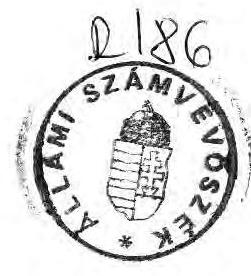
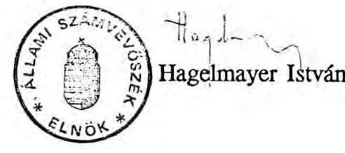
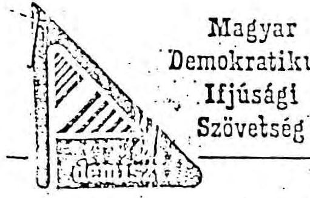
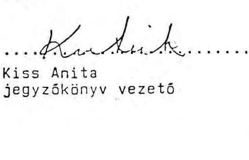
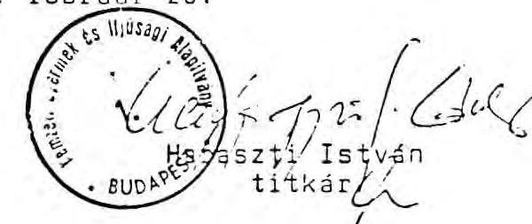
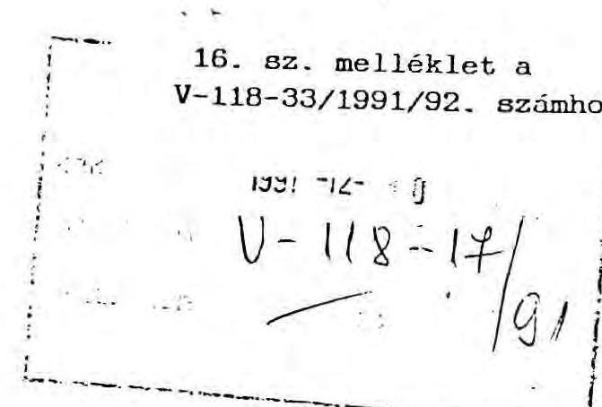
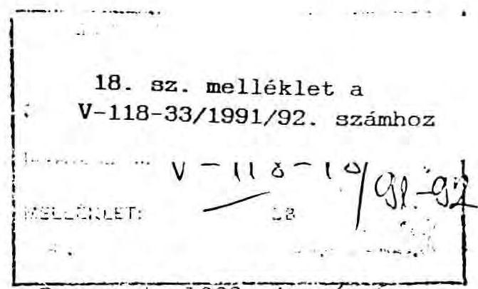
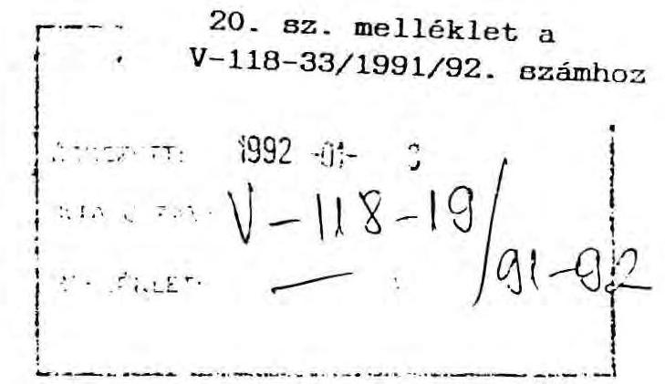
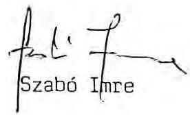
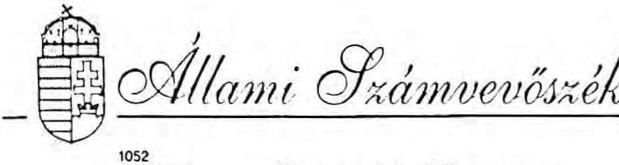

# 2̋llami ふ̧ámbrbösé́k 

## JELENTÉS

a Nemzeti Gyermek- és Ifjúsági Alapítvány, valamint a helyi gyermek- és ifjúsági alapítványok pénzügyi-gazdasági ellenőrzéséről

---

A vizsgálatot vezette:

| Rádfai Tibor | fôtanácsos |
| :-- | :-- |
| A jelentést összeállította: |  |
| dr. Benkő János | számvevő tanácsos |
| Az NGYIA-nál a vizsgálatot végezték: |  |
| dr. Benkő János | számvevő tanácsos |
| Deák Tamásné | számvevő |
| dr. Gál Csaba | számvevő |
| Számely Kornél | számvevő |

A helyi alapítványoknál a vizsgálatot végezték:

| Berényi Magdolna | számvevő |
| :-- | :-- |
| Buczkó András | számvevő |
| dr. Csapó Anna | számvevő |
| Ébner Vilmosné | számvevő |
| Fekete Tibor | számvevő tanácsos |
| dr. Felleg Zsoltné | számvevő tanácsos |
| Fercsik Gyula | számvevő tanácsos |
| Gamaufné dr. Kóbor Éva | számvevő |
| Hegedűs György | számvevő |
| dr. Hegedűs György | számvevő tanácsos |
| Horváth János | számvevő |
| Kalmár István | számvevő |
| Kocsis István | számvevő tanácsos |
| Kollár Lászlóné | számvevő tanácsos |
| Koltayné Szepesi Zsuzsanna | számvevő |
| dr. Koronics Károlyné | számvevő |
| dr. Lacó Bálintné | számvevő |
| Nagy Sándorné | számvevő |
| dr. Ótott Lajos | számvevő tanácsos |
| Péntek László | számvevő |
| Szita László | számvevő |
| dr. Takács András | számvevő tanácsos |
| Tréfás Antal | számvevő tanácsos |
| dr. Vasváriné dr. Rózsa Magdolna számvevő |  |

---

# J e l e n t é s 

a Nemzeti Gyermek- és Ifjúsági Alapítvány, valamint a helyi gyermek- és ifjúsági alapítványok pénzügyi-gazdasági ellenôrzéséról

A Nemzeti Gyermek- és Ifjúsági Alapítványt (NGYIA) a Minisztertanács* 1990. áprilisában - müködésének utolsó hónapjában - rendelet útján hozta létre korábban a DEMISZ és a MUSZ kezelésében és tulajdonában lévő, közérdekủ kötelezettségvállalásra felajánlott ingatlanokból és ingóságokból. A vagyon könyv szerinti értéke 2,0-2,5 milliárd Ft-ra tehető, a piaci értéket a sajtóban megjelent nyilatkozatok 20-40 milliárd Ft-ra becsülik.

Az alapító a működtetéshez 200 millió forint rövidlejáratú hitelt adott, továbbá forrásautomatizmusokat (a játék- és pénznyerő automaták adózott nyereségének 50 $\%$-a, valamint az Idegenforgalmi Alap $5 \%$-a) biztosított.

Az alapítvány tulajdonába került ingatlanok - az Alapító Okirat szerint - részben az NGYIA céljait szolgálják ( 6 db ), részben pályázat útján hasznosíthatók ( 8 db ), részben pedig az NGYIA javára bejegyzett elidegenítési tilalommal regionális és helyi alapítványok létrehozására szolgálhatnak ( 46 db ).

Az alapító szerint az NGYIA célja a fiatalok egyéni és közösségi aktivitásának, a szabadidő eltöltés, az ifjúsági turizmus, a fiatalok nemzetközi kapcsolatainak ösztönzése és támogatása.

[^0]
[^0]:    * 1990. V. 24-ig Minisztertanács, attól kezdve Kormány

---

Az ellenőrzés célja:
—a Nemzeti Gyermek- és Ifjúsági Alapítvány létrehozása törvényességének,
—az alapítványi célra felajánlott DEMISZ és MUSZ vagyon átvétele, majd a kijelölt vagyonrészek helyi alapítványok részére való átadása szabályszerűségének, továbbá
—az NGYIA múködésének törvényességi, célszerűségi, eredményességi szempontból való értékelése volt.

Az Állami Számvevőszék korábban, 1990-ben vizsgálta a DEMISZ és a MUSZ vagyonelszámolását. A DEMISZ Gazdasági Irodája - mint a KISZ KB jogutódja valamint tagszervezeteinek többsége és a MUSZ hitelesen nem tudott elszámolni vagyonáról.

A jelen ellenőrzés elsősorban a vagyonnal való gazdálkodásra és a vagyonmegőrzés feltételeire irányult, feltárta továbbá az NGYIA, valamint a Regionális Intéző Bizottságok (RIB) és a helyi alapítványok - működés szempontjából meghatározó kapcsolatait. A vizsgálat az NGYIA-nál, 3 RIB-nél, 15 megyei és 2 városi, illetve 1 községi alapítványnál folyt és az NGYIA alapítására tett előkészítő munka megkezdésétől 1991. szeptember 15-ig terjedő időszakra irányult.

# I. 

## Következtetések és javaslatok

Az NGYIA létrehozása az ifjúság vagyonának egybentartása szempontjából pozitív lépésnek minősíthető. A vagyon jogi, gazdasági mozgásformáinak meghatározása során az alapító - kellő mérlegelés, részben a jogi szabályozás és tapasztalatok hiányában - súlyos következetlenségeket, hibákat és szabálytalanságokat követett el. Ezek következtében az NGYIA múködése a célszerűségi, a szabályossági és eredményességi követelményeknek a vizsgálat zárásakor nem felelt meg. Ennek kialakulásában szerepet játszottak a kivitelezés és a müködés során elkövetett mulasztások is.

---

Az NGYIA létrehozása idején alapítványt létesíteni köztulajdonból csak annak privatizációja útján lehetett. A fejlett országokban kialakult közjogi alapítványra amely lehetővé teszi, hogy a közvagyont az alapító mérlegében továbbra is nyílvántartsa és afölött ellenőrzést gyakoroljon - náluk ma sincs szabályozás.

A Minisztertanács tehát az ifjúsági vagyont magán alapítványba vitte be. Az alapító az NGYIA szabályozásába - a vagyon és a költségvetési források védelme érdekében fékeket épített be és a tulajdont, valamint a finanszírozást túlcentralizálta.

Az alapító olyan országos alapítványi rendszert hozott létre, amelyben az önálló jogi személyiségű helyi alapítványok létrehozói a tanácsok lettek, de azok vagyonát és részbeni finanszírozását az NGYIA útján biztosította. A Minisztertanács az önálló jogi személyekből álló alapítványi rendszer múködésének jogi és szervezeti kereteit nem teremtette meg. A rendszer múködésképtelensége és ellentmondásai a gyakorlat során mindinkább felszínre kerültek. Az ellentmondások megoldására irányuló kisérletek eddig jogi zsákutcába torkollottak, s az érdekeltek ellentétei tovább fokozódtak.

Az NGYIA szervezete sem felépítés, sem létszám, sem szakképzettség tekintetében nem felel meg a kitűzött céloknak és feladatoknak.

A legfőbb döntéshozó szerv, a kuratórium jogosítványai között - az Alapító Okirat és a Szervezeti és Múködési Szabályzat (SZMSZ) szerint - túltengnek a napi ügyek, az ellenőrzési feladatok helyett, így annak munkája nem volt hatékony. A Minisztertanács alapító határozatával a kuratóriumot - a nemzetközi gyakorlattól eltérően - olyan napi, piaci döntési feladatokra kényszerítette, amelyeket a havonta kéthavonta ülésező társadalmi testület nem láthat el eredményesen.

Jól múködő operatív szervezete az NGYIA-nak nem volt, így a kuratórium tevékenységét megalapozott döntéselőkészítő munka nem segítette. További feszültséget okozott, hogy a szétfolyó kuratóriumi viták után született "határozatokat" sem hajtották végre az NGYIA szervei. A mulasztásokat a kuratórium nem kérte számon. (A belső ellenőrzés alig működött, pedig a sajátos alapítványi gazdálkodás, a szervezetek elkülönülése, területi elhelyezkedése miatt arra különösen szükség lett volna.) Így az NGYIA múködésére az a gyakorlat volt jellemző, hogy lényegében minden feladatról többször tárgyaltak, de azok megoldása rendkívüli módon elhúzódott, vagy meg sem történt.

A Kormány a kuratórium kijelölését 1991. október 3-án visszavonta, 5 tagú irányító testületet hozott létre, az Állami Számvevőszék vizsgálata utáni alapítói döntésig.

---

Az NGYIA-nak 1990. októberéig nem is volt apparátusa. Ezeket a feladatokat az Ifjúságpolitikai Titkárság munkatársai látták el, majd belőlük hozták létre az NGYIA szervezetét.

A szervezet az alapítás óta teljes átalakuláson ment keresztül. 1991. áprilisában a Kormány új elnököt nevezett ki, a titkár 1991. szeptemberében távozott. Az apparátus az elnökváltást követően szinte teljesen leépült, a feltöltődés a vizsgálat lezárásáig még nem fejeződött be. A hatékony munkát a betöltetlen vezetői és munkatársi állások is akadályozták.

Az alapítványi célok (az ingatlanok állagának megőrzése, a fiatalok támogatása) megvalósítására az NGYIA-nak vállalkozásokból kell forrásokat teremtenie. A vagyon és a vállalkozások múködtetéséhez nem hoztak létre kellően tapasztalt szakemberekből álló és a vagyon nagyságához, rendezetlenségéhez mérten szükséges létszámú szervezetet, hanem ennek megoldását is a kuratóriumtól várták.

Az alapítás óta a vizsgálat lezárásáig, sem a titkárság, sem a Vagyonkezelő Szervezet nem tudta megoldani feladatait. Az NGYIA szervezeti egységeinek működése összehangolatlan, nincs irányítás és ellenőrzés. A működés feltételei nem rögzítettek, a szabályzatok zöme el sem készült.

Az alapító a vagyonátvételnél olyan szabálytalanságokat követett el, amelyeknek káros hatásait a vizsgálat zárásáig sem lehetett korrigálni. A DEMISZ által felajánlott vagyont a Minisztertanács érdemben nem vette át, a nevében eljáró Ifjúságpolitikai Titkárság sem teljesítette ezt a feladatot.

A vagyonfelmérés és átvétel elmaradásáért a Minisztertanács mellett részben az Ifjúságpolitikai Titkárságot, részben az NGYIA első elnökét, titkárát és a Vagyonkezelő Szervezet vezetőjét terheli a felelősség. Tovább növeli felelősségüket, hogy a vagyon rendezetlenségéről, az Ifjúságpolitikai Titkárság és az NGYIA munkatársaiként egyaránt tudtak, és a rendezés másodszori lehetőségét is elmulasztották. A vagyonfelmérés és átvétel során elkövetett mulasztásokban a szakképzettség hiányának és az alacsony létszámnak is szerepe volt.

Az NGYIA vagyona tulajdonjogilag 17 hónapi múködés után is rendezetlen, a vagyonmegőrzés feltételei nem biztosítottak. Az ellenőrzés azonban nem tárt fel olyan esetet, amikor e rendezetlenség következtében ingatlanvesztés érte volna az NGYIA-t. A felajánlott állóeszközvagyon kisebb csökkenései a felajánló hibájából következtek be.

---

Az NGYIA az Alapító Okiratban szereplő 60 ingatlanból a vizsgálat lezártáig 53 tulajdonjogát kapta meg. Helyi alapítványoknak átadott 30 ingatlant, egyet pedig a Magyar Cserkész Szövetség részére. Jelenleg az NGYIA 22 ingatlant birtokol. Ez a tulajdonkör jórészt passzív, tulajdonjogi vitákkal, kedvezőtlen vállalkozói szerződésekkel terhelt, s nem hoz a célokat szolgáló bevételeket az NGYIA részére. Ezen kívül a 22 ingatlannak több mint a felét az NGYIA nem tudta müködtetni, azokat szerződéssel, sőt anélkül helyi alapítványok üzemeltetik.

Az NGYIA vagyonát, gazdálkodását regisztráló számviteli információs rendszert a titkárság nem alakította ki. A gazdálkodás szabályozatlan, rendezetlen, követhetetlen és ellenőrizhetetlen. Felelősség terheli az Ifjúsági Turisztikai Bizottság elnökét, mert nem számolt be az Idegenforgalmi Alapból 1990-ben kapott 43,8 millió Ft-os forrásautomatizmus felhasználásáról, s így az SZMSZ előírásait nem teljesítette.

Az NGYIA az alapító által juttatott pénzvagyon ( 200 millió Ft-os hitel kamatai, forrásautomatizmusok) nélkül működésképtelen lenne, mert azokon kívül érdemi forrásokkal nem rendelkezik, hiszen az ingatlanokat nem tudta hasznosítani. Az alapítótól kapott üzletrészek, vállalkozások müködése, sorsa rendezetlen, a kötött bérleti szerződések az NGYIA kimutatásai szerint nem hoznak számottevő hasznot.

Az NGYIA eddigi tevékenysége nem ellentétes az alapító által meghatározott célokkal. A müködést azonban a spontaneitás és nem a szervezettség jellemzte. Az NGYIA a rendelkezésére álló üdülési kapacitást nem tudta kihasználni, nem teremtette meg a helyi alapítványok közötti üdülési cseréhez szükséges információs rendszert. Kellő szabályozottság hiányában a működő pályázati és támogatási rendszer visszaélésekre, érdekellentétekre adhat okot.

A Minisztertanács a részére felajánlott vagyonból olyan alapítványrendszert hozott létre, melyben az NGYIA és a helyi alapítványok között tulajdoni és pénzügyi függőségi viszony van. A Minisztertanács a vagyon tulajdonjogát és a müködéshez szükséges forrásokat az NGYIA-ra bízta, ugyanakkor a helyi alapítványoknak csak látszat tulajdonjogot adott. A helyi alapítványok az átadott ingatlanokat az NGYIA jóváhagyása nélkül nem idegeníthetik el. Ha mégis ezt teszik, a szabályozás miatt, a bevételek kizárólag a Minisztertanács (Kormány) költségvetését illetik meg.

A Minisztertanács nem szabályozta egyértelműen a helyi alapítványoknak történő ingatlanátadás feltételeit, határidejét. A helyi alapítványok részére történt ingatlanátadás egész folyamata jogi ellentmondásokkal terhes. Az NGYIA tulajdonában maradt, de a Minisztertanács által a helyi alapítványoknak szánt ingatlanok helyzete

---

kritikus. Esetükben az NGYIA a szakember-hiány és a távolság miatt nem tud igazi tulajdonosként fellépni, a helyi alapítványok (a meghatározott idejű üzemeltetési szerződések miatt) nem érzik sajátjuknak az ingatlanokat.

A helyi alapítványok helyzetét kedvezőtlenül befolyásolják az NGYIA Alapító Okiratának és a vagyonátvétel anomáliái. A helyi alapítványok és az NGYIA kapcsolatrendszere, egymáshoz rendelt jogköre tisztázatlan, szabályozatlan. Az NGYIA és a helyi alapítványok közötti érdekegyeztető mechanizmusok még nem épültek ki.

A helyi alapítványok erejét nagymértékben lekötik a vagyon körüli viták, egy részük nem kapta meg a minisztertanácsi rendeletben megjelölt ingatlanokat. Ezen alapítványok továbbra is az ingatlanok tulajdonjogának megszerzésére törekednek (Heves, Veszprém megye).

A szűkös pénzforrások növelése érdekében kötött vállalkozói szerződések általában előnytelenek a helyi alapítványok számára. A szerény bérleti díjak a szerződések határideje és feltételei kedvezőtlenek, jelentős a bérlők díjhátraléka. A vitás szerződések felülvizsgálata, korrigálása részben megkezdődött, annak sikere azonban nagymértékben függ a kuratóriumok tagjainak szakértelmétől és kitartásától. A helyi alapítványok ingatlanainak elidegenítésére a rossz vállalkozói szerződések miatt azonban nem került sor.

A gazdálkodás a KISZ és a DEMISZ időszakához képest tovább romlott, hasonló tendenciák jellemzik a számviteli és a szerződéses fegyelmet is.

A helyi alapítványoknál a célok egy része nehezen értelmezhető. Általában nem megoldott a vagyon rendeltetésszerű, eredményes múködtetése, az alapítványi célokat szolgáló hasznosítása. Az üdülők kihasználtsága alacsony volt, részben a magas díjak, részben a szervezés hiánya miatt. Az üdülésen túl más célok támogatására a helyi alapítványoknak csak egy része fordított gondot, illetve forrásokat. Az ingatlanok leromlott állagúak, felújításuk, karbantartásuk források hiányában nem biztosított. Ugyanez vonatkozik a berendezések, felszerelések jó részére is. Fennáll annak a veszélye, hogy mindezeket a feladatokat az alapítói vagyon felélésével tudják megoldani. Nincs megnyugtatóan megoldva a vagyonmegőrzés.

Kedvező, hogy az egyes helyi tanácsok és önkormányzatok a területükön lévő alapítványokat ingatlanok tulajdonba, illetve használatba adásával és pénzügyileg is támogatták, illetve támogatják.

---

Az alapítványoknál alig volt pénzügyi-gazdasági és törvényességi ellenőrzés. Ügyészségi törvényességi ellenőrzés nem történt, társadalombiztosítási és adóellenőrzés is igen kevés helyen volt.

Ellenőrzésünk tapasztalatai alapján szervezeti és személyes felelősség is megállapítható.

A Minisztertanácsot felelősség terheli, hogy nem járt el kellő gondossággal az ifjúsági vagyon jogi és gazdasági mozgásformájának meghatározásánál, jóllehet a szabályos megoldások szükségességére az előkészítés során figyelmeztették. A Minisztertanács szintén felelős a vagyonátvétel, a forrásautomatimzusok biztosítása során elkövetett szabálytalanságokért.

Személyes felelősség állapítható meg:
—Az NGYIA első elnökénél a vagyonátvétel és a helyi alapítványoknak történt vagyonátadás szabálytalanságai és elhúzódása (leltárak, számviteli nyílvántartások hiánya), a vezetői ellenőrzés elmulasztása, több tekintetben előkészítetlen (engedély és fedezet nélküli) beruházás indítása, hatáskör túllépés (1990. június 1-e előtti ingatlanátadások) miatt,
—Az NGYIA titkáránál - mint munkáltatónál - a szabályos múködés feltételeinek (számviteli, pénzügyi, múködési szabályzatok), valamint a személyi állomány biztosításának elmulasztása és hibás gazdasági döntés (gördeszka beszerzés) miatt.
—A Vagyonkezelő Szervezet első vezetőjénél a vagyonátvétel és átadás szabálytalanságai és elhúzódása, a vagyonhasznosítás elmulasztása, a vagyonnyílvántartás lazaságai, a Talent Kft gazdálkodási szabálytalanságai miatt.
—Az Ifjúsági Turisztikai Bizottság Elnökénél az 1990-ben az Idegenforgalmi Alapból kapott források felhasználásával kapcsolatos elszámolások elmulasztása miatt. (A felelőssé tett személyek magyarázatait és a Számvevőszék arra adott válaszait 14-21. sz. mellékletek tartalmazzák.)

Az NGYIA második elnöke és az általa kialakított apparátus munkáját az 1991. évi hiteles mérleg elkészítésén és a helyi alapítványokkal való együttműködés változásán keresztül lehet lemérni. Az előző vezetéstől rendezetlen vagyoni és pénzügyi "örökséget" vettek át. A feladatok megoldását megkezdték, a függő kérdések lezárása nem tűr halasztást, hiszen azoktól függ, hogy az NGYIA és a

---

helyi alapítványok működőképessé válnak, vagy pedig ellehetetlenülnek. (A felhalmozódott teendők megoldását tovább hátráltatta, hogy az új elnök és a titkár /aki 1991. szeptember közepén távozott/ együttmúködése nem volt zavartalan.)

# A vizsgálat megállapításai alapján javasoljuk, hogy: 

1. Illetékes szervek bevonásával vizsgálni kell annak feltételeit, hogy az alapítványi célok változatlanul hagyásával miként korrigálhatók az NGYIA Alapító Okiratának a jogi szabályozással ellentétes és az eredményes múködést gátló előírásai.
2. Az NGYIA eredményes vagyonhasznosítását és múködését szolgáló Szervezeti és Múködési Szabályzatot kell kidolgozni. Abban a kuratóriumot mentesíteni kell a napi piaci döntések alól, és fő feladatául az éves programok elfogadását, a pályázatok elbírálását és az ellenőrzést kell megjelölni.
3. Az NGYIA szervezetét - a felmozódott feladatok bonyolultságához és mennyiségéhez mért szakembergárdával - mielőbb fel kell tölteni.
4. Az NGYIA és a helyi alapítványok biztosítsák a vagyonmegőrzés feltételeit. Haladéktalanul készítsenek teljes vagyonleltárt, rendezzék a függőben lévő tulajdonjogi kérdéseket. Dolgozzzanak ki a jogszabályoknak megfelelő állóés fogyóeszköz nyílvántartást.
5. Az NGYIA és a helyi alapítványok - szakértők bevonásával - mérjék fel gazdasági helyzetüket és határozzák meg a tulajdonukban levő vagyon gazdaságos hasznosításának feltételeit.
6. Az NGYIA és a helyi alapítványok haladéktalanul alakítsanak ki - szakértők bevonásával - a jogszabályoknak megfelelő gazdálkodási és számviteli rendet.
7. Létre kell hozni az NGYIA és a helyi alapítványok közötti érdekegyeztetés, együttmúködés szervezeti kereteit.
8. Információs rendszert kell kialakítani az alapítványi szálláshelyek kihasználásának koordinálására és javítására.
9. Az NGYIA csak az APEH vizsgálata után folytassa a Talent Kft-ben levő üzletrészének elidegenítését.
10.Az ellenőrzés által megállapított hiányosságokért az érintett személyek felelősségét érvényesíteni kell.

---

# II. 

## Megállapítások

## A. A Nemzeti Gyermek- és Ifjúsági Alapítvány müködése

## 1. Az NGYIA alapításának körülményei

Az ifjúsági célokat szolgáló vagyon társadalmasításának gondolata az ifjúsági szervezetek között már 1989. nyarán megfogalmazódott. A vagyonfelosztás helyett annak egybentartása érdekében alapítvány létrehozása mutatkozott a legkézenfekvőbb megoldásnak. Ez a javaslat 1989. novemberében a Minisztertanács és a Magyar Ifjúsági Szervezetek Országos Tanácsa (MISZOT) megbeszélésén is szerepelt. 1989. év végére azonban jelentősen lecsökkent azon ifjúsági célokat szolgáló ingatlanok köre, amelyek még állami tulajdonban voltak. Ebben az időszakban fejeződött be a KISZ (később DEMISZ) és a MUSZ kezelésében lévő állami ingatlanok jelentős körének "társadalmasítása".

A Legfőbb Ügyészség 1989. évi állásfoglalása (1. sz. melléklet) szerint jogszerűek voltak azok az ajándékozási és az úgynevezett "százforintos" vagyonátruházási ügyletek, amelyek következtében az állami tulajdonú ingatlanok jelentős köre - ellenérték nélkül - a korábbi kezelő DEMISZ és a MUSZ tulajdonába került. Megnövekedett azon tárgyalások jelentősége, amelyek a MISZOT és tagszervezetei, valamint a DEMISZ és a MUSZ között kezdődtek az ifjúsági ingatlanvagyon alapítványi formában való müködtetése érdekében.

A tárgyalások közben a DEMISZ közérdekủ kötelezettségvállalásra 1989. december 11 -én felajánlotta a Minisztertanács részére valamennyi még tulajdonában és kezelésében lévő ingatlanát. Erre az időpontra nyílvánvalóvá vált, hogy az 1990-es költségvetés nem irányoz elő a DEMISZ részére forrásokat a vagyon müködtetéséhez.

A DEMISZ vagyon felajánlása szabálytalan volt, mivel ahhoz testületi (Szövetségi Tanács és a megyei vezető szervek) döntéseire lett volna szükség. A felajánlás időzítése - az év végi mérlegkészítés miatt - kedvező lehetőséget kínált a DEMISZ számára, hogy a felajánlott vagyont tételesen felmérje és tulajdon-

---

jogilag, valamint pénzügyileg is rendezett formában, szabályosan adja át a Minisztertanácsnak. A szervezet azonban ezt elmulasztotta.

#### Abstract

A DEMISZ szervezeti szabályzata vagyoni kérdésekben a tagszervezetek mint önálló jogi személyek - konszenzusát írja elő, ilyen dokumentumot a felajánláshoz nem mellékeltek ( 2 . sz. melléklet). A megyei, helyi szervezetek egy részének vagy nem volt tudomása a felajánlásról, vagy nem értett egyet azzal (Fejér, Pest, Heves megye). A megyei szervezetek írásbeli felajánló nyilatkozatának hiányát az if júságpolitikai kormánybiztos is elismerte (3. sz. melléklet). Az egyeztetés hiányára utal az is, hogy a Talentum Fórummal indoklás nélkül közölték, hogy alapítványi keretek között folytassa a tevékenységét, azonban a felajánlás szándékára nem is utaltak. (4. sz. melléklet) A szervezetlenséget tükrözi, hogy - a Minisztertanácsnak történt felajánlás után 2 hónappal - a DEMISZ egyik ügyvivője támogatta egy szarvasi ingatlan helyi hasznosítást szolgáló átírását (5. sz. melléklet).

Számos megyében tervezték az ingatlanok helyi hasznosítását. "A DEMISZ tagszervezetei különbözőképpen értelmezték a felajánlást, volt amelyik később szívesen meggondolta volna magát, tehát vitatta" közli a későbbiekben az if júságpolitikai kormánybiztos (3. sz. melléklet).

A szervezetek ellenállására utal, hogy egyesek - megelőzve a központot (Somogy és Heves megye) - teljességében, vagy részben a helyi tanácsoknak ajánlották fel ingatlanjaikat. Az érdekellentéteket tükrözi az is, hogy az if júságpolitikai kormánybiztosnak - akit a Minisztertanács 1990. január 16-án határozattal az NGYIA megszervezésével bízott meg - tárgyalásokat kellett folytatnia az érintettekkel az NGYIA létrehozásának szükségességéről.

A DEMISZ tehát tulajdonjogilag és nyílvántartás tekintetében is rendezetlen vagyonkört ajánlott fel a Minisztertanács részére. A felajánlás után pótlólagosan sem adott a vagyonra vonatkozó tételes és megbízható elszámolást.

A szükséges bizonylatok hiányában a Minisztertanácsnak kellett volna elvégeznie felmérését, azonban ezt elmulasztotta. Azt, hogy a vagyon állami átvételének elmulasztása hiba volt, az if júságpolitikai kormánybiztos, már mint az NGYIA első elnöke később elismerte (3. sz. melléklet).

Elsőként a Pénzügyminisztériumot kérték fel a vagyonátvételre, az azonban a feladatot elhárította. A felajánlás után negyed évvel a Minisztertanács az If júságpolitikai Titkárságot jelölte ki a vagyonfelmérésre és átvételre. Ezzel az NGYIA létrehozásának politikai, államigazgatási és polgárijogi aktusai teljesen

---

összemosódtak, azokat egy szervezet, az Ifjúságpolitikai Titkárság végezte, annak vezetője a Minisztertanácstól lényegében szabadkezet kapott.

Az Ifjúságpolitikai Titkárság munkatársai 1990. márciusában a vagyon felmérést megkezdték, azonban az eredményeket a kormánybiztos nem összegeztette. A rövid idejű (1-1 napos) vagyonbejárások arra hívták fel a figyelmet, hogy az ingatlanok egy részének helyzete tulajdonjogilag, számvitelileg tisztázatlan. Az ifjúságpolitikai kormánybiztos - munkatársai szakvéleményének ellenére - a felajánlott teljes vagyonkör alapítványba vitelét javasolta.

A felajánlott közvagyon elidegenítése - alapítványba vitele - anélkül történt meg, hogy azt a Minisztertanács teljeskörűen felmérhette és ellenőrizhette volna.

Az alapító munka elégtelenségére utal, hogy a vagyonműködtetés céljaira, jogi és gazdasági mozgásformáira érdemi alternatívákat nem dolgozott ki a Minisztertanács:

- Nem osztották fel az ifjúságpolitikai célokat és feladatokat a tárcák és az NGYIA között, pedig az Alapító Okirat első változata még ennek szellemében készült.
- Nem mérlegelte a Minisztertanács, hogy az alapítvány mellett milyen más jogi formában lenne célszerű a vagyon kezelése és működtetése. A működés, az ellenőrzés anomáliái főként abból erednek, hogy az állami tulajdon alapítványba vitelének közjogi formája nálunk nincs szabályozva. A fejlett országokban alkalmazott közjogi alapítványi forma lehetővé teszi az alapítónak, hogy az alapítványba vitt vagyonát továbbra is saját mérlegében tartsa nyílván (nem privatizálódik a vagyon) és biztosítja számára az ellenőrzés lehetőségét is. Ilyen szabályozás hiányában a Minisztertanács egy túlcentralizált magánjogi alapítványt hozott létre, amelyben a közjogi formula hiányát fékek (vagyonátadás korlátozása, központi finanszírozás) beépítésével szándékozott pótolni. Ezzel az "eklektikus" megoldással a remélt célt nem sikerült elérni, sőt a szabályozás ellentmondásai, csapdái a gyakorlati munka során mindjobban kiütköznek.
- A gazdálkodásra, a vagyon hasznosítására vonatkozó alternatívakat nem dolgoztatott ki az alapító. A DEMISZ 1988. évi elszámolásaiból és az Ifjúságpolitikai Titkárság 1990. évi adatfelvételéből a várható bevételek, a fenntartási költségek közelíthetők lettek volna. Meg sem fogalmazódott, hogy a vagyon egy részének idegenforgalmi célú hasznosítása, vagy értékesítése

---

útján jelentős források teremthetők a célok megvalósításához. Megelégedtek azzal a - célokhoz képest szegényes, sőt azokat veszélyeztető - megoldással, hogy csupán az átvett vagyon múködtetését biztosítják.

A Minisztertanács az előkészítés hibáit az Alapító Okirat egyeztetése során nem korrigálta, sőt vitatható jogi aktusokkal forrásokat és forrásautomatizmusokat, valamint üzletrészeket rendelt az NGYIA részére, ezzel korlátozta a költségvetési tervezés szabadságát, forrásokat vont el más céloktól (Központi Ifjúsági Alap).

Az egyeztetés során az Országos Tervhivatal kifogást emelt a pontos vagyonmeghatározás és a gazdaságossági számítások hiánya miatt, ugyanis az első tervezetben még szerepelt az alapítói vagyon értéke (6-7. sz. melléklet).

Az alapítás szabályosságáról az ebben legilletékesebb szervek nem nyilatkoztak, az Igazságügyi Minisztérium és a Legfőbb Ügyészség nem tett észrevételt az előterjesztésre.

A Minisztertanács 1990. március 29-i ülésén - ifjúságpolitikai kormánybiztos előterjesztésében - tárgyalta az NGYIA Alapító Okiratának tervezetét. A testület a miniszterelnök javaslatait elfogadva úgy döntött, hogy a Szociális és Egészségügyi Minisztériummal, az Országos Tervhivatallal, valamint a Pénzügyminisztériummal szükséges egyeztetések után az átdolgozott tervezetet a következő ülésén tárgyalja meg.

Az ifjúságpolitikai kormánybiztos újból nem terjesztette be a Minisztertanács elé a tárcákkal részben újra egyeztetett és átdolgozott alapítvány-tervezetet, hanem azt aláírásra közvetlenül benyújtotta a miniszterelnökhöz, aki az Alapító Okiratot 1990. április 11 -én jóváhagyta.

A Minisztertanács Hivatala (MTH) észrevételezte, hogy az eljárás ellentétes az MTH-ról szóló rendeletben foglaltakkal. Az eljárási hibát kiküszöbölve az egyeztetéseket és javításokat az MTH pótlólag elvégezte, így 1990. április 24-én a miniszterelnök újra ellenjegyezte az immár végleges Alapító Okiratot tartalmazó rendeletet.

A Nemzeti Gyermek- és Ifjúsági Alapítványról szóló 81/1990. (IV.27.) MT rendelet a Magyar Közlönyben 1990. április 27 -én jelent meg. A Fővárosi Bíróság az alapítványt 1990. május 9 -én nyílvántartásba vette.

---

# 2. A vagyon átvétele, a vagyonmegórzés feltételei 

Az Állami Számvevőszék 1990. novemberében a DEMISZ Gazdasági Hivatala és egyes tagszervezetei, illetve a MUSZ vagyonelszámolását nem fogadta el. A nyílvántartás szerinti vagyonérték és a vagyonelemek teljes köre már akkor sem volt megállapítható.

A DEMISZ Gazdasági Irodája, valamint tagszervezeteinek többsége (öszszesen $63 \%$-a) hitelesen nem tudott számot adni vagyonáról.

A KISZ ingatlanait és egyéb állóeszközeit 2,6 milliárd forint bruttó értéken tartották nyilván 1988. év végén. Ebből az ingatlanok értéke 2,3 milliárd Ft volt.

A DEMISZ Gazdasági Irodája szerint az ingatlanok $90 \%$-át a felszerelésüket képező ingóságokkal együtt alapítványi célra átadták. A Minisztertanács ebből a rendezetlen, nem szabályosan nyilvántartott, nem hitelesíthető vagyonból hozta létre az NGYIA-t.

A vagyonátvétel nem volt szabályszerű. Az NGYIA az esetek többségében nem képviseltette magát az átadás-átvételek alkalmával, azokon többnyire csak a felajánló DEMISZ szervezet és a helyi alapítvány képviselői, vagy megbízott személyek vettek részt. Az okiratok számos kívánnivalót hagynak maguk után, sem formailag, sem tartalmilag nem felelnek meg a szabályszerűségi követelményeknek.

Szinte teljesen hiányoznak a pénztár, a bankszámlák és a lekötött betétek összegére vonatkozó utalások.

## a. Ingatlanok

Az ingatlanok átvétele elhúzódott a tulajdonjogi rendezetlenség és viták miatt. A rendeletben megjelent 60 ingatlan több mint a felének az ingatlannyilvántartása rendezetlen volt.

Az Amerikai úti KISZ iskola kezelője az MSZP és használója az ifjúsági szervezet volt. Az ingatlant ennek ellenére a DEMISZ felajánlotta és a tulajdonjogot be is jegyezték az NGYIA javára.

---

Az Alapító Okiratban megjelölt ingatlanok közül 7-nek a tulajdonjogát az NGYIA nem kapta meg.

Olyan ingatlanok kerültek az Alapító Okiratba, amelyek nem az ifjúsági szervezet tulajdonát képezték (Szarvas üdülőház, Körmend - Rábapart csónakház és a Dédestapolcsányi tábor). Az utóbbi ingatlan telke a tanács, a ráépített épület a DEMISZ tulajdonában volt. Az NGYIA jelenleg használati szerződéssel üzemelteti az ingatlant.

A szödligeti tábor tulajdonjogát az NGYIA nem kapta meg, mert az egyik épület két kezelő (a DEMISZ és a tanács) telkén fekszik. Az ingatlan kezelője jelenleg a szödligeti önkormányzat, tulajdonjogáért per folyik.

Az alapító rendelet előtt 3 ingatlanról lemondtak a helyi DEMISZ szervezetek a tanácsok javára (Mezőkövesdi Irodaház, Balatonfenyvesi tábor, Törökkoppány-Csesznek gyermektábor).

Olyan ingatlanrészek is az NGYIA tulajdonába kerültek, amelyeket az alapító rendelet nem közölt: a már említett Felsőtárkányban a táborhoz vezető út, a Sopron Brenbergbánya ifjúsági táborhoz kapcsolódó telek, az egyik üdülőház Mártélyon, valamint Bakonyoszlopon egy táborhelyül szolgáló telek.

Az NGYIA ingatlannyilvántartása a vizsgálat befejezésekor sem volt teljes, ez egyben a vagyonátvétel lazaságára is utal.

Az átvett ingatlanok egy része tulajdonjogilag és az ingatlannyilvántartás szempontjából rendezetlen. Az NGYIA javára átírt ingatlanok közül a tulajdonmegosztás nem megoldott az Amerikai úti székház, a DIVSZ székház esetében. Nem fejezték be maradéktalanul a vagyonátírást sem; Mártélyon az egyik üdülőház kezelője továbbra is a DEMISZ, a Felsőtárkányi táborhoz vezető út is még a DEMISZ kezelésében van. Hasonlóképpen rendezetlen az NGYIA tulajdonába nem került Törökkoppány-Csesznek tábor egy részének kezelői joga, hiszen annak kezelője még mindig a DEMISZ az önkormányzat helyett.

Az NGYIA tulajdonába került ingatlanok közül 12 esetben teljesen eltér a tulajdonlap megjelölése a tényleges állapottól, azokon vagy nem is szerepel építmény, vagy az évekkel ezelőtti állapot van feltüntetve.

A Hotel Aranypart Győr helyett középiskola és udvar, az Ifjúsági tábor Tata esetében közterület, a Vadása tavi tábornál kert, a Szanazug Úttörőtábor helyett tanya, gyep, erdő szerepel a tulajdoni lap első oldalán.

---

Az ingatlanok érték szerinti átvétele nem felel meg az előírásoknak, a dokumentáltság hiányos (jegyzőkönyvek, állóeszköz átvételi jegyek, leltárak hiányoznak). Számos esetben nyílvánvaló, hogy az átvételt csak papíron végezték. Négy ingatlan (DIVSZ székház, BFSZ Iroda Győr, Amerikai úti KISZ Iskola, Dédestapolcsány) még mindig "O" értéken szerepel az NGYIA nyílvántartásaiban. Az ingatlanok zöménél a könyv szerinti érték - a számviteli előírásokkal ellentétben - a telkek értékét nem tartalmazza.

A vagyonérték azért is pontatlan, mert egyes épületrészeket nem aktiváltak, ugyanis azokat építési engedély nélkül építették (Szanazug, Debrecen). Az álló́eszközökről szabályos analitikus nyilvántartást a legritkább esetben vezetnek. Az állóeszköz átvételi jegyeken az előírásokkal ellentétben csak a nettó értéket tüntették fel (Dédestapolcsány).

# b. Fogyóeszközök 

Az alapító az Alapító Okiratban nem határozta meg egyértelmúen és tételesen az átadott ingatlanokhoz tartozó eszközök körét. Így kerülhetett sor arra, hogy az NGYIA és a DEMISZ képviselői 1990. októberében "értelmezték" az alapító rendeletet. Megállapodtak, hogy a DEMISZ tagszervezetek müködését szolgáló irodaeszközök, berendezések nem tárgyai a felajánlásnak ( 9 sz. melléklet). A közös értelmezés ellenére igen eltérően alakult az átadott eszközök köre.

A DEMISZ-től kapott fogyóeszköz leltárak állapota kritikus volt. A fogyóeszközökről analitikus nyilvántartásokat nem mindenütt vezetnek (DIVSZ Székház, Amerikai út). A fellelhető kartonokról is hiányoznak a gyártási számok, így az eszközök nem azonosíthatók (Hotel Medves, Nyírjesi tábor, Amerikai út).

Az átvétel során általában nem leltároztak, legfeljebb a régi leltárakat "aktualizálták". Olyan eszközök is találhatók, amelyekről jegyzökönyv bizonyította, hogy azokat megsemmisítették (Hotel Medves, Nyírjesi tábor, Hotel Aranypart Győr).

Az Amerikai úti volt KISZ iskola eszközeiról 1990. szeptemberében készült ugyan leltár, de az elöirásokat nem tartották be (leltározo bizottság, tényleges leltárfelvétel). A leltárfelvételé lapokon az értékadatokat szabálytalanul átjavították. A helyszínen leltárívek nincsenek, azokat az NGYIA kezeli.

A DIVSZ Székházban fogyóeszközökröl, kivéve az NGYIA által beszerzetteket, nincs leltár.

---

A Talent Székház fogyóeszközeiről az NGYIA semmilyen nyilvántartással nem rendelkezik. A debreceni volt KISZ Székházban 3 szoba berendezéseit, föleg híradástechnikai eszközöket, az ifjúsági szervezet nem adta át.

Több esetben fordult elő, hogy a leltárak utólagos módosításával az NGYIA vagyonát csökkentették, és egyes eszközök visszakerültek a DEMISZ tulajdonába (Hotel Medves, Amerikai úti KISZ Iskola).

# c. A vagyon hasznosítása 

Az NGYIA vagyonának sajátosságai meghatározzák, sok esetben korlátozzák a hasznosítás lehetőségeit. A vagyon több mint egynegyedét (16 ingatlan) székházak, irodaházak, irodák alkotják. A további háromnegyed többségét csak időszakosan (nyáron) használható táborok képezik. Az NGYIA 16 ingatlant úgy vett át, hogy azokat különböző működtetési szerződések terhelték, ez számottevően korlátozza a hasznosítás lehetőségeit (10. sz. melléklet).

A kuratóriumi előterjesztések szerint (1990. október, 1991. március) az NGYIA vezetése tudatában volt annak, hogy a vagyon egy része a magas üzemeltetési költségek miatt ifjúsági turizmus céljára alkalmatlan. Körvonalazták azt is, hogy a passzív vagyon egy részének értékesítésével milliárdos értékű pénzalapra tehetnének szert, azonban ennek érdekében a vizsgálat befejeztéig intézkedést nem tettek.

Az NGYIA az átvett 53 ingatlanból 30-at helyi alapítványoknak adományozott (11 sz. melléklet). Az Alapító Okirat nem rendelkezik egyértelműen az ingatlanátadásról, ezért ez a folyamat ellentmondásokkal, szabálytalanságokkal terhelt.

Az alapító nem határozta meg, hogy a kuratórium megalakulásáig - az általa a rendeletben kijelölt ingatlanok - továbbadhatók-e. Szabályozás hiányában - a kuratórium 1990. június 20 -i alakuló üléséig - az Ifjúságpolitikai Titkárság 9 db ingatlan tulajdonjogát adta át helyi alapítványoknak. Az ingatlan átadásokat a kuratórium utólag nem kifogásolta.

Az alapító úgy rendelkezett, hogy az ingatlanok - több feltétel teljesülése esetén - 1990. június 1 -ig adhatók át helyi alapítványoknak. Ez a határidő rendkívül rövid volt, amelyet betartani nem lehetett. A kuratórium 1990. június 20 -án a június 1 -jel határidőt meghatározatlan idöre meghosszabbította és 21 ingatlant ennek alapján adott a helyi alapítványok tulajdonába.

---

A kuratórium határozata az Alapitó Okiratban foglaltakkal és az alapító szándékával ellentétes.

Az Alapitó Okirat a helyi alapitványok tulajdonába adott ingatlanokra elidegenitési tilalmat rendelt el. Az átadott ingatlanok közül négy esetben (Csongrád megyei Ifjúsági Központ, Ifjúsági Tábor Tata, Balatonfenyvesi Úttörőtábor, Ifjúsági ház Tatabánya) az elidegenitési tilalmat még nem jegyezték be az NGYIA javára.

Az átadáshoz az NGYIA nem rendelkezett kellő apparátussal, az átvevők is általában csak mellékállásban voltak a helyi alapítványok alkalmazottai. Az átadások zöme formális volt, az NGYIA az ingatlanokat ugyanolyan rendezetlenül adta tovább, ahogyan átvette.

Az NGYIA ingatlan átadásait hasonló anomáliák jellemezték mint azok átvételét. A fellelhető átadási dokumentumokban az ingatlanokon kívül az állóeszközöket fel sem tüntették (Balatonfenyves, Zamárdi Ifjúsági Tábor), előfordult az is, hogy az állóeszközök értékét csak bruttó, vagy csak nettó értéken szerepeltették. Heves és Veszprém megyében az átadás-átvétel szabályosságát dokumentum hiányában nem lehetett ellenőrizni. Az NGYIA az átadott 30 ingatlan esetében csak 17 -ről rendelkezett leltárral.

Az NGYIA tulajdonában a vizsgálat idején 22 ingatlan volt. Ezek zömét (20-at) továbbra is a tulajdoni, vagyoni rendezetlenség jellemezte. A 22 ingatlanból csak 15-höz volt leltár. Érdemi hasznosításuk megoldatlan. Egyeseket 1991-ben lejárt használati szerződésekkel (Csongrád Megyei Ifjúsági Központ, soltvadkerti üdülők) üzemeltettek, de vannak ingatlanok, amelyeket a helyi alapítványok szerződés nélkül használtak (Heves és Veszprém megyei ingatlanok).
1990. áprilisában az NGYIA az Amerikai úton irodaház építésbe kezdett. A 450 millió Ft-os beruházással több emeletes, korszerủ irodaház létesítését tervezték. A szükséges hiteleket az Agrobank biztosította volna. Az épület hasznosítására vonatkozó gazdasági számítások nem megalapozottak, egyes szakértők nem tartották gazdaságosnak a beruházást, más becslések szerint az épület értékesítéséből 30-50 millió Ft-os haszon lett volna várható. A beruházás a haszon bizonytalansága, illetve annak az NGYIA globális forrásigényeihez képest szerény hozzájárulása miatt elhibázottnak minősíthető. A vállalkozás előkészítése, majd leállítása elvonta az NGYIA energiáját az ingatlanok tulajdonjogának rendezésétől és azok hasznosításától. A beruházás tulajdonjogilag rendezetlen ingatlanon kezdődött el.

---

# d. A vagyonmegőrzés feltételei 

Az NGYIA átvett vagyonáról - beleértve az alapítás után a megyei alapítványoknak átadott ingatlanokat is - átfogó, hiteles leltár a vizsgálat befejeztéig nem készült. A vagyon könyvszerinti értékéről, annak összetételéről az NGYIA vezetése a vizsgálat lezárásakor sem tudott megbízható adatokat szolgáltatni.

Az NGYIA-nál a vagyonmegőrzés feltételei nem biztosítottak. Sem a megalakulást követő nyitó mérleg, sem az 1990-es mérleg nem hiteles. Az NGYIA az előírások szerinti határidőt fél évvel túllépve készített nyitó mérleget, azonban az átvett vagyon értéke a készítés időpontjában (1991. februárjában) sem volt ismert (12. sz. melléklet).

Az ingatlan- és az állóeszköznyílvántartás a vizsgálat idején nem volt megbízható, nem tükrözte a tényleges állapotot. A fơkönyvi könyvelés által kimutatott vagyonérték és a vagyontárgyak értékének összhangja - a leltározás és vagyonnyílvántartás hiányában - nem volt megállapítható.

Az 1990. évben beszerzett 4,6 millió Ft értékủ állóeszköz és a 17,7 millió Ft értékủ fogyóeszköz, valamint az 1991. első félévi álló- és fogyóeszközbeszerzés - mely a számviteli zárási munkák elhúzódása miatt még nem volt ismert - nem volt bevételezve, és leltározva. Az NGYIA által beszerzett és felhasznált anyagokkal kapcsolatosan hasonló mulasztások tapasztalhatók.

A személyi változások során a személyi használatban levő vagyontárgyakra vonatkozóan átadás-átvételi leltárak nem készültek.

A nyomda felszerelését - az 1991. évi megszüntetésekor - a DEMISZ-nek visszaadták, erről átadás-átvételi leltár az NGYIA-nál nem volt fellelhető.

Régi, nem aktualizált leltárak alapján adták bérbe Kft-knek az ingatlanokat és azok berendezéseit. A szerződések csak kivételes esetben rendelkeztek arról, hogy ki és milyen összegben köteles az ingatlanok felújítására. Az NGYIA pénze több bankszámlán volt elhelyezve, a banki kifizetésekre vonatkozó előírásokat nem mindig tartották be. Előfordult, hogy az NGYIA pénzét kezelő Agrobank egy aláírásra is teljesített kifizetéseket.

A vagyonmegőrzés területén 1991. júliusa óta változások tapasztalhatók. A vagyonkezelő szervezet új vezetőjének kinevezése óta és a létszám feltöltése

---

után az NGYIA apparátusa az ingatlanok több mint a felét bejárta, és a dokumentációk (telekkönyvi kivonatok, szerződések) kiegészítésén dolgozik.

# 3. A gazdálkodás szervezeti, szabályozási feltételei, az NGYIA müködése 

## a. Az NGYIA szervezete, szabályozása, a kuratórium tevékenysége

Az Alapító Okirat és az SZMSZ az NGYIA legfontosabb szervezeteinek a kuratóriumot, a titkárságot, a Gyermek és Ifjúsági Szolgálatot (GYISZ), a Vagyonkezelő Szervezetet, a Nemzetközi Ifjúsági Cserék Irodáját, az Ifjúsági Turisztikai Bizottságot, és az Ellenőrző Bizottságot jelöli meg.

Az alapító rendelkezése szerint az NGYIA legfőbb döntéshozó, illetve képviselő szerve a kuratórium. Döntési joga van a vagyonhasznosításban, a jövedelem felhasználásban, az SZMSZ módosításánál, valamint személyi ügyekben (alapítványi titkár és egységvezetők kinevezése).

A nemzetközi gyakorlat szerint a kuratórium koncepcionális kérdésekről dönt és ellenőrzési feladatot lát el. Elfogadja az éves és a hosszabb távú koncepciókat, jóváhagyja a támogatásokat. A gazdálkodásról, a pályázatok kiírásáról és véleményezéséről pedig a titkárság gondoskodik.

Az NGYIA 21 fős kuratóriumában egyharmad-egyharmad arányban vettek részt az állami szervek, az ifjúsági szervezetek (vagy azok érdekeit képviselő szervezetek), valamint köztiszteletben álló személyek. A kuratórium tagjait az alapító bízta meg, illetve kérte fel 2 év időtartamra.

Jelenleg Magyarországon a kuratórium létrehozását sem szokásjog, sem jogszabály nem szabályozza, s a nemzetközi gyakorlat is igen heterogén.

A jegyzőkönyvek tanusága szerint a kuratórium energiáját eddig jórészt operatív ügyek, az álláspályázatok, a vezető választások, a vitás vagyoni kérdések rendezése kötötte le. Az ezekben született határozatok többségét sem a titkárság, sem az NGYIA szervezetei nem hajtották végre.

A kuratórium évente legalább egyszer köteles tájékoztatást adni tevékenységéről az alapítványtevőnek és az országgyűlési képviselőknek. A vizsgálat befejeztéig ilyenre nem került sor.

---

A kuratórium több ízben hozott az alapító rendelettel ellentétes, valamint feszültségeket, vitákat okozó döntéseket;
-1990. június 20-án (első ülésén) meghosszabbította az Alapító Okiratban megszabott június 1-i ingatlan átadási határidőt,
—az SZMSZ jóváhagyásakor az Alapító Okirattól eltérően hozta létre a RIB-eket,
-1991. február végén feladatainak átadása és beszámoltatás nélkül járult hozzá a Vagyonkezelő Szervezet vezetőjének távozásához,
—az NGYIA titkárát egy kudarcba fulladt vállalkozás (gördeszka vásárlás, 4,6 millió Ft), illetve a meg nem oldott feladatokról való elszámoltatás nélkül mentette fel,
—az Amerikai úti építkezés leállításával és annak pénzügyi rendezésével kapcsolatban viszont nem tudott egyértelmű, konkrét határozatot hozni,

A kuratórium működése során állandóan küszködött a határozatképtelenséggel, mindez késleltette a döntéseket és azok végrehajtását is. 1991. október 3-án a Kormány a kuratórium kijelölését visszavonta és - a számvevőszéki vizsgálati jelentés alapján meghozandó alapítói döntésig - 5 tagú irányító testületet hozott létre.

A kuratóriumi elnök feladatait társadalmi munkában látja el. Vétójoga van az ingatlanok átruházása, és a költségvetésből származó pénzeszközök felhasználása tekintetében. Ez utóbbi kitétel a gyakorlatban megvalósíthatatlan. Az első elnököt az alapító 1991. április 4-én felmentette.

Az NGYIA szervezeteinek működési feltételei nem rögzítettek, azok tevékenysége összehangolatlan, a vizsgálat idején nem volt irányítás és ellenőrzés.

Az Alapító Okirat a feladatok elosztásánál a szervezeti egységekhez (titkárság, vagyonkezelők) döntéselőkészítő és végrehajtó jogosítványokat telepített. Nem alakultak ki azonban azok az érdekegyeztető és közvetítő mechanizmusok, amelyek az NGYIA és a szervezeti egységek együttműködéséhez elengedhetetlenek.

---

Az SZMSZ-ben megfogalmazott követelményeknek a szervezeti egységek tevékenysége nem felel meg. Az intézmények jogállásáról, a helyben gyakorolható jogosítványok és hatáskörök, valamint a fennálló kötelezettségek szabályozásáról az NGYIA nem intézkedett.

Az NGYIA apparátusát a titkár irányítja. A titkár főállású és függetlenített, akit pályázat útján a kuratórium választ meg. Az NGYIA alkalmazottai felett gyakorolja a munkáltatói jogokat. A titkár munkáltatója az elnök. Az elnök az alapító érdekeit, a titkár pedig az alapítványi autonómiát képviseli. 1991. szeptember 16. óta a titkári állás nincs betöltve.

A Vagyonkezelő Szervezet feladatát képezi az ingatlanok hasznosítása, üzemeltetése, és a vállalkozások irányítása, továbbá az üzletrészekben a tulajdonosi jogok gyakorlása. A Vagyonkezelő Szervezet előírt feladatainak nem tudott eleget tenni. Koncepció, szakmai hozzáértés és a szükséges létszám hiányában az ország egyik legnagyobb vagyontömegével való gazdálkodást el sem tudta kezdeni. A gazdálkodást a vezetés hiánya és a szervezet teljes leépülése meghiúsította. A Vagyonkezelő Szervezetnek csak 1990. augusztusától volt vezetője, aki ezzel párhuzamosan 3 hónapig egyszemélyben titkári és gazdasági vezetői feladatokat is ellátott. 1991. március végén, mivel lejárt a szerződése - a kuratórium hozzájárulásával - távozott az NGYIA-tól, anélkül, hogy a rábízott feladatokat befejezte és átadta volna. A vezetői állás betöltésére csak 1991. júliusában került sor.

A gazdasági feladatok ellátásáért az SZMSZ szerint a titkárság és annak vezetője a felelős. A gazdasági szervezet ugyancsak teljesen felbomlott. Főállású gazdasági vezetője az NGYIA-nak csak néhány hónapig volt, aki a megoldatlan feladatok súlya alatt összeroppant. A megalakulástól 1990. augusztusáig, majd 1991. április 2. és 1991. szeptember 15. között nem volt gazdasági vezető. Szakképzett közgazdász alig dolgozott az NGYIAnál. Az ellenőrzés ideje alatt a gazdasági teendőket egy-egy pénzügyi és munkaügyi előadó látta el, rajtuk kívül más a gazdálkodás kérdéseivel nem foglalkozott.

Az Ifjúsági Turisztikai Bizottság legitimitása megkérdőjelezhető, ugyanis ügyrendje szerint tevékenysége 1990. május 3-án indult. Az alapítvány kuratóriuma 1990. június 20-án tartotta első (alakuló) ülését, így az Ifjúsági Turisztikai Bizottság személyi összetételéről és a hatáskörök átruházásáról már nem dönthetett.

A bizottság müködése ellentétes az Alapító Okirattal, mert az Idegenforgalmi Alapból származó források elosztása, felhasználása felett a kizárólagos döntési jogkört is ez a bizottság gyakorolja, a kuratóriumnak történő beszámolási kötelezettség mellett. A jogkör átadására vonatkozó dokumentum, kuratóriumi határozat nem található.

---

A Nemzetközi Ifjúsági Cserék Irodája az Alapító Okirat szerint a nemzetközi ifjúsági turizmust és a nemzetközi kapcsolatokat szolgálja. Az iroda profiljának, tevékenységi körének, valamint az ehhez szükséges források meghatározására nem került sor, azokat többszöri kezdeményezés ellenére sem tárgyalta a kuratórium. A jelenlegi gyakorlat ebből következően áttekinthetetlen.

Azokban a megyékben, ahol helyi alapítvány nem jött létre RIB-ek müködnek:
-A RIB-ek a kuratórium közvetlen irányítása alatt állnak, de útmutatás, feladatok, jogkörök és hatáskörök meghatározása nélkül működnek. A Győr-Moson-Sopron megyei RIB például érvényes Szervezeti és Müködési Szabályzattal, a gazdálkodáshoz szükséges szabályzatokkal nem rendelkezik.

- A Hotel Aranypart (Győr) igazgatójának jóváhagyott munkaköri leírása nincs, feladat és hatáskörét, döntési jogosítványait nem szabályozták.

Az igazgató nyilatkozata szerint valamennyi intézkedés megtételére az NGYIA-val történt előzetes egyeztetés alapján került sor. A kapcsolódó ügyiratokat az intézmény vezetője továbbította az NGYIA-hoz, melyekre azonban írásban válasz nem érkezett. Szabályozás hiányában az igazgató az önálló jogi személyiséggel rendelkező gazdálkodó egységek vezetőit megilletó jogosítványokat felhatalmazás nélkül gyakorolja.
-A Borsod-Abaúj-Zemplén megyei RIB-nél hasonlóak a hiányosságok. A helyszíni tapasztalatok arra utalnak, hogy érdemi müködés nem is volt.

# b. A gazdálkodási tervek 

Az 1990. augusztus 2-án a kuratórium által jóváhagyott Szervezeti és Müködési Szabályzatban megjelölt középtávú programokat az NGYIA és szervezetei nem dolgozták ki.

Az NGYIA kuratóriuma 1991. februárjában hagyta jóvá az éves gazdálkodási tervet. A terv 1990. évi tényszámok hiányában nem volt megalapozható, továbbá a tervezett kiadások és bevételek mértékét semmilyen feladatterv vagy számítás nem támasztotta alá. A gazdálkodási terv nem teljeskörű, mivel a RIB-ek bevételeit és kiadásait nem tartalmazta. A terv a szervezeti egységek és vállalkozások bontásban részletezte a kiadásokat és bevételeket.

---

A tervezett bevételek 285,4 millió Ft-ot tettek ki. A legjelentősebb bevételi forrást a 200 milliós minisztertanácsi hitel kamatai ( 66,4 millió Ft) jelentették. Hasonló nagyságrendet képviseltek a forrásautomatizmusok is 66,0 millió Ft-tal ( 30,0 millió Ft az Idegenforgalmi Alapból és 36,0 millió Ft a játék- és nyerőautomaták adózott nyereségéből). Az alapítótól származó források a terv szerint az 1991. évi bevételeknek csaknem a felét ( $46,4 \%$ ) képezték. További számottevô 46,4 milliós bevétellel számolt az NGYIA a helyi alapítványoknak kihelyezett kamatmentes hitelek visszafizetéséből.

Az előirányzatok az NGYIA 8 vállalkozásából 17,1 millió Ft-os nyereséggel számoltak, ezek zöme ( $68 \%$-a) az Amerikai úti épület bérbeadásából származik. Az üdülőházak és a vegyes üzemeltetésű ingatlanok veszteséges müködésével számolt a terv.

Az előirányzatok az NGYIA és szervezeteinek gazdálkodását érdemben nem befolyásolták, mivel számviteli információk hiányában a pénzügyi folyamatokat az apparátus követni nem tudta.

# c. Az NGYIA bevételei 

A Minisztertanács annak ismeretében, hogy az adományozott ingatlanok üzemeltetése korábban sem volt megoldható támogatások nélkül, hitelt és forrásautomatizmusokat biztosított az NGYIA részére. (A KISZ szervezet a költségvetéstől évente 750-800 millió Ft támogatást kapott ezen ingatlanok müködtetésére.)

A 200 millió Ft-os hitelnyújtás számos anomáliát takar. Gazdasági számítások hiányában ez a nagyságrend alku eredményeként született. A hitelt a Pénzügyminisztérium szabálytalanul, költségvetésen kívüli gazdálkodás keretében, letéti számláról folyósította az NGYIA részére. (13. sz. melléklet). Az Agrobanknál elhelyezett Minisztertanácsi hitel 1991. decemberi visszafizetését írta elő az Alapító Okirat.

A Minisztertanács az Idegenforgalmi Alap mindenkori összegének $5 \%$-át, s a játék- és nyerőautomaták adózott nyereségének $50 \%$-át forrásautomatizmusként biztosította az NGYIA számára, ezzel tartós kötelezettségeket vállalt és korlátozta a költségvetési tervezés szabadságát. Az alapító határozat nem szabta meg, hogy a rendelkezésre bocsátott pénzeszközöket milyen célokra lehet fordítani, s azok felhasználásáról miként kell elszámolni. (1990-ben az NGYIA

---

az Idegenforgalmi Alapból 43,8 millió Ft-ot, a játék- és nyerőautomaták adózott nyereségéből pedig 33,0 millió Ft-ot kapott.)

1991-ben a vizsgálat zárásáig az Idegenforgalmi Alapból az NGYIA nem jutott támogatáshoz a 3457/1990. számú Kormány határozatra történt hivatkozással. A határozat 2. pontja szerint alapítványok támogatását a Pénzügyminisztérium előzetes véleményének figyelembevételével a Kormány engedélyezi. Az NGYIA Alapító Okiratát a Kormány nem módosíthatja, így a forrás visszatartásának nincs alapja.

Az 1991. május 20-i DEMISZ felajánlás keretében az NGYIA további forrás lehetőségekhez jutott. A DEMISZ felajánlotta a volt ifjúsági vállalatok (Ezermester Vállalat, Hotel Ifjúság, Ifjúsági Lapkiadó Vállalat) nyereségének 18,0 $\%$-át.

A Minisztertanács két üzletrészt adott az NGYIA tulajdonába, összesen 21,8 millió Ft (20,0 millió Ft Talent Kft, 1,8 millió Ft Charta Kft) értékben.

A Talent Kft adományozásakor a Minisztertanács a tulajdonát képező üzletrész átadást a többi tulajdonossal (OTP, G-2000 Alapítvány) nem egyeztette.

A Talent Kft müködésének az ún. tehetséggondozó információs rendszer müködtetésén kívül (mely rendkívül kezdetleges állapotban van), bevételeket is kellene hoznia az NGYIA részére, azonban 1990-ben a Kft veszteséges volt. Tevékenységében számos szervezeti, gazdálkodási szabálytalanság mutatható ki.

A Csongrád Megyei Bíróság 1990. december 20-án bejegyezte a Talent Informatikia és Árutőzsde Alapítványt, melyet a Talent Kft hozott létre. A Kft az alapítvány létesítésével csökkentette vagyonát és ezzel az NGYIA üzletrészét is. Az Árutőzsde Alapítványt nem ifjúsági célra hozták létre, így a vagyonátadással az NGYIA a céljától eltérő tevékenységet támogatott.

Az NGYIA-t a Kft-ben a Vagyonkezelő Szervezet akkori vezetője képviselte, aki az általa létrehozott alapítvány kuratóriumának a tagja lett.

A Talent Alapítvány együttmüködési megállapodás keretében négymillió Ft-tal támogatta az NGYIA informatikai rendszerének kiépítését.

A Talent Kft az NGYIA kuratóriumának jóváhagyása nélkül vette bérbe a Dél-Magyarországi Alapítványtól a volt szegedi KISZ iskola épületét és a hozzátartozó ingatlant is. A Talent Kft 1990-ben eddig még jóvá nem hagyott 10,0 millió Ft-os szellemi apport emelést hajtott végre. Amennyiben az NGYIA elismeri a szellemi apport emelést (ebből 6,5 millió Ft saját

---

része lenne) az ügyvezetők vállalkozói hitelböl, 14,0 millió Ft-ért megvásárolnák az NGYIA üzeltrészének többségét. Ezáltal a két ügyvezető is üzletrész tulajdonossá válhat.

Az NGYIA kiválása a Kft-ből az összesen 90,0 millió Ft-os és csak részben felhasznált költségvetési forrás "privatizálását" vonhatja maga után.

Ugyanis a Kft 1990. évi müködését további költségvetési forrás ( 70,0 millió Ft), fóként a Központi Ifjúsági Alap finanszírozta, a megrendelő az ifjúságpolitikai kormánybiztos volt. A pénzeszközöket orosz tanárok átképzésére, politikai tanfolyamok szervezésére szerződések keretében kapták, azonban azokat 1990-ben csak részben használták fel.

A jegyzőkönyvekből, megbízólevelekből személyi összeférhetetlenségek, szervezeti összefonódások állapíthatók meg.

Az NGYIA bevételeinek és kiadásainak teljes körét a számviteli munka hiánya miatt tételesen ellenőrizni nem lehetett. A vizsgálat közelítő pontossággal - az NGYIA által adott információk alapján - felmérte az 1991. első félév nagyságrendeket tekintve meghatározó kiadási és bevételi adatait.

Az NGYIA az első félévben a tervezettnél háromszor nagyobb, 111,4 millió Ft-os bevételre tett szert a játék- és nyerőautomaták adózott nyereségéből. Az NGYIA 36,4 millió Ft-ot kapott kihelyezett pénzeszközeinek kamataként, ezzel 1991. első félévében összesen 157,7 millió Ft-os bevételre tett szert. A bérleti díjakról nincs kimutatás. A DEMISZ a felajánlott forrásautomatizmusokat még nem utalta át.

Bevételi források kieséséhez vezetett, hogy az NGYIA az átvett ingatlanok hasznosítását nem tudta megoldani (pl. Balatonszemes-üdülőházak, Tata Boróka u., Kiskörös).

A kiskőrösi ingatlanon felmerülő költségek (telefon, vizdij, gondnok átalánya stb.) az NGYIA-át terhelik, ugyanakkor az ingatlant használó gazdálkodó szervezetek az alapítvány részére bérleti díjat nem fizetnek.

A kötött, illetve "örökölt" bérleti szerződések előnytelenek az NGYIA számára, a bevételek általában jóval alacsonyabbak mint amelyek a piacon kialakultak.Több esetben, az alacsony bérleti díjak mellett, még a közüzemi díjakat is az NGYIA viseli (pl. XVIII. Gyöngyvirág utcai ingatlan és az Amerikai úti épület büféjének bérleti szerződése). A bérleti szerződések nem zárják ki annak lehetőségét, hogy a jelenlegi bérlők kedvezőbb díjbevétel érdekében továbbadják a bérleményt.

---

A RIB-ek által hasznosított ingatlanok bérleti díja be sem folyik az NGYIA számlájára. Ennek érdekében a titkár vagy a Vagyonkezelő Szervezet vezetője a vizsgálat zárásáig nem intézkedett.

A Győr-Sopron-Moson megyei RIB-nek az 1991-es bevételekről nincsenek információi. Megállapodás hiányában még az sem tisztázott, hogy az ingatlanok 1990. évi üzemeltetésének költségeit ki viseli.

Győrben az ifjúsági szervezetek (BFSZ, MÜSZ, IFU) nem fizetnek bérleti díjat és a fenntartási költségekhez sem járulnak hozzá. 1991-ben részükre számlát nem állított ki a RIB, ugyanakkor a felmerülő fútés és energia költségeket az NGYIA számlájáról egyenlítik ki.

A Hajdú-Bihar megyei RIB bérleti díjakból 1990-ben még 1,2 millió Ft-ot kapott, azonban 1991. első félévében csak 233,7 ezer Ft volt a bevétel. A bérlők összesen 1,2 millió Ft-tal tartoznak az Intéző Bizottságnak, egyes bérlők, szerződés hiányában egyáltalán nem fizetnek díjat.

Az Alapító Okirat szerint a helyi alapítványoknak az ingatlanaikon levő szálláskapacitás $20 \%$-át - önköltségi áron - az NGYIA rendelkezésére kell bocsátaniuk. Ezeket a férőhelyeket az NGYIA a koordináció és a nyílvántartás hiányában eddig csak kismértékben tudta kihasználni. Emiatt a 115 ezer vendégéjszakára becsült kapacitás kárbaveszett, mert azt a helyi alapítványok fenntartották az NGYIA számára.

A veszteséget mérsékelte, hogy az Ifjúsági Turisztikai Bizottság egyes szálláshelyek igénybevételéről lemondott. Szerződéseket kötött néhány helyi alapítványnyal , hogy a $20 \%$-os szállásférőhely hasznosításából származó nyereség 50 $\%$-át az NGYIA-nak befizetik, a többit saját forrásként kezelhetik. Sem a helyi alapítványoknál, sem az NGYIA-nál a szerződésekről és a befizetett díjak összegéről nincsenek megbízható nyílvántartások.

Az NGYIA vállalkozásokat is üzemeltet (sajtó- figyelőszolgálat, video-studio, nyomda). A pénzügyi elszámolás rendezetlensége miatt nem állapítható meg pontosan azok eredményessége. A vagyonhasznosításból és vállalkozásokból várható bevétel - az Amerikai úti épület bérleti díját kivéve - minimális.

A vállalkozásokról utókalkuláció nem készül. Ennek hiányában az sem állapítható meg, hogy a számlázott díjtételek reálisak-e.

Az ellenőrzés során a stúdió bevételei és kiadásai a pénztári kifizetéseket és az eszközbeszerzéseket leszámítva kigyüjthetők voltak. A bevétel 1991.

---

első félévében 1,3 millió Ft volt. A költségek (bér, társadalombiztosítási járulék, megbízási díjak, gépkocsi használat) ugyancsak 1,3 millió Ft-ot tettek ki.

# d. Az NGYIA kiadásai 

A kiadásokra vonatkozó döntéseket - azok volumenétől függően - a kuratórium, az alapítvány titkára és a Vagyonkezelő Szervezet vezetője hozta. Kisebb jelentőségű kiadások esetén a szervezeti egységek vezetői vállaltak kötelezettséget. Az ezekhez kapcsolódó pénzforgalom bonyolítása az NGYIA központjában történt. A szervezeti egységek ellátmányban részesültek az ügyintézés rugalmassága érdekében. A szervezeti egységek önállóan, azonban szabályozatlanul és szabálytalanul, ellenőrzés nélkül gazdálkodtak.

Az NGYIA 6 bankszámláról teljesített kifizetéseket, ez a megoldás megnehezítette a pénzügyi munkát, s a gazdálkodást áttekinthetetlenné tette. A betételhelyezés (pénzeszköz lekötés) ötletszerűen, az éppen nélkülözhető bankszámla egyenlegéből történt, de a kamat már nem ugyanarra a bankszámlára került vissza.

Az NGYIA 1990-ben 20,0 millió Ft-ot fizetett ki a helyi alapítványok működési költségeinek fedezetére, Pénzügyminisztériumi átutalásból. A helyi alapítványok a támogatásokat váltakozó számlákról, kezdetben a Minisztertanács Sportgazdasági Főosztályától (1990. IV. 27.) később az Ifjúsági Csere Irodától (ICSI), ezt követően az Ifjúsági Szolgáltató Irodától (ISZI), majd 1990. szeptember végétől az NGYIA-tól kapták.

1991-re az NGYIA 278,5 millió Ft-os kiadásokat tervezett 6,9 millió Ft-os tartalék mellett. Ezek többségét ( 128,8 millió Ft-ot) a pályázatok (ingatlanok fenntartása, ifjúságpolitikai célok) továbbá kamatmentes hitelek ( 20,0 millió Ft) alkották. A tervezett múködési költségek az összes kiadásokból $13 \%$-ot (36,0 millió Ft-ot) tettek ki.
1991. első félévében az NGYIA pályázatokra, támogatásokra és kölcsönök folyósítására, valamint eszközbeszerzésre 61,1 millió Ft-ot fordított. Nem szerepel a kimutatások között az Amerikai úti építkezésre kifizetett 30,0 millió Ft, valamint a közüzemi költség.

---

A rendelkezésre bocsátott adatok szerint az NGYIA 1991. június 30-án 72,7 millió Ft-os bankszámla egyenleggel, továbbá 5,0 millió Ft-os nagyságrendben értékpapírokkal rendelkezett.

A kiadások nyílvántartása bizonytalan, a fökönyvi kivonat szerint 1990-ben 4,6 millió Ft értékű állóeszköz és 17,7 millió Ft értékű fogyóeszköz beszerzésre került sor. Ezzel szemben, az ÁFA nyílvántartásban 7,5 millió Ft-os állóeszközbeszerzés szerepelt. Analítikus nyílvántartás hiányában nem volt megállapítható a helyes érték. Az 1991. első félévi álló- és fogyóeszköz érték a számviteli zárási munkák elhúzódása miatt nem ismert, nincs bevételezve, nincs leltározva. Az alapítvány által beszerzett anyagokkal kapcsolatban ugyanezek a hiányosságok, illetve mulasztások tapasztalhatók.

Az ellenőrzés számos esetben - különösen az eszközbeszerzéseknél, az egyéb megbízásos jogviszony alkalmazásánál - pazarló, megfelelő körültekintés nélküli gazdálkodást tapasztalt. Az NGYIA több esetben indokolatlanul teljesített nagyösszegű kifizetéseket.
1991. évben a Hypotrade Kft-től vásároltak 1 db Sony eng set videokamerát tartozékokkal együtt, összesen 3 millió Ft-ért. A stúdióvezető nyilatkozata szerint több szállítótól is kértek árajánlatot, azonban ezt bemutatni nem tudták. A vizsgálat szerint a velük kapcsolatban álló másik Kft-től mintegy 1,5 millió Ft-tal olcsóbban is beszerezhették volna a berendezéseket.

Kellő előkészítés és megfelelő értékesítési lehetőségek nélkül, összesen 4,6 millió Ft értékben ( $2296 \mathrm{db}+40 \mathrm{db}$ ) gördeszkát vásároltak, melyek bevételezésre sem kerültek, s eladhatatlanok. A veszteséget a döntést előkészítő GYISZ és a beszerzést végző alapítványi titkár okozták.

Az NGYIA a Fórum Kisszövetkezet részére 1991. május hónapban alapbizonylat (számla vagy egyéb elszámolás) nélkül - 30 millió Ft-ot utalt át az Amerikai úti megkezdett beruházás ellenértékeként. Nem ismert, hogy már az új elnök irányítása mellett átutalt összeg milyen munkák fedezetét képezi.

A GYISZ megalapozatlanul utalt át 800 ezer Ft-ot az ún. "O projekt" keretében 1991. júliusában a Zalai Gyermek- és Ifjúsági Alapítvány számlájára a "Gyermek és család szociológiai kutatás Zala megyében" céljából. A megállapodás nem tartalmazta a zárótanulmány határidejét, a szükséges dokumentációt, illetve az összeg felhasználására vonatkozó kalkulációt. A felhasználás ütemezését, annak indokoltságát a GYISZ nem kísérte figyelemmel.

---

Indokolatlanui fizettek ki 150 ezer Ft-ot a NOVORG részére, alapítványi sajátosságokat nem tartalmazó típus szabályzatokért.

A készpénzkezelés módja szabályozatlan, ennek következtében az utólagos elszámolásra kiadott előlegeket indokolatlanul vehetik fel a dolgozók.

A stúdió mindkét dolgozója rendszeresen ugyanarra a célra vett fel ellátmányt és az elszámoláskor jelentősek voltak a maradvány összegek. Előfordult, hogy a stúdió egyik dolgozója által felvett ellátmány a szükséges kiadást fedezte, de a másik dolgozó is felvett újabb ellátmányt ugyanerre a célra.

A NGYIA helyi alapítványoknak, összesen 62,0 millió Ft kamatmentes kölcsönt folyósított. A kölcsönszerződések nem tartalmazzák a visszafizetési garanciákat. Előfordult, hogy az ellenőrzés során a kölcsönszerződést sem tudták bemutatni (pl.: Győr-Moson-Sopron megyei RIB). A hitelek visszafizetése a megyei alapítványok forráshiánya miatt kétséges. 1991. júniusától visszafizetési garancia nélkül már nem folyósítanak kölcsönöket.

Az NGYIA munkaerő költsége 1991. első félévében 18,5 millió Ft volt. (A bér összege 13,0 millió Ft-ra tehető, a társadalombiztosítási járulék kb. 5 és fél millió Ft.) Az NGYIA létszáma 1990. év végén, illetve 1991. év I. félévében 42 fó volt, 1991. II. félévben 59 fôre növekedett.

Egyéb megbízásos jogviszonyban az alapítvány ügyeinek rendezésére az alapítástól fogva jogászokat és szakértőket foglalkoztattak. Jelentős összegeket fizettek ki megbízási díjra, szakértők igénybevételére, tanulmányokra.

A Vagyonkezelő Szervezet korábbi vezetője - a kuratórium felhatalmazásából ingatlan értékbecsléseket végeztetett, (1990. évben kb. 1 millió Ft összegben). A jelenlegi vezetés (kuratórium elnöke) megbízásából 1991. évben újabb 775 ezer Ft-ot fizettek ki, értékbecslés címén. A vizsgálat befejeztéig ingatlant nem értékesítettek és az ingatlannyilvántartást sem rendezték.

Főállásban 1990. évben 3 jogászt alkalmaztak, számuk 1991-ben 4 fôre emelkedett. Ezen felül 324 ezer Ft-ot fizettek ki jogtanácsosi munkaközösség részére, illetve igazságügyi szakvéleményre. 1991-ben 5 fôre emelkedett a megbízásos jogviszonyban foglalkoztatottak száma. Igy a jogi ügyintézésre kifizetett megbízási díj 1991. első félévében már elérte a 600 ezer Ft-ot.

---

A végzett munkák, a tanulmányok, illetve azok dokumentációja nem voltak fellelhetők. Az NGYIA rendezetlen ügyeinek sokasodása, a hiányosságok léte azt igazolja, hogy a kifizetésekkel egyenértékü, eredményes feladatellátás nem valósult meg.

A stúdió megbízási szerződéseinek tartalma általános és pontatlan, Nem állapítható meg a kifizetés indokoltsága, valamint az, hogy a dijazás arányban állt-e a végzett munkával.

Az NGYIA forrásaiból pályázatok alapján annak több szervezete is itél oda támogatásokat. A pályázatokról a Szervezeti és Müködési Szabályzat és az egyes szervezetek belső szabályozása sem rendelkezik.

A pályázatok kiírására, elbírálására, a visszafizetésekre vonatkozó előírások nincsenek. Az ellenőrzés során gyakran felmerült, hogy a helyi alapítványok pályázatai nem találtak reagálásra az NGYIA-nál. Az ügyintézés akadozott, számos esetben a szóbeli megállapodások, a "kijárás" eredményesebbek voltak, mint a beküldött igények.

Pályázatokat a GYISZ, az Ifjúsági Túrisztikai Bizottság és a Vagyonkezelő Szervezet kezdeményezett. Az 1991. I. félévben meghirdetett és elbírált ösztöndíj, továbbtanulás, első munkahelyhez jutás, építőtáborok, kultúrális rendezvények céljaira szolgáló - pályázatokra összesen 6,2 millió Ft-ot fordítottak. Általános iskolák részére 1,2 millió Ft kölcsönt folyósítottak, egyéb célokra (nyári ifjúsági szolgálatok) további 1,6 millió Ft-ot használtak fel.

A GYISZ pályázatainak elbírálását Kuratóriumi Bizottság végezte. A pályázatok az alapító okiratban foglaltakkal összhangban az ifjúság érdekeit szolgálták. A pénzeszközök cél szerinti felhasználásának ellenőrzése azonban elmaradt. A pályázatok nagy számára való tekintettel elengedhetetlen a számítógépes nyilvántartás kialakítása, amely az ellenőrzésnek is alapját jelentheti.

Az Ifjúsági Turisztikai Bizottság által lebonyolított pályázatok forrását az Idegenforgalmi Alap $5 \%$-a, a már említett 43,8 millió Ft szolgálta.

A rendelkezésre álló keretösszegből 1990-1991. években a gyermek és ifjúsági vándortáborozásra, a kedvezményes túrizmust szolgáló olcsó szálláshelyek fejlesztésére, felújítására, továbbá a szálláshelyeket reklámozó kiadványok előállítására, sítáborra, nyári táborozásra biztosítottak támogatásokat. A pályázatok útján felhasznált összeg 26,4 millió Ft-ot ért el.

---

A Magyar Cserkész Szövetség, a Magyar Sizők Egyesülete, a Gyermek Táborozásért Alapítvány, a Pestlő́rinci Plébánia együttesen 22,0 millió Ft támogatást kapott és 2,7 millió Ft kölcsönt folyósitottak az Ifjúsági Környezetvédelmi Szövetség, továbbá a Magyarországi Ifjúsági Szállások Szövetsége részére.

A felhasználások ellenőrzése a Túrisztikai Bizottság részéről nem tekinthető objektívnek, mivel a Bizottság tagjait éppen a támogatott szervezetek képviselöi alkotják. Az Idegenforgalmi Alapból az NGYIA részére befolyt összeget az alapítványi célokkal összhangban az NGYIA keretében szükséges pályáztatni.

A Magyarországi Ifjúsági Szálláshelyek Szövetsége (MISZSZ) a szálláshelyek kedvezményes igénybevételére (NGYIA kölcsönből) tagkártyát rendszeresített és erről kiadványt jelentetett meg. Az NGYIA szálláshelyein a tagkártya tulajdonosának (aki lehet felnőtt is) nyújtott 10-30 \%-os kedvezmény bevételkiesést okoz. Ugyanakkor a tagkártyák értékesítéséből származó bevétel a szövetséghez (MISZSZ) folyik be.

# e. Számvitel, bizonylati rend 

Az NGYIA vagyonának, gazdálkodásának, müködésének regisztrálását szolgáló számviteli információs rendszer ki sem épült. Az egységek müködése szabályozatlan, rendezetlen, követhetetlen és ellenőrizhetetlen:
—az NGYIA nem rendelkezik az előírt alapvető analitikus (állóeszköz, fogyóeszköz, anyag) nyilvántartásokkal. Megalakulása óta fókönyvi és analitikus könyveléssel összefüggő egyeztetéseket nem végzett;
— nem állnak rendelkezésre az ingatlanok bruttó és nettó értékei, utolsó elszámolt amortizációja;
— hiányosak a kölcsönökkel, betétekkel, hitelekkel kapcsolatos szerződések, nyilvántartások;
— az üzletrész-tulajdonokra vonatkozó dokumentumok csak részben ismertek.
Az NGYIA 1990. évi mérlege nem hiteles, csak hozzávetőlegesen tükrözi a vagyoni és pénzügyi folyamatokat.

---

Az NGYIA hiányos információkat adott a könyvelést végzô gmk-nak. A Talent Kft-ben lévô üzletrész a nyitó mérlegben még 20,0 millió Ft-os helyes értéken szerepel, ugyanakkor az 1990. évi zárómérlegben 23,1 millióval lett elszámolva az OTP és a G-2000 Alapítvány üzletrészével együtt. Az Idegenforgalmi Alapból származó forrást nem tartalmazza a mérleg.

A könyvvezetési teendőket már a második gazdasági munkaközösség látja el. Az elsőként megbizott Tau Kft a munkát határidőre - többszöri felszólításra - sem fejezte be.

A munka eredménytelensége ellenére a Tau Kft, s annak vezetője részére 250 ezer Ft került kifizetésre.

A bizonylatokat az NGYIA késve adta át, emiatt az 1991. elsõ félévi számviteli adatok még az ellenőrzés befejezésekor nem álltak rendelkezésre.

Az alapítvány számviteli rendszere nem felel meg a 96/1988. (XII.22.) MT r. 3. paragrafusában foglaltaknak. A vállalkozási tevékenységek eredményessége (vagy vesztesége) csak kigyűjtéssel állapítható meg.

Az NGYIA szervezeti egységei és a RIB-ek pénzügyi és számviteli rendszere szabályozatlan, kapcsolódása az NGYIA feldolgozásához nem megoldott. Ez a kapcsolatrendszer 1990-ben egyáltalán nem, 1991. évben pedig minimális mértékben funkcionált:
-A Győr-Moson-Sopron megyei RIB gazdasági-pénzügyi müködése nem megfelelő. A jogszabály szerinti számviteli, pénzügyi, adó stb. nyilvántartásokat nem vezetik. A RIB által javasolt számvitelt, nyilvántartási módszereket az NGYIA nem fogadta el, ugyanakkor többszöri szóbeli igéret ellenére sem küldte meg saját szabályzatait.
-A RIB az NGYIA-t nem tájékoztatja a befolyt bevételekről, kifizetésekről. Nem szabályozott a pénzkezelés, a számla kiegyenlítés rendje sem. A gazdasági teendőket a Győri Ifjúsági Szövetség gazdasági ügyintézője bonyolitja. A folyószámlán bevételként csak az irodák egy részének bérbeadásából származó befizetések jelennek meg.
—Az Aranypart Hotelnél (Győr) a számviteli nyilvántartások nem felelnek meg maradéktalanul a jogszabályi előírásoknak. A Hotel gazdálkodási feladatait 1990.évben az NGYIA-tól szinte teljesen függetlenül intézte. 1991-ben az adóelszámoláson és befizetéseken (ÁFA, SZJA) keresztül kapcsolódott az

---

NGYIA gazdálkodásához. Negyedévenként az NGYIA részére továbbította az elkészített főkönyvi számlakivonatot.
— A dédestapolcsányi tábor 1991. évi gazdálkodásának ellenőrzése alapbizonylatok hiányában nem volt elvégezhető. Nincs nyilvántartás arról (vendégkönyv, étkezést igénybe vevők száma), hogy a tábor szolgáltatásait (szállás, étkezés) az egyes napokon hány fő vette igénybe. Ennek hiányában nem állapítható meg a bevételek és kiadások realitása.

Az ellenőrzést nehezíti, hogy más a szállás díja a 112 férőhelyes tábornak, más a táboron belül külön épületben lévő 38 férő̉helyes vándortábornak, és a külön szerződés szerint hasznositott faháznak.

A könyvelési bizonylatok hiányosak. A banki utalások nincsenek alapbizonylatokkal alátámasztva. A tábor 1991. évi gazdálkodására vonatkozó költségvetéssel nem rendelkezik, a nyújtott szolgáltatások díjához önköltségszámítás nincs.

Megoldatlan az NGYIA müködésének pénzügyi-gazdasági ellenőrzése. Az NGYIA szervezeti egységeinek szakmai és területi elkülönülése, a sajátos alapítványi gazdálkodás miatt kiemelt jelentőségű lenne a belső ellenőrzés, ez azonban nem funkcionál.

A kuratórium Ellenőrzési Bizottsága a vizsgált időszakban működött ugyan, azonban tevékenysége rendkívül szűk területre terjedt ki, az alapítvány széles körű, szerteágazó müködéséhez és a csekély gazdasági létszámhoz viszonyítva. A költségvetés, a megbízási szerződésekkel kapcsolatos szabálytalanságok vizsgálata, a titkár által végzett pénztárellenőrzés tapasztalatainak értékelése került napirendre.

Az Ellenőrzési Bizottság a megismert hiányosságokat nem vizsgálta, illetve vizsgáltatta ki teljes mélységben. Ebből adódik, hogy például az alkalmazott felclősségrevonás csak írásbeli figyelmeztetést eredményezett (stúdió vezető), azonban érdemi változáshoz nem vezetett.

---

# B. A helyi alapítványok múködése 

## 1. A helyi alapítványok megalakulásának körülményei

## a. A megalakulás szabályszerűsége

Az NGYIA-t alapító minisztertanácsi rendelet ellentmondásokat, következetlenségeket tartalmaz a helyi alapítványok létrehozására vonatkozóan. A rendelet szerint a megyéknek mindössze egy hónap állt rendelkezésére az alapítói vagyon megszerzéséhez, az alapító okirat tanácsi testületi elfogadtatásához.

A jogszabály nem rendelkezett az NGYIA és a helyi alapítványok egymás közötti kapcsolatáról, a források felhasználásának feltételeiről, az ingó vagyon pontos meghatározásáról. Az Alapító Okirat nem szabta meg egyértelműen a vagyonátvétel és hasznosítás feltételeit.

A helyi alapítványokat többségében a megyei tanácsok (néhányat a helyi DEMISZ szervezetek) alapították, tehát más az NGYIA és más a helyi alapítványok alapítója. A többszörösen módosított 1971. évi I. törvény értelmében az alapítvány létrehozásához tanácstestületi döntés szükséges. Ez a döntés csak akkor volt szabályos - az Alapító Okirat értelmében - ha 1990. június 1-jéig született testületi határozat az alapításról. Ellenkező esetben a helyi alapítványról a tanácstestület vagy későbbi időpontban határozott (így az alapítvány nem jött létre határidőre), vagy azt a tanácstestület utólagos hozzájárulásával hozták létre. Múködő, bejegyzett helyi alapítvány azonban a megjelölt határidőben csak néhány volt az országban.

Előfordult, hogy a Végrehajtó Bizottság volt az alapító (például Fejér megye), de olyan megoldás is volt, ahol szintén a Végrehajtó Bizottság döntött a megyei DEMISZ és MUSZ által alapított alapítványhoz való csatlakozásról (Pest megye).

[^0]
[^0]:    Komárom-Esztergom megye az egyetlen, ahol márciusban összeült a kuratórium, a bírósági bejegyzés pedig 1990. április 27 -én megtörtént. A kuratórium elnökét azonban - az elöírásokkal ellentétben - választották, és nem az illetékes tanács bízta meg. Ez utóbbi megoldás több megyére is jellemző.

---

A minisztertanácsi rendeletben foglalt határidőnek megfelelően csak Bács-Kiskun, Békés, Fejér, Pest, Szabolcs- Szatmár-Bereg, Vas, Veszprém és Zala megyében jött létre alapítvány. Ezek nyílvántartásba vétele is azonban több szempontból kifogásolható.

A Fejér megyei alapítvány nem rendelkezett a szükséges induló vagyonnal, csak az ingatlanokra való hivatkozással hozták létre 1990. május 11 -én. (Az NGYIA csak 1990. december 8-án jelezte adományozási szándékát.) A Vas megyei Tanács olyan ingatlanokat adományozott alapító vagyonként, amelyekkel nem is rendelkezett (Körmend-Rábaparti csónakház). A Pest megyei Tanács később csatlakozott az alapítványhoz, az alapító okirat módosítását a bírósággal elfogadtatta, de az alapító okiraton azt nem vezette át.

A helyi alapítványok többsége határidő után jött létre.
Csongrád megyében július 8-án, Sopronban június 27-én, Kimle községben pedig 1991. január 9-én került sor az alapításra. Késve döntött a helyi alapítvány létrehozásáról a Szolnok Városi és a Tolna megyei Tanács is.

A minisztertanácsi rendelet közzététele nyomán létrehozott alapítványok - az alapítás körülményeit, a jogszabályi előírást, az induló vagyon megállapítását, a cégbírósági bejegyzést tekintve - szinte kivétel nélkül nem felelnek meg maradéktalanul a szabályossági követelményeknek.

Alapvető ellentmondás van a minisztertanácsi rendelet egyes kitételei és az alapítványokra vonatkozó jogszabályok között is. A rendelet olyan feltételek vállalására késztette a helyi alapítványokat - kuratórium összetétele, elnök megbízása, szálláskapacitás $20 \%$-ának fenntartása az NGYIA részére -, amelyeket velük szemben nem tehetett volna meg, hiszen alapítói jogokat nem gyakorolhatott felettük. A létrehozott helyi alapítványok a nyílvántartásba vétel után ugyanolyan önálló jogi személyek voltak mint az NGYIA, de az ingatlanokat csak a feltételek vállalásával kaphatták meg.

A cégbíróságok az alapítványokra vonatkozó általános szabályozás alapján - a minisztertanácsi rendelet kitételeit figyelmen kívül hagyva - végezték el a cégbejegyzést. Esetenként az is formálisnak tekinthető, mivel a cégbíróság nem vizsgálta, hogy az alapítói vagyon elegendő-e az alapítványi célok megvalósítására (pl. Fejér megyei alapítvány).

A Szabolcs-Szatmár-Bereg megyei "Esélyt az Ifjúságnak" alapítvány részére az NGYIA 1990. május 21 -én a bírósági bejegyzés előtt adományozta az

---

ingatlanokat, s ennek alapján a Földhivatal a tulajdonosváltozást át is vezette. Az alapítvány július 11-i bírósági bejegyzését követően az NGYIA részéről ismételten sor került az adományozásra.

Az Esély-Budapest Gyermek és Ifjúsági Alapítványt 1990. április 27-én NGYIA a Fővárosi Tanáccsal együtt alapította. Ekkor az NGYIA - mivel még nem történt meg bírósági bejegyzése - nem is volt jogi személy, így alapítványt sem hozhatott létre. Az NGYIA elnöke pedig kuratóriumi döntés hiányában - az csak 1990. június 20 -án alakult meg - jogalap nélkül járt el.

Szolnok város képviselő testülete 1990. december 11-én módosította a városi alapítvány alapító okiratát, annak ellenére, hogy azt közvetlen közjogi aktussal megtenni már nem lehetett. Az alapítványt a Városi Tanács június 19-i határozatával alapította meg, azonban azt a Cégbíróság már korábban, 1990. május 30 -án nyilvántartásba vette.

# b. A vagyonátvétel 

A minisztertanácsi szabályozással - amint már kitértünk rá - a helyi alapítványok az NGYIA-val vagyoni függőségbe kerültek, hiszen csak látszat tulajdonjogokat kaptak. A megyei alapítványok a tulajdonukba került ingatlanokat nem idegeníthetik el, mert azokra az NGYIA javára elidegenítési tilalmat kell bejegyezni. Ha mégis elidegenítenék az ingatlant, annak bevételei a Minisztertanács (Kormány) költségvetését illetik meg.

A szabályozás célja nyílvánvalóan a vagyon védelme volt. Az előírások azonban mobilizálhatatlanná tették az ifjúsági célokra alkalmatlan helyi ingatlanokat.

A már hivatkozott 1990. június 1-jei, irreálisan rövid határidő magában hordozta a szabálytalanságok lehetőségét. Határidőre, - náhány kivételtől eltekintve - csak szabálytalan jogi aktussal (tanácsülési határozat nélkül) lehetett helyi alapítványt létrehozni, amint arra már utaltunk. Így ezek az alapítványok ingatlanokat viszont már csak - a június 1-jei határidő után - szabálytalanul kaphattak. Ezzel szemben az is feszültséget okozott, ha a június elseje után létrejött alapítványok - az előírás betartása miatt - nem kapták meg a részükre kijelölt és általuk kérelmezett ingatlanokat. Ebben az esetben a vagyonnak nincsen igazi gazdája. Az NGYIA ugyanis messze van az ingatlanoktól és képtelen azok kézbentartására, a megyeiek viszont nem érzik azt tulajdonuknak. Az ilyen ingatlanok helyzete a legkritikusabb (Veszprém, Heves megyék).

---

A vagyonátvétel a helyi alapítványok részéről 1990. június hónaptól kezdődően vontatottan haladt. A tulajdonjogok bejegyzése - a már hivatkozott rendezetlenségek - és a változó földtörvényi szabályozás miatt vitákat eredményezett, ezek egy része a vizsgálat időpontjáig sem rendeződött. A vagyonátadási procedúrát meghosszabbította az is, hogy először az NGYIA-nak kellett megszereznie a tulajdonjogot, s csak ezután adhatta tovább az ingatlanokat. A tulajdonjog továbbadását telekkönyvi rendezetlenségek is nehezítették, mivel az ingatlanok tulajdon-, illetve kezelői joga 1989-90-ben többször is változott.

Az átadás átvételi folyamat sokrétű jogi és adminisztrációs nehézségeit, buktatóit szemléletesen tükrözi a Veszprém és a Fejér megyei alapítvány esete.

A helyi alapítvány - amely határidőre megalakult - az Alapitó Okirat szerint 3 ingatlanra tarthatott igényt, azonban ingatlan igényét a földhivatal elutasította. Az indoklás az volt, hogy még az NGYIA tulajdonjogát sem jegyezték be, mivel a DEMISZ és annak megyei szervezete lemondólevelét nem kapták meg. A későbbiek során kifogást jelentett, hogy az 1990. évi XXXVII. tv. szerint az átadáshoz a megyei vagyonellenőrző bizottság jóváhagyása kell. Időközben hatályba lépett az 1990. évi LXX., és LXXIII. tv., s az ingatlanok a Zárolt Állami Vagyonkezelő és Hasznositó Intézmény kezébe kerültek. Többszöri fellebbezés után az NGYIA javára végülis a tulajdonjogot 1991. tavaszán bejegyezték, azonban a helyi alapítvány a vizsgálat zárásáig sem kapta meg az ingatlanok tulajdonjogát.

A velencei Liget Módszertani és Üdülőközpont 1989. január 1-ig a magyar állam tulajdona volt, kezelője pedig a KISZ Fejér megyei Bizottsága. 1989. január 2-tól a tulajdonos vétel címén a KISZ KB, majd 1989. március 20-tól megállapodás alapján a DEMISZ lett. Az ingatlan 1989. október 18-tól ajándékozás címén a Fejér Megyei Fiatalok Szövetségének tulajdonába került. 1990. március 22 -tól a tulajdonos az NGYIA lett, és 1990. december 11 -én kapta meg az ingatlant a Fejér megyei Gyermek és Ifjúsági Alapítvány. Eközben a felajánlást követően az ingatlan tulajdonjogát az NGYIA létrehozásáig a Minisztertanács javára is be kellett volna jegyezni.

Az alapítványi vagyon hasznosításának tapasztalatai igen eltérőek. A helyi alapítványok többsége - a cégbejegyzés elhúzódása és az ingatlanok késői birtokba vétele miatt - jórészt csak 1990. utolsó negyedében, vagy 1991. első felében kezdte meg múködését. Az átvett vagyon hasznosításával kapcsolatos vizsgálara egy alapítványnál nem került sor.

A Dél-Magyarországi Gyermek- és Ifjúsági Alapítvány kuratóriuma a szükséges adatközléshez és a helyszini ellenőrzéshez nem járult hozzá.

---

A helyi alapítványok részére továbbadott vagyon értéke és összetétele hitelesen nem állapítható meg. Az NGYIA az esetek többségében nem képviseltette magát az átadás-átvételek alkalmával, azokon többnyire csak a felajánló szervezet és a helyi (regionális) alapítvány képviselője vett részt. Sőt Fejér megyében egyik szervezet sem vett részt az átvételen (a DEMISZ-től a tanács egyik előadója vette át az ingatlanokat). Az NGYIA adományozási okiratai sem formailag, sem tartalmilag nem felelnek meg a szabályszerűségi követelményeknek. Több esetben hiányzik az ingatlan megnevezése, tévesek a helyrajzi számok, az ingatlanon kívül más állóeszközöket nem adtak át, nem részletezik a fogyóeszközöket, (csak értéket közölnek), a jegyzőkönyvek szabálytalan javításokat tartalmaznak. Az ingatlanokat több esetben nettó értéken adták át.Leltárak felvételére általában nem került sor, vagy a nyílvántartásokat a felvett leltárokkal nem egyeztették. Miután a fogyóeszközök köre nem volt rögzítve, a felajánló szervezetek egy része az értékesebb fogyóeszközök nem mindegyikét adta át az alapítványok részére.

A helyi alapítók alapítói vagyonként - általában 100 ezer és 1 millió Ft közötti - eltérő összegű készpénzt bocsátottak az alapítványok rendelkezésére. A később csatlakozók is rendszerint készpénzt juttattak az alapítványoknak. Előfordult néhány ennél jelentősebb összegű adomány is:

A Bács-Kiskun megyei alapítványt a megyei Tanács VB 7,0 millió Ft-tal, az Esély-Budapest Alapítványt a Fővárosi Tanács VB 5,0 millió Ft készpénzzel alapította.

Az ingatlanok tulajdonjogát 15 területi alapítvány kapta meg az NGYIA-tól, 3 területi alapítvány (Heves és Veszprém megyei, valamint Kimle községi alapítvány) nem kapott tulajdonjogot, hanem az NGYIA tulajdonában maradt üdülőket és irodaházakat üzemelteti.

A területi alapítványok az NGYIA-tól 30 db ingatlan tulajdonjogát kapták meg. Ezen felül 12 db az NGYIA tulajdonában maradt ingatlant üzemeltetnek szerződéssel, vagy anélkül.

A Szolnok városi alapítvány 2 db ingatlan (Szolnok Tiszaliget Úttörőtábor és Balatonszepezd Úttörőtábor) tulajdonjogát is megkapta a Városi Tanácstól. A helyi alapítványoknak további 2 db ingatlan kezelői jogát is átadták a tanácsok, a Vas megyei alapítványnak a velemi gyermeküdülőét a Szolnok városi alapítványnak a káptalanfüredi úttörőtáborét. Összesen tehát a helyi alapítványok 46 db ingatlant üzemeltetnek, tulajdonosi, kezelői jogon, illetve szerződéssel, vagy anélkül.

---

A területi alapítványok vagyonának legnagyobb részét csatlakozásként az NGYIA-tól juttatott ingatlanok és azok berendezései, felszerelései, valamint fogyóeszközök értéke jelenti.

Az NGYIA által a területi alapítványok tulajdonába adott ingatlanok ( 30 db ) bruttó értéke 852 millió Ft, nettó értéke 662 millió Ft volt.

Az ingatlanokkal együtt átadott állóeszközök bruttó értéke 10,6, nettó értéke 4,9 millió Ft, a fogyóeszközöké ( $50 \%$-os nyílvántartási áron) 42,0 millió Ft volt.

Ezek az adatok a nyílvántartási hiányosságok, pontatlanságok miatt csak részben tükrözik a vagyon könyv szerinti értékét. A telekingatlanok az eszköznyílvántartásban " 0 " értéken szerepelnek egy-két kivételtől eltekintve.

A Komárom-Esztergom megyei alapítvány tulajdonába két ifjúsági tábor került. Ezek más értéken szerepelnek az APEH-nek adott beszámolóban és a nyitó mérlegben. A több mint 70,0 millió Ft-os eltérés oka az ingatlanok felértékelése volt.

A Dél-Magyarországi Gyermek és Ifjúsági Alapítványnál az átvett álló- és fogyóeszköz értéket 0,5 millió Ft-tal téves adatközlés címén csökkentették. Megállapitást nyert, hogy ezeket az eszközöket az alapítvány részére mégis átadták és a nyilvántartásban nem szerepelnek. A Veszprém megyei Gyermek és Ifjúsági Alapítvány okiratában például az ingatlanvagyon bruttó értéke 68,1 millió Ft, az alapítási határozatban 66,1 millió Ft, az 1991. február 7-i átadás-átvételi jegyzőkönyvben pedig 64,8 millió Ft-ot rögzítettek. Az Esély-Budapest Alapítvány az alapító okiratnak megfelelően 3 ingatlan értékét szerepelteti könyveiben 166,8 millió Ft bruttó értéken, ugyanakkor csak 2 ingatlant vett át, így a Talentum Székház 33,8 millió Ft-os bruttó értékének nyilvántartása indokolatlan.

A felajánló DEMISZ szervezetek Kft-k részére - a felajánlást követően, de a tulajdonjogok rendezése előtt - az ingatlanokat hosszabb időre használatba, (Nógrád, Zala megye) az eszközöket bérbe adták (Fejér megye).

A helyi alapítványoknál a fogyóeszközök - ezen belül is a 2 ezer Ft érték alattiak - nyilvántartása kritikus.

A csopaki táborban 0,9 millió Ft nagyságrendben 2 ezer Ft értéket meg nem haladó fogyóeszközöket költségként számoltak el, azonban azokat mennyiségben nem tartják nyilván. A Békés megyei alapítvány 659 ezer Ft értékủ fogyóeszközt viszont csak mennyiségben tart nyilván.

---

Az ingatlanok leromlott állagúak, felújításuk, karbantartásuk nem biztosított, ugyanez vonatkozik a felszerelések jó részére is. Általában nem megoldott a vagyon rendeltetésszerű múködtetése, az alapítványi célokat szolgáló hasznosítása. A vállalkozási célok túlzott és előnytelen szerződések útján való előtérbe kerülése egyes alapítványoknál (Fejér, Veszprém, Komárom megye) veszélyezteti az alapítványi célok megvalósítását.

A helyi alapítványok az ingatlanok használatával a kedvezményes üdülést, az ifjúsági turizmus segittését kívánják megvalósítani. Az ingatlanok kihasználása kedvezőtlen. Mindezt tovább rontotta, hogy az NGYIA az Alapító Okiratban részére fenntartott $20 \%$-os férőhelykapacitást szinte egyáltalán nem használta ki.

A Baranya megyei alapítványhoz tartozó Sikondai Gyermektábor például 1991. április 15 -tól augusztus 31-ig mintegy $25 \%$-os kapacitáskihasználtsággal múködött, annak ellenére, hogy az alapítvány írásban ajánlotta fel a kapacitást megyei oktatási intézmények részére.

Az Esély-Budapest Alapítvány táborainak kihasználtsága 1990-ben 48,9 $\%$-os, 1991. első félévében (a föszezon előtt) pedig $30,5 \%$ volt.

A Fejér megyei alapítvány a gárdonyi irodaházban kapott épületrészeket nem is használja. A bodajki turistaközpont kihasználtsága is messze elmaradt a lehetőségektől.

Az ingatlanok múködtetési, üzemeltetési költségei magasak, ebből eredően az üdülési költségek is mindinkább megfizethetetlenné válnak a fiatalok számára. A kuratóriumok egyes megyékben csak a helyi ifjúság üdültetését tartják célnak, így a más megyékből érkező fiatalok nem kaphatnak kedvezményt. Jóllehet ehhez a helyi alapítványoknak joguk van, de célszerű volna ezen anomáliák megszüntetésével a cserekapcsolatok erősítése.

# 2. A helyi alapítványok gazdálkodása 

a. A szabályozás rendje

A kuratóriumok által elfogadott SZMSZ-ek általában meghatározzák az alapítvány fő céljait, tevékenységi körét és szervezeti felépítését, a szervezeti egységek feladatait. Az ellenőrzés azonban több hiányosságot is feltárt.

---

Az 1990. májusában alapított Fejér megyei alapítvány még nem készítette el az SZMSZ-ét. A Békés megyei alapítvány SZMSZ-e az alapító okiratnak ellentmondó szabályokat tartalmaz (az alapító okirat szerint az elnök a Megyei Tanács mindenkori ifjúsági ügyekben illetékes tisztségviselöje, ezzel ellentétben az SZMSZ szerint az elnököt az alapító bízza meg 2 éves időtartamra). Az Esélyt az Ifjúságnak Alapítvány (Nyíregyháza Sóstó) SZMSZ-e nem határozza meg a vezetők hatáskörét, a kuratórium és szervezetek közötti kapcsolatrendszert.

A szabályzatok egyértelműen rögzítik, hogy az alapítvány legfőbb döntéshozó, illetve képviselố szerve a kuratórium. A kuratóriumok működése igen sok kívánnivalót hagy maga után. A testületek többsége szervezetlen, döntésképtelen. Esetenként a kuratórium összetétele (nagy létszámú, nehezen mozgatható testület), érdektelensége, a személyi kérdések megoldásának elhúzódása okozott müködési zavarokat.

A Komárom-Esztergom megyei alapítvány kuratóriuma például 1990. március 30 -ától az ellenőrzés időpontjáig 8 alkalommal ülésezett, melyből az utolsó 4 határozatképtelen volt. A vállalkozási vagy bérbeadási szerződéstervezetek egyetlen kuratóriumi ülés előtt nem szerepeltek, vagyis azok személyi döntés alapján születtek. Fejér megyében 24 tagú testületet állítottak össze, amely müködési zavarokkal küzd. A Baranya megyei alapítvány 1990. év végén alakult, a kuratórium 3 havonta ülésezik. Az eddig összehívott 2 ülés határozatképtelenség miatt elmaradt. A Bács-Kiskun megyei testületnél is fordult elő határozatképtelenség.

A kuratóriumok zömének még nincs kellő áttekintése az alapítványi vagyonról, a hasznosítás lehetőségeiről, a gazdálkodási formáról, a gazdálkodással járó felelősségről, az alapítványi célok megvalósításának mikéntjéről. Az üdülők egy része önálló életet él saját elképzelései szerint. Mindemellett az ingatlanok és táborok egy részének tevékenységéről tájékoztatást kérnek és kapnak a kuratóriumok.

Egyes helyi alapítványok gazdálkodási önállóságát az alapító okirat előírásai csorbítják. A Békés megyei alapítvány alapító okirata szerint a vagyont a megyei tanács Pénzügyi Osztálya kezeli.

A szervezeti és működési szabályzatok jóváhagyása mellett nem készültek el a belső és az ingatlanok működtetésére vonatkozó szabályzatok.

A Baranya megyei alapítvány az SZMSZ-ében rögzített szabályzatokat nem készítette el (bizonylati rend, leltározási-, iratkezelési-, selejtezési-, mun-

---

kavédelmi szabályzat), pénzkezelésre vonatkozó szabályzattal sem rendelkezett.

# b. Gazdálkodás tervezése 

A helyi alapítványok döntő többsége az SZMSZ-ben előírt terveket, programokat nem készít. Rövid és középtávú müködési programot és éves programot csak néhány alapítvány dolgozott ki.

#### Abstract

Az Esély Budapest Alapítvány készített rövid és középtávú müködési programot. A Zala és Vas megyei alapítvány az üdültetésen kívül feladatként fogalmazta meg a hátrányos helyzetüek támogatását, a gyermek és ifjúsági információs bázis megteremtését. Kidolgozták továbbá az éves müködtetési, állagmegóvási feladatokat, ezek pénzügyi kihatásait, továbbá a beruházási terveket is.

Pénzügyi tervet számos alapítvány készített. Több alapítványnál - az NGYIA-hoz benyújtott hitelkérelmek indoklására - egy-egy ingatlan felújítására vonatkozó középtávú programot készítettek. A programok végrehajtásához szükséges eszközök jelentősen meghaladják az alapítványok anyagi lehetőségeit.

## c. Bevételek alakulása

A helyi alapítványok bevételeinek alig negyede származott az alapítványi célú működésből a vizsgált időszakokban. Müködési bevételként 1990. évben 23,9 millió, 1991. I. félévben 22,0 millió Ft szerepel a kimutatásokban, amely az összes bevétel 19,1 , illetve $25,2 \%$-át jelentette. (Az első félévi bevételnél figyelembe kell venni, hogy az ifjúsági táborok müködése jórészt június közepétől augusztus végéig tart, így a bevételek zöme az év második felében jelentkezik.)

Közel hasonló nagyságrendűek a vállalkozásból származó bevételek is - az alapítványok nyílvántartása szerint - 1990-ben 38,4 millió, 1991. I. félévben 21,2 millió Ft, az összes bevétel 21,2 , illetve $24,3 \%$-a. Bérleti díjakból az alapítványok bevételének további mintegy $10 \%$-a származott.

A bérleti szerződések néhány helyi alapítvány esetében igen előnytelenek, számottevő bevételkiesést jelentenek, sőt esetenként az alapítványi célokat veszélyeztetik.

---

A velencei Liget Módszertani Üdülőcentrumot, az étterem, konyha és büfé kivételével egy Kft bérli. Az 1 millió Ft fix összeggel kötött bérleti díjat 1991-ben 500 ezer Ft-ra csökkentették. A Kft az általa ki nem használt épületrészeket bérlőknek továbbadja.

Komárom-Esztergom megyei alapítvány bevételeinek 1990-ben $90 \%$-a származott vállalkozási tevékenységböl. A tatai tábor éttermét 25 évre bérbe adták, de azt nem rögzitették, hogy a fiatalok kedvezményes étkezést kapjanak. Az alapítvány összesen 20 bérleti szerződéssel üzemelteti az ingatlanokat.

A búbánatvölgyi táborban a szálláshelykapacitás $80 \%$-át és az objektumok $90 \%$-át bérbe adták. A Kft az üzemeltetést saját hasznára végzi. A tábor mindössze az NGYIA részére meghatározott $20 \%$-os kapacitást tartotta fent saját rendelkezésre, ifjúsági célokra.

A Zalaegerszegi volt KISZ iskola bérleti diját évente 25.000 Ft-ban állapították meg, a bérlő az Egészségügyi Főiskola. A bérleti dij összege jelképes, $1 \mathrm{~m}^{2}$ évente 6 Ft , így az alapítvány több millió Ft bevételtől esik el. A DEMISZ-szel és az Úttörő Szervezettel 7 irodára, egy raktárhelyiség re, két szobára és a stúdió helyiségekre a Főiskola bérleti szerződést kötött. Az ifjúsági szervezeteknek nem állapítottak meg bérleti dijat, azok csak fenntartási költség térítést fizetnek.

A helyi alapítványoknak jelentős bérleti díj kintlévőségei vannak.

A Vas megyei alapítvány 1990. év végi kintlévősége 572 ezer Ft, ebből 400 ezer Ft peres eljárás alatt van.

A Veszprém megyei alapítványnak 3,1 millió Ft kintlévősége volt, azonban a tulajdonjogi rendezetlenségek miatt nem tudta érvényesíteni igényét a bérlőkkel szemben. A hozzá érkező üdülési díjakat nem utalta át a bérlőknck, de így is 616 ezer Ft kintlévősége maradt.

A Heves megyei alapítványnak 1,5 millió Ft-tal tartoznak a bérlők. Az egri irodaházban a pártok nem fogadták el a bérleti dij emelést, s nem fizetnek, 540 ezer Ft-tal tartoznak az alapítványnak.

Az alapítványoknak nem elhanyagolható bevétele származott bankbetétjeik kamataiból. A betét, értékjegy kamatok 1990. évben 10,8 millió, 1991. I. félévben 9,1 millió Ft-ot eredményeztek, a kimutatott összes bevételek 4,1, illetve $9,1 \%$-át.

A helyi alapítványok müködését több helyütt is támogatták a tanácsok, illetve az önkormányzatok. A Pest megyei alapítvány 1990-ben 3,0, 1991-ben 2,0 millió Ft támogatást kapott, a Bács megyei alapítvány pedig 1990-ben 11,1

---

millió Ft-ot. A Szolnok városi önkormányzat szintén támogatta a városi alapítványt.

Az alapítványok egyéb bevételei között a felvett hitelek nagysága jelentős. A helyi alapítványok az NGYIA-tól támogatásokat és hiteleket kaptak a benyújtott kérelmeik alapján. Visszafizetési garanciát jórészt nem adtak. Eleve vitatható, hogy non-profit szervezeteknek miként nyújthatók rövidlejáratú hitelek, hiszen azokat nem tudják kitermelni, s a visszafizetést legfeljebb újabb hitelekből tudják megoldani.

A vizsgálat idópontjában 46,4 millió Ft hitelállományt mutattak ki, 1991. év végi visszafizetési határidővel. Ritkán előfordult, hogy a visszafizetésre a megyei tanácsok, illetve önkormányzatok vállaltak kötelezettséget. Az igénybevevố helyi alapítványok zöme azonban nem rendelkezik a visszafizetéshez szükséges forrásokkal, vagy ha azok egy részét visszafizeti, müködésképtelenné válik.

# d. Kiadások alakulása 

A helyi alapítványok kiadásaik többségét az ingatlanok, táborok és irodaházak müködtetésére, fenntartására fordították.

Anyag és anyagjellegủ költségek 1990-ben 31,1 millió, 1991. első felében 32,6 millió Ft-ot tettek ki az összes kiadásnak 35,3, illetve 39,7 \%-át. A bér és bérjellegű költségek (TB járulékkal együtt) 1990-ben 30,1, 1991. első felében 22,4 millió Ft-ot képeztek, s az összes kiadás 34,3, illetve 27,2 \%-át jelentették.Allóeszköz fenntartásra (elszámolt értékcsökkenési leírási költséggel együtt) 1990-ben 9,8 millió, 1991. első félévben 11,2 millió Ft-ot, az összes kiadásuk 11,2, illetve 13,6 \%-át fordították. Egyéb (nem anyagi jellegű, bank és biztosítási stb.) költség 1990-ben 16,8 millió, 1991. első felében 16,1 millió Ft merült fel, ami az összes kiadás 19,2, illetve 19,5 \%-át jelentette. A területi alapítványok összes kiadásai 1990-ben 87,9 millió, 1991. első felében 82,1 millió Ft-ot tettek ki.

A helyi alapítványok kiadásaiknak egy kisebb részét pályázatok támogatására fordították. A nagyságrendek igen eltérőek. Egyes alapítványok pályázat útján semmilyen tevékenységet nem támogattak, mások viszont - a rendelkezésre álló pénzügyi keretek függvényében - igyekeztek a legnagyobb gondossággal eljárni.

---

A Fejér megyei, a Sopron városi alapítvány nem írt ki pályázatot. A Komárom-Esztergom megyei alapítvány üdülési pályázata - vélhetően a magasan megállapított díjak miatt - sikertelen volt.

Eljárási szabályokat a kuratóriumok általában nem dolgoztak ki, így a lebonyolítás szabályszerűségét nem lehetett ellenőrizni.

A nyíregyházi "Esélyt az Ifjúságnak" alapítvány például sem az összeget, sem az elbírálás rendjét nem határozta meg a pályázat közzétételekor. A kuratórium ugyan kiválasztotta a nyertes pályázatokat, de az összegek nagyságrendjének megszabását a gazdasági vezetőre bízták.

Ennek ellenkezőjére is volt példa.
A Pest megyei alapítvány kuratóriuma támogatást adott pályázat útján a legrászorultabb fiatalok nyári táborozásához. 75 pályázatból előre kialakított szempontok alapján 73 pályázatot támogattak, összesen 759 ezer Ft összegben, 3 ezer Ft-tól 30 ezer Ft-ig terjedő nagyságrendben.

Egyes alapítványok nem írtak ki pályázatokat, azonban - az alapítványi céllal összhangban - különféle ifjúsági szervezeteket támogattak.

A helyi alapítványok bevételeinek és kiadásainak összevetéséből kitűnik, hogy összességében az alapítványok nagyobb bevétellel rendelkeztek a kiadásoknál. 1991. évben 37,4 millió, 1991. első felében 5,0 millió Ft volt a többlet. Az egyes alapítványokat tekintve, azonban 1990-ben 2 alapítványnál, 1991. I. félévben 9 alapítványnál a kiadások meghaladták a bevételeket.

A helyi alapítványok mérleg adatai csak fenntartással fogadhatók el. A bekért adatok közül csak 13 helyi alapítvány kimutatásait lehetett felhasználni. A nagyságrendeket, az összetételváltozást a közelítő adatok is jól szemléltetik.

A 13 alapítvány 1990. XII. 31 -én 795,8 millió Ft eszköz és forrásállománynyal rendelkezett. Ebből $82,8 \%$ volt az állóeszközök, $7,5 \%$ a bankszámla és készpénz, $9,7 \%$ az egyéb összetevők aránya. A források $80,5 \%$-át az alapítói, a felhalmozott vagyon és az alapok tették ki. $3,9 \%$ volt a hitelek aránya, továbbá $0,3 \%$ pedig az eredményé. Az újabb ingatlanátvételek hatására 1991. június 30 -ig 814,1 millió Ft-ra növekedett az eszköz és forrásállomány.

A forrásállományon belül nőtt a hitel és a vagyon részesedése. Azonban 6 alapítványnál (Bács megyei, Békés megyei, Esélyt-Sóstói, Nógrád megyei, Vas és Zala megyei alapítvány) a vagyonállomány csökkenése volt megállapítható. Ezek az alapítványok a müködéshez - a gyarapitás helyett - az alapítói vagyont veszik igénybe.

---

A költségek növekvő tendenciájúak, fennáll a veszély, hogy az alapítványok működőképességüket csak az alapítói vagyon felélésével tudják megőrizni.

# e. Számviteli, bizonylati rend 

A helyi alapítványok a 62/1988. (XII.24.) PM sz. rendeletben előírtak alapján gazdálkodásuk nyílvántartására, elszámolására általában a kettős könyvvitel egyszerűsített mérlegmódszert választották. Néhány helyen előfordult az egyszeres, napló-fökönyvi nyílvántartás vezetése is (Fejér megyei, Esélyt az ifjúságnak, Sóstói, Pest megyei, Soproni, és Veszprém megyei alapítvány).

A helyi alapítványoknál kialakított nyílvántartási rend általában nem felel meg a követelményeknek. Belső gazdálkodási szabályzataik nincsenek, vagy nem aktualizáltak, illetve nem tartják be azok előírásait. Teljesen szabályszerű, zárt számviteli rendszerrel az ellenőrzés nem találkozott. Esetenként a gazdálkodási jogosítványok is tisztázatlanok. Sok esetben külső szerv látja el a könyvelési feladatokat, azok naprakészsége nem biztosított.

A Fejér megyei alapítványnál például az utalványozásokat rendszerint utólag végzik, a leltározási és selejtezési szabályzatuk általános, nem a helyi sajátosságoknak megfelelő.

Nógrád megyében a vagyonmozgások egy része nem, vagy nem megnyugtatóan követhető. A munkaköri leírások nem készültek el, a bekövetkezett személycserék is hozzájárultak a rendezetlenséghez.

Pest megyében a gazdasági események számviteli, pénzügyi rendezése összességében szabályosnak tekinthető, ugyanakkor az álló- és fogyóeszközök analitikus nyilvántartását nem vezetik folyamatosan, a beszerzett vagyontárgyak nyilvántartásba vételét elmulasztották. Nem szabályozták a müködtetett ingatlanok elszámolási rendjét, így több esetben a bizonylatokat az utalványozó és a pénzátvevő sem írta alá.

Az alapítványok egy része számvitelileg helytelenül tartja nyilván a vagyont. (Az NGYIA által csatlakozóként adományozott ingatlanokat és ingóságokat az alapítói vagyonban kell nyilvántartani.) A vagyont alapként (pl. Nyíregyháza-sóstói, soproni alapítványok), sorolták be, sőt előfordult, hogy ingatlanadományt eredményként mutattak ki Fejér megye 64,5 millió, Zala megye 40,6 millió Ft. Szükséges tehát a mérlegek helyesbítése.

---

A gazdálkodásban tapasztalt hibák a szabályozás, az ellenôrzés hiányosságaira vezethetők vissza. Nem alakították ki a bizonylati rendet, nem különítették el az alap és vállalkozási tevékenységet. Analítikus nyílvántartásokat nem vezetnek, a napló-fökönyv negyedévenkénti zárása nem felel meg az elôírásoknak. A kapacitás kihasználás és az igénybevétel után járó díjak befizetése - megfelelő nyílvántartás hiányában - nem kontrollálható. A vagyonmegőrzés feltételei nem biztosítottak.

Megoldatlan a helyi alapítványok pénzügyi-gazdasági és törvényességi ellenőrzése. Ügyészségi törvényességi vizsgálatok nem voltak, társadalombiztosítási és adó ellenőrzés csak egy-egy alapítványnál fordult elő.

Budapest, 1992. február
Melléklet: 1-21. sz. (30 lap)

---

# 11 

## LEGFÖBB ÜGYESZ

P11.30.211/1939.sz.

## NÉMETH MIKLÓS elvtársnak

a Minisztertanács elnöke

## B u d a o e s t

## Kedves Németh Elvtárs!

A Legföbb Ügyészség tájékozódó vizsgálatot folytatott a Kommunista Ifjúsági Szövetség kezelésében, használatában lévő ingatlanok tulajdoni helyzetének rendezésével kapcsolatban. Megállapításunk szerint a KISZ Központi Bizottsága összesan 55, zömében a megyei KISZ bizottságok, néhány esetben pedig tanácsi, illatve más szervek kezelésében lévő ingatlannak a tulajdonjogát kívánta szerzödéssel megszerezni. Ilyen szerzödés alapján eddij 11 ingatlanra jegyezték be a KISZ Központi Bizottság tulajdonjogát.

A vizsgálat eredményeként megállapítottuk, hogy a KISZ Központi Bizottsága által kötött, az ingatlanok tulajdonjogának megszerzésére irányuló szerződések a Földtörvény alapján érvényesek.

A Földről szóló 1987. évi I. törvény 15.§/1/ bekezdésének b/ pontja szerint "a kezelő a kezelésében lévő ingatlan tulajdonjogát a különleges rendeltetésú föld és termőföld kivételével társadalmi szervezetre átruházhatja". A szerződéssel érintett ingatlanok nem mi nősülnek .termőföldnek, vagy különleges rendeltetésü földnek, így azok a hivatkozott rendelkezés alapján elidegeníthetők voltak. A törvény nem tesz különbséget

---

aszerint, hogy a kezelõ állami szerv vagy társadalmi szervezet, ezért mint kezelõ, a megyei KISZ bizottsé is jogosult tulajdonjog árzuházására.

A tulajdonjog átruházássa: foglalkozó és a szerzõdések érvényességét vitató ujsázcikkben felhozott jogi érveket nem tartjuk megalapozottaknak. Ezekre a szerzõdésekre ugyanis nem alkalmazható az állami tulajdonban álló házingatlanok elidegenítésének szabályozásáról szóló 32/1969./IX.30., Korm. rendelet, amely à 2.§/7/ bekezdés rendelkezése szerint valóban megtiltja a társadalmi szervezet által kezelt házingatlan elidegenítését. Ez a tilalom azonban - összevetve a Földtörvény 15.§/1/ és /2/ bekezdésében irtakkal csak a magánszemély részére történõ elidegenítésre vonatkozik. Ezt a jogértelmezést támasztja alá a Földtörvény 15.§-ához füzött riniszteri indokolás is. Eszerint ugyanis "az állari tulajdon átruházásának új szabályozása elõsegíti az ingatlanok jobb hasznosítását s ezzel a hatékonyazs gazdálkodást és összhangban van gazdaságirányítási rendszerünk továbbfejlesztésénck követelményeivel." Ezen jogpolitikai célok elérése egy ellentétes jogértelmezés mellett nem lehetséges.

A szerződések nem tekintheto̊k érvénytelennek abból az okból sem, hogy a társadalom érdekeibe ütköznek. Ahhoz is társadalmi érdek fízôdik ugyanis, hogy azok a létesítmények - amelyek többségét a KISZ saját erõforrásból, kifejezetten ifjúsági célokra építette továbbra is az ifjúsági szövetség rendelkezése alatt maradjanak. A KISZ Központi Bizottságának a szerzödésekkel elérni kívánt célkitüzései - az idézett törvényi indokolásra is figyelemmel - nem ellentétesek a társadalom érdekeivel.

---

Megjegyzem azonban, hogy a KISZ Központi Bizottságának a rendezés elökészítésénél nagyobb gondossággal. s a közvélemény megfelelő tájékoztatásával kellett volna eljárnia. A szerzōcések tartalmának pontos meghatározása is nagyobb körültekintést igényelt volna. A 100 Ft névleges vételár-ak a szerzōcésekbe történt pótlólagos beiktatása szükségtelen volt, mivel a Földtörvény nem köti ellertétkhez a tulajdonjog átruházását.

A vizsgálat nem tárt fel olyan szabálytalanságot, amely ügyészi intézkedést tenne szükségessé. Tekintettel azonban arra, hogy az ingatlanátruházások ügyével a napi sajtó és a televízió is több ízben foglalkozott, a most ismertetett állásponttal egyezó sajtóközlemény megjelentetését tervezem. A vizsgálatról készített, részletes jogi pkéletést is tartalmazó feljegyzést szíves tájékoztatás céljából mellékelten megküldöm.

Budapest, 1989. február

Elvtársi üdvözlettel:
/ Dr. Szijártó Károly /

---

Németh Niklos
Miniszterelnök úrnak

Tisztelt Miniszterelnök űr!

4 Magyar Demokratius Ifjúsági Szövetség - a KISZ jogutódjaként - öröbölte annak, tulajdonosan illetve kezelésében volt ingatlanokat (táborok, iskolák stb). A nemisz megakkulása óta vallja, hogy ezt a vagyont nem tekinti kizárólagosan sajátjának, hiszen a kordóbi "KISZ=Ifjúság", felfogás lcuszakában jelentós részben állami forrásokból született.

Fontosnak tartjuk azonban, hogy, e létesítmányek megmaradjanak az ifjúság számára, ne vesszenek el, mint a 70 -és években a KISZ-tól a tanácsokhoz átkerült ifjúsági klubok nagyobb része. E cél megvalósítása érdekében tárgyalásokat kezdtünk a többi ifjúsági szurvezettel a közös hasznosítás lehetőségeiról, illetve regionálisan társadalmi ellenőrzés alá vontuk az egyes táborokat és iskolákat. (Ennek során több létesítményt átadtunk a helyi tanácsoknak oktatási és, más közérdekú célra.)

Az Ifjúsági célú vagyon megőrzésére és közös felügyeletére a MISZJT keretében egy ifjúsági vagyonkezelő alapítvány létrehozására született javaslat. Ezt az elképzelést a DEMISZ is támogatta, és felajánlottuk, hogy ezen alapítványnak adjuk át a tulajdonunkban és kezelésünkben lévő táborokat, iskolákat és ven-

---

- 2 -

déghizakat. (Tehát nem csak a kezelésünkben lévõ állami tulajdonx, hanem a saját ingatlanokat is készek vagyunk átadni.) E lépésre azonban csak akkor kerülhet sor, ha a MISZOT az alapítvány működőképességének minimálisan szükséges garanciált (jogi, pénzügyi, szakmai stb.) megteremti.

A MISZOT e feltételek teljesítésére - önhibáján kívüli okokból - nem képes, így az általa tervezett ifjúsági alapítvány létehozása faiztőtlenség lenne. (Nincs törvényes mód az állami tulajdonú ingatlanok átadására az alapítványnak, nincs lehetősége más - nem a volt KISZ kezelésében megőrzött - ifjúsági vagyont összegyűjteni, nincs biztosítók az alapítvány indulásához szükséges több mint 100 millió Ft megteremtésére.) A DEMISZ ezért nem fogadhat el egy ilyen kezdeményezést.

Elutasításunk nem a vagyon megőrzésének egy trükkje, csak egy meggondolatlan lépés elvetése. Ennek igazolásaként - jelezve hogy nem magunknak, hanem az ifjúságnak kívánjuk megőrizni e vagyont - felajánljuk, hogy a kormány 1990. január 1-től vegye át a DEMISZ-től a szóbanforgó valamennyi ingatlant és döntsün azos hasznosításáról.

A kormány döntéséhez az alábbiak teljesítését javasoljuk:

- tegyen garancia arra, hogy e vagyon megmaradhat ifjúsági célúnak;
- ahol helyi társadalmasításra került sor, és az biztosítja a szervezatsamleges ifjúsági hasznosítást ott maradjon meg a kialakított forma;
- kérjük, hogy a kormány döntését a MISZOT-tal konzultálva hozza meg.

Tisztelettel:

Nagy Ime a DEMISZ ügyvivoitástülot tagja

---

3. sz. melléklet a

V-118-33/1991/92. számhoz

FELJEGYZÉS
az Alapítvány elökészítésével kapcsolatban
dr. Kiss Gyula miniszter Úrnak

1. Írásban kellett volna kérni a DEMISZ tagszervezetek lemondását, felajánlását ingatlanonként.
Hiba oka: 1. bizalom a Szövetségi Tanács hivatkozott döntésében, Nagy Imre felajánló levelében
2. ilyen ügyintézésben járatlanság

Következmény:

1. A DEMISZ tagszervezetei különbözőképpen értelmezték a felajánlást, volt amelyik később szívesen meggandolta volna magát, tehát vitatta
2. Nem minden ingatlanra vonatkozóan volt tulajdon illetve kezelői joga, csak használati.
A tulajdoni lapok bejegyzései általában nem voltak aktualizálva, néhány esetben tanácsi kezelői joga volt a "KISZ-es" ingatlanoknak.
3. Ez a helyzet tisztázása elhúzta az átadás- átvételt, a Földhivatali bejegyzéseket.
Földhivatali bejegyzés néhány esetben ma is folyamatban van.
4. A rendelet a " tulajdonba adás" helyett az "adományozza" szót alkalmazza, mely magasztosabb, de egy-két Földhivatal "kezelôi jogot" értett rajta.
5. Célszerũ lett volna bejegyeztetni a Pénzügyminisztérium köztes kezelői jogát. Ez korábban kimondhatta volna az átadás-átvétel során bekövetkezett hibákat.

Az elhagyás oka: 1. PM kezdeményezésére a MI az ifjúságpolitikai kormánybiztoshoz helyezte a feladatot.

---

2. Az MSZMP és Munkásörség volt ingatlanainál, ha a hasznosítás kézenfekvô volt, ez a lépés kimaradt. Ezzel analóg végeztük.
3. Elhúzta volna az átvételt és belecsúsztunk. volna a nyárba.

Következmény: Nyáron a Miniszterelnöki Hivatal munkatársai és az Alapítvány elnöke megfeszítetten rendezte a Földhivatalokkal, tanácsokkal, DEMISZ-szel, ingatlanokkal az ügyeket.
A tényleges átvétel 1990. szept. 15-ig tart.
4. Ezen ingatlanok fenntartása, a nyári idôszakra való rendbetétele jelentôs vissza nem térítendõ költségvetési támogatást igényelt. Ez mintegy 50 millió Ft.
A nyári táborozások kedvezményessé tétele, a fizetõképes kereslet megteremtése az elôzõ évek gyakorlatának megfelelôen kb. 600 millió Ft-os költségvetési támogatást tett volna szükségessé a a gyermek és ifjúsági szervezetek számára.
Reménytelen költségvetési vita és hosszas PM-el folytatott huzavona eredménye a $200+20$ millió Ft kamatmentes kölcsön.
Ezzel a feltétellel nem lett volna szabad belemenni a hasznosításba.

Oka: 1. a vita elhúzása nem volt garancia elõnyösebb anyagi támogatásra, a kormányváltás nagy valószínũséggel inkább továbbhúzta volna az ügyet
2. teljesen ellehetetlenült volna a nyári táboroztatás

Következmény: normatív támogatás nélkül a táborokban dolgozók munkajogi helyzetének bizonytalansága mellett, s a politikai obstrukciók az alapítvánnyal szemben következményeként a kapacitás kihasználtság hullámzó lett. ( melléklet)

---

5. A MISZOT-tal való egyeztetés hiányosságai. Bár a kísérletek a kormány részéről 1989. december óta folyamatosan, aktívan tartottak, a MISZOT határozatképes közgyûlést 1990. január óta nem tudott összehívni. A MISZOT-ban egy kisebb csoport (inkább néhány személy és nem szervezet) próbáltak a MISZOT nevében az alapítvány ellen lépni.
Erőfeszítéseik, aktivitásuk ellenére minden valódi vitában alulmaradtak, de ez nem törte meg őket, még ma is tart. Cél nehezen értelmezhető, a javaslatuk még kevésbé.
Az egyetértés, ha bekövetkezett volna, akkor is végtelen idôt igényelt volna.

Következménye: A hangadók ma is hallatják szavukat, úgy tünhet, mintha az Alapítvány az ifjúsági szervezetek oldaláról nem lenne legitim. Ennek ellentételezésére azokkal a MISZOT tagszervezetekkel kellene beszélni, akik az alapítványban vannak.
6. Kuratórium összetétele: Utólag hibásnak bizonyult a képviselôk felkérése

Okai a következôk voltak:

1. rendszer váltás - legitim legyen az alapítvány
2. politikamentes lehessen, ne cincálják szét a különbözô pártérdekek
3. rangot ad
4. Bekerülhetnek az ifjúsági információk, problémák ezen keresztül a T. Házba, segíthetik az ifjúságpártibb döntést.

Ma sem csinálnám másképp.
7. Kapkodó volt-e, vagy lassú a hasznosítás, az alapítvány elrendelése?

A nyári idény miatt siettünk.
Az összes egyeztetést nem tudtuk megvalósítani, egyébként ott és akkor történelmi képtelenség volt.

---

# 4. sz. melléklet a 

V-118-33/1991/92. számhoz

Budapest, XIII. Kun Béla rkp 37-38.
m: 403940 Telex: 22-4244
Jm: Budapest Pf 72
1388
Budapest, 1989, , OOY, 10...
Hivatkozzal szám:
Ögyintéza:

HARSÁNYI LÁSZLÓ igazgató
Talentum Kulturális Fárum
Budapest

Kedves Harsányi Úr!

A Talentum Kulturális Fárum 1990. január 1-1t követő müködését elősegítve hozzájárulck ahhoz, hogy a Talentum a rendelkezésére álló készpénz, álló- és fogyóeszköz vagyonát, kezel: és bérlői jogait felhasználva olyan alapítvány, illetve alapítvány, létrehozását kezdeményezze, melyek a Tajentum múvészeti, nevelési, xtatási feladatainak további teljesítését lehetővé teszik illetve szi:gálják.

Udveztittel:
Nagy mre
a DEMIS: elnckke

---

Magyar Demokratiłkus Ifjúsági Szövełség

Szarvas Városi Tanács

Dr Szántosi Antal
elnök részére

Tisztelt Dr Szántosi Antal!

A DEIISZ 1989. június 21-i határnzatának és decemberi nyilatkozatának megfelelöen vagyonát ifjúsáni célra társadalmasítani kivánja, mind országos mind helyi szinten.
Támogatjuk a Szarvasi Baloldali Ifjúsági Szövetség kezdeményezését, amely szerint a szarvasi Földhivatalban 775.sz. tulajdoni lapon szereplő 719. hrsz-ú ingatlant ifjúsági célra a városi önkormányzattal közösen hasznosítja.

A társadalmasitás mielőbbi lebonyolítása érdekében megindítjuk a jelzett ingatlan átírásához szükséges eljárást.

Budapest, 1990. január 2.

DEMISZ ügyvivői testülete nevében

---

$$
\begin{array}{ll}
\text { 6. sz. melléklet a } \\
\text { V-118-33/1991/92. számhoz } \\
-5
\end{array}
$$

Melléklet az .../1990.(....)MT határozatához

# ALAPITO OKIRAT 

A Magyar Köztársaság Minisztertanácsa a gyermek és ifjúsági korosztályok társadalmi beilleszkedésének elômozdítására, az eddig kialakult gyermek és ifjúsági rendeltetésũ vagyon célszerũ hasznosítására és megóvására alapítvány létesítését határozta el.

1. Az Alapítvány neve: Nemzeti Gyermek és Ifjúsági Alapítvány.
2. Az Alapítvány célja
a./ a nemzeti felelősség érvényrejuttatása során annak biztosítása, hogy a gyermek és ifjúsági korosztályok társadalmi esélyei, az ifjúság életforma választása a tehetséggondozás lehetôségei, a turizmus, a közösségi cselekvés és a hátrányos helyzetbôl fakadó igények ösztönzést nyerjenek.
b./ A Helsinki záróokmány ajánlásai közül a gyermek és ifjúsági vonatkozások teljesítésének elômozdítása, az európaiság értékeinek elsajátítása, szolgáltatás a nemzetközi gyermek és ifjúsági cserék, kapcsolatok területén.

- Müködése során támaszkodik a települési önkormányzatok részvételével létrehozott Ifjúsági Információs és Tanácsadó Irodákra, más hasonló célú intézményekre, ezeket saját eszközeivel támogatja.
- Együttmüködik a megyei és egyéb helyi megfelelő célú alapítványokkal és megállapodások alapján az önkormányzatok más rendelt intézményeivel.
- Feladata az alapítványi célok megvalósításához szükséges anyagi források gyûjtése, illetve befektetés útján való gyarapítása.

3. A kuratórium direkt politikai célú tevékenységet nem támogathat.
4. A foglalt célok megvalósításáról, mint kuratórium, 49 \%-os összetételig a Minisztertanács által megbízott országos állami szervezetek, és intézmények, és felkért más képviselők, továbbá
a) 51 \%-os arányig az országos bejegyzett, gyermek és ifjúsági vagy kifejezetten ilyen érdekeket képviselô társadalmi szervezetek gondoskodjanak,
b) A társadalmi szervezetek képvíseletéről és ennek megszûnéséről az említett srerueretek maouk döntsenek.

---

Ennek meghiúsulása esetén az állam által jelölt képviselők maguk döntsenek a behívásról.
5. a) Az Alapítvány induló vagyona milliárd forint, amelyet az alapíto az alapítást kimondó határozat megjelenését követő 30 napon belül bocsát az alapítvány rendelkezésére az alábbiak szerint:

- a volt DEMISZ és MÚSZ épület és telek ingatlanai a müködésükhöz szükséges berendezési és felszerelési tárgyakkal együtt,
- az ingatlanok állagmegóvására és üzemeltetéséhez szükséges millió forint,
- az állami ifjúságpolitikai feladatok elōmozdításához szükséges millió forint.
b) Jogutódja a TALENT KFT a Charta KFT és a G 2000 Alapítvány állami képviseletének.
c) Az Alapítvány vagyonrészévé válnak a későbbiekben az alapítványhoz csatlakozó bel- és külföldi természetes és jogi személyek feltétel nélküli, valamint feltételhez kötött pénzbeli és dologi adományai, amennyiben ezeket az Alapítvány kuratóriuma elfogadja.

6. Az Alapítvány vagyonának felhasználásáról az Alapító Okirat rendelkezései, továbbá az Alapítványhoz csatlakozó adományozók által meghatározott és a kuratórium által elfogadott feltételek keretei között a kuratórium dönt.

- Az alapítványnak átadott épületingatlanok tulajdon átruházása és az állami költségvetésböl biztosított pénzeszközök felhasználása tekintetében az alapítvány elnökének vétó joga van.
- Egyéb bevételek és adományok tekintetében a kuratórium maga dönt.
- A kuratórium 2/3-os többséggel fogadja el a Szervezeti és Müködési Szabályzatot.

7. Az Alapítvány székhelye:
(1) Budapest, az alkuratóriumok a nevezett települési önkormányzati egységekben müködnek.
(2) A szervező munkáért felelős Titkárság székhelye:
8. Az Alapítványi feladatok és célok előkészítését és megvalósítását az alapítvány szervezeteként a Szolgálat végzi.

---

9. Az Alapítvány gazdálkodásával és gazdasági tevékenységével összefüggö feladatokat a saját szervezeti és müködési szabálya alapján müködő Vagyonkezelö Központ látja el.
10. A Szolgálat és a Vagyonkezelő Központ müködési rendjét, feladatait és létszámát az alapítvány határozza meg.
11. A kormány gondoskodik a Vagyonkezelő Központ és a Szolgálat elhelyezéséröl és induló eszközeit - ideértve a müködéshez szükséges támogatást biztosítja az Ifjúságpolitikai kormánybiztos titkárságának költségvetése, a volt ÁISH megszünése után az ifjúsági feladatokra elkülönített eszközök, i̇adák ternére.
12. A Szolgálat vezetöjét és a Vagyonkezelő Igazgatóság ügyvezető igazgatóját az első évben az alapítvány kialakításáért felelős kormányzati szerv vezetője nevezi ki. A későbbiekben a kuratórium e kérdésekben maga határozt.
13. Az alapítványi célok megvalósítását a Felügyelő Bizottság ellenőrzi.
14. A Szolgálat a Minisztertanács vagy szerei megbizása alapján további egyedi, esetorként államigazgatási és ifjúsággal kapcsolatos feladatokat is ellát. Ez esetben a kormány biztosítja a külön feladatok költségfedezetét, feltéve, ha az alapítvány kuratóriuma egyéb ok miatt erről nem mond le.
15. A kuratóriumi ülések állandó meghívottjai a parlament illetékes bizottságainak a vezetői.
16. Az Alapítvány határozatlan idöre alakul.

- Megszűnése esetén az Alapítvány tiszta vagyonát gyermek és ifjúsági célra kell felhasználni.

---

7. sz. melléklet a

V-118-33/1991/92. számhoz

# ORSZÁGOS TELEVISZTÁTAL

## ÉLTORHÉSZETTET

### 2233/1/1/1990.

**Králikné Csar Erzsébet**

**Ifjúságpolitikai kormánybiztos**

**Fudongot**

**Tisztelt Králikné Asszony!**

A "Nemzeti Gyarmák- és Ifjúsági Alapítvány" létrehozásától szóló előterjesztés tervetésére a következő észrevételeket teszem:

1. Az Alapítvány létrehozásának gondolata támszátennénak tartomából a mag- gondolásból, hogy a ma rendelkezésre álló Ifjúsági célokat szolgáló anyagi eszközök - a nehezedő gazdasági helyesben is - célirányosan hasznosuljanak, meghatározott gyarmák- és Ifjúsági célok megvalósulását szolgálják.

2. A jelen előterjesztés-tervezetet azonban nem tartom alkalmasnak a döntés- hozataira, elsősorban azért, mert az Alapítvány vagyonára vonatkozó pontos számadatok ismerete nélkül az magalaponatlan lenne. Megjegyzem: a vagyon pontos megjelölése hiányában az alapító okirat bírósági nyilvántartásba vétela sem lehetséges (Ftk. 74/A.5. /2/ bek., 74/3.5. /1/ bek. 2/ pont).

A létesítéssel kapcsolatos pénzügyi kérdések megítéléséhez szükséges, hogy az Alapítvány tervezeti bevételeiről, kiadásairól számszaki elemzés is készüljön. Ennek során különös figyelmet kell fordítani az átveendő ingatlanok működtetési kiadásaira, illetve bevételeire. Enélkül véleményen szerint nem lehet megállapítani, hogy az Alapítvány nem szorul-e továbbra is állami támogatásra, illetve kiadásait nem az ingatlanok eladásából fedezi-e.

Az Alapítvány vagyonának egyik forrását jelentő DEMISZ, MUSZ ingatlanokkal kapcsolatban például az alábbi kérdések merülnek fel:

- mekkora az átvételre kerülő ingatlanok értéke;
- ezek milyen nagyságrendben vannak használói szerződéssel terhelve;
- mennyi a "részbeni működtetéshez" így biztosított pénzeszköz nagysága;
- mekkora az ingatlanok állagmozóvásához és üzemeltetéséhez szükséges pénzeszközök nagyságrendje és mi ennek a fedezete.

---

- 2 -

3. További üsztevételeim az előterjesztéssel kapcsolatosan:

- Megfontolandónak tartom, hogy a jelenlegi kormány az 1990. évi költségvetűsben ifjúsági célra rendelkezésre álló pénzeszközökön túlmenően, a határozat-tervezet 2. pontjában foglaltaknak megfelelően hosszabb távra kötelezettséget vállaljon az Alapítvány feladatainak ellátásához, folyamatos működéséhez szükséges pénzeszközök biztosítására. Ez egyébként is az éves költségvetűsi törvényeknek képzheti a tárgyát.

- A határozat-tervezet 6. pontja kodifikációs szempontból helytelen megoldást tartalmaz, ezért javasolom elhagyását. A 73/1984. (X. 17.) M. rendelet esetleg szükséges hatályon kívül helyezésére minisztertanácai rendelet-tervezetet kellene az anyaghoz csatolni.

- Hiányzik az anyagból az 1.sz. mellékletben bemutatott alapító okirat A és B változatának indokolása.

- Mivel a javaslat szerint az Alapítvány forrását képzzné az idegenforgalmi Alapból ifjúsági turizmus céljaira elkülönített pénzeszköz is, szükségsének tartom, hogy az Alapítvány feladatában, a Szolgálat tevékenységi körében is megfelelő hangsúllyal szerepeljenek az ifjúsági turizmusmal kapcsolatos teendők.

- Nem tartom célszerủnek, hogy az Alapítvány kiadásai egy részének fedezése később megállapítandó forrásautomatizmus legyen (alapító okirat B változat 7. pont).

- Nem államigazgatási szervet konkrét államigazgatási ügy ellátására csak minisztertanácai rendelet, vagy annál magasabb rangú jogszabály hatalmazhat fel (1957. évi IV. törvény 3.§/2/bek.), de az anyag alapján nem világos, erre miért lenne szükség (alapító okirat 14., illetve 13. pont).

- Az Alapítvány székhelyeként nem egy létesítményt, hanem egy helységet indokolt megjelölni (alapító okirat B változat 2. pont).

- Az alapító okiratban indokolt lenne szólni az Alapítvány tevékenységére vonatkozó éves nyilvános jelentéstételi kötelezettségről. Rögzíteni

---

- 3 -

kellene továbbá a támogatás formát (pl. visszterhes vagy ínsyones jó-
tatás), módját (pl. meghatározott esetekben pályázat alapján, szerződés
szerint) és a vagyonba tartozó ingatlanok elidegenítésének tálaláit,
legalábbis az ismertetett vétólogon túlmenő komoly korlátozását.

Budapest, 1990. február 26.

Üdvözlettel:

Ctravers Róbert

---

8. sz. melléklet a V-118-33/1991/92. számhoz

A Fúvárosi Bíróság
6. Ft. 62582/1. szám

V 5 G Z 2 S

A Fúvárosi Bíróság a Nemzeti Gyormák- és Ifjúsági Alapítvány az 1959. évi IV. tv. /Ptk./ 74/A. §-ának /4/ bekezdése alapján 174. sorszám alatt nyilvántartásba vette.

Az alapítvány szélhelye: Budapest, II., Ady Endre u. 19.

A képviselő neve: Králímsé Cser Erzsébet 2 580704 4912
lalkotzo: 2335 Talasony, Dózsa György ut 17.

Az alapítvány célja: a fiatalok támogatása

Budapest, 1990. május 9.

dr. Almásy Máriaák, tanácsolnák

A kiadmány hiteléül: 263.

---

Felvéve: Budapest, Amerikai út 96. XIV.
Gyermek és Ifjúsági Szolgálat helyiségében
1990. október 11 -én

Jelen vannak: DEMISZ ügyvivô testülete részéről: Kiss Péter ügyvivõ Papp József ügyvivõ Csányi Zoltán ügyviv Karl Imre szövetségi kumarás Boros György irodavezetó

Nemzeti Gyermek és Ifjúsági Alapítvány részéről:
Králikné Cser Erzsébet elnök Haraszti István titkár Szentgyörgyvölgyi László Vagyonkezelő Szervezct vezetc Dr. Fogas Emőke vezetō jogtanács: Dr. Éliás András jogi szakértō

1. Jelen lévők áttekintették a DEMISZ Szövetségi Tanács által kötelezettség vállalás közérdekũ célra feltétellel ( 1989. dec. o9. ) tett felajánlás tárgyát képező ingatlanok jogi helyzetét. Jelen lévők kölcsönösen megállapítják, hogy az ingatlanok természetbeni átadása 1990 . augusztus 31 -ig megtörtént.
Az Alapítványt létrehozó Minisztertanácsi rendelet mellékletében felsorolt ingatlanok közül 4 technikai okokból nem került és a jövőben sem kerül átadásra.
Felek rögzítik, hogy az ingatlan nyilvántartásba történő tulajdonosváltozás bejegyeztetését - ahol ez még nem történt meg - a Miniszterelnöki Hivatal Ifjúságpolitikai Titkársága intézi.

---

Ezek a NGYIA Alapító Űkirat mellékletében szereplö sorszámok szerint a következök:
I. 4, 4, 6
II. $1,7,8$
III. $3,26,27,28,31,32,43$
2. Jelen lévők értelmezték a DEMISZ Szövetségi Tanács felajánJásának azon tételét miszerint az ingatlanok rendeltetésśzerũ használatához szükséges ingóságokkal kerültek átadásra. Jelen lévők rögzítik, hogy az ezen ingatlanokban - most már bérlőként - jelen lévõ illetve a felajánlást tevõ DEMISZ tagszervezetek mũködését szolgáló irodaeszközök, berendezések, gépek, stb. nem tárgyai a felajánlásnak.
Ezek esetleges közös használatáról vagy alapítványi tulajdonba kerüléséröl a helyi érintettek - DEMISZ tagszervezetek döntése alapján - megállapodása lehetséges.
3. A DEMISZ képviselöi jelzik, hogy az egyes ingatlanok 1990. január l. junius l. közötti időszakra eső mũködési költségeinek megtérítése a kormányzat részéről nem történt meg. Ennek oka, hogy a DEMISZ Központ, illetve tagszervezetek az erre vonatkozó számlákat, bizonylatokat nem küldték meg. Tekintettel arra, e célra szolgáló anyagi fedezet a Minisztorelnoki Hivatal Ifjúságpolitikai Titkárságától a NGYIA Vagyonkezelö Szervezethez átutalásra került, az elszámolást október 31-ig nevezett szervezet fogadja.

Kmf.

Karl Imre jegyzökönyv hitcle
Haraszti István
jegyzökönyv
hitelesitő

---

# 10. sz. melléklet a V-118-33/1991/92. számhoz 

Az NGYIA által használati, bérleti szerzödéssel terhelten átvett ingatlanok

| 1. Motel Aranypart | Győr |
| :--: | :--: |
| 2. DIEZ Centrum Székhús | Debrecen |
| 3. KISE Iskola. Amerikai út | Bp.. XIV. ker. |
| 4. DIVSZ Sxékhús | Bp.. II. ker. |
| 5. BII XVIII. ker. Székhús | Bp.. XVIII. ker. |
| 6. Liget K. Iffúsági Központ | Kiskörös |
| 7. Felsötárkány PKK |  |
| 8. KICK Székhús | Eger |
| 9. Ifjúsági Tábor | Szödliget |
| 10. Ifjúsági Tábor | Bakonyoszlop |
| 11. Ágit. Prop. Központ | Veszprém |
| 12. Ifjúsági Oda16 | Csopok |
| 13. Talentum Székhús | Bp.. VII. ker. |
| 14. Irodahás | Kapuvár |
| 15. DISZ Iroda | Csorna |
| 16. BFSZ Iroda | Győr |

---

11. sz. melléklet a
V-118-33/1991/92. számhoz

As NGYIA iltal hriyl alapitvinyok tuiaidunaba adott iatattanok felcorolása

| As alapito okirat are rinti aores. | As i.utitian mennvesés?   A tuiaidonoa hulyi alapit. viny mennev. |
| :--: | :--: |
| I/5. Mosmalmi Ifjúsázi Centrum | Vaz m-i GYIA |
|  | Volom |
| III/1. Sikondai tábor | Baranya m-i GYIA |
| III/2. Balatonyfenyvesi Pkk | Baranya m-i GYIA |
| III/4. Csongrád m-i Ifjúsági Közp. | Dél-magyarországi GYIA |
| III/7. Ifjúsági tábor Tata | Komárom m-i GYIA |
| III/8. Ifj.sport és üdülöközpont | Komárom m-i GYIA |
| III/9. Ifjúsági tábor Starján | Nógrád Ifj.Alap. |
| III/10. Nyirjesi ifj.táb.B.gyarmat | Nógrád Ifj.Alap. |
| III/11. Zamárdi Úttörótábor | Pest m-i GYIA |
| III/12. Kismarosi vándortábor | Pest m-i GYIA |
| III/16. Megyei ijf.közp. Sóstó | Esélyt az Ifjúságnak A. Nyiregyháza, Sóstó |
| III/18. Székház, Szolnok | Szolnok város GYIA |
| III/19. Tur. és Szab. idỏ közp. | Szolnok város GYIA |
| III/20. Szekszárd, PKK | Tolna m-i GYIA |
| III/21. Ijf. tábor, Fadd | Tolna m-i GYIA |
| III/22. Horgásztanya, Zsenye | Vas m-i GYIA |
| III/23. Vadász tavi tábor | Vas m-i GYIA |
| III/25. Úttörótábor, Bajánsenye | Vas m-i GYIA |
| III/29. Balatongyöröki tábor | Zalai GYIA |
| III/30. Ifjúsági tábor, Tata | Esély-Bp GYIA |
| III/31. Okt.és ijf.tábor, Bszemes | Esély-Bp GYIA |
| III/33. Ifj.Turiszt.Közp. Baja | Bács m-i GYIA |
| III/34. Szanđ̃zug Úttörótábor | Békés m-i GYIA |
| III/36. I rodaház, Gárdony | Fejér m-i GYIA |
| III/37. Liget Módszertani és üdülöcentrum | Fejér m-i GYIA |
| III/38. Gyermekvezetöségi tábor | Fejér m-i GYIA |
| III/42. Úttörövezetöképzö tábor | Sopron városi GYIA |
| III/44: Bfenyves Úttörótábor | Bács m-i GYIA |
| III/45. Szántó Rezső PKK | Zalai GYIA |
| III/46. Ifjúságiház, Tatabánya | Komárom m-i GYIA |

---

# NemzetisGxermek és Ifjú: 12. sz. melléklet a Alapíts 

Adó és Pénzügyi Ellenôrzési Hivatal 1453 Budapest, Pf.: 39.

Ikt.sz. 451
Üi. Utrcyné

Tárov: Az Alapítvány nyitómérlegének megküldése

Mellékelten megküldjük az Alapítvány nyitómérlegét 2 példányban.
A Nemzeti Gyermek és Ifjúsági Alapítvány cégbírósági bejegyzése 1990. május 9-én megtörtént, de az alapítói okirat (01/1990.(IV.27.) MI rendelet) az alapítói vagyon értékét nem határozza meg.
A nyitómérlegben szerepeltetett vagyoni értékeket a DEMISZ-MUSZ vagyon elszámolások elhúzódása és átadása miatt teljeskörûen a mai napig nem ismerjük.
A nyitómérlegben így azokat az ingatlanokat szerepeltetjük, amelyekrôl átadási bizonylattal rendelkezünk és 'igy az értékét ismerjük.
A nyitómérleg határidôre való leadását az a körülmény is hátráltatta, hogy a DEMISZ-MUSZ vagyon augusztusi zárolását követôen a kormányzati szervek eltérôen értelmezték az átadott vagyonnal kapcsolatos feladatokat, így a mai napig hiányoznak e miatt információk, adatok.
Az Alapítványnak 1990. októberéig önálló apparátusa sem volt.
Kérjük a fenti körülmények miatt, a késve beadott nyitómérleg következményeitől szíveskedjenek eltekinteni.

Budapest, 1991. február 26.

GYERMEK.
ES IFJUSAGI SZOL
1145 Budapest
Amerika u 96
Tel: 251-6487
Fax: 251-9678
NEMZETKOZI
IFJUSAGI CSEREK
1054 Budapest. Mo'
Tel: 131-9337
Fax 131-0571
Tx 22-7553

---

dr. Kiss Gyula Úr
miniszter
Miniszterelnöki Hivatal

# Budapest 

Tisztelt Miniszter Úr!

A Nemzeti Gyermek- és Ifjusági Alapítvány felülvizsgálatáról szóló kormányelőterjesztés-tervezettel kapcsolatos pénzügyi jellegü észrevételeim a következők:

A határozati javaslat 2. pontját - több okból - módosítani, 'pontosítani javaslom. Egyrészt azért, mivel az 1990. évi állami költségvetés egyes kérdéseiről szóló 3167/1990. MT. határozat 8. pontja már egyértelmüen rendezi a Nemzeti Gyermek- és Ifjusági Alapítvány részére biztosított 200 millió Ft kérdését. Eszerint az Alapítvány 1990. évi müködéséhez az állami költségvetés letéti számlájáról előlegként 200 millió Ft-ot - 1991. december 15.-ig történő viszszafizetési kötelezettséggel - kell biztosítani. Ez egyben szükségtelenné teszi az 1990. évi állami költségvetési törvény módosítását, mivel a 200 millió Ft költségvetésen kivüli forrást terhelt.

Másrészt a közeljövőben az Országgyülés elé került a szerencsejátékokkal, játék- és pénznyerő automatákkal kapcsolatos törvényi szabályozás tervezete. Igy nincs szükség ezzel kapcsolatban külön kormányhatározatot hozni.

Az vitathatatlan, hogy a Nemzeti Gyermek- és Ifjusági Alapítvány "jövője" pénzügyi szempontból labilis. Egyrészt azért, mivel ismereteink szerint bizonytalan, hogy az Alapítvány képes lesz-e visszafizetni a 200 millió Ft kölcsönt, másrészt a szerencsejáték törvény elfogadása esetén jelentős bevételi forrástól esik el.

---

Tehát valóban szükség van a Nemzeti Gyermek- és Ifjusági Alapítvánnyal kapcsolatos egységes kormányzati álláspont kialakítására, mely egyben a további teendőket is determinálja.

Kérem, hogy észrevételeimet az anyag véglegezése során figyelembe venni szíveskedjenek.

Budapest, 1990. október " "

---

14. sz. melléklet a Tiszte.t sárfal Tibor Úr V-118-33/1991/92. számhoz

Fievelmesen, többször elolvastam hozzám írt levelet és a számvevőszaki jelentés tervezetet.

Kizérőlevelében felhívja a figyelmemet személyes felelősségem megállapítására.

Tevékenységemet egyrészt politikai, másrészt jogi szempontból lehet megítélni. Úgy gondolom, hogy mindkét szempont szerinti vizsgálatra vannak szakemberek. A tevékenységemmel kapcsolatos szakaszerű megítélést vállalom, állok bármilyen vizsgálat elé. A vizsgált időszakban 1990. V. 23-ig állami vezetőként, ezt követően társadalmi munkásként a legjobb tudásom szerint jártam el.

Azt azonban egy vizsgálattól elvárom, hogy megjelölje, hogy mely ügyben, mely szabályok megsértésében volt mulasztásom tettenérhető. Rülönösen így gondolom annál a szervnél, amelynek a szerepe éppen a szabályok betartásának vizsgálata. Ebben az esetben elkerülhető lenne a politikai minősítését megjelenése az anyagban, mely a számvevőszaki szerepéhez meltatlan.

Tekintettel arra, hogy az engem érintő felelősség felvetésénél a megsértett szabályok megjelölése hiányzik, valamint sok esetben az időszakok összemosódnak és az én felelősségemként tüntet fel az anyag olyan hibákat, melyeket mások, valamint utódom követhetett el, a tervezet megállapítására nem tudok úgy választani, hogy ne eszek az önök hibájába és ne keverjem össze a szabálytalanságot a szubjektív megítéléssel.

Kérem, hogy az 1989. évi XXXVII. tv. az Állami Számvevőszékről 19. §-a.(2) bek. c. pontja szerinti jelentés tervezetet részemre megküldeni szíveskedjenek. Addig nem tudom magamra nézve kötelezőnek tekinteni a 23. §-a.

Kérem fentiek érdemi kezelését tekintettel arra, hogy önök az en felelősségemet kívánják megítélni. Szükség esetén addig is állok rendelkezésükre.

Taksony, 1991. dec. 28.

Tisztelettel:

Kedélő Gajdóker
Kralikné Cser Erzsébet

---

15. sz. melléklet a

Fejezati Föcsoport
$\mathrm{V}-118-15 / 1991 / 92$
V-118-33/1991/92. számhoz

Králikné Cser Erzsébet asszony

T a k s o n y
$\frac{\text { Cson }}{\text { C }}$ u. 17
2335
Tisztelt Králikné Asszony!

A Nemzeti Gyermek- és Ifjúsági Alapítvány, valamint a helyi gyermek- és ifjúsági alapítványok pénzügyi-gazdasági ellenőrzéséről készült jelentésünk tervezetében a DEMISZ és a MUSZ által felajánlott vagyon átvételének és a helyi alapítványoknak történt vagyonátadás elhúzódása (leltárak, számviteli nyilvántartások hiánya) szabálytalanságai, továbbá a vezetői ellenőrzés elmulasztása, valamint több tekintetben előkészítetlen (engedély és fedezet nélküli) beruházás indítása és hatáskör túllépés (1990. június 1-je előtti ingatlanátadások) miatt állapítottuk meg az ön személyes felelősségét.

Tekintettel arra, hogy válaszában a személyes felelősségére vonatkozó megállapításokat nem cáfolta, azokat fenntartjuk.

Az 1989. évi XXXVIII. törvény 19. par. (2) bek. c) pontjának előírásai a vizsgálat során és a jelentés összeállításánál figyelembe vettük. Az Alapítvány vagyonának átvételével, kezelésével, a gazdálkodás pénzügyi és számviteli rendjével kapcsolatban felmerült súlyosan kifogásolható hiányosságok tényszerú felsorolása és bizonyítása a hivatkozott törvényi előírásnak megfelelően történt. Egyidejűleg felhívom a szíves figyelmét arra, hogy az 1989. évi XXXVIII. törvény 19. par. (2) bek. c) pontja az Állami Számvevőszék megbízásából ellenőrzést végző személy felelősségét részletezi, így ezen

---

törvényi kitételre való hivatkozással nem zárkózhat el a 23. par.-ban rögzített azon kötelezettségének teljesítése elől. hogy "A felelősként megjelölt személy az írásbeli magyarázatot 8 napon belül köteles megadni".

Tájékoztatom, hogy levelét és arra adott válaszunkat mellékeljük a jelentéshez.

Budapest, 1992. január 9.
Tisztelettel:
Rádfai Tibor
főcsoportfőnök-helyettes

---

Tisztelt Rádfai Tibor Fötanácsos Ur !

Az 1991.dec. 20-án átvett levelében foglaltakra az alábbiakban válaszolok.
Köszönettel fogadom a mellékelt Jelentés tervezetet.
Számomra az NGYIA-ért, NGYIA-nál végzett tevékenység több volt egyszerü munkavállalói feladatnál.
Az alapitás és a müködtetés során számos joghézaggal, az alapitványi munka hagyomány nélküliségével, évtizedek alatt felgyülemlett rendezetlenséggel találkoztam, melyekre sokszor illetékes szakértöket megkérdezve sem tudtunk választ adni.
Ezért az ASZ vizsgálatot, az átvilágitást, a Kormány segitségnyujtását magam is szorgalmaztam bizva abban, hogy az valamennyi problémát, felelöst és a megoldás feladatait a felszínre hozva hozzájárul az if.juságiproblémák hatékonyabb, az if.juság részvételével történö megoldásához.
A-, hogy ez a probléma mennyire összetett és valós jelzi,hogy 29 fő 1991. 'n tól szept.15-ig terjedö idöszakban sem tudott maradéktalanul megbirkozni vele.

A Számvevőszékről szóló tv. III.fejezet 19. :.(2) bek.c. pontja elöir.ja a megállapítások helytállóságát és azok adatszerü megalapozását. Ez a Jelentés pedig ennek a követelménynek nem tesz eleget.

Ennek ellenére az alábbiakban közlöm az anyaggal kapcsolatos föbb kifogásaimat:
1.Felelösségem megfogalmazása nincs alátámasztva jogszabályi hivatkozásokkal. Nem tudom, hogy hol, milyen szabályt sérthettem meg.s hogy azzal milyen anyagi kárt okoztam.

A Jelentés tervezet 9. oldalán 3 témában fogalmazták meg személyes felelösségemet:
1.1.A szabályos müködés feltételeinek elmulasztása:

A müködés feltételeit sżámomra szabályoztäk:
=Alapitó Okirat,
=SzMĞz.
=1990.jun. 20-tól az elfogadott vonatkozó Kuratóriumi határozatok.
=vezetöi értekezletek.
=Bizottsági müködések.
=az SzMĞz által elöirt szabályzatok ideiglenes változatai.
Ezeken tul. figyelembe véve az alapitványi munka tapasztalat hiányát az egész országban, valamint a Kuratorium feltétel szabását az Elnökök hozzáállását, miben és mennyiben terhel mulasztás?

---

1.2.A seemêlyi állomány biztositása:

Munkámat meghatározták:
$=$ Aiapitó Okirat,
$=52 M \bar{z} z$.
=Kuratóriumi határozatok,
=Elnökök utasitásai.
= a munkaerö piac kinálata, az ilyen szakemberek abszolut hiánya és a politikai támadások miatt a megszünés veszélyének kitett munkahely "csábitóereje"
=rendelkezésre álló bérkeret, bérszinvonal. Kérdésem az elözö pontéval megegyezik.
1.3.Hibás gazdasági döntés/gördeszka/

Ennek megitéléséhez nézzük a számokat:
1 db gördeszka beszerzési ára:1400,-Ft
$3000 \mathrm{db} . \quad 4.200 .000,-\mathrm{Ft}$
1 db gördeszka átlagos fogyasztói ára:2.800,-Ft
/1991.máj. Centrum. ill. Szivárvány áruházak/
$3000 \mathrm{db} . \quad 8.400 .000,-\mathrm{Ft}$
Arres:
$4.200 .000,-\mathrm{Ft}$
/ez $100 \%$-nak felel meg/
Ezt a számitást a Kuratórium május 2-án elvégezte, az ügyletet a jelenlèvök nyereségesnek itéiték.
Két kérdésem van:
=Mi a hiba a gazdasági döntésnél?
=Miért enyém a kizárólagos felelöss.ég?
2.A jelentés egészével kapcsolatban megjegyzem,hogy - gondolom nem szándékosanaz anyag több ponton diszkriminativ.
Koncepcionálisan négy személynél megállapít felelösséget, mig másokét elhallgat,ja, csak néhány példát említve:
=24.old. 1 bek. az elidegenitési tilalom bejegyzése iránti kérelem valamennyi érintett Földhivatalhoz el lett küldve a nem bejegyzés a Földhivatal mulasztása.
=Tulajdoni lapok rendezetlen volta a tulajdonos, a Földhivatal, a helyi önkormányzatok munkájának hiányosságait is érinti különbözö mértékben.
=41. old.1.bek. a 30 millió Ft átutalása és annak esetleges szabálytalansága már az uj elnököt érinti.
=34. old. 2. bek. a kormány által titkos határozatban visszatartott alapitói támogatás PTK-ba ütközik.
=1990.évi kormányzati felülvizsgálat következmények nélkül maradása.
3.Több ponton téves megállapitást tesz az anyag.pl.:
=19.old.1.bek. Szarvasi üdülöház a DEHISZ tulaidona volt,
=28.old.1.bek.Nem ellentétes.Alapito Okirat nem tiltja.
=30.old.a Turisztikai Bizottság hatáskörére van határozat, maga az SzMSz, =35.old.4.bek.a témát a Kuratórium 1991.márc.21-én, 3.napirendként tárgyalta, és hosszan sorolhatnám.

---

4.A jelentés összemoasa a különbözö idöpontokban történt eseményeket. igy nem választható külön. hogy ki, miért és mennyiben felelös.
5.A jelentés tartalmaz - megitélésem szerint- a témához nem tartozó részeket lad. IEMISZ-re vonatkozó bekezdések.
6.A jelentés cime.a vizsgálati program és a jelentés tartalma több ponton nem egyezik meg.

Mindezek csak példák. idö hiányában mindenre nem térhettem ki.
Az elözöekben leirtak alapján a Jelentés nem tudja betölteni célját.
Ezért további pontositásra javaslom, amelyhez állok rendelkezésükre.

Budapest.1991.dec. 29.
Tisztelettel:

Haraszti István

---

# Haraszti István úr 

Budap e st

Tisztelt Haraszti Ur!

A Nemzeti Gyermek- és Ifjúsági Alapítvány, valamint a helyi gyermek- és ifjúsági alapítványok pénzügyi-gazdasági ellenőrzéséről készült jelentésünk tervezetében az Alapítvány szabályos müködési feltételeinek (számviteli, pénzügyi, müködési szabályszatok), valamint a személyi állomány biztosításának elmulasztása és egy hibás gazdasági döntés (gördeszka beszerzés) miatt állapítottuk meg az On személyes felelősségét. Az azokhoz füzött írásbeli magyarázataival kapcsolatban álláspontom a következö:

Az Alapítvány szabályos müködési feltételeinek megteremtése Onnek, mint munkáltatónak kötelessége volt, az erre vonatkozó előírásokat az On magyarázatában is hivatkozott Szervezeti és Müködési Szabályzat tartalmazza. Ezek kialakításának elmulasztása miatt az Alapítvány szabályos gazdálkodása, (pénzügyi és számviteli rendje) nem alakult ki.

Mindezeket a hiányosságokat a nyitómérleg és az 1990-es zárómérleg készítése során az On munkatársai is jelezték, valamint a fennálló problémákra On is utalt a nyitó mérleghez mellékelt kísérő levelében.

A személyi állomány biztosításának elmulasztására vonatkozó magyarázatait nem tudjuk elfogadni. On nem jelezte a kuratóriumnak, hogy sürgős megoldásra van szükség, mert a szervezet leépülésével az Alapítvány munkája ellehetetlenül.

A 4.6 millió Ft-os gördeszka beszerzésböl az On által jelzett $100 \%$-os hasznot megkérdőjelezi, hogy többszöri kisériet ellenére azoknak csak töredékét sikerült értékesíteni. További hiányosságot jelent, hogy a beszerzés és a készletezés

---

gazdasági adminisztrációja is rendezetlen. On tehát a beszerzéssel tovább csökkentette az Alapitványamúgy is szüKös pénzforrásait.

Mindezt figyelembe véve megállapításainkat - bele értve az On személyes felelősségére vonatkozókat is - fenntartjuk.

A tervezethez tett pontosító észrevételeit köszönöm, azokat a véglegesítés során mérlegelni fogom.

Tájékoztatom, hogy levelét és arra adott válaszunkat mellékeljük a jelentéshez.

Budapest, 1992. január 9.

Tisztelettel:

Rádfai Tibor
főcsoportfőnök-helyettes

---

Állami Számvevöszék
Fejezeti Pöcsoport
Ráufai Tibor
fötanacsos úr részére
Budapest

Budapest, 1992. január 6.

Tisztelt Ráufai úr!
1991. december 28-án köszönettel kézhez kaptam levelét és a mellékelt jelentést, amely az NGfIA és a helyi alapítványok vizsgálatát tartalmazza.

Köszönöm a lehetúséget, hogy az elkészült tervezethez csatolhatom észrevételeimet, bár sajnálatos módon a levélben jelzett december 29-i dátumot a jelentés késői kézhezvétele, ill. nem túl szerencsés idózítése miatt nem tudom betartani. Remélem azonban, hogy 1992. január 6-ra ígért észrevételeimet még be tuaják illeszteni a vizsgálati anyagba.

Elöljáróban jelzem még, hogy nem volt túl szerencsés a jelzett anyagot jelenlegi munkanelyemre küldeni, mert ott az iktatásba bekerülve illetéktelenek számára is betekinthetővé vált.

Jelentésüket áttanulmányozva megállapítottam, hozy a vizsgálatot végző 29 személy igen alapos, az alapítványok múködésének lényeges pontjait vizs jáló anyagot állítottak össze, amiből a megállapítások jelentós részével egyet tudok érteni, sajnos, több részével azonban nem.

Ténylegesen igaz az a megállapítás - ami az alapítvány múködésének, ill. a vagyon hatékony kezelésének is elengedhetetlen feltétele lett volna, hogy a NGfIA megalakulásakor a rendelkezésére bocsátott vagyon tételes felmérése, leltározása, értékben történő meghatározása nem történt meg.

Hasonlóan alapvetően hatott az indulásra, ho zy az alapítvány létrehozása 1990. áprilisában megtörtént, e hatalmas vagyon átvételére és kezelésére a személyi és tárgyi feltételek csak 1990. októberétól voltak adottak.

Meghatározó volt a vagyon átvétele kapcsán az is, hogy az ingatlanok egy részénél a helyi UEMISZ szervezetek nem fogadták el a központi felajánlást, ill. számos helyen okozott jogvitát az ingatlanokat terhelő bérleti, hasznosítási szerződések megléte.

---

A jelentés nem emeli ki, de igen nagy szerepe volt annak, ho.jy az alapítvány létrehozását követően ment végbe a politikai renuszerváltozás, ami mind az alapítványi kuratóriun munkájára, mind a tulajdon átvételében, ill. átadásában szerepet játszó kormányzati szervek, föluhivatalok tevékenységére rányomta bélyegét.

A jelentés I. pontjában a megállapításokat követően a személyes felelőssé megállapítását javasolja több volt alapítványi vezető esetében. Szerencsésnek tartottam volna, ha a vizsgálat során személyesen elmonuhattam volna észrevételeimet, mert úgy érzem, ho.jy a megkérdezettek esetenként nem voltak kellően tájékozottak, vagy megállapításaiakat nem a tények ismeretében tették.

Gondolom ezt azért is, mert 1991. áprilisa óta a sajtóban, televízióban, rádióban számtalan cikk és riport született, amiben az alapítványt képviselők a tényeket eltorzító vagy teljesen hamis megállapításokat közöltek. Azonban sem az új elnök, sem a vagyonért felelős vezető nem keresett meg azért, ho.jy ismereteimet, tapasztalataimat elmonajjam.

Információim szerint a jelentést megkapta az alapítvány elnöke, titkára, ezért konkrét észrevételeket elsősorban a vagyonkezelés tárgykörében tett megállapításokhoz fűzök.

A vizsgálat megállapítása szerint a kormányzat a felajánlott ingatlanokat nem vette át, azokhoz részletes álló- és foggóséköz leltárt nem biztosított. Ismereteim szerint az Ifjúságpolitikai Titkárság az ingatlanok átvételére szerződést kötött a megyei Ifjúsági és Sportosztályokon dolgozó munkatársakkal, akiknek az ingatlanok dokumentumok szerinti átvétele, ill. átadásra történő előkészítése volt a feladata.

Ugyanezek a személyek végezték az esetek többségében a helyi alapítványok megszervezését, maju ők vézezték a helyi alapítvány képviseletében az ingatlanok átvételét. Ebben a formában a megbízott személy beszámoltatására volt csak lehetőség, de a konkrét tételes ellenőrzésre nem.
1990. decemberére állt össze az a dokumentum, amiben az öszszes ingatlan helyzete ismertté vált, tudva azt, ho.jy bizonyos ingatlanok tulajaoni kérdéseit csak jogi úton lehet majd renuezni.

Az ingatlanok átauását a helyi alapítványok részére nehezítette az is, ho.jy általában nem volt olyan személy, aki csak az ottani alapítvány alkalmazottja lett volna, fél- vagy negyedállásban dolgozott.

---

Az NGYIA részéről az ingatlanok átadás-átvételével, a jogi ügyek intézésével érdemben 1990. októberétől a vagyonkezelők részéről 2 fő és novembertől az NGYIA titkáraÝToglalkozott, akik konoly erőfeszítéseket téve, az NGYIA ingatlanairól - a vitás ügyeket kivéve - teljes listát készítettek.

A kuratórium döntése alapján uzyancsak 1990. december végére megtörtént a NGYIA rendelkezééére álló ingatlanok értékbecslése, ill. a javaslat az ingatlanok hasznosítására. Ebben a kuratóriumi előterjesztésben, ill. annak előkészítésekor is felmerült, hogy az ingatlanok egy részét értékesíteni kellene, hogy az alapítvány elhelyezésére szerényebb körülmények között is lehetne megoldást találni. Sajnálatos módon a kuratórium a javaslatot érdemben méz márciusban sem tárgyalta meg.

Az Amerikai úti építkezéssel kapcsolatos megállapításoknál pontosításra szorul, hogy az építkezést 1991. áprilisában kezdték. A leírt érvanyagból nem derül ki, ho gy a vizsgáló a leírtakat mire alapozza.

A beruházás leállítása, ill. a később jelzett 30 millió forint kifizetése és a még esetlegesen felmerülő egyéb költségek tekintetében azonban az anyag nem tartalmaz megállapítást. Vajon arányban áll-e ez a megoldás az esetlegesen 30-50 millió forintos bevétellel? Nézetem szerint a vállalkozás előkészítése, maja leállítása és az egyéb ingatlanügyek intézésének jelzett összefüggése nem áll fenn.

Az alapítvány vállalkozásai mind inculó vállalkozások voltak. A nyomda 1990. februárjában kezate tevékenységét, a videostúdió ilyen jellegú szolgáltatását 1990. közepén alakította ki, a sajtófizyelés sem volt piaci formájában régi keletú. Kezdő vállalkozásnál a több milliós nyereséğ nem várható.
1990. novemberében elemző számításokat végeztünk, ami alapján a nyomda megszüntetését, a stúdió szerény fejlesztését javasoltuk. A döntést a kuratóriumból 1991. februárjában életre hívott vagyonkezelő bizottság hozta meg. Erről nem szól az elemzés. Az üdülőházak esetében az értékesítési javaslat hangzott el a kuratórium előtt.

A Vagyonkezelő Szervezet kialakítását, létszámának meghatározását az 1990. októberi kuratóriumi ülés hagyta jóvá. Tény, hogy a 2 fő éraemi munkatárs a tervezett 5 helyett rengeteg munkával is csak szerényebben tudta végezni a feladatokat.

---

A 29. olualon tett megállapítás, miszerint "felacatainak ezicáiz nem tuuott eleget tenni", nem elfogadható. Természetesen tudom, éppen az "eziuáiz" kifejezés alapján, hogy a megállapítás lezalább annyira vonatkozik a jelenlegi vagyonkezelőkre is.

A Talent kft-vel kapcsolatban az anyag több olyan megállapítást tesz, mely arról tanúskocik, ho zy nem kéruezték meg a kft vezetőit, nem néztek utána a határozatoknak, döntéseknek, jegyzőkönyveknek. Ez feltétlenül pontosításra szorul.

Nem pontosan érthető, hogy ha az NGYIA 20 millió forintos üzletrésze 6,5 millió forinttal értékesebb lesz, akkor miért kellene 14 millió forintért eladni? Ez a döntés milyen gazdasági számításokon alapul?

A 39. olualon szereplő 5 millió forint értékpapírt az Agrobank adományozta az NGYIA-nak 1990. júniusában.

A 42. olualon a 4. bekezdés megállapítása úgy állítja be, mintha én saját kezdeményezésre okoztam volna kiadásokat a vagyon felmérésére vonatkozólag, holott erre érvényes kuratóriumi döntés volt. Ezzel párhuzamosan folyt az ingatlanok hasznosítási lehetőségeinek vizsgálata, amihez ez elengedhetetlen volt. Késbízásaim alapján részletes és szakszerú vagyonértékelés készült, melynek dokumentumai megtalálhatók a titkárságon.

Természetesen még rendkívül sok olyan pont található, amit a jelentésben vitatni vagy másképp meglogalmazni lehetne, hiszen természetesen más egy kívülálló véleménye, mást mondanak a most funkcióban lévők és mást a volt vezetők.

Az akkori vezetés és magam is arra törekeútünk, hogy minél kevesebb költséggel, kiadással tegyük az alapítványt müködőképessé. Ez jelent meg a bérek megállapításánál, az egy fơre eső munka nagyságának meghatározásánál. Ezt a részt az elemzők sajnos nem érintették.

Szembeötlő viszont, hogy az 1991. decemberéiz összeállított és szeptemberéiz lezárt jelentés az 1991. április 1. és szeptember 15. közötti időszakra vonatkozóan milyen szűkszavúan bánik a megállapításokkal. Nem érinti, ho zy azt a munkát, amit az elő̉ők jól-rosszul elvégeztek 3-4 hónap alatt, a további 8 hónap során miért nem lehetett befejezni. Nem említi, hogy ez idô alatt az ifjúságnak nyújtandó segítség a tervezetthez képest többletforrásokkal /JPA bevétel/ hozyan valósult meg.

---

Az anyag érinti személyes felelősséjemet, mely alól természetesen nem akartam és ma sem akarok kibújni. Amennyiben tehát úgy gondolják, hogy tudok a vizsgálattal kapcsolatban segítségükre lenni és új információkat adni, felajánlom segítségemet.

Személyemet érintően leírták, hogy a kuratórium, aolzom végezetlenül engedett el. Munkaszerződésem kószáztött időre, 1991. február 28-ig szólt. Január elején jeleztem a kuratórium elnökének eljöveteli szándékomat, amiben elsősorban az motivált, hogy a me jlévő vagyon hasznosítása a kuratórium lassú döntései alapján nem végezhető el. A kuratórium anyagomat január és március között megtárgyalni nem tudta, kérésükre 1990. március 31-ig végeztem feladataimat.

Tisztelt Rádfai úr!
Tekintettel korábbi ismeretségünkre, ill. beszélzetésünkre, kérem, ho zy az általam jelzett felvetéseket vizsgálják meg. A pontosításhoz felajánlom személyes közremüködésemet.

Haradok tisztelettel

Szentgyörgyvölgyi László

---

Fejezeti Föcsoport
$V-118-11 / 1991 / 92$

Szentgyörgyvölgyi László úr Dusakchibitig ET
Budap e st
Layit. 2. 1 IC
IIC.
Tisztelt Szentgyörgyvölgyi Ur!

A Nemzeti Gyermek- és Ifjúsági Alapítvány, valamint a helyi gyermek- és ifjúsági alapítványok pénzügyi-gazdasági ellenőrzéséről készült jelentésünk tervezetében a vagyonátvétel és átadás szabálytalanságai, valamint annak elhúzódása, a vagyon hasznosítás elmaradása, a Talent Kft gazdálkodási szabálytalanságai miatt állapítottuk meg az On személyes felelősségét. Az azokhoz füzött írásbeli magyarázatával kapcsolatban álláspontom a következö:

A vagyon átvétel és átadás szabálytalanságait és elhúzódását bizonyítja a nyitómérleghez csatolt titkári levél (jelentésünk 11. sz. melléklete), sőt ezen hiányosságok még az 1990-es mérleg készítésénél is fennálltak, így az sem hitelesíthető. Eppen ezért megtévesztő Onnek az a válaszmondata, hogy az Alapítvány ingatlanairól - a vitás ügyeket kivéve teljes listát készítettek.- A vizsgálat során ezen lista többszörösen kiegészített változatát is megkaptuk, azonban abból megállapítható, hogy az ingatlan átadás és átvétel teljes körüen ma sem rendezett.

Az ingatlanok hasznosítása, melyböl az Alapítvány céljait szolgáló források származhatnának, a vizsgálat befejezésekor sem történt meg. Ennek megoldása a Szervezeti és Müködési Szabályzat szerint Onnek kötelessége volt. Ebben való felelőssége az On által felsorolt hátráltató tényezők mellett is fennáll, mert kidolgozott javaslatai az általánosságokon túlmenően konkrét intézkedéseket nem tartalmaztak.

A Szervezeti és Müködési Szabályzat szerint On, mint a Vagyonkezelö Szervezet vezetöje, az üzletrészek (Talent Kft) fölötti tulajdonjogokat gyakorolta, a kuratóriumnak történő

---

beszámolási kötelezettség mellett. A Talent Kft gazdálkodási szabálytalanságait azonban nem jelezte a kuratorium részére.

Mindent figyelembe véve a személyes felelősségére vonatkozó megállapításainkat fenntartjuk.

A tervezethez tett pontosító észrevételeit köszönöm, azokat a véglegesítés során mérlegelni fogom.

Tájékoztatom, hogy levelét és arra adott válaszunkat mellékeljük a jelentéshez.

Budapest, 1992. január 9.

Tisztelettel:

Rádfai Tibor
főcsoportfőnök-helyettes

---

Állami Számvevôszék
Fejezeti Föcsoport
Rádfai Tibor fôtanácsos úrnak Budapest
Apáczai Csere János u. 10.
1052

Tisztelt Rádfai Úr!

A Nemzeti Gyermek és Ifjúsági Alapítvány, valamint a helyi gyermek és ifjúsági alapítványok pénzügyi-gazdasági ellenôrzésérôl készült jelentéstervezethez a következõ általános észrevételeket kívánom hozzáfüzni.

Nem tartom szerencsésnek azt a módszert, mely - tekintettel az ünnepekre is igen rövid határidôt adott a vizsgálatban érintett személyek részére a tervezethez fũzõdõ észrevételeik megküldésére.

Rendkívül sajnálom, hogy az Állami Számvevôszék munkatársa, Deák Tamásné, emlékeim szerint kb. másfél órás vizsgálódása alapján, és úgy tûnik, az Önök számára az NGYIA Titkárságánál egyoldalúan biztosított dokumentumok alapján vontak le következtetéseket a Turisztikai Bizottság mũködésérôl és ezen keresztül mint a Turisztikai Bizottság elnöke, személyi felelôsségemrôl.

Úgy gondolom, hogy mind a Turisztikai Bizottság által kezelt pénz nagysága, mind az Alapítvány megalakulásától, 1991. szeptemberéig eltelt idôszak rendkívül bonyolult és összetett volta indokolttá tenné egy többrétegũ és megalapozott vizsgálat szükségességét.

---

A továbbiakban csak a Turisztikai Bizottság tevékenységét érintő megállapításokra és a személyes felelősségemet érintő megállapításokra kívánok reagálni.

A 9. oldalon a személyes felelősség megfogalmazásához, az 1990-ben kapott elszámolások elmulasztása miatt: A Turisztikai Bizottság az 1990. év végéig az Idegenforgalmi Alapból, annak negyedévenkénti bontása és átutalása miatt nem az éves 55 M Ft-ot kapta meg. Az év végéig 43,818.490 Ft-ot használt fel, melyrôl 1990. decemberében mind az Országos Idegenforgalmi Hivatal akkori elnökét, dr. Gellai Imrét, mind pedig az akkori Kuratórium minden tagját írásban tájékoztatta. Az Országos Idegenforgalmi Tanács 1990. júniustól 1991. júniusig nem létezett, és igy nem müködhetett igy e szervet nem állt módunkban tájékoztatni. 1990. utolsó negyedévi támogatást 1991-ben tudta a bizottság felhasználni. (Lásd: Tájékoztató a Turisztikai Bizottság megalakulásáról, az 1990-91-es év támogatási rendjéről)

A 30. oldalon a 2. bekezdésben megfogalmazott, a Turisztikai Bizottság legitimitásával kapcsolatos észrevételre, mely szerint az megkérdőjelezhetô, mellékletben megküldöm az 1990. június 20-i Kuratóriumi ülés emlékeztetôjét, melynek 11. pontja, illetve az Önök részére is megküldött beszámoló az 1990. május 16-1990. június 14. közötti munkáról véleményem szerint megadja a megkérdőjelezésre a választ.

Szintén a 30. oldalon, a 3. bekezdésben rögzített megfogalmazás, miszerint a jogkör átadására vonatkozó dokumentum Kuratóriumi határozat nem található, azért sem állja meg a helyét, miután erről a jogkörről a Szervezeti és Müködési Szabályzat intézkedik, melyet a Kuratórium fogadott el.

A 44. oldal megállapításához, miszerint 1990-91-ben a Turisztikai Bizottság összesen 26,4 M Ft-tal biztosított támogatást, a következôket kívánom hozzáfüzni: Mint már az elöbb jeleztem, 1990-ben 43,818.490 M Ft-ot,1991-ben mindezidáig 17,918.530 Ft-ot használt fel. Miután a felhasználást és a pályázaton

---

elnyert szervezetek sokrétũségét a vizsgálati anyag tanúsága szerint az Állami Számvevôszék nem vizsgálta, ezért számomra érthetetlen az a megfogalmazás, miszerint a Turisztikai Bizottság ellenôrzése nem tekinthetõ objektívnek, ugyanis az említett összegek nagy részét a bizottság munkájában részt nem vevõ iskolai közösségek kapták. Megjegyezni kívánom továbbá, hogy az NGYIA Kuratóriumában is az ifjúságot képviselõ szervezetek vesznek részt, akik szintén érintettek lehetnek egy-egy pályázat esetében.

A Magyarországi Ifjúsági Szállások Szövetsége részére nyújtott kölcsönnel kapcsolatban a következôket kívánom megjegyezni: A regionális alapítványok Önök által is megfogalmazottan értékesítési nehézségekkel küzdöttek. A Magyarországi Ifjúsági Szálláshelyek Szövetségének és a tagkártya bevezetésének is többek között az volt a célja, hogy e nehézségekenk a propaganda és a kedvezményrendszer bevezetésével segítsen.

A tételes elszámolást az elõbb felsoroltakon kívül rendkívüli módon nehezítette, hogy az alapítvány új elnöke, Rákusfalvy úr - a titkártól kapott tájékoztatás szerint magához vonta a munkáltatói jogot - többszöri megkeresésemre, majd írásbeli felszólításomra sem volt hajlandó a Turisztikai Bizottság titkári teendõit ellátó személy biztosítására. A több mind 1000 pályázat feldolgozása, karbantartása, a Turisztikai Bizottság üléseinek elõkészítése, adminisztratív ügyintézése már önmagában is minimum egy fôállású alkalmazottat tesz szükségessé, nem beszélve a sok milliós pénzügyek adta felelõsségrôl.

Mellékelem annak a levélnek a másolatát, amelyet 1991. július 18-án írtam az elnök úrnak, melyben jeleztem, hogy amíg a megfelelõ személyi és tárgyi feltételek nem állnak a bizottság rendelkezésére, addig nem tudok felelõsséget vállalni a bizottság normális mũködéséért. Az elnök úr személyében kért jelentést, amelyet nem voltam és ma sem vagyok hajlandó személyében neki megtenni. A Turisztikai Bizottság elnökeként, a Kuratórium tagjaként a Kuratóriumnak vagyok köteles beszámolni.

---

Az 1991. szeptemberi Kuratóriumi ülés arról határozott, hogy rendezze az elnök és a Turisztikai Bizottság elnöke a félreértéseket, a Szervezeti és Múködési Szabályzatból fakadó munkamegosztást és az októberi Kuratóriumi ülésen térjünk vissza a bizottság müködéséröl nyújtott jelentésre. Erre a Kuratórimi ülésre a Kormány felfüggesztést hozó döntése miatt nem került sor.

Mellékelem az Önök számára azt a feljegyzést, amelyet az 1991. szeptember havi Kuratóriumi ülésen minden Kuratóriumi tagnak szétosztottam.

Továbbiakban küldöm azt az NGYIA Elnökének eljuttatott tájékoztatót, amely az 1990-91. évi müködésről szól. E tájékoztató a Kuratórium által megfogalmazott feladathoz, az NGYIA tevékenységéről szóló beszámolóhoz készült.

Bizom benne, hogy az általam leírtak, a mellékletben megküldött fénymásolatok és az összefoglaló tájékoztató elégséges alapot szolgál ahhoz, hogy a tisztelt Számvevôszék megbízásából vizsgálatot végzôk a Turisztikai Bizottság tevékenységéről alkotott véleményüket megváltoztassák.

Budapest, 1991. december 28.

---

1052
BUDAPEST
AFALIZKI
CSERE JANOS U. 10. V-118-21/1991/92.

Szabó Imre úr
az NGYIA Ifjúsági Turisztikai Bizottságának elnöke
unnyir Tisuehetisualt szolcteg
Budapest
Rf. 105
1596

Tisztelt Szabó Ur!

A Nemzeti Gyermek- és Ifjúsági Alapítvány, valamint a helyi gyermek- és ifjúsági alapítványok pénzügyi-gazdasági ellenőrzéséről készült jelentésünk tervezetében az Idegenforgalmi Alapból 1990-ben felhasznált forrásokról való elszámolás elmulasztása miatt állapítottuk meg az On felelősségét.

On írásbeli magyarázatában - a hátráltató indokok felsorolása mellett - nem cáfolta, hogy a hiányolt elszámolás amelyet egyébként az Alapítvány Szervezeti és Müködési Szabályzata is elöírt - a kuratórium előtt nem történt meg, így ezzel kapcsolatban az On személyes felelősségére vonatkozó megállapításunkat fenntartjuk.

A tervezethez tett pontositó észrevételeit köszönöm, azokat a véglegesítés során mérlegelni fogom.

Tájékoztatom, hogy levelét és arra adott válaszunkat mellékeljük a jelentéshez.

Budapest, 1992. január 9.

Tisztelettel:

Rádfai Tibor
főcsoportfőnök-helyettes