# ÁLLAMI   SZÁMVEVŐSZÉK 

## JELENTÉS

az önkormányzati kórházak és bentlakásos szociális intézmények ápolásra, gondozásra fordított pénzeszközei felhasználásának ellenőrzéséről

---

3. Önkormányzati és Területi Ellenőrzési Igazgatóság
3.2. Szabályszerüségi és Teljesítmény Ellenőrzési Föcsoport Iktatószám: V-1012- 54/2007-2008.
Témaszám: 860
Vizsgálat-azonosító szám: V0365

# Az ellenőrzést felügyelte: 

dr. Lóránt Zoltán
föigazgató
Az ellenőrzés végrehajtásáért felelős:
Németh Péterné
főcsoportfőnök
Az ellenőrzést vezette:
Dankó Géza
főtanácsadó
A számvevői jelentések feldolgozásában és a jelentés összeállításában közremüködtek:

Berényi Magdolna
főtanácsos
Böröcz Imre
főtanácsadó
Dankó Géza
főtanácsadó
Huberné Kuncsik Zsuzsanna
tanácsadó
Valu Tibor
tanácsadó
Az ellenőrzést végezték:

| Alexovics Ágota   számvevő tanácsos | Balogné Dakó Eszter   számvevő tanácsos | Benkéné dr. Lavner   Klára   számvevő tanácsos |
| :-- | :-- | :-- |
| Berényi Magdolna   főtanácsos | Böröcz Imre   főtanácsadó | Dankó Géza   főtanácsadó |
| Fercsik Gyula   főtanácsadó | Gaál László   számvevő | Hadházy Sándor   számvevő tanácsos |
| Huberné Kuncsik Zsu-   zsanna   tanácsadó | Kisgergely István   számvevő | Szabó Tamás   számvevő tanácsos |
| Szalontai Miklós   számvevő tanácsos | Tormáné Ivánfi Irén   számvevő tanácsos | Valu Tibor   tanácsadó |

---

# A témához kapcsolódó eddig készített számvevőszéki jelentések: 

## címe

Jelentés a munkaképesség megőrzésére fordított pénzeszközök 0731
hasznosulásának ellenőrzéséről
Jelentés az önkormányzatok szociális alapszolgáltatási tevékenységének ellenőrzéséről
Jelentés a hajléktalanokat ellátó intézményrendszer ellenőrzéséről 0613
Jelentés a címzett támogatásból finanszírozott egészségügyi beru- 0523
házások, rekonstrukciók ellenőrzéséről
Jelentés a helyi önkormányzatok tartós szociális ellátási feladatai- 0317
nak ellenőrzéséről
Jelentés az állami és egyházi tulajdonban lévő kórházak, egyetemi 0301
klinikák gazdálkodásának ellenőrzéséről
Jelentés az önkormányzati tulajdonban lévő kórházak pénzügyi 0023
helyzetének, gazdálkodásának vizsgálatáról

---

## Eierlikör (1)

Menge: 1 Drink

2 Zentiliter Zitronensaft
2 Zentiliter Zuckersirup
1 Zentiliter Zuckersirup
1 Zentiliter Zuckersirup
etwas Zuckersirup
etwas Zuckersirup
etwas Zuckersirup
etwas Zuckersirup
etwas Zuckersirup
etwas Zuckersirup
etwas Zuckersirup
etwas Zuckersirup
etwas Zuckersirup
etwas Zuckersirup
etwas Zuckersirup
etwas Zuckersirup
etwas Zuckersirup
etwas Zuckersirup
etwas Zuckersirup
etwas Zuckersirup
etwas Zuckersirup
etwas Zuckersirup
etwas Zuckersirup
etwas Zuckersirup
etwas Zuckersirup
etwas Zuckersirup
etwas Zuckersirup
etwas Zuckersirup
etwas Zuckersirup
etwas Zuckersirup
etwas Zuckersirup
etwas Zuckersirup
etwas Zuckersirup
etwas Zuckersirup
etwas Zuckersirup
et

---

# TARTALOMJEGYZÉK 

BEVEZETÉS ..... 9
I. ÖSSZEGZŐ MEGÁLLAPÍTÁSOK, KÖVETKEZTETÉSEK, JAVASLATOK ..... 13
II. RÉSZLETES MEGÁLLAPÍTÁSOK ..... 25

1. Az ápolás, gondozás ágazati irányításáért felelős minisztériumok intézkedéseinek eredményessége ..... 25
1.1. Az ápolást, gondozást nyújtó intézmények működési feltételeit meghatározó jogi szabályozás ..... 25
1.2. Az irányítás, szabályozás eszközeinek eredményessége az ápolás, gondozás feltételeinek javításában ..... 29
1.3. Az ápolási, gondozási igények és a rendelkezésre álló kapacitások összhangjának javítását célzó intézkedések ..... 34
1.4. Az irányítást, szabályozást szolgáló adatgyűjtések ..... 37
2. A krónikus ellátások megszervezése a kórházfenntartó helyi önkormányzatoknál ..... 39
2.1. A krónikus kórházi ellátásban mutatkozó hiányosságok felmérése, az összhang javítására tett intézkedések eredményessége ..... 39
2.2. Az egészségügyi ellátórendszer struktúraátalakítására kiírt pályázatok felhasználására tett intézkedések ..... 44
2.3. Az ápolási, gondozási szükségletek összehangolt kielégítése érdekében tett intézkedések ..... 46
3. A szociális szolgáltatások megszervezésére irányuló intézkedések eredményessége a helyi önkormányzatoknál ..... 48
3.1. A szolgáltatástervezési koncepció és a szakosított szociális ellátások területi összehangolása ..... 48
3.2. A szociális szolgáltatások fejlesztését segítő források ..... 50
3.3. Az intézeti elhelyezésre történő várakozás csökkentésére, az igények differenciált kielégítésére tett intézkedések ..... 52
4. Krónikus kórházi ellátást nyújtó és bentlakásos szociális intézmények finanszírozása, pénzeszközeinek felhasználása ..... 54
4.1. Finanszírozás és részleges térítési díj a krónikus ellátásban ..... 54
4.2. Finanszírozás és a fizetendő térítési díj a szociális otthonokban ..... 55
4.3. Az ápolás-gondozás fajlagos költségei és bevételei ..... 57

---

# MELLÉKLETEK 

1/a. számú melléklet A vizsgált helyi önkormányzatok és szociális intézmények
1/b. számú melléklet A vizsgált önkormányzati kórházak

## FÜGGELÉKEK

1. számú diagram és 1-11. számú táblázatok

---

# RÖVIDÍTÉSEK JEGYZÉKE 

| ÁNTSZ | Állami Népegészségügyi és Tisztiorvosi Szolgálat |
| :--: | :--: |
| ÁSZ | Állami Számvevőszék |
| E. Alap | Egészségbiztosítási Alap |
| Ebtv. | A kötelező egészségbiztosítás ellátásairól szóló 1997. évi LXXXIII. törvény |
| Eftv. | Az egészségügyi ellátórendszer fejlesztéséről szóló 2006. évi CXXXII. törvény |
| egészségügyi szolgáltatások finanszírozásáról szóló kormányrendelet | 43/1999. (III. 3.) Korm. rendelet az egészségügyi szolgáltatások Egészségbiztosítási Alapból történő finanszírozásának részletes szabályairól |
| egészségügyi szolgáltatások térítési dijáról szóló kormányrendelet | 284/1997. (XII. 23.) Korm. rendelet a térítési dí ellenében igénybe vehető egyes egészségügyi szolgáltatások térítési dijáról |
| egészségügyi szolgáltatók szakmai felügyeletéről szóló miniszteri rendelet | 15/2005. (V. 2.) EüM rendelet az egészségügyi szolgáltatók szakmai felügyeletéről |
| ESKI | Egészségügyi Stratégiai Kutatóintézet |
| ESzCsM | Egészségügyi, Szociális és Családügyi Minisztérium |
| EU | Európai Unió |
| EüM | Egészségügyi Minisztérium |
| Eütv. | Az egészségügyről szóló 1997. évi CLIV. Törvény |
| FNO | Funkcióképesség, fogyatékosság és egészség (WHO által készített) Nemzetközi Osztályozása |
| FSzH | Foglalkoztatási és Szociális Hivatal |
| GYÓGYINFOK | ESzCsM Gyógyító Ellátás Információs Központja |
| ITKR | Irányított Területi Kiegyenlítési Rendszer |
| kapacitás-normatíva | Eftv-ben meghatározott, az E. Alap által a társadalombiztosítás keretében finanszírozott szakellátási kapacitások mennyisége |
| Minr. | 60/2003. (X. 20.) ESzCsM rendelet az egészségügyi szolgáltatások nyújtásához szükséges szakmai minimumfeltételekről |
| NM | Népjóléti Minisztérium |
| Népegészségügyi | A 46/2003. (IV. 16.) OGY határozattal elfogadott Egészség |
| Program | Évtizedének Johan Béla Nemzeti Programja |
| normatíva | Az éves költségvetési törvényben meghatározott, a szociális szolgáltatásokhoz nyújtott egy feladatmutatóra jutó normatív állami hozzájárulás fajlagos összege |
| OEP | Országos Egészségbiztosítási Pénztár |
| OGY | Országgyúlés |
| OLEF2000, OLEF2003 | 2000. és 2003. évi Országos Lakossági Egészségfelmérés |
| ORSZI | Országos Rehabilitációs és Szociális Szakértői Intézet |

---

| OSAP | Országos Statisztikai Adatgyűjtési Program |
| :-- | :-- |
| OTH | Országos Tisztifőorvosi Hivatal |
| RET | Regionális Egészségügyi Tanács |
| ROP | Regionális Operatív Program |
| SWOT analízis | Az erősségek, gyengeségek és lehetőségek számbavétele |
| SzCSM | Szociális és Családügyi Minisztérium |
| SzMM | Szociális és Munkaügyi Minisztérium |
| Szmr. | A személyes gondoskodást nyújtó szociális intézmények szak-   mai feladatairól és múködésük feltételeiről szóló 1/2000.   (I. 7.) SzCsM rendelet |
| Szoctv. | A szociális igazgatásról és a szociális ellátásról szóló 1993. évi   III. törvény |
| TAJ szám | Társadalombiztosítási azonosító jel |
| TIOP | Társadalmi infrastruktúra operatív program |
| ÚMFT | Új Magyarország Fejlesztési Terv |

---

# ÉRTELMEZŐ SZÓTÁR 

ágykihasználtság
alapápolás
ápolás
ápolási osztály (otthon)
ápolást, gondozást nyújtó intézmény
ápoló
átlagos ápolási idő (egy esetre jutó nap)
bentlakásos szociális intézmény
decubitus prevenció
dietetikus

A kórház vagy kórházi osztály ágykihasználtsága azt jelenti, hogy az OEP által finanszírozott ágyak mekkora része volt átlagosan foglalt, így az intézmény vagy osztály átlagos telítettségét mutatja.

Az alapápolás a mindennapi élet alapvető múveleteinek elvégzéséhez nyújt segítséget (öltözés, vetkőzés, felállás, leülés, lefekvés, étkezés, testápolás, szükség végzése, járás). Szakirányú szakképesítést nem igénylő tevékenység, szolgáltatási szintjei az alap- és szakellátásban egyaránt megtalálhatóak (fekvő- és járóbeteg szakellátásban, valamint a körzeti-közösségi ápolásban is alkalmazott tevékenység).

Ápolási, gondozási eljárások összessége, feladata az egészségi állapot javítása, az egészség megőrzése és helyreállítása, a beteg állapotának stabilizálása, a betegségek megelőzése, a szenvedések enyhítése, a beteg emberi méltóságának megőrzésével, környezetének az ápolási feladatokra történő felkészítésével és bevonásával.

A rendszeres orvosi kezelésre már nem, de ápolásra szoruló betegek ellátását végző egészségügyi szolgáltató.

A szociális ellátáson belül (szakokosított ellátás) az idősek otthona, a pszichiátriai betegek, a szenvedélybetegek, a fogyatékos személyek, valamint a hajléktalanok otthona.

Kórházakban, járóbeteg-rendeléseken, szociális és ápolási otthonokban, a mentőellátásban, a házi betegellátás során a beteg ellátásában, a diagnosztikai és terápiás eljárásokban közremúködő személy.

A betegek egy beutalást követő kórházi osztályon való tartózkodásának átlagos ideje.

Az otthonukban nem gondozható, életkoruk, egészségi állapotuk és szociális helyzetük miatt rászorulók ellátását végző szociális intézmény.

Tartósan ágyhoz kötött betegeknél általában a keresztcsonton, nagytomporon és a sarkakon kialakult, a bőr vérellátási zavara következtében mély, nedvedző, csontig hatoló, gyakran felülfertőzött sebek megelőző kezelése.

Élelmezési és táplálkozási szakember, akinek feladata a betegélelmezésen túl diétás tanácsadás a gyógyítás, a megelőzés különböző területein.

---

demencia (demens) A demencia olyan betegségeknek a tüneteire utal, amelyek az egyén állapotának a progresszív hanyatlását okozzák. Arra utal, hogy az egyén elveszti emlékezőtehetségét, értelmét, társadalmi jártasságát, valamint azt, amit normális érzelmi reagálásnak tekintünk.
diplomás ápoló
egészségügyi szolgáltató
epidemológia
felső határnap
fizioterápia
geriátria
gyógymasszőr
hospice
hosszú ápolási nap

Magyarországon 1989-től múködik diplomás ápoló képzés, amely főiskolai végzettséget ad. Olyan ápolók, akik képesek az ápolási-gondozási feladatokat önállóan ellátni. Pszichológiai, pedagógiai és klinikai ápolástani ismeretek birtokában megvalósítják az orvosok és egészségügyi szakdolgozók közötti tudatos munkamegosztást, tisztában vannak saját kompetenciájukkal. Alkalmasak ápolási csoportok vezetésére, ápolási-gondozási tevékenység oktatására, oktatási, kutatási csoportokban való részvételre.
Egészségügyi szolgáltatás nyújtására az egészségügyi hatóság által kiadott múködési engedély alapján jogosult jogi személy, jogi személyiség nélküli szervezet és természetes személy, aki a szolgáltatást saját nevében nyújtja.
Az orvostudománynak az egészségi állapottal kapcsolatos jelenségeket, folyamatokat vizsgáló és azok megoldásának, befolyásolásának lehetőségeit kereső ága.
A finanszírozási rendelet szerint az aktív ellátásban meghatározott határnap, mely feletti időtartamú ellátási esetekre térítés a krónikus ellátásnak megfelelő mértékben, ápolási nap arányosan jár.

A fizikai, kémiai energiát felhasználó gyógyítási mód, amely támogatja az orvos munkáját a gyógyítás érdekében.
Az orvoslásnak az idősek gondozásával, az öregedés és öregkor élet- és kórtanával foglalkozó ága.
A test felületén meghatározott fogásokkal és kezelési céllal mechanikai ingert alkalmazó egészségügyi szakdolgozó.
A haldokló - elsősorban daganatos - betegek ellátására szolgáló multidiszciplináris szaktevékenység, amely orvos, egészségügyi szakképesítéssel rendelkezők és laikus segítők által végzett, koordinált szolgáltatás. Célja a betegek testi és lelki szenvedései enyhítése, fizikai és szellemi aktivitása támogatása, a hozzátartozók segítése a betegség és a gyász terheinek viselésében, amely történhet kórházakban, illetve ambuláns formában (mobil team), vagy a beteg otthonában (szakellátás formájában).
Az aktív osztályon kezelt felső határnapot meghaladó idejű esetek (a továbbiakban: hosszú ellátási esetek) ápolási napjainak száma, amelyeknél a felső határnapot meghaladó időtartamra a napi díjazást a krónikus ellátás napi alapdíjának 75 százalékában kell megállapítani.

---

idősek otthona
közösségi ellátás
krónikus ápolási nap
krónikus esetszám
krónikus kórházi ellátás
krónikus alapdíj
krónikus szorzó
minimumfeltételek
otthoni szakápolás

Elsősorban azoknak a nyugdíjkorhatárt betöltött személyeknek (időskorúak) ápolását, gondozását végző bentlakásos szociális intézmény, akiknek egészségi állapota rendszeres gyógyintézeti kezelést nem igényel. Az idősek otthonába az a 18. életévet betöltött személy is felvehető, aki betegsége miatt nem tud önmagáról gondoskodni. Ha az idősek otthonába felvehető személy pszichiátriai, vagy szenvedélybetegségben szenved, ellátásáról más intézmény keretében kell gondoskodni.

Olyan közösségi alapú gondozás, amelynek során a gondozás és a rehabilitáció az ellátott otthonában, lakókörnyezetében történik.

A krónikus ellátást végző osztályon az adott időszakban kezelt betegek által ott töltött ápolási napok száma.

Egy kórházi ellátási esetnek minősül egy betegnek az intézetbe történő felvételétől az elbocsátásáig terjedő folyamatos kezelése. Azoknak az eseteknek az összesített száma, amelyek a krónikus kórházi ellátás keretében történtek.

Kórházi ellátás hosszantartó betegség, egyéb egészségi probléma vagy korlátozott önellátási képesség miatt, amely esetben az ápolási tevékenység és/vagy rehabilitáció túlsúlya a jellemző. Az ellátás általában hosszú időtartamú, befejezése csak nehezen tervezhető.

Az egészségügyi szolgáltatások E. Alapból történő finanszírozásának részletes szabályairól szóló 43/1999. (III. 3.) Korm. rendelet alapján a krónikus fekvőbetegszakellátásnak az egészségügyi és a pénzügyminiszter által megállapított alapdíja.

Az egészségügyi szolgáltatások E. Alapból történő finanszírozásának részletes szabályairól szóló 43/1999. (III. 3.) Korm. rendeletben a krónikus betegellátás szakmai csoportosítása szerint meghatározott súlyozási szorzók (az ápolási napokkal való szorzata a teljesítmény alapja).

Az ágazati miniszterek által meghatározott azon követelmények összessége, amelyek az egészségügyi szolgáltatás, szociális intézményi ellátás teljesítése során a betegek, az ellátást nyújtó személyzet és a környezet biztonsága szempontjából elengedhetetlenek.

Fekvőbeteg gyógyintézeti ellátást kiváltó, E. Alapból finanszírozott szakellátás, melynek helyszíne a beteg otthona, igénybevételét a beteg állapota (kórházi ellátást igénylő általános állapot) határozza meg. A beutalás a hatályos jogszabályok alapján történik. A szolgáltatás felügyelete az beutaló (elrendelő) orvos kötelessége.

---

pszichés tünetek
struktúraátalakítás
szakápolás
szakmai program
személyes gondoskodás megszervezésére köteles szervek
szomatikus tünetek
támogató szolgálat
területi szakellátási kötelezettség

Jellemzői a hangulati élet labilitása, melankólia, hirtelen indulati kitörések, levertség, depresszió, szorongás, félelmek, pánikjelenségek, fokozatosan állandósuló testi és szellemi fáradtság érzése, feledékenység, emlékezetgyengülés.
Az egészségügyi ellátórendszer fejlesztéséről szóló 2006. évi CXXXII. törvény alapján az egészségügyi ellátórendszer 2007. évben történt átalakítása.
Szakirányú egészségügyi szakképesítést igénylő tevékenységek ellátása (sebkezelés, injekciózás, szondatáplálás stb.). Igénybe vehető az alapellátás (pl. körzeti-közösségi ápolás, szociális ellátás) és a szakellátás (fekvő-, járó- és otthoni szakellátás) szolgáltatási szinteken is.
A gyógyintézetek múködési rendjéről, illetve szakmai vezetők testületéről szóló 43/2003. (VII. 29.) ESzCsM rendelet 6/A §-ában az egészségügyi szolgáltatások tervszerű és minőségi fejlesztésére előírt, a fenntartó által elfogadott terv.

A szociális igazgatásról és szociális ellátásokról szóló 1993. évi III. törvény 86-92. §-ában meghatározott szervek (helyi önkormányzatok), az ott szereplő feladatok tekintetében.

Testi panaszokban megnyilvánuló tünetek (fájdalomérzés, hányinger, végtaggyengeség stb.).
A fogyatékos személy önálló életvitelét elősegítő, a mindennapi szükségletei kielégítését célzó - személyes közreműködés által megvalósuló - szolgáltatás.
Az egészségügyi szolgáltató fenntartójának, illetve tulajdonosának, valamint az egészségügyi szolgáltatónak az a kötelezettsége, hogy a meghatározott ellátási területen a lekötött kapacitás felhasználásával a jogosultak számára egészségügyi szolgáltatásokat nyújtson.

---

# JELENTÉS 

## az önkormányzati kórházak és bentlakásos szociális intézmények ápolásra, gondozásra fordított pénzeszközei felhasználásának ellenőrzéséről

## BEVEZETÉS

Az ápolási, gondozási igények, szükségletek alapvető meghatározója a lakosság egészségi állapota, korösszetétele. A lakosság öregedésével növekedett az önellátási nehézséggel küzdő emberek száma és aránya. Magyarországon a 2003. évi felmérés szerint a 65 év feletti népesség 12,4\%-a az önellátásban súlyosan korlátozott, segítséget vett igénybe az ágyból való felkeléshez, a mindennapi tevékenység valamelyik eleméhez (tisztálkodás, étkezés).

Az egészségügyi és a szociális ellátásban az ápolás, gondozás más-más szerveződési módban múködő, szakmailag és szervezetileg eltérő feladat- és tevékenységi köre tartalmaz hasonló elemeket. Az ápolási feladat az egészségügyi ellátáson belül a háziorvosi (körzeti) ápolónők munkájában, a házi szakápolásban, valamint az aktív és krónikus kórházi ellátásban is megjelenik. A szociális ellátásban az ápolás az alap- és szakellátások szintjén a beteg otthonához kötötten, vagy bentlakást nyújtva történik.

Az ápolási, gondozási igények a szociális ellátások területén csak részlegesen voltak kielégíthetőek, a bentlakásos szociális intézményekbe felvételre várakozók száma folyamatosan emelkedett. A helyi önkormányzatok kötelesek a szociális alapszolgáltatások megszervezéséről gondoskodni, ennek elmulasztása miatt a szakosított (ezen belül a tartós bentlakásos) ellátások iránti igények növekedtek ${ }^{1}$. A szolgáltatások hiánya gyakran olyan hátrányos helyzetű térségekben volt jellemző, ahol a szociális problémák is nagyobb arányban jelentkeztek. A szociális ellátásra szorulók közül a legtöbb és szakszerű segítséget a bentlakásos intézményi elhelyezésre szoruló emberek igényelték. Az ellátási hiányok növelték a funkcionális képességek, az önellátás hanyatlásának, illetve a halálozás veszélyét, csökkentették a rokkantság nélkül leélhető életéveket.

A lakókörnyezetben nyújtott (otthonközeli) ápolás, gondozás rendszerében az Országos Egészségbiztosítási Pénztár által finanszírozott házi szakápolás és a szociális normatívával támogatott házi segítségnyújtás között nem volt együttmúködés, az egészségügyi és szociális ellátórendszer ápolási, gondozási tevékenységében párhuzamosságok, összehangolatlanság volt jellemző. Az otthoni szakápolást végző szolgáltatások finanszírozására a fekvőbeteg-ellátáshoz képest csak egy százalékot fordított az Egészségbiztosítási Alap, az igények elle-

[^0]
[^0]:    ${ }^{1} 0719$ Jelentés az önkormányzatok szociális alapszolgáltatási tevékenységének ellenőrzéséről

---

nére az ország egyes térségeiben még egyáltalán nincs ilyen ellátás. Évente 34 ezer ember halt meg daganatos betegségben, de a szükséges kapacitás hiányában csupán 2-3 ezer beteg hospice ellátása volt biztosított.

A hosszan tartó ápolás, a krónikus, valamint a geriátriai ellátás iránti igények növekedése miatt az egészségpolitika egyik kiemelt céljává vált az egészségügyi ellátás szerkezetének átalakítása, az aktív kórházi fekvőbeteg-ellátás alapvetően szociális indíttatású igénybevételének csökkentése érdekében a krónikus ellátás ${ }^{2}$ megerősítése. Valamennyi európai uniós tagállam népegészségügyének központi problémája, hogy miképpen küzdjön meg az élettartam és a krónikus betegségek gyakoriságának emelkedése miatt tartósan korlátozottak, illetve segítségre szorulók számának növekedésével ${ }^{3}$.

Az egészségügyi ellátórendszer fejlesztéséről szóló 2006. évi CXXXII. törvény az aktív ágyak 60 ezerről 44 ezerre csökkentését, ugyanakkor a krónikus ágyak 20 ezerről 27 ezerre történő bővítését irányozta elő. A struktúraátalakítást a 2006. évben kiírt 6,5 milliárd Ft, második lépésben a 2007 áprilisában kiírt 7,5 milliárd Ft összegű pályázat volt hivatott segíteni az egészségügyi ágazatban.

A tartós ápolást, gondozást nyújtó ellátások az egészségügyi és a szociális ellátórendszeren belül ágazati, szervezeti és finanszírozási szempontból is mereven elkülönültek, az ápolási rendszer egységesítésének soron kívüli feladatairól szóló 2011/2007. (I. 30.) Korm. határozat (továbbiakban az ápolási rendszer egységesítésének soron kívüli feladatairól szóló kormányhatározat) alapján az érintett tárcáknak 2007. szeptember 30 -áig kellett a Kormány részére hatásvizsgálatot, és a további intézkedésekről december 31-éig előterjesztést készíteni.

Az Állami Számvevőszék az elmúlt években több vizsgálatot végzett ${ }^{4}$ az egészségügyi és szociális ellátás területén, azonban a kórházak és bentlakásos szociális intézmények ápolásra, gondozásra fordított pénzeszközei, az ezt szolgáló támogatások ${ }^{5}$ felhasználásának gazdaságosságát, hatékonyságát és eredményességét nem vizsgálta átfogóan.

[^0]
[^0]:    ${ }^{2}$ A krónikus ellátás meghatározása nemzetközileg eltérő, nagyobbrészt idős emberek ellátását jelenti, de magában foglalja a rokkant és krónikus betegek ellátását életkortól függetlenül. Az ide sorolható szolgáltatások is különbözőek, attól függően, hogy kizárólag ápolás, vagy a személyes, illetve otthon nyújtott támogatás is ide sorolandó.
    ${ }^{3}$ A Bizottság és a Tanács 2003. március 10-i „az egészségügyi ellátás és az idősek ellátásának jövőjére vonatkozó nemzeti stratégiák támogatása" című közös jelentése szerint a népesség öregedése új problémákat vet fel a nemzeti rendszerek számára.
    ${ }^{4}$ A témához kapcsolódó eddig végzett számvevőszéki ellenőrzések jegyzékét a borító belső oldala tartalmazza.
    ${ }^{5}$ Az ápolási és krónikus utókezelő osztályok finanszírozására az E. Alapból 14,5 milliárd Ft, az idősek otthonai és a pszichiátriai betegek bentlakásos intézményei normatív támogatására 41,7 milliárd Ft támogatást folyósított az állami költségvetés a 2007. évben.

---

A krónikus kórházi ellátáson belül a magyar gyakorlatban szakmai tartalom, finanszírozás szempontjából ápolási, krónikus utókezelő és rehabilitációs ellátás különböztethető meg. A rehabilitációs ellátást az ÁSZ korábban vizsgálta ${ }^{6}$, ezért az ellenőrzés csak az ápolási, krónikus utókezelő kórházi osztályok tevékenységére terjedt ki.

A szakosított szolgáltatások közül vizsgálatunkat az idősek, valamint a pszichiátriai betegek ápolását, gondozását végző bentlakásos szociális intézményekre szűkítettük. A fogyatékosok intézményi ellátása és a pszichiátriai és szenvedélybetegek rehabilitációs intézményi ellátása a feladat sokoldalúsága, a bonyolult kapcsolatrendszer miatt önálló vizsgálatot igényel.

# Az ellenőrzés célja annak értékelése volt, hogy: 

- az egészségügyi és szociális ellátás szervezéséért, irányításáért felelős szervezetek döntései és azok végrehajtása eredményeként javultak-e az ápolási, gondozási igények kielégítésének feltételei;
- a kórházi struktúra átalakítása, a krónikus ellátások megszervezése eredményeként a demográfiai változásoknak, az egészségi állapotnak megfelelően kiépültek-e az ápolás, gondozás megfelelő kapacitásai;
- a helyi önkormányzatok szociális szolgáltatások megszervezésére tett intézkedései eredményeként javultak-e az időskorúak, az ápolásra, gondozásra szorulók ellátásának feltételei;
- az ápolást, gondozást nyújtó krónikus kórházak és bentlakásos szociális intézmények pénzeszközei felhasználásában a gazdaságosság, a hatékonyság és az eredményesség érvényesült-e.

Vizsgálatunkat a teljesítmény-ellenőrzés módszerével végeztük. A részletes ellenőrzési szempontokat előtanulmánnyal alapoztuk meg. Az előkészítés során a szakosított szociális szolgáltatások területi összehangolására és feladatellátásra kötelezett 43 (fővárosi, megyei, megyei jogú városi) önkormányzatot, valamint 107 önkormányzati kórházat kerestünk meg kérdőívvel és adatlappal. A beérkezett válaszok feldolgozása, valamint az ellenőri kapacitás figyelembevételével választottuk ki a helyszíni vizsgálatba vont helyi önkormányzatokat, szociális intézményeket és kórházakat (1/a. és 1/b. számú mellékletek). A vizsgált ellátások és intézmények kapacitás, teljesítmény és finanszírozási adatait, az ellenőrzött intézmények működésének, gazdálkodásának jellemzőit a függelék 1-11. számú táblázata tartalmazza.

Helyszíni ellenőrzést az Egészségügyi Minisztériumnál, a Szociális és Munkaügyi Minisztériumnál, 12 helyi önkormányzatnál (fővárosi, 8 megyei, 3 megyei jogú városi önkormányzat), valamint 18 önkormányzati kórházban, 14 bentlakásos szociális otthonban végeztünk. A helyszíni ellenőrzés a 2003-2007. évek közötti időszakra terjedt ki, és figyelemmel kísérte a helyszíni vizsgálat befejezése utáni változásokat is.

[^0]
[^0]:    ${ }^{6} 0731$ Jelentés a munkaképesség megőrzésére fordított pénzeszközök hasznosulásának ellenőrzéséről

---

Az ellenőrzés végrehajtására az Állami Számvevőszékről szóló 1989. évi XXXVIII. törvény 2. §-ának (3), (5)-(6) és (9) bekezdéseiben, valamint 21. §ának (3) bekezdésében foglaltak adtak jogszabályi alapot.

---

# I. ÖSSZEGZŐ MEGÁLLAPÍTÁSOK, KÖVETKEZTETÉSEK, JAVASLATOK 

Az egészségügyi és szociális ellátórendszer ápolási, gondozási feladatait az elmúlt évtizedben folyamatosan növelték a lakosság korösszetételéből, egészségi állapotából adódó ellátási igények. Ápolás, gondozás szempontjából különösen érintettek a 65 év felettiek (a lakosság 15,8\%-a), akik közül minden nyolcadik ember súlyos önellátási nehézséggel küzd. Az ápolási, gondozási szükségleteket tovább differenciálja, hogy eltérő az ellátottak betegségének súlyossága, az önellátási képesség elvesztésének mértéke, a családi és szociális helyzete. Az önellátásban súlyosan korlátozottak arányát mutatja az alábbi diagram ${ }^{7}$ :
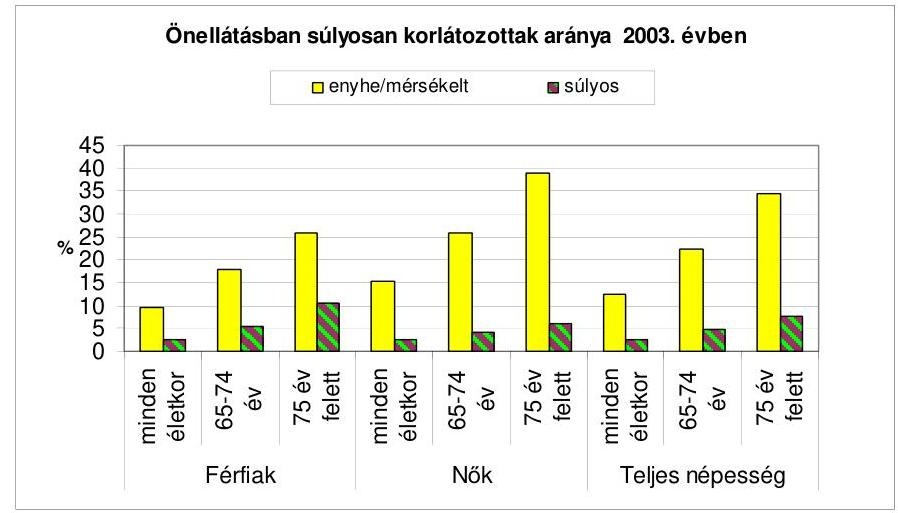

A vizsgált időszakban a krónikus kórházi osztályokon ${ }^{8}$ a betegek 7\%-át, ezen belül az ápolási, krónikus utókezelő osztályokon mindössze 2-2,2\%-át látták el. Az ÁSZ korábbi ellenőrzése ${ }^{9}$ megállapította, hogy a krónikus utókezelő és ápolási ágyak mellett a rehabilitációs célú krónikus ágyak egy részén is ápolási célú ellátás folyt. A szociális indíttatású kórházi ellátás jelensége összefüggött azzal is, hogy az ápolás, gondozás az aktív, vagy a krónikus ellátásban társadalombiztosítási jogviszony alapján - az ápolási osztályok kivételével - térítési díj nélkül is igénybe vehető volt, a felvételre nem kellett hosszú ideig várakozni. A kórházi múködés hatékonysága, a gazdaságosság szempontjából kedvező, hogy a vizsgált időszakban az ápolás átlagos időtartama az aktív ellátásban 17,5\%-kal, a krónikus ellátásban 9,1\%-kal csökkent. Folyamatosan (összesen

[^0]
[^0]:    ${ }^{7}$ Forrás: OLEF2003.
    ${ }^{8}$ Finanszírozás és szakmai tartalom szempontjából megkülönböztethető az ápolási, a krónikus utókezelő és a rehabilitációs osztályon folyó ellátás.
    ${ }^{9} 0731$ Jelentés a munkaképesség megőrzésére fordított pénzeszközök hasznosulásának ellenőrzéséről megállapította, hogy a Rehabilitációs Szakmai Kollégium által elfogadhatónak ítélt 2,5\% alatti halálozási arányt két év átlagában meghaladta a belgyógyászati rehabilitációnál a budapesti intézetek $12,8 \%$-os, illetve a megyei kórházak 6,3\%os mutatója.

---

39,4\%-kal) csökkent a normatív ápolási naphoz viszonyított hosszú ápolási napok száma, amely jelzi, hogy a struktúraátalakítást megelőzően is alkalmazkodni kényszerültek a kórházak a nehezebb gazdálkodási körülményekhez.

Az ápolás, gondozás valamennyi eleme megtalálható a hazai egészségügyi és szociális szolgáltatások között, de ezek nem képeznek egységes rendszert sem irányítás, sem finanszírozás, sem ellátás tekintetében. A Szoctv. ugyan kinyilvánítja az egyéni szükségletekre alapozott szolgáltatások egymásra épülő rendszerét, azonban az ellátások igénybevétele nem a felmért ápolási-gondozási szükségleteken alapult, az ellátórendszeren belüli átjárhatóság a gyakorlatban nem múködött. A szociális intézményekben 15 ezer volt a várakozók száma, a felvettek harmada azonban önellátó, ez utóbbiak bentlakásos intézménybe kerülésének oka részben az alapszolgáltatások hiánya volt. A Szoctv. keretjelleggel határozza meg a helyi önkormányzatok ellátási kötelezettségét a szociális szolgáltatások területén. Az alapszolgáltatások, az átmeneti elhelyezést biztosító intézmények hiánya következtében az egészségügyi ellátórendszert terhelték az egész napos ápolást, gondozást igénylő, de kórházi kezelésre nem szorulók ellátásának gondjai is. Az otthoni ápolásnál hosszabb, orvosi felügyeletet is igénylő, növekvő számú idős beteg korszerű ellátása érdekében a kórházi ápolási osztályok, ápolási otthonok kialakítása szerepelt ugyan a programokban, azonban a megvalósításhoz szükséges források nem álltak rendelkezésre.

Az ápolási, gondozási igények kielégítésének kapacitás feltételei javultak, ennek üteme az egészségügyi és a szociális ágazatban, valamint a 2003-2007 közötti években eltérő volt. A kapacitásbővülés a kórházak ápolási és krónikus utókezelő osztályain 31\%-os, az idősek és pszichiátriai betegek otthonaiban 15,4\%-os volt a vizsgált időszakban. Ezen belül, amíg a 2003-2006 között az ápolási osztályok összes kórházi ágyból való részesedése csupán 0,6 százalékponttal, addig a 2007. finanszírozási évben a kórházi ágystruktúra átalakítása eredményeként az ápolási osztályok átlagos ágyszáma $29,3 \%$-kal, az elbocsátott betegek száma $30,5 \%$-kal emelkedett. A bentlakásos elhelyezés lehetőségében azonban az ország egyes térségei között továbbra is jellemzőek az egyenlőtlenségek. Az egészségügyi, szociális intézményekben folyó költségigényesebb ápolás, gondozás nagyobb arányt képviselt az ellátásokban, mint a települési önkormányzatok által megszervezendő szociális alapszolgáltatások, vagy az E. Alap által finanszírozott házi szakápolás. Az önkormányzatok által fenntartott idősek és pszichiátriai betegek ápoló-gondozó otthoni férőhelyek a 2003-2006. években $2,2 \%$-kal emelkedtek, a 2007. évben $0,2 \%$-kal csökkentek, miközben a becsült kielégítetlen elhelyezési igény és a várakozási idő növekedett. Az igények megalapozottabb felmérése és kielégítése érdekében a 2008. évtől az időskorúak a bentlakásos intézményi ellátásra akkor jogosultak, ha napi gondozási igényük meghaladja a 4 órát.

Az ápolási, gondozási feladatok egy jelentős része az egészségügyi intézmények (elsősorban a fekvőbeteg ellátást nyújtó kórházak) gyógyító tevékenységéhez és az otthoni szakápoláshoz kapcsolódik. A kórházakban a 2007. évben átlagosan 9773 ápolási és krónikus utókezelő ágyon 76 ezer esetet, a költségesebb kórházi ellátás kiváltását szolgáló otthoni szakápolás keretében 46 ezer beteget láttak el. A tartós bentlakásos szociális intézményekben az időskorúak és pszichiátriai betegek otthonaiban 59100 férőhely állt rendelkezésre. A szociális

---

alapszolgáltatásokat - ezen belül házi segítségnyújtást - igénybe vevők száma országosan a 2003-2007. években $7 \%$-kal emelkedett, de növekedtek a bentlakásos intézményi ellátás iránti igények is. A házi segítségnyújtásban 47 ezer, a szociális étkeztetésben 123 ezer fő részesült a 2007. évben, amely a 65 éven felüliek másfél milliót meghaladó létszámához viszonyítva alacsony. A 2008. évi költségvetés ${ }^{10}$ a házi segítségnyújtásban az ellátottak 10 ezer fővel és a napi gondozási idő $20 \%$-kal történő növelésére 5,1 milliárd Ft, a szociális étkeztetést igénybevevők számának 20 ezer fővel történő bővítésére 2,1 milliárd Ft többlettámogatást tartalmaz.

A két ágazat kapacitásbefogadási rendszere nem összehangolt, a befogadás elbírálásánál az adatszolgáltatási és elemzési rendszer nem egységes. Az egészségügyi kapacitásigények meghatározásánál a szociális ellátórendszer régiós, térségi szintű jellemzőinek (pl. alapszolgáltatások kiépítettsége és hozzáférhetősége, a kórházkiváltó ellátások) figyelembevétele sem múködik. A két ágazatot érintő közös kapacitásszervezés igényét támasztja alá az is, hogy a szociális és egészségügyi intézmények tulajdonosai nagyrészt ugyanazon önkormányzatok, akiknek feladata az ellátások megszervezése. A kapacitásbefogadás rendszerének összehangolásához hiányzik az olyan típusú rendszeres adatgyűjtés, amely az ápolási-gondozási igények komplex felmérését tartalmazza.

Az egészségügyi és szociális ellátások összehangolatlan, párhuzamos fejlesztési törekvései változatlanul a fölös kapacitások és hiányok létrejöttének, fennmaradásának a lehetőségét hordozták magukban. A szociális ellátórendszer koordinálatlan fejlesztésének, ezzel az ellátottság területi egyenlőtlenségei további növekedésének, a felülről nyitott normatív állami hozzájárulás előirányzat túllépésének korlátozását szolgálta a nem állami fenntartók kapacitásszabályozásának (ITKR) bevezetése a 2007. évtől. Az új bentlakásos intézményi férőhelyek normatíváinak 50\%-os csökkentésével megszűnt a szociális szolgáltatásokhoz igényelhető állami hozzájárulás kapacitásnövelésre ösztönző hatása.

A múködési feltételeket meghatározó jogszabályok vizsgált időszakban történt módosításai nem ösztönözték a két ágazatba tartozó intézmények együttműködését, az azonos tevékenységek minimumfeltételei, a múködési engedélyezési eljárás és az ápolási szakfelügyelet egységes rendjének hiánya nem segítette elő az ellátásokban az indokolatlan párhuzamosságok, koordinálatlanság megszüntetését. A szociális intézményekben végzett ápolás a 2008. évtől a szükség szerinti ápolásról leszűkült az alapápolásra, miközben az ott élők körében emelkedett a szakápolást igénylő, egészségügyi panaszok miatt ellátásra szorulók aránya, az intézményben gondozottak kórházi ápolásban töltött napjainak száma.

A szociális intézmény orvosa hivatott biztosítani az ellátást igénybe vevő egészségi állapotának rendszeres ellenőrzését, az orvosi tanácsadást, az egészségügyi tárgyú jogszabályokban meghatározott szűréseket, a gyógyszerrendelést, valamint szükség esetén az egészségügyi szakellátásba történő beutalást. A szociális intézményi orvosi ellátás - mint egészségügyi szolgáltatás - nem szerepel az

[^0]
[^0]:    ${ }^{10}$ A Magyar Köztársaság 2008. évi költségvetéséről szóló 2007. évi CLXIX. törvény.

---

egészségügyi szakmai kódjegyzékben, nem kell hozzá az ÁNTSZ által kiadott múködési engedély. A szociális otthonokban végzett egészségügyi szolgáltatásokra finanszírozási szerződés nem köthető, a szociális ellátások normatív támogatása és az E. Alapból finanszírozott ápolás, gondozás között semmilyen kapcsolat nincs.

Az egészségügyi ellátórendszer strukturális problémáinak, területi egyenetlenségeinek megoldásában az egészségügyi közszolgáltatások biztosításáért felelős szervezetek között nem volt olyan szereplő, amelynek feladata az egészségügyi ellátások térségi tervezése és összehangolása lett volna, hiányoztak az egymáshoz illeszkedő ágazati szakmai programok, fejlesztési stratégiák. Ezen a helyzeten a RET-ek 2004. évi megalakulása sem javított, a fenntartók és az ellátások különböző szintjei (pl. az alapellátás és a szakellátás), az egészségügyi és szociális intézmények között nem megfelelő az optimális betegutak kialakítását elősegítő együttműködés. Hiányoztak az együttműködés szervezeti keretei, a kórházak szakmai programjai, fejlesztési elképzelései és a térségi egészségügyi programok közötti kapcsolat esetleges, kidolgozatlan volt.

A bentlakásos idősotthonok rekonstrukcióját, átalakítását, a férőhelyfejlesztést segítő címzett támogatásban 13 intézményt fenntartó önkormányzat részesült a 2002-2006. években, a fejlesztések eredményeként 730 férőhellyel emelkedett az idősek ellátását biztosító intézmények kapacitása, 6 intézmény esetében a végrehajtott rekonstrukció során a férőhelyek száma nem emelkedett, az elhelyezési körülmények javultak. A bentlakásos szociális intézmények fejlesztését szakmai pályázati források is segítették, az idősek otthonaiban élő demens betegek életkörülményeinek, gondozásának javítását 275,3 millió Ft-tal ( 128 db pályázat), a pszichiátriai betegek ellátását 240,7 millió Ft-tal ( 30 db pályázat) támogatta az ágazati minisztérium. A pályázatok monitorozása, a célkitűzések megvalósításának, eredményességének értékelése nem történt meg.

A 2003-2007. években az ápolás-gondozás fejlesztését az egészségügyi ágazatban is több pályázat segítette, a támogatások felhasználása az érintett intézményekben a szolgáltatások feltételeinek javítását eredményezte. A pályázati célokhoz rendelt források nagyságára előzetes számítások azonban nem készültek, a fejlesztések várható eredményeit, követelményeit nem határozták meg. A betegellátás színvonalának emelése, az ellátás komfortjának fejlesztése céljából a 2003. évben kiírt pályázaton 174 intézmény részesült 500 millió Ft támogatásban, amelyek közül 2007. december 31-ig 22 megszűnt, illetve összevonásra került más intézménnyel, részükre 86 millió Ft támogatást folyósítottak.

Az OEP a 2004. évben komplex otthoni és intézeti hospice ellátás fejlesztésére és a 2005. évben az otthoni hospice ellátás bővítésére írt ki pályázatot 450 millió Ft összegben. A pályázat célja volt, hogy az intézeti és az otthoni hospice ellátás bővítésével lehetővé váljon a hospice ellátás komplex, integrált rendszerének fejlesztése, az ország minél teljesebb körű lefedettségének biztosítása, az ellátáshoz való hozzáférés esélyegyenlőségének javítása. Az intézeti hospice ellátásra 113 ágykapacitás és otthoni hospice ellátásra 28 szolgáltató került befogadásra. A program azonban nem folytatódott, a megyék kétharmadában intézményi hospice ellátás jelenleg sem múködik, valamint az idősellátás komplex intézményeinek kialakítására nem születtek eredményes intézkedések.

---

A kórházi struktúraátalakítás előtt számítások készültek a krónikus kapacitások növelésére, azonban a különböző adatgyűjtések nem álltak össze komplex helyzetértékeléssé, szükségletfelméréssé és ebből kiinduló területi kapacitásigény számítássá. Az elemzések a struktúraátalakítás igényét, főbb irányát megfogalmazták, de a változtatások szakmai összetételére, várható hatásaira és célszerű megvalósítási ütemezésére nem tértek ki. A struktúraátalakítás szakmai programja, kritériumrendszere - az aktív ágyak csökkentésén, krónikus ellátásban az ágyszám növelésén túl - sem a központi, sem a fenntartói döntésekben nem került meghatározásra, ezért a monitorozás is elmaradt. Az átalakult ágykapacitás múködését az elmúlt (nem teljes) év betegforgalmi adatai alapján lehetett csupán értékelni. A megemelt számú krónikus ágyakon az ellátás szakmai tartalommal való megtöltése, a betegutak jobb megszervezése a múködési problémák mellett (létszámleépítés, munkaerőhiány egyszerre volt jelen, az adósságállomány növekedése miatti kényszerű takarékossági intézkedések) háttérbe szorult.

Az egészségügyi ellátórendszer átalakítására a 2006. évben kiírt 6,5 milliárd Ft keretösszegű pályázat célja volt a közép- és hosszútávon egyaránt fenntartható egészségügyi ellátórendszer - szakmapolitikai céloknak és a helyi szükségleteknek is megfelelő - struktúraátalakításának támogatása, az intézményi átalakítások megkezdése (aktív ágyszám csökkentése és átalakítása ápolási, krónikus ellátássá, illetve járóbeteg-ellátási kapacitássá), a területi egyenlőtlenségek csökkentése, az ellátáshoz való hozzáférés esélyegyenlőségének elősegítése. A nyertes 140-ből 88 pályázó ágyszám leépítésére, illetve átalakítására összesen 4,6 milliárd Ft, ebből a krónikus ellátásba történő átalakítás címén 2,1 milliárd Ft támogatásban részesült. A támogatás forrása az E. Alap 2006. évi költségvetése volt, ezért a pályázatban szereplő aktív ágyak csökkentése esetén a támogatás a célfeladathoz nem kapcsolódó múködési kiadásokra volt fordítható. A fejlesztési célkitűzések során felmerülő beruházási kiadásokat a pályázónak saját forrásból vagy fenntartói támogatásból kellett fedezni. A múködési kiadások jogcímei szerinti felhasználásra vonatkozó értékelés nem történt.

Az Eftv. végrehajtásával kapcsolatosan, az ágyszám változásokból következő struktúraátalakítás megvalósításának elősegítése, fekvőbeteg ellátást nyújtó egészségügyi szolgáltató megszűnése vagy átszervezése következtében feladatbővüléssel járó, a szolgáltatókat terhelő egyszeri beruházási vagy felújítási költségeinek támogatására, a létszámcsökkentéssel összefüggő többletköltségek fedezetére a 2007. évben kiírt pályázati felhívásra 126 pályázat érkezett, az igényelt támogatás 15,5 milliárd Ft, a támogatás keretösszege azonban 7,5 milliárd Ft volt. A felhasználásáról a pályázati kiírás és az azon alapuló támogatási szerződés alapján 2007. október 31-éig kellett elszámolni a nyertes pályázóknak. Ezt a határidőt 57 pályázónál az átalakítások elhúzódása miatt az egészségügyi miniszter meghosszabbította a megvalósításhoz szükséges időtartamig, legkésőbb 2008. december 31-ig, a helyszíni ellenőrzés során nem volt értékelhető az intézkedések eredményessége, az egészségügyi és szociális ellátások közötti együttműködés javítása, a térségi kapacitások összehangolása területén.

Az ápolási rendszer egységesítésének soron kívüli feladatairól szóló kormányhatározat az érintett tárcáknak hatásvizsgálat, és a további intézkedésekről előterjesztés készítését írta elő, amelynek végrehajtása a rendelkezésre álló idő alatt nem hozott értékelhető eredményt. A megkezdett munka nem zárult

---

le ${ }^{11}$, nem kerültek meghatározásra az ápolási feladatok egységes rendszere kialakításának, a rendszerben meglévő átfedések kiszűrésének, az e célra fordított erőforrások ésszerű és átlátható felhasználásának, valamint a szociális és egészségügyi feladatok összehangolásának érdekében elvégzendő feladatok. A szociális otthonok lakóinak egyharmada szorul folyamatos szakápolásra, amelyre az intézmények sem eszközökkel, sem szakképzett ápolószemélyzettel nincsenek felkészülve, finanszírozása az E. Alapból nem megoldott.

A két ágazat együttműködésének javítására vonatkozó elképzelések megfogalmazódtak az önkormányzatok egészségügyi stratégiájában, a kórházak szakmai programjában, de a konkrét lépések megtételét a folyamatosan változó finanszírozási és jogi környezet, a tartósan bevált hazai modellek és az érdekeltség hiánya hátráltatták. Az egészségügyi ellátások térségi (regionális, megyei szintű) szervezésének hiányában a kapacitások szolgáltatók közötti felosztásában nem jött létre hatékony együttmúködés.

Az egészségügyi ellátórendszer átalakítása körüli viták, bizonytalanság megnehezítette a közép- és hosszú távú stratégia kialakítását. Az ÜMFT a 20072013 közötti időszakra fogalmaz meg egészségügyi és szociális ellátást, humán infrastruktúrát érintő prioritásokat, a források igénybevétele azonban az ellátórendszer stratégiai célok mentén történő fejlesztését feltételezi. Az EU-s forrásokból támogatható komplex profilú intézmények fenntarthatósága pedig igényli a finanszírozás áttekinthetővé tételét, a ma még hiányzó közös szakmai minimumfeltételek, szakfelügyeleti rendszer kialakítását. Az idősellátás térségi szinten szervezett szolgáltatásai, az egészségügyi és szociális, ezen belül a geriátria és az ápolási ellátás, a szociális intézmények fejlesztését - régiónként eltérő forrásokkal - valamennyi régió operatív programja (ROP) tartalmazza, de a már megjelent pályázati célok között az ápolás, gondozás komplex intézményeinek fejlesztése nem szerepelt.

A helyi önkormányzatok által biztosított szociális szolgáltatások fejlesztési terveit a szolgáltatástervezési koncepciók tartalmazzák, azonban a megyei és a települési önkormányzatok szolgáltatástervezési koncepciója között kevés a kapcsolódási pont. A szolgáltatástervezési koncepció készítését nehezítette, hogy a tartós ápolási szükséglet és igény, ezen belül a különféle állapotokból eredő ellátási igények és feladatok mennyisége, területi megoszlása nem ismert. A hiányzó szakosított szolgáltatások, intézmények létrehozására irányuló célok meghatározásakor kockázati tényező volt a jogszabályi előírások és a finanszírozási szabályok gyakori változása. A fővárosi, megyei önkormányzatok szakosított szociális ellátások területi összehangolására nem tettek eredményes intézkedéseket, nem születtek összehangolt, az adott térségre és területre vonatkozó szociális ellátási fejlesztési elképzelések.

[^0]
[^0]:    ${ }^{11}$ Időközben a minimumkövetelmények pontosítása, az otthoni szakápolást nyújtó szolgáltatók együttműködésének, integrációjának ösztönzése, tevékenységük szociális szolgáltatásokkal történő összehangolása érdekében vizsgálat elvégzését, javaslatok kidolgozását írta elő az egészségügyi miniszter számára a közfeladatok felülvizsgálatával kapcsolatos további feladatokról szóló 2233/2007. (XII. 12.) Korm. határozat.

---

A szolgáltatástervezési koncepciókban a vizsgált önkormányzatok 2003-2007 között 25 milliárd Ft összegű, nagy költségigényű beruházást terveztek, amelynek forrását $83,5 \%$-ban pályázatokból kívánták biztosítani. A kiírt pályázatok és az elnyerhető támogatás összege erősen befolyásolta a fejlesztések irányát és a megvalósult beruházások műszaki tartalmát. A vizsgált időszakban a tervezett beruházások egyharmada valósult meg $77,4 \%$-os támogatással, amelyek eredményeként javultak a vizsgált önkormányzati intézményekben az időskorúak és a pszichiátriai betegek ellátásának feltételei, de a területi egyenlőtlenségek továbbra is fennállnak.

Az ápolás-gondozás pénzügyi fedezetét a krónikus ellátásban az OEP által közvetlenül a kórháznak utalt egészségbiztosítási finanszírozás és az ápolási osztályokon az ellátottak részleges térítési díja, a szociális intézményekben a költségvetési törvény szerint a fenntartót megillető normatív állami hozzájárulás, az intézményi ellátásért beszedett térítési díj és a fenntartói támogatás együttesen biztosították.

A krónikus ellátás finanszírozási aránya a fekvőbeteg szakellátáson belül 9,3\%-ról 11,3\%-ra emelkedett 2003. és 2007. év között. Az alapdíj a bázisidőszaki teljesítmények és a krónikus szorzók alapján, a krónikus ellátásra elkülönített költségvetési előirányzatok, és nem a tényleges költségek felmérésére alapozottan került meghatározásra. Ezen belül az ápolási és a krónikus utókezelő osztályok finanszírozása a kapacitások (a finanszírozott ágyak átlagos számának) $31 \%$-os bővülése mellett a 2003. évi 8,4 milliárd Ft-ról 2007. évre 14,5 milliárd Ft-ra ( $72,9 \%$-kal) növekedett, javult a költségek fedezettsége, de a ráfordításokat az E. Alap finanszírozása és a térítési díj együtt sem fedezte. A forráshiányt az egyéb bevételekből, támogatásokból finanszírozták, de a kórházak a kiegyenlítetlen kötelezettségeik (szállítói tartozásaik) növelését is felvállalták. A krónikus ellátás vesztesége önmagában nem vezetett pénzügyi egyensúlytalansághoz, a kórházak növekvő eladósodása - a tevékenységen belüli súlya miatt - az aktív fekvőbeteg ellátás finanszírozásán, gazdaságosságán múlott.

A szociális intézmények működéséhez a fenntartó által igényelhető normatív állami hozzájárulás feltételei, jogcímei, fajlagos értékei a 2006. évtől kezdődően módosultak a feladatok eltérő költségigényességének jobb érvényre juttatása, a központi támogatás növekedési ütemének csökkentése és a költségviselésben az ellátottak - vagyoni, jövedelmi helyzetüktől függő - nagyobb részvállalása érdekében. A normatíva differenciálásával párhuzamosan a jogcímek száma növekedett, egyes normatívák fajlagos értéke csökkent. A szociális ellátások költségfigyelésének rendje, hiányosságai sem tették lehetővé, hogy a normatívák az ellátási költségek felméréséhez igazodjanak, a módosítás a rendelkezésre álló pénzügyi keretek várható ellátási teljesítményekre történő viszszaosztásán alapult. Az idősotthonok és a pszichiátriai betegek ellátásához nyújtott normatív állami hozzájárulás összege 2003-2007 között 11,2\%-kal (37,5 milliárd Ft-ról 41,7 milliárd Ft-ra), ugyanakkor a férőhely $15,4 \%$-kal emelkedett. Az idősotthonok esetében a kapacitásbővülés - elsősorban az emelt szintű ellátást nyújtó intézmények férőhelyfejlesztésének köszönhetően -17,2\%-os, míg a pszichiátriai betegek otthonai férőhelybővülése ennél mérsékeltebb, $5,6 \%$-os volt.

---

A beszedett térítési díjak mindkét ágazat vizsgált intézményei átlagában az infláció mértékét meghaladóan emelkedtek. A feladatok ellátásának államháztartási és intézményi szintű gazdaságosságát is javította, hogy a szolgáltatások önköltségének a napi térítési díj 2003-2007 között az ápolási osztályokon (hospice nélkül) 17\%-ról 21\%-ra növekvő, a szociális otthonokban 23\%-ról 29\%-ra emelkedő arányát fedezte. Az átlagos napi térítési díj a kórházi ápolási osztályokon minden vizsgált évben magasabb volt, mint a szociális otthonokban.

A szociális intézményekben az intézményi térítési díj megállapításánál a fenntartók korábban a tényleges önköltséget figyelmen kívül hagyva mérlegelhették, hogy az ellátottak, hozzátartozók jövedelmi, vagyoni helyzetük alapján mekkora összeget képesek megfizetni. A Szoctv. 2007. január 1-jétől hatályos módosítása mérlegelést nem tett lehetővé, az intézményi térítési díjat a szolgáltatás önköltsége és a normatív hozzájárulás különbözeteként kell megállapítania a fenntartónak ${ }^{12}$. Ennek során az intézményfenntartó önkormányzatok $58 \%$-a a szociális ellátások intézményi térítési díját a 2007. évben nem a Szoctv. hatályos előírásai, hanem a korábbi szabályok szerint állapította meg.

A bentlakásos intézményekben nyújtott szolgáltatásokért fizetett személyi térítési díjak az intézményi térítési díjtól eltérőek, összegük nem a szolgáltatás tartalmától, színvonalától függ elsősorban, hanem a gondozott (kötelezett) jövedelmi, vagyoni helyzetétől, továbbá a fenntartó teherbíró képességétől. Az intézményi és a személyi térítési díj különbözete, a kedvezmények, térítési díjmentességek miatt kieső bevételek pótlása az intézmény működőképességét biztosítani köteles fenntartót terhelte.

Az ellátások önköltségét a költségigényesség sajátosságai befolyásolták, az összehasonlítást a felhasznált erőforrások mérésének eltérései torzították, korlátozták. Az alkalmazott nyilvántartási rendszerek különböztek a számviteli politikától, a költségfigyelés és felosztás módszerétől és a vezetők információs igényétől függően. Az ellátások ráfordításainak mérését (a szociális intézményekben kiadások, a kórházakban költségek alapján) az ágazati hovatartozás is befolyásolta. A vizsgált kórházi ápolási osztályokon az egy ápolási napra jutó költség az inflációnál kisebb mértékben ( $21,9 \%$-kal) emelkedett, a vizsgált szociális ellátásoknál az egy gondozási napra jutó kiadás azt meghaladó ütemben (26,7\%-kal) nőtt 2003-2007 között. Ennek ellenére a 2007. évben egy napi ellátás az idősek otthonában átlagosan $40 \%$-kal ( 3000 Ft -tal) kisebb kimutatott ráfordítással járt, mint ugyanez egy kórház ápolási osztályán (hospice ellátás nélkül).

A fajlagos ráfordítások eltérésének indokoltsága az ellátás eltérő szakmai tartalma, valamint a tényleges ellátási teljesítmények és ráfordítások mindkét ágazatban azonos módszerú mérésének hiányában volt értékelhető. Az intézmények által szolgáltatott adatok alapján a két ágazat intézményei fajlagos

[^0]
[^0]:    ${ }^{12}$ A Szoctv. 2008. január 1-jétől hatályos módosítása ismét lehetővé tette, hogy a jogszabályban előírtak szerint kimunkált intézményi térítési díjaknál alacsonyabb összeget is meghatározhatnak a fenntartók.

---

ráfordításainak, múködési forrásainak összetételét a következő diagram szemlélteti:
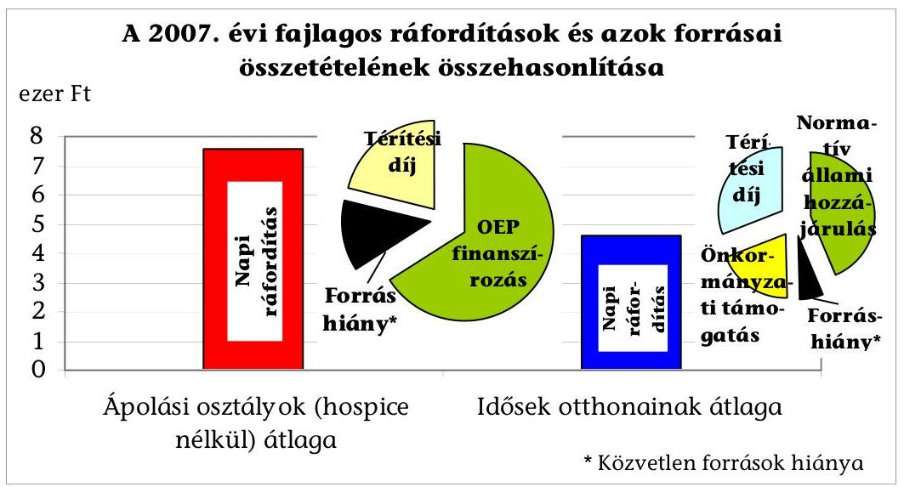

A központi támogatás számításának módja és fajlagos összege a két ágazat vizsgált ellátásai esetében eltért, de a finanszírozás összegét befolyásoló teljesítmény egységesen az ápolás-gondozás napokban mért igénybevétele volt. A források leosztásakor az egyéni szükségletek mértéke és várható költségei szerint nem, de az egyes ellátástípusok sajátosságaira hivatkozva történt differenciálás. Az egy napi ellátás központi támogatásának mértéke és a költségek finanszírozásában betöltött szerepe az ellenőrzött szociális intézmények adatai alapján 2003-2007 között nem, a kórházak ápolási osztályain az inflációt meghaladó mértékben javult. A 2007. évben egynapi ápolás, gondozás közvetlen társadalombiztosítási finanszírozása két és félszer magasabb volt az ápolási osztályokon, mint a normatív hozzájárulás a szociális intézményekben.

Az egy gondozási napra jutó közvetlen támogatás és annak szerepe a kiadások finanszírozásában az inflációt meghaladó mértékben növekedett a szociális intézményeket fenntartó önkormányzatoknál 2003-2007 között. A kórházak önkormányzati támogatása elsősorban céljellegú volt, azonban a - finanszírozási megszorítások miatt is - növekvő kórházi adósságállomány vonatkozásában az önkormányzatokat tulajdonosi felelősség és kötelezettségek terhelik.

A helyszíni vizsgálatok tapasztalatai alapján a számvevői jelentésekben számos javaslat fogalmazódott meg a kórházfenntartó, feladatellátásra kötelezett helyi önkormányzatok polgármestereinek (közgyűlés elnökeinek), illetve (fő)jegyzőinek. Ezek között szerepelt a jogszabályi előírások maradéktalan betartása érdekében a kórházak szakmai terve fenntartó által történő jóváhagyásának, a szolgáltatástervezési koncepció elfogadásának, felülvizsgálatának, az intézményi térítési díj szolgáltatás önköltsége, és a normatív állami hozzájárulás különbözeteként történő megállapításának kezdeményezése. A munka színvonalának, eredményességének javítását szolgáló javaslatok az egészségügyi és szociális ellátás iránti igények és a kapacitások közötti összhang felmérésére, az ellátórendszer területi összehangolására, az egészségügyi és szociális intézmények közötti együttműködés módjának kidolgozására, elősegítésére és az intézmények végleges múködési engedélyéhez szükséges személyi és tárgyi

---

feltételek biztosítására irányultak. A vizsgált kórházaknak, szociális intézményeknek tett javaslatok között fogalmazódott meg a struktúraátalakítás során megnövelt krónikus kapacitás kihasználtságának folyamatos értékelése, az ápolás szakmai munka minőségét javító követelmények kidolgozása és monitorozása, az ápolás, gondozás feltételeinek javítását szolgáló különféle hazai és EU-s pályázati lehetőségek figyelemmel kísérése és a szolgáltatások tényleges önköltségének megállapítását biztosító önköltség-számítási rend kialakítása.

Az ellátást nyújtó intézmények gazdálkodásában a takarékosság mellett növekvő költségeket (kiadásokat) magasabb mértékben fedezte a térítési díjból, a központi és fenntartói támogatásból származó együttes bevétel. Az ápolás, gondozás minőségének és hozzáférhetőségének javítását, a rászorultság elvének érvényesítését szolgáló intézkedések eredményeként javultak az igények kielégítésének feltételei, azonban a közfinanszírozásból származó források összehangolt felhasználása továbbra sem biztosított. Az intézmények finanszírozásában, igénybevételi szabályaiban meglévő eltérések, ellentmondások áttekinthetetlenné, nehezen összehangolhatóvá tették a két ágazatban egyaránt megjelenő igények kielégítésének hatékonyabb és célszerűbb megszervezését.

A helyszíni ellenőrzés megállapításainak hasznosítása mellett javasoljuk:

# a Kormánynak 

1. számoltassa be az egészségügyi, a szociális és munkaügyi minisztert az ápolási rendszer egységesítésének soron kívüli feladatairól szóló 2011/2007. (I. 30.) Korm. határozat végrehajtásáról, határozza meg az ápolási feladatok egységes rendszerének megteremtése, a rendszerben meglévő átfedések kiszűrése, az e célra fordított erőforrások ésszerű és átlátható felhasználása, valamint a szociális és egészségügyi feladatok összehangolása érdekében a tárcák által elvégzendő feladatokat;
2. intézkedjen - az ÚMFT célrendszerével összhangban a regionális operatív programokban szereplő - a szociális és egészségügyi (komplex) ellátást egyaránt nyújtó intézmények fejlesztéséhez szükséges források biztosítása érdekében a pályázatok kiírásáról;

## az egészségügyi miniszternek és a szociális és munkaügyi miniszternek

1. gondoskodjanak az egészségügyi és szociális intézményekben az ápolás, gondozás szakmai tartalmának egyértelmű rögzítéséről, az átjárhatóság érdekében az azonos tevékenységek összehangolt minimumfeltételeinek, a múködési engedélyezési eljárás és az ápolási szakfelügyelet egységes rendjének kialakításáról;
2. intézkedjenek a két ágazat szakmai programjai közötti kapcsolat erősítése érdekében a szociális és egészségügyi fejlesztések összehangolásáról, a két ágazat kapacitásbefogadási rendszere egységes követelményeinek kialakításáról;
3. dolgozzák ki az ápolási szolgáltatást egyaránt nyújtó szociális és egészségügyi intézmények működési feltételeinek, valamint egységes, azonos tartalmú finanszírozásának rendszerét;

---

4. dolgozzák ki a szociális ellátásban részesülők egészségügyi ellátásának monitorozási rendszerét, a szociális intézményekben lakók ápolássúlyossági fokozatba sorolásának folyamatos nyomon követését és értékelését biztosító adatszolgáltatási rendszert;

# az egészségügyi miniszternek 

gondoskodjon a struktúraátalakítás elősegítésére biztosított pályázati támogatások elszámoltatásáról, és a pályázati célok megvalósulásának értékeléséről;

## a szociális és munkaügyi miniszternek

dolgozza ki a szociális szolgáltatások területi összehangolásával kapcsolatos helyi önkormányzati feladatok ellátásához szükséges eszköz- és információrendszer múködéséhez szükséges jogszabályi követelményeket.

---

.

---

# II. RÉSZLETES MEGÁLLAPÍTÁSOK 

## 1. Az áPOLÁs, GONDOZÁs ÁGAZATI IRÁNYÍTÁSÁÉRT FELELŐS MINISZTÉRIUMOK INTÉZKEDÉSEINEK EREDMÉNYESSÉGE

### 1.1. Az ápolást, gondozást nyújtó intézmények múködési feltételeit meghatározó jogi szabályozás

Az ápolási, gondozási tevékenységet az Eütv. 98. § (1) bekezdése - tág értelemben - azon eljárások összességeként határozza meg, amelyek feladata az egészségi állapot javítása (orvosi beavatkozás, gyógyítás), az egészség megőrzése és helyreállítása, a beteg állapotának stabilizálása, a betegségek megelőzése, a szenvedések enyhítése a beteg emberi méltóságának a megőrzésével, környezetének az ápolási feladatokban történő részvételre való felkészítésével és bevonásával. Az ápolás szerves része a beteg intézeti keretek között végzett egészségügyi ellátásának, kiegészítő eleme az otthoni gyógykezelésnek, rehabilitációnak és alapvető eleme az intézeti keretek között végzett vagy az otthoni ápolási és gondozási célú ellátásnak.

A Szoctv. 67. § (1) bekezdése szerint az önmaguk ellátására nem, vagy csak folyamatos segítséggel képes személyek teljes körú ellátásáról (étkeztetés, szükség esetén ruházattal való ellátásról, mentális gondozásáról, egészségügyi ellátásáról, lakhatásáról) az ápolást, gondozást nyújtó intézményben kell gondoskodni, feltéve, hogy ellátásuk más módon (pl. az alapszolgáltatások keretében) nem oldható meg.

A beteg ápolása az aktív ellátásnak is része, a vizsgált időszakban a betegek 7\%-ának ellátása történt az ápolási, krónikus utókezelő és rehabilitációs profilú krónikus kórházi ágyakon. Itt az ápolási idő magasabb, ezért az összes ápolási napból a krónikus osztályok részesedése 2006. évben 26\%-os, 2007. évben a struktúraváltást követően már 32,5\%-os volt. A tartós ápolást végző ápolási és krónikus utókezelő osztályok összes kórházi ágyból való részesedése 2003-2006 között kismértékben ( $7,8 \%$-ról 8,4\%-ra) emelkedett, amely osztályok az összes beteg mindössze 2-2,2\%-át látták el. A kórházi ágystruktúra átalakítása eredményeként a 2007. finanszírozási évben az ápolási osztályok átlagos ágyszáma $29,3 \%$-kal, az elbocsátott betegek száma $30,5 \%$-kal emelkedett.

A krónikus ellátás fejlesztésének a 2003-2006 közötti időszakban is célja volt az átlagos ápolási idő csökkentése az aktív kórházi ágyakon, a betegek állapotának megfelelő osztályra történő áthelyezése a gazdaságosság, hatékonyság javítása, a finanszírozási változásokhoz való alkalmazkodás érdekében. Az átlagos ápolási idő az összes kórház aktív ágyain a 2003. évi 7,26 napról a 2007. évben 5,99 napra ( $17,5 \%$-kal), csökkent. Folyamatos és egyenletes csökkenés (2003-2007 között 39,4\%-kal) volt a normatív ápolási naphoz képest a hosszú ápolási napok számában.

---

A vizsgált időszakban az ápolási napokat és a hosszú ápolási napok arányát a következő diagram szemlélteti:
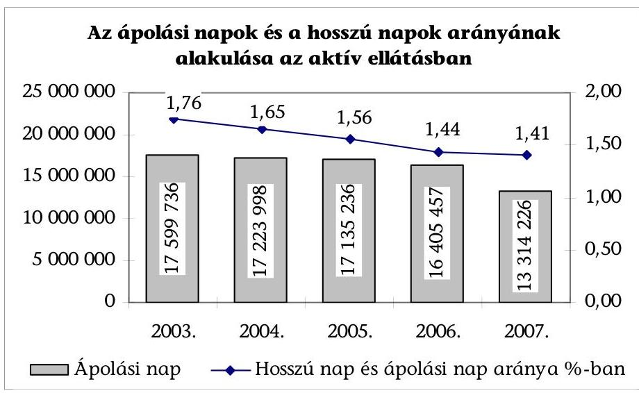

Az egészségügyben nyújtott ápolás-gondozás, és a szociális ellátások feladat- és tevékenységi köre tartalmaz hasonló elemeket, azonban ezek nem kapcsolódnak egymáshoz. Az egészségügyi ellátáson belül a háziorvosi (körzeti) ápolónők munkájában, a házi szakápolás, valamint az aktív és krónikus kórházi ellátás területén egyaránt jelen van az ápolási feladat. A szociális területen az ápolási feladat ellátása az alap- és szakellátások szintjén a beteg otthonához kötötten, vagy bentlakást nyújtva történik. Az ápolási, gondozási szükségleteket tovább differenciálja, hogy eltérő az ellátottak betegségének súlyossága, az önellátási képesség elvesztésének mértéke, a családi és szociális helyzete.

Krónikus kórházi ápolás, gondozás keretében a 2003. évben 19104 ágyon összesen 202365 eset ellátása történt, a bentlakásos szociális intézményekben az ellátottak száma 77386 fő volt. Ezen belül a kórházak ápolási és krónikus utókezelő osztályain (részlegein) ápolt, (nagyobbrészt idős) betegek száma 57457 fő, az időskorúak otthonában elhelyezettek száma 44219 fő, valamint az elmegyógyászati profilú krónikus kórházi ágyakon ápoltak száma 38974 fő, a pszichiátriai betegek szociális otthonában ellátottak száma 7889 fő volt.

Az ápolás, gondozás valamennyi eleme megtalálható a hazai egészségügyi és szociális szolgáltatásokban, de ezek nem képeznek egységes rendszert sem irányítás, sem finanszírozás, sem ellátás tekintetében. Az intézmények finanszírozásában, igénybevételi szabályaiban meglévő eltérések, ellentmondások áttekinthetetlenné, nehezen összehangolhatóvá teszik a két ágazatban egyaránt megjelenő igények kielégítésének hatékonyabb és célszerűbb megszervezését.

Az egészségügyben és a szociális szférában végzett ápolási tevékenység összehangolásával kapcsolatos kormányhatározat alapján az érintett tárcák áttekintették az ápolási tevékenység szakmai tartalmával kapcsolatos kérdéseket. Az elvégzett munkát összefoglaló munkadokumentum szerint meghatározták a tevékenység 3-400 elemét és az elvégzésükhöz szükséges kompetenciát. Ezek harmada szorosan összefügg a beteg egészségi állapotával és ellátása egészségügyi ismereteket

---

is feltételez. Másik harmada a gondozott mindennapi tevékenységét segítő, szociális feladat. A fennmaradó közel egyharmad olyan „határterület", amelyet mind az egészségügyi, mind a szociális szakszemélyzet elvégezhet.

A múködési engedélyezési eljárás alapjául szolgáló szakmai minimumfeltételeket tartalmazó ágazati jogszabályok nem írják elő a működési engedély kiadását megelőzően a személyi és a tárgyi feltételek meglétének helyszíni ellenőrzését. Az egészségügyi szolgáltatások és bentlakásos szociális intézményi ellátások területén a két különböző törvény hatálya alá tartozó tevékenységek egy részének elnevezése, illetve tartalma hasonló, a múködés engedélyt az egészségügyi szolgáltatások esetében az ÁNTSZ, a szociális intézményeknél az illetékes Közigazgatási Hivatal Szociális és Gyámhivatala adja ki.

Az egészségügyi szolgáltatások múködéséhez előírt minimumfeltételeket meghatározó miniszteri rendeletet (továbbiakban Minr.) nem tartalmazza egyértelmúen, hogy az adott feladat múködési engedélyéhez pontosan milyen humán erőforrás szükséges. A „biztonságos ellátást kell nyújtani, és ennek megfelelően kell létszámokat biztosítani"megfogalmazás jogértelmezési és jogalkalmazási bizonytalanságot okoz, túlzottan általános és nem ad iránymutatást a létszámok kialakítására, miközben minden felelősséget a szolgáltatóra ruház. A rendelet nem kellően definiált fogalmakat is használ, nem határozza meg az „elérhetö", a „szükséges", a „szakmai háttér", a „szakmai környezet", a „személyi feltétel" kategóriák tartalmát, a köztük lévő különbséget.

A rendelet az osztályok szakmai profilja, ágyak száma szerint osztályos vagy intézményi szinten nem határozza meg a nem közvetlen betegápolási feladatokat ellátó szakdolgozók (dietetikus, gyógytornász, fizioterápiás asszistens, gyógymasszőr) számát, csupán „szükséges" megjelölést alkalmaz, valamint rokon értelmú fogalomként használja a gyógytornász, fizioterapeuta, gyógymasszőr megnevezést, noha a képesítésükből eredeztethetően szakmai kompetenciájuk eltérő és ez alapján egymást helyettesíteni nem képesek.

Az egészségügyi szolgáltatások minimumfeltételeiről szóló, jelenleg is hatályos miniszteri rendelet 2003. évi kihirdetését követően a fekvőbeteg-ellátó intézmények múködési engedélyének felülvizsgálatára és az új szakmai minimumfeltételekhez igazodó módosítására a rendeletben meghatározott határidők és feltételek szerint a szolgáltató kérelme alapján került sor, nem előzte meg - kapacitás hiányában, illetve az intézményrendszer számossága miatt - az egészségügyi hatóság helyszíni ellenőrzése.

A múködéshez szükséges egyes tárgyi, szakmai környezeti feltételek, vagy a szolgáltató folyamatos és biztonságos múködését nem veszélyeztető egészségügyi szakdolgozói létszám hiánya esetén ellátási érdekből a már múködő egészségügyi szolgáltató részére, a hiányosságok megszüntetésére adott határidő egyidejú kitűzésével az egészségügyi hatóság (ÁNTSZ) ideiglenes múködési engedélyt adott ki.

A Minr. a fekvőbeteg-ellátó kórházi osztályokon az ápolási feladatokhoz az ápolási osztályra előírt feltételek teljesítését írja elő (15 ágyanként legalább 2 diplomás ápoló, 7 szakápoló és 5 általános ápoló alkalmazását követeli meg). Az ápolási feladatokat ellátó szakdolgozók számát műszakonként és a beteg ápolási kategóriáját, ápolási szükségletét figyelembe véve azonban nem határozza meg.

---

Az OTH tájékoztatása szerint a krónikus ápolási osztályok közül a 2007. évben mindössze három rendelkezett ideiglenes működési engedéllyel, a kedvező képet a helyszíni vizsgálat tapasztalatai és az egészségügyi intézmények bér- és létszám-statisztikai jelentésében szereplő létszámadatok sem támasztották alá.

A szakellátási kapacitások a 2007. évi felosztásáról szóló közigazgatási határozatban szereplő ágyszámra vonatkozóan a kórházak kezdeményezték a múködési engedély módosítását, azonban a feltételek hiányában az év folyamán a 7072 ággyal ( $35 \%$-kal) megnövelt krónikus ágyak egy része nem múködött a helyszíni vizsgálat megállapítása szerint. A minimumfeltételekben meghatározott ápolói és egyéb létszám a 2006. évi ágazati bér- és létszám-statisztikából nyerhető információk alapján sem biztosított. A statisztika „IV/13 A krónikus fekvőbeteg szakfeladat struktúra, átlaglétszám, bérkifizetés adatai, valamint egymáshoz viszonyított mértékük" elnevezésű táblázata szerint az átlaglétszám a számítható létszámszükségletnél alacsonyabb volt. (A statisztika megbízhatóságát azonban megkérdőjelezi, hogy több intézmény nem szolgáltatott létszámadatot.)

A szociális szolgáltatások múködési engedélyezési eljárása során a fenntartó és az intézményvezető nyilatkozatát kell csatolni a kérelemhez a személyi feltételek meglétéről. A hivatal az elvi múködési engedélyt kiadja, ha az intézmény rendelkezik a jogszabályban meghatározott tárgyi feltételekkel. Az engedélyezési eljárásban 2004. január 1-jétől az ÁNTSZ előzetes szakmai igazolása is szükséges a szociális intézményben biztosított egészségügyi ellátáshoz szükséges személyi és tárgyi feltételek meglétéről.

# A múködési feltételeket a fenntartók elegendő pénzügyi eszköz hiányában maradéktalanul nem tudták teljesíteni. Amennyiben az intézmény múködése ellátási érdekből indokolt volt, a feltételek előírása mellett az engedélyező hatóság ideiglenes múködési engedélyt adott ki. A határozatlan idejű múködési engedély birtokában sem felelt meg minden intézmény az előírt feltételeknek. 

A vizsgált 16 bentlakásos szociális intézmény közül 4 rendelkezik határozatlan idejű múködési engedéllyel, ezek közül a Bács-Kiskun Megyei Önkormányzat Időskorúak Otthonában egy fővel, a Nógrád Megyei Önkormányzat Ezüstfenyő Idősek Otthonában 9 fővel kevesebb a szakdolgozói létszám az előirtnál. A hiányzó minimumfeltételek pótlására az intézmények $60 \%$-a készített intézkedési tervet, két intézmény kezdeményezte a végleges engedély megszerzését.

A vizsgált szociális intézményekben az ellátottak átlagéletkorának emelkedése mellett az időskorra jellemző biológiai változásokból eredő pszichés és szomatikus tünetek előfordulása gyakoribbá vált, ezzel a gondozó, ápoló személyzet munkája növekedett, a feladat összetettebb lett. Az egészségi állapot romlását jelzi, hogy emelkedett az önellátásra nem képes ellátottak aránya.

A Bács-Kiskun Megyei Önkormányzat „Nefelejcs Ház" Időskorúak Otthona ellátottainak 26,1\%-a volt a 2003. évben önellátásra nem képes, arányuk a 2007. évben 37,7\%-ra emelkedett. A Debreceni Idősek Házában az önellátásra képtelen gondozottak aránya ugyanezen időszakban 9,5\%-ról 14\%-ra emelkedett.

A gondozottak egyre többféle, gyakran halmozott betegségben szenvednek, a romló egészségi állapot következménye, hogy a vizsgált intézményekben 20032007 között 48,5\%-kal növekedett a kórházi ápolásban töltött napok száma.

---

A Szoctv. szerint az önmaguk ellátására nem, vagy csak folyamatos segítséggel képes személyek egészségügyi ellátásáról ápolástgondozást nyújtó intézményben kell gondoskodni. A személyes gondoskodást nyújtó szociális intézmények szakmai feladatairól és múködésének feltételeiről szóló 1/2000. (I. 7.) SzCsM rendelet (továbbiakban Szmr.) alapján a bentlakásos szociális intézményben ki kell alakítani az egészségügyi ellátás céljaira (pl. orvosi szoba, betegszoba) szolgáló helyiséget. A bentlakásos szociális intézmény orvosa biztosítja az ellátást igénybe vevő egészségi állapotának rendszeres ellenőrzését, az orvosi tanácsadást, az egészségügyi tárgyú jogszabályokban meghatározott szűréseket, a gyógyszerrendelést, valamint szükség esetén az egészségügyi szakellátásba történő beutalást. A bentlakásos szociális intézményi orvosi ellátás - mint egészségügyi szolgáltatás - nem szerepel az egészségügyi szakmai kódjegyzékben, nem kell hozzá az ÁNTSZ által kiadott múködési engedély, ebből következően nem minősül egészségügyi szolgáltatásnak.

Az egészségügyi szolgáltatás az Eütv. 3. § e) pontja szerint „az egészségügyi hatóság által kiadott müködési engedély birtokában végezhető egészségügyi tevékenységek összessége".

A szociális intézményekben foglalkoztatott főállású orvosok működési engedélyezése és vényírási jogosultsága hiányában a bentlakók gyógyszerfelírása és szakorvosi beutalása az E. Alapból finanszírozott tevékenység (háziorvosi- vagy magánpraxis) keretében történt.

Az ápolás tartalmával kapcsolatos előírások ellentmondásosak. Az Szmr. szerint az alapápolás feladatai közé nem tartoznak az otthoni szakápolás keretében ellátható tevékenységek, ugyanakkor az ellátottaknak térítésmentesen biztosítandó alapgyógyszer-készletben szerepelnek az injekciózáshoz, infúzióhoz szükséges anyagok (fertőtlenítők, tűk, fecskendők, infúziós szerelékek), de a szakápolásról 20/1996. (VII. 26.) szóló NM rendelet 1. számú melléklet 4. pontja az intravénás folyadékpótlást szakápolási feladatként nevesíti. A szociális intézményekben nem előírás a szakápoló jelenléte, az OEP sem téríti az itt végzett szakápolási tevékenységet, így az itt lakóknak szonda levezetéshez, infúzióhoz, katéterezéshez kórházba kell feküdniük. A szociális intézmények szakmai feladatairól szóló miniszteri rendelet módosítása 2008. január 1jétől gondozási tevékenységként az igénybevevő személy részére nyújtott fizikai, mentális és életvezetési segítséget határozza meg, melynek keretében a hiányzó, vagy csak korlátozottan meglevő testi- szellemi funkciók helyreállítására és szinten tartására kerül sor. Az intézményi egészségügyi ellátás feladataiban lényeges változás, hogy az ápolás tartalmát a szükség szerinti ápolásról alapápolásra szükítette a jogszabály a 2008. évtől, és kikerült a feladatok közül az intézmény keretei között megoldható gyógykezelés.

# 1.2. Az irányítás, szabályozás eszközeinek eredményessége az ápolás, gondozás feltételeinek javításában 

Az egészségügyi ellátások szervezési és irányítási rendszerét az Eütv., a szociális szolgáltatások és intézményrendszer kereteit a Szoctv. határozza meg, melyek a hatálybalépéstől eltelt időszak alatt több alkalommal módosításra kerültek,

---

azonban ezek nem segítették elő az idősellátás, az ápolás, gondozás egységes rendszerének kialakítását.

A demográfiai előrejelzések, a lakosság egészségi állapotának felmérését szolgáló kutatások már évekkel ezelőtt annak a felismeréséhez vezettek, hogy a népesség öregedéséből adódó ellátási gondok megoldása érdekében az egészségügyi és a szociális ellátórendszer átalakítása, fejlesztése szükséges.

Az OLEF2000 keretében készített helyzetértékelés szerint a demográfiai változások miatt az ápolási szükségletek robbanásszerű növekedése prognosztizálható a következő évtizedekre. Az önellátási képesség elvesztése nem szükségképpen jár az öregedéssel együtt, azonban a 60 éven felüli lakosság az életkor múlásával egyre nagyobb arányban szorul valamilyen szintű segítségre (pl. bevásárlásra, takarításra) és 70 éven felül már 7\% körüli azok aránya, akik a mindennapi tevékenységeik (tisztálkodás, étkezés) valamelyik elemét nem tudja önállóan ellátni. Ennek az önellátásában korlátozott népességnek több mint a fele otthonában teljes vagy részleges segítséggel ellátható. Az önellátási képesség esetére való egyéni és társadalmi felkészülés komplex intézményrendszer kiépítésével oldható meg, amely kialakításához részletekbe menően kell tisztázni az egyén, család, mikro-közösségek, önkormányzatok és az állam felelősségét és feladatát.

A Népegészségügyi Program „Idősek egészségügyi állapotának javítása" fejezetében megfogalmazott cél a folyamatosan növekvő számú idős lakosság életminőségének javítása. A Népegészségügyi Program 2003. évi előrehaladásáról az ESzCsM által 2004. áprilisában készített „Részletes szakmai tájékoztatás" szerint az ellátás rendszerét úgy kell átalakítani, amelyben az ellátottak szociális és egészségügyi szükségletei együttesen jelennek meg.

Az integrált idősellátást célzó modellkísérlet keretében, Geriátriai Centrum kialakítására került sor három egészségügyi intézményben (Nyírő Gyula Kórház, Szent Rókus Kórház, MÁV Kórház).

A modellprogram célja geriátriai mobil konzultációs osztály fizikai, tárgyi és személyi feltételeinek megteremtése, olyan egység kialakítása volt, amely összekötő kapocs az egészségügyi és a szociális ellátórendszer között. A kórházakban múködő krónikus belgyógyászati osztály, valamint a bevont szociális intézmények együttműködése a krónikus elhelyezést igénylő betegek felvételi rendjének összehangolását szolgálta.

A modellkísérlet a következő években nem folytatódott, a 2007. évi finanszírozási adatok szerint az országban összesen 3 ellátóhelyen 40 ágyon folyt elkülönített geriátriai ellátás.

Az OEP a 2004. évben komplex otthoni és intézeti hospice ellátás fejlesztésére, és a 2005. évben az otthoni hospice ellátás bővítésére írt ki pályázatot 450 millió Ft összegben. A pályázati eljárásban intézeti hospice ellátásra 113 ágykapacitás és 28 otthoni hospice ellátást vállaló szolgáltató került befogadásra, a fejlesztés azonban nem szüntette meg az ellátási hiányokat, egyenlőtlenségeket.

---

Az Eftv. meghatározta az országos feladatkörú speciális intézetek és a súlyponti kórházak körét, az egyes régiókban a RET-ek által felosztható aktív és krónikus fekvőbeteg szakellátási kapacitásokat. A struktúraátalakítás előtt az aktív és krónikus ellátás területén a kapacitásokra (ágyak száma, ágy kihasználtság) 2006. évben felmérés készült, de ebben a krónikus ápolási-gondozási igények nem szerepeltek. Az egészségügyi miniszter javaslata alapján a régiók számára meghatározott kapacitásokat a régión belül feloszthatták a RET-ek, amelyek elutasították a struktúraátalakítás során hozzájuk delegált feladatokban való részvételt, ezért az Eftv. felhatalmazása alapján az egészségügyi miniszter döntött a kapacitások szolgáltatók közötti felosztásáról.

A struktúra átalakítás kapcsán a régión belüli fejlesztési elképzeléseket a miniszter javaslata nem vette figyelembe, a régiók által felosztható, szakmacsoportokra bontott 19946 aktív és 21127 krónikus ágyra vonatkozóan a RET-ek érvényes döntést nem hoztak.

A kórházi struktúraátalakítás eredményeként az ápolási ágyak száma közel 45\%-kal növekedett, a területi egyenlőtlenségek csökkentek, de továbbra is jellemzőek (a területi ellátottság változását szemlélteti a következő diagram).
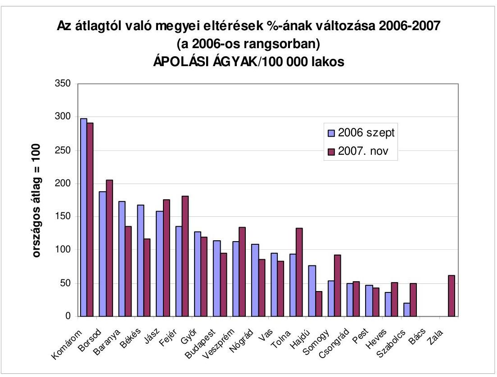

A 100 ezer lakosra vetített (finanszírozási szerződés szerinti) ápolási ágy a kórházi struktúra átalakítását követően a korábbi 17,1 ágyról 24,7 ágyra emelkedett, átlag alatti 10 megye és a főváros ápolási ágy ellátottsága. Az ápolási ágy ellátottság szélsőértékét jellemzi, hogy amíg Bács-Kiskun megyében egyetlen ágy sincs, addig Komárom-Esztergom megyében 72 ágy áll rendelkezésre 100 ezer lakosra vetítve.

---

A krónikus utókezelő ágyak száma az átalakítás során a legdinamikusabban (48,3\%-kal), a 100 ezer före vetítve 60,7-ről 90,2-re emelkedett. Az átlagos ágyellátottság alatt van 9 megye, az átlag a Pest megyei 33,2 és a Nógrád megyei 139,4 ágy ellátottság között szóródik. (Pest megyei alacsonyabb ágyellátottságot a régióban a főváros 137,7 ágya kiegyenlíti.)

A krónikus utókezelő ágyak esetében a területi egyenetlenségeket a következő diagram szemlélteti:
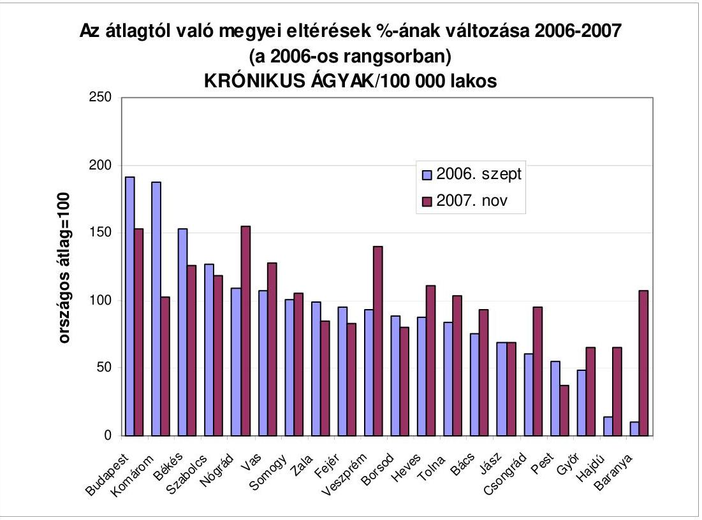

Az egészségügyi ellátórendszer átalakításának, az ágazat irányításának meghatározó feltétele az egészségügyi szükségletek ismerete, az abban bekövetkezett változások követése, előrejelzése. Ehhez az ellátórendszeren belül keletkező, az egészségügyi ellátásokhoz kapcsolódó tételes adatszolgáltatásból nyerhető igénybevételi és egyéb (demográfiai, szociális stb.) statisztikai adatok álltak rendelkezésre, amelyek a struktúraátalakítás igényét, főbb irányát jelezték, de az átalakítással elérni kívánt cél számszerúsített megalapozását szolgáló hatástanulmány és program nem készült.

Az Európai Bizottságnak 2006 októberében benyújtott, a szociális védelemről és a társadalmi összetartozásról szóló nemzeti stratégiai jelentés a túlzott aktív fekvőbeteg kapacitások krónikus, rehabilitációs, egynapos ellátást nyújtó ápolási és járóbeteg kapacitássá alakításának igényét fogalmazta meg, mert az ellátórendszer szerkezete (aktív, krónikus ápolási kapacitásarány), az egyes szakmák és a megbetegedési, halálozási mutatók viszonya torz, rossz a területi eloszlás, amely az ellátandók számára igazságtalan hozzáférést biztosít.

---

A jelentés szerint „Magyarországon a tartós ápolás, gondozást biztositó ellátások nyújtása jelenleg nem egységes rendszerben történik. Az egészségügyi, illetve a szociális ellátórendszerek egyaránt gondoskodnak a tartós ápolásra, gondozásra szoruló személyekről. Komoly problémát jelent a tartós ápolás konkrét meghatározásának hiánya, mivel így az ezt biztositó ellátások nem feltétlenül választhatóak le az egyéb, más célú szolgáltatásokról".

Az egészségpolitika a vizsgált időszakban változó hangsúllyal törekedett az idősellátás vonatkozásában összhangba hozni az egészségügyi és a szociális ellátás egymást átfedő területeit. Ennek részeként különböző szintű egyeztetések folytak az ápolásbiztosítás rendszerének kialakításáról.

Az egészségügyi szolgáltatók múködési engedélyében foglaltak szerinti múködését az egészségügyi hatóság rendszeresen ellenőrzi. (Az ellenőrzések gyakoriságára vonatkozóan a jogszabály nem tartalmaz előírást.) Az ÁNTSZ ápolás szakfelügyeleti ellenőrzések egy-egy kiemelt szakmai kérdésre irányultak, amelyekhez az intézmények, valamint az egyes megyék, régiók adatai összehasonlíthatósága érdekében országosan egységes ellenőrzési jegyzőkönyvminta került kidolgozásra.

A 2003. évben a fekvőbeteg ellátó intézményekben az ápolási dokumentáció formai és tartalmi követelményeit, a 2004. évben a körzeti-közösségi szakápolók élet- és munkakörülményeit, a 2005. évben a fekvőbeteg ellátó osztályokon a decubitus prevenciót és ellátást, valamint a gyógyszerelést, a 2006. évben az infúzióval, transzfúzióval kapcsolatos tevékenységet, a jogszabályi előírásoknak, követelményeknek való megfelelést, továbbá a szakmai kollégiumi ajánlások érvényesülését vizsgálták. A 2007. évben az előző évi javaslatok hasznosításának nyomon követése érdekében a decubitus prevenció, valamint ellátás gyakorlatának a felmérésére, a hospice ellátás vizsgálatára került sor.

Az ÁNTSZ (mint a múködési engedélyezési eljárásban közremúködő hatóság) a szociális intézményekben alapvetően az előírt egészségügyi ellátások személyi és tárgyi feltételeinek biztosítását ellenőrzi.

A 2005. évi ÁNTSZ ellenőrzésekről készült összefoglaló szerint a miniszteri rendelet a személyes gondoskodást nyújtó intézmények esetében a bútorzat, berendezési tárgyak, felszerelési tárgyak, az orvosi szoba, betegszoba vonatkozásában túl általános követelményeket határoz meg, emiatt a szakfelügyelet nem megfelelő tárgyi felszereltségre, a lakószobák hiányos bútorzatára, az ellátáshoz szükséges eszközhiányra vonatkozó megállapításai a szubjektív megítélés miatt támadhatóak. Az ÁNTSZ megállapítása szerint jelentős számban végeztek olyan szakápolási tevékenységet az intézményekben, amelyhez szakápolói képesítés szükséges, azonban szakképzetlen ápolók látták el a kompetenciájukat meghaladó feladatokat. Az ellenőrzött intézmények 29\%-ában volt elfogadható az ápolási dokumentáció, a gyógyszerelés nem felelt meg a szakmai előírásoknak.

A vizsgált intézmények kétharmadában (kilenc) végzett az ÁNTSZ ápolás szakfelügyeleti ellenőrzést. Öt intézménynél a megállapítások a steril csipesz és olló, tisztasági festés, kapaszkodó, betegszoba hiányára vonatkoztak. Egy intézményben az éjszakai múszak munkaszervezését nem tartották megfelelőnek, ugyanakkor egy másik intézményben a szakápolási feladatok elvégzését (injekciózás, nők katéterezése, és szondatáplálás) nem kifogásolták.

---

A szociális intézmények múködésének ellenőrzésére vonatkozó előírások a fenntartótól függően különbözőek. A működést engedélyező szerv az illetékes módszertani intézménynek - mint szakértőnek - a bevonásával legalább kétévente ellenőrzi, hogy a fenntartó az állami intézményt a működési engedélyben és a jogszabályban foglaltaknak megfelelően működteti-e. A szociális intézmény állami fenntartója ellenőrzi az intézmény működésének törvényességét, és évente értékeli a szakmai munka eredményességét. A nem állami fenntartónak az előzőekben említett kötelezettsége nincs.

# 1.3. Az ápolási, gondozási igények és a rendelkezésre álló kapacitások összhangjának javítását célzó intézkedések 

Az egészségügyi és szociális ágazati feladatok egy minisztériumi szervezethez tartozásának időszakában (2002-2004 között ESzCsM) kidolgozták a szolgáltatások fejlesztésére, a szociális és egészségügyi ellátás közötti összhang javítására vonatkozó célkitűzéseket, amelyek között szerepelt:

- a szociális szolgáltatások fejlesztésénél a lakóhelyen történő ellátások kialakítása, fejlesztése, a meglévő intézményrendszer szolgáltatásainak bővítése, a gondozási módszerek korszerűsítése;
- több típusú ellátást nyújtó intézmények integrációjával az egészségügyi és szociális ellátások közötti összhang megteremtése;
- a házi segítségnyújtás, jelzőrendszeres házi segítségnyújtás kialakításának szakmai programokkal történő támogatása, speciális ellátások szervezése.

Új integrált ellátások megszervezése, finanszírozási módjának kidolgozása érdekében modellkísérletet indítottak a 2003. évtől, amely tapasztalatai alapján bevezetett ellátások - támogató szolgálat, közösségi ellátások - a múködés során nem jártak a várt eredményekkel. A támogató szolgálatok, közösségi ellátások nyújtásának kötelezettsége 2009. január 1-jétől megszűnik. Mint törvényben meghatározott tartalmú szociális szolgáltatások továbbra is megmaradnak, finanszírozásuk valamennyi fenntartó számára egységes módon, a tényleges szükségletek figyelembe vételével, pályázati úton valósul meg. A jelzőrendszeres házi segítségnyújtás kiegészítő szolgáltatássá válik, csak olyan szolgáltató nyújthatja, amely a házi segítségnyújtásra is rendelkezik múködési engedéllyel. A szabályozás célja, hogy a jelzőrendszeres házi segítségnyújtás ne pusztán műszaki paraméterek biztosításából álljon, hanem szakmai bázisként működjön mellette házi segítségnyújtás is, amely az ellátott jelzése esetén képes megfelelő szolgáltatás nyújtására.

A 2005. évben jelzőrendszeres házi segítségnyújtási szolgáltatásban 8870 fő, közösségi ellátásban 4201 fő részesült, a támogató szolgálatok 10531 főt láttak el ${ }^{13}$. A 2006. évben jelzőrendszeres házi segítségnyújtásban 15042 fő, közösségi ellátásban 8005 fő, támogató szolgáltatásban 17450 fő részesült.

Az idősek otthonainak fejlesztésére új pályázatok kiírását tervezték a 2004. évben, amelyből elsődlegesen azok a pályázók részesülhettek volna központi tá-

[^0]
[^0]:    ${ }^{13}$ Szociális Statisztikai Évkönyv 2005.

---

mogatásban, akik kórházi fekvőbeteg ellátó intézmények kapacitását átalakítva hozzák létre az idősek otthonát, vállalják az új intézményben az egészségügyi és szociális ellátás integrációját. Vegyes bentlakásos intézményi formákra nem készültek tervezetek, a 2004. évben a szociális és egészségügyi alapellátás területi együttműködésének koordinációját kísérelte meg az ESzCsM, mely pályázati formában mintahelyeket kívánt erre a célra létrehozni. A feladat végrehajtása forráshiány miatt elmaradt ${ }^{14}$. Jelenleg 45 ezer időskorú ember részesül tartós szociális intézményi ellátásban, és a várakozók száma 15 ezer före nőtt. Az ápolás, gondozás egy része, amelyik eddig lecsapódhatott az aktív egészségügyi ellátásban, a kórházi struktúraátalakítás következményeként ma még nem ismert mértékben - a szociális ellátás területén igényként jelenik meg.

A rendszer felülvizsgálatára Magyarország EU csatlakozása óta nemzetközi kötelezettségünk is van, a Nizzai Szerződés által elindított nyitott koordinációs mechanizmus jelentéstételi kötelezettséget, rendszeres érdemi értékelést ír elő. Az EU felé kötelezettség, hogy általánosan hozzáférhető, pénzügyileg fenntartható és hatékony szociális védelmi rendszer kerüljön kialakításra.

A feladatok ismeretében a Kormány 2007 januárjában az államreform elemeinek egymáshoz hangolása keretén belül, az ápolási feladatokat ellátó intézményrendszer minőségének és hatékonyságának javítása céljából úgy határozott ${ }^{15}$, hogy:

- az ápolási feladatok egységes rendszerének megteremtése, a rendszerben meglévő átfedések kiszűrése, az e célra fordított erőforrások racionálisabb, átláthatóbb felhasználása, valamint a szociális és egészségügyi feladatok összehangolása érdekében előzetes hatásvizsgálatot kell készíteni;
- a hatásvizsgálat elvégzéséhez szükséges - felmérést, monitorozást elősegítő jogszabály-módosításokat el kell végezni, és a javasolt további intézkedésekről előterjesztést kell készíteni a Kormány részére.

Az EüM és SzMM 2007 februárjában meghatározta az ápolási rendszer egységesítésének soron kívüli feladatairól szóló kormányhatározat végrehajtásával kapcsolatos teendőket. Ennek lényeges eleme volt az egészségügyi és szociális rendszer fogalmainak összehasonlítása, továbbá becslési módszer kidolgozása és alkalmazása a kórházi ellátásból kiszoruló ápolást igénylők beazonosítására, az egészségügyi struktúraváltozás következtében jelentkező ápolási feladatok összetétel változásának követésére, az ápoltak útjának koordinálásával elérhető hatékonyság javulásának modellezése kistérségi és regionális szinten, település típusonként, korcsoportonként és homogén ápolási csoportonként. A feladatok összehangolt végrehajtására közös munkacsoport jött létre, ennek tevékenységéről, a kormányhatározatban szereplő feladatok végrehajtásáról, a hatásvizsgálat alapján javasolt további intézkedésekről nem ké-

[^0]
[^0]:    ${ }^{14}$ SzMM Szociálpolitikai Szakállamtitkár 1891-0/2008-016 SZFŐ iktatószámú 2008. január 17-én kelt tájékoztatása.
    ${ }^{15}$ Az ápolási rendszer egységesítésének soron kívüli feladatairól szóló 2011/2007. (I. 30.) Korm. határozat.

---

szült előterjesztés a Kormány részére a 2007. december 31-i határidőre, a fogalomhasználat ellentmondásos a két ágazatban.

Az Eütv. az ápolás fogalmát határozza meg, a hatályos szociális miniszteri rendelet alapápolásról beszél, amelynek tartalmát jogszabály nem, kizárólag az idősügyi ellátás szociális szolgáltatásai standardja határozza meg. Az alapápolások között szerepelteti a standard a gyógyászati segédeszközök, protézisek használatának tanítását (alapápolási feladatok 17. pont) ugyanakkor az otthoni szakápolási tevékenységről szóló 20/1996. (VII. 26.) NM rendelet ezt a tevékenységet az 1. sz. melléklet 8. pontjában otthoni szakápolási tevékenységként határozza meg.

A kormányhatározathoz készített előterjesztés megállapítása szerint tisztázatlanok az ápolást, gondozást nyújtó ellátásokban a kompetencia határok, a konkrét feladatot ellátók személye, a képzettségnek megfelelő jogosultsága. Az SzMM később kialakított véleménye szerint: „Egységes fogalomrendszer kialakítására nincs szükség, mert a két rendszernek megvannak a maga feladatai, melyeket kompetenciájának megfelelően definiál, és jogszabályaiban megjelenít. Ugyanakkor szükséges a fogalomhasználat összecsiszolása, melyet a vegyes bizottság megtett."

Az egészségügyi és szociális rendszer fogalmainak összehasonlításáról belső szakmai anyag készült, amit a feladat elvégzésére létrehozott munkacsoport 2007 szeptemberében prezentált az alábbi témakörökre vonatkozóan:

- az ápolási feladatelemeket és fogalomgyűjteményt tartalmazó kompetencia felsorolás, amely szerint az átfedést mutató elemek aránya 30\%-os;
- az ápolás teljes vertikumát (a laikus ápolástól a szakápolásig) lefedő intézmények és egyéb szereplők fő működési paramétereit bemutató elemeket;
- a belső anyag néhány módszertani tapasztalatot, javaslatot fogalmazott meg a feladatok összerendezésére intézménytípusokként, a szakdolgozók területi mobilitását támogatási konstrukciók kidolgozására.

Az EüM - a prognózisok alapján feltételezve, hogy az egészségügyi ellátórendszerből nem szorul ki senki - célként határozta meg, hogy azok a betegek otthonukban kapják meg a szükséges ellátást, akik orvos-szakmai szempontból a járóbeteg-ellátás vagy házi szakápolás keretében elláthatóak. Olyan módszert alakítottak ki, amellyel különböző demográfiai, betegcsoportok oldaláról követhető a struktúraátalakítás hatása az igénybevételre, amely az eltelt idő rövidsége miatt nem volt értékelhető.

A 2007 őszén alakult EüM-SzMM vegyes bizottság a kormányhatározat szerinti két részhatáridő (2007. április 30. és szeptember 30.) letelte után, októberben fogadta el munkatervét. Ebben a TAJ szám használatával összefüggő kérdések közös vizsgálatát, a szociális intézmények egészségügyi tevékenysége, illetőleg az egészségügyi intézmények szociális tevékenysége (geriátriai és/vagy krónikus betegápolás) finanszírozásának kérdésében a jelenlegi állapotokról helyzetkép készítését és a rendezést célzó koncepció kialakítását jelölték meg feladatként. A kormányhatározatban szereplő feladatok végrehajtása, az abban rögzített határidők betartása a rendelkezésre álló előterjesztések, javaslatok alapján nem történt meg a helyszíni vizsgálat 2008. áprilisi lezárásáig.

---

# 1.4. Az irányítást, szabályozást szolgáló adatgyűjtések 

A két ágazat kapacitásbefogadási rendszere nem összehangolt, a befogadás elbírálásánál az adatszolgáltatási és elemzési rendszer nem egységes. Régiós, térségi szinten sem múködött az egészségügyi kapacitások kialakításánál a szociális ellátórendszer kiépítettségének (pl. alapszolgáltatások kiépítettsége és hozzáférhetősége, a kórházkiváltó ellátások) figyelembe vétele. Az alapellátások két ágazatot érintően közös kapacitás szervezésének igényét támasztja alá az is, hogy a szociális és egészségügyi intézmények tulajdonosai nagyrészt ugyanazon önkormányzatok, akiknek feladata az ellátások megszervezése. A kapacitásbefogadás rendszerének összehangolásához hiányzik az olyan típusú adatgyűjtés, amely az ápolási-gondozási igények komplex felmérését tartalmazza. Nem állt rendelkezésre:

- térségi szinten szakemberekből álló bizottság által megállapított, az ápolási, gondozási, önállósági szint vizsgálatán alapuló szükségletfelmérés;
- a szociális, egészségügyi, mentális állapoton alapuló szolgáltatási igény felmérése.

Az ápolásra, gondozásra irányuló rendszeres adatgyűjtések az ellátási kapacitások és teljesítmények mérését és feldolgozását szolgálták, de emellett időszakos kutatások és elemzések céljából a rendszeres statisztikai adatokat kiegészítették egyéb felmérések, amelyek a szükségletelemzéshez is hasznosítható információkat tartalmaztak.

Az Egészségügyi Minisztérium fejezet múködésének ellenőrzéséről szóló ÁSZ jelentés ${ }^{16}$ szerint a fejezet információs rendszere nem alkalmas az egészségügy egészére vonatkozóan megbízható adatok szolgáltatására.

Az ágazati adatgazdálkodás kialakítását, az ágazati adat-tárház gondozását a 2004. évben létrehozott ESKI feladatául határozta meg az intézmény alapító okirata, amely megteremti annak a lehetőségét, hogy az ellátórendszerben keletkező adatokból létrejöjjön egy egészségpolitikai és epidemológiai célú adatbázis.

Az ápolási, gondozási feladatokról kétféle - az OSAP keretében ${ }^{17}$, valamint az egészségügyi ellátás finanszírozása feltételeként meghatározott rendszeres adatgyűjtés múködött. Az „Összesitő a kórházi ápolási esetekröl", majd a 2006. évtől a „Jelentés a kórházi ápolási esetekről" című OSAP adatgyűjtések tartalma, gyakorisága, az adatszolgáltatók meghatározása és az adatszolgáltatás beérkezési határideje is módosult 2003-2007 között, de a feldolgozási folyamatok és a statisztikai összesítések formái alapvetően nem változtak. Az ÁNTSZ által adott múködési engedéllyel rendelkező szolgáltatók kapacitás- és teljesítményadatait a GYÓGYINFOK, majd a 2004. évtől az OEP (Finanszírozási

[^0]
[^0]:    ${ }^{16} 0522$ Jelentés az Egészségügyi Minisztérium fejezet múködésének 2005. évi ellenőrzéséről.
    ${ }^{17}$ A 227/2002. (XI. 7.) Korm. rendelet a 2003. évre, a 215/2003. (XII. 10.) Korm. rendelet a 2004. évre, a 303/2004. (XI. 2.) Korm. rendelet a 2005. évre, a 247/2005. (XI. 14.) Korm. rendelet a 2006. évre, a 229/2006. (XI. 20.) Korm. rendelet a 2007. évre vonatkozó adatgyűjtést határozta meg.

---

Informatikai Főosztály) gyűjtötte, dolgozta fel és továbbította a statisztikai felosztás szerinti információkat, valamint adatbázisából havi rendszerességgel vagy eseti igények alapján készített egyedi feldolgozásokat, elemzéseket. Az OSAP alapján a statisztikai rendszerben évente gyűjtött és közzétett adatok valamennyi szolgáltatót lefedték, a kapacitások és teljesítmények a naptári évre vonatkoztak. Az adatok feldolgozásának és statisztikai rendszerben történő közzétételének elhúzódása az adatok széles körű hasznosítását korlátozta ${ }^{18}$.

A másik típusú rendszeres adatgyűjtés a finanszírozási szerződések és a teljesítmény elszámolások folyamatosan karbantartott, naprakész információit tartalmazza, amely feltétele az egészségügyi szolgáltatást nyújtók finanszírozásának. A rendszeres adatgyűjtések információból az OEP-nek, adatátvételi késedelemmel a KSH-nak, a korábbi évek felmérései és adatátvételei révén szűkebb időintervallumra az ESKI-nek is van adatbázisa, az Interneten is elérhető adattára. Az eltérő megközelítések, az adatok, elemző mutatók idősoraiban lévő hiányok, a közzététel időbeni késedelmei, az átmeneti vagy tartós letöltési problémák, az évek közti eltérő adatmegjelenítések ugyanakkor a használhatóságot korlátozták.

Az EüM megbízása alapján az ÁNTSZ a krónikus ellátást nyújtó fekvőbetegellátó egészségügyi szolgáltatók körében a 2005. évre vonatkozó egyszeri felmérést végzett. Az adatgyűjtés tartalmazta az ápolási intézet és osztály, a krónikus intézet és osztály, a geriátriai osztály, a rehabilitációs intézet és osztály, valamint hospice intézet, hospice osztályra vonatkoztatva az ágyak, az ápolási napok, az ellátott betegek számát, továbbá az ágykihasználási százalékot. Kiterjedt arra, hogy az adott intézményben, vagy osztályon ellátott betegek közül hány fő érkezett bentlakásos szociális intézményből, hány fő várakozott szociális intézményi elhelyezésre, valamint az adott intézményben, vagy osztályon van-e várólista az ápolási ellátásra. A felmérés szerint az ápolási, krónikus utókezelő osztályokon az ápolási tevékenység megosztására (alap és szakápolás megbontásban) csak becsült adatokat szolgáltattak az intézmények. Ezek szerint az ápolási osztályokon a szakápolás leggyakoribb megoszlása $30 \%$, az alapápolás (személyi higiene, táplálkozás, mozgatás) 70\%, a krónikus illetve geriátriai osztályon a szakápolás $40 \%$, és a fennmaradó rész az alapápolás.

A statisztikai adatgyűjtésben és a finanszírozandó teljesítmény megállapításánál is feldolgozásra kerülő kórházi ápolási esetről szóló adatlapon a krónikus ellátásnál a 2004. évtől az FNO kódot is rögzíteniük kell a kórházaknak. Az FNO a kóros egészségi állapothoz társuló funkcióképesség (minden testi funkció, tevékenység és részvétel) és fogyatékosság (minden károsodás, tevékenység akadályozottság, vagy részvételi korlátozottság) osztályozását tartalmazza, segítségével meghatározható az ápolási ellátásra szoruló állapota, szükséglete. A diagnózisról és a funkcióképességről kapott együttes információ átfogóbb és árnyaltabb képet ad a beteg ellátásával kapcsolatos helyi döntések meghozatalához. Az FNO kódok összesítése nem épült be a közzétett statisztikai információk körébe, nem hasznosult az ellátási igények megállapításánál.

[^0]
[^0]:    ${ }^{18}$ Az adatgyűjtésen alapuló statisztikai táblák csak a tárgyévet követő második évben váltak megismerhetővé.

---

Az EüM által rendelkezésre bocsátott információk alapján a krónikus típusú (ápolási) teljesítmény-jelentések leggyakoribb FNO kategóriái az alapápolás körébe tartozó napi rutin feladatok elvégzésére, a fájdalom érzésére, a mozgékonyság funkcióira vonatkoztak.

Az eseti, nem rendszeres további adatgyűjtések egyedileg összesített, feldolgozott információi jellemzően külön központi forrással is támogatott, a lakosság egészségéről szóló elemzések, kutatások közzétett dokumentumaiban jelentek meg. Az Egészség Évtizedének Johan Béla Nemzeti Programjához az OLAF2003 kapcsolódott, amely a kialakított indikátorok kiinduló állapotához történő későbbi viszonyítások lehetőségét is megteremtette.

Az ápolási, gondozási igények jelentős része egyéb egészségügyi, vagy betegségi eseményekkel együtt fogalmazódik meg, az OSAP-ban meghatározott és az OEP elszámolások adathalmazaként keletkező statisztikákból nem lehet következtetni rájuk. Az ápolási-gondozási igényekre, az intézményi kapacitásokra elemzések nem készültek ${ }^{19}$. A struktúraátalakítás előtt a 2006. évi adatok még nem álltak rendelkezésre, csak becslések készültek a krónikus kapacitások növelésére. Az adatgyűjtések információit feldolgozó különféle elemzések lényeges megállapításokat tettek többek között az idősellátás kérdéseivel kapcsolatban, de ezek nem álltak össze komplex helyzetértékeléssé, szükségletfelméréssé és ebből kiinduló, területi elosztású kapacitásigény számítássá. A részelemzések a struktúraátalakítás igényét, főbb irányát megfogalmazták, de ezek a mértékre, számszerúsített változtatási szükségességre és a célszerű megvalósítási ütemezésre nem tértek ki.

# 2. A KRÓNIKUS ELLÁTÁSOK MEGSZERVEZÉSE A KÓRHÁZFENNTARTÓ HELYI ÖNKORMÁNYZATOKNÁL 

### 2.1. A krónikus kórházi ellátásban mutatkozó hiányosságok felmérése, az összhang javítására tett intézkedések eredményessége

Az egészségügyi közintézmények (kórházak) által 2003-2007 közötti időszakra elkészített 5 éves szakmai fejlesztési programot első ízben 2003. március 31-ig kellett az egészségügyi közszolgáltatásokról gondoskodó szervhez (ezen belül a fenntartó helyi önkormányzatokhoz) jóváhagyás céljából felterjeszteni. A vizsgált helyi önkormányzatok 70\%-a hozott döntést a fenntartásában lévő kórház(ak) szakmai tervének elfogadásáról. Az előkészítés során kérdőívvel és adatlappal megkeresett önkormányzati kórházak szakmai tervvel való ellátottsága ettől rosszabb volt.

Az adatokat szolgáltató 92 kórház 60\%-a rendelkezett a fenntartó által jóváhagyott szakmai tervvel, amelyek $80 \%$-a nem tartalmazott a krónikus ellátást érintő konkrét elképzeléseket. Öt válaszadó szerint a szakmai program kidolgozás alatt állt, három kórház jelezte, hogy azt a fenntartó nem fogadta el, két kórház

[^0]
[^0]:    ${ }^{19}$ Az EüM által készített „Szakmapolitikai egyeztetés az ápolási rendszer egységesitésének soron következő feladatairól szóló 2011/2007. (I. 30.) Korm. határozat teljesitésről".

---

szakmai program helyett az adósságkonszolidáció keretében készült, vagy önkormányzati biztos által kidolgozott intézkedési tervvel rendelkezett. Egy kórház a fenntartó megyei önkormányzat jóváhagyásának elmaradását a megyei koncepció hiányával, egy pedig a jelenlegi bizonytalansággal indokolta.

A vizsgált kórházak szakmai programja az egészségügyi ellátásra vonatkozó szükségletek kapcsán általánosságban utalt az idősebb, betegebb korosztályok növekvő részarányára, a szociális intézményi elhelyezés korlátozottsága (férőhely hiánya, várólisták) miatt a szociális problémák egy részének egészségügyi ellátásban történő megjelenésére, azonban csak 44\%-ánál volt a 2007. évi struktúraátalakítást megelőzően a krónikus ágyak szakmai összetételére, működési feltételeire irányuló konkrét intézkedés. Ennek eredményeként a vizsgált kórházakban a 2003-2006 közötti időszakban a kapacitás két ápolási és egy hospice osztállyal bővült, az ápolási ágyak száma 117 -tel ( $35 \%$-kal) emelkedett, illetve a komfortosítási program, vagy a kórház címzett támogatásból megvalósuló rekonstrukciója eredményeként javultak a krónikus kórházi ápolás, utókezelés tárgyi feltételei.

A vizsgált kórházak 72\%-ának szakmai programja tartalmazta - az aktív osztályokon a túlápolás (normatív napon felüli ápolási napok) és az egészségügyi állapotra vonatkozó jellemzők (időskorúak, a krónikus megbetegedéssel, ellátási gondokkal élők, magas ápolási igényű, előrehaladott és társult betegséggel rendelkező betegek magas aránya) alapján - a kónikus ellátás fejlesztésének szükségességét.

Az egészségügyi szolgáltatókról és az egészségügyi közszolgáltatások szervezéséről szóló 2003. évi XLIII. törvény ${ }^{20}$ vezette be a kórházfenntartó helyi önkormányzatok új kötelezettségeként a tervszerű és összehangolt fejlesztést szolgáló öt évre szóló egészségügyi szakmai fejlesztési program elkészítését. A kórházfenntartó helyi önkormányzatok a 2003-2007 közötti időszakban különböző elnevezésű és tartalmú dokumentumokat fogadtak el az egészségügyi ellátás, ezen belül az ápolás, gondozás fejlesztésének stratégiai kérdéseiről.

A Fővárosi Önkormányzat a 2002. évben készítette el Egészségpolitikai Cselekvési Programját, amelyben meghatározta a fővárosi egészségügyi intézmények átalakításának 15 évre szóló feladatait. A krónikus kórházi ellátás területén nem történt felmérés az igények és a kapacitások közötti összhangról, az ápolási, krónikus utókezelő ágyak számát nem az igények, hanem elsősorban a rendelkezésre álló tárgyi és személyi feltételek határozták meg.

A Szabolcs-Szatmár-Bereg Megyei Önkormányzat Közgyűlése 2003-ban határozott a megyei egészségügyi és szociális fejlesztési koncepció és program elkészítésének szükségességéről. Az ellátórendszer jellemzése alapján megfogalmazódott stratégiai cél a szociális indokkal fekvőbeteg-ellátásban rekedt ellátások megszüntetése, a kihasználatlan ágyak terhére krónikus ellátások bővítése. A krónikus kórházi ellátás iránti igények felmérését, az ápolás, gondozás feltételeinek javítását, a hospice ellátás kialakítását eredményező intézkedések nem történtek.

[^0]
[^0]:    ${ }^{20}$ A 63/2003. (XII. 15.) AB határozattal az Alkotmánybíróság közjogi érvénytelenség miatt 2003. december 15 -ei hatállyal megsemmisítette.

---

A Vas Megyei Önkormányzat a 2006. évben fogadta el a megye öt évre szóló egészségügyi szakmai fejlesztési programját, amelyben az egészségügyi ellátás mellett az ápolási, gondozási szükségletek összehangolt kielégítésének szándékával a szociális feladatellátás bemutatása is teret kapott. Az ellátórendszer SWOT analízise szerint a krónikus ellátások egy része szociális intézményi funkciókat lát el, és szűk az átmeneti, illetve tartós bentlakásos (elsősorban idős, pszichiátriai és szenvedélybeteg) szociális intézményi férőhely-kapacitás, magas a várakozási idő. Az aktív ágyak csökkentése terhére a krónikus ágyak növelése, az egészségügyi és szociális ellátási formák integrált létrehozása szerepelt e tervben. A Közgyűlés a 2007. évben 5 milliárd Ft névértéken, svájci frank alapú kötvény zártkörű kibocsátásáról döntött. Az előterjesztés szerint 1 milliárd Ft a Kórház integrált szakmai-technikai fejlesztése saját forrását biztosíthatja.

A szakmai fejlesztési programok elkészítését, jóváhagyását széleskörű adatgyűjtés, SWOT analízis alapozta meg, azonban a krónikus ellátás, ezen belül az ápolás, krónikus utókezelés iránti igényekre és a rendelkezésre álló kapacitások közötti összhang hiányára csak közvetett utalások történtek. A programok bemutatták a megyében múködő kórházak szakmai fejlesztési terveit, azonban nem határozták meg az elérendő célokat és konkrét eredménykövetelményeket. A különböző egészségügyi szakmai programok, fejlesztési tervek, az intézkedések végrehajtásának és hatásának (eredményességének) értékelésére csak kivételesen került sor, döntően a kórház éves munkájáról szóló beszámoló testületi előterjesztése tartalmazott információkat a szolgáltatások minőségében, hozzáférhetőségében bekövetkezett változásokra vonatkozóan. A szakmai tervek, fejlesztési programok 40\%-a jelezte a kórházi struktúra változtatásának szükségességét, a krónikus kórházi fekvőbeteg-ellátás területén mutatkozó hiányosságokat, fejlesztési igényeket, azonban ezeknek csak a fele (50\%-a) tért ki a struktúra átalakításával kapcsolatos konkrét elképzelésekre, feladatokra.

A vizsgált időszakban erősödött a felismerés, hogy az egészségügyi szolgáltatások változó szükségletekhez igazított fejlesztésére csak megfelelő területi szintű (regionális) stratégiai elemzéssel támogatott egészségügyi tervezési rendszer képes. Az EU-s csatlakozás kapcsán - az uniós forrásokhoz való hozzájutás érdekében - az egészségügyi ellátás területén is megfogalmazódott a stratégiai tervezés szükségessége. Az egészségügyi közszolgáltatások biztosításáért felelős szervezetek között nem volt olyan szereplő, amelynek feladata az egészségügyi ellátások tervezése és összehangolása lett volna, hiányoztak az egymáshoz illeszkedő ágazati szakmai programok, fejlesztési stratégiák. A kórházak szakmai programjai, fejlesztési elképzelései és a térségi egészségügyi programok közötti kapcsolat esetleges, kidolgozatlan volt. A helyi önkormányzatok fejlesztési döntéseiben a központi támogatások elérhetőségének meghatározó szerepe volt. Az egészségügyi ellátórendszer szakmai és területi aránytalanságai kialakulásában szerepet játszottak az indokolt fejlesztések elmaradása mellett az aránytalanságot tovább növelő beruházások is ${ }^{21}$.

[^0]
[^0]:    ${ }^{21} 0523$ Jelentés a címzett támogatásból finanszírozott egészségügyi beruházások, rekonstrukciók ellenőrzéséről.

---

Az egészségügyi rendszer korszerűsítésének soron kívüli feladatairól szóló kormányhatározat ${ }^{22}$ alapján megkezdődött a regionális egészségügyi ellátásszervezés és fejlesztéspolitika szervezeti kereteinek, döntéshozatali és múködési rendjének kialakítása. Ezt szolgálta a RET-ek jogszabályi háttér nélküli, önkéntességen alapuló megalakulása és múködése hat régióban, majd az Eütv. 2005. évtől hatályos módosítását követően törvényi szinten szabályozott és a 2003 októberében meghirdetett pályázat keretében támogatott létrejötte valamennyi tervezési, statisztikai régióban.

Az Eütv. 149/A. § (3) bekezdése szerint a RET elkészíti az adott régió egészségfejlesztési programját, amely tartalmazza többek között a lakosság egészségi állapotának legfontosabb jellemzőit, az egészségügyi szolgáltatások iránti igények várható alakulását, és figyelembe véve a gyógyító-megelőző ellátások összetételének tervezhető változásait, illetve ezek alapján a szolgáltatási struktúra átalakítására vonatkozó terveket is. A RET-ek háttérszervezeteinek létrehozását, a Regionális Egészségfejlesztési Program elkészítését 70 millió Ft pályázati támogatás szolgálta az EüM. költségvetésében. Az EüM a RET-ek megalakításának határidejét 2004. január 30-ában, az egészségfejlesztési tervek elkészítését 2004. június 30 -ában jelölte meg. A megalakulás jogi nehézségei (korábban önálló jogi személyiséggel nem rendelkező egyesületként jöttek létre, és a bírósági bejegyzési eljárás elhúzódott) miatt határidőre egy RET sem alakult meg, a tervezési munkák megindulása 2004. őszére tolódott ki a legtöbb régióban.

A vizsgált helyi önkormányzatok a kórházak szakmai tervének, az egészségügyi ágazati stratégijának elfogadása során nem, vagy csak részben támaszkodhattak az egyeztetett regionális egészségfejlesztési tervekben szereplő várható ellátási igényekre, szolgáltatási kapacitás összetételre, illetve a már elfogadott regionális egészségfejlesztési programokat sem tekintették a kórházak szakmai tervei készítésénél, jóváhagyásánál irányadónak.

A Dél-alföldi régió Egészségfejlesztési Terve az idősellátás fejlesztésével kapcsolatban megfogalmazta az otthonápolás, ápolási osztályok és otthonok továbbfejlesztésének, geriátriai osztályok, hospice házak és otthonok létrehozásának igényét. Közgyűlési döntés hiányában a korábban egyeztetett regionális fejlesztési tervben szereplő várható ellátási igényeket, kapacitás összetételt és fejlesztéseket a Megyei Kórház szakmai tervében nem vették figyelembe, nem dolgoztak ki elképzeléseket a hiányzó krónikus ellátások biztosítására.

Az aktív ágyak csökkentése és a krónikus ágyak 2007. évi növelése ellenére a krónikus ágyellátottság régiónkénti eltérései továbbra is jelentősek maradtak:

[^0]
[^0]:    ${ }^{22}$ 1085/2003. (VIII. 19.) Korm. határozat.

---

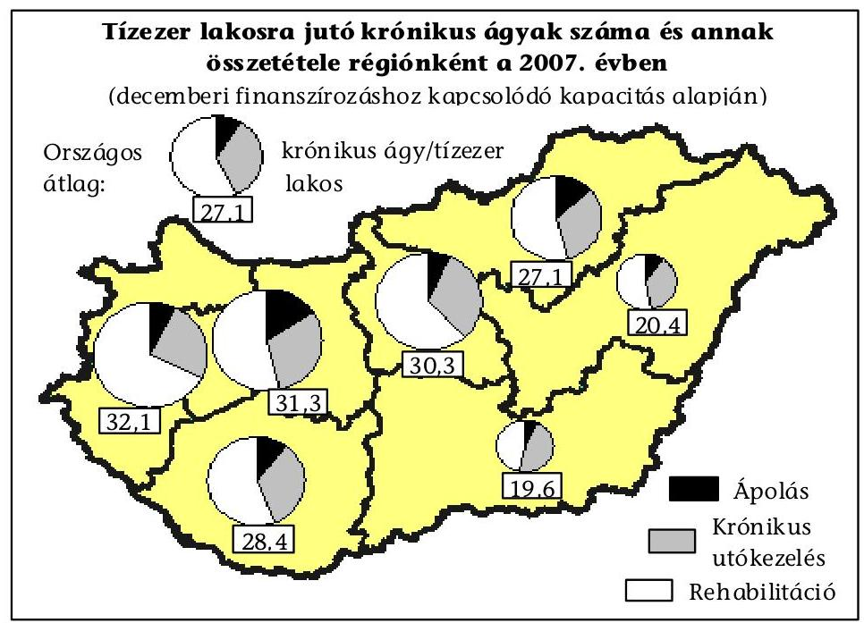

A tízezer lakosra vetített krónikus ágyszám országos átlagához viszonyítva a Nyugat-dunántúli régióban 18,5\%-kal kedvezőbb, a Dél-alföldi régióban 27,7\%-kal kedvezőtlenebb volt a fajlagos kapacitásmutató. (A krónikus ágyellátottságot 50\%-ot meghaladó mértékben a rehabilitációs ágyszám befolyásolta.)

Az egészségügyi ellátórendszer átalakítása körüli bizonytalanság megnehezítette a rövidtávú tervezést, valamint a közép- és hosszú távú stratégia kialakítását is. Az ÚMFT egyes programjai a 2007-2013 közötti időszakra tartalmaznak az egészségügyi és szociális ellátásokat, humán infrastruktúrát érintő fejlesztési célokat, a források igénybevétele feltételezi az ellátórendszer stratégiai célok mentén történő fejlesztését.

A Nyugat-dunántúli régió Egészségfejlesztési Terve szerint a kórházi ellátásra gyakran a szociális, vagy ápolási szolgáltatások elégtelensége, vagy hiánya miatt kerül sor. A népesség öregedése miatt a krónikus ellátások olyan típusú átszervezését jelölték meg célként, amely egységben kezeli a korszerú geriátriai ellátás, ápolás és szociális gondoskodás kérdéseit is. A régióban az aktív ágyak 10\%-ának (500 ágy) krónikus és/vagy rehabilitációs ággyá átminősítését, a felszabaduló aktív kapacitások terhére az időskorú ellátás, a rehabilitációs és az ápolási rendszerek komplex fejlesztését irányozták elő.

Az idősellátás térségi szinten szervezett szolgáltatásai, az egészségügyi és szociális ellátások fejlesztése valamennyi régió operatív programjának (ROP) célrendszere között szerepel. Az eddig megjelent pályázatok (Szociális alapszolgáltatások és gyermekjóléti alapellátások infrastrukturális fejlesztése, Integrált mikrotérségi alapfokú egészségügyi és szociális szolgáltató központok fejlesztése, Szociális infrastruktúra és szolgáltatások fejlesztése, Egészségügyi szolgáltatások fejlesztése, Kistérségi járóbeteg szakellátó központok fejlesztése, alap-, és járóbeteg szakellátás korszerűsítése) között azonban nem szerepel az ápolás, gondozás komplex intézményeinek a fejlesztése.

---

# 2.2. Az egészségügyi ellátórendszer struktúraátalakítására kiírt pályázatok felhasználására tett intézkedések 

A vizsgált kórházfenntartó helyi önkormányzatok a kórházak struktúraátalakításának támogatására, az intézményi átalakítások megkezdésére 2006 októberében kiírt pályázaton egy kivételével (Baranya megye) részt vettek, két megyei önkormányzat (Bács-Kiskun, Békés megye) által benyújtott pályázati anyag az aktív ágyak krónikus fekvőbeteg-szakellátásba történő konvertálására nem tartalmazott elképzeléseket.

A Bács-Kiskun Megyei Kórház a belső struktúra korszerűsítését, az ügyeleti ellátás feltételeinek javítását, a Gyulai Megyei Kórház aktív ágyak megszüntetését, komfortosítását tervezte a pályázat keretében.

A vizsgált önkormányzatok a 2006 novemberében megkötött támogatási szerződések szerint az elnyert 1368,2 millió Ft támogatásból 760 aktív ágy végleges megszüntetését, 531 ágy krónikus ellátásba konvertálását tervezték. Az Eftv. alapján megkezdődött a struktúraátalakítás újabb szakasza, majd az egészségügyi miniszter 2007. márciusi döntésével elrendelt - a pályázati célokat több vonatkozásban felülíró - kapacitásmódosítás miatt a struktúraátalakítással kapcsolatos elképzelések nem a szerződésben szereplő módon és időbeni ütemezésben valósultak meg.

A Győr-Moson-Sopron Megyei Kórház aktív és krónikus ágyait érintő változtatás szándéka az egészségügyi ellátórendszer 2006. évi átalakításához kapcsolódó pályázat szakmai programjában szerepelt, amely 41 aktív ágy megszüntetését és 92 ágy krónikus ellátásba történő átalakítását tartalmazta. Az Eftv. alapján az egészségügyi ellátórendszer átalakítására vonatkozó egészségügyi miniszteri javaslatot a RET elutasította, a miniszter döntése alapján a 133 ágy konverzió nélküli megszüntetésére kényszerült a megyei kórház.

A Vas Megyei Kórház a struktúra átalakítására 170,7 millió Ft támogatásban részesült. A pályázatban telephely, ezen belül 138 aktív ágy megszüntetése, valamint a hospice, a korai rehabilitáció és a krónikus geriátria - mint új szakmák belső átcsoportosítással történő elindítása, illetve komfortosítás szerepelt . A pályázat - az aktív fekvőbeteg-ellátásra vonatkozó pályázati célok mellett - bemutatta a krónikus ágyak belső összetételének tervezett változását, amely a 254 krónikus ágy $26,4 \%$-át érintette. A Kórház nyilatkozata alapján a krónikus ágyak belső struktúrájának módosítása nem valósult meg a 2006. évi struktúraátalakítási pályázat szerint, ezzel kapcsolatban pénzfelhasználás nem történt.

A Somogy Megyei Kórház pályázata aktív osztályok összevonására, 87 ágy megszüntetésére, 10 ágy járóbeteg-szakellátásba történő konvertálására, a mosdósi kórházban 106 aktív ágy krónikusba történő konvertálására, ebből 20 ápolási (hospice) ágy fejlesztésére, 40 krónikus a többi rehabilitációs ágy konvertálására vonatkozott. A közös pályázat a két kórház integrációját, a területi összevonásból adódó szakmai párhuzamosságok megszüntetését is tartalmazta, amely megtörtént. A Kórház az engedélyezett 60 krónikus ágyból 10 ágyat a személyi és tárgyi feltételek hiánya miatt nem múködtet. A struktúraátalakításra kiírt pályázatban igényelt 20 ápolási ágy az Eftv-ben nem került nevesítésre, ezek múködtetése az egészségügyi miniszter hozzájárulása hiányában szünetelt.

A pályázati támogatás forrása az E. Alap 2006. évi költségvetése volt, ezért az csak múködési kiadásokra volt fordítható, a pályázati célok

---

megvalósítása azonban - elsősorban az aktív ellátásban meglévő párhuzamosságok, telephelyek megszüntetése, a területi integráció erősítése - felhalmozási célú kiadásokat is igényelt. A kórházak az OEP felé benyújtott pénzügyi beszámolóik szerint az elnyert támogatást a szállítói tartozások kiegyenlítésére, a tartozásállomány csökkentésére és a létszámcsökkentéssel járó személyi jellegű kiadásokra használták fel, a támogatási szerződés feltételeinek megfelelően.

Az Eftv. alapján az intézményi átalakítások támogatására a 2007. évben kiírt pályázatra benyújtott költségtervek a helyszínen vizsgált önkormányzatoknál meghaladták a meghirdetett támogatási felső határ alapján igényelhető összeget, amely egyes vállalt feladatok elmaradását, vagy nem a jóváhagyott terveknek megfelelő megvalósítását okozta.

Miskolc Megyei Jogú Város Önkormányzata 384,35 millió Ft támogatást igényelt, azonban a támogatási felső határ figyelembevételével 269,1 millió Ft-ot nyert el, amely a pályázatban szereplő feladatok teljes körű megvalósítására nem biztosított fedezetet, az abban szereplő egyes feladatok elmaradtak, vagy nem az időtervben szereplő határidőben valósultak meg. A Kórház $84 \%$-kal megnövelt krónikus ágyából 90 nem üzemelt, amely a kórházak adottságai és a térségben kialakult krónikus ágykínálat mellett gazdaságosan nem is volt üzemeltethető.

A Győri Megyei Kórházban a Krónikus Belgyógyászati Osztály kialakításától az elvárt ellátási teljesítmények elérése (bár az ágykihasználtság 2007 októberéig 57,3\%-ig emelkedett), az osztály gazdaságos múködtetése 2007. évben még nem volt biztosítható. Az Önkormányzat 2007. év végén megújított egészségügyi stratégiai koncepciója szerint a napi rutin múködés mellett nem sikerült minden esetben érdemi szakmai tartalommal megtölteni a megyében $36 \%$-kal bővült krónikus kapacitást.

A Kecskeméti Megyei Kórház a kapott támogatást a pszichiátriai rehabilitáción és a Krónikus Belgyógyászati Osztályon kialakítandó részlegek megvalósításához vehette igénybe. A Krónikus Belgyógyászati Osztályon megvalósuló 33 ágyas részleg építési beruházása megvalósult, a műszaki átadás-átvételre 2007. október 31. és november 26. között került sor, beszerzésre kerültek a bútorok. A kórtermek berendezése és a kapott támogatással való elszámolás a helyszíni vizsgálat időpontjában volt folyamatban, az új részleg csak a 2008. évtől fogadta a betegeket.

Az elnyert támogatások felhasználása és elszámolása a helyszíni vizsgálatok 2007. decemberi lezárásáig nem fejeződött be, a megvalósítás elhúzódása miatt az egészségügyi miniszter két vizsgált önkormányzatnak (BácsKiskun Megyei Önkormányzatnak 2008. március 31-ére, a Somogy Megyei Önkormányzatnak 2008. december 31-ére) engedélyezte az elszámolási határidő módosítását.

Önerő biztosítása nem szerepelt a pályázati feltételek között. A vizsgált kórházfenntartó helyi önkormányzatok 30\%-a támogatta saját forrásból a krónikus ápolási és utókezelő ágyak fejlesztését. Az önkormányzatok különböző módon vettek részt a pályázati célok megvalósításában, értékelésében. A pályázat céljainak megvalósulását az ellenőrzött önkormányzatok 60\%-a értékelte valamilyen módon (testület, önkormányzati bizottság előtt, vagy a hivatal szakembereinek adott feladatmegbízás útján), azonban csak 20\%-a tért ki a megvalósítás hatásának, eredményességének értékelésére.

---

# 2.3. Az ápolási, gondozási szükségletek összehangolt kielégítése érdekében tett intézkedések 

Nem volt megállapítható a rendelkezésre álló dokumentumokból az önkormányzatok felénél a hiányzó krónikus szolgáltatások köre és az aktív kórházi ágyakon a struktúraátalakítás eredményeként a szociális okok miatti hosszú ápolási napok csökkenése. A hosszú ápolási napok alakulásáról a vizsgált kórházfenntartó helyi önkormányzatoknak csupán ötöde rendelkezett adatokkal, információkkal. Ezeknél a 2003. évtől a felső határnaphoz viszonyítva folyamatosan csökkent a hosszú ápolási napok száma és aránya, amely jelzi, hogy a kedvező irányú változások oka nem szűkíthető le a kórházi struktúraátalakításra.

Az aktív ellátásban a szociális okok miatt előforduló hosszú ápolási napok részaránya pontosan nem mért, de erre az ellátást elemző helyzetértékelések utaltak. A szociális okokra visszavezethető egészségügyi szükségletek kezelésének igénye is hozzájárult a komplexitás igényének erősödéséhez. A hosszú ápolási napokat a kórházak a kontrolling keretében is folyamatosan figyelték, kimutatták osztály, szervezeti egység szintjén, azonban az adatok bemutatását nem egészítette ki orvos-szakmai értékelés, a tervezett vagy megtett intézkedések és a szakmai indokolás dokumentálása.

A Miskolci Semmelweis Kórház aktív osztályain a 2003. I-IX hónapban az ápolási napok száma még 3,5\%-kal (6069 nappal), a 2004. évben 6,9\%-kal (ezen belül a sebészeti szakterületen $32 \%$-kal) haladta meg a normatív napokat. A 2007. IIX. hóban kórházszinten nem volt normatív nap feletti ápolás, de egyes osztályokon a normatív napok számát továbbra is meghaladta az elszámolt ápolási nap (pl. általános sebészeten $26 \%$-kal, a belgyógyászati osztályon $6 \%$-kal). Ezt a kórház a speciális, folyamatos (ügyeleti időben is jelentkező) orvosi felügyelet szükségességével és az ellátási területen halmozottan hátrányos környezetben, elhanyagolt állapotban lévő ápolásra, gondozásra szorulók magas számával indokolta.

A 2003-2006 közötti időszakban a helyi, majd ezt követően a központi intézkedések eredményeként változott a kórházak krónikus ágyszáma, az ellátás belső szerkezete. A vizsgált kórházakban a krónikus utókezelő ágyak száma 20032006 között $0,7 \%$ kal nőtt, szakmai összetétele módosult. Ugyanezen időszakban az ápolási osztályok ágyszáma $34 \%$-kal (a $16 \%$-os országos átlagnál nagyobb ütemben) emelkedett. Az Eftv. alapján központilag kezdeményezett struktúraátalakítás eredményeként az ápolási és a krónikus utókezelő ágyak száma a 2007. évben további $26 \%$-kal emelkedett, azonban a kihasználtság csökkent.

A központilag kezdeményezett struktúraátalakítást az országos adatok alapján hasonló irányzatok jellemezték. A kapacitás és a kihasználtság változását szemlélteti a következő diagram:

---

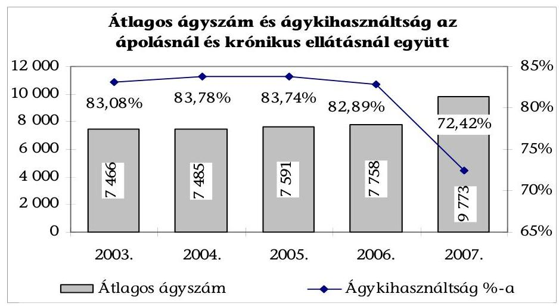

A kihasználtság közel 10 százalékpontos csökkenése nem az igényeket meghaladó kapacitásokkal, sokkal inkább a változtatások előkészítötlenségével, a szükséges tárgyi és személyi feltételek hiányával és a területi kapacitások összehangolásának elmaradásával magyarázható.

A vizsgált helyi önkormányzatok és kórházak szakmai programjai utaltak arra, hogy részben aktív kórházi ágyon történt kizárólag ápolásra szoruló betegek ellátása, vagy szociális intézetben került sor olyan szakápolásra, amely meghaladta az ott dolgozók kompetenciáját. A helyzetértékelésekben visszatérő megállapításként szerepelt, hogy az egészségügyi ellátórendszert terhelte a krónikus állapotban lévő, kórházi ellátást nem igénylő, de egész napos ápolásra, gondozásra szoruló idősek ellátásának gondja is. Az otthoni ápolásnál hosszabb, orvosi felügyeletet is igénylő, növekvő számú idős betegek korszerű ellátása érdekében ápolási osztályok, otthonok kialakítása szerepelt a programokban, azonban ezekhez szükséges források nem álltak rendelkezésre. Ápolási eszközök fejlesztése (pl. betegemelő szerkezetek beszerzése) nem a szükséges mértékben történt meg az ápolást végző intézményekben.

A tett intézkedések összességében eredménytelenek voltak az egészségügyi és szociális ellátások közötti együttmúködés javítása, a térségi kapacitások összehangolása, a magas ápolási igényú betegek megfelelő ellátásának szervezése területén. A vizsgált megyék 75\%-ában a hospice ellátás megszervezésére, valamint az idősellátás komplex kezelésére nem születtek eredményes intézkedések.

A kórházi struktúraátalakítás célja - az aktív ágyak csökkentésén, krónikus ellátásban az ágyszám növelésén túl - sem a központi, sem a fenntartói döntésekben nem került meghatározásra, ezért a monitorozás is elmaradt. Az átalakult ágykapacitás múködését az elmúlt (nem teljes) év betegforgalmi adatai alapján lehetett csak értékelni, a megemelt ágyszámokon az ellátás szakmai tartalommal való megtöltése, a betegutak jobb megszervezése a múködési problémák miatt (létszámleépítés, munkaerőhiány egyszerre volt jelen, az adósságállomány növekedése miatti kényszerű takarékossági intézkedések) háttérbe szorult.

---

Az aktív ágyak csökkentése miatt felszabaduló ápolói létszám átirányítása hozzájárult a krónikus ellátás hiányzó személyi feltételeinek pótlásához, a krónikus utókezelő osztályokon (részlegeken) az osztályos háttér rugalmasabb munkaszervezést tett lehetővé, de az ápolási osztályokon az ápolás minőségét veszélyeztető ápolói létszámcsökkenés volt megfigyelhető.

A felvételre várakozás - a kapacitásbővítés ellenére - az ápolási osztályokon volt jellemző. A vizsgált kórházfenntartó helyi önkormányzatok fekvőbeteg intézményei $40 \%$-ánál fordult elő, bár a várakozók száma és a várakozási idő csökkent.

A Nyíregyházi Megyei Kórház Ápolási Osztályán a felvételre várakozók száma 10-19 fő, az átlagos várakozási idő 30-45 nap, a Szombathelyi Megyei Kórházban a várakozók száma 6-10 fő, az átlagos várakozási idő 10-14 nap volt, miközben az ágykihasználtság csupán 70 illetve $51 \%$-os volt.

A Győri Megyei Kórház Ápolási Osztályán a várakozók száma a 2003. évi 37-ről a 2007. évben 22-re csökkent, az átlagos várakozási idő 2-3 hónap körül alakult. A Kaposvári Megyei Kórház krónikus ellátásában a várólista a 2006. évhez viszonyítva az átlagos 21-30 napról a felére csökkent. Az ápolási osztályok ágykihasználtsága mindkét kórházban 100\%-os volt.

A két ágazatot együttesen érintő elképzelés, az együttműködés javításának igénye szerepelt különböző dokumentumokban, de a konkrét lépések megtételét a folyamatosan változó finanszírozási és jogi környezet, a tartósan bevált hazai modellek hiánya hátráltatták. Az egészségügyi, ezen belül az időskorúak ellátásának optimális megszervezése túlmutat a kórházakon, az ellátások térségi (regionális, megyei) szintű szervezésének hiányában a szolgáltatók között a feladatok felosztásában nem jött létre hatékony együttmúködés.

# 3. A SZOCIÁLIS SZOLGÁltATÁSOK MEGSZERVEZÉSÉRE IRÁNYULÓ INTÉZKEDÉSEK EREDMÉNYESSÉGE A HELYI ÖNKORMÁNYZATOKNÁL 

### 3.1. A szolgáltatástervezési koncepció és a szakosított szociális ellátások területi összehangolása

A szolgáltatástervezési koncepciót a fővárosi és a megyei önkormányzatoknak 2003. december 31-ig, a települési önkormányzatoknak 2004. december 31-ig kellett elkészíteni, majd kétévenként felülvizsgálni. A települési önkormányzatok által biztosítandó szolgáltatások fejlesztési terveire vonatkozó információk ismerete nélkül készítették el a fővárosi és megyei önkormányzatok saját területükre az első szolgáltatástervezési koncepcióikat.

A Szoctv. előírja ugyan, hogy a települési önkormányzat által készített koncepciónak illeszkednie kell a fővárosi, megyei önkormányzat szolgáltatástervezési koncepciójához, azonban a települési és a megyei önkormányzatok szolgáltatástervezési koncepciója között kevés a kapcsolódási pont. A jogszabályok nem írják elő, hogy egy adott szociális szolgáltatást milyen mértékben (minden jogos igényt, vagy meghatározott \%-át kielégítve) kell biztosítani, az önkormányzatok közötti együttműködés nem jellemző. A tartós

---

bentlakásos intézményi ellátásnak nem volt feltétele az alapszolgáltatások, illetve az átmeneti elhelyezés igénybevétele.

A vizsgált intézményekben a 2006. évben elhelyezést nyerteknek 17,0\%-a, a 2007. évben 13,9\%-a részesült csak korábban szociális alapszolgáltatásban.

A vizsgált önkormányzatok mindegyike készített szolgáltatástervezési koncepciót, melyet egy város kivételével a képviselőtestületek elfogadtak.

Székesfehérvár Megyei Jogú Város Szociális Bizottsága a 2003. évben egy szociológiai kutató intézetet bízott meg a szolgáltatástervezési koncepció elkészítésével. A koncepció tervezetét szakmai fórumok és önkormányzati szociális szakemberek megtárgyalták, a szakmai hiányosságokat figyelembe véve a 2005. évben átdolgozták, de jóváhagyására a 2007. évben sem került sor.

A szolgáltatástervezési koncepciót az önkormányzatok többsége (83,3\%) felülvizsgálta, melyet ismételt széleskörű információgyűjtés, adatfelvétel előzött meg. Az önkormányzatok fele nem kísérte folyamatosan figyelemmel a szociális ellátások alakulását.

A szolgáltatástervezési koncepciók készítését nehezítette, hogy a tartós ápolási szükséglet és igény (ezen belül a különféle állapotokból eredő ellátási igények és feladatok mennyisége, valamint területi megoszlása) nem volt ismert az önkormányzatok előtt. A Szoctv. előírásai szerint a szolgáltatástervezési koncepciónak tartalmaznia kell a szolgáltatások - ezen belül a tartós bentlakásos intézményi ellátások - iránti igényeket is, azonban a személyre szabott ápolási, gondozási szükségletek felmérése az intézményi ellátást igénybevevők, vagy az ellátásra várakozók esetében történt csak meg. A szolgáltatástervezési koncepciókban a meglévő és hiányzó ellátási formák, az intézményi kapacitás, kihasználtság és az intézményi várólisták bemutatásával igazolták a bentlakásos szociális intézményi férőhelyek hiányát, a további kapacitásigényt. A területi összesített adatok megbízhatóságát befolyásolja, hogy az érintett önkormányzatok önkéntes adatszolgáltatása nem volt teljes körű.

Az önkormányzatok mindegyike határozott meg a szociális szolgáltatások területén fejlesztési és korszerűsítési célokat, amelyek elsősorban a hiányzó, szakosított szolgáltatások, intézmények létrehozására, tárgyi feltételek javítására irányultak. A tárgyi feltételek hiányát a korszerűtlen - nem intézményi ellátás céljára épült - ingatlanok használata okozta, amelyekben a határozatlan idejű működési engedély megszerzéséhez szükséges a többágyas elhelyezés megszüntetése, az egy ellátottra jutó, megfelelő nagyságú lakótér kialakítása, a vizesblokkok felújítása és az akadálymentesítés.

A Somogy Megyei Önkormányzat szolgáltatástervezési koncepciója a szakosított ellátások fejlesztési céljaként a meglévő szolgáltatások minőségi fejlesztését (idősek otthonaiban demens részleg kialakításához szükséges személyi és tárgyi feltételek, megfelelő szakdolgozói létszám és szakképzettségi arány megteremtését, az akadálymentesítést, fogyatékossággal élő pszichiátriai és szenvedélybetegek integrált ellátását) határozta meg. A vizsgálat előkészítése során információt szolgáltató önkormányzatok $84 \%$-a jelezte, hogy akadály-mentesítési feladatai vannak az intézményeinél, ugyanakkor a fenntartók fele nem rendelkezett konkrét tervvel a feladat megoldására. Az önkormányzatok kétharmada becsülte meg a

---

szükséges akadály-mentesítési kiadásokat, ehhez átlagosan 346 millió Ft forrásszükséglettel számoltak.

A vizsgálat tapasztalatai szerint a 10 idősotthon 20\%-a és a pszichiátriai intézmények 33\%-a kapott határozatlan idejű működési engedélyt. A vizsgálat előkészítése során adatot szolgáltató önkormányzatok által működtetett tartós bentlakásos intézmények 44\%-a rendelkezett határozatlan idejű működési engedéllyel. Az idősek ápoló-gondozó otthonai közül 55\% nem felelt meg a jogszabályi előírásoknak, így csak határozott időre kaptak múködési engedélyt. A legrosszabb a helyzet a pszichiátriai betegek otthonainál, mivel csak egynegyedük kapott határozatlan idejű működési engedélyt.

A tervezett célok meghatározásakor kockázati tényező volt a jogszabályi előirások és a finanszírozási szabályok gyakori változása, amellyel összefüggött, hogy a fejlesztések és az intézményrendszer korszerűsítésére vonatkozó határidőket és ütemezést hosszabb távon, vagy időpont megjelölése nélkül határozták meg. A szükségesnek tartott fejlesztések forrását címzett támogatásra, a szakminisztérium, a Regionális Területfejlesztési Tanács pályázati pénzeszközeire, uniós támogatásokra alapozták.

Debrecen Megyei Jogú Város 1,1 milliárd millió Ft költséggel 14 fejlesztést (vizesblokk, konyha felújítása, nyilászárók cseréje) tervezett, melyek forrásaként pályázaton elérhető uniós és megyei területfejlesztési támogatást, rekonstrukciós program keretében elnyerhető pénzeszközöket, illetve saját költségvetést jelöltek meg.

A Vas Megyei Önkormányzat az intézmények a 2004-2009. évekre tervezett fejlesztéseinek összes költségét 5,2 milliárd Ft összegben határozta meg. Forrásaként címzett támogatást, szakminisztérium által kiírt pályázati forrást, uniós támogatást, Területfejlesztési Tanács pályázatait, valamint azok kiegészítésére az egyházi, civil, jótékonysági szervezetek támogatásait vették számításba.

A fővárosi, megyei önkormányzatok megfelelő eszközrendszer hiányában a szakosított szociális szolgáltatások területi összehangolására nem tettek eredményes intézkedéseket, nem születtek összehangolt, az adott térség szociális ellátásainak fejlesztésére vonatkozó programok.

# 3.2. A szociális szolgáltatások fejlesztését segítő források 

A szociális szolgáltatások fejlesztésével kapcsolatos célkitűzések között szerepelt a leromlott állagú, nem szociális intézményi célokra létesített kastélyépületek rekonstrukciós programja, amelynek megvalósítását a 2001-2009. évek között tervezték.

A szociális intézményekre vonatkozó hosszú távú (a 2001-2009. évekre szóló) rekonstrukciós program I. ütemében (2001-2003. év) 39 szociális intézmény teljes és részleges rekonstrukciója és akadálymentesítése valósult meg 2 milliárd Ft összköltséggel, amelyből minisztériumi támogatás 1,3 milliárd Ft volt. A program fedezet hiánya miatt a 2004. évtől nem folytatódott.

---

A szolgáltatástervezési koncepciókban a vizsgált önkormányzatok a 20032007. évek között 25 milliárd Ft nagy költségigényű beruházást terveztek ${ }^{23}$, amelynek forrását $83,5 \%$-ban pályázaton kívánták elnyerni. A vizsgált időszakban és intézményekben 8 milliárd Ft összegben ( $77,4 \%$-os pályázati forrásból) valósult meg fejlesztés, amely a tervezett beruházások mindössze 32,0\%-a.

A pályázati kiírásokhoz és az elnyerhető támogatás összegéhez igazodott a megvalósult beruházások célja, müszaki tartalma.

A Vas Megyei Önkormányzat a 2003. évben elfogadott szolgáltatástervezési koncepciójában a 2003-2007. évekre tervezett 20 fejlesztési cél közül kettő az elnyert címzett támogatásból, kettő az ESzCsM pályázati támogatásából, egy fejlesztési saját forrásból, külső forrás igénybe vétele nélkül valósult meg. További három fejlesztés is teljesült külső forrás segítségével, amelyből kettőt a szolgáltatástervezési koncepció, illetve annak felülvizsgált változata nem tartalmazott, egy esetében a koncepció elfogadása után volt lehetőség a pályázatra és a megvalósításra.

Győr-Moson-Sopron Megyei Önkormányzat Pásztori Felnőttkorú Fogyatékosok Otthona 50 férőhelyes gondozási egység kialakítását célzó bővítéses rekonstrukciója megvalósíthatósági tanulmánya 423 millió Ft összköltséggel számolt. Az egyeztetések alapján a Kormány 355 millió Ft-ra csökkentett összegű beruházást támogatott, amelyhez a 33,9 millió Ft saját forrás mellé az OGY 321,2 millió Ft címzett támogatást hagyott jóvá 2004-2005. évi ütemezéssel. Az eredeti elképzeléséhez képest a belsőépítészeti és gépészeti megoldásokban (elsősorban férőhelyelosztás, fűtéstechnológia, konyhatechnológia) történt változtatás, visszalépés.

A vizsgált intézmények a 2003-2007. években szakmai pályázatokon a szolgáltatások színvonalának (az idős, demens ellátottak gondozásának, a pszichiátriai betegek foglalkoztatási feltételeinek, gondozási módszereinek) javítására 113,6 millió Ft vissza nem térítendő támogatásban részesültek. Három szociális intézmény a 2007. évben eredményesen pályázott múködési költségeinek 33 millió Ft összegű kiegészítő támogatásra.

A támogatások felhasználásával az idősotthonokban a demens betegek részére speciális részlegeket alakítottak ki, foglalkoztató eszközöket szereztek be, növelték az ellátottak biztonságát a térfigyelő rendszerek kiépítésével, biztonsági ajtók beszerelésével. A pszichiátriai betegeket ellátó intézmények szocioterápiás foglalkoztató helyiségeket, kézmúves műhelyt alakítottak ki. A 2007. évben nyújtott normatíva-kiegészítő támogatás konkrét program megvalósításához nem kapcsolódott, célja a normatív támogatások csökkenéséből adódó pénzügyi nehézségek enyhítése volt.

A vizsgált években országosan 13 bentlakásos intézmény rekonstrukcióját, átalakítását, férőhelyfejlesztését segítő címzett támogatásban részesültek a fenntartó önkormányzatok, a fejlesztések eredményeként 730 férőhellyel emelkedett az idősek ellátását biztosító intézmények kapacitása, hat intézmény esetében a végrehajtott rekonstrukció során a férőhelyek száma nem emelkedett, az elhelyezési körülmények javultak.

[^0]
[^0]:    ${ }^{23}$ Az adatok a reális arányok bemutatása miatt nem tartalmazzák a Fővárosi Önkormányzat által saját erőből tervezett és megvalósított 10 milliárd Ft-os fejlesztés összegét.

---

A vizsgált intézmények közül két fenntartó részesült címzett támogatásban, melyből átfogó rekonstrukciós fejlesztéseket valósítottak meg, ezek eredményeként férőhelyek kiváltására, bővítésére került sor.

A Szabolcs-Szatmár-Bereg Megyei Önkormányzat a 2004. évben 317,8 millió Ft beruházási költséggel a fülpösdaróci telephelyen kastélykiváltással létrehozott egy 50 férőhelyes pavilont a kiszolgáló helyiségekkel és egy tíz férőhelyes lakóotthont.

A Nógrád Megyei Önkormányzat a 2005-2008. években zöldmezős beruházás keretében alakítja ki az összetett szociális szolgáltatást (alap- és szakellátás) biztosító intézményét, mely várhatóan 2008 tavaszától fogadja a térségből, a megye egész területéről a rászorulókat. Az új 150 férőhelyes intézmény tervezett beruházási összköltsége 1680 millió Ft, melynek forrása 1440 millió Ft címzett támogatás, 72 millió Ft decentralizált területi és régiófejlesztési célelóirányzat, valamint 168 millió Ft saját forrás. A beruházás megvalósításával az ellátás színvonalának emelkedése, a férőhelyek növelésével a várakozók számának csökkenése várható.

A megvalósult beruházások eredményeként javultak a vizsgált önkormányzati intézményekben az idöskorúak, pszichiátriai betegek ellátásának feltételei. A bentlakásos szociális intézmények átalakítását, korszerűsítését célzó további nagy összegű beruházások a 2007-2013. években az ÚMFT keretében, EU-s támogatással valósulhatnak meg.

Az SzMM által a 2007. évben kidolgozott TIOP „Akcióterv" alapján a 2007-2013 közötti programidőszakban a szociális és gyermekvédelmi intézmények akadálymentesítését és a nagy létszámú, korszerűtlen intézmények átalakítását 17,2 milliárd Ft-tal (melyből EU-s támogatás 14,6 milliárd Ft) tervezik támogatni. A bentlakásos szociális intézmények korszerűsítéséhez meghatározott indikátorok szerint 2633 férőhely belső átalakítását, 1700 új férőhely létesítését kell megoldani, ennek forrásszükséglete 9,4 milliárd Ft.

# 3.3. Az intézeti elhelyezésre történő várakozás csökkentésére, az igények differenciált kielégítésére tett intézkedések 

A vizsgált fenntartó önkormányzatok fele nem rendelkezett információval arról, hogy a bentlakásos intézményekben elhelyezettek közül kiknek az állapota indokolna más intézményi ellátást. A speciális ellátást végző, ellátási területén múködő intézmények, illetve férőhelyek hiányában az igénybe vevő állapotának megfelelő szolgáltatás nem volt biztosított.

Székesfehérvár Megyei Jogú Város intézményénél a várakozók közül a 2003. évben 44 fő, a 2006. évben 33 fő, a 2007. évben 32 fő egyéb, speciális ellátást nyújtó gondozást igényelt volna, azonban ilyen intézmények és kapacitások hiányában idősotthoni felvételre várakozott (szenvedélybetegek, pszichiátriai betegek).

A Somogy Megyei Önkormányzat információja szerint a 2003-2007. években négy fő volt, akinek állapota, ellátási igénye más típusú szolgáltatást indokolt volna. A berzencei és tabi pszichiátriai betegek otthonában elhelyezett két-két fő egyéb speciális intézményi ellátást igényelt volna, súlyos disszociális tüneteket mutató magatartása miatt. Ilyen intézmény a megyében jelenleg nincs.

---

A pénzügyi ösztönzők (pályázati források, magasabb normatív állami hozzájárulás) hatására intézkedtek a fenntartó önkormányzatok az ellátottak igényeinek differenciáltabb kielégítéséről. Így került sor a demens részlegek kialakítására, illetve az ellátási típus megváltoztatására.

A Vas megyei Szakosított Szociális Intézetben kialakított 20 férőhelyes demens részlegen megteremtődtek az ellátási feltételek, az intézményi férőhelyek számának növelése nélkül.

Miskolc Megyei Jogú Város Önkormányzata a 2006. évben döntött az Őszi Napsugár Otthon telephelyeként múködő egyik otthon mentálhigiénés otthonként történő - Miskolc közigazgatási területére korlátozott - múködtetéséről.

A KSH adatok alapján az önkormányzatok által fenntartott idősek és pszichiátriai betegek ápoló-gondozó otthoni férőhelyeinek száma a 20042006. évek között ${ }^{24}$ 2,2\%-kal emelkedett, miközben a becsült kielégítetlen elhelyezési igények és a várakozási idő növekedett. A 2007. évben országosan az önkormányzatok és társulásaik által fenntartott férőhelyek száma a megszűnések miatt $0,2 \%$-kal csökkent.

Az intézmények az ellátás iránti kérelmet benyújtó személyeket nyilvántartották, melynek összesített adatai alapján az önkormányzatok 75\%-a folyamatos információval rendelkezett a saját fenntartású intézményekbe elhelyezést kérők számáról. Az intézményi elhelyezésre várakozók száma a 2003-2007. évek között a vizsgált önkormányzatoknál 16,5\%-kal emelkedett, annak ellenére, hogy az intézményi férőhelyek száma az időszakban 3,6\%-kal (125 férőhely) nőtt. A vizsgált intézményekben az ellátásra várakozók száma növekedett, emellett az intézményfenntartók 58\%-ánál az átlagos várakozási idő is nőtt.

Székesfehérvár Megyei Jogú Város intézményénél a várakozási idő 24,8\%-kal, 16,5 hónapról 20,6 hónapra nőtt. Somogy Megyei Önkormányzat intézményeinél a várakozási idő megduplázódott, a pszichiátriai otthonokban 18 hónap, idő́korú otthonokban 3 hónap volt. Csökkent a várakozási idő a Debrecen Megyei Jogú Város, a Bács-Kiskun Megyei Önkormányzat, a Békés Megyei Önkormányzat, a Győr-Sopron-Moson Megyei Önkormányzat intézményeinél.

Az intézményi nyilvántartási rendszer azonban nem szúri ki a halmozódást, az elhelyezést kérők több intézményhez is beadhatták kérelmüket, elhelyezésük ellenére más intézményben továbbra is várakozóként voltak nyilvántartva.

A házi segítségnyújtás és az idősotthoni ellátás új ellátottaknak a 2008. évtől csak meghatározott (házi segítségnyújtás esetében napi négy órát el nem érő, idősotthoni ellátás esetén napi négy órát meghaladó) gondozási szükséglet megállapítása esetén nyújtható. A gondozási szükségletet az egészségi állapot, az ápolásra való rászorultság és az önkiszolgálási képesség vizsgálatával határozza meg az ORSZI szakértői bizottsága, és kötelező erejú szakvéleményt ad a napi gondozási szükséglet mértékéről, illetve a ké-

[^0]
[^0]:    ${ }^{24}$ A 2003. évi KSH adatgyűjtés a tartós elhelyezést nyújtó szociális intézmények férőhelyeinek megoszlását fenntartói csoportosításban együttesen tartalmazta.

---

relmező körülményeiről. A jogszabályi változásról, az új előírások alkalmazásáról az SzMM és az FSzH több szakmai tájékoztatót adott ki, amelyeket a honlapjukon is megjelentettek.

A szakértői bizottságok a jogszabály hatályba lépéséig nem kezdték meg múködésüket, mivel a feladatellátáshoz szükséges létszámfeltételeket biztosító kormányhatározat 2008 februárjában került elfogadásra. Az SzMM 2008. január 18-án kelt, az idősek otthona vezetőinek az átmeneti szabályokról szóló tájékoztatása szerint az ORSZI megyei kirendeltségeihez 2008. február 1jétől lehetett fordulni a gondozási szükséglet megállapítása céljából. A tájékoztató 2008. február 15-i határidővel széleskörű adatszolgáltatási kötelezettséget írt elő az idős otthonok vezetői számára.

Az intézményvezetőknek részletes adatokat kellett szolgáltatni (az intézményi férőhelyek - engedélyezett, betöltött, megüresedett -, a beadott és nyilvántartott kérelmek, az elhelyezésre várakozók adatai, a 2008. évben várhatóan bekerülők száma, a név szerinti várólista, az idősek otthonába bekerültek száma a 20052007. évek között havonkénti bontásban).

Az SzMM szakállamtitkárának tájékoztatása alapján az ORSZI szakértői bizottságai 2008. február végétől működnek a megyei kirendeltségeken, az intézményi elhelyezésre várók nyilvántartása felülvizsgálatra, pontosításra került. Az intézeti elhelyezéssel történő várakozás csökkentésére, az igények differenciált kielégítésére tett fenntartói intézkedések a helyszíni vizsgálat tapasztalatai alapján nem eredményeztek pozitív változást, a szakértői bizottságok múködésének hiányában a gondozási szükséglet megállapítása, ehhez kapcsoltan a megüresedő férőhelyek feltöltése 2008. I. negyedévében késedelmet szenvedett.

# 4. KRÓNIKUS KÓRHÁZI ELLÁTÁST NYÚJTÓ ÉS BENTLAKÁSOS SZOCIÁLIS INTÉZMÉNYEK FINANSZÍROZÁSA, PÉNZESZKÖZEINEK FELHASZNÁLÁSA 

### 4.1. Finanszírozás és részleges térítési díj a krónikus ellátásban

A krónikus ellátás befejezése általában nem tervezhető, és időtartama az esetek többségében hosszú. A krónikus fekvőbeteg-szakellátás teljesítmény szerinti finanszírozása előre meghatározott országos díjjal (alapdíj) történt, a havi teljesített krónikus napok és a krónikus napidíj szorzataként meghatározott összeggel. Az alapdíj a bázisidőszaki teljesítmények és a krónikus szorzók alapján, a krónikus ellátásra elkülönített költségvetési előirányzatok és nem a tényleges költségek felmérésére alapozottan került meghatározásra.

A krónikus szorzók a 2006. évben egyszerűsödtek, ezzel egyidejűleg a korábbi egységes alapdíj helyett a 2006. július havi teljesítményekre vonatkozóan 2006 októberétől kétféle napidíj került bevezetésre (a krónikus ellátás típusától függően 4900 Ft, illetve 5300 Ft összegben). Az alapdíjak a 2007. április havi teljesítményekre vonatkozó 2007. július havi kifizetésektől kezdődően 5200 Ft-ra, illetve 5600 Ft-ra emelkedtek.

---

A krónikus ellátás finanszírozása 2003. és 2007. év között 23\%-kal ( 34,9 milliárd Ft-ról 42,9 milliárd Ft-ra ), aránya a fekvőbeteg szakellátáson belül 9,3\%-ról 11, 27\%-ra emelkedett. Ezen belül az ápolás és krónikus utókezelő osztályok finanszírozása a kapacitások (a finanszírozott ágyak átlagos számának) 31\%-os bővülése mellett a 2003. évi 8,4 milliárd Ft-ról a 2007. évre 14,5 milliárd Ft-ra ( $72,9 \%$-kal) növekedett.

A kórházak gazdasági, pénzügyi helyzetének romlása, az aktív ellátások OEP finanszírozásának csökkenése, valamint a tulajdonos önkormányzatok által biztosított források beszűkülése következményeként a kórházak saját bevételszerző tevékenysége egyre inkább előtérbe került. Ennek egyik meghatározó eleme a térítési dí ellenében igénybe vehető egészségügyi szolgáltatások nyújtása, amelyek szorosan kapcsolódtak a járó-, és fekvőbeteg ellátáshoz, illetve az egyéb, kórház által végzett tevékenységhez. A térítési díjak mértékére a beutalás módja, a társadalombiztosítási jogviszony megléte, illetve a szolgáltatás minősége egyaránt hatással volt, azonban az ellátás tényleges önköltségétől függetlenül kerültek megállapításra.

A krónikus ellátásban az ápolási osztályokon a térítési díj fizetési kötelezettség mértékét a kórházak térítési dí szabályzata tartalmazza. Eltérő a beutaló nélkül, a beutalás rendjétől eltérő és a beutalás rendje szerint, beutalóval történő igénybevétel részleges térítési díja. A betegek $84 \%$-a háziorvosi beutalóval, más osztályról történő áthelyezéssel került felvételre. A beutaló nélküli felvételkor fizetendő egyszeri díj (a 2007. évet megelőző években a jogszabály szerinti 4000 Ft , illetve a fenntartó jóváhagyásával $30 \%$-kal megemelt összeg) nem jelentett számottevő forrást, szemben a napi térítési díjból (jogszabály szerint a 2007. évet megelőzően 400 Ft , illetve a fenntartó egyetértésével megemelt összeg) származó bevétellel. A térítési dí ellenében igénybe vehető egészségügyi szolgáltatások szabályozásának és fenntartó által történő jóváhagyásának gyakorlata kórházanként eltérő volt. A fenntartók 40\%-a rendelkezett a Térítési díj szabályzat felülvizsgálata, jóváhagyása során a krónikus ellátás tényleges költségeire vonatkozó információkkal (csupán az volt ismert, hogy a krónikus ellátás OEP finanszírozása nem fedezi az ápolási költségeket), a térítési díj mértékét csak egyötödük állapította meg a nyújtott (kényelmikiegészítő) szolgáltatások kínálatával arányosan.

# 4.2. Finanszírozás és a fizetendő térítési díj a szociális otthonokban 

A szociális otthonok múködéséhez a fenntartó a költségvetési törvényben meghatározott normatív állami hozzájárulásra jogosult, amely az ellátottak száma ${ }^{25}$ és a normatíva fajlagos összegének szorzata. A normatív hozzájárulás feltételeinek, jogcímeinek, fajlagos értékeinek a pontosítása, módosítása a 2006. évtől kezdődően azt szolgálta, hogy a feladatok eltérő költségigényessége jobban érvényre jusson, szigorodjon a kapacitás befogadásának rendje, csökkenjen a központi támogatás növekedési üteme, és a szociális ellátásokban részesülők a költségek finanszírozásában vagyoni, jövedelmi helyzetüktől

[^0]
[^0]:    ${ }^{25}$ Teljesített gondozási napokból visszaosztással számított feladatmutató.

---

függően nagyobb részt vállaljanak. Az átlagos és az emelt színvonalú bentlakásos ellátás szétválasztásával, az emelt színvonal esetén a normatíva differenciálásával (a fizetett személyi térítési díjak éves átlagos összege szerint), a demens betegek költségigényesebb ellátásának kiemelésével párhuzamosan a jogcímek száma növekedett, a normatívák fajlagos értéke több jogcímnél csökkent. A normatívák évenkénti összege nem az ellátási költségek felmérésén, hanem a várható ellátási teljesítmények és a rendelkezésre álló pénzügyi keretek figyelembevételén alapult.

A 2007. évben a normatíva az átlagos szintű ápolást, gondozást nyújtó bentlakásos intézményekben 700 ezer $\mathrm{Ft} /$ fő/év, a speciális igényű gondozottak (pszichiátriai és demens betegek, fogyatékos személyek) ellátása esetén 800 ezer Ft/fő/év, az emelt színvonalú ellátásoknál a differenciált számítás alapösszege 560 ezer Ft/fő/év volt.

Az ellátórendszer koordinálatlan fejlesztésének, a területi ellátottságban meglévő egyenlőtlenségek további növekedésének megszüntetését, az addig „felülről nyitott" normatív állami hozzájárulás előirányzati keret igénybevételének korlátozását szolgálta a 2007. évtől a szociális, gyermekjóléti és gyermekvédelmi szolgáltatásoknál az ITKR bevezetése. A kapacitásszabályozás kiterjedt a nem állami fenntartók normatív állami hozzájárulásra való jogosultságának megállapítására az új szociális alapszolgáltatásoknál ${ }^{26}$, illetve a bentlakásos intézmények új férőhelyeinél, de nem érintette az önkormányzati (többcélú kistérségi), valamint az egyházi fenntartásban múködő szociális szolgáltatásokat. A költségvetési törvény alapján a 2007. évtől az újonnan belépő állami és egyházi, valamint az ITKR keretében befogadott nem állami kapacitások esetében a normatíva $50 \%$-a járt (a fenntartók a forráskiesés pótlására pályázhattak), a normatívák kapacitás növelésére ösztönző hatása megszûnt. Az idősek és a pszichiátriai betegek otthonaihoz nyújtott normatív állami hozzájárulás összege 2003-2007 között 11,2\%-kal (37,5 milliárd Ft-ról 41,7 milliárd Ft-ra ${ }^{27}$ ), ugyanakkor a férőhely $\mathbf{1 5 , 4 \% - k a l}$ emelkedett. Az idősek otthonai esetében a kapacitásbővülés $17,2 \%$-os, míg a pszichiátriai betegek otthonai férőhelybővülése ennél mérsékeltebb, 5,6\%-os volt.

A szociális intézményekben a fenntartó által meghatározott (az önkormányzatok esetében helyi rendeletben szabályozott és kihirdetett) intézményi térítési díj a szolgáltatást igénybevevôktől elvárt hozzájárulás fajlagos összege. A fenntartók a 2007. évet megelőzően a tényleges önköltséget figyelmen kívül hagyva mérlegelhették, hogy az ellátottak és hozzátartozók jövedelmi, vagyoni helyzete alapján mekkora összeget képesek megfizetni. A Szoctv. módosítása szerint az intézményi térítési díj a szolgáltatás önköltsége és a normatív hozzájárulás különbözete. Az új szabályok értelmezési problémáit (figyelembe veendő normatíva éve, az új belépő kapacitások vagy több ellátási típus esetén követendő eljárás) a minisztérium útmutató kiadásával igyekezett megoldani. A számviteli nyilvántartások hiányosságai

[^0]
[^0]:    ${ }^{26}$ Az étkeztetés, házi segítségnyújtás kivételével.
    ${ }^{27}$ A normatív állami hozzájárulás összege a tartós szociális ellátásokat nyújtó intézmények vonatkozásában együttesen áll rendelkezésre, a vizsgált körre a normatív állami hozzájárulás a múködő férőhelyek száma alapján kimunkált összeg.

---

miatt a nem homogén ellátásokat nyújtó intézmények az önköltséget csak becsülni tudták ellátástípusonként. A 2007. évi intézményi térítési díjat a vizsgált önkormányzatok 58\%-a a korábban alkalmazott módon és nem a Szoctv. előírásai szerint állapította meg ${ }^{28}$, arra hivatkozva, hogy az elfogadhatatlan mértékű emelkedést jelentett volna az előző évhez viszonyítva.

A személyi térítési díjak megállapításának rendjét, a kedvezményeket, a térítési díj mentességet a fenntartó önkormányzatok helyi rendeleteikben határozták meg. Az intézményi- és a személyi térítési díj különbözzete, a kedvezmények, térítési díjmentességek miatt kieső bevételek pótlása az intézményfenntartót terhelik, azonban az ebből származó közvetett támogatásokat mindössze egynegyedük számszerúsítette. Az önkormányzatok az intézményfinanszírozás keretében - az általuk igényelt és megkapott normatív állami hozzájárulás összegét kiegészítve, az intézményeik bevételeit figyelembe véve - biztosították a szociális intézmények kiadásainak pénzügyi fedezetét. Az ellátott, vagy annak hozzátartozója (kötelezett) által az ellátásért ténylegesen megfizetendő személyi térítési díj nem haladta meg az intézményi térítési díj összegét és az ellátott havi jövedelmének $80 \%$-át, továbbá az ellátott részére az előírt költőpénzt biztosították.

# 4.3. Az ápolás-gondozás fajlagos költségei és bevételei 

Az ellátások önköltségének és gazdaságosságának intézményenkénti alakulását a költségigényesség helyi sajátosságai (ingatlanok, infrastruktúra állaga, az üzemeltetés körülményei, technológiái, a munkaerő összetétele, az eljárások helyi szabályai és hatékonysága) befolyásolták, a köztük lévő összehasonlítást a felhasznált erőforrások mérésének eltérései torzították, korlátozták. A vizsgált intézményekben az államháztartás szervezetei éves beszámolási kötelezettségének teljesítéséhez szükséges nyilvántartási feltételek rendelkezésre álltak, de a pénzforgalmi beszámolókból külön nyilvántartások nélkül nem állapítható meg az ellátás egy napra jutó költsége. Az alkalmazott nyilvántartási rendszerek különböztek a számviteli politika és a vezetők információs igényei szerint, az ellátásokat terhelő ráfordítások mérése az ágazati hovatartozástól függően eltérő volt.

A kórházak a szervezeti, múködési, finanszírozási sajátosságokból eredő gazdálkodási követelmények alapján már a vizsgált időszakot megelőzően felismerték a költségmegfigyelés szükségességét, kialakították annak módszereit. A költségviselés struktúrája, a közvetlen költségek gyűjtése, a közvetett költségek megosztási módszere és a vezetői információs rendszerben készült kimutatások ugyanakkor a kórházak és a vizsgált időszak évei között is eltértek egymástól. A kórházak összesített költségadatait az ápolási osztályokat jellemző adatok elemzésében hasznosítottuk, míg a krónikus utókezelőkre kimutatott ráfordításokkal - a pontatlanságra utaló körülmény súlya miatt - nem számoltunk. A kórházak az aktív osztályhoz kapcsolódó krónikus utókezelő ágyak költségeit

[^0]
[^0]:    ${ }^{28}$ Az egyes szociális tárgyú törvények módosításáról szóló 2007. évi CXXI. törvény 47. § (4) bekezdése alapján 2008. január 1-jétől a fenntartók a kiszámított és dokumentált összegnél alacsonyabban is megállapíthatják az intézményi térítési díjat.

---

nem gyűjtötték ellátástípusonként, így az utólagos arányosítással képzett adatok nem voltak célszerűen elemezhetőek.

A vizsgált szociális intézmények nyilvántartásai a kiadások követésén túl a költségfigyelést nem támogatták, a több ellátási típust egy telephelyen nyújtó intézmények a főkönyvi és analitikus nyilvántartásaik hiányosságai miatt az egy-egy ellátási típus szerinti kiadásokat és bevételeket nem különítették el (utólagosan arányosítással képezték). Az ellenőrzés számára a tanúsítványokban közölt adatok összegzésén alapuló információk a pénzforgalmi szemléletű elemzést tették lehetővé.

A ellátások költségeinek illetve kiadásainak, és ezek elemei belső arányainak alakulását a 2003-2007. években a 23,6\%-os infláció, valamint - időben csúsztatott hatásokkal - az ellenőrzött kórházi ápolási osztályok 59,4\%-os, szociális otthonok 3,6\%-os kapacitás emelkedése és a takarékossági, racionalizálási intézkedések együttesen befolyásolták. A vizsgált intézmények 90\%-ánál történtek olyan intézkedések, amelyek célja a takarékosság, és ezzel a gazdaságosság, hatékonyság növelése volt. A racionalizálási kényszer a kórházaknál a finanszírozási, gazdálkodási körülmények és a struktúraátalakítási folyamat miatt nagyobb volt, mint a szociális intézményekben. A fenntartói és intézményi kezdeményezésű intézkedések eredményét és hatását az ellenőrzött dokumentumok tanúsága szerint minden kórháznál értékelték, míg ezt a szociális intézmények kétharmadánál végezték el. A legjellemzőbb intézkedések:

- a közvetlen szakdolgozói és az ellátást közvetve támogató (műszaki, gazdálkodási, adminisztratív) létszám csökkentése;
- a vizsgált ellátásokat közvetlenül vagy közvetve érintő belső szolgáltatások kiszervezése, a saját feladatellátás helyett vállalkozások szolgáltatásainak igénybevétele, illetve a korábban kötött szerződések felülvizsgálata;
- intézmény összevonás, vagy belső szervezeti átalakítás, az infrastruktúra célszerűbb hasznosítása, a szervezeti egységek optimálisabb elhelyezése;
- a keretgazdálkodási szabályok bevezetése, szigorítása, energiaracionalizálás.

A vizsgált ápolási osztályokon és szociális otthonokban az összköltség illetve kiadás, valamint az ellátottak által fizetett térítési díj és a központi- és rendszeres önkormányzati támogatás egy ápolási, gondozási napra jutó összegének átlagos alakulását a vizsgált időszakban a következő diagram szemlélteti:

---

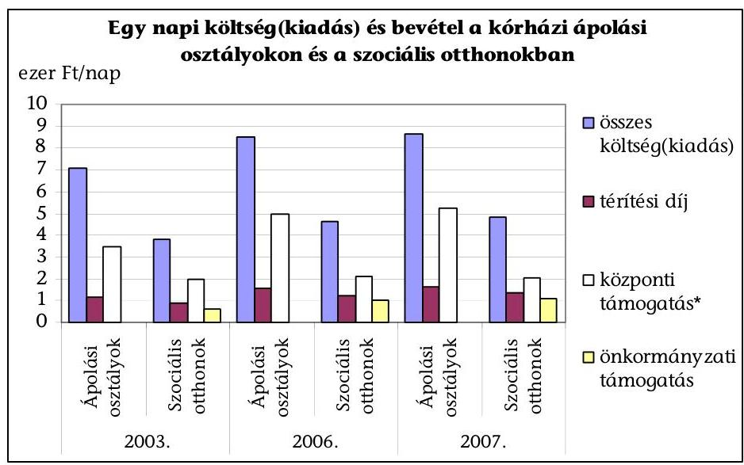

* Az ápolási osztályokon OEP finanszírozás, a szociális otthonoknál a központi költségvetésből - az önkormányzat által igényelt - normatív állami hozzájárulás.
Az ellenőrzött ápolási osztályok összköltsége kisebb mértékben emelkedett, mint az ágyak száma, amelyet a kapacitásemelkedésből eredő költségnövekedés késleltetett megjelenése, valamint a kórházi takarékossági intézkedések együtt eredményeztek. A létszámcsökkentés hatására a vizsgált kórházi ellátások közvetlen költségeinek, illetve a szociális intézményi ellátások múködési kiadásainak összetételében a személyi juttatások és az ahhoz kapcsolódó munkaadókat terhelő járulékok együttes aránya a 2003. és a 2007. évek között csökkent (az ápolási osztályokon 3,7 százalékponttal, a szociális otthonokban 1,9 százalékponttal), azonban továbbra is jelentős ( 70 illetve $68 \%$-os) részarányt képviseltek.

A vizsgált kórházi ápolási osztályokon 2003-2007 között az egy ápolási napra jutó költség az inflációnál kisebb mértékben ( $21,9 \%$-kal), a vizsgált szociális ellátásoknál az egy gondozási napra jutó kiadás azt meghaladó ütemben ( $26,7 \%$-kal) emelkedett. Ennek ellenére a 2007. évben egy napi ellátás az idősek otthonában átlagosan $40 \%$-kal kisebb kimutatott ráfordítással járt, mint ugyanez egy kórházi ápolási osztályon (hospice nélkül). Az eltérés indokoltsága az ellátás eltérő szakmai tartalma, valamint a tényleges ellátási teljesítmények és ráfordítások mindkét ágazatban azonos módszerú mérésének hiányában nem minősíthető.

A térítési díjak mindkét ágazat vizsgált intézményeiben az infláció mértékét meghaladóan, az ápolási osztályokon 39\%-kal, a szociális otthonokban 58,2\%-kal emelkedtek. A szolgáltatások költségének a napi térítési díj 2003-2007 között az ápolási osztályokon (hospice nélkül) 17\%-ról 21\%-ra, a szociális otthonokban 23\%-ról 29\%-ra emelkedő arányát fedezte. A kórházi átlagos napi térítési díj minden vizsgált évben magasabb, mint a szociális otthonokban, de az eltérés kisebb (a 2007. évben $219 \mathrm{Ft} /$ nap), mint a kimutatott ráfordítások közti különbség. A kórházak ápolási naponként 1200-2500 Ft közötti részleges térítési díj fizetését követelték meg, a megemelt térítési díj ellenében nyújtott többletszolgáltatásokat a Térítési dí szabályzatok nem, vagy csak álta-

---

lánosságokban rögzítették, az alkalmazás fő indoka a krónikus ellátás veszteségének csökkentése volt.

Az egy napi ellátás központi támogatása csak a kórházaknál javult, a vizsgált ápolási osztályok OEP finanszírozása átlagosan 51\%-kal emelkedett 2003-2007 között. A szociális otthoni gondozottak alapján az önkormányzatok által igényelhető egy gondozási napra vetített átlagos normatív támogatás fajlagos értéke lényegében nem változott. Az ellátás eltérő szakmai tartalmát is tükrözi, hogy az egy gondozási napra a vizsgált kórházak több mint 150\%-kal magasabb központi (OEP finanszírozás) támogatáshoz jutottak, mint a szociális otthonok, de utóbbiak a fenntartó önkormányzatoktól - intézményfinanszírozás részeként - további rendszeres bevételhez jutottak.

A szociális intézmények ellátási feladatai után járó központi támogatást a fenntartók az egy gondozási napra vetített mutatók alapján a 2003. évben $31 \%$-kal, a 2006. évben $47 \%$-kal, a 2007. évben már 54\%-kal egészítették ki, a vizsgált időszakban a rendszeres önkormányzati támogatás 78,2\%-kal emelkedett. Az intézményfenntartó önkormányzatoknál közvetlen finanszírozási kötelezettség a szociális ellátásoknál jelent meg, míg a kórházak támogatása elsősorban céljellegű volt, azonban a kórházi adósságállomány vonatkozásában az önkormányzatokat tulajdonosi felelősség és kötelezettségek terhelik. A kórházak eladósodása - a tevékenység súlya miatt - az aktív fekvőbeteg ellátás gazdaságosságán múlott, a krónikus ellátás forráshiányos múködtetése önmagában nem okozott kórházi pénzügyi egyensúlytalanságot.

A vizsgált kórházak egyötödénél került sor önkormányzati biztos kirendelésére a felhalmozódott lejárt határidejű tartozás ( 2,8 milliárd Ft) miatt. A kórházak vagy a fenntartó támogatásával tudták lejárt határidejű tartozásaikat csökkenteni (a Salgótarjáni Megyei Kórháznak a fenntartó 170 millió Ft támogatást nyújtott, a Kaposvári Megyei Kórház tartozásainak rendezésére a megyei önkormányzat 300 millió Ft kötvénykibocsátással nyújtott likviditási segítséget), vagy a kórház múködtetési formáját megváltoztatva (Szigetvári Városi Kórház), a Kft-vé átszervezett kórház gazdálkodását 500 millió Ft kötvény kibocsátásával segítették.

A szociális otthonok egy gondozási napjára vetített normatív támogatás a 2003. év és a 2007. év összehasonlításában lényegében nem változott, a központi támogatás aránya 53\%-ról 42\%-ra esett vissza. Az ápolási osztályok egy ápolási napra eső átlagos OEP finanszírozása az inflációt meghaladó mértékben emelkedett, ami összefüggött azzal a szakmapolitikai szándékkal, amely a krónikus ellátások kapacitásainak növelésére, a kórházi struktúra átalakítására irányult. Az egy ápolási napra jutó OEP finanszírozás az ápolási osztályokon (hospice ellátás nélkül) 50\%-ról 66\%-ra emelkedett.

---

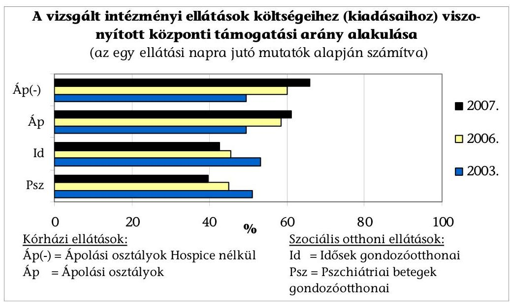

A 2007. évben egy napi ellátás költségei az idősek otthonában átlagosan $44 \%$-kal kisebb központi és önkormányzati együttes támogatással jártak ahhoz képest, mintha az egy kórházi ápolási osztályon történt volna (OEP finanszírozással). Az eltérés négy százalékponttal magasabb annál, mint ami az idősek otthonai fajlagos kiadásai és az ápolási osztályok fajlagos költségei összehasonlításánál mutatkozott.

Az egy ápolási napra vetített összes költség a vizsgált ápolási osztályokon az infláció mértéke alatt, az ellátottak által fizetett térítési díj és az OEP finanszírozás azt meghaladó mértékben emelkedett, a fedezeti arány $66 \%$-ról $87 \%$-ra módosult. A szociális otthonokban az egy gondozási napra jutó kiadás, térítési díj és fenntartói támogatás is az inflációt meghaladó mértékben emelkedett, a központi támogatás nem változott, amelyek együttes következménye a fedezeti arány $92 \%$-ról $93 \%$-ra történő - minimális mértékű - növekedése volt.

A szolgáltatással közvetlenül összefüggésben álló központi, fenntartói támogatás, továbbá a szolgáltatást igénybevevők térítési díjainak együttes összege és a költségek különbözetéből eredő forráshiányt mindkét ágazat intézményei az egyéb támogatásokból, tevékenységi bevételekből finanszírozták, de a kórházak az átmenetileg kiegyenlítetlen kötelezettségeik (szállítók felé fennálló tartozásaik) növelését is felvállalták.

A szolgáltatások pénzügyi fedezettségének megítélése az ellátás nyújtásáért felelősök szempontjából eltérő:

- az ellátást nyújtó intézménynek a kedvezőbb fedezeti arány (bevételek és költségek aránymutatója) elérése (az adott szolgáltatás költségeit minél magasabb mértékben fedezze a kapott térítési díjból, központi és fenntartói támogatásból származó együttes bevétel);
- az államnak és a fenntartónak a csökkenő arányú és az inflációs hatásnál kisebb mértékben növekedő támogatás az önköltséghez viszonyítva.

---

A vizsgált intézmények összesített adatai alapján a 2003-2007. évek között javult a fedezeti arány, amely a kórházaknál többszörösen meghaladta a szociális intézményekben mért változást.
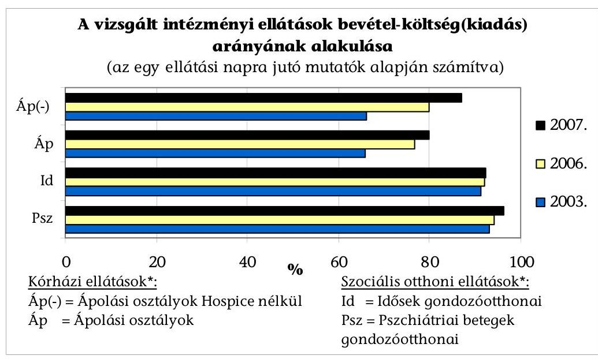

* A kórházi és szociális otthoni ellátásokon belüli megbontást a finanszírozottság és költségigényesség különbözőségei együttes hatásának szemléltetése miatt végeztük el.

A szociális intézményeknél a rendszeres fenntartói támogatás kiadások finanszírozásában való szerepe, és annak egy gondozási napra jutó mértéke (fenntartói kiegészítés aránya) a 2003-2007. évek között átlagosan 16\%-ról $23 \%$-ra emelkedett.

A különböző szociális intézményeknél a fedezeti arányok közötti különbség növekedett. Az idősek otthonainál az egy gondozási napra számított kiadásoknak a 2003. évben $14 \%$-ára, a 2007. évben $19 \%$-ára, a pszichiátriai betegek otthonainál $22 \%$-ára és $31 \%$-ára nyújtott fedezetet a fenntartói támogatás.

Az egy ápolási, illetve gondozási napra vetített mutatók alapján számítva, a vizsgált ellátásokhoz közvetlenül kapcsolódó központi támogatás súlya a szociális intézményeknél 11 százalékponttal csökkent, a kórházak ápolási osztályain az inflációt meghaladó mértékben (16 százalékponttal) növekedett.

Budapest, 2008. július " 24 "

| Melléklet: | 2 db | 2 lap |
| :-- | :-- | :-- |
| Függelék: | 1 db | 12 lap |

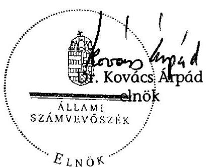

---

# A vizsgált helyi önkormányzatok és szociális intézmények 

| Fenntartó önkormányzat | Szociális intézmény |
| :--: | :--: |
| Fővárosi Önkormányzat | Pszichiátriai Betegek Otthona Budapest |
| Bács-Kiskun Megyei Önkormányzat | Megyei Önkormányzat Időskorúak Otthona Pszichiátriai Betegek Otthona Kiskunhalas |
| Baranya Megyei Önkormányzat | Kastélypark Idősek Otthona Görcsöny |
| Békés Megyei Önkormányzat | Hajnal I. Idősek Otthona Békés |
| Győr-Moson-Sopron Megyei Önkormányzat | Dr. Pirót E. Mentálhigiénés Otthon Táplánypuszta Megyei Önkormányzat Idősek Otthona Jobaháza |
| Nógrád Megyei Önkormányzat | Ezüstfenyő Idősek Otthona Bátonyterenye |
| Somogy Megyei Önkormányzat | Szociális Otthon Tab |
| Szabolcs-Szatmár-Bereg Megyei Önkormányzat | Idősek Szociális Otthona Győrtelek |
| Vas Megyei Önkormányzat | Megyei Önkormányzat Szakosított Intézete Szombathely |
| Debrecen Megyei Jogú Város Önkormányzata | Idősek Otthona Debrecen |
| Székesfehérvár Megyei Jogú Város Önkormányzata | Egyesített Szociális Intézmény Székesfehérvár |
| Miskolc Megyei Jogú Város Önkormányzata | Idősek Otthona Miskolc |

---

# A vizsgált önkormányzati kórházak 

| Rövid név | Intézmény |
| :--: | :--: |
| Megyei Kórház Kecskemét | Bács-Kiskun Megyei Önkormányzat Kórháza, Kecskemét |
| Megyei Kórház Pécs | Baranya Megyei Kórház, Pécs |
| Megyei Kórház Gyula | Békés Megyei Képviselőtestület Pándy Kálmán Kórház, Gyula |
| Megyei Kórház Győr | Megyei Önkormányzat Petz Aladár Megyei Oktató Kórháza, Győr |
| Megyei Kórház Salgótarján | Megyei Önkormányzat Szent Lázár Kórház - Rendelőintézete, Salgótarján |
| Megyei Kórház Kaposvár | Kaposi Mór Oktatókórház, Magyar Református Egyház Mosdósi Tüdő és Szív Kórháza, Kaposvár |
| Megyei Kórház Nyíregyháza | Szabolcs-Szatmár-Bereg Megyei Önkormányzat Jósa A. Kórház Rendelőintézet, Nyíregyháza |
| Megyei Kórház Szombathely | Vas Megye és Szombathely Megyei Jogú Város Markusovszky Kórháza, Szombathely |
| Fővárosi Péterfy S. u. Kórház | Fővárosi Önkormányzat Péterfy S. Utcai Kórház - Rendelőintézete, Budapest |
| Miskolci Egészségügyi Központ | Miskolci Egészségügyi Központ és Egyetemi Oktató Kórház |
| Városi Kórház Szigetvár | Szigetvári Egészségügyi Kft, Szigetvár |
| Városi Kórház Sátoraljaújhely | Városi Önkormányzat Erzsébet Kórház, Sátoraljaújhely |
| Városi Kórház Békéscsaba | Megyei Jogú Város Önkormányzata Réthy Pál Kórház - Rendelőintézet, Békéscsaba |
| Városi Kórház Tata | Árpád-házi Szent Erzsébet Szakkórház és Rendelőintézet, Tata |
| Városi Kórház Balassagyarmat | Dr. Kenessey Albert Kórház - Rendelőintézet Balassagyarmat |
| Városi Kórház Nagyatád | Városi Önkormányzat Kórház - Rendelőintézet, Nagyatád |
| Városi Kórház Kisvárda | Felső - Szabolcsi Kórház, Kisvárda |
| Városi Kórház Nagykörös | Városi Önkormányzat Rehabilitációs Szakkórháza és Rendelőintézet, Nagykörös |

---

# Az ápolási és krónikus utókezelő ágyakkal való ellátottság alakulása megyénként a 2007. decemberi finanszírozás alapjául szolgáló kapacitás alapján 

Országos átlag:
$\square$ Ápolás: 2,5 ágy /tízezer lakos
$\square$ Krónikus utókezelés: 9,0 ágy /tízezer lakos
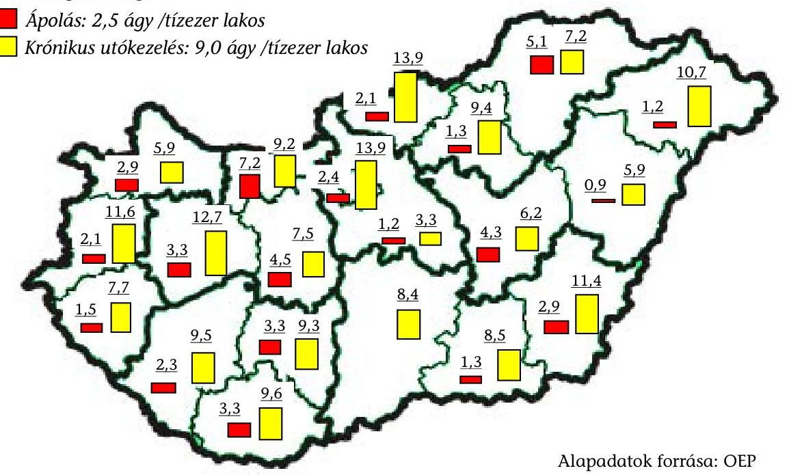

Az időskorúak és a pszichiátriai betegek ellátását biztosító szociális férőhelyekkel való ellátottság alakulása megyénként a 2007. év végére vonatkozó felmérés alapján
Országos átlag:
$\square$ Időskorúak:
50,5 férőhely /tízezer lakos
$\square$ Pszichiátriai betegek:
8,2 férőhely /tízezer lakos
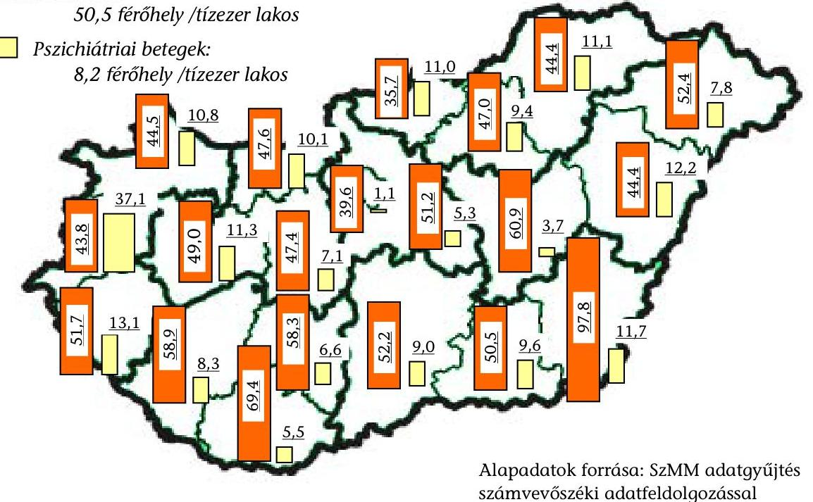

---

# Az aktív kórházi ellátás kapacitása, teljesítménye és finanszírozása főbb adatainak alakulása 2003-2007. évek

|  Év
(finan-
szíro-
zási) | Ágyak
száma
(átlag) | Súlyszám
összeg | Hosszú
nap | Intenzív
hosszú
nap | Finanszí-
rozási
esetszám | Ápolási
nap | Egy
esetre
jutó
nap | Egy
ágyra
jutó
havi
átlagos
súly-
szám
összeg | Egy
ágyra
jutó
eset-
szám
/ hó | Ágy-
kihasz-
náltság | Elszámolt
átlagos
havi teljesít
ménydíj
(E Ft) | Egy
ágyra
jutó
finan-
szíro-
zási
díj/hó
(E Ft)  |
| --- | --- | --- | --- | --- | --- | --- | --- | --- | --- | --- | --- | --- |
|  2003. | 60921 | 2654650 | 308944 | 14699 | 2423714 | 17599736 | 7,26 | 3,63 | 3,32 | 79,1\% | 22151436 | 363,6  |
|  2004. | 60469 | 2622957 | 283965 | 12644 | 2450962 | 17223998 | 7,03 | 3,61 | 3,38 | 77,8\% | 25213585 | 417,0  |
|  2005. | 60350 | 2669819 | 266645 | 13440 | 2514391 | 17135236 | 6,81 | 3,69 | 3,47 | 77,8\% | 28619087 | 474,2  |
|  2006. | 59923 | 2655571 | 235429 | 14149 | 2552133 | 16405457 | 6,43 | 3,69 | 3,55 | 75,0\% | 28943709 | 483,0  |
|  2007. | 52084 | 2328547 | 187313 | 13667 | 2221020 | 13314226 | 5,99 | 3,73 | 3,55 | 70,0\% | 26249244 | 504,0  |

Adatforrás: OEP Készült: ÁSZ-nak megküldött adatok összesítésével

---

# A krónikus ellátás kapacitása, teljesítménye és finanszírozása főbb országos adatai 2003-2007. években (finanszírozási évek) 

| Év | Kimutatott   nap | Elszámolt   nap | Súlyozott   nap | Finanszírozás   (E Ft) | Ágy   (átlag) | Ágykihasz   nálás \%-a | Egy ágyra   jutó fin./hó   (E Ft) |
| :--: | :--: | :--: | :--: | :--: | :--: | :--: | :--: |
| Ápolás |  |  |  |  |  |  |  |
| 2003. | 434807 | 424877 | 384097 | 1325100 | 1401 | 85,03\% | 78,8 |
| 2004. | 453518 | 444473 | 470698 | 1732199 | 1411 | 88,06\% | 102,3 |
| 2005. | 478694 | 467328 | 573783 | 2228410 | 1491 | 87,96\% | 124,5 |
| 2006. | 508103 | 499277 | 588117 | 2463905 | 1625 | 85,67\% | 126,4 |
| 2007. | 584849 | 575403 | 588884 | 2962246 | 2110 | 75,94\% | 117,0 |
| Krónikus utókezelés |  |  |  |  |  |  |  |
| 2003. | 1829147 | 1706985 | 2040895 | 7063448 | 6065 | 82,63\% | 97,1 |
| 2004. | 1835416 | 1724964 | 2322216 | 8699218 | 6074 | 82,79\% | 119,4 |
| 2005. | 1841608 | 1729288 | 2585178 | 10308924 | 6100 | 82,71\% | 140,8 |
| 2006. | 1839104 | 1753373 | 2488035 | 10535149 | 6133 | 82,16\% | 143,1 |
| 2007. | 1998367 | 1910894 | 2286181 | 11541315 | 7663 | 71,45\% | 125,5 |
| Ápolás és krónikus utókezelés együtt |  |  |  |  |  |  |  |
| 2003. | 2263954 | 2131861 | 2424992 | 8388549 | 7466 | 83,08\% | 93,6 |
| 2004. | 2288934 | 2169436 | 2792915 | 10431417 | 7485 | 83,78\% | 116,1 |
| 2005. | 2320302 | 2196615 | 3158961 | 12537334 | 7591 | 83,74\% | 137,6 |
| 2006. | 2347207 | 2252650 | 3076152 | 12999054 | 7758 | 82,89\% | 139,6 |
| 2007. | 2583216 | 2486297 | 2875065 | 14503561 | 9773 | 72,42\% | 123,7 |
|  |  |  |  |  |  |  |  |
| Rehabilitáció |  |  |  |  |  |  |  |
| 2003. | 3807690 | 3639420 | 5537233 | 19150907 | 11638 | 89,64\% | 137,1 |
| 2004. | 3900581 | 3727882 | 6123093 | 22904372 | 11966 | 89,31\% | 159,5 |
| 2005. | 3895004 | 3736909 | 6826274 | 27173851 | 12162 | 87,74\% | 186,2 |
| 2006. | 3892410 | 3773369 | 6421382 | 27206884 | 12254 | 87,03\% | 185,0 |
| 2007. | 4037636 | 3921580 | 5282889 | 27468567 | 14038 | 78,80\% | 163,1 |
| Ápolás, krónikus utókezelés és rehabilitáció összesen |  |  |  |  |  |  |  |
| 2003. | 6071644 | 5771281 | 7962225 | 27539456 | 19104 | 87,07\% | 120,1 |
| 2004. | 6189515 | 5897318 | 8916007 | 33335789 | 19451 | 87,18\% | 142,8 |
| 2005. | 6215306 | 5933524 | 9985235 | 39711185 | 19753 | 86,21\% | 167,5 |
| 2006. | 6239617 | 6026019 | 9497534 | 40205938 | 20012 | 85,42\% | 167,4 |
| 2007. | 6620852 | 6407877 | 8157954 | 41972128 | 23811 | 76,18\% | 146,9 |

Adatforrás: OEP

---

3. számú táblázat

A krónikus ellátás kapacitása, teljesítménye és finanszírozása főbb országos adatai a 2007. első és második félévben (finanszírozási) és a változásmutatók

|  Ellátás- | Időszak | Kimutatott nap | Elszámolt nap | Súlyozott nap | Finanszírozás (E Ft) | Ágy (átlag) | Ágykihaszn. % | Egy ágyra jutó fin./hó (E Ft)  |
| --- | --- | --- | --- | --- | --- | --- | --- | --- |
|  típus |  |  |  |  |  |  |  |   |
|  I. félév |  | 254 544 | 250 275 | 257 027 | 1 247 729 | 1 747 | 79,1% | 119,0  |
|  II. félév |  | 330 305 | 325 128 | 331 857 | 1 714 517 | 2 472 | 71,5% | 115,6  |
|  Vált.%-a |  | 129,8 | 129,9 | 129,1 | 137,4 | 141,5 | 90,3% | 97,1  |
|  I. félév |  | 874 313 | 834 177 | 997 358 | 4 873 427 | 6 214 | 77,7% | 130,7  |
|  II. félév |  | 1 124 054 | 1 076 717 | 1 288 824 | 6 667 888 | 9 103 | 67,1% | 122,1  |
|  Vált.%-a |  | 128,6 | 129,1 | 129,2 | 136,8 | 146,5 | 86,3% | 93,4  |
|  I. félév |  | 1 128 857 | 1 084 452 | 1 254 385 | 6 121 156 | 7 961 | 78,3% | 128,2  |
|  II. félév |  | 1 454 359 | 1 401 845 | 1 620 681 | 8 382 405 | 11 575 | 68,3% | 120,7  |
|  Vált.%-a |  | 128,8 | 129,3 | 129,2 | 136,9 | 145,4 | 87,2% | 94,2  |
|  I. félév |  | 1 868 557 | 1 818 767 | 2 444 379 | 12 322 860 | 12 483 | 82,7% | 164,5  |
|  II. félév |  | 2 169 079 | 2 102 813 | 2 838 510 | 15 145 707 | 15 602 | 75,6% | 161,8  |
|  Vált.%-a |  | 116,1 | 115,6 | 116,1 | 122,9 | 125,0 | 91,4% | 98,3  |
|  I. félév |  | 2 997 414 | 2 903 219 | 3 698 763 | 18 444 016 | 20 443 | 81,0% | 150,4  |
|  II. félév |  | 3 623 438 | 3 504 658 | 4 459 191 | 23 528 112 | 27 177 | 72,5% | 144,3  |
|  Vált.%-a |  | 120,9 | 120,7 | 120,6 | 127,6 | 132,9 | 89,5% | 96,0  |

I. félév finanszírozását megalapozó teljesítmény időszak: 2006. 10. hótól 2007. 03. hóig II. félév finanszírozását megalapozó teljesítmény időszak: 2007. 04. hótól 2007. 09. hóig Változás: második félév/első félév

---

# Az ellenőrzött kórházak müködő ápolási, hospice osztályainak, valamint krónikus utókezelő szervezeti egységeinek kapacitása, ellátási teljesítményei 

## Záró ágyszámok alakulása

| Ápolási osztályok |  | 2003. |  | 2006. |  | 2007. |  |
| :--: | :--: | :--: | :--: | :--: | :--: | :--: | :--: |
|  |  | Ágy | Osztály | Ágy | Osztály | Ágy | Osztály |
| Megyei | Ápolás(hospice nélkül) | 190 | 6 | 203 | 6 | 247 | 7 |
| Kórházak | Hocpice | 20 | 1 | 35 | 2 | 25 | 2 |
| Városi | Ápolás(hospice nélkül) | 100 | 4 | 189 | 6 | 219 | 6 |
| Kórházak | Hocpice | 20 | 1 | 20 | 1 | 35 | 2 |
| Együtt | Ápolás(hospice nélkül) | 290 | 10 | 392 | 12 | 466 | 13 |
|  | Hocpice | 40 | 2 | 55 | 3 | 60 | 4 |
|  | Össz.: | 330 | 12 | 447 | 15 | 526 | 17 |

| Krónikus utókezelők | 2003. |  | 2006. |  | 2007. |  |
| :--: | :--: | :--: | :--: | :--: | :--: | :--: |
|  | Ágy | Szerv.egys. | Ágy | Szerv.egys. | Ágy | Szerv.egys. |
| Megyei+Fővárosi Kórházak | 1418 | 33 | 1417 | 32 | 1641 | 33 |
| Városi Kórházak | 346 | 9 | 360 | 9 | 627 | 15 |
| Együtt: | 1764 | 42 | 1777 | 41 | 2268 | 48 |

## Teljesített ápolási nap, súlyozott ápolási nap és ágykihasználtság

(ápolási nap/átlagos ágyszám*365)

|  |  |  |  |  | Változás: |  |
| :--: | :--: | :--: | :--: | :--: | :--: | :--: |
| Ápolási osztályok | 2003. | 2006. | 2007. | 06/03.\% | 07/06.\% | 07/03.\% |
| Ápolási nap | 106320 | 123440 | 147225 | 116,1 | 119,3 | 138,5 |
| Súlyozott áp. nap | 93371 | 137273 | 147375 | 147,0 | 107,4 | 157,8 |
|  |  |  |  | 06-03.\%p | 07-06.\%p | 07-03.\%p |
| Ágykihaszn. \% | 92,8 | 80,3 | 79,4 | $-12,5 \%$ p. | $-0,9 \%$ p. | $-13,4 \%$ p. |

|  |  |  |  |  | Változás: |  |
| :--: | :--: | :--: | :--: | :--: | :--: | :--: |
| Krónikus utókezelők | 2003. | 2006. | 2007. | 06/03.\% | 07/06.\% | 07/03.\% |
| Ápolási nap | 495964 | 513625 | 572034 | 103,6 | 111,4 | 115,3 |
| Súlyozott áp. nap | 578154 | 663494 | 671512 | 114,8 | 101,2 | 116,1 |
|  |  |  |  | 06-03.\%p | 07-06.\%p | 07-03.\%p |
| Ágykihaszn. \% | 77,8 | 82,7 | 73,8 | 4,9 | $-8,9$ | $-4,0$ |

---

# Az ellenőrzött kórházak múködő ápolási és a krónikus utókezelő ágyaihoz kapcsolódó betegforgalom, valamint az ápolási osztályok költségeinek összetétele (\%-os megoszlás) és annak változása 

## Betegforgalom összetétele és annak változása:

|  |  |  |  |  | Változás: |  |
| :--: | :--: | :--: | :--: | :--: | :--: | :--: |
| Ápolási osztályok | 2003. | 2006. | 2007. | 06-03.\%p | 07-06.\%p | 07-03.\%p |
| Elbocsátott (kiírt) betegek | 100,0 | 100,0 | 100,0 |  |  |  |
| Ebből: otthonába táv. | 41,6 | 34,3 | 43,2 | $-7,3$ | 8,9 | 1,6 |
| szoc.otthonba felv. | 8,2 | 8,7 | 7,0 | 0,6 | $-1,8$ | $-1,2$ |
| más osztályra áth. | 15,5 | 15,3 | 14,8 | $-0,2$ | $-0,5$ | $-0,7$ |
| meghalt | 34,2 | 40,9 | 34,5 | 6,6 | $-6,4$ | 0,3 |
| Felvett betegek | 100,0 | 100,0 | 100,0 | 0,0 | 0,0 | 0,0 |
| Ebből: háziorvosi beutalóval | 31,5 | 40,1 | 43,8 | 8,5 | 3,7 | 12,2 |
| más osztályról áthely. | 52,6 | 46,3 | 40,0 | $-6,2$ | $-6,3$ | $-12,5$ |

|  |  |  |  |  | Változás: |  |
| :--: | :--: | :--: | :--: | :--: | :--: | :--: |
| Krónikus utókezelők | 2003. | 2006. | 2007. | 06-03.\%p | 07-06.\%p | 07-03.\%p |
| Elbocsátott (kiírt) betegek | 100,0 | 100,0 | 100,0 |  |  |  |
| Ebből: otthonába táv. | 57,8 | 56,5 | 60,9 | $-1,3$ | 4,4 | 3,1 |
| szoc.otthonba felv. | 3,1 | 3,1 | 3,1 | 0,0 | 0,0 | 0,0 |
| más osztályra áth. | 15,5 | 13,0 | 12,8 | $-2,5$ | $-0,2$ | $-2,7$ |
| meghalt | 23,1 | 25,5 | 22,2 | 2,4 | $-3,3$ | $-0,9$ |
| Felvett betegek | 100,0 | 100,0 | 100,0 |  |  |  |
| Ebből: háziorvosi beutalóval | 17,6 | 17,5 | 30,4 | $-0,1$ | 12,9 | 12,8 |
| más osztályról áthely. | 65,2 | 64,0 | 50,3 | $-1,2$ | $-13,7$ | $-14,9$ |

## Az ápolási osztályok költségeinek összetétele és annak változása:

|  |  |  |  |  | Változás: |  |
| :--: | :--: | :--: | :--: | :--: | :--: | :--: |
| Ápolási osztályok | 2003. | 2006. | 2007. | 06-03.\%p | 07-06.\%p | 07-03.\%p |
| Közvetlen/összktg.\% | 74,4 | 75,9 | 79,9 | 1,5 | 4,0 | 5,5 |
| Személyi/közvetlen ktg.\% | 73,8 | 73,6 | 70,1 | $-0,2$ | $-3,5$ | $-3,7$ |
| Dologi/közvetlen ktg.\% | 22,0 | 21,8 | 24,4 | $-0,2$ | 2,6 | 2,4 |
| Gyógyszer/dologi \% | 16,8 | 17,6 | 14,7 | 0,7 | $-2,9$ | $-2,1$ |

---

# Az ellenőrzött szociális intézményekben elhelyezésre várók és elhelyezettek adatai (\%-os megoszlás) és annak változása 

## Várakozók és elhelyezettek adatai és annak változása:

|  |  |  |  | Változás: |
| :--: | :--: | :--: | :--: | :--: |
| Idősek otthona | 2003. | 2006. | 2007. | $07-06 . \% p$ |
| Tárgyévben elhelyezettek |  | 100,0 | 100,0 |  |
| Ebből: egy évnél kevesebb ideje várakozott |  | 58,2 | 58,5 | 0,3 |
| 1-2 éve várakozott |  | 26,9 | 26,1 | $-0,8$ |
| 3-5 éve várakozott |  | 12,4 | 10,7 | $-1,7$ |
| 5 évnél régebben várakozott |  | 2,5 | 4,7 | 2,2 |
| Tárgyévben felvettekből alapszolgáltatásban részesült |  | 19,1 | 18,4 | $-0,7$ |
| Tárgyévben felvettekből átmeneti ellátásban részesült |  | 10,6 | 15,9 | 5,3 |
| Tárgyévben kórházból felvettek |  | 27,1 | 24,2 | $-2,9$ |

|  |  |  |  | Változás: |
| :--: | :--: | :--: | :--: | :--: |
| Pszichiátriai otthonok | 2003. | 2006. | 2007. | $07-06 . \% p$ |
| Tárgyévben elhelyezettek |  | 100,0 | 100,0 |  |
| Ebből: egy évnél kevesebb ideje várakozott |  | 38,3 | 31,8 | $-6,5$ |
| 1-2 éve várakozott |  | 24,3 | 31,8 | 7,5 |
| 3-5 éve várakozott |  | 29,0 | 24,5 | $-4,5$ |
| 5 évnél régebben várakozott |  | 8,4 | 11,8 | 3,4 |
| Tárgyévben felvettekből alapszolgáltatásban részesült |  | 7,5 | 1,8 | $-5,7$ |
| Tárgyévben felvettekből átmeneti ellátásban részesült |  | 2,8 | 3,6 | 0,8 |
| Tárgyévben kórházból felvettek |  | 36,4 | 30,9 | $-5,5$ |

---

# Az ellenőrzött kórházak múködő ápolási, hospice ágyaihoz kapcsolódó fajlagos költség és bevétel alakulása 

## Az egy ápolási napra jutó költség alakulása:

ezer Ft/ápolási nap

|  |  |  |  |  | Változás: |  |
| :--: | :--: | :--: | :--: | :--: | :--: | :--: |
|  | 2003. | 2006. | 2007. | 06/03.\% | 07/06.\% | 07/03.\% |
| Ápolás (hospice nélkül) |  |  |  |  |  |  |
| Összes költség | 6,98 | 7,82 | 7,60 | 112,0 | 97,3 | 109,0 |
| Ebből: közvetlen ktg. | 5,13 | 5,87 | 6,05 | 114,3 | 103,2 | 118,0 |
| Hospice |  |  |  |  |  |  |
| Összes költség | 7,94 | 13,19 | 18,26 | 166,1 | 138,4 | 229,9 |
| Ebből: közvetlen ktg. | 6,51 | 10,48 | 14,79 | 161,0 | 141,1 | 227,2 |
| Ápolási osztályok össz. |  |  |  |  |  |  |
| Összes költség | 7,07 | 8,47 | 8,62 | 119,7 | 101,9 | 121,9 |
| Ebből: közvetlen ktg. | 5,26 | 6,43 | 6,89 | 122,0 | 107,2 | 130,9 |

## Az egy ápolási napra jutó átlagos OEP finanszírozás és térítési díj alakulása:

évenként a pénzforgalom szerint teljesült bevétel alapján ezer Ft/ápolási nap

|  |  |  |  |  | Változás: |  |
| :--: | :--: | :--: | :--: | :--: | :--: | :--: |
| OEP finanszírozás | 2003. | 2006. | 2007. | 06/03.\% | 07/06.\% | 07/03.\% |
| Ápolási osztályok | 3,50 | 4,95 | 5,27 | 141,4 | 106,5 | 150,6 |
| Ápolási osztályok hospice   nélkül | 3,46 | 4,69 | 5,00 | 135,5 | 106,6 | 144,5 |

|  |  |  |  |  | Változás: |  |
| :--: | :--: | :--: | :--: | :--: | :--: | :--: |
| Térítési díj | 2003. | 2006. | 2007. | 06/03.\% | 07/06.\% | 07/03.\% |
| Ápolási osztályok hospice   nélkül | 1,16 | 1,55 | 1,61 | 133,6 | 103,9 | 138,8 |

---

# Az ellenőrzött szociális intézmények ellátási tevékenységéhez kapcsolódó fajlagos kiadás és bevétel alakulása 

## Az egy gondozási napra jutó kiadás alakulása:

ezer Ft/gondozási nap

|  |  |  |  |  | Változás: |  |
| :--: | :--: | :--: | :--: | :--: | :--: | :--: |
|  | 2003. | 2006. | 2007. | 06/03.\% | 07/06.\% | 07/03.\% |
| idösek otthona |  |  |  |  |  |  |
| Összes kiadás | 3,69 | 4,52 | 4,60 | 122,5 | 101,8 | 124,7 |
| Ebből: múködési kiadás | 3,57 | 4,38 | 4,52 | 122,7 | 103,2 | 126,6 |
| Pszichiátriai otthonok |  |  |  |  |  |  |
| Összes kiadás | 4,14 | 4,96 | 5,51 | 119,8 | 111,1 | 133,1 |
| Ebből: múködési kiadás | 4,06 | 4,67 | 4,72 | 115,0 | 101,1 | 116,3 |
| Szoc. intézmények össz. |  |  |  |  |  |  |
| Összes kiadás | 3,81 | 4,63 | 4,82 | 121,5 | 104,1 | 126,5 |
| Ebből: múködési kiadás | 3,69 | 4,46 | 4,57 | 120,9 | 102,5 | 123,8 |

Az egy gondozási napra jutó normatív támogatás, fenntartói hozzájárulás és térítési díj alakulása:
évenként a pénzforgalom szerint teljesült bevétel alapján ezer Ft/gondozási nap

|  |  |  |  |  | Változás: |  |
| :--: | :--: | :--: | :--: | :--: | :--: | :--: |
| Normatív támogatás | 2003. | 2006. | 2007. | 06/03.\% | 07/06.\% | 07/03.\% |
| idösek otthona | 1,97 | 2,06 | 1,96 | 104,6 | 95,1 | 99,5 |
| Pszichiátriai otthonok | 2,11 | 2,23 | 2,19 | 105,7 | 98,2 | 103,8 |
| Szoc. intézmények össz. | 2,00 | 2,11 | 2,02 | 105,5 | 95,7 | 101,0 |

|  |  |  |  |  | Változás: |  |
| :--: | :--: | :--: | :--: | :--: | :--: | :--: |
| Fenntartói hozzájárulás | 2003. | 2006. | 2007. | 06/03.\% | 07/06.\% | 07/03.\% |
| idösek otthona | 0,51 | 0,89 | 0,86 | 174,5 | 96,6 | 168,6 |
| Pszichiátriai otthonok | 0,91 | 1,29 | 1,19 | 141,8 | 92,2 | 130,8 |
| Szoc. intézmények össz. | 0,61 | 1,00 | 0,94 | 163,9 | 94,0 | 154,1 |
|  |  |  |  |  |  |  |
|  |  |  |  |  | Változás: |  |
| Térítési díj | 2003. | 2006. | 2007. | 06/03.\% | 07/06.\% | 07/03.\% |
| idösek otthona | 0,89 | 1,21 | 1,41 | 136,0 | 116,5 | 158,4 |
| Pszichiátriai otthonok | 0,84 | 1,14 | 1,35 | 135,7 | 118,4 | 160,7 |
| Szoc. intézmények össz. | 0,88 | 1,19 | 1,39 | 135,2 | 116,8 | 158,0 |

---

Az ellenőrzött kórházakban az időszakok végén az ápolási, hospice osztályokon kimutatott orvos és ápoló létszám tízenöt ágyra vetített mutatója (fő/tízenöt ágy)

|  |  |  |  |  | Változás: |  |
| :-- | :--: | :--: | :--: | :--: | :--: | :--: |
|  | 2003. | 2006. | 2007. | $06 / 03 . \%$ | $07 / 06 . \%$ | $07 / 03 . \%$ |
| Ápolás (hospice nélkül) |  |  |  |  |  |  |
| Ápoló | 8,0 | 7,3 | 7,1 | 91,3 | 97,3 | 88,8 |
| Hospice |  |  |  |  |  |  |
| Orvos | 0,9 | 1,1 | 1,1 | 122,2 | 100,0 | 122,2 |
| Ápoló | 11,6 | 11,9 | 10,7 | 102,6 | 89,9 | 92,2 |
| Ápolási osztályok össz. |  |  |  |  |  |  |
| Orvos | 0,2 | 0,1 | 0,2 | 50,0 | 200,0 | 100,0 |
| Ápoló | 8,4 | 7,8 | 7,5 | 92,9 | 96,2 | 89,3 |

Az ellenőrzött szociális intézményekben az ápoló-gondozó létszám alakulása, tízenöt férőhelyre vetített mutatója (fő/tízenöt férőhely)

|  |  |  |  |  | Változás: |  |
| :-- | :--: | :--: | :--: | :--: | :--: | :--: |
|  | 2003. | 2006. | 2007. | $06 / 03 . \%$ | $07 / 06 . \%$ | $07 / 03 . \%$ |
| idősek otthona |  |  |  |  |  |  |
| ápoló-gondozó átlaglétszám | 706 | 728 | 727 | 103,1 | 99,9 | 103,0 |
| 15 férőhelyre jutó ápoló | 4,0 | 4,2 | 4,1 | 105,0 | 97,6 | 102,5 |
| Egy ápolóra jutó ellátott | 3,6 | 3,5 | 3,6 | 97,2 | 102,9 | 100,0 |
| Pszichiátriai otthonok |  |  |  |  |  |  |
| ápoló-gondozó átlaglétszám | 207 | 231 | 223 | 111,6 | 96,5 | 107,7 |
| 15 férőhelyre jutó ápoló | 3,6 | 3,9 | 3,7 | 108,3 | 94,9 | 102,8 |
| Egy ápolóra jutó ellátott | 4,1 | 3,8 | 4,0 | 92,7 | 105,3 | 97,6 |
| Szoc. intézmények össz. |  |  |  |  |  |  |
| ápoló-gondozó átlaglétszám | $\mathbf{9 1 3}$ | $\mathbf{9 5 9}$ | $\mathbf{9 5 0}$ | $\mathbf{1 0 5 , 0}$ | $\mathbf{9 9 , 1}$ | $\mathbf{1 0 4 , 1}$ |
| 15 férőhelyre jutó ápoló | $\mathbf{3 , 9}$ | $\mathbf{4 , 1}$ | $\mathbf{4 , 0}$ | $\mathbf{1 0 5 , 1}$ | $\mathbf{9 7 , 6}$ | $\mathbf{1 0 2 , 6}$ |
| Egy ápolóra jutó ellátott | $\mathbf{3 , 7}$ | $\mathbf{3 , 6}$ | $\mathbf{3 , 7}$ | $\mathbf{9 7 , 3}$ | $\mathbf{1 0 2 , 8}$ | $\mathbf{1 0 0 , 0}$ |

A vizsgált szociális intézmények kiadásainak összetétele és annak változása:

|  |  |  |  |  | Változás: |  |
| :-- | :--: | :--: | :--: | :--: | :--: | :--: |
| Szoc. intézmények össz. | 2003. | 2006. | 2007. | $06-03 . \%$ p | $07-06 . \%$ p | $07-03 . \%$ p |
| összes kiadás/múködési kiadás\% | 96,8 | 96,3 | 94,8 | $-0,5$ | $-1,5$ | $-2,0$ |
| Személyi/múködési kiadás\% | 69,5 | 69,8 | 67,6 | 0,3 | $-2,2$ | $-1,9$ |
| Dologi/múködési kiadás\% | 30,5 | 30,7 | 32,4 | 0,2 | 1,7 | 1,9 |
| Gyógyszer/dologi \% | 6,3 | 5,9 | 5,9 | $-0,4$ | 0,0 | $-0,4$ |

---

Az időskorúak otthona és pszichiátriai otthonok engedélyezett férőhelye összesen az intézmény típusa szerint, területi egységenként (2003., 2006. és 2007. évek)

| Területi egység (megye, régió) | Időskorúak | Pszichiátriai betegek | összesen | Időskorúak | Pszichiátriai betegek | összesen | Időskorúak | Pszichiátriai betegek | összesen |
| :--: | :--: | :--: | :--: | :--: | :--: | :--: | :--: | :--: | :--: |
|  | 2003. év |  |  | 2006. év |  |  | 2007. év* |  |  |
| Összesen | 43380 | 7833 | 51213 | 48818 | 8068 | 56886 | 50825 | 8275 | 59100 |
| Dásli: |  |  |  |  |  |  |  |  |  |
| Budapest | 6931 | 1298 | 8229 | 7780 | 1239 | 9019 | 6717 | 186 | 6903 |
| Pest | 4555 | 440 | 4995 | 5307 | 534 | 5841 | 6025 | 624 | 6649 |
| Közép-Magyarország | 11486 | 1738 | 13224 | 13087 | 1773 | 14860 | 12742 | 810 | 13552 |
| Tejér | 1274 | 205 | 1479 | 1588 | 205 | 1793 | 2034 | 305 | 2339 |
| Komárom-Esztergom | 1282 | 207 | 1489 | 1445 | 207 | 1652 | 1500 | 317 | 1817 |
| Veszprém | 1394 | 255 | 1649 | 1723 | 255 | 1978 | 1782 | 411 | 2193 |
| Közép-Dunántúl | 3950 | 667 | 4617 | 4756 | 667 | 5423 | 5316 | 1033 | 6349 |
| Győr-Moson-Sopron | 1644 | 490 | 2134 | 2001 | 490 | 2491 | 1971 | 480 | 2451 |
| Vas | 874 | 225 | 1099 | 967 | 222 | 1189 | 1153 | 977 | 2130 |
| Zala | 1247 | 272 | 1519 | 1524 | 278 | 1802 | 1516 | 385 | 1901 |
| Nyugat-Dunántúl | 3765 | 987 | 4752 | 4492 | 990 | 5482 | 4640 | 1842 | 6482 |
| Baranya | 2522 | 190 | 2712 | 2776 | 215 | 2991 | 2763 | 219 | 2982 |
| Somogy | 1446 | 295 | 1741 | 1431 | 295 | 1726 | 1934 | 273 | 2207 |
| Tolna | 1070 | 170 | 1240 | 1258 | 190 | 1448 | 1405 | 158 | 1563 |
| Dél-Dunántúl | 5038 | 655 | 5693 | 5465 | 700 | 6165 | 6102 | 650 | 6752 |
| Borsod-Abaúj-Zemplén | 2876 | 805 | 3681 | 3053 | 810 | 3865 | 3189 | 800 | 3989 |
| Heves | 1224 | 350 | 1574 | 1473 | 350 | 1823 | 1502 | 300 | 1802 |
| Nögrád | 739 | 224 | 963 | 755 | 210 | 965 | 760 | 235 | 995 |
| Észak-Magyarország | 4839 | 1379 | 6218 | 5281 | 1370 | 6651 | 5451 | 1335 | 6786 |
| Hajdú-Bihar | 2185 | 687 | 2872 | 2450 | 672 | 3122 | 2420 | 667 | 3087 |
| Jász-Nagykun-Szolnok | 2141 | 243 | 2384 | 2322 | 277 | 2599 | 2460 | 150 | 2610 |
| Szabolcs-Szatmár-Bereg | 2495 | 400 | 2895 | 2887 | 457 | 3344 | 3019 | 447 | 3466 |
| Észak-Alföld | 6821 | 1330 | 8151 | 7659 | 1406 | 9065 | 7899 | 1264 | 9163 |
| Bács-Kiskun | 2382 | 245 | 2627 | 2655 | 290 | 2945 | 2799 | 485 | 3284 |
| Békés | 2929 | 425 | 3354 | 3144 | 425 | 3569 | 3736 | 448 | 4184 |
| Csongrád | 2170 | 407 | 2577 | 2279 | 447 | 2726 | 2140 | 408 | 2548 |
| Dél-Alföld | 7481 | 1077 | 8558 | 8078 | 1162 | 9240 | 8675 | 1341 | 10016 |

*Megjegyzés: Az SZMM 2008. februárjában végzett adatgyűjtésének feldolgozása alapján

---

### **A szociális szolgáltatások mutatószámai és normatív állami hozzájárulása a 2007. évben**

|  SZOLGÁLTATÁS NEVE | Normatív és árszegy a 2007. évi költségvetési törvény szerint |  |  |  |  |  |  |  |  |  |  |  |  |  |  |  |  |  |  |  |  |  |  |  |  |  |  |  |  |  |  |  |  |  |  |  |  |  |  |  |  |  |  |  |  |  |  |  |  |  |  |  |  |  |  |  |  |  |  |  |  |  |  |  |  |  |  |  |  |  |  |  |  |  |  |  |  |  |  |  |  |  |  |  |  |  |  |  |  |  |  |  |  |  |  |  |  |  |  |  | 

---

# ÖNKORMÁNYZATI MINISZTER 

Iktatószám: ÖTM/
12008.
Dr. Kovács Árpád úr részére, elnök

## Állami Számvevőszék

## Budapest

## Tisztelt Elnök Úr!

Az önkormányzati kórházak és bentlakásos szociális intézmények ápolásra, gondozásra fordított pénzeszközei felhasználásának ellenőrzéséről készített számvevőszéki Jelentés megküldését köszönettel vettem, az abban foglaltakkal kapcsolatban az alábbiakat jegyzem meg.

Dr. Bujdosó Sándor szakállamtitkár úr a Jelentés korábban megküldött tervezetére vonatkozóan észrevételként jelezte, hogy a tavalyi évben az egészségügyi struktúraváltással kapcsolatos többletköltségek finanszirozásához a Kormány támogatást nyújtott a helyi önkormányzatoknak, illetve többcélú kistérségi társulásoknak. Elnök Úr kísérő levelében jelezte, hogy ezen észrevételek figyelembe vételre kerültek, azonban a Jelentés szövegébe tapasztalatunk szerint nem kerültek beépítésre, így ennek pótlását javasolom.

Bízva további eredményes együttműködésünkben, munkájukhoz további sok sikert kivánok.

Budapest, 2008. július „ $\mathrm{P} \mathrm{\zeta}$ ".
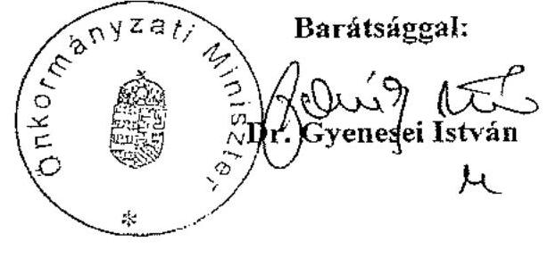

---

# 2. számú melléklet 

a V-1012/2007-08. számú jelentéshe:

## Dr. Gyenesei István úr

miniszter
Önkormányzati Minisztérium
Budapest

## Tisztelt Miniszter Úr!

Az önkormányzati kórházak és bentlakásos szociális intézmények ápolásra, gondozásra fordított pénzeszközei felhasználásának ellenőrzéséről készített jelentés-tervezetre tett észrevételét megköszönöm és ezzel kapcsolatosan az alábbiakról tájékoztatom.

A korábbi munkaközi egyeztetés során Dr. Bujdosó Sándor szakállamtitkár valóban észrevételezte, hogy a jelentéstervezetben nem szerepel az egészségügyi struktúraváltásból fakadó többletköltségekre a Kormány által a helyi önkormányzatoknak nyújtott támogatás. Az észrevételt ezúton is megköszönve tájékoztatom, hogy a vizsgálat célja az ápolási, gondozási igények kielégítésére tett intézkedések, a kórházi struktúraátalakítása során a krónikus ellátás, a szociális szolgáltatások megszervezése eredményességének értékelése volt a jelentésben szereplő helyszíneken. A vizsgálati célokkal összhangban a helyszíni vizsgálat nem terjedt ki az észrevételezett támogatás felhasználásának ellenőrzésére, valamint a jelzett információ relevanciája sem indokolta, hogy az a jelentés szövegébe pótlólag beépítésre kerüljön.

Végezetül tájékoztatom Miniszter urat, hogy az ellenőrzésről készített jelentést - kialakított gyakorlatunk szerint - az Ön észrevételével és az arra adott válaszommal együtt hozzuk nyilvánosságra.

Budapest, 2008. július " $23^{\prime \prime}$.

Tisztelettel:
Postózura
2008.07.24. 01
Dr. Kovács Árpád

---

# Szociális és Munkaügyi Minisztérium Miniszter 

Ikt. szám: 14542-1/2008-016SZFŐ

Dr. Kovács Árpád elıök úr Állami Számvevőszék

Budapest 4.
Pf. 54.
1364

Tárgy: a megküldött jelentés véleményezése

## Tisztelt Elnök Úr!

Az Állami Számvevőszék Jelentés az önkormányzati kórházak és bentlakásos szociális intézmények ápolásra, gondozásra forditott pénzeszközei felhasználásának ellenőrzéséről címủ dokumentumát kézhez kaptam.
Ezúton köszönöm a jelentés készítése során tanúsított együttmüködésüket, és észrevételeink figyelembe vételét. Az ellenőrzés megállapításaihoz további észrevételeket nem kívánunk füzni.

További sikeres munkát kívánok.

Budapest, 2008. július „"

## Üdvözlettel:

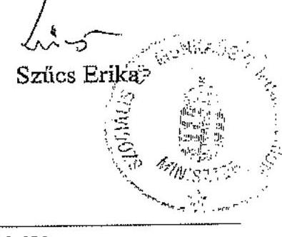

---

# EGÉSZSÉGÜGYI MINISZTÉRIUM MINISZTER 

Dr. Kovács Árpád úrnak
Ikt. Sz.: 10446- 3 /2008-0100EGPSZ
elnök

## Állami Számvevőszék

## Budapest

Pf.: 54 .
1364

## Tisztelt Elnök Úr!

2008. július 3-án megküldött - „Az önkormányzati kórházak és bentlakásos szociális intézmények ápolásra, gondozásra fordított pénzeszközei felhasználásának ellenőrzéséről" készitett - ÁSZ Jelentést köszönettel megkaptam.

A Jelentést áttanulmányozva, az abban szereplő megállapításokat, illetve minden - az egészségügyi tárcát érintő - javaslatot elfogadom.

Budapest, 2008. július " $\Delta$ ".
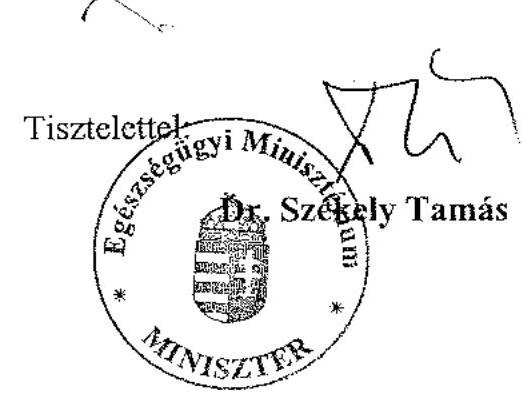

---

H-1051 BUDAPEST V., JÓZSEF NÁDOR TÉR 2-4. POSTACIM: 1369 BUDAPEST, POSTAFIÓK 481.

TELEFON: (36-1) 327-2159, (36-1) 327-2141
FAX: (36-1) 318-0738
PÉNZÜGYMINISZTER

Dr. Kovács Árpád úr részére
elnök
Állami Számvevőszék
Budapest

Iktatószám:
$9142 / 20081 / 4$

Tisztelt Elnök Úr!

Az önkormányzati kórházak és bentlakásos szociális intézmények ápolásra, gondozásra fordított pénzeszközei felhasználásának vizsgálatáról készült Jelentést köszönettel megkaptam, az abban foglalt megállapításokkal, javaslatokkal egyetértek.

Budapest, 2008. július 11.
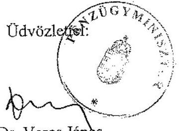